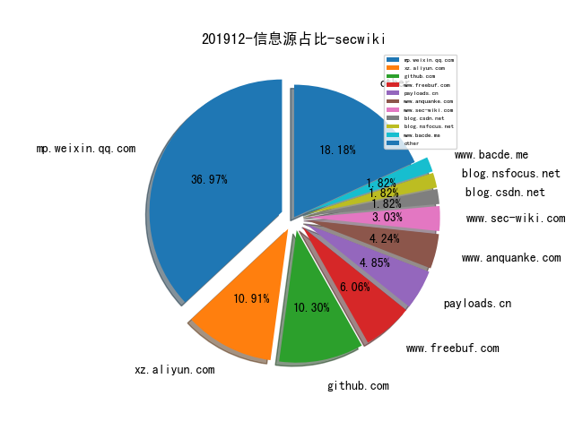
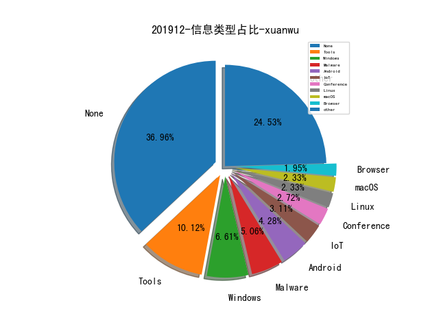

# [数据年报](README_YEAR.md)
# [数据月报-11月](README_11.md)
# [数据月报-10月](README_10.md)
# [数据月报-9月](README_9.md)
# [数据月报-8月](README_8.md)
# [数据月报-7月](README_7.md)
# [数据月报-6月](README_6.md)
# [数据月报-5月](README_5.md)
# [数据月报-4月](README_4.md)
# [数据月报-3月](README_3.md)
# 201912 信息源与信息类型占比

# 微信公众号 推荐
| nickname_english | weixin_no | title | url| 
| --- | --- | --- | ---| 
| 穿过丛林 |  | DARPA HIVE计划及其最新进展 | https://mp.weixin.qq.com/s/_lzrhylYo9Z941ChqIgJIQ | 1| 
| 腾讯御见威胁情报中心 |  | “海莲花”(OceanLotus)组织2019年针对中国大陆的攻击活动汇总 | https://mp.weixin.qq.com/s/OA09fndsHfpLVxeo7DnjYg | 1| 
| FreeBuf | freebuf | 2010年以来重大网络安全事件盘点 | https://mp.weixin.qq.com/s/kv64D0fqBwJ3J3pkDFqI3A | 1| 
| 赵武的自留地 |  | 网络空间测绘的生与死（三） | https://mp.weixin.qq.com/s/jffEOTF3n028USQujIzmmw | 1| 
| Docker | dockerone | Kubernetes 下零信任安全架构分析 | https://mp.weixin.qq.com/s/WybnFRHiGy1joLFyQyba0g | 1| 
| 牵着蜗牛遛弯儿 | lau_cyun | 浅谈工控CTF中网络数据分析的思路 | https://mp.weixin.qq.com/s/bR1t53-YHSKWmFawT5t0Kg | 1| 
| TideSec安全团队 | TideSec | 一文解密所有WebLogic密文 | https://mp.weixin.qq.com/s/HY0X3koYVEIotYIQZi680w | 1| 
| 云众可信 | yunzhongkexin | 原创干货 | 【工具分享】AssetScan内网脆弱面分析工具 | https://mp.weixin.qq.com/s/dCP3PsjZYDY0f2wJX4dC4w | 1| 
| 时间之外沉浮事 | tasnrh | 靶场发展态势⑤美国防部企业级赛博靶场环境（DECRE） | https://mp.weixin.qq.com/s/mAeld9GbLN9Ps-M5wgelfw | 2| 
| 维他命安全 | VitaminSecurity | 卡巴斯基2019年Q3垃圾邮件与钓鱼攻击报告 | https://mp.weixin.qq.com/s/JE5J6misSPhzCjyKB0MxCA | 1| 
| 绿盟科技研究通讯 | nsfocus_research | 浅析容器安全与EDR的异同 | https://mp.weixin.qq.com/s/FfaeXbeVf3omO2Q8r6ztXw | 2| 
| heysec | bloodzer007 | 利用SSH隧道构建多级tunnel | https://mp.weixin.qq.com/s/jg_7bKqwfeYh1ErTtljKYw | 2| 

# 组织github账号 推荐
| github_id | title | url | org_url | org_profile | org_geo | org_repositories | org_people | org_projects | repo_lang | repo_star | repo_forks| 
| --- | --- | --- | --- | --- | --- | --- | --- | --- | --- | --- | ---| 

# 私人github账号 推荐
| github_id | title | url | p_url | p_profile | p_loc | p_company | p_repositories | p_projects | p_stars | p_followers | p_following | repo_lang | repo_star | repo_forks | 
| --- | --- | --- | --- | --- | --- | --- | --- | --- | --- | --- | --- | --- | --- | ---| 
| HiddenStrawberry | 中国爬虫违法违规案例汇总 | https://github.com/HiddenStrawberry/Crawler_Illegal_Cases_In_China | None | 资深前爬虫行业从业者 合作微信 hiddenstrawberry（备注Github） | Beijing/Shenyang/Tianjin | YiduCloud | 22 | 0 | 13 | 116 | 5 | Python,HTML | 914 | 151 | 1| 
| heibaiying | BigData-Notes: 大数据入门指南 | https://github.com/heibaiying/BigData-Notes | https://blog.csdn.net/m0_37809146 | 博客：https://blog.csdn.net/m0_37809146 | shanghai | None | 2 | 0 | 20 | 80 | 0 | Java | 2900 | 755 | 1| 
| RedDrip7 | RedDrip7团队收集恶意软件家族样本，帮助安全社区对抗恶意软件和针对性攻击。 | https://github.com/RedDrip7/APT_Digital_Weapon | https://ti.qianxin.com/blog/ | Technical Twitter of QiAnXin Technology, leading Chinese security vendor. It is operated by RedDrip Team which focuses on malware, APT and threat intelligence. | China | Qianxin | 3 | 0 | 0 | 74 | 0 |  | 122 | 23 | 1| 
| bd249ce4 | QBAnalyzer: automates extracting artifacts and binaries | https://github.com/bd249ce4/QBAnalyzer | None |  | None | None | 2 | 0 | 0 | 1 | 0 | YARA,HTML | 3 | 1 | 1| 
| FSecureLABS | FSecure Labs 开源了一款用于 AWS 云上资源关联关系可视化的工具 | https://github.com/FSecureLABS/awspx | None | None | None | None | 0 | 0 | 0 | 0 | 0 | C,Shell,Java,Python,JavaScript,C++,C#,PowerShell | 2000 | 549 | 1| 
| NoneAge | 交易所安全测试系列指南文档 | https://github.com/NoneAge/BlockchainSecurityTutorial | None | None | None | None | 0 | 0 | 0 | 0 | 0 | Python,WebAssembly | 0 | 0 | 1| 
| baidu-security | openrasp-iast: IAST 灰盒扫描工具 | https://github.com/baidu-security/openrasp-iast | None | None | None | None | 0 | 0 | 0 | 0 | 0 | Java,Python,JavaScript,C++,HTML,Go,TSQL | 0 | 0 | 1| 
| immunityinc | Immunity 开源了一个用于进程调试和 Trace 的库 - libptrace | https://github.com/immunityinc/libptrace | None | None | None | None | 0 | 0 | 0 | 0 | 0 | C | 0 | 0 | 1| 
| openworldoperations | 一种高级的网络钓鱼技术，可让攻击者设置有效的域和SSL证书，请注意防范 | https://github.com/openworldoperations/FISHY | None | None | None | None | 0 | 0 | 0 | 0 | 0 | Python,HTML | 15 | 4 | 1| 
| pdbpp | pdb++ - Python debugger（pdb）的增强版 | https://github.com/pdbpp/pdbpp | None | None | None | None | 0 | 0 | 0 | 0 | 0 | Python | 0 | 0 | 1| 
| vim | 8.1.2136 补丁：释放window内存与fuzzer的 autocmd命令一起使用 | https://github.com/vim/vim/commit/ec66c41d84e574baf8009dbc0bd088d2bc5b2421 | None | None | None | None | 0 | 0 | 0 | 0 | 0 | Shell,C,Batchfile,Vim | 0 | 0 | 1| 

# 日更新程序
`python update_daily.py`