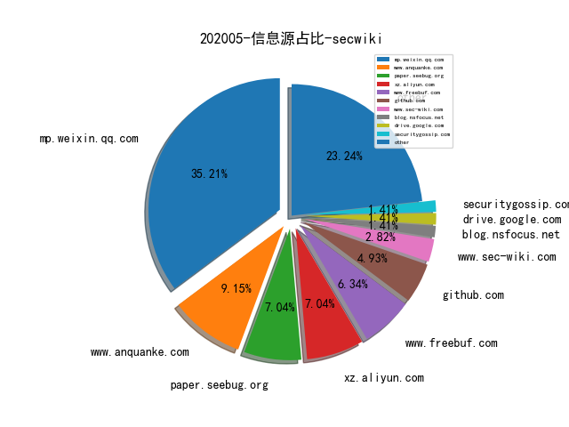
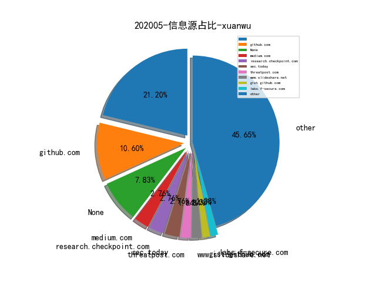

# [数据--所有](README_20.md)
# [数据--年度](README_2020.md)
# 202005 信息源与信息类型占比

# 微信公众号 推荐
| nickname_english | weixin_no | title | url| 
| --- | --- | --- | ---| 
| 互联网安全内参 | anquanneican | 新一代SIEM与SOAR的技术对比 | https://mp.weixin.qq.com/s/mfNRbDXIg5_1jSKHbceHCA | 1| 
| 虎符智库 |  | 各国竞相布局 卫星互联网重新定义网络战 | https://mp.weixin.qq.com/s/mj4BVfI-j3yp-xaSZeEW_A | 1| 
| Tide安全团队 | TideSec | 资产管理与威胁监测平台Tide-Mars开源了！ | https://mp.weixin.qq.com/s/-7V14Rpu2KU5HUsa0p025g | 2| 
| 天融信阿尔法实验室 |  | JAVA RMI反序列化知识详解 | https://mp.weixin.qq.com/s/bC71HoEtDAKKbHJvStu9qA | 1| 
| 漏洞推送 |  | 浏览器中隐蔽数据传输通道-DNS隧道 | https://mp.weixin.qq.com/s/u5HV7umrZABcgVpZ5pn6WQ | 1| 
| SecWiki | SecWiki | [Sec-Trans-7]子域名托管案例 | https://mp.weixin.qq.com/s/Nqy0Agq_h9yZhvqKdZBZgw | 1| 
| lymmmx |  | 已知邮箱，求手机号码? | https://mp.weixin.qq.com/s/XvMruURNVWBkEwxvnPSW1g | 1| 
| 赵武的自留地 |  | 我的安全漏洞观 | https://mp.weixin.qq.com/s/86cS8yIgbVcKStZWq84M7Q | 1| 
| ChaMd5安全团队 | chamd5sec | De1CTF2020-WriteUp下(Crypto、Reverse) | https://mp.weixin.qq.com/s/KKkxUb_rUEi7Pxj0Qj5Odw | 3| 
| IMKP | TrustMatrix_KP | 用SASE加速零信任网络交付 | https://mp.weixin.qq.com/s/OjHgQGrJWfueu4AfxES9Hg | 1| 
| ipasslab |  | 学术报告,协议模糊测试相关技术梳理 | https://mp.weixin.qq.com/s/RCpAUpFEzbSewEnWpHrsqw | 1| 
| 安全学术圈 | secquan | Understanding E-commerce Fraud from Autonomous Chat | https://mp.weixin.qq.com/s/uzGQxgfaUufsDSvcYIIYig | 1| 
| 漏洞战争 | vulwar | 技术人的修炼之道：从业余到专业 | https://mp.weixin.qq.com/s/gBgFyy4MMrF5vn-8NGEVQw | 1| 
| 电子商务电子支付国家工程实验室 | gjgcsys | 物联网场景下的白盒加密技术 | https://mp.weixin.qq.com/s/y8FNDtuJIIiYmZDLTxuL_g | 1| 
| 湛卢工作室 | xuehao_studio | 劳动节 , 说说代理池 | https://mp.weixin.qq.com/s/ERU3L2WIMiPNNdTTX164Og | 1| 

# 组织github账号 推荐
| github_id | title | url | org_url | org_profile | org_geo | org_repositories | org_people | org_projects | repo_lang | repo_star | repo_forks| 
| --- | --- | --- | --- | --- | --- | --- | --- | --- | --- | --- | ---| 

# 私人github账号 推荐
| github_id | title | url | p_url | p_profile | p_loc | p_company | p_repositories | p_projects | p_stars | p_followers | p_following | repo_lang | repo_star | repo_forks | 
| --- | --- | --- | --- | --- | --- | --- | --- | --- | --- | --- | --- | --- | --- | ---| 
| wooyunwang | Fortify: 源代码漏洞の审计 | https://github.com/wooyunwang/Fortify | http://www.52pwn.club/ | A strange guy who will make the world a better place! | California | Google Inc. | 27 | 0 | 15 | 60 | 14 | Python,C#,Java,PowerShell | 322 | 104 | 1| 
| maxpl0it | IE 浏览器 JS 脚本引擎 CVE-2020-0674 漏洞的 Exploit | https://github.com/maxpl0it/CVE-2020-0674-Exploit | https://twitter.com/maxpl0it | Security researcher from the South East of England. | South East, England | None | 10 | 0 | 0 | 55 | 0 | Python,C,HTML | 84 | 24 | 1| 
| lilang-wu | p-joker - 用于分析 iOS/macOS 内核 Kernelcache 与扩展的工具 | https://github.com/lilang-wu/p-joker | None |  | None | None | 32 | 0 | 11 | 29 | 13 | Python,C | 40 | 19 | 1| 
| kabeor | 有研究员总结的 Unicorn CPU 模拟器的非官方 API 文档 | https://github.com/kabeor/Micro-Unicorn-Engine-API-Documentation | https://kabeor.cn | Hello，Computers ! | SiChuan，China | SWUST | 11 | 0 | 79 | 27 | 0 | HTML,C++ | 41 | 16 | 1| 
| NetSPI | Evil SQL Client (ESC) - 为渗透测试设计的交互式的 SQL Server Client，支持发现数据库、访问数据、提取数据 | https://github.com/NetSPI/ESC | None | None | None | None | 0 | 0 | 0 | 0 | 0 | Java,C#,Python,HTML,Go,Ruby,PowerShell | 1100 | 282 | 1| 
| ProjectorBUg | Double-Free BUG in WhatsApp exploit poc.[CVE-2020-11932] | https://github.com/ProjectorBUg/CVE-2020-11932 | None | None | None | None | 0 | 0 | 0 | 0 | 0 | C,Shell,Jupyter,Python,Visual,HTML,Go,PHP,Ruby,Prolog | 0 | 0 | 1| 

# medium_xuanwu 推荐
| title | url| 
| --- | ---| 
| 从 iOS 设备越狱到应用静态分析 | http://link.medium.com/KogHw50ek6| 
| From fuzzing to remote code execution in Samsung Android | http://medium.com/@social_62682/from-fuzzing-to-remote-code-execution-in-samsung-android-56cbdebcfeca| 

# medium_secwiki 推荐
| title | url| 
| --- | ---| 

# zhihu_xuanwu 推荐
| title | url| 
| --- | ---| 

# zhihu_secwiki 推荐
| title | url| 
| --- | ---| 

# 日更新程序
`python update_daily.py`