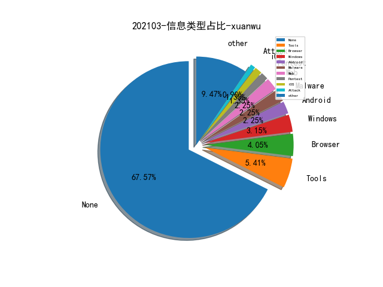

# [数据--所有](README_20.md)
# [数据--年度](README_2021.md)
# 202103 信息源与信息类型占比

# 微信公众号 推荐
| nickname_english | weixin_no | title | url| 
| --- | --- | --- | ---| 
| caoz的梦呓 | caozsay | 浅谈风控的架构 | https://mp.weixin.qq.com/s/GAeau8TJEWZtrv5CHlSHNQ | 1| 
| Akamai | hotline4006091609 | 揭秘 , 新型僵尸网络隐匿方式 | https://mp.weixin.qq.com/s/OxLkZyvI2AASVrYUR4GPJg | 1| 
| FCC30+ | Fcc_198905 | 商业银行零信任安全架构研究 | https://mp.weixin.qq.com/s/vpXdOOKFlZDioXDQnn0GLg | 1| 
| RapidDNS | gh_6327c9075859 | RapidDNS网站在SRC漏洞挖掘中的一个思路 | https://mp.weixin.qq.com/s/bTA0DVfmPVArYXG5MHRAbg | 3| 
| 丁爸 情报分析师的工具箱 | dingba2016 | 【工具】一个网络安全从业者的专业搜索引擎 | https://mp.weixin.qq.com/s/D8JhdhzY6cpShKX2J-t_rQ | 1| 
| 云网漫步 | gh_5d1c9da4b05e | 谈谈国外互联网公司的骨干网 | https://mp.weixin.qq.com/s/jET_vZUtYS8kQD8H-5j5KA | 1| 
| 合天网安实验室 | hee_tian | 对某cms的一次审计思路 | https://mp.weixin.qq.com/s/aps0k7O6BO-UQ0gXbTN3KQ | 2| 
| 奇安信 CERT | gh_64040028303e | Apache Solr 组件安全概览 | https://mp.weixin.qq.com/s/3WuWUGO61gM0dBpwqTfenQ | 2| 
| 学蚁致用 | sudo_i | 负载均衡下的 WebShell 连接 | https://mp.weixin.qq.com/s/4Bmz_fuu0yrLMK1oBKKtRA | 1| 
| 安全学术圈 | secquan | All Your DNS Records Point to Us | https://mp.weixin.qq.com/s/7-4QBjp_TAX74bWidegXHA | 1| 
| 微步在线研究响应中心 | gh_c108d4d389bf | 专题报告 , 流行窃密类木马分析（下） | https://mp.weixin.qq.com/s/R4sOXCP-_T3NGN5d7Ybl6Q | 2| 
| 绿盟科技研究通讯 | nsfocus_research | 知识图谱技术如何赋能智能安全运营 | https://mp.weixin.qq.com/s/qOuvPv8cm1S-jA-gqH1hZg | 1| 
| 腾讯技术 | gh_6866e1848f15 | 如何在技术领域产生自己的影响力 | https://mp.weixin.qq.com/s/Himw3mpv7fDy96bdJQA5xg | 1| 
| debugeeker | gh_ed0f7fa0bfe0 | 最后防线：osquery功能与实现 | https://mp.weixin.qq.com/s/PvnLnn1gDcl_X4fyocyPrA | 1| 
| 360Quake空间测绘 | Quake360 | 网络测绘 , 立体呈现网络事件细节知多少？ | https://mp.weixin.qq.com/s/LwWMfOMqSgArtv9jlfaPRw | 1| 
| SECISLAND安全官 | SECSOSO | 资产管理的难点 | https://mp.weixin.qq.com/s/DqtIzNdDvB7pYjXmoP1quQ | 1| 
| 前端热点分析 | Web-2017 | JavaScript反调试技巧 | https://mp.weixin.qq.com/s/NMJd91AmuGEANz00sZELfw | 1| 
| ChaMd5安全团队 | chamd5sec | D^3CTF-WriteUp | https://mp.weixin.qq.com/s/oOf0RI6P2hEwtPXWP6yU4Q | 3| 
| 深信服千里目安全实验室 | Further_eye | 漏洞威胁分析报告（上册）- 不同视角下的漏洞威胁 | https://mp.weixin.qq.com/s/gIEPvwBE61axZfhBbB9aiw | 1| 
| 电子物证 | ewuzheng | 【Signal】数据分析 | https://mp.weixin.qq.com/s/AiHRwc0LBUyxkg0vcu12eg | 1| 
| 湛卢工作室 | xuehao_studio | 关于近期Microsoft Exchange多个高危漏洞——ProxyLogon | https://mp.weixin.qq.com/s/cmgY6W_cGtGacfYgiac5qQ | 1| 
| 看雪学院 | ikanxue | Firm-AFL：高效的IoT固件灰盒fuzz | https://mp.weixin.qq.com/s/-s5GGA70vcHAVfyz1QeBtQ | 1| 
| 字节跳动安全中心 | TouTiaoSec | 游戏安全评审的技术进阶之路 | https://mp.weixin.qq.com/s/ZIzjIZziM6inUNlr2CKBCg | 1| 
| 美团技术团队 | meituantech | 美团外卖特征平台的建设与实践 | https://mp.weixin.qq.com/s/YyRLJa9NomPvzTWJKaCesQ | 1| 
| 威胁棱镜 | THREAT_PRISM | 趋势科技 2020 年度网络安全报告 | https://mp.weixin.qq.com/s/6pnaFU5PfYGs4d0oLmRkJA | 1| 
| 绿盟科技 | NSFOCUS-weixin | 以蓝军视角跟踪和分析CANVAS攻击框架泄露事件 | https://mp.weixin.qq.com/s/eQ-KDMoirOwx-pFxUcNjtQ | 1| 
| 腾讯安全应急响应中心 | tsrc_team | 红蓝对抗中的云原生漏洞挖掘及利用实录 | https://mp.weixin.qq.com/s/Aq8RrH34PTkmF8lKzdY38g | 1| 
| 安全分析与研究 | MalwareAnalysis | 恶意软件分析工具集成环境 | https://mp.weixin.qq.com/s/WMWQUWu8dt45iQsrcLfSxg | 1| 
| 小面包的储物柜 | afubread | 浅谈如何有效落地DevSecOps（很浅很浅） | https://mp.weixin.qq.com/s/5eX3-SCfvFfRitb9_onjvw | 1| 
| 涛涛不帅 | gh_39db459d9552 | VMware vCenter RCE (CVE-2021-21972) 漏洞复现与 Exp 编写 | https://mp.weixin.qq.com/s/2pvaQborwMM8UHnWS_CeXA | 1| 
| 赛博回忆录 | cybermemory | 大白话解释拟态安全，再不学就落伍了！ | https://mp.weixin.qq.com/s/UR0XbF02JJmo7RbNF1CYVw | 1| 

# 组织github账号 推荐
| github_id | title | url | org_url | org_profile | org_geo | org_repositories | org_people | org_projects | repo_lang | repo_star | repo_forks| 
| --- | --- | --- | --- | --- | --- | --- | --- | --- | --- | --- | ---| 

# 私人github账号 推荐
| github_id | title | url | p_url | p_profile | p_loc | p_company | p_repositories | p_projects | p_stars | p_followers | p_following | repo_lang | repo_star | repo_forks | 
| --- | --- | --- | --- | --- | --- | --- | --- | --- | --- | --- | --- | --- | --- | ---| 
| CTF-MissFeng | GoScan: 分布式综合资产管理系统 | https://github.com/CTF-MissFeng/GoScan | None | None | None | None | 0 | 0 | 0 | 0 | 0 | None | 0 | 0 | 1| 
| Ch0pin | medusa - 基于 FRIDA 实现的 Java 动态二进制插桩框架，目标场景是恶意软件 Trace | https://github.com/Ch0pin/medusa | None | None | None | None | 0 | 0 | 0 | 0 | 0 | None | 0 | 0 | 1| 
| Siguza | libkrw - 为不同越狱工具提供一个 iOS kernel 读写 API 接口 | https://github.com/Siguza/libkrw | https://siguza.net |  | Switzerland | None | 50 | 0 | 0 | 0 | 0 | C,Assembly,Objective-C | 0 | 0 | 1| 
| advanced-threat-research | McAfee ATR Capture the Flag Writeup | https://github.com/advanced-threat-research/ATR_HAX_CTF | None | None | None | None | 0 | 0 | 0 | 0 | 0 | Python,YARA,HTML,Lua | 0 | 0 | 1| 
| blackorbird | SilverFish APT团队分析报告。 | https://github.com/blackorbird/APT_REPORT/blob/master/SunBurst/SilverFish_Solarwinds.pdf | None | None | None | None | 0 | 0 | 0 | 0 | 0 | None | 0 | 0 | 1| 
| huoji120 | DuckMemoryScan: 内存免杀马检测 | https://github.com/huoji120/DuckMemoryScan | https://key08.com | 网络安全工程师、游戏安全工程师、反病毒工程师、全栈开发程序员、黑客 | 北京 朝阳 | CTO | 84 | 0 | 0 | 0 | 0 | Python,C,C++ | 0 | 0 | 1| 
| marijuanARM | iOS 降级工具 futurerestore 更新 v194 版本 | https://github.com/marijuanARM/futurerestore/releases/tag/194 | https://discord.gg/fAngssA | python developer , discord link below , avatar by @syns | None | None | 25 | 0 | 0 | 0 | 0 | Python | 0 | 0 | 1| 
| peter-cui1221 | sqlinjection-detect: C语言编写的基于语义分析的SQL注入检测... | https://github.com/peter-cui1221/sqlinjection-detect | None |  | None | None | 1 | 0 | 0 | 0 | 0 | C | 0 | 0 | 1| 
| sbousseaden | PCAP-ATTACK: PCAP Samples for Different Post Exploitation Techniques | https://github.com/sbousseaden/PCAP-ATTACK | http://@SBousseaden | Threat Hunting & DFIR | None | None | 66 | 0 | 0 | 0 | 0 | YARA,PowerShell | 0 | 0 | 1| 
| wgpsec | TIG 威胁情报收集 | https://github.com/wgpsec/tig | None | None | None | None | 0 | 0 | 0 | 0 | 0 | None | 0 | 0 | 1| 
| yhy0 | 监控github上新增的cve编号项目漏洞 | https://github.com/yhy0/github-cve-monitor | None | None | None | None | 0 | 0 | 0 | 0 | 0 | None | 0 | 0 | 1| 

# medium_xuanwu 推荐
| title | url| 
| --- | ---| 
| How I hacked Facebook: Part Two | http://alaa0x2.medium.com/how-i-hacked-facebook-part-two-ffab96d57b19| 
| 研究人员发现Android新型银行恶意软件“FluBot”并对样本进行分析。 | http://medium.com/csis-techblog/the-brief-glory-of-cabassous-flubot-a-private-android-banking-botnet-bc2ed7917027| 
| TikTok for Android 1-Click RCE | http://medium.com/@dPhoeniixx/tiktok-for-android-1-click-rce-240266e78105| 
| 利用 Differential Fuzzing 的方法挖掘正则表达式的漏洞 | http://defparam.medium.com/finding-issues-in-regular-expression-logic-using-differential-fuzzing-30d78d4cb1d5| 
| “ BootHole”-GNU GRUB安全漏洞概述。 | http://medium.com/ssd-secure-disclosure/boothole-a-look-at-gnu-grub-vulnerabilities-d15c66effe60?source=friends_link&sk=849dfc1dab516826c152cb6711192d0c| 
| RCE via war upload in Tomcat using path traversal. | http://medium.com/m/global-identity?redirectUrl=https%3A%2F%2Fblog.defmax.io%2Frce-via-war-upload-in-tomcat-using-path-traversal-e0f11898016e| 
| Hail Frida!! The Universal SSL pinning bypass for Android applications | http://medium.com/m/global-identity?redirectUrl=https%3A%2F%2Finfosecwriteups.com%2Fhail-frida-the-universal-ssl-pinning-bypass-for-android-e9e1d733d29%3Fsource%3Drss----7b722bfd1b8d---4| 
| 训练 Robust Trees 检测 Twitter spam | http://surrealyz.medium.com/robust-trees-for-security-577061177320| 

# medium_secwiki 推荐
| title | url| 
| --- | ---| 

# zhihu_xuanwu 推荐
| title | url| 
| --- | ---| 
| 在Android11使用Scudo分配器介绍 | https://zhuanlan.zhihu.com/p/353784014| 

# zhihu_secwiki 推荐
| title | url| 
| --- | ---| 
| Google内部开源组件的风险治理框架与工作流程窥探 | https://zhuanlan.zhihu.com/p/356415256| 

# xz_xuanwu 推荐
| title | url| 
| --- | ---| 

# xz_secwiki 推荐
| title | url| 
| --- | ---| 
| C/C++源码扫描系列- Fortify 篇 | https://xz.aliyun.com/t/9276| 
| 自主搭建的三层网络域渗透靶场打靶记录 | https://xz.aliyun.com/t/9281| 
| C/C++源码扫描系列- Joern 篇 | https://xz.aliyun.com/t/9277| 
| CVE-2019-2215复现过程记录 | https://xz.aliyun.com/t/9273| 
| C/C++源码扫描系列- codeql 篇 | https://xz.aliyun.com/t/9275| 
| 某oa java代码审计2 | https://xz.aliyun.com/t/9226| 
| 某oa java代码审计1 | https://xz.aliyun.com/t/9225| 
| 两道CSP题目绕过分析 | https://xz.aliyun.com/t/9219| 
| 免杀/一句话木马(PHP) | https://xz.aliyun.com/t/9246| 
| PHP反序列化 — 字符逃逸 | https://xz.aliyun.com/t/9213| 

# 日更新程序
`python update_daily.py`