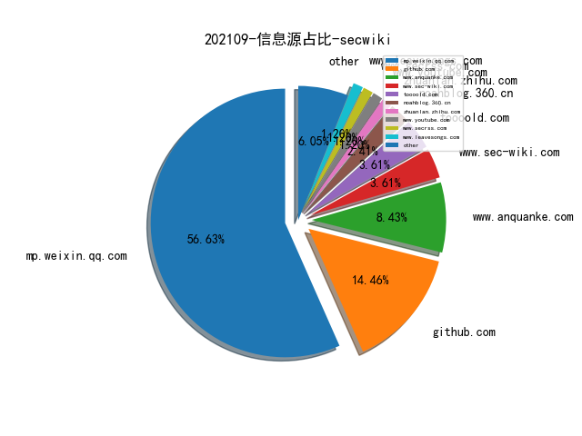
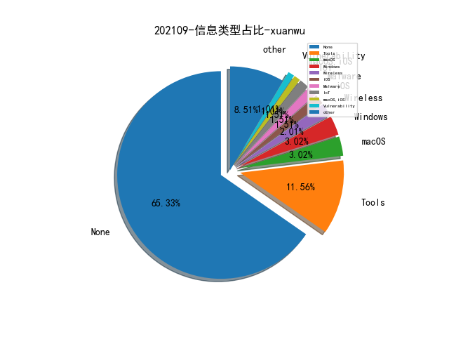

# [数据--所有](README_20.md)
# [数据--年度](README_2021.md)
# 202109 信息源与信息类型占比

# 微信公众号 推荐
| nickname_english | weixin_no | title | url| 
| --- | --- | --- | ---| 
| 灼剑安全团队 | Tsojan | 内网基础信息收集 | https://mp.weixin.qq.com/s?__biz=Mzg5OTY1ODMxMg==&mid=2247487763&idx=1&sn=f23d408a59a39a48ec84688783dbe8fa | 1| 
| 渗透Xiao白帽 | SuPejkj | 【Office Word 0day】CVE-2021-40444 漏洞深入分析 | https://mp.weixin.qq.com/s?__biz=MzI1NTM4ODIxMw==&mid=2247489857&idx=1&sn=55ddb12cb95c77e9fb5f9ebb60ad5b56 | 2| 
| 哈拉少安全小队 | gh_b273ce95df95 | 【反序列化漏洞】session反序列化 | https://mp.weixin.qq.com/s?__biz=MzAxNzkyOTgxMw==&mid=2247487259&idx=1&sn=e70d97877c0f1a282cf56c6ad4e34d26 | 1| 
| LemonSec | lemon-sec | 应急响应之windows入侵排查篇【文末赠书】 | https://mp.weixin.qq.com/s?__biz=MzUyMTA0MjQ4NA==&mid=2247516099&idx=1&sn=b852a78e6f90a7455d9316e645565a2d | 1| 
| 黑白天实验室 | HBT-SEC | 《【陇剑杯WP】wifi题解》 | https://mp.weixin.qq.com/s?__biz=MzU4NTY4MDEzMw==&mid=2247491314&idx=1&sn=81a53fa0c7872a46adea2ccaf38adc40 | 1| 
| 黑白之道 | i77169 | PHP弱类型你真的懂了吗？ | https://mp.weixin.qq.com/s?__biz=MzAxMjE3ODU3MQ==&mid=2650523049&idx=2&sn=306e58b643116e5edf3d4cea0f08d85e | 1| 
| 黑云信息安全 | heiyunxinxi | Java RMI 利用入门学习 | https://mp.weixin.qq.com/s?__biz=Mzg5OTYxMjk0Mw==&mid=2247484634&idx=1&sn=d66531b467225af6f17125a5ef6ac718 | 2| 
| 维他命安全 | VitaminSecurity | 芯片制造商AMD修复PSP驱动程序中的信息泄露漏洞；Capoae利用WebLogic和ThinkPHP中漏洞传播 | https://mp.weixin.qq.com/s?__biz=MzUxMDQzNTMyNg==&mid=2247496621&idx=1&sn=b33bdc5ccbd46d690006b0ff89f17787 | 2| 
| 红日安全 | sec-redclub | Web安全实战系列笔记 , XSS跨站实战和分析（五） | https://mp.weixin.qq.com/s?__biz=MzI4NjEyMDk0MA==&mid=2649850568&idx=1&sn=6cb4c69876e34fc5c71669883f7cc281 | 1| 
| 系统安全运维 | Taurus-1314147 | 安全运维｜wireshark网络安全流量分析基础 | https://mp.weixin.qq.com/s?__biz=Mzk0NjE0NDc5OQ==&mid=2247491804&idx=1&sn=bb6ed603dc6df2dfd7b7c8d5166219e6 | 3| 
| 看雪学院 | ikanxue | 混淆后OKHTTP框架的通用抓包方案探索 | https://mp.weixin.qq.com/s?__biz=MjM5NTc2MDYxMw==&mid=2458392678&idx=1&sn=7572d38e20a9f359bba0c8aa8e4965b4 | 1| 
| 猪猪谈安全 | zzt-anquan | 干货 , 内网信息收集总结（上） | https://mp.weixin.qq.com/s?__biz=MzIyMDAwMjkzNg==&mid=2247495267&idx=1&sn=a71604d68532bf2bdf921bb5987fed3e | 1| 
| 渗透攻击红队 | RedTeamHacker | 搭建大型域环境（父域控制器、子域控制器、辅域控制器、域内主机） | https://mp.weixin.qq.com/s?__biz=MzkxNDEwMDA4Mw==&mid=2247488317&idx=1&sn=3df83861b049c7b7baad453bc93ca5e5 | 1| 
| 大余安全 | dayuST123 | HackTheBox-Linux-Jarvis | https://mp.weixin.qq.com/s?__biz=Mzg3MDMxMTg3OQ==&mid=2247496010&idx=1&sn=9bda75cb2cd7f243e60dd6e884216882 | 1| 
| 利刃信安 | None | Cobalt_Strike_4.4 去除流量特征+批量上线【补充】 | https://mp.weixin.qq.com/s?__biz=MzU1Mjk3MDY1OA==&mid=2247493152&idx=1&sn=9050127ffecfbc3e772e9f19fbdc5df6 | 2| 
| 军机故阁 | gh_e57baf46bdf5 | WPS For Linux RCE | https://mp.weixin.qq.com/s?__biz=MzU5Mjk3MDA5Ng==&mid=2247483837&idx=1&sn=08a7aeaff4390269b0c4b115439d7d63 | 1| 
| web安全工具库 | websec-tools | windows逆向 -- Debug工具简介 | https://mp.weixin.qq.com/s?__biz=MzI4MDQ5MjY1Mg==&mid=2247490257&idx=1&sn=b9d9ec97ea0d8426138720f2f54a8590 | 1| 
| FreeBuf | freebuf | 蓝队视角下的企业安全运营 | https://mp.weixin.qq.com/s?__biz=MjM5NjA0NjgyMA==&mid=2651137389&idx=1&sn=04aa49ef6ecbad2405418afb5ff2ce08 | 5| 
| 骨哥说事 | guge_guge | 一次有趣的账户接管漏洞挖掘 | https://mp.weixin.qq.com/s?__biz=MjM5Mzc4MzUzMQ==&mid=2650254753&idx=1&sn=a3e890197594eb90d25c33bfe5f07cde | 1| 
| 饿猫的小黑屋 | ecat-bypass | Docker逃逸-Ubuntu与Centos计划任务问题与解决办法 | https://mp.weixin.qq.com/s?__biz=Mzg4NDU4OTQ1NA==&mid=2247484124&idx=1&sn=89ba13866c55075670427b91d5e4efa5 | 1| 
| 雷石安全实验室 | leishianquan1 | Windows命令混淆 | https://mp.weixin.qq.com/s?__biz=MzI5MDE0MjQ1NQ==&mid=2247512434&idx=1&sn=61a2deb30cf74f372321d472620eaed5 | 1| 
| 邑安全 | EansecD | 瞄准Linux系统！攻击者改造渗透测试工具Cobalt Strike兼容Linux信标 | https://mp.weixin.qq.com/s?__biz=MzUyMzczNzUyNQ==&mid=2247507702&idx=1&sn=553ecef606d9574702e8c825d948e739 | 1| 
| 潇湘信安 | xxxasec | 陇剑杯WP - Webshell详细题解 | https://mp.weixin.qq.com/s?__biz=Mzg4NTUwMzM1Ng==&mid=2247491524&idx=1&sn=40aa1c43b07594ebabb8f0dde9c8bcbe | 1| 
| 安世加 | asjeiss | 技术干货 , WMIC使用浅析 | https://mp.weixin.qq.com/s?__biz=MzU2MTQwMzMxNA==&mid=2247510101&idx=1&sn=b92cbf62e053b500651a9e2fe8503980 | 1| 
| 奇安信 CERT | gh_64040028303e | 【安全风险通告】Apache Shiro身份验证绕过漏洞安全风险通告 | https://mp.weixin.qq.com/s?__biz=MzU5NDgxODU1MQ==&mid=2247494762&idx=1&sn=8e07bad6541e821fcf9339bf1e2d2a96 | 1| 
| 嘶吼专业版 | Pro4hou | BladeHawk 组织利用Facebook钓鱼攻击库尔德组织 | https://mp.weixin.qq.com/s?__biz=MzI0MDY1MDU4MQ==&mid=2247529128&idx=4&sn=a1267a1b9dba65a7a29e6eb8df272e51 | 1| 
| 合天网安实验室 | hee_tian | 从本地到WordPress代码注入 | https://mp.weixin.qq.com/s?__biz=MjM5MTYxNjQxOA==&mid=2652881094&idx=1&sn=b3f72403f7092c00f9834f00623db2a5 | 1| 
| WhITECat安全团队 | WhITECat_007 | 内网凭证东搜西罗 | https://mp.weixin.qq.com/s?__biz=MzAwMzc2MDQ3NQ==&mid=2247486299&idx=1&sn=78d66b3595cf6f3607745a8d2038e986 | 1| 
| V安全资讯 | v-safe-cn | 内网渗透---windows系统 | https://mp.weixin.qq.com/s?__biz=MzI4MDQ1MzQ0NA==&mid=2247487702&idx=2&sn=9afd6e5e549778d138d1f3c3a92bbcad | 1| 
| Tide安全团队 | TideSec | 【应急响应】应急响应之挖矿木马分析 | https://mp.weixin.qq.com/s?__biz=Mzg2NTA4OTI5NA==&mid=2247492402&idx=1&sn=94659554ed33b423389c025907771083 | 1| 
| Seebug漏洞平台 | seebug_org | CVE-2021-40444 漏洞深入分析 | https://mp.weixin.qq.com/s?__biz=MzAxNDY2MTQ2OQ==&mid=2650950208&idx=1&sn=7a2418f511f98e462780fc61fc2b7cda | 1| 
| Linux中国 | linux-cn | 从命令行使用 wget 调试网页错误 , Linux 中国 | https://mp.weixin.qq.com/s?__biz=MjM5NjQ4MjYwMQ==&mid=2664640987&idx=4&sn=c5e664b4d9e8760ae4299e0f493cd117 | 1| 
| HACK之道 | hacklearn | 域渗透之信息搜集技巧 | https://mp.weixin.qq.com/s?__biz=MzIwMzIyMjYzNA==&mid=2247495278&idx=1&sn=ae956ce01ef4c1db2dfe40df3c19f09a | 1| 
| 雁行安全团队 | YX_Security | Dubbo 源码分析 | https://mp.weixin.qq.com/s/o1QSOkTTFHft0EWpUh0pDg | 1| 
| 腾讯安全应急响应中心 | tsrc_team | Web应用组件自动化发现的探索 | https://mp.weixin.qq.com/s/6xFYQ3D45VpTT3n_qgRing | 1| 
| 绿盟科技研究通讯 | nsfocus_research | 【APT行为数据分析】终端溯源数据中的依赖爆炸问题 | https://mp.weixin.qq.com/s/xp9558ezOZELHSJUS5ar3Q | 2| 
| Red0 | gh_74f47275d982 | RASP关键技术与相关产品调研 | https://mp.weixin.qq.com/s/juEPju1Qx7Wdt0akDz9BsA | 1| 
| 赛博堡垒 | gh_099f3e462773 | VaultFuzzer: 针对Linux内核的状态导向模糊测试方案 | https://mp.weixin.qq.com/s/ZevJBJjANmBLPCG0RyC3eg | 1| 
| 腾讯代码安全检查Xcheck | gh_177b81103e8d | Xcheck之PHP代码安全检查 | https://mp.weixin.qq.com/s?__biz=Mzg2ODQ3ODE1NA==&mid=2247483818&idx=1&sn=f55330a128035ba29cc8f1eca2c56230&chksm=ceaafc0ff9dd7519397f4dc0f710c3901ad7b76436dbc7accbfc1a543c702f49dabefa0d7ea5&token=654851123&lang=zh_CN#rd | 4| 
| 网络安全应急技术国家工程实验室 | NELCERT | 谈谈网络空间“行为测绘” | https://mp.weixin.qq.com/s/THEdOpSu_bSPWo66sRDyPA | 1| 
| 数世咨询 | dwconcn | 网络空间资产安全管理实践与创新 | https://mp.weixin.qq.com/s/3NWI-_qJZfTuqvFl3d2SAQ | 1| 
| 亿人安全 | Yr-Sec | 内网渗透测试：DCSync 攻击技术的利用 | https://mp.weixin.qq.com/s?__biz=Mzk0MTIzNTgzMQ==&mid=2247485912&idx=1&sn=2cbaf2d8eca710edb5e39a4031c1d9c6 | 1| 
| 互联网后端架构 | fullstack888 | 如何高效迅速的进行CodeReview | https://mp.weixin.qq.com/s/nlDSYvR2SyKhtl4fOPt2Hg | 1| 
| NGINX开源社区 | gh_0d2551f1bdb6 | NGINX速率限制原理及源码分析 | https://mp.weixin.qq.com/s/hj7DPoFevmRPdgMY9orilg | 1| 
| 威胁棱镜 | THREAT_PRISM | IoT 恶意软件进化谱系研究 | https://mp.weixin.qq.com/s/xXYFcVOXA6lZfhign0BJlg | 1| 
| ChaMd5安全团队 | chamd5sec | Miara的延续--gafgyt病毒分析 | https://mp.weixin.qq.com/s/JYBdhxbt0mqU3wIqFFWdhQ | 1| 
| 黑哥说安全 | gh_67cfd5e45750 | 谈谈网络空间“行为测绘” | https://mp.weixin.qq.com/s/fQatA5iyewqRBMWtpVjsRA | 1| 
| 锦行信息安全 | jeeseensec | 技术分享 , DLL注入之全局钩子注入 | https://mp.weixin.qq.com/s/2CZA9aRr9nsawMkxHQrupg | 1| 
| 莫哥谈安全 | gh_247dfbdf3d43 | 漫谈企业安全运营能力建设 | https://mp.weixin.qq.com/s/dBAV_4iGw8rTU5Y3SI4ocA | 1| 
| 安全营销喵喵站 | Z1-Businessweek | Gartner：2021年SIEM（安全信息与事件管理）市场分析 | https://mp.weixin.qq.com/s/2hiU8ko3N3duW0sI9JdNfA | 1| 
| 安全客 | anquanbobao | 【技术分享】如何高效地捡漏反序列化利用链？ | https://mp.weixin.qq.com/s/th9hDuMK8LgrkesgPvEDHQ | 1| 
| 一个人的安全笔记 | xjiek2015 | [HTB] Haystack Writeup | https://mp.weixin.qq.com/s/HFh8pMRtZ-fm_-0lMoUqvw | 2| 
| 安全学术圈 | secquan | 小心你信任的人：跨域通信中的安全陷阱 | https://mp.weixin.qq.com/s/ErjUg177-jGR9UQjyZaEoA | 4| 
| 网安思考 | gh_e53abd003964 | 【专题研究第018期】DARPA近年网络空间安全领域主要项目梳理 | https://mp.weixin.qq.com/s/CwXqkHDSFK6XMFtvOpnsjw | 1| 
| 机器学习研究组订阅 | gh_7ce29bea153b | 自动检索、修复Python代码bug，微软推出DeepDebug | https://mp.weixin.qq.com/s/jfgrIRQSb_gPwvYGs8b_Pw | 1| 
| 安全界 | feei_cn | GitHub Pull Request业务逻辑风险 | https://mp.weixin.qq.com/s/Fo0OhNb-MP-GqKM-ASCXsg | 1| 
| 奇安信威胁情报中心 | gh_166784eae33e | Operation（Thủy Tinh）OceanStorm：隐匿在深海巨渊下的邪恶莲花 | https://mp.weixin.qq.com/s/dGW0FrbZZ5UA6KuuZB8J_g | 1| 

# 组织github账号 推荐
| github_id | title | url | org_url | org_profile | org_geo | org_repositories | org_people | org_projects | repo_lang | repo_star | repo_forks| 
| --- | --- | --- | --- | --- | --- | --- | --- | --- | --- | --- | ---| 

# 私人github账号 推荐
| github_id | title | url | p_url | p_profile | p_loc | p_company | p_repositories | p_projects | p_stars | p_followers | p_following | repo_lang | repo_star | repo_forks | 
| --- | --- | --- | --- | --- | --- | --- | --- | --- | --- | --- | --- | --- | --- | ---| 
| xiecat | goblin: 一款适用于红蓝对抗中的仿真钓鱼系统 | https://github.com/xiecat/goblin | None | None | None | None | 0 | 0 | 0 | 0 | 0 | None | 0 | 0 | 1| 
| ttttmr | 检测浏览器是否存在代理 | https://github.com/ttttmr/checkproxy | https://github.com/ttttmr?tab=followers | Security & Development | None | Chaitin | 45 | 0 | 0 | 0 | 0 | Python,HTML,JavaScript | 0 | 0 | 1| 
| justinsteven | GitHub 提供的拼写检查 workflow 被发现存在漏洞，可以泄露 GITHUB_TOKEN API Key | https://github.com/justinsteven/advisories/blob/master/2021_github_actions_checkspelling_token_leak_via_advice_symlink.md | https://github.com/justinsteven?tab=followers |  | Brisbane, Australia | None | 23 | 0 | 0 | 0 | 0 | C | 0 | 0 | 1| 
| horizon3ai | 微软 Azure 云 OMI Agent RCE 漏洞的 PoC | https://github.com/horizon3ai/CVE-2021-38647 | None | None | None | None | 0 | 0 | 0 | 0 | 0 | Python | 0 | 0 | 1| 
| hackingintoyourheart | 本田雅阁、思域等多款车存在密钥重放攻击安全漏洞 | https://github.com/hackingintoyourheart/unoriginal-rice-patty | https://github.com/HackingIntoYourHeart?tab=followers | Computer Scientist... ㅤㅤㅤㅤㅤㅤㅤㅤ BTC: 3NqgZV8MaYDp6B6AJxSs7La9XuMZx8Nuxk ㅤㅤㅤㅤㅤㅤㅤㅤㅤㅤㅤㅤㅤ ETH: 0x65a3CC7D99139000B43EeAe33EdcdCACbaE98524 | Earth | Blake Berry | 17 | 0 | 0 | 0 | 0 | Python,C++ | 0 | 0 | 1| 
| fofapro | fapro: 协议模拟服务器 | https://github.com/fofapro/fapro | None | None | None | None | 0 | 0 | 0 | 0 | 0 | SCSS,C,Vue,Java,Python,Go | 0 | 0 | 1| 
| Kart1keya | Hachi: This tool maps a files behavior on MITRE ATT&CK ma... | https://github.com/Kart1keya/Hachi | https://github.com/Kart1keya?tab=followers |  | None | None | 4 | 0 | 0 | 0 | 0 | Python,YARA | 0 | 0 | 1| 
| Impalabs | Reversing and Exploiting Samsungs Neural Processing Unit | https://github.com/Impalabs/conferences/blob/master/2021-barbhack21/21-Barbhack21-Reversing_and_Exploiting_Samsungs_Neural_Processing_Unit.pdf | None | None | None | None | 0 | 0 | 0 | 0 | 0 |  | 0 | 0 | 1| 
| Hackndo | lsassy - 远程从 lsass dump 提取敏感凭据信息的工具 | https://github.com/Hackndo/lsassy | https://github.com/Hackndo?tab=followers | Security blog author https://hackndo.com | Paris | Hackndo Labs | 67 | 0 | 0 | 0 | 0 | Python | 0 | 0 | 1| 
| HXSecurity | DongTai: 开源的 IAST | https://github.com/HXSecurity/DongTai | None | None | None | None | 0 | 0 | 0 | 0 | 0 | Shell,Java,Python,HTML,PLpgSQL,CSS | 0 | 0 | 1| 
| CHYbeta | Nginx 场景绕过之二：斜杠(trailing slash) 与 编码 | https://github.com/CHYbeta/OddProxyDemo/blob/master/nginx/demo2/README.md | https://github.com/CHYbeta?tab=followers |  | China | XMU | 31 | 0 | 0 | 0 | 0 | HTML,Dockerfile | 0 | 0 | 5| 

# medium_xuanwu 推荐
| title | url| 
| --- | ---| 
| 利用静态扫描工具 Semgrep 检测 Flask 项目中的 XSS 漏洞 | http://michaelhidalgo.medium.com/on-flask-semgrep-and-secure-coding-26290fcdd960| 
| Oracle BI XML XXE 漏洞分析 | http://testbnull.medium.com/linh-tinh-v%E1%BB%81-oracle-business-intelligence-part-1-5a050b48a193| 
| Facebook 邮件泄露及账号接管漏洞分析 | http://rikeshbaniyaaa.medium.com/facebook-email-disclosure-and-account-takeover-ecdb44ee12e9| 
| 用深度学习的方案检测命令混淆的问题 | http://link.medium.com/bmZ51ncnZib| 
| Teradek 网络视频设备被发现 Root Shell 后门漏洞 | http://medium.com/m/global-identity?redirectUrl=https%3A%2F%2Finfosecwriteups.com%2Ffull-disclosure-0-day-rce-backdoor-in-teradek-ip-video-device-firmwares-85a16f346e15| 

# medium_secwiki 推荐
| title | url| 
| --- | ---| 

# zhihu_xuanwu 推荐
| title | url| 
| --- | ---| 
| 有用户反馈在百度搜索中搜索 iterm2 排名第一的推广链接下载的 iterm2 是钓鱼版本 | https://zhuanlan.zhihu.com/p/408746101| 

# zhihu_secwiki 推荐
| title | url| 
| --- | ---| 
| Survey: 基于机器学习和数据挖掘技术的软件漏洞检测 | https://zhuanlan.zhihu.com/p/405003793| 

# xz_xuanwu 推荐
| title | url| 
| --- | ---| 

# xz_secwiki 推荐
| title | url| 
| --- | ---| 

# 日更新程序
`python update_daily.py`