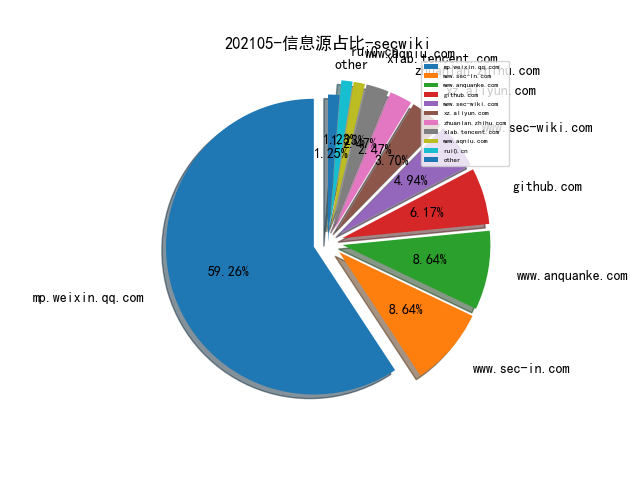
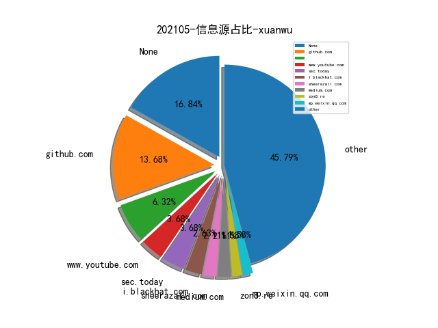
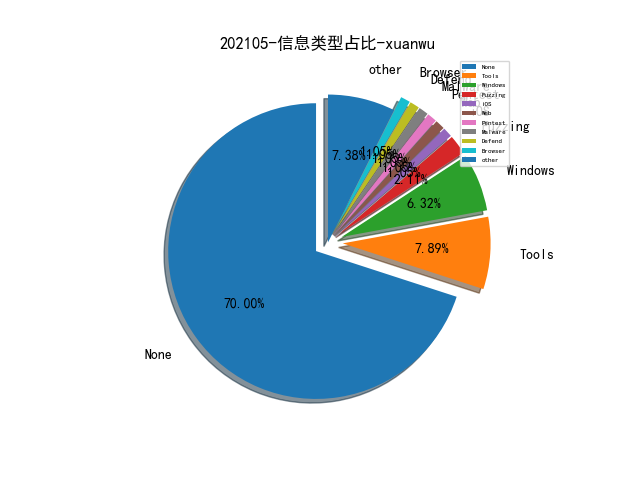

# [数据--所有](README_20.md)
# [数据--年度](README_2021.md)
# 202105 信息源与信息类型占比

# 微信公众号 推荐
| nickname_english | weixin_no | title | url| 
| --- | --- | --- | ---| 
| 蚂蚁安全实验室 | Alipay_SecurityLab | 智能合约安全系列——EOS菠菜应用篇 | https://mp.weixin.qq.com/s/QAvFyfAetlwF3Vow-liEew | 1| 
| 腾讯安全应急响应中心 | tsrc_team | 云基础设施之硬件安全威胁 | https://mp.weixin.qq.com/s/6-XAPuLAieb11GpNK3x7Zw | 1| 
| 绿盟科技研究通讯 | nsfocus_research | Metarget：云原生攻防靶场开源啦！ | https://mp.weixin.qq.com/s/EULJgDrCvuq3DwUpGUskfQ | 1| 
| 嘶吼专业版 | Pro4hou | 2021第一季度APT攻击趋势分析（上） | https://mp.weixin.qq.com/s/383OkdZ4z4rFUfjLf3Ymhw | 1| 
| Tide安全团队 | TideSec | 内网软件密码离线解密 | https://mp.weixin.qq.com/s/l6rSLBrluAkRrB0rYPcdLg | 1| 
| 大超的记事本 | Dachao_Dachao | 数据安全怎么做——数据跨境的思考 | https://mp.weixin.qq.com/s/tPKbHyMU54iARe4ojD7czg | 1| 
| 上交所技术服务 | SSE-TechService | 【交易技术前沿】魔高一尺，道高一丈，上交所VPN攻防札记 | https://mp.weixin.qq.com/s/uygNjOZmBwGcMdvILN-psw | 1| 
| ChaMd5安全团队 | chamd5sec | 2021海华AI挑战赛·中文阅读理解·技术组 Rank12 | https://mp.weixin.qq.com/s/I3oA4VioFZM3zFOmj5gqJw | 1| 
| 信息安全与通信保密杂志社 | cismag2013 | 一种多维数据融合的网络威胁溯源迭代分析模型研究 | https://mp.weixin.qq.com/s/luD2v2kqXx41KWKqnItyBg | 2| 
| 鸟哥谈云安全 | cnbirdsecintel | 云安全架构连载之三-超大型企业混合云安全架构最佳实践 | https://mp.weixin.qq.com/s/xkeNxE99ORtVs9EOv0ellQ | 1| 
| 看雪学院 | ikanxue | 工作中常用的相似度算法以及特征提取算法 | https://mp.weixin.qq.com/s/vUS553WX8pFIiWoqhkFNlg | 2| 
| code秘密花园 | code_mmhy | 前端安全—你必须要注意的依赖安全漏洞 | https://mp.weixin.qq.com/s/kCqD0ikh9h5xc42sKkESVA | 2| 

# 组织github账号 推荐
| github_id | title | url | org_url | org_profile | org_geo | org_repositories | org_people | org_projects | repo_lang | repo_star | repo_forks| 
| --- | --- | --- | --- | --- | --- | --- | --- | --- | --- | --- | ---| 

# 私人github账号 推荐
| github_id | title | url | p_url | p_profile | p_loc | p_company | p_repositories | p_projects | p_stars | p_followers | p_following | repo_lang | repo_star | repo_forks | 
| --- | --- | --- | --- | --- | --- | --- | --- | --- | --- | --- | --- | --- | --- | ---| 
| patois | 在 IDA Hexrays AST 级别搜索代码特征的工具 | https://github.com/patois/HexraysToolbox | https://twitter.com/pat0is | Yo, was github? | 127.0.0.1 | None | 43 | 0 | 0 | 0 | 0 | Python | 357 | 65 | 1| 
| Tabll | gemnasium-db: GitLab 漏洞依赖项扫描的数据库 | https://github.com/Tabll/gemnasium-db | None | None | None | None | 0 | 0 | 0 | 0 | 0 | None | 0 | 0 | 1| 

# medium_xuanwu 推荐
| title | url| 
| --- | ---| 
| 追踪分析恶意 tor 中继出口。 | http://nusenu.medium.com/tracking-one-year-of-malicious-tor-exit-relay-activities-part-ii-85c80875c5df| 
| 收集和统计公网上的 Cobalt Strike 服务和配置信息。 | http://svch0st.medium.com/stats-from-hunting-cobalt-strike-beacons-c17e56255f9b| 

# medium_secwiki 推荐
| title | url| 
| --- | ---| 

# zhihu_xuanwu 推荐
| title | url| 
| --- | ---| 

# zhihu_secwiki 推荐
| title | url| 
| --- | ---| 
| 不确定性知识图谱的表示和推理 | https://zhuanlan.zhihu.com/p/369068016| 

# xz_xuanwu 推荐
| title | url| 
| --- | ---| 

# xz_secwiki 推荐
| title | url| 
| --- | ---| 

# 日更新程序
`python update_daily.py`