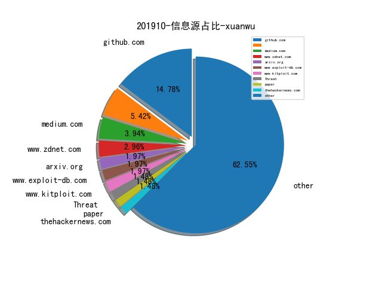

# [数据年报](README_YEAR.md)
# [数据月报-9月](README_9.md)
# [数据月报-8月](README_8.md)
# [数据月报-7月](README_7.md)
# [数据月报-6月](README_6.md)
# [数据月报-5月](README_5.md)
# [数据月报-4月](README_4.md)
# [数据月报-3月](README_3.md)
# 201910 信息源与信息类型占比

# 微信公众号 推荐
| nickname_english | weixin_no | url | title| 
| --- | --- | --- | ---| 
| 云众可信 | yunzhongkexin | https://mp.weixin.qq.com/s/gLPfnR2mZKduof5nL8nH3w | 原创干货 | 暗网知识小科普 | 1| 
| 穿过丛林 |  | https://mp.weixin.qq.com/s/-g2MLk7i0QBToxdE-RHjSw | 容器云安全防御机制动态评估与优化框架 | 1| 
| Viola后花园 | Viola_deepblue | https://mp.weixin.qq.com/s/daH3UatnuUvkFIq9BrZPyg | Signal Sciences 下一代WAF | 1| 
| 专注安管平台 |  | https://mp.weixin.qq.com/s/3KPU2Ke6HsgeovQXduTU1Q | 从一份工作说明书看DHS的SOC运营内容与要求 | 1| 
| 青藤云安全资讯 | qingtengyun | https://mp.weixin.qq.com/s/bEUGuEQDuxVVi7f6mfnuTQ | 细述MITRE ATT＆CK框架的实施和使用方式 | 1| 
| App个人信息举报 | app_grxxjb | https://mp.weixin.qq.com/s/Ly8XIfKanX3bgeZLe0QyeA | 专题研究 | 手机设备识别码类型分析 | 1| 
| 暗影安全实验室 | Eversec_Lab | https://mp.weixin.qq.com/s/ZxsyB4ELKdV84eHh6zn1iQ | 反间谍之旅003 | 1| 
| 电网头条 | sgcctop | https://mp.weixin.qq.com/s/gWLm5KMfkSlhNr0ptmIYwQ | 刚刚，国家电网公司发布《泛在电力物联网白皮书2019》 | 1| 
| 绿盟科技研究通讯 | nsfocus_research | https://mp.weixin.qq.com/s/UDvX0HiPYlF5POe1FUhpuA | 初探加密流量识别 | 2| 
| 军鹰资讯 | JoinInformation | https://mp.weixin.qq.com/s/T5EqLfqSCU8JRp6Ez4vdpg | 浅析DARPA的运作机制（内附报告下载链接） | 1| 
| 分类乐色桶 |  | https://mp.weixin.qq.com/s/4KcpS4eNGQ8bL6DTM4K0aQ | [CVE-2019-9535] Iterm2命令执行的不完整复现 | 1| 
| 湛卢工作室 | xuehao_studio | https://mp.weixin.qq.com/s/g-vlNmn4uQKUnBKZ7LMJvA | SRC漏洞挖掘实用技巧 | 2| 
| 看雪学院 | ikanxue | https://mp.weixin.qq.com/s/qfthyNQ3E_TruEbREcIJzg | ATT&CK一般性学习笔记 | 1| 
| 汉客儿 |  | https://mp.weixin.qq.com/s/spmYrBPK9kuEoOixl9yRRA | 沙箱：概述 | 1| 
| 安全学术圈 | secquan | https://mp.weixin.qq.com/s/gcBN3slkqwkDW_I24OB_ug | 浅析公共GitHub存储库中的秘密泄露 | 2| 
| 贝塔安全实验室 | BetaSecLab | https://mp.weixin.qq.com/s/-citnkfwGai7KQCIp9G99w | 反弹shell的学习总结 - Part 1 | 4| 

# 组织github账号 推荐
| github_id | title | url | org_url | org_profile | org_geo | org_repositories | org_people | org_projects | repo_lang | repo_star | repo_forks| 
| --- | --- | --- | --- | --- | --- | --- | --- | --- | --- | --- | ---| 

# 私人github账号 推荐
| github_id | title | url | p_url | p_profile | p_loc | p_company | p_repositories | p_projects | p_stars | p_followers | p_following | repo_lang | repo_star | repo_forks | 
| --- | --- | --- | --- | --- | --- | --- | --- | --- | --- | --- | --- | --- | --- | ---| 
| evilsocket | evilsocket 开源的一个利用深度学习技术辅助攻击 WiFi 的工具 | https://github.com/evilsocket/pwnagotchi/releases/tag/v1.0.0RC4 | https://www.evilsocket.net |  | Italy | Zimperium | 118 | 0 | 14 | 4100 | 0 | Go,Python,JavaScript,CSS | 6000 | 573 | 1| 
| byt3bl33d3r | 利用脚本语言处理 .NET Payloads，实现 BYOI Payloads | https://github.com/byt3bl33d3r/Slides/blob/master/RT%20Level%209000%2B%2B_BsidesPR.pdf | https://byt3bl33d3r.github.io | C Y B E R | Error: Unable to resolve | BlackHills InfoSec | 98 | 0 | 1100 | 3000 | 120 | Python,PowerShell,HCL,Boo | 3000 | 795 | 1| 
| taviso | Tavis Ormandy 开源了一个用于与 CEF Debugger 交互的工具 | https://github.com/taviso/cefdebug | None |  | None | None | 12 | 0 | 16 | 1500 | 1 | C | 2700 | 225 | 1| 
| tyranid | James Forshaw 开源了一个攻击存在 CVE-2014-1806 / CVE-2014-4149 漏洞的 .NET Remoting Services 的工具 | https://github.com/tyranid/ExploitRemotingService | None |  | None | None | 32 | 0 | 0 | 806 | 2 | C#,Python,C | 851 | 227 | 1| 
| infosecn1nja | SharpDoor - Patch termsrv.dll 实现 RDP (Remote Desktop) Multi-Session 的支持 | https://github.com/infosecn1nja/SharpDoor | None | Security Researcher/Red/Purple Teaming/Adversary Simulation/Threat Hunter. Contributors of Atomic Red Team, PS Empire, Mitre ATT&CK Framework, LOLBas, and more. | Jakarta, Indonesia | None | 32 | 0 | 656 | 643 | 71 | Python,C#,Shell | 2600 | 739 | 1| 
| danielbohannon | Revoke-Obfuscation: PowerShell Obfuscation Detection Framework | https://github.com/danielbohannon/Revoke-Obfuscation | http://danielbohannon.com | Principal Applied Security Researcher (prev IR Consultant) | Washington, D.C. | Mandiant | 7 | 0 | 0 | 533 | 5 | PowerShell | 1300 | 345 | 1| 
| Dliv3 | Venom - A Multi-hop Proxy for Penetration Testers | https://github.com/Dliv3/Venom | https://twitter.com/D1iv3 | BUPT | CTF | 天枢(Dubhe) | Tencent Security Xuanwu Lab | China, Beijing | BUPT | 59 | 0 | 1200 | 348 | 176 | Go,C,JavaScript,Java,PowerShell | 3200 | 1200 | 1| 
| al0ne | Suricata安装部署&丢包优化&性能调优&规则调整&Pfring设置 | https://github.com/al0ne/suricata_optimize | None | Emergency response, security analysis | United States | None | 13 | 0 | 613 | 272 | 225 | Python,Dockerfile,Shell,Makefile | 793 | 230 | 1| 
| ouqiang | gocron: 定时任务管理系统 | https://github.com/ouqiang/gocron | None | to be a better man | Xiamen, China | None | 12 | 0 | 106 | 186 | 1 | Go,PHP | 1900 | 433 | 1| 
| monoxgas | BlackHat USA 会议上有一个关于 C&C（命令控制）技术的议题，作者最近将相关的工具也公开了 | https://github.com/monoxgas/FlyingAFalseFlag | None |  | Utah, United States | Silent Break Security | 16 | 0 | 31 | 145 | 1 | C#,Python,PowerShell,C++ | 488 | 143 | 1| 
| theLSA | vbulletin5 rce漏洞检测工具 | https://github.com/theLSA/vbulletin5-rce | http://www.lsablog.com | I like network security,penestration and programming(python,c/c++,php,java,ect),welcome to communicate with me! | China | None | 33 | 0 | 19 | 90 | 19 | Python | 134 | 42 | 1| 
| Ch1ngg | Cobalt Strike - 使用其他方式抓取密码/dump hash | https://github.com/Ch1ngg/AggressorScript-RunDumpHash | https://www.ch1ng.com/ |  | no | no | 15 | 0 | 145 | 84 | 18 | Python,C#,ASP,Java,PowerShell | 44 | 11 | 1| 
| 0xcpu | Windows 10 20H1 18999 新加了一个特性 AltSystemCallHandlers，可以实现 KiSystemCall 的 HOOK 回调 | https://github.com/0xcpu/WinAltSyscallHandler | None | nothing interesting | None | None | 16 | 0 | 1300 | 52 | 112 | Python,C,C++,Rust | 48 | 11 | 1| 
| open-cmdb | cmdb: CMDB 配置管理系统 资产管理系统 | https://github.com/open-cmdb/cmdb | None |  | Shanghai | None | 2 | 0 | 2 | 35 | 0 | Python,JavaScript | 413 | 166 | 1| 
| daddycocoaman | Bypass Python 3.8 版本新增的 Runtime Audit Hooks 安全审计特性 | https://github.com/daddycocoaman/SlidePresentations/blob/master/2019/BypassingPython38AuditHooks.pptx | None |  | None | None | 10 | 0 | 11 | 25 | 1 | Python,PowerShell,Boo | 43 | 9 | 1| 
| blaCCkHatHacEEkr | PENTESTING-BIBLE | https://github.com/blaCCkHatHacEEkr/PENTESTING-BIBLE | https://twitter.com/cry__pto | MalwareHacker||OSPentester||NetworkBreaker||ForensicsExpert||SocialEngineeringPro||WebProtector||: ::::::::::GPG:68E11CD1:::::::::: | syria | None | 2 | 0 | 21 | 16 | 13 |  | 85 | 19 | 1| 
| bsauce | Fuzz 方向的几篇 Paper 的解读 | https://github.com/bsauce/Some-Papers-About-Fuzzing | https://www.jianshu.com/u/a12c5b882be2 |  | None | None | 18 | 0 | 48 | 16 | 17 | Python,C,CSS,C++ | 25 | 6 | 1| 
| 0Kee-Team | CatchMail: 收集邮箱的工具 | https://github.com/0Kee-Team/CatchMail | None | None | None | None | 0 | 0 | 0 | 0 | 0 | Python,Java | 0 | 0 | 1| 
| MicrosoftDocs | 微软公开 Windows Driver Kit 相关的文档 | https://github.com/MicrosoftDocs/windows-driver-docs | None | None | None | None | 0 | 0 | 0 | 0 | 0 | TypeScript,HTML,C#,JavaScript,Python,Shell,PowerShell | 3100 | 8200 | 1| 
| advanced-threat-research | Repository of YARA rules made by McAfee ATR Team | https://github.com/advanced-threat-research/Yara-Rules | None | None | None | None | 0 | 0 | 0 | 0 | 0 | Python,YARA,HTML | 0 | 0 | 1| 
| guardicore | labs_campaigns 攻击团队IOC信息 | https://github.com/guardicore/labs_campaigns | None | None | None | None | 0 | 0 | 0 | 0 | 0 | C,TypeScript,Java,Python,JavaScript,C++,CoffeeScript,C# | 0 | 0 | 1| 
| nccgroup | acCOMplice - 用于发现和利用 COM 劫持的工具，作者 9 月份在 DerbyCON 会议有过一次关于这个工具的演讲 | https://github.com/nccgroup/acCOMplice | None | None | None | None | 0 | 0 | 0 | 0 | 0 | C,TypeScript,Java,Python,JavaScript,C++,C#,HTML,Shell,Elixir,Go,PowerShell,Rust | 874 | 157 | 1| 
| palantir | Windows Exploit Guard 相关的资料整理 | https://github.com/palantir/exploitguard | None | None | None | None | 0 | 0 | 0 | 0 | 0 | Groovy,TypeScript,Java,Scala,Python,JavaScript,Shell,Go,Rust | 0 | 0 | 1| 
| zaproxy | zaproxy - OWASP Zed Attack Proxy (ZAP)，一个用于辅助 Web 应用安全性测试的工具 | https://github.com/zaproxy/zaproxy | None | None | None | None | 0 | 0 | 0 | 0 | 0 | Java,C#,JavaScript,Python,HTML,Go,PHP,Rust | 6300 | 1200 | 1| 

# 日更新程序
`python update_daily.py`