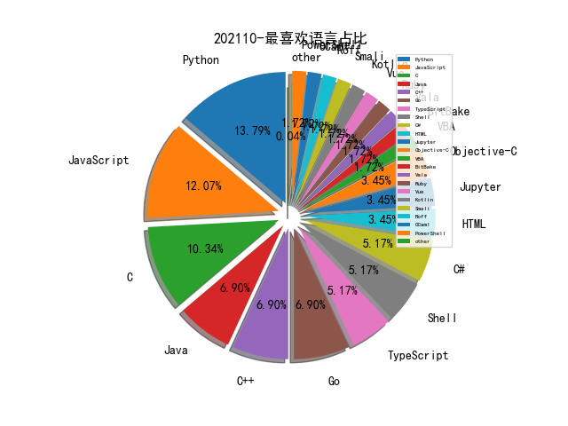

# [数据--所有](README_20.md)
# [数据--年度](README_2021.md)
# 202110 信息源与信息类型占比

# 微信公众号 推荐
| nickname_english | weixin_no | title | url| 
| --- | --- | --- | ---| 
| 黑白之道 | i77169 | 2021年10月微软周二修复补丁71个漏洞和4个零日漏洞，1个零日正积极被利用 | https://mp.weixin.qq.com/s?__biz=MzAxMjE3ODU3MQ==&mid=2650524440&idx=1&sn=6763e810f83663de02ca04ca6f5cc43f | 3| 
| 赛博回忆录 | cybermemory | 端内钓鱼，反制蚁剑 | https://mp.weixin.qq.com/s?__biz=MzIxNDAyNjQwNg==&mid=2456098581&idx=1&sn=6e8301d60d9d787822aff13a36c96fe1 | 1| 
| 谢公子学安全 | xie_sec | 域渗透文章总结 | https://mp.weixin.qq.com/s?__biz=MzI2NDQyNzg1OA==&mid=2247489464&idx=1&sn=51ef4cdc836cfe7926c7abed8df666ab | 1| 
| 灼剑安全团队 | Tsojan | Windows下常见持久性后门 | https://mp.weixin.qq.com/s?__biz=Mzg5OTY1ODMxMg==&mid=2247488389&idx=1&sn=6a44456c4d7aebb2a5a14249c27cf667 | 3| 
| 山石网科安全技术研究院 | HSN_LAB | 2021鹤城杯｜Reverse及MISC部分WP全 | https://mp.weixin.qq.com/s?__biz=MzUzMDUxNTE1Mw==&mid=2247490038&idx=2&sn=f918ab9a73a7ef5793c3ac462f7cb3af | 1| 
| 嘶吼专业版 | Pro4hou | 恶意mitmproxy2 Python包被移除 | https://mp.weixin.qq.com/s?__biz=MzI0MDY1MDU4MQ==&mid=2247530157&idx=2&sn=fb39e6e2058d78f5fd37533a1495217b | 4| 
| 亿人安全 | Yr-Sec | 安卓逆向系列篇：Dalvik概念&破解实例 | https://mp.weixin.qq.com/s?__biz=Mzk0MTIzNTgzMQ==&mid=2247486964&idx=1&sn=e945ed694679402350656a55ab3c8377 | 4| 
| 乌雲安全 | hackctf | 实战,从外网Thinkphp5远程代码执行到杀入内网域控 | https://mp.weixin.qq.com/s?__biz=MzAwMjA5OTY5Ng==&mid=2247499166&idx=1&sn=13be7cb6a20312e4cb376aedb2087b53 | 2| 
| 三六零CERT | CERT-360 | Linux挖矿木马NtpClient事件分析 | https://mp.weixin.qq.com/s?__biz=MzU5MjEzOTM3NA==&mid=2247490300&idx=2&sn=47f6173b67c8f830101ae8491892fdd4 | 3| 
| 一个人的安全笔记 | xjiek2015 | [HTB] Luanne Writeup | https://mp.weixin.qq.com/s/GHC0G6ZVTIt_pSYDHTC4pw | 1| 
| SecOps急行军 | SecOpsWithU | 2021中国网络安全产业分析报告解读 | https://mp.weixin.qq.com/s/YgjVkukxQUTLBG1uRL-kEQ | 1| 
| HACK之道 | hacklearn | 实战,从XSS到远程代码执行 | https://mp.weixin.qq.com/s?__biz=MzIwMzIyMjYzNA==&mid=2247495950&idx=1&sn=30189402068def607f3758269aa04a80 | 1| 
| 酒仙桥六号部队 | anfu-360 | 记一次旁站渗透过程 | https://mp.weixin.qq.com/s?__biz=MzAwMzYxNzc1OA==&mid=2247494537&idx=1&sn=b22a4ad9d5d6f9b9ec206b383e782120 | 1| 
| 邑安全 | EansecD | 浅析Icmp原理及隐蔽攻击的方式 | https://mp.weixin.qq.com/s?__biz=MzUyMzczNzUyNQ==&mid=2247508165&idx=3&sn=860127f476895c46f8e5b5e3e1ec30dc | 7| 
| 维他命安全 | VitaminSecurity | 【漏洞通告】Microsoft 10月多个安全漏洞 | https://mp.weixin.qq.com/s?__biz=MzUxMDQzNTMyNg==&mid=2247496953&idx=2&sn=3ce4e5cb4fc0852a92701e28af4195ad | 6| 
| 祺印说信安 | qiyinshuoxinan | 使用以太网电缆创建无线信号从系统窃取数据 | https://mp.weixin.qq.com/s?__biz=MzA5MzU5MzQzMA==&mid=2652090349&idx=2&sn=a6d1dc86a0b276ea8d6aeb8c037baafa | 2| 
| 盾山实验室 | DunShanRR | 使用QueenSono从ICMP提取数据 | https://mp.weixin.qq.com/s?__biz=MzkzMjIwMDY4Nw==&mid=2247485592&idx=1&sn=5625b49218b2a567e7aa0a79ecd11234 | 4| 
| 火线Zone | huoxian_zone | Android权限使用错误相关漏洞 | https://mp.weixin.qq.com/s?__biz=MzI2NDQ5NTQzOQ==&mid=2247488998&idx=1&sn=b999221b1197ee709cdb5e577be0b16a | 3| 
| 渗透Xiao白帽 | SuPejkj | 【分享】某锁/某神/某狗的计算机名认证绕过 | https://mp.weixin.qq.com/s?__biz=MzI1NTM4ODIxMw==&mid=2247490114&idx=2&sn=68e76338156d4fa6a67967a698fbc924 | 5| 
| 安全客 | anquanbobao | 【技术分享】从TH2到RS3看WWW漏洞的攻与防 | https://mp.weixin.qq.com/s?__biz=MzA5ODA0NDE2MA==&mid=2649753774&idx=3&sn=63ef85efeefd862d3b201bc239c4ea02 | 4| 
| 天融信阿尔法实验室 | gh_0b0b1747bf15 | 天融信关于微软10月补丁日多个产品高危漏洞风险提示 | https://mp.weixin.qq.com/s?__biz=Mzg3MDAzMDQxNw==&mid=2247490528&idx=1&sn=a12ae28165348d5e47e7c32c049f408c | 1| 
| 哈拉少安全小队 | gh_b273ce95df95 | 【反序列化漏洞】phar反序列化原理&实例分析 | https://mp.weixin.qq.com/s?__biz=MzAxNzkyOTgxMw==&mid=2247487547&idx=1&sn=b29b696837c753d12ca64b529c640d9d | 5| 
| 合天网安实验室 | hee_tian | 关于Awd的小结 | https://mp.weixin.qq.com/s?__biz=MjM5MTYxNjQxOA==&mid=2652881776&idx=1&sn=ecf725b36ef8d423ab5401cd6ba4fc4a | 4| 
| aFa攻防实验室 | gzh_afagfsys | jwt攻击 | https://mp.weixin.qq.com/s?__biz=MzAxMjcxMjkyOA==&mid=2247485556&idx=1&sn=61fe8c7bf99ee0ea696731bd5502fb5b | 1| 
| SecIN技术平台 | sec-in | 原创 , 变量覆盖漏洞 | https://mp.weixin.qq.com/s?__biz=MzI4Mzc0MTI0Mw==&mid=2247491391&idx=1&sn=4e5fd2b1cad9a261be345978566de106 | 1| 
| Khan安全攻防实验室 | KhanCJSH | Fofa 查询脚本 | https://mp.weixin.qq.com/s?__biz=MzAwMjQ2NTQ4Mg==&mid=2247487770&idx=1&sn=c9d4d530f9f9477bfcf1cc299100800c | 2| 
| HACK学习呀 | Hacker1961X | 实战 , 一次运气很好的文件上传绕过 | https://mp.weixin.qq.com/s?__biz=MzI5MDU1NDk2MA==&mid=2247500646&idx=1&sn=cdedfce1a6b2694c97350fb033a7ab75 | 6| 
| 高效运维 | greatops | Filebeat、Logstash、Rsyslog 各种姿势采集Nginx日志 | https://mp.weixin.qq.com/s?__biz=MzA4Nzg5Nzc5OA==&mid=2651704583&idx=1&sn=ed2a71e8bbb4a0314d8329e135782d63 | 1| 
| 锦行信息安全 | jeeseensec | 技术分享 , DLL注入之远线程注入 | https://mp.weixin.qq.com/s?__biz=MzIxNTQxMjQyNg==&mid=2247487987&idx=1&sn=e74bf13ceda0dd9267a5d2efad82d62c | 1| 
| 进德修业行道 | gh_ad128618f5e9 | 内网穿透之frp | https://mp.weixin.qq.com/s?__biz=Mzg5NTU2NjA1Mw==&mid=2247485925&idx=1&sn=98c3d160dc86a5214b7a6d382571d6c5 | 3| 
| 网络侦查研究院 | PCpolicesir | dll注入&代码注入 学习总结 | https://mp.weixin.qq.com/s?__biz=MzIxOTM2MDYwNg==&mid=2247507947&idx=2&sn=8f1018f75cce54688342ce51c1a9efb4 | 2| 
| 绿盟科技研究通讯 | nsfocus_research | 逃逸风云再起：从CVE-2017-1002101到CVE-2021-25741 | https://mp.weixin.qq.com/s?__biz=MzIyODYzNTU2OA==&mid=2247490554&idx=1&sn=3f07a99384048b665605aa5d5b52e0e5 | 1| 
| 知道创宇 | knownsec | 知道创宇云监测—ScanV MAX更新： Apache、DedeCMS、Hadoop Yarn等9个漏洞可监测 | https://mp.weixin.qq.com/s?__biz=MjM5NzA3Nzg2MA==&mid=2649855618&idx=2&sn=73f2dc512a5e24d1722fe2138c166deb | 1| 
| 看雪学院 | ikanxue | 羊城杯部分逆向wp | https://mp.weixin.qq.com/s?__biz=MjM5NTc2MDYxMw==&mid=2458396898&idx=2&sn=6e8934ae449e0e9fd658e49b274fae05 | 2| 
| 潇湘信安 | xxxasec | 某锁/某神/某狗的计算机名认证绕过 | https://mp.weixin.qq.com/s?__biz=Mzg4NTUwMzM1Ng==&mid=2247491997&idx=1&sn=752f87a9127b003feb2540317054627c | 2| 
| 慢雾科技 | SlowMist | 天价手续费分析：我不是真土豪 | https://mp.weixin.qq.com/s?__biz=MzU4ODQ3NTM2OA==&mid=2247492157&idx=1&sn=791e7d52dbb9704ceb22e809be388454&chksm=fdde9cbacaa915ac5ef8f3041c9fdcffb926aa7e3c0025a141fa8d20f1c5adde55f07e8d44ec&token=1743499466&lang=zh_CN#rd | 1| 
| 开源聚合网络空间安全研究院 | OSPtech_Cyberspace | 【安全科普】浅析Linux系统入侵排查与应急响应技术 | https://mp.weixin.qq.com/s?__biz=MzI4NTE4NDAyNA==&mid=2650389817&idx=1&sn=ba1867834bf9a679985fad53ddf0ee42 | 1| 
| 小道安全 | kdsafety | APP加固攻防梳理 | https://mp.weixin.qq.com/s?__biz=MzUxODkyODE0Mg==&mid=2247488481&idx=1&sn=86a5a35dff7438503bc5ea2ecc644364 | 1| 
| 娜璋AI安全之家 | gh_91f1fe28fc6e | [AI安全论文] 08.基于溯源图的APT攻击检测安全顶会论文总结 | https://mp.weixin.qq.com/s/NosFWfRl9Mmqi2_QXUJNpw | 1| 
| 互联网安全内参 | anquanneican | 警惕！挖矿木马盯上华为云，利用“配置错误”发动攻击 | https://mp.weixin.qq.com/s?__biz=MzI4NDY2MDMwMw==&mid=2247499645&idx=1&sn=c33eb1ae0c8f1b59509e45e414436687 | 1| 
| 云剑侠心 | yunjianxx | vulnhub-Linux-RAVEN: 2 | https://mp.weixin.qq.com/s?__biz=MzkzMzEwNzIzNQ==&mid=2247494262&idx=1&sn=06a66c51667c585d0c0dc0025e6ae359 | 2| 
| LSCteam | gh_d97c073d1479 | 业务功能滥用 | https://mp.weixin.qq.com/s?__biz=MzUyMjAyODU1NA==&mid=2247488656&idx=1&sn=d0a32ce3f31d304c7fcb775165db67d8 | 4| 
| 黑伞安全 | hack_umbrella | C2服务器隧道代理分析 | https://mp.weixin.qq.com/s?__biz=MzU0MzkzOTYzOQ==&mid=2247486266&idx=1&sn=cf661e6fcde911643ed7a6e232d3c2f2 | 1| 
| 骨哥说事 | guge_guge | 寻找更多IDOR漏洞的几种方法 | https://mp.weixin.qq.com/s?__biz=MjM5Mzc4MzUzMQ==&mid=2650254839&idx=1&sn=341703cc61bad431f1b6570678147710 | 1| 
| 掌控安全EDU | ZKAQEDU | 文库｜APP渗透之Android 7.0 抓包 | https://mp.weixin.qq.com/s?__biz=MzUyODkwNDIyMg==&mid=2247518431&idx=1&sn=de7e524a5f8427e539b468c1f61e64cc | 2| 
| 安全攻防团队 | gh_983c1037a3f6 | JAVA反序列化之C3P0不出网利用 | https://mp.weixin.qq.com/s/KBog9XXz7Of93hAiV8Y7fQ | 1| 
| 奇安信威胁情报中心 | gh_166784eae33e | Kimsuky武器库更新：利用新冠疫情为诱饵针对韩国地区的攻击活动分析 | https://mp.weixin.qq.com/s?__biz=MzI2MDc2MDA4OA==&mid=2247497037&idx=1&sn=a3a7e4783e8b82a6b98653cb7965ac90 | 1| 
| web安全工具库 | websec-tools | Metasploit6.0系列教程 -- 爆破WordPress网站 | https://mp.weixin.qq.com/s?__biz=MzI4MDQ5MjY1Mg==&mid=2247490690&idx=1&sn=bc809c8a6470d48d0246fefcda9b12e1 | 2| 
| Tide安全团队 | TideSec | 【红蓝对抗】利用CS进行内网横向 | https://mp.weixin.qq.com/s/tAsPmsinh0Q3fBEFUuCX3Q | 2| 
| Linux中国 | linux-cn | 在 Linux 上使用 jps 命令检查 Java 进程 , Linux 中国 | https://mp.weixin.qq.com/s?__biz=MjM5NjQ4MjYwMQ==&mid=2664642134&idx=4&sn=b6f5b32ab817ca26c658f1a81fb2ca99 | 3| 
| LemonSec | lemon-sec | 浅谈 , 从Web安全到APT防御 | https://mp.weixin.qq.com/s?__biz=MzUyMTA0MjQ4NA==&mid=2247516883&idx=2&sn=4169096378baaf0201e1c601ce50d6a1 | 5| 
| Hacking黑白红 | Hacking012 | 渗透测试——提权方式总结 | https://mp.weixin.qq.com/s?__biz=Mzg2NDYwMDA1NA==&mid=2247500279&idx=2&sn=6577f0f5dd2bb3da1504509e0884359e | 5| 
| GoCN | golangchina | 「GoCN酷Go推荐」用户态和内核态通信的利器-netlink库 | https://mp.weixin.qq.com/s?__biz=MzA4ODg0NDkzOA==&mid=2247493303&idx=1&sn=7c4522a676758c3160828a53c5d959fc | 1| 
| 98KSec | AKA-98KSec | 浅析Ofbiz反序列化漏洞（CVE-2020-9496） | https://mp.weixin.qq.com/s?__biz=Mzk0MTIxNzAyNw==&mid=2247483960&idx=1&sn=152320b737ddea7c1a29a5d3ba4dba83 | 2| 
| 猪猪谈安全 | zzt-anquan | 信息收集组合拳之从废弃接口中寻找漏洞 | https://mp.weixin.qq.com/s?__biz=MzIyMDAwMjkzNg==&mid=2247496010&idx=1&sn=9b7f56a421758051cc71c51c7fed44e1 | 2| 
| 河南等级保护测评 | hndjbh | 新补丁发布修复0-Day Apache路径遍历到RCE攻击 | https://mp.weixin.qq.com/s?__biz=Mzg2NjY2MTI3Mg==&mid=2247484094&idx=2&sn=d3dba5e3090f6a24d73625e9ad6de764 | 2| 
| 无级安全 | wujisec | Apache任意文件读取补丁绕过（CVE-2021-42013） | https://mp.weixin.qq.com/s?__biz=MzI0Nzc0NTcwOQ==&mid=2247485088&idx=1&sn=c89fb872dc89985303a41606c5020880 | 2| 
| 无害实验室sec | WUHAISEC | Office控件钓鱼攻击-强制用户启用宏 | https://mp.weixin.qq.com/s?__biz=MzkwMTE4NDM5NA==&mid=2247485117&idx=1&sn=bc4854536a58902d1d9244fce3c1d39c | 2| 
| 微步在线研究响应中心 | gh_c108d4d389bf | 安全威胁情报周报（10.04-10.10） | https://mp.weixin.qq.com/s?__biz=MzA5MDc1NDc1MQ==&mid=2247489913&idx=1&sn=643a78acd8b300053715f8317f5b5533 | 1| 
| 大余安全 | dayuST123 | HackTheBox-windows-Monteverde | https://mp.weixin.qq.com/s?__biz=Mzg3MDMxMTg3OQ==&mid=2247497058&idx=1&sn=28a0b88a31b9a0e4cca669c89927daeb | 6| 
| V安全资讯 | v-safe-cn | DedeCMS_V5.8.1 ShowMsg 模板注入远程代码执行漏洞分析 | https://mp.weixin.qq.com/s?__biz=MzI4MDQ1MzQ0NA==&mid=2247488021&idx=2&sn=518dda96d5fe1129926e74a1859009ab | 1| 
| Top security | Top_security | Getshell思路总结 | https://mp.weixin.qq.com/s?__biz=Mzg3MDU0NjQyMg==&mid=2247486964&idx=1&sn=a9b3d8100625a28e257230c5909b1eac | 3| 
| TeamsSix | teamssix-com | Kerberos 协议详解与利用 | https://mp.weixin.qq.com/s?__biz=MzI5Mzk5NTIwMg==&mid=2247486289&idx=1&sn=27f3961c6b888e7ab4832221b3674cc6 | 1| 
| Ots安全 | AnQuan7 | CVE-2021-41773：Apache HTTP Server 中的路径遍历零日漏洞被利用 | https://mp.weixin.qq.com/s?__biz=MzAxMjYyMzkwOA==&mid=2247493149&idx=1&sn=c943e7d0fa22695f2b6e4529dc43be33 | 3| 
| 默安玄甲实验室 | gh_fb6fe2418513 | 小侃威胁情报（一） | https://mp.weixin.qq.com/s/zY1cCM7ysYzLpn0_5B7K1w | 1| 
| 黑云信息安全 | heiyunxinxi | 小白如何编写自己的POC和EXP，并实现批量刷洞 | https://mp.weixin.qq.com/s?__biz=Mzg5OTYxMjk0Mw==&mid=2247484938&idx=2&sn=3036b836eb4779dcc2b7ed320cae35d4 | 2| 
| 长亭安全课堂 | chaitintech_release | 漏洞风险提示 , Apache Http Server 路径穿越文件读取与命令执行漏洞 | https://mp.weixin.qq.com/s?__biz=MzIwMDk1MjMyMg==&mid=2247487349&idx=1&sn=ae99cb1ab66622d59c1614cc78b608fc | 1| 
| 觉学社 | WakerGroup | Rust生态安全漏洞总结系列 , Part 3 | https://mp.weixin.qq.com/s/RsfEKl7FAGs2L9vXKC0rWQ | 3| 
| 宸极实验室 | ChenJiLab | 『红蓝对抗』Linux 系统 权限维持 | https://mp.weixin.qq.com/s?__biz=Mzg4NTA0MzgxNQ==&mid=2247485079&idx=1&sn=be7b06c917c18c8767593e89d5de7ae9 | 1| 
| 安全牛 | aqniu-wx | 一种新型电磁攻击，用以太网线作为“天线”窃取敏感数据 | https://mp.weixin.qq.com/s?__biz=MjM5Njc3NjM4MA==&mid=2651106215&idx=1&sn=024f0e7402655f6c84791cf7f9733d4f | 1| 
| 凌晨一点零三分 | gh_f2274e37fc2b | FreeRDP安全性思考 | https://mp.weixin.qq.com/s/VQ5JwOPHSJKyGRWcA4v2Dg | 1| 
| Seebug漏洞平台 | seebug_org | rdp 协议攻击面与安全性分析 | https://mp.weixin.qq.com/s?__biz=MzAxNDY2MTQ2OQ==&mid=2650950827&idx=1&sn=7f3828318ed5363cc0c662f3d4564bbe | 1| 
| Linux学习 | LoveLinux1024 | 如何搭建一台永久运行的个人服务器？ | https://mp.weixin.qq.com/s?__biz=MzI4MDEwNzAzNg==&mid=2649454806&idx=1&sn=ec72523fe6b3818f6253169b7177805f | 1| 
| Gamma实验室 | HackerLearning | 物理渗透战士：教你如何使用BadUSB配合CS免杀实现上线 | https://mp.weixin.qq.com/s?__biz=Mzg2NjQ2NzU3Ng==&mid=2247488929&idx=1&sn=a0f2235a90c03f9c0770247fb8d4cece | 1| 
| 阿里云应急响应 | gh_12f3517e40de | 【漏洞通告】Apache HTTPd 2.4.49 路径穿越与命令执行漏洞（CVE-2021-41773） | https://mp.weixin.qq.com/s?__biz=MzI5MzY2MzM0Mw==&mid=2247486163&idx=2&sn=c2fb165bf4f1fcc29362a5c83f9ca2a0 | 2| 
| 虎符智库 | TT_Thinktank | 起底国家级APT组织：海莲花（APT-Q-31） | https://mp.weixin.qq.com/s?__biz=MzIwNjYwMTMyNQ==&mid=2247486620&idx=1&sn=70eea6c91b254d09946f543f7b1590b5 | 1| 
| 腾讯安全威胁情报中心 | gh_05a6c5ec3f78 | Apache 发布多个高危漏洞利用警告，建议用户立即修补Web 服务器！ | https://mp.weixin.qq.com/s?__biz=MzI5ODk3OTM1Ng==&mid=2247499398&idx=2&sn=f2bd38a48254c3c771e644581b914a0d | 1| 
| 程序员阿甘 | gh_a2e36d69d566 | 逻辑漏洞出现场景、利用方式总结 | https://mp.weixin.qq.com/s?__biz=MzI4MTkzNDIyMg==&mid=2247493899&idx=1&sn=595e3fa572bfca73a0b3bb5dba96fa56 | 1| 
| 弥天安全实验室 | gh_41292c8e5379 | 实战｜记一次应急响应到溯源入侵者 | https://mp.weixin.qq.com/s?__biz=MzU2NDgzOTQzNw==&mid=2247487623&idx=1&sn=9f6a82738a6a710cadc2d552b2acb618 | 1| 
| 安全族 | anquanzu666 | JAVA序列化与反序列化 | https://mp.weixin.qq.com/s?__biz=Mzg2NjU0MjA0Ng==&mid=2247485287&idx=1&sn=4474d4f40b82859421ec97841bf050a5 | 1| 
| 奇安信 CERT | gh_64040028303e | 【安全风险通告】Apache HTTP Server目录遍历漏洞安全风险通告 | https://mp.weixin.qq.com/s?__biz=MzU5NDgxODU1MQ==&mid=2247494842&idx=1&sn=dd132e4ee42d522b6a578c91a256f392 | 1| 
| 代码卫士 | codesafe | Apache 紧急修复已遭利用且补丁不完整的 HTTP Server 0day | https://mp.weixin.qq.com/s?__biz=MzI2NTg4OTc5Nw==&mid=2247508234&idx=2&sn=13cb25f49351a1d2337aeb71777c2257 | 1| 
| 云鼎实验室 | YunDingLab | 浅谈云上攻防--SSRF漏洞带来的新威胁 | https://mp.weixin.qq.com/s/gMdorUjh5U_dJdGgRLPzNQ | 2| 
| 白帽子社区 | baimaoshequ | 记一次MySQL注入绕过 | https://mp.weixin.qq.com/s?__biz=MzUyMTAyODYwNg==&mid=2247493579&idx=1&sn=a3987b31906f2e3114d8e4e70444ff16 | 1| 
| 渗透攻击红队 | RedTeamHacker | 使用 BloodHound 分析大型域内环境 | https://mp.weixin.qq.com/s?__biz=MzkxNDEwMDA4Mw==&mid=2247488685&idx=1&sn=fffb08215f6e8a3505ab317d6b3be4d5 | 1| 
| 且听安全 | qtcyber | 【最新漏洞预警】CVE-2021-41773-Apache HTTP Server 路径穿越漏洞快速分析与复现 | https://mp.weixin.qq.com/s/XEnjVwb9I0GPG9RG-v7lHQ | 1| 
| IRT工业安全红队 | ICSRedTeam | Honeywell PKS系统被发现存在任意代码执行和DoS攻击漏洞行和DoS攻击漏洞 | https://mp.weixin.qq.com/s?__biz=MzAwNDI0MDYwMw==&mid=2247484779&idx=1&sn=253f20d12ed2f9708fd055f2144d78b9 | 1| 
| 系统安全运维 | Taurus-1314147 | 通过一道CTF学习HTTP协议请求走私 | https://mp.weixin.qq.com/s?__biz=Mzk0NjE0NDc5OQ==&mid=2247492456&idx=1&sn=f52b2537ade82771fcd5beabcfccc20d | 10| 
| 数缘信安社区 | gh_91e7eb722058 | 用故障注入和二进制分析对BootLoader实施攻击 | https://mp.weixin.qq.com/s/okV-i5un6ewvbW70K7n8eQ | 1| 
| 天億网络安全 | tywlaq | 实战｜内网穿透之多层代理 | https://mp.weixin.qq.com/s?__biz=MzU4ODU1MzAyNg==&mid=2247497089&idx=1&sn=aac08b7ca24183c0adbaf3d41802958e | 1| 
| 鸿鹄实验室 | gh_a2210090ba3f | 利用DPAPI加密shellcode | https://mp.weixin.qq.com/s?__biz=MzU0MjUxNjgyOQ==&mid=2247488732&idx=1&sn=a5c3987ee627b25a15431d54d6a2307b | 1| 
| 网络安全等保测评 | rxDJCP | 安全通信网络-（二）通信传输 | https://mp.weixin.qq.com/s?__biz=MzI3MDY0Nzg1Nw==&mid=2247485547&idx=2&sn=36ba72a25ff3452947ead540b69ff4ad | 1| 
| 安全行者老霍 | gh_c2b78e839fd7 | 自动化入侵和攻击模拟（BAS）： 降低成本和风险的革命已经来临 | https://mp.weixin.qq.com/s/UQcRr5kiKXf_iZ-_CKn_1Q | 1| 
| 安全学术圈 | secquan | 基于频域分析的实时恶意流量检测 | https://mp.weixin.qq.com/s/nAiN-17OYh7begqcUYGJyQ | 5| 
| FreeBuf | freebuf | 2021 Gartner安全运营成熟度曲线（Hype Cycle）解读 | https://mp.weixin.qq.com/s/RhTVIsGkIumUB-YfEAv6Jg | 10| 
| RCE TEAM | gh_3688f58729a9 | 文件上云 - 对象存储的攻击方式 | https://mp.weixin.qq.com/s/eZ8OAO5ELgUNvVricIStGA | 1| 

# 组织github账号 推荐
| github_id | title | url | org_url | org_profile | org_geo | org_repositories | org_people | org_projects | repo_lang | repo_star | repo_forks| 
| --- | --- | --- | --- | --- | --- | --- | --- | --- | --- | --- | ---| 

# 私人github账号 推荐
| github_id | title | url | p_url | p_profile | p_loc | p_company | p_repositories | p_projects | p_stars | p_followers | p_following | repo_lang | repo_star | repo_forks | 
| --- | --- | --- | --- | --- | --- | --- | --- | --- | --- | --- | --- | --- | --- | ---| 
| xforcered | 远程判断目标系统是否运行 Web Client service (WebDAV) 的工具 | https://github.com/xforcered/GetWebDAVStatus | None | None | None | None | 0 | 0 | 0 | 0 | 0 | C#,Python,C,JavaScript | 0 | 0 | 1| 
| jonathandata1 | 有研究员公开了一个 iOS 15.0.1 RCE PoC 代码，不过该漏洞需要设备信任连接的 Host 才能触发 | https://github.com/jonathandata1/ios_15_rce | https://github.com/jonathandata1?tab=followers | Just a guy | Boerne, TX | Zroblack, LLC | 19 | 0 | 0 | 0 | 0 | Shell,JavaScript,Smali | 0 | 0 | 1| 
| guardicore | monkey: Infection Monkey - An automated pentest tool | https://github.com/guardicore/monkey | None | None | None | None | 0 | 0 | 0 | 0 | 0 | Python,Go,C,Java,C# | 0 | 0 | 1| 
| facebook | Mariana Trench - Facebook 开源的一款 Android 静态漏洞扫描工具 | https://github.com/facebook/mariana-trench/ | None | None | None | None | 0 | 0 | 0 | 0 | 0 | C,TypeScript,Java,Python,JavaScript,OCaml,C++,Objective-C,Jupyter,Ruby | 0 | 0 | 1| 
| aemmitt-ns | radius - 基于 radare2 写的符号执行引擎 | https://github.com/aemmitt-ns/radius | https://github.com/aemmitt-ns?tab=followers | Mobile Security Researcher at NowSecure | None | @nowsecure | 16 | 0 | 0 | 0 | 0 | Python,C,JavaScript,Vala | 0 | 0 | 1| 
| Metarget | Metarget：构建云原生基础设施靶场 | https://github.com/Metarget/metarget | None | None | None | None | 0 | 0 | 0 | 0 | 0 | Python,Shell | 0 | 0 | 1| 
| BC-SECURITY | Starkiller: Starkiller is a Frontend for PowerShell Empire | https://github.com/BC-SECURITY/Starkiller | None | None | None | None | 0 | 0 | 0 | 0 | 0 | C,Vue,Python,VBA,C++,C#,PowerShell | 0 | 0 | 1| 

# medium_xuanwu 推荐
| title | url| 
| --- | ---| 
| Bypassing required reviews using GitHub Actions | http://medium.com/cider-sec/bypassing-required-reviews-using-github-actions-6e1b29135cc7| 
| Azure Privilege Escalation via Service Principal Abuse | http://medium.com/m/global-identity?redirectUrl=https%3A%2F%2Fposts.specterops.io%2Fazure-privilege-escalation-via-service-principal-abuse-210ae2be2a5| 

# medium_secwiki 推荐
| title | url| 
| --- | ---| 

# zhihu_xuanwu 推荐
| title | url| 
| --- | ---| 

# zhihu_secwiki 推荐
| title | url| 
| --- | ---| 
| HFL：基于混合模糊测试的Linux内核漏洞挖掘 | https://zhuanlan.zhihu.com/p/123373175| 
| 图在异常流量识别中的应用和演进 | https://zhuanlan.zhihu.com/p/419340068| 
| 沉浸式《程序分析》教材 | https://zhuanlan.zhihu.com/p/417187798| 

# xz_xuanwu 推荐
| title | url| 
| --- | ---| 

# xz_secwiki 推荐
| title | url| 
| --- | ---| 

# 日更新程序
`python update_daily.py`