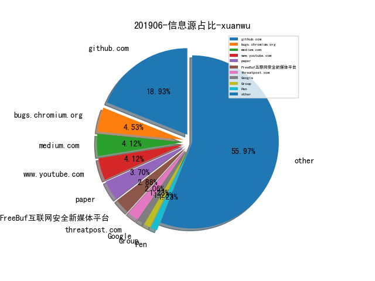
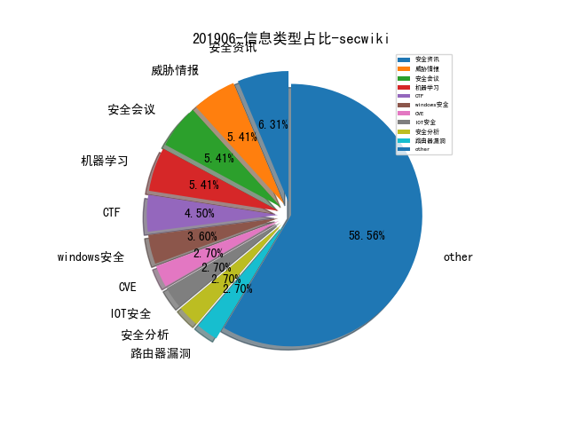
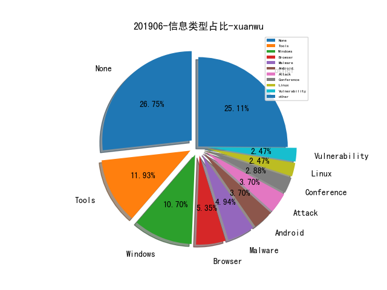
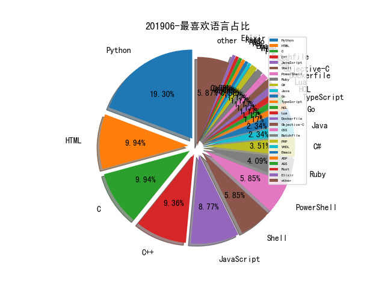

# [数据年报](README_YEAR.md)
# [数据月报-5月](README_5.md)
# [数据月报-4月](README_4.md)
# [数据月报-3月](README_3.md)
# 201906 信息源与信息类型占比

# 微信公众号 推荐
| nickname_english | weixin_no | url | title| 
| --- | --- | --- | ---| 
| 现代军事 | xiandaijunshi | https://mp.weixin.qq.com/s/dW-k_LlWZt04pakFuvfX8A | 解读德国情报工作建设 | 1| 
| 网络法前哨 | cyberlawing | https://mp.weixin.qq.com/s/P21rRO_tFo9ZDCrbDdIHGA | 公安部｜通报净网2019专项行动典型案例 | 1| 
| 仙人掌情报站 | sec-cactus | https://mp.weixin.qq.com/s/Tx9nHxvp9ezd0hf1PZcmiQ | [搬砖手册]基于Packetbeat探索搭建轻量级网络流量监测系统 | 1| 
| 学蚁致用 | sudo_i | https://mp.weixin.qq.com/s/j4Dqhko9nnxeuDkLZKftDA | Defcon China 1.0 胸卡破解笔记 | 1| 
| 网络与信息安全学报 | cjnis2015 | https://mp.weixin.qq.com/s/mQYaX-WGDZIIW26koGxTzQ | 网络空间安全学科简论 | 1| 
| 美团安全应急响应中心 |  | https://mp.weixin.qq.com/s/YQn1FQICk1esxvBCHZntFA | 安全架构评审实战 | 1| 
| 腾讯科恩实验室 | KeenSecurityLab | https://mp.weixin.qq.com/s/sb2hndSGn_IpMWmSGC4rPg | 《2018年Android应用安全白皮书》重磅发布：超98%Android应用存有安全风险 | 1| 
| 安全小飞侠 | AvFisher | https://mp.weixin.qq.com/s/rmd8CvQKRMQWFR1o3t7I8w | 企业安全建设的体系思考与落地实践 | 1| 
| 网安网事 |  | https://mp.weixin.qq.com/s/YHmQDUZze_qbmebaRlTKGg | 网安独角兽CrowdStrike IPO分析（一） | 2| 
| 信安之路 | xazlsec | https://mp.weixin.qq.com/s/M-J4FhGA5zg1WZCA9-Houg | DataCon 的 DNS 恶意流量检查一题回顾 | 1| 
| FreeBuf | freebuf | https://mp.weixin.qq.com/s/vBYxrmnBoM-Abl_y1v4DtA | 基于EVE-NG平台上构建企业内网攻防环境 | 1| 
| HLB虎狼帮 | hlbhulangbang | https://mp.weixin.qq.com/s/tNI54MlsN9bFKnm9kL6G-Q | ESET分析了Turla APT对武器化PowerShell的使用 | 1| 
| 奇安信威胁情报中心 |  | https://mp.weixin.qq.com/s/QINNIBQDY2bvLi795LsOoA | 银钩：针对国内网银用户的钓鱼的攻击活动 | 1| 
| 安天 | Antiylab | https://mp.weixin.qq.com/s/3ZQhn32NB6p-LwndB2o2zQ | 安天发布“方程式组织”攻击中东SWIFT服务商事件复盘分析报告 | 1| 

# 组织github账号 推荐
| github_id | title | url | org_url | org_profile | org_geo | org_repositories | org_people | org_projects | repo_lang | repo_star | repo_forks| 
| --- | --- | --- | --- | --- | --- | --- | --- | --- | --- | --- | ---| 
| nccgroup | BKScan - 支持对开启密码验证（NLA）的 RDP 机器扫描 CVE-2019-0708 漏洞 | https://github.com/nccgroup/BKScan | https://www.nccgroup.trust | Please report all security issues to security at nccgroup dot com | Global | 181 | 15 | 0 | C,Shell,Java,Python,Ruby,JavaScript,C#,HTML,Elixir,Go,Dockerfile,Rust | 725 | 81 | 1| 
| chaitin | xray：HTTP 代理进行被动扫描 | https://github.com/chaitin/xray | http://chaitin.com | 长亭科技 | Beijing | 17 | 8 | 0 | TypeScript,Python,JavaScript,C++,Lua,HTML,Go | 0 | 0 | 1| 
| doyensec | Electronegativity - 在基于 Electron 实现的应用中检查安全配置不当问题的工具 | https://github.com/doyensec/electronegativity | https://doyensec.com | Doyensec works at the intersection of software development and offensive engineering. We discover vulnerabilities others cannot, and help mitigate the risk. | San Francisco / Warsaw | 12 | 1 | 0 | Python,C,JavaScript,Java | 0 | 0 | 1| 
| cw-leia | 自定义的智能卡分析测试套件，包含软件和硬件 ，设备使用于Chipwhisperer | https://github.com/cw-leia | None | LEIA: the Lab Embedded ISO7816 Analyzer A Custom Smartcard Reader for the ChipWhisperer by @ANSSI-FR | None | 4 | 0 | 0 | C,Shell,HTML | 0 | 0 | 1| 

# 私人github账号 推荐
| github_id | title | url | p_url | p_profile | p_loc | p_company | p_repositories | p_projects | p_stars | p_followers | p_following | repo_lang | repo_star | repo_forks | 
| --- | --- | --- | --- | --- | --- | --- | --- | --- | --- | --- | --- | --- | --- | ---| 
| Xyntax | 研究员 Xyntax 公开了多个 Paper，主要方向是安全数据分析和威胁防御 | https://github.com/Xyntax/slides | https://www.cdxy.me | Web developer, security researcher and data analyst. | Hangzhou,China | Alibaba Cloud | 50 | 0 | 297 | 902 | 86 | Python,HTML,PowerShell | 1100 | 579 | 1| 
| LinusHenze | KeySteal是一个针对macOS<=10.14.3 Keychain漏洞利用程序，允许在没有用户提示的情况下访问Keychain中的密码。 | https://github.com/LinusHenze/Keysteal | None |  | Germany | None | 5 | 0 | 0 | 143 | 0 | C,JavaScript,Objective-C,C++ | 321 | 86 | 1| 
| al0ne | Vxscan: python3写的综合扫描工具 | https://github.com/al0ne/Vxscan | None | 入侵检测/流量分析/应急溯源 | china | None | 11 | 0 | 528 | 143 | 181 | Python,Shell | 0 | 0 | 1| 
| bkth | bkth在SSTIC 2019上演讲《A tale of Chakra bugs through the years》，详细讲解了微软Edge浏览器脚本引擎ChakraCore的各种漏洞。 | https://github.com/bkth/Tale-Of-Chakra-Bugs | https://twitter.com/bkth_ | Security Researcher, CTF player, I like JavaScript but probably not in the same way as most people ;) | France | None | 14 | 0 | 15 | 138 | 3 | Python,C,JavaScript | 76 | 14 | 1| 
| kkamagui | Shadow-box - 基于虚拟化技术实现的一个轻量级的 Linux 操作系统监控框架 | https://github.com/kkamagui/shadow-box-for-x86 | http://kkamagui.github.io | Researcher. USENIX Security, HITBSecConf, Black Hat, beVX, KIMCHICON Speaker. Linux Kernel Contributor. Author of 64-bit multicore OS principles and structure. | South Korea | National Security Research Institute of South Korea | 34 | 0 | 32 | 128 | 2 | Python,C | 138 | 34 | 1| 
| enovella | APKiD - APK 样本自我防护（加壳、混淆）产品的识别，来自 NowSecure 研究员 Eduardo Novella | https://github.com/enovella/cve-bio-enovella/blob/master/slides/APKiD-NowSecure-Connect19-enovella.pdf | https://github.com/nowsecure | Mobile Security Researcher | London, UK | @nowsecure | 140 | 0 | 86 | 106 | 54 | Python,C,JavaScript,Java | 95 | 19 | 1| 
| lowleveldesign | 用于 trace .NET 程序网络通信流量的工具 | https://github.com/lowleveldesign/dotnet-netrace | https://lowleveldesign.org | System Engineer • Interested in profiling, security, and OS internals | Poland | None | 19 | 0 | 91 | 91 | 0 | C#,ASP,C++ | 489 | 44 | 1| 
| mk-fg | 通过 AppArmor Linux 内核安全模块限制应用程序访问权限 | https://github.com/mk-fg/apparmor-profiles | http://fraggod.net | Random foss user, tinkerer, dev and freelancer. Mirror: http://fraggod.net/code/git/ | Yekaterinburg, RU | None | 80 | 0 | 22 | 76 | 0 | Python | 201 | 35 | 1| 
| husthuke | awesome-knowledge-graph: 整理知识图谱相关学习资料 | https://github.com/husthuke/awesome-knowledge-graph | https://husthuke.github.io/ |  | beijing | VIPKID | 31 | 0 | 234 | 74 | 31 | Jupyter,HTML,Java,CSS | 282 | 62 | 1| 
| Kira-cxy | 科恩实验室 Kira-cxy 在 TenSec 2019 会议关于虚拟化以及 QEMU slirp:tcp_emu 堆溢出虚拟机逃逸漏洞（CVE-2019-6778）的分析 | https://github.com/Kira-cxy/qemu-vm-escape | None | baby security researcher | None | None | 4 | 0 | 337 | 63 | 97 | C,HTML,C++ | 101 | 18 | 1| 
| numirias | 通过 VIM 对 modelines 特殊格式的支持可以实现任意代码执行。漏洞影响 Vim < 8.1.1365, Neovim < 0.3.6 版本 | https://github.com/numirias/security/blob/master/doc/2019-06-04_ace-vim-neovim.md | https://twitter.com/rawsec | Infosec fanboy | Europe | None | 18 | 0 | 40 | 44 | 5 | Python,JavaScript | 270 | 13 | 1| 
| Sheisback | Win32k CreateWindowEx 函数 UAF Exploit | https://github.com/Sheisback/CVE-2019-0859-1day-Exploit | http://sheisback.xyz |  | None | None | 66 | 0 | 10 | 27 | 4 | Python,C#,C,JavaScript,C++ | 56 | 19 | 1| 
| tikazyq | crawlab: 基于Celery的爬虫分布式爬虫管理平台 | https://github.com/tikazyq/crawlab/blob/master/README-zh.md | None |  | Chongqing, China | None | 35 | 0 | 98 | 24 | 19 | Python,Vue | 527 | 100 | 1| 
| trombastic | 基于 Django 实现的开源 SCADA 系统，支持多种工控协议 | https://github.com/trombastic/PyScada | http://martin-schroeder.net |  | Berlin | Technische Universität Berlin | 11 | 0 | 8 | 19 | 0 | Python,JavaScript | 138 | 52 | 1| 
| rutkai | pentest-bookmarks - 渗透测试相关的资料收集 | https://github.com/rutkai/pentest-bookmarks | http://rutkai.hu/ |  | Hungary | LogMeIn | 14 | 0 | 42 | 15 | 0 | HTML,JavaScript,PHP | 9 | 6 | 1| 
| No-Github | Dork-Admin: 盘点近年来的数据泄露事件 | https://github.com/No-Github/Dork-Admin | None | 井底之蛙 | remote | None | 30 | 0 | 574 | 14 | 10 | HTML | 132 | 7 | 1| 
| cwerling | 分析和解析AMD安全处理器的固件工具包 | https://github.com/cwerling/psptool | None |  | Berlin | None | 2 | 0 | 10 | 10 | 0 | Python | 27 | 1 | 1| 
| cdisselkoen | pitchfork - 基于 argr，利用符号执行的方式检测 CPU Spectre 漏洞 | https://github.com/cdisselkoen/pitchfork | https://cseweb.ucsd.edu/~cdisselk | PhD student at UC San Diego | None | None | 33 | 0 | 3 | 9 | 0 | C++ | 0 | 0 | 1| 
| yogeshshe1ke | MobaTek MobaXterm 个人版 SSH 私钥泄漏漏洞（CVE-2019-7690） | https://github.com/yogeshshe1ke/CVE/ | https://twitter.com/yogesh_she1ke | Software Security | Binary Reversing | Exploitation | Bengaluru, India | None | 6 | 0 | 231 | 7 | 25 | Python,Ruby,PowerShell,C++ | 3 | 0 | 1| 
| mfthomps | RESim - 基于 Simics 模拟器的全系统模拟动态分析工具。 | https://github.com/mfthomps/RESim | None |  | None | None | 6 | 0 | 0 | 4 | 1 | Python,C#,HTML | 21 | 9 | 1| 

# 日更新程序
`python update_daily.py`