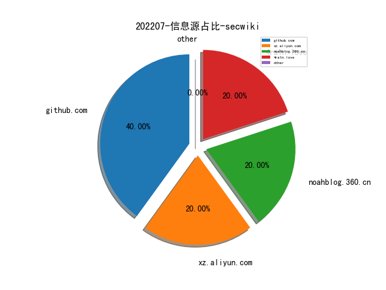
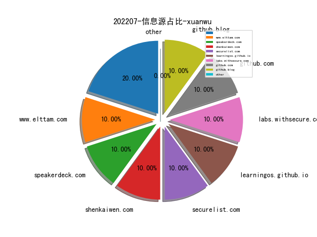
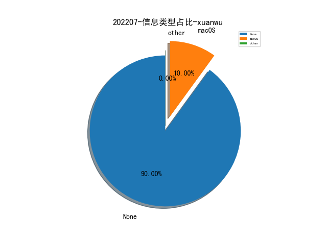
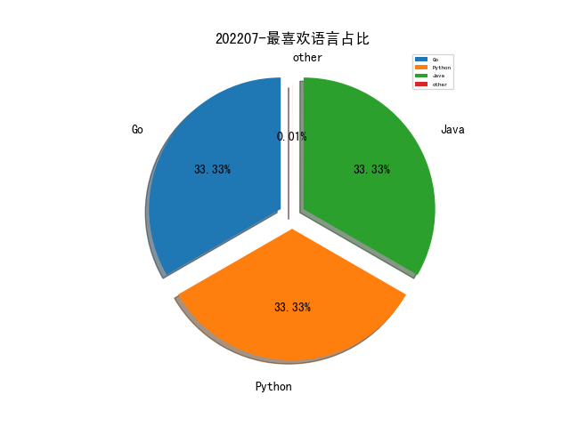

# [数据--所有](README_20.md)
# [数据--年度](README_2022.md)
# 202207 信息源与信息类型占比

# 微信公众号 推荐
| nickname_english | weixin_no | title | url| 
| --- | --- | --- | ---| 

# 组织github账号 推荐
| github_id | title | url | org_url | org_profile | org_geo | org_repositories | org_people | org_projects | repo_lang | repo_star | repo_forks| 
| --- | --- | --- | --- | --- | --- | --- | --- | --- | --- | --- | ---| 

# 私人github账号 推荐
| github_id | title | url | p_url | p_profile | p_loc | p_company | p_repositories | p_projects | p_stars | p_followers | p_following | repo_lang | repo_star | repo_forks | 
| --- | --- | --- | --- | --- | --- | --- | --- | --- | --- | --- | --- | --- | --- | ---| 
| zan8in | afrog 是一款性能卓越、快速稳定、PoC 可定制化的漏洞扫描工具 | https://github.com/zan8in/afrog | https://github.com/zan8in?tab=followers | 美丽人生，享受生活！- life is fantastic. enjoy life. | None | None | 19 | 0 | 117 | 0 | 0 | Go | 0 | 0 | 1| 
| achuna33 | MYExploit: OAExploit一款基于产品的一键扫描工具。 | https://github.com/achuna33/MYExploit | https://github.com/achuna33?tab=followers |  | None | None | 13 | 1 | 35 | 0 | 0 | Python,Java | 0 | 0 | 1| 
| 10000Tigers | BlueHound-一款自研主机威胁狩猎工具 | https://github.com/10000Tigers/BlueHound | https://github.com/10000Tigers?tab=followers |  | None | None | 2 | 0 | 0 | 0 | 0 | Go | 0 | 0 | 1| 

# medium_xuanwu 推荐
| title | url| 
| --- | ---| 

# medium_secwiki 推荐
| title | url| 
| --- | ---| 

# zhihu_xuanwu 推荐
| title | url| 
| --- | ---| 

# zhihu_secwiki 推荐
| title | url| 
| --- | ---| 

# xz_xuanwu 推荐
| title | url| 
| --- | ---| 

# xz_secwiki 推荐
| title | url| 
| --- | ---| 
| 记一次Jira的搭建和相关利用 | https://xz.aliyun.com/t/11491| 

# 日更新程序
`python update_daily.py`