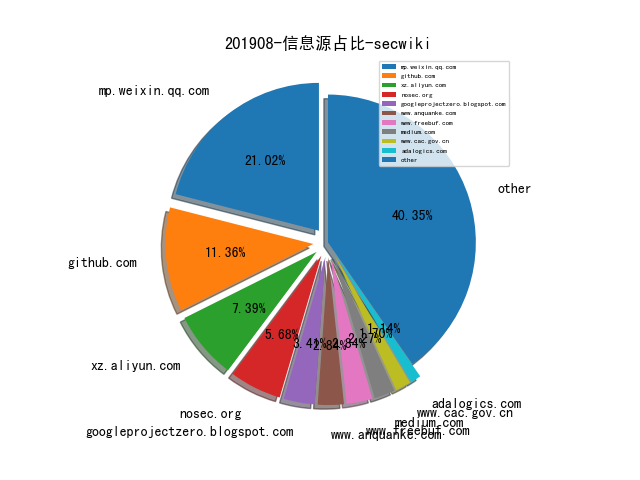

# [数据年报](README_YEAR.md)
# [数据月报-7月](README_7.md)
# [数据月报-6月](README_6.md)
# [数据月报-5月](README_5.md)
# [数据月报-4月](README_4.md)
# [数据月报-3月](README_3.md)
# 201908 信息源与信息类型占比

# 微信公众号 推荐
| nickname_english | weixin_no | url | title| 
| --- | --- | --- | ---| 
| SIGAI | SIGAICN | https://mp.weixin.qq.com/s/b4_OdxgxsK8CCU5b8qCEfw | NLP技术也能帮助程序分析？ | 1| 
| 安全学术圈 | secquan | https://mp.weixin.qq.com/s/6_cEwkqFX-oeuLk6thZUcQ | ​利用无人机通过激光与物理隔离设备建立隐蔽信道 | 1| 
| 水滴安全实验室 | EversecLab | https://mp.weixin.qq.com/s/KPw81stOcBthxZHlanS0BA | 物联网固件漏洞挖掘——经典命令执行漏洞分析复现 | 1| 
| 孟极实验室 | mengjiteam | https://mp.weixin.qq.com/s/HDZUsTbffeGhgwu1FOWQNg | 一条命令实现端口复用后门 | 1| 

# 组织github账号 推荐
| github_id | title | url | org_url | org_profile | org_geo | org_repositories | org_people | org_projects | repo_lang | repo_star | repo_forks| 
| --- | --- | --- | --- | --- | --- | --- | --- | --- | --- | --- | ---| 
| pywinauto | pywinauto - Python 实现的 Windows 平台 GUI 自动化测试工具，可以向 UI 组件发送鼠标和键盘事件 | https://github.com/pywinauto/pywinauto | http://pywinauto.github.io/ | Windows GUI Automation with Python | http://pywinauto.github.io/ | 0 | 0 | 0 | Python,CSS,C++ | 1600 | 337 | 1| 
| Riscure | 用AFL Fuzz OP-TEE的系统调用 | https://github.com/Riscure/optee_fuzzer | http://www.riscure.com | Riscure Security Lab | http://www.riscure.com | 0 | 0 | 0 | Python,C,Julia | 0 | 0 | 1| 

# 私人github账号 推荐
| github_id | title | url | p_url | p_profile | p_loc | p_company | p_repositories | p_projects | p_stars | p_followers | p_following | repo_lang | repo_star | repo_forks | 
| --- | --- | --- | --- | --- | --- | --- | --- | --- | --- | --- | --- | --- | --- | ---| 
| shmilylty | OneForAll 一款功能强大的子域收集工具 | https://github.com/shmilylty/OneForAll | https://github.com/Qihoo360 | Information security researcher, CTF enthusiast. | Beijing, China | @Qihoo360 | 108 | 0 | 992 | 753 | 116 | Python,Go,JavaScript,HTML | 747 | 216 | 1| 
| Kevin-Robertson | Windows网络协议层攻击套件包括 SMB LLMNR NBNS mDNS DNS | https://github.com/Kevin-Robertson/InveighZero | https://github.com/NetSPI |  | None | @NetSPI | 7 | 0 | 226 | 364 | 8 | C#,PowerShell | 929 | 231 | 1| 
| zer0yu | Berserker-针对Pentest或者CTF的一个fuzz payload项目 | https://github.com/zer0yu/Berserker | http://zeroyu.xyz/ | Red Team@PolarisLab / CTFer->Web@LZ | None | None | 34 | 0 | 2300 | 268 | 1300 | Python,HTML,CSS | 292 | 43 | 1| 
| rk700 | 之前推过AFL-Unicorn项目可以让AFL fuzz能用Unicorn模拟的闭源binary，这个uniFuzzer项目很类似，是要把libfuzzer应用在闭源binary上 | https://github.com/rk700/uniFuzzer// | http://rk700.github.io |  | None | None | 18 | 0 | 57 | 248 | 2 | Python,C,Java | 606 | 161 | 1| 
| butterflyhack | linux蓝牙模块空指针引用漏洞PoC。 | https://github.com/butterflyhack/CVE-2019-10207/ | None |  | None | None | 129 | 0 | 19 | 13 | 28 | Python,C,Java | 15 | 7 | 1| 
| chame1eon | jni 函数调用 trace 模块，基于 frida | https://github.com/chame1eon/jnitrace | None |  | None | None | 3 | 0 | 0 | 5 | 0 | Python,Lua,JavaScript | 71 | 9 | 1| 

# 日更新程序
`python update_daily.py`