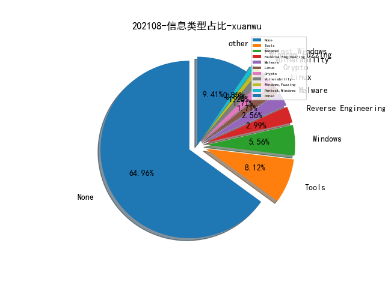

# [数据--所有](README_20.md)
# [数据--年度](README_2021.md)
# 202108 信息源与信息类型占比

# 微信公众号 推荐
| nickname_english | weixin_no | title | url| 
| --- | --- | --- | ---| 
| 安全学术圈 | secquan | Android生态系统中分析库的隐私风险分析和缓解 | https://mp.weixin.qq.com/s/ItQUSf2PsA7KsSHryAGfmw | 1| 
| SecWiki | SecWiki | Linux计划任务那点事儿 | https://mp.weixin.qq.com/s/KfeKpoPj-X7BRNR7O6QAcw | 1| 
| M01N Team | m01nteam | 攻击技术研判｜Lazarus结合NDay投递VBA恶意远控的攻击分析 | https://mp.weixin.qq.com/s/x7L3R9iQdnrnEKpfop92Gg | 1| 
| 我需要的是坚持 | MyPersistence2020 | 做红队你需要学习“如何挖掘战壕”（三） | https://mp.weixin.qq.com/s/OO_VZ8QB_J5UY88qkpLXDg | 1| 
| 威胁棱镜 | THREAT_PRISM | 如何利用多杀软结果归并恶意软件家族名称 | https://mp.weixin.qq.com/s/hOvqm0U7rc-NNdVjR0dAaA | 1| 
| 腾讯技术工程 | Tencent_TEG | 攻防启示：Chromium组件风险剖析与收敛 | https://mp.weixin.qq.com/s/AZhzOGjh_DtFRnkt1zunxQ | 1| 

# 组织github账号 推荐
| github_id | title | url | org_url | org_profile | org_geo | org_repositories | org_people | org_projects | repo_lang | repo_star | repo_forks| 
| --- | --- | --- | --- | --- | --- | --- | --- | --- | --- | --- | ---| 

# 私人github账号 推荐
| github_id | title | url | p_url | p_profile | p_loc | p_company | p_repositories | p_projects | p_stars | p_followers | p_following | repo_lang | repo_star | repo_forks | 
| --- | --- | --- | --- | --- | --- | --- | --- | --- | --- | --- | --- | --- | --- | ---| 

# medium_xuanwu 推荐
| title | url| 
| --- | ---| 

# medium_secwiki 推荐
| title | url| 
| --- | ---| 

# zhihu_xuanwu 推荐
| title | url| 
| --- | ---| 

# zhihu_secwiki 推荐
| title | url| 
| --- | ---| 

# xz_xuanwu 推荐
| title | url| 
| --- | ---| 

# xz_secwiki 推荐
| title | url| 
| --- | ---| 

# 日更新程序
`python update_daily.py`