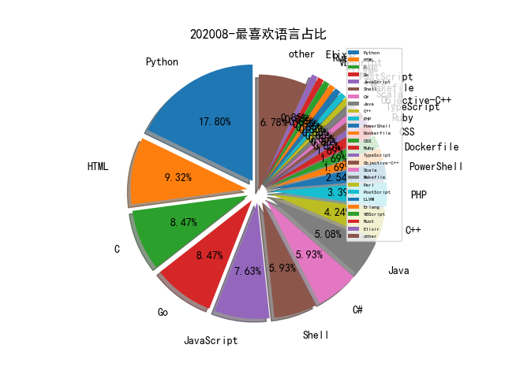

# [数据--所有](README_20.md)
# [数据--年度](README_2020.md)
# 202008 信息源与信息类型占比

# 微信公众号 推荐
| nickname_english | weixin_no | title | url| 
| --- | --- | --- | ---| 
| 时间之外沉浮事 | tasnrh | 靶场竞品分析,CybExer网络靶场 | https://mp.weixin.qq.com/s/8-d0eB2VV0qvG3VNCaJ_zA | 1| 
| 跨越鸿沟 | gh_0bae97403201 | 信息安全：研究体系(220页) | https://mp.weixin.qq.com/s/WeBXUyP3-gbzrRrHmPyY9w | 1| 
| 图谱学苑 | gh_eb1997a4e380 | 神秘Palantir-平台介绍 | https://mp.weixin.qq.com/s/JgLkd4_J5s93FDuS31F-Cg | 1| 
| 网络安全观 | SecurityInsights | 美国网络安全 , 开篇：美国网络空间安全新战略 | https://mp.weixin.qq.com/s/usiMcWM6lnU5ZorkpG8DUQ | 3| 
| 湛卢工作室 | xuehao_studio | 云原生安全 , docker容器逃逸 | https://mp.weixin.qq.com/s/zvHrPwYT77oedXloVJHi8g | 1| 
| 看雪学院 | ikanxue | 某Nginx后门分析复现与改写 | https://mp.weixin.qq.com/s/U2trVwV75yEW5HpVn0Ki8A | 1| 
| 安全鸭 | yliang53 | 横向渗透的常见方法 | https://mp.weixin.qq.com/s/eMXWYV-5sKR0HfcqMJOBWg | 1| 
| 腾讯安全应急响应中心 | tsrc_team | 红蓝对抗之域名搜集方法总结 | https://mp.weixin.qq.com/s/rECW5vKbUfI89F31WEQjyw | 1| 
| ChaMd5安全团队 | chamd5sec | WMCTF-WriteUp | https://mp.weixin.qq.com/s/SddIi7Om8BACyo_X1Skdfg | 5| 
| GobySec | gobysec | 技术分享 , Goby食用指南之红蓝对抗 | https://mp.weixin.qq.com/s/G-Vn4htAhjwlJb67v2TtRw | 1| 
| 宽字节安全 | gh_2de2b9f7d076 | Shiro 回显Burp插件（支持burp被动扫描功能 | https://mp.weixin.qq.com/s/zYL1TADYChRrPqdz81BOdA | 2| 
| SCUCTF | scuctf | WMCTF2020 WP by 0x401 | https://mp.weixin.qq.com/s/Ll-f25pLOPbkjlo9zGFbFA | 1| 
| 安全学术圈 | secquan | RAID 2020 论文录用列表 | https://mp.weixin.qq.com/s/WoDK9X3bg_WNy12EC_Hz7g | 1| 
| 雷神众测 | thorsrc | 近源渗透测试之Keylogger实战 | https://mp.weixin.qq.com/s/ra_N5dkhZOcHmdHuzl-oQw | 1| 

# 组织github账号 推荐
| github_id | title | url | org_url | org_profile | org_geo | org_repositories | org_people | org_projects | repo_lang | repo_star | repo_forks| 
| --- | --- | --- | --- | --- | --- | --- | --- | --- | --- | --- | ---| 

# 私人github账号 推荐
| github_id | title | url | p_url | p_profile | p_loc | p_company | p_repositories | p_projects | p_stars | p_followers | p_following | repo_lang | repo_star | repo_forks | 
| --- | --- | --- | --- | --- | --- | --- | --- | --- | --- | --- | --- | --- | --- | ---| 
| CTF-MissFeng | Watchdog: SRC资产管理系统 | https://github.com/CTF-MissFeng/Watchdog | None |  | None | None | 6 | 0 | 0 | 0 | 0 | Python,Go | 738 | 192 | 1| 
| Droidzzzio | 用于枚举子域wordlist，php文件路径，html文件路径和js文件路径的开源工具 | https://github.com/Droidzzzio/EnumerationList | https://twitter.com/ShMalav | Security Researcher Bug Bounty Hunter | INDIA | None | 44 | 0 | 0 | 0 | 0 | Python | 32 | 8 | 1| 
| arieljt | VT Code Similarity Yara Generator | https://github.com/arieljt/VTCodeSimilarity-YaraGen | https://twitter.com/arieljt |  | None | None | 3 | 0 | 0 | 0 | 0 | Python | 34 | 6 | 1| 
| cobbr | .NET 编写的一款 C&C 渗透框架 | https://github.com/cobbr/Covenant | https://cobbr.io |  | Dallas, TX | SpecterOps | 20 | 0 | 0 | 0 | 0 | C#,PowerShell | 1600 | 307 | 1| 
| mitre-attack | 关于辅助实现自动化ATT＆CK归纳的python脚本 | https://github.com/mitre-attack/attack-scripts/tree/master/layers | None | None | None | None | 0 | 0 | 0 | 0 | 0 | TypeScript,Zeek,Python,JavaScript,HTML,PowerShell | 0 | 0 | 1| 
| napocahv | Napoca - Bitdefender 开源的 Hypervisor，提供多个安全相关的功能 | https://github.com/napocahv/napoca | None | None | None | None | 0 | 0 | 0 | 0 | 0 | C | 87 | 22 | 1| 
| nautilus-fuzz | 基于 NDSS 2019 一篇 Paper 实现的一个基于 Grammar、Coverage Guided 的 Fuzzer | https://github.com/nautilus-fuzz/nautilus | None | None | None | None | 0 | 0 | 0 | 0 | 0 | Python | 0 | 0 | 1| 
| taomujian | linbing: 临兵漏洞扫描系统 | https://github.com/taomujian/linbing | None |  | 以色列 | None | 14 | 0 | 0 | 0 | 0 | Python,C#,Java,HTML,Dockerfile | 139 | 48 | 1| 

# medium_xuanwu 推荐
| title | url| 
| --- | ---| 
| 常见的Linux权限提升手法 | http://medium.com/bugbountywriteup/write-up-11-common-linux-privilege-escalation-92528853b616?source=rss----7b722bfd1b8d---4| 
| 无括号的XSS | http://medium.com/@terjanq/arbitrary-parentheses-less-xss-e4a1cf37c13d| 
| 如何利用Kali下的神器Bloodhound 进行横向移动 | http://medium.com/@rootsecdev/bloodhound-part-1-a-walkthrough-in-lateral-movements-and-paths-to-domain-admin-870dd05abde6| 
| 关于2020年Tor网络的安全分析第一部分 | http://medium.com/@nusenu/how-malicious-tor-relays-are-exploiting-users-in-2020-part-i-1097575c0cac| 

# medium_secwiki 推荐
| title | url| 
| --- | ---| 
| How Malicious Tor Relays are Exploiting Users in 2020 (Par... | https://medium.com/@nusenu/how-malicious-tor-relays-are-exploiting-users-in-2020-part-i-1097575c0cac| 

# zhihu_xuanwu 推荐
| title | url| 
| --- | ---| 

# zhihu_secwiki 推荐
| title | url| 
| --- | ---| 
| 人物图谱构建技术 | https://zhuanlan.zhihu.com/p/166587883| 

# xz_xuanwu 推荐
| title | url| 
| --- | ---| 

# xz_secwiki 推荐
| title | url| 
| --- | ---| 
| OneThink前台注入分析 | https://xz.aliyun.com/t/8081| 
| 关于检测web蜜罐利用jsonp获取信息的一些想法 | https://xz.aliyun.com/t/8111| 
| 实战绕过双重waf结合sqlmap tamper获取数据 | https://xz.aliyun.com/t/8064| 
| Android渗透测试HTTPS证书校验绕过 | https://xz.aliyun.com/t/8047| 

# 日更新程序
`python update_daily.py`