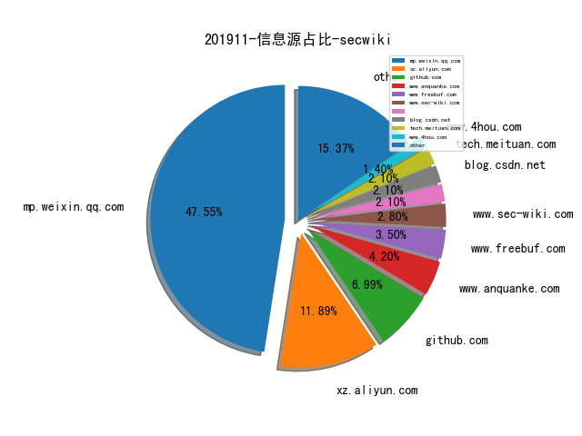
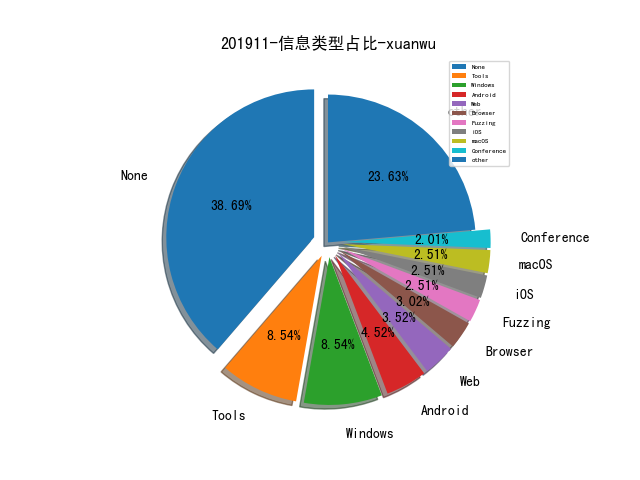

# [数据年报](README_YEAR.md)
# [数据月报-10月](README_10.md)
# [数据月报-9月](README_9.md)
# [数据月报-8月](README_8.md)
# [数据月报-7月](README_7.md)
# [数据月报-6月](README_6.md)
# [数据月报-5月](README_5.md)
# [数据月报-4月](README_4.md)
# [数据月报-3月](README_3.md)
# 201911 信息源与信息类型占比

# 微信公众号 推荐
| nickname_english | weixin_no | title | url| 
| --- | --- | --- | ---| 
| ChaMd5安全团队 | chamd5sec | 详细分析Solr的CVE-2019-0193以及velocity模板注入新洞 | https://mp.weixin.qq.com/s/gl35WFkxhAbuw7BNQa1FiQ | 2| 
| 美团安全应急响应中心 |  | 大型互联网公司数据安全实践 | https://mp.weixin.qq.com/s/DtGLFwcwNMCZseOKOAOC9Q | 1| 

# 组织github账号 推荐
| github_id | title | url | org_url | org_profile | org_geo | org_repositories | org_people | org_projects | repo_lang | repo_star | repo_forks| 
| --- | --- | --- | --- | --- | --- | --- | --- | --- | --- | --- | ---| 

# 私人github账号 推荐
| github_id | title | url | p_url | p_profile | p_loc | p_company | p_repositories | p_projects | p_stars | p_followers | p_following | repo_lang | repo_star | repo_forks | 
| --- | --- | --- | --- | --- | --- | --- | --- | --- | --- | --- | --- | --- | --- | ---| 

# 日更新程序
`python update_daily.py`