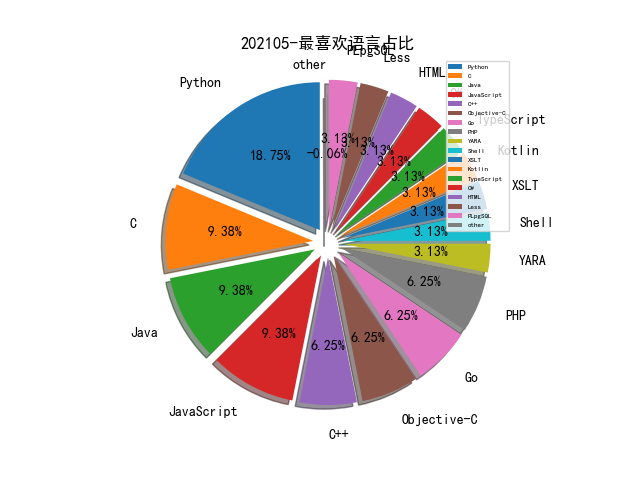

# [数据--所有](README_20.md)
# [数据--年度](README_2021.md)
# 202105 信息源与信息类型占比

# 微信公众号 推荐
| nickname_english | weixin_no | title | url| 
| --- | --- | --- | ---| 
| 湛卢工作室 | xuehao_studio | 利用云函数（SCF）打造海量代理池 | https://mp.weixin.qq.com/s/yYCJEpnp04oQFVqMz-G3bg | 1| 
| 安全客 | anquanbobao | 【技术分享】漏洞自动化利用（AEG）研究进展 | https://mp.weixin.qq.com/s/4BDN2NBNb9CLFci4RhJcdg | 1| 
| 中国信息安全 | chinainfosec | 专题 , “十四五”时期网络安全建设解读与践行 | https://mp.weixin.qq.com/s/pIXHiv0IhsTkecX0oz0o1g | 1| 
| Datawhale | Datawhale | 图神经网络的解释性综述！ | https://mp.weixin.qq.com/s/pI9xvY2MjcEiLFdO2WDGtA | 1| 
| 安全学术圈 | secquan | 以太坊智能合约中的社会工程攻击 | https://mp.weixin.qq.com/s/MVsF9P7hpnncf9cHuTQ_iA | 2| 
| 蚂蚁安全实验室 | Alipay_SecurityLab | 【Black Hat Asia 2021系列分享】兼容的代价：通过文件扩展属性攻陷macOS内核 | https://mp.weixin.qq.com/s/bfdwAhRRso34OOZrG2r65Q | 2| 
| 安全研究GoSSIP | GoSSIPSJTU | G.O.S.S.I.P 学术论文推荐 2021-05-12 | https://mp.weixin.qq.com/s/LZr8WwVd8vJ-zbVEVtH5Iw | 1| 
| 锐眼安全实验室 | gh_ac88e02e949f | 导致美国供油系统中断的勒索软件同源分析与防范 | https://mp.weixin.qq.com/s/ArrPR0XCj-Aq6aTP3n7lEg | 1| 
| 微步在线研究响应中心 | gh_c108d4d389bf | 专题报告 , 流行勒索病毒分析总结（上） | https://mp.weixin.qq.com/s/ZtKi0bu5iMmGjhaxpaIBeQ | 1| 
| 安全狗 | safedog2013 | 云原生安全攻防技术浅析 | https://mp.weixin.qq.com/s/loYIGK59RdFbpqhTkmu03w | 1| 
| Nebula Graph Community | NebulaGraph | 百亿级图数据在快手安全情报的应用与挑战 | https://mp.weixin.qq.com/s/lz2XPXGpIlP3YZIO6Xv4Ew | 1| 
| AX科技圈 | axkjq2006 | 安信证券容器云平台落地实践 | https://mp.weixin.qq.com/s/cbCd_hXpHlJ_8DnoiHWi0g | 1| 
| 腾讯安全应急响应中心 | tsrc_team | 云基础设施之硬件安全威胁 | https://mp.weixin.qq.com/s/6-XAPuLAieb11GpNK3x7Zw | 1| 
| 绿盟科技研究通讯 | nsfocus_research | Metarget：云原生攻防靶场开源啦！ | https://mp.weixin.qq.com/s/EULJgDrCvuq3DwUpGUskfQ | 1| 
| 嘶吼专业版 | Pro4hou | 2021第一季度APT攻击趋势分析（上） | https://mp.weixin.qq.com/s/383OkdZ4z4rFUfjLf3Ymhw | 1| 
| Tide安全团队 | TideSec | 内网软件密码离线解密 | https://mp.weixin.qq.com/s/l6rSLBrluAkRrB0rYPcdLg | 1| 
| 大超的记事本 | Dachao_Dachao | 数据安全怎么做——数据跨境的思考 | https://mp.weixin.qq.com/s/tPKbHyMU54iARe4ojD7czg | 1| 
| 上交所技术服务 | SSE-TechService | 【交易技术前沿】魔高一尺，道高一丈，上交所VPN攻防札记 | https://mp.weixin.qq.com/s/uygNjOZmBwGcMdvILN-psw | 1| 
| ChaMd5安全团队 | chamd5sec | 2021海华AI挑战赛·中文阅读理解·技术组 Rank12 | https://mp.weixin.qq.com/s/I3oA4VioFZM3zFOmj5gqJw | 4| 
| 信息安全与通信保密杂志社 | cismag2013 | 一种多维数据融合的网络威胁溯源迭代分析模型研究 | https://mp.weixin.qq.com/s/luD2v2kqXx41KWKqnItyBg | 2| 
| 鸟哥谈云安全 | cnbirdsecintel | 云安全架构连载之三-超大型企业混合云安全架构最佳实践 | https://mp.weixin.qq.com/s/xkeNxE99ORtVs9EOv0ellQ | 1| 
| 看雪学院 | ikanxue | 工作中常用的相似度算法以及特征提取算法 | https://mp.weixin.qq.com/s/vUS553WX8pFIiWoqhkFNlg | 3| 
| code秘密花园 | code_mmhy | 前端安全—你必须要注意的依赖安全漏洞 | https://mp.weixin.qq.com/s/kCqD0ikh9h5xc42sKkESVA | 2| 

# 组织github账号 推荐
| github_id | title | url | org_url | org_profile | org_geo | org_repositories | org_people | org_projects | repo_lang | repo_star | repo_forks| 
| --- | --- | --- | --- | --- | --- | --- | --- | --- | --- | --- | ---| 

# 私人github账号 推荐
| github_id | title | url | p_url | p_profile | p_loc | p_company | p_repositories | p_projects | p_stars | p_followers | p_following | repo_lang | repo_star | repo_forks | 
| --- | --- | --- | --- | --- | --- | --- | --- | --- | --- | --- | --- | --- | --- | ---| 
| patois | 在 IDA Hexrays AST 级别搜索代码特征的工具 | https://github.com/patois/HexraysToolbox | https://twitter.com/pat0is | Yo, was github? | 127.0.0.1 | None | 43 | 0 | 0 | 0 | 0 | Python | 357 | 65 | 1| 
| jweny | pocassist: 开源漏洞测试框架 | https://github.com/jweny/pocassist | https://github.com/jweny?tab=followers | Qihoo360 CloudSec Team. Security Engineer or Developer | 北京 | Qihoo360 & 0-sec Team | 17 | 0 | 0 | 0 | 0 | Go,Python,Java,PLpgSQL,XSLT | 0 | 0 | 1| 
| Tabll | gemnasium-db: GitLab 漏洞依赖项扫描的数据库 | https://github.com/Tabll/gemnasium-db | https://github.com/Tabll?tab=followers | a student 大部分项目都在自己的 https://gitlab.tabll.cn/Tabll 上，这里现在主要是用来放日志 | 杭州 | None | 45 | 1 | 0 | 0 | 0 | PHP | 0 | 0 | 1| 
| Dump-GUY | 在调试器中 Trace fopen 函数的调用 | https://github.com/Dump-GUY/Malware-analysis-and-Reverse-engineering/blob/main/Tracing%20C%20function%20fopen/Tracing%20C%20function%20fopen.md | https://github.com/Dump-GUY?tab=followers | Forensic and Malware Analyst, RE - CERT | CZE | None | 21 | 0 | 0 | 0 | 0 | Python,YARA | 0 | 0 | 1| 

# medium_xuanwu 推荐
| title | url| 
| --- | ---| 
| Just Gopher It: Escalating a Blind SSRF to RCE for $15k | http://sirleeroyjenkins.medium.com/just-gopher-it-escalating-a-blind-ssrf-to-rce-for-15k-f5329a974530| 
| 渗透测试 ISP 101 ,如何渗透测试与修复ISP的建议。 | http://justm0rph3u5.medium.com/pentesting-isp-101-how-i-hacked-fixed-my-isp-643e9201f7e9| 
| The implications of neglecting IPv6 on your internet facing services | http://grimminck.medium.com/the-implications-of-neglecting-ipv6-on-your-internet-facing-services-538ebe3506fa| 
| 作者分享自己学习并参与 U.S. DoD Bounty 计划的经历 | http://medium.com/m/global-identity?redirectUrl=https%3A%2F%2Finfosecwriteups.com%2Fmy-bug-bounty-journey-ranking-1st-in-u-s-dod-achieving-top-100-hackers-in-1-year-f208c10144fc| 
| 追踪分析恶意 tor 中继出口。 | http://nusenu.medium.com/tracking-one-year-of-malicious-tor-exit-relay-activities-part-ii-85c80875c5df| 
| 收集和统计公网上的 Cobalt Strike 服务和配置信息。 | http://svch0st.medium.com/stats-from-hunting-cobalt-strike-beacons-c17e56255f9b| 

# medium_secwiki 推荐
| title | url| 
| --- | ---| 

# zhihu_xuanwu 推荐
| title | url| 
| --- | ---| 

# zhihu_secwiki 推荐
| title | url| 
| --- | ---| 
| 不确定性知识图谱的表示和推理 | https://zhuanlan.zhihu.com/p/369068016| 

# xz_xuanwu 推荐
| title | url| 
| --- | ---| 

# xz_secwiki 推荐
| title | url| 
| --- | ---| 
| Fastcgi 协议分析与 PHP-FPM 攻击方法 | https://xz.aliyun.com/t/9544| 
| 基于算法的漏洞检测 | https://xz.aliyun.com/t/9539| 

# 日更新程序
`python update_daily.py`