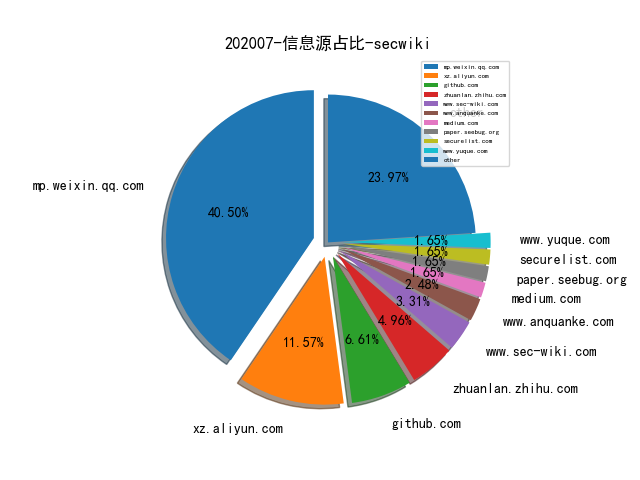
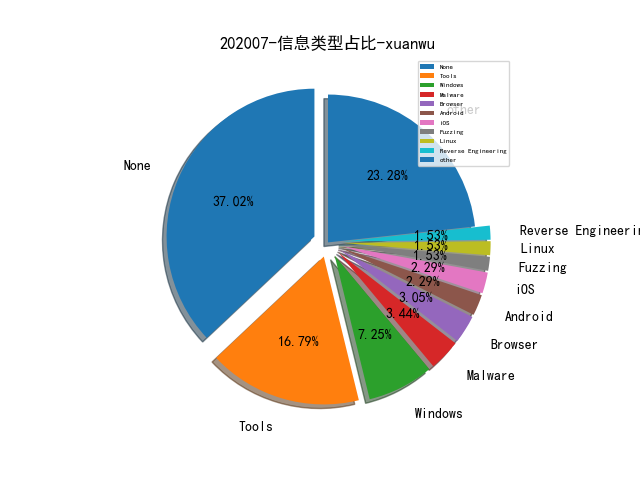

# [数据--所有](README_20.md)
# [数据--年度](README_2020.md)
# 202007 信息源与信息类型占比

# 微信公众号 推荐
| nickname_english | weixin_no | title | url| 
| --- | --- | --- | ---| 
| 七夜安全博客 | qiye_safe | 从沙盒逃逸看Python黑科技（上篇） | https://mp.weixin.qq.com/s/f5Ra8BtCyEoJmH0gwuvGXg | 3| 
| 夜暗心明 | yeanxinmingi | 嵌入式浏览器安全杂谈-electron框架 | https://mp.weixin.qq.com/s/J6eqcPPRp7wn06YQhue_Ug | 1| 
| 数世咨询 | dwconcn | 中国网络安全能力100强 | https://mp.weixin.qq.com/s/22wBFQ0hvFtTcAIdbjUTBg | 1| 
| 零队 | gh_a3bc6828636a | 鱼叉攻击-炮轰马的制作 | https://mp.weixin.qq.com/s/3GLmtGoP-rG1nBBSw_KxkQ | 1| 
| GobySec | gobysec | 插件分享 , 如何半天玩转一个“ES未授权利用”插件 | https://mp.weixin.qq.com/s/XZA37Cen9PexyPxuuEx1CQ | 1| 
| 信息通信技术与政策 | caict_dsc | 专题丨企业级开源风险及治理模式研究 | https://mp.weixin.qq.com/s/hUML8M4gjjpXiimQNNpw-w | 1| 
| ipasslab | gh_406bdd615bc1 | 学术报告,基于类型状态导向的Use-after-Free漏洞模糊测试技术 | https://mp.weixin.qq.com/s/RE19ba-BnQsZRST338lJHA | 2| 
| nmask | nmask-article | 我所认知的甲方信息安全建设经验 | https://mp.weixin.qq.com/s/0Uu_os9MB5ZHnowlWkYbEA | 1| 
| 携程技术 | ctriptech | 干货 , DevSecOps在携程的最佳实践 | https://mp.weixin.qq.com/s/yOykOPU9wn77doz95s5LeA | 1| 
| 美团技术团队 | meituantech | BERT在美团搜索核心排序的探索和实践 | https://mp.weixin.qq.com/s/mFRhp9pJRa9yHwqc98FMbg | 1| 
| 锦行信息安全 | jeeseensec | 从剖析CS木马生成到开发免杀工具 | https://mp.weixin.qq.com/s/BUp3ignvFJhpm-unStrXig | 1| 
| ChaMd5安全团队 | chamd5sec | SCTF 2020 WriteUp | https://mp.weixin.qq.com/s/puJPmfKOsfbzV-11ggY75Q | 2| 
| 网安寻路人 | DataProtection101 | 对《数据安全法》的理解和认识 , 立法思路 | https://mp.weixin.qq.com/s/N239WbL9sBQmqPUt5aXp6Q | 2| 
| 边界无限 | BoundaryX | Java代码执行漏洞中类动态加载的应用 | https://mp.weixin.qq.com/s/5iYyRGnlOEEIJmW1DqAeXw | 1| 
| 看雪学院 | ikanxue | 小议智能设备安全研究 | https://mp.weixin.qq.com/s/Wc6rE_2rVKHOPoCQzmGvKg | 1| 
| 绿盟科技研究通讯 | nsfocus_research | 初探网络安全智能决策 | https://mp.weixin.qq.com/s/EStPo05HwUTQHOTRx7qltg | 1| 

# 组织github账号 推荐
| github_id | title | url | org_url | org_profile | org_geo | org_repositories | org_people | org_projects | repo_lang | repo_star | repo_forks| 
| --- | --- | --- | --- | --- | --- | --- | --- | --- | --- | --- | ---| 

# 私人github账号 推荐
| github_id | title | url | p_url | p_profile | p_loc | p_company | p_repositories | p_projects | p_stars | p_followers | p_following | repo_lang | repo_star | repo_forks | 
| --- | --- | --- | --- | --- | --- | --- | --- | --- | --- | --- | --- | --- | --- | ---| 
| can1357 | 在 Windows 内核中运行 Lua Coroutines | https://github.com/can1357/NtLua | https://can.ac/ | Security researcher and reverse engineer; mostly interested in Windows kernel development and low-level programming. | None | Verilave Inc. | 0 | 0 | 0 | 0 | 0 | C,C++ | 388 | 125 | 1| 
| danieleperera | 用于在网络上收集，抓取和监视洋葱站点的扩展工具 | https://github.com/danieleperera/OnionIngestor | None |  | None | None | 0 | 0 | 0 | 0 | 0 | Python,JavaScript | 25 | 5 | 1| 
| eronnen | 用于解析 Procmon 内部文件格式（日志文件、配置文件）的 Python 库 | https://github.com/eronnen/procmon-parser | None |  | None | None | 0 | 0 | 0 | 0 | 0 | Python,JavaScript,C++ | 31 | 4 | 1| 
| hi-KK | ICS-Protocol-identify: 使用nmap的nse脚本对常见工控协议进行... | https://github.com/hi-KK/ICS-Protocol-identify | https://www.key1.top | Are you OK? :D | US | None | 0 | 0 | 0 | 0 | 0 | Python,Lua,Shell | 26 | 10 | 1| 
| theLSA | F5 BIGIP RCE(CVE-2020-5902)漏洞检测工具 | https://github.com/theLSA/f5-bigip-rce-cve-2020-5902 | http://www.lsablog.com | I like Cyber Security, penestration, CTF and programming(python,C/C++,PHP,JAVA......), welcome to communicate with me! | China | None | 0 | 0 | 0 | 0 | 0 | Python | 322 | 92 | 1| 
| tothi | 如何利用DLL代理进行DLL劫持 | https://github.com/tothi/dll-hijack-by-proxying | https://twitter.com/an0n_r0 |  | None | None | 0 | 0 | 0 | 0 | 0 | Python,C#,C,HTML | 207 | 67 | 1| 

# medium_xuanwu 推荐
| title | url| 
| --- | ---| 
| 如何在Windows环境中限制基于SMB的横向移动 | http://medium.com/palantir/restricting-smb-based-lateral-movement-in-a-windows-environment-ed033b888721?source=friends_link&sk=a51a65b034ad9ef38e3c60eaeff7e331| 
| 基于Office的恶意软件分析-第二小节 | http://link.medium.com/32pqJC0KX7| 
| 如何利用Unicode字符进行SQL注入 | http://medium.com/bugbountywriteup/sql-injection-using-unicode-characters-8d360ead379c?source=rss----7b722bfd1b8d---4| 
| Microsoft Access的UNC路径注入 | http://medium.com/@rvrsh3ll/introduction-1d327afaf22d| 
| 请避免使用“特权”权限运行Docker | http://medium.com/better-programming/escaping-docker-privileged-containers-a7ae7d17f5a1| 

# medium_secwiki 推荐
| title | url| 
| --- | ---| 
| Security Detections on Windows Events with Recurrent Neura... | https://medium.com/@ditrizna/security-detections-on-windows-events-with-recurrent-neural-networks-346d0b2738fe| 
| SSRF on Zimbra Led to Dump All Credentials in Clear Text | https://medium.com/bugbountywriteup/story-of-a-2-5k-bounty-ssrf-on-zimbra-led-to-dump-all-credentials-in-clear-text-6fe826005ccc| 

# zhihu_xuanwu 推荐
| title | url| 
| --- | ---| 

# zhihu_secwiki 推荐
| title | url| 
| --- | ---| 
| 方舟编译器环境支持的新浪新闻极速版APP分析 | https://zhuanlan.zhihu.com/p/154438363| 
| CTF实战特训营实训真题 | https://zhuanlan.zhihu.com/p/148384035| 

# 日更新程序
`python update_daily.py`