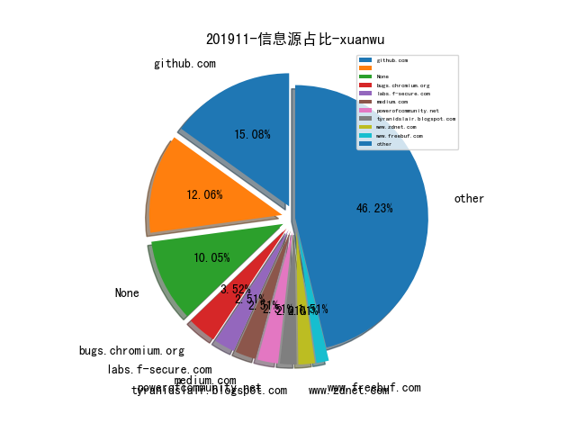

# [数据年报](README_YEAR.md)
# [数据月报-10月](README_10.md)
# [数据月报-9月](README_9.md)
# [数据月报-8月](README_8.md)
# [数据月报-7月](README_7.md)
# [数据月报-6月](README_6.md)
# [数据月报-5月](README_5.md)
# [数据月报-4月](README_4.md)
# [数据月报-3月](README_3.md)
# 201911 信息源与信息类型占比

# 微信公众号 推荐
| nickname_english | weixin_no | title | url| 
| --- | --- | --- | ---| 
| 情报分析师 | qingbaofenxishi | 社交网络在开源安全情报中的应用（一） | https://mp.weixin.qq.com/s/QTcvAtaSe1jWvGTg9ZcfiQ | 1| 
| 青藤云安全资讯 | qingtengyun | 基于ATT&CK框架的红蓝对抗，有效提升检测能力 | https://mp.weixin.qq.com/s/hpc3hIfZxWx11pwKvSy7Ww | 1| 
| 安全牛 | aqniu-wx | 从本质看未来：对网络安全行业的深度思考 | https://mp.weixin.qq.com/s/pYxoDxpSQSu867lmIbsWyg | 1| 
| 时间之外沉浮事 | tasnrh | 网络空间靶场发展态势综述①JIOR | https://mp.weixin.qq.com/s/B_oA7FCkFnRj4WOyVeFGmA | 1| 
| 星维九州 |  | 流量加密也不怕！多种姿势检测冰蝎 | https://mp.weixin.qq.com/s/ciAQNdL1YJ9B1HX7TMEDzA | 1| 
| 漏洞战争 | vulwar | Android应用逻辑漏洞半自动化挖掘思路 | https://mp.weixin.qq.com/s/tFFe_LOs0e1Po8nj9ifmKg | 1| 
| 汉客儿 |  | 注入技术系列：一个批量验证DLL劫持的工具 | https://mp.weixin.qq.com/s/qaKCG1RkBOnr3SkG9Oc1pA | 1| 
| ChaMd5安全团队 | chamd5sec | 详细分析Solr的CVE-2019-0193以及velocity模板注入新洞 | https://mp.weixin.qq.com/s/gl35WFkxhAbuw7BNQa1FiQ | 2| 
| 美团安全应急响应中心 |  | 大型互联网公司数据安全实践 | https://mp.weixin.qq.com/s/DtGLFwcwNMCZseOKOAOC9Q | 1| 

# 组织github账号 推荐
| github_id | title | url | org_url | org_profile | org_geo | org_repositories | org_people | org_projects | repo_lang | repo_star | repo_forks| 
| --- | --- | --- | --- | --- | --- | --- | --- | --- | --- | --- | ---| 

# 私人github账号 推荐
| github_id | title | url | p_url | p_profile | p_loc | p_company | p_repositories | p_projects | p_stars | p_followers | p_following | repo_lang | repo_star | repo_forks | 
| --- | --- | --- | --- | --- | --- | --- | --- | --- | --- | --- | --- | --- | --- | ---| 
| DeepSpaceHarbor | 人工智能（AI）安全方向的资料整理 | https://github.com/DeepSpaceHarbor/Awesome-AI-Security | None |  | ¯\_(ツ)_/¯ | None | 8 | 0 | 15 | 52 | 1 | HTML | 882 | 134 | 1| 
| momika233 | ClamAV 反病毒软件 0Day Exploit | https://github.com/momika233/ClamAV_0Day_exploit/ | https://twitter.com/momika233 | momika233 | Korea | None | 4 | 0 | 4 | 34 | 0 | Python | 97 | 24 | 1| 
| Magpol | 利用 FRiDA 爆破 Samsung S7 Edge FDE 全盘加密 | https://github.com/Magpol/fridafde | https://twitter.com/may_pol17 | All things Android - Forensics | None | None | 4 | 0 | 1 | 8 | 1 | Python,Shell | 21 | 3 | 1| 

# 日更新程序
`python update_daily.py`