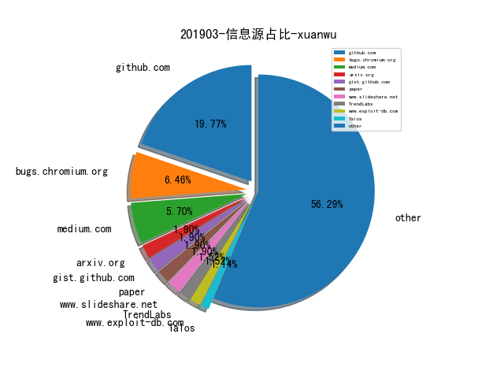
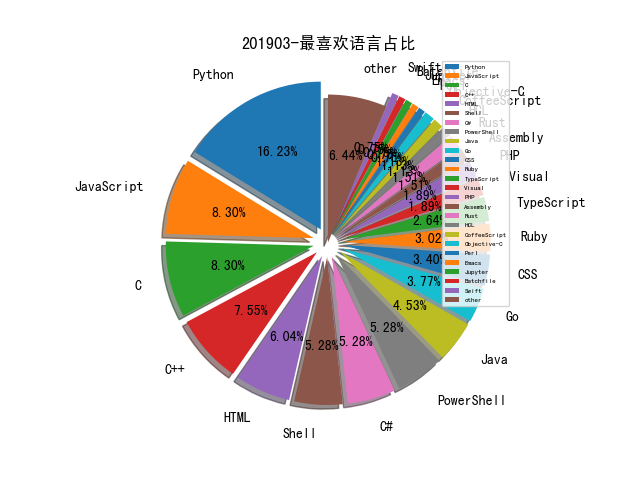

# [数据年报](README_YEAR.md)
# 201903 信息源与信息类型占比

# 微信公众号 推荐
| nickname_english | weixin_no | url | title| 
| --- | --- | --- | ---| 
| Ms08067安全实验室 | Ms08067_com | https://mp.weixin.qq.com/s/xGYfxdp_TQmXiuWvC1sN-g | 步步为营之游走于内网 | 1| 
| 丁爸 情报分析师的工具箱 | dingba2016 | https://mp.weixin.qq.com/s/_ndxkqPfgPjaT_fD82RVvQ | 【情报】数字化时代与美国情报部门的开源信息利用 | 1| 
| 凌天实验室 |  | https://mp.weixin.qq.com/s/59Bj4qk-ClV2eqLu8SKniQ | Cobalt Strike 证书修改 | 1| 
| 安在 | AnZer_SH | https://mp.weixin.qq.com/s/LOrxA4EUB9xecvelTeBQKg | 新锐 | 盛华安张颖：左手SIEM右手服装设计的美女博士 | 1| 
| 数说安全 | SSAQ2016 | https://mp.weixin.qq.com/s/agrm_Xgi1GJP3vmCiL4aVg | 2019年全球网络安全热词排行榜 | 1| 
| 美团技术团队 | meituantech | https://mp.weixin.qq.com/s/inKDcHLaP4M2ZbpxACORXw | 根因分析初探：一种报警聚类算法在业务系统的落地实施 | 1| 
| 腾讯安全应急响应中心 | tsrc_team | https://mp.weixin.qq.com/s/rjcOK3A83oKHkpNgbm9Lbg | AI繁荣下的隐忧——Google Tensorflow安全风险剖析 | 1| 

# 组织github账号 推荐
| github_id | url | title | org_url | org_profile | org_geo | org_repositories | org_people | org_projects | repo_lang | repo_star | repo_forks| 
| --- | --- | --- | --- | --- | --- | --- | --- | --- | --- | --- | ---| 
| appsecco | https://github.com/appsecco/using-docker-kubernetes-for-automating-appsec-and-osint-workflows | using-docker-kubernetes-for-automating-appsec-and-osint-wo... | http://appsecco.com | PRAGMATIC SECURITY ADVICE. PRACTICAL HELP. KEEPING YOU SAFE. | London, Bangalore, Boston | 31 | 5 | 0 | Shell,Python,JavaScript,Visual,HTML,ActionScript,PHP,CSS | 357 | 97 | 1| 
| facebook | https://github.com/facebook/folly/blob/master/folly/experimental/crypto/LtHash.cpp | 通过同态散列算法安全地发布更新 - https://code.fb.com/security/homomorphic-hashing/ | https://opensource.fb.com | We are working to build community through open source technology. NB: members must have two-factor auth. | Menlo Park, California | 161 | 187 | 0 | C,TypeScript,Java,Python,JavaScript,OCaml,C++,Objective-C,Swift | 0 | 0 | 1| 
| SafeBreach-Labs | https://github.com/SafeBreach-Labs/SirepRAT | SirepRAT: Remote Command Execution as SYSTEM on Windows Io... | http://www.safebreach.com | SafeBreach Labs | Worldwide | 12 | 2 | 0 | Python,Shell | 0 | 0 | 1| 

# 私人github账号 推荐
| github_id | url | title | p_url | p_profile | p_loc | p_company | p_repositories | p_projects | p_stars | p_followers | p_following | repo_lang | repo_star | repo_forks | 
| --- | --- | --- | --- | --- | --- | --- | --- | --- | --- | --- | --- | --- | --- | ---| 
| unixpickle | https://github.com/unixpickle/gobfuscate | 一款针对 Go 二进制和包的混淆工具 | https://aqnichol.com | Web developer, math geek, and AI enthusiast. | San Francisco, CA | None | 544 | 0 | 147 | 994 | 50 | Python,Go,Objective-C,JavaScript | 590 | 175 | 1| 
| tyranid | https://github.com/tyranid/infosec-presentations/blob/master/Nullcon/2019/The%20Windows%20Sandbox%20Paradox%20(Flashback).pdf | The Windows Sandbox Paradox （Flashback），来自 James Forshaw | None |  | None | None | 31 | 0 | 0 | 638 | 2 | C#,Python,C | 700 | 197 | 1| 
| EtherDream | https://github.com/EtherDream/jsproxy | jsproxy: 一个基于浏览器端 JS 实现的在线代理 | None | [Geeker, Hacker) | Hangzhou, China | None | 20 | 0 | 162 | 619 | 5 | JavaScript | 137 | 55 | 1| 
| rvrsh3ll | https://github.com/rvrsh3ll/CPLResourceRunner | 将 shellcode 隐藏在资源文件中再通过 CPL 加载执行的POC | None | I hack code together and hope it works. | NOVA | None | 118 | 0 | 19 | 299 | 9 | Python,C#,HTML,PowerShell | 377 | 114 | 1| 
| houjingyi233 | https://github.com/houjingyi233/CPU-vulnerabiility-collections | houjingyi233/CPU-vulnerabiility-collections | http://houjingyi233.com | security researcher | None | None | 22 | 0 | 633 | 111 | 0 | Visual,Java,C++ | 107 | 54 | 1| 
| bitsadmin | https://github.com/bitsadmin/wesng | Windows 漏洞利用辅助工具 | None |  | Netherlands | None | 9 | 0 | 2 | 46 | 0 | C#,Python,Visual,Batchfile,PowerShell | 238 | 35 | 1| 
| ze0r | https://github.com/ze0r/CVE-2018-8639-exp/ | Win32k 特权提升漏洞 CVE-2018-8639 漏洞利用 | None |  | None | None | 3 | 0 | 2 | 34 | 3 | Python,C++ | 53 | 28 | 1| 
| BusesCanFly | https://github.com/BusesCanFly/rpi-hunter | Automate discovering and dropping payloads on LAN Raspberr... | None | I make things, I break things. ¯\_(ツ)_/¯ ‮‮‮ | Somewhere in a linux server | None | 5 | 0 | 416 | 26 | 58 | Python,CSS | 129 | 21 | 1| 
| wish-i-was | https://github.com/wish-i-was/femida | femida: Automated blind-xss search for Burp Suite | None | Twitter https://twitter.com/wish_iwas | None | None | 1 | 0 | 1 | 16 | 2 | Python | 90 | 22 | 1| 
| k8scop | https://github.com/k8scop/k8s-security-dashboard | k8s-security-dashboard: A security monitoring solution for... | None | None | None | None | 0 | 0 | 0 | 0 | 0 | Python | 0 | 0 | 1| 

# 日更新程序
`python update_daily.py`