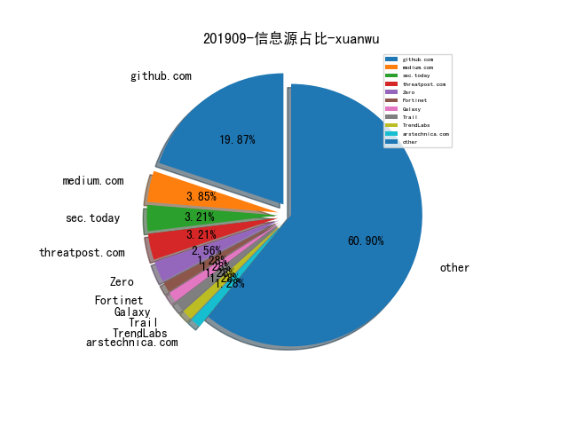
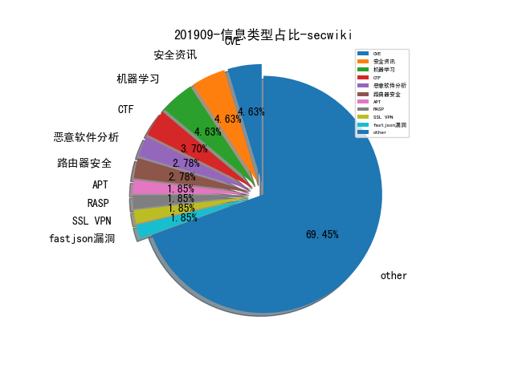
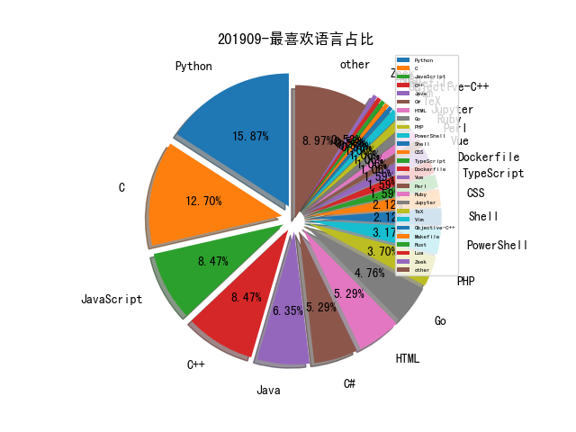

# [数据年报](README_YEAR.md)
# [数据月报-8月](README_8.md)
# [数据月报-7月](README_7.md)
# [数据月报-6月](README_6.md)
# [数据月报-5月](README_5.md)
# [数据月报-4月](README_4.md)
# [数据月报-3月](README_3.md)
# 201909 信息源与信息类型占比

# 微信公众号 推荐
| nickname_english | weixin_no | url | title| 
| --- | --- | --- | ---| 
| 90Sec Team | hk90sec | https://mp.weixin.qq.com/s?__biz=Mzg3NzE5OTA5NQ==&mid=2247483807&idx=1&sn=59be50aa5cc735f055db596269a857ce&chksm=cf27ea07f8506311d1c421e48d17deeebc19d569b037e0eb6c83656fee30fd9d59cc8228e372&token=2130309421&lang=zh_CN#rd | 域渗透总结 | 1| 
| 我的安全视界观 | CANI_Security | https://mp.weixin.qq.com/s/ObEF5r5xQNrv53DV2Cm_sQ | 【SDL最初实践】安全开发 | 1| 
| 360智库 |  | https://mp.weixin.qq.com/s/NcpsTiVKaMj_NTzRydaSag | 网络战的战术实践与战略思考 | 1| 
| 嘶吼专业版 | Pro4hou | https://mp.weixin.qq.com/s/kLjX6pMpA-v8Wh2LZK6dJw | 俄罗斯APT图谱 | 1| 
| 奇安信威胁情报中心 |  | https://mp.weixin.qq.com/s/9kqvLPTwVktGmxrgyvUZZA | PhpStudyGhost后门供应链攻击事件及相关IOC | 1| 
| 等级保护测评 | zgdjbh | https://mp.weixin.qq.com/s/zD-jjZLrAWyE4NPjpguRwg | 江苏网警发布第六批网络安全行政执法典型案例 | 1| 
| 安全学术圈 | secquan | https://mp.weixin.qq.com/s/H6X-BfR7AqTz9xYWBx_Usg | 基于HIN传导分类的恶意域名识别系统 | 1| 
| ChaMd5安全团队 | chamd5sec | https://mp.weixin.qq.com/s/NtOgVw0uFXndJ7b1-G-0iw | SUCTF-WriteUp(下) | 2| 
| APT攻击 | cncg_team | https://mp.weixin.qq.com/s/PlrPBMRejmaROkR0oLvtuw | Google的安全机制 | 1| 
| 网络空间安全军民融合创新中心 | jmrh1226 | https://mp.weixin.qq.com/s/9yRAitNrgN4I6iDaxbNvTA | 美国网络威胁归因的能力与影响探析 | 1| 
| 安全乐观主义 |  | https://mp.weixin.qq.com/s/ornyzKd3uqjgUHEmdHGIJQ | 使用方舟编译器检查Fastjson OOM问题 | 3| 
| 水滴安全实验室 | EversecLab | https://mp.weixin.qq.com/s/gpVMcPjfP2HDZisZhy0fig | 物联网漏洞挖掘入门--DLINK-DIR-645路由器栈溢出漏洞分析复现 | 1| 
| 银河安全实验室 | Galaxy-Lab | https://mp.weixin.qq.com/s/rT53P9EW4xLFV9JLbnLroQ | D-Link DIR-816 A2路由器安全研究分享 | 1| 
| FreeBuf企业安全 | freebuf_ent | https://mp.weixin.qq.com/s/BJlXOsBtPGVVU2cVs72TqQ | 全程带阻：记一次授权网络攻防演练 | 1| 
| 人民公安报 | rmgabs | https://mp.weixin.qq.com/s/B64olNuiuu1HQUkdD3u0fg | 新中国成立70年来公安科技信息化工作回眸 | 1| 
| 贝塔安全实验室 | BetaSecLab | https://mp.weixin.qq.com/s/AdrOhuA0mpjCtdpWjPC1jg | 网络空间搜索引擎的魅力 | 3| 
| PaperWeekly | paperweekly | https://mp.weixin.qq.com/s/hIGmW_J5xEvLUXa4hFHzsA | 百度实体链接比赛后记：行为建模和实体链接（含代码分享） | 1| 
| PolarisLab | PolarisLab | https://mp.weixin.qq.com/s/gz77Yy3yKPM10JsDg1oyiw | Linux环境下无文件执行elf | 2| 
| 中通安全应急响应中心 | ZTO_SRC | https://mp.weixin.qq.com/s/vwF7aTvk-U-SnJqO3f80gA | 中通安全开源项目之越权漏洞自动化检测 | 1| 
| 君哥的体历 | jungedetili | https://mp.weixin.qq.com/s/JJkQ8S4qw0RigOoA9Xzhyw | 企业如何构建有效的安全运营体系 | 1| 
| 数说安全 | SSAQ2016 | https://mp.weixin.qq.com/s/huQKnnsQtLn0uVZj-wz0Uw | 2019年上半年上市网络安全公司经营简报 | 1| 
| 新智元 | AI_era | https://mp.weixin.qq.com/s/KqyF7epXWRhaT4spGWHXSw | Nature封面重磅：社交网络影响集体决策，或改变选举结果！ | 2| 
| 青藤云安全资讯 | qingtengyun | https://mp.weixin.qq.com/s/6BEY9qpi0rfk1_T1k1lWmg | 一种基于欺骗防御的入侵检测技术研究 | 1| 

# 组织github账号 推荐
| github_id | title | url | org_url | org_profile | org_geo | org_repositories | org_people | org_projects | repo_lang | repo_star | repo_forks| 
| --- | --- | --- | --- | --- | --- | --- | --- | --- | --- | --- | ---| 

# 私人github账号 推荐
| github_id | title | url | p_url | p_profile | p_loc | p_company | p_repositories | p_projects | p_stars | p_followers | p_following | repo_lang | repo_star | repo_forks | 
| --- | --- | --- | --- | --- | --- | --- | --- | --- | --- | --- | --- | --- | --- | ---| 
| jas502n | CVE-2019-8451 JIRA未授权SSRF漏洞POC。 | https://github.com/jas502n/CVE-2019-8451 | https://twitter.com/jas502n | 1.misc 2.crypto 3. web 4. reverse 5. android 6. pwn 7. elf | Hong Kong | jas502n | 194 | 0 | 250 | 1200 | 149 | C,Shell,Java,Objective-C++,Python,C#,PHP | 301 | 114 | 1| 
| ChiChou | RealWorldCTF 2019 Dezhou Insrumentz macOS 比赛题的源码 | https://github.com/ChiChou/DezhouInstrumenz | https://github.com/alipay | 我要卖掉我的代码 浪迹天涯 | Beijing, China | @alipay | 57 | 0 | 1500 | 665 | 252 | Objective-C,Vue,JavaScript,C | 1200 | 170 | 1| 
| mame82 | Logitech Unifying Vulnerabilities | https://github.com/mame82/UnifyingVulnsDisclosureRepo/tree/master/vulnerability_reports | https://www.twitter.com/mame82 |  | None | None | 69 | 0 | 44 | 509 | 17 | Python,Go,C,JavaScript | 2500 | 517 | 1| 
| RUB-SysSec | Fuzz中一个常见问题是Checksum或者Magic Value，以前的方法大多是通过符号执行的方法去求解约束，但这样的方法比较复杂。Red­queen这篇文章提出了一种更为简单的思路，即基于VMI来获取比较指令或者函数调用指令的参数，用这个参数来指导变异。具体实现依赖Intel PT。 | https://github.com/RUB-SysSec/redqueen | https://syssec.rub.de |  | Bochum, Germany | Ruhr-University Bochum | 25 | 0 | 0 | 254 | 0 | Python,C,Rust | 390 | 105 | 1| 
| wonderkun | CTFENV: 为应对CTF比赛而搭建的各种环境 | https://github.com/wonderkun/CTFENV | None |  | None | None | 70 | 0 | 410 | 199 | 152 | Python,C,PHP,Dockerfile | 454 | 150 | 1| 
| matteyeux | 用于加载 Apple SecureROM 的 IDA 插件 | https://github.com/matteyeux/srom64helper | https://github.com/alterway | Sysadmin. Sometimes I write code | Paris | @alterway | 107 | 0 | 115 | 184 | 136 | Python,C | 10 | 4 | 1| 
| 4B5F5F4B | 研究员 4B5F5F4B 为 Hyper-V RCE(CVE-2017-007) 漏洞写的 PoC | https://github.com/4B5F5F4B/HyperV | None |  | None | None | 20 | 0 | 508 | 114 | 80 | Shell,C,HTML,C++ | 125 | 51 | 1| 
| uknowsec | 域渗透学习笔记 | https://github.com/uknowsec/Active-Directory-Pentest-Notes | http://uknowsec.cn | 不忘初心，方得始终 | Nanjing | None | 90 | 0 | 415 | 77 | 150 | Python,PHP | 95 | 15 | 1| 
| Ch1ngg | JWTPyCrack-JWT攻击脚本 | https://github.com/Ch1ngg/JWTPyCrack | https://www.ch1ng.com/ |  | no | no | 14 | 0 | 121 | 76 | 18 | Python,C#,ASP,Java | 40 | 10 | 1| 
| d0c-s4vage | gramfuzz - 通过定义语法规则生成 Fuzz 测试样本数据的工具 | https://github.com/d0c-s4vage/gramfuzz | None |  | None | None | 56 | 0 | 37 | 75 | 1 | Python,JavaScript,Vim | 149 | 29 | 1| 
| theLSA | PC客户端（C-S架构）渗透测试checklist | https://github.com/theLSA/CS-checklist | http://www.lsablog.com | I like network security,penestration and programming(python,c/c++,php,java,ect),welcome to communicate with me! | China | None | 29 | 0 | 18 | 67 | 18 | Python,Ruby | 80 | 40 | 1| 
| jakkdu | fuzzilli的quickjs patch, Happy hacking :) | https://github.com/jakkdu/fuzzilli-for-quickjs | http://jakkdu.github.io |  | Atlanta | Georgia Institute of Technology | 13 | 0 | 49 | 65 | 6 | Python,TeX,Ruby | 11 | 3 | 1| 
| Geluchat | 研究员Geluchat公开了若干针对Chrome V8引擎的1day漏洞和比赛题目的exploit。 | https://github.com/Geluchat/chrome_v8_exploit | https://www.dailysecurity.fr |  | France | None | 7 | 0 | 49 | 59 | 11 | Python,C,JavaScript,PHP | 31 | 5 | 1| 
| lucasg | 基于 IDA 脚本实现的枚举系统 RPC 接口的工具 | https://github.com/lucasg/findrpc | None |  | None | None | 24 | 0 | 33 | 54 | 3 | C#,Python,C,TeX,CSS | 1600 | 128 | 1| 
| 0x7ff | PoC for setting nonce without triggering KPP/KTRR/PAC | https://github.com/0x7ff/dimentio | None | Monero: 42XMRm2cADx8tN3FxA9i2n852PNUTS1JSaDrqdBnxKkiW44WTQMvawFHXmYwxJmhhoKruQHE8bFNjH9BsWH35BjeETyG8fE | None | None | 10 | 0 | 0 | 49 | 6 | C | 28 | 9 | 1| 
| 0xDezzy | 攻击 Pulse Secure Connect VPN 服务的 Exploit 代码 | https://github.com/0xDezzy/CVE-2019-11539 | None | Houston based Security Researcher and Red Teamer | Houston, Texas | EY | 93 | 0 | 124 | 41 | 52 | Python,KiCad,JavaScript,C++ | 68 | 15 | 1| 
| allpaca | V8Harvest - V8 代码库近期回归测试样本的分析，方便分析 v8 的漏洞 | https://github.com/allpaca/V8Harvest | None |  | None | None | 46 | 0 | 37 | 40 | 4 | JavaScript,C++ | 96 | 20 | 1| 
| rohanpadhye | 针对 Java 语言的基于覆盖率的 Fuzz 框架 | https://github.com/rohanpadhye/jqf | https://cs.berkeley.edu/~rohanpadhye | PhD student | Berkeley, CA | UC Berkeley | 29 | 0 | 50 | 39 | 6 | C,Java | 121 | 24 | 1| 
| c0d3p1ut0s | Java反序列化漏洞自动挖掘方法 | https://github.com/c0d3p1ut0s/Conference | https://c0d3p1ut0s.github.io/ |  | Hangzhou China | None | 6 | 0 | 2 | 37 | 0 | Python,HTML,Java | 92 | 17 | 1| 
| A2nkF | 研究员 A2nkF 公开了一个 macOS 内核 0Day Exploit | https://github.com/A2nkF/macOS-Kernel-Exploit/ | https://twitter.com/A2nkF_ |  | None | None | 14 | 0 | 21 | 32 | 15 | Python,C,C++ | 106 | 18 | 1| 
| ION28 | BLUESPAWN - 用于辅助蓝队实现 Windows 系统主动防御的监控工具 | https://github.com/ION28/BLUESPAWN/blob/master/README.md | https://metactf.com |  | None | MetaCTF | 8 | 0 | 165 | 28 | 29 | JavaScript,C++ | 60 | 16 | 1| 
| gnebbia | pdlist: A passive subdomain finder | https://github.com/gnebbia/pdlist | None |  | Italy | None | 231 | 0 | 225 | 20 | 5 | C,XSLT,Python,JavaScript,Makefile,Perl,HTML,Go,PowerShell | 104 | 14 | 1| 
| Areizen | 一款基于 Android 模拟器和 Frida 实现的 Android 恶意软件分析的沙盒 | https://github.com/Areizen/Android-Malware-Sandbox | None |  | None | None | 16 | 0 | 2 | 19 | 2 | Python,Shell,JavaScript | 86 | 23 | 1| 
| StrangerealIntel | 针对以色列某未知 APT 恶意样本的分析报告 | https://github.com/StrangerealIntel/CyberThreatIntel/blob/master/Israel/APT/Unknown/26-08-19/Malware%20analysis%2026-08-19.md | None |  | None | None | 1 | 0 | 0 | 19 | 0 | Visual | 67 | 14 | 1| 
| SVF-tools | SVF - 针对 C/C++ 程序的指针和过程依赖静态分析工具 | https://github.com/SVF-tools/SVF | None |  | None | None | 4 | 0 | 0 | 12 | 0 | C,C++ | 284 | 93 | 1| 
| dogangcr | vulnerable-sso: vulnerable single sign on | https://github.com/dogangcr/vulnerable-sso | None |  | None | None | 2 | 0 | 9 | 3 | 1 | Java | 80 | 11 | 1| 
| MoonLight-SteinsGate | LearnAFL--knowledge-learn evolutionary fuzzer | https://github.com/MoonLight-SteinsGate/LearnAFL | None |  | None | None | 2 | 0 | 1 | 1 | 0 | C,C++ | 8 | 3 | 1| 
| dplusec | 端对端加密的微信聊天插件 | https://github.com/dplusec/tgwechat | None |  | None | None | 2 | 0 | 0 | 1 | 0 | HTML | 15 | 4 | 1| 
| 0Kee-Team | JavaProbe: 一款Java应用运行时信息收集工具 | https://github.com/0Kee-Team/JavaProbe?from=timeline&isappinstalled=0 | None | None | None | None | 0 | 0 | 0 | 0 | 0 | Java | 0 | 0 | 1| 
| FederatedAI | FATE: 联邦学习开源项目 | https://github.com/FederatedAI/FATE | None | None | None | None | 0 | 0 | 0 | 0 | 0 | Python,Java,CSS | 703 | 203 | 1| 
| Netis | packet-agent: 云环境网络流量镜像项目 | https://github.com/Netis/packet-agent/blob/master/README-zh-Hans.md | None | None | None | None | 0 | 0 | 0 | 0 | 0 | C,C++ | 0 | 0 | 1| 
| QAX-A-Team | LuWu: 红队基础设施自动化部署工具 | https://github.com/QAX-A-Team/LuWu | None | None | None | None | 0 | 0 | 0 | 0 | 0 | C,Shell,Java,Python,C++,Go,PowerShell | 0 | 0 | 1| 
| Tencent | TencentOS tiny - 腾讯开源的面向物联网领域的实时操作系统 | https://github.com/Tencent/TencentOS-tiny | None | None | None | None | 0 | 0 | 0 | 0 | 0 | C,Java,Python,Kotlin,JavaScript,C++,Lua,Go,PHP,CSS,C# | 23200 | 5900 | 1| 
| defenxor | dsiem: Security event correlation engine for ELK stack | https://github.com/defenxor/dsiem?from=timeline | None | None | None | None | 0 | 0 | 0 | 0 | 0 | Go,HTML | 0 | 0 | 1| 
| eth-sri | 利用机器学习的方法还原（推测）被 strip 过的二进制程序的调试符号信息 | https://github.com/eth-sri/debin | None | None | None | None | 0 | 0 | 0 | 0 | 0 | C,TypeScript,Java,D,Python,Mathematica,C++,C#,HTML,SMT,JavaScript | 0 | 0 | 1| 
| fireeye | fireeye/SharPersist | https://github.com/fireeye/SharPersist | None | None | None | None | 0 | 0 | 0 | 0 | 0 | C,Vue,Python,JavaScript,C++,C#,Go,PowerShell | 0 | 0 | 2| 
| google | Google 开源了一个实现差分隐私算法的 C++ 库 | https://github.com/google/differential-privacy/tree/master/differential_privacy | None | None | None | None | 0 | 0 | 0 | 0 | 0 | C,Java,Python,JavaScript,C++,Dart,HTML,Go | 0 | 0 | 1| 
| googleprojectzero | DrSancov - j00ru 开源的一款 DynamoRIO 插件，用于在动态插桩中输出 ASAN/ SanitizerCoverage 框架支持的格式方便进一步做分析 | https://github.com/googleprojectzero/DrSancov | None | None | None | None | 0 | 0 | 0 | 0 | 0 | C,C#,C++,Python,HTML,Swift | 0 | 0 | 1| 
| microsoft | 微软开源了 MSVC 的 C++ 标准库 STL | https://github.com/microsoft/STL | None | None | None | None | 0 | 0 | 0 | 0 | 0 | TypeScript,Jupyter,C#,JavaScript,SQLPL,C++,Python,HTML,Go,PHP,Dockerfile,PowerShell | 83100 | 12000 | 2| 
| ucsb-seclab | 自动固件仿真工具，相关论文在：http://subwire.net/publication/pretender/ | https://github.com/ucsb-seclab/pretender | None | None | None | None | 0 | 0 | 0 | 0 | 0 | Python,C,Java,C++ | 0 | 0 | 1| 
| zeek | Zeek - 一款开源的网络协议分析工具 | https://github.com/zeek/zeek | None | None | None | None | 0 | 0 | 0 | 0 | 0 | Bro,C,Zeek,CMake,Python,JavaScript,C++,Vim,Yacc,PHP,Dockerfile | 2800 | 728 | 1| 

# 日更新程序
`python update_daily.py`