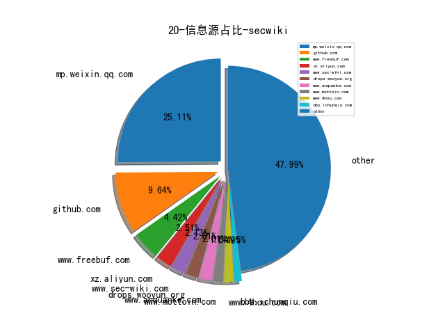
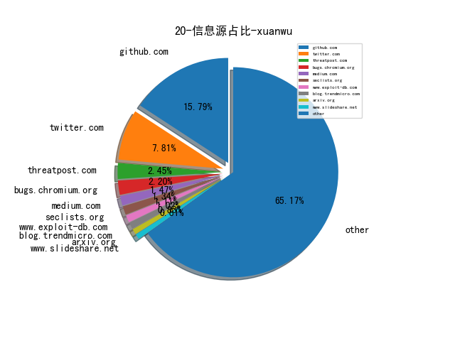

# [数据--所有](README_20.md)
# [数据--年度](README_20.md)
# 20 信息源与信息类型占比

# 微信公众号 推荐
| nickname_english | weixin_no | title | url| 
| --- | --- | --- | ---| 
| ChaMd5安全团队 | chamd5sec | Netgear固件分析与后门植入 | https://mp.weixin.qq.com/s/o9v4V673ayyMTY1vGjveFg | 38| 
| SecWiki | SecWiki | SecWiki安全周刊-年卷-2020 | https://mp.weixin.qq.com/s/pI495N48AYbA3gYkf4zlqQ | 30| 
| 安全学术圈 | secquan | 开源包托管服务存在的供应链安全问题 | https://mp.weixin.qq.com/s/DjfldjeqJY786nqdcsXzBg | 57| 
| 看雪学院 | ikanxue | Cobalt Strike4.0远控木马分析 | https://mp.weixin.qq.com/s/Sv0lR4G2eQf4_L8W4CqRYw | 49| 
| 腾讯安全应急响应中心 | tsrc_team | 基于机器学习的Web管理后台识别方法探索 | https://mp.weixin.qq.com/s/vccQcK2GNqWkGuxEGe22Zg | 19| 
| 青藤实验室 | gh_151a64925040 | SharePoint Rce 系列分析（二） | https://mp.weixin.qq.com/s/ZLSFXUoNNAFxqeiD9RpYZg | 6| 
| FreeBuf | freebuf | 关于PDD员工发帖溯源联想到的相关技术与实现 | https://mp.weixin.qq.com/s/coRsNLMT_FAr6xSHwPgOUg | 25| 
| 人民公安报 | rmgabs | 公安部网安局公布一批网络黑产案例 | https://mp.weixin.qq.com/s/uXupT3yeeOA9NWVjQORgDQ | 3| 
| 启明星辰专家视野 | VenusExpertsVision | 自动化渗透测试系统技术路径分析 | https://mp.weixin.qq.com/s/gtXfPvT8Yatp3IMVdCID7Q | 1| 
| 潇湘信安 | xxxasec | 组策略限制3389登录的绕过方式 | https://mp.weixin.qq.com/s/4eDNmiiXp7afLKdYzHeb3Q | 41| 
| 时间之外沉浮事 | tasnrh | 美国国家网络靶场系统架构与设计原理剖析①总论 | https://mp.weixin.qq.com/s/8yz12RyCyNXGhcAVFZX60g | 20| 
| 360Quake空间测绘 | gh_0284fd4851e7 | 浅析开源蜜罐识别与全网测绘 | https://mp.weixin.qq.com/s/hq-z2HBGz3nehnCVg_H-RQ | 2| 
| 阿里云安全 | aliyunsec | 对 SolarWinds 事件更深的思考：如何防御供应链攻击 | https://mp.weixin.qq.com/s/GdER32Z7K86boHVc-Kic3g | 5| 
| ENYA物語 | gh_9f583a318c52 | 技術型管理人的自我成長 | https://mp.weixin.qq.com/s/moARUZG3BNOJL7EAiXDMJA | 1| 
| 威胁棱镜 | THREAT_PRISM | 【情报速览】疑似 APT35 与响尾蛇组织使用的域名被披露 | https://mp.weixin.qq.com/s/BNVsnlXYtaZ9_Pk_oKgZRg | 5| 
| 安全小飞侠 | AvFisher | 一个普通网安从业人员的2020 | https://mp.weixin.qq.com/s/PYCIMOk8_wUg7eLFEVOoUQ | 5| 
| 深信服千里目安全实验室 | Further_eye | 【高级持续性威胁跟踪】红队视角看Sunburst后门中的TTPs | https://mp.weixin.qq.com/s/wtEbawfOd1g_T2ovp1SaGg | 7| 
| 中国信息安全 | chinainfosec | 回顾 , 2020年下半年全球网络恐怖主义态势分析 | https://mp.weixin.qq.com/s/Us54DtL99pdCRErJWvsM8w | 31| 
| 学术plus | caeit-e | 最新！人工智能网络安全威胁图谱 | https://mp.weixin.qq.com/s/4qbCusJde_z0AM1eDC4YiA | 5| 
| 安全喷子 | gh_2a9c00f1d053 | ATT&CK 2020更新指南 | https://mp.weixin.qq.com/s/cPiVersg8VyK4fBTK8W1Ag | 8| 
| 穿过丛林 | gh_f90eac70537b | 基于语义token分析的克隆代码检测系统 | https://mp.weixin.qq.com/s/e_NvzMbOqDspns3VLXBjYw | 5| 
| 酒仙桥六号部队 | anfu-360 | 从访客网络到潜入机房 | https://mp.weixin.qq.com/s/T7A7ydK1EaEwNNKnBwN9Aw | 9| 
| 京麒 | jqanquan | 数据安全建设实践系列——数据资产平台建设 | https://mp.weixin.qq.com/s/oofMyBaS7EMnUMy61Y-5MQ | 1| 
| 字节跳动安全中心 | TouTiaoSec | 字节跳动安全团队开源自研HIDS——AgentSmith-HIDS | https://mp.weixin.qq.com/s/sAh_VH5zTuxHRFawYMvuOw | 1| 
| 有价值炮灰 | worthy_dust | 安全研究员的自我修养 | https://mp.weixin.qq.com/s/BuHQSLLeJ-EMhQSqFLgDgg | 1| 
| 枫林晚安全 | galesec | JAVA安全编码 | https://mp.weixin.qq.com/s/p0SZN87PilFHUmENas6QEg | 2| 
| 网安志异 | KnewSec | 沙虫 | https://mp.weixin.qq.com/s/eBTXxLn4NFvLq-nmAAXgyg | 1| 
| 数学人生 | gh_ea2ff522308b | 复杂网络中的节点相似性 | https://mp.weixin.qq.com/s/EGpjUVdjJlEjYbdbjbpR7A | 1| 
| 漏洞战争 | vulwar | 聊聊漏洞自动修复技术的行业现状 | https://mp.weixin.qq.com/s/xgwdhBSvE7yW0YcekGEWjA | 13| 
| 360技术 | qihoo_tech | 用DNS进行网络度量和安全分析 | https://mp.weixin.qq.com/s/L_wDNJtznQvrCyx1Kd1SlQ | 1| 
| b1ngz的笔记本 | gh_70bda0a9ced0 | 自动化安全工具平台 - 架构笔记 | https://mp.weixin.qq.com/s/OMhS9yFlcpI9KOQduSxq9g | 1| 
| vivo千镜安全实验室 | gh_54ff3f871510 | 你需要知道Fortify的使用 | https://mp.weixin.qq.com/s/VUg92RSsZRpGPWaPKBWPNQ | 4| 
| 国家网络威胁情报共享开放平台 | CNTIC2017 | cybereason：Molerats组织滥用云服务的攻击活动分析 | https://mp.weixin.qq.com/s/iWYr18hSLBBL4Y1-hAmEeg | 5| 
| 国网浙江信通公司 | gh_12020d981693 | 鲸蓝计划丨溯源反制基本思路与实战 | https://mp.weixin.qq.com/s/axNXFgyaD-5WSIkPwjkPrQ | 1| 
| 奇安信ATEAM | gh_266190cebfff | 从Solarwinds供应链攻击（金链熊）看APT行动中的隐蔽作战 | https://mp.weixin.qq.com/s/UqXC1vovKUu97569LkYm2Q | 2| 
| 奇安信威胁情报中心 | gh_166784eae33e | 软件供应链来源攻击分析报告 | https://mp.weixin.qq.com/s/ypKn7uanv7oSDc4h8zvmgQ | 42| 
| 安全分析与研究 | MalwareAnalysis | 聊聊APT的溯源分析 | https://mp.weixin.qq.com/s/hSnOYoC71z_HIU4PVf4tmw | 1| 
| 开源情报研究所 | OSINTR | 【技巧】如何查找相关人的信息 | https://mp.weixin.qq.com/s/yeuMivJaizmAQAHL1poHTw | 1| 
| 爱奇艺安全应急响应中心 | iqiyi_71src | 爱奇艺SOAR探索与实践 | https://mp.weixin.qq.com/s/ovJKGWusN2kgxQ_4GkQ8QA | 3| 
| 网络空间安全科学与技术 | gh_d54d2c7cabd7 | 2020年综述性论文合辑（下） | https://mp.weixin.qq.com/s/c43NfYaz3F-t1V93gOGKdw | 2| 
| 锦行信息安全 | jeeseensec | 安全技术 , 一次众测实战sql注入绕过 | https://mp.weixin.qq.com/s/9BXMK4mVNKqQiBRkkiEJWg | 11| 
| 公安部网安局 | gh_e406f4bcdf34 | 公安机关网安部门打击网络黑产犯罪工作取得显著成效 | https://mp.weixin.qq.com/s/h53qn-2vODsakiCxf9CvXQ | 1| 
| 360威胁情报中心 | CoreSec360 | 落鹰行动-史上影响力最大的供应链攻击行动揭秘 | https://mp.weixin.qq.com/s/lh7y_KHUxag_-pcFBC7d0Q | 3| 
| CodeWisdom | gh_2395906a410f | 技术分享, 基于静态依赖分析的安卓GUI自动化探测方法 | https://mp.weixin.qq.com/s/YQDxUqo_ufjt3cuDNOUfwQ | 1| 
| SecOps急行军 | SecOpsWithU | NIST、CIS、MITRE、SANS 傻傻分不清楚 | https://mp.weixin.qq.com/s/wZF3TAVPr5t2KxMi_Gc2-w | 3| 
| pirogue | p1r06u3 | 越权扫描器碎碎念 | https://mp.weixin.qq.com/s/yMpAiue7OT1I8E3C5Dkngw | 1| 
| qz安全情报分析 | lookvul | SolarWinds事件八卦解读 | https://mp.weixin.qq.com/s/aWZ0mrapJTpHwL0nBnGhmg | 5| 
| 懒人在思考 | lazy-thought | 简单聊聊网络空间测绘纵横之道 | https://mp.weixin.qq.com/s/aBvptjz9gzxG_lPBY8ECVA | 5| 
| 电驭叛客 | gh_141164bf887e | 我的应用安全方法论：路在脚下 | https://mp.weixin.qq.com/s/atfMoXjxccUfrZbFsULiRg | 4| 
| 落水轩 | gh_c10ee4802699 | 吐槽国内对SolarWinds事件的分析 | https://mp.weixin.qq.com/s/ytm62hJ59XIDi-QRlZTfEg | 2| 
| 陌陌安全 | MomoSecurity | 陌陌数据安全探索与实践 | https://mp.weixin.qq.com/s/yGLrdlpSmEe5ChiVn4b8Kg | 1| 
| 安天 | Antiylab | FireEye红队工具失窃事件跟进分析 | https://mp.weixin.qq.com/s/X-bBV44nMQvDlnl6f4eX7Q | 17| 
| ATLAS Academy | atlas-cyber-academy | 2020网络安全大事记 - 监管判例篇 | https://mp.weixin.qq.com/s/60-O9GGYPNZZW6KVvY_c8w | 1| 
| 大超的记事本 | Dachao_Dachao | 数据安全怎么做——静态敏感数据治理 | https://mp.weixin.qq.com/s/AejcWwJWxZWHf9dDRfVWPA | 1| 
| 天地和兴 | bjtdhxkj | 针对以色列水利/水务基础设施的网络攻击回顾 | https://mp.weixin.qq.com/s/XvPf_irbpZF6B0-fnn1OBA | 3| 
| 奇安信 CERT | gh_64040028303e | 中间件内存马注入&冰蝎连接(附更改部分代码) | https://mp.weixin.qq.com/s/eI-50-_W89eN8tsKi-5j4g | 3| 
| 微步在线研究响应中心 | gh_c108d4d389bf | 30行代码搞定Monero活跃节点探测 | https://mp.weixin.qq.com/s/omsTd3q5tOkknfK35tXGXg | 2| 
| 我需要的是坚持 | MyPersistence2020 | 从FireEye的泄露看红队的差距 | https://mp.weixin.qq.com/s/K2W-hgCUFOzgxrhF6U1s1A | 1| 
| 数说安全 | SSAQ2016 | 中国网络安全公司资本关系图谱 V2.0 | https://mp.weixin.qq.com/s/cv8z0791TLrVG2HYKY1pdg | 30| 
| 情报分析师 | qingbaofenxishi | 【原创】手机app数据画像分析技战法 | https://mp.weixin.qq.com/s/FdOeOC6JZE5a0r328nmtew | 6| 
| IRT工业安全红队 | ICSRedTeam | 基于Codesys工控软PLC环境 | https://mp.weixin.qq.com/s/28BgVoIt7Naij84HEDqtFQ | 1| 
| 安小记 | AnSecNote | MITRE ATT&CK基本概念 | https://mp.weixin.qq.com/s/yOJNWazCeGKKMR8titj3cg | 1| 
| 绿盟科技研究通讯 | nsfocus_research | 【云原生攻防研究 】针对AWS Lambda的运行时攻击 | https://mp.weixin.qq.com/s/duF1Z0EDC3n_G378Aq_XYA | 36| 
| 代码审计 | white-hat-note | 有安全研究者混入了PHP 8.0开发组！ | https://mp.weixin.qq.com/s/0HSAPYY2PjbwEN3MhI4SkA | 1| 
| 互联网安全内参 | anquanneican | 以色列网络安全产业发展经验及启示 | https://mp.weixin.qq.com/s/YlvN-HBJwQwc9C4YJ0aXWg | 9| 
| 网络安全观 | SecurityInsights | 美国国防部零信任的支柱 | https://mp.weixin.qq.com/s/Fd0iKkGgE6Y1e81tP3MJFQ | 10| 
| 图谱学苑 | gh_eb1997a4e380 | 论文导读 , 图数据流子图查询 | https://mp.weixin.qq.com/s/gPwWhlKsymu17kZPajyfqQ | 2| 
| 警笛 | asirhelper | 公安部最新通知！办理赌博犯罪案件新规（两高一部发布） | https://mp.weixin.qq.com/s/SPl3IXcvcYe3osAjqsswlg | 1| 
| 有赞coder | youzan_coder | 接口越权扫描平台初探 | https://mp.weixin.qq.com/s/epVb1Y4WQ-MWeRhRPlvofg | 1| 
| Netlab 三六零 | Netlab_360 | DNSMon: 用DNS数据进行威胁发现 | https://mp.weixin.qq.com/s/6CtRd7o4IjreLaU-hFt9vQ | 2| 
| 伪架构师 | fake-architect | （译）云原生安全白皮书 | https://mp.weixin.qq.com/s/uH7M7vR1m0CJhoVfr-DisQ | 1| 
| 匠心独运维妙维效 | gh_54f52b20027d | 浅谈中间件安全漏洞修复体系建设 | https://mp.weixin.qq.com/s/6bJskpL_JLAEIXdGq5Hljw | 1| 
| 大数据猫 | kitten-talking-data | 阿里云ClickHouse海量数据分析分享 | https://mp.weixin.qq.com/s/MnirNdLxyvrCAPd51SiW6w | 1| 
| 安全乐观主义 | gh_d6239d0bb816 | ThreatSource：Google BeyondProd安全架构详解 | https://mp.weixin.qq.com/s/l__r5GUIZJ_moVcKBF9pyA | 16| 
| 阿里巴巴中间件 | Aliware_2018 | 我看技术人的成长路径 | https://mp.weixin.qq.com/s/m6NbHb9UUtiSOMPnKgId3g | 1| 
| 龙渊实验室 | LongYuanLab | 基于Flink的网络流量实时解析 | https://mp.weixin.qq.com/s/i7f7p9HBE-03YWNnl_NdPA | 1| 
| 安恒信息安全研究院 | gh_684e6ad8d12c | 2020西湖论剑IoT闯关赛回顾&Writeup（嵌入式Web部分）【附集赞获奖名单】 | https://mp.weixin.qq.com/s/IGZUIY2w8aRJZUbZa3UqHA | 4| 
| 360BugCloud | bugcloud360 | Python 源码混淆与加密 | https://mp.weixin.qq.com/s/LmxdXRjMCOIisQzCISBoGw | 1| 
| VIPKID安全响应中心 | vk_src | 【VK技术分享】Docker安全实践 | https://mp.weixin.qq.com/s/9PWg4jIztJcutAY-ohzJUw | 2| 
| 蚂蚁安全实验室 | Alipay_SecurityLab | 探索先进自动化漏洞挖掘技术中的不足 | https://mp.weixin.qq.com/s/1q_YCJoyCREtgU3X2_0uqQ | 1| 
| 数据派THU | DatapiTHU | 独家 , 使用Spark进行大规模图形挖掘（附链接） | https://mp.weixin.qq.com/s/vytVTAgU-6_iRG-drf9eYQ | 17| 
| 合天智汇 | hee_tian | 细说php反序列化字符逃逸 | https://mp.weixin.qq.com/s/7jAS7R_GuBBz6M8U6lQv-w | 9| 
| 法制天平 | g_780216 | 帮助信息网络犯罪活动罪案例汇总 | https://mp.weixin.qq.com/s/RlFD6H-_4j5g2R49IE9ghw | 1| 
| 安全先师 | gh_d61f62dd440d | 蜜罐调研与内网安全 | https://mp.weixin.qq.com/s/-lJT3PNsj-VvMxalHb06AA | 1| 
| 爱奇艺技术产品团队 | iQIYI-TP | 开源 , HMGNN：异构小图神经网络及其在拉新裂变风控场景的应用 | https://mp.weixin.qq.com/s/VRDOQsEdA-QfNRtKQCSjUA | 5| 
| 腾讯科恩实验室 | KeenSecurityLab | 科恩实验室最新NeurIPS-2020论文解读：基于跨模态检索的二进制代码-源代码匹配 | https://mp.weixin.qq.com/s/fvnvh25VaHgproPvVT6LDg | 3| 
| nmask | nmask-article | 黑客诱捕器—蜜罐的部署与使用 | https://mp.weixin.qq.com/s/TPb3E1fRszdEwp6Yyn8mQw | 6| 
| 嘶吼专业版 | Pro4hou | 安全运营之攻击溯源 | https://mp.weixin.qq.com/s/9Yx4gK5-7CbP9Aqy-twpVw | 20| 
| 梦之光芒的电子梦 | monyer_mp | 人生是一个回环 —— 我的十年安全工作总结 | https://mp.weixin.qq.com/s/OiBtKzKaWuzVvBGO_rwC5A | 3| 
| 赛博星人 | cyberspace_666 | 红蓝对抗之内网中psexec的行为捕获 | https://mp.weixin.qq.com/s/G7Gdb_gXNn5FAR78Edps-w | 2| 
| Coggle数据科学 | gh_8df601c10cb4 | 蚂蚁金服-支付风险识别亚军方案 | https://mp.weixin.qq.com/s/5NNTeLvqWl0_SQaPl-Cvug | 2| 
| 腾讯代码安全检查Xcheck | gh_177b81103e8d | Xcheck之Java安全检查引擎 | https://mp.weixin.qq.com/s/rb1BfcZeCTr2PIiypXqVjw | 2| 
| Fintech 安全之路 | gh_763c23cd3870 | 银行业安全运营平台的建设与思考 | https://mp.weixin.qq.com/s/UncU7f92p5Mlxt353Galrg | 1| 
| 代码卫士 | codesafe | PHP 绕过禁用函数漏洞的原理与利用分析 | https://mp.weixin.qq.com/s/_KCqGJnHaCBjCZ0VPo898Q | 2| 
| Datawhale | Datawhale | 图解Transformer（完整版）！ | https://mp.weixin.qq.com/s/cJqhESxTMy5cfj0EXh9s4w | 2| 
| 中国保密协会科学技术分会 | gh_be4f21d557c0 | 移动目标防御技术 | https://mp.weixin.qq.com/s/M9buBsx9rs3aB9Ckzzudpw | 9| 
| 国际电子战 | EW21cn | 欧洲反无人机系统的发展 | https://mp.weixin.qq.com/s/Hau6h-_HoMjFIzdi0YbLKA | 1| 
| 安世加 | asjeiss | 技术干货 , “红蓝对抗”在金融业网络安全建设中的实践与思考 | https://mp.weixin.qq.com/s/AVOLACnMJIt0Sgx-hsWXYA | 1| 
| 技术琐话 | TheoryPractice | 谷歌开源内部代码评审规范 | https://mp.weixin.qq.com/s/8vPXLxzD1iZ8E_emhruSHQ | 1| 
| 百度安全 | BaiduSD00 | 用友GRP-U8任意SQL语句执行漏洞分析 | https://mp.weixin.qq.com/s/FliS-RfLAL0mtnODGyBh1Q | 2| 
| 网安寻路人 | DataProtection101 | 中国个人信息保护立法 , 《个人信息保护法(草案)》与GDPR的比较 | https://mp.weixin.qq.com/s/4n3lYjzPRSbjIsPqzyDDmQ | 8| 
| 360天枢智库 | gh_b3c796a6a82c | 揭秘全球网络安全防护最高水准：美国国防部信息网DODIN | https://mp.weixin.qq.com/s/m4wvjk2w5J2ZrWcJhHdQNw | 1| 
| 专注安管平台 | gh_48603b9bb05a | Gartner2020年十大安全项目详解 | https://mp.weixin.qq.com/s/yuNalHkhcJJIPNE4QjG_aw | 8| 
| GobySec | gobysec | 技术分享 , 自定义漏洞之EXP | https://mp.weixin.qq.com/s/J1JW66Uh_6Nc0x2YY_5V6Q | 10| 
| 携程技术 | ctriptech | 干货 , IAST安全测试如何防止数据污染 | https://mp.weixin.qq.com/s/VeUscKDI0o1jL9uDYywgow | 2| 
| 丁爸 情报分析师的工具箱 | dingba2016 | 【开源工具】电报（telegram）开源情报工具及技巧 | https://mp.weixin.qq.com/s/9HLP4Gcgo0yx3WVB-odK9A | 15| 
| 安全牛 | aqniu-wx | 从RSA创新沙盒决赛产品ShiftLeft浅谈DevSecOps | https://mp.weixin.qq.com/s/WyxhX4tuMOSBCF1R9obLKg | 41| 
| PaperWeekly | paperweekly | 基于异质图神经网络的未知恶意程序检测 | https://mp.weixin.qq.com/s/OgEoKWiAsV_2obPlsYNUMg | 12| 
| 极光无限 | AuroraInfinity | 使用fuzzilli对Javascript引擎QuickJS进行Fuzzing和漏洞分析 | https://mp.weixin.qq.com/s/KCbgZAaEWT236hN44MMEiw | 2| 
| 湛卢工作室 | xuehao_studio | ZeroLogon(CVE-2020-1472) 分析与狩猎 | https://mp.weixin.qq.com/s/Z0aXYBJiJnIkcr12A_jeuQ | 12| 
| ACTBIGDATA | ACTBIGDATA | ML CLUB , 面向图数据的异常检测综述概述 | https://mp.weixin.qq.com/s/WBxmr_hCOVUbSk15ZPWsjw | 1| 
| 信息安全与通信保密杂志社 | cismag2013 | 从美国顶尖信息技术咨询公司博思艾伦报告看俄罗斯网络作战 | https://mp.weixin.qq.com/s/aq7mFjsz_sT8JqWFHRSwHQ | 4| 
| 安全界 | feei_cn | 基于甲方视角的漏洞发现 | https://mp.weixin.qq.com/s/eBPp4eyaGs827POFTesqOA | 1| 
| ADLab | v_adlab | Linux内核AF_PACKET原生套接字漏洞（CVE-2020-14386）分析 | https://mp.weixin.qq.com/s/uv3BiznUCUy8do_ullnXUw | 9| 
| 绿盟科技 | NSFOCUS-weixin | 浅谈网络靶场的关键能力与应用方向 | https://mp.weixin.qq.com/s/6thyoH3ejzmeRfK5OruEew | 8| 
| 长亭安全课堂 | chaitintech_release | 杂谈Java内存Webshell的攻与防 | https://mp.weixin.qq.com/s/DRbGeVOcJ8m9xo7Gin45kQ | 2| 
| 信息时代的犯罪侦查 | infocrime | 电子数据审查判断案例（略影） | https://mp.weixin.qq.com/s/Qq46JSlgbA2TywIljyfx0g | 4| 
| 奇安信集团 | qianxin-keji | 先收藏！入行必备的网络安全“黑话”词典 | https://mp.weixin.qq.com/s/L-cqkaTC3lsfyWmd9jbU3A | 2| 
| 白泽安全实验室 | baizelab | 解密俄罗斯情报机构 | https://mp.weixin.qq.com/s/OPvkERr3Ox_OvnbimhZqnA | 1| 
| 网空闲话 | cyberspacechat | 曝光APT组织会产生怎样的威慑效果？ | https://mp.weixin.qq.com/s/OWISagB-qYrMJIVo713iVw | 2| 
| 贝塔安全实验室 | BetaSecLab | 威胁事件告警分析技巧及处置（二） | https://mp.weixin.qq.com/s/2oRtUkJBUwtWEWf4bm2PrQ | 14| 
| 逐日实验室 | gh_093e54310392 | CVE-2020-14364 QEMU逃逸 漏洞分析 (含完整EXP) | https://mp.weixin.qq.com/s/MQyczZXRfOsIQewNf7cfXw | 1| 
| 虎符智库 | TT_Thinktank | 从IOC的一些真相谈对其的评价标准 | https://mp.weixin.qq.com/s/95jB4DfaXau6NDotNSpwdA | 5| 
| 军事高科技在线 | jsgkjzx | 首发,美军红队评估体系建设现状及启示 | https://mp.weixin.qq.com/s/JZef789soLqK2SdskBV5WQ | 1| 
| 安全情报星球 | littlecola__ | 2020上半年出行行业黑灰产研究报告 | https://mp.weixin.qq.com/s/sQJRZZonTF7bjCs1jd_H9A | 1| 
| Godeye | GodEyeTeam | 红队遇蜜罐 莫慌 | https://mp.weixin.qq.com/s/YBge1xjpjQjQ-NoK4kK6RQ | 1| 
| 信息安全老骆驼 | gh_00db3382eac9 | 一部手机失窃而揭露的窃取个人信息实现资金盗取的黑色产业链 | https://mp.weixin.qq.com/s/3UeZzw2LmPsM3cU7Rhmb8w | 1| 
| gakki的童养夫 | gh_5b1084d953c3 | Cobalt Strike with CloudFlare | https://mp.weixin.qq.com/s/d6hu8YE-SGy-eruIWOwbXg | 1| 
| 安全研究 | CH-AQYJ | 国家安全微电影《危爱》 | https://mp.weixin.qq.com/s/nrNfuVEx44lGTD8aLPQN2w | 1| 
| 广东网络空间安全专委会 | gh_f5ab4f133df7 | 大学新生网络信息安全知识教育手册 | https://mp.weixin.qq.com/s/qUuGvRiAyhJBhtj7iW5Hcw | 1| 
| 雷石安全实验室 | leishianquan1 | PDF文件密码破解 | https://mp.weixin.qq.com/s/EH7Z_mJvuWxtbQdcXf3h4w | 1| 
| Seebug漏洞平台 | seebug_org | 疑似 KimsukyAPT 组织最新攻击活动样本分析 | https://mp.weixin.qq.com/s/RqFWfe2gf9KdKIq0hLq4Gw | 3| 
| Piz0n | gh_339ee98cec1b | 从乙方到甲方 , 我所亲历的信息安全建设之变迁【2】 | https://mp.weixin.qq.com/s/5dpqVcYEEpz4K_45MUZwxg | 11| 
| 百度安全应急响应中心 | baidu_sec | 红与蓝：现代Webshell检测引擎免杀对抗与实践 | https://mp.weixin.qq.com/s/j7gPuNg6dR5VQISOxeWCyA | 4| 
| 黑鸟 | blackorbird | 美国追踪与追回朝鲜黑客窃取的数字货币 | https://mp.weixin.qq.com/s/fSVfWFKsO9yYRrB48GyNyg | 4| 
| 雷神众测 | thorsrc | 跨域漏洞那些事儿（cors、jsonp) | https://mp.weixin.qq.com/s/cHOvEbYtYNfl2lQ8-N3qtA | 6| 
| 404 Not F0und | gh_8cea5d3d902b | 入职一月的体感与思考 | https://mp.weixin.qq.com/s/O2CpObfiGOLa8CZbkP08Hg | 4| 
| AX科技圈 | axkjq2006 | 【M水堇】数字化平台建设总结--技术篇 | https://mp.weixin.qq.com/s/qmMRmEcSnGmD6Y4vg6zjow | 1| 
| OPPO安全应急响应中心 | opposrc | OPPO互联网DevSecOps实践 | https://mp.weixin.qq.com/s/eCwXozibaABcZjUOqTn4Zg | 2| 
| Tide安全团队 | TideSec | ​某地市攻防演练总结与反思 | https://mp.weixin.qq.com/s/QoMn-T_KKT4oo7I-TRGAUQ | 39| 
| 安全客 | anquanbobao | 一例APT28（Fancybear）样本详细分析 | https://mp.weixin.qq.com/s/EBSCPTLt8cwIvptdcdpHJQ | 10| 
| 这里是河马 | gh_d110440c4890 | ​GODNSLOG , 开源一个新鲜的DNSLOG | https://mp.weixin.qq.com/s/SVrEAgeqwtj6JZSfcspxXA | 8| 
| 阿里安全响应中心 | alisrc | 污点传递理论在Webshell检测中的应用 -- PHP篇 | https://mp.weixin.qq.com/s/MFmSliCQaaVEQ0E66vN5Xg | 9| 
| 零队 | gh_a3bc6828636a | MySQL蜜罐获取攻击者微信ID | https://mp.weixin.qq.com/s/m4I_YDn98K_A2yGAhv67Gg | 4| 
| Python遇见机器学习 | Python_DL | 万字长文总结机器学习的模型评估与调参，附代码下载 | https://mp.weixin.qq.com/s/Uenwe66pwl4SzcW1P2B7Iw | 1| 
| Secquan圈子社区 | secquan_org | Jenkins的后门实现（密码窃取,命令执行） | https://mp.weixin.qq.com/s/C002y-fBZVFv-dQztdC6Bg | 1| 
| ChaBug | ChaBugSec | 护网礼盒：哥斯拉Godzilla shell管理工具 | https://mp.weixin.qq.com/s/_4ACLzaImDMQbZWfhSHnwg | 1| 
| DataFunTalk | datafuntalk | Fraudar算法在京东关系网络反欺诈中的应用 | https://mp.weixin.qq.com/s/Qp1Yrlu92LwZ-n4kipq0sw | 1| 
| DeadEye安全团队 | gh_fcf5d3d1e57d | 关于Cobalt Strike检测方法与去特征的思考 | https://mp.weixin.qq.com/s/5MWDXN3eCaw9m-XHDGaXcQ | 1| 
| Pai Sec Team | huahuaSec | 半自动化冰蝎流量分析的实践 | https://mp.weixin.qq.com/s/w40qI2iPNLx9GjgkYRyhpg | 1| 
| ZoomEye | ZoomEye_Team | 利用 ZoomEye 追踪多种 Redteam C&C 后渗透攻击框架 | https://mp.weixin.qq.com/s/H66J0ab8UAyVrxRb1RLO4g | 1| 
| 唯品会安全应急响应中心 | VIP_SRC | 【技术分享】大规模数据安全分类系统架构实践 | https://mp.weixin.qq.com/s/mRmDEuDKJSJ_xrYyBMn4Dw | 13| 
| 米斯特安全团队 | acmesec | 代码审计 , PHPCMS V9 前台RCE挖掘分析 | https://mp.weixin.qq.com/s/zLXJtekT9O3OuzwBLigMsA | 1| 
| 谈数据 | learning-bigdata | 数据中台：基于标签体系的360°用户画像 | https://mp.weixin.qq.com/s/zIbhQjP9OTIPG9uRr64xtA | 1| 
| Gorgias的一己之见 | GorgiasInsight | 固件提取系列(一)-固件载体 | https://mp.weixin.qq.com/s/xWUoAwilc6v_0BMZXpbZqA | 1| 
| 明不可欺 | gh_1405d616adc7 | 网络赌博的管辖权、代理、赌资、四方的法律规定 | https://mp.weixin.qq.com/s/XAp40kxf-I0nmOjDBAD7Dg | 1| 
| 公务员与事业单位 | gwy-sydw | 警惕！2020年多名公务员因微信办公违规被处理，案例鲜活，教训惨痛 | https://mp.weixin.qq.com/s/QOUFyVa4c4xGO1v4FroLXw | 1| 
| Gcow安全团队 | Gcow666 | CVE-2017-0261及利用样本分析 | https://mp.weixin.qq.com/s/Sk7Lx0sKAfD_wTuhcWiBig | 2| 
| NEO攻防队 | gh_5afc80b9df33 | 浅谈蓝队反制手段 | https://mp.weixin.qq.com/s/qjM7Fh0u0Edsz5C7L_ErGQ | 1| 
| 宽字节安全 | gh_2de2b9f7d076 | s2 059 初步分析 | https://mp.weixin.qq.com/s/smJCN_nktLJiZUrGk34KGw | 15| 
| 纸鱼AI | gh_5cb3929923da | 智源&计算所-互联网虚假新闻检测挑战赛（冠军）方案分享，代码已开源 | https://mp.weixin.qq.com/s/c8f0wDHigNQUlmxtFVG0aA | 1| 
| 网信中国 | cacweixin | 国家互联网应急中心（CNCERT）发布《2019年中国互联网网络安全报告》 | https://mp.weixin.qq.com/s/0GU_cC9PGwWPKA1ZdxCF4g## | 3| 
| 跨越鸿沟 | gh_0bae97403201 | 信息安全：研究体系(220页) | https://mp.weixin.qq.com/s/WeBXUyP3-gbzrRrHmPyY9w | 1| 
| 安全鸭 | yliang53 | 横向渗透的常见方法 | https://mp.weixin.qq.com/s/eMXWYV-5sKR0HfcqMJOBWg | 1| 
| SCUCTF | scuctf | WMCTF2020 WP by 0x401 | https://mp.weixin.qq.com/s/Ll-f25pLOPbkjlo9zGFbFA | 1| 
| 中国科学院院刊 | CASbulletin | 实现网络空间的“挂图作战”：网络空间地理学+可视化技术 | https://mp.weixin.qq.com/s/53wDSOuSrvybTtHrh10i-Q | 1| 
| 赵武的自留地 | gh_86033a4f818d | 构建基于攻防实效的安全体系，有效解决通报问题 | https://mp.weixin.qq.com/s/75qiSkXkzP5CJ2pA_8tTyQ | 7| 
| 鸿鹄实验室 | gh_a2210090ba3f | 抛砖引玉之CobaltStrike4.1的BOF | https://mp.weixin.qq.com/s/-jU4HrPtB8rD4cmqAKZOZw | 1| 
| 三六零CERT | CERT-360 | 现代化SOAR的产品化落地（一） | https://mp.weixin.qq.com/s/E72-K43f-TkLv2WIHqKyKA | 1| 
| 威努特工控安全 | winicssec_bj | 工控防火墙测试之功能篇_Fuzzing测试 | https://mp.weixin.qq.com/s/Qn7-bl5Qvw6_Qtg9QYKZ7w | 10| 
| 红队攻防揭秘 | klionsec | 内外网资产对应关系定位 [ 补 ] | https://mp.weixin.qq.com/s/zrJ2yP6B64A-iFnBdea9PQ | 3| 
| AINLP | nlpjob | ​【特征工程】时序特征挖掘的奇技淫巧 | https://mp.weixin.qq.com/s/AennHGMpuoZTRo_4ud5m3w | 1| 
| 君哥的体历 | jungedetili | 【君哥访谈】谭晓生：论CISO的个人修养（抖音直播整理） | https://mp.weixin.qq.com/s/OQgfTosjAWVSEGlCuBKF5A | 42| 
| 数世咨询 | dwconcn | 数世咨询：网络靶场能力指南 | https://mp.weixin.qq.com/s/7HAorX_VurhxXI9OT6sILA | 6| 
| 全频带阻塞干扰 | RFJamming | 特勤局手册 , 领导人高级别会谈如何反窃密 | https://mp.weixin.qq.com/s/2ySVlrHHnMpunY9VX0l3Zg | 13| 
| 安全威胁情报 | Threatbook | 朝鲜半岛APT组织Lazarus在MacOS平台上的攻击活动分析 | https://mp.weixin.qq.com/s/W0HuTvPI7CzM8queWNhXIQ | 6| 
| 天御攻防实验室 | TianyuLab | 从APT29看网络威胁归因（上） | https://mp.weixin.qq.com/s/RFxS0xigAF-bMh59KR44cA | 6| 
| 小米安全中心 | misrc_team | 机器学习在小米帐号风控中的应用 | https://mp.weixin.qq.com/s/BplHuoyFQ0cAEBAi3OdZAA | 6| 
| 网易易盾 | yidun_163yun | 企业等保2.0的那些事儿 | https://mp.weixin.qq.com/s/LNIWi26YWjmp2mh9jO23iA | 1| 
| 虚拟框架 | gh_39c8fb2fc8b4 | 一个依赖库更新引发的血案：QQ 号被冻结技术分析 | https://mp.weixin.qq.com/s/ZaPQx8aWxUWqDMsjAEDgGA | 1| 
| 我的安全视界观 | CANI_Security | 【漏洞治理】漏洞调研报告（非完整版） | https://mp.weixin.qq.com/s/xDxjee8VO-uLn3VsCJdlPw | 41| 
| 七夜安全博客 | qiye_safe | 从沙盒逃逸看Python黑科技（上篇） | https://mp.weixin.qq.com/s/f5Ra8BtCyEoJmH0gwuvGXg | 15| 
| 夜暗心明 | yeanxinmingi | 嵌入式浏览器安全杂谈-electron框架 | https://mp.weixin.qq.com/s/J6eqcPPRp7wn06YQhue_Ug | 1| 
| 信息通信技术与政策 | caict_dsc | 专题丨企业级开源风险及治理模式研究 | https://mp.weixin.qq.com/s/hUML8M4gjjpXiimQNNpw-w | 2| 
| ipasslab | gh_406bdd615bc1 | 学术报告,基于类型状态导向的Use-after-Free漏洞模糊测试技术 | https://mp.weixin.qq.com/s/RE19ba-BnQsZRST338lJHA | 3| 
| 美团技术团队 | meituantech | BERT在美团搜索核心排序的探索和实践 | https://mp.weixin.qq.com/s/mFRhp9pJRa9yHwqc98FMbg | 8| 
| 边界无限 | BoundaryX | Java代码执行漏洞中类动态加载的应用 | https://mp.weixin.qq.com/s/5iYyRGnlOEEIJmW1DqAeXw | 1| 
| 长亭科技 | Chaitin_Tech | Docker安全性与攻击面分析 | https://mp.weixin.qq.com/s/BaeIGrBimww8SUtePDQ0jA | 2| 
| AI公园 | AI_Paradise | 标签传播算法解读 | https://mp.weixin.qq.com/s/dX6CouK7LGNbXsRxRnS26w | 1| 
| 猎户攻防实验室 | TassLiehu | 自动化测试工具APPium初探 | https://mp.weixin.qq.com/s/wwlqd_kO7vfpP6vTPrW_6Q | 17| 
| 99所 | gh_4b0bd9f08b03 | 【视频】利用Twitter如何挖掘有价值的开源信息？——工具篇 | https://mp.weixin.qq.com/s/ukP2ASwXA8HDuDNYGHC-Sw | 1| 
| Bypass | Bypass-- | 甲方安全开源项目清单 | https://mp.weixin.qq.com/s/FS8JVnZqqXw1M9czyeF8dw | 49| 
| EnjoyHacking | zom3y3 | 基于ClickHouse + Redash + Python去做安全数据分析 | https://mp.weixin.qq.com/s/O7IuAZV1XuogKwsoLhx4Qw | 1| 
| MS509 | CSRC-MS509 | Subrion CMS 代码审计 | https://mp.weixin.qq.com/s/HX12VGVtJo3zc7XI8OVwpg | 2| 
| SecIN技术平台 | sec-in | 一种新型shellcode仿真框架分析 | https://mp.weixin.qq.com/s/9XHNMwIhmZLtOI385_4iaQ | 1| 
| 大兵说安全 | dabingshuoanquan | 也来聊聊态势感知（下） | https://mp.weixin.qq.com/s/14MPTJ34SOnqBssObkxqFw | 4| 
| 星阑科技 | StarCrossCN | Jsonp漏洞简析及自动化漏洞挖掘脚本编写 | https://mp.weixin.qq.com/s/SuEpF3RIZIv2CcIUok8SoQ | 3| 
| 中国白客联盟 | China_Baiker | 渗透中的内网渗透 | https://mp.weixin.qq.com/s/Mk5P_04SAitUjRztc9e-Rw | 2| 
| 老马玩工控安全 | gh_e41f6c29c07a | 工控安全事件汇总与分析 | https://mp.weixin.qq.com/s/rG1oG8nz07DtRKTRaJjM7A | 1| 
| 安恒信息 | DBAPP2013 | 红蓝对抗——「CobaltStrike」应用攻击手段实例分析 | https://mp.weixin.qq.com/s/9_0pLbmWqUbJ6aGEPjxvYA | 3| 
| 腾讯安全 | TXAQ2019 | 腾讯安全发布《零信任解决方案白皮书》 | https://mp.weixin.qq.com/s/ZkuR5bDGYpXySUcuROcb7Q | 1| 
| 正阳能量场 | Sun-Energy-Field | 全面了解风控数据体系 | https://mp.weixin.qq.com/s/PCRzPGGBXG7cJAInylkCRg | 1| 
| 全球技术地图 | drc_iite | 美国国防高级研究计划局未来网络安全研发趋势分析 | https://mp.weixin.qq.com/s/gWrMODC3Rkznk-swglI0Qw | 1| 
| Flanker论安全 | ShowMeShell | Fuzzing战争: 从刀剑弓斧到星球大战 | https://mp.weixin.qq.com/s/nREiT1Uj25igCMWu1kta9g | 1| 
| SecPulse安全脉搏 | SecPulse | 一次曲折的渗透测试之旅 | https://mp.weixin.qq.com/s/4bFC1GdiRZe9ygazXb1pnA | 7| 
| 腾讯安全威胁情报中心 | gh_05a6c5ec3f78 | 腾讯安全威胁情报中心“明厨亮灶”工程：基于域名图谱嵌入的恶意域名挖掘 | https://mp.weixin.qq.com/s/LeK6QYHwd3k3UlyAuSkcZA | 1| 
| CNCERT风险评估 | cncertfengxianpinggu | 2019年开源软件风险研究报告 | https://mp.weixin.qq.com/s/VgoS1EftRFcYv9n2PJHoRg | 2| 
| 全知科技 | gh_0bd30f1b0430 | 再谈作为生产要素的数据安全 | https://mp.weixin.qq.com/s/hkv4y7pQRBjLCgm3StKVSQ | 2| 
| 白帽汇 | baimaohui888 | 基于Docker的固件模拟 | https://mp.weixin.qq.com/s/t8ijT6pBjT9vB5yrd9Qstw | 5| 
| 论文收割机 | paper_reader | 深度长文：图神经网络欺诈检测方法总结 | https://mp.weixin.qq.com/s/ewzsURiU7bfG3gObzIP2Mw | 1| 
| 中通安全应急响应中心 | ZTO_SRC | 中通RASP安全防护方案初探 | https://mp.weixin.qq.com/s/33CtW9ErXCDWoCJRFzlVPQ | 7| 
| 小强说 | xiaoqiangcall | 从STIX2.1看安全智能归来 | https://mp.weixin.qq.com/s/nYV3S2oYNNnKcpvNAG751w | 5| 
| 天融信阿尔法实验室 |  | JAVA RMI反序列化知识详解 | https://mp.weixin.qq.com/s/bC71HoEtDAKKbHJvStu9qA | 8| 
| 漏洞推送 |  | 浏览器中隐蔽数据传输通道-DNS隧道 | https://mp.weixin.qq.com/s/u5HV7umrZABcgVpZ5pn6WQ | 1| 
| lymmmx |  | 已知邮箱，求手机号码? | https://mp.weixin.qq.com/s/XvMruURNVWBkEwxvnPSW1g | 1| 
| IMKP | TrustMatrix_KP | 用SASE加速零信任网络交付 | https://mp.weixin.qq.com/s/OjHgQGrJWfueu4AfxES9Hg | 1| 
| 电子商务电子支付国家工程实验室 | gjgcsys | 物联网场景下的白盒加密技术 | https://mp.weixin.qq.com/s/y8FNDtuJIIiYmZDLTxuL_g | 1| 
| DJ的札记 | DJ_notes | 相信技术的力量 - RSAC 2020 (2) | https://mp.weixin.qq.com/s/C_qQtuisG0NVcwad4y0BqQ | 14| 
| caoz的梦呓 | caozsay | 谈谈工作和学习中，所谓的主动性 | https://mp.weixin.qq.com/s/qB9phQwF8NulwSGINQz3yA | 1| 
| heysec | bloodzer007 | SonarQube实现自动化代码扫描 | https://mp.weixin.qq.com/s/L5WeEFvu6etVTAigx6jjcQ | 20| 
| 人工智能架构 |  | 基于大数据的Uber数据实时监控（Part 2：Kafka和Spark Streaming） | https://mp.weixin.qq.com/s/GAHYECAWLvOob7TSQHHaiQ | 3| 
| 安全狗 | safedog2013 | 在网络安全领域应用机器学习的困难和对策 | https://mp.weixin.qq.com/s/j7vuiAWz6kY4ePsjb5EtDw | 2| 
| 网信防务 | CyberDefense | COVID-19攻击手段与数据分析 | https://mp.weixin.qq.com/s/C_BN96qI9Wb96KcyqXb4_Q | 22| 
| 谛听ditecting |  | 2019年工业控制网络安全态势白皮书 | https://mp.weixin.qq.com/s/phcpafQnNBnyQ10FOcSriQ | 3| 
| 安全研究与实践 | secsky001 | 体系化的WAF安全运营实践 | https://mp.weixin.qq.com/s/BiH23k7xAeuwb5wwaOEKVw | 1| 
| 黑金笔谈 | heijinbitan | Windows域环境及域渗透知识分享 | https://mp.weixin.qq.com/s/gvDzKFIsdhtkOKRANscEJA | 2| 
| VMware中国研发中心 | vmwarechinard | 使用FATE进行图片识别的深度神经网络联邦学习 | https://mp.weixin.qq.com/s/wlB8Hz4nTgz9zEP3OEQDAQ | 1| 
| vessial的安全Trash Can | vx_security | 移动基带安全研究系列文章之概念与系统篇 | https://mp.weixin.qq.com/s/YYicKHHZuI4Hgyw25AvFsQ | 1| 
| 中国警察网 | zgjcwcpd | 公安部公布十起侵犯公民个人信息违法犯罪典型案件 | https://mp.weixin.qq.com/s/3P4zEOepOxBETOcvBYhpDA | 1| 
| 中睿天下 | zorelworld | 干货,一次对钓鱼邮件攻击者的溯源分析 | https://mp.weixin.qq.com/s/-v7-M05Qyob5Rpzm_9lPQQ | 1| 
| 美团安全应急响应中心 |  | 复杂风控场景下，如何打造一款高效的规则引擎 | https://mp.weixin.qq.com/s/m4jFHUP3JYF9Z8TUxi9UIg | 4| 
| 腾讯御见威胁情报中心 |  | 微软发布字体解析远程代码执行漏洞补丁，建议用户尽快修补 | https://mp.weixin.qq.com/s/RvTZWvcXiXsI7xB6L9RWIg | 12| 
| 永安在线反欺诈 | YongAnOnline | 永安在线 , 生鲜电商拉新场景业务安全测评报告 | https://mp.weixin.qq.com/s/oiSYOA-BDn9fUnb7EhO2vA | 2| 
| 腾讯安全智能 | TX_Security_AI | 基于SOC机器学习检测平台的行为分析建模---HTTP隐蔽通信检测 | https://mp.weixin.qq.com/s/ggFbaQvn8yUJOFi_-DPNOw | 3| 
| 360CERT | CERT-360 | “震网”三代和二代漏洞技术分析报告 | https://mp.weixin.qq.com/s/qc25c_nuUax6UoknAVLrAw | 7| 
| Ms08067安全实验室 | Ms08067_com | 六种bypass安全软件防护执行的方式 | https://mp.weixin.qq.com/s/sfxJbyJMB6FyGfa6H0G3hA | 31| 
| 云众可信 | yunzhongkexin | 原创干货 , 对某大型企业的一次web漏洞挖掘过程 | https://mp.weixin.qq.com/s/GuJgbLfJobTcJ2FMii3IzA | 11| 
| 小议安全 | xiaoyianquan | 零信任架构实战系列：干掉密码，无密码化方案落地 | https://mp.weixin.qq.com/s/xs-xybNs6Ha6_-Qr_EE-qw | 4| 
| 网安国际 | inforsec | 【InForSec通讯】安全漏洞报告的差异性测量 , Usenix Security2019 | https://mp.weixin.qq.com/s/h6xLJyqybGASORugqsvmgg | 11| 
| 国防科技要闻 | CDSTIC | 2021财年DARPA预算概况及发展动向解析 | https://mp.weixin.qq.com/s/yEsrMmI0BpvllXaf3TBWkw | 2| 
| 大路咨询 | daluzixun | 中国工业网络安全厂商综合能力概览（2020年第1期） | https://mp.weixin.qq.com/s/6i17MV8T3rou8j0rY-ZbIQ | 1| 
| 水滴安全实验室 | EversecLab | 美公司披露俄长达15年的网络活动简析 | https://mp.weixin.qq.com/s/nd_dZmAyp5U0lQSOytB6Ng | 10| 
| 深澜深蓝 |  | 漏洞分析视角下的CVE-2020-0796漏洞 | https://mp.weixin.qq.com/s/Cn0bF7xG6ESCP2iVYiaW2g | 1| 
| GoCN | golangchina | 「开源发布」 滴滴内部监控系统 Nightingale 开源啦 | https://mp.weixin.qq.com/s/Wo_em4yB5dRPvFecma4bkw | 1| 
| JohnDoe爱学习 |  | 俄罗斯情报部门代号一览(Top Secret) | https://mp.weixin.qq.com/s/2FnrR5qsm9BTlAS_SeKrzw | 1| 
| 冷渗透 |  | 黑产研究之秒拨IP | https://mp.weixin.qq.com/s/XL6XO-FBHq37H1h-iMwV4w | 1| 
| 白帽子的成长之路 | whitehat_day | 2020年开源情报（OSINT）TOP20 工具 | https://mp.weixin.qq.com/s?__biz=MzI2NDY1NDg0OA==&mid=2247484049&idx=1&sn=e6e716cfcfef01956c1acc7d684d44d1 | 4| 
| 盘古实验室 | PanguLab | 微信远程攻击面简单的研究与分析 | https://mp.weixin.qq.com/s/yMQN3MciI-0f3mzz_saiwQ | 2| 
| PolarisLab | PolarisLab | 追踪与新冠状病毒相关的安卓恶意软件 | https://mp.weixin.qq.com/s/fLDNLJIWwvrUUwt6Pi6T4A | 9| 
| 山丘安全攻防实验室 | hillsec | 一篇文章带你从XSS入门到进阶(附Fuzzing+BypassWAF+Payloads) | https://mp.weixin.qq.com/s/EOPCstDYmFVtaLYNcUQLzA | 2| 
| AI科技评论 | aitechtalk | 如何以初学者角度写好一篇国际学术论文？ | https://mp.weixin.qq.com/s/zwTlXBrZiC88y9F5DDU0_g | 3| 
| PeckShield | PeckShield | 硬核：解密美国司法部起诉中国OTC承兑商洗钱案件 | https://mp.weixin.qq.com/s/wWrm3gwT72Pc8Nxw-1OiSw | 1| 
| 道法术 |  | 2020 IoT Threat Report (简单解读版) | https://mp.weixin.qq.com/s/AqUyHGLzlmrBSKfk-IxW6g | 3| 
| 哈工大SCIR | HIT_SCIR | 赛尔笔记 , 机器阅读理解简述 | https://mp.weixin.qq.com/s/Rm1uFunX9IRQaL_rUAZxfQ | 1| 
| 工业菜园 | gycy-2019 | 菜农观点 , 陆宝华：关于智慧城市安全的讨论 | https://mp.weixin.qq.com/s/1-xpgttndYIXGkyspTIp1w | 1| 
| 银河安全实验室 | Galaxy-Lab | 尝试利用Cython将Python项目转化为单个.so | https://mp.weixin.qq.com/s/YRKY7FgLFw-w4QIlrNd-FA | 6| 
| 青衣十三楼飞花堂 |  | burp pro 2020.2 | https://mp.weixin.qq.com/s/WXdEvc0p04KjyOlmb4qtRg | 1| 
| 大潘点点 | dapandiandian | 网安产业结构和动力分析——从合规型向能力型 | https://mp.weixin.qq.com/s/V6P-6X_fnw_kvHWMxtqwLg | 1| 
| 物联网IOT安全 | IOTsafety | Cobalt Strike｜从入门到入狱 | https://mp.weixin.qq.com/s/WAqgHn0DrXerEeow131w4Q | 1| 
| 字节跳动技术团队 | toutiaotechblog | 字节跳动自研万亿级图数据库 & 图计算实践 | https://mp.weixin.qq.com/s/uYP8Eyz36JyTWska0hvtuA | 1| 
| 奇安信安全服务 |  | 红队实战攻防技术分享：Linux后门总结-各类隐藏技能 | https://mp.weixin.qq.com/s/B5cam9QN8eDHFuaFjBD34Q | 1| 
| 关键基础设施安全应急响应中心 | CII-SRC | 原创 , 固件攻击研究综述 | https://mp.weixin.qq.com/s/Qjvirq2sVO9nPBauBRGS4Q | 2| 
| 悬剑武器库 |  | WebShell免杀之JSP | https://mp.weixin.qq.com/s/YJtfQTvowVr2azqBWGla1Q | 1| 
| 360企业安全集团 |  | “美女与野兽”，Transparent Tribe启用新资产对印度空军发起特定攻击 | https://mp.weixin.qq.com/s/YY2h73A6KiFjnfjsJtWGNQ | 1| 
| 网络空间安全军民融合创新中心 | jmrh1226 | 从美国防部“2021财年预算提案” 看美军网络空间建设趋势特点 | https://mp.weixin.qq.com/s/ysG4z8UrfEZTlBovGTWcZw | 4| 
| 网信军民融合 | wxjmrh | 研究探讨 , 军工领域建设网络安全攻防靶场平台的思路 | https://mp.weixin.qq.com/s/UmW3WCtDIOWw1bXfJnLnhg | 4| 
| APT攻击 | cncg_team | 对zimbra邮服认证机制的一些探索 | https://mp.weixin.qq.com/s/u-p6_srzby1bbejqClmf-A | 5| 
| 中国计算机学会 | ccfvoice | CCCF译文 , 工业级知识图谱：经验与挑战 | https://mp.weixin.qq.com/s/4Fdpik3EtEng-ri_7tGM0A | 1| 
| 白日放歌须纵9 |  | 从产品视角重新定义“检测”和“分析” | https://mp.weixin.qq.com/s/oq3T1fSKAHeDfWZNpciXSw | 1| 
| 知识工场 | fudankw | 肖仰华： 知识图谱下半场-机遇与挑战 | https://mp.weixin.qq.com/s/IW4rBc7Z9f2ByKjQR2MTjw | 9| 
| 电科防务 | CETC-ETDR | 世界网络战领域2019年发展回顾与2020年展望 | https://mp.weixin.qq.com/s/Mx3H2Za7hI9ZZIaZedmXBQ | 2| 
| 平凡路上 |  | 科恩面试与实习感想 | https://mp.weixin.qq.com/s/GiIIUZbzq2IOp5-arkUCfg | 1| 
| 鱼塘领路人 | KingofSaltedFish | 威胁情报系列（一）：什么是威胁情报 | https://mp.weixin.qq.com/s/f9G818SGijdfS13KjLnFoA | 1| 
| SudoNLP |  | 2019年NLP领域总结回顾 | https://mp.weixin.qq.com/s/7ROSm_wQNMAKLWUR0djVLQ | 1| 
| 安全引擎 | SecEngine | Java动态类加载，当FastJson遇上内网 | https://mp.weixin.qq.com/s/ou3L-IU1CNr9EGkpjH2u0w | 2| 
| 新一代信息科技战略研究中心 | casitclic | DARPA发布战略框架文件《保障国家安全的突破性技术和新能力》 | https://mp.weixin.qq.com/s/D23I3qEpMs8eOFKy8w2RJg | 1| 
| 编程技术宇宙 | ProgramUniverse | 内核地址空间大冒险：系统调用 | https://mp.weixin.qq.com/s/esc9gWg42vyPkT58HCKNgg | 5| 
| 软件安全智能并行分析实验室 |  | 学术报告,针对物联网设备的模糊测试概述 | https://mp.weixin.qq.com/s/pbOOkxrV0HJFzQicJ0m6Cg | 2| 
| FEEI |  | 一个安全工程师的2019 | https://mp.weixin.qq.com/s/rr2f1RxFTjLSGlqxaG-aog | 1| 
| 维他命安全 | VitaminSecurity | 维他命2019大盘点之安全事件/漏洞篇 | https://mp.weixin.qq.com/s/AsVZawBtipQzSdgJHt7eiw | 11| 
| 安全祖师爷 |  | PowerShell渗透–Empire | https://mp.weixin.qq.com/s/giBR-rnpm51cDE4aude2tg | 1| 
| 飞虎行业观察 | flyingtiger018 | RSA和McAfee的2020年安全威胁预测 | https://mp.weixin.qq.com/s/gUOO1kDB_wuZ32nKAZjM0g | 1| 
| OWASP | OWASP_CHINA | 2019年度OWASP中国项目总结 | https://mp.weixin.qq.com/s/hcdA7R36RsSV40TnIu2fJg | 1| 
| 继之宫 |  | 关于安全运营中心的几个问题 | https://mp.weixin.qq.com/s/w_kfBpkXU7WdfkwSl-KSnA | 2| 
| 轩辕实验室 |  | 基于卷积神经网络的入侵检测进行检测Dos攻击 | https://mp.weixin.qq.com/s/yRQwHVPuYHM67yAo15hPOw | 1| 
| Hacking就是好玩 |  | 对乌云漏洞库payload的整理以及Burp辅助插件 | https://mp.weixin.qq.com/s/9RHVsw-HtAfo1UuPAqXZEw | 1| 
| TideSec安全团队 | TideSec | 远控免杀专题文章(2)-msfvenom隐藏的参数 | https://mp.weixin.qq.com/s/1r0iakLpnLrjCrOp2gT10w | 55| 
| 国际安全智库 | guoji-anquanzhiku | “震网”十年谜底终浮水面, 伊朗核计划流产源于内鬼“间谍行动” | https://mp.weixin.qq.com/s/ORW8qWCpgQFJh8-bsaIg3w | 1| 
| 浅黑科技 | qianheikeji | CTF：一部黑客心灵史 | https://mp.weixin.qq.com/s/wEqBaZmO8FwOyGrcWDNgYQ | 11| 
| 行业研究报告 | report88 | 2018-2019年网络安全行业深度报告 | https://mp.weixin.qq.com/s/z-LN2AlMezEmJVekbDndcw | 1| 
| Docker | dockerone | Kubernetes 下零信任安全架构分析 | https://mp.weixin.qq.com/s/WybnFRHiGy1joLFyQyba0g | 8| 
| 牵着蜗牛遛弯儿 | lau_cyun | 浅谈工控CTF中网络数据分析的思路 | https://mp.weixin.qq.com/s/bR1t53-YHSKWmFawT5t0Kg | 1| 
| 秦萧 |  | 记一次应急响应实战 | https://mp.weixin.qq.com/s/iIAPsEbHnywvL1l7YXA8sQ | 1| 
| 企业安全工作实录 | xiaohuangsec | 安全运营三部曲之安全生态与安全国际 | https://mp.weixin.qq.com/s/Fwk_Q7TE5pyq77_-IEp1mg | 1| 
| 复旦白泽战队 | fdwhitzard | 白泽带你去参会@CCS19, London, UK丨论文分享（下） | https://mp.weixin.qq.com/s/IXweRBnhbgeJuPxgAvgP2A | 2| 
| Python中文社区 | python-china | 微软开源可解释机器学习框架 interpret 实践 | https://mp.weixin.qq.com/s/adkQr051QFzID4tEtPwjyQ | 3| 
| 最高人民法院 | ch_zgrmfy | 司法大数据专题报告：网络犯罪特点和趋势 | https://mp.weixin.qq.com/s/ZxYS6Dwa2XVOZ8ku-PbKog | 1| 
| 法学学术前沿 | frontiers-of-law | 前沿, 刘艳红：网络爬虫行为的刑事规制 | https://mp.weixin.qq.com/s/O9ue3cZjw5kfVFyFkoaeUg | 1| 
| 等级保护测评 | zgdjbh | 公安部通报“净网2019”专项行动情况及典型案例 | https://mp.weixin.qq.com/s/GaIn1X9QRb5WMQQctjLvEA | 4| 
| 南方法治报 | nffzb1433 | 广东公安“净网2019”专项行动典型网络违法犯罪案例 | https://mp.weixin.qq.com/s/XIAaaZetvfLa5KO-7Q6rlg | 1| 
| 奇门遁甲安全 |  | 浅谈新手入门级红蓝对抗系列之——Sysmon攻防 | https://mp.weixin.qq.com/s/_RcHF1vXPp1cnzXvGWnGvQ | 1| 
| 开放知识图谱 | OpenKG-CN | 论文浅尝 , 探索将预训练语言模型用于事件抽取和事件生成 | https://mp.weixin.qq.com/s/8G-d3VT_I6ucRVrGm4VO2A | 5| 
| baronpan |  | 浅谈“归因” | https://mp.weixin.qq.com/s/WILKc7v_lJqoodiWCz9zog | 2| 
| 星维九州 |  | 流量加密也不怕！多种姿势检测冰蝎 | https://mp.weixin.qq.com/s/ciAQNdL1YJ9B1HX7TMEDzA | 1| 
| 汉客儿 |  | 华为手机副总裁不拦着友商使用多屏协同，于是我... | https://mp.weixin.qq.com/s/RnFXcn_Lj3lfQguv8EQeJw | 11| 
| 现代服务产业技术创新战略联盟 |  | 深度学习实体关系抽取研究综述（中） | https://mp.weixin.qq.com/s/-_jSyABp6oti_PbILrHqtg | 3| 
| 腾讯技术工程 | Tencent_TEG | 机器学习模型可解释性的详尽介绍 | https://mp.weixin.qq.com/s/JEIxzuPDrbvSJjpHExaI_w | 3| 
| AD风险实验室 |  | 业务安全的资源层攻防时代 | https://mp.weixin.qq.com/s/nkf5yRrAw-IA5_ROD6Za4g | 1| 
| 凌天实验室 | LT_labs | 勒索解密工具整理篇 | https://mp.weixin.qq.com/s/T6zSWZ-qMit-8gR4Itmknw | 5| 
| 深度传送门 | deep_deliver | RecSys 2019参会总结及推荐精读论文 | https://mp.weixin.qq.com/s/NrhIEcY0-76g88-GA01kww | 1| 
| jaxsec |  | Rodolfo Assis (Brute Logic) - XSS Cheat Sheet (2018)（中英对照） | https://mp.weixin.qq.com/s?__biz=MzI5OTYzMjU1OA==&mid=2247483714&idx=1&sn=9bf3542d52160c2dcae3a761ceb28875&chksm=ec92d383dbe55a95e12e698bcfbd10c5b086976c42b72d3aaa19eccb7f3c42122554a7811a59&mpshare=1&scene=23&srcid=&sharer_sharetime=1571485944735&sha | 3| 
| 川云安全团队 | cyunsec | Kibana < 6.6.1 代码执行漏洞复现笔记 | https://mp.weixin.qq.com/s/3r41HE3bnNHhWOw42uziTQ | 1| 
| App个人信息举报 | app_grxxjb | 专题研究 , 手机设备识别码类型分析 | https://mp.weixin.qq.com/s/Ly8XIfKanX3bgeZLe0QyeA | 1| 
| Viola后花园 | Viola_deepblue | Signal Sciences 下一代WAF | https://mp.weixin.qq.com/s/daH3UatnuUvkFIq9BrZPyg | 8| 
| 暗影安全实验室 | Eversec_Lab | 反间谍之旅003 | https://mp.weixin.qq.com/s/ZxsyB4ELKdV84eHh6zn1iQ | 1| 
| 电网头条 | sgcctop | 刚刚，国家电网公司发布《泛在电力物联网白皮书2019》 | https://mp.weixin.qq.com/s/gWLm5KMfkSlhNr0ptmIYwQ | 1| 
| 军鹰资讯 | JoinInformation | 浅析DARPA的运作机制（内附报告下载链接） | https://mp.weixin.qq.com/s/T5EqLfqSCU8JRp6Ez4vdpg | 1| 
| 分类乐色桶 |  | [CVE-2019-9535] Iterm2命令执行的不完整复现 | https://mp.weixin.qq.com/s/4KcpS4eNGQ8bL6DTM4K0aQ | 1| 
| 90Sec Team | hk90sec | 域渗透总结 | https://mp.weixin.qq.com/s?__biz=Mzg3NzE5OTA5NQ==&mid=2247483807&idx=1&sn=59be50aa5cc735f055db596269a857ce&chksm=cf27ea07f8506311d1c421e48d17deeebc19d569b037e0eb6c83656fee30fd9d59cc8228e372&token=2130309421&lang=zh_CN#rd | 1| 
| 360智库 |  | 网络战的战术实践与战略思考 | https://mp.weixin.qq.com/s/NcpsTiVKaMj_NTzRydaSag | 1| 
| 信息安全最新论文技术交流 |  | NIST SP800-207:零信任架构草案 | https://mp.weixin.qq.com/s/F0tes4QbhQyv14PFokFYuQ | 1| 
| FreeBuf企业安全 | freebuf_ent | 全程带阻：记一次授权网络攻防演练 | https://mp.weixin.qq.com/s/BJlXOsBtPGVVU2cVs72TqQ | 1| 
| SIGAI | SIGAICN | NLP技术也能帮助程序分析？ | https://mp.weixin.qq.com/s/b4_OdxgxsK8CCU5b8qCEfw | 2| 
| 威胁情报小屋 |  | 海莲花攻击手法概述 | https://mp.weixin.qq.com/s/IrM60hbB6dWdbWxpFbO1lA | 1| 
| 孟极实验室 | mengjiteam | 一条命令实现端口复用后门 | https://mp.weixin.qq.com/s/HDZUsTbffeGhgwu1FOWQNg | 1| 
| 半佛仙人 | banfoSB | 硬货-如何用风控拯救下架的小红书 | https://mp.weixin.qq.com/s/LchpngIIBqDwejWbFV3E8A | 2| 
| 安全回忆录 | Sec-Huiyilu | Commix命令注入靶场空格过滤的绕过测试 | https://mp.weixin.qq.com/s/81gI5nFHSVYR5w648Z2oJQ | 1| 
| 安比实验室 | secbitlabs | 初识「零知识」与「证明」 | https://mp.weixin.qq.com/s/XQL_taBhPkCHGZOBc24MyQ | 1| 
| 新兴产业研究中心 |  | CrowdStrike52页深度,快速进化的下一代终端安全平台 | https://mp.weixin.qq.com/s/9C94jzfD3M2zPVpQCfDppw | 1| 
| 炼石网络CipherGateway | CipherGateway | 一篇读懂22种密码应用模式 | https://mp.weixin.qq.com/s/07B4noqGHaQ8dHWqC_qSWQ | 1| 
| 百度安全实验室 | BaiduX_lab | 聪明人的笨功夫 -- MesaTEE安全形式化验证实践 | https://mp.weixin.qq.com/s/X5PyWgQFZ11wLx8gpFtXOg | 8| 
| SDL安全实践 |  | 威胁建模系统教程-简介和工具（一） | https://mp.weixin.qq.com/s/kV2nXuBywUnkj_VWA7CftQ | 13| 
| 公安三所网络安全法律研究中心 |  | 《新时代的中国国防》白皮书发布，多处涉及网络安全 | https://mp.weixin.qq.com/s/d85LGOF-GubW6I7bGZ2Ovw | 3| 
| 机器学习研究会 |  | 深度学习中的Normalization模型 | https://mp.weixin.qq.com/s/D1Qvh-kqcmtp6pkH-CwPmg | 1| 
| GartnerInc | GartnerChina | 自动化在现代安全中的运用 | https://mp.weixin.qq.com/s/HMvGOiUIwjMKBNE2j5qIBQ | 1| 
| 国科军通科技 | gkjtkj | 揭秘：中国自主可控行业全景图 | https://mp.weixin.qq.com/s/7_osWtZV3UZ5KuaoIzt7rA | 1| 
| 国科漏斗社区 | Goktech_Security | 线下赛AWD训练平台搭建手册 | https://mp.weixin.qq.com/s/VPaAYUu_W3MTOmfmgVxUjA | 1| 
| 勾陈安全实验室 | PolarisLab | Knife：一个将有用的小功能加入Burp Suite右键菜单的插件 | https://mp.weixin.qq.com/s/Y03VVF3sD9N0_H6TQlxYuQ | 1| 
| 安全泰式柑汁 | ts_sec | 2019HW行动防守总结 | https://mp.weixin.qq.com/s/q2KdfZ0Wa8rkGT9i6Vjh3g | 1| 
| 信息化协同创新专委会 | CF-ICI | 国内外颠覆性技术研究进展跟踪与研究方法总结 | https://mp.weixin.qq.com/s/riKGPdyu8ekOy-WuEkyVoQ | 1| 
| 国家电网报 | stategridnews | 阿根廷全国大停电 | https://mp.weixin.qq.com/s/0p_QrSpJuGSc3IaQB2NMMw | 1| 
| 新浪安全中心 |  | 自助安全扫描与代码审计系统架构实践 | https://mp.weixin.qq.com/s/3N3eJzTaMwbznL_aofOjnQ | 1| 
| 环球时报 | hqsbwx | 美国被爆料入侵俄罗斯电网，特朗普怒怼纽约时报叛国 | https://mp.weixin.qq.com/s/kfnlzwHbfNHgVXEiX2-1sg | 1| 
| 现代军事 | xiandaijunshi | 解读德国情报工作建设 | https://mp.weixin.qq.com/s/dW-k_LlWZt04pakFuvfX8A | 1| 
| 网络法前哨 | cyberlawing | 公安部｜通报净网2019专项行动典型案例 | https://mp.weixin.qq.com/s/P21rRO_tFo9ZDCrbDdIHGA | 2| 
| 仙人掌情报站 | sec-cactus | [搬砖手册]基于Packetbeat探索搭建轻量级网络流量监测系统 | https://mp.weixin.qq.com/s/Tx9nHxvp9ezd0hf1PZcmiQ | 6| 
| 学蚁致用 | sudo_i | Defcon China 1.0 胸卡破解笔记 | https://mp.weixin.qq.com/s/j4Dqhko9nnxeuDkLZKftDA | 3| 
| 网安网事 |  | 网安独角兽CrowdStrike IPO分析（二） | https://mp.weixin.qq.com/s/sNyqz3infRfvS__1zc9wjQ | 2| 
| 网络与信息安全学报 | cjnis2015 | 网络空间安全学科简论 | https://mp.weixin.qq.com/s/mQYaX-WGDZIIW26koGxTzQ | 1| 
| 信安之路 | xazlsec | DataCon 的 DNS 恶意流量检查一题回顾 | https://mp.weixin.qq.com/s/M-J4FhGA5zg1WZCA9-Houg | 228| 
| HLB虎狼帮 | hlbhulangbang | ESET分析了Turla APT对武器化PowerShell的使用 | https://mp.weixin.qq.com/s/tNI54MlsN9bFKnm9kL6G-Q | 1| 
| 绿盟科技行业BG第一业务本部 |  | 军工行业工控安全防护思路 | https://mp.weixin.qq.com/s/AVRYyob-bQdRRQ8i15SK3w | 1| 
| 苹果资本 | Applefunds |  | https://mp.weixin.qq.com/s/pyJYZZqrdiVjjtCdRaxkOw | 2| 
| 阿里技术 | ali_tech |  | https://mp.weixin.qq.com/s/w7SbAHxZsmHqFtTG8ZAXNg | 1| 
| 中关村杂志 | zgcmagazine |  | https://mp.weixin.qq.com/s/GryQEbF3wxAmT7e-76X-mw | 1| 
| 威胁猎人 | ThreatHunter |  | https://mp.weixin.qq.com/s/r7EY1zcydTmaaEY91H1m5A | 4| 
| 有无科技法 | youwulaw |  | https://mp.weixin.qq.com/s/dqXA8KT_zFJWEx39RGd9Qg | 1| 
| DappReview | dappreview |  | https://mp.weixin.qq.com/s/9Cl6-ZmAi-U3Qi6cPVZJxQ?from=timeline | 2| 
| 国际安全简报 | securitybrief |  | https://mp.weixin.qq.com/s/tHjveTuc1bi0TxmJKwMoGw | 1| 
| 安全树洞 | treeholeofsec |  | https://mp.weixin.qq.com/s?__biz=MzU2NzkwNTQxNg==&mid=2247483719&idx=1&sn=1f68582237b3ece6f07bdf3be60fc1ec&chksm=fc975ca0cbe0d5b65824d2ec0bf2b11a2d26d69f6935371c73114db689fc3a56a13eeb6eeefb&token=1697253642&lang=zh_CN#rd | 1| 
| 数字经济与社会 |  |  | https://mp.weixin.qq.com/s/sktQAoNeE-3na9lBPm9nzg | 1| 
| CAICT5G创新研究中心 |  |  | https://mp.weixin.qq.com/s/wL15_qP9iYae4J70XyncXw | 1| 
| 终结诈骗 | antifraud2 |  | https://mp.weixin.qq.com/s/eDq-QpEHjZieX-pjmDQFCg | 1| 
| 逢人斗智斗勇 | xiaopigfly |  | https://mp.weixin.qq.com/s/qv3pYEzi08DMydqUj1dSRw | 2| 
| 集智俱乐部 | swarma_org |  | https://mp.weixin.qq.com/s/N-DJjnUuQHg0FzAi-onZKg | 3| 
| 人工智能头条 | AI_Thinker |  | https://mp.weixin.qq.com/s/PVzVNI7jMzHPcUbL7UaCIQ | 2| 
| 情报杂志 |  |  | https://mp.weixin.qq.com/s/0N8vOoO2B6a79XGG5I-j0w | 1| 
| 浙大学报英文版 | zdxbywb |  | https://mp.weixin.qq.com/s/4ue0JlvJNbSTjzUM9NDejA | 1| 
| 科奖在线 | kejijiangli |  | https://mp.weixin.qq.com/s/6vLwQ7PMwn0X2zzJlnhjaA | 1| 
| 自主可控新鲜事 | ZZKK-IT |  | https://mp.weixin.qq.com/s/1AMEdl_YMXt0jjHl5RYP3A | 1| 
| 象帕大人 | shanpasama |  | https://mp.weixin.qq.com/s/Q12ScpUctVqg7aC3BRVLeg | 2| 
| 信口杂谈 |  |  | https://mp.weixin.qq.com/s/OvTHpWXCwCH-k0jf8cQBTg | 1| 
| 深度学习自然语言处理 | zenRRan |  | https://mp.weixin.qq.com/s/PVoQI85YkDSzlA46FRU1OQ | 1| 
| 秘猿科技Cryptape | Cryptape |  | https://mp.weixin.qq.com/s/bhWaKtVTqOLlJ1lj362rNA | 1| 
| 京东数字科技研究院 |  |  | https://mp.weixin.qq.com/s/2afk7pLqgzpUnXgmQgMNEw | 1| 
| 梅子酒的书札 | a960596293_book |  | https://mp.weixin.qq.com/s/rlSyABoulRKygPmwfcUuXA | 1| 
| 秦安战略 | qinan1128 |  | https://mp.weixin.qq.com/s/VCG3QPP4dwcfNlZFC_nnSQ | 3| 
| 360核心安全 | CoreSec360 |  | https://mp.weixin.qq.com/s/r-jAWFjtOxgd-JyVStFvsg | 1| 
| 图灵人工智能 | TuringAI01 |  | https://mp.weixin.qq.com/s/Yd0wjUQ03XINnMFLkPkBJg | 9| 
| 格友 |  |  | https://mp.weixin.qq.com/s/3Ft6205f8kUoCuGzB-hPtg | 1| 
| 下辈子想做头猪 | galesec |  | https://mp.weixin.qq.com/s/lGalf63VXCva2I5BpmSMgQ | 1| 
| 蓝海科学 | BlueOceanScience |  | https://mp.weixin.qq.com/s/MOJCYDN-W9KObOZpc6kx1g | 1| 
| 51CTO技术栈 | blog51cto |  | https://mp.weixin.qq.com/s/UV6NoI6-Y3Zh4BR-m5jP8w | 1| 
| DI数据智能 |  |  | https://mp.weixin.qq.com/s/z6Gfdp6ly0WdKjbrvhCACw | 1| 
| 中科院信息科技战略情报 | xxkjzlqb | 美公布2020财年预算 国防部96亿美元资助网络活动 | https://mp.weixin.qq.com/s/FHPhXYTeDlkAZ42N7-XVaQ | 2| 
| 二当家的12138 |  |  | https://mp.weixin.qq.com/s/z6Al0LT8Kqw_p_onhTyV2w | 6| 
| 数字观星 | shuziguanxing |  | https://mp.weixin.qq.com/s/ehO5UWBlGuLmFCSPef_oyw | 2| 
| 阿里机器智能 |  |  | https://mp.weixin.qq.com/s/kv-ZrOF4nnxXoQwFOodzjA | 1| 
| Alfred数据室 | Alfred_Lab |  | https://mp.weixin.qq.com/s/j1kgf2RR7jssbWa7uWC-uA | 1| 
| 透雾 | wxWinder |  | https://mp.weixin.qq.com/s/DCtKYK3Xw_pbdNCUF593Lg | 4| 
| 数据安全与取证 | Cflab_net |  | https://mp.weixin.qq.com/s/ES83wSU-WBrUONGjCN6jYw | 1| 
| 网安一起行_上海网警 | shanghaiwangjing |  | https://mp.weixin.qq.com/s/gAS2cFaWMUdY0s6sT6ZtHw | 1| 
| 云影实验室 | Yunying_Lab |  | https://mp.weixin.qq.com/s/CMt7NX0sVJip7A8CZq8k-A | 2| 
| ArkTeam |  |  | https://mp.weixin.qq.com/s/JyGaOV-wBVYCF6gKhYswWw | 4| 
| 国家互联网应急中心CNCERT | CNCERTCC |  | https://mp.weixin.qq.com/s/5ZOhusBPwQ0WdTBgrStfMg | 4| 
| 迷样人生 | iot-sec |  | https://mp.weixin.qq.com/s/Sp15EkyNKBZvOZHrJ7zJ2w | 1| 
| 战略前沿技术 | Tech999 |  | https://mp.weixin.qq.com/s/bRIA5OFEUZNrapubD9ORYQ | 3| 
| 京东安全应急响应中心 | jsrc_team |  | https://mp.weixin.qq.com/s/Rdw7_z4jn3Z1AWp-S2B2Vg | 6| 
| 宅客频道 | letshome |  | https://mp.weixin.qq.com/s/HZJQD0jHj2ACkgtvGmtyPw | 12| 
| 瀚思科技 | HanSight |  | https://mp.weixin.qq.com/s/9CQn4qFd88MRU56xBvY_Pw | 4| 
| 王小明的事 | Struggle_of_a_noob |  | https://mp.weixin.qq.com/s/CEI1XYkq2PZmYsP0DRU7jg | 1| 
| 58安全应急响应中心 | wubasrc |  | https://mp.weixin.qq.com/s/2r61XB_Po4s3ihkLy46xbA | 1| 
| 有些鸟 | youxieniao |  | https://mp.weixin.qq.com/s/Frge3EX8sEdOEuygHEJNkg | 1| 
| Go中国 | golangchina |  | https://mp.weixin.qq.com/s/YbaM-_vs_D2BS1lV6Z-u4g | 1| 
| 奇安信安全监测与响应中心 | cert360 |  | https://mp.weixin.qq.com/s/dcbUeegM0BqErtDufOXfoQ | 5| 
| 安全博物馆 | security_museum |  | https://mp.weixin.qq.com/s/F9oIpYvHB3FdAyjRSdUgRA | 1| 
| 安全张之家 | zhang_informationSEC |  | https://mp.weixin.qq.com/s/kd4S6hCE_GPpPGbp1aD5Jw | 2| 
| 宜信安全应急响应中心 | CreditEaseSec |  | https://mp.weixin.qq.com/s/6CT1WX3q3WzT1ewxiFQnnA | 3| 
| 工业互联网安全应急响应中心 | ICSCERT |  | https://mp.weixin.qq.com/s/LXJR3s6GpkgWZNNGyhuYMQ | 3| 
| 平安集团安全应急响应中心 | PSRC_Team |  | https://mp.weixin.qq.com/s/pthuQFY9sQjxJOOQf91Weg | 4| 
| 方行企业管理 | fangxingapp |  | https://mp.weixin.qq.com/s/Cbdqfsnh3TJ1RrkbN1RTjA | 1| 
| 秘迹同学 | mijitongxue | 个人隐私保护大时代：至暗时刻将逝，一丝曙光在即 | https://mp.weixin.qq.com/s/Gzz7AtZgH0JuNa7U_9yb4w | 1| 
| 补天平台 | Patchingthesky |  | https://mp.weixin.qq.com/s/Hm6TiLHiAygrJr-MGRq9Mw | 1| 
| 中新社广东发布 | CNS-gd |  | https://mp.weixin.qq.com/s/Kf0VzANEmBBWQkFu23dQRA | 1| 
| 深圳市网络与信息安全行业协会 | SNISA-001 |  | https://mp.weixin.qq.com/s/OAqfstNEu0ns4l3aKJQ9oA | 1| 
| 网藤风险感知 |  |  | https://mp.weixin.qq.com/s/tIG5PZHkMOh62mcIauxShQ | 2| 
| 软件工程研究与实践 | SE-China |  | https://mp.weixin.qq.com/s/c3FqWiY6H4xdlZlmylnBkQ | 2| 
| 特大号 | ITXXXL |  | https://mp.weixin.qq.com/s/Sz8HguJ0X13nw4ajAhxOhg | 1| 
| 网易安全应急响应中心 | NetEaseSRC |  | https://mp.weixin.qq.com/s/NRx-rDBEFEbZYrfnRw2iDw | 5| 
| 网络安全舆情研究 |  |  | https://mp.weixin.qq.com/s/iOq84kVblAW5a2mK2GDJwA | 1| 
| 觅渡揽月 |  |  | https://mp.weixin.qq.com/s/GWOjp1E2B4J0efUjFBnp8Q | 1| 
| 慢雾科技 | SlowMist |  | https://mp.weixin.qq.com/s/P3RRdkT0X6bR--JWb0yWzA | 2| 
| 掮客酒馆 | SecurityPub |  | https://mp.weixin.qq.com/s/IJoJCERxSEj7ImXt97F_uA | 3| 
| 柯力士信息安全 | JW-assoc | 以色列神秘8200“军工厂”和它孵化的37家安全公司（上篇） | https://mp.weixin.qq.com/s/F6kmHw1x9GELXN7bgTOIHw | 1| 
| 点融安全应急响应中心 | dsrc_dianrong |  | https://mp.weixin.qq.com/s/4saEV6fWimqfII2_7PUQ8Q | 1| 
| 量子位 | QbitAI |  | https://mp.weixin.qq.com/s/gFGm_OcjpW8Z2LkzbX44Dg | 2| 
| 31QU | blockchain31 |  | https://mp.weixin.qq.com/s/I2gatFhkEs1GpGPHC97PnQ | 1| 
| VIPKID安全应急响应中心 | vk_src |  | https://mp.weixin.qq.com/s/4W42FLdfiO4cu7gykthe9A | 1| 
| 云加社区 | QcloudCommunity |  | https://mp.weixin.qq.com/s/pNHthmCvRPFCNpOrMyyTPg | 1| 
| 四维创智 | Cerberus-4X |  | https://mp.weixin.qq.com/s/10NEuo0z4SZ--qRZmgy5MQ | 1| 
| 守护者计划 | shzjh0401 |  | https://mp.weixin.qq.com/s/z9y1_Y9l0fpWy9v_Qpi4Fg | 1| 
| 向日葵生活分享 | SunF-security-share |  | https://mp.weixin.qq.com/s/g5wdMxKqnXpjjLF1kXK4NA | 26| 
| 郑海山dump | zhsdump |  | https://mp.weixin.qq.com/s/oY8QMnfBO81xRuBxqOG_lg | 1| 
| 金融电子化 | fcmag1993 |  | https://mp.weixin.qq.com/s/RXXJrJipdhKlTb7JMTy1iQ | 2| 
| DVPNET | DVPNET |  | https://mp.weixin.qq.com/s/oACHhus9nvAiw13Yxy7zgA | 1| 
| 呼伦贝尔24小时警局 | hlbrga |  | https://mp.weixin.qq.com/s/q8uaik170cDjLFzj2wbKrg | 1| 
| 白帽100安全攻防实验室 | whitecap100_team |  | https://mp.weixin.qq.com/s/yv8Lsc1WqWqeH-GtWnXA5Q | 1| 
| 知远战略与防务研究所 | knowfar2014 |  | https://mp.weixin.qq.com/s/C-coVLE3BmwkRgyd4xIJug | 2| 
| FraudBoom | Madmanerss |  | https://mp.weixin.qq.com/s/TeXdjDcWLmLi4iw8ff9XvA | 1| 
| 24氪金 | kingsof24 |  | https://mp.weixin.qq.com/s/1-Jugo6njEudoFlZWditHg | 1| 
| 云鼎实验室 | YunDingLab |  | https://mp.weixin.qq.com/s/jy8Ay4D2gQMHOYlDLwoovQ | 7| 
| 机械科学与技术 | JXKXYJS |  | https://mp.weixin.qq.com/s/KscXTyIOZAuvSYowJ_CK0g | 1| 
| e安在线 | ean-online |  | https://mp.weixin.qq.com/s/9V-eFVI0kHeUj27_2SYfhg | 1| 
| 科学出版社 | sciencepress-cspm |  | https://mp.weixin.qq.com/s/okd_GK0-DzCDsuVB-yxoYQ | 1| 
| 双螺旋Sec团队 | double_helix_sec |  | https://mp.weixin.qq.com/s/q1zHgQ864u4t9QlzSIzoZw | 2| 
| 机器之心 | almosthuman2014 |  | https://mp.weixin.qq.com/s/4qHgIcq9YJTj1iGh7kLB4w | 5| 
| 机器学习算法与自然语言处理 | yizhennotes |  | https://mp.weixin.qq.com/s/4jhtCUtv_szfMvyDCWKvoQ | 1| 
| 丰巢技术团队 | hivebox_tech |  | https://mp.weixin.qq.com/s/xFv90_VB7B9m2o6jvQ13Iw | 1| 
| 关键信息基础设施技术创新联盟 |  |  | https://mp.weixin.qq.com/s/FyqSNy7Up4vBbLrmRKFjbQ | 1| 
| 华屹观察 | huayineican |  | https://mp.weixin.qq.com/s/Z1l286brHS_7zgTZHh3dDg | 1| 
| 南京刑事 | wangyingqinglawyer |  | https://mp.weixin.qq.com/s/lodWBnXkhAtCf4Rjv9liKA | 1| 
| 腾讯防水墙 | tencent_fsq |  | https://mp.weixin.qq.com/s/kiF-HPg_bfgd6RGFF3sBtw | 1| 
| 蚂蚁金服科技 | Ant-Techfin |  | https://mp.weixin.qq.com/s/oMFLtEULvIeX5Nu0K33lGw | 1| 
| 安智客 | china_safer |  | https://mp.weixin.qq.com/s/t54wFWBxA1iKr74LB_KFRg | 1| 
| 小黄的安全工作实录 | xiaohuangsec |  | https://mp.weixin.qq.com/s/q-5SeJZ9eV9qUXXvzsrSdw | 2| 
| 智能运维前沿 | AIOps_Tsinghua |  | https://mp.weixin.qq.com/s/wxarbgNuasxaPsZ3Dh4z6g | 1| 
| 装备参考 | Armament999 |  | https://mp.weixin.qq.com/s/xq2Yoba8UPvZG6Hlv51rNQ | 1| 
| 雷锋网 | leiphone-sz |  | https://mp.weixin.qq.com/s/7NfXcNC4bEtdT2RJ6vl3Ww | 3| 
| DWord |  |  | https://mp.weixin.qq.com/s/E0_NRjpsyCCZtNgzuXU5Jw | 1| 
| 国家信息安全服务资质 |  |  | https://mp.weixin.qq.com/s/y9Qx4htmcoWgC96G2sWvpw | 1| 
| 安惞杂谈 | anxin_zatan |  | https://mp.weixin.qq.com/s/-gHMhj1Qdl1N5rCne61m4Q | 1| 
| APT观察 | APT_REVIEW |  | https://mp.weixin.qq.com/s/F-6EbrLSFj5QVsjMb4r5cA | 6| 
| 安云信息 | Anyuntec |  | https://mp.weixin.qq.com/s/m6bsWlJ3Yj1YMFZwz5uHIQ | 2| 
| MottoIN | mottoin |  | https://mp.weixin.qq.com/s/12BfVA1yNFJPF_9boZraVQ | 3| 
| 安全加 | anquanplus |  | https://mp.weixin.qq.com/s/Y_mAd-IA4rAra1FqfZc8JQ | 2| 
| 徐阿衡 | xu_a_heng |  | https://mp.weixin.qq.com/s/I8TmSSQxJPG7KudHKqDrtA | 1| 
| 铭毅天下 |  |  | https://mp.weixin.qq.com/s/LXhE-D0FlT_hOns1s1rBmg | 2| 
| 天际友盟情报站 |  |  | https://mp.weixin.qq.com/s/b6Wv4RPvF4ULNP3plM3EVg | 3| 
| 安全酷 | watsec |  | https://mp.weixin.qq.com/s/ItvWWhC0iYOpG6nQ3WPfvg | 1| 
| 机器学习AI算法工程 | datayx |  | https://mp.weixin.qq.com/s/Cm-DNNLMqgcp_DJqUeM-Tw | 1| 
| AI科技大本营 | rgznai100 |  | https://mp.weixin.qq.com/s/1Zj_pQDBqBJKSrtt9HsKXg | 3| 
| 卫星与网络 | satnetdy |  | https://mp.weixin.qq.com/s/-9BlAQqApaoGLfRgtJIn7Q | 1| 
| 平安科技金融安全研究院 | pinganfinsec |  | https://mp.weixin.qq.com/s/cGg_1VNL0Yj2CcpcmvN_Dw | 2| 
| 京东数科安全 | JDJRsecurity |  | https://mp.weixin.qq.com/s/xe9xVOYKJkvkHGtJpwcWJw | 3| 
| 安全与生活 | HitCache |  | https://mp.weixin.qq.com/s/gwtdAeBy6dKViiZJbgKMSA | 1| 
| 极验 | geetest_jy |  | https://mp.weixin.qq.com/s/AHkevK0uizizWG8fIcXWMQ | 1| 
| 秋雨绸缪 | qiuyuchoumou |  | https://mp.weixin.qq.com/s/F-S0bVHxNzanNt35PQhcAw | 1| 
| 网络法实务圈 | cyberlaw2017 |  | https://mp.weixin.qq.com/s/Io1A2dlj8FT57sWSHTNvGQ | 1| 
| 互联网安全实务 | SecPractice |  | https://mp.weixin.qq.com/s/WAzCLk_6nkQ0Aap6Sx2lPw | 1| 
| 数据分析 | ecshujufenxi |  | https://mp.weixin.qq.com/s/cHinmVC5o9DApFcI5odxNQ | 1| 
| 点融黑帮 | DianrongMafia |  | https://mp.weixin.qq.com/s/h-DGDGpvxXaMgLLtQlvajw | 1| 
| EMLab攻防实验室 | EM-Lab |  | https://mp.weixin.qq.com/s/-NxWRMbCV_wLNssBwFkb4A | 1| 
| 逢魔安全实验室 | FormSec |  | https://mp.weixin.qq.com/s/FDb1bXblxUVD38FwjwABbQ | 6| 
| 史蒂夫智库 | English_Steven |  | https://mp.weixin.qq.com/s/hKz9HNmt49av5I0teKIFHg | 1| 
| 物來 | threebodyz |  | https://mp.weixin.qq.com/s/yPNxqzQ0qHtQarNBUPBzQg | 1| 
| DoraHacks | dorahacks |  | https://mp.weixin.qq.com/s/aUS7qm6T7FT1fgj17oUR1A | 1| 
| JavaGuide | Java_Guide | 可能是把Docker的概念讲的最清楚的一篇文章 | https://mp.weixin.qq.com/s/xSbYTJmLuqsyYEDEIsndZw | 1| 
| 工业信息安全产业发展联盟 |  |  | https://mp.weixin.qq.com/s/UVsGnhCaoMQv_snvXKx5xw | 1| 
| 廖新喜 |  |  | https://mp.weixin.qq.com/s/ohga7Husc9ke5UYuqR92og | 3| 
| 敏信安全课堂 | mxaqkt |  | https://mp.weixin.qq.com/s/4Ejshk7x71L9INB0grj5mw | 1| 
| 杏仁技术站 | xingren-tech |  | https://mp.weixin.qq.com/s/zlHJTxDeHgjn9A9XuYp9fQ | 1| 
| 论智 | jqr_AI |  | https://mp.weixin.qq.com/s/ixdE3ld0qOOpj7F_kLmmSg | 1| 
| TGO鲲鹏会 | tgo-kunpenghui |  | https://mp.weixin.qq.com/s/P6bglKh7wsm483dPqXCjkQ | 1| 
| ThreatHunter | threathunter888 |  | https://mp.weixin.qq.com/s/IfmKbGyW8gjWkBMtRM0aKw | 1| 
| sosly菜鸟笔记 | sosly_me |  | https://mp.weixin.qq.com/s/eHpKq3IZIz0RugBubFgUww | 1| 
| 业务连续性+ | bcmplus |  | https://mp.weixin.qq.com/s/TlRghlJFeLA0ZUhh6Z38WA | 1| 
| 传媒观察杂志 | chuanmeiguancha |  | https://mp.weixin.qq.com/s/eHKG26GgCuG3gg6qkJdGHw | 1| 
| XCTF联赛 |  |  | https://mp.weixin.qq.com/s/AXqjd98-KlaHNDKiZTwQhA | 2| 
| 矛盾实验室 | MDLab2017 |  | https://mp.weixin.qq.com/s/0imwEZ3KLnYAk_TScBJbOQ | 1| 
| 网络法学研究院 | wlfx2017 |  | https://mp.weixin.qq.com/s/nBZ8yeWDlnBMIZ05Srh-dQ | 1| 
| 菜鸟博客 | Cainiao_sec |  | https://mp.weixin.qq.com/s/YkbQ4XAehLQW1VGps9uJAg | 3| 
| 晨星先生 | MoXuanIT |  | https://mp.weixin.qq.com/s/aOlZmdzzye2AsqGDa3hcbg | 1| 
| bigsec岂安科技 | bigsec |  | https://mp.weixin.qq.com/s/2SFJUFgb_e3cKP6eOKS4jw | 4| 
| 进击的大熊 | JinJi_DaXiong |  | https://mp.weixin.qq.com/s/CLq9jkHon8QJgO_rnBA9Yw | 1| 
| 云头条 | YunTouTiao |  | https://mp.weixin.qq.com/s/y6wEiVqaRkXxGvDeUxO6-w | 3| 
| crackershi |  |  | https://mp.weixin.qq.com/s/nEMHu33qfO8GvDqStpVVuQ | 1| 
| 工控安全应急保障中心 |  |  | https://mp.weixin.qq.com/s/DhQAdkeXRW-22UPgB5iR6A | 2| 
| 大数据 | hzdashuju |  | https://mp.weixin.qq.com/s/s8VLWjXrVCrTt4v2d3MoIQ | 1| 
| 新华视点 | XHSXHSD |  | https://mp.weixin.qq.com/s/S_HmemBo4wU22e6RJ_qDxw | 1| 
| IT桔子 | itjuzi521 |  | https://mp.weixin.qq.com/s/oRpI7DwWZLfUprxwS0nOew | 1| 
| 占知智库 | zzzk-0001 |  | https://mp.weixin.qq.com/s/GhuEu5-vQfKs25JFi2kDjw | 1| 
| 众视AsiaOTT | AsiaOTTcom |  | https://mp.weixin.qq.com/s/ReymClMeHOmx1_EjqOUZUg | 1| 
| HenceTech |  |  | https://mp.weixin.qq.com/s/xEBr7JxbSTt11oiBsgc3uw | 5| 
| DoSec容器安全 | dosecs |  | https://mp.weixin.qq.com/s/Q4a5dhCwe9503SI6-xqFuQ | 4| 
| 云安全联盟CSA | csa_china |  | https://mp.weixin.qq.com/s/DShAaS_7YSYQle5FzyKGpQ | 1| 
| 敏信云极安全监测平台 |  |  | https://mp.weixin.qq.com/s/6gsTTgl3AzfZF6h8wJ8INw | 4| 
| 2045加速器 |  |  | https://mp.weixin.qq.com/s/XGLhdAljXv2nAJ_XL7WBeA | 1| 
| CIO之家 | imciow |  | https://mp.weixin.qq.com/s/V0hGKMvgnp3dq7BsFLiNhg | 1| 
| LBS | lbs-sir |  | https://mp.weixin.qq.com/s/R1Yw1sZxetiVEj0lBKbKQw | 2| 
| 工业安全产业联盟 | ICSISIA |  | https://mp.weixin.qq.com/s/ImSw-mCfqE-OGiZMQgpvwA | 2| 
| 1452 | C50768 |  | https://mp.weixin.qq.com/s/g3qha-O4gdMZQrPmXEcy_A | 1| 
| 区块律动BlockBeats | BlockBeats |  | https://mp.weixin.qq.com/s/z39hBMif1bQJeb4Ar_zRAw | 1| 
| 大国策智库 | statecraft |  | https://mp.weixin.qq.com/s/m_aj7s3X0MtDK1ADpV5dGQ | 1| 
| 网络通信与经济 | ncel_cuhk |  | https://mp.weixin.qq.com/s/v_Uw6XbK3ksecPOH2bcDfw | 1| 
| 英国那些事儿 | hereinuk |  | https://mp.weixin.qq.com/s/DqE9u4eSClAA7d1MFuUcBA | 2| 
| 闻道解惑 | wendao_jiehuo |  | https://mp.weixin.qq.com/s/qm3mS78r43IIOHgZ-6YyGw | 1| 
| n1nty | n1nty-talks |  | https://mp.weixin.qq.com/s/PZsOQy2lpR1lHqLWmAXlbg | 5| 
| 密码学报 |  |  | https://mp.weixin.qq.com/s/u1mDFINefmUEeeDsYrUsAw | 1| 
| 知识分子 | The-Intellectual |  | https://mp.weixin.qq.com/s/mWaHqfCQKm1eJrZZIcgibA | 1| 
| 美的金融科技 | MideaFintech |  | https://mp.weixin.qq.com/s/MR3SmOLj834LK4RBMcZ2pg | 1| 
| CSecGroup | cSecGroup |  | https://mp.weixin.qq.com/s?__biz=MzI3NzAzMjEyNg==&mid=2649530469&idx=1&sn=4a2ba687274aec2f44b29660b8567fcd&chksm=f3747db4c403f4a2c1fb3ac7cb869f347bfc74a838266ef55455d7b4495ab0481abef81e660f&scene=0&key=840d183eb8a3dbfa5f3f32cb8d30667e5030e61ccbe28114 | 1| 
| 娱阅信情 | Prof_WenchangShi |  | https://mp.weixin.qq.com/s/uZFYl3xKT5-aWzvI3mmQ2A | 1| 
| 数据简化DataSimp | ChiefDataAnalyst |  | https://mp.weixin.qq.com/s/JhylKtarrpvpZlP--ARBRw | 1| 
| 环球科学 | huanqiukexue |  | https://mp.weixin.qq.com/s/jbJJyWjmW-h7SI0YmYkElg | 1| 
| 兜哥带你学安全 | waf_ads_ids |  | https://mp.weixin.qq.com/s/5wJbvuG0IUOX4jdFtYNnkg | 17| 
| 安全优佳 | securityjia |  | https://mp.weixin.qq.com/s/ajDCSfVmw94GjPkuVSq_fw | 1| 
| 红日安全 | sec-redclub |  | http://mp.weixin.qq.com/s/MSaEbeNN0zbrNY50_30FRQ | 15| 
| 老高的互联网杂谈 | paulgao-net-talk |  | https://mp.weixin.qq.com/s/5XRz-inuBpTn_IGQLTAXpg | 1| 
| 腾讯研究院 | cyberlawrc |  | https://mp.weixin.qq.com/s/97MFf8-ZtJzz_D6zkYGbrw | 1| 
| 麦洛克菲内核开发 | mallocfree001 |  | https://mp.weixin.qq.com/s/NaGk6KdHBczvyI_mr_Tg6g | 1| 
| 湖南金盾评估中心 | JD83758161 |  | https://mp.weixin.qq.com/s/VrVBE7I4pCOd5BOnwIAs9A | 1| 
| 物联网智库 | iot101 |  | https://mp.weixin.qq.com/s/99W7NIR-fC7PF67oo2Ovlw | 2| 
| 百度公共政策研究院 | InternetPolicyReview |  | https://mp.weixin.qq.com/s/v3lWLXgTFyBicWLJ7DK3nQ | 1| 
| V安全资讯 |  |  | https://mp.weixin.qq.com/s/TnS8f8B1ntC3qvd4noc7nA | 1| 
| 匠道人 | ATech666 |  | https://mp.weixin.qq.com/s/QUe0N9Z4lkz3UsFbux-Dqg | 2| 
| 美亚柏科 | MeiyaPico |  | https://mp.weixin.qq.com/s/rsrieCI2zItZBcHVn22Q5A | 2| 
| 软件定义世界（SDX） | SDx-SoftwareDefinedx |  | https://mp.weixin.qq.com/s/GnuuzHedLCSWj-VanHDhdA | 1| 
| sh3ll |  |  | https://mp.weixin.qq.com/s/8C3jbfMy3sKCSdul4Y8Pcg | 3| 
| 安全测评联盟 |  |  | https://mp.weixin.qq.com/s/32EyXTDWJXflKGDSim1KtQ | 3| 
| Panabit |  |  | https://mp.weixin.qq.com/s/O3apmnZDDZt2TrEHtwekUg | 2| 
| 信安标委 | SACTC260 |  | https://mp.weixin.qq.com/s/vq4rr2bfcP0qCT-L5jTRyA | 1| 
| 工信微报 | gxwbwx |  | https://mp.weixin.qq.com/s/sMRtE5_GExWj6lIVcSqMBg | 2| 
| 工控参考 | gkongnews |  | https://mp.weixin.qq.com/s/TE-uWlKflUCMUDzLAeaXSA | 1| 
| 斗鱼安全应急响应中心 | DYSRC_ |  | https://mp.weixin.qq.com/s/zDAXg1dmTh1I6N4hGusT5g | 1| 
| AI前线 | ai-front |  | https://mp.weixin.qq.com/s/r951Iasr4dke6MPHsUO0TA | 1| 
| 先知安全技术社区 |  |  | https://mp.weixin.qq.com/s/sJvi6vUD-b7TNC6Ef7Kgdw | 20| 
| 安天移动安全 | AVLTeam |  | https://mp.weixin.qq.com/s/ICdVtPA2MxnFoXk4kXyvEQ | 3| 
| 首席安全官 | CSOAlliance |  | https://mp.weixin.qq.com/s/s0pe4lkw5ygT71V9SIYwfg | 2| 
| 互联网企业安全 | corpsec |  | https://mp.weixin.qq.com/s/icRTSbxjT-1Jf216u6F_pg | 1| 
| 青塔 | cingta-com |  | https://mp.weixin.qq.com/s/q2Inex4wgBLOMVJgFnDXuQ | 1| 
| Qunar技术沙龙 | QunarTL |  | https://mp.weixin.qq.com/s/qn8VAMoIk7rkhDL4BsCfcA | 1| 
| 中国信息通信研究院CAICT | CAICT_CHINA |  | https://mp.weixin.qq.com/s/E7Iuri9G0RYOfv50yVLX_A | 1| 
| 北京经信局 | bjsjxw |  | https://mp.weixin.qq.com/s/QBtI7uMuReItCRbliBFwrA | 1| 
| 工控安全竞赛 |  |  | https://mp.weixin.qq.com/s/QDdcrTw4nWf62-6__kCFuA | 1| 
| 阿尔法工场 | alpworks |  | https://mp.weixin.qq.com/s/XpymxwqqVPZZDRvY2CGSpg | 1| 
| 美丽联合集团安全应急响应中心 | ml_src |  | https://mp.weixin.qq.com/s/RlBTH9-xrY7Nd1ZJK3KjDQ | 3| 
| 虎嗅APP | huxiu_com |  | https://mp.weixin.qq.com/s/ViXiDSu-mZqBZCZ-4yOVFg | 3| 
| 携程技术中心 | ctriptech |  | https://mp.weixin.qq.com/s/Fuu70rPWyYP5mQSOK3J9_Q | 2| 
| 电力系统自动化 | AEPS-1977 |  | https://mp.weixin.qq.com/s/MzLeI17OeDqr2aFBNAidZQ | 1| 
| 国信安全研究院 | CSI_SIC |  | https://mp.weixin.qq.com/s/tE8p87ekOFStC5df5mVEEQ | 2| 
| 寒剑夜鸣 | HKT_1990 |  | https://mp.weixin.qq.com/s/Fb64DE0ThynWsjX5-qCTnA | 1| 
| 硬土壳安全 | InTUQCS |  | https://mp.weixin.qq.com/s/dRHv_wq2pflfle6H5ugKiw | 1| 
| zjutcsa |  |  | http://mp.weixin.qq.com/s/XDGGcJPkBrVHxlw_6o6t4g | 1| 
| 烽台科技 | fengtaisec |  | https://mp.weixin.qq.com/s/CF8ryNerKG_aPu9n8iZoNA | 2| 
| CCF系统软件专委 |  |  | https://mp.weixin.qq.com/s/6tj4lh0ej7aNkQy0DdfWjg | 1| 
| 网络安全社区悦信安 | yuexin_an |  | https://mp.weixin.qq.com/s/cakTgWlE-wQk10QGbg7E6Q | 1| 
| 视觉求索 | thevisionseeker |  | https://mp.weixin.qq.com/s/-wSYLu-XvOrsST8_KEUa-Q | 1| 
| Java面试那些事儿 | javatiku |  | https://mp.weixin.qq.com/s?__biz=MzIzMzgxOTQ5NA==&mid=2247484200&idx=1&sn=8f3201f44e6374d65589d00d91f7148e&chksm=e8fe9f21df8916371a34dd7259a4e5315e4a09ef86c86ad4c778ab11d9ca56b4d5d040cb0803#rd | 6| 
| 大数据与法制研究中心 |  |  | https://mp.weixin.qq.com/s/D2CxcifjuwvXixh_P2Z3pw | 1| 
| 未然安全实验室 | WeiRanLabs |  | https://mp.weixin.qq.com/s/uBqz9UVcwlWQtpxlX1J2Gw | 1| 
| 电塔 | DiantaFM |  | https://mp.weixin.qq.com/s/FupWpgckJIzUKD0Edi1Dgw | 1| 
| 百姓网技术团队 |  |  | http://mp.weixin.qq.com/s/RgyPq9BA3XHJ8cW1CQD71Q | 1| 
| Ant说安全 |  |  | https://mp.weixin.qq.com/s/bi49FZyRRgJON8t5bf-A3A | 1| 
| 直言论难 |  |  | https://mp.weixin.qq.com/s/krmqJc755kE_j7oTGSJCXg | 1| 
| 萝卜安全 | carrotsafe |  | https://mp.weixin.qq.com/s/bE_smPTR8yzB1ksvrcXEXw | 1| 
| 滴滴安全应急响应中心 | didisrc |  | https://mp.weixin.qq.com/s/eHB9zA0dZ-4Fv6ZpKzkHYA | 2| 
| 网安视界 | wangansj |  | https://mp.weixin.qq.com/s/fNH-gfKMK7hjfUq7J6Y1-Q | 3| 
| 编码美丽 | jiangwei0910410003 |  | https://mp.weixin.qq.com/s/xSe2Zrv9Ev4qRaN99YmnRA | 1| 
| 赛博朔方 | chinamssp |  | https://mp.weixin.qq.com/s/Y2TO8FcY8cXyyrh-nlgxVA | 2| 
| 二向箔安全 | twosecurity |  | https://mp.weixin.qq.com/s/JTZfaG6iG2XAmiCeBiKxwA | 1| 
| 饿了么安全应急响应中心 | ElemeSRC |  | https://mp.weixin.qq.com/s/2ORHnywrxXPexviUYk7Ccg | 2| 
| WiFi安全应急响应中心 | WiFiSRC |  | https://mp.weixin.qq.com/s?__biz=MzI1NTY2MTkwNw==&mid=2247483798&idx=1&sn=8992a94f41f91945f201ebcd48a104c5&scene=0#wechat_redirect | 1| 
| 网络安全技能竞赛 | isgchina |  | https://mp.weixin.qq.com/s?__biz=MjM5NjkyMTk5Mg==&mid=2650597864&idx=1&sn=60a58436e65283ce404eb837404c31a1&scene=0#wechat_redirect | 1| 
| 计算广告 | Comp_Ad |  | https://mp.weixin.qq.com/s/Ut0_yj2YoPMwEAokNDPv5g | 1| 
| 道哥的黑板报 | taosay |  | https://mp.weixin.qq.com/s?__biz=MjM5NzA4ODc0MQ==&mid=2648628796&idx=1&sn=00a9a13e931024d5ebe62ba81e234a58&scene=0#wechat_redirect | 2| 
| 程序员在深圳 | studycode |  | https://mp.weixin.qq.com/s/8Bl105G8ZsE_jy5mbrIy_g | 1| 
| CNNVD安全动态 | cnnvd_news |  | http://mp.weixin.qq.com/s/fkBVw0BH5kcc0jdKC4c9ZA | 1| 
| 玉树芝兰 | nkwangshuyi |  | http://mp.weixin.qq.com/s/JGHSH_TH25GBwGJdLBgnmA | 1| 
| 码农翻身 | coderising |  | https://mp.weixin.qq.com/s/StqqafHePlBkWAPQZg3NrA | 1| 
| 中测安华 | ZCAH_2013 |  | https://mp.weixin.qq.com/s?__biz=MzI0NDUyODU4MA==&mid=2247483960&idx=1&sn=b1ea929c773ed2d65270dfec1e3a5115&scene=0#wechat_redirect | 1| 
| 史中 |  |  | https://mp.weixin.qq.com/s?__biz=MzIwOTg5OTg3NA==&mid=2247483780&idx=1&sn=488ba332ec1fc868df101aae5ef97fbf&scene=0#wechat_redirect | 1| 
| 取证杂谈 |  |  | https://mp.weixin.qq.com/s?__biz=MzI3Mjc0MjkwMQ==&mid=2247483675&idx=1&sn=669c2fe44425310e86b003c6ac41acb7&scene=0#wechat_redirect | 1| 
| GitChat | GitChat |  | https://mp.weixin.qq.com/s/IN_JJhg_oG7ILVjNj-UexA | 1| 
| Web安全与前端 | sec_fe |  | http://mp.weixin.qq.com/s/HCKs6Bhc30dlMMmcIH401Q | 2| 
| 人工智能学家 | AItists |  | https://mp.weixin.qq.com/s?__biz=MzIwOTA1MDAyNA==&mid=2649841199&idx=4&sn=0dcad94c5f9930866bff7bae6cc3ff68&scene=0#wechat_redirect | 1| 
| 兴百邦翰林 | DetectiveAcademy |  | https://mp.weixin.qq.com/s?__biz=MzUyNTA2MTQ5Mw==&mid=2247483707&idx=1&sn=584d666fb85762354378d0919dad5ed5&scene=0#wechat_redirect | 1| 
| 凤凰牌老熊 | shamphone |  | https://mp.weixin.qq.com/s?__biz=MzI4OTQ3MTI2NA==&mid=2247483810&idx=1&sn=7bc6d03ac221d74b850418747a8c8bdf&scene=0#wechat_redirect | 4| 
| 算法与数学之美 | MathAndAlgorithm |  | https://mp.weixin.qq.com/s?__biz=MzA5ODUxOTA5Mg==&mid=2652553452&idx=1&sn=64488941360b6ecf39bd87692a2fbfc3&chksm=8b7e31b7bc09b8a1cfa12b807cd30f21f86f261587fab6ae9e6e96e4d9565cc8caf4de21a8de&mpshare=1&scene=1&srcid=0618wdfKfLDuFKYK6o4IQqPN&key=110a1ce | 1| 
| 茶码古刀 | wxcmgd |  | https://mp.weixin.qq.com/s?__biz=MzI2NzM3MTQ1Mw==&mid=2247484066&idx=1&sn=a621127befdc3b9192e7066b63279531&scene=0#wechat_redirect | 1| 
| 谛听 | ditecting |  | https://mp.weixin.qq.com/s?__biz=MzIxMjI5MzQ3OA==&mid=2247483723&idx=1&sn=2ca8d5359adde75994f52a0475fbe5a1&scene=0#wechat_redirect | 1| 
| 赛尔网络市场动态 | Cernet_Marketing |  | https://mp.weixin.qq.com/s?__biz=MzAxOTI5OTUwMw==&mid=2650744489&idx=1&sn=4b27b845c1d5ea4c005e41272ebc19c7 | 1| 
| 运维军团 | ywjtshare |  | http://mp.weixin.qq.com/s/Iad4qT_vG9B3vBhvQ2p_2g | 2| 
| 铸剑网络安全实验室 | CSNS-Lab |  | http://mp.weixin.qq.com/s/xgJ6lq99pnL8mF39oo9duA | 2| 
| CTFer的魔法棒 |  |  | http://mp.weixin.qq.com/s/KV3Z40gZAOZ4-SUjTvT6NA | 1| 
| BZ的呓语 | SalesManBZ |  | https://mp.weixin.qq.com/s?__biz=MzI3OTcwNDIwOA==&mid=2247483744&idx=1&sn=8327a4825a254ecc7be8e0fdee4989cb&scene=0#wechat_redirect | 1| 
| 知道创宇 | knownsec |  | https://mp.weixin.qq.com/s?__biz=MjM5NzA3Nzg2MA==&mid=2649838998&idx=1&sn=68e792dfb0e7cbde704b33df00d37f8f&scene=0#wechat_redirect | 2| 
| 同程艺龙技术中心 | tcyanfa |  | https://mp.weixin.qq.com/s?__biz=MzIyMDAzMzA5Mg==&mid=2650766899&idx=1&sn=4902b4eb8e6988e132d18dff36c95893&scene=0#wechat_redirect | 1| 
| 腾讯广告算法大赛 | TSA-Contest |  | https://mp.weixin.qq.com/s/BE1mfmKJTsDSwWi16mllNA | 1| 
| 雷科技 | leitech |  | https://mp.weixin.qq.com/s/vQv_a4eCP_-NHJPlevhKaw | 1| 
| SaviourTech | secbugs |  | http://mp.weixin.qq.com/s/6aQlXRRgZJSLUVBisBGHvQ | 6| 
| 胖哈勃 | pwnhub |  | http://mp.weixin.qq.com/s/1tlUpqdQFHm63gMDmzk6sg | 1| 
| 边界安全 | sssie95zz |  | https://mp.weixin.qq.com/s?__biz=MzI0MzQyNzI2OA==&mid=2247484286&idx=1&sn=9ff65a80e7e7231e5c9a0c7bc12cf913&chksm=e96c71d5de1bf8c33aa8b83238e6a5da967a19d03e5e6ef54bfce9782b564fbabd24d1891efa&mpshare=1&scene=1&srcid=0410Dmv30VrzIqq76nVnKaCH&key=23818ac | 1| 
| 亿级流量网站架构 | kaitao-1234567 |  | https://mp.weixin.qq.com/s?__biz=MzIwODA4NjMwNA==&mid=2652898369&idx=1&sn=046a197ca25668556a93bc8e003e7560&chksm=8cdcd00ebbab5918bd6ef7a462fe1d8c6c0d430e1a78cb1cf27efdec0214c17d92ae785900b3&scene=0&key=aeef07f20676c0a96ba632163a9bc2995b5de891661fae86 | 3| 
| 光翼通信 | hnguangyi | 伪基站那些事儿-专业版 | http://mp.weixin.qq.com/s?__biz=MzA4NTEwMzQ5OQ==&mid=2649250331&idx=1&sn=0dfdd9c09f73996d8e95014ffa9162f9&scene=0#wechat_redirect | 1| 
| 腾讯大数据 | tencentbigdata |  | http://mp.weixin.qq.com/s/UhF2KCASoIhTiKXPFOPiww | 1| 
| 上交所技术服务 | SSE-TechService |  | http://mp.weixin.qq.com/s?__biz=MzI0NTAwNjMwOA==&mid=2650685700&idx=3&sn=8cceaf131a280618abaff340c63a5079&scene=0#wechat_redirect | 1| 
| 运维之路 | HuashengPeng001 |  | http://mp.weixin.qq.com/s?__biz=MzI2MjA5MjUwMQ==&mid=2650019678&idx=1&sn=ee1eb3d847553e4dbbea56b40516cb03&chksm=f250d4e4c5275df23dc139b8ac07301aea727ec76210de0415bb2ff71b342891b3a9a7def4df&mpshare=1&scene=23&srcid=0302uyBJiutYubn5JIUxm76F%23rd | 5| 
| 启明星辰 | venustech_weixin |  | http://mp.weixin.qq.com/s?__biz=MzA3NDQ0MzkzMA==&mid=2651674968&idx=1&sn=f84353990d34e22d2a6ebc7db7915748&scene=0#wechat_redirect | 1| 
| 互联网周刊 | ciweekly |  | http://mp.weixin.qq.com/s/iBVHSsWLHDhILpfF1EfWOw | 1| 
| 张铁蕾 | tielei-blog |  | http://mp.weixin.qq.com/s/JTsJCDuasgIJ0j95K8Ay8w | 1| 
| 第一黑媒 | hackmedia |  | http://mp.weixin.qq.com/s/1tCLq3LGTQOPLKmeDVRCgg | 1| 
| WeMedia研究院 | WMyanjiuyuan |  | http://mp.weixin.qq.com/s/0i6VlEJjAXcYAsLrMF0JJA | 1| 
| 即刻安全 |  |  | http://mp.weixin.qq.com/s/Sv9l--OK7ADihDG9kUsarA | 1| 
| 安全学习那些事 | SECXUE |  | http://mp.weixin.qq.com/s/i-9p2KD15yXCxhfB8E6T0A | 1| 
| PHP技术大全 | phpgod |  | http://mp.weixin.qq.com/s?__biz=MzAxNzMwOTQ0NA%3D%3D&mid=2653354832&idx=3&sn=a51b1cd27064b6fe12f6b3ff2fbc3b5e&chksm=8035d13bb742582df0d4f14a39692488098f3d8325db66090ec54a9bb801f5dc92f5292b480c | 1| 
| GitChat精品课 | CSDN_Tech |  | http://mp.weixin.qq.com/s?__biz=MzA4Mzc0NjkwNA==&mid=2650782022&idx=3&sn=c38594bada73a365690390962fdbd6e9&chksm=87fad071b08d5967bb526d857a59143e44e2156d2c76eec668b8bb25c759882928f6851ffdd9&scene=0#rd | 2| 
| 峰瑞资本 | freesvc |  | http://mp.weixin.qq.com/s/KKLThg2cgYqntb0nrfvLXg | 1| 
| 网路冷眼 |  |  | https://mp.weixin.qq.com/s?__biz=MzI4NjYwMjcxOQ==&mid=2247483720&idx=1&sn=1ef57e5ae8b4f2af05d9a31467703934&chksm=ebdb25f8dcacacee8b45df995e01f9c7f8496435c47d1cd8d771bd2677f367dba9d7a4bf6c0a | 1| 
| 互联网研究前沿 | CIS-SASS |  | https://mp.weixin.qq.com/s?__biz=MjM5Mzg0NTU0NQ==&mid=2649565440&idx=1&sn=15b2b507222c07f75360ddb236606a06&chksm=be89514689fed850917ad1ddba342143596080d09e5d62dd2b3291a79c59d508bff705be3c67 | 1| 
| Linux中国 | linux-cn |  | https://mp.weixin.qq.com/s?__biz=MjM5NjQ4MjYwMQ==&mid=2664608640&idx=2&sn=446ba28dcbec21d1ed739c2e8bb1714b&chksm=bdce88c68ab901d04385aa5fd4d974a97bad02045ba0fa4ff411fb9577ea9612e0e168a7f6ef | 2| 
| IT信息安全顾问 | GSGSoft |  | http://mp.weixin.qq.com/s/5ed8Cr_4GFdQZ7bW3u3wBw | 1| 
| 大数据应用 | Datalaus |  | https://mp.weixin.qq.com/s?__biz=MzIzMDA1MTM3Mg==&mid=2653077671&idx=2&sn=52242203da8cbcc007558d19bc79b1a6&chksm=f36f3be4c418b2f2b907a932703dab122327dd5519181429d10f9bf681cce6c1d921921ffc08&mpshare=1&scene=2&srcid=1221aPaK1shSu2ZBvdg6mfJ8&from=timeline&key=564c3e9811aee0ab0d4dc0f8db7071f8cba623eb13d | 1| 
| 新西兰研究中心 | NZRCXMU |  | https://mp.weixin.qq.com/s?__biz=MjM5NTA2NDY5Mg==&mid=202072231&idx=3&sn=7347ed72a209f0395e82d49d5fef30d1&mpshare=1&scene=1&srcid=1222U2OLJ7LrcZoRl14R4ZBg&key=564c3e9811aee0ab98bf5d003b3d7a069520af0c239b90f87f34d074c9c7807a9d04e8c5c425a961134387b36e5e6f438ac541adcd5c15af7555e7aea969dd905bae153d2b0d7 | 1| 
| 网信陕西 | wangxinshaanxi |  | https://mp.weixin.qq.com/s?__biz=MzAwNDgwMTY5MQ==&mid=2657419072&idx=1&sn=cc6a86099eb599f18a7e97e3371879be&chksm=80b60ab4b7c183a25018aed376e018b68184ded3ae1f8f69bfefc9f65caec1347edbf687e331&mpshare=1&scene=2&srcid=1220joEa5ITjndEe1rwbNwzJ&from=timeline&key=564c3e9811aee0ab371db1b6d5d952f0d09a99457ec | 1| 
| 360安全应急响应中心 | qihusrc |  | http://mp.weixin.qq.com/s?__biz=MjM5NjM2NDU0Ng==&mid=2450188592&idx=1&sn=9f9edbc7d7d2fe13283c378f2e3f1075&chksm=b114215d8663a84b3849810ed2d96de7438e3744d68bcd598e2351a7d6b89361a5336a3fbd4a&mpshare=1&scene=2&srcid=1214gewAMueaGVEvyUXBqZqs&from=timeline#rd | 1| 
| 网络安全投资 | wangantou_com |  | http://mp.weixin.qq.com/s?__biz=MzI3NTE3MjMxOQ==&mid=2649415977&idx=1&sn=2e0a0b597c7ae0d284537c0550ba337b&chksm=f3169f99c461168f6167c55c2f46bad07d0ff3a83660dbf55119d24784f9014a52ce0c4ca6bc&scene=0#rd | 3| 
| 补天漏洞响应平台 | butian360 | 【小卡的内心独白】2016补天白帽沙龙江西记（文末有福利） | http://mp.weixin.qq.com/s?__biz=MzA5ODMyMzQ1OQ==&mid=2698432247&idx=2&sn=9b9910e110a3331bd4d655e48480da3b&chksm=b5b1339b82c6ba8de8753a99c44d31dfdae9349c93224a0cc46c62c2d1f372731ba477183236&mpshare=1&scene=23&srcid=1205qqi6TmSNlIfcZpeyMGcN#rd | 2| 
| 微店安全应急响应中心 | wdsecurity |  | http://mp.weixin.qq.com/s?__biz=MzIzMjY3NzYwNA==&mid=2247483676&idx=1&sn=b38b3e9870717b13fdee9f8e96b4aca6&chksm=e8900897dfe7818143c1936256109262fdd7c4a0759a8d18527a38514c5ad3e5969fd791115c&mpshare=1&scene=1&srcid=1130nvZsugQ5Uu0q8Mm7DJod#rd | 1| 
| 皮书说 | pishushuo |  | http://mp.weixin.qq.com/s?__biz=MzA3OTA3NDkyNw==&mid=2653171023&idx=1&sn=d5721c33b9d6a4114c3dd0c033c33df7&chksm=84698e4fb31e0759ef220b21011a7c8d394fc63309bde44731bce4ef6230ec8a736a3a8e8f20&mpshare=1&scene=24&srcid=1130CIeqhSbOAk1q30hvuOqv#rd | 1| 
| 途牛安全应急响应中心 |  |  | http://mp.weixin.qq.com/s?__biz=MzI4NTIxNjczMA==&mid=2247483766&idx=1&sn=9af29dae213d976a958ad471fdf566b4&chksm=ebeedbc3dc9952d51da18d2ed57d993370d60a0d6e2108ef528c756597d4894e86bcc87db5cc&mpshare=1&scene=1&srcid=1122KxR8gXNoYfNEr1VXj7KQ#wechat_redir | 1| 
| 泰格实验室 |  |  | http://mp.weixin.qq.com/s?__biz=MzAwMTk5MzEwNw==&mid=2247483716&idx=1&sn=e3053c732e724ba1aa3064234ca0de0d&chksm=9ad071b8ada7f8ae7e5ad1025909308145c38a96b60b77914b91282284af0b35909458ec69bf&mpshare=1&scene=1&srcid=1117DK0KzENwVkQ0YkhMuAMR#rd | 1| 
| 筹码 | Chouma2016 |  | http://mp.weixin.qq.com/s?__biz=MzI0NDE0MTE3MQ==&mid=2653514860&idx=1&sn=22c2811253158c9caa9a809218dfe0ad&chksm=f2bf9170c5c81866b538c060d5e637c85c31e6f353b94875aa9a1adcc9c1db6f18d8593cd22f&mpshare=1&scene=2&srcid=11197z96K0odPQpzjmI304jK&from=timeline#rd | 1| 
| 运维帮 | yunweibang |  | http://mp.weixin.qq.com/s?__biz=MzA3MzYwNjQ3NA==&mid=2651297317&idx=1&sn=ffc57671c8c55d257f8a6d0ad3b502b6&chksm=84ff4200b388cb1668925a6293736729d45d39339292a6536da8f59392a221cb219be5cd64fd&mpshare=1&scene=2&srcid=1115tAgLbSASsLPau5QnIxFW&from=timeline#rd | 2| 
| 中国软件网 | Hapiweb-soft6 |  | http://mp.weixin.qq.com/s?__biz=MjM5ODcxNTEzMw==&mid=2656244294&idx=1&sn=da3eb1da069d78930aec6ebc6ab04420&chksm=bd6139d48a16b0c286c4dc9586e880040a7b4d5add87b1643d2d829043628d594c0cf80b951a&mpshare=1&scene=2&srcid=1101wYb218aF9frLgmFKo9k9&from=timeline#rd | 1| 
| 网络舆情分析技术邀请赛 |  |  | http://mp.weixin.qq.com/s?__biz=MzI2MjQ3MzgxMQ==&mid=2247483733&idx=1&sn=9ae4564d027aa3c24d76480cf3ac2849&chksm=ea4bd069dd3c597fd4826f790df993e68b35f041d510eb4055c0226162a2775d5c44adb3b3c1&scene=0#rd | 1| 
| 金三板 | woshijinsanban |  | http://mp.weixin.qq.com/s?__biz=MjM5MDk0NTA0OA==&mid=2650048551&idx=1&sn=5a33b4bb9874d74a77e069f4d4d3567d&chksm=bebd325089cabb46a2bae7eed126ae49c1981863bbe0cc82bd0bfe600883475fecb25f22243e&mpshare=1&scene=1&srcid=1104WSfNzjCqecfzeOu3DZ1z#rd | 1| 
| 微软研究院AI头条 | MSRAsia |  | https://mp.weixin.qq.com/s?__biz=MzAwMTA3MzM4Nw==&mid=2649439195&idx=1&sn=09afaeac1861e4175d9854796f96f19e&chksm=82c0d25fb5b75b49c6aa6700729421715a3da5236c7af711de9c747f4b30aeb2c90193c1e241&scene=0&key=&ascene=7&uin=&devicetype=android-19&version=26031b31&nettype=WIFI | 1| 
| 滩涂鱼 |  |  | http://mp.weixin.qq.com/s?__biz=MzI1MzUwNTM2MA==&mid=2247483660&idx=1&sn=47b4d4be661b6c9f326b7dce5d52aaef&chksm=e9d23b33dea5b225c1353e9c59f35773cef59ed87492de9fd8aaef3f43caa085f064f617b959&mpshare=1&scene=1&srcid=1027lpyYqo93ftwwr3EIXTA5#rd | 2| 
| 高校网络安全交流 | eduinfosec |  | http://mp.weixin.qq.com/s?__biz=MzI0NDM5MzY3NA==&mid=2247484791&idx=1&sn=464f7275aabcfc9dbdcae37f6c52bb82&chksm=e95f36d2de28bfc4bb562467cb31da879bcc5c75a110169847788d593891a025b099928ab2a3&mpshare=1&scene=1&srcid=1024aS8fQv7QS3mZnmp3H7dZ#rd | 1| 
| 吾爱破解论坛 | pojie_52 |  | http://mp.weixin.qq.com/s?__biz=MjM5Mjc3MDM2Mw==&mid=2651132606&idx=1&sn=fc37c55bfb9fdada9a6b8cc33781df31&chksm=bd5082ea8a270bfce2e0d7a591f5aaed7ea34d41c373453d4c9fc9e4401981c18bf6309d3004&scene=21#wechat_redirect | 2| 
| 月饼少年 |  |  | http://mp.weixin.qq.com/s?__biz=MzIzMDYwMDMxNA==&mid=2247483671&idx=1&sn=0760c5dfda874bb916d2ed6cf811d3d9&chksm=e8b1ba02dfc63314cbb64243a54bde60fdff85465f06e4ef31bd400f8a71567d8fb39635da81&mpshare=1&scene=2&srcid=1017IQyLDvcDhE604gfVNOc6 | 1| 
| 朝阳35处 | fintech_credoo |  | http://mp.weixin.qq.com/s?__biz=MzIxMjUyODM3OQ==&mid=2247483783&idx=1&sn=44099744a51a74aceb13a586309b33bb&chksm=9745fc13a0327505a5cc8578c63bf221dd95b83b79f5496b4ffdc7d93a9ac3930085f53b9fa2&mpshare=1&scene=2&srcid=1019rmd4yUYMuYa1ZbmgiWjh | 1| 
| 网安工控安全事业部 | wagkaq |  | http://mp.weixin.qq.com/s?__biz=MzA5NjE0NTA1Mw==&mid=2650966208&idx=1&sn=147487d0247e22c6e417b024e2b48ee5&chksm=8b42b332bc353a241d355deff2cf68f63fc12449390386f7a545ed50e0a7c15ca0f48c19db3f&mpshare=1&scene=2&srcid=0928XU6z0IeHMsRE56a4yIl7&from=timelin | 1| 
| 四叶草安全 |  |  | http://mp.weixin.qq.com/s?__biz=MjM5MTI2NDQzNg==&mid=2654523543&idx=1&sn=917e81c6056957811a9a08d54d47f226&chksm=bd744b4c8a03c25af6038b65e21753dd1c06fa69801bd7bdd063e64fff92d62f5dc75b9d4528&scene=0#rd | 1| 
| 正信用征信服务 | myzxy-com |  | http://mp.weixin.qq.com/s?__biz=MzAxNTU3ODMwNQ==&mid=2657680042&idx=2&sn=7f630d10fb7a917f9cced25b84b4ffd6&scene=2 | 1| 
| 孙维的信息安全札记 | sunw3i |  | http://mp.weixin.qq.com/s?__biz=MzA5MDIwMjI4MQ==&mid=2688641790&idx=1&sn=58d1cf18feadad6534f4510cbbde8ccb&scene=1&srcid=0908RQHeUiCctcddtiS7koej#rd | 1| 
| 飓风网络安全 |  |  | http://mp.weixin.qq.com/s?__biz=MzI3NzMzNzE5Ng==&mid=2247483860&idx=1&sn=25f992833fadcd093c02def9996d2f03&scene=1&srcid=0908L7UIWDTpqESCSUaaEsLv#rd | 2| 
| ElectronicComponent | ElectronicComponent |  | http://mp.weixin.qq.com/s?__biz=MzA5NjI5OTMxMg==&mid=2650786951&idx=1&sn=a409923af62fc050d9910c224715a362&scene=1&srcid=0903uR2S1RFwbr452ixu1XeH#rd | 1| 
| 互联网实验室 | chinalabs1234 | 《G20国家互联网发展研究报告<总报告>》八大看点 | http://mp.weixin.qq.com/s?__biz=MzA3NjE0MjczMg==&mid=2654053801&idx=2&sn=7b3bd2ba1fe8bc76a433040d4ba5d1e7&scene=1&srcid=09010h7FCNNNiLXlznYzmh5V#rd | 1| 
| 网优老兵 | WhatsComm |  | http://mp.weixin.qq.com/s?__biz=MzAwMTYzMDc3OQ==&mid=2650184342&idx=1&sn=5078805484a0decf4992ed055bfac95f&scene=1&srcid=0901GW6JTcRE6gZmzIlZlxHb#rd | 1| 
| malwarebenchmark |  | 来自内部安全威胁的八个令人惊讶的事实 | http://mp.weixin.qq.com/s?__biz=MzI4ODA4MTcxMA==&mid=2649549740&idx=1&sn=023160781de5503aa7379c6ac44f6b85&scene=1 | 17| 
| 腾讯安全联合实验室 | txaqlhsys | 腾讯移动安全实验室李伟：我所见证的移动安全历史 | http://mp.weixin.qq.com/s?__biz=MzI1NzM0MTMzMg==&mid=2247483796&idx=1&sn=e2b470256d1375ab32837e8d27a90196&scene=0#rd | 2| 
| 辛巴达历险记 | sinbadlxj | 黑客组织名称和排名 | http://mp.weixin.qq.com/s?__biz=MzA3NDk2MTgwMg==&mid=2650718125&idx=1&sn=e9e005b674e5668e3a013d6014ad608e&scene=1 | 1| 
| 青藤云安全资讯 | qingtengyun | 干货总是与你不期而遇—第三篇详解Gartner网络安全新趋势 | http://mp.weixin.qq.com/s?__biz=MzAwNDE4Mzc1NA==&mid=2650824605&idx=1&sn=5649ed17d65cdf307e7bea8d027bcf9c&scene=1&srcid=0823AdbdpY67oZ6bW03r0b9y#rd | 10| 
| 宜人安全应急响应中心 |  | 【YISRC】前方注意，干货来了——sql注入waf篇 | http://mp.weixin.qq.com/s?__biz=MzIyNjQzMjcyNw==&mid=2247483860&idx=1&sn=fa19f02e29d25f5f6852af27451ae4a9&scene=23&srcid=0815JYA53l0Bk3PMkhzRlKUh#rd | 3| 
| 漏洞盒子VulBox | Vulbox_ | 【干货】如何使用SDR+inspectrum逆向分析无线遥控信号 | http://mp.weixin.qq.com/s?__biz=MzIxODIzNzgwMw==&mid=2654055375&idx=1&sn=6540b6914eb90b5e1695a9bfc7622567 | 3| 
| 东巽科技 | nj_dongxun | 东巽科技2046Lab团队APT报告：“丰收行动” | https://mp.weixin.qq.com/s?__biz=MzA5Njk2MjQwNQ==&mid=2662971031&idx=1&sn=5e3ec5f92353d65758fc9e5dacd511f5&scene=1&srcid=0808xHpyGeoLW6D85Jqyjezg | 1| 
| 关注安全技术 | heresecurity | BadTunnel利用之远程劫持任意内网主机流量 | http://mp.weixin.qq.com/s?__biz=MzA4MDMwMjQ3Mg==&mid=2651864934&idx=1&sn=47fabdf7384a29fc6fcaca48bacbe68b&scene=1 | 4| 
| 同程艺龙安全应急响应中心 | lysrc_team | 初探Windows Fuzzing神器----Winafl | https://mp.weixin.qq.com/s?__biz=MzI4MzI4MDg1NA==&mid=2247483695&idx=1&sn=1de5db39d6986560d80ab604aae88467&scene=1&srcid=0809LR0yEgkq6U2DLBdpRKAT | 7| 
| 爱分析ifenxi | ifenxicom | 公司调研 , Palantir：神秘的独角兽公司，做产品还是做服务？ | http://mp.weixin.qq.com/s?__biz=MzA4NzM3MTI1MQ==&mid=2247486010&idx=2&sn=7c8009fd5f6e56ed3f167b7053a72440 | 1| 
| 301在路上 | a301zls | 看我如何分析网站运营数据的真伪？ | http://mp.weixin.qq.com/s?__biz=MzIwMTQ2NzY4NA==&mid=2652520811&idx=2&sn=367330875bc3db2d3b8263ba3039b6a0&scene=23&srcid=0725exQCS0CssXl5ZKafj5at#rd | 5| 
| E安全 | EAQapp | 美国总统奥巴马建立网络攻击指挥响应链（内含 总统行政令附件——美国网络事故协调方案 全文） | http://mp.weixin.qq.com/s?__biz=MzI4MjA1MzkyNA==&mid=2655293858&idx=1&sn=7cdfaf400fa618da712021d1d92b767d&scene=23&srcid=07275aFt2Mzm9YUrvPTI9cBp#rd | 34| 
| 云誉 | sec31415 | 设备指纹识别系统的实现-简介篇 | https://mp.weixin.qq.com/s?__biz=MzAxMzgwNTAxMQ==&mid=2650951544&idx=1&sn=380a95c2d93a42cc18d2ff44b2144e79&scene=0 | 2| 
| 力博睿生 | liberationers | 【公开课】互联网体系架构与SDN：颠覆还是微创新？ | http://mp.weixin.qq.com/s?__biz=MzA4MDY3MjMyNQ==&mid=2651026178&idx=1&sn=4e93dae33a9931bd7c6f3c04c43399e4&scene=23&srcid=0726FqPK0VAPBv1LBBShHAGW#rd | 3| 
| 安全智库sec |  |  | https://mp.weixin.qq.com/s?__biz=MzI0NjQxODg0Ng==&mid=2247484058&idx=1&sn=f0219faa17a93a1e12805ba4b6acd76f | 3| 
| 张三丰的疯言疯语 | zsfnotes | 第二届华为IT安全技术峰会回顾 | http://mp.weixin.qq.com/s?__biz=MzA3MTUwMzI5Nw==&mid=2654431071&idx=1&sn=372886377eab33184b14c5a8eecaedaf&scene=23&srcid=0727o51tKzrYdcYJvLpcr4aM#rd | 5| 
| 计算机与网络安全 | Computer-network | 公安部公布：信息安全犯罪典型案例 | http://mp.weixin.qq.com/s?__biz=MjM5OTk4MDE2MA==&mid=2655112512&idx=3&sn=e8e629dca35eda552c37fbe819dc7afc&scene=23&srcid=0725f9SImHHVkCwTc6CiLupm#rd | 5| 
| Python程序员 | pythonbuluo | Python网站的漏洞检查 | http://mp.weixin.qq.com/s?__biz=MjM5NzU0MzU0Nw==&mid=2651371219&idx=1&sn=6403ae9e6e26208283bfc11539e793ec&scene=23&srcid=0724SeM1nPiyNItiOJKQqP3k#rd | 1| 
| 安在 | AnZer_SH | 【新锐】NewSky吴志雄：年过四十他选择在美国创业，让Facebook和中国电信成为他的客户 | https://mp.weixin.qq.com/s?__biz=MzIzMTAzNzUxMQ==&mid=2652874547&idx=1&sn=06f09402c3f2244d0201828bda19a047&scene=1&srcid=0722mfSqm | 52| 
| 程序猿 | imkuqin | Web服务器在外网能裸奔多久？ | https://mp.weixin.qq.com/s?__biz=MjM5NzA1MTcyMA==&mid=2651161183&idx=3&sn=3552b18d23f8af71feee0fffe4305ce1 | 1| 
| 网络法治国际中心 | icrime2015 | 网络犯罪工作坊｜公安部发布侵犯个人信息网络犯罪案例 | http://mp.weixin.qq.com/s?__biz=MzIyNjE0NTQ2OA==&mid=2651229147&idx=1&sn=272dc975d41cddc3db5797434e6647e4 | 4| 
| 0c0c0f | DebugPwn | Build Your SSRF Exploit Framework | http://mp.weixin.qq.com/s?__biz=MzAwMzI0MTMwOQ==&mid=2650173687&idx=1&sn=81752cdb58fb8aa3608f6079116ad880 | 1| 
| RoarTalk | roartalk | 用历史和数据来聊聊勒索软件 | http://mp.weixin.qq.com/s?__biz=MzAxNTk5ODcxOQ==&mid=2247483674&idx=1&sn=1960f6692efbce41dc581c811d433f71 | 3| 
| 白帽汇安全 | baimaohui666 | WOT2016邓焕：利用开源工具整合威胁情报数据资源 | http://mp.weixin.qq.com/s?__biz=MzI5MzA1NjcyNw==&mid=2651766142&idx=1&sn=f8cf942692546e542512f95817eadcff&scene=23 | 1| 
| Spark技术日报 | SparkDaily | CSDN已推出30多个知识库 你所关注的技术领域在其中吗？ | http://mp.weixin.qq.com/s?__biz=MzAwNzIzMDY5OA==&mid=2651424080&idx=1&sn=1ff179fb92fd2aeb8efb2cd4c6d22674 | 1| 
| ThoughtWorks洞见 | TW-Insights | 內建安全的软件开发 , TW洞见 | https://mp.weixin.qq.com/s?__biz=MjM5MjY3OTgwMA==&mid=2652453481&idx=1&sn=c8caed739d83008a926e1cff7553cab6 | 2| 
| 高效运维 | greatops | 新浪微博MySQL管理规范小结 , 数据库专题01 | http://mp.weixin.qq.com/s?__biz=MzA4Nzg5Nzc5OA==&mid=206546429&idx=1&sn=339a80c889409b62a569611e40b66568&scene=21#wechat_redirect | 11| 
| 正宗好PT | safept | 用Python的matplotlib来画全球的股票走势图（开源）~ | http://mp.weixin.qq.com/s?__biz=MzA4MjYwODg0OQ==&mid=2651817742&idx=1&sn=0a63d75dd6ba66285504040cde9eea61 | 2| 
| InfoQ | infoqchina | 铁面“网警”——知乎反作弊系统悟空演变之路 | https://mp.weixin.qq.com/s?__biz=MjM5MDE0Mjc4MA==&mid=2650992609&idx=1&sn=0ab0ac8f0ad37f98ddb2cbdb182f8fba&scene=1 | 17| 
| 守望者实验室 | WatcherLAB | 习总书记419讲话“全天候全方位感知网络安全态势”解读 | https://mp.weixin.qq.com/s?__biz=MzA4MTY1MzE1NA==&mid=2247483810&idx=1&sn=69dc202e8de15efac4305a460492f5bc | 1| 
| 波哥有话好说 |  | 简读爱因斯坦计划－美国的网络空间态势感知 | http://mp.weixin.qq.com/s?__biz=MzI3NDI3OTE2Ng==&mid=2247483659&idx=1&sn=14fc36d87915cfd1cd40b89139d32467 | 1| 
| 控制网 | KONGZHIWANG-AP | 工业控制系统信息安全产品标准及测评方法 | https://mp.weixin.qq.com/s?__biz=MjM5NzY2OTQ5NA==&mid=2677258544&idx=1&sn=cb5f07bb731635deddcc4d367151c462 | 1| 
| CNNS安全 |  | 当骗子遇上谦虚的大牛，结果是？ | http://mp.weixin.qq.com/s?__biz=MzIxNjA2OTYzNw==&mid=405029147&idx=1&sn=cf69c00765c5bb3f00333cea2e877b9b&scene=0#wechat_redirect | 1| 
| 网事研究 | cyber_kinetic | 【重磅】美国网络威慑战略 | http://mp.weixin.qq.com/s?__biz=MzI0ODA5OTQwOQ==&mid=401699198&idx=1&sn=b066eac836bbaeaab9475ddf502b9aef&scene=23 | 1| 
| Datartisan数据工匠 | shujugongjiang | 情感分析的新方法 | http://mp.weixin.qq.com/s?__biz=MzA5NDQ3MDI4NA==&mid=210183372&idx=1&sn=edb4998952082c0518a7c84b8ab8d1e0#rd | 1| 
| 大数据文摘 | BigDataDigest | [译] 实时股票预测的开源参考结构 | http://mp.weixin.qq.com/s?__biz=MjM5MTQzNzU2NA==&mid=401656388&idx=1&sn=abaae997ed2f8d4fc2261f821ce06a9a&scene=23&srcid=0106S0HrVrJByefRWlce9GF4#rd | 4| 
| iPolicyLaw | iPolicyLaw | 工业和信息化部关于公布2015年电信行业网络安全试点示范项目的通知 | http://mp.weixin.qq.com/s?__biz=MzA5MTg4MjA2Mw==&mid=401404699&idx=1&sn=0837277eba166cdc2e260cc97d15ec7c&scene=23 | 5| 
| 阿里聚安全 | alijaq | GPS和WiFi位置时间攻击及防御 - 阿里移动安全BlackHat Europe议题 | http://mp.weixin.qq.com/s?__biz=MzIwMTI4Nzk5Ng==&mid=400486988&idx=1&sn=8b5098334c521a7771ebceb6f42b5d7b&scene=1 | 2| 
| BeaconLab |  | 揭秘VxWorks——直击物联网安全罩门 | http://mp.weixin.qq.com/s?__biz=MzA5OTMwMzY1NQ==&mid=400149980&idx=1&sn=37ef74024030e91408a3105ac52cc105 | 5| 
| 新智元 | AI_era | 【专访吴恩达】百度人工智能杀毒，探索深度神经网络查杀技术 | http://mp.weixin.qq.com/s?__biz=MzI3MTA0MTk1MA==&mid=400323118&idx=1&sn=3b403af3c0b25f2491f0bd7310b612aa | 5| 
| 高可用架构 | ArchNotes | 腾讯防刷负责人：基于用户画像大数据的电商防刷架构 | http://mp.weixin.qq.com/s?__biz=MzAwMDU1MTE1OQ==&mid=400931866&idx=1&sn=b96873fc9f726e5705b2653968f1d992 | 4| 
| 待字闺中 | daiziguizhongren | 决策树模型组合之随机森林与GBDT | http://mp.weixin.qq.com/s?__biz=MjM5ODIzNDQ3Mw==&mid=208679963&idx=1&sn=f43df65e2c5d274c27bfcfe55177364b&scene=0#rd | 3| 
| 川大信安 | chuandaxinan | 小黑视角：探秘钓鱼短信背后的那些事 | http://mp.weixin.qq.com/s?__biz=MzIzNzAxMDE5NA==&mid=208084923&idx=1&sn=3b22f92624a9d92ed7ab9f6b856aa794&scene=23&srcid=0911Ro0EpZNiLJzfodp1PCAP | 1| 
| 威观世界 | will-4 | 【创客】（PPT）信息安全产业与投资 | http://mp.weixin.qq.com/s?__biz=MzA3OTQxMzEzOA==&mid=203108534&idx=1&sn=40a95bf2379a526bfa18a3c26ae15421&scene=18&scene=5#rd | 1| 
| 市界 | ishijie2018 | 中国黑客｜封面报道 | http://mp.weixin.qq.com/s?__biz=MTA3NDI5ODU0MQ==&mid=210013213&idx=1&sn=5871afead96d9515c060c3bc140b7767 | 1| 
| T00ls | T00lsNet | 渗透XXX.LA, 爆MyPasteBox菊花, 为Fxxxxxx报仇!!!! | http://mp.weixin.qq.com/s?__biz=MjM5MDkwNjA2Nw==&mid=207127230&idx=4&sn=31cf9f24128063aceb22b29386a1414f&key=af154fdc40fed00344bc7138106964ec89f110774db68ac2c5471d4ed41c57cd6921677a45e312dc708a1bd532128d6f&ascene=0&uin=NjY5NjY5MDgw | 4| 
| TOMsInsight | TOMsInsight | 互联网黑市分析：DDoS 启示录 | http://mp.weixin.qq.com/s?__biz=MzA3NTcwOTIwNg==&mid=206803402&idx=1&sn=07072c12e61817f3403ee9b31ef9a979&scene=4#wechat_redirect | 1| 
| 一丁闲思路 | yd-think | 【精】华为内部的Web安全原则 | http://mp.weixin.qq.com/s?__biz=MzAxMjAwMjUxNQ==&mid=207881605&idx=1&sn=2fce890233828adaa90364e3c8633f4a&scene=1 | 1| 
| 该帐号已冻结 | close_3007026920 | “Insider Threats”解读（1）：Vectra-基于网络流量的异常行为分析系统 | http://mp.weixin.qq.com/s?__biz=MzAwNzAyNjkyMA==&mid=207687691&idx=1&sn=ce3d208fbc6cbb38271afdf65aff4f54&scene=5#rd | 2| 
| Trustdata大数据 | TrustData | 2015年1-4月中国移动互联网行业发展分析报告 | http://mp.weixin.qq.com/s?__biz=MzA4Nzc3MzA4OA==&mid=207253300&idx=1&sn=c3549aa82d3250261c60cf6b27c2429c | 1| 
| 北美工程师求职顾问 | office-hour | 目前硅谷最火最有名的高科技创业公司和技术都有哪些？ | http://mp.weixin.qq.com/s?__biz=MzA4MjQwNTExMA==&mid=205386787&idx=1&sn=04788f1dc8352ca32948460bd6e3fe31 | 1| 
| SAINTSEC | SAINTSEC | 火眼——比黑客更黑的抹黑中国之举 | http://mp.weixin.qq.com/s?__biz=MjM5MjEyMTcyMQ==&mid=208021695&idx=2&sn=9c6f579e7e819f797cfc023359698c51#rd | 1| 
| 大数据邦 | bigdatabang | 大数据分析与机器学习领域Python兵器谱 | http://mp.weixin.qq.com/s?__biz=MjM5MTQ4NzgwNA==&mid=202880218&idx=6&sn=6784f6074c5cb3f4d3880890cb0ca802&scene=2&key=79cf83ea5128c3e5a6321fe2b80da0a2f3ad9e27c6fd428c41fb23b425a82bff3aa2dd9aa7c902a3b22a35a041cfa814&ascene=1&uin=MjI2NDkwNDk2MA%3D%3D&de | 1| 
| 实验万事屋 | Whateverysearch | 国际学术期刊的四大巨头 | http://mp.weixin.qq.com/s?__biz=MzA3ODU1NjUyNw==&mid=203877137&idx=1&sn=298714542e7011ffe9fcc551f51d3169&scene=1 | 1| 
| 政治学与国际关系论坛 | sinozhuge | [网络安全]美国网络信息安全产业格局分析报告 | http://mp.weixin.qq.com/s?__biz=MjM5NDMzNTk2MA==&mid=202435694&idx=3&sn=2e67bdf66924b00507855140d2e02630&scene=2&from=timeline&isappinstalled=0%23rd | 1| 
| 机器学习之窗 | emachine_learning | 详细解剖百度大脑 | http://mp.weixin.qq.com/s?__biz=MjM5NDA4NjUxNw==&mid=200177301&idx=2&sn=c877b2d89ad3a87114e95524ca2eb188#rd | 1| 

# 组织github账号 推荐
| github_id | title | url | org_url | org_profile | org_geo | org_repositories | org_people | org_projects | repo_lang | repo_star | repo_forks| 
| --- | --- | --- | --- | --- | --- | --- | --- | --- | --- | --- | ---| 
| microsoft | lain - 微软这两天开源了一个 Rust 语言写的 Fuzz 框架 | https://github.com/microsoft/lain | https://opensource.microsoft.com | Open source, from Microsoft with love | Redmond, WA | 0 | 0 | 0 | TypeScript,Java,C#,JavaScript,SQLPL,C++,HTML,Rich,PowerShell | 79800 | 11200 | 5| 
| paypal | yurita: Anomaly detection framework @ PayPal | https://github.com/paypal/yurita | http://developer.paypal.com/ |  | San Jose, CA | 181 | 32 | 0 | Shell,Java,Clojure,Scala,C#,JavaScript,Python,Objective-C,Go,PHP,Ruby | 1800 | 938 | 1| 
| tianocore | Intel(r) Boot Guard 用于缓解 CVE-2019-11098 TOCTOU 漏洞的代码实现 | https://github.com/tianocore/edk2-staging/tree/BootGuardTocTouVulnerabilityMitigation | http://www.tianocore.org |  | http://www.tianocore.org | 0 | 0 | 0 | Python,C,HTML,Batchfile,C++ | 1200 | 796 | 2| 
| pywinauto | pywinauto - Python 实现的 Windows 平台 GUI 自动化测试工具，可以向 UI 组件发送鼠标和键盘事件 | https://github.com/pywinauto/pywinauto | http://pywinauto.github.io/ | Windows GUI Automation with Python | http://pywinauto.github.io/ | 0 | 0 | 0 | Python,CSS,C++ | 1600 | 337 | 1| 
| nccgroup | fuzzowski: the Network Protocol Fuzzer that we will want to use. | https://github.com/nccgroup/fuzzowski | https://www.nccgroup.trust | Please report all security issues to security at nccgroup dot com | Global | 0 | 0 | 0 | C,Shell,Java,Python,JavaScript,C++,C#,HTML,Elixir,Ruby,PowerShell,Rust | 760 | 104 | 40| 
| nowsecure | NowSecure 开源的一款用于剖析 iOS/macOS Apple AirDrop 协议的工具，基于 Frida 实现 | https://github.com/nowsecure/airspy | https://www.nowsecure.com | We secure Mobile Devices, Enterprises, & Mobile Apps | https://www.nowsecure.com | 0 | 0 | 0 | C,TypeScript,Java,Python,JavaScript,SaltStack,CSS | 435 | 99 | 5| 
| CTFTraining | CTFTraining: CTF Training 经典赛题复现环境 | https://github.com/CTFTraining/CTFTraining | https://CTFTraining.github.io | A platform to provide challenge for CTFer | China | 50 | 1 | 1 | TypeScript,Python,JavaScript,Perl,Shell,HTML,PHP,Dockerfile,CSS | 137 | 27 | 2| 
| ipasimulator | ipasim - Windows 平台的一款 iOS 模拟器 | https://github.com/ipasimulator/ipasim | None | iOS emulator for Windows | None | 0 | 0 | 0 | C,LLVM,Objective-C++,C++ | 104 | 16 | 1| 
| OpenCTI-Platform | Open Cyber Threat Intelligence Platform | https://github.com/OpenCTI-Platform/opencti | https://www.opencti.io | Open Cyber Threat Intelligence Platform, supported by @ANSSI-FR, @certeu and @LuatixHQ. | France | 0 | 0 | 0 | Python,JavaScript,HTML | 47 | 7 | 1| 
| PacktPublishing | Mastering Machine Learning for Penetration Testing | https://github.com/PacktPublishing/Mastering-Machine-Learning-for-Penetration-Testing | https://www.packt.com | Providing books, eBooks, video tutorials, and articles for IT developers, administrators, and users. | Birmingham, UK | 4260 | 32 | 0 | C,Jupyter,Scala,Python,Kotlin,JavaScript,C++,C#,ABAP,Java | 0 | 0 | 1| 
| Microsoft | Chakra 2019 年 2 月安全更新详情: | https://github.com/Microsoft/ChakraCore/pull/5936 | https://opensource.microsoft.com | Open source, from Microsoft with love | Redmond, WA | 2463 | 4258 | 0 | C,TypeScript,CMake,C#,JavaScript,Objective-C,C++,Python,Batchfile,HTML,Rich,Jupyter,Java,PowerShell | 0 | 0 | 38| 
| mozilla | MozDef - Mozilla 开源的一个企业级防御平台，用于安全事件和应急响应地自动化处理 | https://github.com/mozilla/MozDef | https://wiki.mozilla.org/Github | This technology could fall into the right hands. | Mountain View, California | 2041 | 283 | 35 | Shell,FreeMarker,Python,Kotlin,JavaScript,C++,TypeScript,HTML,CSS | 0 | 0 | 8| 
| MicrosoftDocs | 微软的文档中心( https://docs.microsoft.com/zh-cn/),其中保存中 GitHub 上的 WinDbg 文档: | https://github.com/MicrosoftDocs/windows-driver-docs/tree/staging/windows-driver-docs-pr/debugger | https://docs.microsoft.com | The modern documentation service for Microsoft | Redmond, WA | 1862 | 624 | 0 | C#,Python,HTML,JavaScript,PowerShell | 0 | 0 | 1| 
| openstack | #Python AST-based static analyzer from #OpenStack #Security Group | https://github.com/openstack/bandit | https://www.openstack.org/software/project-navigator/ | Read-only mirrors of a mix of official and unofficial projects hosted at https://git.openstack.org/cgit/openstack/ by the OpenStack community. | https://www.openstack.org/software/project-navigator/ | 1807 | 0 | 0 | Shell,Java,Python,JavaScript,Puppet,Ruby | 0 | 0 | 1| 
| 18F | domain-scan - 子域名扫描工具: | https://github.com/18F/domain-scan/blob/master/docs/lambda.md#using-domain-scan-with-amazon-lambda | https://18f.gov | 18F builds effective, user-centric digital services focused on the interaction between government & the people it serves. Provided by GSA. | United States | 1120 | 119 | 1 | TypeScript,HTML,Python,JavaScript,Shell,Go,Ruby,CSS | 0 | 0 | 1| 
| IBM | 使用 Apache Spark 和 Elasticsearch 构建一个推荐系统 | https://github.com/IBM/elasticsearch-spark-recommender/blob/master/README-cn.md | http://ibm.github.io |  | Armonk, New York, U.S. | 866 | 885 | 0 | TypeScript,Java,C++,Python,JavaScript,Julia,Shell,Smarty,Go,Jupyter,Swift,REXX | 0 | 0 | 1| 
| intel | xom-switch - 基于 Intel MPK 实现的 XOM 开关工具: | https://github.com/intel/xom-switch | mailto:webmaster@linux.intel.com |  | webmaster@linux.intel.com | 616 | 24 | 0 | C,Shell,Java,Python,JavaScript,C++,Rust | 0 | 0 | 2| 
| awslabs | git-secrets - 防止将敏感数据提交到 git 仓库的工具: | https://github.com/awslabs/git-secrets | http://amazon.com/aws/ | AWS Labs | Seattle, WA | 376 | 87 | 0 | C,TypeScript,Java,Python,JavaScript,C++,C#,Shell,Go,Jupyter,Swift,Rust | 0 | 0 | 2| 
| rancher | rancher OS : Tiny Linux distro that runs the entire OS as Docker containers : | https://github.com/rancher/os | http://www.rancher.com |  | http://www.rancher.com | 352 | 31 | 0 | Shell,Java,Python,JavaScript,Smarty,Go,CSS | 0 | 0 | 1| 
| elastic | Detect DNS Tunneling done by tools such as iodine with ELK stack + Packetbeat and Watcher | https://github.com/elastic/examples/tree/master/packetbeat_dns_tunnel_detection | https://www.elastic.co/ |  | https://www.elastic.co/ | 314 | 149 | 6 | TypeScript,Java,XSLT,Python,JavaScript,C++,C#,Go,Ruby | 0 | 0 | 1| 
| npm | npm 5.7.0 之前版本在执行 sudo npm --help 等命令时会随机修改 /etc /usr /boot 等目录的属主权限: | https://github.com/npm/npm/issues/19883 | https://www.npmjs.com |  | earth | 270 | 11 | 0 | Rust,Shell,JavaScript,HTML,CSS | 0 | 0 | 1| 
| alibaba | In Alibabas IPO day, Taobao app got crash on just released iOS 8. The bug was fixed via hot patch project | https://github.com/alibaba/wax | http://www.alibaba.com | Alibaba Open Source | Hangzhou, China | 263 | 141 | 0 | C,Shell,Java,Kotlin,JavaScript,C++,Dart,TypeScript,Go,Jupyter | 0 | 0 | 3| 
| yahoo | Yahoo结构化数据爬虫Anthelion(基于Nutch) | https://github.com/yahoo/anthelion | http://developer.yahoo.com/ |  | Sunnyvale, California | 249 | 23 | 0 | Java,Scala,Python,JavaScript,C++,Objective-C,Go,CSS | 0 | 0 | 2| 
| cloudflare | WordPress 页面缓存插件: 1) https://blog.cloudflare.com/improving-html-time-to-first-byte/ 2) | https://github.com/cloudflare/worker-examples/tree/master/examples/edge-cache-html/WordPress%20Plugin | https://www.cloudflare.com |  | San Francisco, London, Austin, Singapore | 245 | 57 | 0 | C,Shell,Java,Python,JavaScript,Makefile,Lua,Go,PHP,Rust | 0 | 0 | 1| 
| square | Certigo -- user-friendly command-line utility to examine and validate certificates in a variety of formats | https://github.com/square/certigo | http://square.github.io |  | http://square.github.io | 237 | 22 | 0 | C,Shell,Java,Python,Kotlin,JavaScript,Dart,TypeScript,Objective-C,Swift,Go,Ruby,CSS | 0 | 0 | 1| 
| rapid7 | Metasploit 将 CVE-2018-8440 ALPC 漏洞添加到攻击模块中: | https://github.com/rapid7/metasploit-framework/pull/10643 | http://www.rapid7.com/ |  | Boston, MA | 234 | 0 | 0 | C,Java,Python,JavaScript,HTML,Go,Ruby | 0 | 0 | 15| 
| Dynatrace | superdump - 用于自动化分析崩溃内存转储的工具: | https://github.com/Dynatrace/superdump | http://www.dynatrace.com | Dynatrace | Waltham, Boston | 232 | 25 | 0 | Shell,Java,C#,Ruby,JavaScript,C++,TypeScript,Python,HTML,Puppet,Go,Swift,PowerShell | 0 | 0 | 1| 
| PortSwigger | hackability - 浏览器渲染引擎探测工具: | https://github.com/PortSwigger/hackability | https://portswigger.net/ |  | https://portswigger.net/ | 219 | 0 | 0 | Python,Kotlin,Ruby,Java,JavaScript | 0 | 0 | 3| 
| Yelp | detect-secrets - Yelp 密码探测器,防止源代码中的敏感信息泄露: https://engineeringblog.yelp.com/2018/06/yelps-secret-detector.htmlGitHub: | https://github.com/Yelp/detect-secrets | https://yelp.com/engineering |  | San Francisco | 218 | 65 | 1 | Java,Scala,Python,Kotlin,JavaScript,Lua,Objective-C,Swift,Puppet,Go,Ruby | 0 | 0 | 1| 
| Alfresco | Prowler: AWS CIS Benchmark Tool 亚马逊基线检测工具 | https://github.com/Alfresco/prowler | http://alfresco.com |  | http://alfresco.com | 199 | 8 | 0 | Shell,Java,HTML,XSLT,Python,JavaScript,Smarty,Objective-C,TypeScript,Ruby | 0 | 0 | 1| 
| dropbox | Dropbox releases Lepton - A new streaming image compression format, under the Apache license https://github.com/dropbox/lepton | https://github.com/dropbox/lepton | https://dropbox.com/ |  | San Francisco | 191 | 38 | 0 | TypeScript,Java,Python,JavaScript,C++,CoffeeScript,Go,Swift,C# | 0 | 0 | 2| 
| angular | Heads up: Im implementing context aware auto-escaping in Angular 2 to protect your apps from XSS bugs. See | https://github.com/angular/angular/issues/8511 | https://angular.io |  | https://angular.io | 188 | 58 | 0 | Python,TypeScript,JavaScript,HTML,Dart | 0 | 0 | 1| 
| PayPal | lusca:Application security for express apps | https://github.com/PayPal/lusca | http://developer.paypal.com/ |  | San Jose, CA | 181 | 32 | 0 | Shell,Java,Clojure,Scala,C#,JavaScript,Python,Objective-C,Go,PHP,Ruby | 0 | 0 | 1| 
| wireapp | Wire messenger server code open-sourced : | https://github.com/wireapp/wire-server | https://wire.com | Wire open source secure messenger | https://wire.com | 178 | 18 | 0 | TypeScript,Java,HTML,Scala,Dockerfile,JavaScript,Smarty,Shell,Objective-C,Haskell,C++,Swift,Rust | 0 | 0 | 1| 
| dotnet | Fuzzlyn 项目可以生成随机的 C# 程序,通过优化和未优化代码之间的差异,找到了多个.NET JIT错误: https://twitter.com/i/web/status/1027224393217449986相关项目和漏洞的补丁链接: 1) https://github.com/jakobbotsch/Fuzzlyn 2) https://github.com/dotnet/roslyn 3) | https://github.com/dotnet/coreclr/issues?utf8=%E2%9C%93&q=is%3Aissue+author%3Ajakobbotsch | http://www.dotnetfoundation.org | Home of the .NET Foundation | http://www.dotnetfoundation.org | 176 | 381 | 2 | Shell,HTML,C#,Python,F#,Dockerfile,PowerShell | 0 | 0 | 6| 
| palantir | Palantir 开源了他们的一个应急预警与检测策略框架: https://medium.com/@palantir/alerting-and-detection-strategy-framework-52dc33722df2 | https://github.com/palantir/alerting-detection-strategy-framework | https://palantir.com |  | Palo Alto, CA | 176 | 30 | 0 | Groovy,Shell,Java,Scala,JavaScript,TypeScript,Go,Rust | 0 | 0 | 2| 
| airbnb | BinaryAlert: Serverless, Real-time & Retroactive Malware Detection | https://github.com/airbnb/binaryalert | https://airbnb.io |  | San Francisco | 170 | 26 | 0 | TypeScript,Java,Python,Ruby,JavaScript,Shell,HTML,Puppet,Swift | 0 | 0 | 1| 
| uber | RT @ libber: Releasing | https://github.com/uber/focuson | http://uber.github.io/ | Open Source Software at Uber | 70+ countries and counting. | 169 | 96 | 0 | C,Java,Python,JavaScript,C++,Go,Swift,Thrift | 0 | 0 | 2| 
| godaddy | Procfilter : A YARA-integrated process denial framework for Windows : | https://github.com/godaddy/procfilter | https://godaddy.github.io/ |  | https://godaddy.github.io/ | 168 | 42 | 0 | Python,JavaScript,HTML,PHP,Ruby,CSS | 0 | 0 | 1| 
| mirage | Google is launching a hosted free fuzzing service for OSS projects; tracking it for @ openmirage here | https://github.com/mirage/mirage/issues/642 | https://mirage.io |  | https://mirage.io | 166 | 19 | 0 | C,OCaml | 0 | 0 | 1| 
| facebook | Today we released Transform360, our next generation video encoding and transform techniques for 360 video and VR. | https://github.com/facebook/Transform360 | https://opensource.fb.com | We are working to build community through open source technology. NB: members must have two-factor auth. | Menlo Park, California | 160 | 179 | 0 | Java,Objective-C++,Python,JavaScript,OCaml,C++,Objective-C,Hack | 0 | 0 | 5| 
| OWASP | iGoat-Swift - iOS Swift 应用安全漏洞测试项目: | https://github.com/OWASP/iGoat-Swift | http://www.owasp.org | The OWASP Foundation | http://www.owasp.org | 151 | 27 | 0 | C,Shell,Java,Python,JavaScript,Perl,HTML,Go,CSS | 0 | 0 | 12| 
| NVIDIA | DIGITS:Deep GPU Training System | https://github.com/NVIDIA/DIGITS | http://www.nvidia.com |  | 2701 San Tomas Expressway, Santa Clara, California, 95050 | 147 | 16 | 0 | C,Shell,Python,Makefile,C++,Cuda,Go | 0 | 0 | 1| 
| mitre | CALDERA - 自动化网络攻击仿真系统: | https://github.com/mitre/caldera | http://mitre.github.io | Open Source Software from the MITRE Corporation | http://mitre.github.io | 145 | 11 | 0 | Java,Python,JavaScript,R,HCL,Ruby,PowerShell,CSS | 0 | 0 | 1| 
| brave | pretty happy that @ brave on iOS will be the first iOS browser to implement @ HTTPSEverywhere. | https://github.com/brave/browser-ios/commit/bf6e064d4d52782a8d4f144f59f0184b503d6e58 | https://www.brave.com | Were reinventing the browser as a user-first platform for speed, privacy, better ads, and beyond | San Francisco | 140 | 23 | 1 | C,TypeScript,Python,JavaScript,C++,HTML,Go,Swift,Rust | 0 | 0 | 1| 
| linkedin | Qark - Android app (apk) static code analyzer. via @ sempf | https://github.com/linkedin/qark | http://engineering.linkedin.com |  | Sunnyvale, CA, USA | 140 | 26 | 0 | TypeScript,Java,Scala,Python,JavaScript,Terra,Objective-C,Vue,Go,Swift | 0 | 0 | 2| 
| PowerShell | PowerShellEditorServices - PowerShell 编辑器功能加强模块: | https://github.com/PowerShell/PowerShellEditorServices | https://microsoft.com/powershell | https://microsoft.com/powershell | Redmond | 132 | 23 | 1 | C#,C,TypeScript,PowerShell,C++ | 0 | 0 | 4| 
| ncsa | ssh-auditor - ssh 弱密码探测工具: | https://github.com/ncsa/ssh-auditor | http://ncsa.illinois.edu | National Center for Supercomputing Applications | Urbana, IL | 119 | 16 | 0 | Shell,Java,Scala,Python,JavaScript,C++,HTML,Puppet,Go,R,Nextflow,Ruby | 0 | 0 | 2| 
| darlinghq | darling - 在 Linux 上模拟 macOS 的工具: | https://github.com/darlinghq/darling | http://www.darlinghq.org | macOS translation layer for Linux | http://www.darlinghq.org | 118 | 4 | 0 | C,Roff,Objective-C++,C++,Objective-C,HTML | 0 | 0 | 1| 
| salesforce | ja3 - 创建 SSL/TLS 客户端指纹协助威胁情报分析的脚本: | https://github.com/salesforce/ja3 | https://opensource.salesforce.com | A variety of vendor agnostic projects which power Salesforce | https://opensource.salesforce.com | 118 | 25 | 0 | Java,Scala,Python,Kotlin,JavaScript,HTML,Jupyter,Ruby,CSS | 0 | 0 | 3| 
| QubesOS | Qubes 安全公告: | https://github.com/QubesOS/qubes-secpack/blob/master/QSBs/qsb-037-2018.txt | https://www.qubes-os.org/ |  | https://www.qubes-os.org/ | 116 | 14 | 0 | C,Shell,Roff,Python,Makefile,Perl,HTML,Ruby,CSS | 0 | 0 | 3| 
| yhat | db.py: 数据库中数据分析助手 (结合 ipython 使用) | https://github.com/yhat/db.py | http://www.yhathq.com/ |  | New York, NY | 116 | 0 | 0 | Jupyter,HTML,Python,JavaScript,Vim,R,Go,CSS | 0 | 0 | 1| 
| GoogleChromeLabs | jsvu - Google Chrome Labs 开源的一个 JavaScript 引擎版本升级工具,有了 jsvu,就不用每次从头自己编译了。支持 Chakra、JavaScriptCore、SpiderMonkey、V8: | https://github.com/GoogleChromeLabs/jsvu | None | Experimental projects from the Chrome team | None | 115 | 18 | 0 | TypeScript,Java,HTML,JavaScript,C++,Shell,PHP | 0 | 0 | 1| 
| shimohq | 中国程序员容易发音错误的单词 | https://github.com/shimohq/chinese-programmer-wrong-pronunciation | https://shimo.im | 💻 A cloud-based productivity suite that combines documents, spreadsheets, slides and more in a simple interface. | China | 111 | 12 | 0 | TypeScript,Java,JavaScript,Perl,Objective-C,Go,CSS | 0 | 0 | 1| 
| monzo | response: Monzos real-time incident response and reporting tool | https://github.com/monzo/response | https://monzo.com/ | We’re building the best bank on the planet. | London, UK | 110 | 31 | 0 | Python,Ruby,JavaScript,C++,Objective-C,Swift,Go,Dockerfile | 0 | 0 | 1| 
| Kitware | BroThon! Processing and analysis of Bro IDS data with Python | https://github.com/Kitware/BroThon | https://www.kitware.com | Kitware develops software for web visualization, data storage, build system generation, infovis, media analysis, biomedical inquiry, cloud computing and more. | https://www.kitware.com | 106 | 18 | 0 | C,Vue,Python,JavaScript,C++,Terra,HTML,PHP,CSS | 0 | 0 | 1| 
| swisscom | PowerGRR - GRR 事件响应框架的 PowerShell 模块: | https://github.com/swisscom/PowerGRR/wiki/Use-registry-keys-from-Sigma-rules-as-input-for-PowerGRR-registry-flows | https://www.swisscom.com |  | Switzerland | 104 | 26 | 0 | Groovy,TypeScript,Java,Python,JavaScript,Shell,HTML,Go,Ruby,PowerShell | 0 | 0 | 1| 
| samsung | Android Dynamic Binary Instrumentation tool for tracing Android native layer: | https://github.com/samsung/adbi | None | Samsung Electronics Co.,Ltd. | None | 98 | 29 | 0 | C,Java,C#,JavaScript,C++,Python,HTML | 0 | 0 | 1| 
| gravitational | 检测环境是否容易受到 Kubernetes apiserver 漏洞(CVE-2018-1002105)攻击的工具 : | https://github.com/gravitational/cve-2018-1002105 | https://gravitational.com/ | Tooling for running cloud applications in on-prem environments where compliance matters | Oakland, CA | 92 | 2 | 0 | Shell,Python,JavaScript,TypeScript,HCL,Go,CSS | 0 | 0 | 1| 
| sensepost | gowitness - Golang 语言编写的一个基于 Chrome Headless 的网页快照图片生成工具,来自 SensePost: https://sensepost.com/blog/2017/gowitness-a-new-tool-for-an-old-idea/ | https://github.com/sensepost/gowitness | http://sensepost.com |  | South Africa | 92 | 2 | 0 | C,Shell,Java,Python,C++,Perl,C#,HTML,Go,CMake | 0 | 0 | 10| 
| trailofbits | rattle - 以太坊合约二进制文件静态分析框架: | https://github.com/trailofbits/rattle | https://www.trailofbits.com |  | New York, New York | 91 | 21 | 0 | C,Shell,CMake,Python,C++,Rust,HTML,CSS,HCL | 0 | 0 | 8| 
| flipkart-incubator | watchdog - 一款全面的安全扫描和漏洞管理工具: | https://github.com/flipkart-incubator/watchdog | http://flipkart.com |  | http://flipkart.com | 90 | 7 | 0 | TypeScript,Java,Python,JavaScript,Objective-C,HTML,Swift | 0 | 0 | 3| 
| kennethreitz | Requests-html: Pythonic HTML Parsing for Humans | https://github.com/kennethreitz/requests-html | https://kennethreitz.org/values | I wrote @requests: HTTP for Humans. The only thing I really care about is user experience. | Eden, Earth, Milky Way | 88 | 18 | 0 | Python,Shell,Batchfile,HTML,CSS | 0 | 0 | 1| 
| ElevenPaths | ibombshell - 基于 Powershell 实现的后渗透测试工具: | https://github.com/ElevenPaths/ibombshell | https://www.elevenpaths.com/ | @Telefonica Group’s global cybersecurity unit. | https://www.elevenpaths.com/ | 87 | 6 | 0 | Shell,Java,C#,JavaScript,Python,Objective-C,PHP,Ruby,PowerShell | 0 | 0 | 1| 
| coinbase | dexter - 可扩展的取证框架: | https://github.com/coinbase/dexter | https://coinbase.com |  | https://coinbase.com | 86 | 6 | 0 | TypeScript,Java,HTML,Python,Swift,JavaScript,Shell,Go,PHP,Ruby | 0 | 0 | 1| 
| redhawksdr | Redhawk - 软件定义无线电(SDR)的开发框架: | https://github.com/redhawksdr | http://redhawksdr.github.io |  | http://redhawksdr.github.io | 85 | 2 | 0 | Python,HTML,Java,JavaScript,C++ | 0 | 0 | 1| 
| m-labs | Ive released a new version of my Rust TCP/IP stack, now with TCP client support! | https://github.com/m-labs/smoltcp | https://m-labs.hk |  | Hong Kong / Anywhere / LEO | 84 | 5 | 0 | C,Python,C++,Perl,Nix,Batchfile,Verilog,Rust | 0 | 0 | 1| 
| apachecn | Kaggle 项目实战（教程） = 文档 + 代码 + 视频 | https://github.com/apachecn/kaggle | http://www.apachecn.org | 可能是东半球最大的 AI 社区 | China | 82 | 106 | 2 | Shell,Java,Python,JavaScript,HTML,Jupyter,CSS | 0 | 0 | 1| 
| zeromq | ZeroMQ libzmq 远程代码执行漏洞与利用: | https://github.com/zeromq/libzmq/issues/3351 | http://www.zeromq.org/ |  | http://www.zeromq.org/ | 79 | 50 | 0 | C,Shell,Java,C#,JavaScript,C++,Perl,Python,Go,Erlang | 0 | 0 | 1| 
| tensorflow | AlphaGoZero 机器学习算法的开源实现: | https://github.com/tensorflow/minigo | http://www.tensorflow.org |  | http://www.tensorflow.org | 78 | 213 | 2 | TypeScript,Jupyter,Python,JavaScript,C++,Swift | 0 | 0 | 4| 
| aol | moloch - 大规模网络报文抓取,索引与存储的开源工具: | https://github.com/aol/moloch | http://aol.github.io |  | Dulles, VA | 78 | 15 | 0 | TypeScript,Java,Scala,Python,JavaScript,HTML,PHP,Swift | 0 | 0 | 1| 
| yandex | burp-molly-scanner - 将 BurpSuite 变成 Headless 的 Web 应用漏洞扫描器: | https://github.com/yandex/burp-molly-scanner/ | https://tech.yandex.com/ | Yandex open source projects and technologies | Moscow, Russia | 78 | 31 | 0 | C,Java,Python,JavaScript,C++,HTML,Go,PHP,Swift | 0 | 0 | 2| 
| cyberark | ketshash - 基于 Windows 事件日志检测 Hash 传递攻击的工具: | https://github.com/cyberark/ketshash | https://www.cyberark.com | CyberArk, the undisputed leader in Privileged Account Security, secures secrets used by machines and users to protect traditional and cloud-native apps. | Newton, MA and Petach Tikva, Israel | 76 | 14 | 0 | Shell,Java,Python,JavaScript,Smarty,HTML,Go,Ruby,PowerShell | 0 | 0 | 1| 
| CrowdStrike | Debug Java via Python! Both pyspresso and JavaJournal are now available for download via https://github.com/CrowdStrike/pyspresso and | https://github.com/CrowdStrike/pyspresso | http://www.crowdstrike.com |  | http://www.crowdstrike.com | 74 | 14 | 0 | C,Java,Python,JavaScript,HTML,Go | 0 | 0 | 1| 
| Tencent | bk-cmdb: 蓝鲸智云配置平台(blueking cmdb) | https://github.com/Tencent/bk-cmdb | https://opensource.tencent.com |  | Shenzhen, China | 74 | 3 | 0 | C,Java,Python,JavaScript,C++,Lua,Objective-C,Go,PHP,CSS | 0 | 0 | 4| 
| sparkfunX | Skimmer Scanner - A Gas Pump Skimmer Detection App: | https://github.com/sparkfunX/Skimmer_Scanner/ | None | The stable for SparkXs random bits | None | 73 | 0 | 0 | Mercury,C,Python,JavaScript,C++,Batchfile | 0 | 0 | 1| 
| paragonie | awesome-appsec - 应用安全方向优秀学习资源集合: | https://github.com/paragonie/awesome-appsec | https://paragonie.com | Technology should support your ambitions, not hinder them. We are a team of technology consultants that specialize in application security. | Florida, USA | 72 | 1 | 0 | C,JavaScript,C++,Nginx,HTML,PHP | 0 | 0 | 1| 
| baidu | rust-sgx-sdk - 一个为 Rust 编程语言开发英特尔 SGX 应用程序提供的 SDK: | https://github.com/baidu/rust-sgx-sdk | http://www.baidu.com | Baidu Open Source Projects | Beijing, China | 71 | 53 | 0 | GLSL,TypeScript,Java,Python,JavaScript,C++,Go,Jupyter,Rust | 0 | 0 | 3| 
| subgraph | Subgraphs sandboxing Oz looks very promising: | https://github.com/subgraph/oz | https://subgraph.com |  | Montreal | 70 | 0 | 0 | C,Shell,Java,Makefile,BitBake,C++,HTML,CSS,Go,Rust,QML | 0 | 0 | 1| 
| SpiderLabs | SharpCompile - Cobalt Strike的攻击脚本,提供实时编译和执行C#代码的功能: | https://github.com/SpiderLabs/SharpCompile | https://www.trustwave.com/Resources/SpiderLabs-Blog/ |  | Earth | 69 | 4 | 0 | C,Java,Python,C++,Perl,Lua,PHP,Ruby,C# | 0 | 0 | 6| 
| kubernetes | kubernetes 特权提升漏洞详情与缓解措施(CVE-2018-1002105): | https://github.com/kubernetes/kubernetes/issues/71411 | https://kubernetes.io | Kubernetes | https://kubernetes.io | 68 | 444 | 26 | Go,Python,Shell,HTML | 0 | 0 | 1| 
| Ticketmaster | metrilyx-2.0:Visualization and analytics interface for OpenTSDB | https://github.com/Ticketmaster/Metrilyx-2.0 | http://www.ticketmaster.com/ |  | http://www.ticketmaster.com/ | 67 | 11 | 0 | TypeScript,Java,Kotlin,JavaScript,Shell,HTML,Go,Swift,PowerShell | 0 | 0 | 1| 
| MicrosoftEdge | Microsoft 及 Edge 团队发布准备使用 Chromium 开源内核的相关信息: | https://github.com/MicrosoftEdge/MSEdge | None | Microsoft Edge open source projects - demos, tools, data | None | 66 | 258 | 0 | C#,JavaScript,C++,Python,HTML,PowerShell,CSS | 0 | 0 | 4| 
| stackforge | bandit:Python AST-based static analyzer from OpenStack Security Group | https://github.com/stackforge/bandit | None | Mirrors of unofficial retired projects related to the OpenStack community, retained here for historical interest and reference purposes. | None | 66 | 0 | 0 |  | 0 | 0 | 1| 
| CIRCL | CIRCL 发布 IMAP 代理工具 IMAP-Proxy,用于检测邮件中的恶意附件: | https://github.com/CIRCL/IMAP-Proxy | https://www.circl.lu/ |  | Luxembourg | 65 | 14 | 0 | Python,C,Shell,C++,CSS | 0 | 0 | 4| 
| RUB-NDS | TLS-Attacker : A Java-based framework for analyzing TLS libraries : | https://github.com/RUB-NDS/TLS-Attacker | https://www.nds.ruhr-uni-bochum.de/ | Research and development at the Chair for Network and Data Security concentrates on cryptographic protocols, Internet and XML security. | Ruhr University Bochum | 65 | 6 | 0 | TeX,Python,JavaScript,Java,CoffeeScript | 0 | 0 | 5| 
| Polidea | SiriusObfuscator - Swift 源代码混淆工具: | https://github.com/Polidea/SiriusObfuscator | http://www.polidea.com |  | Warsaw | 64 | 3 | 0 | Groovy,Ruby,Java,Python,Kotlin,JavaScript,C++,TypeScript,C#,Objective-C,Shell,CMake,Swift | 0 | 0 | 1| 
| NetSPI | PESecurity - 检测 PE 文件是否开启漏洞环节保护的 Powershell 模块: | https://github.com/NetSPI/PESecurity | https://www.netspi.com |  | Minneapolis, MN | 63 | 7 | 0 | C,ASP,Java,C#,Python,HTML,Go,Ruby,PowerShell | 0 | 0 | 4| 
| pothosware | Bundled GNURadio + GrOsmoSDR For Windows Machine https://github.com/pothosware/PothosSDR/wiki/GNURadio #SDR #GNURadio | https://github.com/pothosware/PothosSDR/wiki/GNURadio | http://www.pothosware.com | The Pothos dataflow programming software suite | http://www.pothosware.com | 63 | 2 | 0 | C,CMake,VHDL,Python,C++,Go,Ruby | 0 | 0 | 1| 
| apple | The Swift Programming Language(source code) | https://github.com/apple/swift | https://apple.com |  | Cupertino, CA | 61 | 82 | 0 | C,LLVM,Python,JavaScript,C++,HTML,Swift | 0 | 0 | 1| 
| Programming-Systems-Lab | Phosphor: Dynamic Taint Tracking for the JVM | https://github.com/Programming-Systems-Lab/phosphor | http://psl.cs.columbia.edu |  | 6LE1 CEPSR, Columbia University, New York 10027 | 59 | 1 | 0 | C,Java,Python,C++,Perl,C# | 0 | 0 | 1| 
| facebookincubator | BOLT - 一款 Linux 下的二进制代码优化工具: | https://github.com/facebookincubator/BOLT | https://opensource.fb.com | We work hard to contribute our work back to the web, mobile, big data, & infrastructure communities. NB: members must have two-factor auth. | Menlo Park, California | 59 | 14 | 0 | C,TypeScript,Java,Python,JavaScript,C++,Go,PHP,Rust | 0 | 0 | 1| 
| x64dbg | x64dbgida - Official x64dbg plugin for IDA Pro. | https://github.com/x64dbg/x64dbgida | http://x64dbg.com | An open-source x64/x32 debugger for windows. | http://x64dbg.com | 59 | 6 | 0 | C,Python,C++,C#,Batchfile,HTML,CSS | 0 | 0 | 1| 
| frida | Comparison of function hooking libraries : | https://github.com/frida/frida/wiki/Comparison-of-function-hooking-libraries | None | Inject JavaScript to explore native apps on Windows, Mac, Linux, iOS, Android, and QNX. | None | 56 | 2 | 0 | C,Python,Vala,JavaScript,Makefile,C++,Swift,CSS | 0 | 0 | 2| 
| MISP | 恶意软件信息共享平台(MISP)中内置了多种信息列表,目的是降低情报信息的误报问题。这些列表包括 Alexa Top 1000 网站列表、公开 DNS 解析服务器列表、微软和 Google 域名列表等等: | https://github.com/MISP/misp-warninglists | https://www.misp-project.org | MISP Project - Open Source Threat Intelligence Platform & Open Standards For Threat Information Sharing | Worldwide | 55 | 12 | 0 | Shell,Python,JavaScript,TeX,HTML,PHP,Dockerfile,CSS | 0 | 0 | 3| 
| Qihoo360 | XLearning：一款支持多种机器学习、深度学习框架调度系统 | https://github.com/Qihoo360/XLearning/blob/master/README_CN.md | http://www.360.cn | 360 official github | Beijing, China | 55 | 7 | 0 | C,TypeScript,Java,Scala,JavaScript,C++,Go,CSS | 0 | 0 | 4| 
| CIFASIS | Nosy Newt - concolic execution tool for exploring the input space of a binary executable program. Based on Triton. | https://github.com/CIFASIS/nosy-newt | http://www.cifasis-conicet.gov.ar | Centro Internacional Franco Argentino de Ciencias de la Información y de Sistemas | Rosario, Argentina | 49 | 3 | 1 | C,Shell,Python,C++,Haskell,HTML | 0 | 0 | 1| 
| GDSSecurity | 无线后渗透的艺术:利用间接无线转发绕过基于端口的访问控制策略 : | https://github.com/GDSSecurity/Whitepapers/blob/master/GDS%20Labs%20-%20The%20Black%20Art%20of%20Wireless%20Post%20Exploitation%20-%20Bypassing%20Port%20Based%20Access%20Controls%20Using%20Indirect%20Wireless%20Pivots.pdf | https://www.aon.com/cyber-solutions |  | New York, NY | 49 | 3 | 0 | C,Shell,Java,XSLT,Python,JavaScript,Perl,C#,Objective-C,Lua,PHP,Ruby | 0 | 0 | 4| 
| ctxis | WSUSpendu - 2015 年 BlackHat 会议,有研究员提出了针对 WSUS(Windows Server 更新服务)的中间人攻击。而今天这个工具更进一步,向 WSUS 服务器注入一条新恶意更新包,然后分发至其他客户端: https://github.com/AlsidOfficial/WSUSpendu https://github.com/ctxis/wsuspect-proxy http://www.contextis.com/documents/162/WSUSpect_Presentation.pdf | https://github.com/ctxis/wsuspect-proxy | http://www.contextis.co.uk |  | London | 49 | 0 | 0 | C,Java,Python,JavaScript,C++,C#,HTML | 0 | 0 | 6| 
| CERT-Polska | mquery - 基于 Yara 规则快速查询恶意软件的工具: | https://github.com/CERT-Polska/mquery | http://www.cert.pl/ |  | Warsaw, Poland | 48 | 5 | 0 | C,Java,Python,JavaScript,C++,PHP | 0 | 0 | 3| 
| cloudipsp | All banks domains and IPs | https://github.com/cloudipsp/all_banks_ips | mailto:support@fondy.eu | CloudIPSP - Internet Payment Service Provider | support@fondy.eu | 48 | 0 | 0 | Java,C#,JavaScript,Python,Objective-C,HTML,PHP,CSS | 0 | 0 | 1| 
| dianping | CAT基于Java开发的实时应用监控平台，包括实时应用监控，业务监控 | https://github.com/dianping/cat | http://www.dianping.com/ | 原大众点评技术团队账号，美团点评技术团队账号请访问：https://github.com/Meituan-Dianping | Shanghai, China | 47 | 10 | 0 | C,Java,Scala,C#,JavaScript,Go,Ruby,CSS | 0 | 0 | 1| 
| dev-sec | ansible-os-hardening - Ansible 角色提供了许多与安全相关的配置,可以提供了全面的基本保护: | https://github.com/dev-sec/ansible-os-hardening | https://dev-sec.io | Security + DevOps: Automatic Server Hardening | https://twitter.com/devsecio | 46 | 15 | 0 | Puppet,Dockerfile,HTML,Ruby,CSS | 0 | 0 | 1| 
| quarkslab | 基于 LLVM 的动态二进制框架: | https://github.com/quarkslab/QBDI | http://www.quarkslab.com |  | http://www.quarkslab.com | 46 | 2 | 0 | C,Shell,Python,JavaScript,C++,TeX | 0 | 0 | 2| 
| mwrlabs | Safari Wasm Sections POC RCE Exploit(CVE-2018-4121) : | https://github.com/mwrlabs/CVE-2018-4121 | http://labs.mwrinfosecurity.com/ |  | Basingstoke, Johannesburg, London, Manchester, Singapore, New York | 45 | 0 | 0 | C,Java,Python,JavaScript,C++,C#,Objective-C,PowerShell,CSS | 0 | 0 | 9| 
| silentsignal | silentsignal/av-breaking: Bare Knuckled AV Breaking | https://github.com/silentsignal/av-breaking | https://silentsignal.eu/ |  | Budapest, Hungary | 44 | 0 | 0 | C,Java,Python,Kotlin,C++,Perl,Erlang | 0 | 0 | 2| 
| ANSSI-FR | audit-radius - radius 认证服务器审计工具: | https://github.com/ANSSI-FR/audit-radius | https://www.ssi.gouv.fr |  | Paris, France | 43 | 0 | 0 | Coq,C,Java,Python,JavaScript,OCaml,C++,Go,Assembly,PowerShell,Rust | 0 | 0 | 6| 
| intrigueio | intrigue-core: 基于扫描和接口的域名信息收集平台 | https://github.com/intrigueio/intrigue-core | http://intrigue.io | Discover your attack surface | http://intrigue.io | 43 | 1 | 0 | Go,Shell,JavaScript,Ruby,CoffeeScript | 0 | 0 | 1| 
| pownjs | pown - Node.js 上的安全测试与漏洞利用框架: | https://github.com/pownjs/pown | https://pownjs.com |  | https://pownjs.com | 43 | 1 | 0 | Shell,JavaScript | 0 | 0 | 1| 
| qunarcorp | OpenDnsdb: 去哪儿网OPS团队开源的DNS管理系统 | https://github.com/qunarcorp/open_dnsdb | http://open.qunar.com/ | Qunar.com open source projects | Beijing, China | 42 | 0 | 0 | Groovy,C,Java,Python,JavaScript,C++,Lua,Objective-C,Erlang,Ruby | 0 | 0 | 2| 
| IAIK | 关于 Rowhammer 攻击技术的又一篇 Paper《Another Flip in the Wall of Rowhammer Defenses》,这篇 Paper 中作者提出了一种新的攻击技术- one-location hammering,可以不再依赖之前触发 Row Hammer Bug 的苛刻条件: https://github.com/IAIK/flipfloyd | https://github.com/IAIK/flipfloyd | https://www.iaik.tugraz.at |  | Graz, Austria | 41 | 5 | 0 | C,Shell,Java,VHDL,Python,JavaScript,C++,HTML,Scilab | 0 | 0 | 5| 
| SecWiki | CMS-Hunter :Wordpress <= 4.9.6 任意文件删除漏洞 | https://github.com/SecWiki/CMS-Hunter/blob/master/WordPress/Wordpress%20%3C%3D%204.9.6%20%E4%BB%BB%E6%84%8F%E6%96%87%E4%BB%B6%E5%88%A0%E9%99%A4%E6%BC%8F%E6%B4%9E/Wordpress%20%3C%3D%204.9.6%20%E4%BB%BB%E6%84%8F%E6%96%87%E4%BB%B6%E5%88%A0%E9%99%A4%E6%BC%8F%E6%B4%9E.md | http://www.sec-wiki.com |  | http://www.sec-wiki.com | 41 | 2 | 0 | C,Python,JavaScript,HTML,PHP,CSS | 0 | 0 | 5| 
| gchq | CyberChef (The Cyber Swiss Army Knife) : a web app for encryption, encoding, compression and data analysis : | https://github.com/gchq/CyberChef | http://www.gchq.gov.uk |  | UK | 41 | 48 | 0 | Groovy,TypeScript,Java,XSLT,Python,JavaScript,Makefile,Shell | 0 | 0 | 1| 
| threatstream | mhn : Multi-snort and honeypot sensor management (Modern Honey Network) : | https://github.com/threatstream/mhn | http://www.anomali.com |  | Redwood City, CA | 40 | 0 | 0 | C,Shell,Scala,Python,JavaScript,CoffeeScript,HTML,Go,Ruby,CSS | 0 | 0 | 2| 
| beameio | Beame.io SDK provides you with easy-to-use tools access a device without a public ipaddress, with SSL. | https://github.com/beameio/beame-sdk | https://www.beame.io | Providing cryptographic identity as a service with beame-crypto-ID | Tel Aviv Israel | 39 | 1 | 0 | Shell,Python,JavaScript,C++,C#,Objective-C,HTML,Go,PHP | 0 | 0 | 1| 
| hackmdio | hackmd: 团队多人同时写作平台(Markdown) | https://github.com/hackmdio/hackmd | https://hackmd.io/ |  | Taipei, Taiwan | 39 | 4 | 0 | Go,TypeScript,JavaScript,Shell,HTML | 0 | 0 | 1| 
| hardenedlinux | 通过 CBMC 生成 Linux 内核函数测试用例的方法: | https://github.com/hardenedlinux/Debian-GNU-Linux-Profiles/blob/master/docs/harbian_qa/symexec/cbmc_kern.md | https://hardenedlinux.github.io/ | This is official repository of HardenedLinux community! | Kaer Morhen | 38 | 2 | 0 | C,Shell,Jupyter,Roff,JavaScript,C++,HTML,Assembly | 0 | 0 | 8| 
| seemoo-lab | Turning Broadcom Wi-Fi chips into SDRs: | https://github.com/seemoo-lab/mobisys2018_nexmon_software_defined_radio | https://seemoo.de |  | Darmstadt, Germany | 38 | 5 | 0 | C,Shell,Java,Python,JavaScript,C++,TeX,Objective-C,HTML,MATLAB,Jupyter | 0 | 0 | 1| 
| AlloyTeam | Pro:腾讯移动Web前端框架 | https://github.com/AlloyTeam/Pro | http://www.AlloyTeam.com/ |  | 中国深圳(Shenzhen, China) | 37 | 20 | 0 | C#,JavaScript,HTML,C++,CSS | 0 | 0 | 1| 
| Argonne-National-Laboratory | nessus_compliance_generator - 为 Nessus 生成 Windows 和 SQL 服务的审计文件的 GUI 程序: | https://github.com/Argonne-National-Laboratory/nessus_compliance_generator | http://www.anl.gov |  | Argonne, IL | 37 | 0 | 0 | C,Java,Python,JavaScript,Julia,HTML,C++,Ruby,CSS | 0 | 0 | 1| 
| AzureAD | Microsoft Authentication Library (MSAL) - AzureAD 团队开源的用于 Azure Active Directory 认证的 Python 库 | https://github.com/AzureAD/microsoft-authentication-library-for-python | http://azure.microsoft.com/en-us/services/active-directory/ |  | Redmond, WA | 37 | 82 | 0 | C,TypeScript,Java,C#,JavaScript,Python,Objective-C,HTML,PHP,Ruby,PowerShell | 0 | 0 | 1| 
| mwsrc | Malware source code database | https://github.com/mwsrc | None | Malware source code database | None | 37 | 0 | 0 | C,Java,Python,Pascal,TeX,C#,Visual,PHP | 0 | 0 | 1| 
| Cisco-Talos | 基于 QEMU 的逆向分析沙箱 PyREBox 加入新的漏洞利用检测脚本: | https://github.com/Cisco-Talos/pyrebox/tree/master/exploit_detect | http://www.talosintelligence.com | The official Organizational account of the Talos Group at Cisco | http://www.talosintelligence.com | 36 | 0 | 0 | C,Shell,Python,JavaScript,C++,Lua,HTML,PHP | 0 | 0 | 4| 
| VerbalExpressions | VerbalExpression — regular expressions with normal wordshttps://github.com/VerbalExpressions/JSVerbalExpressions | https://github.com/VerbalExpressions/JSVerbalExpressions | http://verbalExpressions.github.io |  | http://verbalExpressions.github.io | 36 | 18 | 0 | Java,Scala,JavaScript,Haskell,Lua,Haxe,C#,Vala,Elm,Dart,Visual,HTML,Elixir,Swift,D,Kotlin,C++,Go,Objective-C,R,Perl,Rust,PureScript,Python,F#,Racket,PHP,PowerShell | 0 | 0 | 1| 
| bro | bro - 一款网络分析与安全监控框架: | https://github.com/bro/bro | https://github.com/zeek | Mirror of https://github.com/zeek | https://github.com/zeek | 36 | 0 | 0 | Bro,C,CMake,Roff,Python,Ruby,JavaScript,Makefile,C++,Yacc,Dockerfile | 0 | 0 | 1| 
| mongodb-labs | w0w, MongoDB has a nice web-based interactive disassembler built on top of Capstone!https://github.com/mongodb-labs/disasm | https://github.com/mongodb-labs/disasm | https://www.mongodb.com | Experimental projects from MongoDB, Inc. (None of these projects is a supported MongoDB product) | New York City | 36 | 6 | 0 | C,Shell,Java,Python,JavaScript,C++,HTML,Hack,Go,Swift,PowerShell,Rust | 0 | 0 | 1| 
| radareorg | 使用 radare2 工具进行虚拟化级别的调试: | https://github.com/radareorg/r2con2018/blob/3ff54b08735cba05beadf462315f4bdf3cc4539c/talks/10-hypervisor-level-debugger/r2con%202018%20-%20Hypervisor-Level-Debugger.pdf | http://www.radare.org/ |  | http://www.radare.org/ | 36 | 7 | 0 | CSS,C,Shell,Python,Makefile,C++,C#,HTML,HCL,Go,Rust | 0 | 0 | 7| 
| necst | Source code of #HelDroid, the #Android #Ransomware analysis tool I presented at @BlackHatEvents yesterday morning: | https://github.com/necst/heldroid | https://necst.it |  | Milan, Italy | 35 | 7 | 0 | C,Java,Python,JavaScript,C++,TeX,Tcl,HTML,Verilog,CSS | 0 | 0 | 1| 
| sslab-gatech | 文件系统Fuzz工具，相关工作已发表在Oakland19 | https://github.com/sslab-gatech/janus | https://gts3.org | https://gts3.org | School of Computer Science, Georgia Tech | 35 | 0 | 0 | C,Filebench,Python,Makefile,C++,HTML,Smali | 0 | 0 | 2| 
| Genymobile | gnirehtet - 通过 ADB 为安卓设备提供网络共享的工具: | https://github.com/Genymobile/gnirehtet | http://www.genymobile.com |  | Paris, Lyon, San Francisco | 34 | 0 | 0 | Groovy,C,Shell,Java,Python,Makefile,C++ | 0 | 0 | 2| 
| lfit | Linux workstation security checklist | https://github.com/lfit/itpol/blob/master/linux-workstation-security.md | None | Projects maintained by the Linux Foundation IT | None | 34 | 6 | 0 | Python,Groovy,Shell,Puppet,HTML | 0 | 0 | 1| 
| pmem | syscall_intercept - 在用户态 Hot Patch 进程内存实现劫持 Linux 系统调用的工具,Intel 开源的: | https://github.com/pmem/syscall_intercept | http://pmem.io | Libraries and Examples for Persistent Memory Programming | http://pmem.io | 34 | 15 | 0 | C,CMake,JavaScript,C++,Java,Ruby,CSS | 0 | 0 | 1| 
| kivy | python-for-android : Turn your Python application into an Android APK : | https://github.com/kivy/python-for-android | https://kivy.org |  | https://kivy.org | 33 | 16 | 1 | Python,Shell,C,HTML,JavaScript | 0 | 0 | 1| 
| cmu-sei | Pharos - CMU 开源的一个二进制静态分析工具,最近更新过,新增了用于分析面向对象类继承关系的 OOAnalyzer、新增了 IDA Pro 的插件 PyObjDigger、新增了用于分析函数调用信息的 CallAnalyzer: http://insights.sei.cmu.edu/sei_blog/2017/08/pharos-binary-static-analysis-tools-released-on-github.html Github: | https://github.com/cmu-sei/pharos | http://cmu-sei.github.io | The Carnegie Mellon SEI and its CERT Division advance acquisition, development, sustainment, and security of complex software systems. | Pittsburgh, PA | 33 | 1 | 0 | C,Shell,Java,HTML,Python,JavaScript,C++,C#,R,CSS | 0 | 0 | 1| 
| appsecco | using-docker-kubernetes-for-automating-appsec-and-osint-workflows | https://github.com/appsecco/using-docker-kubernetes-for-automating-appsec-and-osint-workflows | http://appsecco.com | PRAGMATIC SECURITY ADVICE. PRACTICAL HELP. KEEPING YOU SAFE. | London, Bangalore, Boston | 32 | 5 | 0 | Shell,Python,JavaScript,Visual,HTML,ActionScript,PHP,CSS | 0 | 0 | 2| 
| malwares | Windows 平台多个 Crypter 恶意软件样本的收集: | https://github.com/malwares/Crypter | https://malwares.github.io | Malware source code, sample database | https://malwares.github.io | 32 | 0 | 0 | C,Java,C#,Visual,C++,Python,Pascal,HTML,PHP,Ruby,CSS | 0 | 0 | 1| 
| nsacyber | Windows-Secure-Host-Baseline: Windows 主机安全基线 | https://github.com/nsacyber/Windows-Secure-Host-Baseline | https://nsacyber.github.io/ | Official GitHub account for NSAs Cybersecurity mission. This site was formerly branded as NSA Information Assurance & Information Assurance Directorate | Fort Meade, MD | 32 | 0 | 0 | YARA,C,Java,C#,JavaScript,Python,HTML,Jupyter,PowerShell | 0 | 0 | 1| 
| F-Secure | Sulo:Dynamic instrumentation tool for Adobe Flash Player built on Intel | https://github.com/F-Secure/Sulo | http://www.f-secure.com |  | Finland | 31 | 0 | 0 | C,Java,D,Python,JavaScript,C++,Lua,Objective-C,Go,PHP,C# | 0 | 0 | 1| 
| MozillaSecurity | MozillaSecurity/fuzzdata: Fuzzing resources for feeding various fuzzers with inp | https://github.com/MozillaSecurity/fuzzdata | https://wiki.mozilla.org/Security/ | Contains tinfoil, conspiracy theories, and nuts. | Mountain View, Ca | 31 | 3 | 0 | Shell,Python,JavaScript,C++,HTML,PowerShell | 0 | 0 | 1| 
| bugcrowd | HUNT - Burp Suite PRO 和 ZAProxy 的漏洞扫描插件: | https://github.com/bugcrowd/hunt | https://www.bugcrowd.com | A radical cybersecurity advantage. | San Francisco | 31 | 9 | 0 | Shell,Python,JavaScript,Makefile,Elixir,Ruby | 0 | 0 | 2| 
| chromium | Chrome 中实现顶级域过滤的源代码,进一步了解顶级域欺骗检测的工作原理及哪些 unicode 字符是危险的: | https://github.com/chromium/chromium/blob/998ff8fbb32cb0fdf1b6bdd9e885d2b1d7c48bbe/components/url_formatter/idn_spoof_checker.cc | https://chromium.org/ |  | Mountain View | 31 | 12 | 0 | TypeScript,Java,Python,JavaScript,C++,C#,HTML,Go | 0 | 0 | 1| 
| angr | CLE provides an abstraction of process memory the same way as if it was loader by the OSs loader. | https://github.com/angr/cle | http://angr.horse | Next-generation binary analysis framework! | http://angr.horse | 30 | 16 | 0 | C,Shell,Python,C++,HTML,POV-Ray | 0 | 0 | 2| 
| mit-ll | An automated NFC fuzzing framework for Android devices. | https://github.com/mit-ll/LL-Fuzzer | http://www.ll.mit.edu/ |  | Lexington, MA | 30 | 0 | 0 | C,Shell,Java,Python,JavaScript,C++,HTML,Verilog,Go,Julia,Ruby | 0 | 0 | 1| 
| preempt | MS-RDP 身份验证的远程代码执行漏洞(CVE-2018-0886) POC 放出: Code: https://github.com/preempt/credssp | https://github.com/preempt/credssp | https://www.preempt.com |  | https://www.preempt.com | 30 | 0 | 0 | C,Java,Python,JavaScript,C++,HTML | 0 | 0 | 1| 
| vidar-team | HCTF2017题目开源列表 | https://github.com/vidar-team/HCTF2017 | http://vidar.club/ |  | Hangzhou, China | 29 | 4 | 0 | C,Vue,Java,HTML,Python,JavaScript,C++,Perl,Batchfile,TypeScript,PHP,CSS | 0 | 0 | 1| 
| S2E | 基于 S2E 符号执行分析平台自动化地发现漏洞、生成 PoC: | https://github.com/S2E/docs/blob/master/src/Tutorials/pov.rst | http://s2e.systems | A Platform for In-Vivo Analysis of Software Systems | http://s2e.systems | 28 | 6 | 0 | Groovy,C,Shell,Python,Makefile,C++,CSS | 0 | 0 | 2| 
| Sentinel-One | The Minimalistic x86/x64 API Hooking Library for Windows: | https://github.com/Sentinel-One/minhook | http://sentinelone.com | Next Generation Endpoint Protection | http://sentinelone.com | 28 | 1 | 0 | C,CMake,Python,JavaScript,C++,C#,Objective-C | 0 | 0 | 1| 
| duo-labs | CloudTracker - 在 AWS 云中通过扫描 CloudTrail 日志,发现越权的 IAM 用户: https://github.com/duo-labs/cloudtracker | https://github.com/duo-labs/cloudtracker | https://labs.duosecurity.com | Duo Labs is the security research team at Duo Security. | Ann Arbor, MI | 28 | 0 | 0 | TypeScript,Java,Python,JavaScript,Objective-C,Go,CSS | 0 | 0 | 4| 
| honeynet | APKinspector: analyze the Android applications | https://github.com/honeynet/apkinspector/ | https://www.honeynet.org/ |  | https://www.honeynet.org/ | 28 | 18 | 0 | C,Java,Python,Ruby,JavaScript,C++,Perl,PHP,Dockerfile | 0 | 0 | 1| 
| intezer | inux-explorer - Linux 系统现场取证工具箱: | https://github.com/intezer/linux-explorer | http://www.intezer.com | The only solution replicating the concepts of the biological immune system into cyber-security. Intezer provides enterprises with unparalleled threat detection. | http://www.intezer.com | 28 | 0 | 0 | YARA,C,Shell,Python,HTML,Go,CSS | 0 | 0 | 2| 
| kudelskisecurity | check_all_apks - 检测已知的安卓恶意应用的脚本: | https://github.com/kudelskisecurity/check_all_apks | https://www.kudelskisecurity.com/ |  | Switzerland | 28 | 5 | 0 | Go,Python,C,Erlang | 0 | 0 | 3| 
| ludios | A list of publicly known but unfixed security bugs : | https://github.com/ludios/unfixed-security-bugs | https://ludios.org/ | See also @ludiosarchive for unmaintained repositories | https://ludios.org/ | 28 | 1 | 0 | Shell,Python,JavaScript,C++,Objective-C,Emacs,Rust,PLpgSQL | 0 | 0 | 1| 
| ouspg | Need something to hack with during summer? Try contributing some libFuzzer target functions for greater good: | https://github.com/ouspg/libfuzzerfication | https://www.ee.oulu.fi/research/ouspg/ |  | Oulu | 28 | 8 | 0 | Shell,Python,JavaScript,C++,TeX,Lua,Clojure,Scheme | 0 | 0 | 1| 
| CheckPointSW | CheckPoint 对其安卓应用解包工具 android_unpacker 的介绍: | https://github.com/CheckPointSW/android_unpacker/blob/master/unboxing_android_bashan_makkaveev.pdf | http://www.checkpoint.com | Worlds leading provider of cyber security solutions to governments and corporate enterprises. Visit our CloudGuard Dome9 account at https://github.com/Dome9 | http://www.checkpoint.com | 27 | 2 | 0 | C,TypeScript,Java,Python,JavaScript,C++,C#,HTML,Shell,ActionScript,CSS | 0 | 0 | 3| 
| MindPointGroup | cloudfrunt - 用于识别配置错误的 CloudFront 域名的工具: | https://github.com/MindPointGroup/cloudfrunt | https://www.mindpointgroup.com | We are a cybersecurity consulting firm that supports the public and private sector. | Springfield, VA | 27 | 4 | 0 | Shell,Python,Makefile,JavaScript,VCL,PowerShell | 0 | 0 | 1| 
| Security-Onion-Solutions | security-onion - 用于 IDS、NSM 以及日志管理的 Linux 发行版系统: | https://github.com/Security-Onion-Solutions/security-onion | https://securityonionsolutions.com |  | https://securityonionsolutions.com | 27 | 0 | 0 | Shell,Python,JavaScript,Bro,Tcl,PHP,Dockerfile,CSS | 0 | 0 | 2| 
| endgameinc | xori - 二进制反汇编和静态分析工具,来自 BlackHat USA 2018,介绍: https://sites.google.com/secured.org/malwareunicorn/xoriGitHub: | https://github.com/endgameinc/xori | https://www.endgame.com |  | Washington, DC | 27 | 0 | 0 | C,Jupyter,Python,JavaScript,C++,C#,Go,Java,Ruby,Rust | 0 | 0 | 4| 
| CyberGrandChallenge | DARPA Cyber Grand Challenge Sample Challenges | https://github.com/CyberGrandChallenge/samples | http://cybergrandchallenge.com | Event Corpus available at http://www.lungetech.com/cgc-corpus/ | http://cybergrandchallenge.com | 26 | 0 | 0 | Python,Assembly,C,Makefile,C++ | 0 | 0 | 1| 
| jobbole | awesome-python-cn: Python资源大全中文版 | https://github.com/jobbole/awesome-python-cn | http://www.jobbole.com |  | ShangHai | 26 | 8 | 0 | Python,JavaScript,Makefile | 0 | 0 | 1| 
| tenable | RouterOS 漏洞挖掘 : | https://github.com/tenable/routeros/blob/master/bug_hunting_in_routeros_derbycon_2018.pdf | http://www.tenable.com/ |  | Columbia, MD | 26 | 4 | 0 | C,Shell,Java,Python,C++,Vim,CoffeeScript,HTML,Emacs,Ruby,PowerShell | 0 | 0 | 2| 
| owtf | OWTF - Offensive Web测试框架: | https://github.com/owtf/owtf | http://owtf.org |  | Pwnageland | 25 | 4 | 0 | Shell,Java,Python,JavaScript,Makefile,HTML,Go | 0 | 0 | 2| 
| IOActive | 攻击 Windows NDIS 驱动: | https://github.com/IOActive/FuzzNDIS/blob/master/Attacking_Windows_NDIS_Drivers.pdf | http://blog.ioactive.com/ | IOActive Labs repository | http://blog.ioactive.com/ | 24 | 0 | 0 | C,Shell,Java,Python,JavaScript,C++,C# | 0 | 0 | 6| 
| comaeio | LiveCloudKd - 专注于内存取证的 Hyper-V 虚拟机程序 : | https://github.com/comaeio/LiveCloudKd | http://www.comae.io |  | Dubai, UAE | 24 | 0 | 0 | C,Java,JavaScript,C++,Nginx,Smarty,PowerShell | 0 | 0 | 7| 
| didi | kemon - 用于 macOS 内核监控的开源回调框架: | https://github.com/didi/kemon | https://didi.github.io/ | 滴滴出行 | Beijing, China | 24 | 6 | 0 | C,Vue,Java,Python,Kotlin,JavaScript,C++,HTML,Go,PHP,CSS | 0 | 0 | 2| 
| ernw | binninja 的 IPython 插件: | https://github.com/ernw/binja-ipython | https://www.ernw.de/ | Official ERNW development channel. | Heidelberg, Germany | 24 | 0 | 0 | C,Shell,Java,XSLT,Python,Erlang | 0 | 0 | 4| 
| genuinetools | binctr - 可以由非特权用户运行的静态容器: https://github.com/genuinetools/binctr | https://github.com/genuinetools/binctr | https://genuinetools.org | We are the home of quality software with a focus on simplicity, usability, security and minimalism. No bullshit, no politics, all genuine. | https://genuinetools.org | 24 | 0 | 0 | Go,JavaScript,Makefile,HTML | 0 | 0 | 1| 
| stampery | mongoaudit: MongoDB 审计与测试工具 | https://github.com/stampery/mongoaudit | https://stampery.com | We leverage blockchain technology to ensure existence, integrity and attribution of communications, processes and data. | The Blockchains | 24 | 1 | 0 | Shell,Java,Scala,Python,JavaScript,CoffeeScript,Objective-C,HTML,Elixir,Erlang | 0 | 0 | 1| 
| SekoiaLab | pe-tools - to analyse PE32/PE64 binaries and to extract VB 5/6 headers and Visual Basic p-code functions. | https://github.com/SekoiaLab/pe-tools | https://www.sekoia.fr |  | Paris | 23 | 0 | 0 | C,Shell,Python,C++,C#,Go,PHP,Dockerfile | 0 | 0 | 2| 
| TheTorProject | ooni-probe - 网络干扰检测工具: | https://github.com/TheTorProject/ooni-probe | https://www.torproject.org/ |  | https://www.torproject.org/ | 23 | 12 | 0 | Shell,Python,JavaScript,C++,HTML,Go | 0 | 0 | 1| 
| airbus-seclab | 静态二进制代码分析工具 BinCAT 1.1 发布,支持 AMD64: | https://github.com/airbus-seclab/bincat/releases/tag/v1.1 | https://airbus-seclab.github.io/ |  | https://airbus-seclab.github.io/ | 23 | 5 | 0 | C,Python,OCaml,C++,Ruby,PowerShell | 0 | 0 | 3| 
| nektra | Heres a cool Library:https://github.com/nektra/deviare2And you can use it with Registration Free COM Activation... #DFIR | https://github.com/nektra/deviare2And | http://www.nektra.com | We are a Software Development Company with a highly skilled team of engineers specialized in Microsoft technologies | http://www.nektra.com | 23 | 1 | 0 | C,Shell,Python,JavaScript,C++,C#,HTML,Dockerfile | 0 | 0 | 1| 
| CyberPoint | PowerShell Empire module for logging USB keystrokes via ETW : https://github.com/CyberPoint/ETWKeyLogger_PSE , KeyloggerPOC : | https://github.com/CyberPoint/Ruxcon2016ETW/tree/master/KeyloggerPOC | http://www.cyberpointllc.com |  | Baltimore, MD | 22 | 0 | 0 | Coq,C,Shell,Python,JavaScript,C++,Haskell,C#,HTML,PowerShell,CSS | 0 | 0 | 3| 
| adobe-research | spindle:Web日志分析查询 | https://github.com/adobe-research/spindle | http://research.adobe.com |  | http://research.adobe.com | 22 | 6 | 0 | C,Shell,Java,Scala,Python,JavaScript,C++,TeX,HTML,Ruby | 0 | 0 | 1| 
| android-hacker | VirtualXposed 是基于VirtualApp 和 epic 在非 ROOT 环境下运行 Xposed 模块的实现(支持5.0~8.1): | https://github.com/android-hacker/VirtualXposed/blob/exposed/CHINESE.md | https://vxp.app | A simple app that lets you use Xposed without root, unlock the bootloader, or flash any system images. | https://vxp.app | 22 | 1 | 0 | Kotlin,JavaScript,Java | 0 | 0 | 1| 
| armadito | armadito-av - Armadito antivirus main repository | https://github.com/armadito/armadito-av | https://armadito.com/ | Armadito antivirus | https://armadito.com/ | 22 | 3 | 0 | C,Python,JavaScript,Makefile,Perl,M4,PHP | 0 | 0 | 1| 
| librespacefoundation?query=upsat | Source code to the @ UPSat_gr cube satellite: | https://github.com/librespacefoundation?query=upsat | http://librespacefoundation.org/ | Claim space, the libre way! | http://librespacefoundation.org/ | 22 | 8 | 0 |  | 0 | 0 | 1| 
| teamnsrg | Erays - 用于以太坊智能合约逆向工程的工具: | https://github.com/teamnsrg/erays | https://nsrg.sprai.org |  | https://nsrg.sprai.org | 22 | 0 | 0 | Go,Python,JavaScript,Shell,Rust | 0 | 0 | 1| 
| twostairs | paperwork:OpenSource note-taking & archiving | https://github.com/twostairs/paperwork | https://twostairs.co | We do great things! | https://twostairs.co | 22 | 1 | 0 | C,Shell,Dockerfile,JavaScript,C++,Elixir,Ruby,CSS | 0 | 0 | 1| 
| NVISO-BE | Open-source framework to detect outliers in Elasticsearch events | https://github.com/NVISO-BE/ee-outliers | https://www.nviso.be |  | Belgium | 21 | 0 | 0 | Python,C,Shell,JavaScript,CSS | 0 | 0 | 1| 
| aliasrobotics | RSF 机器人安全框架,对机器人技术进行安全评估的标准化方法: https://aliasrobotics.com/research/rsf.htm | https://github.com/aliasrobotics/RSF | http://aliasrobotics.com | Robot cybersecurity. | Vitoria, Spain | 21 | 0 | 0 | Python,C,JavaScript,C++ | 0 | 0 | 1| 
| anbox | Anbox - 使用基于容器的方式在 Linux 系统上启动 Android 系统的工具: | https://github.com/anbox/anbox | http://anbox.io | Android in a Box | http://anbox.io | 21 | 1 | 0 | C,Shell,Java,Python,JavaScript,Makefile,C++ | 0 | 0 | 1| 
| explosion | spaCy: Industrial-strength Natural Language Processing (NLP) with Python | https://github.com/explosion/spaCy | https://explosion.ai | A digital studio specialising in Artificial Intelligence and Natural Language Processing. | Berlin, Germany | 21 | 2 | 0 | C,Jupyter,Python,JavaScript,C++,CSS | 0 | 0 | 1| 
| newaetech | chipwhisperer - 用于侧通道功耗分析和 glitching attacks 的开源工具链: | https://github.com/newaetech/chipwhisperer | https://www.newae.com | NewAE Technology Inc. is | https://www.newae.com | 21 | 0 | 0 | Python,C,HTML,C++ | 0 | 0 | 1| 
| phpstan | phpstan : PHP Static Analysis Tool - discover bugs in your code without running it! : | https://github.com/phpstan/phpstan | None | PHP Static Analysis Tool - discover bugs in your code without running it! | None | 21 | 5 | 0 | PHP,Dockerfile,HTML | 0 | 0 | 1| 
| rednaga | APKiD: Android Application Identifier for Packers, Protectors, Obfuscators | https://github.com/rednaga/APKiD | None |  | Oakland, Ca | 21 | 4 | 0 | YARA,C,Java,C++,Go,CSS | 0 | 0 | 2| 
| reswitched | CageTheUnicorn - 任天堂 Switch 游戏机代码的调试环境: | https://github.com/reswitched/CageTheUnicorn | https://reswitched.team |  | https://reswitched.team | 21 | 6 | 0 | C,Python,JavaScript,C++,C#,CSS | 0 | 0 | 1| 
| zhihu | kids:Kids Is Data Stream | https://github.com/zhihu/kids | https://zhuanlan.zhihu.com/hackers | 知乎 GitHub 官方帐号 ，欢迎关注我们的技术专栏 https://zhuanlan.zhihu.com/hackers | Beijing, China | 20 | 5 | 0 | C,Java,Python,JavaScript,C++,Puppet,PHP,Ruby | 0 | 0 | 1| 
| RangeNetworks | OpenBTS-UMTS:3G UMTS Data Radio Access Network Node | https://github.com/RangeNetworks/OpenBTS-UMTS | http://www.rangenetworks.com | Open Source Cellular Infrastructure | San Francisco, California | 19 | 2 | 0 | C,Shell,JavaScript,Makefile,C++,Erlang,CSS | 0 | 0 | 1| 
| RiotGames | cloud-inquisitor - 在 AWS 中加强所有权和数据安全性的工具: | https://github.com/RiotGames/cloud-inquisitor | http://www.riotgames.com |  | http://www.riotgames.com | 19 | 23 | 0 | Python,JavaScript,HTML | 0 | 0 | 1| 
| eslint | NPM 模块 eslint-scope 的所有者账户被入侵,攻击者在模块中嵌入了恶意代码以感染该模块的用户: | https://github.com/eslint/eslint-scope/issues/39 | https://eslint.org |  | https://eslint.org | 19 | 25 | 0 | JavaScript | 0 | 0 | 1| 
| mushorg | snare: Super Next generation Advanced Reactive honEypot | https://github.com/mushorg/snare | http://mushmush.org |  | http://mushmush.org | 19 | 6 | 0 | Python,Go,C,PHP | 0 | 0 | 1| 
| openblockchains | 区块链(Block Chains)相关的资料收集: | https://github.com/openblockchains/awesome-blockchains | None | Open Public Distributed Databases / (Hyper) Ledger Books with Crypto Hashes - Revolutionize the World with Blockchains One Block at a Time | None | 19 | 1 | 0 | Go,Solidity,Ruby,JavaScript | 0 | 0 | 1| 
| pnfsoftware | JEB 的 Android JNI 辅助分析插件: | https://github.com/pnfsoftware/jnihelper | https://www.pnfsoftware.com | Sample scripts & plugins for JEB Decompiler - Twitter @jebdec | SF Bay Area | 19 | 3 | 0 | Python,Java | 0 | 0 | 1| 
| portcullislabs | linikatz - 在 UNIX 上攻击活动目录的工具: | https://github.com/portcullislabs/linikatz | http://cs.co/portcullislabs | Portcullis Labs is the R&D arm of @ciscos Security Advisory team in EMEAR. | UK, DE, GR, FR, ES, AE | 19 | 0 | 0 | C,XSLT,Python,JavaScript,Perl,HTML,ActionScript | 0 | 0 | 1| 
| shieldfy | API-Security-Checklist - 开发者的 API 安全检测清单: | https://github.com/shieldfy/API-Security-Checklist | https://shieldfy.io | Shieldfy Open Source | https://shieldfy.io | 19 | 2 | 0 | PHP,JavaScript,HTML | 0 | 0 | 2| 
| ITI | ICS Security Tools, Tips, and Trade | https://github.com/ITI/ICS-Security-Tools | http://www.iti.illinois.edu/ | The Information Trust Institute (ITI) at the University of Illinois focuses on research in trustworthy and secure information systems. | Champaign, IL | 18 | 1 | 0 | Python,JavaScript,TeX,Lua,HTML,Go,CSS | 0 | 0 | 1| 
| InQuest | awesome-yara - 优秀 YARA 规则及工具等资源收集仓库: | https://github.com/InQuest/awesome-yara | http://www.inquest.net |  | http://www.inquest.net | 18 | 1 | 0 | Python,AngelScript,C,JavaScript,YARA | 0 | 0 | 2| 
| MITRECND | MultiScanner - A file analysis framework for malware analysis : | https://github.com/MITRECND/multiscanner/ | http://www.mitre.org/work/cybersecurity/ |  | http://www.mitre.org/work/cybersecurity/ | 18 | 0 | 0 | Python,C,JavaScript,C++ | 0 | 0 | 2| 
| TKCERT | mail-security-tester - 邮件安全测试框架: | https://github.com/TKCERT/mail-security-tester | https://www.thyssenkrupp.com/ | Open Source contributions and projects from the thyssenkrupp CERT | https://www.thyssenkrupp.com/ | 18 | 2 | 0 | C,Shell,Python,Lua,HTML,Ruby | 0 | 0 | 1| 
| botpress | Botpress : an open-source bot creation tool written in JavaScript : | https://github.com/botpress/botpress | https://botpress.io | Enabling the conversational revolution | Québec City | 18 | 3 | 0 | TypeScript,JavaScript,Dockerfile,C++,Haskell | 0 | 0 | 1| 
| evait-security | envizon - 一款为红/蓝团队需求而开发的网络可视化工具: | https://github.com/evait-security/envizon | https://www.evait.de |  | Germany | 18 | 0 | 0 | C,Shell,Java,Python,Dockerfile,JavaScript,Ruby | 0 | 0 | 1| 
| fail0verflow | ShofEL2 - 任天堂 Tegra X1 Boot ROM 的漏洞利用程序和 Linux 加载器 : https://fail0verflow.com/blog/2018/shofel2/GitHub: | https://github.com/fail0verflow/shofel2 | https://fail0verflow.com |  | https://fail0verflow.com | 18 | 2 | 0 | Python,C,Shell,C++ | 0 | 0 | 2| 
| future-architect | Vulnerability scanner (Vuls v0.1.6 Released) - Scan speed 20x Faster on Ubuntu : | https://github.com/future-architect/vuls/releases/tag/v0.1.6 | None | https://www.future.co.jp/ | None | 18 | 4 | 0 | C,Java,Python,JavaScript,HTML,Go,CSS | 0 | 0 | 2| 
| iOSCheaters | Liberation, a new iOS engine uses Keystone assembler inside for code injection! | https://github.com/iOSCheaters/Liberation | http://ioscheaters.com | The official GitHub iOSCheaters organisation. Expect to see cheat source codes as well as a few projects worked on by members. | http://ioscheaters.com | 18 | 0 | 0 | Logos,Objective-C,C++,Objective-C++ | 0 | 0 | 1| 
| infobyte | Evilgrade - 专门用来攻击常用软件更新的框架,劫持常用软件的更新信道,替换为指定的二进制文件: | https://github.com/infobyte/evilgrade | https://www.faradaysec.com | Collaborative Penetration Test and Vulnerability Management Platform. We provide specialized services in offensive security. | Miami, FL | 18 | 0 | 0 | Shell,Java,Python,JavaScript,Perl,Erlang,Ruby | 0 | 0 | 2| 
| mseclab | Python JSON Fuzzer: | https://github.com/mseclab/PyJFuzz | http://www.mseclab.com | Mobile Security Lab, Business Unit of Consulthink S.p.A. | Rome | 18 | 4 | 0 | Python,Shell,Java | 0 | 0 | 2| 
| scipag | vulscan - Nmap 的漏洞探测脚本,根据版本信息判断是否存在漏洞: | https://github.com/scipag/vulscan | https://www.scip.ch | Security is our Business. | Zurich | 18 | 4 | 0 | Shell,Python,Lua,Visual,ASP,PHP,PowerShell | 0 | 0 | 1| 
| 0xrawsec | Very flexible Host IDS designed for Windows | https://github.com/0xrawsec/whids | https://rawsec.lu |  | Luxembourg | 17 | 0 | 0 | Go,Python,HTML,Makefile,Smarty | 0 | 0 | 1| 
| Coalfire-Research | Slackor - Go 语言写的一个 C&C 服务器，基于 Slack | https://github.com/Coalfire-Research/Slackor | http://www.coalfirelabs.com | Advancing the state of the Infosec industry by providing cutting-edge research, open-source tools and tradecraft | http://www.coalfirelabs.com | 17 | 0 | 0 | C,Python,JavaScript,Lua,Go,PowerShell,HCL | 0 | 0 | 7| 
| SecureSkyTechnology | S2-045, S2-055 分析报告 | https://github.com/SecureSkyTechnology/study-struts2-s2-054_055-jackson-cve-2017-7525_cve-2017-15095 | https://www.securesky-tech.com/ |  | https://www.securesky-tech.com/ | 17 | 3 | 0 | C,PHP,Java,JavaScript | 0 | 0 | 1| 
| chaitin | xray：HTTP 代理进行被动扫描 | https://github.com/chaitin/xray | http://chaitin.com | 长亭科技 | Beijing | 17 | 8 | 0 | TypeScript,Python,JavaScript,C++,Lua,HTML,Go | 0 | 0 | 5| 
| guardicore | Azure_password_harvesting - 从 Azure Windows 虚拟机中提取明文密码的工具: | https://github.com/guardicore/azure_password_harvesting | http://www.guardicore.com |  | The Internet | 17 | 0 | 0 | C,TypeScript,Java,Python,JavaScript,C++,CoffeeScript,C# | 0 | 0 | 1| 
| knownsec | 以太坊智能合约安全检查列表: | https://github.com/knownsec/Ethereum-Smart-Contracts-Security-CheckList | http://blog.knownsec.com |  | http://blog.knownsec.com | 17 | 2 | 0 | Python,Go,JavaScript | 0 | 0 | 21| 
| lsds | 针对 Intel SGX enclave 的 Spectre 漏洞 PoC: | https://github.com/lsds/spectre-attack-sgx | http://lsds.doc.ic.ac.uk/ |  | Department of Computing, Imperial College London | 17 | 2 | 0 | C,Java,Rust,C++ | 0 | 0 | 1| 
| oscarlab | Graphene - a library OS for Linux multi-process applications with Intel SGX support | https://github.com/oscarlab/graphene | http://oscarlab.github.io |  | United States | 17 | 8 | 0 | Python,C,HTML,Objective-C,C++ | 0 | 0 | 1| 
| sqlcollaborative | dbachecks - SQL Server 环境检查工具,可以用这个工具检查数据库备份的有效性: 介绍: http://jesspomfret.com/checking-backups-with-dbachecks/GitHub: | https://github.com/sqlcollaborative/dbachecks | None | For SQL Server Pros to collaborate and make great PowerShell modules for SQL Server. Home of dbatools, dbachecks, dbops and more | None | 17 | 7 | 0 | C#,HTML,PowerShell,SQLPL | 0 | 0 | 1| 
| ysrc | yulong-hids: 一款由 YSRC 开发的入侵检测系统 | https://github.com/ysrc/yulong-hids | None | 前同程安全应急响应中心，项目由离职同事业余时间维护。 | None | 17 | 0 | 0 | Java,Python,JavaScript,C++,HTML,Go,PHP | 0 | 0 | 5| 
| Neohapsis | bbqsql: SQL Injection Exploitation Tool | https://github.com/Neohapsis/bbqsql | http://labs.neohapsis.com |  | http://labs.neohapsis.com | 16 | 0 | 0 | Shell,Java,Python,JavaScript,CoffeeScript,Objective-C,Ruby,CSS | 0 | 0 | 1| 
| go-xorm | xorm - Go语言实现的 ORM 库,支持多种数据库: | https://github.com/go-xorm/xorm | http://xorm.io |  | Shanghai, CN | 16 | 7 | 0 | Go,JavaScript,HTML | 0 | 0 | 1| 
| logicalhacking | DVHMA - 一套 Android 漏洞学习、实战环境: | https://github.com/logicalhacking/DVHMA | https://logicalhacking.com | Git mirror of the Software Assurance & Security Research Team at The University of Sheffield. The team is headed by Achim D. Brucker (@adbrucker). | Sheffield, UK | 16 | 1 | 0 | Java,Isabelle,Python,Dockerfile,JavaScript,Standard,Ruby | 0 | 0 | 1| 
| nao-sec | tknk_scanner:Community-based integrated malware identification system | https://github.com/nao-sec/tknk_scanner | https://nao-sec.org | Cyber Security Research Team | https://nao-sec.org | 16 | 1 | 0 | Python,C#,PHP,Dockerfile,Vue | 0 | 0 | 4| 
| sektioneins | Suhosin for PHP7 progress: transparent cookie encryption, some input filtering and disable display_errors #suhosin7 | https://github.com/sektioneins/suhosin7 | https://sektioneins.de/ |  | Bonn, Germany | 16 | 1 | 0 | C,Shell,Python,C++,KiCad,PHP,Ruby | 0 | 0 | 3| 
| MooseDojo | apt2 - 自动化渗透测试工具集: | https://github.com/MooseDojo/apt2 | http://moosedojo.net | - | Terra Firma | 15 | 0 | 0 | Python,Ruby,Dockerfile | 0 | 0 | 1| 
| SECFORCE | sparta - Python GUI 应用,在扫描和枚举阶段协助渗透测试人员快速完成测试: | https://github.com/SECFORCE/sparta | http://www.secforce.com |  | London, UK | 15 | 0 | 0 | Python,HTML,Ruby | 0 | 0 | 1| 
| dionach | CMSmap:a python open source CMS scanner | https://github.com/dionach/CMSmap | https://www.dionach.com/ |  | https://www.dionach.com/ | 15 | 0 | 0 | Shell,C#,JavaScript,C++,Python,ActionScript,PHP | 0 | 0 | 1| 
| nettitude | IE 后渗透测试工具 Invoke-PowerThIEf 介绍: | https://github.com/nettitude/Invoke-PowerThIEf/blob/master/Steelcon-2018-com-powerthief-final.pdf | https://labs.nettitude.com |  | Leamington Spa | 15 | 0 | 0 | C,C#,C++,Python,PHP,Ruby,PowerShell | 0 | 0 | 1| 
| okTurtles | dnschain : A blockchain-based DNS + HTTP server that fixes HTTPS security, and more! : | https://github.com/okTurtles/dnschain | http://okturtles.com | Supporting beneficial decentralization technologies. | Some members not shown. | 15 | 9 | 0 | TypeScript,Python,JavaScript,CoffeeScript,HTML,CSS | 0 | 0 | 1| 
| outflanknl | 详细介绍了 Microsoft Office 中可以使用的各种攻击技巧: | https://github.com/outflanknl/Presentations/blob/master/DerbyCon_2018_The_MS_Office_Magic_Show.pdf | http://www.outflank.nl | Clear advice with a hacker mindset. Red Teaming - Digital Attack Simulation - Incident Detection and Response | Amsterdam, Netherlands, EU | 15 | 1 | 0 | C,Shell,C#,C++,Python,Visual,PowerShell,CSS | 0 | 0 | 4| 
| someus | TextRank4ZH:从中文文本中自动提取关键词和摘要 | https://github.com/someus/TextRank4ZH | https://github.com/letiantian | Go to https://github.com/letiantian to get more. | https://github.com/letiantian | 15 | 0 | 0 | C,Shell,Java,Python,JavaScript,HTML,Go,CSS | 0 | 0 | 1| 
| transmission | BT 下载客户端 Transmission 刚刚修复了一个 DNS Rebinding 远程代码执行漏洞: https://github.com/transmission/transmission/pull/468 | https://github.com/transmission/transmission/pull/468 | https://transmissionbt.com/ | A Fast, Easy, and Free BitTorrent Client | https://transmissionbt.com/ | 15 | 6 | 0 | C,HTML,PowerShell,C++,PHP | 0 | 0 | 1| 
| zyantific | x64dbg 调试器将用轻量级的 zydis 反汇编框架替换 Capstone: https://x64dbg.com/blog/2017/10/18/goodbye-capstone-hello-zydis.html | https://github.com/zyantific/zydis | https://zyantific.com/ | InfoSec and reverse engineering team | Germany | 15 | 2 | 0 | C,CMake,Python,C++,C#,Pascal,Rust | 0 | 0 | 1| 
| JPCERTCC | JPCERT/CC 开发了一款用于检测 Cobalt Strike Beacon 的 Volatility 插件: https://blog.jpcert.or.jp/2018/08/volatility-plugin-for-detecting-cobalt-strike-beacon.html GitHub: | https://github.com/JPCERTCC/aa-tools/blob/master/cobaltstrikescan.py | https://www.jpcert.or.jp/ | JPCERT/CCs official repositories maintained by staff and guests | Tokyo, Japan | 14 | 6 | 0 | Python,JavaScript,HTML | 0 | 0 | 2| 
| P0cL4bs | WiFi-Pumpkin, Framework for Rogue Wi-Fi Access Point Attack: | https://github.com/P0cL4bs/WiFi-Pumpkin | http://p0cl4bs.org/ |  | Brasil | 14 | 6 | 0 | C,Python,JavaScript,C#,HTML,PHP | 0 | 0 | 2| 
| SQLab | SymGDB - 一款基于 Triton 的 GDB 符号执行插件: https://github.com/SQLab/symgdb | https://github.com/SQLab/symgdb | None |  | NCTU, Hsinchu, Taiwan | 14 | 4 | 0 | C,Python,JavaScript,C++,HTML,Puppet | 0 | 0 | 1| 
| SecarmaLabs | IoTChecklist: Baseline IoT security checklist 物联网安全基线检查 | https://github.com/SecarmaLabs/IoTChecklist | https://www.secarma.co.uk | Leaders in Cyber Security | United Kingdom | 14 | 0 | 0 | Python,HTML,Java | 0 | 0 | 1| 
| baidu-security | app-env-docker: 基于 Docker 的真实应用测试环境 | https://github.com/baidu-security/app-env-docker | https://oases.io/ | Just to be awesome :-) | https://oases.io/ | 14 | 1 | 0 | Go,JavaScript,Java,HTML,C++ | 0 | 0 | 2| 
| inversepath | U-Boot 的引导验证 bypass: | https://github.com/inversepath/usbarmory/blob/master/software/secure_boot/Security_Advisory-Ref_IPVR2018-0001.txt | https://inversepath.com | F-Secure Hardware Security Team | Trieste, Italy | 14 | 0 | 0 | C,JavaScript,Makefile,Perl,Verilog,Go,SaltStack,Ruby | 0 | 0 | 3| 
| redcanaryco | AtomicRedTeam 项目发布 YAML 规范和验证例程: | https://github.com/redcanaryco/atomic-red-team/blob/master/atomics/spec.yaml | http://www.redcanary.co |  | http://www.redcanary.co | 14 | 0 | 0 | Python,C#,JavaScript,Ruby,PowerShell | 0 | 0 | 1| 
| sysdream | Chashell: Go reverse shell that communicates over DNS | https://github.com/sysdream/chashell | https://sysdream.com |  | Paris | 14 | 1 | 0 | Go,Python,JavaScript,Java | 0 | 0 | 1| 
| titansec | OpenWAF: OpenWAF是基于openresty的Web应用防护系统（WAF） | https://github.com/titansec/OpenWAF | http://www.titansec.com.cn |  | China | 14 | 0 | 0 | Lua,C,TypeScript,Dockerfile | 0 | 0 | 1| 
| DefectDojo | django-DefectDojo - 一款开源的漏洞管理平台: | https://github.com/DefectDojo/django-DefectDojo | https://www.defectdojo.org/ | Open source vulnerability management and automation. | https://www.defectdojo.org/ | 13 | 0 | 0 | Python,Shell,HTML,JavaScript | 0 | 0 | 1| 
| McGill-DMaS | The IDA Pro plug-in for the Kam1n0 engine. Based on IDAPython. | https://github.com/McGill-DMaS/Kam1n0-Plugin-IDA-Pro | http://dmas.lab.mcgill.ca | @ McGill University | 3661 Peel St., Montreal, Quebec, Canada, H3A 1X1 | 13 | 0 | 0 | Python,C#,C,Java,C++ | 0 | 0 | 1| 
| RiskSense-Ops | Public repository for improvements to the EXTRABACON exploit | https://github.com/RiskSense-Ops/CVE-2016-6366 | https://www.risksense.com |  | https://www.risksense.com | 13 | 0 | 0 | C,Shell,Java,Python,Go,Ruby | 0 | 0 | 3| 
| SySS-Research | Seth - 对 RDP 服务实施中间人攻击的工具,可从 RDP 连接中提取明文密码: | https://github.com/SySS-Research/Seth | https://www.syss.de/ | Open source IT security software tools and information | Tübingen, Germany | 13 | 4 | 0 | Python,C#,Shell,Java,C++ | 0 | 0 | 1| 
| gy-games | shield: 基于Strom的日志实时流量分析主动防御(CCFirewall)系统 | https://github.com/gy-games/shield | http://www.gyyxol.cn | GuangYu Games Open Source | http://www.gyyxol.cn | 13 | 3 | 0 | C#,Python,Shell,Java,JavaScript | 0 | 0 | 1| 
| integrity-sa | 绕过安卓 SSL Pinning 以及 SSLCertificateChecker Phonegap 防御的 Frida 脚本: | https://github.com/integrity-sa/android/tree/master/frida/hooks/pinning | https://labs.integrity.pt |  | https://labs.integrity.pt | 13 | 0 | 0 | Java,Python,JavaScript,Perl,Objective-C,Ruby | 0 | 0 | 3| 
| programa-stic | BARF : A multiplatform open source Binary Analysis and Reverse engineering Framework : | https://github.com/programa-stic/barf-project | http://www.fundacionsadosky.org.ar |  | Buenos Aires, Argentina | 13 | 0 | 0 | Python,Ruby,C,Java | 0 | 0 | 3| 
| refractionPOINT | Limacharlie – Endpoint monitoring stack 终端安全 | https://github.com/refractionPOINT/limacharlie | http://www.refractionpoint.com |  | http://www.refractionpoint.com | 13 | 0 | 0 | Python,Go,C,Shell,JavaScript | 0 | 0 | 1| 
| 1Password | 1password-teams-open-source - 1Password 为开源项目免费提供 1Password Teams 账户: | https://github.com/1Password/1password-teams-open-source | https://1password.com | 1Password remembers all your passwords for you. It keeps your digital life secure and always available, safe behind the one password that only you know. | Toronto, Canada | 12 | 0 | 0 | Go,C,Makefile,Rust,HCL | 0 | 0 | 1| 
| AlienVault-OTX | A Yara rule generator for finding related samples and hunting | https://github.com/AlienVault-OTX/yabin | http://otx.alienvault.com | Open source SDKs and projects related with AlienVault Open Threat Exchange and ThreatCrowd. | http://otx.alienvault.com | 12 | 0 | 0 | C,Java,Python,JavaScript,Go,Jupyter | 0 | 0 | 1| 
| DNSPod | DNSPod 开放 Top-Domains-List 数据 | https://github.com/DNSPod/oh-my-free-data | http://www.dnspod.cn |  | Yantai, Shandong, China | 12 | 2 | 0 | C,Shell,HTML,Python,JavaScript,CoffeeScript,ASP,PHP | 0 | 0 | 1| 
| EnclaveConsulting | 比对文件列表 Hash 判断文件修改情况的 PowerShell 脚本: | https://github.com/EnclaveConsulting/Crypto-PKI/tree/master/Compare-File-Hashes-List | https://sans.org/sec505 | SANS Institute SEC505 course author Jason Fossen: Securing Windows and PowerShell Automation | United States | 12 | 0 | 0 | Visual,PowerShell | 0 | 0 | 1| 
| HikariObfuscator | Hikari - 一款对 Obfuscator-LLVM 的移植和优化,并提供多种自制的混淆及加固功能的工具 : https://naville.gitbooks.io/hikaricn/content/GitHub: | https://github.com/HikariObfuscator/Hikari | None | Let there be light | /dev/kmem | 12 | 1 | 0 | Python,Logos,Objective-C,Shell,C++ | 0 | 0 | 1| 
| KasperskyLab | ActionScript3 - 用于 ActionScript3 SWF 文件的静态和动态分析工具: | https://github.com/KasperskyLab/ActionScript3 | http://www.kaspersky.com | Kaspersky Lab is the world’s largest privately held vendor of Internet security solutions for businesses and consumers. | http://www.kaspersky.com | 12 | 7 | 0 | C,Shell,Java,Python,C++,PHP | 0 | 0 | 3| 
| MobSF | MobSF 0.9.5 releasedAndroid ARM Emulator for Dynamic Analysis. https://www.youtube.com/watch?v=hD2zK0agMJkThanks @ Matandobr Download: | https://github.com/MobSF/Mobile-Security-Framework-MobSF/releases/tag/v0.9.5.2 | https://mobsf.github.io/Mobile-Security-Framework-MobSF/ | Automated pentesting framework for Android, iOS and Windows Apps | Global | 12 | 4 | 0 | Shell,Java,Python,JavaScript,Makefile,CSS | 0 | 0 | 2| 
| SafeBreach-Labs | Backdooring Your Python Programs (THOTCON 0x8 Talk Slides + Src Code) : http://www.ikotler.org/InYourPythonPath.pdf (Slides) , Github : | https://github.com/SafeBreach-Labs/pyekaboo | http://www.safebreach.com | SafeBreach Labs | Worldwide | 12 | 2 | 0 | Python,Shell | 0 | 0 | 4| 
| VerSprite | NordVPN for Windows 提权漏洞披露(CVE-2018-10170): | https://github.com/VerSprite/research/blob/master/advisories/VS-2018-018.md | None |  | Atlanta, GA | 12 | 0 | 0 | C,Java,Python,JavaScript,HTML,PHP | 0 | 0 | 10| 
| doyensec | Electronegativity - 在基于 Electron 实现的应用中检查安全配置不当问题的工具 | https://github.com/doyensec/electronegativity | https://doyensec.com | Doyensec works at the intersection of software development and offensive engineering. We discover vulnerabilities others cannot, and help mitigate the risk. | San Francisco / Warsaw | 12 | 1 | 0 | Python,C,JavaScript,Java | 0 | 0 | 1| 
| embedi | Embedi 团队公开了 Office EQNEDT32.EXE 内存破坏漏洞(CVE-2017-11882)的 PoC: | https://github.com/embedi/CVE-2017-11882 | https://www.embedi.com | Protects against known and unknown attacks | 2001 Addison Street Berkeley, California 94704 | 12 | 0 | 0 | Python,C,Assembly | 0 | 0 | 3| 
| secdr | sec-ml: security machine learning 机器学习&网络安全资料 | https://github.com/secdr/sec-ml | http://secdr.github.io/ | Security Research Team | http://secdr.github.io/ | 12 | 1 | 0 | Python,TeX,HTML | 0 | 0 | 3| 
| theori-io | Building a 1-day Exploit for Google Chrome,Google Chrome V8 引擎 PropertyArray 整数溢出漏洞攻击链构造: | https://github.com/theori-io/zer0con2018_bpak/blob/master/Chrome_Analysis_Zer0Con_2018_Final.pdf | http://www.theori.io |  | Austin, TX | 12 | 1 | 0 | C,Python,JavaScript,Objective-C,HTML,CSS | 0 | 0 | 4| 
| zecure | Shadow Daemon:a web application firewall | https://github.com/zecure/shadowd_ui | https://zecure.org/ |  | https://zecure.org/ | 12 | 1 | 0 | Shell,Python,JavaScript,C++,Perl,HTML,PHP,CSS | 0 | 0 | 1| 
| Ebryx | AES-Killer - 用于解密移动应用 AES 加密流量的 Burp 插件: | https://github.com/Ebryx/AES-Killer | http://www.ebryx.com | Contributions from Ebryx to the open-source cybersecurity community. | Fremont, USA | 11 | 5 | 0 | Python,YARA,Java | 0 | 0 | 1| 
| Hack-with-Github | Awesome-Security-Gist - 一些安全方向 Gist 资源收集: | https://github.com/Hack-with-Github/Awesome-Security-Gists | https://twitter.com/hackwithgithub | An Open Source Hacking Tools database. | Bangalore, India | 11 | 2 | 0 |  | 0 | 0 | 4| 
| Kinoma | @ badd1e Check out the IDE Kinoma Code http://kinoma.com/develop/code/, and the KinomaJS open source software tree at | https://github.com/Kinoma/kinomajs. | http://kinoma.com/ | The Kinoma team at Marvell | http://kinoma.com/ | 11 | 1 | 0 | C,JavaScript,HTML,CSS | 0 | 0 | 1| 
| RhinoSecurityLabs | Rhino Security Labs 在 GitHub 发布的云安全相关 Repo，目前公开了 AWS 相关的一些工具 | https://github.com/RhinoSecurityLabs/Cloud-Security-Research | https://rhinosecuritylabs.com | A boutique penetration testing and security assessment firm in Seattle, WA. | Seattle, WA | 11 | 0 | 0 | Python,JavaScript,PowerShell,HCL | 0 | 0 | 9| 
| UndeadSec | SocialFish - 与 Ngrok 集成的社工钓鱼工具: | https://github.com/UndeadSec/SocialFish | https://www.youtube.com/c/UndeadSec | Telegram Group: https://t.me/UndeadSec | Brazil | 11 | 6 | 0 | Python,HTML,CSS,Dart | 0 | 0 | 2| 
| XiphosResearch | 无线投影设备 WePresent WiPG 1000/1500/2000 远程 Root Exploit: | https://github.com/XiphosResearch/exploits/tree/master/wipgpwn | http://www.xiphosresearch.com/ | UK and US based boutique security consultancy and software development company | United Kingdom | 11 | 1 | 0 | Python,C,Shell,Makefile | 0 | 0 | 6| 
| firmadyne | #NDSS2016 FIRMADYNE: Dynamic analysis of 23k embedded firmware https://www.internetsociety.org/sites/default/files/07_1-ndss2016-slides.pdf [git https://github.com/firmadyne | https://github.com/firmadyne | None | Towards Automated Dynamic Analysis for Linux-based Embedded Firmware | None | 11 | 0 | 0 | Python,C,Shell | 0 | 0 | 3| 
| iqiyi | xHook - 针对 Android 平台 ELF 的 PLT hook 库: | https://github.com/iqiyi/xHook | http://www.iqiyi.com | hosting open source projects in iQIYI, a provider of high-quality video and entertainment services in China | Beijing, China | 11 | 0 | 0 | Go,C,JavaScript,Java | 0 | 0 | 1| 
| linuxkit | Docker announces LinuxKit! https://github.com/linuxkit/linuxkit and see also the blog post | https://github.com/linuxkit/linuxkit | None | A toolkit for building secure, portable and lean operating systems for containers | None | 11 | 1 | 0 | C,Shell,OCaml,Go,Ruby,PowerShell | 0 | 0 | 1| 
| modzero | interestingFileScanner - 用于扫描敏感文件泄露的 BurpSuite 插件: | https://github.com/modzero/interestingFileScanner | https://www.modzero.ch | Information Security | Winterthur, Switzerland | 11 | 1 | 0 | C,Java,Python,JavaScript,C++,Perl,C#,HTML | 0 | 0 | 1| 
| nbs-system | NAXSI: 基于 Nginx的开源、高性能、低规则 WAF 防护模块 | https://github.com/nbs-system/naxsi | https://www.nbs-system.com |  | Paris, France | 11 | 2 | 0 | Python,C,PHP,JavaScript,CSS | 0 | 0 | 2| 
| projecthorus | radiosonde_auto_rx - 开源的无线电探空仪(radiosonde)的追踪软件: | https://github.com/projecthorus/radiosonde_auto_rx | http://projecthorus.org/ | Project Horus is a Amateur Radio High Altitude Ballooning project based in Adelaide, Australia | http://projecthorus.org/ | 11 | 3 | 0 | C,Shell,Java,Python,JavaScript,C++,CSS | 0 | 0 | 1| 
| shellphish | Rex, our automatic exploitation engine from @ mike_pizza and salls, made @ MechanicalPhish #1 in exploitation! | https://github.com/shellphish/rex | http://shellphish.net |  | Santa Barbara | 11 | 10 | 0 | Python,C,CSS | 0 | 0 | 1| 
| DigitalSecurity | btlejuice - 针对智能蓝牙设备的中间人攻击框架: | https://github.com/DigitalSecurity/btlejuice | http://www.digitalsecurity.fr |  | Paris, France | 10 | 2 | 0 | Python,C,JavaScript,C++ | 0 | 0 | 2| 
| LesMargoulins | Reverse of a Mifair Laundry card system (github) | https://github.com/LesMargoulins/Margoulineur2000 | http://margoulin.org/ |  | http://margoulin.org/ | 10 | 3 | 0 | Shell,JavaScript,PHP,C++,Arduino | 0 | 0 | 1| 
| OpenZeppelin | openzeppelin-solidity - 一个开源库,用于在 Ethereum 上编写安全的智能合约: | https://github.com/OpenZeppelin/openzeppelin-solidity | https://openzeppelin.org |  | https://openzeppelin.org | 10 | 4 | 0 | JavaScript,HTML | 0 | 0 | 1| 
| REhints | Betraying the BIOS: Where the Guardians of the BIOS are Failing,研究员 Alex Matrosov 对 Black Hat Vegas 2017 演讲做了更新,增加了 Intel BIOS Guard 和 Intel ACM 漏洞的内容 : | https://github.com/REhints/Publications/blob/master/Conferences/Betraying%20the%20BIOS/Offensivecon_18%5Bv2.0%5D.pdf | http://REhints.com |  | http://REhints.com | 10 | 2 | 0 | Python,C,Assembly,CSS,C++ | 0 | 0 | 12| 
| USArmyResearchLab | Dshell:a network forensic analysis framework. | https://github.com/USArmyResearchLab/Dshell | http://www.arl.army.mil | Discover, innovate, and transition science and technology to ensure dominant strategic land power. | http://www.arl.army.mil | 10 | 0 | 0 | Python,C,HTML,C++ | 0 | 0 | 1| 
| archerysec | archerysec: 开源的漏洞扫描和管理平台 | https://github.com/archerysec/archerysec | http://archerysec.com | Open Source Project | http://archerysec.com | 10 | 0 | 0 | Python,Shell,JavaScript,HTML | 0 | 0 | 1| 
| comsecuris | LuaQEMU - 基于 QEMU,将 QEMU 的内部 API 暴露给 LuaJIT 使用: | https://github.com/comsecuris/luaqemu | https://comsecuris.com |  | https://comsecuris.com | 10 | 1 | 0 | Python,C,Shell,Dockerfile,HLSL | 0 | 0 | 2| 
| devlinkcn | 2017 第三届PHP全球开发者大会PPT/Keynote（php安全开发） | https://github.com/devlinkcn/ppts_for_php2017 | http://devlink.cn | 帮助开发者持续成长 | Beijing | 10 | 0 | 0 | Go,HTML,Swift | 0 | 0 | 1| 
| libimobiledevice | In case anyone is using libplist to parse plist files for security scanning, here are some fun parser differentials. | https://github.com/libimobiledevice/libplist/issues/83 | http://libimobiledevice.org | A cross-platform protocol library to access iOS devices | Germany | 10 | 2 | 0 | C | 0 | 0 | 3| 
| secureworks | Dalton - IDS规则和PCAP测试系统 | https://github.com/secureworks/dalton | https://www.secureworks.com | Together, We Are Collectively Smarter. Exponentially Safer.™ Secureworks is 100% focused on cybersecurity. In fact, it’s all we do. | https://www.secureworks.com | 10 | 0 | 0 | Python,Shell,JavaScript,Ruby | 0 | 0 | 1| 
| slowmist | 已知攻击方法和常见防御模式综合列表 | https://github.com/slowmist/Knowledge-Base/blob/master/solidity-security-comprehensive-list-of-known-attack-vectors-and-common-anti-patterns-chinese.md | https://slowmist.com | Focusing on Blockchain Ecosystem Security | https://slowmist.com | 10 | 2 | 0 | Go,Ruby | 0 | 0 | 2| 
| staticafi | symbiotic - 基于插桩、静态程序切片(static program slicing)及符号执行的程序 Bug 发现工具: | https://github.com/staticafi/symbiotic | mailto:statica@fi.muni.cz | Statica - static analysis group at Faculty of Informatics at Masaryk University in Brno, Czech Republic | Brno, Czech Republic | 10 | 4 | 0 | Python,C,C++ | 0 | 0 | 1| 
| xsec-lab | x-waf: 适用于中小企业的云waf | https://github.com/xsec-lab/x-waf | https://xsec.io | sec.lu | beijing | 10 | 0 | 0 | Go,Lua,Shell,Makefile,CSS | 0 | 0 | 1| 
| CERTCC | keyfinder - 用于查找和分析文件系统以及 Android APK 文件中包含的私钥/公钥文件的工具: | https://github.com/CERTCC/keyfinder | https://vuls.cert.org | The CERT Coordination Center is part of the Software Engineering Institute at Carnegie Mellon University. | Pittsburgh, PA | 9 | 0 | 0 | Python,Shell,C++ | 0 | 0 | 2| 
| CISOfy | Lynis : Security auditing tool for Linux, macOS, and UNIX-based systems : | https://github.com/CISOfy/lynis | https://cisofy.com | Security solutions for Linux/Unix (Auditing, Hardening, Compliance) | The Netherlands | 9 | 1 | 0 | SaltStack,Shell | 0 | 0 | 1| 
| DigitalInterruption | cookie-monster - 自动化 Express.js cookie secrets 测试与重签名工具: | https://github.com/DigitalInterruption/cookie-monster | https://www.digitalinterruption.com |  | UK | 9 | 0 | 0 | PostScript,HTML,JavaScript | 0 | 0 | 3| 
| Invoke-IR | PowerShellScripts - PowerShell 编写的集成化磁盘数字取证平台: | https://github.com/Invoke-IR/PowerForensics | http://www.invoke-ir.com |  | http://www.invoke-ir.com | 9 | 1 | 0 | C#,PowerShell | 0 | 0 | 1| 
| MLEveryday | 100-Days-Of-ML-Code中文版 | https://github.com/MLEveryday/100-Days-Of-ML-Code | https://mleveryday.github.io/ | machine learning everyday | shanghai | 9 | 2 | 0 | Python,HTML,Jupyter | 0 | 0 | 1| 
| NLua | NLua - Bridge between Lua and the .NET | https://github.com/NLua/NLua | http://nlua.org |  | http://nlua.org | 9 | 1 | 0 | C#,Lua,C,Shell,Perl | 0 | 0 | 1| 
| Nothing2Hide | pcap_ioc: Python library to extract potential IOCs from a pcap file | https://github.com/Nothing2Hide/pcap_ioc | https://nothing2hide.org/ | Des outils pour protéger linformation | Internet | 9 | 0 | 0 | Python,Shell,PHP,CSS | 0 | 0 | 1| 
| OpenSOC | OpenSOC Apache Hadoop Code | https://github.com/OpenSOC/opensoc | http://opensoc.github.io | Open Security Operations Center | http://opensoc.github.io | 9 | 0 | 0 | Python,Shell,Java,JavaScript,CSS | 0 | 0 | 1| 
| droidsec | jsifenum - A drozer module for enumerating Javascript Interfaces and methods | https://github.com/droidsec/jsif-enumerator | http://www.droidsec.org/ | A group of security researchers looking at the Android platform. | All over the world | 9 | 3 | 0 | Ruby,C,HTML,Java,D | 0 | 0 | 2| 
| huntresslabs | evading-autoruns | https://github.com/huntresslabs/evading-autoruns | http://huntresslabs.com |  | United States | 9 | 0 | 0 | Batchfile,Ruby,PowerShell | 0 | 0 | 1| 
| lavabit | Lavabit code opensourced - | https://github.com/lavabit | https://lavabit.com |  | Dallas, TX | 9 | 1 | 0 | C,Shell,Objective-C,Arduino | 0 | 0 | 1| 
| nospaceships | raw-socket-sniffer - 不需要驱动程序的 Windows 上的抓包工具: | https://github.com/nospaceships/raw-socket-sniffer | https://nospaceships.com |  | https://nospaceships.com | 9 | 0 | 0 | C,JavaScript,C++ | 0 | 0 | 1| 
| ossec | ossec-hids : Open Source Host-based Intrusion Detection Sys(log analysis, file integrity, rootkit detection & more): | https://github.com/ossec/ossec-hids | http://ossec.github.io |  | http://ossec.github.io | 9 | 4 | 0 | Python,Shell,C,HTML,PHP | 0 | 0 | 1| 
| sodium-friends | learntocrypto - 通过循序渐进的练习来学习加密: | https://github.com/sodium-friends/learntocrypto | None | Javascript friends of libsodium. Join us at #sodium-friends on Freenode IRC | None | 9 | 2 | 0 | Shell,JavaScript | 0 | 0 | 1| 
| zxsecurity | My slides discussing GPS Spoofing to attack NTPd & consequences from @ BSidesCbr are up https://zxsecurity.co.nz/presentations/201703_BSidesCBR-ZXSecurity_Practical_GPS_Spoofing.pdf code: | https://github.com/zxsecurity/NMEAdesync | https://www.zxsecurity.co.nz/ | owning boxes since ages ago | Wellington, New Zealand | 9 | 0 | 0 | Go,Python,Shell,PHP | 0 | 0 | 2| 
| GhostPack | From Kekeo to Rubeus,及 Rubeus 工具详细介绍 : https://posts.specterops.io/from-kekeo-to-rubeus-86d2ec501c14Github : | https://github.com/GhostPack/Rubeus | None | A collection of security related toolsets. | None | 8 | 0 | 0 | C# | 0 | 0 | 2| 
| Intoli | Exodus - 用于 Linux 系统二进制程序重打包(relocation)的工具,解决将二进制程序拷贝到其他机器上运行时不兼容的问题: | https://github.com/Intoli/exodus | https://intoli.com |  | https://intoli.com | 8 | 1 | 0 | Python,C#,JavaScript | 0 | 0 | 1| 
| WiPi-Hunter | PiKarma - 检测 KARMA 无线攻击的工具: | https://github.com/WiPi-Hunter/PiKarma | None | The Swiss Army knife against Malicious WiFi activity | Monitor | 8 | 1 | 0 | Python | 0 | 0 | 1| 
| Xipiter | IoTInfographic | https://github.com/Xipiter/IoTInfographic | http://senr.io | SenrioLabs (formerly Xipiter) | http://senr.io | 8 | 0 | 0 | Python | 0 | 0 | 1| 
| corkami | 可以生成 PDF 和 PE 的 MD5 冲突的脚本: | https://github.com/corkami/pocs/blob/master/collisions/README.md#pdf---pe | None | Reverse engineering & visual documentation | None | 8 | 2 | 0 | TeX,Python,HTML,Assembly | 0 | 0 | 4| 
| dtag-dev-sec | t-pot-autoinstall: Autoinstall T-Pot on Ubuntu 16.04 | https://github.com/dtag-dev-sec/t-pot-autoinstall | None | Telekom Security on GitHub, home of T-Pot, PEBA, Explo and more. | None | 8 | 2 | 0 | Python,C,Shell,HTML | 0 | 0 | 1| 
| eset | Good morning. Ive fixed the IDA Pro console for everyone. Have a look: https://github.com/eset/ipyida | https://github.com/eset/ipyida | https://eset.com/ |  | https://eset.com/ | 8 | 4 | 0 | Python,YARA,HTML,JavaScript | 0 | 0 | 2| 
| klee | KLEE 1.3.0 Symbolic Virtual Machine released | https://github.com/klee/klee/releases/tag/v1.3.0 | http://klee.github.io/ | The KLEE Symbolic Virtual Machine and related projects | http://klee.github.io/ | 8 | 1 | 0 | C,Python,C++,HTML,Ruby,CSS | 0 | 0 | 1| 
| landscapeio | prospector - 类似 Pylint 的 Python 代码分析工具: | https://github.com/landscapeio/prospector | https://landscape.io |  | https://landscape.io | 8 | 2 | 0 | Python,Java | 0 | 0 | 1| 
| malwaremusings | unpacker - script to automate malware unpacking. Based on WinAppDbg. | https://github.com/malwaremusings/unpacker/ | http://malwaremusings.com/ | The musings of a malware analysis hobbyist. | Australia | 8 | 0 | 0 | C,Shell,Assembly,Python,Bro,HTML,QML | 0 | 0 | 1| 
| mogutt | mogutt:企业办公即时通信软件 | https://github.com/mogutt/README | http://tt.mogu.io/ | mogujie Open Source IM is aiming to provide another IM solution in your company for colleagues to communicate with each other. | hangzhou, China | 8 | 11 | 0 | C | 0 | 0 | 1| 
| onx | #CIH Virus aka #Chernobyl source code | https://github.com/onx/CIH | None | yes im not | None | 8 | 0 | 0 | Assembly,C#,JavaScript,C++,Visual,HTML | 0 | 0 | 1| 
| twelvesec | passcat - 从本地计算机中提取密码的工具: | https://github.com/twelvesec/passcat | https://www.twelvesec.com | TwelveSec is an information security firm, specialising in assurance, security management, and InfoSec training services | Athens, Greece | 8 | 6 | 0 | Python,C,Java,C++ | 0 | 0 | 2| 
| x41sec | 平常在测试 Java 站点时经常能看到 500 错误所泄露出来的异常信息，为此该作者提供了一个网站输入异常信息即可展示出异常中所使用的 Java 组件的版本以及 CVE 编号，其做法是通过 类名、方法名、代码行数做Hash 之后存入数据库，最后通过检索数据库来确定版本信息。 | https://github.com/x41sec/slides/blob/master/2019-bsides-stuttgart/YourStackTracesAreLeakingCVEs.pdf | https://www.x41-dsec.de |  | https://www.x41-dsec.de | 8 | 0 | 0 | C#,C,Java | 0 | 0 | 4| 
| zboxfs | zbox - 专注隐私的嵌入式文件系统: | https://github.com/zboxfs/zbox | https://zbox.io | Zero-details, privacy-focused embeddable file system. | Worldwide | 8 | 0 | 0 | C,JavaScript,Java,Rust | 0 | 0 | 1| 
| CSecGroup | Wafid: WAF指纹识别工具 | https://github.com/CSecGroup/wafid | https://csecgroup.github.io/ | 专注代码安全审计、漏洞检测及安全修复方案研究 | beijing | 7 | 0 | 0 | Python,C,HTML,Java | 0 | 0 | 1| 
| CylanceVulnResearch | Our Vuln Research team (here at @ cylanceinc) disclosed some issues in the Crestron AM-100: https://github.com/CylanceVulnResearch/disclosures/blob/master/CLVA-2016-05-001.md | https://github.com/CylanceVulnResearch/disclosures/blob/master/CLVA-2016-05-002.md | https://www.cylance.com/ |  | https://www.cylance.com/ | 7 | 0 | 0 | C,Ruby | 0 | 0 | 2| 
| FallibleInc | A practical security guide for web developers : | https://github.com/FallibleInc/security-guide-for-developers | https://fallible.co | Security for your APIs | https://fallible.co | 7 | 2 | 0 | Python,HTML,C++,CSS | 0 | 0 | 2| 
| HatBashBR | HatCloud: Bypass CloudFlare with Ruby 真实 IP 查找 | https://github.com/HatBashBR/HatCloud | http://hatbashbr.com | Search Security, Programmers, Big Date | Brazil | 7 | 3 | 0 | Python,HTML,Ruby | 0 | 0 | 1| 
| NextronSystems | 工具介绍之 HELK vs APTSimulator:HELK 是 Elasticsearch、Logstash、Kibana 三个的组合,基于日志分析检测攻击。APTSimulator 是个模拟被渗透系统环境的工具:1): https://github.com/NextronSystems/APTSimulator 2): https://github.com/Cyb3rWard0g/HELK3): | https://github.com/NextronSystems/APTSimulator | https://www.nextron-systems.com/ | We Detect Hackers | Frankfurt, Germany | 7 | 0 | 0 | Go,Python,Batchfile | 0 | 0 | 1| 
| SideChannelMarvels | Deadpool - 收集公开的白盒加密算法实现及对应攻击方法的仓库: | https://github.com/SideChannelMarvels/Deadpool | None | SCA-related projects | None | 7 | 0 | 0 | Python,C,Shell,C++ | 0 | 0 | 3| 
| UnkL4b | GitMiner - 用于 Github 的高级敏感内容挖掘工具: | https://github.com/UnkL4b/GitMiner | http://unkl4b.github.io |  | http://unkl4b.github.io | 7 | 0 | 0 | Python,Shell,JavaScript,HTML | 0 | 0 | 2| 
| capsule8 | 通过监测 Last-Level Cache 的使用检测 Meltdown 和 Spectre 漏洞攻击的工具,来自 Capsule8 团队: https://capsule8.com/blog/detecting-meltdown-spectre-detecting-cache-side-channels/ | https://github.com/capsule8/capsule8/blob/master/examples/cache-side-channel/main.go | https://capsule8.com | Container-Aware Real-time Threat Protection for Linux | Brooklyn, NY | 7 | 5 | 0 | Go,Python,TypeScript,Smarty | 0 | 0 | 1| 
| eurecom-s3 | linux_screenshot_xwindows - 从内存转储中提取所有打开的 Xwindows 的屏幕截图: | https://github.com/eurecom-s3/linux_screenshot_xwindows | http://s3.eurecom.fr | Stand-alone projects developed by eurecom-s3. Make sure to also visit https://github.com/avatarone and https://github.com/avatartwo | http://s3.eurecom.fr | 7 | 1 | 0 | Python,C,Assembly,C++ | 0 | 0 | 1| 
| grierforensics | OfficeDissector: parser library for static security analysis of Office | https://github.com/grierforensics/officedissector | http://www.grierforensics.com/ |  | http://www.grierforensics.com/ | 7 | 0 | 0 | Python,JavaScript,HTML,PHP,Scala | 0 | 0 | 1| 
| mindedsecurity | 基于 AST 和部分执行的方法实现 JavaScript 反混淆: http://blog.mindedsecurity.com/2015/10/advanced-js-deobfuscation-via-ast-and.html | https://github.com/mindedsecurity/JStillery | http://www.mindedsecurity.com |  | Italy, UK | 7 | 0 | 0 | Shell,JavaScript,HTML,CSS | 0 | 0 | 1| 
| true-systems | Open Mesh lock down exploit - true-systems/om5p-ac-v2-unlocker Wiki - GitHub | https://github.com/true-systems/om5p-ac-v2-unlocker/wiki/Open-Mesh-lock-down-exploit | http://www.true.cz |  | Worldwide | 7 | 0 | 0 | C,Makefile | 0 | 0 | 1| 
| wpscanteam | WordPress 漏洞扫描工具 wpscan 2.9.3发布: | https://github.com/wpscanteam/wpscan/releases/tag/2.9.3 | https://wpscan.org/ |  | Europe | 7 | 3 | 0 | Python,PHP,Ruby | 0 | 0 | 1| 
| BugScanTeam | DNSlog:监控 DNS 解析记录和 HTTP 访问记录 | https://github.com/BugScanTeam/DNSLog | https://www.bugscan.net/ |  | https://www.bugscan.net/ | 6 | 0 | 0 | Python,JavaScript | 0 | 0 | 1| 
| CppCon | cpp con2015 | https://github.com/CppCon/CppCon2015 | http://cppcon.org/ | The C++ Conference | http://cppcon.org/ | 6 | 0 | 0 | Python,C++ | 0 | 0 | 1| 
| SpamScope | SpamScope - Fast spam analysts tool with Thug and VirusTotal integration by @ fedelemantuano | https://github.com/SpamScope/spamscope | None | Fast Advanced Spam Analysis Tool | None | 6 | 0 | 0 | Python,Dockerfile | 0 | 0 | 2| 
| biosbits | BIOS Implementation Test Suite - http://biosbits.org/ - | https://github.com/biosbits/bits | http://biosbits.org |  | http://biosbits.org | 6 | 2 | 0 | Python,C | 0 | 0 | 1| 
| droidefense | Droidefense - 高级安卓恶意软件分析框架: | https://github.com/droidefense/engine | https://droidefense.com | Advance Android Malware Analysis Framework | Bilbao | 6 | 1 | 0 | Shell,HTML,Java | 0 | 0 | 1| 
| find-sec-bugs | find-sec-bugs: FindBugs plugin for security audits of Java applications | https://github.com/find-sec-bugs/find-sec-bugs | https://find-sec-bugs.github.io/ | The SpotBugs plugin for security audits of Java web applications and Android applications | https://find-sec-bugs.github.io/ | 6 | 5 | 0 | Kotlin,HTML,Java,JavaScript | 0 | 0 | 1| 
| firecracker-microvm | firecracker：Secure and fast microVMs for serverless computing | https://github.com/firecracker-microvm/firecracker | https://amazon.com/aws/ |  | https://amazon.com/aws/ | 6 | 6 | 0 | Go,Shell,Rust | 0 | 0 | 1| 
| firehol | netdata - 分布式实时性能和健康监测系统: | https://github.com/firehol/netdata/ | http://firehol.org/ | The FireHOL Project | http://firehol.org/ | 6 | 7 | 0 | Python,C,Shell,Ruby | 0 | 0 | 2| 
| housepower | olap2018: 易观第二届OLAP漏斗算法大赛 | https://github.com/housepower/olap2018 | None | Power your ClickHouse | None | 6 | 0 | 0 | Go,HTML,Java,C++ | 0 | 0 | 1| 
| llir | LLVM IR 汇编的 EBNF 语法 : | https://github.com/llir/grammar | None | Unofficial libraries for interacting with LLVM IR. | None | 6 | 2 | 0 | Go,Tcl,LLVM | 0 | 0 | 1| 
| mitre-attack | BZAR - 使用 Bro/Zeek 网络安全监控检测 ATT&CK 活动的项目 | https://github.com/mitre-attack/car/tree/master/implementations/bzar | mailto:attack@mitre.org |  | attack@mitre.org | 6 | 0 | 0 | Bro,TypeScript,HTML,Python,JavaScript | 0 | 0 | 1| 
| shodan-labs | iotdb: Nmap scans of Internet of Things devices | https://github.com/shodan-labs/iotdb | https://developer.shodan.io | The official repository of code released by Shodan. | Austin, TX | 6 | 0 | 0 | Python,JavaScript | 0 | 0 | 1| 
| sophoslabs | SophosLabs 公开了 Windows ActiveX Data Objects (ADO) UAF 漏洞（CVE-2019-0888）的 PoC | https://github.com/sophoslabs/CVE-2019-0888/ | https://www.sophos.com/en-us/labs.aspx |  | https://www.sophos.com/en-us/labs.aspx | 6 | 0 | 0 | Python,HTML | 0 | 0 | 2| 
| 504ensicsLabs | LiME (Linux Memory Extractor) : Allows acquisition of volatile memory from Linux and Linux-based devices : | https://github.com/504ensicsLabs/LiME | http://www.504ENSICS.com | Digital Forensics & Computer Security Research | New Orleans, LA | 5 | 1 | 0 | Python,C | 0 | 0 | 1| 
| Checkmarx | Go Secure Coding Practices guide v1.1.0 is out - | https://github.com/Checkmarx/Go-SCP | http://www.checkmarx.com |  | http://www.checkmarx.com | 5 | 0 | 0 | C#,JavaScript,Java | 0 | 0 | 1| 
| DynamoRIO | drmemory - 支持多平台的内存调试器: | https://github.com/DynamoRIO/drmemory | http://dynamorio.org | Dynamic Instrumentation Tool Platform | http://dynamorio.org | 5 | 0 | 0 | C,C++,CSS | 0 | 0 | 1| 
| EmpireProject | 后渗透阶段攻击框架 Empire 更新 2.1 版本: | https://github.com/EmpireProject/Empire/blob/master/changelog | None | The Empire project is a PowerShell and Python post-exploitation agent. | None | 5 | 0 | 0 | Python,JavaScript,Java,PowerShell | 0 | 0 | 1| 
| NetBSDfr | Sailor, a native and portable container system for NetBSD and Mac OS X | https://github.com/NetBSDfr/sailor | http://NetBSDfr.org |  | France | 5 | 1 | 0 | Python,C,ApacheConf | 0 | 0 | 1| 
| PAGalaxyLab | 路由器漏洞分析集合（PAGalaxyLab ） | https://github.com/PAGalaxyLab/VulInfo | http://galaxylab.org/ |  | http://galaxylab.org/ | 5 | 0 | 0 | Python,C,Java | 0 | 0 | 1| 
| PUNCH-Cyber | YaraGuardian: Django web interface for managing Yara rules | https://github.com/PUNCH-Cyber/YaraGuardian | https://www.punchcyber.com |  | https://www.punchcyber.com | 5 | 0 | 0 | Python,Scala | 0 | 0 | 1| 
| cea-sec | miasm:Reverse engineering framework in Python | https://github.com/cea-sec/miasm | https://twitter.com/cea_sec | IT Security at the French Alternative Energies and Atomic Energy Commission | France | 5 | 6 | 0 | Python,C | 0 | 0 | 1| 
| cuckoosandbox | Very critical 0day. | https://github.com/cuckoosandbox/cuckoo/issues/984 | http://www.cuckoosandbox.org | Cuckoo Sandbox is the leading open source dynamic malware analysis system. | Cyberspace | 5 | 4 | 0 | Python,C,JavaScript,PHP | 0 | 0 | 1| 
| eastlakeside | 《Python进阶》 | https://github.com/eastlakeside/interpy-zh/blob/master/SUMMARY.md | None | Sync up new tech ideas across world, for fun and love. | China | 5 | 0 | 0 | Python | 0 | 0 | 1| 
| getqujing | qtunnel:A secure socket tunnel | https://github.com/getqujing/qtunnel | https://getqujing.com | Qu Jings official Github account. | China | 5 | 2 | 0 | Go,HTML,Ruby | 0 | 0 | 1| 
| heybe | Heybe Toolkit:Penetration Testing Automation Toolkit | https://github.com/heybe | https://github.com/heybe | Penetration Testing Automation Toolkit | https://github.com/heybe | 5 | 1 | 0 | Python,PHP | 0 | 0 | 1| 
| phishai | phish-protect - 用于防御域名同形词攻击的 Chrome 插件: | https://github.com/phishai/phish-protect | https://www.phish.ai | making phishing a problem of the past | Tel-Aviv, Israel | 5 | 0 | 0 | Python,JavaScript | 0 | 0 | 1| 
| susers | Writeups: 国内各大CTF赛题及writeup整理 | https://github.com/susers/Writeups | https://susers.github.io | 东南大学网络安全联盟 | Nanjing, China | 5 | 1 | 0 | Python,PHP,HTML | 0 | 0 | 1| 
| thezdi | VMware Escapology - ZDI 研究员对 VMware 架构的简单剖析以及对 HGFS 和 Pwn2Own 2017 DnD 拖放逃逸漏洞的分析。来自 DerbyCon 2017 会议: | https://github.com/thezdi/derbycon2017/blob/master/VMware-Escapology.pdf | http://zerodayinitiative.com/ | The Zero Day Initiative, Trend Micro Inc., founded by TippingPoint, is a program for rewarding security researchers for responsibly disclosing vulnerabilities | Austin, TX | 5 | 0 | 0 | Python,HTML,Ruby,C++ | 0 | 0 | 1| 
| w-digital-scanner | w12scan: 网络资产发现引擎 | https://github.com/w-digital-scanner/w12scan | None | Network security products && w(\d+)scan | None | 5 | 1 | 0 | Python,CSS | 0 | 0 | 1| 
| wifiphisher | wifiphisher - 自动化 WiFi 钓鱼工具: | https://github.com/wifiphisher/wifiphisher | https://wifiphisher.org |  | https://wifiphisher.org | 5 | 2 | 0 | Python,C,HTML | 0 | 0 | 1| 
| BSidesSF | The sourcecode and deployment files for all of our @ BSidesSF #CTF challenges: | https://github.com/BSidesSF/ctf-2017-release | https://bsidessf.org | Security BSides San Francisco | San Francisco, CA | 4 | 4 | 0 | C,HTML,Ruby,CSS | 0 | 0 | 2| 
| Malshare | MalShare-Toolkit - 与 Malshare 进行交互的一系列工具集合: | https://github.com/Malshare/MalShare-Toolkit | http://www.MalShare.com | Collaborative, community driven public malware repository | http://www.MalShare.com | 4 | 1 | 0 | C#,Python | 0 | 0 | 1| 
| NaoTu | DesktopNaotu: 桌面版脑图（百度脑图离线版，思维导图工具） | https://github.com/NaoTu/DesktopNaotu | mailto:topcss@gmail.com | 桌面版脑图（百度脑图离线版，思维导图工具）开箱即用，跨平台支持 Windows/Linux/Mac OS | China | 4 | 1 | 0 | TypeScript,JavaScript | 0 | 0 | 1| 
| PreOS-Security | fwaudit - 一款固件审计工具: | https://github.com/PreOS-Security/fwaudit | https://preossec.com |  | Seattle, WA | 4 | 1 | 0 | Python | 0 | 0 | 2| 
| RPISEC | #Course materials for #Malware #Analysis by RPISEC | https://github.com/RPISEC/Malware | https://rpis.ec |  | Troy, NY | 4 | 22 | 0 | Python,C,PHP | 0 | 0 | 1| 
| RetireJS | retire.js - 一款用于检测 JavaScript 库是否存在已知漏洞的工具: | https://github.com/RetireJS/retire.js | None | What you require you must also retire | None | 4 | 1 | 0 | JavaScript,HTML | 0 | 0 | 1| 
| advanced-threat-research | Training: Security of BIOS/UEFI System Firmware from Attacker and Defender | https://github.com/advanced-threat-research/firmware-security-training | https://www.mcafee.com/enterprise/en-us/threat-center/advanced-threat-research.html |  | https://www.mcafee.com/enterprise/en-us/threat-center/advanced-threat-research.html | 4 | 0 | 0 | Python,YARA | 0 | 0 | 2| 
| asmjit | Database of a complete X86/X64 instruction set. | https://github.com/asmjit/asmdb?utm_content=buffer1f031&utm_medium=social&utm_source=twitter.com&utm_campaign=buffer | https://asmjit.com | AsmJit project. | https://asmjit.com | 4 | 1 | 0 | JavaScript,C++ | 0 | 0 | 3| 
| ciscocsirt | GOSINT - 一个开源的收集、处理威胁情报的框架: | https://github.com/ciscocsirt/GOSINT | None | Open Source Projects from Cisco CSIRT | None | 4 | 1 | 0 | Python,Go,JavaScript | 0 | 0 | 3| 
| code-tutorials | assembly-intro - x86 汇编语言简介系列视频教程的示例代码: https://github.com/code-tutorials/assembly-introVideo: | https://github.com/code-tutorials/assembly-introVideo: | https://www.youtube.com/channel/UC6tqFmkqznYJTzidBerHA8g/playlists | Learn to code by building things | https://www.youtube.com/channel/UC6tqFmkqznYJTzidBerHA8g/playlists | 4 | 1 | 0 | Python,Go,Assembly | 0 | 0 | 1| 
| cw-leia | 自定义的智能卡分析测试套件，包含软件和硬件 ，设备使用于Chipwhisperer | https://github.com/cw-leia | None | LEIA: the Lab Embedded ISO7816 Analyzer A Custom Smartcard Reader for the ChipWhisperer by @ANSSI-FR | None | 4 | 0 | 0 | C,Shell,HTML | 0 | 0 | 1| 
| emc-advanced-dev | Build and run your unikernel in python with unik. Great project : | https://github.com/emc-advanced-dev/unik/blob/master/docs/getting_started_python3.md | mailto:kelly.kanellakis@dell.com | Advanced Development Projects @ EMC. Focused on Cloud & Internet of Things | Cambridge, MA | 4 | 1 | 0 | Go,Java,Ruby | 0 | 0 | 2| 
| hashview | hashview : A web front-end for password cracking and analytics : https://github.com/hashview/hashview ,More : | https://github.com/hashview/hashview | http://www.hashview.io | Hashview is a project to help organize and automate the repetitious tasks related to password cracking. | http://www.hashview.io | 4 | 1 | 0 | JavaScript,Ruby,CSS | 0 | 0 | 1| 
| nullsecuritynet | dnsspider - 快速子域名收集工具: | https://github.com/nullsecuritynet/tools/tree/master/scanner/dnsspider | http://www.nullsecurity.net/ | From 0x00 till dawn! | In your systems memory | 4 | 0 | 0 | Python,HTML | 0 | 0 | 2| 
| openitsystem | itops: 基于Python + Django的AD\Exchange管理系统 | https://github.com/openitsystem/itops?from=timeline | https://www.opscaff.com | 为行业提供更好的开源IT系统 | https://www.opscaff.com | 4 | 0 | 0 | Python,Shell,JavaScript | 0 | 0 | 1| 
| openssl | new SSL test framework in OpenSSL | https://github.com/openssl/openssl/commit/453dfd8d5ee0893146e0fb61a5978ab59ba95c01 | https://www.openssl.org | OpenSSL | https://www.openssl.org | 4 | 9 | 0 | TeX,C,HTML,Perl | 0 | 0 | 1| 
| ostorlab | jniostorlab - Script to enumerate JNI methods in ELF files. | https://github.com/ostorlab/jniostorlab | https://www.ostorlab.co/ |  | https://www.ostorlab.co/ | 4 | 2 | 0 | Python,HTML,Java | 0 | 0 | 1| 
| psconfeu | 使用 JEA 保护基础设施(PSCONF.EU 2018): | https://github.com/psconfeu/2018/blob/master/Miriam%20Wiesner/SecuringYourInfrastructureWithJEA/SecuringYourInfrastructureWithJea.pdf | http://www.psconf.eu | PowerShell Conference Europe | http://www.psconf.eu | 4 | 4 | 0 | PowerShell | 0 | 0 | 2| 
| securitywithoutborders | Hardentools is an experimental utility in beta to harden certain Windows features. Looking for testing and code. | https://github.com/securitywithoutborders/hardentools | https://www.securitywithoutborders.org |  | Internet | 4 | 2 | 0 | Go,CSS | 0 | 0 | 1| 
| ssllabs | SSL and TLS Deployment Best Practices : | https://github.com/ssllabs/research/wiki/SSL-and-TLS-Deployment-Best-Practices | https://www.ssllabs.com |  | https://www.ssllabs.com | 4 | 1 | 0 | Go,C | 0 | 0 | 1| 
| AlsidOfficial | WSUSpendu - 2015 年 BlackHat 会议,有研究员提出了针对 WSUS(Windows Server 更新服务)的中间人攻击。而今天这个工具更进一步,向 WSUS 服务器注入一条新恶意更新包,然后分发至其他客户端: https://github.com/AlsidOfficial/WSUSpendu https://github.com/ctxis/wsuspect-proxy http://www.contextis.com/documents/162/WSUSpect_Presentation.pdf | https://github.com/AlsidOfficial/WSUSpendu | https://www.alsid.com | Alsid builds innovative solutions to help companies secure their directory infrastructures. | Paris, France | 3 | 0 | 0 | JavaScript,PowerShell | 0 | 0 | 1| 
| Antid0teCom | Apple Smart Keyboard 和 Apple Pencil 的安全研究研究: | https://github.com/Antid0teCom/ipad_accessory_research | https://www.antid0te.com |  | https://www.antid0te.com | 3 | 0 | 0 | Python,C++ | 0 | 0 | 1| 
| Cybellum | DoubleAgent | https://github.com/Cybellum/DoubleAgent | http://cybellum.com |  | Tel Aviv, Israel | 3 | 0 | 0 | Python,C,JavaScript | 0 | 0 | 1| 
| DataSploit | DataSploit - 用于搜集域名/邮箱/用户名等信息的工具: | https://github.com/DataSploit/datasploit | None |  | Bangalore, India | 3 | 2 | 0 | Python | 0 | 0 | 1| 
| FriedAppleTeam | FRAPL - framework created to simplify dynamic instrumentation with Frida. Based on IDAPython, Frida | https://github.com/FriedAppleTeam/FRAPL | http://friedapple.team | Hack, Breach, Penetrate | http://friedapple.team | 3 | 1 | 0 | Python,Objective-C | 0 | 0 | 1| 
| MiSecurity | x-patrol: github泄露扫描系统 | https://github.com/MiSecurity/x-patrol | None |  | Beijing, China | 3 | 0 | 0 | Go | 0 | 0 | 1| 
| NorthBit | Download all of Microsofts patches and symbols with our new tool | https://github.com/NorthBit/bulletin-scraper | http://north-bit.com/ | Advanced Software Research | Israel | 3 | 2 | 0 | Python | 0 | 0 | 2| 
| ZipArchive | 盘古实验室发现 ZipperDown 漏洞,约 10 %的 iOS 应用可能受影响,可造成应用数据破坏,一定条件下可任意执行代码: https://zipperdown.org/ | https://github.com/ZipArchive/ZipArchive/issues/453 | https://github.com/ziparchive |  | San Francisco, California | 3 | 2 | 0 | C | 0 | 0 | 1| 
| commixproject | @ Agarri_FR @ binitamshah You can also check the filter bypasses of @ commixproject | https://github.com/commixproject/commix/wiki/Filters-Bypasses | https://commixproject.com |  | Straight outta shellz | 3 | 1 | 0 | Python,PHP,CSS | 0 | 0 | 2| 
| ideaTouch | IoTNotes: Internet of Things Notes in Chinese(IoT 笔记) | https://github.com/ideaTouch/IoTNotes | mailto:info@ideatouch.cn |  | info@ideatouch.cn | 3 | 0 | 0 | JavaScript | 0 | 0 | 1| 
| intelxed | xed - x86 encoder decoder: | https://github.com/intelxed/xed | https://intelxed.github.io/ |  | Massachusetts | 3 | 1 | 0 | Python,HTML | 0 | 0 | 1| 
| leetchicken | DEF CON CTF is almost over! Releasing our tools: qemu+cgc https://github.com/leetchicken/qemu-cgc/; afl+cgc | https://github.com/leetchicken/afl | http://mslc.ctf.su/ | Leet More + Smoked Chicken pwn ctfs together | http://mslc.ctf.su/ | 3 | 0 | 0 | Python,C | 0 | 0 | 2| 
| mogwaisec | mjet: Mogwai Java Management Extensions (JMX) Exploitation Toolkit | https://github.com/mogwaisec/mjet | https://www.mogwaisecurity.de |  | Ulm, Germany | 3 | 0 | 0 | Python,HTML,Java | 0 | 0 | 1| 
| momosecurity | 陌陌开源的风控系统静态规则引擎 | https://github.com/momosecurity/aswan | https://security.immomo.com | 陌陌安全 | Beijing, China | 3 | 0 | 0 | Python,PHP,Java | 0 | 0 | 1| 
| novnc | Just opened a bug report for WebSockify Stack based Buffer Overflow (Interesting bug) | https://github.com/novnc/websockify/issues/274 | https://novnc.com | The HTML5 VNC Client | https://novnc.com | 3 | 4 | 0 | Python,JavaScript,HTML | 0 | 0 | 1| 
| openexr | HDR 图像格式的开源实现 OpenEXR 被发现越界写漏洞(Imf_2_2::copyIntoFrameBuffer): | https://github.com/openexr/openexr/issues/262 | http://openexr.org/ |  | http://openexr.org/ | 3 | 4 | 0 | C++ | 0 | 0 | 1| 
| opensec-cn | VTest - 漏洞测试辅助系统 | https://github.com/opensec-cn/vtest | https://opensec-cn.github.io |  | https://opensec-cn.github.io | 3 | 5 | 0 | Python,Go,HTML | 0 | 0 | 1| 
| privacyradius | gdpr-checklist: The GDPR Checklist Project | https://github.com/privacyradius/gdpr-checklist | https://www.privacyradius.com/ | Privacy x Security | https://www.privacyradius.com/ | 3 | 0 | 0 | JavaScript | 0 | 0 | 1| 
| redhuntlabs | RedHunt-OS - 用于对抗模拟和威胁狩猎的一款 Linux 虚拟机: | https://github.com/redhuntlabs/RedHunt-OS/ | http://redhuntlabs.com/ | Discover and Assess your Attack Surface | http://redhuntlabs.com/ | 3 | 2 | 0 | Python | 0 | 0 | 3| 
| sakurity | racer - 一键式应用,可用于测试条件竞争: | https://github.com/sakurity/racer | http://sakurity.com | We find bugs others cannot | http://sakurity.com | 3 | 1 | 0 | HTML,JavaScript | 0 | 0 | 1| 
| srsLTE | Now, It ́s time to play with #srsLTE https://github.com/srsLTE/srsLTE #LTE #4G #GSM | https://github.com/srsLTE/srsLTE | http://www.softwareradiosystems.com | Open Source LTE from Software Radio Systems (SRS) | Ireland | 3 | 3 | 0 | C++ | 0 | 0 | 1| 
| srslte | srsUE:Open source software radio 3GPP LTE UE | https://github.com/srslte/srsue | http://www.softwareradiosystems.com | Open Source LTE from Software Radio Systems (SRS) | Ireland | 3 | 3 | 0 | C++ | 0 | 0 | 1| 
| udark | Peer-to-peer networking library for Android, with Wi-Fi and Bluetooth support.: | https://github.com/udark/underdark-android | http://underdark.io | Mobile peer-to-peer mesh networking library. | http://underdark.io | 3 | 0 | 0 | Protocol,Objective-C,Java | 0 | 0 | 1| 
| unicorn-engine | Best news: Thanks to Zak Escano, Unicorn now supports MSVC, so you can build Unicorn with Visual Studio on Windows! | https://github.com/unicorn-engine/unicorn/tree/master/msvc | http://www.unicorn-engine.org | Multi-arch multi-platform CPU emulator framework | http://www.unicorn-engine.org | 3 | 6 | 0 | Python,C,HTML | 0 | 0 | 2| 
| CobaltFusion | DebugView++ | https://github.com/CobaltFusion/DebugViewPP | mailto:CobaltFusion@nullptr.nl |  | CobaltFusion@nullptr.nl | 2 | 1 | 0 | C++ | 0 | 0 | 1| 
| DGA-MI-SSI | YaCo - 一个 Hex-Rays IDA 插件,目的在于让多个用户在同一个二进制文件上同时工作,所有的用户修改都会使用 git 进行同步: | https://github.com/DGA-MI-SSI/YaCo | http://www.defense.gouv.fr/dga |  | http://www.defense.gouv.fr/dga | 2 | 0 | 0 | Python,C++ | 0 | 0 | 1| 
| ImageTragick | Proof of Concepts for CVE-2016–3714:ImageTragick | https://github.com/ImageTragick/PoCs | https://imagetragick.com/ |  | https://imagetragick.com/ | 2 | 1 | 0 | Shell,HTML | 0 | 0 | 1| 
| NASA-SW-VnV | IKOS - 一款基于 Abstract Interpretation 理论的 C/C++ 静态分析器 : | https://github.com/NASA-SW-VnV/ikos | https://ti.arc.nasa.gov/tech/rse/ | NASA - Software Verification and Validation | NASA Ames Research Center, CA | 2 | 3 | 0 | Ruby,C++ | 0 | 0 | 1| 
| NetSecLab | Paper_for_Digital_Forensics: 数字取证相关的论文(摄像头特征) | https://github.com/NetSecLab/Paper_for_Digital_Forensics | http://seclab.hdu.edu.cn/ | Internet and Network Security Laboratory | Hangzhou, China | 2 | 2 | 0 | Java | 0 | 0 | 1| 
| QBDI | QBDI - QuarksLab 开源的一款二进制动态插桩框架，支持 Linux, macOS, Android, iOS 和 Windows。 | https://github.com/QBDI/QBDI | https://qbdi.quarkslab.com | QuarkslaB Dynamic binary Instrumentation | Quarkslab | 2 | 2 | 0 | HTML,C++ | 0 | 0 | 1| 
| TeamWalrus | Walrus - 用于在手机上调用门禁卡克隆设备的 Android 应用: | https://github.com/TeamWalrus/Walrus | https://walrus.app/ |  | https://walrus.app/ | 2 | 2 | 0 | C,Java | 0 | 0 | 1| 
| bugbountyforum | XSS-Radar - 用于快速 XSS Fuzz 测试的工具,当前仅支持 Chrome 浏览器扩展版本: | https://github.com/bugbountyforum/XSS-Radar | https://bugbountyforum.com/ |  | https://bugbountyforum.com/ | 2 | 0 | 0 | JavaScript | 0 | 0 | 1| 
| develbranch | w0w, a new Unicorn-based AntiVirus by @ quangnh89 with an interesting approach: scan for malware at emulation time! | https://github.com/develbranch/TinyAntivirus | https://develbranch.com/ |  | Hanoi, Vietnam | 2 | 1 | 0 | HTML,C++ | 0 | 0 | 1| 
| exacity | Deep Learning 中文翻译 | https://github.com/exacity/deeplearningbook-chinese | None |  | China | 2 | 0 | 0 | TeX,Jupyter | 0 | 0 | 1| 
| lightbulb-framework | lightbulb-framework: 一款WAF审计工具 | https://github.com/lightbulb-framework/lightbulb-framework | https://lightbulb-framework.github.io | Framework | https://lightbulb-framework.github.io | 2 | 0 | 0 | Python,CSS | 0 | 0 | 1| 
| pumasecurity | puma-scan - 实时进行源代码安全性扫描分析的 Visual Studio 扩展: | https://github.com/pumasecurity/puma-scan | https://www.pumascan.com/ |  | West Des Moines, IA | 2 | 2 | 0 | C#,JavaScript | 0 | 0 | 1| 
| quasar | QuasarRAT - Windows 远程控制软件: | https://github.com/quasar/QuasarRAT | https://quasar.github.io/ |  | https://quasar.github.io/ | 2 | 1 | 0 | C#,HTML | 0 | 0 | 1| 
| securego | gosec - Go 语言源码安全分析工具: | https://github.com/securego/gosec | None | Project devoted to secure programming in the Go language | None | 2 | 1 | 0 | Go,JavaScript | 0 | 0 | 2| 
| securitytxt | security-txt - 用于定义网站安全策略的标准文件: | https://github.com/securitytxt/security-txt | https://securitytxt.org | A proposed standard which allows websites to define security policies. | https://securitytxt.org | 2 | 1 | 0 | HTML | 0 | 0 | 1| 
| tearsecurity | firstorder - 用于使 Empire C2 通信逃避基于异常检测的 IDS 系统的工具工具: | https://github.com/tearsecurity/firstorder | https://tearsecurity.com/ |  | https://tearsecurity.com/ | 2 | 1 | 0 | Python | 0 | 0 | 1| 
| threat9 | routersploit - 嵌入式设备漏洞利用框架: | https://github.com/threat9/routersploit | https://www.threat9.com |  | https://www.threat9.com | 2 | 0 | 0 | Python | 0 | 0 | 1| 
| tmallfe | 跨终端实践-天猫试戴的解决方案 | https://github.com/tmallfe/tmallfe.github.io/issues/4 | http://weibo.com/tmallfe | 天猫前端团队 | Hangzhou China / 中国杭州 | 2 | 5 | 0 | HTML | 0 | 0 | 1| 
| 01org | Another nice tool from Intel use Capstone: SATT to trace &amp; analyze Linux process on Intel Processor Trace hardware. | https://github.com/01org/satt | https://01.org | Intel Open Source Technology Center | Hillsboro, Oregon, USA | 1 | 25 | 0 | C++ | 0 | 0 | 2| 
| 360-A-Team | LuWu: 红队基础设施自动化部署工具 | https://github.com/360-A-Team/LuWu | None | 360 A-TEAM has been renamed to QAX A-TEAM, check out https://github.com/QAX-A-Team | None | 1 | 0 | 0 |  | 0 | 0 | 2| 
| AndroidHardening | hardened_malloc - 对 Android 提供多种安全功能的内存管理器: | https://github.com/AndroidHardening/hardened_malloc | https://grapheneos.org/ | Renamed to GrapheneOS. This name is kept to prevent anyone from taking the name and breaking the redirects, like what happened with the previous organization. | Toronto, Ontario, Canada | 1 | 1 | 0 |  | 0 | 0 | 1| 
| CN-Chrome-DevTools | Chrome 开发者工具中文手册 | https://github.com/CN-Chrome-DevTools/CN-Chrome-DevTools | http://cn-chrome-devtools.github.io/CN-Chrome-DevTools/ |  | http://cn-chrome-devtools.github.io/CN-Chrome-DevTools/ | 1 | 1 | 0 |  | 0 | 0 | 1| 
| Cognosec | SecBee: ZigBee security testing tool | https://github.com/Cognosec/SecBee | http://www.cognosec.com |  | http://www.cognosec.com | 1 | 0 | 0 | Python | 0 | 0 | 1| 
| FluxionNetwork | fluxion - 无线网络钓鱼攻击工具: | https://github.com/FluxionNetwork/fluxion | http://github.com/FluxionNetwork | Offical repository for fluxion | http://github.com/FluxionNetwork | 1 | 2 | 0 | HTML | 0 | 0 | 1| 
| IDArlingTeam | IDArling - IDA Pro 和 Hex-Rays 的协同逆向插件,允许将多个 IDA Pro 的实例连接在一起,同时同步多个用户对数据库所做的修改: | https://github.com/IDArlingTeam/IDArling/ | None | The authors of IDArling | None | 1 | 1 | 0 | Python | 0 | 0 | 1| 
| Mi3Security | su-a-cyder - An Home-Brewed iOS Malware PoC Generator | https://github.com/Mi3Security/su-a-cyder | https://www.mi3security.com |  | https://www.mi3security.com | 1 | 0 | 0 |  | 0 | 0 | 1| 
| SecYouth | 信息安全实习和校招的面经、真题和资料 | https://github.com/SecYouth/sec-jobs | None | 有关安全的面经, 实习, etc | None | 1 | 0 | 0 |  | 0 | 0 | 1| 
| Synacktiv | iOS 11.4.1 和 MacOS 10.13 系统中 lio_listio 内核调用漏洞分析(CVE-2018-4344) : https://www.synacktiv.com/posts/exploit/lightspeed-a-race-for-an-iosmacos-sandbox-escape.html; | https://github.com/Synacktiv/lightspeed | http://www.synacktiv.ninja/en/ |  | Paris - France | 1 | 2 | 0 | Python | 0 | 0 | 3| 
| THIBER-ORG | UserLine - Windows 安全类日志的关联可视化工具: | https://github.com/THIBER-ORG/userline/blob/master/README.md | http://www.thiber.org | The cybersecurity think tank | http://www.thiber.org | 1 | 0 | 0 | Python | 0 | 0 | 1| 
| TophantTechnology | Osprey 鱼鹰开源漏洞检测框架 | https://github.com/TophantTechnology/osprey | https://www.tophant.com/ |  | Shanghai | 1 | 0 | 0 | Python | 0 | 0 | 1| 
| WebKit | The iOS 9.3.2 jailbreak exploit is publicly available. https://www.reddit.com/r/jailbreak/comments/4lfi2y/discussion_the_ios_932_jailbreak_exploit_is/Webkit exploit: | https://github.com/WebKit/webkit/commit/98845d940e30529098eea7e496af02e14301c704 | http://webkit.org/ |  | http://webkit.org/ | 1 | 5 | 0 |  | 0 | 0 | 2| 
| akaxincom | openzaly:私有聊天服务器源代码 | https://github.com/akaxincom/openzaly | https://www.akaxin.com | Akaxin 是一款开源免费的私有聊天软件，用以搭建自己的聊天服务器，供自己与朋友、用户使用。 | Beijing, China | 1 | 0 | 0 | PHP | 0 | 0 | 1| 
| chipsec | Using CHIPSEC with Kali Linux: | https://github.com/chipsec/chipsec/wiki/Using-CHIPSEC-with-Kali-Linux | mailto:chipsec@intel.com |  | chipsec@intel.com | 1 | 5 | 0 | C | 0 | 0 | 5| 
| iadgov | Defend against @ subTees AppLocker Bypass technique using EMETs ASR | https://github.com/iadgov/Secure-Host-Baseline/tree/master/EMET#blocking-the-regsvr32-application-whitelisting-bypass-technique | https://www.iad.gov | NSA Information Assurance is now NSA Cybersecurity | Fort Meade, MD | 1 | 0 | 0 |  | 0 | 0 | 2| 
| intelledger | Distributed ledgers - blockchain from Intel using Software Guard Extensions (SGX) - https://intelledger.github.io/introduction.html - source | https://github.com/intelledger | http://intelledger.github.io | See code at https://github.com/hyperledger/sawtooth-core | http://intelledger.github.io | 1 | 0 | 0 | JavaScript | 0 | 0 | 1| 
| phoenhex | Chakra 引擎中可以导致远程代码执行的 JIT 漏洞(CVE-2018-8629)PoC: | https://github.com/phoenhex/files/blob/master/pocs/cve-2018-8629-chakra.js | https://phoenhex.re/ | providing fine exploits & writeups to the world | your kernel | 1 | 0 | 0 | C | 0 | 0 | 3| 
| phpinternalsbook | phpinternals - 一本深入解析 PHP 内部架构的网络版书籍: | https://github.com/phpinternalsbook/PHP-Internals-Book | http://www.phpinternalsbook.com | PHP Internals Book | Worldwide | 1 | 0 | 0 | Python | 0 | 0 | 1| 
| sense-of-security | ADRecon 新版本功能介绍: https://speakerdeck.com/prashant3535/adrecon-detection-chcon-2018GitHub: | https://github.com/sense-of-security/ADRecon | http://www.senseofsecurity.com.au/ | IT Security and Risk Managment Experts. The leading independent provider of IT security and risk management solutions in Australia. | Sydney and Melbourne, Australia | 1 | 0 | 0 | HTML | 0 | 0 | 2| 
| synhack | Mercure - Python open-source phishing framework | https://github.com/synhack/mercure/ | https://atexio.fr/ | Sécurité informatique pour les petites et moyennes entreprises. Audit/Conseil, Sécurité, Formation en informatique, Services informatiques. | https://atexio.fr/ | 1 | 0 | 0 |  | 0 | 0 | 1| 
| v3n0m-Scanner | V3n0M-Scanner - 基于 Python 3.6 的渗透测试扫描器 : | https://github.com/v3n0m-Scanner/V3n0M-Scanner | None | Mass scanning of Vuln IPs, SQLi/LFI/XSS, and Metasploit Scans | None | 1 | 1 | 0 | Python | 0 | 0 | 1| 
| webarx-security | wpbullet: A static code analysis for WordPress (and PHP) | https://github.com/webarx-security/wpbullet | https://www.webarxsecurity.com/ | WebARX is a cyber security company focusing on web application security. | https://www.webarxsecurity.com/ | 1 | 0 | 0 | Python | 0 | 0 | 1| 
| yunjiweidian | TITAN: 云集分布式全链路压测军演系统 | https://github.com/yunjiweidian/TITAN | mailto:gaoxl@yunjiweidian.com |  | gaoxl@yunjiweidian.com | 1 | 0 | 0 | Java | 0 | 0 | 1| 
| BlueTeamLabs | 利用 Sysmon 和 MITRE ATT&CK 框架实现威胁检测的实践 | https://github.com/BlueTeamLabs/sentinel-attack | https://blueteamlabs.io |  | https://blueteamlabs.io | 0 | 0 | 0 | Jupyter | 0 | 0 | 1| 
| CENSUS | Windows 10 RS2/RS3 Bypass GDI pushlock Mitigation 的两个技巧 | https://github.com/CENSUS/windows_10_rs2_rs3_exploitation_primitives | http://census-labs.com/ |  | Greece | 0 | 0 | 0 | Python,C++ | 0 | 0 | 3| 
| ClickSecurity | data_hacking: Click Security Data Hacking Project | https://github.com/ClickSecurity/data_hacking | http://www.clicksecurity.com/ |  | Click Security Corporate Headquarters 6500 River Place Blvd. Building 1, Suite 350 Austin, Texas 78730 | 0 | 0 | 0 |  | 0 | 0 | 1| 
| HexHive | RetroWrite: 让闭源binary支持AFL和ASAN的Binary rewriting 工具 | https://github.com/HexHive/retrowrite/tree/master/docker | http://hexhive.github.io | Enforcing memory safety guarantees and type safety guarantees at the compiler and runtime level | http://hexhive.github.io | 0 | 0 | 0 | Python,C,HTML,Brainfuck,C++ | 0 | 0 | 3| 
| Netflix | Several DoS conditions in certain HTTP/2 implementations | https://github.com/Netflix/security-bulletins/blob/master/advisories/third-party/2019-002.md | http://netflix.github.io/ | Netflix Open Source Platform | Los Gatos, California | 0 | 0 | 0 | Groovy,TypeScript,Java,Scala,Python,JavaScript,C++,Shell,Go,Clojure,Ruby | 0 | 0 | 4| 
| PentestLtd | psychoPATH - a blind webroot file upload & LFI detection tool : https://github.com/PentestLtd/psychoPATH | https://github.com/PentestLtd/psychoPATH | https://pentest.co.uk/ | #PenetrationTesting & #RedTeam specialists. Our goal is to assist clients in protecting their business from cyber attack. Part of Shearwater Group plc. | Global | 0 | 0 | 0 |  | 0 | 0 | 1| 
| RFStorm | MouseJack : Injecting Keystrokes into Wireless mouse : | https://github.com/RFStorm/mousejack/blob/master/doc/pdf/MouseJack-whitepaper-v1.1.pdf | https://github.com/BastilleResearch/ | Moved to BastilleResearch | https://github.com/BastilleResearch/ | 0 | 0 | 0 |  | 0 | 0 | 1| 
| Riscure | 用AFL Fuzz OP-TEE的系统调用 | https://github.com/Riscure/optee_fuzzer | http://www.riscure.com | Riscure Security Lab | http://www.riscure.com | 0 | 0 | 0 | Python,C,Julia | 0 | 0 | 1| 
| avast-tl | retdec - Avast 团队开源的用于分析 ELF/PE/Mach-O 的静态分析工具: | https://github.com/avast-tl/retdec | https://github.com/avast | Moved to https://github.com/avast | Czech Republic | 0 | 0 | 0 |  | 0 | 0 | 1| 
| codvio | Sample Diffie Hellman Key Exchange usage in Java : | https://github.com/codvio/diffie-hellman-helloworld | http://codvio.com |  | ISTANBUL | 0 | 0 | 0 |  | 0 | 0 | 1| 
| emsec | 用于逆向门级网表的框架工具，主要是针对FPGA逻辑门电路的逆向。 | https://github.com/emsec/hal | http://emsec.rub.de |  | Germany | 0 | 0 | 0 | C,CMake,VHDL,AGS,C++,Ruby | 0 | 0 | 1| 
| fgsect | 用AFL-Unicorn来fuzz内核，集合了afl的覆盖率和unicorn的局部模拟执行 | https://github.com/fgsect/unicorefuzz | https://www.isti.tu-berlin.de/security_in_telecommunications/menue/overview/ | The Computer Security Group at Berlin University of Technology | Berlin, Germany | 0 | 0 | 0 | Python,JavaScript | 0 | 0 | 1| 
| fireeye | flare_emu-IDA的分析功能被进一步拓展，将Unicorn的仿真框架融入其中，增添了若干功能强大的指令，对多种类型的分析工作有着很大的帮助。 | https://github.com/fireeye/flare-emu | https://www.fireeye.com/blog.html |  | Milpitas, CA | 0 | 0 | 0 | C,Vue,Python,JavaScript,C++,C#,Go,PowerShell | 0 | 0 | 10| 
| fox-it | 针对 NTLM MIC 绕过的扫描工具，其思路为使用正确的账号密码信息然后修改 NTLM 认证过程中的 flag 信息来确定是否存在漏洞 | https://github.com/fox-it/cve-2019-1040-scanner | https://www.fox-it.com/ |  | https://www.fox-it.com/ | 0 | 0 | 0 | C,Shell,Python,Bro,HTML,Ruby,PowerShell | 0 | 0 | 5| 
| google | Google 建了一个 Fuzzing Repo，用来放 Fuzzing 相关的文档、教程等资源 | https://github.com/google/fuzzing | https://opensource.google.com/ | Google ❤️ Open Source | https://opensource.google.com/ | 0 | 0 | 0 | C,Java,Python,JavaScript,C++,HTML,Go,Jupyter | 0 | 0 | 45| 
| googleprojectzero | Project Zero 团队在 GitHub 上创建的用于记录文档和工具的 Repo | https://github.com/googleprojectzero/p0tools | https://googleprojectzero.blogspot.com | Projects by Google Project Zero | https://googleprojectzero.blogspot.com | 0 | 0 | 0 | C,C#,C++,Python,HTML,Swift | 0 | 0 | 5| 
| leviathan-framework | Leviathan Framework : wide range mass audit toolkit : | https://github.com/leviathan-framework/leviathan | None |  | Istanbul | 0 | 1 | 0 |  | 0 | 0 | 1| 
| logentries | 日志管理平台 Logentries | https://github.com/logentries | https://logentries.com/ |  | Boston, Dublin, Prague | 0 | 1 | 0 |  | 0 | 0 | 1| 
| praetorian-inc | Internetwache RE60 Writeup: Symbolic Execution Tramples CTF Challenge - | https://github.com/praetorian-inc/ctf-writeups/tree/master/internetwache-2015 | http://www.praetorian.com |  | Austin, TX | 0 | 1 | 0 |  | 0 | 0 | 3| 
| qilingframework | Qiling - 二进制模拟执行框架，可以以沙箱模式模拟执行多种架构的代码 | https://github.com/qilingframework/qiling | None | Cross Platform and Multi Architecture Lightweight Sandbox | qiling.io | 0 | 0 | 0 | Python | 0 | 0 | 1| 
| rrrfff | AndHook - 一个轻量级的 Android hook 框架: | https://github.com/rrrfff/AndHook | https://github.com/Rprop/ |  | https://github.com/Rprop/ | 0 | 0 | 0 |  | 0 | 0 | 1| 
| samdenty99 | injectify - 类似于 BeFF 的网站中间人攻击工具: | https://github.com/samdenty99/injectify | https://github.com/samdenty | Moved here -> https://github.com/samdenty | https://github.com/samdenty | 0 | 0 | 0 |  | 0 | 0 | 1| 
| ssd-secure-disclosure | 详细介绍了iOS安全缓解措施的一步步进化 | https://github.com/ssd-secure-disclosure/typhooncon2019/blob/master/Siguza%20-%20Mitigations.pdf | https://ssd-disclosure.com/ | SSD helps security researchers turn their skills in uncovering security vulnerabilities into a career. | https://ssd-disclosure.com/ | 0 | 0 | 0 | Python,C | 0 | 0 | 1| 
| ucsb-seclab | sasi：基于Angr来清除二进制中冗余代码的工具，相对已有工具的性能提高主要来源于它能更加准确完整地恢复CFG | https://github.com/ucsb-seclab/sasi | http://seclab.cs.ucsb.edu | The Computer Security Group at UC Santa Barbara | Santa Barbara | 0 | 0 | 0 | Python,C,Java,C++ | 0 | 0 | 4| 

# 私人github账号 推荐
| github_id | title | url | p_url | p_profile | p_loc | p_company | p_repositories | p_projects | p_stars | p_followers | p_following | repo_lang | repo_star | repo_forks | 
| --- | --- | --- | --- | --- | --- | --- | --- | --- | --- | --- | --- | --- | --- | ---| 
| torvalds | Linux kernel: ALSA: use-after-free in,kill_fasync http://seclists.org/oss-sec/2016/q4/575 | https://github.com/torvalds/linux/commit/3aa02cb664c5fb1042958c8d1aa8c35055a2ebc4 | None |  | Portland, OR | Linux Foundation | 6 | 0 | 2 | 94100 | 0 | C,C++ | 75300 | 26300 | 1| 
| getify | You Dont Know JS: | https://github.com/getify/You-Dont-Know-JS | None | I teach JavaScript and Id love to come help your teams developers. If thats interesting to you, please reach out to me getify@gmail.com. | Austin, TX | Getify Solutions | 50 | 0 | 366 | 21100 | 1 | JavaScript | 0 | 0 | 1| 
| phodal | 开源电子书：大前端修炼之道 | https://github.com/phodal/fe | https://github.com/ThoughtWorksInc | 待我代码编成，娶你为妻可好 | Shenzhen, China | @ThoughtWorksInc | 303 | 0 | 2000 | 14300 | 15 | TypeScript,JavaScript,HTML | 0 | 0 | 2| 
| yinwang0 | PySonar：精确、友好的 Python 静态分析器 | https://github.com/yinwang0/pysonar2 | None |  | None | None | 2 | 0 | 6 | 12200 | 0 | Java | 461 | 283 | 1| 
| breakwa11 | ShadowSocks协议的弱点分析和改进 | https://github.com/breakwa11/shadowsocks-rss/issues/38 | None | 二次元,喵星人,技術宅,學生,膜法少女,沒有威嚴的大小姐,黑長直，偶爾写写程式_(•̀ω•́ 」∠)__。最近壓力山大，因為天天被罵人品差和智障。喜歡玩遊戲、聊天。歡迎來撩，喜歡我请fo然后。。。 | 喵嗷污, China | None | 8 | 0 | 2 | 12000 | 0 | C | 0 | 0 | 1| 
| justjavac | 免费的计算机编程类中文书籍 | https://github.com/justjavac/free-programming-books-zh_CN | https://github.com/denoland | Creator of vscode-deno. Currently a contributor to Deno @denoland and author of @denodev. | Tianjin, China | None | 64 | 0 | 810 | 11800 | 128 | TypeScript,JavaScript,HTML | 0 | 0 | 1| 
| MorvanZhou | Python 机器学习教程 | https://github.com/MorvanZhou/tutorials/blob/master/README.md?hmsr=toutiao.io&utm_medium=toutiao.io&utm_source=toutiao.io | https://morvanzhou.github.io/ | Deep Learning Research & Development in Tencent | None | None | 17 | 0 | 28 | 11600 | 0 | Python,Jupyter | 0 | 0 | 1| 
| laruence | PHP tainted analysis extension | https://github.com/laruence/php-taint | http://www.laruence.com | PHP Stylite | Beijing, China | Ke.com | 29 | 0 | 39 | 11000 | 16 | C | 0 | 0 | 1| 
| BYVoid | A language that compiles to Bash and Windows Batch : | https://github.com/BYVoid/Batsh | https://www.byvoid.com |  | Tokyo, Japan | None | 38 | 0 | 190 | 10900 | 126 | CSS,JavaScript,Java,OCaml,C++ | 3800 | 572 | 1| 
| goodfeli | Exercises for my tutorials on Theano | https://github.com/goodfeli/theano_exercises | http://www.iangoodfellow.com |  | Mountain View | None | 18 | 0 | 5 | 9500 | 4 | Python,TeX | 2200 | 784 | 1| 
| fouber | page-monitor: the dom change with phantomjs | https://github.com/fouber/page-monitor | https://github.com/fouber/blog |  | China | 全民直播 | 150 | 0 | 248 | 9200 | 74 | JavaScript | 18800 | 2200 | 1| 
| jakevdp | Python Data Science Handbook： Python数据分析手册书籍 | https://github.com/jakevdp/PythonDataScienceHandbook | http://www.vanderplas.com | Python, Astronomy, Data Science | Seattle WA | Google | 189 | 0 | 43 | 8700 | 6 | Python,Jupyter | 0 | 0 | 2| 
| fchollet | [书籍] Deep Learning with Python | https://github.com/fchollet/deep-learning-with-python-notebooks | https://twitter.com/fchollet |  | Mountain View | None | 8 | 0 | 120 | 8200 | 0 | Python | 0 | 0 | 1| 
| mathiasbynens | To create JavaScript regular expressions that match a list of......symbols, use https://github.com/mathiasbynens/regenerate...words, use | https://github.com/mathiasbynens/regenerate...words, | https://github.com/google | Web standards fanatic. JavaScript, HTML, CSS, HTTP, performance, security, Bash, Unicode, macOS. | Germany | @google | 506 | 0 | 1400 | 7700 | 152 | Shell,JavaScript,HTML | 0 | 0 | 1| 
| donnemartin | The System Design Primer : https://github.com/donnemartin/system-design-primer | https://github.com/donnemartin/system-design-primer | https://github.com/facebook | Engineering Manager @facebook. twitter.com/donne_martin | Washington, D.C. | @facebook | 27 | 0 | 1000 | 7200 | 3 | Python | 63400 | 9600 | 1| 
| tqchen | tinyflow:build your own Deep Learning System in 2k Lines | https://github.com/tqchen/tinyflow | https://tqchen.com/ | Large scale Machine Learning | None | University of Washington | 18 | 0 | 316 | 6600 | 114 | Python,C++ | 0 | 0 | 1| 
| offensive-security | exploit-database-papers - Exploit Databases Papers: | https://github.com/offensive-security/exploit-database-papers | https://www.offensive-security.com |  | None | Offensive Security | 28 | 0 | 0 | 6500 | 3 | Python,C,Shell | 4300 | 1200 | 2| 
| amueller | word_cloud:A little word cloud generator in Python | https://github.com/amueller/word_cloud | http://amueller.github.io | Scikit-learn core-developer, Research Scientist at the Columbia Data Science Institute. | NYC | Columbia University Data Science Institute | 170 | 0 | 57 | 6000 | 43 | HTML,Jupyter | 0 | 0 | 1| 
| samyk | frisky - 针对 ios/macOS 应用的嗅探/修改/逆向/注入等工具: | https://github.com/samyk/frisky | https://samy.pl | explo(r,it)ing boundaries | los angeles | None | 83 | 0 | 8700 | 5200 | 903 | Eagle,C,JavaScript,Arduino | 5000 | 953 | 3| 
| overtrue | 基于词库的中文转拼音优质解决方法 | https://github.com/overtrue/pinyin | http://overtrue.me | Keep calm and coding. | Shenzhen,China | Tencent. | 72 | 0 | 1600 | 5100 | 109 | PHP,HTML | 0 | 0 | 1| 
| hehonghui | Code Review最佳实践 | https://github.com/hehonghui/android-tech-frontier/blob/master/issue-11/Code%20Review%E6%9C%80%E4%BD%B3%E5%AE%9E%E8%B7%B5.md | http://blog.csdn.net/bboyfeiyu | ┈╭━━━━━━━━━━━╮┈ ┈┃╭━━━╮┊╭━━━╮┃┈ ╭┫┃┈💕┈┃┃┈💕┈┃┣╮ ┃┃╰━━━╯┊╰━━━╯┃┃ ╰┫╭━╮╰━━━╯╭━╮┣╯ ┈┃┃┣┳┳┳┳┳┳┳┫┃┃┈ ┈┃┃╰┻┻┻┻┻┻┻╯┃┃┈ ┈╰━━━━━━━━━━━╯┈ | china | UIT | 267 | 0 | 309 | 4800 | 22 | Java | 10000 | 3400 | 1| 
| alsotang | 基于云计算的微博敏感信息挖掘系统 | https://github.com/alsotang/ciscn_docs | http://fxck.it/ | A fullstack JS programmer. Admin of https://cnodejs.org since 2013. | ShenZhen, China | Tencent | 166 | 0 | 1000 | 4600 | 73 | JavaScript | 0 | 0 | 1| 
| amitshekhariitbhu | Android-Debug-Database : A library for debugging android databases and shared preferences - Make Debugging Great : | https://github.com/amitshekhariitbhu/Android-Debug-Database | https://github.com/MindorksOpenSource | IIT , Co-Founder at MindOrks & AfterAcademy , Learner & Teacher at MindOrks & AfterAcademy , Open Source Contributor , #MakeEveryoneCode , Teaching Developers | New Delhi, India | @MindorksOpenSource | 37 | 0 | 41 | 4500 | 2 | Java | 0 | 0 | 1| 
| kesenhoo | Google Android官方培训课程中文版(v0.4) | https://github.com/kesenhoo/android-training-course-in-chinese | http://hukai.me |  | Shanghai , China | Tencent Inc. | 22 | 0 | 76 | 4200 | 36 | JavaScript,Java,HTML | 0 | 0 | 1| 
| thelinuxchoice | 恶意Android apk生成器GetDroid v1.3发布(反向Shell)，请注意分析和防范。 | https://github.com/thelinuxchoice/getdroid | http://twitter.com/linux_choice | Twitter: @linux_choice | None | None | 112 | 0 | 38 | 4200 | 5 | Python,Shell,HTML | 1600 | 626 | 3| 
| evilsocket | evilsocket 开源的一个利用深度学习技术辅助攻击 WiFi 的工具 | https://github.com/evilsocket/pwnagotchi/releases/tag/v1.0.0RC4 | https://www.evilsocket.net |  | Italy | Zimperium | 118 | 0 | 14 | 4100 | 0 | Go,Python,JavaScript,CSS | 6000 | 573 | 7| 
| evilcos | XSSOR XSS测试与利用在线工具 | https://github.com/evilcos/xssor2 | https://evilcos.me | //:ALERT(/HACKING SYMBOL/)//余弦 | None | xeyeteam | 10 | 0 | 150 | 4000 | 13 | JavaScript | 0 | 0 | 3| 
| aymericdamien | TensorFlow tutorials and code examples for beginners | https://github.com/aymericdamien/TensorFlow-Examples | https://github.com/Snapchat | Deep Learning Enthusiast. SWE @Snapchat. Past: Tsinghua University, EISTI | San Francisco, CA | Snapchat | 12 | 0 | 219 | 3900 | 28 | Python,R,Jupyter,C++ | 0 | 0 | 1| 
| davidfowl | MutliProtocolAspNetCore - 使用 ASP.NET Core 和 Kestrel 实现的多协议服务器: | https://github.com/davidfowl/MultiProtocolAspNetCore | http://davidfowl.com/ | Partner Software Architect at Microsoft on the ASP.NET team, Creator of SignalR | Bellevue, WA | Microsoft | 146 | 0 | 63 | 3900 | 8 | C# | 1500 | 143 | 1| 
| KrauseFx | 只需问一问,轻松获得 iOS 用户的 Apple ID 密码: | https://github.com/KrauseFx/steal.password | https://github.com/fastlane | Professional iOS Code Signing Issue Resolver - Developer of @fastlane at @google | https://whereisfelix.today | Unemployed | 119 | 0 | 1100 | 3700 | 10 | Swift,JavaScript,Ruby,HTML | 0 | 0 | 1| 
| junegunn | fzf - UNIX 命令行版本的模糊命令、文件、进程搜索工具: | https://github.com/junegunn/fzf | https://paypal.me/junegunn |  | None | None | 131 | 0 | 819 | 3700 | 0 | Go,Clojure,Ruby,Vim | 0 | 0 | 1| 
| moxie0 | sslsniff:A tool for automated MITM attacks on SSL connections | https://github.com/moxie0/sslsniff | http://www.thoughtcrime.org |  | San Francisco | None | 18 | 0 | 8 | 3700 | 0 | Python,JavaScript,Java,C++ | 1400 | 320 | 1| 
| asLody | VirtualApp：Android 双开沙箱 | https://github.com/asLody/VirtualApp/blob/master/CHINESE.md | None | Just a boy | China | None | 19 | 0 | 377 | 3600 | 9 | Java,C++ | 5700 | 1800 | 1| 
| yangyangwithgnu | 暴破助攻提权：ruadmin | https://github.com/yangyangwithgnu/ruadmin | https://yangyangwithgnu.github.io/ | The quieter you become, the more you are able to hear. | chengdu | None | 15 | 0 | 2 | 3300 | 0 | Python,C,CSS,C++,Vim | 9000 | 2100 | 2| 
| TrustedSec | hate_crack - TrustedSec 团队发布的 Hashcat 自动化破解工具: | https://github.com/TrustedSec/hate_crack | https://www.trustedsec.com | Headquartered in Cleveland, Ohio, TrustedSec is an Information Security Consulting company, made up of researchers, hackers, advisors to help our customers. | Cleveland, Ohio | TrustedSec | 24 | 0 | 2 | 3100 | 8 | Python | 4400 | 1400 | 1| 
| jhaddix | pentest-bookmarks | https://github.com/jhaddix/pentest-bookmarks/blob/master/wiki/BookmarksList.wiki | https://github.com/bugcrowd | Father, hacker, Head of Trust and Security @bugcrowd, blogger, gamer, & nerd. Bounty Hunter. http://vizualize.me/jhaddix | United States | https://jasonhaddix.com/ | 46 | 0 | 13 | 3100 | 1 | Python,Go,Shell | 1400 | 347 | 1| 
| trustedsec | hate_crack - 调用 Hashcat 进行自动化破解的工具: | https://github.com/trustedsec/hate_crack/ | https://www.trustedsec.com | Headquartered in Cleveland, Ohio, TrustedSec is an Information Security Consulting company, made up of researchers, hackers, advisors to help our customers. | Cleveland, Ohio | TrustedSec | 24 | 0 | 2 | 3100 | 8 | Python | 4400 | 1400 | 6| 
| byt3bl33d3r | 利用脚本语言处理 .NET Payloads，实现 BYOI Payloads | https://github.com/byt3bl33d3r/Slides/blob/master/RT%20Level%209000%2B%2B_BsidesPR.pdf | https://byt3bl33d3r.github.io | C Y B E R | Error: Unable to resolve | BlackHills InfoSec | 98 | 0 | 1100 | 3000 | 120 | Python,PowerShell,HCL,Boo | 3000 | 795 | 8| 
| trekhleb | homemade-machine-learning: 机器学习入门资料 | https://github.com/trekhleb/homemade-machine-learning | https://github.com/epam | Lead Software Engineer at @epam. Creating full-stack web-mobile projects. Interesting in machine learning. | Lviv, Ukraine | None | 9 | 0 | 59 | 3000 | 9 | Python,TypeScript,JavaScript,Jupyter,MATLAB | 0 | 0 | 1| 
| vhf | Free Programming Books : | https://github.com/vhf/free-programming-books/blob/master/free-programming-books.md | https://github.com/eXascaleInfolab | @eXascaleInfolab → @recursecenter → @scigility → @livingdocsIO → @zazuko | Switzerland | @zazuko | 118 | 0 | 711 | 3000 | 66 | Go,Python,JavaScript,HTML | 0 | 0 | 1| 
| vinta | awesome-python: 优秀库汇总 | https://github.com/vinta/awesome-python | https://vinta.ws/code/ | I failed the Turing Test. | Taipei, Taiwan | None | 24 | 0 | 987 | 3000 | 121 | Python,JavaScript,Scala | 0 | 0 | 1| 
| yeasy | Docker — 从入门到实践 | https://github.com/yeasy/docker_practice | http://yeasy.github.com | Make the world better! Love Art, Math and Tech! | None | None | 74 | 0 | 116 | 3000 | 1 | Go,Python | 13300 | 3900 | 1| 
| dominictarr | 每周下载量达 200W 的 NPM 软件包 event-stream 被插入恶意代码 : | https://github.com/dominictarr/event-stream/issues/116 | http://protozoa.nz | antipodean wandering albatross | New Zealand | Protozoa | 880 | 0 | 358 | 2900 | 28 | JavaScript | 0 | 0 | 1| 
| xoreaxeaxeax | rosenbridge - x86 CPU 硬件后门项目: | https://github.com/xoreaxeaxeax/rosenbridge | None |  | None | None | 9 | 0 | 0 | 2900 | 0 | Python,C,Assembly | 0 | 0 | 3| 
| migueldeicaza | gui.cs - 用于 .NET 控制台应用程序的用户界面工具包: | https://github.com/migueldeicaza/gui.cs | http://tirania.org/blog |  | Boston, MA. | Microsoft | 111 | 0 | 263 | 2800 | 43 | C#,JavaScript | 2600 | 477 | 1| 
| FiloSottile | mkcert - 制作本地信任证书的工具: | https://github.com/FiloSottile/mkcert | https://github.com/google | Cryptogopher. RC F13, F217. | NYC | @google, Go team | 55 | 0 | 891 | 2700 | 30 | Go,Ruby | 0 | 0 | 1| 
| ogrisel | Slides for my presentation on predictive modeling ecosystem at @ pydataberlin: http://ogrisel.github.io/decks/2016_pydata_berlin/ / notebook: | https://github.com/ogrisel/docker-distributed | http://ogrisel.com | Machine Learning Engineer a Inria Saclay (Parietal team). | Paris, France | Inria | 155 | 0 | 238 | 2700 | 116 | Python,Java,Shell,Jupyter,PowerShell | 1500 | 585 | 1| 
| phith0n | python-xss-filter | https://github.com/phith0n/python-xss-filter | https://github.com/vulhub | Creator of @vulhub | Beijing, China | None | 41 | 0 | 1300 | 2700 | 52 | Python,C,Shell,JavaScript,PHP | 0 | 0 | 1| 
| s0md3v | goop: Google Search Scraper | https://github.com/s0md3v/goop | https://github.com/s0md3v | I make things, I break things and I make things that break things. Twitter: @s0md3v | None | None | 31 | 0 | 0 | 2600 | 0 | Python,JavaScript | 6900 | 868 | 6| 
| x0rz | phishing_catcher 现已支持 Unicode 同形异义域名检测: | https://github.com/x0rz/phishing_catcher | https://0day.rocks | hacking things | France | None | 6 | 0 | 19 | 2600 | 0 | Python,C,Perl | 3500 | 2100 | 6| 
| binux | pyspider:A Powerful Spider(Web Crawler) System in Python | https://github.com/binux/pyspider | http://binux.me/ | [NEW] Add a bio | San Jose, US | None | 21 | 0 | 98 | 2500 | 7 | Python,JavaScript | 0 | 0 | 1| 
| ring04h | 猪猪侠历次分享总结 | https://github.com/ring04h/papers | http://weibo.com/ringzero |  | China | None | 41 | 0 | 844 | 2400 | 50 | Python | 941 | 514 | 7| 
| 0xAX | Ive just fully rewrited eight part of the #linux #kernel initialization process about scheduler initialization - | https://github.com/0xAX/linux-insides/blob/master/Initialization/linux-initialization-8.md | https://github.com/travelping | Elixir developer at @travelping. | None | @travelping | 66 | 0 | 226 | 2300 | 7 | Python,Go,C,Erlang,C++ | 0 | 0 | 13| 
| hak5darren | Mac OSX - Unauthenticated Sudo access for all users (USB Rubber Ducky) @ hak5darren @ mubix | https://github.com/hak5darren/USB-Rubber-Ducky/wiki/Payload---OSX-Sudo-for-all-users-without-password | https://hak5.org | Darren Kitchen is the founder of Hak5, the award winning Internet television show inspiring hackers and enthusiasts since 2005. | San Francisco, CA | Hak5 LLC | 6 | 0 | 2 | 2300 | 4 | Python,C,Shell,HTML | 3100 | 1000 | 2| 
| jasondavies | d3-cloud:Create word clouds in JavaScript | https://github.com/jasondavies/d3-cloud | https://www.jasondavies.com/ |  | London, UK | None | 44 | 0 | 195 | 2300 | 40 | JavaScript | 2900 | 925 | 1| 
| alvarotrigo | fullPage.js:jQuery全屏滚动插件 | https://github.com/alvarotrigo/fullPage.js | http://alvarotrigo.com | Web developer with love for beautiful stuff. https://twitter.com/imac2 | Cambridge, UK | None | 59 | 0 | 176 | 2200 | 10 | TypeScript,JavaScript | 0 | 0 | 1| 
| jackfrued | jackfrued/Python-100-Days: Python | https://github.com/jackfrued/Python-100-Days | http://blog.csdn.net/jackfrued | 只有非常努力，才能看起来毫不费力！ | Chengdu Sichuan, China | http://www.qfedu.com | 48 | 0 | 210 | 2200 | 1 | Python,Shell,Jupyter,JavaScript | 31600 | 11000 | 1| 
| openbilibili | 哔哩哔哩（bilibili）站的源码疑似泄漏 | https://github.com/openbilibili/go-common | None |  | None | None | 0 | 0 | 0 | 2200 | 0 |  | 0 | 0 | 1| 
| josephmisiti | awesome-machine-learning | https://github.com/josephmisiti/awesome-machine-learning | http://blog.josephmisiti.com/ | Mathematician & Co-founder of Math & Pencil | NYC, NY | Math & Pencil | 207 | 0 | 2200 | 2100 | 262 | Python,Objective-C,R | 40000 | 10000 | 1| 
| mubix | Linux 后渗透测试常用命令列表: | https://github.com/mubix/post-exploitation/wiki/Linux-Post-Exploitation-Command-List | https://malicious.link/ | Certified Checkbox Unchecker | Internets | @NoVAHA | 160 | 0 | 124 | 2100 | 421 | Python,C,HTML,Ruby,C++ | 1100 | 283 | 3| 
| ircmaxell | php-security-scanner | https://github.com/ircmaxell/php-security-scanner | http://blog.ircmaxell.com/ |  | New York, NY | None | 102 | 0 | 56 | 2000 | 7 | PHP | 2100 | 421 | 1| 
| zhengmin1989 | 对 iOS 上的 Apple 文件系统的攻击介绍,来自 Black hat EU 2018 : | https://github.com/zhengmin1989/MyArticles/blob/master/PPT/eu-18-Bai-The-Last-Line-Of-Defense-Understanding-And-Attacking-Apple-File-System-On-iOS.pdf | None | Android/iOS Senior Security Engineer @ Alibaba, CUHK PhD, a member of Blue-lotus and Insight-labs, worked in FireEye , Baidu and Tencent. | None | None | 22 | 0 | 39 | 2000 | 6 | Objective-C,HTML,Makefile | 0 | 0 | 3| 
| DanMcInerney | LANs.py - 无线网络中间人攻击工具: | https://github.com/DanMcInerney/LANs.py | None | I like automating security stuff so I dont have to work. Coalfire Sr. Pentester. | None | @danhmcinerney | 82 | 0 | 236 | 1900 | 23 | Python,Ruby,PowerShell | 0 | 0 | 5| 
| thedaviddias | Web 前端工程师资料整理: | https://github.com/thedaviddias/Resources-Front-End-Beginner | https://github.com/influitive | 👨🏽‍💻 Software Engineer with a Front-End & UX / UI passion 🤲 Open-source lover ❤️ code, meditation 🕵️‍♂️ human solver problems | Toronto, Canada | @influitive | 23 | 0 | 496 | 1900 | 247 | JavaScript,Ruby,HTML | 0 | 0 | 1| 
| Neo23x0 | 开源日志数据分析工具sigma更新了现有的ATT＆CK技术参考 | https://github.com/Neo23x0/sigma/pull/845 | https://github.com/NextronSystems | #DFIR #Python #YARA #Golang #SIEM #SOC #Sigma #Malware | None | @NextronSystems | 83 | 0 | 121 | 1800 | 15 | Python,Batchfile,Java | 2600 | 687 | 15| 
| spacehuhn | Deauth All Button,可以一键断开所有设备WiFi连接的小工具(Video): https://www.youtube.com/watch?v=HWZrBoIKacw&feature=youtu.beGitHub: | https://github.com/spacehuhn/esp8266_deauther | https://spacehuhn.com | Support me on patreon.com/spacehuhn | Germany | None | 18 | 0 | 260 | 1800 | 12 | C,C++,Arduino | 0 | 0 | 2| 
| 0xd4d | dnspy - .NET 调试与汇编编辑器: | https://github.com/0xd4d/dnSpy | None |  | None | None | 15 | 0 | 34 | 1700 | 0 | C# | 0 | 0 | 3| 
| LiveOverflow | PwnAdventure3 - 一款易受攻击的 MMORPG 游戏,目的在于提升游戏开发人员的安全编码能力: | https://github.com/LiveOverflow/PwnAdventure3/ | https://www.youtube.com/LiveOverflowCTF | wannabe hacker... | None | None | 10 | 0 | 3 | 1700 | 0 | Python,C,HTML,C++ | 324 | 98 | 2| 
| jedisct1 | dnscrypt-proxy - 一款 DNS 代理,支持加密的 DNS 协议: | https://github.com/jedisct1/dnscrypt-proxy | http://prettysimpleimages.com | Parisian fashion photographer with a knack for math, computer vision, opensource software and infosec. | Paris, France | None | 257 | 0 | 2000 | 1700 | 96 | Go,C,C++,Rust | 0 | 0 | 2| 
| lijiejie | .DS_Store文件泄漏利用脚本 | https://github.com/lijiejie/ds_store_exp | http://www.lijiejie.com | Just for fun | None | None | 13 | 0 | 2 | 1700 | 7 | Python | 1400 | 639 | 3| 
| 3gstudent | 利用 Python3 快速枚举 Active Directory 用户 | https://github.com/3gstudent/pyKerbrute// | https://3gstudent.github.io/ | good in study,attitude and health | None | None | 79 | 0 | 170 | 1600 | 14 | Python,Batchfile,PowerShell,C++ | 640 | 214 | 5| 
| hasherezade | pe_to_shellcode - 将 PE 文件转换为 shellcode 的工具,现仅支持32位PE系统: | https://github.com/hasherezade/pe_to_shellcode | http://hasherezade.net |  | Poland | None | 48 | 0 | 30 | 1600 | 9 | Python,C,Assembly,C++ | 746 | 129 | 7| 
| skyline75489 | what-happens-when-input-google | https://github.com/skyline75489/what-happens-when-zh_CN | https://skyline75489.github.io/ | Seriously, Im coding. | China | None | 110 | 0 | 4400 | 1600 | 142 | Python,Shell,Swift | 0 | 0 | 1| 
| ujjwalkarn | Machine Learning & Deep Learning Tutorials | https://github.com/ujjwalkarn/Machine-Learning-Tutorials | https://github.com/facebook | machine learning @ facebook | None | @facebook | 82 | 0 | 274 | 1600 | 224 | Python,R | 0 | 0 | 1| 
| xdite | 互联网资安风控实战 | https://github.com/xdite/internet-security | http://blog.xdite.net | CEO of OTCBTC | Taipei, Taiwan | OTCBTC | 177 | 0 | 214 | 1600 | 13 | Makefile,Ruby | 315 | 82 | 1| 
| FeeiCN | ESD: Enumeration sub domains(枚举子域名) | https://github.com/FeeiCN/ESD | https://github.com/alibaba | Security Researcher(专注自动化漏洞发现和入侵检测防御) | Hangzhou, China | @alibaba | 12 | 0 | 889 | 1500 | 72 | Python | 0 | 0 | 2| 
| JonathanSalwan | ROPgadget - 支持多种 CPU 架构的 ROP 利用辅助工具: | https://github.com/JonathanSalwan/ROPgadget | http://twitter.com/JonathanSalwan | Security researcher working on program analysis and software verification methods | France - Arzon | Quarkslab | 9 | 0 | 0 | 1500 | 0 | Python,LLVM,Makefile,C++ | 1900 | 405 | 4| 
| gentilkiwi | Mimikatz 新版本发布,支持 Windows 10 1803 绕过 Credential Guard: | https://github.com/gentilkiwi/mimikatz/releases | http://blog.gentilkiwi.com |  | France | None | 11 | 0 | 18 | 1500 | 24 | C | 7700 | 1800 | 4| 
| hfiref0x | WinObjEx64 - 一款 Windows 对象资源管理器工具 : | https://github.com/hfiref0x/WinObjEx64/blob/master/Docs/Callbacks.pdf | None |  | None | None | 23 | 0 | 24 | 1500 | 15 | C | 0 | 0 | 10| 
| misterch0c | firminator_backend : First open source vulnerability scanner for firmwares : | https://github.com/misterch0c/firminator_backend | https://github.com/misterch0c | Im a hacker not a slacker ~ twitter:@misterch0c | None | None | 65 | 0 | 811 | 1500 | 89 | Python,ASP | 3500 | 206 | 3| 
| orangetw | TSH - 一个开源的 Linux 后门: | https://github.com/orangetw/tsh | http://blog.orange.tw |  | Taiwan | None | 37 | 0 | 506 | 1500 | 61 | Python,C,PHP | 0 | 0 | 3| 
| taviso | Tavis Ormandy 开源了一个用于与 CEF Debugger 交互的工具 | https://github.com/taviso/cefdebug | None |  | None | None | 12 | 0 | 16 | 1500 | 1 | C | 2700 | 225 | 3| 
| 1N3 | ReverseAPK - 快速分析与逆向 Android Packages : | https://github.com/1N3/ReverseAPK | https://github.com/xer0dayz | Founder of @XeroSecurity. Creator of Sn1per. Hacking since 93. 20+ yrs. IT exp. Sr. Penetration Tester. OSCE/OSCP/CISSP @xer0dayz @XeroSecurity @CrowdShield | None | XeroSecurity | 19 | 0 | 671 | 1400 | 35 | Python,C,Shell,BitBake | 0 | 0 | 11| 
| CHEF-KOCH | KMS-activator - 关于 Windows 激活机制研究的一个项目 | https://github.com/CHEF-KOCH/KMS-activator | https://github.com/microsoft | Former @microsoft and @NVIDIA employee. Since 2018 NTT-Security. Interested in privacy/security, gaming & demoscene related topics. | Lausanne | CKs Technology News | 125 | 0 | 4100 | 1400 | 127 | Python,C,Batchfile,JavaScript,Pascal | 590 | 145 | 4| 
| CHYbeta | Web安全学习的一个github库 | https://github.com/CHYbeta/Web-Security-Learning | https://twitter.com/chybeta |  | China | XMU | 27 | 0 | 1600 | 1400 | 122 | Python,HTML | 2700 | 807 | 5| 
| Micropoor | Micro8: PHP安全新闻早8点全部文档 | https://github.com/Micropoor/Micro8 | None |  | None | None | 2 | 0 | 60 | 1400 | 20 |  | 14500 | 5700 | 1| 
| Screetsec | Vegile - Linux 后渗透测试工具,用于安装持久化后门: | https://github.com/Screetsec/Vegile | http://dracos-linux.org | Developer dracOs linux and Penetration Testing Tools , Join our community at https://t.me/bashidorg | INDONESIA | Dracos Linux ( Penetration OS from Indonesia ) | 14 | 0 | 148 | 1400 | 5 | Python,Shell,Java,C++ | 0 | 0 | 3| 
| cnlohr | Ethernet Connected Remote Wifi Sniffing Station with an ESP8266 Module : http://phasenoise.livejournal.com/4003.html , Github : | https://github.com/cnlohr/espthernet | http://youtube.com/c/cnlohr | Science is my verb. Christ is my light. | Bellevue, WA | None | 84 | 0 | 20 | 1400 | 15 | C | 711 | 105 | 1| 
| danluu | debugging stories: | https://github.com/danluu/debugging-stories | https://danluu.com |  | None | None | 63 | 0 | 59 | 1400 | 64 | TeX,Jupyter,Python,Assembly | 0 | 0 | 1| 
| k8gege | Ladon: 大型内网渗透扫描器&Cobalt Strike | https://github.com/k8gege/Ladon | https://k8gege.org |  | USA | FBI | 24 | 0 | 17 | 1400 | 1 | C#,Python,PowerShell | 2300 | 1100 | 2| 
| pwn20wndstuff | unc0ver - 适用于 iOS 11.0 - 11.4b3 的越狱: | https://github.com/pwn20wndstuff/Undecimus | https://twitter.com/Pwn20wnd | Hacker. | None | None | 54 | 0 | 30 | 1400 | 3 | C,Makefile,Objective-C | 0 | 0 | 2| 
| stamparm | maltrail - 恶意流量检测系统: | https://github.com/stamparm/maltrail | https://twitter.com/stamparm/ | 74 -> EB | Zagreb, Croatia | None | 19 | 0 | 148 | 1400 | 15 | Python | 0 | 0 | 2| 
| trimstray | Linux 安全加固配置手册 | https://github.com/trimstray/linux-hardening-checklist | https://trimstray.github.io/ | BIO_read(wbio, buf, 4096) | Poland | None | 15 | 0 | 892 | 1400 | 265 | Shell | 21500 | 2100 | 11| 
| inconshreveable | SQL profiling and introspection for applications using sqlalchemy | https://github.com/inconshreveable/sqltap | https://inconshreveable.com |  | None | None | 38 | 0 | 45 | 1300 | 0 | Go,Python | 0 | 0 | 1| 
| kpwn | 935csbypass- bypassing code signatures in iOS 9.3.5 | https://github.com/kpwn/935csbypass | None |  | None | kjc research | 22 | 0 | 8 | 1300 | 3 | Objective-C,Shell,C | 1800 | 597 | 2| 
| riusksk | secbook: 信息安全从业者书单推荐 | https://github.com/riusksk/secbook | http://riusksk.me | 《漏洞战争》作者 | China | Tencent | 174 | 0 | 790 | 1300 | 1000 | Python,Objective-C,BlitzBasic,ActionScript | 952 | 148 | 1| 
| skeeto | endlessh - 一个伪造的 SSH 服务端，当攻击者连上后会不断收到 SSH Banner 信息以耗费时间 | https://github.com/skeeto/endlessh | https://nullprogram.com/ |  | Maryland | None | 217 | 0 | 175 | 1300 | 15 | C,Emacs,C++ | 864 | 60 | 1| 
| warmheartli | ChatBotCourse: 自己动手做聊天机器人教程 | https://github.com/warmheartli/ChatBotCourse | http://www.shareditor.com | 跟谁学架构师 原百度大搜资深研发 | Beijing | None | 13 | 0 | 14 | 1300 | 0 | Python,Go,Java,CSS | 3700 | 1300 | 1| 
| DrKLO | The source code of Telegram for iOS and Android is open and free. Enjoy! https://github.com/DrKLO/Telegram | https://github.com/DrKLO/Telegram | None |  | None | None | 2 | 0 | 1 | 1200 | 0 | Java | 11800 | 4600 | 1| 
| FuzzySecurity | BlueHat IL 会议的演讲《Staying # and Bringing Covert Injection Tradecraft to .NET》PPT | https://github.com/FuzzySecurity/BlueHatIL-2020 | http://www.fuzzysecurity.com/ |  | None | None | 19 | 0 | 0 | 1200 | 0 | C#,YARA,JavaScript,PowerShell | 1800 | 609 | 21| 
| RicterZ | websocket-injection:WebSocket 中转注入工具 | https://github.com/RicterZ/websocket-injection | https://ricterz.me | 初❤️を忘れず | Shenzhen, Guangdong, China | Tencent | 86 | 0 | 172 | 1200 | 46 | Python,HTML,Java | 0 | 0 | 1| 
| devongovett | To create JavaScript regular expressions that match a list of......symbols, use https://github.com/mathiasbynens/regenerate...words, use | https://github.com/devongovett/regexgen | https://github.com/parcel-bundler | Author of @parcel-bundler. Audio hacker @audiocogs. Engineer @adobe. Previously @Livefyre and @storify. | San Francisco | Adobe | 158 | 0 | 885 | 1200 | 167 | CoffeeScript,JavaScript | 0 | 0 | 1| 
| dexteryy | Spellbook of Modern Web Dev,JavaScript Web 开发宝典(书): | https://github.com/dexteryy/spellbook-of-modern-webdev | https://twitter.com/dexteryy | JS Hacker, Archmage of GUI, Web App Dev, Virtual World Builder, Fictional World Enthusiast, SF/F Nerd, Hardcore PC Gamer, Anime/Comic Otaku | Beijing, China | ByteDance | 72 | 0 | 641 | 1200 | 108 | JavaScript | 0 | 0 | 1| 
| dylanaraps | pure-bash-bible - 通过 bash 实现其他常用功能的方式收集: | https://github.com/dylanaraps/pure-bash-bible | None |  | no | None | 64 | 0 | 290 | 1200 | 0 | Python,C,Shell | 0 | 0 | 1| 
| fatedier | frp:可用于内网穿透的高性能的反向代理应用 | https://github.com/fatedier/frp/blob/master/README_zh.md | https://blog.fatedier.com | To be yourself. | SH,China | None | 39 | 0 | 301 | 1200 | 9 | Go | 0 | 0 | 1| 
| iosre | #iOSREssence Ive open sourced SMSNinja on GitHub | https://github.com/iosre/SMSNinja, | http://iosre.com | Things about iOS Reverse Engineering | China | None | 18 | 0 | 0 | 1200 | 0 | Logos,Objective-C | 3800 | 420 | 1| 
| l3m0n | linux_information: 自动化收集linux信息 | https://github.com/l3m0n/linux_information | http://www.cnblogs.com/iamstudy | biubiubiubiu | None | Syclover | 98 | 0 | 1000 | 1200 | 76 | C,Python,JavaScript,HTML,Go,PHP | 0 | 0 | 3| 
| radare | IDA 项目文件转 radare2 的脚本发布: | https://github.com/radare/radare2ida/blob/master/ida2r2/ida2r2.py | http://www.radare.org/ |  | None | Radare | 139 | 0 | 115 | 1200 | 24 | TeX,Python,C,JavaScript | 10300 | 1900 | 1| 
| robertdavidgraham | 研究员 robertdavidgraham 基于 zerosum0x0 CVE-2019-0708 扫描器的代码和开源 rdesktop 项目，移植了一个可以在 macOS 和 Windows 编译的 CVE-2019-0708 扫描器 | https://github.com/robertdavidgraham/rdpscan | http://robertgraham.com |  | @ErrataRob | None | 37 | 0 | 0 | 1200 | 4 | C | 9900 | 1600 | 1| 
| smealum | butthax: lovense hush buttplug exploit chain | https://github.com/smealum/butthax | http://smealum.net |  | None | None | 38 | 0 | 15 | 1200 | 2 | C,Assembly | 468 | 137 | 2| 
| taizilongxu | 关于Python的面试题 | https://github.com/taizilongxu/interview_python | None | Foolish | Beijing | Qunar | 51 | 0 | 840 | 1200 | 92 | Python,Shell,Java,HTML | 9800 | 4100 | 1| 
| HarmJ0y | DAMP - 通过修改主机安全描述符实现在域内持久化控制的项目: | https://github.com/HarmJ0y/DAMP | http://blog.harmj0y.net | Co-founder of Empire, BloodHound, and the Veil-Framework , PowerSploit developer , krb lover , Microsoft PowerShell MVP , Security at the misfortune of others | Seattle, WA | None | 31 | 0 | 26 | 1100 | 4 | C#,Python,PowerShell | 593 | 134 | 2| 
| coolstar | Electra for iOS 11.0 - 11.3.1 现已开源: | https://github.com/coolstar/electra1131 | None | iOS developer and computer science student at UC Santa Barbara. | San Francisco, CA | None | 115 | 0 | 8 | 1100 | 1 | C,C++ | 774 | 217 | 2| 
| cure53 | DOMPurify 0.8.9 is out, with further hardening against the Safari DOMParser XSS | https://github.com/cure53/DOMPurify/releases/tag/0.8.9 | https://cure53.de | And there is fire where we walk. | Berlin | Fine penetration tests for fine websites | 16 | 0 | 30 | 1100 | 0 | JavaScript,HTML | 0 | 0 | 7| 
| danistefanovic | build-your-own-x - Build your own 系列,各种环境的构建技术集合: | https://github.com/danistefanovic/build-your-own-x | http://twitter.com/danistefanovic | Bad at writing bios. | St. Gallen, Switzerland | None | 11 | 0 | 94 | 1100 | 2 | JavaScript,Scala | 0 | 0 | 1| 
| gdbinit | LLDBINIT - LLDB 调试器的个性化初始化配置脚本: | https://github.com/gdbinit/lldbinit/ | https://reverse.put.as | I break Macs! | None | None | 67 | 0 | 187 | 1100 | 23 | C,C++ | 1200 | 343 | 1| 
| ionescu007 | TpmTool - TPM NV Space Access Tool | https://github.com/ionescu007/tpmtool// | https://github.com/aionescu | VP of EDR Strategy at CrowdStrike President of Winsider Seminars & Solutions, Inc. Follow me at @aionescu on Twitter and http://www.alex-ionescu.com | None | Winsider Seminars & Solutions Inc. | 22 | 0 | 0 | 1100 | 1 | C,C++ | 1100 | 193 | 5| 
| janishar | MIT 的《深度学习》电子书: | https://github.com/janishar/mit-deep-learning-book-pdf | https://mindorks.com/ | Co-Founder Mindorks , Android & Full Stack Developer , UI/UX Designer , Writer , Philosopher , Open Source Contributor | Gurgaon, India | Mindorks | 14 | 0 | 57 | 1100 | 6 | Java | 0 | 0 | 1| 
| luyishisi | Anti-Anti-Spider: 反爬虫的技术攻关 | https://github.com/luyishisi/Anti-Anti-Spider | http://www.urlteam.org | myblog : www.urlteam.org @KCPClub | None | None | 21 | 0 | 51 | 1100 | 7 | Python,HTML | 0 | 0 | 1| 
| mandatoryprogrammer | tarnish - 针对 Chrome 扩展程序的静态分析工具: | https://github.com/mandatoryprogrammer/tarnish | https://thehackerblog.com/ | > | > | > | 41 | 0 | 97 | 1100 | 18 | Python,JavaScript,Dockerfile | 1400 | 208 | 4| 
| mattifestation | 用于辅助构建、审计、部署 Windows Defender Application Control (WDAC) 策略的工具 | https://github.com/mattifestation/WDACTools | http://www.exploit-monday.com/ |  | None | None | 26 | 0 | 9 | 1100 | 1 | PowerShell | 653 | 167 | 4| 
| neonichu | trollface: AirDrop trollfaces to everyone. | https://github.com/neonichu/trolldrop | https://github.com/apple | Et tu, sabes? | San Francisco, USA | @apple | 372 | 0 | 4700 | 1100 | 288 | C,Ruby,Objective-C,C++ | 0 | 0 | 1| 
| philipperemy | tensorflow-1.4-billion-password-analysis - 使用深度学习和NLP分析14亿明文密码: | https://github.com/philipperemy/tensorflow-1.4-billion-password-analysis | https://github.com/cogentlabs | From Paris to Tokyo via London. Research Engineer @cogentlabs. Maths, Stats, Machine Learning. 🏄 🎲 🎱 | Tokyo, JP | Imperial College London | 93 | 0 | 341 | 1100 | 7 | Python,Jupyter | 0 | 0 | 1| 
| yenchenlin | Awesome Adversarial Machine Learning - 机器学习对抗相关的资料整理: | https://github.com/yenchenlin/awesome-adversarial-machine-learning | http://yclin.me | PhD student at MIT CSAIL | Cambridge, MA | MIT CSAIL | 91 | 0 | 315 | 1100 | 71 | Python,Emacs,Shell,Ruby,Jupyter | 0 | 0 | 1| 
| Xyntax | 污染 TensorFlow模型: XCTF 2019 Final tfboys 命题思路 | https://github.com/Xyntax/XCTF-2019-tfboys// | https://www.cdxy.me | Data Mining / Threat Hunting / Blue Team / CTF🧐 | Hangzhou,China | Alibaba Cloud | 53 | 0 | 320 | 1000 | 93 | Python,HTML,JavaScript,PowerShell | 1300 | 647 | 6| 
| hdm | mac-ages - MAC 地址年龄跟踪项目,通过 MAC 地址寻找硬件的近似发布日期: | https://github.com/hdm/mac-ages | https://hdm.io/ | Security researcher, startup advisor, product developer, consultant. | Austin, TX | None | 36 | 0 | 0 | 1000 | 1 | Go,JavaScript,Ruby | 0 | 0 | 1| 
| jgamblin | CarHackingTools: Install and Configure Common Car Hacking Tools. | https://github.com/jgamblin/CarHackingTools | https://www.jerrygamblin.com | Researcher. Builder. Hacker. Traveler. Cedere Nescio. | United States | None | 65 | 0 | 0 | 1000 | 2 | C,Shell | 0 | 0 | 3| 
| jinfagang | weibo_terminater: 微博终结者爬虫 | https://github.com/jinfagang/weibo_terminater | http://jinfagang.github.io | I am the best! | Sanfancisco | Google | 123 | 0 | 882 | 1000 | 67 | Python,C++ | 0 | 0 | 1| 
| jlevy | the-art-of-command-line | https://github.com/jlevy/the-art-of-command-line | https://github.com/HollowayGuides | Co-Founder, Holloway | Mountain View, California | @HollowayGuides | 23 | 0 | 1100 | 1000 | 146 | Python,Shell,JavaScript | 0 | 0 | 1| 
| unixpickle | 一款针对 Go 二进制和包的混淆工具 | https://github.com/unixpickle/gobfuscate | https://aqnichol.com | Web developer, math geek, and AI enthusiast. | San Francisco, CA | None | 544 | 0 | 147 | 994 | 50 | Python,Go,Objective-C,JavaScript | 590 | 175 | 1| 
| mossmann | Updating #HackRF Firmware https://github.com/mossmann/hackrf/wiki/Updating-Firmware and install Spectrum Analyzer GUI for hackrf_sweep on Windows... | https://github.com/mossmann/hackrf/wiki/Updating-Firmware | http://greatscottgadgets.com/ |  | None | Great Scott Gadgets | 21 | 0 | 5 | 973 | 0 | Python,Eagle,C,C++,KiCad | 2700 | 797 | 2| 
| DennisYurichev | 使用 Z3 求解器自动确定在汇编器中使用长跳转抑或短跳转: | https://github.com/DennisYurichev/random_notes/blob/master/Z3/assembler_and_JMPs.py | http://www.yurichev.com |  | None | None | 30 | 0 | 57 | 972 | 72 | TeX,C,Mathematica | 0 | 0 | 1| 
| r00t-3xp10it | 恶意代码混淆技术集合: | https://github.com/r00t-3xp10it/hacking-material-books/blob/master/obfuscation/simple_obfuscation.md | https://github.com/Suspicious-Shell-Activity | Be a hacker not a criminal... Pentester , IT enthusiastic , blooger | Lisbon - portugal | @Suspicious-Shell-Activity | 27 | 0 | 30 | 970 | 37 | C#,Shell,HTML,Ruby | 0 | 0 | 5| 
| denysdovhan | wtfjs - JavaScript 的一些有趣的小技巧(Tricks)总结: | https://github.com/denysdovhan/wtfjs | https://github.com/wix | R&D Engineer at @wix, Speaker, Open Source addict, JS & Shell scripting fanboy, Founder of @chernivtsijs and @LambdaBooks | Kyiv, Ukraine | @wix | 89 | 0 | 767 | 967 | 89 | Shell,JavaScript | 0 | 0 | 1| 
| fs0c131y | CVE-2018-20555 - WordPress 插件 Social Network Tabs 泄漏 Twitter 账户配置的漏洞利用工具: | https://github.com/fs0c131y/CVE-2018-20555 | https://twitter.com/fs0c131y | French security researcher. Worst nightmare of Oneplus, Wiko, UIDAI, Kimbho, Donald Daters and others. Not completely schizophrenic. Not related to USANetwork. | None | None | 11 | 0 | 0 | 960 | 0 | Python,Kotlin | 543 | 118 | 2| 
| SwiftOnSecurity | Watching @markrussinovich at #RSAC2017 talk about Sysmon?Get my Sysmon config file for a jump-start at deployment! | https://github.com/SwiftOnSecurity/sysmon-config | None |  | None | None | 6 | 0 | 82 | 952 | 14 | PowerShell | 0 | 0 | 1| 
| Ridter | CVE-2019-1040 从普通域账号到域管理员权限的利用脚本，利用的是Exchange账号进行 NTLM Relay 到 LDAP 然后给普通权限账号添加DCSYNC权限。 | https://github.com/Ridter/CVE-2019-1040 | https://evi1cg.me |  | None | None | 106 | 0 | 425 | 944 | 20 | Python,C,C++ | 1900 | 404 | 5| 
| NullArray | AutoSploit - 从 Shodan.io 收集信息并自动化地大规模攻击远程主机的工具: | https://github.com/NullArray/AutoSploit | https://github.com/GreySec-Official | Cyber security enthusiast. Freedom advocate. I believe in sharing knowledge, tools, and value open source software development. | None | @GreySec-Official | 34 | 0 | 204 | 933 | 164 | Python,Shell | 0 | 0 | 3| 
| vanhauser-thc | 为 libfuzzer 生成一个直观的 HTML 格式的覆盖率报告 | https://github.com/vanhauser-thc/libfuzzer-coverage// | https://www.mh-sec.de/ | Security researcher since 1994 https://www.mh-sec.de/ https://www.thc.org/ https://twitter.com/hackerschoice | Berlin | The Hackers Choice , mh-sec , me , myself | 27 | 0 | 64 | 932 | 22 | C,Shell,HTML,Python,C++,Batchfile | 3700 | 1000 | 4| 
| D4Vinci | One-Lin3r - 类似于 Metasploit web-delivery 模块的轻量级攻击框架,将各种复杂攻击简化成一行命令: | https://github.com/D4Vinci/One-Lin3r | https://github.com/Seekurity | A hacker, high&low-level coder and a lot of things between. An extremely curious creature loves to learn. Break things or make things that break things. | Egypt | @Seekurity and @iSecur1ty | 32 | 0 | 367 | 927 | 82 | Python | 0 | 0 | 3| 
| txthinking | brook - Go 语言编写的一款跨平台代理应用: | https://github.com/txthinking/brook | https://www.txthinking.com | Keep it simple, stupid | The Mars | None | 24 | 0 | 174 | 926 | 0 | Go,Shell,JavaScript,HTML | 8700 | 1700 | 1| 
| zhuangbiaowei | 借助开源项目，学习软件开发 | https://github.com/zhuangbiaowei/learn-with-open-source | http://www.zhuangbiaowei.com/ |  | Shanghai, China | Huawei technologies co. ltd | 66 | 0 | 119 | 923 | 9 | Vue,Shell,Ruby,CSS | 1300 | 457 | 1| 
| n1nj4sec | Puppy RAT a Python cross platform RAT | https://github.com/n1nj4sec/pupy | None |  | France | None | 8 | 0 | 129 | 915 | 14 | Python | 4600 | 1200 | 1| 
| enaqx | Awesome Penetration Testing : A collection of awesome penetration testing resources : | https://github.com/enaqx/awesome-pentest/blob/master/README.md | http://enaqx.github.io/ | Full Stack Developer | None | None | 44 | 0 | 0 | 910 | 0 | JavaScript | 0 | 0 | 3| 
| verekia | Step-by-step tutorial to build a modern JavaScript stack from scratch : | https://github.com/verekia/js-stack-from-scratch | https://github.com/Yelp | French Freelance JS Developer and Digital Nomad, Ex-@Yelp | Chiang Mai, Thailand | Freelancer | 28 | 0 | 0 | 908 | 0 | JavaScript | 18000 | 1800 | 1| 
| mattgodbolt | compiler-explorer - 在 Web浏览器上交互方式运行的编译器: | https://github.com/mattgodbolt/compiler-explorer | https://xania.org/ | Husband, father, Compiler Explorer and jsbeeb creator, ex-Google, ex-games, ex-trading chap. | Chicago, IL | None | 56 | 0 | 112 | 904 | 66 | JavaScript,C++ | 0 | 0 | 2| 
| dthree | Cash : a cross-platform implementation of Unix shell commands in JavaScript : https://github.com/dthree/cash/ | https://github.com/dthree/cash/ | https://github.com/chalk | UX infatuate in devs clothing. Nonprofit. Vorpal, Cash, Mailit, @chalk. | Los Angeles | Nonprofit | 5 | 0 | 289 | 901 | 13 | JavaScript | 0 | 0 | 1| 
| HFTrader | MIT Deep Learning Book in PDF format (very good resource) | https://github.com/HFTrader/DeepLearningBook | None |  | Chicago, IL | None | 55 | 0 | 57 | 899 | 2 | Python,HTML,MATLAB,C++ | 296 | 127 | 1| 
| swisskyrepo | SSRFmap - 结合 BurpSuite 的 Request 文件进行 SSRF 漏洞挖掘的工具: | https://github.com/swisskyrepo/SSRFmap | https://twitter.com/pentest_swissky | Pentester & Bug Hunter | None | None | 7 | 0 | 5 | 896 | 12 | Python,Shell | 0 | 0 | 3| 
| Cr4sh | My new article is up, “Exploiting AMI Aptio firmware on example of Intel NUC”: http://blog.cr4.sh/2016/10/exploiting-ami-aptio-firmware.html Code: | https://github.com/Cr4sh/Aptiocalypsis | http://blog.cr4.sh/ |  | None | None | 25 | 0 | 195 | 894 | 20 | Python,C,C++ | 0 | 0 | 7| 
| ajinabraham | Droid-Application-Fuzz-Framework - 在真实 Android 设备上 Fuzzing Android 浏览器和 PDF 阅读器内存破坏漏洞的框架: | https://github.com/ajinabraham/Droid-Application-Fuzz-Framework | https://github.com/OpenSecurityIN | Security Research & Engineering https://opensecurity.in https://ajinabraham.com | Montreal, Canada | @OpenSecurityIN | 125 | 0 | 50 | 893 | 13 | Python,HTML,CSS | 0 | 0 | 4| 
| vysecurity | DomainFrontingLists: A list of Domain Frontable Domains by CDN | https://github.com/vysecurity/DomainFrontingLists | https://github.com/vysecurity | @vysecurity | Hong Kong | SYON | 646 | 0 | 581 | 892 | 56 | Python,C#,PowerShell | 761 | 194 | 1| 
| devttys0 | Botox is a great tool from @devttyS0 which uses Keystone to statically-inject SIGSTOP to entry point of ELF file! | https://github.com/devttys0/botox | None |  | None | None | 25 | 0 | 0 | 884 | 0 | Python,C,Shell | 658 | 223 | 2| 
| xianhu | LearnPython: 以撸代码的形式学习Python | https://github.com/xianhu/LearnPython | https://zhuanlan.zhihu.com/pythoner | data miner | None | None | 6 | 0 | 18 | 880 | 1 | Python,Jupyter | 0 | 0 | 1| 
| jivoi | Awesome Machine Learning for Cyber Security | https://github.com/jivoi/awesome-ml-for-cybersecurity | https://jivoi.github.io | 😈 Totally not a hacker | Somewhere Out in Space | None | 45 | 0 | 3200 | 878 | 164 | Python,Shell | 2800 | 834 | 5| 
| secretsquirrel | Understanding OS X and iOS Code Signing to Hide Data : | https://github.com/secretsquirrel/Shmoocon2016/blob/master/preso_shmoocon_2016.pdf | http://secureallthethings.blogspot.com | Hobby page. Donate BTC: 16GfwSnSA7s5BtBfsPBdU59H4F6veq5uqk Donate ETH: 0x7cCeC48F9F1470d663d4862784a03bee2d91834A https://twitter.com/midnite_runr | NC, USA | None | 54 | 0 | 113 | 875 | 25 | Python | 0 | 0 | 2| 
| k4m4 | A curated list of Terminal frameworks, plugins and resources for CLI lovers : | https://github.com/k4m4/terminals-are-sexy | https://nikolaskama.me/ | Student by day 👔. (Aspiring) Hacker by night ⚡️. | Athens, Greece | None | 60 | 0 | 1100 | 874 | 43 | Python,Shell,JavaScript,CSS | 0 | 0 | 3| 
| enigma0x3 | Powershell script to automatically generate a malicious Excel document | https://github.com/enigma0x3/Generate-Macro/blob/master/Generate-Macro.ps1 | None |  | None | None | 27 | 0 | 0 | 872 | 0 | PowerShell | 487 | 175 | 1| 
| cirosantilli | x86-assembly-cheat - x86 汇编语言实现的多个用户态和系统级的组件源码收集,包括 ELF、linking、interrupt 等等: https://github.com/cirosantilli/x86-bare-metal-examples | https://github.com/cirosantilli/x86-bare-metal-examples | https://www.cirosantilli.com | 2018新疆改造中心，1989六四事件，1999法轮功 ，2019 996.ICU, 2018包子露宪，2015 710律师劫，2015巴拿马文件 邓家贵，2017低端人口，2008西藏骚乱 | 2018新疆改造中心，1989六四事件，1999法轮功 ，2019 996.ICU, 2018包子露宪，2015 710律师劫，2015巴拿马文件 邓家贵，2017低端人口，2008西藏骚乱 | 2018新疆改造中心，1989六四事件，1999法轮功 ，2019 996.ICU, 2018包子露宪，2015 710律师劫，2015巴拿马文件 邓家贵，2017低端人口，2008西藏骚乱 | 423 | 0 | 830 | 871 | 1 | Python,Makefile,C,Assembly | 0 | 0 | 2| 
| Urinx | browspy: 浏览器用户全部信息收集JavaScript | https://github.com/Urinx/browspy | https://urinx.github.io | ペットの元気子犬 | Wuhan, China | Huazhong Univ of Sci & Tech | 40 | 0 | 61 | 866 | 11 | Python,Swift | 0 | 0 | 1| 
| EtherDream | jsproxy: 一个基于浏览器端 JS 实现的在线代理 | https://github.com/EtherDream/jsproxy | None | [Geeker, Hacker) | Hangzhou, China | 0xA11BABA | 25 | 0 | 172 | 864 | 5 | Shell,JavaScript | 3400 | 614 | 1| 
| michenriksen | Reconnaissance tool for GitHub organizations | https://github.com/michenriksen/gitrob | http://michenriksen.com | Security engineer, internet sleuth and builder of tools. | Copenhagen, Denmark | None | 34 | 0 | 569 | 861 | 0 | Go,HTML,Ruby | 0 | 0 | 1| 
| 0x90 | nrf24-arsenalHacking tools and scripts for nRF24LU1+Author: @090h #hardware #Transceiver #hacking #scripts | https://github.com/0x90/nrf24-arsenal | http://0x90.ru | 802.11 pwner, embedded devices hacker and just another security guy | None | None | 143 | 0 | 42 | 860 | 30 | Python,C,Shell,OpenEdge | 814 | 255 | 1| 
| jduck | Great implementation of CVE-2016-5696 TCP Session RST or Hijacking by @ jduck: | https://github.com/jduck/challack | http://qoop.org/ | Exodus Intelligence Security Research, CTFer, Pwngrammer, Reverser, and former Skateboarder/BBoy. bitcoin: 1HbcsSQK32anaiNeHS7txD4DrEkH93Hn | Austin, TX | VP at Zimperium | 40 | 0 | 27 | 849 | 14 | Python,C,Ruby | 234 | 111 | 2| 
| zhuowei | 影响 Chromium 的 SQLite 漏洞 : 1) https://blade.tencent.com/magellan/index_en.html2) https://worthdoingbadly.com/sqlitebug/3) PoC : | https://github.com/zhuowei/worthdoingbadly.com/blob/master/_posts/2018-12-14-sqlitebug.html | https://zhuoweizhang.net | Software developer: Android, iOS, Web, Voice | None | None | 285 | 0 | 741 | 849 | 21 | C,Shell,Java,Python,C++,HTML | 478 | 156 | 2| 
| strazzere | android-scripts - 安卓逆向分析脚本收集: | https://github.com/strazzere/android-scripts | http://www.strazzere.com/blog | Everything can be reversed | Oakland, Ca | None | 92 | 0 | 236 | 846 | 52 | Python,Ruby,C,Java | 745 | 290 | 3| 
| aemkei | You can do anything in Javascript using only six characters : http://jazcash.com/a-javascript-journey-with-only-six-characters/ ; Github : | https://github.com/aemkei/jsfuck | https://github.com/ubilabs | Mapper. Reducer. – Co-Founder of @ubilabs, GDE for the Google Maps API, Organizer of HHjs and @jsunconf, Code-Golfing at http://aem1k.com | Hamburg | Ubilabs | 58 | 0 | 80 | 843 | 28 | JavaScript,CSS | 0 | 0 | 1| 
| pirate | List of Sites affected by Cloudflares #Cloudbleed HTTPS Traffic Leak | https://github.com/pirate/sites-using-cloudflare | https://github.com/Monadical-SAS | Python ⑊ JS ⑊ Mac ⑊ web archiving ⑊ mesh networking ⑊ security ⑊ bicycles twitter.com/thesquashSH | Montréal, Canada | @Monadical-SAS | 78 | 0 | 1000 | 843 | 646 | Python,JavaScript | 0 | 0 | 1| 
| vanhoefm | 路由器 KRACK(CVE-2017-13082)测试脚本,检查路由器(AP)是否受 KRACK 攻击影响: | https://github.com/vanhoefm/krackattacks-test-ap-ft | http://www.mathyvanhoef.com |  | None | None | 50 | 0 | 10 | 827 | 1 | Python,Shell,C,HTML | 2700 | 680 | 1| 
| friendlyarm | Back door found in Allwinner Linux kernels : http://www.theregister.co.uk/2016/05/09/allwinners_allloser_custom_kernel_has_a_nasty_root_backdoor/ , Patch : | https://github.com/friendlyarm/h3_lichee/commit/5d4d02b1c8f336ba002eed4d97dee3a51ea76cdd | None |  | None | None | 160 | 0 | 7 | 818 | 0 | C,QML | 73 | 92 | 1| 
| looly | Elasticsearch权威指南中文版 | https://github.com/looly/elasticsearch-definitive-guide-cn | http://www.luxiaolei.com | Java开发者，Python爱好者。 | Beijing,China | None | 13 | 0 | 125 | 814 | 128 | Python,Shell,Java | 5100 | 1600 | 1| 
| PaulSec | Shodan.io Android版官方应用程序 | https://github.com/PaulSec/Shodan.io-mobile-app/issues | https://paulsec.github.io/ | I cant promise anything but Ill do my best. | France | None | 93 | 0 | 503 | 811 | 26 | Python | 2800 | 361 | 5| 
| botherder | I updated by targeted threats tracker, with latest reports and indicators of compromise | https://github.com/botherder/targetedthreats | http://twitter.com/botherder |  | None | Amnesty International | 42 | 0 | 12 | 809 | 0 | Python,Go,JavaScript | 0 | 0 | 3| 
| boy-hack | w13scan: 被动扫描器 | https://github.com/boy-hack/w13scan?from=timeline | https://www.hacking8.com/ | Hacking tools just for fun ~ | china | None | 29 | 0 | 118 | 809 | 15 | Python,CSS | 797 | 287 | 9| 
| ShiqiYu | libfacedetection:人脸检测库 | https://github.com/ShiqiYu/libfacedetection | http://yushiqi.cn | Associate Professor, College of Computer Science and Software Engineering, Shenzhen University, China | Shenzhen, Guangdong Province, China | Shenzhen University | 3 | 0 | 3 | 806 | 1 | Python,C++ | 6900 | 1900 | 1| 
| tyranid | James Forshaw 开源了一个攻击存在 CVE-2014-1806 / CVE-2014-4149 漏洞的 .NET Remoting Services 的工具 | https://github.com/tyranid/ExploitRemotingService | None |  | None | None | 32 | 0 | 0 | 806 | 2 | C#,Python,C | 851 | 227 | 11| 
| brannondorsey | whonow - 用于执行 DNS Rebinding 攻击的恶意 DNS 服务器: | https://github.com/brannondorsey/whonow | https://github.com/runwayml | Artist , Programmer , Researcher | Philadelphia, PA | @runwayml | 231 | 0 | 1700 | 804 | 102 | Python,C,TypeScript,JavaScript | 0 | 0 | 5| 
| defaultnamehere | 通过facebook的一个api，看是否在线 | https://github.com/defaultnamehere/zzzzz | https://mango.pdf.zone | aggressively wonky | Australia | None | 22 | 0 | 24 | 802 | 1 | Python,JavaScript,HTML,CSS | 0 | 0 | 1| 
| wangyu- | udp2raw-tunnel - 将 UDP 流量放入其他协议隧道中传输的工具: | https://github.com/wangyu-/udp2raw-tunnel | https://twitter.com/wangyu0 | For questions about software usage, plz dont email me, post an issue instead, thx. | Suzhou | USTCsz | 58 | 0 | 131 | 799 | 58 | Python,C++ | 0 | 0 | 2| 
| ChrisTruncer | WMIOps - 通过网络使用 WMI 来实现各种渗透测试目的的工具: | https://github.com/ChrisTruncer/WMIOps | https://github.com/FortyNorthSecurity | A red teamer and tool developer | None | @FortyNorthSecurity | 22 | 0 | 22 | 793 | 8 | Python,Shell,Ruby | 378 | 119 | 2| 
| marcan | takeover.sh : Wipe and reinstall a running Linux system via SSH, without rebooting : | https://github.com/marcan/takeover.sh | https://marcan.st | If it aint broke, Ill fix it! | Shibuya, Tokyo, Japan | None | 53 | 0 | 6 | 793 | 0 | Python,C,Shell | 0 | 0 | 1| 
| EdOverflow | megplus - 自动化信息收集工具: | https://github.com/EdOverflow/megplus | https://edoverflow.com/ | Web developer & security researcher. | ::1 | None | 38 | 0 | 168 | 791 | 20 | Shell,HTML | 1600 | 497 | 3| 
| ethicalhack3r | Added some updates to the WordPress Plugin Security Testing Cheat Sheet - | https://github.com/ethicalhack3r/wordpress_plugin_security_testing_cheat_sheet | https://dewhurstsecurity.com |  | UK-FR-ES | Dewhurst Security | 18 | 0 | 105 | 788 | 9 | Shell,PHP,Ruby | 3100 | 913 | 1| 
| WangYihang | Platypus 反弹 Shell 构建僵尸网络 | https://github.com/WangYihang/Platypus | None | If you can read assembly language then everything is open source. | Harbin China | Harbin Institute of Technology | 103 | 0 | 1100 | 784 | 71 | Python,Go,Ruby,Rust | 0 | 0 | 5| 
| dionyziz | Rupture, A framework for BREACH and other compression-based crypto attacks https://github.com/dionyziz/rupture from BH Asia | https://github.com/dionyziz/rupture | https://dionyziz.com/ | Cryptography PhD student at the University of Athens. Cardano Research Scientist at IOHK. | Athens | University of Athens | 150 | 0 | 538 | 783 | 116 | HTML,JavaScript,PHP | 569 | 163 | 1| 
| Mr-Un1k0d3r | ThunderShell - Python / PowerShell 实现的 HTTP 通信的远程控制软件: | https://github.com/Mr-Un1k0d3r/ThunderShell | https://github.com/MrUn1k0d3r | Mostly Red Team tools for penetration testing. I think that Ron Jemery is a good ambassador for anything regarding penetration. Twitter - @MrUn1k0d3r | None | RingZer0 Team | 18 | 0 | 8 | 777 | 0 | Python,Visual,PowerShell | 0 | 0 | 3| 
| feicong | Android&iOS&macOS安全工程师技能表 | https://github.com/feicong/sec_skills | https://zhuanlan.zhihu.com/android-sec | 《Android软件安全权威指南》已上市： https://item.jd.com/12522178.html http://product.dangdang.com/26485897.html 微信公众号：feicong_sec | None | None | 15 | 0 | 2400 | 776 | 82 | Python,Objective-C,Shell | 343 | 77 | 2| 
| asciimoo | wuzz : Interactive cli tool for HTTP inspection : https://github.com/asciimoo/wuzz | https://github.com/asciimoo/wuzz | None |  | Budapest, Hungary | None | 65 | 0 | 161 | 764 | 84 | Python,Go | 0 | 0 | 1| 
| shmilylty | OneForAll 一款功能强大的子域收集工具 | https://github.com/shmilylty/OneForAll | https://github.com/Qihoo360 | Information security researcher, CTF enthusiast. | Beijing, China | @Qihoo360 | 108 | 0 | 992 | 753 | 116 | Python,Go,JavaScript,HTML | 747 | 216 | 1| 
| tennc | @ bartblaze @ hasherezade nice! I found this to be a useful repo too: | https://github.com/tennc/webshell | https://github.com/tennc | ⭐⭐⭐⭐⭐ 💯✔ @tennc | CN | None | 69 | 0 | 387 | 747 | 69 | JavaScript,PHP,Ruby,HTML,C++ | 4300 | 3300 | 1| 
| rootkovska | Codehash.db : A public database of software and firmware hashes : | https://github.com/rootkovska/codehash.db | http://blog.invisiblethings.org/ | Golem Project, previously Qubes OS and Invisible Things Lab | Warsaw, Poland | None | 9 | 0 | 0 | 746 | 0 | TeX,HTML,Makefile,Standard | 219 | 21 | 1| 
| m4ll0k | Awesome-Hacking-Tools - 优秀黑客工具收集仓库: | https://github.com/m4ll0k/Awesome-Hacking-Tools | https://twitter.com/m4ll0k2 | 104,97,99,107,101,114,97,110,100&&112,114,111,103,114,97,109,109,101,114 | 127.0.0.1, Italy - Morocco | localhost | 14 | 0 | 13 | 743 | 20 | Python,Shell | 0 | 0 | 9| 
| stanzhai | 程序员路上用到的各种优秀资料、神器及框架 | https://github.com/stanzhai/be-a-professional-programmer | https://stanzhai.site | Like programming, focus on BigData | Beijing, China | Haizhi Holding Inc. | 79 | 0 | 1500 | 734 | 98 | C#,Objective-C,JavaScript,HTML,Scala | 0 | 0 | 1| 
| ismailtasdelen | Red Team Hardware Toolkit | https://github.com/ismailtasdelen/redteam-hardware-toolkit | http://ismailtasdelen.com | Hi, My name is Ismail Tasdelen. As a security researcher. Im working Penetration Tester at Ernst & Young. Remember to follow and support. Have a great day. 😇 | Istanbul | Ernst & Young | 97 | 0 | 783 | 733 | 467 | Python,Shell,HTML | 591 | 164 | 2| 
| aquynh | Fuzzing @ capstone_engine with LibFuzzer detected this issue in x86_64 affecting 3.0.4 | https://github.com/aquynh/capstone/commit/6b88d1d51eadf7175a8f8a11b690684443b11359 | http://www.capstone-engine.org | Reversing Trilogy: Capstone (capstone-engine.org), Unicorn (unicorn-engine.org) & Keystone (keystone-engine.org) | None | None | 9 | 0 | 1200 | 732 | 0 | C | 0 | 0 | 1| 
| LiuXingMing | QQSpider: QQ空间爬虫（日志、说说、个人信息） | https://github.com/LiuXingMing/QQSpider | http://blog.csdn.net/bone_ace |  | China.Guangzhou | NULL | 19 | 0 | 1 | 730 | 0 | Python,SAS,JavaScript | 0 | 0 | 1| 
| xairy | VMware 虚拟机逃逸相关的资料整理 | https://github.com/xairy/vmware-exploitation | https://andreyknvl.com/ |  | None | None | 29 | 0 | 0 | 727 | 14 | Python,C | 2600 | 621 | 6| 
| TideSec | Web指纹识别技术研究与优化实现 | https://github.com/TideSec/TideFinger/blob/master/Web%E6%8C%87%E7%BA%B9%E8%AF%86%E5%88%AB%E6%8A%80%E6%9C%AF%E7%A0%94%E7%A9%B6%E4%B8%8E%E4%BC%98%E5%8C%96%E5%AE%9E%E7%8E%B0.md | http://www.TideSec.com | 一心不动，大巧不工。 | China | Tide | 21 | 0 | 207 | 726 | 23 | C,Shell,Java,Python,PHP,Ruby | 947 | 341 | 1| 
| cloudsec | 一些关于内核安全的paper | https://github.com/cloudsec/research | http://www.cloud-sec.org |  | China | Huawei | 9 | 0 | 0 | 722 | 1 | C,Shell,Java | 0 | 0 | 2| 
| zardus | ctf-tools:Some setup scripts for security research tools | https://github.com/zardus/ctf-tools | https://github.com/shellphish | DEFCON CTF org. Captain Emeritus of @shellphish. Asst Professor in Cybersecurity at @ASU. angr hacker. | Tempe, AZ, USA | None | 59 | 0 | 220 | 716 | 10 | Python,C,Shell,C++ | 0 | 0 | 1| 
| aozhimin | 第三届 MOSEC 移动安全技术峰会PPT下载: | https://github.com/aozhimin/MOSEC-2017 | https://twitter.com/aozhimin0811 | 📲 iOS Developer，🐍 Python Developer, 🔨 Reverse Engineer | Shanghai, China | None | 86 | 0 | 394 | 710 | 84 | CSS | 1600 | 274 | 3| 
| sunnyelf | cheetah-gui:基于字典的webshell密码爆破工具 | https://github.com/sunnyelf/cheetah-gui/blob/master/README_zh.md | https://github.com/Qihoo360 | Information security researcher, CTF enthusiast. | Beijing, China | @Qihoo360 | 105 | 0 | 893 | 710 | 98 | Python | 0 | 0 | 2| 
| jpillora | chisel : A fast TCP tunnel over HTTP : https://github.com/jpillora/chisel | https://github.com/jpillora/chisel | https://keybase.io/jpillora |  | Sydney, Australia | None | 241 | 0 | 1300 | 702 | 45 | Go,JavaScript | 0 | 0 | 1| 
| zerosum0x0 | 研究员 zerosum0x0 公开 Windows RDP RCE CVE-2019-0708 漏洞的扫描器 | https://github.com/zerosum0x0/CVE-2019-0708 | https://zerosum0x0.blogspot.com |  | USSA | None | 83 | 0 | 23 | 697 | 2 | Python,C#,C,C++ | 1300 | 362 | 2| 
| OffensivePython | Nscan: Fast internet-wide scanner | https://github.com/OffensivePython/Nscan | https://github.com/OffensivePython |  | None | @OffensivePython | 11 | 0 | 1 | 696 | 2 | Python | 479 | 206 | 1| 
| random-robbie | 一款用于检查SSRF漏洞的fuzz工具。 | https://github.com/random-robbie/ssrf-finder | https://www.what-security.co.uk | Bug Bounty Hunter that appears in your searches! Soz not Soz! Raise an Issue if you wish to contact me do not email me! | Wirral UK | None | 232 | 0 | 295 | 696 | 113 | Python | 554 | 212 | 2| 
| SandboxEscaper | SandboxEscaper公开了一个task scheduler服务未正确模拟client令牌导致LPE的0day。 | https://github.com/SandboxEscaper/polarbearrepo | None |  | None | None | 1 | 0 | 0 | 692 | 0 | C++ | 157 | 88 | 2| 
| caesar0301 | An awesome list of high-quality open datasets | https://github.com/caesar0301/awesome-public-datasets | https://github.com/tobecreated | PhD in behavioral informatics, data enthusiasts. 中国书法爱好者；自由研究者 | Shanghai | @tobecreated | 50 | 1 | 900 | 689 | 133 | Python,C,HTML | 1600 | 293 | 1| 
| vulnersCom | zabbix-threat-control - Zabbix 漏洞评估插件: | https://github.com/vulnersCom/zabbix-threat-control | https://vulners.com | New generation vulnerability intelligence database | None | Vulners | 15 | 0 | 6 | 687 | 0 | Python,Lua,Java | 0 | 0 | 3| 
| clone95 | Virgilio: Your new Mentor for Data Science E-Learning | https://github.com/clone95/Virgilio | None | I graduated in Italy in IT Engineering, and im currently having my internship in a shiny AI startup. | Bologna, Italy | None | 22 | 0 | 35 | 685 | 29 | Python,Jupyter,PowerShell | 0 | 0 | 1| 
| samratashok | ADModule - PowerShell Active Directory 模块备份: | https://github.com/samratashok/ADModule | https://www.labofapenetrationtester.com/ | Hacker, InfoSec Professional, PowerShell and AD pwner, Creator of Kautilya and Nishang :) https://labofapenetrationtester.com/ | None | None | 5 | 0 | 78 | 682 | 0 | Python,PowerShell | 2800 | 1100 | 1| 
| AlessandroZ | LaZagneForensic - 利用 Windows API CryptUnprotectData 解密用户密码的取证框架: | https://github.com/AlessandroZ/LaZagneForensic | None |  | None | None | 12 | 0 | 13 | 681 | 9 | Python | 0 | 0 | 4| 
| guillaume-chevalier | LSTM-Human-Activity-Recognition: 基于 LSTM 的人类活动行为识别 | https://github.com/guillaume-chevalier/LSTM-Human-Activity-Recognition | https://github.com/Neuraxio | e^(πi) + 1 = 0 | Canada | @Neuraxio | 78 | 0 | 508 | 681 | 132 | Python,Jupyter | 0 | 0 | 1| 
| lcatro | 一些阅读源码和 Fuzzing 的经验，涵盖黑盒与白盒测试 | https://github.com/lcatro/Source-and-Fuzzing | https://github.com/lcatro/my-blog | Binary ,WEB vulnerability and Fuzzing Research .. | China | WeBank ,Tencent | 52 | 0 | 181 | 677 | 21 | Python,PHP,Mask,C++ | 405 | 107 | 10| 
| tombkeeper | ROPs_are_for_the_99% | https://github.com/tombkeeper/Talks/blob/master/CanSecWest_2014/ROPs_are_for_the_99%25_%5BCSW2014%5D.pdf | None |  | None | None | 5 | 0 | 0 | 677 | 0 | C,JavaScript | 84 | 54 | 1| 
| MalwareTech | TIL about AppContainers on Windows from looking into the Chromium sandbox: | https://github.com/MalwareTech/AppContainerSandbox | http://www.malwaretech.com/ |  | None | None | 14 | 0 | 0 | 670 | 0 | Python,C,Batchfile,C++ | 139 | 58 | 1| 
| keith | Just released the Hopper plugin I wrote for demangling Swift symbols https://github.com/keith/hopper-swift-demangle | https://github.com/keith/hopper-swift-demangle | https://github.com/lyft | iOS @lyft | San Francisco, CA | Lyft | 136 | 0 | 1400 | 670 | 179 | Shell,Python,Kotlin,C++,Vim,Objective-C,Go,Swift | 652 | 39 | 1| 
| tandasat | 在 Hyper-V 环境中测试 UEFI | https://github.com/tandasat/MiniVisorPkg/blob/master/Docs/Testing_UEFI_on_Hyper-V.md | http://standa-note.blogspot.ca/ | Engineer @standa_t | Vancouver, Canada | None | 58 | 0 | 19 | 668 | 3 | C,C++ | 777 | 245 | 9| 
| nixawk | Python poc for CVE-2017-5689 Intel AMT - | https://github.com/nixawk/labs/blob/master/CVE-2017-5689/CVE-2017-5689.py | None | /kernel/ | None | None | 20 | 0 | 391 | 666 | 101 | Python,Shell | 0 | 0 | 3| 
| divan | Just open-sourced gotrace. Try it, feedback is welcome. Particularly interested if README is clear enough. #golang | https://github.com/divan/gotrace | None | Block or report user. | Barcelona, Spain | None | 82 | 0 | 610 | 647 | 35 | Go,JavaScript | 2000 | 95 | 1| 
| objective-see | 用于检测和监控 macOS 上的键盘记录器的项目 - ReiKey 发布: | https://github.com/objective-see/ReiKey | https://www.objective-see.com |  | United States | Objective-See | 11 | 0 | 0 | 644 | 0 | Objective-C | 2900 | 142 | 4| 
| infosecn1nja | SharpDoor - Patch termsrv.dll 实现 RDP (Remote Desktop) Multi-Session 的支持 | https://github.com/infosecn1nja/SharpDoor | None | Security Researcher/Red/Purple Teaming/Adversary Simulation/Threat Hunter. Contributors of Atomic Red Team, PS Empire, Mitre ATT&CK Framework, LOLBas, and more. | Jakarta, Indonesia | None | 32 | 0 | 656 | 643 | 71 | Python,C#,Shell | 2600 | 739 | 4| 
| Cryptogenic | PS4 5.05 BPF Double Free 内核漏洞详解: | https://github.com/Cryptogenic/Exploit-Writeups/blob/master/FreeBSD/PS4%205.05%20BPF%20Double%20Free%20Kernel%20Exploit%20Writeup.md | https://twitter.com/SpecterDev | PHP/C++ developer with an interest in user-land and web exploitation. | None | None | 28 | 0 | 38 | 642 | 5 | Go,C,JavaScript | 0 | 0 | 9| 
| vstinner | Python Security - 记录 Python 历史漏洞及补丁版本信息的 Repo | https://github.com/vstinner/python-security | https://github.com/python | I am paid by Red Hat to maintain Python upstream (python.org) and downstream (RHEL, Fedora). @python core-dev. | France | Red Hat | 32 | 0 | 7 | 642 | 0 | Python | 299 | 34 | 1| 
| saelo | Pwn2Own 2018 的 Safari + macOS 的全套漏洞利用链公开: | https://github.com/saelo/pwn2own2018 | http://twitter.com/5aelo |  | Karlsruhe, Germany | None | 31 | 0 | 207 | 638 | 4 | Python,C,JavaScript | 646 | 113 | 4| 
| 3xp10it | waf自动爆破(绕过)工具 | https://github.com/3xp10it/bypass_waf | http://3xp10it.cc |  | None | None | 143 | 0 | 278 | 637 | 391 | Python,PHP | 543 | 210 | 3| 
| Cyb3rWard0g | OSSEM - 开源安全事件元数据,旨在定义和共享公共信息模型以改进安全事件日志的数据标准化: | https://github.com/Cyb3rWard0g/OSSEM | https://github.com/Cyb3rWard0g | @Cyb3rWard0g | None | None | 10 | 0 | 19 | 636 | 2 | Jupyter,PowerShell | 1400 | 336 | 5| 
| lord | slate: Beautiful static documentation for your API 项目文档编写助手 | https://github.com/lord/slate | https://lord.io | Text input and editing for Fuchsia | San Francisco | Google | 93 | 0 | 291 | 635 | 58 | JavaScript,Ruby,CSS,Rust | 27000 | 16700 | 1| 
| rushter | Minimal and clean #Python implementations of #MachineLearning algorithms. #DataSciencehttps://github.com/rushter/MLAlgorithms | https://github.com/rushter/MLAlgorithms | https://rushter.com |  | Russia | None | 10 | 0 | 532 | 631 | 20 | Python | 0 | 0 | 1| 
| klionsec | RedTeamer: 红方人员作战执行手册 | https://github.com/klionsec/RedTeamer | https://huntingday.github.io |  | MITRE , ATT&CK 中文站 | klion@protonmail.com | 6 | 0 | 91 | 629 | 14 | Shell,HTML | 352 | 85 | 1| 
| mumuy | browser: 获取当前浏览器信息 | https://github.com/mumuy/browser | https://passer-by.com | Im just a passer-by | Xiamen,China | passer-by.com | 22 | 0 | 31 | 625 | 23 | JavaScript | 1700 | 421 | 1| 
| pwntester | Struts2 S2-046 PoC | https://github.com/pwntester/S2-046-PoC | http://www.pwntester.com |  | Madrid | None | 70 | 0 | 5 | 624 | 16 | C#,Java | 578 | 121 | 4| 
| lirantal | Awesome Node.js Security resources | https://github.com/lirantal/awesome-nodejs-security#static-code-analysis | https://github.com/snyksec | 🥑 Developer Advocate @snyksec , @nodejs Security WG , @jsheroes ambassador , Author of Essential Node.js Security , #opensource #web ❤ | Tel Aviv, Israel | @snyk | 240 | 0 | 695 | 621 | 271 | JavaScript | 2600 | 108 | 1| 
| peter-iakovlev | The source code of Telegram for iOS and Android is open and free. Enjoy! https://github.com/DrKLO/Telegram | https://github.com/peter-iakovlev/Telegram | None |  | None | None | 20 | 0 | 3 | 620 | 0 | Objective-C,Swift,C | 2700 | 773 | 1| 
| DhavalKapil | libdheap - 动态注入到其他进程,检测 glibc 堆内存破坏问题的动态库: | https://github.com/DhavalKapil/libdheap | https://github.com/sdslabs | Software Security Enthusiast & Software Developer; Past: GSoC 15 & 16, @sdslabs, @amzn, IIT Roorkee | Atlanta, GA | Georgia Tech | 43 | 0 | 255 | 619 | 95 | Lua,C,Shell,JavaScript | 2400 | 266 | 1| 
| flankerhqd | Releasing JADE, android app static vulnerability analysis tool based on Soot and Scala | https://github.com/flankerhqd/JADE | http://weibo.com/2214340953/ | Senior Security Researcher at KeenLab | None | None | 81 | 0 | 428 | 615 | 57 | Python,Objective-C,Java,C++ | 240 | 90 | 2| 
| ytisf | theZoo - 恶意软件收集仓库: | https://github.com/ytisf/theZoo | http://www.morirt.com | I found out you can get payed to hack stuff. | None | @tisfe | 29 | 0 | 37 | 612 | 5 | Python,CSS | 0 | 0 | 2| 
| humiaozuzu | awesome-flask: A curated list of awesome Flask resources and plugins | https://github.com/humiaozuzu/awesome-flask | https://miao.hu |  | Japan | None | 26 | 0 | 767 | 608 | 77 | Python,Shell,Vim | 7200 | 1100 | 1| 
| DarthTon | HyperBone - Minimalistic VT-X hypervisor with hooks | https://github.com/DarthTon/HyperBone | None |  | None | None | 6 | 0 | 0 | 607 | 0 | C,C++ | 1700 | 633 | 1| 
| travisgoodspeed | 借助 IDA Pro 逆向 MD380 固件: | https://github.com/travisgoodspeed/md380tools/wiki/IDAPro | None |  | None | None | 31 | 0 | 36 | 606 | 24 | Python,C,C++ | 0 | 0 | 2| 
| HackerFantastic | GNS-3 Mac OS-X local root LPE in “ubridge” #0day - https://github.com/HackerFantastic/Public/blob/master/exploits/gns3super-osx.sh @ gns3 | https://github.com/HackerFantastic/Public/blob/master/exploits/gns3super-osx.sh | https://github.com/hackerhouse-opensource | You can find my research and tools at Hacker House. | 127.0.0.1 | Hacker House @hackerhouse-opensource | 12 | 0 | 21 | 601 | 159 | C,TypeScript,Python,C++,Perl,Dockerfile | 0 | 0 | 6| 
| firesunCN | BlueLotus_XSSReceiver:XSS数据接收平台 | https://github.com/firesunCN/BlueLotus_XSSReceiver | http://www.firesun.me |  | None | None | 17 | 0 | 46 | 597 | 6 | Shell,JavaScript,Java | 0 | 0 | 1| 
| lrlna | Garbage collection in V8, an illustrated guide: | https://github.com/lrlna/sketchin/blob/master/guides/garbage-collection-in-v8.md | https://github.com/mongodb |  | Berlin, Germany | @mongodb | 96 | 0 | 396 | 595 | 37 | JavaScript | 0 | 0 | 2| 
| niklasb | 对于多个 VirtualBox、Safari 及 Firefox 漏洞利用的整理: | https://github.com/niklasb/sploits | https://twitter.com/_niklasb |  | Karlsruhe, Germany | None | 100 | 0 | 143 | 592 | 3 | Python,TeX,Shell,JavaScript,C++ | 671 | 128 | 3| 
| grayddq | ScanCVE: 监控Github上CVE增量 | https://github.com/grayddq/ScanCVE | None | 一位喜欢原创的安全工作者！ | None | None | 17 | 0 | 0 | 587 | 0 | Python | 844 | 265 | 3| 
| piskvorky | (Python)Gensim集成基于Textrank的文本摘要模块 | https://github.com/piskvorky/gensim/pull/324 | https://github.com/RaRe-Technologies | Creator of gensim, founder at @RaRe-Technologies. Lover of history and beginnings in general. | Geoje-do | @RaRe-Technologies | 44 | 0 | 232 | 587 | 7 | Python,Shell,C++ | 108 | 46 | 1| 
| c0ny1 | xxe-lab: 各种语言版本的XXE漏洞Demo | https://github.com/c0ny1/xxe-lab | http://gv7.me | 漏洞在牛角尖上 | None | None | 13 | 0 | 271 | 583 | 12 | Python,Shell,PHP,Java | 1200 | 307 | 4| 
| kailashahirwar | 机器学习与深度学习工程师的必备手册: https://medium.com/@kailashahirwar/essential-cheat-sheets-for-machine-learning-and-deep-learning-researchers-efb6a8ebd2e5 Github: | https://github.com/kailashahirwar/cheatsheets-ai | https://github.com/MateLabs | Co-founder at @MateLabs , Democratising Machine Learning and Deep Learning. | Bangalore India | @MateLabs | 10 | 0 | 229 | 577 | 18 | Python | 12200 | 2900 | 1| 
| netxfly | x-crack: 常见服务的弱口令扫描器 | https://github.com/netxfly/x-crack | http://sec.lu |  | China | xsec | 21 | 0 | 2900 | 577 | 75 | Go,Python | 346 | 150 | 5| 
| 404notf0und | AISec 17~19 届会议的 Papers | https://github.com/404notf0und/AI-for-Security-Paper | https://www.4o4notfound.org | 欢迎关注公众号：404 Not F0und，专注于Cyber-Security and Data-Analysis | Hangzhou,China | Ant Financial | 17 | 0 | 96 | 575 | 17 | Python,Jupyter,TSQL | 703 | 160 | 2| 
| ibotpeaches | Apktool - Android APK 文件逆向分析工具: | https://github.com/ibotpeaches/Apktool | https://github.com/sourcetoad | Senior Software Engineer @sourcetoad | Tampa | None | 57 | 0 | 71 | 572 | 20 | PHP,Java,JavaScript | 0 | 0 | 1| 
| coffeehb | struts2_check: 识别目标网站是否采用Struts2框架 | https://github.com/coffeehb/struts2_check | None | 爱生活，爱安全。 | None | None | 183 | 0 | 168 | 571 | 73 | Python,Objective-C | 982 | 623 | 2| 
| Medicean | VulApps: 快速搭建各种漏洞环境(Various vulnerability environment) | https://github.com/Medicean/VulApps | https://github.com/opensec-cn | @opensec-cn @AntSwordProject @AntSword-Store | None | None | 27 | 0 | 402 | 564 | 70 | Python,Shell,JavaScript | 0 | 0 | 2| 
| inquisb | Shellcodeexec - essentially a payload stager. | https://github.com/inquisb/shellcodeexec | http://bernardodamele.blogspot.com | Information security specialist | London, United Kingdom | None | 8 | 0 | 1300 | 562 | 44 | Python,C,Shell | 689 | 277 | 1| 
| OsandaMalith | PESecInfo - 一款可以修改 ASLR 和 DEP 标志的简单工具: https://osandamalith.com/2018/10/24/pe-sec-info-a-simple-tool-to-manipulate-aslr-and-dep-flags/ GitHub: | https://github.com/OsandaMalith/PESecInfo/releases | https://github.com/ZeroDayLab | Love to break things, make things and make things that break things :) Just another security researcher interested in exploring new things. | London | @ZeroDayLab | 58 | 0 | 7 | 561 | 10 | Python,C | 171 | 63 | 1| 
| retme7 | Huawei mate 7 TrustZone exploit | https://github.com/retme7/mate7_TZ_exploit | http://retme.net | Security researcher of KeenLab, focus on Android kernel exploitation. | China | KeenLab Tencent | 10 | 0 | 280 | 561 | 44 | C,Java,C++ | 132 | 81 | 1| 
| OJ | gobuster - Go 语言编写的收集网站 URI 和 DNS 子域名的工具: | https://github.com/OJ/gobuster | https://beyondbinary.io/ | NERD! Blogs at http://buffered.io/ | Australia | Beyond Binary Pty Ltd | 73 | 0 | 302 | 560 | 18 | Go,C,Ruby | 0 | 0 | 1| 
| Siguza | ios-resources - iOS hacking 资源收集 : | https://github.com/Siguza/ios-resources | https://siguza.net |  | Switzerland | None | 39 | 0 | 35 | 559 | 0 | C,Objective-C | 0 | 0 | 2| 
| eolinker | GoKu-API-Gateway:悟空API网关开源版 | https://github.com/eolinker/GoKu-API-Gateway | https://global.eolinker.com | A powerful All-in-one API management and testing platform, we devote to making APIs Management easier! | Zhong Huan,Hong Kong | EOLINKER Co., Ltd | 4 | 0 | 3 | 559 | 0 | Go,PHP | 0 | 0 | 1| 
| ResolveWang | weibospider: 新浪微博爬虫(分布式) | https://github.com/ResolveWang/weibospider | https://rookiefly.cn | infra | ChengDu | SiChuan University | 169 | 0 | 1700 | 558 | 118 | Python,C,Shell,Java | 0 | 0 | 1| 
| Chan9390 | Awesome-MitM - GitHub 上一些不错的网络中间人攻击框架收集: | https://github.com/Chan9390/Awesome-MitM | https://github.com/Hack-with-Github | On my path to attain nirvana in security ! | None | @Hack-with-Github | 150 | 0 | 3700 | 553 | 206 | Python,Go,HTML,CSS | 0 | 0 | 1| 
| Cn33liz | p0wnedShell - 不依赖 powershell.exe 执行 PowerShell 脚本代码的环境: | https://github.com/Cn33liz/p0wnedShell | https://twitter.com/Cneelis |  | Groningen, the Netherlands | None | 31 | 0 | 4 | 553 | 2 | C#,Visual,JavaScript,C++ | 1100 | 293 | 11| 
| lazywinadmin | AdsiPS - 使用 ADSI 和 System.DirectoryServices 命名空间与 Active Directory 交互的 PowerShell 模块: | https://github.com/lazywinadmin/AdsiPS | https://lazywinadmin.com |  | San Francisco Bay, CA | None | 69 | 0 | 578 | 553 | 164 | PowerShell | 738 | 273 | 1| 
| 0x09AL | A native backdoor module for Microsoft IIS | https://github.com/0x09AL/IIS-Raid | https://twitter.com/0x09AL |  | None | MDSec | 126 | 0 | 150 | 552 | 26 | Go,C#,Ruby,C++ | 679 | 149 | 8| 
| tanjiti | 2019安全技术资讯年报 | https://github.com/tanjiti/sec_profile/blob/master/README_YEAR_2019.md | http://tanjiti.com/ | #Network Security Monitor #threat intelligence  #waf #ids #iOS App Security #Android App Security #game security | shanghai | baidu | 17 | 0 | 6 | 552 | 171 | Python,PHP,HTML,Perl | 385 | 174 | 6| 
| infosec-au | little-doctor : A JavaScript worm that can exfiltrate files, microphone, webcam, and other data : | https://github.com/infosec-au/little-doctor | https://shubs.io | halcyon | Australia | - | 35 | 0 | 398 | 551 | 112 | Python,Shell | 0 | 0 | 4| 
| drduh | YubiKey-Guide - 将 YubiKey 用作存储 GPG 加密和签名密钥的智能卡的实用指南: | https://github.com/drduh/YubiKey-Guide | None | GPG: 0xFF3E7D88647EBCDB | None | None | 13 | 0 | 103 | 550 | 5 | Python,Shell | 0 | 0 | 3| 
| dxa4481 | 结合 Oauth 进行 XSS 的高级利用以实现对目标的持久化访问: | https://github.com/dxa4481/XSSOauthPersistence | https://security.love | Full stack hacker | USA | None | 83 | 0 | 22 | 550 | 4 | Python,HTML,JavaScript | 3600 | 444 | 6| 
| qazbnm456 | awesome-web-security: List of Web Security materials and resources | https://github.com/qazbnm456/awesome-web-security | https://www.patreon.com/boik | https://www.boik.com.tw/ | Taiwan | None | 109 | 0 | 1100 | 550 | 20 | Python,JavaScript | 4700 | 907 | 3| 
| adamcaudill | Psychson:Custom Firmware & Existing Firmware Patches | https://github.com/adamcaudill/Psychson | http://adamcaudill.com |  | None | AppSec Consulting | 45 | 0 | 291 | 549 | 17 | Python,C#,C,Ruby | 587 | 448 | 1| 
| facert | awesome-spider: 各种爬虫实例集合，入门好帮手 | https://github.com/facert/awesome-spider | None | https://facert.github.io | None | zhihu | 46 | 0 | 297 | 548 | 44 | Python,CSS | 0 | 0 | 1| 
| fdiskyou | 用于枚举进程 Mitigation 状态的 WinDbg 调试器插件 | https://github.com/fdiskyou/iris | http://deniable.org | Shut Up and Hack. | London, UK | None | 65 | 0 | 125 | 547 | 28 | Python,C,C++ | 862 | 258 | 3| 
| mzlogin | awesome-adb: ADB Usage Complete / ADB 用法大全 | https://github.com/mzlogin/awesome-adb | https://mazhuang.org | Mobile Developer | Wuhan, China | None | 54 | 0 | 609 | 547 | 69 | CoffeeScript,HTML,Java,JavaScript,Vim | 5700 | 1200 | 1| 
| sroberts | A collection of sources of indicators of compromise | https://github.com/sroberts/awesome-iocs | https://sroberts.io | Network Defender, developer, speaker, writer, author of OReillys Intelligence Driven Incident Response, & SANS instructor. Bad guy catcher. | Columbus, OH | None | 22 | 0 | 196 | 546 | 118 | Go,CoffeeScript,Python,Shell,Jupyter | 0 | 0 | 1| 
| codingo | Minesweeper - BurpSuite 的加密货币脚本检测插件: | https://github.com/codingo/Minesweeper | https://twitter.com/codingo_ | Penetration tester from Australia. Current maintainer of NoSQLMap, VHostScan, Reconnoitre. Co-contributor to subfinder. | Brisbane, Australia | None | 137 | 0 | 1000 | 544 | 239 | Python,Go | 0 | 0 | 3| 
| danielbohannon | Revoke-Obfuscation: PowerShell Obfuscation Detection Framework | https://github.com/danielbohannon/Revoke-Obfuscation | http://danielbohannon.com | Principal Applied Security Researcher (prev IR Consultant) | Washington, D.C. | Mandiant | 7 | 0 | 0 | 533 | 5 | PowerShell | 1300 | 345 | 4| 
| i0natan | nodebestpractices - Node.JS 最佳实践列表: | https://github.com/i0natan/nodebestpractices | None | An Independent software architect. Specializes in crafting advanced web applications using Node.js. http://goldbergyoni.com | None | None | 11 | 0 | 98 | 532 | 5 | JavaScript,HTML | 29500 | 2300 | 1| 
| macmade | dyld_cache_extract - 从 macOS/iOS dyld_shared_cache 中提取动态库的工具: | https://github.com/macmade/dyld_cache_extract | http://www.xs-labs.com/ | Lead Developer at imazing.com | Switzerland | XS-Labs | 178 | 0 | 89 | 527 | 52 | Swift,Objective-C,Makefile,C | 596 | 112 | 3| 
| EgeBalci | Amber - 一种新的 PE 壳 - 反射式 PE 壳: https://pentest.blog/introducing-new-packing-method-first-reflective-pe-packer/ | https://github.com/EgeBalci/Amber | https://pentest.blog | Cyber Security Researcher | İstanbul, Turkey | INVICTUS/PRODAFT | 80 | 0 | 953 | 526 | 115 | Go,Ruby,Assembly,C++ | 0 | 0 | 2| 
| mre | awesome-static-analysis: A curated list of static analysis tools | https://github.com/mre/awesome-static-analysis#python | https://matthias-endler.de | Interested in high-level architecture, low-level programming, and everything in between. Naturally curious. Running https://hello-rust.show | Düsseldorf, Germany | trivago N.V. | 257 | 0 | 907 | 524 | 221 | Python,Go,JavaScript,Rust | 0 | 0 | 1| 
| maldevel | canisrufus - 基于 Python 的 Windows 隐藏后门,使用 Github 作为命令和控制服务器: | https://github.com/maldevel | https://github.com/twelvesec | code, pentests, redteaming, research | Greece | @twelvesec | 46 | 0 | 1100 | 522 | 1 | Python,Shell | 340 | 122 | 2| 
| bit4woo | Python安全和代码审计相关资料收集 | https://github.com/bit4woo/python_sec | http://code2sec.com/ | Creating with coding,Learning by doing,Learning by sharing! | shenzhen | None | 111 | 0 | 755 | 521 | 122 | Python,C#,Ruby,Java | 0 | 0 | 4| 
| mvdan | sh - shell 解析器,格式化器和解释器,支持POSIX Shell,Bash 以及 mksh: | https://github.com/mvdan/sh | https://mvdan.cc | I work on stuff in Go. | Sheffield, United Kingdom | None | 61 | 0 | 73 | 512 | 24 | Go | 0 | 0 | 1| 
| nneonneo | Generate two PDFs with different contents but identical SHA1 hashes : | https://github.com/nneonneo/sha1collider/blob/master/collide.py | https://robertxiao.ca | HCI researcher, CTF player. | Vancouver, BC, Canada | University of British Columbia | 81 | 0 | 23 | 510 | 1 | Python | 752 | 440 | 1| 
| averagesecurityguy | Bypassing AntiVirus with Golang : https://averagesecurityguy.github.io/2017/01/06/bypassing-av-with-golang/ , Github : | https://github.com/averagesecurityguy/scripts/blob/master/stealth.go | http://averagesecurityguy.info |  | None | None | 43 | 0 | 9 | 509 | 3 | Python,Go,C,Shell | 0 | 0 | 1| 
| mame82 | Logitech Unifying Vulnerabilities | https://github.com/mame82/UnifyingVulnsDisclosureRepo/tree/master/vulnerability_reports | https://www.twitter.com/mame82 |  | None | None | 69 | 0 | 44 | 509 | 17 | Python,Go,C,JavaScript | 2500 | 517 | 1| 
| sophron | wifiphisher:Fast automated phishing attacks against WPA networks | https://github.com/sophron/wifiphisher | https://sophron.latthi.com | My curiosity is easily stimulated. | Athens, Greece | None | 2 | 0 | 5 | 508 | 8 | Python,C++ | 61 | 25 | 1| 
| toolswatch | blackhat-arsenal-tools - BlackHat 会议军火库涉及到的工具: | https://github.com/toolswatch/blackhat-arsenal-tools | https://vfeed.io | Promoting security tools , Black Hat Arsenal Manager & Review Board Committee Chairman , Founder of @vfeed_io , Anti-conformist | cloud | vFeed IO | 7 | 0 | 15 | 506 | 4 | Python | 0 | 0 | 1| 
| pyn3rd | Apache Tomcat + MongoDB 远程代码执行Poc公布 | https://github.com/pyn3rd/Apache-Tomcat-MongoDB-Remote-Code-Execution | https://twitter.com/pyn3rd |  | Hangzhou | None | 10 | 0 | 0 | 505 | 3 | Python,Batchfile,Java | 172 | 60 | 4| 
| liuruoze | EasyPR:中文的开源车牌识别系统 | https://github.com/liuruoze/EasyPR | None | Think deep, work hard. | Nanjing, China | Nanjing University | 16 | 0 | 218 | 504 | 7 | C++,Scala | 4900 | 2200 | 1| 
| blendin | 3snake - 转储 sshd 和 sudo 明文密码的工具: | https://github.com/blendin/3snake | http://tiszka.com |  | None | None | 9 | 0 | 125 | 502 | 65 | Python,C | 322 | 60 | 1| 
| jaybosamiya | security-notes - jaybosamiya的安全学习笔记: | https://github.com/jaybosamiya/security-notes | https://www.jaybosamiya.com/ | 🦊 Software security researcher. PhD student at CMU. BTech (CSE) from IIT Roorkee. Open source dev. CTFer (PPP). Former president and editor of Geek Gazette. | Pittsburgh, PA | None | 58 | 0 | 599 | 501 | 148 | Python,C,C++ | 0 | 0 | 2| 
| unamer | 之前被用于 WizardOpium APT 攻击行动的 CVE-2019-1458 Windows LPE 漏洞的 Exploit | https://github.com/unamer/CVE-2019-1458 | http://127.0.0.1/phpMyAdmin |  | C:\Windows\ | None | 39 | 0 | 35 | 499 | 4 | Python,C,C++ | 748 | 359 | 2| 
| 0xbug | Biu-framework 企业内网基础服务安全扫描框架 | https://github.com/0xbug/Biu-framework/blob/master/README_zh.md | None | Biu~ | 404 | None | 15 | 0 | 560 | 497 | 34 | Python,Vue | 0 | 0 | 5| 
| Ekultek | BlueKeep - Ekultek 研究员公开 Windows RDP CVE-2019-0708 RCE PoC | https://github.com/Ekultek/BlueKeep | None | U3VjY2VzcyBpcyBpbiB0aGUgZXllIG9mIHRoZSBiZWhvbGRlci4= | None | None | 89 | 0 | 122 | 497 | 11 | Python,C++ | 3700 | 952 | 2| 
| guillaumebort | Writing a dynamic x86_64 assembler in Scala : | https://github.com/guillaumebort/scasm | https://github.com/playframework | Creator of @playframework - Previously @INRIA, @zengularity, @lightbend, @prismicio - Now working on the petabytes of analytics data at @criteo | Paris | Criteo | 27 | 0 | 78 | 497 | 0 | Scala | 0 | 0 | 1| 
| exp-sky | Chakra 漏洞和绕过所有系统保护机制的利用,来自 AsiaSecWest 2018 腾讯玄武实验室 exp-sky 、Hearmen1 的演讲: | https://github.com/exp-sky/AsiaSecWest-2018-Chakra-vulnerability-and-exploit-bypass-all-system-mitigation/blob/master/Chakra%20vulnerability%20and%20exploit%20bypass%20all%20system%20mitigation.pdf | http://www.exp-sky.org |  | None | None | 16 | 0 | 568 | 494 | 64 | HTML | 83 | 43 | 4| 
| kgretzky | evilginx2 - 一款用于网络钓鱼,窃取登陆凭证及 cookie 的中间人攻击框架 : | https://github.com/kgretzky/evilginx2 | https://breakdev.org | I do reverse engineering and C/C++ dev. A bit of blogging and mainly everything related to information security. | None | None | 11 | 0 | 56 | 494 | 0 | Go,Python,C++ | 2300 | 370 | 2| 
| jakeajames | rootlessJB - 一款针对iOS 11.2 到 11.3.1 版本的越狱工具 : https://github.com/jakeajames/rootlessJB/blob/master/writeup.pdf Github : | https://github.com/jakeajames/rootlessJB/blob/master/writeup.pdf | None | A random guy on the internet. | Antartica | None | 69 | 0 | 4 | 493 | 7 | Logos,C | 313 | 146 | 5| 
| kevthehermit | Python Decoders for Common Remote Access Trojans | https://github.com/kevthehermit/RATDecoders | https://techanarchy.net | Just anther DFIR Geek | Behind You! | None | 32 | 0 | 25 | 493 | 2 | Python,HTML | 709 | 233 | 2| 
| richlander | dotnet-core-assembly-loading - 使用 .NET Core 加载程序集的示例项目: | https://github.com/richlander/dotnet-core-assembly-loading/blob/master/src/gutenapp/gutenapp/Program.cs | https://github.com/dotnet | .NET Team member, trail runner, Dad, Husband. He/him | Seattle / Toronto | @dotnet | 70 | 0 | 11 | 488 | 9 | C#,Shell,HTML,PowerShell | 0 | 0 | 1| 
| chenryn | Logstash 最佳实践 | https://github.com/chenryn/logstash-best-practice-cn | http://chenlinux.com/ |  | Beijing, China | sina | 36 | 0 | 236 | 487 | 61 | JavaScript | 741 | 229 | 1| 
| rootphantomer | Blasting_dictionary: 各种爆破字典集合 | https://github.com/rootphantomer/Blasting_dictionary | http://ph4nt0mer.info | just a IT man | beijing | geren | 44 | 0 | 561 | 487 | 25 | Python,Shell,PHP | 1600 | 1100 | 2| 
| elfmaster | dsym_obfuscate - 一款加密动态符号表,并在运行时恢复的工具 : | https://github.com/elfmaster/dsym_obfuscate | http://www.bitlackeys.org | Order of operation: Consciousness/Meditation Family Creativity, coding, hacking, reversing, security | Seattle | Leviathan | 25 | 0 | 19 | 483 | 15 | C,Objective-C,C++ | 192 | 45 | 3| 
| andresriancho | websocket-fuzzer - WebSocket Fuzz 测试工具: | https://github.com/andresriancho/websocket-fuzzer | http://w3af.org | Hacker. | Buenos Aires | w3af.org | 99 | 0 | 27 | 478 | 13 | Python,JavaScript | 2600 | 821 | 1| 
| vit9696 | Lilu is a new MacOS kernel extension &amp; framework to support patching kext, library &amp; process. #CapstoneInside | https://github.com/vit9696/Lilu | None |  | None | None | 7 | 0 | 0 | 477 | 0 | C,C++ | 0 | 0 | 1| 
| brianwrf | NagaScan: 一个简单的分布式WEB扫描器的设计与实践 | https://github.com/brianwrf/NagaScan | http://avfisher.win/ | Security Researcher | None | None | 229 | 0 | 319 | 476 | 8 | Python,Shell,Batchfile,Perl | 407 | 219 | 1| 
| 0x27 | Cisco RV320 的 Dump 配置和远程 RCE 的漏洞利用: | https://github.com/0x27/CiscoRV320Dump | http://0x27.me/ |  | EIP | None | 77 | 0 | 3000 | 475 | 34 | Python,Go,C | 397 | 220 | 2| 
| bazad | 从崩溃到 Root:如何在 MacOS 和 iOS 系统中挖掘并利用漏洞,同时介绍了如何绕过 MacOS 的 SIP 保护机制 : | https://github.com/bazad/presentations/blob/master/Objective-by-the-Sea-2018-Crashing-to-root.pdf | https://bazad.github.io | iOS security research | None | None | 28 | 0 | 1 | 474 | 0 | Python,C | 194 | 31 | 6| 
| bayandin | A curated list of awesome awesomeness | https://github.com/bayandin/awesome-awesomeness | https://github.com/badoo |  | London, UK | @badoo | 24 | 0 | 174 | 471 | 22 | Python,Ruby | 0 | 0 | 1| 
| Manisso | Fsociety - 一款渗透测试框架: | https://github.com/Manisso/fsociety | https://github.com/Manisso | One day youll leave this world behind So live a life you will remember | Algiers, Algeria | @Manisso | 26 | 0 | 0 | 470 | 1 | Python | 0 | 0 | 1| 
| Tamicer | SkyMonitoring: Android Static FrameWork, 埋点统计SDK | https://github.com/Tamicer/SkyMonitoring | http://www.tamicer.com/ | 。。。。。。。。。。。 | shanghai | meituan | 69 | 0 | 111 | 470 | 32 | Java | 1400 | 271 | 1| 
| iMeiji | 开启TCP BBR拥塞控制算法 | https://github.com/iMeiji/shadowsocks_install/wiki/%E5%BC%80%E5%90%AFTCP-BBR%E6%8B%A5%E5%A1%9E%E6%8E%A7%E5%88%B6%E7%AE%97%E6%B3%95 | https://imeiji.github.io/ |  | None | None | 46 | 0 | 355 | 470 | 66 | Kotlin,Shell,Java | 0 | 0 | 1| 
| BrambleXu | pydata-notebook: 利用Python进行数据分析 第二版 (2017) 中文翻译笔记 | https://github.com/BrambleXu/pydata-notebook | https://medium.com/@bramblexu | An NLPer interested in Relation Extraction and Knowledge Graph Twitter: BrambleXu | Tokyo | None | 24 | 0 | 258 | 465 | 52 | Jupyter | 2900 | 1100 | 1| 
| moonbingbing | OpenResty 最佳实践 | https://github.com/moonbingbing/openresty-best-practices | None |  | None | 360 | 30 | 0 | 49 | 465 | 5 | Python,Lua,C,Perl | 2900 | 726 | 1| 
| opsxcq | Sweet, a first PHPMailer PoC: | https://github.com/opsxcq/exploit-CVE-2016-10033 | https://strm.sh | https://keybase.io/terminator https://twitter.com/opsxcq | None | None | 75 | 0 | 168 | 463 | 23 | Python,C,PHP,Java | 0 | 0 | 1| 
| Billy-Ellis | Great work @ bellis1000 A collection of vulnerable ARM binaries for practicing exploit development | https://github.com/Billy-Ellis/Exploit-Challenges | https://zygosec.com | iOS/ARM, Reverse Engineering, Exploit Development | UK | ZygoSec | 20 | 0 | 10 | 458 | 32 | Logos,C,Objective-C,CSS | 618 | 133 | 1| 
| joxeankoret | IDAMagicStrings - 一款可以通过字符串中的信息来推测函数名的 IDA 插件: | https://github.com/joxeankoret/idamagicstrings | http://www.joxeankoret.com |  | Basque Country | None | 30 | 0 | 87 | 458 | 2 | Python | 1300 | 207 | 5| 
| mrexodia | haxxmap - 代理 IMAP 服务获取密码的工具: | https://github.com/mrexodia/haxxmap | https://github.com/x64dbg | Passionate C++ developer and reverse engineer. Main developer of @x64dbg. Also familiar with C#, Haskell, Assembly, Python and a bunch of web-related languages. | Poland | None | 255 | 0 | 125 | 458 | 1 | C,C++ | 0 | 0 | 2| 
| kholia | 如何在 QEMU/KVM 虚拟机环境中安装 OS X El Capitan 和 macOS Sierra: | https://github.com/kholia/OSX-KVM | https://twitter.com/DhiruKholia |  | None | None | 75 | 0 | 2200 | 456 | 573 | Python,Go,C,Shell,C++ | 0 | 0 | 1| 
| williballenthin | python-registry - 读取 Windows 注册表信息的 Python 库: | https://github.com/williballenthin/python-registry | https://github.com/fireeye | /usr/bin/nethack | None | @fireeye | 62 | 0 | 206 | 451 | 47 | Python,Rust | 0 | 0 | 3| 
| hacksysteam | 通过 Web Proxy Auto-Discovery(WPAD) 进行沙箱逃逸: | https://github.com/hacksysteam/WpadEscape | http://hacksys.vfreaks.com/ | Vulnerability Research, Kernel Exploitation, Reverse Engineering, Exploit Development, Program Analysis, Malware Research, Web, Machine Learning | None | None | 11 | 0 | 0 | 447 | 0 | Python,C,JavaScript | 868 | 276 | 4| 
| xerub | voucher_swap - Exploit for P0 issue 1731 on iOS 12.1.2 | https://github.com/xerub/voucher_swap | None |  | None | None | 29 | 0 | 0 | 447 | 0 | Python,C | 191 | 86 | 1| 
| phunterlau | 写给白帽子的数据科学手册 | https://github.com/phunterlau/data_science_for_whitehat | None |  | North Korea | None | 35 | 0 | 526 | 445 | 3 | TeX,Python,Shell,OpenEdge | 232 | 65 | 1| 
| Lucifer1993 | cmsprint: CMS和中间件指纹库 | https://github.com/Lucifer1993/cmsprint | None | 安全圈职业炮灰 | None | None | 25 | 0 | 315 | 444 | 25 | Python,Ruby | 897 | 403 | 3| 
| wtsxDev | Malware-Analysis - 恶意软件分析工具和资源列表: | https://github.com/wtsxDev/Malware-Analysis | http://www.kalitut.com | Penetration Testing | None | None | 18 | 0 | 2 | 444 | 0 | Python,JavaScript | 3800 | 460 | 2| 
| amaneureka | AtomOS : A new hobby OS from “scratch” in C# (Monolithic Kernel based x86) : https://github.com/amaneureka/AtomOS | https://github.com/amaneureka/AtomOS | https://github.com/reactos | Programmer , Hacker , GSoC16 @reactos , I ❤ Programming , Follow me on Twitter @amaneureka | India | AP | 16 | 0 | 27 | 442 | 3 | C#,Python,C,JavaScript,C++ | 0 | 0 | 1| 
| Maratyszcza | PeachPy : x86-64 assembler embedded in Python : | https://github.com/Maratyszcza/PeachPy | https://github.com/google |  | Silicon Valley, CA | @google | 31 | 0 | 139 | 441 | 1 | Python,WebAssembly,C,C++ | 1300 | 247 | 1| 
| sachinchoolur | jQuery 内容滑块 jQuery lightSlider | https://github.com/sachinchoolur/lightslider | https://github.com/thoughtspot |  | Bangalore | @thoughtspot | 29 | 0 | 237 | 441 | 10 | JavaScript | 0 | 0 | 1| 
| dweinstein | awesome-frida - 由 Frida 提供的项目、库以及工具的列表: | https://github.com/dweinstein/awesome-frida | https://gitlab.com/dweinstein | Im focused on applied security research, mainly on mobile platforms. | @insitusec | NowSecure | 265 | 0 | 2300 | 435 | 1200 | Python,JavaScript,Java,Rust | 0 | 0 | 1| 
| hugsy | gef - GDB 功能增强工具: | https://github.com/hugsy/gef | https://twitter.com/_hugsy_ | Yet another blah cat | https://blahcat.github.io | None | 29 | 0 | 559 | 435 | 87 | Python,C,JavaScript | 0 | 0 | 2| 
| jordan-wright | Open-Source Phishing Toolkit | https://github.com/jordan-wright/gophish | http://jordan-wright.com | R&D @ Duo Labs / Maintainer of Gophish | None | None | 44 | 0 | 234 | 432 | 18 | Go,Python,HTML | 0 | 0 | 1| 
| laginimaineb | QSEE privilege escalation vulnerability & exploit : https://bits-please.blogspot.in/2016/05/qsee-privilege-escalation-vulnerability.html , Exploit : https://github.com/laginimaineb/cve-2015-6639 | https://github.com/laginimaineb/cve-2015-6639 | None |  | None | None | 17 | 0 | 0 | 432 | 0 | Python,C,C++ | 261 | 83 | 1| 
| epinna | weevely3 : Weaponized web shell : | https://github.com/epinna/weevely3 | http://disse.cting.org | Red teamer, loves coding offensive tools to exploit your favourite softwares. | London, United Kingdom | None | 18 | 0 | 1400 | 431 | 126 | Python,HTML | 0 | 0 | 2| 
| Fuzion24 | Linux Kernel Exploitation on Android : | https://github.com/Fuzion24/AndroidKernelExploitationPlayground | https://twitter.com/fuzion24 |  | Earth | None | 94 | 0 | 882 | 430 | 89 | C,Java,Objective-C | 1400 | 274 | 2| 
| MarioVilas | WinAppDbg v1.6 is out! | https://github.com/MarioVilas/winappdbg/releases/tag/winappdbg_v1.6 | http://breakingcode.wordpress.com/ |  | Madrid, Spain | None | 27 | 0 | 1700 | 429 | 581 | Python,C | 557 | 313 | 1| 
| KirillOsenkov | pdb.exe 工具,用于下载 dll 的符号文件,在子文件夹中找到匹配的 .pdb : | https://github.com/KirillOsenkov/MetadataTools/releases/tag/v1.0.6 | https://github.com/microsoft | Working on developer tools at Microsoft. .NET, C#, Roslyn, Visual Studio, Visual Studio for Mac, MonoDevelop, VS Editor, WPF, MSBuild, MEF, CPS. | Redmond, WA | @microsoft | 98 | 0 | 425 | 428 | 661 | C#,C++ | 0 | 0 | 1| 
| jofpin | trape - 通过 OSINT 在互联网上追踪人员的工具: | https://github.com/jofpin/trape | https://twitter.com/jofpin | Hacker. Restless permanently by creating new things. | Colombia | None | 27 | 0 | 121 | 428 | 44 | Python,CSS | 3900 | 599 | 1| 
| Hood3dRob1n | SQLMAP-Web-GUI Online | https://github.com/Hood3dRob1n/SQLMAP-Web-GUI | None |  | None | None | 44 | 0 | 26 | 426 | 2 | Python,Shell,PHP,Ruby | 285 | 154 | 1| 
| We5ter | 开源powershell CMD bash命令混淆检测工具 | https://github.com/We5ter/Flerken | https://lightrains.org | You are being watched. Anywhere. Anytime. | Chengdu,China | None | 11 | 0 | 1200 | 426 | 108 | Python,CSS | 0 | 0 | 5| 
| hanc00l | 乌云公开漏洞、知识库爬虫和搜索 虚拟机 | https://github.com/hanc00l/wooyun_public | None |  | cn | None | 7 | 0 | 170 | 426 | 12 | Python,C,PHP | 3200 | 1600 | 1| 
| waruqi | itrace ios private methods | https://github.com/waruqi/itrace | https://github.com/tboox | Creator of @tboox and @xmake-io, Love C & Lua forever | Shanghai | @tboox & @xmake-io | 51 | 0 | 958 | 425 | 113 | Python,C | 0 | 0 | 1| 
| j00ru | windows-syscalls - 从 Windows NT 开始的所有 Windows 版本中的系统调用表收集仓库: | https://github.com/j00ru/windows-syscalls | https://j00ru.vexillium.org/ | Windows hacker & vulnerability researcher | None | Google | 2 | 0 | 1 | 424 | 0 | Python,HTML,C++ | 0 | 0 | 1| 
| Bo0oM | 使用 imap_open 绕过 php disable_functions 执行命令 : https://github.com/Bo0oM/PHP_imap_open_exploit; | https://github.com/Bo0oM/PHP_imap_open_exploit; | https://github.com/ONsec-Lab | https://twitter.com/i_bo0om | None | @ONsec-Lab @wallarm | 18 | 0 | 241 | 421 | 13 | Python,HTML,PHP | 0 | 0 | 2| 
| kbandla | APTnotes:Various public documents, whitepapers and articles | https://github.com/kbandla/APTnotes | http://twitter.com/kbandla |  | Washington, D.C. | None | 31 | 0 | 63 | 421 | 3 | Python,C | 2300 | 700 | 1| 
| hwdsl2 | IPsec VPN 服务器一键安装脚本 | https://github.com/hwdsl2/setup-ipsec-vpn/blob/master/README-zh.md | https://github.com/IBM | Hi, Im Lin, a PhD graduate in Electrical and Computer Engineering. As a hobby, I love computers, Linux and programming. | Austin, TX | @IBM | 3 | 0 | 253 | 420 | 22 | Shell | 0 | 0 | 1| 
| greatghoul | 远程工作资料 | https://github.com/greatghoul/remote-working | http://ghoulmind.com | Ask and learn. | Xian | None | 110 | 0 | 437 | 415 | 162 | Python,HTML,Ruby,JavaScript | 4000 | 397 | 1| 
| mthbernardes | sshLooterC - 窃取 ssh 密码的 SSHLooter 项目的 C 版本: | https://github.com/mthbernardes/sshLooterC | https://mthbernardes.github.io |  | Campinas | None | 75 | 0 | 22 | 415 | 45 | Go,Python,C,Shell | 497 | 101 | 5| 
| hangtwenty | Dive into Machine Learning with Jupyter and scikit-learn | https://github.com/hangtwenty/dive-into-machine-learning | https://github.com/Mousera |  | Portland, OR | @Mousera | 13 | 0 | 2000 | 413 | 289 | Python,Ruby | 0 | 0 | 1| 
| pfalcon | ScratchABit (1.7) : Easily retargetable and hackable interactive disassembler with IDAPython-compatible plugin API : | https://github.com/pfalcon/ScratchABit | None |  | None | None | 156 | 0 | 1200 | 410 | 123 | Python,C,Makefile,C++ | 0 | 0 | 1| 
| jh00nbr | Scanner Routerhunter 2.0 | https://github.com/jh00nbr/Routerhunter-2.0 | http://insightl4b.com | Saiyajin em treinamento vivendo na Terra - Security Researcher, Pentester, Automation with Python, OSINT, Shell Script. http://jhonathandavi.com.br | Brasília, Brazil | Insight Security | 49 | 0 | 37 | 403 | 607 | Python,Lua,HTML | 39 | 21 | 1| 
| k0keoyo | kDriver-Fuzzer：基于ioctlbf框架编写的驱动漏洞挖掘工具 | https://github.com/k0keoyo/kDriver-Fuzzer | https://whereisk0shl.top | Binary vulnerability researcher,focus on Windows & Linux kernel,VM escape and Fuzzing research | None | None | 87 | 0 | 83 | 401 | 27 | C,JavaScript,C++ | 358 | 135 | 1| 
| secmobi | The Underground Economy of AppleID : | https://github.com/secmobi/slides/blob/master/2017.UndergroundEconomyAppleID_BSidesSF.pdf | None |  | None | None | 11 | 0 | 1300 | 400 | 97 |  | 0 | 0 | 3| 
| UlricQin | falcon-eye:linux monitor tool | https://github.com/UlricQin/falcon-eye | http://ulricqin.com/ | 集群管理、部署、监控、跳板机... | Beijing | didi | 67 | 0 | 195 | 399 | 13 | Go,JavaScript,Java,CSS | 224 | 101 | 1| 
| wagoodman | dive - 一款按层分析 docker 镜像的工具,可以用于缩小 docker 镜像: | https://github.com/wagoodman/dive | None | twitter @alexgoodman87 www.linkedin.com/in/alexgoodman87 | Alexandria, VA | None | 58 | 0 | 653 | 399 | 9 | Go,Python,Shell,Java | 0 | 0 | 1| 
| ChALkeR | 收集 NPM 弱密码的多种方式介绍: | https://github.com/ChALkeR/notes/blob/master/Gathering-weak-npm-credentials.md | https://twitter.com/skovorodan |  | Moscow | None | 141 | 0 | 234 | 398 | 29 | JavaScript | 0 | 0 | 1| 
| Chyroc | JDong: 京东数据爬虫接口 | https://github.com/Chyroc/JDong | https://github.com/bytedance | go/go/go/go/go | China | @bytedance | 115 | 0 | 864 | 396 | 94 | Python,Go,HTML | 0 | 0 | 2| 
| shengqi158 | Weblogic反序列化漏洞(CVE-2018-2628) | https://github.com/shengqi158/CVE-2018-2628 | http://xxlegend.com | xxlegend.com | None | None | 89 | 0 | 297 | 395 | 31 | Python,Java | 200 | 78 | 1| 
| foxglovesec | @ vvalien1 and I released our new Windows Privilege escalation @ DerbyCon today - code is online at | https://github.com/foxglovesec/RottenPotato | None |  | None | None | 6 | 0 | 0 | 393 | 0 | C#,Python,C++ | 416 | 171 | 1| 
| secrary | Dr.Semu - Malware Detection and Classification Tool Based on Dynamic Behavior | https://github.com/secrary/DrSemu | https://secrary.com | @_qaz_qaz | https://keybase.io/khasaia | None | 19 | 0 | 200 | 393 | 20 | Python,C++ | 871 | 186 | 7| 
| bkimminich | juice-shop - Node.js 编写的 Web 安全漏洞测试项目: | https://github.com/bkimminich/juice-shop | https://github.com/kuehne-nagel | IT Architect @kuehne-nagel, Project Leader @OWASP Juice Shop, IT Security Lecturer @Nordakademie. | Hamburg, Germany | Kuehne+Nagel (AG & Co.) KG | 60 | 0 | 1000 | 392 | 216 | C,JavaScript | 0 | 0 | 1| 
| Arno0x | ReflectiveDnsExfiltrator - 利用 DNS 解析进行数据隐秘传输的工具: | https://github.com/Arno0x/ReflectiveDnsExfiltrator | None |  | None | None | 32 | 0 | 22 | 391 | 0 | Python,JavaScript,PowerShell,C++,HTML | 314 | 98 | 8| 
| ywolf | 网络资产信息扫描工具 | https://github.com/ywolf/F-NAScan | None |  | 杭州 | opensec-cn | 1 | 0 | 60 | 391 | 36 | Python,Go | 0 | 0 | 1| 
| tiimgreen | github-cheat-sheet : A list of cool features of Git and GitHub : | https://github.com/tiimgreen/github-cheat-sheet | None |  | London | None | 41 | 0 | 339 | 387 | 31 | Python,JavaScript,Ruby,CSS | 28200 | 4300 | 1| 
| Valve | Browser fingerprinting - take that Incognito Mode. https://github.com/Valve/fingerprintjs2 | https://github.com/Valve/fingerprintjs2 | https://fpjs.io | Founder & CTO at fpjs.io. Building a fraud-detection platform for modern web. | Chicago | fpjs.io | 57 | 0 | 68 | 386 | 9 | JavaScript,Ruby,Rust | 0 | 0 | 1| 
| ptresearch | mmdetect - 用于检查 Intel ME Manufacturing Mode 状态的 Python 2.7 脚本 : | https://github.com/ptresearch/mmdetect | None |  | None | Positive Research Team | 13 | 0 | 1 | 385 | 0 | Python | 470 | 143 | 7| 
| hatRiot | 除了内核中的利用,Token Privileges 可以在攻击服务时被滥用实现本地提权: | https://github.com/hatRiot/token-priv/blob/master/abusing_token_eop_1.0.txt | http://hatriot.github.io |  | Seattle | FusionX | 22 | 0 | 42 | 382 | 1 | Python,C++ | 916 | 293 | 1| 
| sjvasquez | web-traffic-forecasting: Kaggle 网站流量预测比赛代码 | https://github.com/sjvasquez/web-traffic-forecasting | None | Undergraduate at MIT | Cambridge, MA | None | 6 | 0 | 0 | 381 | 0 | Python | 0 | 0 | 1| 
| az0ne | MongoDB_AutoDump: 快速探测未授权MongoDB数据库结构 | https://github.com/az0ne/MongoDB_AutoDump | http://az0ne.lofter.com |  | China | ANTIY | 321 | 0 | 967 | 379 | 32 | Python,JavaScript,Lua,HTML,Go,PowerShell | 377 | 171 | 4| 
| CaledoniaProject | WordPress Plugin Security Testing Cheat Sheet 插件代码审计列表 | https://github.com/CaledoniaProject/wordpress_plugin_security_testing_cheat_sheet | None |  | BeiJing, China | Security Architect | 1300 | 0 | 205 | 378 | 109 | Java,Python,C++,Perl,C#,CSS | 192 | 72 | 2| 
| CoolerVoid | 0d1n - 自动化 Web 安全扫描器: | https://github.com/CoolerVoid/0d1n | http://funguscodes.blogspot.com.br/ | Just another computer programmer, twitter: @Cooler_freenode | brazil - sao paulo | None | 67 | 0 | 177 | 378 | 101 | C,C++ | 0 | 0 | 4| 
| sebastienros | Jint - Javascript interpreter for .NET，在 Javascript 中运行 .NET 平台的代码 | https://github.com/sebastienros/jint | http://about.me/sebastienros |  | Bellevue, WA | Microsoft | 61 | 0 | 10 | 378 | 0 | C# | 2600 | 902 | 1| 
| MachineLP | Tensorflow实战学习笔记 | https://github.com/MachineLP/Tensorflow- | http://blog.csdn.net/u014365862/article/details/78422372 | wechat: lp9628 | https://t.zsxq.com/e62RFub | MachineLP | 172 | 0 | 391 | 377 | 72 | Python,HTML,Jupyter,C++ | 0 | 0 | 1| 
| OneSourceCat | phpvulhunter: PHP源码扫描开源工具 | https://github.com/OneSourceCat/phpvulhunter | http://blog.csdn.net/u011721501 | A fucking machine | China | Baidu, Inc | 13 | 0 | 14 | 377 | 1 | Python,PHP | 320 | 121 | 2| 
| tengzhangchao | 网站物理路径搜索工具 | https://github.com/tengzhangchao/SearchWebPath | https://thief.one | Information Security Engineer | china | None | 62 | 0 | 437 | 377 | 36 | Python,Go,Java | 0 | 0 | 4| 
| fate0 | xmark:PHP hook 框架 | https://github.com/fate0/xmark | http://www.fatezero.org | time waits for no one | China | None | 15 | 0 | 4 | 376 | 5 | Python,C,PHP,HTML | 0 | 0 | 4| 
| rshipp | awesome-malware-analysis : A curated list of awesome malware analysis tools and resources : | https://github.com/rshipp/awesome-malware-analysis/ | https://rshipp.com | Software engineer, infosec hobbyist. | None | None | 107 | 0 | 1500 | 376 | 12 | Python | 0 | 0 | 3| 
| argp | Heres an IDA script I wrote to help with iBoot64 RE; it goes well with @xerubs img4 &amp; the i5s keys he released ;) | https://github.com/argp/iBoot64helper | https://argp.github.io |  | None | None | 28 | 0 | 433 | 375 | 34 | Python,C,Shell,OCaml | 95 | 44 | 3| 
| snare | Voltron with WinDbg/CDB support (using PyKD by @ ussrhero) is on GitHub now.https://github.com/snare/voltron | https://github.com/snare/voltron | http://ho.ax |  | None | PlanEx | 48 | 0 | 119 | 375 | 81 | Python,C | 4800 | 318 | 1| 
| rasta-mouse | Watson - 用于探测 Windows 环境缺失补丁枚举可利用本地提权漏洞的工具 | https://github.com/rasta-mouse/Watson/tree/2.0 | https://github.com/ZeroPointSecurity |  | None | @ZeroPointSecurity | 20 | 0 | 58 | 373 | 7 | C#,PowerShell | 0 | 0 | 4| 
| xdavidhu | lanGhost - 可通过 Telegram 控制的局域网后门: | https://github.com/xdavidhu/lanGhost | https://xdavidhu.me/ | Hacker & Web developer & Bug Hunter | Hungary | None | 14 | 0 | 201 | 373 | 4 | Python,HTML | 0 | 0 | 1| 
| Idnan | bash-guide : A guide to learn bash : | https://github.com/Idnan/bash-guide | http://adnanahmed.info/ | I write code, read code, talk about code, and other stuff that developers do with code. | Dubai, United Arab Emirates | tajawal | 31 | 0 | 621 | 370 | 32 | Shell,JavaScript,HTML | 0 | 0 | 1| 
| EricZimmerman | Windows Prefetch parser in C#. All OS from XP to Win10 supported. GUI and Cmdline tools to be released soon! | https://github.com/EricZimmerman/Prefetch | http://binaryforay.blogspot.com/ | I code stuff | Indianapolis | @EricRZimmerman | 40 | 0 | 80 | 369 | 16 | HTML | 0 | 0 | 1| 
| xorrior | RemoteRecon - 后渗透测试工具: | https://github.com/xorrior/RemoteRecon | https://www.xorrior.com | PowerShell, C#, Obj-C, macOS Security, Red Team Operator | None | SpecterOps | 53 | 0 | 93 | 369 | 9 | C#,Objective-C,PowerShell,C++ | 0 | 0 | 3| 
| stealth | RT @ steaIth: Updated my openssh alternative | https://github.com/stealth/crash | http://c-skills.blogspot.com |  | Switzerland | collect2: error: ld terminated with signal 11 [Segmentation fault] | 33 | 0 | 14 | 368 | 5 | C,C++ | 0 | 0 | 1| 
| angryziber | ipscan: Angry IP Scanner | https://github.com/angryziber/ipscan | http://photos.azib.net |  | Estonia | Codeborne | 23 | 0 | 13 | 366 | 0 | Kotlin,Java | 274 | 49 | 1| 
| mattiasgeniar | php-exploit-scripts - PHP 漏洞利用脚本收集: | https://github.com/mattiasgeniar/php-exploit-scripts | http://ma.ttias.be |  | Edegem, Antwerp | Nucleus | 84 | 0 | 323 | 366 | 105 | Shell,PHP,VCL,Perl | 609 | 265 | 1| 
| fulldecent | PoC for radio transmissions from air-gapped computers: | https://github.com/fulldecent/system-bus-radio | http://phor.net | EN/中文 entriken@phor.net | Philadelphia USA | paypal.me/fulldecent | 158 | 0 | 239 | 365 | 39 | Go,C,JavaScript,Swift,PHP | 4800 | 362 | 1| 
| jhao104 | proxy_pool: 简易爬虫代理池 | https://github.com/jhao104/proxy_pool | http://www.spiderpy.cn/blog | A busy hand is better than a good memory. | ChengDu | None | 12 | 0 | 102 | 365 | 2 | Python | 0 | 0 | 1| 
| Kevin-Robertson | Windows网络协议层攻击套件包括 SMB LLMNR NBNS mDNS DNS | https://github.com/Kevin-Robertson/InveighZero | https://github.com/NetSPI |  | None | @NetSPI | 7 | 0 | 226 | 364 | 8 | C#,PowerShell | 929 | 231 | 5| 
| pwnsdx | BadCode, a way to verify code safety with regex and detect them in opensource projects : https://github.com/pwnsdx/BadCode | https://github.com/pwnsdx/BadCode | https://github.com/wireapp | Developer, security researcher & privacy advocate. | None | @wireapp | 35 | 0 | 274 | 364 | 5 | C,Objective-C,TypeScript,JavaScript,HTML | 0 | 0 | 3| 
| stasinopoulos | commix:Automated All-in-One OS Command Injection and Exploitation Tool | https://github.com/stasinopoulos/commix | https://stasinopoulos.github.io/ | Builder n breaker seduced by the dark side. | Athens, Greece | None | 30 | 0 | 387 | 362 | 54 | Python,PHP | 0 | 0 | 1| 
| bluscreenofjeff | Red-Team-Infrastructure-Wiki | https://github.com/bluscreenofjeff/Red-Team-Infrastructure-Wiki | https://bluescreenofjeff.com | Adversary Simulation Lead at SpecterOps. Focused on red team and pentest development. | None | https://specterops.io | 10 | 0 | 7 | 361 | 13 | Python,Shell | 1700 | 426 | 1| 
| clymb3r | KdExploitMe - 内核驱动漏洞利用练习平台: | https://github.com/clymb3r/KdExploitMe | None |  | None | None | 5 | 0 | 0 | 361 | 0 | PowerShell,C++ | 760 | 409 | 1| 
| humphd | An absolute beginners guide to Machine Learning and Image Classification with Neural Networks : | https://github.com/humphd/have-fun-with-machine-learning | http://twitter.com/humphd | CS prof in the Centre for Development of Open Technology (CDOT) at Seneca College. Developer with Mozilla. | Canada | None | 165 | 0 | 100 | 361 | 1 | Python,JavaScript,Dockerfile,HTML | 0 | 0 | 1| 
| diafygi | webrtc-ips:STUN IP Address requests for WebRTC | https://github.com/diafygi/webrtc-ips | https://daylightpirates.org/ | My public key: https://keybase.io/diafygi | Oakland, CA | Founder at UtilityAPI | 55 | 0 | 6 | 360 | 0 | Python,JavaScript,HTML | 0 | 0 | 1| 
| goldshtn | #oredev CLRMD talk materials -- Slides: https://s.sashag.net/oredev1Demo: https://www.dropbox.com/s/6pvrh5ljq25uhm3/oredev-clrmd-demo.zip?dl=0msos (better demo): | https://github.com/goldshtn/msos | http://blog.sashag.net | CTO of Sela Group, Microsoft Regional Director and C# MVP, international consultant and trainer. | Kfar Saba, Israel | SELA Group | 50 | 0 | 9 | 359 | 0 | C#,C,HTML,C++ | 636 | 186 | 2| 
| mimoo | my Ephemeral Diffie-Hellman backdoor works!!!! ( https://github.com/mimoo/Diffie-Hellman_Backdoor ) | https://github.com/mimoo/Diffie-Hellman_Backdoor | https://github.com/facebook | Security Engineer @ Blockchain Facebook Previous: Cryptography Services @ NCC Group) | San Francisco | @facebook | 50 | 0 | 132 | 359 | 1 | Python,Go,TeX,C | 0 | 0 | 1| 
| mjg59 | I modified Intels sample AMT code to tell you whether AMT is provisioned on Linux systems: | https://github.com/mjg59/mei-amt-check | https://github.com/google |  | Oakland | @google | 74 | 0 | 2 | 359 | 0 | Python,C | 642 | 255 | 2| 
| beefproject | BeEF now supports persistent hooking in IE 11 using an invisible HTMLFile ActiveX object | https://github.com/beefproject/beef/pull/1364 | http://beefproject.com |  | None | None | 1 | 0 | 1 | 358 | 0 | JavaScript | 4300 | 1000 | 1| 
| k33nteam | CC-SHELLCODING framework | https://github.com/k33nteam/cc-shellcoding | http://www.k33nteam.org/ |  | None | None | 10 | 0 | 1 | 355 | 0 | C++ | 85 | 40 | 1| 
| rrbranco | 现代计算机防御技术的介绍: | https://github.com/rrbranco/Presentations/blob/master/Hacktivity_Keynote_October2018.pdf | https://twitter.com/bsdaemon | Chief Security Researcher (Personal Account) | United States | Intel Corporation | 28 | 0 | 8 | 355 | 10 | Python,C,Shell,C++ | 72 | 32 | 2| 
| secmob | 蝴蝶效应与程序错误 - 一个渣洞的利用之旅(CVE-2016-9651),介绍了 Gong Guang 如何利用 V8 对象私有属性的逻辑漏洞(利用对象赋值)->越界读(unescape)->越界写(堆风水)->任意地址读写(改写 JITted Code Buffer)->任意代码执行的过程,整个过程非常巧妙: | https://github.com/secmob/pwnfest2016 | https://github.com/OldFresher | twitter @OldFresher | None | None | 9 | 0 | 4 | 355 | 3 | HTML,C++ | 152 | 78 | 5| 
| skylot | JADX - 从 Android Dex 字节码到 Java 的反编译工具: | https://github.com/skylot/jadx | None |  | None | None | 2 | 0 | 29 | 355 | 2 | Java | 0 | 0 | 1| 
| certsocietegenerale | 恶意软件分析平台 FAME,来自 VirusTotal VB2017 会议的公开的一个分析系统: https://www.virusbulletin.com/uploads/pdf/magazine/2017/201710-FAME.pdf https://certsocietegenerale.github.io/fame/ | https://github.com/certsocietegenerale/fame | https://cert.societegenerale.com/en/contact.html |  | None | Société Générale | 10 | 0 | 3 | 354 | 0 | Python,C#,JavaScript | 1100 | 342 | 2| 
| 80vul | Use After Free Vulnerability in unserialize() with DateTime[CVE-2015-0273] | https://github.com/80vul/phpcodz/blob/master/research/pch-020.md | None |  | None | None | 8 | 0 | 1 | 353 | 14 | Python,HTML | 533 | 186 | 1| 
| blackorbird | 伊朗 APT 组织攻击活动 DUSTMAN 的分析报告 | https://github.com/blackorbird/APT_REPORT/blob/master/International%20Strategic/Iran/Saudi-Arabia-CNA-report.pdf | http://blackorbird.com | APT hunter threat analyst | https://twitter.com/blackorbird | https://twitter.com/blackorbird | 51 | 0 | 112 | 352 | 36 | Python,C,C++ | 702 | 239 | 1| 
| cldrn | macphish - 生成 Office for Mac 宏 Payload 的工具: | https://github.com/cldrn/macphish | https://github.com/nmap | Network security specialist , Open Source contributor , @nmap NSE developer , OWASP IoT Goat Project Leader , Chapter leader of @owasp_riviera | Mexico city | Websec | 39 | 0 | 44 | 352 | 37 | Python,Lua,Batchfile,HTML | 0 | 0 | 2| 
| serhii-londar | open-source-mac-os-apps - macOS 上的优秀开源应用收集: | https://github.com/serhii-londar/open-source-mac-os-apps | https://www.patreon.com/serhiilondar |  | Lviv, Ukraine | None | 85 | 0 | 1900 | 352 | 314 | Objective-C,Swift | 0 | 0 | 1| 
| DamonMohammadbagher | 在内存中检测Meterpreter工具 : | https://github.com/DamonMohammadbagher/Meterpreter_Payload_Detection | https://www.linkedin.com/in/damon-mohammadbagher-2b154484 | Security Researcher 🇮🇷 https://twitter.com/_Damon_M_ | None | None | 18 | 0 | 43 | 351 | 0 | C#,Shell | 0 | 0 | 2| 
| owenliang | PHP-FPM源码分析 | https://github.com/owenliang/php-fpm-code-analysis | None | 精神>思想>技术 | china | www.baidu.com | 98 | 0 | 38 | 351 | 4 | Go,C | 0 | 0 | 1| 
| Moham3dRiahi | XBruteForcer - 自动化暴力破解 WordPress, Joomla, DruPal, OpenCart, Magento 等站点账户密码的脚本: | https://github.com/Moham3dRiahi/XBruteForcer | None | G33k 👤, programmer 💻, Pentester ⚠ , Defacer 👨‍💻, Crypto fan 🔒, Malware lover ☢, security researcher 🔎, open source fan ❤, AGE: 22 📧 ICQ : 712653075 | Tunisia | None | 4 | 0 | 0 | 349 | 0 | Perl | 0 | 0 | 1| 
| ecthros | uncaptcha - 对抗 Google 音频验证码的工具,介绍中称有 85% 的正确率: | https://github.com/ecthros/uncaptcha | None | University of Maryland | None | None | 27 | 0 | 86 | 349 | 113 | Python | 0 | 0 | 2| 
| Dliv3 | Venom - A Multi-hop Proxy for Penetration Testers | https://github.com/Dliv3/Venom | https://twitter.com/D1iv3 | BUPT , CTF , 天枢(Dubhe) , Tencent Security Xuanwu Lab | China, Beijing | BUPT | 59 | 0 | 1200 | 348 | 176 | Go,C,JavaScript,Java,PowerShell | 3200 | 1200 | 1| 
| GoSSIP-SJTU | TripleDoggy - 基于clang static analyzer的源码漏洞检测工具: | https://github.com/GoSSIP-SJTU/TripleDoggy | https://loccs.sjtu.edu.cn/wiki/doku.php?id=gossipwiki | Group of Software Security In Progress (GoSSIP) 小组，来自上海交通大学密码与计算机安全实验室（LoCCS）的活跃的学术安全团队 | Shanghai, China | Shanghai Jiao Tong University | 9 | 0 | 0 | 344 | 0 | TeX,C,Assembly,C++ | 491 | 130 | 2| 
| gossip-sjtu | K-Hunt工具 - 通过 Execution Traces 定位不安全的加密密钥: | https://github.com/gossip-sjtu/k-hunt | https://loccs.sjtu.edu.cn/wiki/doku.php?id=gossipwiki | Group of Software Security In Progress (GoSSIP) 小组，来自上海交通大学密码与计算机安全实验室（LoCCS）的活跃的学术安全团队 | Shanghai, China | Shanghai Jiao Tong University | 9 | 0 | 0 | 344 | 0 | TeX,C,Assembly,C++ | 491 | 130 | 1| 
| leebaird | 基于 Metasploit 写的一款自动化渗透测试工具 | https://github.com/leebaird/discover | None |  | None | None | 3 | 0 | 49 | 344 | 2 | Python,Shell,PHP | 1700 | 515 | 1| 
| adamdriscoll | Small #PowerShell Module for the Antimalware Scan Interface , | https://github.com/adamdriscoll/AMSI/ | https://ironmansoftware.com | Software Architect, Small Software Business Owner, Open Source Developer | Madison, WI | Ironman Software, LLC | 62 | 0 | 58 | 341 | 7 | C#,JavaScript,PowerShell | 0 | 0 | 1| 
| cujanovic | Open-Redirect-Payloads: Open Redirect Payloads | https://github.com/cujanovic/Open-Redirect-Payloads | https:/twitter.com/cujanovic |  | None | None | 27 | 0 | 146 | 341 | 0 | Python | 0 | 0 | 1| 
| xoofx | 基于 .NET 写的一个 C/C++ Parser 工具，可以得到 full AST、macros 信息 | https://github.com/xoofx/CppAst | https://github.com/Unity-Technologies |  | Grenoble - France | @Unity-Technologies | 58 | 0 | 209 | 339 | 19 | C# | 1500 | 417 | 2| 
| BlackHole1 | Fastener: Web版在线Webshell管理工具 | https://github.com/BlackHole1/Fastener | https://github.com/alo7 | Security oriented front-end developers | ShangHai | @alo7 | 77 | 0 | 294 | 338 | 53 | Go,PHP,Java,JavaScript | 0 | 0 | 4| 
| aboul3la | Sublist3r: Fast subdomains enumeration tool for penetration testers | https://github.com/aboul3la/Sublist3r | http://www.secgeek.net |  | Egypt | None | 2 | 0 | 37 | 337 | 2 | Python,C | 3400 | 828 | 1| 
| daeken | Reversing the Pepakura File Format | https://github.com/daeken/PepakuraReverse | http://daeken.com/ |  | Atlanta, GA | HackerOne | 152 | 0 | 85 | 337 | 24 | Python,Objective-C,JavaScript | 181 | 45 | 1| 
| sbilly | awesome-security - 网络安全方向的优秀资源收集仓库: | https://github.com/sbilly/awesome-security | http://sbilly.com/ |  | China | None | 349 | 0 | 2100 | 337 | 745 | C,Shell,Python,C++,HTML,Go,PHP | 4400 | 808 | 1| 
| veorq | merged HalfSipHash, 32-bit version of SipHash motivated by needs of the Linux kernel | https://github.com/veorq/SipHash | https://aumasson.jp | Cryptosecurity – https://blake2.net – https://aumasson.jp/siphash – https://cryptocoding.net – https://password-hashing.net – https://norx.io | Switzerland | Kudelski Security | 23 | 0 | 333 | 337 | 43 | Python,Go,C,Shell,Rust | 250 | 17 | 1| 
| cr0hn | “Docker security analysis tools” #docker #security #devops #devsecops | https://github.com/cr0hn/dockerscan?utm_content=buffer1bf02&utm_medium=social&utm_source=twitter.com&utm_campaign=buffer | https://es.linkedin.com/in/garciagarciadaniel | Security researcher, pentester, source code analyst & secure development, DevSecOps, Python developer and OWASP Madrid Chapter leader | Madrid | None | 95 | 0 | 30 | 336 | 9 | Python,JavaScript | 829 | 137 | 3| 
| lionsoul2014 | ip2region: 准确率99.9%的IP地址定位库 | https://github.com/lionsoul2014/ip2region | http://yuanyu.ai | Technology Enthusiasm Geek, Full Stack Developer. Web system architecture, NLP, Machine learning | shenzhen, China | @原语智能 | 5 | 0 | 90 | 336 | 6 | C,Java | 6400 | 1100 | 1| 
| vipstone | faceai：一款优秀的人脸检测、人脸识别、视频识别、文字识别等智能AI项目 | https://github.com/vipstone/faceai | None | 微信公众号：王磊的博客 | xian, china | Java | 32 | 0 | 122 | 336 | 14 | Python,JavaScript,Java | 0 | 0 | 1| 
| cyrus-and | mysql-unsha1 : Authenticate against a MySQL server without knowing the cleartext password : | https://github.com/cyrus-and/mysql-unsha1 | https://cardaci.xyz | uid=0(root) gid=0(root) groups=0(root) | Pisa / Tuscany / Italy | None | 31 | 0 | 163 | 335 | 7 | Python,C,HTML,JavaScript,PHP | 0 | 0 | 1| 
| 4w4k3 | A Reverse Engineering Tool for py2exe applications. | https://github.com/4w4k3/rePy2exe | https://twitter.com/4w4k3Official | Security Enthusiast, Python Coder, Lover of freedom. | None | None | 12 | 0 | 3 | 334 | 0 | Python,C++ | 435 | 246 | 1| 
| phil-opp | 用 Rust 来写一个 OS: | https://github.com/phil-opp/blog_os | http://phil-opp.com |  | Karlsruhe, Germany | None | 85 | 0 | 206 | 333 | 19 | HTML,Rust | 0 | 0 | 1| 
| regehr | if you happen to need examples of compilers crashing to support a research project, this repo is for you: | https://github.com/regehr/compiler-crashes | http://www.cs.utah.edu/~regehr/ | Computer science professor at the University of Utah. | Salt Lake City, UT, USA | University of Utah | 41 | 0 | 72 | 333 | 8 | Python,C,C++ | 0 | 0 | 1| 
| IKende | Log4Grid:分布式应用日志管理 | https://github.com/IKende/Log4Grid | https://ikende.com |  | guangzhou of china | ikende.com | 34 | 0 | 19 | 331 | 2 | C#,Java | 0 | 0 | 1| 
| nihilus | IDA 的 GUID/UUID Finder 插件: | https://github.com/nihilus/GUID-Finder | http://www.unixrus.se |  | Sweden | None | 432 | 0 | 17 | 331 | 22 | Python,C,C++ | 173 | 47 | 1| 
| tailhook | Vagga — a userspace container engine for development envs inspired by Vagrant & Docker, written in @ rustlang | https://github.com/tailhook/vagga | None |  | Ukraine | ThinkGlobal | 224 | 0 | 448 | 331 | 5 | Python,Rust | 0 | 0 | 1| 
| tunz | JavaScript Engine (V8、ChakraCore、JavaScriptCore、SpiderMonkey、JScript) 多个漏洞的 POC 合集: | https://github.com/tunz/js-vuln-db | http://tunz.kr |  | South Korea | None | 11 | 0 | 68 | 331 | 61 | Python,Haskell,Rust | 0 | 0 | 3| 
| caseysmithrc | 在 Windows Script Hosts 的上下文中执行任意 .NET 汇编代码，来自 DerbyCon2019 | https://github.com/caseysmithrc/DerbyCon2019 | None |  | None | None | 234 | 0 | 7 | 330 | 0 | C,C#,C++,F#,Go,PHP,Ruby,PowerShell | 55 | 25 | 2| 
| derhuerst | Tunnel TCP Through WebSockets (CLI Tool) | https://github.com/derhuerst/tcp-over-websockets#tcp-over-websockets | https://github.com/Bahn-X | Making urban infrastructure more accessible & machine-readable using JavaScript. http://pronoun.is/he https://patreon.com/derhuerst | Berlin | @Bahn-X | 439 | 0 | 3900 | 330 | 128 | TypeScript,JavaScript | 0 | 0 | 1| 
| mbeaudru | Modern JavaScript Cheatsheet: | https://github.com/mbeaudru/modern-js-cheatsheet | https://twitter.com/mbeaudru | Javascript ecosystem, React and functionnal programming enthusiast | None | None | 32 | 0 | 341 | 329 | 9 | JavaScript,HTML | 0 | 0 | 1| 
| rvrsh3ll | OSGiScanner - 寻找 OSGi 控制台的扫描器: | https://github.com/rvrsh3ll/OSGiScanner | None | I hack code together and hope it works. | NOVA | None | 137 | 0 | 19 | 329 | 9 | Python,C#,HTML,PowerShell | 417 | 124 | 4| 
| anupcowkur | Frog lets you access the official Android documentation from the command line. Neat ?https://github.com/anupcowkur/frog | https://github.com/anupcowkur/frog | http://anupcowkur.com/ |  | None | None | 15 | 0 | 530 | 328 | 14 | Kotlin,Ruby,Java,HTML,Dart | 0 | 0 | 1| 
| ex0dus-0x | brut3k1t : Brute-force attack that supports multiple protocols and services : | https://github.com/ex0dus-0x/brut3k1t | https://codemuch.tech | security engineer | New York | None | 31 | 0 | 1200 | 326 | 291 | Python,C,Rust,C++ | 0 | 0 | 1| 
| moloch-- | CSP-Bypass : A Burp Plugin for Detecting Weaknesses in Content Security Policies : | https://github.com/moloch--/CSP-Bypass | None | I like computers. | Earth | Hacker / Programmer | 65 | 0 | 987 | 326 | 144 | Python,Go,HTML,JavaScript,C++ | 0 | 0 | 1| 
| opsnull | 和我一步步部署 kubernetes 集群 | https://github.com/opsnull/follow-me-install-kubernetes-cluster | https://blog.opsnull.com | Yet another hacker! | Beijing | 4paradigm | 60 | 0 | 892 | 325 | 152 | Go,Shell,Emacs,C++ | 0 | 0 | 1| 
| zachriggle | PwnDbg by @ ebeip90 is now using Unicorn inside for code emulation! | https://github.com/zachriggle/pwndbg | http://github.com/zachriggle |  | Austin, TX | Google | 107 | 0 | 246 | 325 | 161 | Python,Go | 0 | 0 | 1| 
| mdsecactivebreach | RDPInception: A proof of concept for the RDP Inception Attack | https://github.com/mdsecactivebreach/RDPInception | https://github.com/mdsecresearch | MDSecs ActiveBreach Team | Ring 0 | @mdsecresearch | 17 | 0 | 3 | 320 | 0 | Python,C#,Visual,Batchfile | 754 | 161 | 1| 
| cryptolok | GhostInTheNet - 使 Linux 变成网络中的幽灵主机,以防御 MITM/DOS/Scan 等攻击探测方式: | https://github.com/cryptolok/GhostInTheNet | https://twitter.com/cryptolok | trainer, hacker, OSCP, researcher, engineer, cypherpunk : #crypto #stegano #stealth #opsec #comsec #datasec #infosec #osint #pentest #redteam #unix #hardware | Paris, France | None | 20 | 0 | 0 | 319 | 0 | Python,Shell | 285 | 84 | 4| 
| amoffat | pykeylogger : A pure python keylogger for linux : | https://github.com/amoffat/pykeylogger | http://formconstantdance.org |  | None | None | 20 | 0 | 61 | 318 | 16 | Python,C,JavaScript | 0 | 0 | 1| 
| hannob | Apache 不准备修复的 UAF 漏洞公开: | https://github.com/hannob/apache-uaf/ | https://hboeck.de/ |  | Berlin | None | 79 | 0 | 2 | 318 | 2 | Python,Shell,PHP | 1400 | 150 | 3| 
| jobertabma | ground-control: 调试 SSRF / BLIND XSS / XXE 漏洞的脚本收集: | https://github.com/jobertabma/ground-control | None |  | San Francisco / Groningen | HackerOne | 12 | 0 | 2 | 318 | 0 | Shell,Ruby,JavaScript | 337 | 77 | 1| 
| Tuhinshubhra | RED_HAWK - 基于PHP编写的集信息收集、SQL漏洞扫描与爬虫于一体的渗透测试工具: | https://github.com/Tuhinshubhra/RED_HAWK | https://twitter.com/r3dhax0r | I code and hack for fun! | ... | None | 13 | 0 | 2 | 316 | 0 | Python,PHP,JavaScript,CSS | 0 | 0 | 3| 
| timwr | DirtyCow CVE-2016-5195: Android PoC: | https://github.com/timwr/CVE-2016-5195 | None |  | ::1 | None | 57 | 0 | 21 | 316 | 84 | Java,C,Shell,Ruby | 0 | 0 | 2| 
| kbdancer | smsweb: 一个使用python编写的sms短信嗅探程序 | https://github.com/kbdancer/smsweb | https://www.92ez.com |  | Fujian Fuzhou | None | 63 | 0 | 47 | 315 | 78 | Python | 0 | 0 | 1| 
| theopolis | UEFI Firmware Parser: set of scripts 4 parsing, extracting & recreating UEFI firmwa. volumeshttps://github.com/theopolis/uefi-firmware-parser | https://github.com/theopolis/uefi-firmware-parser | https://casualhacking.io |  | New York, NY | Facebook | 80 | 0 | 112 | 314 | 22 | Python,Go,C,JavaScript,C++ | 0 | 0 | 1| 
| re4lity | Hacking-With-Golang: Golang安全资源合集 | https://github.com/re4lity/Hacking-With-Golang | https://github.com/PolarisLab | @PolarisLab & MottoIN | ShangHai | PolarisLab | 710 | 0 | 2700 | 312 | 101 | C#,PowerShell,C++ | 0 | 0 | 7| 
| xtr4nge | FruityWifi - 无线网络安全审计工具,适用于多个 Linux 发行版系统: | https://github.com/xtr4nge/FruityWifi | None |  | None | None | 78 | 0 | 2 | 311 | 0 | Python,PHP,JavaScript,PowerShell,Perl | 1600 | 428 | 1| 
| LordNoteworthy | al-khaser - 恶意软件常用的虚拟机、模拟器、调试器、沙箱探测技术收集: | https://github.com/LordNoteworthy/al-khaser | https://twitter.com/LordNoteworthy | Khwi Rassek. | Morocco | None | 7 | 0 | 378 | 310 | 53 | C,CSS,C++ | 0 | 0 | 2| 
| lattera |  | https://github.com/lattera/presentations/blob/master/NYCBUG/2016/Adventures%20in%20HardenedBSD.pdf | https://github.com/HardenedBSD | Security engineer for and cofounder of HardenedBSD. | Columbia, MD | @HardenedBSD | 100 | 0 | 278 | 310 | 84 | C,PHP | 830 | 496 | 1| 
| tinysec | JSRT - 研究员 tinysec 开源的一个 JavaScript 运行时,利用 JSRT 可实现 JS 代码的执行以及与 Windows Native 代码的交互: | https://github.com/tinysec/jsrt | https://blog.tinysec.net | Windows Kernel Researcher | moon | you can guess | 8 | 0 | 4 | 310 | 0 | C,JavaScript,Assembly | 0 | 0 | 9| 
| api0cradle | LOLBAS - 使用 Windows 本地自带的可执行文件进行攻击的使用维基: | https://github.com/api0cradle/LOLBAS | https://oddvar.moe |  | None | None | 65 | 0 | 60 | 309 | 8 | PowerShell,C++,XSLT | 0 | 0 | 2| 
| ufrisk | MemProcFS - 基于内存的文件系统项目: | https://github.com/ufrisk/MemProcFS | None | IT-Security Minion , DMA Hacker , @UlfFrisk | Sweden | None | 15 | 0 | 68 | 308 | 15 | Python,C,Verilog | 0 | 0 | 6| 
| vrtadmin | LockyDump : A PE32 Windows binary app. used for extracting embedded configurations from the Locky malware family : | https://github.com/vrtadmin/Locky | https://github.com/Cisco-Talos | http://www.talosintelligence.com/about/ | None | @Cisco-Talos | 3 | 0 | 4 | 308 | 3 | Python,CSS | 66 | 16 | 2| 
| 0x4D31 | 大规模网络指纹探测与数据聚类分析，作者利用网络指纹信息追踪攻击者及攻击工具，同时发布了一个工具 FATT。来自 AusCERT 2019 会议 | https://github.com/0x4D31/Presentations | https://github.com/salesforce | Lead Threat Detection Engineer @salesforce | Sydney, Australia | None | 21 | 0 | 1100 | 307 | 77 | Python,Go | 793 | 164 | 7| 
| alphaSeclab | Android 安全方向的资料整理 | https://github.com/alphaSeclab/android-security// | None |  | None | None | 19 | 0 | 40 | 307 | 0 |  | 1600 | 274 | 3| 
| woj-ciech | LeakLooker X - 数据库/源码泄漏监控工具 | https://github.com/woj-ciech/LeakLooker-X | None |  | None | None | 15 | 0 | 0 | 306 | 0 | Python,Go,JavaScript,CSS | 1100 | 227 | 5| 
| rootm0s | WinPwnage - Windows 各种攻击工具与技术的整合: | https://github.com/rootm0s/WinPwnage | None |  | Unknown | Unknown | 5 | 0 | 164 | 305 | 0 | Python | 0 | 0 | 2| 
| s-rah | OnionScan has now been released: https://github.com/s-rah/onionscan - Start Fixing & Happy Hacking. | https://github.com/s-rah/onionscan | https://sarahjamielewis.com | Anonymity & Privacy Researcher / Executive Director @ Open Privacy Research Society. Vegan. Queer. ⚢. | Vancouver, Canada | Open Privacy Research Society | 15 | 0 | 65 | 305 | 4 | Go,C++ | 0 | 0 | 1| 
| teh-cmc | go-internals - 深入理解 Go 语言(网络书籍,编写中): | https://github.com/teh-cmc/go-internals | https://github.com/znly | Data Platform Engineering @znly. Programming, Climbing, Starcraft, Vim. | Paris, France | @znly | 19 | 0 | 1600 | 305 | 182 | Go,C | 0 | 0 | 1| 
| JnuSimba | Linux 二进制安全学习笔记 | https://github.com/JnuSimba/LinuxSecNotes | http://blog.csdn.net/jnu_simba | Security engineer and developer | ShenZhen, China | Tencent | 12 | 0 | 74 | 303 | 54 | C,C++ | 396 | 174 | 3| 
| berzerk0 | Probable-Wordlists 2.0 发布,一个通用密码字典收集仓库: | https://github.com/berzerk0/Probable-Wordlists | https://berzerk0.github.io/GitPage/ | Cyber/Infosec - Aspiring Red Teamer - EE - Convincing people password is not a good password - Iced Tea Expert - occasional blogger | New York City | Open to new Cybersec/Infosec/Hardware Opportunities | 11 | 0 | 149 | 301 | 6 | Python | 0 | 0 | 1| 
| piglei | Python 工匠 | https://github.com/piglei/one-python-craftsman | http://www.zlovezl.cn | A Python programmer who enjoys writing and reading beautiful codes. Also coding in Go, JavaScript. | ShenZhen, China | Tencent | 24 | 0 | 1400 | 301 | 93 | Python,Go,JavaScript | 730 | 106 | 1| 
| xyzz | rop-rpc - 在任天堂 Switch 上运行 ROP Payload 的工具: | https://github.com/xyzz/rop-rpc | https://blog.xyz.is/ | it is a mystery | None | None | 107 | 0 | 32 | 300 | 3 | Python,Kotlin,C,HTML,C++ | 300 | 80 | 1| 
| JoyChou93 | Java常见通用漏洞和修复的代码以及利用payload | https://github.com/JoyChou93/java-sec-code | https://github.com/alibaba | Syclover, Alibaba, Security Engineer, Full Stack Engineer | HangZhou | @alibaba | 18 | 0 | 209 | 299 | 50 | Python,Java | 0 | 0 | 1| 
| SecUpwN | 伪基站开源检测项目 | https://github.com/SecUpwN/Android-IMSI-Catcher-Detector | https://git.io/AIMSICD |  | GEBLIEBEN UM ZU SIEGEN! | Security, Pentesting, Privacy. | 1 | 0 | 307 | 299 | 72 | Shell | 570 | 61 | 1| 
| guelfoweb | peframe: static analysis on (portable executable) malware | https://github.com/guelfoweb/peframe | http://www.guelfoweb.com |  | Roma | http://www.guelfoweb.com | 13 | 0 | 0 | 299 | 0 | Python,YARA,PHP,Shell | 1500 | 391 | 1| 
| lefex | iWeChat: 勾勒出微信的设计，使用到的技术手段 | https://github.com/lefex/iWeChat | https://github.com/lefex/LefexWork | 移动端开发工程师，不断探索提高开发效率的捷径。喜欢我的，关注我的微博 Lefe_x | BeiJing | 百度 | 72 | 0 | 228 | 299 | 70 | Objective-C,HTML,CSS,C++ | 0 | 0 | 1| 
| bingohuang | docker-labs: Docker在线实验室 | https://github.com/bingohuang/docker-labs | https://bingohuang.com | Father - Gopher - Cloud | Hangzhou,China | @huawei-cloud | 50 | 0 | 491 | 298 | 76 | Go,Java,JavaScript,Ruby | 0 | 0 | 1| 
| oguzhaninan | Stacer - Linux 系统优化与监控工具: | https://github.com/oguzhaninan/Stacer | https://oguzhaninan.gitlab.io/ | KTU Computer Science and Statistics https://twitter.com/oguzaninan | Trabzon, Turkey | None | 6 | 0 | 1700 | 298 | 27 | TypeScript,JavaScript,C++ | 0 | 0 | 1| 
| CunningLogic | DUMLRacer - Root Exploit for DJI Drones and Controllers: | https://github.com/CunningLogic/DUMLRacer | None |  | None | None | 120 | 0 | 36 | 296 | 12 | Shell,Java,C++ | 85 | 39 | 1| 
| countercept | snake - 恶意软件样本存储工具: | https://github.com/countercept/snake | https://github.com/countercept |  | UK, New York, South Africa, Singapore | @countercept | 18 | 0 | 0 | 296 | 0 | Python,C,Shell | 922 | 321 | 2| 
| 0xInfection | TIDoS-Framework - Web 应用程序渗透测试框架: | https://github.com/0xInfection/TIDoS-Framework | https://twitter.com/0xInfection | I am just an Infected Geek... | None | CodeSploit | 4 | 0 | 64 | 295 | 0 | Python | 0 | 0 | 1| 
| worawit | Eternalchampion SMB 漏洞(MS17-010)的多个 PoC: | https://github.com/worawit/MS17-010 | None |  | Thailand | None | 3 | 0 | 6 | 295 | 0 | Python,Go,C | 1100 | 629 | 1| 
| BigNerd95 | Chimay-Blue - Mikrotik SMB 缓冲区溢出漏洞利用脚本(CVE-2018-7445): | https://github.com/BigNerd95/Chimay-Blue | https://bignerd95.blogspot.it/ | Computer Science Student at UniTo (University of Turin). I love reverse engineering of embedded systems. | Italy | None | 40 | 0 | 225 | 294 | 16 | Python,C,Shell | 0 | 0 | 2| 
| CalebFenton | 利用 dex-oracle 工具处理 Android 恶意软件的反混淆问题: https://rednaga.io/2017/10/28/hacking-with-dex-oracle-for-android-malware-deobfuscation/ | https://github.com/CalebFenton/dex-oracle | https://github.com/Sentinel-One | I break stuff to make it better. | Union City, CA | @Sentinel-One | 27 | 0 | 115 | 294 | 26 | YARA,Ruby,Java,Smali | 0 | 0 | 4| 
| mazen160 | struts-pwn_CVE-2018-11776: ST2-057 Exploit: | https://github.com/mazen160/struts-pwn_CVE-2018-11776 | https://mazinahmed.net | Information Security Specialist / Penetration Tester | None | None | 15 | 0 | 0 | 294 | 0 | Python,Shell | 341 | 119 | 4| 
| alephsecurity | QEMU 的 Aleph Research fork 版本，用于运行 iOS 系统 | https://github.com/alephsecurity/xnu-qemu-arm64 | https://alephsecurity.com/ | Security Research | None | HCL Technologies | 14 | 0 | 0 | 292 | 0 | Python,C,Shell,Java | 419 | 49 | 1| 
| foospidy | Git All the Payloads! A collection of web attack payloads: | https://github.com/foospidy/payloads | http://pxmx.io | Human | Internet | None | 75 | 0 | 321 | 292 | 50 | Python,Shell | 0 | 0 | 5| 
| milo2012 | 从 Cisco ASA 设备中提取用户名的脚本(CVE-2018-0296) : | https://github.com/milo2012/CVE-2018-0296 | http://milo2012.wordpress.com |  | None | None | 65 | 0 | 131 | 292 | 5 | Python,Go,PowerShell | 381 | 179 | 2| 
| ClimbsRocks | auto_ml: Automated machine learning for analytics & production | https://github.com/ClimbsRocks/auto_ml | http://PrestonParry.com | Rock Climber, Biker, Community Builder, Teacher, data scientist & machine learning geek | Oakland | auto.ml | 120 | 0 | 311 | 290 | 111 | Python,JavaScript,C++ | 0 | 0 | 1| 
| ZephrFish | DockerAttack - 渗透测试用的 Docker 镜像: | https://github.com/ZephrFish/DockerAttack | https://blog.zsec.uk | I hack things, write things and break things. So my life is full of things. | None | None | 92 | 0 | 12 | 290 | 6 | Python,Shell,PowerShell | 0 | 0 | 2| 
| bnagy | gapstone - gapstone is a Go binding for the capstone disassembly library | https://github.com/bnagy/gapstone | None |  | None | None | 41 | 0 | 13 | 290 | 0 | Shell,C#,Python,HTML,Go,PLpgSQL | 275 | 35 | 2| 
| mhaskar | Python 编写的 C&C Server，可以通过 HTTP/S 控制 PowerShell Agent | https://github.com/mhaskar/Octopus | https://shells.systems | Hacker and Python developer , OSCP and OSCE certified. | Amman | iSecur1ty | 46 | 0 | 40 | 290 | 12 | Python,C | 269 | 61 | 1| 
| ExpLife0011 | CVE-2019-0803: Win32k Elevation of Privilege Poc | https://github.com/ExpLife0011/CVE-2019-0803 | None |  | None | None | 2800 | 0 | 3000 | 288 | 489 | Python,C#,C,Assembly,C++ | 672 | 227 | 3| 
| Te-k | Harpoon - 开源情报收集工具,介绍: https://www.randhome.io/blog/2018/02/23/harpoon-an-osint-/-threat-intelligence-tool/ GitHub: | https://github.com/Te-k/harpoon | https://www.randhome.io |  | None | None | 60 | 0 | 135 | 288 | 104 | Python,YARA,C | 785 | 769 | 2| 
| djhohnstein | SharpChromium - 用于从 Chromium 系列浏览器中获取 Cookie、访问历史、网站登录凭据等敏感信息的工具 | https://github.com/djhohnstein/SharpChromium | https://github.com/specterops | Operator at SpecterOps. Kali Contributor. | Seattle, WA | @specterops | 123 | 0 | 10 | 288 | 6 | C#,VBScript,C++ | 104 | 23 | 3| 
| CyberMonitor | APT_CyberCriminal_Campagin_Collections - 2006 年至今的几乎所有公开的 APT 攻击分析报告收集: | https://github.com/CyberMonitor/APT_CyberCriminal_Campagin_Collections | None |  | None | None | 238 | 0 | 40 | 286 | 5 | C,Shell,C#,JavaScript,C++,HTML,Go,PowerShell | 1000 | 305 | 1| 
| Ice3man543 | subfinder - 子域名枚举工具: | https://github.com/Ice3man543/subfinder | https://ice3man.me | Doing security stuff! Automating things because of my laziness to the fullest. | None | None | 39 | 0 | 329 | 283 | 82 | Go,Python,C | 0 | 0 | 1| 
| frewsxcv | Fuzzing Rust code with american-fuzzy-lop | https://github.com/frewsxcv/afl.rs | https://github.com/kickstarter |  | New York City | @kickstarter | 591 | 0 | 717 | 283 | 111 | Python,C,JavaScript,Rust | 0 | 0 | 1| 
| threathunterX | nebula: 星云业务风控系统 | https://github.com/threathunterX/nebula | https://www.threathunter.cn/ |  | Shenzhen | 威胁猎人 | 16 | 0 | 2 | 283 | 0 | Python,Lua,JavaScript,Java,CSS | 494 | 190 | 1| 
| TruthHun | DocHub: 使用Beego（Golang）开发的开源文库系统 | https://github.com/TruthHun/DocHub | https://www.bookstack.cn | 当你的知识再也支撑不起你的野心，该静下心来认真学习了。 | 深圳 | None | 370 | 0 | 1100 | 282 | 39 | TypeScript,Java,HTML,JavaScript,Shell,Go | 0 | 0 | 1| 
| m0nad | HellRaiser: 基于端口的漏洞扫描及CVE标识 | https://github.com/m0nad/HellRaiser | https://m0nadlabs.wordpress.com |  | Brazil | None | 17 | 0 | 117 | 280 | 104 | C,Ruby,Perl | 435 | 188 | 1| 
| vitalysim | Awesome-Hacking-Resources : | https://github.com/vitalysim/Awesome-Hacking-Resources | None |  | None | None | 13 | 0 | 59 | 280 | 8 | Go,JavaScript,HTML | 8100 | 1100 | 1| 
| wireghoul | graudit - Bash 实现的源代码安全漏洞扫描器,可自定义漏洞的判断规则: | https://github.com/wireghoul/graudit | http://www.justanotherhacker.com | www.justanotherhacker.com | Melbourne, Australia | None | 45 | 0 | 92 | 280 | 41 | C,Shell,Perl | 559 | 134 | 1| 
| JiaoXianjun | LTE-Cell-Scanner:An OpenCL accelerated TDD/FDD LTE Scanner | https://github.com/JiaoXianjun/LTE-Cell-Scanner | http://sdr-x.github.io/ | Play with Xilinx Zynq currently. | Gent, Belgium | imec | 29 | 0 | 60 | 279 | 12 | C,MATLAB,C++ | 306 | 102 | 1| 
| phantom0301 | PTEye: 代理黑盒漏洞审计工具 | https://github.com/phantom0301/PTEye | http://phantom0301.github.io/ | Free and Share | Chengdu | None | 80 | 0 | 32 | 279 | 10 | Python,JavaScript,PowerShell | 81 | 9 | 2| 
| mpgn | Apache Solr RCE POC（CVE-2019-0192） | https://github.com/mpgn/CVE-2019-0192/ | https://github.com/QuokkaLight | ̿ ̿̿̿\̵͇̿̿\=(•̪●)=/̵͇̿̿/̿̿ ̿ ̿ ̿ | Paris | @QuokkaLight | 38 | 0 | 154 | 278 | 14 | Python,HTML,Ruby | 0 | 0 | 2| 
| QConChina | QConShanghai2016: QCon上海2016幻灯片 | https://github.com/QConChina/QConShanghai2016 | None |  | None | None | 3 | 0 | 0 | 277 | 0 |  | 445 | 248 | 1| 
| FanhuaandLuomu | geetest_break: 极验验证码破解-源码+手册 | https://github.com/FanhuaandLuomu/geetest_break | https://github.com/soochow | My research interest is Machine Learning, Deep Learning and NLP. | suzhou | @soochow University;@iqiyi | 103 | 0 | 201 | 276 | 20 | Python | 0 | 0 | 1| 
| forecho | Yii2 干货集 | https://github.com/forecho/awesome-yii2 | https://github.com/hk01-digital | Yii 6年开发，寻求远程创业团队，技术 Leader 工作机会。Wechat: ipzone | 深圳 | @hk01-digital | 111 | 0 | 3100 | 274 | 125 | Python,Shell,PHP | 0 | 0 | 1| 
| tintinweb | scapy-ssl_tls - 基于 scapy 的 SSL / TLS 层交互式数据包操作工具: | https://github.com/tintinweb/scapy-ssl_tls | http://www.oststrom.com | breaks your things ❤ | None | None | 55 | 0 | 83 | 274 | 22 | Python,HTML,JavaScript | 0 | 0 | 2| 
| al0ne | Suricata安装部署&丢包优化&性能调优&规则调整&Pfring设置 | https://github.com/al0ne/suricata_optimize | None | Emergency response, security analysis | United States | None | 13 | 0 | 613 | 272 | 225 | Python,Dockerfile,Shell,Makefile | 793 | 230 | 4| 
| iBearcat | S2-055 反序列化漏洞Exploit CVE-2017-7525 | https://github.com/iBearcat/S2-055 | https://twitter.com/d9g3gg | Email: d9g3gg@gmail.com | China | Liberal profession | 48 | 0 | 2500 | 272 | 274 | C,PHP,Java | 0 | 0 | 1| 
| infodox | Some exploits and exploit development stuff | https://github.com/infodox/exploits | http://insecurety.net |  | None | None | 50 | 0 | 317 | 272 | 60 | Python,C | 420 | 146 | 1| 
| abbshr | 基于 Ansible 的项目自动化部署管理 | https://github.com/abbshr/abbshr.github.io/issues/57 | https://github.com/FoOTOo | classical music , puzzle game , google fun , linuxer, with 🐱🐱 @FoOTOo Lab | Hangzhou, China | @wacai @upyun | 109 | 0 | 1800 | 270 | 57 | CoffeeScript,JavaScript | 0 | 0 | 1| 
| nladuo | 淘宝文胸商品评论内容爬取与简单分析 | https://github.com/nladuo/taobao_bra_crawler | http://nladuo.github.io | A full-stack programer. Also a CS Ph.D candidate in Information Retrieval and Natural Language Processing. | BeiJing,China | ICT, UCAS. | 47 | 0 | 285 | 270 | 41 | C,Jupyter,Python,C++,Go,Java | 0 | 0 | 1| 
| irsdl | 历年Web hacking技巧大全 | https://github.com/irsdl/top10webseclist | https://soroush.me/ |  | @irsdl (Twitter), UK, The Contrived World of InfoSec ><b>abcd | @MDSecLabs (Twitter) | 27 | 0 | 43 | 269 | 0 | Python,C#,Java | 430 | 120 | 1| 
| juliocesarfort | i published on Github a curated list of public penetration testing reports released by several consulting firms: | https://github.com/juliocesarfort/public-pentesting-reports | https://github.com/blazeinfosec | Information security engineer at @blazeinfosec. I like computers, punk rock and ska. I passed the Voight-Kampff test a couple of years ago. | Krakow, Poland | @blazeinfosec | 18 | 0 | 11 | 269 | 15 | Python,C | 2500 | 740 | 1| 
| MindMac | 基于Xposed的Hook工具-AndroidEagleEye | https://github.com/MindMac/AndroidEagleEye | None |  | None | None | 46 | 0 | 445 | 268 | 34 | Java,Makefile,D | 403 | 185 | 1| 
| itnihao | Ubuntu下搭建Zabbix | https://github.com/itnihao/zabbix-book/blob/master/03-chapter/zabbix_install_on_ubuntu.md | http://www.itnihao.com |  | ShangHai | None | 352 | 0 | 86 | 268 | 64 | Python,JavaScript,Vim | 297 | 232 | 1| 
| struct | 实用的内存安全缓解措施: | https://github.com/struct/research/blob/master/Effective_Memory_Safety_Mitigations.pdf | http://struct.github.io | I do security stuff | @chrisrohlf | None | 18 | 0 | 46 | 268 | 55 | C,HTML,Ruby,C++ | 0 | 0 | 3| 
| xiaozhouwang | kaggle competition Microsoft malware classification | https://github.com/xiaozhouwang/kaggle_Microsoft_Malware | None |  | Toronto, ON, Canada | University of Alberta | 19 | 0 | 27 | 268 | 2 | Python | 0 | 0 | 1| 
| aalhour | awesome-compilers : A curated list of awesome resources on Compilers, Interpreters and Runtimes : | https://github.com/aalhour/awesome-compilers | https://github.com/trustyou | Software Author. Data Juggler. (Martial) Artist. A well-versed tinkerer in many digital crafts, currently hyped distributed systems and big data processing! | Munich, Germany | @trustyou | 157 | 0 | 1300 | 264 | 173 | C#,Python,Shell,Assembly | 0 | 0 | 1| 
| fritx | awesome-wechat: 微信个人号/公众号相关项目整理 | https://github.com/fritx/awesome-wechat | https://blog.fritx.me | 失去梦想ing | Shenzhen, China | None | 189 | 0 | 1300 | 264 | 343 | JavaScript,Vue | 0 | 0 | 1| 
| RickGray | cyberbot: A lightweight batch scanning framework based on gevent | https://github.com/RickGray/cyberbot | http://rickgray.me | S. | None | None | 49 | 0 | 235 | 262 | 47 | Go,Python,PHP | 0 | 0 | 2| 
| pasta-auto | 丰田公司开发了一套汽车ECU系统的测试工具，包含软件和硬件，repo里面有这套工具的相关介绍，目前应该是在售的状态。 | https://github.com/pasta-auto/PASTA1.0 | None |  | None | None | 1 | 0 | 0 | 262 | 0 | C | 49 | 11 | 1| 
| xtao | CODE-PyconCN2014 | https://github.com/xtao/CODE-PyconCN2014 | http://blog.xtao.me |  | Beijing | None | 164 | 0 | 2300 | 262 | 206 | Python,Shell,JavaScript,Go,C++ | 20 | 7 | 1| 
| 7kbstorm | 7kbscan-WebPathBrute Web路径暴力探测工具 | https://github.com/7kbstorm/7kbscan-WebPathBrute | https://www.7kb.org | Red Team | None | None | 27 | 0 | 2 | 261 | 0 | C++,XSLT | 220 | 67 | 1| 
| lavalamp- | ipv666 - IPv6 地址枚举工具: | https://github.com/lavalamp-/ipv666 | https://l.avala.mp/ |  | Venice, CA | None | 20 | 0 | 228 | 261 | 27 | Python,TypeScript,Shell,Go,Lua | 0 | 0 | 2| 
| 0x00-0x00 | ShellPop - 生成各种语言正向/反向 shell 的工具: | https://github.com/0x00-0x00/ShellPop | https://0x00-0x00.github.io | Penetration Tester, OSCP. | Assis-SP, Brazil | Morphus | 198 | 0 | 254 | 260 | 13 | Python,C#,C,Shell,PowerShell | 0 | 0 | 1| 
| bettenW | 2019腾讯广告算法大赛完整代码（冠军） | https://github.com/bettenW/Tencent2019_Finals_Rank1st | http://zhuanlan.zhihu.com/DataAI | 鱼遇雨欲语与余 | China, Beijing | 京东集团，算法工程师 | 12 | 0 | 46 | 260 | 6 | Python,Jupyter | 235 | 83 | 1| 
| wishstudio | Foreign LINUX - Linux system call interface emulator for the Windows platform - a` la WSL - | https://github.com/wishstudio/flinux | https://xysun.me | Learning@Home | Shanghai | None | 34 | 0 | 221 | 260 | 31 | Python,C,Shell,C++ | 3600 | 246 | 1| 
| graniet | Inspector : Privilege Escalation unix helper (Forensics, Kernel exploit list, process) : | https://github.com/graniet/Inspector | https://twitter.com/graniet75 | French security researcher, PoC terminator, coder of various tools,PHP Tokenizer, OSINT lover, creator of Operative Framework | \xFF\xFF\xFF\xFF | myAwakening | 23 | 0 | 143 | 259 | 9 | Go,Python,CSS | 0 | 0 | 3| 
| scanfsec | Drcomdecoder: Drcom 数据库账号密码加解密 | https://github.com/scanfsec/Drcomdecoder | http://www.scanfsec.com | Web Security Engineer | None | Nu1L & Symbo1 | 175 | 0 | 3200 | 259 | 899 | Python,C#,C,JavaScript,C++ | 21 | 11 | 1| 
| WebBreacher | yoga: Your OSINT Graphical Analyzer | https://github.com/WebBreacher/yoga | https://webbreacher.com |  | None | Spotlight Infosec | 27 | 0 | 9 | 255 | 0 | Python,JavaScript | 548 | 110 | 1| 
| anhkgg | PyRat: PyRat，a rat by python xmlrpc | https://github.com/anhkgg/PyRat | https://anhkgg.github.io | 微信公众号: 汉客儿 | USA | TY | 75 | 0 | 137 | 255 | 13 | Python,C,C++ | 0 | 0 | 1| 
| maurosoria | Web path scanner | https://github.com/maurosoria/dirsearch | None |  | Argentina | None | 1 | 0 | 161 | 255 | 24 | Python | 2300 | 629 | 2| 
| rxwx | CVE-2017-11882 漏洞利用脚本,无需使用 WebDAV: | https://github.com/rxwx/CVE-2017-11882/blob/master/packager_exec_CVE-2017-11882.py | https://twitter.com/buffaloverflow |  | UK | NCC Group | 19 | 0 | 1 | 255 | 0 | Python,C# | 0 | 0 | 1| 
| RUB-SysSec | Fuzz中一个常见问题是Checksum或者Magic Value，以前的方法大多是通过符号执行的方法去求解约束，但这样的方法比较复杂。Red­queen这篇文章提出了一种更为简单的思路，即基于VMI来获取比较指令或者函数调用指令的参数，用这个参数来指导变异。具体实现依赖Intel PT。 | https://github.com/RUB-SysSec/redqueen | https://syssec.rub.de |  | Bochum, Germany | Ruhr-University Bochum | 25 | 0 | 0 | 254 | 0 | Python,C,Rust | 390 | 105 | 7| 
| ScottyBauer | 蓝牙漏洞 CVE-2018-9355 POC: https://github.com/ScottyBauer/Android_Kernel_CVE_POCs/commit/2e2f6568701c6c064d5167a41a1c8bc18dfd837e 修复信息: | https://github.com/ScottyBauer/Android_Kernel_CVE_POCs/commit/2e2f6568701c6c064d5167a41a1c8bc18dfd837e | https://plzdonthack.me |  | Indiana | Qualcomm | 15 | 0 | 8 | 254 | 8 | TeX,C | 594 | 201 | 7| 
| brandonprry | wicked_cool_shellscripts_2e: PART DEUX!!! Full shell scripts for the 2nd edition of Wicked Cool Shell Scripts - | https://github.com/brandonprry/wicked_cool_shell_scripts_2e | https://volatileminds.net | Working so hard to make it easier | Austin, TX | None | 39 | 0 | 0 | 254 | 0 | C#,Shell,HTML | 234 | 145 | 2| 
| huntergregal | MimiPenguin - Dumping cleartext credentials from memory on Linux hosts | https://github.com/huntergregal/mimipenguin | http://huntergregal.com | Security Researcher | None | None | 41 | 0 | 173 | 254 | 40 | Python,C,Shell,PowerShell | 2400 | 480 | 2| 
| Z-0ne | SCADA-Rules: 工控网络通信协议中基于Snort构建报警规则 | https://github.com/Z-0ne/SCADA-Rules | http://plcscan.org/ | 专注于工控安全攻防技术研究 & ICS/SCADA Security, SCADA/PLC Scanning and Census & BeaconLab | China | BeaconLab | 6 | 0 | 584 | 253 | 261 | Python,Lua | 39 | 21 | 1| 
| galkan | sees:Social Enginnering Email Sender | https://github.com/galkan/sees | None |  | None | None | 9 | 0 | 0 | 253 | 0 | Python,C,Shell,Ruby | 0 | 0 | 1| 
| WyAtu | Microsoft Exchange Server 特权提升漏洞(CVE-2018-8581)利用 : | https://github.com/WyAtu/CVE-2018-8581/ | None | Security Researcher | None | None | 12 | 0 | 14 | 251 | 8 | Python,C | 343 | 155 | 2| 
| hlldz | SpookFlare - Meterpreter, Empire, Koadic 等后门的生成器/加载器,用于协助绕过客户端防御与网络检测: | https://github.com/hlldz/SpookFlare | https://artofpwn.com | Pwner, Red Teamer | İstanbul, Türkiye | None | 5 | 0 | 186 | 249 | 23 | Python,PowerShell,C++ | 0 | 0 | 3| 
| dana-at-cp | backdoor-apk : a shell script that simplifies the process of adding a backdoor to any Android APK file : | https://github.com/dana-at-cp/backdoor-apk | http://blog.checkpoint.com |  | Boston, MA | Check Point Software Technologies, Ltd. | 6 | 0 | 4 | 248 | 17 | Python,C,Shell,Ruby | 1200 | 445 | 1| 
| koalaman | shellcheck, a static analysis tool for shell scripts https://github.com/koalaman/shellcheck // \o/ | https://github.com/koalaman/shellcheck | https://www.vidarholen.net |  | None | None | 10 | 0 | 9 | 248 | 2 | Shell,Haskell,JavaScript,CSS | 14600 | 736 | 1| 
| rk700 | 之前推过AFL-Unicorn项目可以让AFL fuzz能用Unicorn模拟的闭源binary，这个uniFuzzer项目很类似，是要把libfuzzer应用在闭源binary上 | https://github.com/rk700/uniFuzzer// | http://rk700.github.io |  | None | None | 18 | 0 | 57 | 248 | 2 | Python,C,Java | 606 | 161 | 2| 
| bhdresh | Dejavu - 一款开源欺骗框架,通过部署诱饵检测攻击行为: | https://github.com/bhdresh/Dejavu | None | This is a personal repository. Tools/opinions/comments are my own and not of my employer. | None | Personal repository | 11 | 0 | 10 | 247 | 1 | Python,C#,CSS | 572 | 267 | 2| 
| DrizzleRisk | drizzleDumper: 一款基于内存搜索的Android脱壳工具 | https://github.com/DrizzleRisk/drizzleDumper | None |  | Beijing | None | 79 | 0 | 24 | 246 | 2 | Python,Makefile,C++ | 1400 | 368 | 1| 
| jcrocholl | pep8:Simple Python style checker in one Python file | https://github.com/jcrocholl/pep8 | http://johann.rocholl.net |  | Seattle, WA | None | 17 | 0 | 11 | 246 | 0 | Python,OpenSCAD,C | 429 | 297 | 1| 
| jaredhaight | SharpAttack - 在安全评估时使用的包含多种实用功能的控制台: | https://github.com/jaredhaight/SharpAttack | https://www.psattack.com |  | Seattle, WA | X-Force Red | 54 | 0 | 26 | 244 | 4 | C#,PowerShell | 0 | 0 | 2| 
| maddiestone | Maddie Stone 在 Jailbreak Security Summit 会议关于 Whats App 0Day 漏洞分析的 PPT | https://github.com/maddiestone/ConPresentations/blob/master/Jailbreak2019.WhatsUpWithWhatsApp.pdf | http://twitter.com/maddiestone |  | None | None | 4 | 0 | 2 | 242 | 1 | Python | 524 | 105 | 6| 
| paranoidninja | Pandoras-Box - 创建网站的欺骗证书并为可执行文件签名以逃避杀软检测的工具: | https://github.com/paranoidninja/Pandoras-Box/blob/master/python/CarbonCopy.py | https://scriptdotsh.com/ | ,, OSCP ,, Security Researcher ,, Coding Enthusiast ,, Malware Developer ,, Threat Hunter ,, Ninja ,, I am a Ninja, and I slice Computers with my Katana | Last seen on Ring 0. Current Location Unknown | None | 13 | 0 | 0 | 241 | 0 | Python,C,C++ | 0 | 0 | 1| 
| blacktop | docker-cuckoo: Cuckoo Sandbox Dockerfile | https://github.com/blacktop/docker-cuckoo | https://github.com/maliceio |  | Nowheresville | @maliceio | 89 | 0 | 167 | 240 | 18 | Go,Python,Shell,Bro | 0 | 0 | 2| 
| johngrib | VimGameCodeBreak - VIM 编译器里也能玩游戏: | https://github.com/johngrib/vim-game-code-break | https://github.com/Artifriends-inc | 기계인간 John Grib, 이종립 | Seoul, South Korea | @Artifriends-inc | 85 | 0 | 68 | 240 | 9 | JavaScript,Vim | 1400 | 37 | 1| 
| meitar | Awesome Cybersecurity Blue Team - 蓝队防御相关的工具、文章资料收集 | https://github.com/meitar/awesome-cybersecurity-blueteam | https://web.archive.org/web/20190206200948/https://maymay.net/blog/2019/02/06/why-i-am-publicly-disassociating-myself-from-the-recurse-center/ | ⚑ Ⓐnti-capitalist Free Software developer, pro white genocide, abolish all prisons, 0xACAB ⚑ | https://cyberbusking.org/ | Code signing GPG key: C42F 2F04 C42D 489E 23DD 71CE 07EF AA28 AB94 BC85 | 196 | 0 | 48 | 240 | 0 | Shell,PHP,HTML | 398 | 44 | 2| 
| iGio90 | Dwarf - 一款用于对 Android 进行逆向分析和破解的调试器 : | https://github.com/iGio90/Dwarf | https://github.com/overwolfmobile | Developer @ StatsRoyale and Overwolf mobile team. Reverse engineering my life into something human readable. | Unknown | @overwolfmobile | 137 | 0 | 99 | 238 | 44 | Python,JavaScript,Java | 0 | 0 | 3| 
| r0oth3x49 | Xpath Automated SQL Injection | https://github.com/r0oth3x49/Xpath | https://r0oth3x49.herokuapp.com | Python & Info Sec lover. | Pakistan | None | 9 | 0 | 0 | 238 | 0 | Python | 0 | 0 | 1| 
| techgaun | github-dorks: Collection of github dorks and helper tool | https://github.com/techgaun/github-dorks | https://github.com/zegohome | Lead Technical Architect @zegohome Spoon feeding in the long run teaches nothing but just the shape of spoon. | Kansas City, United States of America | @zegohome @Brightergy @techgaun-np @nepalihackers | 380 | 0 | 1200 | 238 | 3 | Python,C,JavaScript,Elixir | 608 | 158 | 1| 
| emoon | ProDBG is a very cool debugger written in #Rust & uses Capstone inside!https://github.com/emoon/ProDBG (by @ daniel_collin) | https://github.com/emoon/ProDBG | https://twitter.com/daniel_collin | Demoscener in TBL. Does Rust at home and work at EA in the Frostbite Rendering Team. | Stockholm | The Black Lotus | 61 | 0 | 235 | 237 | 50 | C,Objective-C,Rust,C++ | 444 | 31 | 1| 
| eliangcs | pystock-data: US stock market data since 2009 | https://github.com/eliangcs/pystock-data | https://github.com/zapier |  | Taipei, Taiwan | @zapier | 48 | 0 | 231 | 236 | 119 | Python,HTML,JavaScript | 0 | 0 | 1| 
| staaldraad | Git Fetch 相关的漏洞利用研究(CVE-2018-11235 & CVE-2018-16873) | https://github.com/staaldraad/troopers19/ | https://github.com/heroku |  | None | @heroku | 38 | 0 | 5 | 236 | 4 | Go,Python,HTML | 1200 | 473 | 1| 
| tbodt | ish - Linux shell for iOS: | https://github.com/tbodt/ish | https://tbodt.com | I write lines of code that sometimes work and sometimes fail spectacularly. Its more fun when they fail spectacularly. | None | None | 150 | 0 | 166 | 236 | 23 | C,C++ | 0 | 0 | 1| 
| 0xZ0F | Windows x64 平台逆向分析教程 | https://github.com/0xZ0F/Z0FCourse_ReverseEngineering | https://0xz0f.github.io/ | Security Researcher & Exploit Dev. | United States of America | Z0F | 19 | 0 | 4 | 235 | 0 | C++ | 3500 | 244 | 1| 
| SkyLined | BugId - 用于检测、分析和识别应用程序错误的 Python 模块: | https://github.com/SkyLined/BugId | https://twitter.com/berendjanwever | ASCII art evangelist , motivational coder , full stack IoT blockchain machine learning cyber-cloud threat actor | The Netherlands | None | 55 | 0 | 0 | 234 | 0 | Python | 0 | 0 | 4| 
| adtac | autovpn : Automatically connect to a VPN in a country of your choice : | https://github.com/adtac/autovpn | https://adtac.in/ |  | None | None | 31 | 0 | 18 | 234 | 0 | Go,Zig | 0 | 0 | 2| 
| b-mueller | Android 应用安全检查清单: | https://github.com/b-mueller/android_app_security_checklist/blob/master/README.md | https://github.com/ConsenSys | Coder, researcher, security dude. | Chiang Mai, Thailand | @ConsenSys | 73 | 0 | 169 | 233 | 29 | Python,JavaScript,HTML | 0 | 0 | 2| 
| cherryljr | PanDownload: 网盘下载器，支持百度云不限速度 | https://github.com/cherryljr/PanDownload | None | 人生は、先の見えない航海です | Japan; China | None | 7 | 0 | 4 | 233 | 3 | Java | 0 | 0 | 1| 
| Skycrab | leakScan:在线漏洞扫描 | https://github.com/Skycrab/leakScan | http://blog.csdn.net/yueguanghaidao |  | China Beijing | didichuxing | 42 | 0 | 408 | 232 | 105 | Java,Python,JavaScript,Lua,HTML,Go | 0 | 0 | 1| 
| Und3rf10w | boblobblob - 从 Git 仓库中隐藏文件的方法及脚本 : | https://github.com/Und3rf10w/boblobblob | http://und3rf10w.blogspot.com/ |  | None | None | 40 | 0 | 713 | 232 | 7 | Python,Shell,PowerShell | 0 | 0 | 1| 
| demi6od | Smashing_The_Browser | https://github.com/demi6od/Smashing_The_Browser | None |  | None | https://twitter.com/demi6od | 5 | 0 | 2 | 232 | 0 | Python,JavaScript,C++ | 403 | 140 | 2| 
| jseidl | Babadook — PowerShell 编写的一个无连接弹性后门: | https://github.com/jseidl/Babadook | http://wroot.org |  | Rio de Janeiro - Brazil | None | 30 | 0 | 12 | 232 | 17 | Python,Shell,Java,PowerShell | 463 | 230 | 1| 
| zcgonvh | NTDSDumpEx: NTDS.dit offline dumper with non-elevated | https://github.com/zcgonvh/NTDSDumpEx | http://www.zcgonvh.com | Window and .net | None | None | 8 | 0 | 0 | 232 | 1 | C#,C,Ruby,C++ | 88 | 45 | 2| 
| anshumanbh | git-all-secrets - 通过利用多个开源 git 搜索工具来捕获所有 git 仓库中的敏感数据的工具: | https://github.com/anshumanbh/git-all-secrets | None | Automatically secure all the things! | None | None | 72 | 0 | 192 | 231 | 119 | Go,Python,Shell,HCL | 602 | 115 | 1| 
| lebinh | ngxtop:Real-time metrics for nginx server | https://github.com/lebinh/ngxtop | https://github.com/google | Curious programmer, brave sysadmin. SRE @google, previously @cloudflare and @adatao. | Sydney | @google | 46 | 0 | 277 | 231 | 4 | Python,Jupyter | 0 | 0 | 1| 
| tatsuyah | Udacity 学习平台上的一个自动驾驶课程 Demo:利用机器学习和计算机视觉技术检测车辆: | https://github.com/tatsuyah/vehicle-detection | https://github.com/OryLab | R&D Director at @OryLab Inc. Software Engineer/Machine Learning Engineer. Style matters. | Tokyo, Japan | @OryLab | 29 | 0 | 523 | 231 | 160 | Python,Jupyter | 0 | 0 | 1| 
| leonjza | GitHub - leonjza/qrxfer: Transfer files from Air gapped machines using QR codes | https://github.com/leonjza/qrxfer | https://github.com/sensepost | [Caffeine fueled, (╯°□°)╯︵ ┻━┻, Security guy, Metalhead, I saw your password, KOOBo+KXleKAv+KXlSnjgaM=] | South Africa | @sensepost | 34 | 0 | 332 | 230 | 0 | Python,Go | 0 | 0 | 1| 
| nullbind | Get Domain Admins (GDA) - 辅助攻击域环境的脚本: | https://github.com/nullbind/Other-Projects/tree/master/GDA | https://github.com/NetSPI | Twitter: @_nullbind http://www.netspi.com/blog/author/ssutherland/ http://www.slideshare.net/nullbind | None | @NetSPI | 56 | 0 | 832 | 230 | 46 | Shell,Batchfile,Ruby,PowerShell | 240 | 87 | 1| 
| paralax | i made a thing that helps people practice exploiting LFI, RFI and CMD injection vulns in web apps | https://github.com/paralax/lfi-labs | https://github.com/censys | security, cooking, biochemistry. a lot of internet scanning now. | ann arbor, mi | @censys | 264 | 0 | 491 | 230 | 1 | Python,PHP,F# | 3200 | 627 | 2| 
| UnaPibaGeek | ctfr - 滥用证书透明度日志获取HTTPS网站子域名的工具: | https://github.com/UnaPibaGeek/ctfr | https://github.com/UnaPibaGeek | Security Researcher / Reverse engineer / Exploit Writer / Im @UnaPibaGeek on Twitter. | None | http://www.semecayounexploit.com | 5 | 0 | 0 | 229 | 0 | Python,Ruby,C++ | 1200 | 177 | 1| 
| austin-taylor | VulnWhisperer - 漏洞数据和报告汇总工具: | https://github.com/austin-taylor/VulnWhisperer | http://www.austintaylor.io | https://twitter.com/HuntOperator | None | None | 63 | 0 | 94 | 229 | 40 | Python,HTML,Jupyter | 0 | 0 | 1| 
| gh0stkey | PoCBox - 漏洞测试验证辅助平台 | https://github.com/gh0stkey/PoCBox | https://gh0st.cn | 天行健，君子以自强不息；地势坤，君子以厚德载物。 | China | 米斯特安全团队 | 13 | 0 | 103 | 229 | 13 | Python,PHP,HTML | 358 | 98 | 2| 
| nh2 | 使用 strace 调试管道与套接字之间的通信: | https://github.com/nh2/strace-pipes-presentation/blob/master/presentation/Debugging%20across%20pipes%20and%20sockets%20with%20strace.pdf | https://github.com/tsurucapital | Bio: Imperial College London, @tsurucapital @google @fpco | Zürich | My own consultancy | 342 | 0 | 105 | 229 | 24 | Python,Nix,Haskell,C++ | 323 | 20 | 1| 
| nviennot | playdrone:Google Play Crawler | https://github.com/nviennot/playdrone | http://velvetpulse.com |  | New York | None | 108 | 0 | 114 | 229 | 19 | Python,C,Ruby,C++ | 0 | 0 | 1| 
| HyperSine | QQ安全中心 - 动态口令的生成算法 | https://github.com/HyperSine/forensic-qqtoken | None |  | None | None | 19 | 0 | 1 | 228 | 0 | Python,C,C++ | 251 | 97 | 1| 
| Rootkitsmm | Cve-2016-0040 semi poc | https://github.com/Rootkitsmm/cve-2016-0040/blob/master/poc.cc | https://twitter.com/R00tkitSMM |  | Tehran Iran | None | 74 | 0 | 19 | 228 | 4 | C,C++ | 102 | 49 | 1| 
| Viralmaniar | PeekABoo - 渗透测试中，利用 PowerShell remoting 开启目标主机远程桌面的工具 | https://github.com/Viralmaniar/PeekABoo | https://twitter.com/maniarviral |  | Melbourne, Victoria, Australia | None | 37 | 0 | 223 | 228 | 93 | Python,Shell,JavaScript | 737 | 112 | 5| 
| commonexploits | Link to my @ 44con slides on VLAN Hopping http://info-assure.co.uk/public_downloads/not-only-frogs-can-hop.pdf and the Frogger2 tool | https://github.com/commonexploits/vlan-hopping | http://www.commonexploits.com |  | UK | None | 12 | 0 | 6 | 228 | 5 | C,Shell | 128 | 55 | 2| 
| frizb | Bypassing-Web-Application-Firewalls: A series of python scripts | https://github.com/frizb/Bypassing-Web-Application-Firewalls | None |  | None | None | 32 | 0 | 261 | 228 | 10 | Python,Batchfile,HTML | 355 | 96 | 1| 
| haidragon | haidragon/KiwiVM-1: virtualization encryption software for mobile applications | https://github.com/haidragon/KiwiVM-1 | http://weibo.com/haidragon | QQ交流群 : 826038086 | 中国 北京 | None | 1200 | 0 | 57 | 227 | 532 | C,JavaScript,C++ | 87 | 31 | 1| 
| superkojiman | pwnbox : Docker container with tools for binary reverse engineering and exploitation : | https://github.com/superkojiman/pwnbox | https://www.techorganic.com | Stand back! Im going to try hacking! 👨‍💻 | None | None | 33 | 0 | 11 | 227 | 7 | Python,Go,Shell | 430 | 101 | 1| 
| grissomsh | 麻袋理财之反爬虫实践 | https://github.com/grissomsh/antiwebcrawler/blob/master/antwebcrawler.md | https://github.com/DaoCloud | Chief Architect @DaoCloud | Shanghai | DaoCloud | 32 | 0 | 541 | 226 | 105 | Batchfile,HTML,Java,JavaScript | 7 | 7 | 1| 
| jvoisin | php-malware-finder – Detect Potentially Malicious PHP | https://github.com/jvoisin/php-malware-finder | https://dustri.org |  | None | None | 19 | 0 | 158 | 226 | 8 | C,PHP,C++ | 12600 | 2200 | 1| 
| m4n3dw0lf | PytheM : Python penetration testing framework : | https://github.com/m4n3dw0lf/PytheM | None | Cyber Security Researcher, Software and DevSecOps Engineer. | Brazil | None | 35 | 0 | 161 | 226 | 34 | Python,Shell,JavaScript,Assembly | 0 | 0 | 1| 
| guhe120 | guhe 对 Windows RPC Marshalling 溢出漏洞（CVE-2020-1281）的分析 | https://github.com/guhe120/Windows-EoP/blob/master/CVE-2020-1281/CVE-2020-1281.pdf | None |  | None | None | 8 | 0 | 0 | 225 | 0 | Python,HTML,Java | 80 | 11 | 2| 
| maK- | parameth - GET / POST 参数暴力破解工具: | https://github.com/maK-/parameth | http://www.securit.ie | Funky skunky code junky | Dublin, Ireland | Securit Consulting | 42 | 0 | 59 | 225 | 47 | Python,C | 0 | 0 | 2| 
| mak- | 暴力发现GET/POST参数脚本 | https://github.com/mak-/parameth | http://www.securit.ie | Funky skunky code junky | Dublin, Ireland | Securit Consulting | 42 | 0 | 59 | 225 | 47 | Python,C | 0 | 0 | 1| 
| mgeeky | Stracciatella - Bypass AMSI 和 Script Block Logging 加载执行 PowerShell 脚本的工具 | https://github.com/mgeeky/Stracciatella | https://www.linkedin.com/in/mariuszban/ | Sencha-inspired Offensive Security engineer, doing heaps of penetration testings, packet craftings, reverse engineering and exploits/tools development. | None | None | 52 | 0 | 1100 | 225 | 77 | Python,C#,PowerShell,C++ | 225 | 66 | 2| 
| Shellntel | luckystrike - 恶意 Office 宏文档样本生成工具,PowerShell 代码编写: | https://github.com/Shellntel/luckystrike | None |  | None | None | 7 | 0 | 2 | 224 | 0 | Python,C,JavaScript,PowerShell,CSS | 379 | 147 | 2| 
| cw1997 | NATBypass: 一款lcx在golang下的实现 | https://github.com/cw1997/NATBypass | http://www.changwei.me | 热爱编程，热爱学习，喜欢交结朋友，对新生事物有着强烈的好奇心和求知欲。 | 台北市大安区基隆路4段43号 | 台湾科技大学 | 59 | 0 | 357 | 224 | 73 | Python,Go,JavaScript,PHP,Verilog | 0 | 0 | 1| 
| larsbrinkhoff | Awesome CPUs : Manuals/documentation & Datasheets for CPU & MCU : | https://github.com/larsbrinkhoff/awesome-cpus | None | Emacs, Lisp, Forth, 68000, PDP-10 | Gothenburg, Sweden | None | 98 | 0 | 506 | 224 | 79 | Forth,C,HTML,Emacs,Roff | 0 | 0 | 1| 
| lunixbochs | Awesome ELF patching kit, easily inject/modify/nerf ELF files with simple Python scripts; | https://github.com/lunixbochs/patchkit | https://github.com/talonvoice |  | None | @talonvoice | 188 | 0 | 116 | 224 | 3 | Python,Go,C | 0 | 0 | 2| 
| lennartkoopmann | Nzyme - 采集 802.11 管理数据帧,实现基于日志的 WiFi IDS: | https://github.com/lennartkoopmann/nzyme | https://github.com/Graylog2 | Started @Graylog2, doing this and that. | Houston, TX / Hamburg, GER | Graylog, Inc | 3 | 0 | 83 | 223 | 27 | Ruby,Java | 440 | 77 | 1| 
| pandazheng | Threat-Intelligence-Analyst: 威胁情报，恶意样本分析，开源Malware代码收集 | https://github.com/pandazheng/Threat-Intelligence-Analyst | http://pandazheng.blog.163.com | Malware Analyst | china | pandazhengzheng | 934 | 0 | 1900 | 223 | 299 | Objective-C | 502 | 195 | 1| 
| plutooo | Awesome presentation @ derrekr6 @ naehrwert @ NedWilliamson! :) Putting up my old wiiu notes | https://github.com/plutooo/wiiu | None |  | None | None | 19 | 0 | 23 | 223 | 2 | C,Assembly | 169 | 26 | 1| 
| yeyintminthuhtut | Awesome-Red-Teaming - 一份红队渗透测试资源列表: | https://github.com/yeyintminthuhtut/Awesome-Red-Teaming | http://pentest.space | Twitter @yeyint_mth | Singapore | None | 287 | 0 | 477 | 223 | 19 | Shell | 0 | 0 | 2| 
| hahwul | Powerfull XSS Scanning and Parameter analysis tool | https://github.com/hahwul/XSpear | https://www.hahwul.com | Security engineer, Rubyist, Gopher and... H4cker | Republic of Korea | None | 47 | 0 | 64 | 222 | 10 | Python,Go,Ruby | 396 | 115 | 1| 
| neal1991 | 2019年针对API安全的4点建议 | https://github.com/neal1991/articles-translator/blob/master/2019%E5%B9%B4%E9%92%88%E5%AF%B9API%E5%AE%89%E5%85%A8%E7%9A%844%E7%82%B9%E5%BB%BA%E8%AE%AE.md | https://madneal.com | Obviously, I am cool. | Shanghai | ECNU | 96 | 0 | 514 | 222 | 58 | Python,Shell,JavaScript,Java,HTML | 0 | 0 | 2| 
| troglobit | nemesis - 用于网络报文构造与注入的命令行工具: | https://github.com/troglobit/nemesis | http://troglobit.com | Elegance is not a dispensable luxury -- Edsger Wybe Dijkstra | Västerås, Sweden | Westermo R&D | 91 | 0 | 507 | 222 | 22 | C | 0 | 0 | 1| 
| Bypass007 | Safety-Project-Collection: 收集一些比较优秀的开源安全项目 | https://github.com/Bypass007/Safety-Project-Collection | None | 欢迎关注公众号Bypass--，专注于信息安全。 | Xiamen, China | None | 4 | 0 | 4 | 221 | 0 | Java | 1100 | 274 | 3| 
| RobinDavid | LSB-Steganography - 使用最低有效位将文件隐写到图像中的 Python 脚本: | https://github.com/RobinDavid/LSB-Steganography | http://www.robindavid.fr |  | Paris, France | None | 22 | 0 | 273 | 221 | 34 | Python | 462 | 178 | 2| 
| client9 | ipcat:Categorization of IP Addresses | https://github.com/client9/ipcat | https://www.client9.com |  | Los Angeles, CA | Signal Sciences Corporation | 57 | 0 | 2 | 221 | 3 | Go,C,PHP,Objective-C,CSS | 663 | 189 | 2| 
| pmusolino | Wormholy - iOS 网络调试工具: | https://github.com/pmusolino/Wormholy | http://www.codeido.com | Im an iOS Software Engineer with 6 years of experience in the iOS platform, with extensive experience in building high-quality apps. Available to work remotely | Rome | None | 37 | 0 | 1000 | 220 | 106 | Swift | 0 | 0 | 1| 
| bcicen | grmon - goroutines 的命令行监视工具: | https://github.com/bcicen/grmon | https://bradley.codes | Prototyping from the corner deli. | New York | None | 114 | 0 | 894 | 219 | 16 | Go,Python,Vim | 0 | 0 | 1| 
| ngalongc | An automated script that download potential exploit for linux kernel from exploitdb, and compile them automatically | https://github.com/ngalongc/AutoLocalPrivilegeEscalation | None |  | Hong Kong | None | 47 | 0 | 38 | 219 | 4 | Python,JavaScript,C++ | 1500 | 481 | 1| 
| vesche | scanless - 调用在线扫描网站进行端口扫描的工具: | https://github.com/vesche/scanless | https://um.wtf | please dont turn down my music | USA | Swimlane | 35 | 0 | 689 | 219 | 93 | Python,C,Shell | 0 | 0 | 2| 
| wbenny | injdrv - 通过 APC 将 DLL 注入用户模式进程概念验证的 Windows 驱动程序: | https://github.com/wbenny/injdrv | https://twitter.com/PetrBenes |  | Brno, Czech Republic | None | 19 | 0 | 93 | 219 | 9 | C,C++ | 0 | 0 | 5| 
| andrewjkerr | Linux下常见命令及部分安全软件使用命令列表 | https://github.com/andrewjkerr/security-cheatsheets | https://github.com/tumblr | Currently @ Tumblr. Previously @ Blockscore. UF CISE alum. | New York, NY | @tumblr | 78 | 0 | 482 | 218 | 55 | Ruby,JavaScript,Java | 0 | 0 | 1| 
| hc0d3r | Sudohulk - 替换 sudo,利用 ptrace Hook execve 系统调用实现劫持: | https://github.com/hc0d3r/sudohulk | http://hc0d3r.github.io |  | Brasil | None | 20 | 0 | 261 | 218 | 31 | C | 0 | 0 | 1| 
| bcoles | bcoles 收集的 Linux 内核 Exploits | https://github.com/bcoles/kernel-exploits | https://itsecuritysolutions.org | ` rm -rf /* ` | ` rm -rf /* ` | ` rm -rf /* ` | 29 | 0 | 62 | 217 | 19 | Python,C,Shell,Ruby | 17100 | 8400 | 1| 
| hzqst | VmwareHardenedLoader - 一款对抗恶意代码的虚拟机检测工具 : | https://github.com/hzqst/VmwareHardenedLoader | None |  | China | None | 17 | 0 | 13 | 217 | 2 | C,C++,POV-Ray | 0 | 0 | 2| 
| caffix | amass - Go 语言编写的子域名收集工具: | https://github.com/caffix/amass | https://twitter.com/jeff_foley | Security Researcher, Red Team Manager, Gopher and Project Leader of OWASP Amass | New York, United States | None | 23 | 0 | 400 | 216 | 39 | Go,Ruby | 0 | 0 | 1| 
| DidierStevens | Do you know that @ DidierStevens’s toolbox is available on github (https://github.com/DidierStevens/DidierStevensSuite) or in a zip archive ( | https://github.com/DidierStevens/DidierStevensSuite) | https://didierstevens.com |  | None | None | 8 | 0 | 0 | 215 | 0 | Python,YARA,PowerShell,C++ | 511 | 151 | 1| 
| woanware | LogViewer v0.0.8 released. Added file lock checks, improved loading and also view line window. | https://github.com/woanware/LogViewer/releases/tag/v0.0.8 | http://www.woanware.co.uk | DFIR, threat hunting, application security, mainly golang, C# and maybe a little python | UK | @BSI_UK | 47 | 0 | 66 | 215 | 14 | C#,Python,Go | 0 | 0 | 2| 
| 0xdea | tactical-exploitation - 战术型渗透测试工具包: | https://github.com/0xdea/tactical-exploitation | https://0xdeadbeef.info/ | You cant argue with a root shell. | Italy | None | 11 | 0 | 81 | 214 | 0 | Python,C,JavaScript,Assembly,PowerShell | 506 | 84 | 2| 
| guidovranken | libfuzzer-java - Guido Vranken 开源了他的 Java Fuzz 工具: | https://github.com/guidovranken/libfuzzer-java | https://github.com/ethereum |  | Netherlands | @ethereum | 46 | 0 | 7 | 213 | 6 | C,Java,Python,C++,Go,Ruby | 130 | 27 | 2| 
| mac4n6 | Uploaded my iOS of Sauron: How iOS Tracks Everything You Do presentation from @ BSidesNOLA | https://github.com/mac4n6/Presentations/blob/master/iOS%20of%20Sauron%20-%20How%20iOS%20Tracks%20Everything%20You%20Do/iOS_of_Sauron_04162016.pdf | http://mac4n6.com |  | None | None | 6 | 0 | 2 | 213 | 0 | Python | 138 | 22 | 1| 
| rocky | python-uncompyle6: Python 反编译工具 | https://github.com/rocky/python-uncompyle6 | None |  | NYC | ConsenSys | 118 | 0 | 162 | 213 | 1 | Python,Ruby,C,Shell,Emacs | 1200 | 142 | 1| 
| wgliang | Logcool：开源的集日志和事件的轻量级数据采集系统 | https://github.com/wgliang/logcool | https://github.com/kubernetes | member of @kubernetes ⎈ author of @goreporter. | Beijing | @kubernetes @Meituan-Dianping | 59 | 0 | 331 | 213 | 64 | Go | 0 | 0 | 1| 
| xem | Mini x86: x86 decompiler and emulator : | https://github.com/xem/minix86 | None |  | None | None | 145 | 0 | 284 | 213 | 65 | Assembly,HTML,Makefile | 418 | 63 | 1| 
| kahun | awesome-sysadmin | https://github.com/kahun/awesome-sysadmin | http://www.kahun.es | If you cant solve a problem, its because youre playing by the rules. - Paul Arden | Madrid | None | 9 | 0 | 186 | 212 | 7 | Ruby,C++ | 18600 | 3100 | 1| 
| chrisallenlane | novahot - A webshell framework for penetration testers : | https://github.com/chrisallenlane/novahot | https://chris-allen-lane.com | Programming and webapp pentesting. | Gainesville, FL | None | 35 | 0 | 293 | 211 | 30 | Python,JavaScript,Ruby,HTML | 0 | 0 | 1| 
| code-scan | GourdScan:被动式注入检测工具 | https://github.com/code-scan/GourdScan | http://pwn.ren |  | None | None | 19 | 0 | 6 | 211 | 7 | Python,PHP,HTML | 254 | 165 | 2| 
| eteran | edb-debugger - 一款跨平台的 x86/x86-64 调试器: | https://github.com/eteran/edb-debugger | https://codef00.com |  | United States | Digital Operatives | 38 | 0 | 431 | 211 | 58 | C++ | 0 | 0 | 1| 
| f0rb1dd3n | Reptile - LKM Linux rootkit (支持 2.6.x/3.x/4.x 内核版本): | https://github.com/f0rb1dd3n/Reptile | None |  | None | None | 2 | 0 | 20 | 211 | 4 | C | 1000 | 253 | 1| 
| s4n7h0 | NSE: Some of my work on Nmap Scripts (NSE) | https://github.com/s4n7h0/NSE | https://devilslab.in | Security Researcher , Malware/Exploit Analysis , Instructor & Speaker , Creator of Halcyon IDE (halcyon-ide.org) https://twitter.com/s4n7h0 | None | None | 99 | 0 | 23 | 211 | 17 | Lua,C,PHP,Java | 1300 | 222 | 1| 
| cjdd3b | Hands-on with machine learning | https://github.com/cjdd3b/nicar2015/tree/master/machine-learning | http://www.chasedavis.com |  | Brooklyn, NY | The New York Times | 49 | 0 | 7 | 210 | 0 | Python,JavaScript | 0 | 0 | 1| 
| giMini | mimiDbg - 从内存中检索密码的 PowerShell 脚本: | https://github.com/giMini/mimiDbg | None |  | None | None | 16 | 0 | 3 | 210 | 0 | PowerShell | 677 | 185 | 2| 
| jamesroutley | 如何用 C 语言实现哈希表: | https://github.com/jamesroutley/write-a-hash-table | https://github.com/monzo | Backend engineer at Monzo. Recurse Center alum. Twitter: @james_routley | London | @monzo | 42 | 0 | 9 | 210 | 4 | Python,Vim | 0 | 0 | 1| 
| s0lst1c3 | Toolkit for performing targeted evil twin attacks against WPA2 by @ s0lst1c3 http://bit.ly/2pTxt4t #cybersecurity... | https://github.com/s0lst1c3/eaphammer | http://twitter.com/s0lst1c3 |  | Denver, CO | None | 87 | 0 | 72 | 209 | 62 | Python,C,Makefile,PowerShell | 0 | 0 | 1| 
| turbo | 利用 CPU 数据缓存侧信道漏洞实现任意虚拟内存读,这篇 Blog 来自 Project Zero,介绍的正是这两天爆出的 CPU 缓存侧信道漏洞的细节,受此漏洞影响的 CPU 包括 Intel、AMD 和 ARM: 1) https://googleprojectzero.blogspot.com/2018/01/reading-privileged-memory-with-side.html 2) https://security.googleblog.com/2018/01/todays-cpu-vulnerability-what-you-need.html 3) https://meltdownattack.com/ CPU 缓存侧信道漏洞 Meltdown/Spectre 的 PoC 代码: https://github.com/turbo/KPTI-PoC-Collection 漏洞的背景资料 - KPTI 是为了解决 KASLR bypass 问题而生基本上是个幌子,来自 hardenedlinux weibo: | https://github.com/turbo/KPTI-PoC-Collection | https://github.com/solarwinds | Turning PCs up to eleven by trade and passion. | Berlin, Germany | @solarwinds | 185 | 0 | 350 | 209 | 9 | Assembly,C#,JavaScript,C++,MoonScript,Lua,Batchfile,Common | 0 | 0 | 1| 
| gen0cide | gscript - 可脚本执行的恶意软件动态运行库: | https://github.com/gen0cide/gscript | https://github.com/uber | #InfoSec, #RedTeam, Golang Dev, FOSS advocate, hacker. Chaotic Good. | San Francisco, CA | Security Engineering @uber | 138 | 0 | 44 | 208 | 32 | Go,Java | 0 | 0 | 1| 
| nethunteros | Hunt domain names using DNSDumpster, WHOIS, Reverse WHOIS, (TODO: Shodan) | https://github.com/nethunteros/punter | None | I make Nethunter for Kali Linux. This account is to test Nethunter as a ROM (for now). | None | None | 72 | 0 | 311 | 207 | 2 | Go | 0 | 0 | 1| 
| pelya | android-keyboard-gadget - 将 Android 设备模拟为 USB 键盘、鼠标来操作电脑,目前支持 Nexus、Sony、小米等一些手机型号: | https://github.com/pelya/android-keyboard-gadget | https://libsdl-android.sf.net/ |  | Kiev | None | 62 | 0 | 47 | 207 | 0 | C,Java | 559 | 204 | 1| 
| allinurl | goaccess: real-time web log analyzer and interactive viewer | https://github.com/allinurl/goaccess | http://goaccess.io |  | None | None | 9 | 0 | 20 | 206 | 1 | Python,C | 0 | 0 | 1| 
| Escapingbug | Awesome browsers exploits - 一些有关浏览器漏洞利用文章的分享: | https://github.com/Escapingbug/awesome-browser-exploit | https://github.com/Team-Eur3kA | My profile picture explains everything. Cheerleader of @Team-Eur3kA & @r3kapig | Azeroth | TJU/PKU | 50 | 0 | 251 | 205 | 60 | C,Shell,Java,Python,JavaScript,C++ | 0 | 0 | 1| 
| Souhardya | UBoat - HTTP 协议后门项目: | https://github.com/Souhardya/Uboat | https://github.com/SigBitsLabs | 17/ RE / Code / Pwn ? - Mercenary for hire ¯\_(ツ)_/¯ | Kolkata | @SigBitsLabs | 20 | 0 | 931 | 205 | 93 | Python,Assembly,C,Ruby,C++ | 0 | 0 | 1| 
| ac-pm | Android Xposed Module to bypass SSL certificate validation (Certificate Pinning) - | https://github.com/ac-pm/SSLUnpinning_Xposed | None |  | Recife | None | 7 | 0 | 8 | 205 | 3 | Java | 1400 | 320 | 1| 
| p8952 | #Docker replaced by 100 lines of shell script https://github.com/p8952/bocker (bwo @ parazyd) #VM #Virtualization... | https://github.com/p8952/bocker | https://p8952.info |  | Brighton, United Kingdom | Drum Technologies Ltd | 51 | 0 | 332 | 205 | 0 | Shell,Ruby,C++ | 0 | 0 | 1| 
| Nummer | Didnt know there was such a project.Destroy Windows 10 Spying - | https://github.com/Nummer/Destroy-Windows-10-Spying | None |  | None | None | 1 | 0 | 0 | 204 | 0 | C# | 3500 | 497 | 1| 
| artkond | Cisco IOS MIPS 设备系统的调试脚本: | https://github.com/artkond/ios_mips_gdb | None | Penetration Tester https://twitter.com/artkond | None | None | 5 | 0 | 38 | 204 | 3 | Python,C | 0 | 0 | 3| 
| Proteas | ZipArchive 2.1.4 目录遍历 0day 漏洞 POC 发布: | https://github.com/Proteas/ZipArchive-Dir-Traversal-PoC | None | Geek | China | None | 35 | 0 | 194 | 203 | 61 | C,Shell,C++ | 193 | 44 | 3| 
| djadmin | awesome-bug-bounty: Bug Bounty & Disclosure Programs and write-ups | https://github.com/djadmin/awesome-bug-bounty | https://djadmin.in |  | Delhi, India | Wingify | 36 | 0 | 435 | 203 | 104 | JavaScript | 1500 | 332 | 1| 
| gamozolabs | mesos - Windows 下的二进制代码覆盖调试工具: | https://github.com/gamozolabs/mesos | None |  | None | None | 25 | 0 | 2 | 203 | 0 | C,Assembly,C++,Rust | 293 | 32 | 2| 
| h2hconference | Hackers to Hackers(H2HC) 2019 会议的议题 PPT 公开了 | https://github.com/h2hconference/2019 | https://www.h2hc.com.br | Hackers To Hackers Conference (H2HC) é uma conferência organizada por pessoas que trabalham ou que estão diretamente envolvidas com pesquisas e desenvolvimento | Brazil | H2HC | 18 | 0 | 0 | 203 | 0 | Python,HTML | 50 | 12 | 2| 
| ohjeongwook | sRDI - 用于反射式 DLL 注入的 Shellcode 构造与加载工具: | https://github.com/ohjeongwook/sRDI | https://darungrim.com | Ex-security engineer@Microsoft | None | DarunGrim | 25 | 0 | 7 | 203 | 12 | Python,C,C++ | 291 | 63 | 2| 
| thp | urlwatch: A tool for monitoring webpages for updates | https://github.com/thp/urlwatch | https://thp.io/ |  | Austria | None | 29 | 0 | 62 | 203 | 19 | Python,C,C++ | 1200 | 179 | 1| 
| ustayready | CredKing - 使用 AWS Lambda 轮换 IP 地址进行密码破解的工具: | https://github.com/ustayready/CredKing | None | divergent thinker/breaker and researcher of stuff | None | None | 39 | 0 | 7 | 203 | 7 | Python,C#,HTML | 724 | 155 | 3| 
| NytroRST | NetRipper - 一款针对 Windows 系统的后渗透工具,通过 API Hook 拦截网络流量: | https://github.com/NytroRST/NetRipper | None | Interested in C/C++, ASM, Windows internals, reverse engineering, exploit and shellcode development | Romania | None | 7 | 0 | 0 | 202 | 0 | HTML,PowerShell,C++ | 0 | 0 | 2| 
| Raikia | CredNinja - 通过 SMB 协议检测账户可用性的工具: | https://github.com/Raikia/CredNinja | https://twitter.com/raikiasec |  | Dallas, TX | Mandiant | 16 | 0 | 80 | 202 | 4 | Python,Lua,PHP,PowerShell,Perl | 0 | 0 | 2| 
| alexhude | uEmu - 基于 Unicorn 实现的 IDA CPU 模拟器插件,之前还推送过一个类似的 idaemu: https://github.com/alexhude/uEmu | https://github.com/alexhude/uEmu | http://twitter.com/getorix | Security Researcher ❖ Hardware Hacker ❖ Quality tools writer | Melbourne, Australia | None | 9 | 0 | 0 | 202 | 0 | Python,C++ | 0 | 0 | 3| 
| codyd51 | AxleOS : a UNIX-like kernel + userspace : https://github.com/codyd51/axle | https://github.com/codyd51/axle | https://twitter.com/phillipten | I do a lot of reverse engineering on iOS, both the platform itself and first/third party apps. I also like to play with things in C. | Paris, France | None | 80 | 0 | 391 | 202 | 30 | Objective-C,HTML,Objective-C++ | 378 | 40 | 1| 
| rmusser01 | Cheatsheets - 渗透测试以及网络安全相关的秘籍收集: | https://github.com/rmusser01/Cheatsheets | http://rmusser.net/docs | Contact Me: email@domain.tld | None | None | 119 | 0 | 1700 | 202 | 30 | Python,Lua,C | 2000 | 496 | 3| 
| zjlywjh001 | 披露一种针对W-IFI WPA/WPA2协议的MOTS(Man-On-The-Side)的攻击方式 | https://github.com/zjlywjh001/CanSecWest19 | https://www.jarviswang.me/ |  | None | None | 52 | 0 | 5 | 202 | 0 | C,JavaScript,Java | 0 | 0 | 2| 
| tomchop | malcom：Malware Communications Analyzer | https://github.com/tomchop/malcom | http://tomchop.me |  | Zürich, Switzerland | None | 17 | 0 | 14 | 201 | 5 | Python | 0 | 0 | 1| 
| NullHypothesis | exitmap : A fast and modular scanner for Tor exit relays : https://github.com/NullHypothesis/exitmap , More : | https://github.com/NullHypothesis/exitmap | https://nymity.ch | I improve Internet privacy and security. | None | None | 49 | 0 | 14 | 200 | 0 | Python,TeX,Shell,Go | 0 | 0 | 2| 
| anestisb | vdexExtractor - 从 Vdex 文件反编译和提取 Android Dex 字节码的工具: | https://github.com/anestisb/vdexExtractor | https://github.com/CENSUS |  | Greece | CENSUS S.A. - @CENSUS | 23 | 0 | 48 | 200 | 35 | C,Shell,C++,Perl | 374 | 101 | 1| 
| decalage2 | ViperMonkey : A VBA parser and emulation engine to analyze malicious macros : https://github.com/decalage2/ViperMonkey , Details :... | https://github.com/decalage2/ViperMonkey | http://www.decalage.info |  | None | None | 15 | 0 | 860 | 200 | 20 | Python,Rich | 846 | 236 | 2| 
| gamelinux | passivedns：被动方式收集DNS记录 | https://github.com/gamelinux/passivedns | http://www.gamelinux.org/ |  | Earth | Gamelinux | 23 | 0 | 24 | 200 | 1 | C,Perl,PHP,Standard | 1300 | 332 | 1| 
| AndrewScheidecker | WAVM : Standalone WebAssembly VM prototype : | https://github.com/AndrewScheidecker/WAVM | http://www.scheidecker.net/ |  | None | None! | 7 | 0 | 4 | 199 | 0 | C#,WebAssembly,C++ | 0 | 0 | 1| 
| cseagle | sk3wldbg : Debugger plugin for IDA Pro backed by the Unicorn Engine : | https://github.com/cseagle/sk3wldbg | None |  | None | None | 12 | 0 | 0 | 199 | 0 | Python,C,PLpgSQL,C++ | 358 | 73 | 1| 
| joaomatosf | jexboss - Jboss 及 Java 反序列化漏洞利用工具: | https://github.com/joaomatosf/jexboss | http://twitter.com/joaomatosf | Im just a fisherman. | Brasil | joaomatosf.com | 4 | 0 | 59 | 199 | 5 | Python,C,PHP,Java | 1100 | 404 | 1| 
| wonderkun | CTFENV: 为应对CTF比赛而搭建的各种环境 | https://github.com/wonderkun/CTFENV | None |  | None | None | 70 | 0 | 410 | 199 | 152 | Python,C,PHP,Dockerfile | 454 | 150 | 1| 
| 1522402210 | 一套 webkit 完整 rce 的详细分析 (render rce+sbx) | https://github.com/1522402210/Issue-198327 | None | BlockChain Fans | None | None | 599 | 0 | 3800 | 198 | 1700 | Python,Go,PowerShell,C++ | 289 | 111 | 2| 
| SilentGhostX | HighTouch-WPS-Breaker#Bash script to extract the #WPS pin of many #vulnerable #routers and get the password | https://github.com/SilentGhostX/HT-WPS-Breaker | None |  | None | None | 1 | 0 | 1 | 198 | 0 | Shell | 514 | 230 | 1| 
| WeiChiaChang | stacks-cli - 用于一键分析网站所用技术栈的命令行工具: | https://github.com/WeiChiaChang/stacks-cli | https://lihi.cc/VQ4ZS | 🎹 X 📖 X 🏐 X 🏝 X 🌎 X 💻 My YouTube Channel https://lihi.cc/VQ4ZS | Tainan, Taiwan | Planet Earth | 156 | 0 | 1300 | 198 | 92 | JavaScript,Vue | 0 | 0 | 1| 
| David-Reguera-Garcia-Dreg | lsrootkit - UNIX Rootkit 检测工具: | https://github.com/David-Reguera-Garcia-Dreg/lsrootkit | http://www.fr33project.org | Senior Malware & Vulnerabillity Researcher ASM, C, C++, x86_64, Research & Development. | Spain | freelance | 66 | 0 | 28 | 197 | 55 | C | 0 | 0 | 2| 
| bkerler | exploit_me - 用于学习漏洞利用开发的一些存在漏洞的 ARM 应用程序集合: | https://github.com/bkerler/exploit_me | https://twitter.com/viperbjk | Reverse Engineer and Data/Crypto Analyst | Germany | RevSkills | 314 | 0 | 3 | 197 | 14 | Python,C,C++ | 530 | 94 | 5| 
| imWildCat | scylla:一款高质量的免费代理 IP 池工具 | https://github.com/imWildCat/scylla | https://github.com/outlook | Software Development Engineer @outlook Mobile team. MSc in Computer Science with Distinction at University of Birmingham. | PRC | @microsoft | 81 | 0 | 2100 | 197 | 56 | Python,JavaScript,Swift,Dart | 0 | 0 | 1| 
| sailay1996 | AMD User Experience Program Launcher 本地提权漏洞分析(CVE-2020-8950) | https://github.com/sailay1996/amd_eop_poc | https://heynowyouseeme.blogspot.com/ | Twitter: @404death , https://www.hackthebox.eu/profile/1467 | Myanmar | None | 177 | 0 | 4 | 197 | 0 | Python,C,Shell,Batchfile | 432 | 69 | 2| 
| Audi-1 | sqli-labs: SQLI labs to test error based, Blind boolean based, Time based. | https://github.com/Audi-1/sqli-labs | http://dummy2dummies.blogspot.com |  | Holland | none | 3 | 0 | 12 | 196 | 0 | Python,PHP | 2000 | 771 | 1| 
| drk1wi | Modlishka - 一款灵活且功能强大的反向代理工具 : | https://github.com/drk1wi/Modlishka | https://twitter.com/drk1wi |  | None | None | 37 | 0 | 87 | 196 | 3 | Go,Swift,Makefile | 0 | 0 | 1| 
| koth | kcws:深度学习中文分词（字嵌入+Bi-LSTM+CRF） | https://github.com/koth/kcws | None |  | None | None | 29 | 0 | 319 | 196 | 2 | Python,C,Java,C++ | 2000 | 674 | 1| 
| cs01 | A modern, browser-based frontend to gdb (gnu debugger). | https://github.com/cs01/gdbgui/ | https://github.com/grassfedcode | Engineer at Oculus/Facebook, creator of gdbgui and various tools, occasional blogger (https://medium.com/@grassfedcode) | Sunnyvale, California | facebook | 17 | 0 | 231 | 195 | 99 | Python,JavaScript | 0 | 0 | 1| 
| gaoyifan | china-operator-ip: 中国运营商IP地址库(每日更新) | https://github.com/gaoyifan/china-operator-ip | http://yfgao.com/ |  | None | USTC | 31 | 0 | 504 | 195 | 49 | Go,Shell | 0 | 0 | 1| 
| rastating | WordPress Exploit Framework v1.4 : | https://github.com/rastating/wordpress-exploit-framework/releases/tag/v1.4 | https://github.com/DigitalInterruption |  | United Kingdom | @DigitalInterruption | 144 | 0 | 154 | 195 | 0 | Python,JavaScript,Ruby,PHP | 0 | 0 | 3| 
| sam-b | windows_kernel_address_leaks - 从用户态泄露 Windows 内核地址的方法汇总: | https://github.com/sam-b/windows_kernel_address_leaks | https://twitter.com/_samdb_ |  | UK | None | 34 | 0 | 206 | 195 | 5 | Python,Go,HTML,C++ | 0 | 0 | 4| 
| smicallef | spiderfoot - 开源情报收集工具: | https://github.com/smicallef/spiderfoot | http://www.binarypool.com |  | @binarypool | None | 1 | 0 | 2 | 195 | 0 | Python | 2100 | 545 | 1| 
| wainshine | Chinese-Names-Corpus: 中文人名语料库 | https://github.com/wainshine/Chinese-Names-Corpus | None | 一只产品汪！ | beijing | None | 10 | 0 | 488 | 195 | 1100 |  | 0 | 0 | 1| 
| RolfRolles | SynesthesiaYS - Rolf Rolles 开源的一款 Shellcode 生成器: http://www.msreverseengineering.com/blog/2017/7/15/the-synesthesia-shellcode-generator-code-release-and-future-directions Github: | https://github.com/RolfRolles/SynesthesiaYS | None |  | None | None | 9 | 0 | 0 | 194 | 0 | Python,Java,C++ | 207 | 48 | 1| 
| maxchehab | CSS-Keylogging - 巧妙利用 CSS Selector,通过 CSS 偷用户输入的密码: | https://github.com/maxchehab/CSS-Keylogging | https://github.com/workos-inc |  | nyc | Intern @workos-inc. Person @gu-app-club | 88 | 0 | 68 | 194 | 52 | Go,C,JavaScript,CSS | 0 | 0 | 1| 
| 2shou | python-libshorttext:setup script for libshorttext | https://github.com/2shou/python-libshorttext | http://guoze.me |  | Shenzhen, Guangzhou | Tencent | 10 | 0 | 99 | 193 | 17 | Python,JavaScript,Java,C++ | 625 | 198 | 1| 
| emmericp | ixy - 在用户态实现的 Linux 数据包处理驱动: | https://github.com/emmericp/ixy | https://github.com/croit | PhD student at TUM, co-founder croit.io | Munich, Germany | @croit & Technical University of Munich | 35 | 0 | 307 | 193 | 55 | Lua,C,C++ | 0 | 0 | 1| 
| Metnew | uxss-db - UXSS 漏洞搜集仓库: | https://github.com/Metnew/uxss-db | https://twitter.com/vladimir_metnew |  | Ukraine, Kiev | None | 34 | 0 | 296 | 192 | 11 | Go,HTML,JavaScript | 0 | 0 | 1| 
| Wenzel | awesome-virtualization: Collection of resources about Virtualization | https://github.com/Wenzel/awesome-virtualization | None | Security Researcher , VMI hypervisor-level debugger | Paris, France | None | 110 | 0 | 363 | 192 | 104 | Python,Ruby,Rust | 517 | 103 | 2| 
| a0rtega | w0w, Metame, a new metamorphic engine using Keystone inside to inject code into binaries!https://github.com/a0rtega/metame | https://github.com/a0rtega/metame | http://aortega.badtrace.com/ |  | None | None | 15 | 0 | 45 | 192 | 15 | Python,C | 0 | 0 | 2| 
| b3mb4m | Shellsploit: generate customized shellcodes, backdoors, injectors for different OS: https://github.com/b3mb4m/shellsploit-framework | https://github.com/b3mb4m/shellsploit-framework | None | Page closed for next couple years. | None | None | 2 | 0 | 0 | 192 | 0 |  | 6 | 3 | 1| 
| nanshihui | PocCollect: a plenty of poc based on python | https://github.com/nanshihui/PocCollect | https://nanshihui.github.io |  | Shanghai,China | None | 36 | 0 | 27 | 192 | 9 | Python,C,JavaScript | 0 | 0 | 2| 
| jaredthecoder | awesome vehicle security : | https://github.com/jaredthecoder/awesome-vehicle-security | https://github.com/knxhx | Research Scientist at Oak Ridge National Lab. Chancellors PhD fellow at UT-Knoxville. Founder of @knxhx, @volhacks, @hackutk. | Knoxville, Tennessee | Oak Ridge National Laboratory | 73 | 0 | 2200 | 191 | 55 | Python,C | 0 | 0 | 1| 
| tomsteele | Use burps JS static code analysis on code from your local system | https://github.com/tomsteele/burpstaticscan | None |  | Idaho | None | 22 | 0 | 506 | 191 | 35 | Go,JavaScript,Java | 0 | 0 | 1| 
| tsgates | rust.ko : A minimal Linux kernel module written in rust : | https://github.com/tsgates/rust.ko | http://taesoo.kim |  | Boston | MIT | 14 | 0 | 32 | 191 | 0 | Shell,C,JavaScript,Emacs,Rust | 595 | 57 | 1| 
| peewpw | Invoke-PSImage - 在 PNG 图片中藏一个 PowerShell 脚本: | https://github.com/peewpw/Invoke-PSImage | https://twitter.com/peewpw |  | Philadelphia, PA | None | 7 | 0 | 8 | 190 | 0 | Python,JavaScript,PowerShell,C++ | 1100 | 236 | 2| 
| xiaoxiaoleo | windows_pentest_tools: Windows 渗透测试工具集 | https://github.com/xiaoxiaoleo/windows_pentest_tools | http://www.cnblogs.com/xiaoxiaoleo/ | Be careful when execute my shit script. 🙃 | Zion | None | 48 | 0 | 1100 | 189 | 354 | C#,Python,Visual,PHP,JavaScript | 154 | 95 | 1| 
| drivendata | cookiecutter-data-science: 机器学习标准化模板生成工具 | https://github.com/drivendata/cookiecutter-data-science | http://www.drivendata.org |  | None | None | 10 | 0 | 5 | 188 | 1 | Python,HTML,Jupyter | 2100 | 715 | 1| 
| hhatto | nude:Nudity detection with Python | https://github.com/hhatto/nude.py | https://www.hexacosa.net/ |  | Hyogo, Japan | Panair, Inc. | 152 | 0 | 838 | 188 | 67 | Go,Python,C,Rust | 0 | 0 | 1| 
| urbanadventurer | urbanadventurer：渗透中的用户名生成工具 | https://github.com/urbanadventurer/username-anarchy | http://www.MorningStarSecurity.com |  | Melbourne, Australia | None | 8 | 0 | 17 | 188 | 8 | Python,HTML,Ruby | 1700 | 445 | 1| 
| ropnop | windapsearch - 通过 LDAP 查询来从 Windows domain 中枚举用户、组信息等的 Python 脚本: | https://github.com/ropnop/windapsearch | None |  | None | None | 24 | 0 | 125 | 187 | 1 | Go,Python,JavaScript | 206 | 43 | 2| 
| TryCatchHCF | PacketWhisper - 通过 DNS 协议泄漏数据的工具: | https://github.com/TryCatchHCF/PacketWhisper | https://github.com/TryCatchHCF | Twitter: @TryCatchHCF | None | None | 3 | 0 | 5 | 186 | 0 | Python | 796 | 152 | 1| 
| moyix | pdbparse - 用于解析 PDB 文件的 Python 库: | https://github.com/moyix/pdbparse | http://engineering.nyu.edu/people/brendan-dolan-gavitt | Assistant Professor in CSE at NYU Tandon School of Engineering, focusing on security, program analysis, and reverse engineering. | New York, NY | None | 30 | 0 | 19 | 186 | 13 | Python,C,Objective-C | 136 | 50 | 2| 
| ouqiang | gocron: 定时任务管理系统 | https://github.com/ouqiang/gocron | None | to be a better man | Xiamen, China | None | 12 | 0 | 106 | 186 | 1 | Go,PHP | 1900 | 433 | 1| 
| sorpaas | Rux - A hobbyist microkernel written in Rust - | https://github.com/sorpaas/rux | https://that.world |  | None | None | 186 | 0 | 481 | 186 | 172 | Julia,CSS,Rust | 0 | 0 | 1| 
| thesp0nge | owasp-orizon - Owasp Orizon 是一款源代码静态分析工具,用于发现 Java 应用中的安全问题: | https://github.com/thesp0nge/owasp-orizon | https://armoredcode.com |  | Gessate, Milan, Italy | codiceinsicuro.it | 108 | 0 | 229 | 186 | 89 | Java,Ruby | 0 | 0 | 2| 
| trycatchhcf | Cloakify Toolset : Data Exfiltration In Plain Sight; Evade DLP/MLS Devices & AV detection : | https://github.com/trycatchhcf/cloakify | https://github.com/TryCatchHCF | Twitter: @TryCatchHCF | None | None | 3 | 0 | 5 | 186 | 0 | Python | 796 | 152 | 1| 
| zeroSteiner | reflective-unloader - 将 ReflectiveDLLInjection 注入的 DLL 还原的工具: | https://github.com/zeroSteiner/reflective-unloader | https://zerosteiner.com/ |  | Cleveland, Ohio | None | 64 | 0 | 176 | 186 | 27 | Python,C,Ruby | 0 | 0 | 1| 
| 13o-bbr-bbq | 机器学习与安全相关的一些资料汇总 | https://github.com/13o-bbr-bbq/machine_learning_security | None | Im an engineer, Machine Learning hacker and CISSP. Speaker at Black Hat Arsenal, DEFCON Demo Labs/AI Village, Pycon, CODE BLUE etc., | Tokyo, Japan. | None | 9 | 0 | 25 | 185 | 1 | Python | 875 | 319 | 2| 
| GrrrDog | TLS-Redirection - TLS 重定向攻击介绍文档: | https://github.com/GrrrDog/TLS-Redirection | https://agrrrdog.blogspot.com/ |  | None | None | 20 | 0 | 219 | 185 | 36 | Python,Java | 1200 | 289 | 4| 
| antoor | antSword 远程命令执行 | https://github.com/antoor/antSword/issues/3 | None |  | None | None | 0 | 0 | 84 | 185 | 20 |  | 0 | 0 | 1| 
| kpcyrd | Sn0int - 半自动 OSINT 框架和包管理器: | https://github.com/kpcyrd/sn0int | None | /waɪrd/ | Hamburg, Germany | None | 220 | 0 | 660 | 185 | 180 | Ruby,Assembly,Rust | 0 | 0 | 2| 
| s-matyukevich | raspberry-pi-os - 使用 Linux 内核和 Raspberry Pi 进行操作系统开发的学习指南: | https://github.com/s-matyukevich/raspberry-pi-os | https://www.linkedin.com/in/sergey-matyukevich-340b4b68/ |  | Denver, CO | Altoros | 85 | 0 | 8 | 185 | 0 | Go,C,Shell,Vim | 6300 | 466 | 1| 
| 9b | chirp - 用于集中化管理 Google Alerts 信息的 GUI 工具: | https://github.com/9b/chirp | https://github.com/blockadeio | Founder of @blockadeio, PDF X-RAY, and @passivetotal. Partner and developer for @NinjaJobs. VP of product for @RiskIQ. Roaster at @splitkeycoffee. | Northern Virginia | 9b+ | 58 | 0 | 146 | 184 | 14 | Python | 223 | 18 | 1| 
| matteyeux | 用于加载 Apple SecureROM 的 IDA 插件 | https://github.com/matteyeux/srom64helper | https://github.com/alterway | Sysadmin. Sometimes I write code | Paris | @alterway | 107 | 0 | 115 | 184 | 136 | Python,C | 10 | 4 | 1| 
| meirwah | 应急响应大合集：用于安全事件响应的工具与资源列表 | https://github.com/meirwah/awesome-incident-response/blob/master/README_ch.md | https://www.demisto.com/ |  | Tel Aviv | Demisto | 49 | 0 | 64 | 184 | 4 | Go,Java | 2700 | 674 | 2| 
| blackye | webdirdig: Web敏感目录、信息泄漏批量扫描脚本 | https://github.com/blackye/webdirdig | None | Security Researcher , Python Developer | None | Tencent、IQIYI | 20 | 0 | 83 | 183 | 3 | Python,Go,C++ | 133 | 71 | 3| 
| JohnLaTwC | BlueHat 2018 Security workshop 议题公开 : | https://github.com/JohnLaTwC/Bluehat2018GraphWorkshop | https://github.com/JohnLaTwC | @JohnLaTwC Distinguished Engineer and General Manager, Microsoft Threat Intelligence Center | None | Microsoft Corporation | 16 | 0 | 3 | 182 | 1 | Python,Visual,HTML,Jupyter | 172 | 37 | 3| 
| SigPloiter | SigPloit - 移动电信网络中针对 SS7, GTP, Diameter & SIP 协议的安全测试框架: | https://github.com/SigPloiter/SigPloit | None |  | None | None | 6 | 0 | 65 | 182 | 108 | Python,Java,Perl | 528 | 224 | 2| 
| shack2 | SNETCracker: Windows平台的弱口令审计工具 | https://github.com/shack2/SNETCracker | None |  | None | None | 10 | 0 | 4 | 182 | 1 | C#,JavaScript,Java | 285 | 110 | 1| 
| euske | pyrexecd - Windows 系统上的独立 SSH 服务: | https://github.com/euske/pyrexecd | https://tabesugi.net/ | m33p. | Nagano, Japan | None | 88 | 0 | 12 | 181 | 4 | Python,TypeScript,Java | 0 | 0 | 1| 
| shipcod3 | mazda_getInfo - 攻击马自达汽车娱乐信息系统 USB 端口的 PoC: | https://github.com/shipcod3/mazda_getInfo | https://twitter.com/shipcod3 | security researcher and appsec professional | Philippines | Bugcrowd Inc. | 63 | 0 | 16 | 181 | 201 | C,Shell,Python,C++,HTML,Ruby | 116 | 44 | 1| 
| 5alt | emu - 基于 unicorn 引擎的代码模拟器: | https://github.com/5alt/emu | None |  | None | None | 32 | 0 | 10 | 180 | 3 | Python,JavaScript | 100 | 22 | 3| 
| DrDonk | Patch VMware ESXi 以支持 VMware 安装 macOS 系统的工具，支持 VMware ESXi 6.5 and 6.7 | https://github.com/DrDonk/esxi-unlocker | None |  | None | None | 14 | 0 | 0 | 180 | 0 | Python,C,Shell,JavaScript | 902 | 179 | 1| 
| henryboldi | Felony : an open-source pgp keychain built on the modern web : https://github.com/henryboldi/felony | https://github.com/henryboldi/felony | https://twitter.com/henryboldi |  | austin | None | 42 | 0 | 108 | 180 | 81 | JavaScript | 0 | 0 | 1| 
| m57 | DNS Exfiltration tool for stealthily sending files over DNS requests - | https://github.com/m57/dnsteal/via | https://twitter.com/@_g0dmode |  | None | None | 28 | 0 | 157 | 180 | 9 | Python,C | 932 | 148 | 1| 
| neoneggplant | EggShell - 命令行版的 iOS/macOS 远程管理工具,支持获得系统信息、设备控制、用户交互、定位信息等等: | https://github.com/neoneggplant/EggShell | None | Atlanta GA iOS/Web Developer I like to mess around with python, node, swift, and objective c | Atlanta, GA | None | 10 | 0 | 115 | 180 | 25 | Logos,Objective-C,Shell,Swift | 1000 | 271 | 1| 
| JusticeRage | FFM - 后渗透辅助工具,基于 Python 实现的 TTY Shell 后门: | https://github.com/JusticeRage/FFM | None |  | None | None | 12 | 0 | 14 | 179 | 8 | Python,YARA,Java | 0 | 0 | 3| 
| Ne0nd0g | merlin - 使用 HTTP 通信的跨平台后渗透测试工具,介绍: https://medium.com/@Ne0nd0g/introducing-merlin-645da3c635a GitHub: | https://github.com/Ne0nd0g/merlin | None |  | None | None | 19 | 0 | 11 | 179 | 6 | Go,Python | 2100 | 259 | 1| 
| linuz | Here is the tool @ NotMedic and I released at @ DEFCON. Scans for accessibility tools backdoors on Windows. | https://github.com/linuz/Sticky-Keys-Slayer | http://kernelmeltdown.org | Adversarial Engineer at Lares, Houston Locksport Founder, Houston Area Hackers Anonymous Founder. Twitter: @DennisMald | 127.0.0.1 | None | 22 | 0 | 12 | 179 | 2 | Python,Shell,PowerShell,HTML | 0 | 0 | 1| 
| roccomuso | kickthemout : Kick devices off your network by performing an ARP Spoof attack with Node.js : | https://github.com/roccomuso/kickthemout | https://twitter.com/roccomuso | Full Stack Developer - Linux, Iot, hacking, cryptos and Node.js enthusiast. Open Source addicted | Rome | None | 105 | 0 | 2900 | 179 | 125 | TypeScript,JavaScript | 275 | 41 | 1| 
| Leezj9671 | 渗透测试和安全面试的经验之谈 | https://github.com/Leezj9671/Pentest_Interview | http://neversec.top | 2018 newly graduated student. Web pentester/Python coder. 公众号: NeverSec | Shenzhen,CN | None | 45 | 0 | 95 | 178 | 0 | Python,JavaScript,Dockerfile | 891 | 207 | 1| 
| TunisianEagles | winspy - 一款可以创建 Windows 反向连接后门的工具 : | https://github.com/TunisianEagles/winspy | https://github.com/TunisianEagles | Feel Free in an open source world Pentesters / security researchers / Malware lovers ☢ / Tunisia ❤ | Tunisia | @TunisianEagles | 8 | 0 | 8 | 178 | 0 | Shell | 236 | 76 | 2| 
| breenmachine | 之前推送过 RottenPotato - 从本地服务用户提权至 SYSTEM 的工具,有研究员将 RottenPotato 封装成了一个独立 DLL 模块 - RottenPotatoNG: | https://github.com/breenmachine/RottenPotatoNG | None |  | United States | None | 16 | 0 | 2 | 178 | 0 | Python,C#,C++ | 359 | 226 | 1| 
| malchata | yall.js - 高效的 JavaScript Lazy Load 脚本: | https://github.com/malchata/yall.js | https://jeremy.codes | Web developer, speaker, and author. | Saint Paul, MN | None | 44 | 0 | 63 | 177 | 116 | HTML,JavaScript,CSS | 0 | 0 | 1| 
| nil0x42 | phpsploit: Stealth post-exploitation framework | https://github.com/nil0x42/phpsploit | https://exdemia.com |  | None | Exdemia IT Security | 28 | 0 | 301 | 177 | 24 | Python,C,Shell | 0 | 0 | 1| 
| wapiflapi | Villoc is a heap visualisation tool | https://github.com/wapiflapi/villoc | http://wapiflapi.github.io |  | France | None | 32 | 0 | 22 | 177 | 6 | Python,C,C++ | 546 | 70 | 1| 
| BreakingMalware | AVulnerabilityChecker - check vulnerable to exploitable constant RWX addresses (AVs vulnerability).Based on wiappdbg | https://github.com/BreakingMalware/AVulnerabilityChecker | http://breakingmalware.com/ |  | None | enSilo | 3 | 0 | 0 | 176 | 5 | Python,C++ | 243 | 127 | 1| 
| Eloston | ungoogled-chromium - 一款增强隐私保护和透明度的定制版 Chromium 浏览器: | https://github.com/Eloston/ungoogled-chromium | None |  | None | None | 25 | 0 | 32 | 176 | 0 | Python,JavaScript,HTML | 7200 | 297 | 1| 
| Kelvinhack | ThreadSpy - 基于硬件实现的 Thread Hijacker | https://github.com/Kelvinhack/ThreadSpy | https://github.com/Tencent | @Tencent Ex Anti-Cheat Researcher @microsoft Security Researcher II | Vancouver | Microsoft | 40 | 0 | 18 | 176 | 1 | C,C++ | 229 | 85 | 1| 
| dhamaniasad | HeadlessBrowsers : A list of (almost) all headless web browsers in existence : | https://github.com/dhamaniasad/HeadlessBrowsers | http://www.asad.pw | 💻Freelance Full Stack Web Developer · 👔Entrepreneur · 🔭Astronomy and 🤖AI enthusiast | Bengaluru, India | None | 265 | 0 | 7000 | 176 | 11 | Python | 0 | 0 | 1| 
| dloss | Python tools for penetration testers | https://github.com/dloss/python-pentest-tools | http://dirk-loss.de |  | Munich | None | 17 | 0 | 27 | 176 | 2 | Ruby,C++ | 1900 | 651 | 1| 
| yarrick | iodine: Official git repo for iodine dns tunnel | https://github.com/yarrick/iodine | http://code.kryo.se |  | Zürich, Switzerland | None | 9 | 0 | 13 | 176 | 6 | C,Shell | 0 | 0 | 1| 
| Prodesire | Python最佳实践指南 | https://github.com/Prodesire/Python-Guide-CN | https://github.com/aliyun | Pythonista | Hangzhou | @aliyun | 17 | 0 | 379 | 175 | 53 | Python,Batchfile,Makefile | 0 | 0 | 1| 
| jndok | Tool for statically reconstructing the IOKit classes hierarchy from iOS kernelcache dumps | https://github.com/jndok/iokit-dumper-arm64 | http://jndok.net | 18yo. I love poking around with Apple stuff :X | Italy | None | 23 | 0 | 23 | 175 | 8 | C | 120 | 28 | 2| 
| Rev3rseSecurity | WebMap - Nmap XML 报告的 Web 图表显示工具 : | https://github.com/Rev3rseSecurity/WebMap | https://www.youtube.com/rev3rsesecurity |  | None | None | 3 | 0 | 2 | 174 | 1 | Python,Dockerfile | 0 | 0 | 1| 
| Sliim | pentest-lab - 基于 OpenStack 的渗透测试实验环境: | https://github.com/Sliim/pentest-lab | None |  | None | None | 30 | 0 | 6000 | 174 | 110 | Python,Emacs,Ruby | 0 | 0 | 1| 
| ant4g0nist | Susanoo - 一个 REST API 安全测试框架: | https://github.com/ant4g0nist/Susanoo | https://twitter.com/ant4g0nist | Independent Security Researcher | Den Haag, Netherlands | None | 153 | 0 | 233 | 173 | 61 | Python,C,JavaScript | 0 | 0 | 1| 
| aguinet | #wannacry in-memory private RSA key recovery for Windows XP : | https://github.com/aguinet/wannakey | https://twitter.com/adriengnt |  | None | None | 46 | 0 | 34 | 172 | 6 | Python,C++ | 1000 | 154 | 1| 
| eldraco | Salamandra - 间谍麦克风检测工具: | https://github.com/eldraco/Salamandra | http://researchgate.net/profile/Sebastian_Garcia6 |  | None | CVUT University | 34 | 0 | 36 | 171 | 62 | Python,JavaScript,C++ | 1500 | 187 | 2| 
| guanchao | AppProtect: 整理一些app常见的加固方法 | https://github.com/guanchao/AppProtect | http://shuwoom.com | 专注。 | shenzhen | Tencent | 12 | 0 | 35 | 171 | 162 | Python,C,Java | 0 | 0 | 1| 
| martanne | Vis : A Vim Like Text Editor : https://github.com/martanne/vis ; | https://github.com/martanne/vis | http://www.brain-dump.org/ |  | None | ETH Zürich | 9 | 0 | 0 | 171 | 0 | C | 3100 | 155 | 1| 
| spaze | Ive built The Oprah Proxy, a Python script which will fetch credentials and list proxies for #Opera #VPN#proxy | https://github.com/spaze/oprah-proxy | https://www.michalspacek.cz | > | > | None | 41 | 0 | 156 | 171 | 0 | Python,Shell,HTML,PHP | 243 | 43 | 1| 
| benhoyt | inih : Simple .INI file parser in C, good for embedded systems : | https://github.com/benhoyt/inih | https://github.com/UrbanCompass | By day I’m a software engineer and manager at Compass, by night a Python hacker and husband/father. | New York City | @UrbanCompass | 47 | 0 | 87 | 169 | 1 | Python,Go,C,C++ | 0 | 0 | 1| 
| govolution | avet : AntiVirus Evasion Tool : https://github.com/govolution/avet , Details : | https://github.com/govolution/avet | https://danielsauder.com/ |  | None | None | 34 | 0 | 4 | 169 | 7 | Python,C,Assembly,C++ | 890 | 265 | 2| 
| jopohl | urh : Universal Radio Hacker - a software for investigating unknown wireless protocols : | https://github.com/jopohl/urh | None | Research Associate / PhD Student. Interests: Wireless Security, Infrastructure Automation (DevOps), Artificial Intelligence | Stralsund, Germany | University of Applied Sciences Stralsund | 2 | 0 | 4 | 169 | 0 | Python | 4000 | 379 | 1| 
| leechristensen | SpoolSample - 通过 MS-RPRN RPC 接口来强制到其他 Windows 主机的身份验证工具: | https://github.com/leechristensen/SpoolSample | http://twitter.com/tifkin_ | I like to make computers misbehave | Seattle | None | 32 | 0 | 37 | 169 | 0 | C#,Go,C,PowerShell | 241 | 75 | 1| 
| lifetyper | FreeRouter_V2: 一个适用于OpenWRT的全平台xx路由方案 | https://github.com/lifetyper/FreeRouter_V2 | http://www.lifetyper.com | Father-Husband-Son | None | None | 22 | 0 | 180 | 169 | 4 | Python,KiCad,C,Shell,HTML | 0 | 0 | 1| 
| tanprathan | Mobile Application Penetration Testing Cheat Sheet : | https://github.com/tanprathan/MobileApp-Pentest-Cheatsheet/ | https://github.com/tanprathan | Super Papa | None | @tanprathan | 8 | 0 | 86 | 169 | 19 | Python,Shell,PHP,Java | 0 | 0 | 2| 
| audibleblink | gorsh - go 语言编写的反弹 Shell: | https://github.com/audibleblink/gorsh | http://alexflor.es | 〉It is a truth universally acknowledged, that a single man in possession of an exploit must be in want of shellz. | New York City | None | 79 | 0 | 192 | 168 | 3 | C,Python,C++,Go,Ruby,PowerShell | 0 | 0 | 1| 
| incredibleindishell | 在 Windows 环境中使用 Responder 窃取 NTLMv2 哈希并利用: | https://github.com/incredibleindishell/Windows-AD-environment-related/tree/master/Responder | https://twitter.com/IndiShell1046 | Security enthusiast Love to learn Linux, PHP and exploit development | IndiShell Lab | None | 115 | 0 | 7 | 168 | 10 | PHP,Java | 0 | 0 | 3| 
| jeffzh3ng | Fuxi-Scanner: 开源的网络安全检测工具 | https://github.com/jeffzh3ng/Fuxi-Scanner | None | Security Engineer | Zhejiang Hangzhou | None | 8 | 0 | 91 | 168 | 5 | Python,Java | 0 | 0 | 2| 
| maestron | reverse-engineering-tutorials- 基于 OllyDbg 的逆向工程基础教程: | https://github.com/maestron/reverse-engineering-tutorials | None | Donations (BTC): 1FPZzkoUxe2uXzne4KML6TYzASCieWXS6E | None | None | 9 | 0 | 10 | 168 | 2 | C,HTML,PHP,C++ | 2100 | 439 | 2| 
| nforest | dumplib:Windows Kernel Dump Analyzer | https://github.com/nforest/dumplib | None | Security Researcher at KeenLab, Tencent | None | None | 3 | 0 | 36 | 168 | 40 | Python | 230 | 41 | 1| 
| stanislaw | awesome-safety-critical : Resources about programming practices for writing safety-critical software : | https://github.com/stanislaw/awesome-safety-critical | https://stanislaw.github.io/ |  | Berlin, Germany | PTScientists GmbH | 114 | 0 | 1700 | 168 | 5 | Objective-C,Makefile,C++ | 0 | 0 | 1| 
| 0xSobky | Regaxor 正则表达式模糊测试工具介绍: | https://github.com/0xSobky/HackVault/wiki/Regaxor:-Fuzzing-Regexes-for-Fun-and-Not%E2%80%90So%E2%80%90Much-Profit | https://0xsobky.github.io | ([].map+0)[9]+([].keys+0)[9]+(top+0)[7]+(typeof!1)[0]+(!0+)[1]+(!1+)[4]+(-{}+)[1]+([].keys+0)[9]+(top+0)[7]+(.fixed+0).slice(9,12) | None | None | 12 | 0 | 9 | 167 | 13 | Python,JavaScript | 0 | 0 | 1| 
| 0xsobky | One XSS vector to rule them all: | https://github.com/0xsobky/HackVault/wiki/Unleashing-an-Ultimate-XSS-Polyglot | https://0xsobky.github.io | ([].map+0)[9]+([].keys+0)[9]+(top+0)[7]+(typeof!1)[0]+(!0+)[1]+(!1+)[4]+(-{}+)[1]+([].keys+0)[9]+(top+0)[7]+(.fixed+0).slice(9,12) | None | None | 12 | 0 | 9 | 167 | 13 | Python,JavaScript | 0 | 0 | 1| 
| ptrkrysik | gr-gsm:Gnuradio blocks and tools for receiving GSM transmissions | https://github.com/ptrkrysik/gr-gsm | None |  | Poland | None | 14 | 0 | 7 | 167 | 24 | Python,CMake,C++ | 0 | 0 | 1| 
| whid-injector | WHID - WiFi HID Injector - An USB Rubberducky / BadUSB On Steroids: | https://github.com/whid-injector/WHID | None | An USB Rubberducky On Steroids | None | None | 17 | 0 | 1 | 167 | 0 | C,TypeScript | 743 | 120 | 1| 
| erevus-cn | scan_webshell: 简单的webshell扫描 | https://github.com/erevus-cn/scan_webshell | None |  | None | None | 18 | 0 | 20 | 165 | 7 | Python,Ruby | 466 | 258 | 1| 
| andoma | My latest hack: an LLVM bitcode interpreter + VM written in C with no external deps. | https://github.com/andoma/vmir | None |  | Palo Alto, California | None | 77 | 0 | 104 | 164 | 15 | C | 0 | 0 | 1| 
| olafhartong | Sysmon 监控手册，用一张图介绍了各个 Event ID 及其附属字段的含义 | https://github.com/olafhartong/sysmon-cheatsheet | http://olafhartong.nl |  | The Netherlands | None | 51 | 0 | 61 | 164 | 4 | Python,Shell,Batchfile,PowerShell,C# | 489 | 73 | 2| 
| peterpt | eternal_check - NSA 泄漏的 Eternal 系列漏洞的检测工具: | https://github.com/peterpt/eternal_check | None | This git account will be closed as soon as Microsoft acquire github . | Portugal | None | 261 | 0 | 26 | 164 | 7 | Python,Shell,C++,Rust | 218 | 84 | 1| 
| smarttang | baseline_testing：Linux的配置检查工具 | https://github.com/smarttang/baseline_testing | https://github.com/smarttang/ | Security Expert | China Beijing | None | 20 | 0 | 7 | 164 | 2 | Python,C,PHP,JavaScript | 182 | 136 | 1| 
| LeadroyaL | shadowsocks redirect attack exploit | https://github.com/LeadroyaL/ss-redirect-vuln-exp | https://www.leadroyal.cn | Android & Pwn. | ZJU | ZJU | 29 | 0 | 44 | 162 | 7 | Python,Java,C++ | 178 | 28 | 1| 
| LeonardoNve | edm - HTTP MitM 攻击中感染文件的 POC 项目: | https://github.com/LeonardoNve/edm | None |  | None | None | 26 | 0 | 3 | 162 | 1 | Python | 265 | 139 | 1| 
| PsychoTea | MeridianJB - iOS 10.x 64-bit 设备越狱项目: | https://github.com/PsychoTea/MeridianJB | https://sparkes.zone | I write a few plugins for Rust, and do some other random things. You might find some of them here. | United Kingdom | None | 34 | 0 | 0 | 162 | 1 | C#,Objective-C | 0 | 0 | 1| 
| skelsec | 可以让 Windows 活动目录崩溃的 POC 代码: | https://github.com/skelsec/windows_ad_dos_poc | https://twitter.com/SkelSec |  | None | None | 50 | 0 | 17 | 162 | 1 | Python,Objective-C | 0 | 0 | 4| 
| thomaspatzke | Ive added the slides from my OWASP Cologne Burp Session Handling Workshop to the NastyWebHackme repo | https://github.com/thomaspatzke/NastyWebHackme | http://patzke.org | Loves to build InfoSec-related tools. | Germany | Code published here is private and not affiliated with my employer. | 31 | 0 | 428 | 162 | 19 | Python,Shell | 0 | 0 | 2| 
| 710leo | web 可用性监控工具 Urlooker | https://github.com/710leo/urlooker | http://yening.me | 监控，部署，运维平台 | None | 滴滴 | 27 | 0 | 229 | 161 | 34 | Go,Python,CSS | 0 | 0 | 1| 
| DovAmir | awesome-design-patterns - 优秀软件与架构设计模式资源收集: | https://github.com/DovAmir/awesome-design-patterns | https://twitter.com/turaaaa | Cloud architect , developer, open source advocat | Israel | linkedin.com/in/dovamir | 15 | 0 | 61 | 161 | 4 | JavaScript,Java | 9400 | 626 | 1| 
| chrisk44 | Hijacker - Aircrack,Airodump,Aireplay,MDK3 以及 Reaver 的图形化 Android 应用: | https://github.com/chrisk44/Hijacker | None |  | Xanthi, Greece | None | 9 | 0 | 0 | 161 | 0 | Shell,Java | 0 | 0 | 1| 
| davehull | Kansa - 一个基于 Powershell 的事件响应框架: | https://github.com/davehull/Kansa | http://trustedsignal.blogspot.com/ |  | I am from enternetz | Various and sundry | 51 | 0 | 35 | 161 | 57 | C#,Python,PowerShell | 0 | 0 | 1| 
| edwardz246003 |  | https://github.com/edwardz246003/IIS_exploit | None |  | None | None | 9 | 0 | 4 | 161 | 4 | Python,C++ | 539 | 220 | 2| 
| upgoingstar | datasploit: A tool to perform various OSINT techniques | https://github.com/upgoingstar/datasploit | https://github.com/DataSploit | #SecurityConsultant #pentester Project Lead of @DataSploit Founder @ReconVillage | None | None | 35 | 0 | 14 | 161 | 2 | Python,PHP | 44 | 18 | 1| 
| fengxuangit | AutoFuck: 自动识别cms并且加载相关poc自动攻击 | https://github.com/fengxuangit/AutoFuck | https://www.fangpianz.com | The reason why a great man is great is that he resolves to be a great man. | China | None | 89 | 0 | 248 | 160 | 33 | Python,Shell,PHP,Java | 0 | 0 | 2| 
| koczkatamas | Just uploaded an EoP (SYSTEM) exploit for my CVE-2016-0051 (MS16-016): https://github.com/koczkatamas/CVE-2016-0051 | https://github.com/koczkatamas/CVE-2016-0051 | https://twitter.com/koczkatamas |  | Hungary | Tresorit | 54 | 0 | 14 | 160 | 2 | C#,Python,C,TypeScript,JavaScript | 0 | 0 | 1| 
| stevemk14ebr | UniHook - Intercept arbitrary functions at run-time, without knowing their typedefs | https://github.com/stevemk14ebr/UniHook | None | Computer science student at WVU. I do security work and build things for fun. | West Virginia University | None | 53 | 0 | 55 | 160 | 15 | C,C++ | 610 | 139 | 1| 
| w181496 | Web-CTF-Cheatsheet - CTF Web 方向的 CheatSheet: | https://github.com/w181496/Web-CTF-Cheatsheet | https://github.com/DoubleSigma | kaibro @DoubleSigma http://ⓀⒶⒾⒷⓇⓄ。ⓉⓌ | Taiwan | National Taiwan University | 27 | 0 | 591 | 160 | 37 | Python,Ruby,C++ | 652 | 142 | 1| 
| citronneur | rdp-rs: Remote Desktop Protocol in RUST | https://github.com/citronneur/rdp-rs | https://github.com/airbus-cert |  | Toulouse, France | @airbus-cert | 24 | 0 | 284 | 159 | 102 | Python,C#,JavaScript,Rust | 1200 | 305 | 3| 
| longld | PEDA - Python Exploit Development Assistance for GDB | https://github.com/longld/peda | http://vnsecurity.net |  | Vietnam | None | 2 | 0 | 4 | 159 | 0 | Python | 3400 | 566 | 1| 
| m1ghtym0 | browser-pwn - 针对浏览器漏洞利用的资源合集 : | https://github.com/m1ghtym0/browser-pwn | None |  | None | None | 17 | 0 | 85 | 159 | 12 | Python,C | 0 | 0 | 1| 
| rockbruno | swiftshield - Swift/OBJ-C 代码混淆工具 | https://github.com/rockbruno/swiftshield | https://github.com/ifood | Software Engineer (iOS) at @ifood, Writer https://swiftrocks.com | Brazil | @ifood | 41 | 0 | 15 | 159 | 0 | Java,Ruby,Swift,C++ | 48700 | 7800 | 1| 
| rockyzhengwu | FoolNLTK: 最准的开源中文分词 | https://github.com/rockyzhengwu/FoolNLTK | http://www.midday.me |  | None | None | 34 | 0 | 124 | 159 | 58 | Python,Java | 1300 | 324 | 1| 
| JLospinoso | memcachedump - 调用 Shodan API 快速导出暴露在公网的 memcached 服务器缓存的所有内容的脚本: | https://github.com/JLospinoso/memcachedump | https://lospi.net | entrepreneur, technologist | Washington, DC | None | 58 | 0 | 180 | 158 | 58 | C#,Python,C,C++ | 0 | 0 | 1| 
| ganlvtech | 吾爱破解论坛-爱盘源码 | https://github.com/ganlvtech/down_52pojie_cn | https://github.com/eeyes-net |  | None | @eeyes-net | 69 | 0 | 295 | 158 | 44 | TypeScript,AutoHotkey,JavaScript,HTML,Go,PHP | 0 | 0 | 1| 
| ivRodriguezCA | decrypt-ios-apps-script - 通过 SSH 到越狱设备的 Python 脚本,可以解密 iOS App 并将其传输到本地机器中: | https://github.com/ivRodriguezCA/decrypt-ios-apps-script | https://github.com/google | [SWE @google] Mobile Security Engineer, Cryptography Enthusiast, Reverse Engineering,  Developer | Mountain View, CA | None | 17 | 0 | 6 | 158 | 5 | Python,Objective-C,Ruby,C | 0 | 0 | 1| 
| jonluca | Anubis - 子域名枚举及信息收集工具: | https://github.com/jonluca/Anubis | https://github.com/google | Taking time off to travel. previously @google, @apple, @ElevateSecurity. Ex-Managing Director at @scopeusc. | San Francisco, CA | None | 61 | 0 | 211 | 158 | 98 | Python,Swift,Shell,JavaScript,Jupyter | 0 | 0 | 1| 
| swwwolf | wdbgark - WinDBG Anti-RootKit Extension: | https://github.com/swwwolf/wdbgark | https://sww-it.ru | Virii Cthulhu, Malware Expert at Kaspersky Lab, R&D, anti-rootkit, Windows internals, debugging, articles, etc... | Russian Federation | swwwolf | 4 | 0 | 56 | 158 | 10 | C++ | 0 | 0 | 1| 
| OALabs | BlobRunner - 在恶意软件分析过程中快速调试 ShellCode 的工具: | https://github.com/OALabs/BlobRunner | https://github.com/herrcore | @herrcore @idiom | None | None | 7 | 0 | 0 | 157 | 0 | Python,C,JavaScript | 128 | 37 | 3| 
| cyberheartmi9 | Apache Tomcat < 9.0.1 (Beta) / < 8.5.23 / < 8.0.47 / < 7.0.8 - JSP Upload Bypass / Remote Code Execution Exploit: | https://github.com/cyberheartmi9/CVE-2017-12617 | https://intx0x80.blogspot.com/ | security Researcher ,Pwner CTFer , @intx0x80 | None | None | 63 | 0 | 757 | 157 | 24 | Python,HTML | 316 | 118 | 1| 
| secgroundzero | warberry - 为树莓派设计的渗透测试工具包: | https://github.com/secgroundzero/warberry | None |  | None | None | 10 | 0 | 4 | 157 | 7 | Python,C#,JavaScript,Shell | 2100 | 285 | 2| 
| sandrogauci | WAFW00F allows one to identify and fingerprint Web Application Firewall (WAF) products protecting a website | https://github.com/sandrogauci/wafw00f | https://github.com/EnableSecurity | voip/webapp/network penetration testing & information security behind @EnableSecurity ; mostly harmless ><script src=//x-x.cc>p | Berlin | EnableSecurity | 3 | 0 | 59 | 156 | 63 | Python,Shell | 1 | 0 | 1| 
| Arturus | Kaggle网页流量时序预测比赛第一名方案 | https://github.com/Arturus/kaggle-web-traffic | http://suilin.me |  | Moscow | Yandex | 22 | 0 | 123 | 155 | 1 | Java,HTML,Jupyter | 1000 | 457 | 1| 
| DavexPro | PocHunter: 调用PoC框架(Beebeeto/PocSuite/TangScan/KsPoc)下的PoC. | https://github.com/DavexPro/PocHunter | https://www.davex.pw/ |  | None | None | 27 | 0 | 132 | 155 | 8 | Python,Jupyter | 0 | 0 | 1| 
| odzhan | propagate: PROPagate 代码注入技术示例: | https://github.com/odzhan/propagate | None |  | None | None | 10 | 0 | 296 | 155 | 0 | C,HTML,Assembly | 163 | 51 | 1| 
| secfigo | Awesome Fuzzing: A list of fuzzing resources - books, courses, videos, tools, tutorials.https://github.com/secfigo/Awesome-Fuzzing | https://github.com/secfigo/Awesome-Fuzzing | https://github.com/secfigo | Senior Security Engineer, loves all things security. Reachable on all social media accounts via @secfigo handle https://www.linkedin.com/in/secfigo | Singapore | Practical DevSecOps | 59 | 0 | 4 | 155 | 6 | Python,Shell,JavaScript,HTML | 2600 | 504 | 1| 
| MortenSchenk | Windows 10 Creators 内存写漏洞的利用,来自 MortenSchenk 在 BlackHat 2017 会议演讲,PPT 和 相关代码: | https://github.com/MortenSchenk/BHUSA2017 | None |  | None | None | 14 | 0 | 0 | 154 | 0 | HTML,Assembly,PowerShell,C++ | 163 | 56 | 1| 
| ZerBea | hcxdumptool - 从无线网络设备捕获数据包的小工具: | https://github.com/ZerBea/hcxdumptool | None |  | planet Earth (Solar System) | retired | 3 | 0 | 22 | 154 | 0 | C | 695 | 162 | 1| 
| amyhaber | cnki-downloader: 知网(CNKI)文献下载工具 | https://github.com/amyhaber/cnki-downloader | https://twitter.com/wind_lu | ( ゜- ゜)つロ | Orion Arm | None | 9 | 0 | 21 | 153 | 0 | C++,Dart | 0 | 0 | 1| 
| gleeda | memtriage - 一款 Windows 内存取证工具: | https://github.com/gleeda/memtriage | https://github.com/volatilityfoundation | Core Developer for the Volatility Project. DFIR enthusiast. | None | @volatilityfoundation | 29 | 0 | 121 | 153 | 38 | Python,C,HTML | 149 | 17 | 1| 
| initstring | linkedin2username - 通过 LinkedIn 获取一个公司的人员用户名列表 | https://github.com/initstring/linkedin2username | https://initblog.com | Security researcher. | Melbourne, Australia | None | 9 | 0 | 54 | 153 | 3 | Python | 0 | 0 | 1| 
| mysql-inception | 去哪儿网 MySQL 语法审核工具 | https://github.com/mysql-inception/inception | None |  | None | None | 5 | 0 | 3 | 153 | 1 | C,C++ | 1700 | 1000 | 1| 
| p3nt4 | Invoke-TmpDavFS - 用于创建内存运行的 Webdav 服务器的 PowerShell 模块: | https://github.com/p3nt4/Invoke-TmpDavFS | https://twitter.com/xP3nt4 |  | localhost | None | 25 | 0 | 259 | 153 | 28 | C#,JavaScript,PowerShell | 0 | 0 | 5| 
| NielsLeenheer | WhichBrowser:User agent sniffing gone too far | https://github.com/NielsLeenheer/WhichBrowser | https://nielsleenheer.com |  | Opende, The Netherlands | Salonhub | 13 | 0 | 38 | 152 | 1 | JavaScript,HTML | 0 | 0 | 1| 
| Shiva108 | Mostly CTF notes | https://github.com/Shiva108/CTF-notes | http://cph-sec.github.io | Ethical Hacker, Penetration Tester, Founder CPH:SEC. | Copenhagen, Denmark | CPH:SEC | 31 | 0 | 1400 | 152 | 487 | Shell,HTML,PHP | 0 | 0 | 1| 
| elceef | Radically improved Volatility Framework plugin for recovering BitLocker encryption keys (FVEK): | https://github.com/elceef/bitlocker | https://linkedin.com/in/elceef/ |  | Poland | None | 8 | 0 | 50 | 152 | 2 | Python,C | 0 | 0 | 2| 
| emptymonkey | A tool for covert execution in Linux. | https://github.com/emptymonkey/mimic | https://twitter.com/emptymonkey |  | Water Curtain Cave | None | 17 | 0 | 105 | 152 | 53 | C | 0 | 0 | 2| 
| tiagorlampert | CHAOS - 生成远程控制 Windows Payload 的 Payload 生成器: | https://github.com/tiagorlampert/CHAOS | https://twitter.com/tiagorlampert | Open source enthusiast, Gopher and Coder. Exploring and learning new things to improve my skills. | Paraná, Brazil | None | 10 | 0 | 44 | 152 | 3 | Go,Java,Dart | 0 | 0 | 1| 
| exodusintel | CVE-2019-5786 FileReader Exploit | https://github.com/exodusintel/CVE-2019-5786/ | http://www.exodusintel.com |  | Austin, TX | Exodus Intelligence | 6 | 0 | 0 | 151 | 0 | Python,JavaScript | 220 | 65 | 1| 
| vngkv123 | Chrome V8 中类型错误导致的越界读写漏洞(CVE-2019-5782)与利用介绍: | https://github.com/vngkv123/aSiagaming/tree/master/Chrome-v8-906043 | https://twitter.com/vngkv123 | Browser Exploitation, iOS Jailbreak, Linux Kernel Exploitation :-) @@ Jusun-Lee in Korea, Republic of | None | ReverseLab, Aegis | 71 | 0 | 245 | 151 | 22 | Python,C,JavaScript | 0 | 0 | 1| 
| anbai-inc | AttackFilter: Logstash 日志安全攻击分析插件 | https://github.com/anbai-inc/AttackFilter | http://www.anbai.com | Hello world~ | Beijing | Anbai | 11 | 0 | 1 | 150 | 0 | Python,Ruby,Java | 708 | 242 | 1| 
| sevagas | swap_digger - 针对 Linux swap 进行取证分析的工具: | https://github.com/sevagas/swap_digger | http://blog.sevagas.com | I decided to create this Github along by blog to share my experimentations in the information security field. | None | None | 5 | 0 | 52 | 150 | 0 | Python,Shell | 554 | 152 | 2| 
| zcutlip | Here’s a CSRF PoC that levels up LAN-only vulns to WAN-exploitable on Netgear routers. | https://github.com/zcutlip/exploit-poc/tree/master/netgear/r6200/addportmapping-csrf | None |  | None | None | 38 | 0 | 5 | 150 | 1 | Python,C | 128 | 32 | 1| 
| Ali-Razmjoo | ZCR Shellcoder Generator | https://github.com/Ali-Razmjoo/ZCR-Shellcoder | https://github.com/OWASP | @OWASP Chapter/Project Leader, Security Researcher @zdresearch | Stockholm | @OWASP, @zdresearch | 23 | 0 | 121 | 149 | 64 | Python,Java | 0 | 0 | 1| 
| acama | partial writeup / exploit for very cool kernel challenge from @ 0opsCN | https://github.com/acama/ctf/tree/master/0ctfquals2016/(%E3%81%A5%EF%BF%A3%203%EF%BF%A3)%E3%81%A5 | http://acez.re |  | None | None | 10 | 0 | 3 | 148 | 0 | Python,C,JavaScript,C++ | 164 | 40 | 2| 
| entropy1337 | 自动化无线攻击工具 Infernal-Wireless 发布了第三版: | https://github.com/entropy1337/infernal-twin | None |  | None | None | 82 | 0 | 19 | 148 | 10 | Python,C,PHP,HTML | 969 | 237 | 1| 
| jesusprubio | bluebox-ng - 基于 Node.js 实现的 VoIP 渗透测试框架: | https://github.com/jesusprubio/bluebox-ng | https://github.com/IBMResearch |  | A Coruña | @IBMResearch | 37 | 0 | 2500 | 148 | 75 | TypeScript,JavaScript,Rust | 0 | 0 | 2| 
| michalmalik | osx-re-101 : A collection of resources for OSX/iOS reverse engineering : | https://github.com/michalmalik/osx-re-101 | https://github.com/michalmalik | @michalmalik | Bratislava, Slovakia | None | 22 | 0 | 10 | 148 | 0 |  | 0 | 0 | 2| 
| quentinhardy | jndiat - JNDI 攻击工具,用于对 Weblogic 进行安全测试: | https://github.com/quentinhardy/jndiat | None |  | None | None | 10 | 0 | 27 | 148 | 0 | Python,C++ | 0 | 0 | 4| 
| rianhunter | Wasmjit - 一款适用于 Linux 内核模式的 WebAssembly Runtime 工具: | https://github.com/rianhunter/wasmjit | http://thelig.ht/ |  | San Francisco | None | 24 | 0 | 0 | 148 | 16 | Python,C++ | 0 | 0 | 1| 
| v-p-b | 卡巴斯基本地提权 Exploit 代码 | https://github.com/v-p-b/kaspy_toolz/blob/master/virsli.py | http://blog.silentsignal.eu |  | None | Silent Signal | 49 | 0 | 123 | 148 | 43 | Python,Java,Ruby | 84 | 35 | 3| 
| w3h | icsmaster: 整合工控安全相关资源（ICS/SCADA Security Resource） | https://github.com/w3h/icsmaster | http://icsmaster.org | Focus On ICS/SCADA Network Security （专注于工控网络安全研究） | None | None | 20 | 0 | 175 | 148 | 15 | Python,Lua,HTML,Shell | 0 | 0 | 1| 
| saiprashanths | An All-In-one Docker Image for Deep Learning | https://github.com/saiprashanths/dl-docker | https://www.floydhub.com |  | San Francisco, CA | FloydHub | 20 | 0 | 31 | 147 | 2 | Python,JavaScript,Jupyter,CSS | 3 | 2 | 1| 
| toniblyx | my-arsenal-of-aws-security-tools - 开源 AWS 安全工具列表: | https://github.com/toniblyx/my-arsenal-of-aws-security-tools | https://github.com/toniblyx | Hardening for food. Twitter @toniblyx | Atlanta | None | 44 | 0 | 33 | 147 | 7 | Shell | 0 | 0 | 1| 
| Cryin | GitLab web hooks SSRF(CVE-2018-8801) Patch analysis and How to safely fix SSRF | https://github.com/Cryin/Paper/blob/master/GitLab%20web%20hooks%20SSRF(CVE-2018-8801)%20Patch%20analysis%20and%20How%20to%20safely%20fix%20SSRF.md | https://cryin.github.io/ | Enjoy programming. Write some interesting programs！ | None | None | 8 | 0 | 237 | 146 | 70 | Python,PHP,C++ | 253 | 90 | 2| 
| WalkingCat | SymDiff - 用于比较 PDB 文件中的符号不同的工具: | https://github.com/WalkingCat/SymDiff | None |  | None | None | 10 | 0 | 43 | 146 | 33 | C#,C++ | 56 | 8 | 1| 
| graphitemaster | Unlock up to an additional 4GB of system RAM : | https://github.com/graphitemaster/moreram | http://neothyne.org/~graphitemaster | Digital media specialist, graphics programmer and software engineer | None | Pebbles Digital Media, Inc & Buckeye Software, Inc. | 38 | 0 | 931 | 146 | 77 | C,C++ | 0 | 0 | 1| 
| monoxgas | BlackHat USA 会议上有一个关于 C&C（命令控制）技术的议题，作者最近将相关的工具也公开了 | https://github.com/monoxgas/FlyingAFalseFlag | None |  | Utah, United States | Silent Break Security | 16 | 0 | 31 | 145 | 1 | C#,Python,PowerShell,C++ | 488 | 143 | 2| 
| sh4hin | Mobile Application Testing Cheatsheet and Testing Checklist - | https://github.com/sh4hin/MobileApp-Pentest-Cheatsheet | None | Purple team researcher | None | None | 21 | 0 | 2200 | 145 | 155 |  | 0 | 0 | 2| 
| RASSec | A_Scan_Framework: 互联网漏洞管理、资产管理、任务扫描系统 | https://github.com/RASSec/A_Scan_Framework | None | Security Analyst Researcher | None | None | 18 | 0 | 0 | 144 | 0 | Python,JavaScript | 0 | 0 | 3| 
| antelle | Argon2 compiled for browsers with asm.js and WebAssembly | https://github.com/antelle/argon2-browser | https://antelle.net |  | Amsterdam, The Netherlands | None | 29 | 0 | 50 | 144 | 9 | C,JavaScript | 0 | 0 | 1| 
| hiddenillusion | Grabbing key artifacts 1 by 1 off a mounted filesystem is tedious - this scripts been useful for others | https://github.com/hiddenillusion/IR/blob/master/Triage/WindowsTriage.py | https://hiddenillusion.github.io | Sleuthing my way through life | None | None | 31 | 0 | 749 | 144 | 27 | Python | 0 | 0 | 1| 
| isra17 | NRS is a set of Python librairies used to unpack and analysis NSIS installers data. Based on IDAPython. | https://github.com/isra17/nrs | None |  | None | None | 113 | 0 | 264 | 144 | 30 | Python,C,Rust | 0 | 0 | 1| 
| onethawt | idaplugins-list - 一份 IDA Plugin列表: | https://github.com/onethawt/idaplugins-list/blob/master/README.md | http://one.thawt.io |  | Kernel | None | 58 | 0 | 14 | 144 | 0 | Python,C#,C++ | 1500 | 296 | 3| 
| ryhanson | phishery : An SSL Enabled Basic Auth Credential Harvester with a Word Document Template URL Injector : | https://github.com/ryhanson/phishery | https://keybase.io/ryhanson | Security Researcher and Red Teamer | None | None | 15 | 0 | 33 | 144 | 5 | Go,C# | 0 | 0 | 1| 
| AnthonyCalandra | 新版本 C++ 语言(C++ 17/14/11)的新特性整理: | https://github.com/AnthonyCalandra/modern-cpp-features | https://anthony-calandra.com | University of Waterloo - Undergraduate CS | Waterloo, Ontario, Canada | None | 26 | 0 | 389 | 143 | 26 | C,Java,C++ | 0 | 0 | 1| 
| LinusHenze | KeySteal是一个针对macOS<=10.14.3 Keychain漏洞利用程序，允许在没有用户提示的情况下访问Keychain中的密码。 | https://github.com/LinusHenze/Keysteal | None |  | Germany | None | 5 | 0 | 0 | 143 | 0 | C,JavaScript,Objective-C,C++ | 321 | 86 | 2| 
| ddz | Decrypt WhatsApp encrypted media files | https://github.com/ddz/whatsapp-media-decrypt | https://github.com/cashapp | Securing @cashapp at @square. Prev: Co-founder/CTO @capsule8, @trailofbits. Co-author “The Mac Hacker’s Handbook,” “iOS Hacker’s Handbook,” etc. | Brooklyn, NY | @cashapp | 4 | 0 | 0 | 143 | 0 | Go,Nix,Shell | 423 | 44 | 1| 
| iSpring | WebGlobe: 基于HTML5原生WebGL实现的轻量级Google Earth三维地图引擎 | https://github.com/iSpring/WebGlobe | None |  | Beijing, China | None | 15 | 0 | 541 | 143 | 35 | TypeScript,Java,JavaScript | 0 | 0 | 1| 
| nshalabi | SysmonTools - 用于为 Sysmon 提供可视化 UI 和配置的工具套件 | https://github.com/nshalabi/SysmonTools | http://nosecurecode.com | #InfoSec Manager, #Programmer. Following the digital [chaos] and threats landscape. My opinions are my own. Follow me @nader_shalabi and http://nosecurecode.com | Australia | nosecurecode.com | 5 | 0 | 162 | 143 | 16 | C#,HTML,Java,C++ | 694 | 145 | 2| 
| tatanus | SPF - 一款社会工程学钓鱼框架: | https://github.com/tatanus/SPF | http://www.hillbillystorytime.com |  | Stanford, KY 40484 | None | 14 | 0 | 81 | 143 | 21 | Python,JavaScript,Perl | 335 | 102 | 1| 
| adi0x90 | AttifyOS - 针对 IoT 设备进行渗透测试的系统: | https://github.com/adi0x90/attifyos | https://github.com/attify |  | San Francisco | @attify - IoT and Mobile Security | 18 | 0 | 10 | 142 | 1 | Python,Shell | 413 | 81 | 2| 
| feliam | An intel 64 symbolic emulator - | https://github.com/feliam/pysymemu | None |  | Argentina | None | 24 | 0 | 25 | 142 | 30 | Python,C,C++ | 282 | 57 | 1| 
| jvilk | BrowserFS : In-browser filesystem that emulates Node JS fs API & supports storing/retrieving files from var backend: | https://github.com/jvilk/BrowserFS | https://github.com/stripe | Software Engineer @stripe PhD graduate from UMass Amherst and former member of @plasma-umass | United States | University of Massachusetts | 72 | 0 | 29 | 142 | 8 | TypeScript,JavaScript | 0 | 0 | 1| 
| threedr3am | Java安全相关的漏洞和技术demo | https://github.com/threedr3am/learnjavabug | https://threedr3am.github.io |  | None | None | 30 | 0 | 159 | 142 | 27 | Java | 514 | 102 | 1| 
| D35m0nd142 | LFISuite - 本地文件包含漏洞的自动化扫描、攻击工具: | https://github.com/D35m0nd142/LFISuite | https://twitter.com/d35m0nd142 | Grey Hat Hacker and programmer. I love computer security, with particular interest to web vulns. Creator of automatized hacking tools and scripts. | None | None | 5 | 0 | 0 | 141 | 0 | Python,C++ | 663 | 209 | 1| 
| corna | Intel 第四代 CPU HasWell 新引入的 Intel Boot Guard 保护特性的防护机制与自身的安全性研究。Intel-Boot-Guard 用于确保 BIOS 启动过程中的安全性。来自研究员 Alex Matrosov,今年夏天他在 BlackHat 也演讲了一个相关的议题《Betraying the BIOS: Where the Guardians of the BIOS are Failing》: https://github.com/corna/me_cleaner/wiki/Intel-Boot-Guard https://medium.com/@matrosov/bypass-intel-boot-guard-cc05edfca3a9 | https://github.com/corna/me_cleaner/wiki/Intel-Boot-Guard | None |  | Bergamo, Italy | None | 25 | 0 | 14 | 141 | 1 | Python,C++ | 0 | 0 | 1| 
| thewhiteh4t | pwnedOrNot - 通过 haveibeenpwned API 查找邮件账户密码是否被泄漏的 Python 脚本: | https://github.com/thewhiteh4t/pwnedOrNot | https://www.linkedin.com/in/lohityapushkar | The Best Offense is a Great Defense... | New Delhi | None | 8 | 0 | 11 | 141 | 2 | Python,C++ | 0 | 0 | 2| 
| wetw0rk | Sickle - shellcode 辅助开发工具: | https://github.com/wetw0rk/Sickle | None | hax0r boi | None | None | 7 | 0 | 76 | 141 | 41 | Python,Assembly,Java | 404 | 68 | 1| 
| 8enet | Charles 破解工具 | https://github.com/8enet/Charles-Crack | https://blog.zzzmode.com | Android | Shanghai, China | None | 41 | 0 | 214 | 140 | 14 | Kotlin,Java | 0 | 0 | 1| 
| jeremylong | DependencyCheck: OWASP 一款检查Java依赖库缺陷的工具 | https://github.com/jeremylong/DependencyCheck# | None |  | None | None | 26 | 0 | 24 | 140 | 4 | Groovy,Java,Scala,HTML,Clojure,Dockerfile | 0 | 0 | 2| 
| sailro | This is a pretty cool project: | https://github.com/sailro/BdtunnelBoutDuTunnel | http://sebastien.lebreton.free.fr | Software Engineer | Issaquah, WA | Microsoft | 20 | 0 | 15 | 140 | 16 | C# | 858 | 178 | 1| 
| tom0li | 安全list 收藏 | https://github.com/tom0li/collection-document | https://tom0li.github.io/ | Security Research | None | None | 8 | 0 | 222 | 140 | 172 | Python,HTML | 0 | 0 | 1| 
| wupco | weblogger: 针对ctf线下赛流量抓取(php)、真实环境流量抓取分析的工具 | https://github.com/wupco/weblogger | None | {{1+1}} | None | None | 19 | 0 | 184 | 140 | 87 | Python,Shell,PHP | 298 | 72 | 1| 
| gitpitch | Introducing GitPitch – Markdown Presentations for Devs on GitHub and GitLab : | https://github.com/gitpitch/gitpitch | https://gitpitch.com | Founder and developer of gitpitch.com - modern slide decks for developers. | None | None | 31 | 0 | 4 | 139 | 0 | Java,CSS | 4900 | 435 | 1| 
| huntcve | Android 内核 ASoC 驱动的安全性分析,来自趋势科技的 Seven Shen: | https://github.com/huntcve/slides/blob/master/seven_shen_shakacon.pdf | None | 深挖洞，广积粮，不称霸 | China, Nanjing | None | 15 | 0 | 2 | 139 | 3 | Python,C,HTML,Java | 50 | 25 | 2| 
| P1kachu | talking-with-cars - 汽车 CAN 总线分析工具: | https://github.com/P1kachu/talking-with-cars | http://p1kachu.github.io | I do low level programming, security and whatever looks fun to me. Currently working on cars. | None | None | 14 | 0 | 156 | 138 | 60 | Python,C,Java,C++ | 276 | 96 | 1| 
| aancw | Belati: The Traditional Swiss Army Knife for OSINT | https://github.com/aancw/Belati | https://petruknisme.com | Just a puppet lovers and Open Source Enthusiast. Interested in Research Development and Non-Profit Organization. Passionate with OSINT. | Indonesia | None | 245 | 0 | 1500 | 138 | 189 | Python,Shell,HTML | 0 | 0 | 1| 
| bkth | bkth在SSTIC 2019上演讲《A tale of Chakra bugs through the years》，详细讲解了微软Edge浏览器脚本引擎ChakraCore的各种漏洞。 | https://github.com/bkth/Tale-Of-Chakra-Bugs | https://twitter.com/bkth_ | Security Researcher, CTF player, I like JavaScript but probably not in the same way as most people ;) | France | None | 14 | 0 | 15 | 138 | 3 | Python,C,JavaScript | 76 | 14 | 2| 
| kshvmdn | fsql : Search through your filesystem with SQL-esque queries : https://github.com/kshvmdn/fsql | https://github.com/kshvmdn/fsql | https://kshvmdn.com | a friendly fellow | Toronto, Canada | None | 57 | 0 | 420 | 138 | 40 | Go,Shell,JavaScript | 0 | 0 | 1| 
| vletoux | SpoolerScanner - 检测 Windows 远程打印机服务是否开启的工具: | https://github.com/vletoux/SpoolerScanner | https://www.pingcastle.com | Security ninja trying to do on the CISO side what red teamers do for years (you know me for dcsync, setntlm, DCShadow & pingcastle) | France | Ping Castle | 22 | 0 | 2 | 138 | 0 | C#,PowerShell,C++ | 216 | 29 | 2| 
| bartblaze | Made a small tool to disable Intel AMT on Windows. Runs on both x86 and x64 Windows operating systems: | https://github.com/bartblaze/Disable-Intel-AMT | https://bartblaze.blogspot.com/ |  | None | None | 9 | 0 | 359 | 137 | 12 | Python,PHP | 0 | 0 | 2| 
| benlaurie | I Can Haz Fuzz? Fuzzing OpenSSL for fun and profit: | https://github.com/benlaurie/openssl/tree/fuzz/fuzzSend | None |  | UK | None | 62 | 0 | 24 | 137 | 0 | C,Java,JavaScript,Go,Ruby,Rust | 119 | 28 | 1| 
| jiangsir404 | S7scan: 集七种功能的漏洞综合检测利用工具 | https://github.com/jiangsir404/S7scan | http://blog.s7star.cn | Talk is cheap, show me the code. | None | None | 15 | 0 | 225 | 137 | 116 | Python | 517 | 109 | 2| 
| jiayy | Android PoCs for October bulletin:cve-2016-3901cve-2016-3935cve-2016-3940cve-2016-6672cve-2016-6690 | https://github.com/jiayy/android_vuln_poc-exp | http://jiayy.me |  | BJ | 360 | 4 | 0 | 4 | 137 | 8 | C,HTML | 473 | 172 | 1| 
| zigoo0 | WebPwn3r - Web Applications Security Scanner | https://github.com/zigoo0/webpwn3r | None |  | None | None | 7 | 0 | 2 | 137 | 0 | Python,PHP | 213 | 92 | 1| 
| jacobsoo | 研究员 Jacob Soo 分享的关于恶意软件分析的几篇笔记 | https://github.com/jacobsoo/Shared// | None |  | None | None | 63 | 0 | 0 | 136 | 23 | Python,HTML,Jupyter | 131 | 47 | 1| 
| M4cs | BabySploit Beginner Pentesting Framework Written in Python | https://github.com/M4cs/BabySploit | https://github.com/Reggora | QA Automation Engineer for @Reggora , Python Full Stack Developer | Boston, Massachusetts | @Reggora | 82 | 0 | 48 | 135 | 54 | Python,Objective-C,HTML,Perl | 0 | 0 | 1| 
| houjingyi233 | houjingyi233/CPU-vulnerabiility-collections | https://github.com/houjingyi233/CPU-vulnerabiility-collections | http://houjingyi233.com | security researcher wechat:aG91amluZ3lpMTU5 | None | None | 20 | 0 | 713 | 135 | 1 | Visual,Java,C++ | 124 | 56 | 2| 
| interference-security | Damn Vulnerable Web Sockets - vulnerable web application which works on web sockets for client-server communication: | https://github.com/interference-security/DVWS | https://twitter.com/xploresec |  | None | None | 46 | 0 | 233 | 135 | 9 | Python,C,PHP,JavaScript,Perl | 284 | 94 | 1| 
| justinsteven | Arb. code execution in Visual Studio @code (Workspace settings) - because winword macros shouldnt have all the fun. | https://github.com/justinsteven/advisories/blob/master/2017_visual_studio_code_workspace_settings_code_execution.md | https://ring0.lol |  | Brisbane, Australia | None | 12 | 0 | 6 | 135 | 0 | C | 0 | 0 | 4| 
| xuechiyaobai | 360 研究员 BoAAAAA 新公开了几个 V8 近期修复漏洞的 PoC 和 Exploit(CVE-2017-15399/CVE-2017-15428/CVE-2017-5070): | https://github.com/xuechiyaobai/V8_November_2017 | None |  | None | None | 22 | 0 | 143 | 135 | 25 | C,HTML,JavaScript,C++ | 108 | 30 | 2| 
| WalterInSH | 风险控制笔记，适用于互联网企业 | https://github.com/WalterInSH/risk-management-note | http://walterinsh.github.io |  | Po Shanghai | None | 30 | 0 | 678 | 134 | 86 | Java | 489 | 211 | 1| 
| abhisek | Exploitation challenges for CTF | https://github.com/abhisek/pwnworks | https://github.com/appsecco | Technology enthusiast | Bangalore, India | @appsecco | 17 | 0 | 24 | 134 | 4 | C,Shell,Ruby,HCL,C++ | 98 | 60 | 1| 
| lazyparser | SpiderMonkey Internals - SpiderMonkey JavaScript 引擎学习相关的笔记 | https://github.com/lazyparser/spidermonkey-internals | http://lazyparser.com |  | None | None | 48 | 0 | 199 | 134 | 62 | HTML | 93 | 53 | 1| 
| m4b | bingrep - 专门搜索二进制文件的 Grep 工具: | https://github.com/m4b/bingrep/ | http://www.m4b.io |  | None | None | 63 | 0 | 85 | 134 | 13 | Rust | 1200 | 58 | 1| 
| caspartse | QQ-Groups-Spider: QQ Groups Spider（QQ 群爬虫） | https://github.com/caspartse/QQ-Groups-Spider | https://twitter.com/caspartse |  | Shenzhen, China | None | 12 | 0 | 396 | 133 | 13 | Python,JavaScript,CSS | 0 | 0 | 1| 
| dreadl0ck | dreadl0ck/netcap: A framework for secure and scalable network traffic analysis | https://github.com/dreadl0ck/netcap | https://github.com/desertbit | Tortures computers for fun and profit. Interested in network security monitoring, machine learning, Go and Rust. Shellscript ninja. $> Will debug for food | Amsterdam | @desertbit @bestbytes @foomo | 26 | 0 | 487 | 133 | 17 | Go,Python | 0 | 0 | 1| 
| 6IX7ine | certstreamcatcher - 通过观察证书透明度日志来捕获网络钓鱼的工具: | https://github.com/6IX7ine/certstreamcatcher | https://github.com/6IX7ine | Brazilian player. Cyber Security research, Infosec, Writer, Hacker / Full Stack Developer 🌌 | São Paulo, Brazil | @6IX7ine | 145 | 0 | 189 | 132 | 191 | Python,JavaScript | 0 | 0 | 2| 
| cookieY | Yearning: 基于Inception的可视化Web端SQL审核平台 | https://github.com/cookieY/Yearning | None | var me coder = Henry | Hangzhou | Closeli | 14 | 0 | 17 | 132 | 0 | Shell,Vue,HTML,Rust | 2100 | 814 | 1| 
| dayt0n | 64-bit iOS boot image patcher written in C | https://github.com/dayt0n/kairos | http://dayt0n.com | 19. iOS and OS X tinkerer. Computer Science at UAH. | United States | None | 37 | 0 | 43 | 132 | 47 | Python,C,Shell,C++ | 23 | 7 | 1| 
| cryptax | androidre - 一款用于安卓逆向工程的 Docker 镜像: | https://github.com/cryptax/androidre | None |  | None | None | 21 | 0 | 9 | 131 | 2 | Python,Dockerfile,CSS | 0 | 0 | 1| 
| ivanfratric | Ever wanted to fuzz Windows binaries with AFL? Now you can. | https://github.com/ivanfratric/winafl | None |  | None | None | 5 | 0 | 2 | 131 | 0 | Python,C,C++ | 282 | 63 | 1| 
| platomav | BIOSUtilities:用于修改和研究BIOS的各种工具 : | https://github.com/platomav/BIOSUtilities | None | Hardware & firmware hobbyist, developer of ME Analyzer & MC Extractor, admin of win-raid.com | None | None | 5 | 0 | 39 | 131 | 5 | Python | 0 | 0 | 2| 
| rezasp | joomscan - OWASP Joomla 漏洞扫描器: | https://github.com/rezasp/joomscan | https://github.com/OWASP | @OWASP Leader | Iran | @OWASP | 9 | 0 | 18 | 131 | 5 | Python,Perl | 0 | 0 | 1| 
| cbwang505 | Windows BITS 服务 RPC 接口任意文件移动提权漏洞 Exploit（CVE-2020-0787） | https://github.com/cbwang505/CVE-2020-0787-EXP-ALL-WINDOWS-VERSION | https://blog.csdn.net/oShuangYue12 | 始于C#，精于C&C++，醉心于Windows内核与Com组件安全研究 | China ZheJiang Ningbo | ZheJiang Guoli Security Technology | 41 | 0 | 20 | 130 | 5 | Python,C#,C,HTML,C++ | 121 | 30 | 2| 
| kkirsche | Weblogic wls-wsat 组件反序列化漏洞(CVE-2017-10271)的利用脚本: | https://github.com/kkirsche/CVE-2017-10271 | https://deceiveyour.team | Security Architect, Penetration Tester, and Exploit Developer #OSCP, #OSWP, #OSCE | ::1 | Verizon | 388 | 0 | 390 | 130 | 32 | Go,Python,JavaScript,Ruby | 0 | 0 | 1| 
| oddcod3 | Phantom-Evasion: Python AV evasion tool capable to generate FUD executable | https://github.com/oddcod3/Phantom-Evasion | None | Like Jon Snow I know nothing | Arezzo IT | None | 1 | 0 | 386 | 130 | 174 | Python | 0 | 0 | 1| 
| torque59 | Nosql-Exploitation-Framework - 基于 Python 编写的 NoSQL 扫描与利用框架: | https://github.com/torque59/Nosql-Exploitation-Framework | https://github.com/opensecurity | Information Security Researcher , Ramblings @ https://francisalexander.in | India | @opensecurity | 64 | 0 | 233 | 130 | 50 | Python,HTML,HCL | 0 | 0 | 2| 
| yadutaf | 使用 Linux tracepoints, perf and eBPF 跟踪网络数据包的流程: https://blog.yadutaf.fr/2017/07/28/tracing-a-packet-journey-using-linux-tracepoints-perf-ebpf/ Github: | https://github.com/yadutaf/tracepkt | https://github.com/EasyMile | I torture packets / containers. | Toulouse, FR | @EasyMile | 41 | 0 | 101 | 130 | 3 | Python,Go,C,Shell | 402 | 33 | 1| 
| Dor1s | 学习使用Clang Libfuzzer Fuzz C/Cpp代码 | https://github.com/Dor1s/libfuzzer-workshop/tree/master/lessons | https://github.com/google | Information Security Engineer @ Google Chrome | None | @google | 19 | 0 | 34 | 129 | 54 | C,Shell,C++,Hack | 0 | 0 | 1| 
| Gregwar | GitHub - Gregwar/fatcat: FAT filesystems explore, extract, repair, and forensic tool | https://github.com/Gregwar/fatcat | http://www.gregwar.com/ |  | Bordeaux, France | None | 69 | 0 | 85 | 129 | 11 | PHP,JavaScript,C++ | 1000 | 192 | 1| 
| asamy | ksm : A really simple and lightweight x64 hypervisor written in C : https://github.com/asamy/ksm ,Details : | https://github.com/asamy/ksm | https://github.com/doctype |  | None | @doctype | 28 | 0 | 315 | 129 | 14 | Python,Go,C,C++ | 0 | 0 | 1| 
| dor1s | libfuzzer-workshop - Repository for materials of Modern fuzzing of C/C++ Projects workshop. | https://github.com/dor1s/libfuzzer-workshop | https://github.com/google | Information Security Engineer @ Google Chrome | None | @google | 19 | 0 | 34 | 129 | 54 | C,Shell,C++,Hack | 0 | 0 | 1| 
| nongiach | arm_now - 基于 qume 环境快速搭建各种 CPU 架构虚拟机的工具: | https://github.com/nongiach/arm_now | None | @chaignc on twitter | None | None | 29 | 0 | 78 | 129 | 50 | Python,C,Assembly | 509 | 71 | 2| 
| prateek147 | Damn Vulnerable iOS App (DVIA) is an iOS application that is damn vulnerable. | https://github.com/prateek147/DVIA-v2 | http://highaltitudehacks.com |  | New Delhi, India | None | 26 | 0 | 12 | 129 | 6 | Python,Objective-C,Swift | 342 | 71 | 1| 
| szcf-weiya | 动态IP解决新浪的反爬虫机制 | https://github.com/szcf-weiya/SinaSpider | https://hohoweiya.xyz | Ph.D (Pre-candidacy) in Statistics | Hong Kong | The Chinese University of Hong Kong | 63 | 0 | 179 | 129 | 74 | Jupyter,Python,Julia,TeX,R,C++ | 0 | 0 | 1| 
| wilson9x1 | fenghuangscanner_v3:常见服务端口弱口令扫描器 | https://github.com/wilson9x1/fenghuangscanner_v3 | None | 看似慌的一逼，其实稳如老苟。 | None | None | 3 | 0 | 138 | 129 | 36 | Python,JavaScript | 14 | 10 | 1| 
| DormyMo | SpiderKeeper: scrapy爬虫框架的管理界面 | https://github.com/DormyMo/SpiderKeeper | http://www.7mdm.com |  | hangzhou | None | 29 | 0 | 595 | 128 | 27 | Python,HTML | 0 | 0 | 1| 
| Nekmo | dirhunt - 通过爬虫的方式收集 WEB 路径的工具: | https://github.com/Nekmo/dirhunt | http://nekmo.com | Creating software with love for more than 10 years | Málaga, Spain | Nekmo Com | 103 | 0 | 330 | 128 | 23 | Python,CSS | 0 | 0 | 1| 
| gobysec | Goby新一代安全测试工具 | https://github.com/gobysec/Goby | http://gobies.org | Goby - Make Cybersecurity More Effective The new generation of network security technology | None | Goby | 7 | 0 | 1 | 128 | 0 | Python,Go | 73 | 9 | 1| 
| kkamagui | Shadow-box - 基于虚拟化技术实现的一个轻量级的 Linux 操作系统监控框架 | https://github.com/kkamagui/shadow-box-for-x86 | http://kkamagui.github.io | Researcher. USENIX Security, HITBSecConf, Black Hat, beVX, KIMCHICON Speaker. Linux Kernel Contributor. Author of 64-bit multicore OS principles and structure. | South Korea | National Security Research Institute of South Korea | 34 | 0 | 32 | 128 | 2 | Python,C | 138 | 34 | 1| 
| ninjaprawn | async_awake-fun - 在 Ian Beer 上周公开的 async_awake Exploit 的基础上写的一个更完善的 Exploit: | https://github.com/ninjaprawn/async_awake-fun | http://ninjaprawn.com | 18yo. - Security | Australia | None | 32 | 0 | 134 | 128 | 51 | HTML,Shell,C,JavaScript,Objective-C | 0 | 0 | 1| 
| sashs | Exploitation on arm based systems, ARM 系统的漏洞利用开发: | https://github.com/sashs/arm_exploitation/blob/master/exploitation_on_arm_based_systems.pdf | https://scoding.de |  | None | None | 6 | 0 | 78 | 127 | 6 | Python,Ruby | 782 | 140 | 2| 
| endrazine | I missed Witchcraft Compiler Collection @ Defcon. Glad I found it now. Tool & slideshttps://github.com/endrazine/wcc/blob/master/doc/presentations/Jonathan_Brossard_Witchract_Compiler_Collection_Defcon24_2016.pdf | https://github.com/endrazine/wcc/blob/master/doc/presentations/Jonathan_Brossard_Witchract_Compiler_Collection_Defcon24_2016.pdf | https://moabi.com | Cybersecurity Engineer | San Francisco | Moabi | 2 | 0 | 10 | 126 | 71 | C,HTML | 1400 | 87 | 2| 
| exp-db | AI-Driven-WAF: Artificial intelligence-driven Web Firewall | https://github.com/exp-db/AI-Driven-WAF | http://www.evilclay.com | Web Security Development & Research | None | None | 12 | 0 | 168 | 125 | 17 | Python,PHP | 0 | 0 | 1| 
| guimaizi | testing_wave: 被动式web扫描器 | https://github.com/guimaizi/testing_wave | http://www.guimaizi.com/ |  | None | None | 5 | 0 | 31 | 125 | 2 | Python,HTML | 313 | 81 | 1| 
| jipegit | OSXAuditor:Mac OS X计算机取证工具 | https://github.com/jipegit/OSXAuditor | https://twitter.com/Jipe_ | DFIR Engineer | None | None | 17 | 0 | 11 | 125 | 4 | Python,YARA,JavaScript,HTML | 3100 | 295 | 1| 
| rebeyond | Behinder: “冰蝎”动态二进制加密网站管理客户端 | https://github.com/rebeyond/Behinder/releases | None |  | None | None | 8 | 0 | 3 | 125 | 0 | Python,C,Java | 480 | 109 | 1| 
| RamadhanAmizudin | python-icap-yara: An ICAP Server with yara scanner for URL or content. | https://github.com/RamadhanAmizudin/python-icap-yara | http://blog.rz.my | Daydreamer | Malaysia | None | 49 | 0 | 1500 | 124 | 263 | Python,PHP,JavaScript | 0 | 0 | 1| 
| ihack4falafel | Capcom.sys 本地提权漏洞 EXP: | https://github.com/ihack4falafel/OSEE/tree/master/Kernel%20Exploitation/Capcom | http://ihack4falafel.github.io | Low level shenanigans... | EIP | None | 12 | 0 | 117 | 124 | 0 | Python,C#,C,Assembly | 0 | 0 | 1| 
| konstruktoid | Ubuntu Systemd 安全加固: | https://github.com/konstruktoid/hardening | https://www.linkedin.com/in/thosjo |  | Sweden | None | 40 | 0 | 0 | 124 | 3 | Python,Shell | 375 | 71 | 1| 
| nathanlopez | Stitch - a cross platform python RAT | https://github.com/nathanlopez/Stitch | None |  | None | None | 2 | 0 | 12 | 124 | 0 | Python | 1300 | 377 | 1| 
| MattPD | C++ 调试相关优秀资源收集: | https://github.com/MattPD/cpplinks/blob/master/debugging.md | None |  | None | None | 22 | 0 | 2100 | 123 | 124 | C,HTML,C++ | 1600 | 188 | 1| 
| changeofpace | VivienneVMM - 基于 VT-x HyperVisor的调试框架 ,可以在用户态设置被调试对象不可感知的硬件断点: | https://github.com/changeofpace/VivienneVMM | None | Reverse engineering, windows internals, and hypervisors. | None | None | 14 | 0 | 108 | 123 | 25 | C,C++ | 0 | 0 | 1| 
| khr0x40sh | As promised, MS16-032 MSF module: | https://github.com/khr0x40sh/metasploit-modules/blob/master/local/ms16_032_secondary_logon_handle_privesc.rb | None |  | None | None | 42 | 0 | 6 | 123 | 6 | C#,Python,Visual,Ruby,PowerShell | 306 | 102 | 1| 
| sgayou | 针对医疗设备 Smiths Medical Medfusion 4000 的远程代码执行漏洞分析: | https://github.com/sgayou/medfusion-4000-research/blob/master/doc/README.md | None | 8) | None | None | 6 | 0 | 2 | 123 | 9 | Python,Assembly | 0 | 0 | 2| 
| zricethezav | gitleaks - 从整个 git 仓库的历史中搜寻敏感数据的工具: | https://github.com/zricethezav/gitleaks | https://github.com/GannettDigital |  | None | @GannettDigital | 34 | 0 | 568 | 123 | 94 | Go,Python,Vim | 0 | 0 | 1| 
| athre0z | Python WebAssembly decoder & disassembler library | https://github.com/athre0z/wasm | None |  | Germany | None | 10 | 0 | 64 | 122 | 4 | Python,C,Rust | 0 | 0 | 1| 
| debasishm89 | dotNetFuzz - 针对 .NET 对象序列化和反序列化的 fuzz 工具: | https://github.com/debasishm89/dotNetFuzz | http://www.debasish.in/ | Information Security Enthusiast. https://twitter.com/debasishm89 | None | None | 18 | 0 | 8 | 122 | 0 | Python | 89 | 34 | 3| 
| masatokinugawa | 浏览器 XSS Filter 绕过速查表 : | https://github.com/masatokinugawa/filterbypass/wiki/Browsers-XSS-Filter-Bypass-Cheat-Sheet | http:///////////////////////////////////////////////////////////////////////////////////////////////////////////////////////////////////////////////////////////////////////////////////////////////////////////////////////////////////////twitter.com/kinugawamasato |  | None | None | 6 | 0 | 0 | 122 | 0 | Python,HTML,JavaScript,C++ | 616 | 120 | 2| 
| nebgnahz | awesome-iot-hacks: A Collection of Hacks in IoT Space | https://github.com/nebgnahz/awesome-iot-hacks | https://www.benzhang.name/ | Tell a little about yourself | Berkeley, California | UC Berkeley | 53 | 0 | 127 | 122 | 6 | TeX,Rust,C++ | 0 | 0 | 1| 
| clong | detect-responder - 用于检测 Responder 的 osquery 扩展组件: | https://github.com/clong/detect-responder | https://twitter.com/Centurion |  | United States | None | 15 | 0 | 20 | 121 | 2 | Python,HTML,PowerShell | 0 | 0 | 1| 
| dismantl | linux-injector : Utility for injecting executable code into a running process on x86/x64 Linux : | https://github.com/dismantl/linux-injector | https://github.com/AbortionFunds | security specialist and developer | Baltimore, USA | @AbortionFunds @openjusticebaltimore | 39 | 0 | 281 | 121 | 18 | Python,C,JavaScript,CMake | 0 | 0 | 1| 
| merrychap | shellen - 交互式 shellcode 开发环境: | https://github.com/merrychap/shellen | https://github.com/VoidHack | , Developer , CTF player (voidka / VoidHack) , Security enthusiast , Keen interest in RE and PWN | In the wires | @VoidHack | 20 | 0 | 917 | 121 | 99 | Python,C | 0 | 0 | 1| 
| MichielDerhaeg | Build yourself a Linux : | https://github.com/MichielDerhaeg/build-linux | https://derhaeg.be |  | Belgium | None | 17 | 0 | 19 | 120 | 2 | Go,Shell,Haskell | 4700 | 268 | 1| 
| atimorin | scada-tools | https://github.com/atimorin/scada-tools | None |  | None | None | 218 | 0 | 190 | 120 | 46 | Python,JavaScript,C++ | 104 | 55 | 1| 
| azonenberg | #CHES2016 Antikernel slides: https://github.com/azonenberg/antikernel/raw/master/doc/publications/ches2016/ches2016-antikernel-2.pptx. CHES paper: http://eprint.iacr.org/2016/550. Full thesis: | https://github.com/azonenberg/antikernel/raw/master/doc/publications/ches2016/ches2016-antikernel-2.pptx. | http://siliconexposed.blogspot.com/ |  | Seattle, WA | IOActive | 30 | 0 | 0 | 120 | 0 | Verilog,C++,SystemVerilog | 0 | 0 | 3| 
| euphrat1ca | security_w1k1: 安全相关资源列表 | https://github.com/euphrat1ca/security_w1k1 | None | Thousands Times | polar | None | 79 | 0 | 498 | 120 | 40 | Python,Go,Ruby | 343 | 119 | 1| 
| ChaitanyaHaritash | CrisPY : A exploiter kit written in python w/ various latest exploits and tools written in python,perl,bash : | https://github.com/ChaitanyaHaritash/CrisPY | None | Im just someone, to whom it might take you time to understand :) | lost | None | 64 | 0 | 368 | 119 | 106 | Python | 0 | 0 | 2| 
| a13xp0p0v | Linux Kernel 防御地图: | https://github.com/a13xp0p0v/linux-kernel-defence-map | https://twitter.com/a13xp0p0v | Linux Kernel Developer & Security Researcher | None | None | 5 | 0 | 0 | 119 | 3 | Python,Go,C,HTML | 436 | 44 | 4| 
| dbohdan | structured-text-tools - 可用来操纵结构化文本(CSV, XML, HTML, JSON...)的命令行工具清单: | https://github.com/dbohdan/structured-text-tools | http://dbohdan.com/ |  | None | None | 35 | 0 | 699 | 119 | 1 | Go,Python,Tcl,Haskell,HTML | 0 | 0 | 1| 
| milabs | awesome-linux-rootkits - Linux 平台 Rootkits 相关的资料收集 | https://github.com/milabs/awesome-linux-rootkits | None | Linux kernel addict, security researcher, reverse engineer | Russia, Moscow | None | 27 | 0 | 440 | 119 | 71 | C | 282 | 48 | 1| 
| se55i0n | Emailscanner: 针对邮件协议POP3、SMTP、IMAP进行账户安全性测试 | https://github.com/se55i0n/Emailscanner | None | web security | None | None | 10 | 0 | 12 | 119 | 12 | Python | 0 | 0 | 2| 
| 0xbadjuju | Tokenvator - 操作 Windows Tokens 进行提权的工具: | https://github.com/0xbadjuju/Tokenvator | None |  | None | None | 22 | 0 | 28 | 118 | 0 | C#,PowerShell | 509 | 118 | 1| 
| NickstaDB | 用于漏洞概念验证的利用及工具: | https://github.com/NickstaDB/PoC | https://www.cognitous.co.uk/ | Security researcher, exploit developer, pentester, and founder of Cognitous Cyber Security. | United Kingdom | Cognitous Cyber Security | 16 | 0 | 14 | 118 | 3 | Python,Shell,Java | 327 | 62 | 2| 
| NikolajSchlej | Wrote a DXE driver for taking screenshots from UEFI apps (aimed for non-ugly Setup shots) and a blog post about it. | https://github.com/NikolajSchlej/CrScreenshotDxe | https://twitter.com/NikolajSchlej | Firmware Security Engineer | None | None | 3 | 0 | 114 | 118 | 0 | C,Prolog | 41 | 10 | 1| 
| admintony | SvnExploit支持SVN源代码泄露全版本Dump源码 | https://github.com/admintony/svnExploit | None |  | None | None | 34 | 0 | 22 | 118 | 0 | Python,C++ | 259 | 81 | 1| 
| billziss-gh | Windows File System Proxy - FUSE for Windows - | https://github.com/billziss-gh/winfsp | None | Founder and owner at Navimatics Corporation. Previously architect and manager at Netscape and Microsoft. Airplane, floatplane and helicopter pilot. Sailor. | Seattle, WA | None | 28 | 0 | 42 | 118 | 0 | Go,C,JavaScript,Objective-C | 0 | 0 | 1| 
| bitsadmin | nopowershell - C# 实现的类 PowerShell 工具: | https://github.com/bitsadmin/nopowershell | None |  | Netherlands | None | 9 | 0 | 4 | 118 | 0 | C#,Python,Visual,Batchfile | 0 | 0 | 2| 
| haccer | subjack: Hostile Subdomain Takeover tool written in Go | https://github.com/haccer/subjack | https://github.com/Hacker0x01 |  | Tampa, FL | @Hacker0x01 | 5 | 0 | 107 | 118 | 0 | Go,Python | 0 | 0 | 1| 
| SkewwG | VulScan: 漏洞扫描：st2、tomcat、未授权访问等 | https://github.com/SkewwG/VulScan | None |  | None | None | 22 | 0 | 49 | 117 | 0 | Python | 168 | 54 | 1| 
| bitwiseshiftleft | SJCL – Stanford JavaScript Crypto Library : | https://github.com/bitwiseshiftleft/sjcl | None |  | None | None | 5 | 0 | 2 | 117 | 0 | Python,C,JavaScript,C++ | 5400 | 735 | 2| 
| daniestevez | gr-satellites - 针对特定卫星的 GNU Radio 解码器集合: | https://github.com/daniestevez/gr-satellites | http://destevez.net |  | Madrid, Spain | None | 42 | 0 | 33 | 117 | 2 | Python,CMake,Jupyter,C++,OpenEdge | 0 | 0 | 1| 
| eth0izzle | bucket-stream - 通过检测证书透明报告日志监测 Amazon S3 Buckets: | https://github.com/eth0izzle/bucket-stream | http://www.darkport.co.uk | I make stuff, break stuff, and protect stuff from getting hacked. @darkp0rt | London | None | 8 | 0 | 18 | 117 | 7 | Python,C# | 0 | 0 | 1| 
| fuzzbunch | NSA/fuzzbunch | https://github.com/fuzzbunch/fuzzbunch | None |  | None | None | 1 | 0 | 0 | 117 | 0 | Python | 764 | 407 | 1| 
| stayliv3 | embedded-device-lab：利用qemu模拟物联网漏洞的测试环境 | https://github.com/stayliv3/embedded-device-lab | http://xdxd.love/ | http://xdxd.love | china | None | 104 | 0 | 619 | 117 | 296 | Python,Shell,Ruby,PHP | 63 | 31 | 1| 
| HiddenStrawberry | 中国爬虫违法违规案例汇总 | https://github.com/HiddenStrawberry/Crawler_Illegal_Cases_In_China | None | 资深前爬虫行业从业者 合作微信 hiddenstrawberry（备注Github） | Beijing/Shenyang/Tianjin | YiduCloud | 22 | 0 | 13 | 116 | 5 | Python,HTML | 914 | 151 | 1| 
| arkadiyt | aws_public_ips - 一款用于抓取所有与用户 AWS 账户相关的服务器公网 IP 地址的工具: | https://github.com/arkadiyt/aws_public_ips | https://arkadiyt.com |  | San Francisco, CA | None | 21 | 0 | 16 | 116 | 0 | Ruby | 0 | 0 | 2| 
| techbliss | Neat IDA Python editor. | https://github.com/techbliss/Python_editor | http://www.techbliss.org | Fanatic python programmer. Believes in open source projects. | None | None | 51 | 0 | 129 | 116 | 34 | Python | 162 | 42 | 2| 
| thundernet8 | StarCabinet: 开源的跨平台Github Stars管理分析工具 | https://github.com/thundernet8/StarCabinet | None | for(;;)Study; | Shanghai, China | None | 79 | 0 | 982 | 116 | 58 | TypeScript,JavaScript | 0 | 0 | 1| 
| christophetd | censys-subdomain-finder - 从 Censys 的证书透明日志中收集子域名的工具: | https://github.com/christophetd/censys-subdomain-finder | http://christophetd.fr |  | Switzerland | None | 64 | 0 | 402 | 115 | 38 | Python,Lua,Visual,Shell | 0 | 0 | 2| 
| sooshie | Security Data Analysis | https://github.com/sooshie/Security-Data-Analysis | None |  | None | None | 62 | 0 | 145 | 115 | 2 | Bro,Python,HTML | 90 | 34 | 1| 
| 4B5F5F4B | 研究员 4B5F5F4B 为 Hyper-V RCE(CVE-2017-007) 漏洞写的 PoC | https://github.com/4B5F5F4B/HyperV | None |  | None | None | 20 | 0 | 508 | 114 | 80 | Shell,C,HTML,C++ | 125 | 51 | 4| 
| Igglybuff | awesome-piracy : A curated list of awesome warez and piracy links: | https://github.com/Igglybuff/awesome-piracy | None |  | None | None | 4 | 0 | 900 | 114 | 10 | Python,Shell,HTML | 6100 | 504 | 1| 
| ezelf | CVE-2018-9995_dvr_credentials: Get DVR Credentials | https://github.com/ezelf/CVE-2018-9995_dvr_credentials | http://misteralfa-hack.blogspot.com.ar |  | Buenos Aires | Alfa Security | 15 | 0 | 4 | 114 | 3 | Python,Lua | 357 | 140 | 1| 
| sebdraven | Python 与机器学习:恶意软件数据集的聚类,来自 Hack.Lu 2017 会议上的一个 Workshop | https://github.com/sebdraven/hack_lu_2017 | http://twitter.com/Sebdraven | CEO of SCTIF and Researcher at LSE (Epita) | Anywhere | None | 42 | 0 | 11 | 114 | 6 | Python,Jupyter | 0 | 0 | 1| 
| 1u4nx | Exploit-Exercises-Nebula 渗透教程 | https://github.com/1u4nx/Exploit-Exercises-Nebula/ | http://www.shellcodes.org |  | Chengdu | None | 17 | 0 | 230 | 113 | 63 | Python,JavaScript,Emacs,Common | 199 | 96 | 2| 
| carmaa | inception： FireWire physical memory manipulation and hacking tool | https://github.com/carmaa/inception | https://www.linkedin.com/in/carsten-maartmann-moe-03a0522 | Consultant, hacker, technology enthusiast, and CEO at Transcendent Group Norway. | Oslo | Transcendent Group | 12 | 0 | 86 | 113 | 1 | Python,C,JavaScript,Ruby | 1300 | 169 | 1| 
| thehappydinoa | iOSRestrictionBruteForce - 基于 Python 实现的 iOS 访问限制密码破解工具: | https://github.com/thehappydinoa/iOSRestrictionBruteForce | https://aidan.davisholland.com/ | Student, Developer, Researcher, and Collaborator | Washington, DC | None | 85 | 0 | 727 | 113 | 75 | Python,Shell | 0 | 0 | 1| 
| K2 | EhTrace : a tool for tracing execution of binaries on Windows : | https://github.com/K2/EhTrace | https://twitter.com/ktwo_K2 | http://www.ktwo.ca | New York, NY | http://blockwatch.ioactive.com | 17 | 0 | 101 | 112 | 35 | C#,C,PowerShell,C++ | 0 | 0 | 1| 
| SycloverSecurity | 13th届Syclover承办的ctf比赛题解 | https://github.com/SycloverSecurity/ctf/tree/master/13th_cuit_game | http://www.sycsec.com/ |  | SiChuan, China | Syclover Security Team | 4 | 0 | 0 | 112 | 0 | C,HTML,Ruby | 49 | 15 | 2| 
| alulsh | Personal security checklist for securing your devices and accounts | https://github.com/alulsh/personal-security-checklist | https://github.com/mapbox | General Manager, On-Premises Location (Atlas) @mapbox , Infosec advocate , Member @womenwhocodedc @dcfemtech , she/her | Washington, D.C. | @mapbox | 22 | 0 | 225 | 112 | 51 | HTML,JavaScript,PowerShell | 0 | 0 | 1| 
| dorneanu | smalisca:Static Code Analysis for Smali files | https://github.com/dorneanu/smalisca | http://blog.dornea.nu | Interested in #security #infosec #hacking #re #dfir #appsec #android #ios #malware // C/ASM/Python/Java h4x0r // Calisthenics lover | Berlin | nullsecurity | 26 | 0 | 30 | 112 | 1 | Python,Shell,C,JavaScript | 331 | 65 | 1| 
| harleyQu1nn | AggressorScripts - Cobalt Strike 3.0+ 的 Aggressor 脚本收集仓库: | https://github.com/harleyQu1nn/AggressorScripts | http://harleyqu1nn.com | Red Teamer/Penetration Tester @r3dQu1nn | None | None | 26 | 0 | 66 | 112 | 11 | C#,Python,PowerShell | 0 | 0 | 1| 
| ion-storm | My Sysmon Threat Intelligence Dashboard for Graylog Available for Download: https://github.com/ion-storm/sysmon-config | https://github.com/ion-storm/sysmon-config | None |  | None | None | 95 | 0 | 697 | 112 | 138 | Go,Shell,C,Batchfile,Python | 394 | 74 | 1| 
| leeqwind | CVE-2018-8120 Windows 本地提权漏洞 POC: | https://github.com/leeqwind/HolicPOC/blob/master/windows/win32k/CVE-2018-8120/x86.cpp | https://xiaodaozhi.com | :)zZ | None | None | 14 | 0 | 744 | 112 | 147 | C,Assembly,C++ | 58 | 34 | 1| 
| raphaelsc | Am-I-affected-by-Meltdown - Meltdown 漏洞检测工具,目前只支持 Linux: | https://github.com/raphaelsc/Am-I-affected-by-Meltdown | http://raphaelsc.github.io/ | a.k.a. utroz | Brazil - Belo Horizonte | ScyllaDB | 36 | 0 | 78 | 112 | 48 | C,C++ | 0 | 0 | 1| 
| sigalor | whatsapp-web-reveng - WhatsApp Web 端的逆向分析结果,对 API 进行了完整的介绍: | https://github.com/sigalor/whatsapp-web-reveng | None |  | Munich, Germany | None | 11 | 0 | 24 | 112 | 0 | Python,JavaScript,C++ | 0 | 0 | 1| 
| snoopysecurity | awesome-burp-extensions - 优秀 Burp 扩展收集: | https://github.com/snoopysecurity/awesome-burp-extensions | None | Sam S | None | None | 14 | 0 | 121 | 112 | 20 | Python,PHP,PowerShell | 0 | 0 | 1| 
| withzombies | use computer vision to find deceptive IDNs | https://github.com/withzombies/deceptiveidn | None |  | New York, NY | None | 18 | 0 | 175 | 112 | 18 | Python,CMake,Swift,C++ | 26 | 4 | 1| 
| SadProcessor | 查询 MITRE ATT&CK 数据库的 PowerShell 脚本发布: | https://github.com/SadProcessor/SomeStuff/blob/master/PoSh_ATTCK.ps1 | None |  | None | None | 7 | 0 | 3 | 111 | 0 | PowerShell | 163 | 42 | 2| 
| imthenachoman | How-To-Secure-A-Linux-Server | https://github.com/imthenachoman/How-To-Secure-A-Linux-Server | None |  | None | None | 12 | 0 | 13 | 111 | 11 | Shell,JavaScript,HTML | 9100 | 492 | 1| 
| mschwager | dhcpwn - DHCP IP 资源耗尽攻击工具: | https://github.com/mschwager/dhcpwn | None |  | None | None | 36 | 0 | 248 | 111 | 48 | Python,Go | 811 | 101 | 3| 
| plajjan | Run virtual routers with docker | https://github.com/plajjan/vrnetlab | https://github.com/SpriteLink | Network Automation Ninja at Deutsche Telekom / TeraStream. | Stockholm, Sweden | Deutsche Telekom / Terastream, @SpriteLink | 73 | 0 | 186 | 111 | 17 | Python | 416 | 89 | 1| 
| t3ntman | Slides from my “Advanced Social Engineering for Red Teams” talk available here: | https://github.com/t3ntman/Conference-Talks@ | None |  | None | None | 4 | 0 | 14 | 111 | 26 | C#,Python | 216 | 57 | 2| 
| ChanChiChoi | 人脸识别相关的 Papers 收集 - Awesome Face Recognition | https://github.com/ChanChiChoi/awesome-Face_Recognition | http://www.cnblogs.com/shouhuxianjian/ |  | China | None | 21 | 0 | 184 | 110 | 51 | Python,Jupyter | 1800 | 495 | 1| 
| blankwall | Source code release for my @ shmoocon talk with @ drraid , OSX VR and Why We wrote Our own Debugger. Check it out: | https://github.com/blankwall/MacDBG | None |  | None | None | 13 | 0 | 12 | 110 | 0 | Python,C,Assembly,C++ | 308 | 34 | 4| 
| cisp | AccessLogAnylast: 支持Nginx、Apache、Tomcat等标准WEB日志的分析 | https://github.com/cisp/AccessLogAnylast | http://www.cnblogs.com/KevinGeorge/ | Information Security Engineer in a Number Security Company！ SCU Graduates！ | 四川成都 | None | 21 | 0 | 0 | 110 | 114 | Python | 0 | 0 | 1| 
| huku- | Intel CPU security features | https://github.com/huku-/research/wiki/Intel-CPU-security-features | https://github.com/CENSUS | Electrical Engineer and Kyokushin Karateka doing maths, RE and 0days for fun and profit. | Thessaloniki, Greece | @CENSUS | 6 | 0 | 17 | 110 | 66 | Python,C,Shell | 151 | 33 | 1| 
| kmkz | 渗透测试备忘清单分享: | https://github.com/kmkz/Pentesting?files=1 | http://www.linkedin.com/in/jean-marie-bourbon |  | Grevenmacher (LU) | None | 11 | 0 | 21 | 110 | 12 | Python,Assembly,PowerShell,Perl | 0 | 0 | 4| 
| purpleroc | Handle_Disk - 一个磁盘分区恢复软件,能够实现从被损坏了分区表的磁盘镜像中恢复出可能的分区表。 https://github.com/purpleroc/hand_disk | https://github.com/purpleroc/hand_disk | https://github.com/0xFA-Team | Security Researcher @0xFA-Team | None | @0xFA-Team | 19 | 0 | 455 | 110 | 104 | Python,C,C++ | 26 | 13 | 1| 
| talos-vulndev | Great work on Windows Intel PT driver, now support kernel mode tracing. Cool guys @richinseattle and @aall86 !. | https://github.com/talos-vulndev/WindowsIntelPT | None |  | None | None | 7 | 0 | 0 | 110 | 0 | Python,C,C++ | 124 | 35 | 3| 
| vah13 | extractTVpasswords - 使用 Frida 从 TeamViewer 内存提取明文密码的工具: | https://github.com/vah13/extractTVpasswords | None | https://twitter.com/vah_13 | Armenia, Yerevan | None | 65 | 0 | 117 | 110 | 1 | Python,Java,HTML,JavaScript,C++ | 384 | 113 | 2| 
| cchio | deep-pwning: Metasploit for machine learning. | https://github.com/cchio/deep-pwning | https://cchio.org/ | Stanford B.S./M.S. CS | San Francisco | Unit21 | 28 | 0 | 105 | 109 | 3 | Python,Shell,Jupyter,HCL | 429 | 107 | 1| 
| erwanlr | Fingerprinter:Versions Fingerprinter | https://github.com/erwanlr/Fingerprinter | None |  | None | None | 10 | 0 | 245 | 109 | 3 | Java,PHP,Ruby,JavaScript | 165 | 29 | 1| 
| itm4n | PrivescCheck - 用于探测 Windows 是否存在可以被用于本地提权的错误配置 | https://github.com/itm4n/PrivescCheck | https://itm4n.github.io/ | Pentester | Paris | None | 8 | 0 | 27 | 109 | 11 | VBA,PowerShell,C++ | 321 | 87 | 3| 
| milostosic | MTuner - 一个可用于 Windows, PS4, PS3 上的 memory profiler、内存泄漏分析工具: | https://github.com/milostosic/MTuner | https://twitter.com/milostosic |  | Shenzhen, China | None | 14 | 0 | 30 | 109 | 12 | Lua,C,C++ | 1500 | 92 | 1| 
| naparuba | shinken:Flexible and scalable monitoring framework | https://github.com/naparuba/shinken | http://www.shinken-monitoring.org | CEO at Shinken Solutions Shinken & OpsBro project leader Python and C lover Father of 3 ♥ | Bordeaux, France | Open Source | 16 | 0 | 10 | 109 | 7 | Python,C,JavaScript | 1100 | 354 | 1| 
| richinseattle | Evolutionary Kernel Fuzzing,来自 Talos 团队研究员在 BlackHat 会议关于 Windows/Linux 内核 Fuzzing 技术的演讲: | https://github.com/richinseattle/EvolutionaryKernelFuzzing/blob/master/slides/Evolutionary%20Kernel%20Fuzzing-BH2017-rjohnson-FINAL.pdf | None |  | None | None | 185 | 0 | 921 | 109 | 26 | Python,C,Java,Rust | 61 | 11 | 1| 
| secabstraction | PowerCat - A PowerShell version of NetCat | https://github.com/secabstraction/PowerCat | https://github.com/microsoft |  | Redmond, WA | @microsoft | 17 | 0 | 20 | 109 | 8 | PowerShell | 462 | 76 | 1| 
| xmendez | wfuzz:The Web Bruteforcer | https://github.com/xmendez/wfuzz | http://wfuzz.org | IT Security Consultant , Security Researcher; Twitter: @x4vi_mendez | None | None | 4 | 0 | 6 | 109 | 1 | Python,Ruby | 1900 | 452 | 2| 
| PyroTek3 | PowerShell-AD-Recon: PowerShell Scripts I find useful | https://github.com/PyroTek3/PowerShell-AD-Recon | None |  | None | None | 1 | 0 | 0 | 108 | 2 |  | 402 | 136 | 1| 
| guedou | 为 Ghidra 逆向框架提供对东芝 MeP-c4 处理器架构的支持，源文件 | https://github.com/guedou/ghidra-processor-mep | None |  | Paris, France | None | 29 | 0 | 73 | 108 | 0 | Python,OCaml | 3900 | 881 | 1| 
| hteso | iaito : A Qt and C++ GUI for radare2 reverse engineering framework : https://github.com/hteso/iaito cc @ hteso | https://github.com/hteso/iaito | http://www.commandercat.com |  | None | None | 14 | 0 | 14 | 108 | 1 | Python,C,C++ | 1500 | 137 | 1| 
| rodrigoalvesvieira | #SoundKeylogger - Open source #keylogger based on keystroke pattern analysis - | https://github.com/rodrigoalvesvieira/SoundKeylogger | https://rodrigovieira.org | Ruby, JavaScript, Elixir, Go | Recife | None | 52 | 0 | 125 | 108 | 24 | C,Java,JavaScript,C++,Go,Ruby | 0 | 0 | 1| 
| s1kr10s | Apache-Struts-v3 - ST2 漏洞利用工具: | https://github.com/s1kr10s/Apache-Struts-v3 | https://github.com/s1kr10s | Youtube: https://www.youtube.com/user/dthhack Twitter: @s1kr10s | anonima | Exploiting | 48 | 0 | 0 | 108 | 0 | Shell,Java,Python,PHP,PowerShell,HCL | 196 | 57 | 1| 
| unprovable | PentestHardware - 硬件渗透测试手册: | https://github.com/unprovable/PentestHardware | https://unprovable.github.io | Hacker and Mathematician Former Pentester (CTM) and now full time Ph.D. in Mathematical Logic in Leeds and Security Consultant and Researcher in Berlin | None | None | 47 | 0 | 353 | 108 | 30 | C,Shell,C++ | 359 | 58 | 1| 
| Ganapati | Crawlic: Web recon tool (扫描临时文件、目录和子域名查询) | https://github.com/Ganapati/Crawlic | https://twitter.com/G4N4P4T1 |  | None | None | 19 | 0 | 68 | 107 | 13 | Python | 0 | 0 | 1| 
| vallejocc | 用于解密 Cerber 勒索软件二进制文件中字符串的 IDA Pro 脚本: | https://github.com/vallejocc/ida_scripts/blob/master/malware_analysis_scripts/cerber_string_decryptor.py | http://www.vallejo.cc |  | None | None | 17 | 0 | 40 | 107 | 30 | Python,C# | 0 | 0 | 1| 
| ArmisSecurity | Armis 团队分享的 BlueBorne 蓝牙漏洞 Exploit PoC: | https://github.com/ArmisSecurity/blueborne | http://www.armis.com | Armis is the agentless IoT security platform that lets businesses discover, profile, and sanction the devices around them. | Palo Alto, CA | Armis, Inc. | 2 | 0 | 0 | 106 | 0 | Python,C | 456 | 183 | 1| 
| Kkevsterrr | Introducing Backdoorme - a powerful backdooring utility | https://github.com/Kkevsterrr/backdoorme | None |  | None | University of Maryland | 16 | 0 | 84 | 106 | 12 | Python,JavaScript | 0 | 0 | 1| 
| convisoappsec | firefox_tunnel - 使用 Firefox 做隐藏通信隧道绕过防火墙限制的POC : | https://github.com/convisoappsec/firefox_tunnel | https://www.conviso.com.br |  | Brazil, Curitiba-PR | Conviso Application Security S/A | 27 | 0 | 3 | 106 | 0 | C,Python,JavaScript,Perl,PHP,Ruby | 60 | 13 | 1| 
| deepzec | Win-PortFwd - 基于 netsh 实现的 Windows 端口转发脚本: | https://github.com/deepzec/Win-PortFwd | https://www.linkedin.com/in/deeputv/ | Sr Security Consultant/Security Architect/Security Researcher/Sr Security Analyst/Pentester | None | None | 26 | 0 | 42 | 106 | 46 | Python,Shell,PowerShell | 0 | 0 | 3| 
| deroko | SPPLUAObjectUacBypass: 通过 SPPLUAObject 设置注册表键值触发 UAC 绕过: | https://github.com/deroko/SPPLUAObjectUacBypass | http://deroko.phearless.org |  | None | None | 19 | 0 | 6 | 106 | 7 | Python,C,Assembly | 118 | 20 | 5| 
| emposha | PHP-Shell-Detector - 由 PHP 编写的识别php/cgi/asp/aspx webshell 的工具: | https://github.com/emposha/PHP-Shell-Detector | http://www.emposha.com |  | Israel | None | 14 | 0 | 24 | 106 | 10 | Python,PHP,JavaScript | 597 | 205 | 1| 
| enovella | APKiD - APK 样本自我防护（加壳、混淆）产品的识别，来自 NowSecure 研究员 Eduardo Novella | https://github.com/enovella/cve-bio-enovella/blob/master/slides/APKiD-NowSecure-Connect19-enovella.pdf | https://github.com/nowsecure | Mobile Security Researcher | London, UK | @nowsecure | 140 | 0 | 86 | 106 | 54 | Python,C,JavaScript,Java | 95 | 19 | 3| 
| lexborisov | 1st release of MyHTML, a fast HTML parser in pure C99, optional threads, no dependencies https://github.com/lexborisov/myhtml/releases/tag/v1.0.1 ru: | https://github.com/lexborisov/myhtml/releases/tag/v1.0.1 | http://lexbor.com |  | Russia | None | 11 | 0 | 38 | 106 | 32 | C | 1300 | 109 | 1| 
| maxmcd | WebTTY - 一款通过 WebRTC 共享终端会话的工具: | https://github.com/maxmcd/webtty | http://maxmcd.com |  | Brooklyn, NY | None | 136 | 0 | 235 | 106 | 44 | Go,JavaScript,Dockerfile,HCL,Rust | 0 | 0 | 1| 
| nikicat | Web Malware CollectionGithub Repo #Webshells & Flooderhttps://github.com/nikicat/web-malware-collection | https://github.com/nikicat/web-malware-collection | None |  | Moscow | Gosu.ai | 102 | 0 | 213 | 106 | 59 | Shell,Python,JavaScript,C++,PHP,Ruby | 358 | 226 | 1| 
| HatBoy | Pcap-Analyzer: Python编写的简单的离线数据包分析器 | https://github.com/HatBoy/Pcap-Analyzer | None |  | None | None | 24 | 0 | 302 | 105 | 29 | Python | 356 | 157 | 1| 
| SYWorks | waidps: Wireless Auditing, Intrusion Detection & Prevention System | https://github.com/SYWorks/waidps | https://www.facebook.com/syworks |  | None | SYWorks | 9 | 0 | 5 | 105 | 2 | Python,HTML | 387 | 159 | 1| 
| katjahahn | Added hints for code injection functions to #PortexAnalyzer. New version is online.https://github.com/katjahahn/PortEx/tree/master/progs | https://github.com/katjahahn/PortEx/tree/master/progs | None |  | None | None | 6 | 0 | 21 | 105 | 15 | Python,Java,Scala | 266 | 61 | 1| 
| natevw | ipcalf:Gives back your public IP address | https://github.com/natevw/ipcalf/ | http://exts.ch |  | Tri-Cities, WA | Freelance app/library developer | 129 | 0 | 317 | 105 | 23 | JavaScript,HTML,C++ | 332 | 31 | 1| 
| shawarkhanethicalhacker | BruteXSS - Cross-Site Scripting Bruteforcer | https://github.com/shawarkhanethicalhacker/BruteXSS | https://www.shawarkhan.com | A Security Researcher acknowledged by over 100 companies including Google,Microsoft,Apple,PayPal and many more. | Lahore,Pakistan | None | 9 | 0 | 0 | 105 | 0 | Python,PHP | 19 | 16 | 1| 
| speed47 | Spectre & Meltdown 漏洞 Linux 操作系统检测工具: | https://github.com/speed47/spectre-meltdown-checker | None |  | None | None | 18 | 0 | 18 | 105 | 0 | C#,Shell,PHP,C++,Perl | 2800 | 378 | 1| 
| CvvT | Online analysis system for packed Android malware | https://github.com/CvvT/AppTroy | None |  | None | None | 34 | 0 | 49 | 104 | 6 | Python,C,Java | 134 | 89 | 1| 
| NoviceLive | LibZeroEvil & the Research Rootkit project. | https://github.com/NoviceLive/research-rootkit | None |  | China | None | 16 | 0 | 35 | 104 | 14 | Python,C,Shell,Assembly | 378 | 142 | 2| 
| a2u | Drupalgeddon 2 漏洞利用脚本(CVE-2018-7600): | https://github.com/a2u/CVE-2018-7600 | https://rudnkh.me |  | Russia | None | 15 | 0 | 125 | 104 | 11 | Python,CSS | 0 | 0 | 1| 
| brainsmoke | ptrace-burrito - 一款基于 ptrace 可以进行进程跟踪的工具: | https://github.com/brainsmoke/ptrace-burrito | None |  | None | None | 34 | 0 | 7 | 104 | 0 | Python,Go,C,Assembly | 0 | 0 | 2| 
| danigargu | heap-viewer - 用于检查 glibc 堆的 IDA Pro 插件: | https://github.com/danigargu/heap-viewer | https://twitter.com/danigargu |  | Spain | None | 14 | 0 | 183 | 104 | 27 | Python,JavaScript | 447 | 54 | 3| 
| prsecurity | Neutrino - Neutrino C2 源码: | https://github.com/prsecurity/Neutrino | http://www.prsecurity.org | Pentester, mostly. | Los Angeles, CA | None | 26 | 0 | 16 | 104 | 6 | Go,PHP,Jupyter,ActionScript | 47 | 16 | 1| 
| Lingerhk | 基于机器学习的分布式webshell检测系统-项目代码 | https://github.com/Lingerhk/fshell | https://www.s0nnet.com | s0nnet is on the way. | hangzhou | XiyouLinuxGroup | 35 | 0 | 13 | 103 | 27 | Python,PHP,JavaScript,C++ | 0 | 0 | 1| 
| alpha1e0 | kiwi：一款源代码安全审计工具 | https://github.com/alpha1e0/kiwi | http://alpha1e0.github.io | The quieter you become, the more you are able to hear. | Hangzhou. China | None | 9 | 0 | 123 | 103 | 6 | Python,JavaScript,Java,CSS | 377 | 216 | 1| 
| benjholla | JReFrameworker : A practical tool for creating Managed Code Rootkits (MCRs) in the Java Runtime Environment : | https://github.com/benjholla/JReFrameworker | https://ben-holland.com | Ben is a software security researcher looking to meet interesting people with interesting ideas. | None | None | 63 | 0 | 308 | 103 | 38 | JavaScript,Java,HTML,CSS | 0 | 0 | 1| 
| blacknbunny | mcreator - 一款可以绕过杀毒软件的回连 Shell 生成器: | https://github.com/blacknbunny/mcreator | https://blacknbunny.github.io/ | 筑路工人 17 y/o Youtube : http://tiny.cc/2y944y https://twitter.com/0DAYanc | None | None | 20 | 0 | 15 | 103 | 3 | Python,HTML | 0 | 0 | 5| 
| eoftedal | Istio/Envoy 目录穿越漏洞详情披露(CVE-2019-9901) | https://github.com/eoftedal/writings/blob/master/published/CVE-2019-9901-path-traversal.md | http://erlend.oftedal.no/blog |  | Oslo, Norway | None | 73 | 0 | 384 | 103 | 67 | C#,JavaScript,Java | 172 | 11 | 1| 
| n4xh4ck5 | CMSsc4n - 探测网站使用的 CMS 的工具: | https://github.com/n4xh4ck5/CMSsc4n | https://twitter.com/@n4xh4ck5 |  | fwhibbit.es | None | 30 | 0 | 0 | 103 | 9 | Python | 89 | 28 | 2| 
| p1r06u3 | opencanary_web: 基于opencanary的蜜罐web服务端 | https://github.com/p1r06u3/opencanary_web | http://pirogue.org |  | None | None | 35 | 0 | 210 | 103 | 5 | Python,HTML,PHP | 244 | 98 | 2| 
| smgorelik | Adobe Flash Player 远程代码执行漏洞(CVE-2018-15982)的POC : | https://github.com/smgorelik/Windows-RCE-exploits/blob/master/Documents/Office%2BFlash/CVE-2018-15982_%23PoC%23.zip | None |  | None | None | 9 | 0 | 3 | 103 | 3 | C#,Visual,C++ | 465 | 127 | 3| 
| zbetcheckin | Great security list for fun and profit | https://github.com/zbetcheckin/Security_list | https://twitter.com/zbetcheckin |  | Game | http://www.hexpresso.fr/ | 5 | 0 | 13 | 103 | 9 | Python,YARA | 0 | 0 | 1| 
| luguanxing | Cheating-Plugin-Program: 从零开始研究外挂设计原理 | https://github.com/luguanxing/Cheating-Plugin-Program | http://luguanxing.online:8080 |  | None | None | 17 | 0 | 7 | 102 | 2 | C,JavaScript,HTML,C++ | 412 | 106 | 1| 
| rajeshmajumdar | BruteXSS is a tool written in python simply to find XSS vulnerabilities in web a | https://github.com/rajeshmajumdar/BruteXSS | https://github.com/SigBitsLabs | Founder & Security Researcher @SigBitsLabs | India | @SigBitsLabs | 34 | 0 | 6 | 102 | 3 | Python,JavaScript,Ruby | 175 | 74 | 1| 
| rfunix | Pompem:Find exploit tool | https://github.com/rfunix/Pompem | https://github.com/olist |  | Brazil | @olist | 22 | 0 | 213 | 102 | 12 | Python,Go,Elixir | 664 | 222 | 1| 
| scadastrangelove | SCADA StrangeLove Default/Hardcoded Passwords List | https://github.com/scadastrangelove/SCADAPASS | http://www.scada.sl |  | None | SCADA StrangeLove | 3 | 0 | 0 | 102 | 0 |  | 286 | 132 | 2| 
| HanseSecure | credgrap_ie_edge - 从 Internet Explorer 和 Edge 中提取存储凭据的工具: | https://github.com/HanseSecure/credgrap_ie_edge | https://github.com/HanseSecure | Father, Hacker, Consultant, Pentester, Researcher, Student, Exploits, OffsecDev, InfoSec & CyberCyber - https://hansesecure.de/impressum/ | Germany | @HanseSecure | 27 | 0 | 7 | 101 | 4 | Shell,Assembly,Python,C++,Go,PowerShell | 133 | 36 | 2| 
| boywhp | FCN: 一款傻瓜式的一键接入私有网络的工具 | https://github.com/boywhp/fcn | None |  | None | None | 4 | 0 | 11 | 101 | 1 | Python,C,C++ | 1100 | 244 | 1| 
| dzonerzy | GoWAPT - Web 应用渗透测试工具: | https://github.com/dzonerzy/goWAPT | None | 0xdeadbeef | Italy, Rome | Consulthink | 38 | 0 | 46 | 101 | 6 | Go,Python,C,Swift | 213 | 55 | 2| 
| mempodippy | Linux LD_PRELOAD rootkit (x86 and x86_64 architectures) | https://github.com/mempodippy/vlany | None | mem@xmpp.is | Edinburgh, Scotland | None | 5 | 0 | 5 | 101 | 3 | C,Shell | 684 | 161 | 2| 
| payatu | Foxit Reader CPDF_Parser::m_pCryptoHandler UAF 漏洞(CVE-2018-14442)PoC: | https://github.com/payatu/CVE-2018-14442 | None |  | None | None | 9 | 0 | 0 | 101 | 0 | Python,C,HTML,Java | 401 | 128 | 3| 
| doadam | Zimperium 发布 iOS <= 10.3.1 的内核漏洞利用: https://github.com/doadam/ziVA 为此,蒸米spark写了一篇《关于iOS 10.3.1 ziVA内核漏洞利用的简单分析》: | https://github.com/doadam/ziVA | None |  | None | None | 4 | 0 | 2 | 100 | 0 | Objective-C,C,C++ | 311 | 114 | 1| 
| dosomder | Fun! Open sourced CVE-2015-1805 for some Android devices (mainly Sony) | https://github.com/dosomder/iovyroot | None |  | Switzerland | None | 17 | 0 | 6 | 100 | 5 | C#,C,Shell | 244 | 140 | 1| 
| gaasedelen | Lighthouse ( | https://github.com/gaasedelen/lighthouse) | None |  | None | None | 2 | 0 | 1 | 100 | 0 | Python | 823 | 157 | 1| 
| m0rtem | CloudFail - 利用 DNS 的配置错误以及旧数据记录,定位 CloudFlare CDN 背后的真实 IP: | https://github.com/m0rtem/CloudFail | https://sploit.io | Your friendly neighborhood hacker follow me: http://twitter.com/m0rtem | None | SPLOIT SECURITY | 5 | 0 | 65 | 100 | 5 | Python,PHP,HTML | 766 | 165 | 1| 
| mxmssh | drltrace - 用于 Windows 和 Linux 应用程序的库调用跟踪器: | https://github.com/mxmssh/drltrace | https://twitter.com/MShudrak | Senior Offensive Security Researcher | San Francisco | Salesforce | 19 | 0 | 68 | 100 | 4 | Python,C,HTML | 0 | 0 | 1| 
| scumjr | Another DirtyCow PoC which relies on ptrace and targets vDSO: | https://github.com/scumjr/dirtycow-vdso | https://scumjr.github.io/ |  | None | None | 10 | 0 | 0 | 100 | 0 | Python,C,Shell | 0 | 0 | 1| 
| shargon | Xploit : Open source exploit framework made in C# : | https://github.com/shargon/Xploit | https://github.com/Red4Sec |  | Spain | @Red4Sec @CityOfZion @neo-project | 27 | 0 | 127 | 100 | 42 | C#,PHP | 45 | 18 | 1| 
| tmr232 | IDA graphs in full resolution | https://github.com/tmr232/GraphGrabber | None |  | Israel | None | 95 | 0 | 282 | 100 | 5 | Python,Jupyter | 0 | 0 | 1| 
| wrlu | SecIoT-Web: IoT漏洞检测平台 | https://github.com/wrlu/SecIoT-Web | https://wrlu.cn | Mobile & IoT Security Researcher; Java & Python Developer. | Beijing, China | Huawei | 26 | 0 | 41 | 100 | 33 | Python,TSQL,JavaScript,Java | 20 | 9 | 1| 
| GraxCode | GraxCode/ReverseCrypt: Extract Crypted Jar Archives | https://github.com/GraxCode/ReverseCrypt | None | Computer Security Researcher | None | None | 10 | 0 | 4 | 99 | 0 | Java | 0 | 0 | 1| 
| Hyperparticle | 修改一个像素,迫使深度神经网络得出错误的图片分类结果,这个 Repo 是 One pixel attack for fooling deep neural networks Paper 的代码实现: | https://github.com/Hyperparticle/one-pixel-attack-keras | https://twitter.com/hyperparticle | Machine Learning, NLP, and Graph Databases. I love a fresh challenge—be it a math problem, a physics puzzle, or programming quandary. | Boise, Idaho, United States | Boise State University | 20 | 0 | 345 | 99 | 42 | Python,C#,Jupyter | 0 | 0 | 1| 
| Nhoya | MycroftAI-RCE - Mycroft AI 声音助理 RCE 漏洞 POC: | https://github.com/Nhoya/MycroftAI-RCE | https://bsod.dev | Security Researcher and Developer | Rome, Italy | None | 25 | 0 | 26 | 99 | 6 | Go,Python,Shell,CSS | 0 | 0 | 3| 
| PinkP4nther | Sutekh - Linux rootkit 样例,普通用户权限通过后门获取 root shell: | https://github.com/PinkP4nther/Sutekh | https://pinkysplanet.net/ | Break all the things! Twitter: @Pink_P4nther | None | None | 19 | 0 | 9 | 99 | 12 | Python,C,Assembly,Rust | 0 | 0 | 1| 
| RoliSoft | ReconScan - 一款网络侦察和漏洞评估工具: | https://github.com/RoliSoft/ReconScan | https://rolisoft.net |  | Târgu Mureș, Romania | None | 30 | 0 | 50 | 99 | 0 | Python,C#,Java,C++ | 1400 | 144 | 1| 
| depthsecurity | haveIbeenHarvested - Automated HaveIbeenPwned lookups using theharvester results | https://github.com/depthsecurity/haveIbeenHarvested | http://www.depthsecurity.com |  | Kansas City, MO | Depth Security | 12 | 0 | 1 | 99 | 1 | Python,Ruby | 316 | 40 | 1| 
| ewilded | psychoPATH - hunting file uploads & LFI in the dark | https://github.com/ewilded/psychoPATH | None | The Ministry of Health warns: programming seriously harms you and others around you. | Poland | hackingiscool | 47 | 0 | 858 | 99 | 42 | PHP,Java,C++,Perl | 245 | 74 | 2| 
| felixwilhelm | As promised in my last tweet: Using branch target buffer collisions to break hypervisor ASLR. PoC on github: | https://github.com/felixwilhelm/mario_baslr/ | None |  | Switzerland | None | 11 | 0 | 1 | 99 | 0 | C,Python,C++,C#,Go,Ruby | 143 | 40 | 1| 
| j0nathanj | From Zero to Zero Day ,介绍零基础挖掘 Chakra Core 漏洞的方法,来自 35C3 大会: | https://github.com/j0nathanj/Publications/tree/master/35C3_From_Zero_to_Zero_Day | https://twitter.com/j0nathanj | A teenager interested in computers, maths and physics :) | None | None | 3 | 0 | 74 | 99 | 46 | Python,JavaScript | 68 | 10 | 1| 
| manning23 | Mspider 网页链接爬虫 | https://github.com/manning23/MSpider | None |  | None | None | 15 | 0 | 228 | 99 | 25 | Python,HTML,JavaScript | 342 | 207 | 1| 
| CaiJiJi | VulScritp: 内网渗透脚本 | https://github.com/CaiJiJi/VulScritp | None |  | Earth | @Caijijijijijiji | 90 | 0 | 773 | 98 | 55 | Python,C,HTML,PowerShell,CSS | 106 | 210 | 1| 
| MyKings | Docker的漏洞测试环境 | https://github.com/MyKings/docker-vulnerability-environment | http://mykings.me/ | Security Researcher, Programmer | None | None | 13 | 0 | 959 | 98 | 56 | Python,Dockerfile | 0 | 0 | 1| 
| alevchuk | vim-clutch - 为提升 Vim 编码速度而生的 USB 电子脚踏板改造之旅: | https://github.com/alevchuk/vim-clutch | https://twitter.com/alevchuk |  | Menlo Park, CA | Facebook | 32 | 0 | 43 | 98 | 6 | Python,Shell,Ruby,Perl | 2800 | 55 | 1| 
| cloudburst | LibHeap - python library for examining the glibc heap | https://github.com/cloudburst/libheap | https://twitter.com/jmpesp |  | Austin, TX | None | 10 | 0 | 1500 | 98 | 363 | Python | 0 | 0 | 1| 
| dmayer | idb: some common tasks for iOS pentesting and research | https://github.com/dmayer/idb | http://cysec.org |  | None | None | 23 | 0 | 10 | 98 | 5 | Python,C,Ruby,Objective-C | 794 | 143 | 1| 
| enkomio | 通过 C# 使用 SetWindowHookEx 实现 DLL 注入 : | https://github.com/enkomio/shed/blob/master/ES.Shed.ManagedInjector/Injector.cs | None | Code Monk - twitter.com/s4tan | Italy | Enkomio Ltd | 16 | 0 | 63 | 98 | 5 | C#,F# | 0 | 0 | 5| 
| j3ssie | Osmedeus - 渗透测试中的自动侦察和扫描工具: | https://github.com/j3ssie/Osmedeus | https://twitter.com/j3ssiejjj | I like abusing features | None | None | 19 | 0 | 7 | 98 | 0 | Python | 0 | 0 | 2| 
| marcoramilli | malcontrol:Malware Control Monitor | https://github.com/marcoramilli/malcontrol | http://www.marcoramilli.com | Marco Ramilli is a CyberSecurity Expert with an intensive white hat hacking background. | Italy | Yoroi | 33 | 0 | 14 | 98 | 13 | Python,JavaScript,HTML,Vim | 0 | 0 | 1| 
| theevilbit | 绕过驱动签名强制检测,来自 DEFCON 26: | https://github.com/theevilbit/workshops/blob/master/DSE%20Bypass%20Workshop/dc26%20-%20Csaba%20Fitzl%20-%20DSE%20Bypass%20Workshop%20-%20Presentation.pdf | None |  | None | None | 17 | 0 | 37 | 98 | 4 | Python,C,C++ | 144 | 54 | 4| 
| yassineaboukir | asnlookup.py - 用于搜索特定组织的 ASN 和拥有的 IP 地址工具: | https://github.com/yassineaboukir/asnlookup | https://www.yassineaboukir.com | Hacker | Airports | None | 14 | 0 | 29 | 98 | 1 | Python,Go,JavaScript,Java | 0 | 0 | 1| 
| federicodotta | HandyCollaborator: Burp Suite plugin created for using Collaborator tool | https://github.com/federicodotta/HandyCollaborator | None |  | None | None | 16 | 0 | 24 | 97 | 3 | Java | 0 | 0 | 1| 
| floyd-fuh | 破解 Java Key Store (JKS) 文件中存储的密钥信息,Java 和 Android 一直默认使用 JKS 文件存储密钥。这个项目来源于 POC,,GTFO 杂志的一篇文章《Nail in the Java Key Store Coffin》: | https://github.com/floyd-fuh/JKS-private-key-cracker-hashcat | http://www.floyd.ch | http://www.floyd.ch | None | None | 34 | 0 | 6 | 97 | 10 | Python,Shell,Java | 171 | 33 | 1| 
| ukanth | While working on something, found this article on Android kernel security — | https://github.com/ukanth/afwall/wiki/Kernel-security | None |  | None | None | 25 | 0 | 325 | 97 | 13 | C,Java,C++ | 1400 | 303 | 1| 
| Arvanaghi | CheckPlease - 通过 PowerShell、Python、Go、Ruby、C 和 Rust 等语言编写的对抗沙盒分析的模块 : | https://github.com/Arvanaghi/CheckPlease | http://twitter.com/arvanaghi | Blockchain security. | New York City | None | 12 | 0 | 35 | 96 | 9 | Go,Python,C,PowerShell | 0 | 0 | 1| 
| Plazmaz | LNKup - 利用 Windows 快捷方式窃取用户 NTLM Hash 以及环境变量的工具: | https://github.com/Plazmaz/LNKUp | https://github.com/pluralsight | Born 1998, been programming since age 9. I enjoy messing with things until they break/work. | Seattle, WA, USA | @pluralsight | 39 | 0 | 68 | 96 | 6 | Python,JavaScript | 0 | 0 | 2| 
| jollheef | LibreOffice 远程任意文件泄漏漏洞披露(CVE-2018-6871): | https://github.com/jollheef/libreoffice-remote-arbitrary-file-disclosure | https://seccomp.ru | read-write mirror for code.dumpstack.io | Saint Petersburg, Russia | None | 35 | 0 | 299 | 96 | 26 | Go,C,Java,CSS | 0 | 0 | 1| 
| oblivia-simplex | w0w Roper, a new exciting exploitation tool for ROP gadgets using genetic programming & Unicorn emulator inside! | https://github.com/oblivia-simplex/roper | None |  | Cyberia | None | 110 | 0 | 167 | 96 | 99 | Python,C,Common | 0 | 0 | 1| 
| snyff | Introduction to security code review for the web | https://github.com/snyff/stuff/blob/master/codereview.pdf | https://pentesterlab.com/ |  | Melbourne | PentesterLab | 53 | 0 | 43 | 96 | 1 | C,PHP,Ruby | 17 | 22 | 1| 
| MatthewPierson | 利用 OTA Blobs 实现 iOS 降级的工具 | https://github.com/MatthewPierson/Vieux | https://twitter.com/mosk_i | I downgrade iPhones =) | None | None | 10 | 0 | 0 | 95 | 1 | Python,Shell,Rich | 95 | 27 | 1| 
| SharadKumar97 | OSINT-SPY Search using OSINT(Open Source Intelligence) | https://github.com/SharadKumar97/OSINT-SPY | None |  | None | None | 1 | 0 | 0 | 95 | 0 | Python | 266 | 82 | 1| 
| carlosgprado | So, I just pushed this to GitHub (AS IS). A distributed fuzzer for Windows & Linux using PIN - | https://github.com/carlosgprado/BrundleFuzz/wiki | http://brundlelab.wordpress.com | Darn NERD | Munich, Germany | None | 49 | 0 | 170 | 95 | 25 | Python,C,C++ | 133 | 36 | 1| 
| chengdedeng | Web Application Firewall or API Gateway(应用防火墙/API网关) | https://github.com/chengdedeng/waf | https://www.yangguo.info | 知易行难 | Beijing/Shanghai china | None | 21 | 0 | 289 | 95 | 13 | Rust,TypeScript,Java,PHP,C++ | 0 | 0 | 1| 
| martinzhou2015 | Paper/富文本存储型XSS的模糊测试之道 | https://github.com/martinzhou2015/Paper/blob/master/%E5%AF%8C%E6%96%87%E6%9C%AC%E5%AD%98%E5%82%A8%E5%9E%8BXSS%E7%9A%84%E6%A8%A1%E7%B3%8A%E6%B5%8B%E8%AF%95%E4%B9%8B%E9%81%93.pdf | None | Web Developer | China | None | 5 | 0 | 100 | 95 | 17 | JavaScript,CSS | 219 | 159 | 1| 
| mbechler | serianalyzer: A static byte code analyzer for Java deserialization gadget | https://github.com/mbechler/serianalyzer | https://mbechler.github.io/ |  | Germany | None | 5 | 0 | 0 | 95 | 0 | HTML,Java | 0 | 0 | 2| 
| nologic | idaref:IDA Pro Instruction Reference Plugin | https://github.com/nologic/idaref | http://debugtrap.com |  | Seattle Area | None | 31 | 0 | 194 | 95 | 47 | Python,Objective-C,C,PLpgSQL | 467 | 96 | 1| 
| omg2hei | ReShellAAS: Reverse Shell as a Service 反弹shell即服务 | https://github.com/omg2hei/ReShellAAS | None |  | None | None | 49 | 0 | 918 | 95 | 185 | Python,HTML,JavaScript | 52 | 12 | 2| 
| r35tart | R3start 总结的一些日常渗透测试项目的案例 | https://github.com/r35tart/Penetration_Testing_Case | http://R3start.net | 人若无名，便可潜心练剑。 | None | None | 51 | 0 | 130 | 95 | 5 | Python | 307 | 113 | 1| 
| simevidas | My selection of new Chromium and Firefox intents: https://github.com/simevidas/browser-intents/blob/master/README.md | https://github.com/simevidas/browser-intents/blob/master/README.md | https://webplatform.news | I create free, daily content for web developers. | Zagreb, Croatia | Web Platform News | 53 | 0 | 117 | 95 | 0 | JavaScript | 230 | 49 | 1| 
| xtiankisutsa | MARA_Framework : A Mobile Application Reverse engineering and Analysis Framework : | https://github.com/xtiankisutsa/MARA_Framework | http://www.shadowinfosec.io | Im into DFIR, Network Security Monitoring, Malware analysis, Mobile Pentesting & Human Interaction Device (HID) hacking. Follow me on twitter at @xtian_kisutsa | Nairobi, Kenya | Euclid Consultancy | 152 | 0 | 18 | 95 | 5 | Python,Shell | 308 | 110 | 1| 
| ITAYC0HEN | A journey into Radare 2 – (Part 1) : Simple crackme : https://www.megabeets.net/a-journey-into-radare-2-part-1/ , Source-code : | https://github.com/ITAYC0HEN/A-journey-into-Radare2/blob/master/Part%201%20-%20Simple%20crackme/megabeets_0x1.c | https://github.com/radareorg | I am a security researcher, reverser, blogger, activist and a big fan of the open-source reverse engineering framework radare2. aka Megabeet | None | @radareorg , @CheckPointSW | 26 | 0 | 12 | 94 | 3 | C,Shell,Python,C++,HTML,PowerShell | 0 | 0 | 1| 
| Lcys | lcyscan:Python插件化漏洞扫描器 | https://github.com/Lcys/lcyscan | https://phpinfo.me |  | None | None | 3 | 0 | 327 | 94 | 21 | Python,PHP,Dockerfile | 0 | 0 | 1| 
| Paradoxis | The PHP module rootkit [CODE] | https://github.com/Paradoxis/PHP-Rootkit | https://github.com/DearBytes | Whats up, Im Luke Paris; a Dutch software engineer with a passion for penetration testing, my weapons of choice are Python and Linux. | The Netherlands | @DearBytes | 40 | 0 | 441 | 94 | 30 | Python,C,Shell,HTML | 0 | 0 | 1| 
| codewatchorg | sqlipy - Burp Suite 的 Python插件,使用SQLMap API 集成了 SQLMap: | https://github.com/codewatchorg/sqlipy | https://www.codewatch.org |  | None | None | 15 | 0 | 0 | 94 | 0 | Python,Java,PowerShell,C++,Perl | 237 | 78 | 2| 
| gabemarshall | microctfs - 小型 CTF 比赛的 docker 镜像: | https://github.com/gabemarshall/microctfs | http://gabemarshall.me | Red Teamer ,, Penetration Tester | Chapel Hill, NC | None | 40 | 0 | 41 | 94 | 7 | Python,JavaScript,Ruby,CSS | 326 | 92 | 2| 
| lanrat | certgraph - 爬取 SSL 证书中的 Alternate 名称并生成有向图的工具: | https://github.com/lanrat/certgraph | https://lanrat.com | Hacker, Programer, Student, Geek | None | /dev/null | 72 | 0 | 511 | 94 | 153 | Go,Python,C,SourcePawn,Java | 114 | 16 | 1| 
| lmy375 | PinVMP - 虚拟化代码辅助分析工具: | https://github.com/lmy375/pinvmp | None |  | None | None | 16 | 0 | 116 | 94 | 18 | Python,C++,CSS | 402 | 117 | 2| 
| takeshixx | The slides of our Lifting the Fog on RedStar OS talk from #32c3 are now online: | https://github.com/takeshixx/redstar-tools/raw/master/RedStar_OS_32c3.pdf | https://adversec.com/ |  | Germany | None | 35 | 0 | 15 | 94 | 1 | Python,Lua,Shell | 0 | 0 | 1| 
| 0ang3el | EasyCSRF - 用于测试 CSRF 的 BurpSuite 插件: | https://github.com/0ang3el/EasyCSRF | None |  | None | None | 9 | 0 | 0 | 93 | 0 | Python,Java,Perl | 122 | 34 | 1| 
| dflemstr | Record Queryad-hoc exploration of data sets w/o having to use heavy-weight tools like SQLhttps://github.com/dflemstr/rq | https://github.com/dflemstr/rq | https://github.com/spotify |  | Stockholm, Sweden | @spotify | 139 | 0 | 68 | 93 | 4 | Shell,JavaScript,Rust | 1200 | 35 | 1| 
| jmg | crawley: Pythonic Crawling / Scraping Framework | https://github.com/jmg/crawley/tree/0.2.x-stable | http://jmg.github.com |  | Buenos Aires, Argentina | None | 54 | 0 | 270 | 93 | 275 | Python,JavaScript | 158 | 33 | 1| 
| parsiya | Golang for Security Professionals | https://github.com/parsiya/Hacking-with-Go | https://parsiya.net | Application security engineer, Gopher and n00b reverser. | 169.254.0.1 | Electronic Arts | 48 | 0 | 517 | 93 | 59 | Go,JavaScript,HTML,CSS | 0 | 0 | 1| 
| sagishahar | lpeworkshop - Windows / Linux 本地提权 Workshop: | https://github.com/sagishahar/lpeworkshop | None |  | None | None | 5 | 0 | 28 | 93 | 0 | Python,C#,Batchfile,PowerShell | 751 | 200 | 1| 
| DominicBreuker | pspy - 无需 root 权限的 linux 进程监视器: | https://github.com/DominicBreuker/pspy | None |  | Berlin | None | 61 | 0 | 98 | 92 | 16 | Python,Go,Shell,Java | 0 | 0 | 1| 
| FortuneC00kie | bug-monitor: Seebug、structs、cve漏洞实时监控推送系统 | https://github.com/FortuneC00kie/bug-monitor | https://github.com/alipay | May the Force be with you :) | Hangzhou, China | @alipay | 77 | 0 | 971 | 92 | 205 | Python,PHP,JavaScript,HTML | 0 | 0 | 1| 
| agustingianni | symrepl - 读取二进制文件符号信息的工具: | https://github.com/agustingianni/symrepl | https://gruba.blogspot.com | Programmer, vulnerability researcher, and what not. | San Marino | None | 27 | 0 | 376 | 92 | 201 | Python,C++ | 56 | 14 | 2| 
| argilo | Hack your garage door opener with a #HackRF or #RTLSDR. | https://github.com/argilo/secplus | http://www.irrational.net/ |  | None | None | 55 | 0 | 32 | 92 | 1 | Python,CMake,C++ | 252 | 70 | 2| 
| iSafeBlue | 一张渗透测试思维导图 | https://github.com/iSafeBlue/Mind-Map/ | https://b1ue.cn | Security Researcher , Java Development Engineer | None | None | 9 | 0 | 281 | 92 | 40 | Java,HTML,JavaScript | 375 | 101 | 2| 
| likexian | likexian/stathub-go: A smart Hub for holding server Stat | https://github.com/likexian/stathub-go | https://www.likexian.com/ | Hello World! | Shenzhen, China | None | 14 | 0 | 146 | 92 | 76 | Go,PHP | 574 | 114 | 1| 
| Mel0day | BCS 2019 红队行动会议重点内容 | https://github.com/Mel0day/RedTeam-BCS | None |  | None | None | 116 | 0 | 304 | 91 | 20 | Python,Ruby | 210 | 56 | 1| 
| ThomasTJdev | WMD (Weapon of Mass Destruction) : Python framework for IT security tools : | https://github.com/ThomasTJdev/WMD | http://ttj.dk | Nim & Arch | None | TTJ codefactory | 63 | 0 | 104 | 91 | 11 | Python,Nim | 0 | 0 | 1| 
| avlidienbrunn | BountyDash - 一款结合所有漏洞赏金平台奖励的工具,让使用者对进度和漏洞挖掘类型有更好的把握: | https://github.com/avlidienbrunn/bountydash | https://twitter.com/avlidienbrunn | addasdsasa %PDF adsdasdasdsadsa asdsdsa | o | %PDF <>test | 14 | 0 | 11 | 91 | 5 | Python,Shell,JavaScript | 94 | 16 | 1| 
| brompwnie | A HTTP PoC Endpoint for cve-2020-5260 | https://github.com/brompwnie/cve-2020-5260/ | https://twitter.com/brompwnie | Keyboard wrangler ⌨️ | None | None | 29 | 0 | 16 | 91 | 169 | Go,Shell | 269 | 25 | 3| 
| doridori | A reference guide that shows private notes of @ doriancussen about Android Security: | https://github.com/doridori/Android-Security-Reference | http://kodroid.com | Long time Android dev | Wales, UK | kodroid | 31 | 0 | 262 | 91 | 2 | Java | 632 | 91 | 2| 
| i3visio | OSRFramework: Open Sources Research Intelligence Framework | https://github.com/i3visio/osrframework | http://www.i3visio.com |  | España | i3visio | 32 | 0 | 21 | 91 | 0 | Python,JavaScript,CSS | 328 | 105 | 1| 
| lowleveldesign | 用于 trace .NET 程序网络通信流量的工具 | https://github.com/lowleveldesign/dotnet-netrace | https://lowleveldesign.org | System Engineer • Interested in profiling, security, and OS internals | Poland | None | 19 | 0 | 91 | 91 | 0 | C#,ASP,C++ | 489 | 44 | 2| 
| mingyuan-xia | PATDroid (A Program Analysis Toolkit for Android) | https://github.com/mingyuan-xia/PATDroid | https://mxia.me |  | Shanghai; Montreal; | None | 19 | 0 | 123 | 91 | 0 | TeX,Shell,Java | 0 | 0 | 1| 
| stevespringett | Dependency-Track：第三方库漏洞检测工具 | https://github.com/stevespringett/dependency-track | http://stevespringett.com/ | I build stuff, I break stuff, I develop stuff to protect stuff. | Chicago | None | 20 | 0 | 70 | 91 | 1 | Java,XSLT | 0 | 0 | 1| 
| 0xAlexei | WindowsDefenderTools - 对 Windows Defender mpengine.dll 进行逆向工程所开发的工具: | https://github.com/0xAlexei/WindowsDefenderTools | https://twitter.com/0xAlexei |  | None | None | 10 | 0 | 18 | 90 | 0 | Python,C,JavaScript,Java | 179 | 34 | 1| 
| Tycx2ry | docker_api_vul: docker 未授权访问漏洞利用脚本 | https://github.com/Tycx2ry/docker_api_vul | None |  | None | None | 39 | 0 | 20 | 90 | 0 | Python | 50 | 27 | 2| 
| ashutosh1206 | Crypton - 用于学习攻击/防御性密码学的项目: | https://github.com/ashutosh1206/Crypton | https://github.com/teambi0s | (s0rc3r3r) CTF player @teambi0s, interested in cryptography and system security, organising team InCTF and InCTFj, security enthusiast | None | None | 11 | 0 | 31 | 90 | 14 | Python | 0 | 0 | 1| 
| beader | 首届中文NL2SQL挑战赛决赛第3名方案+代码 | https://github.com/beader/tianchi_nl2sql | None |  | 上海 | None | 20 | 0 | 396 | 90 | 3 | Python,Shell,Jupyter | 148 | 57 | 1| 
| metac0rtex | GitHarvester:harvesting information from GitHub | https://github.com/metac0rtex/GitHarvester | https://metac0rtex.com |  | SLC | None | 11 | 0 | 21 | 90 | 4 | Python,Ruby | 233 | 76 | 1| 
| sneakerhax | Runbooks - 各个方向的安全技术收集: | https://github.com/sneakerhax/Runbooks | https://sneakerhax.com |  | None | None | 15 | 0 | 228 | 90 | 0 | Python,Dockerfile,Ruby | 0 | 0 | 1| 
| vy | hrrs : Record and replay HTTP requests in Java EE and Spring applications : | https://github.com/vy/hrrs | https://vlkan.com/ |  | The Netherlands | None | 58 | 0 | 66 | 90 | 0 | C,Java,Common | 60 | 15 | 1| 
| BuffaloWill | oxml_xxe - 将 XXE/XML 漏洞利用嵌入到不同文件类型的工具: | https://github.com/BuffaloWill/oxml_xxe | https://www.silentrobots.com |  | None | None | 12 | 0 | 36 | 89 | 1 | JavaScript,Ruby | 0 | 0 | 1| 
| DenizParlak | Zeus - AWS 安全审计与加固工具: | https://github.com/DenizParlak/Zeus | http://www.denizparlak.com/ | linux/unix ninja. RHCSA - RHCE - LFCS - OCA | Samsun | None | 15 | 0 | 4 | 89 | 1 | Shell,JavaScript | 542 | 65 | 1| 
| SilverMoonSecurity | My ppt Fuzzing and Exploit OSX Vulnerabilities for Fun and Profit on Pacsec2016 http://www.slideshare.net/PacSecJP/moony-li-pacsec18?qid=15552f01-6655-4555-9894-597d62fd803c&v=&b=&from_search=4 Github | https://github.com/SilverMoonSecurity | https://twitter.com/flyic | Moony Li @Flyic Vulnerability hunt and exploit Mac, Win, ios, Android, SandBox, Prsentate BlackHat EU/Pacsec/CodeBlue since2016 Buddist of 阿弥陀佛 | None | T | 13 | 0 | 0 | 89 | 25 | C | 196 | 56 | 2| 
| angelwhu | 基于JVM-Sandbox实现RASP安全监控防护 | https://github.com/angelwhu/jvm-rasp | http://www.angelwhu.com/ |  | wuhan | whu | 71 | 0 | 307 | 89 | 33 | Python,C,PHP,Java | 21 | 8 | 1| 
| attackercan | attackercan/regexp-security-cheatsheet | https://github.com/attackercan/regexp-security-cheatsheet | https://httpsonly.blogspot.com |  | None | Penetration tester | 8 | 0 | 32 | 89 | 4 | Python,PHP,Ruby | 0 | 0 | 1| 
| putterpanda | Mimikittenz - A post-exploitation powershell tool for extracting juicy info from memory | https://github.com/putterpanda/mimikittenz | https://au.linkedin.com/in/jamieson-o-reilly-13ab6470 |  | None | None | 3 | 0 | 2 | 89 | 0 | HTML,PowerShell | 1300 | 284 | 1| 
| rserota | Detect audio frequency using HTML5 (and more) - Web Audio DAW. Use HTML5 Web Audio API for dynamic sound synthesis : | https://github.com/rserota/wad | None |  | None | Uncorkd | 83 | 0 | 94 | 89 | 13 | C#,JavaScript,HTML | 0 | 0 | 1| 
| Marten4n6 | EvilOSX - macOS 系统远控木马: | https://github.com/Marten4n6/EvilOSX | None | In password reuse we trust.    Im compromised on failure to authenticate with the following key: 0xC24FF3269458716A | None | None | 3 | 0 | 17 | 88 | 2 | Python | 0 | 0 | 1| 
| MrSqar-Ye | wpCrack - wordpress hash 破解脚本: | https://github.com/MrSqar-Ye/wpCrack | http://sys-crashers.com | 17 Y/O Independent security researcher , Web developer , Linux lov3r ...and more | Yemen,Al Jawf | SysteM CrasherS | 8 | 0 | 7 | 88 | 1 | PHP | 233 | 85 | 1| 
| dineshshetty | iOS-SandBox-Dumper - iOS 中每个 APP 都运行在自己的 Sandbox 中,程序 Binary 文件、数据文件也都相应地存储在自己的隔离 GUID 文件夹,iOS-SandBox-Dumper 这个工具用于帮助研究员定位 Binary 和数据文件的路径: | https://github.com/dineshshetty/iOS-SandBox-Dumper | None |  | None | None | 13 | 0 | 6 | 88 | 7 | CMake,Objective-C,Java,C,Dockerfile | 600 | 199 | 1| 
| espreto | WPSploit - Exploiting Wordpress With Metasploit | https://github.com/espreto/wpsploit | http://codesec.blogspot.com |  | None | None | 65 | 0 | 38 | 88 | 87 | Python,Shell,Ruby,JavaScript | 170 | 58 | 1| 
| jethrogb | GitHub - jethrogb/uefireverse: Tools to help with Reverse Engineering UEFI-based firmware | https://github.com/jethrogb/uefireverse | None |  | None | None | 109 | 0 | 7 | 88 | 0 | C,Ruby,Rust,C++,RenderScript | 228 | 54 | 1| 
| trufae | forkless - 为 iOS 编写的第三方 fork 库: | https://github.com/trufae/forkless/ | http://www.radare.org/ |  | None | None | 55 | 0 | 19 | 88 | 2 | Objective-C,JavaScript,Makefile,C | 106 | 7 | 1| 
| Mattiwatti | EfiGuard - x64 UEFI bootkit，在启动时修补 Windows 启动管理器以禁用 PatchGuard 和驱动程序签名验证(DSE) | https://github.com/Mattiwatti/EfiGuard | None |  | The Netherlands | None | 19 | 0 | 13 | 87 | 3 | C,Assembly,C++ | 227 | 61 | 1| 
| MojtabaTajik | Robber - 用于查找易受 DLL 劫持的可执行文件的工具: | https://github.com/MojtabaTajik/Robber | http://mojtabatajik.github.io/ | Programmer and security researcher experienced in Delphi/C++/C#/Python, Reverse Engineering and hardware design | Tehran, Iran | None | 17 | 0 | 52 | 87 | 23 | C#,Pascal,PowerShell,C++ | 0 | 0 | 1| 
| fozavci | VIPROY - VoIP Pen-Test Kit for Metasploit Framework | https://github.com/fozavci/viproy-voipkit | http://viproy.com/fozavci |  | Australia | None | 6 | 0 | 8 | 87 | 13 | Ruby | 273 | 71 | 1| 
| he1m4n6a | easyPass:字典生成和整理工具 | https://github.com/he1m4n6a/easyPass | None | web security, blockchain security | None | None | 46 | 0 | 313 | 87 | 19 | Python,PHP | 164 | 84 | 1| 
| melvinsh | Awesome tool to enable and disable the proxy in burp very fast. | https://github.com/melvinsh/BurpToggle | https://melvin.amsterdam | I became a Developer Program Member because it looks cool on my profile. | The Netherlands | None | 59 | 0 | 289 | 87 | 19 | Swift,Shell,Ruby,HTML | 0 | 0 | 1| 
| npubird | 东南大学《知识图谱》研究生课程 | https://github.com/npubird/KnowledgeGraphCourse | http://npubird.github.io |  | None | Southeast University | 68 | 0 | 56 | 87 | 2 | Python,HTML,Java,JavaScript | 1100 | 376 | 1| 
| pylerSM | git version of NoDeviceCheck Xposed module recently updated to effectively log and bypass SafetyNet checks - | https://github.com/pylerSM/NoDeviceCheck | None |  | Slovakia | None | 114 | 0 | 2 | 87 | 0 | Java | 284 | 82 | 1| 
| tlkh | Prowler - 一款基于 Raspberry Pi Cluster 的网络漏洞扫描工具: | https://github.com/tlkh/prowler | https://github.com/NVIDIA | I do code stuff @NVIDIA @NVAITC | Singapore | Singapore University of Technology and Design | 70 | 0 | 380 | 87 | 132 | Python,JavaScript,Jupyter,HTML | 0 | 0 | 1| 
| 0xa-saline | Logpara: 一个对常见的Web日志进行解析处理的粗糙DEMO | https://github.com/0xa-saline/Logpara | http://0cx.cc |  | None | http://0day5.com | 31 | 0 | 750 | 86 | 118 | Python,C,HTML,CSS | 38 | 19 | 1| 
| JavierOlmedo | Joplin markdown 笔记软件被发现 XSS 任意文件读漏洞（CVE-2020-9038） | https://github.com/JavierOlmedo/CVE-2020-9038// | https://hackpuntes.com | 👨‍💻 Security Researcher & Ethical Hacker | Toledo, Spain | None | 117 | 0 | 753 | 86 | 230 | Python,JavaScript,Visual,HTML,Go,CSS | 186 | 38 | 1| 
| ThunderCls | NEW Update for #xAnalyzer plugin for #x64dbg..automatic loops detection and generic arguments added...more at: | https://github.com/ThunderCls/xAnalyzer/releases | http://reversec0de.wordpress.com | Coder, Reverse Engineerer, Designer, Worker, Student, Gamer | None | None | 44 | 0 | 183 | 86 | 12 | C#,C,CSS | 361 | 64 | 1| 
| blazeinfosec | bt2 - 使用 Python 编写的一款利用 Telegram 通信平台作为 C&C 服务的后门工具: | https://github.com/blazeinfosec/bt2 | https://www.blazeinfosec.com |  | South America and Europe | Blaze Information Security | 12 | 0 | 4 | 86 | 7 | Python,Ruby | 152 | 54 | 1| 
| keepwn | Altman:the webshell tool | https://github.com/keepwn/Altman | None |  | None | None | 15 | 0 | 16 | 86 | 0 | C#,Shell,Vue,Go | 424 | 210 | 1| 
| lachesis | scallion : GPU-based Onion Hash generator : | https://github.com/lachesis/scallion | https://alloscomp.com/ |  | San Francisco, CA | None | 54 | 0 | 35 | 86 | 0 | C#,Python,Shell | 0 | 0 | 1| 
| stuxuhai | HData: 一个支持多数据源的ETL数据导入/导出工具 | https://github.com/stuxuhai/HData | None |  | Hangzhou, Zhejiang, China | None | 0 | 0 | 222 | 86 | 2 |  | 0 | 0 | 1| 
| Naetw | CTF-pwn-tips - CTF PWN 方向的技巧总结: | https://github.com/Naetw/CTF-pwn-tips | None |  | Hsinchu/Taiwan | None | 17 | 0 | 133 | 85 | 34 | Python,HTML,C++ | 0 | 0 | 1| 
| Quitten | Autorize - BurpSuite 自动化认证测试插件: | https://github.com/Quitten/Autorize | None |  | None | None | 17 | 0 | 3 | 85 | 1 | Python,PHP | 242 | 88 | 1| 
| d30sa1 | RootKits-List-Download : This is the list of all rootkits found so far on github and other sites : | https://github.com/d30sa1/RootKits-List-Download | None | Dont Ask.. | None | None | 15 | 0 | 32 | 85 | 3 | Python | 515 | 230 | 1| 
| externalist | iOS 12.0.1 的 Webkit 远程代码执行漏洞利用 : 1) https://twitter.com/Yalujb/status/1058038352677625857 2) | https://github.com/externalist/exploit_playground/tree/master/jsc_prop_enum_uaf | None |  | None | None | 7 | 0 | 3 | 85 | 0 | Python,C,JavaScript | 556 | 98 | 3| 
| omergunal | Predict attacker groups from the techniques and software used | https://github.com/omergunal/Attacker-Group-Predictor | https://ogunal.com |  | Turkey | None | 18 | 0 | 52 | 85 | 17 | Python | 2000 | 229 | 3| 
| rand0m1ze | ezsploit - Metasploit 的 Linux 自动化脚本: | https://github.com/rand0m1ze/ezsploit | None |  | None | None | 9 | 0 | 3 | 85 | 2 | C#,Visual,Shell | 168 | 71 | 1| 
| Green-m | Green-hat-suite: meterpreter免杀工具 | https://github.com/Green-m/green-hat-suite | https://green-m.github.io/ | AV Evasion, Reverse, Metasploiter https://keybase.io/green_m | None | None | 21 | 0 | 236 | 84 | 38 | Python,C,Shell,Ruby | 0 | 0 | 1| 
| bitvijays | Execute Infra PenTest engagements faster! | https://github.com/bitvijays/Pentest-Scripts | None |  | None | None | 6 | 0 | 0 | 84 | 0 | Ruby,Shell,Puppet,HTML | 166 | 53 | 1| 
| enjoiz | XXEinjector : Tool for automatic exploitation of XXE vulnerability using direct and different out of band methods : | https://github.com/enjoiz/XXEinjector | None |  | None | None | 5 | 0 | 5 | 84 | 0 | Shell,Ruby,PowerShell | 775 | 202 | 1| 
| funkandwagnalls | Ranger - A tool to support security professionals to access and interact with remote Microsoft Windows based systems | https://github.com/funkandwagnalls/ranger | https://www.linkedin.com/in/duffychristopher |  | Here | There | 5 | 0 | 8 | 84 | 3 | Python,PowerShell | 374 | 82 | 1| 
| hgascon | Pulsarnetwork fuzzer with automatic protocol learning and simulation capabilites by @ hgascon | https://github.com/hgascon/pulsar | https://hugogascon.com |  | None | None | 21 | 0 | 185 | 84 | 68 | Python,JavaScript | 224 | 49 | 1| 
| keithjjones | visualize_logsInteractive log visualisation in Pythonby @ keithjjones https://github.com/keithjjones/visualize_logsDocs and Examples... | https://github.com/keithjjones/visualize_logsDocs | None |  | None | None | 47 | 0 | 1100 | 84 | 76 | Python,HTML,C++ | 170 | 35 | 1| 
| malcomvetter | CertCheck - 在 C++ 和 C# 语言中以编程方式访问 TLS 证书链的例子: | https://github.com/malcomvetter/CertCheck | http://medium.com/@malcomvetter |  | None | None | 37 | 0 | 81 | 84 | 0 | C#,C++ | 106 | 23 | 1| 
| skavanagh | KeyBox - a web-based SSH console that centrally manages administrative access to systems : https://github.com/skavanagh/KeyBox | https://github.com/skavanagh/KeyBox | https://twitter.com/spkavanagh6 |  | Cleveland, OH | None | 13 | 0 | 69 | 84 | 4 | JavaScript,Java | 63 | 10 | 1| 
| StrangerealIntel | DailyIOC: IOC from articles, tweets for archives | https://github.com/StrangerealIntel/DailyIOC | None |  | None | None | 2 | 0 | 2 | 83 | 0 | YARA,JavaScript | 280 | 44 | 2| 
| cryfish2015 | 蜻蜓FM广告源代码剖析 | https://github.com/cryfish2015/QingTingCheat/blob/master/README.md | None |  | None | None | 0 | 0 | 0 | 83 | 0 |  | 0 | 0 | 1| 
| francisck | DanderSpritz_lab - 方程式组织的 DanderSpritz 工具研究测试环境: | https://github.com/francisck/DanderSpritz_lab | None |  | Denver, CO | None | 6 | 0 | 60 | 83 | 8 | Python,C,HTML | 321 | 72 | 1| 
| jandre | safe-commit-hook - Git pre-commit hook,在提交前检测本次提交是否包含敏感文件: | https://github.com/jandre/safe-commit-hook | http://jenpire.com |  | Boston, MA | None | 90 | 0 | 255 | 83 | 12 | Go,Python,JavaScript,C++ | 0 | 0 | 1| 
| nurupo | rootkit - 针对 Ubuntu 16.04 和 10.04 的 rootkit: | https://github.com/nurupo/rootkit | None | GPG: 0x6F5509774B1EF0C2 | nurupo at irc://chat.freenode.net | None | 64 | 0 | 301 | 83 | 13 | AutoIt,C,Assembly,C++ | 0 | 0 | 1| 
| tazjin | Reverse-engineering WatchGuard Mobile VPN : https://www.tazj.in/en/1486830338 , watchblob : | https://github.com/tazjin/watchblob | https://github.com/google | computers | London, UK | @google | 139 | 0 | 135 | 83 | 51 | Go,Nix,Emacs,Rust | 0 | 0 | 1| 
| Flangvik | BetterSafetyKatz: SafetyKatz dynamically fetches the lates... | https://github.com/Flangvik/BetterSafetyKatz | https://twitter.com/Flangvik | Nerd that spend way to much time at this stuff | Norway | None | 23 | 0 | 38 | 82 | 1 | C#,Python | 234 | 50 | 1| 
| decoder-it | 通过指定父进程的方式获得 SYSTEM 权限: https://decoder.cloud/2018/02/02/getting-system/ GitHub: | https://github.com/decoder-it/psgetsystem | None |  | None | None | 10 | 0 | 1 | 82 | 0 | C#,PowerShell,C++ | 144 | 52 | 2| 
| kokjo | UniversalROP - 基于 Z3 求解器和 Unicorn 模拟器写的一个 Gadgets 搜索工具: | https://github.com/kokjo/universalrop | http://ebfe.dk | Matematician. Hacker with the Pwnies student organization from DIKU. | Denmark | None | 31 | 0 | 13 | 82 | 1 | Python,C,CSS | 0 | 0 | 1| 
| t94j0 | AIRMASTER: 红蓝对抗中对过期域名的利用 | https://github.com/t94j0/AIRMASTER | https://github.com/ireallydontcare | Wonderful, the Flatline said, I never did like to do anything simple when I could do it ass-backwards. ―Neuromancer | Charleston, SC | @ireallydontcare | 75 | 0 | 132 | 82 | 154 | Go,Python,Ruby,C# | 0 | 0 | 1| 
| yanxiu0614 | subdomain3:a simple and fast tool for bruting subdomains | https://github.com/yanxiu0614/subdomain3 | None | A person who can not do anything! | None | china | 3 | 0 | 111 | 82 | 12 | Python | 365 | 97 | 1| 
| BatchDrake | SigDigger - 基于 QT 编写的数字信号分析工具 | https://github.com/BatchDrake/SigDigger | http://actinid.org | I code for fun. Interested in reverse engineering, astronomy, microkernel design, radio and digital signal processing. EA1IYR | Madrid, Spain | None | 25 | 0 | 5 | 81 | 4 | C,CSS,C++ | 95 | 13 | 1| 
| DiabloHorn | undetected-meterpreter-stagers:Custom stagers with python encrypting proxy | https://github.com/DiabloHorn/undetected-meterpreter-stagers | http://diablohorn.wordpress.com | Curious about security | None | None | 22 | 0 | 0 | 81 | 0 | Python,C,C++ | 78 | 16 | 1| 
| NoorQureshi | Kali Linux 渗透测试手册 | https://github.com/NoorQureshi/kali-linux-cheatsheet | https://github.com/RocketChat | #Hackers Are Real, Monsters are real too. They live inside us, and sometimes, They Win. | None | @RocketChat | 187 | 0 | 106 | 81 | 37 | Python,Shell | 288 | 116 | 1| 
| k3170makan | PyMLProjects: Python 机器学习项目: | https://github.com/k3170makan/PyMLProjects | https://blog.k3170makan.com |  | Cape Town | None | 29 | 0 | 70 | 81 | 10 | Python,C,Shell | 128 | 29 | 1| 
| marin-m | pbtk: A toolset for reverse engineering and fuzzing Protobuf-based apps | https://github.com/marin-m/pbtk | https://medium.com/@marin_m |  | Paris, France | None | 3 | 0 | 0 | 81 | 0 | Python | 503 | 53 | 1| 
| Captainarash | X86架构圣经指南手册。 | https://github.com/Captainarash/The_Holy_Book_of_X86 | https://twitter.com/H4UL4 | Computing Offsets \x00 | Helsinki, Finland | None | 6 | 0 | 19 | 80 | 6 | JavaScript,C++ | 492 | 101 | 1| 
| Gbps | Gbhv - 一款简单的 x86-64 VT-x Hypervisor ,帮助学习使用和开发 VT-X 硬件虚拟化技术: | https://github.com/Gbps/gbhv | http://www.ctf.re/ | I do security things. | Carnegie Mellon University | None | 20 | 0 | 37 | 80 | 15 | Python,C,CSS,C++ | 0 | 0 | 1| 
| heibaiying | BigData-Notes: 大数据入门指南 | https://github.com/heibaiying/BigData-Notes | https://blog.csdn.net/m0_37809146 | 博客：https://blog.csdn.net/m0_37809146 | shanghai | None | 2 | 0 | 20 | 80 | 0 | Java | 2900 | 755 | 1| 
| jtesta | ssh-mitm : SSH MITM tool : | https://github.com/jtesta/ssh-mitm | https://www.positronsecurity.com/ | Senior penetration tester and founder of Positron Security. Board member & treasurer of B-Sides Rochester. @therealjoetesta | Rochester, NY | Positron Security | 20 | 0 | 21 | 80 | 7 | Python,C,Shell,Ruby | 0 | 0 | 1| 
| vincentcox | bypass-firewalls-by-DNS-history - 通过寻找 DNS 历史来绕过 WAF 直接访问真实 IP 地址的工具: | https://github.com/vincentcox/bypass-firewalls-by-DNS-history | https://www.linkedin.com/in/ivincentcox/ | vincentcox.com | Belgium | None | 7 | 0 | 145 | 80 | 15 | Shell,JavaScript,PowerShell | 0 | 0 | 2| 
| Voulnet | 昨天推送的 Microsoft Office RTF WSDL Parser 野外被利用 0Day 的 PoC: https://github.com/Voulnet/CVE-2017-8759-Exploit-sample | https://github.com/Voulnet/CVE-2017-8759-Exploit-sample | https://twitter.com/voulnet |  | Kuwait | None | 8 | 0 | 11 | 79 | 10 | Python | 251 | 107 | 1| 
| arthepsy | ssh-audit : SSH server auditing (banner, key exchange, encryption, mac, compression, compatibility, security, etc) : | https://github.com/arthepsy/ssh-audit | https://arthepsy.eu | 😈 InfoSec and BSD | Rīga, Latvia | Evolution Gaming | 54 | 0 | 1 | 79 | 4 | Python,JavaScript,C++ | 2300 | 195 | 1| 
| dirtyfilthy | freshonions-torscraper: TOR spider / hidden service onion crawler | https://github.com/dirtyfilthy/freshonions-torscraper | None |  | None | None | 26 | 0 | 18 | 79 | 1 | Python,Java,C,Ruby | 212 | 77 | 1| 
| hausec | ADAPE-Script - 活动目录自动化安全评估与权限提升脚本: | https://github.com/hausec/ADAPE-Script | https://hausec.com | script kiddie extraordinaire | None | @haus3c | 1 | 0 | 73 | 79 | 1 | PowerShell | 661 | 120 | 1| 
| pyllyukko | user.js - Firefox 配置安全加固脚本: | https://github.com/pyllyukko/user.js | https://twitter.com/pyllyukko |  | Finland | None | 31 | 0 | 152 | 79 | 17 | Shell,JavaScript,Ruby,PowerShell,Vim | 1600 | 152 | 1| 
| Fire30 | Very nice work by @ Fire30_! Thanks for sharing: | https://github.com/Fire30/PS4-3.55-Code-Execution-PoC | None |  | Ashburn Virigina | None | 27 | 0 | 15 | 78 | 9 | Python,C,Objective-C | 157 | 39 | 2| 
| aleenzz | MYSQL SQL 注入 Bypass 技巧总结 | https://github.com/aleenzz/MYSQL_SQL_BYPASS_WIKI | None | 发现问题,解决问题 | None | 404 | 11 | 0 | 24 | 78 | 31 | Python | 288 | 74 | 1| 
| mrash | afl-cov 0.6 released: | https://github.com/mrash/afl-cov | http://www.cipherdyne.org/ |  | None | CipherDyne Security | 14 | 0 | 16 | 78 | 6 | Python,Perl | 0 | 0 | 1| 
| sergey-pronin | Awesome-Vulnerability-Research: 漏洞研究技术资源 | https://github.com/sergey-pronin/Awesome-Vulnerability-Research | None |  | getCurrentPosition(); | None | 105 | 0 | 331 | 78 | 102 | Python | 0 | 0 | 1| 
| ssooking | CTFDefense: 一些CTF的离线工具 | https://github.com/ssooking/CTFDefense | http://www.cnblogs.com/ssooking | 征途漫漫，步履铿锵，无畏、无惧、无阻！ | None | None | 13 | 0 | 67 | 78 | 2 | Python,Shell,JavaScript | 222 | 70 | 1| 
| stanislav-web | OWASP Directory Access scanner | https://github.com/stanislav-web/OpenDoor | https://github.com/stanislav-web | Python & PHP & NodeJs developer | Kharkiv, Ukraine | Oracle & TOA Technologies | 44 | 0 | 58 | 78 | 5 | Python,HTML,JavaScript,PHP | 0 | 0 | 2| 
| tehnokv | 作者利用约 200 行 JS 代码实现面部识别: | https://github.com/tehnokv/picojs | https://tehnokv.com |  | None | None | 2 | 0 | 0 | 78 | 0 | C,HTML | 4700 | 321 | 1| 
| yadox666 | 硬件黑客的工具箱，里面涵盖了硬件安全各个领域中使用的软件和硬件工具的介绍和推荐。 | https://github.com/yadox666/The-Hackers-Hardware-Toolkit/blob/master/TheHackersHardwareToolkit.pdf | https://twitter.com/yadox | Yago Hansen is a recognized authority in IT security topics. He successfully managed projects related to the design of Security technologies and devices. | Madrid | Mundo Hacker | 8 | 0 | 1 | 78 | 1 | Python | 863 | 103 | 1| 
| HynekPetrak | javascript-malware-collection - JavaScript 恶意代码样本收集仓库: | https://github.com/HynekPetrak/javascript-malware-collection | None |  | Czech Republic | None | 15 | 0 | 1500 | 77 | 24 | C#,Python,C,JavaScript | 280 | 89 | 2| 
| OneLogicalMyth | Windows 提权 0day 漏洞的vPowerShell 例子: | https://github.com/OneLogicalMyth/zeroday-powershell | https://glanfield.co.uk |  | None | None | 27 | 0 | 55 | 77 | 11 | Python,Shell,PowerShell | 0 | 0 | 1| 
| bannsec | #Python application to reverse engineering | https://github.com/bannsec/pyThaw?utm_content=bufferfa48b&utm_medium=social&utm_source=twitter.com&utm_campaign=buffer | None |  | None | None | 116 | 0 | 157 | 77 | 12 | Python | 62 | 14 | 1| 
| bigric3 | Windows 本地提权漏洞利用程序(cve-2018-8120): | https://github.com/bigric3/cve-2018-8120 | None |  | None | None | 17 | 0 | 20 | 77 | 7 | C,HTML,C++ | 0 | 0 | 1| 
| cnlh | easyProxy: 内网穿透代理服务器 | https://github.com/cnlh/easyProxy | None |  | chengdu | none | 6 | 0 | 30 | 77 | 0 | Go | 0 | 0 | 1| 
| cvandeplas | Monitoring tool for PasteBin-alike sites | https://github.com/cvandeplas/pystemon | http://christophe.vandeplas.com |  | Belgium | None | 32 | 0 | 13 | 77 | 2 | Python | 236 | 209 | 1| 
| dark-lbp | ISF - 基于 Python 的工控漏洞利用框架: | https://github.com/dark-lbp/isf | https://dark-lbp.github.io/ |  | None | None | 47 | 0 | 211 | 77 | 22 | Python | 0 | 0 | 1| 
| denandz | fuzzotron - 一个基于 TCP/UDP 的 fuzz 工具: | https://github.com/denandz/fuzzotron | https://pulsesecurity.co.nz |  | Auckland, New Zealand | None | 11 | 0 | 0 | 77 | 0 | C,Python,C++,Verilog,Go,PowerShell | 750 | 119 | 1| 
| jianqiangzhao | The exploit for CVE-2016-2434 | https://github.com/jianqiangzhao/CVE-2016-2434 | None |  | None | None | 7 | 0 | 4 | 77 | 17 | Python,C | 51 | 28 | 2| 
| leoloobeek | LAPSToolkit - 对部署了 LAPS 解决方案的域环境的利用工具: | https://github.com/leoloobeek/LAPSToolkit | None |  | None | None | 22 | 0 | 36 | 77 | 0 | Go,C#,PowerShell | 0 | 0 | 1| 
| zacbrown | . 基于 Windows ETW(事件日志)的入侵检测,来自微软研究员在 DerbyCon 2017 会议的演讲。之前推送过他在微软 Blog 上写过的两篇相关文章: https://github.com/zacbrown/hiddentreasure-etw-demo/blob/master/zbrown-HiddenTreasureETW-DerbyCon7.pdf https://blogs.technet.microsoft.com/office365security/hidden-treasure-intrusion-detection-with-etw-part-1/ | https://github.com/zacbrown/hiddentreasure-etw-demo/blob/master/zbrown-HiddenTreasureETW-DerbyCon7.pdf | https://github.com/redcanaryco | Principal Software Engineer/Dev Lead at @redcanaryco. I like OSes, compilers, and security. Formerly with @microsoft Office 365 Security and Windows. | Seattle, WA | @redcanaryco | 42 | 0 | 198 | 77 | 15 | C#,Emacs,C++ | 77 | 19 | 1| 
| ChrisTheCoolHut | Easy-Pickings - 用于 Fuzz 交叉架构二进制文件的自动函数导出和链接工具: | https://github.com/ChrisTheCoolHut/Easy-Pickings | None |  | None | None | 14 | 0 | 96 | 76 | 4 | Python,C | 353 | 61 | 2| 
| Mosuan | FileScan: 敏感文件扫描 / 二次判断降低误报率 | https://github.com/Mosuan/FileScan | http://www.0aa.me/ | Huobi Security - SDL Team | BeiJing | None | 32 | 0 | 117 | 76 | 29 | Python,JavaScript | 132 | 36 | 1| 
| Quickbreach | ExchangeRelayX - 针对 Exchange EWS 接口的 NTLM relay 工具: | https://github.com/Quickbreach/ExchangeRelayX | https://github.com/quickbreach | An infosec security researcher & penetration tester. Reach me on twitter @quickbreach | None | None | 6 | 0 | 0 | 76 | 0 | Python,JavaScript,Dockerfile,PowerShell | 326 | 73 | 1| 
| choller | Extend #aflfuzz mutation routines with Python modules: | https://github.com/choller/afl/blob/master/docs/mozilla/python_modules.txt | None | Staff Security Engineer, Mozilla Corporation | None | Mozilla Corp. | 16 | 0 | 5 | 76 | 0 | Python,OpenSCAD,C | 36 | 14 | 1| 
| droope | 基于CMS插件的扫描器 | https://github.com/droope/droopescan | https://droope.org/ |  | New Zealand | Freelance Security Consultant | 53 | 0 | 50 | 76 | 16 | Python,C,Shell | 0 | 0 | 1| 
| lgeek | 在 ARM 平台上利用 Meltdown 漏洞从用户态 Dump SYSTEM 寄存器: | https://github.com/lgeek/spec_poc_arm | None |  | Manchester, UK | None | 57 | 0 | 13 | 76 | 8 | C,Shell | 222 | 65 | 1| 
| mk-fg | 通过 AppArmor Linux 内核安全模块限制应用程序访问权限 | https://github.com/mk-fg/apparmor-profiles | http://fraggod.net | Random foss user, tinkerer, dev and freelancer. Mirror: http://fraggod.net/code/git/ | Yekaterinburg, RU | None | 80 | 0 | 22 | 76 | 0 | Python | 201 | 35 | 1| 
| ron190 | jsql-injection - Java 编写的 SQL 注入工具: | https://github.com/ron190/jsql-injection | https://twitter.com/ron190jsql |  | None | None | 2 | 0 | 21 | 76 | 16 | Java | 608 | 226 | 1| 
| vnik5287 | Intel TSX/RTM (Restricted Transactional Memory) 缓存侧信道攻击 Bypass Linux kASLR PoC: | https://github.com/vnik5287/kaslr_tsx_bypass | http://cyseclabs.com |  | Sydney | None | 9 | 0 | 0 | 76 | 0 | Python,C,CSS | 58 | 26 | 1| 
| akayn | 研究员 akayn 整理的 HEVD Windows 内核驱动漏洞利用方面的资料和代码: | https://github.com/akayn/demos | http://rce.wtf |  | None | None | 14 | 0 | 23 | 75 | 0 | Python,C,HTML,C++ | 0 | 0 | 1| 
| ax330d | Published another IDA plugin — | https://github.com/ax330d/ida_pdb_loader. | http://twitter.com/ax330d |  | None | None | 10 | 0 | 1 | 75 | 4 | Python,C,C++ | 143 | 39 | 2| 
| d0c-s4vage | gramfuzz - 通过定义语法规则生成 Fuzz 测试样本数据的工具 | https://github.com/d0c-s4vage/gramfuzz | None |  | None | None | 56 | 0 | 37 | 75 | 1 | Python,JavaScript,Vim | 149 | 29 | 2| 
| drmpeg | A new GNU Radio OOT module. | https://github.com/drmpeg/gr-ule | http://www.w6rz.net |  | Silicon Valley | None | 23 | 0 | 0 | 75 | 0 | C,CMake,C++ | 72 | 18 | 1| 
| dschadow | Java-Web-Security 安全书籍 | https://github.com/dschadow/Java-Web-Security | https://github.com/bridgingIT | Senior Consultant @bridgingIT, author (Java-Web-Security book, articles), speaker, secure development advocate, @jcryptool project lead. | Stuttgart, Germany | @bridgingIT | 13 | 0 | 10 | 75 | 1 | Java | 0 | 0 | 1| 
| eastrd | HighAnonProxyPool:高匿代理池 ProxyPool | https://github.com/eastrd/HighAnonProxyPool | None | Mind Like Water~ | None | None | 44 | 0 | 208 | 75 | 47 | Go,Python | 0 | 0 | 1| 
| ls0f | gortcp: 内网穿透、远程文件上传下载、命令执行 | https://github.com/ls0f/gortcp | None |  | None | None | 27 | 0 | 673 | 75 | 72 | Python,Go,HTML | 0 | 0 | 1| 
| tarafans | XuWen在zer0con上关于js和DOM fuzz的议题，提出了一种Emulation-based generation的fuzz思路。 | https://github.com/tarafans/collections/blob/master/ZeroCon2019.pdf | https://gts3.org/~wen |  | Atlanta | Georgia Tech | 20 | 0 | 5 | 75 | 10 | Python,C,HTML | 17 | 4 | 1| 
| yellowbyte | The Return of Disassembly Desynchronization,反反汇编技术的进化: | https://github.com/yellowbyte/analysis-of-anti-analysis/blob/master/research/the_return_of_disassembly_desynchronization/the_return_of_disassembly_desynchronization.md | https://twitter.com/YellowbyteRE | Wannabe Reverse Engineer | Boston | None | 6 | 0 | 255 | 75 | 21 | Python | 0 | 0 | 3| 
| 0xdeadbeefJERKY | Office-DDE-Payloads - 生成嵌入 DDE 的 恶意 Office 文档的脚本: | https://github.com/0xdeadbeefJERKY/Office-DDE-Payloads | https://0xdeadbeefjerky.com | (Information,Cyber) security professional with particular interest in mobile security, red teaming and exploit development. | None | None | 15 | 0 | 132 | 74 | 30 | Python,PowerShell,HCL,CSS | 413 | 104 | 1| 
| RedDrip7 | RedDrip7团队收集恶意软件家族样本，帮助安全社区对抗恶意软件和针对性攻击。 | https://github.com/RedDrip7/APT_Digital_Weapon | https://ti.qianxin.com/blog/ | Technical Twitter of QiAnXin Technology, leading Chinese security vendor. It is operated by RedDrip Team which focuses on malware, APT and threat intelligence. | China | Qianxin | 3 | 0 | 0 | 74 | 0 |  | 122 | 23 | 1| 
| aipengjie | sensitivefilescan: 目录遍历与敏感文件扫描工具 | https://github.com/aipengjie/sensitivefilescan | None | 社会主义接班人 | hangzhou china | None | 118 | 0 | 712 | 74 | 104 | Python,PHP,Java | 121 | 67 | 1| 
| darkarnium | Published Router vulnerabilities and associated information. | https://github.com/darkarnium/secpub | http://www.kernelpicnic.net | (Dev)*(Sec)*Ops and Security Research. | Guildford, UK | None | 29 | 0 | 3 | 74 | 3 | Python,HTML,Ruby | 126 | 34 | 1| 
| deralexxx | security-apis - 安全相关服务的公共 JSON API 收集列表: | https://github.com/deralexxx/security-apis | https://alexanderjaeger.de | Writes, bash, python, and some more. Interested in Security and APIs | None | None | 78 | 0 | 124 | 74 | 35 | Python | 0 | 0 | 1| 
| glinares | CSCGuard - 保护并记录 .NET CSC.exe 和运行时C# 编译的可疑以及恶意用法: | https://github.com/glinares/CSCGuard | None |  | None | None | 3 | 0 | 0 | 74 | 1 | C# | 104 | 25 | 1| 
| husthuke | awesome-knowledge-graph: 整理知识图谱相关学习资料 | https://github.com/husthuke/awesome-knowledge-graph | https://husthuke.github.io/ |  | beijing | VIPKID | 31 | 0 | 234 | 74 | 31 | Jupyter,HTML,Java,CSS | 282 | 62 | 1| 
| moneyDboat | 2018达观杯文本智能处理挑战赛 Top10解决方案 | https://github.com/moneyDboat/data_grand | None | NLP, Machine Learning | beijing, China | 字节跳动 ai lab | 17 | 0 | 229 | 74 | 22 | Python,HTML,Jupyter | 260 | 111 | 1| 
| nezza | scada-stuff - 用于对 SCADA/ICS 设备进行逆向分析与攻击的脚本工具集 : | https://github.com/nezza/scada-stuff | http://stacksmashing.net/ |  | Germany | None | 33 | 0 | 25 | 74 | 9 | Python,JavaScript,C++ | 0 | 0 | 3| 
| restran | web-proxy: 基于 Tornado 实现的 Web 站点反向代理 | https://github.com/restran/web-proxy | http://www.restran.net | 浩瀚山海，浪漫宇宙，伴着我行 Email: Z3Jlc3RyYW5AZ21haWwuY29t | China | None | 79 | 0 | 572 | 74 | 70 | Python,C#,C | 0 | 0 | 1| 
| smiegles | certs - 解析 X509 证书并从中提取子域名的工具: | https://github.com/smiegles/certs | https://www.zerocopter.com/ |  | Netherlands | Zerocopter | 7 | 0 | 211 | 74 | 7 | Go,JavaScript,Ruby,CSS | 0 | 0 | 1| 
| 411Hall | JAWS - Windows 渗透测试过程中提权之前用于收集系统信息的脚本,基于 PowerShell 编写: | https://github.com/411Hall/JAWS | http://www.ducktoolkit.com | Incident Responder and creator of the Duck Toolkit. | England | None | 4 | 0 | 33 | 73 | 1 | Python,PowerShell | 0 | 0 | 1| 
| WazeHell | PE-Linux - Linux 提权辅助脚本: | https://github.com/WazeHell/PE-Linux | https://wazehell.io | Hossam, researcher with pharaonic roots :) | Istanbul | None | 13 | 0 | 35 | 73 | 7 | Python,Lua,Shell,HTML | 0 | 0 | 1| 
| clr2of8 | SlackExtract - 用于下载用户 slack 的所有文件,消息和用户配置文件的 PowerShell 脚本: | https://github.com/clr2of8/SlackExtract | https://twitter.com/OrOneEqualsOne |  | None | None | 29 | 0 | 0 | 73 | 0 | Python,PowerShell | 0 | 0 | 2| 
| cudeso | OPML-Security-Feeds: A list of OPML Security Feeds | https://github.com/cudeso/OPML-Security-Feeds | http://www.vanimpe.eu/ |  | Brugge, Belgium | cudeso.be | 59 | 0 | 34 | 73 | 26 | Python,JavaScript,C++,TeX,Lua,HTML,PHP | 56 | 16 | 1| 
| findneo | Newbie-Security-List-网络安全学习资料小合集 | https://github.com/findneo/Newbie-Security-List | http://findneo.github.io |  | None | None | 16 | 0 | 653 | 73 | 108 | Python | 0 | 0 | 2| 
| gannimo | memTrace: a framework for lightweight memory tracing | https://github.com/gannimo/memTrace | http://nebelwelt.net |  | West Lafayette | Purdue University | 4 | 0 | 0 | 73 | 0 | TeX,C,Java | 45 | 9 | 1| 
| n3k | Slides of Windows SMEP Bypass U=S: | https://github.com/n3k/EKOParty2015_Windows_SMEP_Bypass | https://twitter.com/kiqueNissim |  | None | None | 41 | 0 | 45 | 73 | 14 | Python,C,C++ | 38 | 22 | 2| 
| Cybereason | Invoke-WMILM - 通过 WMI 实现认证后的远程命令执行的工具: | https://github.com/Cybereason/Invoke-WMILM | None |  | None | None | 4 | 0 | 0 | 72 | 0 | Python,C,Assembly,PowerShell | 184 | 50 | 2| 
| JiounDai | Android 蓝牙相关漏洞剖析,来自 360 Alpha team 的 jianjun dai & guang gong: | https://github.com/JiounDai/Bluedroid/blob/master/Dissect%20Android%20Bluetooth%20for%20Fun%20%26%20Profit.pdf | https://twitter.com/jioun_dai | twitter/weibo: @Jioun_dai | None | None | 13 | 0 | 0 | 72 | 0 | Python,Swift,C,Java | 150 | 35 | 4| 
| idanr1986 | CuckooDroid - Automated Android Malware Analysis with Cuckoo Sandbox | https://github.com/idanr1986/cuckoo-droid | None |  | None | None | 10 | 0 | 6 | 72 | 2 | Python,Java | 427 | 108 | 2| 
| mateuszk87 | BadIntent - 使用 Burp Suite 拦截、修改、重放和攻击 Android 的 Binder 通信: | https://github.com/mateuszk87/BadIntent | https://ethermat.com | White-Hat Hacker , Founder | Berlin, DE | ETHΞRMAT GmbH | 5 | 0 | 339 | 72 | 20 | Python,Java | 0 | 0 | 1| 
| userlandkernel | 如何破解 iPhone 基带的详细介绍: | https://github.com/userlandkernel/baseband-research?files=1 | https://github.com/Fontys-Hogeschool-ICT | Im a Software Engineering and Cybersecurity student at @Fontys-Hogeschool-ICT I research MACH, Darwin and LowLevel System Security. Mainly intrested in iOS. | Eindhoven, Netherlands | @UKERN-Developers | 33 | 0 | 48 | 72 | 11 | HTML,C,Shell,Objective-C | 0 | 0 | 2| 
| yegord | Snowman: a native code to C/C++ decompiler | https://github.com/yegord/snowman | None |  | Berlin | None | 12 | 0 | 0 | 72 | 0 | Python,C,Assembly,C++ | 1600 | 246 | 1| 
| zerokeeper | WebEye:识别WEB服务器类型、CMS类型、WAF类型、WHOIS信息 | https://github.com/zerokeeper/WebEye | http://www.zerokeeper.com/ |  | None | None | 8 | 0 | 367 | 72 | 28 | Python,PHP | 152 | 46 | 1| 
| TingGe | web-analytics: 监测分析、异常监测、广告验证、访客唯一标识 | https://github.com/TingGe/web-analytics | https://github.com/nefe | JS/DevOps/PMP/ Agile/WoT/ @nefe /@clientlabs / @uplaydotcc | None | Alibaba | 22 | 0 | 967 | 71 | 84 | Shell,JavaScript | 121 | 45 | 2| 
| beched | libpywebhack: Web hacking asstistance toolkit | https://github.com/beched/libpywebhack | https://github.com/Deteact |  | Moscow | @Deteact | 12 | 0 | 4 | 71 | 2 | Python,PHP,Java,HTML | 94 | 21 | 1| 
| chryzsh | DarthSidious - 域环境渗透测试实验室: | https://github.com/chryzsh/DarthSidious/ | None | hacking AD | None | None | 8 | 0 | 976 | 71 | 6 | C#,PowerShell,CSS | 301 | 82 | 1| 
| chtg | Php Codz Hacking | https://github.com/chtg/phpcodz | https://twitter.com/chtg57 |  | China | None | 2 | 0 | 4 | 71 | 1 | C | 15 | 3 | 1| 
| craigz28 | For ur #IoT sec research: firmwalker. a script for searching extracted/mounted firmware fs.https://github.com/craigz28/firmwalker | https://github.com/craigz28/firmwalker | https://craigsmith.net | Technology , Security , Life | Orlando, Florida | None | 4 | 0 | 18 | 71 | 3 | Shell | 397 | 101 | 1| 
| derrekr | fastboot3DS - Nintendo 3DS bootloader: | https://github.com/derrekr/fastboot3DS | None | http://twitter.com/derrekr6 | None | None | 8 | 0 | 11 | 71 | 9 | C,HTML | 178 | 21 | 2| 
| fjserna | Do you run Linux and perform DNS queries? Check this glibc RCE (CVE-2015-7547) https://googleonlinesecurity.blogspot.com/2016/02/cve-2015-7547-glibc-getaddrinfo-stack.html and PoC | https://github.com/fjserna/CVE-2015-7547 | None |  | None | None | 1 | 0 | 0 | 71 | 0 | Python | 541 | 172 | 1| 
| gdabah | Introducing diStormX! | https://github.com/gdabah/distormxCode | None |  | Israel | None | 2 | 0 | 3 | 71 | 3 | C | 541 | 135 | 1| 
| matiskay | html-similarity: Compare html similarity using structural and style metrics | https://github.com/matiskay/html-similarity | http://twitter.com/matiskay | Doing security things by day and doing things with data and crafty stuff by night. | Arequipa, Perú | None | 57 | 0 | 1100 | 71 | 209 | Python,HTML | 0 | 0 | 1| 
| mmyydd | Relative-Pattern is tool experimenting a formal method to recover CFG for code virtualization obfuscated binaries - | https://github.com/mmyydd/relative-pattern | None |  | None | None | 1100 | 0 | 652 | 71 | 345 | Python,Go,C,Java | 128 | 180 | 1| 
| romanzaikin | Check Point 安全团队对 WhatsApp 即时聊天应用的漏洞挖掘详情: https://research.checkpoint.com/fakesapp-a-vulnerability-in-whatsapp/BurpExtension-WhatsApp-Decryption-CheckPoint - BurpSuite WhatsApp 协议解密扩展: | https://github.com/romanzaikin/BurpExtension-WhatsApp-Decryption-CheckPoint | https://twitter.com/R0m4nZ41k1n | Cyber Security Researcher | Israel | Check Point Software Technologies | 11 | 0 | 18 | 71 | 0 | Shell,HTML,Python,JavaScript,Batchfile,PHP | 345 | 103 | 1| 
| tresacton | RF Signals - Automating the #Reverse Engineering Process https://github.com/tresacton/dspectrum http://ethicalhacker.io/post/150536211195/rf-signals-automating-the-reverse-engineering #SDR | https://github.com/tresacton/dspectrum | None |  | Sydney, Australia | None | 19 | 0 | 18 | 71 | 4 | C,Shell,Ruby | 0 | 0 | 1| 
| Twi1ight | TSpider: Yet Another Web Spider 动态Web爬虫 | https://github.com/Twi1ight/TSpider | http://twi1ight.com |  | None | None | 26 | 0 | 260 | 70 | 6 | Python,Visual | 0 | 0 | 1| 
| almandin | fuxploider - 文件上传漏洞扫描和利用工具: | https://github.com/almandin/fuxploider | https://github.com/Acceis |  | None | @Acceis | 1 | 0 | 8 | 70 | 3 | Python | 0 | 0 | 1| 
| cocoahuke | MacKextDump is a new tool to dump kernel extension information from MacOS kernel cache. #CapstoneInside | https://github.com/cocoahuke/mackextdump | None | Security researcher. | None | None | 23 | 0 | 105 | 70 | 17 | Objective-C,C | 78 | 15 | 3| 
| hvqzao | foolav : Pentest tool for antivirus evasion and running arbitrary payload on target Wintel host : | https://github.com/hvqzao/foolav | https://www.linkedin.com/in/marcin-woloszyn-a7b7802a |  | None | pentester | 25 | 0 | 158 | 70 | 24 | Python,C,Java | 0 | 0 | 1| 
| iceyhexman | onlinetools: 线上工具箱开源 | https://github.com/iceyhexman/onlinetools | https://www.hexlt.org | excited! | None | None | 21 | 0 | 87 | 70 | 10 | Python,JavaScript,Ruby | 499 | 159 | 1| 
| n0fate | Another new macOS keychain cracker https://github.com/macmade/KeychainCracker by @ macmade The other one is | https://github.com/n0fate/chainbreaker | None |  | None | None | 16 | 0 | 68 | 70 | 7 | Python | 281 | 60 | 1| 
| pinczakko | BIOS Disassembly Ninjutsu book. for free! | https://github.com/pinczakko/BIOS-Disassembly-Ninjutsu-Uncovered | https://sites.google.com/site/pinczakko/ | Coding some cross-platform application and libraries. [Legacy] BIOS-related stuff. Ports application to AS/400 (PASE). | None | None | 18 | 0 | 0 | 70 | 1 | C,Assembly | 0 | 0 | 1| 
| rabbitstack | Fibratus - Tool for exploration and tracing of the Windows kernel | https://github.com/rabbitstack/fibratus | https://github.com/sematext | The place where bunnies dwell, and bits become colossal | Spain | @sematext | 16 | 0 | 188 | 70 | 1 | Python,Ruby,Smarty,Rust | 0 | 0 | 1| 
| t00lsnet | T00ls.Net 沙龙第一期 2017上 PPT合集 | https://github.com/t00lsnet/Salon1 | https://www.t00ls.net |  | HongKong | None | 6 | 0 | 0 | 70 | 1 | HTML | 15 | 12 | 1| 
| websploit | websploit is an advanced MITM framework | https://github.com/websploit/websploit | None |  | Iran - Azarbayjan | TBH | 1 | 0 | 2 | 70 | 0 | Python | 252 | 115 | 1| 
| DimitriFourny | macOS/iOS CVE-2019-6207 内核信息泄漏的 PoC 代码 | https://github.com/DimitriFourny/cve-2019-6207 | https://dimitrifourny.github.io | French security researcher. | None | None | 17 | 0 | 70 | 69 | 6 | Python,C,C++ | 62 | 13 | 1| 
| Xbalien | ADVDroid - statically vetting Android apps based soot. Based on Androguard. | https://github.com/Xbalien/ADVDroid | https://twitter.com/Xbalien29 |  | China | None | 95 | 0 | 408 | 69 | 81 | Python,Smali | 12 | 9 | 1| 
| xiamx | wesome-sentiment-analysis: A curated list of Sentiment Analysis methods | https://github.com/xiamx/awesome-sentiment-analysis | https://www.cs.mcgill.ca/~mxia3/ | Distributed System Engineer - Mobile/Web Full Stack - Devops. NLP researcher in progress. | Montreal | None | 92 | 0 | 215 | 69 | 27 | Python,TypeScript,HTML,Elixir | 0 | 0 | 1| 
| GerbenJavado | LinkFinder - 从 JavaScript 文件中提取 URL 及其参数的 Python 脚本: | https://github.com/GerbenJavado/LinkFinder | None |  | None | None | 3 | 0 | 18 | 68 | 0 | Python,HTML | 664 | 157 | 1| 
| HockeyInJune | Contemporary-Automatic-Program-Analysis | https://github.com/HockeyInJune/Contemporary-Automatic-Program-Analysis | https://twitter.com/HockeyInJune |  | New York, New York | None | 3 | 0 | 458 | 68 | 85 | Python,C,PowerShell | 11 | 9 | 1| 
| ReddyyZ | GhostShell - 一款开源恶意软件，具有 Bypass AVs、VMs、以及 Sandboxes 的实现 | https://github.com/ReddyyZ/GhostShell | https://www.youtube.com/c/fantasmanosistema | Im a young programmer, 13 years old, and Im always looking for knowledge. | Brazil | None | 32 | 0 | 138 | 68 | 13 | Python,C,Shell | 160 | 58 | 1| 
| sowish | LNScan: A WebScanner to scan local network | https://github.com/sowish/LNScan | http://test.com | Strange Things | China | None | 23 | 0 | 194 | 68 | 18 | Python,PHP,HTML | 149 | 65 | 1| 
| stonexer | wechatBot: 面向个人的微信机器人平台 | https://github.com/stonexer/wechatBot | https://www.sitixi.com | >_ | Nanjing China | Alibaba | 76 | 0 | 602 | 68 | 68 | TypeScript,JavaScript,OCaml,Vue | 0 | 0 | 1| 
| 86hh | 利用 Control Flow Guard 实现对 PE32 文件 EntryPoint 混淆的恶意代码 PoC | https://github.com/86hh/POC-viruses/tree/master/Senshi.A | None |  | None | None | 10 | 0 | 1 | 67 | 1 | Assembly | 94 | 26 | 2| 
| abhi-r3v0 | Adhrit - Android APK 逆向分析工具: | https://github.com/abhi-r3v0/Adhrit/ | https://github.com/NeonSecOfficial | HawkSpawn , Android Security Enthusiast , Indian , Co-Founder @NeonSecOfficial , CTF @teambi0s , Amrita Viswa Vidyapeetham | Mysuru | @NeonSecOfficial @teambi0s | 66 | 0 | 212 | 67 | 15 | Python,Java,Erlang,CMake | 0 | 0 | 1| 
| anandtiwarics | archerysec - 开源漏洞评估和管理工具,以帮助开发人员和测试人员执行扫描和管理漏洞: | https://github.com/anandtiwarics/archerysec | https://github.com/archerysec | Information Security enthusiast Project Leading @archerysec | Bangalore | None | 36 | 0 | 95 | 67 | 14 | Python,JavaScript | 0 | 0 | 1| 
| chrisiaut | Simple proxy checking script | https://github.com/chrisiaut/proxycheck_script | https://github.com/HaschekSolutions | Founder of @HaschekSolutions , DevOps guy | Austria | Haschek Solutions | 27 | 0 | 286 | 67 | 1 | JavaScript,PHP | 173 | 37 | 1| 
| m8r0wn | ldap_search - 用于枚举 Windows 域信息的工具: | https://github.com/m8r0wn/ldap_search | https://blog.m8r0wn.com | Pentester , Open-source developer , Bug bounty hunter | 127.0.0.1 | None | 11 | 0 | 35 | 67 | 11 | Python,HTML | 0 | 0 | 3| 
| paboldin | Meltdown Exploit PoC: | https://github.com/paboldin/meltdown-exploit | None |  | Ukraine | CloudLinux | 39 | 0 | 4 | 67 | 0 | Python,C | 0 | 0 | 1| 
| polymorf | IDA pro plugin to find crypto constants (and more) based on YARAhttps://github.com/polymorf/findcrypt-yara | https://github.com/polymorf/findcrypt-yara | http://www.davidberard.fr |  | france | polymorf.fr | 29 | 0 | 11 | 67 | 2 | Python,Perl | 341 | 89 | 1| 
| renatahodovan | fuzzinator - 模糊测试框架: | https://github.com/renatahodovan/fuzzinator | None |  | Szeged | SZTE | 15 | 0 | 194 | 67 | 7 | Python,ANTLR | 141 | 29 | 2| 
| seb-m | pyinotify：Linux文件系统监控工具 | https://github.com/seb-m/pyinotify | http://seb.dbzteam.org/ |  | Marseille, France, EU | None | 16 | 0 | 1200 | 67 | 0 | Python,C,Rust | 1900 | 323 | 1| 
| tarunkant | Gopherus - 利用 SSRF 漏洞攻击内部服务的 gopher 链接生成工具: | https://github.com/tarunkant/Gopherus | https://github.com/teambi0s | (SpyD3r) Web Security Enthusiast @teambi0s , CTF Player , B.Tech 3rd year CSE , Organiser of InCTF & InCTFj , Bug Hunter , | Amrita University, Amritapuri | None | 22 | 0 | 19 | 67 | 3 | Python,PHP | 0 | 0 | 1| 
| zMarch | Orc - Bash 开发的 Linux 后渗透测试框架 | https://github.com/zMarch/Orc | https://attribution.party | Pentester, hacker, forensicator. I write code, and sometimes I even publish it. Find me on twitter: https://twitter.com/_ta0 | None | None | 6 | 0 | 2 | 67 | 10 | Shell,Assembly,JavaScript | 258 | 34 | 1| 
| Jsitech | relayer - SMB 重放攻击脚本: | https://github.com/Jsitech/relayer | http://www.jasonsoto.com | IT Security Professional , Information Security Manager , Security+ , SSCP , Pentester | None | None | 24 | 0 | 12 | 66 | 3 | Shell,PHP | 0 | 0 | 2| 
| benoitjadinon | awesome-xamarin - 用于 Xamarin 移动项目的优秀资源收集仓库: | https://github.com/benoitjadinon/awesome-xamarin | https://earn.com/benoitjadinon/ | Xamarin & Flutter fanboi, xennial from Planet Earth | Belgium | RiseUp | 86 | 0 | 645 | 66 | 161 | Swift,Dart | 0 | 0 | 1| 
| bvernoux | HydraBus/HydraFW Wikihttps://github.com/bvernoux/hydrafw/wiki, by @ bvernoux | https://github.com/bvernoux/hydrafw/wiki, | http://hydrabus.com | Embedded Hardware & Software | France | None | 18 | 0 | 145 | 66 | 31 | Python,Eagle,C,Game | 0 | 0 | 1| 
| deadPix3l | CryptSky - 一个简单的,完全由 python 编写的勒索软件样本: | https://github.com/deadPix3l/CryptSky/ | None | A jack of all trades, master of none. Still oftentimes better than a master of one. | None | None | 12 | 0 | 105 | 66 | 30 | Python,Vim | 0 | 0 | 1| 
| dukebarman | awesome-radare2 - Radare2 提供支持的优秀项目、文章等资源收集仓库: | https://github.com/dukebarman/awesome-radare2 | https://twitter.com/dukebarman | Security REsearcher | None | None | 39 | 0 | 479 | 66 | 72 | C,Dockerfile | 0 | 0 | 1| 
| edix | LoadDllBetter version of RunDll with GUI - This program allows you to load DLLs on Windowshttps://github.com/edix/LoadDll/blob/master/README.md | https://github.com/edix/LoadDll/blob/master/README.md | https://twitter.com/xedi25 |  | Vienna, Austria | None | 15 | 0 | 44 | 66 | 22 | Assembly,C++ | 187 | 51 | 2| 
| malwareinfosec | EKFiddle - 基于 Fiddler Web 调试器的框架,用于研究漏洞工具包 、恶意广告、流量: | https://github.com/malwareinfosec/EKFiddle | None |  | None | None | 1 | 0 | 0 | 66 | 0 | C# | 383 | 93 | 1| 
| oranav | Samsung GT-I9300 手机 eMMC 芯片研究相关的一些工具和 sboot Exploit 代码: | https://github.com/oranav/i9300_emmc_toolbox | https://oranav.me |  | Israel | None | 11 | 0 | 13 | 66 | 14 | C,JavaScript | 0 | 0 | 1| 
| rc0r | afl-utils v1.27a comes with yet another new tool: afl-sync! https://github.com/rc0r/afl-utils Happy syncing! #AmericanFuzzyLop | https://github.com/rc0r/afl-utils | https://twitter.com/_rc0r |  | Inda Woods | None | 4 | 0 | 149 | 66 | 37 | Python,C | 0 | 0 | 1| 
| s3inlc | hashtopolis - 一个多平台C/S架构工具,用于将 hashcat 任务分发给多台计算机进行密码破解: | https://github.com/s3inlc/hashtopolis | https://hashes.org | Computer Science Student, University of Basel | Switzerland | None | 20 | 0 | 21 | 66 | 2 | Python,PHP,C++ | 0 | 0 | 1| 
| v1cker | src_edu: edu站点及其对应的子域名 | https://github.com/v1cker/src_edu | None |  | cn | None | 471 | 0 | 751 | 66 | 249 | Python,C#,PHP,CSS | 65 | 22 | 1| 
| wizicer | 开源项目挣钱实用手册 | https://github.com/wizicer/FinancialSupportForOpenSource/blob/master/README.md | http://icerdesign.com | Software Architect | Shanghai, China | Honeywell | 50 | 0 | 377 | 66 | 41 | C#,TypeScript,HTML | 0 | 0 | 1| 
| xibijj | Bugscan Web Vulnerability Scaner Online System | https://github.com/xibijj/Bugscan | http://blog.163.com/x_rm/ |  | China | SF | 10 | 0 | 6 | 66 | 14 | Python,PHP | 60 | 75 | 1| 
| 71src | 第一届爱奇艺安全沙龙 议题PPT | https://github.com/71src/iqiyi_security_conference_2018 | None | IQIYI Security Response Center | None | None | 2 | 0 | 0 | 65 | 0 | Python | 74 | 23 | 1| 
| A-mIn3 | Powershell-based Windows Security Auditing Toolbox | https://github.com/A-mIn3/WINspect | https://twitter.com/_A_mIn3 | If it is useful it can be abused | LSASS | None | 165 | 0 | 172 | 65 | 39 | C,Java,Python,C++,C#,PowerShell | 0 | 0 | 1| 
| AxtMueller | Windows-Kernel-Explorer - 一款 Windows 内核研究工具: | https://github.com/AxtMueller/Windows-Kernel-Explorer | https://www.aldi-sued.de | I am currently working in a grocery store, but I have been studying the Windows kernel for many years. | Dußlingen, Germany | ALDI SÜD | 1 | 0 | 0 | 65 | 0 |  | 0 | 0 | 1| 
| Microwave89 | 逃避内存扫描 | https://github.com/Microwave89/rtsectiontest | None |  | None | Stealth Enhancements Providers LLC | 24 | 0 | 7 | 65 | 4 | C | 62 | 41 | 1| 
| a0xnirudh | kurukshetra - 学习安全编码的 Web 框架: | https://github.com/a0xnirudh/kurukshetra | https://blog.0daylabs.com |  | India | https://blog.0daylabs.com | 44 | 0 | 54 | 65 | 23 | Python,PHP,JavaScript,HTML | 115 | 13 | 1| 
| bollwarm | sectoolset -- 搜集的Github关于安全工具集合 | https://github.com/bollwarm/sectoolset | http://ijz.me | Perl , OP and SEC | china | ijz.me | 340 | 0 | 189 | 65 | 38 | Python,Pascal,PHP,Perl | 0 | 0 | 1| 
| cfreal | Apache 本地提权漏洞 CVE-2019-0211 Exploit | https://github.com/cfreal/exploits/tree/master/CVE-2019-0211-apache | https://github.com/ambionics |  | None | @ambionics | 2 | 0 | 3 | 65 | 0 | PHP,HTML | 423 | 71 | 1| 
| erpscanteam | SAP NetWeaver AS JAVA CRM 的日志注入远程命令执行漏洞 PoC(CVE-2018-2380): | https://github.com/erpscanteam/CVE-2018-2380 | https://github.com/erpscan |  | None | @erpscan | 6 | 0 | 0 | 65 | 0 | Python,C | 44 | 16 | 1| 
| jakkdu | fuzzilli的quickjs patch, Happy hacking :) | https://github.com/jakkdu/fuzzilli-for-quickjs | http://jakkdu.github.io |  | Atlanta | Georgia Institute of Technology | 13 | 0 | 49 | 65 | 6 | Python,TeX,Ruby | 11 | 3 | 1| 
| leonnewton | Dalvik bytecode from tampering Principle and Implementation:http://drops.wooyun.org/mobile/16677 (Chinese) | https://github.com/leonnewton/selfmodify | http://www.wooyun.org/whitehats/leonnewton or http://leonnewton.github.io |  | Wuhan | Wuhan University | 38 | 0 | 124 | 65 | 44 | C,Java,Rust,C++ | 48 | 26 | 1| 
| louchaooo | CTF常见php猥琐小段代码审计 | https://github.com/louchaooo/louchaooo.github.io/issues/20 | None | 🐺Talk is cheap, show me the code | China | Hack | 10 | 0 | 994 | 65 | 38 | Python,Shell,HTML | 106 | 66 | 3| 
| ncrocfer | Whatportis, a command to search port names and numbers https://github.com/ncrocfer/whatportis #python #sysadmin #devops | https://github.com/ncrocfer/whatportis | https://github.com/ovh | Python dev | France, Lille | @ovh | 22 | 0 | 94 | 65 | 13 | Python,PHP | 591 | 64 | 1| 
| realoriginal | reflective-rewrite - Reflective DLL Injection 项目的二次开发,相比原项目更加隐蔽: | https://github.com/realoriginal/reflective-rewrite | http://twitter.com/ilove2pwn_ | Whelp, not sure what to put here, but, hello. i <3 windows. | None | None | 7 | 0 | 95 | 65 | 9 | C,PowerShell | 86 | 23 | 1| 
| sch3m4 | Android Pattern Lock Cracker | https://github.com/sch3m4/androidpatternlock | http://safetybits.net |  | None | None | 32 | 0 | 10 | 65 | 0 | Python,C,JavaScript,Assembly | 137 | 76 | 1| 
| 0xricksanchez | FI(le) SY(stem) - 针对 BSD 系统内核的 Fuzzer | https://github.com/0xricksanchez/fisy-fuzz | https://0x434b.dev | Trying to advance in the areas of IT-Sec, reversing and hacking. Also doing administrative jobs @ www.0x00sec.org | @0xricksanchez | None | 20 | 0 | 426 | 64 | 54 | Python,C,PLSQL | 35 | 7 | 2| 
| AviAvni | NativeLeakDetector - 调用 ETW 检测 Windows 内存泄漏: | https://github.com/AviAvni/NativeLeakDetector | https://twitter.com/AviAvni3 | Consultant at SELA Group .NET C# Spark F# Compiler Contributor Neo4j Certified Professional | Israel | SELA Group | 33 | 0 | 705 | 64 | 144 | C#,F# | 0 | 0 | 1| 
| IVMachiavelli | Links for the OSINT Team | https://github.com/IVMachiavelli/OSINT_Team_Links | https://openosint.signup.team | Techie who loves all things Linux, infosec, OSINT and admin of the Open OSINT Team, join us https://openosint.signup.team | Earth! | None | 31 | 0 | 82 | 64 | 25 | Go,JavaScript | 223 | 48 | 1| 
| Srinivas11789 | PcapXray - 网络取证工具,用于可视化展示网络通信详情: | https://github.com/Srinivas11789/PcapXray | http://srinivas11789.github.io | Love building/breaking things --> Code ,, Test, Plan, Break, Debug (Loop!) | City of Angels | None | 58 | 0 | 118 | 64 | 14 | Python | 0 | 0 | 1| 
| ZSShen | YADD - Yet another Android Dex bytecode Disassembler | https://github.com/ZSShen/YADD | https://www.slideshare.net/ZongShenShen | System Engineer and Cybersecurity Researcher | Taipei, Taiwan | None | 28 | 0 | 133 | 64 | 30 | C,Java,C++ | 0 | 0 | 2| 
| ak1t4 | open-redirect-scanner - 任意网址跳转漏洞扫描脚本: | https://github.com/ak1t4/open-redirect-scanner | http://hackerone.com/ak1t4 |  | None | None | 6 | 0 | 0 | 64 | 2 | Python,HTML | 170 | 54 | 1| 
| blue-bird1 | metasploit-cn-wiki: 一些metasploit的中文文档 | https://github.com/blue-bird1/metasploit-cn-wiki | https://github.com/Earth-Online | @Earth-Online | None | None | 7 | 0 | 906 | 64 | 165 | C | 0 | 0 | 1| 
| felixgr | secure-ios-app-dev - iOS 应用安全开发指南: | https://github.com/felixgr/secure-ios-app-dev | https://github.com/google | information security engineer | Switzerland | @google | 3 | 0 | 142 | 64 | 2 | Python | 0 | 0 | 1| 
| guyoung | 跨平台网络安全工具套件CaptfEncoder V1.2.0 | https://github.com/guyoung/CaptfEncoder | http://www.guyoung.net |  | None | None | 9 | 0 | 77 | 64 | 0 | C#,JavaScript,CSS | 492 | 293 | 1| 
| joe-shenouda | awesome-cyber-skills:黑客技术训练环境 | https://github.com/joe-shenouda/awesome-cyber-skills | https://nl.linkedin.com/in/josephshenouda | Principal Cyber Analyst at Verizon | The Netherlands | Verizon | 1 | 0 | 56 | 64 | 6 |  | 0 | 0 | 1| 
| jx-sec | JXWAF(锦衣盾)：基于openresty(nginx+lua)开发的下一代web应用防火墙 | https://github.com/jx-sec/jxwaf | None | 摸鱼 | None | None | 4 | 0 | 17 | 64 | 0 | Python,Lua,C,Shell | 468 | 135 | 1| 
| mikesart | GPUVis - 可视化的 GPU Trace 工具: | https://github.com/mikesart/gpuvis | None |  | Colorado Springs | None | 41 | 0 | 26 | 64 | 6 | Python,C,C++ | 0 | 0 | 1| 
| ring0lab | catphish - 用于网络钓鱼和企业间谍活动中的相似域名生成工具: | https://github.com/ring0lab/catphish | http://ring0lab.com |  | Matrix | None | 37 | 0 | 273 | 64 | 3 | C,Shell,Python,Go,Ruby,PowerShell | 459 | 106 | 1| 
| romanvm | Web-PDB - web-interface for Pythons built-in PDB debugger.It allows to debug Python scripts remotely in web-browser | https://github.com/romanvm/python-web-pdb | https://github.com/mwdnltd | Python developer | Kyiv, Ukraine | @mwdnltd | 48 | 0 | 28 | 64 | 0 | Python,JavaScript | 0 | 0 | 1| 
| 0xMJ | AI-Security-Learning: 安全检测与数据挖掘的学习资料 | https://github.com/0xMJ/AI-Security-Learning | http://mang0.me | CTF , Web Security , Data Analysis | SiChuan, China | None | 41 | 0 | 255 | 63 | 300 | Python,PHP,HTML | 145 | 34 | 1| 
| JacobReynolds | ssrfDetector: Server-side request forgery detector | https://github.com/JacobReynolds/ssrfDetector | https://github.com/NetSPI | Full-stack Web Developer and Security Enthusiast. Currently working as a Penetration Tester. | Minneapolis, Mn | @NetSPI | 45 | 0 | 140 | 63 | 39 | Python,Java,HTML,JavaScript | 0 | 0 | 1| 
| Kira-cxy | 科恩实验室 Kira-cxy 在 TenSec 2019 会议关于虚拟化以及 QEMU slirp:tcp_emu 堆溢出虚拟机逃逸漏洞（CVE-2019-6778）的分析 | https://github.com/Kira-cxy/qemu-vm-escape | None | baby security researcher | None | None | 4 | 0 | 337 | 63 | 97 | C,HTML,C++ | 101 | 18 | 1| 
| bee13oy | 攻击杀软的(Windows)内核驱动,来自 bee13oy 在 Zer0Con2017 会议的演讲: | https://github.com/bee13oy/AV_Kernel_Vulns/tree/master/Zer0Con2017 | None | Security Researcher & Bug Hunter | None | None | 1 | 0 | 5 | 63 | 1 | C++ | 211 | 70 | 2| 
| dlcowen | Our #FOSS FSEvents parser for OSX and IOS is now available on Github | https://github.com/dlcowen/FSEventsParser/tree/master | http://www.hecfblog.com | Loves Tacos | Plano, Tx | None | 5 | 0 | 1 | 63 | 2 | Python | 124 | 18 | 1| 
| fgeek | pyfiscan - Web 应用漏洞与版本扫描工具: | https://github.com/fgeek/pyfiscan | https://github.com/nixu-corp |  | Finland | @nixu-corp | 2 | 0 | 60 | 63 | 21 | Python | 313 | 74 | 1| 
| guitmz | virii - 远古计算机病毒源代码的收集: | https://github.com/guitmz/virii | https://github.com/relayr |  | Berlin | @relayr | 56 | 0 | 469 | 63 | 20 | Go,Assembly,Nim | 0 | 0 | 1| 
| knightmare2600 | ShadowBrokers 泄露的攻击工具,包括最近几个月的 monthlyleaks,有可能是最近的用户付费订阅服务中的那些攻击工具: | https://github.com/knightmare2600/ShadowBrokers/tree/master/monthlyleaks | None | knightmare@granada[~]$ vlc wia.avi -V aa && nmap -A 0.0.0.0/0 , tee http://nmap.report && vim http://nmap.report | The 80s | None | 59 | 0 | 22 | 63 | 5 | Python,C,Batchfile,Visual,Perl | 0 | 0 | 1| 
| lauixData | leakPasswd: Python 密码泄露查询模块 | https://github.com/lauixData/leakPasswd | https://5a8.org | In me the tiger sniffes the rose. | China | None | 2 | 0 | 60 | 63 | 9 | Python | 0 | 0 | 1| 
| scarvell | grandstream_exploits - Grandstream 设备中的 RCE 漏洞 EXPLOIT 集合 | https://github.com/scarvell/grandstream_exploits | None |  | Australia | None | 22 | 0 | 54 | 63 | 37 | Python,CoffeeScript,JavaScript,PHP | 50 | 24 | 1| 
| Andy10101 | ApkSecurityAnalysis - | https://github.com/Andy10101/ApkSecurityAnalysis | None |  | None | None | 255 | 0 | 17 | 62 | 56 | Python,C,C++ | 174 | 114 | 1| 
| Maksadbek | TCP implementation over ICMP protocol to bypass firewalls. | https://github.com/Maksadbek/tcpovericmp?platform=hootsuite | https://maksadbek.com |  | None | None | 20 | 0 | 1300 | 62 | 212 | Go,C++ | 0 | 0 | 1| 
| Sjord | Polymorphic Javascript malware : http://www.sjoerdlangkemper.nl/2016/02/18/polymorphic-javascript-malware/ ; encoded-js-trojan : | https://github.com/Sjord/encoded-js-trojan | https://www.sjoerdlangkemper.nl/ |  | Haarlem, The Netherlands | Qbit | 90 | 0 | 13 | 62 | 9 | Python,C,JavaScript,PHP | 66 | 19 | 1| 
| Varbaek | 从XSS到RCE2.5 - Black Hat Europe Arsenal 2016 | https://github.com/Varbaek/xsser | None |  | Copenhagen, Denmark | VarBITS | 83 | 0 | 31 | 62 | 0 | Python,JavaScript,PHP,PowerShell | 310 | 77 | 1| 
| antire-book | Programming Anti-Reversing Techniques for Linux | https://github.com/antire-book/dont_panic | None |  | None | None | 2 | 0 | 0 | 62 | 0 | C,C++ | 260 | 45 | 1| 
| cornerpirate | 一个在内存中下载,编译和执行 Java 文件的 POC : | https://github.com/cornerpirate/java-stager | https://www.twitter.com/cornerpirate | A penetration tester with a focus on collecting data, manipulating that, and generating kick ass reports. | None | Xcina Consulting | 19 | 0 | 15 | 62 | 18 | Python,Batchfile | 0 | 0 | 1| 
| gellin | TeamViewer_Permissions_Hook_V1 - 通过向 TeamViewer 注入 DLL 并改写内存的方式实现对特殊功能限制的破解,譬如特殊菜单的启用: https://github.com/gellin/TeamViewer_Permissions_Hook_V1TeamViewer 紧急推出了补丁,已修复这个问题: | https://github.com/gellin/TeamViewer_Permissions_Hook_V1TeamViewer | None | Integration Engineer, red/blue team hacker, avid AWS user | Denver, CO | None | 4 | 0 | 29 | 62 | 12 | C#,JavaScript,C++ | 248 | 71 | 1| 
| heisecode | Upload some Android/Mac/iOS POCs, not well written but can take a look https://github.com/heisecode/Bug_POCs | https://github.com/heisecode/Bug_POCs | None |  | None | None | 2 | 0 | 1 | 62 | 0 |  | 1 | 0 | 1| 
| zsdlove | Hades - 静态代码脆弱性检测系统 | https://github.com/zsdlove/Hades | None |  | None | None | 126 | 0 | 193 | 62 | 16 | Python,Java,Smali | 163 | 41 | 1| 
| ALEXZZZ9 | 索尼 PS4 5.01 WebKit Exploit PoC: | https://github.com/ALEXZZZ9/PS4-5.01-WebKit-Exploit-PoC | https://ax9.me/ |  | None | None | 4 | 0 | 542 | 61 | 11 | C#,JavaScript | 0 | 0 | 1| 
| Charliedean | Winpayloads : Undetectable Windows Payload Generation : | https://github.com/Charliedean/Winpayloads | None |  | England | None | 13 | 0 | 6 | 61 | 1 | Python,C#,Shell,PowerShell | 47 | 16 | 1| 
| mtivadar | windows10_ntfs_crash_dos - 特殊构造的 NTFS 镜像可导致多个版本的 Windows 崩溃,POC: | https://github.com/mtivadar/windows10_ntfs_crash_dos | https://twitter.com/tivadarmmt |  | Romania | None | 5 | 0 | 53 | 61 | 6 | Python,TeX,Verilog | 581 | 144 | 2| 
| nopernik | mpDNS - Python 实现的多功能 DNS 服务器: | https://github.com/nopernik/mpDNS | http://www.korznikov.com |  | Israel | None | 28 | 0 | 6 | 61 | 0 | Python,C#,Ruby | 346 | 40 | 1| 
| squiffy | Masochist:XNU Rootkit Framework | https://github.com/squiffy/Masochist | http://me.squiffypwn.com |  | The Moon | None | 17 | 0 | 167 | 61 | 21 | C,Shell,Swift | 118 | 22 | 1| 
| wstart | DB_BaseLine: 数据库基线检查工具 | https://github.com/wstart/DB_BaseLine | https://github.com/wstart |  | GD | free | 51 | 0 | 277 | 61 | 54 | Python,Go,C,PHP | 93 | 26 | 1| 
| DavidXanatos | 一个细粒度管理 Windows 软件更新包的工具 | https://github.com/DavidXanatos/wumgr | None |  | None | None | 30 | 0 | 7 | 60 | 0 | C#,C,PowerShell,C++ | 405 | 57 | 1| 
| JeremyFetiveau | TurboFan String.lastIndexOf JSCall 节点输入错误漏洞的利用: | https://github.com/JeremyFetiveau/TurboFan-exploit-for-issue-762874 | None |  | None | None | 6 | 0 | 1 | 60 | 6 | JavaScript,C++ | 41 | 26 | 1| 
| MiniSafe | MicroScan 基于B/S架构微扫描器 | https://github.com/MiniSafe/microscan | None | 我系渣渣辉，快啦玩贪玩拦月 | None | None | 22 | 0 | 67 | 60 | 3 | Python,Shell,JavaScript | 74 | 30 | 1| 
| SoftwareGift | CVPR2019 面部识别欺骗检测比赛的代码 | https://github.com/SoftwareGift/FeatherNets_Face-Anti-spoofing-Attack-Detection-Challenge-CVPR2019 | None | I am a graduate student at Huazhong University of Science and Technology, focusing on mobile network design and face anti-spoofing. | None | None | 64 | 0 | 738 | 60 | 12 | Python,C++ | 563 | 194 | 1| 
| Song-Li | (Cross-)Browser Fingerprinting via OS and Hardware Level Features : http://yinzhicao.org/TrackingFree/crossbrowsertracking_NDSS17.pdf (pdf) ,Github : | https://github.com/Song-Li/cross_browser | http://www.songli.io | Ph.D. student at Johns Hopkins University, Keep Young, Keep Simple, Keep Naive. | None | The Johns Hopkins University | 57 | 0 | 13 | 60 | 6 | Python,CoffeeScript,JavaScript,C++ | 874 | 192 | 1| 
| anatolikalysch | VMAttack - 通过动静态分析,反混淆基于虚拟化实现的二进制加壳,papaer: https://www1.cs.fau.de/filepool/publications/unpacking-dynamic-static.pdfGitHub: | https://github.com/anatolikalysch/VMAttack | https://cs1.cms.rrze.uni-erlangen.de/person/anatoli-kalysch/ |  | Nuremberg | Friedrich-Alexander-Universität Erlangen-Nürnberg | 11 | 0 | 9 | 60 | 4 | Python,Java | 0 | 0 | 1| 
| cryps1s | DARKSURGEON - 用于事件响应,数字取证,恶意软件分析和网络防御的 Windows 虚拟机: https://medium.com/@cryps1s/darksurgeon-a-windows-10-packer-project-for-defenders-1a57759856b6GitHub: | https://github.com/cryps1s/DARKSURGEON | https://twitter.com/cryps1s | DFIR @ Palantir , Windows Security Fanboy , #Ethereum , All views are my own, not my employer | None | Palantir | 9 | 0 | 97 | 60 | 24 | HTML,PowerShell | 382 | 56 | 1| 
| dyjakan | Fuzzing results for various interpreters. | https://github.com/dyjakan/interpreter-bugs | https://dyjak.me | Application Security. Vulnerability Research. Fuzzing. Exploit Development. | Warsaw, Poland | None | 73 | 0 | 1200 | 60 | 107 | Python,DTrace,C,Ruby | 73 | 14 | 1| 
| ecx86 | tcpbin - 记录 TCP Socket 详细日志的工具: | https://github.com/ecx86/tcpbin | None | i do the static analysis | None | None | 28 | 0 | 90 | 60 | 43 | Python,Java,C++ | 0 | 0 | 1| 
| insanitybit | grapl: Graph platform for Detection and Response | https://github.com/insanitybit/grapl | http://insanitybit.com |  | New York | None | 69 | 0 | 27 | 60 | 0 | Rust | 275 | 21 | 1| 
| kacperszurek | GPGReaper - 从 gpg-agent 缓存/内存中获取/窃取/恢复 GPG 私钥的工具: | https://github.com/kacperszurek/gpg_reaper | None |  | None | None | 9 | 0 | 3 | 60 | 0 | Python,PHP,Ruby,PowerShell | 144 | 38 | 2| 
| mxcxvn | BurpUnlimited: EXTENDS BurpLoaders license | https://github.com/mxcxvn/BurpUnlimited | None |  | None | None | 3 | 0 | 1 | 60 | 0 | JavaScript,CSS | 60 | 8 | 1| 
| ntrippar | sekey - 使用 Touch ID / Secure Enclave 进行 SSH 身份验证: | https://github.com/ntrippar/sekey | None |  | New York, NY | None | 20 | 0 | 108 | 60 | 40 | Jupyter,Python,Perl,HTML,Rust,Swift,CSS | 78 | 21 | 1| 
| reinterpretcat | 用于构建 LFS(Linux From Scratch system)系统的 Docker 配置文件: | https://github.com/reinterpretcat/lfs | None |  | Berlin, Germany | None | 10 | 0 | 3 | 60 | 2 | Shell,C++ | 0 | 0 | 1| 
| ssun125 | Lanmitm:Android中间人攻击测试工具 | https://github.com/ssun125/Lanmitm | None | show me the code. | None | 奇虎360，美团网 | 5 | 0 | 9 | 60 | 1 | Java | 0 | 0 | 1| 
| vvalien | Running shellcode inside msbuild...https://github.com/vvalien/SharpMeter | https://github.com/vvalien/SharpMeter | None | Busy hacking all the things. | None | None | 29 | 0 | 16 | 60 | 8 | Python,C,Shell | 138 | 50 | 1| 
| wooyunwang | Fortify: 源代码漏洞の审计 | https://github.com/wooyunwang/Fortify | http://www.52pwn.club/ | A strange guy who will make the world a better place! | California | Google Inc. | 27 | 0 | 15 | 60 | 14 | Python,C#,Java,PowerShell | 322 | 104 | 1| 
| yrp604 | atc-sources -《A Guide To Kernel Exploitation: Attacking the Core》书籍相关源码: | https://github.com/yrp604/atc-sources | None |  | Vancouver, BC | None | 32 | 0 | 76 | 60 | 0 | C,C++ | 702 | 39 | 2| 
| Geluchat | 研究员Geluchat公开了若干针对Chrome V8引擎的1day漏洞和比赛题目的exploit。 | https://github.com/Geluchat/chrome_v8_exploit | https://www.dailysecurity.fr |  | France | None | 7 | 0 | 49 | 59 | 11 | Python,C,JavaScript,PHP | 31 | 5 | 1| 
| Rizer0 | Blind-Bash - bash 脚本混淆项目: | https://github.com/Rizer0/Blind-Bash | https://killshot-sec.com | Security Researcher / Developer From | Syria,Homs | System Crashers | 4 | 0 | 14 | 59 | 1 | PHP | 0 | 0 | 2| 
| b1ack0wl | Linux Mint 18.3-19.1 yelp 命令注入 Bug PoC | https://github.com/b1ack0wl/linux_mint_poc | None |  | None | None | 11 | 0 | 12 | 59 | 0 | Python,Shell,HTML,Ruby,Propeller | 20 | 3 | 1| 
| bohops | GhostBuild - MSBuild launchers for various GhostPack/.NET projects | https://github.com/bohops/GhostBuild | http://bohops.com |  | None | None | 9 | 0 | 31 | 59 | 2 | Python,PowerShell | 105 | 17 | 1| 
| diogo-fernan | malsub - 用于在线恶意软件分析和威胁情报服务的 Python RESTful API 框架: | https://github.com/diogo-fernan/malsub?utm_content=buffer51301&utm_medium=social&utm_source=twitter.com&utm_campaign=buffer | https://twitter.com/dfernan__ |  | Somewhere in Portugal | None | 17 | 0 | 448 | 59 | 21 | Python,TeX,C,Batchfile,PowerShell | 0 | 0 | 1| 
| gyoisamurai | GyoiThon - 基于机器学习的渗透测试工具: | https://github.com/gyoisamurai/GyoiThon | None | Were Black Hat Arsenal presenter. | None | None | 2 | 0 | 4 | 59 | 0 | Python | 449 | 176 | 1| 
| h4ck0ne | 安全技能树小密圈2017精选 | https://github.com/h4ck0ne/security_circle_2017/blob/master/SUMMARY.md | http://hackone.cc | http://hackone.cc | None | None | 247 | 0 | 2 | 59 | 20 | C,Java,Python,JavaScript,HTML,PowerShell | 74 | 79 | 1| 
| in7egral | TaiG patchfinder opensourced - | https://github.com/in7egral/taig8-ios-jailbreak-patchfinder | https://twitter.com/in7egral | reverser, coder | Moscow | FriedApple | 30 | 0 | 25 | 59 | 8 | Python,Objective-C,HTML,C | 48 | 12 | 1| 
| milesrichardson | docker-onion-nmap - 集成 Tor / proxychains / dnsmasq / nmap 等工具对 .onion 隐藏服务进行扫描的 Docker 容器: | https://github.com/milesrichardson/docker-onion-nmap | https://github.com/splitgraph | Startup founder and software consultant. Working on @splitgraph | Cambridge, UK | @splitgraph | 17 | 0 | 810 | 59 | 82 | Python,TeX,Shell,Ruby | 0 | 0 | 2| 
| siberas |  | https://github.com/siberas/IDA2Sym | https://www.siberas.de | Research Driven Security Consulting | Germany | siberas GmbH | 5 | 0 | 0 | 59 | 0 | Python,Ruby,C++ | 80 | 37 | 1| 
| vaguileradiaz | tinfoleak - 开源 Twitter 情报分析工具: | https://github.com/vaguileradiaz/tinfoleak | http://vicenteaguileradiaz.com |  | None | None | 1 | 0 | 1 | 59 | 0 | Python | 0 | 0 | 1| 
| BeetleChunks | ManageEngine OpManger 任意文件读漏洞 PoC（CVE-2020-12116） | https://github.com/BeetleChunks/CVE-2020-12116 | None | OSCP, Red Teamer, Pentester, Developer, Hacker | None | None | 11 | 0 | 62 | 58 | 3 | Python,C,PowerShell | 277 | 73 | 2| 
| V33RU | IoTSecurity101 - IoT 安全方向优秀资源索引: | https://github.com/V33RU/IoTSecurity101 | http://iotpentest.com/ | Keen Interested in IoT Penetration testing | bangalore | Independent | 64 | 0 | 14 | 58 | 8 | Python,Go | 707 | 151 | 1| 
| anfractuosity | CDitter – CD-ROM drive based data exfiltration : https://www.anfractuosity.com/projects/cditter/ , Github : | https://github.com/anfractuosity/cditter/ | http://www.anfractuosity.com/ |  | None | None | 29 | 0 | 227 | 58 | 6 | Python,C | 0 | 0 | 1| 
| ercoppa | symbolic-execution-tutorial - 基于 angr 框架的符号执行教程: | https://github.com/ercoppa/symbolic-execution-tutorial/blob/master/symbolic-execution.pdf | https://github.com/season-lab | PostDoc | Rome | Sapienza University of Rome, @season-lab | 17 | 0 | 16 | 58 | 1 | Python,Shell,C,HTML | 401 | 189 | 1| 
| eviltik | evilwaf: Web Application Firewall (WAF) Detection Tool | https://github.com/eviltik/evilwaf | None | nodejs & security tools addict | Sri Lanka (or not) | None | 19 | 0 | 35 | 58 | 21 | JavaScript | 375 | 48 | 1| 
| giovanifss | Gitmails - 收集 git commit 中 email 信息的工具: | https://github.com/giovanifss/Gitmails | https://twitter.com/g1ov4z | Infosec | None | None | 19 | 0 | 45 | 58 | 31 | Python,Shell,Haskell,Ruby | 0 | 0 | 1| 
| hellorocky | 运维书籍: Site-Reliability-Engineering | https://github.com/hellorocky/Site-Reliability-Engineering | https://github.com/hellorocky/blog | 能用自己所学的知识, 自己所总结的经验去帮助别人解决问题是一件很幸福, 很快乐的事情, 我很享受这个过程! | 北京 | 每日优鲜 | 12 | 0 | 232 | 58 | 70 | Python,Java | 18 | 5 | 1| 
| invictus1306 | ARM shellcode and exploit development, ARM 上的 ShellCode 编写与漏洞利用开发: | https://github.com/invictus1306/Workshop-BSidesMunich2018/blob/master/workshop_slides.pdf | https://twitter.com/invictus1306 |  | Italy | None | 12 | 0 | 0 | 58 | 0 | Python,C,CSS,C++ | 0 | 0 | 1| 
| joanbono | Snorter: Snort + Barnyard2 + Pulledpork → The easy way! | https://github.com/joanbono/Snorter | http://joanbono.github.io | IT Security Analyst / Pentester | Prague | ¯\_(ツ)_/¯ | 30 | 0 | 56 | 58 | 103 | Go,Shell | 0 | 0 | 1| 
| smodnix | This challenge is Inon Shkedys 31 days API Security Tips. | https://github.com/smodnix/31-days-of-API-Security-Tips | https://smodnix.codes | Experienced in Web related technologies and interested in security aspects as well. | None | None | 30 | 0 | 450 | 58 | 582 |  | 801 | 106 | 1| 
| FoxHex0ne | 作者开源了博客中提到的监控 Hyper Call 的工具 | https://github.com/FoxHex0ne/BlogHyperV | None |  | None | None | 8 | 0 | 0 | 57 | 0 | Python,Java,C++ | 98 | 25 | 1| 
| MRGEffitas | Ironsquirrel - 以加密的方式将浏览器漏洞利用代码发往受害者浏览器的工具: | https://github.com/MRGEffitas/Ironsquirrel | https://www.mrg-effitas.com |  | None | Effitas Ltd | 15 | 0 | 2 | 57 | 0 | Python,C#,C,JavaScript,HTML | 153 | 46 | 1| 
| RootUp | BFuzz - 一款基于 Domato 的浏览器 Fuzz 工具: | https://github.com/RootUp/BFuzz | http://www.inputzero.io | Tweet me @RandomDhiraj | Internet | None | 16 | 0 | 3 | 57 | 0 | Python,JavaScript,HTML,Ruby,PowerShell | 206 | 34 | 1| 
| jaredestroud | 如何通过 vim 来实现代码执行及持久化等攻击: | https://github.com/jaredestroud/WOTD/blob/master/%5BDARK%5D%20Weapons%20of%20%20Text%20Destruction.pdf | None |  | None | None | 17 | 0 | 208 | 57 | 37 | SaltStack,PHP,Shell,C++ | 0 | 0 | 1| 
| kevin2600 | Bluetooth that bites -SmartLock-Hacking 蓝牙开锁技术研究 | https://github.com/kevin2600/BTLE-SmartLock-Hacking/blob/master/Ozlockcon-2017-Bluetooth%20that%20bites.pdf | https://www.youtube.com/user/ReverseKevin |  | None | None | 3 | 0 | 0 | 57 | 11 | Python | 20 | 5 | 1| 
| llamakko | Firefox 42 SOP bypass PoC by @ llamakko | https://github.com/llamakko/CVE-2015-7214 | http://blog.vuln.jp | Security Researcher. ブラウザやWebサービスの脆弱性を探すことが好きです(,,Ծ‸Ծ,,) | Japan | None | 8 | 0 | 58 | 57 | 42 | C,Shell,C#,Makefile,HTML,Go | 12 | 7 | 1| 
| mai-lang-chai | CMS、中间件漏洞检测利用合集 | https://github.com/mai-lang-chai/Middleware-Vulnerability-detection | https://mai-lang-chai.github.io | 🗝 under Control😎 | None | None | 19 | 0 | 15 | 57 | 8 | Python | 93 | 32 | 1| 
| mcw0 | HiSilicon DVR 黑客笔记 | https://github.com/mcw0/pwn-hisilicon-dvr/blob/master/README.adoc | None |  | None | None | 5 | 0 | 3 | 57 | 2 | Python | 208 | 87 | 1| 
| mdhiggins | ESP8266 兼容的远红外控制器(IR Blaster): | https://github.com/mdhiggins/ESP8266-HTTP-IR-Blaster/ | None |  | None | None | 14 | 0 | 28 | 57 | 1 | Python,C#,C++,Perl | 877 | 181 | 1| 
| rexdex | 把 Xbox360 的可执行文件移植到 Windows 系统上运行: | https://github.com/rexdex/recompiler | None | A one happy programmer. | Warsaw, Poland | True Rebels | 3 | 0 | 12 | 57 | 1 | CSS,C++ | 1300 | 73 | 1| 
| srdja | Collections-C : A library of generic data structures for C : | https://github.com/srdja/Collections-C | https://panichs.com |  | Earth | None | 24 | 0 | 136 | 57 | 9 | C,Rust | 0 | 0 | 1| 
| tijme | graphwave - 用于检测相似 URL 路径的 BurpSuite 插件: | https://github.com/tijme/graphwave | https://tij.me/ | Information Security and Software Development. #Android, #iOS & #Web | The Netherlands | None | 15 | 0 | 83 | 57 | 6 | Python,Java,Objective-C,Swift,TeX | 0 | 0 | 1| 
| 1120362990 | vulnerability-list: 渗透测试中快速检测常见中间件、组件的高危漏洞 | https://github.com/1120362990/vulnerability-list | None | web安全-渗透测试-python | None | None | 5 | 0 | 193 | 56 | 58 | Python,Java | 269 | 61 | 1| 
| Nitr4x | whichCDN: 网站 CDN 服务商识别工具 | https://github.com/Nitr4x/whichCDN | None | Pentester / Hacker / Risk analyst | None | None | 11 | 0 | 28 | 56 | 10 | Python,Go,Shell,Dockerfile,Perl | 105 | 42 | 1| 
| TarlogicSecurity | 从 Linux 内存中 dump 出Kerberos 票据 | https://github.com/TarlogicSecurity/tickey | https://www.tarlogic.com/en/ | Cyber security, cyber intelligence, Red Team | None | Tarlogic | 11 | 0 | 0 | 56 | 0 | Go,Python,C,C++ | 87 | 19 | 1| 
| eladshamir | Internal-Monologue - 在不触碰 LSASS 的情况下抓取 NTLM Hashes 的攻击方式: | https://github.com/eladshamir/Internal-Monologue | https://eladshamir.com | Managing Security Consultant at The Missing Link , Co-founder of Shenanigans Labs | Sydney, Australia | The Missing Link Security | 3 | 0 | 1 | 56 | 2 | C#,Python | 666 | 147 | 1| 
| keesj | Android internals | https://github.com/keesj/gomo/wiki/ | None |  | None | None | 55 | 0 | 215 | 56 | 33 | C,Java,C++ | 228 | 71 | 1| 
| msuhanov | Excellent documentation on the Registry file format: | https://github.com/msuhanov/regf/blob/master/Windows%20registry%20file%20format%20specification.md | None |  | None | None | 14 | 0 | 0 | 56 | 0 | Python,C,Shell | 141 | 36 | 1| 
| nmulasmajic | CVE-2018-8897 - POP/MOV SS 漏洞检测工具: | https://github.com/nmulasmajic/CVE-2018-8897 | http://www.triplefault.io |  | None | None | 2 | 0 | 3 | 56 | 0 | C++ | 97 | 25 | 1| 
| r0hi7 | BinExp - Linux 二进制漏洞利用教程: | https://github.com/r0hi7/BinExp | https://github.com/walmartlabs | OSCP certified Security Enthusiast and a geeky python developer post graduated from IITK (System Security) | None | @walmartlabs | 37 | 0 | 86 | 56 | 13 | Python,C,Shell | 0 | 0 | 1| 
| shirosaidev | diskover - 基于 Elasticsearch 实现的文件系统搜索分析工具: | https://github.com/shirosaidev/diskover | https://www.linkedin.com/in/chris-park-shirosaidev/ | software developer , sysadmin | Kyoto, Japan | None | 12 | 0 | 17 | 56 | 0 | Python,PHP | 0 | 0 | 2| 
| starjun | openstar: 基于OpenResty的WAF功能 | https://github.com/starjun/openstar | None |  | None | None | 63 | 0 | 66 | 56 | 6 | Lua,C | 694 | 294 | 1| 
| walkerfuz | morph : an open source browser fuzzing framework for fun : | https://github.com/walkerfuz/morph | None | Study notes can persist for three years, you will be able to become a teacher. | 半人马星系 | 智子研究所 | 3 | 0 | 33 | 56 | 3 | Python | 151 | 56 | 1| 
| xxxyanchenxxx | SigKill: 一键绕过App签名验证 | https://github.com/xxxyanchenxxx/SigKill | None |  | None | None | 58 | 0 | 29 | 56 | 1 | C,Java,Smali | 0 | 0 | 1| 
| Biprodeep | wesome-ml-for-cybersecurity - 优秀的网络安全机器学习资源整合: | https://github.com/Biprodeep/awesome-ml-for-cybersecurity | None | Researcher on integrated logics,information security and artificial intelligence. | None | Virtually Unvoid Defensive | 61 | 0 | 28 | 55 | 50 | Python,C,Shell | 30 | 9 | 1| 
| Col-E | Recaf - 基于 Objectweb ASM 的易于使用的 Java 字节码编辑器: | https://github.com/Col-E/Recaf/tree/3599f7a077d1d0f24ce0a1414af3948555185b99 | None | Java enthusiast. Discord: Col-E#6255 | None | None | 18 | 0 | 252 | 55 | 15 | Java | 546 | 69 | 1| 
| Eun | ctf.tf - CTF 题目及其解决方案收集整理: https://t.co/ffhj5FNqy3,GitHub : | https://github.com/Eun/ctf.tf | https://salzmann.to |  | Berlin (Germany) | None | 150 | 0 | 583 | 55 | 0 | Go,JavaScript,C++ | 1000 | 81 | 1| 
| HA71 | WhatCMS - 依据 Whatcms.org 提供的 API 编写的 CMS 检测与利用工具: | https://github.com/HA71/WhatCMS | http://underc0de.org |  | Hagakure | None | 5 | 0 | 1100 | 55 | 103 | Python,Shell | 0 | 0 | 1| 
| LinXueyuanStdio | Python数据挖掘与实战 | https://github.com/LinXueyuanStdio/PythonDataMining | http://xichen.pub | He who thinks wins. | None | None | 78 | 0 | 329 | 55 | 32 | Java,Jupyter,Rust | 0 | 0 | 1| 
| ParsingTeam | RedLogin - SSH 暴力破解工具: | https://github.com/ParsingTeam/RedLogin/ | https://github.com/ParsingTeam | Email: research@parsing.ir Telegram: @ParsingTeam | Iran | None | 11 | 0 | 2 | 55 | 0 | C#,Python | 71 | 21 | 1| 
| Tylous | SniffAir - 无线渗透测试框架: | https://github.com/Tylous/SniffAir | https://twitter.com/Tyl0us |  | None | None | 5 | 0 | 28 | 55 | 10 | Python,C,HTML | 956 | 132 | 1| 
| V-E-O | libmpeg2 堆缓冲区越界写漏洞 POC (CVE-2018-9341): | https://github.com/V-E-O/PoC/tree/master/CVE-2018-9341 | None |  | None | None | 59 | 0 | 43 | 55 | 45 | C,Makefile | 0 | 0 | 2| 
| a7vinx | angr-doc-zh_CN: Angr-doc的中文翻译 (开源符号执行框架) | https://github.com/a7vinx/angr-doc-zh_CN | https://a7vinx.github.io |  | None | None | 20 | 0 | 1300 | 55 | 52 | Python,C,C++ | 0 | 0 | 1| 
| cuijianxiong | 基于Django 框架 Redis ElasticSearch Web指纹搜索引擎 | https://github.com/cuijianxiong/websearch | http://cuijianxiong.top | LVU | None | None | 49 | 0 | 122 | 55 | 44 | Python,JavaScript,Roff | 53 | 26 | 2| 
| jtpereyda | boofuzz - A fork and successor of the Sulley Fuzzing Framework. | https://github.com/jtpereyda/boofuzz?platform=hootsuite | None |  | None | None | 33 | 0 | 16 | 55 | 3 | Python,C | 601 | 135 | 1| 
| maxpl0it | IE 浏览器 JS 脚本引擎 CVE-2020-0674 漏洞的 Exploit | https://github.com/maxpl0it/CVE-2020-0674-Exploit | https://twitter.com/maxpl0it | Security researcher from the South East of England. | South East, England | None | 10 | 0 | 0 | 55 | 0 | Python,C,HTML | 84 | 24 | 1| 
| sa7mon | S3Scanner: Scan for open S3 buckets and dump | https://github.com/sa7mon/S3Scanner | https://github.com/mnsu-isso | Computer Science student - currently looking for a job! Contact info available at personal website. | USA | @mnsu-isso | 76 | 0 | 236 | 55 | 20 | Python | 0 | 0 | 1| 
| TheSecondSun | Bashark - 纯 Bash 实现的后渗透测试工具: | https://github.com/TheSecondSun/Bashark | None |  | Warsaw, Poland | None | 4 | 0 | 110 | 54 | 11 | Python,Shell | 370 | 57 | 1| 
| abaykan | CrawlBox - Web 目录暴力破解工具: | https://github.com/abaykan/crawlbox | https://github.com/c0delatte | Mukhammad Akbar , Indonesia | Indonesia | @c0delatte | 27 | 0 | 45 | 54 | 11 | Python,PHP,HTML | 0 | 0 | 1| 
| h-j-13 | Malicious_Domain_Whois: 非法域名挖掘与画像系统 | https://github.com/h-j-13/Malicious_Domain_Whois?from=timeline | http://houjie13.com/ | Student. | Weihai, China | Harbin Institute of Technology at Weihai | 58 | 0 | 323 | 54 | 56 | Python,C++ | 0 | 0 | 1| 
| its-a-feature | Apfell - macOS 后渗透测试工具: | https://github.com/its-a-feature/Apfell | None |  | None | None | 88 | 0 | 6 | 54 | 0 | JavaScript | 0 | 0 | 1| 
| l0ss | Grouper - 用于寻找活动目录组策略漏洞的 PowerShell 脚本: | https://github.com/l0ss/Grouper | None |  | None | None | 36 | 0 | 2 | 54 | 0 | C# | 0 | 0 | 1| 
| lucasg | 基于 IDA 脚本实现的枚举系统 RPC 接口的工具 | https://github.com/lucasg/findrpc | None |  | None | None | 24 | 0 | 33 | 54 | 3 | C#,Python,C,TeX,CSS | 1600 | 128 | 2| 
| maxking | linux-vulnerabilities-10-years - 一篇对 Linux 十年来的内核漏洞,缓解措施以及开放问题的研究论文 : | https://github.com/maxking/linux-vulnerabilities-10-years | https://asynchronous.in | I also have code over at https://gitlab.com/maxking | None | None | 109 | 0 | 170 | 54 | 26 | Python,TeX,Dockerfile,SaltStack | 0 | 0 | 1| 
| mike-goodwin | owasp-threat-dragon-desktop: 威胁建模工具 | https://github.com/mike-goodwin/owasp-threat-dragon-desktop | https://github.com/OWASP |  | UK | @OWASP | 24 | 0 | 1 | 54 | 1 | Shell,JavaScript,HTML,CSS | 398 | 88 | 1| 
| nvdv | vprof : Visual Python profiler : https://github.com/nvdv/vprof | https://github.com/nvdv/vprof | None |  | None | None | 8 | 0 | 3 | 54 | 0 | Python | 0 | 0 | 1| 
| pornin | CTTK - 常量执行时间代码片段收集,这些代码用来参考编写可以防御侧信道攻击的加解密代码: | https://github.com/pornin/CTTK | None |  | None | None | 5 | 0 | 0 | 54 | 0 | C#,C | 0 | 0 | 1| 
| samhaxr | hackbox - 优秀渗透测试技术与工具的整合: | https://github.com/samhaxr/hackbox | https://www.sulemanmalik.com |  | United Kingdom | None | 159 | 0 | 4 | 54 | 19 | Python,Shell,JavaScript | 0 | 0 | 1| 
| yangbh | Hammer:A web vulnnerability scanner | https://github.com/yangbh/Hammer | None |  | None | None | 12 | 0 | 865 | 54 | 46 | Python,Ruby | 116 | 106 | 1| 
| Dviros | RAT-via-Telegram - 利用 Telegram 进行 C&C 通信的 Windows 远程控制工具: | https://github.com/Dviros/RAT-via-Telegram | https://www.linkedin.com/in/dviros/ | alert(bio) | None | None | 122 | 0 | 108 | 53 | 31 | Shell,Python,JavaScript,C#,Go,PowerShell | 0 | 0 | 1| 
| jiansiting | Decryption-Tools: 勒索病毒解密工具的汇总 | https://github.com/jiansiting/Decryption-Tools | None | 剑思庭 | China | Industrial Control Security Researcher | 12 | 0 | 8 | 53 | 0 | Python | 90 | 49 | 1| 
| pventuzelo | WARF - WebAssembly Runtimes Fuzzing project | https://github.com/pventuzelo/wasm_runtimes_fuzzing | https://webassembly-security.com/ | Independent Security Researcher, Trainer of WebAssembly & Rust Security, mainly focused on Fuzzing, Vulnerability Research, Reversing & Binary analysis | Paris, France | Independent Security Researcher | 40 | 0 | 254 | 53 | 55 | Python,WebAssembly,JavaScript,HTML,Rust | 230 | 38 | 1| 
| rgcr | m-cli : Swiss Army Knife for Mac OS X : | https://github.com/rgcr/m-cli | None | :) | None | None | 14 | 0 | 76 | 53 | 10 | Shell,Vim | 0 | 0 | 1| 
| sapphirex00 | APT IOCs 收集整理: | https://github.com/sapphirex00/Threat-Hunting | None |  | None | None | 18 | 0 | 38 | 53 | 48 | Python,Shell | 0 | 0 | 1| 
| sirusdv | Just released my @ Peach_Fuzzer pit for the HTTP/2 protocol targeting Microsoft Edge! | https://github.com/sirusdv/EdgeHTTP2Fuzzer | https://twitter.com/sirus |  | Seattle, WA | Duo Security  | 26 | 0 | 53 | 53 | 31 | Python,C,Java,C++ | 50 | 17 | 1| 
| timest | goscan: 用Go开发可以内网活跃主机嗅探器 | https://github.com/timest/goscan | None |  | China | None | 9 | 0 | 145 | 53 | 7 | Go,JavaScript | 557 | 75 | 2| 
| 0xcpu | Windows 10 20H1 18999 新加了一个特性 AltSystemCallHandlers，可以实现 KiSystemCall 的 HOOK 回调 | https://github.com/0xcpu/WinAltSyscallHandler | None | nothing interesting | None | None | 16 | 0 | 1300 | 52 | 112 | Python,C,C++,Rust | 48 | 11 | 1| 
| DeepSpaceHarbor | 人工智能（AI）安全方向的资料整理 | https://github.com/DeepSpaceHarbor/Awesome-AI-Security | None |  | ¯\_(ツ)_/¯ | None | 8 | 0 | 15 | 52 | 1 | HTML | 882 | 134 | 1| 
| NolanZhao | 实时监控1000家中国企业的新闻动态 | https://github.com/NolanZhao/news_feed | None |  | Beijing.China | None | 51 | 0 | 104 | 52 | 63 | Python,Go,CSS | 0 | 0 | 1| 
| TestingPens | MalwarePersistenceScripts - 恶意软件持久化操作脚本: | https://github.com/TestingPens/MalwarePersistenceScripts | None | Pentest monkey, cryptocurrency enthusiast and malware researcher https://twitter.com/TestingPens | None | None | 8 | 0 | 3 | 52 | 1 | Go,Python,PowerShell,C++ | 94 | 13 | 1| 
| azizaltuntas | Camelishing - 一款社会工程学攻击辅助工具: | https://github.com/azizaltuntas/Camelishing | None | #Expl[]iting Human Vulnerability | TURKEY | Free | 8 | 0 | 0 | 52 | 0 | Python,CSS | 0 | 0 | 2| 
| bontchev | @ decalage2 @ DidierStevens Made a VBA p-code disassembler: | https://github.com/bontchev/pcodedmpAdded | https://bontchev.nlcv.bas.bg/ |  | Sofia, Bulgaria | NLCV - BAS | 4 | 0 | 218 | 52 | 0 | Python,Perl | 210 | 44 | 1| 
| ilmila | J2EEScan - 用于J2EE安全扫描的Burp Suite插件 : | https://github.com/ilmila/J2EEScan | http://@ilmila |  | Trieste - Italy | None | 4 | 0 | 51 | 52 | 20 | C,Java | 280 | 123 | 1| 
| nim4 | 数据库防火墙 | https://github.com/nim4/DBShield | None |  | Izmir, Turkey | None | 13 | 0 | 7 | 52 | 7 | Go,Python,PHP,HTML,C++ | 573 | 132 | 1| 
| qingxp9 | macOS Mojave 10.14.4 802.1X 组件网络流量劫持逻辑漏洞的 PoC | https://github.com/qingxp9/CVE-2019-6203-PoC | https://qingxp9.github.io/ | Wireless Security Researcher | None | 360 PegasusTeam | 18 | 0 | 118 | 52 | 22 | Python,C,Shell | 3800 | 859 | 1| 
| technion | 3652fa - 绕过 Office 365 多因素认证抓取密码: | https://github.com/technion/3652fa | https://lolware.net |  | Sydney, Australia | None | 73 | 0 | 30 | 52 | 1 | TypeScript,Shell,Ruby,Erlang | 0 | 0 | 1| 
| wzw19890321 | JSC漏洞(CVE-2018-4262)的Exploit: | https://github.com/wzw19890321/Exploits/tree/master/CVE-2018-4262 | None |  | BeiJing | Qihoo | 64 | 0 | 5 | 52 | 11 | C,C++ | 24 | 10 | 2| 
| xinali | Adobe Font Development Kit for OpenType 套件相关的漏洞分析 | https://github.com/xinali/AfdkoFuzz/ | None | Malware Analysis, Coder & Antiy Lab | Harbin,China | Jilin University | 14 | 0 | 121 | 52 | 56 | Python,HTML,Dockerfile,C++,Vue | 85 | 37 | 1| 
| EddieIvan01 | iox: 端口转发 & 内网代理工具 | https://github.com/EddieIvan01/iox/blob/master/docs/README_CN.md | http://iv4n.cc/ |  | 127.0.0.1 | None | 36 | 0 | 55 | 51 | 16 | Go,Python,Scheme | 115 | 23 | 1| 
| SnakeHacker | QA-Snake: 基于多搜索引擎和深度学习技术的自动问答 | https://github.com/SnakeHacker/QA-Snake | http://www.snakehacker.me | You cannot improve your past, but you can improve your future. Once time is wasted, life is wasted. | None | None | 66 | 0 | 315 | 51 | 52 | Python,JavaScript | 0 | 0 | 1| 
| biggiesmallsAG | nightHawkResponse - 事件响应取证框架: | https://github.com/biggiesmallsAG/nightHawkResponse | None |  | None | None | 4 | 0 | 1 | 51 | 0 | Go,JavaScript | 530 | 119 | 1| 
| chr4 | Using Vim? Configuring or programming SSL/TLS servers? You better use this | https://github.com/chr4/sslsecure.vim | https://chr4.org | Devops. Ive never asked for this. | None | None | 68 | 0 | 2 | 51 | 7 | Go,SaltStack,Shell,Rust,Vim | 0 | 0 | 1| 
| dustyfresh | PHP-vulnerability-audit-cheatsheet | https://github.com/dustyfresh/PHP-vulnerability-audit-cheatsheet | https://lol.systems/ | 🥑 | None | None | 28 | 0 | 160 | 51 | 33 | Shell,HTML,PHP | 83 | 19 | 1| 
| igogo-x86 | HexRaysPyTools : An IDAPython framework targeting Hex-Rays and classes/structures : | https://github.com/igogo-x86/HexRaysPyTools | None |  | None | None | 3 | 0 | 92 | 51 | 2 | Python,C++ | 560 | 114 | 1| 
| j91321 | rextRouter EXploitation ToolkitAuthor: @ j91321#router #exploit | https://github.com/j91321/rext | None |  | None | None | 10 | 0 | 75 | 51 | 1 | Python,Ruby,Java | 0 | 0 | 1| 
| kz26 | PyExcelerate:Accelerated Excel XLSX Writing Library for Python | https://github.com/kz26/PyExcelerate | None |  | USA | None | 46 | 0 | 246 | 51 | 44 | Python,Go | 310 | 53 | 1| 
| ratty3697 | HackSpy-Trojan-Exploit : Creates almost undetectabe trojan virus to exploit windows machine : | https://github.com/ratty3697/HackSpy-Trojan-Exploit | None |  | None | None | 12 | 0 | 11 | 51 | 2 | Python,PHP,Java | 83 | 50 | 1| 
| vavkamil | Damn Vulnerable WordPress - 用于研究 Wordpress 漏洞的一个项目 | https://github.com/vavkamil/dvwp | https://vavkamil.cz |  | Czechia | None | 13 | 0 | 1100 | 51 | 22 | Python,PHP,TSQL | 56 | 9 | 1| 
| 55-AA | Use CVE-2016-3308 corrupt win32k desktop heap.https://github.com/55-AA/CVE-2016-3308 @ zeroSteiner @ FidgetingBits | https://github.com/55-AA/CVE-2016-3308 | None |  | None | None | 32 | 0 | 72 | 50 | 0 | Python,C,C++ | 0 | 0 | 1| 
| alexplaskett | Just pushed the #QNX security auditing scripts. | https://github.com/alexplaskett/QNXSecurity | None |  | None | MWR InfoSecurity | 3 | 0 | 1 | 50 | 11 | Python | 94 | 25 | 1| 
| apuigsech | Search secrets on Github; AWS keys, tokens, password, certificates, etc. | https://github.com/apuigsech/seekret | None |  | Barcelona, Spain | Schibsted | 27 | 0 | 23 | 50 | 9 | Go,Python,Shell | 0 | 0 | 1| 
| blechschmidt | massdns: A high-performance DNS stub resolver in C | https://github.com/blechschmidt/massdns | None |  | None | CISPA, Saarland University | 4 | 0 | 107 | 50 | 11 | Python,C,Rust | 952 | 150 | 1| 
| dagrz | aws_pwn : A collection of AWS penetration testing junk : | https://github.com/dagrz/aws_pwn | https://twitter.com/dagrz |  | Australia | None | 2 | 0 | 2 | 50 | 3 | Python,Ruby | 686 | 116 | 2| 
| darryllane | Bluto V2.0 comming | https://github.com/darryllane/Bluto | None |  | None | None | 71 | 0 | 12 | 50 | 5 | Python | 272 | 64 | 1| 
| edwardsamuel | Injection Detector Plug-In for FindBugs | https://github.com/edwardsamuel/FindBugs-Injection-Detector | http://edwardsamuel.wordpress.com |  | Bandung, Indonesia | Institut Teknologi Bandung | 30 | 0 | 123 | 50 | 0 | Python,Java,Ruby | 430 | 399 | 1| 
| jthuraisamy | Synaptics 音频 Windows 内核驱动 CxUtilSvc 本地提权漏洞（CVE-2019-9730） | https://github.com/jthuraisamy/CVE-2019-9730/ | http://jackson.thuraisamy.me |  | None | None | 22 | 0 | 37 | 50 | 8 | C#,Python,C,JavaScript,Java | 40 | 9 | 1| 
| kai5263499 | 一份关于 OSX 和 iOS 的安全资源集合: | https://github.com/kai5263499/osx-security-awesome | https://github.com/manwe-io |  | Atlanta, GA | @manwe-io | 193 | 0 | 1000 | 50 | 50 | Go,Java | 0 | 0 | 1| 
| needmorecowbell | sniff-paste - 针对 Pastebin 的开源情报收集工具: | https://github.com/needmorecowbell/sniff-paste | http://adammusciano.com | Sharing is a moral imperative | Pittsburgh, Pennsylvania | Inquest | 68 | 0 | 458 | 50 | 34 | Python,YARA,C++ | 0 | 0 | 2| 
| omriher | CapTipper:Malicious HTTP traffic explorer | https://github.com/omriher/CapTipper | https://github.com/omriher |  | Israel | @omriher | 6 | 0 | 14 | 50 | 1 | Python,PHP,Ruby | 572 | 144 | 1| 
| pstirparo | mac4n6 - Mac OS X 与 iOS 数字取证分析中的重点路径收集: | https://github.com/pstirparo/mac4n6 | None |  | None | None | 16 | 0 | 331 | 50 | 33 | Python | 174 | 27 | 1| 
| riverloopsec | tumblerf - RF 射频系统 fuzz 测试框架: | https://github.com/riverloopsec/tumblerf | http://riverloopsecurity.com |  | None | None | 6 | 0 | 1 | 50 | 0 | Python,C,IDL | 385 | 138 | 1| 
| 0x7ff | PoC for setting nonce without triggering KPP/KTRR/PAC | https://github.com/0x7ff/dimentio | None | Monero: 42XMRm2cADx8tN3FxA9i2n852PNUTS1JSaDrqdBnxKkiW44WTQMvawFHXmYwxJmhhoKruQHE8bFNjH9BsWH35BjeETyG8fE | None | None | 10 | 0 | 0 | 49 | 6 | C | 28 | 9 | 1| 
| Aptive | Penetration Testing tools 渗透测试相关工具 | https://github.com/Aptive/penetration-testing-tools | https://www.aptive.co.uk | UK based penetration testing & cyber security consultancy. | UK | Aptive | 1 | 0 | 0 | 49 | 0 |  | 402 | 143 | 1| 
| CS-Tao | GTD-Visualization: 全球恐怖袭击数据可视化系统 | https://github.com/CS-Tao/GTD-Visualization | https://home.cs-tao.cc/ | A student in School of Remote Sensing and Information Engineering, Wuhan University, working on GWModel and GIS. | Wuhan · China | Wuhan University | 25 | 1 | 95 | 49 | 19 | C#,Python,Vue,JavaScript | 74 | 14 | 1| 
| IgorKorkin | 基于 HyperPlatform / DdiMon 实现的驱动程序内核内存访问保护。作者举的实际应用例子是防止劫持其它驱动程序的 FILE_OBJECT 对象，但似乎有点大材小用。 | https://github.com/IgorKorkin/MemoryRanger | http://igorkorkin.blogspot.com | An expert in digital security, full of passion and curiosity Im focusing on protection the Windows OS Kernel. #MEPhI alumni | None | None | 16 | 0 | 3 | 49 | 29 | C++ | 53 | 14 | 1| 
| axt | angr-utils - angr 二进制分析框架的辅助程序,包含 CFG 可视化: | https://github.com/axt/angr-utils | None |  | None | None | 8 | 0 | 123 | 49 | 66 | Python,JavaScript,Java | 108 | 23 | 1| 
| chango77747 | Just released AdEnumerator PowerShell module thats awesome for enumerating Active Directory from non-domain systems | https://github.com/chango77747/AdEnumerator | None |  | None | None | 14 | 0 | 0 | 49 | 2 | C#,Python,PowerShell | 94 | 28 | 1| 
| ga1ois | The Art of Leaks - read version - Yoyo | https://github.com/ga1ois/CanSecWest2014/blob/master/The%20Art%20of%20Leaks%20-%20read%20version%20-%20Yoyo.pdf | None |  | None | None | 4 | 0 | 2 | 49 | 0 | ActionScript | 22 | 9 | 1| 
| kozmic | laravel-poc-CVE-2018-15133 - Laravel APP_KEY 泄露导致的远程代码执行 POC: | https://github.com/kozmic/laravel-poc-CVE-2018-15133 | https://twitter.com/kozmic/ | Software developer and security enthusiast. I enjoy football, beer and snowboarding. | Oslo, Norway | None | 49 | 0 | 1400 | 49 | 41 | JavaScript,Dockerfile | 136 | 11 | 1| 
| nbulischeck | tyton - Linux 内核模式下的 Rootkit 检测工具: | https://github.com/nbulischeck/tyton | https://github.com/CUCyber | Kernel-mode developer and CTF fanatic. Former President of Clemson University Cyber Security. | None | @CUCyber | 10 | 0 | 16 | 49 | 9 | Python,C | 0 | 0 | 1| 
| ollypwn | GitHub 出现疑似昨天微软修复的 CVE-2020-0601 证书验证欺骗漏洞的 PoC | https://github.com/ollypwn/cve-2020-0601 | None | https://twitter.com/ollypwn | Copenhagen, Denmark | None | 2 | 0 | 0 | 49 | 0 | C,Ruby | 574 | 149 | 1| 
| s3team | VMHunt - 用于分析虚拟化二进制代码的工具集: | https://github.com/s3team/VMHunt | None |  | None | None | 8 | 0 | 2 | 49 | 0 | OCaml,C++ | 124 | 39 | 1| 
| shirkdog | Xorg 提权漏洞(CVE-2018-14655)分析与利用: | https://github.com/shirkdog/CharmBUG/blob/master/Presentations/XorgandFunWithLocalRootPrivileges-112818.pdf | https://www.daemon-security.com | I work with open source security tools, network and host based intrusion detection and prevention systems, and network security monitoring (SIEM). | US | Daemon Security | 25 | 0 | 16 | 49 | 0 | Shell,Perl | 259 | 96 | 1| 
| shogunlab | Hyper-V 漏洞及利用相关的资料收集 | https://github.com/shogunlab/awesome-hyper-v-exploitation | http://www.shogunlab.com | Vulnerability Researcher at Shogun Lab. The lab was started to help organizations find security flaws in their software. | Canada | Shogun Lab | 8 | 0 | 395 | 49 | 24 | Python,Swift,Ruby | 114 | 27 | 1| 
| wsxarcher | Chimay-Red - 来自 Vault 7 CIA 泄漏的 Mikrotik 漏洞利用 POC: | https://github.com/wsxarcher/Chimay-Red | http://wsx.re | Security aficionado. | Berlin | *SECRET STARTUP* | 18 | 0 | 148 | 49 | 63 | Python,C,Shell,JavaScript | 22 | 10 | 1| 
| zer0fl4g | DD - DebugDetector | https://github.com/zer0fl4g/DebugDetector | None |  | None | None | 4 | 0 | 0 | 49 | 0 | C++ | 136 | 47 | 1| 
| 51x | WHP - 攻击 Windows 环境的工具包: | https://github.com/51x/WHP | None | Unconditional. | interwebz | None | 20 | 0 | 11 | 48 | 3 | Python,Shell,HTML | 376 | 117 | 1| 
| BryanSharp | HiBeaver is an android plugin for modifying your library jars byte code. | https://github.com/BryanSharp/hibeaver | https://github.com/microsoft | Be creative | Beijing | @microsoft | 86 | 0 | 574 | 48 | 24 | Groovy,Python,Java | 0 | 0 | 1| 
| MarkPKCollier | 神经图灵机 NTM 的实现(Paper) : https://arxiv.org/abs/1807.08518Code: | https://github.com/MarkPKCollier/NeuralTuringMachine | https://www.linkedin.com/in/mark-collier-aa446032/ | Computer Science student at Trinity College Dublin. Interested in deep learning. | Dublin, Ireland | Mark Collier | 9 | 0 | 0 | 48 | 0 | Python | 0 | 0 | 1| 
| RanchoIce | 湛泸实验室 RanchoIce 在 ZeroNights 2018 会议演讲《From Graphic Mode To God Mode - Discovery Vulnerabilities of GPU Virtualization》的 PPT | https://github.com/RanchoIce/ZeroNights2018// | https://twitter.com/RanchoIce | Researcher of Tencent Security ZhanluLab | None | ZhanluLab | 61 | 0 | 0 | 48 | 11 | Ruby,PowerShell,C++ | 19 | 12 | 2| 
| ansenhuang | scrapy爬取知乎用户数据 | https://github.com/ansenhuang/scrapy-zhihu-users | None | frontend boy | None | None | 81 | 0 | 30 | 48 | 59 | Python,JavaScript,HTML | 141 | 77 | 1| 
| aramosf | So, today I released my old tool to recover deleted information from sqlite databases: | https://github.com/aramosf/recoversqlite/ | http://www.twitter.com/aramosf |  | None | None | 19 | 0 | 91 | 48 | 75 | Python | 64 | 77 | 1| 
| eik00d | Yet Another Car Hacking Tool : http://asintsov.blogspot.in/2016/03/yet-another-car-hacking-tool.html ,Slides : http://www.slideshare.net/AlexeySintsov/testing-can-network-with-help-of-cantoolz , https://github.com/eik00d/CANToolz | https://github.com/eik00d/CANToolz | http://www.defcon-russia.ru |  | Berlin | None | 3 | 0 | 16 | 48 | 1 | Python,Ruby | 280 | 8 | 1| 
| r3dxpl0it | Apache-Superset-Remote-Code-Execution-PoC-CVE-2018-8021 - Apache Superset pickle 库代码执行漏洞 POC: | https://github.com/r3dxpl0it/Apache-Superset-Remote-Code-Execution-PoC-CVE-2018-8021 | https://github.com/freelancer | New Git After Years In Bucket My public codes are about ❌ Exploits + PoC 🔒 Cyber Security 💻 ML and Deep-Learning, Computation and Python | Italy | @0day.today @freelancer | 24 | 0 | 11 | 48 | 30 | Python | 0 | 0 | 1| 
| ryanries | PassFiltEx - 活动目录环境下的密码过滤器,用于避免域用户使用弱密码: | https://github.com/ryanries/PassFiltEx | http://myotherpcisacloud.com | Escalation Engineer @ Microsoft But these are just my personal toys. | Texas | myotherpcisacloud.com | 22 | 0 | 8 | 48 | 3 | C#,C,C++ | 677 | 28 | 1| 
| sjhilt | GasPot: honeypot for Veeder Root Gaurdian AST | https://github.com/sjhilt/GasPot | None |  | None | None | 21 | 0 | 20 | 48 | 18 | Python,Lua | 72 | 25 | 1| 
| vaioco | ARTDroid: Simple and easy to use library to intercept virtual-method calls under the Android ART runtime - | https://github.com/vaioco/art-hooking-vtable | None |  | None | None | 95 | 0 | 157 | 48 | 43 | C,Shell,Java,C++ | 21 | 20 | 1| 
| ydkhatri | macOS 全盘镜像(Image)文件静态解析工具: | https://github.com/ydkhatri/mac_apt | https://www.swiftforensics.com | Professor @ Champlain College | None | None | 19 | 0 | 9 | 48 | 1 | Python | 146 | 22 | 1| 
| zrax | Decompyle++ - Python 字节码反编译工具 | https://github.com/zrax/pycdc | None |  | None | None | 45 | 0 | 24 | 48 | 7 | C++ | 736 | 164 | 1| 
| InfectedPacket | Enoki - Wrapper class for IDAPython. Regroups various useful functions for reverse engineering of binaries. | https://github.com/InfectedPacket/Idacraft | http://thecyberrecce.net | Psytrance, Reverse Engineering, Python and Wine (the liquid) | Canada | None | 18 | 0 | 3 | 47 | 2 | Python,C++ | 20 | 6 | 1| 
| MichaelGrafnetter | New version of the #DSInternals PowerShell Module, now with Windows Server 2003 support. https://github.com/MichaelGrafnetter/DSInternals/releases | https://github.com/MichaelGrafnetter/DSInternals/releases | https://www.dsinternals.com | Security Researcher and Trainer, Twitter: @MGrafnetter | Prague, Czech Republic | None | 7 | 0 | 20 | 47 | 0 | C#,PowerShell | 0 | 0 | 1| 
| TheM4hd1 | Vayne-RaT - C# .NET 编写的远程控制软件: | https://github.com/TheM4hd1/Vayne-RaT | None | IOS Mobile Developement (Swift) / Desktop Application Developement (C#) / Web Application Pentester | Tehran, Iran | None | 8 | 0 | 101 | 47 | 3 | C#,Swift | 0 | 0 | 2| 
| UltimateHackers | Diggy - 从 Apk 文件中提取 URLs 的工具: | https://github.com/UltimateHackers/Diggy | None | This profile has been moved to: https://github.com/s0md3v | None | None | 0 | 0 | 0 | 47 | 0 |  | 0 | 0 | 10| 
| YalcinYolalan | WSSAT - 一款 Web 服务安全评估工具: | https://github.com/YalcinYolalan/WSSAT | https://tr.linkedin.com/in/yalcinyolalan | About 20 years of experience specialized in application security, penetration testing, software development, source code review and malware analysis. | None | None | 2 | 0 | 7 | 47 | 4 | C# | 304 | 95 | 1| 
| atmoner | atmoner/nodeCrypto: Ransomware written in NodeJs | https://github.com/atmoner/nodeCrypto | https://twitter.com/atmon3r |  | France | None | 50 | 0 | 58 | 47 | 23 | Python,PHP,HTML,C++ | 0 | 0 | 1| 
| attekett | mutation-based general purpose fuzzer, written in JavaScript | https://github.com/attekett/Surku | None |  | None | None | 5 | 0 | 1 | 47 | 0 | C,JavaScript | 99 | 48 | 1| 
| cliffe | Security Scenario Generator (SecGen) - 随机创建存在漏洞的虚拟机,方便学习渗透测试技术: | https://github.com/cliffe/SecGen | http://z.cliffe.schreuders.org |  | Most of my code is hosted elsewhere, but I am growing to like GitHub... | None | 9 | 0 | 1 | 47 | 0 | JavaScript,Ruby | 0 | 0 | 2| 
| codemayq | 中文公开聊天语料库 | https://github.com/codemayq/chaotbot_corpus_Chinese | None | new bird in nlp | Beijing China | Peking University | 7 | 0 | 234 | 47 | 12 | Python,TypeScript | 725 | 192 | 1| 
| crazywa1ker | 从0开始你的域渗透之旅 | https://github.com/crazywa1ker/DarthSidious-Chinese | None |  | None | None | 5 | 0 | 138 | 47 | 7 | C,JavaScript,Ruby | 267 | 47 | 1| 
| ddrown | Dockerfiles:Build files for android-cross-compile | https://github.com/ddrown/Dockerfiles | https://blog.dan.drown.org |  | None | None | 84 | 0 | 25 | 47 | 7 | C,Shell,CSS,Perl | 0 | 0 | 1| 
| hikerell | BFuzzer:A Browser Fuzzer for Vulnerbilities | https://github.com/hikerell/BFuzzer | None |  | None | None | 21 | 0 | 124 | 47 | 7 | Python,Go,C,HTML,Assembly | 67 | 49 | 1| 
| lightswitch05 | php-version-audit - 根据 PHP 版本检测已知漏洞 | https://github.com/lightswitch05/php-version-audit | None |  | None | None | 42 | 0 | 32 | 47 | 22 | Python,PHP | 82 | 13 | 1| 
| m0l1ce | wooyunallbugs: wooyun_all_bugs 历史存档数据和图片 | https://github.com/m0l1ce/wooyunallbugs | None |  | None | vipkid | 14 | 0 | 16 | 47 | 16 | Lua,Dockerfile,JavaScript,Shell,CSS | 353 | 138 | 1| 
| yehia-mamdouh | XSSYA-V-2.0 (XSS Vulnerability Confirmation ) | https://github.com/yehia-mamdouh/XSSYA-V-2.0 | None | Penetration Testing Specialist & Security Researcher @ DTS-Solution | United Arab Emirates | None | 7 | 0 | 2 | 47 | 8 | Python | 83 | 34 | 1| 
| 1111joe1111 | 用于辅助 IDA 逆向的多个脚本工具: | https://github.com/1111joe1111/ida_ea | None |  | None | None | 2 | 0 | 13 | 46 | 0 | Python | 372 | 75 | 1| 
| Professor-plum | Just posted my source code to GitHub for reflectively loading a Windows kernel driver | https://github.com/Professor-plum/Reflective-Driver-Loader | None |  | None | None | 6 | 0 | 2 | 46 | 3 | HTML,Ruby,C++ | 252 | 114 | 1| 
| dc3l1ne | Weblogic-Weakpassword-Scnner | https://github.com/dc3l1ne/Weblogic-Weakpassword-Scnner | None |  | None | None | 57 | 0 | 16 | 46 | 3 | Python,C,Shell | 152 | 97 | 1| 
| ewhitehats | InvisiblePersistence - 隐藏注册表中的启动项键值: | https://github.com/ewhitehats/InvisiblePersistence | None |  | None | None | 2 | 0 | 1 | 46 | 0 | C++ | 222 | 44 | 1| 
| f0rgetting | 《Make LoadLibrary Great Again》,来自绿盟科技张云海在 POC 2017 会议的演讲。介绍了如何 Bypass 各种缓解措施,实现 Windows 10 系统中 LoadLibrary 的再次利用: | https://github.com/f0rgetting/Presentations/blob/master/POC%202017%20-%20Make%20LoadLibrary%20Great%20Again.pdf | None |  | None | None | 1 | 0 | 0 | 46 | 0 |  | 76 | 22 | 1| 
| hegusung | RPCScan - 可与 RPC 服务通信并检查 NFS 共享错误配置的工具: | https://github.com/hegusung/RPCScan | https://twitter.com/hegusung |  | Behind you | None | 14 | 0 | 19 | 46 | 0 | Python,JavaScript | 264 | 54 | 2| 
| intelstormteam | 针对 CPU 分支预测侧信道攻击的一种 Mitigation 防御方法 | https://github.com/intelstormteam/Papers/blob/master/2019-Randpoline_A_Software_Mitigation_for_Branch_Target_Injection_Attacks_v1.42.pdf | https://twitter.com/intelstormteam | Intel STrategic Offensive Research & Mitigations Team (STORM) | None | Intel Corporation | 6 | 0 | 0 | 46 | 7 | C++ | 8 | 6 | 1| 
| marcnewlin | My wireless mouse hijacking NES controller is now open source. Build guide + firmware are on GitHub. Happy hacking! | https://github.com/marcnewlin/mousejack-nes-controller | None |  | Atlanta, GA | None | 7 | 0 | 2 | 46 | 1 | Python,C++ | 45 | 6 | 1| 
| mohuihui | antispy: Windows下手工杀毒辅助工具开源 | https://github.com/mohuihui/antispy | None | QQ & WeChat：454858525 | None | Alibaba | 9 | 0 | 5 | 46 | 2 | C,Java,Objective-C | 242 | 133 | 1| 
| pbiernat | ripr - 将二进制工具打包成 Python 软件包的工具,基于 Binary Ninja 和 Unicorn Engine 实现: | https://github.com/pbiernat/ripr | https://github.com/ret2 |  | New York | @ret2 | 6 | 0 | 28 | 46 | 0 | Python,C++ | 264 | 25 | 1| 
| r00tkillah | HorsePill: a New Type of Linux Rootkit : | https://github.com/r00tkillah/HORSEPILL | None |  | None | None | 7 | 0 | 2 | 46 | 0 | Python,Eagle,C,Ruby,CSS | 174 | 57 | 1| 
| repoog | GitPrey: GitHub敏感信息扫描工具 | https://github.com/repoog/GitPrey | None | Hacker, Engineer, PM | None | None | 11 | 0 | 20 | 46 | 1 | Python,Shell,C,PHP | 336 | 131 | 1| 
| securesocketfunneling | SSF - 在 TLS 隧道下提供 TCP/UDP 端口转发、SOCKS5 代理以及远程 Shell 的工具: | https://github.com/securesocketfunneling/ssf | None |  | None | None | 7 | 0 | 0 | 46 | 0 | C,CMake,C++ | 859 | 125 | 1| 
| securing | 使用 DumpsterDiver 寻找文件中的密钥泄露: https://medium.com/@rzepsky/hunting-for-secrets-with-the-dumpsterdiver-93d38a9cd4c1GitHub: | https://github.com/securing/DumpsterDiver | https://www.securing.pl |  | None | None | 7 | 0 | 3 | 46 | 0 | Python,JavaScript,Swift | 342 | 96 | 2| 
| sycurelab | DECAF - 基于 QEMU 的二进制分析平台: | https://github.com/sycurelab/DECAF | None |  | None | None | 2 | 0 | 0 | 46 | 0 | C | 377 | 128 | 1| 
| AlicanAkyol | Anti-Sandbox and Anti-Virtual Machine Tool, Sems | https://github.com/AlicanAkyol/sems | http://mobilkodakademi.com | Malware analyzer, researcher | Germany | @aliakyol_can | 5 | 0 | 11 | 45 | 1 | Python,Java,C++ | 293 | 102 | 1| 
| Eterna1 | Puszek - Linux kernel module rootkit: | https://github.com/Eterna1/puszek-rootkit | http://eternal.red |  | None | None | 12 | 0 | 252 | 45 | 51 | Python,C | 138 | 27 | 1| 
| GoFetchAD | BloodHound 是一个模拟攻击计划的应用,可以用它画出 Active Directory 环境中攻击步骤与关系。而 GoFetch 是 BloodHound 攻击计划的自动化实施工具: https://github.com/BloodHoundAD/BloodHound | https://github.com/GoFetchAD/GoFetch | None |  | None | None | 2 | 0 | 1 | 45 | 1 | C,PowerShell | 438 | 82 | 1| 
| OmerYa | Invisi-Shell - 绕过所有安全防护隐藏 PowerShell : | https://github.com/OmerYa/Invisi-Shell | None | Endpoint Team Lead at Symantec | None | Javelin Networks | 3 | 0 | 0 | 45 | 0 | C#,C,C++ | 370 | 57 | 1| 
| bowu678 | php_bugs: PHP代码审计分段讲解 | https://github.com/bowu678/php_bugs | http://www.bowu8.com | More efforts to more happiness. | None | None | 1 | 0 | 2 | 45 | 15 | PHP | 727 | 212 | 1| 
| crsftw | list of useful commands, shells and notes related to OSCP | https://github.com/crsftw/OSCP-cheat-sheet | None |  | None | None | 22 | 0 | 5 | 45 | 3 | Python,C,Shell,PHP | 8 | 8 | 1| 
| dchrastil | ScrapedIn：A tool to scrape LinkedIn without API restrictions for data reconnaiss | https://github.com/dchrastil/ScrapedIn | None | red-team hacker | None | None | 6 | 0 | 11 | 45 | 1 | Python,JavaScript,PowerShell | 428 | 62 | 1| 
| funoverip | mcafee-sitelist-pwd-decryption : Password decryption tool for the McAfee SiteList.xml file : | https://github.com/funoverip/mcafee-sitelist-pwd-decryption | http://funoverip.net |  | None | None | 5 | 0 | 0 | 45 | 1 | Python,Perl | 63 | 19 | 1| 
| gerhart01 | Hyper-V internals researches (2006-2019) | https://github.com/gerhart01/Hyper-V-Internals/blob/master/HyperResearchesHistory.md | https://hvinternals.blogspot.com/ |  | None | None | 6 | 0 | 124 | 45 | 0 | Python,C,HTML,C++ | 80 | 17 | 1| 
| jeanphorn | wordlist: 暴力破解字典库（IP摄像头默认密码） | https://github.com/jeanphorn/wordlist | None |  | Beijing | Tencent | 11 | 0 | 42 | 45 | 9 | Go,Python,C | 529 | 319 | 1| 
| jekyc | wig:WebApp Information Gatherer | https://github.com/jekyc/wig | None |  | None | None | 1 | 0 | 5 | 45 | 0 | Python | 416 | 119 | 1| 
| lis912 | Evaluation_tools: 等级保护测评工具 | https://github.com/lis912/Evaluation_tools | None | 时不时拧巴的菜鸡一只。 | None | None | 9 | 0 | 16 | 45 | 0 | Go,Shell,HTML,CSS | 161 | 54 | 1| 
| tillmannw | prowler:Base Code for P2P Network Crawlers | https://github.com/tillmannw/prowler | None |  | None | None | 7 | 0 | 0 | 45 | 0 | Python,Lua,C | 71 | 16 | 1| 
| toyakula | Luna: 开源的轻量级被动式扫描框架 | https://github.com/toyakula/luna | None |  | None | None | 1 | 0 | 2 | 45 | 0 | Python | 264 | 64 | 1| 
| wavestone-cdt | wavecrack - 调用 Hashcat 进行密码破解的 Web 操作接口: | https://github.com/wavestone-cdt/wavecrack | http://www.wavestone.com | Projects from the auditors and consultants from Wavestones Cybersecurity & Digital Trust practice | None | Wavestone | 8 | 0 | 0 | 45 | 1 | Python,Ruby,PowerShell | 161 | 43 | 1| 
| ALSchwalm | dwarfexport - 从 IDA Pro 中导出 dwarf 调试信息的工具,dawrf 信息可以导入 gdb 等调试器: | https://github.com/ALSchwalm/dwarfexport | https://github.com/starlab-io | Im a software engineer and security researcher, mostly working with rust and C. Sometimes some elisp stuff too. | Huntsville, AL | @starlab-io | 95 | 0 | 162 | 44 | 5 | Python,C,Emacs,Rust,C++ | 0 | 0 | 1| 
| HackingThings | Just finished uploading all past publications, including code and demo videos. now available at | https://github.com/HackingThings/Publications | http://laplinker.com |  | None | None | 8 | 0 | 14 | 44 | 12 | C#,JavaScript,HTML | 48 | 16 | 1| 
| Markus-Go | bonesi - 在实验环境下模拟 DDoS 攻击流量的工具: | https://github.com/Markus-Go/bonesi | http://www.goldiges.de/ |  | None | None | 7 | 0 | 0 | 44 | 0 | C,Java,C++ | 339 | 112 | 1| 
| biggerwing | 绿盟科技漏洞扫描器(RSAS)漏洞知识库 | https://github.com/biggerwing/nsfocus-rsas-knowledge-base | None | YmlnZ2VyLndpbmdAZ21haWwuY29tCg== | None | None | 79 | 0 | 13 | 44 | 1 | Python,Lua,C,HTML | 141 | 42 | 1| 
| chris408 | ct-exposer: discovers sub-domains by searching Certificate Transparency logs | https://github.com/chris408/ct-exposer | https://linkedin.com/in/chris408 | chris408.com | None | None | 9 | 0 | 6 | 44 | 6 | Python,C | 0 | 0 | 1| 
| dekimir | RamFuzz - 基于深度神经网络、自动化生成单元测试用例的 C++ 代码 Fuzzing: | https://github.com/dekimir/RamFuzz/blob/master/sci/ramfuzz.md | https://github.com/google | @google 2014-16; Endeca 2004-14; ProfitLogic 2001-04; Sun Microsystems 1999-2001; @rice-university 1993-99 | Waterloo, Ontario | None | 7 | 0 | 3 | 44 | 4 | Jupyter,C++ | 269 | 36 | 1| 
| gpoguy | GetVulnerableGPO - 用于寻找不安全的 GPO 组策略配置的 PowerShell 脚本: | https://github.com/gpoguy/GetVulnerableGPO | https://sdmsoftware.com | Darren is CTO & Founder of SDM Software, Inc and the community site gpoguy.com, focused on Group Policy, DSC and config mgmt for Windows. | San Francisco Bay Area | SDM Software, Inc. | 3 | 0 | 0 | 44 | 0 | C#,PowerShell | 131 | 18 | 1| 
| mokhdzanifaeq | Pyflirt is a nice tool using Capstone & FLIRT signatures to detect lib functions in OllyDbg: https://github.com/mokhdzanifaeq/pyflirt | https://github.com/mokhdzanifaeq/pyflirt | None |  | None | None | 9 | 0 | 89 | 44 | 16 | Python,HTML,PHP,C++ | 80 | 13 | 1| 
| nafod | nafod 公开了自己 VMware UHCI ZDI-19-421 漏洞的 Exploit | https://github.com/nafod/advent-vmpwn// | None |  | None | None | 15 | 0 | 117 | 44 | 24 | C,JavaScript | 5 | 1 | 1| 
| numirias | 通过 VIM 对 modelines 特殊格式的支持可以实现任意代码执行。漏洞影响 Vim < 8.1.1365, Neovim < 0.3.6 版本 | https://github.com/numirias/security/blob/master/doc/2019-06-04_ace-vim-neovim.md | https://twitter.com/rawsec | Infosec fanboy | Europe | None | 18 | 0 | 40 | 44 | 5 | Python,JavaScript | 270 | 13 | 1| 
| vmiklos | 针对 Open Document Format(ODF) 的数字签名工具: | https://github.com/vmiklos/odfsig | https://vmiklos.hu/ |  | Budapest, Hungary | None | 70 | 0 | 41 | 44 | 3 | Python,C,C++ | 0 | 0 | 1| 
| 0xmachos | Every iOS security guide | https://github.com/0xmachos/iOS-Security-Guides | https://github.com/AbertayHackers | Security Engineer. Former @AbertayHackers Vice Gaffer. Purveyor of macOS security & rum. 🍎🐛 | Scotland | None | 23 | 0 | 61 | 43 | 20 | Python,Shell,Ruby,HTML | 0 | 0 | 1| 
| CapacitorSet | box-js : A tool for studying JavaScript malware : | https://github.com/CapacitorSet/box-js | https://keybase.io/CapacitorSet | I move electrons around. | None | None | 68 | 0 | 156 | 43 | 2 | Go,JavaScript,C++,Scala | 0 | 0 | 1| 
| JGillam | JGillam/burp-paramalyzer: Paramalyzer | https://github.com/JGillam/burp-paramalyzer | None |  | None | None | 18 | 0 | 20 | 43 | 4 | Shell | 0 | 0 | 1| 
| Mr5m1th | POC-Collect: 各种开源CMS的漏洞及EXP | https://github.com/Mr5m1th/POC-Collect | None |  | None | None | 2 | 0 | 5 | 43 | 0 | Java | 473 | 145 | 2| 
| andrewilyas | 关于对抗神经网络样本训练的一个 Repo: Circumventing the defense in Ensemble Adversarial Training: Attacks and Defenses: | https://github.com/andrewilyas/ens-adv-train-attack | http://andrewilyas.com | PhD student studying Machine Learning at MIT. | None | None | 10 | 0 | 11 | 43 | 0 | Python,JavaScript | 0 | 0 | 1| 
| exakat | Static analysis tools for PHP (PHP静态分析工具列表) | https://github.com/exakat/php-static-analysis-tools | http://www.exakat.io/ | Exakat is a static analysis engine for PHP. | Internet | Exakat | 14 | 0 | 3 | 43 | 0 | Shell,PHP,Makefile | 2000 | 200 | 1| 
| montyly | GUEB - Static analyzer of Use-After-Free on binary : | https://github.com/montyly/gueb | https://twitter.com/Montyly |  | None | None | 16 | 0 | 43 | 43 | 1 | Python,Go,Java,OCaml,C++ | 201 | 39 | 1| 
| mzet- | linux-exploit-suggester - Linux 本地提权审计工具: | https://github.com/mzet-/linux-exploit-suggester | https://z-labs.eu |  | Gdansk, Poland | Z-Labs, Software Security Labs | 8 | 0 | 3 | 43 | 1 | C,Shell,CSS,C++ | 1200 | 289 | 1| 
| ssl | ezXSS - 跨站漏洞辅助测试工具: | https://github.com/ssl/ezXSS | https://github.com/zaax |  | Netherlands | @zaax | 2 | 0 | 95 | 43 | 7 | HTML | 0 | 0 | 1| 
| vitaly-kamluk | Bitscout - 一款用于远程数字取证的工具: https://securelist.com/bitscout-the-free-remote-digital-forensics-tool-builder/78991/ Github: | https://github.com/vitaly-kamluk/bitscout | None |  | None | None | 5 | 0 | 1 | 43 | 1 | C,Shell,C++ | 285 | 66 | 1| 
| x1mdev | ReconPi - 树莓派上的轻量级信息收集工具: | https://github.com/x1mdev/ReconPi | https://www.x1m.nl | Hacker @ qbit.nl | Groningen | X1M IT Security | 48 | 0 | 180 | 43 | 39 | Python,Shell | 0 | 0 | 1| 
| xwings | The #HITB2018DXB CTF hardware hacking challenge simple write-up | https://github.com/xwings/ctf.hitb2018dxb  | http://theshepherdlab.io | theshepherdlab.io, Fouder. A Research Lab Fully 0wn3d by JD.COM | None | None | 8 | 0 | 10 | 43 | 2 | Python,C,Makefile | 14 | 12 | 1| 
| A3sal0n | CyberThreatHunting: A collection of resources for Threat Hunters | https://github.com/A3sal0n/CyberThreatHunting | None |  | None | None | 5 | 0 | 1 | 42 | 0 | Python | 293 | 73 | 1| 
| B3nac | Android-Reports-and-Resources - HackerOne 上披露的 Android 应用漏洞收集列表: | https://github.com/B3nac/Android-Reports-and-Resources | https://b3nac.com | Working on becoming a infosec professional. Independent Security Researcher via bug bounties. Contributing to the owasp-mstg. twitter.com/b3nac | California | None | 19 | 0 | 11 | 42 | 10 | Python,HTML,Java | 0 | 0 | 1| 
| Pepitoh | VBad : VBA Obfuscation Tools combined with an MS office document generator : | https://github.com/Pepitoh/VBad | None |  | None | None | 4 | 0 | 24 | 42 | 4 | Python,Lua | 304 | 91 | 1| 
| RealJTG | Meltdown - 从 Google Chrome 读取密码的 Meltdown PoC: | https://github.com/RealJTG/Meltdown | None | A bio. | None | None | 15 | 0 | 287 | 42 | 7 | Python,PHP | 0 | 0 | 1| 
| eugenekolo | collection of tools for security research, CTFs | https://github.com/eugenekolo/sec-tools | https://www.eugenekolo.com | Opinions are my own. | Boston | None | 24 | 0 | 252 | 42 | 27 | Python,HTML,CSS,C++ | 0 | 0 | 1| 
| khalilbijjou | WAFNinja: a tool which contains two functions to attack WAF | https://github.com/khalilbijjou/WAFNinja | None |  | None | None | 1 | 0 | 6 | 42 | 2 | Python | 444 | 163 | 1| 
| pgarba | Nintendo Switch Binary loader for IDA Pro 7.0 : | https://github.com/pgarba/SwitchIDAProLoader | https://twitter.com/Blips_and_Chitz | Reverse engineering and security is my passion | None | None | 9 | 0 | 11 | 42 | 2 | C,C++ | 99 | 16 | 1| 
| wolfpack1 | intel_collection_tools: 多个威胁情报分析的脚本文件 | https://github.com/wolfpack1/intel_collection_tools | http://wapacklabs.com/ |  | Manchester NH | Wapack Labs | 10 | 0 | 7 | 42 | 3 | Python,Shell,Ruby | 30 | 7 | 1| 
| yyhsong | iDataV: 大屏数据可视化示例 | https://github.com/yyhsong/iDataV | None | Just coding for fun. | None | None | 13 | 0 | 31 | 42 | 0 | JavaScript | 875 | 368 | 1| 
| 0xDezzy | 攻击 Pulse Secure Connect VPN 服务的 Exploit 代码 | https://github.com/0xDezzy/CVE-2019-11539 | None | Houston based Security Researcher and Red Teamer | Houston, Texas | EY | 93 | 0 | 124 | 41 | 52 | Python,KiCad,JavaScript,C++ | 68 | 15 | 1| 
| CERT-W | certitudePython-based tool which aims at assessing the compromised perimeter during IR assignments | https://github.com/CERT-W/certitude | http://wavestone-advisors.com/ |  | La Défense, Paris, France | Wavestone | 4 | 0 | 3 | 41 | 0 | Python | 106 | 27 | 1| 
| P3GLEG | 如何将 Docker 镜像反转为 Dockerfile: https://samaritan.ai/blog/reversing-docker-images-into-dockerfiles/ GitHub: | https://github.com/P3GLEG/WhaleTail | https://samaritan.ai |  | None | None | 21 | 0 | 114 | 41 | 6 | Go,Shell,JavaScript,Java,HTML | 494 | 36 | 1| 
| abazhaniuk | 给手机的一颗蓝色药丸,来自 BlackHat 会议的一篇,关于 ARM TrustZone 和 Hypervisor 的逆向和攻击: | https://github.com/abazhaniuk/Publications/blob/master/2017/BlackHat_USA_2017/us-17-Bazhaniuk-Bulygin-BluePill-for-Your-Phone.pdf | None | Independent Security Researcher | None | None | 61 | 0 | 4 | 41 | 1 | Python,Shell,Java,C++ | 60 | 8 | 1| 
| brunofacca | zen-rails-security-checklist: Ruby 程序基线检查列表 | https://github.com/brunofacca/zen-rails-security-checklist | https://github.com/toptal | Backend Developer (Ruby on Rails) at @toptal. | Brazil | @toptal | 6 | 0 | 82 | 41 | 55 | Ruby | 0 | 0 | 1| 
| davrodpin | mole - 建立基于 SSH 进行端口转发的命令行工具: | https://github.com/davrodpin/mole | http://davrodpin.github.io |  | None | Hewlett Packard Enterprise | 15 | 0 | 5 | 41 | 5 | Go,Ruby | 0 | 0 | 1| 
| dsopas | rfd-checker - 反射型文件下载漏洞检测工具: | https://github.com/dsopas/rfd-checker | https://www.davidsopas.com | /me hacks! the webz | Portugal | Char49 | 10 | 0 | 34 | 41 | 1 | Go,Python | 299 | 36 | 2| 
| leveryd | vulndocker: 漏洞靶场平台 | https://github.com/leveryd/vulndocker | None |  | None | None | 50 | 0 | 600 | 41 | 41 | Python,Visual,JavaScript,CSS | 41 | 14 | 1| 
| mkellerman | 一款用于替代 PsExec 远程执行命令的 PowerShell 模块 Invoke-CommandAs 介绍: https://mkellerman.github.io/Death_to_psexec/ GitHub: | https://github.com/mkellerman/Invoke-CommandAs | https://mkellerman.github.io/ | DevOps, CI/CD Automation, Windows Automation, PowerShell MacGyver. | Victoria, BC | None | 13 | 0 | 8 | 41 | 8 | PowerShell | 0 | 0 | 1| 
| phage-nz | ph0neutria - 恶意软件样本采集工具: | https://github.com/phage-nz/ph0neutria | https://phage.nz | Security Architect / Amateur Malware Hunter | New Zealand | None | 11 | 0 | 65 | 41 | 0 | Python,C#,PowerShell | 0 | 0 | 1| 
| yehgdotnet | S3Scanner - 扫描开放的 AWS S3 Buckets 并转储所有数据的工具: | https://github.com/yehgdotnet/S3Scanner | https://cybersecurityassessor.ninja | A Cyber Security Ninja | Yangon, Myanmar | None | 330 | 0 | 259 | 41 | 71 | Python,Java,Ruby | 0 | 0 | 1| 
| 36hours | uEmu - 基于 Unicorn 实现的 IDA CPU 模拟器插件,之前还推送过一个类似的 idaemu: https://github.com/alexhude/uEmu | https://github.com/36hours/idaemu | None |  | China,guangzhou | None | 6 | 0 | 177 | 40 | 0 | Python,JavaScript,HTML | 0 | 0 | 1| 
| Fplyth0ner-Combie | Bug-Project-Framework: 漏洞利用框架模块分享仓库 | https://github.com/Fplyth0ner-Combie/Bug-Project-Framework | None | 攻防无绝对，技术无黑白 | None | None | 3 | 0 | 8 | 40 | 6 | Python,PHP | 151 | 47 | 1| 
| Hevienz | 基于nginx和lua的WAF系统 nginx-lua-ds-waf | https://github.com/Hevienz/nginx-lua-ds-waf | None |  | Wuxi, China | None | 30 | 0 | 442 | 40 | 51 | Python,Lua,C,Go | 40 | 19 | 1| 
| NotMedic | rdp-tunnel: Pre-compiled tools to tunnel TCP over RDP Conn... | https://github.com/NotMedic/rdp-tunnel | None |  | None | None | 16 | 0 | 2 | 40 | 0 | HTML,C,JavaScript,PowerShell,C++ | 219 | 36 | 2| 
| allpaca | V8Harvest - V8 代码库近期回归测试样本的分析，方便分析 v8 的漏洞 | https://github.com/allpaca/V8Harvest | None |  | None | None | 46 | 0 | 37 | 40 | 4 | JavaScript,C++ | 96 | 20 | 1| 
| dsnezhkov | Typhoon 管理执行工具包介绍: https://www.slideshare.net/dimas050/typhoon-managed-execution-toolkit GitHub: | https://github.com/dsnezhkov/typhoon | None |  | None | None | 35 | 0 | 196 | 40 | 12 | C#,Python,C,Go,C++ | 85 | 17 | 2| 
| gdelugre | IDA ARM 指令解码与高亮的插件: | https://github.com/gdelugre/ida-arm-system-highlight | https://twitter.com/lapinhib0u |  | São Paulo | None | 14 | 0 | 17 | 40 | 0 | Python,C,Ruby,C++ | 0 | 0 | 2| 
| gymgle | 区块链资料 | https://github.com/gymgle/blockchain-reference | https://g2ex.github.io | Im nobody. | None | None | 30 | 0 | 424 | 40 | 15 | Python,Go,HTML | 180 | 59 | 1| 
| hillbrad | 从实现角度对几款 U2F 双因素认证 TOKEN 设备的比较: https://github.com/hillbrad/U2FReviews#implissues | https://github.com/hillbrad/U2FReviews#implissues | None |  | Seattle | Facebook | 33 | 0 | 14 | 40 | 6 | HTML,JavaScript | 362 | 22 | 1| 
| jovanbulck | Intel SGX enclave 侧通道攻击框架 SGX-Step v1.3 发布,现已支持 Foreshadow 瞬态执行攻击: | https://github.com/jovanbulck/sgx-step | https://distrinet.cs.kuleuven.be/people/jo | PhD student @KU_Leuven , Trusted Computing & Side-Channel Attacks , #IntelSGX #Sancus #Foreshadow | None | None | 16 | 0 | 64 | 40 | 0 | C,Verilog | 0 | 0 | 2| 
| ortegaalfredo | 将硬盘转换为特殊的麦克风设备: https://github.com/ortegaalfredo/kscope/blob/master/doc/HDD-microphones.pdf Video: | https://github.com/ortegaalfredo/kscope/blob/master/doc/HDD-microphones.pdf | None | bio #5 | Buenos Aires, Argentina | None | 13 | 0 | 3 | 40 | 5 | Python,TeX,C,Verilog | 149 | 23 | 2| 
| silverf0x | RpcView - powerfull RPC interface explorer (http://www.rpcview.org/features.html) now w/ source code - | https://github.com/silverf0x/RpcView | None |  | None | None | 8 | 0 | 6 | 40 | 1 | Python,C,C++ | 248 | 67 | 1| 
| subTee | No Blog. Just code ;-) | https://github.com/subTee/Shellcode-Via-HTAShellcode | None |  | None | None | 1 | 0 | 0 | 40 | 0 |  | 1 | 0 | 10| 
| tbarabosch | quincy - 内存取证工具,从内存转储中检测代码注入攻击: | https://github.com/tbarabosch/quincy | http://tbarabosch.de/ | I ❤️ everything that compiles down to machine code 🤓. | Bonn, Germany | Fraunhofer FKIE | 20 | 0 | 164 | 40 | 40 | Python,C,Emacs,OCaml | 0 | 0 | 1| 
| 0xffff0800 | MuddyWater 组织的 Muddyc3 C2 源码泄漏 | https://github.com/0xffff0800/muddyc3 | https://www.twitter.com/0xffff0800 | Security Researcher, Malware Analyst | Shenzhen Guangdong China | None | 1 | 0 | 0 | 39 | 0 | Python | 103 | 67 | 1| 
| Sab0tag3d | SIET - CISCO Smart Install Exploitation Tool. | https://github.com/Sab0tag3d/SIET/ | None |  | None | None | 5 | 0 | 68 | 39 | 0 | Python,HTML,XSLT | 339 | 109 | 1| 
| arnaudsoullie | ics-default-passwords:List of default passwords for Industrial Control Systems | https://github.com/arnaudsoullie/ics-default-passwords | None |  | None | None | 17 | 0 | 6 | 39 | 2 | Python,JavaScript,Ruby | 34 | 19 | 1| 
| cedowens | macOS 平台一款类似 Seatbelt 的工具，可以用于渗透阶段提取系统的各类信息 | https://github.com/cedowens/SwiftBelt | https://medium.com/red-teaming-with-a-blue-team-mentaility | offensive security engineer | None | None | 27 | 0 | 0 | 39 | 3 | Python,Swift | 52 | 12 | 1| 
| click1 | uxss在线测试页面 | https://github.com/click1/uxss | None |  | None | None | 7 | 0 | 48 | 39 | 13 | Go,Python,PHP,Swift | 49 | 37 | 1| 
| fboldewin | Operation Fast Cash - Hidden Cobra 使用的 AIX PowerPC 恶意软件解析: | https://github.com/fboldewin/FastCashMalwareDissected/blob/master/Operation%20Fast%20Cash%20-%20Hidden%20Cobra%E2%80%98s%20AIX%20PowerPC%20malware%20dissected.pdf | None |  | None | None | 3 | 0 | 0 | 39 | 0 | YARA | 67 | 17 | 1| 
| immunIT | drupwn - Drupal 信息收集与漏洞利用工具: | https://github.com/immunIT/drupwn | https://www.immunit.ch |  | Nyon, Switzerland | immunIT | 3 | 0 | 0 | 39 | 0 | Python,Dockerfile | 259 | 62 | 1| 
| jcesarstef | dotdotslash - 目录穿越漏洞辅助测试工具: | https://github.com/jcesarstef/dotdotslash | https://www.inseguro.com.br |  | São Paulo, Brazil | None | 19 | 0 | 364 | 39 | 31 | Python | 0 | 0 | 1| 
| linchaolong | 可视化的跨平台 apk 分析工具 | https://github.com/linchaolong/ApkToolPlus | http://www.jianshu.com/users/149dc6683cc7 |  | Guangzhou China | linchaolong | 9 | 0 | 201 | 39 | 1 | Java | 483 | 140 | 1| 
| michaelmacinnis | oh : A surprisingly powerful Unix shell : https://github.com/michaelmacinnis/oh | https://github.com/michaelmacinnis/oh | None |  | None | None | 4 | 0 | 149 | 39 | 6 | Go | 0 | 0 | 1| 
| pellegre | libcrafter: 用于网络数据包嗅探和制作的高等级 C++ 库: | https://github.com/pellegre/libcrafter | https://twitter.com/zesteban |  | None | None | 6 | 0 | 11 | 39 | 12 | JavaScript,C++ | 227 | 77 | 1| 
| ph4ntonn | Stowaway - 一个利用go语言编写、专为渗透测试工作者制作的多级代理工具 | https://github.com/ph4ntonn/Stowaway | None | The wheel turns,nothing is ever new | 0x7F000001 | Unknown | 32 | 0 | 36 | 39 | 17 | Go,Python,C,JavaScript | 157 | 26 | 2| 
| rohanpadhye | 针对 Java 语言的基于覆盖率的 Fuzz 框架 | https://github.com/rohanpadhye/jqf | https://cs.berkeley.edu/~rohanpadhye | PhD student | Berkeley, CA | UC Berkeley | 29 | 0 | 50 | 39 | 6 | C,Java | 121 | 24 | 1| 
| steven-michaud | HookCase - macOS/OS X 上的逆向分析工具: | https://github.com/steven-michaud/HookCase | None |  | None | None | 3 | 0 | 12 | 39 | 0 | Objective-C++,C++ | 275 | 46 | 1| 
| wagiro | BurpBounty - 用于改善主动及被动式扫描的 BurpSuite 扩展插件: | https://github.com/wagiro/BurpBounty | http://www.wagiro.com |  | None | None | 4 | 0 | 6 | 39 | 5 | Python,Java | 357 | 74 | 1| 
| yannayl | GoogleCTF18 Finals - BOBNEEDSHELP | https://github.com/yannayl/ctf-writeups/blob/master/2018/google_finals/bobneedshelp/README.md | None |  | None | None | 36 | 0 | 13 | 39 | 6 | Python,Shell,C,JavaScript,CSS | 122 | 14 | 1| 
| youngyangyang04 | NoSQLAttack: Python编写的开源的mongoDB攻击工具 | https://github.com/youngyangyang04/NoSQLAttack | None | Software Engineer in Baidu/Tencent sunxiuyang04@gmail.com | Shenzhen | Baidu/Tencent | 24 | 0 | 76 | 39 | 31 | Python,C,C++,CSS,Vim | 119 | 49 | 1| 
| yunxu1 | FuzzerPwd: Fuzzer常见的弱口令作为字典 | https://github.com/yunxu1/FuzzerPwd | None | biubiubiu~ | 云荒 | None | 9 | 0 | 28 | 39 | 16 | Python,Batchfile,Java | 0 | 0 | 1| 
| z00nx | Analyse SQL injection attempts in web server logs | https://github.com/z00nx/reversemap | https://z00nx.github.io |  | None | None | 51 | 0 | 428 | 39 | 149 | Python,PowerShell | 0 | 0 | 1| 
| Ptr32Void | Last week I released OSTrICa - #opensource #threat #intelligence collector on #github | https://github.com/Ptr32Void/OSTrICa | None |  | None | None | 3 | 0 | 0 | 38 | 0 | Python | 264 | 84 | 1| 
| automayt | ICS-pcap: A collection of ICS/SCADA PCAPs | https://github.com/automayt/ICS-pcap | None | Information Security Specialist, Speed Freak, Junkyard Engineer. | None | None | 9 | 0 | 12 | 38 | 1 | Lua,HTML,Shell | 145 | 60 | 1| 
| dahall | Vanara - 方便从 .NET 调用 Windows Native API 而写的 .NET 字节码库 | https://github.com/dahall/Vanara | None | Ive been writing and designing code for over 20 years for both commercial and open source use. I work as a CTO for tech firm. | United States | None | 14 | 0 | 2 | 38 | 0 | C# | 304 | 69 | 1| 
| danielplohmann | smda - 一个极简的递归反汇编库,它为从内存转储中精确恢复控制流图(CFG) 进行了优化: | https://github.com/danielplohmann/smda | https://github.com/fkie | Malware Researcher. Working for Fraunhofer @fkie. | None | None | 7 | 0 | 79 | 38 | 0 | Python | 0 | 0 | 2| 
| evilmog | ntlmv1-multi - 将 NTLMv1/NTLMv1-ESS/MSCHAPv2 Hash 转换成方便 Hashcat 破解的 DES 模式的工具: | https://github.com/evilmog/ntlmv1-multi/ | None |  | None | None | 20 | 0 | 3 | 38 | 0 | Python,Shell,PowerShell | 199 | 42 | 1| 
| f3d0x0 | GPON 家庭路由器远程代码执行漏洞利用脚本: | https://github.com/f3d0x0/GPON | https://twitter.com/f3d__ | Security researcher · hacking · pentesting · beat-making · sometimes teaching · crypto | Italy | None | 4 | 0 | 0 | 38 | 0 | Python,C,HTML | 183 | 61 | 1| 
| fei-ke | WeiboImageReverse: Chrome 插件，反查微博图片po主 | https://github.com/fei-ke/WeiboImageReverse | None |  | None | None | 48 | 0 | 435 | 38 | 9 | JavaScript,Java | 0 | 0 | 1| 
| jesuiscamille | AutoSQLi - 自动化 SQL 注入工具: | https://github.com/jesuiscamille/AutoSQLi | None |  | None | None | 37 | 0 | 272 | 38 | 39 | Python,Go | 0 | 0 | 1| 
| mboehme | Coverage-based Greybox Fuzzing as Markov Chain https://www.comp.nus.edu.sg/~mboehme/paper/CCS16.pdf && code | https://github.com/mboehme/aflfast | https://comp.nus.edu.sg/~mboehme |  | None | None | 11 | 0 | 7 | 38 | 0 | C,Shell,Jupyter | 268 | 50 | 1| 
| r4wd3r | Windows RID 劫持攻击介绍 : | https://github.com/r4wd3r/RID-Hijacking/blob/master/slides/derbycon-8.0/RID_HIJACKING_DERBYCON_2018.pdf | https://r4wsecurity.blogspot.com/ | Sometimes a tenor, sometimes a hacker. | None | None | 11 | 0 | 10 | 38 | 9 | Python,Ruby,PowerShell | 102 | 29 | 1| 
| rh0dev | From Assembly to JavaScript:从汇编到 JavaScript 与基于 ASM.JS JIT-Spray 的漏洞利用: | https://github.com/rh0dev/slides/blob/master/OffensiveCon2018_From_Assembly_to_JavaScript_and_back.pdf | https://rh0dev.github.io |  | None | None | 4 | 0 | 0 | 38 | 0 | HTML | 37 | 21 | 1| 
| s12v | Excellent Tool - Hasher (Chrome extension) | https://github.com/s12v/hasherThis | https://github.com/Scout24 |  | Berlin, Germany | @Scout24 | 51 | 0 | 232 | 38 | 29 | Go,JavaScript,Java,Scala | 0 | 0 | 1| 
| sahilmgandhi | IotShark - Monitoring and Analyzing IoT Traffic | https://github.com/sahilmgandhi/IotShark | http://www.sahilmgandhi.com | Distributed and Big Data Systems @ UCLA | UCLA | None | 29 | 0 | 21 | 38 | 31 | C,Java,Python,JavaScript,C++,HTML | 42 | 7 | 1| 
| t4d | StalkPhish - 追查钓鱼攻击的工具: | https://github.com/t4d/StalkPhish | http://www.tad0.org | - Hackito Ergo Sum - /tmp/lab - loop - BlackBoxe - Jack - FTBX - B70 - 421 - | None | None | 4 | 0 | 43 | 38 | 39 | Python,Perl | 129 | 39 | 1| 
| AbedAlqaderSwedan1 | ASWCrypter - 逃避杀软的 Payload 生成工具: | https://github.com/AbedAlqaderSwedan1/ASWCrypter | None |  | palestine | None | 4 | 0 | 0 | 37 | 1 | Shell,PHP | 257 | 75 | 1| 
| aurel26 | TS-Security-Editor: Windows 远程桌面服务安全配置工具: | https://github.com/aurel26/TS-Security-Editor | None |  | None | None | 5 | 0 | 1 | 37 | 0 | C,HTML,C++ | 40 | 8 | 2| 
| c0d3p1ut0s | Java反序列化漏洞自动挖掘方法 | https://github.com/c0d3p1ut0s/Conference | https://c0d3p1ut0s.github.io/ |  | Hangzhou China | None | 6 | 0 | 2 | 37 | 0 | Python,HTML,Java | 92 | 17 | 2| 
| eliasgranderubio | dagda: static analysis of known vulnerabilities in docker images/containers | https://github.com/eliasgranderubio/dagda | https://twitter.com/3grander |  | Spain | None | 9 | 0 | 8 | 37 | 4 | Python | 0 | 0 | 2| 
| gelim | 基于Censys API 的命令行搜索脚本 | https://github.com/gelim/censys | None | Insecurity researcher | None | None | 15 | 0 | 14 | 37 | 1 | Python | 0 | 0 | 1| 
| kam800 | macOS 平台的一款 Mach-O 混淆工具 | https://github.com/kam800/MachObfuscator | None |  | Poland | None | 9 | 0 | 467 | 37 | 11 | Ruby,Objective-C,Swift,C | 193 | 20 | 1| 
| maroueneboubakri | lscan : a library identification tool on statically linked/stripped binaries : | https://github.com/maroueneboubakri/lscan | None |  | Sophia-Antipolis France | Eurecom | 12 | 0 | 2 | 37 | 5 | Max,C,C++ | 0 | 0 | 1| 
| r3vn | badKarma - 高级网络信息收集工具包: | https://github.com/r3vn/badKarma | https://xfiltrated.com | Old school jedi Master and Ethical Hacker. I break security. | Italy | None | 2 | 0 | 35 | 37 | 17 | Python | 259 | 67 | 1| 
| tylabs | dovehawk - 自动化加载 MISP 威胁指标的 Bro 框架模块: | https://github.com/tylabs/dovehawk | https://tylabs.com | Tools to detect malware in common document formats. | Canada | tylabs | 17 | 0 | 30 | 37 | 0 | Bro,Python,C,HTML,PHP | 113 | 30 | 3| 
| JKO | nsearch: minimal script to help find script into the nse database | https://github.com/JKO/nsearch | None |  | Colombia | DragonJAR SAS | 37 | 0 | 29 | 36 | 33 | Python,Shell,JavaScript,PHP | 113 | 36 | 1| 
| Moonshile | ChineseWordSegmentation:无需语料库的中文分词 | https://github.com/Moonshile/ChineseWordSegmentation | http://www.moonshile.com |  | None | None | 19 | 0 | 68 | 36 | 2 | Python,Java,C++ | 350 | 107 | 1| 
| Sambor123 | 最全的中文版深度学习资源索引 | https://github.com/Sambor123/Awesome-Deep-Learning-for-Chinese | None | A deep spider interested in machine learning | Beijing Haidian | Beijing Jiaotong Univercity | 27 | 0 | 9 | 36 | 4 | Python,JavaScript,Java,HTML | 157 | 90 | 1| 
| alexandreborges | Malwoverview.py - 一款可以将恶意样本进行快速分类的简单工具: | https://github.com/alexandreborges/malwoverview | http://www.blackstormsecurity.com | Malware Researcher, Instructor, Consultant and Speaker. | None | Blackstorm Security | 3 | 0 | 2 | 36 | 2 | Python,C++ | 181 | 35 | 1| 
| maximehip | Safari-iOS10.3.2-macOS-10.12.4-exploit-Bugs,利用以下几个漏洞穿越 Safari 的沙箱(TOCTOU in diskarbitrationd/PID reuse logic bug in authd/Arbitrary dylib loading in speechsynthesisd/NULL ptr dereference in nsurlstoraged): | https://github.com/maximehip/Safari-iOS10.3.2-macOS-10.12.4-exploit-Bugs | None |  | None | None | 25 | 0 | 1 | 36 | 1 | Logos,C,JavaScript,Swift,Objective-C | 82 | 19 | 1| 
| nirizr | pytest-idapro - 用于交互式反汇编程序和 IDAPython 的 pytest 模块: | https://github.com/nirizr/pytest-idapro | None | Topics of interest include: security, reverse engineering, vulnerability analysis, fuzzing, data science, machine learning. @_nirizr on Twitter. | Mountain View, CA, USA | None | 24 | 0 | 113 | 36 | 3 | Python | 0 | 0 | 2| 
| romanking98 | 无需内存泄露,基于堆风水技术实现 libc-2.24 的 RCE: | https://github.com/romanking98/House-Of-Roman | None |  | None | None | 8 | 0 | 2 | 36 | 1 | Python,C,HTML | 0 | 0 | 1| 
| saucxs | watermark: 网站的水印组件 降低数据泄密风险 | https://github.com/saucxs/watermark | https://github.com/saubyte | 爱好折腾的工程师，喜欢前端开发，致力于以后全栈工程师的方向。 | 江苏南京 | @saubyte | 48 | 0 | 37 | 36 | 16 | JavaScript,HTML,Vue,Dart | 229 | 63 | 1| 
| simonclausen | dnscrypt-autoinstall - 自动安装和配置 DNSCrypt 的脚本: | https://github.com/simonclausen/dnscrypt-autoinstall | https://simonclausen.dk |  | Denmark | None | 33 | 0 | 42 | 36 | 2 | C#,Python,Shell,PHP,CSS | 228 | 83 | 1| 
| socprime | MuddyWater-APT - MuddyWater APT 检测指标: | https://github.com/socprime/MuddyWater-APT | https://socprime.com/en/ | SOC Prime engineers security software and services to defend organizations from future cyber attacks with maximum efficiency and effectiveness | None | None | 6 | 0 | 0 | 36 | 0 | Python,JavaScript | 58 | 10 | 1| 
| therealsaumil | ARM-X - 基于 Qemu 模拟执行 IoT 设备 ARM 固件的框架 | https://github.com/therealsaumil/armx | https://twitter.com/therealsaumil |  | None | None | 8 | 0 | 0 | 36 | 2 | Shell,C,JavaScript,Assembly,Arduino | 170 | 32 | 2| 
| unknownv2 | CoreHook - 基于 .NET Core 运行时实现的 Windows HOOK 库 | https://github.com/unknownv2/CoreHook | https://thierrybiz.page | Software Engineer interested in data engineering and cloud computing. | None | None | 32 | 0 | 888 | 36 | 30 | C#,Java,C++,Scala | 75 | 11 | 1| 
| vishnudxb | automated-pentest-自动化扫描和生成渗透测试报告的 Parrot OS 系统容器 | https://github.com/vishnudxb/automated-pentest | http://www.vishnudxb.me | Vishnu Nair is working as a Technology Lead in Taylor & Francis | The Netherlands | None | 130 | 0 | 179 | 36 | 54 | Go,Shell,Ruby,PHP | 110 | 12 | 1| 
| zznop | bn-genesis - 协助分析 SEGA Genesis ROM 的 Binary Ninja 插件 | https://github.com/zznop/bn-genesis | None |  | Dayton, Ohio | None | 12 | 0 | 116 | 36 | 17 | Python,Java,C,Assembly | 71 | 12 | 1| 
| BusesCanFly | Automate discovering and dropping payloads on LAN Raspberry Pis via ssh | https://github.com/BusesCanFly/rpi-hunter | None | I make things, I break things. ¯\_(ツ)_/¯ ‮‮‮ | Somewhere in a linux server | None | 4 | 0 | 437 | 35 | 66 | Python | 0 | 0 | 1| 
| Den1al | JSShell - An interactive multi-user web JS shell written in #Python | https://github.com/Den1al/JSShell/ | http://blog.den1al.com |  | None | None | 9 | 0 | 7 | 35 | 4 | Python | 212 | 54 | 1| 
| Qftm | Handbook of information collection for penetration testing and src | https://github.com/Qftm/Information_Collection_Handbook | https://qftm.github.io/ | CTFer，Pentester，BugBountyHunter，Security Researcher，Mobile Security and Development | Internet | None | 7 | 0 | 53 | 35 | 35 | Python,HTML,JavaScript,PHP,C++ | 254 | 56 | 1| 
| abdsec | POC for remote Linux / Android kernel stack buffer overflow via WiFi | https://github.com/abdsec/CVE-2016-0801/blob/master/PoC.c | http://www.abdsec.com |  | Turkey | None | 1 | 0 | 0 | 35 | 0 | C | 81 | 37 | 1| 
| assafmo | xioc: Extract IOCs from text, including escaped ones. | https://github.com/assafmo/xioc | https://github.com/enigmampc |  | Israel | @enigmampc | 25 | 0 | 270 | 35 | 18 | Go,JavaScript | 140 | 12 | 2| 
| beahunt3r | Windows-Hunting - Windows 威胁狩猎中常用的检查点分析: | https://github.com/beahunt3r/Windows-Hunting | None | DFIR , Malware , OFFSEC , CSOC , SIEM | None | None | 3 | 0 | 0 | 35 | 1 | Python | 245 | 64 | 1| 
| c0d3z3r0 | 有研究者公开了一个前两周的 Linux Sudo get_process_ttyname()(CVE-2017-1000367) 漏洞的 Exploit: http://seclists.org/oss-sec/2017/q2/470 | https://github.com/c0d3z3r0/sudo-CVE-2017-1000367 | None |  | 3072R/22274CD17216A9FC | None | 63 | 0 | 19 | 35 | 5 | Python,C,Shell | 114 | 38 | 1| 
| fengyouchao | webzmap: Web方式管理运行Zmap扫描任务 | https://github.com/fengyouchao/webzmap | http://fengyouchao.github.io |  | None | None | 65 | 0 | 263 | 35 | 3 | Python,HTML,Java,JavaScript | 146 | 62 | 1| 
| madmantm | ubuntu渗透测试工具 | https://github.com/madmantm/ubuntu-pentest-tools/blob/master/ubuntu-pentest-tools.sh | None | Human | None | None | 11 | 0 | 41 | 35 | 19 | Shell,PowerShell | 143 | 98 | 1| 
| open-cmdb | cmdb: CMDB 配置管理系统 资产管理系统 | https://github.com/open-cmdb/cmdb | None |  | Shanghai | None | 2 | 0 | 2 | 35 | 0 | Python,JavaScript | 413 | 166 | 1| 
| paulgclark | waveconverter : An Open Source tool for RF reverse engineering : https://github.com/paulgclark/waveconverter | https://github.com/paulgclark/waveconverter | http://www.factorialabs.com |  | Bellevue, WA | Factoria Labs | 13 | 0 | 62 | 35 | 2 | Python,C,Shell | 379 | 47 | 1| 
| riramar | A security scanner for HTTP response headers. | https://github.com/riramar/hsecscan | http://www.linkedin.com/in/iramar | Every time count is regressive. | None | None | 16 | 0 | 206 | 35 | 43 | Shell,Java,Python,Perl,HTML,PHP | 169 | 57 | 1| 
| sdhand | x11fs : A tool for manipulating X windows : | https://github.com/sdhand/x11fs | None |  | None | None | 7 | 0 | 7 | 35 | 24 | C,Shell,Haskell,Vala,Elm | 312 | 15 | 1| 
| securemode | Invoke-Apex - 基于 PowerShell 的后渗透测试工具包: | https://github.com/securemode/Invoke-Apex | https://securemode.io |  | None | None | 13 | 0 | 158 | 35 | 0 | Lua,Shell,PowerShell | 0 | 0 | 1| 
| yvesalexandre | Bandicoot - An Open-source Python Toolbox To Analyze Mobile Phone Metadata http://buff.ly/28L0W7f #metadata #phone | https://github.com/yvesalexandre/bandicoot | http://deMontjoye.com |  | None | None | 8 | 0 | 5 | 35 | 2 | Python,Java | 0 | 0 | 1| 
| AndreaOm | 小密圈备份-json版本 | https://github.com/AndreaOm/xiaomiquan_bak | None | Nothing | z | None | 18 | 0 | 901 | 34 | 26 | Python,HTML,JavaScript | 0 | 0 | 1| 
| Arrexel | phpbash - 模拟 PHP 半交互式终端的 webshell: | https://github.com/Arrexel/phpbash | https://devnauts.com/ |  | Canada | Devnauts | 7 | 0 | 0 | 34 | 0 | Python,Ruby,PHP,Java,Go | 389 | 79 | 1| 
| ShaneK2 | For Windows64 memory analysis. Native types reflected into Python. Nested hypervsior support etc... | https://github.com/ShaneK2/inVtero.net/blob/master/quickdumps/publish.zip | http://www.ktwo.ca |  | Seattle | http://blockwatch.ioactive.com | 2 | 0 | 8 | 34 | 1 | C#,CSS | 207 | 50 | 2| 
| brightiup | macOS AppleHV UAF 漏洞分析报告(CVE-2018-4242),来自 360 涅槃团队的 Zhuo Liang : https://brightiup.me/2018/06/11/AppleHV-Use-After-Free-CVE-2018-4242-Writeup/CVE-2018-4242.pdf ; PoC: | https://github.com/brightiup/research/blob/master/macOS/CVE-2018-4242/AppleHVUaF.c | https://brightiup.me | https://brightiup.me | None | None | 9 | 0 | 421 | 34 | 34 | Python,C,JavaScript | 9 | 3 | 1| 
| cyring | A Linux kernel module which monitors the true processor frequencies https://github.com/cyring/corefreq#corefreq | https://github.com/cyring/corefreq#corefreq | https://github.com/cyring |  | France | @cyring | 12 | 0 | 200 | 34 | 9 | C | 0 | 0 | 1| 
| dgiagio | warp - 可用于创建自包含的二进制应用程序的工具: | https://github.com/dgiagio/warp | None |  | Toronto, Canada | Amazon | 2 | 0 | 57 | 34 | 1 | C,Rust | 1300 | 44 | 1| 
| icchy | Windows API tracer with @ unicorn_engine | https://github.com/icchy/unitracer | https://github.com/TokyoWesterns | capturing the flag at @TokyoWesterns | Tokyo | None | 32 | 0 | 42 | 34 | 9 | Python,Go,C,Java | 0 | 0 | 1| 
| ilyash | NGS : Next generation UNIX shell : | https://github.com/ilyash/ngs/ | https://ilya-sher.org/ |  | None | Coding-Knight LTD | 28 | 0 | 41 | 34 | 4 | Python,C,Shell | 0 | 0 | 1| 
| kd8bny | LiMEaide - 基于 Python 实现的远程转储 Linux 客户端 RAM 工具: | https://github.com/kd8bny/LiMEaide | https://kd8bny.github.io/ | Information Engineer with past experience in security, mobile, hardware, and autonomous dev. | None | None | 35 | 0 | 174 | 34 | 28 | Python,C | 0 | 0 | 1| 
| lclevy | firepwd.py, an open source tool to decrypt Mozilla protected passwords | https://github.com/lclevy/firepwd | https://twitter.com/lorenzo2472 | interested in file formats, crypto and reverse engineering | France | None | 12 | 0 | 14 | 34 | 8 | Python,C,HTML | 160 | 49 | 1| 
| lfzark | cookie-injecting-tools | https://github.com/lfzark/cookie-injecting-tools/ | http://arkpy.com | The monster is running wild inside of me. | China,Peking | None | 51 | 0 | 176 | 34 | 17 | Python,JavaScript | 0 | 0 | 1| 
| momika233 | ClamAV 反病毒软件 0Day Exploit | https://github.com/momika233/ClamAV_0Day_exploit/ | https://twitter.com/momika233 | momika233 | Korea | None | 4 | 0 | 4 | 34 | 0 | Python | 97 | 24 | 1| 
| p1g3 | JSONP-Hunter: JSONP Hunter in Burpsuite | https://github.com/p1g3/JSONP-Hunter | None |  | None | None | 8 | 0 | 16 | 34 | 0 | Python,Shell,HTML | 60 | 11 | 1| 
| phillips321 | adaudit - 活动目录安全审计脚本: | https://github.com/phillips321/adaudit | http://www.phillips321.co.uk |  | UK | None | 15 | 0 | 7 | 34 | 5 | Python,Shell,Ruby,PowerShell,Perl | 78 | 22 | 1| 
| rmikehodges | hideNsneak - 渗透测试基础设施快速部署工具: | https://github.com/rmikehodges/hideNsneak | None |  | None | None | 19 | 0 | 23 | 34 | 3 | Go,Python | 213 | 34 | 1| 
| segment-srl | htcap - Web 应用扫描器,可扫描 SPA: | https://github.com/segment-srl/htcap | None |  | None | None | 0 | 0 | 1 | 34 | 0 |  | 0 | 0 | 1| 
| superhedgy | AttackSurfaceMapper - 一款开源的情报搜集工具 | https://github.com/superhedgy/AttackSurfaceMapper | https://github.com/SpiderLabs | Just another InfoSec Ninja! My Latest open source tool is HostHunter: github.com/SpiderLabs/HostHunter/ | United Kingdom | @SpiderLabs | 4 | 0 | 89 | 34 | 11 | Python,Shell | 292 | 41 | 1| 
| vessial | 大疆无人机解密固件: | https://github.com/vessial/fw_decrypt | None |  | None | None | 11 | 0 | 3 | 34 | 5 | C,C++ | 25 | 11 | 1| 
| yaofeifly | Vub_ENV: 跟踪真实漏洞相关靶场环境搭建 | https://github.com/yaofeifly/Vub_ENV | https://yaofeifly.github.io/ |  | None | None | 24 | 0 | 74 | 34 | 10 | Python,PHP,CSS | 165 | 45 | 1| 
| CaijiOrz | Fastjson <= 1.2.47 远程命令执行漏洞利用工具及方法 | https://github.com/CaijiOrz/fastjson-1.2.47-RCE | https://www.sec.kim/ | A true master is an eternal student | Chongqing China | None | 11 | 0 | 216 | 33 | 108 | Python,Ruby,HTML,Java | 22 | 11 | 1| 
| angelkillah | zer0m0n v1.0 (compatible with cuckoo 2.0) : | https://github.com/angelkillah/zer0m0n | None |  | None | None | 7 | 0 | 274 | 33 | 153 | Python,C,HTML,C++ | 67 | 21 | 1| 
| freener | Exploit for CVE-2016-5342 | https://github.com/freener/exploits/tree/master/CVE-2016-5342. | http://freener.github.io | https://twitter.com/freener0 | None | None | 3 | 0 | 115 | 33 | 42 | C,HTML | 32 | 17 | 1| 
| imjdl | SearchApp: 小型网络空间搜索引擎 | https://github.com/imjdl/SearchApp | http://blog.blackarch.xyz | Read The Fucking Source Code 菜雞一個 | HK.China | undergraduate | 125 | 0 | 341 | 33 | 174 | Python | 0 | 0 | 1| 
| int0 | Decided to release my old Code Integrity bypass PoC | https://github.com/int0/ltmdm64_poc | None |  | None | None | 9 | 0 | 0 | 33 | 0 | C,Batchfile,C++ | 58 | 19 | 1| 
| peikexin9 | DeepXplore - 深度学习系统的自动化白盒测试: | https://github.com/peikexin9/deepxplore | https://sites.google.com/site/kexinpeisite/ | PhD student at Columbia CS | New York | Columbia University | 7 | 0 | 7 | 33 | 1 | Python,HTML,Jupyter,Pure,LLVM | 244 | 87 | 1| 
| shramos | polymorph - 实时网络数据包操作框架: | https://github.com/shramos/polymorph | None |  | None | None | 7 | 0 | 5 | 33 | 1 | Python | 303 | 44 | 1| 
| skorov | Ridrelay - 快捷简单获取域用户名的工具: | https://github.com/skorov/ridrelay | None |  | None | None | 16 | 0 | 121 | 33 | 28 | Python,Shell,JavaScript | 311 | 50 | 1| 
| A2nkF | 研究员 A2nkF 公开了一个 macOS 内核 0Day Exploit | https://github.com/A2nkF/macOS-Kernel-Exploit/ | https://twitter.com/A2nkF_ |  | None | None | 14 | 0 | 21 | 32 | 15 | Python,C,C++ | 106 | 18 | 1| 
| DownWithUp | 在 GEARAspiWDM.sys 中导致 DOS 漏洞(CVE-2018-16712)的POC: | https://github.com/DownWithUp/CVE-2018-16712/ | http://downwithup.github.io | Interested in security related software, malicious methods, how to stop them, Windows internals, and code exploitation. FASM, C, Pascal, and Python. Student. | Internet | None | 23 | 0 | 39 | 32 | 20 | C,Assembly | 0 | 0 | 1| 
| Nakiami | Mellivora is a CTF engine written in PHP | https://github.com/Nakiami/mellivora | None |  | None | None | 8 | 0 | 15 | 32 | 4 | Python,PHP,Java,CSS,Perl | 303 | 144 | 1| 
| avishayil | 模拟 Capital One 数据泄露漏洞环境的云配置文件 | https://github.com/avishayil/caponeme | https://github.com/cyberark | Cloud & DevOps Engineer @ CyberArk | Israel | @cyberark | 23 | 0 | 52 | 32 | 0 | Java,Python,JavaScript,Objective-C,Dockerfile,CSS | 435 | 102 | 1| 
| cx9527 | Strongdb is a new GDB plugin using ARM assembler of Keystone for #Android debugging!https://github.com/cx9527/strongdb | https://github.com/cx9527/strongdb | None |  | None | None | 16 | 0 | 123 | 32 | 58 | Python,C,JavaScript | 0 | 0 | 1| 
| cytvictor | TrunPortForward: Web管理的、多节点、多端口、高度自定义定向转发工具 | https://github.com/cytvictor/TrunPortForward | https://i.urox.cn | A graduate from senior high. | Hunan Changsha, China | LightNetwork Computing Ltd | 11 | 0 | 79 | 32 | 25 | Python,Java,PHP,JavaScript | 105 | 18 | 1| 
| daniel-gallagher | Automated install scripts for Cuckoo sandbox 一键安装 Cuckoo | https://github.com/daniel-gallagher/cuckoo-autoinstall | None |  | None | None | 36 | 0 | 37 | 32 | 17 | Python,Shell,Jupyter | 0 | 0 | 1| 
| hakril | Added a Debugger with memoryBP and a VEH-based LocalDebugger to PythonForWindows. (samples:http://hakril.github.io/PythonForWindows/build/html/sample.html#debugging) | https://github.com/hakril/PythonForWindows/ | http://blog.hakril.net/ |  | None | None | 2 | 0 | 39 | 32 | 11 | Python | 0 | 0 | 2| 
| heeeeen | Android VoIP 的安全性研究,来自 POC 2018 大会: | https://github.com/heeeeen/MySlide/blob/master/POC2018-heen-jiashui-fortranslation.pdf | None | https://www.twitter.com/heeeeen4x | None | None | 43 | 0 | 322 | 32 | 41 | Python,C,Java | 9 | 3 | 1| 
| ksluckow | awesome-symbolic-execution - 优秀符号执行资源收集: | https://github.com/ksluckow/awesome-symbolic-execution | None |  | Mountain View | None | 20 | 0 | 78 | 32 | 9 | TeX,Python,Java | 393 | 62 | 1| 
| maxwellkoh | 2FAssassin - 双因素认证绕过工具: | https://github.com/maxwellkoh/2FAssassin | None |  | None | None | 10 | 0 | 0 | 32 | 0 | Python,Ruby | 0 | 0 | 1| 
| mrschyte | #Nmap Converter - Python script for converting nmap reports into XLS | https://github.com/mrschyte/nmap-converter | None |  | None | None | 32 | 0 | 11 | 32 | 2 | Python,C,Shell | 148 | 39 | 2| 
| niemand-sec | AntiCheat-Testing-Framework - 游戏反外挂测试框架，作者在 Recon2019 会议有一个关于这个工具的演讲 | https://github.com/niemand-sec/AntiCheat-Testing-Framework | None | Twitter: @niemand_sec | None | None | 23 | 0 | 21 | 32 | 4 | C#,Python,C++ | 102 | 21 | 1| 
| nsmfoo | Script to create templates to use with VirtualBox to make vm detection harder | https://github.com/nsmfoo/antivmdetection | http://blog.prowling.nu |  | Sweden | None | 19 | 0 | 24 | 32 | 15 | Python | 0 | 0 | 1| 
| utds3lab | Multiverse - 非启发式的静态二进制重写器: | https://github.com/utds3lab/multiverse | None |  | None | None | 15 | 0 | 0 | 32 | 2 | Python,C,Java | 219 | 20 | 1| 
| zyrikby | Releasing data related to the evolution of the Android permissions work | https://github.com/zyrikby/android_permission_evolution | https://zhauniarovich.com |  | Minsk, Belarus | Perfect Equanimity | 13 | 0 | 174 | 32 | 4 | Python,HTML,Java | 51 | 14 | 1| 
| Antelox | FOPO-PHP-Deobfuscator : A simple script to deobfuscate PHP file obfuscated with FOPO Obfuscator : | https://github.com/Antelox/FOPO-PHP-Deobfuscator | http://quequero.org | Threat Researcher - Malware Analyst - OSINT | None | None | 14 | 0 | 3 | 31 | 3 | Python,Shell,JavaScript | 66 | 37 | 2| 
| JonCooperWorks | judas - 钓鱼工具,可克隆网站和配置上级代理: | https://github.com/JonCooperWorks/judas | None |  | None | None | 35 | 0 | 8 | 31 | 5 | Go,Kotlin,JavaScript,Python,CSS | 204 | 50 | 1| 
| Kinimiwar | dns-rebind-toolkit - DNS 重绑定漏洞利用工具: | https://github.com/Kinimiwar/dns-rebind-toolkit | None |  | None | None | 2900 | 0 | 16 | 31 | 102 | C,Shell,HTML,Python,Kotlin,JavaScript,C++,Perl,C#,F#,Rich,Go,Ruby | 225 | 112 | 2| 
| MXi4oyu | DockerXScan—Docker镜像漏洞扫描器 | https://github.com/MXi4oyu/DockerXScan | http://www.secapi.net |  | None | None | 115 | 0 | 179 | 31 | 0 | Go,Jupyter | 86 | 52 | 1| 
| Macr0phag3 | GithubMonitor: 关键词监控GitHub泄漏 | https://github.com/Macr0phag3/GithubMonitor | https://www.tr0y.wang | hello hacker ! | None | None | 22 | 0 | 53 | 31 | 2 | Python,Shell | 0 | 0 | 1| 
| SharkTeam | 通付盾开源第一代安全加固方案（dex文件整体加密） | https://github.com/SharkTeam | None |  | None | None | 0 | 0 | 0 | 31 | 0 |  | 0 | 0 | 1| 
| antoinet | valora - 发送随机 MAC 地址和 SSID 以迷惑 WiFi 追踪系统的工具: | https://github.com/antoinet/valora | http://ant0i.net |  | Zürich | None | 37 | 0 | 23 | 31 | 16 | C,Java,Python,JavaScript,Objective-C,CMake,PowerShell | 64 | 10 | 1| 
| caspg | Datamaps.co: free and simple platform for creating visualizations with data maps | https://github.com/caspg/datamaps.co | https://twitter.com/caspg_ | Full Stack Developer. #JS, #Reactjs and #Ruby by day, #Elixir by night. | Poland | None | 45 | 0 | 181 | 31 | 6 | JavaScript,Ruby,Elixir | 0 | 0 | 1| 
| cybermaggedon | cyberprobe: Capturing, analysing and responding to cyber attacks | https://github.com/cybermaggedon/cyberprobe | None |  | None | None | 53 | 0 | 9 | 31 | 1 | Python,Jsonnet,C,Shell,Makefile | 0 | 0 | 1| 
| icewall | BinDiffFilter - IDA Pro plugin | https://github.com/icewall/BinDiffFilter | http://www.icewall.pl |  | Poland | None | 17 | 0 | 165 | 31 | 7 | Python,C,PHP | 68 | 19 | 1| 
| jakobbotsch | Fuzzlyn 项目可以生成随机的 C# 程序,通过优化和未优化代码之间的差异,找到了多个.NET JIT错误: https://twitter.com/i/web/status/1027224393217449986相关项目和漏洞的补丁链接: 1) https://github.com/jakobbotsch/Fuzzlyn 2) https://github.com/dotnet/roslyn 3) | https://github.com/jakobbotsch/Fuzzlyn | None |  | Aarhus, Denmark | None | 28 | 0 | 19 | 31 | 5 | C#,LLVM,C++ | 0 | 0 | 1| 
| jasonwhite | A tool to make Windows builds reproducible : | https://github.com/jasonwhite/ducible | https://github.com/Esri | I came here to write code and chew bubblegum... and Im all out of bubblegum. | Portland, Oregon | @Esri | 32 | 0 | 65 | 31 | 5 | C,D,Rust | 0 | 0 | 1| 
| jjf012 | PassiveScanner: 基于Mitmproxy和Arachni的被动式扫描器 | https://github.com/jjf012/PassiveScanner | None |  | None | None | 80 | 0 | 349 | 31 | 4 | Python,Shell,PHP | 93 | 28 | 1| 
| julienbedard | browsersploit : Advanced browser exploit pack for doing internal and external pentesting : | https://github.com/julienbedard/browsersploit | https://www.upwork.com/freelancers/~01d2249087c907f120 |  | Quebec | None | 2 | 0 | 2 | 31 | 1 | Perl | 298 | 117 | 1| 
| promised-lu | Internet Explorer MemoryProtection Mitigation | https://github.com/promised-lu/MemoryProtection | None |  | None | None | 1 | 0 | 0 | 31 | 4 | C++ | 29 | 27 | 1| 
| samizzo | hexed - Windows 终端下的 hex 编辑器: | https://github.com/samizzo/hexed | http://www.horsedrawngames.com | Console, PC, mobile video games outsourcing and development. | Melbourne, Australia | Horse Drawn Games | 30 | 0 | 4 | 31 | 11 | C#,JavaScript,Assembly,C++ | 0 | 0 | 1| 
| teoseller | osquery-attck: Mapping the MITRE ATT&CK Matrix with Osquery | https://github.com/teoseller/osquery-attck | None |  | None | None | 3 | 0 | 481 | 31 | 130 |  | 189 | 29 | 1| 
| wonderqs | Blade:A webshell tool with customized WAF bypass payloads | https://github.com/wonderqs/Blade | https://listenwhat.com | Völker, hört die Signale! Auf zum letzten Gefecht! | Beijing, China | None | 8 | 0 | 19 | 31 | 16 | Python,PHP,CSS | 94 | 29 | 1| 
| 0xM3R | cgPwn : A lightweight VM for hardware hacking, RE (fuzzing, symEx, exploiting etc) & wargaming tasks : | https://github.com/0xM3R/cgPwn | None | BSoD | None | None | 69 | 0 | 218 | 30 | 169 | C,Shell,Assembly,Python,C++,Vim | 314 | 63 | 1| 
| GradiusX | ArbitraryOverwrite exploit for Win10 x64 v1511 w/ SMEP bypass : https://github.com/GradiusX/HEVD-Python-Solutions/blob/master/Win10%20x64%20v1511/HEVD_arbitraryoverwrite.py cc @ GradiusX | https://github.com/GradiusX/HEVD-Python-Solutions/blob/master/Win10%20x64%20v1511/HEVD_arbitraryoverwrite.py | None |  | None | None | 3 | 0 | 1 | 30 | 0 | Python,CSS | 132 | 45 | 2| 
| SkypLabs | probequest - 用于嗅探并显示通过无线接口传输的Wi-Fi探测请求的工具: | https://github.com/SkypLabs/probequest | https://github.com/Workday | Self-educated since my childhood, I am a technology and science lover with a deep passion for IT, InfoSec and open-source software, and obsessed by automation. | Dublin, Ireland | @Workday | 35 | 2 | 135 | 30 | 7 | Python,C,Shell | 0 | 0 | 1| 
| alexander-hanel | idapython6to7 - IDA Pro 7.0 的 IDAPython 与上一个版本(6.x) 的 API/变量名 差异对照表: | https://github.com/alexander-hanel/idapython6to7 | None |  | Boulder, Colorado USA | None | 6 | 0 | 57 | 30 | 26 | Python,C++ | 63 | 13 | 1| 
| bbbrumley | 超线程架构的侧信道漏洞 PortSmash(CVE-2018-5407)的 EXP : | https://github.com/bbbrumley/portsmash | None |  | None | None | 8 | 0 | 3 | 30 | 4 | TeX,CoffeeScript,C,JavaScript | 437 | 61 | 1| 
| cclabsInc | RFCrack - 一个 SDR 攻击工具: | https://github.com/cclabsInc/RFCrack | http://cclabs.io | Twitter: https://twitter.com/ficti0n http://consolecowboys.com http://console-cowboys.blogspot.com/ | None | cclabs | 2 | 0 | 0 | 30 | 0 | Python | 352 | 73 | 1| 
| enzet | 从时间轴的角度回顾符号执行(Symbolic execution)及其衍生技术/工具的发展: | https://github.com/enzet/symbolic-execution | http://enzet.ru |  | Moscow, Russia | Institute for System Programming RAS | 12 | 0 | 128 | 30 | 28 | TeX,Python | 0 | 0 | 1| 
| glen-mac | goGetBucket - 枚举并分析 Amazon S3 Buckets 安全性的渗透测试工具: | https://github.com/glen-mac/goGetBucket | http://glennmcgui.re |  | Australia | Independant | 32 | 0 | 181 | 30 | 77 | Python,C,Java,OpenEdge | 0 | 0 | 1| 
| highmeh | retrieve-osxhash.py - 脚本可以提取OSX Hash并且通过hashcat破解 : | https://github.com/highmeh/pentest_scripts/blob/master/retrieve-osxhash.py | None |  | Southern California | None | 8 | 0 | 3 | 30 | 2 | Python,Shell,HTML | 115 | 19 | 1| 
| johang | BTFS (bittorrent filesystem) | https://github.com/johang/btfs | https://johang.se/ |  | Lund, Sweden | None | 10 | 0 | 17 | 30 | 4 | C,PHP,C++ | 0 | 0 | 1| 
| m101 | hsploit - m101 的 HEVD 漏洞利用程序: | https://github.com/m101/hsploit | None |  | None | None | 11 | 0 | 7 | 30 | 0 | Python,C,Rust | 17 | 9 | 1| 
| nluedtke | linux_kernel_cves - Linux 内核 CVE 追踪: | https://github.com/nluedtke/linux_kernel_cves | https://github.com/fireeye | Security Engineer. | None | FireEye @fireeye | 8 | 0 | 19 | 30 | 6 | Python,C,Vue,CSS | 215 | 32 | 1| 
| pforemski | dingo : A caching DNS proxy for the Google DNS over HTTPS : | https://github.com/pforemski/dingo | https://github.com/iitis | Internet Scientist / Engineer. Currently @iitis + @farsightsec | Poland | IITiS PAN / Farsight Security, Inc. | 17 | 0 | 136 | 30 | 6 | Go,C,PHP | 725 | 67 | 1| 
| poizan42 | soswow64 : windbg extension for debugging 64-bit dumps of 32-bit .NET processes : | https://github.com/poizan42/soswow64 | https://github.com/cBrain-dk |  | Copenhagen, Denmark | @cBrain-dk | 71 | 0 | 20 | 30 | 10 | C,Java,Python,JavaScript,C++,PowerShell | 47 | 2 | 1| 
| quoscient | octopus - 区块链智能合约安全分析工具: | https://github.com/quoscient/octopus | https://quoscient.io/ |  | None | None | 10 | 0 | 1 | 30 | 0 | Python | 168 | 27 | 1| 
| retbandit | 微软威胁防护(ATP)平台的对抗技术研究,来自 BlackHat 2017 会议: | https://github.com/retbandit/BlackHat2017/blob/master/eu-17-Thompson-Red-Team-Techniques-for-Evading-Bypassing-and-Disabling-MS-Advanced-Threat-Protection-and-Advanced-Threat-Analytics.pptx | https://twitter.com/retBandit |  | None | None | 22 | 0 | 9 | 30 | 5 | Python,Shell,PowerShell | 23 | 5 | 1| 
| rudSarkar | crlf-injector: Auto CRLF Injector | https://github.com/rudSarkar/crlf-injector | https://proghub.net | Like To Break Things And Build.Just another security researcher interested in exploring new things. | Natore, Bangladesh | @GeekSoftBD | 49 | 0 | 46 | 30 | 40 | Python | 0 | 0 | 1| 
| AdrianVollmer | PowerHub - 辅助 PowerSploit 绕过杀毒软件检测和应用白名单的 Web 应用 | https://github.com/AdrianVollmer/PowerHub | https://github.com/SySS-Research | @mr_mitm | Tübingen, Germany | SySS GmbH @SySS-Research | 8 | 0 | 33 | 29 | 13 | Python,C,Ruby,PowerShell | 126 | 15 | 1| 
| B16f00t | whapa - whatsapp database parser: | https://github.com/B16f00t/whapa | None | Forensic and Cybercrime investigator | None | None | 1 | 0 | 56 | 29 | 2 | Python | 135 | 37 | 1| 
| Cherishao | APT-Sample Files | https://github.com/Cherishao/APT-Sample | https://cherishao.github.io/ | Malware researcher && APT Follow , Analyze threats,Blue/Red Team methodology, Networks, Malware Analysis,Reverse Engineering🕵️‍♂️ BTC:17iDHpUqe9XGpGJ2cMBUVciq | ChengDu | None | 68 | 1 | 346 | 29 | 31 | Python,HTML | 47 | 24 | 1| 
| Wangpeiyi9979 | IE-Bert-CNN: 百度2019语言与智能技术竞赛信息抽取模型 | https://github.com/Wangpeiyi9979/IE-Bert-CNN | None | 我可以做到，我必须做到，我做的最好。 | ChengDu,SiChuan,China | TianJin University | 22 | 0 | 27 | 29 | 18 | Python,Jupyter | 101 | 28 | 1| 
| echowei | DeepTraffic: Deep Learning models for network traffic classification | https://github.com/echowei/DeepTraffic | None |  | Beijing | None | 1 | 0 | 1 | 29 | 0 | Python | 153 | 117 | 1| 
| gdedrouas | Exchange-AD-Privesc - 利用 Microsoft Exchange 的 DACL 问题提升域内权限: | https://github.com/gdedrouas/Exchange-AD-Privesc | http://www.elysee.fr/ |  | None | Présidence de la République | 6 | 0 | 18 | 29 | 2 | C,JavaScript,PowerShell | 268 | 52 | 1| 
| koenbuyens | kalirouter - 将 Kali Linux 搭建成路由器,该路由可将所有 HTTP/HTTPS 请求发送到 Burpsuite 代理以便分析: | https://github.com/koenbuyens/kalirouter | http://koen.buyens.org/ | appsec for fun and profit | None | None | 5 | 0 | 118 | 29 | 36 | Python,Shell,JavaScript | 0 | 0 | 1| 
| lilang-wu | p-joker - 用于分析 iOS/macOS 内核 Kernelcache 与扩展的工具 | https://github.com/lilang-wu/p-joker | None |  | None | None | 32 | 0 | 11 | 29 | 13 | Python,C | 40 | 19 | 1| 
| matthewdunwoody | block-parser : Parser for Windows PowerShell script block logs : | https://github.com/matthewdunwoody/block-parser | https://github.com/matthewdunwoody | @matthewdunwoody | None | None | 4 | 0 | 2 | 29 | 0 | Python | 47 | 18 | 1| 
| mkorman90 | VolatilityBot – An automated memory analyzer for malware samples and memory dumps by @ MartinKorman | https://github.com/mkorman90/VolatilityBot | None | Forensic Investigator and Security Research. My personal research will be published from this account. | None | None | 5 | 0 | 3 | 29 | 0 | Python | 210 | 50 | 1| 
| sud0woodo | DCOMrade - 用于枚举 DCOM 应用程序的 Powershell 脚本 : | https://github.com/sud0woodo/DCOMrade | None | Binary enthusiast | None | None | 8 | 0 | 1 | 29 | 2 | Python,Go,PowerShell | 181 | 39 | 1| 
| tokyoneon | Armor - 用于创建在 macOS 上反弹 Shell 的加密 Payload 的 bash 脚本: | https://github.com/tokyoneon/Armor | https://creator.wonderhowto.com/tokyoneon | tokyoneon=$(printf Technical writer at WonderHowTo && $infosec_researcher;./hacker.sh &) | @tokyoneon_ | None | 5 | 0 | 0 | 29 | 0 | Shell | 0 | 0 | 1| 
| xd4rker | MinerBlock - 用于阻止基于 Web 页面的加密货币挖矿后门的浏览器扩展: | https://github.com/xd4rker/MinerBlock | https://twitter.com/xd4rker |  | Morocco | None | 15 | 0 | 594 | 29 | 13 | Python,JavaScript,PHP | 0 | 0 | 1| 
| ATpiu | asset-scan: 甲方企业的外网资产周期性扫描监控系统 | https://github.com/ATpiu/asset-scan | None | Penetration Test/Gopher/App Sec/ICS Sec | None | None | 100 | 0 | 292 | 28 | 119 | Go,Python | 40 | 6 | 1| 
| Abdulraheem30042 | Cl0neMast3r - 协助 penetration tester 和 bug hunter 更轻松的管理来自 Github 的工具: | https://github.com/Abdulraheem30042/Cl0neMast3r | https://twitter.com/abdulrah33mk | Python programmer && Bug hunter | Egypt | None | 1 | 0 | 0 | 28 | 0 | Python | 163 | 56 | 1| 
| Dongdongshe | neuzz - 基于神经网络的 fuzzer: | https://github.com/Dongdongshe/neuzz | None |  | None | None | 28 | 0 | 6 | 28 | 1 | Python,C,C++ | 171 | 31 | 1| 
| Ga-ryo | IDAFuzzy - 协助寻找命令/函数/结构等信息的 IDA Pro 插件: | https://github.com/Ga-ryo/IDAFuzzy | None | TokyoWesterns pwn 酒 | None | None | 17 | 0 | 136 | 28 | 0 | Python,C#,Shell | 142 | 21 | 1| 
| GlacierW | Developing Malware Behavior Analyzer, MBAtaint, forensics, VM-based hook, etc. supported.@ AndyZSShen @ bletchley13 | https://github.com/GlacierW/MBA | https://www.linkedin.com/in/chiawei-wang-517550a1 | Senior Engineer at Mediatek | Taiwan | DSNS Lab of National Chiao-Tung University | 8 | 0 | 34 | 28 | 2 | C,C++ | 117 | 34 | 1| 
| Graph-X | DAVScan: Fingerprints servers, finds exploits, scans WebDAV | https://github.com/Graph-X/davscan | None | Im the last person you should be taking advice from. | You can find me in the club | None | 10 | 0 | 0 | 28 | 3 | Python,Shell,PHP | 102 | 37 | 1| 
| Hopsken | SaaS 创业公司安全基础(security-101-for-saas-startups ) | https://github.com/Hopsken/security-101-for-saas-startups-zh_CN | https://hopsken.com |  | Shanghai, China | None | 20 | 0 | 465 | 28 | 17 | Swift,HTML,JavaScript,CSS | 93 | 18 | 1| 
| ION28 | BLUESPAWN - 用于辅助蓝队实现 Windows 系统主动防御的监控工具 | https://github.com/ION28/BLUESPAWN/blob/master/README.md | https://metactf.com |  | None | MetaCTF | 8 | 0 | 165 | 28 | 29 | JavaScript,C++ | 60 | 16 | 1| 
| MSG-maniac | mail_fishing: 甲方安全系统-内部钓鱼系统 | https://github.com/MSG-maniac/mail_fishing | None |  | None | None | 21 | 0 | 69 | 28 | 5 | Python,C,Vue | 1 | 3 | 1| 
| artsploit | solr-injection: Apache Solr Injection Research | https://github.com/artsploit/solr-injection | https://artsploit.blogspot.com/ |  | None | Veracode | 5 | 0 | 8 | 28 | 0 | PHP,Java | 191 | 16 | 1| 
| b4rtik | metasploit-execute-assembly - 通过 Meterpreter 会话执行 .NET 程序集的后渗透攻击模块: | https://github.com/b4rtik/metasploit-execute-assembly | None |  | None | None | 8 | 0 | 5 | 28 | 0 | C#,Batchfile,Ruby,PowerShell,C++ | 88 | 18 | 1| 
| bin2415 | 用于检测类型混淆类漏洞的技术: | https://github.com/bin2415/Bitype/blob/master/paper/Bitype.pdf | http://blog.binpang.me |  | None | NJU | 37 | 0 | 213 | 28 | 10 | Python,Assembly,Java,C++ | 72 | 26 | 1| 
| cboin | re_lab - 逆向工程环境的 Docker 镜像: | https://github.com/cboin/re_lab | None |  | Paris | Université Lille 1 | 17 | 0 | 79 | 28 | 9 | C,Shell,Java,Python,Go,Dockerfile | 177 | 20 | 1| 
| dongfangyuxiao | github_dis: 一款精简版github信息泄露搜集工具 | https://github.com/dongfangyuxiao/github_dis/ | None | 吾爱饭 | 上海 | None | 49 | 0 | 15 | 28 | 10 | Python,Shell,JavaScript | 0 | 0 | 1| 
| elcodigok | wphardening -WordPress 安全加固工具: | https://github.com/elcodigok/wphardening | http://caceriadespammers.com.ar | Ing. en Computación, Analista en Sistemas y Técnico Informático por la Universidad Católica de Santiago del Estero D.A.S.S. San Salvador de Jujuy - Argentina. | Jujuy - Argentina | Cacería de Spammers | 22 | 0 | 18 | 28 | 4 | Python,Shell,JavaScript | 141 | 28 | 1| 
| frranck | asm2c tool to convert 386-era TASM code to C https://github.com/frranck/asm2c used to convert old 8-players Bomberman clone... | https://github.com/frranck/asm2c | http://mumblecore.org |  | Berlin | None | 27 | 0 | 87 | 28 | 23 | Java,Assembly | 0 | 0 | 1| 
| iansus | hideproc-lkm - 用于隐藏进程的 Linux 4.9 内核模块: | https://github.com/iansus/hideproc-lkm | https://github.com/wavestone-cdt | Pentest @wavestone-cdt Incident Reponse @CERT-W | Paris | None | 19 | 0 | 5 | 28 | 3 | Python,C,PHP | 58 | 16 | 1| 
| jasonsheh | FingerScan:网站服务识别工具 | https://github.com/jasonsheh/FingerScan | http://octfive.cn |  | China | None | 11 | 0 | 9 | 28 | 8 | Python,JavaScript,HTML | 99 | 28 | 2| 
| leeberg | BlueCommand - PowerShell Empire 渗透工具的 DashBoard | https://github.com/leeberg/BlueCommand | http://www.leealanberg.com | Product Manager, Automation, Content Producer, EX Microsoft MVP, Nerd | Madison, Wisconsin, United States | None | 37 | 0 | 90 | 28 | 65 | C#,PowerShell | 92 | 10 | 2| 
| munmap | @ marcograss You can check my study on the Linux kernel. https://github.com/munmap/Linux-Kernel-Bugs-DB/blob/master/bugs.json | https://github.com/munmap/Linux-Kernel-Bugs-DB/blob/master/bugs.json | None |  | None | None | 3 | 0 | 181 | 28 | 51 | Python,C | 22 | 6 | 1| 
| pravic | Windows Kernel-Mode Drivers written in Rust | https://github.com/pravic/winapi-kmd-rs | None | C++/Rust/Python. Low-level, network, cross-platform software development. Reverse engineering as an option. | None | None | 23 | 0 | 104 | 28 | 2 | Python,Go,Rust | 0 | 0 | 1| 
| sie504 | Struts-S2-xxx: 整理收集Struts2漏洞环境 | https://github.com/sie504/Struts-S2-xxx | http://www.sec-note.com | Web Security | None | None | 29 | 0 | 274 | 28 | 45 | Python,PHP,Java,HTML | 0 | 0 | 1| 
| tang3 | 用机器学习玩转攻击检测 | https://github.com/tang3/CON-SLIDES/blob/master/%E7%94%A8%E6%9C%BA%E5%99%A8%E5%AD%A6%E4%B9%A0%E7%8E%A9%E8%BD%AC%E6%94%BB%E5%87%BB%E6%A3%80%E6%B5%8B.pdf | None |  | None | None | 25 | 0 | 9 | 28 | 2 | Python,Ruby,CSS | 6 | 4 | 1| 
| terjanq | 一款JS编码工具，可以将 JS 编码成仅含有 /[a-z().]/ 字符的代码 | https://github.com/terjanq/JS-Alpha/tree/master | None | Student of Informatics and Mathematics at University of Wroclaw | None | None | 21 | 0 | 17 | 28 | 7 | HTML,JavaScript,C++ | 166 | 7 | 1| 
| MohamedNourTN | Terminator - metasploit payload 生成器: | https://github.com/MohamedNourTN/Terminator | http://fsociety.tn | Because open-source is the future | Tunisia | None | 3 | 0 | 3 | 27 | 3 | Python | 129 | 50 | 1| 
| Sheisback | Win32k CreateWindowEx 函数 UAF Exploit | https://github.com/Sheisback/CVE-2019-0859-1day-Exploit | http://sheisback.xyz |  | None | None | 66 | 0 | 10 | 27 | 4 | Python,C#,C,JavaScript,C++ | 56 | 19 | 1| 
| TakahiroHaruyama | stackstring_static.py - 静态恢复在栈中构造的字符串的 IDAPython 脚本 : | https://github.com/TakahiroHaruyama/ida_haru/tree/master/stackstring_static | https://twitter.com/cci_forensics |  | 日本 | None | 6 | 0 | 18 | 27 | 0 | Python | 50 | 14 | 1| 
| cervoise | Abuse-bash-for-windows - Windows 上的 Bash 滥用工具: | https://github.com/cervoise/Abuse-bash-for-windows | None |  | Paris | None | 19 | 0 | 0 | 27 | 2 | Python,Batchfile,C++ | 33 | 16 | 1| 
| digital-missiles | 上周爆出 CVE-2019-0708 远程桌面服务的蠕虫级 RCE 漏洞，但是一只没有 PoC 公开出来。昨天 GitHub 上 digital-missiles 公开了一个可以触达漏洞函数路径的 PoC，不会引起拒绝服务。 | https://github.com/digital-missiles/CVE-2019-0708-PoC-Hitting-Path | None |  | None | None | 1 | 0 | 0 | 27 | 0 | Python | 183 | 67 | 1| 
| felixweyne | imaginaryC2 - 帮助分析恶意软件网络行为的模拟 C2 托管 HTTP 服务器: | https://github.com/felixweyne/imaginaryC2 | https://www.uperesia.com |  | United Kingdom | None | 2 | 0 | 17 | 27 | 0 | Python,PowerShell | 220 | 38 | 1| 
| hanbinglengyue | FART: ART环境下自动化脱壳方案 | https://github.com/hanbinglengyue/FART | None | 大成若缺，大道至简 | None | None | 78 | 0 | 3 | 27 | 20 | Python,Java,C,PHP,Ruby | 239 | 77 | 1| 
| kabeor | 有研究员总结的 Unicorn CPU 模拟器的非官方 API 文档 | https://github.com/kabeor/Micro-Unicorn-Engine-API-Documentation | https://kabeor.cn | Hello，Computers ! | SiChuan，China | SWUST | 11 | 0 | 79 | 27 | 0 | HTML,C++ | 41 | 16 | 1| 
| nsonaniya2010 | SubDomainizer - 用于查找隐藏在页面的内联和引用 Javascript 文件中的子域的工具: | https://github.com/nsonaniya2010/SubDomainizer | None | Bug Bounty hunter, Programmer | Bangalore, India | None | 12 | 0 | 29 | 27 | 0 | Python,C,HTML | 361 | 49 | 1| 
| prsyahmi | Create a virtual drive backed by GPU memory | https://github.com/prsyahmi/GpuRamDrive | None |  | None | None | 10 | 0 | 33 | 27 | 5 | C++ | 0 | 0 | 1| 
| scalys7 | Vulnerable-Driver : A sample vulnerable driver that emulates kernel mode vulnerabilities : | https://github.com/scalys7/Vulnerable-Driver | None | OS, Embedded and Vulnerability Researcher. Read my writings! OS & Exploitation Notebook https://1drv.ms/u/s!AqiuStAQmFgxhWnzIysmySzjSqMN | None | None | 14 | 0 | 16 | 27 | 2 | C,C++,HyPhy | 0 | 0 | 1| 
| sfakiana | References for CTI-EU 2018 | https://github.com/sfakiana/CTI-EU-2018 | https://threatintel.eu | CTI and DFIR Professional | None | None | 4 | 0 | 620 | 27 | 80 |  | 14 | 4 | 1| 
| shellster | DCSYNCMonitor -部署在域控上用于监视 DCSYNC 和 DCSHADOW 攻击的工具: | https://github.com/shellster/DCSYNCMonitor | None |  | None | None | 30 | 0 | 172 | 27 | 8 | Python,C,C++ | 126 | 23 | 1| 
| snooze6 | FiOS - 基于 objection 框架可视化地审计 iOS APP: | https://github.com/snooze6/FiOS | https://es.linkedin.com/in/armando-nogueira-rio-25ba67116 | The universe as we observe is a really vast place, fact that most people tend to ignore in order to have a quiet life... Not me! I like challenges! | None | None | 31 | 0 | 43 | 27 | 19 | Java,C,JavaScript,Swift,CSS | 146 | 15 | 1| 
| two06 | Inception - 为逃避 AV 查杀进行C#内存编译和反射加载的项目: | https://github.com/two06/Inception | None |  | None | None | 7 | 0 | 2 | 27 | 0 | Python,C#,PowerShell | 273 | 71 | 1| 
| zxgio | 用于 GDB 和 GEF 工具的命令备忘清单: | https://github.com/zxgio/gdb_gef-cheatsheet | None | Security enthusiast, CTF player, co-founder of ZenHack team | None | None | 79 | 0 | 215 | 27 | 6 | TeX,Python,Shell | 0 | 0 | 1| 
| 78778443 | permeate: 渗透测试演练的 Web系统 | https://github.com/78778443/permeate | None |  | None | None | 39 | 0 | 121 | 26 | 1 | Python,JavaScript,Java,PHP | 150 | 31 | 1| 
| Alexandre-Bartel | DOSBox 模拟器缓冲区溢出漏洞 CVE-2019-12594 Exploit | https://github.com/Alexandre-Bartel/CVE-2019-12594/ | https://www.abartel.net |  | None | None | 15 | 0 | 4 | 26 | 1 | Python,C,Java | 7 | 2 | 1| 
| Ascotbe | Medusa: 美杜莎扫描器 | https://github.com/Ascotbe/Medusa | https://www.ascotbe.com/ | 在？来个女朋友？喵喵喵？ | 一切都是命运石之门的选择 | None | 12 | 0 | 75 | 26 | 1 | Python,HTML,C++ | 125 | 24 | 1| 
| Asido | Looks like the original app is open source | https://github.com/Asido/SystemMonitor | None |  | None | None | 31 | 0 | 72 | 26 | 5 | C,C#,Vim,Objective-C,Emacs,Go | 371 | 108 | 1| 
| aedoo | Allscanner: 数据库和服务弱口令检测以及未授权访问检测 | https://github.com/aedoo/Allscanner | None | you are my sunshine | None | None | 11 | 0 | 26 | 26 | 11 | Python | 80 | 34 | 1| 
| bfuzzy | auditd-attack - 映射到 MITRE ATT&CK 框架中的 Linux 安全审计规则: | https://github.com/bfuzzy/auditd-attack | None |  | None | None | 27 | 0 | 16 | 26 | 2 |  | 0 | 0 | 1| 
| dotboris | vuejs serverside template xss: | https://github.com/dotboris/vuejs-serverside-template-xss | https://github.com/pmctire | Crazy person | Sherbrooke, QC, Canada | @pmctire | 37 | 0 | 78 | 26 | 23 | PHP,Ruby,CSS,Rust,Elixir | 0 | 0 | 1| 
| hwroot | 攻击 PS4 - 从 WebKit 到 FreeBSD 内核的漏洞利用: | https://github.com/hwroot/Presentations/blob/master/Mess%20with%20the%20best%20die%20like%20the%20rest%20mode%20by%20Volodymyr%20Pikhur%20-%20REcon%20Brussels%202018.pdf | None |  | None | None | 4 | 0 | 1 | 26 | 0 | Assembly,C++ | 26 | 7 | 1| 
| hyrathon | Android平台上NFC相关漏洞的研究，来自 HITCON 2019 会议的议题 | https://github.com/hyrathon/HITCON2019 | None | Android Security Researcher | Beijing, PRC | None | 59 | 0 | 341 | 26 | 35 | C,JavaScript,Java,C++ | 21 | 5 | 2| 
| linhaow | TextClassify: 基于预训练模型的文本分类模板 | https://github.com/linhaow/TextClassify | http://公众号：纸鱼AI | USTC | 上海-徐汇 | 南七技校&字节跳动intern | 3 | 0 | 5 | 26 | 359 | Python | 66 | 25 | 1| 
| mez0cc | Windows SMB Server 漏洞(MS17-010)支持回连 Shell 的利用 : | https://github.com/mez0cc/MS17-010_WORAWIT | https://github.com/mez0cc | @mez0cc | None | None | 5 | 0 | 162 | 26 | 12 | Python | 0 | 0 | 1| 
| qianniaoge | SecurityManageFramwork：企业内网安全管理平台 | https://github.com/qianniaoge/-SecurityManageFramwork | None |  | None | None | 249 | 0 | 158 | 26 | 220 | C,ASP,Java,HTML,Python,JavaScript,Shell,PHP,PowerShell | 23 | 30 | 1| 
| securifybv | ShellLink - 处理 ShellLink(LNK) 文件的 .Net 类库: https://github.com/securifybv/ShellLink... | https://github.com/securifybv/ShellLink... | https://securify.nl |  | Amsterdam | Software Security | 7 | 0 | 0 | 26 | 0 | C#,Python,PHP,Java,C++ | 55 | 20 | 1| 
| sidkshatriya | DontBug, a reverse-execution PHP debugger based on rr and Xdebug. | https://github.com/sidkshatriya/dontbugSome | None |  | None | None | 9 | 0 | 884 | 26 | 7 | Go,PHP,JavaScript,C++ | 0 | 0 | 1| 
| virqdroid | ZNIU - 趋势科技发现了一款利用 Linux 内核 Dirty COW 漏洞攻击 Android 手机的恶意软件。并且认为这是来源于国内的黑产组织的行为: http://blog.trendmicro.com/trendlabs-security-intelligence/zniu-first-android-malware-exploit-dirty-cow-vulnerability/ http://weibo.com/2255436844/FnHBwFWPb http://blog.tetrane.com/2017/09/dirtyc0w-1.html | https://github.com/virqdroid/Android_Malware/tree/master/DirtyCow-trj | http://virqdroid.com |  | None | None | 31 | 0 | 130 | 26 | 14 | Python | 0 | 0 | 1| 
| xluohome | phonedata: 手机号码归属地信息库 | https://github.com/xluohome/phonedata | None | 奶爸 | China | None | 42 | 0 | 189 | 26 | 0 | Go | 0 | 0 | 1| 
| yusufqk | SystemToken: Steal privileged token to obtain SYSTEM shell | https://github.com/yusufqk/SystemToken | None | Twitter: @ZupOctopus | None | None | 5 | 0 | 6 | 26 | 37 | Python,C,JavaScript | 112 | 24 | 1| 
| zerobyte-id | Bashter: Web Crawler, Scanner, and Analyzer Framework (Shell-Script based) | https://github.com/zerobyte-id/Bashter | https://zerobyte.id | Dumb Repo | None | None | 11 | 0 | 3 | 26 | 0 | Shell,JavaScript,PHP | 0 | 0 | 1| 
| 0xRadi | OWASP-Web-Checklist - OWASP Web 安全检测清单: | https://github.com/0xRadi/OWASP-Web-Checklist | http://0xRadi.me | As I learn, I do. As I do, I learn! | None | None | 6 | 0 | 59 | 25 | 2 | Python,HTML | 250 | 54 | 1| 
| HD421 | Monitoring-Systems-Cheat-Sheet: 各种监控系统的漏洞速查手册: | https://github.com/HD421/Monitoring-Systems-Cheat-Sheet | None |  | None | Digital Security | 9 | 0 | 286 | 25 | 26 |  | 0 | 0 | 1| 
| LloydLabs | Windows-API-Hashing - 将导出函数进行 Hash 加密混淆的示例: | https://github.com/LloydLabs/Windows-API-Hashing | https://github.com/LloydLabs | Somewhere in the heap, @LloydLabs on Twitter | The Burgh | None | 3 | 0 | 115 | 25 | 8 | Go,C | 102 | 13 | 1| 
| Monyer | xssee: A js encode/decode simple tool for XSS | https://github.com/Monyer/xssee | None |  | None | None | 5 | 0 | 72 | 25 | 0 | HTML,JavaScript,PHP,CSS | 11 | 4 | 1| 
| NomadCN112 | ATT&CK 框架图中文翻译版 | https://github.com/NomadCN112/Chinese-translation-ATT-CK-framework | None | 憨批独眼小子 (如果可以的话，谁愿意拿命去战斗呢) | None | None | 15 | 0 | 10 | 25 | 2 | Python,C# | 131 | 37 | 1| 
| Or3stis | apparatus - IoT 网络安全性分析与可视化工具: | https://github.com/Or3stis/apparatus | None |  | None | None | 11 | 0 | 212 | 25 | 4 | Python,JavaScript,Ruby | 190 | 76 | 1| 
| Phype | telnet-iot-honeypot: Python telnet honeypot for catching botnet binaries | https://github.com/Phype/telnet-iot-honeypot | https://github.com/fraunhoferSIT | Interested in security and networking research. | Darmstadt, Germany | @fraunhoferSIT / TU Darmstadt | 2 | 0 | 3 | 25 | 4 | Python | 168 | 56 | 1| 
| Prochainezo | xss2shell：abusing XSS vulnerabilities on Wordpress and Joomla | https://github.com/Prochainezo/xss2shell | None |  | None | None | 9 | 0 | 16 | 25 | 2 | Python,PHP | 62 | 19 | 1| 
| ampotos | dynStruct - tool for structure recovering and memory usage analysis based on DynamoRIO. Use capstone | https://github.com/ampotos/dynStruct | None |  | None | None | 13 | 0 | 34 | 25 | 5 | Python,C,Shell | 197 | 25 | 1| 
| ansjdnakjdnajkd | 最常用的 iOS 渗透测试工具集: | https://github.com/ansjdnakjdnajkd/iOS | https://github.com/ansjdnakjdnajkd | Redteam/PT https://medium.com/@ansjdnakjdnajkd | Singapore | None | 7 | 0 | 390 | 25 | 24 | JavaScript,Ruby,Perl | 272 | 71 | 1| 
| cneill | Resources for developers and security engineers to learn the ropes of application security | https://github.com/cneill/appsec-resources | https://techiavellian.com | Hacker | Austin, TX | None | 41 | 0 | 273 | 25 | 4 | Python,Shell,JavaScript | 82 | 15 | 1| 
| daddycocoaman | Bypass Python 3.8 版本新增的 Runtime Audit Hooks 安全审计特性 | https://github.com/daddycocoaman/SlidePresentations/blob/master/2019/BypassingPython38AuditHooks.pptx | None |  | None | None | 10 | 0 | 11 | 25 | 1 | Python,PowerShell,Boo | 43 | 9 | 1| 
| fcavallarin | domdig: DOM XSS scanner for Single Page Applications | https://github.com/fcavallarin/domdig | https://fcvl.net |  | None | None | 3 | 0 | 1 | 25 | 0 | Python,JavaScript | 492 | 104 | 2| 
| jzadeh | Aktaion - 用于研究 Exploit 和钓鱼检测的开源机器学习工具和样本 | https://github.com/jzadeh/Aktaion | None |  | None | None | 4 | 0 | 0 | 25 | 1 | Python | 132 | 41 | 1| 
| lloiser | go-debug: A Go Debugger for the Atom Editor - https://github.com/lloiser/go-debug | https://github.com/lloiser/go-debug | None |  | Vienna, Austria | None | 17 | 0 | 178 | 25 | 3 | TypeScript,JavaScript | 0 | 0 | 1| 
| magicming200 | tomcat后台弱口令扫描器，命令行版+图形界面版 | https://github.com/magicming200/tomcat-weak-password-scanner | None | Do or Die! | None | None | 10 | 0 | 29 | 25 | 22 | Python,PHP,Java | 64 | 33 | 1| 
| niallmcl | Code for Deep Android Malware Detection paper | https://github.com/niallmcl/Deep-Android-Malware-Detection | None |  | None | Queens University Belfast | 4 | 0 | 96 | 25 | 1 | Python,Lua,MATLAB | 87 | 49 | 1| 
| shadow-horse | CVE-2019-17571/Apache Log4j 1.2.X 存在反序列化远程代码执行漏洞 | https://github.com/shadow-horse/CVE-2019-17571 | None | Penetration, Vulnerability Research, SDL, STRIDE | None | None | 23 | 0 | 61 | 25 | 7 | Python,JavaScript,Java,HTML,CSS | 5 | 1 | 1| 
| threat-hunting | Awesome Threat Detection and Hunting library | https://github.com/threat-hunting/awesome_Threat-Hunting | None |  | Sweden | None | 42 | 0 | 5 | 25 | 16 | JavaScript,Java | 228 | 46 | 1| 
| vtky | Swizzler2 - 协助分析 MDM / EMS iOS 应用程序的工具: | https://github.com/vtky/Swizzler2 | None |  | None | None | 16 | 0 | 0 | 25 | 0 | Go,Objective-C,JavaScript | 0 | 0 | 1| 
| DanyL | 作者公开了iOS12.3中修复的漏洞CVE-2019-8637和CVE-2019-8593的exploits | https://github.com/DanyL/lockdownd_playground | None |  | None | None | 16 | 0 | 15 | 24 | 7 | Tcl,C,Shell,Ruby,Objective-C | 40 | 9 | 1| 
| aim4r | VolDiff: Malware Memory Footprint Analysis based on Volatility | https://github.com/aim4r/VolDiff | https://twitter.com/aim4r |  | None | None | 1 | 0 | 58 | 24 | 0 | Python | 156 | 36 | 1| 
| bayotop | sink-logger - BurpSuite 扩展,用于记录所有传入 Javascript 接收器的数据: | https://github.com/bayotop/sink-logger | https://twitter.com/_bayotop |  | None | None | 22 | 0 | 18 | 24 | 1 | Python,Go,Shell | 148 | 15 | 1| 
| ch33kyf3ll0w | New Tool: Invoke-InstallUtilNSExec - InstallUtil + .NET 4.5 to load executables from network share. | https://github.com/ch33kyf3ll0w/Invoke-InstallUtilNSExec.ps1/blob/master/Invoke-InstallUtilNSExec.ps1 | https://twitter.com/ch33kyf3ll0w | OSCE/OSCP/OSWP | None | None | 20 | 0 | 3 | 24 | 0 | Ruby,PowerShell | 13 | 8 | 1| 
| chen-charles | PEDetour is a new tool using @capstone_engine &amp; @keystone_engine to inject code to hook export functions of PE file | https://github.com/chen-charles/PEDetour | None | uWaterloo CS | None | None | 13 | 0 | 45 | 24 | 5 | Python,C,C++ | 0 | 0 | 1| 
| cleverbao | WebRange: 一个Web版的docker管理程序 | https://github.com/cleverbao/WebRange | http://cleverbao.github.io |  | None | None | 6 | 0 | 427 | 24 | 98 | Python,HTML,JavaScript,PHP,CSS | 79 | 16 | 1| 
| d3sre | pushed my thesis documentation about understanding the ndis 6 stack to my github: | https://github.com/d3sre/Understanding_the_NDIS_6_stack | None |  | None | None | 16 | 0 | 8 | 24 | 5 | Awk | 0 | 0 | 1| 
| erbbysam | erbbysam/DNSGrep: Quickly Search Large DNS Datasets | https://github.com/erbbysam/dnsgrep/ | None |  | USA | None | 13 | 0 | 54 | 24 | 4 | Go,Shell,JavaScript,PHP | 250 | 43 | 1| 
| fdfalcon | Frida-cfg-hook - instrumentation script which leverages CFG to intercept indirect calls in CFG-enabled Win binaries | https://github.com/fdfalcon/frida-cfg-hook | http://sysexit.wordpress.com |  | None | None | 6 | 0 | 40 | 24 | 4 | Python,C,C++ | 25 | 9 | 1| 
| luyg24 | 企业安全加固，持续完善ing | https://github.com/luyg24/IT_security | None |  | None | None | 19 | 0 | 91 | 24 | 89 | Python,Go,Shell | 95 | 46 | 1| 
| odensc | 利用前两天爆出的 Android APK 签名验证漏洞 Janus 生成 APK 样本的工具: | https://github.com/odensc/janus | https://odensc.me | Full-stack developer. | None | None | 57 | 0 | 6 | 24 | 0 | Python,TypeScript,JavaScript,CSS | 0 | 0 | 1| 
| rickey-g | Apparently theres Fancy Bear source code found during IR on github | https://github.com/rickey-g/fancybear | None |  | None | None | 3 | 0 | 0 | 24 | 22 | Python | 247 | 202 | 1| 
| russelltomkins | 活动目录账户权限安全审计脚本分享: | https://github.com/russelltomkins/Active-Directory/blob/master/Query-UserAccountControl.ps1 | None |  | Australia | Microsoft | 8 | 0 | 2 | 24 | 1 | PowerShell | 80 | 20 | 1| 
| schumilo | vUSBf:A KVM/QEMU based USB-fuzzing framework | https://github.com/schumilo/vUSBf | None |  | None | None | 1 | 0 | 34 | 24 | 6 | Python | 0 | 0 | 1| 
| t4mo | Http-Proxy-Scan: 利用censys.io快速爬取http代理 | https://github.com/t4mo/Http-Proxy-Scan | http://weibo.com/335407345 | javascript,phpcoder security | beijing | TS | 210 | 0 | 186 | 24 | 51 | Python,JavaScript | 61 | 18 | 1| 
| tiaotiaolong | TTLScan: 一款插件化的漏洞扫描器框架 | https://github.com/tiaotiaolong/TTLScan | http://www.tiaotiaolong.net | stuhackdent | Beijing | 猎豹 | 19 | 0 | 240 | 24 | 114 | Python,HTML,JavaScript,Vue | 59 | 12 | 1| 
| tikazyq | crawlab: 基于Celery的爬虫分布式爬虫管理平台 | https://github.com/tikazyq/crawlab/blob/master/README-zh.md | None |  | Chongqing, China | None | 35 | 0 | 98 | 24 | 19 | Python,Vue | 527 | 100 | 1| 
| twogood | unshield - 用于从 InstallShield 安装程序中提取 CAB 文件的工具和库: | https://github.com/twogood/unshield | https://activout.se/ | Coding Architect - committing to your success! | Ronneby, Sweden | Activout AB | 32 | 0 | 79 | 24 | 2 | C#,C | 0 | 0 | 1| 
| AeonDave | doork: Passive Vulnerability Auditor | https://github.com/AeonDave/doork | None |  | None | None | 7 | 0 | 42 | 23 | 0 | Python,Ruby,PHP,Java | 104 | 24 | 1| 
| C-REMO | Obscure-IP-Obfuscator: obscure any IP address | https://github.com/C-REMO/Obscure-IP-Obfuscator | https://www.ramicomer.com/ | professor , pentester , coder | Bosnia & Herzegovina | Ramić Omer | 8 | 0 | 7 | 23 | 3 | Python,JavaScript | 98 | 25 | 1| 
| MalwareCantFly | Vba2Graph - 生成 VBA 调用图以协助分析恶意文档的工具: | https://github.com/MalwareCantFly/Vba2Graph | None |  | None | None | 1 | 0 | 2 | 23 | 0 | Python | 212 | 28 | 1| 
| S1lkys | XAMPP 本地提权漏洞分析（CVE-2020-11107） | https://github.com/S1lkys/CVE-2020-11107/ | None |  | None | None | 27 | 0 | 1 | 23 | 0 | Python,Shell | 12 | 3 | 1| 
| TonyPhipps | THRecon - 威胁狩猎侦察工具包: | https://github.com/TonyPhipps/THRecon | None | anthony.james.phipps@gmail.com | None | None | 6 | 0 | 158 | 23 | 4 | Lua,C,PowerShell | 174 | 40 | 1| 
| anarcheuz | Checkout @ anarcheuz poc for CVE-2014-0196 - | https://github.com/anarcheuz/Android-PoCs/tree/master/CVE-2014-0196 | https://anarcheuz.github.io/ |  | None | None | 9 | 0 | 0 | 23 | 1 | Python,C,Java | 26 | 8 | 1| 
| chenerlich | FCL - 常见无文件执行恶意命令收集项目: | https://github.com/chenerlich/FCL | None |  | None | None | 18 | 0 | 12 | 23 | 0 | Python,C,Shell,C++ | 345 | 58 | 1| 
| eastee | Breaking Google’s ReCaptcha v2 : https://east-ee.com/2017/02/28/rebreakcaptcha-breaking-googles-recaptcha-v2-using-google/ ,Github : | https://github.com/eastee/rebreakcaptcha | https://east-ee.com |  | None | None | 1 | 0 | 0 | 23 | 0 | Python | 735 | 139 | 1| 
| fbkcs | ThunderDNS - 一款通过 DNS 协议转发 TCP 流量的工具 : | https://github.com/fbkcs/ThunderDNS | https://fbkcs.ru/ | InfoSec company | Moscow | None | 3 | 0 | 0 | 23 | 0 | Python,Shell,Ruby | 318 | 37 | 2| 
| im-bug | BlockChain-Security-List Repo | https://github.com/im-bug/BlockChain-Security-List | None | BlockChain Security | None | None | 6 | 0 | 6 | 23 | 2 | Python,Solidity | 57 | 17 | 1| 
| linuxthor | uul - 让 uul ELF 二进制文件同时在多个 *nix 风格的系统上运行的项目: | https://github.com/linuxthor/uul | None |  | Yorkshire | None | 32 | 0 | 0 | 23 | 3 | C,Assembly | 0 | 0 | 1| 
| locoz666 | 手把手教你写爬虫 | https://github.com/locoz666/spider-article | None |  | ShenZhen | Midu(www.midu.com) | 3 | 0 | 42 | 23 | 2 | JavaScript | 0 | 0 | 1| 
| lyxhh | HTTPDecrypt: 利用HTTP协议 远程加解密数据包，实现Burp一条龙服务 | https://github.com/lyxhh/lxhToolHTTPDecrypt | None |  | None | None | 5 | 0 | 169 | 23 | 0 | Python,JavaScript,HTML | 354 | 112 | 1| 
| nimia | Scanner of DROWN attack against TLS | https://github.com/nimia/public_drown_scanner | None |  | None | None | 6 | 0 | 2 | 23 | 0 | Python,C,Haskell | 439 | 140 | 1| 
| secfree | bcrpscan: 智能备份文件扫描工具 | https://github.com/secfree/bcrpscan | None |  | None | None | 8 | 0 | 22 | 23 | 1 | Python,HTML,Java | 64 | 31 | 1| 
| securisec | radare2 逆向框架的 wiki 文档整理: | https://github.com/securisec/radare2_wiki | None | Hapsidas repo | None | None | 23 | 0 | 0 | 23 | 0 | Python,TypeScript,JavaScript | 0 | 0 | 1| 
| stuhli | DFIRTrack - 用于跟踪事件响应和数字取证的工具: | https://github.com/stuhli/dfirtrack | None | Digital Forensics and Incident Response | Berlin | None | 2 | 0 | 67 | 23 | 13 | HTML | 127 | 31 | 1| 
| thom-s | 远程获取 BitLocker 加密类型的脚本,可用于帮助检测(CVE-2018-12038)漏洞: | https://github.com/thom-s/remote-bitlocker-encryption-report | None | Utilities, automation and cybersecurity in PowerShell and Python 🐍 | None | None | 4 | 0 | 117 | 23 | 26 | JavaScript,PowerShell | 91 | 13 | 2| 
| 0xcl | Clang 控制流程完整性(CFI)绕过技术: | https://github.com/0xcl/clang-cfi-bypass-techniques | https://www.trust.informatik.tu-darmstadt.de/people/christopher-liebchen/ |  | None | None | 2 | 0 | 0 | 22 | 0 | HTML,JavaScript | 85 | 20 | 1| 
| G4lB1t | SmoothCriminal - 从光标移动速度的角度检测沙盒: | https://github.com/G4lB1t/SmoothCriminal | https://twitter.com/Gal_B1t | Sr. Malware Psychologist | Tel-Aviv | None | 13 | 0 | 5 | 22 | 1 | Python,PowerShell,C++ | 43 | 13 | 1| 
| Gh05ter | Bank: 工控安全资料共享库 | https://github.com/Gh05ter/Bank | None | <%eval request(lubr)%> | China | None | 36 | 0 | 104 | 22 | 25 | Python,Lua,Java | 54 | 26 | 1| 
| HaifeiLi | HardenFlash:Flash binary to stop Flash exploits and zero-days | https://github.com/HaifeiLi/HardenFlash | None |  | None | None | 2 | 0 | 0 | 22 | 0 | Python | 64 | 20 | 1| 
| Maktm | FLIRT database repository on GitHub: | https://github.com/Maktm/FLIRTDB | None |  | None | None | 18 | 0 | 14 | 22 | 1 | Max,C,C++ | 0 | 0 | 1| 
| atrosinenko | Linux内核快速模糊测试工具的集合 | https://github.com/atrosinenko/kbdysch | None |  | Saint-Petersburg, Russia | None | 33 | 0 | 78 | 22 | 1 | C,C++,Scala | 59 | 2 | 1| 
| blockadeio | Best way to integrate into @ blockadeio is the cloud node /admin/add-indicators call. Python script sample here - | https://github.com/blockadeio/cloud_node/blob/master/test-scripts/add-indicators.py | https://www.blockade.io | Built as a browser extension, Blockade blocks malicious resources from being viewed or loaded inside of Chrome. | Internet | None | 6 | 0 | 0 | 22 | 0 | Python,JavaScript,HTML | 47 | 15 | 1| 
| enzolovesbacon | inficere: Mac OS X rootkit - for learning purposes | https://github.com/enzolovesbacon/inficere | None |  | Florianopolis, SC - Brazil | None | 41 | 0 | 29 | 22 | 5 | C,Java,C++ | 89 | 40 | 1| 
| hannespayer | V8 Team在PLDI上办的v8讲座的资料 | https://github.com/hannespayer/v8-tutorial-pldi2019 | None |  | None | None | 4 | 0 | 0 | 22 | 0 | C++ | 12800 | 2500 | 1| 
| hitmoon | MyRop - Rop tool for ARM. Based on Capstone. | https://github.com/hitmoon/MyRop | None | A linux programmer | Beijing.China | None | 61 | 0 | 20 | 22 | 29 | Python,C,C++ | 0 | 0 | 1| 
| jeffball55 | An open source, multi-architecture ROP compiler using pyvex | https://github.com/jeffball55/rop_compiler/tree/master/pyrop | http://www.dc949.org | I do computer stuff. | None | None | 12 | 0 | 7 | 22 | 0 | Python,C,Assembly,C++ | 155 | 30 | 1| 
| jyao1 | A Tour Beyond BIOS Launching a STM to Monitor SMM - https://firmware.intel.com/sites/default/files/A_Tour_Beyond_BIOS_Launching_STM_to_Monitor_SMM_in_EFI_Developer_Kit_II.pdf and STM source code - | https://github.com/jyao1/STM | None |  | None | Intel | 15 | 0 | 1 | 22 | 0 | C | 45 | 18 | 1| 
| mikaelkall | Project to practice the basic at exploit bufferoverflow bugs. | https://github.com/mikaelkall/vuln | http://nighter.se | Security Specialist | None | None | 28 | 0 | 22 | 22 | 5 | Python,PowerShell | 0 | 0 | 1| 
| reoky | android crackme challenge 学习收集: | https://github.com/reoky/android-crackme-challenge | http://www.rit.edu/ | I want to make the world better with software. | (43.08731943912015, -77.67346858978271) | Rochester Institute of Technology | 15 | 0 | 11 | 22 | 10 | Python,Java,C++,Perl | 255 | 48 | 1| 
| si9int | Acamar - 一款子域名收集工具: | https://github.com/si9int/Acamar | https://si9int.sh | Whitehat in own definition | None | None | 7 | 0 | 11 | 22 | 0 | Python | 0 | 0 | 2| 
| ticarpi | jwt_tool - JSON Web Token 安全测试工具包: | https://github.com/ticarpi/jwt_tool | https://www.ticarpi.com | Pentester, Infosec Analyst, Security Researcher, GIAC Advisory Board Member | UK | None | 6 | 0 | 112 | 22 | 8 | Python,Shell,CSS | 259 | 50 | 1| 
| tnich | honssh - HonSSH 旨在记录客户端和服务器之间所有SSH通信的密罐: | https://github.com/tnich/honssh | None |  | United Kingdom | None | 1 | 0 | 1 | 22 | 6 | Python | 308 | 62 | 1| 
| webbju | Android++ (native development and debugging for Visual Studio) is now open-source | https://github.com/webbju/android-plus-plus | None |  | Stockholm, Sweden | None | 4 | 0 | 73 | 22 | 6 | Python,C++ | 0 | 0 | 1| 
| wylok | opsweb: 百合网运维综合管理平台（Python+Flask框架+cmdb+scheduler+salt) | https://github.com/wylok/opsweb | None |  | None | None | 1 | 0 | 3 | 22 | 0 | Python | 406 | 238 | 1| 
| yoava333 | Bug on the Windshield - Fuzzing the Windows kernel，来自 OffensiveCon 2020 会议 | https://github.com/yoava333/presentations/blob/master/Fuzzing%20the%20Windows%20Kernel%20-%20OffensiveCon%202020.pdf | None |  | None | None | 15 | 0 | 16 | 22 | 0 | Go,Java,Rust | 17 | 1 | 1| 
| Cl0udG0d | 碎遮SZhe_Scan Web漏洞扫描器 | https://github.com/Cl0udG0d/SZhe_Scan | None | 愿你在冷铁卷刃前，得以窥见天光 | 重庆 | CQUT | 10 | 0 | 5 | 21 | 2 | Python | 141 | 39 | 1| 
| DavidJacobson | SafeText - 用于删除同形字符和零宽字符的脚本,以便安全地分发匿名来源文档: | https://github.com/DavidJacobson/SafeText | https://www.davidej.com | Undergraduate at Binghamton University, studying Computer Science. Primarily focused on Cyber Security & Forensics - but really anything that grabs my attention | NYC && Binghamton | None | 28 | 0 | 94 | 21 | 20 | Python,Shell | 0 | 0 | 1| 
| Huseck | CTF线下赛思路总结手册 | https://github.com/Huseck/CTF/blob/master/CTF%E7%BA%BF%E4%B8%8B%E8%B5%9B%E6%80%9D%E8%B7%AF%E6%80%BB%E7%BB%93%E6%89%8B%E5%86%8C.pdf | http://www.xjseck.com |  | None | None | 17 | 0 | 4 | 21 | 4 | Python,HTML,Java,PHP | 17 | 6 | 2| 
| JonGates | jon: LINUX系统攻防工具箱 | https://github.com/JonGates/jon | http://blog.jongates.cn | birl | None | 597.com | 10 | 0 | 118 | 21 | 7 | Go,C,JavaScript | 104 | 28 | 1| 
| KibodWapon | Axis-1.4-RCE-Poc: Axis | https://github.com/KibodWapon/Axis-1.4-RCE-Poc | https://kibodwapon.github.io/ |  | None | None | 4 | 0 | 5 | 21 | 0 | Python,HTML | 97 | 59 | 1| 
| SolomonSklash | chomp-scan: 用于简化Bug Bounty/Penetration Test探测阶段的工具脚本 | https://github.com/SolomonSklash/chomp-scan | https://www.solomonsklash.io/ | Senior penetration tester at FIS Global. | None | FIS Global | 22 | 0 | 739 | 21 | 13 | Python,Go,Shell | 0 | 0 | 1| 
| bootleg | ret-sync is a set of plugins that helps to synchronize a debugging session (WinDbg/GDB/LLDB/Oldbg2/x64dbg) with IDA | https://github.com/bootleg/ret-sync | None |  | None | None | 1 | 0 | 0 | 21 | 0 | C | 285 | 60 | 1| 
| briterator | @ BruceDawson0xB drpdb is a SymbolSort based tool to convert PDBs to a MySQL database - worth a look? | https://github.com/briterator/drpdb | None |  | None | None | 6 | 0 | 0 | 21 | 0 | C++ | 31 | 7 | 1| 
| dekuan | VwFirewall: 微盾VirtualWall防火墙整套源代码 | https://github.com/dekuan/VwFirewall | http://www.dekuan.org/ |  | Beijing, China | DeKuan, Inc. | 53 | 0 | 17 | 21 | 0 | TypeScript,C,PHP,JavaScript | 139 | 57 | 1| 
| ekse | Just pushed my Rust bindings for @ unicorn_engine on crates.io : https://crates.io/crates/unicorn | https://github.com/ekse/unicorn-rs | None |  | None | None | 53 | 0 | 8 | 21 | 1 | C,CMake,Vim,HTML,PHP,Rust | 77 | 17 | 1| 
| felicitychou | MalAnalyzer: 基于docker虚拟化的恶意代码沙箱 | https://github.com/felicitychou/MalAnalyzer | None | Secruity | China, Shenzhen | None | 39 | 0 | 479 | 21 | 72 | Python,Perl | 0 | 0 | 1| 
| flothrone | 用于防护 RootKits,确保启动链安全的 Intel 项目 - Boot Guard: https://github.com/flothrone/bootguard | https://github.com/flothrone/bootguard | None |  | None | None | 1 | 0 | 2 | 21 | 0 |  | 95 | 21 | 1| 
| ody5sey | Voyager: 安全工具集合平台 | https://github.com/ody5sey/Voyager | None |  | None | None | 3 | 0 | 1 | 21 | 0 | Python,HTML | 147 | 61 | 1| 
| ptonewreckin | Blind-XXE: A basis for a Blind-Based XXE Exploitation Framework | https://github.com/ptonewreckin/Blind-XXE | None |  | None | None | 5 | 0 | 95 | 21 | 51 | Python,Go | 22 | 12 | 1| 
| smeso | 利用三星 USB MTP(媒体传输协议)任意读写三星手机存储设备 Exploit,同时可以 Bypass 锁屏和只充电模式(SVE-2017-10086): | https://github.com/smeso/MTPwn | https://smeso.it |  | None | None | 10 | 0 | 8 | 21 | 0 | Python,C | 0 | 0 | 1| 
| thomasjball | PyExZ3 - symbolic execution engine for Python, now using the Z3 theorem prover https://github.com/thomasjball/PyExZ3/ Paper | https://github.com/thomasjball/PyExZ3/ | http://research.microsoft.com/~tball/ |  | None | None | 4 | 0 | 2 | 21 | 1 | Python,Go,HTML,C++ | 200 | 44 | 1| 
| vigneshsrao | CVE-2019-11707 Firefox IonMonkey JIT类型混淆漏洞的完整exploit利用代码。 | https://github.com/vigneshsrao/CVE-2019-11707 | https://github.com/teambi0s | Cyber Security Enthusiast. Does pwning and forensics for Team bi0s. | None | @teambi0s | 24 | 0 | 4 | 21 | 5 | Python,JavaScript,Java | 22 | 4 | 1| 
| viperbluff | WAF_buster - 通过滥用 SSL/TLS 加密算法来打破 WAF 防御: | https://github.com/viperbluff/WAF_buster | https://github.com/payatu | I prefer to stay hungry so that i can stay foolish!! | /dev/null | @payatu | 11 | 0 | 8 | 21 | 0 | Python,Shell,Arduino | 68 | 16 | 2| 
| xrkk | 跟 IDA Pro 有关的资源收集，当前包括的工具个数 450 左右 | https://github.com/xrkk/awesome-ida | None |  | None | None | 7 | 0 | 1400 | 21 | 0 | Python,TypeScript | 403 | 69 | 1| 
| MagicZer0 | fastjson 1.2.46 版本 RCE Exploit | https://github.com/MagicZer0/fastjson-rce-exploit | None | web security researcher, like coding. | None | None | 8 | 0 | 6 | 20 | 4 | HTML,Java,PHP | 59 | 21 | 1| 
| MarkusTeufelberger | delta debugging on afl crashes https://github.com/MarkusTeufelberger/afl-ddmin-mod readings:Reducers are Fuzzers http://blog.regehr.org/archives/1284 paper | https://github.com/MarkusTeufelberger/afl-ddmin-mod | None |  | None | None | 41 | 0 | 265 | 20 | 0 | Python | 19 | 8 | 1| 
| PaoloMonti42 | salt - 用于追踪 Linux 内核 SLUB 分配器状态的工具: | https://github.com/PaoloMonti42/salt | None | Pursuing a double degree in Embedded Systems @ EURECOM and Polytechnic of Turin | None | None | 7 | 0 | 12 | 20 | 10 | Python,C,Makefile,Verilog,VHDL | 70 | 10 | 1| 
| ProAppleOS | 如何利用 SHSH Blobs 将越狱后的设备升级到 iOS 11.1.2: | https://github.com/ProAppleOS/Upgrade-from-any-Jailbroken-Device-to-iOS-11.1.2-with-Blobs/blob/master/README.md | https://twitter.com/ProAppleOS | Twitter: https://twitter.com/ProAppleOS | None | None | 6 | 0 | 5 | 20 | 2 |  | 0 | 0 | 1| 
| Rman0fCN | ML_Malware_detect: 阿里云安全恶意程序检测比赛 | https://github.com/Rman0fCN/ML_Malware_detect | None | Stu from HITsz | None | None | 48 | 0 | 76 | 20 | 67 | Python,PHP,JavaScript,Smarty | 43 | 10 | 1| 
| beaujeant | 逆向 MMORPG 游戏 Pwn Adventure 3: | https://github.com/beaujeant/PwnAdventure3/blob/master/Workshop/re-mmorpg-troopers18.pdf | https://twitter.com/beaujeant | IT Security , Pentester , Researcher | None | None | 6 | 0 | 1 | 20 | 0 | Python,Lua,HTML,CSS | 58 | 15 | 1| 
| cheetahsec | avmdbg - a lightweight debugger for android virtual machine. | https://github.com/cheetahsec/avmdbg | None |  | None | None | 2 | 0 | 1 | 20 | 0 | Python,C++ | 115 | 62 | 1| 
| crypto-cypher | 《Privacy for Identities: The Art of Pseudonymity》发布，主要探讨信息安全，隐私权和大规模监控 | https://github.com/crypto-cypher/privacy-for-identities/blob/master/PrivacyForIdentities%20-%20Prerelease.pdf | https://twitter.com/CryptoCypher | Networking. OpSec. Privacy. Coding. Just another paranoid cypherpunk whos terrible at calculus. Dreaming big. | None | None | 7 | 0 | 7 | 20 | 7 | Shell | 32 | 5 | 1| 
| dvur12 | 基带安全研究相关的资料整理 | https://github.com/dvur12/awesome-baseband-research | https://twitter.com/dvur12 |  | Israel | TroopsLabs | 36 | 0 | 81 | 20 | 15 | Python,C,C++ | 30 | 10 | 1| 
| feexd | runc 容器逃逸漏洞(CVE-2019-5736)及利用介绍 : 1) https://www.exploit-db.com/exploits/463592) https://github.com/feexd/pocs3) | https://github.com/feexd/pocs3) | https://www.twitter.com/poprdi |  | None | None | 3 | 0 | 30 | 20 | 2 | Python,C | 207 | 73 | 1| 
| finixbit | elf-parser - 轻量级 ELF 二进制头解析工具: | https://github.com/finixbit/elf-parser | https://github.com/andela | Python, DevOps, Security | 0x41414141, Accra | @andela | 10 | 0 | 260 | 20 | 0 | Python,Clojure,C++ | 0 | 0 | 1| 
| franccesco | Getaltname - 从 SSL 证书收集子域名的工具: | https://github.com/franccesco/getaltname | https://codingdose.info | Author of CodingDose a programming blog about snippets, testing and coding horror. A committed fan of learning and self improvement. Python and Ruby programmer. | Managua, Nicaragua | None | 16 | 0 | 39 | 20 | 5 | Python,HTML,CSS | 0 | 0 | 1| 
| gast04 | r4ge - 调用宏进行符号执行的 radare2 插件: | https://github.com/gast04/r4ge | https://twitter.com/NistelbergerK | I am a computer science student on TU Graz, favorite topics are about Reverse Engineering, IT-Security, AI and Logic. | None | None | 21 | 0 | 61 | 20 | 18 | Python,PHP,PowerShell,C++ | 85 | 11 | 1| 
| gnebbia | pdlist: A passive subdomain finder | https://github.com/gnebbia/pdlist | None |  | Italy | None | 231 | 0 | 225 | 20 | 5 | C,XSLT,Python,JavaScript,Makefile,Perl,HTML,Go,PowerShell | 104 | 14 | 1| 
| gregvish | L1TF(Foreshadow) VM guest虚拟机读取主机内存PoC(CVE-2018-3646): | https://github.com/gregvish/l1tf-poc/ | None |  | None | None | 8 | 0 | 7 | 20 | 2 | Python,Shell,C,JavaScript | 65 | 19 | 1| 
| guibacellar | DNCI - 将 .NET 代码远程注入到非托管进程中 | https://github.com/guibacellar/DNCI | https://theobservator.net | Security Researcher and Machine Learning Specialist, researching in fraud detection, cyber espionage and artificial intelligence areas. | Brazil | None | 11 | 0 | 10 | 20 | 0 | C#,Python,CSS | 74 | 30 | 1| 
| jamesbarlow | New tool release! icmptunnel, a tool for Pivoting with Ping :D writeup: https://labs.mwrinfosecurity.com/tools/pivot-with-ping/ & code: | https://github.com/jamesbarlow/icmptunnel | https://www.jamesbarlow.io |  | None | None | 4 | 0 | 0 | 20 | 0 | C,Shell,Ruby,Vim | 198 | 73 | 1| 
| jymcheong | AutoTTP - Python 实现的 Empire / Metasploit 等框架的 API 调用库,用于实现自动化攻击: | https://github.com/jymcheong/AutoTTP | https://jym.sg |  | Singapore | None | 243 | 0 | 26 | 20 | 21 | Python,C#,Shell,PowerShell,C++ | 0 | 0 | 1| 
| m4yfly | 基于正则的VSCode代码审计插件 | https://github.com/m4yfly/vscode-maudit | https://aiyo.xyz |  | None | None | 29 | 0 | 398 | 20 | 39 | Python,Dockerfile,TypeScript,JavaScript | 43 | 14 | 1| 
| malicialab | avclass - AVClass malware labeling tool | https://github.com/malicialab/avclass | None |  | Madrid, Spain | None | 3 | 0 | 1 | 20 | 0 | Python,C | 171 | 54 | 1| 
| qingyu1229 | XSExtractor: 提取新闻、博客等长文本网页的正文工具 | https://github.com/qingyu1229/XSExtractor | http://liangqingyu.com |  | 广东-深圳 | midea | 82 | 0 | 76 | 20 | 2 | C,JavaScript,Java | 33 | 18 | 1| 
| razmashat | multi_path-with-remount - iOS 11.3.X multi_path 漏洞利用: | https://github.com/razmashat/multi_path-with-remount | None |  | None | None | 15 | 0 | 2 | 20 | 1 | C#,C,Objective-C | 47 | 11 | 1| 
| romankh | GSM Assessment Toolkit - A security evaluation framework for GSM networks | https://github.com/romankh/gsm-assessment-toolkit | None |  | None | None | 19 | 0 | 46 | 20 | 2 | Python,Java | 0 | 0 | 1| 
| sisoc-tokyo | Real-time detection of high-risk attacks leveraging Kerber... | https://github.com/sisoc-tokyo/Real-timeDetectionAD_jornal | None |  | None | None | 23 | 0 | 2 | 20 | 0 | Python,HTML | 71 | 9 | 1| 
| stevenaldinger | stevenaldinger/decker: Declarative penetration testing orchestration framework | https://github.com/stevenaldinger/decker | https://www.linkedin.com/in/steven-aldinger-7a32a774/ |  | None | None | 51 | 0 | 54 | 20 | 8 | Go,Shell,HCL | 208 | 14 | 1| 
| streaak | Keyhacks - 逐个请求各公司 API 服务接口，用于检查泄漏的 API Keys 是否是主流公司的有效 API Key | https://github.com/streaak/keyhacks | None |  | None | None | 31 | 0 | 13 | 20 | 1 | Python,Shell,Ruby | 98 | 20 | 1| 
| sumanj | Frankencert - Adversarial Testing of Certificate Validation in SSL/TLS Implementations | https://github.com/sumanj/frankencert | http://sumanj.info | Security & privacy researcher at Columbia University | None | Columbia University | 3 | 0 | 13 | 20 | 0 | Python,HTML | 137 | 41 | 1| 
| violentlydave | mkhtaccess_red - 自动将来自沙盒的请求重定向到正常页面的 htacess 规则生成工具: | https://github.com/violentlydave/mkhtaccess_red | https://twitter.com/violentlydave |  | Tampa, Florida, United States of America | None | 7 | 0 | 12 | 20 | 5 | Python,Shell | 59 | 12 | 1| 
| vulmon | Vulmap: Vulmap Online Local Vulnerability Scanners Project | https://github.com/vulmon/Vulmap | https://github.com/yavuzatlas | Open source tools of Vulmon @yavuzatlas @ozelfatih | None | None | 1 | 0 | 1 | 20 | 0 | Python | 0 | 0 | 1| 
| Areizen | 一款基于 Android 模拟器和 Frida 实现的 Android 恶意软件分析的沙盒 | https://github.com/Areizen/Android-Malware-Sandbox | None |  | None | None | 16 | 0 | 2 | 19 | 2 | Python,Shell,JavaScript | 86 | 23 | 1| 
| Frky | scat - 动态分析二进制程序检索与函数相关信息的工具: | https://github.com/Frky/scat | None |  | None | None | 55 | 0 | 18 | 19 | 2 | Python,C | 0 | 0 | 1| 
| GuidoPaul | CAIL2019: 中国法研杯司法人工智能挑战赛之相似案例匹配第一名... | https://github.com/GuidoPaul/CAIL2019 | http://www.baosl.com/ |  | None | None | 20 | 0 | 124 | 19 | 12 | Python,Jupyter,Java,Vim | 68 | 24 | 1| 
| InfamousSYN | rogue - 无线网络攻击工具包: | https://github.com/InfamousSYN/rogue | https://infamoussyn.wordpress.com/ |  | None | InfamousSYN | 16 | 0 | 94 | 19 | 1 | Python,Shell,Ruby | 0 | 0 | 1| 
| JeffXue | web-log-parser: web日志分析工具 | https://github.com/JeffXue/web-log-parser | http://www.jeffxue.cn | Full Stack | ShenZhen | 77ircloud | 25 | 0 | 108 | 19 | 11 | Python,Shell,AGS,Vim | 160 | 48 | 1| 
| Skons | RDS hijacking again - this time start a process inside another RDP session, without SYSTEM rights | https://github.com/Skons/ms17-0100/blob/master/Start-ProcessInSession.ps1 | None | Twitter: @sk0ns | None | None | 14 | 0 | 1 | 19 | 1 | Python,C#,PowerShell | 23 | 13 | 1| 
| Spajed | ProcessRefund - 前两天推送了一种新的无文件恶意软件杀软逃逸技术 - Process Doppelgänging,今天研究员在 GitHub 上分享了一个 PoC 代码: | https://github.com/Spajed/processrefund | None |  | None | None | 2 | 0 | 2 | 19 | 0 | C,Java | 146 | 71 | 1| 
| chishaxie | BlindWaterMark: Python编程实现的盲水印 | https://github.com/chishaxie/BlindWaterMark | None |  | None | None | 14 | 0 | 11 | 19 | 1 | Python,C++ | 314 | 91 | 1| 
| codeexpress | respounder - 用于检测网络中是否存在 Responder 的工具: | https://github.com/codeexpress/respounder | None | Programming, offensive security, blue team tools etc. | None | None | 6 | 0 | 4 | 19 | 0 | Go,HTML,Ruby | 197 | 19 | 1| 
| elkokc | reflector - 在浏览网站时实时监测反射型 XSS 页面的 BurpSuite 插件: | https://github.com/elkokc/reflector/ | None |  | None | None | 7 | 0 | 5 | 19 | 0 | Python,Ruby,Java | 263 | 68 | 1| 
| ivildeed | Update your VMware instances: | https://github.com/ivildeed/vmw_vmx_overloader | None |  | None | None | 1 | 0 | 7 | 19 | 9 | C++ | 121 | 36 | 1| 
| ixty | mandibule - linux elf 进程注入工具: | https://github.com/ixty/mandibule | None |  | None | None | 8 | 0 | 8 | 19 | 0 | Shell,C,HTML | 141 | 36 | 2| 
| k4mpr3t | b4tm4n - PHP Webshell : | https://github.com/k4mpr3t/b4tm4n | https://k4mpr3t.000webhostapp.com/ | The Darkness Rises | None | None | 7 | 0 | 1 | 19 | 0 | PHP | 0 | 0 | 1| 
| leostat | rtfm - 以数据库形式存储常用工具的命令行参数的工具,比如记录 sqlmap 的命令行格式: | https://github.com/leostat/rtfm | https://necurity.co.uk |  | Yorkshire, UK | None | 6 | 0 | 3 | 19 | 0 | Python,C,HTML,Ruby,PowerShell | 558 | 61 | 1| 
| liulilittle | PaperAirplane: 一个类似于Proxifier的SOCKS5代理工具 | https://github.com/liulilittle/PaperAirplane | None | hope that one day in the meet. | None | None | 10 | 0 | 1 | 19 | 0 | C#,C++ | 69 | 39 | 1| 
| malerisch | Omnivista 8770 Unauthenticated Remote Code Execution : http://blog.malerisch.net/2016/12/alcatel-omnivista-8770-unauth-rce-giop-corba.html , Github : | https://github.com/malerisch/omnivista-8770-unauth-rce | http://blog.malerisch.net |  | None | None | 6 | 0 | 7 | 19 | 1 | Python,Ruby,JavaScript,Java,C++ | 32 | 12 | 1| 
| ncatlin | rgat : An instruction trace visualisation tool for dynamic program analysis : https://github.com/ncatlin/rgat | https://github.com/ncatlin/rgat | None |  | Cake-filled grey old island | None | 11 | 0 | 6 | 19 | 2 | Python,HTML,C++,QMake | 318 | 36 | 1| 
| paul-axe | paul-axe 公开的 WCTF 2019 P Door 赛题的 writeup | https://github.com/paul-axe/ctf/tree/master/wctf2019/p-door | None |  | None | None | 5 | 0 | 94 | 19 | 10 | Python,C,PHP,Haskell | 7 | 1 | 1| 
| trombastic | 基于 Django 实现的开源 SCADA 系统，支持多种工控协议 | https://github.com/trombastic/PyScada | http://martin-schroeder.net |  | Berlin | Technische Universität Berlin | 11 | 0 | 8 | 19 | 0 | Python,JavaScript | 138 | 52 | 1| 
| unassassinable | Privileged Access Workstation (PAW) - 企业管理员安全管理设备、防御密码窃取、防御摆渡攻击的一套工具集: | https://github.com/unassassinable/PAW | None |  | None | None | 6 | 0 | 0 | 19 | 0 | C,PowerShell | 170 | 29 | 1| 
| veramine | Mitre 组织创建了一个称作 ATT&CK 的项目,之前有过推送,这个项目整理了攻击和入侵者常用的一些技术和策略。看到这个项目之后,来自 Veramine 团队的研究员也创建了一个项目,用于总结和讨论如何检测和防御 ATT&CK 项目中涉及的攻击技术: https://attack.mitre.org/wiki/Main_Page | https://github.com/veramine/Detections/wiki | https://veramine.com |  | Seattle, Washington | Veramine | 4 | 0 | 32 | 19 | 1 | JavaScript,C++ | 96 | 12 | 1| 
| 3xp0rt | Sorano恶意软件加载器源代码泄漏 | https://github.com/3xp0rt/SoranoBot | https://twitter.com/3xp0rtblog |  | Ukraine | None | 10 | 0 | 10 | 18 | 3 | C#,C,HTML | 10 | 10 | 1| 
| Darkabode | zerokit - GAPZ Bootkit 源码 | https://github.com/Darkabode/zerokit | None |  | None | None | 6 | 0 | 0 | 18 | 0 | C,Java,C++ | 84 | 33 | 1| 
| S3Jensen | The iOS Reverse Engineering Toolkit is toolkit designed to automate common tasks with iOS penetration testing. | https://github.com/S3Jensen/iRET | None |  | None | None | 1 | 0 | 2 | 18 | 5 | Shell | 214 | 76 | 1| 
| arnaugamez | Introducing radare2 for humans,radare2 使用介绍: | https://github.com/arnaugamez/r2con2018-Introducing_r2_for_humans/blob/master/introducing-radare2-humans.pdf | https://github.com/HackingLliure |  | None | @HackingLliure | 14 | 0 | 21 | 18 | 3 | Python,Java | 16 | 1 | 1| 
| artemdinaburg | optimizevm - Make Windows VMs Faster | https://github.com/artemdinaburg/optimizevm | None |  | None | None | 12 | 0 | 3 | 18 | 0 | Python,Ruby,Shell,JavaScript | 47 | 9 | 1| 
| bshastry | Code coverage for crashing inputs triggered by AFL: | https://github.com/bshastry/afl-sancov | https://github.com/ethereum | Security Engineer @ethereum #solidity bshastry.github.io | None | None | 35 | 0 | 2 | 18 | 0 | C,Shell,Python,OCaml,C++,Ruby | 25 | 4 | 1| 
| chrisnas | DebuggingExtensions - 一款可以用于 Windows 和 Linux 的 .NET Core 控制台的调试工具 | https://github.com/chrisnas/DebuggingExtensions/releases/tag/v1.6 | None |  | None | None | 9 | 0 | 2 | 18 | 1 | C#,PowerShell | 102 | 13 | 1| 
| gymgit | A nice uptodate ptmalloc reference by @ SpamAndHex teammate GyM: | https://github.com/gymgit/glibc-2.23-tmp/blob/master/slides/heap_going.pdf | None |  | Europe | None | 25 | 0 | 12 | 18 | 3 | Shell,C,HTML | 17 | 7 | 1| 
| havysec | vulnerable-scene: 基于 Exploit-DB的漏洞环境 | https://github.com/havysec/vulnerable-scene | https://weibo.com/crypto1as |  | None | None | 67 | 0 | 5 | 18 | 1 | Python,Shell,PHP,JavaScript | 33 | 3 | 1| 
| hrbust86 | HookMsrBySVM - 通过 AMD SVM Hook msr 以监视 x64 中的系统调用: | https://github.com/hrbust86/HookMsrBySVM | None | a chinese anti virus worker. welcome those programers around all of the world make a friend to me . | None | None | 17 | 0 | 10 | 18 | 3 | C++ | 59 | 33 | 1| 
| hxp2k6 | Smart7ec:基于Linux c开发的插件式扫描器(Python/lua) | https://github.com/hxp2k6/smart7ec-scan-console | None |  | None | None | 321 | 0 | 0 | 18 | 4 | Python,C,JavaScript | 28 | 87 | 1| 
| jgilhutton | Pyxiewps python编写的爆破WPS PIN码的脚本 | https://github.com/jgilhutton/pyxiewps_WPShack-Python | https://twitter.com/jgilhutton | Estudiante de Ingeniería Electromecánica. Programo por diversión y necesidad. Actualmente, trabajo en un lector open source de archivos R32. | Far West - Argentina | None | 9 | 0 | 8 | 18 | 0 | Python | 0 | 0 | 1| 
| jlrodriguezf | WhatsPwn : Linux tool used to extract sensitive data, inject backdoor or drop remote shells on android devices : | https://github.com/jlrodriguezf/WhatsPwn | http://jlrodriguezf@gmail.com | Im a Mexico-based technoguy. Currently studying Technology in the Applied Physics and Advanced Technology Center in Mexico. I like computers and biochemistry. | México | None | 5 | 0 | 0 | 18 | 0 | Shell,Java,C++,CSS | 91 | 28 | 1| 
| kitygraph | kityminder:在线脑图编辑器 | https://github.com/kitygraph/kityminder/ | None |  | None | None | 1 | 0 | 0 | 18 | 0 |  | 0 | 0 | 1| 
| merculite | BLE-Security#Hacking #Bluetooth Low Energy Locks#BTLE #IoT #Security | https://github.com/merculite/BLE-Security | None |  | None | None | 1 | 0 | 0 | 18 | 0 | Python | 94 | 25 | 1| 
| mrlnc | 禁用LTE网络安全性-商业网络中的配置错误安全研究分享。 | https://github.com/mrlnc/LTE-ciphercheck | None | Research Assistant & PhD student. Mobile Network Security at Ruhr-Universität Bochum. | Bochum, Germany | Ruhr-Universität Bochum | 15 | 0 | 26 | 18 | 30 | C++ | 36 | 13 | 1| 
| oxagast | An advanced fuzzing framework designed to find vulnerabilities in C/C++ code | https://github.com/oxagast/ansvif | http://maskster.site | I turn RedBull into code, parts into machines, and am an expert at being an amateur at all things. | Asheville, NC, USA | Dominos Pizza | 13 | 0 | 19 | 18 | 9 | Assembly,JavaScript,Java,C++,Perl | 0 | 0 | 1| 
| pgorczak | 通过 Docker 和共享内存运行 end-to-end srsLTE 系统的最小实例: | https://github.com/pgorczak/srslte-docker-emulated | None |  | Dortmund, Germany | TU Dortmund University | 33 | 0 | 137 | 18 | 24 | Python,Clojure,Dockerfile | 0 | 0 | 1| 
| pmarkowsky | Webasm is a web-based tool to encode/decode instructions using Keystone & @ capstone_engine!https://github.com/pmarkowsky/webasm | https://github.com/pmarkowsky/webasm | http://markowsky.us |  | New York, NY | None | 30 | 0 | 227 | 18 | 13 | Python | 80 | 8 | 1| 
| yangruiqiyr | 一个用Intel VT-X/EPT实现的类似Sysinternals Process Monitor的工具 | https://github.com/yangruiqiyr/Syscall-Monitor | None | Weak chicken in weak chicken | None | None | 74 | 0 | 57 | 18 | 34 | Python,C,PHP,Java,C++ | 1 | 0 | 1| 
| Flyteas | Struts2 S2-045 漏洞检测利用工具 Exp GUI 版 | https://github.com/Flyteas/Struts2-045-Exp | http://flyteas.com | Linux kernel ? Web security ? | Chongqing | CS,CQU | 20 | 0 | 20 | 17 | 7 | Pascal,Java,C++ | 59 | 26 | 1| 
| Ike-Clinton | AeroHive AP 340 路由器 Root Exploit: | https://github.com/Ike-Clinton/aerohive-ap340-root | None |  | None | None | 61 | 0 | 57 | 17 | 14 | Python,C,Shell,C++ | 0 | 0 | 1| 
| Mipu94 | w0w, a nice plugin for Bro IDS using Unicorn emulator to detect shellcode! | https://github.com/Mipu94/BroIDS_Unicorn | None | my pgp-key: https://keybase.io/mipu94 | Sài Gòn | None | 10 | 0 | 31 | 17 | 1 | Python,C,HTML,Java | 77 | 16 | 1| 
| P1CKLES | SharpBox - 一个基于 C# 的工具,通过 Dropbox API 对 Dropbox 进行压缩和加密: | https://github.com/P1CKLES/SharpBox | http://pickles.xyz |  | Charles Town, WV. | Specter Ops | 6 | 0 | 1 | 17 | 8 | C#,Swift | 59 | 18 | 1| 
| STEALTHbits | poshkatz - Mimikatz PowerShell 模块: | https://github.com/STEALTHbits/poshkatz | https://www.stealthbits.com/ | STEALTHbits Technologies is a cybersecurity software company focused on protecting an organization’s sensitive data and credentials | Hawthorne, NJ | STEALTHbits Technologies | 3 | 0 | 0 | 17 | 0 | PowerShell | 125 | 16 | 1| 
| baronpan | SysmonHunter：一个简单的基于ATT&CK的Sysmon日志狩猎工具 | https://github.com/baronpan/SysmonHunter | http://threatmobile.blogspot.com |  | None | None | 11 | 0 | 10 | 17 | 5 | Python,Batchfile,JavaScript,Java,PowerShell | 31 | 7 | 1| 
| batteryshark | 商用硬件Token设备软件实现中安全问题 | https://github.com/batteryshark/writeups/tree/master/20190417 | None |  | New York, NY | Stonefish Systems | 46 | 0 | 2 | 17 | 0 | Python,C | 24 | 2 | 1| 
| binary1985 | Microsoft ADFS 服务中可基于时间来枚举用户的漏洞披露: 1) https://github.com/binary1985/VulnerabilityDisclosure/blob/master/ADFS-Timing-Attack; 2) | https://github.com/binary1985/VulnerabilityDisclosure/blob/master/ADFS-Timing-Attack; | None |  | None | None | 37 | 0 | 5 | 17 | 6 | Python,Ruby,Roff | 21 | 6 | 1| 
| egaus | MaliciousMacroBot: classify and cluster Microsoft office document | https://github.com/egaus/MaliciousMacroBot | None |  | None | None | 11 | 0 | 1 | 17 | 0 | Python,Bro,Jupyter | 102 | 18 | 1| 
| hi-WenR0 | MLCheckWebshell:机器学习检测Webshell | https://github.com/hi-WenR0/MLCheckWebshell | http://www.wenr0.me |  | None | None | 6 | 0 | 159 | 17 | 9 | C,Python,JavaScript,HTML,PHP,CSS | 75 | 26 | 1| 
| linhlhq | 微软 2 月份修复的 SharePoint RCE 漏洞的 PoC 代码（CVE-2019-0604） | https://github.com/linhlhq/CVE-2019-0604 | https://twitter.com/linhlhq |  | None | None | 53 | 0 | 2 | 17 | 3 | C,C#,C++,Python,Pascal,Go,PowerShell | 75 | 45 | 1| 
| matthastings | DSCompromised:利用 Windows DSC 进行横向渗透的利用脚本: | https://github.com/matthastings/DSCompromised | None |  | None | None | 4 | 0 | 0 | 17 | 0 | Python,PowerShell | 84 | 22 | 1| 
| mhelwig | APK-Anal - 基于 Radare2 的 Android APK 静态分析工具: | https://github.com/mhelwig/apk-anal | https://www.codemetrix.io | IT-Security Consultant (@c0dmtr1x on Twitter) | Germany | codemetrix.io | 17 | 0 | 3 | 17 | 0 | Python,JavaScript,Java | 147 | 25 | 1| 
| nashcontrol | Bounty Monitor | https://github.com/nashcontrol/bounty-monitor | None |  | None | None | 4 | 0 | 382 | 17 | 4 | Python,CSS | 0 | 0 | 1| 
| netwrkspider | 【利用脚本】McAfee Virus Scan Enterprise for Linux - Remote Code Execution | https://github.com/netwrkspider/dedsectools | http://www.netwrkspider.org | Security Researcher ,, Programmer ,, Gamer ,, FPV Drone Expert ,, You can visit my personal website at http://www.netwrkspider.org | India | None | 124 | 0 | 1 | 17 | 15 | TeX,Lua,C,Python | 0 | 0 | 1| 
| pyphrb | fuckCoreMail爆破说明书 | https://github.com/pyphrb/fuckCoreMail | None | fuck firebroo | 北京 | None | 18 | 0 | 11 | 17 | 7 | Python,HTML,JavaScript | 12 | 15 | 1| 
| raz-varren | xsshell - XSS 反向 shell 框架: | https://github.com/raz-varren/xsshell | None | Professional person | None | Sad Happy Media :): | 10 | 0 | 14 | 17 | 0 | Go,JavaScript,PHP | 190 | 26 | 1| 
| santatic | web2attack : Web hacking framework with tools,exploits by python : | https://github.com/santatic/web2attack | None |  | None | None | 50 | 0 | 57 | 17 | 1 | Python,TypeScript,PHP,Java | 134 | 32 | 1| 
| sinfocol | KeePassLogger - KeePass Two-Channel Auto-Type Obfuscation (TCATO) Bypass http://www.sinfocol.org/2016/02/keepasslogger-keepass-two-channel-auto-type-obfuscation-bypass/ Source code | https://github.com/sinfocol/KeePassLogger | http://www.sinfocol.org/ |  | Colombia | None | 10 | 0 | 0 | 17 | 0 | Python,PHP,CSS,C++ | 0 | 0 | 1| 
| tehw0lf | airbash - 全自动的 WPA PSK 握手包捕获脚本: | https://github.com/tehw0lf/airbash | https://github.com/conciso | IT Consultant @conciso (Background: M. Sc. Biology @RUB-Bioinf) | None | None | 9 | 0 | 131 | 17 | 8 | Python,C,JavaScript,Objective-C | 0 | 0 | 1| 
| thebinarysearchtree | Create regular expressions using chained methods. | https://github.com/thebinarysearchtree/regexpbuilderjs | None |  | None | None | 3 | 0 | 1 | 17 | 0 | JavaScript | 1100 | 52 | 1| 
| vietor | dnsproxy:A simple DNS proxy server | https://github.com/vietor/dnsproxy | https://github.com/ktplay | Do Something You Love | Beijing, China | @ktplay | 29 | 0 | 8 | 17 | 11 | Python,Java,C,PHP,Emacs | 30 | 14 | 1| 
| wesleyraptor | streamingphish - 使用监督机器学习从证书透明度日志网络中检测钓鱼域名的工具: | https://github.com/wesleyraptor/streamingphish | None | All things enterprise security and machine learning. | San Jose, CA | PatternEx | 4 | 0 | 22 | 17 | 1 | JavaScript,Jupyter | 198 | 34 | 1| 
| wish-i-was | femida: Automated blind-xss search for Burp Suite | https://github.com/wish-i-was/femida | None | Twitter https://twitter.com/wish_iwas | None | None | 1 | 0 | 1 | 17 | 4 | Python | 100 | 24 | 1| 
| 1lastBr3ath | 2ndOrder - 用于检测二级子域名的 chrome 插件: | https://github.com/1lastBr3ath/2ndOrder | http://㎠.㎺/ |  | Kathmandu, Nepal | None | 22 | 0 | 92 | 16 | 9 | Python,C,JavaScript,CSS | 30 | 45 | 2| 
| Busindre | dumpzilla - 从 Firefox / Iceweasel / Seamonkey 浏览器中提取数字取证资料的工具: | https://github.com/Busindre/dumpzilla | https://www.busindre.com | ლ(́◕◞Ѿ◟◕‵ლ) | Mêlée Island | FreeTSA | 32 | 0 | 3 | 16 | 4 | Python,Shell | 66 | 20 | 1| 
| KurapicaBS | The source code of x64_tracer (conditional tracer plugin) has been released! Star at | https://github.com/KurapicaBS/x64_tracer | None |  | None | None | 4 | 0 | 0 | 16 | 0 | C#,C,C++ | 33 | 14 | 1| 
| adamkusey | Detecting Malicious Requests Using Keras & Tensorflow | https://github.com/adamkusey/securitai-lstm-model | None |  | Chicago | None | 4 | 0 | 6 | 16 | 0 | Python,JavaScript | 41 | 27 | 1| 
| alexfrancow | A-Detector: An anomaly-based intrusion detection system. | https://github.com/alexfrancow/A-Detector | https://twitter.com/alexfrancow | SysAdmin, Pentester and Python developer. Future OSCP and computer engineer. | A Coruña, Spain | None | 22 | 0 | 52 | 16 | 13 | Python,Ruby,CSS | 0 | 0 | 1| 
| blaCCkHatHacEEkr | PENTESTING-BIBLE | https://github.com/blaCCkHatHacEEkr/PENTESTING-BIBLE | https://twitter.com/cry__pto | MalwareHacker,,OSPentester,,NetworkBreaker,,ForensicsExpert,,SocialEngineeringPro,,WebProtector,,: ::::::::::GPG:68E11CD1:::::::::: | syria | None | 2 | 0 | 21 | 16 | 13 |  | 85 | 19 | 1| 
| bridgeythegeek | Nice volatility plugin. parses the Ethernet packets stored by ndis.sys in Windows kernel space memory. | https://github.com/bridgeythegeek/ndispktscan/blob/master/README.md | None |  | None | None | 14 | 0 | 0 | 16 | 0 | Python | 18 | 3 | 1| 
| dwizzzle | 零信任方法是否能提供真正的安全性?来自 BlackHat USA 2018: | https://github.com/dwizzzle/Presentations/blob/master/David%20Weston%20-%20Zer0ing%20Trust%20-%20Do%20Zero%20Trust%20Approaches%20Deliver%20Real%20Security.pdf | None | I take naps, but i stay woke | None | None | 2 | 0 | 0 | 16 | 0 | C | 27 | 1 | 1| 
| fridgehead | Powershell-SSHTools - PowerShell 下的 SSH 工具集合: | https://github.com/fridgehead/Powershell-SSHTools | http://imakethin.gs |  | None | None | 31 | 0 | 20 | 16 | 1 | Python,C#,Java,PowerShell | 112 | 18 | 1| 
| gunnerstahl | JQShell - jQuery 文件上传插件漏洞利用工具: | https://github.com/gunnerstahl/JQShell | None |  | None | None | 11 | 0 | 7 | 16 | 5 | Python | 0 | 0 | 1| 
| magerx | Eagle: Eagle is a Web Application Attack and Audit Framework | https://github.com/magerx/Eagle | None | Everythings awesome! | None | None | 15 | 0 | 325 | 16 | 8 | Python,C,JavaScript,HTML | 24 | 8 | 1| 
| mbikovitsky | AssemblyBo, a fun Telegram bot to encode/decode assembly using Keystone & @ capstone_engine!https://github.com/mbikovitsky/AssemblyBot | https://github.com/mbikovitsky/AssemblyBot | None |  | None | None | 38 | 0 | 6 | 16 | 1 | C#,Python,C,C++ | 26 | 14 | 1| 
| mtharp | laureline-firmware: Firmware for the Laureline GPS NTP Server | https://github.com/mtharp/laureline-firmware | http://partiallystapled.com |  | None | None | 17 | 0 | 3 | 16 | 0 | Go,Makefile,C,Java | 28 | 6 | 1| 
| neithernut | Git-dit : A distributed issue tracker for git : | https://github.com/neithernut/git-dit | None |  | None | None | 14 | 0 | 39 | 16 | 10 | C,C++,Rust | 0 | 0 | 1| 
| peterjaric | archaeologit - 扫描指定 GitHub 仓库历史记录寻找敏感信息泄露的工具: | https://github.com/peterjaric/archaeologit | http://javahacker.com |  | None | None | 26 | 0 | 19 | 16 | 4 | Python,Shell,JavaScript | 0 | 0 | 1| 
| rndinfosecguy | Scavenger: Crawler searching for credential leaks on paste sites | https://github.com/rndinfosecguy/Scavenger | https://twitter.com/rnd_infosec_guy | Just an information security guy marching down his path. | /dev/null | None | 2 | 0 | 2 | 16 | 7 | Python,JavaScript | 114 | 27 | 1| 
| robertfisk | New USG Firewalls Protect USB Drives From Malicious Attacks : https://github.com/robertfisk/USG/wiki ,Technical Details :... | https://github.com/robertfisk/USG/wiki | None |  | None | None | 2 | 0 | 2 | 16 | 0 | C | 374 | 34 | 1| 
| rootsecdev | ChromeOS Security Notes，包含一份 MIT 对 ChromeOS 的分析报告 | https://github.com/rootsecdev/ChromeOS | None |  | None | None | 16 | 0 | 1 | 16 | 0 | Batchfile,Ruby | 75 | 8 | 1| 
| shmuelyr | CaptainHook is a new x86/x64 hooking engine, which uses Capstone disassembler inside! | https://github.com/shmuelyr/CaptainHook | None |  | None | None | 11 | 0 | 6 | 16 | 6 | Python,C++ | 90 | 30 | 1| 
| xilun | Launch Windows programs from Bash on Ubuntu on Windows (WSL) - | https://github.com/xilun/cbwin | None |  | None | None | 2 | 0 | 4 | 16 | 0 | C++ | 331 | 26 | 1| 
| zwq0320 | 使用CNN进行样本恶意动态行为检测 | https://github.com/zwq0320/malicious_dynamic_behavior_detection_by_cnn | None |  | None | None | 1 | 0 | 0 | 16 | 0 | Python | 88 | 48 | 1| 
| 1tayH | noisy - DNS,HTTP/S 噪声数据生成器: | https://github.com/1tayH/noisy | https://huri.biz |  | Israel | Sndbox | 5 | 0 | 77 | 15 | 5 | Python,Vue | 0 | 0 | 1| 
| DimopoulosElias | alpc-mmc-uac-bypass - 通过 ALPC 绕过 UAC 的项目 | https://github.com/DimopoulosElias/alpc-mmc-uac-bypass | https://www.linkedin.com/in/dimopouloselias |  | None | None | 5 | 0 | 11 | 15 | 2 | Python,C,C++ | 43 | 10 | 1| 
| GuoKerS | 基于协程的CVE-2020-0796快速检测脚本 | https://github.com/GuoKerS/aioScan_CVE-2020-0796 | https://o0o0.club | 好好学习，天天向上。 | Guang Xi | None | 43 | 0 | 281 | 15 | 41 | Python,C#,HTML,PowerShell | 10 | 5 | 1| 
| Hestat | minerchk - 检测 Linux 服务器上恶意挖矿程序的 Bash 脚本: | https://github.com/Hestat/minerchk | http://laskowski-tech.com | DFIR-orensicator, Sys-Admin and overall infosec learner | None | None | 16 | 0 | 102 | 15 | 2 | Python,YARA,Shell,PowerShell | 0 | 0 | 1| 
| Lopseg | Jsdir - 一个从 js 文件中提取隐藏 URL 并保存,为进一步分析提供支持的 Burp Suite 扩展: | https://github.com/Lopseg/Jspathextractor | https://lops3g.wordpress.com | Ethical Hacker, Security Consultant, Student of Computer engineering, Developer & Coffee lover. | Brazil | None | 29 | 0 | 33 | 15 | 1 | Python,Ruby | 0 | 0 | 1| 
| Vlad-tri | 6 月份被发现的野外 Win32k 0Day 提权漏洞（CVE-2019-1132）的 PoC | https://github.com/Vlad-tri/CVE-2019-1132/ | http://www.botnetarmy.wordpress.com | Learning Machine Learning and Malware Anlaysis | None | None | 16 | 0 | 1 | 15 | 1 | Python,C++ | 27 | 19 | 1| 
| ariccio | altWinDirStat - 非官方开源版本的 WinDirStat,用于实时展示磁盘的使用情况: | https://github.com/ariccio/altWinDirStat | http://about.me/ariccio |  | NYC | None | 45 | 0 | 112 | 15 | 28 | Python,C#,C++ | 251 | 24 | 1| 
| attackdebris | babel-sf:Babel Scripting Framework | https://github.com/attackdebris/babel-sf | None |  | None | None | 13 | 0 | 0 | 15 | 0 | Python,C,Shell,Ruby,PowerShell | 44 | 13 | 1| 
| bend | Rar_crack: 开源RAR暴力破解工具 | https://github.com/bend/Rar_crack | http://benoitdaccache.me | Software engineer | Brussels | None | 43 | 0 | 72 | 15 | 8 | Python,C,HTML,Ruby,C++ | 0 | 0 | 1| 
| bfosterjr | ufgraph - script which parses the output of the uf (un-assemble) command in WinDBG & uses graphviz to generate CFG | https://github.com/bfosterjr/ufgraph | None |  | @bfosterjr | None | 13 | 0 | 1 | 15 | 2 | Python,C | 37 | 24 | 1| 
| cwellszhang | DetectMaliciousURL: Applying text model to Detection Task | https://github.com/cwellszhang/DetectMaliciousURL | None | SJTU | Shanghai | None | 9 | 0 | 195 | 15 | 2 | Python | 0 | 0 | 1| 
| dxwu | Very powerful and usable Android IPC firewall by @ Davidwuuuuuuuu presented at @ SummerC0n | https://github.com/dxwu/AndroidBinder, | None |  | None | None | 8 | 0 | 17 | 15 | 0 | Python,JavaScript,Java,MATLAB | 0 | 0 | 1| 
| gento | New SMB code release: open source honeypot Dionaea is capturing #WannaCry in the wild! | https://github.com/gento/dionaea | None |  | None | None | 6 | 0 | 0 | 15 | 0 | Python,Go,C | 71 | 18 | 1| 
| juhakivekas | multidiff - 用于逆向工程和二进制数据分析的 diff 工具: | https://github.com/juhakivekas/multidiff | None | An [organic automaton] pretending to know about cryptography, software security, and new media. | Helsinki | None | 15 | 0 | 86 | 15 | 24 | Python,C,Assembly | 0 | 0 | 1| 
| julieeen | KleeFL - Seeding fuzzers with symbolic execution,为 Fuzzer 增加符号执行的支持: | https://github.com/julieeen/kleefl | https://twitter.com/julieeen | Security Researcher @ SecT, TU Berlin & T-Labs | Potsdam - Berlin | SecT - TU Berlin | 15 | 0 | 11 | 15 | 12 | Python,C,C++ | 0 | 0 | 1| 
| kevlar1818 | is_my_password_pwned - 判断密码是否出现在被黑账户数据库中的脚本: | https://github.com/kevlar1818/is_my_password_pwned | None |  | Maine, USA | None | 23 | 0 | 192 | 15 | 14 | Python,Shell,Elixir | 0 | 0 | 1| 
| mattnotmax | cyber-chef-recipes - 包含大量编码解密等工具的项目收集: | https://github.com/mattnotmax/cyber-chef-recipes | https://bitofhex.com |  | None | None | 13 | 0 | 86 | 15 | 1 | Python | 0 | 0 | 1| 
| rutkai | pentest-bookmarks - 渗透测试相关的资料收集 | https://github.com/rutkai/pentest-bookmarks | http://rutkai.hu/ |  | Hungary | LogMeIn | 14 | 0 | 42 | 15 | 0 | HTML,JavaScript,PHP | 9 | 6 | 1| 
| sea-god | Gitscan:实时查询git最新上传有关邮箱账号密码信息 | https://github.com/sea-god/gitscan | None |  | None | None | 14 | 0 | 59 | 15 | 2 | Python,PHP,Java | 50 | 44 | 1| 
| shaded-enmity | r2-ropstats - A set of tools based on radare2 for analysis of ROP gadgets and payloads.. | https://github.com/shaded-enmity/r2-ropstats | None | 0, 0, 0, 0, 0, 0, 1, 0, 0, 0, 0, 0, 0, 1, 0, 0, 0, 0, 0, 1, 1, 0, 0, 0, 1, 0, 0, 0, 0, 1, 1, 0, 1, 0, 0, 0, 1, 1, 1, 1, 1, 1, 0, 0, 1, 0, 1, 1, 1, 0, 1, 1, 1 | Brno | Red Hat | 138 | 0 | 37 | 15 | 0 | Python | 0 | 0 | 1| 
| vspandan | IFuzzer : An evolutionary Interpreter fuzzer : | https://github.com/vspandan/IFuzzer | None |  | Hyderabad, Telangana, India | None | 19 | 0 | 2 | 15 | 0 | JavaScript,Java | 77 | 23 | 1| 
| CoreyD97 | Stepper: A natural evolution of Burp Suites Repeater tool | https://github.com/CoreyD97/Stepper | https://github.com/nccgroup | Security Consultant @nccgroup UK. | United Kingdom | NCC Group | 8 | 0 | 6 | 14 | 2 | JavaScript,Java | 29 | 4 | 1| 
| EyeOfRa | 上周推送过 FireEye 一篇监控 Windows Console 活动的 Blog,有位研究员根据 Blog 自己实现了一个工具: | https://github.com/EyeOfRa/WinConMon | http://eyeofrablog.wordpress.com | Reverse engineering, O/S security, security solution development. | HaNoi, VietNam | None | 5 | 0 | 0 | 14 | 0 | Go,PowerShell,C++ | 60 | 16 | 1| 
| Gnoxter | mountain_goat.c PoC of CVE-2016-5696 Off-Path TCP Exploits | https://github.com/Gnoxter/mountain_goat | None |  | None | None | 14 | 0 | 9 | 14 | 3 | Python,C,C++ | 38 | 21 | 1| 
| JustinTom | Packet-Sniffing-Backdoor | https://github.com/JustinTom/Packet-Sniffing-Backdoor | None |  | None | Vancouver Canucks | 18 | 0 | 14 | 14 | 11 | Python,Shell,Java | 4 | 5 | 1| 
| LakeVilladom | goSkylar: 基于Golang开发的企业级外网端口资产扫描 | https://github.com/LakeVilladom/goSkylar | None |  | None | None | 107 | 0 | 140 | 14 | 2 | Go,Shell,JavaScript | 38 | 21 | 1| 
| No-Github | Dork-Admin: 盘点近年来的数据泄露事件 | https://github.com/No-Github/Dork-Admin | None | 井底之蛙 | remote | None | 30 | 0 | 574 | 14 | 10 | HTML | 132 | 7 | 1| 
| anx1ang | anx1ang 收集的主流 Web 框架的漏洞攻击代码 | https://github.com/anx1ang/Poc_Pentest | None |  | None | None | 56 | 0 | 74 | 14 | 18 | Python,C,JavaScript | 62 | 15 | 1| 
| g-solaria | OSINTforPenTests: 渗透测试中的开源情报信息收集 | https://github.com/g-solaria/OSINTforPenTests | http://twitter.com/g_solaria |  | None | None | 3 | 0 | 0 | 14 | 0 | Python | 54 | 11 | 2| 
| gpoulios | Patching ROP-encoded shellcodes into PEs | https://github.com/gpoulios/ROPInjector | None |  | None | None | 2 | 0 | 0 | 14 | 1 | Ruby,C++ | 114 | 38 | 1| 
| jianpingjwang | Hypro - VMI on BitVisor to detect hidden rootkits. | https://github.com/jianpingjwang/Hypro?platform=hootsuite | None |  | None | None | 7 | 0 | 69 | 14 | 1 | Python,Go,C,Vue,Scala | 21 | 9 | 1| 
| k0retux | fuddly - 模糊测试和数据操作框架: | https://github.com/k0retux/fuddly | None |  | None | None | 1 | 0 | 4 | 14 | 0 | Python | 145 | 41 | 1| 
| manikantareddyd | ics-attack-detection: Detection of Cyber Attacks with Zone Dividing and PCA | https://github.com/manikantareddyd/ics-attack-detection | https://ManikantaReddyD.github.io |  | Atlanta, GA, USA | Graduate Researcher, Georgia Tech | 75 | 0 | 20 | 14 | 1 | Python,JavaScript | 0 | 0 | 1| 
| mayank93 | Sentiment Analysis on Twitter | https://github.com/mayank93/Twitter-Sentiment-Analysis | None |  | Bengaluru | None | 16 | 0 | 1 | 14 | 0 | Python,C,C++ | 119 | 86 | 1| 
| mogongtech | RansomDetection: 基于行为的Ransomware检测原型 | https://github.com/mogongtech/RansomDetection | None |  | None | None | 1 | 0 | 0 | 14 | 0 | C++ | 28 | 16 | 1| 
| omerporze | iOS 漏洞 CVE-2018-4330 的 POC: https://github.com/omerporze/toothfairy: | https://github.com/omerporze/toothfairy | None |  | None | None | 2 | 0 | 261 | 14 | 5 | Objective-C | 0 | 0 | 3| 
| paullj1 | A new application uses Capstone disassembler inside: W-SWFIT is a Software Fault Injection Tool for Windows 64bit. | https://github.com/paullj1/W-SWFIT | http://paullj1.com |  | San Antonio, TX, USA | None | 20 | 0 | 3 | 14 | 0 | C,Python,JavaScript,Objective-C,Ruby,PowerShell | 0 | 0 | 1| 
| phar | eyephish : PoC for computer vision phishing domain name generator : | https://github.com/phar/eyephish | None |  | None | None | 29 | 0 | 5 | 14 | 0 | Python,C | 36 | 10 | 1| 
| pythonran | Pcap_tools: 基于网络流量包的漏洞自动化分析 | https://github.com/pythonran/Pcap_tools | None |  | None | None | 15 | 0 | 6 | 14 | 5 | Python,JavaScript | 0 | 0 | 1| 
| sawzeeyy | Sanitiz3r - 子域名信息提取工具: | https://github.com/sawzeeyy/Sanitiz3r | None | 🕷 Bounty Hunter , InfoSec Newbie | Nigeria | None | 7 | 0 | 1 | 14 | 2 | Python,JavaScript | 70 | 12 | 1| 
| smythtech | sdnpwn - SDNs 安全性的工具: | https://github.com/smythtech/sdnpwn | https://www.smythtech.net | Security researcher | Ireland | None | 16 | 0 | 15 | 14 | 4 | Python,Shell,Java,HTML | 0 | 0 | 1| 
| sumas | OSCP-Cheatsheet-God - OSCP 考试备忘清单 | https://github.com/sumas/OSCP-Cheatsheet-God | None |  | None | None | 18 | 0 | 1 | 14 | 1 | Python,JavaScript,Java,PHP | 124 | 31 | 1| 
| 0xbadfca11 | EMET Mitigation test kit | https://github.com/0xbadfca11/mitigation_test— | https://twitter.com/0xbadfca11 |  | Japan | None | 7 | 0 | 0 | 13 | 0 | C++ | 19 | 4 | 1| 
| Baoqi | uni-trace - Universal Trace Debugger Engine. Based on pykd. | https://github.com/Baoqi/uni-trace | None |  | None | None | 11 | 0 | 426 | 13 | 10 | Java,JavaScript,Emacs,Scala | 10 | 9 | 1| 
| JonnyHightower | NEET - 网络枚举和利用工具 | https://github.com/JonnyHightower/neet | https://github.com/JonnyHightower |  | UK | None | 14 | 0 | 2 | 13 | 0 | Python,Shell,HTML,Scala,Perl | 156 | 40 | 1| 
| TheTwitchy | xxer - XXE 盲注辅助程序,使用 HTTP 和 FTP 来提取信息: | https://github.com/TheTwitchy/xxer | None |  | None | None | 15 | 0 | 34 | 13 | 1 | Python,C,Java | 194 | 33 | 1| 
| binarybird | Redress is a cool cross platform binary disassembler written in Java & based on Capstonehttps://github.com/binarybird/Redress-Disassembler | https://github.com/binarybird/Redress-Disassembler | None |  | None | None | 8 | 0 | 21 | 13 | 1 | C#,Objective-C,Java,C++ | 20 | 6 | 1| 
| bkup | SlackShell - 基于 Slack API 的 PowerShell 版本 C&C 命令控制实现: | https://github.com/bkup/SlackShell | None |  | Pittsburgh, PA | None | 4 | 0 | 3 | 13 | 0 | Python,Shell,PowerShell | 77 | 13 | 1| 
| blackwolfsec | BFscan: 基于python3实现规避防火墙的轻量级信息探测工具 | https://github.com/blackwolfsec/BFscan | http://blackwolfsec.cc |  | None | None | 6 | 0 | 183 | 13 | 3 | Python,HTML,JavaScript | 22 | 7 | 1| 
| blackzert | Linux ASLR and GNU Libc:地址空间布局的计算与 Stack Canary 的 Bypass: | https://github.com/blackzert/aslur/raw/master/offensivecon-talk.pdf | None |  | None | None | 2 | 0 | 1 | 13 | 0 | Python,C++ | 47 | 9 | 1| 
| bmax121 | BudHook - 基于 YAHFA 编写的类似 Xposed 的 Android hook 框架: | https://github.com/bmax121/BudHook | None |  | None | None | 2 | 0 | 136 | 13 | 11 | Java,C++ | 118 | 39 | 1| 
| bugsafe | WeReport: 渗透报告自动化生成平台 | https://github.com/bugsafe/WeReport | None |  | None | None | 4 | 0 | 2 | 13 | 0 | Python,PHP,Java | 74 | 16 | 1| 
| butterflyhack | linux蓝牙模块空指针引用漏洞PoC。 | https://github.com/butterflyhack/CVE-2019-10207/ | None |  | None | None | 129 | 0 | 19 | 13 | 28 | Python,C,Java | 15 | 7 | 1| 
| chrivers | 三星SSD固件文件解密工具Samsung Firmware Magic发布 | https://github.com/chrivers/samsung-firmware-magic | http://christianiversenit.dk |  | Denmark | Iversen IT | 23 | 0 | 15 | 13 | 6 | Python,HTML,Smarty | 135 | 20 | 1| 
| husam212 | MITMer:Automated man-in-the-middle attack tool | https://github.com/husam212/MITMer | None |  | Amman, Jordan | None | 15 | 0 | 15 | 13 | 6 | Python,JavaScript,Java | 42 | 14 | 1| 
| nathansizemore | hydrogen : Multithreaded, non-blocking Linux server framework in Rust : | https://github.com/nathansizemore/hydrogen | https://twitter.com/nathansizemore |  | Dayton, OH | None | 26 | 0 | 8 | 13 | 4 | Rust | 357 | 12 | 1| 
| open-source-rs | The-Cyber-Intelligence-Analyst-Cookbook | https://github.com/open-source-rs/The-Cyber-Intelligence-Analyst-Cookbook | None |  | None | None | 8 | 0 | 0 | 13 | 2 | Python,PHP | 34 | 7 | 1| 
| qianshanhai | q-shell:Unix remote login tool, rootkit shell tool | https://github.com/qianshanhai/q-shell/ | None |  | None | None | 9 | 0 | 0 | 13 | 0 | C,Swift,Objective-C | 28 | 17 | 1| 
| qianxiao996 | CTF-Tools: 一款Python+Pyqt写的CTF编解码工具 | https://github.com/qianxiao996/CTF-Tools | http://blog.qianxiao996.cn | 博客:blog.qianxiao996.cn | None | None | 35 | 0 | 193 | 13 | 4 | Python,C#,HTML | 15 | 8 | 1| 
| rootVIII | proxy_requests - 自动获取网络代理并配置 requests 库代理的脚本: | https://github.com/rootVIII/proxy_requests | None | hey SHIPMATE | None | None | 19 | 0 | 31 | 13 | 14 | Python | 0 | 0 | 1| 
| stuhirst | AWS 安全检测相关的项目列表: | https://github.com/stuhirst/awssecurity/blob/master/arsenal.md | https://twitter.com/StuHirstInfoSec | A Security Bloke. | None | None | 3 | 0 | 0 | 13 | 0 | HTML,JavaScript | 169 | 39 | 1| 
| vrasneur | randkit : Random number rootkit for the Linux kernel : | https://github.com/vrasneur/randkit | None |  | None | None | 21 | 0 | 58 | 13 | 2 | Python,C,Shell,Jupyter,C++ | 0 | 0 | 1| 
| xscorp | pingfisher: A ping detection tool for linux | https://github.com/xscorp/pingfisher | None | I am a computer science noob who loves programming and cyber security stuff. I believe in self learning and hard work rather than miracles :-) | None | None | 10 | 0 | 3 | 13 | 0 | Python,PHP,Hack | 18 | 2 | 1| 
| 0xR0 | shellver - 一句话反弹 Shell 生成工具: | https://github.com/0xR0/shellver | None |  | None | None | 11 | 0 | 1 | 12 | 0 | Python,PHP,HTML,C++ | 166 | 45 | 1| 
| 2young2simple | yispider: 一款分布式爬虫平台 | https://github.com/2young2simple/yispider | None |  | None | None | 32 | 0 | 134 | 12 | 9 | Go,Python,C,JavaScript | 101 | 21 | 1| 
| SVF-tools | SVF - 针对 C/C++ 程序的指针和过程依赖静态分析工具 | https://github.com/SVF-tools/SVF | None |  | None | None | 4 | 0 | 0 | 12 | 0 | C,C++ | 284 | 93 | 1| 
| anilyuk | Puny Domain Check - 用于检测 Punycode 域名的工具: | https://github.com/anilyuk/punydomaincheck | None |  | None | None | 6 | 0 | 60 | 12 | 2 | Python,TeX,Shell,PowerShell | 31 | 7 | 1| 
| dezhub | 内核模式威胁与实际防御,来自 BlackHat USA 2018: | https://github.com/dezhub/Slides/blob/master/Desimone-Landau-Kernel-Mode-Threats-and-Practical-Defenses.pdf | None |  | None | None | 11 | 0 | 0 | 12 | 0 | Python,C#,HTML,C++ | 7 | 2 | 1| 
| dxflatline | A TCP proxy over named pipes for maintaining a #meterpreter session over 445 for less network alarms #smb - | https://github.com/dxflatline/flatpipes | http://www.securityfiction.com/ (not working) | Wire: dcflatline (66BF47AC0B00E679 / 32F5EB8870BA4E81) | None | Obrela Security Industries | 9 | 0 | 34 | 12 | 30 | C#,C | 0 | 0 | 1| 
| ezarko | OpenDLP: 免费&开源的DLP 系统 | https://github.com/ezarko/opendlp | https://github.com/oracle |  | Marin County, California | @oracle | 38 | 0 | 24 | 12 | 9 | Objective-C,Perl | 38 | 29 | 1| 
| hongphipham95 | 研究员 hongphipham95 公开 KMPlayer 和 VirualBox 的很多漏洞分析文章，昨天新增一篇 VirtualBox Intel PRO 1000 设备模拟整数溢出漏洞的分析 | https://github.com/hongphipham95/Vulnerabilities | None |  | Viet Nam | None | 6 | 0 | 79 | 12 | 9 | Python,Java,C++ | 13 | 3 | 1| 
| james91b | New version of IDA IPython is out | https://github.com/james91b/ida_ipython/releases/tag/0.5Still | None |  | None | None | 4 | 0 | 1 | 12 | 0 | JavaScript,Jupyter,Elm | 226 | 33 | 1| 
| joarleymoraes | net_guard - 使用 ARP 协议探测网络中未知设备的工具: | https://github.com/joarleymoraes/net_guard | https://joarleymoraes.com/ | Building stuff | Brazil | None | 22 | 0 | 17 | 12 | 0 | Python,Shell | 0 | 0 | 1| 
| m-dwyer | Packer templates for creating a basic malware analysis lab | https://github.com/m-dwyer/packer-malware | None |  | Newcastle, Australia | None | 9 | 0 | 8 | 12 | 5 | HTML,Shell,PowerShell | 52 | 72 | 1| 
| mharjac | bad_ducky - Rubber Ducky 的克隆项目,用于在 CJMCU BadUsb 开发板上实现 BadUSB 攻击,支持 Rubber Ducky 脚本: | https://github.com/mharjac/bad_ducky | None |  | None | None | 9 | 0 | 44 | 12 | 0 | Python,Shell,C++ | 131 | 37 | 1| 
| onSec-fr | 基于 HTTP 协议的异步反弹 Shell | https://github.com/onSec-fr/Http-Asynchronous-Reverse-Shell | None | Cybersecurity Enthusiast. | None | None | 4 | 0 | 7 | 12 | 1 | C#,Shell,PowerShell | 78 | 20 | 1| 
| redaelli | imago-forensics - Python 实现的图像数字取证工具 | https://github.com/redaelli/imago-forensics | None | I’m a cyber security enthusiast. blog: https://www.forensics-matters.com/ twitter: @solventred | None | None | 1 | 0 | 9 | 12 | 16 | Python | 66 | 12 | 1| 
| renzu0 | nw-tips: Win内网_域控安全 | https://github.com/renzu0/nw-tips | None |  | None | None | 31 | 0 | 2 | 12 | 2 | Python,TypeScript | 3 | 2 | 1| 
| sgxrop | SGX-ROP - 使用 Intel SGX 的 Enclave 恶意软件,paper: https://arxiv.org/abs/1902.03256 PoC: | https://github.com/sgxrop/sgxrop | None |  | None | None | 0 | 0 | 0 | 12 | 0 |  | 0 | 0 | 1| 
| troybowman | iOS Instruments Server 通信协议分析: | https://github.com/troybowman/dtxmsg/blob/master/slides.pdf | None |  | None | None | 8 | 0 | 2 | 12 | 1 | C,Assembly,C++ | 43 | 4 | 1| 
| yinzhixin | scanner: 网站漏洞扫描平台 | https://github.com/yinzhixin/scanner | None |  | None | None | 7 | 0 | 129 | 12 | 2 | Python,JavaScript | 0 | 0 | 1| 
| zayedaljaberi | urlfuzzing：高级的URL Fuzzing和whois信息查询python脚本 | https://github.com/zayedaljaberi/urlfuzzing | http://wesecure.ae/ | An Emirate project. Keeps you up-to-date with security news and vulnerbilities, zeroday attacks, practices and more. support@wesecure.ae | United Arab Emirates | wesecure | 8 | 0 | 1 | 12 | 6 | Python,HTML,PHP,CSS | 14 | 17 | 1| 
| 0xpwntester | Sysmon configuration and scripts | https://github.com/0xpwntester/Sysmon | None |  | None | None | 9 | 0 | 6 | 11 | 3 | Python,ASP,Batchfile,PowerShell,C++ | 48 | 11 | 1| 
| aatlasis | Chiron - 具有高级 IPv6 扩展头操作功能的 IPv6 安全评估框架: | https://github.com/aatlasis/Chiron | http://www.secfu.net | A security researcher and practitioner with a special interest in network protocols insecurities. | Europe | None | 3 | 0 | 1 | 11 | 0 | Python | 129 | 13 | 1| 
| alex91ar | Diamorphine - 适用于 Linux Kernels 2.6.x/3.x/4.x 内核的 LKM rootkit: | https://github.com/alex91ar/Diamorphine | None | Pentester. Currently working at Immunity Inc. | Ciudad Autonoma de Buenos Aires, Argentina | Immunity Inc. | 4 | 0 | 1 | 11 | 0 | Python,C,C++ | 30 | 9 | 1| 
| bcdannyboy | 缓冲区溢出如何通过 JIT Spray ROP 来进行利用详细介绍: | https://github.com/bcdannyboy/Research/blob/master/JIT-SprayedROP.pdf | None | Red Teamer, DFIR, Researcher, looking to learn and looking to earn. Opinions are my own. | None | None | 4 | 0 | 1 | 11 | 1 | Python,C | 28 | 5 | 1| 
| crazyquark | POC for Secure Enclave based crypto on iOS9 | https://github.com/crazyquark/KeySafe | None |  | None | None | 311 | 0 | 299 | 11 | 11 | C,JavaScript,Swift,C++ | 0 | 0 | 1| 
| d3f4ultt | PrincesOfPaypal A security write-up about the Paypal API & data leakage | https://github.com/d3f4ultt/PrincesOfPaypal | http://twitter.com/_d3f4ult |  | irc.land | None | 3 | 0 | 199 | 11 | 15 | Shell | 22 | 7 | 1| 
| dariosharp | SZpy - Z3 Symbolic Execution python. Based on z3. | https://github.com/dariosharp/SZpy | None | Pwner and reversing lover | None | None | 5 | 0 | 18 | 11 | 7 | Python,C,Shell,Cuda | 21 | 6 | 1| 
| jayeshchauhan | SSRF Exploitation Framework v0.1 | https://github.com/jayeshchauhan/SKANDA | None |  | None | None | 8 | 0 | 1 | 11 | 0 | Python,Shell,Arduino | 0 | 0 | 1| 
| kabachook | Kubernetes 容器管理系统安全相关的资料收集 | https://github.com/kabachook/k8s-security | None | Making coziness via tech. Fan of Docker🐋 and CTF🚩, do backend(Nodejs and Python), done a bit of ML, also DevOps | None | None | 11 | 0 | 160 | 11 | 5 | Jupyter,Shell,JavaScript,PHP | 10 | 1 | 1| 
| nael8r | How To Write An LLVM Register Allocator : | https://github.com/nael8r/How-To-Write-An-LLVM-Register-Allocator/blob/master/HowToWriteAnLLVMRegisterAllocator.rst | None |  | Brasil | None | 10 | 0 | 126 | 11 | 16 | Python,TeX,JavaScript,Java,C++ | 154 | 14 | 1| 
| rootbsd | fridump3 - 基于 Frida 实现的内存转储工具: | https://github.com/rootbsd/fridump3 | None |  | Europa | None | 19 | 0 | 3 | 11 | 0 | Python,Objective-C++ | 103 | 15 | 1| 
| scrapbird | sarlacc - 用于收集恶意垃圾邮件的 SMTP 服务器: | https://github.com/scrapbird/sarlacc | https://github.com/Roamltd | DevOps guy who enjoys malware analysis. @_scrapbird | New Zealand | @Roamltd | 22 | 0 | 42 | 11 | 6 | Python,Dockerfile,Perl | 0 | 0 | 1| 
| tomacwrt | Sword - 基于 Openwrt 的 Dropboxes 渗透测试用户操作界面: | https://github.com/tomacwrt/tomacwrt.github.io/blob/master/sword.pdf | None |  | None | None | 1 | 0 | 0 | 11 | 0 |  | 126 | 37 | 1| 
| Quikko | BuQuikker - 快速寻找错误配置的 AWS S3 Buckets 的工具: | https://github.com/Quikko/BuQuikker | None |  | None | None | 17 | 0 | 56 | 10 | 2 | Python,Go,PHP | 22 | 3 | 1| 
| ReAbout | datacon比赛方向三-攻击源与攻击者分析writeup | https://github.com/ReAbout/datacon | None | Re.About | Beijing | Tsinghua University | 4 | 0 | 124 | 10 | 2 | Python | 21 | 8 | 1| 
| ShikariSenpai | Leak-NTLM-hash-via-HTML - 可用于泄露 NTLM Hash 的 HTML 标签列表: | https://github.com/ShikariSenpai/Leak-NTLM-hash-via-HTML | None |  | None | None | 3 | 0 | 2 | 10 | 4 | Python,HTML | 26 | 5 | 1| 
| SuppenGeist | erebus : A reverse engineering tool suite for linux : | https://github.com/SuppenGeist/erebus | None |  | None | None | 5 | 0 | 7 | 10 | 0 | TeX,Python,C# | 2 | 0 | 1| 
| Waffles-2 | CVE-2017-7494 - Detection Scripts | https://github.com/Waffles-2/SambaCry | None | Daniel Perrie, focusing on malware analysis. | United Kingdom | None | 2 | 0 | 0 | 10 | 0 | Python,Lua | 61 | 21 | 1| 
| a118n | Powershell scripts useful for Windows enterprise administration | https://github.com/a118n/poweradmin | None |  | None | None | 6 | 0 | 35 | 10 | 0 | Shell,HTML,PowerShell | 0 | 0 | 1| 
| antonioCoco | 一款自带混淆的ASPX类型的Webshell | https://github.com/antonioCoco/SharPyShell | None | @splinter_code | Italy | None | 1 | 0 | 3 | 10 | 7 | Python | 103 | 16 | 1| 
| cwerling | 分析和解析AMD安全处理器的固件工具包 | https://github.com/cwerling/psptool | None |  | Berlin | None | 2 | 0 | 10 | 10 | 0 | Python | 27 | 1 | 1| 
| davidoren | CuckooSploit: automated analysis of web-based exploits, based on Cuckoobox | https://github.com/davidoren/CuckooSploit | None |  | None | None | 3 | 0 | 0 | 10 | 0 | Python,C,MATLAB | 123 | 35 | 1| 
| evilsocketbr | Shodanwave - 针对 Netwave IP 摄像头的信息获取及利用工具: | https://github.com/evilsocketbr/shodanwave | None |  | None | None | 3 | 0 | 5 | 10 | 1 | Python | 0 | 0 | 1| 
| kirillwow | ids_bypass - 绕过 Suricata IDS 规则注入恶意数据的 POC (CVE-2018-6794): | https://github.com/kirillwow/ids_bypass | None | https://t.me/kirill_wow https://twitter.com/kirill_wow | None | None | 3 | 0 | 1 | 10 | 0 | C,JavaScript,PHP | 85 | 20 | 1| 
| kirk-sayre-work | 恶意 VB 脚本样本的分析 | https://github.com/kirk-sayre-work/talks | None | I do cyber security work for Walmart. | None | Walmart | 7 | 0 | 3 | 10 | 0 | Python,C#,JavaScript | 39 | 6 | 1| 
| latonita | arduino-canbus-monitorhttps://github.com/latonita/arduino-canbus-monitor | https://github.com/latonita/arduino-canbus-monitor | None |  | St.Petersburg, Russia | None | 19 | 0 | 35 | 10 | 4 | JavaScript,C++,Arduino | 95 | 36 | 1| 
| luctalpe | WMIMon - 用于监控 Windows WMI 行为的工具: | https://github.com/luctalpe/WMIMon | https://github.com/microsoft |  | Paris | @microsoft | 3 | 0 | 1 | 10 | 0 | C++ | 0 | 0 | 1| 
| maltelligence | maltelligence:a Malware/Threat Analyst Desktop | https://github.com/maltelligence/maltelligence | None |  | None | None | 1 | 0 | 1 | 10 | 0 | Python | 89 | 22 | 1| 
| niloofarkheirkhah | Nili - 一款集网络扫描、中间人攻击、协议逆向与 Fuzz 为一体的工具: | https://github.com/niloofarkheirkhah/nili | None | niloofar.kheirkhah@gmail.com | None | None | 2 | 0 | 3 | 10 | 2 | Python | 164 | 34 | 1| 
| omererdem | Wondering if adversaries are scanning and abusing TR-069, here is a TR-069 honeypot | https://github.com/omererdem/honeything | None |  | None | None | 3 | 0 | 0 | 10 | 2 | Python,Bro,Ruby | 72 | 31 | 1| 
| phdphuc | mac-a-mal - 基于 Cuckoo 沙盒的 macOS 恶意软件分析工具的内核监控模块: | https://github.com/phdphuc/mac-a-mal/ | https://twitter.com/phd_phuc |  | None | None | 2 | 0 | 5 | 10 | 0 | Python,C | 49 | 13 | 1| 
| phocean | Metasploit Framework docker 版本 | https://github.com/phocean/dockerfile-msf | https://phocean.net |  | None | None | 23 | 0 | 235 | 10 | 2 | Python,JavaScript,Dockerfile | 480 | 85 | 1| 
| shinyke | Time-NLP: 中文语句中的时间语义识别 | https://github.com/shinyke/Time-NLP | https://github.com/shinyke |  | GuangZhou, China | uc | 2 | 0 | 14 | 10 | 2 | Java | 340 | 117 | 1| 
| tehsyntx | A nice tool using Capstone disassembler: Lazy Office Analyser (office) to detect APT malware inside MS Office docs. | https://github.com/tehsyntx/loffice | https://thembits.blogspot.com |  | None | None | 1 | 0 | 5 | 10 | 0 | Python | 90 | 24 | 1| 
| tthtlc | Awesome Source Code Analysis Via Machine Learning Techniques | https://github.com/tthtlc/awesome-source-analysis | None |  | None | None | 95 | 0 | 166 | 10 | 43 | Python,C,Shell,Assembly,C++ | 26 | 3 | 1| 
| vinigomescunha | An-Introduction-to-SQL-Injection-Attacks-for-Oracle-Developers : | https://github.com/vinigomescunha/An-Introduction-to-SQL-Injection-Attacks-for-Oracle-Developers | https://github.com/IBM | aqui coloco algumas coisas que acho interessante | Rio de Janeiro - Brazil | @IBM | 52 | 0 | 379 | 10 | 6 | Shell,PHP,JavaScript | 2 | 1 | 1| 
| D0g3-Lab | AXB-CTF: 2018 第一届安洵杯 题目环境/源码/WP | https://github.com/D0g3-Lab/AXB-CTF | https://www.d0g3.cn/ |  | Chengdu,China | D0g3 | 1 | 0 | 0 | 9 | 0 | JavaScript | 19 | 8 | 1| 
| DavidKorczynski | A new tool uses Capstone inside: RePEconstruct to auto unpack Windows binary &amp; rebuild the Import Address Table. | https://github.com/DavidKorczynski/RePEconstruct | None |  | None | None | 1 | 0 | 1 | 9 | 1 | Python | 76 | 24 | 1| 
| IoTsec | Z3sec: Penetration testing framework for ZigBee security research | https://github.com/IoTsec/Z3sec | None | Research resources on IoT security and privacy by the Friedrich-Alexander-Universität Erlangen-Nürnberg and the University of Mannheim. | None | None | 2 | 0 | 0 | 9 | 0 | Python | 56 | 7 | 1| 
| JannikArndt | E-Mail Tracker Blocker 禁止邮件跟踪(隐私保护) | https://github.com/JannikArndt/EMailTrackerBlocker | http://www.jannikarndt.de | Scala Dev | Hamburg | MOIA | 30 | 0 | 75 | 9 | 31 | C#,Scala | 0 | 0 | 1| 
| JuxhinDB | OOB-Server: A Bind9 server for pentesters to use for Out-of-Band vulnerabilities | https://github.com/JuxhinDB/OOB-Server | https://github.com/JuxhinDB | Twitter: @JuxhinDB | Malta | None | 12 | 0 | 58 | 9 | 4 | Python,Shell,Java,Rust | 0 | 0 | 1| 
| W00t3k | Awesome-Cellular-Hacking | https://github.com/W00t3k/Awesome-Cellular-Hacking | None | Wireless eap peap lootbooty | None | Lootb00ty Inc. | 601 | 0 | 85 | 9 | 3 | Python,C,HTML | 71 | 8 | 1| 
| WinHeapExplorer | WinHeap-Explorer - 检测 Windows 应用基于堆的错误的 POC 项目: | https://github.com/WinHeapExplorer/WinHeap-Explorer | None |  | None | None | 2 | 0 | 2 | 9 | 0 | Python,C++ | 118 | 18 | 1| 
| aforensics | HiddenVM — Use any desktop OS without leaving a trace. | https://github.com/aforensics/HiddenVM | None |  | None | None | 1 | 0 | 0 | 9 | 0 | Shell | 836 | 31 | 1| 
| ajohnston9 | ciscorouter:Tool for scanning Cisco router products over SSH | https://github.com/ajohnston9/ciscorouter | None |  | None | None | 19 | 0 | 39 | 9 | 4 | C,Java,PowerShell,Perl | 54 | 7 | 1| 
| alexvanmaele | ics-checklist: Industrial Security Checklist | https://github.com/alexvanmaele/ics-checklist | http://atlesque.com | Art and Open-Source aficionado Creative portfolio @ http://atlesque.com | Belgium | Alexander Atlesque | 20 | 0 | 0 | 9 | 5 | JavaScript,PHP,PLpgSQL | 8 | 4 | 1| 
| amolnaik4 | Bodhi - 专注于学习利用客户端 Web 漏洞的虚拟环境: | https://github.com/amolnaik4/bodhi | https://twitter.com/amolnaik4 |  | None | None | 1 | 0 | 0 | 9 | 0 | HTML | 75 | 19 | 1| 
| cdisselkoen | pitchfork - 基于 argr，利用符号执行的方式检测 CPU Spectre 漏洞 | https://github.com/cdisselkoen/pitchfork | https://cseweb.ucsd.edu/~cdisselk | PhD student at UC San Diego | None | None | 33 | 0 | 3 | 9 | 0 | C++ | 0 | 0 | 1| 
| ceh-tn | The-Axer - 使用 msfvenom 创建 payload 的辅助工具: | https://github.com/ceh-tn/The-Axer | None |  | None | None | 1 | 0 | 0 | 9 | 0 | Python | 99 | 30 | 1| 
| coala-analyzer | coala: Language Independent Code Analysis | https://github.com/coala-analyzer/coala | https://github.com/coala | The coala team moved to the github.com/coala namespace! | None | None | 0 | 0 | 0 | 9 | 0 |  | 0 | 0 | 1| 
| daikerSec | Windows 内网协议学习 | https://github.com/daikerSec/windows_protocol/blob/master/SUMMARY.md | None |  | None | None | 4 | 0 | 16 | 9 | 4 | Go,HTML,CSS | 9 | 2 | 1| 
| dungtv543 | UniAna - Analysis PE file or Shellcode (Only Windows x86). Based on Unicorn, Capstone, pefile. | https://github.com/dungtv543/Dutas | None | V29yayBoYXJkIGFueXdheTsgV29yayBoYXJkIGFueXdoZXJlIGFuZCB0cnkgaGFyZCBhbnltb3JlIQ== | None | None | 22 | 0 | 239 | 9 | 11 | Python,C#,C | 35 | 17 | 1| 
| flowztul | keyexec - 自动解锁磁盘加密 LUKS 设备的脚本(Ubuntu 16.04 LTS): | https://github.com/flowztul/keyexec | None |  | None | None | 21 | 0 | 1 | 9 | 0 | Shell,Java,Python,C++,Go,Ruby | 30 | 5 | 1| 
| gfek | Hunting Newly Registered Domains | https://github.com/gfek/Hunting-New-Registered-Domains | None |  | None | None | 8 | 0 | 0 | 9 | 5 | Python | 62 | 11 | 1| 
| m4rco- | dorothy2:A malware/botnet analysis framework written in Ruby | https://github.com/m4rco-/dorothy2 | None |  | None | None | 2 | 0 | 24 | 9 | 1 | JavaScript,Ruby | 181 | 32 | 1| 
| n0dec | MalwLess - 通过规则直接生成 Sysmon 以及 PowerShell 事件日志的工具,旨在协助蓝队测试防御规则: | https://github.com/n0dec/MalwLess | https://twitter.com/n0dec | Security reseacher. Infosec. | Internet | None | 3 | 0 | 8 | 9 | 7 | C# | 0 | 0 | 1| 
| ofercas | Blocking #ransomware POC using mini-filter driver & honeyTokens | https://github.com/ofercas/ransomware_begone | None |  | @ShablolForce | None | 2 | 0 | 11 | 9 | 3 | C,HTML | 36 | 24 | 1| 
| stoyan-shopov | Troll - 针对 ARM Cortex-M 系统的 C 语言源码级调试器: | https://github.com/stoyan-shopov/troll#testing-the-troll | None |  | None | None | 42 | 0 | 16 | 9 | 1 | C,C++ | 0 | 0 | 1| 
| szimeus | evalyzer - 利用 WinDBG 来调试 JavaScript 的脚本: | https://github.com/szimeus/evalyzer | None |  | None | None | 5 | 0 | 0 | 9 | 0 | HTML,Java,CSS | 76 | 31 | 1| 
| tch1001 | A target specific wordlist generating tool for social engineers and security res | https://github.com/tch1001/pwdlogy | None |  | None | None | 15 | 0 | 1 | 9 | 3 | Python,HTML,Jupyter,JavaScript | 34 | 23 | 1| 
| whitehatnote | BlueShell: 红蓝对抗跨平台远控工具 | https://github.com/whitehatnote/BlueShell?from=timeline | None |  | None | None | 1 | 0 | 4 | 9 | 0 | Go | 71 | 10 | 1| 
| Magpol | 利用 FRiDA 爆破 Samsung S7 Edge FDE 全盘加密 | https://github.com/Magpol/fridafde | https://twitter.com/may_pol17 | All things Android - Forensics | None | None | 4 | 0 | 1 | 8 | 1 | Python,Shell | 21 | 3 | 1| 
| Mind0xP | Frida-Python-Binding - 用于协助 Android 自动化逆向分析的 Frida Python 绑定脚本: | https://github.com/Mind0xP/Frida-Python-Binding | None |  | None | None | 4 | 0 | 14 | 8 | 2 | Python | 87 | 15 | 1| 
| OYE93 | Chinese-NLP-Corpus: Collections of Chinese NLP corpus | https://github.com/OYE93/Chinese-NLP-Corpus | https://oyeblog.com/ |  | None | None | 16 | 0 | 2 | 8 | 0 | Python,HTML,Dockerfile,CSS | 110 | 18 | 1| 
| P4T12ICK | ypsilon - 自动化安全用例测试环境: | https://github.com/P4T12ICK/ypsilon | https://patrick-bareiss.com |  | None | None | 4 | 0 | 7 | 8 | 0 | TeX,Python | 87 | 12 | 1| 
| PyAna | PyAna - Analyzing the Windows shellcode : | https://github.com/PyAna/PyAna | None |  | None | None | 2 | 0 | 0 | 8 | 0 | Python | 223 | 58 | 1| 
| RedLectroid | Tool for easily generating sketches for Arduinos to deliver HID attacks via keyboard emulation | https://github.com/RedLectroid/OverThruster | None | Computer security enthusiast and martial artist. I like to find holes in defenses and exploit them. | None | None | 3 | 0 | 1 | 8 | 1 | Python | 99 | 29 | 1| 
| bsvineethiitg | malwaregan - 恶意软件行为可视化与主动防御工具: | https://github.com/bsvineethiitg/malwaregan | https://www.linkedin.com/in/bhaskaraiitg | Samsung AI Research Toronto , Grad Student in CS at University of Toronto , B.Tech., IIT Guwahati | Toronto, Canada | University of Toronto | 22 | 0 | 75 | 8 | 64 | Python,MATLAB,C++ | 0 | 0 | 1| 
| butteff | How to make your Ubuntu less shitty | https://github.com/butteff/Ubuntu-Telemetry-Free-Privacy-Secure | None |  | Moscow, Russia | None | 8 | 0 | 33 | 8 | 15 | Shell,PHP | 83 | 14 | 1| 
| coincoin7 | Wireless-Router-Vulnerability: 无线路由漏洞及利用代码 | https://github.com/coincoin7/Wireless-Router-Vulnerability | None |  | None | None | 2 | 0 | 2 | 8 | 0 | Python,JavaScript | 48 | 15 | 1| 
| cosine0 | amphitrite - 基于 triton、pintool 、elftool 的一款符号调试工具: | https://github.com/cosine0/amphitrite | None |  | None | None | 24 | 0 | 9 | 8 | 4 | Python,C++ | 23 | 7 | 1| 
| depasonico | ByWaf: a web application penetration testing framework (WAPTF) | https://github.com/depasonico/OWASP-ByWaf | https://singularityx.wordpress.com/ |  | London UK | None | 31 | 0 | 5 | 8 | 6 | Python,Java,PowerShell | 3 | 2 | 1| 
| dkhuuthe | MADLIRA - 使用机器学习和信息检索进行 Android 恶意软件检测的工具: | https://github.com/dkhuuthe/MADLIRA | None |  | None | None | 5 | 0 | 0 | 8 | 0 | Java,C++ | 64 | 25 | 1| 
| ilovepp | A new Capstone user: Firminsight is a tool collection to crawl, gather, extract &amp; analyze firmwares from internet | https://github.com/ilovepp/firminsight | None |  | None | None | 5 | 0 | 11 | 8 | 1 | Python,Java,Assembly | 40 | 14 | 1| 
| jgegeny | Gootkit/Xswkit Javascript Malware Source Files | https://github.com/jgegeny/gootkit-xswkit-js | None |  | None | None | 2 | 0 | 0 | 8 | 0 | JavaScript | 26 | 19 | 1| 
| ondrejbudai | hidviz : Tool for in-depth analysis of USB HID devices communication : https://github.com/ondrejbudai/hidviz/ | https://github.com/ondrejbudai/hidviz/ | None |  | None | None | 34 | 0 | 11 | 8 | 0 | C++ | 0 | 0 | 1| 
| rotlogix | ARM Reverse Engineering Exercises : | https://github.com/rotlogix/arm_reverse_engineering_exercises/blob/master/README.md | None |  | None | None | 0 | 0 | 0 | 8 | 0 |  | 0 | 0 | 1| 
| violentshell | Automated WiFi time / data limit evasion using WPAD : | https://github.com/violentshell/Rollmac | None |  | None | None | 7 | 0 | 5 | 8 | 2 | Python,Shell | 117 | 38 | 2| 
| wizh | rop-chainer : static program analysis tool that generates return-oriented exploits for ELF binaries : | https://github.com/wizh/rop-chainer | None |  | Denmark | None | 18 | 0 | 44 | 8 | 0 | Python,JavaScript,Java,C++,Rust | 0 | 0 | 1| 
| yongchuan | msafe: 从底层分析PHP执行代码的安全性(混淆/审计) | https://github.com/yongchuan/msafe | None |  | None | None | 11 | 0 | 0 | 8 | 0 | C,PHP,C++ | 68 | 33 | 1| 
| ChrisAD | ads-payload - 通过执行 ADS 流文件以绕过端点防御的工具: | https://github.com/ChrisAD/ads-payload | None |  | None | None | 5 | 0 | 12 | 7 | 6 | Batchfile,JavaScript,PowerShell | 39 | 10 | 1| 
| HE-Wenjian | CVE-2019-14615 - Intel iGPU 信息泄露漏洞的分析文档和 Demo 代码 | https://github.com/HE-Wenjian/iGPU-Leak | None | PhD Candidate | Hong Kong | HKUST: Hong Kong Univ. of Science and Technology | 4 | 0 | 40 | 7 | 7 | C,HTML | 8 | 2 | 1| 
| LisonFan | china_ip_list: 中国 IP 地址列表( IPIP&APNIC ) | https://github.com/LisonFan/china_ip_list | None |  | None | None | 17 | 0 | 168 | 7 | 3 | HTML,Objective-C,Shell,Dockerfile,JavaScript | 233 | 56 | 1| 
| Microsvuln | AFL Fuzz 相关的资料整理 | https://github.com/Microsvuln/Awesome-AFL | None |  | None | None | 6 | 0 | 2 | 7 | 1 | C | 124 | 8 | 1| 
| PokemonGoTeam | CRYPTOPOKEMON: Simple C++ cryptolocker Blowfish CBC | https://github.com/PokemonGoTeam/CRYPTOPOKEMON | http://pokemongo.icu |  | Kiev, Ukraine | PokemonGo | 1 | 0 | 0 | 7 | 0 | C++ | 12 | 3 | 1| 
| SaulLawliet | watchdog: IF (网页某区域有变化) THEN (邮件提醒你) | https://github.com/SaulLawliet/watchdog | https://0111.studio/ | Everythings gonna be OK. | Earth ;) | None | 11 | 0 | 43 | 7 | 6 | Python,C,Shell,Ruby | 0 | 0 | 1| 
| Shallownight | DNS-Analysis: 非法域名挖掘与画像系统 | https://github.com/Shallownight/DNS-Analysis | None | https://shallownight.github.io/ | None | None | 12 | 0 | 7 | 7 | 1 | JavaScript,HTML,Vue | 0 | 0 | 1| 
| TheCyberGeek | rConfig 3.9.2 被发现提权漏洞（CVE-2019-19268） | https://github.com/TheCyberGeek/CVE-2019-19268 | https://TheCyberGeek.co.uk |  | Bournemouth, United Kingdom | None | 7 | 0 | 0 | 7 | 2 | CSS | 0 | 0 | 1| 
| XiaoXiaoGuaiXiaShi | OpenSource-HoneyPot: 对开源蜜罐的学习研究与理解 | https://github.com/XiaoXiaoGuaiXiaShi/OpenSource-HoneyPot | None | 信息安全学习者 | None | None | 3 | 0 | 80 | 7 | 38 | Python,JavaScript | 12 | 1 | 1| 
| afilipovich | 用于 Google Safe Browsing API 交互的 Python 库 | https://github.com/afilipovich/gglsbl | None |  | Olomouc | None | 10 | 0 | 31 | 7 | 4 | Python,JavaScript | 66 | 30 | 1| 
| ansionasc | 2019年哈尔滨ASC安全峰会的会议PPT | https://github.com/ansionasc/ASC/tree/master/2019 | https://www.ansion.cn | Ansion Security Conference | China | Ansion | 1 | 0 | 1 | 7 | 0 |  | 14 | 5 | 1| 
| avielw | kplugs - Linux 内核模块,提供在 Linux 内核中动态执行脚本的接口: | https://github.com/avielw/kplugs | None |  | None | None | 4 | 0 | 0 | 7 | 0 | C | 0 | 0 | 1| 
| bonkc | Tools to gather subdomains from Bug Bounty programs | https://github.com/bonkc/BugBountySubdomains | None |  | None | None | 6 | 0 | 17 | 7 | 0 | Python,C,Ruby | 53 | 12 | 1| 
| chompie1337 | 有研究员公开了一个三星 S8 手机利用 CVE-2019-2215 漏洞 Bypass DAC + SELinux + Knox/RKP 保护机制的完整 Exploit | https://github.com/chompie1337/s8_2019_2215_poc | None |  | None | None | 1 | 0 | 1 | 7 | 0 | C | 28 | 10 | 1| 
| devonakerr | Proactive threat detection on Windows machines | https://github.com/devonakerr/Presentations/blob/master/Proactive%20Threat%20Detection%20-%20Windows.pdf | None |  | None | None | 1 | 0 | 44 | 7 | 5 |  | 8 | 3 | 1| 
| eclypsium | 远程攻击 BIOS ,来自 Blackhat USA 2018 : https://github.com/eclypsium/Publications/blob/master/2018/BlackHat_USA_2018/BH2018_REMOTELY_ATACKING_SYSTEM_FIRMWARE_FINAL.pdf Additional details 版本: | https://github.com/eclypsium/Publications/blob/master/2018/DEFCON26/DC26_UEFI_EXPLOITATION_MASSES_FINAL.pdf | None |  | None | None | 2 | 0 | 0 | 7 | 0 |  | 23 | 4 | 2| 
| grigoritchy | (browser exploit)Webkit JavascriptCore array unshift race condition, it leads to RCE. | https://github.com/grigoritchy/unshift-racy | None |  | None | None | 1 | 0 | 0 | 7 | 0 | JavaScript | 11 | 4 | 1| 
| jevalenciap | 获取IP相对应域名脚本 | https://github.com/jevalenciap/iptodomain | None |  | Colombia | None | 8 | 0 | 0 | 7 | 0 | Python | 37 | 47 | 1| 
| junliangliu | captcha: 基于CNN的验证码整体识别 | https://github.com/junliangliu/captcha | None | 机器学习、深度学习、量化投资 | None | None | 10 | 0 | 18 | 7 | 2 | Python,Jupyter | 85 | 27 | 1| 
| nbshelton | bitdump : A tool to extract database data from a blind SQL injection vulnerability : | https://github.com/nbshelton/bitdump | None |  | North Carolina | None | 6 | 0 | 1 | 7 | 0 | Python,C,PHP,Ruby,JavaScript | 27 | 7 | 1| 
| olegzhr | Altprobe - IDS events collector | https://github.com/olegzhr/altprobe | None |  | None | None | 5 | 0 | 46 | 7 | 0 | Shell,Java,C++ | 33 | 7 | 1| 
| pFarb | awesome-crypto-papers - 一份关于密码学相关论文、教程等的收集列表 : | https://github.com/pFarb/awesome-crypto-papers | https://github.com/cossacklabs | Pavlo. Ukrainian Armed Forces vet. Earn my living thinking about cryptographic and security problems. Have grumpy character and poor spelling skills. | Kyiv | @cossacklabs | 3 | 0 | 0 | 7 | 0 |  | 646 | 66 | 1| 
| paulmehta | Ablation - Augmenting Static Analysis Using Pintool. Output is IDAPython script. | https://github.com/paulmehta/Ablation | None |  | None | None | 1 | 0 | 2 | 7 | 0 | C++ | 36 | 16 | 1| 
| peacand | Burp extension to quickly and easily develop Python complex exploits based on Burp proxy requests. | https://github.com/peacand/burp-pyTemplate | None |  | None | None | 11 | 0 | 57 | 7 | 2 | Python,C,XSLT | 33 | 15 | 1| 
| pianoboysai | pyInspector:python inspect rootkit tool | https://github.com/pianoboysai/pyInspector | None |  | None | None | 13 | 0 | 23 | 7 | 4 | Python,C++ | 32 | 16 | 1| 
| skuep | Chameleon : Emulates Contactless Smart Cards ,read RFID tags and sniff RF data : https://github.com/skuep/ChameleonMini | https://github.com/skuep/ChameleonMini | None |  | Germany | None | 6 | 0 | 4 | 7 | 1 | Python,C,C++ | 35 | 3 | 1| 
| whitel1st | GP_Hijack - 组策略劫持攻击利用脚本: | https://github.com/whitel1st/GP_Hijack | None |  | None | None | 7 | 0 | 90 | 7 | 17 | Python | 0 | 0 | 1| 
| yogeshshe1ke | MobaTek MobaXterm 个人版 SSH 私钥泄漏漏洞（CVE-2019-7690） | https://github.com/yogeshshe1ke/CVE/ | https://twitter.com/yogesh_she1ke | Software Security , Binary Reversing , Exploitation | Bengaluru, India | None | 6 | 0 | 231 | 7 | 25 | Python,Ruby,PowerShell,C++ | 3 | 0 | 1| 
| yosriayed | GSM-scanner : Spectrum monitoring system for GSM providers : | https://github.com/yosriayed/GSM-scanner | None |  | None | None | 5 | 0 | 0 | 7 | 0 | Python,C,Java,C++ | 41 | 15 | 1| 
| A2kaid | Get-WeChat-DB: 获取目标机器的微信数据库和密钥 | https://github.com/A2kaid/Get-WeChat-DB | https://www.dongzt.cn/ | 二进制萌新 | 北京 | None | 33 | 0 | 134 | 6 | 14 | Python,C,C++ | 44 | 7 | 1| 
| AlanChou | unofficial PyTorch implementation of the paper Adversarial Training for Free! | https://github.com/AlanChou/Adversarial-Training-for-Free | None | My research interests lie in weakly supervised learning and adversarial attack/defense. Im also interested in optimization with imbalanced or noisy data. | Hsinchu City | None | 5 | 0 | 199 | 6 | 9 | Python | 13 | 9 | 1| 
| CboeSecurity | password_pwncheck - 企业账户密码质量检测工具: | https://github.com/CboeSecurity/password_pwncheck | None |  | None | None | 2 | 0 | 1 | 6 | 0 | Shell,C++ | 129 | 16 | 1| 
| KTN1990 | WordPress Ninja Forms File Uploads 插件任意文件上传漏洞 PoC（CVE-2019-10869） | https://github.com/KTN1990/CVE-2019-10869/blob/master/README.md | https://www.facebook.com/KtN.1990 | 𝖍𝖆𝖈𝖐 𝖙𝖔 𝖑𝖎𝖛𝖊 𝖆𝖓𝖉 𝖑𝖎𝖛𝖊 𝖙𝖔 𝖍𝖆𝖈𝖐 | DZ | ⓪ⓧ⑥⑥⑥ | 11 | 0 | 8 | 6 | 3 | Python,Perl | 7 | 0 | 1| 
| Kondara | CTF BlazeFox 的 Exploit 代码: | https://github.com/Kondara/BlazeFox | None |  | None | None | 4 | 0 | 0 | 6 | 0 | C#,JavaScript | 18 | 8 | 1| 
| Tera0017 | APT组织TA505所使用的SDBbot RAT解包工具发布，支持x86和x64 | https://github.com/Tera0017/SDBbot-Unpacker | None | I dont get it. | None | None | 3 | 0 | 0 | 6 | 0 | Python | 38 | 4 | 1| 
| UNCSecLab | XnR No-Execute-After-Read,Preventing Code Disclosure in Commodity Software - http://cs.unc.edu/~jjwerner/near-asiaccs.pdf code | https://github.com/UNCSecLab/VMXXNR | None |  | None | None | 2 | 0 | 0 | 6 | 0 | C,C++ | 35 | 9 | 1| 
| ayushman4 | Common Industrial Protocol based device scanner over the internet | https://github.com/ayushman4/SCADA-CIP-Discovery | None |  | None | None | 31 | 0 | 0 | 6 | 1 | Python,C | 17 | 5 | 1| 
| brandonasuncion | Reverse-Engineering-Bluetooth-Protocols (Reverse-Engineering a Bluetooth-Enabled Radar Detector) : | https://github.com/brandonasuncion/Reverse-Engineering-Bluetooth-Protocols | https://brandonasuncion.dev | Software Engineer // iOS Developer // Tech Enthusiast | California | None | 24 | 0 | 169 | 6 | 8 | Python,Pascal,JavaScript,Swift,C | 0 | 0 | 1| 
| darkw1z | Ps1jacker - 生成 COM 劫持 Payload 的工具: | https://github.com/darkw1z/Ps1jacker | None |  | Ljubljana, Slovenia | None | 9 | 0 | 1 | 6 | 0 | Python,Kotlin,JavaScript,Java,CSS | 0 | 0 | 1| 
| enddo | #Windows #Exploit interesting papers | https://github.com/enddo/awesome-windows-exploitation/blob/master/README.md | None |  | None | None | 0 | 0 | 0 | 6 | 1 |  | 0 | 0 | 4| 
| frank6696 | 第二届阿里云安全算法挑战赛 MJ_3DSUN 队解题方法 | https://github.com/frank6696/tianchi-aliyun-security-competition | None |  | None | None | 13 | 0 | 3 | 6 | 0 | Python,Jupyter,Java,C++ | 10 | 6 | 1| 
| karkason | PyWinSandbox - Python 实现的将进程放到 Sandbox 环境运行的工具 | https://github.com/karkason/pywinsandbox | None |  | None | None | 3 | 0 | 19 | 6 | 7 | Python,C++ | 61 | 3 | 1| 
| lucamassarelli | 二进制函数相似性比对工具，相关论文已公开。相比于之前使用机器学习方法解决此类问题的研究，其亮点是引入了 RNN 神经网络中的 Self-Attentive (自注意力) 技术，且仅使用了汇编指令的特征。论文中与 Gemini 做了实验对比，各项数据都优于 Gemini 。 | https://github.com/lucamassarelli/yarasafe | None | Phd Student @ Sapienza University of Rome | Rome | None | 7 | 0 | 7 | 6 | 0 | Python,C,CSS | 52 | 7 | 1| 
| mnrkbys | vss_carver - 提取和修改 Windows 磁盘镜像 VSS catalog 的工具: | https://github.com/mnrkbys/vss_carver | None |  | Tokyo, Japan | Internet Initiative Japan Inc. | 15 | 0 | 19 | 6 | 4 | Python | 0 | 0 | 1| 
| realparisi | Using WMI to monitor malicious activity https://www.fireeye.com/blog/threat-research/2016/08/wmi_vs_wmi_monitor.html #DFIR #windows #WMI #ThreatHunting (source: | https://github.com/realparisi/WMI_Monitor) | https://github.com/realparisi | Incident Responder Twitter: @realparisi | None | None | 2 | 0 | 1 | 6 | 0 | PowerShell | 0 | 0 | 1| 
| roastbeef | CompileShellCode.py : Embed up to 65KB of Shellcode into a x86 Windows exe for analysis : | https://github.com/roastbeef/compileShellCode/blob/master/compileShellCode.py | None |  | None | None | 0 | 0 | 0 | 6 | 0 |  | 0 | 0 | 1| 
| tkeetch | Iron-filings: An offline brute-force attack against Node.js authentication tokens (Iron, hapi-cookie-auth, Yar). | https://github.com/tkeetch/iron-filings | None |  | UK | None | 3 | 0 | 9 | 6 | 6 | C,JavaScript,Scala | 3 | 1 | 1| 
| vix597 | vulny : Vulnerable Linux socket game for educational purposes : | https://github.com/vix597/vulny | https://www.rustedbunions.com/crapdb/ |  | None | None | 16 | 0 | 7 | 6 | 3 | Python | 0 | 0 | 1| 
| wfh45678 | radar: 实时风控引擎(Risk Engine) | https://github.com/wfh45678/radar | http://radar.pgmmer.top | 它山之石，可以攻玉 | China/ShangHai | 票易通 | 2 | 0 | 18 | 6 | 1 | Java | 99 | 37 | 1| 
| wuhujun | Machine Learning for Hackers | https://github.com/wuhujun/git/raw/master/R/Machine%20Learning%20for%20Hackers.pdf | None |  | None | gener-tech | 45 | 0 | 26 | 6 | 18 | Logos,JavaScript,C++,Lua | 15 | 34 | 1| 
| yujokang | EPEx: Error Path Exploration for Finding Error Handling Bugs | https://github.com/yujokang/epex | None |  | None | None | 23 | 0 | 0 | 6 | 1 | Python,TeX,C,Java,C++ | 19 | 8 | 1| 
| 0x3d5157636b525761 | nice command injection on a Netgear router | https://github.com/0x3d5157636b525761/bezeq_netgear_exploit_poc_2016/blob/master/bezeq_poc.html | http://securitygodmode.blogspot.com |  | None | None | 5 | 0 | 0 | 5 | 0 | Python,C,HTML | 4 | 2 | 1| 
| Frint0 | email-enum - 通过搜索主流社交网站判断邮箱是否注册的工具 | https://github.com/Frint0/email-enum | https://pwnable.club | Pro Expert Elite Master Hacker | Los Angeles | None | 3 | 0 | 1 | 5 | 1 | Python,CSS | 167 | 27 | 1| 
| Kutim | docker-security: docker 安全基线规范 | https://github.com/Kutim/docker-security | None |  | None | None | 282 | 0 | 5 | 5 | 4 | Python,Jupyter,C++ | 58 | 17 | 1| 
| Martyx00 | Assistant plugin for vulnerability research | https://github.com/Martyx00/VulnFanatic | None |  | None | None | 4 | 0 | 2 | 5 | 0 | Python,Objective-C,Shell | 26 | 4 | 1| 
| ProjectRetroScope | RetroScope - Public release of the RetroScope Android memory forensics framework | https://github.com/ProjectRetroScope/RetroScope | None |  | None | None | 1 | 0 | 0 | 5 | 0 |  | 105 | 37 | 1| 
| Truneski | 使用 Dropbox 作为 Cobaltstrike 的 C2 传输通道: https://truneski.github.io/blog/2018/11/05/cobaltstrike-over-external-c2-via-dropbox/ GitHub: | https://github.com/Truneski/external_c2_framework | https://truneski.github.io/ |  | Nairobi, Kenya. | None | 10 | 0 | 25 | 5 | 0 | Python,PowerShell,CSS | 46 | 12 | 1| 
| c0demap | Codemap is a binary analysis tool for run-trace visualization provided as IDA plugin. | https://github.com/c0demap/codemap | None |  | None | None | 2 | 0 | 0 | 5 | 0 | Python | 101 | 18 | 1| 
| chame1eon | jni 函数调用 trace 模块，基于 frida | https://github.com/chame1eon/jnitrace | None |  | None | None | 3 | 0 | 0 | 5 | 0 | Python,Lua,JavaScript | 71 | 9 | 1| 
| chip-red-pill | 有研究员利用 Intel Atom CPU 的 Local Direct Access Test (LDAT) DFT 特性 Dump Microcode Sequencer ROM | https://github.com/chip-red-pill/glm-ucode | https://github.com/h0t | Research Team Members: Dmitry Sklyarov (@_Dmit), Mark Ermolov (@_markel___), Maxim Goryachy (@h0t) | Moscow | None | 2 | 0 | 0 | 5 | 0 | Python | 12 | 1 | 1| 
| dienuet | crossdomain - 一款自动检测跨域错误配置的工具: | https://github.com/dienuet/crossdomain | None | you can see me !!! | None | None | 11 | 0 | 9 | 5 | 1 | Python,PHP,CSS | 25 | 9 | 1| 
| gr4ym4ntx | attackintel - 查询 MITRE ATT&CK API 获取对应策略,技术的 Python 脚本: | https://github.com/gr4ym4ntx/attackintel | https://gr4ym4ntx.pythonanywhere.com/ |  | None | None | 3 | 0 | 3 | 5 | 11 | Python,Batchfile | 61 | 20 | 1| 
| jgrancell | malscan: A fully featured malware scanner for Linux desktops and servers. | https://github.com/jgrancell/malscan | https://www.joshgrancell.com |  | Dearborn, Michigan | Campbell Marketing and Communications | 9 | 0 | 6 | 5 | 1 | Go,Shell,HTML | 0 | 0 | 1| 
| jonwil | unlinker - A program for extracting functions from a PE file for later reuse | https://github.com/jonwil/unlinker | None |  | None | None | 7 | 0 | 0 | 5 | 0 | Objective-C,C,C++ | 82 | 22 | 1| 
| mikesiegel | ews-crack - Exchange ews 接口的暴力破解脚本: | https://github.com/mikesiegel/ews-crack | None |  | None | None | 6 | 0 | 139 | 5 | 29 | Python,Go | 111 | 26 | 1| 
| thomasbiege | 研究员 Thomas Biege 分享的一些关于安全编码的 PPT: | https://github.com/thomasbiege/slides/tree/master/Secure%20Programming | None | Cyber security research and management since the late 90s. | None | None | 3 | 0 | 0 | 5 | 0 | PostScript,C,HTML | 8 | 0 | 1| 
| xufanghui | docker的安装及相关使用和说明文档 | https://github.com/xufanghui/docker-ua | None |  | None | None | 53 | 0 | 282 | 5 | 8 | PHP,Java,JavaScript | 21 | 9 | 1| 
| zsenliao | shellMonitor: Linux 下基于 Bash 的文件和数据库监控及备份工具，微信报警 | https://github.com/zsenliao/shellMonitor | None |  | None | None | 4 | 0 | 89 | 5 | 0 | Shell,JavaScript | 72 | 23 | 1| 
| Equationliu | ImageNet 图像分类对抗攻击 No.3 solution | https://github.com/Equationliu/Attack-ImageNet | None |  | None | None | 9 | 0 | 19 | 4 | 1 | Python | 2 | 1 | 1| 
| Hack-Hut | Automatic remote/local file inclusion vulnerablity analysis and exploit tool | https://github.com/Hack-Hut/CrabStick | http://www.hackhut.co.uk |  | None | None | 17 | 0 | 8 | 4 | 0 | Python,C | 0 | 0 | 1| 
| ac-mercury | mercuryiss-kali:Kali Linux Docker 容器: | https://github.com/ac-mercury/mercuryiss-kali | None |  | None | None | 3 | 0 | 0 | 4 | 0 | Shell,HTML | 36 | 2 | 1| 
| attakercyebr | DVR 摄像头漏洞攻击脚本（CVE-2018-2019） | https://github.com/attakercyebr/hack4lx_CVE-2018-2019 | https://t.me/hack4lx | The black hat hacker team leader just came out for destruction M4nifest0 Cyber security team™ | Romania | @os20ir | 18 | 0 | 21 | 4 | 17 | Python,Visual,Shell | 6 | 3 | 1| 
| casperreverser | Reverse engineering a hypocritical private API! | https://github.com/casperreverser/CasperReverse/blob/master/writeup.md | None |  | None | None | 1 | 0 | 0 | 4 | 0 | Assembly | 53 | 12 | 1| 
| cmcmsec | dpia: GDPR个人数据合规评估 | https://github.com/cmcmsec/dpia | None |  | None | None | 3 | 0 | 0 | 4 | 0 | JavaScript,Ruby | 21 | 15 | 1| 
| jingchengyou | crawler_email: crawl email of BBS 论坛邮件地址获取 | https://github.com/jingchengyou/crawler_email | None | Tomorrow is better！ | None | None | 6 | 0 | 0 | 4 | 0 | Python,HTML | 8 | 6 | 1| 
| kR105 | PS4-dlclose : Fully implemented dlclose exploit for PS4 w/ included linux loader: https://github.com/kR105/PS4-dlclose ,Details : | https://github.com/kR105/PS4-dlclose | None |  | None | None | 11 | 0 | 4 | 4 | 2 | C,C#,C++,Perl,HTML,PHP | 0 | 0 | 1| 
| lukdog | backtolife - 内存取证工具,从转储的内存中重组进程信息: | https://github.com/lukdog/backtolife | http://lucadoglione.altervista.org | Masters Degree on Software Engineering at Politecnico di Torino. Software Developers in many fields, Im specialized in Web Development. | None | None | 4 | 0 | 6 | 4 | 6 | Python,C#,PHP | 0 | 0 | 1| 
| mfthomps | RESim - 基于 Simics 模拟器的全系统模拟动态分析工具。 | https://github.com/mfthomps/RESim | None |  | None | None | 6 | 0 | 0 | 4 | 1 | Python,C#,HTML | 21 | 9 | 1| 
| mudiyouyou | 外卖订单爬虫：美团，饿了么，百度 | https://github.com/mudiyouyou/waimai-crawler | None |  | Beijing | None | 9 | 0 | 6 | 4 | 1 | Python,HTML,Java,JavaScript | 116 | 54 | 1| 
| phroxvs | 【EXP】VMware vSphere Data Protection CVE-2016-7456 Authentication Bypass | https://github.com/phroxvs/metasploit-framework/blob/exploit_vdp_known_privkey/modules/exploits/linux/ssh/vmware_vdp_known_privkey.rb | None |  | Munich, Germany | HvS-Consulting AG | 2 | 0 | 0 | 4 | 1 | Ruby,PowerShell | 8 | 1 | 1| 
| reddelexc | Top disclosed reports from HackerOne | https://github.com/reddelexc/hackerone-reports | None |  | Russia | Kontur | 2 | 0 | 30 | 4 | 0 | Python | 89 | 21 | 1| 
| vysec | Office365TenantsList - 从 Project Sonar 提取的 Office365 客户列表: | https://github.com/vysec/Office365TenantsList | None |  | None | None | 0 | 0 | 0 | 4 | 0 |  | 0 | 0 | 7| 
| weizman | WhatsApp Desktop 0.3.9309 之前版本 XSS 漏洞分析 | https://github.com/weizman/CVE-2019-18426 | http://www.weizmangal.com | javascript expert and web security enthusiastic :) | Israel | https://www.perimeterx.com | 8 | 0 | 3 | 4 | 1 | JavaScript | 5 | 1 | 1| 
| yawuplus | weibo-api: 免登陆获取新浪微博数据的Python库 | https://github.com/yawuplus/weibo-api | http://yawujia.cn/ | Talk is cheap,show me the code. Contact me via 3013568147@qq.com | China | None | 29 | 0 | 139 | 4 | 57 | Python,JavaScript,Java,C++ | 0 | 0 | 1| 
| ydhcui | Scanver: 分布式在线资产漏洞扫描管理系统 | https://github.com/ydhcui/Scanver | None | biu biu biu | None | cn | 11 | 0 | 4 | 4 | 3 | Python,HTML,Java,JavaScript | 4 | 4 | 1| 
| yymax | x509test:x509 certificate fuzzer | https://github.com/yymax/x509test | None |  | San Luis Obispo, CA | California Polytechnic State University | 1 | 0 | 2 | 4 | 0 | Python | 138 | 19 | 1| 
| 3rdbody | IoTSecurityNAT: IoT安全测试系统 | https://github.com/3rdbody/IoTSecurityNAT | None |  | None | None | 7 | 0 | 1 | 3 | 1 | Python,Ruby,JavaScript,Java | 0 | 0 | 1| 
| JarekMSFT | MSRC 成员对 Microsoft bug bounty 的介绍、如何 润色 报告及获得更高的奖金 | https://github.com/JarekMSFT/Presentations/blob/master/Getting%20to%2010K_Nullcon2019.pdf | None |  | None | None | 2 | 0 | 0 | 3 | 0 |  | 4 | 2 | 1| 
| aaronst | A new Python project macholibre could parse CodeSignature and symbols in Mach-O file: | https://github.com/aaronst/macholibre | None |  | None | None | 9 | 0 | 10 | 3 | 4 | Python | 0 | 0 | 1| 
| cksgf | ServerManagement: 服务器管理工具 | https://github.com/cksgf/ServerManagement | None | 找工作中.... | None | None | 8 | 0 | 6 | 3 | 0 | Python,JavaScript | 139 | 54 | 1| 
| destine21 | ZIPFileRaider - 自动化测试 Web 应用 ZIP 处理漏洞的 Burp 插件: | https://github.com/destine21/ZIPFileRaider | None |  | None | None | 11 | 0 | 2 | 3 | 0 | Python,Visual,JavaScript,HTML | 53 | 9 | 1| 
| dogangcr | vulnerable-sso: vulnerable single sign on | https://github.com/dogangcr/vulnerable-sso | None |  | None | None | 2 | 0 | 9 | 3 | 1 | Java | 80 | 11 | 1| 
| fs0c1ety | 前两周推送过 Android 平台模仿 WannaCry 的勒索软件 - SLocker,有研究员通过逆向的方式还原了它的源码: | https://github.com/fs0c1ety/SLocker | None |  | None | None | 1 | 0 | 0 | 3 | 0 | HTML | 0 | 0 | 1| 
| g4hsean | BinAuthor - IDA pro plugin developped through research at concordia in the area of binary authorship identification. | https://github.com/g4hsean/BinAuthor | None |  | None | None | 12 | 0 | 0 | 3 | 2 | Python,C#,C,JavaScript | 30 | 9 | 1| 
| jamieparfet | Apache OFBiz (version< 16.11.04) 的两个 XXE 注入漏洞利用( CVE-2018-8033、CVE-2011-3600): | https://github.com/jamieparfet/Apache-OFBiz-XXE/ | None |  | None | None | 6 | 0 | 97 | 3 | 4 | Python,Shell,HTML | 0 | 0 | 1| 
| jpascualbeato | apd-reports:Second-Level Domains (SLDs) | https://github.com/jpascualbeato/apd-reports/ | None |  | None | None | 1 | 0 | 1 | 3 | 0 |  | 10 | 13 | 1| 
| juansacco | exploitpack: Exploit Pack - Penetration testing framework | https://github.com/juansacco/exploitpack | None |  | None | None | 1 | 0 | 0 | 3 | 0 |  | 0 | 0 | 2| 
| matthiasmaes | Development of an anomaly based web application firewall | https://github.com/matthiasmaes/AnomalyWebApplicationFirewall | http://matthiasmaes.me |  | Belgium | Odisee | 6 | 0 | 2 | 3 | 0 | Python,HTML,Java,CSS | 0 | 0 | 1| 
| mortedamos | 车辆 Hacking 设置指南 Part 0: | https://github.com/mortedamos/vehicle-hacking/wiki/Vehicle-Hacking-Setup-Guide:-Part-0:-Introduction | None |  | None | None | 3 | 0 | 1 | 3 | 4 | PHP | 32 | 6 | 1| 
| mrrrgn | simple-rootkit：attack against gcc and Python via kernel module | https://github.com/mrrrgn/simple-rootkit | None | This account was wiped in 2018, then later restored to unbreak links to projects that others had referenced. | None | None | 12 | 0 | 2 | 3 | 3 | C,Shell,Python,JavaScript,C++,Vim,Go | 1 | 1 | 1| 
| remyLucas | RansomwareDetector 勒索软件检测工具 | https://github.com/remyLucas/RansomwareDetector | None |  | None | None | 1 | 0 | 0 | 3 | 0 | C | 10 | 4 | 1| 
| sharepub | CheckVM-Sandbox | https://github.com/sharepub/CheckVM-Sandbox | None |  | None | None | 1 | 0 | 0 | 3 | 0 | C++ | 70 | 17 | 1| 
| tim124058 | 华硕智能家居 App 和 HG100 网关漏洞利用代码（ CVE-2019-11061、CVE-2019-11063） | https://github.com/tim124058/ASUS-SmartHome-Exploit/ | None |  | None | None | 27 | 0 | 3 | 3 | 3 | Python,HTML,C++ | 16 | 5 | 1| 
| x1125 | TorTrojan is a simple trojan-horse written in C# using tor to communicate | https://github.com/x1125/tor-trojan | https://1125.io/ |  | Germany | None | 31 | 0 | 30 | 3 | 0 | PHP,Java | 0 | 0 | 1| 
| xssfile | Attack-data: A collection of pentest and development tips | https://github.com/xssfile/Attack-data | None |  | None | None | 8 | 0 | 0 | 3 | 0 | Python,C,Shell | 17 | 4 | 1| 
| zj1244 | beholder:一款监控端口变化的系统 | https://github.com/zj1244/beholder_scanner | None |  |  | None | 10 | 0 | 60 | 3 | 3 | Python,C,HTML,Java | 6 | 5 | 1| 
| G-bdennour | Some Of Huawei Routers Exploits. | https://github.com/G-bdennour/Huawei | None |  | None | TITANS Sec | 1 | 0 | 0 | 2 | 0 | Python | 11 | 7 | 1| 
| S03D4-164 | A tool from @ jpcert_en to visualize APT campaign information and to visualize relations of IOC | https://github.com/S03D4-164/Hiryu | None |  | None | None | 15 | 0 | 65 | 2 | 2 | JavaScript | 0 | 0 | 1| 
| chipik | SAP Gateway ACL 错误配置漏洞的 Exploit | https://github.com/chipik/SAP_GW_RCE_exploit | None | https://twitter.com/_chipik | None | None | 5 | 0 | 2 | 2 | 1 | Python | 4 | 2 | 1| 
| codejanus | ToolSuite: 二进制安全工具集 | https://github.com/codejanus/ToolSuite | None |  | None | None | 3 | 0 | 0 | 2 | 0 | C | 50 | 27 | 1| 
| keonkim | awesome-nlp: A curated list of resources dedicated to NLP | https://github.com/keonkim/awesome-nlp | None |  | None | None | 0 | 0 | 0 | 2 | 0 |  | 0 | 0 | 1| 
| lion-gu | IOC Explorer：自动化关联失陷指标的工具 | https://github.com/lion-gu/ioc-explorer | None |  | None | None | 1 | 0 | 3 | 2 | 0 | Python | 22 | 2 | 1| 
| misteriouser | Nextkey : Free KeyLogger for Kali Linux ,Ubuntu & Debian : | https://github.com/misteriouser/NextKey | None |  | None | None | 2 | 0 | 2 | 2 | 0 | Python | 27 | 10 | 1| 
| mykter | aws-security-cert-service-notes - AWS 服务安全认证学习笔记 | https://github.com/mykter/aws-security-cert-service-notes | http://mykter.com |  | UK | None | 20 | 0 | 29 | 2 | 0 | Python,C,TypeScript | 272 | 52 | 1| 
| pierre427 | es_email_intel: Extract IOCs from emails, store them in ElasticSearch | https://github.com/pierre427/es_email_intel | None |  | None | None | 3 | 0 | 2 | 2 | 1 | PHP,Ruby | 1 | 0 | 1| 
| pwnagentsmith | IR_Tool : A simple BASH script for digital forensic on Linux/UNIX system : | https://github.com/pwnagentsmith/IR_Tool | None |  | None | None | 4 | 0 | 10 | 2 | 1 | Python,Shell | 36 | 14 | 1| 
| yt0ng | Dont push the button or I will Yara you down, VirusTotal 平台支持自定义 Yara 规则,实时检索或发现恶意软件以及企业相关的威胁向量: | https://github.com/yt0ng/SAS/blob/master/MNeis_dont_push_the_button_SAS2017_PUBLIC.pdf | None |  | None | None | 6 | 0 | 0 | 2 | 0 | Python,C | 11 | 1 | 1| 
| AzizMea | Exim 远程命令执行漏洞（CVE-2019-10149）Exploit | https://github.com/AzizMea/CVE-2019-10149-privilege-escalation | None |  | riyadh | None | 3 | 0 | 0 | 1 | 0 | Python,PowerShell | 1 | 2 | 1| 
| CoalfireLabs | Added two more Java deserialization exploits! 1 for Jenkins and 1 for WebLogic. Getem here | https://github.com/CoalfireLabs/java_deserialization_exploits. | None |  | None | None | 0 | 0 | 0 | 1 | 0 |  | 0 | 0 | 1| 
| IMcPwn | browser-backdoor : Cross platform WebSocket Remote Access Tool built with Electron which has Full access to the API: | https://github.com/IMcPwn/browser-backdoor | https://github.com/CarletonStuberg | New account: https://github.com/CarletonStuberg | None | None | 0 | 0 | 0 | 1 | 0 |  | 0 | 0 | 1| 
| MegadodoPublications | Mautic Remote Code Execution | https://github.com/MegadodoPublications/exploits/blob/master/mautic.md | None |  | Germany | None | 1 | 0 | 0 | 1 | 0 |  | 4 | 1 | 1| 
| MoonLight-SteinsGate | LearnAFL--knowledge-learn evolutionary fuzzer | https://github.com/MoonLight-SteinsGate/LearnAFL | None |  | None | None | 2 | 0 | 1 | 1 | 0 | C,C++ | 8 | 3 | 1| 
| Orbixx | Obfuscalp:suspicious/malicious code planted inside PHP | https://github.com/Orbixx/Obfuscalp | None |  | None | None | 4 | 0 | 53 | 1 | 3 | Python,Shell,JavaScript,PowerShell | 1 | 0 | 1| 
| PINGXcpost | F-NAScan-PLUS 安服资产搜集 | https://github.com/PINGXcpost/F-NAScan-PLUS | http://hackhat.net |  | None | None | 7 | 0 | 0 | 1 | 0 | Python,Shell,PowerShell | 19 | 8 | 1| 
| Phreak87 | Build your own Bad USB Stick for pentesting with wifi and dip switches http://bit.ly/2i8Xpko #infosec #hacking... | https://github.com/Phreak87/ESPeensy-and-Peensy-Payload-Generator-ESP8266-Teensy-3.5- | http://github.com/Phreak87 |  | Germany | NerdCoreWG | 17 | 0 | 16 | 1 | 11 | C#,Visual,JavaScript | 0 | 0 | 1| 
| Pl4gue | spectre meldown attack demo | https://github.com/Pl4gue/spectre-attack-demo | None | Learner | None | None | 1 | 0 | 0 | 1 | 1 | CSS | 0 | 0 | 1| 
| RawInfoSec | RiS-Egress-Test-Tool | https://github.com/RawInfoSec/RiS-Egress-Test-Tool | https://www.rawinfosec.com/ |  | Cambridge Ontario. | RawInfoSec | 7 | 0 | 0 | 1 | 1 | PHP,JavaScript,CSS | 3 | 1 | 1| 
| alerj78 | Obfuscated RCE backdoor via IRC in alternate blockchains lucky7coin and torcoin | https://github.com/alerj78/lucky7coin/issues/1 | None |  | None | None | 1 | 0 | 0 | 1 | 0 | C++ | 8 | 11 | 1| 
| bd249ce4 | QBAnalyzer: automates extracting artifacts and binaries | https://github.com/bd249ce4/QBAnalyzer | None |  | None | None | 2 | 0 | 0 | 1 | 0 | YARA,HTML | 3 | 1 | 1| 
| dplusec | 端对端加密的微信聊天插件 | https://github.com/dplusec/tgwechat | None |  | None | None | 2 | 0 | 0 | 1 | 0 | HTML | 15 | 4 | 1| 
| fredericopissarra | mixed packet injector tool | https://github.com/fredericopissarra/t50 | https://bitismyth.wordpress.com/ |  | None | None | 1 | 0 | 0 | 1 | 0 | C | 0 | 0 | 1| 
| jshaw87 | Cheatsheets : Penetration Testing/Security Cheatsheets : | https://github.com/jshaw87/Cheatsheets | None |  | None | None | 0 | 0 | 0 | 1 | 0 |  | 0 | 0 | 1| 
| kyurchenko | 用于辅助分析 UEFI 的 IDA Python 脚本: | https://github.com/kyurchenko/IDAPython-scripts-for-UEFI-analisys | None |  | St. Petersburg | None | 5 | 0 | 1 | 1 | 6 | Python,C,Makefile | 1 | 0 | 1| 
| llt4l | 从思科 Ciscos CUCM (Call Manager，呼叫管理软件)的 TFTP 服务器中提取手机配置文件并搜索密钥信息 | https://github.com/llt4l/iCULeak.py | https://twitter.com/llt4l | Infosec person.. | None | None | 5 | 0 | 0 | 1 | 0 | Python,HTML,CSS | 5 | 2 | 1| 
| lovelydream | 小文在0ops的堆培训资料 | https://github.com/lovelydream/linux-heap-basics/blob/master/Linux%20Heap%20Internals.pdf | None |  | Atlanta | Georgia Tech | 1 | 0 | 0 | 1 | 1 |  | 2 | 0 | 1| 
| pierrebarlet | qradar2thehive - 链接 QRadar SIEM 和 TheHive 项目的 Python 脚本: | https://github.com/pierrebarlet/qradar2thehive | None | Security engineer. @pierre_barlet Profile picture logo create from original snake logo by Lorc: http://lorcblog.blogspot.com/ | France | None | 1 | 0 | 7 | 1 | 2 | Python | 16 | 0 | 1| 
| sshsshy | ZeroTrace - 在支持 Intel-SGX 服务器设备上启用 Oblivious-RAM(ORAM)实例的系统: https://github.com/sshsshy/ZeroTrace Paper: | https://github.com/sshsshy/ZeroTrace | None |  | None | None | 1 | 0 | 0 | 1 | 0 | C++ | 23 | 2 | 1| 
| tfairane | McAfee privileged SiteList.xml leads to Active Directory domain privilege escalation : | https://github.com/tfairane/HackStory/blob/master/McAfeePrivesc.md | None |  | None | None | 1 | 0 | 0 | 1 | 0 | HTML | 0 | 1 | 1| 
| theInfectedDrake | TIDoS-Framework - Web 应用渗透测试框架: | https://github.com/theInfectedDrake/TIDoS-Framework | https://github.com/0xInfection | This profile has moved to @0xInfection. Youll find all repositories there. Sorry for any inconvenience and trouble. :( https://github.com/0xInfection | https://twitter.com/0xInfection | None | 0 | 0 | 0 | 1 | 0 |  | 0 | 0 | 1| 
| 0Kee-Team | 0Kee Team 开源的用于收集 URL 入口的爬虫，基于 Headless Chrome 编写 | https://github.com/0Kee-Team/crawlergo | None | None | None | None | 0 | 0 | 0 | 0 | 0 | Python,Vue,Java | 0 | 0 | 4| 
| 0Linchen | CTFCrackTools: 中国国内首个CTFcrack框架 | https://github.com/0Linchen/CTFCrackTools | None | None | None | None | 0 | 0 | 0 | 0 | 0 | None | 0 | 0 | 1| 
| 0neb1n | PoC of CVE-2020-16947 (Microsoft Outlook RCE vulnerablility) | https://github.com/0neb1n/CVE-2020-16947 | None | I wanner be the pwner. | None | None | 11 | 0 | 0 | 0 | 0 | Lua,CSS | 23 | 14 | 1| 
| 0vercl0k | Symbolizer - 为进程执行 Trace、Crash Dump 提供调试符号的工具 | https://github.com/0vercl0k/symbolizer | https://doar-e.github.com/ |  | US/FR | None | 18 | 0 | 0 | 0 | 0 | Python,JavaScript,C++ | 928 | 192 | 3| 
| 0x36 | kernel exploit for Apple iOS 13.X | https://github.com/0x36/oob_events | https://twitter.com/_simo36 |  | None | None | 7 | 0 | 0 | 0 | 0 | Python,C,Makefile | 171 | 46 | 3| 
| 0x3curity | PAVELOW - Kali 下的漏洞寻找与利用的辅助工具: | https://github.com/0x3curity/PAVELOW | None | None | None | None | 0 | 0 | 0 | 0 | 0 | None | 0 | 0 | 2| 
| 0xspx | Another exploitation tool by @ 0xspx to find ROP gadgets for ARM using Capstone inside! | https://github.com/0xspx/armroper | None | None | None | None | 0 | 0 | 0 | 0 | 0 | None | 0 | 0 | 1| 
| 0xtyh | awesome reversing resources by @ 0xtyh | https://github.com/0xtyh/awesome-reversing | None | None | None | None | 0 | 0 | 0 | 0 | 0 | None | 0 | 0 | 1| 
| 0xwindows | VulScritp: 内网渗透脚本 | https://github.com/0xwindows/VulScritp | None | None | None | None | 0 | 0 | 0 | 0 | 0 | None | 0 | 0 | 1| 
| 1d8 | 用于分析移动应用程序的Android VM | https://github.com/1d8/Android-Analysis | None |  | None | None | 25 | 0 | 0 | 0 | 0 | Python,C | 27 | 8 | 1| 
| 2freeman | POC 会议议题 《Three Dark clouds over the Android kernel》 | https://github.com/2freeman/Slides/blob/main/PoC-2020-Three%20Dark%20clouds%20over%20the%20Android%20kernel.pdf | None |  | None | None | 1 | 0 | 0 | 0 | 0 |  | 7 | 1 | 1| 
| 2trill2spill | NextGen is a new Capstone-dependent genetic fuzzer for Unix file, syscall & network! | https://github.com/2trill2spill/nextgen | None | None | None | None | 0 | 0 | 0 | 0 | 0 | None | 0 | 0 | 1| 
| 360-Linton-Lab | WMIHACKER：免杀横向移动命令执行测试工具(无需445端口) | https://github.com/360-Linton-Lab/WMIHACKER/blob/master/README_zh.md | None | None | None | None | 0 | 0 | 0 | 0 | 0 | C#,VBScript | 0 | 0 | 1| 
| 360PegasusTeam | WiFi-Miner-Detector - 之前有报道 星巴克 WiFi 被用来劫持用户笔记本挖矿,这个工具用于检测这种恶意 WiFi: | https://github.com/360PegasusTeam/WiFi-Miner-Detector | None | None | None | None | 0 | 0 | 0 | 0 | 0 | Python,C,C++ | 0 | 0 | 1| 
| 3v4Si0N | HTTP-revshell: 用于Red team练习和渗透测试者的Powershell脚本工具，通过HTTP/S协议反向链接。 | https://github.com/3v4Si0N/HTTP-revshell | None | Security Analyst at @Deloitte | Spain | https://twitter.com/3v4Si0N | 10 | 0 | 0 | 0 | 0 | Python,C,PowerShell | 205 | 29 | 1| 
| 4ido10n | latest Burpsuite Pro v1.7.03 introduced and cracked version download | https://github.com/4ido10n/latest-Burpsuite-Pro-v1.7.03-cracked-version | None | None | None | None | 0 | 0 | 0 | 0 | 0 | None | 0 | 0 | 1| 
| 4x99 | 码小六 - GitHub 代码泄露监控系统 | https://github.com/4x99/code6 | None |  | None | None | 2 | 0 | 1 | 0 | 0 | PHP | 73 | 14 | 1| 
| 7Hxz233 | Lilac 2020 暑期pwn培训课件 | https://github.com/7Hxz233/Lilac_2020_summer_pwn | None | None | None | None | 0 | 0 | 0 | 0 | 0 | PostScript,C,HTML,Ruby,PHP | 0 | 0 | 1| 
| AdaLogics | Software security paper list | https://github.com/AdaLogics/software-security-paper-list | https://adalogics.com | We do advanced software security. | Oxford, UK | Ada Logics | 3 | 0 | 0 | 0 | 0 | Python | 41 | 5 | 1| 
| AdamGreenhill | VirusShare-Search : Downloads VirusShare hashes and searches them for specified MD5 hashes : | https://github.com/AdamGreenhill/VirusShare-Search | None | None | None | None | 0 | 0 | 0 | 0 | 0 | None | 0 | 0 | 1| 
| AndroidHooker | hooker - Android 应用程序动态分析的工具: | https://github.com/AndroidHooker/hooker | None | None | None | None | 0 | 0 | 0 | 0 | 0 | Python | 0 | 0 | 1| 
| AndroidVTS | Android漏洞测试套件 | https://github.com/AndroidVTS/android-vts | None | None | None | None | 0 | 0 | 0 | 0 | 0 | Java | 0 | 0 | 1| 
| Anemone95 | MLDetectVuln: AI算法解决大规模二进制程序函数相似性分析 | https://github.com/Anemone95/MLDetectVuln | http://anemone.top | Im very vegetable. | None | None | 0 | 0 | 0 | 0 | 0 | Python,JavaScript,PHP,Vim | 8 | 5 | 1| 
| AngelCtulhu | Wordpress Support Candy 插件的文件上传漏洞 | https://github.com/AngelCtulhu/CVE-2019-11223/ | http://cert.kalasag.com.ph |  | Pasig | 8Layer Technologies Inc. | 2 | 0 | 0 | 0 | 0 | Python | 0 | 0 | 1| 
| AngoraFuzzer | Angora - 基于突变的 Fuzz 工具,主要目标是在无符号执行的情况下通过解决路径约束增加分支覆盖率: | https://github.com/AngoraFuzzer/Angora | None | None | None | None | 0 | 0 | 0 | 0 | 0 | Shell,JavaScript,C++ | 0 | 0 | 1| 
| Astonex | Antox:Android client for Project Tox | https://github.com/Astonex/Antox | None |  | None | None | 0 | 0 | 0 | 0 | 0 |  | 0 | 0 | 1| 
| Bashfuscator | Bashfuscator - 完全可配置和可扩展的 Bash 混淆框架: | https://github.com/Bashfuscator/Bashfuscator | None | None | None | None | 0 | 0 | 0 | 0 | 0 | Python | 0 | 0 | 1| 
| BechtelCIRT | Finally posted my @BSidesLV 2016 talk materials. Exposing the Neutrino EK: All the Naughty Bits, the files: | https://github.com/BechtelCIRT/ExposingNeutrino | None | None | None | None | 0 | 0 | 0 | 0 | 0 | Python,Shell,ActionScript | 0 | 0 | 1| 
| BinaryAnalysisPlatform | QEMU Interactive Runtime Analyser | https://github.com/BinaryAnalysisPlatform/qira | None | None | None | None | 0 | 0 | 0 | 0 | 0 | C,Shell,Python,OCaml,C++,TeX,HTML,Rust | 0 | 0 | 1| 
| BloodHoundAD | SharpHound - C# 重写的 BloodHound Ingestor,它用图论的形式展示 Active Directory 环境中的节点的关系: https://github.com/BloodHoundAD/BloodHound https://github.com/BloodHoundAD/SharpHound | https://github.com/BloodHoundAD/BloodHound | None | None | None | None | 0 | 0 | 0 | 0 | 0 | Python,C#,PowerShell | 0 | 0 | 3| 
| CERT-BDF | CERT-BDF/Cortex: Powerful Observable Analysis Engine | https://github.com/CERT-BDF/Cortex | None | None | None | None | 0 | 0 | 0 | 0 | 0 |  | 0 | 0 | 1| 
| CERT-Polska | DRAKVUF - Hypervisor 层面的恶意软件自动化分析系统 | https://github.com/CERT-Polska/drakvuf-sandbox | None | None | None | None | 0 | 0 | 0 | 0 | 0 | C,Java,Python,JavaScript,C++,PHP | 189 | 35 | 1| 
| CTF-MissFeng | Watchdog: SRC资产管理系统 | https://github.com/CTF-MissFeng/Watchdog | None |  | None | None | 6 | 0 | 0 | 0 | 0 | Python,Go | 738 | 192 | 2| 
| Canbing007 | wukong: 悟空扫描器 | https://github.com/Canbing007/wukong | None | None | None | None | 0 | 0 | 0 | 0 | 0 | None | 0 | 0 | 1| 
| Ch1ngg | WebLogicPasswordDecryptor - 解密 WebLogic 密文 | https://github.com/Ch1ngg/WebLogicPasswordDecryptorUi | https://www.ch1ng.com/ |  | no | no | 24 | 0 | 0 | 0 | 0 | Python,C#,ASP,Java | 118 | 21 | 8| 
| Charmve | Bluetooth-LE安全性：方法，工具和堆栈视频会议学习资源。 | https://github.com/Charmve/BLE-Security-Attack-Defence | https://charmve.github.io/ | Research SDE at the Future Security Labs in Qihoo 360, B.E. in Electronic Engineering & B.A. in Business English at Yangzhou University | Suzhou, Beijing, Shanghai, Hongkong | Qihoo 360 | 33 | 0 | 0 | 0 | 0 | Python,C,Java,C++ | 6 | 2 | 1| 
| ChiChou | IDA-ObjCExplorer - 用于实现 Objective C classdump 的 IDA Pro 插件 | https://github.com/ChiChou/IDA-ObjCExplorer | https://github.com/alipay | 我要卖掉我的代码 浪迹天涯 | Beijing, China | @alipay | 68 | 0 | 0 | 0 | 0 | TypeScript,Objective-C,Vue,JavaScript,C | 489 | 109 | 4| 
| CodeCracker-Tools | MegaDumper - 从内存中导出 .NET 程序的工具: | https://github.com/CodeCracker-Tools/MegaDumper | None | None | None | None | 0 | 0 | 0 | 0 | 0 | C# | 0 | 0 | 1| 
| ControlThings-io | 适用于Control Things Platform用户的样本文件与顶级研究项目。 | https://github.com/ControlThings-io/ct-samples | None | None | None | None | 0 | 0 | 0 | 0 | 0 | Python,C,PHP,Rich | 0 | 0 | 1| 
| CoreSecurity | SAP-Dissection-plug-in-for-Wireshark - Wireshark 的 SAP 常用协议分析插件: | https://github.com/CoreSecurity/SAP-Dissection-plug-in-for-Wireshark | None | None | None | None | 0 | 0 | 0 | 0 | 0 |  | 0 | 0 | 3| 
| CrySyS | Membrane : A Posteriori Detection of Malicious Code Loading by Memory Paging Analysis : | https://github.com/CrySyS/membrane/ | None | None | None | None | 0 | 0 | 0 | 0 | 0 | Python,C++ | 0 | 0 | 1| 
| CuanticoSec | I spent the weekend chasing details of the X.509 root CA cert used by the Pegasus spyware.My notes & results: | https://github.com/CuanticoSec/CuanticoSec.github.io/blob/master/posts/Pegasus_cert_research.md | None | None | None | None | 0 | 0 | 0 | 0 | 0 | CSS | 0 | 0 | 1| 
| CyberArkLabs | ACLight - 用于寻找域中高权限账户和隐藏管理员的 Powershell 脚本: | https://github.com/CyberArkLabs/ACLight | None | None | None | None | 0 | 0 | 0 | 0 | 0 | None | 0 | 0 | 1| 
| CymaticsCC | 恶意ELF二进制文件相似度比较及可视化 | https://github.com/CymaticsCC/elf_similarity | None |  | None | None | 55 | 0 | 0 | 0 | 0 | Python,HTML,Jupyter | 2 | 2 | 1| 
| Cymmetria | Struts Apache 2 based honeypot &amp; detection module by @nirkrakowksi @lorgandon https://t.co/oJzc8qnvFo [CVE 2017-5638 | https://github.com/Cymmetria/StrutsHoneypot | None | None | None | None | 0 | 0 | 0 | 0 | 0 | ASP,Python,JavaScript,Shell,HTML,PHP | 0 | 0 | 1| 
| D00MFist | 与 JXA 有关的用于实现 macOS 系统攻击常驻的方法收集 | https://github.com/D00MFist/PersistentJXA | https://medium.com/@D00MFist |  | None | None | 30 | 0 | 0 | 0 | 0 | Shell,Jupyter,JavaScript,Visual,Go,CSS | 109 | 10 | 1| 
| D3VI5H4 | ANTIVURUS ARTIFACTS - 有研究员对杀软检测及其 Hook 点的分析 | https://github.com/D3VI5H4/Antivirus-Artifacts/blob/main/ANTIVURUS_ARTIFACTS.pdf | https://twitter.com/devisharochlani | ICAI , Malware , OSINT , INFJ , NERD @AXI4L , | None | None | 1 | 0 | 0 | 0 | 0 |  | 23 | 7 | 1| 
| DLACERT | ThreatHunting - 在 Windows 系统中寻找威胁的 PowerShell 脚本: | https://github.com/DLACERT/ThreatHunting | None | None | None | None | 0 | 0 | 0 | 0 | 0 | None | 0 | 0 | 1| 
| DTolm | VkFFT-Vulkan快速傅立叶变换库 | https://github.com/DTolm/VkFFT | None |  | None | None | 2 | 0 | 0 | 0 | 0 | C,C++ | 213 | 6 | 1| 
| DarkSpiritz | DarkSpiritz - 针对 UNIX 系统的渗透测试框架: | https://github.com/DarkSpiritz/DarkSpiritz | None | None | None | None | 0 | 0 | 0 | 0 | 0 | None | 0 | 0 | 1| 
| DasSecurity-Labs | AoiAWD: 专为比赛设计，便携性好，低权限运行的EDR系统 | https://github.com/DasSecurity-Labs/AoiAWD | None | None | None | None | 0 | 0 | 0 | 0 | 0 | Python,PHP,HTML | 0 | 0 | 1| 
| DependencyTrack | DependencyTrack: 开源软件成分分析平台 | https://github.com/DependencyTrack/dependency-track | None | None | None | None | 0 | 0 | 0 | 0 | 0 | Vue,Java,JavaScript,CSS | 595 | 192 | 1| 
| DeveloppSoft | Eli.Decode - tool to decode obfuscated shellcodes using the Unicorn engine | https://github.com/DeveloppSoft/Eli.Decode | None | None | None | None | 0 | 0 | 0 | 0 | 0 | None | 0 | 0 | 1| 
| Droidzzzio | 用于枚举子域wordlist，php文件路径，html文件路径和js文件路径的开源工具 | https://github.com/Droidzzzio/EnumerationList | https://twitter.com/ShMalav | Security Researcher Bug Bounty Hunter | INDIA | None | 44 | 0 | 0 | 0 | 0 | Python | 32 | 8 | 1| 
| Eitenne | Fully undetected backdoor with RSA Encrypted shell | https://github.com/Eitenne/TopHat | None | None | None | None | 0 | 0 | 0 | 0 | 0 | None | 0 | 0 | 2| 
| EtixLabs | Cameradar - 攻击 RTSP 监控摄像头的工具: | https://github.com/EtixLabs/cameradar | None | None | None | None | 0 | 0 | 0 | 0 | 0 | Python,JavaScript,OCaml,C++,CoffeeScript,Objective-C,HTML,Go,PHP,Swift | 0 | 0 | 1| 
| ExpLife | Analysis-Tools: 恶意软件分析套件 | https://github.com/ExpLife/Analysis-Tools | None | None | None | None | 0 | 0 | 0 | 0 | 0 | None | 0 | 0 | 1| 
| FSecureLABS | leonidas: Automated Attack Simulation in the Cloud | https://github.com/FSecureLABS/leonidas | None | None | None | None | 0 | 0 | 0 | 0 | 0 | C,Shell,Java,Python,JavaScript,C++,C#,PowerShell | 2200 | 586 | 3| 
| FederatedAI | FATE: 联邦学习开源项目 | https://github.com/FederatedAI/FATE | None | None | None | None | 0 | 0 | 0 | 0 | 0 | Python,Java,CSS | 703 | 203 | 1| 
| FlameOfIgnis | PWDB - New generation of Password Mass-Analysis | https://github.com/FlameOfIgnis/Pwdb-Public | https://github.com/EpicGames | Junior year computer engineering student at METU/NCC. | Turkey | @EpicGames @NVIDIAGameWorks | 0 | 0 | 0 | 0 | 0 | Python,TypeScript,JavaScript,Cuda | 835 | 325 | 1| 
| FunnyWolf | Viper:是一款图形化红队评估工具,将红队评估过程中常用的战术及技术进行模块集成所有功能必备。 | https://github.com/FunnyWolf/Viper | None | hack for fun | None | None | 21 | 0 | 0 | 0 | 0 | Python,Go | 504 | 73 | 1| 
| G-E-N-E-S-I-S | loadlibrayy - x64 PE 注入工具: | https://github.com/G-E-N-E-S-I-S/loadlibrayy | None | None | None | None | 0 | 0 | 0 | 0 | 0 | None | 0 | 0 | 1| 
| Gallopsled | pwntools:CTF framework used by Gallopsled in every CTF | https://github.com/Gallopsled/pwntools?v=2.2 | None | None | None | None | 0 | 0 | 0 | 0 | 0 | Python,Ruby | 0 | 0 | 1| 
| Genetic-Malware | Our #eko12 2016 Ebowla updates are posted! Includes slides and PowerShell payloads: | https://github.com/Genetic-Malware/Ebowla/blob/master/README.md. | None | None | None | None | 0 | 0 | 0 | 0 | 0 | Python | 0 | 0 | 2| 
| Go0s | LFIboomCTF: 本地文件包含漏洞&&PHP利用协议&&实践源码 | https://github.com/Go0s/LFIboomCTF | None | None | None | None | 0 | 0 | 0 | 0 | 0 | None | 0 | 0 | 1| 
| GoASTScanner | Go AST Scanner：Inspects source code for security problems | https://github.com/GoASTScanner/gas | None | None | None | None | 0 | 0 | 0 | 0 | 0 | None | 0 | 0 | 1| 
| GoogleChrome | Rendertron - Docker 化、headless 版本的 Chrome,Rendertron 作为一个独立的 HTTP Server 运行,目标是实现 Google 提出的 Web APP 新形态:PWA(Progressive Web Apps): | https://github.com/GoogleChrome/rendertron | None | None | None | None | 0 | 0 | 0 | 0 | 0 | TypeScript,Java,Python,JavaScript,HTML,CSS | 0 | 0 | 2| 
| GreatSCT | GreatSCT - 生成绕过 Windows 应用白名单限制的 Payload 工具: | https://github.com/GreatSCT/GreatSCT | None | None | None | None | 0 | 0 | 0 | 0 | 0 | Python | 0 | 0 | 1| 
| Grey-Noise-Intelligence | Grey-Noise-Intelligence: GreyNoise威胁情报接口使用说明 | https://github.com/Grey-Noise-Intelligence/api.greynoise.io | None | None | None | None | 0 | 0 | 0 | 0 | 0 | None | 0 | 0 | 1| 
| HPE-AppliedSecurityResearch | Maltese (Malware Traffic Emulating Software) | https://github.com/HPE-AppliedSecurityResearch/maltese | None | None | None | None | 0 | 0 | 0 | 0 | 0 | Python | 0 | 0 | 1| 
| Hadesy2k | sqliv - 大范围 SQL 注入漏洞扫描器: | https://github.com/Hadesy2k/sqliv | None | None | None | None | 0 | 0 | 0 | 0 | 0 | None | 0 | 0 | 1| 
| HerrSpace | CCNA学习总结目录表。 | https://github.com/HerrSpace/CCNA-Cheat-Sheet | https://noot.geheim.org |  | Hamburg, Germany, Earth | None | 34 | 0 | 0 | 0 | 0 | Python,Ruby,HTML,JavaScript,Shell | 59 | 25 | 1| 
| HexHive | FuzzGen: Automatic Fuzzer Generation | https://github.com/HexHive/FuzzGen | None | None | None | None | 0 | 0 | 0 | 0 | 0 | C,Python,C++,TeX,HTML,Brainfuck | 0 | 0 | 1| 
| ICSrepo | TRISIS/TRITON/HATMAN 恶意软件样本的原始和反编译样本: | https://github.com/ICSrepo/TRISIS-TRITON-HATMAN | None | None | None | None | 0 | 0 | 0 | 0 | 0 | None | 0 | 0 | 1| 
| ICT-BDA | EasyML: 中科院计算所开源的交互式图形化机器学习平台 | https://github.com/ICT-BDA/EasyML | None | None | None | None | 0 | 0 | 0 | 0 | 0 | Python,Java,C++ | 0 | 0 | 1| 
| IDAConnect | IDAConnect - 用于 IDA Pro 和 Hex-Rays 的逆向工程协同插件: | https://github.com/IDAConnect/IDAConnect | None | None | None | None | 0 | 0 | 0 | 0 | 0 | None | 0 | 0 | 1| 
| Integration-IT | Active Directory Exploitation Cheat Sheet | https://github.com/Integration-IT/Active-Directory-Exploitation-Cheat-Sheet | None |  | None | None | 0 | 0 | 0 | 0 | 0 | Ruby,PowerShell | 308 | 55 | 1| 
| Jewel591 | XSSMAP-一款快速检测Web应用程序中的XSS漏洞的开源工具 | https://github.com/Jewel591/xssmap | http://Jewel591.fun | Security operations engineer | United Kingdom | A security consulting firm | 15 | 0 | 0 | 0 | 0 | Python,C,Perl | 30 | 5 | 1| 
| KasperskyLab | TinyCheck - 卡巴斯基开源的智能手机流量劫持工具 | https://github.com/KasperskyLab/TinyCheck | None | None | None | None | 0 | 0 | 0 | 0 | 0 | C,Shell,Java,Python,Kotlin,C++,C#,PHP | 0 | 0 | 1| 
| KruDex | lan-monitor - 根据 NMAP 扫描结果在网页上显示 LAN 状态: | https://github.com/KruDex/lan-monitor | None | None | None | None | 0 | 0 | 0 | 0 | 0 | None | 0 | 0 | 1| 
| LIJI32 | SnatchBox - macOS 沙箱逃逸漏洞的分析（CVE-2020-27935） | https://github.com/LIJI32/SnatchBox | None | I fiddle with macOS, iOS, and Nintendo consoles. | Israel | None | 21 | 0 | 0 | 0 | 0 | Python,C,Assembly,Objective-C | 657 | 91 | 1| 
| LOLBAS-Project | LOLBAS - 可以直接用作攻击工具的,系统自带的二进制文件和脚本(包括动态库): | https://github.com/LOLBAS-Project/LOLBAS | None | None | None | None | 0 | 0 | 0 | 0 | 0 | HTML,XSLT | 0 | 0 | 1| 
| LPK-Matt | SkidSuite2 - A set of projects focusing on java reverse engineering using ASM. CC: @ timstrazz @ caleb_fenton | https://github.com/LPK-Matt/SkidSuite2 | None | None | None | None | 0 | 0 | 0 | 0 | 0 | None | 0 | 0 | 1| 
| LandGrey | domainNamePredictor: 公司域名使用规律预测及生成工具 | https://github.com/LandGrey/domainNamePredictor | https://landgrey.me | I learn cyber sec | Shanghai | None | 18 | 0 | 0 | 0 | 0 | Python,Java,Classic | 1600 | 415 | 3| 
| LennyLeng | SOC_Sankey_Generator: 从SOC日志中进行数据ETL与数据可视化的工具 | https://github.com/LennyLeng/SOC_Sankey_Generator | None | None | None | None | 0 | 0 | 0 | 0 | 0 | None | 0 | 0 | 1| 
| LifeForm-Labs | All of the presentation materials for the Android browser @ InfiltrateCon talk can be found here - | https://github.com/LifeForm-Labs/all_your_browsers_belong_to_us | None | None | None | None | 0 | 0 | 0 | 0 | 0 | None | 0 | 0 | 1| 
| LightWind | malusb : HID spoofing multi-OS payload for Teensy (Win* & Mac OSX) : https://github.com/LightWind/malusb ,Slides : | https://github.com/LightWind/malusb | None |  | None | None | 25 | 0 | 142 | 0 | 12 | C,JavaScript,Java | 1 | 0 | 1| 
| LoRexxar | Kunlun-Mirror 专注于安全研究员使用的审计辅助工具 | https://github.com/LoRexxar/Kunlun-M | https://lorexxar.cn | Vidar-Team/Knownsec 404-Team hacker or developer? | None | None | 52 | 0 | 0 | 0 | 0 | Python,Vue | 412 | 92 | 5| 
| LongSoft | ToshibaComExtractor - Toshiba .COM 固件提取工具: | https://github.com/LongSoft/ToshibaComExtractor | None | None | None | None | 0 | 0 | 0 | 0 | 0 | C,Shell,Rust,C++ | 0 | 0 | 2| 
| Loveforkeeps | 解密APT”小黄鸭“挖矿组织分析报告。 | https://github.com/Loveforkeeps/Lemon-Duck | http://loveforkeeps.top | Cyberspace Security Engineer/Threat Intelligence Scholar/Security Developer | Mars | None | 23 | 0 | 0 | 0 | 0 | Python | 1 | 1 | 1| 
| M1ND-B3ND3R | BoopSuite : Wireless Sniffer Tool (in Python for wireless auditing/security testing) as alternative to airodump-ng : | https://github.com/M1ND-B3ND3R/BoopSuite | None | None | None | None | 0 | 0 | 0 | 0 | 0 | None | 0 | 0 | 1| 
| MalPhobic | Abbadon 远控工具使用 Discord 作为 C&C | https://github.com/MalPhobic/MalwareReports/blob/main/AbbadonRAT/Abbadon_RAT.pdf | None | None | None | None | 0 | 0 | 0 | 0 | 0 |  | 0 | 0 | 1| 
| MalwareReverseBrasil | malwaresearch: A command line tool to find malwares | https://github.com/MalwareReverseBrasil/malwaresearch | None | None | None | None | 0 | 0 | 0 | 0 | 0 | None | 0 | 0 | 1| 
| MiSecurity | 消费级物联网安全基线 | https://github.com/MiSecurity/Cyber-Security-Baseline-for-Consumer-Internet-of-Things/blob/main/resources/pdf/%E6%B6%88%E8%B4%B9%E7%BA%A7%E7%89%A9%E8%81%94%E7%BD%91%E5%AE%89%E5%85%A8%E5%9F%BA%E7%BA%BF.pdf | None | None | None | None | 0 | 0 | 0 | 0 | 0 | Go | 0 | 0 | 1| 
| MichaelKoczwara | Awesome CobaltStrike Defence 资料整理 | https://github.com/MichaelKoczwara/Awesome-CobaltStrike-Defence | https://twitter.com/MichalKoczwara | Cyber Security | London | None | 32 | 0 | 0 | 0 | 0 | Go,C#,Ruby | 198 | 25 | 1| 
| Microsoft | ApplicationInspector - 微软开源的源码分析工具 | https://github.com/Microsoft/ApplicationInspector | None | None | None | None | 0 | 0 | 0 | 0 | 0 | TypeScript,Jupyter,C#,JavaScript,C++,Python,Objective-C,Rich,CMake,PowerShell,CSS | 0 | 0 | 1| 
| MicrosoftDocs | 微软公开 Windows Driver Kit 相关的文档 | https://github.com/MicrosoftDocs/windows-driver-docs | None | None | None | None | 0 | 0 | 0 | 0 | 0 | TypeScript,HTML,C#,JavaScript,Python,Shell,PowerShell | 3100 | 8200 | 1| 
| MisakiKata | 基于inotify的Linux文件实时监控扫描 | https://github.com/MisakiKata/watchfile | https://misakikata.github.io | 在菜的路上一路狂奔，从不复返 | Shanghai | None | 19 | 0 | 0 | 0 | 0 | Python,Shell,Java,JavaScript | 92 | 24 | 4| 
| MotherFuzzers | 湾区一个关于Fuzzing的workshop的分享内容，三个议题涵盖了c/c++，web应用等不同目标的Fuzzing技巧 | https://github.com/MotherFuzzers/meetups/blob/master/README.md | None | None | None | None | 0 | 0 | 0 | 0 | 0 |  | 0 | 0 | 1| 
| MythicAgents | A Visual Studio Code Extension agent for Mythic C2 | https://github.com/MythicAgents/venus | None | None | None | None | 0 | 0 | 0 | 0 | 0 | Python,C | 0 | 0 | 1| 
| NLP-LOVE | 《自然语言处理入门》详细笔记 | https://github.com/NLP-LOVE/Introduction-NLP | http://mantchs.com/ | 邮箱：mantchs@163.com 博客：http://mantchs.com/ | None | None | 6 | 0 | 0 | 0 | 0 | Python,HTML,Jupyter | 6200 | 2000 | 1| 
| NVISO-BE | Windows OS Hardening with PowerShell DSC | https://github.com/NVISO-BE/posh-dsc-windowsserver-hardening | None | None | None | None | 0 | 0 | 0 | 0 | 0 | Python,Shell,JavaScript,PowerShell,C++ | 0 | 0 | 1| 
| NeatMonster | SlabDbg - 用于辅助调试 Linux 内核 SLUB 内存管理的脚本 | https://github.com/NeatMonster/slabdbg | https://neat.sh/ | well now I am not doing it https://twitter.com/NeatMonster_ | Toulouse, France | None | 17 | 0 | 0 | 0 | 0 | Python,Java | 558 | 81 | 2| 
| NetSPI | Evil SQL Client (ESC) - 为渗透测试设计的交互式的 SQL Server Client，支持发现数据库、访问数据、提取数据 | https://github.com/NetSPI/ESC | None | None | None | None | 0 | 0 | 0 | 0 | 0 | Java,C#,Python,HTML,Go,Ruby,PowerShell | 1100 | 282 | 1| 
| Netflix-Skunkworks | diffy - 由 Netflix 的安全情报和响应团队(SIRT)开发的数字取证及事件响应(DFIR)工具: | https://github.com/Netflix-Skunkworks/diffy | None | None | None | None | 0 | 0 | 0 | 0 | 0 | Groovy,C,Shell,Java,Scala,Python,JavaScript,C++,Go,Ruby | 0 | 0 | 1| 
| Netis | packet-agent: 云环境网络流量镜像项目 | https://github.com/Netis/packet-agent/blob/master/README-zh-Hans.md | None | None | None | None | 0 | 0 | 0 | 0 | 0 | C,C++ | 0 | 0 | 1| 
| NiuTrans | 机器翻译：统计建模与深度学习方法 | https://github.com/NiuTrans/MTBook | None | None | None | None | 0 | 0 | 0 | 0 | 0 | TeX,C++ | 1500 | 565 | 1| 
| NoneAge | 交易所安全测试系列指南文档 | https://github.com/NoneAge/BlockchainSecurityTutorial | None | None | None | None | 0 | 0 | 0 | 0 | 0 | Python,WebAssembly | 0 | 0 | 1| 
| OWASP | OWASP NodeGoat项目资源，了解OWASP十大安全风险,如何使用Node.js开发的Web应用程序安全问题、 | https://github.com/OWASP/NodeGoat | None | None | None | None | 0 | 0 | 0 | 0 | 0 | Shell,Java,Python,JavaScript,Perl,HTML,Go,Ruby,CSS | 0 | 0 | 1| 
| OrOneEqualsOne | Reconned - 用于搜集子域名的工具,之前叫 PyBrute: | https://github.com/OrOneEqualsOne/reconned | None | None | None | None | 0 | 0 | 0 | 0 | 0 | None | 0 | 0 | 1| 
| PLSysSec | haybale - 一款 Rust 语言编写的 LLVM IR 级别的符号执行引擎 | https://github.com/PLSysSec/haybale | None | None | None | None | 0 | 0 | 0 | 0 | 0 | C,LLVM,Assembly,HTML,Python,JavaScript,Makefile,C++,Haskell,Swift,Rust | 0 | 0 | 1| 
| PSGumshoe | 用于从 Windows 各类日志和缓存中收集取证信息的 PowerShell 模块 | https://github.com/PSGumshoe/PSGumshoe/releases/tag/v1.1 | None | None | None | None | 0 | 0 | 0 | 0 | 0 | PowerShell | 0 | 0 | 1| 
| PaloAltoNetworks | Palo Alto 安全团队的公开 Papers 与会议 PPT | https://github.com/PaloAltoNetworks/research-notes | None | None | None | None | 0 | 0 | 0 | 0 | 0 | C,TypeScript,Python,JavaScript,Shell,HTML,Go,PowerShell,HCL | 182 | 87 | 1| 
| PassingTheKnowledge | Ganxo - 开源 API Hook 框架: | https://github.com/PassingTheKnowledge/Ganxo | None | None | None | None | 0 | 0 | 0 | 0 | 0 | C,Batchfile | 0 | 0 | 1| 
| PlagueScanner | PlagueScanner:Open source multiple AV scanner framework | https://github.com/PlagueScanner/PlagueScanner | None | None | None | None | 0 | 0 | 0 | 0 | 0 | Python | 0 | 0 | 1| 
| PowerShellMafia | 提取 BitLocker 磁盘加密密钥信息的 PowerShell 脚本: | https://github.com/PowerShellMafia/CimSweep/blob/master/CimSweep/Auditing/Bitlocker.ps1 | None | None | None | None | 0 | 0 | 0 | 0 | 0 | PowerShell | 0 | 0 | 2| 
| ProjectorBUg | Double-Free BUG in WhatsApp exploit poc.[CVE-2020-11932] | https://github.com/ProjectorBUg/CVE-2020-11932 | None | None | None | None | 0 | 0 | 0 | 0 | 0 | C,Shell,Jupyter,Python,Visual,HTML,Go,PHP,Ruby,Prolog | 0 | 0 | 1| 
| PythonJS | pypubjs:Integrated development environment for PythonJS using NodeWebkit | https://github.com/PythonJS/pypubjs | None | None | None | None | 0 | 0 | 0 | 0 | 0 | Python,JavaScript | 0 | 0 | 1| 
| Q4n | Windows WalletService 本地提权漏洞分析及利用（CVE-2020-1362） | https://github.com/Q4n/CVE-2020-1362 | None | Professional bug writer | None | None | 18 | 0 | 0 | 0 | 0 | Python,C,C++ | 144 | 28 | 1| 
| QAX-A-Team | sharpwmi: 基于RPC的横向移动工具 | https://github.com/QAX-A-Team/sharpwmi | None | None | None | None | 0 | 0 | 0 | 0 | 0 | C,Shell,Java,C#,C++,Python,Go,PowerShell | 0 | 0 | 3| 
| RandomStorm | Recon, Subdomain Bruting, Zone Transfers | https://github.com/RandomStorm/Bluto | None | None | None | None | 0 | 0 | 0 | 0 | 0 | None | 0 | 0 | 1| 
| RangerNJU | 静态程序分析入门教程 | https://github.com/RangerNJU/Static-Program-Analysis-Book | http://rangernju.github.io | A CS student in NJU. | China | NJU | 5 | 0 | 0 | 0 | 0 | SCSS,HTML | 117 | 11 | 1| 
| RedTeamPentesting | Apache Tomcat WebSocket 漏洞 (CVE-2020-13935) Exploit | https://github.com/RedTeamPentesting/CVE-2020-13935 | None | None | None | None | 0 | 0 | 0 | 0 | 0 | Go | 0 | 0 | 1| 
| Rvn0xsy | BadCode: 恶意代码逃逸源代码 | https://github.com/Rvn0xsy/BadCode | https://payloads.online | 知者不惑，仁者不忧，勇者不惧。 | None | None | 11 | 0 | 0 | 0 | 0 | Lua,C,C++ | 282 | 88 | 1| 
| SCUBSRGroup | SCUBSRGroup 整理的关于软件漏洞自动化利用（AEG）方向的技术资料 | https://github.com/SCUBSRGroup/Automatic-Exploit-Generation | None | None | None | None | 0 | 0 | 0 | 0 | 0 | Python,C,HTML,C++ | 28 | 13 | 2| 
| SafeGroceryStore | MDAT - 综合数据库攻击利用工具 | https://github.com/SafeGroceryStore/MDAT | None | None | None | None | 0 | 0 | 0 | 0 | 0 | Java | 0 | 0 | 1| 
| Seba0691 | PINdemonium - A pintool in order to unpack malware | https://github.com/Seba0691/PINdemonium | None | None | None | None | 0 | 0 | 0 | 0 | 0 | None | 0 | 0 | 1| 
| SecGen | SecGen: Generate vulnerable virtual machines on the fly | https://github.com/SecGen/SecGen | None | None | None | None | 0 | 0 | 0 | 0 | 0 | Ruby | 0 | 0 | 1| 
| SecureAuthCorp | RCE in any MS Exchange via Exchange Trusted Subsystem | https://github.com/SecureAuthCorp/impacket/pull/857 | None | None | None | None | 0 | 0 | 0 | 0 | 0 | C,Java,Python,JavaScript,C#,HTML,Go | 0 | 0 | 1| 
| SecurityFTW | Cloud Security Suite (cs-suite) - 亚马逊 AWS 云基础设施安全审计工具: | https://github.com/SecurityFTW/cs-suite | None | None | None | None | 0 | 0 | 0 | 0 | 0 | Shell,HTML | 0 | 0 | 1| 
| SecurityRiskAdvisors | PDBlaster - 批量从可执行文件中提取 PDB 文件路径的工具 | https://github.com/SecurityRiskAdvisors/PDBlaster | None | None | None | None | 0 | 0 | 0 | 0 | 0 | Shell,Java,Python,JavaScript,Perl,HTML,Ruby,PowerShell | 0 | 0 | 1| 
| Sentinel-One | 基于 Qiling 框架实现的 UEFI NVRAM 变量 Fuzzer | https://github.com/Sentinel-One/efi_fuzz | None | None | None | None | 0 | 0 | 0 | 0 | 0 | C,TypeScript,Java,Python,JavaScript,C++,C#,Objective-C,HTML,Shell | 0 | 0 | 1| 
| SerpicoProject | Serpico - 渗透测试报告生成与协作工具: | https://github.com/SerpicoProject/Serpico | None | None | None | None | 0 | 0 | 0 | 0 | 0 | JavaScript,Ruby,HTML | 0 | 0 | 1| 
| ShiHuang-ESec | EHole: (棱洞)-红队重点攻击系统指纹探测工具 | https://github.com/ShiHuang-ESec/EHole | None |  | None | None | 2 | 0 | 0 | 0 | 0 |  | 113 | 17 | 1| 
| SparkSharly | Deep Learning for detection with XSS | https://github.com/SparkSharly/DL_for_xss | None | None | None | None | 0 | 0 | 0 | 0 | 0 | Python | 0 | 0 | 1| 
| T0pCyber | HAWK 工具项目。该工具为安全人员快速分析收集数据工具。 | https://github.com/T0pCyber/hawk | https://twitter.com/T0p_Cyber | Microsoft Cyber Security Consultant Cloud Forensics | Wake Forest NC | None | 3 | 0 | 0 | 0 | 0 | PowerShell | 203 | 42 | 1| 
| Tencent | TencentOS tiny - 腾讯开源的面向物联网领域的实时操作系统 | https://github.com/Tencent/TencentOS-tiny | None | None | None | None | 0 | 0 | 0 | 0 | 0 | C,Java,Python,Kotlin,JavaScript,C++,Lua,Go,PHP,CSS,C# | 23200 | 5900 | 1| 
| TheKingOfDuck | FileMonitor: 文件变化实时监控工具 | https://github.com/TheKingOfDuck/FileMonitor | https://blog.xxxxxxxxx/ | FIVE,,Infosec Researcher,,Security Developer | V1g6VGhlS2luZ09mR2FHYUdh | None | 43 | 0 | 0 | 0 | 0 | Python,C#,Shell | 2500 | 980 | 3| 
| ThreatHuntingProject | Threat Huntinghttps://github.com/ThreatHuntingProject/ThreatHunting/tree/master/huntsMore Infohttp://www.threathunting.net/by @ ThreatHuntProj @ DavidJBianco | https://github.com/ThreatHuntingProject/ThreatHunting/tree/master/huntsMore | None | None | None | None | 0 | 0 | 0 | 0 | 0 | Jupyter | 0 | 0 | 1| 
| TophantTechnology | ARL: 资产侦察灯塔系统 | https://github.com/TophantTechnology/ARL | None | None | None | None | 0 | 0 | 0 | 0 | 0 | Python | 0 | 0 | 1| 
| TralahM | Go语言黑帽子系列教程资源。 | https://github.com/TralahM/blackhat-go | https://github.com/tralahtek | Math & C.S Major, Programmer(Lisp, Python), Data scientist, Cloud Solutions Architect, Sys Integration, Devops. Writer & Scholar, Pan-African. | Nairobi, KE | @tralahtek | 100 | 1 | 0 | 0 | 0 | Go,Python,Shell,Common | 13 | 6 | 1| 
| Turr0n | Firebase - Exploiting Tool 攻击错误配置的 Firebase 数据的工具: | https://github.com/Turr0n/firebase | None |  | None | None | 9 | 0 | 28 | 0 | 0 | Python,CSS | 35 | 7 | 1| 
| UKHomeOffice | repo-security-scanner - 用于查找 Git 仓库中的敏感信息泄露的工具: | https://github.com/UKHomeOffice/repo-security-scanner | None | None | None | None | 0 | 0 | 0 | 0 | 0 | Shell,Java,Scala,Python,JavaScript,HTML,CSS,Go,Dockerfile,HCL | 0 | 0 | 1| 
| UbbeLoL | uRAT: Opensource modular Remote Administration Tool | https://github.com/UbbeLoL/uRAT | None | None | None | None | 0 | 0 | 0 | 0 | 0 | None | 0 | 0 | 1| 
| UltimateLabs | Zoom - 一个自动化的快速 Wordpress 漏洞扫描器: | https://github.com/UltimateLabs/Zoom | None | None | None | None | 0 | 0 | 0 | 0 | 0 | None | 0 | 0 | 1| 
| VVard0g | ThreatHuner-Playbook: 从Windows事件和Sysmon日志分析取证 | https://github.com/VVard0g/ThreatHunter-Playbook | None | None | None | None | 0 | 0 | 0 | 0 | 0 | None | 0 | 0 | 1| 
| WebKit | WebKit 引入 JIT-Caging 特性实现细粒度的 PAC 保护机制 | https://github.com/WebKit/webkit/commit/2ffeeff4dfb86a74ae695dea8671fccc423559ad | None | None | None | None | 0 | 0 | 0 | 0 | 0 | Makefile | 0 | 0 | 1| 
| WhitewidowScanner | whitewidow - SQL 漏洞扫描器: | https://github.com/WhitewidowScanner/whitewidow | None | None | None | None | 0 | 0 | 0 | 0 | 0 | Ruby | 0 | 0 | 1| 
| WooYun | TangScan:唐朝Web漏洞扫描器框架 | https://github.com/WooYun/TangScan | None | None | None | None | 0 | 0 | 0 | 0 | 0 | Python,HTML,JavaScript | 0 | 0 | 1| 
| XekriCorp | LeakVM - 针对 Android 系统的安全研究与渗透测试框架: | https://github.com/XekriCorp/LeakVM | None | None | None | None | 0 | 0 | 0 | 0 | 0 | None | 0 | 0 | 1| 
| YakindanEgitim | malwarez:Malware visualization on earth map | https://github.com/YakindanEgitim/malwarez | None | None | None | None | 0 | 0 | 0 | 0 | 0 | Java,Python,JavaScript,C++,PHP,Ruby | 0 | 0 | 1| 
| YanxinTang | Watermark: 网页添加水印的库 | https://github.com/YanxinTang/Watermark | https://yanx.in | Frontend Developer | None | None | 13 | 0 | 65 | 0 | 2 | JavaScript | 0 | 0 | 1| 
| a232319779 | mmpi: 邮件快速检测库 | https://github.com/a232319779/mmpi | None | big pig. | None | None | 11 | 0 | 0 | 0 | 0 | Python,C | 28 | 12 | 1| 
| aWeiMiaoMiao | db_security:数据库安全审计工具 | https://github.com/aWeiMiaoMiao/db_security | None | None | None | None | 0 | 0 | 0 | 0 | 0 | None | 0 | 0 | 1| 
| adaptivethreat | BloodHound 1.2 is here!Changelog and download here - | https://github.com/adaptivethreat/BloodHound/releases/tag/1.2 | None | None | None | None | 0 | 0 | 0 | 0 | 0 |  | 0 | 0 | 3| 
| adulau | ssldump - SSLv3/TLS 网络协议 Analyzer | https://github.com/adulau/ssldump | https://github.com/MISP | Enjoy when human are using machines in unexpected ways. I break stuff and I do stuff. | Europe | @MISP @CIRCL @cve-search and many others | 113 | 1 | 0 | 0 | 0 | Python,C,HTML | 127 | 54 | 1| 
| advanced-threat-research | Repository of YARA rules made by McAfee ATR Team | https://github.com/advanced-threat-research/Yara-Rules | None | None | None | None | 0 | 0 | 0 | 0 | 0 | Python,YARA,HTML | 0 | 0 | 1| 
| ail-project | AIL framework - Analysis Information Leak framework | https://github.com/ail-project/ail-framework | None | None | None | None | 0 | 0 | 0 | 0 | 0 | Python | 6 | 0 | 1| 
| aind-containers | AinD: Android (Anbox) in Docker，在 Docker 中运行 Android apps | https://github.com/aind-containers/aind | None | None | None | None | 0 | 0 | 0 | 0 | 0 | Dockerfile | 0 | 0 | 1| 
| airbus-cert | 一款用于处理 Event Tracing for Windows（ETW）的IDA插件 | https://github.com/airbus-cert/etwbreaker | None | None | None | None | 0 | 0 | 0 | 0 | 0 | C,Lua,Python,C#,Go,PHP | 104 | 9 | 1| 
| airbus-seclab | Diffware - 文件、目录 Diff 工具，支持多种配置参数 | https://github.com/airbus-seclab/diffware | None | None | None | None | 0 | 0 | 0 | 0 | 0 | C,Python,OCaml,C++,Ruby,PowerShell | 1000 | 137 | 1| 
| aker-gateway | Aker - A python based ssh bastion/jump host : https://github.com/aker-gateway/Aker , Demo : https://www.youtube.com/watch?v=O-boM3LbVT4 cc @ kre80r | https://github.com/aker-gateway/Aker | None | None | None | None | 0 | 0 | 0 | 0 | 0 | Python,Shell | 0 | 0 | 1| 
| anantshri | 研究员 Anant Shrivastava 关于 Android Security 培训的资料 | https://github.com/anantshri/Android_Security | http://blog.anantshri.info | Project Leader for @AndroidTamer and @CodeVigilant | Bhopal India | InfoSec Professional | 194 | 0 | 0 | 0 | 0 | Python,Shell,PHP | 245 | 96 | 1| 
| android-art-intel | Nice to see that Intel uses Capstone disassembler in their Android Runtime (ART) extension for #Android #Nougat | https://github.com/android-art-intel/Nougat | None | None | None | None | 0 | 0 | 0 | 0 | 0 | Python,Ruby,Java,C++ | 0 | 0 | 1| 
| android-hacker | 无 ROOT 版本 Xposed - VirtualXposed 新增对 Android 10 系统的支持 | https://github.com/android-hacker/VirtualXposed/releases/tag/0.18.0 | None | None | None | None | 0 | 0 | 0 | 0 | 0 | Kotlin,JavaScript,Java | 0 | 0 | 1| 
| animus-project | Animus Threat Data Repository | https://github.com/animus-project/threat_data | None | None | None | None | 0 | 0 | 0 | 0 | 0 | None | 0 | 0 | 1| 
| antonio-morales | Hackfest - Advanced Fuzzing Workshop 的资料 | https://github.com/antonio-morales/Hackfest_Advanced_Fuzzing_Workshop | https://twitter.com/Nosoynadiemas |  | None | None | 6 | 0 | 0 | 0 | 0 | C,JavaScript,Rich | 106 | 20 | 1| 
| apachecn | 面向机器学习的特征工程 | https://github.com/apachecn/fe4ml-zh | None | None | None | None | 0 | 0 | 0 | 0 | 0 | Shell,Jupyter,Scala,Python,JavaScript,HTML,PHP,CSS | 22200 | 7800 | 1| 
| apg-intel | Hack all the IPV6 things... (H/T @ DaveMarcus) | https://github.com/apg-intel/ipv6tools | None | None | None | None | 0 | 0 | 0 | 0 | 0 | Python | 0 | 0 | 1| 
| aplura | Tango:Honeypot Intelligence with Splunk | https://github.com/aplura/Tango | None | None | None | None | 0 | 0 | 0 | 0 | 0 | Shell,PowerShell | 0 | 0 | 1| 
| appsecco | Attacking and Auditing Docker Containers and Kubernetes Clusters | https://github.com/appsecco/attacking-and-auditing-docker-containers-and-kubernetes-clusters | None | None | None | None | 0 | 0 | 0 | 0 | 0 | Shell,Java,Python,JavaScript,C#,Visual,HTML,ActionScript,PHP,CSS | 540 | 150 | 2| 
| arbor-jjones | Loading Cuckoo Sandbox results in IDA Pro | https://github.com/arbor-jjones/idataco | None | None | None | None | 0 | 0 | 0 | 0 | 0 | None | 0 | 0 | 1| 
| arieljt | VT Code Similarity Yara Generator | https://github.com/arieljt/VTCodeSimilarity-YaraGen | https://twitter.com/arieljt |  | None | None | 3 | 0 | 0 | 0 | 0 | Python | 34 | 6 | 1| 
| ashishb | Android Security Awesome，Android 安全方向的资料整理 | https://github.com/ashishb/android-security-awesome | https://ashishb.net | Software Engineer - SF Bay area https://ashishb.net/about/ | United States | None | 94 | 0 | 0 | 0 | 0 | Python,Go,Shell,Makefile | 4800 | 1200 | 1| 
| astarasikov | 有研究员公开了一个 Fuzz macOS GPU 相关模块的 Fuzzer | https://github.com/astarasikov/macos-gpu-fuzzing-public | https://allsoftwaresucks.blogspot.com |  | Moscow, Russia | None | 63 | 0 | 0 | 0 | 0 | Objective-C,Java,C | 41 | 14 | 1| 
| autoguard | 汽车安全研究方向的 Paper 收集 | https://github.com/autoguard/awesome-vehicle-security-and-safety | http://autoguard-sec.com |  | china | autoguard | 11 | 0 | 0 | 0 | 0 | JavaScript | 24 | 7 | 1| 
| avast | Radare2 插件，用于将 RetDec 反汇编工具集成进 Radare2 | https://github.com/avast/retdec-r2plugin | None | None | None | None | 0 | 0 | 0 | 0 | 0 | Groovy,LLVM,Java,Scala,Python,Kotlin,JavaScript,C++,HTML,Go | 5500 | 657 | 1| 
| baidu-security | openrasp-iast: IAST 灰盒扫描工具 | https://github.com/baidu-security/openrasp-iast | None | None | None | None | 0 | 0 | 0 | 0 | 0 | Java,Python,JavaScript,C++,HTML,Go,TSQL | 0 | 0 | 1| 
| bb1nfosec | Windows漏洞利用资源以及漏洞利用的网站参考列表总结。 | https://github.com/bb1nfosec/Information-Security-Tasks/blob/master/Post%20Exploitation/Windows%20Exploitation%2C%20post%20exploitation%20sites%20for%20reference | None | Just another guy whom loves to play 0 and 1 . | India | None | 0 | 0 | 0 | 0 | 0 | Python,Shell,HTML,CSS | 49 | 16 | 1| 
| beurtschipper | Depix - 从截屏马赛克处理后的图片中还原原始密码 | https://github.com/beurtschipper/Depix | https://www.graa.nl/ |  | None | None | 26 | 0 | 0 | 0 | 0 | Python,C | 5300 | 262 | 1| 
| bitblaze-fuzzball | fuzzball: FuzzBALL: Vine-based Binary Symbolic Execution | https://github.com/bitblaze-fuzzball/fuzzball | None | None | None | None | 0 | 0 | 0 | 0 | 0 | C,OCaml,C++ | 0 | 0 | 1| 
| blackberry | 使用python解析PE文件的开源工具PE Tree发布 | https://github.com/blackberry/pe_tree | None | None | None | None | 0 | 0 | 0 | 0 | 0 | C,TypeScript,Java,Python,JavaScript,C++,Objective-C,Go,Ruby | 22 | 24 | 1| 
| blacklanternsecurity | TREVORspray - 微软 Office 365 密码爆破工具 | https://github.com/blacklanternsecurity/TREVORspray | None | None | None | None | 0 | 0 | 0 | 0 | 0 | Shell,Python,JavaScript,Visual,Go,Ruby,PowerShell,CSS | 0 | 0 | 1| 
| blastxiang | lucky-js-fuzz: 开源jsfuzzer | https://github.com/blastxiang/lucky-js-fuzz | None | None | None | None | 0 | 0 | 0 | 0 | 0 | None | 0 | 0 | 1| 
| blockchain-university | databank: 区块链技术相关的论文、文档 | https://github.com/blockchain-university/databank | None | None | None | None | 0 | 0 | 0 | 0 | 0 | Shell,Java,Python,JavaScript,Haskell,TeX,HTML,Go,CSS | 0 | 0 | 1| 
| blog | Github 宣布移除匿名用户创建 gist 的功能: | https://github.com/blog/2503-deprecation-notice-removing-anonymous-gist-creation | None | None | None | None | 0 | 0 | 0 | 0 | 0 |  | 0 | 0 | 8| 
| bobfuzzer | Linux kernel 5.0.0-rc7 f2fs 文件系统溢出漏洞 PoC | https://github.com/bobfuzzer/CVE/tree/master/CVE-2019-19927 | None | None | None | None | 0 | 0 | 0 | 0 | 0 | C | 21 | 13 | 1| 
| brandis-project | Brandis - Web 版的端到端加密应用: | https://github.com/brandis-project/brandis | None | None | None | None | 0 | 0 | 0 | 0 | 0 | HTML | 0 | 0 | 1| 
| bsauce | Linux 内核多个漏洞的 Exploit 与 Writeup | https://github.com/bsauce/kernel_exploit_factory// | https://www.jianshu.com/u/a12c5b882be2 | 2nd year Ph.D. student majoring in binary analysis. | None | None | 25 | 0 | 0 | 0 | 0 | Python,C | 156 | 23 | 2| 
| bsidesnyc | Beyond IDS - Practical Network Hunting : | https://github.com/bsidesnyc/BSidesNYC2016/blob/master/Presentations/Josh%20Liburdi%20-%20Beyond%20IDS.%20Practical%20Network%20Hunting.pdf | None | None | None | None | 0 | 0 | 0 | 0 | 0 | CSS | 0 | 0 | 3| 
| bulaza | 自动化动态恶意软件分析中的逃逸与反逃逸技术调查(Paper) | https://github.com/bulaza/Publications/blob/master/ROOTS2017/A%20Survey%20On%20Automated%20Dynamic%20Malware%20Analysis%20Evasion%20and%20Counter-Evasion.pdf | None | None | None | None | 0 | 0 | 0 | 0 | 0 | None | 0 | 0 | 1| 
| bunnyblue | DexExtractor - Android dex file extractor, anti-bangbang (Bangcle) - | https://github.com/bunnyblue/DexExtractor | None | None | None | None | 0 | 0 | 0 | 0 | 0 | None | 0 | 0 | 2| 
| c633 | malwaRE:malware repository framework | https://github.com/c633/malwaRE | None | None | None | None | 0 | 0 | 0 | 0 | 0 | None | 0 | 0 | 1| 
| cSploit | cSploit - 一款开源的 Android 网络分析及渗透测试套件: | https://github.com/cSploit/android | None | None | None | None | 0 | 0 | 0 | 0 | 0 | C,Java,JavaScript,C++,HTML,Go,Ruby | 0 | 0 | 1| 
| can1357 | 在 Windows 内核中运行 Lua Coroutines | https://github.com/can1357/NtLua | https://can.ac/ | Security researcher and reverse engineer; mostly interested in Windows kernel development and low-level programming. | None | Verilave Inc. | 0 | 0 | 0 | 0 | 0 | C,C++ | 388 | 125 | 2| 
| certego | PcapMonkey - 用于分析 pcap 网络数据包并从中检测威胁的工具 | https://github.com/certego/PcapMonkey | None | None | None | None | 0 | 0 | 0 | 0 | 0 | C,Zeek,Java,Python,Dockerfile,JavaScript,Perl,Shell,Go,PHP,Ruby,PowerShell | 0 | 0 | 1| 
| chamli | CyberCrowl is a python Web path scanner tool | https://github.com/chamli/CyberCrowl | None | None | None | None | 0 | 0 | 0 | 0 | 0 | None | 0 | 0 | 1| 
| charles2gan | 一款全新的 Android 反编译工具，支持 APK、DEX、ODEX、OAT、JAR、AAR、CLASS 文件格式的反编译 | https://github.com/charles2gan/GDA-android-reversing-Tool | https://www.zhihu.com/people/gjden | Leader of a Research Team, Senior security researcher. Malware Analysis, Vulnerability Analysis, Threat Intelligence etc. | None | adlab | 25 | 0 | 0 | 0 | 0 | Python,Makefile,Java,Ruby,C | 1100 | 152 | 1| 
| checkra1n | 基于 checkra1n 越狱实现的 Pre-Boot 执行环境 | https://github.com/checkra1n/pongoOS | None | None | None | None | 0 | 0 | 0 | 0 | 0 | Objective-C | 0 | 0 | 1| 
| checkyfuntime | iMessagesBackdoor - 利用 iMessage 支持的 AppleScript Handler 可以设置后门,发一条消息就可以触发后门被激活:: | https://github.com/checkyfuntime/iMessagesBackdoor | None | None | None | None | 0 | 0 | 0 | 0 | 0 | None | 0 | 0 | 1| 
| chineseocr | darknet-ocr: darknet text detect and darknet cnn ocr | https://github.com/chineseocr/darknet-ocr | None | None | None | None | 0 | 0 | 0 | 0 | 0 | Python,C,C++ | 0 | 0 | 1| 
| chriskaliX | AD-Pentest-Notes: 用于记录内网渗透(域渗透)学习 | https://github.com/chriskaliX/AD-Pentest-Notes | https://github.com/Acmesec | Astray | Fin | @Acmesec | 10 | 0 | 0 | 0 | 0 | Python,Go | 318 | 25 | 1| 
| chuhades | CMS-Exploit-Framework | https://github.com/chuhades/CMS-Exploit-Framework | None | None | None | None | 0 | 0 | 0 | 0 | 0 | None | 0 | 0 | 1| 
| cisco-config-analysis-tool | ccat - Cisco 配置分析工具: | https://github.com/cisco-config-analysis-tool/ccat | None | None | None | None | 0 | 0 | 0 | 0 | 0 | Python | 0 | 0 | 1| 
| cisco-sas | kitty : Fuzzing Framework written in python : | https://github.com/cisco-sas/kitty | None | None | None | None | 0 | 0 | 0 | 0 | 0 | Python | 0 | 0 | 1| 
| cn0xroot | 3G 版本的 Osmocom 蜂窝网络实现 | https://github.com/cn0xroot/osmocom_3G | https://twitter.com/cn0Xroot | null | 127.0.0.1 | null | 261 | 0 | 0 | 0 | 0 | Python,C,HTML,C++ | 1000 | 252 | 1| 
| cobbr | .NET 编写的一款 C&C 渗透框架 | https://github.com/cobbr/Covenant | https://cobbr.io |  | Dallas, TX | SpecterOps | 20 | 0 | 0 | 0 | 0 | C#,PowerShell | 1600 | 307 | 3| 
| codeplutos | MySQL客户端jdbc反序列化漏洞payload | https://github.com/codeplutos/MySQL-JDBC-Deserialization-Payload | None | None | None | None | 0 | 0 | 0 | 0 | 0 | Java,C++ | 107 | 20 | 1| 
| colental | BYOB - 打造你自己的 Botnet: | https://github.com/colental/byob | None | None | None | None | 0 | 0 | 0 | 0 | 0 | None | 0 | 0 | 1| 
| compsec-snu | Fuzz内核中条件竞争漏洞的工具，相关工作已经发表在Oakland19上 | https://github.com/compsec-snu/razzer | None | None | None | None | 0 | 0 | 0 | 0 | 0 | C | 0 | 0 | 1| 
| coodyer | fire_vulnerability_scanner: 一款http协议的漏洞扫描框架 | https://github.com/coodyer/fire_vulnerability_scanner | None |  | https://avatars3.githubusercontent.com/u/21119116?v=3&u=29f095a5e89411d5ca4cc7509c406280f095e658&s=400 | None | 19 | 0 | 0 | 0 | 0 | C#,Java | 27 | 10 | 1| 
| coreruleset | OWASP ModSecurity核心规则集（CRS）资源合集。 | https://github.com/coreruleset/coreruleset | None | None | None | None | 0 | 0 | 0 | 0 | 0 | Python,Shell,Dockerfile,Perl | 0 | 0 | 1| 
| cpandya2909 | OpenSSH 8.3p1 CVE-2020-15778 eval 注入漏洞分析 | https://github.com/cpandya2909/CVE-2020-15778 | None |  | None | None | 4 | 0 | 0 | 0 | 0 | Python,Shell,HTML | 15 | 0 | 1| 
| creditease-sec | insight: 洞察-应用系统资产/漏洞全生命周期/安全知识库平台 | https://github.com/creditease-sec/insight?from=timeline&isappinstalled=0 | None | None | None | None | 0 | 0 | 0 | 0 | 0 | JavaScript | 0 | 0 | 1| 
| crowdsecurity | Crowdsec - 一款开源的终端安全检测产品 | https://github.com/crowdsecurity/crowdsec | None | None | None | None | 0 | 0 | 0 | 0 | 0 | Go,Lua,Shell,PHP | 294 | 18 | 2| 
| ctfs | plaidctf-2015-write-ups | https://github.com/ctfs/write-ups-2015/tree/master/plaidctf-2015 | None | None | None | None | 0 | 0 | 0 | 0 | 0 | Python,C,Shell,CSS | 0 | 0 | 8| 
| cyber-research | 5个国家的APT恶意软件数据集。 | https://github.com/cyber-research/APTMalware | None |  | None | None | 2 | 0 | 0 | 0 | 0 | Python | 52 | 10 | 1| 
| d0lph1n98 |  | https://github.com/d0lph1n98/Defeating-PHP-GD-imagecreatefromgif | None | None | None | None | 0 | 0 | 0 | 0 | 0 | None | 0 | 0 | 1| 
| d4rk-d4nph3 | 勒索软件相关的报告收集 | https://github.com/d4rk-d4nph3/Ransomware-Reports | https://twitter.com/bh4b3sh | Turing Complete | CVE-2020-9000+ | NT AUTHORITY\SYSTEM | 25 | 0 | 0 | 0 | 0 | C#,Python,Shell | 31 | 6 | 1| 
| dafthack | CloudPentestCheatsheets: 云渗透的一些参考命令 | https://github.com/dafthack/CloudPentestCheatsheets | http://www.twitter.com/dafthack |  | None | None | 30 | 0 | 0 | 0 | 0 | Python,Go,PowerShell | 1500 | 333 | 3| 
| daniel-araujo | proctal : Manipulates the address space of a running program on Linux : | https://github.com/daniel-araujo/proctal | https://gitlab.com/daniel-araujo | Moved to GitLab | None | None | 0 | 0 | 0 | 0 | 0 |  | 0 | 0 | 1| 
| daniel-thompson | 基于MicroPython的智能手表开发环境手册指南（包括Pine64 PineTime）项目介绍。 | https://github.com/daniel-thompson/wasp-os | http://redfelineninja.org.uk/daniel/ |  | Bristol, UK | None | 70 | 0 | 0 | 0 | 0 | Python,C,Shell | 179 | 64 | 1| 
| danieleperera | 用于在网络上收集，抓取和监视洋葱站点的扩展工具 | https://github.com/danieleperera/OnionIngestor | None |  | None | None | 0 | 0 | 0 | 0 | 0 | Python,JavaScript | 25 | 5 | 1| 
| darshakframework | darshak：Detecting any suspicious activity of being tracked | https://github.com/darshakframework/darshak | None | None | None | None | 0 | 0 | 0 | 0 | 0 | Java | 0 | 0 | 1| 
| darvincisec | 无需 root 和重打包，将 App 安装到克隆 App 内实现动态分析 | https://github.com/darvincisec/VirtualDynamicAnalysis | https://darvincitech.wordpress.com | Security Researcher | Singapore | None | 10 | 0 | 0 | 0 | 0 | C,Java,Smali | 93 | 25 | 1| 
| ddzy | 前端开发者学习资源。 | https://github.com/ddzy/fe-necessary-book | https://yyge.top | Working | Neusoft | FE | 87 | 0 | 0 | 0 | 0 | TypeScript,JavaScript | 1200 | 176 | 1| 
| defenxor | dsiem: Security event correlation engine for ELK stack | https://github.com/defenxor/dsiem?from=timeline | None | None | None | None | 0 | 0 | 0 | 0 | 0 | Go,HTML | 0 | 0 | 1| 
| detuxsandbox | detux : Analyze linux malwares on x86, x86-64,ARM,MIPS ,MIPSEL cpu architecture - The Multiplatform Linux Sandbox : | https://github.com/detuxsandbox/detux | None | None | None | None | 0 | 0 | 0 | 0 | 0 | Python | 0 | 0 | 1| 
| didi | Sharingan是一个基于go语言编写的流量录制回放工具，合项目重构、回归测试等。 | https://github.com/didi/sharingan | None | None | None | None | 0 | 0 | 0 | 0 | 0 | C,Vue,Java,Python,Kotlin,JavaScript,C++,TypeScript,Objective-C,HTML,Go,CSS | 15800 | 2200 | 1| 
| dirkjanm | Zerologon - Netlogon 被发现高危漏洞，成功利用可以攻破 Windows 域控服务器。PoC 代码已被公开 | https://github.com/dirkjanm/CVE-2020-1472 | http://dirkjanm.io |  | The Netherlands | None | 24 | 0 | 0 | 0 | 0 | Python | 804 | 144 | 2| 
| dn5 | Cyber-attack on cars over CAN protocol : http://dn5.ljuska.org/cyber-attacks-on-vehicles-2.html ,vircar : | https://github.com/dn5/vircar | None | None | None | None | 0 | 0 | 0 | 0 | 0 | None | 0 | 0 | 1| 
| docileninja | dress : add symbols back into a stripped ELF binary (~strip) : | https://github.com/docileninja/dress | None | None | None | None | 0 | 0 | 0 | 0 | 0 | None | 0 | 0 | 1| 
| doyensec | Electron.js Hacking 相关的资料收集整理 | https://github.com/doyensec/awesome-electronjs-hacking | None | None | None | None | 0 | 0 | 0 | 0 | 0 | Python,C,JavaScript,Java,C++ | 0 | 0 | 1| 
| duffelhq | Elixir Ecto Paginator 刚刚修复了一个 RCE 漏洞 | https://github.com/duffelhq/paginator/security/advisories/GHSA-w98m-2xqg-9cvj | None | None | None | None | 0 | 0 | 0 | 0 | 0 | Shell,Python,JavaScript,HTML,Elixir,Go,Erlang | 0 | 0 | 1| 
| dushixiang | Next Terminal:由Golang与React语言开发的一款HTML5的远程桌面网关终端项目，支持RDP、SSH、VNC和Telnet协议的连接和管理。 | https://github.com/dushixiang/next-terminal | https://www.typesafe.cn |  | beijing | None | 3 | 0 | 0 | 0 | 0 | Go,JavaScript | 490 | 43 | 1| 
| dwisiswant0 | apkleaks: Scanning APK file for URIs, endpoints & secrets | https://github.com/dwisiswant0/apkleaks | https://github.com/kitabisa | /lost+found | Indonesia | @kitabisa | 257 | 0 | 0 | 0 | 0 | Go,Python,Shell | 908 | 124 | 3| 
| e-m-b-a | emba - 用于分析基于 Linux 的嵌入设备的固件的工具 | https://github.com/e-m-b-a/emba | None | None | None | None | 0 | 0 | 0 | 0 | 0 | Shell,OCaml,Roff | 27 | 5 | 1| 
| ernw | ERNW GmbH 公开了几篇关于 Windows WDAC 与 Code integrity 的研究 Paper | https://github.com/ernw/Windows-Insight/tree/master/articles/Device%20Guard/WDAC | None | None | None | None | 0 | 0 | 0 | 0 | 0 | C,Shell,Java,XSLT,Python,Erlang | 488 | 134 | 1| 
| eronnen | 用于解析 Procmon 内部文件格式（日志文件、配置文件）的 Python 库 | https://github.com/eronnen/procmon-parser | None |  | None | None | 0 | 0 | 0 | 0 | 0 | Python,JavaScript,C++ | 31 | 4 | 1| 
| eth-sri | 利用机器学习的方法还原（推测）被 strip 过的二进制程序的调试符号信息 | https://github.com/eth-sri/debin | None | None | None | None | 0 | 0 | 0 | 0 | 0 | C,TypeScript,Java,D,Python,Mathematica,C++,C#,HTML,SMT,JavaScript | 0 | 0 | 1| 
| eugeneyan | 面向产品的机器学习/数据科学相关资源 | https://github.com/eugeneyan/applied-ml#anomaly-detection | http://eugeneyan.com | Applied Machine Learning | Seattle x Singapore | None | 39 | 0 | 0 | 0 | 0 | Python,Jupyter | 819 | 85 | 1| 
| fabacab | 蓝队最好的学习资源项目。 | https://github.com/fabacab/awesome-cybersecurity-blueteam | None | ⚑ Ⓐnti-capitalist Free Software developer, Black Lives Matter, abolish all prisons, 0xACAB ⚑ | None | Code signing GPG key: 0x15FC01926CB6D75614790893B0303BF6BA36A560 | 197 | 0 | 0 | 0 | 0 | Shell,HTML,PHP | 1100 | 248 | 1| 
| falexorr | Siofra - DLL 劫持漏洞扫描器、PE 感染工具: | https://github.com/falexorr/Siofra | None |  | None | None | 1 | 0 | 0 | 0 | 0 | Assembly | 2 | 0 | 1| 
| falstaff84 | Heartbleed test script for OpenVPN | https://github.com/falstaff84/heartbleed_test_openvpn | None | None | None | None | 0 | 0 | 0 | 0 | 0 | None | 0 | 0 | 1| 
| fanglingsu | Vimb- 一款Vim的web浏览器项目 | https://github.com/fanglingsu/vimb | https://fanglingsu.github.io/ |  | Jena, Germany | None | 9 | 0 | 0 | 0 | 0 | C,Shell | 911 | 82 | 1| 
| ffffffff0x | Dork-Admin: 盘点近年来的数据泄露、供应链污染事件 | https://github.com/ffffffff0x/Dork-Admin | None | None | None | None | 0 | 0 | 0 | 0 | 0 | HTML,Java | 0 | 0 | 1| 
| fgrimme | Matroschka Python #steganography tool to hide images or text in imageshttps://github.com/fgrimme/Matroschka | https://github.com/fgrimme/Matroschka | None | None | None | None | 0 | 0 | 0 | 0 | 0 | None | 0 | 0 | 1| 
| fiht | educn-sqlScan: 对全国edu域名以及其二级域名进行的一次Sql注入 | https://github.com/fiht/educn-sqlScan | None | None | None | None | 0 | 0 | 0 | 0 | 0 | None | 0 | 0 | 1| 
| fireeye | Speakeasy - FireEye 开源的用于模拟执行 Windows 用户态、内核态恶意软件的工具 | https://github.com/fireeye/speakeasy | None | None | None | None | 0 | 0 | 0 | 0 | 0 | C,Vue,Python,JavaScript,C++,C#,TypeScript,Go,PowerShell | 0 | 0 | 4| 
| firmianay | IoT-vulhub: IoT 固件漏洞复现环境 | https://github.com/firmianay/IoT-vulhub | https://firmianay.github.io | Information Security Student & CTF Player & member of @XDSEC, @xdlinux | China | Xidian University | 16 | 0 | 0 | 0 | 0 | Python,C,Shell | 2000 | 414 | 1| 
| fkie-cad | 嵌入式与 IoT 安全方向的资料 | https://github.com/fkie-cad/awesome-embedded-and-iot-security | None | None | None | None | 0 | 0 | 0 | 0 | 0 | C,Shell,Python,OCaml,C++,Emacs,Dockerfile | 0 | 0 | 2| 
| fofapro | 基于 Docker 镜像的漏洞靶场平台 | https://github.com/fofapro/vulfocus | None | None | None | None | 0 | 0 | 0 | 0 | 0 | C,Vue,Java,Python,Go,CSS | 169 | 19 | 1| 
| forest0 | 微信聊天记录导出工具 | https://github.com/forest0/wechat_history_export | None |  | None | None | 5 | 0 | 0 | 0 | 0 | Python,C,HTML,Jupyter,Vim | 28 | 7 | 1| 
| fuzzitdev | Jsfuzz: coverage-guided fuzz testing for Javascript | https://github.com/fuzzitdev/jsfuzz | None | None | None | None | 0 | 0 | 0 | 0 | 0 | C,TypeScript,CMake,Dockerfile,C++,Swift,HCL,Go,Java,Ruby,Rust | 234 | 11 | 1| 
| ganliuzhuo | 作者在Sebug提交的漏洞详情和POC | https://github.com/ganliuzhuo/Sebug | None | None | None | None | 0 | 0 | 0 | 0 | 0 | None | 0 | 0 | 1| 
| gasgas4 | APT_CyberCriminal_Campagin | https://github.com/gasgas4/APT_CyberCriminal_Campagin | None | None | None | None | 0 | 0 | 0 | 0 | 0 | None | 0 | 0 | 1| 
| ggerganov | Keytap2 - 通过机器学习训练键盘击键声音，通过侧信道的方式实现 Keylogger | https://github.com/ggerganov/kbd-audio/discussions/31 | https://github.com/viewray-inc |  | Sofia, Bulgaria | @viewray-inc | 34 | 0 | 0 | 0 | 0 | HTML,C++ | 3100 | 277 | 2| 
| github | Code QL library for Chrome | https://github.com/github/security-lab/tree/master/CodeQL_Queries/cpp/Chrome | None | None | None | None | 0 | 0 | 0 | 0 | 0 | C,Shell,Python,JavaScript,Haskell,TypeScript,HTML,Go,Ruby | 23100 | 3500 | 2| 
| gloxec | CrossC2 framework - 生成 CobaltStrike 的跨平台 beacon | https://github.com/gloxec/CrossC2 | None |  | None | None | 46 | 0 | 0 | 0 | 0 | Python,C,PLpgSQL | 586 | 127 | 1| 
| google | nsjail - Google 开源的一个 Linux 平台进程隔离工具 | https://github.com/google/nsjail | None | None | None | None | 0 | 0 | 0 | 0 | 0 | C,TypeScript,Java,Python,JavaScript,C++,HTML,Starlark,Go,Rust | 0 | 0 | 11| 
| googleprojectzero | Samsung Qmage MMS Exploit (CVE-2020-8899) | https://github.com/googleprojectzero/SkCodecFuzzer/tree/master/mms_exploit | None | None | None | None | 0 | 0 | 0 | 0 | 0 | C,C#,C++,Python,HTML,Swift | 0 | 0 | 4| 
| goretk | GoRE - 用于分析 Go 二进制文件的工具库 | https://github.com/goretk/gore | None | None | None | None | 0 | 0 | 0 | 0 | 0 | Python,Go,Shell,HTML | 0 | 0 | 1| 
| grimm-co | 为 Ghidra 二进制分析工具编写脚本，辅助还原 stripped 二进制内的结构体 | https://github.com/grimm-co/GEARSHIFT | None | None | None | None | 0 | 0 | 0 | 0 | 0 | C,Shell,Java,Python,C++,Go | 0 | 0 | 1| 
| guardicore | labs_campaigns 攻击团队IOC信息 | https://github.com/guardicore/labs_campaigns | None | None | None | None | 0 | 0 | 0 | 0 | 0 | C,TypeScript,Java,Python,JavaScript,C++,CoffeeScript,C# | 0 | 0 | 1| 
| guillotines | WebShell: Web端WebShell管理器 | https://github.com/guillotines/WebShell | None | None | None | None | 0 | 0 | 0 | 0 | 0 | None | 0 | 0 | 1| 
| guitarman0831 | Onyx:A simple Linux keylogger | https://github.com/guitarman0831/Onyx | None | None | None | None | 0 | 0 | 0 | 0 | 0 | None | 0 | 0 | 1| 
| hardenedlinux | hardenedlinux 关于固件安全的一个开源项目 | https://github.com/hardenedlinux/firmware-anatomy | None | None | None | None | 0 | 0 | 0 | 0 | 0 | C,Shell,Assembly,Roff,Zeek,C++,Nix,HTML,Verilog,Go | 244 | 60 | 2| 
| hashcat | hashcat and oclHashcat have gone open source | https://github.com/hashcat/ | None | None | None | None | 0 | 0 | 0 | 0 | 0 | C | 0 | 0 | 1| 
| hayasec | 一键辅助抓取 360 安全浏览器密码的 CobaltStrike 脚本 | https://github.com/hayasec/360SafeBrowsergetpass | http://hayasec.me | Network Security Engineer | None | None | 72 | 0 | 0 | 0 | 0 | Python,C#,Java,C++ | 110 | 13 | 1| 
| hduisa | hduisa/HCTF2016: HCTF 2016 CHALLENGES | https://github.com/hduisa/HCTF2016 | None | None | None | None | 0 | 0 | 0 | 0 | 0 |  | 0 | 0 | 2| 
| helios-decompiler | Helios - All-in-one Java reverse engineering tool | https://github.com/helios-decompiler/Helios | None | None | None | None | 0 | 0 | 0 | 0 | 0 | Python,Java | 0 | 0 | 1| 
| hi-KK | ICS-Protocol-identify: 使用nmap的nse脚本对常见工控协议进行... | https://github.com/hi-KK/ICS-Protocol-identify | https://www.key1.top | Are you OK? :D | US | None | 0 | 0 | 0 | 0 | 0 | Python,Lua,Shell | 26 | 10 | 1| 
| honeytrap | honeytrap - 一款蜜罐框架: | https://github.com/honeytrap/honeytrap | None | None | None | None | 0 | 0 | 0 | 0 | 0 | Shell,Lua,HTML,Go,Ruby,CSS | 0 | 0 | 1| 
| hslatman | 一些恶意软件分析会用到的工具和资源集合 | https://github.com/hslatman/awesome-malware-analysis | https://hermanslatman.nl |  | None | DistributIT | 116 | 0 | 0 | 0 | 0 | Python,Go,HTML,JavaScript | 46100 | 11600 | 3| 
| hungryfoolou | CVE漏洞信息爬取 | https://github.com/hungryfoolou/Vulnerability_Mining/tree/master/craw | None |  | None | XiDian University | 6 | 0 | 10 | 0 | 3 | Python,C,HTML | 75 | 39 | 1| 
| iabem97 | iOS 11.3/15E5189f Security Server 服务(securityd)溢出漏洞 PoC: | https://github.com/iabem97/securityd-racer2 | None | None | None | None | 0 | 0 | 0 | 0 | 0 | None | 0 | 0 | 1| 
| idapython | IDA Pro IDAPython 项目的源代码 | https://github.com/idapython/src | None | None | None | None | 0 | 0 | 0 | 0 | 0 | Python | 0 | 0 | 1| 
| ihebski | 各类 IoT 设备/Web 组件的默认密码收集 | https://github.com/ihebski/DefaultCreds-cheat-sheet | None | Security Operations Engineer (⌐■_■) , Pentester , Bughunter | Error: Unable to resolve | None | 57 | 0 | 0 | 0 | 0 | Python,HTML,Jupyter | 343 | 91 | 1| 
| immunityinc | Immunity 开源了一个用于进程调试和 Trace 的库 - libptrace | https://github.com/immunityinc/libptrace | None | None | None | None | 0 | 0 | 0 | 0 | 0 | C | 0 | 0 | 1| 
| infoassure | Python script to speed up analysis of newer MS office docs. Uses officedissector library, dumps macros | https://github.com/infoassure/officefileinfo | None | None | None | None | 0 | 0 | 0 | 0 | 0 | None | 0 | 0 | 1| 
| inory009 | CTF-Web-Challenges:历届 CTF开源的Web 题源码 | https://github.com/inory009/CTF-Web-Challenges | None | None | None | None | 0 | 0 | 0 | 0 | 0 | None | 0 | 0 | 1| 
| insightglacier | 渗透测试的一些字典收集 | https://github.com/insightglacier/Dictionary-Of-Pentesting | https://bacde.me | 劈柴喂马周游世界 | Beijing | Tiger Team | 90 | 0 | 0 | 0 | 0 | Python,Go,PHP,C++ | 173 | 70 | 3| 
| intel | 基于 Xen VMI API 和 AFL，Fuzz Linux 内核 | https://github.com/intel/kernel-fuzzer-for-xen-project | None | None | None | None | 0 | 0 | 0 | 0 | 0 | C,Shell,Java,Roff,Python,JavaScript,BitBake,C++,HTML,Go | 0 | 0 | 2| 
| intellectualheaven | ceed : A tiny x86 compiler with ELF and PE target : https://github.com/intellectualheaven/ceed , Details : | https://github.com/intellectualheaven/ceed | None | None | None | None | 0 | 0 | 0 | 0 | 0 |  | 0 | 0 | 1| 
| intelpt | Just checked in Windows Intel PT Driver for Windows v0.5 from our presentation | https://github.com/intelpt/WindowsIntelPT | None | None | None | None | 0 | 0 | 0 | 0 | 0 | Python,C,C++ | 0 | 0 | 1| 
| ioncodes | 绕过 NTFS 的文件权限限制，实现任意文件读漏洞（CVE-2020-16938） | https://github.com/ioncodes/CVE-2020-16938 | https://twitter.com/layle_ctf | Hacker in the streets, reverse engineer in the sheets. Thats how it works, right? | Here | None | 272 | 0 | 0 | 0 | 0 | Python,C#,C,CSS,C++ | 624 | 74 | 3| 
| iovisor | bpftrace 使用教程: | https://github.com/iovisor/bpftrace/blob/master/docs/tutorial_one_liners.md | None | None | None | None | 0 | 0 | 0 | 0 | 0 | C,Shell,Python,JavaScript,C++,HTML,Go | 0 | 0 | 2| 
| islamTaha12 | Python Remote Administration Tool (RAT) to gain meterpreter session | https://github.com/islamTaha12/Python-Rootkit | None | None | None | None | 0 | 0 | 0 | 0 | 0 | None | 0 | 0 | 1| 
| jackmasa | HTMLFuzzer | https://github.com/jackmasa/HTMLFuzzer | None | None | None | None | 0 | 0 | 0 | 0 | 0 | None | 0 | 0 | 1| 
| jaredmichaelsmith | awesome-vehicle-security: learning about vehicle security and car hacking | https://github.com/jaredmichaelsmith/awesome-vehicle-security | None | None | None | None | 0 | 0 | 0 | 0 | 0 | None | 0 | 0 | 1| 
| jas502n | CVE-2020–14882 Weblogic Unauthorized bypass RCE | https://github.com/jas502n/CVE-2020-14882 | https://twitter.com/jas502n | 1.misc 2.crypto 3. web 4. reverse 5. android 6. pwn 7. elf | 0.0.0.0/0 | None | 301 | 0 | 0 | 0 | 0 | Python,C,Shell,Java | 359 | 168 | 10| 
| java-deobfuscator | Deobfuscator - all-in-one Java deobfuscator which will deobfuscate code obfuscated by most Android obfuscators | https://github.com/java-deobfuscator/deobfuscator | None | None | None | None | 0 | 0 | 0 | 0 | 0 | Java | 0 | 0 | 1| 
| jenson-shi | dnspod_inter_ddns:Dnspod International DDNS | https://github.com/jenson-shi/dnspod_inter_ddns | https://github.com/shixiongfei | Moved to https://github.com/shixiongfei | Moved to https://github.com/shixiongfei | Moved to https://github.com/shixiongfei | 0 | 0 | 0 | 0 | 1 |  | 0 | 0 | 1| 
| jfmaes | SharpZipRunner - 利用 D/Invokes 在内存中解密 ZIP 加密压缩的 bin 并提取 Shellcode 执行 | https://github.com/jfmaes/SharpZipRunner | None |  | None | None | 27 | 0 | 0 | 0 | 0 | C#,Python,C++ | 118 | 17 | 1| 
| jmpsec | osctrl: Fast and efficient osquery management | https://github.com/jmpsec/osctrl | None | None | None | None | 0 | 0 | 0 | 0 | 0 | Go,CSS | 0 | 0 | 1| 
| joelpx | Interactive disassembler for x86/ARM/MIPS. Generates indented pseudo-code with coloured syntax code. | https://github.com/joelpx/plasma | None |  | None | None | 0 | 0 | 0 | 0 | 0 |  | 0 | 0 | 1| 
| joinsec | BadDNS: 使用公共 DNS 服务器进行多层子域名探测的极速工具 | https://github.com/joinsec/BadDNS | None | None | None | None | 0 | 0 | 0 | 0 | 0 | Go,Python,Rust | 0 | 0 | 1| 
| joshDelta | Gloom-Framework - Linux 渗透测试框架: | https://github.com/joshDelta/Gloom-Framework | None | None | None | None | 0 | 0 | 0 | 0 | 0 | None | 0 | 0 | 1| 
| jsherman212 | XNU 内核 Hook 框架，基于 checkra1n pongoOS | https://github.com/jsherman212/xnuspy | https://twitter.com/jsherma100 | CS student, interested in security research & exploit dev | None | None | 14 | 0 | 0 | 0 | 0 | C | 206 | 21 | 1| 
| jumpserver | jumpserver: 开源跳板机(堡垒机):认证,授权,审计,自动化运维 | https://github.com/jumpserver/jumpserver | None | None | None | None | 0 | 0 | 0 | 0 | 0 | Python,Java,JavaScript,Dockerfile,HTML | 0 | 0 | 1| 
| k8scop | k8s-security-dashboard: A security monitoring solution for Kubernetes | https://github.com/k8scop/k8s-security-dashboard | None | None | None | None | 0 | 0 | 0 | 0 | 0 | Python | 0 | 0 | 1| 
| kevoreilly | CAPEv2: Malware Configuration And Payload Extraction | https://github.com/kevoreilly/CAPEv2 | https://twitter.com/CapeSandbox | CAPE developer | None | None | 8 | 0 | 0 | 0 | 0 | Python,C | 318 | 90 | 1| 
| kisec | Kibana CVE-2019-7609 RCE Exploit 代码 | https://github.com/kisec/CVE-2019-7609?fbclid=IwAR02m1XrcGDleYn8KzrjBRuIFNXzwJumhrYi2n7zSFeq9fvPk39FxPyAyWY | http://www.kisec.com | Korea Information Security Education Center | None | 한국정보보호교육센터 | 25 | 0 | 0 | 0 | 0 | Python,Go,Shell | 13 | 2 | 1| 
| knownsec | ksubdomain: 无状态子域名爆破工具 | https://github.com/knownsec/ksubdomain | None | None | None | None | 0 | 0 | 0 | 0 | 0 | Go,Python,JavaScript | 0 | 0 | 1| 
| knrdl | yamot - 基于 Web 的 Linux/BSD 服务器监控工具: | https://github.com/knrdl/yamot | None |  | Berlin, Germany | None | 1 | 0 | 0 | 0 | 0 | HTML | 0 | 0 | 1| 
| kotobukki | BigDataAudit: security vulns detector for Hadoop and Spark 大数据安全检测工具 | https://github.com/kotobukki/BigDataAudit | None | None | None | None | 0 | 0 | 0 | 0 | 0 | None | 0 | 0 | 1| 
| kov4l3nko | MEDUZA - 基于 Frida，针对越狱 iOS 系统编写的 SSL unpinning 工具 | https://github.com/kov4l3nko/MEDUZA | https://kov4l3nko.github.io/about/ | iOS/Android reverse engineer and security researcher | The country where cyberpunk won | None | 7 | 0 | 0 | 0 | 0 | Python,JavaScript,Java,HTML | 99 | 14 | 2| 
| kromtech | s3-inspector - 检测 AWS S3 Bucket 权限的工具: | https://github.com/kromtech/s3-inspector | None | None | None | None | 0 | 0 | 0 | 0 | 0 | Python,Objective-C,C | 0 | 0 | 1| 
| kwart | jd-cli:是对Java Decompiler反编译器项目命令软件包，可在win与Linux运行使用。 | https://github.com/kwart/jd-cli | http://javlog.cacek.cz/ |  | Czech Republic | Contractor | 73 | 0 | 0 | 0 | 0 | Shell,Java | 318 | 80 | 1| 
| laplinker | Use Wireshark to sniff CAN traffic in windows for under 20$ worth of hardware: | https://github.com/laplinker/CAN-pipe | None | None | None | None | 0 | 0 | 0 | 0 | 0 | None | 0 | 0 | 1| 
| lastaudit | lastAudit: Local Area Security Audit Tool | https://github.com/lastaudit/lastAudit/ | None | None | None | None | 0 | 0 | 0 | 0 | 0 | None | 0 | 0 | 1| 
| latentgod | OpenSA: 运维自动化平台 | https://github.com/latentgod/OpenSA | None |  | None | None | 38 | 0 | 0 | 0 | 0 | Python,PHP,JavaScript,Vim | 6 | 10 | 1| 
| lazycatzh | news_feed: 实时监控1000家中国企业的新闻动态 | https://github.com/lazycatzh/news_feed | None | None | None | None | 0 | 0 | 0 | 0 | 0 | None | 0 | 0 | 1| 
| lewangbtcc | anti-XSS: An open source XSS vulnerability scanner | https://github.com/lewangbtcc/anti-XSS | None | None | None | None | 0 | 0 | 0 | 0 | 0 | None | 0 | 0 | 1| 
| lgandx | LLMNR/NBT-NS/mDNS 协议攻击工具 Responder 更新 3.0.2.0 版本 | https://github.com/lgandx/Responder/releases/tag/v3.0.2.0 | https://g-laurent.blogspot.com |  | None | None | 5 | 0 | 0 | 0 | 0 | Python | 2300 | 382 | 2| 
| lianfeng30 | githubscan: GitHub敏感信息扫描工具 | https://github.com/lianfeng30/githubscan | None | None | None | None | 0 | 0 | 0 | 0 | 0 | None | 0 | 0 | 1| 
| libusb | libusb - 跨平台的 USB 设备交互库 | https://github.com/libusb/libusb | None | None | None | None | 0 | 0 | 0 | 0 | 0 | C,HTML | 0 | 0 | 1| 
| light8lee | 2019 BDCI互联网金融新实体发现 | https://github.com/light8lee/2019-BDCI-FinancialEntityDiscovery | None |  | HITSZ | None | 16 | 0 | 0 | 0 | 0 | Python,QML,Vim | 15 | 1 | 1| 
| log2timeline | dftimewolf: A framework for orchestrating forensic | https://github.com/log2timeline/dftimewolf | None | None | None | None | 0 | 0 | 0 | 0 | 0 | Python,Shell | 0 | 0 | 1| 
| lostindark | Driver Store Explorer - 从 Driver Store 中枚举、安装、删除 Driver Package 的工具 | https://github.com/lostindark/DriverStoreExplorer | None | None | None | None | 3 | 0 | 0 | 0 | 0 | C# | 2000 | 173 | 1| 
| lpereira | HardInfos是Linux操作系统检测到大多数软件与硬件的开源项目。 | https://github.com/lpereira/hardinfo | https://github.com/microsoft |  | Seattle, WA | @microsoft | 74 | 0 | 0 | 0 | 0 | Go,C | 5300 | 2300 | 1| 
| m-y-mo | 利用 libprotobuf-mutator Fuzz Android 设备的 NFC 模块 | https://github.com/m-y-mo/android_nfc_fuzzer | None |  | None | None | 20 | 0 | 0 | 0 | 0 | JavaScript,Java,HTML,C++ | 28 | 4 | 1| 
| m3liot | filewatcher - macOS 系统一款监控进程资源访问情况的工具,比如可以监控指定进程的文件访问操作: | https://github.com/m3liot/filewatcher | None |  | None | None | 1 | 0 | 0 | 0 | 0 | HTML | 0 | 0 | 1| 
| manwhoami | MMeTokenDecrypt：Decrypts and extracts iCloud and MMe authorization tokens | https://github.com/manwhoami/MMeTokenDecrypt | None | None | None | None | 0 | 0 | 0 | 0 | 0 | None | 0 | 0 | 2| 
| marcinguy | Chrome 浏览器 Freetype 字体处理溢出漏洞 PoC（CVE-2020-15999） | https://github.com/marcinguy/CVE-2020-15999// | https://twitter.com/marcinguy | IT | Berlin, Germany | None | 58 | 0 | 0 | 0 | 0 | Python,C | 310 | 97 | 2| 
| matcmay | geoip-attack-map:Cyber Security GeoIP Attack Map Visualization | https://github.com/matcmay/geoip-attack-map | None | None | None | None | 0 | 0 | 0 | 0 | 0 | None | 0 | 0 | 1| 
| maubot | 适用于maubot的GitLab客户端和Webhook接收器。 | https://github.com/maubot/gitlab | None | None | None | None | 0 | 0 | 0 | 0 | 0 | Python,HTML | 129 | 27 | 1| 
| maxlabelle | WebMalwareScanner - A simple malware scanner | https://github.com/maxlabelle/WebMalwareScanner | None |  | None | None | 6 | 0 | 0 | 0 | 0 | Python,MQL4,JavaScript,PHP | 7 | 5 | 1| 
| mdsecresearch | Post-Exploitation 工具如何躲避终端安全产品的检测 | https://github.com/mdsecresearch/Publications/blob/master/presentations/Offensive%20Development%20-%20Post-Exploitation%20Tradecraft%20in%20an%20EDR%20World%20-%20x33fcon%202020.pdf | https://www.mdsec.co.uk | Public research and tools from MDSec Consulting | UK | MDSec | 10 | 0 | 0 | 0 | 0 | Python,C,Objective-C,PowerShell,Arduino | 262 | 53 | 4| 
| mertam | Check out Trishula - a spampot with a built-in machine learning phishing classifier | https://github.com/mertam/shiva | None |  | None | None | 5 | 0 | 3 | 0 | 0 | Python,PHP,Java | 10 | 3 | 1| 
| micle-fm | Parat - Python 实现的远程控制工具: | https://github.com/micle-fm/Parat | None | None | None | None | 0 | 0 | 0 | 0 | 0 | None | 0 | 0 | 1| 
| microsoft | 微软 MSRC 对 CHERI ISA 内存保护机制的介绍 | https://github.com/microsoft/MSRC-Security-Research/blob/master/papers/2020/Security%20analysis%20of%20CHERI%20ISA.pdf | None | None | None | None | 0 | 0 | 0 | 0 | 0 | TypeScript,Jupyter,Scala,C#,JavaScript,C++,Python,HTML,Go,Rust | 0 | 0 | 7| 
| minisllc | Domain Hunter - 域名信誉对于攻击者从事钓鱼和 C&C 很重要,所以攻击者开始尝试注册一些过期的历史信誉良好的域名,用于躲避检测。Domain Hunter 这个工具用于识别这类域名: | https://github.com/minisllc/domainhunter | None | None | None | None | 0 | 0 | 0 | 0 | 0 | None | 0 | 0 | 1| 
| missDronio | MySQL盲注检测脚本 | https://github.com/missDronio/blindy | None | None | None | None | 0 | 0 | 0 | 0 | 0 | None | 0 | 0 | 1| 
| mitre-attack | 关于辅助实现自动化ATT＆CK归纳的python脚本 | https://github.com/mitre-attack/attack-scripts/tree/master/layers | None | None | None | None | 0 | 0 | 0 | 0 | 0 | TypeScript,Zeek,Python,JavaScript,HTML,PowerShell | 0 | 0 | 2| 
| momosecurity | momo-code-sec-inspector-java: IDEA静态代码安全审计插件 | https://github.com/momosecurity/momo-code-sec-inspector-java | None | None | None | None | 0 | 0 | 0 | 0 | 0 | Python,TypeScript,Vue,Java,PHP | 0 | 0 | 2| 
| moonD4rk | HackBrowserData: 全平台运行的浏览器数据导出解密工具 | https://github.com/moonD4rk/HackBrowserData | None | There is no dark side in the moon. really, matter of fact its all dark. | Pyongyang | None | 5 | 0 | 0 | 0 | 0 | Go,Python | 8400 | 1200 | 1| 
| mq1n | 一个可以借助有物理内存读写权限的驱动实现调用任意内核函数的库。 | https://github.com/mq1n/VDM// | None |  | Turkey | None | 1200 | 0 | 0 | 0 | 0 | C++ | 178 | 100 | 1| 
| mromnia | FB Event Map API | https://github.com/mromnia/fb_event_map | None | None | None | None | 0 | 0 | 0 | 0 | 0 | None | 0 | 0 | 1| 
| mytechnotalent | Reverse Engineering For Everyone! | https://github.com/mytechnotalent/Reverse-Engineering-Tutorial | http://mytechnotalent.com | Senior Software Engineer in Test | Washington, DC | BluVector, A Comcast Company | 67 | 0 | 0 | 0 | 0 | Python,C,Zeek,C++ | 2500 | 181 | 1| 
| nahamsec | 为 Bug Bounty Hunters 入门整理的资料 | https://github.com/nahamsec/Resources-for-Beginner-Bug-Bounty-Hunters | http://nahamsec.com |  | None | None | 16 | 0 | 0 | 0 | 0 | Python,Shell | 3500 | 645 | 2| 
| napocahv | Napoca - Bitdefender 开源的 Hypervisor，提供多个安全相关的功能 | https://github.com/napocahv/napoca | None | None | None | None | 0 | 0 | 0 | 0 | 0 | C | 87 | 22 | 1| 
| nautilus-fuzz | 基于 NDSS 2019 一篇 Paper 实现的一个基于 Grammar、Coverage Guided 的 Fuzzer | https://github.com/nautilus-fuzz/nautilus | None | None | None | None | 0 | 0 | 0 | 0 | 0 | Python | 0 | 0 | 1| 
| nccgroup | PyBeacon - NCCGroup 开源的用于处理 Cobalt Strike beacons 的脚本 | https://github.com/nccgroup/pybeacon | None | None | None | None | 0 | 0 | 0 | 0 | 0 | C,TypeScript,Java,Python,JavaScript,C++,C#,Shell,Elixir,Rust | 2600 | 393 | 3| 
| net-ninja | A heap analysis tool for Immunity Debugger. | https://github.com/net-ninja/heaper | None | None | None | None | 0 | 0 | 0 | 0 | 0 | None | 0 | 0 | 1| 
| netzob | Netzob：用于协议逆向工程，建模与模糊测试项目脚本工具。 | https://github.com/netzob/netzob | None | None | None | None | 0 | 0 | 0 | 0 | 0 | Python | 0 | 0 | 1| 
| nezha-dt | nezha - 一款差分模糊测试工具: | https://github.com/nezha-dt/nezha | None | None | None | None | 0 | 0 | 0 | 0 | 0 | C++ | 0 | 0 | 1| 
| nghiadt1098 | Windows 内核 CVE-2020-16889 漏洞的 PoC | https://github.com/nghiadt1098/MyResearch/tree/main/CVE-2020-16889 | https://www.facebook.com/nghiadt1098 | Viettel Cyber Security | Ha Noi, Viet Nam | None | 31 | 0 | 0 | 0 | 0 | Java,Python,JavaScript,C++,Pascal,HTML | 0 | 2 | 1| 
| nikic | PHP-Parser:用PHP编写的PHP解析器来分析代码工作。 | https://github.com/nikic/PHP-Parser | https://nikic.github.io/ |  | Berlin, Germany | JetBrains | 75 | 0 | 0 | 0 | 0 | C,PHP | 29200 | 6500 | 2| 
| nomi-sec | PoC auto collect from GitHub | https://github.com/nomi-sec/PoC-in-GitHub | None | None | None | None | 0 | 0 | 0 | 0 | 0 |  | 0 | 0 | 1| 
| nonce-disrespect | Nonce-Disrespecting Adversaries: Practical Forgery Attacks on GCM in TLS | https://github.com/nonce-disrespect/nonce-disrespect | None | None | None | None | 0 | 0 | 0 | 0 | 0 | CSS | 0 | 0 | 1| 
| nowsecure | NowSecure 开源的基于 Frida 的 API Trace 工具 | https://github.com/nowsecure/frida-trace | None | None | None | None | 0 | 0 | 0 | 0 | 0 | C,TypeScript,Java,Python,JavaScript,Smarty,Dockerfile,CSS | 541 | 112 | 1| 
| odedshimon | BruteShark: Network Analysis Tool | https://github.com/odedshimon/BruteShark | http://www.linkedin.com/in/oded-shimon-6ba6721a8 | Software & Cyber Engineer | None | None | 3 | 0 | 0 | 0 | 0 | C#,Python | 992 | 126 | 1| 
| olacabs | JACKHAMMER - Security vulnerability assessment tool | https://github.com/olacabs/jackhammer | None | None | None | None | 0 | 0 | 0 | 0 | 0 | Python,JavaScript,Java,HTML | 0 | 0 | 1| 
| omarrx024 | Show HN: xOS a 32-bit OS for the PC https://github.com/omarrx024/xos ( | https://github.com/omarrx024/xos | None | None | None | None | 0 | 0 | 0 | 0 | 0 | None | 0 | 0 | 1| 
| open-source-society | 计算机学科自学视频教程系列 | https://github.com/open-source-society/computer-science | None | None | None | None | 0 | 0 | 0 | 0 | 0 | None | 0 | 0 | 1| 
| opencve | opencve: CVE Alerting Platform | https://github.com/opencve/opencve | None | None | None | None | 0 | 0 | 0 | 0 | 0 | Python | 0 | 0 | 1| 
| openitsystem | anonymousmail: 临时邮箱搭建解决方案 | https://github.com/openitsystem/anonymousmail | None | None | None | None | 0 | 0 | 0 | 0 | 0 | Python,Shell,JavaScript,HTML,Vue | 0 | 0 | 1| 
| openworldoperations | 一种高级的网络钓鱼技术，可让攻击者设置有效的域和SSL证书，请注意防范 | https://github.com/openworldoperations/FISHY | None | None | None | None | 0 | 0 | 0 | 0 | 0 | Python,HTML | 15 | 4 | 1| 
| orppra | ropa - 基于 Ropper 实现的一个 GUI 版本的 ROP 链构造工具: | https://github.com/orppra/ropa | None | None | None | None | 0 | 0 | 0 | 0 | 0 | Python,JavaScript | 0 | 0 | 1| 
| osixia | 运行 OpenLDAP 的 Docker 镜像环境 | https://github.com/osixia/docker-openldap | None | None | None | None | 0 | 0 | 0 | 0 | 0 | Shell,Dockerfile,JavaScript,Smarty,HTML,Go,PHP,Ruby,CSS | 2500 | 692 | 1| 
| pacman128 | PC汇编语言书籍资源包。 | https://github.com/pacman128/pcasm | None |  | None | None | 4 | 0 | 0 | 0 | 0 | TeX,Python,C++,CSS | 90 | 20 | 1| 
| palantir | Windows Exploit Guard 相关的资料整理 | https://github.com/palantir/exploitguard | None | None | None | None | 0 | 0 | 0 | 0 | 0 | Groovy,TypeScript,Java,Scala,Python,JavaScript,Shell,Go,Rust | 0 | 0 | 1| 
| pan-unit42 | Powershell自动反混淆工具 | https://github.com/pan-unit42/public_tools/tree/master/powershellprofiler | None | None | None | None | 0 | 0 | 0 | 0 | 0 | Python,PHP,CSS | 0 | 0 | 1| 
| patois | 在 IDA Hexrays AST 级别搜索代码特征的工具 | https://github.com/patois/HexraysToolbox | https://twitter.com/pat0is | Yo, was github? | 127.0.0.1 | None | 43 | 0 | 0 | 0 | 0 | Python | 357 | 65 | 3| 
| pdbpp | pdb++ - Python debugger（pdb）的增强版 | https://github.com/pdbpp/pdbpp | None | None | None | None | 0 | 0 | 0 | 0 | 0 | Python | 0 | 0 | 1| 
| pedrib | Netgear R6700v3 LAN RCE write-up and exploit | https://github.com/pedrib/PoC/blob/master/advisories/Pwn2Own/Tokyo_2019/tokyo_drift/tokyo_drift.md | https://www.agileinfosec.co.uk | 1337 | London, United Kingdom | Agile Information Security | 0 | 0 | 0 | 0 | 0 | HTML,Ruby,CSS,C++ | 260 | 79 | 1| 
| pentesteracademy | patoolkit: a collection of traffic analysis plugins focused on security | https://github.com/pentesteracademy/patoolkit | None | None | None | None | 0 | 0 | 0 | 0 | 0 | Lua,C,JavaScript,C++ | 0 | 0 | 1| 
| pentestgeek | phishing-frenzy - Ruby on Rails 编写的钓鱼框架: | https://github.com/pentestgeek/phishing-frenzy | None | None | None | None | 0 | 0 | 0 | 0 | 0 | PHP,Ruby | 0 | 0 | 1| 
| pikvm | 基于Raspberry Pi的开源性廉价DIY IP-KVM系统。 | https://github.com/pikvm/pikvm | None | None | None | None | 0 | 0 | 0 | 0 | 0 | Python,C,Shell,Makefile,Batchfile | 538 | 21 | 1| 
| pleed | PyQemu - dynamic binary instrumentation based crypto detection framework. | https://github.com/pleed/pyqemu | None |  | None | None | 1 | 0 | 0 | 0 | 0 | C | 18 | 9 | 1| 
| pyppeteer | pyppeteer2 - 用于控制 Headless Chrome 的 puppeteer 的 Python 移植版 | https://github.com/pyppeteer/pyppeteer2 | None | None | None | None | 0 | 0 | 0 | 0 | 0 | Python | 0 | 0 | 1| 
| python-security | pyt - 用于检测 Python Web 应用安全漏洞的静态扫描工具: | https://github.com/python-security/pyt | None | None | None | None | 0 | 0 | 0 | 0 | 0 | Python | 0 | 0 | 1| 
| qq4108863 | hihttps: 一款完整源码的高性能Web应用防火墙 | https://github.com/qq4108863/hihttps | None |  | None | None | 0 | 0 | 0 | 0 | 0 | C | 92 | 31 | 2| 
| quiet | TCP over sound on Android : | https://github.com/quiet/org.quietmodem.Quiet | None | None | None | None | 0 | 0 | 0 | 0 | 0 | C,Shell,CMake,Python,JavaScript,Objective-C,HTML,Rust | 0 | 0 | 1| 
| r00tSe7en | Mail-Probe: 邮箱探针后台管理系统 | https://github.com/r00tSe7en/Mail-Probe | https://www.se7ensec.cn/ | One China | China | NULL | 27 | 0 | 0 | 0 | 0 | Shell,HTML,PowerShell | 5 | 3 | 1| 
| r0eXpeR | 红队中易被攻击的一些重点系统漏洞整理 | https://github.com/r0eXpeR/redteam_vul | None | Unomi@棱角 | China,ShangHai | None | 4 | 0 | 0 | 0 | 0 |  | 657 | 96 | 1| 
| r3nhat | GRAT2 C2 - 支持 DNS Listener，HTTPS Listener | https://github.com/r3nhat/GRAT2 | https://medium.com/@r3n_hat | Cyber Security Addicted. OSCE, OSCP, OSWP, eCPTX, eWPTX, CRTE, PACES, CEH Certified. | None | None | 7 | 0 | 0 | 0 | 0 | C#,Shell | 211 | 52 | 1| 
| r4j0x00 | 为 v8 FixedArray 85bc1b0cab31cc064efc65e05adb81fee814261b 编写的 Exploit | https://github.com/r4j0x00/exploits/blob/master/chrome-exploit/exploit.js | https://github.com/r4j0x00 | I make exploits | None | None | 14 | 0 | 0 | 0 | 0 | Python,C,JavaScript,Ruby,C++ | 86 | 39 | 1| 
| rabobank-cdc | DeTTECT: Detect Tactics, Techniques & Combat Threats | https://github.com/rabobank-cdc/DeTTECT | None | None | None | None | 0 | 0 | 0 | 0 | 0 | Python,CSS | 0 | 0 | 1| 
| rackerlabs | scantron - 分布式 Nmap/Masscan 网络扫描框架 | https://github.com/rackerlabs/scantron | None | None | None | None | 0 | 0 | 0 | 0 | 0 | Groovy,TypeScript,Java,Python,JavaScript,Shell,HTML,HCL,Ruby,CSS | 0 | 0 | 1| 
| radareorg | 二进制逆向分析工具 radare2 更新 4.5.0 版本 | https://github.com/radareorg/radare2/releases/tag/4.5.0 | None | None | None | None | 0 | 0 | 0 | 0 | 0 | C,Shell,C#,JavaScript,Makefile,C++,TeX,Python,Rust,V,Go,PowerShell,CSS | 12800 | 2200 | 1| 
| rapid7 | hackazon: A modern vulnerable web app | https://github.com/rapid7/hackazon | None | None | None | None | 0 | 0 | 0 | 0 | 0 | C,Java,Python,TSQL,JavaScript,C#,Puppet,Ruby | 0 | 0 | 1| 
| ray-cp | JSC JS 引擎 CVE-2020-9802 漏洞的 Exploit 代码 | https://github.com/ray-cp/browser_pwn/tree/master/jsc_pwn/cve-2020-9802 | https://ray-cp.github.io | DONT STOP UNTIL YOURE PROUD | None | None | 18 | 0 | 0 | 0 | 0 | Python,C,C++ | 263 | 73 | 1| 
| rebellionil | tornado: All in one MITM tool | https://github.com/rebellionil/tornado | None | None | None | None | 0 | 0 | 0 | 0 | 0 | None | 0 | 0 | 1| 
| recodeking | recodeking/MalwareAnalysis: 恶意软件分析工具和资源列表 | https://github.com/recodeking/MalwareAnalysis | None | None | None | None | 0 | 0 | 0 | 0 | 0 | None | 0 | 0 | 1| 
| reverse-shell | routersploit : The Router Exploitation Framework : | https://github.com/reverse-shell/routersploit | None | None | None | None | 0 | 0 | 0 | 0 | 0 |  | 0 | 0 | 1| 
| riskawarrior | 渗透测试书签 | https://github.com/riskawarrior/pentest-bookmarks#forums | None | None | None | None | 0 | 0 | 0 | 0 | 0 | None | 0 | 0 | 1| 
| robotattackorg | robot-detect - ROBOT 漏洞检测脚本 : | https://github.com/robotattackorg/robot-detect | None | None | None | None | 0 | 0 | 0 | 0 | 0 | Python | 0 | 0 | 1| 
| rootclay | NTLM-SSP: NTLM中高级进阶进阶 | https://github.com/rootclay/NTLM-SSP | None | A man who wants to be a ... | beijing | Syclover | 40 | 0 | 0 | 0 | 0 | VBScript,HTML | 460 | 135 | 2| 
| rtcatc | 一款针对Webpack等前端打包工具所构造的网站进行快速、高效安全检测的扫描工具 | https://github.com/rtcatc/Packer-Fuzzer | https://www.hackinn.com | 嗷呜 NJI12*3*%*2*M*R%* ç(-é$ùé&ù$$$éùù =$m$=$ | None | None | 16 | 0 | 0 | 0 | 0 | Python | 535 | 60 | 1| 
| ruanyf | ES6 标准入门教程资源。 | https://github.com/ruanyf/es6tutorial | https://twitter.com/ruanyf |  | Shanghai, China | None | 67 | 0 | 0 | 0 | 0 | JavaScript | 18900 | 8300 | 2| 
| saaramar | Google Quals CTF 2020 Echo PWN Challenge Writeup | https://github.com/saaramar/echo_googlequals2020 | https://twitter.com/AmarSaar | @AmarSaar in twitter, known as amarsa | None | None | 9 | 0 | 0 | 0 | 0 | Python,C,Rust,C++ | 203 | 41 | 4| 
| saeidshirazi | Awesome Android Security GitHub Repo | https://github.com/saeidshirazi/awesome-android-security | None | Cyber Security Researcher | canada | None | 22 | 0 | 0 | 0 | 0 | Python,CSS | 194 | 19 | 1| 
| saferwall | saferwall: 下一代开源恶意软件分析平台 | https://github.com/saferwall/saferwall | None | None | None | None | 0 | 0 | 0 | 0 | 0 | Go | 0 | 0 | 1| 
| samgha | vipas: Vipasyin Webshell detector Go 语言编写的Webshell检测工具 | https://github.com/samgha/vipas | None | None | None | None | 0 | 0 | 0 | 0 | 0 | C,XSLT,Python,JavaScript,C++,Go | 0 | 0 | 1| 
| samsonpianofingers | RTTIDumper - 注入目标进程 Dump 虚函数表的工具 | https://github.com/samsonpianofingers/RTTIDumper | None | A Man-Geek Interested in reverse engineering, software and web development, computer architecture and computer security. | None | None | 15 | 0 | 0 | 0 | 0 | Python,Java,C++ | 3 | 1 | 1| 
| samuraictf | SHURIKEN: Exploit throwing framework | https://github.com/samuraictf/shuriken-framework | None | None | None | None | 0 | 0 | 0 | 0 | 0 | Python,C,Shell | 0 | 0 | 1| 
| sanvil | vsauditVOIP Security Audit Frameworkby @ SanvilSrl https://github.com/sanvil/vsaudit | https://github.com/sanvil/vsaudit | None |  | None | None | 0 | 0 | 0 | 0 | 0 |  | 0 | 0 | 1| 
| sbousseaden | JSON DataSet for macOS mapped to MITRE ATT&CK Tactics | https://github.com/sbousseaden/macOS-ATTACK-DATASET | http://@SBousseaden | Threat Hunting & DFIR | None | None | 66 | 0 | 0 | 0 | 0 | YARA,PowerShell | 1200 | 221 | 2| 
| scanmem | scanmem - Linux 内存扫描工具: | https://github.com/scanmem/scanmem | None | None | None | None | 0 | 0 | 0 | 0 | 0 | C | 0 | 0 | 1| 
| scannells | 研究员 Simon Scannell 公开的几个 Exploits | https://github.com/scannells/exploits | None | Security Enthusiast interested in Fuzzing | Stuttgart, Germany | None | 5 | 0 | 0 | 0 | 0 | Python,Go,PHP,Rust | 29 | 7 | 1| 
| sdnewhop | 针对 SD-WAN 的安全性研究: | https://github.com/sdnewhop/sdwannewhope/blob/master/sdwan-poc2018.pdf | None | None | None | None | 0 | 0 | 0 | 0 | 0 | Python,Lua,C,Go | 0 | 0 | 1| 
| search#search_cheatsheet_pane | GitHub supports advanced search operators much like Google | https://github.com/search#search_cheatsheet_pane | None | None | None | None | 0 | 0 | 0 | 0 | 0 |  | 0 | 0 | 1| 
| secdevops-cuse | CyberRange: The Open-Source AWS Cyber Range | https://github.com/secdevops-cuse/CyberRange | None | None | None | None | 0 | 0 | 0 | 0 | 0 | Python,C,Dockerfile,CSS,HCL | 0 | 0 | 1| 
| securesystemslab | Agamotto: Accelerating Kernel Driver Fuzzing with Lightweight Virtual Machine Checkpoints | https://github.com/securesystemslab/agamotto | None | None | None | None | 0 | 0 | 0 | 0 | 0 | C,Shell,Java,Objective-C++,Python,C++,CMake,Rust | 0 | 0 | 1| 
| seecode-audit | seecode-audit: SeeCode Audit 代码审计管理系统 | https://github.com/seecode-audit/seecode-audit | None | None | None | None | 0 | 0 | 0 | 0 | 0 | Python | 0 | 0 | 1| 
| seemoo-lab | ToothPicker - 针对 Apple 蓝牙协议栈的 Fuzzing 测试 | https://github.com/seemoo-lab/toothpicker | None | None | None | None | 0 | 0 | 0 | 0 | 0 | C,Shell,Jupyter,Python,Swift,JavaScript,C++,Objective-C,MATLAB,Kotlin,Java,Ruby | 4600 | 333 | 3| 
| session-replay-tools | tcpcopy - TCP 流重放工具: | https://github.com/session-replay-tools/tcpcopy | None | None | None | None | 0 | 0 | 0 | 0 | 0 | C | 0 | 0 | 1| 
| shellphish | Shellphish 最近更新了 how2heap Repo，包含最新的各类堆利用技巧 | https://github.com/shellphish/how2heap | None | None | None | None | 0 | 0 | 0 | 0 | 0 | Python,C,CSS | 4100 | 855 | 1| 
| showcases | Github开源安全项目 | https://github.com/showcases/security?s=stars | None | None | None | None | 0 | 0 | 0 | 0 | 0 |  | 0 | 0 | 3| 
| sibears | 用于修改 IDA HexRays AST 的工具 | https://github.com/sibears/HRAST | None | None | None | None | 0 | 0 | 0 | 0 | 0 | Python,JavaScript,HTML,CSS | 0 | 0 | 1| 
| skydive-project | Skydive可用以对网络拓扑及协议进行实时分析，以图像的方式清晰展现。 | https://github.com/skydive-project/skydive | None | None | None | None | 0 | 0 | 0 | 0 | 0 | Go,Python,HTML,JavaScript,Puppet | 0 | 0 | 1| 
| sleirsgoevy | PS4 6.72 版本固件的越狱利用代码 | https://github.com/sleirsgoevy/ps4jb | None |  | None | None | 38 | 0 | 0 | 0 | 0 | Python,C,JavaScript | 379 | 107 | 1| 
| snoopythesecuritydog | dvws : Damn Vulnerable Web Services (vulnerable testing environment) : https://github.com/snoopythesecuritydog/dvws | https://github.com/snoopythesecuritydog/dvws | None | None | None | None | 0 | 0 | 0 | 0 | 0 | None | 0 | 0 | 1| 
| sonarwhal | 微软开源扫描工具Sonar | https://github.com/sonarwhal/sonar | None | None | None | None | 0 | 0 | 0 | 0 | 0 | None | 0 | 0 | 1| 
| sophiabiancalatessa | FakeNewsDeepLearning: Opening the Black-Box of Deep Learning Based Detector | https://github.com/sophiabiancalatessa/FakeNewsDeepLearning | None |  | None | None | 2 | 0 | 0 | 0 | 0 | Python,C++ | 9 | 6 | 1| 
| sophos-ai | SOREL-20M: Sophos-ReversingLabs 20 million sample dataset | https://github.com/sophos-ai/SOREL-20M | None | None | None | None | 0 | 0 | 0 | 0 | 0 | YARA,Jupyter,Scala,Python,C++,CSS | 0 | 0 | 1| 
| spyre-project | 基于Yara的简单IOC扫描器Spyre | https://github.com/spyre-project/spyre | None | None | None | None | 0 | 0 | 0 | 0 | 0 | Go | 0 | 0 | 1| 
| sslab-gatech | QSYM - 为混合 Fuzz 定制的符号执行引擎 | https://github.com/sslab-gatech/qsym | None | None | None | None | 0 | 0 | 0 | 0 | 0 | C,Filebench,Python,Makefile,C++,HTML,HCL | 0 | 0 | 1| 
| suraj-root | Shellcode mapper | https://github.com/suraj-root/smap/ | None | None | None | None | 0 | 0 | 0 | 0 | 0 | None | 0 | 0 | 1| 
| susam | UNIX命令语言（1976）资源。 | https://github.com/susam/tucl | https://susam.in/ |  | None | None | 29 | 0 | 0 | 0 | 0 | Python,C,JavaScript,Makefile,CSS | 1500 | 66 | 1| 
| switchbrew | nx-hbexploit300-obf - Homebrew exploit for 3.0.0: | https://github.com/switchbrew/nx-hbexploit300-obf | None | None | None | None | 0 | 0 | 0 | 0 | 0 | C,Python,JavaScript,Makefile,HTML,CSS | 0 | 0 | 1| 
| synacktiv | 用于优化 IDA Hex-Rays 反编译器处理 VMX 指令的插件 | https://github.com/synacktiv/vmx_intrinsics | None | None | None | None | 0 | 0 | 0 | 0 | 0 | Python,C,PHP,Rust | 0 | 0 | 2| 
| tacnetsol | IOT Exploitation Ghidra Scripts | https://github.com/tacnetsol/ghidra_scripts | None | None | None | None | 0 | 0 | 0 | 0 | 0 | Python | 0 | 0 | 1| 
| taipan-scanner | Taipan: Web application security scanner | https://github.com/taipan-scanner/Taipan | None | None | None | None | 0 | 0 | 0 | 0 | 0 | None | 0 | 0 | 1| 
| talos-systems | Talos - 为 Kubernetes 环境准备的操作系统 | https://github.com/talos-systems/talos | None | None | None | None | 0 | 0 | 0 | 0 | 0 | Go,Dockerfile,Vue,Makefile | 1900 | 108 | 1| 
| taomujian | linbing: 临兵漏洞扫描系统 | https://github.com/taomujian/linbing | None |  | 以色列 | None | 14 | 0 | 0 | 0 | 0 | Python,C#,Java,HTML,Dockerfile | 139 | 48 | 1| 
| tarantula-team | 开源防火墙 fSense 2.4.4-p2 - 2.4.4-p3 XSS 漏洞 PoC（CVE-2019-12949） | https://github.com/tarantula-team/CVE-2019-12949/ | None | None | None | None | 0 | 0 | 0 | 0 | 0 |  | 0 | 0 | 1| 
| target | halogen: Automatically create YARA rules from malicious do... | https://github.com/target/halogen | None | None | None | None | 0 | 0 | 0 | 0 | 0 | Shell,FreeMarker,Scala,Python,JavaScript,C++,Haskell,CSS,Go,Ruby,Rust | 1100 | 101 | 1| 
| tea-deliverers | PlaidCTF 2019 比赛的 Writeup | https://github.com/tea-deliverers/ctf-writeups/blob/master/pctf2019/PlaidCTF2019_Writeup_Tea_Deliverers.pdf | None | None | None | None | 0 | 0 | 0 | 0 | 0 |  | 0 | 0 | 1| 
| tech-srl | Neural Reverse Engineering of Stripped Binaries using Augmented Control Flow Graphs（Paper） | https://github.com/tech-srl/Nero | None | None | None | None | 0 | 0 | 0 | 0 | 0 | C,Assembly,Python,JavaScript,C#,Java,Jupyter | 0 | 0 | 1| 
| telspacesystems | 华硕 Windows 触摸板驱动 AsusPTPFilter.sys 存在拒绝服务漏洞（CVE-2019-10709） | https://github.com/telspacesystems/Asus-DOS/ | https://www.telspace.co.za |  | South Africa | Telspace Systems | 2 | 0 | 0 | 0 | 0 | Python | 0 | 1 | 1| 
| tenable | 用于从 IDL 接口文件中提取 RPC 接口定义的 IDA 插件 | https://github.com/tenable/mIDA | None | None | None | None | 0 | 0 | 0 | 0 | 0 | Java,Scala,Python,C++,Vim,HTML | 311 | 116 | 1| 
| theLSA | burpsuite插件：未授权访问漏洞检测 | https://github.com/theLSA/burp-unauth-checker | https://www.lsablog.com | Cyber Security , BugHunter , Penestration , Emergency Response , Programmer , CTF | China | None | 45 | 0 | 0 | 0 | 0 | Python,Java | 341 | 98 | 9| 
| tomer8007 | Chromium IPC Sniffer - 有研究员开发了一个监控 Chromium 浏览器命名管道通信消息的工具 | https://github.com/tomer8007/chromium-ipc-sniffer | None |  | None | None | 6 | 0 | 0 | 0 | 0 | Python,Lua,Objective-C,JavaScript,C# | 81 | 44 | 1| 
| tothi | 如何利用DLL代理进行DLL劫持 | https://github.com/tothi/dll-hijack-by-proxying | https://twitter.com/an0n_r0 |  | None | None | 0 | 0 | 0 | 0 | 0 | Python,C#,C,HTML | 207 | 67 | 1| 
| trailofbits | Sienna Locomotive - 为缺乏安全经验的 Windows 开发者写的 Fuzzer | https://github.com/trailofbits/sienna-locomotive | None | None | None | None | 0 | 0 | 0 | 0 | 0 | C,Shell,CMake,Python,Ruby,JavaScript,C++,Go,Swift,Rust | 18300 | 1600 | 1| 
| ttonys | 获取每日最新的CVE和CNVD漏洞 | https://github.com/ttonys/Scrapy-CVE-CNVD | https://www.sys71m.top/ | 只见树木，不见森林 | None | None | 5 | 0 | 0 | 0 | 0 | Python,PHP,HTML,CSS | 15 | 1 | 1| 
| tylerhalfpop | awesome-reversingA curated list of #awesome #reversing resourcesAuthor: @ tylerhalfpop | https://github.com/tylerhalfpop/awesome-reversing | None | None | None | None | 0 | 0 | 0 | 0 | 0 | None | 0 | 0 | 2| 
| ucbrise | confluo: Real-time Monitoring and Analysis of Data Streams | https://github.com/ucbrise/confluo | None | None | None | None | 0 | 0 | 0 | 0 | 0 | Jupyter,Assembly,Python,JavaScript,Scala,C++,TeX,HTML,Go,Java,CSS | 0 | 0 | 1| 
| ucsb-seclab | KARONTE: Detecting Insecure Multi-binary Interactions in Embedded Firmware | https://github.com/ucsb-seclab/karonte?from=timeline | None | None | None | None | 0 | 0 | 0 | 0 | 0 | C,Java,Python,JavaScript,C++,Dockerfile | 0 | 0 | 2| 
| ud2 | Samsung exposes modem over USB which can be abused to enable ADB, make calls, send texts, and bypass lockscreen: | https://github.com/ud2/advisories/tree/master/android/samsung/nocve-2016-0004 | None | None | None | None | 0 | 0 | 0 | 0 | 0 | C | 0 | 0 | 3| 
| uds-se | 关于 Fuzz 的书《Generating Software Tests》的原始文件 | https://github.com/uds-se/fuzzingbook | None | None | None | None | 0 | 0 | 0 | 0 | 0 | C,LLVM,Java,Python,Kotlin,JavaScript,Shell,Objective-C,HTML,Jupyter,R,Dockerfile | 0 | 0 | 1| 
| uknowsec | TailorScan: 自用缝合怪内网扫描器 | https://github.com/uknowsec/TailorScan | http://uknowsec.cn | 不忘初心，方得始终 | Nanjing | None | 45 | 0 | 0 | 0 | 0 | C#,Python,Go | 976 | 226 | 3| 
| vim | 8.1.2136 补丁：释放window内存与fuzzer的 autocmd命令一起使用 | https://github.com/vim/vim/commit/ec66c41d84e574baf8009dbc0bd088d2bc5b2421 | None | None | None | None | 0 | 0 | 0 | 0 | 0 | Shell,C,Batchfile,Vim | 0 | 0 | 1| 
| viraintel | OWASP-Nettacker - 一款自动化的渗透测试框架: | https://github.com/viraintel/OWASP-Nettacker | None | None | None | None | 0 | 0 | 0 | 0 | 0 | None | 0 | 0 | 1| 
| vivisect | @ mattifestation @ Carlos_Perez @ FixTheExchange @ Lee_Holmes It uses @ invisig0ths vivisect disassembler | https://github.com/vivisect/vivisect | None | None | None | None | 0 | 0 | 0 | 0 | 0 | Python,C | 0 | 0 | 1| 
| vusec | Finally! Vuzzer was open sourced | https://github.com/vusec/vuzzer | None | None | None | None | 0 | 0 | 0 | 0 | 0 | Python,C,Java,OCaml,C++ | 0 | 0 | 3| 
| vxunderground | vxunderground 按照不同语言收集的恶意软件源码 | https://github.com/vxunderground/MalwareSourceCode | https://vx-underground.org | The largest collection of malware source code, samples, and papers on the internet. | International | None | 2 | 0 | 0 | 0 | 0 | Go,Assembly | 2800 | 276 | 1| 
| wafpassproject | wafpassproject: 各种WAF 测试与 Bypass用例 | https://github.com/wafpassproject/wafpass | None | None | None | None | 0 | 0 | 0 | 0 | 0 | Python | 0 | 0 | 1| 
| wcventure | FuzzingPaper: Recent Fuzzing Paper | https://github.com/wcventure/FuzzingPaper | https://wcventure.github.io/ | I am a Ph.D. student at Shenzhen University. My research interest is in the area of Cyber Security(SEC), Programming Language(PL), and Software Engineering(SE). | Shenzhen, Guangdong Province, China, 518060 | Shenzhen University | 12 | 0 | 0 | 0 | 0 | Python,C | 684 | 117 | 2| 
| weiboad | fiery: APM for PHP 基于PHP的分布式跟踪系统 | https://github.com/weiboad/fiery | None | None | None | None | 0 | 0 | 0 | 0 | 0 | Objective-C,PHP,Java,C++ | 0 | 0 | 1| 
| wireapp | 桌面版本 Wire 应用因使用 Electron 不当导致 RCE 漏洞 | https://github.com/wireapp/wire-desktop/security/advisories/GHSA-5gpx-9976-ggpm | None | None | None | None | 0 | 0 | 0 | 0 | 0 | Groovy,C,TypeScript,Java,HTML,Scala,JavaScript,Shell,Objective-C,Haskell,Swift,HCL | 2900 | 516 | 1| 
| withdk | Pulse Secure VPN 中间人劫持漏洞分析（CVE-2020-8241、CVE-2020-8239） | https://github.com/withdk/pulse-secure-vpn-mitm-research | None | Quant/technical enthusiast, infosec analyst, red teamer, researcher and search security award winner. @withdk on Twitter. | London | None | 17 | 0 | 0 | 0 | 0 | Python,C,PowerShell | 247 | 62 | 2| 
| writeups | iOS 安全资料收集: | https://github.com/writeups/iOS | None | None | None | None | 0 | 0 | 0 | 0 | 0 | Shell | 0 | 0 | 1| 
| x0r1 | jellyfish:Linux based userland gpu rootkit | https://github.com/x0r1/jellyfish | None | None | None | None | 0 | 0 | 0 | 0 | 0 | None | 0 | 0 | 1| 
| x1tan | 用Rust编写的具有串行日志记录和调试支持的UEFI运行时驱动程序项目。 | https://github.com/x1tan/rust-uefi-runtime-driver | https://xitan.me | hypervisors, reverse engineering | None | None | 22 | 0 | 0 | 0 | 0 | Python,Rust | 29 | 6 | 1| 
| x73x61x6ex6ax61x79 | DomainRecon - 集成多种工具于一身的自动化子域名收集工具: | https://github.com/x73x61x6ex6ax61x79/DomainRecon | None | None | None | None | 0 | 0 | 0 | 0 | 0 | None | 0 | 0 | 1| 
| xfee | vbg - 通过 X11 转发会话在 SSH 客户端上注入 Keystrokes 的工具: | https://github.com/xfee/vbg | http://github.com/xfee | Bio是什么，帅算不算(｀・ω・´) | 北京市朝阳区 | None | 6 | 0 | 44 | 0 | 6 | HTML,Vim | 1 | 0 | 1| 
| xiangpasama | 京东SRC小课堂系列文章 | https://github.com/xiangpasama/JDSRC-Small-Classroom | None |  | None | None | 1 | 0 | 0 | 0 | 0 |  | 34 | 9 | 1| 
| xiaoweiChen | 《Professional CMake - A Practical Guide》的中文翻译版资源。 | https://github.com/xiaoweiChen/Professional-CMake | None | Coder | China, Zhejiang, Hangzhou | None | 32 | 0 | 0 | 0 | 0 | JavaScript,C++ | 1300 | 447 | 1| 
| xsleaks | 一些可能导致跨域信息泄漏的 DOM API 收集 | https://github.com/xsleaks/xsleaks/wiki/Browser-Side-Channels | None | None | None | None | 0 | 0 | 0 | 0 | 0 |  | 0 | 0 | 1| 
| yardenshafir | Windows 进程 Mitigation 策略枚举工具 | https://github.com/yardenshafir/MitigationFlagsCliTool | https://medium.com/@yardenshafir2 | A circus artist with a visual studio license | None | None | 8 | 0 | 0 | 0 | 0 | C,C++ | 76 | 34 | 2| 
| yifengyou | QEMU KVM学习笔记. | https://github.com/yifengyou/learn-kvm | https://github.com/yifengyou | 一天不科研，浑身都难受~ | ShenZhen | Tencent | 262 | 0 | 0 | 0 | 0 | C | 328 | 97 | 1| 
| zaproxy | zaproxy - OWASP Zed Attack Proxy (ZAP)，一个用于辅助 Web 应用安全性测试的工具 | https://github.com/zaproxy/zaproxy | None | None | None | None | 0 | 0 | 0 | 0 | 0 | Java,C#,JavaScript,Python,HTML,Go,PHP,Rust | 6300 | 1200 | 1| 
| zbnio | zbn: 安全编排与自动化响应平台 | https://github.com/zbnio/zbn | None | None | None | None | 0 | 0 | 0 | 0 | 0 | Python | 0 | 0 | 1| 
| ze0r | Windows Win32k CVE-2020-17057 漏洞 PoC | https://github.com/ze0r/cve-2020-17057// | None |  | None | None | 49 | 0 | 0 | 0 | 0 | PowerShell,C++ | 127 | 60 | 3| 
| zeek | Zeek - 一款开源的网络协议分析工具 | https://github.com/zeek/zeek | None | None | None | None | 0 | 0 | 0 | 0 | 0 | Bro,C,Zeek,CMake,Python,JavaScript,C++,Vim,Yacc,PHP,Dockerfile | 2800 | 728 | 1| 
| zer0yu | Awesome CobaltStrike | https://github.com/zer0yu/Awesome-CobaltStrike | http://zeroyu.xyz/ | RedTeam@PolarisLab / CTFer@kn0ck | None | None | 40 | 0 | 0 | 0 | 0 | Python,HTML | 626 | 111 | 4| 
| zhutougg | 内网渗透测试常用工具收集 | https://github.com/zhutougg/Awesome-Intranet_pentest_tool | None |  | None | None | 69 | 0 | 0 | 0 | 0 | Python,C#,Java | 39 | 9 | 1| 
| zodiacon | zodiacon 开源的一个类似 Process Explorer 的工具 | https://github.com/zodiacon/SystemExplorer | https://scorpiosoftware.net |  | Israel | None | 72 | 0 | 0 | 0 | 0 | C#,C,C++ | 413 | 105 | 13| 
| ztosec | secscan-authcheck: 越权检测工具 | https://github.com/ztosec/secscan-authcheck | None | None | None | None | 0 | 0 | 0 | 0 | 0 | Python,Go,Java | 0 | 0 | 2| 

# medium_xuanwu 推荐
| title | url| 
| --- | ---| 
| Exploiting OAuth: Redirect_URI | http://gupta-bless.medium.com/exploiting-oauth-redirect-uri-3e27de6d7a70| 
| Windows Defender Application Control (WDAC) in 20H2 | http://mattifestation.medium.com/windows-defender-application-control-wdac-updates-in-20h2-and-building-a-simple-secure-4fd4ee86de4| 
| CVE-2020–35717 — RCE through XSS in zonote Electron App | http://medium.com/bugbountywriteup/remote-code-execution-through-cross-site-scripting-in-electron-f3b891ad637| 
| 利用数据分析与展示的方法研究 Windows RPC 的安全性 | http://medium.com/threat-hunters-forge/extending-the-exploration-and-analysis-of-windows-rpc-methods-calling-other-functions-with-ghidra-e4cdaa9555bd| 
| 利用 Windows 的 Native 二进制程序实现数据的向外渗透 | http://debugactiveprocess.medium.com/data-exfiltration-with-lolbins-20e5e9c1ed8e| 
| 使用Dexcalibur和JEB逆向工具分析Android恶意软件。 | http://link.medium.com/YFOeWtKMecb| 
| Attacking Unattended Installs on macOS | http://medium.com/tenable-techblog/attacking-unattended-installs-on-macos-dfc1f57984e0| 
| How I Found The Facebook Messenger Leaking Access Token Of Million Users | http://medium.com/bugbountywriteup/how-i-found-the-facebook-messenger-leaking-access-token-of-million-users-8ee4b3f1e5e3| 
| iOS 内核的地址随机化（ASLR）分析 | http://medium.com/@bellis1000/aslr-the-ios-kernel-how-virtual-address-spaces-are-randomised-d76d14dc7ebb| 
| Exploiting SIGRed (CVE-2020–1350) on Windows Server 2012/2016/2019 | http://datafarm-cybersecurity.medium.com/exploiting-sigred-cve-2020-1350-on-windows-server-2012-2016-2019-80dd88594228| 
| 勒索软件的体系结构研究（1/2） | http://medium.com/bugbountywriteup/architecture-of-a-ransomware-1-2-1b9fee757fcb| 
| 使用开放网络进行MITM WiFi攻击测试。 | http://medium.com/bugbountywriteup/mitm-wifi-attacks-using-open-networks-7c0cc283524c?source=rss----7b722bfd1b8d---4| 
| WP: 发现 SSTI 漏洞并绕过 WAF | http://cyc10n3.medium.com/rce-via-server-side-template-injection-ad46f8e0c2ae| 
| 在 Python 中调用 Objective C 代码 | http://medium.com/red-teaming-with-a-blue-team-mentaility/making-objective-c-calls-from-python-standard-libraries-550ed3a30a30| 
| TP-Link Takeover with a Flash Drive | http://medium.com/tenable-techblog/tp-link-takeover-with-a-flash-drive-d493666f6b39| 
| A Deep Dive Into Windows Scheduled Tasks and The Processes Running Them | http://nasbench.medium.com/a-deep-dive-into-windows-scheduled-tasks-and-the-processes-running-them-218d1eed4cce| 
| How I got hacked, lost crypto and what it says about Apple’s security. Part 1 | http://ksaitor.medium.com/how-i-got-hacked-lost-crypto-and-what-it-says-about-apples-security-part-1-83c107beae9| 
| IBM QRadar Java 反序列化漏洞分析（CVE-2020–4280） | http://medium.com/@testbnull/cve-2020-4280-ibm-qradar-java-deserialization-anlysis-and-bypass-c3fe57207057| 
| AssaultCube 射击游戏 RCE 漏洞分析 | http://medium.com/@elongl/assaultcube-rce-technical-analysis-e12dedf680e5| 
| Hacking HTTP CORS from inside out | http://medium.com/bugbountywriteup/hacking-http-cors-from-inside-out-512cb125c528| 
| Running JXA Payloads from macOS Office Macros | http://medium.com/red-teaming-with-a-blue-team-mentaility/a-look-at-python-less-office-macros-for-macos-b1bf5c1488f1| 
| Windows rundll32.exe 进程的深入分析 | http://medium.com/@nasbench/a-deep-dive-into-rundll32-exe-642344b41e90| 
| 1-click meterpreter exploit chain with BeEF and AV/AMSI bypass | http://medium.com/@bluedenkare/1-click-meterpreter-exploit-chain-with-beef-and-av-amsi-bypass-96b0eb61f1b6| 
| 利用不安全的 JSONP 调用接管 Kolesa 站点的任意账户 | http://medium.com/bugbountywriteup/taking-down-the-sso-account-takeover-in-3-websites-of-kolesa-due-to-insecure-jsonp-call-facd79732e45| 
| 高速以太网ASIC的内容摘要。 | http://medium.com/the-elegant-network/a-summary-of-high-speed-ethernet-asics-260637c50583| 
| How I hacked redbus | http://medium.com/bugbountywriteup/how-i-hacked-redbus-an-online-bus-ticketing-application-24ef5bb083cd?source=rss----7b722bfd1b8d---4| 
| Ubiquiti UniFi Cloud Key Gen2 Plus 设备调试接口搭建以及管理接口漏洞分析 | http://medium.com/tenable-techblog/exploring-the-ubiquiti-unifi-cloud-key-gen2-plus-f5b0f7ca688| 
| Vault 101：Samsung CTF App逆向工程挑战赛题目。 | http://medium.com/bugbountywriteup/vault-101-samsung-ctf-android-reverse-engineering-challenge-write-up-d5a2b16a9212| 
| DHCP starvation attack without making any DHCP requests - DHCP IP 资源耗尽攻击 | http://medium.com/bugbountywriteup/dhcp-starvation-attack-without-making-any-dhcp-requests-bef0022133c9| 
| wget缓存中毒 | http://medium.com/bugbountywriteup/cache-poisoning-of-wget-94a4d70104b1?source=rss----7b722bfd1b8d---4| 
| 常见的Linux权限提升手法 | http://medium.com/bugbountywriteup/write-up-11-common-linux-privilege-escalation-92528853b616?source=rss----7b722bfd1b8d---4| 
| 无括号的XSS | http://medium.com/@terjanq/arbitrary-parentheses-less-xss-e4a1cf37c13d| 
| 如何利用Kali下的神器Bloodhound 进行横向移动 | http://medium.com/@rootsecdev/bloodhound-part-1-a-walkthrough-in-lateral-movements-and-paths-to-domain-admin-870dd05abde6| 
| 关于2020年Tor网络的安全分析第一部分 | http://medium.com/@nusenu/how-malicious-tor-relays-are-exploiting-users-in-2020-part-i-1097575c0cac| 
| 利用 .terminal 终端配置文件 Bypass macOS GateKeeper 的检查 | http://medium.com/@metnew/exploiting-popular-macos-apps-with-a-single-terminal-file-f6c2efdfedaa| 
| GraphQL 工具的常见错误配置以及如何被利用 | http://link.medium.com/oiEg6EG6v5| 
| Exploiting Imported Libraries to Bypass Cloudflare WAF | http://medium.com/bugbountywriteup/exploiting-imported-libraries-to-bypass-cloudflare-waf-7aed99186c5a?source=rss----7b722bfd1b8d---4| 
| billboard.js 2.0发布！ 拥有更轻巧的体积和更高的性能。 | http://medium.com/@alberto.park/billboard-js-2-0-is-out-15e84b52ab11| 
| 用于为 Android 应用提供 BLE 设备连接的 Nordic 库被发现漏洞 | http://medium.com/bugbountywriteup/norec-attack-stripping-ble-encryption-from-nordics-library-cve-2020-15509-9798ab893b95| 
| Vulnserver —第2部分（TRUN — EIP覆盖） | http://medium.com/bugbountywriteup/expdev-vulnserver-part-2-46de4dd7bdde?source=rss----7b722bfd1b8d---4| 
| 介绍基于HTTP的Python脚本木马程序安全分析。 | http://medium.com/bugbountywriteup/python-http-based-trojan-for-remote-system-forensics-and-privilege-transfer-ae128891b4de?source=rss----7b722bfd1b8d---4| 
| 如何在Windows环境中限制基于SMB的横向移动 | http://medium.com/palantir/restricting-smb-based-lateral-movement-in-a-windows-environment-ed033b888721?source=friends_link&sk=a51a65b034ad9ef38e3c60eaeff7e331| 
| 基于Office的恶意软件分析-第二小节 | http://link.medium.com/32pqJC0KX7| 
| 如何利用Unicode字符进行SQL注入 | http://medium.com/bugbountywriteup/sql-injection-using-unicode-characters-8d360ead379c?source=rss----7b722bfd1b8d---4| 
| Microsoft Access的UNC路径注入 | http://medium.com/@rvrsh3ll/introduction-1d327afaf22d| 
| 请避免使用“特权”权限运行Docker | http://medium.com/better-programming/escaping-docker-privileged-containers-a7ae7d17f5a1| 
| 逆向工程学习资源收录，包括技术博客、工具/插件、研究报告等 | http://medium.com/@vignesh4303/reverse-engineering-resources-beginners-to-intermediate-guide-links-f64c207505ed| 
| JavaScript中的内存泄漏分析 | http://medium.com/walkme-engineering/memory-in-javascript-beyond-leaks-8c1d697c655c| 
| AMD 新发布的 Mini-PC 的 UEFI 镜像的漏洞挖掘与分析 | http://link.medium.com/pazvQdeuo7| 
| 红队：如何在C＃中嵌入Golang工具中的教程 | http://medium.com/@shantanukhande/red-team-how-to-embed-golang-tools-in-c-e269bf33876a| 
| 关于进程令牌的原理以及利用方式-第一部分 | http://medium.com/@seemant.bisht24/understanding-and-abusing-process-tokens-part-i-ee51671f2cfa| 
| Pwn2Own Schneider 路径穿越漏洞的分析 | http://medium.com/cognite/pwn2own-or-not2pwn-part-2-5-a-brief-tale-of-free-0days-e1df142eb815?source=friends_link&sk=42caecc5dc90e8ffc5c9aa394e41204d| 
| 索尼网站XSS漏洞 | http://link.medium.com/UhLfjkZeU6| 
| Car Hacking with Python  Part 1: 提取 GPS/OBDII/CAN Bus 的数据 | http://medium.com/bugbountywriteup/car-hacking-with-python-part-1-data-exfiltration-gps-and-obdii-can-bus-69bc6b101fd1| 
| 作者给Facebook的提bug挣了$31500，一个漫长而精彩的故事。 | http://link.medium.com/U0kbvLP1V6| 
| 如何开始搭建自己的网络安全实验室 | http://medium.com/@robertscocca/building-a-cyber-security-lab-4874bddd056b| 
| DOS系统文件路径魔法研究。 | http://medium.com/walmartlabs/dos-file-path-magic-tricks-5eda7a7a85fa| 
| PHP 序列化漏洞的利用 | http://link.medium.com/rkOjYq6Ny6| 
| 网络取证：渗透测试查找系统后门漏洞学习方法。 | http://medium.com/m/global-identity?redirectUrl=https%3A%2F%2Fblog.pentesteracademy.com%2Fnetwork-forensics-finding-backdoored-system-b0b88fc23b5c| 
| 从 PDF 文件下载到 SSRF 漏洞 | http://medium.com/m/global-identity?redirectUrl=https%3A%2F%2Fblog.appsecco.com%2Fserver-side-request-forgery-via-html-injection-in-pdf-download-90ee4053e911| 
| SpecterOps Team 关于纵深防御的系列 Blog | http://medium.com/m/global-identity?redirectUrl=https%3A%2F%2Fposts.specterops.io%2Fdetection-in-depth-a2392b3a7e94| 
| 从 iOS 设备越狱到应用静态分析 | http://link.medium.com/KogHw50ek6| 
| From fuzzing to remote code execution in Samsung Android | http://medium.com/@social_62682/from-fuzzing-to-remote-code-execution-in-samsung-android-56cbdebcfeca| 
| 安全策略（CSP）绕过技术内容介绍。 | http://medium.com/@bhaveshthakur2015/content-security-policy-csp-bypass-techniques-e3fa475bfe5d| 
| Windows 本地提权相关的技术总结 | http://medium.com/bugbountywriteup/privilege-escalation-in-windows-380bee3a2842?source=rss----7b722bfd1b8d---4| 
| Build your first LLVM Obfuscator | http://medium.com/@polarply/build-your-first-llvm-obfuscator-80d16583392b| 
| 写给入门者的 Web RCE 漏洞利用案例分析 | http://medium.com/bugbountywriteup/simple-remote-code-execution-vulnerability-examples-for-beginners-985867878311?source=rss----7b722bfd1b8d---4| 
| CVE-2020-0796 Windows SMBv3 LPE漏洞 POC详细分析 | http://medium.com/@knownsec404team/cve-2020-0796-windows-smbv3-lpe-exploit-poc-analysis-c77569124c87| 
| Remote Image Upload Leads to RCE (Inject Malicious Code to PHP-GD Image) | http://medium.com/@asdqwedev/remote-image-upload-leads-to-rce-inject-malicious-code-to-php-gd-image-90e1e8b2aada| 
| OWASP 中提到的最严重的 API 漏洞类型 - BOLA (Broken Object Level Authorization) 是怎么回事儿 | http://medium.com/@inonst/a-deep-dive-on-the-most-critical-api-vulnerability-bola-1342224ec3f2| 
| 滥用 hostPath 挂载逃逸 Kubernetes Namespace | http://medium.com/m/global-identity?redirectUrl=https%3A%2F%2Fblog.appsecco.com%2Fkubernetes-namespace-breakout-using-insecure-host-path-volume-part-1-b382f2a6e216| 
| Avast 安全浏览器可以被滥用 NTFS Hardlink 特性实现本地提权 | http://medium.com/m/global-identity?redirectUrl=https%3A%2F%2Fsidechannel.tempestsi.com%2Fvulnerability-in-avast-secure-browser-enables-escalation-of-privileges-on-windows-eb770d196c45%3F| 
| php博客平台Typecho代码执行漏洞详细分析 | http://medium.com/@knownsec404team/analysis-of-typecho-front-end-getshell-vulnerability-4c1ce43eaeaa| 
| AWS Document Signing Security Control Bypass | http://link.medium.com/4XnhSyUqo4| 
| iOS 越狱和应用渗透必备工具 | http://medium.com/@ved_wayal/jailbreak-and-stuff-kickstart-tools-and-techniques-for-ios-application-pentesting-6fa53a3987ab| 
| 详解 DeFi 协议 bZx 两次被黑始末 | http://link.medium.com/uOqzbT63c4| 
| Hacking Flask Applications，利用 Werkzeug Debugger 执行命令 | http://link.medium.com/fAb3m2Zkb4| 
| Hacking IoT devices with Focaccia-Board | http://medium.com/@LucaBongiorni/hacking-iot-devices-with-focaccia-board-8c4e009ed488| 
| 利用一个小技巧绕过 Windows 10 用户组策略 | http://medium.com/tenable-techblog/bypass-windows-10-user-group-policy-and-more-with-this-one-weird-trick-552d4bc5cc1b| 
| 战争永不改变：针对WPA3的“增强开放”的无线攻击-第1部分教程。 | http://medium.com/m/global-identity?redirectUrl=https%3A%2F%2Fposts.specterops.io%2Fwar-never-changes-attacks-against-wpa3s-enhanced-open-part-1-how-we-got-here-71f5a80e3be7| 
| iOS screen framebuffer 字符渲染机制研究 | http://medium.com/@bellis1000/exploring-the-ios-screen-frame-buffer-a-kernel-reversing-experiment-6cbf9847365| 
| Launching ATT&CK for ICS - 针对工控系统的 ATT&CK 框架 | http://medium.com/mitre-attack/launching-attack-for-ics-2be4d2fb9b8| 
| CyberTruck Challenge 2019中一例Android CTF题目详解 | http://medium.com/bugbountywriteup/cybertruck-challenge-2019-android-ctf-e39c7f796530| 
| 逆向 Web Assembly (WASM) 字节码 | http://medium.com/m/global-identity?redirectUrl=https%3A%2F%2Fanee.me%2Freversing-web-assembly-wasm-dd59eb2a52d4| 
| CVE-2019-17556: Unsafe deserialization in Apache Olingo | http://medium.com/bugbountywriteup/cve-2019-17556-unsafe-deserialization-in-apache-olingo-8ebb41b66817| 
| 双因素认证（2FA）绕过技术的总结 | http://medium.com/@surendirans7777/2fa-bypass-techniques-32ec135fb7fe| 
| 作者分析Apache Olingo中存在反序列化安全漏洞（CVE-2019-17556） | http://medium.com/bugbountywriteup/cve-2019-17556-unsafe-deserialization-in-apache-olingo-8ebb41b66817?source=rss----7b722bfd1b8d---4| 
| 作者介绍在Chrome中使用WebRTC ICE服务器进行对端口扫描的新技术。 | http://medium.com/tenable-techblog/using-webrtc-ice-servers-for-port-scanning-in-chrome-ce17b19dd474| 
| 威胁报告ATT＆CK映射器（TRAM）是基于Web的工具，可自动提取对手的行为进行分析，将其映射到ATT＆CK。 | http://medium.com/mitre-attack/automating-mapping-to-attack-tram-1bb1b44bda76| 
| 滥用 SourceMappingURL 实现 Javascript Anti Debugging | http://medium.com/@weizmangal/javascript-anti-debugging-some-next-level-sh-t-part-1-abusing-sourcemappingurl-da91ff948e66| 
| 一款新的恶意广告样本 macOS Bundlore Loader 分析 | http://medium.com/m/global-identity?redirectUrl=https%3A%2F%2Fblog.confiant.com%2Fnew-macos-bundlore-loader-analysis-ca16d19c058c| 
| 从LTE服务退回到3G-CSFB详解 | http://link.medium.com/3HOw2oexi2| 
| 利用 DeviceIoControl 清理 NTFS 的 meta data | http://medium.com/@grzegorztworek/cleaning-ntfs-artifacts-with-fsctl-clean-volume-metadata-bd29afef290c?source=friends_link&sk=6ef94fc3bdf764386990c6644905fcbb| 
| 入侵XML数据 -使用XPATH注入获得数据访问 | http://link.medium.com/WJD9QOxs91| 
| 调试Samsung Android内核 第三部分：如何为三星内核启用USB串行调试 | http://medium.com/@alex91ar/debugging-the-samsung-android-kernel-part-3-a6a7f762fcd6?source=friends_link&sk=635b789114be318db3b28e454b4069d7| 
| 利用红外线攻击 Android Smart TV 的细节 | http://medium.com/@drakkars/hacking-an-android-tv-in-2-minutes-7b6f29518ff3| 
| 在Node.JS中实现Steam API介绍 | http://medium.com/florence-development/working-with-node-js-stream-api-60c12437a1be| 
| wolfssl CVE-2019–18840 被发现堆溢出漏洞 | http://medium.com/@social_62682/heap-overflow-in-wolfssl-cve-2019-18840-185d233c27de| 
| Symantec 终端防护软件本地 SYSTEM 提权漏洞（CVE-2019–12757）的分析 | http://medium.com/m/global-identity?redirectUrl=https%3A%2F%2Fposts.specterops.io%2Fcve-2019-12757-local-privilege-escalation-in-symantec-endpoint-protection-1f7fd5c859c6| 
| 作者分析入侵JSON Web令牌(JWT)过程 | http://link.medium.com/2rXn12vA80| 
| Facebook Creator Studio Session 过期 Bypass 漏洞的分析 | http://medium.com/bugbountywriteup/session-expiration-bypass-in-facebook-creator-app-b4f65cc64ce4?source=rss----7b722bfd1b8d---4| 
| Understanding usbmux and the iOS lockdown service，了解 iTunes、Xcode 是如何与 iOS 设备交互的 | http://medium.com/@jon.gabilondo.angulo_7635/understanding-usbmux-and-the-ios-lockdown-service-7f2a1dfd07ae| 
| Proftpd 被发现缓冲区溢出漏洞（CVE-2019–18217），影响 1.3.6b 之前版本 | http://medium.com/@social_62682/proftpd-buffer-overflow-cve-2019-18217-281503c527e6| 
| Online WebAssembly Terminal - 一款在浏览器中直接执行 WebAssembly 模块的网站 | http://medium.com/wasmer/webassembly-sh-408b010c14db| 
| 如何用使用burp套件扩展插件（taborator）利用exploit远程文件包含/带外资源加载(HTTP)测试 | http://link.medium.com/RKQJyWPJSZ| 
| 入门教程-如何探索网络摄像的漏洞（固件） | http://medium.com/@knownsec404team/getting-started-tutorial-how-to-explore-the-camera-vulnerability-firmware-c405e25ed177| 
| XSS 高级技巧之 Bypass Uppercase filters | http://medium.com/@Master_SEC/bypass-uppercase-filters-like-a-pro-xss-advanced-methods-daf7a82673ce| 
| 对基于物联网的出勤设备进行渗透测试 | http://medium.com/bugbountywriteup/pentesting-an-iot-based-biometric-attendance-device-10c0efd69392| 
| 作者介绍了一种绕过 Microsoft-Windows-Threat-Intelligence 机制向线程注入 APC 的方法——借助 kenel APC 向线程注入 user APC | http://medium.com/@philiptsukerman/bypassing-the-microsoft-windows-threat-intelligence-kernel-apc-injection-sensor-92266433e0b0| 
| 一个 DLL 注入导致的本地提权漏洞 | http://medium.com/@bazyli.michal/more-than-a-penetration-test-cve-2019-1082-647ba2e59034| 
| 利用上传文件到服务器和服务器上传文件到Amazon S3的时间空隙，通过本地文件包含实现了RCE。 | http://medium.com/@YoKoKho/race-condition-that-could-result-to-rce-a-story-with-an-app-that-temporary-stored-an-uploaded-9a4065368ba3| 
| 作者介绍了用自己的工具 Shhmon 卸载 Sysmon 的相关技术分析 | http://medium.com/p/shhmon-silencing-sysmon-via-driver-unload-682b5be57650| 
| 利用 FireEye 开源的 SilkETW 工具实现基于 ETW Events 的威胁检测 | http://medium.com/threat-hunters-forge/threat-hunting-with-etw-events-and-helk-part-1-installing-silketw-6eb74815e4a0| 
| Process Reimaging 杀软逃逸行为的检测 | http://medium.com/m/global-identity?redirectUrl=https%3A%2F%2Fposts.specterops.io%2Fyou-can-run-but-you-cant-hide-detecting-process-reimaging-behavior-e6bb9a10c40b| 
| Qualcomm driver on the Dell XPS 本地提权漏洞披露 | http://medium.com/tenable-techblog/kernel-write-what-where-in-qualcomm-driver-lpe-f08389f6fce9| 
| 逃逸基于机器学习技术的恶意软件检测，这是作者今年参加 DEFCON AI Village 的 Writeup | http://medium.com/@william.fleshman/evading-machine-learning-malware-classifiers-ce52dabdb713| 
| 从 Windows 客户端漏洞利用到获取 Kubernetes Cluster 管理员权限 | http://medium.com/m/global-identity?redirectUrl=https%3A%2F%2Fblog.appsecco.com%2Ffrom-thick-client-exploitation-to-becoming-kubernetes-cluster-admin-the-story-of-a-fun-bug-we-fe92a7e70aa2| 
| 基于时间的侧信道攻击，实现准确识别请求是被WAF直接拦截or被WAF过滤后传递到服务器。 | http://medium.com/@0xInfection/fingerprinting-waf-rules-via-timing-based-side-channel-attacks-cd29c48fb56| 
| 来自 DEF CON 27 会议上针对 MikroTik RouterOS 系统的漏洞利用研究 | http://medium.com/tenable-techblog/routeros-post-exploitation-784c08044790| 
| 上周发生的 Capital One 数据泄漏事件的技术分析 | http://medium.com/m/global-identity?redirectUrl=https%3A%2F%2Fblog.cloudsploit.com%2Fa-technical-analysis-of-the-capital-one-hack-a9b43d7c8aea%3F| 
| Opera Android 浏览器地址栏欺骗（CVE-2019–12278）漏洞的分析 | http://medium.com/@justm0rph3u5/opera-android-address-bar-spoofing-cve-2019-12278-9ffcfd6c508c| 
| AI 与机器学习的安全性问题研究 | http://link.medium.com/5FVO5CWpAY| 
| Comodo杀毒软件存在安全漏洞，可以从其沙箱中直接获得SYSTEM权限 | http://medium.com/tenable-techblog/comodo-from-sandbox-to-system-cve-2019-3969-b6a34cc85e67| 
| Jira把联系管理员处的表单数据当成freemarker模板解析，导致前台RCE。 | http://medium.com/@ruvlol/rce-in-jira-cve-2019-11581-901b845f0f| 
| Citrix SD-WAN下三个漏洞及攻击手段介绍 | http://medium.com/tenable-techblog/an-exploit-chain-against-citrix-sd-wan-709db08fb4ac| 
| 视频会议系统Zoom的Mac客户端存在多个安全漏洞，可能导致拒绝服务和信息泄漏 | http://medium.com/@jonathan.leitschuh/zoom-zero-day-4-million-webcams-maybe-an-rce-just-get-them-to-visit-your-website-ac75c83f4ef5| 
| 编译、刷入、然后调试三星手机内核的系列的结尾篇。在这个系列中，作者非常详细列出了各类工具的使用方法、需要输入的命令和一些问题的解决方法，可以说很良心了，是调试三星手机内核很好的入门篇 | http://medium.com/@alex91ar/debugging-the-samsung-android-kernel-part-3-c27e916c9a7d| 
| Windows 系统雷蛇环绕音频服务 1.1.63.0 版本存在因文件/目录权限设置不当导致的本地提权漏洞 | http://medium.com/m/global-identity?redirectUrl=https%3A%2F%2Fposts.specterops.io%2Fcve-2019-13142-razer-surround-1-1-63-0-eop-f18c52b8be0c| 
| 利用“白”的程序执行“黑”的程序来绕过杀毒检测 | http://medium.com/@reegun/update-nuget-squirrel-uncontrolled-endpoints-leads-to-arbitrary-code-execution-b55295144b56| 
| 针对Arlo相机设备功能及安全性的一次深入分析 | http://medium.com/tenable-techblog/an-analysis-of-arlo-6f1b691236b5| 
| 文章详细介绍了从越狱手机中dump出app的二进制文件，获取class及method的方法，利用frida hook程序，最后注入了一个动态库到目标程序的过程。 | http://medium.com/@lerner98/skiptracing-part-2-ios-3c610205858b| 
| Windows SetThreadContext API 剖析 | http://medium.com/tenable-techblog/api-series-setthreadcontext-d08c9f84458d| 
| 在云上搭建一个 Burp Collaborator 服务器的方法 | http://medium.com/bugbountywriteup/deploy-a-private-burp-collaborator-server-in-azure-f0d932ae1d70| 
| Mybb 18.20 存储型 XSS 漏洞以及 RCE 利用过程分析 | http://medium.com/@knownsec404team/the-analysis-of-mybb-18-20-from-stored-xss-to-rce-7234d7cc0e72?postPublishedType=initial| 
| 作者详细介绍了逆向分析Spotify.app并hook其功能获取数据的过程。 | http://medium.com/@lerner98/skiptracing-reversing-spotify-app-3a6df367287d| 
| V8 Bug Hunting 之 JS 类型对象的内存布局 | http://medium.com/@stankoja/v8-bug-hunting-part-2-memory-representation-of-js-types-ea37571276b8| 
| ATT&CK 威胁建模方法在企业威胁感知方面的应用，分 3 个不同的级别针对不同规模的企业 | http://medium.com/mitre-attack/getting-started-with-attack-cti-4eb205be4b2f| 
| V8 引擎编译及调试环境的搭建 | http://medium.com/@stankoja/v8-bug-hunting-part-1-setting-up-the-debug-environment-7ef34dc6f2de| 
| 基于 Windows 渗透搭建的 CTF，包括了完整的域渗透流程，还是值得一看。 | http://medium.com/m/global-identity?redirectUrl=https%3A%2F%2Fblog.ettic.ca%2Fnorthsec-2019-windows-track-writeup-69d5bcf06abd| 
| 本地攻击三星手机 ContainerAgent APP 的导出组件，导致持久化的本地DOS | http://medium.com/@fs0c131y/how-to-brick-all-samsung-phones-6aae4389bea| 
| 搭建一个 Drupal Core RCE（CVE-2019–6340 ）漏洞的蜜罐 | http://medium.com/@SecurityBender/building-a-real-world-web-honeypot-for-cve-2019-6340-rce-in-drupal-core-f4240f989c3f| 
| CVE-2019–0708 Windows RDP RCE 漏洞的影响面有多大，以及如何利用 Sigma 规则、Elastic、ArcSight 检测这种攻击 | http://medium.com/@ab_65156/proactive-detection-content-cve-2019-0708-vs-mitre-att-ck-sigma-elastic-and-arcsight-22f9ebae7d82| 
| 利用 Slack Windows 版本客户端的漏洞窃取 Slack 用户下载的所有文件 | http://link.medium.com/eFLkuCEvLW| 
| WordPress 5.0.0 RCE(CVE-2019–6977) 漏洞的详细分析 | http://medium.com/@knownsec404team/the-detailed-analysis-of-wordpress-5-0-rce-a171ed719681| 
| CORS（跨域资源共享）错误配置漏洞的高级利用 | http://link.medium.com/UTKkk4wvGW| 
| 组合 4 个 CSRF 漏洞搞定公司的账户 | http://medium.com/a-bugz-life/4x-csrfs-chained-for-company-account-takeover-f9fada416986| 
| 如何利用 Confluence 未授权 RCE 漏洞（CVE-2019-3396）在6小时内黑掉 50+ 公司 | http://link.medium.com/l0IpOUJXeW| 
| Venator - SpecterOps 开发的一款用于 macOS 平台恶意软件行为检测的工具，这个工具会搜集可能会暴露恶意软件行为痕迹的信息，包括：launch_agents、browser extensions、bash_history 等等 | http://medium.com/m/global-identity?redirectUrl=https%3A%2F%2Fposts.specterops.io%2Fintroducing-venator-a-macos-tool-for-proactive-detection-34055a017e56%3Fsource%3Drss----f05f8696e3cc---4| 
| 我是如何在 OWASP ModSecurity Core Rule Set (CRS) 中发现 5 个正则表达式拒绝服务漏洞的 | http://medium.com/@somdevsangwan/how-i-found-5-redos-vulnerabilities-in-mod-security-crs-ce8474877e6e?sk=c64852245215d6fead387acbd394b7db| 
| 法国政府推出了一款通讯工具 Tchap，宣称比 Telegram 更加安全。研究员 Elliot Alderson 通过分析发了一个邮箱验证的漏洞，成功以 Tchap 雇员的身份登录了软件。 | http://medium.com/@fs0c131y/tchap-the-super-not-secure-app-of-the-french-government-84b31517d144?source=friends_link&sk=59e15e44ba75dd78d7248262a4c8f0b7| 
| 基于P4wnP1镜像将Raspberry Pi Zero W变成badUSB设备，最终实现逃脱杀毒软件检测的安全研究 | http://medium.com/@fbotes2/advance-av-evasion-symantec-and-p4wnp1-usb-c7899bcbc6af| 
| 作者发现阿里巴巴多个站点加载了 alipay 某个域名，该域名中返回的内容是可以通过 cookie 控制的，于是作者在 alipay 其他的子域名上找到了一处反射型 XSS(曲折的绕过了 WAF，cookie 设置的限制)，通过此 XSS 设置上恶意的 cookie 后来完成账号的窃取。 | http://link.medium.com/jNotfTcVSV| 
| Rootpipe Reborn - macOS TimeMachine diagnose 扩展 Root 命令注入漏洞分析 | http://medium.com/@CodeColorist/rootpipe-reborn-part-i-cve-2019-8513-timemachine-root-command-injection-47e056b3cb43?source=friends_link&sk=3970823f97714fac1d04d75325e3cbac| 
| 使用 SSH Tunnel 进行端口转发和搭建 Socks5 代理 | http://medium.com/tarkalabs/power-of-ssh-tunneling-cf82bc56da67| 
| 绕过域账户认证失败锁定次数限制的技巧 | http://medium.com/@markmotig/bypassing-ad-account-lockout-for-a-compromised-account-5c908d663de8| 
| 利用 HTML 注入漏洞泄漏用户数据 | http://medium.com/@d0nut/better-exfiltration-via-html-injection-31c72a2dae8b| 
| 使用 ATT&CK Datamap 可视化展示潜在威胁 | http://medium.com/@olafhartong/assess-your-data-potential-with-att-ck-datamap-f44884cfed11| 
| 滥用 macOS 的 Folder Actions 功能实现持久化控制 | http://medium.com/m/global-identity?redirectUrl=https%3A%2F%2Fposts.specterops.io%2Ffolder-actions-for-persistence-on-macos-8923f222343d| 
| 深入理解 Apple 的二进制属性列表 plist 格式 | http://medium.com/@karaiskc/understanding-apples-binary-property-list-format-281e6da00dbd| 
| 使用 Sboxr 自动发现并利用 DOM XSS 漏洞 -  Part 2 | http://medium.com/m/global-identity?redirectUrl=https%3A%2F%2Fblog.appsecco.com%2Fautomating-discovery-and-exploiting-dom-client-xss-vulnerabilities-using-sboxr-part-2-3b5c494148e0| 
| XPWN 2018 Safari sandbox escape 中文版：https://weibo.com/ttarticle/p/show?id=2309404354112320866984 | http://medium.com/p/one-liner-safari-sandbox-escape-exploit-91082ddbe6ef| 
| 使用 Sboxr 自动化发现和利用 DOM XSS - Part 1 | http://medium.com/m/global-identity?redirectUrl=https%3A%2F%2Fblog.appsecco.com%2Fautomating-discovery-and-exploiting-dom-client-xss-vulnerabilities-using-sboxr-part-1-2e55c120c9e1| 
| 使用 BadUSB 攻击路由设备控制目标网络 | http://medium.com/tenable-techblog/owning-the-network-with-badusb-72daa45d1b00| 
| PostgreSQL 从 9.3 到 11.2 版本的认证用户任意命令执行漏洞披露（CVE-2019–9193） | http://medium.com/greenwolf-security/authenticated-arbitrary-command-execution-on-postgresql-9-3-latest-cd18945914d5| 
| 跨站点内容和状态类型泄漏 | http://medium.com/@terjanq/cross-site-content-and-status-types-leakage-ef2dab0a492| 
| 从 RCE 到 LDAP 信息泄漏 | http://medium.com/@thbcn/from-rce-to-ldap-access-9ce4f9d2fd78| 
| 分析 Metasploit Linux/x64 reverse shell payload | http://medium.com/@0x0FFB347/analysis-of-some-metasploit-network-payloads-linux-x64-ab8a8d11bbae| 
| 如何为 WinDbg 和 LLDB 编写 ClrMD 扩展 | http://medium.com/@kevingosse/writing-clrmd-extensions-for-windbg-and-lldb-916427956f66| 
| 我是如何在 redacted.com 挖到 Blind XSS 的 | http://medium.com/@newp_th/how-i-find-blind-xss-vulnerability-in-redacted-com-33af18b56869| 
| 编写受密码保护的反弹 Shell (Linux/x64) | http://medium.com/@0x0FFB347/writing-a-password-protected-reverse-shell-linux-x64-5f4d3a28d91a| 
| Vimeo 从 SSRF 到 SSH Key 泄漏 | http://medium.com/@rootxharsh_90844/vimeo-ssrf-with-code-execution-potential-68c774ba7c1e| 
| 红队评估物理环境安全性常用的五种方式 | http://medium.com/@adam.toscher/top-5-ways-the-red-team-breached-and-assessed-the-physical-environment-fa567695b354| 
| MikroTik RouterOS SMB 服务无需认证的 RCE 漏洞挖掘与利用(CVE-2018–7445) | http://medium.com/@maxi./finding-and-exploiting-cve-2018-7445-f3103f163cc1| 
| 通过 Excel 文件执行命令以反弹 Meterpreter shell 的不同方法 | http://medium.com/@Bank_Security/ms-excel-weaponization-techniques-79ac51610bf5| 
| 微软针对云网络安全打造的 SIEM 解决方案 - Azure Sentinel 介绍 | http://medium.com/@maarten.goet/microsoft-azure-sentinel-not-your-daddys-splunk-3775bda28f39| 
| 从 Xceedium Xsuite 远程代码执行漏洞到域管权限的实际案例 | http://medium.com/@DanielC7/remote-code-execution-gaining-domain-admin-privileges-due-to-a-typo-dbf8773df767| 

# medium_secwiki 推荐
| title | url| 
| --- | ---| 
| How to Look for Ideas in Computer Science Research | https://zhiyunq.medium.com/how-to-look-for-ideas-in-computer-science-research-7a3fa6f4696f| 
| Mapping ATT&CK Data Sources to Security Events via OSSEM | https://medium.com/threat-hunters-forge/mapping-att-ck-data-sources-to-security-events-via-ossem-%EF%B8%8F-b606d99e738c| 
| FAQs on Getting Started in Cyber Threat Intelligence | https://medium.com/katies-five-cents/faqs-on-getting-started-in-cyber-threat-intelligence-f567f267348e| 
| How Malicious Tor Relays are Exploiting Users in 2020 (Par... | https://medium.com/@nusenu/how-malicious-tor-relays-are-exploiting-users-in-2020-part-i-1097575c0cac| 
| Security Detections on Windows Events with Recurrent Neura... | https://medium.com/@ditrizna/security-detections-on-windows-events-with-recurrent-neural-networks-346d0b2738fe| 
| SSRF on Zimbra Led to Dump All Credentials in Clear Text | https://medium.com/bugbountywriteup/story-of-a-2-5k-bounty-ssrf-on-zimbra-led-to-dump-all-credentials-in-clear-text-6fe826005ccc| 
| Mining DNS MX Records for Fun and Profit | https://medium.com/@jason_trost/mining-dns-mx-records-for-fun-and-profit-7a069da9ee2d| 
| Lateral Movement: PowerShell Remoting | https://medium.com/@subhammisra45/lateral-movement-powershell-remoting-89da402a9885| 
| Everything You Need to Know About IDOR | https://medium.com/@aysebilgegunduz/everything-you-need-to-know-about-idor-insecure-direct-object-references-375f83e03a87| 
| CATBERT — Detecting malicious emails with a bleeding-edge... | https://medium.com/@sophos.ai/detecting-malicious-emails-with-a-bleeding-edge-neural-language-model-355b366d8940| 
| ATT&CK for ICS | https://medium.com/mitre-attack/launching-attack-for-ics-2be4d2fb9b8| 
| Blind SQL Injection without an “in” | https://medium.com/@terjanq/blind-sql-injection-without-an-in-1e14ba1d4952| 
| The Bug That Exposed Your PayPal Password | https://medium.com/@alex.birsan/the-bug-that-exposed-your-paypal-password-539fc2896da9| 
| Threat Hunter Playbook+Mordor Datasets+BinderHub=Infrastru... | https://medium.com/threat-hunters-forge/threat-hunter-playbook-mordor-datasets-binderhub-open-infrastructure-for-open-8c8aee3d8b4| 
| The Githubification of InfoSec | https://medium.com/@johnlatwc/the-githubification-of-infosec-afbdbfaad1d1| 
| Malicious document targets Vietnamese officials | https://medium.com/@Sebdraven/malicious-document-targets-vietnamese-officials-acb3b9d8b80a| 
| Top 10 Browser Extensions for Hackers & OSINT Researchers | https://medium.com/@NullByteWht/top-10-browser-extensions-for-hackers-osint-researchers-fca19b469158| 
| RouterOS Post Exploitation | https://medium.com/tenable-techblog/routeros-post-exploitation-784c08044790| 
| Meteor Blind NoSQL Injection | https://medium.com/rangeforce/meteor-blind-nosql-injection-29211775cd01| 
| Automating Firmware Security with FwAnalyzer | https://medium.com/cruise/firmware-security-fwanalyzer-dcbd95cef717| 
| Auxiliary Loss Optimization for Hypothesis Augmentation fo... | https://medium.com/@jason_trost/auxiliary-loss-optimization-for-hypothesis-augmentation-for-dga-domain-detection-98c382082514| 
| A Top 10 Reading List if You’re Getting Started in Cyber ... | https://medium.com/katies-five-cents/a-top-10-reading-list-if-youre-getting-started-in-cyber-threat-intelligence-c11a18fc9798| 
| CTI Reading List | https://medium.com/@sroberts/cti-reading-list-a93ccdd7469c| 
| Assess your data potential with ATT&CK Datamap | https://medium.com/@olafhartong/assess-your-data-potential-with-att-ck-datamap-f44884cfed11| 
| Getting Started with ATT&CK: Detection and Analytics | https://medium.com/mitre-attack/getting-started-with-attack-detection-a8e49e4960d0| 
| Getting Started with ATT&CK: Threat Intelligence | https://medium.com/mitre-attack/getting-started-with-attack-cti-4eb205be4b2f| 
| A Debugging Primer with CVE-2019–0708 | https://medium.com/@straightblast426/a-debugging-primer-with-cve-2019-0708-ccfa266682f6| 
| Detecting Patterns with Unsupervised Learning | https://medium.com/code-gin/detecting-patterns-with-unsupervised-learning-88ba737d4f34| 
| Details of SIM port hack | https://medium.com/coinmonks/the-most-expensive-lesson-of-my-life-details-of-sim-port-hack-35de11517124?sk=4c29b27bacb2eff038ec8fe4d40cd615| 
| Even more secret Telegrams | https://medium.com/@labunskya/secret-telegrams-bdd2035b6e84| 
| Stealing Downloads from Slack Users | https://medium.com/tenable-techblog/stealing-downloads-from-slack-users-be6829a55f63| 
| Reversing Golang Binaries: Part-2 | https://medium.com/@nishanmaharjan17/reversing-golang-binaries-part-2-26f522264d01| 
| Reversing Golang Binaries: Part-1 | https://medium.com/@nishanmaharjan17/reversing-golang-binaries-part-1-c273b2ca5333| 
| An Old Cisco OpenSSH Bug | https://medium.com/tenable-techblog/an-old-cisco-openssh-bug-342ce6679f61| 
| How to start learning Digital Forensics | https://medium.com/@a.alwashli/how-to-start-learning-digital-forensics-8038bcc9af6a| 
| Android Cloak and Dagger Attack | https://medium.com/@targetpractice/cloak-and-dagger-malware-techniques-demystified-c4d8a035b94e| 
| Multiple Vulnerabilities + WAF bypass to Account Takeover | https://medium.com/@y.shahinzadeh/chaining-multiple-vulnerabilities-waf-bypass-to-account-takeover-in-almost-all-alibabas-websites-f8643eaa2855| 
| 使用 BadUSB 攻击路由设备控制目标网络 | https://medium.com/tenable-techblog/owning-the-network-with-badusb-72daa45d1b00| 
| SigintOS: A Wireless Pentest Distro Review | https://medium.com/@tomac/sigintos-a-wireless-pentest-distro-review-a7ea93ee8f8b| 
| Reflected XSS in SolarWinds Database Performance Analyzer | https://medium.com/greenwolf-security/reflected-xss-in-solarwinds-database-performance-analyzer-988bd7a5cd5| 
| Writing a Custom Shellcode Encoder | https://medium.com/@0x0FFB347/writing-a-custom-shellcode-encoder-31816e767611| 
| Writing a Password Protected Reverse Shell (Linux/x64) | https://medium.com/@0x0FFB347/writing-a-password-protected-reverse-shell-linux-x64-5f4d3a28d91a| 
| 3 XSS in ProtonMail for iOS – Vladimir Metnew – Medium | https://medium.com/@vladimirmetnew/3-xss-in-protonmail-for-ios-95f8e4b17054| 
| SVG XLink SSRF fingerprinting libraries version – Arbaz H... | https://medium.com/@arbazhussain/svg-xlink-ssrf-fingerprinting-libraries-version-450ebecc2f3c| 
| Finding and exploiting CVE-2018–7445 | https://medium.com/@maxi./finding-and-exploiting-cve-2018-7445-f3103f163cc1| 
| Host Header Poisoning in IBM Websphere | https://medium.com/@x41x41x41/host-header-poisoning-in-ibm-websphere-3d459a990f00| 

# zhihu_xuanwu 推荐
| title | url| 
| --- | ---| 
| 复旦白泽战队对《Dowsing for Overflows: A Guided Fuzzer to Find Buffer Boundary Violations》 Paper 的解读 | https://zhuanlan.zhihu.com/p/74947208| 
| 复旦白泽团队对 Paper《Flaws in Security-Focused Static Analysis Tools for Android using Systematic Mutation》的解读 | https://zhuanlan.zhihu.com/p/73982491| 
| 复旦白泽战队对 NDSS 2019 《REDQUEEN: Fuzzing with Input-to-State Correspondence》 Paper 的解读 | https://zhuanlan.zhihu.com/p/72839694| 
| 复旦白泽战队对《Protocol state machine fuzzing of TLS Implementations》 paper 的解读 | https://zhuanlan.zhihu.com/p/68058146| 

# zhihu_secwiki 推荐
| title | url| 
| --- | ---| 
| 实时态势数据驱动的平行仿真推演方法 | https://zhuanlan.zhihu.com/p/163628289| 
| 浅谈安全运营平台中数据分析交互逻辑的设计 | https://zhuanlan.zhihu.com/p/339629476| 
| 网络空间测绘技术之：协议识别（RDP篇） | https://zhuanlan.zhihu.com/p/336936793| 
| 自然语言处理的未来十年 | https://zhuanlan.zhihu.com/p/289716231| 
| 万字长文——信息安全职业生涯规划 | https://zhuanlan.zhihu.com/p/250905301| 
| Webshell研究综述：检测与对抗技术的动态博弈进展 | https://zhuanlan.zhihu.com/p/259985000?utm_oi=771453567763492864| 
| 南京大学《软件分析》课程 | https://zhuanlan.zhihu.com/p/136697432| 
| DataCon2020 僵尸网络追踪第三题writeup | https://zhuanlan.zhihu.com/p/186948840| 
| 有关Angr的正确学习路线 | https://zhuanlan.zhihu.com/p/102582636| 
| 攻防对抗的思考（2）21分钟学会网络攻防 | https://zhuanlan.zhihu.com/p/228478328| 
| 如何评价安全工作的好坏 | https://zhuanlan.zhihu.com/p/226493047| 
| 攻防对抗的思考（1）网络诈骗的拱心石 | https://zhuanlan.zhihu.com/p/223173210| 
| DataCon2020 僵尸网络追踪第一题writeup | https://zhuanlan.zhihu.com/p/186254809| 
| 写给技术创业者的创业思考框架 | https://zhuanlan.zhihu.com/p/84058442| 
| 从现状看威胁情报发展趋势 | https://zhuanlan.zhihu.com/p/183993203| 
| 人物图谱构建技术 | https://zhuanlan.zhihu.com/p/166587883| 
| 记 MOSEC 2020 及上海一游 (2) | https://zhuanlan.zhihu.com/p/164905986| 
| 记 MOSEC 2020 及上海一游 (1) | https://zhuanlan.zhihu.com/p/163528893| 
| 从开源组件安全现状浅谈开源组件安全运营 | https://zhuanlan.zhihu.com/p/164610491| 
| 多模态知识图谱 | https://zhuanlan.zhihu.com/p/163278672| 
| r3kapig：校园明星 CTF 战队的奇幻养成之旅 | https://zhuanlan.zhihu.com/p/163375485| 
| 知识图谱平台化助力知识图谱行业大发展 | https://zhuanlan.zhihu.com/p/159149955| 
| 方舟编译器环境支持的新浪新闻极速版APP分析 | https://zhuanlan.zhihu.com/p/154438363| 
| CTF实战特训营实训真题 | https://zhuanlan.zhihu.com/p/148384035| 
| 知识图谱之知识表示篇（一） | https://zhuanlan.zhihu.com/p/148785892| 
| 抱紧你的SIM卡—5G物理安全初探 | https://zhuanlan.zhihu.com/p/149614674| 
| 时间序列预测方法总结 | https://zhuanlan.zhihu.com/p/67832773| 
| 简单梳理一下机器学习可解释性（Interpretability） | https://zhuanlan.zhihu.com/p/141013178| 
| 从Google内部安全架构设计看威胁情报与威胁狩猎的应用场景 | https://zhuanlan.zhihu.com/p/129064940| 
| 谈谈蜜罐（调研）与内网安全 | https://zhuanlan.zhihu.com/p/110886405| 
| 信息安全风险评估与FAIR模型学习笔记 | https://zhuanlan.zhihu.com/p/108995767| 
| 多知识图谱的融合算法探索 | https://zhuanlan.zhihu.com/p/105203565| 
| 2020 后区块链世界及安全的一些思考 | https://zhuanlan.zhihu.com/p/102384263| 
| 知识图谱构建技术综述与实践 | https://zhuanlan.zhihu.com/p/69360094| 
| 作为个体如何做安全运营 | https://zhuanlan.zhihu.com/p/100610851| 
| 再谈安全运营 | https://zhuanlan.zhihu.com/p/84591095| 
| 机器学习科研的十年 | https://zhuanlan.zhihu.com/p/74249758| 
| 风控引擎的演进及设计思想 | https://zhuanlan.zhihu.com/p/73181470| 
| 安全分析中的威胁情报（二）：ATT&CK | https://zhuanlan.zhihu.com/p/73172883| 
| 针对机器学习模型的成员推理攻击 | https://zhuanlan.zhihu.com/p/70982640| 
| 基于攻防演练的社会工程案例猜想 | https://zhuanlan.zhihu.com/p/67953724| 
| 首届云安全挑战赛之线上热身赛解题分享 | https://zhuanlan.zhihu.com/p/68800032| 
| 安全分析中的威胁情报（一） | https://zhuanlan.zhihu.com/p/68780251| 
| 机器学习方法在二进制分析中的应用与思考 | https://zhuanlan.zhihu.com/p/68538874| 
| 知识图谱怎么入门 | https://zhuanlan.zhihu.com/p/65457826| 
| 使用Suricata和ELK进行流量检测 | https://zhuanlan.zhihu.com/p/64742715| 
| 风控对抗中的常规特征及处置选择 | https://zhuanlan.zhihu.com/p/62525083| 
| .NET CLR注入方法探讨 | https://zhuanlan.zhihu.com/p/61464591| 
| kaggle 首战拿金牌总结 | https://zhuanlan.zhihu.com/p/60953933| 
| ICS安全工具系列3.1：多功能安全工具 | https://zhuanlan.zhihu.com/p/60080122| 
| ICS安全工具系列3.2：攻击指标（IOC）检测工具 | https://zhuanlan.zhihu.com/p/60080388| 
| ICS安全工具系列3.3：网络流量检测工具 | https://zhuanlan.zhihu.com/p/60091755| 
| 控制系统设备：架构和供应渠道概述 | https://zhuanlan.zhihu.com/p/58878866| 
| 基于机器学习的攻击检测（二）下-lstm实现 | https://zhuanlan.zhihu.com/p/58732540| 
| 基于机器学习的攻击检测（二）上-理解lstm | https://zhuanlan.zhihu.com/p/58725390| 
| 基于机器学习的攻击检测（一） | https://zhuanlan.zhihu.com/p/58689080| 
| 基于深度学习的webshell检测（二） | https://zhuanlan.zhihu.com/p/58683374| 
| 基于机器学习的webshell检测（一） | https://zhuanlan.zhihu.com/p/58676764| 

# xz_xuanwu 推荐
| title | url| 
| --- | ---| 
| Django CVE-2020-9402 Geo SQL注入分析 | https://xz.aliyun.com/t/7403| 
| Django SQL 注入CVE-2020-7471 漏洞详细分析原理以及 POC | https://xz.aliyun.com/t/7218| 

# xz_secwiki 推荐
| title | url| 
| --- | ---| 
| 细说APT之Rootkit自我保护 | https://xz.aliyun.com/t/8675| 
| SQL注入渗透PostgreSQL(bypass tricks) | https://xz.aliyun.com/t/8621| 
| 从mimikatz学Windows本地hash抓取 | https://xz.aliyun.com/t/8601| 
| 云安全威胁检测项 | https://help.aliyun.com/document_detail/191144.html| 
| 内网技巧-RDP劫持及利用hash登录 | https://xz.aliyun.com/t/8574| 
| As-Exploits: 中国蚁剑后渗透框架 | https://xz.aliyun.com/t/8591| 
| Java中js命令执行的攻与防 | https://xz.aliyun.com/t/8567| 
| 从sql注入到连接3389 | https://xz.aliyun.com/t/8561| 
| 记一次三层网络环境的靶场渗透 | https://xz.aliyun.com/t/8519| 
| 高级的MSSQL注入技巧 | https://xz.aliyun.com/t/8513| 
| 从0到tfp0第一部分：基础知识 | https://xz.aliyun.com/t/8509| 
| UEditor编辑器任意文件上传漏洞分析 | https://xz.aliyun.com/t/8488| 
| 某HW行动中的一次渗透测试 | https://xz.aliyun.com/t/8493| 
| 云上渗透-RDS数据库攻防 | https://xz.aliyun.com/t/8451| 
| XSS 实战攻击思路总结 | https://xz.aliyun.com/t/8459| 
| 一个文件上传靶场知识总结记录 | https://xz.aliyun.com/t/8435| 
| AKSK 命令执行到谷歌验证码劫持 | https://xz.aliyun.com/t/8429| 
| 实战讲解TP3框架下的渗透思路 | https://xz.aliyun.com/t/8417| 
| 一次简单的内网渗透靶场实验 | https://xz.aliyun.com/t/8394| 
| 利用不安全的JSONP绕过SSO实现账户接管（分析+实践） | https://xz.aliyun.com/t/8350| 
| Pickle反序列化源码分析与漏洞利用 | https://xz.aliyun.com/t/8342| 
| 《透视APT》读书笔记 | https://xz.aliyun.com/t/8335| 
| CVE-2020-15148 Yii2反序列化RCE POP链分析 | https://xz.aliyun.com/t/8307| 
| 记一次偶遇Adminer | https://xz.aliyun.com/t/8309| 
| bugbounty之我是如何侵入电信网络的 | https://xz.aliyun.com/t/8255| 
| 记一次对某非法站点从SQL注入到整站打包与本地搭建全过程 | https://xz.aliyun.com/t/8213| 
| 从剖析CS木马生成到开发免杀工具 | https://xz.aliyun.com/t/8103| 
| 以OpenRASP为基础-展开来港港RASP的类加载 | https://xz.aliyun.com/t/8148| 
| 针对学校内网的一次渗透测试 | https://xz.aliyun.com/t/8147| 
| TP5.0.xRCE&5.0.24反序列化分析 | https://xz.aliyun.com/t/8143| 
| 无字母数字webshell总结 | https://xz.aliyun.com/t/8107| 
| 浅探内网横向移动-Pass The Hash | https://xz.aliyun.com/t/8117| 
| 浅谈PHP无回显命令执行的利用 | https://xz.aliyun.com/t/8125| 
| OneThink前台注入分析 | https://xz.aliyun.com/t/8081| 
| 关于检测web蜜罐利用jsonp获取信息的一些想法 | https://xz.aliyun.com/t/8111| 
| 实战绕过双重waf结合sqlmap tamper获取数据 | https://xz.aliyun.com/t/8064| 
| Android渗透测试HTTPS证书校验绕过 | https://xz.aliyun.com/t/8047| 
| Redis数据库在渗透中的利用 | https://xz.aliyun.com/t/8018| 
| Oracle 注入 All in ONE | https://xz.aliyun.com/t/8020| 
| PHP代码审计之旅 | https://xz.aliyun.com/t/7992| 
| Metasploit & CobaltStrike 的shellcode分析 | https://xz.aliyun.com/t/7996| 
| wireshark和威胁分析 | https://xz.aliyun.com/t/7802| 
| 密码找回中的套路 | https://xz.aliyun.com/t/7977| 
| 使用 CodeQL 挖掘 CVE-2020-9297 | https://xz.aliyun.com/t/7979| 
| 内网渗透之应用层隧道技术 | https://xz.aliyun.com/t/7956| 
| Java代码审计 | https://xz.aliyun.com/t/7945| 
| 红队攻防系列之花式鱼竿钓鱼篇 | https://xz.aliyun.com/t/7958| 
| Windows/Linux文件下载方式汇总 | https://xz.aliyun.com/t/7937| 
| 浅谈短信验证码漏洞 | https://xz.aliyun.com/t/7926| 
| 对Linux 提权的简单总结 | https://xz.aliyun.com/t/7924| 
| 踩坑记录-DNS Beacon | https://xz.aliyun.com/t/7938| 
| 渗透经验分享之SQL注入思路拓展 | https://xz.aliyun.com/t/7919| 
| Java代码审计之Struts2-001 | https://xz.aliyun.com/t/7915| 
| Powershell免杀的探索 | https://xz.aliyun.com/t/7903| 
| Linux Pam后门总结拓展 | https://xz.aliyun.com/t/7902| 
| 内网渗透之ICMP隐藏隧道 | https://xz.aliyun.com/t/7875| 
| firefox-hackbar-2.2.9 自签名学习版全过程 | https://xz.aliyun.com/t/7857| 
| 某cms的一次审计 | https://xz.aliyun.com/t/7872| 
| Docker逃逸小结 第一版 | https://xz.aliyun.com/t/7881| 
| 记一次测试Gitlab | https://xz.aliyun.com/t/7870| 
| 初探PythonOpcode逃逸 | https://xz.aliyun.com/t/7828| 
| vBulletin 5.6.1 SQL注入漏洞 | https://xz.aliyun.com/t/7831| 
| D-Link DIR815路由器缓冲区溢出漏洞再分析 | https://xz.aliyun.com/t/7835| 
| Monstra CMS RCE漏洞分析（CVE-2020-13384） | https://xz.aliyun.com/t/7850| 
| LFCMS的一次审计 | https://xz.aliyun.com/t/7844| 
| nodejs沙箱与黑魔法 | https://xz.aliyun.com/t/7842| 
| Intigriti的2020年5月XSS挑战 | https://xz.aliyun.com/t/7800| 
| 基于机器学习的GitHub敏感信息泄露监控 | https://xz.aliyun.com/t/7805| 
| Django 初次尝试编写 Web 漏洞扫描器挖坑记录 | https://xz.aliyun.com/t/7816| 
| 浅析域渗透中的组策略利用 | https://xz.aliyun.com/t/7784| 
| Thinkphp5代码执行学习 | https://xz.aliyun.com/t/7792| 
| codeql学习——污点分析 | https://xz.aliyun.com/t/7789| 
| 红队-C2 Server基础构建 | https://xz.aliyun.com/t/7758| 
| 从0学习WebLogic CVE-2020-2551漏洞 | https://xz.aliyun.com/t/7725| 
| 域控提权合集 | https://xz.aliyun.com/t/7726| 
| 虎符杯两道NodeJS题目的分析 | https://xz.aliyun.com/t/7714| 
| 对缓存投毒的学习总结 | https://xz.aliyun.com/t/7696| 
| linux后渗透之收集登录凭证 | https://xz.aliyun.com/t/7698| 
| Rick教你写shellcode系列之邪恶的pdf | https://xz.aliyun.com/t/7684| 
| 短信身份验证的安全风险 | https://xz.aliyun.com/t/7638| 
| 一次Reverse出题手记 | https://xz.aliyun.com/t/7619| 
| 记一次对PUBG外挂病毒的反制过程 | https://xz.aliyun.com/t/7626| 
| 红队测评技巧：对公司发起OSINT | https://xz.aliyun.com/t/7610| 
| waf-bypass学习 | https://xz.aliyun.com/t/7578| 
| 详述一次拿shell后的单机信息搜集和贯穿整个内网的大型横向渗... | https://xz.aliyun.com/t/7538| 
| 百家cms代码审计 | https://xz.aliyun.com/t/7542| 
| CVE-2020-0796 SMB漏洞本地提权分析 | https://xz.aliyun.com/t/7550| 
| 浅析接口安全之WebService | https://xz.aliyun.com/t/7541| 
| 从0到1认识DNS重绑定攻击 | https://xz.aliyun.com/t/7495| 
| 记一次360众测仿真实战靶场考核WP | https://xz.aliyun.com/t/7547| 
| smbghost（CVE-2020-0796）漏洞POC汇总及简单分析 | https://xz.aliyun.com/t/7440| 
| 使用AFL挖掘libxml2 | https://xz.aliyun.com/t/7400| 
| Django CVE-2020-9402 Geo SQL注入分析 | https://xz.aliyun.com/t/7403| 
| Bug Bounty:绕过Google域检测 | https://xz.aliyun.com/t/7384| 
| 基于tomcat的内存 Webshell 无文件攻击技术 | https://xz.aliyun.com/t/7388| 
| Cobalt Strike折腾踩坑填坑记录 | https://xz.aliyun.com/t/7375| 
| 使用 Dom Clobbering 扩展 XSS | https://xz.aliyun.com/t/7329| 
| 从0到1的虚拟机逃逸三部曲 | https://xz.aliyun.com/t/7345| 
| 初探利用angr进行漏洞挖掘（下） | https://xz.aliyun.com/t/7275| 
| 初探利用angr进行漏洞挖掘（上） | https://xz.aliyun.com/t/7274| 
| 浅析CORS攻击及其挖洞思路 | https://xz.aliyun.com/t/7242| 
| SSH隧道技术在实战中的使用 | https://xz.aliyun.com/t/7245| 
| 使用Suricata和ELK进行流量检测 | https://xz.aliyun.com/t/7263| 
| zeratool：基于 angr 的CTF pwn 自动化利用工具介绍 | https://xz.aliyun.com/t/7224| 
| 钓鱼配合smb重放攻击 | https://xz.aliyun.com/t/7234| 
| 本人在2019年对一些NodeJS问题的研究 | https://xz.aliyun.com/t/7237| 
| 浅析javascript原型链污染攻击 | https://xz.aliyun.com/t/7182| 
| 基于 angr 的漏洞利用自动生成之缓冲区溢出案例分析 | https://xz.aliyun.com/t/7199| 
| Rex: 自动化利用引擎分析 | https://xz.aliyun.com/t/7179| 
| 那些shellcode免杀总结 | https://xz.aliyun.com/t/7170| 
| 如何利用AgentSmith-HIDS检测反弹shell | https://xz.aliyun.com/t/7158| 
| 记一次验签机制伪造绕过的继续渗透测试 | https://xz.aliyun.com/t/7143| 
| Stowaway--go语言编写的多级代理工具 | https://xz.aliyun.com/t/7119| 
| Empire的进攻性研究 | https://xz.aliyun.com/t/7071| 
| 代码审计zzcms | https://xz.aliyun.com/t/7006| 
| 国外某cms审计之文件删除漏洞 | https://xz.aliyun.com/t/6999| 
| 通过AST来手撕Pickle opcode | https://xz.aliyun.com/t/7012| 
| Log4j反序列化分析(CVE-2019-17571&CVE-2017-5645) | https://xz.aliyun.com/t/7010| 
| 挖洞神器之XRAY使用初体验 | https://xz.aliyun.com/t/6981| 
| blind-pwn系列总结+创新 | https://xz.aliyun.com/t/6984| 
| 记针对某单位一次相对完整的渗透测试 | https://xz.aliyun.com/t/6979| 
| 内网穿透及端口转发大合集 | https://xz.aliyun.com/t/6966| 
| PHP代码审计入门篇bluecms | https://xz.aliyun.com/t/6946| 
| Android内核漏洞学习——CVE-2014-3153分析（2） | https://xz.aliyun.com/t/6948| 
| H1ve--开源攻防训练平台 | https://xz.aliyun.com/t/6889| 
| Python中有潜在代码执行风险的函数(一) | https://xz.aliyun.com/t/6902| 
| Weblogic-T3-CVE-2019-2890-Analysis | https://xz.aliyun.com/t/6904| 
| Python模板注入(SSTI)深入学习 | https://xz.aliyun.com/t/6885| 
| Linux逆向之调试&反调试 | https://xz.aliyun.com/t/6882| 
| NJUPT CTF 天璇Writeup | https://xz.aliyun.com/t/6876| 
| 漏洞验证和利用代码编写指南 | https://xz.aliyun.com/t/6880| 
| 一篇文章带你读懂 HTTP Smuggling 攻击 | https://xz.aliyun.com/t/6878| 
| 持久化研究-Scheduled Tasks | https://xz.aliyun.com/t/6822| 
| 回调函数绕过D盾小套路 | https://xz.aliyun.com/t/6823| 
| 路由器破解初探之栈溢出漏洞利用 | https://xz.aliyun.com/t/6808| 
| Java反序列化漏洞原理解析 | https://xz.aliyun.com/t/6787| 
| Web中间件漏洞总结之Nginx漏洞 | https://xz.aliyun.com/t/6801| 
| Redhat 线下赛 WEB WP | https://xz.aliyun.com/t/6826| 
| iTerm2 任意命令执行漏洞分析（CVE-2019-9535） | https://xz.aliyun.com/t/6796| 
| 分析并使用python3编写meterpreter加载器绕过AV | https://xz.aliyun.com/t/6782| 
| 从锐捷某系统鸡肋XSS到通用WAF绕过 | https://xz.aliyun.com/t/6733| 
| 2019红帽杯 Writeup by X1cT34m | https://xz.aliyun.com/t/6746| 
| 从Kibana-RCE对nodejs子进程创建的思考 | https://xz.aliyun.com/t/6755| 
| 基于主机的反弹shell检测思路 | https://xz.aliyun.com/t/6727| 
| 从0到1打造一款堪称完美antSword(蚁剑) | https://xz.aliyun.com/t/6701| 
| 基于卷积神经网络的恶意代码家族标注 | https://xz.aliyun.com/t/6705| 
| PHP反序列化拓展攻击详解--phar | https://xz.aliyun.com/t/6699| 
| 关于子域名劫持的一些总结 | https://xz.aliyun.com/t/6683| 
| Shellcode编码技术 | https://xz.aliyun.com/t/6665| 
| 深入了解子域名挖掘tricks | https://xz.aliyun.com/t/6617| 
| angr 入门介绍（二） | https://xz.aliyun.com/t/6569| 
| angr 入门介绍（一） | https://xz.aliyun.com/t/6557| 
| 加密Webshell“冰蝎”攻防 | https://xz.aliyun.com/t/6550| 
| jsonp的一些安全问题 | https://xz.aliyun.com/t/6539| 
| v8 exploit - RealWorld CTF2019 accessible | https://xz.aliyun.com/t/6507| 
| Windows样本高级静态分析之识别汇编中C代码结构(switch) | https://xz.aliyun.com/t/6505| 
| eve-ng搭建攻防域环境 | https://xz.aliyun.com/t/6504| 
| “北极星杯”AWD线上赛复盘 | https://xz.aliyun.com/t/6477| 
| Hacking Windows 备忘录 | https://xz.aliyun.com/t/6498| 
| ThinkPHP5.1.X反序列化利用链 | https://xz.aliyun.com/t/6467| 
| 2019浙江省大学生网络与信息安全竞赛决赛部分WriteUp | https://xz.aliyun.com/t/6458| 
| 基于qemu和unicorn的Fuzz技术分析 | https://xz.aliyun.com/t/6457| 
| windows中常见后门持久化方法总结 | https://xz.aliyun.com/t/6461| 
| “第五空间”网络安全线下赛PWN部分WRITEUP | https://xz.aliyun.com/t/6431| 
| 建立加密socks5转发的两种方法 | https://xz.aliyun.com/t/6447| 
| 2019工业信息安全技能大赛个人线上赛第二场(5道) writeup | https://xz.aliyun.com/t/6445| 
| 内网渗透之端口转发、映射、代理 | https://xz.aliyun.com/t/6349| 
| 钓鱼邮件的投递和伪造 | https://xz.aliyun.com/t/6325| 
| QQ空间流氓转发分析 | https://xz.aliyun.com/t/6238| 
| 深度学习检测恶意PowerShell新方法 | https://xz.aliyun.com/t/6247| 
| 通过基于时间的侧信道攻击识别WAF规则 | https://xz.aliyun.com/t/6175| 
| TP Link SR20 ACE漏洞分析 | https://xz.aliyun.com/t/6073| 
| 固件修改及编译记录 | https://xz.aliyun.com/t/6053| 
| 华为路由器 H532G 漏洞分析 | https://xz.aliyun.com/t/6116| 
| 拦截Android Flutter应用程序流量的研究 | https://xz.aliyun.com/t/6149| 
| 基于访问日志的异常请求检测 | https://xz.aliyun.com/t/6117| 
| 单机日志分析工具-logC | https://xz.aliyun.com/t/5894| 
| web.config文件上传技术研究 | https://xz.aliyun.com/t/6037| 
| 拟态防御系列问题分析 | https://xz.aliyun.com/t/5953| 
| 基于机器学习的jsp/jspx webshell检测 | https://xz.aliyun.com/t/5994| 
| SURF路由器安全漏洞研究 | https://xz.aliyun.com/t/5884| 
| CobaltStrike插件开发官方指南 Part2 | https://xz.aliyun.com/t/5892| 
| CobaltStrike插件开发官方指南 Part1 | https://xz.aliyun.com/t/5887| 
| 一次真实axis2渗透测试 | https://xz.aliyun.com/t/5832| 
| 关于对antSword(蚁剑)进行流量混淆处理的解决方案 | https://xz.aliyun.com/t/5756| 
| 论菜鸡pwn手如何在无网环境下生存 | https://xz.aliyun.com/t/5749| 
| 2019年四川省大学生信息安全技术大赛AWD简单分析 | https://xz.aliyun.com/t/5793| 
| 国赛决赛laravel的另一种不完美做法 | https://xz.aliyun.com/t/5816| 
| 路由器漏洞分析系列(4):CVE-2019-7297 7298 D-Link DIR-823G ... | https://xz.aliyun.com/t/5705| 
| 路由器漏洞分析系列(3):CVE-2018-20057 DIR-619L&605L后门漏洞... | https://xz.aliyun.com/t/5702| 
| 反溯源-cs和msf域名上线 | https://xz.aliyun.com/t/5728| 
| FastJson最新反序列化漏洞分析 | https://xz.aliyun.com/t/5680| 
| 精简版SDL落地实践 | https://xz.aliyun.com/t/5656| 
| 赛博杯2019 Write Up | https://xz.aliyun.com/t/5648| 
| CVE-2019-0863漏洞分析 | https://xz.aliyun.com/t/5571| 
| Discuz!ML V3.X 代码注入分析 | https://xz.aliyun.com/t/5638| 
| phpMyAdmin 文件包含复现分析 | https://xz.aliyun.com/t/5534| 
| 拟态防御题型pwn&web初探 | https://xz.aliyun.com/t/5532| 
| 浅析PHP文件包含及其getshell的姿势 | https://xz.aliyun.com/t/5535| 
| 通过异常处理机制实现漏洞利用 | https://xz.aliyun.com/t/5480| 
| Laravel5.7反序列化漏洞之RCE链挖掘 | https://xz.aliyun.com/t/5483| 
| Google2019CTF web 解题思路 | https://xz.aliyun.com/t/5503| 
| macOS恶意软件驻留技术分析 | https://xz.aliyun.com/t/5463| 
| 强网杯线下Router-路由器漏洞挖掘 | https://xz.aliyun.com/t/5468| 
| 无监督异常检测模型原理与安全实践 | https://xz.aliyun.com/t/5378| 
| 基于污点分析的XSS漏洞辅助挖掘的一种方式 | https://xz.aliyun.com/t/5380| 
| 从外网到内网的渗透姿势分享 | https://xz.aliyun.com/t/5330| 
| 一次不完美的Jboss渗透 | https://xz.aliyun.com/t/5326| 
| 某CMS组合漏洞至Getshell | https://xz.aliyun.com/t/5277| 
| CVE-2018-12067及类似漏洞分析与相关思考 | https://xz.aliyun.com/t/5248| 
| 国赛-bbvvmm-SM4逆向分析，虚拟机指令分析 | https://xz.aliyun.com/t/5195| 
| APT28分析之CVE-2015-1641样本分析 | https://xz.aliyun.com/t/5198| 
| RCTF 2019 Web Writeup | https://xz.aliyun.com/t/5218| 
| 一次综合渗透测试 | https://xz.aliyun.com/t/5128| 
| 我的CSP绕过思路及总结 | https://xz.aliyun.com/t/5084| 
| Kerberos Security | https://xz.aliyun.com/t/5004| 
| Google搜索中的突变XSS | https://xz.aliyun.com/t/4865| 
| HiSilicon DVR 黑客笔记 | https://xz.aliyun.com/t/4840| 
| Windows常见backdoor、权限维持方法及排查技术 | https://xz.aliyun.com/t/4842| 
| 2019-DDCTF-WEB-WriteUp | https://xz.aliyun.com/t/4862| 
| Spring Cloud Config Server 路径穿越与任意文件读取漏洞分析 | https://xz.aliyun.com/t/4844| 
| 2019掘安杯web writeup | https://xz.aliyun.com/t/4741| 
| Ethereal 靶机渗透 | https://xz.aliyun.com/t/4672| 
| Java 反序列化过程深究 | https://xz.aliyun.com/t/4761| 
| MongoShake—基于MongoDB的跨数据中心的数据复制平台 | https://yq.aliyun.com/articles/603329| 
| 对某网的一次渗透测试纪实 | https://xz.aliyun.com/t/4694| 
| AFL源码分析笔记(一) | https://xz.aliyun.com/t/4628| 
| OSINT Primer：组织（第3部分） | https://xz.aliyun.com/t/4600| 
| OSINT Primer：人员（第2部分） | https://xz.aliyun.com/t/4599| 
| RemTeam攻击技巧和安全防御 | https://xz.aliyun.com/t/4602| 
| 从零开始Java代码审计系列(一) | https://xz.aliyun.com/t/4558| 
| CVE-2014-4113内核漏洞分析 | https://xz.aliyun.com/t/4456| 
| 跨域方式及其产生的安全问题 | https://xz.aliyun.com/t/4470| 
| 浅析MS Excel武器化 | https://xz.aliyun.com/t/4426| 
| .NET高级代码审计（第二课） Json.Net反序列化漏洞 | https://xz.aliyun.com/t/4464| 
| .NET高级代码审计（第一课）XmlSerializer反序列漏洞 | https://xz.aliyun.com/t/4374| 
| Kubernetes安全入门 | https://xz.aliyun.com/t/4276| 
| 一个威胁数万用户GPON家用路由器 的RCE | https://xz.aliyun.com/t/4242| 
| 探索CobaltStrike的External C2框架 | https://xz.aliyun.com/t/4220| 

# 日更新程序
`python update_daily.py`