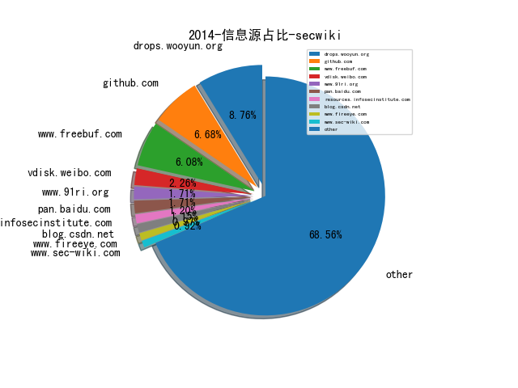
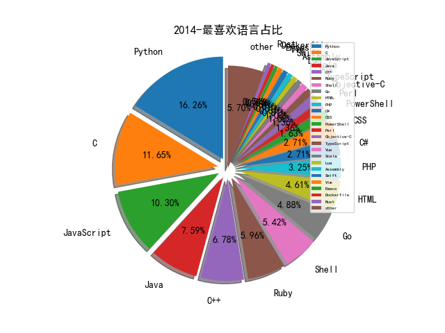

# [数据--所有](README_20.md)
# [数据--年度](README_2014.md)
# 2014 信息源与信息类型占比

# 微信公众号 推荐
| nickname_english | weixin_no | title | url| 
| --- | --- | --- | ---| 
| 该帐号已冻结 | close_2397504090 | web常见问题排查 | http://mp.weixin.qq.com/s?__biz=MjM5NzUwNDA5MA==&mid=200596752&idx=1&sn=37ecae802f32f45ddc0240548943bcbe&scene=1 | 1| 
| 机器学习之窗 | emachine_learning | 详细解剖百度大脑 | http://mp.weixin.qq.com/s?__biz=MjM5NDA4NjUxNw==&mid=200177301&idx=2&sn=c877b2d89ad3a87114e95524ca2eb188#rd | 1| 

# 组织github账号 推荐
| github_id | title | url | org_url | org_profile | org_geo | org_repositories | org_people | org_projects | repo_lang | repo_star | repo_forks| 
| --- | --- | --- | --- | --- | --- | --- | --- | --- | --- | --- | ---| 
| google | firing-range:test bed for web application security scanners | https://github.com/google/firing-range | https://opensource.google.com/ | Google ❤️ Open Source | https://opensource.google.com/ | 1474 | 2547 | 0 | C,TypeScript,Java,Python,Kotlin,JavaScript,C++,Go,Ruby,Rust | 0 | 0 | 1| 
| PayPal | lusca:Application security for express apps | https://github.com/PayPal/lusca | http://developer.paypal.com/ |  | San Jose, CA | 181 | 32 | 0 | Shell,Java,Clojure,Scala,C#,JavaScript,Python,Objective-C,Go,PHP,Ruby | 0 | 0 | 1| 
| linkedin | white-elephant:Hadoop log aggregator and dashboard | https://github.com/linkedin/white-elephant | http://engineering.linkedin.com |  | Sunnyvale, CA, USA | 140 | 26 | 0 | TypeScript,Java,Scala,Python,JavaScript,Terra,Objective-C,Vue,Go,Swift | 0 | 0 | 1| 
| sensepost | Snoopy v2.0 - modular digital terrestrial tracking framework | https://github.com/sensepost/snoopy-ng | http://sensepost.com |  | South Africa | 92 | 2 | 0 | C,Shell,Java,Python,C++,Perl,C#,HTML,Go,CMake | 0 | 0 | 1| 
| ctxis | CVE-2014-6271扫描脚本 | https://github.com/ctxis/ActiveScanPlusPlus/blob/master/activeScan%2B%2B.py | http://www.contextis.co.uk |  | London | 49 | 0 | 0 | C,Java,Python,JavaScript,C++,C#,HTML | 0 | 0 | 1| 
| fireeye | flare-ida：IDA Pro utilities from FLARE team | https://github.com/fireeye/flare-ida | https://www.fireeye.com/blog.html |  | Milpitas, CA | 48 | 1 | 0 | C,Vue,Python,JavaScript,C++,C#,Go,PowerShell | 0 | 0 | 1| 
| AlloyTeam | Pro:腾讯移动Web前端框架 | https://github.com/AlloyTeam/Pro | http://www.AlloyTeam.com/ |  | 中国深圳(Shenzhen, China) | 37 | 20 | 0 | C#,JavaScript,HTML,C++,CSS | 0 | 0 | 1| 
| F-Secure | Sulo:Dynamic instrumentation tool for Adobe Flash Player built on Intel | https://github.com/F-Secure/Sulo | http://www.f-secure.com |  | Finland | 31 | 0 | 0 | C,Java,D,Python,JavaScript,C++,Lua,Objective-C,Go,PHP,C# | 0 | 0 | 1| 
| honeynet | APKinspector: analyze the Android applications | https://github.com/honeynet/apkinspector/ | https://www.honeynet.org/ |  | https://www.honeynet.org/ | 28 | 18 | 0 | C,Java,Python,Ruby,JavaScript,C++,Perl,PHP,Dockerfile | 0 | 0 | 1| 
| adobe-research | spindle:Web日志分析查询 | https://github.com/adobe-research/spindle | http://research.adobe.com |  | http://research.adobe.com | 22 | 6 | 0 | C,Shell,Java,Scala,Python,JavaScript,C++,TeX,HTML,Ruby | 0 | 0 | 1| 
| zhihu | kids:Kids Is Data Stream | https://github.com/zhihu/kids | https://zhuanlan.zhihu.com/hackers | 知乎 GitHub 官方帐号 ，欢迎关注我们的技术专栏 https://zhuanlan.zhihu.com/hackers | Beijing, China | 20 | 5 | 0 | C,Java,Python,JavaScript,C++,Puppet,PHP,Ruby | 0 | 0 | 1| 
| RangeNetworks | OpenBTS-UMTS:3G UMTS Data Radio Access Network Node | https://github.com/RangeNetworks/OpenBTS-UMTS | http://www.rangenetworks.com | Open Source Cellular Infrastructure | San Francisco, California | 19 | 2 | 0 | C,Shell,JavaScript,Makefile,C++,Erlang,CSS | 0 | 0 | 1| 
| MITRECND | chopshop:Protocol Analysis/Decoder Framework | https://github.com/MITRECND/chopshop | http://www.mitre.org/work/cybersecurity/ |  | http://www.mitre.org/work/cybersecurity/ | 18 | 0 | 0 | Python,C,JavaScript,C++ | 0 | 0 | 1| 
| knownsec | KCon Conference Slideshare | https://github.com/knownsec/KCon | http://blog.knownsec.com |  | http://blog.knownsec.com | 17 | 2 | 0 | Python,Go,JavaScript | 0 | 0 | 1| 
| someus | TextRank4ZH:从中文文本中自动提取关键词和摘要 | https://github.com/someus/TextRank4ZH | https://github.com/letiantian | Go to https://github.com/letiantian to get more. | https://github.com/letiantian | 15 | 0 | 0 | C,Shell,Java,Python,JavaScript,HTML,Go,CSS | 0 | 0 | 1| 
| OpenSOC | OpenSOC Apache Hadoop Code | https://github.com/OpenSOC/opensoc | http://opensoc.github.io | Open Security Operations Center | http://opensoc.github.io | 9 | 0 | 0 | Python,Shell,Java,JavaScript,CSS | 0 | 0 | 1| 
| droidsec | Android Whitepapers | https://github.com/droidsec/droidsec.github.io/wiki/Android-Whitepapers | http://www.droidsec.org/ | A group of security researchers looking at the Android platform. | All over the world | 9 | 3 | 0 | Ruby,C,HTML,Java,D | 0 | 0 | 1| 
| mogutt | mogutt:企业办公即时通信软件 | https://github.com/mogutt/README | http://tt.mogu.io/ | mogujie Open Source IM is aiming to provide another IM solution in your company for colleagues to communicate with each other. | hangzhou, China | 8 | 11 | 0 | C | 0 | 0 | 1| 
| cea-sec | miasm:Reverse engineering framework in Python | https://github.com/cea-sec/miasm | https://twitter.com/cea_sec | IT Security at the French Alternative Energies and Atomic Energy Commission | France | 5 | 6 | 0 | Python,C | 0 | 0 | 1| 
| getqujing | qtunnel:A secure socket tunnel | https://github.com/getqujing/qtunnel | https://getqujing.com | Qu Jings official Github account. | China | 5 | 2 | 0 | Go,HTML,Ruby | 0 | 0 | 1| 
| heybe | Heybe Toolkit:Penetration Testing Automation Toolkit | https://github.com/heybe | https://github.com/heybe | Penetration Testing Automation Toolkit | https://github.com/heybe | 5 | 1 | 0 | Python,PHP | 0 | 0 | 1| 
| tmallfe | 跨终端实践-天猫试戴的解决方案 | https://github.com/tmallfe/tmallfe.github.io/issues/4 | http://weibo.com/tmallfe | 天猫前端团队 | Hangzhou China / 中国杭州 | 2 | 5 | 0 | HTML | 0 | 0 | 1| 
| WebKit | WebKit XSSAuditor source | https://github.com/WebKit/webkit/blob/master/Source/WebCore/html/parser/XSSAuditor.cpp | http://webkit.org/ |  | http://webkit.org/ | 1 | 5 | 0 |  | 0 | 0 | 1| 
| logentries | 日志管理平台 Logentries | https://github.com/logentries | https://logentries.com/ |  | Boston, Dublin, Prague | 0 | 1 | 0 |  | 0 | 0 | 1| 

# 私人github账号 推荐
| github_id | title | url | p_url | p_profile | p_loc | p_company | p_repositories | p_projects | p_stars | p_followers | p_following | repo_lang | repo_star | repo_forks | 
| --- | --- | --- | --- | --- | --- | --- | --- | --- | --- | --- | --- | --- | --- | ---| 
| yinwang0 | PySonar：精确、友好的 Python 静态分析器 | https://github.com/yinwang0/pysonar2 | None |  | None | None | 2 | 0 | 6 | 12200 | 0 | Java | 461 | 283 | 1| 
| amueller | word_cloud:A little word cloud generator in Python | https://github.com/amueller/word_cloud | http://amueller.github.io | Scikit-learn core-developer, Research Scientist at the Columbia Data Science Institute. | NYC | Columbia University Data Science Institute | 170 | 0 | 57 | 6000 | 43 | HTML,Jupyter | 0 | 0 | 1| 
| overtrue | 基于词库的中文转拼音优质解决方法 | https://github.com/overtrue/pinyin | http://overtrue.me | Keep calm and coding. | Shenzhen,China | Tencent. | 72 | 0 | 1600 | 5100 | 109 | PHP,HTML | 0 | 0 | 1| 
| alsotang | 基于云计算的微博敏感信息挖掘系统 | https://github.com/alsotang/ciscn_docs | http://fxck.it/ | A fullstack JS programmer. Admin of https://cnodejs.org since 2013. | ShenZhen, China | Tencent | 166 | 0 | 1000 | 4600 | 73 | JavaScript | 0 | 0 | 1| 
| kesenhoo | Google Android官方培训课程中文版(v0.4) | https://github.com/kesenhoo/android-training-course-in-chinese | http://hukai.me |  | Shanghai , China | Tencent Inc. | 22 | 0 | 76 | 4200 | 36 | JavaScript,Java,HTML | 0 | 0 | 1| 
| moxie0 | sslsniff:A tool for automated MITM attacks on SSL connections | https://github.com/moxie0/sslsniff | http://www.thoughtcrime.org |  | San Francisco | None | 18 | 0 | 8 | 3700 | 0 | Python,JavaScript,Java,C++ | 1400 | 320 | 1| 
| yangyangwithgnu | linux 下的惬意生活 | https://github.com/yangyangwithgnu/the_new_world_linux | https://yangyangwithgnu.github.io/ | The quieter you become, the more you are able to hear. | chengdu | None | 15 | 0 | 2 | 3300 | 0 | Python,C,CSS,C++,Vim | 9000 | 2100 | 1| 
| byt3bl33d3r | MITMf:Framework for Man-In-The-Middle attacks | https://github.com/byt3bl33d3r/MITMf | https://byt3bl33d3r.github.io | C Y B E R | Error: Unable to resolve | BlackHills InfoSec | 96 | 0 | 953 | 2700 | 117 | Python,PowerShell,HCL | 0 | 0 | 1| 
| jasondavies | d3-cloud:Create word clouds in JavaScript | https://github.com/jasondavies/d3-cloud | https://www.jasondavies.com/ |  | London, UK | None | 44 | 0 | 195 | 2300 | 40 | JavaScript | 2900 | 925 | 1| 
| alvarotrigo | fullPage.js:jQuery全屏滚动插件 | https://github.com/alvarotrigo/fullPage.js | http://alvarotrigo.com | Web developer with love for beautiful stuff. https://twitter.com/imac2 | Cambridge, UK | None | 59 | 0 | 176 | 2200 | 10 | TypeScript,JavaScript | 0 | 0 | 1| 
| mubix | Collection of Proof for #ShellShocker | https://github.com/mubix/shellshocker-pocs | https://malicious.link/ | Certified Checkbox Unchecker | Internets | @NoVAHA | 160 | 0 | 124 | 2100 | 421 | Python,C,HTML,Ruby,C++ | 1100 | 282 | 1| 
| DanMcInerney | shodan_pharmer | https://github.com/DanMcInerney/shodan_pharmer | None | I like automating security stuff so I dont have to work. Coalfire Sr. Pentester. | None | @danhmcinerney | 82 | 0 | 236 | 1900 | 23 | Python,Ruby,PowerShell | 0 | 0 | 1| 
| cure53 | Flashbang:open-source Flash-security helper | https://github.com/cure53/Flashbang | https://cure53.de | And there is fire where we walk. | Berlin | Fine penetration tests for fine websites | 16 | 0 | 30 | 1100 | 0 | JavaScript,HTML | 0 | 0 | 2| 
| zhuangbiaowei | 借助开源项目，学习软件开发 | https://github.com/zhuangbiaowei/learn-with-open-source | http://www.zhuangbiaowei.com/ |  | Shanghai, China | Huawei technologies co. ltd | 66 | 0 | 119 | 923 | 9 | Vue,Shell,Ruby,CSS | 1300 | 457 | 1| 
| ajinabraham | Static-DOM-XSS-Scanner | https://github.com/ajinabraham/Static-DOM-XSS-Scanner | https://github.com/OpenSecurityIN | Security Research & Engineering https://opensecurity.in https://ajinabraham.com | Montreal, Canada | @OpenSecurityIN | 125 | 0 | 50 | 893 | 13 | Python,HTML,CSS | 0 | 0 | 1| 
| strazzere | Kisskiss - Unpacker for various Android packers/protectors | https://github.com/strazzere/android-unpacker/tree/master/native-unpacker | http://www.strazzere.com/blog | Everything can be reversed | Oakland, Ca | None | 92 | 0 | 236 | 846 | 52 | Python,Ruby,C,Java | 745 | 290 | 1| 
| looly | Elasticsearch权威指南中文版 | https://github.com/looly/elasticsearch-definitive-guide-cn | http://www.luxiaolei.com | Java开发者，Python爱好者。 | Beijing,China | None | 13 | 0 | 125 | 814 | 128 | Python,Shell,Java | 5100 | 1600 | 1| 
| botherder | detekt：Memory triaging tool | https://github.com/botherder/detekt | http://twitter.com/botherder |  | None | Amnesty International | 42 | 0 | 12 | 809 | 0 | Python,Go,JavaScript | 0 | 0 | 2| 
| tyranid | IE11SandboxEscapes | https://github.com/tyranid/IE11SandboxEscapes | None |  | None | None | 32 | 0 | 0 | 700 | 2 | C#,Python,C | 0 | 0 | 1| 
| tombkeeper | ROPs_are_for_the_99% | https://github.com/tombkeeper/Talks/blob/master/CanSecWest_2014/ROPs_are_for_the_99%25_%5BCSW2014%5D.pdf | None |  | None | None | 5 | 0 | 0 | 677 | 0 | C,JavaScript | 84 | 54 | 1| 
| HackerFantastic | keyscan.py: looking for prime factors | https://github.com/HackerFantastic/Public/blob/master/misc/keyscan.py | https://github.com/hackerhouse-opensource | You can find my research and tools at Hacker House. | 127.0.0.1 | Hacker House @hackerhouse-opensource | 12 | 0 | 21 | 601 | 159 | C,TypeScript,Python,C++,Perl,Dockerfile | 0 | 0 | 1| 
| adamcaudill | Psychson:Custom Firmware & Existing Firmware Patches | https://github.com/adamcaudill/Psychson | http://adamcaudill.com |  | None | AppSec Consulting | 45 | 0 | 291 | 549 | 17 | Python,C#,C,Ruby | 587 | 448 | 1| 
| exp-sky | exp-sky/HitCon-2014-IE-11-0day-Windows-8.1-Exploit | https://github.com/exp-sky/HitCon-2014-IE-11-0day-Windows-8.1-Exploit | http://www.exp-sky.org |  | None | None | 16 | 0 | 568 | 494 | 64 | HTML | 83 | 43 | 1| 
| sachinchoolur | jQuery 内容滑块 jQuery lightSlider | https://github.com/sachinchoolur/lightslider | https://github.com/thoughtspot |  | Bangalore | @thoughtspot | 29 | 0 | 237 | 441 | 10 | JavaScript | 0 | 0 | 1| 
| Fuzion24 | An xposed module that disables SSL certificate checking | https://github.com/Fuzion24/JustTrustMe | https://twitter.com/fuzion24 |  | Earth | None | 94 | 0 | 882 | 430 | 89 | C,Java,Objective-C | 1400 | 274 | 1| 
| kbandla | APTnotes:Various public documents, whitepapers and articles | https://github.com/kbandla/APTnotes | http://twitter.com/kbandla |  | Washington, D.C. | None | 31 | 0 | 63 | 421 | 3 | Python,C | 2300 | 700 | 1| 
| greatghoul | 远程工作资料 | https://github.com/greatghoul/remote-working | http://ghoulmind.com | Ask and learn. | Xian | None | 110 | 0 | 437 | 415 | 162 | Python,HTML,Ruby,JavaScript | 4000 | 397 | 1| 
| UlricQin | falcon-eye:linux monitor tool | https://github.com/UlricQin/falcon-eye | http://ulricqin.com/ | 集群管理、部署、监控、跳板机... | Beijing | didi | 67 | 0 | 195 | 399 | 13 | Go,JavaScript,Java,CSS | 224 | 101 | 1| 
| k33nteam | CC-SHELLCODING framework | https://github.com/k33nteam/cc-shellcoding | http://www.k33nteam.org/ |  | None | None | 10 | 0 | 1 | 355 | 0 | C++ | 85 | 40 | 1| 
| IKende | Log4Grid:分布式应用日志管理 | https://github.com/IKende/Log4Grid | https://ikende.com |  | guangzhou of china | ikende.com | 34 | 0 | 19 | 331 | 2 | C#,Java | 0 | 0 | 1| 
| timwr | CVE-2014-3153 aka towelroot | https://github.com/timwr/CVE-2014-3153 | None |  | ::1 | None | 57 | 0 | 21 | 316 | 84 | Java,C,Shell,Ruby | 0 | 0 | 1| 
| SecUpwN | 伪基站开源检测项目 | https://github.com/SecUpwN/Android-IMSI-Catcher-Detector | https://git.io/AIMSICD |  | GEBLIEBEN UM ZU SIEGEN! | Security, Pentesting, Privacy. | 1 | 0 | 307 | 299 | 72 | Shell | 570 | 61 | 1| 
| JiaoXianjun | LTE-Cell-Scanner:An OpenCL accelerated TDD/FDD LTE Scanner | https://github.com/JiaoXianjun/LTE-Cell-Scanner | http://sdr-x.github.io/ | Play with Xilinx Zynq currently. | Gent, Belgium | imec | 29 | 0 | 60 | 279 | 12 | C,MATLAB,C++ | 306 | 102 | 1| 
| infodox | Some exploits and exploit development stuff | https://github.com/infodox/exploits | http://insecurety.net |  | None | None | 50 | 0 | 317 | 272 | 60 | Python,C | 420 | 146 | 1| 
| itnihao | Ubuntu下搭建Zabbix | https://github.com/itnihao/zabbix-book/blob/master/03-chapter/zabbix_install_on_ubuntu.md | http://www.itnihao.com |  | ShangHai | None | 352 | 0 | 86 | 268 | 64 | Python,JavaScript,Vim | 297 | 232 | 1| 
| xtao | CODE-PyconCN2014 | https://github.com/xtao/CODE-PyconCN2014 | http://blog.xtao.me |  | Beijing | None | 164 | 0 | 2300 | 262 | 206 | Python,Shell,JavaScript,Go,C++ | 20 | 7 | 1| 
| galkan | sees:Social Enginnering Email Sender | https://github.com/galkan/sees | None |  | None | None | 9 | 0 | 0 | 253 | 0 | Python,C,Shell,Ruby | 0 | 0 | 1| 
| demi6od | Smashing_The_Browser | https://github.com/demi6od/Smashing_The_Browser | None |  | None | https://twitter.com/demi6od | 5 | 0 | 2 | 232 | 0 | Python,JavaScript,C++ | 403 | 140 | 2| 
| lebinh | ngxtop:Real-time metrics for nginx server | https://github.com/lebinh/ngxtop | https://github.com/google | Curious programmer, brave sysadmin. SRE @google, previously @cloudflare and @adatao. | Sydney | @google | 46 | 0 | 277 | 231 | 4 | Python,Jupyter | 0 | 0 | 1| 
| nviennot | playdrone:Google Play Crawler | https://github.com/nviennot/playdrone | http://velvetpulse.com |  | New York | None | 108 | 0 | 114 | 229 | 19 | Python,C,Ruby,C++ | 0 | 0 | 1| 
| commonexploits | sonijohn:extract usernames and hashes from Sonicwall | https://github.com/commonexploits/sonijohn | http://www.commonexploits.com |  | UK | None | 12 | 0 | 6 | 228 | 5 | C,Shell | 128 | 55 | 1| 
| kahun | awesome-sysadmin | https://github.com/kahun/awesome-sysadmin | http://www.kahun.es | If you cant solve a problem, its because youre playing by the rules. - Paul Arden | Madrid | None | 9 | 0 | 186 | 212 | 7 | Ruby,C++ | 18600 | 3100 | 1| 
| allinurl | goaccess: real-time web log analyzer and interactive viewer | https://github.com/allinurl/goaccess | http://goaccess.io |  | None | None | 9 | 0 | 20 | 206 | 1 | Python,C | 0 | 0 | 1| 
| tomchop | malcom：Malware Communications Analyzer | https://github.com/tomchop/malcom | http://tomchop.me |  | Zürich, Switzerland | None | 17 | 0 | 14 | 201 | 5 | Python | 0 | 0 | 1| 
| gamelinux | passivedns：被动方式收集DNS记录 | https://github.com/gamelinux/passivedns | http://www.gamelinux.org/ |  | Earth | Gamelinux | 23 | 0 | 24 | 200 | 1 | C,Perl,PHP,Standard | 1300 | 332 | 1| 
| 2shou | python-libshorttext:setup script for libshorttext | https://github.com/2shou/python-libshorttext | http://guoze.me |  | Shenzhen, Guangzhou | Tencent | 10 | 0 | 99 | 193 | 17 | Python,JavaScript,Java,C++ | 625 | 198 | 1| 
| hhatto | nude:Nudity detection with Python | https://github.com/hhatto/nude.py | https://www.hexacosa.net/ |  | Hyogo, Japan | Panair, Inc. | 152 | 0 | 838 | 188 | 67 | Go,Python,C,Rust | 0 | 0 | 1| 
| smarttang | baseline_testing：Linux的配置检查工具 | https://github.com/smarttang/baseline_testing | https://github.com/smarttang/ | Security Expert | China Beijing | None | 20 | 0 | 7 | 164 | 2 | Python,C,PHP,JavaScript | 182 | 136 | 1| 
| NielsLeenheer | WhichBrowser:User agent sniffing gone too far | https://github.com/NielsLeenheer/WhichBrowser | https://nielsleenheer.com |  | Opende, The Netherlands | Salonhub | 13 | 0 | 38 | 152 | 1 | JavaScript,HTML | 0 | 0 | 1| 
| acama | xrop:Tool to generate ROP gadgets | https://github.com/acama/xrop | http://acez.re |  | None | None | 10 | 0 | 3 | 148 | 0 | Python,C,JavaScript,C++ | 164 | 40 | 1| 
| quentinhardy | odat:Oracle Database Attacking Tool | https://github.com/quentinhardy/odat | None |  | None | None | 10 | 0 | 27 | 148 | 0 | Python,C++ | 0 | 0 | 1| 
| zigoo0 | WebPwn3r - Web Applications Security Scanner | https://github.com/zigoo0/webpwn3r | None |  | None | None | 7 | 0 | 2 | 137 | 0 | Python,PHP | 213 | 92 | 1| 
| guhe120 | explib:JS写shellcode | https://github.com/guhe120/explib/blob/master/lib/explib.js | None |  | None | None | 7 | 0 | 0 | 125 | 0 | Python,Java | 9 | 7 | 1| 
| jipegit | OSXAuditor:Mac OS X计算机取证工具 | https://github.com/jipegit/OSXAuditor | https://twitter.com/Jipe_ | DFIR Engineer | None | None | 17 | 0 | 11 | 125 | 4 | Python,YARA,JavaScript,HTML | 3100 | 295 | 1| 
| atimorin | scada-tools | https://github.com/atimorin/scada-tools | None |  | None | None | 218 | 0 | 190 | 120 | 46 | Python,JavaScript,C++ | 104 | 55 | 1| 
| 1u4nx | Exploit-Exercises Nebula全攻略 | https://github.com/1u4nx/Exploit-Exercises-Nebula | http://www.shellcodes.org |  | Chengdu | None | 17 | 0 | 230 | 113 | 63 | Python,JavaScript,Emacs,Common | 199 | 96 | 1| 
| carmaa | inception： FireWire physical memory manipulation and hacking tool | https://github.com/carmaa/inception | https://www.linkedin.com/in/carsten-maartmann-moe-03a0522 | Consultant, hacker, technology enthusiast, and CEO at Transcendent Group Norway. | Oslo | Transcendent Group | 12 | 0 | 86 | 113 | 1 | Python,C,JavaScript,Ruby | 1300 | 169 | 1| 
| xmendez | wfuzz:The Web Bruteforcer | https://github.com/xmendez/wfuzz | http://wfuzz.org | IT Security Consultant , Security Researcher; Twitter: @x4vi_mendez | None | None | 4 | 0 | 6 | 109 | 1 | Python,Ruby | 1900 | 452 | 1| 
| rfunix | Pompem:Find exploit tool | https://github.com/rfunix/Pompem | https://github.com/olist |  | Brazil | @olist | 22 | 0 | 213 | 102 | 12 | Python,Go,Elixir | 664 | 222 | 1| 
| dmayer | idb: some common tasks for iOS pentesting and research | https://github.com/dmayer/idb | http://cysec.org |  | None | None | 23 | 0 | 10 | 98 | 5 | Python,C,Ruby,Objective-C | 794 | 143 | 1| 
| keepwn | Altman:the webshell tool | https://github.com/keepwn/Altman | None |  | None | None | 15 | 0 | 16 | 86 | 0 | C#,Shell,Vue,Go | 424 | 210 | 1| 
| gannimo | memTrace: a framework for lightweight memory tracing | https://github.com/gannimo/memTrace | http://nebelwelt.net |  | West Lafayette | Purdue University | 4 | 0 | 0 | 73 | 0 | TeX,C,Java | 45 | 9 | 1| 
| idanr1986 | A Cuckoo Sandbox Extension for Android | https://github.com/idanr1986/cuckoo?utm_content=buffer61912&utm_medium=social&utm_source=twitter.com&utm_campaign=buffer | None |  | None | None | 10 | 0 | 6 | 72 | 2 | Python,Java | 427 | 108 | 1| 
| HockeyInJune | Contemporary-Automatic-Program-Analysis | https://github.com/HockeyInJune/Contemporary-Automatic-Program-Analysis | https://twitter.com/HockeyInJune |  | New York, New York | None | 3 | 0 | 458 | 68 | 85 | Python,C,PowerShell | 11 | 9 | 1| 
| edix | MalwareResourceScanner | https://github.com/edix/MalwareResourceScanner | https://twitter.com/xedi25 |  | Vienna, Austria | None | 15 | 0 | 44 | 66 | 22 | Assembly,C++ | 187 | 51 | 1| 
| sch3m4 | Android Pattern Lock Cracker | https://github.com/sch3m4/androidpatternlock | http://safetybits.net |  | None | None | 32 | 0 | 10 | 65 | 0 | Python,C,JavaScript,Assembly | 137 | 76 | 1| 
| squiffy | Masochist:XNU Rootkit Framework | https://github.com/squiffy/Masochist | http://me.squiffypwn.com |  | The Moon | None | 17 | 0 | 167 | 61 | 21 | C,Shell,Swift | 118 | 22 | 1| 
| ssun125 | Lanmitm:Android中间人攻击测试工具 | https://github.com/ssun125/Lanmitm | None | show me the code. | None | 奇虎360，美团网 | 5 | 0 | 9 | 60 | 1 | Java | 0 | 0 | 1| 
| yangbh | Hammer:A web vulnnerability scanner | https://github.com/yangbh/Hammer | None |  | None | None | 12 | 0 | 865 | 54 | 46 | Python,Ruby | 116 | 106 | 1| 
| ga1ois | The Art of Leaks - read version - Yoyo | https://github.com/ga1ois/CanSecWest2014/blob/master/The%20Art%20of%20Leaks%20-%20read%20version%20-%20Yoyo.pdf | None |  | None | None | 4 | 0 | 2 | 49 | 0 | ActionScript | 22 | 9 | 1| 
| ddrown | Dockerfiles:Build files for android-cross-compile | https://github.com/ddrown/Dockerfiles | https://blog.dan.drown.org |  | None | None | 84 | 0 | 25 | 47 | 7 | C,Shell,CSS,Perl | 0 | 0 | 1| 
| hikerell | BFuzzer:A Browser Fuzzer for Vulnerbilities | https://github.com/hikerell/BFuzzer | None |  | None | None | 21 | 0 | 124 | 47 | 7 | Python,Go,C,HTML,Assembly | 67 | 49 | 1| 
| tillmannw | prowler:Base Code for P2P Network Crawlers | https://github.com/tillmannw/prowler | None |  | None | None | 7 | 0 | 0 | 45 | 0 | Python,Lua,C | 71 | 16 | 1| 
| Hevienz | 基于nginx和lua的WAF系统 nginx-lua-ds-waf | https://github.com/Hevienz/nginx-lua-ds-waf | None |  | Wuxi, China | None | 30 | 0 | 442 | 40 | 51 | Python,Lua,C,Go | 40 | 19 | 1| 
| click1 | uxss在线测试页面 | https://github.com/click1/uxss | None |  | None | None | 7 | 0 | 48 | 39 | 13 | Go,Python,PHP,Swift | 49 | 37 | 1| 
| lfzark | cookie-injecting-tools | https://github.com/lfzark/cookie-injecting-tools/ | http://arkpy.com | The monster is running wild inside of me. | China,Peking | None | 51 | 0 | 176 | 34 | 17 | Python,JavaScript | 0 | 0 | 1| 
| promised-lu | Internet Explorer MemoryProtection Mitigation | https://github.com/promised-lu/MemoryProtection | None |  | None | None | 1 | 0 | 0 | 31 | 4 | C++ | 29 | 27 | 1| 
| Prochainezo | xss2shell：abusing XSS vulnerabilities on Wordpress and Joomla | https://github.com/Prochainezo/xss2shell | None |  | None | None | 9 | 0 | 16 | 25 | 2 | Python,PHP | 62 | 19 | 1| 
| kitygraph | kityminder:在线脑图编辑器 | https://github.com/kitygraph/kityminder/ | None |  | None | None | 1 | 0 | 0 | 18 | 0 |  | 0 | 0 | 1| 
| vietor | dnsproxy:A simple DNS proxy server | https://github.com/vietor/dnsproxy | https://github.com/ktplay | Do Something You Love | Beijing, China | @ktplay | 29 | 0 | 8 | 17 | 11 | Python,Java,C,PHP,Emacs | 30 | 14 | 1| 
| husam212 | MITMer:Automated man-in-the-middle attack tool | https://github.com/husam212/MITMer | None |  | Amman, Jordan | None | 15 | 0 | 15 | 13 | 6 | Python,JavaScript,Java | 42 | 14 | 1| 
| jayeshchauhan | SSRF Exploitation Framework v0.1 | https://github.com/jayeshchauhan/SKANDA | None |  | None | None | 8 | 0 | 1 | 11 | 0 | Python,Shell,Arduino | 0 | 0 | 1| 
| m4rco- | dorothy2:A malware/botnet analysis framework written in Ruby | https://github.com/m4rco-/dorothy2 | None |  | None | None | 2 | 0 | 24 | 9 | 1 | JavaScript,Ruby | 181 | 32 | 1| 
| depasonico | ByWaf: a web application penetration testing framework (WAPTF) | https://github.com/depasonico/OWASP-ByWaf | https://singularityx.wordpress.com/ |  | London UK | None | 31 | 0 | 5 | 8 | 6 | Python,Java,PowerShell | 3 | 2 | 1| 
| pianoboysai | pyInspector:python inspect rootkit tool | https://github.com/pianoboysai/pyInspector | None |  | None | None | 13 | 0 | 23 | 7 | 4 | Python,C++ | 32 | 16 | 1| 
| xufanghui | docker的安装及相关使用和说明文档 | https://github.com/xufanghui/docker-ua | None |  | None | None | 53 | 0 | 282 | 5 | 8 | PHP,Java,JavaScript | 21 | 9 | 1| 
| yymax | x509test:x509 certificate fuzzer | https://github.com/yymax/x509test | None |  | San Luis Obispo, CA | California Polytechnic State University | 1 | 0 | 2 | 4 | 0 | Python | 138 | 19 | 1| 
| mrrrgn | simple-rootkit：attack against gcc and Python via kernel module | https://github.com/mrrrgn/simple-rootkit | None | This account was wiped in 2018, then later restored to unbreak links to projects that others had referenced. | None | None | 12 | 0 | 2 | 3 | 3 | C,Shell,Python,JavaScript,C++,Vim,Go | 1 | 1 | 1| 
| Orbixx | Obfuscalp:suspicious/malicious code planted inside PHP | https://github.com/Orbixx/Obfuscalp | None |  | None | None | 4 | 0 | 53 | 1 | 3 | Python,Shell,JavaScript,PowerShell | 1 | 0 | 1| 
| Astonex | Antox:Android client for Project Tox | https://github.com/Astonex/Antox | None |  | None | None | 0 | 0 | 0 | 0 | 0 |  | 0 | 0 | 1| 
| PythonJS | pypubjs:Integrated development environment for PythonJS using NodeWebkit | https://github.com/PythonJS/pypubjs | None | None | None | None | 0 | 0 | 0 | 0 | 0 | Python,JavaScript | 0 | 0 | 1| 
| YakindanEgitim | malwarez:Malware visualization on earth map | https://github.com/YakindanEgitim/malwarez | None | None | None | None | 0 | 0 | 0 | 0 | 0 | Java,Python,JavaScript,C++,PHP,Ruby | 0 | 0 | 1| 
| chuhades | CMS-Exploit-Framework | https://github.com/chuhades/CMS-Exploit-Framework | None | None | None | None | 0 | 0 | 0 | 0 | 0 | None | 0 | 0 | 1| 
| ctfs | 9447-ctf-2014 write-ups | https://github.com/ctfs/write-ups/tree/master/9447-ctf-2014 | None | None | None | None | 0 | 0 | 0 | 0 | 0 | Python,C,Shell,CSS | 0 | 0 | 5| 
| darshakframework | darshak：Detecting any suspicious activity of being tracked | https://github.com/darshakframework/darshak | None | None | None | None | 0 | 0 | 0 | 0 | 0 | Java | 0 | 0 | 1| 
| falstaff84 | Heartbleed test script for OpenVPN | https://github.com/falstaff84/heartbleed_test_openvpn | None | None | None | None | 0 | 0 | 0 | 0 | 0 | None | 0 | 0 | 1| 
| jenson-shi | dnspod_inter_ddns:Dnspod International DDNS | https://github.com/jenson-shi/dnspod_inter_ddns | https://github.com/shixiongfei | Moved to https://github.com/shixiongfei | Moved to https://github.com/shixiongfei | Moved to https://github.com/shixiongfei | 0 | 0 | 0 | 0 | 1 |  | 0 | 0 | 1| 
| search#search_cheatsheet_pane | GitHub supports advanced search operators much like Google | https://github.com/search#search_cheatsheet_pane | None | None | None | None | 0 | 0 | 0 | 0 | 0 |  | 0 | 0 | 1| 
| showcases | Data visualization tools for the web | https://github.com/showcases/data-visualization | None | None | None | None | 0 | 0 | 0 | 0 | 0 |  | 0 | 0 | 2| 

# medium_xuanwu 推荐
| title | url| 
| --- | ---| 

# medium_secwiki 推荐
| title | url| 
| --- | ---| 

# zhihu_xuanwu 推荐
| title | url| 
| --- | ---| 

# zhihu_secwiki 推荐
| title | url| 
| --- | ---| 

# 日更新程序
`python update_daily.py`