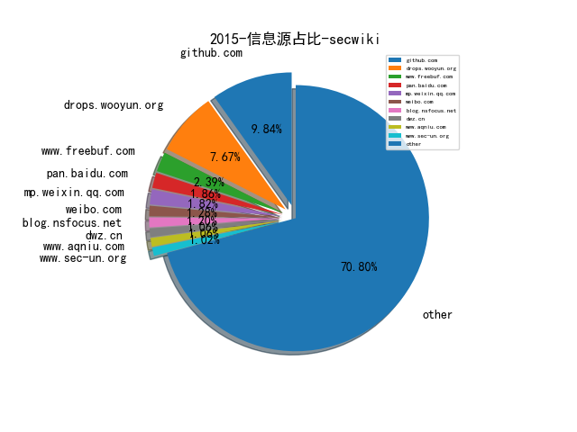
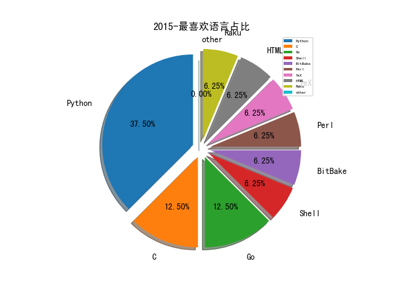

# 2015 信息源与信息类型占比

# 微信公众号 推荐
| nickname_english | weixin_no | title | url| 
| --- | --- | --- | ---| 
| iPolicyLaw | iPolicyLaw |  | http://mp.weixin.qq.com/s?__biz=MzA5MTg4MjA2Mw==&mid=401404699&idx=1&sn=0837277eba166cdc2e260cc97d15ec7c&scene=23 | 1| 
| 301在路上 | a301zls |  | http://mp.weixin.qq.com/s?__biz=MzIwMTQ2NzY4NA==&mid=400407181&idx=1&sn=cf6cb8a5573a11afa0a315ad4bebba13&scene=23&srcid=1115EFIhpnzCCp1knXKbo8xp#rd | 1| 
| 阿里聚安全 | alijaq |  | http://mp.weixin.qq.com/s?__biz=MzIwMTI4Nzk5Ng==&mid=400486988&idx=1&sn=8b5098334c521a7771ebceb6f42b5d7b&scene=1 | 1| 
| BeaconLab |  |  | http://mp.weixin.qq.com/s?__biz=MzA5OTMwMzY1NQ==&mid=400149980&idx=1&sn=37ef74024030e91408a3105ac52cc105 | 1| 
| 新智元 | AI_era |  | http://mp.weixin.qq.com/s?__biz=MzI3MTA0MTk1MA==&mid=400323118&idx=1&sn=3b403af3c0b25f2491f0bd7310b612aa | 1| 
| 高可用架构 | ArchNotes |  | http://mp.weixin.qq.com/s?__biz=MzAwMDU1MTE1OQ==&mid=400931866&idx=1&sn=b96873fc9f726e5705b2653968f1d992 | 1| 
| E安全 | EAQapp |  | http://mp.weixin.qq.com/s?__biz=MzI4MjA1MzkyNA==&mid=400213000&idx=1&sn=adeee3ed3781788684143f61b9a8986c&scene=1 | 1| 
| 待字闺中 | daiziguizhongren |  | http://mp.weixin.qq.com/s?__biz=MjM5ODIzNDQ3Mw==&mid=208693972&idx=1&sn=96ad4367776df79ec64b6ffc16865cd4&scene=0#rd | 2| 
| 安在 | AnZer_SH |  | http://mp.weixin.qq.com/s?__biz=MzIzMTAzNzUxMQ==&mid=211211306&idx=1&sn=ecbd6718cda78fd402806e7db51ed7e7&scene=20&scene=23&srcid=0921ExCklh54cX4myw4Nm60P#rd | 4| 
| 看雪学院 | ikanxue |  | http://mp.weixin.qq.com/s?__biz=MjM5NTc2MDYxMw==&mid=207454569&idx=1&sn=dfe3f6d6d6cf7ea64e1aaccf66b8602a&scene=0#rd | 1| 
| 川大信安 | chuandaxinan |  | http://mp.weixin.qq.com/s?__biz=MzIzNzAxMDE5NA==&mid=208084923&idx=1&sn=3b22f92624a9d92ed7ab9f6b856aa794&scene=23&srcid=0911Ro0EpZNiLJzfodp1PCAP | 1| 
| SecWiki | SecWiki |  | http://mp.weixin.qq.com/s?__biz=MjM5NDM1OTM0Mg==&mid=207464484&idx=1&sn=040d0d9eeed1e31eaac369f08722c72a&scene=5#rd | 2| 
| DJ的札记 | DJ_notes |  | http://mp.weixin.qq.com/s?__biz=MzAwNjA3MzEwNg==&mid=207876533&idx=1&sn=583a0e7e979c072a6852e703169821bd&3rd=MzA3MDU4NTYzMw==&scene=6#rd | 1| 
| 威观世界 | will-4 |  | http://mp.weixin.qq.com/s?__biz=MzA3OTQxMzEzOA==&mid=203108534&idx=1&sn=40a95bf2379a526bfa18a3c26ae15421&scene=18&scene=5#rd | 1| 
| 懒人在思考 | lazy-thought |  | http://mp.weixin.qq.com/s?__biz=MzA3NTEzMTUwNA==&mid=210199489&idx=1&sn=eaee28e27bbe511ff92b33b919a36824&scene=5#rd | 1| 
| 市界 | ishijie2018 |  | http://mp.weixin.qq.com/s?__biz=MTA3NDI5ODU0MQ==&mid=210013213&idx=1&sn=5871afead96d9515c060c3bc140b7767 | 1| 
| T00ls | T00lsNet |  | http://mp.weixin.qq.com/s?__biz=MjM5MDkwNjA2Nw==&mid=207127230&idx=4&sn=31cf9f24128063aceb22b29386a1414f&key=af154fdc40fed00344bc7138106964ec89f110774db68ac2c5471d4ed41c57cd6921677a45e312dc708a1bd532128d6f&ascene=0&uin=NjY5NjY5MDgw | 1| 
| TOMsInsight | TOMsInsight |  | http://mp.weixin.qq.com/s?__biz=MzA3NTcwOTIwNg==&mid=206803402&idx=1&sn=07072c12e61817f3403ee9b31ef9a979&scene=4#wechat_redirect | 1| 
| 一丁闲思路 | yd-think |  | http://mp.weixin.qq.com/s?__biz=MzAxMjAwMjUxNQ==&mid=207881605&idx=1&sn=2fce890233828adaa90364e3c8633f4a&scene=1 | 1| 
| 该帐号已冻结 | close_3007026920 |  | http://mp.weixin.qq.com/s?__biz=MzAwNzAyNjkyMA==&mid=207687691&idx=1&sn=ce3d208fbc6cbb38271afdf65aff4f54&scene=5#rd | 1| 
| Trustdata大数据 | TrustData |  | http://mp.weixin.qq.com/s?__biz=MzA4Nzc3MzA4OA==&mid=207253300&idx=1&sn=c3549aa82d3250261c60cf6b27c2429c | 1| 
| 北美工程师求职顾问 | office-hour |  | http://mp.weixin.qq.com/s?__biz=MzA4MjQwNTExMA==&mid=205386787&idx=1&sn=04788f1dc8352ca32948460bd6e3fe31 | 1| 
| 安天 | Antiylab |  | http://mp.weixin.qq.com/s?__biz=MjM5MTA3Nzk4MQ==&amp;mid=207025811&amp;idx=1&amp;sn=76130bdd0d6273af23f234e13faa160f#rd | 2| 
| SAINTSEC | SAINTSEC |  | http://mp.weixin.qq.com/s?__biz=MjM5MjEyMTcyMQ==&mid=208021695&idx=2&sn=9c6f579e7e819f797cfc023359698c51#rd | 1| 
| 张三丰的疯言疯语 | zsfnotes |  | http://mp.weixin.qq.com/s?__biz=MzA3MTUwMzI5Nw==&mid=213825938&idx=1&sn=2a5ec95e8a12a5e7e6971ae76965a2cc&scene=1&from=groupmessage&isappinstalled=0#rd | 1| 
| 绿盟科技 | NSFOCUS-weixin |  | http://mp.weixin.qq.com/s?__biz=MjM5ODYyMTM4MA==&mid=205178018&idx=1&sn=cea04c7ac59e47c8615d46957771ddc3#rd | 2| 
| 安全牛 | aqniu-wx |  | http://mp.weixin.qq.com/s?__biz=MjM5Njc3NjM4MA==&mid=204220396&idx=1&sn=5b03e1aba05205d0d776cc467ba2aeb5&scene=2&from=timeline&isappinstalled=0#rd | 2| 
| 大数据邦 | bigdatabang |  | http://mp.weixin.qq.com/s?__biz=MjM5MTQ4NzgwNA==&mid=202880218&idx=6&sn=6784f6074c5cb3f4d3880890cb0ca802&scene=2&key=79cf83ea5128c3e5a6321fe2b80da0a2f3ad9e27c6fd428c41fb23b425a82bff3aa2dd9aa7c902a3b22a35a041cfa814&ascene=1&uin=MjI2NDkwNDk2MA%3D%3D&de | 1| 
| 实验万事屋 | Whateverysearch |  | http://mp.weixin.qq.com/s?__biz=MzA3ODU1NjUyNw==&mid=203877137&idx=1&sn=298714542e7011ffe9fcc551f51d3169&scene=1 | 1| 
| 政治学与国际关系论坛 | sinozhuge |  | http://mp.weixin.qq.com/s?__biz=MjM5NDMzNTk2MA==&mid=202435694&idx=3&sn=2e67bdf66924b00507855140d2e02630&scene=2&from=timeline&isappinstalled=0%23rd | 1| 

# 组织github账号 推荐
| github_id | title | url | org_url | org_profile | org_geo | org_repositories | org_people | org_projects | repo_lang | repo_star | repo_forks| 
| --- | --- | --- | --- | --- | --- | --- | --- | --- | --- | --- | ---| 
| Microsoft | Information from Microsoft about the PDB. | https://github.com/Microsoft/microsoft-pdb | https://opensource.microsoft.com | Open source, from Microsoft with love | Redmond, WA | 2463 | 4258 | 0 | C,TypeScript,Java,C#,JavaScript,C++,PowerShell,Python,HTML,Rich,Go,CMake,Jupyter | 0 | 0 | 1| 
| google | GRR Rapid Response: remote live forensics for incident response | https://github.com/google/grr | https://opensource.google.com/ | Google ❤️ Open Source | https://opensource.google.com/ | 1474 | 2547 | 0 | C,TypeScript,Java,Python,Kotlin,JavaScript,C++,Go,Ruby,Rust | 0 | 0 | 4| 
| awslabs | Sample applications built using Amazon Machine Learning | https://github.com/awslabs/machine-learning-samples | http://amazon.com/aws/ | AWS Labs | Seattle, WA | 376 | 87 | 0 | C,TypeScript,Java,Python,JavaScript,C++,C#,Shell,Go,Jupyter,Swift,Rust | 0 | 0 | 1| 
| yahoo | Use OpenPGP encryption in Yahoo mail | https://github.com/yahoo/end-to-end | http://developer.yahoo.com/ |  | Sunnyvale, California | 249 | 23 | 0 | Java,Scala,Python,JavaScript,C++,Objective-C,Go,CSS | 0 | 0 | 2| 
| Netflix | Sleepy Puppy XSS Payload Management Framework | https://github.com/Netflix/sleepy-puppy | http://netflix.github.io/ | Netflix Open Source Platform | Los Gatos, California | 152 | 8 | 0 | Groovy,C,Shell,Java,D,Scala,Python,JavaScript,C++,HTML,Go,Ruby | 0 | 0 | 1| 
| NVIDIA | DIGITS:Deep GPU Training System | https://github.com/NVIDIA/DIGITS | http://www.nvidia.com |  | 2701 San Tomas Expressway, Santa Clara, California, 95050 | 147 | 16 | 0 | C,Shell,Python,Makefile,C++,Cuda,Go | 0 | 0 | 1| 
| sensepost | mana:toolkit for wifi rogue AP attacks and MitM | https://github.com/sensepost/mana | http://sensepost.com |  | South Africa | 92 | 2 | 0 | C,Shell,Java,Python,C++,Perl,C#,HTML,Go,CMake | 0 | 0 | 2| 
| tensorflow | TensorFlow: Large-scale machine learning on heterogeneous systems | https://github.com/tensorflow/tensorflow | http://www.tensorflow.org |  | http://www.tensorflow.org | 78 | 213 | 2 | TypeScript,Jupyter,Python,JavaScript,C++,Swift | 0 | 0 | 1| 
| Ticketmaster | metrilyx-2.0:Visualization and analytics interface for OpenTSDB | https://github.com/Ticketmaster/Metrilyx-2.0 | http://www.ticketmaster.com/ |  | http://www.ticketmaster.com/ | 67 | 11 | 0 | TypeScript,Java,Kotlin,JavaScript,Shell,HTML,Go,Swift,PowerShell | 0 | 0 | 1| 
| stackforge | bandit:Python AST-based static analyzer from OpenStack Security Group | https://github.com/stackforge/bandit | None | Mirrors of unofficial retired projects related to the OpenStack community, retained here for historical interest and reference purposes. | None | 66 | 0 | 0 |  | 0 | 0 | 1| 
| RUB-NDS | WS-Attacker:modular framework for web services penetration testing | https://github.com/RUB-NDS/WS-Attacker | https://www.nds.ruhr-uni-bochum.de/ | Research and development at the Chair for Network and Data Security concentrates on cryptographic protocols, Internet and XML security. | Ruhr University Bochum | 65 | 6 | 0 | TeX,Python,JavaScript,Java,CoffeeScript | 0 | 0 | 1| 
| NetSPI | PowerShell script and Java code to decrypt WebLogic passwords | https://github.com/NetSPI/WebLogicPasswordDecryptor | https://www.netspi.com |  | Minneapolis, MN | 63 | 7 | 0 | C,ASP,Java,C#,Python,HTML,Go,Ruby,PowerShell | 0 | 0 | 1| 
| apple | The Swift Programming Language(source code) | https://github.com/apple/swift | https://apple.com |  | Cupertino, CA | 61 | 82 | 0 | C,LLVM,Python,JavaScript,C++,HTML,Swift | 0 | 0 | 1| 
| GDSSecurity | Windows-Exploit-Suggester | https://github.com/GDSSecurity/Windows-Exploit-Suggester | https://www.aon.com/cyber-solutions |  | New York, NY | 49 | 3 | 0 | C,Shell,Java,XSLT,Python,JavaScript,Perl,C#,Objective-C,Lua,PHP,Ruby | 0 | 0 | 1| 
| ctxis | CANAPE Network Testing Tool | https://github.com/ctxis/canape | http://www.contextis.co.uk |  | London | 49 | 0 | 0 | C,Java,Python,JavaScript,C++,C#,HTML | 0 | 0 | 1| 
| nowsecure | android-vts:Android Vulnerability Test Suite | https://github.com/nowsecure/android-vts | https://www.nowsecure.com | We secure Mobile Devices, Enterprises, & Mobile Apps | https://www.nowsecure.com | 49 | 5 | 0 | C,Java,Python,JavaScript,Rust,SaltStack,CSS | 0 | 0 | 1| 
| SecWiki | sec-chart:Security Flow Chart | https://github.com/SecWiki/sec-chart | http://www.sec-wiki.com |  | http://www.sec-wiki.com | 41 | 2 | 0 | C,Python,JavaScript,HTML,PHP,CSS | 0 | 0 | 2| 
| threatstream | Deploying Dionaea on a Raspberry Pi using MHN | https://github.com/threatstream/mhn/wiki/Deploying-Dionaea-on-a-Raspberry-Pi | http://www.anomali.com |  | Redwood City, CA | 40 | 0 | 0 | C,Shell,Scala,Python,JavaScript,CoffeeScript,HTML,Go,Ruby,CSS | 0 | 0 | 1| 
| lfit | Linux workstation security checklist | https://github.com/lfit/itpol/blob/master/linux-workstation-security.md | None | Projects maintained by the Linux Foundation IT | None | 34 | 6 | 0 | Python,Groovy,Shell,Puppet,HTML | 0 | 0 | 1| 
| IOActive | JDWP exploitation script | https://github.com/IOActive/jdwp-shellifier | http://blog.ioactive.com/ | IOActive Labs repository | http://blog.ioactive.com/ | 24 | 0 | 0 | C,Shell,Java,Python,JavaScript,C++,C# | 0 | 0 | 1| 
| twostairs | paperwork:OpenSource note-taking & archiving | https://github.com/twostairs/paperwork | https://twostairs.co | We do great things! | https://twostairs.co | 22 | 1 | 0 | C,Shell,Dockerfile,JavaScript,C++,Elixir,Ruby,CSS | 0 | 0 | 1| 
| rednaga | Offensive & Defensive Android Reverse Engineering | https://github.com/rednaga/training/tree/master/DEFCON23 | None |  | Oakland, Ca | 21 | 4 | 0 | YARA,C,Java,C++,Go,CSS | 0 | 0 | 1| 
| infobyte | faraday:Collaborative Penetration Test IDE | https://github.com/infobyte/faraday | https://www.faradaysec.com | Collaborative Penetration Test and Vulnerability Management Platform. We provide specialized services in offensive security. | Miami, FL | 18 | 0 | 0 | Shell,Java,Python,JavaScript,Perl,Erlang,Ruby | 0 | 0 | 1| 
| knownsec | KCon 2015 | https://github.com/knownsec/KCon/tree/master/KCon%202015 | http://blog.knownsec.com |  | http://blog.knownsec.com | 17 | 2 | 0 | Python,Go,JavaScript | 0 | 0 | 1| 
| chaitin | sqlchop:A novel SQL injection detection engine | https://github.com/chaitin/sqlchop | http://chaitin.com | 长亭科技 | Beijing | 16 | 7 | 0 | TypeScript,Python,JavaScript,C++,Lua,HTML,Go | 0 | 0 | 1| 
| dionach | CMSmap:a python open source CMS scanner | https://github.com/dionach/CMSmap | https://www.dionach.com/ |  | https://www.dionach.com/ | 15 | 0 | 0 | Shell,C#,JavaScript,C++,Python,ActionScript,PHP | 0 | 0 | 1| 
| secdr | security conference resource | https://github.com/secdr/awesome/blob/master/paper/security-conference.md | http://secdr.github.io/ | Security Research Team | http://secdr.github.io/ | 12 | 1 | 0 | Python,TeX,HTML | 0 | 0 | 1| 
| zecure | Shadow Daemon:a web application firewall | https://github.com/zecure/shadowd_ui | https://zecure.org/ |  | https://zecure.org/ | 12 | 1 | 0 | Shell,Python,JavaScript,C++,Perl,HTML,PHP,CSS | 0 | 0 | 1| 
| XiphosResearch | Miscellaneous exploit code | https://github.com/XiphosResearch/exploits | http://www.xiphosresearch.com/ | UK and US based boutique security consultancy and software development company | United Kingdom | 11 | 1 | 0 | Python,C,Shell,Makefile | 0 | 0 | 1| 
| nbs-system | Detect potentially malicious PHP files | https://github.com/nbs-system/php-malware-finder | https://www.nbs-system.com |  | Paris, France | 11 | 2 | 0 | Python,C,PHP,JavaScript,CSS | 0 | 0 | 1| 
| REhints | CodeXplorer自动识别虚表调用 | https://github.com/REhints/HexRaysCodeXplorer/releases/tag/1.7 | http://REhints.com |  | http://REhints.com | 10 | 2 | 0 | Python,C,Assembly,CSS,C++ | 0 | 0 | 2| 
| USArmyResearchLab | Dshell:a network forensic analysis framework. | https://github.com/USArmyResearchLab/Dshell | http://www.arl.army.mil | Discover, innovate, and transition science and technology to ensure dominant strategic land power. | http://www.arl.army.mil | 10 | 0 | 0 | Python,C,HTML,C++ | 0 | 0 | 1| 
| grierforensics | OfficeDissector: parser library for static security analysis of Office | https://github.com/grierforensics/officedissector | http://www.grierforensics.com/ |  | http://www.grierforensics.com/ | 7 | 0 | 0 | Python,JavaScript,HTML,PHP,Scala | 0 | 0 | 1| 
| CppCon | cpp con2015 | https://github.com/CppCon/CppCon2015 | http://cppcon.org/ | The C++ Conference | http://cppcon.org/ | 6 | 0 | 0 | Python,C++ | 0 | 0 | 1| 
| CN-Chrome-DevTools | Chrome 开发者工具中文手册 | https://github.com/CN-Chrome-DevTools/CN-Chrome-DevTools | http://cn-chrome-devtools.github.io/CN-Chrome-DevTools/ |  | http://cn-chrome-devtools.github.io/CN-Chrome-DevTools/ | 1 | 1 | 0 |  | 0 | 0 | 1| 

# 私人github账号 推荐
| github_id | title | url | p_url | p_profile | p_loc | p_company | p_repositories | p_projects | p_stars | p_followers | p_following | repo_lang | repo_star | repo_forks | 
| --- | --- | --- | --- | --- | --- | --- | --- | --- | --- | --- | --- | --- | --- | ---| 
| laruence | PHP tainted analysis extension | https://github.com/laruence/php-taint | http://www.laruence.com | PHP Stylite | Beijing, China | Ke.com | 29 | 0 | 39 | 11000 | 16 | C | 0 | 0 | 1| 
| goodfeli | Exercises for my tutorials on Theano | https://github.com/goodfeli/theano_exercises | http://www.iangoodfellow.com |  | Mountain View | None | 18 | 0 | 5 | 9500 | 4 | Python,TeX | 2200 | 784 | 1| 
| fouber | page-monitor: the dom change with phantomjs | https://github.com/fouber/page-monitor | https://github.com/fouber/blog |  | China | 全民直播 | 150 | 0 | 248 | 9200 | 74 | JavaScript | 18800 | 2200 | 1| 
| jakevdp | Materials for my Pycon 2015 scikit-learn tutorial | https://github.com/jakevdp/sklearn_pycon2015 | http://www.vanderplas.com | Python, Astronomy, Data Science | Seattle WA | Google | 189 | 0 | 43 | 8700 | 6 | Python,Jupyter | 0 | 0 | 1| 
| samyk | sql++: cross-database command line SQL client | https://github.com/samyk/sqlpp/ | https://samy.pl | explo(r|it)ing boundaries | los angeles | None | 83 | 0 | 8700 | 5200 | 903 | Eagle,C,JavaScript,Arduino | 5000 | 953 | 1| 
| evilcos | 隐蔽的战场—Flash Web攻击 | https://github.com/evilcos/papers/blob/master/%E9%9A%90%E8%94%BD%E7%9A%84%E6%88%98%E5%9C%BA%E2%80%94Flash%20Web%E6%94%BB%E5%87%BB.pptx | https://evilcos.me | //:ALERT(/HACKING SYMBOL/)//余弦 | None | xeyeteam | 10 | 0 | 150 | 4000 | 13 | JavaScript | 0 | 0 | 2| 
| aymericdamien | TensorFlow tutorials and code examples for beginners | https://github.com/aymericdamien/TensorFlow-Examples | https://github.com/Snapchat | Deep Learning Enthusiast. SWE @Snapchat. Past: Tsinghua University, EISTI | San Francisco, CA | Snapchat | 12 | 0 | 219 | 3900 | 28 | Python,R,Jupyter,C++ | 0 | 0 | 1| 
| jhaddix | pentest-bookmarks | https://github.com/jhaddix/pentest-bookmarks/blob/master/wiki/BookmarksList.wiki | https://github.com/bugcrowd | Father, hacker, Head of Trust and Security @bugcrowd, blogger, gamer, & nerd. Bounty Hunter. http://vizualize.me/jhaddix | United States | https://jasonhaddix.com/ | 46 | 0 | 13 | 3100 | 1 | Python,Go,Shell | 1400 | 347 | 1| 
| vinta | awesome-python: 优秀库汇总 | https://github.com/vinta/awesome-python | https://vinta.ws/code/ | I failed the Turing Test. | Taipei, Taiwan | None | 24 | 0 | 987 | 3000 | 121 | Python,JavaScript,Scala | 0 | 0 | 1| 
| phith0n | python-xss-filter | https://github.com/phith0n/python-xss-filter | https://github.com/vulhub | Creator of @vulhub | Beijing, China | None | 41 | 0 | 1300 | 2700 | 52 | Python,C,Shell,JavaScript,PHP | 0 | 0 | 1| 
| binux | pyspider:A Powerful Spider(Web Crawler) System in Python | https://github.com/binux/pyspider | http://binux.me/ | [NEW] Add a bio | San Jose, US | None | 21 | 0 | 98 | 2500 | 7 | Python,JavaScript | 0 | 0 | 1| 
| ring04h | wydomain:目标系统信息收集组件 | https://github.com/ring04h/wydomain | http://weibo.com/ringzero |  | China | None | 41 | 0 | 844 | 2400 | 50 | Python | 941 | 514 | 3| 
| josephmisiti | awesome-machine-learning | https://github.com/josephmisiti/awesome-machine-learning | http://blog.josephmisiti.com/ | Mathematician & Co-founder of Math & Pencil | NYC, NY | Math & Pencil | 207 | 0 | 2200 | 2100 | 262 | Python,Objective-C,R | 40000 | 10000 | 1| 
| ircmaxell | php-security-scanner | https://github.com/ircmaxell/php-security-scanner | http://blog.ircmaxell.com/ |  | New York, NY | None | 102 | 0 | 56 | 2000 | 7 | PHP | 2100 | 421 | 1| 
| lijiejie | htpwdScan:A python HTTP weak pass scanner | https://github.com/lijiejie/htpwdScan | http://www.lijiejie.com | Just for fun | None | None | 13 | 0 | 2 | 1700 | 7 | Python | 1400 | 639 | 2| 
| skyline75489 | what-happens-when-input-google | https://github.com/skyline75489/what-happens-when-zh_CN | https://skyline75489.github.io/ | Seriously, Im coding. | China | None | 110 | 0 | 4400 | 1600 | 142 | Python,Shell,Swift | 0 | 0 | 1| 
| JonathanSalwan | PinTools:Pin tools for dynamic binary analysis | https://github.com/JonathanSalwan/PinTools | http://twitter.com/JonathanSalwan | Security researcher working on program analysis and software verification methods | France - Arzon | Quarkslab | 9 | 0 | 0 | 1500 | 0 | Python,LLVM,Makefile,C++ | 1900 | 405 | 2| 
| 1N3 | BruteX - 由 1N3 写的一个自动爆破所有服务的工具 | https://github.com/1N3/BruteX | https://github.com/xer0dayz | Founder of XeroSecurity. Creator of Sn1per. OSCE/OSCP. @xer0dayz @xerosecurity @crowdshield | None | XeroSecurity | 19 | 0 | 644 | 1300 | 33 | Python,C,Shell,BitBake | 2400 | 754 | 1| 
| inconshreveable | SQL profiling and introspection for applications using sqlalchemy | https://github.com/inconshreveable/sqltap | https://inconshreveable.com |  | None | None | 38 | 0 | 45 | 1300 | 0 | Go,Python | 0 | 0 | 1| 
| RicterZ | websocket-injection:WebSocket 中转注入工具 | https://github.com/RicterZ/websocket-injection | https://ricterz.me | 初❤️を忘れず | Shenzhen, Guangdong, China | Tencent | 86 | 0 | 172 | 1200 | 46 | Python,HTML,Java | 0 | 0 | 1| 
| taizilongxu | 关于Python的面试题 | https://github.com/taizilongxu/interview_python | None | Foolish | Beijing | Qunar | 51 | 0 | 840 | 1200 | 92 | Python,Shell,Java,HTML | 9800 | 4100 | 1| 
| cure53 | XSS Challenge Wiki | https://github.com/cure53/XSSChallengeWiki | https://cure53.de | And there is fire where we walk. | Berlin | Fine penetration tests for fine websites | 16 | 0 | 30 | 1100 | 0 | JavaScript,HTML | 0 | 0 | 1| 
| jlevy | the-art-of-command-line | https://github.com/jlevy/the-art-of-command-line | https://github.com/HollowayGuides | Co-Founder, Holloway | Mountain View, California | @HollowayGuides | 23 | 0 | 1100 | 1000 | 146 | Python,Shell,JavaScript | 0 | 0 | 1| 
| enaqx | Awesome Penetration Testing | https://github.com/enaqx/awesome-pentest#online-resources | http://enaqx.github.io/ | Full Stack Developer | None | None | 44 | 0 | 0 | 910 | 0 | JavaScript | 0 | 0 | 2| 
| Cr4sh | SmmBackdoor:System Management Mode backdoor for UEFI | https://github.com/Cr4sh/SmmBackdoor | http://blog.cr4.sh/ |  | None | None | 25 | 0 | 195 | 894 | 20 | Python,C,C++ | 0 | 0 | 1| 
| ajinabraham | Mobile-Security-Framework-MobSF | https://github.com/ajinabraham/Mobile-Security-Framework-MobSF | https://github.com/OpenSecurityIN | Security Research & Engineering https://opensecurity.in https://ajinabraham.com | Montreal, Canada | @OpenSecurityIN | 125 | 0 | 50 | 893 | 13 | Python,HTML,CSS | 0 | 0 | 1| 
| secretsquirrel | the-backdoor-factory:Patch PE, ELF, Mach-O binaries with shellcode | https://github.com/secretsquirrel/the-backdoor-factory | http://secureallthethings.blogspot.com | Hobby page. Donate BTC: 16GfwSnSA7s5BtBfsPBdU59H4F6veq5uqk Donate ETH: 0x7cCeC48F9F1470d663d4862784a03bee2d91834A https://twitter.com/midnite_runr | NC, USA | None | 54 | 0 | 113 | 875 | 25 | Python | 0 | 0 | 1| 
| enigma0x3 | Powershell script to automatically generate a malicious Excel document | https://github.com/enigma0x3/Generate-Macro/blob/master/Generate-Macro.ps1 | None |  | None | None | 27 | 0 | 0 | 872 | 0 | PowerShell | 487 | 175 | 1| 
| michenriksen | Reconnaissance tool for GitHub organizations | https://github.com/michenriksen/gitrob | http://michenriksen.com | Security engineer, internet sleuth and builder of tools. | Copenhagen, Denmark | None | 34 | 0 | 569 | 861 | 0 | Go,HTML,Ruby | 0 | 0 | 1| 
| jduck | ASUS Router UDP Broadcast Command Execution | https://github.com/jduck/asus-cmd | http://qoop.org/ | Exodus Intelligence Security Research, CTFer, Pwngrammer, Reverser, and former Skateboarder/BBoy. bitcoin: 1HbcsSQK32anaiNeHS7txD4DrEkH93Hn | Austin, TX | VP at Zimperium | 40 | 0 | 27 | 849 | 14 | Python,C,Ruby | 234 | 111 | 1| 
| ShiqiYu | libfacedetection:人脸检测库 | https://github.com/ShiqiYu/libfacedetection | http://yushiqi.cn | Associate Professor, College of Computer Science and Software Engineering, Shenzhen University, China | Shenzhen, Guangdong Province, China | Shenzhen University | 3 | 0 | 3 | 806 | 1 | Python,C++ | 6900 | 1900 | 1| 
| cloudsec | aioshell:A php webshell run under linux based webservers | https://github.com/cloudsec/aioshell | http://www.cloud-sec.org |  | China | Huawei | 9 | 0 | 0 | 722 | 1 | C,Shell,Java | 0 | 0 | 1| 
| zardus | ctf-tools:Some setup scripts for security research tools | https://github.com/zardus/ctf-tools | https://github.com/shellphish | DEFCON CTF org. Captain Emeritus of @shellphish. Asst Professor in Cybersecurity at @ASU. angr hacker. | Tempe, AZ, USA | None | 59 | 0 | 220 | 716 | 10 | Python,C,Shell,C++ | 0 | 0 | 1| 
| OffensivePython | Nscan: Fast internet-wide scanner | https://github.com/OffensivePython/Nscan | https://github.com/OffensivePython |  | None | @OffensivePython | 11 | 0 | 1 | 696 | 2 | Python | 479 | 206 | 1| 
| saelo | armpwn:memory corruption on the ARM platform | https://github.com/saelo/armpwn | http://twitter.com/5aelo |  | Karlsruhe, Germany | None | 31 | 0 | 207 | 638 | 4 | Python,C,JavaScript | 646 | 113 | 1| 
| flankerhqd | 高级 Android 应用程序安全案例谈 | https://github.com/flankerhqd/presentations/blob/master/geekpwn-session2015.6/main.pdf | http://weibo.com/2214340953/ | Senior Security Researcher at KeenLab | None | None | 81 | 0 | 428 | 615 | 57 | Python,Objective-C,Java,C++ | 240 | 90 | 1| 
| firesunCN | BlueLotus_XSSReceiver:XSS数据接收平台 | https://github.com/firesunCN/BlueLotus_XSSReceiver | http://www.firesun.me |  | None | None | 17 | 0 | 46 | 597 | 6 | Shell,JavaScript,Java | 0 | 0 | 1| 
| piskvorky | (Python)Gensim集成基于Textrank的文本摘要模块 | https://github.com/piskvorky/gensim/pull/324 | https://github.com/RaRe-Technologies | Creator of gensim, founder at @RaRe-Technologies. Lover of history and beginnings in general. | Geoje-do | @RaRe-Technologies | 44 | 0 | 232 | 587 | 7 | Python,Shell,C++ | 108 | 46 | 1| 
| netxfly | 如何实现一个基于代理的web扫描器 | https://github.com/netxfly/passive_scan | http://sec.lu |  | China | xsec | 21 | 0 | 2900 | 577 | 75 | Go,Python | 346 | 150 | 1| 
| inquisb | Shellcodeexec - essentially a payload stager. | https://github.com/inquisb/shellcodeexec | http://bernardodamele.blogspot.com | Information security specialist | London, United Kingdom | None | 8 | 0 | 1300 | 562 | 44 | Python,C,Shell | 689 | 277 | 1| 
| retme7 | Huawei mate 7 TrustZone exploit | https://github.com/retme7/mate7_TZ_exploit | http://retme.net | Security researcher of KeenLab, focus on Android kernel exploitation. | China | KeenLab Tencent | 10 | 0 | 280 | 561 | 44 | C,Java,C++ | 132 | 81 | 1| 
| drduh | OS-X-Security-and-Privacy-Guide | https://github.com/drduh/OS-X-Security-and-Privacy-Guide | None | GPG: 0xFF3E7D88647EBCDB | None | None | 13 | 0 | 103 | 549 | 5 | Python,Shell | 0 | 0 | 1| 
| tandasat | Python scripts for reverse engineering. | https://github.com/tandasat/scripts_for_RE | http://standa-note.blogspot.ca/ | Engineer @standa_t | Vancouver, Canada | None | 56 | 0 | 16 | 524 | 3 | C#,C++ | 0 | 0 | 1| 
| sophron | wifiphisher:Fast automated phishing attacks against WPA networks | https://github.com/sophron/wifiphisher | https://sophron.latthi.com | My curiosity is easily stimulated. | Athens, Greece | None | 2 | 0 | 5 | 508 | 8 | Python,C++ | 61 | 25 | 1| 
| liuruoze | EasyPR:中文的开源车牌识别系统 | https://github.com/liuruoze/EasyPR | None | Think deep, work hard. | Nanjing, China | Nanjing University | 16 | 0 | 218 | 504 | 7 | C++,Scala | 4900 | 2200 | 1| 
| exp-sky | HitCon-2015-spartan-0day-exploit | https://github.com/exp-sky/HitCon-2015-spartan-0day-exploit | http://www.exp-sky.org |  | None | None | 16 | 0 | 568 | 494 | 64 | HTML | 83 | 43 | 1| 
| chenryn | Logstash 最佳实践 | https://github.com/chenryn/logstash-best-practice-cn | http://chenlinux.com/ |  | Beijing, China | sina | 36 | 0 | 236 | 487 | 61 | JavaScript | 741 | 229 | 1| 
| bayandin | A curated list of awesome awesomeness | https://github.com/bayandin/awesome-awesomeness | https://github.com/badoo |  | London, UK | @badoo | 24 | 0 | 174 | 471 | 22 | Python,Ruby | 0 | 0 | 1| 
| tanjiti | webshell sample for WebShell Log Analysis | https://github.com/tanjiti/webshellSample | http://tanjiti.com/ | #Network Security Monitor #threat intelligence  #waf #ids #iOS App Security #Android App Security #game security | shanghai | baidu | 16 | 0 | 4 | 470 | 166 | Python,PHP,HTML,Perl | 0 | 0 | 1| 
| hacksysteam | HackSys 极其脆弱的驱动 | https://github.com/hacksysteam/HackSysExtremeVulnerableDriver | http://hacksys.vfreaks.com/ | Vulnerability Research, Kernel Exploitation, Reverse Engineering, Exploit Development, Program Analysis, Malware Research, Web, Machine Learning | None | None | 11 | 0 | 0 | 447 | 0 | Python,C,JavaScript | 868 | 276 | 1| 
| jordan-wright | Open-Source Phishing Toolkit | https://github.com/jordan-wright/gophish | http://jordan-wright.com | R&D @ Duo Labs / Maintainer of Gophish | None | None | 44 | 0 | 234 | 432 | 18 | Go,Python,HTML | 0 | 0 | 1| 
| Hood3dRob1n | SQLMAP-Web-GUI Online | https://github.com/Hood3dRob1n/SQLMAP-Web-GUI | None |  | None | None | 44 | 0 | 26 | 426 | 2 | Python,Shell,PHP,Ruby | 285 | 154 | 1| 
| hangtwenty | Dive into Machine Learning with Jupyter and scikit-learn | https://github.com/hangtwenty/dive-into-machine-learning | https://github.com/Mousera |  | Portland, OR | @Mousera | 13 | 0 | 2000 | 413 | 289 | Python,Ruby | 0 | 0 | 1| 
| az0ne | JBoss JMXInvokerServlet 漏洞批量检测 | https://github.com/az0ne/jboss_autoexploit | http://az0ne.lofter.com |  | China | ANTIY | 321 | 0 | 967 | 379 | 32 | Python,JavaScript,Lua,HTML,Go,PowerShell | 377 | 171 | 1| 
| CaledoniaProject | Jenkins CommonCollections Exploit | https://github.com/CaledoniaProject/jenkins-cli-exploit | None |  | BeiJing, China | Security Architect | 1300 | 0 | 205 | 378 | 109 | Java,Python,C++,Perl,C#,CSS | 192 | 72 | 1| 
| rshipp | awesome-malware-analysis:恶意分析资料 | https://github.com/rshipp/awesome-malware-analysis | https://rshipp.com | Software engineer, infosec hobbyist. | None | None | 107 | 0 | 1500 | 376 | 12 | Python | 0 | 0 | 1| 
| stasinopoulos | commix:Automated All-in-One OS Command Injection and Exploitation Tool | https://github.com/stasinopoulos/commix | https://stasinopoulos.github.io/ | Builder n breaker seduced by the dark side. | Athens, Greece | None | 30 | 0 | 387 | 362 | 54 | Python,PHP | 0 | 0 | 1| 
| diafygi | webrtc-ips:STUN IP Address requests for WebRTC | https://github.com/diafygi/webrtc-ips | https://daylightpirates.org/ | My public key: https://keybase.io/diafygi | Oakland, CA | Founder at UtilityAPI | 55 | 0 | 6 | 360 | 0 | Python,JavaScript,HTML | 0 | 0 | 1| 
| 80vul | Use After Free Vulnerability in unserialize() with DateTime[CVE-2015-0273] | https://github.com/80vul/phpcodz/blob/master/research/pch-020.md | None |  | None | None | 8 | 0 | 1 | 353 | 14 | Python,HTML | 533 | 186 | 1| 
| guelfoweb | peframe: static analysis on (portable executable) malware | https://github.com/guelfoweb/peframe | http://www.guelfoweb.com |  | Roma | http://www.guelfoweb.com | 13 | 0 | 0 | 299 | 0 | Python,YARA,PHP,Shell | 1500 | 391 | 1| 
| foospidy | HoneyPy:A low interaction honeypot | https://github.com/foospidy/HoneyPy | http://pxmx.io | Human | Internet | None | 75 | 0 | 321 | 292 | 50 | Python,Shell | 0 | 0 | 1| 
| forecho | Yii2 干货集 | https://github.com/forecho/awesome-yii2 | https://github.com/hk01-digital | Yii 6年开发，寻求远程创业团队，技术 Leader 工作机会。Wechat: ipzone | 深圳 | @hk01-digital | 111 | 0 | 3100 | 274 | 125 | Python,Shell,PHP | 0 | 0 | 1| 
| MindMac | 基于Xposed的Hook工具-AndroidEagleEye | https://github.com/MindMac/AndroidEagleEye | None |  | None | None | 46 | 0 | 445 | 268 | 34 | Java,Makefile,D | 403 | 185 | 1| 
| xiaozhouwang | kaggle competition Microsoft malware classification | https://github.com/xiaozhouwang/kaggle_Microsoft_Malware | None |  | Toronto, ON, Canada | University of Alberta | 19 | 0 | 27 | 268 | 2 | Python | 0 | 0 | 1| 
| RickGray | BeeCli:基于PoC框架Beebeeto-framework的利用工具 | https://github.com/RickGray/BeeCli | http://rickgray.me | S. | None | None | 49 | 0 | 235 | 262 | 47 | Go,Python,PHP | 0 | 0 | 1| 
| lavalamp- | password-lists: for use in penetration testing situations, broken | https://github.com/lavalamp-/password-lists | https://l.avala.mp/ |  | Venice, CA | None | 20 | 0 | 228 | 261 | 27 | Python,TypeScript,Shell,Go,Lua | 0 | 0 | 1| 
| maurosoria | dirs3arch:HTTP(S) directory/file brute forcer | https://github.com/maurosoria/dirs3arch | None |  | Argentina | None | 1 | 0 | 161 | 255 | 24 | Python | 2300 | 629 | 1| 
| jcrocholl | pep8:Simple Python style checker in one Python file | https://github.com/jcrocholl/pep8 | http://johann.rocholl.net |  | Seattle, WA | None | 17 | 0 | 11 | 246 | 0 | Python,OpenSCAD,C | 429 | 297 | 1| 
| jaredhaight | PSAttack:A framework for Powershell attack platfrom | https://github.com/jaredhaight/PSAttack | https://www.psattack.com |  | Seattle, WA | X-Force Red | 54 | 0 | 26 | 244 | 4 | C#,PowerShell | 0 | 0 | 1| 
| blacktop | malice:VirusTotal Wanna Be | https://github.com/blacktop/malice | https://github.com/maliceio |  | Nowheresville | @maliceio | 89 | 0 | 167 | 240 | 18 | Go,Python,Shell,Bro | 0 | 0 | 1| 
| Skycrab | leakScan:在线漏洞扫描 | https://github.com/Skycrab/leakScan | http://blog.csdn.net/yueguanghaidao |  | China Beijing | didichuxing | 42 | 0 | 408 | 232 | 105 | Java,Python,JavaScript,Lua,HTML,Go | 0 | 0 | 1| 
| grissomsh | 麻袋理财之反爬虫实践 | https://github.com/grissomsh/antiwebcrawler/blob/master/antwebcrawler.md | https://github.com/DaoCloud | Chief Architect @DaoCloud | Shanghai | DaoCloud | 32 | 0 | 541 | 226 | 105 | Batchfile,HTML,Java,JavaScript | 7 | 7 | 1| 
| client9 | libinjection:SQL / SQLI tokenizer parser analyzer | https://github.com/client9/libinjection | https://www.client9.com |  | Los Angeles, CA | Signal Sciences Corporation | 57 | 0 | 2 | 221 | 3 | Go,C,PHP,Objective-C,CSS | 663 | 189 | 2| 
| code-scan | dzscan:discuz插件漏洞扫描框架 | https://github.com/code-scan/dzscan | http://pwn.ren |  | None | None | 19 | 0 | 6 | 211 | 7 | Python,PHP,HTML | 254 | 165 | 1| 
| cjdd3b | Hands-on with machine learning | https://github.com/cjdd3b/nicar2015/tree/master/machine-learning | http://www.chasedavis.com |  | Brooklyn, NY | The New York Times | 49 | 0 | 7 | 210 | 0 | Python,JavaScript | 0 | 0 | 1| 
| ohjeongwook | Duqu 2.0 Win32k Exploit Analysis | https://github.com/ohjeongwook/Publications/blob/master/Duqu%202.0%20Win32k%20Exploit%20Analysis.pdf | https://darungrim.com | Ex-security engineer@Microsoft | None | DarunGrim | 25 | 0 | 7 | 203 | 12 | Python,C,C++ | 291 | 63 | 1| 
| rastating | joomlavs:Joomla vulnerability scanner | https://github.com/rastating/joomlavs | https://github.com/DigitalInterruption |  | United Kingdom | @DigitalInterruption | 144 | 0 | 154 | 195 | 0 | Python,JavaScript,Ruby,PHP | 0 | 0 | 1| 
| tomsteele | Use burps JS static code analysis on code from your local system | https://github.com/tomsteele/burpstaticscan | None |  | Idaho | None | 22 | 0 | 506 | 191 | 35 | Go,JavaScript,Java | 0 | 0 | 1| 
| meirwah | awesome-incident-response | https://github.com/meirwah/awesome-incident-response | https://www.demisto.com/ |  | Tel Aviv | Demisto | 49 | 0 | 64 | 184 | 4 | Go,Java | 2700 | 674 | 1| 
| blackye | Jenkins漏洞探测、用户抓取爆破 | https://github.com/blackye/Jenkins | None | Security Researcher | Python Developer | None | Tencent、IQIYI | 20 | 0 | 83 | 183 | 3 | Python,Go,C++ | 133 | 71 | 1| 
| nil0x42 | phpsploit: Stealth post-exploitation framework | https://github.com/nil0x42/phpsploit | https://exdemia.com |  | None | Exdemia IT Security | 28 | 0 | 301 | 177 | 24 | Python,C,Shell | 0 | 0 | 1| 
| wapiflapi | Villoc is a heap visualisation tool | https://github.com/wapiflapi/villoc | http://wapiflapi.github.io |  | France | None | 32 | 0 | 22 | 177 | 6 | Python,C,C++ | 546 | 70 | 1| 
| dloss | Python tools for penetration testers | https://github.com/dloss/python-pentest-tools | http://dirk-loss.de |  | Munich | None | 17 | 0 | 27 | 176 | 2 | Ruby,C++ | 1900 | 651 | 1| 
| nforest | dumplib:Windows Kernel Dump Analyzer | https://github.com/nforest/dumplib | None | Security Researcher at KeenLab, Tencent | None | None | 3 | 0 | 36 | 168 | 40 | Python | 230 | 41 | 1| 
| ptrkrysik | gr-gsm:Gnuradio blocks and tools for receiving GSM transmissions | https://github.com/ptrkrysik/gr-gsm | None |  | Poland | None | 14 | 0 | 7 | 167 | 24 | Python,CMake,C++ | 0 | 0 | 1| 
| longld | PEDA - Python Exploit Development Assistance for GDB | https://github.com/longld/peda | http://vnsecurity.net |  | Vietnam | None | 2 | 0 | 4 | 159 | 0 | Python | 3400 | 566 | 1| 
| mysql-inception | 去哪儿网 MySQL 语法审核工具 | https://github.com/mysql-inception/inception | None |  | None | None | 5 | 0 | 3 | 153 | 1 | C,C++ | 1700 | 1000 | 1| 
| elceef | Domain name permutation engine | https://github.com/elceef/dnstwist | https://linkedin.com/in/elceef/ |  | Poland | None | 8 | 0 | 50 | 152 | 2 | Python,C | 0 | 0 | 1| 
| Ali-Razmjoo | ZCR Shellcoder Generator | https://github.com/Ali-Razmjoo/ZCR-Shellcoder | https://github.com/OWASP | @OWASP Chapter/Project Leader, Security Researcher @zdresearch | Stockholm | @OWASP, @zdresearch | 23 | 0 | 121 | 149 | 64 | Python,Java | 0 | 0 | 1| 
| jeremylong | OWASP dependency-check | https://github.com/jeremylong/DependencyCheck | None |  | None | None | 26 | 0 | 24 | 140 | 4 | Groovy,Java,Scala,HTML,Clojure,Dockerfile | 0 | 0 | 1| 
| citronneur | rdpy:Remote Desktop Protocol in Twisted Python | https://github.com/citronneur/rdpy | https://github.com/airbus-cert |  | Toulouse, France | @airbus-cert | 21 | 0 | 210 | 131 | 79 | Python,C#,JavaScript | 1000 | 243 | 1| 
| torque59 | nosqlpot:The NoSQL Honeypot Framework | https://github.com/torque59/nosqlpot | https://github.com/opensecurity | Information Security Researcher | Ramblings @ https://francisalexander.in | India | @opensecurity | 64 | 0 | 233 | 130 | 50 | Python,HTML,HCL | 0 | 0 | 1| 
| sooshie | Security Data Analysis | https://github.com/sooshie/Security-Data-Analysis | None |  | None | None | 62 | 0 | 145 | 115 | 2 | Bro,Python,HTML | 90 | 34 | 1| 
| dorneanu | smalisca:Static Code Analysis for Smali files | https://github.com/dorneanu/smalisca | http://blog.dornea.nu | Interested in #security #infosec #hacking #re #dfir #appsec #android #ios #malware // C/ASM/Python/Java h4x0r // Calisthenics lover | Berlin | nullsecurity | 26 | 0 | 30 | 112 | 1 | Python,Shell,C,JavaScript | 331 | 65 | 1| 
| blankwall | Python_Pin:Python bindings for pin | https://github.com/blankwall/Python_Pin | None |  | None | None | 13 | 0 | 12 | 110 | 0 | Python,C,Assembly,C++ | 308 | 34 | 1| 
| erwanlr | Fingerprinter:Versions Fingerprinter | https://github.com/erwanlr/Fingerprinter | None |  | None | None | 10 | 0 | 245 | 109 | 3 | Java,PHP,Ruby,JavaScript | 165 | 29 | 1| 
| naparuba | shinken:Flexible and scalable monitoring framework | https://github.com/naparuba/shinken | http://www.shinken-monitoring.org | CEO at Shinken Solutions Shinken & OpsBro project leader Python and C lover Father of 3 ♥ | Bordeaux, France | Open Source | 16 | 0 | 10 | 109 | 7 | Python,C,JavaScript | 1100 | 354 | 1| 
| secabstraction | PowerCat - A PowerShell version of NetCat | https://github.com/secabstraction/PowerCat | https://github.com/microsoft |  | Redmond, WA | @microsoft | 17 | 0 | 20 | 109 | 8 | PowerShell | 462 | 76 | 1| 
| natevw | ipcalf:Gives back your public IP address | https://github.com/natevw/ipcalf/ | http://exts.ch |  | Tri-Cities, WA | Freelance app/library developer | 129 | 0 | 317 | 105 | 23 | JavaScript,HTML,C++ | 332 | 31 | 1| 
| manning23 | Mspider 网页链接爬虫 | https://github.com/manning23/MSpider | None |  | None | None | 15 | 0 | 228 | 99 | 25 | Python,HTML,JavaScript | 342 | 207 | 1| 
| marcoramilli | malcontrol:Malware Control Monitor | https://github.com/marcoramilli/malcontrol | http://www.marcoramilli.com | Marco Ramilli is a CyberSecurity Expert with an intensive white hat hacking background. | Italy | Yoroi | 33 | 0 | 14 | 98 | 13 | Python,JavaScript,HTML,Vim | 0 | 0 | 1| 
| snyff | Introduction to security code review for the web | https://github.com/snyff/stuff/blob/master/codereview.pdf | https://pentesterlab.com/ |  | Melbourne | PentesterLab | 53 | 0 | 43 | 96 | 1 | C,PHP,Ruby | 17 | 22 | 1| 
| nologic | idaref:IDA Pro Instruction Reference Plugin | https://github.com/nologic/idaref | http://debugtrap.com |  | Seattle Area | None | 31 | 0 | 194 | 95 | 47 | Python,Objective-C,C,PLpgSQL | 467 | 96 | 1| 
| mingyuan-xia | PATDroid (A Program Analysis Toolkit for Android) | https://github.com/mingyuan-xia/PATDroid | https://mxia.me |  | Shanghai; Montreal; | None | 19 | 0 | 123 | 91 | 0 | TeX,Shell,Java | 0 | 0 | 1| 
| Tycx2ry | discuz-plugin-scan:扫discuz插件小工具 | https://github.com/Tycx2ry/discuz-plugin-scan | None |  | None | None | 39 | 0 | 20 | 90 | 0 | Python | 50 | 27 | 1| 
| espreto | WPSploit - Exploiting Wordpress With Metasploit | https://github.com/espreto/wpsploit | http://codesec.blogspot.com |  | None | None | 65 | 0 | 38 | 88 | 87 | Python,Shell,Ruby,JavaScript | 170 | 58 | 1| 
| he1m4n6a | easyPass:字典生成和整理工具 | https://github.com/he1m4n6a/easyPass | None | web security, blockchain security | None | None | 46 | 0 | 313 | 87 | 19 | Python,PHP | 164 | 84 | 1| 
| cryfish2015 | 蜻蜓FM广告源代码剖析 | https://github.com/cryfish2015/QingTingCheat/blob/master/README.md | None |  | None | None | 0 | 0 | 0 | 83 | 0 |  | 0 | 0 | 1| 
| DiabloHorn | undetected-meterpreter-stagers:Custom stagers with python encrypting proxy | https://github.com/DiabloHorn/undetected-meterpreter-stagers | http://diablohorn.wordpress.com | Curious about security | None | None | 22 | 0 | 0 | 81 | 0 | Python,C,C++ | 78 | 16 | 1| 
| cvandeplas | Monitoring tool for PasteBin-alike sites | https://github.com/cvandeplas/pystemon | http://christophe.vandeplas.com |  | Belgium | None | 32 | 0 | 13 | 77 | 2 | Python | 236 | 209 | 1| 
| idanr1986 | CuckooDroid - Automated Android Malware Analysis with Cuckoo Sandbox | https://github.com/idanr1986/cuckoo-droid | None |  | None | None | 10 | 0 | 6 | 72 | 2 | Python,Java | 427 | 108 | 1| 
| yegord | Snowman: a native code to C/C++ decompiler | https://github.com/yegord/snowman | None |  | Berlin | None | 12 | 0 | 0 | 72 | 0 | Python,C,Assembly,C++ | 1600 | 246 | 1| 
| chtg | Php Codz Hacking | https://github.com/chtg/phpcodz | https://twitter.com/chtg57 |  | China | None | 2 | 0 | 4 | 71 | 1 | C | 15 | 3 | 1| 
| d0c-s4vage | (browser narly) - browser exploitation/exploration tool | https://github.com/d0c-s4vage/bnarly | None |  | None | None | 55 | 0 | 34 | 70 | 1 | Python,C,JavaScript,Vim | 136 | 27 | 1| 
| websploit | websploit is an advanced MITM framework | https://github.com/websploit/websploit | None |  | Iran - Azarbayjan | TBH | 1 | 0 | 2 | 70 | 0 | Python | 252 | 115 | 1| 
| chrisiaut | Simple proxy checking script | https://github.com/chrisiaut/proxycheck_script | https://github.com/HaschekSolutions | Founder of @HaschekSolutions | DevOps guy | Austria | Haschek Solutions | 27 | 0 | 286 | 67 | 1 | JavaScript,PHP | 173 | 37 | 1| 
| kz26 | PyExcelerate:Accelerated Excel XLSX Writing Library for Python | https://github.com/kz26/PyExcelerate | None |  | USA | None | 46 | 0 | 246 | 51 | 44 | Python,Go | 310 | 53 | 1| 
| edwardsamuel | Injection Detector Plug-In for FindBugs | https://github.com/edwardsamuel/FindBugs-Injection-Detector | http://edwardsamuel.wordpress.com |  | Bandung, Indonesia | Institut Teknologi Bandung | 30 | 0 | 123 | 50 | 0 | Python,Java,Ruby | 430 | 399 | 1| 
| omriher | CapTipper:Malicious HTTP traffic explorer | https://github.com/omriher/CapTipper | https://github.com/omriher |  | Israel | @omriher | 6 | 0 | 14 | 50 | 1 | Python,PHP,Ruby | 572 | 144 | 1| 
| zer0fl4g | DD - DebugDetector | https://github.com/zer0fl4g/DebugDetector | None |  | None | None | 4 | 0 | 0 | 49 | 0 | C++ | 136 | 47 | 1| 
| sjhilt | GasPot: honeypot for Veeder Root Gaurdian AST | https://github.com/sjhilt/GasPot | None |  | None | None | 21 | 0 | 20 | 48 | 18 | Python,Lua | 72 | 25 | 1| 
| yehia-mamdouh | XSSYA-V-2.0 (XSS Vulnerability Confirmation ) | https://github.com/yehia-mamdouh/XSSYA-V-2.0 | None | Penetration Testing Specialist & Security Researcher @ DTS-Solution | United Arab Emirates | None | 7 | 0 | 2 | 47 | 8 | Python | 83 | 34 | 1| 
| dc3l1ne | Weblogic-Weakpassword-Scnner | https://github.com/dc3l1ne/Weblogic-Weakpassword-Scnner | None |  | None | None | 57 | 0 | 16 | 46 | 3 | Python,C,Shell | 152 | 97 | 1| 
| jekyc | wig:WebApp Information Gatherer | https://github.com/jekyc/wig | None |  | None | None | 1 | 0 | 5 | 45 | 0 | Python | 416 | 119 | 1| 
| madmantm | ubuntu渗透测试工具 | https://github.com/madmantm/ubuntu-pentest-tools/blob/master/ubuntu-pentest-tools.sh | None | Human | None | None | 11 | 0 | 41 | 35 | 19 | Shell,PowerShell | 143 | 98 | 1| 
| riramar | A security scanner for HTTP response headers. | https://github.com/riramar/hsecscan | http://www.linkedin.com/in/iramar | Every time count is regressive. | None | None | 16 | 0 | 206 | 35 | 43 | Shell,Java,Python,Perl,HTML,PHP | 169 | 57 | 1| 
| SharkTeam | 通付盾开源第一代安全加固方案（dex文件整体加密） | https://github.com/SharkTeam | None |  | None | None | 0 | 0 | 0 | 31 | 0 |  | 0 | 0 | 1| 
| aim4r | VolDiff: Malware Memory Footprint Analysis based on Volatility | https://github.com/aim4r/VolDiff | https://twitter.com/aim4r |  | None | None | 1 | 0 | 58 | 24 | 0 | Python | 156 | 36 | 1| 
| HaifeiLi | HardenFlash:Flash binary to stop Flash exploits and zero-days | https://github.com/HaifeiLi/HardenFlash | None |  | None | None | 2 | 0 | 0 | 22 | 0 | Python | 64 | 20 | 1| 
| thebinarysearchtree | Create regular expressions using chained methods. | https://github.com/thebinarysearchtree/regexpbuilderjs | None |  | None | None | 3 | 0 | 1 | 17 | 0 | JavaScript | 1100 | 52 | 1| 
| attackdebris | babel-sf:Babel Scripting Framework | https://github.com/attackdebris/babel-sf | None |  | None | None | 13 | 0 | 0 | 15 | 0 | Python,C,Shell,Ruby,PowerShell | 44 | 13 | 1| 
| JustinTom | Packet-Sniffing-Backdoor | https://github.com/JustinTom/Packet-Sniffing-Backdoor | None |  | None | Vancouver Canucks | 18 | 0 | 14 | 14 | 11 | Python,Shell,Java | 4 | 5 | 1| 
| mayank93 | Sentiment Analysis on Twitter | https://github.com/mayank93/Twitter-Sentiment-Analysis | None |  | Bengaluru | None | 16 | 0 | 1 | 14 | 0 | Python,C,C++ | 119 | 86 | 1| 
| qianshanhai | q-shell:Unix remote login tool, rootkit shell tool | https://github.com/qianshanhai/q-shell/ | None |  | None | None | 9 | 0 | 0 | 13 | 0 | C,Swift,Objective-C | 28 | 17 | 1| 
| m-dwyer | Packer templates for creating a basic malware analysis lab | https://github.com/m-dwyer/packer-malware | None |  | Newcastle, Australia | None | 9 | 0 | 8 | 12 | 5 | HTML,Shell,PowerShell | 52 | 72 | 1| 
| maltelligence | maltelligence:a Malware/Threat Analyst Desktop | https://github.com/maltelligence/maltelligence | None |  | None | None | 1 | 0 | 1 | 10 | 0 | Python | 89 | 22 | 1| 
| ajohnston9 | ciscorouter:Tool for scanning Cisco router products over SSH | https://github.com/ajohnston9/ciscorouter | None |  | None | None | 19 | 0 | 39 | 9 | 4 | C,Java,PowerShell,Perl | 54 | 7 | 1| 
| wuhujun | Machine Learning for Hackers | https://github.com/wuhujun/git/raw/master/R/Machine%20Learning%20for%20Hackers.pdf | None |  | None | gener-tech | 45 | 0 | 26 | 6 | 18 | Logos,JavaScript,C++,Lua | 15 | 34 | 1| 
| jpascualbeato | apd-reports:Second-Level Domains (SLDs) | https://github.com/jpascualbeato/apd-reports/ | None |  | None | None | 1 | 0 | 1 | 3 | 0 |  | 10 | 13 | 1| 
| Gallopsled | pwntools:CTF framework used by Gallopsled in every CTF | https://github.com/Gallopsled/pwntools?v=2.2 | None | None | None | None | 0 | 0 | 0 | 0 | 0 | Python,Ruby | 0 | 0 | 1| 
| PlagueScanner | PlagueScanner:Open source multiple AV scanner framework | https://github.com/PlagueScanner/PlagueScanner | None | None | None | None | 0 | 0 | 0 | 0 | 0 | Python | 0 | 0 | 1| 
| RandomStorm | Recon, Subdomain Bruting, Zone Transfers | https://github.com/RandomStorm/Bluto | None | None | None | None | 0 | 0 | 0 | 0 | 0 | None | 0 | 0 | 1| 
| WooYun | TangScan:唐朝Web漏洞扫描器框架 | https://github.com/WooYun/TangScan | None | None | None | None | 0 | 0 | 0 | 0 | 0 | Python,HTML,JavaScript | 0 | 0 | 1| 
| animus-project | Animus Threat Data Repository | https://github.com/animus-project/threat_data | None | None | None | None | 0 | 0 | 0 | 0 | 0 | None | 0 | 0 | 1| 
| aplura | Tango:Honeypot Intelligence with Splunk | https://github.com/aplura/Tango | None | None | None | None | 0 | 0 | 0 | 0 | 0 | Shell,PowerShell | 0 | 0 | 1| 
| c633 | malwaRE:malware repository framework | https://github.com/c633/malwaRE | None | None | None | None | 0 | 0 | 0 | 0 | 0 | None | 0 | 0 | 1| 
| ctfs | CTFs - Wiki-like CTF write-ups repository | https://github.com/ctfs | None | None | None | None | 0 | 0 | 0 | 0 | 0 | Python,C,Shell,CSS | 0 | 0 | 3| 
| guitarman0831 | Onyx:A simple Linux keylogger | https://github.com/guitarman0831/Onyx | None | None | None | None | 0 | 0 | 0 | 0 | 0 | None | 0 | 0 | 1| 
| hashcat | hashcat and oclHashcat have gone open source | https://github.com/hashcat/ | None | None | None | None | 0 | 0 | 0 | 0 | 0 | C | 0 | 0 | 1| 
| hduisa | 2015 hctf7 all problems | https://github.com/hduisa/hctf2015-all-problems | None | None | None | None | 0 | 0 | 0 | 0 | 0 |  | 0 | 0 | 1| 
| net-ninja | A heap analysis tool for Immunity Debugger. | https://github.com/net-ninja/heaper | None | None | None | None | 0 | 0 | 0 | 0 | 0 | None | 0 | 0 | 1| 
| open-source-society | 计算机学科自学视频教程系列 | https://github.com/open-source-society/computer-science | None | None | None | None | 0 | 0 | 0 | 0 | 0 | None | 0 | 0 | 1| 
| samuraictf | SHURIKEN: Exploit throwing framework | https://github.com/samuraictf/shuriken-framework | None | None | None | None | 0 | 0 | 0 | 0 | 0 | Python,C,Shell | 0 | 0 | 1| 
| ud2 | Remote arbitrary file read on Huawei CPEs | https://github.com/ud2/advisories/tree/master/embedded/huawei/cve-2015-7254 | None | None | None | None | 0 | 0 | 0 | 0 | 0 | C | 0 | 0 | 1| 
| x0r1 | jellyfish:Linux based userland gpu rootkit | https://github.com/x0r1/jellyfish | None | None | None | None | 0 | 0 | 0 | 0 | 0 | None | 0 | 0 | 1| 

# medium_xuanwu 推荐
| title | url| 
| --- | ---| 

# medium_secwiki 推荐
| title | url| 
| --- | ---| 

# zhihu_xuanwu 推荐
| title | url| 
| --- | ---| 

# zhihu_secwiki 推荐
| title | url| 
| --- | ---| 

# 日更新程序
`python update_daily.py`