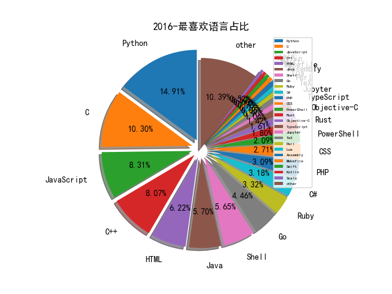

# 2016 信息源与信息类型占比

# 微信公众号 推荐
| nickname_english | weixin_no | title | url| 
| --- | --- | --- | ---| 
| IT信息安全顾问 | GSGSoft |  | http://mp.weixin.qq.com/s/5ed8Cr_4GFdQZ7bW3u3wBw | 1| 
| 大数据应用 | Datalaus |  | https://mp.weixin.qq.com/s?__biz=MzIzMDA1MTM3Mg==&mid=2653077671&idx=2&sn=52242203da8cbcc007558d19bc79b1a6&chksm=f36f3be4c418b2f2b907a932703dab122327dd5519181429d10f9bf681cce6c1d921921ffc08&mpshare=1&scene=2&srcid=1221aPaK1shSu2ZBvdg6mfJ8&from=timeline&key=564c3e9811aee0ab0d4dc0f8db7071f8cba623eb13d | 1| 
| 威努特工控安全 | winicssec_bj |  | https://mp.weixin.qq.com/s?__biz=MzAwNTgyODU3NQ==&mid=2651060913&idx=1&sn=dcaca141a8ab0e38a2c160c3916dea74&chksm=80e1e001b7966917e735fe0f2c0144214853d05bb5d32d9e15dd7eed436db440f6ce3bbe9784&mpshare=1&scene=1&srcid=1220ViejfQoILn27MNxFpWHw&key=564c3e9811aee0aba2cf7b6489a62b7a73c7d3b99a68e8c29b70d9738 | 1| 
| 新西兰研究中心 | NZRCXMU |  | https://mp.weixin.qq.com/s?__biz=MjM5NTA2NDY5Mg==&mid=202072231&idx=3&sn=7347ed72a209f0395e82d49d5fef30d1&mpshare=1&scene=1&srcid=1222U2OLJ7LrcZoRl14R4ZBg&key=564c3e9811aee0ab98bf5d003b3d7a069520af0c239b90f87f34d074c9c7807a9d04e8c5c425a961134387b36e5e6f438ac541adcd5c15af7555e7aea969dd905bae153d2b0d7 | 1| 
| 网信陕西 | wangxinshaanxi |  | https://mp.weixin.qq.com/s?__biz=MzAwNDgwMTY5MQ==&mid=2657419072&idx=1&sn=cc6a86099eb599f18a7e97e3371879be&chksm=80b60ab4b7c183a25018aed376e018b68184ded3ae1f8f69bfefc9f65caec1347edbf687e331&mpshare=1&scene=2&srcid=1220joEa5ITjndEe1rwbNwzJ&from=timeline&key=564c3e9811aee0ab371db1b6d5d952f0d09a99457ec | 1| 
| 360安全应急响应中心 | qihusrc |  | http://mp.weixin.qq.com/s?__biz=MjM5NjM2NDU0Ng==&mid=2450188592&idx=1&sn=9f9edbc7d7d2fe13283c378f2e3f1075&chksm=b114215d8663a84b3849810ed2d96de7438e3744d68bcd598e2351a7d6b89361a5336a3fbd4a&mpshare=1&scene=2&srcid=1214gewAMueaGVEvyUXBqZqs&from=timeline#rd | 1| 
| T00ls | T00lsNet |  | http://mp.weixin.qq.com/s?__biz=MjM5MDkwNjA2Nw==&mid=2650373963&idx=1&sn=f8965118c06e4d59c0233b19abb6fbe7&chksm=beb07cf789c7f5e144b78546bb6b5580e83556d38868b13ff53cdcca752cd2d623c9872f7bbf&mpshare=1&scene=2&srcid=1208xUvfborZxtQGdZcRUPWp&from=timeline#rd | 1| 
| 丁爸 情报分析师的工具箱 | dingba2016 |  | http://mp.weixin.qq.com/s?__biz=MzI2MTE0NTE3Mw==&mid=2651103904&idx=1&sn=bad186157d6db95445f792604f8be4cf&chksm=f1aed59ac6d95c8ca3296da440c507563ab51ffc808f660c35b6b5e3196846e7b9bf0d3ee034&scene=0#rd | 2| 
| 知远战略与防务研究所 | knowfar2014 |  | http://mp.weixin.qq.com/s?__biz=MzA3NDMxOTQwNw==&mid=2650046945&idx=1&sn=905cdfe0b968d7dd5c394d7468569e1b&chksm=8701b2a1b0763bb7b4120d1b2ae73b072d09f8429155fc039a7691ea41bf82597138947c9943&scene=0#rd | 1| 
| 运维军团 | ywjtshare |  | http://mp.weixin.qq.com/s/a1PQSrRDTGojudZQkTsXFQ | 1| 
| 微店安全应急响应中心 | wdsecurity |  | http://mp.weixin.qq.com/s?__biz=MzIzMjY3NzYwNA==&mid=2247483676&idx=1&sn=b38b3e9870717b13fdee9f8e96b4aca6&chksm=e8900897dfe7818143c1936256109262fdd7c4a0759a8d18527a38514c5ad3e5969fd791115c&mpshare=1&scene=1&srcid=1130nvZsugQ5Uu0q8Mm7DJod#rd | 1| 
| 皮书说 | pishushuo |  | http://mp.weixin.qq.com/s?__biz=MzA3OTA3NDkyNw==&mid=2653171023&idx=1&sn=d5721c33b9d6a4114c3dd0c033c33df7&chksm=84698e4fb31e0759ef220b21011a7c8d394fc63309bde44731bce4ef6230ec8a736a3a8e8f20&mpshare=1&scene=24&srcid=1130CIeqhSbOAk1q30hvuOqv#rd | 1| 
| SecWiki | SecWiki |  | http://mp.weixin.qq.com/s?__biz=MjM5NDM1OTM0Mg==&mid=2651050360&idx=1&sn=4c68808b7365b20f8a72340432337d8e&chksm=bd7f80398a08092f649306addbb32ada2e69bbaad8b8684add4484ac90f10b2439b14a525836&mpshare=1&scene=23&srcid=1123G3edVZbSDpkdhYMQz4Tz#rd | 1| 
| 补天漏洞响应平台 | butian360 | CTF挑战报名赛--补天白帽沙龙江西站（话说文末有福利~） | http://mp.weixin.qq.com/s?__biz=MzA5ODMyMzQ1OQ==&mid=2698432208&idx=1&sn=8c838ae67d3da804a4acf7219670e8e2&chksm=b5b133bc82c6baaafaefdcc2643ce49616ae8619ab7bdb22955775f9b16f182281c1caad8822&mpshare=1&scene=22&srcid=1123Yzz0SVBfuDc9TaznPR2K#rd | 2| 
| 途牛安全应急响应中心 |  |  | http://mp.weixin.qq.com/s?__biz=MzI4NTIxNjczMA==&mid=2247483766&idx=1&sn=9af29dae213d976a958ad471fdf566b4&chksm=ebeedbc3dc9952d51da18d2ed57d993370d60a0d6e2108ef528c756597d4894e86bcc87db5cc&mpshare=1&scene=1&srcid=1122KxR8gXNoYfNEr1VXj7KQ#wechat_redir | 1| 
| 铸剑网络安全实验室 | CSNS-Lab |  | http://mp.weixin.qq.com/s?__biz=MzI2MDExMzg5NQ==&mid=2652475044&idx=1&sn=b6eecc8bf73cb4a217484e9a509dedcd&chksm=f183ba2cc6f4333abbd4c59c9e31bdfac3cdc94cd1b6eed004ada862b12d46523625dea6da1d&mpshare=1&scene=1&srcid=1124gjxAAhzN4yJFc8pmOiE8#rd | 1| 
| 泰格实验室 |  |  | http://mp.weixin.qq.com/s?__biz=MzAwMTk5MzEwNw==&mid=2247483716&idx=1&sn=e3053c732e724ba1aa3064234ca0de0d&chksm=9ad071b8ada7f8ae7e5ad1025909308145c38a96b60b77914b91282284af0b35909458ec69bf&mpshare=1&scene=1&srcid=1117DK0KzENwVkQ0YkhMuAMR#rd | 1| 
| 筹码 | Chouma2016 |  | http://mp.weixin.qq.com/s?__biz=MzI0NDE0MTE3MQ==&mid=2653514860&idx=1&sn=22c2811253158c9caa9a809218dfe0ad&chksm=f2bf9170c5c81866b538c060d5e637c85c31e6f353b94875aa9a1adcc9c1db6f18d8593cd22f&mpshare=1&scene=2&srcid=11197z96K0odPQpzjmI304jK&from=timeline#rd | 1| 
| 中国软件网 | Hapiweb-soft6 |  | http://mp.weixin.qq.com/s?__biz=MjM5ODcxNTEzMw==&mid=2656244294&idx=1&sn=da3eb1da069d78930aec6ebc6ab04420&chksm=bd6139d48a16b0c286c4dc9586e880040a7b4d5add87b1643d2d829043628d594c0cf80b951a&mpshare=1&scene=2&srcid=1101wYb218aF9frLgmFKo9k9&from=timeline#rd | 1| 
| 君哥的体历 | jungedetili |  | http://mp.weixin.qq.com/s?__biz=MzI2MjQ1NTA4MA==&mid=2247483686&idx=1&sn=89f358a266bb957a6e796f556c07377c&chksm=ea4bab61dd3c2277f62105af8599d5b1253fab556c0b7551fb12d4f434b77fa65d73b5aec0dd&mpshare=1&scene=2&srcid=1030ETrx1BZ4memNEF8qX1oy&from=timeline&isappinstalled=0#rd | 1| 
| 瀚思科技 | HanSight |  | http://mp.weixin.qq.com/s?__biz=MzA4NTM4NjUzMw==&mid=2649485392&idx=1&sn=187cea8eeac393224279910ad8dda904&chksm=87c7e41ab0b06d0c7ca7ea3905025f2fbd7595da82bd01c90d5a127e5b175b589b700a494c63&scene=0#rd | 1| 
| 网络舆情分析技术邀请赛 |  |  | http://mp.weixin.qq.com/s?__biz=MzI2MjQ3MzgxMQ==&mid=2247483733&idx=1&sn=9ae4564d027aa3c24d76480cf3ac2849&chksm=ea4bd069dd3c597fd4826f790df993e68b35f041d510eb4055c0226162a2775d5c44adb3b3c1&scene=0#rd | 1| 
| 美亚柏科 | MeiyaPico |  | http://mp.weixin.qq.com/s?__biz=MjM5NTU4NjgzMg==&mid=2651219378&idx=1&sn=5bd7108f6105a6bd72e952fbe80b93f6&chksm=bd04f3cd8a737adbbbedaf086a7518fccafbf89a77528020b256f4a029d2430ee8f731b2b896&mpshare=1&scene=1&srcid=1104ygUG2Kp2hBjvj3yJdthu#rd | 1| 
| 虎嗅APP | huxiu_com |  | http://mp.weixin.qq.com/s?__biz=MTQzMjE1NjQwMQ==&mid=2655537335&idx=1&sn=63991e18f69eed0dfcee4795ab6c5acf&chksm=66dfe72951a86e3f4bb01a23cba5fbe142b3533ad7fbde576045d40229abbd84f3ee037fb5c0&mpshare=1&scene=1&srcid=1101Y97ZFri81p8M5O9t6qDc#rd | 1| 
| 金三板 | woshijinsanban |  | http://mp.weixin.qq.com/s?__biz=MjM5MDk0NTA0OA==&mid=2650048551&idx=1&sn=5a33b4bb9874d74a77e069f4d4d3567d&chksm=bebd325089cabb46a2bae7eed126ae49c1981863bbe0cc82bd0bfe600883475fecb25f22243e&mpshare=1&scene=1&srcid=1104WSfNzjCqecfzeOu3DZ1z#rd | 1| 
| 微软研究院AI头条 | MSRAsia |  | https://mp.weixin.qq.com/s?__biz=MzAwMTA3MzM4Nw==&mid=2649439195&idx=1&sn=09afaeac1861e4175d9854796f96f19e&chksm=82c0d25fb5b75b49c6aa6700729421715a3da5236c7af711de9c747f4b30aeb2c90193c1e241&scene=0&key=&ascene=7&uin=&devicetype=android-19&version=26031b31&nettype=WIFI | 1| 
| 机器之心 | almosthuman2014 |  | http://mp.weixin.qq.com/s?__biz=MzA3MzI4MjgzMw==&mid=2650720132&idx=1&sn=d630d47c4ab60d35752aba74a9d53361&chksm=871b03fab06c8aec767776a6a4a407c3897dcad26392b24a22536261565e9dc6b5ce52df0816&mpshare=1&scene=2&srcid=10289l9xAfQIrWt5R10Y0S0x&from=timeline&isappinstalled=0#rd | 1| 
| 滩涂鱼 |  |  | http://mp.weixin.qq.com/s?__biz=MzI1MzUwNTM2MA==&mid=2247483667&idx=1&sn=b6c505640a5e83137bd0cd54ea16d945&chksm=e9d23b2cdea5b23a2458b0222f53ff19ecc1ef25b2805ab058eea7fa024e8794539cb6748169&mpshare=1&scene=1&srcid=1028N3q9kJYOwRSKc4VhjRrf#rd | 2| 
| 白帽汇 | baimaohui888 |  | http://mp.weixin.qq.com/s?__biz=MzIwMDk0MjcwNA==&mid=2247483854&idx=1&sn=a917e227e0321fefb2c30fcc40e04f62&chksm=96f434d1a183bdc7cfb31e07b09dd5462d45048b01e70f1757f6594f2b2105a60a577766423d | 3| 
| 高校网络安全交流 | eduinfosec |  | http://mp.weixin.qq.com/s?__biz=MzI0NDM5MzY3NA==&mid=2247484791&idx=1&sn=464f7275aabcfc9dbdcae37f6c52bb82&chksm=e95f36d2de28bfc4bb562467cb31da879bcc5c75a110169847788d593891a025b099928ab2a3&mpshare=1&scene=1&srcid=1024aS8fQv7QS3mZnmp3H7dZ#rd | 1| 
| 月饼少年 |  |  | http://mp.weixin.qq.com/s?__biz=MzIzMDYwMDMxNA==&mid=2247483671&idx=1&sn=0760c5dfda874bb916d2ed6cf811d3d9&chksm=e8b1ba02dfc63314cbb64243a54bde60fdff85465f06e4ef31bd400f8a71567d8fb39635da81&mpshare=1&scene=2&srcid=1017IQyLDvcDhE604gfVNOc6 | 1| 
| 朝阳35处 | fintech_credoo |  | http://mp.weixin.qq.com/s?__biz=MzIxMjUyODM3OQ==&mid=2247483783&idx=1&sn=44099744a51a74aceb13a586309b33bb&chksm=9745fc13a0327505a5cc8578c63bf221dd95b83b79f5496b4ffdc7d93a9ac3930085f53b9fa2&mpshare=1&scene=2&srcid=1019rmd4yUYMuYa1ZbmgiWjh | 1| 
| 网易安全应急响应中心 | NetEaseSRC |  | http://mp.weixin.qq.com/s?__biz=MzIxNDI0MDAxNg==&mid=2247483701&idx=1&sn=be805507c60abf91f05d76c9f9791a66&chksm=97abdf4aa0dc565c69ff399c26db51b677902ab43bf91a6933dc5803bf5809122d7a6c324008&scene=4#wechat_redirect | 3| 
| Piz0n |  |  | http://mp.weixin.qq.com/s?__biz=MzA3MTEwNDE1NA==&mid=210199950&idx=1&sn=2bd6d480cc06af5e5cdd8891364becf2&mpshare=1&scene=24&srcid=1007KAlFEWPZjxFBr57kmnQN#rd | 2| 
| 网安工控安全事业部 | wagkaq |  | http://mp.weixin.qq.com/s?__biz=MzA5NjE0NTA1Mw==&mid=2650966208&idx=1&sn=147487d0247e22c6e417b024e2b48ee5&chksm=8b42b332bc353a241d355deff2cf68f63fc12449390386f7a545ed50e0a7c15ca0f48c19db3f&mpshare=1&scene=2&srcid=0928XU6z0IeHMsRE56a4yIl7&from=timelin | 1| 
| 宅客频道 | letshome |  | http://mp.weixin.qq.com/s?__biz=MzA4ODUxNjIwMg==&mid=2654323592&idx=1&sn=c5abe50b04d0447fe602c0951495ac7f&scene=1&srcid=0926RDrASm6NGHjbtByT57Bx#rd | 6| 
| 四叶草安全 |  |  | http://mp.weixin.qq.com/s?__biz=MjM5MTI2NDQzNg==&mid=2654523543&idx=1&sn=917e81c6056957811a9a08d54d47f226&chksm=bd744b4c8a03c25af6038b65e21753dd1c06fa69801bd7bdd063e64fff92d62f5dc75b9d4528&scene=0#rd | 1| 
| 网络安全投资 | wangantou_com |  | http://mp.weixin.qq.com/s?__biz=MzI3NTE3MjMxOQ==&mid=2649415927&idx=1&sn=4c644b5a6f6e5bcd1b18f09fba61a424&chksm=f3169e47c46117516b936b92d82856630015eb44fea5824bd2d3937010642b284b9c439a0cf7&scene=0#rd | 3| 
| 正信用征信服务 | myzxy-com |  | http://mp.weixin.qq.com/s?__biz=MzAxNTU3ODMwNQ==&mid=2657680042&idx=2&sn=7f630d10fb7a917f9cced25b84b4ffd6&scene=2 | 1| 
| 中国信息安全 | chinainfosec |  | http://mp.weixin.qq.com/s?__biz=MzA5MzE5MDAzOA==&mid=2664107769&idx=1&sn=37f18fa11a9b5b3114a6d38640425413&scene=1&srcid=0906M1vlGDGFzRmu0EHJR9CG#rd | 3| 
| 云头条 | YunTouTiao |  | http://mp.weixin.qq.com/s?__biz=MjM5MzM3NjM4MA==&mid=2654678262&idx=8&sn=0bd10bfc0ba99491d628830b99f54d7b&scene=1&srcid=0909dnYXbWfDMgKYzuBkOoWv#rd | 2| 
| 京东安全应急响应中心 | jsrc_team |  | http://mp.weixin.qq.com/s?__biz=MjM5OTk2MTMxOQ==&mid=2727827297&idx=1&sn=277c0178ebead359392018be205020ad&scene=1 | 2| 
| 吾爱破解论坛 | pojie_52 |  | http://mp.weixin.qq.com/s?__biz=MjM5Mjc3MDM2Mw==&mid=2651132585&idx=1&sn=6e4daa40092d8abe79d98d43536c7a53&scene=1 | 2| 
| 孙维的信息安全札记 | sunw3i |  | http://mp.weixin.qq.com/s?__biz=MzA5MDIwMjI4MQ==&mid=2688641790&idx=1&sn=58d1cf18feadad6534f4510cbbde8ccb&scene=1&srcid=0908RQHeUiCctcddtiS7koej#rd | 1| 
| 安全客 | anquanbobao |  | http://mp.weixin.qq.com/s?__biz=MzA5ODA0NDE2MA==&mid=2649712001&idx=2&sn=0b4e70486bfa95fc454e7f18d45320f8 | 2| 
| 运维帮 | yunweibang |  | http://mp.weixin.qq.com/s?__biz=MzA3MzYwNjQ3NA==&mid=2651297130&idx=1&sn=bf6d7d50501fcd53e1ee59482b6c34a8&scene=1&srcid=09082u3vxpBbxif82QL5S45d#rd | 2| 
| ElectronicComponent | ElectronicComponent |  | http://mp.weixin.qq.com/s?__biz=MzA5NjI5OTMxMg==&mid=2650786951&idx=1&sn=a409923af62fc050d9910c224715a362&scene=1&srcid=0903uR2S1RFwbr452ixu1XeH#rd | 1| 
| FreeBuf | freebuf |  | http://mp.weixin.qq.com/s?__biz=MjM5NjA0NjgyMA==&mid=2651061796&idx=3&sn=5acaafbffbcf540ea84752d06535a0ab&scene=0#rd | 6| 
| 互联网实验室 | chinalabs1234 |  | http://mp.weixin.qq.com/s?__biz=MzA3NjE0MjczMg==&mid=2654053801&idx=2&sn=7b3bd2ba1fe8bc76a433040d4ba5d1e7&scene=1&srcid=09010h7FCNNNiLXlznYzmh5V#rd | 1| 
| 看雪学院 | ikanxue |  | http://mp.weixin.qq.com/s?__biz=MjM5NTc2MDYxMw==&mid=2458279395&idx=1&sn=648c360da5b14d669e6b6e65ad852579&scene=1 | 6| 
| 网优老兵 | WhatsComm |  | http://mp.weixin.qq.com/s?__biz=MzAwMTYzMDc3OQ==&mid=2650184342&idx=1&sn=5078805484a0decf4992ed055bfac95f&scene=1&srcid=0901GW6JTcRE6gZmzIlZlxHb#rd | 1| 
| 网安国际 | inforsec |  | http://mp.weixin.qq.com/s?__biz=MzA4ODYzMjU0NQ==&mid=2652306914&idx=1&sn=b8842fa80a75fb0e4920b6a7ec4589d1&scene=0#rd | 6| 
| 飓风网络安全 |  |  | http://mp.weixin.qq.com/s?__biz=MzI3NzMzNzE5Ng==&mid=2247483853&idx=1&sn=6b9a41c30f70335a87aba04fc476356a&scene=1&srcid=0903KLbWJiAjpJSwzggQuh94#rd | 2| 
| 腾讯安全联合实验室 | txaqlhsys |  | http://mp.weixin.qq.com/s?__biz=MzI1NzM0MTMzMg==&mid=2247483796&idx=1&sn=e2b470256d1375ab32837e8d27a90196&scene=0#rd | 1| 
| 辛巴达历险记 | sinbadlxj |  | http://mp.weixin.qq.com/s?__biz=MzA3NDk2MTgwMg==&mid=2650718125&idx=1&sn=e9e005b674e5668e3a013d6014ad608e&scene=1 | 1| 
| 宜人安全应急响应中心 |  |  | http://mp.weixin.qq.com/s?__biz=MzIyNjQzMjcyNw==&mid=2247483860&idx=1&sn=fa19f02e29d25f5f6852af27451ae4a9&scene=23&srcid=0815JYA53l0Bk3PMkhzRlKUh#rd | 1| 
| 小米安全中心 | misrc_team |  | http://mp.weixin.qq.com/s?__biz=MzI2NzI2OTExNA==&mid=2247483792&idx=1&sn=162692a4fe75230da84a68b144f344f7 | 2| 
| 漏洞盒子VulBox | Vulbox_ |  | http://mp.weixin.qq.com/s?__biz=MzIxODIzNzgwMw==&mid=2654055375&idx=1&sn=6540b6914eb90b5e1695a9bfc7622567 | 1| 
| 青藤云安全资讯 | qingtengyun |  | http://mp.weixin.qq.com/s?__biz=MzAwNDE4Mzc1NA==&mid=2650824525&idx=1&sn=657e615c3a2caf4d6e889e4025e03af1&scene=25#wechat_redirect | 6| 
| 东巽科技 | nj_dongxun |  | https://mp.weixin.qq.com/s?__biz=MzA5Njk2MjQwNQ==&mid=2662971031&idx=1&sn=5e3ec5f92353d65758fc9e5dacd511f5&scene=1&srcid=0808xHpyGeoLW6D85Jqyjezg | 1| 
| 全频带阻塞干扰 | RFJamming |  | https://mp.weixin.qq.com/s?__biz=MzIzMzE2OTQyNA==&mid=2648946119&idx=1&sn=178c7e89166a0dabaadc4d4684e69745&scene=1&srcid=0811jWGTyLMAcBOQtVcG0yVp | 5| 
| 关注安全技术 | heresecurity |  | http://mp.weixin.qq.com/s?__biz=MzA4MDMwMjQ3Mg==&mid=2651864934&idx=1&sn=47fabdf7384a29fc6fcaca48bacbe68b&scene=1 | 1| 
| 同程艺龙安全应急响应中心 | lysrc_team |  | https://mp.weixin.qq.com/s?__biz=MzI4MzI4MDg1NA==&mid=2247483695&idx=1&sn=1de5db39d6986560d80ab604aae88467&scene=1&srcid=0809LR0yEgkq6U2DLBdpRKAT | 3| 
| 爱分析ifenxi | ifenxicom |  | http://mp.weixin.qq.com/s?__biz=MzA4NzM3MTI1MQ==&mid=2247486010&idx=2&sn=7c8009fd5f6e56ed3f167b7053a72440 | 1| 
| E安全 | EAQapp |  | http://mp.weixin.qq.com/s?__biz=MzI4MjA1MzkyNA==&mid=2655293858&idx=1&sn=7cdfaf400fa618da712021d1d92b767d&scene=23&srcid=07275aFt2Mzm9YUrvPTI9cBp#rd | 9| 
| 力博睿生 | liberationers |  | http://mp.weixin.qq.com/s?__biz=MzA4MDY3MjMyNQ==&mid=2651026178&idx=1&sn=4e93dae33a9931bd7c6f3c04c43399e4&scene=23&srcid=0726FqPK0VAPBv1LBBShHAGW#rd | 1| 
| Python程序员 | pythonbuluo |  | http://mp.weixin.qq.com/s?__biz=MjM5NzU0MzU0Nw==&mid=2651371219&idx=1&sn=6403ae9e6e26208283bfc11539e793ec&scene=23&srcid=0724SeM1nPiyNItiOJKQqP3k#rd | 1| 
| 程序猿 | imkuqin |  | https://mp.weixin.qq.com/s?__biz=MjM5NzA1MTcyMA==&mid=2651161183&idx=3&sn=3552b18d23f8af71feee0fffe4305ce1 | 1| 
| 网络法治国际中心 | icrime2015 |  | http://mp.weixin.qq.com/s?__biz=MzIyNjE0NTQ2OA==&mid=2651229147&idx=1&sn=272dc975d41cddc3db5797434e6647e4 | 3| 
| 大兵说安全 | dabingshuoanquan |  | https://mp.weixin.qq.com/s?__biz=MzI2MzM0NjcxNw==&mid=2247483786&idx=1&sn=4d3aff50c5722a887c4d111804f6a562 | 1| 
| 安天 | Antiylab |  | http://mp.weixin.qq.com/s?__biz=MjM5MTA3Nzk4MQ==&mid=2650169803&idx=1&sn=b329ecfb9f42c67abaa95e6ee60329aa&scene=23 | 3| 
| 0c0c0f | DebugPwn |  | http://mp.weixin.qq.com/s?__biz=MzAwMzI0MTMwOQ==&mid=2650173687&idx=1&sn=81752cdb58fb8aa3608f6079116ad880 | 1| 
| malwarebenchmark |  |  | http://mp.weixin.qq.com/s?__biz=MzI4ODA4MTcxMA==&mid=2649549565&idx=1&sn=eea530ba0c8429375d9b557de2b422c0 | 7| 
| RoarTalk | roartalk |  | http://mp.weixin.qq.com/s?__biz=MzAxNTk5ODcxOQ==&mid=2247483674&idx=1&sn=1960f6692efbce41dc581c811d433f71 | 3| 
| 安全智库sec |  |  | https://mp.weixin.qq.com/s?__biz=MzI0NjQxODg0Ng==&mid=2247483798&idx=1&sn=65cdf852dffd63b9d4ec41c31d9a5365&scene=1 | 3| 
| 白帽汇安全 | baimaohui666 |  | http://mp.weixin.qq.com/s?__biz=MzI5MzA1NjcyNw==&mid=2651766142&idx=1&sn=f8cf942692546e542512f95817eadcff&scene=23 | 1| 
| DJ的札记 | DJ_notes |  | https://mp.weixin.qq.com/s?__biz=MzAwNjA3MzEwNg==&mid=2651329347&idx=1&sn=6152a9d7e31a7d6b5c81fdf39d1b89b1 | 1| 
| Spark技术日报 | SparkDaily |  | http://mp.weixin.qq.com/s?__biz=MzAwNzIzMDY5OA==&mid=2651424080&idx=1&sn=1ff179fb92fd2aeb8efb2cd4c6d22674 | 1| 
| ThoughtWorks洞见 | TW-Insights |  | https://mp.weixin.qq.com/s?__biz=MjM5MjY3OTgwMA==&mid=2652453481&idx=1&sn=c8caed739d83008a926e1cff7553cab6 | 1| 
| 高效运维 | greatops |  | http://mp.weixin.qq.com/s?__biz=MzA4Nzg5Nzc5OA==&mid=206546429&idx=1&sn=339a80c889409b62a569611e40b66568&scene=21#wechat_redirect | 1| 
| InfoQ | infoqchina |  | https://mp.weixin.qq.com/s?__biz=MjM5MDE0Mjc4MA==&mid=2650992609&idx=1&sn=0ab0ac8f0ad37f98ddb2cbdb182f8fba&scene=1 | 7| 
| 云誉 | sec31415 |  | https://mp.weixin.qq.com/s?__biz=MzAxMzgwNTAxMQ==&mid=2650951515&idx=1&sn=4706f6c12e613aa174923d48c97d09c1 | 2| 
| 守望者实验室 | WatcherLAB |  | https://mp.weixin.qq.com/s?__biz=MzA4MTY1MzE1NA==&mid=2247483810&idx=1&sn=69dc202e8de15efac4305a460492f5bc | 1| 
| 波哥有话好说 |  |  | http://mp.weixin.qq.com/s?__biz=MzI3NDI3OTE2Ng==&mid=2247483659&idx=1&sn=14fc36d87915cfd1cd40b89139d32467 | 1| 
| 控制网 | KONGZHIWANG-AP |  | https://mp.weixin.qq.com/s?__biz=MjM5NzY2OTQ5NA==&mid=2677258544&idx=1&sn=cb5f07bb731635deddcc4d367151c462 | 1| 
| 计算机与网络安全 | Computer-network |  | https://mp.weixin.qq.com/s?__biz=MjM5OTk4MDE2MA==&mid=2655111862&idx=3&sn=ccaad8721860582326af1dd8325e019e | 2| 
| 安全牛 | aqniu-wx |  | https://mp.weixin.qq.com/s?__biz=MjM5Njc3NjM4MA==&mid=402475339&idx=1&sn=530182906bc56ff37d11cc42abf12f0e | 7| 
| 安在 | AnZer_SH |  | https://mp.weixin.qq.com/s?__biz=MzIzMTAzNzUxMQ==&mid=404599177&idx=1&sn=af482c738b110085bfebd2b9dab6b3b8 | 17| 
| CNNS安全 |  |  | http://mp.weixin.qq.com/s?__biz=MzIxNjA2OTYzNw==&mid=405029147&idx=1&sn=cf69c00765c5bb3f00333cea2e877b9b&scene=0#wechat_redirect | 1| 
| 唯品会安全应急响应中心 | VIP_SRC |  | http://mp.weixin.qq.com/s?__biz=MzI5ODE0ODA5MQ==&mid=403342585&idx=1&sn=77efc930c4b77e1034d22738e56f4978&scene=2 | 5| 
| 网事研究 | cyber_kinetic |  | http://mp.weixin.qq.com/s?__biz=MzI0ODA5OTQwOQ==&mid=401699198&idx=1&sn=b066eac836bbaeaab9475ddf502b9aef&scene=23 | 1| 
| 301在路上 | a301zls |  | http://mp.weixin.qq.com/s?__biz=MzIwMTQ2NzY4NA==&mid=403223215&idx=1&sn=66f32613ec48196b43c15e29b592c1c1&scene=23 | 4| 
| Datartisan数据工匠 | shujugongjiang |  | http://mp.weixin.qq.com/s?__biz=MzA5NDQ3MDI4NA==&mid=210183372&idx=1&sn=edb4998952082c0518a7c84b8ab8d1e0#rd | 1| 
| 张三丰的疯言疯语 | zsfnotes |  | http://mp.weixin.qq.com/s?__biz=MzA3MTUwMzI5Nw==&mid=405457193&idx=1&sn=807c79a22fb09ad0b0f2ac59312f405e | 2| 
| 安全狗 | safedog2013 |  | http://mp.weixin.qq.com/s?__biz=MjM5NTc2NDM4MQ==&mid=401545568&idx=1&sn=6a745d0882801da869b3c706d7e2565f&scene=23&srcid=0119aALf3csAEJEJqY0uKO47#rd | 1| 
| 正宗好PT | safept |  | http://mp.weixin.qq.com/s?__biz=MzA4MjYwODg0OQ==&mid=401751513&idx=1&sn=273132f9bd64136f74510319f4fe7e03#rd | 2| 
| 大数据文摘 | BigDataDigest |  | http://mp.weixin.qq.com/s?__biz=MjM5MTQzNzU2NA==&mid=401656388&idx=1&sn=abaae997ed2f8d4fc2261f821ce06a9a&scene=23&srcid=0106S0HrVrJByefRWlce9GF4#rd | 2| 

# 组织github账号 推荐
| github_id | title | url | org_url | org_profile | org_geo | org_repositories | org_people | org_projects | repo_lang | repo_star | repo_forks| 
| --- | --- | --- | --- | --- | --- | --- | --- | --- | --- | --- | ---| 
| Microsoft | ES7 Async functions have just been enabled by default in Chakra \o/ | https://github.com/Microsoft/ChakraCore/commit/c6f496186226ff0d4194bd3278e3aca5b2321ff9 | https://opensource.microsoft.com | Open source, from Microsoft with love | Redmond, WA | 2463 | 4258 | 0 | C,TypeScript,Jupyter,CMake,Python,JavaScript,C++,C#,HTML,Rich,Go,Java,PowerShell | 0 | 0 | 13| 
| mozilla | bleach: 基于白名单的HTML富文本过滤器 | https://github.com/mozilla/bleach | https://wiki.mozilla.org/Github | This technology could fall into the right hands. | Mountain View, California | 2025 | 283 | 34 | TypeScript,FreeMarker,Python,Kotlin,JavaScript,C++,Shell,Nix,HTML,CSS,Ruby,Rust | 0 | 0 | 3| 
| openstack | #Python AST-based static analyzer from #OpenStack #Security Group | https://github.com/openstack/bandit | https://www.openstack.org/software/project-navigator/ | Read-only mirrors of a mix of official and unofficial projects hosted at https://git.openstack.org/cgit/openstack/ by the OpenStack community. | https://www.openstack.org/software/project-navigator/ | 1807 | 0 | 0 | Shell,Java,Python,JavaScript,Puppet,Ruby | 0 | 0 | 1| 
| google | Observations on Intels MPX by @ kayseesee | https://github.com/google/sanitizers/wiki/AddressSanitizerIntelMemoryProtectionExtensions | https://opensource.google.com/ | Google ❤️ Open Source | https://opensource.google.com/ | 1474 | 2547 | 0 | C,TypeScript,Java,Python,Kotlin,JavaScript,C++,Go,Ruby,Rust | 0 | 0 | 9| 
| elastic | Detect DNS Tunneling done by tools such as iodine with ELK stack + Packetbeat and Watcher | https://github.com/elastic/examples/tree/master/packetbeat_dns_tunnel_detection | https://www.elastic.co/ |  | https://www.elastic.co/ | 314 | 149 | 6 | TypeScript,Java,XSLT,Python,JavaScript,C++,C#,Go,Ruby | 0 | 0 | 1| 
| alibaba | In Alibabas IPO day, Taobao app got crash on just released iOS 8. The bug was fixed via hot patch project | https://github.com/alibaba/wax | http://www.alibaba.com | Alibaba Open Source | Hangzhou, China | 263 | 141 | 0 | C,Shell,Java,Kotlin,JavaScript,C++,Dart,TypeScript,Go,Jupyter | 0 | 0 | 1| 
| square | Certigo -- user-friendly command-line utility to examine and validate certificates in a variety of formats | https://github.com/square/certigo | http://square.github.io |  | http://square.github.io | 237 | 22 | 0 | C,Shell,Java,Python,Kotlin,JavaScript,Dart,TypeScript,Objective-C,Swift,Go,Ruby,CSS | 0 | 0 | 1| 
| rapid7 | A new Metasploit module from @ ukstufus for generating CSV org charts from AD https://github.com/rapid7/metasploit-framework/pull/6377 | https://github.com/rapid7/metasploit-framework/pull/6377 | http://www.rapid7.com/ |  | Boston, MA | 234 | 0 | 0 | C,Java,Python,JavaScript,HTML,Go,Ruby | 0 | 0 | 7| 
| dropbox | zxcvbn: 注册时密码强度检测库「支持各种语言」 | https://github.com/dropbox/zxcvbn | https://dropbox.com/ |  | San Francisco | 191 | 38 | 0 | TypeScript,Java,Python,JavaScript,C++,CoffeeScript,Go,Swift,C# | 0 | 0 | 2| 
| angular | Heads up: Im implementing context aware auto-escaping in Angular 2 to protect your apps from XSS bugs. See | https://github.com/angular/angular/issues/8511 | https://angular.io |  | https://angular.io | 188 | 58 | 0 | Python,TypeScript,JavaScript,HTML,Dart | 0 | 0 | 1| 
| nccgroup | Zulu: The Zulu fuzzer | https://github.com/nccgroup/Zulu | https://www.nccgroup.trust | Please report all security issues to security at nccgroup dot com | Global | 180 | 15 | 0 | C,Shell,Java,Python,JavaScript,C#,HTML,Elixir,Go,Rust | 0 | 0 | 16| 
| uber | I wrote a tool to enable 2-factor confirmation of USB devices. It uses DUO auth API and you can customize actions: | https://github.com/uber/usb2fac | http://uber.github.io/ | Open Source Software at Uber | 70+ countries and counting. | 169 | 96 | 0 | C,Java,Python,JavaScript,C++,Go,Swift,Thrift | 0 | 0 | 1| 
| godaddy | Procfilter : A YARA-integrated process denial framework for Windows : | https://github.com/godaddy/procfilter | https://godaddy.github.io/ |  | https://godaddy.github.io/ | 168 | 42 | 0 | Python,JavaScript,HTML,PHP,Ruby,CSS | 0 | 0 | 1| 
| mirage | Google is launching a hosted free fuzzing service for OSS projects; tracking it for @ openmirage here | https://github.com/mirage/mirage/issues/642 | https://mirage.io |  | https://mirage.io | 166 | 19 | 0 | C,OCaml | 0 | 0 | 1| 
| facebook | Were releasing our tools for collecting kernel logs from our servers, check it out here: | https://github.com/facebook/fbkutils | https://opensource.fb.com | We are working to build community through open source technology. NB: members must have two-factor auth. | Menlo Park, California | 160 | 179 | 0 | C,Java,Objective-C++,Python,JavaScript,OCaml,C++,Objective-C,Hack | 0 | 0 | 3| 
| OWASP | OWAS Hacking Playground - Android application with common vulnerabilities - | https://github.com/OWASP/OMTG-Hacking-Playground | http://www.owasp.org | The OWASP Foundation | http://www.owasp.org | 151 | 27 | 0 | C,Shell,Java,Python,JavaScript,Perl,HTML,Go,CSS | 0 | 0 | 3| 
| brave | pretty happy that @ brave on iOS will be the first iOS browser to implement @ HTTPSEverywhere. | https://github.com/brave/browser-ios/commit/bf6e064d4d52782a8d4f144f59f0184b503d6e58 | https://www.brave.com | Were reinventing the browser as a user-first platform for speed, privacy, better ads, and beyond | San Francisco | 140 | 23 | 1 | C,TypeScript,Python,JavaScript,C++,HTML,Go,Swift,Rust | 0 | 0 | 1| 
| linkedin | Qark - Android app (apk) static code analyzer. via @ sempf | https://github.com/linkedin/qark | http://engineering.linkedin.com |  | Sunnyvale, CA, USA | 140 | 26 | 0 | TypeScript,Java,Scala,Python,JavaScript,Terra,Objective-C,Vue,Go,Swift | 0 | 0 | 1| 
| PowerShell | Open sourced #PowerShell now on GitHub to download for Windows, Linux and Mac OS X: | https://github.com/PowerShell/PowerShell | https://microsoft.com/powershell | https://microsoft.com/powershell | Redmond | 132 | 23 | 1 | C#,C,TypeScript,PowerShell,C++ | 0 | 0 | 1| 
| ncsa | Bro plugin to detect Meterpreter traffic, including XOR-encoded traffic | https://github.com/ncsa/bro_meterpreter?platform=hootsuite | http://ncsa.illinois.edu | National Center for Supercomputing Applications | Urbana, IL | 119 | 16 | 0 | Shell,Java,Scala,Python,JavaScript,C++,HTML,Puppet,Go,R,Nextflow,Ruby | 0 | 0 | 1| 
| salesforce | vulnreport: Pentesting management and automation platform | https://github.com/salesforce/vulnreport | https://opensource.salesforce.com | A variety of vendor agnostic projects which power Salesforce | https://opensource.salesforce.com | 118 | 25 | 0 | Java,Scala,Python,Kotlin,JavaScript,HTML,Jupyter,Ruby,CSS | 0 | 0 | 1| 
| samsung | Android Dynamic Binary Instrumentation tool for tracing Android native layer: | https://github.com/samsung/adbi | None | Samsung Electronics Co.,Ltd. | None | 98 | 29 | 0 | C,Java,C#,JavaScript,C++,Python,HTML | 0 | 0 | 1| 
| sensepost | DET : Data Exfiltration Toolkit : | https://github.com/sensepost/DET | http://sensepost.com |  | South Africa | 92 | 2 | 0 | C,Shell,Java,Python,C++,Perl,C#,HTML,Go,CMake | 0 | 0 | 3| 
| tensorflow | Tensorflow - Play with neural networks : https://github.com/tensorflow/playground , Whitepaper : | https://github.com/tensorflow/playground | http://www.tensorflow.org |  | http://www.tensorflow.org | 78 | 213 | 2 | TypeScript,Jupyter,Python,JavaScript,C++,Swift | 0 | 0 | 1| 
| CrowdStrike | Debug Java via Python! Both pyspresso and JavaJournal are now available for download via https://github.com/CrowdStrike/pyspresso and | https://github.com/CrowdStrike/pyspresso | http://www.crowdstrike.com |  | http://www.crowdstrike.com | 74 | 14 | 0 | C,Java,Python,JavaScript,HTML,Go | 0 | 0 | 1| 
| baidu | 百度开源深度学习平台PaddlePaddle | https://github.com/baidu/paddle | http://www.baidu.com | Baidu Open Source Projects | Beijing, China | 71 | 53 | 0 | GLSL,TypeScript,Java,Python,JavaScript,C++,Go,Jupyter,Rust | 0 | 0 | 2| 
| subgraph | Subgraphs sandboxing Oz looks very promising: | https://github.com/subgraph/oz | https://subgraph.com |  | Montreal | 70 | 0 | 0 | C,Shell,Java,Makefile,BitBake,C++,HTML,CSS,Go,Rust,QML | 0 | 0 | 1| 
| MicrosoftEdge | Were excited to announce that weve open-sourced part of our WebGL renderer: | https://github.com/MicrosoftEdge/WebGL | None | Microsoft Edge open source projects - demos, tools, data | None | 66 | 258 | 0 | C#,JavaScript,C++,Python,HTML,PowerShell,CSS | 0 | 0 | 2| 
| CIRCL | Major updates of CIRCL AIL - Analysis Information Leak framework | https://github.com/CIRCL/AIL-framework | https://www.circl.lu/ |  | Luxembourg | 65 | 14 | 0 | Python,C,Shell,C++,CSS | 0 | 0 | 1| 
| RUB-NDS | TLS-Attacker : A Java-based framework for analyzing TLS libraries : | https://github.com/RUB-NDS/TLS-Attacker | https://www.nds.ruhr-uni-bochum.de/ | Research and development at the Chair for Network and Data Security concentrates on cryptographic protocols, Internet and XML security. | Ruhr University Bochum | 65 | 6 | 0 | TeX,Python,JavaScript,Java,CoffeeScript | 0 | 0 | 1| 
| Programming-Systems-Lab | Phosphor: Dynamic Taint Tracking for the JVM | https://github.com/Programming-Systems-Lab/phosphor | http://psl.cs.columbia.edu |  | 6LE1 CEPSR, Columbia University, New York 10027 | 59 | 1 | 0 | C,Java,Python,C++,Perl,C# | 0 | 0 | 1| 
| x64dbg | x64dbgida - Official x64dbg plugin for IDA Pro. | https://github.com/x64dbg/x64dbgida | http://x64dbg.com | An open-source x64/x32 debugger for windows. | http://x64dbg.com | 59 | 6 | 0 | C,Python,C++,C#,Batchfile,HTML,CSS | 0 | 0 | 1| 
| frida | The Swift bindings for Frida are ready to be used! | https://github.com/frida/frida-swift | None | Inject JavaScript to explore native apps on Windows, Mac, Linux, iOS, Android, and QNX. | None | 56 | 2 | 0 | C,Python,Vala,JavaScript,Makefile,C++,Swift,CSS | 0 | 0 | 2| 
| MISP | Thanks to @ Cyb3rOps for his work on APT groups, I started a JSON with threat actors | https://github.com/MISP/misp-galaxy/blob/master/elements/adversary-groups.json | https://www.misp-project.org | MISP Project - Open Source Threat Intelligence Platform & Open Standards For Threat Information Sharing | Worldwide | 55 | 12 | 0 | Shell,Python,JavaScript,TeX,HTML,PHP,Dockerfile,CSS | 0 | 0 | 1| 
| Qihoo360 | poseidon: 360公司日志搜索平台「开源」 | https://github.com/Qihoo360/poseidon | http://www.360.cn | 360 official github | Beijing, China | 55 | 7 | 0 | C,TypeScript,Java,Scala,JavaScript,C++,Go,CSS | 0 | 0 | 1| 
| CIFASIS | Nosy Newt - concolic execution tool for exploring the input space of a binary executable program. Based on Triton. | https://github.com/CIFASIS/nosy-newt | http://www.cifasis-conicet.gov.ar | Centro Internacional Franco Argentino de Ciencias de la Información y de Sistemas | Rosario, Argentina | 49 | 3 | 1 | C,Shell,Python,C++,Haskell,HTML | 0 | 0 | 1| 
| GDSSecurity | PadBuster : Automated script for performing Padding Oracle attacks : | https://github.com/GDSSecurity/PadBuster | https://www.aon.com/cyber-solutions |  | New York, NY | 49 | 3 | 0 | C,Shell,Java,XSLT,Python,JavaScript,Perl,C#,Objective-C,Lua,PHP,Ruby | 0 | 0 | 1| 
| ctxis | cvsslib: A library implementing CVSS v2 and v3 scores | https://github.com/ctxis/cvsslib | http://www.contextis.co.uk |  | London | 49 | 0 | 0 | C,Java,Python,JavaScript,C++,C#,HTML | 0 | 0 | 3| 
| nowsecure | POC for remote code execution of TalkingTom by abusing zip files and the multidex lib is now opensource: | https://github.com/nowsecure/android-rce-multidex-and-zip-files | https://www.nowsecure.com | We secure Mobile Devices, Enterprises, & Mobile Apps | https://www.nowsecure.com | 49 | 5 | 0 | C,Java,Python,JavaScript,Rust,SaltStack,CSS | 0 | 0 | 2| 
| CERT-Polska | We release a snort x509 certificate reputation plugin http://seclists.org/snort/2016/q2/324 source: | https://github.com/CERT-Polska/snort3-x509-reputation-plugin | http://www.cert.pl/ |  | Warsaw, Poland | 48 | 5 | 0 | C,Java,Python,JavaScript,C++,PHP | 0 | 0 | 1| 
| fireeye | FLOSS - uses static analysis techniques to automatically deobfuscate strings from malware bin. Based on vivisect | https://github.com/fireeye/flare-floss | https://www.fireeye.com/blog.html |  | Milpitas, CA | 48 | 1 | 0 | C,Vue,Python,JavaScript,C++,C#,Go,PowerShell | 0 | 0 | 2| 
| mwrlabs | needle: IOS的安全测试框架 | https://github.com/mwrlabs/needle | http://labs.mwrinfosecurity.com/ |  | Basingstoke, Johannesburg, London, Manchester, Singapore, New York | 45 | 0 | 0 | C,Java,Python,JavaScript,C++,C#,Objective-C,PowerShell,CSS | 0 | 0 | 5| 
| silentsignal | ActiveScan3Plus: Modified version of ActiveScan++ Burp Suite extension | https://github.com/silentsignal/ActiveScan3Plus | https://silentsignal.eu/ |  | Budapest, Hungary | 44 | 0 | 0 | C,Java,Python,Kotlin,C++,Perl,Erlang | 0 | 0 | 1| 
| ANSSI-FR | Caradoc - a PDF parser & validator - GPL, in OCamlby @ pictyeye et al.https://github.com/ANSSI-FR/caradoc | https://github.com/ANSSI-FR/caradoc | https://www.ssi.gouv.fr |  | Paris, France | 43 | 0 | 0 | Coq,C,Java,Python,JavaScript,OCaml,C++,Go,Assembly,PowerShell,Rust | 0 | 0 | 2| 
| IAIK | on #skylake there is a new clflushopt (optimized) instruction that allows faster #rowhammer-ing. I just added it to | https://github.com/IAIK/rowhammerjs/tree/master/native | https://www.iaik.tugraz.at |  | Graz, Austria | 41 | 5 | 0 | C,Shell,Java,VHDL,Python,JavaScript,C++,HTML,Scilab | 0 | 0 | 3| 
| gchq | CyberChef (The Cyber Swiss Army Knife) : a web app for encryption, encoding, compression and data analysis : | https://github.com/gchq/CyberChef | http://www.gchq.gov.uk |  | UK | 41 | 48 | 0 | Groovy,TypeScript,Java,XSLT,Python,JavaScript,Makefile,Shell | 0 | 0 | 1| 
| beameio | Beame.io SDK provides you with easy-to-use tools access a device without a public ipaddress, with SSL. | https://github.com/beameio/beame-sdk | https://www.beame.io | Providing cryptographic identity as a service with beame-crypto-ID | Tel Aviv Israel | 39 | 1 | 0 | Shell,Python,JavaScript,C++,C#,Objective-C,HTML,Go,PHP | 0 | 0 | 1| 
| hardenedlinux | a series tutorial for linux exploit development to newbie | https://github.com/hardenedlinux/linux-exploit-development-tutorial | https://hardenedlinux.github.io/ | This is official repository of HardenedLinux community! | Kaer Morhen | 38 | 2 | 0 | C,Shell,Jupyter,Roff,Python,JavaScript,C++,HTML,Assembly | 0 | 0 | 1| 
| VerbalExpressions | VerbalExpression — regular expressions with normal wordshttps://github.com/VerbalExpressions/JSVerbalExpressions | https://github.com/VerbalExpressions/JSVerbalExpressions | http://verbalExpressions.github.io |  | http://verbalExpressions.github.io | 36 | 18 | 0 | Java,Scala,JavaScript,Haskell,Lua,Haxe,C#,Vala,Elm,Dart,Visual,HTML,Elixir,Swift,D,Kotlin,C++,Go,Objective-C,R,Perl,Rust,PureScript,Python,F#,Racket,PHP,PowerShell | 0 | 0 | 1| 
| mongodb-labs | w0w, MongoDB has a nice web-based interactive disassembler built on top of Capstone!https://github.com/mongodb-labs/disasm | https://github.com/mongodb-labs/disasm | https://www.mongodb.com | Experimental projects from MongoDB, Inc. (None of these projects is a supported MongoDB product) | New York City | 36 | 6 | 0 | C,Shell,Java,Python,JavaScript,C++,HTML,Hack,Go,Swift,PowerShell,Rust | 0 | 0 | 1| 
| radareorg | By @ n4x0r_ is Glibc Heap Analysis in Linux Systems with @ radareorg #r2conhttps://github.com/radareorg/r2con/blob/master/2016/talks/HeapAnalysis_r2.pdf (slides) | https://github.com/radareorg/r2con/blob/master/2016/talks/HeapAnalysis_r2.pdf | http://www.radare.org/ |  | http://www.radare.org/ | 36 | 7 | 0 | CSS,C,Shell,Python,Makefile,C++,C#,HTML,HCL,Go,Rust | 0 | 0 | 1| 
| necst | Source code of #HelDroid, the #Android #Ransomware analysis tool I presented at @BlackHatEvents yesterday morning: | https://github.com/necst/heldroid | https://necst.it |  | Milan, Italy | 35 | 7 | 0 | C,Java,Python,JavaScript,C++,TeX,Tcl,HTML,Verilog,CSS | 0 | 0 | 1| 
| sslab-gatech | OpenSGX + TOR = https://github.com/sslab-gatech/opensgx/tree/master/Tor paper | https://github.com/sslab-gatech/opensgx/tree/master/Tor | https://gts3.org | https://gts3.org | School of Computer Science, Georgia Tech | 34 | 0 | 0 | C,Filebench,Python,Makefile,C++,HTML,Smali | 0 | 0 | 1| 
| MozillaSecurity | MozillaSecurity/fuzzdata: Fuzzing resources for feeding various fuzzers with inp | https://github.com/MozillaSecurity/fuzzdata | https://wiki.mozilla.org/Security/ | Contains tinfoil, conspiracy theories, and nuts. | Mountain View, Ca | 31 | 3 | 0 | Shell,Python,JavaScript,C++,HTML,PowerShell | 0 | 0 | 1| 
| angr | CLE provides an abstraction of process memory the same way as if it was loader by the OSs loader. | https://github.com/angr/cle | http://angr.horse | Next-generation binary analysis framework! | http://angr.horse | 30 | 16 | 0 | C,Shell,Python,C++,HTML,POV-Ray | 0 | 0 | 1| 
| mit-ll | An automated NFC fuzzing framework for Android devices. | https://github.com/mit-ll/LL-Fuzzer | http://www.ll.mit.edu/ |  | Lexington, MA | 30 | 0 | 0 | C,Shell,Java,Python,JavaScript,C++,HTML,Verilog,Go,Julia,Ruby | 0 | 0 | 1| 
| kudelskisecurity | slides of our #BHUSA talk on SGXhttps://aumasson.jp/data/talks/sgx_bh16.pdfCLI tools + paper https://github.com/kudelskisecurity/sgxfunReencryption PoC | https://github.com/kudelskisecurity/sgx-reencrypt | https://www.kudelskisecurity.com/ |  | Switzerland | 28 | 5 | 0 | Go,Python,C,Erlang | 0 | 0 | 2| 
| ouspg | Need something to hack with during summer? Try contributing some libFuzzer target functions for greater good: | https://github.com/ouspg/libfuzzerfication | https://www.ee.oulu.fi/research/ouspg/ |  | Oulu | 28 | 8 | 0 | Shell,Python,JavaScript,C++,TeX,Lua,Clojure,Scheme | 0 | 0 | 1| 
| Security-Onion-Solutions | Security Onion Conference 2016 Slides and Videos now available! | https://github.com/Security-Onion-Solutions/security-onion/wiki/Conference | https://securityonionsolutions.com |  | https://securityonionsolutions.com | 27 | 0 | 0 | Shell,Python,JavaScript,Bro,Tcl,PHP,Dockerfile,CSS | 0 | 0 | 1| 
| CyberGrandChallenge | DARPA Cyber Grand Challenge Sample Challenges | https://github.com/CyberGrandChallenge/samples | http://cybergrandchallenge.com | Event Corpus available at http://www.lungetech.com/cgc-corpus/ | http://cybergrandchallenge.com | 26 | 0 | 0 | Python,Assembly,C,Makefile,C++ | 0 | 0 | 1| 
| jobbole | awesome-python-cn: Python资源大全中文版 | https://github.com/jobbole/awesome-python-cn | http://www.jobbole.com |  | ShangHai | 26 | 8 | 0 | Python,JavaScript,Makefile | 0 | 0 | 1| 
| owtf | wafbypasser:WAF Bypasser module | https://github.com/owtf/wafbypasser | http://owtf.org |  | Pwnageland | 25 | 4 | 0 | Shell,Java,Python,JavaScript,Makefile,HTML,Go | 0 | 0 | 1| 
| IOActive | Derandomizing latest Windows 10 Kernel (CVE-2016-7255 exploit): https://github.com/IOActive/I-know-where-your-page-lives ,Slides : | https://github.com/IOActive/I-know-where-your-page-lives | http://blog.ioactive.com/ | IOActive Labs repository | http://blog.ioactive.com/ | 24 | 0 | 0 | C,Shell,Java,Python,JavaScript,C++,C# | 0 | 0 | 2| 
| comaeio | 2007-2017 - Hibr2Bin - Windows hibernation file decompressor - is open-source again | https://github.com/comaeio/Hibr2Bin | http://www.comae.io |  | Dubai, UAE | 24 | 0 | 0 | C,Java,JavaScript,C++,Nginx,Smarty,PowerShell | 0 | 0 | 1| 
| ernw | SS7 MAP (pen-)testing toolkitcode https://github.com/ernw/ss7MAPerpost https://www.insinuator.net/2016/02/ss7maper-a-ss7-pen-testing-toolkit/ | https://github.com/ernw/ss7MAPerpost | https://www.ernw.de/ | Official ERNW development channel. | Heidelberg, Germany | 24 | 0 | 0 | C,Shell,Java,XSLT,Python,Erlang | 0 | 0 | 2| 
| SekoiaLab | My analysis of the lib injection mitigation of #Edge: http://www.sekoia.fr/blog/microsoft-edge-binary-injection-mitigation-overview/ & source code of the tools mentioned: | https://github.com/SekoiaLab/BinaryInjectionMitigation | https://www.sekoia.fr |  | Paris | 23 | 0 | 0 | C,Shell,Python,C++,C#,Go,PHP,Dockerfile | 0 | 0 | 2| 
| nektra | Heres a cool Library:https://github.com/nektra/deviare2And you can use it with Registration Free COM Activation... #DFIR | https://github.com/nektra/deviare2And | http://www.nektra.com | We are a Software Development Company with a highly skilled team of engineers specialized in Microsoft technologies | http://www.nektra.com | 23 | 1 | 0 | C,Shell,Python,JavaScript,C++,C#,HTML,Dockerfile | 0 | 0 | 1| 
| CyberPoint | #DLLPlanting in Comodo AV Geekbuddy Allows Local Users to Elevate to SYSTEM #LPE #infosec #Exploits #146DaysLater | https://github.com/CyberPoint/advisories/blob/master/SRT-VR-02OCT2015.txt | http://www.cyberpointllc.com |  | Baltimore, MD | 22 | 0 | 0 | Coq,C,Shell,Python,JavaScript,C++,Haskell,C#,HTML,PowerShell,CSS | 0 | 0 | 3| 
| armadito | armadito-av - Armadito antivirus main repository | https://github.com/armadito/armadito-av | https://armadito.com/ | Armadito antivirus | https://armadito.com/ | 22 | 3 | 0 | C,Python,JavaScript,Makefile,Perl,M4,PHP | 0 | 0 | 1| 
| librespacefoundation?query=upsat | Source code to the @ UPSat_gr cube satellite: | https://github.com/librespacefoundation?query=upsat | http://librespacefoundation.org/ | Claim space, the libre way! | http://librespacefoundation.org/ | 22 | 8 | 0 |  | 0 | 0 | 1| 
| explosion | spaCy: Industrial-strength Natural Language Processing (NLP) with Python | https://github.com/explosion/spaCy | https://explosion.ai | A digital studio specialising in Artificial Intelligence and Natural Language Processing. | Berlin, Germany | 21 | 2 | 0 | C,Jupyter,Python,JavaScript,C++,CSS | 0 | 0 | 1| 
| rednaga | APKiD: Android Application Identifier for Packers, Protectors, Obfuscators | https://github.com/rednaga/APKiD | None |  | Oakland, Ca | 21 | 4 | 0 | YARA,C,Java,C++,Go,CSS | 0 | 0 | 1| 
| ITI | ICS Security Tools, Tips, and Trade | https://github.com/ITI/ICS-Security-Tools | http://www.iti.illinois.edu/ | The Information Trust Institute (ITI) at the University of Illinois focuses on research in trustworthy and secure information systems. | Champaign, IL | 18 | 1 | 0 | Python,JavaScript,TeX,Lua,HTML,Go,CSS | 0 | 0 | 1| 
| MITRECND | MultiScanner - A file analysis framework for malware analysis : | https://github.com/MITRECND/multiscanner/ | http://www.mitre.org/work/cybersecurity/ |  | http://www.mitre.org/work/cybersecurity/ | 18 | 0 | 0 | Python,C,JavaScript,C++ | 0 | 0 | 1| 
| fail0verflow | Weve released the PS4 kexec-style code to load the Linux kernel from Orbis OS. | https://github.com/fail0verflow/ps4-kexec | https://fail0verflow.com |  | https://fail0verflow.com | 18 | 2 | 0 | Python,C,Shell,C++ | 0 | 0 | 1| 
| future-architect | vuls : Vulnerability scanner for Linux, agentless, written in golang : | https://github.com/future-architect/vuls | None | https://www.future.co.jp/ | None | 18 | 4 | 0 | C,Java,Python,JavaScript,HTML,Go,CSS | 0 | 0 | 2| 
| iOSCheaters | Liberation, a new iOS engine uses Keystone assembler inside for code injection! | https://github.com/iOSCheaters/Liberation | http://ioscheaters.com | The official GitHub iOSCheaters organisation. Expect to see cheat source codes as well as a few projects worked on by members. | http://ioscheaters.com | 18 | 0 | 0 | Logos,Objective-C,C++,Objective-C++ | 0 | 0 | 1| 
| mseclab | Nathan Android Emulator for mobile security testing has been released: | https://github.com/mseclab/nathan | http://www.mseclab.com | Mobile Security Lab, Business Unit of Consulthink S.p.A. | Rome | 18 | 4 | 0 | Python,Shell,Java | 0 | 0 | 2| 
| knownsec | KCon 西部黑客大会 2016 PPT | https://github.com/knownsec/kcon/tree/master/west_2016 | http://blog.knownsec.com |  | http://blog.knownsec.com | 17 | 2 | 0 | Python,Go,JavaScript | 0 | 0 | 13| 
| oscarlab | Graphene - a library OS for Linux multi-process applications with Intel SGX support | https://github.com/oscarlab/graphene | http://oscarlab.github.io |  | United States | 17 | 8 | 0 | Python,C,HTML,Objective-C,C++ | 0 | 0 | 1| 
| ysrc | GourdScanV2: 被动式漏洞扫描系统 | https://github.com/ysrc/GourdScanV2 | None | 前同程安全应急响应中心，项目由离职同事业余时间维护。 | None | 17 | 0 | 0 | Java,Python,JavaScript,C++,HTML,Go,PHP | 0 | 0 | 3| 
| Neohapsis | bbqsql: SQL Injection Exploitation Tool | https://github.com/Neohapsis/bbqsql | http://labs.neohapsis.com |  | http://labs.neohapsis.com | 16 | 0 | 0 | Shell,Java,Python,JavaScript,CoffeeScript,Objective-C,Ruby,CSS | 0 | 0 | 1| 
| chaitin | Check our ROP tool used in our private PS4 jailbreak: | https://github.com/chaitin/pro | http://chaitin.com | 长亭科技 | Beijing | 16 | 7 | 0 | TypeScript,Python,JavaScript,C++,Lua,HTML,Go | 0 | 0 | 1| 
| sektioneins | Just released the source code of WWCD - What Would Capstone Decode IDA plugin https://github.com/sektioneins/WWCD for demo see: | https://github.com/sektioneins/WWCD | https://sektioneins.de/ |  | Bonn, Germany | 16 | 1 | 0 | C,Shell,Python,C++,KiCad,PHP,Ruby | 0 | 0 | 3| 
| okTurtles | dnschain : A blockchain-based DNS + HTTP server that fixes HTTPS security, and more! : | https://github.com/okTurtles/dnschain | http://okturtles.com | Supporting beneficial decentralization technologies. | Some members not shown. | 15 | 9 | 0 | TypeScript,Python,JavaScript,CoffeeScript,HTML,CSS | 0 | 0 | 1| 
| P0cL4bs | HanzoInjectioninjecting arbitrary codes in memory to bypass common antivirus solutions | https://github.com/P0cL4bs/hanzoInjection | http://p0cl4bs.org/ |  | Brasil | 14 | 6 | 0 | C,Python,JavaScript,C#,HTML,PHP | 0 | 0 | 2| 
| titansec | OpenWAF: OpenWAF是基于openresty的Web应用防护系统（WAF） | https://github.com/titansec/OpenWAF | http://www.titansec.com.cn |  | China | 14 | 0 | 0 | Lua,C,TypeScript,Dockerfile | 0 | 0 | 1| 
| McGill-DMaS | The IDA Pro plug-in for the Kam1n0 engine. Based on IDAPython. | https://github.com/McGill-DMaS/Kam1n0-Plugin-IDA-Pro | http://dmas.lab.mcgill.ca | @ McGill University | 3661 Peel St., Montreal, Quebec, Canada, H3A 1X1 | 13 | 0 | 0 | Python,C#,C,Java,C++ | 0 | 0 | 1| 
| RiskSense-Ops | Public repository for improvements to the EXTRABACON exploit | https://github.com/RiskSense-Ops/CVE-2016-6366 | https://www.risksense.com |  | https://www.risksense.com | 13 | 0 | 0 | C,Shell,Java,Python,Go,Ruby | 0 | 0 | 1| 
| integrity-sa | Introspy-iOS working on iOS 9.3.3 | https://github.com/integrity-sa/Introspy-iOS/releases@ | https://labs.integrity.pt |  | https://labs.integrity.pt | 13 | 0 | 0 | Java,Python,JavaScript,Perl,Objective-C,Ruby | 0 | 0 | 1| 
| programa-stic | We just published Marvin: An OSS static+dynamic code analysis system that finds bugs in Android apps, BSD license: | https://github.com/programa-stic/marvin-django/blob/master/README_en.md | http://www.fundacionsadosky.org.ar |  | Buenos Aires, Argentina | 13 | 0 | 0 | Python,Ruby,C,Java | 0 | 0 | 3| 
| DNSPod | DNSPod 开放 Top-Domains-List 数据 | https://github.com/DNSPod/oh-my-free-data | http://www.dnspod.cn |  | Yantai, Shandong, China | 12 | 2 | 0 | C,Shell,HTML,Python,JavaScript,CoffeeScript,ASP,PHP | 0 | 0 | 1| 
| SafeBreach-Labs | Proof-of-concept JavaScript malware implemented as a Proxy Auto-Configuration (PAC) File | https://github.com/SafeBreach-Labs/pacdoor | http://www.safebreach.com | SafeBreach Labs | Worldwide | 12 | 2 | 0 | Python,Shell | 0 | 0 | 2| 
| secdr | public database for security research | https://github.com/secdr/research-database | http://secdr.github.io/ | Security Research Team | http://secdr.github.io/ | 12 | 1 | 0 | Python,TeX,HTML | 0 | 0 | 1| 
| Hack-with-Github | A collection of awesome lists for hackers, pentesters & security researchers | https://github.com/Hack-with-Github/Awesome-Hacking | https://twitter.com/hackwithgithub | An Open Source Hacking Tools database. | Bangalore, India | 11 | 2 | 0 |  | 0 | 0 | 1| 
| Kinoma | @ badd1e Check out the IDE Kinoma Code http://kinoma.com/develop/code/, and the KinomaJS open source software tree at | https://github.com/Kinoma/kinomajs. | http://kinoma.com/ | The Kinoma team at Marvell | http://kinoma.com/ | 11 | 1 | 0 | C,JavaScript,HTML,CSS | 0 | 0 | 1| 
| XiphosResearch | Joomla exploit, drops PHP shell too | https://github.com/XiphosResearch/exploits/tree/master/Joomraa | http://www.xiphosresearch.com/ | UK and US based boutique security consultancy and software development company | United Kingdom | 11 | 1 | 0 | Python,C,Shell,Makefile | 0 | 0 | 3| 
| firmadyne | firmadyne : Towards Automated Dynamic Analysis for Linux-based Embedded Firmware : https://github.com/firmadyne/firmadyne/blob/master/paper/paper.pdf (pdf) , | https://github.com/firmadyne/firmadyne/blob/master/paper/paper.pdf | None | Towards Automated Dynamic Analysis for Linux-based Embedded Firmware | None | 11 | 0 | 0 | Python,C,Shell | 0 | 0 | 3| 
| shellphish | Rex, our automatic exploitation engine from @ mike_pizza and salls, made @ MechanicalPhish #1 in exploitation! | https://github.com/shellphish/rex | http://shellphish.net |  | Santa Barbara | 11 | 10 | 0 | Python,C,CSS | 0 | 0 | 2| 
| LesMargoulins | Reverse of a Mifair Laundry card system (github) | https://github.com/LesMargoulins/Margoulineur2000 | http://margoulin.org/ |  | http://margoulin.org/ | 10 | 3 | 0 | Shell,JavaScript,PHP,C++,Arduino | 0 | 0 | 1| 
| REhints | #CodeXplorer updated with pull request by @ noobdoesre https://github.com/REhints/HexRaysCodeXplorer/pull/20 Fixed type RE crash on v6.9 | https://github.com/REhints/HexRaysCodeXplorer/pull/20 | http://REhints.com |  | http://REhints.com | 10 | 2 | 0 | Python,C,Assembly,CSS,C++ | 0 | 0 | 6| 
| RhinoSecurityLabs | Published: AIX Bug Hunting Part 2 – Bellmail Privilege Escalation (CVE-2016-8972) https://rhinosecuritylabs.com/2016/12/21/unix-nostalgia-aix-bug-hunting-part-2-bellmail-privilege-escalation-cve-2016-8972/ PoC at: | https://github.com/RhinoSecurityLabs/security/blob/master/CVE-2016-8972.sh | https://rhinosecuritylabs.com | A boutique penetration testing and security assessment firm in Seattle, WA. | Seattle, WA | 10 | 0 | 0 | Python,JavaScript,PowerShell,HCL | 0 | 0 | 1| 
| libimobiledevice | Just updated #libirecovery to support iPhone SE and iPad Pro (9.7 inch) | https://github.com/libimobiledevice/libirecovery.git | http://libimobiledevice.org | A cross-platform protocol library to access iOS devices | Germany | 10 | 2 | 0 | C | 0 | 0 | 2| 
| xsec-lab | x-waf: 适用于中小企业的云waf | https://github.com/xsec-lab/x-waf | https://xsec.io | sec.lu | beijing | 10 | 0 | 0 | Go,Lua,Shell,Makefile,CSS | 0 | 0 | 1| 
| CISOfy | Lynis : Security auditing tool for Linux, macOS, and UNIX-based systems : | https://github.com/CISOfy/lynis | https://cisofy.com | Security solutions for Linux/Unix (Auditing, Hardening, Compliance) | The Netherlands | 9 | 1 | 0 | SaltStack,Shell | 0 | 0 | 1| 
| droidsec | jsifenum - A drozer module for enumerating Javascript Interfaces and methods | https://github.com/droidsec/jsif-enumerator | http://www.droidsec.org/ | A group of security researchers looking at the Android platform. | All over the world | 9 | 3 | 0 | Ruby,C,HTML,Java,D | 0 | 0 | 1| 
| lavabit | Lavabit code opensourced - | https://github.com/lavabit | https://lavabit.com |  | Dallas, TX | 9 | 1 | 0 | C,Shell,Objective-C,Arduino | 0 | 0 | 1| 
| zxsecurity | I have released gpsnitch which is the GPS Spoofer Catcher I demoed at @ unrestcon. | https://github.com/zxsecurity/gpsnitch | https://www.zxsecurity.co.nz/ | owning boxes since ages ago | Wellington, New Zealand | 9 | 0 | 0 | Go,Python,Shell,PHP | 0 | 0 | 1| 
| eset | Good morning. Ive fixed the IDA Pro console for everyone. Have a look: https://github.com/eset/ipyida | https://github.com/eset/ipyida | https://eset.com/ |  | https://eset.com/ | 8 | 4 | 0 | Python,YARA,HTML,JavaScript | 0 | 0 | 1| 
| klee | KLEE 1.3.0 Symbolic Virtual Machine released | https://github.com/klee/klee/releases/tag/v1.3.0 | http://klee.github.io/ | The KLEE Symbolic Virtual Machine and related projects | http://klee.github.io/ | 8 | 1 | 0 | C,Python,C++,HTML,Ruby,CSS | 0 | 0 | 1| 
| malwaremusings | unpacker - script to automate malware unpacking. Based on WinAppDbg. | https://github.com/malwaremusings/unpacker/ | http://malwaremusings.com/ | The musings of a malware analysis hobbyist. | Australia | 8 | 0 | 0 | C,Shell,Assembly,Python,Bro,HTML,QML | 0 | 0 | 1| 
| onx | #CIH Virus aka #Chernobyl source code | https://github.com/onx/CIH | None | yes im not | None | 8 | 0 | 0 | Assembly,C#,JavaScript,C++,Visual,HTML | 0 | 0 | 1| 
| CylanceVulnResearch | Our Vuln Research team (here at @ cylanceinc) disclosed some issues in the Crestron AM-100: https://github.com/CylanceVulnResearch/disclosures/blob/master/CLVA-2016-05-001.md | https://github.com/CylanceVulnResearch/disclosures/blob/master/CLVA-2016-05-001.md | https://www.cylance.com/ |  | https://www.cylance.com/ | 7 | 0 | 0 | C,Ruby | 0 | 0 | 2| 
| FallibleInc | A practical security guide for web developers : | https://github.com/FallibleInc/security-guide-for-developers | https://fallible.co | Security for your APIs | https://fallible.co | 7 | 2 | 0 | Python,HTML,C++,CSS | 0 | 0 | 1| 
| SideChannelMarvels | Some nice Valgrind tools by @ doegox use Capstone inside to collect execution trace of processes! | https://github.com/SideChannelMarvels/Tracer/tree/master/TracerGrind | None | SCA-related projects | None | 7 | 0 | 0 | Python,C,Shell,C++ | 0 | 0 | 2| 
| SpamScope | #SpamScope v1.3rc1 released with #thug analysis: | https://github.com/SpamScope/spamscope/releases/tag/v1.3rc1 | None | Fast Advanced Spam Analysis Tool | None | 6 | 0 | 0 | Python,Dockerfile | 0 | 0 | 1| 
| biosbits | BIOS Implementation Test Suite - http://biosbits.org/ - | https://github.com/biosbits/bits | http://biosbits.org |  | http://biosbits.org | 6 | 2 | 0 | Python,C | 0 | 0 | 1| 
| NetBSDfr | Sailor, a native and portable container system for NetBSD and Mac OS X | https://github.com/NetBSDfr/sailor | http://NetBSDfr.org |  | France | 5 | 1 | 0 | Python,C,ApacheConf | 0 | 0 | 1| 
| cuckoosandbox | Very critical 0day. | https://github.com/cuckoosandbox/cuckoo/issues/984 | http://www.cuckoosandbox.org | Cuckoo Sandbox is the leading open source dynamic malware analysis system. | Cyberspace | 5 | 4 | 0 | Python,C,JavaScript,PHP | 0 | 0 | 1| 
| eastlakeside | 《Python进阶》 | https://github.com/eastlakeside/interpy-zh/blob/master/SUMMARY.md | None | Sync up new tech ideas across world, for fun and love. | China | 5 | 0 | 0 | Python | 0 | 0 | 1| 
| RPISEC | #Course materials for #Malware #Analysis by RPISEC | https://github.com/RPISEC/Malware | https://rpis.ec |  | Troy, NY | 4 | 22 | 0 | Python,C,PHP | 0 | 0 | 1| 
| asmjit | https://github.com/asmjit/asmdb | https://github.com/asmjit/asmdb | https://asmjit.com | AsmJit project. | https://asmjit.com | 4 | 1 | 0 | JavaScript,C++ | 0 | 0 | 3| 
| ciscocsirt | malspider : A web spidering framework that detects characteristics of web compromises : | https://github.com/ciscocsirt/malspider | None | Open Source Projects from Cisco CSIRT | None | 4 | 1 | 0 | Python,Go,JavaScript | 0 | 0 | 1| 
| emc-advanced-dev | Unik - The Unikernel Compilation and Deployment Platform - | https://github.com/emc-advanced-dev/unik | mailto:kelly.kanellakis@dell.com | Advanced Development Projects @ EMC. Focused on Cloud & Internet of Things | Cambridge, MA | 4 | 1 | 0 | Go,Java,Ruby | 0 | 0 | 2| 
| openssl | new SSL test framework in OpenSSL | https://github.com/openssl/openssl/commit/453dfd8d5ee0893146e0fb61a5978ab59ba95c01 | https://www.openssl.org | OpenSSL | https://www.openssl.org | 4 | 9 | 0 | TeX,C,HTML,Perl | 0 | 0 | 1| 
| ostorlab | jniostorlab - Script to enumerate JNI methods in ELF files. | https://github.com/ostorlab/jniostorlab | https://www.ostorlab.co/ |  | https://www.ostorlab.co/ | 4 | 2 | 0 | Python,HTML,Java | 0 | 0 | 1| 
| CENSUS | Btw, we (ppl at CENSUS) are working on supporting latest Androids jemalloc in shadow ( | https://github.com/CENSUS/shadow). | http://census-labs.com/ |  | Greece | 3 | 5 | 0 | Python,C++ | 0 | 0 | 1| 
| FriedAppleTeam | FRAPL - framework created to simplify dynamic instrumentation with Frida. Based on IDAPython, Frida | https://github.com/FriedAppleTeam/FRAPL | http://friedapple.team | Hack, Breach, Penetrate | http://friedapple.team | 3 | 1 | 0 | Python,Objective-C | 0 | 0 | 1| 
| NorthBit | Generic Stagefright exploit for CVE-2015-3864 released !git clone https://github.com/NorthBit/MetaphorVulnerable % by country: | https://github.com/NorthBit/MetaphorVulnerable | http://north-bit.com/ | Advanced Software Research | Israel | 3 | 2 | 0 | Python | 0 | 0 | 2| 
| commixproject | commix: Automated All-in-One OS command injection and exploitation tool. | https://github.com/commixproject/commix | https://commixproject.com |  | Straight outta shellz | 3 | 1 | 0 | Python,PHP,CSS | 0 | 0 | 2| 
| ideaTouch | IoTNotes: Internet of Things Notes in Chinese(IoT 笔记) | https://github.com/ideaTouch/IoTNotes | mailto:info@ideatouch.cn |  | info@ideatouch.cn | 3 | 0 | 0 | JavaScript | 0 | 0 | 1| 
| leetchicken | DEF CON CTF is almost over! Releasing our tools: qemu+cgc https://github.com/leetchicken/qemu-cgc/; afl+cgc | https://github.com/leetchicken/qemu-cgc/; | http://mslc.ctf.su/ | Leet More + Smoked Chicken pwn ctfs together | http://mslc.ctf.su/ | 3 | 0 | 0 | Python,C | 0 | 0 | 2| 
| srsLTE | Now, It ́s time to play with #srsLTE https://github.com/srsLTE/srsLTE #LTE #4G #GSM | https://github.com/srsLTE/srsLTE | http://www.softwareradiosystems.com | Open Source LTE from Software Radio Systems (SRS) | Ireland | 3 | 3 | 0 | C++ | 0 | 0 | 1| 
| srslte | srsUE:Open source software radio 3GPP LTE UE | https://github.com/srslte/srsue | http://www.softwareradiosystems.com | Open Source LTE from Software Radio Systems (SRS) | Ireland | 3 | 3 | 0 | C++ | 0 | 0 | 1| 
| CobaltFusion | DebugView++ | https://github.com/CobaltFusion/DebugViewPP | mailto:CobaltFusion@nullptr.nl |  | CobaltFusion@nullptr.nl | 2 | 1 | 0 | C++ | 0 | 0 | 1| 
| ImageTragick | Proof of Concepts for CVE-2016–3714:ImageTragick | https://github.com/ImageTragick/PoCs | https://imagetragick.com/ |  | https://imagetragick.com/ | 2 | 1 | 0 | Shell,HTML | 0 | 0 | 1| 
| develbranch | w0w, a new Unicorn-based AntiVirus by @ quangnh89 with an interesting approach: scan for malware at emulation time! | https://github.com/develbranch/TinyAntivirus | https://develbranch.com/ |  | Hanoi, Vietnam | 2 | 1 | 0 | HTML,C++ | 0 | 0 | 1| 
| lightbulb-framework | lightbulb-framework: 一款WAF审计工具 | https://github.com/lightbulb-framework/lightbulb-framework | https://lightbulb-framework.github.io | Framework | https://lightbulb-framework.github.io | 2 | 0 | 0 | Python,CSS | 0 | 0 | 1| 
| 01org | Linux kernel BPF JIT spray PoC (requires insecure ko load), update of 2012 PoC for start page address randomisation. | https://github.com/01org/jit-spray-poc-for-ksp | https://01.org | Intel Open Source Technology Center | Hillsboro, Oregon, USA | 1 | 25 | 0 | C++ | 0 | 0 | 2| 
| Mi3Security | su-a-cyder - An Home-Brewed iOS Malware PoC Generator | https://github.com/Mi3Security/su-a-cyder | https://www.mi3security.com |  | https://www.mi3security.com | 1 | 0 | 0 |  | 0 | 0 | 1| 
| WebKit | The iOS 9.3.2 jailbreak exploit is publicly available. https://www.reddit.com/r/jailbreak/comments/4lfi2y/discussion_the_ios_932_jailbreak_exploit_is/Webkit exploit: | https://github.com/WebKit/webkit/commit/98845d940e30529098eea7e496af02e14301c704 | http://webkit.org/ |  | http://webkit.org/ | 1 | 5 | 0 |  | 0 | 0 | 1| 
| chipsec | 1.2.4 also added simple/dumb hypervisor agnostic hypercall fuzzer & initial release of Xen specific hypercall tool: | https://github.com/chipsec/chipsec/tree/master/source/tool/chipsec/modules/tools/vmm | mailto:chipsec@intel.com |  | chipsec@intel.com | 1 | 5 | 0 | C | 0 | 0 | 5| 
| iadgov | Defend against @ subTees AppLocker Bypass technique using EMETs ASR | https://github.com/iadgov/Secure-Host-Baseline/tree/master/EMET#blocking-the-regsvr32-application-whitelisting-bypass-technique | https://www.iad.gov | NSA Information Assurance is now NSA Cybersecurity | Fort Meade, MD | 1 | 0 | 0 |  | 0 | 0 | 1| 
| intelledger | Distributed ledgers - blockchain from Intel using Software Guard Extensions (SGX) - https://intelledger.github.io/introduction.html - source | https://github.com/intelledger | http://intelledger.github.io | See code at https://github.com/hyperledger/sawtooth-core | http://intelledger.github.io | 1 | 0 | 0 | JavaScript | 0 | 0 | 1| 
| ClickSecurity | data_hacking: Click Security Data Hacking Project | https://github.com/ClickSecurity/data_hacking | http://www.clicksecurity.com/ |  | Click Security Corporate Headquarters 6500 River Place Blvd. Building 1, Suite 350 Austin, Texas 78730 | 0 | 0 | 0 |  | 0 | 0 | 1| 
| RFStorm | MouseJack : Injecting Keystrokes into Wireless mouse : | https://github.com/RFStorm/mousejack/blob/master/doc/pdf/MouseJack-whitepaper-v1.1.pdf | https://github.com/BastilleResearch/ | Moved to BastilleResearch | https://github.com/BastilleResearch/ | 0 | 0 | 0 |  | 0 | 0 | 1| 
| codvio | Sample Diffie Hellman Key Exchange usage in Java : | https://github.com/codvio/diffie-hellman-helloworld | http://codvio.com |  | ISTANBUL | 0 | 0 | 0 |  | 0 | 0 | 1| 
| praetorian-inc | The Damn Vulnerable Router Firmware Project | https://github.com/praetorian-inc/DVRF | http://www.praetorian.com |  | Austin, TX | 0 | 1 | 0 |  | 0 | 0 | 3| 

# 私人github账号 推荐
| github_id | title | url | p_url | p_profile | p_loc | p_company | p_repositories | p_projects | p_stars | p_followers | p_following | repo_lang | repo_star | repo_forks | 
| --- | --- | --- | --- | --- | --- | --- | --- | --- | --- | --- | --- | --- | --- | ---| 
| torvalds | Linux kernel: ALSA: use-after-free in,kill_fasync http://seclists.org/oss-sec/2016/q4/575 | https://github.com/torvalds/linux/commit/3aa02cb664c5fb1042958c8d1aa8c35055a2ebc4 | None |  | Portland, OR | Linux Foundation | 6 | 0 | 2 | 94100 | 0 | C,C++ | 75300 | 26300 | 1| 
| getify | You Dont Know JS: | https://github.com/getify/You-Dont-Know-JS | None | I teach JavaScript and Id love to come help your teams developers. If thats interesting to you, please reach out to me getify@gmail.com. | Austin, TX | Getify Solutions | 50 | 0 | 366 | 21100 | 1 | JavaScript | 0 | 0 | 1| 
| phodal | Awesome IoT. A collaborative list of great resources about IoT | https://github.com/phodal/awesome-iot | https://github.com/ThoughtWorksInc | 待我代码编成，娶你为妻可好 | Shenzhen, China | @ThoughtWorksInc | 303 | 0 | 2000 | 14300 | 15 | TypeScript,JavaScript,HTML | 0 | 0 | 1| 
| breakwa11 | ShadowSocks协议的弱点分析和改进 | https://github.com/breakwa11/shadowsocks-rss/issues/38 | None | 二次元|喵星人|技術宅|學生|膜法少女|沒有威嚴的大小姐|黑長直，偶爾写写程式_(•̀ω•́ 」∠)__。最近壓力山大，因為天天被罵人品差和智障。喜歡玩遊戲、聊天。歡迎來撩，喜歡我请fo然后。。。 | 喵嗷污, China | None | 8 | 0 | 2 | 12000 | 0 | C | 0 | 0 | 1| 
| BYVoid | A language that compiles to Bash and Windows Batch : | https://github.com/BYVoid/Batsh | https://www.byvoid.com |  | Tokyo, Japan | None | 38 | 0 | 190 | 10900 | 126 | CSS,JavaScript,Java,OCaml,C++ | 3800 | 572 | 1| 
| jakevdp | Python Data Science Handbook： Python数据分析手册书籍 | https://github.com/jakevdp/PythonDataScienceHandbook | http://www.vanderplas.com | Python, Astronomy, Data Science | Seattle WA | Google | 189 | 0 | 43 | 8700 | 6 | Python,Jupyter | 0 | 0 | 1| 
| mathiasbynens | To create JavaScript regular expressions that match a list of......symbols, use https://github.com/mathiasbynens/regenerate...words, use | https://github.com/mathiasbynens/regenerate...words, | https://github.com/google | Web standards fanatic. JavaScript, HTML, CSS, HTTP, performance, security, Bash, Unicode, macOS. | Germany | @google | 506 | 0 | 1400 | 7700 | 152 | Shell,JavaScript,HTML | 0 | 0 | 1| 
| tqchen | tinyflow:build your own Deep Learning System in 2k Lines | https://github.com/tqchen/tinyflow | https://tqchen.com/ | Large scale Machine Learning | None | University of Washington | 18 | 0 | 316 | 6600 | 114 | Python,C++ | 0 | 0 | 1| 
| offensive-security | Setting up the new @ kalilinux #Nethunter 3.0 on a OnePlusOne is so straight-forward. Thanks guys! @ _binkybear | https://github.com/offensive-security/nethunter-LRT | https://www.offensive-security.com |  | None | Offensive Security | 28 | 0 | 0 | 6500 | 3 | Python,C,Shell | 4300 | 1200 | 1| 
| samyk | poisontap:在锁定的计算中植入后门 | https://github.com/samyk/poisontap | https://samy.pl | explo(r|it)ing boundaries | los angeles | None | 83 | 0 | 8700 | 5200 | 903 | Eagle,C,JavaScript,Arduino | 5000 | 953 | 1| 
| hehonghui | Code Review最佳实践 | https://github.com/hehonghui/android-tech-frontier/blob/master/issue-11/Code%20Review%E6%9C%80%E4%BD%B3%E5%AE%9E%E8%B7%B5.md | http://blog.csdn.net/bboyfeiyu | ┈╭━━━━━━━━━━━╮┈ ┈┃╭━━━╮┊╭━━━╮┃┈ ╭┫┃┈💕┈┃┃┈💕┈┃┣╮ ┃┃╰━━━╯┊╰━━━╯┃┃ ╰┫╭━╮╰━━━╯╭━╮┣╯ ┈┃┃┣┳┳┳┳┳┳┳┫┃┃┈ ┈┃┃╰┻┻┻┻┻┻┻╯┃┃┈ ┈╰━━━━━━━━━━━╯┈ | china | UIT | 267 | 0 | 309 | 4800 | 22 | Java | 10000 | 3400 | 1| 
| yeasy | Docker — 从入门到实践 | https://github.com/yeasy/docker_practice | http://yeasy.github.com | Make the world better! Love Art, Math and Tech! | None | None | 74 | 0 | 116 | 3000 | 1 | Go,Python | 13300 | 3900 | 1| 
| byt3bl33d3r | Just released CrackMapExec 3.0! Payload module system, credential database and much more! | https://github.com/byt3bl33d3r/CrackMapExec | https://byt3bl33d3r.github.io | C Y B E R | Error: Unable to resolve | BlackHills InfoSec | 96 | 0 | 953 | 2700 | 117 | Python,PowerShell,HCL | 0 | 0 | 2| 
| ogrisel | Slides for my presentation on predictive modeling ecosystem at @ pydataberlin: http://ogrisel.github.io/decks/2016_pydata_berlin/ / notebook: | https://github.com/ogrisel/docker-distributed | http://ogrisel.com | Machine Learning Engineer a Inria Saclay (Parietal team). | Paris, France | Inria | 155 | 0 | 238 | 2700 | 116 | Python,Java,Shell,Jupyter,PowerShell | 1500 | 585 | 1| 
| ring04h | rtcp2udp: 反向端口转发工具 v 1.0 | https://github.com/ring04h/rtcp2udp | http://weibo.com/ringzero |  | China | None | 41 | 0 | 844 | 2400 | 50 | Python | 941 | 514 | 2| 
| 0xAX | Linux Kernel initialization (Part 1) : | https://github.com/0xAX/linux-insides/blob/master/Initialization/linux-initialization-1.md | https://github.com/travelping | Elixir developer at @travelping. | None | @travelping | 66 | 0 | 226 | 2300 | 7 | Python,Go,C,Erlang,C++ | 0 | 0 | 12| 
| hak5darren | rubber ducky scripts collection for redTeaming | https://github.com/hak5darren/USB-Rubber-Ducky/wiki/Payloads | https://hak5.org | Darren Kitchen is the founder of Hak5, the award winning Internet television show inspiring hackers and enthusiasts since 2005. | San Francisco, CA | Hak5 LLC | 6 | 0 | 2 | 2300 | 4 | Python,C,Shell,HTML | 3100 | 1000 | 1| 
| mubix | Retweeted Binni Shah (@ binitamshah):Post Exploitation Command List Wiki : https://github.com/mubix/post-exploitation/wiki , PwnWiki.io... | https://github.com/mubix/post-exploitation/wiki | https://malicious.link/ | Certified Checkbox Unchecker | Internets | @NoVAHA | 160 | 0 | 124 | 2100 | 421 | Python,C,HTML,Ruby,C++ | 1100 | 282 | 1| 
| 0xd4d | dnSpy v3.0.0 realeased! It is a tool for .NET assemblies RE with decompiler, debugger and assembly editor | https://github.com/0xd4d/dnSpy/releases | None |  | None | None | 15 | 0 | 34 | 1700 | 0 | C# | 0 | 0 | 1| 
| jedisct1 | BlackNurse attack PoC | https://github.com/jedisct1/blacknurse | http://prettysimpleimages.com | Parisian fashion photographer with a knack for math, computer vision, opensource software and infosec. | Paris, France | None | 257 | 0 | 2000 | 1700 | 96 | Go,C,C++,Rust | 0 | 0 | 1| 
| hasherezade | My small tool for converting #PE files dumped from the memory into their raw form: https://github.com/hasherezade/malware_analysis/tree/master/pe_unmapper | https://github.com/hasherezade/malware_analysis/tree/master/pe_unmapper | http://hasherezade.net |  | Poland | None | 48 | 0 | 30 | 1600 | 9 | Python,C,Assembly,C++ | 746 | 129 | 1| 
| JonathanSalwan | Tigress_protection : Playing w/ Tigress binary protection.Automatic deobfuscation using symbolic execution and LLVM: | https://github.com/JonathanSalwan/Tigress_protection | http://twitter.com/JonathanSalwan | Security researcher working on program analysis and software verification methods | France - Arzon | Quarkslab | 9 | 0 | 0 | 1500 | 0 | Python,LLVM,Makefile,C++ | 1900 | 405 | 1| 
| gentilkiwi | ) & pre-signed RSA/DH req (/asreq:file) to auth https://github.com/gentilkiwi/kekeo/releases | https://github.com/gentilkiwi/kekeo/releases | http://blog.gentilkiwi.com |  | France | None | 11 | 0 | 18 | 1500 | 24 | C | 7700 | 1800 | 2| 
| hfiref0x | Toolkit for ZeroAccess/Sirefef v3 | https://github.com/hfiref0x/ZeroAccess | None |  | None | None | 23 | 0 | 24 | 1500 | 15 | C | 0 | 0 | 3| 
| misterch0c | malSploitBaseMalware Exploit Database by @ MisterCh0c https://github.com/misterch0c/malSploitBase | https://github.com/misterch0c/malSploitBase | https://github.com/misterch0c | Im a hacker not a slacker ~ twitter:@misterch0c | None | None | 65 | 0 | 811 | 1500 | 89 | Python,ASP | 3500 | 206 | 2| 
| orangetw | orangetw: Collection of CTF Web challenges | https://github.com/orangetw/My-CTF-Web-Challenges | http://blog.orange.tw |  | Taiwan | None | 37 | 0 | 506 | 1500 | 61 | Python,C,PHP | 0 | 0 | 1| 
| 1N3 | PrivEsc : A collection of Windows, Linux and MySQL privilege escalation scripts and exploits : | https://github.com/1N3/PrivEsc | https://github.com/xer0dayz | Founder of @XeroSecurity. Creator of Sn1per. Hacking since 93. 20+ yrs. IT exp. Sr. Penetration Tester. OSCE/OSCP/CISSP @xer0dayz @XeroSecurity @CrowdShield | None | XeroSecurity | 19 | 0 | 671 | 1400 | 35 | Python,C,Shell,BitBake | 0 | 0 | 1| 
| Screetsec | TheFatRat: generate backdoor for Remote Access | https://github.com/Screetsec/TheFatRat | http://dracos-linux.org | Developer dracOs linux and Penetration Testing Tools , Join our community at https://t.me/bashidorg | INDONESIA | Dracos Linux ( Penetration OS from Indonesia ) | 14 | 0 | 148 | 1400 | 5 | Python,Shell,Java,C++ | 0 | 0 | 1| 
| cnlohr | Ethernet Connected Remote Wifi Sniffing Station with an ESP8266 Module : http://phasenoise.livejournal.com/4003.html , Github : | https://github.com/cnlohr/espthernet | http://youtube.com/c/cnlohr | Science is my verb. Christ is my light. | Bellevue, WA | None | 84 | 0 | 20 | 1400 | 15 | C | 711 | 105 | 1| 
| danluu | debugging stories: | https://github.com/danluu/debugging-stories | https://danluu.com |  | None | None | 63 | 0 | 59 | 1400 | 64 | TeX,Jupyter,Python,Assembly | 0 | 0 | 1| 
| stamparm | DSVW: Damn Small Vulnerable Web(小型靶场一枚) | https://github.com/stamparm/DSVW | https://twitter.com/stamparm/ | 74 -> EB | Zagreb, Croatia | None | 19 | 0 | 148 | 1400 | 15 | Python | 0 | 0 | 1| 
| kpwn | code signing is a pain? just use | https://github.com/kpwn/921csbypass! | None |  | None | kjc research | 22 | 0 | 8 | 1300 | 3 | Objective-C,Shell,C | 1800 | 597 | 2| 
| warmheartli | ChatBotCourse: 自己动手做聊天机器人教程 | https://github.com/warmheartli/ChatBotCourse | http://www.shareditor.com | 跟谁学架构师 原百度大搜资深研发 | Beijing | None | 13 | 0 | 14 | 1300 | 0 | Python,Go,Java,CSS | 3700 | 1300 | 1| 
| 3gstudent | @ subTee Very interesting :)Execute shellcode from XSLT file.Just combine your two codes: | https://github.com/3gstudent/Execute-CSharp-From-XSLT-TEST/ | https://3gstudent.github.io/ | good in study,attitude and health | None | None | 99 | 0 | 159 | 1200 | 11 | Python,C#,Batchfile,PowerShell,C++ | 431 | 158 | 1| 
| Neo23x0 | #YARA rules for #Sofacy Fysbis ELF malware:https://github.com/Neo23x0/Loki/blob/master/signatures/apt_sofacy_fysbis.yarin addition to IOCs:http://researchcenter.paloaltonetworks.com/2016/02/a-look-into-fysbis-sofacys-linux-backdoor/ | https://github.com/Neo23x0/Loki/blob/master/signatures/apt_sofacy_fysbis.yarin | https://github.com/NextronSystems | #DFIR #Python #YARA #Golang #SIEM #SOC #Sigma #Malware | None | @NextronSystems | 79 | 0 | 101 | 1200 | 15 | Python,Batchfile,Java | 0 | 0 | 1| 
| devongovett | To create JavaScript regular expressions that match a list of......symbols, use https://github.com/mathiasbynens/regenerate...words, use | https://github.com/devongovett/regexgen | https://github.com/parcel-bundler | Author of @parcel-bundler. Audio hacker @audiocogs. Engineer @adobe. Previously @Livefyre and @storify. | San Francisco | Adobe | 158 | 0 | 885 | 1200 | 167 | CoffeeScript,JavaScript | 0 | 0 | 1| 
| iosre | #iOSREssence Ive open sourced SMSNinja on GitHub | https://github.com/iosre/SMSNinja, | http://iosre.com | Things about iOS Reverse Engineering | China | None | 18 | 0 | 0 | 1200 | 0 | Logos,Objective-C | 3800 | 420 | 1| 
| l3m0n | 域环境搭建 | https://github.com/l3m0n/pentest_study | http://www.cnblogs.com/iamstudy | biubiubiubiu | None | Syclover | 98 | 0 | 1000 | 1200 | 76 | C,Python,JavaScript,HTML,Go,PHP | 0 | 0 | 2| 
| HarmJ0y | Few goodies for everyone today- first a PowerSploit cheat sheet | https://github.com/HarmJ0y/CheatSheets/blob/master/PowerSploit.pdf | http://blog.harmj0y.net | Co-founder of Empire, BloodHound, and the Veil-Framework | PowerSploit developer | krb lover | Microsoft PowerShell MVP | Security at the misfortune of others | Seattle, WA | None | 31 | 0 | 26 | 1100 | 4 | C#,Python,PowerShell | 593 | 134 | 1| 
| cure53 | H5SC Mini-Challenge XSS Metaphor 5 - The Write-Up | https://github.com/cure53/XSSChallengeWiki/wiki/H5SC-Mini-Challenge-5 | https://cure53.de | And there is fire where we walk. | Berlin | Fine penetration tests for fine websites | 16 | 0 | 30 | 1100 | 0 | JavaScript,HTML | 0 | 0 | 2| 
| luyishisi | Anti-Anti-Spider: 反爬虫的技术攻关 | https://github.com/luyishisi/Anti-Anti-Spider | http://www.urlteam.org | myblog : www.urlteam.org @KCPClub | None | None | 21 | 0 | 51 | 1100 | 7 | Python,HTML | 0 | 0 | 1| 
| mandatoryprogrammer | xsshunter: The XSS Hunter service | https://github.com/mandatoryprogrammer/xsshunter | https://thehackerblog.com/ | > | > | > | 41 | 0 | 97 | 1100 | 18 | Python,JavaScript,Dockerfile | 1400 | 208 | 2| 
| jgamblin | Mirai-Source-Code: For Research/IoC Development Purposes | https://github.com/jgamblin/Mirai-Source-Code | https://www.jerrygamblin.com | Researcher. Builder. Hacker. Traveler. Cedere Nescio. | United States | None | 65 | 0 | 0 | 1000 | 2 | C,Shell | 0 | 0 | 1| 
| r00t-3xp10it | morpheus - automated ettercap TCP/IP Hijacking tool | https://github.com/r00t-3xp10it/morpheus | https://github.com/Suspicious-Shell-Activity | Be a hacker not a criminal... Pentester | IT enthusiastic | blooger | Lisbon - portugal | @Suspicious-Shell-Activity | 27 | 0 | 30 | 970 | 37 | C#,Shell,HTML,Ruby | 0 | 0 | 1| 
| FuzzySecurity | FuzzySec --> Aggregating some local UNIX privesc exploits on GitHub (work in progress) - | https://github.com/FuzzySecurity/Unix-PrivEsc | http://www.fuzzysecurity.com/ |  | None | None | 13 | 0 | 0 | 952 | 0 | C,PowerShell | 0 | 0 | 9| 
| verekia | Step-by-step tutorial to build a modern JavaScript stack from scratch : | https://github.com/verekia/js-stack-from-scratch | https://github.com/Yelp | French Freelance JS Developer and Digital Nomad, Ex-@Yelp | Chiang Mai, Thailand | Freelancer | 28 | 0 | 0 | 908 | 0 | JavaScript | 18000 | 1800 | 1| 
| mattgodbolt | gcc-explorer - interactive compiler - editable code and generated assembly - https://github.com/mattgodbolt/gcc-explorer demo: | https://github.com/mattgodbolt/gcc-explorer | https://xania.org/ | Husband, father, Compiler Explorer and jsbeeb creator, ex-Google, ex-games, ex-trading chap. | Chicago, IL | None | 56 | 0 | 112 | 904 | 66 | JavaScript,C++ | 0 | 0 | 1| 
| dthree | Cash : a cross-platform implementation of Unix shell commands in JavaScript : https://github.com/dthree/cash/ | https://github.com/dthree/cash/ | https://github.com/chalk | UX infatuate in devs clothing. Nonprofit. Vorpal, Cash, Mailit, @chalk. | Los Angeles | Nonprofit | 5 | 0 | 289 | 901 | 13 | JavaScript | 0 | 0 | 1| 
| HFTrader | MIT Deep Learning Book in PDF format (very good resource) | https://github.com/HFTrader/DeepLearningBook | None |  | Chicago, IL | None | 55 | 0 | 57 | 899 | 2 | Python,HTML,MATLAB,C++ | 296 | 127 | 1| 
| Cr4sh | Lenovo ThinkPad System Management Mode arbitrary code execution 0day exploit | https://github.com/Cr4sh/ThinkPwn | http://blog.cr4.sh/ |  | None | None | 25 | 0 | 195 | 894 | 20 | Python,C,C++ | 0 | 0 | 6| 
| devttys0 | Nice list on #firmware #reversing projects with walkthroughs: | https://github.com/devttys0/binwalk/wiki/Projects-Using-Binwalk | None |  | None | None | 25 | 0 | 0 | 884 | 0 | Python,C,Shell | 658 | 223 | 1| 
| jivoi | awesome-ml-for-cybersecurity: Machine Learning for Cyber Security | https://github.com/jivoi/awesome-ml-for-cybersecurity#awesome-machine-learning-for-cyber-security- | https://jivoi.github.io | 😈 Totally not a hacker | Somewhere Out in Space | None | 45 | 0 | 3200 | 878 | 164 | Python,Shell | 2800 | 834 | 3| 
| secretsquirrel | Understanding OS X and iOS Code Signing to Hide Data : | https://github.com/secretsquirrel/Shmoocon2016/blob/master/preso_shmoocon_2016.pdf | http://secureallthethings.blogspot.com | Hobby page. Donate BTC: 16GfwSnSA7s5BtBfsPBdU59H4F6veq5uqk Donate ETH: 0x7cCeC48F9F1470d663d4862784a03bee2d91834A https://twitter.com/midnite_runr | NC, USA | None | 54 | 0 | 113 | 875 | 25 | Python | 0 | 0 | 1| 
| k4m4 | DyMerge - Dynamic Dictionary Merger http://bit.ly/2cvwodZ #github #hacking #hackers #pentest #infosec #cyber | https://github.com/k4m4/dymerge | https://nikolaskama.me/ | Student by day 👔. (Aspiring) Hacker by night ⚡️. | Athens, Greece | None | 60 | 0 | 1100 | 874 | 43 | Python,Shell,JavaScript,CSS | 0 | 0 | 1| 
| Xyntax | POC-T: 简易并发框架 | https://github.com/Xyntax/POC-T | https://www.cdxy.me | Web developer, security researcher and data analyst. | Hangzhou,China | Alibaba Cloud | 49 | 0 | 293 | 866 | 85 | Python,HTML,PowerShell | 1100 | 560 | 1| 
| 0x90 | nrf24-arsenalHacking tools and scripts for nRF24LU1+Author: @090h #hardware #Transceiver #hacking #scripts | https://github.com/0x90/nrf24-arsenal | http://0x90.ru | 802.11 pwner, embedded devices hacker and just another security guy | None | None | 143 | 0 | 42 | 860 | 30 | Python,C,Shell,OpenEdge | 814 | 255 | 1| 
| jduck | Great implementation of CVE-2016-5696 TCP Session RST or Hijacking by @ jduck: | https://github.com/jduck/challack | http://qoop.org/ | Exodus Intelligence Security Research, CTFer, Pwngrammer, Reverser, and former Skateboarder/BBoy. bitcoin: 1HbcsSQK32anaiNeHS7txD4DrEkH93Hn | Austin, TX | VP at Zimperium | 40 | 0 | 27 | 849 | 14 | Python,C,Ruby | 234 | 111 | 1| 
| strazzere | Reversing GO binaries like a pro (in IDA Pro) http://rednaga.io/2016/09/21/reversing_go_binaries_like_a_pro/ w/ code release | https://github.com/strazzere/golang_loader_assist/ | http://www.strazzere.com/blog | Everything can be reversed | Oakland, Ca | None | 92 | 0 | 236 | 846 | 52 | Python,Ruby,C,Java | 745 | 290 | 1| 
| aemkei | You can do anything in Javascript using only six characters : http://jazcash.com/a-javascript-journey-with-only-six-characters/ ; Github : | https://github.com/aemkei/jsfuck | https://github.com/ubilabs | Mapper. Reducer. – Co-Founder of @ubilabs, GDE for the Google Maps API, Organizer of HHjs and @jsunconf, Code-Golfing at http://aem1k.com | Hamburg | Ubilabs | 58 | 0 | 80 | 843 | 28 | JavaScript,CSS | 0 | 0 | 1| 
| friendlyarm | Back door found in Allwinner Linux kernels : http://www.theregister.co.uk/2016/05/09/allwinners_allloser_custom_kernel_has_a_nasty_root_backdoor/ , Patch : | https://github.com/friendlyarm/h3_lichee/commit/5d4d02b1c8f336ba002eed4d97dee3a51ea76cdd | None |  | None | None | 160 | 0 | 7 | 818 | 0 | C,QML | 73 | 92 | 1| 
| ionescu007 | My Recon 2015 talk on stealthy hooks is *FINALLY* up. Video: https://recon.cx/2015/recordings/recon2015-12-alex-ionescu-Hooking-Nirvana.mp4 PDF: http://www.alex-ionescu.com/Estoteric%20Hooks.pdf C: | https://github.com/ionescu007/HookingNirvana | https://github.com/aionescu | VP of EDR Strategy at CrowdStrike President of Winsider Seminars & Solutions, Inc. Follow me at @aionescu on Twitter and http://www.alex-ionescu.com | None | Winsider Seminars & Solutions Inc. | 15 | 0 | 0 | 816 | 1 | C,C++ | 0 | 0 | 2| 
| defaultnamehere | 通过facebook的一个api，看是否在线 | https://github.com/defaultnamehere/zzzzz | https://mango.pdf.zone | aggressively wonky | Australia | None | 22 | 0 | 24 | 802 | 1 | Python,JavaScript,HTML,CSS | 0 | 0 | 1| 
| ChrisTruncer | Want to simulate data exfil over a variety of protocols, or malware in your network? Egress-Assess can do it - | https://github.com/ChrisTruncer/Egress-Assess | https://github.com/FortyNorthSecurity | A red teamer and tool developer | None | @FortyNorthSecurity | 22 | 0 | 22 | 793 | 8 | Python,Shell,Ruby | 378 | 119 | 1| 
| dionyziz | Rupture, A framework for BREACH and other compression-based crypto attacks https://github.com/dionyziz/rupture from BH Asia | https://github.com/dionyziz/rupture | https://dionyziz.com/ | Cryptography PhD student at the University of Athens. Cardano Research Scientist at IOHK. | Athens | University of Athens | 150 | 0 | 538 | 783 | 116 | HTML,JavaScript,PHP | 569 | 163 | 1| 
| tennc | @ bartblaze @ hasherezade nice! I found this to be a useful repo too: | https://github.com/tennc/webshell | https://github.com/tennc | ⭐⭐⭐⭐⭐ 💯✔ @tennc | CN | None | 69 | 0 | 387 | 747 | 69 | JavaScript,PHP,Ruby,HTML,C++ | 4300 | 3300 | 1| 
| PaulSec | awesome-sec-talks: A collected list of awesome security talks | https://github.com/PaulSec/awesome-sec-talks | https://paulsec.github.io/ | I cant promise anything but Ill do my best. | France | None | 93 | 0 | 475 | 746 | 26 | Python,C++ | 0 | 0 | 2| 
| rootkovska | Codehash.db : A public database of software and firmware hashes : | https://github.com/rootkovska/codehash.db | http://blog.invisiblethings.org/ | Golem Project, previously Qubes OS and Invisible Things Lab | Warsaw, Poland | None | 9 | 0 | 0 | 746 | 0 | TeX,HTML,Makefile,Standard | 219 | 21 | 1| 
| aquynh | Fuzzing @ capstone_engine with LibFuzzer detected this issue in x86_64 affecting 3.0.4 | https://github.com/aquynh/capstone/commit/6b88d1d51eadf7175a8f8a11b690684443b11359 | http://www.capstone-engine.org | Reversing Trilogy: Capstone (capstone-engine.org), Unicorn (unicorn-engine.org) & Keystone (keystone-engine.org) | None | None | 9 | 0 | 1200 | 732 | 0 | C | 0 | 0 | 1| 
| LiuXingMing | QQSpider: QQ空间爬虫（日志、说说、个人信息） | https://github.com/LiuXingMing/QQSpider | http://blog.csdn.net/bone_ace |  | China.Guangzhou | NULL | 19 | 0 | 1 | 730 | 0 | Python,SAS,JavaScript | 0 | 0 | 1| 
| cloudsec | 一些关于内核安全的paper | https://github.com/cloudsec/research | http://www.cloud-sec.org |  | China | Huawei | 9 | 0 | 0 | 722 | 1 | C,Shell,Java | 0 | 0 | 1| 
| caesar0301 | An awesome list of high-quality open datasets | https://github.com/caesar0301/awesome-public-datasets | https://github.com/tobecreated | PhD in behavioral informatics, data enthusiasts. 中国书法爱好者；自由研究者 | Shanghai | @tobecreated | 50 | 1 | 900 | 689 | 133 | Python,C,HTML | 1600 | 293 | 1| 
| AlessandroZ | #LaZagne project 1.3 for #Windows with fewer bugs & smaller binary now available - | https://github.com/AlessandroZ/LaZagne/releases | None |  | None | None | 12 | 0 | 13 | 680 | 9 | Python | 0 | 0 | 1| 
| MalwareTech | TIL about AppContainers on Windows from looking into the Chromium sandbox: | https://github.com/MalwareTech/AppContainerSandbox | http://www.malwaretech.com/ |  | None | None | 14 | 0 | 0 | 670 | 0 | Python,C,Batchfile,C++ | 139 | 58 | 1| 
| keith | Just released the Hopper plugin I wrote for demangling Swift symbols https://github.com/keith/hopper-swift-demangle | https://github.com/keith/hopper-swift-demangle | https://github.com/lyft | iOS @lyft | San Francisco, CA | Lyft | 136 | 0 | 1400 | 670 | 179 | Shell,Python,Kotlin,C++,Vim,Objective-C,Go,Swift | 652 | 39 | 1| 
| nixawk | pentest-wiki: 渗透测试分阶段资料库 | https://github.com/nixawk/pentest-wiki | None | /kernel/ | None | None | 20 | 0 | 391 | 666 | 101 | Python,Shell | 0 | 0 | 1| 
| divan | Just open-sourced gotrace. Try it, feedback is welcome. Particularly interested if README is clear enough. #golang | https://github.com/divan/gotrace | None | Block or report user. | Barcelona, Spain | None | 82 | 0 | 610 | 647 | 35 | Go,JavaScript | 2000 | 95 | 1| 
| rushter | Minimal and clean #Python implementations of #MachineLearning algorithms. #DataSciencehttps://github.com/rushter/MLAlgorithms | https://github.com/rushter/MLAlgorithms | https://rushter.com |  | Russia | None | 10 | 0 | 532 | 631 | 20 | Python | 0 | 0 | 1| 
| xairy | Nice article on breaking kernel aslr for Linux: | https://github.com/xairy/kaslr-bypass-via-prefetch | https://andreyknvl.com/ |  | None | None | 33 | 0 | 0 | 630 | 14 | Python,C | 2300 | 552 | 1| 
| pwntester | Groovy, Scala and other JVM languages are as vulnerable as Java | https://github.com/pwntester/JVMDeserialization | http://www.pwntester.com |  | Madrid | None | 70 | 0 | 5 | 623 | 16 | C#,Java | 578 | 121 | 2| 
| flankerhqd | Releasing JADE, android app static vulnerability analysis tool based on Soot and Scala | https://github.com/flankerhqd/JADE | http://weibo.com/2214340953/ | Senior Security Researcher at KeenLab | None | None | 81 | 0 | 428 | 615 | 57 | Python,Objective-C,Java,C++ | 240 | 90 | 1| 
| ytisf | Malware samples zoo (source and binaries): | https://github.com/ytisf/theZoo.git | http://www.morirt.com | I found out you can get payed to hack stuff. | None | @tisfe | 29 | 0 | 37 | 612 | 5 | Python,CSS | 0 | 0 | 1| 
| humiaozuzu | awesome-flask: A curated list of awesome Flask resources and plugins | https://github.com/humiaozuzu/awesome-flask | https://miao.hu |  | Japan | None | 26 | 0 | 767 | 608 | 77 | Python,Shell,Vim | 7200 | 1100 | 1| 
| DarthTon | HyperBone - Minimalistic VT-X hypervisor with hooks | https://github.com/DarthTon/HyperBone | None |  | None | None | 6 | 0 | 0 | 607 | 0 | C,C++ | 1700 | 633 | 1| 
| HackerFantastic | Amanda 3.3.1 local root exploit (0day) | https://github.com/HackerFantastic/Public/blob/master/exploits/amanda-backup.txt | https://github.com/hackerhouse-opensource | You can find my research and tools at Hacker House. | 127.0.0.1 | Hacker House @hackerhouse-opensource | 12 | 0 | 21 | 601 | 159 | C,TypeScript,Python,C++,Perl,Dockerfile | 0 | 0 | 1| 
| lcatro | 基于网络流量的后门检测项目 | https://github.com/lcatro/network_backdoor_scanner | https://github.com/lcatro/my-blog | Binary ,WEB vulnerability and Fuzzing Research .. | China | WeBank ,Tencent | 51 | 0 | 171 | 596 | 20 | Python,PHP,Mask,C++ | 391 | 101 | 3| 
| coffeehb | Some-PoC-oR-ExP: 各种漏洞poc、Exp的收集或编写 | https://github.com/coffeehb/Some-PoC-oR-ExP | None | 爱生活，爱安全。 | None | None | 183 | 0 | 168 | 571 | 73 | Python,Objective-C | 982 | 623 | 1| 
| Medicean | AS_BugScan: 通过 Webshell 创建 BugScan 节点(需要目标支持 Python2.7) | https://github.com/Medicean/AS_BugScan | https://github.com/opensec-cn | @opensec-cn @AntSwordProject @AntSword-Store | None | None | 27 | 0 | 402 | 564 | 70 | Python,Shell,JavaScript | 0 | 0 | 2| 
| Cn33liz | A modification of @ breenmachine original Hot Potato Priv Esc ExploitBypasses AppLocker via InstallUtil | https://github.com/Cn33liz/SmashedPotato@ | https://twitter.com/Cneelis |  | Groningen, the Netherlands | None | 31 | 0 | 4 | 553 | 2 | C#,Visual,JavaScript,C++ | 1100 | 293 | 4| 
| infosec-au | altdns: Generates permutations, alterations and mutations of subdomains | https://github.com/infosec-au/altdns | https://shubs.io | halcyon | Australia | - | 35 | 0 | 398 | 551 | 112 | Python,Shell | 0 | 0 | 4| 
| dxa4481 | Pastejacking : Using JavaScript to override your clipboard contents and trick you into running malicious commands : | https://github.com/dxa4481/Pastejacking | https://security.love | Full stack hacker | USA | None | 83 | 0 | 22 | 550 | 4 | Python,HTML,JavaScript | 3600 | 444 | 3| 
| drduh | A practical guide to securing macOS (macOS-Security-and-Privacy-Guide) : | https://github.com/drduh/macOS-Security-and-Privacy-Guide | None | GPG: 0xFF3E7D88647EBCDB | None | None | 13 | 0 | 103 | 549 | 5 | Python,Shell | 0 | 0 | 1| 
| facert | awesome-spider: 各种爬虫实例集合，入门好帮手 | https://github.com/facert/awesome-spider | None | https://facert.github.io | None | zhihu | 46 | 0 | 297 | 548 | 44 | Python,CSS | 0 | 0 | 1| 
| mzlogin | awesome-adb: ADB Usage Complete / ADB 用法大全 | https://github.com/mzlogin/awesome-adb | https://mazhuang.org | Mobile Developer | Wuhan, China | None | 54 | 0 | 609 | 547 | 69 | CoffeeScript,HTML,Java,JavaScript,Vim | 5700 | 1200 | 1| 
| sroberts | A collection of sources of indicators of compromise | https://github.com/sroberts/awesome-iocs | https://sroberts.io | Network Defender, developer, speaker, writer, author of OReillys Intelligence Driven Incident Response, & SANS instructor. Bad guy catcher. | Columbus, OH | None | 22 | 0 | 196 | 546 | 118 | Go,CoffeeScript,Python,Shell,Jupyter | 0 | 0 | 1| 
| mre | awesome-static-analysis: A curated list of static analysis tools | https://github.com/mre/awesome-static-analysis#python | https://matthias-endler.de | Interested in high-level architecture, low-level programming, and everything in between. Naturally curious. Running https://hello-rust.show | Düsseldorf, Germany | trivago N.V. | 257 | 0 | 907 | 524 | 221 | Python,Go,JavaScript,Rust | 0 | 0 | 1| 
| tandasat | Wrote a hypervisor as a platform on Windows. Let me know if you find any issues. | https://github.com/tandasat/HyperPlatform | http://standa-note.blogspot.ca/ | Engineer @standa_t | Vancouver, Canada | None | 56 | 0 | 16 | 524 | 3 | C#,C++ | 0 | 0 | 4| 
| maldevel | KCI-based MitM Attacks against TLS : | https://github.com/maldevel/BSides_Vienna_2015/blob/master/kci_based_man_in_the_middle_attacks_against_tls.pdf | https://github.com/twelvesec | code, pentests, redteaming, research | Greece | @twelvesec | 46 | 0 | 1100 | 522 | 1 | Python,Shell | 340 | 122 | 1| 
| fdiskyou | Hunting users using Windows API calls | https://github.com/fdiskyou/hunter | http://deniable.org | Shut Up and Hack. | London, UK | None | 60 | 0 | 146 | 500 | 30 | Python,C,Shell,C++ | 0 | 0 | 1| 
| 0xbug | OrangeScan: 在线子域名信息收集工具 | https://github.com/0xbug/OrangeScan | None | Biu~ | 404 | None | 15 | 0 | 560 | 497 | 34 | Python,Vue | 0 | 0 | 2| 
| guillaumebort | Writing a dynamic x86_64 assembler in Scala : | https://github.com/guillaumebort/scasm | https://github.com/playframework | Creator of @playframework - Previously @INRIA, @zengularity, @lightbend, @prismicio - Now working on the petabytes of analytics data at @criteo | Paris | Criteo | 27 | 0 | 78 | 497 | 0 | Scala | 0 | 0 | 1| 
| exp-sky | HitCon 2016 《Windows 10 x64 edge 0day and exploit》: | https://github.com/exp-sky/HitCon-2016-Windows-10-x64-edge-0day-and-exploit/blob/master/Windows%2010%20x64%20edge%200day%20and%20exploit.pdf | http://www.exp-sky.org |  | None | None | 16 | 0 | 568 | 494 | 64 | HTML | 83 | 43 | 1| 
| kevthehermit | VolUtility : Web App for Volatility framework : | https://github.com/kevthehermit/VolUtility | https://techanarchy.net | Just anther DFIR Geek | Behind You! | None | 32 | 0 | 25 | 493 | 2 | Python,HTML | 709 | 233 | 2| 
| rootphantomer | hack_tools_for_me: 渗透小工具合集 | https://github.com/rootphantomer/hack_tools_for_me | http://ph4nt0mer.info | just a IT man | beijing | geren | 44 | 0 | 561 | 487 | 25 | Python,Shell,PHP | 1600 | 1100 | 2| 
| iMeiji | 开启TCP BBR拥塞控制算法 | https://github.com/iMeiji/shadowsocks_install/wiki/%E5%BC%80%E5%90%AFTCP-BBR%E6%8B%A5%E5%A1%9E%E6%8E%A7%E5%88%B6%E7%AE%97%E6%B3%95 | https://imeiji.github.io/ |  | None | None | 46 | 0 | 355 | 470 | 66 | Kotlin,Shell,Java | 0 | 0 | 1| 
| lgandx | MS16-137 PoC: | https://github.com/lgandx/PoC/tree/master/LSASSSearch | https://g-laurent.blogspot.com |  | None | None | 4 | 0 | 15 | 468 | 3 | Python | 1300 | 254 | 1| 
| opsxcq | Sweet, a first PHPMailer PoC: | https://github.com/opsxcq/exploit-CVE-2016-10033 | https://strm.sh | https://keybase.io/terminator https://twitter.com/opsxcq | None | None | 75 | 0 | 168 | 463 | 23 | Python,C,PHP,Java | 0 | 0 | 1| 
| joxeankoret | Diaphora, a Free and Open Source program diffing tool | https://github.com/joxeankoret/diaphora | http://www.joxeankoret.com |  | Basque Country | None | 30 | 0 | 87 | 458 | 2 | Python | 1300 | 207 | 3| 
| mrexodia | x64dbgbinja - Official x64dbg plugin for Binary Ninja. | https://github.com/mrexodia/x64dbgbinja | https://github.com/x64dbg | Passionate C++ developer and reverse engineer. Main developer of @x64dbg. Also familiar with C#, Haskell, Assembly, Python and a bunch of web-related languages. | Poland | None | 255 | 0 | 125 | 458 | 1 | C,C++ | 0 | 0 | 1| 
| williballenthin | I added .@ sysinternals #sysmon support to .@ williballenthins process-forest | https://github.com/williballenthin/process-forest | https://github.com/fireeye | /usr/bin/nethack | None | @fireeye | 62 | 0 | 206 | 451 | 47 | Python,Rust | 0 | 0 | 1| 
| hacksysteam | Just compiled this and yup... It is the Windows Research Kernel Source code. (Server 2003) | https://github.com/hacksysteam/WRK-1.2Happy | http://hacksys.vfreaks.com/ | Vulnerability Research, Kernel Exploitation, Reverse Engineering, Exploit Development, Program Analysis, Malware Research, Web, Machine Learning | None | None | 11 | 0 | 0 | 447 | 0 | Python,C,JavaScript | 868 | 276 | 2| 
| Maratyszcza | PeachPy : x86-64 assembler embedded in Python : | https://github.com/Maratyszcza/PeachPy | https://github.com/google |  | Silicon Valley, CA | @google | 31 | 0 | 139 | 441 | 1 | Python,WebAssembly,C,C++ | 1300 | 247 | 1| 
| laginimaineb | QSEE privilege escalation vulnerability & exploit : https://bits-please.blogspot.in/2016/05/qsee-privilege-escalation-vulnerability.html , Exploit : https://github.com/laginimaineb/cve-2015-6639 | https://github.com/laginimaineb/cve-2015-6639 | None |  | None | None | 17 | 0 | 0 | 432 | 0 | Python,C,C++ | 261 | 83 | 1| 
| epinna | tplmap : Automatic Server-Side Template Injection Detection and Exploitation Tool : | https://github.com/epinna/tplmap | http://disse.cting.org | Red teamer, loves coding offensive tools to exploit your favourite softwares. | London, United Kingdom | None | 18 | 0 | 1400 | 431 | 126 | Python,HTML | 0 | 0 | 2| 
| Fuzion24 | Linux Kernel Exploitation on Android : | https://github.com/Fuzion24/AndroidKernelExploitationPlayground | https://twitter.com/fuzion24 |  | Earth | None | 94 | 0 | 882 | 430 | 89 | C,Java,Objective-C | 1400 | 274 | 1| 
| We5ter | 基于谷歌SSL透明证书的子域名查询脚本 | https://github.com/We5ter/GSDF | https://lightrains.org | You are being watched. Anywhere. Anytime. | Chengdu,China | None | 11 | 0 | 1200 | 426 | 108 | Python,CSS | 0 | 0 | 2| 
| hanc00l | 乌云公开漏洞、知识库爬虫和搜索 虚拟机 | https://github.com/hanc00l/wooyun_public | None |  | cn | None | 7 | 0 | 170 | 426 | 12 | Python,C,PHP | 3200 | 1600 | 1| 
| waruqi | itrace ios private methods | https://github.com/waruqi/itrace | https://github.com/tboox | Creator of @tboox and @xmake-io, Love C & Lua forever | Shanghai | @tboox & @xmake-io | 51 | 0 | 958 | 425 | 113 | Python,C | 0 | 0 | 1| 
| hwdsl2 | IPsec VPN 服务器一键安装脚本 | https://github.com/hwdsl2/setup-ipsec-vpn/blob/master/README-zh.md | https://github.com/IBM | Hi, Im Lin, a PhD graduate in Electrical and Computer Engineering. As a hobby, I love computers, Linux and programming. | Austin, TX | @IBM | 3 | 0 | 253 | 420 | 22 | Shell | 0 | 0 | 1| 
| mthbernardes | ARTLAS: Apache Real Time Logs Analyzer System | https://github.com/mthbernardes/ARTLAS | https://mthbernardes.github.io |  | Campinas | None | 75 | 0 | 22 | 415 | 45 | Go,Python,C,Shell | 497 | 101 | 1| 
| jh00nbr | Scanner Routerhunter 2.0 | https://github.com/jh00nbr/Routerhunter-2.0 | http://insightl4b.com | Saiyajin em treinamento vivendo na Terra - Security Researcher, Pentester, Automation with Python, OSINT, Shell Script. http://jhonathandavi.com.br | Brasília, Brazil | Insight Security | 49 | 0 | 37 | 403 | 607 | Python,Lua,HTML | 39 | 21 | 1| 
| secmobi | Who’s Breaking into Your Garden : iOS and OS X Malware You May or May Not Know : | https://github.com/secmobi/slides/blob/master/2016.AppleMalware_BsidesSF.pdf | None |  | None | None | 11 | 0 | 1300 | 400 | 97 |  | 0 | 0 | 2| 
| Chyroc | WechatSogou: 基于搜狗微信搜索的微信公众号爬虫接口 | https://github.com/Chyroc/WechatSogou | https://github.com/bytedance | go/go/go/go/go | China | @bytedance | 115 | 0 | 864 | 396 | 94 | Python,Go,HTML | 0 | 0 | 2| 
| foxglovesec | @ vvalien1 and I released our new Windows Privilege escalation @ DerbyCon today - code is online at | https://github.com/foxglovesec/RottenPotato | None |  | None | None | 6 | 0 | 0 | 393 | 0 | C#,Python,C++ | 416 | 171 | 1| 
| ywolf | 网络资产信息扫描工具 | https://github.com/ywolf/F-NAScan | None |  | 杭州 | opensec-cn | 1 | 0 | 60 | 391 | 36 | Python,Go | 0 | 0 | 1| 
| Valve | Browser fingerprinting - take that Incognito Mode. https://github.com/Valve/fingerprintjs2 | https://github.com/Valve/fingerprintjs2 | https://fpjs.io | Founder & CTO at fpjs.io. Building a fraud-detection platform for modern web. | Chicago | fpjs.io | 57 | 0 | 68 | 386 | 9 | JavaScript,Ruby,Rust | 0 | 0 | 1| 
| az0ne | AZScanner：自动漏洞扫描器 | https://github.com/az0ne/AZScanner | http://az0ne.lofter.com |  | China | ANTIY | 321 | 0 | 967 | 379 | 32 | Python,JavaScript,Lua,HTML,Go,PowerShell | 377 | 171 | 1| 
| CoolerVoid | Raptor - WAF - Web application firewall using DFA | https://github.com/CoolerVoid/raptor_waf | http://funguscodes.blogspot.com.br/ | Just another computer programmer, twitter: @Cooler_freenode | brazil - sao paulo | None | 67 | 0 | 177 | 378 | 101 | C,C++ | 0 | 0 | 1| 
| OneSourceCat | sqliscan: A sqli scanner | https://github.com/OneSourceCat/sqliscan | http://blog.csdn.net/u011721501 | A fucking machine | China | Baidu, Inc | 13 | 0 | 14 | 377 | 1 | Python,PHP | 320 | 121 | 2| 
| rshipp | awesome-malware-analysis : A curated list of awesome malware analysis tools and resources : | https://github.com/rshipp/awesome-malware-analysis/ | https://rshipp.com | Software engineer, infosec hobbyist. | None | None | 107 | 0 | 1500 | 376 | 12 | Python | 0 | 0 | 1| 
| argp | nmapdb: Parse nmaps XML output files and insert them into an SQLite | https://github.com/argp/nmapdb | https://argp.github.io |  | None | None | 28 | 0 | 433 | 375 | 34 | Python,C,Shell,OCaml | 95 | 44 | 3| 
| snare | Voltron with WinDbg/CDB support (using PyKD by @ ussrhero) is on GitHub now.https://github.com/snare/voltron | https://github.com/snare/voltron | http://ho.ax |  | None | PlanEx | 48 | 0 | 119 | 375 | 81 | Python,C | 4800 | 318 | 1| 
| EricZimmerman | Windows Prefetch parser in C#. All OS from XP to Win10 supported. GUI and Cmdline tools to be released soon! | https://github.com/EricZimmerman/Prefetch | http://binaryforay.blogspot.com/ | I code stuff | Indianapolis | @EricRZimmerman | 40 | 0 | 80 | 369 | 16 | HTML | 0 | 0 | 1| 
| stealth | RT @ steaIth: Updated my openssh alternative | https://github.com/stealth/crash | http://c-skills.blogspot.com |  | Switzerland | collect2: error: ld terminated with signal 11 [Segmentation fault] | 33 | 0 | 14 | 368 | 5 | C,C++ | 0 | 0 | 1| 
| fulldecent | PoC for radio transmissions from air-gapped computers: | https://github.com/fulldecent/system-bus-radio | http://phor.net | EN/中文 entriken@phor.net | Philadelphia USA | paypal.me/fulldecent | 158 | 0 | 239 | 365 | 39 | Go,C,JavaScript,Swift,PHP | 4800 | 362 | 1| 
| jhao104 | proxy_pool: 简易爬虫代理池 | https://github.com/jhao104/proxy_pool | http://www.spiderpy.cn/blog | A busy hand is better than a good memory. | ChengDu | None | 12 | 0 | 102 | 365 | 2 | Python | 0 | 0 | 1| 
| pwnsdx | iOS-URI-Schemes-Abuse | https://github.com/pwnsdx/iOS-URI-Schemes-Abuse-PoC | https://github.com/wireapp | Developer, security researcher & privacy advocate. | None | @wireapp | 35 | 0 | 274 | 364 | 5 | C,Objective-C,TypeScript,JavaScript,HTML | 0 | 0 | 3| 
| goldshtn | etrace : Command-line tool for ETW tracing on files and real-time events : https://github.com/goldshtn/etrace cc @ goldshtn | https://github.com/goldshtn/etrace | http://blog.sashag.net | CTO of Sela Group, Microsoft Regional Director and C# MVP, international consultant and trainer. | Kfar Saba, Israel | SELA Group | 50 | 0 | 9 | 359 | 0 | C#,C,HTML,C++ | 636 | 186 | 2| 
| mimoo | my Ephemeral Diffie-Hellman backdoor works!!!! ( https://github.com/mimoo/Diffie-Hellman_Backdoor ) | https://github.com/mimoo/Diffie-Hellman_Backdoor | https://github.com/facebook | Security Engineer @ Blockchain Facebook Previous: Cryptography Services @ NCC Group) | San Francisco | @facebook | 50 | 0 | 132 | 359 | 1 | Python,Go,TeX,C | 0 | 0 | 1| 
| hslatman | A list of Awesome #ThreatIntelligence Resources by @ hslatman, including #rastrea2r | https://github.com/hslatman/awesome-threat-intelligence | https://hermanslatman.nl |  | None | None | 100 | 0 | 2800 | 355 | 60 | Python,HTML,PHP | 0 | 0 | 1| 
| rrbranco | Slides, code and paper for our #BH2016 posted | https://github.com/rrbranco/BlackHat2016 | https://twitter.com/bsdaemon | Chief Security Researcher (Personal Account) | United States | Intel Corporation | 28 | 0 | 8 | 355 | 10 | Python,C,Shell,C++ | 72 | 32 | 1| 
| secmob | slide for 《Pwn a Nexus device with a single vulnerability》in CanSecWest andfull exploit for CVE-2015-6764 | https://github.com/secmob/cansecwest2016 | https://github.com/OldFresher | twitter @OldFresher | None | None | 9 | 0 | 4 | 355 | 3 | HTML,C++ | 152 | 78 | 4| 
| certsocietegenerale | Fast Incident Response: a cybersecurity incident management platform | https://github.com/certsocietegenerale/FIR | https://cert.societegenerale.com/en/contact.html |  | None | Société Générale | 10 | 0 | 3 | 354 | 0 | Python,C#,JavaScript | 1100 | 342 | 1| 
| LoRexxar | Feigong：针对各种情况自由变化的MySQL注入脚本 | https://github.com/LoRexxar/Feigong | http://lorexxar.cn | Vidar-Team/Knownsec 404-Team hacker or developer? who care | None | None | 44 | 0 | 277 | 352 | 18 | Python | 0 | 0 | 2| 
| cldrn | nmap-nse-scripts: collection of nmap NSE scripts | https://github.com/cldrn/nmap-nse-scripts | https://github.com/nmap | Network security specialist | Open Source contributor | @nmap NSE developer | OWASP IoT Goat Project Leader | Chapter leader of @owasp_riviera | Mexico city | Websec | 39 | 0 | 44 | 352 | 37 | Python,Lua,Batchfile,HTML | 0 | 0 | 1| 
| ecthros | Piña Colada - Open Source Wifi Pineapple(capable of performing wide range of remote offensive attacks on a network): | https://github.com/ecthros/pina-colada | None | University of Maryland | None | None | 27 | 0 | 86 | 349 | 113 | Python | 0 | 0 | 1| 
| adamdriscoll | Small #PowerShell Module for the Antimalware Scan Interface | | https://github.com/adamdriscoll/AMSI/ | https://ironmansoftware.com | Software Architect, Small Software Business Owner, Open Source Developer | Madison, WI | Ironman Software, LLC | 62 | 0 | 58 | 341 | 7 | C#,JavaScript,PowerShell | 0 | 0 | 1| 
| BlackHole1 | WebRtcXSS: 利用XSS入侵内网 | https://github.com/BlackHole1/WebRtcXSS | https://github.com/alo7 | Security oriented front-end developers | ShangHai | @alo7 | 77 | 0 | 294 | 338 | 53 | Go,PHP,Java,JavaScript | 0 | 0 | 3| 
| aboul3la | Sublist3r: Fast subdomains enumeration tool for penetration testers | https://github.com/aboul3la/Sublist3r | http://www.secgeek.net |  | Egypt | None | 2 | 0 | 37 | 337 | 2 | Python,C | 3400 | 828 | 1| 
| daeken | Reversing the Pepakura File Format | https://github.com/daeken/PepakuraReverse | http://daeken.com/ |  | Atlanta, GA | HackerOne | 152 | 0 | 85 | 337 | 24 | Python,Objective-C,JavaScript | 181 | 45 | 1| 
| veorq | merged HalfSipHash, 32-bit version of SipHash motivated by needs of the Linux kernel | https://github.com/veorq/SipHash | https://aumasson.jp | Cryptosecurity – https://blake2.net – https://aumasson.jp/siphash – https://cryptocoding.net – https://password-hashing.net – https://norx.io | Switzerland | Kudelski Security | 23 | 0 | 333 | 337 | 43 | Python,Go,C,Shell,Rust | 250 | 17 | 1| 
| Kevin-Robertson | PowerShell PoC of Hot Potato privesc - | https://github.com/Kevin-Robertson/Tater | https://github.com/NetSPI |  | None | @NetSPI | 7 | 0 | 220 | 336 | 8 | C#,PowerShell | 880 | 217 | 3| 
| cr0hn | A very vulnerable web in NodeJS for measure security analysis tools #nodejs https://github.com/cr0hn/vulnerable-node | https://github.com/cr0hn/vulnerable-node | https://es.linkedin.com/in/garciagarciadaniel | Security researcher, pentester, source code analyst & secure development, DevSecOps, Python developer and OWASP Madrid Chapter leader | Madrid | None | 95 | 0 | 30 | 336 | 9 | Python,JavaScript | 829 | 137 | 1| 
| regehr | if you happen to need examples of compilers crashing to support a research project, this repo is for you: | https://github.com/regehr/compiler-crashes | http://www.cs.utah.edu/~regehr/ | Computer science professor at the University of Utah. | Salt Lake City, UT, USA | University of Utah | 41 | 0 | 72 | 333 | 8 | Python,C,C++ | 0 | 0 | 1| 
| tailhook | Vagga — a userspace container engine for development envs inspired by Vagrant & Docker, written in @ rustlang | https://github.com/tailhook/vagga | None |  | Ukraine | ThinkGlobal | 224 | 0 | 448 | 331 | 5 | Python,Rust | 0 | 0 | 1| 
| tunz | afl-fuzz-js a porting of afl fuzzer for javascript: | https://github.com/tunz/afl-fuzz-js | http://tunz.kr |  | South Korea | None | 11 | 0 | 68 | 331 | 61 | Python,Haskell,Rust | 0 | 0 | 1| 
| anupcowkur | Frog lets you access the official Android documentation from the command line. Neat ?https://github.com/anupcowkur/frog | https://github.com/anupcowkur/frog | http://anupcowkur.com/ |  | None | None | 15 | 0 | 530 | 328 | 14 | Kotlin,Ruby,Java,HTML,Dart | 0 | 0 | 1| 
| ex0dus-0x | brut3k1t : Brute-force attack that supports multiple protocols and services : | https://github.com/ex0dus-0x/brut3k1t | https://codemuch.tech | security engineer | New York | None | 31 | 0 | 1200 | 326 | 291 | Python,C,Rust,C++ | 0 | 0 | 1| 
| moloch-- | CSP-Bypass : A Burp Plugin for Detecting Weaknesses in Content Security Policies : | https://github.com/moloch--/CSP-Bypass | None | I like computers. | Earth | Hacker / Programmer | 65 | 0 | 987 | 326 | 144 | Python,Go,HTML,JavaScript,C++ | 0 | 0 | 1| 
| zachriggle | PwnDbg by @ ebeip90 is now using Unicorn inside for code emulation! | https://github.com/zachriggle/pwndbg | http://github.com/zachriggle |  | Austin, TX | Google | 107 | 0 | 246 | 325 | 161 | Python,Go | 0 | 0 | 1| 
| amoffat | pykeylogger : A pure python keylogger for linux : | https://github.com/amoffat/pykeylogger | http://formconstantdance.org |  | None | None | 20 | 0 | 61 | 318 | 16 | Python,C,JavaScript | 0 | 0 | 1| 
| timwr | DirtyCow CVE-2016-5195: Android PoC: | https://github.com/timwr/CVE-2016-5195 | None |  | ::1 | None | 57 | 0 | 21 | 316 | 84 | Java,C,Shell,Ruby | 0 | 0 | 1| 
| kbdancer | smsweb: 一个使用python编写的sms短信嗅探程序 | https://github.com/kbdancer/smsweb | https://www.92ez.com |  | Fujian Fuzhou | None | 63 | 0 | 47 | 315 | 78 | Python | 0 | 0 | 1| 
| theopolis | UEFI Firmware Parser: set of scripts 4 parsing, extracting & recreating UEFI firmwa. volumeshttps://github.com/theopolis/uefi-firmware-parser | https://github.com/theopolis/uefi-firmware-parser | https://casualhacking.io |  | New York, NY | Facebook | 80 | 0 | 112 | 314 | 22 | Python,Go,C,JavaScript,C++ | 0 | 0 | 1| 
| re4lity | zabbixPwn: Zabbix Jsrpc.php Injection Exploit | https://github.com/re4lity/zabbixPwn | https://github.com/PolarisLab | @PolarisLab & MottoIN | ShangHai | PolarisLab | 710 | 0 | 2700 | 312 | 101 | C#,PowerShell,C++ | 0 | 0 | 1| 
| LordNoteworthy | Public malware techniques used in the wild | https://github.com/LordNoteworthy/al-khaser/blob/master/README.md | https://twitter.com/LordNoteworthy | Khwi Rassek. | Morocco | None | 7 | 0 | 378 | 310 | 53 | C,CSS,C++ | 0 | 0 | 1| 
| lattera |  | https://github.com/lattera/presentations/blob/master/NYCBUG/2016/Adventures%20in%20HardenedBSD.pdf | https://github.com/HardenedBSD | Security engineer for and cofounder of HardenedBSD. | Columbia, MD | @HardenedBSD | 100 | 0 | 278 | 310 | 84 | C,PHP | 830 | 496 | 1| 
| tinysec | 关于 fuzzing 的一些思考 | https://github.com/tinysec/public/blob/master/article/about_fuzz/about_fuzz_cn.md | https://blog.tinysec.net | Windows Kernel Researcher | moon | you can guess | 8 | 0 | 4 | 310 | 0 | C,JavaScript,Assembly | 0 | 0 | 5| 
| vrtadmin | w0w, Cisco just released ROPMEMU tool to analyze ROP chains! Powered by @ capstone_engine & @ unicorn_engine \O/ | https://github.com/vrtadmin/ROPMEMU | https://github.com/Cisco-Talos | http://www.talosintelligence.com/about/ | None | @Cisco-Talos | 3 | 0 | 4 | 308 | 3 | Python,CSS | 66 | 16 | 2| 
| ufrisk | Now with code https://github.com/ufrisk/pcileech/blob/master/readme.md DMA attacks via PCIe using a PLX USB3380 aka SLOTSCREAMER. Leet work. | https://github.com/ufrisk/pcileech/blob/master/readme.md | None | IT-Security Minion | DMA Hacker | @UlfFrisk | Sweden | None | 15 | 0 | 68 | 307 | 15 | Python,C,Verilog | 0 | 0 | 3| 
| s-rah | OnionScan has now been released: https://github.com/s-rah/onionscan - Start Fixing & Happy Hacking. | https://github.com/s-rah/onionscan | https://sarahjamielewis.com | Anonymity & Privacy Researcher / Executive Director @ Open Privacy Research Society. Vegan. Queer. ⚢. | Vancouver, Canada | Open Privacy Research Society | 15 | 0 | 65 | 305 | 4 | Go,C++ | 0 | 0 | 1| 
| CalebFenton | Seeing a lot of traffic around an Android app deobfuscation blog post compels me to remind everyone about | https://github.com/CalebFenton/simplify | https://github.com/Sentinel-One | I break stuff to make it better. | Union City, CA | @Sentinel-One | 27 | 0 | 115 | 294 | 26 | YARA,Ruby,Java,Smali | 0 | 0 | 2| 
| foospidy | DbDat - Database Assessment Tool (also a framework for creating additional database checks) | https://github.com/foospidy/DbDat | http://pxmx.io | Human | Internet | None | 75 | 0 | 321 | 292 | 50 | Python,Shell | 0 | 0 | 2| 
| ZephrFish | Static Binaries for Pentesting Internal Networks - Precompiled for Ease of use | https://github.com/ZephrFish/static-tools | https://blog.zsec.uk | I hack things, write things and break things. So my life is full of things. | None | None | 92 | 0 | 12 | 290 | 6 | Python,Shell,PowerShell | 0 | 0 | 1| 
| bnagy | Retweeted Binni Shah (@ binitamshah):The Art of Fuzzing without Fuzzing : https://github.com/bnagy/slides/blob/master/fuzzing_without_pub.pdf (Slides) cc:... | https://github.com/bnagy/slides/blob/master/fuzzing_without_pub.pdf | None |  | None | None | 41 | 0 | 13 | 290 | 0 | Shell,C#,Python,HTML,Go,PLpgSQL | 275 | 35 | 2| 
| frewsxcv | Fuzzing Rust code with american-fuzzy-lop | https://github.com/frewsxcv/afl.rs | https://github.com/kickstarter |  | New York City | @kickstarter | 591 | 0 | 717 | 283 | 111 | Python,C,JavaScript,Rust | 0 | 0 | 1| 
| m0nad | HellRaiser: 基于端口的漏洞扫描及CVE标识 | https://github.com/m0nad/HellRaiser | https://m0nadlabs.wordpress.com |  | Brazil | None | 17 | 0 | 117 | 280 | 104 | C,Ruby,Perl | 435 | 188 | 1| 
| QConChina | QConShanghai2016: QCon上海2016幻灯片 | https://github.com/QConChina/QConShanghai2016 | None |  | None | None | 3 | 0 | 0 | 277 | 0 |  | 445 | 248 | 1| 
| tintinweb | #Putty buffer overflow PoC cve-2016-2563 released right now. Thanks tintinweb for sharing.https://github.com/tintinweb/pub/blob/master/pocs/cve-2016-2563/poc.py | https://github.com/tintinweb/pub/blob/master/pocs/cve-2016-2563/poc.py | http://www.oststrom.com | breaks your things ❤ | None | None | 55 | 0 | 83 | 274 | 22 | Python,HTML,JavaScript | 0 | 0 | 1| 
| abbshr | 基于 Ansible 的项目自动化部署管理 | https://github.com/abbshr/abbshr.github.io/issues/57 | https://github.com/FoOTOo | classical music | puzzle game | google fun | linuxer, with 🐱🐱 @FoOTOo Lab | Hangzhou, China | @wacai @upyun | 109 | 0 | 1800 | 270 | 57 | CoffeeScript,JavaScript | 0 | 0 | 1| 
| juliocesarfort | i published on Github a curated list of public penetration testing reports released by several consulting firms: | https://github.com/juliocesarfort/public-pentesting-reports | https://github.com/blazeinfosec | Information security engineer at @blazeinfosec. I like computers, punk rock and ska. I passed the Voight-Kampff test a couple of years ago. | Krakow, Poland | @blazeinfosec | 18 | 0 | 11 | 269 | 15 | Python,C | 2500 | 740 | 1| 
| struct | RAP wont protect against. Incorrect code emission bugs in JITs in some situations. Page 14 | https://github.com/struct/research/blob/master/Attacking_Clientside_JIT_Compilers_Paper.pdf | http://struct.github.io | I do security stuff | @chrisrohlf | None | 18 | 0 | 46 | 268 | 55 | C,HTML,Ruby,C++ | 0 | 0 | 2| 
| fritx | awesome-wechat: 微信个人号/公众号相关项目整理 | https://github.com/fritx/awesome-wechat | https://blog.fritx.me | 失去梦想ing | Shenzhen, China | None | 189 | 0 | 1300 | 264 | 343 | JavaScript,Vue | 0 | 0 | 1| 
| RickGray | cyberbot: A lightweight batch scanning framework based on gevent | https://github.com/RickGray/cyberbot | http://rickgray.me | S. | None | None | 49 | 0 | 235 | 262 | 47 | Go,Python,PHP | 0 | 0 | 1| 
| wishstudio | Foreign LINUX - Linux system call interface emulator for the Windows platform - a` la WSL - | https://github.com/wishstudio/flinux | https://xysun.me | Learning@Home | Shanghai | None | 34 | 0 | 221 | 260 | 31 | Python,C,Shell,C++ | 3600 | 246 | 1| 
| graniet | DOMFf : DOM forensics framework (Python based) : | https://github.com/graniet/DOMFf | https://twitter.com/graniet75 | French security researcher, PoC terminator, coder of various tools,PHP Tokenizer, OSINT lover, creator of Operative Framework | \xFF\xFF\xFF\xFF | myAwakening | 23 | 0 | 143 | 259 | 9 | Go,Python,CSS | 0 | 0 | 1| 
| ScottyBauer | CVE-2016-2061 PoC: https://goo.gl/a3uR92CVE-2016-2469 PoC: https://goo.gl/QPPri2CVE-2016-2465 / 2489 PoC: | https://github.com/ScottyBauer/Android_Kernel_CVE_POCs/blob/master/CVE-2016-2465-AND-CVE-2016-2489.c | https://plzdonthack.me |  | Indiana | Qualcomm | 15 | 0 | 8 | 254 | 8 | TeX,C | 594 | 201 | 3| 
| brandonprry | Pushed my libical fuzzing results to github. Mozilla either can’t or won’t repro, marked as low sev. | https://github.com/brandonprry/ical-fuzz | https://volatileminds.net | Working so hard to make it easier | Austin, TX | None | 39 | 0 | 0 | 254 | 0 | C#,Shell,HTML | 234 | 145 | 1| 
| huntergregal | malwareSandbox - Ready to Deploy Docker Container for a Fresh Sandbox for On-the-fly Malware Analysis | https://github.com/huntergregal/malwareSandbox | http://huntergregal.com | Security Researcher | None | None | 41 | 0 | 173 | 254 | 40 | Python,C,Shell,PowerShell | 2400 | 480 | 1| 
| dana-at-cp | backdoor-apk : a shell script that simplifies the process of adding a backdoor to any Android APK file : | https://github.com/dana-at-cp/backdoor-apk | http://blog.checkpoint.com |  | Boston, MA | Check Point Software Technologies, Ltd. | 6 | 0 | 4 | 248 | 17 | Python,C,Shell,Ruby | 1200 | 445 | 1| 
| techgaun | github-dorks: Collection of github dorks and helper tool | https://github.com/techgaun/github-dorks | https://github.com/zegohome | Lead Technical Architect @zegohome Spoon feeding in the long run teaches nothing but just the shape of spoon. | Kansas City, United States of America | @zegohome @Brightergy @techgaun-np @nepalihackers | 380 | 0 | 1200 | 238 | 3 | Python,C,JavaScript,Elixir | 608 | 158 | 1| 
| emoon | ProDBG is a very cool debugger written in #Rust & uses Capstone inside!https://github.com/emoon/ProDBG (by @ daniel_collin) | https://github.com/emoon/ProDBG | https://twitter.com/daniel_collin | Demoscener in TBL. Does Rust at home and work at EA in the Frostbite Rendering Team. | Stockholm | The Black Lotus | 61 | 0 | 235 | 237 | 50 | C,Objective-C,Rust,C++ | 444 | 31 | 1| 
| eliangcs | pystock-data: US stock market data since 2009 | https://github.com/eliangcs/pystock-data | https://github.com/zapier |  | Taipei, Taiwan | @zapier | 48 | 0 | 231 | 236 | 119 | Python,HTML,JavaScript | 0 | 0 | 1| 
| SkyLined | #BugId has improved handling of stack hashes for JIT compiled code (https://github.com/SkyLined/BugId/commit/8074d4d5857f8d203d2d16a773ae2ad0a195430a) and Egde asserts ( | https://github.com/SkyLined/BugId/commit/8074d4d5857f8d203d2d16a773ae2ad0a195430a) | https://twitter.com/berendjanwever | ASCII art evangelist | motivational coder | full stack IoT blockchain machine learning cyber-cloud threat actor | The Netherlands | None | 55 | 0 | 0 | 234 | 0 | Python | 0 | 0 | 3| 
| adtac | fssb : Filesystem Sandbox for Linux : | https://github.com/adtac/fssb | https://adtac.in/ |  | None | None | 31 | 0 | 18 | 234 | 0 | Go,Zig | 0 | 0 | 1| 
| leonjza | GitHub - leonjza/qrxfer: Transfer files from Air gapped machines using QR codes | https://github.com/leonjza/qrxfer | https://github.com/sensepost | [Caffeine fueled, (╯°□°)╯︵ ┻━┻, Security guy, Metalhead, I saw your password, KOOBo+KXleKAv+KXlSnjgaM=] | South Africa | @sensepost | 34 | 0 | 332 | 230 | 0 | Python,Go | 0 | 0 | 1| 
| paralax | i made a thing that helps people practice exploiting LFI, RFI and CMD injection vulns in web apps | https://github.com/paralax/lfi-labs | https://github.com/censys | security, cooking, biochemistry. a lot of internet scanning now. | ann arbor, mi | @censys | 264 | 0 | 491 | 230 | 1 | Python,PHP,F# | 3200 | 627 | 1| 
| Rootkitsmm | Cve-2016-0040 semi poc | https://github.com/Rootkitsmm/cve-2016-0040/blob/master/poc.cc | https://twitter.com/R00tkitSMM |  | Tehran Iran | None | 74 | 0 | 19 | 228 | 4 | C,C++ | 102 | 49 | 1| 
| commonexploits | Link to my @ 44con slides on VLAN Hopping http://info-assure.co.uk/public_downloads/not-only-frogs-can-hop.pdf and the Frogger2 tool | https://github.com/commonexploits/vlan-hopping | http://www.commonexploits.com |  | UK | None | 12 | 0 | 6 | 228 | 5 | C,Shell | 128 | 55 | 1| 
| m4n3dw0lf | PytheM : Python penetration testing framework : | https://github.com/m4n3dw0lf/PytheM | None | Cyber Security Researcher, Software and DevSecOps Engineer. | Brazil | None | 35 | 0 | 161 | 226 | 34 | Python,Shell,JavaScript,Assembly | 0 | 0 | 1| 
| mak- | 暴力发现GET/POST参数脚本 | https://github.com/mak-/parameth | http://www.securit.ie | Funky skunky code junky | Dublin, Ireland | Securit Consulting | 42 | 0 | 59 | 225 | 47 | Python,C | 0 | 0 | 1| 
| Shellntel | OWA-Toolkit : Powershell module to assist in attacking Exchange/Outlook Web Access : | https://github.com/Shellntel/OWA-Toolkit | None |  | None | None | 7 | 0 | 2 | 224 | 0 | Python,C,JavaScript,PowerShell,CSS | 379 | 147 | 1| 
| larsbrinkhoff | Awesome CPUs : Manuals/documentation & Datasheets for CPU & MCU : | https://github.com/larsbrinkhoff/awesome-cpus | None | Emacs, Lisp, Forth, 68000, PDP-10 | Gothenburg, Sweden | None | 98 | 0 | 506 | 224 | 79 | Forth,C,HTML,Emacs,Roff | 0 | 0 | 1| 
| lunixbochs | Usercorn is a fantastic binary emulator using Unicorn engine! Try to see its magic: https://github.com/lunixbochs/usercorn | https://github.com/lunixbochs/usercorn | https://github.com/talonvoice |  | None | @talonvoice | 188 | 0 | 116 | 224 | 3 | Python,Go,C | 0 | 0 | 2| 
| plutooo | Awesome presentation @ derrekr6 @ naehrwert @ NedWilliamson! :) Putting up my old wiiu notes | https://github.com/plutooo/wiiu | None |  | None | None | 19 | 0 | 23 | 223 | 2 | C,Assembly | 169 | 26 | 1| 
| RobinDavid | idasec - IDA plugin for reverse-engineering and dynamic interactions with the Binsec platform | https://github.com/RobinDavid/idasec | http://www.robindavid.fr |  | Paris, France | None | 22 | 0 | 273 | 221 | 34 | Python | 462 | 178 | 1| 
| Viralmaniar | Wifi-Dumper : An Open source tool to dump the wifi profiles and clear text passwords : https://github.com/Viralmaniar/Wifi-Dumper cc... | https://github.com/Viralmaniar/Wifi-Dumper | https://twitter.com/maniarviral |  | Melbourne, Victoria, Australia | None | 36 | 0 | 221 | 219 | 93 | Python,Shell | 725 | 110 | 1| 
| ngalongc | An automated script that download potential exploit for linux kernel from exploitdb, and compile them automatically | https://github.com/ngalongc/AutoLocalPrivilegeEscalation | None |  | Hong Kong | None | 47 | 0 | 38 | 219 | 4 | Python,JavaScript,C++ | 1500 | 481 | 1| 
| wbenny | mini-tor : PoC implementation of tor protocol using Microsoft CryptoAPI : | https://github.com/wbenny/mini-tor | https://twitter.com/PetrBenes |  | Brno, Czech Republic | None | 19 | 0 | 93 | 219 | 9 | C,C++ | 0 | 0 | 1| 
| andrewjkerr | Linux下常见命令及部分安全软件使用命令列表 | https://github.com/andrewjkerr/security-cheatsheets | https://github.com/tumblr | Currently @ Tumblr. Previously @ Blockscore. UF CISE alum. | New York, NY | @tumblr | 78 | 0 | 482 | 218 | 55 | Ruby,JavaScript,Java | 0 | 0 | 1| 
| saaramar | Cool poc to bypass LFH randomization | https://github.com/saaramar/Deterministic_LFH | None | @AmarSaar in twitter, known as amarsa | None | None | 7 | 0 | 28 | 218 | 6 | Python,C,C++ | 195 | 38 | 1| 
| DidierStevens | Do you know that @ DidierStevens’s toolbox is available on github (https://github.com/DidierStevens/DidierStevensSuite) or in a zip archive ( | https://github.com/DidierStevens/DidierStevensSuite) | https://didierstevens.com |  | None | None | 8 | 0 | 0 | 215 | 0 | Python,YARA,PowerShell,C++ | 511 | 151 | 1| 
| woanware | LogViewer v0.0.2: drag and drop file loading, copy line contents to clipboardstatus bar info, operation timing: | https://github.com/woanware/LogViewer | http://www.woanware.co.uk | DFIR, threat hunting, application security, mainly golang, C# and maybe a little python | UK | @BSI_UK | 47 | 0 | 66 | 215 | 14 | C#,Python,Go | 0 | 0 | 2| 
| guidovranken | New OpenSSL double-free and invalid free vulnerabilities in X509 parsing | https://github.com/guidovranken/openssl-x509-vulnerabilities | https://github.com/ethereum |  | Netherlands | @ethereum | 46 | 0 | 7 | 213 | 6 | C,Java,Python,C++,Go,Ruby | 130 | 27 | 1| 
| mac4n6 | Uploaded my iOS of Sauron: How iOS Tracks Everything You Do presentation from @ BSidesNOLA | https://github.com/mac4n6/Presentations/blob/master/iOS%20of%20Sauron%20-%20How%20iOS%20Tracks%20Everything%20You%20Do/iOS_of_Sauron_04162016.pdf | http://mac4n6.com |  | None | None | 6 | 0 | 2 | 213 | 0 | Python | 138 | 22 | 1| 
| wgliang | Logcool：开源的集日志和事件的轻量级数据采集系统 | https://github.com/wgliang/logcool | https://github.com/kubernetes | member of @kubernetes ⎈ author of @goreporter. | Beijing | @kubernetes @Meituan-Dianping | 59 | 0 | 331 | 213 | 64 | Go | 0 | 0 | 1| 
| mgeeky | tomcatWarDeployer | https://github.com/mgeeky/tomcatWarDeployer | https://www.linkedin.com/in/mariuszban/ | Sencha-inspired Offensive Security engineer, doing heaps of penetration testings, packet craftings, reverse engineering and exploits development. | None | None | 51 | 0 | 1000 | 212 | 74 | Python,Visual,C++ | 0 | 0 | 1| 
| chrisallenlane | novahot - A webshell framework for penetration testers : | https://github.com/chrisallenlane/novahot | https://chris-allen-lane.com | Programming and webapp pentesting. | Gainesville, FL | None | 35 | 0 | 293 | 211 | 30 | Python,JavaScript,Ruby,HTML | 0 | 0 | 1| 
| code-scan | GourdScan:被动式注入检测工具 | https://github.com/code-scan/GourdScan | http://pwn.ren |  | None | None | 19 | 0 | 6 | 211 | 7 | Python,PHP,HTML | 254 | 165 | 1| 
| s4n7h0 | NSE: Some of my work on Nmap Scripts (NSE) | https://github.com/s4n7h0/NSE | https://devilslab.in | Security Researcher | Malware/Exploit Analysis | Instructor & Speaker | Creator of Halcyon IDE (halcyon-ide.org) https://twitter.com/s4n7h0 | None | None | 99 | 0 | 23 | 211 | 17 | Lua,C,PHP,Java | 1300 | 222 | 1| 
| giMini | PowerMemory : Exploit the credentials present in files and memory : | https://github.com/giMini/PowerMemory | None |  | None | None | 16 | 0 | 3 | 210 | 0 | PowerShell | 677 | 185 | 1| 
| ac-pm | Android Xposed Module to bypass SSL certificate validation (Certificate Pinning) - | https://github.com/ac-pm/SSLUnpinning_Xposed | None |  | Recife | None | 7 | 0 | 8 | 205 | 3 | Java | 1400 | 320 | 1| 
| p8952 | #Docker replaced by 100 lines of shell script https://github.com/p8952/bocker (bwo @ parazyd) #VM #Virtualization... | https://github.com/p8952/bocker | https://p8952.info |  | Brighton, United Kingdom | Drum Technologies Ltd | 51 | 0 | 332 | 205 | 0 | Shell,Ruby,C++ | 0 | 0 | 1| 
| Nummer | Didnt know there was such a project.Destroy Windows 10 Spying - | https://github.com/Nummer/Destroy-Windows-10-Spying | None |  | None | None | 1 | 0 | 0 | 204 | 0 | C# | 3500 | 497 | 1| 
| djadmin | awesome-bug-bounty: Bug Bounty & Disclosure Programs and write-ups | https://github.com/djadmin/awesome-bug-bounty | https://djadmin.in |  | Delhi, India | Wingify | 36 | 0 | 435 | 203 | 104 | JavaScript | 1500 | 332 | 1| 
| thp | urlwatch: A tool for monitoring webpages for updates | https://github.com/thp/urlwatch | https://thp.io/ |  | Austria | None | 29 | 0 | 62 | 203 | 19 | Python,C,C++ | 1200 | 179 | 1| 
| NullHypothesis | Detect Tor Exit doing sniffing by passively detecting unique DNS query | https://github.com/NullHypothesis/exitmap/issues/37Looking | https://nymity.ch | I improve Internet privacy and security. | None | None | 49 | 0 | 14 | 200 | 0 | Python,TeX,Shell,Go | 0 | 0 | 1| 
| decalage2 | Oletools now parses obfuscated objects in RTF files. Thanks @ decalage2 ! | https://github.com/decalage2/oletools | http://www.decalage.info |  | None | None | 15 | 0 | 860 | 200 | 20 | Python,Rich | 846 | 236 | 2| 
| AndrewScheidecker | WAVM : Standalone WebAssembly VM prototype : | https://github.com/AndrewScheidecker/WAVM | http://www.scheidecker.net/ |  | None | None! | 7 | 0 | 4 | 199 | 0 | C#,WebAssembly,C++ | 0 | 0 | 1| 
| cseagle | sk3wldbg : Debugger plugin for IDA Pro backed by the Unicorn Engine : | https://github.com/cseagle/sk3wldbg | None |  | None | None | 12 | 0 | 0 | 199 | 0 | Python,C,PLpgSQL,C++ | 358 | 73 | 1| 
| Audi-1 | sqli-labs: SQLI labs to test error based, Blind boolean based, Time based. | https://github.com/Audi-1/sqli-labs | http://dummy2dummies.blogspot.com |  | Holland | none | 3 | 0 | 12 | 196 | 0 | Python,PHP | 2000 | 771 | 1| 
| koth | kcws:深度学习中文分词（字嵌入+Bi-LSTM+CRF） | https://github.com/koth/kcws | None |  | None | None | 29 | 0 | 319 | 196 | 2 | Python,C,Java,C++ | 2000 | 674 | 1| 
| sam-b | Put up a windbg script to do heap tracing and a moded version of villoc to visualise it with https://github.com/sam-b/windbg-plugins | https://github.com/sam-b/windbg-plugins | https://twitter.com/_samdb_ |  | UK | None | 34 | 0 | 206 | 195 | 5 | Python,Go,HTML,C++ | 0 | 0 | 1| 
| a0rtega | Pafish : Several tech. to detect sandboxes: https://github.com/a0rtega/pafish ,al-khaser : Public malware tech. used in wild : | https://github.com/a0rtega/pafish | http://aortega.badtrace.com/ |  | None | None | 15 | 0 | 45 | 192 | 15 | Python,C | 0 | 0 | 2| 
| b3mb4m | Shellsploit: generate customized shellcodes, backdoors, injectors for different OS: https://github.com/b3mb4m/shellsploit-framework | https://github.com/b3mb4m/shellsploit-framework | None | Page closed for next couple years. | None | None | 2 | 0 | 0 | 192 | 0 |  | 6 | 3 | 1| 
| nanshihui | toolforspider:网络空间指纹扫描工具 | https://github.com/nanshihui/toolforspider | https://nanshihui.github.io |  | Shanghai,China | None | 36 | 0 | 27 | 192 | 9 | Python,C,JavaScript | 0 | 0 | 2| 
| tsgates | rust.ko : A minimal Linux kernel module written in rust : | https://github.com/tsgates/rust.ko | http://taesoo.kim |  | Boston | MIT | 14 | 0 | 32 | 191 | 0 | Shell,C,JavaScript,Emacs,Rust | 595 | 57 | 1| 
| moyix | PANDA - Platform for Architecture-Neutral Dynamic Analysis | https://github.com/moyix/panda | http://engineering.nyu.edu/people/brendan-dolan-gavitt | Assistant Professor in CSE at NYU Tandon School of Engineering, focusing on security, program analysis, and reverse engineering. | New York, NY | None | 30 | 0 | 19 | 186 | 13 | Python,C,Objective-C | 136 | 50 | 1| 
| thesp0nge | dawnscanner: static analysis security scanner for ruby applications | https://github.com/thesp0nge/dawnscanner | https://armoredcode.com |  | Gessate, Milan, Italy | codiceinsicuro.it | 108 | 0 | 229 | 186 | 89 | Java,Ruby | 0 | 0 | 1| 
| trycatchhcf | Cloakify Toolset : Data Exfiltration In Plain Sight; Evade DLP/MLS Devices & AV detection : | https://github.com/trycatchhcf/cloakify | https://github.com/TryCatchHCF | Twitter: @TryCatchHCF | None | None | 3 | 0 | 5 | 186 | 0 | Python | 796 | 152 | 1| 
| GrrrDog | java Deserialization Cheat Sheet | https://github.com/GrrrDog/Java-Deserialization-Cheat-Sheet/ | https://agrrrdog.blogspot.com/ |  | None | None | 20 | 0 | 219 | 185 | 36 | Python,Java | 1200 | 289 | 2| 
| antoor | antSword 远程命令执行 | https://github.com/antoor/antSword/issues/3 | None |  | None | None | 0 | 0 | 84 | 185 | 20 |  | 0 | 0 | 1| 
| blackye | BkScanner 分布式、插件化web漏洞扫描器 | https://github.com/blackye/BkScanner | None | Security Researcher | Python Developer | None | Tencent、IQIYI | 20 | 0 | 83 | 183 | 3 | Python,Go,C++ | 133 | 71 | 1| 
| JohnLaTwC | , and shellcode. @ https://github.com/JohnLaTwC/PyPowerShellXray #DFIR | https://github.com/JohnLaTwC/PyPowerShellXray | https://github.com/JohnLaTwC | @JohnLaTwC Distinguished Engineer and General Manager, Microsoft Threat Intelligence Center | None | Microsoft Corporation | 16 | 0 | 3 | 182 | 1 | Python,Visual,HTML,Jupyter | 172 | 37 | 1| 
| henryboldi | Felony : an open-source pgp keychain built on the modern web : https://github.com/henryboldi/felony | https://github.com/henryboldi/felony | https://twitter.com/henryboldi |  | austin | None | 42 | 0 | 108 | 180 | 81 | JavaScript | 0 | 0 | 1| 
| m57 | DNS Exfiltration tool for stealthily sending files over DNS requests - | https://github.com/m57/dnsteal/via | https://twitter.com/@_g0dmode |  | None | None | 28 | 0 | 157 | 180 | 9 | Python,C | 932 | 148 | 1| 
| JusticeRage | a static analyzer for PE executables(untested, feedback welcome) | https://github.com/JusticeRage/Manalyzeby | None |  | None | None | 12 | 0 | 14 | 179 | 8 | Python,YARA,Java | 0 | 0 | 1| 
| linuz | Here is the tool @ NotMedic and I released at @ DEFCON. Scans for accessibility tools backdoors on Windows. | https://github.com/linuz/Sticky-Keys-Slayer | http://kernelmeltdown.org | Adversarial Engineer at Lares, Houston Locksport Founder, Houston Area Hackers Anonymous Founder. Twitter: @DennisMald | 127.0.0.1 | None | 22 | 0 | 12 | 179 | 2 | Python,Shell,PowerShell,HTML | 0 | 0 | 1| 
| BreakingMalware | AVulnerabilityChecker - check vulnerable to exploitable constant RWX addresses (AVs vulnerability).Based on wiappdbg | https://github.com/BreakingMalware/AVulnerabilityChecker | http://breakingmalware.com/ |  | None | enSilo | 3 | 0 | 0 | 176 | 5 | Python,C++ | 243 | 127 | 1| 
| dhamaniasad | HeadlessBrowsers : A list of (almost) all headless web browsers in existence : | https://github.com/dhamaniasad/HeadlessBrowsers | http://www.asad.pw | 💻Freelance Full Stack Web Developer · 👔Entrepreneur · 🔭Astronomy and 🤖AI enthusiast | Bengaluru, India | None | 265 | 0 | 7000 | 176 | 11 | Python | 0 | 0 | 1| 
| jndok | A simple tool to dump the IOKit hierarchy of any KEXT or the kernel -> | https://github.com/jndok/iokit-dumper | http://jndok.net | 18yo. I love poking around with Apple stuff :X | Italy | None | 23 | 0 | 23 | 175 | 8 | C | 120 | 28 | 2| 
| martanne | Vis : A Vim Like Text Editor : https://github.com/martanne/vis ; | https://github.com/martanne/vis | http://www.brain-dump.org/ |  | None | ETH Zürich | 9 | 0 | 0 | 171 | 0 | C | 3100 | 155 | 1| 
| spaze | Ive built The Oprah Proxy, a Python script which will fetch credentials and list proxies for #Opera #VPN#proxy | https://github.com/spaze/oprah-proxy | https://www.michalspacek.cz | > | > | None | 41 | 0 | 156 | 171 | 0 | Python,Shell,HTML,PHP | 243 | 43 | 1| 
| benhoyt | inih : Simple .INI file parser in C, good for embedded systems : | https://github.com/benhoyt/inih | https://github.com/UrbanCompass | By day I’m a software engineer and manager at Compass, by night a Python hacker and husband/father. | New York City | @UrbanCompass | 47 | 0 | 87 | 169 | 1 | Python,Go,C,C++ | 0 | 0 | 1| 
| tanprathan | Mobile Application Penetration Testing Cheat Sheet | https://github.com/tanprathan/MobileApp-Pentest-Cheatsheet | https://github.com/tanprathan | Super Papa | None | @tanprathan | 8 | 0 | 86 | 169 | 19 | Python,Shell,PHP,Java | 0 | 0 | 2| 
| 0xsobky | One XSS vector to rule them all: | https://github.com/0xsobky/HackVault/wiki/Unleashing-an-Ultimate-XSS-Polyglot | https://0xsobky.github.io | ([].map+0)[9]+([].keys+0)[9]+(top+0)[7]+(typeof!1)[0]+(!0+)[1]+(!1+)[4]+(-{}+)[1]+([].keys+0)[9]+(top+0)[7]+(.fixed+0).slice(9,12) | None | None | 12 | 0 | 9 | 167 | 13 | Python,JavaScript | 0 | 0 | 1| 
| andoma | My latest hack: an LLVM bitcode interpreter + VM written in C with no external deps. | https://github.com/andoma/vmir | None |  | Palo Alto, California | None | 77 | 0 | 104 | 164 | 15 | C | 0 | 0 | 1| 
| thomaspatzke | WASE - The Web Audit Search Engine | https://github.com/thomaspatzke/WASE | http://patzke.org | Loves to build InfoSec-related tools. | Germany | Code published here is private and not affiliated with my employer. | 31 | 0 | 428 | 162 | 19 | Python,Shell | 0 | 0 | 2| 
| 710leo | web 可用性监控工具 Urlooker | https://github.com/710leo/urlooker | http://yening.me | 监控，部署，运维平台 | None | 滴滴 | 27 | 0 | 229 | 161 | 34 | Go,Python,CSS | 0 | 0 | 1| 
| upgoingstar | datasploit: A tool to perform various OSINT techniques | https://github.com/upgoingstar/datasploit | https://github.com/DataSploit | #SecurityConsultant #pentester Project Lead of @DataSploit Founder @ReconVillage | None | None | 35 | 0 | 14 | 161 | 2 | Python,PHP | 44 | 18 | 1| 
| fengxuangit | Fox-scan: 基于SQLMAP的主动和被动资源发现的漏洞扫描工具 | https://github.com/fengxuangit/Fox-scan/ | https://www.fangpianz.com | The reason why a great man is great is that he resolves to be a great man. | China | None | 89 | 0 | 248 | 160 | 33 | Python,Shell,PHP,Java | 0 | 0 | 1| 
| koczkatamas | Just uploaded an EoP (SYSTEM) exploit for my CVE-2016-0051 (MS16-016): https://github.com/koczkatamas/CVE-2016-0051 | https://github.com/koczkatamas/CVE-2016-0051 | https://twitter.com/koczkatamas |  | Hungary | Tresorit | 54 | 0 | 14 | 160 | 2 | C#,Python,C,TypeScript,JavaScript | 0 | 0 | 1| 
| stevemk14ebr | UniHook - Intercept arbitrary functions at run-time, without knowing their typedefs | https://github.com/stevemk14ebr/UniHook | None | Computer science student at WVU. I do security work and build things for fun. | West Virginia University | None | 53 | 0 | 55 | 160 | 15 | C,C++ | 610 | 139 | 1| 
| sandrogauci | WAFW00F allows one to identify and fingerprint Web Application Firewall (WAF) products protecting a website | https://github.com/sandrogauci/wafw00f | https://github.com/EnableSecurity | voip/webapp/network penetration testing & information security behind @EnableSecurity ; mostly harmless > | 26 | 0 | 53 | 53 | 31 | Python,C,Java,C++ | 50 | 17 | 1| 
| bontchev | @ decalage2 @ DidierStevens Made a VBA p-code disassembler: | https://github.com/bontchev/pcodedmpAdded | https://bontchev.nlcv.bas.bg/ |  | Sofia, Bulgaria | NLCV - BAS | 4 | 0 | 218 | 52 | 0 | Python,Perl | 210 | 44 | 1| 
| dustyfresh | PHP-vulnerability-audit-cheatsheet | https://github.com/dustyfresh/PHP-vulnerability-audit-cheatsheet | https://lol.systems/ | 🥑 | None | None | 28 | 0 | 160 | 51 | 33 | Shell,HTML,PHP | 83 | 19 | 1| 
| ratty3697 | HackSpy-Trojan-Exploit : Creates almost undetectabe trojan virus to exploit windows machine : | https://github.com/ratty3697/HackSpy-Trojan-Exploit | None |  | None | None | 12 | 0 | 11 | 51 | 2 | Python,PHP,Java | 83 | 50 | 1| 
| 55-AA | Use CVE-2016-3308 corrupt win32k desktop heap.https://github.com/55-AA/CVE-2016-3308 @ zeroSteiner @ FidgetingBits | https://github.com/55-AA/CVE-2016-3308 | None |  | None | None | 32 | 0 | 72 | 50 | 0 | Python,C,C++ | 0 | 0 | 1| 
| alexplaskett | Just pushed the #QNX security auditing scripts. | https://github.com/alexplaskett/QNXSecurity | None |  | None | MWR InfoSecurity | 3 | 0 | 1 | 50 | 11 | Python | 94 | 25 | 1| 
| apuigsech | Search secrets on Github; AWS keys, tokens, password, certificates, etc. | https://github.com/apuigsech/seekret | None |  | Barcelona, Spain | Schibsted | 27 | 0 | 23 | 50 | 9 | Go,Python,Shell | 0 | 0 | 1| 
| blechschmidt | massdns: A high-performance DNS stub resolver in C | https://github.com/blechschmidt/massdns | None |  | None | CISPA, Saarland University | 4 | 0 | 107 | 50 | 11 | Python,C,Rust | 952 | 150 | 1| 
| dagrz | As promised, slides from @ kiwicon X talk on hacking AWS up at | https://github.com/dagrz/aws_pwn/blob/master/miscellanea/Kiwicon%202016%20-%20Hacking%20AWS%20End%20to%20End.pdf | https://twitter.com/dagrz |  | Australia | None | 2 | 0 | 2 | 50 | 3 | Python,Ruby | 686 | 116 | 2| 
| darryllane | Bluto V2.0 comming | https://github.com/darryllane/Bluto | None |  | None | None | 71 | 0 | 12 | 50 | 5 | Python | 272 | 64 | 1| 
| Aptive | Penetration Testing tools 渗透测试相关工具 | https://github.com/Aptive/penetration-testing-tools | https://www.aptive.co.uk | UK based penetration testing & cyber security consultancy. | UK | Aptive | 1 | 0 | 0 | 49 | 0 |  | 402 | 143 | 1| 
| chango77747 | Just released AdEnumerator PowerShell module thats awesome for enumerating Active Directory from non-domain systems | https://github.com/chango77747/AdEnumerator | None |  | None | None | 14 | 0 | 0 | 49 | 2 | C#,Python,PowerShell | 94 | 28 | 1| 
| ansenhuang | scrapy爬取知乎用户数据 | https://github.com/ansenhuang/scrapy-zhihu-users | None | frontend boy | None | None | 81 | 0 | 30 | 48 | 59 | Python,JavaScript,HTML | 141 | 77 | 1| 
| aramosf | So, today I released my old tool to recover deleted information from sqlite databases: | https://github.com/aramosf/recoversqlite/ | http://www.twitter.com/aramosf |  | None | None | 19 | 0 | 91 | 48 | 75 | Python | 64 | 77 | 1| 
| eik00d | Yet Another Car Hacking Tool : http://asintsov.blogspot.in/2016/03/yet-another-car-hacking-tool.html ,Slides : http://www.slideshare.net/AlexeySintsov/testing-can-network-with-help-of-cantoolz , https://github.com/eik00d/CANToolz | https://github.com/eik00d/CANToolz | http://www.defcon-russia.ru |  | Berlin | None | 3 | 0 | 16 | 48 | 1 | Python,Ruby | 280 | 8 | 1| 
| vaioco | ARTDroid: Simple and easy to use library to intercept virtual-method calls under the Android ART runtime - | https://github.com/vaioco/art-hooking-vtable | None |  | None | None | 95 | 0 | 157 | 48 | 43 | C,Shell,Java,C++ | 21 | 20 | 1| 
| InfectedPacket | Enoki - Wrapper class for IDAPython. Regroups various useful functions for reverse engineering of binaries. | https://github.com/InfectedPacket/Idacraft | http://thecyberrecce.net | Psytrance, Reverse Engineering, Python and Wine (the liquid) | Canada | None | 18 | 0 | 3 | 47 | 2 | Python,C++ | 20 | 6 | 1| 
| MichaelGrafnetter | New version of the #DSInternals PowerShell Module, now with Windows Server 2003 support. https://github.com/MichaelGrafnetter/DSInternals/releases | https://github.com/MichaelGrafnetter/DSInternals/releases | https://www.dsinternals.com | Security Researcher and Trainer, Twitter: @MGrafnetter | Prague, Czech Republic | None | 7 | 0 | 20 | 47 | 0 | C#,PowerShell | 0 | 0 | 1| 
| attekett | mutation-based general purpose fuzzer, written in JavaScript | https://github.com/attekett/Surku | None |  | None | None | 5 | 0 | 1 | 47 | 0 | C,JavaScript | 99 | 48 | 1| 
| cliffe | A a very cool-looking tool that creates vulnerable VMs for education. Vulns are configurable and randomized. | https://github.com/cliffe/secgen | http://z.cliffe.schreuders.org |  | Most of my code is hosted elsewhere, but I am growing to like GitHub... | None | 9 | 0 | 1 | 47 | 0 | JavaScript,Ruby | 0 | 0 | 1| 
| marcnewlin | My wireless mouse hijacking NES controller is now open source. Build guide + firmware are on GitHub. Happy hacking! | https://github.com/marcnewlin/mousejack-nes-controller | None |  | Atlanta, GA | None | 7 | 0 | 2 | 46 | 1 | Python,C++ | 45 | 6 | 1| 
| r00tkillah | HorsePill: a New Type of Linux Rootkit : | https://github.com/r00tkillah/HORSEPILL | None |  | None | None | 7 | 0 | 2 | 46 | 0 | Python,Eagle,C,Ruby,CSS | 174 | 57 | 1| 
| AlicanAkyol | Anti-Sandbox and Anti-Virtual Machine Tool, Sems | https://github.com/AlicanAkyol/sems | http://mobilkodakademi.com | Malware analyzer, researcher | Germany | @aliakyol_can | 5 | 0 | 11 | 45 | 1 | Python,Java,C++ | 293 | 102 | 1| 
| funoverip | mcafee-sitelist-pwd-decryption : Password decryption tool for the McAfee SiteList.xml file : | https://github.com/funoverip/mcafee-sitelist-pwd-decryption | http://funoverip.net |  | None | None | 5 | 0 | 0 | 45 | 1 | Python,Perl | 63 | 19 | 1| 
| jeanphorn | wordlist: 暴力破解字典库（IP摄像头默认密码） | https://github.com/jeanphorn/wordlist | None |  | Beijing | Tencent | 11 | 0 | 42 | 45 | 9 | Go,Python,C | 529 | 319 | 1| 
| mokhdzanifaeq | Pyflirt is a nice tool using Capstone & FLIRT signatures to detect lib functions in OllyDbg: https://github.com/mokhdzanifaeq/pyflirt | https://github.com/mokhdzanifaeq/pyflirt | None |  | None | None | 9 | 0 | 89 | 44 | 16 | Python,HTML,PHP,C++ | 80 | 13 | 1| 
| montyly | GUEB - Static analyzer of Use-After-Free on binary : | https://github.com/montyly/gueb | https://twitter.com/Montyly |  | None | None | 16 | 0 | 43 | 43 | 1 | Python,Go,Java,OCaml,C++ | 201 | 39 | 1| 
| Pepitoh | VBad : VBA Obfuscation Tools combined with an MS office document generator : | https://github.com/Pepitoh/VBad | None |  | None | None | 4 | 0 | 24 | 42 | 4 | Python,Lua | 304 | 91 | 1| 
| eugenekolo | collection of tools for security research, CTFs | https://github.com/eugenekolo/sec-tools | https://www.eugenekolo.com | Opinions are my own. | Boston | None | 24 | 0 | 252 | 42 | 27 | Python,HTML,CSS,C++ | 0 | 0 | 1| 
| khalilbijjou | WAFNinja: a tool which contains two functions to attack WAF | https://github.com/khalilbijjou/WAFNinja | None |  | None | None | 1 | 0 | 6 | 42 | 2 | Python | 444 | 163 | 1| 
| subTee | PowerShell Reverse HTTPs Shell | https://github.com/subTee/PoshRat | None |  | None | None | 1 | 0 | 0 | 40 | 0 |  | 1 | 0 | 5| 
| Sab0tag3d | SIET - CISCO Smart Install Exploitation Tool. | https://github.com/Sab0tag3d/SIET/ | None |  | None | None | 5 | 0 | 68 | 39 | 0 | Python,HTML,XSLT | 339 | 109 | 1| 
| arnaudsoullie | ics-default-passwords:List of default passwords for Industrial Control Systems | https://github.com/arnaudsoullie/ics-default-passwords | None |  | None | None | 17 | 0 | 6 | 39 | 2 | Python,JavaScript,Ruby | 34 | 19 | 1| 
| michaelmacinnis | oh : A surprisingly powerful Unix shell : https://github.com/michaelmacinnis/oh | https://github.com/michaelmacinnis/oh | None |  | None | None | 4 | 0 | 149 | 39 | 6 | Go | 0 | 0 | 1| 
| youngyangyang04 | NoSQLAttack: Python编写的开源的mongoDB攻击工具 | https://github.com/youngyangyang04/NoSQLAttack | None | Software Engineer in Baidu/Tencent sunxiuyang04@gmail.com | Shenzhen | Baidu/Tencent | 24 | 0 | 76 | 39 | 31 | Python,C,C++,CSS,Vim | 119 | 49 | 1| 
| yunxu1 | FuzzerPwd: Fuzzer常见的弱口令作为字典 | https://github.com/yunxu1/FuzzerPwd | None | biubiubiu~ | 云荒 | None | 9 | 0 | 28 | 39 | 16 | Python,Batchfile,Java | 0 | 0 | 1| 
| Ptr32Void | Last week I released OSTrICa - #opensource #threat #intelligence collector on #github | https://github.com/Ptr32Void/OSTrICa | None |  | None | None | 3 | 0 | 0 | 38 | 0 | Python | 264 | 84 | 1| 
| automayt | ICS-pcap: A collection of ICS/SCADA PCAPs | https://github.com/automayt/ICS-pcap | None | Information Security Specialist, Speed Freak, Junkyard Engineer. | None | None | 9 | 0 | 12 | 38 | 1 | Lua,HTML,Shell | 145 | 60 | 1| 
| mboehme | Coverage-based Greybox Fuzzing as Markov Chain https://www.comp.nus.edu.sg/~mboehme/paper/CCS16.pdf && code | https://github.com/mboehme/aflfast | https://comp.nus.edu.sg/~mboehme |  | None | None | 11 | 0 | 7 | 38 | 0 | C,Shell,Jupyter | 268 | 50 | 1| 
| s12v | Excellent Tool - Hasher (Chrome extension) | https://github.com/s12v/hasherThis | https://github.com/Scout24 |  | Berlin, Germany | @Scout24 | 51 | 0 | 232 | 38 | 29 | Go,JavaScript,Java,Scala | 0 | 0 | 1| 
| aurel26 | PoC to leverage Windows Error Reporting in corporate environments #DFIR #SSTIC | https://github.com/aurel26/wer-server | None |  | None | None | 5 | 0 | 1 | 37 | 0 | C,HTML,C++ | 40 | 8 | 1| 
| eliasgranderubio | a tool to perform static analysis of known vulnerabilities in docker | https://github.com/eliasgranderubio/check_docker_image | https://twitter.com/3grander |  | Spain | None | 9 | 0 | 8 | 37 | 4 | Python | 0 | 0 | 1| 
| maroueneboubakri | lscan : a library identification tool on statically linked/stripped binaries : | https://github.com/maroueneboubakri/lscan | None |  | Sophia-Antipolis France | Eurecom | 12 | 0 | 2 | 37 | 5 | Max,C,C++ | 0 | 0 | 1| 
| tylabs | Quicksand.io API python examples take command line options to upload or search | https://github.com/tylabs/quicksand_tools | https://tylabs.com | Tools to detect malware in common document formats. | Canada | tylabs | 17 | 0 | 30 | 37 | 0 | Bro,Python,C,HTML,PHP | 113 | 30 | 1| 
| Moonshile | ChineseWordSegmentation:无需语料库的中文分词 | https://github.com/Moonshile/ChineseWordSegmentation | http://www.moonshile.com |  | None | None | 19 | 0 | 68 | 36 | 2 | Python,Java,C++ | 350 | 107 | 1| 
| abdsec | POC for remote Linux / Android kernel stack buffer overflow via WiFi | https://github.com/abdsec/CVE-2016-0801/blob/master/PoC.c | http://www.abdsec.com |  | Turkey | None | 1 | 0 | 0 | 35 | 0 | C | 81 | 37 | 1| 
| fengyouchao | webzmap: Web方式管理运行Zmap扫描任务 | https://github.com/fengyouchao/webzmap | http://fengyouchao.github.io |  | None | None | 65 | 0 | 263 | 35 | 3 | Python,HTML,Java,JavaScript | 146 | 62 | 1| 
| sdhand | x11fs : A tool for manipulating X windows : | https://github.com/sdhand/x11fs | None |  | None | None | 7 | 0 | 7 | 35 | 24 | C,Shell,Haskell,Vala,Elm | 312 | 15 | 1| 
| yvesalexandre | Bandicoot - An Open-source Python Toolbox To Analyze Mobile Phone Metadata http://buff.ly/28L0W7f #metadata #phone | https://github.com/yvesalexandre/bandicoot | http://deMontjoye.com |  | None | None | 8 | 0 | 5 | 35 | 2 | Python,Java | 0 | 0 | 1| 
| ShaneK2 | B00m XEN Support for memory dumping & soon to add memory integrity checking :) | https://github.com/ShaneK2/inVtero.net/commit/4ced28d1bdba7d067bee08be3726ac2cf63d2c30 | http://www.ktwo.ca |  | Seattle | http://blockwatch.ioactive.com | 2 | 0 | 8 | 34 | 1 | C#,CSS | 207 | 50 | 2| 
| cyring | A Linux kernel module which monitors the true processor frequencies https://github.com/cyring/corefreq#corefreq | https://github.com/cyring/corefreq#corefreq | https://github.com/cyring |  | France | @cyring | 12 | 0 | 200 | 34 | 9 | C | 0 | 0 | 1| 
| ilyash | NGS : Next generation UNIX shell : | https://github.com/ilyash/ngs/ | https://ilya-sher.org/ |  | None | Coding-Knight LTD | 28 | 0 | 41 | 34 | 4 | Python,C,Shell | 0 | 0 | 1| 
| angelkillah | zer0m0n v1.0 (compatible with cuckoo 2.0) : | https://github.com/angelkillah/zer0m0n | None |  | None | None | 7 | 0 | 274 | 33 | 153 | Python,C,HTML,C++ | 67 | 21 | 1| 
| Nakiami | Mellivora is a CTF engine written in PHP | https://github.com/Nakiami/mellivora | None |  | None | None | 8 | 0 | 15 | 32 | 4 | Python,PHP,Java,CSS,Perl | 303 | 144 | 1| 
| cx9527 | Strongdb is a new GDB plugin using ARM assembler of Keystone for #Android debugging!https://github.com/cx9527/strongdb | https://github.com/cx9527/strongdb | None |  | None | None | 16 | 0 | 123 | 32 | 58 | Python,C,JavaScript | 0 | 0 | 1| 
| hakril | PythonForWindows - a codebase aimed to make interaction with Windows and native execution easier. | https://github.com/hakril/PythonForWindows | http://blog.hakril.net/ |  | None | None | 2 | 0 | 39 | 32 | 11 | Python | 0 | 0 | 2| 
| Antelox | RT @ bartblaze: Recover encrypted files by #Nemucod #Ransomware: | https://github.com/Antelox/NemucodFR | http://quequero.org | Threat Researcher - Malware Analyst - OSINT | None | None | 14 | 0 | 3 | 31 | 3 | Python,Shell,JavaScript | 66 | 37 | 2| 
| caspg | Datamaps.co: free and simple platform for creating visualizations with data maps | https://github.com/caspg/datamaps.co | https://twitter.com/caspg_ | Full Stack Developer. #JS, #Reactjs and #Ruby by day, #Elixir by night. | Poland | None | 45 | 0 | 181 | 31 | 6 | JavaScript,Ruby,Elixir | 0 | 0 | 1| 
| icewall | BinDiffFilter - IDA Pro plugin | https://github.com/icewall/BinDiffFilter | http://www.icewall.pl |  | Poland | None | 17 | 0 | 165 | 31 | 7 | Python,C,PHP | 68 | 19 | 1| 
| jasonwhite | A tool to make Windows builds reproducible : | https://github.com/jasonwhite/ducible | https://github.com/Esri | I came here to write code and chew bubblegum... and Im all out of bubblegum. | Portland, Oregon | @Esri | 32 | 0 | 65 | 31 | 5 | C,D,Rust | 0 | 0 | 1| 
| julienbedard | browsersploit : Advanced browser exploit pack for doing internal and external pentesting : | https://github.com/julienbedard/browsersploit | https://www.upwork.com/freelancers/~01d2249087c907f120 |  | Quebec | None | 2 | 0 | 2 | 31 | 1 | Perl | 298 | 117 | 1| 
| wonderqs | Blade:A webshell tool with customized WAF bypass payloads | https://github.com/wonderqs/Blade | https://listenwhat.com | Völker, hört die Signale! Auf zum letzten Gefecht! | Beijing, China | None | 8 | 0 | 19 | 31 | 16 | Python,PHP,CSS | 94 | 29 | 1| 
| GradiusX | @ HackSysTeam Extreme Vulnerable Driver Python Solutions | https://github.com/GradiusX/HEVD-Python-Solutions | None |  | None | None | 3 | 0 | 1 | 30 | 0 | Python,CSS | 132 | 45 | 1| 
| johang | BTFS (bittorrent filesystem) | https://github.com/johang/btfs | https://johang.se/ |  | Lund, Sweden | None | 10 | 0 | 17 | 30 | 4 | C,PHP,C++ | 0 | 0 | 1| 
| pforemski | dingo : A caching DNS proxy for the Google DNS over HTTPS : | https://github.com/pforemski/dingo | https://github.com/iitis | Internet Scientist / Engineer. Currently @iitis + @farsightsec | Poland | IITiS PAN / Farsight Security, Inc. | 17 | 0 | 136 | 30 | 6 | Go,C,PHP | 725 | 67 | 1| 
| poizan42 | soswow64 : windbg extension for debugging 64-bit dumps of 32-bit .NET processes : | https://github.com/poizan42/soswow64 | https://github.com/cBrain-dk |  | Copenhagen, Denmark | @cBrain-dk | 71 | 0 | 20 | 30 | 10 | C,Java,Python,JavaScript,C++,PowerShell | 47 | 2 | 1| 
| matthewdunwoody | block-parser : Parser for Windows PowerShell script block logs : | https://github.com/matthewdunwoody/block-parser | https://github.com/matthewdunwoody | @matthewdunwoody | None | None | 4 | 0 | 2 | 29 | 0 | Python | 47 | 18 | 1| 
| mkorman90 | VolatilityBot – An automated memory analyzer for malware samples and memory dumps by @ MartinKorman | https://github.com/mkorman90/VolatilityBot | None | Forensic Investigator and Security Research. My personal research will be published from this account. | None | None | 5 | 0 | 3 | 29 | 0 | Python | 210 | 50 | 1| 
| GlacierW | Developing Malware Behavior Analyzer, MBAtaint, forensics, VM-based hook, etc. supported.@ AndyZSShen @ bletchley13 | https://github.com/GlacierW/MBA | https://www.linkedin.com/in/chiawei-wang-517550a1 | Senior Engineer at Mediatek | Taiwan | DSNS Lab of National Chiao-Tung University | 8 | 0 | 34 | 28 | 2 | C,C++ | 117 | 34 | 1| 
| Graph-X | DAVScan: Fingerprints servers, finds exploits, scans WebDAV | https://github.com/Graph-X/davscan | None | Im the last person you should be taking advice from. | You can find me in the club | None | 10 | 0 | 0 | 28 | 3 | Python,Shell,PHP | 102 | 37 | 1| 
| munmap | @ marcograss You can check my study on the Linux kernel. https://github.com/munmap/Linux-Kernel-Bugs-DB/blob/master/bugs.json | https://github.com/munmap/Linux-Kernel-Bugs-DB/blob/master/bugs.json | None |  | None | None | 3 | 0 | 181 | 28 | 51 | Python,C | 22 | 6 | 1| 
| pravic | Windows Kernel-Mode Drivers written in Rust | https://github.com/pravic/winapi-kmd-rs | None | C++/Rust/Python. Low-level, network, cross-platform software development. Reverse engineering as an option. | None | None | 23 | 0 | 104 | 28 | 2 | Python,Go,Rust | 0 | 0 | 1| 
| tang3 | 用机器学习玩转攻击检测 | https://github.com/tang3/CON-SLIDES/blob/master/%E7%94%A8%E6%9C%BA%E5%99%A8%E5%AD%A6%E4%B9%A0%E7%8E%A9%E8%BD%AC%E6%94%BB%E5%87%BB%E6%A3%80%E6%B5%8B.pdf | None |  | None | None | 25 | 0 | 9 | 28 | 2 | Python,Ruby,CSS | 6 | 4 | 1| 
| prsyahmi | Create a virtual drive backed by GPU memory | https://github.com/prsyahmi/GpuRamDrive | None |  | None | None | 10 | 0 | 33 | 27 | 5 | C++ | 0 | 0 | 1| 
| scalys7 | Vulnerable-Driver : A sample vulnerable driver that emulates kernel mode vulnerabilities : | https://github.com/scalys7/Vulnerable-Driver | None | OS, Embedded and Vulnerability Researcher. Read my writings! OS & Exploitation Notebook https://1drv.ms/u/s!AqiuStAQmFgxhWnzIysmySzjSqMN | None | None | 14 | 0 | 16 | 27 | 2 | C,C++,HyPhy | 0 | 0 | 1| 
| Asido | Looks like the original app is open source | https://github.com/Asido/SystemMonitor | None |  | None | None | 31 | 0 | 72 | 26 | 5 | C,C#,Vim,Objective-C,Emacs,Go | 371 | 108 | 1| 
| sidkshatriya | DontBug, a reverse-execution PHP debugger based on rr and Xdebug. | https://github.com/sidkshatriya/dontbugSome | None |  | None | None | 9 | 0 | 884 | 26 | 7 | Go,PHP,JavaScript,C++ | 0 | 0 | 1| 
| ampotos | dynStruct - tool for structure recovering and memory usage analysis based on DynamoRIO. Use capstone | https://github.com/ampotos/dynStruct | None |  | None | None | 13 | 0 | 34 | 25 | 5 | Python,C,Shell | 197 | 25 | 1| 
| cneill | Resources for developers and security engineers to learn the ropes of application security | https://github.com/cneill/appsec-resources | https://techiavellian.com | Hacker | Austin, TX | None | 41 | 0 | 273 | 25 | 4 | Python,Shell,JavaScript | 82 | 15 | 1| 
| lloiser | go-debug: A Go Debugger for the Atom Editor - https://github.com/lloiser/go-debug | https://github.com/lloiser/go-debug | None |  | Vienna, Austria | None | 17 | 0 | 178 | 25 | 3 | TypeScript,JavaScript | 0 | 0 | 1| 
| withdk | BadUSB 2.0 USB-HID MiTM POC : | https://github.com/withdk/badusb2-mitm-poc | https://github.com/withdk | @withdk | London | None | 9 | 0 | 1 | 25 | 3 | Python,C,Ruby,PowerShell | 228 | 57 | 1| 
| ch33kyf3ll0w | New Tool: Invoke-InstallUtilNSExec - InstallUtil + .NET 4.5 to load executables from network share. | https://github.com/ch33kyf3ll0w/Invoke-InstallUtilNSExec.ps1/blob/master/Invoke-InstallUtilNSExec.ps1 | https://twitter.com/ch33kyf3ll0w | OSCE/OSCP/OSWP | None | None | 20 | 0 | 3 | 24 | 0 | Ruby,PowerShell | 13 | 8 | 1| 
| d3sre | pushed my thesis documentation about understanding the ndis 6 stack to my github: | https://github.com/d3sre/Understanding_the_NDIS_6_stack | None |  | None | None | 16 | 0 | 8 | 24 | 5 | Awk | 0 | 0 | 1| 
| fdfalcon | Frida-cfg-hook - instrumentation script which leverages CFG to intercept indirect calls in CFG-enabled Win binaries | https://github.com/fdfalcon/frida-cfg-hook | http://sysexit.wordpress.com |  | None | None | 6 | 0 | 40 | 24 | 4 | Python,C,C++ | 25 | 9 | 1| 
| luyg24 | 企业安全加固，持续完善ing | https://github.com/luyg24/IT_security | None |  | None | None | 19 | 0 | 91 | 24 | 89 | Python,Go,Shell | 95 | 46 | 1| 
| schumilo | vUSBf:A KVM/QEMU based USB-fuzzing framework | https://github.com/schumilo/vUSBf | None |  | None | None | 1 | 0 | 34 | 24 | 6 | Python | 0 | 0 | 1| 
| AeonDave | doork: Passive Vulnerability Auditor | https://github.com/AeonDave/doork | None |  | None | None | 7 | 0 | 42 | 23 | 0 | Python,Ruby,PHP,Java | 104 | 24 | 1| 
| anarcheuz | Checkout @ anarcheuz poc for CVE-2014-0196 - | https://github.com/anarcheuz/Android-PoCs/tree/master/CVE-2014-0196 | https://anarcheuz.github.io/ |  | None | None | 9 | 0 | 0 | 23 | 1 | Python,C,Java | 26 | 8 | 1| 
| nimia | Scanner of DROWN attack against TLS | https://github.com/nimia/public_drown_scanner | None |  | None | None | 6 | 0 | 2 | 23 | 0 | Python,C,Haskell | 439 | 140 | 1| 
| enzolovesbacon | inficere: Mac OS X rootkit - for learning purposes | https://github.com/enzolovesbacon/inficere | None |  | Florianopolis, SC - Brazil | None | 41 | 0 | 29 | 22 | 5 | C,Java,C++ | 89 | 40 | 1| 
| hitmoon | MyRop - Rop tool for ARM. Based on Capstone. | https://github.com/hitmoon/MyRop | None | A linux programmer | Beijing.China | None | 61 | 0 | 20 | 22 | 29 | Python,C,C++ | 0 | 0 | 1| 
| jeffball55 | An open source, multi-architecture ROP compiler using pyvex | https://github.com/jeffball55/rop_compiler/tree/master/pyrop | http://www.dc949.org | I do computer stuff. | None | None | 12 | 0 | 7 | 22 | 0 | Python,C,Assembly,C++ | 155 | 30 | 1| 
| jyao1 | A Tour Beyond BIOS Launching a STM to Monitor SMM - https://firmware.intel.com/sites/default/files/A_Tour_Beyond_BIOS_Launching_STM_to_Monitor_SMM_in_EFI_Developer_Kit_II.pdf and STM source code - | https://github.com/jyao1/STM | None |  | None | Intel | 15 | 0 | 1 | 22 | 0 | C | 45 | 18 | 1| 
| mikaelkall | Project to practice the basic at exploit bufferoverflow bugs. | https://github.com/mikaelkall/vuln | http://nighter.se | Security Specialist | None | None | 28 | 0 | 22 | 22 | 5 | Python,PowerShell | 0 | 0 | 1| 
| webbju | Android++ (native development and debugging for Visual Studio) is now open-source | https://github.com/webbju/android-plus-plus | None |  | Stockholm, Sweden | None | 4 | 0 | 73 | 22 | 6 | Python,C++ | 0 | 0 | 1| 
| bootleg | ret-sync is a set of plugins that helps to synchronize a debugging session (WinDbg/GDB/LLDB/Oldbg2/x64dbg) with IDA | https://github.com/bootleg/ret-sync | None |  | None | None | 1 | 0 | 0 | 21 | 0 | C | 285 | 60 | 1| 
| ekse | Just pushed my Rust bindings for @ unicorn_engine on crates.io : https://crates.io/crates/unicorn | https://github.com/ekse/unicorn-rs | None |  | None | None | 53 | 0 | 8 | 21 | 1 | C,CMake,Vim,HTML,PHP,Rust | 77 | 17 | 1| 
| thomasjball | PyExZ3 - symbolic execution engine for Python, now using the Z3 theorem prover https://github.com/thomasjball/PyExZ3/ Paper | https://github.com/thomasjball/PyExZ3/ | http://research.microsoft.com/~tball/ |  | None | None | 4 | 0 | 2 | 21 | 1 | Python,Go,HTML,C++ | 200 | 44 | 1| 
| MarkusTeufelberger | delta debugging on afl crashes https://github.com/MarkusTeufelberger/afl-ddmin-mod readings:Reducers are Fuzzers http://blog.regehr.org/archives/1284 paper | https://github.com/MarkusTeufelberger/afl-ddmin-mod | None |  | None | None | 41 | 0 | 265 | 20 | 0 | Python | 19 | 8 | 1| 
| cheetahsec | avmdbg - a lightweight debugger for android virtual machine. | https://github.com/cheetahsec/avmdbg | None |  | None | None | 2 | 0 | 1 | 20 | 0 | Python,C++ | 115 | 62 | 1| 
| jamesbarlow | New tool release! icmptunnel, a tool for Pivoting with Ping :D writeup: https://labs.mwrinfosecurity.com/tools/pivot-with-ping/ & code: | https://github.com/jamesbarlow/icmptunnel | https://www.jamesbarlow.io |  | None | None | 4 | 0 | 0 | 20 | 0 | C,Shell,Ruby,Vim | 198 | 73 | 1| 
| malicialab | avclass - AVClass malware labeling tool | https://github.com/malicialab/avclass | None |  | Madrid, Spain | None | 3 | 0 | 1 | 20 | 0 | Python,C | 171 | 54 | 1| 
| qingyu1229 | XSExtractor: 提取新闻、博客等长文本网页的正文工具 | https://github.com/qingyu1229/XSExtractor | http://liangqingyu.com |  | 广东-深圳 | midea | 82 | 0 | 76 | 20 | 2 | C,JavaScript,Java | 33 | 18 | 1| 
| sumanj | Frankencert - Adversarial Testing of Certificate Validation in SSL/TLS Implementations | https://github.com/sumanj/frankencert | http://sumanj.info | Security & privacy researcher at Columbia University | None | Columbia University | 3 | 0 | 13 | 20 | 0 | Python,HTML | 137 | 41 | 1| 
| chishaxie | BlindWaterMark: Python编程实现的盲水印 | https://github.com/chishaxie/BlindWaterMark | None |  | None | None | 14 | 0 | 11 | 19 | 1 | Python,C++ | 314 | 91 | 1| 
| ixty | Cross-arch shellcode compilerhttps://github.com/ixty/xarch_shellcode by @ _ixty_ | https://github.com/ixty/xarch_shellcode | None |  | None | None | 8 | 0 | 8 | 19 | 0 | Shell,C,HTML | 141 | 36 | 1| 
| malerisch | Omnivista 8770 Unauthenticated Remote Code Execution : http://blog.malerisch.net/2016/12/alcatel-omnivista-8770-unauth-rce-giop-corba.html , Github : | https://github.com/malerisch/omnivista-8770-unauth-rce | http://blog.malerisch.net |  | None | None | 6 | 0 | 7 | 19 | 1 | Python,Ruby,JavaScript,Java,C++ | 32 | 12 | 1| 
| ncatlin | rgat : An instruction trace visualisation tool for dynamic program analysis : https://github.com/ncatlin/rgat | https://github.com/ncatlin/rgat | None |  | Cake-filled grey old island | None | 11 | 0 | 6 | 19 | 2 | Python,HTML,C++,QMake | 318 | 36 | 1| 
| S3Jensen | The iOS Reverse Engineering Toolkit is toolkit designed to automate common tasks with iOS penetration testing. | https://github.com/S3Jensen/iRET | None |  | None | None | 1 | 0 | 2 | 18 | 5 | Shell | 214 | 76 | 1| 
| artemdinaburg | optimizevm - Make Windows VMs Faster | https://github.com/artemdinaburg/optimizevm | None |  | None | None | 12 | 0 | 3 | 18 | 0 | Python,Ruby,Shell,JavaScript | 47 | 9 | 1| 
| bshastry | Code coverage for crashing inputs triggered by AFL: | https://github.com/bshastry/afl-sancov | https://github.com/ethereum | Security Engineer @ethereum #solidity bshastry.github.io | None | None | 35 | 0 | 2 | 18 | 0 | C,Shell,Python,OCaml,C++,Ruby | 25 | 4 | 1| 
| gymgit | A nice uptodate ptmalloc reference by @ SpamAndHex teammate GyM: | https://github.com/gymgit/glibc-2.23-tmp/blob/master/slides/heap_going.pdf | None |  | Europe | None | 25 | 0 | 12 | 18 | 3 | Shell,C,HTML | 17 | 7 | 1| 
| jgilhutton | Pyxiewps python编写的爆破WPS PIN码的脚本 | https://github.com/jgilhutton/pyxiewps_WPShack-Python | https://twitter.com/jgilhutton | Estudiante de Ingeniería Electromecánica. Programo por diversión y necesidad. Actualmente, trabajo en un lector open source de archivos R32. | Far West - Argentina | None | 9 | 0 | 8 | 18 | 0 | Python | 0 | 0 | 1| 
| jlrodriguezf | WhatsPwn : Linux tool used to extract sensitive data, inject backdoor or drop remote shells on android devices : | https://github.com/jlrodriguezf/WhatsPwn | http://jlrodriguezf@gmail.com | Im a Mexico-based technoguy. Currently studying Technology in the Applied Physics and Advanced Technology Center in Mexico. I like computers and biochemistry. | México | None | 5 | 0 | 0 | 18 | 0 | Shell,Java,C++,CSS | 91 | 28 | 1| 
| merculite | BLE-Security#Hacking #Bluetooth Low Energy Locks#BTLE #IoT #Security | https://github.com/merculite/BLE-Security | None |  | None | None | 1 | 0 | 0 | 18 | 0 | Python | 94 | 25 | 1| 
| pmarkowsky | Webasm is a web-based tool to encode/decode instructions using Keystone & @ capstone_engine!https://github.com/pmarkowsky/webasm | https://github.com/pmarkowsky/webasm | http://markowsky.us |  | New York, NY | None | 30 | 0 | 227 | 18 | 13 | Python | 80 | 8 | 1| 
| Mipu94 | w0w, a nice plugin for Bro IDS using Unicorn emulator to detect shellcode! | https://github.com/Mipu94/BroIDS_Unicorn | None | my pgp-key: https://keybase.io/mipu94 | Sài Gòn | None | 10 | 0 | 31 | 17 | 1 | Python,C,HTML,Java | 77 | 16 | 1| 
| netwrkspider | 【利用脚本】McAfee Virus Scan Enterprise for Linux - Remote Code Execution | https://github.com/netwrkspider/dedsectools | http://www.netwrkspider.org | Security Researcher || Programmer || Gamer || FPV Drone Expert || You can visit my personal website at http://www.netwrkspider.org | India | None | 124 | 0 | 1 | 17 | 15 | TeX,Lua,C,Python | 0 | 0 | 1| 
| pyphrb | fuckCoreMail爆破说明书 | https://github.com/pyphrb/fuckCoreMail | None | fuck firebroo | 北京 | None | 18 | 0 | 11 | 17 | 7 | Python,HTML,JavaScript | 12 | 15 | 1| 
| santatic | web2attack : Web hacking framework with tools,exploits by python : | https://github.com/santatic/web2attack | None |  | None | None | 50 | 0 | 57 | 17 | 1 | Python,TypeScript,PHP,Java | 134 | 32 | 1| 
| sinfocol | KeePassLogger - KeePass Two-Channel Auto-Type Obfuscation (TCATO) Bypass http://www.sinfocol.org/2016/02/keepasslogger-keepass-two-channel-auto-type-obfuscation-bypass/ Source code | https://github.com/sinfocol/KeePassLogger | http://www.sinfocol.org/ |  | Colombia | None | 10 | 0 | 0 | 17 | 0 | Python,PHP,CSS,C++ | 0 | 0 | 1| 
| KurapicaBS | The source code of x64_tracer (conditional tracer plugin) has been released! Star at | https://github.com/KurapicaBS/x64_tracer | None |  | None | None | 4 | 0 | 0 | 16 | 0 | C#,C,C++ | 33 | 14 | 1| 
| bridgeythegeek | Nice volatility plugin. parses the Ethernet packets stored by ndis.sys in Windows kernel space memory. | https://github.com/bridgeythegeek/ndispktscan/blob/master/README.md | None |  | None | None | 14 | 0 | 0 | 16 | 0 | Python | 18 | 3 | 1| 
| magerx | Eagle: Eagle is a Web Application Attack and Audit Framework | https://github.com/magerx/Eagle | None | Everythings awesome! | None | None | 15 | 0 | 325 | 16 | 8 | Python,C,JavaScript,HTML | 24 | 8 | 1| 
| mbikovitsky | AssemblyBo, a fun Telegram bot to encode/decode assembly using Keystone & @ capstone_engine!https://github.com/mbikovitsky/AssemblyBot | https://github.com/mbikovitsky/AssemblyBot | None |  | None | None | 38 | 0 | 6 | 16 | 1 | C#,Python,C,C++ | 26 | 14 | 1| 
| mtharp | laureline-firmware: Firmware for the Laureline GPS NTP Server | https://github.com/mtharp/laureline-firmware | http://partiallystapled.com |  | None | None | 17 | 0 | 3 | 16 | 0 | Go,Makefile,C,Java | 28 | 6 | 1| 
| shmuelyr | CaptainHook is a new x86/x64 hooking engine, which uses Capstone disassembler inside! | https://github.com/shmuelyr/CaptainHook | None |  | None | None | 11 | 0 | 6 | 16 | 6 | Python,C++ | 90 | 30 | 1| 
| xilun | Launch Windows programs from Bash on Ubuntu on Windows (WSL) - | https://github.com/xilun/cbwin | None |  | None | None | 2 | 0 | 4 | 16 | 0 | C++ | 331 | 26 | 1| 
| bend | Rar_crack: 开源RAR暴力破解工具 | https://github.com/bend/Rar_crack | http://benoitdaccache.me | Software engineer | Brussels | None | 43 | 0 | 72 | 15 | 8 | Python,C,HTML,Ruby,C++ | 0 | 0 | 1| 
| bfosterjr | ufgraph - script which parses the output of the uf (un-assemble) command in WinDBG & uses graphviz to generate CFG | https://github.com/bfosterjr/ufgraph | None |  | @bfosterjr | None | 13 | 0 | 1 | 15 | 2 | Python,C | 37 | 24 | 1| 
| dxwu | Very powerful and usable Android IPC firewall by @ Davidwuuuuuuuu presented at @ SummerC0n | https://github.com/dxwu/AndroidBinder, | None |  | None | None | 8 | 0 | 17 | 15 | 0 | Python,JavaScript,Java,MATLAB | 0 | 0 | 1| 
| sea-god | Gitscan:实时查询git最新上传有关邮箱账号密码信息 | https://github.com/sea-god/gitscan | None |  | None | None | 14 | 0 | 59 | 15 | 2 | Python,PHP,Java | 50 | 44 | 1| 
| shaded-enmity | r2-ropstats - A set of tools based on radare2 for analysis of ROP gadgets and payloads.. | https://github.com/shaded-enmity/r2-ropstats | None | 0, 0, 0, 0, 0, 0, 1, 0, 0, 0, 0, 0, 0, 1, 0, 0, 0, 0, 0, 1, 1, 0, 0, 0, 1, 0, 0, 0, 0, 1, 1, 0, 1, 0, 0, 0, 1, 1, 1, 1, 1, 1, 0, 0, 1, 0, 1, 1, 1, 0, 1, 1, 1 | Brno | Red Hat | 138 | 0 | 37 | 15 | 0 | Python | 0 | 0 | 1| 
| vspandan | IFuzzer : An evolutionary Interpreter fuzzer : | https://github.com/vspandan/IFuzzer | None |  | Hyderabad, Telangana, India | None | 19 | 0 | 2 | 15 | 0 | JavaScript,Java | 77 | 23 | 1| 
| Gnoxter | mountain_goat.c PoC of CVE-2016-5696 Off-Path TCP Exploits | https://github.com/Gnoxter/mountain_goat | None |  | None | None | 14 | 0 | 9 | 14 | 3 | Python,C,C++ | 38 | 21 | 1| 
| gpoulios | Patching ROP-encoded shellcodes into PEs | https://github.com/gpoulios/ROPInjector | None |  | None | None | 2 | 0 | 0 | 14 | 1 | Ruby,C++ | 114 | 38 | 1| 
| jianpingjwang | Hypro - VMI on BitVisor to detect hidden rootkits. | https://github.com/jianpingjwang/Hypro?platform=hootsuite | None |  | None | None | 7 | 0 | 69 | 14 | 1 | Python,Go,C,Vue,Scala | 21 | 9 | 1| 
| paullj1 | A new application uses Capstone disassembler inside: W-SWFIT is a Software Fault Injection Tool for Windows 64bit. | https://github.com/paullj1/W-SWFIT | http://paullj1.com |  | San Antonio, TX, USA | None | 20 | 0 | 3 | 14 | 0 | C,Python,JavaScript,Objective-C,Ruby,PowerShell | 0 | 0 | 1| 
| 0xbadfca11 | EMET Mitigation test kit | https://github.com/0xbadfca11/mitigation_test— | https://twitter.com/0xbadfca11 |  | Japan | None | 7 | 0 | 0 | 13 | 0 | C++ | 19 | 4 | 1| 
| Baoqi | uni-trace - Universal Trace Debugger Engine. Based on pykd. | https://github.com/Baoqi/uni-trace | None |  | None | None | 11 | 0 | 426 | 13 | 10 | Java,JavaScript,Emacs,Scala | 10 | 9 | 1| 
| JonnyHightower | NEET - 网络枚举和利用工具 | https://github.com/JonnyHightower/neet | https://github.com/JonnyHightower |  | UK | None | 14 | 0 | 2 | 13 | 0 | Python,Shell,HTML,Scala,Perl | 156 | 40 | 1| 
| binarybird | Redress is a cool cross platform binary disassembler written in Java & based on Capstonehttps://github.com/binarybird/Redress-Disassembler | https://github.com/binarybird/Redress-Disassembler | None |  | None | None | 8 | 0 | 21 | 13 | 1 | C#,Objective-C,Java,C++ | 20 | 6 | 1| 
| nathansizemore | hydrogen : Multithreaded, non-blocking Linux server framework in Rust : | https://github.com/nathansizemore/hydrogen | https://twitter.com/nathansizemore |  | Dayton, OH | None | 26 | 0 | 8 | 13 | 4 | Rust | 357 | 12 | 1| 
| vrasneur | randkit : Random number rootkit for the Linux kernel : | https://github.com/vrasneur/randkit | None |  | None | None | 21 | 0 | 58 | 13 | 2 | Python,C,Shell,Jupyter,C++ | 0 | 0 | 1| 
| james91b | New version of IDA IPython is out | https://github.com/james91b/ida_ipython/releases/tag/0.5Still | None |  | None | None | 4 | 0 | 1 | 12 | 0 | JavaScript,Jupyter,Elm | 226 | 33 | 1| 
| yinzhixin | scanner: 网站漏洞扫描平台 | https://github.com/yinzhixin/scanner | None |  | None | None | 7 | 0 | 129 | 12 | 2 | Python,JavaScript | 0 | 0 | 1| 
| zayedaljaberi | urlfuzzing：高级的URL Fuzzing和whois信息查询python脚本 | https://github.com/zayedaljaberi/urlfuzzing | http://wesecure.ae/ | An Emirate project. Keeps you up-to-date with security news and vulnerbilities, zeroday attacks, practices and more. support@wesecure.ae | United Arab Emirates | wesecure | 8 | 0 | 1 | 12 | 6 | Python,HTML,PHP,CSS | 14 | 17 | 1| 
| crazyquark | POC for Secure Enclave based crypto on iOS9 | https://github.com/crazyquark/KeySafe | None |  | None | None | 311 | 0 | 299 | 11 | 11 | C,JavaScript,Swift,C++ | 0 | 0 | 1| 
| d3f4ultt | PrincesOfPaypal A security write-up about the Paypal API & data leakage | https://github.com/d3f4ultt/PrincesOfPaypal | http://twitter.com/_d3f4ult |  | irc.land | None | 3 | 0 | 199 | 11 | 15 | Shell | 22 | 7 | 1| 
| dariosharp | SZpy - Z3 Symbolic Execution python. Based on z3. | https://github.com/dariosharp/SZpy | None | Pwner and reversing lover | None | None | 5 | 0 | 18 | 11 | 7 | Python,C,Shell,Cuda | 21 | 6 | 1| 
| nael8r | How To Write An LLVM Register Allocator : | https://github.com/nael8r/How-To-Write-An-LLVM-Register-Allocator/blob/master/HowToWriteAnLLVMRegisterAllocator.rst | None |  | Brasil | None | 10 | 0 | 126 | 11 | 16 | Python,TeX,JavaScript,Java,C++ | 154 | 14 | 1| 
| SuppenGeist | erebus : A reverse engineering tool suite for linux : | https://github.com/SuppenGeist/erebus | None |  | None | None | 5 | 0 | 7 | 10 | 0 | TeX,Python,C# | 2 | 0 | 1| 
| latonita | arduino-canbus-monitorhttps://github.com/latonita/arduino-canbus-monitor | https://github.com/latonita/arduino-canbus-monitor | None |  | St.Petersburg, Russia | None | 19 | 0 | 35 | 10 | 4 | JavaScript,C++,Arduino | 95 | 36 | 1| 
| omererdem | Wondering if adversaries are scanning and abusing TR-069, here is a TR-069 honeypot | https://github.com/omererdem/honeything | None |  | None | None | 3 | 0 | 0 | 10 | 2 | Python,Bro,Ruby | 72 | 31 | 1| 
| tehsyntx | A nice tool using Capstone disassembler: Lazy Office Analyser (office) to detect APT malware inside MS Office docs. | https://github.com/tehsyntx/loffice | https://thembits.blogspot.com |  | None | None | 1 | 0 | 5 | 10 | 0 | Python | 90 | 24 | 1| 
| vinigomescunha | An-Introduction-to-SQL-Injection-Attacks-for-Oracle-Developers : | https://github.com/vinigomescunha/An-Introduction-to-SQL-Injection-Attacks-for-Oracle-Developers | https://github.com/IBM | aqui coloco algumas coisas que acho interessante | Rio de Janeiro - Brazil | @IBM | 52 | 0 | 379 | 10 | 6 | Shell,PHP,JavaScript | 2 | 1 | 1| 
| DavidKorczynski | A new tool uses Capstone inside: RePEconstruct to auto unpack Windows binary &amp; rebuild the Import Address Table. | https://github.com/DavidKorczynski/RePEconstruct | None |  | None | None | 1 | 0 | 1 | 9 | 1 | Python | 76 | 24 | 1| 
| coala-analyzer | coala: Language Independent Code Analysis | https://github.com/coala-analyzer/coala | https://github.com/coala | The coala team moved to the github.com/coala namespace! | None | None | 0 | 0 | 0 | 9 | 0 |  | 0 | 0 | 1| 
| dungtv543 | UniAna - Analysis PE file or Shellcode (Only Windows x86). Based on Unicorn, Capstone, pefile. | https://github.com/dungtv543/Dutas | None | V29yayBoYXJkIGFueXdheTsgV29yayBoYXJkIGFueXdoZXJlIGFuZCB0cnkgaGFyZCBhbnltb3JlIQ== | None | None | 22 | 0 | 239 | 9 | 11 | Python,C#,C | 35 | 17 | 1| 
| ofercas | Blocking #ransomware POC using mini-filter driver & honeyTokens | https://github.com/ofercas/ransomware_begone | None |  | @ShablolForce | None | 2 | 0 | 11 | 9 | 3 | C,HTML | 36 | 24 | 1| 
| tch1001 | A target specific wordlist generating tool for social engineers and security res | https://github.com/tch1001/pwdlogy | None |  | None | None | 15 | 0 | 1 | 9 | 3 | Python,HTML,Jupyter,JavaScript | 34 | 23 | 1| 
| PyAna | PyAna - Analyzing the Windows shellcode : | https://github.com/PyAna/PyAna | None |  | None | None | 2 | 0 | 0 | 8 | 0 | Python | 223 | 58 | 1| 
| ilovepp | A new Capstone user: Firminsight is a tool collection to crawl, gather, extract &amp; analyze firmwares from internet | https://github.com/ilovepp/firminsight | None |  | None | None | 5 | 0 | 11 | 8 | 1 | Python,Java,Assembly | 40 | 14 | 1| 
| jgegeny | Gootkit/Xswkit Javascript Malware Source Files | https://github.com/jgegeny/gootkit-xswkit-js | None |  | None | None | 2 | 0 | 0 | 8 | 0 | JavaScript | 26 | 19 | 1| 
| rotlogix | ARM Reverse Engineering Exercises : | https://github.com/rotlogix/arm_reverse_engineering_exercises/blob/master/README.md | None |  | None | None | 0 | 0 | 0 | 8 | 0 |  | 0 | 0 | 1| 
| violentshell | Rover - Proof of Concept code for CVE-2016-5696 | https://github.com/violentshell/rover | None |  | None | None | 7 | 0 | 5 | 8 | 2 | Python,Shell | 117 | 38 | 2| 
| wizh | rop-chainer : static program analysis tool that generates return-oriented exploits for ELF binaries : | https://github.com/wizh/rop-chainer | None |  | Denmark | None | 18 | 0 | 44 | 8 | 0 | Python,JavaScript,Java,C++,Rust | 0 | 0 | 1| 
| devonakerr | Proactive threat detection on Windows machines | https://github.com/devonakerr/Presentations/blob/master/Proactive%20Threat%20Detection%20-%20Windows.pdf | None |  | None | None | 1 | 0 | 44 | 7 | 5 |  | 8 | 3 | 1| 
| nbshelton | bitdump : A tool to extract database data from a blind SQL injection vulnerability : | https://github.com/nbshelton/bitdump | None |  | North Carolina | None | 6 | 0 | 1 | 7 | 0 | Python,C,PHP,Ruby,JavaScript | 27 | 7 | 1| 
| paulmehta | Ablation - Augmenting Static Analysis Using Pintool. Output is IDAPython script. | https://github.com/paulmehta/Ablation | None |  | None | None | 1 | 0 | 2 | 7 | 0 | C++ | 36 | 16 | 1| 
| peacand | Burp extension to quickly and easily develop Python complex exploits based on Burp proxy requests. | https://github.com/peacand/burp-pyTemplate | None |  | None | None | 11 | 0 | 57 | 7 | 2 | Python,C,XSLT | 33 | 15 | 1| 
| skuep | Chameleon : Emulates Contactless Smart Cards ,read RFID tags and sniff RF data : https://github.com/skuep/ChameleonMini | https://github.com/skuep/ChameleonMini | None |  | Germany | None | 6 | 0 | 4 | 7 | 1 | Python,C,C++ | 35 | 3 | 1| 
| yosriayed | GSM-scanner : Spectrum monitoring system for GSM providers : | https://github.com/yosriayed/GSM-scanner | None |  | None | None | 5 | 0 | 0 | 7 | 0 | Python,C,Java,C++ | 41 | 15 | 1| 
| UNCSecLab | XnR No-Execute-After-Read,Preventing Code Disclosure in Commodity Software - http://cs.unc.edu/~jjwerner/near-asiaccs.pdf code | https://github.com/UNCSecLab/VMXXNR | None |  | None | None | 2 | 0 | 0 | 6 | 0 | C,C++ | 35 | 9 | 1| 
| ayushman4 | Common Industrial Protocol based device scanner over the internet | https://github.com/ayushman4/SCADA-CIP-Discovery | None |  | None | None | 31 | 0 | 0 | 6 | 1 | Python,C | 17 | 5 | 1| 
| realparisi | Using WMI to monitor malicious activity https://www.fireeye.com/blog/threat-research/2016/08/wmi_vs_wmi_monitor.html #DFIR #windows #WMI #ThreatHunting (source: | https://github.com/realparisi/WMI_Monitor) | https://github.com/realparisi | Incident Responder Twitter: @realparisi | None | None | 2 | 0 | 1 | 6 | 0 | PowerShell | 0 | 0 | 1| 
| tkeetch | Iron-filings: An offline brute-force attack against Node.js authentication tokens (Iron, hapi-cookie-auth, Yar). | https://github.com/tkeetch/iron-filings | None |  | UK | None | 3 | 0 | 9 | 6 | 6 | C,JavaScript,Scala | 3 | 1 | 1| 
| vix597 | vulny : Vulnerable Linux socket game for educational purposes : | https://github.com/vix597/vulny | https://www.rustedbunions.com/crapdb/ |  | None | None | 16 | 0 | 7 | 6 | 3 | Python | 0 | 0 | 1| 
| yujokang | EPEx: Error Path Exploration for Finding Error Handling Bugs | https://github.com/yujokang/epex | None |  | None | None | 23 | 0 | 0 | 6 | 1 | Python,TeX,C,Java,C++ | 19 | 8 | 1| 
| 0x3d5157636b525761 | nice command injection on a Netgear router | https://github.com/0x3d5157636b525761/bezeq_netgear_exploit_poc_2016/blob/master/bezeq_poc.html | http://securitygodmode.blogspot.com |  | None | None | 5 | 0 | 0 | 5 | 0 | Python,C,HTML | 4 | 2 | 1| 
| ProjectRetroScope | RetroScope - Public release of the RetroScope Android memory forensics framework | https://github.com/ProjectRetroScope/RetroScope | None |  | None | None | 1 | 0 | 0 | 5 | 0 |  | 105 | 37 | 1| 
| c0demap | Codemap is a binary analysis tool for run-trace visualization provided as IDA plugin. | https://github.com/c0demap/codemap | None |  | None | None | 2 | 0 | 0 | 5 | 0 | Python | 101 | 18 | 1| 
| enddo | smod: MODBUS Penetration Testing Framework | https://github.com/enddo/smod | None |  | None | None | 0 | 0 | 0 | 5 | 1 |  | 0 | 0 | 4| 
| jonwil | unlinker - A program for extracting functions from a PE file for later reuse | https://github.com/jonwil/unlinker | None |  | None | None | 7 | 0 | 0 | 5 | 0 | Objective-C,C,C++ | 82 | 22 | 1| 
| kR105 | PS4-dlclose : Fully implemented dlclose exploit for PS4 w/ included linux loader: https://github.com/kR105/PS4-dlclose ,Details : | https://github.com/kR105/PS4-dlclose | None |  | None | None | 11 | 0 | 4 | 4 | 2 | C,C#,C++,Perl,HTML,PHP | 0 | 0 | 1| 
| aaronst | A new Python project macholibre could parse CodeSignature and symbols in Mach-O file: | https://github.com/aaronst/macholibre | None |  | None | None | 9 | 0 | 10 | 3 | 4 | Python | 0 | 0 | 1| 
| g4hsean | BinAuthor - IDA pro plugin developped through research at concordia in the area of binary authorship identification. | https://github.com/g4hsean/BinAuthor | None |  | None | None | 12 | 0 | 0 | 3 | 2 | Python,C#,C,JavaScript | 30 | 9 | 1| 
| x1125 | TorTrojan is a simple trojan-horse written in C# using tor to communicate | https://github.com/x1125/tor-trojan | https://1125.io/ |  | Germany | None | 31 | 0 | 30 | 3 | 0 | PHP,Java | 0 | 0 | 1| 
| G-bdennour | Some Of Huawei Routers Exploits. | https://github.com/G-bdennour/Huawei | None |  | None | TITANS Sec | 1 | 0 | 0 | 2 | 0 | Python | 11 | 7 | 1| 
| S03D4-164 | A tool from @ jpcert_en to visualize APT campaign information and to visualize relations of IOC | https://github.com/S03D4-164/Hiryu | None |  | None | None | 15 | 0 | 65 | 2 | 2 | JavaScript | 0 | 0 | 1| 
| codejanus | ToolSuite: 二进制安全工具集 | https://github.com/codejanus/ToolSuite | None |  | None | None | 3 | 0 | 0 | 2 | 0 | C | 50 | 27 | 1| 
| keonkim | awesome-nlp: A curated list of resources dedicated to NLP | https://github.com/keonkim/awesome-nlp | None |  | None | None | 0 | 0 | 0 | 2 | 0 |  | 0 | 0 | 1| 
| misteriouser | Nextkey : Free KeyLogger for Kali Linux ,Ubuntu & Debian : | https://github.com/misteriouser/NextKey | None |  | None | None | 2 | 0 | 2 | 2 | 0 | Python | 27 | 10 | 1| 
| pierre427 | es_email_intel: Extract IOCs from emails, store them in ElasticSearch | https://github.com/pierre427/es_email_intel | None |  | None | None | 3 | 0 | 2 | 2 | 1 | PHP,Ruby | 1 | 0 | 1| 
| pwnagentsmith | IR_Tool : A simple BASH script for digital forensic on Linux/UNIX system : | https://github.com/pwnagentsmith/IR_Tool | None |  | None | None | 4 | 0 | 10 | 2 | 1 | Python,Shell | 36 | 14 | 1| 
| IMcPwn | browser-backdoor : Cross platform WebSocket Remote Access Tool built with Electron which has Full access to the API: | https://github.com/IMcPwn/browser-backdoor | https://github.com/CarletonStuberg | New account: https://github.com/CarletonStuberg | None | None | 0 | 0 | 0 | 1 | 0 |  | 0 | 0 | 1| 
| RawInfoSec | RiS-Egress-Test-Tool | https://github.com/RawInfoSec/RiS-Egress-Test-Tool | https://www.rawinfosec.com/ |  | Cambridge Ontario. | RawInfoSec | 7 | 0 | 0 | 1 | 1 | PHP,JavaScript,CSS | 3 | 1 | 1| 
| alerj78 | Obfuscated RCE backdoor via IRC in alternate blockchains lucky7coin and torcoin | https://github.com/alerj78/lucky7coin/issues/1 | None |  | None | None | 1 | 0 | 0 | 1 | 0 | C++ | 8 | 11 | 1| 
| jshaw87 | Cheatsheets : Penetration Testing/Security Cheatsheets : | https://github.com/jshaw87/Cheatsheets | None |  | None | None | 0 | 0 | 0 | 1 | 0 |  | 0 | 0 | 1| 
| lovelydream | 小文在0ops的堆培训资料 | https://github.com/lovelydream/linux-heap-basics/blob/master/Linux%20Heap%20Internals.pdf | None |  | Atlanta | Georgia Tech | 1 | 0 | 0 | 1 | 1 |  | 2 | 0 | 1| 
| tfairane | McAfee privileged SiteList.xml leads to Active Directory domain privilege escalation : | https://github.com/tfairane/HackStory/blob/master/McAfeePrivesc.md | None |  | None | None | 1 | 0 | 0 | 1 | 0 | HTML | 0 | 1 | 1| 
| 0xspx | Another exploitation tool by @ 0xspx to find ROP gadgets for ARM using Capstone inside! | https://github.com/0xspx/armroper | None | None | None | None | 0 | 0 | 0 | 0 | 0 | None | 0 | 0 | 1| 
| 0xtyh | awesome reversing resources by @ 0xtyh | https://github.com/0xtyh/awesome-reversing | None | None | None | None | 0 | 0 | 0 | 0 | 0 | None | 0 | 0 | 1| 
| 0xwindows | VulScritp: 内网渗透脚本 | https://github.com/0xwindows/VulScritp | None | None | None | None | 0 | 0 | 0 | 0 | 0 | None | 0 | 0 | 1| 
| 2trill2spill | NextGen is a new Capstone-dependent genetic fuzzer for Unix file, syscall & network! | https://github.com/2trill2spill/nextgen | None | None | None | None | 0 | 0 | 0 | 0 | 0 | None | 0 | 0 | 1| 
| 4ido10n | latest Burpsuite Pro v1.7.03 introduced and cracked version download | https://github.com/4ido10n/latest-Burpsuite-Pro-v1.7.03-cracked-version | None | None | None | None | 0 | 0 | 0 | 0 | 0 | None | 0 | 0 | 1| 
| AdamGreenhill | VirusShare-Search : Downloads VirusShare hashes and searches them for specified MD5 hashes : | https://github.com/AdamGreenhill/VirusShare-Search | None | None | None | None | 0 | 0 | 0 | 0 | 0 | None | 0 | 0 | 1| 
| BechtelCIRT | Finally posted my @BSidesLV 2016 talk materials. Exposing the Neutrino EK: All the Naughty Bits, the files: | https://github.com/BechtelCIRT/ExposingNeutrino | None | None | None | None | 0 | 0 | 0 | 0 | 0 | Python,Shell,ActionScript | 0 | 0 | 1| 
| CoreSecurity | Just released pysap v0.1.9 on GitHub https://github.com/CoreSecurity/pysap and PyPi | https://github.com/CoreSecurity/pysap | None | None | None | None | 0 | 0 | 0 | 0 | 0 |  | 0 | 0 | 2| 
| CrySyS | Membrane : A Posteriori Detection of Malicious Code Loading by Memory Paging Analysis : | https://github.com/CrySyS/membrane/ | None | None | None | None | 0 | 0 | 0 | 0 | 0 | Python,C++ | 0 | 0 | 1| 
| CuanticoSec | I spent the weekend chasing details of the X.509 root CA cert used by the Pegasus spyware.My notes & results: | https://github.com/CuanticoSec/CuanticoSec.github.io/blob/master/posts/Pegasus_cert_research.md | None | None | None | None | 0 | 0 | 0 | 0 | 0 | CSS | 0 | 0 | 1| 
| DeveloppSoft | Eli.Decode - tool to decode obfuscated shellcodes using the Unicorn engine | https://github.com/DeveloppSoft/Eli.Decode | None | None | None | None | 0 | 0 | 0 | 0 | 0 | None | 0 | 0 | 1| 
| Genetic-Malware | Framework for Making Environmental Keyed Payloads | https://github.com/Genetic-Malware/Ebowla | None | None | None | None | 0 | 0 | 0 | 0 | 0 | Python | 0 | 0 | 2| 
| HPE-AppliedSecurityResearch | Maltese (Malware Traffic Emulating Software) | https://github.com/HPE-AppliedSecurityResearch/maltese | None | None | None | None | 0 | 0 | 0 | 0 | 0 | Python | 0 | 0 | 1| 
| LPK-Matt | SkidSuite2 - A set of projects focusing on java reverse engineering using ASM. CC: @ timstrazz @ caleb_fenton | https://github.com/LPK-Matt/SkidSuite2 | None | None | None | None | 0 | 0 | 0 | 0 | 0 | None | 0 | 0 | 1| 
| LifeForm-Labs | All of the presentation materials for the Android browser @ InfiltrateCon talk can be found here - | https://github.com/LifeForm-Labs/all_your_browsers_belong_to_us | None | None | None | None | 0 | 0 | 0 | 0 | 0 | None | 0 | 0 | 1| 
| LightWind | malusb : HID spoofing multi-OS payload for Teensy (Win* & Mac OSX) : https://github.com/LightWind/malusb ,Slides : | https://github.com/LightWind/malusb | None |  | None | None | 25 | 0 | 142 | 0 | 12 | C,JavaScript,Java | 1 | 0 | 1| 
| LongSoft | UEFITool NE A23 released with VSS NVRAM support.Please test it on your UEFI firmware, new GH issues appreciated. | https://github.com/LongSoft/UEFITool/releases/tag/NE.A23 | None | None | None | None | 0 | 0 | 0 | 0 | 0 | C,Shell,Rust,C++ | 0 | 0 | 1| 
| SCUBSRGroup | Neutrino-exploit KIT工具包分析技巧 | https://github.com/SCUBSRGroup/Lectures-a-week-information-security-knowledge-lecture-hall/blob/master/2016-09-10/Neutrino-exploit%20KIT%E5%B7%A5%E5%85%B7%E5%8C%85%E5%88%86%E6%9E%90%E6%8A%80%E5%B7%A7.pptx | None | None | None | None | 0 | 0 | 0 | 0 | 0 | Python,C,HTML,C++ | 0 | 0 | 1| 
| Seba0691 | PINdemonium - A pintool in order to unpack malware | https://github.com/Seba0691/PINdemonium | None | None | None | None | 0 | 0 | 0 | 0 | 0 | None | 0 | 0 | 1| 
| ThreatHuntingProject | Threat Huntinghttps://github.com/ThreatHuntingProject/ThreatHunting/tree/master/huntsMore Infohttp://www.threathunting.net/by @ ThreatHuntProj @ DavidJBianco | https://github.com/ThreatHuntingProject/ThreatHunting/tree/master/huntsMore | None | None | None | None | 0 | 0 | 0 | 0 | 0 | Jupyter | 0 | 0 | 1| 
| UbbeLoL | uRAT: Opensource modular Remote Administration Tool | https://github.com/UbbeLoL/uRAT | None | None | None | None | 0 | 0 | 0 | 0 | 0 | None | 0 | 0 | 1| 
| adaptivethreat | The slides for A Year in the Empire by myself and @ harmj0y are up: http://www.slideshare.net/harmj0y/a-year-in-the-empire 2.0 code is here: | https://github.com/adaptivethreat/empire/tree/2.0_beta | None | None | None | None | 0 | 0 | 0 | 0 | 0 |  | 0 | 0 | 1| 
| aker-gateway | Aker - A python based ssh bastion/jump host : https://github.com/aker-gateway/Aker , Demo : https://www.youtube.com/watch?v=O-boM3LbVT4 cc @ kre80r | https://github.com/aker-gateway/Aker | None | None | None | None | 0 | 0 | 0 | 0 | 0 | Python,Shell | 0 | 0 | 1| 
| android-art-intel | Nice to see that Intel uses Capstone disassembler in their Android Runtime (ART) extension for #Android #Nougat | https://github.com/android-art-intel/Nougat | None | None | None | None | 0 | 0 | 0 | 0 | 0 | Python,Ruby,Java,C++ | 0 | 0 | 1| 
| apg-intel | Hack all the IPV6 things... (H/T @ DaveMarcus) | https://github.com/apg-intel/ipv6tools | None | None | None | None | 0 | 0 | 0 | 0 | 0 | Python | 0 | 0 | 1| 
| arbor-jjones | Loading Cuckoo Sandbox results in IDA Pro | https://github.com/arbor-jjones/idataco | None | None | None | None | 0 | 0 | 0 | 0 | 0 | None | 0 | 0 | 1| 
| bitblaze-fuzzball | fuzzball: FuzzBALL: Vine-based Binary Symbolic Execution | https://github.com/bitblaze-fuzzball/fuzzball | None | None | None | None | 0 | 0 | 0 | 0 | 0 | C,OCaml,C++ | 0 | 0 | 1| 
| blog | GitHub公布2015年透明度报告 | https://github.com/blog/2202-github-s-2015-transparency-report | None | None | None | None | 0 | 0 | 0 | 0 | 0 |  | 0 | 0 | 5| 
| bsidesnyc | Docker Containers for Malware Analysis : | https://github.com/bsidesnyc/BSidesNYC2016/blob/master/Presentations/Lenny%20Zeltser%20-%20Docker%20Containers%20for%20Malware%20Analysis.pdf | None | None | None | None | 0 | 0 | 0 | 0 | 0 | CSS | 0 | 0 | 3| 
| bunnyblue | DexExtractor - Android dex file extractor, anti-bangbang (Bangcle) - | https://github.com/bunnyblue/DexExtractor | None | None | None | None | 0 | 0 | 0 | 0 | 0 | None | 0 | 0 | 1| 
| cisco-sas | kitty : Fuzzing Framework written in python : | https://github.com/cisco-sas/kitty | None | None | None | None | 0 | 0 | 0 | 0 | 0 | Python | 0 | 0 | 1| 
| d0lph1n98 |  | https://github.com/d0lph1n98/Defeating-PHP-GD-imagecreatefromgif | None | None | None | None | 0 | 0 | 0 | 0 | 0 | None | 0 | 0 | 1| 
| daniel-araujo | proctal : Manipulates the address space of a running program on Linux : | https://github.com/daniel-araujo/proctal | https://gitlab.com/daniel-araujo | Moved to GitLab | None | None | 0 | 0 | 0 | 0 | 0 |  | 0 | 0 | 1| 
| detuxsandbox | detux : Analyze linux malwares on x86, x86-64,ARM,MIPS ,MIPSEL cpu architecture - The Multiplatform Linux Sandbox : | https://github.com/detuxsandbox/detux | None | None | None | None | 0 | 0 | 0 | 0 | 0 | Python | 0 | 0 | 1| 
| dn5 | Cyber-attack on cars over CAN protocol : http://dn5.ljuska.org/cyber-attacks-on-vehicles-2.html ,vircar : | https://github.com/dn5/vircar | None | None | None | None | 0 | 0 | 0 | 0 | 0 | None | 0 | 0 | 1| 
| fgrimme | Matroschka Python #steganography tool to hide images or text in imageshttps://github.com/fgrimme/Matroschka | https://github.com/fgrimme/Matroschka | None | None | None | None | 0 | 0 | 0 | 0 | 0 | None | 0 | 0 | 1| 
| ganliuzhuo | 作者在Sebug提交的漏洞详情和POC | https://github.com/ganliuzhuo/Sebug | None | None | None | None | 0 | 0 | 0 | 0 | 0 | None | 0 | 0 | 1| 
| gasgas4 | APT_CyberCriminal_Campagin | https://github.com/gasgas4/APT_CyberCriminal_Campagin | None | None | None | None | 0 | 0 | 0 | 0 | 0 | None | 0 | 0 | 1| 
| guillotines | WebShell: Web端WebShell管理器 | https://github.com/guillotines/WebShell | None | None | None | None | 0 | 0 | 0 | 0 | 0 | None | 0 | 0 | 1| 
| hduisa | hduisa/HCTF2016: HCTF 2016 CHALLENGES | https://github.com/hduisa/HCTF2016 | None | None | None | None | 0 | 0 | 0 | 0 | 0 |  | 0 | 0 | 1| 
| helios-decompiler | Helios - All-in-one Java reverse engineering tool | https://github.com/helios-decompiler/Helios | None | None | None | None | 0 | 0 | 0 | 0 | 0 | Python,Java | 0 | 0 | 1| 
| infoassure | Python script to speed up analysis of newer MS office docs. Uses officedissector library, dumps macros | https://github.com/infoassure/officefileinfo | None | None | None | None | 0 | 0 | 0 | 0 | 0 | None | 0 | 0 | 1| 
| iovisor | bcc/BPF : Dynamic Tracing Tools for Linux : https://iovisor.github.io/bcc/ ; ply (Github) : | https://github.com/iovisor/ply | None | None | None | None | 0 | 0 | 0 | 0 | 0 | C,Shell,Python,JavaScript,C++,HTML,Go | 0 | 0 | 1| 
| jackmasa | HTMLFuzzer | https://github.com/jackmasa/HTMLFuzzer | None | None | None | None | 0 | 0 | 0 | 0 | 0 | None | 0 | 0 | 1| 
| jaredmichaelsmith | awesome-vehicle-security: learning about vehicle security and car hacking | https://github.com/jaredmichaelsmith/awesome-vehicle-security | None | None | None | None | 0 | 0 | 0 | 0 | 0 | None | 0 | 0 | 1| 
| java-deobfuscator | Deobfuscator - all-in-one Java deobfuscator which will deobfuscate code obfuscated by most Android obfuscators | https://github.com/java-deobfuscator/deobfuscator | None | None | None | None | 0 | 0 | 0 | 0 | 0 | Java | 0 | 0 | 1| 
| joelpx | Interactive disassembler for x86/ARM/MIPS. Generates indented pseudo-code with coloured syntax code. | https://github.com/joelpx/plasma | None |  | None | None | 0 | 0 | 0 | 0 | 0 |  | 0 | 0 | 1| 
| lastaudit | lastAudit: Local Area Security Audit Tool | https://github.com/lastaudit/lastAudit/ | None | None | None | None | 0 | 0 | 0 | 0 | 0 | None | 0 | 0 | 1| 
| lewangbtcc | anti-XSS: An open source XSS vulnerability scanner | https://github.com/lewangbtcc/anti-XSS | None | None | None | None | 0 | 0 | 0 | 0 | 0 | None | 0 | 0 | 1| 
| manwhoami | MMeTokenDecrypt：Decrypts and extracts iCloud and MMe authorization tokens | https://github.com/manwhoami/MMeTokenDecrypt | None | None | None | None | 0 | 0 | 0 | 0 | 0 | None | 0 | 0 | 1| 
| matcmay | geoip-attack-map:Cyber Security GeoIP Attack Map Visualization | https://github.com/matcmay/geoip-attack-map | None | None | None | None | 0 | 0 | 0 | 0 | 0 | None | 0 | 0 | 1| 
| maxlabelle | WebMalwareScanner - A simple malware scanner | https://github.com/maxlabelle/WebMalwareScanner | None |  | None | None | 6 | 0 | 0 | 0 | 0 | Python,MQL4,JavaScript,PHP | 7 | 5 | 1| 
| mertam | Check out Trishula - a spampot with a built-in machine learning phishing classifier | https://github.com/mertam/shiva | None |  | None | None | 5 | 0 | 3 | 0 | 0 | Python,PHP,Java | 10 | 3 | 1| 
| nonce-disrespect | Nonce-Disrespecting Adversaries: Practical Forgery Attacks on GCM in TLS | https://github.com/nonce-disrespect/nonce-disrespect | None | None | None | None | 0 | 0 | 0 | 0 | 0 | CSS | 0 | 0 | 1| 
| omarrx024 | Show HN: xOS a 32-bit OS for the PC https://github.com/omarrx024/xos ( | https://github.com/omarrx024/xos | None | None | None | None | 0 | 0 | 0 | 0 | 0 | None | 0 | 0 | 1| 
| pleed | PyQemu - dynamic binary instrumentation based crypto detection framework. | https://github.com/pleed/pyqemu | None |  | None | None | 1 | 0 | 0 | 0 | 0 | C | 18 | 9 | 1| 
| quiet | TCP over sound on Android : | https://github.com/quiet/org.quietmodem.Quiet | None | None | None | None | 0 | 0 | 0 | 0 | 0 | C,Shell,CMake,Python,JavaScript,Objective-C,HTML,Rust | 0 | 0 | 1| 
| reverse-shell | routersploit : The Router Exploitation Framework : | https://github.com/reverse-shell/routersploit | None | None | None | None | 0 | 0 | 0 | 0 | 0 |  | 0 | 0 | 1| 
| riskawarrior | 渗透测试书签 | https://github.com/riskawarrior/pentest-bookmarks#forums | None | None | None | None | 0 | 0 | 0 | 0 | 0 | None | 0 | 0 | 1| 
| sanvil | vsauditVOIP Security Audit Frameworkby @ SanvilSrl https://github.com/sanvil/vsaudit | https://github.com/sanvil/vsaudit | None |  | None | None | 0 | 0 | 0 | 0 | 0 |  | 0 | 0 | 1| 
| showcases | Github开源安全项目 | https://github.com/showcases/security?s=stars | None | None | None | None | 0 | 0 | 0 | 0 | 0 |  | 0 | 0 | 1| 
| snoopythesecuritydog | dvws : Damn Vulnerable Web Services (vulnerable testing environment) : https://github.com/snoopythesecuritydog/dvws | https://github.com/snoopythesecuritydog/dvws | None | None | None | None | 0 | 0 | 0 | 0 | 0 | None | 0 | 0 | 1| 
| suraj-root | Shellcode mapper | https://github.com/suraj-root/smap/ | None | None | None | None | 0 | 0 | 0 | 0 | 0 | None | 0 | 0 | 1| 
| tylerhalfpop | awesome-reversingA curated list of #awesome #reversing resourcesAuthor: @ tylerhalfpop | https://github.com/tylerhalfpop/awesome-reversing | None | None | None | None | 0 | 0 | 0 | 0 | 0 | None | 0 | 0 | 1| 
| ud2 | Samsung URL filtering in kernel land: what could possibly go wrong? | https://github.com/ud2/advisories/tree/master/android/samsung/nocve-2016-0001 | None | None | None | None | 0 | 0 | 0 | 0 | 0 | C | 0 | 0 | 2| 
| vivisect | @ mattifestation @ Carlos_Perez @ FixTheExchange @ Lee_Holmes It uses @ invisig0ths vivisect disassembler | https://github.com/vivisect/vivisect | None | None | None | None | 0 | 0 | 0 | 0 | 0 | Python,C | 0 | 0 | 1| 
| vusec | Istvan is presenting our #TypeSan @ vu5ec type confusion bug detector @ acm_ccs: | https://github.com/vusec/typesan | None | None | None | None | 0 | 0 | 0 | 0 | 0 | Python,C,Java,OCaml,C++ | 0 | 0 | 1| 

# medium_xuanwu 推荐
| title | url| 
| --- | ---| 

# medium_secwiki 推荐
| title | url| 
| --- | ---| 

# zhihu_xuanwu 推荐
| title | url| 
| --- | ---| 

# zhihu_secwiki 推荐
| title | url| 
| --- | ---| 

# 日更新程序
`python update_daily.py`