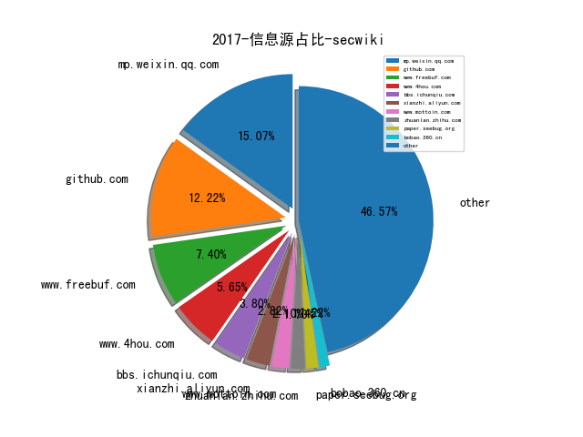
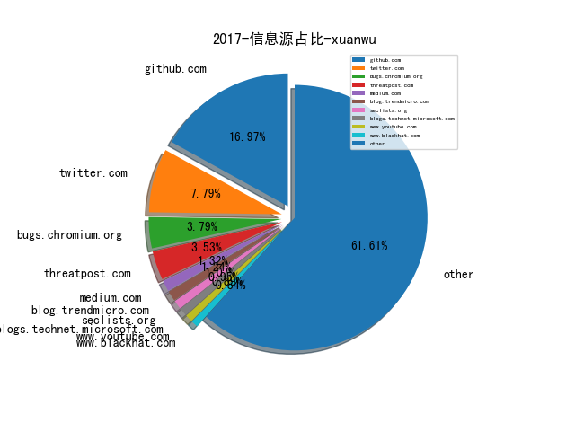
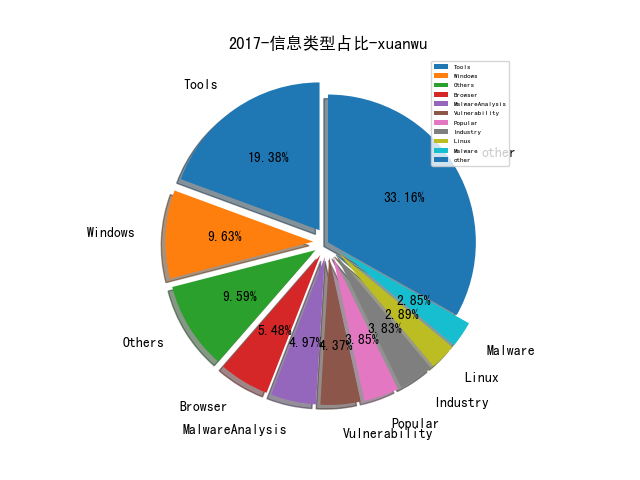
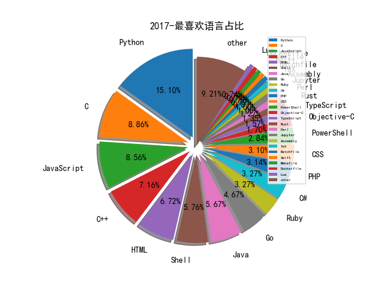

# [数据--所有](README_20.md)
# [数据--年度](README_2017.md)
# 2017 信息源与信息类型占比

# 微信公众号 推荐
| nickname_english | weixin_no | title | url| 
| --- | --- | --- | ---| 
| AI前线 | ai-front |  | https://mp.weixin.qq.com/s/r951Iasr4dke6MPHsUO0TA | 1| 
| Python中文社区 | python-china |  | https://mp.weixin.qq.com/s/vfR_3RmhbFvtSpK-7RIZqw | 1| 
| 信安之路 | xazlsec |  | http://mp.weixin.qq.com/s/lCK6na2CG_iweUsRmPdkqg | 109| 
| 先知安全技术社区 |  |  | https://mp.weixin.qq.com/s/sJvi6vUD-b7TNC6Ef7Kgdw | 20| 
| 兜哥带你学安全 | waf_ads_ids |  | https://mp.weixin.qq.com/s/D2nv8D0MBLhQqxcqrWu7ZQ | 15| 
| 安全牛 | aqniu-wx |  | https://mp.weixin.qq.com/s/YRyMf_AVYlR-Yx5wGKxcxg | 12| 
| 安天移动安全 | AVLTeam |  | https://mp.weixin.qq.com/s/ICdVtPA2MxnFoXk4kXyvEQ | 3| 
| 我的安全视界观 | CANI_Security |  | http://mp.weixin.qq.com/s/j-QHPUEVpnSM2hvdnupsuA | 7| 
| 浅黑科技 | qianheikeji |  | https://mp.weixin.qq.com/s/vwB75T0XOqWJn-ohKJe_Pw | 5| 
| 网安国际 | inforsec |  | https://mp.weixin.qq.com/s/qt2d1WQpTk2IYm_D3ufBGg | 1| 
| 首席安全官 | CSOAlliance |  | https://mp.weixin.qq.com/s/s0pe4lkw5ygT71V9SIYwfg | 2| 
| 360CERT | CERT-360 |  | https://mp.weixin.qq.com/s/VoLu-dvx91q4OEjnJB4EjQ | 2| 
| SecWiki | SecWiki |  | https://mp.weixin.qq.com/s/QImpx8PJhaaLZkj7gvTynw | 8| 
| n1nty | n1nty-talks |  | https://mp.weixin.qq.com/s/PLSCilYr1uuHOHTdNNZ7XQ | 4| 
| 互联网企业安全 | corpsec |  | https://mp.weixin.qq.com/s/icRTSbxjT-1Jf216u6F_pg | 1| 
| 威努特工控安全 | winicssec_bj |  | https://mp.weixin.qq.com/s/sV5696BRcR-GdEanYKWwNA | 7| 
| 安在 | AnZer_SH |  | https://mp.weixin.qq.com/s/W5VC5tgktdYe_MWidBwByQ | 13| 
| 数据派THU | DatapiTHU |  | https://mp.weixin.qq.com/s/UdXiDgbM18h4S6GczOOU5A | 8| 
| 看雪学院 | ikanxue |  | http://mp.weixin.qq.com/s/wjrR2gsApl7vH3CtWMGmxw | 24| 
| 青塔 | cingta-com |  | https://mp.weixin.qq.com/s/q2Inex4wgBLOMVJgFnDXuQ | 1| 
| AI科技大本营 | rgznai100 |  | https://mp.weixin.qq.com/s/4CQKqL_kZzMTlu8W4WYrLg | 1| 
| Qunar技术沙龙 | QunarTL |  | https://mp.weixin.qq.com/s/qn8VAMoIk7rkhDL4BsCfcA | 1| 
| 中国信息通信研究院CAICT | CAICT_CHINA |  | https://mp.weixin.qq.com/s/E7Iuri9G0RYOfv50yVLX_A | 1| 
| 北京经信局 | bjsjxw |  | https://mp.weixin.qq.com/s/QBtI7uMuReItCRbliBFwrA | 1| 
| 向日葵生活分享 | SunF-security-share |  | https://mp.weixin.qq.com/s/kJxKDeMkPnYc-F1EIuc2gA | 23| 
| 工控安全竞赛 |  |  | https://mp.weixin.qq.com/s/QDdcrTw4nWf62-6__kCFuA | 1| 
| 数说安全 | SSAQ2016 |  | https://mp.weixin.qq.com/s/L3t-CAOu7l46TSZdox880g | 10| 
| 猎户攻防实验室 | TassLiehu |  | https://mp.weixin.qq.com/s/u6ANBF45fOv3CqJOdkNAQA | 4| 
| 阿尔法工场 | alpworks |  | https://mp.weixin.qq.com/s/XpymxwqqVPZZDRvY2CGSpg | 1| 
| PaperWeekly | paperweekly |  | https://mp.weixin.qq.com/s/AhoEzujMVUU-P7j5z_8sVQ | 2| 
| 安全测评联盟 |  |  | https://mp.weixin.qq.com/s/DCxfYFOEE6kOlX9KQJ3ahQ | 2| 
| 美丽联合集团安全应急响应中心 | ml_src |  | https://mp.weixin.qq.com/s/RlBTH9-xrY7Nd1ZJK3KjDQ | 3| 
| 虎嗅APP | huxiu_com |  | https://mp.weixin.qq.com/s/ViXiDSu-mZqBZCZ-4yOVFg | 2| 
| 中国信息安全 | chinainfosec |  | https://mp.weixin.qq.com/s/zcTbqhI-ZQYKXDRjjZwnBQ | 4| 
| 携程技术中心 | ctriptech |  | https://mp.weixin.qq.com/s/Fuu70rPWyYP5mQSOK3J9_Q | 2| 
| 电力系统自动化 | AEPS-1977 |  | https://mp.weixin.qq.com/s/MzLeI17OeDqr2aFBNAidZQ | 1| 
| 国信安全研究院 | CSI_SIC |  | https://mp.weixin.qq.com/s/tE8p87ekOFStC5df5mVEEQ | 2| 
| 宅客频道 | letshome |  | https://mp.weixin.qq.com/s/EBwYMRBp8X9aXsaPm9uCBQ | 2| 
| 安全威胁情报 | Threatbook |  | https://mp.weixin.qq.com/s/UIV0YaIlSJLcYT32XJQPlg | 1| 
| 寒剑夜鸣 | HKT_1990 |  | https://mp.weixin.qq.com/s/Fb64DE0ThynWsjX5-qCTnA | 1| 
| 瀚思科技 | HanSight |  | https://mp.weixin.qq.com/s/Bw8QuhSDDImgFWSO2-xUZQ | 2| 
| 硬土壳安全 | InTUQCS |  | https://mp.weixin.qq.com/s/dRHv_wq2pflfle6H5ugKiw | 1| 
| E安全 | EAQapp |  | https://mp.weixin.qq.com/s/Epnaar3DEsByoAj8r5uHKA | 19| 
| sh3ll |  |  | https://mp.weixin.qq.com/s/tWYrRniK9P-61nC2kVjAmQ | 2| 
| zjutcsa |  |  | http://mp.weixin.qq.com/s/XDGGcJPkBrVHxlw_6o6t4g | 1| 
| 烽台科技 | fengtaisec |  | https://mp.weixin.qq.com/s/CF8ryNerKG_aPu9n8iZoNA | 2| 
| CCF系统软件专委 |  |  | https://mp.weixin.qq.com/s/6tj4lh0ej7aNkQy0DdfWjg | 1| 
| malwarebenchmark |  |  | https://mp.weixin.qq.com/s/mF_KTr7Z30g3EwfDDcA6Rw | 6| 
| 高效运维 | greatops |  | https://mp.weixin.qq.com/s?__biz=MzA4Nzg5Nzc5OA==&mid=2651668800&idx=1&sn=615af5f120d1298475aaf4825009cb30&chksm=8bcb82e9bcbc0bff6309d9bbaf69cfc591624206b846e00d5004a68182c934dab921b7c25794&scene=38#wechat_redirect | 5| 
| 网络安全社区悦信安 | yuexin_an |  | https://mp.weixin.qq.com/s/cakTgWlE-wQk10QGbg7E6Q | 1| 
| 视觉求索 | thevisionseeker |  | https://mp.weixin.qq.com/s/-wSYLu-XvOrsST8_KEUa-Q | 1| 
| Java面试那些事儿 | javatiku |  | https://mp.weixin.qq.com/s?__biz=MzIzMzgxOTQ5NA==&mid=2247484200&idx=1&sn=8f3201f44e6374d65589d00d91f7148e&chksm=e8fe9f21df8916371a34dd7259a4e5315e4a09ef86c86ad4c778ab11d9ca56b4d5d040cb0803#rd | 6| 
| 丁爸 情报分析师的工具箱 | dingba2016 |  | https://mp.weixin.qq.com/s/hxg2nHAIuUNt5VewML4v6A | 1| 
| 云众可信 | yunzhongkexin |  | https://mp.weixin.qq.com/s/m4kMZjHZUM6AaXp1VK2txw | 1| 
| 公安三所网络安全法律研究中心 |  |  | https://mp.weixin.qq.com/s/_45gVfcr8ax2GQw82l4B_w | 2| 
| 同程艺龙安全应急响应中心 | lysrc_team |  | https://mp.weixin.qq.com/s/iRobUHtTIAsaU-i2TvLjTQ | 3| 
| 美团技术团队 | meituantech |  | https://mp.weixin.qq.com/s/SJKeXegWG3OQo4r0nBs7xQ | 2| 
| BeaconLab |  |  | https://mp.weixin.qq.com/s/YyGiYORwk78SKRk_oLe0Xg | 4| 
| 中国保密协会科学技术分会 |  |  | https://mp.weixin.qq.com/s/8JeIRebbLJnIzQqJ7HVmAA | 1| 
| 唯品会安全应急响应中心 | VIP_SRC |  | https://mp.weixin.qq.com/s?__biz=MzI5ODE0ODA5MQ==&mid=2652278266&idx=1&sn=7b2f89643afaa22527644774a77b297b | 3| 
| 大数据与法制研究中心 |  |  | https://mp.weixin.qq.com/s/D2CxcifjuwvXixh_P2Z3pw | 1| 
| 安全张之家 | zhang_informationSEC |  | https://mp.weixin.qq.com/s/Kivzuq9EkHZKa0gNFcokSQ | 1| 
| 未然安全实验室 | WeiRanLabs |  | https://mp.weixin.qq.com/s/uBqz9UVcwlWQtpxlX1J2Gw | 1| 
| 爱奇艺技术产品团队 | iQIYI-TP |  | https://mp.weixin.qq.com/s/2gcNY0LmgxpYT1K6uDaWtg | 1| 
| 电塔 | DiantaFM |  | https://mp.weixin.qq.com/s/FupWpgckJIzUKD0Edi1Dgw | 1| 
| 百姓网技术团队 |  |  | http://mp.weixin.qq.com/s/RgyPq9BA3XHJ8cW1CQD71Q | 1| 
| Ant说安全 |  |  | https://mp.weixin.qq.com/s/bi49FZyRRgJON8t5bf-A3A | 1| 
| Seebug漏洞平台 | seebug_org |  | https://mp.weixin.qq.com/s?__biz=MzAxNDY2MTQ2OQ==&mid=2650942631&idx=1&sn=12a3c55807768f12fcd1b306fdf775d8 | 1| 
| iPolicyLaw | iPolicyLaw |  | https://mp.weixin.qq.com/s/bnJqcY9pQjMY_Hnbj9fdYw | 1| 
| 直言论难 |  |  | https://mp.weixin.qq.com/s/krmqJc755kE_j7oTGSJCXg | 1| 
| 奇安信威胁情报中心 |  |  | http://mp.weixin.qq.com/s/5IewlRR-1VZ5sx1YactNkg | 8| 
| 百度安全实验室 | BaiduX_lab |  | https://mp.weixin.qq.com/s/8MSpAorxrTCH_l1y2Q_qOw | 1| 
| 萝卜安全 | carrotsafe |  | https://mp.weixin.qq.com/s/bE_smPTR8yzB1ksvrcXEXw | 1| 
| 逢人斗智斗勇 | xiaopigfly |  | https://mp.weixin.qq.com/s/IZn_xnO2tyUWmx9dronYUQ | 1| 
| Piz0n |  |  | https://mp.weixin.qq.com/s/ETWPw6dbWLcAenSd_On3pw | 3| 
| 安天 | Antiylab |  | https://mp.weixin.qq.com/s/YCuY4D-IH3ovyBLBQkXwdQ | 4| 
| 等级保护测评 | zgdjbh |  | https://mp.weixin.qq.com/s/8p70LnCsSGNaqr50PNrvMw | 2| 
| 滴滴安全应急响应中心 | didisrc |  | https://mp.weixin.qq.com/s/eHB9zA0dZ-4Fv6ZpKzkHYA | 2| 
| 网安视界 | wangansj |  | https://mp.weixin.qq.com/s/fNH-gfKMK7hjfUq7J6Y1-Q | 3| 
| 工控安全应急保障中心 |  |  | https://mp.weixin.qq.com/s/jdqB8I6T33x3LlKpUXljJw | 1| 
| 绿盟科技研究通讯 | nsfocus_research |  | https://mp.weixin.qq.com/s/qvuVACmGekyyPYORRITVfQ | 3| 
| 编码美丽 | jiangwei0910410003 |  | https://mp.weixin.qq.com/s/xSe2Zrv9Ev4qRaN99YmnRA | 1| 
| 赛博朔方 | chinamssp |  | https://mp.weixin.qq.com/s/Y2TO8FcY8cXyyrh-nlgxVA | 2| 
| DJ的札记 | DJ_notes |  | https://mp.weixin.qq.com/s/B5n8wpLDy1rGchrySpBNUQ | 2| 
| Viola后花园 | Viola_deepblue |  | https://mp.weixin.qq.com/s/zJubeSuXRZRUBhulaRvHYg | 1| 
| 二向箔安全 | twosecurity |  | https://mp.weixin.qq.com/s/JTZfaG6iG2XAmiCeBiKxwA | 1| 
| 合天智汇 | hee_tian |  | https://mp.weixin.qq.com/s/92RfSObhnzITzZ_HzaKvgQ | 3| 
| 饿了么安全应急响应中心 | ElemeSRC |  | https://mp.weixin.qq.com/s/2ORHnywrxXPexviUYk7Ccg | 2| 
| WiFi安全应急响应中心 | WiFiSRC |  | https://mp.weixin.qq.com/s?__biz=MzI1NTY2MTkwNw==&mid=2247483798&idx=1&sn=8992a94f41f91945f201ebcd48a104c5&scene=0#wechat_redirect | 1| 
| 网络安全技能竞赛 | isgchina |  | https://mp.weixin.qq.com/s?__biz=MjM5NjkyMTk5Mg==&mid=2650597864&idx=1&sn=60a58436e65283ce404eb837404c31a1&scene=0#wechat_redirect | 1| 
| 计算广告 | Comp_Ad |  | https://mp.weixin.qq.com/s/Ut0_yj2YoPMwEAokNDPv5g | 1| 
| 汉客儿 |  |  | https://mp.weixin.qq.com/s?__biz=MzI1NTUzMjUzMQ==&mid=2247483727&idx=1&sn=aadacf8866fdb5b6ce3d49649560eb9a&scene=0#wechat_redirect | 1| 
| 道哥的黑板报 | taosay |  | https://mp.weixin.qq.com/s?__biz=MjM5NzA4ODc0MQ==&mid=2648628796&idx=1&sn=00a9a13e931024d5ebe62ba81e234a58&scene=0#wechat_redirect | 2| 
| 懒人在思考 | lazy-thought |  | https://mp.weixin.qq.com/s/OxgJIIPaXMXqrY5lPdukdA | 2| 
| 程序员在深圳 | studycode |  | https://mp.weixin.qq.com/s/8Bl105G8ZsE_jy5mbrIy_g | 1| 
| FreeBuf | freebuf |  | https://mp.weixin.qq.com/s/4U4w2NZQUDnwcJ1On5kE9A | 2| 
| MottoIN | mottoin |  | https://mp.weixin.qq.com/s?__biz=MzIxMzQ3MzkwMQ==&mid=2247489932&idx=1&sn=860bfed6583f1e2b2bf4f05bee42198c&scene=0#wechat_redirect | 2| 
| CNNVD安全动态 | cnnvd_news |  | http://mp.weixin.qq.com/s/fkBVw0BH5kcc0jdKC4c9ZA | 1| 
| HenceTech |  |  | https://mp.weixin.qq.com/s/8PauKA6KU3TXp2FEmcoqeQ | 4| 
| 玉树芝兰 | nkwangshuyi |  | http://mp.weixin.qq.com/s/JGHSH_TH25GBwGJdLBgnmA | 1| 
| 码农翻身 | coderising |  | https://mp.weixin.qq.com/s/StqqafHePlBkWAPQZg3NrA | 1| 
| 红日安全 | sec-redclub |  | http://mp.weixin.qq.com/s/EjtNGFTQ0AtCW5KpVYCm6A | 13| 
| 高可用架构 | ArchNotes |  | https://mp.weixin.qq.com/s?__biz=MzAwMDU1MTE1OQ==&mid=2653548916&idx=1&sn=ed50fae989b08eed3b9a5c754fa70b23&scene=0#wechat_redirect | 3| 
| ADLab | v_adlab |  | http://mp.weixin.qq.com/s/X2JcKCpCH4exDoxMK5oN5Q | 2| 
| 中测安华 | ZCAH_2013 |  | https://mp.weixin.qq.com/s?__biz=MzI0NDUyODU4MA==&mid=2247483960&idx=1&sn=b1ea929c773ed2d65270dfec1e3a5115&scene=0#wechat_redirect | 1| 
| 史中 |  |  | https://mp.weixin.qq.com/s?__biz=MzIwOTg5OTg3NA==&mid=2247483780&idx=1&sn=488ba332ec1fc868df101aae5ef97fbf&scene=0#wechat_redirect | 1| 
| 开放知识图谱 | OpenKG-CN |  | https://mp.weixin.qq.com/s?__biz=MzU2NjAxNDYwMg==&mid=2247483866&idx=1&sn=abd559c2bc416619fe3501209a5261da&scene=0#wechat_redirect | 1| 
| 阿里云安全 | aliyunsec |  | https://mp.weixin.qq.com/s/DyLkQiMuEP3v-AHt9P81vg?spm=5176.100239.blogcont127833.17.Fswjg8 | 1| 
| 取证杂谈 |  |  | https://mp.weixin.qq.com/s?__biz=MzI3Mjc0MjkwMQ==&mid=2247483675&idx=1&sn=669c2fe44425310e86b003c6ac41acb7&scene=0#wechat_redirect | 1| 
| GitChat | GitChat |  | https://mp.weixin.qq.com/s/IN_JJhg_oG7ILVjNj-UexA | 1| 
| Web安全与前端 | sec_fe |  | http://mp.weixin.qq.com/s/HCKs6Bhc30dlMMmcIH401Q | 2| 
| 工信微报 | gxwbwx |  | https://mp.weixin.qq.com/s?__biz=MjM5OTUwMTc2OA==&mid=2650793095&idx=2&sn=e772f59af83b2fdad693484b64cf00ed&scene=0#wechat_redirect | 1| 
| Docker | dockerone |  | https://mp.weixin.qq.com/s?__biz=MzA5OTAyNzQ2OA==&mid=2649691135&idx=1&sn=bb0b74bdc5d0904eb23772d83a5f09a5&scene=0#wechat_redirect | 2| 
| 人工智能学家 | AItists |  | https://mp.weixin.qq.com/s?__biz=MzIwOTA1MDAyNA==&mid=2649841199&idx=4&sn=0dcad94c5f9930866bff7bae6cc3ff68&scene=0#wechat_redirect | 1| 
| 兴百邦翰林 | DetectiveAcademy |  | https://mp.weixin.qq.com/s?__biz=MzUyNTA2MTQ5Mw==&mid=2247483707&idx=1&sn=584d666fb85762354378d0919dad5ed5&scene=0#wechat_redirect | 1| 
| 凤凰牌老熊 | shamphone |  | https://mp.weixin.qq.com/s?__biz=MzI4OTQ3MTI2NA==&mid=2247483810&idx=1&sn=7bc6d03ac221d74b850418747a8c8bdf&scene=0#wechat_redirect | 4| 
| 算法与数学之美 | MathAndAlgorithm |  | https://mp.weixin.qq.com/s?__biz=MzA5ODUxOTA5Mg==&mid=2652553452&idx=1&sn=64488941360b6ecf39bd87692a2fbfc3&chksm=8b7e31b7bc09b8a1cfa12b807cd30f21f86f261587fab6ae9e6e96e4d9565cc8caf4de21a8de&mpshare=1&scene=1&srcid=0618wdfKfLDuFKYK6o4IQqPN&key=110a1ce | 1| 
| 茶码古刀 | wxcmgd |  | https://mp.weixin.qq.com/s?__biz=MzI2NzM3MTQ1Mw==&mid=2247484066&idx=1&sn=a621127befdc3b9192e7066b63279531&scene=0#wechat_redirect | 1| 
| 赛博星人 | cyberspace_666 |  | https://mp.weixin.qq.com/s?__biz=MzIyODcxODI5MA==&mid=2247484302&idx=1&sn=dcb296a41955ea7e1cd38d55d949af10&scene=0#wechat_redirect | 1| 
| 宜人安全应急响应中心 |  |  | https://mp.weixin.qq.com/s/Ie1Oq0zRD6vM_70wpawpzg | 2| 
| 谛听 | ditecting |  | https://mp.weixin.qq.com/s?__biz=MzIxMjI5MzQ3OA==&mid=2247483723&idx=1&sn=2ca8d5359adde75994f52a0475fbe5a1&scene=0#wechat_redirect | 1| 
| 赛尔网络市场动态 | Cernet_Marketing |  | https://mp.weixin.qq.com/s?__biz=MzAxOTI5OTUwMw==&mid=2650744489&idx=1&sn=4b27b845c1d5ea4c005e41272ebc19c7 | 1| 
| 运维军团 | ywjtshare |  | http://mp.weixin.qq.com/s/Iad4qT_vG9B3vBhvQ2p_2g | 1| 
| 铸剑网络安全实验室 | CSNS-Lab |  | http://mp.weixin.qq.com/s/xgJ6lq99pnL8mF39oo9duA | 1| 
| CTFer的魔法棒 |  |  | http://mp.weixin.qq.com/s/KV3Z40gZAOZ4-SUjTvT6NA | 1| 
| BZ的呓语 | SalesManBZ |  | https://mp.weixin.qq.com/s?__biz=MzI3OTcwNDIwOA==&mid=2247483744&idx=1&sn=8327a4825a254ecc7be8e0fdee4989cb&scene=0#wechat_redirect | 1| 
| 关注安全技术 | heresecurity |  | http://mp.weixin.qq.com/s/EbMggASqM3r051okFX7e2Q | 2| 
| 知道创宇 | knownsec |  | https://mp.weixin.qq.com/s?__biz=MjM5NzA3Nzg2MA==&mid=2649838998&idx=1&sn=68e792dfb0e7cbde704b33df00d37f8f&scene=0#wechat_redirect | 2| 
| 云鼎实验室 | YunDingLab |  | https://mp.weixin.qq.com/s?__biz=MzU3ODAyMjg4OQ==&mid=2247483719&idx=1&sn=b857495f658a5351f78d32f4c3bdb97f&scene=0#wechat_redirect | 2| 
| 全频带阻塞干扰 | RFJamming |  | https://mp.weixin.qq.com/s?__biz=MzIzMzE2OTQyNA==&mid=2648946552&idx=1&sn=695a168741aa97c0d53331655b0d5096&scene=0#wechat_redirect | 5| 
| 同程艺龙技术中心 | tcyanfa |  | https://mp.weixin.qq.com/s?__biz=MzIyMDAzMzA5Mg==&mid=2650766899&idx=1&sn=4902b4eb8e6988e132d18dff36c95893&scene=0#wechat_redirect | 1| 
| 腾讯广告算法大赛 | TSA-Contest |  | https://mp.weixin.qq.com/s/BE1mfmKJTsDSwWi16mllNA | 1| 
| 计算机与网络安全 | Computer-network |  | https://mp.weixin.qq.com/s?__biz=MjM5OTk4MDE2MA==&mid=2655114799&idx=3&sn=3d558619e0e89152bac583d2ee68a746&chksm=bc864bc08bf1c2d665bd61ab81aefbe698c50501566350b141c1a513d80beda5ac175e4c5371#rd | 3| 
| 君哥的体历 | jungedetili |  | https://mp.weixin.qq.com/s?__biz=MzI2MjQ1NTA4MA==&mid=2247483778&idx=1&sn=f4991d2f400bf299e3b2273cf9891d1c&chksm=ea4babc5dd3c22d33c80e90c17189c9d05a6ec84c8306c1b4d10d0f101df52ec8e1383d6c756&mpshare=1&scene=1&srcid=0423rjehZSocwn518zPMFDlc&key=de27735 | 5| 
| 机器之心 | almosthuman2014 |  | https://mp.weixin.qq.com/s/EJQHeOiUY7nsqCqKDdui_Q | 3| 
| 漏洞盒子VulBox | Vulbox_ |  | http://mp.weixin.qq.com/s/onK68ANqHHtEMLITOfacmg | 2| 
| 雷科技 | leitech |  | https://mp.weixin.qq.com/s/vQv_a4eCP_-NHJPlevhKaw | 1| 
| SaviourTech | secbugs |  | http://mp.weixin.qq.com/s/6aQlXRRgZJSLUVBisBGHvQ | 6| 
| T00ls | T00lsNet |  | https://mp.weixin.qq.com/s/GEe9vWcRUIQpQPEe95fzOw?ptlang=2052&ADUIN=1353059044&ADSESSION=1492262423&ADTAG=CLIENT.QQ.5473_.0&ADPUBNO=26569 | 2| 
| 胖哈勃 | pwnhub |  | http://mp.weixin.qq.com/s/1tlUpqdQFHm63gMDmzk6sg | 1| 
| 边界安全 | sssie95zz |  | https://mp.weixin.qq.com/s?__biz=MzI0MzQyNzI2OA==&mid=2247484286&idx=1&sn=9ff65a80e7e7231e5c9a0c7bc12cf913&chksm=e96c71d5de1bf8c33aa8b83238e6a5da967a19d03e5e6ef54bfce9782b564fbabd24d1891efa&mpshare=1&scene=1&srcid=0410Dmv30VrzIqq76nVnKaCH&key=23818ac | 1| 
| 数字观星 | shuziguanxing |  | http://mp.weixin.qq.com/s/cq-Hg7iNB4FP06JKWS7Rjg | 1| 
| 亿级流量网站架构 | kaitao-1234567 |  | https://mp.weixin.qq.com/s?__biz=MzIwODA4NjMwNA==&mid=2652898369&idx=1&sn=046a197ca25668556a93bc8e003e7560&chksm=8cdcd00ebbab5918bd6ef7a462fe1d8c6c0d430e1a78cb1cf27efdec0214c17d92ae785900b3&scene=0&key=aeef07f20676c0a96ba632163a9bc2995b5de891661fae86 | 3| 
| 光翼通信 | hnguangyi | 伪基站那些事儿-专业版 | http://mp.weixin.qq.com/s?__biz=MzA4NTEwMzQ5OQ==&mid=2649250331&idx=1&sn=0dfdd9c09f73996d8e95014ffa9162f9&scene=0#wechat_redirect | 1| 
| 安云信息 | Anyuntec |  | http://mp.weixin.qq.com/s/P-ncFmNZfBteJBQr8INzsw | 1| 
| 腾讯大数据 | tencentbigdata |  | http://mp.weixin.qq.com/s/UhF2KCASoIhTiKXPFOPiww | 1| 
| 京东安全应急响应中心 | jsrc_team |  | http://mp.weixin.qq.com/s/ia2itmIPdBwbVi57GAAeuw | 2| 
| 英国那些事儿 | hereinuk |  | http://mp.weixin.qq.com/s?__biz=MjM5NjAwNzI0MA==&mid=2651948229&idx=1&sn=e5b98d4f78fff701adf82ca4888f4a0a&scene=0#wechat_redirect | 1| 
| ArkTeam |  |  | http://mp.weixin.qq.com/s/QsteT_86uwViXSFXspJHJQ | 1| 
| 上交所技术服务 | SSE-TechService |  | http://mp.weixin.qq.com/s?__biz=MzI0NTAwNjMwOA==&mid=2650685700&idx=3&sn=8cceaf131a280618abaff340c63a5079&scene=0#wechat_redirect | 1| 
| 腾讯安全联合实验室 | txaqlhsys |  | http://mp.weixin.qq.com/s/vTt-KHFwE7hrvnPwLFiEGQ | 1| 
| 运维之路 | HuashengPeng001 |  | http://mp.weixin.qq.com/s?__biz=MzI2MjA5MjUwMQ==&mid=2650019678&idx=1&sn=ee1eb3d847553e4dbbea56b40516cb03&chksm=f250d4e4c5275df23dc139b8ac07301aea727ec76210de0415bb2ff71b342891b3a9a7def4df&mpshare=1&scene=23&srcid=0302uyBJiutYubn5JIUxm76F%23rd | 5| 
| InfoQ | infoqchina |  | http://mp.weixin.qq.com/s?__biz=MjM5MDE0Mjc4MA==&mid=2650995488&idx=1&sn=5103cb99753238484c9159692ea91f7b&scene=0#wechat_redirect | 4| 
| Panabit |  |  | http://mp.weixin.qq.com/s/Q0yvt9a-VmN9k-ikLXZzGQ | 1| 
| 启明星辰 | venustech_weixin |  | http://mp.weixin.qq.com/s?__biz=MzA3NDQ0MzkzMA==&mid=2651674968&idx=1&sn=f84353990d34e22d2a6ebc7db7915748&scene=0#wechat_redirect | 1| 
| 深信服千里目安全实验室 | Further_eye |  | http://mp.weixin.qq.com/s?__biz=MzI4NjE2NjgxMQ==&mid=2650233023&idx=2&sn=6df48e6351b8f7a7e48049db4d859715&chksm=f3e2e2cbc4956bdd1f5e490bdcd3eb66e0abbb77a448c11b60d77719d34e0106a093500990c5#rd | 1| 
| 雷锋网 | leiphone-sz |  | http://mp.weixin.qq.com/s?__biz=MTM2ODM0ODYyMQ==&mid=2651420718&idx=4&sn=aca97331c25739af0b84349aea153215&scene=0#wechat_redirect | 2| 
| 互联网周刊 | ciweekly |  | http://mp.weixin.qq.com/s/iBVHSsWLHDhILpfF1EfWOw | 1| 
| 张铁蕾 | tielei-blog |  | http://mp.weixin.qq.com/s/JTsJCDuasgIJ0j95K8Ay8w | 1| 
| 第一黑媒 | hackmedia |  | http://mp.weixin.qq.com/s/1tCLq3LGTQOPLKmeDVRCgg | 1| 
| 网易安全应急响应中心 | NetEaseSRC |  | http://mp.weixin.qq.com/s/eEp5SB4A8L8aBdZzmVtY0g | 1| 
| 阿里聚安全 | alijaq |  | https://mp.weixin.qq.com/s?__biz=MzIwMTI4Nzk5Ng==&mid=2650219700&idx=1&sn=b0391c11e9ac599fffb8ada6860c2cb0&chksm=8ef3b4e7b9843df1ea4868fe41dc5059e9d5ee25a3778adc5794361dc0425076dd32ab23b1fc&mpshare=1&scene=1&srcid=02150dtv7LaWmbcINZZc1gYT&key=640f69b | 1| 
| WeMedia研究院 | WMyanjiuyuan |  | http://mp.weixin.qq.com/s/0i6VlEJjAXcYAsLrMF0JJA | 1| 
| 即刻安全 |  |  | http://mp.weixin.qq.com/s/Sv9l--OK7ADihDG9kUsarA | 1| 
| 安全学习那些事 | SECXUE |  | http://mp.weixin.qq.com/s/i-9p2KD15yXCxhfB8E6T0A | 1| 
| 张三丰的疯言疯语 | zsfnotes |  | http://mp.weixin.qq.com/s?__biz=MzA3MTUwMzI5Nw==&mid=2654431137&idx=1&sn=41a139286d511ba474a694b7f4ae4006&scene=0#wechat_redirect | 2| 
| PHP技术大全 | phpgod |  | http://mp.weixin.qq.com/s?__biz=MzAxNzMwOTQ0NA%3D%3D&mid=2653354832&idx=3&sn=a51b1cd27064b6fe12f6b3ff2fbc3b5e&chksm=8035d13bb742582df0d4f14a39692488098f3d8325db66090ec54a9bb801f5dc92f5292b480c | 1| 
| 物联网智库 | iot101 |  | https://mp.weixin.qq.com/s?__biz=MjM5MTM5ODQyMA==&mid=2651195423&idx=1&sn=59a0b358b16e402ffe62372c7ac539c8&chksm=bd4487648a330e72de3140294bed1a3dc2d3a84474701cbed2e2d3d47ad6827e8901a3708334e | 1| 
| GitChat精品课 | CSDN_Tech |  | http://mp.weixin.qq.com/s?__biz=MzA4Mzc0NjkwNA==&mid=2650782022&idx=3&sn=c38594bada73a365690390962fdbd6e9&chksm=87fad071b08d5967bb526d857a59143e44e2156d2c76eec668b8bb25c759882928f6851ffdd9&scene=0#rd | 2| 
| 峰瑞资本 | freesvc |  | http://mp.weixin.qq.com/s/KKLThg2cgYqntb0nrfvLXg | 1| 
| 网路冷眼 |  |  | https://mp.weixin.qq.com/s?__biz=MzI4NjYwMjcxOQ==&mid=2247483720&idx=1&sn=1ef57e5ae8b4f2af05d9a31467703934&chksm=ebdb25f8dcacacee8b45df995e01f9c7f8496435c47d1cd8d771bd2677f367dba9d7a4bf6c0a | 1| 
| 互联网研究前沿 | CIS-SASS |  | https://mp.weixin.qq.com/s?__biz=MjM5Mzg0NTU0NQ==&mid=2649565440&idx=1&sn=15b2b507222c07f75360ddb236606a06&chksm=be89514689fed850917ad1ddba342143596080d09e5d62dd2b3291a79c59d508bff705be3c67 | 1| 
| Linux中国 | linux-cn |  | https://mp.weixin.qq.com/s?__biz=MjM5NjQ4MjYwMQ==&mid=2664608640&idx=2&sn=446ba28dcbec21d1ed739c2e8bb1714b&chksm=bdce88c68ab901d04385aa5fd4d974a97bad02045ba0fa4ff411fb9577ea9612e0e168a7f6ef | 2| 
| ThoughtWorks洞见 | TW-Insights |  | https://mp.weixin.qq.com/s?__biz=MjM5MjY3OTgwMA==&mid=2652455776&idx=1&sn=047aea9144db8cf242e253083a0796a6&chksm=bd4f71778a38f861bd9399e96cf96a3d5f10a2cfbd73a8c5056c03335abd2baf73d61889c17c | 1| 

# 组织github账号 推荐
| github_id | title | url | org_url | org_profile | org_geo | org_repositories | org_people | org_projects | repo_lang | repo_star | repo_forks| 
| --- | --- | --- | --- | --- | --- | --- | --- | --- | --- | --- | ---| 
| Microsoft | DbgShell - A PowerShell front-end for the Windows debugger engine: | https://github.com/Microsoft/DbgShell/ | https://opensource.microsoft.com | Open source, from Microsoft with love | Redmond, WA | 2463 | 4258 | 0 | C,TypeScript,Java,C#,JavaScript,Objective-C,C++,Go,Python,Batchfile,HTML,Rich,Jupyter,CMake,PowerShell | 0 | 0 | 6| 
| microsoft | Linux 版 procdump 工具 : | https://github.com/microsoft/procdump-for-linux | https://opensource.microsoft.com | Open source, from Microsoft with love | Redmond, WA | 2463 | 4258 | 0 | C,TypeScript,Java,C#,JavaScript,Objective-C,C++,Go,Python,Batchfile,HTML,Rich,Jupyter,CMake,PowerShell | 0 | 0 | 2| 
| mozilla | patch for firefox renderer exploit -> | https://github.com/mozilla/gecko-dev/commit/557f236c19730116d3bf53c0deef36362cafafcd | https://wiki.mozilla.org/Github | This technology could fall into the right hands. | Mountain View, California | 2025 | 283 | 34 | TypeScript,FreeMarker,Python,Kotlin,JavaScript,C++,Shell,Nix,HTML,CSS,Rust | 0 | 0 | 2| 
| MicrosoftDocs | 微软的文档中心( https://docs.microsoft.com/zh-cn/),其中保存中 GitHub 上的 WinDbg 文档: | https://github.com/MicrosoftDocs/windows-driver-docs/tree/staging/windows-driver-docs-pr/debugger | https://docs.microsoft.com | The modern documentation service for Microsoft | Redmond, WA | 1862 | 624 | 0 | C#,Python,HTML,JavaScript,PowerShell | 0 | 0 | 1| 
| google | domato - Google DOM fuzzer: | https://github.com/google/domato | https://opensource.google.com/ | Google ❤️ Open Source | https://opensource.google.com/ | 1474 | 2547 | 0 | C,TypeScript,Java,Python,Kotlin,JavaScript,C++,Go,Ruby,Rust | 0 | 0 | 18| 
| 18F | domain-scan - 子域名扫描工具: | https://github.com/18F/domain-scan/blob/master/docs/lambda.md#using-domain-scan-with-amazon-lambda | https://18f.gov | 18F builds effective, user-centric digital services focused on the interaction between government & the people it serves. Provided by GSA. | United States | 1120 | 119 | 1 | TypeScript,HTML,Python,JavaScript,Shell,Go,Ruby,CSS | 0 | 0 | 1| 
| rancher | rancher OS : Tiny Linux distro that runs the entire OS as Docker containers : | https://github.com/rancher/os | http://www.rancher.com |  | http://www.rancher.com | 352 | 31 | 0 | Shell,Java,Python,JavaScript,Smarty,Go,CSS | 0 | 0 | 1| 
| alibaba | druid/wallfilter：基于SQL语义分析来实现防御SQL注入攻击 | https://github.com/alibaba/druid/wiki/%E9%85%8D%E7%BD%AE-wallfilter | http://www.alibaba.com | Alibaba Open Source | Hangzhou, China | 263 | 140 | 0 | C,Shell,Java,Kotlin,JavaScript,C++,Dart,TypeScript,Go,Jupyter | 0 | 0 | 1| 
| rapid7 | MSF 加入 SurgeNews 用户凭证扫描模块: | https://github.com/rapid7/metasploit-framework/pull/8577 | http://www.rapid7.com/ |  | Boston, MA | 234 | 0 | 0 | C,Java,Python,JavaScript,HTML,Go,Ruby | 0 | 0 | 4| 
| PortSwigger | Backslash Powered Scanner v0.9 is now out, with JSON injection, server-side HPP, improved evidence clarity and more | https://github.com/PortSwigger/backslash-powered-scanner | https://portswigger.net/ |  | https://portswigger.net/ | 219 | 0 | 0 | Python,Kotlin,Ruby,Java,JavaScript | 0 | 0 | 1| 
| Alfresco | Prowler: AWS CIS Benchmark Tool 亚马逊基线检测工具 | https://github.com/Alfresco/prowler | http://alfresco.com |  | http://alfresco.com | 199 | 8 | 0 | Shell,Java,HTML,XSLT,Python,JavaScript,Smarty,Objective-C,TypeScript,Ruby | 0 | 0 | 1| 
| nccgroup | idahunt - NCCGroup 开源的用于辅助 IDA Pro 逆向分析的工具,譬如批量分析二进制文件: | https://github.com/nccgroup/idahunt | https://www.nccgroup.trust | Please report all security issues to security at nccgroup dot com | Global | 180 | 15 | 0 | C,Shell,Java,Python,JavaScript,C#,HTML,Elixir,Go,Rust | 0 | 0 | 11| 
| wireapp | Wire messenger server code open-sourced : | https://github.com/wireapp/wire-server | https://wire.com | Wire open source secure messenger | https://wire.com | 178 | 18 | 0 | TypeScript,Java,HTML,Scala,Dockerfile,JavaScript,Smarty,Shell,Objective-C,Haskell,C++,Swift,Rust | 0 | 0 | 1| 
| dotnet | .NET Core 运行时的 JIT 编译器 - RyuJIT 介绍: | https://github.com/dotnet/coreclr/blob/master/Documentation/botr/ryujit-tutorial.md | http://www.dotnetfoundation.org | Home of the .NET Foundation | http://www.dotnetfoundation.org | 176 | 381 | 2 | Shell,HTML,C#,Python,F#,Dockerfile,PowerShell | 0 | 0 | 1| 
| palantir | Palantir 开源了他们的一个应急预警与检测策略框架: https://medium.com/@palantir/alerting-and-detection-strategy-framework-52dc33722df2 | https://github.com/palantir/alerting-detection-strategy-framework | https://palantir.com |  | Palo Alto, CA | 176 | 30 | 0 | Groovy,Shell,Java,Scala,JavaScript,TypeScript,Go,Rust | 0 | 0 | 2| 
| airbnb | BinaryAlert: Serverless, Real-time & Retroactive Malware Detection | https://github.com/airbnb/binaryalert | https://airbnb.io |  | San Francisco | 170 | 26 | 0 | TypeScript,Java,Python,Ruby,JavaScript,Shell,HTML,Puppet,Swift | 0 | 0 | 1| 
| uber | RT @ libber: Releasing | https://github.com/uber/focuson | http://uber.github.io/ | Open Source Software at Uber | 70+ countries and counting. | 169 | 96 | 0 | C,Java,Python,JavaScript,C++,Go,Swift,Thrift | 0 | 0 | 1| 
| OWASP | Testing Anti-Reversing Defenses on Android: | https://github.com/OWASP/owasp-mstg/blob/master/Document/0x05j-Testing-Resiliency-Against-Reverse-Engineering.md | http://www.owasp.org | The OWASP Foundation | http://www.owasp.org | 151 | 27 | 0 | C,Shell,Java,Python,JavaScript,Perl,HTML,Go,CSS | 0 | 0 | 5| 
| PowerShell | 如何在 Linux 系统中安装 PowerShell: | https://github.com/PowerShell/PowerShell/blob/master/docs/installation/linux.md | https://microsoft.com/powershell | https://microsoft.com/powershell | Redmond | 132 | 23 | 1 | C#,C,TypeScript,PowerShell,C++ | 0 | 0 | 1| 
| QubesOS | Xen 发布漏洞公告,修复了 XSA-231、XSA-232、XSA-233、XSA-234 4 个漏洞,从拒绝服务到系统提权: | https://github.com/QubesOS/qubes-secpack/blob/master/QSBs/qsb-033-2017.txt | https://www.qubes-os.org/ |  | https://www.qubes-os.org/ | 116 | 14 | 0 | C,Shell,Roff,Python,Makefile,Perl,HTML,Ruby,CSS | 0 | 0 | 2| 
| yhat | db.py: 数据库中数据分析助手 (结合 ipython 使用) | https://github.com/yhat/db.py | http://www.yhathq.com/ |  | New York, NY | 116 | 0 | 0 | Jupyter,HTML,Python,JavaScript,Vim,R,Go,CSS | 0 | 0 | 1| 
| GoogleChromeLabs | jsvu - Google Chrome Labs 开源的一个 JavaScript 引擎版本升级工具,有了 jsvu,就不用每次从头自己编译了。支持 Chakra、JavaScriptCore、SpiderMonkey、V8: | https://github.com/GoogleChromeLabs/jsvu | None | Experimental projects from the Chrome team | None | 115 | 18 | 0 | TypeScript,Java,HTML,JavaScript,C++,Shell,PHP | 0 | 0 | 1| 
| Kitware | BroThon! Processing and analysis of Bro IDS data with Python | https://github.com/Kitware/BroThon | https://www.kitware.com | Kitware develops software for web visualization, data storage, build system generation, infovis, media analysis, biomedical inquiry, cloud computing and more. | https://www.kitware.com | 106 | 18 | 0 | C,Vue,Python,JavaScript,C++,Terra,HTML,PHP,CSS | 0 | 0 | 1| 
| sensepost | gowitness - Golang 语言编写的一个基于 Chrome Headless 的网页快照图片生成工具,来自 SensePost: https://sensepost.com/blog/2017/gowitness-a-new-tool-for-an-old-idea/ | https://github.com/sensepost/gowitness | http://sensepost.com |  | South Africa | 92 | 2 | 0 | C,Shell,Java,Python,C++,Perl,C#,HTML,Go,CMake | 0 | 0 | 4| 
| trailofbits | Manticore, our dynamic binary analysis tool with support for symbolic execution, is now public! | https://github.com/trailofbits/manticore/ | https://www.trailofbits.com |  | New York, New York | 91 | 21 | 0 | C,Shell,CMake,Python,C++,Rust,HTML,CSS,Ruby,HCL | 0 | 0 | 3| 
| m-labs | Ive released a new version of my Rust TCP/IP stack, now with TCP client support! | https://github.com/m-labs/smoltcp | https://m-labs.hk |  | Hong Kong / Anywhere / LEO | 84 | 5 | 0 | C,Python,C++,Perl,Nix,Batchfile,Verilog,Rust | 0 | 0 | 1| 
| yandex | burp-molly-scanner - 将 BurpSuite 变成 Headless 的 Web 应用漏洞扫描器: | https://github.com/yandex/burp-molly-scanner/ | https://tech.yandex.com/ | Yandex open source projects and technologies | Moscow, Russia | 78 | 31 | 0 | C,Java,Python,JavaScript,C++,HTML,Go,PHP,Swift | 0 | 0 | 2| 
| Tencent | TscanCode: 针对C++/C#/Lua代码的静态代码扫描解决方案 | https://github.com/Tencent/TscanCode | https://opensource.tencent.com |  | Shenzhen, China | 74 | 3 | 0 | C,Java,Python,JavaScript,C++,Lua,Objective-C,Go,PHP,CSS | 0 | 0 | 3| 
| sparkfunX | Skimmer Scanner - A Gas Pump Skimmer Detection App: | https://github.com/sparkfunX/Skimmer_Scanner/ | None | The stable for SparkXs random bits | None | 73 | 0 | 0 | Mercury,C,Python,JavaScript,C++,Batchfile | 0 | 0 | 1| 
| SpiderLabs | portia - 基于 Python 实现的自动化后渗透工具,拥有权限提升、横向渗透等功能: | https://github.com/SpiderLabs/portia | https://www.trustwave.com/Resources/SpiderLabs-Blog/ |  | Earth | 69 | 4 | 0 | C,Java,Python,C++,Perl,Lua,PHP,Ruby,C# | 0 | 0 | 2| 
| RUB-NDS | PRET: Printer Exploitation Toolkit 网络打印机攻击利器 | https://github.com/RUB-NDS/PRET# | https://www.nds.ruhr-uni-bochum.de/ | Research and development at the Chair for Network and Data Security concentrates on cryptographic protocols, Internet and XML security. | Ruhr University Bochum | 65 | 6 | 0 | TeX,Python,JavaScript,Java,CoffeeScript | 0 | 0 | 2| 
| pothosware | Bundled GNURadio + GrOsmoSDR For Windows Machine https://github.com/pothosware/PothosSDR/wiki/GNURadio #SDR #GNURadio | https://github.com/pothosware/PothosSDR/wiki/GNURadio | http://www.pothosware.com | The Pothos dataflow programming software suite | http://www.pothosware.com | 63 | 2 | 0 | C,CMake,VHDL,Python,C++,Go,Ruby | 0 | 0 | 1| 
| MISP | 恶意软件信息共享平台(MISP)中内置了多种信息列表,目的是降低情报信息的误报问题。这些列表包括 Alexa Top 1000 网站列表、公开 DNS 解析服务器列表、微软和 Google 域名列表等等: | https://github.com/MISP/misp-warninglists | https://www.misp-project.org | MISP Project - Open Source Threat Intelligence Platform & Open Standards For Threat Information Sharing | Worldwide | 55 | 12 | 0 | Shell,Python,JavaScript,TeX,HTML,PHP,Dockerfile,CSS | 0 | 0 | 2| 
| Qihoo360 | XLearning：一款支持多种机器学习、深度学习框架调度系统 | https://github.com/Qihoo360/XLearning/blob/master/README_CN.md | http://www.360.cn | 360 official github | Beijing, China | 55 | 7 | 0 | C,TypeScript,Java,Scala,JavaScript,C++,Go,CSS | 0 | 0 | 3| 
| GDSSecurity | 无线后渗透的艺术:利用间接无线转发绕过基于端口的访问控制策略 : | https://github.com/GDSSecurity/Whitepapers/blob/master/GDS%20Labs%20-%20The%20Black%20Art%20of%20Wireless%20Post%20Exploitation%20-%20Bypassing%20Port%20Based%20Access%20Controls%20Using%20Indirect%20Wireless%20Pivots.pdf | https://www.aon.com/cyber-solutions |  | New York, NY | 49 | 3 | 0 | C,Shell,Java,XSLT,Python,JavaScript,Perl,C#,Objective-C,Lua,PHP,Ruby | 0 | 0 | 2| 
| ctxis | WSUSpendu - 2015 年 BlackHat 会议,有研究员提出了针对 WSUS(Windows Server 更新服务)的中间人攻击。而今天这个工具更进一步,向 WSUS 服务器注入一条新恶意更新包,然后分发至其他客户端: https://github.com/AlsidOfficial/WSUSpendu https://github.com/ctxis/wsuspect-proxy http://www.contextis.com/documents/162/WSUSpect_Presentation.pdf | https://github.com/ctxis/wsuspect-proxy | http://www.contextis.co.uk |  | London | 49 | 0 | 0 | C,Java,Python,JavaScript,C++,C#,HTML | 0 | 0 | 1| 
| cloudipsp | All banks domains and IPs | https://github.com/cloudipsp/all_banks_ips | mailto:support@fondy.eu | CloudIPSP - Internet Payment Service Provider | support@fondy.eu | 48 | 0 | 0 | Java,C#,JavaScript,Python,Objective-C,HTML,PHP,CSS | 0 | 0 | 1| 
| fireeye | FireEye 开源了一个密码破解管理平台:1) https://www.fireeye.com/blog/threat-research/2017/10/gocrack-managed-password-cracking-tool.html 2) | https://github.com/fireeye/gocrack | https://www.fireeye.com/blog.html |  | Milpitas, CA | 48 | 1 | 0 | C,Vue,Python,JavaScript,C++,C#,Go,PowerShell | 0 | 0 | 4| 
| quarkslab | 基于 LLVM 的动态二进制框架: | https://github.com/quarkslab/QBDI | http://www.quarkslab.com |  | http://www.quarkslab.com | 46 | 2 | 0 | C,Shell,Python,JavaScript,C++,TeX | 0 | 0 | 1| 
| mwrlabs | MWR Labs 昨天开源了它们的 macOS Kernel Fuzzer: | https://github.com/mwrlabs/OSXFuzz | http://labs.mwrinfosecurity.com/ |  | Basingstoke, Johannesburg, London, Manchester, Singapore, New York | 45 | 0 | 0 | C,Java,Python,JavaScript,C++,C#,Objective-C,PowerShell,CSS | 0 | 0 | 2| 
| ANSSI-FR | Binacle - 为二进制 BIN 文件建立索引数据库的工具: | https://github.com/ANSSI-FR/Binacle | https://www.ssi.gouv.fr |  | Paris, France | 43 | 0 | 0 | Coq,C,Java,Python,JavaScript,OCaml,C++,Go,Assembly,PowerShell,Rust | 0 | 0 | 1| 
| intrigueio | intrigue-core: 基于扫描和接口的域名信息收集平台 | https://github.com/intrigueio/intrigue-core | http://intrigue.io | Discover your attack surface | http://intrigue.io | 43 | 1 | 0 | Go,Shell,JavaScript,Ruby,CoffeeScript | 0 | 0 | 1| 
| IAIK | 关于 Rowhammer 攻击技术的又一篇 Paper《Another Flip in the Wall of Rowhammer Defenses》,这篇 Paper 中作者提出了一种新的攻击技术- one-location hammering,可以不再依赖之前触发 Row Hammer Bug 的苛刻条件: https://github.com/IAIK/flipfloyd | https://github.com/IAIK/flipfloyd | https://www.iaik.tugraz.at |  | Graz, Austria | 41 | 5 | 0 | C,Shell,Java,VHDL,Python,JavaScript,C++,HTML,Scilab | 0 | 0 | 2| 
| SecWiki | kernel exploit - Windows/Linux 的各种提权 exp | https://github.com/SecWiki/windows-kernel-exploits | http://www.sec-wiki.com |  | http://www.sec-wiki.com | 41 | 2 | 0 | C,Python,JavaScript,HTML,PHP,CSS | 0 | 0 | 2| 
| threatstream | mhn : Multi-snort and honeypot sensor management (Modern Honey Network) : | https://github.com/threatstream/mhn | http://www.anomali.com |  | Redwood City, CA | 40 | 0 | 0 | C,Shell,Scala,Python,JavaScript,CoffeeScript,HTML,Go,Ruby,CSS | 0 | 0 | 1| 
| hackmdio | hackmd: 团队多人同时写作平台(Markdown) | https://github.com/hackmdio/hackmd | https://hackmd.io/ |  | Taipei, Taiwan | 39 | 4 | 0 | Go,TypeScript,JavaScript,Shell,HTML | 0 | 0 | 1| 
| hardenedlinux | Linux 内核 net/ipv4/inet_connection_sock.c inet_csk_clone_lock Double Free 漏洞(CVE-2017-8890)PoC: | https://github.com/hardenedlinux/offensive_poc/tree/master/CVE-2017-8890 | https://hardenedlinux.github.io/ | This is official repository of HardenedLinux community! | Kaer Morhen | 38 | 2 | 0 | C,Shell,Jupyter,Roff,JavaScript,C++,HTML,Assembly | 0 | 0 | 3| 
| Argonne-National-Laboratory | nessus_compliance_generator - 为 Nessus 生成 Windows 和 SQL 服务的审计文件的 GUI 程序: | https://github.com/Argonne-National-Laboratory/nessus_compliance_generator | http://www.anl.gov |  | Argonne, IL | 37 | 0 | 0 | C,Java,Python,JavaScript,Julia,HTML,C++,Ruby,CSS | 0 | 0 | 1| 
| mwsrc | Malware source code database | https://github.com/mwsrc | None | Malware source code database | None | 37 | 0 | 0 | C,Java,Python,Pascal,TeX,C#,Visual,PHP | 0 | 0 | 1| 
| Cisco-Talos | pyrebox - Python 写的基于 QEMU 实现的逆向动态分析沙盒框架: | https://github.com/Cisco-Talos/pyrebox | http://www.talosintelligence.com | The official Organizational account of the Talos Group at Cisco | http://www.talosintelligence.com | 36 | 0 | 0 | C,Shell,Python,JavaScript,C++,Lua,HTML,PHP | 0 | 0 | 2| 
| radareorg | r2con 2017 会议的大部分议题公开了: | https://github.com/radareorg/r2con-2017/tree/master/talks | http://www.radare.org/ |  | http://www.radare.org/ | 36 | 7 | 0 | CSS,C,Shell,Python,Makefile,C++,C#,HTML,HCL,Go,Rust | 0 | 0 | 2| 
| pmem | syscall_intercept - 在用户态 Hot Patch 进程内存实现劫持 Linux 系统调用的工具,Intel 开源的: | https://github.com/pmem/syscall_intercept | http://pmem.io | Libraries and Examples for Persistent Memory Programming | http://pmem.io | 34 | 15 | 0 | C,CMake,JavaScript,C++,Java,Ruby,CSS | 0 | 0 | 1| 
| kivy | python-for-android : Turn your Python application into an Android APK : | https://github.com/kivy/python-for-android | https://kivy.org |  | https://kivy.org | 33 | 16 | 1 | Python,Shell,C,HTML,JavaScript | 0 | 0 | 1| 
| cmu-sei | Pharos - CMU 开源的一个二进制静态分析工具,最近更新过,新增了用于分析面向对象类继承关系的 OOAnalyzer、新增了 IDA Pro 的插件 PyObjDigger、新增了用于分析函数调用信息的 CallAnalyzer: http://insights.sei.cmu.edu/sei_blog/2017/08/pharos-binary-static-analysis-tools-released-on-github.html Github: | https://github.com/cmu-sei/pharos | http://cmu-sei.github.io | The Carnegie Mellon SEI and its CERT Division advance acquisition, development, sustainment, and security of complex software systems. | Pittsburgh, PA | 33 | 1 | 0 | C,Shell,Java,HTML,Python,JavaScript,C++,C#,R,CSS | 0 | 0 | 1| 
| appsecco | Subdomain Enumeration Using Censys & Crtsh! | https://github.com/appsecco/bugcrowd-levelup-subdomain-enumeration | http://appsecco.com | PRAGMATIC SECURITY ADVICE. PRACTICAL HELP. KEEPING YOU SAFE. | London, Bangalore, Boston | 32 | 5 | 0 | Shell,Python,JavaScript,Visual,HTML,ActionScript,PHP,CSS | 0 | 0 | 1| 
| malwares | Windows 平台多个 Crypter 恶意软件样本的收集: | https://github.com/malwares/Crypter | https://malwares.github.io | Malware source code, sample database | https://malwares.github.io | 32 | 0 | 0 | C,Java,C#,Visual,C++,Python,Pascal,HTML,PHP,Ruby,CSS | 0 | 0 | 1| 
| bugcrowd | HUNT - Burp Suite PRO 和 ZAProxy 的漏洞扫描插件: | https://github.com/bugcrowd/hunt | https://www.bugcrowd.com | A radical cybersecurity advantage. | San Francisco | 31 | 9 | 0 | Shell,Python,JavaScript,Makefile,Elixir,Ruby | 0 | 0 | 1| 
| vidar-team | HCTF2017题目开源列表 | https://github.com/vidar-team/HCTF2017 | http://vidar.club/ |  | Hangzhou, China | 29 | 4 | 0 | C,Vue,Java,HTML,Python,JavaScript,C++,Perl,Batchfile,TypeScript,PHP,CSS | 0 | 0 | 1| 
| duo-labs | Duo Labs 开源了两个 IDAPython 脚本,用于辅助 ARM Cortex M 固件逆向以及 ARM thumb 指令搜索: | https://github.com/duo-labs/idapython | https://labs.duosecurity.com | Duo Labs is the security research team at Duo Security. | Ann Arbor, MI | 28 | 0 | 0 | TypeScript,Java,Python,JavaScript,Objective-C,Go,CSS | 0 | 0 | 2| 
| intezer | inux-explorer - Linux 系统现场取证工具箱: | https://github.com/intezer/linux-explorer | http://www.intezer.com | The only solution replicating the concepts of the biological immune system into cyber-security. Intezer provides enterprises with unparalleled threat detection. | http://www.intezer.com | 28 | 0 | 0 | YARA,C,Shell,Python,HTML,Go,CSS | 0 | 0 | 2| 
| kudelskisecurity | check_all_apks - 检测已知的安卓恶意应用的脚本: | https://github.com/kudelskisecurity/check_all_apks | https://www.kudelskisecurity.com/ |  | Switzerland | 28 | 5 | 0 | Go,Python,C,Erlang | 0 | 0 | 1| 
| ludios | A list of publicly known but unfixed security bugs : | https://github.com/ludios/unfixed-security-bugs | https://ludios.org/ | See also @ludiosarchive for unmaintained repositories | https://ludios.org/ | 28 | 1 | 0 | Shell,Python,JavaScript,C++,Objective-C,Emacs,Rust,PLpgSQL | 0 | 0 | 1| 
| CheckPointSW | CheckPoint 对其安卓应用解包工具 android_unpacker 的介绍: | https://github.com/CheckPointSW/android_unpacker/blob/master/unboxing_android_bashan_makkaveev.pdf | http://www.checkpoint.com | Worlds leading provider of cyber security solutions to governments and corporate enterprises. Visit our CloudGuard Dome9 account at https://github.com/Dome9 | http://www.checkpoint.com | 27 | 2 | 0 | C,TypeScript,Java,Python,JavaScript,C++,C#,HTML,Shell,ActionScript,CSS | 0 | 0 | 2| 
| endgameinc | Predicting Domain Generation Algorithms using LSTMs DGA恶意域名自动发现 | https://github.com/endgameinc/dga_predict | https://www.endgame.com |  | Washington, DC | 27 | 0 | 0 | C,Jupyter,Python,JavaScript,C++,C#,Go,Java,Ruby,Rust | 0 | 0 | 1| 
| IOActive | RepoSsessed - 解析公共源代码库并查找各种类型的漏洞的项目: | https://github.com/IOActive/RepoSsessed | http://blog.ioactive.com/ | IOActive Labs repository | http://blog.ioactive.com/ | 24 | 0 | 0 | C,Shell,Java,Python,JavaScript,C++,C# | 0 | 0 | 1| 
| comaeio | OPCDE slides + materials will be continuously uploaded on our GitHub repository. | https://github.com/comaeio/OPCDE | http://www.comae.io |  | Dubai, UAE | 24 | 0 | 0 | C,Java,JavaScript,C++,Nginx,Smarty,PowerShell | 0 | 0 | 1| 
| didi | VirtualAPK - 滴滴开源的一个 Android 插件框架,该框架可以动态加载和运行 APK 文件: | https://github.com/didi/VirtualAPK | https://didi.github.io/ | 滴滴出行 | Beijing, China | 24 | 6 | 0 | C,Vue,Java,Python,Kotlin,JavaScript,C++,HTML,Go,PHP,CSS | 0 | 0 | 1| 
| ernw | AndroTickler - 针对 Android App 的渗透测试及审计工具: | https://github.com/ernw/AndroTickler | https://www.ernw.de/ | Official ERNW development channel. | Heidelberg, Germany | 24 | 0 | 0 | C,Shell,Java,XSLT,Python,Erlang | 0 | 0 | 1| 
| stampery | mongoaudit: MongoDB 审计与测试工具 | https://github.com/stampery/mongoaudit | https://stampery.com | We leverage blockchain technology to ensure existence, integrity and attribution of communications, processes and data. | The Blockchains | 24 | 1 | 0 | Shell,Java,Scala,Python,JavaScript,CoffeeScript,Objective-C,HTML,Elixir,Erlang | 0 | 0 | 1| 
| TheTorProject | ooni-probe - 网络干扰检测工具: | https://github.com/TheTorProject/ooni-probe | https://www.torproject.org/ |  | https://www.torproject.org/ | 23 | 12 | 0 | Shell,Python,JavaScript,C++,HTML,Go | 0 | 0 | 1| 
| airbus-seclab | bincat - 二进制代码静态分析工具,支持值分析、污点追踪、类型重建等等功能: | https://github.com/airbus-seclab/bincat | https://airbus-seclab.github.io/ |  | https://airbus-seclab.github.io/ | 23 | 5 | 0 | C,Python,OCaml,C++,Ruby,PowerShell | 0 | 0 | 1| 
| HexHive | 前两天推送过 IEEE 会议上关于 EPOXY 编译器的 Paper,这是个为保护嵌入式设备而设计的一套编译器框架,今天作者分享了他在 SyScan 360 会议关于 EPOXY 的演讲 PPT: https://nebelwelt.net/publications/files/17SyScan360-presentation.pdf 源码: | https://github.com/HexHive/EPOXY | http://hexhive.github.io | Enforcing memory safety guarantees and type safety guarantees at the compiler and runtime level | http://hexhive.github.io | 22 | 2 | 0 | Python,C,HTML,Brainfuck,C++ | 0 | 0 | 1| 
| phpstan | phpstan : PHP Static Analysis Tool - discover bugs in your code without running it! : | https://github.com/phpstan/phpstan | None | PHP Static Analysis Tool - discover bugs in your code without running it! | None | 21 | 5 | 0 | PHP,Dockerfile,HTML | 0 | 0 | 1| 
| reswitched | CageTheUnicorn - 任天堂 Switch 游戏机代码的调试环境: | https://github.com/reswitched/CageTheUnicorn | https://reswitched.team |  | https://reswitched.team | 21 | 6 | 0 | C,Python,JavaScript,C++,C#,CSS | 0 | 0 | 1| 
| RiotGames | cloud-inquisitor - 在 AWS 中加强所有权和数据安全性的工具: | https://github.com/RiotGames/cloud-inquisitor | http://www.riotgames.com |  | http://www.riotgames.com | 19 | 23 | 0 | Python,JavaScript,HTML | 0 | 0 | 1| 
| openblockchains | 区块链(Block Chains)相关的资料收集: | https://github.com/openblockchains/awesome-blockchains | None | Open Public Distributed Databases / (Hyper) Ledger Books with Crypto Hashes - Revolutionize the World with Blockchains One Block at a Time | None | 19 | 1 | 0 | Go,Solidity,Ruby,JavaScript | 0 | 0 | 1| 
| shieldfy | API-Security-Checklist - 开发者的 API 安全检测清单: | https://github.com/shieldfy/API-Security-Checklist | https://shieldfy.io | Shieldfy Open Source | https://shieldfy.io | 19 | 2 | 0 | PHP,JavaScript,HTML | 0 | 0 | 1| 
| botpress | Botpress : an open-source bot creation tool written in JavaScript : | https://github.com/botpress/botpress | https://botpress.io | Enabling the conversational revolution | Québec City | 18 | 3 | 0 | TypeScript,JavaScript,Dockerfile,C++,Haskell | 0 | 0 | 1| 
| scipag | vulscan - Nmap 的漏洞探测脚本,根据版本信息判断是否存在漏洞: | https://github.com/scipag/vulscan | https://www.scip.ch | Security is our Business. | Zurich | 18 | 4 | 0 | Shell,Python,Lua,Visual,ASP,PHP,PowerShell | 0 | 0 | 1| 
| SecureSkyTechnology | S2-045, S2-055 分析报告 | https://github.com/SecureSkyTechnology/study-struts2-s2-054_055-jackson-cve-2017-7525_cve-2017-15095 | https://www.securesky-tech.com/ |  | https://www.securesky-tech.com/ | 17 | 3 | 0 | C,PHP,Java,JavaScript | 0 | 0 | 1| 
| knownsec | 深度解析Bootloader攻击面,来自 KCon2017: | https://github.com/knownsec/KCon/blob/master/2017/%5BKCon%202017%5D0827_7_%E5%90%B4%E4%BF%8A%E8%B1%AA_%E6%B7%B1%E5%BA%A6%E8%A7%A3%E6%9E%90Bootloader%E6%94%BB%E5%87%BB%E9%9D%A2.pdf | http://blog.knownsec.com |  | http://blog.knownsec.com | 17 | 2 | 0 | Python,Go,JavaScript | 0 | 0 | 3| 
| ysrc | S2-052 Python检测脚本 | https://github.com/ysrc/xunfeng/commit/f9ae69fe176c8bca622831e126cd94414ebe26f6?from=timeline&isappinstalled=0 | None | 前同程安全应急响应中心，项目由离职同事业余时间维护。 | None | 17 | 0 | 0 | Java,Python,JavaScript,C++,HTML,Go,PHP | 0 | 0 | 1| 
| chaitin | Passionfruit - 长亭科技开源的一款 iOS APP 黑客分析工具: | https://github.com/chaitin/passionfruit | http://chaitin.com | 长亭科技 | Beijing | 16 | 7 | 0 | TypeScript,Python,JavaScript,C++,Lua,HTML,Go | 0 | 0 | 1| 
| MooseDojo | apt2 - 自动化渗透测试工具集: | https://github.com/MooseDojo/apt2 | http://moosedojo.net | - | Terra Firma | 15 | 0 | 0 | Python,Ruby,Dockerfile | 0 | 0 | 1| 
| ucsb-seclab | BootStomp - bootloader 漏洞扫描工具: | https://github.com/ucsb-seclab/BootStomp | http://seclab.cs.ucsb.edu | The Computer Security Group at UC Santa Barbara | Santa Barbara | 15 | 4 | 0 | Python,C,Java,C++ | 0 | 0 | 3| 
| zyantific | x64dbg 调试器将用轻量级的 zydis 反汇编框架替换 Capstone: https://x64dbg.com/blog/2017/10/18/goodbye-capstone-hello-zydis.html | https://github.com/zyantific/zydis | https://zyantific.com/ | InfoSec and reverse engineering team | Germany | 15 | 2 | 0 | C,CMake,Python,C++,C#,Pascal,Rust | 0 | 0 | 1| 
| SQLab | SymGDB - 一款基于 Triton 的 GDB 符号执行插件: https://github.com/SQLab/symgdb | https://github.com/SQLab/symgdb | None |  | NCTU, Hsinchu, Taiwan | 14 | 4 | 0 | C,Python,JavaScript,C++,HTML,Puppet | 0 | 0 | 1| 
| SecarmaLabs | IoTChecklist: Baseline IoT security checklist 物联网安全基线检查 | https://github.com/SecarmaLabs/IoTChecklist | https://www.secarma.co.uk | Leaders in Cyber Security | United Kingdom | 14 | 0 | 0 | Python,HTML,Java | 0 | 0 | 1| 
| baidu-security | openrasp-testcases: OpenRASP 漏洞测试环境 | https://github.com/baidu-security/openrasp-testcases | https://oases.io/ | Just to be awesome :-) | https://oases.io/ | 14 | 1 | 0 | Go,JavaScript,Java,HTML,C++ | 0 | 0 | 1| 
| inversepath | NXP i.MX53 芯片 High Assurance Boot (HABv4) Bypass 漏洞: | https://github.com/inversepath/usbarmory/blob/master/software/secure_boot/Security_Advisory-Ref_QBVR2017-0001.txt | https://inversepath.com | F-Secure Hardware Security Team | Trieste, Italy | 14 | 0 | 0 | C,JavaScript,Makefile,Perl,Verilog,Go,SaltStack,Ruby | 0 | 0 | 2| 
| RiskSense-Ops | MS17-010: MS17-010 Windows SMB RCE -- exploits, payloads, and scanners | https://github.com/RiskSense-Ops/MS17-010 | https://www.risksense.com |  | https://www.risksense.com | 13 | 0 | 0 | C,Shell,Java,Python,Go,Ruby | 0 | 0 | 2| 
| refractionPOINT | Limacharlie – Endpoint monitoring stack 终端安全 | https://github.com/refractionPOINT/limacharlie | http://www.refractionpoint.com |  | http://www.refractionpoint.com | 13 | 0 | 0 | Python,Go,C,Shell,JavaScript | 0 | 0 | 1| 
| AlienVault-OTX | A Yara rule generator for finding related samples and hunting | https://github.com/AlienVault-OTX/yabin | http://otx.alienvault.com | Open source SDKs and projects related with AlienVault Open Threat Exchange and ThreatCrowd. | http://otx.alienvault.com | 12 | 0 | 0 | C,Java,Python,JavaScript,Go,Jupyter | 0 | 0 | 1| 
| MobSF | MobSF 0.9.5 releasedAndroid ARM Emulator for Dynamic Analysis. https://www.youtube.com/watch?v=hD2zK0agMJkThanks @ Matandobr Download: | https://github.com/MobSF/Mobile-Security-Framework-MobSF/releases/tag/v0.9.5.2 | https://mobsf.github.io/Mobile-Security-Framework-MobSF/ | Automated pentesting framework for Android, iOS and Windows Apps | Global | 12 | 4 | 0 | Shell,Java,Python,JavaScript,Makefile,CSS | 0 | 0 | 2| 
| SafeBreach-Labs | Backdooring Your Python Programs (THOTCON 0x8 Talk Slides + Src Code) : http://www.ikotler.org/InYourPythonPath.pdf (Slides) , Github : | https://github.com/SafeBreach-Labs/pyekaboo | http://www.safebreach.com | SafeBreach Labs | Worldwide | 12 | 2 | 0 | Python,Shell | 0 | 0 | 1| 
| VerSprite | VyprVPN for MacOS 本地提权漏洞披露(CVE-2017-17809): | https://github.com/VerSprite/research/blob/master/advisories/VS-2017-007.md | None |  | Atlanta, GA | 12 | 0 | 0 | C,Java,Python,JavaScript,HTML,PHP | 0 | 0 | 2| 
| embedi | Embedi 团队公开了 Office EQNEDT32.EXE 内存破坏漏洞(CVE-2017-11882)的 PoC: | https://github.com/embedi/CVE-2017-11882 | https://www.embedi.com | Protects against known and unknown attacks | 2001 Addison Street Berkeley, California 94704 | 12 | 0 | 0 | Python,C,Assembly | 0 | 0 | 3| 
| secdr | sec-ml: security machine learning 机器学习&网络安全资料 | https://github.com/secdr/sec-ml | http://secdr.github.io/ | Security Research Team | http://secdr.github.io/ | 12 | 1 | 0 | Python,TeX,HTML | 0 | 0 | 1| 
| Hack-with-Github | Awesome-Security-Gist - 一些安全方向 Gist 资源收集: | https://github.com/Hack-with-Github/Awesome-Security-Gists | https://twitter.com/hackwithgithub | An Open Source Hacking Tools database. | Bangalore, India | 11 | 2 | 0 |  | 0 | 0 | 2| 
| UndeadSec | EvilURL - 用于 IDN 同形攻击的 Unicode 网络钓鱼域名生成器: | https://github.com/UndeadSec/EvilURL | https://www.youtube.com/c/UndeadSec | Telegram Group: https://t.me/UndeadSec | Brazil | 11 | 6 | 0 | Python,HTML,CSS,Dart | 0 | 0 | 1| 
| XiphosResearch | 无线投影设备 WePresent WiPG 1000/1500/2000 远程 Root Exploit: | https://github.com/XiphosResearch/exploits/tree/master/wipgpwn | http://www.xiphosresearch.com/ | UK and US based boutique security consultancy and software development company | United Kingdom | 11 | 1 | 0 | Python,C,Shell,Makefile | 0 | 0 | 2| 
| linuxkit | Docker announces LinuxKit! https://github.com/linuxkit/linuxkit and see also the blog post | https://github.com/linuxkit/linuxkit | None | A toolkit for building secure, portable and lean operating systems for containers | None | 11 | 1 | 0 | C,Shell,OCaml,Go,Ruby,PowerShell | 0 | 0 | 1| 
| nbs-system | NAXSI: 基于 Nginx的开源、高性能、低规则 WAF 防护模块 | https://github.com/nbs-system/naxsi | https://www.nbs-system.com |  | Paris, France | 11 | 2 | 0 | Python,C,PHP,JavaScript,CSS | 0 | 0 | 1| 
| DigitalSecurity | btlejuice - 针对智能蓝牙设备的中间人攻击框架: | https://github.com/DigitalSecurity/btlejuice | http://www.digitalsecurity.fr |  | Paris, France | 10 | 2 | 0 | Python,C,JavaScript,C++ | 0 | 0 | 1| 
| REhints | Intel 第四代 CPU HasWell 新引入的 Intel Boot Guard 保护特性的防护机制与自身的安全性研究。Intel-Boot-Guard 用于确保 BIOS 启动过程中的安全性。来自研究员 Alex Matrosov,今年夏天他在 BlackHat 也演讲了一个相关的议题《Betraying the BIOS: Where the Guardians of the BIOS are Failing》: https://github.com/corna/me_cleaner/wiki/Intel-Boot-Guard https://medium.com/@matrosov/bypass-intel-boot-guard-cc05edfca3a9 | https://github.com/REhints/BlackHat_2017 | http://REhints.com |  | http://REhints.com | 10 | 2 | 0 | Python,C,Assembly,CSS,C++ | 0 | 0 | 1| 
| RhinoSecurityLabs | CFIRE - Bypass CloudFlare 的云安全防护功能: https://rhinosecuritylabs.com/cloud-security/cloudflare-bypassing-cloud-security/ | https://github.com/RhinoSecurityLabs/Security-Research/tree/master/tools/cfire | https://rhinosecuritylabs.com | A boutique penetration testing and security assessment firm in Seattle, WA. | Seattle, WA | 10 | 0 | 0 | Python,JavaScript,PowerShell,HCL | 0 | 0 | 1| 
| comsecuris | LuaQEMU - 基于 QEMU,将 QEMU 的内部 API 暴露给 LuaJIT 使用: | https://github.com/comsecuris/luaqemu | https://comsecuris.com |  | https://comsecuris.com | 10 | 1 | 0 | Python,C,Shell,Dockerfile,HLSL | 0 | 0 | 2| 
| devlinkcn | 2017 第三届PHP全球开发者大会PPT/Keynote（php安全开发） | https://github.com/devlinkcn/ppts_for_php2017 | http://devlink.cn | 帮助开发者持续成长 | Beijing | 10 | 0 | 0 | Go,HTML,Swift | 0 | 0 | 1| 
| libimobiledevice | In case anyone is using libplist to parse plist files for security scanning, here are some fun parser differentials. | https://github.com/libimobiledevice/libplist/issues/83 | http://libimobiledevice.org | A cross-platform protocol library to access iOS devices | Germany | 10 | 2 | 0 | C | 0 | 0 | 1| 
| DigitalInterruption | 利用 Frida 框架提高逆向工程中的工作效率,来自 Hack.Lu 会议: https://github.com/DigitalInterruption/DigitalInterruption.github.io/blob/master/Prototyping%20and%20reverse%20engineering%20with%20frida_hacklu.pdf | https://github.com/DigitalInterruption/DigitalInterruption.github.io/blob/master/Prototyping%20and%20reverse%20engineering%20with%20frida_hacklu.pdf | https://www.digitalinterruption.com |  | UK | 9 | 0 | 0 | PostScript,HTML,JavaScript | 0 | 0 | 2| 
| Invoke-IR | PowerShellScripts - PowerShell 编写的集成化磁盘数字取证平台: | https://github.com/Invoke-IR/PowerForensics | http://www.invoke-ir.com |  | http://www.invoke-ir.com | 9 | 1 | 0 | C#,PowerShell | 0 | 0 | 1| 
| ossec | ossec-hids : Open Source Host-based Intrusion Detection Sys(log analysis, file integrity, rootkit detection & more): | https://github.com/ossec/ossec-hids | http://ossec.github.io |  | http://ossec.github.io | 9 | 4 | 0 | Python,Shell,C,HTML,PHP | 0 | 0 | 1| 
| zxsecurity | My slides discussing GPS Spoofing to attack NTPd & consequences from @ BSidesCbr are up https://zxsecurity.co.nz/presentations/201703_BSidesCBR-ZXSecurity_Practical_GPS_Spoofing.pdf code: | https://github.com/zxsecurity/NMEAdesync | https://www.zxsecurity.co.nz/ | owning boxes since ages ago | Wellington, New Zealand | 9 | 0 | 0 | Go,Python,Shell,PHP | 0 | 0 | 1| 
| WiPi-Hunter | PiKarma - 检测 KARMA 无线攻击的工具: | https://github.com/WiPi-Hunter/PiKarma | None | The Swiss Army knife against Malicious WiFi activity | Monitor | 8 | 1 | 0 | Python | 0 | 0 | 1| 
| corkami | File Format Posters by @ corkami : https://github.com/corkami/pics/tree/master/binary | https://github.com/corkami/pics/tree/master/binary | None | Reverse engineering & visual documentation | None | 8 | 2 | 0 | TeX,Python,HTML,Assembly | 0 | 0 | 2| 
| x41sec | 《X41 Browser Security White Paper》,来自 X41 D-Sec GmbH 团队分享的一份 Google Chrome、Microsoft Edge、Internet Explorer 3 大浏览器的深度安全研究报告。报告非常详细,涵盖浏览器的方方面面:浏览器漏洞 Bug Bounty 的情况、浏览器沙箱、浏览器利用缓解技术、Web 安全与同源策略、HTML 5、浏览器与硬件设备的交互、软件更新、加密机制、浏览器 Fuzzing: https://browser-security.x41-dsec.de/X41-Browser-Security-White-Paper.pdf | https://github.com/x41sec/browser-security-whitepaper-2017 | https://www.x41-dsec.de |  | https://www.x41-dsec.de | 8 | 0 | 0 | C#,C,Java | 0 | 0 | 1| 
| zboxfs | zbox - 专注隐私的嵌入式文件系统: | https://github.com/zboxfs/zbox | https://zbox.io | Zero-details, privacy-focused embeddable file system. | Worldwide | 8 | 0 | 0 | C,JavaScript,Java,Rust | 0 | 0 | 1| 
| FallibleInc | 安全开发基线检查 checklist | https://github.com/FallibleInc/security-guide-for-developers/blob/master/security-checklist-zh.md | https://fallible.co | Security for your APIs | https://fallible.co | 7 | 2 | 0 | Python,HTML,C++,CSS | 0 | 0 | 1| 
| HatBashBR | HatCloud: Bypass CloudFlare with Ruby 真实 IP 查找 | https://github.com/HatBashBR/HatCloud | http://hatbashbr.com | Search Security, Programmers, Big Date | Brazil | 7 | 3 | 0 | Python,HTML,Ruby | 0 | 0 | 1| 
| true-systems | Open Mesh lock down exploit - true-systems/om5p-ac-v2-unlocker Wiki - GitHub | https://github.com/true-systems/om5p-ac-v2-unlocker/wiki/Open-Mesh-lock-down-exploit | http://www.true.cz |  | Worldwide | 7 | 0 | 0 | C,Makefile | 0 | 0 | 1| 
| wpscanteam | WordPress 漏洞扫描工具 wpscan 2.9.3发布: | https://github.com/wpscanteam/wpscan/releases/tag/2.9.3 | https://wpscan.org/ |  | Europe | 7 | 3 | 0 | Python,PHP,Ruby | 0 | 0 | 1| 
| BugScanTeam | DNSlog:监控 DNS 解析记录和 HTTP 访问记录 | https://github.com/BugScanTeam/DNSLog | https://www.bugscan.net/ |  | https://www.bugscan.net/ | 6 | 0 | 0 | Python,JavaScript | 0 | 0 | 1| 
| SpamScope | SpamScope - Fast spam analysts tool with Thug and VirusTotal integration by @ fedelemantuano | https://github.com/SpamScope/spamscope | None | Fast Advanced Spam Analysis Tool | None | 6 | 0 | 0 | Python,Dockerfile | 0 | 0 | 1| 
| droidefense | Droidefense - 高级安卓恶意软件分析框架: | https://github.com/droidefense/engine | https://droidefense.com | Advance Android Malware Analysis Framework | Bilbao | 6 | 1 | 0 | Shell,HTML,Java | 0 | 0 | 1| 
| find-sec-bugs | find-sec-bugs: FindBugs plugin for security audits of Java applications | https://github.com/find-sec-bugs/find-sec-bugs | https://find-sec-bugs.github.io/ | The SpotBugs plugin for security audits of Java web applications and Android applications | https://find-sec-bugs.github.io/ | 6 | 5 | 0 | Kotlin,HTML,Java,JavaScript | 0 | 0 | 1| 
| firehol | netdata - 分布式实时性能和健康监测系统: | https://github.com/firehol/netdata/ | http://firehol.org/ | The FireHOL Project | http://firehol.org/ | 6 | 7 | 0 | Python,C,Shell,Ruby | 0 | 0 | 2| 
| shodan-labs | iotdb: Nmap scans of Internet of Things devices | https://github.com/shodan-labs/iotdb | https://developer.shodan.io | The official repository of code released by Shodan. | Austin, TX | 6 | 0 | 0 | Python,JavaScript | 0 | 0 | 1| 
| 504ensicsLabs | LiME (Linux Memory Extractor) : Allows acquisition of volatile memory from Linux and Linux-based devices : | https://github.com/504ensicsLabs/LiME | http://www.504ENSICS.com | Digital Forensics & Computer Security Research | New Orleans, LA | 5 | 1 | 0 | Python,C | 0 | 0 | 1| 
| Checkmarx | Go Secure Coding Practices guide v1.1.0 is out - | https://github.com/Checkmarx/Go-SCP | http://www.checkmarx.com |  | http://www.checkmarx.com | 5 | 0 | 0 | C#,JavaScript,Java | 0 | 0 | 1| 
| EmpireProject | 后渗透阶段攻击框架 Empire 更新 2.1 版本: | https://github.com/EmpireProject/Empire/blob/master/changelog | None | The Empire project is a PowerShell and Python post-exploitation agent. | None | 5 | 0 | 0 | Python,JavaScript,Java,PowerShell | 0 | 0 | 1| 
| PUNCH-Cyber | YaraGuardian: Django web interface for managing Yara rules | https://github.com/PUNCH-Cyber/YaraGuardian | https://www.punchcyber.com |  | https://www.punchcyber.com | 5 | 0 | 0 | Python,Scala | 0 | 0 | 1| 
| thezdi | VMware Escapology - ZDI 研究员对 VMware 架构的简单剖析以及对 HGFS 和 Pwn2Own 2017 DnD 拖放逃逸漏洞的分析。来自 DerbyCon 2017 会议: | https://github.com/thezdi/derbycon2017/blob/master/VMware-Escapology.pdf | http://zerodayinitiative.com/ | The Zero Day Initiative, Trend Micro Inc., founded by TippingPoint, is a program for rewarding security researchers for responsibly disclosing vulnerabilities | Austin, TX | 5 | 0 | 0 | Python,HTML,Ruby,C++ | 0 | 0 | 1| 
| BSidesSF | The sourcecode and deployment files for all of our @ BSidesSF #CTF challenges: | https://github.com/BSidesSF/ctf-2017-release | https://bsidessf.org | Security BSides San Francisco | San Francisco, CA | 4 | 4 | 0 | C,HTML,Ruby,CSS | 0 | 0 | 1| 
| RetireJS | retire.js - 一款用于检测 JavaScript 库是否存在已知漏洞的工具: | https://github.com/RetireJS/retire.js | None | What you require you must also retire | None | 4 | 1 | 0 | JavaScript,HTML | 0 | 0 | 1| 
| advanced-threat-research | Training: Security of BIOS/UEFI System Firmware from Attacker and Defender | https://github.com/advanced-threat-research/firmware-security-training | https://www.mcafee.com/enterprise/en-us/threat-center/advanced-threat-research.html |  | https://www.mcafee.com/enterprise/en-us/threat-center/advanced-threat-research.html | 4 | 0 | 0 | Python,YARA | 0 | 0 | 1| 
| ciscocsirt | GOSINT - 一个开源的收集、处理威胁情报的框架: | https://github.com/ciscocsirt/GOSINT | None | Open Source Projects from Cisco CSIRT | None | 4 | 1 | 0 | Python,Go,JavaScript | 0 | 0 | 2| 
| hashview | hashview : A web front-end for password cracking and analytics : https://github.com/hashview/hashview ,More : | https://github.com/hashview/hashview | http://www.hashview.io | Hashview is a project to help organize and automate the repetitious tasks related to password cracking. | http://www.hashview.io | 4 | 1 | 0 | JavaScript,Ruby,CSS | 0 | 0 | 1| 
| nullsecuritynet | tools - nullsecurity.net 团队收集的安全方向的工具、漏洞利用、POC、Shellcode 以及脚本: | https://github.com/nullsecuritynet/tools | http://www.nullsecurity.net/ | From 0x00 till dawn! | In your systems memory | 4 | 0 | 0 | Python,HTML | 0 | 0 | 1| 
| psconfeu | Powershell Conference Europe 2017 Material #PSConfEU | https://github.com/psconfeu/2017 | http://www.psconf.eu | PowerShell Conference Europe | http://www.psconf.eu | 4 | 4 | 0 | PowerShell | 0 | 0 | 1| 
| securitywithoutborders | Hardentools is an experimental utility in beta to harden certain Windows features. Looking for testing and code. | https://github.com/securitywithoutborders/hardentools | https://www.securitywithoutborders.org |  | Internet | 4 | 2 | 0 | Go,CSS | 0 | 0 | 1| 
| ssllabs | SSL and TLS Deployment Best Practices : | https://github.com/ssllabs/research/wiki/SSL-and-TLS-Deployment-Best-Practices | https://www.ssllabs.com |  | https://www.ssllabs.com | 4 | 1 | 0 | Go,C | 0 | 0 | 1| 
| AlsidOfficial | WSUSpendu - 2015 年 BlackHat 会议,有研究员提出了针对 WSUS(Windows Server 更新服务)的中间人攻击。而今天这个工具更进一步,向 WSUS 服务器注入一条新恶意更新包,然后分发至其他客户端: https://github.com/AlsidOfficial/WSUSpendu https://github.com/ctxis/wsuspect-proxy http://www.contextis.com/documents/162/WSUSpect_Presentation.pdf | https://github.com/AlsidOfficial/WSUSpendu | https://www.alsid.com | Alsid builds innovative solutions to help companies secure their directory infrastructures. | Paris, France | 3 | 0 | 0 | JavaScript,PowerShell | 0 | 0 | 1| 
| CENSUS | An evolutionary knowledge-based fuzzer | https://github.com/CENSUS/choronzon | http://census-labs.com/ |  | Greece | 3 | 5 | 0 | Python,C++ | 0 | 0 | 1| 
| Cybellum | DoubleAgent | https://github.com/Cybellum/DoubleAgent | http://cybellum.com |  | Tel Aviv, Israel | 3 | 0 | 0 | Python,C,JavaScript | 0 | 0 | 1| 
| DataSploit | DataSploit - 用于搜集域名/邮箱/用户名等信息的工具: | https://github.com/DataSploit/datasploit | None |  | Bangalore, India | 3 | 2 | 0 | Python | 0 | 0 | 1| 
| mogwaisec | mjet: Mogwai Java Management Extensions (JMX) Exploitation Toolkit | https://github.com/mogwaisec/mjet | https://www.mogwaisecurity.de |  | Ulm, Germany | 3 | 0 | 0 | Python,HTML,Java | 0 | 0 | 1| 
| novnc | Just opened a bug report for WebSockify Stack based Buffer Overflow (Interesting bug) | https://github.com/novnc/websockify/issues/274 | https://novnc.com | The HTML5 VNC Client | https://novnc.com | 3 | 4 | 0 | Python,JavaScript,HTML | 0 | 0 | 1| 
| sakurity | racer - 一键式应用,可用于测试条件竞争: | https://github.com/sakurity/racer | http://sakurity.com | We find bugs others cannot | http://sakurity.com | 3 | 1 | 0 | HTML,JavaScript | 0 | 0 | 1| 
| udark | Peer-to-peer networking library for Android, with Wi-Fi and Bluetooth support.: | https://github.com/udark/underdark-android | http://underdark.io | Mobile peer-to-peer mesh networking library. | http://underdark.io | 3 | 0 | 0 | Protocol,Objective-C,Java | 0 | 0 | 1| 
| unicorn-engine | Best news: Thanks to Zak Escano, Unicorn now supports MSVC, so you can build Unicorn with Visual Studio on Windows! | https://github.com/unicorn-engine/unicorn/tree/master/msvc | http://www.unicorn-engine.org | Multi-arch multi-platform CPU emulator framework | http://www.unicorn-engine.org | 3 | 6 | 0 | Python,C,HTML | 0 | 0 | 2| 
| DGA-MI-SSI | YaCo - 一个 Hex-Rays IDA 插件,目的在于让多个用户在同一个二进制文件上同时工作,所有的用户修改都会使用 git 进行同步: | https://github.com/DGA-MI-SSI/YaCo | http://www.defense.gouv.fr/dga |  | http://www.defense.gouv.fr/dga | 2 | 0 | 0 | Python,C++ | 0 | 0 | 1| 
| exacity | Deep Learning 中文翻译 | https://github.com/exacity/deeplearningbook-chinese | None |  | China | 2 | 0 | 0 | TeX,Jupyter | 0 | 0 | 1| 
| quasar | QuasarRAT - Windows 远程控制软件: | https://github.com/quasar/QuasarRAT | https://quasar.github.io/ |  | https://quasar.github.io/ | 2 | 1 | 0 | C#,HTML | 0 | 0 | 1| 
| securitytxt | security-txt - 用于定义网站安全策略的标准文件: | https://github.com/securitytxt/security-txt | https://securitytxt.org | A proposed standard which allows websites to define security policies. | https://securitytxt.org | 2 | 1 | 0 | HTML | 0 | 0 | 1| 
| Cognosec | SecBee: ZigBee security testing tool | https://github.com/Cognosec/SecBee | http://www.cognosec.com |  | http://www.cognosec.com | 1 | 0 | 0 | Python | 0 | 0 | 1| 
| SecYouth | 信息安全实习和校招的面经、真题和资料 | https://github.com/SecYouth/sec-jobs | None | 有关安全的面经, 实习, etc | None | 1 | 0 | 0 |  | 0 | 0 | 1| 
| THIBER-ORG | UserLine - Windows 安全类日志的关联可视化工具: | https://github.com/THIBER-ORG/userline/blob/master/README.md | http://www.thiber.org | The cybersecurity think tank | http://www.thiber.org | 1 | 0 | 0 | Python | 0 | 0 | 1| 
| TophantTechnology | Osprey 鱼鹰开源漏洞检测框架 | https://github.com/TophantTechnology/osprey | https://www.tophant.com/ |  | Shanghai | 1 | 0 | 0 | Python | 0 | 0 | 1| 
| iadgov | Secure-Host-Baseline:Windows安全配置基线 | https://github.com/iadgov/Secure-Host-Baseline | https://www.iad.gov | NSA Information Assurance is now NSA Cybersecurity | Fort Meade, MD | 1 | 0 | 0 |  | 0 | 0 | 1| 
| phpinternalsbook | phpinternals - 一本深入解析 PHP 内部架构的网络版书籍: | https://github.com/phpinternalsbook/PHP-Internals-Book | http://www.phpinternalsbook.com | PHP Internals Book | Worldwide | 1 | 0 | 0 | Python | 0 | 0 | 1| 
| synhack | Mercure - Python open-source phishing framework | https://github.com/synhack/mercure/ | https://atexio.fr/ | Sécurité informatique pour les petites et moyennes entreprises. Audit/Conseil, Sécurité, Formation en informatique, Services informatiques. | https://atexio.fr/ | 1 | 0 | 0 |  | 0 | 0 | 1| 
| v3n0m-Scanner | V3n0M-Scanner - 基于 Python 3.6 的渗透测试扫描器 : | https://github.com/v3n0m-Scanner/V3n0M-Scanner | None | Mass scanning of Vuln IPs, SQLi/LFI/XSS, and Metasploit Scans | None | 1 | 1 | 0 | Python | 0 | 0 | 1| 
| PentestLtd | psychoPATH - a blind webroot file upload & LFI detection tool : https://github.com/PentestLtd/psychoPATH | https://github.com/PentestLtd/psychoPATH | https://pentest.co.uk/ | #PenetrationTesting & #RedTeam specialists. Our goal is to assist clients in protecting their business from cyber attack. Part of Shearwater Group plc. | Global | 0 | 0 | 0 |  | 0 | 0 | 1| 
| avast-tl | retdec - Avast 团队开源的用于分析 ELF/PE/Mach-O 的静态分析工具: | https://github.com/avast-tl/retdec | https://github.com/avast | Moved to https://github.com/avast | Czech Republic | 0 | 0 | 0 |  | 0 | 0 | 1| 
| leviathan-framework | Leviathan Framework : wide range mass audit toolkit : | https://github.com/leviathan-framework/leviathan | None |  | Istanbul | 0 | 1 | 0 |  | 0 | 0 | 1| 

# 私人github账号 推荐
| github_id | title | url | p_url | p_profile | p_loc | p_company | p_repositories | p_projects | p_stars | p_followers | p_following | repo_lang | repo_star | repo_forks | 
| --- | --- | --- | --- | --- | --- | --- | --- | --- | --- | --- | --- | --- | --- | ---| 
| phodal | 开源电子书：大前端修炼之道 | https://github.com/phodal/fe | https://github.com/ThoughtWorksInc | 待我代码编成，娶你为妻可好 | Shenzhen, China | @ThoughtWorksInc | 303 | 0 | 2000 | 14300 | 15 | TypeScript,JavaScript,HTML | 0 | 0 | 1| 
| MorvanZhou | Python 机器学习教程 | https://github.com/MorvanZhou/tutorials/blob/master/README.md?hmsr=toutiao.io&utm_medium=toutiao.io&utm_source=toutiao.io | https://morvanzhou.github.io/ | Deep Learning Research & Development in Tencent | None | None | 17 | 0 | 28 | 11600 | 0 | Python,Jupyter | 0 | 0 | 1| 
| fchollet | [书籍] Deep Learning with Python | https://github.com/fchollet/deep-learning-with-python-notebooks | https://twitter.com/fchollet |  | Mountain View | None | 8 | 0 | 120 | 8200 | 0 | Python | 0 | 0 | 1| 
| donnemartin | The System Design Primer : https://github.com/donnemartin/system-design-primer | https://github.com/donnemartin/system-design-primer | https://github.com/facebook | Engineering Manager @facebook. twitter.com/donne_martin | Washington, D.C. | @facebook | 27 | 0 | 1000 | 7200 | 3 | Python | 63400 | 9600 | 1| 
| offensive-security | exploit-database-papers - Exploit Databases Papers: | https://github.com/offensive-security/exploit-database-papers | https://www.offensive-security.com |  | None | Offensive Security | 28 | 0 | 0 | 6500 | 3 | Python,C,Shell | 4300 | 1200 | 1| 
| amitshekhariitbhu | Android-Debug-Database : A library for debugging android databases and shared preferences - Make Debugging Great : | https://github.com/amitshekhariitbhu/Android-Debug-Database | https://github.com/MindorksOpenSource | IIT , Co-Founder at MindOrks & AfterAcademy , Learner & Teacher at MindOrks & AfterAcademy , Open Source Contributor , #MakeEveryoneCode , Teaching Developers | New Delhi, India | @MindorksOpenSource | 37 | 0 | 41 | 4500 | 2 | Java | 0 | 0 | 1| 
| evilcos | XSSOR XSS测试与利用在线工具 | https://github.com/evilcos/xssor2 | https://evilcos.me | //:ALERT(/HACKING SYMBOL/)//余弦 | None | xeyeteam | 10 | 0 | 150 | 4000 | 13 | JavaScript | 0 | 0 | 1| 
| KrauseFx | 只需问一问,轻松获得 iOS 用户的 Apple ID 密码: | https://github.com/KrauseFx/steal.password | https://github.com/fastlane | Professional iOS Code Signing Issue Resolver - Developer of @fastlane at @google | https://whereisfelix.today | Unemployed | 119 | 0 | 1100 | 3700 | 10 | Swift,JavaScript,Ruby,HTML | 0 | 0 | 1| 
| evilsocket | SG1 - 数据加密、提取和转换的工具: | https://github.com/evilsocket/sg1 | https://www.evilsocket.net | Hacker , I dont respectfully, I disagree. https://www.patreon.com/evilsocket | Italy | Zimperium | 115 | 0 | 15 | 3700 | 0 | Go,Python,JavaScript | 0 | 0 | 3| 
| junegunn | fzf - UNIX 命令行版本的模糊命令、文件、进程搜索工具: | https://github.com/junegunn/fzf | https://paypal.me/junegunn |  | None | None | 131 | 0 | 819 | 3700 | 0 | Go,Clojure,Ruby,Vim | 0 | 0 | 1| 
| asLody | VirtualApp：Android 双开沙箱 | https://github.com/asLody/VirtualApp/blob/master/CHINESE.md | None | Just a boy | China | None | 19 | 0 | 377 | 3600 | 9 | Java,C++ | 5700 | 1800 | 1| 
| trustedsec | trevorc2 - 伪装合法的网站用于隐藏 C/S 通信的后门: | https://github.com/trustedsec/trevorc2 | https://www.trustedsec.com | Headquartered in Cleveland, Ohio, TrustedSec is an Information Security Consulting company, made up of researchers, hackers, advisors to help our customers. | Cleveland, Ohio | TrustedSec | 24 | 0 | 2 | 3100 | 8 | Python | 4400 | 1400 | 3| 
| vhf | Free Programming Books : | https://github.com/vhf/free-programming-books/blob/master/free-programming-books.md | https://github.com/eXascaleInfolab | @eXascaleInfolab → @recursecenter → @scigility → @livingdocsIO → @zazuko | Switzerland | @zazuko | 118 | 0 | 711 | 3000 | 66 | Go,Python,JavaScript,HTML | 0 | 0 | 1| 
| xoreaxeaxeax | Breaking the x86 ISA,这篇 Paper 中作者利用 Page Fault 分析和处理器 Fuzzing 的方法枚举 x86 的指令集并发现可能存在的软硬件漏洞: | https://github.com/xoreaxeaxeax/sandsifter/blob/master/references/domas_breaking_the_x86_isa_wp.pdf | None |  | None | None | 9 | 0 | 0 | 2900 | 0 | Python,C,Assembly | 0 | 0 | 2| 
| x0rz | Google 的 Certificate Transparency 计划可以帮助用户实时监控证书可信任性。有研究员基于它开发了一个监控日志服务 - CertStream,再配合写个简单的脚本,就可以监控可疑域名的证书信息变动提醒了: https://blog.0day.rocks/catching-phishing-using-certstream-97177f0d499a https://medium.com/cali-dog-security/introducing-certstream-3fc13bb98067 | https://github.com/x0rz/phishing_catcher/blob/master/catch_phishing.py | https://0day.rocks | hacking things | France | None | 6 | 0 | 19 | 2600 | 0 | Python,C,Perl | 3500 | 2100 | 4| 
| ring04h | 猪猪侠历次分享总结 | https://github.com/ring04h/papers | http://weibo.com/ringzero |  | China | None | 41 | 0 | 844 | 2400 | 50 | Python | 941 | 514 | 2| 
| 0xAX | Ive just fully rewrited eight part of the #linux #kernel initialization process about scheduler initialization - | https://github.com/0xAX/linux-insides/blob/master/Initialization/linux-initialization-8.md | https://github.com/travelping | Elixir developer at @travelping. | None | @travelping | 66 | 0 | 226 | 2300 | 7 | Python,Go,C,Erlang,C++ | 0 | 0 | 1| 
| hak5darren | Mac OSX - Unauthenticated Sudo access for all users (USB Rubber Ducky) @ hak5darren @ mubix | https://github.com/hak5darren/USB-Rubber-Ducky/wiki/Payload---OSX-Sudo-for-all-users-without-password | https://hak5.org | Darren Kitchen is the founder of Hak5, the award winning Internet television show inspiring hackers and enthusiasts since 2005. | San Francisco, CA | Hak5 LLC | 6 | 0 | 2 | 2300 | 4 | Python,C,Shell,HTML | 3100 | 1000 | 1| 
| mubix | Linux 后渗透测试常用命令列表: | https://github.com/mubix/post-exploitation/wiki/Linux-Post-Exploitation-Command-List | https://malicious.link/ | Certified Checkbox Unchecker | Internets | @NoVAHA | 160 | 0 | 124 | 2100 | 421 | Python,C,HTML,Ruby,C++ | 1100 | 283 | 1| 
| zhengmin1989 | 一步一步学ROP | https://github.com/zhengmin1989/ROP_STEP_BY_STEP | None | Android/iOS Senior Security Engineer @ Alibaba, CUHK PhD, a member of Blue-lotus and Insight-labs, worked in FireEye , Baidu and Tencent. | None | None | 22 | 0 | 39 | 2000 | 6 | Objective-C,HTML,Makefile | 0 | 0 | 1| 
| DanMcInerney | net-creds - 一款从网络嗅探或从 Pcap 文件提取敏感数据的工具: | https://github.com/DanMcInerney/net-creds | None | I like automating security stuff so I dont have to work. Coalfire Sr. Pentester. | None | @danhmcinerney | 82 | 0 | 236 | 1900 | 23 | Python,Ruby,PowerShell | 0 | 0 | 1| 
| thedaviddias | Web 前端工程师资料整理: | https://github.com/thedaviddias/Resources-Front-End-Beginner | https://github.com/influitive | 👨🏽‍💻 Software Engineer with a Front-End & UX / UI passion 🤲 Open-source lover ❤️ code, meditation 🕵️‍♂️ human solver problems | Toronto, Canada | @influitive | 23 | 0 | 496 | 1900 | 247 | JavaScript,Ruby,HTML | 0 | 0 | 1| 
| spacehuhn | The USB Wi-Fi Ducky: inject keystrokes remotely with @ arduino and @ ESP8266https://github.com/spacehuhn/wifi_ducky | https://github.com/spacehuhn/wifi_ducky | https://spacehuhn.com | Support me on patreon.com/spacehuhn | Germany | None | 18 | 0 | 260 | 1800 | 12 | C,C++,Arduino | 0 | 0 | 1| 
| 0xd4d | dnspy - .NET 调试与汇编编辑器: | https://github.com/0xd4d/dnSpy | None |  | None | None | 15 | 0 | 34 | 1700 | 0 | C# | 0 | 0 | 2| 
| LiveOverflow | WebKit JS exploit used for iOS 9.3.3 jailbreak / Nintendo Switch(CVE-2016-4657/Demo): https://www.youtube.com/watch?v=xkdPjbaLngE , PoC: | https://github.com/LiveOverflow/lo_nintendoswitch/blob/master/poc1.html | https://www.youtube.com/LiveOverflowCTF | wannabe hacker... | None | None | 10 | 0 | 3 | 1700 | 0 | Python,C,HTML,C++ | 324 | 98 | 1| 
| lijiejie | .DS_Store文件泄漏利用脚本 | https://github.com/lijiejie/ds_store_exp | http://www.lijiejie.com | Just for fun | None | None | 13 | 0 | 2 | 1700 | 7 | Python | 1400 | 639 | 1| 
| hasherezade | PE-sieve - 用于在进程模块中扫描 Inline Hooks 的工具: | https://github.com/hasherezade/pe-sieve | http://hasherezade.net |  | Poland | None | 48 | 0 | 30 | 1600 | 9 | Python,C,Assembly,C++ | 746 | 129 | 3| 
| ujjwalkarn | Machine Learning & Deep Learning Tutorials | https://github.com/ujjwalkarn/Machine-Learning-Tutorials | https://github.com/facebook | machine learning @ facebook | None | @facebook | 82 | 0 | 274 | 1600 | 224 | Python,R | 0 | 0 | 1| 
| gentilkiwi | Windows Credential Manager 是怎么保存密码的: | https://github.com/gentilkiwi/mimikatz/wiki/howto-~-credential-manager-saved-credentials | http://blog.gentilkiwi.com |  | France | None | 11 | 0 | 18 | 1500 | 24 | C | 7800 | 1800 | 1| 
| hfiref0x | Fodhelper.exe UAC bypass added to the UACMe project. | https://github.com/hfiref0x/UACMEThanks | None |  | None | None | 23 | 0 | 24 | 1500 | 15 | C | 0 | 0 | 2| 
| misterch0c | GithubLeakAlert: find credential associated with an host | https://github.com/misterch0c/GithubLeakAlert | https://github.com/misterch0c | Im a hacker not a slacker ~ twitter:@misterch0c | None | None | 65 | 0 | 811 | 1500 | 89 | Python,ASP | 3500 | 206 | 1| 
| orangetw | TSH - 一个开源的 Linux 后门: | https://github.com/orangetw/tsh | http://blog.orange.tw |  | Taiwan | None | 37 | 0 | 506 | 1500 | 61 | Python,C,PHP | 0 | 0 | 2| 
| 1N3 | Goohak - 自动化针对目标域名进行 Google Hacking 的工具: | https://github.com/1N3/Goohak | https://github.com/xer0dayz | Founder of @XeroSecurity. Creator of Sn1per. Hacking since 93. 20+ yrs. IT exp. Sr. Penetration Tester. OSCE/OSCP/CISSP @xer0dayz @XeroSecurity @CrowdShield | None | XeroSecurity | 19 | 0 | 671 | 1400 | 35 | Python,C,Shell,BitBake | 0 | 0 | 4| 
| Screetsec | MicroSploit: The Office Exploitation Toolkit! | https://github.com/Screetsec/Microsploit | http://dracos-linux.org | Developer dracOs linux and Penetration Testing Tools , Join our community at https://t.me/bashidorg | INDONESIA | Dracos Linux ( Penetration OS from Indonesia ) | 14 | 0 | 148 | 1400 | 5 | Python,Shell,Java,C++ | 0 | 0 | 1| 
| DrKLO | The source code of Telegram for iOS and Android is open and free. Enjoy! https://github.com/DrKLO/Telegram | https://github.com/DrKLO/Telegram | None |  | None | None | 2 | 0 | 1 | 1200 | 0 | Java | 11800 | 4600 | 1| 
| Neo23x0 | CVE-2017-11882 漏洞利用的 Sysmon 检测规则: | https://github.com/Neo23x0/sigma/blob/master/rules/windows/sysmon/sysmon_exploit_cve_2017_11882.yml | https://github.com/NextronSystems | #DFIR #Python #YARA #Golang #SIEM #SOC #Sigma #Malware | None | @NextronSystems | 79 | 0 | 101 | 1200 | 15 | Python,Batchfile,Java | 0 | 0 | 6| 
| dexteryy | Spellbook of Modern Web Dev,JavaScript Web 开发宝典(书): | https://github.com/dexteryy/spellbook-of-modern-webdev | https://twitter.com/dexteryy | JS Hacker, Archmage of GUI, Web App Dev, Virtual World Builder, Fictional World Enthusiast, SF/F Nerd, Hardcore PC Gamer, Anime/Comic Otaku | Beijing, China | ByteDance | 72 | 0 | 641 | 1200 | 108 | JavaScript | 0 | 0 | 1| 
| smealum | releasing udsploit, an exploit giving arm11 kernel code exec on 3DS firmware 11.3 with @ ylws8 | https://github.com/smealum/udsploit | http://smealum.net |  | None | None | 37 | 0 | 15 | 1200 | 2 | C | 0 | 0 | 1| 
| taviso | Surprise, I ported Windows Defender to Linux. ? | https://github.com/taviso/loadlibrary | None |  | None | None | 10 | 0 | 12 | 1200 | 1 | C | 0 | 0 | 1| 
| CHYbeta | cmsPoc-A CMS Exploit Framework | https://github.com/CHYbeta/cmsPoc/wiki/Scripts | https://chybeta.github.io | https://xz.aliyun.com/u/2551 | China | XMU | 43 | 0 | 1400 | 1100 | 89 | Python,HTML | 2200 | 634 | 4| 
| cure53 | DOMPurify 0.8.9 is out, with further hardening against the Safari DOMParser XSS | https://github.com/cure53/DOMPurify/releases/tag/0.8.9 | https://cure53.de | And there is fire where we walk. | Berlin | Fine penetration tests for fine websites | 16 | 0 | 30 | 1100 | 0 | JavaScript,HTML | 0 | 0 | 1| 
| mandatoryprogrammer | 俄罗斯 DNS 服务器出现问题,泄露了一份所有注册在俄罗斯顶级域名下的域名列表: | https://github.com/mandatoryprogrammer/RussiaDNSLeak | https://thehackerblog.com/ | > | > | > | 41 | 0 | 97 | 1100 | 18 | Python,JavaScript,Dockerfile | 1400 | 208 | 1| 
| neonichu | trollface: AirDrop trollfaces to everyone. | https://github.com/neonichu/trolldrop | https://github.com/apple | Et tu, sabes? | San Francisco, USA | @apple | 372 | 0 | 4700 | 1100 | 288 | C,Ruby,Objective-C,C++ | 0 | 0 | 1| 
| yenchenlin | Awesome Adversarial Machine Learning - 机器学习对抗相关的资料整理: | https://github.com/yenchenlin/awesome-adversarial-machine-learning | http://yclin.me | PhD student at MIT CSAIL | Cambridge, MA | MIT CSAIL | 91 | 0 | 315 | 1100 | 71 | Python,Emacs,Shell,Ruby,Jupyter | 0 | 0 | 1| 
| jgamblin | jgamblin/nmaptable: Transform NMap Scans to an D3.js HTML Table | https://github.com/jgamblin/nmaptable/ | https://www.jerrygamblin.com | Researcher. Builder. Hacker. Traveler. Cedere Nescio. | United States | None | 65 | 0 | 0 | 1000 | 2 | C,Shell | 0 | 0 | 1| 
| jinfagang | weibo_terminater: 微博终结者爬虫 | https://github.com/jinfagang/weibo_terminater | http://jinfagang.github.io | I am the best! | Sanfancisco | Google | 123 | 0 | 882 | 1000 | 67 | Python,C++ | 0 | 0 | 1| 
| mossmann | Updating #HackRF Firmware https://github.com/mossmann/hackrf/wiki/Updating-Firmware and install Spectrum Analyzer GUI for hackrf_sweep on Windows... | https://github.com/mossmann/hackrf/wiki/Updating-Firmware | http://greatscottgadgets.com/ |  | None | Great Scott Gadgets | 21 | 0 | 5 | 973 | 0 | Python,Eagle,C,C++,KiCad | 2700 | 797 | 2| 
| denysdovhan | wtfjs - JavaScript 的一些有趣的小技巧(Tricks)总结: | https://github.com/denysdovhan/wtfjs | https://github.com/wix | R&D Engineer at @wix, Speaker, Open Source addict, JS & Shell scripting fanboy, Founder of @chernivtsijs and @LambdaBooks | Kyiv, Ukraine | @wix | 89 | 0 | 767 | 967 | 89 | Shell,JavaScript | 0 | 0 | 1| 
| mattifestation | PSSysmonTools - PowerShell 编写的 Sysmon 工具: | https://github.com/mattifestation/PSSysmonTools | http://www.exploit-monday.com/ |  | None | None | 23 | 0 | 9 | 953 | 1 | PowerShell | 553 | 146 | 1| 
| FuzzySecurity | Stage-RemoteDll - 用 PowerShell 实现 NtCreateThreadEx/ QueueUserAPC/ SetThreadContext/ SetWindowsHookEx DLL 注入技术: | https://github.com/FuzzySecurity/PowerShell-Suite/blob/master/Stage-RemoteDll.ps1 | http://www.fuzzysecurity.com/ |  | None | None | 13 | 0 | 0 | 952 | 0 | C,PowerShell | 0 | 0 | 4| 
| SwiftOnSecurity | Watching @markrussinovich at #RSAC2017 talk about Sysmon?Get my Sysmon config file for a jump-start at deployment! | https://github.com/SwiftOnSecurity/sysmon-config | None |  | None | None | 6 | 0 | 82 | 952 | 14 | PowerShell | 0 | 0 | 1| 
| NullArray | MIDA-Multitool: 脚本集合(系统枚举,漏洞验证,权限提升) | https://github.com/NullArray/MIDA-Multitool | https://github.com/GreySec-Official | Cyber security enthusiast. Freedom advocate. I believe in sharing knowledge, tools, and value open source software development. | None | @GreySec-Official | 34 | 0 | 204 | 933 | 164 | Python,Shell | 0 | 0 | 2| 
| D4Vinci | Dr0p1t-Framework: A framework create dropper that bypass most AVs | https://github.com/D4Vinci/Dr0p1t-Framework | https://github.com/Seekurity | A hacker, high&low-level coder and a lot of things between. An extremely curious creature loves to learn. Break things or make things that break things. | Egypt | @Seekurity and @iSecur1ty | 32 | 0 | 367 | 927 | 82 | Python | 0 | 0 | 1| 
| n1nj4sec | Puppy RAT a Python cross platform RAT | https://github.com/n1nj4sec/pupy | None |  | France | None | 8 | 0 | 129 | 915 | 14 | Python | 4600 | 1200 | 1| 
| enaqx | Awesome Penetration Testing : A collection of awesome penetration testing resources : | https://github.com/enaqx/awesome-pentest/blob/master/README.md | http://enaqx.github.io/ | Full Stack Developer | None | None | 44 | 0 | 0 | 910 | 0 | JavaScript | 0 | 0 | 1| 
| Ridter | Pentest: 一些实用的渗透脚本和代码 | https://github.com/Ridter/Pentest | https://evi1cg.me |  | None | None | 104 | 0 | 405 | 909 | 20 | Python,C#,C | 1800 | 358 | 1| 
| swisskyrepo | Wordpresscan: WPScan rewritten in Python + some WPSeku ideas | https://github.com/swisskyrepo/Wordpresscan | https://twitter.com/pentest_swissky | Pentester & Bug Hunter | None | None | 7 | 0 | 5 | 895 | 12 | Python,Shell | 0 | 0 | 1| 
| ajinabraham | Xenotix-Python-Keylogger : Xenotix Python Keylogger for Windows : | https://github.com/ajinabraham/Xenotix-Python-Keylogger/blob/master/xenotix_python_logger.py | https://github.com/OpenSecurityIN | Security Research & Engineering https://opensecurity.in https://ajinabraham.com | Montreal, Canada | @OpenSecurityIN | 125 | 0 | 50 | 893 | 13 | Python,HTML,CSS | 0 | 0 | 1| 
| devttys0 | Botox is a great tool from @devttyS0 which uses Keystone to statically-inject SIGSTOP to entry point of ELF file! | https://github.com/devttys0/botox | None |  | None | None | 25 | 0 | 0 | 884 | 0 | Python,C,Shell | 658 | 223 | 1| 
| xianhu | LearnPython: 以撸代码的形式学习Python | https://github.com/xianhu/LearnPython | https://zhuanlan.zhihu.com/pythoner | data miner | None | None | 6 | 0 | 18 | 880 | 1 | Python,Jupyter | 0 | 0 | 1| 
| jivoi | 网络安全中机器学习大合集 | https://github.com/jivoi/awesome-ml-for-cybersecurity/blob/master/README_ch.md | https://jivoi.github.io | 😈 Totally not a hacker | Somewhere Out in Space | None | 45 | 0 | 3200 | 878 | 164 | Python,Shell | 2800 | 834 | 2| 
| k4m4 | A curated list of Terminal frameworks, plugins and resources for CLI lovers : | https://github.com/k4m4/terminals-are-sexy | https://nikolaskama.me/ | Student by day 👔. (Aspiring) Hacker by night ⚡️. | Athens, Greece | None | 60 | 0 | 1100 | 874 | 43 | Python,Shell,JavaScript,CSS | 0 | 0 | 2| 
| cirosantilli | x86-assembly-cheat - x86 汇编语言实现的多个用户态和系统级的组件源码收集,包括 ELF、linking、interrupt 等等: https://github.com/cirosantilli/x86-bare-metal-examples | https://github.com/cirosantilli/x86-bare-metal-examples | https://www.cirosantilli.com | 2018新疆改造中心，1989六四事件，1999法轮功 ，2019 996.ICU, 2018包子露宪，2015 710律师劫，2015巴拿马文件 邓家贵，2017低端人口，2008西藏骚乱 | 2018新疆改造中心，1989六四事件，1999法轮功 ，2019 996.ICU, 2018包子露宪，2015 710律师劫，2015巴拿马文件 邓家贵，2017低端人口，2008西藏骚乱 | 2018新疆改造中心，1989六四事件，1999法轮功 ，2019 996.ICU, 2018包子露宪，2015 710律师劫，2015巴拿马文件 邓家贵，2017低端人口，2008西藏骚乱 | 423 | 0 | 830 | 871 | 1 | Python,Makefile,C,Assembly | 0 | 0 | 2| 
| Xyntax | FileSensor: 基于爬虫的动态敏感文件探测工具 | https://github.com/Xyntax/FileSensor | https://www.cdxy.me | Web developer, security researcher and data analyst. | Hangzhou,China | Alibaba Cloud | 49 | 0 | 293 | 866 | 85 | Python,HTML,PowerShell | 1100 | 561 | 2| 
| pirate | List of Sites affected by Cloudflares #Cloudbleed HTTPS Traffic Leak | https://github.com/pirate/sites-using-cloudflare | https://github.com/Monadical-SAS | Python ⑊ JS ⑊ Mac ⑊ web archiving ⑊ mesh networking ⑊ security ⑊ bicycles twitter.com/thesquashSH | Montréal, Canada | @Monadical-SAS | 78 | 0 | 1000 | 843 | 646 | Python,JavaScript | 0 | 0 | 1| 
| jas502n | St2-048 Remote Code Execution Vulnerability 测试 POC | https://github.com/jas502n/st2-048 | None | 1.misc 2.crypto 3. web 4. reverse 5. android 6. pwn 7. elf | None | None | 138 | 0 | 125 | 842 | 113 | Python,C,Shell,PHP | 299 | 109 | 1| 
| vanhoefm | 路由器 KRACK(CVE-2017-13082)测试脚本,检查路由器(AP)是否受 KRACK 攻击影响: | https://github.com/vanhoefm/krackattacks-test-ap-ft | http://www.mathyvanhoef.com |  | None | None | 50 | 0 | 10 | 827 | 1 | Python,Shell,C,HTML | 2700 | 680 | 1| 
| botherder | I updated by targeted threats tracker, with latest reports and indicators of compromise | https://github.com/botherder/targetedthreats | http://twitter.com/botherder |  | None | Amnesty International | 42 | 0 | 12 | 809 | 0 | Python,Go,JavaScript | 0 | 0 | 1| 
| brannondorsey | PassGAN - 利用深度学习方法猜测密码: | https://github.com/brannondorsey/PassGAN | https://github.com/runwayml | Artist , Programmer , Researcher | Philadelphia, PA | @runwayml | 231 | 0 | 1700 | 804 | 102 | Python,C,TypeScript,JavaScript | 0 | 0 | 4| 
| wangyu- | udp2raw-tunnel - 将 UDP 流量放入其他协议隧道中传输的工具: | https://github.com/wangyu-/udp2raw-tunnel | https://twitter.com/wangyu0 | For questions about software usage, plz dont email me, post an issue instead, thx. | Suzhou | USTCsz | 58 | 0 | 131 | 799 | 58 | Python,C++ | 0 | 0 | 2| 
| ChrisTruncer | WMIOps - 通过网络使用 WMI 来实现各种渗透测试目的的工具: | https://github.com/ChrisTruncer/WMIOps | https://github.com/FortyNorthSecurity | A red teamer and tool developer | None | @FortyNorthSecurity | 22 | 0 | 22 | 793 | 8 | Python,Shell,Ruby | 378 | 119 | 1| 
| marcan | takeover.sh : Wipe and reinstall a running Linux system via SSH, without rebooting : | https://github.com/marcan/takeover.sh | https://marcan.st | If it aint broke, Ill fix it! | Shibuya, Tokyo, Japan | None | 53 | 0 | 6 | 793 | 0 | Python,C,Shell | 0 | 0 | 1| 
| EdOverflow | Bug Bounty Cheat Sheet | https://github.com/EdOverflow/bugbounty-cheatsheet | https://edoverflow.com/ | Web developer & security researcher. | ::1 | None | 38 | 0 | 168 | 790 | 20 | Shell,HTML | 1600 | 497 | 1| 
| ethicalhack3r | Added some updates to the WordPress Plugin Security Testing Cheat Sheet - | https://github.com/ethicalhack3r/wordpress_plugin_security_testing_cheat_sheet | https://dewhurstsecurity.com |  | UK-FR-ES | Dewhurst Security | 18 | 0 | 105 | 788 | 9 | Shell,PHP,Ruby | 3100 | 913 | 1| 
| WangYihang | Web Exploit-Framework | https://github.com/WangYihang/Exploit-Framework | None | If you can read assembly language then everything is open source. | Harbin China | Harbin Institute of Technology | 103 | 0 | 1100 | 784 | 71 | Python,Go,Ruby,Rust | 0 | 0 | 3| 
| CHEF-KOCH | Android Vulnerabilities Overview - 研究员 CHEF-KOCH 整理的 Android 已知漏洞的情况总结: | https://github.com/CHEF-KOCH/Android-Vulnerabilities-Overview | https://github.com/microsoft | Highly interested in PC games, demoscene and security-related topics. I worked for @microsoft and @NVIDIA over 15 years. - Since 2018 for NTT Security - | Lausanne (づ｡◕‿◕｡)づ | CKs Technology News | 103 | 0 | 2800 | 778 | 60 | Python,C,Batchfile,JavaScript | 0 | 0 | 1| 
| Mr-Un1k0d3r | DKMC - 将 Payload 放到图片中实现免杀效果的工具: | https://github.com/Mr-Un1k0d3r/DKMC | https://github.com/MrUn1k0d3r | Mostly Red Team tools for penetration testing. I think that Ron Jemery is a good ambassador for anything regarding penetration. Twitter - @MrUn1k0d3r | None | RingZer0 Team | 18 | 0 | 8 | 777 | 0 | Python,Visual,PowerShell | 0 | 0 | 2| 
| feicong | Android&iOS&macOS安全工程师技能表 | https://github.com/feicong/sec_skills | https://zhuanlan.zhihu.com/android-sec | 《Android软件安全权威指南》已上市： https://item.jd.com/12522178.html http://product.dangdang.com/26485897.html 微信公众号：feicong_sec | None | None | 15 | 0 | 2400 | 776 | 82 | Python,Objective-C,Shell | 343 | 77 | 2| 
| asciimoo | wuzz : Interactive cli tool for HTTP inspection : https://github.com/asciimoo/wuzz | https://github.com/asciimoo/wuzz | None |  | Budapest, Hungary | None | 65 | 0 | 161 | 764 | 84 | Python,Go | 0 | 0 | 1| 
| boy-hack | gwhatweb: CMS识别 python gevent实现 | https://github.com/boy-hack/gwhatweb | https://www.hacking8.com/ | Hacking tools just for fun ~ | china | None | 28 | 0 | 113 | 749 | 17 | Python,JavaScript | 211 | 69 | 4| 
| m4ll0k | Spaghetti - Web 应用安全扫描器: | https://github.com/m4ll0k/Spaghetti | https://twitter.com/m4ll0k2 | 104,97,99,107,101,114,97,110,100&&112,114,111,103,114,97,109,109,101,114 | 127.0.0.1, Italy - Morocco | localhost | 14 | 0 | 13 | 743 | 20 | Python,Shell | 0 | 0 | 3| 
| stanzhai | 程序员路上用到的各种优秀资料、神器及框架 | https://github.com/stanzhai/be-a-professional-programmer | https://stanzhai.site | Like programming, focus on BigData | Beijing, China | Haizhi Holding Inc. | 79 | 0 | 1500 | 734 | 98 | C#,Objective-C,JavaScript,HTML,Scala | 0 | 0 | 1| 
| aozhimin | 第三届 MOSEC 移动安全技术峰会PPT下载: | https://github.com/aozhimin/MOSEC-2017 | https://twitter.com/aozhimin0811 | 📲 iOS Developer，🐍 Python Developer, 🔨 Reverse Engineer | Shanghai, China | None | 86 | 0 | 394 | 710 | 84 | CSS | 1600 | 274 | 3| 
| sunnyelf | Cheetah:一款基于字典的webshell密码爆破工具 | https://github.com/sunnyelf/cheetah/blob/master/README_zh.md | https://github.com/Qihoo360 | Information security researcher, CTF enthusiast. | Beijing, China | @Qihoo360 | 105 | 0 | 893 | 710 | 98 | Python | 0 | 0 | 1| 
| jpillora | chisel : A fast TCP tunnel over HTTP : https://github.com/jpillora/chisel | https://github.com/jpillora/chisel | https://keybase.io/jpillora |  | Sydney, Australia | None | 241 | 0 | 1300 | 702 | 45 | Go,JavaScript | 0 | 0 | 1| 
| tyranid | James Forshaw 在 ZeroNights 2017 会议关于滥用 Access Tokens Bypass UAC 的演讲: | https://github.com/tyranid/ZeroNights2017/releases/tag/v1.0 | None |  | None | None | 32 | 0 | 0 | 700 | 2 | C#,Python,C | 0 | 0 | 6| 
| zerosum0x0 | koadic - 基于 JScript 实现的 Windows Rootkit,适用于 Windows 全版本: | https://github.com/zerosum0x0/koadic | https://zerosum0x0.blogspot.com |  | USSA | None | 83 | 0 | 23 | 696 | 2 | Python,C#,C,C++ | 1300 | 362 | 1| 
| vulnersCom | nmap-vulners - 调用 Vulners.com API 抓取漏洞信息的 NSE 脚本: | https://github.com/vulnersCom/nmap-vulners | https://vulners.com | New generation vulnerability intelligence database | None | Vulners | 15 | 0 | 6 | 687 | 0 | Python,Lua,Java | 0 | 0 | 2| 
| AlessandroZ | BeRoot - Windows 本地提权工具,寻找本地机器配置上的疏漏实现提权: | https://github.com/AlessandroZ/BeRoot | None |  | None | None | 12 | 0 | 13 | 681 | 9 | Python | 0 | 0 | 2| 
| guillaume-chevalier | LSTM-Human-Activity-Recognition: 基于 LSTM 的人类活动行为识别 | https://github.com/guillaume-chevalier/LSTM-Human-Activity-Recognition | https://github.com/Neuraxio | e^(πi) + 1 = 0 | Canada | @Neuraxio | 78 | 0 | 508 | 681 | 132 | Python,Jupyter | 0 | 0 | 1| 
| nixawk | Python poc for CVE-2017-5689 Intel AMT - | https://github.com/nixawk/labs/blob/master/CVE-2017-5689/CVE-2017-5689.py | None | /kernel/ | None | None | 20 | 0 | 391 | 666 | 101 | Python,Shell | 0 | 0 | 2| 
| objective-see | LuLu - objective-see 开源的一个 macOS 防火墙软件: | https://github.com/objective-see/LuLu | https://www.objective-see.com |  | United States | Objective-See | 11 | 0 | 0 | 644 | 0 | Objective-C | 2900 | 142 | 2| 
| Cryptogenic | PS4-4.05-Kernel-Exploit - PS4 4.05 namedobj 内核完整的越狱 Exploit: https://github.com/Cryptogenic/PS4-4.05-Kernel-Exploit | https://github.com/Cryptogenic/Exploit-Writeups/blob/master/PS4/%22NamedObj%22%204.05%20Kernel%20Exploit%20Writeup.md | https://twitter.com/SpecterDev | PHP/C++ developer with an interest in user-land and web exploitation. | None | None | 28 | 0 | 38 | 642 | 5 | Go,C,JavaScript | 0 | 0 | 2| 
| saelo | 用于重命名 iOS kernelcache function stubs 的 IDA Python 脚本: | https://github.com/saelo/ida_scripts/blob/master/kernelcache.py | http://twitter.com/5aelo |  | Karlsruhe, Germany | None | 31 | 0 | 207 | 638 | 4 | Python,C,JavaScript | 646 | 113 | 1| 
| 3xp10it | waf自动爆破(绕过)工具 | https://github.com/3xp10it/bypass_waf | http://3xp10it.cc |  | None | None | 143 | 0 | 278 | 637 | 391 | Python,PHP | 543 | 210 | 3| 
| Cyb3rWard0g | The ThreatHunter Playbook - 专注威胁检测一个 GitHub 项目: | https://github.com/Cyb3rWard0g/ThreatHunter-Playbook | https://github.com/Cyb3rWard0g | @Cyb3rWard0g | None | None | 10 | 0 | 19 | 636 | 2 | Jupyter,PowerShell | 1400 | 336 | 1| 
| lord | slate: Beautiful static documentation for your API 项目文档编写助手 | https://github.com/lord/slate | https://lord.io | Text input and editing for Fuchsia | San Francisco | Google | 93 | 0 | 291 | 635 | 58 | JavaScript,Ruby,CSS,Rust | 27000 | 16700 | 1| 
| xairy | Linux 内核 UFO/非UFO 路径切换内存破坏漏洞的 PoC(CVE-2017-1000112): | https://github.com/xairy/kernel-exploits/tree/master/CVE-2017-1000112 | https://andreyknvl.com/ |  | None | None | 33 | 0 | 0 | 630 | 14 | Python,C | 2300 | 552 | 3| 
| mumuy | browser: 获取当前浏览器信息 | https://github.com/mumuy/browser | https://passer-by.com | Im just a passer-by | Xiamen,China | passer-by.com | 22 | 0 | 31 | 625 | 23 | JavaScript | 1700 | 421 | 1| 
| pwntester | Struts2 S2-046 PoC | https://github.com/pwntester/S2-046-PoC | http://www.pwntester.com |  | Madrid | None | 70 | 0 | 5 | 624 | 16 | C#,Java | 578 | 121 | 2| 
| peter-iakovlev | The source code of Telegram for iOS and Android is open and free. Enjoy! https://github.com/DrKLO/Telegram | https://github.com/peter-iakovlev/Telegram | None |  | None | None | 20 | 0 | 3 | 620 | 0 | Objective-C,Swift,C | 2700 | 773 | 1| 
| DhavalKapil | libdheap - 动态注入到其他进程,检测 glibc 堆内存破坏问题的动态库: | https://github.com/DhavalKapil/libdheap | https://github.com/sdslabs | Software Security Enthusiast & Software Developer; Past: GSoC 15 & 16, @sdslabs, @amzn, IIT Roorkee | Atlanta, GA | Georgia Tech | 43 | 0 | 255 | 619 | 95 | Lua,C,Shell,JavaScript | 2400 | 266 | 1| 
| travisgoodspeed | 借助 IDA Pro 逆向 MD380 固件: | https://github.com/travisgoodspeed/md380tools/wiki/IDAPro | None |  | None | None | 31 | 0 | 36 | 606 | 24 | Python,C,C++ | 0 | 0 | 1| 
| HackerFantastic | GNS-3 Mac OS-X local root LPE in “ubridge” #0day - https://github.com/HackerFantastic/Public/blob/master/exploits/gns3super-osx.sh @ gns3 | https://github.com/HackerFantastic/Public/blob/master/exploits/gns3super-osx.sh | https://github.com/hackerhouse-opensource | You can find my research and tools at Hacker House. | 127.0.0.1 | Hacker House @hackerhouse-opensource | 12 | 0 | 21 | 601 | 159 | C,TypeScript,Python,C++,Perl,Dockerfile | 0 | 0 | 4| 
| lcatro | 如何使用Fuzzing挖掘ImageMagick的漏洞,作者同时公开了这个 Fuzzer 的代码: | https://github.com/lcatro/Fuzzing-ImageMagick | https://github.com/lcatro/my-blog | Binary ,WEB vulnerability and Fuzzing Research .. | China | WeBank ,Tencent | 51 | 0 | 171 | 596 | 20 | Python,PHP,Mask,C++ | 391 | 101 | 4| 
| lrlna | Garbage collection in V8, an illustrated guide: | https://github.com/lrlna/sketchin/blob/master/guides/garbage-collection-in-v8.md | https://github.com/mongodb |  | Berlin, Germany | @mongodb | 96 | 0 | 396 | 595 | 37 | JavaScript | 0 | 0 | 2| 
| kailashahirwar | 机器学习与深度学习工程师的必备手册: https://medium.com/@kailashahirwar/essential-cheat-sheets-for-machine-learning-and-deep-learning-researchers-efb6a8ebd2e5 Github: | https://github.com/kailashahirwar/cheatsheets-ai | https://github.com/MateLabs | Co-founder at @MateLabs , Democratising Machine Learning and Deep Learning. | Bangalore India | @MateLabs | 10 | 0 | 229 | 577 | 18 | Python | 12200 | 2900 | 1| 
| netxfly | x-crack: 常见服务的弱口令扫描器 | https://github.com/netxfly/x-crack | http://sec.lu |  | China | xsec | 21 | 0 | 2900 | 577 | 75 | Go,Python | 346 | 150 | 4| 
| coffeehb | struts2_check: 识别目标网站是否采用Struts2框架 | https://github.com/coffeehb/struts2_check | None | 爱生活，爱安全。 | None | None | 183 | 0 | 168 | 571 | 73 | Python,Objective-C | 982 | 623 | 1| 
| Siguza | 昨天推送了研究员 v0rtex 公开的 iOS 11.2 IOSurfaceRootUserClient Port UAF 漏洞的完整 Exploit 代码( https://github.com/Siguza/v0rtex/blob/master/v0rtex.m ),今天他又写了一篇 Blog 谈这个漏洞: | https://github.com/Siguza/v0rtex/blob/master/v0rtex.m | https://siguza.net |  | Switzerland | None | 39 | 0 | 35 | 559 | 0 | C,Objective-C | 0 | 0 | 1| 
| ResolveWang | weibospider: 新浪微博爬虫(分布式) | https://github.com/ResolveWang/weibospider | https://rookiefly.cn | infra | ChengDu | SiChuan University | 169 | 0 | 1700 | 558 | 118 | Python,C,Shell,Java | 0 | 0 | 1| 
| Chan9390 | Awesome-MitM - GitHub 上一些不错的网络中间人攻击框架收集: | https://github.com/Chan9390/Awesome-MitM | https://github.com/Hack-with-Github | On my path to attain nirvana in security ! | None | @Hack-with-Github | 150 | 0 | 3700 | 553 | 206 | Python,Go,HTML,CSS | 0 | 0 | 1| 
| Cn33liz | StarFighters- 基于 JavaScript 和 VBScript 的 Empire 攻击框架的进程 Launcher,无需启动 PowerShell.exe: | https://github.com/Cn33liz/StarFighters#a-javascript-and-vbscript-based-empire-launcher---by-cn33liz-2017 | https://twitter.com/Cneelis |  | Groningen, the Netherlands | None | 31 | 0 | 4 | 553 | 2 | C#,Visual,JavaScript,C++ | 1100 | 293 | 6| 
| dxa4481 | XSSJacking : Abusing Self-XSS and Clickjacking to trigger XSS : | https://github.com/dxa4481/XSSJacking | https://security.love | Full stack hacker | USA | None | 83 | 0 | 22 | 550 | 4 | Python,HTML,JavaScript | 3600 | 444 | 1| 
| vanhauser-thc | hydra - 密码暴力破解工具: | https://github.com/vanhauser-thc/thc-hydra | https://www.mh-sec.de/ | Security researcher since 1994 https://www.thc.org/ https://twitter.com/hackerschoice | Berlin | The Hackers Choice , mh-sec , me , myself | 20 | 0 | 27 | 548 | 13 | Batchfile,C,HTML,C++ | 0 | 0 | 1| 
| codingo | VHostScan: HTTP Virtual Host Scanner | https://github.com/codingo/VHostScan | https://twitter.com/codingo_ | Penetration tester from Australia. Current maintainer of NoSQLMap, VHostScan, Reconnoitre. Co-contributor to subfinder. | Brisbane, Australia | None | 137 | 0 | 1000 | 544 | 239 | Python,Go | 0 | 0 | 1| 
| macmade | dyld_cache_extract - 从 macOS/iOS dyld_shared_cache 中提取动态库的工具: | https://github.com/macmade/dyld_cache_extract | http://www.xs-labs.com/ | Lead Developer at imazing.com | Switzerland | XS-Labs | 178 | 0 | 89 | 527 | 52 | Swift,Objective-C,Makefile,C | 596 | 112 | 3| 
| EgeBalci | Amber - 一种新的 PE 壳 - 反射式 PE 壳: https://pentest.blog/introducing-new-packing-method-first-reflective-pe-packer/ | https://github.com/EgeBalci/Amber | https://pentest.blog | Cyber Security Researcher | İstanbul, Turkey | INVICTUS/PRODAFT | 80 | 0 | 953 | 526 | 115 | Go,Ruby,Assembly,C++ | 0 | 0 | 2| 
| tandasat | .NET Native Code hook 技术及相应的工具: | https://github.com/tandasat/DotNetHooking | http://standa-note.blogspot.ca/ | Engineer @standa_t | Vancouver, Canada | None | 56 | 0 | 16 | 524 | 3 | C#,C++ | 0 | 0 | 1| 
| maldevel | canisrufus - 基于 Python 的 Windows 隐藏后门,使用 Github 作为命令和控制服务器: | https://github.com/maldevel | https://github.com/twelvesec | code, pentests, redteaming, research | Greece | @twelvesec | 46 | 0 | 1100 | 522 | 1 | Python,Shell | 340 | 122 | 1| 
| bit4woo | reCAPTCHA: 自动识别图形验证码的burp插件 | https://github.com/bit4woo/reCAPTCHA | http://code2sec.com/ | Creating with coding,Learning by doing,Learning by sharing! | shenzhen | None | 111 | 0 | 755 | 521 | 122 | Python,C#,Ruby,Java | 0 | 0 | 3| 
| nneonneo | Generate two PDFs with different contents but identical SHA1 hashes : | https://github.com/nneonneo/sha1collider/blob/master/collide.py | https://robertxiao.ca | HCI researcher, CTF player. | Vancouver, BC, Canada | University of British Columbia | 81 | 0 | 23 | 510 | 1 | Python | 752 | 440 | 1| 
| averagesecurityguy | Bypassing AntiVirus with Golang : https://averagesecurityguy.github.io/2017/01/06/bypassing-av-with-golang/ , Github : | https://github.com/averagesecurityguy/scripts/blob/master/stealth.go | http://averagesecurityguy.info |  | None | None | 43 | 0 | 9 | 509 | 3 | Python,Go,C,Shell | 0 | 0 | 1| 
| toolswatch | blackhat-arsenal-tools - BlackHat 会议军火库涉及到的工具: | https://github.com/toolswatch/blackhat-arsenal-tools | https://vfeed.io | Promoting security tools , Black Hat Arsenal Manager & Review Board Committee Chairman , Founder of @vfeed_io , Anti-conformist | cloud | vFeed IO | 7 | 0 | 15 | 506 | 4 | Python | 0 | 0 | 1| 
| jaybosamiya | security-notes - jaybosamiya的安全学习笔记: | https://github.com/jaybosamiya/security-notes | https://www.jaybosamiya.com/ | 🦊 Software security researcher. PhD student at CMU. BTech (CSE) from IIT Roorkee. Open source dev. CTFer (PPP). Former president and editor of Geek Gazette. | Pittsburgh, PA | None | 58 | 0 | 599 | 501 | 148 | Python,C,C++ | 0 | 0 | 2| 
| fdiskyou | kcshell:Simple #Python interactive assembly / #disassembly shell for various architecturesAuthor: @fdiskyou | https://github.com/fdiskyou/kcshell | http://deniable.org | Shut Up and Hack. | London, UK | None | 60 | 0 | 146 | 500 | 30 | Python,C,Shell,C++ | 0 | 0 | 1| 
| 0xbug | Biu-framework 企业内网基础服务安全扫描框架 | https://github.com/0xbug/Biu-framework/blob/master/README_zh.md | None | Biu~ | 404 | None | 15 | 0 | 560 | 497 | 34 | Python,Vue | 0 | 0 | 3| 
| kgretzky | obfusion - x86 汇编代码混淆工具: https://github.com/kgretzky/obfusion 作者还为此写了 3 篇 Blog: https://breakdev.org/x86-shellcode-obfuscation-part-1/ https://breakdev.org/x86-shellcode-obfuscation-part-2/ | https://github.com/kgretzky/obfusion | https://breakdev.org | I do reverse engineering and C/C++ dev. A bit of blogging and mainly everything related to information security. | None | None | 11 | 0 | 56 | 494 | 0 | Go,Python,C++ | 2300 | 370 | 1| 
| vit9696 | Lilu is a new MacOS kernel extension &amp; framework to support patching kext, library &amp; process. #CapstoneInside | https://github.com/vit9696/Lilu | None |  | None | None | 7 | 0 | 0 | 477 | 0 | C,C++ | 0 | 0 | 1| 
| brianwrf | NagaScan: 一个简单的分布式WEB扫描器的设计与实践 | https://github.com/brianwrf/NagaScan | http://avfisher.win/ | Security Researcher | None | None | 229 | 0 | 319 | 476 | 8 | Python,Shell,Batchfile,Perl | 407 | 219 | 1| 
| 0x27 | Leaked Linux.Mirai Source Code for Research/IoC Development Purposes | https://github.com/0x27/linux.mirai | http://0x27.me/ |  | EIP | None | 77 | 0 | 3000 | 475 | 34 | Python,Go,C | 397 | 220 | 1| 
| danielbohannon | PowerShell Obfuscator | https://github.com/danielbohannon/Invoke-Obfuscation | http://danielbohannon.com | Principal Applied Security Researcher (prev IR Consultant) | Washington, D.C. | Mandiant | 7 | 0 | 0 | 472 | 5 | PowerShell | 0 | 0 | 1| 
| Manisso | Fsociety - 一款渗透测试框架: | https://github.com/Manisso/fsociety | https://github.com/Manisso | One day youll leave this world behind So live a life you will remember | Algiers, Algeria | @Manisso | 26 | 0 | 0 | 470 | 1 | Python | 0 | 0 | 1| 
| tanjiti | Python 编写的 IP/TCP/UDP数据包分析及解析 | https://github.com/tanjiti/packet_analysis | http://tanjiti.com/ | #Network Security Monitor #threat intelligence  #waf #ids #iOS App Security #Android App Security #game security | shanghai | baidu | 16 | 0 | 4 | 470 | 166 | Python,PHP,HTML,Perl | 0 | 0 | 3| 
| BrambleXu | pydata-notebook: 利用Python进行数据分析 第二版 (2017) 中文翻译笔记 | https://github.com/BrambleXu/pydata-notebook | https://medium.com/@bramblexu | An NLPer interested in Relation Extraction and Knowledge Graph Twitter: BrambleXu | Tokyo | None | 24 | 0 | 258 | 465 | 52 | Jupyter | 2900 | 1100 | 1| 
| Billy-Ellis | Great work @ bellis1000 A collection of vulnerable ARM binaries for practicing exploit development | https://github.com/Billy-Ellis/Exploit-Challenges | https://zygosec.com | iOS/ARM, Reverse Engineering, Exploit Development | UK | ZygoSec | 20 | 0 | 10 | 458 | 32 | Logos,C,Objective-C,CSS | 618 | 133 | 1| 
| joxeankoret | Mal Tindex - 为二进制可执行文件建立索引的工具,基于 IDA,主要用于归类搜索恶意软件。这个工具来源于 Joxean Koret 在 EuskalHack 2017 会议的演讲《Call Graph Agnostic Malware Indexing 》: Github: https://github.com/joxeankoret/maltindex slides: | https://github.com/joxeankoret/maltindex | http://www.joxeankoret.com |  | Basque Country | None | 30 | 0 | 87 | 458 | 2 | Python | 1300 | 207 | 1| 
| kholia | 如何在 QEMU/KVM 虚拟机环境中安装 OS X El Capitan 和 macOS Sierra: | https://github.com/kholia/OSX-KVM | https://twitter.com/DhiruKholia |  | None | None | 75 | 0 | 2200 | 456 | 573 | Python,Go,C,Shell,C++ | 0 | 0 | 1| 
| williballenthin | python-idb - 用于解析与分析 IDA 数据库文件(.idb)的纯 Python 工具: | https://github.com/williballenthin/python-idb | https://github.com/fireeye | /usr/bin/nethack | None | @fireeye | 62 | 0 | 206 | 451 | 47 | Python,Rust | 0 | 0 | 1| 
| zodiacon | KernelExplorer - 研究员 Pavel Yosifovich 开源的用于分析 Windows 内核的工具集,包括 MemMapView、ProcList、JobView 等多个子工具: | https://github.com/zodiacon/KernelExplorer | http://scorpiosoftware.net |  | None | None | 50 | 0 | 99 | 448 | 8 | C#,C | 0 | 0 | 4| 
| phunterlau | 写给白帽子的数据科学手册 | https://github.com/phunterlau/data_science_for_whitehat | None |  | North Korea | None | 35 | 0 | 526 | 445 | 3 | TeX,Python,Shell,OpenEdge | 232 | 65 | 1| 
| Lucifer1993 | AngelSword: 漏洞检测框架 | https://github.com/Lucifer1993/AngelSword | None | 安全圈职业炮灰 | None | None | 25 | 0 | 315 | 444 | 25 | Python,Ruby | 897 | 403 | 2| 
| wtsxDev | Malware-Analysis - 恶意软件分析工具和资源列表: | https://github.com/wtsxDev/Malware-Analysis | http://www.kalitut.com | Penetration Testing | None | None | 18 | 0 | 2 | 444 | 0 | Python,JavaScript | 3800 | 460 | 2| 
| amaneureka | AtomOS : A new hobby OS from “scratch” in C# (Monolithic Kernel based x86) : https://github.com/amaneureka/AtomOS | https://github.com/amaneureka/AtomOS | https://github.com/reactos | Programmer , Hacker , GSoC16 @reactos , I ❤ Programming , Follow me on Twitter @amaneureka | India | AP | 16 | 0 | 27 | 442 | 3 | C#,Python,C,JavaScript,C++ | 0 | 0 | 1| 
| dweinstein | awesome-frida - 由 Frida 提供的项目、库以及工具的列表: | https://github.com/dweinstein/awesome-frida | https://gitlab.com/dweinstein | Im focused on applied security research, mainly on mobile platforms. | @insitusec | NowSecure | 265 | 0 | 2300 | 435 | 1200 | Python,JavaScript,Java,Rust | 0 | 0 | 1| 
| hugsy | New #BinaryNinja plugin to decompile binary/functions using @ RetDec : https://github.com/hugsy/binja-retdec | https://github.com/hugsy/binja-retdec | https://twitter.com/_hugsy_ | Yet another blah cat | https://blahcat.github.io | None | 29 | 0 | 559 | 435 | 87 | Python,C,JavaScript | 0 | 0 | 1| 
| MarioVilas | WinAppDbg v1.6 is out! | https://github.com/MarioVilas/winappdbg/releases/tag/winappdbg_v1.6 | http://breakingcode.wordpress.com/ |  | Madrid, Spain | None | 27 | 0 | 1700 | 429 | 581 | Python,C | 557 | 313 | 1| 
| We5ter | Awesome-Platforms | https://github.com/We5ter/Awesome-Platforms | https://lightrains.org | You are being watched. Anywhere. Anytime. | Chengdu,China | None | 11 | 0 | 1200 | 426 | 108 | Python,CSS | 0 | 0 | 2| 
| Bo0oM | Chrome 62 版本修复的 UXSS with MHTML(CVE-2017-5124)漏洞的分析和 PoC,分析部分是俄语: https://bo0om.ru/chrome-and-safari-uxss | https://github.com/Bo0oM/CVE-2017-5124/ | https://github.com/ONsec-Lab | https://twitter.com/i_bo0om | None | @ONsec-Lab @wallarm | 18 | 0 | 241 | 421 | 13 | Python,HTML,PHP | 0 | 0 | 1| 
| qazbnm456 | Web安全资料和资源列表 | https://github.com/qazbnm456/awesome-web-security#introductions-xss | https://github.com/qazbnm456 | See my posts :) https://medium.com/@qazbnm456 | Taiwan | None | 96 | 0 | 1100 | 419 | 20 | Python,JavaScript | 0 | 0 | 2| 
| unamer | VMware Escape Exploit before VMware WorkStation 12.5.5 | https://github.com/unamer/vmware_escape | https://nonick.me/ |  | C:\Windows\ | None | 39 | 0 | 27 | 418 | 4 | Python,C,CSS,C++ | 0 | 0 | 1| 
| Ekultek | whatwaf - 检测并绕过 Web 应用程序防火墙及防护系统: https://t.co/HnELtLJYaD | https://github.com/Ekultek/WhatWaf | None | U3VjY2VzcyBpcyBpbiB0aGUgZXllIG9mIHRoZSBiZWhvbGRlci4= | None | None | 87 | 0 | 121 | 414 | 11 | Python | 0 | 0 | 1| 
| pfalcon | ScratchABit (1.7) : Easily retargetable and hackable interactive disassembler with IDAPython-compatible plugin API : | https://github.com/pfalcon/ScratchABit | None |  | None | None | 156 | 0 | 1200 | 410 | 123 | Python,C,Makefile,C++ | 0 | 0 | 1| 
| secmobi | The Underground Economy of AppleID : | https://github.com/secmobi/slides/blob/master/2017.UndergroundEconomyAppleID_BSidesSF.pdf | None |  | None | None | 11 | 0 | 1300 | 400 | 97 |  | 0 | 0 | 1| 
| ChALkeR | 收集 NPM 弱密码的多种方式介绍: | https://github.com/ChALkeR/notes/blob/master/Gathering-weak-npm-credentials.md | https://twitter.com/skovorodan |  | Moscow | None | 141 | 0 | 234 | 398 | 29 | JavaScript | 0 | 0 | 1| 
| Arno0x | DNSExfiltrator - 通过 DNS 请求进行数据传输: | https://github.com/Arno0x/DNSExfiltrator | None |  | None | None | 32 | 0 | 22 | 391 | 0 | Python,JavaScript,PowerShell,C++,HTML | 314 | 98 | 7| 
| tiimgreen | github-cheat-sheet : A list of cool features of Git and GitHub : | https://github.com/tiimgreen/github-cheat-sheet | None |  | London | None | 41 | 0 | 339 | 387 | 31 | Python,JavaScript,Ruby,CSS | 28200 | 4300 | 1| 
| ptresearch | Positive Research 昨天公开了一篇关于 Intel ME 引擎的研究 Paper:《Inside Intel Management Engine》: | https://github.com/ptresearch/IntelME-JTAG/blob/master/Inside_Intel_Management_Engine.pdf | None |  | None | Positive Research Team | 13 | 0 | 1 | 385 | 0 | Python | 470 | 143 | 4| 
| hatRiot | 除了内核中的利用,Token Privileges 可以在攻击服务时被滥用实现本地提权: | https://github.com/hatRiot/token-priv/blob/master/abusing_token_eop_1.0.txt | http://hatriot.github.io |  | Seattle | FusionX | 22 | 0 | 42 | 382 | 1 | Python,C++ | 916 | 293 | 1| 
| az0ne | AZSpider: 高性能分布式爬虫，基于Flask 数据库采用MongoDB 分布式采用Redis | https://github.com/az0ne/AZSpider/blob/master/AZSpider_.rar | http://az0ne.lofter.com |  | China | ANTIY | 321 | 0 | 967 | 379 | 32 | Python,JavaScript,Lua,HTML,Go,PowerShell | 377 | 171 | 1| 
| CaledoniaProject | WordPress Plugin Security Testing Cheat Sheet 插件代码审计列表 | https://github.com/CaledoniaProject/wordpress_plugin_security_testing_cheat_sheet | None |  | BeiJing, China | Security Architect | 1300 | 0 | 205 | 378 | 109 | Java,Python,C++,Perl,C#,CSS | 192 | 72 | 1| 
| CoolerVoid | Web security tool to make fuzzing at HTTP, Beta | https://github.com/CoolerVoid/0d1n/ | http://funguscodes.blogspot.com.br/ | Just another computer programmer, twitter: @Cooler_freenode | brazil - sao paulo | None | 67 | 0 | 177 | 378 | 101 | C,C++ | 0 | 0 | 1| 
| rasta-mouse | New tool: | https://github.com/rasta-mouse/Sherlock | https://github.com/ZeroPointSecurity |  | None | @ZeroPointSecurity | 20 | 0 | 58 | 377 | 7 | C#,PowerShell | 0 | 0 | 1| 
| tengzhangchao | 网站物理路径搜索工具 | https://github.com/tengzhangchao/SearchWebPath | https://thief.one | Information Security Engineer | china | None | 62 | 0 | 437 | 377 | 36 | Python,Go,Java | 0 | 0 | 4| 
| fate0 | pastebot: 监控 pastebin 的敏感内容并发微博的 bot | https://github.com/fate0/pastebot | http://www.fatezero.org | time waits for no one | China | None | 15 | 0 | 4 | 376 | 5 | Python,C,PHP,HTML | 0 | 0 | 3| 
| rshipp | 恶意软件分析大合集 | https://github.com/rshipp/awesome-malware-analysis/blob/master/%E6%81%B6%E6%84%8F%E8%BD%AF%E4%BB%B6%E5%88%86%E6%9E%90%E5%A4%A7%E5%90%88%E9%9B%86.md | https://rshipp.com | Software engineer, infosec hobbyist. | None | None | 107 | 0 | 1500 | 376 | 12 | Python | 0 | 0 | 1| 
| 0x09AL | raven - Linkedin 信息收集工具: | https://github.com/0x09AL/raven | https://twitter.com/0x09AL |  | None | None | 94 | 0 | 114 | 372 | 19 | Go,Python,Ruby,C++ | 0 | 0 | 4| 
| Idnan | bash-guide : A guide to learn bash : | https://github.com/Idnan/bash-guide | http://adnanahmed.info/ | I write code, read code, talk about code, and other stuff that developers do with code. | Dubai, United Arab Emirates | tajawal | 31 | 0 | 621 | 370 | 32 | Shell,JavaScript,HTML | 0 | 0 | 1| 
| xorrior | 远程调用 Mimikatz 的 PowerShell 脚本 : | https://github.com/xorrior/RandomPS-Scripts/blob/master/Invoke-RemoteMimikatz.ps1 | https://www.xorrior.com | PowerShell, C#, Obj-C, macOS Security, Red Team Operator | None | SpecterOps | 53 | 0 | 93 | 369 | 9 | C#,Objective-C,PowerShell,C++ | 0 | 0 | 1| 
| angryziber | ipscan: Angry IP Scanner | https://github.com/angryziber/ipscan | http://photos.azib.net |  | Estonia | Codeborne | 23 | 0 | 13 | 366 | 0 | Kotlin,Java | 274 | 49 | 1| 
| secrary | makin - 用于探测恶意样本反调试技术的工具: | https://github.com/secrary/makin | https://secrary.com | @_qaz_qaz | https://keybase.io/khasaia | None | 17 | 0 | 197 | 363 | 21 | Python,C,C++ | 0 | 0 | 5| 
| humphd | An absolute beginners guide to Machine Learning and Image Classification with Neural Networks : | https://github.com/humphd/have-fun-with-machine-learning | http://twitter.com/humphd | CS prof in the Centre for Development of Open Technology (CDOT) at Seneca College. Developer with Mozilla. | Canada | None | 165 | 0 | 100 | 361 | 1 | Python,JavaScript,Dockerfile,HTML | 0 | 0 | 1| 
| mjg59 | I modified Intels sample AMT code to tell you whether AMT is provisioned on Linux systems: | https://github.com/mjg59/mei-amt-check | https://github.com/google |  | Oakland | @google | 74 | 0 | 2 | 359 | 0 | Python,C | 642 | 255 | 1| 
| beefproject | BeEF now supports persistent hooking in IE 11 using an invisible HTMLFile ActiveX object | https://github.com/beefproject/beef/pull/1364 | http://beefproject.com |  | None | None | 1 | 0 | 1 | 358 | 0 | JavaScript | 4300 | 1000 | 1| 
| secmob | 蝴蝶效应与程序错误 - 一个渣洞的利用之旅(CVE-2016-9651),介绍了 Gong Guang 如何利用 V8 对象私有属性的逻辑漏洞(利用对象赋值)->越界读(unescape)->越界写(堆风水)->任意地址读写(改写 JITted Code Buffer)->任意代码执行的过程,整个过程非常巧妙: | https://github.com/secmob/pwnfest2016 | https://github.com/OldFresher | twitter @OldFresher | None | None | 9 | 0 | 4 | 355 | 3 | HTML,C++ | 152 | 78 | 1| 
| certsocietegenerale | 恶意软件分析平台 FAME,来自 VirusTotal VB2017 会议的公开的一个分析系统: https://www.virusbulletin.com/uploads/pdf/magazine/2017/201710-FAME.pdf https://certsocietegenerale.github.io/fame/ | https://github.com/certsocietegenerale/fame | https://cert.societegenerale.com/en/contact.html |  | None | Société Générale | 10 | 0 | 3 | 354 | 0 | Python,C#,JavaScript | 1100 | 342 | 1| 
| LoRexxar | Cobra-W: 白盒源代码审计工具-白帽子版 | https://github.com/LoRexxar/Cobra-W | http://lorexxar.cn | Vidar-Team/Knownsec 404-Team hacker or developer? who care | None | None | 44 | 0 | 277 | 352 | 18 | Python | 0 | 0 | 2| 
| cldrn | macphish - 生成 Office for Mac 宏 Payload 的工具: | https://github.com/cldrn/macphish | https://github.com/nmap | Network security specialist , Open Source contributor , @nmap NSE developer , OWASP IoT Goat Project Leader , Chapter leader of @owasp_riviera | Mexico city | Websec | 39 | 0 | 44 | 352 | 37 | Python,Lua,Batchfile,HTML | 0 | 0 | 1| 
| DamonMohammadbagher | NativePayload_DNS - 通过 DNS 流量传输后门载荷以绕过反病毒软件的 C# 代码示例: | https://github.com/DamonMohammadbagher/NativePayload_DNS | https://www.linkedin.com/in/damon-mohammadbagher-2b154484 | Security Researcher 🇮🇷 https://twitter.com/_Damon_M_ | None | None | 18 | 0 | 43 | 351 | 0 | C#,Shell | 0 | 0 | 1| 
| ecthros | uncaptcha - 对抗 Google 音频验证码的工具,介绍中称有 85% 的正确率: | https://github.com/ecthros/uncaptcha | None | University of Maryland | None | None | 27 | 0 | 86 | 349 | 113 | Python | 0 | 0 | 1| 
| GoSSIP-SJTU | 孤挺花（Armariris）: 基于LLVM的支持多平台多语言的混淆器 | https://github.com/GoSSIP-SJTU/Armariris | https://loccs.sjtu.edu.cn/wiki/doku.php?id=gossipwiki | Group of Software Security In Progress (GoSSIP) 小组，来自上海交通大学密码与计算机安全实验室（LoCCS）的活跃的学术安全团队 | Shanghai, China | Shanghai Jiao Tong University | 9 | 0 | 0 | 344 | 0 | TeX,C,Assembly,C++ | 491 | 130 | 1| 
| BlackHole1 | Fastener: Web版在线Webshell管理工具 | https://github.com/BlackHole1/Fastener | https://github.com/alo7 | Security oriented front-end developers | ShangHai | @alo7 | 77 | 0 | 294 | 338 | 53 | Go,PHP,Java,JavaScript | 0 | 0 | 1| 
| cr0hn | “Docker security analysis tools” #docker #security #devops #devsecops | https://github.com/cr0hn/dockerscan?utm_content=buffer1bf02&utm_medium=social&utm_source=twitter.com&utm_campaign=buffer | https://es.linkedin.com/in/garciagarciadaniel | Security researcher, pentester, source code analyst & secure development, DevSecOps, Python developer and OWASP Madrid Chapter leader | Madrid | None | 95 | 0 | 30 | 336 | 9 | Python,JavaScript | 829 | 137 | 2| 
| lionsoul2014 | ip2region: 准确率99.9%的IP地址定位库 | https://github.com/lionsoul2014/ip2region | http://yuanyu.ai | Technology Enthusiasm Geek, Full Stack Developer. Web system architecture, NLP, Machine learning | shenzhen, China | @原语智能 | 5 | 0 | 90 | 336 | 6 | C,Java | 6400 | 1100 | 1| 
| cyrus-and | mysql-unsha1 : Authenticate against a MySQL server without knowing the cleartext password : | https://github.com/cyrus-and/mysql-unsha1 | https://cardaci.xyz | uid=0(root) gid=0(root) groups=0(root) | Pisa / Tuscany / Italy | None | 31 | 0 | 163 | 335 | 7 | Python,C,HTML,JavaScript,PHP | 0 | 0 | 1| 
| 4w4k3 | A Reverse Engineering Tool for py2exe applications. | https://github.com/4w4k3/rePy2exe | https://twitter.com/4w4k3Official | Security Enthusiast, Python Coder, Lover of freedom. | None | None | 12 | 0 | 3 | 334 | 0 | Python,C++ | 435 | 246 | 1| 
| nihilus | IDA 的 GUID/UUID Finder 插件: | https://github.com/nihilus/GUID-Finder | http://www.unixrus.se |  | Sweden | None | 432 | 0 | 17 | 331 | 22 | Python,C,C++ | 173 | 47 | 1| 
| derhuerst | Tunnel TCP Through WebSockets (CLI Tool) | https://github.com/derhuerst/tcp-over-websockets#tcp-over-websockets | https://github.com/Bahn-X | Making urban infrastructure more accessible & machine-readable using JavaScript. http://pronoun.is/he https://patreon.com/derhuerst | Berlin | @Bahn-X | 439 | 0 | 3900 | 330 | 128 | TypeScript,JavaScript | 0 | 0 | 1| 
| mbeaudru | Modern JavaScript Cheatsheet: | https://github.com/mbeaudru/modern-js-cheatsheet | https://twitter.com/mbeaudru | Javascript ecosystem, React and functionnal programming enthusiast | None | None | 32 | 0 | 341 | 329 | 9 | JavaScript,HTML | 0 | 0 | 1| 
| opsnull | 和我一步步部署 kubernetes 集群 | https://github.com/opsnull/follow-me-install-kubernetes-cluster | https://blog.opsnull.com | Yet another hacker! | Beijing | 4paradigm | 60 | 0 | 892 | 325 | 152 | Go,Shell,Emacs,C++ | 0 | 0 | 1| 
| mdsecactivebreach | RDPInception: A proof of concept for the RDP Inception Attack | https://github.com/mdsecactivebreach/RDPInception | https://github.com/mdsecresearch | MDSecs ActiveBreach Team | Ring 0 | @mdsecresearch | 17 | 0 | 3 | 320 | 0 | Python,C#,Visual,Batchfile | 754 | 161 | 1| 
| cryptolok | GhostInTheNet - 使 Linux 变成网络中的幽灵主机,以防御 MITM/DOS/Scan 等攻击探测方式: | https://github.com/cryptolok/GhostInTheNet | https://twitter.com/cryptolok | trainer, hacker, OSCP, researcher, engineer, cypherpunk : #crypto #stegano #stealth #opsec #comsec #datasec #infosec #osint #pentest #redteam #unix #hardware | Paris, France | None | 20 | 0 | 0 | 319 | 0 | Python,Shell | 285 | 84 | 4| 
| hannob | PHP Crashers | https://github.com/hannob/php-crashers | https://hboeck.de/ |  | Berlin | None | 79 | 0 | 2 | 318 | 2 | Python,Shell,PHP | 1400 | 150 | 1| 
| jobertabma | ground-control: 调试 SSRF / BLIND XSS / XXE 漏洞的脚本收集: | https://github.com/jobertabma/ground-control | None |  | San Francisco / Groningen | HackerOne | 12 | 0 | 2 | 318 | 0 | Shell,Ruby,JavaScript | 337 | 77 | 1| 
| Tuhinshubhra | RED_HAWK - 基于PHP编写的集信息收集、SQL漏洞扫描与爬虫于一体的渗透测试工具: | https://github.com/Tuhinshubhra/RED_HAWK | https://twitter.com/r3dhax0r | I code and hack for fun! | ... | None | 13 | 0 | 2 | 316 | 0 | Python,PHP,JavaScript,CSS | 0 | 0 | 1| 
| re4lity | subTee gists code backups | https://github.com/re4lity/subTee-gits-backups | https://github.com/PolarisLab | @PolarisLab & MottoIN | ShangHai | PolarisLab | 710 | 0 | 2700 | 312 | 101 | C#,PowerShell,C++ | 0 | 0 | 4| 
| LordNoteworthy | al-khaser - 恶意软件常用的虚拟机、模拟器、调试器、沙箱探测技术收集: | https://github.com/LordNoteworthy/al-khaser | https://twitter.com/LordNoteworthy | Khwi Rassek. | Morocco | None | 7 | 0 | 378 | 310 | 53 | C,CSS,C++ | 0 | 0 | 1| 
| tinysec | JSRT - 研究员 tinysec 开源的一个 JavaScript 运行时,利用 JSRT 可实现 JS 代码的执行以及与 Windows Native 代码的交互: | https://github.com/tinysec/jsrt | https://blog.tinysec.net | Windows Kernel Researcher | moon | you can guess | 8 | 0 | 4 | 310 | 0 | C,JavaScript,Assembly | 0 | 0 | 4| 
| api0cradle | Bypass AppLocker 的 30 种方法: | https://github.com/api0cradle/UltimateAppLockerByPassList | https://oddvar.moe |  | None | None | 65 | 0 | 60 | 309 | 8 | PowerShell,C++,XSLT | 0 | 0 | 1| 
| ufrisk | PCILeech 2.0 released! - Mount Live RAM and Target File System over PCIe DMA! Makes pwning super easy ? | https://github.com/ufrisk/pcileech | None | IT-Security Minion , DMA Hacker , @UlfFrisk | Sweden | None | 15 | 0 | 68 | 307 | 15 | Python,C,Verilog | 0 | 0 | 1| 
| JnuSimba | Linux 二进制安全学习笔记 | https://github.com/JnuSimba/LinuxSecNotes | http://blog.csdn.net/jnu_simba | Security engineer and developer | ShenZhen, China | Tencent | 12 | 0 | 74 | 303 | 54 | C,C++ | 396 | 174 | 3| 
| countercept | doublepulsar-c2-traffic-decryptor: 网络层检测DOUBLEPULSAR攻击 | https://github.com/countercept/doublepulsar-c2-traffic-decryptor | https://github.com/countercept |  | UK, New York, South Africa, Singapore | @countercept | 18 | 0 | 0 | 296 | 0 | Python,C,Shell | 922 | 321 | 1| 
| worawit | Eternalchampion SMB 漏洞(MS17-010)的多个 PoC: | https://github.com/worawit/MS17-010 | None |  | Thailand | None | 3 | 0 | 6 | 295 | 0 | Python,Go,C | 1100 | 629 | 1| 
| CalebFenton | 利用 dex-oracle 工具处理 Android 恶意软件的反混淆问题: https://rednaga.io/2017/10/28/hacking-with-dex-oracle-for-android-malware-deobfuscation/ | https://github.com/CalebFenton/dex-oracle | https://github.com/Sentinel-One | I break stuff to make it better. | Union City, CA | @Sentinel-One | 27 | 0 | 115 | 294 | 26 | YARA,Ruby,Java,Smali | 0 | 0 | 2| 
| mazen160 | struts-pwn_CVE-2017-9805: S2-052 漏洞利用脚本: | https://github.com/mazen160/struts-pwn_CVE-2017-9805 | https://mazinahmed.net | Information Security Specialist / Penetration Tester | None | None | 15 | 0 | 0 | 294 | 0 | Python,Shell | 341 | 119 | 3| 
| foospidy | fuzz payload | https://github.com/foospidy/payloads/ | http://pxmx.io | Human | Internet | None | 75 | 0 | 321 | 292 | 50 | Python,Shell | 0 | 0 | 2| 
| Te-k | I have uploaded the source code and binaries of #FinSpy dumped by @ fleximinx on github : | https://github.com/Te-k/flexidie | https://www.randhome.io |  | None | None | 60 | 0 | 135 | 288 | 104 | Python,YARA,C | 785 | 769 | 1| 
| 0x4D31 | Deception-as-Detection - 基于欺骗的检测技术: | https://github.com/0x4D31/deception-as-detection | https://github.com/salesforce | Lead Threat Detection Engineer @salesforce | Sydney, Australia | None | 19 | 0 | 1100 | 285 | 77 | Python,Go | 0 | 0 | 1| 
| vitalysim | Awesome-Hacking-Resources : | https://github.com/vitalysim/Awesome-Hacking-Resources | None |  | None | None | 13 | 0 | 59 | 280 | 8 | Go,JavaScript,HTML | 8100 | 1100 | 1| 
| wireghoul | graudit - Bash 实现的源代码安全漏洞扫描器,可自定义漏洞的判断规则: | https://github.com/wireghoul/graudit | http://www.justanotherhacker.com | www.justanotherhacker.com | Melbourne, Australia | None | 45 | 0 | 92 | 280 | 41 | C,Shell,Perl | 559 | 134 | 1| 
| FanhuaandLuomu | geetest_break: 极验验证码破解-源码+手册 | https://github.com/FanhuaandLuomu/geetest_break | https://github.com/soochow | My research interest is Machine Learning, Deep Learning and NLP. | suzhou | @soochow University;@iqiyi | 103 | 0 | 201 | 276 | 20 | Python | 0 | 0 | 1| 
| tintinweb | scapy-ssl_tls - 基于 scapy 的 SSL / TLS 层交互式数据包操作工具: | https://github.com/tintinweb/scapy-ssl_tls | http://www.oststrom.com | breaks your things ❤ | None | None | 55 | 0 | 83 | 274 | 22 | Python,HTML,JavaScript | 0 | 0 | 1| 
| iBearcat | S2-055 反序列化漏洞Exploit CVE-2017-7525 | https://github.com/iBearcat/S2-055 | https://twitter.com/d9g3gg | Email: d9g3gg@gmail.com | China | Liberal profession | 48 | 0 | 2500 | 272 | 274 | C,PHP,Java | 0 | 0 | 1| 
| nladuo | 淘宝文胸商品评论内容爬取与简单分析 | https://github.com/nladuo/taobao_bra_crawler | http://nladuo.github.io | A full-stack programer. Also a CS Ph.D candidate in Information Retrieval and Natural Language Processing. | BeiJing,China | ICT, UCAS. | 47 | 0 | 285 | 270 | 41 | C,Jupyter,Python,C++,Go,Java | 0 | 0 | 1| 
| aalhour | awesome-compilers : A curated list of awesome resources on Compilers, Interpreters and Runtimes : | https://github.com/aalhour/awesome-compilers | https://github.com/trustyou | Software Author. Data Juggler. (Martial) Artist. A well-versed tinkerer in many digital crafts, currently hyped distributed systems and big data processing! | Munich, Germany | @trustyou | 157 | 0 | 1300 | 264 | 173 | C#,Python,Shell,Assembly | 0 | 0 | 1| 
| graniet | Inspector : Privilege Escalation unix helper (Forensics, Kernel exploit list, process) : | https://github.com/graniet/Inspector | https://twitter.com/graniet75 | French security researcher, PoC terminator, coder of various tools,PHP Tokenizer, OSINT lover, creator of Operative Framework | \xFF\xFF\xFF\xFF | myAwakening | 23 | 0 | 143 | 259 | 9 | Go,Python,CSS | 0 | 0 | 2| 
| maurosoria | Web path scanner | https://github.com/maurosoria/dirsearch | None |  | Argentina | None | 1 | 0 | 161 | 255 | 24 | Python | 2300 | 629 | 1| 
| rxwx | CVE-2017-11882 漏洞利用脚本,无需使用 WebDAV: | https://github.com/rxwx/CVE-2017-11882/blob/master/packager_exec_CVE-2017-11882.py | https://twitter.com/buffaloverflow |  | UK | NCC Group | 19 | 0 | 1 | 255 | 0 | Python,C# | 0 | 0 | 1| 
| ScottyBauer | 研究员 ScottyBauer 在其 GitHub Repo Android_Kernel_CVE_POCs 中新添加了几个远程 WiFi 漏洞的 PoC: | https://github.com/ScottyBauer/Android_Kernel_CVE_POCs/tree/master/wifi | https://plzdonthack.me |  | Indiana | Qualcomm | 15 | 0 | 8 | 254 | 8 | TeX,C | 594 | 201 | 2| 
| brandonprry | wicked_cool_shellscripts_2e: PART DEUX!!! Full shell scripts for the 2nd edition of Wicked Cool Shell Scripts - | https://github.com/brandonprry/wicked_cool_shell_scripts_2e | https://volatileminds.net | Working so hard to make it easier | Austin, TX | None | 39 | 0 | 0 | 254 | 0 | C#,Shell,HTML | 234 | 145 | 1| 
| huntergregal | MimiPenguin - Dumping cleartext credentials from memory on Linux hosts | https://github.com/huntergregal/mimipenguin | http://huntergregal.com | Security Researcher | None | None | 41 | 0 | 173 | 254 | 40 | Python,C,Shell,PowerShell | 2400 | 480 | 1| 
| Z-0ne | SCADA-Rules: 工控网络通信协议中基于Snort构建报警规则 | https://github.com/Z-0ne/SCADA-Rules | http://plcscan.org/ | 专注于工控安全攻防技术研究 & ICS/SCADA Security, SCADA/PLC Scanning and Census & BeaconLab | China | BeaconLab | 6 | 0 | 584 | 253 | 261 | Python,Lua | 39 | 21 | 1| 
| hlldz |  | https://github.com/hlldz/Invoke-Phant0m. | https://artofpwn.com | Pwner, Red Teamer | İstanbul, Türkiye | None | 5 | 0 | 186 | 249 | 23 | Python,PowerShell,C++ | 0 | 0 | 1| 
| koalaman | shellcheck, a static analysis tool for shell scripts https://github.com/koalaman/shellcheck // \o/ | https://github.com/koalaman/shellcheck | https://www.vidarholen.net |  | None | None | 10 | 0 | 9 | 248 | 2 | Shell,Haskell,JavaScript,CSS | 14600 | 736 | 1| 
| bhdresh | CVE-2017-0199Python script to #exploit Microsoft RTF #RCE Author: @ bhdresh #meterpreter | https://github.com/bhdresh/CVE-2017-0199 | None | This is a personal repository. Tools/opinions/comments are my own and not of my employer. | None | Personal repository | 11 | 0 | 10 | 247 | 1 | Python,C#,CSS | 572 | 267 | 1| 
| DrizzleRisk | drizzleDumper: 一款基于内存搜索的Android脱壳工具 | https://github.com/DrizzleRisk/drizzleDumper | None |  | Beijing | None | 79 | 0 | 24 | 246 | 2 | Python,Makefile,C++ | 1400 | 368 | 1| 
| blacktop | docker-cuckoo: Cuckoo Sandbox Dockerfile | https://github.com/blacktop/docker-cuckoo | https://github.com/maliceio |  | Nowheresville | @maliceio | 89 | 0 | 167 | 240 | 18 | Go,Python,Shell,Bro | 0 | 0 | 1| 
| johngrib | VimGameCodeBreak - VIM 编译器里也能玩游戏: | https://github.com/johngrib/vim-game-code-break | https://github.com/Artifriends-inc | 기계인간 John Grib, 이종립 | Seoul, South Korea | @Artifriends-inc | 85 | 0 | 68 | 240 | 9 | JavaScript,Vim | 1400 | 37 | 1| 
| r0oth3x49 | Xpath Automated SQL Injection | https://github.com/r0oth3x49/Xpath | https://r0oth3x49.herokuapp.com | Python & Info Sec lover. | Pakistan | None | 9 | 0 | 0 | 238 | 0 | Python | 0 | 0 | 1| 
| adtac | autovpn : Automatically connect to a VPN in a country of your choice : | https://github.com/adtac/autovpn | https://adtac.in/ |  | None | None | 31 | 0 | 18 | 234 | 0 | Go,Zig | 0 | 0 | 1| 
| b-mueller | Android 应用安全检查清单: | https://github.com/b-mueller/android_app_security_checklist/blob/master/README.md | https://github.com/ConsenSys | Coder, researcher, security dude. | Chiang Mai, Thailand | @ConsenSys | 73 | 0 | 169 | 233 | 29 | Python,JavaScript,HTML | 0 | 0 | 2| 
| cherryljr | PanDownload: 网盘下载器，支持百度云不限速度 | https://github.com/cherryljr/PanDownload | None | 人生は、先の見えない航海です | Japan; China | None | 7 | 0 | 4 | 233 | 3 | Java | 0 | 0 | 1| 
| jseidl | Babadook — PowerShell 编写的一个无连接弹性后门: | https://github.com/jseidl/Babadook | http://wroot.org |  | Rio de Janeiro - Brazil | None | 30 | 0 | 12 | 232 | 17 | Python,Shell,Java,PowerShell | 463 | 230 | 1| 
| zcgonvh | MS16-032: MS16-032(CVE-2016-0099)提权工具 | https://github.com/zcgonvh/MS16-032 | http://www.zcgonvh.com | Window and .net | None | None | 8 | 0 | 0 | 232 | 1 | C#,C,Ruby,C++ | 88 | 45 | 1| 
| anshumanbh | git-all-secrets - 通过利用多个开源 git 搜索工具来捕获所有 git 仓库中的敏感数据的工具: | https://github.com/anshumanbh/git-all-secrets | None | Automatically secure all the things! | None | None | 72 | 0 | 192 | 231 | 119 | Go,Python,Shell,HCL | 602 | 115 | 1| 
| tatsuyah | Udacity 学习平台上的一个自动驾驶课程 Demo:利用机器学习和计算机视觉技术检测车辆: | https://github.com/tatsuyah/vehicle-detection | https://github.com/OryLab | R&D Director at @OryLab Inc. Software Engineer/Machine Learning Engineer. Style matters. | Tokyo, Japan | @OryLab | 29 | 0 | 523 | 231 | 160 | Python,Jupyter | 0 | 0 | 1| 
| gh0stkey | DoraBox: 多拉盒教学培训靶场 | https://github.com/gh0stkey/DoraBox | https://gh0st.cn | 天行健，君子以自强不息；地势坤，君子以厚德载物。 | China | 米斯特安全团队 | 13 | 0 | 103 | 229 | 13 | Python,PHP,HTML | 358 | 98 | 1| 
| superkojiman | pwnbox : Docker container with tools for binary reverse engineering and exploitation : | https://github.com/superkojiman/pwnbox | https://www.techorganic.com | Stand back! Im going to try hacking! 👨‍💻 | None | None | 33 | 0 | 11 | 227 | 7 | Python,Go,Shell | 430 | 101 | 1| 
| maK- | parameth - GET / POST 参数暴力破解工具: | https://github.com/maK-/parameth | http://www.securit.ie | Funky skunky code junky | Dublin, Ireland | Securit Consulting | 42 | 0 | 59 | 225 | 47 | Python,C | 0 | 0 | 2| 
| Shellntel | luckystrike - 恶意 Office 宏文档样本生成工具,PowerShell 代码编写: | https://github.com/Shellntel/luckystrike | None |  | None | None | 7 | 0 | 2 | 224 | 0 | Python,C,JavaScript,PowerShell,CSS | 379 | 147 | 1| 
| cw1997 | NATBypass: 一款lcx在golang下的实现 | https://github.com/cw1997/NATBypass | http://www.changwei.me | 热爱编程，热爱学习，喜欢交结朋友，对新生事物有着强烈的好奇心和求知欲。 | 台北市大安区基隆路4段43号 | 台湾科技大学 | 59 | 0 | 357 | 224 | 73 | Python,Go,JavaScript,PHP,Verilog | 0 | 0 | 1| 
| lennartkoopmann | Nzyme - 采集 802.11 管理数据帧,实现基于日志的 WiFi IDS: | https://github.com/lennartkoopmann/nzyme | https://github.com/Graylog2 | Started @Graylog2, doing this and that. | Houston, TX / Hamburg, GER | Graylog, Inc | 3 | 0 | 83 | 223 | 27 | Ruby,Java | 440 | 77 | 1| 
| pandazheng | Threat-Intelligence-Analyst: 威胁情报，恶意样本分析，开源Malware代码收集 | https://github.com/pandazheng/Threat-Intelligence-Analyst | http://pandazheng.blog.163.com | Malware Analyst | china | pandazhengzheng | 934 | 0 | 1900 | 223 | 299 | Objective-C | 502 | 195 | 1| 
| yeyintminthuhtut | Awesome-Red-Teaming - 一份红队渗透测试资源列表: | https://github.com/yeyintminthuhtut/Awesome-Red-Teaming | http://pentest.space | Twitter @yeyint_mth | Singapore | None | 287 | 0 | 477 | 223 | 19 | Shell | 0 | 0 | 1| 
| vesche | scanless - 调用在线扫描网站进行端口扫描的工具: | https://github.com/vesche/scanless | https://um.wtf | please dont turn down my music | USA | Swimlane | 35 | 0 | 689 | 219 | 93 | Python,C,Shell | 0 | 0 | 2| 
| RUB-SysSec | 之前推送过一片 USENIX 的 Paper《Syntia - 利用蒙特卡洛树搜索技术实现混淆代码的自动化反混淆,自动化合成原始代码语意》,最近作者在德国 CCC 会议作了一次关于这个的演讲: https://events.ccc.de/congress/2017/Fahrplan/system/event_attachments/attachments/000/003/362/original/slides.pdf https://www.usenix.org/system/files/conference/usenixsecurity17/sec17-blazytko.pdf | https://github.com/RUB-SysSec/syntia | https://syssec.rub.de |  | Bochum, Germany | Ruhr-University Bochum | 18 | 0 | 11 | 217 | 0 | Python,C,C++ | 358 | 98 | 3| 
| hzqst | 用于Windows 7+的Intel VT-X / EPT进程监控工具（如Process Monitor） | https://github.com/hzqst/Syscall-Monitor | None |  | China | None | 17 | 0 | 13 | 217 | 2 | C,C++,POV-Ray | 0 | 0 | 1| 
| meitar | Awesome Lockpicking - 与开锁、锁具安全性有关的资料整理: | https://github.com/meitar/awesome-lockpicking | https://web.archive.org/web/20190206200948/https://maymay.net/blog/2019/02/06/why-i-am-publicly-disassociating-myself-from-the-recurse-center/ | ⚑ Ⓐnti-capitalist Free Software developer, pro white genocide, abolish all prisons, 0xACAB ⚑ | https://cyberbusking.org/ | Code signing GPG key: C42F 2F04 C42D 489E 23DD 71CE 07EF AA28 AB94 BC85 | 193 | 0 | 45 | 215 | 0 | Go,Shell,PHP,JavaScript,HTML | 0 | 0 | 1| 
| 0xdea | frida-scripts: A collection of Frida.re scripts reverse Apps | https://github.com/0xdea/frida-scripts/ | https://0xdeadbeef.info/ | You cant argue with a root shell. | Italy | None | 11 | 0 | 81 | 214 | 0 | Python,C,JavaScript,Assembly,PowerShell | 506 | 84 | 1| 
| zer0yu | ZEROScan: 借鉴了msf的漏洞利用框架 | https://github.com/zer0yu/ZEROScan | http://zeroyu.xyz/ | Every light needs a shadow. You just have to learn how to control it,use it when you need it. | None | None | 29 | 0 | 2100 | 214 | 1100 | Python,C,CSS | 0 | 0 | 1| 
| rocky | python-uncompyle6: Python 反编译工具 | https://github.com/rocky/python-uncompyle6 | None |  | NYC | ConsenSys | 118 | 0 | 162 | 213 | 1 | Python,Ruby,C,Shell,Emacs | 1200 | 142 | 1| 
| xem | Mini x86: x86 decompiler and emulator : | https://github.com/xem/minix86 | None |  | None | None | 145 | 0 | 284 | 213 | 65 | Assembly,HTML,Makefile | 418 | 63 | 1| 
| eteran | edb-debugger - 一款跨平台的 x86/x86-64 调试器: | https://github.com/eteran/edb-debugger | https://codef00.com |  | United States | Digital Operatives | 38 | 0 | 431 | 211 | 58 | C++ | 0 | 0 | 1| 
| giMini | mimiDbg - 从内存中检索密码的 PowerShell 脚本: | https://github.com/giMini/mimiDbg | None |  | None | None | 16 | 0 | 3 | 210 | 0 | PowerShell | 677 | 185 | 1| 
| s0lst1c3 | Toolkit for performing targeted evil twin attacks against WPA2 by @ s0lst1c3 http://bit.ly/2pTxt4t #cybersecurity... | https://github.com/s0lst1c3/eaphammer | http://twitter.com/s0lst1c3 |  | Denver, CO | None | 87 | 0 | 72 | 209 | 62 | Python,C,Makefile,PowerShell | 0 | 0 | 1| 
| gen0cide | gscript - 可脚本执行的恶意软件动态运行库: | https://github.com/gen0cide/gscript | https://github.com/uber | #InfoSec, #RedTeam, Golang Dev, FOSS advocate, hacker. Chaotic Good. | San Francisco, CA | Security Engineering @uber | 138 | 0 | 44 | 208 | 32 | Go,Java | 0 | 0 | 1| 
| nethunteros | Hunt domain names using DNSDumpster, WHOIS, Reverse WHOIS, (TODO: Shodan) | https://github.com/nethunteros/punter | None | I make Nethunter for Kali Linux. This account is to test Nethunter as a ROM (for now). | None | None | 72 | 0 | 311 | 207 | 2 | Go | 0 | 0 | 1| 
| pelya | android-keyboard-gadget - 将 Android 设备模拟为 USB 键盘、鼠标来操作电脑,目前支持 Nexus、Sony、小米等一些手机型号: | https://github.com/pelya/android-keyboard-gadget | https://libsdl-android.sf.net/ |  | Kiev | None | 62 | 0 | 47 | 207 | 0 | C,Java | 559 | 204 | 1| 
| artkond | Invoke-Vnc : Powershell VNC injector : | https://github.com/artkond/Invoke-Vnc | None | Penetration Tester https://twitter.com/artkond | None | None | 5 | 0 | 38 | 204 | 3 | Python,C | 0 | 0 | 1| 
| Proteas | macOS 10.12.4 的内核及驱动中的类型树,来自 Proteas: | https://github.com/Proteas/macos-class-tree | None | Geek | China | None | 35 | 0 | 194 | 203 | 61 | C,Shell,C++ | 193 | 44 | 1| 
| ustayready | CredSniper - 基于 Python 实现的网络钓鱼框架,支持抓取 2FA Tokens: | https://github.com/ustayready/CredSniper | None | divergent thinker/breaker and researcher of stuff | None | None | 39 | 0 | 7 | 203 | 7 | Python,C#,HTML | 724 | 155 | 1| 
| NytroRST | NetRipper - 智能流量嗅探工具,最近新添加对 Chrome X64 SSL Hook 的支持: | https://github.com/NytroRST/NetRipper/ | None | Interested in C/C++, ASM, Windows internals, reverse engineering, exploit and shellcode development | Romania | None | 7 | 0 | 0 | 202 | 0 | HTML,PowerShell,C++ | 0 | 0 | 1| 
| Raikia | FirePhisha: full-fledged phishing framework to manage all phishing engagements | https://github.com/Raikia/FirePhish | https://twitter.com/raikiasec |  | Dallas, TX | Mandiant | 16 | 0 | 80 | 202 | 4 | Python,Lua,PHP,PowerShell,Perl | 0 | 0 | 1| 
| alexhude | uEmu - 基于 Unicorn 实现的 IDA CPU 模拟器插件,之前还推送过一个类似的 idaemu: https://github.com/alexhude/uEmu | https://github.com/alexhude/uEmu | http://twitter.com/getorix | Security Researcher ❖ Hardware Hacker ❖ Quality tools writer | Melbourne, Australia | None | 9 | 0 | 0 | 202 | 0 | Python,C++ | 0 | 0 | 3| 
| codyd51 | AxleOS : a UNIX-like kernel + userspace : https://github.com/codyd51/axle | https://github.com/codyd51/axle | https://twitter.com/phillipten | I do a lot of reverse engineering on iOS, both the platform itself and first/third party apps. I also like to play with things in C. | Paris, France | None | 80 | 0 | 391 | 202 | 30 | Objective-C,HTML,Objective-C++ | 378 | 40 | 1| 
| rmusser01 | Information Security Reference That Doesnt Suck | https://github.com/rmusser01/Infosec_Reference | http://rmusser.net/docs | Contact Me: email@domain.tld | None | None | 119 | 0 | 1700 | 202 | 30 | Python,Lua,C | 2000 | 496 | 1| 
| NullHypothesis | exitmap : A fast and modular scanner for Tor exit relays : https://github.com/NullHypothesis/exitmap , More : | https://github.com/NullHypothesis/exitmap | https://nymity.ch | I improve Internet privacy and security. | None | None | 49 | 0 | 14 | 200 | 0 | Python,TeX,Shell,Go | 0 | 0 | 1| 
| joaomatosf | jexboss - Jboss 及 Java 反序列化漏洞利用工具: | https://github.com/joaomatosf/jexboss | http://twitter.com/joaomatosf | Im just a fisherman. | Brasil | joaomatosf.com | 4 | 0 | 59 | 199 | 5 | Python,C,PHP,Java | 1100 | 404 | 1| 
| SilentGhostX | HighTouch-WPS-Breaker#Bash script to extract the #WPS pin of many #vulnerable #routers and get the password | https://github.com/SilentGhostX/HT-WPS-Breaker | None |  | None | None | 1 | 0 | 1 | 198 | 0 | Shell | 514 | 230 | 1| 
| WeiChiaChang | stacks-cli - 用于一键分析网站所用技术栈的命令行工具: | https://github.com/WeiChiaChang/stacks-cli | https://lihi.cc/VQ4ZS | 🎹 X 📖 X 🏐 X 🏝 X 🌎 X 💻 My YouTube Channel https://lihi.cc/VQ4ZS | Tainan, Taiwan | Planet Earth | 156 | 0 | 1300 | 198 | 92 | JavaScript,Vue | 0 | 0 | 1| 
| bkerler | dump_avb_signature - 转储 Android Verified Boot 的签名 Hash : | https://github.com/bkerler/dump_avb_signature | https://twitter.com/viperbjk | Reverse Engineer and Data/Crypto Analyst | Germany | RevSkills | 314 | 0 | 3 | 197 | 14 | Python,C,C++ | 530 | 94 | 2| 
| cs01 | A modern, browser-based frontend to gdb (gnu debugger). | https://github.com/cs01/gdbgui/ | https://github.com/grassfedcode | Engineer at Oculus/Facebook, creator of gdbgui and various tools, occasional blogger (https://medium.com/@grassfedcode) | Sunnyvale, California | facebook | 17 | 0 | 231 | 195 | 99 | Python,JavaScript | 0 | 0 | 1| 
| rastating | WordPress Exploit Framework v1.4 : | https://github.com/rastating/wordpress-exploit-framework/releases/tag/v1.4 | https://github.com/DigitalInterruption |  | United Kingdom | @DigitalInterruption | 144 | 0 | 154 | 195 | 0 | Python,JavaScript,Ruby,PHP | 0 | 0 | 2| 
| sam-b | windows_kernel_address_leaks - 从用户态泄露 Windows 内核地址的方法汇总: | https://github.com/sam-b/windows_kernel_address_leaks | https://twitter.com/_samdb_ |  | UK | None | 34 | 0 | 206 | 195 | 5 | Python,Go,HTML,C++ | 0 | 0 | 3| 
| wainshine | Chinese-Names-Corpus: 中文人名语料库 | https://github.com/wainshine/Chinese-Names-Corpus | None | 一只产品汪！ | beijing | None | 10 | 0 | 488 | 195 | 1100 |  | 0 | 0 | 1| 
| RolfRolles | SynesthesiaYS - Rolf Rolles 开源的一款 Shellcode 生成器: http://www.msreverseengineering.com/blog/2017/7/15/the-synesthesia-shellcode-generator-code-release-and-future-directions Github: | https://github.com/RolfRolles/SynesthesiaYS | None |  | None | None | 9 | 0 | 0 | 194 | 0 | Python,Java,C++ | 207 | 48 | 1| 
| emmericp | ixy - 在用户态实现的 Linux 数据包处理驱动: | https://github.com/emmericp/ixy | https://github.com/croit | PhD student at TUM, co-founder croit.io | Munich, Germany | @croit & Technical University of Munich | 35 | 0 | 307 | 193 | 55 | Lua,C,C++ | 0 | 0 | 1| 
| peewpw | Invoke-PSImage - 在 PNG 图片中藏一个 PowerShell 脚本: | https://github.com/peewpw/Invoke-PSImage | https://twitter.com/peewpw |  | Philadelphia, PA | None | 7 | 0 | 8 | 190 | 0 | Python,JavaScript,PowerShell,C++ | 1100 | 236 | 2| 
| xiaoxiaoleo | windows_pentest_tools: Windows 渗透测试工具集 | https://github.com/xiaoxiaoleo/windows_pentest_tools | http://www.cnblogs.com/xiaoxiaoleo/ | Be careful when execute my shit script. 🙃 | Zion | None | 48 | 0 | 1100 | 189 | 354 | C#,Python,Visual,PHP,JavaScript | 154 | 95 | 1| 
| drivendata | cookiecutter-data-science: 机器学习标准化模板生成工具 | https://github.com/drivendata/cookiecutter-data-science | http://www.drivendata.org |  | None | None | 10 | 0 | 5 | 188 | 1 | Python,HTML,Jupyter | 2100 | 715 | 1| 
| urbanadventurer | urbanadventurer：渗透中的用户名生成工具 | https://github.com/urbanadventurer/username-anarchy | http://www.MorningStarSecurity.com |  | Melbourne, Australia | None | 8 | 0 | 17 | 188 | 8 | Python,HTML,Ruby | 1700 | 445 | 1| 
| ropnop | 破解 OpenNMS 系统中的密码 Hash: https://t.co/DBogVH5kHb Github: | https://github.com/ropnop/opennms_hash_cracker | None |  | None | None | 24 | 0 | 125 | 187 | 1 | Go,Python,JavaScript | 206 | 43 | 1| 
| moyix | pdbparse - 用于解析 PDB 文件的 Python 库: | https://github.com/moyix/pdbparse | http://engineering.nyu.edu/people/brendan-dolan-gavitt | Assistant Professor in CSE at NYU Tandon School of Engineering, focusing on security, program analysis, and reverse engineering. | New York, NY | None | 30 | 0 | 19 | 186 | 13 | Python,C,Objective-C | 136 | 50 | 1| 
| sorpaas | Rux - A hobbyist microkernel written in Rust - | https://github.com/sorpaas/rux | https://that.world |  | None | None | 186 | 0 | 481 | 186 | 172 | Julia,CSS,Rust | 0 | 0 | 1| 
| thesp0nge | owasp-orizon - Owasp Orizon 是一款源代码静态分析工具,用于发现 Java 应用中的安全问题: | https://github.com/thesp0nge/owasp-orizon | https://armoredcode.com |  | Gessate, Milan, Italy | codiceinsicuro.it | 108 | 0 | 229 | 186 | 89 | Java,Ruby | 0 | 0 | 1| 
| GrrrDog | TLS-Redirection - TLS 重定向攻击介绍文档: | https://github.com/GrrrDog/TLS-Redirection | https://agrrrdog.blogspot.com/ |  | None | None | 20 | 0 | 219 | 185 | 36 | Python,Java | 1200 | 289 | 2| 
| meirwah | 应急响应大合集：用于安全事件响应的工具与资源列表 | https://github.com/meirwah/awesome-incident-response/blob/master/README_ch.md | https://www.demisto.com/ |  | Tel Aviv | Demisto | 49 | 0 | 64 | 184 | 4 | Go,Java | 2700 | 674 | 1| 
| SigPloiter | SigPloit - 移动电信网络中针对 SS7, GTP, Diameter & SIP 协议的安全测试框架: | https://github.com/SigPloiter/SigPloit | None |  | None | None | 6 | 0 | 65 | 182 | 108 | Python,Java,Perl | 528 | 224 | 1| 
| shipcod3 | mazda_getInfo - 攻击马自达汽车娱乐信息系统 USB 端口的 PoC: | https://github.com/shipcod3/mazda_getInfo | https://twitter.com/shipcod3 | security researcher and appsec professional | Philippines | Bugcrowd Inc. | 63 | 0 | 16 | 181 | 201 | C,Shell,Python,C++,HTML,Ruby | 116 | 44 | 1| 
| 5alt | VulHint: VulHint是辅助代码审计的 sublime text 3 插件 | https://github.com/5alt/VulHint | None |  | None | None | 32 | 0 | 10 | 180 | 3 | Python,JavaScript | 100 | 22 | 2| 
| neoneggplant | EggShell - 命令行版的 iOS/macOS 远程管理工具,支持获得系统信息、设备控制、用户交互、定位信息等等: | https://github.com/neoneggplant/EggShell | None | Atlanta GA iOS/Web Developer I like to mess around with python, node, swift, and objective c | Atlanta, GA | None | 10 | 0 | 115 | 180 | 25 | Logos,Objective-C,Shell,Swift | 1000 | 271 | 1| 
| JusticeRage | Manalyze: A static analyzer for PE executables | https://github.com/JusticeRage/Manalyze | None |  | None | None | 12 | 0 | 14 | 179 | 8 | Python,YARA,Java | 0 | 0 | 1| 
| Ne0nd0g | merlin - 使用 HTTP 通信的跨平台后渗透测试工具,介绍: https://medium.com/@Ne0nd0g/introducing-merlin-645da3c635a GitHub: | https://github.com/Ne0nd0g/merlin | None |  | None | None | 19 | 0 | 11 | 179 | 6 | Go,Python | 2100 | 259 | 1| 
| roccomuso | kickthemout : Kick devices off your network by performing an ARP Spoof attack with Node.js : | https://github.com/roccomuso/kickthemout | https://twitter.com/roccomuso | Full Stack Developer - Linux, Iot, hacking, cryptos and Node.js enthusiast. Open Source addicted | Rome | None | 105 | 0 | 2900 | 179 | 125 | TypeScript,JavaScript | 275 | 41 | 1| 
| breenmachine | 之前推送过 RottenPotato - 从本地服务用户提权至 SYSTEM 的工具,有研究员将 RottenPotato 封装成了一个独立 DLL 模块 - RottenPotatoNG: | https://github.com/breenmachine/RottenPotatoNG | None |  | United States | None | 16 | 0 | 2 | 178 | 0 | Python,C#,C++ | 359 | 226 | 1| 
| yarrick | iodine: Official git repo for iodine dns tunnel | https://github.com/yarrick/iodine | http://code.kryo.se |  | Zürich, Switzerland | None | 9 | 0 | 13 | 176 | 6 | C,Shell | 0 | 0 | 1| 
| Prodesire | Python最佳实践指南 | https://github.com/Prodesire/Python-Guide-CN | https://github.com/aliyun | Pythonista | Hangzhou | @aliyun | 17 | 0 | 379 | 175 | 53 | Python,Batchfile,Makefile | 0 | 0 | 1| 
| Sliim | pentest-lab - 基于 OpenStack 的渗透测试实验环境: | https://github.com/Sliim/pentest-lab | None |  | None | None | 30 | 0 | 6000 | 174 | 110 | Python,Emacs,Ruby | 0 | 0 | 1| 
| ant4g0nist | Susanoo - 一个 REST API 安全测试框架: | https://github.com/ant4g0nist/Susanoo | https://twitter.com/ant4g0nist | Independent Security Researcher | Den Haag, Netherlands | None | 153 | 0 | 233 | 173 | 61 | Python,C,JavaScript | 0 | 0 | 1| 
| aguinet | #wannacry in-memory private RSA key recovery for Windows XP : | https://github.com/aguinet/wannakey | https://twitter.com/adriengnt |  | None | None | 46 | 0 | 34 | 172 | 6 | Python,C++ | 1000 | 154 | 1| 
| eldraco | domain_analyzer - 一个可以搜寻域名的各类信息并分析安全问题的工具: | https://github.com/eldraco/domain_analyzer | http://researchgate.net/profile/Sebastian_Garcia6 |  | None | CVUT University | 34 | 0 | 36 | 171 | 62 | Python,JavaScript,C++ | 1500 | 187 | 1| 
| govolution | avet : AntiVirus Evasion Tool : https://github.com/govolution/avet , Details : | https://github.com/govolution/avet | https://danielsauder.com/ |  | None | None | 34 | 0 | 4 | 169 | 7 | Python,C,Assembly,C++ | 890 | 265 | 2| 
| jopohl | urh : Universal Radio Hacker - a software for investigating unknown wireless protocols : | https://github.com/jopohl/urh | None | Research Associate / PhD Student. Interests: Wireless Security, Infrastructure Automation (DevOps), Artificial Intelligence | Stralsund, Germany | University of Applied Sciences Stralsund | 2 | 0 | 4 | 169 | 0 | Python | 4000 | 379 | 1| 
| lifetyper | FreeRouter_V2: 一个适用于OpenWRT的全平台xx路由方案 | https://github.com/lifetyper/FreeRouter_V2 | http://www.lifetyper.com | Father-Husband-Son | None | None | 22 | 0 | 180 | 169 | 4 | Python,KiCad,C,Shell,HTML | 0 | 0 | 1| 
| stanislaw | awesome-safety-critical : Resources about programming practices for writing safety-critical software : | https://github.com/stanislaw/awesome-safety-critical | https://stanislaw.github.io/ |  | Berlin, Germany | PTScientists GmbH | 114 | 0 | 1700 | 168 | 5 | Objective-C,Makefile,C++ | 0 | 0 | 1| 
| whid-injector | WHID - WiFi HID Injector - An USB Rubberducky / BadUSB On Steroids: | https://github.com/whid-injector/WHID | None | An USB Rubberducky On Steroids | None | None | 17 | 0 | 1 | 167 | 0 | C,TypeScript | 743 | 120 | 1| 
| erevus-cn | scan_webshell: 简单的webshell扫描 | https://github.com/erevus-cn/scan_webshell | None |  | None | None | 18 | 0 | 20 | 165 | 7 | Python,Ruby | 466 | 258 | 1| 
| davehull | Kansa - 一个基于 Powershell 的事件响应框架: | https://github.com/davehull/Kansa | http://trustedsignal.blogspot.com/ |  | I am from enternetz | Various and sundry | 51 | 0 | 35 | 161 | 57 | C#,Python,PowerShell | 0 | 0 | 1| 
| edwardz246003 |  | https://github.com/edwardz246003/IIS_exploit | None |  | None | None | 9 | 0 | 4 | 161 | 4 | Python,C++ | 539 | 220 | 2| 
| rockyzhengwu | FoolNLTK: 最准的开源中文分词 | https://github.com/rockyzhengwu/FoolNLTK | http://www.midday.me |  | None | None | 34 | 0 | 124 | 159 | 58 | Python,Java | 1300 | 324 | 1| 
| jonluca | Anubis - 子域名枚举及信息收集工具: | https://github.com/jonluca/Anubis | https://github.com/google | Taking time off to travel. previously @google, @apple, @ElevateSecurity. Ex-Managing Director at @scopeusc. | San Francisco, CA | None | 61 | 0 | 211 | 158 | 98 | Python,Swift,Shell,JavaScript,Jupyter | 0 | 0 | 1| 
| swwwolf | wdbgark - WinDBG Anti-RootKit Extension: | https://github.com/swwwolf/wdbgark | https://sww-it.ru | Virii Cthulhu, Malware Expert at Kaspersky Lab, R&D, anti-rootkit, Windows internals, debugging, articles, etc... | Russian Federation | swwwolf | 4 | 0 | 56 | 158 | 10 | C++ | 0 | 0 | 1| 
| OALabs | BlobRunner - 在恶意软件分析过程中快速调试 ShellCode 的工具: | https://github.com/OALabs/BlobRunner | https://github.com/herrcore | @herrcore @idiom | None | None | 7 | 0 | 0 | 157 | 0 | Python,C,JavaScript | 128 | 37 | 3| 
| cyberheartmi9 | Apache Tomcat < 9.0.1 (Beta) / < 8.5.23 / < 8.0.47 / < 7.0.8 - JSP Upload Bypass / Remote Code Execution Exploit: | https://github.com/cyberheartmi9/CVE-2017-12617 | https://intx0x80.blogspot.com/ | security Researcher ,Pwner CTFer , @intx0x80 | None | None | 63 | 0 | 757 | 157 | 24 | Python,HTML | 316 | 118 | 1| 
| Arturus | Kaggle网页流量时序预测比赛第一名方案 | https://github.com/Arturus/kaggle-web-traffic | http://suilin.me |  | Moscow | Yandex | 22 | 0 | 123 | 155 | 1 | Java,HTML,Jupyter | 1000 | 457 | 1| 
| MortenSchenk | Windows 10 Creators 内存写漏洞的利用,来自 MortenSchenk 在 BlackHat 2017 会议演讲,PPT 和 相关代码: | https://github.com/MortenSchenk/BHUSA2017 | None |  | None | None | 14 | 0 | 0 | 154 | 0 | HTML,Assembly,PowerShell,C++ | 163 | 56 | 1| 
| p3nt4 | Invoke-SocksProxy - 使用 PowerShell 建立 Socks5 代理服务器: | https://github.com/p3nt4/Invoke-SocksProxy | https://twitter.com/xP3nt4 |  | localhost | None | 25 | 0 | 259 | 153 | 28 | C#,JavaScript,PowerShell | 0 | 0 | 4| 
| emptymonkey | revsh is a tool for establishing reverse shells with terminal support | https://github.com/emptymonkey/revsh | https://twitter.com/emptymonkey |  | Water Curtain Cave | None | 17 | 0 | 105 | 152 | 53 | C | 0 | 0 | 1| 
| jesusprubio | bluebox-ng - 基于 Node.js 实现的 VoIP 渗透测试框架: | https://github.com/jesusprubio/bluebox-ng | https://github.com/IBMResearch |  | A Coruña | @IBMResearch | 37 | 0 | 2500 | 148 | 75 | TypeScript,JavaScript,Rust | 0 | 0 | 1| 
| michalmalik | osx-re-101 : A collection of resources for OSX/iOS reverse engineering : | https://github.com/michalmalik/osx-re-101 | https://github.com/michalmalik | @michalmalik | Bratislava, Slovakia | None | 22 | 0 | 10 | 148 | 0 |  | 0 | 0 | 2| 
| w3h | icsmaster: 整合工控安全相关资源（ICS/SCADA Security Resource） | https://github.com/w3h/icsmaster | http://icsmaster.org | Focus On ICS/SCADA Network Security （专注于工控网络安全研究） | None | None | 20 | 0 | 175 | 148 | 15 | Python,Lua,HTML,Shell | 0 | 0 | 1| 
| h2hconference | H2HC 2017 Slides/Materials/Presentations: | https://github.com/h2hconference/2017 | https://www.h2hc.com.br | Hackers To Hackers Conference (H2HC) é uma conferência organizada por pessoas que trabalham ou que estão diretamente envolvidas com pesquisas e desenvolvimento | Brazil | H2HC | 17 | 0 | 0 | 147 | 0 | Python,HTML | 48 | 9 | 1| 
| Cryin | JAVA安全编码与代码审计 | https://github.com/Cryin/JavaID/blob/master/JAVA%E5%AE%89%E5%85%A8%E7%BC%96%E7%A0%81%E4%B8%8E%E4%BB%A3%E7%A0%81%E5%AE%A1%E8%AE%A1.md | https://cryin.github.io/ | Enjoy programming. Write some interesting programs！ | None | None | 8 | 0 | 237 | 146 | 70 | Python,PHP,C++ | 253 | 90 | 1| 
| onethawt | idaplugins-list - 一份 IDA Plugin列表: | https://github.com/onethawt/idaplugins-list/blob/master/README.md | http://one.thawt.io |  | Kernel | None | 58 | 0 | 14 | 144 | 0 | Python,C#,C++ | 1500 | 296 | 1| 
| AnthonyCalandra | 新版本 C++ 语言(C++ 17/14/11)的新特性整理: | https://github.com/AnthonyCalandra/modern-cpp-features | https://anthony-calandra.com | University of Waterloo - Undergraduate CS | Waterloo, Ontario, Canada | None | 26 | 0 | 389 | 143 | 26 | C,Java,C++ | 0 | 0 | 1| 
| iSpring | WebGlobe: 基于HTML5原生WebGL实现的轻量级Google Earth三维地图引擎 | https://github.com/iSpring/WebGlobe | None |  | Beijing, China | None | 15 | 0 | 541 | 143 | 35 | TypeScript,Java,JavaScript | 0 | 0 | 1| 
| tatanus | SPF - 一款社会工程学钓鱼框架: | https://github.com/tatanus/SPF | http://www.hillbillystorytime.com |  | Stanford, KY 40484 | None | 14 | 0 | 81 | 143 | 21 | Python,JavaScript,Perl | 335 | 102 | 1| 
| adi0x90 | AttifyOS - 针对 IoT 设备进行渗透测试的系统: | https://github.com/adi0x90/attifyos | https://github.com/attify |  | San Francisco | @attify - IoT and Mobile Security | 18 | 0 | 10 | 142 | 1 | Python,Shell | 413 | 81 | 1| 
| D35m0nd142 | LFISuite - 本地文件包含漏洞的自动化扫描、攻击工具: | https://github.com/D35m0nd142/LFISuite | https://twitter.com/d35m0nd142 | Grey Hat Hacker and programmer. I love computer security, with particular interest to web vulns. Creator of automatized hacking tools and scripts. | None | None | 5 | 0 | 0 | 141 | 0 | Python,C++ | 663 | 209 | 1| 
| corna | Intel 第四代 CPU HasWell 新引入的 Intel Boot Guard 保护特性的防护机制与自身的安全性研究。Intel-Boot-Guard 用于确保 BIOS 启动过程中的安全性。来自研究员 Alex Matrosov,今年夏天他在 BlackHat 也演讲了一个相关的议题《Betraying the BIOS: Where the Guardians of the BIOS are Failing》: https://github.com/corna/me_cleaner/wiki/Intel-Boot-Guard https://medium.com/@matrosov/bypass-intel-boot-guard-cc05edfca3a9 | https://github.com/corna/me_cleaner/wiki/Intel-Boot-Guard | None |  | Bergamo, Italy | None | 25 | 0 | 14 | 141 | 1 | Python,C++ | 0 | 0 | 1| 
| jeremylong | DependencyCheck: OWASP 一款检查Java依赖库缺陷的工具 | https://github.com/jeremylong/DependencyCheck# | None |  | None | None | 26 | 0 | 24 | 140 | 4 | Groovy,Java,Scala,HTML,Clojure,Dockerfile | 0 | 0 | 1| 
| tom0li | 安全list 收藏 | https://github.com/tom0li/collection-document | https://tom0li.github.io/ | Security Research | None | None | 8 | 0 | 222 | 140 | 172 | Python,HTML | 0 | 0 | 1| 
| gitpitch | Introducing GitPitch – Markdown Presentations for Devs on GitHub and GitLab : | https://github.com/gitpitch/gitpitch | https://gitpitch.com | Founder and developer of gitpitch.com - modern slide decks for developers. | None | None | 31 | 0 | 4 | 139 | 0 | Java,CSS | 4900 | 435 | 1| 
| huntcve | Android 内核 ASoC 驱动的安全性分析,来自趋势科技的 Seven Shen: | https://github.com/huntcve/slides/blob/master/seven_shen_shakacon.pdf | None | 深挖洞，广积粮，不称霸 | China, Nanjing | None | 15 | 0 | 2 | 139 | 3 | Python,C,HTML,Java | 50 | 25 | 1| 
| P1kachu | talking-with-cars - 汽车 CAN 总线分析工具: | https://github.com/P1kachu/talking-with-cars | http://p1kachu.github.io | I do low level programming, security and whatever looks fun to me. Currently working on cars. | None | None | 14 | 0 | 156 | 138 | 60 | Python,C,Java,C++ | 276 | 96 | 1| 
| aancw | Belati: The Traditional Swiss Army Knife for OSINT | https://github.com/aancw/Belati | https://petruknisme.com | Just a puppet lovers and Open Source Enthusiast. Interested in Research Development and Non-Profit Organization. Passionate with OSINT. | Indonesia | None | 245 | 0 | 1500 | 138 | 189 | Python,Shell,HTML | 0 | 0 | 1| 
| kshvmdn | fsql : Search through your filesystem with SQL-esque queries : https://github.com/kshvmdn/fsql | https://github.com/kshvmdn/fsql | https://kshvmdn.com | a friendly fellow | Toronto, Canada | None | 57 | 0 | 420 | 138 | 40 | Go,Shell,JavaScript | 0 | 0 | 1| 
| bartblaze | Made a small tool to disable Intel AMT on Windows. Runs on both x86 and x64 Windows operating systems: | https://github.com/bartblaze/Disable-Intel-AMT | https://bartblaze.blogspot.com/ |  | None | None | 9 | 0 | 359 | 137 | 12 | Python,PHP | 0 | 0 | 1| 
| interference-security | Damn Vulnerable Web Sockets - vulnerable web application which works on web sockets for client-server communication: | https://github.com/interference-security/DVWS | https://twitter.com/xploresec |  | None | None | 46 | 0 | 233 | 135 | 9 | Python,C,PHP,JavaScript,Perl | 284 | 94 | 1| 
| justinsteven | Arb. code execution in Visual Studio @code (Workspace settings) - because winword macros shouldnt have all the fun. | https://github.com/justinsteven/advisories/blob/master/2017_visual_studio_code_workspace_settings_code_execution.md | https://ring0.lol |  | Brisbane, Australia | None | 12 | 0 | 6 | 135 | 0 | C | 0 | 0 | 3| 
| m4b | bingrep - 专门搜索二进制文件的 Grep 工具: | https://github.com/m4b/bingrep/ | http://www.m4b.io |  | None | None | 63 | 0 | 85 | 134 | 13 | Rust | 1200 | 58 | 1| 
| 6IX7ine | certstreamcatcher - 通过观察证书透明度日志来捕获网络钓鱼的工具: | https://github.com/6IX7ine/certstreamcatcher | https://github.com/6IX7ine | Brazilian player. Cyber Security research, Infosec, Writer, Hacker / Full Stack Developer 🌌 | São Paulo, Brazil | @6IX7ine | 145 | 0 | 189 | 132 | 191 | Python,JavaScript | 0 | 0 | 1| 
| torque59 | Nosql-Exploitation-Framework - 基于 Python 编写的 NoSQL 扫描与利用框架: | https://github.com/torque59/Nosql-Exploitation-Framework | https://github.com/opensecurity | Information Security Researcher , Ramblings @ https://francisalexander.in | India | @opensecurity | 64 | 0 | 233 | 130 | 50 | Python,HTML,HCL | 0 | 0 | 1| 
| yadutaf | 使用 Linux tracepoints, perf and eBPF 跟踪网络数据包的流程: https://blog.yadutaf.fr/2017/07/28/tracing-a-packet-journey-using-linux-tracepoints-perf-ebpf/ Github: | https://github.com/yadutaf/tracepkt | https://github.com/EasyMile | I torture packets / containers. | Toulouse, FR | @EasyMile | 41 | 0 | 101 | 130 | 3 | Python,Go,C,Shell | 402 | 33 | 1| 
| Dor1s | 学习使用Clang Libfuzzer Fuzz C/Cpp代码 | https://github.com/Dor1s/libfuzzer-workshop/tree/master/lessons | https://github.com/google | Information Security Engineer @ Google Chrome | None | @google | 19 | 0 | 34 | 129 | 54 | C,Shell,C++,Hack | 0 | 0 | 1| 
| nongiach | Linux 内核 waitid 系统调用本地提权漏洞(CVE-2017-5123)Exploit: | https://github.com/nongiach/CVE/tree/master/CVE-2017-5123 | None | @chaignc on twitter | None | None | 29 | 0 | 78 | 129 | 50 | Python,C,Assembly | 509 | 71 | 1| 
| szcf-weiya | 动态IP解决新浪的反爬虫机制 | https://github.com/szcf-weiya/SinaSpider | https://hohoweiya.xyz | Ph.D (Pre-candidacy) in Statistics | Hong Kong | The Chinese University of Hong Kong | 63 | 0 | 179 | 129 | 74 | Jupyter,Python,Julia,TeX,R,C++ | 0 | 0 | 1| 
| ninjaprawn | async_awake-fun - 在 Ian Beer 上周公开的 async_awake Exploit 的基础上写的一个更完善的 Exploit: | https://github.com/ninjaprawn/async_awake-fun | http://ninjaprawn.com | 18yo. - Security | Australia | None | 32 | 0 | 134 | 128 | 51 | HTML,Shell,C,JavaScript,Objective-C | 0 | 0 | 1| 
| sashs | A little introduction into semantic search feature in ropper. https://scoding.de/semantic-search-in-ropper https://github.com/sashs/Ropper/tree/dev | https://github.com/sashs/Ropper/tree/dev | https://scoding.de |  | None | None | 6 | 0 | 78 | 127 | 6 | Python,Ruby | 782 | 140 | 1| 
| v-p-b | A list tracking real-world exploits against anti-virus software: | https://github.com/v-p-b/avpwn | http://blog.silentsignal.eu |  | None | Silent Signal | 48 | 0 | 118 | 127 | 40 | Python,Java,Ruby,PowerShell | 69 | 26 | 1| 
| exp-db | AI-Driven-WAF: Artificial intelligence-driven Web Firewall | https://github.com/exp-db/AI-Driven-WAF | http://www.evilclay.com | Web Security Development & Research | None | None | 12 | 0 | 168 | 125 | 17 | Python,PHP | 0 | 0 | 1| 
| RamadhanAmizudin | python-icap-yara: An ICAP Server with yara scanner for URL or content. | https://github.com/RamadhanAmizudin/python-icap-yara | http://blog.rz.my | Daydreamer | Malaysia | None | 49 | 0 | 1500 | 124 | 263 | Python,PHP,JavaScript | 0 | 0 | 1| 
| konstruktoid | Ubuntu Systemd 安全加固: | https://github.com/konstruktoid/hardening | https://www.linkedin.com/in/thosjo |  | Sweden | None | 40 | 0 | 0 | 124 | 3 | Python,Shell | 375 | 71 | 1| 
| nathanlopez | Stitch - a cross platform python RAT | https://github.com/nathanlopez/Stitch | None |  | None | None | 2 | 0 | 12 | 124 | 0 | Python | 1300 | 377 | 1| 
| debasishm89 | OpenXMolar is a Microsoft Open XML file format fuzzing framework, written in Python | https://github.com/debasishm89/OpenXMolar/blob/master/README.md | http://www.debasish.in/ | Information Security Enthusiast. https://twitter.com/debasishm89 | None | None | 18 | 0 | 8 | 122 | 0 | Python | 89 | 34 | 2| 
| masatokinugawa | 浏览器 XSS Filter Bypass Cheat Sheet : | https://github.com/masatokinugawa/filterbypass | http:///////////////////////////////////////////////////////////////////////////////////////////////////////////////////////////////////////////////////////////////////////////////////////////////////////////////////////////////////////twitter.com/kinugawamasato |  | None | None | 6 | 0 | 0 | 122 | 0 | Python,HTML,JavaScript,C++ | 616 | 120 | 1| 
| MichielDerhaeg | Build yourself a Linux : | https://github.com/MichielDerhaeg/build-linux | https://derhaeg.be |  | Belgium | None | 17 | 0 | 19 | 120 | 2 | Go,Shell,Haskell | 4700 | 268 | 1| 
| NickstaDB | BaRMIe - Java RMI枚举和攻击工具: | https://github.com/NickstaDB/BaRMIe | https://www.cognitous.co.uk/ | Security researcher, exploit developer, pentester, and founder of Cognitous Cyber Security. | United Kingdom | Cognitous Cyber Security | 16 | 0 | 14 | 118 | 3 | Python,Shell,Java | 327 | 62 | 1| 
| haccer | subjack: Hostile Subdomain Takeover tool written in Go | https://github.com/haccer/subjack | https://github.com/Hacker0x01 |  | Tampa, FL | @Hacker0x01 | 5 | 0 | 107 | 118 | 0 | Go,Python | 0 | 0 | 1| 
| bitwiseshiftleft | SJCL – Stanford JavaScript Crypto Library : | https://github.com/bitwiseshiftleft/sjcl | None |  | None | None | 5 | 0 | 2 | 117 | 0 | Python,C,JavaScript,C++ | 5400 | 735 | 1| 
| daniestevez | gr-satellites - 针对特定卫星的 GNU Radio 解码器集合: | https://github.com/daniestevez/gr-satellites | http://destevez.net |  | Madrid, Spain | None | 42 | 0 | 33 | 117 | 2 | Python,CMake,Jupyter,C++,OpenEdge | 0 | 0 | 1| 
| eth0izzle | bucket-stream - 通过检测证书透明报告日志监测 Amazon S3 Buckets: | https://github.com/eth0izzle/bucket-stream | http://www.darkport.co.uk | I make stuff, break stuff, and protect stuff from getting hacked. @darkp0rt | London | None | 8 | 0 | 18 | 117 | 7 | Python,C# | 0 | 0 | 1| 
| fuzzbunch | NSA/fuzzbunch | https://github.com/fuzzbunch/fuzzbunch | None |  | None | None | 1 | 0 | 0 | 117 | 0 | Python | 764 | 407 | 1| 
| arkadiyt | Hackerone/Bugcrowd 平台的漏洞数据 DUMP,有研究员在 GitHub 上离线存储了 Hackerone/Bugcrowd 的漏洞报告并且定期更新: | https://github.com/arkadiyt/bounty-targets-data | https://arkadiyt.com |  | San Francisco, CA | None | 21 | 0 | 16 | 116 | 0 | Ruby | 0 | 0 | 1| 
| sebdraven | Python 与机器学习:恶意软件数据集的聚类,来自 Hack.Lu 2017 会议上的一个 Workshop | https://github.com/sebdraven/hack_lu_2017 | http://twitter.com/Sebdraven | CEO of SCTIF and Researcher at LSE (Epita) | Anywhere | None | 42 | 0 | 11 | 114 | 6 | Python,Jupyter | 0 | 0 | 1| 
| 1u4nx | Exploit-Exercises-Nebula 渗透教程 | https://github.com/1u4nx/Exploit-Exercises-Nebula/ | http://www.shellcodes.org |  | Chengdu | None | 17 | 0 | 230 | 113 | 63 | Python,JavaScript,Emacs,Common | 199 | 96 | 1| 
| SycloverSecurity | 13th届Syclover承办的ctf比赛题解 | https://github.com/SycloverSecurity/ctf/tree/master/13th_cuit_game | http://www.sycsec.com/ |  | SiChuan, China | Syclover Security Team | 4 | 0 | 0 | 112 | 0 | C,HTML,Ruby | 49 | 15 | 2| 
| ion-storm | My Sysmon Threat Intelligence Dashboard for Graylog Available for Download: https://github.com/ion-storm/sysmon-config | https://github.com/ion-storm/sysmon-config | None |  | None | None | 95 | 0 | 697 | 112 | 138 | Go,Shell,C,Batchfile,Python | 394 | 74 | 1| 
| withzombies | use computer vision to find deceptive IDNs | https://github.com/withzombies/deceptiveidn | None |  | New York, NY | None | 18 | 0 | 175 | 112 | 18 | Python,CMake,Swift,C++ | 26 | 4 | 1| 
| SadProcessor | EmpireDog - BloodHound 和 PowerEmpire 的 PowerShell 模块收集: | https://github.com/SadProcessor/EmpireDog | None |  | None | None | 7 | 0 | 3 | 111 | 0 | PowerShell | 163 | 42 | 1| 
| plajjan | Run virtual routers with docker | https://github.com/plajjan/vrnetlab | https://github.com/SpriteLink | Network Automation Ninja at Deutsche Telekom / TeraStream. | Stockholm, Sweden | Deutsche Telekom / Terastream, @SpriteLink | 73 | 0 | 186 | 111 | 17 | Python | 416 | 89 | 1| 
| t3ntman | Slides from my “Advanced Social Engineering for Red Teams” talk available here: | https://github.com/t3ntman/Conference-Talks@ | None |  | None | None | 4 | 0 | 14 | 111 | 26 | C#,Python | 216 | 57 | 2| 
| talos-vulndev | Great work on Windows Intel PT driver, now support kernel mode tracing. Cool guys @richinseattle and @aall86 !. | https://github.com/talos-vulndev/WindowsIntelPT | None |  | None | None | 7 | 0 | 0 | 110 | 0 | Python,C,C++ | 124 | 35 | 1| 
| vah13 | extractTVpasswords - 使用 Frida 从 TeamViewer 内存提取明文密码的工具: | https://github.com/vah13/extractTVpasswords | None | https://twitter.com/vah_13 | Armenia, Yerevan | None | 65 | 0 | 117 | 110 | 1 | Python,Java,HTML,JavaScript,C++ | 384 | 113 | 2| 
| milostosic | MTuner - 一个可用于 Windows, PS4, PS3 上的 memory profiler、内存泄漏分析工具: | https://github.com/milostosic/MTuner | https://twitter.com/milostosic |  | Shenzhen, China | None | 14 | 0 | 30 | 109 | 12 | Lua,C,C++ | 1500 | 92 | 1| 
| richinseattle | Evolutionary Kernel Fuzzing,来自 Talos 团队研究员在 BlackHat 会议关于 Windows/Linux 内核 Fuzzing 技术的演讲: | https://github.com/richinseattle/EvolutionaryKernelFuzzing/blob/master/slides/Evolutionary%20Kernel%20Fuzzing-BH2017-rjohnson-FINAL.pdf | None |  | None | None | 185 | 0 | 921 | 109 | 26 | Python,C,Java,Rust | 61 | 11 | 1| 
| hteso | iaito : A Qt and C++ GUI for radare2 reverse engineering framework : https://github.com/hteso/iaito cc @ hteso | https://github.com/hteso/iaito | http://www.commandercat.com |  | None | None | 14 | 0 | 14 | 108 | 1 | Python,C,C++ | 1500 | 137 | 1| 
| vallejocc | 用于解密 Cerber 勒索软件二进制文件中字符串的 IDA Pro 脚本: | https://github.com/vallejocc/ida_scripts/blob/master/malware_analysis_scripts/cerber_string_decryptor.py | http://www.vallejo.cc |  | None | None | 17 | 0 | 40 | 107 | 30 | Python,C# | 0 | 0 | 1| 
| ArmisSecurity | Armis 团队分享的 BlueBorne 蓝牙漏洞 Exploit PoC: | https://github.com/ArmisSecurity/blueborne | http://www.armis.com | Armis is the agentless IoT security platform that lets businesses discover, profile, and sanction the devices around them. | Palo Alto, CA | Armis, Inc. | 2 | 0 | 0 | 106 | 0 | Python,C | 456 | 183 | 1| 
| Kkevsterrr | Introducing Backdoorme - a powerful backdooring utility | https://github.com/Kkevsterrr/backdoorme | None |  | None | University of Maryland | 16 | 0 | 84 | 106 | 12 | Python,JavaScript | 0 | 0 | 1| 
| deroko | EMET 集成进 Windows 10 Insider 版本之后,名字也换为 PayloadRestrictions.dll。加载方式也不再依赖 SHIM database: | https://github.com/deroko/payloadrestrictions | http://deroko.phearless.org |  | None | None | 19 | 0 | 6 | 106 | 7 | Python,C,Assembly | 118 | 20 | 2| 
| SYWorks | waidps: Wireless Auditing, Intrusion Detection & Prevention System | https://github.com/SYWorks/waidps | https://www.facebook.com/syworks |  | None | SYWorks | 9 | 0 | 5 | 105 | 2 | Python,HTML | 387 | 159 | 1| 
| katjahahn | Added hints for code injection functions to #PortexAnalyzer. New version is online.https://github.com/katjahahn/PortEx/tree/master/progs | https://github.com/katjahahn/PortEx/tree/master/progs | None |  | None | None | 6 | 0 | 21 | 105 | 15 | Python,Java,Scala | 266 | 61 | 1| 
| brainsmoke | ASLR on the Line - 利用 CPU 处理器的侧信道问题从 JavaScript 中 Bypass 浏览器的 ASLR: | https://github.com/brainsmoke/pub-archive/raw/master/slides/aotl-34c3-slides.pdf | None |  | None | None | 34 | 0 | 7 | 104 | 0 | Python,Go,C,Assembly | 0 | 0 | 1| 
| Lingerhk | 基于机器学习的分布式webshell检测系统-项目代码 | https://github.com/Lingerhk/fshell | https://www.s0nnet.com | s0nnet is on the way. | hangzhou | XiyouLinuxGroup | 35 | 0 | 13 | 103 | 27 | Python,PHP,JavaScript,C++ | 0 | 0 | 1| 
| blacknbunny | ShellcodeToAssembly - shellcode 转汇编代码的工具: | https://github.com/blacknbunny/ShellcodeToAssembly | https://blacknbunny.github.io/ | 筑路工人 17 y/o Youtube : http://tiny.cc/2y944y https://twitter.com/0DAYanc | None | None | 20 | 0 | 15 | 103 | 3 | Python,HTML | 0 | 0 | 1| 
| monoxgas | sRDI - 用 Shellcode 实现的 DLL 反射注入。可以将指定 DLL 文件转换成 Shellcode 输出: | https://github.com/monoxgas/sRDI | None |  | Utah, United States | Silent Break Security | 14 | 0 | 28 | 103 | 1 | C#,Python,Ruby,PowerShell | 381 | 107 | 1| 
| n4xh4ck5 | V1D0m: Enumerate subdomains through Virustotal | https://github.com/n4xh4ck5/V1D0m | https://twitter.com/@n4xh4ck5 |  | fwhibbit.es | None | 30 | 0 | 0 | 103 | 9 | Python | 89 | 28 | 1| 
| rajeshmajumdar | BruteXSS is a tool written in python simply to find XSS vulnerabilities in web a | https://github.com/rajeshmajumdar/BruteXSS | https://github.com/SigBitsLabs | Founder & Security Researcher @SigBitsLabs | India | @SigBitsLabs | 34 | 0 | 6 | 102 | 3 | Python,JavaScript,Ruby | 175 | 74 | 1| 
| dzonerzy | GoWAPT - Web 应用渗透测试工具: | https://github.com/dzonerzy/goWAPT | None | 0xdeadbeef | Italy, Rome | Consulthink | 38 | 0 | 46 | 101 | 6 | Go,Python,C,Swift | 213 | 55 | 1| 
| mempodippy | snodew：PHP root (suid) reverse shell | https://github.com/mempodippy/snodew | None | mem@xmpp.is | Edinburgh, Scotland | None | 5 | 0 | 5 | 101 | 3 | C,Shell | 684 | 161 | 1| 
| doadam | Zimperium 发布 iOS <= 10.3.1 的内核漏洞利用: https://github.com/doadam/ziVA 为此,蒸米spark写了一篇《关于iOS 10.3.1 ziVA内核漏洞利用的简单分析》: | https://github.com/doadam/ziVA | None |  | None | None | 4 | 0 | 2 | 100 | 0 | Objective-C,C,C++ | 311 | 114 | 1| 
| gaasedelen | Lighthouse ( | https://github.com/gaasedelen/lighthouse) | None |  | None | None | 2 | 0 | 1 | 100 | 0 | Python | 823 | 157 | 1| 
| m0rtem | CloudFail - 利用 DNS 的配置错误以及旧数据记录,定位 CloudFlare CDN 背后的真实 IP: | https://github.com/m0rtem/CloudFail | https://sploit.io | Your friendly neighborhood hacker follow me: http://twitter.com/m0rtem | None | SPLOIT SECURITY | 5 | 0 | 65 | 100 | 5 | Python,PHP,HTML | 766 | 165 | 1| 
| RoliSoft | ReconScan - 一款网络侦察和漏洞评估工具: | https://github.com/RoliSoft/ReconScan | https://rolisoft.net |  | Târgu Mureș, Romania | None | 30 | 0 | 50 | 99 | 0 | Python,C#,Java,C++ | 1400 | 144 | 1| 
| depthsecurity | haveIbeenHarvested - Automated HaveIbeenPwned lookups using theharvester results | https://github.com/depthsecurity/haveIbeenHarvested | http://www.depthsecurity.com |  | Kansas City, MO | Depth Security | 12 | 0 | 1 | 99 | 1 | Python,Ruby | 316 | 40 | 1| 
| ewilded | psychoPATH - hunting file uploads & LFI in the dark | https://github.com/ewilded/psychoPATH | None | The Ministry of Health warns: programming seriously harms you and others around you. | Poland | hackingiscool | 47 | 0 | 858 | 99 | 42 | PHP,Java,C++,Perl | 245 | 74 | 1| 
| federicodotta | HandyCollaborator: Burp Suite plugin created for using Collaborator tool | https://github.com/federicodotta/HandyCollaborator | None |  | None | None | 16 | 0 | 24 | 97 | 3 | Java | 0 | 0 | 1| 
| floyd-fuh | 破解 Java Key Store (JKS) 文件中存储的密钥信息,Java 和 Android 一直默认使用 JKS 文件存储密钥。这个项目来源于 POC,,GTFO 杂志的一篇文章《Nail in the Java Key Store Coffin》: | https://github.com/floyd-fuh/JKS-private-key-cracker-hashcat | http://www.floyd.ch | http://www.floyd.ch | None | None | 34 | 0 | 6 | 97 | 10 | Python,Shell,Java | 171 | 33 | 1| 
| Plazmaz | LNKup - 利用 Windows 快捷方式窃取用户 NTLM Hash 以及环境变量的工具: | https://github.com/Plazmaz/LNKUp | https://github.com/pluralsight | Born 1998, been programming since age 9. I enjoy messing with things until they break/work. | Seattle, WA, USA | @pluralsight | 39 | 0 | 68 | 96 | 6 | Python,JavaScript | 0 | 0 | 2| 
| SharadKumar97 | OSINT-SPY Search using OSINT(Open Source Intelligence) | https://github.com/SharadKumar97/OSINT-SPY | None |  | None | None | 1 | 0 | 0 | 95 | 0 | Python | 266 | 82 | 1| 
| mbechler | Java Unmarshaller Security - Turning your data into code execution | https://github.com/mbechler/marshalsec | https://mbechler.github.io/ |  | Germany | None | 5 | 0 | 0 | 95 | 0 | HTML,Java | 0 | 0 | 1| 
| ITAYC0HEN | A journey into Radare 2 – (Part 1) : Simple crackme : https://www.megabeets.net/a-journey-into-radare-2-part-1/ , Source-code : | https://github.com/ITAYC0HEN/A-journey-into-Radare2/blob/master/Part%201%20-%20Simple%20crackme/megabeets_0x1.c | https://github.com/radareorg | I am a security researcher, reverser, blogger, activist and a big fan of the open-source reverse engineering framework radare2. aka Megabeet | None | @radareorg , @CheckPointSW | 26 | 0 | 12 | 94 | 3 | C,Shell,Python,C++,HTML,PowerShell | 0 | 0 | 1| 
| Lcys | lcyscan:Python插件化漏洞扫描器 | https://github.com/Lcys/lcyscan | https://phpinfo.me |  | None | None | 3 | 0 | 327 | 94 | 21 | Python,PHP,Dockerfile | 0 | 0 | 1| 
| Paradoxis | The PHP module rootkit [CODE] | https://github.com/Paradoxis/PHP-Rootkit | https://github.com/DearBytes | Whats up, Im Luke Paris; a Dutch software engineer with a passion for penetration testing, my weapons of choice are Python and Linux. | The Netherlands | @DearBytes | 40 | 0 | 441 | 94 | 30 | Python,C,Shell,HTML | 0 | 0 | 1| 
| codewatchorg | sqlipy - Burp Suite 的 Python插件,使用SQLMap API 集成了 SQLMap: | https://github.com/codewatchorg/sqlipy | https://www.codewatch.org |  | None | None | 15 | 0 | 0 | 94 | 0 | Python,Java,PowerShell,C++,Perl | 237 | 78 | 1| 
| 0ang3el | EasyCSRF - 用于测试 CSRF 的 BurpSuite 插件: | https://github.com/0ang3el/EasyCSRF | None |  | None | None | 9 | 0 | 0 | 93 | 0 | Python,Java,Perl | 122 | 34 | 1| 
| ThomasTJdev | WMD (Weapon of Mass Destruction) : Python framework for IT security tools : | https://github.com/ThomasTJdev/WMD | http://ttj.dk | Nim & Arch | None | TTJ codefactory | 63 | 0 | 104 | 91 | 11 | Python,Nim | 0 | 0 | 1| 
| i3visio | OSRFramework: Open Sources Research Intelligence Framework | https://github.com/i3visio/osrframework | http://www.i3visio.com |  | España | i3visio | 32 | 0 | 21 | 91 | 0 | Python,JavaScript,CSS | 328 | 105 | 1| 
| lowleveldesign | wtrace - Command line tracing tool for Windows, based on ETW. - | https://github.com/lowleveldesign/wtrace | https://lowleveldesign.org | System Engineer • Interested in profiling, security, and OS internals | Poland | None | 18 | 0 | 89 | 90 | 0 | C#,ASP,C++ | 0 | 0 | 1| 
| vy | hrrs : Record and replay HTTP requests in Java EE and Spring applications : | https://github.com/vy/hrrs | https://vlkan.com/ |  | The Netherlands | None | 58 | 0 | 66 | 90 | 0 | C,Java,Common | 60 | 15 | 1| 
| DenizParlak | Zeus - AWS 安全审计与加固工具: | https://github.com/DenizParlak/Zeus | http://www.denizparlak.com/ | linux/unix ninja. RHCSA - RHCE - LFCS - OCA | Samsun | None | 15 | 0 | 4 | 89 | 1 | Shell,JavaScript | 542 | 65 | 1| 
| SilverMoonSecurity | Vulnerability-Exploit-Fuzz-Mitigation 漏洞利用与挖掘思维导图 | https://github.com/SilverMoonSecurity/Security-misc | https://twitter.com/flyic | Moony Li @Flyic Vulnerability hunt and exploit Mac, Win, ios, Android, SandBox, Prsentate BlackHat EU/Pacsec/CodeBlue since2016 Buddist of 阿弥陀佛 | None | T | 13 | 0 | 0 | 89 | 25 | C | 196 | 56 | 1| 
| putterpanda | Mimikittenz - A post-exploitation powershell tool for extracting juicy info from memory | https://github.com/putterpanda/mimikittenz | https://au.linkedin.com/in/jamieson-o-reilly-13ab6470 |  | None | None | 3 | 0 | 2 | 89 | 0 | HTML,PowerShell | 1300 | 284 | 1| 
| dineshshetty | iOS-SandBox-Dumper - iOS 中每个 APP 都运行在自己的 Sandbox 中,程序 Binary 文件、数据文件也都相应地存储在自己的隔离 GUID 文件夹,iOS-SandBox-Dumper 这个工具用于帮助研究员定位 Binary 和数据文件的路径: | https://github.com/dineshshetty/iOS-SandBox-Dumper | None |  | None | None | 13 | 0 | 6 | 88 | 7 | CMake,Objective-C,Java,C,Dockerfile | 600 | 199 | 1| 
| fozavci | VIPROY - VoIP Pen-Test Kit for Metasploit Framework | https://github.com/fozavci/viproy-voipkit | http://viproy.com/fozavci |  | Australia | None | 6 | 0 | 8 | 87 | 13 | Ruby | 273 | 71 | 1| 
| blazeinfosec | bt2 - 使用 Python 编写的一款利用 Telegram 通信平台作为 C&C 服务的后门工具: | https://github.com/blazeinfosec/bt2 | https://www.blazeinfosec.com |  | South America and Europe | Blaze Information Security | 12 | 0 | 4 | 86 | 7 | Python,Ruby | 152 | 54 | 1| 
| lachesis | scallion : GPU-based Onion Hash generator : | https://github.com/lachesis/scallion | https://alloscomp.com/ |  | San Francisco, CA | None | 54 | 0 | 35 | 86 | 0 | C#,Python,Shell | 0 | 0 | 1| 
| Quitten | Autorize - BurpSuite 自动化认证测试插件: | https://github.com/Quitten/Autorize | None |  | None | None | 17 | 0 | 3 | 85 | 1 | Python,PHP | 242 | 88 | 1| 
| d30sa1 | RootKits-List-Download : This is the list of all rootkits found so far on github and other sites : | https://github.com/d30sa1/RootKits-List-Download | None | Dont Ask.. | None | None | 15 | 0 | 32 | 85 | 3 | Python | 515 | 230 | 1| 
| bitvijays | Execute Infra PenTest engagements faster! | https://github.com/bitvijays/Pentest-Scripts | None |  | None | None | 6 | 0 | 0 | 84 | 0 | Ruby,Shell,Puppet,HTML | 166 | 53 | 1| 
| hgascon | Pulsarnetwork fuzzer with automatic protocol learning and simulation capabilites by @ hgascon | https://github.com/hgascon/pulsar | https://hugogascon.com |  | None | None | 21 | 0 | 185 | 84 | 68 | Python,JavaScript | 224 | 49 | 1| 
| skavanagh | KeyBox - a web-based SSH console that centrally manages administrative access to systems : https://github.com/skavanagh/KeyBox | https://github.com/skavanagh/KeyBox | https://twitter.com/spkavanagh6 |  | Cleveland, OH | None | 13 | 0 | 69 | 84 | 4 | JavaScript,Java | 63 | 10 | 1| 
| jandre | safe-commit-hook - Git pre-commit hook,在提交前检测本次提交是否包含敏感文件: | https://github.com/jandre/safe-commit-hook | http://jenpire.com |  | Boston, MA | None | 90 | 0 | 255 | 83 | 12 | Go,Python,JavaScript,C++ | 0 | 0 | 1| 
| nurupo | rootkit - 针对 Ubuntu 16.04 和 10.04 的 rootkit: | https://github.com/nurupo/rootkit | None | GPG: 0x6F5509774B1EF0C2 | nurupo at irc://chat.freenode.net | None | 64 | 0 | 301 | 83 | 13 | AutoIt,C,Assembly,C++ | 0 | 0 | 1| 
| tazjin | Reverse-engineering WatchGuard Mobile VPN : https://www.tazj.in/en/1486830338 , watchblob : | https://github.com/tazjin/watchblob | https://github.com/google | computers | London, UK | @google | 139 | 0 | 135 | 83 | 51 | Go,Nix,Emacs,Rust | 0 | 0 | 1| 
| kokjo | UniversalROP - 基于 Z3 求解器和 Unicorn 模拟器写的一个 Gadgets 搜索工具: | https://github.com/kokjo/universalrop | http://ebfe.dk | Matematician. Hacker with the Pwnies student organization from DIKU. | Denmark | None | 31 | 0 | 13 | 82 | 1 | Python,C,CSS | 0 | 0 | 1| 
| t94j0 | AIRMASTER: 红蓝对抗中对过期域名的利用 | https://github.com/t94j0/AIRMASTER | https://github.com/ireallydontcare | Wonderful, the Flatline said, I never did like to do anything simple when I could do it ass-backwards. ―Neuromancer | Charleston, SC | @ireallydontcare | 75 | 0 | 132 | 82 | 154 | Go,Python,Ruby,C# | 0 | 0 | 1| 
| yanxiu0614 | subdomain3:a simple and fast tool for bruting subdomains | https://github.com/yanxiu0614/subdomain3 | None | A person who can not do anything! | None | china | 3 | 0 | 111 | 82 | 12 | Python | 365 | 97 | 1| 
| k3170makan | PyMLProjects: Python 机器学习项目: | https://github.com/k3170makan/PyMLProjects | https://blog.k3170makan.com |  | Cape Town | None | 29 | 0 | 70 | 81 | 10 | Python,C,Shell | 128 | 29 | 1| 
| marin-m | pbtk: A toolset for reverse engineering and fuzzing Protobuf-based apps | https://github.com/marin-m/pbtk | https://medium.com/@marin_m |  | Paris, France | None | 3 | 0 | 0 | 81 | 0 | Python | 503 | 53 | 1| 
| jtesta | ssh-mitm : SSH MITM tool : | https://github.com/jtesta/ssh-mitm | https://www.positronsecurity.com/ | Senior penetration tester and founder of Positron Security. Board member & treasurer of B-Sides Rochester. @therealjoetesta | Rochester, NY | Positron Security | 20 | 0 | 21 | 80 | 7 | Python,C,Shell,Ruby | 0 | 0 | 1| 
| Voulnet | 昨天推送的 Microsoft Office RTF WSDL Parser 野外被利用 0Day 的 PoC: https://github.com/Voulnet/CVE-2017-8759-Exploit-sample | https://github.com/Voulnet/CVE-2017-8759-Exploit-sample | https://twitter.com/voulnet |  | Kuwait | None | 8 | 0 | 11 | 79 | 10 | Python | 251 | 107 | 1| 
| pyllyukko | user.js - Firefox 配置安全加固脚本: | https://github.com/pyllyukko/user.js | https://twitter.com/pyllyukko |  | Finland | None | 31 | 0 | 152 | 79 | 17 | Shell,JavaScript,Ruby,PowerShell,Vim | 1600 | 152 | 1| 
| sergey-pronin | Awesome-Vulnerability-Research: 漏洞研究技术资源 | https://github.com/sergey-pronin/Awesome-Vulnerability-Research | None |  | getCurrentPosition(); | None | 105 | 0 | 331 | 78 | 102 | Python | 0 | 0 | 1| 
| ssooking | CTFDefense: 一些CTF的离线工具 | https://github.com/ssooking/CTFDefense | http://www.cnblogs.com/ssooking | 征途漫漫，步履铿锵，无畏、无惧、无阻！ | None | None | 13 | 0 | 67 | 78 | 2 | Python,Shell,JavaScript | 222 | 70 | 1| 
| dark-lbp | ISF - 基于 Python 的工控漏洞利用框架: | https://github.com/dark-lbp/isf | https://dark-lbp.github.io/ |  | None | None | 47 | 0 | 211 | 77 | 22 | Python | 0 | 0 | 1| 
| denandz | fuzzotron - 一个基于 TCP/UDP 的 fuzz 工具: | https://github.com/denandz/fuzzotron | https://pulsesecurity.co.nz |  | Auckland, New Zealand | None | 11 | 0 | 0 | 77 | 0 | C,Python,C++,Verilog,Go,PowerShell | 750 | 119 | 1| 
| leoloobeek | LAPSToolkit - 对部署了 LAPS 解决方案的域环境的利用工具: | https://github.com/leoloobeek/LAPSToolkit | None |  | None | None | 22 | 0 | 36 | 77 | 0 | Go,C#,PowerShell | 0 | 0 | 1| 
| zacbrown | . 基于 Windows ETW(事件日志)的入侵检测,来自微软研究员在 DerbyCon 2017 会议的演讲。之前推送过他在微软 Blog 上写过的两篇相关文章: https://github.com/zacbrown/hiddentreasure-etw-demo/blob/master/zbrown-HiddenTreasureETW-DerbyCon7.pdf https://blogs.technet.microsoft.com/office365security/hidden-treasure-intrusion-detection-with-etw-part-1/ | https://github.com/zacbrown/hiddentreasure-etw-demo/blob/master/zbrown-HiddenTreasureETW-DerbyCon7.pdf | https://github.com/redcanaryco | Principal Software Engineer/Dev Lead at @redcanaryco. I like OSes, compilers, and security. Formerly with @microsoft Office 365 Security and Windows. | Seattle, WA | @redcanaryco | 42 | 0 | 198 | 77 | 15 | C#,Emacs,C++ | 77 | 19 | 1| 
| Mosuan | FileScan: 敏感文件扫描 / 二次判断降低误报率 | https://github.com/Mosuan/FileScan | http://www.0aa.me/ | Huobi Security - SDL Team | BeiJing | None | 32 | 0 | 117 | 76 | 29 | Python,JavaScript | 132 | 36 | 1| 
| droope | 基于CMS插件的扫描器 | https://github.com/droope/droopescan | https://droope.org/ |  | New Zealand | Freelance Security Consultant | 53 | 0 | 50 | 76 | 16 | Python,C,Shell | 0 | 0 | 1| 
| ron190 | jsql-injection - Java 编写的 SQL 注入工具: | https://github.com/ron190/jsql-injection | https://twitter.com/ron190jsql |  | None | None | 2 | 0 | 21 | 76 | 16 | Java | 608 | 226 | 1| 
| vnik5287 | Intel TSX/RTM (Restricted Transactional Memory) 缓存侧信道攻击 Bypass Linux kASLR PoC: | https://github.com/vnik5287/kaslr_tsx_bypass | http://cyseclabs.com |  | Sydney | None | 9 | 0 | 0 | 76 | 0 | Python,C,CSS | 58 | 26 | 1| 
| akayn | 研究员 akayn 整理的 HEVD Windows 内核驱动漏洞利用方面的资料和代码: | https://github.com/akayn/demos | http://rce.wtf |  | None | None | 14 | 0 | 23 | 75 | 0 | Python,C,HTML,C++ | 0 | 0 | 1| 
| 0xdeadbeefJERKY | Office-DDE-Payloads - 生成嵌入 DDE 的 恶意 Office 文档的脚本: | https://github.com/0xdeadbeefJERKY/Office-DDE-Payloads | https://0xdeadbeefjerky.com | (Information,Cyber) security professional with particular interest in mobile security, red teaming and exploit development. | None | None | 15 | 0 | 132 | 74 | 30 | Python,PowerShell,HCL,CSS | 413 | 104 | 1| 
| aipengjie | sensitivefilescan: 目录遍历与敏感文件扫描工具 | https://github.com/aipengjie/sensitivefilescan | None | 社会主义接班人 | hangzhou china | None | 118 | 0 | 712 | 74 | 104 | Python,PHP,Java | 121 | 67 | 1| 
| restran | web-proxy: 基于 Tornado 实现的 Web 站点反向代理 | https://github.com/restran/web-proxy | http://www.restran.net | 浩瀚山海，浪漫宇宙，伴着我行 Email: Z3Jlc3RyYW5AZ21haWwuY29t | China | None | 79 | 0 | 572 | 74 | 70 | Python,C#,C | 0 | 0 | 1| 
| 411Hall | JAWS - Windows 渗透测试过程中提权之前用于收集系统信息的脚本,基于 PowerShell 编写: | https://github.com/411Hall/JAWS | http://www.ducktoolkit.com | Incident Responder and creator of the Duck Toolkit. | England | None | 4 | 0 | 33 | 73 | 1 | Python,PowerShell | 0 | 0 | 1| 
| Cybereason | Siofra - 用于发现并利用 Windows DLL 劫持漏洞的工具: | https://github.com/Cybereason/siofra | None |  | None | None | 4 | 0 | 0 | 72 | 0 | Python,C,Assembly,PowerShell | 184 | 50 | 1| 
| mateuszk87 | BadIntent - 使用 Burp Suite 拦截、修改、重放和攻击 Android 的 Binder 通信: | https://github.com/mateuszk87/BadIntent | https://ethermat.com | White-Hat Hacker , Founder | Berlin, DE | ETHΞRMAT GmbH | 5 | 0 | 339 | 72 | 20 | Python,Java | 0 | 0 | 1| 
| zerokeeper | WebEye:识别WEB服务器类型、CMS类型、WAF类型、WHOIS信息 | https://github.com/zerokeeper/WebEye | http://www.zerokeeper.com/ |  | None | None | 8 | 0 | 367 | 72 | 28 | Python,PHP | 152 | 46 | 1| 
| derrekr | fastboot3DS - Nintendo 3DS bootloader: | https://github.com/derrekr/fastboot3DS | None | http://twitter.com/derrekr6 | None | None | 8 | 0 | 11 | 71 | 9 | C,HTML | 178 | 21 | 2| 
| Twi1ight | TSpider: Yet Another Web Spider 动态Web爬虫 | https://github.com/Twi1ight/TSpider | http://twi1ight.com |  | None | None | 26 | 0 | 260 | 70 | 6 | Python,Visual | 0 | 0 | 1| 
| cocoahuke | MacKextDump is a new tool to dump kernel extension information from MacOS kernel cache. #CapstoneInside | https://github.com/cocoahuke/mackextdump | None | Security researcher. | None | None | 23 | 0 | 105 | 70 | 17 | Objective-C,C | 78 | 15 | 3| 
| n0fate | Another new macOS keychain cracker https://github.com/macmade/KeychainCracker by @ macmade The other one is | https://github.com/n0fate/chainbreaker | None |  | None | None | 16 | 0 | 68 | 70 | 7 | Python | 281 | 60 | 1| 
| t00lsnet | T00ls.Net 沙龙第一期 2017上 PPT合集 | https://github.com/t00lsnet/Salon1 | https://www.t00ls.net |  | HongKong | None | 6 | 0 | 0 | 70 | 1 | HTML | 15 | 12 | 1| 
| xiamx | wesome-sentiment-analysis: A curated list of Sentiment Analysis methods | https://github.com/xiamx/awesome-sentiment-analysis | https://www.cs.mcgill.ca/~mxia3/ | Distributed System Engineer - Mobile/Web Full Stack - Devops. NLP researcher in progress. | Montreal | None | 92 | 0 | 215 | 69 | 27 | Python,TypeScript,HTML,Elixir | 0 | 0 | 1| 
| polymorf | IDA pro plugin to find crypto constants (and more) based on YARAhttps://github.com/polymorf/findcrypt-yara | https://github.com/polymorf/findcrypt-yara | http://www.davidberard.fr |  | france | polymorf.fr | 29 | 0 | 11 | 67 | 2 | Python,Perl | 341 | 89 | 1| 
| seb-m | pyinotify：Linux文件系统监控工具 | https://github.com/seb-m/pyinotify | http://seb.dbzteam.org/ |  | Marseille, France, EU | None | 16 | 0 | 1200 | 67 | 0 | Python,C,Rust | 1900 | 323 | 1| 
| Jsitech | relayer - SMB 重放攻击脚本: | https://github.com/Jsitech/relayer | http://www.jasonsoto.com | IT Security Professional , Information Security Manager , Security+ , SSCP , Pentester | None | None | 24 | 0 | 12 | 66 | 3 | Shell,PHP | 0 | 0 | 1| 
| deadPix3l | CryptSky - 一个简单的,完全由 python 编写的勒索软件样本: | https://github.com/deadPix3l/CryptSky/ | None | A jack of all trades, master of none. Still oftentimes better than a master of one. | None | None | 12 | 0 | 105 | 66 | 30 | Python,Vim | 0 | 0 | 1| 
| oranav | Samsung GT-I9300 手机 eMMC 芯片研究相关的一些工具和 sboot Exploit 代码: | https://github.com/oranav/i9300_emmc_toolbox | https://oranav.me |  | Israel | None | 11 | 0 | 13 | 66 | 14 | C,JavaScript | 0 | 0 | 1| 
| wizicer | 开源项目挣钱实用手册 | https://github.com/wizicer/FinancialSupportForOpenSource/blob/master/README.md | http://icerdesign.com | Software Architect | Shanghai, China | Honeywell | 50 | 0 | 377 | 66 | 41 | C#,TypeScript,HTML | 0 | 0 | 1| 
| A-mIn3 | Powershell-based Windows Security Auditing Toolbox | https://github.com/A-mIn3/WINspect | https://twitter.com/_A_mIn3 | If it is useful it can be abused | LSASS | None | 165 | 0 | 172 | 65 | 39 | C,Java,Python,C++,C#,PowerShell | 0 | 0 | 1| 
| Microwave89 | 逃避内存扫描 | https://github.com/Microwave89/rtsectiontest | None |  | None | Stealth Enhancements Providers LLC | 24 | 0 | 7 | 65 | 4 | C | 62 | 41 | 1| 
| bollwarm | sectoolset -- 搜集的Github关于安全工具集合 | https://github.com/bollwarm/sectoolset | http://ijz.me | Perl , OP and SEC | china | ijz.me | 340 | 0 | 189 | 65 | 38 | Python,Pascal,PHP,Perl | 0 | 0 | 1| 
| AviAvni | NativeLeakDetector - 调用 ETW 检测 Windows 内存泄漏: | https://github.com/AviAvni/NativeLeakDetector | https://twitter.com/AviAvni3 | Consultant at SELA Group .NET C# Spark F# Compiler Contributor Neo4j Certified Professional | Israel | SELA Group | 33 | 0 | 705 | 64 | 144 | C#,F# | 0 | 0 | 1| 
| ak1t4 | open-redirect-scanner - 任意网址跳转漏洞扫描脚本: | https://github.com/ak1t4/open-redirect-scanner | http://hackerone.com/ak1t4 |  | None | None | 6 | 0 | 0 | 64 | 2 | Python,HTML | 170 | 54 | 1| 
| joe-shenouda | awesome-cyber-skills:黑客技术训练环境 | https://github.com/joe-shenouda/awesome-cyber-skills | https://nl.linkedin.com/in/josephshenouda | Principal Cyber Analyst at Verizon | The Netherlands | Verizon | 1 | 0 | 56 | 64 | 6 |  | 0 | 0 | 1| 
| mikesart | GPUVis - 可视化的 GPU Trace 工具: | https://github.com/mikesart/gpuvis | None |  | Colorado Springs | None | 41 | 0 | 26 | 64 | 6 | Python,C,C++ | 0 | 0 | 1| 
| ring0lab | catphish - 用于网络钓鱼和企业间谍活动中的相似域名生成工具: | https://github.com/ring0lab/catphish | http://ring0lab.com |  | Matrix | None | 37 | 0 | 273 | 64 | 3 | C,Shell,Python,Go,Ruby,PowerShell | 459 | 106 | 1| 
| bee13oy | 攻击杀软的(Windows)内核驱动,来自 bee13oy 在 Zer0Con2017 会议的演讲: | https://github.com/bee13oy/AV_Kernel_Vulns/tree/master/Zer0Con2017 | None | Security Researcher & Bug Hunter | None | None | 1 | 0 | 5 | 63 | 1 | C++ | 211 | 70 | 2| 
| knightmare2600 | ShadowBrokers 泄露的攻击工具,包括最近几个月的 monthlyleaks,有可能是最近的用户付费订阅服务中的那些攻击工具: | https://github.com/knightmare2600/ShadowBrokers/tree/master/monthlyleaks | None | knightmare@granada[~]$ vlc wia.avi -V aa && nmap -A 0.0.0.0/0 , tee http://nmap.report && vim http://nmap.report | The 80s | None | 59 | 0 | 22 | 63 | 5 | Python,C,Batchfile,Visual,Perl | 0 | 0 | 1| 
| lauixData | leakPasswd: Python 密码泄露查询模块 | https://github.com/lauixData/leakPasswd | https://5a8.org | In me the tiger sniffes the rose. | China | None | 2 | 0 | 60 | 63 | 9 | Python | 0 | 0 | 1| 
| gellin | TeamViewer_Permissions_Hook_V1 - 通过向 TeamViewer 注入 DLL 并改写内存的方式实现对特殊功能限制的破解,譬如特殊菜单的启用: https://github.com/gellin/TeamViewer_Permissions_Hook_V1TeamViewer 紧急推出了补丁,已修复这个问题: | https://github.com/gellin/TeamViewer_Permissions_Hook_V1TeamViewer | None | Integration Engineer, red/blue team hacker, avid AWS user | Denver, CO | None | 4 | 0 | 29 | 62 | 12 | C#,JavaScript,C++ | 248 | 71 | 1| 
| MiniSafe | MicroScan 基于B/S架构微扫描器 | https://github.com/MiniSafe/microscan | None | 我系渣渣辉，快啦玩贪玩拦月 | None | None | 22 | 0 | 67 | 60 | 3 | Python,Shell,JavaScript | 74 | 30 | 1| 
| Song-Li | (Cross-)Browser Fingerprinting via OS and Hardware Level Features : http://yinzhicao.org/TrackingFree/crossbrowsertracking_NDSS17.pdf (pdf) ,Github : | https://github.com/Song-Li/cross_browser | http://www.songli.io | Ph.D. student at Johns Hopkins University, Keep Young, Keep Simple, Keep Naive. | None | The Johns Hopkins University | 57 | 0 | 13 | 60 | 6 | Python,CoffeeScript,JavaScript,C++ | 874 | 192 | 1| 
| dyjakan | Fuzzing results for various interpreters. | https://github.com/dyjakan/interpreter-bugs | https://dyjak.me | Application Security. Vulnerability Research. Fuzzing. Exploit Development. | Warsaw, Poland | None | 73 | 0 | 1200 | 60 | 107 | Python,DTrace,C,Ruby | 73 | 14 | 1| 
| mxcxvn | BurpUnlimited: EXTENDS BurpLoaders license | https://github.com/mxcxvn/BurpUnlimited | None |  | None | None | 3 | 0 | 1 | 60 | 0 | JavaScript,CSS | 60 | 8 | 1| 
| ntrippar | sekey - 使用 Touch ID / Secure Enclave 进行 SSH 身份验证: | https://github.com/ntrippar/sekey | None |  | New York, NY | None | 20 | 0 | 108 | 60 | 40 | Jupyter,Python,Perl,HTML,Rust,Swift,CSS | 78 | 21 | 1| 
| reinterpretcat | 用于构建 LFS(Linux From Scratch system)系统的 Docker 配置文件: | https://github.com/reinterpretcat/lfs | None |  | Berlin, Germany | None | 10 | 0 | 3 | 60 | 2 | Shell,C++ | 0 | 0 | 1| 
| yrp604 | I wrote a ptrace based assembly repl for x86, armv7, amd64. Useful for quickly playing with unknown instructions. | https://github.com/yrp604/rappel | None |  | Vancouver, BC | None | 32 | 0 | 76 | 60 | 0 | C,C++ | 702 | 39 | 1| 
| diogo-fernan | malsub - 用于在线恶意软件分析和威胁情报服务的 Python RESTful API 框架: | https://github.com/diogo-fernan/malsub?utm_content=buffer51301&utm_medium=social&utm_source=twitter.com&utm_campaign=buffer | https://twitter.com/dfernan__ |  | Somewhere in Portugal | None | 17 | 0 | 448 | 59 | 21 | Python,TeX,C,Batchfile,PowerShell | 0 | 0 | 1| 
| h4ck0ne | 安全技能树小密圈2017精选 | https://github.com/h4ck0ne/security_circle_2017/blob/master/SUMMARY.md | http://hackone.cc | http://hackone.cc | None | None | 247 | 0 | 2 | 59 | 20 | C,Java,Python,JavaScript,HTML,PowerShell | 74 | 79 | 1| 
| milesrichardson | docker-onion-nmap - 集成 Tor / proxychains / dnsmasq / nmap 等工具对 .onion 隐藏服务进行扫描的 Docker 容器: | https://github.com/milesrichardson/docker-onion-nmap | https://github.com/splitgraph | Startup founder and software consultant. Working on @splitgraph | Cambridge, UK | @splitgraph | 17 | 0 | 810 | 59 | 82 | Python,TeX,Shell,Ruby | 0 | 0 | 2| 
| eviltik | evilwaf: Web Application Firewall (WAF) Detection Tool | https://github.com/eviltik/evilwaf | None | nodejs & security tools addict | Sri Lanka (or not) | None | 19 | 0 | 35 | 58 | 21 | JavaScript | 375 | 48 | 1| 
| joanbono | Snorter: Snort + Barnyard2 + Pulledpork → The easy way! | https://github.com/joanbono/Snorter | http://joanbono.github.io | IT Security Analyst / Pentester | Prague | ¯\_(ツ)_/¯ | 30 | 0 | 56 | 58 | 103 | Go,Shell | 0 | 0 | 1| 
| MRGEffitas | Ironsquirrel - 以加密的方式将浏览器漏洞利用代码发往受害者浏览器的工具: | https://github.com/MRGEffitas/Ironsquirrel | https://www.mrg-effitas.com |  | None | Effitas Ltd | 15 | 0 | 2 | 57 | 0 | Python,C#,C,JavaScript,HTML | 153 | 46 | 1| 
| kevin2600 | Bluetooth that bites -SmartLock-Hacking 蓝牙开锁技术研究 | https://github.com/kevin2600/BTLE-SmartLock-Hacking/blob/master/Ozlockcon-2017-Bluetooth%20that%20bites.pdf | https://www.youtube.com/user/ReverseKevin |  | None | None | 3 | 0 | 0 | 57 | 11 | Python | 20 | 5 | 1| 
| mdhiggins | ESP8266 兼容的远红外控制器(IR Blaster): | https://github.com/mdhiggins/ESP8266-HTTP-IR-Blaster/ | None |  | None | None | 14 | 0 | 28 | 57 | 1 | Python,C#,C++,Perl | 877 | 181 | 1| 
| rexdex | 把 Xbox360 的可执行文件移植到 Windows 系统上运行: | https://github.com/rexdex/recompiler | None | A one happy programmer. | Warsaw, Poland | True Rebels | 3 | 0 | 12 | 57 | 1 | CSS,C++ | 1300 | 73 | 1| 
| Nitr4x | whichCDN: 网站 CDN 服务商识别工具 | https://github.com/Nitr4x/whichCDN | None | Pentester / Hacker / Risk analyst | None | None | 11 | 0 | 28 | 56 | 10 | Python,Go,Shell,Dockerfile,Perl | 105 | 42 | 1| 
| Biprodeep | wesome-ml-for-cybersecurity - 优秀的网络安全机器学习资源整合: | https://github.com/Biprodeep/awesome-ml-for-cybersecurity | None | Researcher on integrated logics,information security and artificial intelligence. | None | Virtually Unvoid Defensive | 61 | 0 | 28 | 55 | 50 | Python,C,Shell | 30 | 9 | 1| 
| Eun | ctf.tf - CTF 题目及其解决方案收集整理: https://t.co/ffhj5FNqy3,GitHub : | https://github.com/Eun/ctf.tf | https://salzmann.to |  | Berlin (Germany) | None | 150 | 0 | 583 | 55 | 0 | Go,JavaScript,C++ | 1000 | 81 | 1| 
| Tylous | SniffAir - 无线渗透测试框架: | https://github.com/Tylous/SniffAir | https://twitter.com/Tyl0us |  | None | None | 5 | 0 | 28 | 55 | 10 | Python,C,HTML | 956 | 132 | 1| 
| V-E-O | 上周五推送的 Janus Android APK 签名有效性漏洞(CVE-2017-13156),有研究员公开了 PoC: | https://github.com/V-E-O/PoC/tree/master/CVE-2017-13156 | None |  | None | None | 59 | 0 | 43 | 55 | 45 | C,Makefile | 0 | 0 | 1| 
| a7vinx | angr-doc-zh_CN: Angr-doc的中文翻译 (开源符号执行框架) | https://github.com/a7vinx/angr-doc-zh_CN | https://a7vinx.github.io |  | None | None | 20 | 0 | 1300 | 55 | 52 | Python,C,C++ | 0 | 0 | 1| 
| cuijianxiong | 基于Django 框架 Redis ElasticSearch Web指纹搜索引擎 | https://github.com/cuijianxiong/websearch | http://cuijianxiong.top | LVU | None | None | 49 | 0 | 122 | 55 | 44 | Python,JavaScript,Roff | 53 | 26 | 2| 
| sa7mon | S3Scanner: Scan for open S3 buckets and dump | https://github.com/sa7mon/S3Scanner | https://github.com/mnsu-isso | Computer Science student - currently looking for a job! Contact info available at personal website. | USA | @mnsu-isso | 76 | 0 | 236 | 55 | 20 | Python | 0 | 0 | 1| 
| h-j-13 | Malicious_Domain_Whois: 非法域名挖掘与画像系统 | https://github.com/h-j-13/Malicious_Domain_Whois?from=timeline | http://houjie13.com/ | Student. | Weihai, China | Harbin Institute of Technology at Weihai | 58 | 0 | 323 | 54 | 56 | Python,C++ | 0 | 0 | 1| 
| timest | goscan: 用Go开发可以内网活跃主机嗅探器 | https://github.com/timest/goscan | None |  | China | None | 9 | 0 | 145 | 53 | 7 | Go,JavaScript | 557 | 75 | 2| 
| NolanZhao | 实时监控1000家中国企业的新闻动态 | https://github.com/NolanZhao/news_feed | None |  | Beijing.China | None | 51 | 0 | 104 | 52 | 63 | Python,Go,CSS | 0 | 0 | 1| 
| nim4 | 数据库防火墙 | https://github.com/nim4/DBShield | None |  | Izmir, Turkey | None | 13 | 0 | 7 | 52 | 7 | Go,Python,PHP,HTML,C++ | 573 | 132 | 1| 
| technion | 3652fa - 绕过 Office 365 多因素认证抓取密码: | https://github.com/technion/3652fa | https://lolware.net |  | Sydney, Australia | None | 73 | 0 | 30 | 52 | 1 | TypeScript,Shell,Ruby,Erlang | 0 | 0 | 1| 
| SnakeHacker | QA-Snake: 基于多搜索引擎和深度学习技术的自动问答 | https://github.com/SnakeHacker/QA-Snake | http://www.snakehacker.me | You cannot improve your past, but you can improve your future. Once time is wasted, life is wasted. | None | None | 66 | 0 | 315 | 51 | 52 | Python,JavaScript | 0 | 0 | 1| 
| biggiesmallsAG | nightHawkResponse - 事件响应取证框架: | https://github.com/biggiesmallsAG/nightHawkResponse | None |  | None | None | 4 | 0 | 1 | 51 | 0 | Go,JavaScript | 530 | 119 | 1| 
| chr4 | Using Vim? Configuring or programming SSL/TLS servers? You better use this | https://github.com/chr4/sslsecure.vim | https://chr4.org | Devops. Ive never asked for this. | None | None | 68 | 0 | 2 | 51 | 7 | Go,SaltStack,Shell,Rust,Vim | 0 | 0 | 1| 
| igogo-x86 | HexRaysPyTools : An IDAPython framework targeting Hex-Rays and classes/structures : | https://github.com/igogo-x86/HexRaysPyTools | None |  | None | None | 3 | 0 | 92 | 51 | 2 | Python,C++ | 560 | 114 | 1| 
| j91321 | rextRouter EXploitation ToolkitAuthor: @ j91321#router #exploit | https://github.com/j91321/rext | None |  | None | None | 10 | 0 | 75 | 51 | 1 | Python,Ruby,Java | 0 | 0 | 1| 
| BryanSharp | HiBeaver is an android plugin for modifying your library jars byte code. | https://github.com/BryanSharp/hibeaver | https://github.com/microsoft | Be creative | Beijing | @microsoft | 86 | 0 | 574 | 48 | 24 | Groovy,Python,Java | 0 | 0 | 1| 
| ydkhatri | macOS 全盘镜像(Image)文件静态解析工具: | https://github.com/ydkhatri/mac_apt | https://www.swiftforensics.com | Professor @ Champlain College | None | None | 19 | 0 | 9 | 48 | 1 | Python | 146 | 22 | 1| 
| UltimateHackers | XSStrike - Fuzz XSS 漏洞的工具,可以自动发现并绕过常见 WAF: | https://github.com/UltimateHackers/XSStrike | None | This profile has been moved to: https://github.com/s0md3v | None | None | 0 | 0 | 0 | 47 | 0 |  | 0 | 0 | 3| 
| cliffe | Security Scenario Generator (SecGen) - 随机创建存在漏洞的虚拟机,方便学习渗透测试技术: | https://github.com/cliffe/SecGen | http://z.cliffe.schreuders.org |  | Most of my code is hosted elsewhere, but I am growing to like GitHub... | None | 9 | 0 | 1 | 47 | 0 | JavaScript,Ruby | 0 | 0 | 1| 
| m0l1ce | wooyunallbugs: wooyun_all_bugs 历史存档数据和图片 | https://github.com/m0l1ce/wooyunallbugs | None |  | None | vipkid | 14 | 0 | 16 | 47 | 16 | Lua,Dockerfile,JavaScript,Shell,CSS | 353 | 138 | 1| 
| 1111joe1111 | 用于辅助 IDA 逆向的多个脚本工具: | https://github.com/1111joe1111/ida_ea | None |  | None | None | 2 | 0 | 13 | 46 | 0 | Python | 372 | 75 | 1| 
| Professor-plum | Just posted my source code to GitHub for reflectively loading a Windows kernel driver | https://github.com/Professor-plum/Reflective-Driver-Loader | None |  | None | None | 6 | 0 | 2 | 46 | 3 | HTML,Ruby,C++ | 252 | 114 | 1| 
| f0rgetting | 《Make LoadLibrary Great Again》,来自绿盟科技张云海在 POC 2017 会议的演讲。介绍了如何 Bypass 各种缓解措施,实现 Windows 10 系统中 LoadLibrary 的再次利用: | https://github.com/f0rgetting/Presentations/blob/master/POC%202017%20-%20Make%20LoadLibrary%20Great%20Again.pdf | None |  | None | None | 1 | 0 | 0 | 46 | 0 |  | 76 | 22 | 1| 
| hegusung | AVSignSeek - 在恶意软件 Payload 二进制文件中定位杀软查杀特征(Signature)偏移量的工具: | https://github.com/hegusung/AVSignSeek | https://twitter.com/hegusung |  | Behind you | None | 14 | 0 | 19 | 46 | 0 | Python,JavaScript | 264 | 54 | 1| 
| pbiernat | ripr - 将二进制工具打包成 Python 软件包的工具,基于 Binary Ninja 和 Unicorn Engine 实现: | https://github.com/pbiernat/ripr | https://github.com/ret2 |  | New York | @ret2 | 6 | 0 | 28 | 46 | 0 | Python,C++ | 264 | 25 | 1| 
| repoog | GitPrey: GitHub敏感信息扫描工具 | https://github.com/repoog/GitPrey | None | Hacker, Engineer, PM | None | None | 11 | 0 | 20 | 46 | 1 | Python,Shell,C,PHP | 336 | 131 | 1| 
| securesocketfunneling | SSF - 在 TLS 隧道下提供 TCP/UDP 端口转发、SOCKS5 代理以及远程 Shell 的工具: | https://github.com/securesocketfunneling/ssf | None |  | None | None | 7 | 0 | 0 | 46 | 0 | C,CMake,C++ | 859 | 125 | 1| 
| securing | GATTacker - BLE(蓝牙低功耗)设备的中间人劫持测试工具,是个 Node.js 包: https://tirateunping.wordpress.com/2016/11/01/gattacker-ble-bluetooth-low-energy-man-in-the-middle/ | https://github.com/securing/gattacker | https://www.securing.pl |  | None | None | 7 | 0 | 3 | 46 | 0 | Python,JavaScript,Swift | 342 | 96 | 1| 
| GoFetchAD | BloodHound 是一个模拟攻击计划的应用,可以用它画出 Active Directory 环境中攻击步骤与关系。而 GoFetch 是 BloodHound 攻击计划的自动化实施工具: https://github.com/BloodHoundAD/BloodHound | https://github.com/GoFetchAD/GoFetch | None |  | None | None | 2 | 0 | 1 | 45 | 1 | C,PowerShell | 438 | 82 | 1| 
| bowu678 | php_bugs: PHP代码审计分段讲解 | https://github.com/bowu678/php_bugs | http://www.bowu8.com | More efforts to more happiness. | None | None | 1 | 0 | 2 | 45 | 15 | PHP | 727 | 212 | 1| 
| toyakula | Luna: 开源的轻量级被动式扫描框架 | https://github.com/toyakula/luna | None |  | None | None | 1 | 0 | 2 | 45 | 0 | Python | 264 | 64 | 1| 
| ALSchwalm | dwarfexport - 从 IDA Pro 中导出 dwarf 调试信息的工具,dawrf 信息可以导入 gdb 等调试器: | https://github.com/ALSchwalm/dwarfexport | https://github.com/starlab-io | Im a software engineer and security researcher, mostly working with rust and C. Sometimes some elisp stuff too. | Huntsville, AL | @starlab-io | 95 | 0 | 162 | 44 | 5 | Python,C,Emacs,Rust,C++ | 0 | 0 | 1| 
| HackingThings | Just finished uploading all past publications, including code and demo videos. now available at | https://github.com/HackingThings/Publications | http://laplinker.com |  | None | None | 8 | 0 | 14 | 44 | 12 | C#,JavaScript,HTML | 48 | 16 | 1| 
| dekimir | RamFuzz - 基于深度神经网络、自动化生成单元测试用例的 C++ 代码 Fuzzing: | https://github.com/dekimir/RamFuzz/blob/master/sci/ramfuzz.md | https://github.com/google | @google 2014-16; Endeca 2004-14; ProfitLogic 2001-04; Sun Microsystems 1999-2001; @rice-university 1993-99 | Waterloo, Ontario | None | 7 | 0 | 3 | 44 | 4 | Jupyter,C++ | 269 | 36 | 1| 
| CapacitorSet | box-js : A tool for studying JavaScript malware : | https://github.com/CapacitorSet/box-js | https://keybase.io/CapacitorSet | I move electrons around. | None | None | 68 | 0 | 156 | 43 | 2 | Go,JavaScript,C++,Scala | 0 | 0 | 1| 
| exakat | Static analysis tools for PHP (PHP静态分析工具列表) | https://github.com/exakat/php-static-analysis-tools | http://www.exakat.io/ | Exakat is a static analysis engine for PHP. | Internet | Exakat | 14 | 0 | 3 | 43 | 0 | Shell,PHP,Makefile | 2000 | 200 | 1| 
| vitaly-kamluk | Bitscout - 一款用于远程数字取证的工具: https://securelist.com/bitscout-the-free-remote-digital-forensics-tool-builder/78991/ Github: | https://github.com/vitaly-kamluk/bitscout | None |  | None | None | 5 | 0 | 1 | 43 | 1 | C,Shell,C++ | 285 | 66 | 1| 
| A3sal0n | CyberThreatHunting: A collection of resources for Threat Hunters | https://github.com/A3sal0n/CyberThreatHunting | None |  | None | None | 5 | 0 | 1 | 42 | 0 | Python | 293 | 73 | 1| 
| wolfpack1 | intel_collection_tools: 多个威胁情报分析的脚本文件 | https://github.com/wolfpack1/intel_collection_tools | http://wapacklabs.com/ |  | Manchester NH | Wapack Labs | 10 | 0 | 7 | 42 | 3 | Python,Shell,Ruby | 30 | 7 | 1| 
| CERT-W | certitudePython-based tool which aims at assessing the compromised perimeter during IR assignments | https://github.com/CERT-W/certitude | http://wavestone-advisors.com/ |  | La Défense, Paris, France | Wavestone | 4 | 0 | 3 | 41 | 0 | Python | 106 | 27 | 1| 
| abazhaniuk | 给手机的一颗蓝色药丸,来自 BlackHat 会议的一篇,关于 ARM TrustZone 和 Hypervisor 的逆向和攻击: | https://github.com/abazhaniuk/Publications/blob/master/2017/BlackHat_USA_2017/us-17-Bazhaniuk-Bulygin-BluePill-for-Your-Phone.pdf | None | Independent Security Researcher | None | None | 61 | 0 | 4 | 41 | 1 | Python,Shell,Java,C++ | 60 | 8 | 1| 
| brunofacca | zen-rails-security-checklist: Ruby 程序基线检查列表 | https://github.com/brunofacca/zen-rails-security-checklist | https://github.com/toptal | Backend Developer (Ruby on Rails) at @toptal. | Brazil | @toptal | 6 | 0 | 82 | 41 | 55 | Ruby | 0 | 0 | 1| 
| leveryd | vulndocker: 漏洞靶场平台 | https://github.com/leveryd/vulndocker | None |  | None | None | 50 | 0 | 600 | 41 | 41 | Python,Visual,JavaScript,CSS | 41 | 14 | 1| 
| 36hours | uEmu - 基于 Unicorn 实现的 IDA CPU 模拟器插件,之前还推送过一个类似的 idaemu: https://github.com/alexhude/uEmu | https://github.com/36hours/idaemu | None |  | China,guangzhou | None | 6 | 0 | 177 | 40 | 0 | Python,JavaScript,HTML | 0 | 0 | 1| 
| gdelugre | IDA ARM 指令解码与高亮的插件: | https://github.com/gdelugre/ida-arm-system-highlight | https://twitter.com/lapinhib0u |  | São Paulo | None | 14 | 0 | 17 | 40 | 0 | Python,C,Ruby,C++ | 0 | 0 | 2| 
| gymgle | 区块链资料 | https://github.com/gymgle/blockchain-reference | https://g2ex.github.io | Im nobody. | None | None | 30 | 0 | 424 | 40 | 15 | Python,Go,HTML | 180 | 59 | 1| 
| hillbrad | 从实现角度对几款 U2F 双因素认证 TOKEN 设备的比较: https://github.com/hillbrad/U2FReviews#implissues | https://github.com/hillbrad/U2FReviews#implissues | None |  | Seattle | Facebook | 33 | 0 | 14 | 40 | 6 | HTML,JavaScript | 362 | 22 | 1| 
| ortegaalfredo | 将硬盘转换为特殊的麦克风设备: https://github.com/ortegaalfredo/kscope/blob/master/doc/HDD-microphones.pdf Video: | https://github.com/ortegaalfredo/kscope/blob/master/doc/HDD-microphones.pdf | None | bio #5 | Buenos Aires, Argentina | None | 13 | 0 | 3 | 40 | 5 | Python,TeX,C,Verilog | 149 | 23 | 2| 
| silverf0x | RpcView - powerfull RPC interface explorer (http://www.rpcview.org/features.html) now w/ source code - | https://github.com/silverf0x/RpcView | None |  | None | None | 8 | 0 | 6 | 40 | 1 | Python,C,C++ | 248 | 67 | 1| 
| subTee | No Blog. Just code ;-) | https://github.com/subTee/Shellcode-Via-HTAShellcode | None |  | None | None | 1 | 0 | 0 | 40 | 0 |  | 1 | 0 | 5| 
| tbarabosch | quincy - 内存取证工具,从内存转储中检测代码注入攻击: | https://github.com/tbarabosch/quincy | http://tbarabosch.de/ | I ❤️ everything that compiles down to machine code 🤓. | Bonn, Germany | Fraunhofer FKIE | 20 | 0 | 164 | 40 | 40 | Python,C,Emacs,OCaml | 0 | 0 | 1| 
| linchaolong | 可视化的跨平台 apk 分析工具 | https://github.com/linchaolong/ApkToolPlus | http://www.jianshu.com/users/149dc6683cc7 |  | Guangzhou China | linchaolong | 9 | 0 | 201 | 39 | 1 | Java | 483 | 140 | 1| 
| pellegre | libcrafter: 用于网络数据包嗅探和制作的高等级 C++ 库: | https://github.com/pellegre/libcrafter | https://twitter.com/zesteban |  | None | None | 6 | 0 | 11 | 39 | 12 | JavaScript,C++ | 227 | 77 | 1| 
| z00nx | Analyse SQL injection attempts in web server logs | https://github.com/z00nx/reversemap | https://z00nx.github.io |  | None | None | 51 | 0 | 428 | 39 | 149 | Python,PowerShell | 0 | 0 | 1| 
| danielplohmann | apiscout - aims at simplifying Windows API import recovery on arbitrary memory dumps. Based on IDAPython, pefile. | https://github.com/danielplohmann/apiscout | https://github.com/fkie | Malware Researcher. Working for Fraunhofer @fkie. | None | None | 7 | 0 | 79 | 38 | 0 | Python | 0 | 0 | 1| 
| aurel26 | TS-Security-Editor: Windows 远程桌面服务安全配置工具: | https://github.com/aurel26/TS-Security-Editor | None |  | None | None | 5 | 0 | 1 | 37 | 0 | C,HTML,C++ | 40 | 8 | 1| 
| eliasgranderubio | dagda: static analysis of known vulnerabilities in docker images/containers | https://github.com/eliasgranderubio/dagda | https://twitter.com/3grander |  | Spain | None | 9 | 0 | 8 | 37 | 4 | Python | 0 | 0 | 1| 
| gelim | 基于Censys API 的命令行搜索脚本 | https://github.com/gelim/censys | None | Insecurity researcher | None | None | 15 | 0 | 14 | 37 | 1 | Python | 0 | 0 | 1| 
| tylabs | Open source QuickSand.io Document Malware analysis tool updated with some safety and performance enhancements | https://github.com/tylabs/quicksand_lite/releases/tag/01.01.002 | https://tylabs.com | Tools to detect malware in common document formats. | Canada | tylabs | 17 | 0 | 30 | 37 | 0 | Bro,Python,C,HTML,PHP | 113 | 30 | 1| 
| JKO | nsearch: minimal script to help find script into the nse database | https://github.com/JKO/nsearch | None |  | Colombia | DragonJAR SAS | 37 | 0 | 29 | 36 | 33 | Python,Shell,JavaScript,PHP | 113 | 36 | 1| 
| Sambor123 | 最全的中文版深度学习资源索引 | https://github.com/Sambor123/Awesome-Deep-Learning-for-Chinese | None | A deep spider interested in machine learning | Beijing Haidian | Beijing Jiaotong Univercity | 27 | 0 | 9 | 36 | 4 | Python,JavaScript,Java,HTML | 157 | 90 | 1| 
| maximehip | Safari-iOS10.3.2-macOS-10.12.4-exploit-Bugs,利用以下几个漏洞穿越 Safari 的沙箱(TOCTOU in diskarbitrationd/PID reuse logic bug in authd/Arbitrary dylib loading in speechsynthesisd/NULL ptr dereference in nsurlstoraged): | https://github.com/maximehip/Safari-iOS10.3.2-macOS-10.12.4-exploit-Bugs | None |  | None | None | 25 | 0 | 1 | 36 | 1 | Logos,C,JavaScript,Swift,Objective-C | 82 | 19 | 1| 
| simonclausen | dnscrypt-autoinstall - 自动安装和配置 DNSCrypt 的脚本: | https://github.com/simonclausen/dnscrypt-autoinstall | https://simonclausen.dk |  | Denmark | None | 33 | 0 | 42 | 36 | 2 | C#,Python,Shell,PHP,CSS | 228 | 83 | 1| 
| Den1al | JSShell - An interactive multi-user web JS shell written in #Python | https://github.com/Den1al/JSShell/ | http://blog.den1al.com |  | None | None | 9 | 0 | 7 | 35 | 4 | Python | 212 | 54 | 1| 
| c0d3z3r0 | 有研究者公开了一个前两周的 Linux Sudo get_process_ttyname()(CVE-2017-1000367) 漏洞的 Exploit: http://seclists.org/oss-sec/2017/q2/470 | https://github.com/c0d3z3r0/sudo-CVE-2017-1000367 | None |  | 3072R/22274CD17216A9FC | None | 63 | 0 | 19 | 35 | 5 | Python,C,Shell | 114 | 38 | 1| 
| paulgclark | waveconverter : An Open Source tool for RF reverse engineering : https://github.com/paulgclark/waveconverter | https://github.com/paulgclark/waveconverter | http://www.factorialabs.com |  | Bellevue, WA | Factoria Labs | 13 | 0 | 62 | 35 | 2 | Python,C,Shell | 379 | 47 | 1| 
| AndreaOm | 小密圈备份-json版本 | https://github.com/AndreaOm/xiaomiquan_bak | None | Nothing | z | None | 18 | 0 | 901 | 34 | 26 | Python,HTML,JavaScript | 0 | 0 | 1| 
| icchy | Windows API tracer with @ unicorn_engine | https://github.com/icchy/unitracer | https://github.com/TokyoWesterns | capturing the flag at @TokyoWesterns | Tokyo | None | 32 | 0 | 42 | 34 | 9 | Python,Go,C,Java | 0 | 0 | 1| 
| kd8bny | LiMEaide - 基于 Python 实现的远程转储 Linux 客户端 RAM 工具: | https://github.com/kd8bny/LiMEaide | https://kd8bny.github.io/ | Information Engineer with past experience in security, mobile, hardware, and autonomous dev. | None | None | 35 | 0 | 174 | 34 | 28 | Python,C | 0 | 0 | 1| 
| segment-srl | htcap - Web 应用扫描器,可扫描 SPA: | https://github.com/segment-srl/htcap | None |  | None | None | 0 | 0 | 1 | 34 | 0 |  | 0 | 0 | 1| 
| freener | Exploit for CVE-2016-5342 | https://github.com/freener/exploits/tree/master/CVE-2016-5342. | http://freener.github.io | https://twitter.com/freener0 | None | None | 3 | 0 | 115 | 33 | 42 | C,HTML | 32 | 17 | 1| 
| int0 | Decided to release my old Code Integrity bypass PoC | https://github.com/int0/ltmdm64_poc | None |  | None | None | 9 | 0 | 0 | 33 | 0 | C,Batchfile,C++ | 58 | 19 | 1| 
| BeetleChunks | redsails - 一个基于 Python 的后渗透项目,旨在绕过基于主机的安全监控与日志记录: | https://github.com/BeetleChunks/redsails | https://redsails.io | OSCP, Red Teamer, Pentester, Developer, Hacker | None | None | 9 | 0 | 51 | 32 | 2 | Python,C,PowerShell | 208 | 57 | 1| 
| daniel-gallagher | Automated install scripts for Cuckoo sandbox 一键安装 Cuckoo | https://github.com/daniel-gallagher/cuckoo-autoinstall | None |  | None | None | 36 | 0 | 37 | 32 | 17 | Python,Shell,Jupyter | 0 | 0 | 1| 
| maxwellkoh | 2FAssassin - 双因素认证绕过工具: | https://github.com/maxwellkoh/2FAssassin | None |  | None | None | 10 | 0 | 0 | 32 | 0 | Python,Ruby | 0 | 0 | 1| 
| mrschyte | #Nmap Converter - Python script for converting nmap reports into XLS | https://github.com/mrschyte/nmap-converter | None |  | None | None | 32 | 0 | 11 | 32 | 2 | Python,C,Shell | 148 | 39 | 2| 
| nsmfoo | Script to create templates to use with VirtualBox to make vm detection harder | https://github.com/nsmfoo/antivmdetection | http://blog.prowling.nu |  | Sweden | None | 19 | 0 | 24 | 32 | 15 | Python | 0 | 0 | 1| 
| zyrikby | Releasing data related to the evolution of the Android permissions work | https://github.com/zyrikby/android_permission_evolution | https://zhauniarovich.com |  | Minsk, Belarus | Perfect Equanimity | 13 | 0 | 174 | 32 | 4 | Python,HTML,Java | 51 | 14 | 1| 
| antoinet | valora - 发送随机 MAC 地址和 SSID 以迷惑 WiFi 追踪系统的工具: | https://github.com/antoinet/valora | http://ant0i.net |  | Zürich | None | 37 | 0 | 23 | 31 | 16 | C,Java,Python,JavaScript,Objective-C,CMake,PowerShell | 64 | 10 | 1| 
| jjf012 | PassiveScanner: 基于Mitmproxy和Arachni的被动式扫描器 | https://github.com/jjf012/PassiveScanner | None |  | None | None | 80 | 0 | 349 | 31 | 4 | Python,Shell,PHP | 93 | 28 | 1| 
| samizzo | hexed - Windows 终端下的 hex 编辑器: | https://github.com/samizzo/hexed | http://www.horsedrawngames.com | Console, PC, mobile video games outsourcing and development. | Melbourne, Australia | Horse Drawn Games | 30 | 0 | 4 | 31 | 11 | C#,JavaScript,Assembly,C++ | 0 | 0 | 1| 
| 0xM3R | cgPwn : A lightweight VM for hardware hacking, RE (fuzzing, symEx, exploiting etc) & wargaming tasks : | https://github.com/0xM3R/cgPwn | None | BSoD | None | None | 69 | 0 | 218 | 30 | 169 | C,Shell,Assembly,Python,C++,Vim | 314 | 63 | 1| 
| GradiusX | ArbitraryOverwrite exploit for Win10 x64 v1511 w/ SMEP bypass : https://github.com/GradiusX/HEVD-Python-Solutions/blob/master/Win10%20x64%20v1511/HEVD_arbitraryoverwrite.py cc @ GradiusX | https://github.com/GradiusX/HEVD-Python-Solutions/blob/master/Win10%20x64%20v1511/HEVD_arbitraryoverwrite.py | None |  | None | None | 3 | 0 | 1 | 30 | 0 | Python,CSS | 132 | 45 | 1| 
| alexander-hanel | idapython6to7 - IDA Pro 7.0 的 IDAPython 与上一个版本(6.x) 的 API/变量名 差异对照表: | https://github.com/alexander-hanel/idapython6to7 | None |  | Boulder, Colorado USA | None | 6 | 0 | 57 | 30 | 26 | Python,C++ | 63 | 13 | 1| 
| enzet | 从时间轴的角度回顾符号执行(Symbolic execution)及其衍生技术/工具的发展: | https://github.com/enzet/symbolic-execution | http://enzet.ru |  | Moscow, Russia | Institute for System Programming RAS | 12 | 0 | 128 | 30 | 28 | TeX,Python | 0 | 0 | 1| 
| nluedtke | linux_kernel_cves - Linux 内核 CVE 追踪: | https://github.com/nluedtke/linux_kernel_cves | https://github.com/fireeye | Security Engineer. | None | FireEye @fireeye | 8 | 0 | 19 | 30 | 6 | Python,C,Vue,CSS | 215 | 32 | 1| 
| retbandit | 微软威胁防护(ATP)平台的对抗技术研究,来自 BlackHat 2017 会议: | https://github.com/retbandit/BlackHat2017/blob/master/eu-17-Thompson-Red-Team-Techniques-for-Evading-Bypassing-and-Disabling-MS-Advanced-Threat-Protection-and-Advanced-Threat-Analytics.pptx | https://twitter.com/retBandit |  | None | None | 22 | 0 | 9 | 30 | 5 | Python,Shell,PowerShell | 23 | 5 | 1| 
| rudSarkar | crlf-injector: Auto CRLF Injector | https://github.com/rudSarkar/crlf-injector | https://proghub.net | Like To Break Things And Build.Just another security researcher interested in exploring new things. | Natore, Bangladesh | @GeekSoftBD | 49 | 0 | 46 | 30 | 40 | Python | 0 | 0 | 1| 
| koenbuyens | kalirouter - 将 Kali Linux 搭建成路由器,该路由可将所有 HTTP/HTTPS 请求发送到 Burpsuite 代理以便分析: | https://github.com/koenbuyens/kalirouter | http://koen.buyens.org/ | appsec for fun and profit | None | None | 5 | 0 | 118 | 29 | 36 | Python,Shell,JavaScript | 0 | 0 | 1| 
| xd4rker | MinerBlock - 用于阻止基于 Web 页面的加密货币挖矿后门的浏览器扩展: | https://github.com/xd4rker/MinerBlock | https://twitter.com/xd4rker |  | Morocco | None | 15 | 0 | 594 | 29 | 13 | Python,JavaScript,PHP | 0 | 0 | 1| 
| Hopsken | SaaS 创业公司安全基础(security-101-for-saas-startups ) | https://github.com/Hopsken/security-101-for-saas-startups-zh_CN | https://hopsken.com |  | Shanghai, China | None | 20 | 0 | 465 | 28 | 17 | Swift,HTML,JavaScript,CSS | 93 | 18 | 1| 
| elcodigok | wphardening -WordPress 安全加固工具: | https://github.com/elcodigok/wphardening | http://caceriadespammers.com.ar | Ing. en Computación, Analista en Sistemas y Técnico Informático por la Universidad Católica de Santiago del Estero D.A.S.S. San Salvador de Jujuy - Argentina. | Jujuy - Argentina | Cacería de Spammers | 22 | 0 | 18 | 28 | 4 | Python,Shell,JavaScript | 141 | 28 | 1| 
| frranck | asm2c tool to convert 386-era TASM code to C https://github.com/frranck/asm2c used to convert old 8-players Bomberman clone... | https://github.com/frranck/asm2c | http://mumblecore.org |  | Berlin | None | 27 | 0 | 87 | 28 | 23 | Java,Assembly | 0 | 0 | 1| 
| jasonsheh | FingerScan:网站服务识别工具 | https://github.com/jasonsheh/FingerScan | http://octfive.cn |  | China | None | 11 | 0 | 9 | 28 | 8 | Python,JavaScript,HTML | 99 | 28 | 2| 
| securifybv | ShellLink - 处理 ShellLink(LNK) 文件的 .Net 类库: https://github.com/securifybv/ShellLink... | https://github.com/securifybv/ShellLink... | https://securify.nl |  | Amsterdam | Software Security | 7 | 0 | 0 | 26 | 0 | C#,Python,PHP,Java,C++ | 55 | 20 | 1| 
| virqdroid | ZNIU - 趋势科技发现了一款利用 Linux 内核 Dirty COW 漏洞攻击 Android 手机的恶意软件。并且认为这是来源于国内的黑产组织的行为: http://blog.trendmicro.com/trendlabs-security-intelligence/zniu-first-android-malware-exploit-dirty-cow-vulnerability/ http://weibo.com/2255436844/FnHBwFWPb http://blog.tetrane.com/2017/09/dirtyc0w-1.html | https://github.com/virqdroid/Android_Malware/tree/master/DirtyCow-trj | http://virqdroid.com |  | None | None | 31 | 0 | 130 | 26 | 14 | Python | 0 | 0 | 1| 
| Monyer | xssee: A js encode/decode simple tool for XSS | https://github.com/Monyer/xssee | None |  | None | None | 5 | 0 | 72 | 25 | 0 | HTML,JavaScript,PHP,CSS | 11 | 4 | 1| 
| Or3stis | apparatus - IoT 网络安全性分析与可视化工具: | https://github.com/Or3stis/apparatus | None |  | None | None | 11 | 0 | 212 | 25 | 4 | Python,JavaScript,Ruby | 190 | 76 | 1| 
| Phype | telnet-iot-honeypot: Python telnet honeypot for catching botnet binaries | https://github.com/Phype/telnet-iot-honeypot | https://github.com/fraunhoferSIT | Interested in security and networking research. | Darmstadt, Germany | @fraunhoferSIT / TU Darmstadt | 2 | 0 | 3 | 25 | 4 | Python | 168 | 56 | 1| 
| ansjdnakjdnajkd | 最常用的 iOS 渗透测试工具集: | https://github.com/ansjdnakjdnajkd/iOS | https://github.com/ansjdnakjdnajkd | Redteam/PT https://medium.com/@ansjdnakjdnajkd | Singapore | None | 7 | 0 | 390 | 25 | 24 | JavaScript,Ruby,Perl | 272 | 71 | 1| 
| jzadeh | Aktaion - 用于研究 Exploit 和钓鱼检测的开源机器学习工具和样本 | https://github.com/jzadeh/Aktaion | None |  | None | None | 4 | 0 | 0 | 25 | 1 | Python | 132 | 41 | 1| 
| magicming200 | tomcat后台弱口令扫描器，命令行版+图形界面版 | https://github.com/magicming200/tomcat-weak-password-scanner | None | Do or Die! | None | None | 10 | 0 | 29 | 25 | 22 | Python,PHP,Java | 64 | 33 | 1| 
| niallmcl | Code for Deep Android Malware Detection paper | https://github.com/niallmcl/Deep-Android-Malware-Detection | None |  | None | Queens University Belfast | 4 | 0 | 96 | 25 | 1 | Python,Lua,MATLAB | 87 | 49 | 1| 
| vtky | Swizzler2 - 协助分析 MDM / EMS iOS 应用程序的工具: | https://github.com/vtky/Swizzler2 | None |  | None | None | 16 | 0 | 0 | 25 | 0 | Go,Objective-C,JavaScript | 0 | 0 | 1| 
| chen-charles | PEDetour is a new tool using @capstone_engine &amp; @keystone_engine to inject code to hook export functions of PE file | https://github.com/chen-charles/PEDetour | None | uWaterloo CS | None | None | 13 | 0 | 45 | 24 | 5 | Python,C,C++ | 0 | 0 | 1| 
| odensc | 利用前两天爆出的 Android APK 签名验证漏洞 Janus 生成 APK 样本的工具: | https://github.com/odensc/janus | https://odensc.me | Full-stack developer. | None | None | 57 | 0 | 6 | 24 | 0 | Python,TypeScript,JavaScript,CSS | 0 | 0 | 1| 
| rickey-g | Apparently theres Fancy Bear source code found during IR on github | https://github.com/rickey-g/fancybear | None |  | None | None | 3 | 0 | 0 | 24 | 22 | Python | 247 | 202 | 1| 
| t4mo | Http-Proxy-Scan: 利用censys.io快速爬取http代理 | https://github.com/t4mo/Http-Proxy-Scan | http://weibo.com/335407345 | javascript,phpcoder security | beijing | TS | 210 | 0 | 186 | 24 | 51 | Python,JavaScript | 61 | 18 | 1| 
| eastee | Breaking Google’s ReCaptcha v2 : https://east-ee.com/2017/02/28/rebreakcaptcha-breaking-googles-recaptcha-v2-using-google/ ,Github : | https://github.com/eastee/rebreakcaptcha | https://east-ee.com |  | None | None | 1 | 0 | 0 | 23 | 0 | Python | 735 | 139 | 1| 
| secfree | bcrpscan: 智能备份文件扫描工具 | https://github.com/secfree/bcrpscan | None |  | None | None | 8 | 0 | 22 | 23 | 1 | Python,HTML,Java | 64 | 31 | 1| 
| securisec | radare2 逆向框架的 wiki 文档整理: | https://github.com/securisec/radare2_wiki | None | Hapsidas repo | None | None | 23 | 0 | 0 | 23 | 0 | Python,TypeScript,JavaScript | 0 | 0 | 1| 
| G4lB1t | SmoothCriminal - 从光标移动速度的角度检测沙盒: | https://github.com/G4lB1t/SmoothCriminal | https://twitter.com/Gal_B1t | Sr. Malware Psychologist | Tel-Aviv | None | 13 | 0 | 5 | 22 | 1 | Python,PowerShell,C++ | 43 | 13 | 1| 
| Maktm | FLIRT database repository on GitHub: | https://github.com/Maktm/FLIRTDB | None |  | None | None | 18 | 0 | 14 | 22 | 1 | Max,C,C++ | 0 | 0 | 1| 
| blockadeio | Best way to integrate into @ blockadeio is the cloud node /admin/add-indicators call. Python script sample here - | https://github.com/blockadeio/cloud_node/blob/master/test-scripts/add-indicators.py | https://www.blockade.io | Built as a browser extension, Blockade blocks malicious resources from being viewed or loaded inside of Chrome. | Internet | None | 6 | 0 | 0 | 22 | 0 | Python,JavaScript,HTML | 47 | 15 | 1| 
| tnich | honssh - HonSSH 旨在记录客户端和服务器之间所有SSH通信的密罐: | https://github.com/tnich/honssh | None |  | United Kingdom | None | 1 | 0 | 1 | 22 | 6 | Python | 308 | 62 | 1| 
| wylok | opsweb: 百合网运维综合管理平台（Python+Flask框架+cmdb+scheduler+salt) | https://github.com/wylok/opsweb | None |  | None | None | 1 | 0 | 3 | 22 | 0 | Python | 406 | 238 | 1| 
| Huseck | CTF线下赛思路总结手册 | https://github.com/Huseck/CTF/blob/master/CTF%E7%BA%BF%E4%B8%8B%E8%B5%9B%E6%80%9D%E8%B7%AF%E6%80%BB%E7%BB%93%E6%89%8B%E5%86%8C.pdf | http://www.xjseck.com |  | None | None | 17 | 0 | 4 | 21 | 4 | Python,HTML,Java,PHP | 17 | 6 | 2| 
| briterator | @ BruceDawson0xB drpdb is a SymbolSort based tool to convert PDBs to a MySQL database - worth a look? | https://github.com/briterator/drpdb | None |  | None | None | 6 | 0 | 0 | 21 | 0 | C++ | 31 | 7 | 1| 
| flothrone | 用于防护 RootKits,确保启动链安全的 Intel 项目 - Boot Guard: https://github.com/flothrone/bootguard | https://github.com/flothrone/bootguard | None |  | None | None | 1 | 0 | 2 | 21 | 0 |  | 95 | 21 | 1| 
| ptonewreckin | Blind-XXE: A basis for a Blind-Based XXE Exploitation Framework | https://github.com/ptonewreckin/Blind-XXE | None |  | None | None | 5 | 0 | 95 | 21 | 51 | Python,Go | 22 | 12 | 1| 
| ProAppleOS | 如何利用 SHSH Blobs 将越狱后的设备升级到 iOS 11.1.2: | https://github.com/ProAppleOS/Upgrade-from-any-Jailbroken-Device-to-iOS-11.1.2-with-Blobs/blob/master/README.md | https://twitter.com/ProAppleOS | Twitter: https://twitter.com/ProAppleOS | None | None | 6 | 0 | 5 | 20 | 2 |  | 0 | 0 | 1| 
| gast04 | r4ge - 调用宏进行符号执行的 radare2 插件: | https://github.com/gast04/r4ge | https://twitter.com/NistelbergerK | I am a computer science student on TU Graz, favorite topics are about Reverse Engineering, IT-Security, AI and Logic. | None | None | 21 | 0 | 61 | 20 | 18 | Python,PHP,PowerShell,C++ | 85 | 11 | 1| 
| romankh | GSM Assessment Toolkit - A security evaluation framework for GSM networks | https://github.com/romankh/gsm-assessment-toolkit | None |  | None | None | 19 | 0 | 46 | 20 | 2 | Python,Java | 0 | 0 | 1| 
| Skons | RDS hijacking again - this time start a process inside another RDP session, without SYSTEM rights | https://github.com/Skons/ms17-0100/blob/master/Start-ProcessInSession.ps1 | None | Twitter: @sk0ns | None | None | 14 | 0 | 1 | 19 | 1 | Python,C#,PowerShell | 23 | 13 | 1| 
| Spajed | ProcessRefund - 前两天推送了一种新的无文件恶意软件杀软逃逸技术 - Process Doppelgänging,今天研究员在 GitHub 上分享了一个 PoC 代码: | https://github.com/Spajed/processrefund | None |  | None | None | 2 | 0 | 2 | 19 | 0 | C,Java | 146 | 71 | 1| 
| elkokc | reflector - 在浏览网站时实时监测反射型 XSS 页面的 BurpSuite 插件: | https://github.com/elkokc/reflector/ | None |  | None | None | 7 | 0 | 5 | 19 | 0 | Python,Ruby,Java | 263 | 68 | 1| 
| ivildeed | Update your VMware instances: | https://github.com/ivildeed/vmw_vmx_overloader | None |  | None | None | 1 | 0 | 7 | 19 | 9 | C++ | 121 | 36 | 1| 
| leostat | rtfm - 以数据库形式存储常用工具的命令行参数的工具,比如记录 sqlmap 的命令行格式: | https://github.com/leostat/rtfm | https://necurity.co.uk |  | Yorkshire, UK | None | 6 | 0 | 3 | 19 | 0 | Python,C,HTML,Ruby,PowerShell | 558 | 61 | 1| 
| veramine | Mitre 组织创建了一个称作 ATT&CK 的项目,之前有过推送,这个项目整理了攻击和入侵者常用的一些技术和策略。看到这个项目之后,来自 Veramine 团队的研究员也创建了一个项目,用于总结和讨论如何检测和防御 ATT&CK 项目中涉及的攻击技术: https://attack.mitre.org/wiki/Main_Page | https://github.com/veramine/Detections/wiki | https://veramine.com |  | Seattle, Washington | Veramine | 4 | 0 | 32 | 19 | 1 | JavaScript,C++ | 96 | 12 | 1| 
| havysec | vulnerable-scene: 基于 Exploit-DB的漏洞环境 | https://github.com/havysec/vulnerable-scene | https://weibo.com/crypto1as |  | None | None | 67 | 0 | 5 | 18 | 1 | Python,Shell,PHP,JavaScript | 33 | 3 | 1| 
| hxp2k6 | Smart7ec:基于Linux c开发的插件式扫描器(Python/lua) | https://github.com/hxp2k6/smart7ec-scan-console | None |  | None | None | 321 | 0 | 0 | 18 | 4 | Python,C,JavaScript | 28 | 87 | 1| 
| oxagast | An advanced fuzzing framework designed to find vulnerabilities in C/C++ code | https://github.com/oxagast/ansvif | http://maskster.site | I turn RedBull into code, parts into machines, and am an expert at being an amateur at all things. | Asheville, NC, USA | Dominos Pizza | 13 | 0 | 19 | 18 | 9 | Assembly,JavaScript,Java,C++,Perl | 0 | 0 | 1| 
| Flyteas | Struts2 S2-045 漏洞检测利用工具 Exp GUI 版 | https://github.com/Flyteas/Struts2-045-Exp | http://flyteas.com | Linux kernel ? Web security ? | Chongqing | CS,CQU | 20 | 0 | 20 | 17 | 7 | Pascal,Java,C++ | 59 | 26 | 1| 
| Ike-Clinton | AeroHive AP 340 路由器 Root Exploit: | https://github.com/Ike-Clinton/aerohive-ap340-root | None |  | None | None | 61 | 0 | 57 | 17 | 14 | Python,C,Shell,C++ | 0 | 0 | 1| 
| egaus | MaliciousMacroBot: classify and cluster Microsoft office document | https://github.com/egaus/MaliciousMacroBot | None |  | None | None | 11 | 0 | 1 | 17 | 0 | Python,Bro,Jupyter | 102 | 18 | 1| 
| mhelwig | APK-Anal - 基于 Radare2 的 Android APK 静态分析工具: | https://github.com/mhelwig/apk-anal | https://www.codemetrix.io | IT-Security Consultant (@c0dmtr1x on Twitter) | Germany | codemetrix.io | 17 | 0 | 3 | 17 | 0 | Python,JavaScript,Java | 147 | 25 | 1| 
| adamkusey | Detecting Malicious Requests Using Keras & Tensorflow | https://github.com/adamkusey/securitai-lstm-model | None |  | Chicago | None | 4 | 0 | 6 | 16 | 0 | Python,JavaScript | 41 | 27 | 1| 
| neithernut | Git-dit : A distributed issue tracker for git : | https://github.com/neithernut/git-dit | None |  | None | None | 14 | 0 | 39 | 16 | 10 | C,C++,Rust | 0 | 0 | 1| 
| robertfisk | New USG Firewalls Protect USB Drives From Malicious Attacks : https://github.com/robertfisk/USG/wiki ,Technical Details :... | https://github.com/robertfisk/USG/wiki | None |  | None | None | 2 | 0 | 2 | 16 | 0 | C | 374 | 34 | 1| 
| ariccio | altWinDirStat - 非官方开源版本的 WinDirStat,用于实时展示磁盘的使用情况: | https://github.com/ariccio/altWinDirStat | http://about.me/ariccio |  | NYC | None | 45 | 0 | 112 | 15 | 28 | Python,C#,C++ | 251 | 24 | 1| 
| gento | New SMB code release: open source honeypot Dionaea is capturing #WannaCry in the wild! | https://github.com/gento/dionaea | None |  | None | None | 6 | 0 | 0 | 15 | 0 | Python,Go,C | 71 | 18 | 1| 
| julieeen | KleeFL - Seeding fuzzers with symbolic execution,为 Fuzzer 增加符号执行的支持: | https://github.com/julieeen/kleefl | https://twitter.com/julieeen | Security Researcher @ SecT, TU Berlin & T-Labs | Potsdam - Berlin | SecT - TU Berlin | 15 | 0 | 11 | 15 | 12 | Python,C,C++ | 0 | 0 | 1| 
| EyeOfRa | 上周推送过 FireEye 一篇监控 Windows Console 活动的 Blog,有位研究员根据 Blog 自己实现了一个工具: | https://github.com/EyeOfRa/WinConMon | http://eyeofrablog.wordpress.com | Reverse engineering, O/S security, security solution development. | HaNoi, VietNam | None | 5 | 0 | 0 | 14 | 0 | Go,PowerShell,C++ | 60 | 16 | 1| 
| g-solaria | OSINTforPenTests: 渗透测试中的开源情报信息收集 | https://github.com/g-solaria/OSINTforPenTests | http://twitter.com/g_solaria |  | None | None | 3 | 0 | 0 | 14 | 0 | Python | 54 | 11 | 2| 
| manikantareddyd | ics-attack-detection: Detection of Cyber Attacks with Zone Dividing and PCA | https://github.com/manikantareddyd/ics-attack-detection | https://ManikantaReddyD.github.io |  | Atlanta, GA, USA | Graduate Researcher, Georgia Tech | 75 | 0 | 20 | 14 | 1 | Python,JavaScript | 0 | 0 | 1| 
| mogongtech | RansomDetection: 基于行为的Ransomware检测原型 | https://github.com/mogongtech/RansomDetection | None |  | None | None | 1 | 0 | 0 | 14 | 0 | C++ | 28 | 16 | 1| 
| phar | eyephish : PoC for computer vision phishing domain name generator : | https://github.com/phar/eyephish | None |  | None | None | 29 | 0 | 5 | 14 | 0 | Python,C | 36 | 10 | 1| 
| pythonran | Pcap_tools: 基于网络流量包的漏洞自动化分析 | https://github.com/pythonran/Pcap_tools | None |  | None | None | 15 | 0 | 6 | 14 | 5 | Python,JavaScript | 0 | 0 | 1| 
| smythtech | sdnpwn - SDNs 安全性的工具: | https://github.com/smythtech/sdnpwn | https://www.smythtech.net | Security researcher | Ireland | None | 16 | 0 | 15 | 14 | 4 | Python,Shell,Java,HTML | 0 | 0 | 1| 
| bkup | SlackShell - 基于 Slack API 的 PowerShell 版本 C&C 命令控制实现: | https://github.com/bkup/SlackShell | None |  | Pittsburgh, PA | None | 4 | 0 | 3 | 13 | 0 | Python,Shell,PowerShell | 77 | 13 | 1| 
| bugsafe | WeReport: 渗透报告自动化生成平台 | https://github.com/bugsafe/WeReport | None |  | None | None | 4 | 0 | 2 | 13 | 0 | Python,PHP,Java | 74 | 16 | 1| 
| anilyuk | Puny Domain Check - 用于检测 Punycode 域名的工具: | https://github.com/anilyuk/punydomaincheck | None |  | None | None | 6 | 0 | 60 | 12 | 2 | Python,TeX,Shell,PowerShell | 31 | 7 | 1| 
| dxflatline | A TCP proxy over named pipes for maintaining a #meterpreter session over 445 for less network alarms #smb - | https://github.com/dxflatline/flatpipes | http://www.securityfiction.com/ (not working) | Wire: dcflatline (66BF47AC0B00E679 / 32F5EB8870BA4E81) | None | Obrela Security Industries | 9 | 0 | 34 | 12 | 30 | C#,C | 0 | 0 | 1| 
| ezarko | OpenDLP: 免费&开源的DLP 系统 | https://github.com/ezarko/opendlp | https://github.com/oracle |  | Marin County, California | @oracle | 38 | 0 | 24 | 12 | 9 | Objective-C,Perl | 38 | 29 | 1| 
| tomacwrt | Sword - 基于 Openwrt 的 Dropboxes 渗透测试用户操作界面: | https://github.com/tomacwrt/tomacwrt.github.io/blob/master/sword.pdf | None |  | None | None | 1 | 0 | 0 | 11 | 0 |  | 126 | 37 | 1| 
| Waffles-2 | CVE-2017-7494 - Detection Scripts | https://github.com/Waffles-2/SambaCry | None | Daniel Perrie, focusing on malware analysis. | United Kingdom | None | 2 | 0 | 0 | 10 | 0 | Python,Lua | 61 | 21 | 1| 
| a118n | Powershell scripts useful for Windows enterprise administration | https://github.com/a118n/poweradmin | None |  | None | None | 6 | 0 | 35 | 10 | 0 | Shell,HTML,PowerShell | 0 | 0 | 1| 
| davidoren | CuckooSploit: automated analysis of web-based exploits, based on Cuckoobox | https://github.com/davidoren/CuckooSploit | None |  | None | None | 3 | 0 | 0 | 10 | 0 | Python,C,MATLAB | 123 | 35 | 1| 
| evilsocketbr | Shodanwave - 针对 Netwave IP 摄像头的信息获取及利用工具: | https://github.com/evilsocketbr/shodanwave | None |  | None | None | 3 | 0 | 5 | 10 | 1 | Python | 0 | 0 | 1| 
| luctalpe | WMIMon - 用于监控 Windows WMI 行为的工具: | https://github.com/luctalpe/WMIMon | https://github.com/microsoft |  | Paris | @microsoft | 3 | 0 | 1 | 10 | 0 | C++ | 0 | 0 | 1| 
| niloofarkheirkhah | Nili - 一款集网络扫描、中间人攻击、协议逆向与 Fuzz 为一体的工具: | https://github.com/niloofarkheirkhah/nili | None | niloofar.kheirkhah@gmail.com | None | None | 2 | 0 | 3 | 10 | 2 | Python | 164 | 34 | 1| 
| phocean | Metasploit Framework docker 版本 | https://github.com/phocean/dockerfile-msf | https://phocean.net |  | None | None | 23 | 0 | 235 | 10 | 2 | Python,JavaScript,Dockerfile | 480 | 85 | 1| 
| shinyke | Time-NLP: 中文语句中的时间语义识别 | https://github.com/shinyke/Time-NLP | https://github.com/shinyke |  | GuangZhou, China | uc | 2 | 0 | 14 | 10 | 2 | Java | 340 | 117 | 1| 
| IoTsec | Z3sec: Penetration testing framework for ZigBee security research | https://github.com/IoTsec/Z3sec | None | Research resources on IoT security and privacy by the Friedrich-Alexander-Universität Erlangen-Nürnberg and the University of Mannheim. | None | None | 2 | 0 | 0 | 9 | 0 | Python | 56 | 7 | 1| 
| JannikArndt | E-Mail Tracker Blocker 禁止邮件跟踪(隐私保护) | https://github.com/JannikArndt/EMailTrackerBlocker | http://www.jannikarndt.de | Scala Dev | Hamburg | MOIA | 30 | 0 | 75 | 9 | 31 | C#,Scala | 0 | 0 | 1| 
| alexvanmaele | ics-checklist: Industrial Security Checklist | https://github.com/alexvanmaele/ics-checklist | http://atlesque.com | Art and Open-Source aficionado Creative portfolio @ http://atlesque.com | Belgium | Alexander Atlesque | 20 | 0 | 0 | 9 | 5 | JavaScript,PHP,PLpgSQL | 8 | 4 | 1| 
| flowztul | keyexec - 自动解锁磁盘加密 LUKS 设备的脚本(Ubuntu 16.04 LTS): | https://github.com/flowztul/keyexec | None |  | None | None | 21 | 0 | 1 | 9 | 0 | Shell,Java,Python,C++,Go,Ruby | 30 | 5 | 1| 
| stoyan-shopov | Troll - 针对 ARM Cortex-M 系统的 C 语言源码级调试器: | https://github.com/stoyan-shopov/troll#testing-the-troll | None |  | None | None | 42 | 0 | 16 | 9 | 1 | C,C++ | 0 | 0 | 1| 
| szimeus | evalyzer - 利用 WinDBG 来调试 JavaScript 的脚本: | https://github.com/szimeus/evalyzer | None |  | None | None | 5 | 0 | 0 | 9 | 0 | HTML,Java,CSS | 76 | 31 | 1| 
| RedLectroid | Tool for easily generating sketches for Arduinos to deliver HID attacks via keyboard emulation | https://github.com/RedLectroid/OverThruster | None | Computer security enthusiast and martial artist. I like to find holes in defenses and exploit them. | None | None | 3 | 0 | 1 | 8 | 1 | Python | 99 | 29 | 1| 
| butteff | How to make your Ubuntu less shitty | https://github.com/butteff/Ubuntu-Telemetry-Free-Privacy-Secure | None |  | Moscow, Russia | None | 8 | 0 | 33 | 8 | 15 | Shell,PHP | 83 | 14 | 1| 
| coincoin7 | Wireless-Router-Vulnerability: 无线路由漏洞及利用代码 | https://github.com/coincoin7/Wireless-Router-Vulnerability | None |  | None | None | 2 | 0 | 2 | 8 | 0 | Python,JavaScript | 48 | 15 | 1| 
| ondrejbudai | hidviz : Tool for in-depth analysis of USB HID devices communication : https://github.com/ondrejbudai/hidviz/ | https://github.com/ondrejbudai/hidviz/ | None |  | None | None | 34 | 0 | 11 | 8 | 0 | C++ | 0 | 0 | 1| 
| yongchuan | msafe: 从底层分析PHP执行代码的安全性(混淆/审计) | https://github.com/yongchuan/msafe | None |  | None | None | 11 | 0 | 0 | 8 | 0 | C,PHP,C++ | 68 | 33 | 1| 
| LisonFan | china_ip_list: 中国 IP 地址列表( IPIP&APNIC ) | https://github.com/LisonFan/china_ip_list | None |  | None | None | 17 | 0 | 168 | 7 | 3 | HTML,Objective-C,Shell,Dockerfile,JavaScript | 233 | 56 | 1| 
| SaulLawliet | watchdog: IF (网页某区域有变化) THEN (邮件提醒你) | https://github.com/SaulLawliet/watchdog | https://0111.studio/ | Everythings gonna be OK. | Earth ;) | None | 11 | 0 | 43 | 7 | 6 | Python,C,Shell,Ruby | 0 | 0 | 1| 
| jevalenciap | 获取IP相对应域名脚本 | https://github.com/jevalenciap/iptodomain | None |  | Colombia | None | 8 | 0 | 0 | 7 | 0 | Python | 37 | 47 | 1| 
| brandonasuncion | Reverse-Engineering-Bluetooth-Protocols (Reverse-Engineering a Bluetooth-Enabled Radar Detector) : | https://github.com/brandonasuncion/Reverse-Engineering-Bluetooth-Protocols | https://brandonasuncion.dev | Software Engineer // iOS Developer // Tech Enthusiast | California | None | 24 | 0 | 169 | 6 | 8 | Python,Pascal,JavaScript,Swift,C | 0 | 0 | 1| 
| roastbeef | CompileShellCode.py : Embed up to 65KB of Shellcode into a x86 Windows exe for analysis : | https://github.com/roastbeef/compileShellCode/blob/master/compileShellCode.py | None |  | None | None | 0 | 0 | 0 | 6 | 0 |  | 0 | 0 | 1| 
| jgrancell | malscan: A fully featured malware scanner for Linux desktops and servers. | https://github.com/jgrancell/malscan | https://www.joshgrancell.com |  | Dearborn, Michigan | Campbell Marketing and Communications | 9 | 0 | 6 | 5 | 1 | Go,Shell,HTML | 0 | 0 | 1| 
| zsenliao | shellMonitor: Linux 下基于 Bash 的文件和数据库监控及备份工具，微信报警 | https://github.com/zsenliao/shellMonitor | None |  | None | None | 4 | 0 | 89 | 5 | 0 | Shell,JavaScript | 72 | 23 | 1| 
| Hack-Hut | Automatic remote/local file inclusion vulnerablity analysis and exploit tool | https://github.com/Hack-Hut/CrabStick | http://www.hackhut.co.uk |  | None | None | 17 | 0 | 8 | 4 | 0 | Python,C | 0 | 0 | 1| 
| casperreverser | Reverse engineering a hypocritical private API! | https://github.com/casperreverser/CasperReverse/blob/master/writeup.md | None |  | None | None | 1 | 0 | 0 | 4 | 0 | Assembly | 53 | 12 | 1| 
| jingchengyou | crawler_email: crawl email of BBS 论坛邮件地址获取 | https://github.com/jingchengyou/crawler_email | None | Tomorrow is better！ | None | None | 6 | 0 | 0 | 4 | 0 | Python,HTML | 8 | 6 | 1| 
| mudiyouyou | 外卖订单爬虫：美团，饿了么，百度 | https://github.com/mudiyouyou/waimai-crawler | None |  | Beijing | None | 9 | 0 | 6 | 4 | 1 | Python,HTML,Java,JavaScript | 116 | 54 | 1| 
| phroxvs | 【EXP】VMware vSphere Data Protection CVE-2016-7456 Authentication Bypass | https://github.com/phroxvs/metasploit-framework/blob/exploit_vdp_known_privkey/modules/exploits/linux/ssh/vmware_vdp_known_privkey.rb | None |  | Munich, Germany | HvS-Consulting AG | 2 | 0 | 0 | 4 | 1 | Ruby,PowerShell | 8 | 1 | 1| 
| vysec | 昨天推送的 Microsoft Office RTF WSDL Parser 野外被利用 0Day 的 PoC: https://github.com/Voulnet/CVE-2017-8759-Exploit-sample | https://github.com/vysec/CVE-2017-8759 | None |  | None | None | 0 | 0 | 0 | 4 | 0 |  | 0 | 0 | 4| 
| yawuplus | weibo-api: 免登陆获取新浪微博数据的Python库 | https://github.com/yawuplus/weibo-api | http://yawujia.cn/ | Talk is cheap,show me the code. Contact me via 3013568147@qq.com | China | None | 29 | 0 | 139 | 4 | 57 | Python,JavaScript,Java,C++ | 0 | 0 | 1| 
| fs0c1ety | 前两周推送过 Android 平台模仿 WannaCry 的勒索软件 - SLocker,有研究员通过逆向的方式还原了它的源码: | https://github.com/fs0c1ety/SLocker | None |  | None | None | 1 | 0 | 0 | 3 | 0 | HTML | 0 | 0 | 1| 
| juansacco | exploitpack: Exploit Pack - Penetration testing framework | https://github.com/juansacco/exploitpack | None |  | None | None | 1 | 0 | 0 | 3 | 0 |  | 0 | 0 | 2| 
| matthiasmaes | Development of an anomaly based web application firewall | https://github.com/matthiasmaes/AnomalyWebApplicationFirewall | http://matthiasmaes.me |  | Belgium | Odisee | 6 | 0 | 2 | 3 | 0 | Python,HTML,Java,CSS | 0 | 0 | 1| 
| CoalfireLabs | Added two more Java deserialization exploits! 1 for Jenkins and 1 for WebLogic. Getem here | https://github.com/CoalfireLabs/java_deserialization_exploits. | None |  | None | None | 0 | 0 | 0 | 1 | 0 |  | 0 | 0 | 1| 
| Phreak87 | Build your own Bad USB Stick for pentesting with wifi and dip switches http://bit.ly/2i8Xpko #infosec #hacking... | https://github.com/Phreak87/ESPeensy-and-Peensy-Payload-Generator-ESP8266-Teensy-3.5- | http://github.com/Phreak87 |  | Germany | NerdCoreWG | 17 | 0 | 16 | 1 | 11 | C#,Visual,JavaScript | 0 | 0 | 1| 
| fredericopissarra | mixed packet injector tool | https://github.com/fredericopissarra/t50 | https://bitismyth.wordpress.com/ |  | None | None | 1 | 0 | 0 | 1 | 0 | C | 0 | 0 | 1| 
| kyurchenko | 用于辅助分析 UEFI 的 IDA Python 脚本: | https://github.com/kyurchenko/IDAPython-scripts-for-UEFI-analisys | None |  | St. Petersburg | None | 5 | 0 | 1 | 1 | 6 | Python,C,Makefile | 1 | 0 | 1| 
| 0Linchen | CTFCrackTools: 中国国内首个CTFcrack框架 | https://github.com/0Linchen/CTFCrackTools | None | None | None | None | 0 | 0 | 0 | 0 | 0 | None | 0 | 0 | 1| 
| AndroidVTS | Android漏洞测试套件 | https://github.com/AndroidVTS/android-vts | None | None | None | None | 0 | 0 | 0 | 0 | 0 | Java | 0 | 0 | 1| 
| BinaryAnalysisPlatform | QEMU Interactive Runtime Analyser | https://github.com/BinaryAnalysisPlatform/qira | None | None | None | None | 0 | 0 | 0 | 0 | 0 | C,Shell,Python,OCaml,C++,TeX,HTML,Rust | 0 | 0 | 1| 
| BloodHoundAD | SharpHound - C# 重写的 BloodHound Ingestor,它用图论的形式展示 Active Directory 环境中的节点的关系: https://github.com/BloodHoundAD/BloodHound https://github.com/BloodHoundAD/SharpHound | https://github.com/BloodHoundAD/BloodHound | None | None | None | None | 0 | 0 | 0 | 0 | 0 | Python,C#,PowerShell | 0 | 0 | 2| 
| CERT-BDF | CERT-BDF/Cortex: Powerful Observable Analysis Engine | https://github.com/CERT-BDF/Cortex | None | None | None | None | 0 | 0 | 0 | 0 | 0 |  | 0 | 0 | 1| 
| Canbing007 | wukong: 悟空扫描器 | https://github.com/Canbing007/wukong | None | None | None | None | 0 | 0 | 0 | 0 | 0 | None | 0 | 0 | 1| 
| CyberArkLabs | ACLight - 用于寻找域中高权限账户和隐藏管理员的 Powershell 脚本: | https://github.com/CyberArkLabs/ACLight | None | None | None | None | 0 | 0 | 0 | 0 | 0 | None | 0 | 0 | 1| 
| Cymmetria | Struts Apache 2 based honeypot &amp; detection module by @nirkrakowksi @lorgandon https://t.co/oJzc8qnvFo [CVE 2017-5638 | https://github.com/Cymmetria/StrutsHoneypot | None | None | None | None | 0 | 0 | 0 | 0 | 0 | ASP,Python,JavaScript,Shell,HTML,PHP | 0 | 0 | 1| 
| DLACERT | ThreatHunting - 在 Windows 系统中寻找威胁的 PowerShell 脚本: | https://github.com/DLACERT/ThreatHunting | None | None | None | None | 0 | 0 | 0 | 0 | 0 | None | 0 | 0 | 1| 
| EtixLabs | Cameradar - 攻击 RTSP 监控摄像头的工具: | https://github.com/EtixLabs/cameradar | None | None | None | None | 0 | 0 | 0 | 0 | 0 | Python,JavaScript,OCaml,C++,CoffeeScript,Objective-C,HTML,Go,PHP,Swift | 0 | 0 | 1| 
| GoogleChrome | Rendertron - Docker 化、headless 版本的 Chrome,Rendertron 作为一个独立的 HTTP Server 运行,目标是实现 Google 提出的 Web APP 新形态:PWA(Progressive Web Apps): | https://github.com/GoogleChrome/rendertron | None | None | None | None | 0 | 0 | 0 | 0 | 0 | TypeScript,Java,Python,JavaScript,HTML,CSS | 0 | 0 | 2| 
| Grey-Noise-Intelligence | Grey-Noise-Intelligence: GreyNoise威胁情报接口使用说明 | https://github.com/Grey-Noise-Intelligence/api.greynoise.io | None | None | None | None | 0 | 0 | 0 | 0 | 0 | None | 0 | 0 | 1| 
| Hadesy2k | sqliv - 大范围 SQL 注入漏洞扫描器: | https://github.com/Hadesy2k/sqliv | None | None | None | None | 0 | 0 | 0 | 0 | 0 | None | 0 | 0 | 1| 
| ICSrepo | TRISIS/TRITON/HATMAN 恶意软件样本的原始和反编译样本: | https://github.com/ICSrepo/TRISIS-TRITON-HATMAN | None | None | None | None | 0 | 0 | 0 | 0 | 0 | None | 0 | 0 | 1| 
| ICT-BDA | EasyML: 中科院计算所开源的交互式图形化机器学习平台 | https://github.com/ICT-BDA/EasyML | None | None | None | None | 0 | 0 | 0 | 0 | 0 | Python,Java,C++ | 0 | 0 | 1| 
| KruDex | lan-monitor - 根据 NMAP 扫描结果在网页上显示 LAN 状态: | https://github.com/KruDex/lan-monitor | None | None | None | None | 0 | 0 | 0 | 0 | 0 | None | 0 | 0 | 1| 
| M1ND-B3ND3R | BoopSuite : Wireless Sniffer Tool (in Python for wireless auditing/security testing) as alternative to airodump-ng : | https://github.com/M1ND-B3ND3R/BoopSuite | None | None | None | None | 0 | 0 | 0 | 0 | 0 | None | 0 | 0 | 1| 
| MalwareReverseBrasil | malwaresearch: A command line tool to find malwares | https://github.com/MalwareReverseBrasil/malwaresearch | None | None | None | None | 0 | 0 | 0 | 0 | 0 | None | 0 | 0 | 1| 
| OrOneEqualsOne | Reconned - 用于搜集子域名的工具,之前叫 PyBrute: | https://github.com/OrOneEqualsOne/reconned | None | None | None | None | 0 | 0 | 0 | 0 | 0 | None | 0 | 0 | 1| 
| PassingTheKnowledge | Ganxo - 开源 API Hook 框架: | https://github.com/PassingTheKnowledge/Ganxo | None | None | None | None | 0 | 0 | 0 | 0 | 0 | C,Batchfile | 0 | 0 | 1| 
| PowerShellMafia | CimSweep - 基于 CIM/WMI 的应急响应和威胁检测工具,该工具可以远程在 Windows 全版本使用: | https://github.com/PowerShellMafia/CimSweep | None | None | None | None | 0 | 0 | 0 | 0 | 0 | PowerShell | 0 | 0 | 1| 
| SecurityFTW | Cloud Security Suite (cs-suite) - 亚马逊 AWS 云基础设施安全审计工具: | https://github.com/SecurityFTW/cs-suite | None | None | None | None | 0 | 0 | 0 | 0 | 0 | Shell,HTML | 0 | 0 | 1| 
| SerpicoProject | Serpico - 渗透测试报告生成与协作工具: | https://github.com/SerpicoProject/Serpico | None | None | None | None | 0 | 0 | 0 | 0 | 0 | JavaScript,Ruby,HTML | 0 | 0 | 1| 
| SparkSharly | Deep Learning for detection with XSS | https://github.com/SparkSharly/DL_for_xss | None | None | None | None | 0 | 0 | 0 | 0 | 0 | Python | 0 | 0 | 1| 
| VVard0g | ThreatHuner-Playbook: 从Windows事件和Sysmon日志分析取证 | https://github.com/VVard0g/ThreatHunter-Playbook | None | None | None | None | 0 | 0 | 0 | 0 | 0 | None | 0 | 0 | 1| 
| WhitewidowScanner | whitewidow - SQL 漏洞扫描器: | https://github.com/WhitewidowScanner/whitewidow | None | None | None | None | 0 | 0 | 0 | 0 | 0 | Ruby | 0 | 0 | 1| 
| aWeiMiaoMiao | db_security:数据库安全审计工具 | https://github.com/aWeiMiaoMiao/db_security | None | None | None | None | 0 | 0 | 0 | 0 | 0 | None | 0 | 0 | 1| 
| adaptivethreat | BloodHound 1.2 is here!Changelog and download here - | https://github.com/adaptivethreat/BloodHound/releases/tag/1.2 | None | None | None | None | 0 | 0 | 0 | 0 | 0 |  | 0 | 0 | 2| 
| blastxiang | lucky-js-fuzz: 开源jsfuzzer | https://github.com/blastxiang/lucky-js-fuzz | None | None | None | None | 0 | 0 | 0 | 0 | 0 | None | 0 | 0 | 1| 
| blockchain-university | databank: 区块链技术相关的论文、文档 | https://github.com/blockchain-university/databank | None | None | None | None | 0 | 0 | 0 | 0 | 0 | Shell,Java,Python,JavaScript,Haskell,TeX,HTML,Go,CSS | 0 | 0 | 1| 
| blog | GitHub 社区对已经启用依赖图谱(Dependency Graph)功能的用户会推送已知漏洞预警: | https://github.com/blog/2470-introducing-security-alerts-on-github | None | None | None | None | 0 | 0 | 0 | 0 | 0 |  | 0 | 0 | 2| 
| brandis-project | Brandis - Web 版的端到端加密应用: | https://github.com/brandis-project/brandis | None | None | None | None | 0 | 0 | 0 | 0 | 0 | HTML | 0 | 0 | 1| 
| bulaza | 自动化动态恶意软件分析中的逃逸与反逃逸技术调查(Paper) | https://github.com/bulaza/Publications/blob/master/ROOTS2017/A%20Survey%20On%20Automated%20Dynamic%20Malware%20Analysis%20Evasion%20and%20Counter-Evasion.pdf | None | None | None | None | 0 | 0 | 0 | 0 | 0 | None | 0 | 0 | 1| 
| bunnyblue | Android AntiVM - Android虚拟机检测库,意在未授权的情况下禁止在虚拟机App上非法运行: | https://github.com/bunnyblue/AntiVM | None | None | None | None | 0 | 0 | 0 | 0 | 0 | None | 0 | 0 | 1| 
| chamli | CyberCrowl is a python Web path scanner tool | https://github.com/chamli/CyberCrowl | None | None | None | None | 0 | 0 | 0 | 0 | 0 | None | 0 | 0 | 1| 
| checkyfuntime | iMessagesBackdoor - 利用 iMessage 支持的 AppleScript Handler 可以设置后门,发一条消息就可以触发后门被激活:: | https://github.com/checkyfuntime/iMessagesBackdoor | None | None | None | None | 0 | 0 | 0 | 0 | 0 | None | 0 | 0 | 1| 
| docileninja | dress : add symbols back into a stripped ELF binary (~strip) : | https://github.com/docileninja/dress | None | None | None | None | 0 | 0 | 0 | 0 | 0 | None | 0 | 0 | 1| 
| falexorr | Siofra - DLL 劫持漏洞扫描器、PE 感染工具: | https://github.com/falexorr/Siofra | None |  | None | None | 1 | 0 | 0 | 0 | 0 | Assembly | 2 | 0 | 1| 
| fiht | educn-sqlScan: 对全国edu域名以及其二级域名进行的一次Sql注入 | https://github.com/fiht/educn-sqlScan | None | None | None | None | 0 | 0 | 0 | 0 | 0 | None | 0 | 0 | 1| 
| intellectualheaven | ceed : A tiny x86 compiler with ELF and PE target : https://github.com/intellectualheaven/ceed , Details : | https://github.com/intellectualheaven/ceed | None | None | None | None | 0 | 0 | 0 | 0 | 0 |  | 0 | 0 | 1| 
| intelpt | Just checked in Windows Intel PT Driver for Windows v0.5 from our presentation | https://github.com/intelpt/WindowsIntelPT | None | None | None | None | 0 | 0 | 0 | 0 | 0 | Python,C,C++ | 0 | 0 | 1| 
| joshDelta | Gloom-Framework - Linux 渗透测试框架: | https://github.com/joshDelta/Gloom-Framework | None | None | None | None | 0 | 0 | 0 | 0 | 0 | None | 0 | 0 | 1| 
| jumpserver | jumpserver: 开源跳板机(堡垒机):认证,授权,审计,自动化运维 | https://github.com/jumpserver/jumpserver | None | None | None | None | 0 | 0 | 0 | 0 | 0 | Python,Java,JavaScript,Dockerfile,HTML | 0 | 0 | 1| 
| kotobukki | BigDataAudit: security vulns detector for Hadoop and Spark 大数据安全检测工具 | https://github.com/kotobukki/BigDataAudit | None | None | None | None | 0 | 0 | 0 | 0 | 0 | None | 0 | 0 | 1| 
| laplinker | Use Wireshark to sniff CAN traffic in windows for under 20$ worth of hardware: | https://github.com/laplinker/CAN-pipe | None | None | None | None | 0 | 0 | 0 | 0 | 0 | None | 0 | 0 | 1| 
| lianfeng30 | githubscan: GitHub敏感信息扫描工具 | https://github.com/lianfeng30/githubscan | None | None | None | None | 0 | 0 | 0 | 0 | 0 | None | 0 | 0 | 1| 
| m3liot | filewatcher - macOS 系统一款监控进程资源访问情况的工具,比如可以监控指定进程的文件访问操作: | https://github.com/m3liot/filewatcher | None |  | None | None | 1 | 0 | 0 | 0 | 0 | HTML | 0 | 0 | 1| 
| manwhoami | Bella : A pure python, post-exploitation, data mining tool and remote administration tool for macOS : | https://github.com/manwhoami/Bella | None | None | None | None | 0 | 0 | 0 | 0 | 0 | None | 0 | 0 | 1| 
| minisllc | Domain Hunter - 域名信誉对于攻击者从事钓鱼和 C&C 很重要,所以攻击者开始尝试注册一些过期的历史信誉良好的域名,用于躲避检测。Domain Hunter 这个工具用于识别这类域名: | https://github.com/minisllc/domainhunter | None | None | None | None | 0 | 0 | 0 | 0 | 0 | None | 0 | 0 | 1| 
| missDronio | MySQL盲注检测脚本 | https://github.com/missDronio/blindy | None | None | None | None | 0 | 0 | 0 | 0 | 0 | None | 0 | 0 | 1| 
| mromnia | FB Event Map API | https://github.com/mromnia/fb_event_map | None | None | None | None | 0 | 0 | 0 | 0 | 0 | None | 0 | 0 | 1| 
| olacabs | JACKHAMMER - Security vulnerability assessment tool | https://github.com/olacabs/jackhammer | None | None | None | None | 0 | 0 | 0 | 0 | 0 | Python,JavaScript,Java,HTML | 0 | 0 | 1| 
| orppra | ropa - 基于 Ropper 实现的一个 GUI 版本的 ROP 链构造工具: | https://github.com/orppra/ropa | None | None | None | None | 0 | 0 | 0 | 0 | 0 | Python,JavaScript | 0 | 0 | 1| 
| rebellionil | tornado: All in one MITM tool | https://github.com/rebellionil/tornado | None | None | None | None | 0 | 0 | 0 | 0 | 0 | None | 0 | 0 | 1| 
| recodeking | recodeking/MalwareAnalysis: 恶意软件分析工具和资源列表 | https://github.com/recodeking/MalwareAnalysis | None | None | None | None | 0 | 0 | 0 | 0 | 0 | None | 0 | 0 | 1| 
| samgha | vipas: Vipasyin Webshell detector Go 语言编写的Webshell检测工具 | https://github.com/samgha/vipas | None | None | None | None | 0 | 0 | 0 | 0 | 0 | C,XSLT,Python,JavaScript,C++,Go | 0 | 0 | 1| 
| session-replay-tools | tcpcopy - TCP 流重放工具: | https://github.com/session-replay-tools/tcpcopy | None | None | None | None | 0 | 0 | 0 | 0 | 0 | C | 0 | 0 | 1| 
| sonarwhal | 微软开源扫描工具Sonar | https://github.com/sonarwhal/sonar | None | None | None | None | 0 | 0 | 0 | 0 | 0 | None | 0 | 0 | 1| 
| tylerhalfpop | List of reverse engineering resourceshttps://github.com/tylerhalfpop/awesome-reversing#reverseengineering | https://github.com/tylerhalfpop/awesome-reversing#reverseengineering | None | None | None | None | 0 | 0 | 0 | 0 | 0 | None | 0 | 0 | 1| 
| vusec | Finally! Vuzzer was open sourced | https://github.com/vusec/vuzzer | None | None | None | None | 0 | 0 | 0 | 0 | 0 | Python,C,Java,OCaml,C++ | 0 | 0 | 2| 
| wafpassproject | wafpassproject: 各种WAF 测试与 Bypass用例 | https://github.com/wafpassproject/wafpass | None | None | None | None | 0 | 0 | 0 | 0 | 0 | Python | 0 | 0 | 1| 
| weiboad | fiery: APM for PHP 基于PHP的分布式跟踪系统 | https://github.com/weiboad/fiery | None | None | None | None | 0 | 0 | 0 | 0 | 0 | Objective-C,PHP,Java,C++ | 0 | 0 | 1| 

# medium_xuanwu 推荐
| title | url| 
| --- | ---| 

# medium_secwiki 推荐
| title | url| 
| --- | ---| 

# zhihu_xuanwu 推荐
| title | url| 
| --- | ---| 

# zhihu_secwiki 推荐
| title | url| 
| --- | ---| 

# 日更新程序
`python update_daily.py`