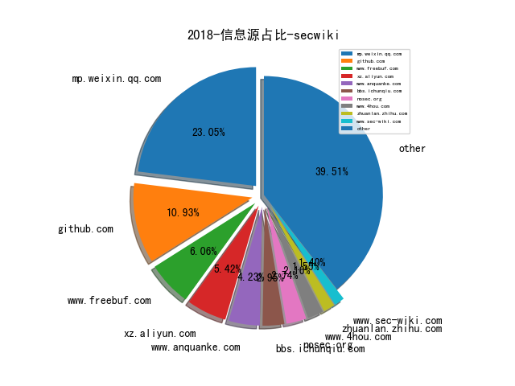
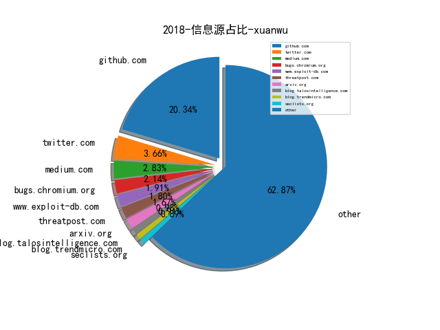
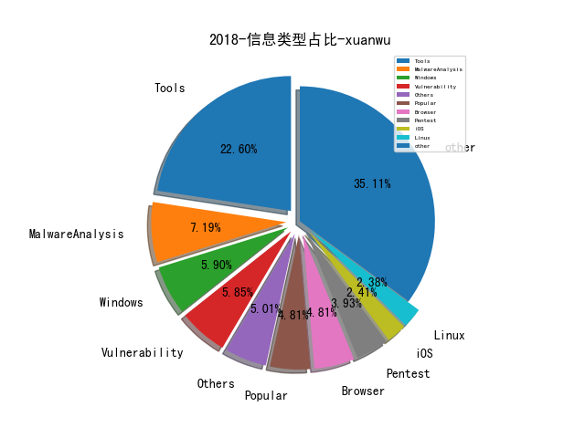
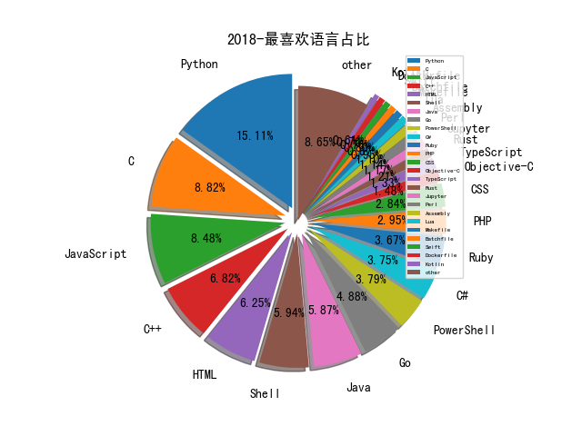

# [数据--所有](README_20.md)
# [数据--年度](README_2018.md)
# 2018 信息源与信息类型占比

# 微信公众号 推荐
| nickname_english | weixin_no | title | url| 
| --- | --- | --- | ---| 
| 图灵人工智能 | TuringAI01 |  | https://mp.weixin.qq.com/s/cz-zjZw3rmFQ1o0w2ciHBQ | 7| 
| 奇安信威胁情报中心 |  |  | https://mp.weixin.qq.com/s/ja8eunPUaTqLj_smdABLTQ | 17| 
| 安全牛 | aqniu-wx |  | https://mp.weixin.qq.com/s/YvlUX8Zjp9gfAtJ6YY27BA | 7| 
| 我的安全视界观 | CANI_Security |  | https://mp.weixin.qq.com/s/s2D513XseLpIyE2i0UOC8Q | 21| 
| 特大号 | ITXXXL |  | https://mp.weixin.qq.com/s/Sz8HguJ0X13nw4ajAhxOhg | 1| 
| 网信防务 | CyberDefense |  | https://mp.weixin.qq.com/s/TBmigl6-TTJNDzYCqlFc4w | 14| 
| 网易安全应急响应中心 | NetEaseSRC |  | https://mp.weixin.qq.com/s/NRx-rDBEFEbZYrfnRw2iDw | 1| 
| 网络安全舆情研究 |  |  | https://mp.weixin.qq.com/s/iOq84kVblAW5a2mK2GDJwA | 1| 
| 腾讯御见威胁情报中心 |  |  | https://mp.weixin.qq.com/s/F5hBw_pVithLlY6ixE0q-g | 5| 
| 觅渡揽月 |  |  | https://mp.weixin.qq.com/s/GWOjp1E2B4J0efUjFBnp8Q | 1| 
| 360CERT | CERT-360 |  | https://mp.weixin.qq.com/s/VdIVoHfC7roUGBTCGo-dHg | 3| 
| Docker | dockerone |  | https://mp.weixin.qq.com/s/1mjp_a3FHhyVXFX9sezbvw | 4| 
| SecPulse安全脉搏 | SecPulse |  | https://mp.weixin.qq.com/s/pvApvjn6gwTiQFyRjaKCaA | 5| 
| 二当家的12138 |  |  | https://mp.weixin.qq.com/s/-qfhDDrH5kDSjHl-73xDJA | 4| 
| 奇安信安全监测与响应中心 | cert360 |  | https://mp.weixin.qq.com/s/Ni3dscLJBrVsW5jR5OySdA | 3| 
| 安全学术圈 | secquan |  | https://mp.weixin.qq.com/s/eQ5os0Fdb498BoQLKUDmrA | 14| 
| 慢雾科技 | SlowMist |  | https://mp.weixin.qq.com/s/P3RRdkT0X6bR--JWb0yWzA | 2| 
| 掮客酒馆 | SecurityPub |  | https://mp.weixin.qq.com/s/IJoJCERxSEj7ImXt97F_uA | 3| 
| 柯力士信息安全 | JW-assoc | 以色列神秘8200“军工厂”和它孵化的37家安全公司（上篇） | https://mp.weixin.qq.com/s/F6kmHw1x9GELXN7bgTOIHw | 1| 
| 深信服千里目安全实验室 | Further_eye |  | https://mp.weixin.qq.com/s/s0Rvlzrwx6uW_Po5AcusnQ | 3| 
| 湛卢工作室 | xuehao_studio |  | https://mp.weixin.qq.com/s/LxIgWu8pmNArFU1gOUMWJw | 1| 
| 漏洞战争 | vulwar |  | https://mp.weixin.qq.com/s/qFh47YY-JJIMUrJXUKfNAQ | 2| 
| 点融安全应急响应中心 | dsrc_dianrong |  | https://mp.weixin.qq.com/s/4saEV6fWimqfII2_7PUQ8Q | 1| 
| 网藤风险感知 |  |  | https://mp.weixin.qq.com/s/3luD0uRGYINm3f56df9UYQ | 1| 
| 量子位 | QbitAI |  | https://mp.weixin.qq.com/s/gFGm_OcjpW8Z2LkzbX44Dg | 2| 
| 31QU | blockchain31 |  | https://mp.weixin.qq.com/s/I2gatFhkEs1GpGPHC97PnQ | 1| 
| InfoQ | infoqchina |  | https://mp.weixin.qq.com/s/bKDtv892f4TJVV-JjW0vfQ | 3| 
| Piz0n |  |  | https://mp.weixin.qq.com/s/JG0fMLf4WcvSH5K0DHMBtw | 4| 
| VIPKID安全应急响应中心 | vk_src |  | https://mp.weixin.qq.com/s/4W42FLdfiO4cu7gykthe9A | 1| 
| 中国信息安全 | chinainfosec |  | https://mp.weixin.qq.com/s/AleZLuX6ZGEsMWJAHfQq5g | 13| 
| 云众可信 | yunzhongkexin |  | https://mp.weixin.qq.com/s/FHpVT4fjxyuOueUnBndmEQ | 3| 
| 云加社区 | QcloudCommunity |  | https://mp.weixin.qq.com/s/pNHthmCvRPFCNpOrMyyTPg | 1| 
| 信息时代的犯罪侦查 | infocrime |  | https://mp.weixin.qq.com/s/SKsPxTbzFGNhCChg7o3tTA | 2| 
| 四维创智 | Cerberus-4X |  | https://mp.weixin.qq.com/s/10NEuo0z4SZ--qRZmgy5MQ | 1| 
| 宅客频道 | letshome |  | https://mp.weixin.qq.com/s/AsA8CRUAimz86V2yEyQQ1Q | 3| 
| 守护者计划 | shzjh0401 |  | https://mp.weixin.qq.com/s/z9y1_Y9l0fpWy9v_Qpi4Fg | 1| 
| 安全客 | anquanbobao |  | https://mp.weixin.qq.com/s/LAeAsiGEvw7JeCe4fomXyg | 2| 
| 青藤实验室 | qt_lab |  | https://mp.weixin.qq.com/s/FhcoPGXG_udkRCj3AFOmxA | 3| 
| OPPO安全应急响应中心 | opposrc |  | https://mp.weixin.qq.com/s/dgnoD2LG0kxKW-HkBYVuoQ | 1| 
| Viola后花园 | Viola_deepblue |  | https://mp.weixin.qq.com/s/C9mVLHjFmYs-kziC0rwYow | 5| 
| 向日葵生活分享 | SunF-security-share |  | https://mp.weixin.qq.com/s/g5wdMxKqnXpjjLF1kXK4NA | 3| 
| 唯品会安全应急响应中心 | VIP_SRC |  | https://mp.weixin.qq.com/s/Sai3h-wNGXc92Va941yG6A | 4| 
| 安在 | AnZer_SH |  | https://mp.weixin.qq.com/s/CGw8GZ2FVbVtgOJyyDZYSw | 11| 
| 平安集团安全应急响应中心 | PSRC_Team |  | https://mp.weixin.qq.com/s/RD90-78I7wRogdYdsB-UOg | 3| 
| 浅黑科技 | qianheikeji |  | https://mp.weixin.qq.com/s/AZ7jgvTFkoMhZA4DP9nQsw | 5| 
| 透雾 | wxWinder |  | https://mp.weixin.qq.com/s/LOOrzsLGtfcP8gTZ_xuBQw | 2| 
| 郑海山dump | zhsdump |  | https://mp.weixin.qq.com/s/oY8QMnfBO81xRuBxqOG_lg | 1| 
| 金融电子化 | fcmag1993 |  | https://mp.weixin.qq.com/s/RXXJrJipdhKlTb7JMTy1iQ | 2| 
| DVPNET | DVPNET |  | https://mp.weixin.qq.com/s/oACHhus9nvAiw13Yxy7zgA | 1| 
| 丁爸 情报分析师的工具箱 | dingba2016 |  | https://mp.weixin.qq.com/s/-d_Tj7nf8CHNmFRIAun0vQ | 5| 
| 呼伦贝尔24小时警局 | hlbrga |  | https://mp.weixin.qq.com/s/q8uaik170cDjLFzj2wbKrg | 1| 
| 工业互联网安全应急响应中心 | ICSCERT |  | https://mp.weixin.qq.com/s/j4zniIYOwbSfKqSoRdL6-Q | 2| 
| 白帽100安全攻防实验室 | whitecap100_team |  | https://mp.weixin.qq.com/s/yv8Lsc1WqWqeH-GtWnXA5Q | 1| 
| 知远战略与防务研究所 | knowfar2014 |  | https://mp.weixin.qq.com/s/C-coVLE3BmwkRgyd4xIJug | 1| 
| 绿盟科技研究通讯 | nsfocus_research |  | https://mp.weixin.qq.com/s/JAmwJ7JFMev30uINIepWNQ | 3| 
| ArkTeam |  |  | https://mp.weixin.qq.com/s/MesxZ4aWPxVi3DWGpaDr2w | 2| 
| FraudBoom | Madmanerss |  | https://mp.weixin.qq.com/s/TeXdjDcWLmLi4iw8ff9XvA | 1| 
| 嘶吼专业版 | Pro4hou |  | https://mp.weixin.qq.com/s/fVKRYAvrAK3mX1nN6KIyhA | 9| 
| 大数据文摘 | BigDataDigest |  | https://mp.weixin.qq.com/s/_TbySBSoS8uZj1r5mvkNbA | 2| 
| 天融信阿尔法实验室 |  |  | https://mp.weixin.qq.com/s/tvl4W7gg8Y6i8b_LFfTdpA | 1| 
| 开放知识图谱 | OpenKG-CN |  | https://mp.weixin.qq.com/s/u7GJstj5E_7y1rwkUbpAXg | 3| 
| 汉客儿 |  |  | https://mp.weixin.qq.com/s/E7N6LzAH4p88Gu4f_qwGlg | 2| 
| 维他命安全 | VitaminSecurity |  | https://mp.weixin.qq.com/s/8egpuHx5jVIpkLB_dby5SQ | 8| 
| 网信军民融合 | wxjmrh |  | https://mp.weixin.qq.com/s/NDYOW0vDWRsIJS7pI7pK3g | 2| 
| 24氪金 | kingsof24 |  | https://mp.weixin.qq.com/s/1-Jugo6njEudoFlZWditHg | 1| 
| DJ的札记 | DJ_notes |  | https://mp.weixin.qq.com/s/uTuY-hlzOI9ZXqcOOwQhmQ | 4| 
| 云鼎实验室 | YunDingLab |  | https://mp.weixin.qq.com/s/jy8Ay4D2gQMHOYlDLwoovQ | 5| 
| 安全引擎 | SecEngine |  | https://mp.weixin.qq.com/s/SuVrMNhGiTfdOTY1CmGRbw | 1| 
| 机械科学与技术 | JXKXYJS |  | https://mp.weixin.qq.com/s/KscXTyIOZAuvSYowJ_CK0g | 1| 
| 猎户攻防实验室 | TassLiehu |  | https://mp.weixin.qq.com/s/2hnjrYvq4j0n-NYnDIaPMw | 8| 
| 集智俱乐部 | swarma_org |  | https://mp.weixin.qq.com/s/b89VhAluegTpQmSADTggDw | 1| 
| SecWiki | SecWiki |  | https://mp.weixin.qq.com/s/aB9eKXy5OUaivhAPRnzM0w | 7| 
| e安在线 | ean-online |  | https://mp.weixin.qq.com/s/9V-eFVI0kHeUj27_2SYfhg | 1| 
| 京东安全应急响应中心 | jsrc_team |  | https://mp.weixin.qq.com/s/ZSLYdpN4oG1ZSTvSdnVK2g | 1| 
| 数说安全 | SSAQ2016 |  | https://mp.weixin.qq.com/s/CXIrKq94alSPKt5zbbqsxw | 8| 
| 看雪学院 | ikanxue |  | https://mp.weixin.qq.com/s/eHsa0DgeogZN-tO5r3FeLg | 2| 
| 科学出版社 | sciencepress-cspm |  | https://mp.weixin.qq.com/s/okd_GK0-DzCDsuVB-yxoYQ | 1| 
| 双螺旋Sec团队 | double_helix_sec |  | https://mp.weixin.qq.com/s/q1zHgQ864u4t9QlzSIzoZw | 2| 
| 天御攻防实验室 | TianyuLab |  | https://mp.weixin.qq.com/s/qTpLjhbl4gpOTncvdMVOHw | 2| 
| 机器之心 | almosthuman2014 |  | https://mp.weixin.qq.com/s/4qHgIcq9YJTj1iGh7kLB4w | 1| 
| 机器学习算法与自然语言处理 | yizhennotes |  | https://mp.weixin.qq.com/s/4jhtCUtv_szfMvyDCWKvoQ | 1| 
| 美团技术团队 | meituantech |  | https://mp.weixin.qq.com/s/1Iry620hCkJ8sHA626T3Dg | 2| 
| 黑鸟 | blackorbird |  | https://mp.weixin.qq.com/s/Nel6neXIHw5yXOsNzihQLA | 1| 
| 中通安全应急响应中心 | ZTO_SRC |  | https://mp.weixin.qq.com/s/n9N6Nkg_RYEvPM2WnlG45w | 1| 
| 丰巢技术团队 | hivebox_tech |  | https://mp.weixin.qq.com/s/xFv90_VB7B9m2o6jvQ13Iw | 1| 
| 关键信息基础设施技术创新联盟 |  |  | https://mp.weixin.qq.com/s/FyqSNy7Up4vBbLrmRKFjbQ | 1| 
| 华屹观察 | huayineican |  | https://mp.weixin.qq.com/s/Z1l286brHS_7zgTZHh3dDg | 1| 
| 南京刑事 | wangyingqinglawyer |  | https://mp.weixin.qq.com/s/lodWBnXkhAtCf4Rjv9liKA | 1| 
| 君哥的体历 | jungedetili |  | https://mp.weixin.qq.com/s/JFWxsdnEPI5NEU1PlR-FjA | 23| 
| 战略前沿技术 | Tech999 |  | https://mp.weixin.qq.com/s/prVHa1vFHYUMWAS2QDRpXg | 2| 
| 腾讯防水墙 | tencent_fsq |  | https://mp.weixin.qq.com/s/kiF-HPg_bfgd6RGFF3sBtw | 1| 
| 蚂蚁金服科技 | Ant-Techfin |  | https://mp.weixin.qq.com/s/oMFLtEULvIeX5Nu0K33lGw | 1| 
| Bypass | Bypass-- |  | https://mp.weixin.qq.com/s/tu3c0l_2Bu4kNGqp3tlxKw | 37| 
| 云影实验室 | Yunying_Lab |  | https://mp.weixin.qq.com/s/6FZqeG3ys2rYpuz7nXr_Lw | 1| 
| 安智客 | china_safer |  | https://mp.weixin.qq.com/s/t54wFWBxA1iKr74LB_KFRg | 1| 
| 小黄的安全工作实录 | xiaohuangsec |  | https://mp.weixin.qq.com/s/q-5SeJZ9eV9qUXXvzsrSdw | 2| 
| 智能运维前沿 | AIOps_Tsinghua |  | https://mp.weixin.qq.com/s/wxarbgNuasxaPsZ3Dh4z6g | 1| 
| 电科防务 | CETC-ETDR |  | https://mp.weixin.qq.com/s/xFRR5tJBc2C_SLxOIhlHaw | 1| 
| 知识工场 | fudankw |  | https://mp.weixin.qq.com/s/DlXzTpjLXAIrSmkuM_jDHg | 1| 
| 装备参考 | Armament999 |  | https://mp.weixin.qq.com/s/xq2Yoba8UPvZG6Hlv51rNQ | 1| 
| 雷锋网 | leiphone-sz |  | https://mp.weixin.qq.com/s/7NfXcNC4bEtdT2RJ6vl3Ww | 1| 
| DWord |  |  | https://mp.weixin.qq.com/s/E0_NRjpsyCCZtNgzuXU5Jw | 1| 
| FreeBuf | freebuf |  | https://mp.weixin.qq.com/s/QBLnJruKj753XY0rnmVSXg | 6| 
| 国家信息安全服务资质 |  |  | https://mp.weixin.qq.com/s/y9Qx4htmcoWgC96G2sWvpw | 1| 
| 安全喷子 |  |  | https://mp.weixin.qq.com/s/uGhcnkgGNeZhGRAGlPfUWg | 2| 
| 安全小飞侠 | AvFisher |  | https://mp.weixin.qq.com/s/quwaJMVHYpBAXpkgtR12Kw | 1| 
| 红队攻防揭秘 | klionsec |  | https://mp.weixin.qq.com/s/7YidkhJvmVBxFhYcD7pIfQ | 1| 
| 腾讯技术工程 | Tencent_TEG |  | https://mp.weixin.qq.com/s/9t36Z_8exZwI_rpG-P57Yw | 2| 
| 苹果资本 | Applefunds |  | https://mp.weixin.qq.com/s/KpTSoXsDi2PCfrJxRensqg | 1| 
| 安惞杂谈 | anxin_zatan |  | https://mp.weixin.qq.com/s/-gHMhj1Qdl1N5rCne61m4Q | 1| 
| 腾讯安全应急响应中心 | tsrc_team |  | https://mp.weixin.qq.com/s/4hGUZWXN6qzjMcbtZsYCSA | 2| 
| 小强说 | xiaoqiangcall |  | https://mp.weixin.qq.com/s/KeDMlMIBA-ojKf_67KD6kg | 3| 
| APT观察 | APT_REVIEW |  | https://mp.weixin.qq.com/s/F-6EbrLSFj5QVsjMb4r5cA | 6| 
| 仙人掌情报站 | sec-cactus |  | https://mp.weixin.qq.com/s/DKTODvkmZqTVi1lfqtHdDw | 3| 
| 信安之路 | xazlsec |  | https://mp.weixin.qq.com/s/uiXmL36bsr5415mLJ-T04g | 116| 
| 安云信息 | Anyuntec |  | https://mp.weixin.qq.com/s/m6bsWlJ3Yj1YMFZwz5uHIQ | 1| 
| 安全威胁情报 | Threatbook |  | https://mp.weixin.qq.com/s/5lXWmbORcyjukJNz5CW1Qg | 3| 
| 宜信安全应急响应中心 | CreditEaseSec |  | https://mp.weixin.qq.com/s/5hUS9Mbc1NHi5MEZpGcGEA | 2| 
| 网安寻路人 | DataProtection101 |  | https://mp.weixin.qq.com/s/KzXuY0mmURiJi4NwU4CF4g | 3| 
| MottoIN | mottoin |  | https://mp.weixin.qq.com/s/12BfVA1yNFJPF_9boZraVQ | 1| 
| 威胁猎人 | ThreatHunter |  | https://mp.weixin.qq.com/s/7949qtHXTtVRvayVUZk62g | 3| 
| 安全加 | anquanplus |  | https://mp.weixin.qq.com/s/Y_mAd-IA4rAra1FqfZc8JQ | 2| 
| 徐阿衡 | xu_a_heng |  | https://mp.weixin.qq.com/s/I8TmSSQxJPG7KudHKqDrtA | 1| 
| 数据派THU | DatapiTHU |  | https://mp.weixin.qq.com/s/5hf7z-VSgK3PszK0TSFOIQ | 7| 
| 长亭科技 | Chaitin_Tech |  | https://mp.weixin.qq.com/s/7TuUqdleZc5xbZG5Xh3f3Q | 1| 
| 人民公安报 | rmgabs |  | https://mp.weixin.qq.com/s/ZsI4LEmshKoppeeqM4nsrA | 1| 
| 铭毅天下 |  |  | https://mp.weixin.qq.com/s/LXhE-D0FlT_hOns1s1rBmg | 2| 
| 天际友盟情报站 |  |  | https://mp.weixin.qq.com/s/b6Wv4RPvF4ULNP3plM3EVg | 3| 
| 学蚁致用 | sudo_i |  | https://mp.weixin.qq.com/s/IezN9aYCn51t1ZQ7wX3X3Q | 1| 
| 银河安全实验室 | Galaxy-Lab |  | https://mp.weixin.qq.com/s/jDvOif0OByWkUNLv0CAs7w | 3| 
| 安全酷 | watsec |  | https://mp.weixin.qq.com/s/ItvWWhC0iYOpG6nQ3WPfvg | 1| 
| 机器学习AI算法工程 | datayx |  | https://mp.weixin.qq.com/s/Cm-DNNLMqgcp_DJqUeM-Tw | 1| 
| 网安国际 | inforsec |  | https://mp.weixin.qq.com/s/t_HjrMeiVpfGS4m49HOllQ | 1| 
| AI科技大本营 | rgznai100 |  | https://mp.weixin.qq.com/s/1Zj_pQDBqBJKSrtt9HsKXg | 2| 
| 互联网安全内参 | anquanneican |  | https://mp.weixin.qq.com/s/rS7nTJ-rwnmcxvRSmwn-4w | 3| 
| 卫星与网络 | satnetdy |  | https://mp.weixin.qq.com/s/-9BlAQqApaoGLfRgtJIn7Q | 1| 
| 平安科技金融安全研究院 | pinganfinsec |  | https://mp.weixin.qq.com/s/cGg_1VNL0Yj2CcpcmvN_Dw | 2| 
| 百度安全实验室 | BaiduX_lab |  | https://mp.weixin.qq.com/s/IVpij_eGCccI2I-V0FYfBQ | 6| 
| 阿里云安全 | aliyunsec |  | https://mp.weixin.qq.com/s/_lzFwYVlSe9L5K0RsSS1bw | 3| 
| E安全 | EAQapp |  | https://mp.weixin.qq.com/s/foTtmnNwNavEIvb_6t7G1A | 5| 
| 京东数科安全 | JDJRsecurity |  | https://mp.weixin.qq.com/s/xe9xVOYKJkvkHGtJpwcWJw | 3| 
| 安全与生活 | HitCache |  | https://mp.weixin.qq.com/s/gwtdAeBy6dKViiZJbgKMSA | 1| 
| PaperWeekly | paperweekly |  | https://mp.weixin.qq.com/s/7IJDHvSLtNBxFRE8t9suyQ | 2| 
| 人工智能头条 | AI_Thinker |  | https://mp.weixin.qq.com/s/IA0kPncWRVx0JBQXvJLY6w | 1| 
| 力博睿生 | liberationers |  | https://mp.weixin.qq.com/s/nFdq45k344JdEvy1T1tvgg | 2| 
| 极验 | geetest_jy |  | https://mp.weixin.qq.com/s/AHkevK0uizizWG8fIcXWMQ | 1| 
| 秋雨绸缪 | qiuyuchoumou |  | https://mp.weixin.qq.com/s/F-S0bVHxNzanNt35PQhcAw | 1| 
| 网络法实务圈 | cyberlaw2017 |  | https://mp.weixin.qq.com/s/Io1A2dlj8FT57sWSHTNvGQ | 1| 
| 互联网安全实务 | SecPractice |  | https://mp.weixin.qq.com/s/WAzCLk_6nkQ0Aap6Sx2lPw | 1| 
| 数据分析 | ecshujufenxi |  | https://mp.weixin.qq.com/s/cHinmVC5o9DApFcI5odxNQ | 1| 
| 点融黑帮 | DianrongMafia |  | https://mp.weixin.qq.com/s/h-DGDGpvxXaMgLLtQlvajw | 1| 
| EMLab攻防实验室 | EM-Lab |  | https://mp.weixin.qq.com/s/-NxWRMbCV_wLNssBwFkb4A | 1| 
| 逢魔安全实验室 | FormSec |  | https://mp.weixin.qq.com/s/FDb1bXblxUVD38FwjwABbQ | 6| 
| malwarebenchmark |  |  | https://mp.weixin.qq.com/s/n75EFy-2f_8FdxURzGU45g | 4| 
| 史蒂夫智库 | English_Steven |  | https://mp.weixin.qq.com/s/hKz9HNmt49av5I0teKIFHg | 1| 
| 物來 | threebodyz |  | https://mp.weixin.qq.com/s/yPNxqzQ0qHtQarNBUPBzQg | 1| 
| DoraHacks | dorahacks |  | https://mp.weixin.qq.com/s/aUS7qm6T7FT1fgj17oUR1A | 1| 
| JavaGuide | Java_Guide | 可能是把Docker的概念讲的最清楚的一篇文章 | https://mp.weixin.qq.com/s/xSbYTJmLuqsyYEDEIsndZw | 1| 
| iPolicyLaw | iPolicyLaw |  | https://mp.weixin.qq.com/s/YEaEjBoRvvgeRuWoKSpbuA | 3| 
| 水滴安全实验室 | EversecLab |  | https://mp.weixin.qq.com/s/BlssgysUVcebkX9JZ71zMg | 2| 
| 工业信息安全产业发展联盟 |  |  | https://mp.weixin.qq.com/s/UVsGnhCaoMQv_snvXKx5xw | 1| 
| 廖新喜 |  |  | https://mp.weixin.qq.com/s/ohga7Husc9ke5UYuqR92og | 3| 
| 敏信安全课堂 | mxaqkt |  | https://mp.weixin.qq.com/s/4Ejshk7x71L9INB0grj5mw | 1| 
| 杏仁技术站 | xingren-tech |  | https://mp.weixin.qq.com/s/zlHJTxDeHgjn9A9XuYp9fQ | 1| 
| 论智 | jqr_AI |  | https://mp.weixin.qq.com/s/ixdE3ld0qOOpj7F_kLmmSg | 1| 
| CNCERT风险评估 | cncertfengxianpinggu |  | https://mp.weixin.qq.com/s/9zldhnbPYJy_YHPVXXk8ag | 1| 
| TGO鲲鹏会 | tgo-kunpenghui |  | https://mp.weixin.qq.com/s/P6bglKh7wsm483dPqXCjkQ | 1| 
| ThreatHunter | threathunter888 |  | https://mp.weixin.qq.com/s/IfmKbGyW8gjWkBMtRM0aKw | 1| 
| sosly菜鸟笔记 | sosly_me |  | https://mp.weixin.qq.com/s/eHpKq3IZIz0RugBubFgUww | 1| 
| 业务连续性+ | bcmplus |  | https://mp.weixin.qq.com/s/TlRghlJFeLA0ZUhh6Z38WA | 1| 
| 传媒观察杂志 | chuanmeiguancha |  | https://mp.weixin.qq.com/s/eHKG26GgCuG3gg6qkJdGHw | 1| 
| 威努特工控安全 | winicssec_bj |  | https://mp.weixin.qq.com/s/OS4ESfOACW9lhjxzt7B9xw | 1| 
| 爱奇艺安全应急响应中心 | iqiyi_71src |  | https://mp.weixin.qq.com/s/RCyz0iizsm9Bxl3hO-fmkQ | 1| 
| 小米安全中心 | misrc_team |  | https://mp.weixin.qq.com/s/MO40KHt7cAMg5HPpydJgOg | 1| 
| XCTF联赛 |  |  | https://mp.weixin.qq.com/s/AXqjd98-KlaHNDKiZTwQhA | 2| 
| 矛盾实验室 | MDLab2017 |  | https://mp.weixin.qq.com/s/0imwEZ3KLnYAk_TScBJbOQ | 1| 
| 网络法学研究院 | wlfx2017 |  | https://mp.weixin.qq.com/s/nBZ8yeWDlnBMIZ05Srh-dQ | 1| 
| 菜鸟博客 | Cainiao_sec |  | https://mp.weixin.qq.com/s/YkbQ4XAehLQW1VGps9uJAg | 3| 
| 晨星先生 | MoXuanIT |  | https://mp.weixin.qq.com/s/aOlZmdzzye2AsqGDa3hcbg | 1| 
| bigsec岂安科技 | bigsec |  | https://mp.weixin.qq.com/s/2SFJUFgb_e3cKP6eOKS4jw | 4| 
| 进击的大熊 | JinJi_DaXiong |  | https://mp.weixin.qq.com/s/CLq9jkHon8QJgO_rnBA9Yw | 1| 
| 云头条 | YunTouTiao |  | https://mp.weixin.qq.com/s/y6wEiVqaRkXxGvDeUxO6-w | 1| 
| crackershi |  |  | https://mp.weixin.qq.com/s/nEMHu33qfO8GvDqStpVVuQ | 1| 
| 工控安全应急保障中心 |  |  | https://mp.weixin.qq.com/s/DhQAdkeXRW-22UPgB5iR6A | 1| 
| 高效运维 | greatops |  | https://mp.weixin.qq.com/s/1toUOKq_80pyM8AmCNb8Ww | 4| 
| 大数据 | hzdashuju |  | https://mp.weixin.qq.com/s/s8VLWjXrVCrTt4v2d3MoIQ | 1| 
| 新华视点 | XHSXHSD |  | https://mp.weixin.qq.com/s/S_HmemBo4wU22e6RJ_qDxw | 1| 
| IT桔子 | itjuzi521 |  | https://mp.weixin.qq.com/s/oRpI7DwWZLfUprxwS0nOew | 1| 
| 占知智库 | zzzk-0001 |  | https://mp.weixin.qq.com/s/GhuEu5-vQfKs25JFi2kDjw | 1| 
| 合天智汇 | hee_tian |  | http://mp.weixin.qq.com/s/xEdI49opyD86Ywkbu2QNsA | 5| 
| 众视AsiaOTT | AsiaOTTcom |  | https://mp.weixin.qq.com/s/ReymClMeHOmx1_EjqOUZUg | 1| 
| HenceTech |  |  | https://mp.weixin.qq.com/s/xEBr7JxbSTt11oiBsgc3uw | 1| 
| nmask | nmask-article |  | https://mp.weixin.qq.com/s?__biz=MzI5NTQ5MTAzMA==&mid=2247483860&idx=1&sn=c773f70165f5a48be62acdf8e0217f2d&chksm=ec53856ddb240c7b372d85c3912456b236f9b37e399e30c687b4596892cf5c399ef4ea9aeb18&scene=38#wechat_redirect | 1| 
| 中科院信息科技战略情报 | xxkjzlqb | NSF3000万美元推动计算和信息科学领域前沿变革研究 | https://mp.weixin.qq.com/s/WQ1JKpiYhe9-jb0RPsScIA | 1| 
| 同程艺龙安全应急响应中心 | lysrc_team |  | https://mp.weixin.qq.com/s/2uYgr1hNbP_lUBYVREM6vg | 1| 
| 安恒信息 | DBAPP2013 |  | https://mp.weixin.qq.com/s/mIcRNcf5HmZ4axe8N92S7Q | 1| 
| 绿盟科技 | NSFOCUS-weixin |  | https://mp.weixin.qq.com/s/cH6_AWMXRNOoAm_lruF7SQ | 1| 
| DoSec容器安全 | dosecs |  | https://mp.weixin.qq.com/s/Q4a5dhCwe9503SI6-xqFuQ | 4| 
| 云安全联盟CSA | csa_china |  | https://mp.weixin.qq.com/s/DShAaS_7YSYQle5FzyKGpQ | 1| 
| 敏信云极安全监测平台 |  |  | https://mp.weixin.qq.com/s/6gsTTgl3AzfZF6h8wJ8INw | 4| 
| 2045加速器 |  |  | https://mp.weixin.qq.com/s/XGLhdAljXv2nAJ_XL7WBeA | 1| 
| CIO之家 | imciow |  | https://mp.weixin.qq.com/s/V0hGKMvgnp3dq7BsFLiNhg | 1| 
| LBS | lbs-sir |  | https://mp.weixin.qq.com/s/R1Yw1sZxetiVEj0lBKbKQw | 2| 
| 工业安全产业联盟 | ICSISIA |  | https://mp.weixin.qq.com/s/ImSw-mCfqE-OGiZMQgpvwA | 2| 
| 1452 | C50768 |  | https://mp.weixin.qq.com/s/g3qha-O4gdMZQrPmXEcy_A | 1| 
| 区块律动BlockBeats | BlockBeats |  | https://mp.weixin.qq.com/s/z39hBMif1bQJeb4Ar_zRAw | 1| 
| 国家互联网应急中心CNCERT | CNCERTCC |  | https://mp.weixin.qq.com/s/3t8-Wc-0Z0ROB66A36jZ4w | 2| 
| 大国策智库 | statecraft |  | https://mp.weixin.qq.com/s/m_aj7s3X0MtDK1ADpV5dGQ | 1| 
| 网络通信与经济 | ncel_cuhk |  | https://mp.weixin.qq.com/s/v_Uw6XbK3ksecPOH2bcDfw | 1| 
| 英国那些事儿 | hereinuk |  | https://mp.weixin.qq.com/s/DqE9u4eSClAA7d1MFuUcBA | 1| 
| 闻道解惑 | wendao_jiehuo |  | https://mp.weixin.qq.com/s/qm3mS78r43IIOHgZ-6YyGw | 1| 
| AI科技评论 | aitechtalk |  | https://mp.weixin.qq.com/s/5UyAoAm0Llfm3YoobKSSCA | 1| 
| n1nty | n1nty-talks |  | https://mp.weixin.qq.com/s/PZsOQy2lpR1lHqLWmAXlbg | 1| 
| 密码学报 |  |  | https://mp.weixin.qq.com/s/u1mDFINefmUEeeDsYrUsAw | 1| 
| 知识分子 | The-Intellectual |  | https://mp.weixin.qq.com/s/mWaHqfCQKm1eJrZZIcgibA | 1| 
| 美的金融科技 | MideaFintech |  | https://mp.weixin.qq.com/s/MR3SmOLj834LK4RBMcZ2pg | 1| 
| CSecGroup | cSecGroup |  | https://mp.weixin.qq.com/s?__biz=MzI3NzAzMjEyNg==&mid=2649530469&idx=1&sn=4a2ba687274aec2f44b29660b8567fcd&chksm=f3747db4c403f4a2c1fb3ac7cb869f347bfc74a838266ef55455d7b4495ab0481abef81e660f&scene=0&key=840d183eb8a3dbfa5f3f32cb8d30667e5030e61ccbe28114 | 1| 
| 娱阅信情 | Prof_WenchangShi |  | https://mp.weixin.qq.com/s/uZFYl3xKT5-aWzvI3mmQ2A | 1| 
| 数据简化DataSimp | ChiefDataAnalyst |  | https://mp.weixin.qq.com/s/JhylKtarrpvpZlP--ARBRw | 1| 
| 环球科学 | huanqiukexue |  | https://mp.weixin.qq.com/s/jbJJyWjmW-h7SI0YmYkElg | 1| 
| 兜哥带你学安全 | waf_ads_ids |  | https://mp.weixin.qq.com/s/5wJbvuG0IUOX4jdFtYNnkg | 2| 
| 安全优佳 | securityjia |  | https://mp.weixin.qq.com/s/ajDCSfVmw94GjPkuVSq_fw | 1| 
| 红日安全 | sec-redclub |  | http://mp.weixin.qq.com/s/MSaEbeNN0zbrNY50_30FRQ | 2| 
| 懒人在思考 | lazy-thought |  | https://mp.weixin.qq.com/s/7F2-eLqIdSiNIHHJDzkwcg | 1| 
| 老高的互联网杂谈 | paulgao-net-talk |  | https://mp.weixin.qq.com/s/5XRz-inuBpTn_IGQLTAXpg | 1| 
| 腾讯研究院 | cyberlawrc |  | https://mp.weixin.qq.com/s/97MFf8-ZtJzz_D6zkYGbrw | 1| 
| 麦洛克菲内核开发 | mallocfree001 |  | https://mp.weixin.qq.com/s/NaGk6KdHBczvyI_mr_Tg6g | 1| 
| ChaMd5安全团队 | chamd5sec |  | https://mp.weixin.qq.com/s?__biz=MzIzMTc1MjExOQ==&mid=2247484574&idx=1&sn=91850fae13f6a478869f10fa176e3e8c | 1| 
| 湖南金盾评估中心 | JD83758161 |  | https://mp.weixin.qq.com/s/VrVBE7I4pCOd5BOnwIAs9A | 1| 
| 物联网智库 | iot101 |  | https://mp.weixin.qq.com/s/99W7NIR-fC7PF67oo2Ovlw | 1| 
| 百度公共政策研究院 | InternetPolicyReview |  | https://mp.weixin.qq.com/s/v3lWLXgTFyBicWLJ7DK3nQ | 1| 
| 网络法前哨 | cyberlawing |  | https://mp.weixin.qq.com/s/aimlLub6dwPFGtCfFyjFUQ | 1| 
| V安全资讯 |  |  | https://mp.weixin.qq.com/s/TnS8f8B1ntC3qvd4noc7nA | 1| 
| 匠道人 | ATech666 |  | https://mp.weixin.qq.com/s/QUe0N9Z4lkz3UsFbux-Dqg | 2| 
| 美亚柏科 | MeiyaPico |  | https://mp.weixin.qq.com/s/rsrieCI2zItZBcHVn22Q5A | 1| 
| 软件定义世界（SDX） | SDx-SoftwareDefinedx |  | https://mp.weixin.qq.com/s/GnuuzHedLCSWj-VanHDhdA | 1| 
| sh3ll |  |  | https://mp.weixin.qq.com/s/8C3jbfMy3sKCSdul4Y8Pcg | 1| 
| 安全测评联盟 |  |  | https://mp.weixin.qq.com/s/32EyXTDWJXflKGDSim1KtQ | 1| 
| 安天 | Antiylab |  | https://mp.weixin.qq.com/s/EU89Ko1DVjsB4GSiq3Focw | 1| 
| Panabit |  |  | https://mp.weixin.qq.com/s/O3apmnZDDZt2TrEHtwekUg | 1| 
| Python中文社区 | python-china |  | https://mp.weixin.qq.com/s/iytARh75EjYDnfxkBqnEOw | 1| 
| 中国保密协会科学技术分会 |  |  | https://mp.weixin.qq.com/s/VbmJAIApS7IhE6JreKKY1A | 1| 
| 信安标委 | SACTC260 |  | https://mp.weixin.qq.com/s/vq4rr2bfcP0qCT-L5jTRyA | 1| 
| 工信微报 | gxwbwx |  | https://mp.weixin.qq.com/s/sMRtE5_GExWj6lIVcSqMBg | 1| 
| 工控参考 | gkongnews |  | https://mp.weixin.qq.com/s/TE-uWlKflUCMUDzLAeaXSA | 1| 
| 斗鱼安全应急响应中心 | DYSRC_ |  | https://mp.weixin.qq.com/s/zDAXg1dmTh1I6N4hGusT5g | 1| 

# 组织github账号 推荐
| github_id | title | url | org_url | org_profile | org_geo | org_repositories | org_people | org_projects | repo_lang | repo_star | repo_forks| 
| --- | --- | --- | --- | --- | --- | --- | --- | --- | --- | --- | ---| 
| PacktPublishing | Mastering Machine Learning for Penetration Testing | https://github.com/PacktPublishing/Mastering-Machine-Learning-for-Penetration-Testing | https://www.packt.com | Providing books, eBooks, video tutorials, and articles for IT developers, administrators, and users. | Birmingham, UK | 4260 | 32 | 0 | C,Jupyter,Scala,Python,Kotlin,JavaScript,C++,C#,ABAP,Java | 0 | 0 | 1| 
| Microsoft | Ethr - 一款 TCP、UDP 和 HTTP 网络性能测量工具: | https://github.com/Microsoft/Ethr | https://opensource.microsoft.com | Open source, from Microsoft with love | Redmond, WA | 2463 | 4258 | 0 | C,TypeScript,CMake,C#,JavaScript,Objective-C,C++,Python,Batchfile,HTML,Rich,Jupyter,Java,PowerShell | 0 | 0 | 12| 
| google | Google 公开了 google-ctf 比赛题目的代码及解题方法: | https://github.com/google/google-ctf/tree/master/2018/finals | https://opensource.google.com/ | Google ❤️ Open Source | https://opensource.google.com/ | 1474 | 2547 | 0 | C,TypeScript,Java,Python,Kotlin,JavaScript,C++,Go,Ruby,Rust | 0 | 0 | 7| 
| IBM | 使用 Apache Spark 和 Elasticsearch 构建一个推荐系统 | https://github.com/IBM/elasticsearch-spark-recommender/blob/master/README-cn.md | http://ibm.github.io |  | Armonk, New York, U.S. | 866 | 885 | 0 | TypeScript,Java,C++,Python,JavaScript,Julia,Shell,Smarty,Go,Jupyter,Swift,REXX | 0 | 0 | 1| 
| intel | xom-switch - 基于 Intel MPK 实现的 XOM 开关工具: | https://github.com/intel/xom-switch | mailto:webmaster@linux.intel.com |  | webmaster@linux.intel.com | 616 | 24 | 0 | C,Shell,Java,Python,JavaScript,C++,Rust | 0 | 0 | 1| 
| awslabs | git-secrets - 防止将敏感数据提交到 git 仓库的工具: | https://github.com/awslabs/git-secrets | http://amazon.com/aws/ | AWS Labs | Seattle, WA | 376 | 87 | 0 | C,TypeScript,Java,Python,JavaScript,C++,C#,Shell,Go,Jupyter,Swift,Rust | 0 | 0 | 1| 
| npm | npm 5.7.0 之前版本在执行 sudo npm --help 等命令时会随机修改 /etc /usr /boot 等目录的属主权限: | https://github.com/npm/npm/issues/19883 | https://www.npmjs.com |  | earth | 270 | 11 | 0 | Rust,Shell,JavaScript,HTML,CSS | 0 | 0 | 1| 
| alibaba | jvm-sandbox: JVM沙箱容器，一种JVM的非侵入式运行期AOP解决方案 | https://github.com/alibaba/jvm-sandbox | http://www.alibaba.com | Alibaba Open Source | Hangzhou, China | 263 | 141 | 0 | C,Shell,Java,Kotlin,JavaScript,C++,Dart,TypeScript,Go,Jupyter | 0 | 0 | 1| 
| cloudflare | WordPress 页面缓存插件: 1) https://blog.cloudflare.com/improving-html-time-to-first-byte/ 2) | https://github.com/cloudflare/worker-examples/tree/master/examples/edge-cache-html/WordPress%20Plugin | https://www.cloudflare.com |  | San Francisco, London, Austin, Singapore | 245 | 57 | 0 | C,Shell,Java,Python,JavaScript,Makefile,Lua,Go,PHP,Rust | 0 | 0 | 1| 
| rapid7 | Metasploit 将 CVE-2018-8440 ALPC 漏洞添加到攻击模块中: | https://github.com/rapid7/metasploit-framework/pull/10643 | http://www.rapid7.com/ |  | Boston, MA | 234 | 0 | 0 | C,Java,Python,JavaScript,HTML,Go,Ruby | 0 | 0 | 3| 
| Dynatrace | superdump - 用于自动化分析崩溃内存转储的工具: | https://github.com/Dynatrace/superdump | http://www.dynatrace.com | Dynatrace | Waltham, Boston | 232 | 25 | 0 | Shell,Java,C#,Ruby,JavaScript,C++,TypeScript,Python,HTML,Puppet,Go,Swift,PowerShell | 0 | 0 | 1| 
| PortSwigger | hackability - 浏览器渲染引擎探测工具: | https://github.com/PortSwigger/hackability | https://portswigger.net/ |  | https://portswigger.net/ | 219 | 0 | 0 | Python,Kotlin,Ruby,Java,JavaScript | 0 | 0 | 2| 
| Yelp | detect-secrets - Yelp 密码探测器,防止源代码中的敏感信息泄露: https://engineeringblog.yelp.com/2018/06/yelps-secret-detector.htmlGitHub: | https://github.com/Yelp/detect-secrets | https://yelp.com/engineering |  | San Francisco | 218 | 65 | 1 | Java,Scala,Python,Kotlin,JavaScript,Lua,Objective-C,Swift,Puppet,Go,Ruby | 0 | 0 | 1| 
| nccgroup | WAF 绕过技巧分享: https://www.slideshare.net/SoroushDalili/waf-bypass-techniques-using-http-standard-and-web-servers-behaviourBurpSuiteHTTPSmuggler - 帮助绕过 WAF 检测的 Burpsuite 插件: | https://github.com/nccgroup/BurpSuiteHTTPSmuggler/ | https://www.nccgroup.trust | Please report all security issues to security at nccgroup dot com | Global | 180 | 15 | 0 | C,Shell,Java,Python,JavaScript,C#,HTML,Elixir,Go,Rust | 0 | 0 | 10| 
| dotnet | Fuzzlyn 项目可以生成随机的 C# 程序,通过优化和未优化代码之间的差异,找到了多个.NET JIT错误: https://twitter.com/i/web/status/1027224393217449986相关项目和漏洞的补丁链接: 1) https://github.com/jakobbotsch/Fuzzlyn 2) https://github.com/dotnet/roslyn 3) | https://github.com/dotnet/coreclr/issues?utf8=%E2%9C%93&q=is%3Aissue+author%3Ajakobbotsch | http://www.dotnetfoundation.org | Home of the .NET Foundation | http://www.dotnetfoundation.org | 176 | 381 | 2 | Shell,HTML,C#,Python,F#,Dockerfile,PowerShell | 0 | 0 | 5| 
| Netflix | Netflix 发布性能可视化工具 - FlameScope: https://medium.com/netflix-techblog/netflix-flamescope-a57ca19d47bbGitHub: | https://github.com/Netflix/flamescope | http://netflix.github.io/ | Netflix Open Source Platform | Los Gatos, California | 152 | 8 | 0 | Groovy,C,Shell,Java,D,Scala,Python,JavaScript,C++,HTML,Go,Ruby | 0 | 0 | 2| 
| OWASP | iGoat-Swift - iOS Swift 应用安全漏洞测试项目: | https://github.com/OWASP/iGoat-Swift | http://www.owasp.org | The OWASP Foundation | http://www.owasp.org | 151 | 27 | 0 | C,Shell,Java,Python,JavaScript,Perl,HTML,Go,CSS | 0 | 0 | 2| 
| mitre | CALDERA - 自动化网络攻击仿真系统: | https://github.com/mitre/caldera | http://mitre.github.io | Open Source Software from the MITRE Corporation | http://mitre.github.io | 145 | 11 | 0 | Java,Python,JavaScript,R,HCL,Ruby,PowerShell,CSS | 0 | 0 | 1| 
| PowerShell | PowerShellEditorServices - PowerShell 编辑器功能加强模块: | https://github.com/PowerShell/PowerShellEditorServices | https://microsoft.com/powershell | https://microsoft.com/powershell | Redmond | 132 | 23 | 1 | C#,C,TypeScript,PowerShell,C++ | 0 | 0 | 2| 
| ncsa | ssh-auditor - ssh 弱密码探测工具: | https://github.com/ncsa/ssh-auditor | http://ncsa.illinois.edu | National Center for Supercomputing Applications | Urbana, IL | 119 | 16 | 0 | Shell,Java,Scala,Python,JavaScript,C++,HTML,Puppet,Go,R,Nextflow,Ruby | 0 | 0 | 1| 
| darlinghq | darling - 在 Linux 上模拟 macOS 的工具: | https://github.com/darlinghq/darling | http://www.darlinghq.org | macOS translation layer for Linux | http://www.darlinghq.org | 118 | 4 | 0 | C,Roff,Objective-C++,C++,Objective-C,HTML | 0 | 0 | 1| 
| salesforce | ja3 - 创建 SSL/TLS 客户端指纹协助威胁情报分析的脚本: | https://github.com/salesforce/ja3 | https://opensource.salesforce.com | A variety of vendor agnostic projects which power Salesforce | https://opensource.salesforce.com | 118 | 25 | 0 | Java,Scala,Python,Kotlin,JavaScript,HTML,Jupyter,Ruby,CSS | 0 | 0 | 2| 
| QubesOS | Qubes 安全公告: | https://github.com/QubesOS/qubes-secpack/blob/master/QSBs/qsb-037-2018.txt | https://www.qubes-os.org/ |  | https://www.qubes-os.org/ | 116 | 14 | 0 | C,Shell,Roff,Python,Makefile,Perl,HTML,Ruby,CSS | 0 | 0 | 1| 
| shimohq | 中国程序员容易发音错误的单词 | https://github.com/shimohq/chinese-programmer-wrong-pronunciation | https://shimo.im | 💻 A cloud-based productivity suite that combines documents, spreadsheets, slides and more in a simple interface. | China | 111 | 12 | 0 | TypeScript,Java,JavaScript,Perl,Objective-C,Go,CSS | 0 | 0 | 1| 
| swisscom | PowerGRR - GRR 事件响应框架的 PowerShell 模块: | https://github.com/swisscom/PowerGRR/wiki/Use-registry-keys-from-Sigma-rules-as-input-for-PowerGRR-registry-flows | https://www.swisscom.com |  | Switzerland | 104 | 26 | 0 | Groovy,TypeScript,Java,Python,JavaScript,Shell,HTML,Go,Ruby,PowerShell | 0 | 0 | 1| 
| gravitational | 检测环境是否容易受到 Kubernetes apiserver 漏洞(CVE-2018-1002105)攻击的工具 : | https://github.com/gravitational/cve-2018-1002105 | https://gravitational.com/ | Tooling for running cloud applications in on-prem environments where compliance matters | Oakland, CA | 92 | 2 | 0 | Shell,Python,JavaScript,TypeScript,HCL,Go,CSS | 0 | 0 | 1| 
| trailofbits | rattle - 以太坊合约二进制文件静态分析框架: | https://github.com/trailofbits/rattle | https://www.trailofbits.com |  | New York, New York | 91 | 21 | 0 | C,Shell,CMake,Python,C++,Rust,HTML,CSS,HCL | 0 | 0 | 5| 
| flipkart-incubator | watchdog - 一款全面的安全扫描和漏洞管理工具: | https://github.com/flipkart-incubator/watchdog | http://flipkart.com |  | http://flipkart.com | 90 | 7 | 0 | TypeScript,Java,Python,JavaScript,Objective-C,HTML,Swift | 0 | 0 | 3| 
| kennethreitz | Requests-html: Pythonic HTML Parsing for Humans | https://github.com/kennethreitz/requests-html | https://kennethreitz.org/values | I wrote @requests: HTTP for Humans. The only thing I really care about is user experience. | Eden, Earth, Milky Way | 88 | 18 | 0 | Python,Shell,Batchfile,HTML,CSS | 0 | 0 | 1| 
| ElevenPaths | ibombshell - 基于 Powershell 实现的后渗透测试工具: | https://github.com/ElevenPaths/ibombshell | https://www.elevenpaths.com/ | @Telefonica Group’s global cybersecurity unit. | https://www.elevenpaths.com/ | 87 | 6 | 0 | Shell,Java,C#,JavaScript,Python,Objective-C,PHP,Ruby,PowerShell | 0 | 0 | 1| 
| coinbase | dexter - 可扩展的取证框架: | https://github.com/coinbase/dexter | https://coinbase.com |  | https://coinbase.com | 86 | 6 | 0 | TypeScript,Java,HTML,Python,Swift,JavaScript,Shell,Go,PHP,Ruby | 0 | 0 | 1| 
| apachecn | Kaggle 项目实战（教程） = 文档 + 代码 + 视频 | https://github.com/apachecn/kaggle | http://www.apachecn.org | 可能是东半球最大的 AI 社区 | China | 82 | 106 | 2 | Shell,Java,Python,JavaScript,HTML,Jupyter,CSS | 0 | 0 | 1| 
| tensorflow | AlphaGoZero 机器学习算法的开源实现: | https://github.com/tensorflow/minigo | http://www.tensorflow.org |  | http://www.tensorflow.org | 78 | 213 | 2 | TypeScript,Jupyter,Python,JavaScript,C++,Swift | 0 | 0 | 2| 
| aol | moloch - 大规模网络报文抓取,索引与存储的开源工具: | https://github.com/aol/moloch | http://aol.github.io |  | Dulles, VA | 78 | 15 | 0 | TypeScript,Java,Scala,Python,JavaScript,HTML,PHP,Swift | 0 | 0 | 1| 
| cyberark | ketshash - 基于 Windows 事件日志检测 Hash 传递攻击的工具: | https://github.com/cyberark/ketshash | https://www.cyberark.com | CyberArk, the undisputed leader in Privileged Account Security, secures secrets used by machines and users to protect traditional and cloud-native apps. | Newton, MA and Petach Tikva, Israel | 76 | 14 | 0 | Shell,Java,Python,JavaScript,Smarty,HTML,Go,Ruby,PowerShell | 0 | 0 | 1| 
| Tencent | bk-cmdb: 蓝鲸智云配置平台(blueking cmdb) | https://github.com/Tencent/bk-cmdb | https://opensource.tencent.com |  | Shenzhen, China | 74 | 3 | 0 | C,Java,Python,JavaScript,C++,Lua,Objective-C,Go,PHP,CSS | 0 | 0 | 1| 
| paragonie | awesome-appsec - 应用安全方向优秀学习资源集合: | https://github.com/paragonie/awesome-appsec | https://paragonie.com | Technology should support your ambitions, not hinder them. We are a team of technology consultants that specialize in application security. | Florida, USA | 72 | 1 | 0 | C,JavaScript,C++,Nginx,HTML,PHP | 0 | 0 | 1| 
| baidu | rust-sgx-sdk - 一个为 Rust 编程语言开发英特尔 SGX 应用程序提供的 SDK: | https://github.com/baidu/rust-sgx-sdk | http://www.baidu.com | Baidu Open Source Projects | Beijing, China | 71 | 53 | 0 | GLSL,TypeScript,Java,Python,JavaScript,C++,Go,Jupyter,Rust | 0 | 0 | 1| 
| SpiderLabs | SharpCompile - Cobalt Strike的攻击脚本,提供实时编译和执行C#代码的功能: | https://github.com/SpiderLabs/SharpCompile | https://www.trustwave.com/Resources/SpiderLabs-Blog/ |  | Earth | 69 | 4 | 0 | C,Java,Python,C++,Perl,Lua,PHP,Ruby,C# | 0 | 0 | 4| 
| kubernetes | kubernetes 特权提升漏洞详情与缓解措施(CVE-2018-1002105): | https://github.com/kubernetes/kubernetes/issues/71411 | https://kubernetes.io | Kubernetes | https://kubernetes.io | 68 | 444 | 26 | Go,Python,Shell,HTML | 0 | 0 | 1| 
| MicrosoftEdge | Microsoft 及 Edge 团队发布准备使用 Chromium 开源内核的相关信息: | https://github.com/MicrosoftEdge/MSEdge | None | Microsoft Edge open source projects - demos, tools, data | None | 66 | 258 | 0 | C#,JavaScript,C++,Python,HTML,PowerShell,CSS | 0 | 0 | 1| 
| CIRCL | CIRCL 发布 IMAP 代理工具 IMAP-Proxy,用于检测邮件中的恶意附件: | https://github.com/CIRCL/IMAP-Proxy | https://www.circl.lu/ |  | Luxembourg | 65 | 14 | 0 | Python,C,Shell,C++,CSS | 0 | 0 | 3| 
| Polidea | SiriusObfuscator - Swift 源代码混淆工具: | https://github.com/Polidea/SiriusObfuscator | http://www.polidea.com |  | Warsaw | 64 | 3 | 0 | Groovy,Ruby,Java,Python,Kotlin,JavaScript,C++,TypeScript,C#,Objective-C,Shell,CMake,Swift | 0 | 0 | 1| 
| NetSPI | PESecurity - 检测 PE 文件是否开启漏洞环节保护的 Powershell 模块: | https://github.com/NetSPI/PESecurity | https://www.netspi.com |  | Minneapolis, MN | 63 | 7 | 0 | C,ASP,Java,C#,Python,HTML,Go,Ruby,PowerShell | 0 | 0 | 3| 
| facebookincubator | BOLT - 一款 Linux 下的二进制代码优化工具: | https://github.com/facebookincubator/BOLT | https://opensource.fb.com | We work hard to contribute our work back to the web, mobile, big data, & infrastructure communities. NB: members must have two-factor auth. | Menlo Park, California | 59 | 14 | 0 | C,TypeScript,Java,Python,JavaScript,C++,Go,PHP,Rust | 0 | 0 | 1| 
| nowsecure | node-applesign - 用于重新签名 iOS 应用(IPA 文件) 的 NodeJS 模块: | https://github.com/nowsecure/node-applesign | https://www.nowsecure.com | We secure Mobile Devices, Enterprises, & Mobile Apps | https://www.nowsecure.com | 49 | 5 | 0 | C,Java,Python,JavaScript,Rust,SaltStack,CSS | 0 | 0 | 1| 
| CERT-Polska | mquery - 基于 Yara 规则快速查询恶意软件的工具: | https://github.com/CERT-Polska/mquery | http://www.cert.pl/ |  | Warsaw, Poland | 48 | 5 | 0 | C,Java,Python,JavaScript,C++,PHP | 0 | 0 | 2| 
| fireeye | FireEye 发布 ReelPhish 实时双因素钓鱼工具,介绍: https://www.fireeye.com/blog/threat-research/2018/02/reelphish-real-time-two-factor-phishing-tool.html ; GitHub: | https://github.com/fireeye/ReelPhish | https://www.fireeye.com/blog.html |  | Milpitas, CA | 48 | 1 | 0 | C,Vue,Python,JavaScript,C++,C#,Go,PowerShell | 0 | 0 | 2| 
| dianping | CAT基于Java开发的实时应用监控平台，包括实时应用监控，业务监控 | https://github.com/dianping/cat | http://www.dianping.com/ | 原大众点评技术团队账号，美团点评技术团队账号请访问：https://github.com/Meituan-Dianping | Shanghai, China | 47 | 10 | 0 | C,Java,Scala,C#,JavaScript,Go,Ruby,CSS | 0 | 0 | 1| 
| dev-sec | ansible-os-hardening - Ansible 角色提供了许多与安全相关的配置,可以提供了全面的基本保护: | https://github.com/dev-sec/ansible-os-hardening | https://dev-sec.io | Security + DevOps: Automatic Server Hardening | https://twitter.com/devsecio | 46 | 15 | 0 | Puppet,Dockerfile,HTML,Ruby,CSS | 0 | 0 | 1| 
| mwrlabs | Safari Wasm Sections POC RCE Exploit(CVE-2018-4121) : | https://github.com/mwrlabs/CVE-2018-4121 | http://labs.mwrinfosecurity.com/ |  | Basingstoke, Johannesburg, London, Manchester, Singapore, New York | 45 | 0 | 0 | C,Java,Python,JavaScript,C++,C#,Objective-C,PowerShell,CSS | 0 | 0 | 1| 
| silentsignal | silentsignal/av-breaking: Bare Knuckled AV Breaking | https://github.com/silentsignal/av-breaking | https://silentsignal.eu/ |  | Budapest, Hungary | 44 | 0 | 0 | C,Java,Python,Kotlin,C++,Perl,Erlang | 0 | 0 | 1| 
| ANSSI-FR | audit-radius - radius 认证服务器审计工具: | https://github.com/ANSSI-FR/audit-radius | https://www.ssi.gouv.fr |  | Paris, France | 43 | 0 | 0 | Coq,C,Java,Python,JavaScript,OCaml,C++,Go,Assembly,PowerShell,Rust | 0 | 0 | 3| 
| pownjs | pown - Node.js 上的安全测试与漏洞利用框架: | https://github.com/pownjs/pown | https://pownjs.com |  | https://pownjs.com | 43 | 1 | 0 | Shell,JavaScript | 0 | 0 | 1| 
| CTFTraining | A platform to provide challenge for CTFer | https://github.com/CTFTraining | https://CTFTraining.github.io | A platform to provide challenge for CTFer | China | 42 | 0 | 0 | Python,JavaScript,Perl,HTML,PHP,Dockerfile,CSS | 0 | 0 | 1| 
| SecWiki | CMS-Hunter :Wordpress <= 4.9.6 任意文件删除漏洞 | https://github.com/SecWiki/CMS-Hunter/blob/master/WordPress/Wordpress%20%3C%3D%204.9.6%20%E4%BB%BB%E6%84%8F%E6%96%87%E4%BB%B6%E5%88%A0%E9%99%A4%E6%BC%8F%E6%B4%9E/Wordpress%20%3C%3D%204.9.6%20%E4%BB%BB%E6%84%8F%E6%96%87%E4%BB%B6%E5%88%A0%E9%99%A4%E6%BC%8F%E6%B4%9E.md | http://www.sec-wiki.com |  | http://www.sec-wiki.com | 41 | 2 | 0 | C,Python,JavaScript,HTML,PHP,CSS | 0 | 0 | 1| 
| hardenedlinux | 通过 CBMC 生成 Linux 内核函数测试用例的方法: | https://github.com/hardenedlinux/Debian-GNU-Linux-Profiles/blob/master/docs/harbian_qa/symexec/cbmc_kern.md | https://hardenedlinux.github.io/ | This is official repository of HardenedLinux community! | Kaer Morhen | 38 | 2 | 0 | C,Shell,Jupyter,Roff,JavaScript,C++,HTML,Assembly | 0 | 0 | 4| 
| seemoo-lab | Turning Broadcom Wi-Fi chips into SDRs: | https://github.com/seemoo-lab/mobisys2018_nexmon_software_defined_radio | https://seemoo.de |  | Darmstadt, Germany | 38 | 5 | 0 | C,Shell,Java,Python,JavaScript,C++,TeX,Objective-C,HTML,MATLAB,Jupyter | 0 | 0 | 1| 
| Cisco-Talos | 基于 QEMU 的逆向分析沙箱 PyREBox 加入新的漏洞利用检测脚本: | https://github.com/Cisco-Talos/pyrebox/tree/master/exploit_detect | http://www.talosintelligence.com | The official Organizational account of the Talos Group at Cisco | http://www.talosintelligence.com | 36 | 0 | 0 | C,Shell,Python,JavaScript,C++,Lua,HTML,PHP | 0 | 0 | 1| 
| bro | bro - 一款网络分析与安全监控框架: | https://github.com/bro/bro | https://github.com/zeek | Mirror of https://github.com/zeek | https://github.com/zeek | 36 | 0 | 0 | Bro,C,CMake,Roff,Python,Ruby,JavaScript,Makefile,C++,Yacc,Dockerfile | 0 | 0 | 1| 
| radareorg | 使用 radare2 工具进行虚拟化级别的调试: | https://github.com/radareorg/r2con2018/blob/3ff54b08735cba05beadf462315f4bdf3cc4539c/talks/10-hypervisor-level-debugger/r2con%202018%20-%20Hypervisor-Level-Debugger.pdf | http://www.radare.org/ |  | http://www.radare.org/ | 36 | 7 | 0 | CSS,C,Shell,Python,Makefile,C++,C#,HTML,HCL,Go,Rust | 0 | 0 | 4| 
| Genymobile | gnirehtet - 通过 ADB 为安卓设备提供网络共享的工具: | https://github.com/Genymobile/gnirehtet | http://www.genymobile.com |  | Paris, Lyon, San Francisco | 34 | 0 | 0 | Groovy,C,Shell,Java,Python,Makefile,C++ | 0 | 0 | 2| 
| nsacyber | Windows-Secure-Host-Baseline: Windows 主机安全基线 | https://github.com/nsacyber/Windows-Secure-Host-Baseline | https://nsacyber.github.io/ | Official GitHub account for NSAs Cybersecurity mission. This site was formerly branded as NSA Information Assurance & Information Assurance Directorate | Fort Meade, MD | 32 | 0 | 0 | YARA,C,Java,C#,JavaScript,Python,HTML,Jupyter,PowerShell | 0 | 0 | 1| 
| bugcrowd | HUNT：HUNT Proxy Burp Suite Extension | https://github.com/bugcrowd/HUNT | https://www.bugcrowd.com | A radical cybersecurity advantage. | San Francisco | 31 | 9 | 0 | Shell,Python,JavaScript,Makefile,Elixir,Ruby | 0 | 0 | 1| 
| chromium | Chrome 中实现顶级域过滤的源代码,进一步了解顶级域欺骗检测的工作原理及哪些 unicode 字符是危险的: | https://github.com/chromium/chromium/blob/998ff8fbb32cb0fdf1b6bdd9e885d2b1d7c48bbe/components/url_formatter/idn_spoof_checker.cc | https://chromium.org/ |  | Mountain View | 31 | 12 | 0 | TypeScript,Java,Python,JavaScript,C++,C#,HTML,Go | 0 | 0 | 1| 
| fox-it | aclpwn.py - 结合 BloodHound 进行活动目录 ACL 提权的工具: | https://github.com/fox-it/aclpwn.py | https://www.fox-it.com/ |  | https://www.fox-it.com/ | 31 | 1 | 0 | C,Shell,Python,Bro,HTML,Ruby,PowerShell | 0 | 0 | 3| 
| preempt | MS-RDP 身份验证的远程代码执行漏洞(CVE-2018-0886) POC 放出: Code: https://github.com/preempt/credssp | https://github.com/preempt/credssp | https://www.preempt.com |  | https://www.preempt.com | 30 | 0 | 0 | C,Java,Python,JavaScript,C++,HTML | 0 | 0 | 1| 
| S2E | 基于 S2E 符号执行分析平台自动化地发现漏洞、生成 PoC: | https://github.com/S2E/docs/blob/master/src/Tutorials/pov.rst | http://s2e.systems | A Platform for In-Vivo Analysis of Software Systems | http://s2e.systems | 28 | 6 | 0 | Groovy,C,Shell,Python,Makefile,C++,CSS | 0 | 0 | 2| 
| Sentinel-One | The Minimalistic x86/x64 API Hooking Library for Windows: | https://github.com/Sentinel-One/minhook | http://sentinelone.com | Next Generation Endpoint Protection | http://sentinelone.com | 28 | 1 | 0 | C,CMake,Python,JavaScript,C++,C#,Objective-C | 0 | 0 | 1| 
| duo-labs | CloudTracker - 在 AWS 云中通过扫描 CloudTrail 日志,发现越权的 IAM 用户: https://github.com/duo-labs/cloudtracker | https://github.com/duo-labs/cloudtracker | https://labs.duosecurity.com | Duo Labs is the security research team at Duo Security. | Ann Arbor, MI | 28 | 0 | 0 | TypeScript,Java,Python,JavaScript,Objective-C,Go,CSS | 0 | 0 | 2| 
| MindPointGroup | cloudfrunt - 用于识别配置错误的 CloudFront 域名的工具: | https://github.com/MindPointGroup/cloudfrunt | https://www.mindpointgroup.com | We are a cybersecurity consulting firm that supports the public and private sector. | Springfield, VA | 27 | 4 | 0 | Shell,Python,Makefile,JavaScript,VCL,PowerShell | 0 | 0 | 1| 
| Security-Onion-Solutions | security-onion - 用于 IDS、NSM 以及日志管理的 Linux 发行版系统: | https://github.com/Security-Onion-Solutions/security-onion | https://securityonionsolutions.com |  | https://securityonionsolutions.com | 27 | 0 | 0 | Shell,Python,JavaScript,Bro,Tcl,PHP,Dockerfile,CSS | 0 | 0 | 1| 
| endgameinc | xori - 二进制反汇编和静态分析工具,来自 BlackHat USA 2018,介绍: https://sites.google.com/secured.org/malwareunicorn/xoriGitHub: | https://github.com/endgameinc/xori | https://www.endgame.com |  | Washington, DC | 27 | 0 | 0 | C,Jupyter,Python,JavaScript,C++,C#,Go,Java,Ruby,Rust | 0 | 0 | 3| 
| tenable | RouterOS 漏洞挖掘 : | https://github.com/tenable/routeros/blob/master/bug_hunting_in_routeros_derbycon_2018.pdf | http://www.tenable.com/ |  | Columbia, MD | 26 | 4 | 0 | C,Shell,Java,Python,C++,Vim,CoffeeScript,HTML,Emacs,Ruby,PowerShell | 0 | 0 | 1| 
| owtf | OWTF - Offensive Web测试框架: | https://github.com/owtf/owtf | http://owtf.org |  | Pwnageland | 25 | 4 | 0 | Shell,Java,Python,JavaScript,Makefile,HTML,Go | 0 | 0 | 1| 
| IOActive | 攻击 Windows NDIS 驱动: | https://github.com/IOActive/FuzzNDIS/blob/master/Attacking_Windows_NDIS_Drivers.pdf | http://blog.ioactive.com/ | IOActive Labs repository | http://blog.ioactive.com/ | 24 | 0 | 0 | C,Shell,Java,Python,JavaScript,C++,C# | 0 | 0 | 2| 
| comaeio | LiveCloudKd - 专注于内存取证的 Hyper-V 虚拟机程序 : | https://github.com/comaeio/LiveCloudKd | http://www.comae.io |  | Dubai, UAE | 24 | 0 | 0 | C,Java,JavaScript,C++,Nginx,Smarty,PowerShell | 0 | 0 | 4| 
| didi | kemon - 用于 macOS 内核监控的开源回调框架: | https://github.com/didi/kemon | https://didi.github.io/ | 滴滴出行 | Beijing, China | 24 | 6 | 0 | C,Vue,Java,Python,Kotlin,JavaScript,C++,HTML,Go,PHP,CSS | 0 | 0 | 1| 
| ernw | binninja 的 IPython 插件: | https://github.com/ernw/binja-ipython | https://www.ernw.de/ | Official ERNW development channel. | Heidelberg, Germany | 24 | 0 | 0 | C,Shell,Java,XSLT,Python,Erlang | 0 | 0 | 1| 
| genuinetools | binctr - 可以由非特权用户运行的静态容器: https://github.com/genuinetools/binctr | https://github.com/genuinetools/binctr | https://genuinetools.org | We are the home of quality software with a focus on simplicity, usability, security and minimalism. No bullshit, no politics, all genuine. | https://genuinetools.org | 24 | 0 | 0 | Go,JavaScript,Makefile,HTML | 0 | 0 | 1| 
| airbus-seclab | cpu_rec - 识别任意二进制文件中 cpu 指令的工具: | https://github.com/airbus-seclab/cpu_rec | https://airbus-seclab.github.io/ |  | https://airbus-seclab.github.io/ | 23 | 5 | 0 | C,Python,OCaml,C++,Ruby,PowerShell | 0 | 0 | 1| 
| android-hacker | VirtualXposed 是基于VirtualApp 和 epic 在非 ROOT 环境下运行 Xposed 模块的实现(支持5.0~8.1): | https://github.com/android-hacker/VirtualXposed/blob/exposed/CHINESE.md | https://vxp.app | A simple app that lets you use Xposed without root, unlock the bootloader, or flash any system images. | https://vxp.app | 22 | 1 | 0 | Kotlin,JavaScript,Java | 0 | 0 | 1| 
| teamnsrg | Erays - 用于以太坊智能合约逆向工程的工具: | https://github.com/teamnsrg/erays | https://nsrg.sprai.org |  | https://nsrg.sprai.org | 22 | 0 | 0 | Go,Python,JavaScript,Shell,Rust | 0 | 0 | 1| 
| NVISO-BE | Open-source framework to detect outliers in Elasticsearch events | https://github.com/NVISO-BE/ee-outliers | https://www.nviso.be |  | Belgium | 21 | 0 | 0 | Python,C,Shell,JavaScript,CSS | 0 | 0 | 1| 
| aliasrobotics | RSF 机器人安全框架,对机器人技术进行安全评估的标准化方法: https://aliasrobotics.com/research/rsf.htm | https://github.com/aliasrobotics/RSF | http://aliasrobotics.com | Robot cybersecurity. | Vitoria, Spain | 21 | 0 | 0 | Python,C,JavaScript,C++ | 0 | 0 | 1| 
| anbox | Anbox - 使用基于容器的方式在 Linux 系统上启动 Android 系统的工具: | https://github.com/anbox/anbox | http://anbox.io | Android in a Box | http://anbox.io | 21 | 1 | 0 | C,Shell,Java,Python,JavaScript,Makefile,C++ | 0 | 0 | 1| 
| newaetech | chipwhisperer - 用于侧通道功耗分析和 glitching attacks 的开源工具链: | https://github.com/newaetech/chipwhisperer | https://www.newae.com | NewAE Technology Inc. is | https://www.newae.com | 21 | 0 | 0 | Python,C,HTML,C++ | 0 | 0 | 1| 
| eslint | NPM 模块 eslint-scope 的所有者账户被入侵,攻击者在模块中嵌入了恶意代码以感染该模块的用户: | https://github.com/eslint/eslint-scope/issues/39 | https://eslint.org |  | https://eslint.org | 19 | 25 | 0 | JavaScript | 0 | 0 | 1| 
| mushorg | snare: Super Next generation Advanced Reactive honEypot | https://github.com/mushorg/snare | http://mushmush.org |  | http://mushmush.org | 19 | 6 | 0 | Python,Go,C,PHP | 0 | 0 | 1| 
| pnfsoftware | JEB 的 Android JNI 辅助分析插件: | https://github.com/pnfsoftware/jnihelper | https://www.pnfsoftware.com | Sample scripts & plugins for JEB Decompiler - Twitter @jebdec | SF Bay Area | 19 | 3 | 0 | Python,Java | 0 | 0 | 1| 
| portcullislabs | linikatz - 在 UNIX 上攻击活动目录的工具: | https://github.com/portcullislabs/linikatz | http://cs.co/portcullislabs | Portcullis Labs is the R&D arm of @ciscos Security Advisory team in EMEAR. | UK, DE, GR, FR, ES, AE | 19 | 0 | 0 | C,XSLT,Python,JavaScript,Perl,HTML,ActionScript | 0 | 0 | 1| 
| shieldfy | 开发安全的 API 所需要核对的清单 | https://github.com/shieldfy/API-Security-Checklist/blob/master/README-zh.md | https://shieldfy.io | Shieldfy Open Source | https://shieldfy.io | 19 | 2 | 0 | PHP,JavaScript,HTML | 0 | 0 | 1| 
| InQuest | awesome-yara - 优秀 YARA 规则及工具等资源收集仓库: | https://github.com/InQuest/awesome-yara | http://www.inquest.net |  | http://www.inquest.net | 18 | 1 | 0 | Python,AngelScript,C,JavaScript,YARA | 0 | 0 | 2| 
| TKCERT | mail-security-tester - 邮件安全测试框架: | https://github.com/TKCERT/mail-security-tester | https://www.thyssenkrupp.com/ | Open Source contributions and projects from the thyssenkrupp CERT | https://www.thyssenkrupp.com/ | 18 | 2 | 0 | C,Shell,Python,Lua,HTML,Ruby | 0 | 0 | 1| 
| evait-security | envizon - 一款为红/蓝团队需求而开发的网络可视化工具: | https://github.com/evait-security/envizon | https://www.evait.de |  | Germany | 18 | 0 | 0 | C,Shell,Java,Python,Dockerfile,JavaScript,Ruby | 0 | 0 | 1| 
| fail0verflow | ShofEL2 - 任天堂 Tegra X1 Boot ROM 的漏洞利用程序和 Linux 加载器 : https://fail0verflow.com/blog/2018/shofel2/GitHub: | https://github.com/fail0verflow/shofel2 | https://fail0verflow.com |  | https://fail0verflow.com | 18 | 2 | 0 | Python,C,Shell,C++ | 0 | 0 | 1| 
| infobyte | Evilgrade - 专门用来攻击常用软件更新的框架,劫持常用软件的更新信道,替换为指定的二进制文件: | https://github.com/infobyte/evilgrade | https://www.faradaysec.com | Collaborative Penetration Test and Vulnerability Management Platform. We provide specialized services in offensive security. | Miami, FL | 18 | 0 | 0 | Shell,Java,Python,JavaScript,Perl,Erlang,Ruby | 0 | 0 | 1| 
| 0xrawsec | Very flexible Host IDS designed for Windows | https://github.com/0xrawsec/whids | https://rawsec.lu |  | Luxembourg | 17 | 0 | 0 | Go,Python,HTML,Makefile,Smarty | 0 | 0 | 1| 
| guardicore | Azure_password_harvesting - 从 Azure Windows 虚拟机中提取明文密码的工具: | https://github.com/guardicore/azure_password_harvesting | http://www.guardicore.com |  | The Internet | 17 | 0 | 0 | C,TypeScript,Java,Python,JavaScript,C++,CoffeeScript,C# | 0 | 0 | 1| 
| knownsec | 以太坊智能合约安全检查列表: | https://github.com/knownsec/Ethereum-Smart-Contracts-Security-CheckList | http://blog.knownsec.com |  | http://blog.knownsec.com | 17 | 2 | 0 | Python,Go,JavaScript | 0 | 0 | 3| 
| lsds | 针对 Intel SGX enclave 的 Spectre 漏洞 PoC: | https://github.com/lsds/spectre-attack-sgx | http://lsds.doc.ic.ac.uk/ |  | Department of Computing, Imperial College London | 17 | 2 | 0 | C,Java,Rust,C++ | 0 | 0 | 1| 
| sqlcollaborative | dbachecks - SQL Server 环境检查工具,可以用这个工具检查数据库备份的有效性: 介绍: http://jesspomfret.com/checking-backups-with-dbachecks/GitHub: | https://github.com/sqlcollaborative/dbachecks | None | For SQL Server Pros to collaborate and make great PowerShell modules for SQL Server. Home of dbatools, dbachecks, dbops and more | None | 17 | 7 | 0 | C#,HTML,PowerShell,SQLPL | 0 | 0 | 1| 
| ysrc | yulong-hids: 一款由 YSRC 开发的入侵检测系统 | https://github.com/ysrc/yulong-hids | None | 前同程安全应急响应中心，项目由离职同事业余时间维护。 | None | 17 | 0 | 0 | Java,Python,JavaScript,C++,HTML,Go,PHP | 0 | 0 | 1| 
| Coalfire-Research | 介绍如何制作 iOS 11(iOS-11.1.2-15B202)的越狱: | https://github.com/Coalfire-Research/iOS-11.1.2-15B202-Jailbreak/blob/master/derbycon_presentation/The%20making%20of%20an%20iOS%2011%20jailbreak%20-%20Kiddie%20to%20kernel%20hacker%20in%2014%20sleepless%20nights.pdf | http://www.coalfirelabs.com | Advancing the state of the Infosec industry by providing cutting-edge research, open-source tools and tradecraft | http://www.coalfirelabs.com | 16 | 0 | 0 | C,Python,JavaScript,Lua,PowerShell,HCL | 0 | 0 | 4| 
| chaitin | cloudwalker: 开源服务器安全管理平台 | https://github.com/chaitin/cloudwalker | http://chaitin.com | 长亭科技 | Beijing | 16 | 7 | 0 | TypeScript,Python,JavaScript,C++,Lua,HTML,Go | 0 | 0 | 1| 
| go-xorm | xorm - Go语言实现的 ORM 库,支持多种数据库: | https://github.com/go-xorm/xorm | http://xorm.io |  | Shanghai, CN | 16 | 7 | 0 | Go,JavaScript,HTML | 0 | 0 | 1| 
| logicalhacking | DVHMA - 一套 Android 漏洞学习、实战环境: | https://github.com/logicalhacking/DVHMA | https://logicalhacking.com | Git mirror of the Software Assurance & Security Research Team at The University of Sheffield. The team is headed by Achim D. Brucker (@adbrucker). | Sheffield, UK | 16 | 1 | 0 | Java,Isabelle,Python,Dockerfile,JavaScript,Standard,Ruby | 0 | 0 | 1| 
| nao-sec | Drive-by Download Must Die 浏览器漏洞利用检测 | https://github.com/nao-sec/jsac2018 | https://nao-sec.org | Cyber Security Research Team | https://nao-sec.org | 16 | 1 | 0 | Python,C#,PHP,Dockerfile,Vue | 0 | 0 | 3| 
| tianocore | UEFI 驱动程序编写手册: | https://github.com/tianocore/tianocore.github.io/wiki/UEFI-Driver-Writers-Guide | http://www.tianocore.org |  | http://www.tianocore.org | 16 | 21 | 0 | Batchfile,Python,C,HTML,C++ | 0 | 0 | 1| 
| SECFORCE | sparta - Python GUI 应用,在扫描和枚举阶段协助渗透测试人员快速完成测试: | https://github.com/SECFORCE/sparta | http://www.secforce.com |  | London, UK | 15 | 0 | 0 | Python,HTML,Ruby | 0 | 0 | 1| 
| nettitude | IE 后渗透测试工具 Invoke-PowerThIEf 介绍: | https://github.com/nettitude/Invoke-PowerThIEf/blob/master/Steelcon-2018-com-powerthief-final.pdf | https://labs.nettitude.com |  | Leamington Spa | 15 | 0 | 0 | C,C#,C++,Python,PHP,Ruby,PowerShell | 0 | 0 | 1| 
| outflanknl | 详细介绍了 Microsoft Office 中可以使用的各种攻击技巧: | https://github.com/outflanknl/Presentations/blob/master/DerbyCon_2018_The_MS_Office_Magic_Show.pdf | http://www.outflank.nl | Clear advice with a hacker mindset. Red Teaming - Digital Attack Simulation - Incident Detection and Response | Amsterdam, Netherlands, EU | 15 | 1 | 0 | C,Shell,C#,C++,Python,Visual,PowerShell,CSS | 0 | 0 | 3| 
| transmission | BT 下载客户端 Transmission 刚刚修复了一个 DNS Rebinding 远程代码执行漏洞: https://github.com/transmission/transmission/pull/468 | https://github.com/transmission/transmission/pull/468 | https://transmissionbt.com/ | A Fast, Easy, and Free BitTorrent Client | https://transmissionbt.com/ | 15 | 6 | 0 | C,HTML,PowerShell,C++,PHP | 0 | 0 | 1| 
| JPCERTCC | JPCERT/CC 开发了一款用于检测 Cobalt Strike Beacon 的 Volatility 插件: https://blog.jpcert.or.jp/2018/08/volatility-plugin-for-detecting-cobalt-strike-beacon.html GitHub: | https://github.com/JPCERTCC/aa-tools/blob/master/cobaltstrikescan.py | https://www.jpcert.or.jp/ | JPCERT/CCs official repositories maintained by staff and guests | Tokyo, Japan | 14 | 6 | 0 | Python,JavaScript,HTML | 0 | 0 | 2| 
| baidu-security | app-env-docker: 基于 Docker 的真实应用测试环境 | https://github.com/baidu-security/app-env-docker | https://oases.io/ | Just to be awesome :-) | https://oases.io/ | 14 | 1 | 0 | Go,JavaScript,Java,HTML,C++ | 0 | 0 | 1| 
| googleprojectzero | Street-Party - 用于查看和修改视频会议 RTP 流的工具: | https://github.com/googleprojectzero/Street-Party | https://googleprojectzero.blogspot.com | Projects by Google Project Zero | https://googleprojectzero.blogspot.com | 14 | 0 | 0 | C,C#,C++,Python,HTML,Swift | 0 | 0 | 2| 
| inversepath | U-Boot 的引导验证 bypass: | https://github.com/inversepath/usbarmory/blob/master/software/secure_boot/Security_Advisory-Ref_IPVR2018-0001.txt | https://inversepath.com | F-Secure Hardware Security Team | Trieste, Italy | 14 | 0 | 0 | C,JavaScript,Makefile,Perl,Verilog,Go,SaltStack,Ruby | 0 | 0 | 1| 
| redcanaryco | AtomicRedTeam 项目发布 YAML 规范和验证例程: | https://github.com/redcanaryco/atomic-red-team/blob/master/atomics/spec.yaml | http://www.redcanary.co |  | http://www.redcanary.co | 14 | 0 | 0 | Python,C#,JavaScript,Ruby,PowerShell | 0 | 0 | 1| 
| DefectDojo | django-DefectDojo - 一款开源的漏洞管理平台: | https://github.com/DefectDojo/django-DefectDojo | https://www.defectdojo.org/ | Open source vulnerability management and automation. | https://www.defectdojo.org/ | 13 | 0 | 0 | Python,Shell,HTML,JavaScript | 0 | 0 | 1| 
| SySS-Research | Seth - 对 RDP 服务实施中间人攻击的工具,可从 RDP 连接中提取明文密码: | https://github.com/SySS-Research/Seth | https://www.syss.de/ | Open source IT security software tools and information | Tübingen, Germany | 13 | 4 | 0 | Python,C#,Shell,Java,C++ | 0 | 0 | 1| 
| gy-games | shield: 基于Strom的日志实时流量分析主动防御(CCFirewall)系统 | https://github.com/gy-games/shield | http://www.gyyxol.cn | GuangYu Games Open Source | http://www.gyyxol.cn | 13 | 3 | 0 | C#,Python,Shell,Java,JavaScript | 0 | 0 | 1| 
| integrity-sa | 绕过安卓 SSL Pinning 以及 SSLCertificateChecker Phonegap 防御的 Frida 脚本: | https://github.com/integrity-sa/android/tree/master/frida/hooks/pinning | https://labs.integrity.pt |  | https://labs.integrity.pt | 13 | 0 | 0 | Java,Python,JavaScript,Perl,Objective-C,Ruby | 0 | 0 | 2| 
| 1Password | 1password-teams-open-source - 1Password 为开源项目免费提供 1Password Teams 账户: | https://github.com/1Password/1password-teams-open-source | https://1password.com | 1Password remembers all your passwords for you. It keeps your digital life secure and always available, safe behind the one password that only you know. | Toronto, Canada | 12 | 0 | 0 | Go,C,Makefile,Rust,HCL | 0 | 0 | 1| 
| EnclaveConsulting | 比对文件列表 Hash 判断文件修改情况的 PowerShell 脚本: | https://github.com/EnclaveConsulting/Crypto-PKI/tree/master/Compare-File-Hashes-List | https://sans.org/sec505 | SANS Institute SEC505 course author Jason Fossen: Securing Windows and PowerShell Automation | United States | 12 | 0 | 0 | Visual,PowerShell | 0 | 0 | 1| 
| HikariObfuscator | Hikari - 一款对 Obfuscator-LLVM 的移植和优化,并提供多种自制的混淆及加固功能的工具 : https://naville.gitbooks.io/hikaricn/content/GitHub: | https://github.com/HikariObfuscator/Hikari | None | Let there be light | /dev/kmem | 12 | 1 | 0 | Python,Logos,Objective-C,Shell,C++ | 0 | 0 | 1| 
| KasperskyLab | ActionScript3 - 用于 ActionScript3 SWF 文件的静态和动态分析工具: | https://github.com/KasperskyLab/ActionScript3 | http://www.kaspersky.com | Kaspersky Lab is the world’s largest privately held vendor of Internet security solutions for businesses and consumers. | http://www.kaspersky.com | 12 | 7 | 0 | C,Shell,Java,Python,C++,PHP | 0 | 0 | 3| 
| VerSprite | NordVPN for Windows 提权漏洞披露(CVE-2018-10170): | https://github.com/VerSprite/research/blob/master/advisories/VS-2018-018.md | None |  | Atlanta, GA | 12 | 0 | 0 | C,Java,Python,JavaScript,HTML,PHP | 0 | 0 | 8| 
| theori-io | Building a 1-day Exploit for Google Chrome,Google Chrome V8 引擎 PropertyArray 整数溢出漏洞攻击链构造: | https://github.com/theori-io/zer0con2018_bpak/blob/master/Chrome_Analysis_Zer0Con_2018_Final.pdf | http://www.theori.io |  | Austin, TX | 12 | 1 | 0 | C,Python,JavaScript,Objective-C,HTML,CSS | 0 | 0 | 4| 
| Ebryx | AES-Killer - 用于解密移动应用 AES 加密流量的 Burp 插件: | https://github.com/Ebryx/AES-Killer | http://www.ebryx.com | Contributions from Ebryx to the open-source cybersecurity community. | Fremont, USA | 11 | 5 | 0 | Python,YARA,Java | 0 | 0 | 1| 
| Hack-with-Github | Free Security and Hacking eBooks | https://github.com/Hack-with-Github/Free-Security-eBooks | https://twitter.com/hackwithgithub | An Open Source Hacking Tools database. | Bangalore, India | 11 | 2 | 0 |  | 0 | 0 | 1| 
| UndeadSec | SocialFish - 与 Ngrok 集成的社工钓鱼工具: | https://github.com/UndeadSec/SocialFish | https://www.youtube.com/c/UndeadSec | Telegram Group: https://t.me/UndeadSec | Brazil | 11 | 6 | 0 | Python,HTML,CSS,Dart | 0 | 0 | 1| 
| iqiyi | xHook - 针对 Android 平台 ELF 的 PLT hook 库: | https://github.com/iqiyi/xHook | http://www.iqiyi.com | hosting open source projects in iQIYI, a provider of high-quality video and entertainment services in China | Beijing, China | 11 | 0 | 0 | Go,C,JavaScript,Java | 0 | 0 | 1| 
| modzero | interestingFileScanner - 用于扫描敏感文件泄露的 BurpSuite 插件: | https://github.com/modzero/interestingFileScanner | https://www.modzero.ch | Information Security | Winterthur, Switzerland | 11 | 1 | 0 | C,Java,Python,JavaScript,C++,Perl,C#,HTML | 0 | 0 | 1| 
| projecthorus | radiosonde_auto_rx - 开源的无线电探空仪(radiosonde)的追踪软件: | https://github.com/projecthorus/radiosonde_auto_rx | http://projecthorus.org/ | Project Horus is a Amateur Radio High Altitude Ballooning project based in Adelaide, Australia | http://projecthorus.org/ | 11 | 3 | 0 | C,Shell,Java,Python,JavaScript,C++,CSS | 0 | 0 | 1| 
| OpenZeppelin | openzeppelin-solidity - 一个开源库,用于在 Ethereum 上编写安全的智能合约: | https://github.com/OpenZeppelin/openzeppelin-solidity | https://openzeppelin.org |  | https://openzeppelin.org | 10 | 4 | 0 | JavaScript,HTML | 0 | 0 | 1| 
| REhints | Betraying the BIOS: Where the Guardians of the BIOS are Failing,研究员 Alex Matrosov 对 Black Hat Vegas 2017 演讲做了更新,增加了 Intel BIOS Guard 和 Intel ACM 漏洞的内容 : | https://github.com/REhints/Publications/blob/master/Conferences/Betraying%20the%20BIOS/Offensivecon_18%5Bv2.0%5D.pdf | http://REhints.com |  | http://REhints.com | 10 | 2 | 0 | Python,C,Assembly,CSS,C++ | 0 | 0 | 2| 
| RhinoSecurityLabs | pacu - 针对 AWS 云的漏洞利用框架: | https://github.com/RhinoSecurityLabs/pacu | https://rhinosecuritylabs.com | A boutique penetration testing and security assessment firm in Seattle, WA. | Seattle, WA | 10 | 0 | 0 | Python,JavaScript,PowerShell,HCL | 0 | 0 | 4| 
| archerysec | archerysec: 开源的漏洞扫描和管理平台 | https://github.com/archerysec/archerysec | http://archerysec.com | Open Source Project | http://archerysec.com | 10 | 0 | 0 | Python,Shell,JavaScript,HTML | 0 | 0 | 1| 
| secureworks | Dalton - IDS规则和PCAP测试系统 | https://github.com/secureworks/dalton | https://www.secureworks.com | Together, We Are Collectively Smarter. Exponentially Safer.™ Secureworks is 100% focused on cybersecurity. In fact, it’s all we do. | https://www.secureworks.com | 10 | 0 | 0 | Python,Shell,JavaScript,Ruby | 0 | 0 | 1| 
| slowmist | 已知攻击方法和常见防御模式综合列表 | https://github.com/slowmist/Knowledge-Base/blob/master/solidity-security-comprehensive-list-of-known-attack-vectors-and-common-anti-patterns-chinese.md | https://slowmist.com | Focusing on Blockchain Ecosystem Security | https://slowmist.com | 10 | 2 | 0 | Go,Ruby | 0 | 0 | 2| 
| staticafi | symbiotic - 基于插桩、静态程序切片(static program slicing)及符号执行的程序 Bug 发现工具: | https://github.com/staticafi/symbiotic | mailto:statica@fi.muni.cz | Statica - static analysis group at Faculty of Informatics at Masaryk University in Brno, Czech Republic | Brno, Czech Republic | 10 | 4 | 0 | Python,C,C++ | 0 | 0 | 1| 
| CERTCC | keyfinder - 用于查找和分析文件系统以及 Android APK 文件中包含的私钥/公钥文件的工具: | https://github.com/CERTCC/keyfinder | https://vuls.cert.org | The CERT Coordination Center is part of the Software Engineering Institute at Carnegie Mellon University. | Pittsburgh, PA | 9 | 0 | 0 | Python,Shell,C++ | 0 | 0 | 2| 
| DigitalInterruption | cookie-monster - 自动化 Express.js cookie secrets 测试与重签名工具: | https://github.com/DigitalInterruption/cookie-monster | https://www.digitalinterruption.com |  | UK | 9 | 0 | 0 | PostScript,HTML,JavaScript | 0 | 0 | 1| 
| huntresslabs | evading-autoruns | https://github.com/huntresslabs/evading-autoruns | http://huntresslabs.com |  | United States | 9 | 0 | 0 | Batchfile,Ruby,PowerShell | 0 | 0 | 1| 
| nospaceships | raw-socket-sniffer - 不需要驱动程序的 Windows 上的抓包工具: | https://github.com/nospaceships/raw-socket-sniffer | https://nospaceships.com |  | https://nospaceships.com | 9 | 0 | 0 | C,JavaScript,C++ | 0 | 0 | 1| 
| sodium-friends | learntocrypto - 通过循序渐进的练习来学习加密: | https://github.com/sodium-friends/learntocrypto | None | Javascript friends of libsodium. Join us at #sodium-friends on Freenode IRC | None | 9 | 2 | 0 | Shell,JavaScript | 0 | 0 | 1| 
| GhostPack | From Kekeo to Rubeus,及 Rubeus 工具详细介绍 : https://posts.specterops.io/from-kekeo-to-rubeus-86d2ec501c14Github : | https://github.com/GhostPack/Rubeus | None | A collection of security related toolsets. | None | 8 | 0 | 0 | C# | 0 | 0 | 1| 
| Intoli | Exodus - 用于 Linux 系统二进制程序重打包(relocation)的工具,解决将二进制程序拷贝到其他机器上运行时不兼容的问题: | https://github.com/Intoli/exodus | https://intoli.com |  | https://intoli.com | 8 | 1 | 0 | Python,C#,JavaScript | 0 | 0 | 1| 
| Xipiter | IoTInfographic | https://github.com/Xipiter/IoTInfographic | http://senr.io | SenrioLabs (formerly Xipiter) | http://senr.io | 8 | 0 | 0 | Python | 0 | 0 | 1| 
| corkami | 图像 MD5 碰撞研究: | https://github.com/corkami/pocs/blob/master/collisions/README.md | None | Reverse engineering & visual documentation | None | 8 | 2 | 0 | TeX,Python,HTML,Assembly | 0 | 0 | 1| 
| dtag-dev-sec | t-pot-autoinstall: Autoinstall T-Pot on Ubuntu 16.04 | https://github.com/dtag-dev-sec/t-pot-autoinstall | None | Telekom Security on GitHub, home of T-Pot, PEBA, Explo and more. | None | 8 | 2 | 0 | Python,C,Shell,HTML | 0 | 0 | 1| 
| eset | malware-ioc: Indicators of Compromises (IOC) of eset | https://github.com/eset/malware-ioc | https://eset.com/ |  | https://eset.com/ | 8 | 4 | 0 | Python,YARA,HTML,JavaScript | 0 | 0 | 1| 
| landscapeio | prospector - 类似 Pylint 的 Python 代码分析工具: | https://github.com/landscapeio/prospector | https://landscape.io |  | https://landscape.io | 8 | 2 | 0 | Python,Java | 0 | 0 | 1| 
| twelvesec | passcat - 从本地计算机中提取密码的工具: | https://github.com/twelvesec/passcat | https://www.twelvesec.com | TwelveSec is an information security firm, specialising in assurance, security management, and InfoSec training services | Athens, Greece | 8 | 6 | 0 | Python,C,Java,C++ | 0 | 0 | 2| 
| x41sec | 传真机相关的漏洞介绍,来自 ZeroNights 2018 : | https://github.com/x41sec/slides/tree/master/2018-zeronights | https://www.x41-dsec.de |  | https://www.x41-dsec.de | 8 | 0 | 0 | C#,C,Java | 0 | 0 | 2| 
| CSecGroup | Wafid: WAF指纹识别工具 | https://github.com/CSecGroup/wafid | https://csecgroup.github.io/ | 专注代码安全审计、漏洞检测及安全修复方案研究 | beijing | 7 | 0 | 0 | Python,C,HTML,Java | 0 | 0 | 1| 
| NextronSystems | 工具介绍之 HELK vs APTSimulator:HELK 是 Elasticsearch、Logstash、Kibana 三个的组合,基于日志分析检测攻击。APTSimulator 是个模拟被渗透系统环境的工具:1): https://github.com/NextronSystems/APTSimulator 2): https://github.com/Cyb3rWard0g/HELK3): | https://github.com/NextronSystems/APTSimulator | https://www.nextron-systems.com/ | We Detect Hackers | Frankfurt, Germany | 7 | 0 | 0 | Go,Python,Batchfile | 0 | 0 | 1| 
| SideChannelMarvels | Deadpool - 收集公开的白盒加密算法实现及对应攻击方法的仓库: | https://github.com/SideChannelMarvels/Deadpool | None | SCA-related projects | None | 7 | 0 | 0 | Python,C,Shell,C++ | 0 | 0 | 1| 
| UnkL4b | GitMiner - 用于 Github 的高级敏感内容挖掘工具: | https://github.com/UnkL4b/GitMiner | http://unkl4b.github.io |  | http://unkl4b.github.io | 7 | 0 | 0 | Python,Shell,JavaScript,HTML | 0 | 0 | 2| 
| capsule8 | 通过监测 Last-Level Cache 的使用检测 Meltdown 和 Spectre 漏洞攻击的工具,来自 Capsule8 团队: https://capsule8.com/blog/detecting-meltdown-spectre-detecting-cache-side-channels/ | https://github.com/capsule8/capsule8/blob/master/examples/cache-side-channel/main.go | https://capsule8.com | Container-Aware Real-time Threat Protection for Linux | Brooklyn, NY | 7 | 5 | 0 | Go,Python,TypeScript,Smarty | 0 | 0 | 1| 
| eurecom-s3 | linux_screenshot_xwindows - 从内存转储中提取所有打开的 Xwindows 的屏幕截图: | https://github.com/eurecom-s3/linux_screenshot_xwindows | http://s3.eurecom.fr | Stand-alone projects developed by eurecom-s3. Make sure to also visit https://github.com/avatarone and https://github.com/avatartwo | http://s3.eurecom.fr | 7 | 1 | 0 | Python,C,Assembly,C++ | 0 | 0 | 1| 
| mindedsecurity | 基于 AST 和部分执行的方法实现 JavaScript 反混淆: http://blog.mindedsecurity.com/2015/10/advanced-js-deobfuscation-via-ast-and.html | https://github.com/mindedsecurity/JStillery | http://www.mindedsecurity.com |  | Italy, UK | 7 | 0 | 0 | Shell,JavaScript,HTML,CSS | 0 | 0 | 1| 
| housepower | olap2018: 易观第二届OLAP漏斗算法大赛 | https://github.com/housepower/olap2018 | None | Power your ClickHouse | None | 6 | 0 | 0 | Go,HTML,Java,C++ | 0 | 0 | 1| 
| llir | LLVM IR 汇编的 EBNF 语法 : | https://github.com/llir/grammar | None | Unofficial libraries for interacting with LLVM IR. | None | 6 | 2 | 0 | Go,Tcl,LLVM | 0 | 0 | 1| 
| DynamoRIO | drmemory - 支持多平台的内存调试器: | https://github.com/DynamoRIO/drmemory | http://dynamorio.org | Dynamic Instrumentation Tool Platform | http://dynamorio.org | 5 | 0 | 0 | C,C++,CSS | 0 | 0 | 1| 
| PAGalaxyLab | 路由器漏洞分析集合（PAGalaxyLab ） | https://github.com/PAGalaxyLab/VulInfo | http://galaxylab.org/ |  | http://galaxylab.org/ | 5 | 0 | 0 | Python,C,Java | 0 | 0 | 1| 
| phishai | phish-protect - 用于防御域名同形词攻击的 Chrome 插件: | https://github.com/phishai/phish-protect | https://www.phish.ai | making phishing a problem of the past | Tel-Aviv, Israel | 5 | 0 | 0 | Python,JavaScript | 0 | 0 | 1| 
| susers | Writeups: 国内各大CTF赛题及writeup整理 | https://github.com/susers/Writeups | https://susers.github.io | 东南大学网络安全联盟 | Nanjing, China | 5 | 1 | 0 | Python,PHP,HTML | 0 | 0 | 1| 
| wifiphisher | wifiphisher - 自动化 WiFi 钓鱼工具: | https://github.com/wifiphisher/wifiphisher | https://wifiphisher.org |  | https://wifiphisher.org | 5 | 2 | 0 | Python,C,HTML | 0 | 0 | 1| 
| Malshare | MalShare-Toolkit - 与 Malshare 进行交互的一系列工具集合: | https://github.com/Malshare/MalShare-Toolkit | http://www.MalShare.com | Collaborative, community driven public malware repository | http://www.MalShare.com | 4 | 1 | 0 | C#,Python | 0 | 0 | 1| 
| NaoTu | DesktopNaotu: 桌面版脑图（百度脑图离线版，思维导图工具） | https://github.com/NaoTu/DesktopNaotu | mailto:topcss@gmail.com | 桌面版脑图（百度脑图离线版，思维导图工具）开箱即用，跨平台支持 Windows/Linux/Mac OS | China | 4 | 1 | 0 | TypeScript,JavaScript | 0 | 0 | 1| 
| PreOS-Security | fwaudit - 一款固件审计工具: | https://github.com/PreOS-Security/fwaudit | https://preossec.com |  | Seattle, WA | 4 | 1 | 0 | Python | 0 | 0 | 2| 
| code-tutorials | assembly-intro - x86 汇编语言简介系列视频教程的示例代码: https://github.com/code-tutorials/assembly-introVideo: | https://github.com/code-tutorials/assembly-introVideo: | https://www.youtube.com/channel/UC6tqFmkqznYJTzidBerHA8g/playlists | Learn to code by building things | https://www.youtube.com/channel/UC6tqFmkqznYJTzidBerHA8g/playlists | 4 | 1 | 0 | Python,Go,Assembly | 0 | 0 | 1| 
| nullsecuritynet | dnsspider - 快速子域名收集工具: | https://github.com/nullsecuritynet/tools/tree/master/scanner/dnsspider | http://www.nullsecurity.net/ | From 0x00 till dawn! | In your systems memory | 4 | 0 | 0 | Python,HTML | 0 | 0 | 1| 
| psconfeu | 使用 JEA 保护基础设施(PSCONF.EU 2018): | https://github.com/psconfeu/2018/blob/master/Miriam%20Wiesner/SecuringYourInfrastructureWithJEA/SecuringYourInfrastructureWithJea.pdf | http://www.psconf.eu | PowerShell Conference Europe | http://www.psconf.eu | 4 | 4 | 0 | PowerShell | 0 | 0 | 1| 
| Antid0teCom | Apple Smart Keyboard 和 Apple Pencil 的安全研究研究: | https://github.com/Antid0teCom/ipad_accessory_research | https://www.antid0te.com |  | https://www.antid0te.com | 3 | 0 | 0 | Python,C++ | 0 | 0 | 1| 
| MiSecurity | x-patrol: github泄露扫描系统 | https://github.com/MiSecurity/x-patrol | None |  | Beijing, China | 3 | 0 | 0 | Go | 0 | 0 | 1| 
| ZipArchive | 盘古实验室发现 ZipperDown 漏洞,约 10 %的 iOS 应用可能受影响,可造成应用数据破坏,一定条件下可任意执行代码: https://zipperdown.org/ | https://github.com/ZipArchive/ZipArchive/issues/453 | https://github.com/ziparchive |  | San Francisco, California | 3 | 2 | 0 | C | 0 | 0 | 1| 
| intelxed | xed - x86 encoder decoder: | https://github.com/intelxed/xed | https://intelxed.github.io/ |  | Massachusetts | 3 | 1 | 0 | Python,HTML | 0 | 0 | 1| 
| openexr | HDR 图像格式的开源实现 OpenEXR 被发现越界写漏洞(Imf_2_2::copyIntoFrameBuffer): | https://github.com/openexr/openexr/issues/262 | http://openexr.org/ |  | http://openexr.org/ | 3 | 4 | 0 | C++ | 0 | 0 | 1| 
| privacyradius | gdpr-checklist: The GDPR Checklist Project | https://github.com/privacyradius/gdpr-checklist | https://www.privacyradius.com/ | Privacy x Security | https://www.privacyradius.com/ | 3 | 0 | 0 | JavaScript | 0 | 0 | 1| 
| redhuntlabs | RedHunt-OS - 用于对抗模拟和威胁狩猎的一款 Linux 虚拟机: | https://github.com/redhuntlabs/RedHunt-OS/ | http://redhuntlabs.com/ | Discover and Assess your Attack Surface | http://redhuntlabs.com/ | 3 | 2 | 0 | Python | 0 | 0 | 2| 
| NASA-SW-VnV | IKOS - 一款基于 Abstract Interpretation 理论的 C/C++ 静态分析器 : | https://github.com/NASA-SW-VnV/ikos | https://ti.arc.nasa.gov/tech/rse/ | NASA - Software Verification and Validation | NASA Ames Research Center, CA | 2 | 3 | 0 | Ruby,C++ | 0 | 0 | 1| 
| NetSecLab | Paper_for_Digital_Forensics: 数字取证相关的论文(摄像头特征) | https://github.com/NetSecLab/Paper_for_Digital_Forensics | http://seclab.hdu.edu.cn/ | Internet and Network Security Laboratory | Hangzhou, China | 2 | 2 | 0 | Java | 0 | 0 | 1| 
| TeamWalrus | Walrus - 用于在手机上调用门禁卡克隆设备的 Android 应用: | https://github.com/TeamWalrus/Walrus | https://walrus.app/ |  | https://walrus.app/ | 2 | 2 | 0 | C,Java | 0 | 0 | 1| 
| bugbountyforum | XSS-Radar - 用于快速 XSS Fuzz 测试的工具,当前仅支持 Chrome 浏览器扩展版本: | https://github.com/bugbountyforum/XSS-Radar | https://bugbountyforum.com/ |  | https://bugbountyforum.com/ | 2 | 0 | 0 | JavaScript | 0 | 0 | 1| 
| pumasecurity | puma-scan - 实时进行源代码安全性扫描分析的 Visual Studio 扩展: | https://github.com/pumasecurity/puma-scan | https://www.pumascan.com/ |  | West Des Moines, IA | 2 | 2 | 0 | C#,JavaScript | 0 | 0 | 1| 
| securego | gosec - Go 语言源码安全分析工具: | https://github.com/securego/gosec | None | Project devoted to secure programming in the Go language | None | 2 | 1 | 0 | Go,JavaScript | 0 | 0 | 2| 
| tearsecurity | firstorder - 用于使 Empire C2 通信逃避基于异常检测的 IDS 系统的工具工具: | https://github.com/tearsecurity/firstorder | https://tearsecurity.com/ |  | https://tearsecurity.com/ | 2 | 1 | 0 | Python | 0 | 0 | 1| 
| threat9 | routersploit - 嵌入式设备漏洞利用框架: | https://github.com/threat9/routersploit | https://www.threat9.com |  | https://www.threat9.com | 2 | 0 | 0 | Python | 0 | 0 | 1| 
| 360-A-Team | EventCleaner: 日志擦除工具 | https://github.com/360-A-Team/EventCleaner | None | 360 A-TEAM has been renamed to QAX A-TEAM, check out https://github.com/QAX-A-Team | None | 1 | 0 | 0 |  | 0 | 0 | 1| 
| AndroidHardening | hardened_malloc - 对 Android 提供多种安全功能的内存管理器: | https://github.com/AndroidHardening/hardened_malloc | https://grapheneos.org/ | Renamed to GrapheneOS. This name is kept to prevent anyone from taking the name and breaking the redirects, like what happened with the previous organization. | Toronto, Ontario, Canada | 1 | 1 | 0 |  | 0 | 0 | 1| 
| FluxionNetwork | fluxion - 无线网络钓鱼攻击工具: | https://github.com/FluxionNetwork/fluxion | http://github.com/FluxionNetwork | Offical repository for fluxion | http://github.com/FluxionNetwork | 1 | 2 | 0 | HTML | 0 | 0 | 1| 
| IDArlingTeam | IDArling - IDA Pro 和 Hex-Rays 的协同逆向插件,允许将多个 IDA Pro 的实例连接在一起,同时同步多个用户对数据库所做的修改: | https://github.com/IDArlingTeam/IDArling/ | None | The authors of IDArling | None | 1 | 1 | 0 | Python | 0 | 0 | 1| 
| Synacktiv | iOS 11.4.1 和 MacOS 10.13 系统中 lio_listio 内核调用漏洞分析(CVE-2018-4344) : https://www.synacktiv.com/posts/exploit/lightspeed-a-race-for-an-iosmacos-sandbox-escape.html; | https://github.com/Synacktiv/lightspeed | http://www.synacktiv.ninja/en/ |  | Paris - France | 1 | 2 | 0 | Python | 0 | 0 | 2| 
| akaxincom | openzaly:私有聊天服务器源代码 | https://github.com/akaxincom/openzaly | https://www.akaxin.com | Akaxin 是一款开源免费的私有聊天软件，用以搭建自己的聊天服务器，供自己与朋友、用户使用。 | Beijing, China | 1 | 0 | 0 | PHP | 0 | 0 | 1| 
| phoenhex | Chakra 引擎中可以导致远程代码执行的 JIT 漏洞(CVE-2018-8629)PoC: | https://github.com/phoenhex/files/blob/master/pocs/cve-2018-8629-chakra.js | https://phoenhex.re/ | providing fine exploits & writeups to the world | your kernel | 1 | 0 | 0 | C | 0 | 0 | 3| 
| sense-of-security | ADRecon 新版本功能介绍: https://speakerdeck.com/prashant3535/adrecon-detection-chcon-2018GitHub: | https://github.com/sense-of-security/ADRecon | http://www.senseofsecurity.com.au/ | IT Security and Risk Managment Experts. The leading independent provider of IT security and risk management solutions in Australia. | Sydney and Melbourne, Australia | 1 | 0 | 0 | HTML | 0 | 0 | 2| 
| yunjiweidian | TITAN: 云集分布式全链路压测军演系统 | https://github.com/yunjiweidian/TITAN | mailto:gaoxl@yunjiweidian.com |  | gaoxl@yunjiweidian.com | 1 | 0 | 0 | Java | 0 | 0 | 1| 
| rrrfff | AndHook - 一个轻量级的 Android hook 框架: | https://github.com/rrrfff/AndHook | https://github.com/Rprop/ |  | https://github.com/Rprop/ | 0 | 0 | 0 |  | 0 | 0 | 1| 
| samdenty99 | injectify - 类似于 BeFF 的网站中间人攻击工具: | https://github.com/samdenty99/injectify | https://github.com/samdenty | Moved here -> https://github.com/samdenty | https://github.com/samdenty | 0 | 0 | 0 |  | 0 | 0 | 1| 

# 私人github账号 推荐
| github_id | title | url | p_url | p_profile | p_loc | p_company | p_repositories | p_projects | p_stars | p_followers | p_following | repo_lang | repo_star | repo_forks | 
| --- | --- | --- | --- | --- | --- | --- | --- | --- | --- | --- | --- | --- | --- | ---| 
| samyk | frisky - 针对 ios/macOS 应用的嗅探/修改/逆向/注入等工具: | https://github.com/samyk/frisky | https://samy.pl | explo(r,it)ing boundaries | los angeles | None | 83 | 0 | 8700 | 5200 | 903 | Eagle,C,JavaScript,Arduino | 5000 | 953 | 1| 
| davidfowl | MutliProtocolAspNetCore - 使用 ASP.NET Core 和 Kestrel 实现的多协议服务器: | https://github.com/davidfowl/MultiProtocolAspNetCore | http://davidfowl.com/ | Partner Software Architect at Microsoft on the ASP.NET team, Creator of SignalR | Bellevue, WA | Microsoft | 146 | 0 | 63 | 3900 | 8 | C# | 1500 | 143 | 1| 
| evilsocket | bleah - 用于攻击智能设备的 BLE 扫描器: | https://github.com/evilsocket/bleah | https://www.evilsocket.net | Hacker , I dont respectfully, I disagree. https://www.patreon.com/evilsocket | Italy | Zimperium | 115 | 0 | 15 | 3700 | 0 | Go,Python,JavaScript | 0 | 0 | 2| 
| yangyangwithgnu | 暴破助攻提权：ruadmin | https://github.com/yangyangwithgnu/ruadmin | https://yangyangwithgnu.github.io/ | The quieter you become, the more you are able to hear. | chengdu | None | 15 | 0 | 2 | 3300 | 0 | Python,C,CSS,C++,Vim | 9000 | 2100 | 1| 
| TrustedSec | hate_crack - TrustedSec 团队发布的 Hashcat 自动化破解工具: | https://github.com/TrustedSec/hate_crack | https://www.trustedsec.com | Headquartered in Cleveland, Ohio, TrustedSec is an Information Security Consulting company, made up of researchers, hackers, advisors to help our customers. | Cleveland, Ohio | TrustedSec | 24 | 0 | 2 | 3100 | 8 | Python | 4400 | 1400 | 1| 
| trustedsec | hate_crack - 调用 Hashcat 进行自动化破解的工具: | https://github.com/trustedsec/hate_crack/ | https://www.trustedsec.com | Headquartered in Cleveland, Ohio, TrustedSec is an Information Security Consulting company, made up of researchers, hackers, advisors to help our customers. | Cleveland, Ohio | TrustedSec | 24 | 0 | 2 | 3100 | 8 | Python | 4400 | 1400 | 3| 
| trekhleb | homemade-machine-learning: 机器学习入门资料 | https://github.com/trekhleb/homemade-machine-learning | https://github.com/epam | Lead Software Engineer at @epam. Creating full-stack web-mobile projects. Interesting in machine learning. | Lviv, Ukraine | None | 9 | 0 | 59 | 3000 | 9 | Python,TypeScript,JavaScript,Jupyter,MATLAB | 0 | 0 | 1| 
| dominictarr | 每周下载量达 200W 的 NPM 软件包 event-stream 被插入恶意代码 : | https://github.com/dominictarr/event-stream/issues/116 | http://protozoa.nz | antipodean wandering albatross | New Zealand | Protozoa | 880 | 0 | 358 | 2900 | 28 | JavaScript | 0 | 0 | 1| 
| xoreaxeaxeax | rosenbridge - x86 CPU 硬件后门项目: | https://github.com/xoreaxeaxeax/rosenbridge | None |  | None | None | 9 | 0 | 0 | 2900 | 0 | Python,C,Assembly | 0 | 0 | 1| 
| migueldeicaza | gui.cs - 用于 .NET 控制台应用程序的用户界面工具包: | https://github.com/migueldeicaza/gui.cs | http://tirania.org/blog |  | Boston, MA. | Microsoft | 111 | 0 | 263 | 2800 | 43 | C#,JavaScript | 2600 | 477 | 1| 
| FiloSottile | mkcert - 制作本地信任证书的工具: | https://github.com/FiloSottile/mkcert | https://github.com/google | Cryptogopher. RC F13, F217. | NYC | @google, Go team | 55 | 0 | 891 | 2700 | 30 | Go,Ruby | 0 | 0 | 1| 
| byt3bl33d3r | OffensiveDLR 用于武器化 .NET DLR 工具箱 : | https://github.com/byt3bl33d3r/OffensiveDLR | https://byt3bl33d3r.github.io | C Y B E R | Error: Unable to resolve | BlackHills InfoSec | 96 | 0 | 953 | 2700 | 117 | Python,PowerShell,HCL | 0 | 0 | 4| 
| x0rz | phishing_catcher 现已支持 Unicode 同形异义域名检测: | https://github.com/x0rz/phishing_catcher | https://0day.rocks | hacking things | France | None | 6 | 0 | 19 | 2600 | 0 | Python,C,Perl | 3500 | 2100 | 2| 
| s0md3v | Arjun - 一款用于发现 HTTP 参数的工具 : | https://github.com/s0md3v/Arjun | https://github.com/s0md3v | I make things, I break things and I make things that break things. Twitter: @s0md3v | None | None | 30 | 0 | 0 | 2400 | 0 | Python,JavaScript,Perl | 0 | 0 | 4| 
| jackfrued | jackfrued/Python-100-Days: Python | https://github.com/jackfrued/Python-100-Days | http://blog.csdn.net/jackfrued | 只有非常努力，才能看起来毫不费力！ | Chengdu Sichuan, China | http://www.qfedu.com | 48 | 0 | 210 | 2200 | 1 | Python,Shell,Jupyter,JavaScript | 31600 | 11000 | 1| 
| zhengmin1989 | 对 iOS 上的 Apple 文件系统的攻击介绍,来自 Black hat EU 2018 : | https://github.com/zhengmin1989/MyArticles/blob/master/PPT/eu-18-Bai-The-Last-Line-Of-Defense-Understanding-And-Attacking-Apple-File-System-On-iOS.pdf | None | Android/iOS Senior Security Engineer @ Alibaba, CUHK PhD, a member of Blue-lotus and Insight-labs, worked in FireEye , Baidu and Tencent. | None | None | 22 | 0 | 39 | 2000 | 6 | Objective-C,HTML,Makefile | 0 | 0 | 2| 
| DanMcInerney | LANs.py - 无线网络中间人攻击工具: | https://github.com/DanMcInerney/LANs.py | None | I like automating security stuff so I dont have to work. Coalfire Sr. Pentester. | None | @danhmcinerney | 82 | 0 | 236 | 1900 | 23 | Python,Ruby,PowerShell | 0 | 0 | 3| 
| thelinuxchoice | blackeye - 整合了32个网站模板的钓鱼工具: | https://github.com/thelinuxchoice/blackeye | http://twitter.com/linux_choice | Twitter: @linux_choice | None | None | 103 | 0 | 38 | 1900 | 5 | Python,Shell,HTML | 0 | 0 | 1| 
| spacehuhn | Deauth All Button,可以一键断开所有设备WiFi连接的小工具(Video): https://www.youtube.com/watch?v=HWZrBoIKacw&feature=youtu.beGitHub: | https://github.com/spacehuhn/esp8266_deauther | https://spacehuhn.com | Support me on patreon.com/spacehuhn | Germany | None | 18 | 0 | 260 | 1800 | 12 | C,C++,Arduino | 0 | 0 | 1| 
| LiveOverflow | PwnAdventure3 - 一款易受攻击的 MMORPG 游戏,目的在于提升游戏开发人员的安全编码能力: | https://github.com/LiveOverflow/PwnAdventure3/ | https://www.youtube.com/LiveOverflowCTF | wannabe hacker... | None | None | 10 | 0 | 3 | 1700 | 0 | Python,C,HTML,C++ | 324 | 98 | 1| 
| jedisct1 | dnscrypt-proxy - 一款 DNS 代理,支持加密的 DNS 协议: | https://github.com/jedisct1/dnscrypt-proxy | http://prettysimpleimages.com | Parisian fashion photographer with a knack for math, computer vision, opensource software and infosec. | Paris, France | None | 257 | 0 | 2000 | 1700 | 96 | Go,C,C++,Rust | 0 | 0 | 1| 
| hasherezade | pe_to_shellcode - 将 PE 文件转换为 shellcode 的工具,现仅支持32位PE系统: | https://github.com/hasherezade/pe_to_shellcode | http://hasherezade.net |  | Poland | None | 48 | 0 | 30 | 1600 | 9 | Python,C,Assembly,C++ | 746 | 129 | 3| 
| FeeiCN | ESD: Enumeration sub domains(枚举子域名) | https://github.com/FeeiCN/ESD | https://github.com/alibaba | Security Researcher(专注自动化漏洞发现和入侵检测防御) | Hangzhou, China | @alibaba | 12 | 0 | 889 | 1500 | 72 | Python | 0 | 0 | 2| 
| JonathanSalwan | ROPgadget - 支持多种 CPU 架构的 ROP 利用辅助工具: | https://github.com/JonathanSalwan/ROPgadget | http://twitter.com/JonathanSalwan | Security researcher working on program analysis and software verification methods | France - Arzon | Quarkslab | 9 | 0 | 0 | 1500 | 0 | Python,LLVM,Makefile,C++ | 1900 | 405 | 1| 
| gentilkiwi | Mimikatz 新版本发布,支持 Windows 10 1803 绕过 Credential Guard: | https://github.com/gentilkiwi/mimikatz/releases | http://blog.gentilkiwi.com |  | France | None | 11 | 0 | 18 | 1500 | 24 | C | 7700 | 1800 | 1| 
| hfiref0x | WinObjEx64 - 一款 Windows 对象资源管理器工具 : | https://github.com/hfiref0x/WinObjEx64/blob/master/Docs/Callbacks.pdf | None |  | None | None | 23 | 0 | 24 | 1500 | 15 | C | 0 | 0 | 5| 
| 1N3 | ReverseAPK - 快速分析与逆向 Android Packages : | https://github.com/1N3/ReverseAPK | https://github.com/xer0dayz | Founder of @XeroSecurity. Creator of Sn1per. Hacking since 93. 20+ yrs. IT exp. Sr. Penetration Tester. OSCE/OSCP/CISSP @xer0dayz @XeroSecurity @CrowdShield | None | XeroSecurity | 19 | 0 | 671 | 1400 | 35 | Python,C,Shell,BitBake | 0 | 0 | 5| 
| Screetsec | Vegile - Linux 后渗透测试工具,用于安装持久化后门: | https://github.com/Screetsec/Vegile | http://dracos-linux.org | Developer dracOs linux and Penetration Testing Tools , Join our community at https://t.me/bashidorg | INDONESIA | Dracos Linux ( Penetration OS from Indonesia ) | 14 | 0 | 148 | 1400 | 5 | Python,Shell,Java,C++ | 0 | 0 | 1| 
| pwn20wndstuff | unc0ver - 适用于 iOS 11.0 - 11.4b3 的越狱: | https://github.com/pwn20wndstuff/Undecimus | https://twitter.com/Pwn20wnd | Hacker. | None | None | 54 | 0 | 30 | 1400 | 3 | C,Makefile,Objective-C | 0 | 0 | 2| 
| stamparm | maltrail - 恶意流量检测系统: | https://github.com/stamparm/maltrail | https://twitter.com/stamparm/ | 74 -> EB | Zagreb, Croatia | None | 19 | 0 | 148 | 1400 | 15 | Python | 0 | 0 | 1| 
| riusksk | secbook: 信息安全从业者书单推荐 | https://github.com/riusksk/secbook | http://riusksk.me | 《漏洞战争》作者 | China | Tencent | 174 | 0 | 790 | 1300 | 1000 | Python,Objective-C,BlitzBasic,ActionScript | 952 | 148 | 1| 
| trimstray | test-your-sysadmin-skills - *nix 系统管理员技能测试问答集合: | https://github.com/trimstray/test-your-sysadmin-skills | https://trimstray.github.io/ | BIO_read(wbio, buf, 4096) | Poland | None | 15 | 0 | 892 | 1300 | 265 | Shell,HTML | 0 | 0 | 9| 
| 3gstudent | Eventlogedit-evtx--Evolution - Windows EVTX 事件日志针对性删除工具: | https://github.com/3gstudent/Eventlogedit-evt--General | https://3gstudent.github.io/ | good in study,attitude and health | None | None | 99 | 0 | 159 | 1200 | 11 | Python,C#,Batchfile,PowerShell,C++ | 431 | 158 | 2| 
| Neo23x0 | Fnord - 混淆代码的 YARA 规则创建工具: | https://github.com/Neo23x0/Fnord | https://github.com/NextronSystems | #DFIR #Python #YARA #Golang #SIEM #SOC #Sigma #Malware | None | @NextronSystems | 79 | 0 | 101 | 1200 | 15 | Python,Batchfile,Java | 0 | 0 | 7| 
| dylanaraps | pure-bash-bible - 通过 bash 实现其他常用功能的方式收集: | https://github.com/dylanaraps/pure-bash-bible | None |  | no | None | 64 | 0 | 290 | 1200 | 0 | Python,C,Shell | 0 | 0 | 1| 
| fatedier | frp:可用于内网穿透的高性能的反向代理应用 | https://github.com/fatedier/frp/blob/master/README_zh.md | https://blog.fatedier.com | To be yourself. | SH,China | None | 39 | 0 | 301 | 1200 | 9 | Go | 0 | 0 | 1| 
| l3m0n | linux_information: 自动化收集linux信息 | https://github.com/l3m0n/linux_information | http://www.cnblogs.com/iamstudy | biubiubiubiu | None | Syclover | 98 | 0 | 1000 | 1200 | 76 | C,Python,JavaScript,HTML,Go,PHP | 0 | 0 | 1| 
| radare | IDA 项目文件转 radare2 的脚本发布: | https://github.com/radare/radare2ida/blob/master/ida2r2/ida2r2.py | http://www.radare.org/ |  | None | Radare | 139 | 0 | 115 | 1200 | 24 | TeX,Python,C,JavaScript | 10300 | 1900 | 1| 
| HarmJ0y | DAMP - 通过修改主机安全描述符实现在域内持久化控制的项目: | https://github.com/HarmJ0y/DAMP | http://blog.harmj0y.net | Co-founder of Empire, BloodHound, and the Veil-Framework , PowerSploit developer , krb lover , Microsoft PowerShell MVP , Security at the misfortune of others | Seattle, WA | None | 31 | 0 | 26 | 1100 | 4 | C#,Python,PowerShell | 593 | 134 | 1| 
| coolstar | Electra for iOS 11.0 - 11.3.1 现已开源: | https://github.com/coolstar/electra1131 | None | iOS developer and computer science student at UC Santa Barbara. | San Francisco, CA | None | 115 | 0 | 8 | 1100 | 1 | C,C++ | 774 | 217 | 2| 
| cure53 | CNY Challenge 2018 Write-Up | https://github.com/cure53/XSSChallengeWiki/wiki/CNY-Challenge-2018 | https://cure53.de | And there is fire where we walk. | Berlin | Fine penetration tests for fine websites | 16 | 0 | 30 | 1100 | 0 | JavaScript,HTML | 0 | 0 | 1| 
| danistefanovic | build-your-own-x - Build your own 系列,各种环境的构建技术集合: | https://github.com/danistefanovic/build-your-own-x | http://twitter.com/danistefanovic | Bad at writing bios. | St. Gallen, Switzerland | None | 11 | 0 | 94 | 1100 | 2 | JavaScript,Scala | 0 | 0 | 1| 
| gdbinit | LLDBINIT - LLDB 调试器的个性化初始化配置脚本: | https://github.com/gdbinit/lldbinit/ | https://reverse.put.as | I break Macs! | None | None | 67 | 0 | 187 | 1100 | 23 | C,C++ | 1200 | 343 | 1| 
| janishar | MIT 的《深度学习》电子书: | https://github.com/janishar/mit-deep-learning-book-pdf | https://mindorks.com/ | Co-Founder Mindorks , Android & Full Stack Developer , UI/UX Designer , Writer , Philosopher , Open Source Contributor | Gurgaon, India | Mindorks | 14 | 0 | 57 | 1100 | 6 | Java | 0 | 0 | 1| 
| philipperemy | tensorflow-1.4-billion-password-analysis - 使用深度学习和NLP分析14亿明文密码: | https://github.com/philipperemy/tensorflow-1.4-billion-password-analysis | https://github.com/cogentlabs | From Paris to Tokyo via London. Research Engineer @cogentlabs. Maths, Stats, Machine Learning. 🏄 🎲 🎱 | Tokyo, JP | Imperial College London | 93 | 0 | 341 | 1100 | 7 | Python,Jupyter | 0 | 0 | 1| 
| hdm | mac-ages - MAC 地址年龄跟踪项目,通过 MAC 地址寻找硬件的近似发布日期: | https://github.com/hdm/mac-ages | https://hdm.io/ | Security researcher, startup advisor, product developer, consultant. | Austin, TX | None | 36 | 0 | 0 | 1000 | 1 | Go,JavaScript,Ruby | 0 | 0 | 1| 
| DennisYurichev | 使用 Z3 求解器自动确定在汇编器中使用长跳转抑或短跳转: | https://github.com/DennisYurichev/random_notes/blob/master/Z3/assembler_and_JMPs.py | http://www.yurichev.com |  | None | None | 30 | 0 | 57 | 972 | 72 | TeX,C,Mathematica | 0 | 0 | 1| 
| r00t-3xp10it | 恶意代码混淆技术集合: | https://github.com/r00t-3xp10it/hacking-material-books/blob/master/obfuscation/simple_obfuscation.md | https://github.com/Suspicious-Shell-Activity | Be a hacker not a criminal... Pentester , IT enthusiastic , blooger | Lisbon - portugal | @Suspicious-Shell-Activity | 27 | 0 | 30 | 970 | 37 | C#,Shell,HTML,Ruby | 0 | 0 | 4| 
| mattifestation | Subverting Sysmon : 形式化安全产品规避方法的应用: | https://github.com/mattifestation/BHUSA2018_Sysmon/blob/master/Slides_Subverting_Sysmon.pdf | http://www.exploit-monday.com/ |  | None | None | 23 | 0 | 9 | 953 | 1 | PowerShell | 553 | 146 | 2| 
| FuzzySecurity | SwampThing - 修改 PEB 构建虚假命令行参数以绕过日志检测的工具: | https://github.com/FuzzySecurity/Sharp-Suite | http://www.fuzzysecurity.com/ |  | None | None | 13 | 0 | 0 | 952 | 0 | C,PowerShell | 0 | 0 | 6| 
| NullArray | AutoSploit - 从 Shodan.io 收集信息并自动化地大规模攻击远程主机的工具: | https://github.com/NullArray/AutoSploit | https://github.com/GreySec-Official | Cyber security enthusiast. Freedom advocate. I believe in sharing knowledge, tools, and value open source software development. | None | @GreySec-Official | 34 | 0 | 204 | 933 | 164 | Python,Shell | 0 | 0 | 1| 
| D4Vinci | One-Lin3r - 类似于 Metasploit web-delivery 模块的轻量级攻击框架,将各种复杂攻击简化成一行命令: | https://github.com/D4Vinci/One-Lin3r | https://github.com/Seekurity | A hacker, high&low-level coder and a lot of things between. An extremely curious creature loves to learn. Break things or make things that break things. | Egypt | @Seekurity and @iSecur1ty | 32 | 0 | 367 | 927 | 82 | Python | 0 | 0 | 2| 
| txthinking | brook - Go 语言编写的一款跨平台代理应用: | https://github.com/txthinking/brook | https://www.txthinking.com | Keep it simple, stupid | The Mars | None | 24 | 0 | 174 | 926 | 0 | Go,Shell,JavaScript,HTML | 8700 | 1700 | 1| 
| Ridter | Mailget: 通过脉脉用户猜测企业邮箱 | https://github.com/Ridter/Mailget | https://evi1cg.me |  | None | None | 104 | 0 | 405 | 909 | 20 | Python,C#,C | 1800 | 358 | 1| 
| mattgodbolt | compiler-explorer - 在 Web浏览器上交互方式运行的编译器: | https://github.com/mattgodbolt/compiler-explorer | https://xania.org/ | Husband, father, Compiler Explorer and jsbeeb creator, ex-Google, ex-games, ex-trading chap. | Chicago, IL | None | 56 | 0 | 112 | 904 | 66 | JavaScript,C++ | 0 | 0 | 1| 
| swisskyrepo | SSRFmap - 结合 BurpSuite 的 Request 文件进行 SSRF 漏洞挖掘的工具: | https://github.com/swisskyrepo/SSRFmap | https://twitter.com/pentest_swissky | Pentester & Bug Hunter | None | None | 7 | 0 | 5 | 896 | 12 | Python,Shell | 0 | 0 | 2| 
| ajinabraham | Droid-Application-Fuzz-Framework - 在真实 Android 设备上 Fuzzing Android 浏览器和 PDF 阅读器内存破坏漏洞的框架: | https://github.com/ajinabraham/Droid-Application-Fuzz-Framework | https://github.com/OpenSecurityIN | Security Research & Engineering https://opensecurity.in https://ajinabraham.com | Montreal, Canada | @OpenSecurityIN | 125 | 0 | 50 | 893 | 13 | Python,HTML,CSS | 0 | 0 | 1| 
| Xyntax | Beautiful list of deep learning tutorial 深度学习案例 | https://github.com/Xyntax/ML | https://www.cdxy.me | Web developer, security researcher and data analyst. | Hangzhou,China | Alibaba Cloud | 49 | 0 | 293 | 866 | 85 | Python,HTML,PowerShell | 1100 | 561 | 1| 
| zhuowei | 影响 Chromium 的 SQLite 漏洞 : 1) https://blade.tencent.com/magellan/index_en.html2) https://worthdoingbadly.com/sqlitebug/3) PoC : | https://github.com/zhuowei/worthdoingbadly.com/blob/master/_posts/2018-12-14-sqlitebug.html | https://zhuoweizhang.net | Software developer: Android, iOS, Web, Voice | None | None | 285 | 0 | 741 | 849 | 21 | C,Shell,Java,Python,C++,HTML | 478 | 156 | 2| 
| strazzere | android-scripts - 安卓逆向分析脚本收集: | https://github.com/strazzere/android-scripts | http://www.strazzere.com/blog | Everything can be reversed | Oakland, Ca | None | 92 | 0 | 236 | 846 | 52 | Python,Ruby,C,Java | 745 | 290 | 1| 
| jas502n | Linux 内核 VMA-UAF 提权漏洞(CVE-2018-17182)利用: | https://github.com/jas502n/CVE-2018-17182/ | None | 1.misc 2.crypto 3. web 4. reverse 5. android 6. pwn 7. elf | None | None | 138 | 0 | 125 | 842 | 113 | Python,C,Shell,PHP | 299 | 109 | 2| 
| ionescu007 | SpecuCheck v.1.1.0 工具发布,可用于检查 CVE-2017-5754 (Meltdown) 和 CVE-2017-5715 (Spectre) 漏洞的软硬件缓解措施 : | https://github.com/ionescu007/SpecuCheck | https://github.com/aionescu | VP of EDR Strategy at CrowdStrike President of Winsider Seminars & Solutions, Inc. Follow me at @aionescu on Twitter and http://www.alex-ionescu.com | None | Winsider Seminars & Solutions Inc. | 15 | 0 | 0 | 816 | 1 | C,C++ | 0 | 0 | 2| 
| brannondorsey | whonow - 用于执行 DNS Rebinding 攻击的恶意 DNS 服务器: | https://github.com/brannondorsey/whonow | https://github.com/runwayml | Artist , Programmer , Researcher | Philadelphia, PA | @runwayml | 231 | 0 | 1700 | 804 | 102 | Python,C,TypeScript,JavaScript | 0 | 0 | 1| 
| EdOverflow | megplus - 自动化信息收集工具: | https://github.com/EdOverflow/megplus | https://edoverflow.com/ | Web developer & security researcher. | ::1 | None | 38 | 0 | 168 | 791 | 20 | Shell,HTML | 1600 | 497 | 2| 
| WangYihang | Platypus 反弹 Shell 构建僵尸网络 | https://github.com/WangYihang/Platypus | None | If you can read assembly language then everything is open source. | Harbin China | Harbin Institute of Technology | 103 | 0 | 1100 | 784 | 71 | Python,Go,Ruby,Rust | 0 | 0 | 2| 
| CHEF-KOCH | Privacy Online Test And Resource Compendium (POTARC) | https://github.com/CHEF-KOCH/Online-Privacy-Test-Resource-List | https://github.com/microsoft | Highly interested in PC games, demoscene and security-related topics. I worked for @microsoft and @NVIDIA over 15 years. - Since 2018 for NTT Security - | Lausanne (づ｡◕‿◕｡)づ | CKs Technology News | 103 | 0 | 2800 | 778 | 60 | Python,C,Batchfile,JavaScript | 0 | 0 | 2| 
| Mr-Un1k0d3r | ThunderShell - Python / PowerShell 实现的 HTTP 通信的远程控制软件: | https://github.com/Mr-Un1k0d3r/ThunderShell | https://github.com/MrUn1k0d3r | Mostly Red Team tools for penetration testing. I think that Ron Jemery is a good ambassador for anything regarding penetration. Twitter - @MrUn1k0d3r | None | RingZer0 Team | 18 | 0 | 8 | 777 | 0 | Python,Visual,PowerShell | 0 | 0 | 1| 
| boy-hack | An HTTP network library for hackers | https://github.com/boy-hack/hack-requests | https://www.hacking8.com/ | Hacking tools just for fun ~ | china | None | 28 | 0 | 113 | 749 | 17 | Python,JavaScript | 211 | 69 | 4| 
| PaulSec | awesome-sec-talks - 从 2012 年到 2018 年各安全大会的视频资源列表: | https://github.com/PaulSec/awesome-sec-talks/ | https://paulsec.github.io/ | I cant promise anything but Ill do my best. | France | None | 93 | 0 | 475 | 746 | 26 | Python,C++ | 0 | 0 | 2| 
| m4ll0k | Awesome-Hacking-Tools - 优秀黑客工具收集仓库: | https://github.com/m4ll0k/Awesome-Hacking-Tools | https://twitter.com/m4ll0k2 | 104,97,99,107,101,114,97,110,100&&112,114,111,103,114,97,109,109,101,114 | 127.0.0.1, Italy - Morocco | localhost | 14 | 0 | 13 | 743 | 20 | Python,Shell | 0 | 0 | 6| 
| sunnyelf | cheetah-gui:基于字典的webshell密码爆破工具 | https://github.com/sunnyelf/cheetah-gui/blob/master/README_zh.md | https://github.com/Qihoo360 | Information security researcher, CTF enthusiast. | Beijing, China | @Qihoo360 | 105 | 0 | 893 | 710 | 98 | Python | 0 | 0 | 1| 
| tyranid | James Forshaw 发布 OleView.Net v1.5版本 : https://tyranidslair.blogspot.com/2018/09/finding-interactive-user-com-objects_9.htmlGitHub: | https://github.com/tyranid/oleviewdotnet | None |  | None | None | 32 | 0 | 0 | 700 | 2 | C#,Python,C | 0 | 0 | 2| 
| SandboxEscaper | 一个可以部分控制写入内容的 Windows 特权文件写漏洞: | https://github.com/SandboxEscaper/randomrepo/blob/master/angrypolarbearbug.rar | None |  | None | None | 1 | 0 | 0 | 688 | 0 | C++ | 155 | 87 | 1| 
| vulnersCom | zabbix-threat-control - Zabbix 漏洞评估插件: | https://github.com/vulnersCom/zabbix-threat-control | https://vulners.com | New generation vulnerability intelligence database | None | Vulners | 15 | 0 | 6 | 687 | 0 | Python,Lua,Java | 0 | 0 | 1| 
| samratashok | ADModule - PowerShell Active Directory 模块备份: | https://github.com/samratashok/ADModule | https://www.labofapenetrationtester.com/ | Hacker, InfoSec Professional, PowerShell and AD pwner, Creator of Kautilya and Nishang :) https://labofapenetrationtester.com/ | None | None | 5 | 0 | 78 | 682 | 0 | Python,PowerShell | 2800 | 1100 | 1| 
| AlessandroZ | LaZagneForensic - 利用 Windows API CryptUnprotectData 解密用户密码的取证框架: | https://github.com/AlessandroZ/LaZagneForensic | None |  | None | None | 12 | 0 | 13 | 681 | 9 | Python | 0 | 0 | 1| 
| ismailtasdelen | xss-payload-list - XSS Payload 收集: | https://github.com/ismailtasdelen/xss-payload-list | http://ismailtasdelen.com | Hi, My name is Ismail Tasdelen. As a security researcher. Im working Penetration Tester at Ernst & Young. | Istanbul | Ernst & Young | 97 | 0 | 770 | 668 | 974 | Python,Shell,HTML | 0 | 0 | 1| 
| objective-see | 用于检测和监控 macOS 上的键盘记录器的项目 - ReiKey 发布: | https://github.com/objective-see/ReiKey | https://www.objective-see.com |  | United States | Objective-See | 11 | 0 | 0 | 644 | 0 | Objective-C | 2900 | 142 | 2| 
| Cryptogenic | PS4 5.05 BPF Double Free 内核漏洞详解: | https://github.com/Cryptogenic/Exploit-Writeups/blob/master/FreeBSD/PS4%205.05%20BPF%20Double%20Free%20Kernel%20Exploit%20Writeup.md | https://twitter.com/SpecterDev | PHP/C++ developer with an interest in user-land and web exploitation. | None | None | 28 | 0 | 38 | 642 | 5 | Go,C,JavaScript | 0 | 0 | 6| 
| saelo | Pwn2Own 2018 的 Safari + macOS 的全套漏洞利用链公开: | https://github.com/saelo/pwn2own2018 | http://twitter.com/5aelo |  | Karlsruhe, Germany | None | 31 | 0 | 207 | 638 | 4 | Python,C,JavaScript | 646 | 113 | 2| 
| Cyb3rWard0g | Invoke-ATTACKAPI - 与 MITRE ATT&CK 框架进行交互的 PowerShell 脚本: | https://github.com/Cyb3rWard0g/Invoke-ATTACKAPI | https://github.com/Cyb3rWard0g | @Cyb3rWard0g | None | None | 10 | 0 | 19 | 636 | 2 | Jupyter,PowerShell | 1400 | 336 | 3| 
| xairy | linux-kernel-exploitation - Linux 内核漏洞利用资源收集仓库: | https://github.com/xairy/linux-kernel-exploitation/blob/master/README.md | https://andreyknvl.com/ |  | None | None | 33 | 0 | 0 | 630 | 14 | Python,C | 2300 | 552 | 1| 
| ytisf | theZoo - 恶意软件收集仓库: | https://github.com/ytisf/theZoo | http://www.morirt.com | I found out you can get payed to hack stuff. | None | @tisfe | 29 | 0 | 37 | 612 | 5 | Python,CSS | 0 | 0 | 1| 
| lcatro | PHP_Source_Audit_Tools: PHP 白盒分析工具 | https://github.com/lcatro/PHP_Source_Audit_Tools | https://github.com/lcatro/my-blog | Binary ,WEB vulnerability and Fuzzing Research .. | China | WeBank ,Tencent | 51 | 0 | 171 | 596 | 20 | Python,PHP,Mask,C++ | 391 | 101 | 2| 
| niklasb | 对于多个 VirtualBox、Safari 及 Firefox 漏洞利用的整理: | https://github.com/niklasb/sploits | https://twitter.com/_niklasb |  | Karlsruhe, Germany | None | 100 | 0 | 143 | 592 | 3 | Python,TeX,Shell,JavaScript,C++ | 671 | 128 | 3| 
| c0ny1 | pwcracker: 一款插件化的密码爆破框架 | https://github.com/c0ny1/pwcracker | http://gv7.me | 漏洞在牛角尖上 | None | None | 13 | 0 | 271 | 583 | 12 | Python,Shell,PHP,Java | 1200 | 307 | 3| 
| ibotpeaches | Apktool - Android APK 文件逆向分析工具: | https://github.com/ibotpeaches/Apktool | https://github.com/sourcetoad | Senior Software Engineer @sourcetoad | Tampa | None | 57 | 0 | 71 | 572 | 20 | PHP,Java,JavaScript | 0 | 0 | 1| 
| OsandaMalith | PESecInfo - 一款可以修改 ASLR 和 DEP 标志的简单工具: https://osandamalith.com/2018/10/24/pe-sec-info-a-simple-tool-to-manipulate-aslr-and-dep-flags/ GitHub: | https://github.com/OsandaMalith/PESecInfo/releases | https://github.com/ZeroDayLab | Love to break things, make things and make things that break things :) Just another security researcher interested in exploring new things. | London | @ZeroDayLab | 58 | 0 | 7 | 561 | 10 | Python,C | 171 | 63 | 1| 
| OJ | gobuster - Go 语言编写的收集网站 URI 和 DNS 子域名的工具: | https://github.com/OJ/gobuster | https://beyondbinary.io/ | NERD! Blogs at http://buffered.io/ | Australia | Beyond Binary Pty Ltd | 73 | 0 | 302 | 560 | 18 | Go,C,Ruby | 0 | 0 | 1| 
| Siguza | ios-resources - iOS hacking 资源收集 : | https://github.com/Siguza/ios-resources | https://siguza.net |  | Switzerland | None | 39 | 0 | 35 | 559 | 0 | C,Objective-C | 0 | 0 | 1| 
| eolinker | GoKu-API-Gateway:悟空API网关开源版 | https://github.com/eolinker/GoKu-API-Gateway | https://global.eolinker.com | A powerful All-in-one API management and testing platform, we devote to making APIs Management easier! | Zhong Huan,Hong Kong | EOLINKER Co., Ltd | 4 | 0 | 3 | 559 | 0 | Go,PHP | 0 | 0 | 1| 
| Cn33liz | p0wnedShell - 不依赖 powershell.exe 执行 PowerShell 脚本代码的环境: | https://github.com/Cn33liz/p0wnedShell | https://twitter.com/Cneelis |  | Groningen, the Netherlands | None | 31 | 0 | 4 | 553 | 2 | C#,Visual,JavaScript,C++ | 1100 | 293 | 1| 
| lazywinadmin | AdsiPS - 使用 ADSI 和 System.DirectoryServices 命名空间与 Active Directory 交互的 PowerShell 模块: | https://github.com/lazywinadmin/AdsiPS | https://lazywinadmin.com |  | San Francisco Bay, CA | None | 69 | 0 | 578 | 553 | 164 | PowerShell | 738 | 273 | 1| 
| drduh | YubiKey-Guide - 将 YubiKey 用作存储 GPG 加密和签名密钥的智能卡的实用指南: | https://github.com/drduh/YubiKey-Guide | None | GPG: 0xFF3E7D88647EBCDB | None | None | 13 | 0 | 103 | 550 | 5 | Python,Shell | 0 | 0 | 1| 
| dxa4481 | 利用基于 Attribute Selectors 的 CSS 注入偷 CSRF Token: | https://github.com/dxa4481/cssInjection | https://security.love | Full stack hacker | USA | None | 83 | 0 | 22 | 550 | 4 | Python,HTML,JavaScript | 3600 | 444 | 1| 
| codingo | Minesweeper - BurpSuite 的加密货币脚本检测插件: | https://github.com/codingo/Minesweeper | https://twitter.com/codingo_ | Penetration tester from Australia. Current maintainer of NoSQLMap, VHostScan, Reconnoitre. Co-contributor to subfinder. | Brisbane, Australia | None | 137 | 0 | 1000 | 544 | 239 | Python,Go | 0 | 0 | 2| 
| i0natan | nodebestpractices - Node.JS 最佳实践列表: | https://github.com/i0natan/nodebestpractices | None | An Independent software architect. Specializes in crafting advanced web applications using Node.js. http://goldbergyoni.com | None | None | 11 | 0 | 98 | 532 | 5 | JavaScript,HTML | 29500 | 2300 | 1| 
| tandasat | SimpleSvmHook - 一个可以通过使用扩展页表(EPT)来对 Windwos Kernel进行 inline hooking 的虚拟机管理工具: | https://github.com/tandasat/SimpleSvmHook | http://standa-note.blogspot.ca/ | Engineer @standa_t | Vancouver, Canada | None | 56 | 0 | 16 | 524 | 3 | C#,C++ | 0 | 0 | 2| 
| bit4woo | Python安全和代码审计相关资料收集 | https://github.com/bit4woo/python_sec | http://code2sec.com/ | Creating with coding,Learning by doing,Learning by sharing! | shenzhen | None | 111 | 0 | 755 | 521 | 122 | Python,C#,Ruby,Java | 0 | 0 | 1| 
| mvdan | sh - shell 解析器,格式化器和解释器,支持POSIX Shell,Bash 以及 mksh: | https://github.com/mvdan/sh | https://mvdan.cc | I work on stuff in Go. | Sheffield, United Kingdom | None | 61 | 0 | 73 | 512 | 24 | Go | 0 | 0 | 1| 
| blendin | 3snake - 转储 sshd 和 sudo 明文密码的工具: | https://github.com/blendin/3snake | http://tiszka.com |  | None | None | 9 | 0 | 125 | 502 | 65 | Python,C | 322 | 60 | 1| 
| exp-sky | Chakra 漏洞和绕过所有系统保护机制的利用,来自 AsiaSecWest 2018 腾讯玄武实验室 exp-sky 、Hearmen1 的演讲: | https://github.com/exp-sky/AsiaSecWest-2018-Chakra-vulnerability-and-exploit-bypass-all-system-mitigation/blob/master/Chakra%20vulnerability%20and%20exploit%20bypass%20all%20system%20mitigation.pdf | http://www.exp-sky.org |  | None | None | 16 | 0 | 568 | 494 | 64 | HTML | 83 | 43 | 1| 
| kgretzky | evilginx2 - 一款用于网络钓鱼,窃取登陆凭证及 cookie 的中间人攻击框架 : | https://github.com/kgretzky/evilginx2 | https://breakdev.org | I do reverse engineering and C/C++ dev. A bit of blogging and mainly everything related to information security. | None | None | 11 | 0 | 56 | 494 | 0 | Go,Python,C++ | 2300 | 370 | 1| 
| jakeajames | rootlessJB - 一款针对iOS 11.2 到 11.3.1 版本的越狱工具 : https://github.com/jakeajames/rootlessJB/blob/master/writeup.pdf Github : | https://github.com/jakeajames/rootlessJB/blob/master/writeup.pdf | None | A random guy on the internet. | Antartica | None | 69 | 0 | 4 | 493 | 7 | Logos,C | 313 | 146 | 4| 
| richlander | dotnet-core-assembly-loading - 使用 .NET Core 加载程序集的示例项目: | https://github.com/richlander/dotnet-core-assembly-loading/blob/master/src/gutenapp/gutenapp/Program.cs | https://github.com/dotnet | .NET Team member, trail runner, Dad, Husband. He/him | Seattle / Toronto | @dotnet | 70 | 0 | 11 | 488 | 9 | C#,Shell,HTML,PowerShell | 0 | 0 | 1| 
| elfmaster | libelfmaster - 安全的 ELF 解析/加载库,用于恶意软件的取证重建以及逆向工程: | https://github.com/elfmaster/libelfmaster | http://www.bitlackeys.org | Order of operation: Consciousness/Meditation Family Creativity, coding, hacking, reversing, security | Seattle | Leviathan | 25 | 0 | 19 | 483 | 15 | C,Objective-C,C++ | 192 | 45 | 2| 
| andresriancho | websocket-fuzzer - WebSocket Fuzz 测试工具: | https://github.com/andresriancho/websocket-fuzzer | http://w3af.org | Hacker. | Buenos Aires | w3af.org | 99 | 0 | 27 | 478 | 13 | Python,JavaScript | 2600 | 821 | 1| 
| bazad | 从崩溃到 Root:如何在 MacOS 和 iOS 系统中挖掘并利用漏洞,同时介绍了如何绕过 MacOS 的 SIP 保护机制 : | https://github.com/bazad/presentations/blob/master/Objective-by-the-Sea-2018-Crashing-to-root.pdf | https://bazad.github.io | iOS security research | None | None | 28 | 0 | 1 | 474 | 0 | Python,C | 194 | 31 | 6| 
| danielbohannon | FireEye 发布的一篇关于 Cmd.exe 命令混淆与检测的白皮书: https://www.fireeye.com/content/dam/fireeye-www/blog/pdfs/dosfuscation-report.pdf相关工具实现: | https://github.com/danielbohannon/Invoke-DOSfuscation | http://danielbohannon.com | Principal Applied Security Researcher (prev IR Consultant) | Washington, D.C. | Mandiant | 7 | 0 | 0 | 472 | 5 | PowerShell | 0 | 0 | 2| 
| Tamicer | SkyMonitoring: Android Static FrameWork, 埋点统计SDK | https://github.com/Tamicer/SkyMonitoring | http://www.tamicer.com/ | 。。。。。。。。。。。 | shanghai | meituan | 69 | 0 | 111 | 470 | 32 | Java | 1400 | 271 | 1| 
| joxeankoret | IDAMagicStrings - 一款可以通过字符串中的信息来推测函数名的 IDA 插件: | https://github.com/joxeankoret/idamagicstrings | http://www.joxeankoret.com |  | Basque Country | None | 30 | 0 | 87 | 458 | 2 | Python | 1300 | 207 | 1| 
| mrexodia | haxxmap - 代理 IMAP 服务获取密码的工具: | https://github.com/mrexodia/haxxmap | https://github.com/x64dbg | Passionate C++ developer and reverse engineer. Main developer of @x64dbg. Also familiar with C#, Haskell, Assembly, Python and a bunch of web-related languages. | Poland | None | 255 | 0 | 125 | 458 | 1 | C,C++ | 0 | 0 | 1| 
| williballenthin | python-registry - 读取 Windows 注册表信息的 Python 库: | https://github.com/williballenthin/python-registry | https://github.com/fireeye | /usr/bin/nethack | None | @fireeye | 62 | 0 | 206 | 451 | 47 | Python,Rust | 0 | 0 | 1| 
| zodiacon | 一些实用的系统小工具集合 : | https://github.com/zodiacon/AllTools/tree/master | http://scorpiosoftware.net |  | None | None | 50 | 0 | 99 | 448 | 8 | C#,C | 0 | 0 | 5| 
| hacksysteam | 通过 Web Proxy Auto-Discovery(WPAD) 进行沙箱逃逸: | https://github.com/hacksysteam/WpadEscape | http://hacksys.vfreaks.com/ | Vulnerability Research, Kernel Exploitation, Reverse Engineering, Exploit Development, Program Analysis, Malware Research, Web, Machine Learning | None | None | 11 | 0 | 0 | 447 | 0 | Python,C,JavaScript | 868 | 276 | 1| 
| infosecn1nja | AD-Attack-Defense - 活动目录攻防资源收集: | https://github.com/infosecn1nja/AD-Attack-Defense | None | Red/Purple Teaming & Threat Hunting. Contributors of Mitre ATT&CK, Empire, Atomic Red Team, LOLBAS and more. | Jakarta, Indonesia | None | 28 | 0 | 539 | 444 | 53 | PHP,PowerShell | 0 | 0 | 2| 
| hugsy | gef - GDB 功能增强工具: | https://github.com/hugsy/gef | https://twitter.com/_hugsy_ | Yet another blah cat | https://blahcat.github.io | None | 29 | 0 | 559 | 435 | 87 | Python,C,JavaScript | 0 | 0 | 1| 
| KirillOsenkov | pdb.exe 工具,用于下载 dll 的符号文件,在子文件夹中找到匹配的 .pdb : | https://github.com/KirillOsenkov/MetadataTools/releases/tag/v1.0.6 | https://github.com/microsoft | Working on developer tools at Microsoft. .NET, C#, Roslyn, Visual Studio, Visual Studio for Mac, MonoDevelop, VS Editor, WPF, MSBuild, MEF, CPS. | Redmond, WA | @microsoft | 98 | 0 | 425 | 428 | 661 | C#,C++ | 0 | 0 | 1| 
| jofpin | trape - 通过 OSINT 在互联网上追踪人员的工具: | https://github.com/jofpin/trape | https://twitter.com/jofpin | Hacker. Restless permanently by creating new things. | Colombia | None | 27 | 0 | 121 | 428 | 44 | Python,CSS | 3900 | 599 | 1| 
| j00ru | windows-syscalls - 从 Windows NT 开始的所有 Windows 版本中的系统调用表收集仓库: | https://github.com/j00ru/windows-syscalls | https://j00ru.vexillium.org/ | Windows hacker & vulnerability researcher | None | Google | 2 | 0 | 1 | 424 | 0 | Python,HTML,C++ | 0 | 0 | 1| 
| Bo0oM | 使用 imap_open 绕过 php disable_functions 执行命令 : https://github.com/Bo0oM/PHP_imap_open_exploit; | https://github.com/Bo0oM/PHP_imap_open_exploit; | https://github.com/ONsec-Lab | https://twitter.com/i_bo0om | None | @ONsec-Lab @wallarm | 18 | 0 | 241 | 421 | 13 | Python,HTML,PHP | 0 | 0 | 1| 
| mthbernardes | sshLooterC - 窃取 ssh 密码的 SSHLooter 项目的 C 版本: | https://github.com/mthbernardes/sshLooterC | https://mthbernardes.github.io |  | Campinas | None | 75 | 0 | 22 | 415 | 45 | Go,Python,C,Shell | 497 | 101 | 4| 
| nahamsec | lazyrecon - 渗透测试前期情报自动化收集工具: | https://github.com/nahamsec/lazyrecon | http://nahamsec.com |  | None | None | 12 | 0 | 0 | 407 | 0 | Python,Shell,Ruby | 449 | 123 | 1| 
| k0keoyo | kDriver-Fuzzer：基于ioctlbf框架编写的驱动漏洞挖掘工具 | https://github.com/k0keoyo/kDriver-Fuzzer | https://whereisk0shl.top | Binary vulnerability researcher,focus on Windows & Linux kernel,VM escape and Fuzzing research | None | None | 87 | 0 | 83 | 401 | 27 | C,JavaScript,C++ | 358 | 135 | 1| 
| wagoodman | dive - 一款按层分析 docker 镜像的工具,可以用于缩小 docker 镜像: | https://github.com/wagoodman/dive | None | twitter @alexgoodman87 www.linkedin.com/in/alexgoodman87 | Alexandria, VA | None | 58 | 0 | 653 | 399 | 9 | Go,Python,Shell,Java | 0 | 0 | 1| 
| shengqi158 | Weblogic反序列化漏洞(CVE-2018-2628) | https://github.com/shengqi158/CVE-2018-2628 | http://xxlegend.com | xxlegend.com | None | None | 89 | 0 | 297 | 395 | 31 | Python,Java | 200 | 78 | 1| 
| bkimminich | juice-shop - Node.js 编写的 Web 安全漏洞测试项目: | https://github.com/bkimminich/juice-shop | https://github.com/kuehne-nagel | IT Architect @kuehne-nagel, Project Leader @OWASP Juice Shop, IT Security Lecturer @Nordakademie. | Hamburg, Germany | Kuehne+Nagel (AG & Co.) KG | 60 | 0 | 1000 | 392 | 216 | C,JavaScript | 0 | 0 | 1| 
| Arno0x | ReflectiveDnsExfiltrator - 利用 DNS 解析进行数据隐秘传输的工具: | https://github.com/Arno0x/ReflectiveDnsExfiltrator | None |  | None | None | 32 | 0 | 22 | 391 | 0 | Python,JavaScript,PowerShell,C++,HTML | 314 | 98 | 1| 
| ptresearch | mmdetect - 用于检查 Intel ME Manufacturing Mode 状态的 Python 2.7 脚本 : | https://github.com/ptresearch/mmdetect | None |  | None | Positive Research Team | 13 | 0 | 1 | 385 | 0 | Python | 470 | 143 | 3| 
| sjvasquez | web-traffic-forecasting: Kaggle 网站流量预测比赛代码 | https://github.com/sjvasquez/web-traffic-forecasting | None | Undergraduate at MIT | Cambridge, MA | None | 6 | 0 | 0 | 381 | 0 | Python | 0 | 0 | 1| 
| az0ne | MongoDB_AutoDump: 快速探测未授权MongoDB数据库结构 | https://github.com/az0ne/MongoDB_AutoDump | http://az0ne.lofter.com |  | China | ANTIY | 321 | 0 | 967 | 379 | 32 | Python,JavaScript,Lua,HTML,Go,PowerShell | 377 | 171 | 1| 
| CoolerVoid | 0d1n - 自动化 Web 安全扫描器: | https://github.com/CoolerVoid/0d1n | http://funguscodes.blogspot.com.br/ | Just another computer programmer, twitter: @Cooler_freenode | brazil - sao paulo | None | 67 | 0 | 177 | 378 | 101 | C,C++ | 0 | 0 | 2| 
| MachineLP | Tensorflow实战学习笔记 | https://github.com/MachineLP/Tensorflow- | http://blog.csdn.net/u014365862/article/details/78422372 | wechat: lp9628 | https://t.zsxq.com/e62RFub | MachineLP | 172 | 0 | 391 | 377 | 72 | Python,HTML,Jupyter,C++ | 0 | 0 | 1| 
| fate0 | xmark:PHP hook 框架 | https://github.com/fate0/xmark | http://www.fatezero.org | time waits for no one | China | None | 15 | 0 | 4 | 376 | 5 | Python,C,PHP,HTML | 0 | 0 | 1| 
| xdavidhu | lanGhost - 可通过 Telegram 控制的局域网后门: | https://github.com/xdavidhu/lanGhost | https://xdavidhu.me/ | Hacker & Web developer & Bug Hunter | Hungary | None | 14 | 0 | 201 | 373 | 4 | Python,HTML | 0 | 0 | 1| 
| 0x09AL | 使用浏览器进行 C&C 控制的工具介绍: https://pentestlab.blog/2018/06/06/command-and-control-browser/ GitHub: | https://github.com/0x09AL/Browser-C2 | https://twitter.com/0x09AL |  | None | None | 94 | 0 | 114 | 372 | 19 | Go,Python,Ruby,C++ | 0 | 0 | 3| 
| xorrior | RemoteRecon - 后渗透测试工具: | https://github.com/xorrior/RemoteRecon | https://www.xorrior.com | PowerShell, C#, Obj-C, macOS Security, Red Team Operator | None | SpecterOps | 53 | 0 | 93 | 369 | 9 | C#,Objective-C,PowerShell,C++ | 0 | 0 | 1| 
| mattiasgeniar | php-exploit-scripts - PHP 漏洞利用脚本收集: | https://github.com/mattiasgeniar/php-exploit-scripts | http://ma.ttias.be |  | Edegem, Antwerp | Nucleus | 84 | 0 | 323 | 366 | 105 | Shell,PHP,VCL,Perl | 609 | 265 | 1| 
| bluscreenofjeff | Red-Team-Infrastructure-Wiki | https://github.com/bluscreenofjeff/Red-Team-Infrastructure-Wiki | https://bluescreenofjeff.com | Adversary Simulation Lead at SpecterOps. Focused on red team and pentest development. | None | https://specterops.io | 10 | 0 | 7 | 361 | 13 | Python,Shell | 1700 | 426 | 1| 
| clymb3r | KdExploitMe - 内核驱动漏洞利用练习平台: | https://github.com/clymb3r/KdExploitMe | None |  | None | None | 5 | 0 | 0 | 361 | 0 | PowerShell,C++ | 760 | 409 | 1| 
| LandGrey | CVE-2018-2894 WebLogic 未授权访问致任意文件上传/RCE漏洞检查脚本 : | https://github.com/LandGrey/CVE-2018-2894/ | https://landgrey.me | I learn cyber sec | CHINA | None | 12 | 0 | 1100 | 356 | 32 | Python,ASP | 0 | 0 | 1| 
| hslatman | awesome-industrial-control-system-security - 工控系统安全方向优秀资源收集仓库: | https://github.com/hslatman/awesome-industrial-control-system-security | https://hermanslatman.nl |  | None | None | 100 | 0 | 2800 | 355 | 60 | Python,HTML,PHP | 0 | 0 | 1| 
| rrbranco | 现代计算机防御技术的介绍: | https://github.com/rrbranco/Presentations/blob/master/Hacktivity_Keynote_October2018.pdf | https://twitter.com/bsdaemon | Chief Security Researcher (Personal Account) | United States | Intel Corporation | 28 | 0 | 8 | 355 | 10 | Python,C,Shell,C++ | 72 | 32 | 1| 
| skylot | JADX - 从 Android Dex 字节码到 Java 的反编译工具: | https://github.com/skylot/jadx | None |  | None | None | 2 | 0 | 29 | 355 | 2 | Java | 0 | 0 | 1| 
| serhii-londar | open-source-mac-os-apps - macOS 上的优秀开源应用收集: | https://github.com/serhii-londar/open-source-mac-os-apps | https://www.patreon.com/serhiilondar |  | Lviv, Ukraine | None | 85 | 0 | 1900 | 352 | 314 | Objective-C,Swift | 0 | 0 | 1| 
| DamonMohammadbagher | 在内存中检测Meterpreter工具 : | https://github.com/DamonMohammadbagher/Meterpreter_Payload_Detection | https://www.linkedin.com/in/damon-mohammadbagher-2b154484 | Security Researcher 🇮🇷 https://twitter.com/_Damon_M_ | None | None | 18 | 0 | 43 | 351 | 0 | C#,Shell | 0 | 0 | 1| 
| owenliang | PHP-FPM源码分析 | https://github.com/owenliang/php-fpm-code-analysis | None | 精神>思想>技术 | china | www.baidu.com | 98 | 0 | 38 | 351 | 4 | Go,C | 0 | 0 | 1| 
| Moham3dRiahi | XBruteForcer - 自动化暴力破解 WordPress, Joomla, DruPal, OpenCart, Magento 等站点账户密码的脚本: | https://github.com/Moham3dRiahi/XBruteForcer | None | G33k 👤, programmer 💻, Pentester ⚠ , Defacer 👨‍💻, Crypto fan 🔒, Malware lover ☢, security researcher 🔎, open source fan ❤, AGE: 22 📧 ICQ : 712653075 | Tunisia | None | 4 | 0 | 0 | 349 | 0 | Perl | 0 | 0 | 1| 
| GoSSIP-SJTU | TripleDoggy - 基于clang static analyzer的源码漏洞检测工具: | https://github.com/GoSSIP-SJTU/TripleDoggy | https://loccs.sjtu.edu.cn/wiki/doku.php?id=gossipwiki | Group of Software Security In Progress (GoSSIP) 小组，来自上海交通大学密码与计算机安全实验室（LoCCS）的活跃的学术安全团队 | Shanghai, China | Shanghai Jiao Tong University | 9 | 0 | 0 | 344 | 0 | TeX,C,Assembly,C++ | 491 | 130 | 1| 
| gossip-sjtu | K-Hunt工具 - 通过 Execution Traces 定位不安全的加密密钥: | https://github.com/gossip-sjtu/k-hunt | https://loccs.sjtu.edu.cn/wiki/doku.php?id=gossipwiki | Group of Software Security In Progress (GoSSIP) 小组，来自上海交通大学密码与计算机安全实验室（LoCCS）的活跃的学术安全团队 | Shanghai, China | Shanghai Jiao Tong University | 9 | 0 | 0 | 344 | 0 | TeX,C,Assembly,C++ | 491 | 130 | 1| 
| cujanovic | Open-Redirect-Payloads: Open Redirect Payloads | https://github.com/cujanovic/Open-Redirect-Payloads | https:/twitter.com/cujanovic |  | None | None | 27 | 0 | 146 | 341 | 0 | Python | 0 | 0 | 1| 
| sbilly | awesome-security - 网络安全方向的优秀资源收集仓库: | https://github.com/sbilly/awesome-security | http://sbilly.com/ |  | China | None | 349 | 0 | 2100 | 337 | 745 | C,Shell,Python,C++,HTML,Go,PHP | 4400 | 808 | 1| 
| Kevin-Robertson | Invoke-TheHash - PowerShell 实现的哈希传递攻击套件: | https://github.com/Kevin-Robertson/Invoke-TheHash | https://github.com/NetSPI |  | None | @NetSPI | 7 | 0 | 220 | 336 | 8 | C#,PowerShell | 880 | 217 | 1| 
| vipstone | faceai：一款优秀的人脸检测、人脸识别、视频识别、文字识别等智能AI项目 | https://github.com/vipstone/faceai | None | 微信公众号：王磊的博客 | xian, china | Java | 32 | 0 | 122 | 336 | 14 | Python,JavaScript,Java | 0 | 0 | 1| 
| phil-opp | 用 Rust 来写一个 OS: | https://github.com/phil-opp/blog_os | http://phil-opp.com |  | Karlsruhe, Germany | None | 85 | 0 | 206 | 333 | 19 | HTML,Rust | 0 | 0 | 1| 
| dafthack | PassphraseGen - 用于生成自定义密码短语列表的脚本,方便使用 hashcat 进行密码破解: | https://github.com/dafthack/PassphraseGen | http://www.twitter.com/dafthack |  | None | None | 13 | 0 | 18 | 331 | 1 | PHP,Ruby,PowerShell | 1100 | 246 | 2| 
| rvrsh3ll | OSGiScanner - 寻找 OSGi 控制台的扫描器: | https://github.com/rvrsh3ll/OSGiScanner | None | I hack code together and hope it works. | NOVA | None | 137 | 0 | 19 | 329 | 9 | Python,C#,HTML,PowerShell | 417 | 124 | 3| 
| hannob | snallygaster - 一款扫描 Web 目录敏感文件的工具: 介绍, https://blog.hboeck.de/archives/892-Introducing-Snallygaster-a-Tool-to-Scan-for-Secrets-on-Web-Servers.html GitHub: | https://github.com/hannob/snallygaster | https://hboeck.de/ |  | Berlin | None | 79 | 0 | 2 | 318 | 2 | Python,Shell,PHP | 1400 | 150 | 1| 
| random-robbie | Jira-Scan: CVE-2017-9506 POC | https://github.com/random-robbie/Jira-Scan | https://xsses.rocks | PHP/Python & Raspberry Pi Lover Docker | Wirral UK | None | 200 | 0 | 198 | 318 | 86 | Python,Go,PHP | 253 | 99 | 1| 
| Tuhinshubhra | CMSeeK: CMS Detection and Exploitation suite | https://github.com/Tuhinshubhra/CMSeeK | https://twitter.com/r3dhax0r | I code and hack for fun! | ... | None | 13 | 0 | 2 | 316 | 0 | Python,PHP,JavaScript,CSS | 0 | 0 | 1| 
| re4lity | Hacking-With-Golang: Golang安全资源合集 | https://github.com/re4lity/Hacking-With-Golang | https://github.com/PolarisLab | @PolarisLab & MottoIN | ShangHai | PolarisLab | 710 | 0 | 2700 | 312 | 101 | C#,PowerShell,C++ | 0 | 0 | 2| 
| xtr4nge | FruityWifi - 无线网络安全审计工具,适用于多个 Linux 发行版系统: | https://github.com/xtr4nge/FruityWifi | None |  | None | None | 78 | 0 | 2 | 311 | 0 | Python,PHP,JavaScript,PowerShell,Perl | 1600 | 428 | 1| 
| api0cradle | LOLBAS - 使用 Windows 本地自带的可执行文件进行攻击的使用维基: | https://github.com/api0cradle/LOLBAS | https://oddvar.moe |  | None | None | 65 | 0 | 60 | 309 | 8 | PowerShell,C++,XSLT | 0 | 0 | 1| 
| ufrisk | MemProcFS - 基于内存的文件系统项目: | https://github.com/ufrisk/MemProcFS | None | IT-Security Minion , DMA Hacker , @UlfFrisk | Sweden | None | 15 | 0 | 68 | 308 | 15 | Python,C,Verilog | 0 | 0 | 2| 
| rootm0s | WinPwnage - Windows 各种攻击工具与技术的整合: | https://github.com/rootm0s/WinPwnage | None |  | Unknown | Unknown | 5 | 0 | 164 | 305 | 0 | Python | 0 | 0 | 2| 
| teh-cmc | go-internals - 深入理解 Go 语言(网络书籍,编写中): | https://github.com/teh-cmc/go-internals | https://github.com/znly | Data Platform Engineering @znly. Programming, Climbing, Starcraft, Vim. | Paris, France | @znly | 19 | 0 | 1600 | 305 | 182 | Go,C | 0 | 0 | 1| 
| berzerk0 | Probable-Wordlists 2.0 发布,一个通用密码字典收集仓库: | https://github.com/berzerk0/Probable-Wordlists | https://berzerk0.github.io/GitPage/ | Cyber/Infosec - Aspiring Red Teamer - EE - Convincing people password is not a good password - Iced Tea Expert - occasional blogger | New York City | Open to new Cybersec/Infosec/Hardware Opportunities | 11 | 0 | 149 | 301 | 6 | Python | 0 | 0 | 1| 
| xyzz | rop-rpc - 在任天堂 Switch 上运行 ROP Payload 的工具: | https://github.com/xyzz/rop-rpc | https://blog.xyz.is/ | it is a mystery | None | None | 107 | 0 | 32 | 300 | 3 | Python,Kotlin,C,HTML,C++ | 300 | 80 | 1| 
| JoyChou93 | Java常见通用漏洞和修复的代码以及利用payload | https://github.com/JoyChou93/java-sec-code | https://github.com/alibaba | Syclover, Alibaba, Security Engineer, Full Stack Engineer | HangZhou | @alibaba | 18 | 0 | 209 | 299 | 50 | Python,Java | 0 | 0 | 1| 
| lefex | iWeChat: 勾勒出微信的设计，使用到的技术手段 | https://github.com/lefex/iWeChat | https://github.com/lefex/LefexWork | 移动端开发工程师，不断探索提高开发效率的捷径。喜欢我的，关注我的微博 Lefe_x | BeiJing | 百度 | 72 | 0 | 228 | 299 | 70 | Objective-C,HTML,CSS,C++ | 0 | 0 | 1| 
| bingohuang | docker-labs: Docker在线实验室 | https://github.com/bingohuang/docker-labs | https://bingohuang.com | Father - Gopher - Cloud | Hangzhou,China | @huawei-cloud | 50 | 0 | 491 | 298 | 76 | Go,Java,JavaScript,Ruby | 0 | 0 | 1| 
| oguzhaninan | Stacer - Linux 系统优化与监控工具: | https://github.com/oguzhaninan/Stacer | https://oguzhaninan.gitlab.io/ | KTU Computer Science and Statistics https://twitter.com/oguzaninan | Trabzon, Turkey | None | 6 | 0 | 1700 | 298 | 27 | TypeScript,JavaScript,C++ | 0 | 0 | 1| 
| CunningLogic | DUMLRacer - Root Exploit for DJI Drones and Controllers: | https://github.com/CunningLogic/DUMLRacer | None |  | None | None | 120 | 0 | 36 | 296 | 12 | Shell,Java,C++ | 85 | 39 | 1| 
| countercept | snake - 恶意软件样本存储工具: | https://github.com/countercept/snake | https://github.com/countercept |  | UK, New York, South Africa, Singapore | @countercept | 18 | 0 | 0 | 296 | 0 | Python,C,Shell | 922 | 321 | 1| 
| 0xInfection | TIDoS-Framework - Web 应用程序渗透测试框架: | https://github.com/0xInfection/TIDoS-Framework | https://twitter.com/0xInfection | I am just an Infected Geek... | None | CodeSploit | 4 | 0 | 64 | 295 | 0 | Python | 0 | 0 | 1| 
| BigNerd95 | Chimay-Blue - Mikrotik SMB 缓冲区溢出漏洞利用脚本(CVE-2018-7445): | https://github.com/BigNerd95/Chimay-Blue | https://bignerd95.blogspot.it/ | Computer Science Student at UniTo (University of Turin). I love reverse engineering of embedded systems. | Italy | None | 40 | 0 | 225 | 294 | 16 | Python,C,Shell | 0 | 0 | 2| 
| mazen160 | struts-pwn_CVE-2018-11776: ST2-057 Exploit: | https://github.com/mazen160/struts-pwn_CVE-2018-11776 | https://mazinahmed.net | Information Security Specialist / Penetration Tester | None | None | 15 | 0 | 0 | 294 | 0 | Python,Shell | 341 | 119 | 1| 
| milo2012 | 从 Cisco ASA 设备中提取用户名的脚本(CVE-2018-0296) : | https://github.com/milo2012/CVE-2018-0296 | http://milo2012.wordpress.com |  | None | None | 65 | 0 | 131 | 292 | 5 | Python,Go,PowerShell | 381 | 179 | 2| 
| ClimbsRocks | auto_ml: Automated machine learning for analytics & production | https://github.com/ClimbsRocks/auto_ml | http://PrestonParry.com | Rock Climber, Biker, Community Builder, Teacher, data scientist & machine learning geek | Oakland | auto.ml | 120 | 0 | 311 | 290 | 111 | Python,JavaScript,C++ | 0 | 0 | 1| 
| ZephrFish | DockerAttack - 渗透测试用的 Docker 镜像: | https://github.com/ZephrFish/DockerAttack | https://blog.zsec.uk | I hack things, write things and break things. So my life is full of things. | None | None | 92 | 0 | 12 | 290 | 6 | Python,Shell,PowerShell | 0 | 0 | 1| 
| Te-k | Harpoon - 开源情报收集工具,介绍: https://www.randhome.io/blog/2018/02/23/harpoon-an-osint-/-threat-intelligence-tool/ GitHub: | https://github.com/Te-k/harpoon | https://www.randhome.io |  | None | None | 60 | 0 | 135 | 288 | 104 | Python,YARA,C | 785 | 769 | 1| 
| CyberMonitor | APT_CyberCriminal_Campagin_Collections - 2006 年至今的几乎所有公开的 APT 攻击分析报告收集: | https://github.com/CyberMonitor/APT_CyberCriminal_Campagin_Collections | None |  | None | None | 238 | 0 | 40 | 286 | 5 | C,Shell,C#,JavaScript,C++,HTML,Go,PowerShell | 1000 | 305 | 1| 
| 0x4D31 | honeyku - 基于 Heroku 的 Web 蜜罐: | https://github.com/0x4D31/honeyku | https://github.com/salesforce | Lead Threat Detection Engineer @salesforce | Sydney, Australia | None | 19 | 0 | 1100 | 285 | 77 | Python,Go | 0 | 0 | 5| 
| ExpLife0011 | awesome-windows-kernel-security-development - Windows 内核安全开发相关的文章与项目收集: | https://github.com/ExpLife0011/awesome-windows-kernel-security-development | None |  | None | None | 2800 | 0 | 3000 | 283 | 487 | C,Assembly,Python,AngelScript,C++,C# | 668 | 226 | 1| 
| Ice3man543 | subfinder - 子域名枚举工具: | https://github.com/Ice3man543/subfinder | https://ice3man.me | Doing security stuff! Automating things because of my laziness to the fullest. | None | None | 39 | 0 | 329 | 283 | 82 | Go,Python,C | 0 | 0 | 1| 
| threathunterX | nebula: 星云业务风控系统 | https://github.com/threathunterX/nebula | https://www.threathunter.cn/ |  | Shenzhen | 威胁猎人 | 16 | 0 | 2 | 283 | 0 | Python,Lua,JavaScript,Java,CSS | 494 | 190 | 1| 
| TruthHun | DocHub: 使用Beego（Golang）开发的开源文库系统 | https://github.com/TruthHun/DocHub | https://www.bookstack.cn | 当你的知识再也支撑不起你的野心，该静下心来认真学习了。 | 深圳 | None | 370 | 0 | 1100 | 282 | 39 | TypeScript,Java,HTML,JavaScript,Shell,Go | 0 | 0 | 1| 
| struct | 实用的内存安全缓解措施: | https://github.com/struct/research/blob/master/Effective_Memory_Safety_Mitigations.pdf | http://struct.github.io | I do security stuff | @chrisrohlf | None | 18 | 0 | 46 | 268 | 55 | C,HTML,Ruby,C++ | 0 | 0 | 1| 
| caseysmithrc | memMITM - 内存检测 SSL 的 POC: | https://github.com/caseysmithrc/memMITM | None |  | None | None | 190 | 0 | 7 | 267 | 0 | C#,C,PHP,PowerShell,C++ | 54 | 22 | 1| 
| pyn3rd | CVE-2018-3245 漏洞的 PoC : | https://github.com/pyn3rd/CVE-2018-3245 | https://twitter.com/pyn3rd |  | Hangzhou | Alibaba Group | 7 | 0 | 0 | 262 | 0 | Python,Batchfile,Java | 126 | 46 | 2| 
| lavalamp- | ipv666 - IPv6 地址枚举工具: | https://github.com/lavalamp-/ipv666 | https://l.avala.mp/ |  | Venice, CA | None | 20 | 0 | 228 | 261 | 27 | Python,TypeScript,Shell,Go,Lua | 0 | 0 | 1| 
| 0x00-0x00 | ShellPop - 生成各种语言正向/反向 shell 的工具: | https://github.com/0x00-0x00/ShellPop | https://0x00-0x00.github.io | Penetration Tester, OSCP. | Assis-SP, Brazil | Morphus | 198 | 0 | 254 | 260 | 13 | Python,C#,C,Shell,PowerShell | 0 | 0 | 1| 
| scanfsec | Drcomdecoder: Drcom 数据库账号密码加解密 | https://github.com/scanfsec/Drcomdecoder | http://www.scanfsec.com | Web Security Engineer | None | Nu1L & Symbo1 | 175 | 0 | 3200 | 259 | 899 | Python,C#,C,JavaScript,C++ | 21 | 11 | 1| 
| grayddq | PublicMonitors: 公网IP列表端口服务及弱口令周期扫描 | https://github.com/grayddq/PublicMonitors | None | 一位喜欢原创的安全工作者！ | None | None | 14 | 0 | 0 | 256 | 0 | Python | 276 | 93 | 1| 
| WebBreacher | yoga: Your OSINT Graphical Analyzer | https://github.com/WebBreacher/yoga | https://webbreacher.com |  | None | Spotlight Infosec | 27 | 0 | 9 | 255 | 0 | Python,JavaScript | 548 | 110 | 1| 
| anhkgg | PyRat: PyRat，a rat by python xmlrpc | https://github.com/anhkgg/PyRat | https://anhkgg.github.io | 微信公众号: 汉客儿 | USA | TY | 75 | 0 | 137 | 255 | 13 | Python,C,C++ | 0 | 0 | 1| 
| ScottyBauer | 蓝牙漏洞 CVE-2018-9355 POC: https://github.com/ScottyBauer/Android_Kernel_CVE_POCs/commit/2e2f6568701c6c064d5167a41a1c8bc18dfd837e 修复信息: | https://github.com/ScottyBauer/Android_Kernel_CVE_POCs/commit/2e2f6568701c6c064d5167a41a1c8bc18dfd837e | https://plzdonthack.me |  | Indiana | Qualcomm | 15 | 0 | 8 | 254 | 8 | TeX,C | 594 | 201 | 2| 
| WyAtu | Microsoft Exchange Server 特权提升漏洞(CVE-2018-8581)利用 : | https://github.com/WyAtu/CVE-2018-8581/ | None | Security Researcher | None | None | 12 | 0 | 14 | 251 | 8 | Python,C | 343 | 155 | 1| 
| hlldz | SpookFlare - Meterpreter, Empire, Koadic 等后门的生成器/加载器,用于协助绕过客户端防御与网络检测: | https://github.com/hlldz/SpookFlare | https://artofpwn.com | Pwner, Red Teamer | İstanbul, Türkiye | None | 5 | 0 | 186 | 249 | 23 | Python,PowerShell,C++ | 0 | 0 | 1| 
| bhdresh | Dejavu - 一款开源欺骗框架,通过部署诱饵检测攻击行为: | https://github.com/bhdresh/Dejavu | None | This is a personal repository. Tools/opinions/comments are my own and not of my employer. | None | Personal repository | 11 | 0 | 10 | 247 | 1 | Python,C#,CSS | 572 | 267 | 1| 
| jaredhaight | SharpAttack - 在安全评估时使用的包含多种实用功能的控制台: | https://github.com/jaredhaight/SharpAttack | https://www.psattack.com |  | Seattle, WA | X-Force Red | 54 | 0 | 26 | 244 | 4 | C#,PowerShell | 0 | 0 | 1| 
| can1357 | 利用 POP SS 漏洞以内核权限执行任意代码的 Exp(CVE-2018-8897): | https://github.com/can1357/CVE-2018-8897 | https://can.ac/ | Im an independent security researcher and a self-employed reverse engineer; mostly interested in Windows kernel development and low-level programming. | None | None | 6 | 0 | 14 | 242 | 11 | C,Cuda,C++ | 0 | 0 | 1| 
| phantom0301 | VulCloud: 便捷的漏洞镜像管理部署Web应用 | https://github.com/phantom0301/VulCloud | http://phantom0301.github.io/ | Free and Share | Chengdu | None | 80 | 0 | 30 | 242 | 8 | Python,JavaScript,PowerShell | 0 | 0 | 1| 
| paranoidninja | Pandoras-Box - 创建网站的欺骗证书并为可执行文件签名以逃避杀软检测的工具: | https://github.com/paranoidninja/Pandoras-Box/blob/master/python/CarbonCopy.py | https://scriptdotsh.com/ | ,, OSCP ,, Security Researcher ,, Coding Enthusiast ,, Malware Developer ,, Threat Hunter ,, Ninja ,, I am a Ninja, and I slice Computers with my Katana | Last seen on Ring 0. Current Location Unknown | None | 13 | 0 | 0 | 241 | 0 | Python,C,C++ | 0 | 0 | 1| 
| iGio90 | Dwarf - 一款用于对 Android 进行逆向分析和破解的调试器 : | https://github.com/iGio90/Dwarf | https://github.com/overwolfmobile | Developer @ StatsRoyale and Overwolf mobile team. Reverse engineering my life into something human readable. | Unknown | @overwolfmobile | 137 | 0 | 99 | 238 | 44 | Python,JavaScript,Java | 0 | 0 | 3| 
| tbodt | ish - Linux shell for iOS: | https://github.com/tbodt/ish | https://tbodt.com | I write lines of code that sometimes work and sometimes fail spectacularly. Its more fun when they fail spectacularly. | None | None | 150 | 0 | 166 | 236 | 23 | C,C++ | 0 | 0 | 1| 
| SkyLined | BugId - 用于检测、分析和识别应用程序错误的 Python 模块: | https://github.com/SkyLined/BugId | https://twitter.com/berendjanwever | ASCII art evangelist , motivational coder , full stack IoT blockchain machine learning cyber-cloud threat actor | The Netherlands | None | 55 | 0 | 0 | 234 | 0 | Python | 0 | 0 | 1| 
| rk700 | YAHFA - Android ART hook 框架: | https://github.com/rk700/YAHFA | http://rk700.github.io |  | None | None | 17 | 0 | 56 | 233 | 2 | Python,C,Java | 0 | 0 | 1| 
| Und3rf10w | boblobblob - 从 Git 仓库中隐藏文件的方法及脚本 : | https://github.com/Und3rf10w/boblobblob | http://und3rf10w.blogspot.com/ |  | None | None | 40 | 0 | 713 | 232 | 7 | Python,Shell,PowerShell | 0 | 0 | 1| 
| zcgonvh | NTDSDumpEx: NTDS.dit offline dumper with non-elevated | https://github.com/zcgonvh/NTDSDumpEx | http://www.zcgonvh.com | Window and .net | None | None | 8 | 0 | 0 | 232 | 1 | C#,C,Ruby,C++ | 88 | 45 | 1| 
| nullbind | Get Domain Admins (GDA) - 辅助攻击域环境的脚本: | https://github.com/nullbind/Other-Projects/tree/master/GDA | https://github.com/NetSPI | Twitter: @_nullbind http://www.netspi.com/blog/author/ssutherland/ http://www.slideshare.net/nullbind | None | @NetSPI | 56 | 0 | 832 | 230 | 46 | Shell,Batchfile,Ruby,PowerShell | 240 | 87 | 1| 
| paralax | awesome-honeypots: an awesome list of honeypot resources | https://github.com/paralax/awesome-honeypots | https://github.com/censys | security, cooking, biochemistry. a lot of internet scanning now. | ann arbor, mi | @censys | 264 | 0 | 491 | 230 | 1 | Python,PHP,F# | 3200 | 627 | 1| 
| UnaPibaGeek | ctfr - 滥用证书透明度日志获取HTTPS网站子域名的工具: | https://github.com/UnaPibaGeek/ctfr | https://github.com/UnaPibaGeek | Security Researcher / Reverse engineer / Exploit Writer / Im @UnaPibaGeek on Twitter. | None | http://www.semecayounexploit.com | 5 | 0 | 0 | 229 | 0 | Python,Ruby,C++ | 1200 | 177 | 1| 
| austin-taylor | VulnWhisperer - 漏洞数据和报告汇总工具: | https://github.com/austin-taylor/VulnWhisperer | http://www.austintaylor.io | https://twitter.com/HuntOperator | None | None | 63 | 0 | 94 | 229 | 40 | Python,HTML,Jupyter | 0 | 0 | 1| 
| nh2 | 使用 strace 调试管道与套接字之间的通信: | https://github.com/nh2/strace-pipes-presentation/blob/master/presentation/Debugging%20across%20pipes%20and%20sockets%20with%20strace.pdf | https://github.com/tsurucapital | Bio: Imperial College London, @tsurucapital @google @fpco | Zürich | My own consultancy | 342 | 0 | 105 | 229 | 24 | Python,Nix,Haskell,C++ | 323 | 20 | 1| 
| frizb | Bypassing-Web-Application-Firewalls: A series of python scripts | https://github.com/frizb/Bypassing-Web-Application-Firewalls | None |  | None | None | 32 | 0 | 261 | 228 | 10 | Python,Batchfile,HTML | 355 | 96 | 1| 
| neal1991 | gshark: Scan for sensitive information in Github easily and effectively | https://github.com/neal1991/gshark | https://madneal.com | Obviously, I am cool. | Shanghai | ECNU | 96 | 0 | 514 | 222 | 58 | Shell,JavaScript,Java,HTML | 0 | 0 | 1| 
| troglobit | nemesis - 用于网络报文构造与注入的命令行工具: | https://github.com/troglobit/nemesis | http://troglobit.com | Elegance is not a dispensable luxury -- Edsger Wybe Dijkstra | Västerås, Sweden | Westermo R&D | 91 | 0 | 507 | 222 | 22 | C | 0 | 0 | 1| 
| RobinDavid | LSB-Steganography - 使用最低有效位将文件隐写到图像中的 Python 脚本: | https://github.com/RobinDavid/LSB-Steganography | http://www.robindavid.fr |  | Paris, France | None | 22 | 0 | 273 | 221 | 34 | Python | 462 | 178 | 1| 
| pmusolino | Wormholy - iOS 网络调试工具: | https://github.com/pmusolino/Wormholy | http://www.codeido.com | Im an iOS Software Engineer with 6 years of experience in the iOS platform, with extensive experience in building high-quality apps. Available to work remotely | Rome | None | 37 | 0 | 1000 | 220 | 106 | Swift | 0 | 0 | 1| 
| Viralmaniar | Remote-Desktop-Caching - 从远程桌面的缓存数据中重建 PNG 图片协助寻找敏感信息泄露的工具: | https://github.com/Viralmaniar/Remote-Desktop-Caching- | https://twitter.com/maniarviral |  | Melbourne, Victoria, Australia | None | 36 | 0 | 221 | 219 | 93 | Python,Shell | 725 | 110 | 2| 
| bcicen | grmon - goroutines 的命令行监视工具: | https://github.com/bcicen/grmon | https://bradley.codes | Prototyping from the corner deli. | New York | None | 114 | 0 | 894 | 219 | 16 | Go,Python,Vim | 0 | 0 | 1| 
| wbenny | injdrv - 通过 APC 将 DLL 注入用户模式进程概念验证的 Windows 驱动程序: | https://github.com/wbenny/injdrv | https://twitter.com/PetrBenes |  | Brno, Czech Republic | None | 19 | 0 | 93 | 219 | 9 | C,C++ | 0 | 0 | 4| 
| hc0d3r | Sudohulk - 替换 sudo,利用 ptrace Hook execve 系统调用实现劫持: | https://github.com/hc0d3r/sudohulk | http://hc0d3r.github.io |  | Brasil | None | 20 | 0 | 261 | 218 | 31 | C | 0 | 0 | 1| 
| saaramar | 深入理解 VBS 与 VSM,来自 BlueHat IL 上 Saar Amar 分享: | https://github.com/saaramar/Publications/blob/master/BluehatIL_VBS_meetup/VBS_Internals.pdf | None | @AmarSaar in twitter, known as amarsa | None | None | 7 | 0 | 28 | 218 | 6 | Python,C,C++ | 195 | 38 | 2| 
| RUB-SysSec | Microcode - 逆向 x86 处理器微码的框架和示例程序: | https://github.com/RUB-SysSec/Microcode | https://syssec.rub.de |  | Bochum, Germany | Ruhr-University Bochum | 18 | 0 | 11 | 217 | 0 | Python,C,C++ | 358 | 98 | 1| 
| hzqst | VmwareHardenedLoader - 一款对抗恶意代码的虚拟机检测工具 : | https://github.com/hzqst/VmwareHardenedLoader | None |  | China | None | 17 | 0 | 13 | 217 | 2 | C,C++,POV-Ray | 0 | 0 | 1| 
| caffix | amass - Go 语言编写的子域名收集工具: | https://github.com/caffix/amass | https://twitter.com/jeff_foley | Security Researcher, Red Team Manager, Gopher and Project Leader of OWASP Amass | New York, United States | None | 23 | 0 | 400 | 216 | 39 | Go,Ruby | 0 | 0 | 1| 
| 0xdea | tactical-exploitation - 战术型渗透测试工具包: | https://github.com/0xdea/tactical-exploitation | https://0xdeadbeef.info/ | You cant argue with a root shell. | Italy | None | 11 | 0 | 81 | 214 | 0 | Python,C,JavaScript,Assembly,PowerShell | 506 | 84 | 1| 
| guidovranken | libfuzzer-java - Guido Vranken 开源了他的 Java Fuzz 工具: | https://github.com/guidovranken/libfuzzer-java | https://github.com/ethereum |  | Netherlands | @ethereum | 46 | 0 | 7 | 213 | 6 | C,Java,Python,C++,Go,Ruby | 130 | 27 | 1| 
| f0rb1dd3n | Reptile - LKM Linux rootkit (支持 2.6.x/3.x/4.x 内核版本): | https://github.com/f0rb1dd3n/Reptile | None |  | None | None | 2 | 0 | 20 | 211 | 4 | C | 1000 | 253 | 1| 
| jamesroutley | 如何用 C 语言实现哈希表: | https://github.com/jamesroutley/write-a-hash-table | https://github.com/monzo | Backend engineer at Monzo. Recurse Center alum. Twitter: @james_routley | London | @monzo | 42 | 0 | 9 | 210 | 4 | Python,Vim | 0 | 0 | 1| 
| turbo | 利用 CPU 数据缓存侧信道漏洞实现任意虚拟内存读,这篇 Blog 来自 Project Zero,介绍的正是这两天爆出的 CPU 缓存侧信道漏洞的细节,受此漏洞影响的 CPU 包括 Intel、AMD 和 ARM: 1) https://googleprojectzero.blogspot.com/2018/01/reading-privileged-memory-with-side.html 2) https://security.googleblog.com/2018/01/todays-cpu-vulnerability-what-you-need.html 3) https://meltdownattack.com/ CPU 缓存侧信道漏洞 Meltdown/Spectre 的 PoC 代码: https://github.com/turbo/KPTI-PoC-Collection 漏洞的背景资料 - KPTI 是为了解决 KASLR bypass 问题而生基本上是个幌子,来自 hardenedlinux weibo: | https://github.com/turbo/KPTI-PoC-Collection | https://github.com/solarwinds | Turning PCs up to eleven by trade and passion. | Berlin, Germany | @solarwinds | 185 | 0 | 350 | 209 | 9 | Assembly,C#,JavaScript,C++,MoonScript,Lua,Batchfile,Common | 0 | 0 | 1| 
| Escapingbug | Awesome browsers exploits - 一些有关浏览器漏洞利用文章的分享: | https://github.com/Escapingbug/awesome-browser-exploit | https://github.com/Team-Eur3kA | My profile picture explains everything. Cheerleader of @Team-Eur3kA & @r3kapig | Azeroth | TJU/PKU | 50 | 0 | 251 | 205 | 60 | C,Shell,Java,Python,JavaScript,C++ | 0 | 0 | 1| 
| Souhardya | UBoat - HTTP 协议后门项目: | https://github.com/Souhardya/Uboat | https://github.com/SigBitsLabs | 17/ RE / Code / Pwn ? - Mercenary for hire ¯\_(ツ)_/¯ | Kolkata | @SigBitsLabs | 20 | 0 | 931 | 205 | 93 | Python,Assembly,C,Ruby,C++ | 0 | 0 | 1| 
| artkond | Cisco IOS MIPS 设备系统的调试脚本: | https://github.com/artkond/ios_mips_gdb | None | Penetration Tester https://twitter.com/artkond | None | None | 5 | 0 | 38 | 204 | 3 | Python,C | 0 | 0 | 2| 
| Proteas | ZipArchive 2.1.4 目录遍历 0day 漏洞 POC 发布: | https://github.com/Proteas/ZipArchive-Dir-Traversal-PoC | None | Geek | China | None | 35 | 0 | 194 | 203 | 61 | C,Shell,C++ | 193 | 44 | 2| 
| ohjeongwook | sRDI - 用于反射式 DLL 注入的 Shellcode 构造与加载工具: | https://github.com/ohjeongwook/sRDI | https://darungrim.com | Ex-security engineer@Microsoft | None | DarunGrim | 25 | 0 | 7 | 203 | 12 | Python,C,C++ | 291 | 63 | 1| 
| ustayready | CredKing - 使用 AWS Lambda 轮换 IP 地址进行密码破解的工具: | https://github.com/ustayready/CredKing | None | divergent thinker/breaker and researcher of stuff | None | None | 39 | 0 | 7 | 203 | 7 | Python,C#,HTML | 724 | 155 | 1| 
| NytroRST | NetRipper - 一款针对 Windows 系统的后渗透工具,通过 API Hook 拦截网络流量: | https://github.com/NytroRST/NetRipper | None | Interested in C/C++, ASM, Windows internals, reverse engineering, exploit and shellcode development | Romania | None | 7 | 0 | 0 | 202 | 0 | HTML,PowerShell,C++ | 0 | 0 | 1| 
| Raikia | CredNinja - 通过 SMB 协议检测账户可用性的工具: | https://github.com/Raikia/CredNinja | https://twitter.com/raikiasec |  | Dallas, TX | Mandiant | 16 | 0 | 80 | 202 | 4 | Python,Lua,PHP,PowerShell,Perl | 0 | 0 | 1| 
| rmusser01 | Cheatsheets - 渗透测试以及网络安全相关的秘籍收集: | https://github.com/rmusser01/Cheatsheets | http://rmusser.net/docs | Contact Me: email@domain.tld | None | None | 119 | 0 | 1700 | 202 | 30 | Python,Lua,C | 2000 | 496 | 2| 
| zjlywjh001 | PhrackCTF-Platform-Team: 功能最全的CTF平台 | https://github.com/zjlywjh001/PhrackCTF-Platform-Team | https://www.jarviswang.me/ |  | None | None | 52 | 0 | 5 | 202 | 0 | C,JavaScript,Java | 0 | 0 | 1| 
| anestisb | vdexExtractor - 从 Vdex 文件反编译和提取 Android Dex 字节码的工具: | https://github.com/anestisb/vdexExtractor | https://github.com/CENSUS |  | Greece | CENSUS S.A. - @CENSUS | 23 | 0 | 48 | 200 | 35 | C,Shell,C++,Perl | 374 | 101 | 1| 
| cobbr | PSAmsi - 一款审核和击败 AMSI 签名的工具: | https://github.com/cobbr/PSAmsi | https://cobbr.io |  | Dallas, TX | SpecterOps | 17 | 0 | 48 | 198 | 1 | C#,PowerShell | 503 | 79 | 1| 
| David-Reguera-Garcia-Dreg | lsrootkit - UNIX Rootkit 检测工具: | https://github.com/David-Reguera-Garcia-Dreg/lsrootkit | http://www.fr33project.org | Senior Malware & Vulnerabillity Researcher ASM, C, C++, x86_64, Research & Development. | Spain | freelance | 66 | 0 | 28 | 197 | 55 | C | 0 | 0 | 2| 
| bkerler | exploit_me - 用于学习漏洞利用开发的一些存在漏洞的 ARM 应用程序集合: | https://github.com/bkerler/exploit_me | https://twitter.com/viperbjk | Reverse Engineer and Data/Crypto Analyst | Germany | RevSkills | 314 | 0 | 3 | 197 | 14 | Python,C,C++ | 530 | 94 | 2| 
| imWildCat | scylla:一款高质量的免费代理 IP 池工具 | https://github.com/imWildCat/scylla | https://github.com/outlook | Software Development Engineer @outlook Mobile team. MSc in Computer Science with Distinction at University of Birmingham. | PRC | @microsoft | 81 | 0 | 2100 | 197 | 56 | Python,JavaScript,Swift,Dart | 0 | 0 | 1| 
| gaoyifan | china-operator-ip: 中国运营商IP地址库(每日更新) | https://github.com/gaoyifan/china-operator-ip | http://yfgao.com/ |  | None | USTC | 31 | 0 | 504 | 195 | 49 | Go,Shell | 0 | 0 | 1| 
| smicallef | spiderfoot - 开源情报收集工具: | https://github.com/smicallef/spiderfoot | http://www.binarypool.com |  | @binarypool | None | 1 | 0 | 2 | 195 | 0 | Python | 2100 | 545 | 1| 
| maxchehab | CSS-Keylogging - 巧妙利用 CSS Selector,通过 CSS 偷用户输入的密码: | https://github.com/maxchehab/CSS-Keylogging | https://github.com/workos-inc |  | nyc | Intern @workos-inc. Person @gu-app-club | 88 | 0 | 68 | 194 | 52 | Go,C,JavaScript,CSS | 0 | 0 | 1| 
| 1522402210 | 2018 BlackHat 工具列表: | https://github.com/1522402210/2018-BlackHat-Tools-List | None | BlockChain Fans | None | None | 570 | 0 | 3700 | 193 | 1700 | Python,Go,HTML,PowerShell,C++ | 278 | 108 | 1| 
| Metnew | uxss-db - UXSS 漏洞搜集仓库: | https://github.com/Metnew/uxss-db | https://twitter.com/vladimir_metnew |  | Ukraine, Kiev | None | 34 | 0 | 296 | 192 | 11 | Go,HTML,JavaScript | 0 | 0 | 1| 
| jaredthecoder | awesome vehicle security : | https://github.com/jaredthecoder/awesome-vehicle-security | https://github.com/knxhx | Research Scientist at Oak Ridge National Lab. Chancellors PhD fellow at UT-Knoxville. Founder of @knxhx, @volhacks, @hackutk. | Knoxville, Tennessee | Oak Ridge National Laboratory | 73 | 0 | 2200 | 191 | 55 | Python,C | 0 | 0 | 1| 
| ropnop | windapsearch - 通过 LDAP 查询来从 Windows domain 中枚举用户、组信息等的 Python 脚本: | https://github.com/ropnop/windapsearch | None |  | None | None | 24 | 0 | 125 | 187 | 1 | Go,Python,JavaScript | 206 | 43 | 1| 
| TryCatchHCF | PacketWhisper - 通过 DNS 协议泄漏数据的工具: | https://github.com/TryCatchHCF/PacketWhisper | https://github.com/TryCatchHCF | Twitter: @TryCatchHCF | None | None | 3 | 0 | 5 | 186 | 0 | Python | 796 | 152 | 1| 
| zeroSteiner | reflective-unloader - 将 ReflectiveDLLInjection 注入的 DLL 还原的工具: | https://github.com/zeroSteiner/reflective-unloader | https://zerosteiner.com/ |  | Cleveland, Ohio | None | 64 | 0 | 176 | 186 | 27 | Python,C,Ruby | 0 | 0 | 1| 
| kpcyrd | Scriptable network authentication cracker | https://github.com/kpcyrd/badtouch | None | /waɪrd/ | Hamburg, Germany | None | 220 | 0 | 660 | 185 | 180 | Ruby,Assembly,Rust | 0 | 0 | 1| 
| s-matyukevich | raspberry-pi-os - 使用 Linux 内核和 Raspberry Pi 进行操作系统开发的学习指南: | https://github.com/s-matyukevich/raspberry-pi-os | https://www.linkedin.com/in/sergey-matyukevich-340b4b68/ |  | Denver, CO | Altoros | 85 | 0 | 8 | 185 | 0 | Go,C,Shell,Vim | 6300 | 466 | 1| 
| 9b | chirp - 用于集中化管理 Google Alerts 信息的 GUI 工具: | https://github.com/9b/chirp | https://github.com/blockadeio | Founder of @blockadeio, PDF X-RAY, and @passivetotal. Partner and developer for @NinjaJobs. VP of product for @RiskIQ. Roaster at @splitkeycoffee. | Northern Virginia | 9b+ | 58 | 0 | 146 | 184 | 14 | Python | 223 | 18 | 1| 
| blackye | webdirdig: Web敏感目录、信息泄漏批量扫描脚本 | https://github.com/blackye/webdirdig | None | Security Researcher , Python Developer | None | Tencent、IQIYI | 20 | 0 | 83 | 183 | 3 | Python,Go,C++ | 133 | 71 | 1| 
| JohnLaTwC | BlueHat 2018 Security workshop 议题公开 : | https://github.com/JohnLaTwC/Bluehat2018GraphWorkshop | https://github.com/JohnLaTwC | @JohnLaTwC Distinguished Engineer and General Manager, Microsoft Threat Intelligence Center | None | Microsoft Corporation | 16 | 0 | 3 | 182 | 1 | Python,Visual,HTML,Jupyter | 172 | 37 | 1| 
| SigPloiter | SigPloiter/GTScan: The Nmap Scanner for Telco | https://github.com/SigPloiter/GTScan | None |  | None | None | 6 | 0 | 65 | 182 | 108 | Python,Java,Perl | 528 | 224 | 1| 
| shack2 | SNETCracker: Windows平台的弱口令审计工具 | https://github.com/shack2/SNETCracker | None |  | None | None | 10 | 0 | 4 | 182 | 1 | C#,JavaScript,Java | 285 | 110 | 1| 
| euske | pyrexecd - Windows 系统上的独立 SSH 服务: | https://github.com/euske/pyrexecd | https://tabesugi.net/ | m33p. | Nagano, Japan | None | 88 | 0 | 12 | 181 | 4 | Python,TypeScript,Java | 0 | 0 | 1| 
| 5alt | emu - 基于 unicorn 引擎的代码模拟器: | https://github.com/5alt/emu | None |  | None | None | 32 | 0 | 10 | 180 | 3 | Python,JavaScript | 100 | 22 | 1| 
| JusticeRage | FFM - 后渗透辅助工具,基于 Python 实现的 TTY Shell 后门: | https://github.com/JusticeRage/FFM | None |  | None | None | 12 | 0 | 14 | 179 | 8 | Python,YARA,Java | 0 | 0 | 1| 
| TunisianEagles | winspy - 一款可以创建 Windows 反向连接后门的工具 : | https://github.com/TunisianEagles/winspy | https://github.com/TunisianEagles | Feel Free in an open source world Pentesters / security researchers / Malware lovers ☢ / Tunisia ❤ | Tunisia | @TunisianEagles | 8 | 0 | 8 | 178 | 0 | Shell | 236 | 76 | 2| 
| malchata | yall.js - 高效的 JavaScript Lazy Load 脚本: | https://github.com/malchata/yall.js | https://jeremy.codes | Web developer, speaker, and author. | Saint Paul, MN | None | 44 | 0 | 63 | 177 | 116 | HTML,JavaScript,CSS | 0 | 0 | 1| 
| Eloston | ungoogled-chromium - 一款增强隐私保护和透明度的定制版 Chromium 浏览器: | https://github.com/Eloston/ungoogled-chromium | None |  | None | None | 25 | 0 | 32 | 176 | 0 | Python,JavaScript,HTML | 7200 | 297 | 1| 
| Rev3rseSecurity | WebMap - Nmap XML 报告的 Web 图表显示工具 : | https://github.com/Rev3rseSecurity/WebMap | https://www.youtube.com/rev3rsesecurity |  | None | None | 3 | 0 | 2 | 174 | 1 | Python,Dockerfile | 0 | 0 | 1| 
| 13o-bbr-bbq | DeepExploit - 基于机器学习的自动化渗透测试框架: | https://github.com/13o-bbr-bbq/machine_learning_security/tree/master/DeepExploitA | None | Im an engineer, Machine Learning hacker and CISSP. Speaker at Black Hat Arsenal, DEFCON Demo Labs/AI Village, Pycon, CODE BLUE etc., | Tokyo, Japan. | None | 11 | 0 | 20 | 171 | 0 | Python | 804 | 303 | 1| 
| eldraco | Salamandra - 间谍麦克风检测工具: | https://github.com/eldraco/Salamandra | http://researchgate.net/profile/Sebastian_Garcia6 |  | None | CVUT University | 34 | 0 | 36 | 171 | 62 | Python,JavaScript,C++ | 1500 | 187 | 1| 
| guanchao | AppProtect: 整理一些app常见的加固方法 | https://github.com/guanchao/AppProtect | http://shuwoom.com | 专注。 | shenzhen | Tencent | 12 | 0 | 35 | 171 | 162 | Python,C,Java | 0 | 0 | 1| 
| leechristensen | SpoolSample - 通过 MS-RPRN RPC 接口来强制到其他 Windows 主机的身份验证工具: | https://github.com/leechristensen/SpoolSample | http://twitter.com/tifkin_ | I like to make computers misbehave | Seattle | None | 32 | 0 | 37 | 169 | 0 | C#,Go,C,PowerShell | 241 | 75 | 1| 
| audibleblink | gorsh - go 语言编写的反弹 Shell: | https://github.com/audibleblink/gorsh | http://alexflor.es | 〉It is a truth universally acknowledged, that a single man in possession of an exploit must be in want of shellz. | New York City | None | 79 | 0 | 192 | 168 | 3 | C,Python,C++,Go,Ruby,PowerShell | 0 | 0 | 1| 
| incredibleindishell | 在 Windows 环境中使用 Responder 窃取 NTLMv2 哈希并利用: | https://github.com/incredibleindishell/Windows-AD-environment-related/tree/master/Responder | https://twitter.com/IndiShell1046 | Security enthusiast Love to learn Linux, PHP and exploit development | IndiShell Lab | None | 115 | 0 | 7 | 168 | 10 | PHP,Java | 0 | 0 | 3| 
| jeffzh3ng | Fuxi-Scanner: 开源的网络安全检测工具 | https://github.com/jeffzh3ng/Fuxi-Scanner | None | Security Engineer | Zhejiang Hangzhou | None | 8 | 0 | 91 | 168 | 5 | Python,Java | 0 | 0 | 2| 
| maestron | reverse-engineering-tutorials- 基于 OllyDbg 的逆向工程基础教程: | https://github.com/maestron/reverse-engineering-tutorials | None | Donations (BTC): 1FPZzkoUxe2uXzne4KML6TYzASCieWXS6E | None | None | 9 | 0 | 10 | 168 | 2 | C,HTML,PHP,C++ | 2100 | 439 | 2| 
| 0xSobky | Regaxor 正则表达式模糊测试工具介绍: | https://github.com/0xSobky/HackVault/wiki/Regaxor:-Fuzzing-Regexes-for-Fun-and-Not%E2%80%90So%E2%80%90Much-Profit | https://0xsobky.github.io | ([].map+0)[9]+([].keys+0)[9]+(top+0)[7]+(typeof!1)[0]+(!0+)[1]+(!1+)[4]+(-{}+)[1]+([].keys+0)[9]+(top+0)[7]+(.fixed+0).slice(9,12) | None | None | 12 | 0 | 9 | 167 | 13 | Python,JavaScript | 0 | 0 | 1| 
| peterpt | eternal_check - NSA 泄漏的 Eternal 系列漏洞的检测工具: | https://github.com/peterpt/eternal_check | None | This git account will be closed as soon as Microsoft acquire github . | Portugal | None | 261 | 0 | 26 | 164 | 7 | Python,Shell,C++,Rust | 218 | 84 | 1| 
| LeonardoNve | edm - HTTP MitM 攻击中感染文件的 POC 项目: | https://github.com/LeonardoNve/edm | None |  | None | None | 26 | 0 | 3 | 162 | 1 | Python | 265 | 139 | 1| 
| PsychoTea | MeridianJB - iOS 10.x 64-bit 设备越狱项目: | https://github.com/PsychoTea/MeridianJB | https://sparkes.zone | I write a few plugins for Rust, and do some other random things. You might find some of them here. | United Kingdom | None | 34 | 0 | 0 | 162 | 1 | C#,Objective-C | 0 | 0 | 1| 
| skelsec | 可以让 Windows 活动目录崩溃的 POC 代码: | https://github.com/skelsec/windows_ad_dos_poc | https://twitter.com/SkelSec |  | None | None | 50 | 0 | 17 | 162 | 1 | Python,Objective-C | 0 | 0 | 4| 
| DovAmir | awesome-design-patterns - 优秀软件与架构设计模式资源收集: | https://github.com/DovAmir/awesome-design-patterns | https://twitter.com/turaaaa | Cloud architect , developer, open source advocat | Israel | linkedin.com/in/dovamir | 15 | 0 | 61 | 161 | 4 | JavaScript,Java | 9400 | 626 | 1| 
| chrisk44 | Hijacker - Aircrack,Airodump,Aireplay,MDK3 以及 Reaver 的图形化 Android 应用: | https://github.com/chrisk44/Hijacker | None |  | Xanthi, Greece | None | 9 | 0 | 0 | 161 | 0 | Shell,Java | 0 | 0 | 1| 
| djhohnstein | .NET Profiler DLL 劫持: | https://github.com/djhohnstein/.NET-Profiler-DLL-Hijack | https://popeax.io | Operator at SpecterOps. Kali Contributor. | Seattle, WA | None | 63 | 0 | 7 | 160 | 3 | C#,Go,C,Python,C++ | 0 | 0 | 1| 
| fengxuangit | AutoFuck: 自动识别cms并且加载相关poc自动攻击 | https://github.com/fengxuangit/AutoFuck | https://www.fangpianz.com | The reason why a great man is great is that he resolves to be a great man. | China | None | 89 | 0 | 248 | 160 | 33 | Python,Shell,PHP,Java | 0 | 0 | 1| 
| w181496 | Web-CTF-Cheatsheet - CTF Web 方向的 CheatSheet: | https://github.com/w181496/Web-CTF-Cheatsheet | https://github.com/DoubleSigma | kaibro @DoubleSigma http://ⓀⒶⒾⒷⓇⓄ。ⓉⓌ | Taiwan | National Taiwan University | 27 | 0 | 591 | 160 | 37 | Python,Ruby,C++ | 652 | 142 | 1| 
| JLospinoso | memcachedump - 调用 Shodan API 快速导出暴露在公网的 memcached 服务器缓存的所有内容的脚本: | https://github.com/JLospinoso/memcachedump | https://lospi.net | entrepreneur, technologist | Washington, DC | None | 58 | 0 | 180 | 158 | 58 | C#,Python,C,C++ | 0 | 0 | 1| 
| ganlvtech | 吾爱破解论坛-爱盘源码 | https://github.com/ganlvtech/down_52pojie_cn | https://github.com/eeyes-net |  | None | @eeyes-net | 69 | 0 | 295 | 158 | 44 | TypeScript,AutoHotkey,JavaScript,HTML,Go,PHP | 0 | 0 | 1| 
| ivRodriguezCA | decrypt-ios-apps-script - 通过 SSH 到越狱设备的 Python 脚本,可以解密 iOS App 并将其传输到本地机器中: | https://github.com/ivRodriguezCA/decrypt-ios-apps-script | https://github.com/google | [SWE @google] Mobile Security Engineer, Cryptography Enthusiast, Reverse Engineering,  Developer | Mountain View, CA | None | 17 | 0 | 6 | 158 | 5 | Python,Objective-C,Ruby,C | 0 | 0 | 1| 
| secgroundzero | warberry - 为树莓派设计的渗透测试工具包: | https://github.com/secgroundzero/warberry | None |  | None | None | 10 | 0 | 4 | 157 | 7 | Python,C#,JavaScript,Shell | 2100 | 285 | 1| 
| woj-ciech | kamerka - 可以从 Shodan 构建交互式地图的工具: | https://github.com/woj-ciech/kamerka | None |  | None | None | 11 | 0 | 0 | 156 | 0 | Python,Go | 747 | 101 | 3| 
| DavexPro | PocHunter: 调用PoC框架(Beebeeto/PocSuite/TangScan/KsPoc)下的PoC. | https://github.com/DavexPro/PocHunter | https://www.davex.pw/ |  | None | None | 27 | 0 | 132 | 155 | 8 | Python,Jupyter | 0 | 0 | 1| 
| odzhan | propagate: PROPagate 代码注入技术示例: | https://github.com/odzhan/propagate | None |  | None | None | 10 | 0 | 296 | 155 | 0 | C,HTML,Assembly | 163 | 51 | 1| 
| ZerBea | hcxdumptool - 从无线网络设备捕获数据包的小工具: | https://github.com/ZerBea/hcxdumptool | None |  | planet Earth (Solar System) | retired | 3 | 0 | 22 | 154 | 0 | C | 695 | 162 | 1| 
| gleeda | memtriage - 一款 Windows 内存取证工具: | https://github.com/gleeda/memtriage | https://github.com/volatilityfoundation | Core Developer for the Volatility Project. DFIR enthusiast. | None | @volatilityfoundation | 29 | 0 | 121 | 153 | 38 | Python,C,HTML | 149 | 17 | 1| 
| initstring | linkedin2username - 通过 LinkedIn 获取一个公司的人员用户名列表 | https://github.com/initstring/linkedin2username | https://initblog.com | Security researcher. | Melbourne, Australia | None | 9 | 0 | 54 | 153 | 3 | Python | 0 | 0 | 1| 
| p3nt4 | Invoke-TmpDavFS - 用于创建内存运行的 Webdav 服务器的 PowerShell 模块: | https://github.com/p3nt4/Invoke-TmpDavFS | https://twitter.com/xP3nt4 |  | localhost | None | 25 | 0 | 259 | 153 | 28 | C#,JavaScript,PowerShell | 0 | 0 | 1| 
| Shiva108 | Mostly CTF notes | https://github.com/Shiva108/CTF-notes | http://cph-sec.github.io | Ethical Hacker, Penetration Tester, Founder CPH:SEC. | Copenhagen, Denmark | CPH:SEC | 31 | 0 | 1400 | 152 | 487 | Shell,HTML,PHP | 0 | 0 | 1| 
| emptymonkey | A tool for covert execution in Linux. | https://github.com/emptymonkey/mimic | https://twitter.com/emptymonkey |  | Water Curtain Cave | None | 17 | 0 | 105 | 152 | 53 | C | 0 | 0 | 1| 
| tiagorlampert | CHAOS - 生成远程控制 Windows Payload 的 Payload 生成器: | https://github.com/tiagorlampert/CHAOS | https://twitter.com/tiagorlampert | Open source enthusiast, Gopher and Coder. Exploring and learning new things to improve my skills. | Paraná, Brazil | None | 10 | 0 | 44 | 152 | 3 | Go,Java,Dart | 0 | 0 | 1| 
| anbai-inc | AttackFilter: Logstash 日志安全攻击分析插件 | https://github.com/anbai-inc/AttackFilter | http://www.anbai.com | Hello world~ | Beijing | Anbai | 11 | 0 | 1 | 150 | 0 | Python,Ruby,Java | 708 | 242 | 1| 
| sevagas | swap_digger - 针对 Linux swap 进行取证分析的工具: | https://github.com/sevagas/swap_digger | http://blog.sevagas.com | I decided to create this Github along by blog to share my experimentations in the information security field. | None | None | 5 | 0 | 52 | 150 | 0 | Python,Shell | 554 | 152 | 2| 
| maddiestone | 介绍如何逆向 Android 中用于对抗分析的本地库: | https://github.com/maddiestone/ConPresentations/blob/master/VB2018.UnpackingThePackedUnpacker.Slides.pdf | http://twitter.com/maddiestone |  | None | None | 3 | 0 | 2 | 149 | 1 | Python | 425 | 88 | 3| 
| entropy1337 | 自动化无线攻击工具 Infernal-Wireless 发布了第三版: | https://github.com/entropy1337/infernal-twin | None |  | None | None | 82 | 0 | 19 | 148 | 10 | Python,C,PHP,HTML | 969 | 237 | 1| 
| quentinhardy | jndiat - JNDI 攻击工具,用于对 Weblogic 进行安全测试: | https://github.com/quentinhardy/jndiat | None |  | None | None | 10 | 0 | 27 | 148 | 0 | Python,C++ | 0 | 0 | 3| 
| rianhunter | Wasmjit - 一款适用于 Linux 内核模式的 WebAssembly Runtime 工具: | https://github.com/rianhunter/wasmjit | http://thelig.ht/ |  | San Francisco | None | 24 | 0 | 0 | 148 | 16 | Python,C++ | 0 | 0 | 1| 
| toniblyx | my-arsenal-of-aws-security-tools - 开源 AWS 安全工具列表: | https://github.com/toniblyx/my-arsenal-of-aws-security-tools | https://github.com/toniblyx | Hardening for food. Twitter @toniblyx | Atlanta | None | 44 | 0 | 33 | 147 | 7 | Shell | 0 | 0 | 1| 
| Cryin | GitLab web hooks SSRF(CVE-2018-8801) Patch analysis and How to safely fix SSRF | https://github.com/Cryin/Paper/blob/master/GitLab%20web%20hooks%20SSRF(CVE-2018-8801)%20Patch%20analysis%20and%20How%20to%20safely%20fix%20SSRF.md | https://cryin.github.io/ | Enjoy programming. Write some interesting programs！ | None | None | 8 | 0 | 237 | 146 | 70 | Python,PHP,C++ | 253 | 90 | 1| 
| WalkingCat | SymDiff - 用于比较 PDB 文件中的符号不同的工具: | https://github.com/WalkingCat/SymDiff | None |  | None | None | 10 | 0 | 43 | 146 | 33 | C#,C++ | 56 | 8 | 1| 
| RASSec | A_Scan_Framework: 互联网漏洞管理、资产管理、任务扫描系统 | https://github.com/RASSec/A_Scan_Framework | None | Security Analyst Researcher | None | None | 18 | 0 | 0 | 144 | 0 | Python,JavaScript | 0 | 0 | 1| 
| adi0x90 | Resources to help get started with IoT Pentesting | https://github.com/adi0x90/IoT-Pentesting-Methodology | https://github.com/attify |  | San Francisco | @attify - IoT and Mobile Security | 18 | 0 | 10 | 142 | 1 | Python,Shell | 413 | 81 | 1| 
| thewhiteh4t | pwnedOrNot - 通过 haveibeenpwned API 查找邮件账户密码是否被泄漏的 Python 脚本: | https://github.com/thewhiteh4t/pwnedOrNot | https://www.linkedin.com/in/lohityapushkar | The Best Offense is a Great Defense... | New Delhi | None | 8 | 0 | 11 | 141 | 2 | Python,C++ | 0 | 0 | 2| 
| wetw0rk | Sickle - shellcode 辅助开发工具: | https://github.com/wetw0rk/Sickle | None | hax0r boi | None | None | 7 | 0 | 76 | 141 | 41 | Python,Assembly,Java | 404 | 68 | 1| 
| 8enet | Charles 破解工具 | https://github.com/8enet/Charles-Crack | https://blog.zzzmode.com | Android | Shanghai, China | None | 41 | 0 | 214 | 140 | 14 | Kotlin,Java | 0 | 0 | 1| 
| wupco | weblogger: 针对ctf线下赛流量抓取(php)、真实环境流量抓取分析的工具 | https://github.com/wupco/weblogger | None | {{1+1}} | None | None | 19 | 0 | 184 | 140 | 87 | Python,Shell,PHP | 298 | 72 | 1| 
| vletoux | SpoolerScanner - 检测 Windows 远程打印机服务是否开启的工具: | https://github.com/vletoux/SpoolerScanner | https://www.pingcastle.com | Security ninja trying to do on the CISO side what red teamers do for years (you know me for dcsync, setntlm, DCShadow & pingcastle) | France | Ping Castle | 22 | 0 | 2 | 138 | 0 | C#,PowerShell,C++ | 216 | 29 | 2| 
| jiangsir404 | S7scan: 集七种功能的漏洞综合检测利用工具 | https://github.com/jiangsir404/S7scan | http://blog.s7star.cn | Talk is cheap, show me the code. | None | None | 15 | 0 | 225 | 137 | 116 | Python | 517 | 109 | 2| 
| M4cs | BabySploit Beginner Pentesting Framework Written in Python | https://github.com/M4cs/BabySploit | https://github.com/Reggora | QA Automation Engineer for @Reggora , Python Full Stack Developer | Boston, Massachusetts | @Reggora | 82 | 0 | 48 | 135 | 54 | Python,Objective-C,HTML,Perl | 0 | 0 | 1| 
| houjingyi233 | office-exploit-case-study Office 漏洞利用与分析练手数据集 | https://github.com/houjingyi233/office-exploit-case-study | http://houjingyi233.com | security researcher wechat:aG91amluZ3lpMTU5 | None | None | 20 | 0 | 713 | 135 | 1 | Visual,Java,C++ | 124 | 56 | 1| 
| xuechiyaobai | 360 研究员 BoAAAAA 新公开了几个 V8 近期修复漏洞的 PoC 和 Exploit(CVE-2017-15399/CVE-2017-15428/CVE-2017-5070): | https://github.com/xuechiyaobai/V8_November_2017 | None |  | None | None | 22 | 0 | 143 | 135 | 25 | C,HTML,JavaScript,C++ | 108 | 30 | 1| 
| abhisek | Exploitation challenges for CTF | https://github.com/abhisek/pwnworks | https://github.com/appsecco | Technology enthusiast | Bangalore, India | @appsecco | 17 | 0 | 24 | 134 | 4 | C,Shell,Ruby,HCL,C++ | 98 | 60 | 1| 
| dreadl0ck | dreadl0ck/netcap: A framework for secure and scalable network traffic analysis | https://github.com/dreadl0ck/netcap | https://github.com/desertbit | Tortures computers for fun and profit. Interested in network security monitoring, machine learning, Go and Rust. Shellscript ninja. $> Will debug for food | Amsterdam | @desertbit @bestbytes @foomo | 26 | 0 | 487 | 133 | 17 | Go,Python | 0 | 0 | 1| 
| 6IX7ine | djangohunter: identify incorrectly configured Django applications | https://github.com/6IX7ine/djangohunter | https://github.com/6IX7ine | Brazilian player. Cyber Security research, Infosec, Writer, Hacker / Full Stack Developer 🌌 | São Paulo, Brazil | @6IX7ine | 145 | 0 | 189 | 132 | 191 | Python,JavaScript | 0 | 0 | 1| 
| al0ne | LinuxCheck: linux信息搜集脚本 | https://github.com/al0ne/LinuxCheck?from=timeline | None | 入侵检测/流量分析/应急溯源 | china | None | 6 | 0 | 511 | 132 | 173 | Shell,Vim | 146 | 27 | 1| 
| cookieY | Yearning: 基于Inception的可视化Web端SQL审核平台 | https://github.com/cookieY/Yearning | None | var me coder = Henry | Hangzhou | Closeli | 14 | 0 | 17 | 132 | 0 | Shell,Vue,HTML,Rust | 2100 | 814 | 1| 
| ggerganov | kbd-audio - 通过麦克风来捕获和分析键盘输入的工具 : | https://github.com/ggerganov/kbd-audio | https://github.com/viewray-inc | https://wave-share.com | Sofia, Bulgaria | @viewray-inc | 20 | 0 | 37 | 132 | 3 | C++ | 0 | 0 | 1| 
| olafhartong | sysmon-modular - Sysmon 配置文件收集仓库: | https://github.com/olafhartong/sysmon-modular | http://olafhartong.nl |  | The Netherlands | None | 47 | 0 | 60 | 132 | 4 | Python,Shell,Batchfile,PowerShell,HTML | 0 | 0 | 1| 
| cryptax | androidre - 一款用于安卓逆向工程的 Docker 镜像: | https://github.com/cryptax/androidre | None |  | None | None | 21 | 0 | 9 | 131 | 2 | Python,Dockerfile,CSS | 0 | 0 | 1| 
| platomav | BIOSUtilities:用于修改和研究BIOS的各种工具 : | https://github.com/platomav/BIOSUtilities | None | Hardware & firmware hobbyist, developer of ME Analyzer & MC Extractor, admin of win-raid.com | None | None | 5 | 0 | 39 | 131 | 5 | Python | 0 | 0 | 2| 
| rezasp | joomscan - OWASP Joomla 漏洞扫描器: | https://github.com/rezasp/joomscan | https://github.com/OWASP | @OWASP Leader | Iran | @OWASP | 9 | 0 | 18 | 131 | 5 | Python,Perl | 0 | 0 | 1| 
| kkirsche | Weblogic wls-wsat 组件反序列化漏洞(CVE-2017-10271)的利用脚本: | https://github.com/kkirsche/CVE-2017-10271 | https://deceiveyour.team | Security Architect, Penetration Tester, and Exploit Developer #OSCP, #OSWP, #OSCE | ::1 | Verizon | 388 | 0 | 390 | 130 | 32 | Go,Python,JavaScript,Ruby | 0 | 0 | 1| 
| oddcod3 | Phantom-Evasion: Python AV evasion tool capable to generate FUD executable | https://github.com/oddcod3/Phantom-Evasion | None | Like Jon Snow I know nothing | Arezzo IT | None | 1 | 0 | 386 | 130 | 174 | Python | 0 | 0 | 1| 
| nongiach | arm_now - 基于 qume 环境快速搭建各种 CPU 架构虚拟机的工具: | https://github.com/nongiach/arm_now | None | @chaignc on twitter | None | None | 29 | 0 | 78 | 129 | 50 | Python,C,Assembly | 509 | 71 | 1| 
| prateek147 | Damn Vulnerable iOS App (DVIA) is an iOS application that is damn vulnerable. | https://github.com/prateek147/DVIA-v2 | http://highaltitudehacks.com |  | New Delhi, India | None | 26 | 0 | 12 | 129 | 6 | Python,Objective-C,Swift | 342 | 71 | 1| 
| DormyMo | SpiderKeeper: scrapy爬虫框架的管理界面 | https://github.com/DormyMo/SpiderKeeper | http://www.7mdm.com |  | hangzhou | None | 29 | 0 | 595 | 128 | 27 | Python,HTML | 0 | 0 | 1| 
| Nekmo | dirhunt - 通过爬虫的方式收集 WEB 路径的工具: | https://github.com/Nekmo/dirhunt | http://nekmo.com | Creating software with love for more than 10 years | Málaga, Spain | Nekmo Com | 103 | 0 | 330 | 128 | 23 | Python,CSS | 0 | 0 | 1| 
| LinusHenze | 一个仍存在于最新版 Safari 中的 0day 漏洞及利用(已经在 WebKit 中修复): | https://github.com/LinusHenze/WebKit-RegEx-Exploit | None |  | Germany | None | 4 | 0 | 0 | 127 | 0 | C,JavaScript,Objective-C | 313 | 85 | 1| 
| sashs | Exploitation on arm based systems, ARM 系统的漏洞利用开发: | https://github.com/sashs/arm_exploitation/blob/master/exploitation_on_arm_based_systems.pdf | https://scoding.de |  | None | None | 6 | 0 | 78 | 127 | 6 | Python,Ruby | 782 | 140 | 1| 
| v-p-b | WindowsDefenderTools - 用于对 Windows Defender mpengine.dll 进行逆向工程的工具: | https://github.com/v-p-b/WindowsDefenderTools/tree/recreate | http://blog.silentsignal.eu |  | None | Silent Signal | 48 | 0 | 118 | 127 | 40 | Python,Java,Ruby,PowerShell | 69 | 26 | 1| 
| rebeyond | Behinder: “冰蝎”动态二进制加密网站管理客户端 | https://github.com/rebeyond/Behinder/releases | None |  | None | None | 8 | 0 | 3 | 125 | 0 | Python,C,Java | 480 | 109 | 1| 
| ihack4falafel | Capcom.sys 本地提权漏洞 EXP: | https://github.com/ihack4falafel/OSEE/tree/master/Kernel%20Exploitation/Capcom | http://ihack4falafel.github.io | Low level shenanigans... | EIP | None | 12 | 0 | 117 | 124 | 0 | Python,C#,C,Assembly | 0 | 0 | 1| 
| MattPD | C++ 调试相关优秀资源收集: | https://github.com/MattPD/cpplinks/blob/master/debugging.md | None |  | None | None | 22 | 0 | 2100 | 123 | 124 | C,HTML,C++ | 1600 | 188 | 1| 
| changeofpace | VivienneVMM - 基于 VT-x HyperVisor的调试框架 ,可以在用户态设置被调试对象不可感知的硬件断点: | https://github.com/changeofpace/VivienneVMM | None | Reverse engineering, windows internals, and hypervisors. | None | None | 14 | 0 | 108 | 123 | 25 | C,C++ | 0 | 0 | 1| 
| sgayou | 针对医疗设备 Smiths Medical Medfusion 4000 的远程代码执行漏洞分析: | https://github.com/sgayou/medfusion-4000-research/blob/master/doc/README.md | None | 8) | None | None | 6 | 0 | 2 | 123 | 9 | Python,Assembly | 0 | 0 | 1| 
| zricethezav | gitleaks - 从整个 git 仓库的历史中搜寻敏感数据的工具: | https://github.com/zricethezav/gitleaks | https://github.com/GannettDigital |  | None | @GannettDigital | 34 | 0 | 568 | 123 | 94 | Go,Python,Vim | 0 | 0 | 1| 
| debasishm89 | dotNetFuzz - 针对 .NET 对象序列化和反序列化的 fuzz 工具: | https://github.com/debasishm89/dotNetFuzz | http://www.debasish.in/ | Information Security Enthusiast. https://twitter.com/debasishm89 | None | None | 18 | 0 | 8 | 122 | 0 | Python | 89 | 34 | 1| 
| clong | detect-responder - 用于检测 Responder 的 osquery 扩展组件: | https://github.com/clong/detect-responder | https://twitter.com/Centurion |  | United States | None | 15 | 0 | 20 | 121 | 2 | Python,HTML,PowerShell | 0 | 0 | 1| 
| merrychap | shellen - 交互式 shellcode 开发环境: | https://github.com/merrychap/shellen | https://github.com/VoidHack | , Developer , CTF player (voidka / VoidHack) , Security enthusiast , Keen interest in RE and PWN | In the wires | @VoidHack | 20 | 0 | 917 | 121 | 99 | Python,C | 0 | 0 | 1| 
| a13xp0p0v | Linux Kernel 防御地图: | https://github.com/a13xp0p0v/linux-kernel-defence-map | https://twitter.com/a13xp0p0v | Linux Kernel Developer & Security Researcher | None | None | 5 | 0 | 0 | 119 | 3 | Python,Go,C,HTML | 436 | 44 | 3| 
| dbohdan | structured-text-tools - 可用来操纵结构化文本(CSV, XML, HTML, JSON...)的命令行工具清单: | https://github.com/dbohdan/structured-text-tools | http://dbohdan.com/ |  | None | None | 35 | 0 | 699 | 119 | 1 | Go,Python,Tcl,Haskell,HTML | 0 | 0 | 1| 
| se55i0n | Emailscanner: 针对邮件协议POP3、SMTP、IMAP进行账户安全性测试 | https://github.com/se55i0n/Emailscanner | None | web security | None | None | 10 | 0 | 12 | 119 | 12 | Python | 0 | 0 | 2| 
| 0xbadjuju | Tokenvator - 操作 Windows Tokens 进行提权的工具: | https://github.com/0xbadjuju/Tokenvator | None |  | None | None | 22 | 0 | 28 | 118 | 0 | C#,PowerShell | 509 | 118 | 1| 
| NickstaDB | 用于漏洞概念验证的利用及工具: | https://github.com/NickstaDB/PoC | https://www.cognitous.co.uk/ | Security researcher, exploit developer, pentester, and founder of Cognitous Cyber Security. | United Kingdom | Cognitous Cyber Security | 16 | 0 | 14 | 118 | 3 | Python,Shell,Java | 327 | 62 | 1| 
| admintony | SvnExploit支持SVN源代码泄露全版本Dump源码 | https://github.com/admintony/svnExploit | None |  | None | None | 34 | 0 | 22 | 118 | 0 | Python,C++ | 259 | 81 | 1| 
| bitsadmin | nopowershell - C# 实现的类 PowerShell 工具: | https://github.com/bitsadmin/nopowershell | None |  | Netherlands | None | 9 | 0 | 4 | 118 | 0 | C#,Python,Visual,Batchfile | 0 | 0 | 1| 
| SkewwG | VulScan: 漏洞扫描：st2、tomcat、未授权访问等 | https://github.com/SkewwG/VulScan | None |  | None | None | 22 | 0 | 49 | 117 | 0 | Python | 168 | 54 | 1| 
| stayliv3 | embedded-device-lab：利用qemu模拟物联网漏洞的测试环境 | https://github.com/stayliv3/embedded-device-lab | http://xdxd.love/ | http://xdxd.love | china | None | 104 | 0 | 619 | 117 | 296 | Python,Shell,Ruby,PHP | 63 | 31 | 1| 
| arkadiyt | aws_public_ips - 一款用于抓取所有与用户 AWS 账户相关的服务器公网 IP 地址的工具: | https://github.com/arkadiyt/aws_public_ips | https://arkadiyt.com |  | San Francisco, CA | None | 21 | 0 | 16 | 116 | 0 | Ruby | 0 | 0 | 1| 
| thundernet8 | StarCabinet: 开源的跨平台Github Stars管理分析工具 | https://github.com/thundernet8/StarCabinet | None | for(;;)Study; | Shanghai, China | None | 79 | 0 | 982 | 116 | 58 | TypeScript,JavaScript | 0 | 0 | 1| 
| christophetd | censys-subdomain-finder - 从 Censys 的证书透明日志中收集子域名的工具: | https://github.com/christophetd/censys-subdomain-finder | http://christophetd.fr |  | Switzerland | None | 64 | 0 | 402 | 115 | 38 | Python,Lua,Visual,Shell | 0 | 0 | 2| 
| Igglybuff | awesome-piracy : A curated list of awesome warez and piracy links: | https://github.com/Igglybuff/awesome-piracy | None |  | None | None | 4 | 0 | 900 | 114 | 10 | Python,Shell,HTML | 6100 | 504 | 1| 
| ezelf | CVE-2018-9995_dvr_credentials: Get DVR Credentials | https://github.com/ezelf/CVE-2018-9995_dvr_credentials | http://misteralfa-hack.blogspot.com.ar |  | Buenos Aires | Alfa Security | 15 | 0 | 4 | 114 | 3 | Python,Lua | 357 | 140 | 1| 
| thehappydinoa | iOSRestrictionBruteForce - 基于 Python 实现的 iOS 访问限制密码破解工具: | https://github.com/thehappydinoa/iOSRestrictionBruteForce | https://aidan.davisholland.com/ | Student, Developer, Researcher, and Collaborator | Washington, DC | None | 85 | 0 | 727 | 113 | 75 | Python,Shell | 0 | 0 | 1| 
| harleyQu1nn | AggressorScripts - Cobalt Strike 3.0+ 的 Aggressor 脚本收集仓库: | https://github.com/harleyQu1nn/AggressorScripts | http://harleyqu1nn.com | Red Teamer/Penetration Tester @r3dQu1nn | None | None | 26 | 0 | 66 | 112 | 11 | C#,Python,PowerShell | 0 | 0 | 1| 
| leeqwind | CVE-2018-8120 Windows 本地提权漏洞 POC: | https://github.com/leeqwind/HolicPOC/blob/master/windows/win32k/CVE-2018-8120/x86.cpp | https://xiaodaozhi.com | :)zZ | None | None | 14 | 0 | 744 | 112 | 147 | C,Assembly,C++ | 58 | 34 | 1| 
| raphaelsc | Am-I-affected-by-Meltdown - Meltdown 漏洞检测工具,目前只支持 Linux: | https://github.com/raphaelsc/Am-I-affected-by-Meltdown | http://raphaelsc.github.io/ | a.k.a. utroz | Brazil - Belo Horizonte | ScyllaDB | 36 | 0 | 78 | 112 | 48 | C,C++ | 0 | 0 | 1| 
| sigalor | whatsapp-web-reveng - WhatsApp Web 端的逆向分析结果,对 API 进行了完整的介绍: | https://github.com/sigalor/whatsapp-web-reveng | None |  | Munich, Germany | None | 11 | 0 | 24 | 112 | 0 | Python,JavaScript,C++ | 0 | 0 | 1| 
| snoopysecurity | awesome-burp-extensions - 优秀 Burp 扩展收集: | https://github.com/snoopysecurity/awesome-burp-extensions | None | Sam S | None | None | 14 | 0 | 121 | 112 | 20 | Python,PHP,PowerShell | 0 | 0 | 1| 
| SadProcessor | 查询 MITRE ATT&CK 数据库的 PowerShell 脚本发布: | https://github.com/SadProcessor/SomeStuff/blob/master/PoSh_ATTCK.ps1 | None |  | None | None | 7 | 0 | 3 | 111 | 0 | PowerShell | 163 | 42 | 1| 
| mschwager | dhcpwn - DHCP IP 资源耗尽攻击工具: | https://github.com/mschwager/dhcpwn | None |  | None | None | 36 | 0 | 248 | 111 | 48 | Python,Go | 811 | 101 | 2| 
| Wenzel | r2vmi - 一款 Hypervisor 级的调试器 : | https://github.com/Wenzel/r2vmi | None | Security Researcher , VMI hypervisor-level debugger | Paris, France | None | 83 | 0 | 178 | 110 | 75 | Python,Ruby | 0 | 0 | 1| 
| cisp | AccessLogAnylast: 支持Nginx、Apache、Tomcat等标准WEB日志的分析 | https://github.com/cisp/AccessLogAnylast | http://www.cnblogs.com/KevinGeorge/ | Information Security Engineer in a Number Security Company！ SCU Graduates！ | 四川成都 | None | 21 | 0 | 0 | 110 | 114 | Python | 0 | 0 | 1| 
| kmkz | 渗透测试备忘单: | https://github.com/kmkz/Pentesting/blob/master/Pentest-cheat-sheet | http://www.linkedin.com/in/jean-marie-bourbon |  | Grevenmacher (LU) | None | 11 | 0 | 21 | 110 | 12 | Python,Assembly,PowerShell,Perl | 0 | 0 | 1| 
| s1kr10s | Apache-Struts-v3 - ST2 漏洞利用工具: | https://github.com/s1kr10s/Apache-Struts-v3 | https://github.com/s1kr10s | Youtube: https://www.youtube.com/user/dthhack Twitter: @s1kr10s | anonima | Exploiting | 48 | 0 | 0 | 108 | 0 | Shell,Java,Python,PHP,PowerShell,HCL | 196 | 57 | 1| 
| unprovable | PentestHardware - 硬件渗透测试手册: | https://github.com/unprovable/PentestHardware | https://unprovable.github.io | Hacker and Mathematician Former Pentester (CTM) and now full time Ph.D. in Mathematical Logic in Leeds and Security Consultant and Researcher in Berlin | None | None | 47 | 0 | 353 | 108 | 30 | C,Shell,C++ | 359 | 58 | 1| 
| convisoappsec | firefox_tunnel - 使用 Firefox 做隐藏通信隧道绕过防火墙限制的POC : | https://github.com/convisoappsec/firefox_tunnel | https://www.conviso.com.br |  | Brazil, Curitiba-PR | Conviso Application Security S/A | 27 | 0 | 3 | 106 | 0 | C,Python,JavaScript,Perl,PHP,Ruby | 60 | 13 | 1| 
| deepzec | Win-PortFwd - 基于 netsh 实现的 Windows 端口转发脚本: | https://github.com/deepzec/Win-PortFwd | https://www.linkedin.com/in/deeputv/ | Sr Security Consultant/Security Architect/Security Researcher/Sr Security Analyst/Pentester | None | None | 26 | 0 | 42 | 106 | 46 | Python,Shell,PowerShell | 0 | 0 | 3| 
| deroko | SPPLUAObjectUacBypass: 通过 SPPLUAObject 设置注册表键值触发 UAC 绕过: | https://github.com/deroko/SPPLUAObjectUacBypass | http://deroko.phearless.org |  | None | None | 19 | 0 | 6 | 106 | 7 | Python,C,Assembly | 118 | 20 | 1| 
| emposha | PHP-Shell-Detector - 由 PHP 编写的识别php/cgi/asp/aspx webshell 的工具: | https://github.com/emposha/PHP-Shell-Detector | http://www.emposha.com |  | Israel | None | 14 | 0 | 24 | 106 | 10 | Python,PHP,JavaScript | 597 | 205 | 1| 
| maxmcd | WebTTY - 一款通过 WebRTC 共享终端会话的工具: | https://github.com/maxmcd/webtty | http://maxmcd.com |  | Brooklyn, NY | None | 136 | 0 | 235 | 106 | 44 | Go,JavaScript,Dockerfile,HCL,Rust | 0 | 0 | 1| 
| speed47 | Spectre & Meltdown 漏洞 Linux 操作系统检测工具: | https://github.com/speed47/spectre-meltdown-checker | None |  | None | None | 18 | 0 | 18 | 105 | 0 | C#,Shell,PHP,C++,Perl | 2800 | 378 | 1| 
| a2u | Drupalgeddon 2 漏洞利用脚本(CVE-2018-7600): | https://github.com/a2u/CVE-2018-7600 | https://rudnkh.me |  | Russia | None | 15 | 0 | 125 | 104 | 11 | Python,CSS | 0 | 0 | 1| 
| danigargu | heap-viewer - 用于检查 glibc 堆的 IDA Pro 插件: | https://github.com/danigargu/heap-viewer | https://twitter.com/danigargu |  | Spain | None | 14 | 0 | 183 | 104 | 27 | Python,JavaScript | 447 | 54 | 2| 
| prsecurity | Neutrino - Neutrino C2 源码: | https://github.com/prsecurity/Neutrino | http://www.prsecurity.org | Pentester, mostly. | Los Angeles, CA | None | 26 | 0 | 16 | 104 | 6 | Go,PHP,Jupyter,ActionScript | 47 | 16 | 1| 
| alpha1e0 | kiwi：一款源代码安全审计工具 | https://github.com/alpha1e0/kiwi | http://alpha1e0.github.io | The quieter you become, the more you are able to hear. | Hangzhou. China | None | 9 | 0 | 123 | 103 | 6 | Python,JavaScript,Java,CSS | 377 | 216 | 1| 
| blacknbunny | mcreator - 一款可以绕过杀毒软件的回连 Shell 生成器: | https://github.com/blacknbunny/mcreator | https://blacknbunny.github.io/ | 筑路工人 17 y/o Youtube : http://tiny.cc/2y944y https://twitter.com/0DAYanc | None | None | 20 | 0 | 15 | 103 | 3 | Python,HTML | 0 | 0 | 4| 
| n4xh4ck5 | CMSsc4n - 探测网站使用的 CMS 的工具: | https://github.com/n4xh4ck5/CMSsc4n | https://twitter.com/@n4xh4ck5 |  | fwhibbit.es | None | 30 | 0 | 0 | 103 | 9 | Python | 89 | 28 | 1| 
| p1r06u3 | opencanary_web: 基于opencanary的蜜罐web服务端 | https://github.com/p1r06u3/opencanary_web | http://pirogue.org |  | None | None | 35 | 0 | 210 | 103 | 5 | Python,HTML,PHP | 244 | 98 | 2| 
| smgorelik | Adobe Flash Player 远程代码执行漏洞(CVE-2018-15982)的POC : | https://github.com/smgorelik/Windows-RCE-exploits/blob/master/Documents/Office%2BFlash/CVE-2018-15982_%23PoC%23.zip | None |  | None | None | 9 | 0 | 3 | 103 | 3 | C#,Visual,C++ | 465 | 127 | 3| 
| HanseSecure | credgrap_ie_edge - 从 Internet Explorer 和 Edge 中提取存储凭据的工具: | https://github.com/HanseSecure/credgrap_ie_edge | https://github.com/HanseSecure | Father, Hacker, Consultant, Pentester, Researcher, Student, Exploits, OffsecDev, InfoSec & CyberCyber - https://hansesecure.de/impressum/ | Germany | @HanseSecure | 27 | 0 | 7 | 101 | 4 | Shell,Assembly,Python,C++,Go,PowerShell | 133 | 36 | 2| 
| payatu | Foxit Reader CPDF_Parser::m_pCryptoHandler UAF 漏洞(CVE-2018-14442)PoC: | https://github.com/payatu/CVE-2018-14442 | None |  | None | None | 9 | 0 | 0 | 101 | 0 | Python,C,HTML,Java | 401 | 128 | 1| 
| mxmssh | drltrace - 用于 Windows 和 Linux 应用程序的库调用跟踪器: | https://github.com/mxmssh/drltrace | https://twitter.com/MShudrak | Senior Offensive Security Researcher | San Francisco | Salesforce | 19 | 0 | 68 | 100 | 4 | Python,C,HTML | 0 | 0 | 1| 
| GraxCode | GraxCode/ReverseCrypt: Extract Crypted Jar Archives | https://github.com/GraxCode/ReverseCrypt | None | Computer Security Researcher | None | None | 10 | 0 | 4 | 99 | 0 | Java | 0 | 0 | 1| 
| Hyperparticle | 修改一个像素,迫使深度神经网络得出错误的图片分类结果,这个 Repo 是 One pixel attack for fooling deep neural networks Paper 的代码实现: | https://github.com/Hyperparticle/one-pixel-attack-keras | https://twitter.com/hyperparticle | Machine Learning, NLP, and Graph Databases. I love a fresh challenge—be it a math problem, a physics puzzle, or programming quandary. | Boise, Idaho, United States | Boise State University | 20 | 0 | 345 | 99 | 42 | Python,C#,Jupyter | 0 | 0 | 1| 
| Nhoya | MycroftAI-RCE - Mycroft AI 声音助理 RCE 漏洞 POC: | https://github.com/Nhoya/MycroftAI-RCE | https://bsod.dev | Security Researcher and Developer | Rome, Italy | None | 25 | 0 | 26 | 99 | 6 | Go,Python,Shell,CSS | 0 | 0 | 3| 
| PinkP4nther | Sutekh - Linux rootkit 样例,普通用户权限通过后门获取 root shell: | https://github.com/PinkP4nther/Sutekh | https://pinkysplanet.net/ | Break all the things! Twitter: @Pink_P4nther | None | None | 19 | 0 | 9 | 99 | 12 | Python,C,Assembly,Rust | 0 | 0 | 1| 
| CaiJiJi | VulScritp: 内网渗透脚本 | https://github.com/CaiJiJi/VulScritp | None |  | Earth | @Caijijijijijiji | 90 | 0 | 773 | 98 | 55 | Python,C,HTML,PowerShell,CSS | 106 | 210 | 1| 
| alevchuk | vim-clutch - 为提升 Vim 编码速度而生的 USB 电子脚踏板改造之旅: | https://github.com/alevchuk/vim-clutch | https://twitter.com/alevchuk |  | Menlo Park, CA | Facebook | 32 | 0 | 43 | 98 | 6 | Python,Shell,Ruby,Perl | 2800 | 55 | 1| 
| enkomio | 通过 C# 使用 SetWindowHookEx 实现 DLL 注入 : | https://github.com/enkomio/shed/blob/master/ES.Shed.ManagedInjector/Injector.cs | None | Code Monk - twitter.com/s4tan | Italy | Enkomio Ltd | 16 | 0 | 63 | 98 | 5 | C#,F# | 0 | 0 | 5| 
| j3ssie | Osmedeus - 渗透测试中的自动侦察和扫描工具: | https://github.com/j3ssie/Osmedeus | https://twitter.com/j3ssiejjj | I like abusing features | None | None | 19 | 0 | 7 | 98 | 0 | Python | 0 | 0 | 1| 
| theevilbit | 绕过驱动签名强制检测,来自 DEFCON 26: | https://github.com/theevilbit/workshops/blob/master/DSE%20Bypass%20Workshop/dc26%20-%20Csaba%20Fitzl%20-%20DSE%20Bypass%20Workshop%20-%20Presentation.pdf | None |  | None | None | 17 | 0 | 37 | 98 | 4 | Python,C,C++ | 144 | 54 | 1| 
| yassineaboukir | asnlookup.py - 用于搜索特定组织的 ASN 和拥有的 IP 地址工具: | https://github.com/yassineaboukir/asnlookup | https://www.yassineaboukir.com | Hacker | Airports | None | 14 | 0 | 29 | 98 | 1 | Python,Go,JavaScript,Java | 0 | 0 | 1| 
| Arvanaghi | CheckPlease - 通过 PowerShell、Python、Go、Ruby、C 和 Rust 等语言编写的对抗沙盒分析的模块 : | https://github.com/Arvanaghi/CheckPlease | http://twitter.com/arvanaghi | Blockchain security. | New York City | None | 12 | 0 | 35 | 96 | 9 | Go,Python,C,PowerShell | 0 | 0 | 1| 
| jollheef | LibreOffice 远程任意文件泄漏漏洞披露(CVE-2018-6871): | https://github.com/jollheef/libreoffice-remote-arbitrary-file-disclosure | https://seccomp.ru | read-write mirror for code.dumpstack.io | Saint Petersburg, Russia | None | 35 | 0 | 299 | 96 | 26 | Go,C,Java,CSS | 0 | 0 | 1| 
| NeatMonster | AMIE - 用于对ARM架构指令及寄存器提示的 IDA 插件: | https://github.com/NeatMonster/AMIE | https://neat.sh/ | Security research by day, tools and plugins development by night. | Toulouse, France | None | 15 | 0 | 34 | 95 | 3 | Python,Java | 0 | 0 | 1| 
| chengdedeng | Web Application Firewall or API Gateway(应用防火墙/API网关) | https://github.com/chengdedeng/waf | https://www.yangguo.info | 知易行难 | Beijing/Shanghai china | None | 21 | 0 | 289 | 95 | 13 | Rust,TypeScript,Java,PHP,C++ | 0 | 0 | 1| 
| mbechler | serianalyzer: A static byte code analyzer for Java deserialization gadget | https://github.com/mbechler/serianalyzer | https://mbechler.github.io/ |  | Germany | None | 5 | 0 | 0 | 95 | 0 | HTML,Java | 0 | 0 | 1| 
| omg2hei | ReShellAAS: Reverse Shell as a Service 反弹shell即服务 | https://github.com/omg2hei/ReShellAAS | None |  | None | None | 49 | 0 | 918 | 95 | 185 | Python,HTML,JavaScript | 52 | 12 | 2| 
| gabemarshall | microctfs - 小型 CTF 比赛的 docker 镜像: | https://github.com/gabemarshall/microctfs | http://gabemarshall.me | Red Teamer ,, Penetration Tester | Chapel Hill, NC | None | 40 | 0 | 41 | 94 | 7 | Python,JavaScript,Ruby,CSS | 326 | 92 | 1| 
| lanrat | certgraph - 爬取 SSL 证书中的 Alternate 名称并生成有向图的工具: | https://github.com/lanrat/certgraph | https://lanrat.com | Hacker, Programer, Student, Geek | None | /dev/null | 72 | 0 | 511 | 94 | 153 | Go,Python,C,SourcePawn,Java | 114 | 16 | 1| 
| lmy375 | PinVMP - 虚拟化代码辅助分析工具: | https://github.com/lmy375/pinvmp | None |  | None | None | 16 | 0 | 116 | 94 | 18 | Python,C++,CSS | 402 | 117 | 2| 
| parsiya | Golang for Security Professionals | https://github.com/parsiya/Hacking-with-Go | https://parsiya.net | Application security engineer, Gopher and n00b reverser. | 169.254.0.1 | Electronic Arts | 48 | 0 | 517 | 93 | 59 | Go,JavaScript,HTML,CSS | 0 | 0 | 1| 
| sagishahar | lpeworkshop - Windows / Linux 本地提权 Workshop: | https://github.com/sagishahar/lpeworkshop | None |  | None | None | 5 | 0 | 28 | 93 | 0 | Python,C#,Batchfile,PowerShell | 751 | 200 | 1| 
| DominicBreuker | pspy - 无需 root 权限的 linux 进程监视器: | https://github.com/DominicBreuker/pspy | None |  | Berlin | None | 61 | 0 | 98 | 92 | 16 | Python,Go,Shell,Java | 0 | 0 | 1| 
| FortuneC00kie | bug-monitor: Seebug、structs、cve漏洞实时监控推送系统 | https://github.com/FortuneC00kie/bug-monitor | https://github.com/alipay | May the Force be with you :) | Hangzhou, China | @alipay | 77 | 0 | 971 | 92 | 205 | Python,PHP,JavaScript,HTML | 0 | 0 | 1| 
| agustingianni | symrepl - 读取二进制文件符号信息的工具: | https://github.com/agustingianni/symrepl | https://gruba.blogspot.com | Programmer, vulnerability researcher, and what not. | San Marino | None | 27 | 0 | 376 | 92 | 201 | Python,C++ | 56 | 14 | 1| 
| likexian | likexian/stathub-go: A smart Hub for holding server Stat | https://github.com/likexian/stathub-go | https://www.likexian.com/ | Hello World! | Shenzhen, China | None | 14 | 0 | 146 | 92 | 76 | Go,PHP | 574 | 114 | 1| 
| nshalabi | ATTACK-Tools - MITRE ATT&CK 框架实用套件: | https://github.com/nshalabi/ATTACK-Tools | http://nosecurecode.com | Information Security Manager, Programmer, Data Architect. Follow me @nader_shalabi and http://nosecurecode.com | World wide | nosecurecode.com | 3 | 0 | 59 | 92 | 2 | Java,PLpgSQL | 433 | 89 | 1| 
| avlidienbrunn | BountyDash - 一款结合所有漏洞赏金平台奖励的工具,让使用者对进度和漏洞挖掘类型有更好的把握: | https://github.com/avlidienbrunn/bountydash | https://twitter.com/avlidienbrunn | addasdsasa %PDF adsdasdasdsadsa asdsdsa | o | %PDF <>test | 14 | 0 | 11 | 91 | 5 | Python,Shell,JavaScript | 94 | 16 | 1| 
| stevespringett | Dependency-Track：第三方库漏洞检测工具 | https://github.com/stevespringett/dependency-track | http://stevespringett.com/ | I build stuff, I break stuff, I develop stuff to protect stuff. | Chicago | None | 20 | 0 | 70 | 91 | 1 | Java,XSLT | 0 | 0 | 1| 
| 0xAlexei | WindowsDefenderTools - 对 Windows Defender mpengine.dll 进行逆向工程所开发的工具: | https://github.com/0xAlexei/WindowsDefenderTools | https://twitter.com/0xAlexei |  | None | None | 10 | 0 | 18 | 90 | 0 | Python,C,JavaScript,Java | 179 | 34 | 1| 
| ashutosh1206 | Crypton - 用于学习攻击/防御性密码学的项目: | https://github.com/ashutosh1206/Crypton | https://github.com/teambi0s | (s0rc3r3r) CTF player @teambi0s, interested in cryptography and system security, organising team InCTF and InCTFj, security enthusiast | None | None | 11 | 0 | 31 | 90 | 14 | Python | 0 | 0 | 1| 
| sneakerhax | Runbooks - 各个方向的安全技术收集: | https://github.com/sneakerhax/Runbooks | https://sneakerhax.com |  | None | None | 15 | 0 | 228 | 90 | 0 | Python,Dockerfile,Ruby | 0 | 0 | 1| 
| BuffaloWill | oxml_xxe - 将 XXE/XML 漏洞利用嵌入到不同文件类型的工具: | https://github.com/BuffaloWill/oxml_xxe | https://www.silentrobots.com |  | None | None | 12 | 0 | 36 | 89 | 1 | JavaScript,Ruby | 0 | 0 | 1| 
| Marten4n6 | EvilOSX - macOS 系统远控木马: | https://github.com/Marten4n6/EvilOSX | None | In password reuse we trust.    Im compromised on failure to authenticate with the following key: 0xC24FF3269458716A | None | None | 3 | 0 | 17 | 88 | 2 | Python | 0 | 0 | 1| 
| MrSqar-Ye | wpCrack - wordpress hash 破解脚本: | https://github.com/MrSqar-Ye/wpCrack | http://sys-crashers.com | 17 Y/O Independent security researcher , Web developer , Linux lov3r ...and more | Yemen,Al Jawf | SysteM CrasherS | 8 | 0 | 7 | 88 | 1 | PHP | 233 | 85 | 1| 
| trufae | forkless - 为 iOS 编写的第三方 fork 库: | https://github.com/trufae/forkless/ | http://www.radare.org/ |  | None | None | 55 | 0 | 19 | 88 | 2 | Objective-C,JavaScript,Makefile,C | 106 | 7 | 1| 
| MojtabaTajik | Robber - 用于查找易受 DLL 劫持的可执行文件的工具: | https://github.com/MojtabaTajik/Robber | http://mojtabatajik.github.io/ | Programmer and security researcher experienced in Delphi/C++/C#/Python, Reverse Engineering and hardware design | Tehran, Iran | None | 17 | 0 | 52 | 87 | 23 | C#,Pascal,PowerShell,C++ | 0 | 0 | 1| 
| tlkh | Prowler - 一款基于 Raspberry Pi Cluster 的网络漏洞扫描工具: | https://github.com/tlkh/prowler | https://github.com/NVIDIA | I do code stuff @NVIDIA @NVAITC | Singapore | Singapore University of Technology and Design | 70 | 0 | 380 | 87 | 132 | Python,JavaScript,Jupyter,HTML | 0 | 0 | 1| 
| 0xa-saline | Logpara: 一个对常见的Web日志进行解析处理的粗糙DEMO | https://github.com/0xa-saline/Logpara | http://0cx.cc |  | None | http://0day5.com | 31 | 0 | 750 | 86 | 118 | Python,C,HTML,CSS | 38 | 19 | 1| 
| Naetw | CTF-pwn-tips - CTF PWN 方向的技巧总结: | https://github.com/Naetw/CTF-pwn-tips | None |  | Hsinchu/Taiwan | None | 17 | 0 | 133 | 85 | 34 | Python,HTML,C++ | 0 | 0 | 1| 
| externalist | iOS 12.0.1 的 Webkit 远程代码执行漏洞利用 : 1) https://twitter.com/Yalujb/status/1058038352677625857 2) | https://github.com/externalist/exploit_playground/tree/master/jsc_prop_enum_uaf | None |  | None | None | 7 | 0 | 3 | 85 | 0 | Python,C,JavaScript | 556 | 98 | 3| 
| rand0m1ze | ezsploit - Metasploit 的 Linux 自动化脚本: | https://github.com/rand0m1ze/ezsploit | None |  | None | None | 9 | 0 | 3 | 85 | 2 | C#,Visual,Shell | 168 | 71 | 1| 
| Green-m | Green-hat-suite: meterpreter免杀工具 | https://github.com/Green-m/green-hat-suite | https://green-m.github.io/ | AV Evasion, Reverse, Metasploiter https://keybase.io/green_m | None | None | 21 | 0 | 236 | 84 | 38 | Python,C,Shell,Ruby | 0 | 0 | 1| 
| malcomvetter | CertCheck - 在 C++ 和 C# 语言中以编程方式访问 TLS 证书链的例子: | https://github.com/malcomvetter/CertCheck | http://medium.com/@malcomvetter |  | None | None | 37 | 0 | 81 | 84 | 0 | C#,C++ | 106 | 23 | 1| 
| francisck | DanderSpritz_lab - 方程式组织的 DanderSpritz 工具研究测试环境: | https://github.com/francisck/DanderSpritz_lab | None |  | Denver, CO | None | 6 | 0 | 60 | 83 | 8 | Python,C,HTML | 321 | 72 | 1| 
| patois | IDACyber - 用于 IDA Pro 的数据可视化插件: | https://github.com/patois/IDACyber | None | Yo, was github? | 127.0.0.1 | None | 31 | 0 | 232 | 83 | 47 | Python,C,C++ | 182 | 19 | 1| 
| decoder-it | 通过指定父进程的方式获得 SYSTEM 权限: https://decoder.cloud/2018/02/02/getting-system/ GitHub: | https://github.com/decoder-it/psgetsystem | None |  | None | None | 10 | 0 | 1 | 82 | 0 | C#,PowerShell,C++ | 144 | 52 | 1| 
| Gbps | Gbhv - 一款简单的 x86-64 VT-x Hypervisor ,帮助学习使用和开发 VT-X 硬件虚拟化技术: | https://github.com/Gbps/gbhv | http://www.ctf.re/ | I do security things. | Carnegie Mellon University | None | 20 | 0 | 37 | 80 | 15 | Python,C,CSS,C++ | 0 | 0 | 1| 
| vincentcox | StaCoAn - 跨平台的移动端应用静态代码审计工具: | https://github.com/vincentcox/StaCoAn | https://www.linkedin.com/in/ivincentcox/ | vincentcox.com | Belgium | None | 7 | 0 | 145 | 80 | 15 | Shell,JavaScript,PowerShell | 0 | 0 | 1| 
| dirtyfilthy | freshonions-torscraper: TOR spider / hidden service onion crawler | https://github.com/dirtyfilthy/freshonions-torscraper | None |  | None | None | 26 | 0 | 18 | 79 | 1 | Python,Java,C,Ruby | 212 | 77 | 1| 
| hausec | ADAPE-Script - 活动目录自动化安全评估与权限提升脚本: | https://github.com/hausec/ADAPE-Script | https://hausec.com | script kiddie extraordinaire | None | @haus3c | 1 | 0 | 73 | 79 | 1 | PowerShell | 661 | 120 | 1| 
| tehnokv | 作者利用约 200 行 JS 代码实现面部识别: | https://github.com/tehnokv/picojs | https://tehnokv.com |  | None | None | 2 | 0 | 0 | 78 | 0 | C,HTML | 4700 | 321 | 1| 
| HynekPetrak | javascript-malware-collection - JavaScript 恶意代码样本收集仓库: | https://github.com/HynekPetrak/javascript-malware-collection | None |  | Czech Republic | None | 15 | 0 | 1500 | 77 | 24 | C#,Python,C,JavaScript | 280 | 89 | 1| 
| OneLogicalMyth | Windows 提权 0day 漏洞的vPowerShell 例子: | https://github.com/OneLogicalMyth/zeroday-powershell | https://glanfield.co.uk |  | None | None | 27 | 0 | 55 | 77 | 11 | Python,Shell,PowerShell | 0 | 0 | 1| 
| bigric3 | Windows 本地提权漏洞利用程序(cve-2018-8120): | https://github.com/bigric3/cve-2018-8120 | None |  | None | None | 17 | 0 | 20 | 77 | 7 | C,HTML,C++ | 0 | 0 | 1| 
| ChrisTheCoolHut | Easy-Pickings - 用于 Fuzz 交叉架构二进制文件的自动函数导出和链接工具: | https://github.com/ChrisTheCoolHut/Easy-Pickings | None |  | None | None | 14 | 0 | 96 | 76 | 4 | Python,C | 353 | 61 | 2| 
| Quickbreach | ExchangeRelayX - 针对 Exchange EWS 接口的 NTLM relay 工具: | https://github.com/Quickbreach/ExchangeRelayX | https://github.com/quickbreach | An infosec security researcher & penetration tester. Reach me on twitter @quickbreach | None | None | 6 | 0 | 0 | 76 | 0 | Python,JavaScript,Dockerfile,PowerShell | 326 | 73 | 1| 
| lgeek | 在 ARM 平台上利用 Meltdown 漏洞从用户态 Dump SYSTEM 寄存器: | https://github.com/lgeek/spec_poc_arm | None |  | Manchester, UK | None | 57 | 0 | 13 | 76 | 8 | C,Shell | 222 | 65 | 1| 
| dschadow | Java-Web-Security 安全书籍 | https://github.com/dschadow/Java-Web-Security | https://github.com/bridgingIT | Senior Consultant @bridgingIT, author (Java-Web-Security book, articles), speaker, secure development advocate, @jcryptool project lead. | Stuttgart, Germany | @bridgingIT | 13 | 0 | 10 | 75 | 1 | Java | 0 | 0 | 1| 
| ls0f | gortcp: 内网穿透、远程文件上传下载、命令执行 | https://github.com/ls0f/gortcp | None |  | None | None | 27 | 0 | 673 | 75 | 72 | Python,Go,HTML | 0 | 0 | 1| 
| yellowbyte | The Return of Disassembly Desynchronization,反反汇编技术的进化: | https://github.com/yellowbyte/analysis-of-anti-analysis/blob/master/research/the_return_of_disassembly_desynchronization/the_return_of_disassembly_desynchronization.md | https://twitter.com/YellowbyteRE | Wannabe Reverse Engineer | Boston | None | 6 | 0 | 255 | 75 | 21 | Python | 0 | 0 | 3| 
| deralexxx | security-apis - 安全相关服务的公共 JSON API 收集列表: | https://github.com/deralexxx/security-apis | https://alexanderjaeger.de | Writes, bash, python, and some more. Interested in Security and APIs | None | None | 78 | 0 | 124 | 74 | 35 | Python | 0 | 0 | 1| 
| glinares | CSCGuard - 保护并记录 .NET CSC.exe 和运行时C# 编译的可疑以及恶意用法: | https://github.com/glinares/CSCGuard | None |  | None | None | 3 | 0 | 0 | 74 | 1 | C# | 104 | 25 | 1| 
| moneyDboat | 2018达观杯文本智能处理挑战赛 Top10解决方案 | https://github.com/moneyDboat/data_grand | None | NLP, Machine Learning | beijing, China | 字节跳动 ai lab | 17 | 0 | 229 | 74 | 22 | Python,HTML,Jupyter | 260 | 111 | 1| 
| nezza | scada-stuff - 用于对 SCADA/ICS 设备进行逆向分析与攻击的脚本工具集 : | https://github.com/nezza/scada-stuff | http://stacksmashing.net/ |  | Germany | None | 33 | 0 | 25 | 74 | 9 | Python,JavaScript,C++ | 0 | 0 | 3| 
| smiegles | certs - 解析 X509 证书并从中提取子域名的工具: | https://github.com/smiegles/certs | https://www.zerocopter.com/ |  | Netherlands | Zerocopter | 7 | 0 | 211 | 74 | 7 | Go,JavaScript,Ruby,CSS | 0 | 0 | 1| 
| WazeHell | PE-Linux - Linux 提权辅助脚本: | https://github.com/WazeHell/PE-Linux | https://wazehell.io | Hossam, researcher with pharaonic roots :) | Istanbul | None | 13 | 0 | 35 | 73 | 7 | Python,Lua,Shell,HTML | 0 | 0 | 1| 
| clr2of8 | SlackExtract - 用于下载用户 slack 的所有文件,消息和用户配置文件的 PowerShell 脚本: | https://github.com/clr2of8/SlackExtract | https://twitter.com/OrOneEqualsOne |  | None | None | 29 | 0 | 0 | 73 | 0 | Python,PowerShell | 0 | 0 | 1| 
| findneo | Newbie-Security-List-网络安全学习资料小合集 | https://github.com/findneo/Newbie-Security-List | http://findneo.github.io |  | None | None | 16 | 0 | 653 | 73 | 108 | Python | 0 | 0 | 2| 
| Cybereason | Invoke-WMILM - 通过 WMI 实现认证后的远程命令执行的工具: | https://github.com/Cybereason/Invoke-WMILM | None |  | None | None | 4 | 0 | 0 | 72 | 0 | Python,C,Assembly,PowerShell | 184 | 50 | 1| 
| JiounDai | Android 蓝牙相关漏洞剖析,来自 360 Alpha team 的 jianjun dai & guang gong: | https://github.com/JiounDai/Bluedroid/blob/master/Dissect%20Android%20Bluetooth%20for%20Fun%20%26%20Profit.pdf | https://twitter.com/jioun_dai | twitter/weibo: @Jioun_dai | None | None | 13 | 0 | 0 | 72 | 0 | Python,Swift,C,Java | 150 | 35 | 4| 
| omergunal | PoT - 利用 Twitter 钓鱼的工具: | https://github.com/omergunal/PoT | https://ogunal.com |  | Turkey | None | 16 | 0 | 50 | 72 | 13 | Python,HTML | 0 | 0 | 2| 
| userlandkernel | Sem Voigtländer 公开其发现的 iOS 中各种漏洞,包括(Writeup、POC、Exploit): | https://github.com/userlandkernel/plataoplomo | https://github.com/Fontys-Hogeschool-ICT | Im a Software Engineering and Cybersecurity student at @Fontys-Hogeschool-ICT I research MACH, Darwin and LowLevel System Security. Mainly intrested in iOS. | Eindhoven, Netherlands | @UKERN-Developers | 33 | 0 | 48 | 72 | 11 | HTML,C,Shell,Objective-C | 0 | 0 | 1| 
| TingGe | web-analytics: 监测分析、异常监测、广告验证、访客唯一标识 | https://github.com/TingGe/web-analytics | https://github.com/nefe | JS/DevOps/PMP/ Agile/WoT/ @nefe /@clientlabs / @uplaydotcc | None | Alibaba | 22 | 0 | 967 | 71 | 84 | Shell,JavaScript | 121 | 45 | 2| 
| chryzsh | DarthSidious - 域环境渗透测试实验室: | https://github.com/chryzsh/DarthSidious/ | None | hacking AD | None | None | 8 | 0 | 976 | 71 | 6 | C#,PowerShell,CSS | 301 | 82 | 1| 
| romanzaikin | Check Point 安全团队对 WhatsApp 即时聊天应用的漏洞挖掘详情: https://research.checkpoint.com/fakesapp-a-vulnerability-in-whatsapp/BurpExtension-WhatsApp-Decryption-CheckPoint - BurpSuite WhatsApp 协议解密扩展: | https://github.com/romanzaikin/BurpExtension-WhatsApp-Decryption-CheckPoint | https://twitter.com/R0m4nZ41k1n | Cyber Security Researcher | Israel | Check Point Software Technologies | 11 | 0 | 18 | 71 | 0 | Shell,HTML,Python,JavaScript,Batchfile,PHP | 345 | 103 | 1| 
| almandin | fuxploider - 文件上传漏洞扫描和利用工具: | https://github.com/almandin/fuxploider | https://github.com/Acceis |  | None | @Acceis | 1 | 0 | 8 | 70 | 3 | Python | 0 | 0 | 1| 
| iceyhexman | onlinetools: 线上工具箱开源 | https://github.com/iceyhexman/onlinetools | https://www.hexlt.org | excited! | None | None | 21 | 0 | 87 | 70 | 10 | Python,JavaScript,Ruby | 499 | 159 | 1| 
| GerbenJavado | LinkFinder - 从 JavaScript 文件中提取 URL 及其参数的 Python 脚本: | https://github.com/GerbenJavado/LinkFinder | None |  | None | None | 3 | 0 | 18 | 68 | 0 | Python,HTML | 664 | 157 | 1| 
| abhi-r3v0 | Adhrit - Android APK 逆向分析工具: | https://github.com/abhi-r3v0/Adhrit/ | https://github.com/NeonSecOfficial | HawkSpawn , Android Security Enthusiast , Indian , Co-Founder @NeonSecOfficial , CTF @teambi0s , Amrita Viswa Vidyapeetham | Mysuru | @NeonSecOfficial @teambi0s | 66 | 0 | 212 | 67 | 15 | Python,Java,Erlang,CMake | 0 | 0 | 1| 
| anandtiwarics | archerysec - 开源漏洞评估和管理工具,以帮助开发人员和测试人员执行扫描和管理漏洞: | https://github.com/anandtiwarics/archerysec | https://github.com/archerysec | Information Security enthusiast Project Leading @archerysec | Bangalore | None | 36 | 0 | 95 | 67 | 14 | Python,JavaScript | 0 | 0 | 1| 
| m8r0wn | ldap_search - 用于枚举 Windows 域信息的工具: | https://github.com/m8r0wn/ldap_search | https://blog.m8r0wn.com | Pentester , Open-source developer , Bug bounty hunter | 127.0.0.1 | None | 11 | 0 | 35 | 67 | 11 | Python,HTML | 0 | 0 | 3| 
| paboldin | Meltdown Exploit PoC: | https://github.com/paboldin/meltdown-exploit | None |  | Ukraine | CloudLinux | 39 | 0 | 4 | 67 | 0 | Python,C | 0 | 0 | 1| 
| renatahodovan | fuzzinator - 模糊测试框架: | https://github.com/renatahodovan/fuzzinator | None |  | Szeged | SZTE | 15 | 0 | 194 | 67 | 7 | Python,ANTLR | 141 | 29 | 1| 
| tarunkant | Gopherus - 利用 SSRF 漏洞攻击内部服务的 gopher 链接生成工具: | https://github.com/tarunkant/Gopherus | https://github.com/teambi0s | (SpyD3r) Web Security Enthusiast @teambi0s , CTF Player , B.Tech 3rd year CSE , Organiser of InCTF & InCTFj , Bug Hunter , | Amrita University, Amritapuri | None | 22 | 0 | 19 | 67 | 3 | Python,PHP | 0 | 0 | 1| 
| Jsitech | Hardening Script for Linux Servers/ Secure LAMP-LEMP Deployer | https://github.com/Jsitech/JShielder | http://www.jasonsoto.com | IT Security Professional , Information Security Manager , Security+ , SSCP , Pentester | None | None | 24 | 0 | 12 | 66 | 3 | Shell,PHP | 0 | 0 | 1| 
| benoitjadinon | awesome-xamarin - 用于 Xamarin 移动项目的优秀资源收集仓库: | https://github.com/benoitjadinon/awesome-xamarin | https://earn.com/benoitjadinon/ | Xamarin & Flutter fanboi, xennial from Planet Earth | Belgium | RiseUp | 86 | 0 | 645 | 66 | 161 | Swift,Dart | 0 | 0 | 1| 
| dukebarman | awesome-radare2 - Radare2 提供支持的优秀项目、文章等资源收集仓库: | https://github.com/dukebarman/awesome-radare2 | https://twitter.com/dukebarman | Security REsearcher | None | None | 39 | 0 | 479 | 66 | 72 | C,Dockerfile | 0 | 0 | 1| 
| malwareinfosec | EKFiddle - 基于 Fiddler Web 调试器的框架,用于研究漏洞工具包 、恶意广告、流量: | https://github.com/malwareinfosec/EKFiddle | None |  | None | None | 1 | 0 | 0 | 66 | 0 | C# | 383 | 93 | 1| 
| s3inlc | hashtopolis - 一个多平台C/S架构工具,用于将 hashcat 任务分发给多台计算机进行密码破解: | https://github.com/s3inlc/hashtopolis | https://hashes.org | Computer Science Student, University of Basel | Switzerland | None | 20 | 0 | 21 | 66 | 2 | Python,PHP,C++ | 0 | 0 | 1| 
| v1cker | src_edu: edu站点及其对应的子域名 | https://github.com/v1cker/src_edu | None |  | cn | None | 471 | 0 | 751 | 66 | 249 | Python,C#,PHP,CSS | 65 | 22 | 1| 
| 71src | 第一届爱奇艺安全沙龙 议题PPT | https://github.com/71src/iqiyi_security_conference_2018 | None | IQIYI Security Response Center | None | None | 2 | 0 | 0 | 65 | 0 | Python | 74 | 23 | 1| 
| a0xnirudh | kurukshetra - 学习安全编码的 Web 框架: | https://github.com/a0xnirudh/kurukshetra | https://blog.0daylabs.com |  | India | https://blog.0daylabs.com | 44 | 0 | 54 | 65 | 23 | Python,PHP,JavaScript,HTML | 115 | 13 | 1| 
| erpscanteam | SAP NetWeaver AS JAVA CRM 的日志注入远程命令执行漏洞 PoC(CVE-2018-2380): | https://github.com/erpscanteam/CVE-2018-2380 | https://github.com/erpscan |  | None | @erpscan | 6 | 0 | 0 | 65 | 0 | Python,C | 44 | 16 | 1| 
| realoriginal | reflective-rewrite - Reflective DLL Injection 项目的二次开发,相比原项目更加隐蔽: | https://github.com/realoriginal/reflective-rewrite | http://twitter.com/ilove2pwn_ | Whelp, not sure what to put here, but, hello. i <3 windows. | None | None | 7 | 0 | 95 | 65 | 9 | C,PowerShell | 86 | 23 | 1| 
| IVMachiavelli | Links for the OSINT Team | https://github.com/IVMachiavelli/OSINT_Team_Links | https://openosint.signup.team | Techie who loves all things Linux, infosec, OSINT and admin of the Open OSINT Team, join us https://openosint.signup.team | Earth! | None | 31 | 0 | 82 | 64 | 25 | Go,JavaScript | 223 | 48 | 1| 
| Srinivas11789 | PcapXray - 网络取证工具,用于可视化展示网络通信详情: | https://github.com/Srinivas11789/PcapXray | http://srinivas11789.github.io | Love building/breaking things --> Code ,, Test, Plan, Break, Debug (Loop!) | City of Angels | None | 58 | 0 | 118 | 64 | 14 | Python | 0 | 0 | 1| 
| blue-bird1 | metasploit-cn-wiki: 一些metasploit的中文文档 | https://github.com/blue-bird1/metasploit-cn-wiki | https://github.com/Earth-Online | @Earth-Online | None | None | 7 | 0 | 906 | 64 | 165 | C | 0 | 0 | 1| 
| felixgr | secure-ios-app-dev - iOS 应用安全开发指南: | https://github.com/felixgr/secure-ios-app-dev | https://github.com/google | information security engineer | Switzerland | @google | 3 | 0 | 142 | 64 | 2 | Python | 0 | 0 | 1| 
| guyoung | 跨平台网络安全工具套件CaptfEncoder V1.2.0 | https://github.com/guyoung/CaptfEncoder | http://www.guyoung.net |  | None | None | 9 | 0 | 77 | 64 | 0 | C#,JavaScript,CSS | 492 | 293 | 1| 
| jx-sec | JXWAF(锦衣盾)：基于openresty(nginx+lua)开发的下一代web应用防火墙 | https://github.com/jx-sec/jxwaf | None | 摸鱼 | None | None | 4 | 0 | 17 | 64 | 0 | Python,Lua,C,Shell | 468 | 135 | 1| 
| fgeek | pyfiscan - Web 应用漏洞与版本扫描工具: | https://github.com/fgeek/pyfiscan | https://github.com/nixu-corp |  | Finland | @nixu-corp | 2 | 0 | 60 | 63 | 21 | Python | 313 | 74 | 1| 
| cornerpirate | 一个在内存中下载,编译和执行 Java 文件的 POC : | https://github.com/cornerpirate/java-stager | https://www.twitter.com/cornerpirate | A penetration tester with a focus on collecting data, manipulating that, and generating kick ass reports. | None | Xcina Consulting | 19 | 0 | 15 | 62 | 18 | Python,Batchfile | 0 | 0 | 1| 
| ALEXZZZ9 | 索尼 PS4 5.01 WebKit Exploit PoC: | https://github.com/ALEXZZZ9/PS4-5.01-WebKit-Exploit-PoC | https://ax9.me/ |  | None | None | 4 | 0 | 542 | 61 | 11 | C#,JavaScript | 0 | 0 | 1| 
| mtivadar | windows10_ntfs_crash_dos - 特殊构造的 NTFS 镜像可导致多个版本的 Windows 崩溃,POC: | https://github.com/mtivadar/windows10_ntfs_crash_dos | https://twitter.com/tivadarmmt |  | Romania | None | 5 | 0 | 53 | 61 | 6 | Python,TeX,Verilog | 581 | 144 | 1| 
| nopernik | mpDNS - Python 实现的多功能 DNS 服务器: | https://github.com/nopernik/mpDNS | http://www.korznikov.com |  | Israel | None | 28 | 0 | 6 | 61 | 0 | Python,C#,Ruby | 346 | 40 | 1| 
| wstart | DB_BaseLine: 数据库基线检查工具 | https://github.com/wstart/DB_BaseLine | https://github.com/wstart |  | GD | free | 51 | 0 | 277 | 61 | 54 | Python,Go,C,PHP | 93 | 26 | 1| 
| anatolikalysch | VMAttack - 通过动静态分析,反混淆基于虚拟化实现的二进制加壳,papaer: https://www1.cs.fau.de/filepool/publications/unpacking-dynamic-static.pdfGitHub: | https://github.com/anatolikalysch/VMAttack | https://cs1.cms.rrze.uni-erlangen.de/person/anatoli-kalysch/ |  | Nuremberg | Friedrich-Alexander-Universität Erlangen-Nürnberg | 11 | 0 | 9 | 60 | 4 | Python,Java | 0 | 0 | 1| 
| cryps1s | DARKSURGEON - 用于事件响应,数字取证,恶意软件分析和网络防御的 Windows 虚拟机: https://medium.com/@cryps1s/darksurgeon-a-windows-10-packer-project-for-defenders-1a57759856b6GitHub: | https://github.com/cryps1s/DARKSURGEON | https://twitter.com/cryps1s | DFIR @ Palantir , Windows Security Fanboy , #Ethereum , All views are my own, not my employer | None | Palantir | 9 | 0 | 97 | 60 | 24 | HTML,PowerShell | 382 | 56 | 1| 
| ecx86 | tcpbin - 记录 TCP Socket 详细日志的工具: | https://github.com/ecx86/tcpbin | None | i do the static analysis | None | None | 28 | 0 | 90 | 60 | 43 | Python,Java,C++ | 0 | 0 | 1| 
| kacperszurek | GPGReaper - 从 gpg-agent 缓存/内存中获取/窃取/恢复 GPG 私钥的工具: | https://github.com/kacperszurek/gpg_reaper | None |  | None | None | 9 | 0 | 3 | 60 | 0 | Python,PHP,Ruby,PowerShell | 144 | 38 | 2| 
| yrp604 | atc-sources -《A Guide To Kernel Exploitation: Attacking the Core》书籍相关源码: | https://github.com/yrp604/atc-sources | None |  | Vancouver, BC | None | 32 | 0 | 76 | 60 | 0 | C,C++ | 702 | 39 | 1| 
| Rizer0 | Blind-Bash - bash 脚本混淆项目: | https://github.com/Rizer0/Blind-Bash | https://killshot-sec.com | Security Researcher / Developer From | Syria,Homs | System Crashers | 4 | 0 | 14 | 59 | 1 | PHP | 0 | 0 | 2| 
| gyoisamurai | GyoiThon - 基于机器学习的渗透测试工具: | https://github.com/gyoisamurai/GyoiThon | None | Were Black Hat Arsenal presenter. | None | None | 2 | 0 | 4 | 59 | 0 | Python | 449 | 176 | 1| 
| vaguileradiaz | tinfoleak - 开源 Twitter 情报分析工具: | https://github.com/vaguileradiaz/tinfoleak | http://vicenteaguileradiaz.com |  | None | None | 1 | 0 | 1 | 59 | 0 | Python | 0 | 0 | 1| 
| ercoppa | symbolic-execution-tutorial - 基于 angr 框架的符号执行教程: | https://github.com/ercoppa/symbolic-execution-tutorial/blob/master/symbolic-execution.pdf | https://github.com/season-lab | PostDoc | Rome | Sapienza University of Rome, @season-lab | 17 | 0 | 16 | 58 | 1 | Python,Shell,C,HTML | 401 | 189 | 1| 
| giovanifss | Gitmails - 收集 git commit 中 email 信息的工具: | https://github.com/giovanifss/Gitmails | https://twitter.com/g1ov4z | Infosec | None | None | 19 | 0 | 45 | 58 | 31 | Python,Shell,Haskell,Ruby | 0 | 0 | 1| 
| invictus1306 | ARM shellcode and exploit development, ARM 上的 ShellCode 编写与漏洞利用开发: | https://github.com/invictus1306/Workshop-BSidesMunich2018/blob/master/workshop_slides.pdf | https://twitter.com/invictus1306 |  | Italy | None | 12 | 0 | 0 | 58 | 0 | Python,C,CSS,C++ | 0 | 0 | 1| 
| RootUp | BFuzz - 一款基于 Domato 的浏览器 Fuzz 工具: | https://github.com/RootUp/BFuzz | http://www.inputzero.io | Tweet me @RandomDhiraj | Internet | None | 16 | 0 | 3 | 57 | 0 | Python,JavaScript,HTML,Ruby,PowerShell | 206 | 34 | 1| 
| tijme | graphwave - 用于检测相似 URL 路径的 BurpSuite 插件: | https://github.com/tijme/graphwave | https://tij.me/ | Information Security and Software Development. #Android, #iOS & #Web | The Netherlands | None | 15 | 0 | 83 | 57 | 6 | Python,Java,Objective-C,Swift,TeX | 0 | 0 | 1| 
| eladshamir | Internal-Monologue - 在不触碰 LSASS 的情况下抓取 NTLM Hashes 的攻击方式: | https://github.com/eladshamir/Internal-Monologue | https://eladshamir.com | Managing Security Consultant at The Missing Link , Co-founder of Shenanigans Labs | Sydney, Australia | The Missing Link Security | 3 | 0 | 1 | 56 | 2 | C#,Python | 666 | 147 | 1| 
| nmulasmajic | CVE-2018-8897 - POP/MOV SS 漏洞检测工具: | https://github.com/nmulasmajic/CVE-2018-8897 | http://www.triplefault.io |  | None | None | 2 | 0 | 3 | 56 | 0 | C++ | 97 | 25 | 1| 
| r0hi7 | BinExp - Linux 二进制漏洞利用教程: | https://github.com/r0hi7/BinExp | https://github.com/walmartlabs | OSCP certified Security Enthusiast and a geeky python developer post graduated from IITK (System Security) | None | @walmartlabs | 37 | 0 | 86 | 56 | 13 | Python,C,Shell | 0 | 0 | 1| 
| shirosaidev | diskover - 基于 Elasticsearch 实现的文件系统搜索分析工具: | https://github.com/shirosaidev/diskover | https://www.linkedin.com/in/chris-park-shirosaidev/ | software developer , sysadmin | Kyoto, Japan | None | 12 | 0 | 17 | 56 | 0 | Python,PHP | 0 | 0 | 2| 
| starjun | openstar: 基于OpenResty的WAF功能 | https://github.com/starjun/openstar | None |  | None | None | 63 | 0 | 66 | 56 | 6 | Lua,C | 694 | 294 | 1| 
| xxxyanchenxxx | SigKill: 一键绕过App签名验证 | https://github.com/xxxyanchenxxx/SigKill | None |  | None | None | 58 | 0 | 29 | 56 | 1 | C,Java,Smali | 0 | 0 | 1| 
| Col-E | Recaf - 基于 Objectweb ASM 的易于使用的 Java 字节码编辑器: | https://github.com/Col-E/Recaf/tree/3599f7a077d1d0f24ce0a1414af3948555185b99 | None | Java enthusiast. Discord: Col-E#6255 | None | None | 18 | 0 | 252 | 55 | 15 | Java | 546 | 69 | 1| 
| HA71 | WhatCMS - 依据 Whatcms.org 提供的 API 编写的 CMS 检测与利用工具: | https://github.com/HA71/WhatCMS | http://underc0de.org |  | Hagakure | None | 5 | 0 | 1100 | 55 | 103 | Python,Shell | 0 | 0 | 1| 
| ParsingTeam | RedLogin - SSH 暴力破解工具: | https://github.com/ParsingTeam/RedLogin/ | https://github.com/ParsingTeam | Email: research@parsing.ir Telegram: @ParsingTeam | Iran | None | 11 | 0 | 2 | 55 | 0 | C#,Python | 71 | 21 | 1| 
| V-E-O | libmpeg2 堆缓冲区越界写漏洞 POC (CVE-2018-9341): | https://github.com/V-E-O/PoC/tree/master/CVE-2018-9341 | None |  | None | None | 59 | 0 | 43 | 55 | 45 | C,Makefile | 0 | 0 | 1| 
| TheSecondSun | Bashark - 纯 Bash 实现的后渗透测试工具: | https://github.com/TheSecondSun/Bashark | None |  | Warsaw, Poland | None | 4 | 0 | 110 | 54 | 11 | Python,Shell | 370 | 57 | 1| 
| abaykan | CrawlBox - Web 目录暴力破解工具: | https://github.com/abaykan/crawlbox | https://github.com/c0delatte | Mukhammad Akbar , Indonesia | Indonesia | @c0delatte | 27 | 0 | 45 | 54 | 11 | Python,PHP,HTML | 0 | 0 | 1| 
| its-a-feature | Apfell - macOS 后渗透测试工具: | https://github.com/its-a-feature/Apfell | None |  | None | None | 88 | 0 | 6 | 54 | 0 | JavaScript | 0 | 0 | 1| 
| l0ss | Grouper - 用于寻找活动目录组策略漏洞的 PowerShell 脚本: | https://github.com/l0ss/Grouper | None |  | None | None | 36 | 0 | 2 | 54 | 0 | C# | 0 | 0 | 1| 
| maxking | linux-vulnerabilities-10-years - 一篇对 Linux 十年来的内核漏洞,缓解措施以及开放问题的研究论文 : | https://github.com/maxking/linux-vulnerabilities-10-years | https://asynchronous.in | I also have code over at https://gitlab.com/maxking | None | None | 109 | 0 | 170 | 54 | 26 | Python,TeX,Dockerfile,SaltStack | 0 | 0 | 1| 
| pornin | CTTK - 常量执行时间代码片段收集,这些代码用来参考编写可以防御侧信道攻击的加解密代码: | https://github.com/pornin/CTTK | None |  | None | None | 5 | 0 | 0 | 54 | 0 | C#,C | 0 | 0 | 1| 
| samhaxr | hackbox - 优秀渗透测试技术与工具的整合: | https://github.com/samhaxr/hackbox | https://www.sulemanmalik.com |  | United Kingdom | None | 159 | 0 | 4 | 54 | 19 | Python,Shell,JavaScript | 0 | 0 | 1| 
| Dviros | RAT-via-Telegram - 利用 Telegram 进行 C&C 通信的 Windows 远程控制工具: | https://github.com/Dviros/RAT-via-Telegram | https://www.linkedin.com/in/dviros/ | alert(bio) | None | None | 122 | 0 | 108 | 53 | 31 | Shell,Python,JavaScript,C#,Go,PowerShell | 0 | 0 | 1| 
| theLSA | tp5-getshell.py：thinkphp5 rce漏洞检测工具 | https://github.com/theLSA/tp5-getshell | http://www.lsablog.com | I like network security,penestration and programming(python,c/c++,php,java,ect),welcome to communicate with me! | China | None | 24 | 0 | 12 | 53 | 5 | Python | 63 | 33 | 3| 
| TestingPens | MalwarePersistenceScripts - 恶意软件持久化操作脚本: | https://github.com/TestingPens/MalwarePersistenceScripts | None | Pentest monkey, cryptocurrency enthusiast and malware researcher https://twitter.com/TestingPens | None | None | 8 | 0 | 3 | 52 | 1 | Go,Python,PowerShell,C++ | 94 | 13 | 1| 
| azizaltuntas | Camelishing - 一款社会工程学攻击辅助工具: | https://github.com/azizaltuntas/Camelishing | None | #Expl[]iting Human Vulnerability | TURKEY | Free | 8 | 0 | 0 | 52 | 0 | Python,CSS | 0 | 0 | 2| 
| ilmila | J2EEScan - 用于J2EE安全扫描的Burp Suite插件 : | https://github.com/ilmila/J2EEScan | http://@ilmila |  | Trieste - Italy | None | 4 | 0 | 51 | 52 | 20 | C,Java | 280 | 123 | 1| 
| wzw19890321 | JSC漏洞(CVE-2018-4262)的Exploit: | https://github.com/wzw19890321/Exploits/tree/master/CVE-2018-4262 | None |  | BeiJing | Qihoo | 64 | 0 | 5 | 52 | 11 | C,C++ | 24 | 10 | 2| 
| kai5263499 | 一份关于 OSX 和 iOS 的安全资源集合: | https://github.com/kai5263499/osx-security-awesome | https://github.com/manwe-io |  | Atlanta, GA | @manwe-io | 193 | 0 | 1000 | 50 | 50 | Go,Java | 0 | 0 | 1| 
| needmorecowbell | sniff-paste - 针对 Pastebin 的开源情报收集工具: | https://github.com/needmorecowbell/sniff-paste | http://adammusciano.com | Sharing is a moral imperative | Pittsburgh, Pennsylvania | Inquest | 68 | 0 | 458 | 50 | 34 | Python,YARA,C++ | 0 | 0 | 1| 
| pstirparo | mac4n6 - Mac OS X 与 iOS 数字取证分析中的重点路径收集: | https://github.com/pstirparo/mac4n6 | None |  | None | None | 16 | 0 | 331 | 50 | 33 | Python | 174 | 27 | 1| 
| riverloopsec | tumblerf - RF 射频系统 fuzz 测试框架: | https://github.com/riverloopsec/tumblerf | http://riverloopsecurity.com |  | None | None | 6 | 0 | 1 | 50 | 0 | Python,C,IDL | 385 | 138 | 1| 
| CS-Tao | GTD-Visualization: 全球恐怖袭击数据可视化系统 | https://github.com/CS-Tao/GTD-Visualization | https://home.cs-tao.cc/ | A student in School of Remote Sensing and Information Engineering, Wuhan University, working on GWModel and GIS. | Wuhan · China | Wuhan University | 25 | 1 | 95 | 49 | 19 | C#,Python,Vue,JavaScript | 74 | 14 | 1| 
| axt | angr-utils - angr 二进制分析框架的辅助程序,包含 CFG 可视化: | https://github.com/axt/angr-utils | None |  | None | None | 8 | 0 | 123 | 49 | 66 | Python,JavaScript,Java | 108 | 23 | 1| 
| kozmic | laravel-poc-CVE-2018-15133 - Laravel APP_KEY 泄露导致的远程代码执行 POC: | https://github.com/kozmic/laravel-poc-CVE-2018-15133 | https://twitter.com/kozmic/ | Software developer and security enthusiast. I enjoy football, beer and snowboarding. | Oslo, Norway | None | 49 | 0 | 1400 | 49 | 41 | JavaScript,Dockerfile | 136 | 11 | 1| 
| nbulischeck | tyton - Linux 内核模式下的 Rootkit 检测工具: | https://github.com/nbulischeck/tyton | https://github.com/CUCyber | Kernel-mode developer and CTF fanatic. Former President of Clemson University Cyber Security. | None | @CUCyber | 10 | 0 | 16 | 49 | 9 | Python,C | 0 | 0 | 1| 
| s3team | VMHunt - 用于分析虚拟化二进制代码的工具集: | https://github.com/s3team/VMHunt | None |  | None | None | 8 | 0 | 2 | 49 | 0 | OCaml,C++ | 124 | 39 | 1| 
| shirkdog | Xorg 提权漏洞(CVE-2018-14655)分析与利用: | https://github.com/shirkdog/CharmBUG/blob/master/Presentations/XorgandFunWithLocalRootPrivileges-112818.pdf | https://www.daemon-security.com | I work with open source security tools, network and host based intrusion detection and prevention systems, and network security monitoring (SIEM). | US | Daemon Security | 25 | 0 | 16 | 49 | 0 | Shell,Perl | 259 | 96 | 1| 
| wsxarcher | Chimay-Red - 来自 Vault 7 CIA 泄漏的 Mikrotik 漏洞利用 POC: | https://github.com/wsxarcher/Chimay-Red | http://wsx.re | Security aficionado. | Berlin | *SECRET STARTUP* | 18 | 0 | 148 | 49 | 63 | Python,C,Shell,JavaScript | 22 | 10 | 1| 
| 51x | WHP - 攻击 Windows 环境的工具包: | https://github.com/51x/WHP | None | Unconditional. | interwebz | None | 20 | 0 | 11 | 48 | 3 | Python,Shell,HTML | 376 | 117 | 1| 
| MarkPKCollier | 神经图灵机 NTM 的实现(Paper) : https://arxiv.org/abs/1807.08518Code: | https://github.com/MarkPKCollier/NeuralTuringMachine | https://www.linkedin.com/in/mark-collier-aa446032/ | Computer Science student at Trinity College Dublin. Interested in deep learning. | Dublin, Ireland | Mark Collier | 9 | 0 | 0 | 48 | 0 | Python | 0 | 0 | 1| 
| r3dxpl0it | Apache-Superset-Remote-Code-Execution-PoC-CVE-2018-8021 - Apache Superset pickle 库代码执行漏洞 POC: | https://github.com/r3dxpl0it/Apache-Superset-Remote-Code-Execution-PoC-CVE-2018-8021 | https://github.com/freelancer | New Git After Years In Bucket My public codes are about ❌ Exploits + PoC 🔒 Cyber Security 💻 ML and Deep-Learning, Computation and Python | Italy | @0day.today @freelancer | 24 | 0 | 11 | 48 | 30 | Python | 0 | 0 | 1| 
| ryanries | PassFiltEx - 活动目录环境下的密码过滤器,用于避免域用户使用弱密码: | https://github.com/ryanries/PassFiltEx | http://myotherpcisacloud.com | Escalation Engineer @ Microsoft But these are just my personal toys. | Texas | myotherpcisacloud.com | 22 | 0 | 8 | 48 | 3 | C#,C,C++ | 677 | 28 | 1| 
| TheM4hd1 | Vayne-RaT - C# .NET 编写的远程控制软件: | https://github.com/TheM4hd1/Vayne-RaT | None | IOS Mobile Developement (Swift) / Desktop Application Developement (C#) / Web Application Pentester | Tehran, Iran | None | 8 | 0 | 101 | 47 | 3 | C#,Swift | 0 | 0 | 2| 
| UltimateHackers | Diggy - 从 Apk 文件中提取 URLs 的工具: | https://github.com/UltimateHackers/Diggy | None | This profile has been moved to: https://github.com/s0md3v | None | None | 0 | 0 | 0 | 47 | 0 |  | 0 | 0 | 7| 
| YalcinYolalan | WSSAT - 一款 Web 服务安全评估工具: | https://github.com/YalcinYolalan/WSSAT | https://tr.linkedin.com/in/yalcinyolalan | About 20 years of experience specialized in application security, penetration testing, software development, source code review and malware analysis. | None | None | 2 | 0 | 7 | 47 | 4 | C# | 304 | 95 | 1| 
| atmoner | atmoner/nodeCrypto: Ransomware written in NodeJs | https://github.com/atmoner/nodeCrypto | https://twitter.com/atmon3r |  | France | None | 50 | 0 | 58 | 47 | 23 | Python,PHP,HTML,C++ | 0 | 0 | 1| 
| crazywa1ker | 从0开始你的域渗透之旅 | https://github.com/crazywa1ker/DarthSidious-Chinese | None |  | None | None | 5 | 0 | 138 | 47 | 7 | C,JavaScript,Ruby | 267 | 47 | 1| 
| RanchoIce | 通过 DirectX Kernel 的漏洞获得系统权限,来自 腾讯湛泸实验室: | https://github.com/RanchoIce/44Con2018/blob/master/44Con-Gaining%20Remote%20System%20Subverting%20The%20DirectX%20Kernel.pdf | https://twitter.com/RanchoIce | Researcher of Tencent Security ZhanluLab | None | ZhanluLab | 60 | 0 | 0 | 46 | 11 | Objective-C,Ruby,PowerShell,C++ | 19 | 12 | 1| 
| brompwnie | uitkyk - 自定义 Android Frida 库,用于分析 Android 应用程序的恶意行为: | https://github.com/brompwnie/uitkyk | https://twitter.com/brompwnie | Keyboard wrangler ⌨️ | None | None | 16 | 0 | 9 | 46 | 10 | Shell,Java,C++,Go,Smali,CSS | 0 | 0 | 1| 
| ewhitehats | InvisiblePersistence - 隐藏注册表中的启动项键值: | https://github.com/ewhitehats/InvisiblePersistence | None |  | None | None | 2 | 0 | 1 | 46 | 0 | C++ | 222 | 44 | 1| 
| hegusung | RPCScan - 可与 RPC 服务通信并检查 NFS 共享错误配置的工具: | https://github.com/hegusung/RPCScan | https://twitter.com/hegusung |  | Behind you | None | 14 | 0 | 19 | 46 | 0 | Python,JavaScript | 264 | 54 | 1| 
| securing | 使用 DumpsterDiver 寻找文件中的密钥泄露: https://medium.com/@rzepsky/hunting-for-secrets-with-the-dumpsterdiver-93d38a9cd4c1GitHub: | https://github.com/securing/DumpsterDiver | https://www.securing.pl |  | None | None | 7 | 0 | 3 | 46 | 0 | Python,JavaScript,Swift | 342 | 96 | 1| 
| sycurelab | DECAF - 基于 QEMU 的二进制分析平台: | https://github.com/sycurelab/DECAF | None |  | None | None | 2 | 0 | 0 | 46 | 0 | C | 377 | 128 | 1| 
| Eterna1 | Puszek - Linux kernel module rootkit: | https://github.com/Eterna1/puszek-rootkit | http://eternal.red |  | None | None | 12 | 0 | 252 | 45 | 51 | Python,C | 138 | 27 | 1| 
| OmerYa | Invisi-Shell - 绕过所有安全防护隐藏 PowerShell : | https://github.com/OmerYa/Invisi-Shell | None | Endpoint Team Lead at Symantec | None | Javelin Networks | 3 | 0 | 0 | 45 | 0 | C#,C,C++ | 370 | 57 | 1| 
| crsftw | list of useful commands, shells and notes related to OSCP | https://github.com/crsftw/OSCP-cheat-sheet | None |  | None | None | 22 | 0 | 5 | 45 | 3 | Python,C,Shell,PHP | 8 | 8 | 1| 
| dchrastil | ScrapedIn：A tool to scrape LinkedIn without API restrictions for data reconnaiss | https://github.com/dchrastil/ScrapedIn | None | red-team hacker | None | None | 6 | 0 | 11 | 45 | 1 | Python,JavaScript,PowerShell | 428 | 62 | 1| 
| wavestone-cdt | wavecrack - 调用 Hashcat 进行密码破解的 Web 操作接口: | https://github.com/wavestone-cdt/wavecrack | http://www.wavestone.com | Projects from the auditors and consultants from Wavestones Cybersecurity & Digital Trust practice | None | Wavestone | 8 | 0 | 0 | 45 | 1 | Python,Ruby,PowerShell | 161 | 43 | 1| 
| Markus-Go | bonesi - 在实验环境下模拟 DDoS 攻击流量的工具: | https://github.com/Markus-Go/bonesi | http://www.goldiges.de/ |  | None | None | 7 | 0 | 0 | 44 | 0 | C,Java,C++ | 339 | 112 | 1| 
| gpoguy | GetVulnerableGPO - 用于寻找不安全的 GPO 组策略配置的 PowerShell 脚本: | https://github.com/gpoguy/GetVulnerableGPO | https://sdmsoftware.com | Darren is CTO & Founder of SDM Software, Inc and the community site gpoguy.com, focused on Group Policy, DSC and config mgmt for Windows. | San Francisco Bay Area | SDM Software, Inc. | 3 | 0 | 0 | 44 | 0 | C#,PowerShell | 131 | 18 | 1| 
| vmiklos | 针对 Open Document Format(ODF) 的数字签名工具: | https://github.com/vmiklos/odfsig | https://vmiklos.hu/ |  | Budapest, Hungary | None | 70 | 0 | 41 | 44 | 3 | Python,C,C++ | 0 | 0 | 1| 
| 0xmachos | Every iOS security guide | https://github.com/0xmachos/iOS-Security-Guides | https://github.com/AbertayHackers | Security Engineer. Former @AbertayHackers Vice Gaffer. Purveyor of macOS security & rum. 🍎🐛 | Scotland | None | 23 | 0 | 61 | 43 | 20 | Python,Shell,Ruby,HTML | 0 | 0 | 1| 
| JGillam | JGillam/burp-paramalyzer: Paramalyzer | https://github.com/JGillam/burp-paramalyzer | None |  | None | None | 18 | 0 | 20 | 43 | 4 | Shell | 0 | 0 | 1| 
| Mr5m1th | POC-Collect: 各种开源CMS的漏洞及EXP | https://github.com/Mr5m1th/POC-Collect | None |  | None | None | 2 | 0 | 5 | 43 | 0 | Java | 473 | 145 | 2| 
| andrewilyas | 关于对抗神经网络样本训练的一个 Repo: Circumventing the defense in Ensemble Adversarial Training: Attacks and Defenses: | https://github.com/andrewilyas/ens-adv-train-attack | http://andrewilyas.com | PhD student studying Machine Learning at MIT. | None | None | 10 | 0 | 11 | 43 | 0 | Python,JavaScript | 0 | 0 | 1| 
| mzet- | linux-exploit-suggester - Linux 本地提权审计工具: | https://github.com/mzet-/linux-exploit-suggester | https://z-labs.eu |  | Gdansk, Poland | Z-Labs, Software Security Labs | 8 | 0 | 3 | 43 | 1 | C,Shell,CSS,C++ | 1200 | 289 | 1| 
| ssl | ezXSS - 跨站漏洞辅助测试工具: | https://github.com/ssl/ezXSS | https://github.com/zaax |  | Netherlands | @zaax | 2 | 0 | 95 | 43 | 7 | HTML | 0 | 0 | 1| 
| x1mdev | ReconPi - 树莓派上的轻量级信息收集工具: | https://github.com/x1mdev/ReconPi | https://www.x1m.nl | Hacker @ qbit.nl | Groningen | X1M IT Security | 48 | 0 | 180 | 43 | 39 | Python,Shell | 0 | 0 | 1| 
| xwings | The #HITB2018DXB CTF hardware hacking challenge simple write-up | https://github.com/xwings/ctf.hitb2018dxb  | http://theshepherdlab.io | theshepherdlab.io, Fouder. A Research Lab Fully 0wn3d by JD.COM | None | None | 8 | 0 | 10 | 43 | 2 | Python,C,Makefile | 14 | 12 | 1| 
| B3nac | Android-Reports-and-Resources - HackerOne 上披露的 Android 应用漏洞收集列表: | https://github.com/B3nac/Android-Reports-and-Resources | https://b3nac.com | Working on becoming a infosec professional. Independent Security Researcher via bug bounties. Contributing to the owasp-mstg. twitter.com/b3nac | California | None | 19 | 0 | 11 | 42 | 10 | Python,HTML,Java | 0 | 0 | 1| 
| RealJTG | Meltdown - 从 Google Chrome 读取密码的 Meltdown PoC: | https://github.com/RealJTG/Meltdown | None | A bio. | None | None | 15 | 0 | 287 | 42 | 7 | Python,PHP | 0 | 0 | 1| 
| pgarba | Nintendo Switch Binary loader for IDA Pro 7.0 : | https://github.com/pgarba/SwitchIDAProLoader | https://twitter.com/Blips_and_Chitz | Reverse engineering and security is my passion | None | None | 9 | 0 | 11 | 42 | 2 | C,C++ | 99 | 16 | 1| 
| P3GLEG | 如何将 Docker 镜像反转为 Dockerfile: https://samaritan.ai/blog/reversing-docker-images-into-dockerfiles/ GitHub: | https://github.com/P3GLEG/WhaleTail | https://samaritan.ai |  | None | None | 21 | 0 | 114 | 41 | 6 | Go,Shell,JavaScript,Java,HTML | 494 | 36 | 1| 
| davrodpin | mole - 建立基于 SSH 进行端口转发的命令行工具: | https://github.com/davrodpin/mole | http://davrodpin.github.io |  | None | Hewlett Packard Enterprise | 15 | 0 | 5 | 41 | 5 | Go,Ruby | 0 | 0 | 1| 
| dsopas | rfd-checker - 反射型文件下载漏洞检测工具: | https://github.com/dsopas/rfd-checker | https://www.davidsopas.com | /me hacks! the webz | Portugal | Char49 | 10 | 0 | 34 | 41 | 1 | Go,Python | 299 | 36 | 2| 
| mkellerman | 一款用于替代 PsExec 远程执行命令的 PowerShell 模块 Invoke-CommandAs 介绍: https://mkellerman.github.io/Death_to_psexec/ GitHub: | https://github.com/mkellerman/Invoke-CommandAs | https://mkellerman.github.io/ | DevOps, CI/CD Automation, Windows Automation, PowerShell MacGyver. | Victoria, BC | None | 13 | 0 | 8 | 41 | 8 | PowerShell | 0 | 0 | 1| 
| phage-nz | ph0neutria - 恶意软件样本采集工具: | https://github.com/phage-nz/ph0neutria | https://phage.nz | Security Architect / Amateur Malware Hunter | New Zealand | None | 11 | 0 | 65 | 41 | 0 | Python,C#,PowerShell | 0 | 0 | 1| 
| yehgdotnet | S3Scanner - 扫描开放的 AWS S3 Buckets 并转储所有数据的工具: | https://github.com/yehgdotnet/S3Scanner | https://cybersecurityassessor.ninja | A Cyber Security Ninja | Yangon, Myanmar | None | 330 | 0 | 259 | 41 | 71 | Python,Java,Ruby | 0 | 0 | 1| 
| Fplyth0ner-Combie | Bug-Project-Framework: 漏洞利用框架模块分享仓库 | https://github.com/Fplyth0ner-Combie/Bug-Project-Framework | None | 攻防无绝对，技术无黑白 | None | None | 3 | 0 | 8 | 40 | 6 | Python,PHP | 151 | 47 | 1| 
| dsnezhkov | Typhoon 管理执行工具包介绍: https://www.slideshare.net/dimas050/typhoon-managed-execution-toolkit GitHub: | https://github.com/dsnezhkov/typhoon | None |  | None | None | 35 | 0 | 196 | 40 | 12 | C#,Python,C,Go,C++ | 85 | 17 | 1| 
| jovanbulck | Nemesis - 研究基本 CPU 中断逻辑中的微体系结构时序泄漏(Paper): https://people.cs.kuleuven.be/~jo.vanbulck/ccs18.pdfGitHub: | https://github.com/jovanbulck/nemesis | https://distrinet.cs.kuleuven.be/people/jo | PhD student @KU_Leuven , Trusted Computing & Side-Channel Attacks , #IntelSGX #Sancus #Foreshadow | None | None | 16 | 0 | 64 | 40 | 0 | C,Verilog | 0 | 0 | 1| 
| fboldewin | Operation Fast Cash - Hidden Cobra 使用的 AIX PowerPC 恶意软件解析: | https://github.com/fboldewin/FastCashMalwareDissected/blob/master/Operation%20Fast%20Cash%20-%20Hidden%20Cobra%E2%80%98s%20AIX%20PowerPC%20malware%20dissected.pdf | None |  | None | None | 3 | 0 | 0 | 39 | 0 | YARA | 67 | 17 | 1| 
| immunIT | drupwn - Drupal 信息收集与漏洞利用工具: | https://github.com/immunIT/drupwn | https://www.immunit.ch |  | Nyon, Switzerland | immunIT | 3 | 0 | 0 | 39 | 0 | Python,Dockerfile | 259 | 62 | 1| 
| jcesarstef | dotdotslash - 目录穿越漏洞辅助测试工具: | https://github.com/jcesarstef/dotdotslash | https://www.inseguro.com.br |  | São Paulo, Brazil | None | 19 | 0 | 364 | 39 | 31 | Python | 0 | 0 | 1| 
| lucasg | idamagnum - 用于在 IDA 中集成 MagnumDB 请求的插件: | https://github.com/lucasg/idamagnum | None |  | None | None | 22 | 0 | 33 | 39 | 3 | C#,Python,C,TeX,CSS | 0 | 0 | 1| 
| steven-michaud | HookCase - macOS/OS X 上的逆向分析工具: | https://github.com/steven-michaud/HookCase | None |  | None | None | 3 | 0 | 12 | 39 | 0 | Objective-C++,C++ | 275 | 46 | 1| 
| wagiro | BurpBounty - 用于改善主动及被动式扫描的 BurpSuite 扩展插件: | https://github.com/wagiro/BurpBounty | http://www.wagiro.com |  | None | None | 4 | 0 | 6 | 39 | 5 | Python,Java | 357 | 74 | 1| 
| yannayl | GoogleCTF18 Finals - BOBNEEDSHELP | https://github.com/yannayl/ctf-writeups/blob/master/2018/google_finals/bobneedshelp/README.md | None |  | None | None | 36 | 0 | 13 | 39 | 6 | Python,Shell,C,JavaScript,CSS | 122 | 14 | 1| 
| danielplohmann | smda - 一个极简的递归反汇编库,它为从内存转储中精确恢复控制流图(CFG) 进行了优化: | https://github.com/danielplohmann/smda | https://github.com/fkie | Malware Researcher. Working for Fraunhofer @fkie. | None | None | 7 | 0 | 79 | 38 | 0 | Python | 0 | 0 | 1| 
| evilmog | ntlmv1-multi - 将 NTLMv1/NTLMv1-ESS/MSCHAPv2 Hash 转换成方便 Hashcat 破解的 DES 模式的工具: | https://github.com/evilmog/ntlmv1-multi/ | None |  | None | None | 20 | 0 | 3 | 38 | 0 | Python,Shell,PowerShell | 199 | 42 | 1| 
| f3d0x0 | GPON 家庭路由器远程代码执行漏洞利用脚本: | https://github.com/f3d0x0/GPON | https://twitter.com/f3d__ | Security researcher · hacking · pentesting · beat-making · sometimes teaching · crypto | Italy | None | 4 | 0 | 0 | 38 | 0 | Python,C,HTML | 183 | 61 | 1| 
| fei-ke | WeiboImageReverse: Chrome 插件，反查微博图片po主 | https://github.com/fei-ke/WeiboImageReverse | None |  | None | None | 48 | 0 | 435 | 38 | 9 | JavaScript,Java | 0 | 0 | 1| 
| itm4n | VBA-RunPE - RunPE 技术的 VBA 实现,用于绕过应用程序白名单: | https://github.com/itm4n/VBA-RunPE | https://itm4n.github.io/ | Pentester | Paris | None | 6 | 0 | 15 | 38 | 5 | Python,Visual,Shell,JavaScript,PowerShell | 182 | 51 | 2| 
| jesuiscamille | AutoSQLi - 自动化 SQL 注入工具: | https://github.com/jesuiscamille/AutoSQLi | None |  | None | None | 37 | 0 | 272 | 38 | 39 | Python,Go | 0 | 0 | 1| 
| r4wd3r | Windows RID 劫持攻击介绍 : | https://github.com/r4wd3r/RID-Hijacking/blob/master/slides/derbycon-8.0/RID_HIJACKING_DERBYCON_2018.pdf | https://r4wsecurity.blogspot.com/ | Sometimes a tenor, sometimes a hacker. | None | None | 11 | 0 | 10 | 38 | 9 | Python,Ruby,PowerShell | 102 | 29 | 1| 
| rh0dev | From Assembly to JavaScript:从汇编到 JavaScript 与基于 ASM.JS JIT-Spray 的漏洞利用: | https://github.com/rh0dev/slides/blob/master/OffensiveCon2018_From_Assembly_to_JavaScript_and_back.pdf | https://rh0dev.github.io |  | None | None | 4 | 0 | 0 | 38 | 0 | HTML | 37 | 21 | 1| 
| t4d | StalkPhish - 追查钓鱼攻击的工具: | https://github.com/t4d/StalkPhish | http://www.tad0.org | - Hackito Ergo Sum - /tmp/lab - loop - BlackBoxe - Jack - FTBX - B70 - 421 - | None | None | 4 | 0 | 43 | 38 | 39 | Python,Perl | 129 | 39 | 1| 
| AbedAlqaderSwedan1 | ASWCrypter - 逃避杀软的 Payload 生成工具: | https://github.com/AbedAlqaderSwedan1/ASWCrypter | None |  | palestine | None | 4 | 0 | 0 | 37 | 1 | Shell,PHP | 257 | 75 | 1| 
| r3vn | badKarma - 高级网络信息收集工具包: | https://github.com/r3vn/badKarma | https://xfiltrated.com | Old school jedi Master and Ethical Hacker. I break security. | Italy | None | 2 | 0 | 35 | 37 | 17 | Python | 259 | 67 | 1| 
| tylabs | dovehawk - 自动化加载 MISP 威胁指标的 Bro 框架模块: | https://github.com/tylabs/dovehawk | https://tylabs.com | Tools to detect malware in common document formats. | Canada | tylabs | 17 | 0 | 30 | 37 | 0 | Bro,Python,C,HTML,PHP | 113 | 30 | 1| 
| 86hh | DreamLoader - ASM 实现的 PE Loader: | https://github.com/86hh/DreamLoader | None |  | None | None | 6 | 0 | 0 | 36 | 1 | HTML,Assembly | 74 | 21 | 1| 
| alexandreborges | Malwoverview.py - 一款可以将恶意样本进行快速分类的简单工具: | https://github.com/alexandreborges/malwoverview | http://www.blackstormsecurity.com | Malware Researcher, Instructor, Consultant and Speaker. | None | Blackstorm Security | 3 | 0 | 2 | 36 | 2 | Python,C++ | 181 | 35 | 1| 
| nirizr | pytest-idapro - 用于交互式反汇编程序和 IDAPython 的 pytest 模块: | https://github.com/nirizr/pytest-idapro | None | Topics of interest include: security, reverse engineering, vulnerability analysis, fuzzing, data science, machine learning. @_nirizr on Twitter. | Mountain View, CA, USA | None | 24 | 0 | 113 | 36 | 3 | Python | 0 | 0 | 2| 
| romanking98 | 无需内存泄露,基于堆风水技术实现 libc-2.24 的 RCE: | https://github.com/romanking98/House-Of-Roman | None |  | None | None | 8 | 0 | 2 | 36 | 1 | Python,C,HTML | 0 | 0 | 1| 
| saucxs | watermark: 网站的水印组件 降低数据泄密风险 | https://github.com/saucxs/watermark | https://github.com/saubyte | 爱好折腾的工程师，喜欢前端开发，致力于以后全栈工程师的方向。 | 江苏南京 | @saubyte | 48 | 0 | 37 | 36 | 16 | JavaScript,HTML,Vue,Dart | 229 | 63 | 1| 
| socprime | MuddyWater-APT - MuddyWater APT 检测指标: | https://github.com/socprime/MuddyWater-APT | https://socprime.com/en/ | SOC Prime engineers security software and services to defend organizations from future cyber attacks with maximum efficiency and effectiveness | None | None | 6 | 0 | 0 | 36 | 0 | Python,JavaScript | 58 | 10 | 1| 
| beahunt3r | Windows-Hunting - Windows 威胁狩猎中常用的检查点分析: | https://github.com/beahunt3r/Windows-Hunting | None | DFIR , Malware , OFFSEC , CSOC , SIEM | None | None | 3 | 0 | 0 | 35 | 1 | Python | 245 | 64 | 1| 
| Arrexel | phpbash - 模拟 PHP 半交互式终端的 webshell: | https://github.com/Arrexel/phpbash | https://devnauts.com/ |  | Canada | Devnauts | 7 | 0 | 0 | 34 | 0 | Python,Ruby,PHP,Java,Go | 389 | 79 | 1| 
| brightiup | macOS AppleHV UAF 漏洞分析报告(CVE-2018-4242),来自 360 涅槃团队的 Zhuo Liang : https://brightiup.me/2018/06/11/AppleHV-Use-After-Free-CVE-2018-4242-Writeup/CVE-2018-4242.pdf ; PoC: | https://github.com/brightiup/research/blob/master/macOS/CVE-2018-4242/AppleHVUaF.c | https://brightiup.me | https://brightiup.me | None | None | 9 | 0 | 421 | 34 | 34 | Python,C,JavaScript | 9 | 3 | 1| 
| dgiagio | warp - 可用于创建自包含的二进制应用程序的工具: | https://github.com/dgiagio/warp | None |  | Toronto, Canada | Amazon | 2 | 0 | 57 | 34 | 1 | C,Rust | 1300 | 44 | 1| 
| lclevy | firepwd.py, an open source tool to decrypt Mozilla protected passwords | https://github.com/lclevy/firepwd | https://twitter.com/lorenzo2472 | interested in file formats, crypto and reverse engineering | France | None | 12 | 0 | 14 | 34 | 8 | Python,C,HTML | 160 | 49 | 1| 
| phillips321 | adaudit - 活动目录安全审计脚本: | https://github.com/phillips321/adaudit | http://www.phillips321.co.uk |  | UK | None | 15 | 0 | 7 | 34 | 5 | Python,Shell,Ruby,PowerShell,Perl | 78 | 22 | 1| 
| rmikehodges | hideNsneak - 渗透测试基础设施快速部署工具: | https://github.com/rmikehodges/hideNsneak | None |  | None | None | 19 | 0 | 23 | 34 | 3 | Go,Python | 213 | 34 | 1| 
| vessial | 大疆无人机解密固件: | https://github.com/vessial/fw_decrypt | None |  | None | None | 11 | 0 | 3 | 34 | 5 | C,C++ | 25 | 11 | 1| 
| yaofeifly | Vub_ENV: 跟踪真实漏洞相关靶场环境搭建 | https://github.com/yaofeifly/Vub_ENV | https://yaofeifly.github.io/ |  | None | None | 24 | 0 | 74 | 34 | 10 | Python,PHP,CSS | 165 | 45 | 1| 
| peikexin9 | DeepXplore - 深度学习系统的自动化白盒测试: | https://github.com/peikexin9/deepxplore | https://sites.google.com/site/kexinpeisite/ | PhD student at Columbia CS | New York | Columbia University | 7 | 0 | 7 | 33 | 1 | Python,HTML,Jupyter,Pure,LLVM | 244 | 87 | 1| 
| shramos | polymorph - 实时网络数据包操作框架: | https://github.com/shramos/polymorph | None |  | None | None | 7 | 0 | 5 | 33 | 1 | Python | 303 | 44 | 1| 
| skorov | Ridrelay - 快捷简单获取域用户名的工具: | https://github.com/skorov/ridrelay | None |  | None | None | 16 | 0 | 121 | 33 | 28 | Python,Shell,JavaScript | 311 | 50 | 1| 
| DownWithUp | 在 GEARAspiWDM.sys 中导致 DOS 漏洞(CVE-2018-16712)的POC: | https://github.com/DownWithUp/CVE-2018-16712/ | http://downwithup.github.io | Interested in security related software, malicious methods, how to stop them, Windows internals, and code exploitation. FASM, C, Pascal, and Python. Student. | Internet | None | 23 | 0 | 39 | 32 | 20 | C,Assembly | 0 | 0 | 1| 
| cytvictor | TrunPortForward: Web管理的、多节点、多端口、高度自定义定向转发工具 | https://github.com/cytvictor/TrunPortForward | https://i.urox.cn | A graduate from senior high. | Hunan Changsha, China | LightNetwork Computing Ltd | 11 | 0 | 79 | 32 | 25 | Python,Java,PHP,JavaScript | 105 | 18 | 1| 
| heeeeen | Android VoIP 的安全性研究,来自 POC 2018 大会: | https://github.com/heeeeen/MySlide/blob/master/POC2018-heen-jiashui-fortranslation.pdf | None | https://www.twitter.com/heeeeen4x | None | None | 43 | 0 | 322 | 32 | 41 | Python,C,Java | 9 | 3 | 1| 
| ksluckow | awesome-symbolic-execution - 优秀符号执行资源收集: | https://github.com/ksluckow/awesome-symbolic-execution | None |  | Mountain View | None | 20 | 0 | 78 | 32 | 9 | TeX,Python,Java | 393 | 62 | 1| 
| utds3lab | Multiverse - 非启发式的静态二进制重写器: | https://github.com/utds3lab/multiverse | None |  | None | None | 15 | 0 | 0 | 32 | 2 | Python,C,Java | 219 | 20 | 1| 
| JonCooperWorks | judas - 钓鱼工具,可克隆网站和配置上级代理: | https://github.com/JonCooperWorks/judas | None |  | None | None | 35 | 0 | 8 | 31 | 5 | Go,Kotlin,JavaScript,Python,CSS | 204 | 50 | 1| 
| Kinimiwar | dns-rebind-toolkit - DNS 重绑定漏洞利用工具: | https://github.com/Kinimiwar/dns-rebind-toolkit | None |  | None | None | 2900 | 0 | 16 | 31 | 102 | C,Shell,HTML,Python,Kotlin,JavaScript,C++,Perl,C#,F#,Rich,Go,Ruby | 225 | 112 | 2| 
| MXi4oyu | DockerXScan—Docker镜像漏洞扫描器 | https://github.com/MXi4oyu/DockerXScan | http://www.secapi.net |  | None | None | 115 | 0 | 179 | 31 | 0 | Go,Jupyter | 86 | 52 | 1| 
| cybermaggedon | cyberprobe: Capturing, analysing and responding to cyber attacks | https://github.com/cybermaggedon/cyberprobe | None |  | None | None | 53 | 0 | 9 | 31 | 1 | Python,Jsonnet,C,Shell,Makefile | 0 | 0 | 1| 
| jakobbotsch | Fuzzlyn 项目可以生成随机的 C# 程序,通过优化和未优化代码之间的差异,找到了多个.NET JIT错误: https://twitter.com/i/web/status/1027224393217449986相关项目和漏洞的补丁链接: 1) https://github.com/jakobbotsch/Fuzzlyn 2) https://github.com/dotnet/roslyn 3) | https://github.com/jakobbotsch/Fuzzlyn | None |  | Aarhus, Denmark | None | 28 | 0 | 19 | 31 | 5 | C#,LLVM,C++ | 0 | 0 | 1| 
| teoseller | osquery-attck: Mapping the MITRE ATT&CK Matrix with Osquery | https://github.com/teoseller/osquery-attck | None |  | None | None | 3 | 0 | 481 | 31 | 130 |  | 189 | 29 | 1| 
| SkypLabs | probequest - 用于嗅探并显示通过无线接口传输的Wi-Fi探测请求的工具: | https://github.com/SkypLabs/probequest | https://github.com/Workday | Self-educated since my childhood, I am a technology and science lover with a deep passion for IT, InfoSec and open-source software, and obsessed by automation. | Dublin, Ireland | @Workday | 35 | 2 | 135 | 30 | 7 | Python,C,Shell | 0 | 0 | 1| 
| bbbrumley | 超线程架构的侧信道漏洞 PortSmash(CVE-2018-5407)的 EXP : | https://github.com/bbbrumley/portsmash | None |  | None | None | 8 | 0 | 3 | 30 | 4 | TeX,CoffeeScript,C,JavaScript | 437 | 61 | 1| 
| cclabsInc | RFCrack - 一个 SDR 攻击工具: | https://github.com/cclabsInc/RFCrack | http://cclabs.io | Twitter: https://twitter.com/ficti0n http://consolecowboys.com http://console-cowboys.blogspot.com/ | None | cclabs | 2 | 0 | 0 | 30 | 0 | Python | 352 | 73 | 1| 
| glen-mac | goGetBucket - 枚举并分析 Amazon S3 Buckets 安全性的渗透测试工具: | https://github.com/glen-mac/goGetBucket | http://glennmcgui.re |  | Australia | Independant | 32 | 0 | 181 | 30 | 77 | Python,C,Java,OpenEdge | 0 | 0 | 1| 
| highmeh | retrieve-osxhash.py - 脚本可以提取OSX Hash并且通过hashcat破解 : | https://github.com/highmeh/pentest_scripts/blob/master/retrieve-osxhash.py | None |  | Southern California | None | 8 | 0 | 3 | 30 | 2 | Python,Shell,HTML | 115 | 19 | 1| 
| m101 | hsploit - m101 的 HEVD 漏洞利用程序: | https://github.com/m101/hsploit | None |  | None | None | 11 | 0 | 7 | 30 | 0 | Python,C,Rust | 17 | 9 | 1| 
| quoscient | octopus - 区块链智能合约安全分析工具: | https://github.com/quoscient/octopus | https://quoscient.io/ |  | None | None | 10 | 0 | 1 | 30 | 0 | Python | 168 | 27 | 1| 
| B16f00t | whapa - whatsapp database parser: | https://github.com/B16f00t/whapa | None | Forensic and Cybercrime investigator | None | None | 1 | 0 | 56 | 29 | 2 | Python | 135 | 37 | 1| 
| gdedrouas | Exchange-AD-Privesc - 利用 Microsoft Exchange 的 DACL 问题提升域内权限: | https://github.com/gdedrouas/Exchange-AD-Privesc | http://www.elysee.fr/ |  | None | Présidence de la République | 6 | 0 | 18 | 29 | 2 | C,JavaScript,PowerShell | 268 | 52 | 1| 
| sud0woodo | DCOMrade - 用于枚举 DCOM 应用程序的 Powershell 脚本 : | https://github.com/sud0woodo/DCOMrade | None | Binary enthusiast | None | None | 8 | 0 | 1 | 29 | 2 | Python,Go,PowerShell | 181 | 39 | 1| 
| tokyoneon | Armor - 用于创建在 macOS 上反弹 Shell 的加密 Payload 的 bash 脚本: | https://github.com/tokyoneon/Armor | https://creator.wonderhowto.com/tokyoneon | tokyoneon=$(printf Technical writer at WonderHowTo && $infosec_researcher;./hacker.sh &) | @tokyoneon_ | None | 5 | 0 | 0 | 29 | 0 | Shell | 0 | 0 | 1| 
| Abdulraheem30042 | Cl0neMast3r - 协助 penetration tester 和 bug hunter 更轻松的管理来自 Github 的工具: | https://github.com/Abdulraheem30042/Cl0neMast3r | https://twitter.com/abdulrah33mk | Python programmer && Bug hunter | Egypt | None | 1 | 0 | 0 | 28 | 0 | Python | 163 | 56 | 1| 
| Ga-ryo | IDAFuzzy - 协助寻找命令/函数/结构等信息的 IDA Pro 插件: | https://github.com/Ga-ryo/IDAFuzzy | None | TokyoWesterns pwn 酒 | None | None | 17 | 0 | 136 | 28 | 0 | Python,C#,Shell | 142 | 21 | 1| 
| MSG-maniac | mail_fishing: 甲方安全系统-内部钓鱼系统 | https://github.com/MSG-maniac/mail_fishing | None |  | None | None | 21 | 0 | 69 | 28 | 5 | Python,C,Vue | 1 | 3 | 1| 
| b4rtik | metasploit-execute-assembly - 通过 Meterpreter 会话执行 .NET 程序集的后渗透攻击模块: | https://github.com/b4rtik/metasploit-execute-assembly | None |  | None | None | 8 | 0 | 5 | 28 | 0 | C#,Batchfile,Ruby,PowerShell,C++ | 88 | 18 | 1| 
| bin2415 | 用于检测类型混淆类漏洞的技术: | https://github.com/bin2415/Bitype/blob/master/paper/Bitype.pdf | http://blog.binpang.me |  | None | NJU | 37 | 0 | 213 | 28 | 10 | Python,Assembly,Java,C++ | 72 | 26 | 1| 
| cboin | re_lab - 逆向工程环境的 Docker 镜像: | https://github.com/cboin/re_lab | None |  | Paris | Université Lille 1 | 17 | 0 | 79 | 28 | 9 | C,Shell,Java,Python,Go,Dockerfile | 177 | 20 | 1| 
| dongfangyuxiao | github_dis: 一款精简版github信息泄露搜集工具 | https://github.com/dongfangyuxiao/github_dis/ | None | 吾爱饭 | 上海 | None | 49 | 0 | 15 | 28 | 10 | Python,Shell,JavaScript | 0 | 0 | 1| 
| iansus | hideproc-lkm - 用于隐藏进程的 Linux 4.9 内核模块: | https://github.com/iansus/hideproc-lkm | https://github.com/wavestone-cdt | Pentest @wavestone-cdt Incident Reponse @CERT-W | Paris | None | 19 | 0 | 5 | 28 | 3 | Python,C,PHP | 58 | 16 | 1| 
| sie504 | Struts-S2-xxx: 整理收集Struts2漏洞环境 | https://github.com/sie504/Struts-S2-xxx | http://www.sec-note.com | Web Security | None | None | 29 | 0 | 274 | 28 | 45 | Python,PHP,Java,HTML | 0 | 0 | 1| 
| MohamedNourTN | Terminator - metasploit payload 生成器: | https://github.com/MohamedNourTN/Terminator | http://fsociety.tn | Because open-source is the future | Tunisia | None | 3 | 0 | 3 | 27 | 3 | Python | 129 | 50 | 1| 
| TakahiroHaruyama | stackstring_static.py - 静态恢复在栈中构造的字符串的 IDAPython 脚本 : | https://github.com/TakahiroHaruyama/ida_haru/tree/master/stackstring_static | https://twitter.com/cci_forensics |  | 日本 | None | 6 | 0 | 18 | 27 | 0 | Python | 50 | 14 | 1| 
| cervoise | Abuse-bash-for-windows - Windows 上的 Bash 滥用工具: | https://github.com/cervoise/Abuse-bash-for-windows | None |  | Paris | None | 19 | 0 | 0 | 27 | 2 | Python,Batchfile,C++ | 33 | 16 | 1| 
| felixweyne | imaginaryC2 - 帮助分析恶意软件网络行为的模拟 C2 托管 HTTP 服务器: | https://github.com/felixweyne/imaginaryC2 | https://www.uperesia.com |  | United Kingdom | None | 2 | 0 | 17 | 27 | 0 | Python,PowerShell | 220 | 38 | 1| 
| nsonaniya2010 | SubDomainizer - 用于查找隐藏在页面的内联和引用 Javascript 文件中的子域的工具: | https://github.com/nsonaniya2010/SubDomainizer | None | Bug Bounty hunter, Programmer | Bangalore, India | None | 12 | 0 | 29 | 27 | 0 | Python,C,HTML | 361 | 49 | 1| 
| sfakiana | References for CTI-EU 2018 | https://github.com/sfakiana/CTI-EU-2018 | https://threatintel.eu | CTI and DFIR Professional | None | None | 4 | 0 | 620 | 27 | 80 |  | 14 | 4 | 1| 
| shellster | DCSYNCMonitor -部署在域控上用于监视 DCSYNC 和 DCSHADOW 攻击的工具: | https://github.com/shellster/DCSYNCMonitor | None |  | None | None | 30 | 0 | 172 | 27 | 8 | Python,C,C++ | 126 | 23 | 1| 
| snooze6 | FiOS - 基于 objection 框架可视化地审计 iOS APP: | https://github.com/snooze6/FiOS | https://es.linkedin.com/in/armando-nogueira-rio-25ba67116 | The universe as we observe is a really vast place, fact that most people tend to ignore in order to have a quiet life... Not me! I like challenges! | None | None | 31 | 0 | 43 | 27 | 19 | Java,C,JavaScript,Swift,CSS | 146 | 15 | 1| 
| therealsaumil | static-arm-bins - 静态编译好的用于调试分析的 ARM 常用逆向工具: | https://github.com/therealsaumil/static-arm-bins/ | None |  | None | None | 7 | 0 | 0 | 27 | 0 | C,JavaScript,Assembly,Arduino | 0 | 0 | 1| 
| two06 | Inception - 为逃避 AV 查杀进行C#内存编译和反射加载的项目: | https://github.com/two06/Inception | None |  | None | None | 7 | 0 | 2 | 27 | 0 | Python,C#,PowerShell | 273 | 71 | 1| 
| zxgio | 用于 GDB 和 GEF 工具的命令备忘清单: | https://github.com/zxgio/gdb_gef-cheatsheet | None | Security enthusiast, CTF player, co-founder of ZenHack team | None | None | 79 | 0 | 215 | 27 | 6 | TeX,Python,Shell | 0 | 0 | 1| 
| 78778443 | permeate: 渗透测试演练的 Web系统 | https://github.com/78778443/permeate | None |  | None | None | 39 | 0 | 121 | 26 | 1 | Python,JavaScript,Java,PHP | 150 | 31 | 1| 
| aedoo | Allscanner: 数据库和服务弱口令检测以及未授权访问检测 | https://github.com/aedoo/Allscanner | None | you are my sunshine | None | None | 11 | 0 | 26 | 26 | 11 | Python | 80 | 34 | 1| 
| bfuzzy | auditd-attack - 映射到 MITRE ATT&CK 框架中的 Linux 安全审计规则: | https://github.com/bfuzzy/auditd-attack | None |  | None | None | 27 | 0 | 16 | 26 | 2 |  | 0 | 0 | 1| 
| dotboris | vuejs serverside template xss: | https://github.com/dotboris/vuejs-serverside-template-xss | https://github.com/pmctire | Crazy person | Sherbrooke, QC, Canada | @pmctire | 37 | 0 | 78 | 26 | 23 | PHP,Ruby,CSS,Rust,Elixir | 0 | 0 | 1| 
| hwroot | 攻击 PS4 - 从 WebKit 到 FreeBSD 内核的漏洞利用: | https://github.com/hwroot/Presentations/blob/master/Mess%20with%20the%20best%20die%20like%20the%20rest%20mode%20by%20Volodymyr%20Pikhur%20-%20REcon%20Brussels%202018.pdf | None |  | None | None | 4 | 0 | 1 | 26 | 0 | Assembly,C++ | 26 | 7 | 1| 
| mez0cc | Windows SMB Server 漏洞(MS17-010)支持回连 Shell 的利用 : | https://github.com/mez0cc/MS17-010_WORAWIT | https://github.com/mez0cc | @mez0cc | None | None | 5 | 0 | 162 | 26 | 12 | Python | 0 | 0 | 1| 
| qianniaoge | SecurityManageFramwork：企业内网安全管理平台 | https://github.com/qianniaoge/-SecurityManageFramwork | None |  | None | None | 249 | 0 | 158 | 26 | 220 | C,ASP,Java,HTML,Python,JavaScript,Shell,PHP,PowerShell | 23 | 30 | 1| 
| xluohome | phonedata: 手机号码归属地信息库 | https://github.com/xluohome/phonedata | None | 奶爸 | China | None | 42 | 0 | 189 | 26 | 0 | Go | 0 | 0 | 1| 
| 0xRadi | OWASP-Web-Checklist - OWASP Web 安全检测清单: | https://github.com/0xRadi/OWASP-Web-Checklist | http://0xRadi.me | As I learn, I do. As I do, I learn! | None | None | 6 | 0 | 59 | 25 | 2 | Python,HTML | 250 | 54 | 1| 
| HD421 | Monitoring-Systems-Cheat-Sheet: 各种监控系统的漏洞速查手册: | https://github.com/HD421/Monitoring-Systems-Cheat-Sheet | None |  | None | Digital Security | 9 | 0 | 286 | 25 | 26 |  | 0 | 0 | 1| 
| LloydLabs | Windows-API-Hashing - 将导出函数进行 Hash 加密混淆的示例: | https://github.com/LloydLabs/Windows-API-Hashing | https://github.com/LloydLabs | Somewhere in the heap, @LloydLabs on Twitter | The Burgh | None | 3 | 0 | 115 | 25 | 8 | Go,C | 102 | 13 | 1| 
| bayotop | sink-logger - BurpSuite 扩展,用于记录所有传入 Javascript 接收器的数据: | https://github.com/bayotop/sink-logger | https://twitter.com/_bayotop |  | None | None | 22 | 0 | 18 | 24 | 1 | Python,Go,Shell | 148 | 15 | 1| 
| cleverbao | WebRange: 一个Web版的docker管理程序 | https://github.com/cleverbao/WebRange | http://cleverbao.github.io |  | None | None | 6 | 0 | 427 | 24 | 98 | Python,HTML,JavaScript,PHP,CSS | 79 | 16 | 1| 
| russelltomkins | 活动目录账户权限安全审计脚本分享: | https://github.com/russelltomkins/Active-Directory/blob/master/Query-UserAccountControl.ps1 | None |  | Australia | Microsoft | 8 | 0 | 2 | 24 | 1 | PowerShell | 80 | 20 | 1| 
| tiaotiaolong | TTLScan: 一款插件化的漏洞扫描器框架 | https://github.com/tiaotiaolong/TTLScan | http://www.tiaotiaolong.net | stuhackdent | Beijing | 猎豹 | 19 | 0 | 240 | 24 | 114 | Python,HTML,JavaScript,Vue | 59 | 12 | 1| 
| twogood | unshield - 用于从 InstallShield 安装程序中提取 CAB 文件的工具和库: | https://github.com/twogood/unshield | https://activout.se/ | Coding Architect - committing to your success! | Ronneby, Sweden | Activout AB | 32 | 0 | 79 | 24 | 2 | C#,C | 0 | 0 | 1| 
| C-REMO | Obscure-IP-Obfuscator: obscure any IP address | https://github.com/C-REMO/Obscure-IP-Obfuscator | https://www.ramicomer.com/ | professor , pentester , coder | Bosnia & Herzegovina | Ramić Omer | 8 | 0 | 7 | 23 | 3 | Python,JavaScript | 98 | 25 | 1| 
| MalwareCantFly | Vba2Graph - 生成 VBA 调用图以协助分析恶意文档的工具: | https://github.com/MalwareCantFly/Vba2Graph | None |  | None | None | 1 | 0 | 2 | 23 | 0 | Python | 212 | 28 | 1| 
| TonyPhipps | THRecon - 威胁狩猎侦察工具包: | https://github.com/TonyPhipps/THRecon | None | anthony.james.phipps@gmail.com | None | None | 6 | 0 | 158 | 23 | 4 | Lua,C,PowerShell | 174 | 40 | 1| 
| chenerlich | FCL - 常见无文件执行恶意命令收集项目: | https://github.com/chenerlich/FCL | None |  | None | None | 18 | 0 | 12 | 23 | 0 | Python,C,Shell,C++ | 345 | 58 | 1| 
| fbkcs | ThunderDNS - 一款通过 DNS 协议转发 TCP 流量的工具 : | https://github.com/fbkcs/ThunderDNS | https://fbkcs.ru/ | InfoSec company | Moscow | None | 3 | 0 | 0 | 23 | 0 | Python,Shell,Ruby | 318 | 37 | 2| 
| im-bug | BlockChain-Security-List Repo | https://github.com/im-bug/BlockChain-Security-List | None | BlockChain Security | None | None | 6 | 0 | 6 | 23 | 2 | Python,Solidity | 57 | 17 | 1| 
| kov4l3nko | ARM64JSON - JSON 格式的 ARM64 指令编码: | https://github.com/kov4l3nko/ARM64JSON | https://kov4l3nko.github.io/about/ | iOS/Android reverse engineer and security researcher | Ukraine | None | 5 | 0 | 0 | 23 | 0 | Python,HTML,Java,JavaScript | 34 | 3 | 1| 
| stuhli | DFIRTrack - 用于跟踪事件响应和数字取证的工具: | https://github.com/stuhli/dfirtrack | None | Digital Forensics and Incident Response | Berlin | None | 2 | 0 | 67 | 23 | 13 | HTML | 127 | 31 | 1| 
| thom-s | 远程获取 BitLocker 加密类型的脚本,可用于帮助检测(CVE-2018-12038)漏洞: | https://github.com/thom-s/remote-bitlocker-encryption-report | None | Utilities, automation and cybersecurity in PowerShell and Python 🐍 | None | None | 4 | 0 | 117 | 23 | 26 | JavaScript,PowerShell | 91 | 13 | 2| 
| 0xcl | Clang 控制流程完整性(CFI)绕过技术: | https://github.com/0xcl/clang-cfi-bypass-techniques | https://www.trust.informatik.tu-darmstadt.de/people/christopher-liebchen/ |  | None | None | 2 | 0 | 0 | 22 | 0 | HTML,JavaScript | 85 | 20 | 1| 
| Gh05ter | Bank: 工控安全资料共享库 | https://github.com/Gh05ter/Bank | None | <%eval request(lubr)%> | China | None | 36 | 0 | 104 | 22 | 25 | Python,Lua,Java | 54 | 26 | 1| 
| reoky | android crackme challenge 学习收集: | https://github.com/reoky/android-crackme-challenge | http://www.rit.edu/ | I want to make the world better with software. | (43.08731943912015, -77.67346858978271) | Rochester Institute of Technology | 15 | 0 | 11 | 22 | 10 | Python,Java,C++,Perl | 255 | 48 | 1| 
| si9int | Acamar - 一款子域名收集工具: | https://github.com/si9int/Acamar | https://si9int.sh | Whitehat in own definition | None | None | 7 | 0 | 11 | 22 | 0 | Python | 0 | 0 | 1| 
| ticarpi | jwt_tool - JSON Web Token 安全测试工具包: | https://github.com/ticarpi/jwt_tool | https://www.ticarpi.com | Pentester, Infosec Analyst, Security Researcher, GIAC Advisory Board Member | UK | None | 6 | 0 | 112 | 22 | 8 | Python,Shell,CSS | 259 | 50 | 1| 
| DavidJacobson | SafeText - 用于删除同形字符和零宽字符的脚本,以便安全地分发匿名来源文档: | https://github.com/DavidJacobson/SafeText | https://www.davidej.com | Undergraduate at Binghamton University, studying Computer Science. Primarily focused on Cyber Security & Forensics - but really anything that grabs my attention | NYC && Binghamton | None | 28 | 0 | 94 | 21 | 20 | Python,Shell | 0 | 0 | 1| 
| dekuan | VwFirewall: 微盾VirtualWall防火墙整套源代码 | https://github.com/dekuan/VwFirewall | http://www.dekuan.org/ |  | Beijing, China | DeKuan, Inc. | 53 | 0 | 17 | 21 | 0 | TypeScript,C,PHP,JavaScript | 139 | 57 | 1| 
| felicitychou | MalAnalyzer: 基于docker虚拟化的恶意代码沙箱 | https://github.com/felicitychou/MalAnalyzer | None | Secruity | China, Shenzhen | None | 39 | 0 | 479 | 21 | 72 | Python,Perl | 0 | 0 | 1| 
| smeso | 利用三星 USB MTP(媒体传输协议)任意读写三星手机存储设备 Exploit,同时可以 Bypass 锁屏和只充电模式(SVE-2017-10086): | https://github.com/smeso/MTPwn | https://smeso.it |  | None | None | 10 | 0 | 8 | 21 | 0 | Python,C | 0 | 0 | 1| 
| viperbluff | WAF_buster - 通过滥用 SSL/TLS 加密算法来打破 WAF 防御: | https://github.com/viperbluff/WAF_buster | https://github.com/payatu | I prefer to stay hungry so that i can stay foolish!! | /dev/null | @payatu | 11 | 0 | 8 | 21 | 0 | Python,Shell,Arduino | 68 | 16 | 2| 
| PaoloMonti42 | salt - 用于追踪 Linux 内核 SLUB 分配器状态的工具: | https://github.com/PaoloMonti42/salt | None | Pursuing a double degree in Embedded Systems @ EURECOM and Polytechnic of Turin | None | None | 7 | 0 | 12 | 20 | 10 | Python,C,Makefile,Verilog,VHDL | 70 | 10 | 1| 
| beaujeant | 逆向 MMORPG 游戏 Pwn Adventure 3: | https://github.com/beaujeant/PwnAdventure3/blob/master/Workshop/re-mmorpg-troopers18.pdf | https://twitter.com/beaujeant | IT Security , Pentester , Researcher | None | None | 6 | 0 | 1 | 20 | 0 | Python,Lua,HTML,CSS | 58 | 15 | 1| 
| finixbit | elf-parser - 轻量级 ELF 二进制头解析工具: | https://github.com/finixbit/elf-parser | https://github.com/andela | Python, DevOps, Security | 0x41414141, Accra | @andela | 10 | 0 | 260 | 20 | 0 | Python,Clojure,C++ | 0 | 0 | 1| 
| franccesco | Getaltname - 从 SSL 证书收集子域名的工具: | https://github.com/franccesco/getaltname | https://codingdose.info | Author of CodingDose a programming blog about snippets, testing and coding horror. A committed fan of learning and self improvement. Python and Ruby programmer. | Managua, Nicaragua | None | 16 | 0 | 39 | 20 | 5 | Python,HTML,CSS | 0 | 0 | 1| 
| gregvish | L1TF(Foreshadow) VM guest虚拟机读取主机内存PoC(CVE-2018-3646): | https://github.com/gregvish/l1tf-poc/ | None |  | None | None | 8 | 0 | 7 | 20 | 2 | Python,Shell,C,JavaScript | 65 | 19 | 1| 
| jymcheong | AutoTTP - Python 实现的 Empire / Metasploit 等框架的 API 调用库,用于实现自动化攻击: | https://github.com/jymcheong/AutoTTP | https://jym.sg |  | Singapore | None | 243 | 0 | 26 | 20 | 21 | Python,C#,Shell,PowerShell,C++ | 0 | 0 | 1| 
| razmashat | multi_path-with-remount - iOS 11.3.X multi_path 漏洞利用: | https://github.com/razmashat/multi_path-with-remount | None |  | None | None | 15 | 0 | 2 | 20 | 1 | C#,C,Objective-C | 47 | 11 | 1| 
| violentlydave | mkhtaccess_red - 自动将来自沙盒的请求重定向到正常页面的 htacess 规则生成工具: | https://github.com/violentlydave/mkhtaccess_red | https://twitter.com/violentlydave |  | Tampa, Florida, United States of America | None | 7 | 0 | 12 | 20 | 5 | Python,Shell | 59 | 12 | 1| 
| Frky | scat - 动态分析二进制程序检索与函数相关信息的工具: | https://github.com/Frky/scat | None |  | None | None | 55 | 0 | 18 | 19 | 2 | Python,C | 0 | 0 | 1| 
| InfamousSYN | rogue - 无线网络攻击工具包: | https://github.com/InfamousSYN/rogue | https://infamoussyn.wordpress.com/ |  | None | InfamousSYN | 16 | 0 | 94 | 19 | 1 | Python,Shell,Ruby | 0 | 0 | 1| 
| JeffXue | web-log-parser: web日志分析工具 | https://github.com/JeffXue/web-log-parser | http://www.jeffxue.cn | Full Stack | ShenZhen | 77ircloud | 25 | 0 | 108 | 19 | 11 | Python,Shell,AGS,Vim | 160 | 48 | 1| 
| codeexpress | respounder - 用于检测网络中是否存在 Responder 的工具: | https://github.com/codeexpress/respounder | None | Programming, offensive security, blue team tools etc. | None | None | 6 | 0 | 4 | 19 | 0 | Go,HTML,Ruby | 197 | 19 | 1| 
| ixty | mandibule - linux elf 进程注入工具: | https://github.com/ixty/mandibule | None |  | None | None | 8 | 0 | 8 | 19 | 0 | Shell,C,HTML | 141 | 36 | 1| 
| k4mpr3t | b4tm4n - PHP Webshell : | https://github.com/k4mpr3t/b4tm4n | https://k4mpr3t.000webhostapp.com/ | The Darkness Rises | None | None | 7 | 0 | 1 | 19 | 0 | PHP | 0 | 0 | 1| 
| liulilittle | PaperAirplane: 一个类似于Proxifier的SOCKS5代理工具 | https://github.com/liulilittle/PaperAirplane | None | hope that one day in the meet. | None | None | 10 | 0 | 1 | 19 | 0 | C#,C++ | 69 | 39 | 1| 
| unassassinable | Privileged Access Workstation (PAW) - 企业管理员安全管理设备、防御密码窃取、防御摆渡攻击的一套工具集: | https://github.com/unassassinable/PAW | None |  | None | None | 6 | 0 | 0 | 19 | 0 | C,PowerShell | 170 | 29 | 1| 
| arnaugamez | Introducing radare2 for humans,radare2 使用介绍: | https://github.com/arnaugamez/r2con2018-Introducing_r2_for_humans/blob/master/introducing-radare2-humans.pdf | https://github.com/HackingLliure |  | None | @HackingLliure | 14 | 0 | 21 | 18 | 3 | Python,Java | 16 | 1 | 1| 
| hrbust86 | HookMsrBySVM - 通过 AMD SVM Hook msr 以监视 x64 中的系统调用: | https://github.com/hrbust86/HookMsrBySVM | None | a chinese anti virus worker. welcome those programers around all of the world make a friend to me . | None | None | 17 | 0 | 10 | 18 | 3 | C++ | 59 | 33 | 1| 
| pgorczak | 通过 Docker 和共享内存运行 end-to-end srsLTE 系统的最小实例: | https://github.com/pgorczak/srslte-docker-emulated | None |  | Dortmund, Germany | TU Dortmund University | 33 | 0 | 137 | 18 | 24 | Python,Clojure,Dockerfile | 0 | 0 | 1| 
| P1CKLES | SharpBox - 一个基于 C# 的工具,通过 Dropbox API 对 Dropbox 进行压缩和加密: | https://github.com/P1CKLES/SharpBox | http://pickles.xyz |  | Charles Town, WV. | Specter Ops | 6 | 0 | 1 | 17 | 8 | C#,Swift | 59 | 18 | 1| 
| STEALTHbits | poshkatz - Mimikatz PowerShell 模块: | https://github.com/STEALTHbits/poshkatz | https://www.stealthbits.com/ | STEALTHbits Technologies is a cybersecurity software company focused on protecting an organization’s sensitive data and credentials | Hawthorne, NJ | STEALTHbits Technologies | 3 | 0 | 0 | 17 | 0 | PowerShell | 125 | 16 | 1| 
| binary1985 | Microsoft ADFS 服务中可基于时间来枚举用户的漏洞披露: 1) https://github.com/binary1985/VulnerabilityDisclosure/blob/master/ADFS-Timing-Attack; 2) | https://github.com/binary1985/VulnerabilityDisclosure/blob/master/ADFS-Timing-Attack; | None |  | None | None | 37 | 0 | 5 | 17 | 6 | Python,Ruby,Roff | 21 | 6 | 1| 
| hi-WenR0 | MLCheckWebshell:机器学习检测Webshell | https://github.com/hi-WenR0/MLCheckWebshell | http://www.wenr0.me |  | None | None | 6 | 0 | 159 | 17 | 9 | C,Python,JavaScript,HTML,PHP,CSS | 75 | 26 | 1| 
| matthastings | DSCompromised:利用 Windows DSC 进行横向渗透的利用脚本: | https://github.com/matthastings/DSCompromised | None |  | None | None | 4 | 0 | 0 | 17 | 0 | Python,PowerShell | 84 | 22 | 1| 
| nashcontrol | Bounty Monitor | https://github.com/nashcontrol/bounty-monitor | None |  | None | None | 4 | 0 | 382 | 17 | 4 | Python,CSS | 0 | 0 | 1| 
| raz-varren | xsshell - XSS 反向 shell 框架: | https://github.com/raz-varren/xsshell | None | Professional person | None | Sad Happy Media :): | 10 | 0 | 14 | 17 | 0 | Go,JavaScript,PHP | 190 | 26 | 1| 
| tehw0lf | airbash - 全自动的 WPA PSK 握手包捕获脚本: | https://github.com/tehw0lf/airbash | https://github.com/conciso | IT Consultant @conciso (Background: M. Sc. Biology @RUB-Bioinf) | None | None | 9 | 0 | 131 | 17 | 8 | Python,C,JavaScript,Objective-C | 0 | 0 | 1| 
| wesleyraptor | streamingphish - 使用监督机器学习从证书透明度日志网络中检测钓鱼域名的工具: | https://github.com/wesleyraptor/streamingphish | None | All things enterprise security and machine learning. | San Jose, CA | PatternEx | 4 | 0 | 22 | 17 | 1 | JavaScript,Jupyter | 198 | 34 | 1| 
| 1lastBr3ath | 2ndOrder - 用于检测二级子域名的 chrome 插件: | https://github.com/1lastBr3ath/2ndOrder | http://㎠.㎺/ |  | Kathmandu, Nepal | None | 22 | 0 | 92 | 16 | 9 | Python,C,JavaScript,CSS | 30 | 45 | 2| 
| Busindre | dumpzilla - 从 Firefox / Iceweasel / Seamonkey 浏览器中提取数字取证资料的工具: | https://github.com/Busindre/dumpzilla | https://www.busindre.com | ლ(́◕◞Ѿ◟◕‵ლ) | Mêlée Island | FreeTSA | 32 | 0 | 3 | 16 | 4 | Python,Shell | 66 | 20 | 1| 
| dwizzzle | 零信任方法是否能提供真正的安全性?来自 BlackHat USA 2018: | https://github.com/dwizzzle/Presentations/blob/master/David%20Weston%20-%20Zer0ing%20Trust%20-%20Do%20Zero%20Trust%20Approaches%20Deliver%20Real%20Security.pdf | None | I take naps, but i stay woke | None | None | 2 | 0 | 0 | 16 | 0 | C | 27 | 1 | 1| 
| fridgehead | Powershell-SSHTools - PowerShell 下的 SSH 工具集合: | https://github.com/fridgehead/Powershell-SSHTools | http://imakethin.gs |  | None | None | 31 | 0 | 20 | 16 | 1 | Python,C#,Java,PowerShell | 112 | 18 | 1| 
| gunnerstahl | JQShell - jQuery 文件上传插件漏洞利用工具: | https://github.com/gunnerstahl/JQShell | None |  | None | None | 11 | 0 | 7 | 16 | 5 | Python | 0 | 0 | 1| 
| peterjaric | archaeologit - 扫描指定 GitHub 仓库历史记录寻找敏感信息泄露的工具: | https://github.com/peterjaric/archaeologit | http://javahacker.com |  | None | None | 26 | 0 | 19 | 16 | 4 | Python,Shell,JavaScript | 0 | 0 | 1| 
| zwq0320 | 使用CNN进行样本恶意动态行为检测 | https://github.com/zwq0320/malicious_dynamic_behavior_detection_by_cnn | None |  | None | None | 1 | 0 | 0 | 16 | 0 | Python | 88 | 48 | 1| 
| 1tayH | noisy - DNS,HTTP/S 噪声数据生成器: | https://github.com/1tayH/noisy | https://huri.biz |  | Israel | Sndbox | 5 | 0 | 77 | 15 | 5 | Python,Vue | 0 | 0 | 1| 
| Hestat | minerchk - 检测 Linux 服务器上恶意挖矿程序的 Bash 脚本: | https://github.com/Hestat/minerchk | http://laskowski-tech.com | DFIR-orensicator, Sys-Admin and overall infosec learner | None | None | 16 | 0 | 102 | 15 | 2 | Python,YARA,Shell,PowerShell | 0 | 0 | 1| 
| Lopseg | Jsdir - 一个从 js 文件中提取隐藏 URL 并保存,为进一步分析提供支持的 Burp Suite 扩展: | https://github.com/Lopseg/Jspathextractor | https://lops3g.wordpress.com | Ethical Hacker, Security Consultant, Student of Computer engineering, Developer & Coffee lover. | Brazil | None | 29 | 0 | 33 | 15 | 1 | Python,Ruby | 0 | 0 | 1| 
| cwellszhang | DetectMaliciousURL: Applying text model to Detection Task | https://github.com/cwellszhang/DetectMaliciousURL | None | SJTU | Shanghai | None | 9 | 0 | 195 | 15 | 2 | Python | 0 | 0 | 1| 
| juhakivekas | multidiff - 用于逆向工程和二进制数据分析的 diff 工具: | https://github.com/juhakivekas/multidiff | None | An [organic automaton] pretending to know about cryptography, software security, and new media. | Helsinki | None | 15 | 0 | 86 | 15 | 24 | Python,C,Assembly | 0 | 0 | 1| 
| kevlar1818 | is_my_password_pwned - 判断密码是否出现在被黑账户数据库中的脚本: | https://github.com/kevlar1818/is_my_password_pwned | None |  | Maine, USA | None | 23 | 0 | 192 | 15 | 14 | Python,Shell,Elixir | 0 | 0 | 1| 
| k0retux | fuddly - 模糊测试和数据操作框架: | https://github.com/k0retux/fuddly | None |  | None | None | 1 | 0 | 4 | 14 | 0 | Python | 145 | 41 | 1| 
| omerporze | iOS 漏洞 CVE-2018-4330 的 POC: https://github.com/omerporze/toothfairy: | https://github.com/omerporze/toothfairy | None |  | None | None | 2 | 0 | 261 | 14 | 5 | Objective-C | 0 | 0 | 3| 
| sawzeeyy | Sanitiz3r - 子域名信息提取工具: | https://github.com/sawzeeyy/Sanitiz3r | None | 🕷 Bounty Hunter , InfoSec Newbie | Nigeria | None | 7 | 0 | 1 | 14 | 2 | Python,JavaScript | 70 | 12 | 1| 
| TheTwitchy | xxer - XXE 盲注辅助程序,使用 HTTP 和 FTP 来提取信息: | https://github.com/TheTwitchy/xxer | None |  | None | None | 15 | 0 | 34 | 13 | 1 | Python,C,Java | 194 | 33 | 1| 
| blackwolfsec | BFscan: 基于python3实现规避防火墙的轻量级信息探测工具 | https://github.com/blackwolfsec/BFscan | http://blackwolfsec.cc |  | None | None | 6 | 0 | 183 | 13 | 3 | Python,HTML,JavaScript | 22 | 7 | 1| 
| blackzert | Linux ASLR and GNU Libc:地址空间布局的计算与 Stack Canary 的 Bypass: | https://github.com/blackzert/aslur/raw/master/offensivecon-talk.pdf | None |  | None | None | 2 | 0 | 1 | 13 | 0 | Python,C++ | 47 | 9 | 1| 
| bmax121 | BudHook - 基于 YAHFA 编写的类似 Xposed 的 Android hook 框架: | https://github.com/bmax121/BudHook | None |  | None | None | 2 | 0 | 136 | 13 | 11 | Java,C++ | 118 | 39 | 1| 
| rootVIII | proxy_requests - 自动获取网络代理并配置 requests 库代理的脚本: | https://github.com/rootVIII/proxy_requests | None | hey SHIPMATE | None | None | 19 | 0 | 31 | 13 | 14 | Python | 0 | 0 | 1| 
| stuhirst | AWS 安全检测相关的项目列表: | https://github.com/stuhirst/awssecurity/blob/master/arsenal.md | https://twitter.com/StuHirstInfoSec | A Security Bloke. | None | None | 3 | 0 | 0 | 13 | 0 | HTML,JavaScript | 169 | 39 | 1| 
| 0xR0 | shellver - 一句话反弹 Shell 生成工具: | https://github.com/0xR0/shellver | None |  | None | None | 11 | 0 | 1 | 12 | 0 | Python,PHP,HTML,C++ | 166 | 45 | 1| 
| 2young2simple | yispider: 一款分布式爬虫平台 | https://github.com/2young2simple/yispider | None |  | None | None | 32 | 0 | 134 | 12 | 9 | Go,Python,C,JavaScript | 101 | 21 | 1| 
| dezhub | 内核模式威胁与实际防御,来自 BlackHat USA 2018: | https://github.com/dezhub/Slides/blob/master/Desimone-Landau-Kernel-Mode-Threats-and-Practical-Defenses.pdf | None |  | None | None | 11 | 0 | 0 | 12 | 0 | Python,C#,HTML,C++ | 7 | 2 | 1| 
| joarleymoraes | net_guard - 使用 ARP 协议探测网络中未知设备的工具: | https://github.com/joarleymoraes/net_guard | https://joarleymoraes.com/ | Building stuff | Brazil | None | 22 | 0 | 17 | 12 | 0 | Python,Shell | 0 | 0 | 1| 
| mharjac | bad_ducky - Rubber Ducky 的克隆项目,用于在 CJMCU BadUsb 开发板上实现 BadUSB 攻击,支持 Rubber Ducky 脚本: | https://github.com/mharjac/bad_ducky | None |  | None | None | 9 | 0 | 44 | 12 | 0 | Python,Shell,C++ | 131 | 37 | 1| 
| troybowman | iOS Instruments Server 通信协议分析: | https://github.com/troybowman/dtxmsg/blob/master/slides.pdf | None |  | None | None | 8 | 0 | 2 | 12 | 1 | C,Assembly,C++ | 43 | 4 | 1| 
| aatlasis | Chiron - 具有高级 IPv6 扩展头操作功能的 IPv6 安全评估框架: | https://github.com/aatlasis/Chiron | http://www.secfu.net | A security researcher and practitioner with a special interest in network protocols insecurities. | Europe | None | 3 | 0 | 1 | 11 | 0 | Python | 129 | 13 | 1| 
| alex91ar | Diamorphine - 适用于 Linux Kernels 2.6.x/3.x/4.x 内核的 LKM rootkit: | https://github.com/alex91ar/Diamorphine | None | Pentester. Currently working at Immunity Inc. | Ciudad Autonoma de Buenos Aires, Argentina | Immunity Inc. | 4 | 0 | 1 | 11 | 0 | Python,C,C++ | 30 | 9 | 1| 
| bcdannyboy | 缓冲区溢出如何通过 JIT Spray ROP 来进行利用详细介绍: | https://github.com/bcdannyboy/Research/blob/master/JIT-SprayedROP.pdf | None | Red Teamer, DFIR, Researcher, looking to learn and looking to earn. Opinions are my own. | None | None | 4 | 0 | 1 | 11 | 1 | Python,C | 28 | 5 | 1| 
| rootbsd | fridump3 - 基于 Frida 实现的内存转储工具: | https://github.com/rootbsd/fridump3 | None |  | Europa | None | 19 | 0 | 3 | 11 | 0 | Python,Objective-C++ | 103 | 15 | 1| 
| scrapbird | sarlacc - 用于收集恶意垃圾邮件的 SMTP 服务器: | https://github.com/scrapbird/sarlacc | https://github.com/Roamltd | DevOps guy who enjoys malware analysis. @_scrapbird | New Zealand | @Roamltd | 22 | 0 | 42 | 11 | 6 | Python,Dockerfile,Perl | 0 | 0 | 1| 
| Quikko | BuQuikker - 快速寻找错误配置的 AWS S3 Buckets 的工具: | https://github.com/Quikko/BuQuikker | None |  | None | None | 17 | 0 | 56 | 10 | 2 | Python,Go,PHP | 22 | 3 | 1| 
| ShikariSenpai | Leak-NTLM-hash-via-HTML - 可用于泄露 NTLM Hash 的 HTML 标签列表: | https://github.com/ShikariSenpai/Leak-NTLM-hash-via-HTML | None |  | None | None | 3 | 0 | 2 | 10 | 4 | Python,HTML | 26 | 5 | 1| 
| kirillwow | ids_bypass - 绕过 Suricata IDS 规则注入恶意数据的 POC (CVE-2018-6794): | https://github.com/kirillwow/ids_bypass | None | https://t.me/kirill_wow https://twitter.com/kirill_wow | None | None | 3 | 0 | 1 | 10 | 0 | C,JavaScript,PHP | 85 | 20 | 1| 
| phdphuc | mac-a-mal - 基于 Cuckoo 沙盒的 macOS 恶意软件分析工具的内核监控模块: | https://github.com/phdphuc/mac-a-mal/ | https://twitter.com/phd_phuc |  | None | None | 2 | 0 | 5 | 10 | 0 | Python,C | 49 | 13 | 1| 
| tthtlc | Awesome Source Code Analysis Via Machine Learning Techniques | https://github.com/tthtlc/awesome-source-analysis | None |  | None | None | 95 | 0 | 166 | 10 | 43 | Python,C,Shell,Assembly,C++ | 26 | 3 | 1| 
| D0g3-Lab | AXB-CTF: 2018 第一届安洵杯 题目环境/源码/WP | https://github.com/D0g3-Lab/AXB-CTF | https://www.d0g3.cn/ |  | Chengdu,China | D0g3 | 1 | 0 | 0 | 9 | 0 | JavaScript | 19 | 8 | 1| 
| WinHeapExplorer | WinHeap-Explorer - 检测 Windows 应用基于堆的错误的 POC 项目: | https://github.com/WinHeapExplorer/WinHeap-Explorer | None |  | None | None | 2 | 0 | 2 | 9 | 0 | Python,C++ | 118 | 18 | 1| 
| amolnaik4 | Bodhi - 专注于学习利用客户端 Web 漏洞的虚拟环境: | https://github.com/amolnaik4/bodhi | https://twitter.com/amolnaik4 |  | None | None | 1 | 0 | 0 | 9 | 0 | HTML | 75 | 19 | 1| 
| ceh-tn | The-Axer - 使用 msfvenom 创建 payload 的辅助工具: | https://github.com/ceh-tn/The-Axer | None |  | None | None | 1 | 0 | 0 | 9 | 0 | Python | 99 | 30 | 1| 
| gfek | Hunting Newly Registered Domains | https://github.com/gfek/Hunting-New-Registered-Domains | None |  | None | None | 8 | 0 | 0 | 9 | 5 | Python | 62 | 11 | 1| 
| n0dec | MalwLess - 通过规则直接生成 Sysmon 以及 PowerShell 事件日志的工具,旨在协助蓝队测试防御规则: | https://github.com/n0dec/MalwLess | https://twitter.com/n0dec | Security reseacher. Infosec. | Internet | None | 3 | 0 | 8 | 9 | 7 | C# | 0 | 0 | 1| 
| Mind0xP | Frida-Python-Binding - 用于协助 Android 自动化逆向分析的 Frida Python 绑定脚本: | https://github.com/Mind0xP/Frida-Python-Binding | None |  | None | None | 4 | 0 | 14 | 8 | 2 | Python | 87 | 15 | 1| 
| P4T12ICK | ypsilon - 自动化安全用例测试环境: | https://github.com/P4T12ICK/ypsilon | https://patrick-bareiss.com |  | None | None | 4 | 0 | 7 | 8 | 0 | TeX,Python | 87 | 12 | 1| 
| bsvineethiitg | malwaregan - 恶意软件行为可视化与主动防御工具: | https://github.com/bsvineethiitg/malwaregan | https://www.linkedin.com/in/bhaskaraiitg | Samsung AI Research Toronto , Grad Student in CS at University of Toronto , B.Tech., IIT Guwahati | Toronto, Canada | University of Toronto | 22 | 0 | 75 | 8 | 64 | Python,MATLAB,C++ | 0 | 0 | 1| 
| cosine0 | amphitrite - 基于 triton、pintool 、elftool 的一款符号调试工具: | https://github.com/cosine0/amphitrite | None |  | None | None | 24 | 0 | 9 | 8 | 4 | Python,C++ | 23 | 7 | 1| 
| dkhuuthe | MADLIRA - 使用机器学习和信息检索进行 Android 恶意软件检测的工具: | https://github.com/dkhuuthe/MADLIRA | None |  | None | None | 5 | 0 | 0 | 8 | 0 | Java,C++ | 64 | 25 | 1| 
| ChrisAD | ads-payload - 通过执行 ADS 流文件以绕过端点防御的工具: | https://github.com/ChrisAD/ads-payload | None |  | None | None | 5 | 0 | 12 | 7 | 6 | Batchfile,JavaScript,PowerShell | 39 | 10 | 1| 
| Shallownight | DNS-Analysis: 非法域名挖掘与画像系统 | https://github.com/Shallownight/DNS-Analysis | None | https://shallownight.github.io/ | None | None | 12 | 0 | 7 | 7 | 1 | JavaScript,HTML,Vue | 0 | 0 | 1| 
| avielw | kplugs - Linux 内核模块,提供在 Linux 内核中动态执行脚本的接口: | https://github.com/avielw/kplugs | None |  | None | None | 4 | 0 | 0 | 7 | 0 | C | 0 | 0 | 1| 
| bonkc | Tools to gather subdomains from Bug Bounty programs | https://github.com/bonkc/BugBountySubdomains | None |  | None | None | 6 | 0 | 17 | 7 | 0 | Python,C,Ruby | 53 | 12 | 1| 
| eclypsium | 远程攻击 BIOS ,来自 Blackhat USA 2018 : https://github.com/eclypsium/Publications/blob/master/2018/BlackHat_USA_2018/BH2018_REMOTELY_ATACKING_SYSTEM_FIRMWARE_FINAL.pdf Additional details 版本: | https://github.com/eclypsium/Publications/blob/master/2018/DEFCON26/DC26_UEFI_EXPLOITATION_MASSES_FINAL.pdf | None |  | None | None | 2 | 0 | 0 | 7 | 0 |  | 23 | 4 | 2| 
| junliangliu | captcha: 基于CNN的验证码整体识别 | https://github.com/junliangliu/captcha | None | 机器学习、深度学习、量化投资 | None | None | 10 | 0 | 18 | 7 | 2 | Python,Jupyter | 85 | 27 | 1| 
| olegzhr | Altprobe - IDS events collector | https://github.com/olegzhr/altprobe | None |  | None | None | 5 | 0 | 46 | 7 | 0 | Shell,Java,C++ | 33 | 7 | 1| 
| pFarb | awesome-crypto-papers - 一份关于密码学相关论文、教程等的收集列表 : | https://github.com/pFarb/awesome-crypto-papers | https://github.com/cossacklabs | Pavlo. Ukrainian Armed Forces vet. Earn my living thinking about cryptographic and security problems. Have grumpy character and poor spelling skills. | Kyiv | @cossacklabs | 3 | 0 | 0 | 7 | 0 |  | 646 | 66 | 1| 
| whitel1st | GP_Hijack - 组策略劫持攻击利用脚本: | https://github.com/whitel1st/GP_Hijack | None |  | None | None | 7 | 0 | 90 | 7 | 17 | Python | 0 | 0 | 1| 
| CboeSecurity | password_pwncheck - 企业账户密码质量检测工具: | https://github.com/CboeSecurity/password_pwncheck | None |  | None | None | 2 | 0 | 1 | 6 | 0 | Shell,C++ | 129 | 16 | 1| 
| Kondara | CTF BlazeFox 的 Exploit 代码: | https://github.com/Kondara/BlazeFox | None |  | None | None | 4 | 0 | 0 | 6 | 0 | C#,JavaScript | 18 | 8 | 1| 
| darkw1z | Ps1jacker - 生成 COM 劫持 Payload 的工具: | https://github.com/darkw1z/Ps1jacker | None |  | Ljubljana, Slovenia | None | 9 | 0 | 1 | 6 | 0 | Python,Kotlin,JavaScript,Java,CSS | 0 | 0 | 1| 
| frank6696 | 第二届阿里云安全算法挑战赛 MJ_3DSUN 队解题方法 | https://github.com/frank6696/tianchi-aliyun-security-competition | None |  | None | None | 13 | 0 | 3 | 6 | 0 | Python,Jupyter,Java,C++ | 10 | 6 | 1| 
| mnrkbys | vss_carver - 提取和修改 Windows 磁盘镜像 VSS catalog 的工具: | https://github.com/mnrkbys/vss_carver | None |  | Tokyo, Japan | Internet Initiative Japan Inc. | 15 | 0 | 19 | 6 | 4 | Python | 0 | 0 | 1| 
| Kutim | docker-security: docker 安全基线规范 | https://github.com/Kutim/docker-security | None |  | None | None | 282 | 0 | 5 | 5 | 4 | Python,Jupyter,C++ | 58 | 17 | 1| 
| Truneski | 使用 Dropbox 作为 Cobaltstrike 的 C2 传输通道: https://truneski.github.io/blog/2018/11/05/cobaltstrike-over-external-c2-via-dropbox/ GitHub: | https://github.com/Truneski/external_c2_framework | https://truneski.github.io/ |  | Nairobi, Kenya. | None | 10 | 0 | 25 | 5 | 0 | Python,PowerShell,CSS | 46 | 12 | 1| 
| dienuet | crossdomain - 一款自动检测跨域错误配置的工具: | https://github.com/dienuet/crossdomain | None | you can see me !!! | None | None | 11 | 0 | 9 | 5 | 1 | Python,PHP,CSS | 25 | 9 | 1| 
| gr4ym4ntx | attackintel - 查询 MITRE ATT&CK API 获取对应策略,技术的 Python 脚本: | https://github.com/gr4ym4ntx/attackintel | https://gr4ym4ntx.pythonanywhere.com/ |  | None | None | 3 | 0 | 3 | 5 | 11 | Python,Batchfile | 61 | 20 | 1| 
| mikesiegel | ews-crack - Exchange ews 接口的暴力破解脚本: | https://github.com/mikesiegel/ews-crack | None |  | None | None | 6 | 0 | 139 | 5 | 29 | Python,Go | 111 | 26 | 1| 
| thomasbiege | 研究员 Thomas Biege 分享的一些关于安全编码的 PPT: | https://github.com/thomasbiege/slides/tree/master/Secure%20Programming | None | Cyber security research and management since the late 90s. | None | None | 3 | 0 | 0 | 5 | 0 | PostScript,C,HTML | 8 | 0 | 1| 
| ac-mercury | mercuryiss-kali:Kali Linux Docker 容器: | https://github.com/ac-mercury/mercuryiss-kali | None |  | None | None | 3 | 0 | 0 | 4 | 0 | Shell,HTML | 36 | 2 | 1| 
| lukdog | backtolife - 内存取证工具,从转储的内存中重组进程信息: | https://github.com/lukdog/backtolife | http://lucadoglione.altervista.org | Masters Degree on Software Engineering at Politecnico di Torino. Software Developers in many fields, Im specialized in Web Development. | None | None | 4 | 0 | 6 | 4 | 6 | Python,C#,PHP | 0 | 0 | 1| 
| vysec | Office365TenantsList - 从 Project Sonar 提取的 Office365 客户列表: | https://github.com/vysec/Office365TenantsList | None |  | None | None | 0 | 0 | 0 | 4 | 0 |  | 0 | 0 | 3| 
| 3rdbody | IoTSecurityNAT: IoT安全测试系统 | https://github.com/3rdbody/IoTSecurityNAT | None |  | None | None | 7 | 0 | 1 | 3 | 1 | Python,Ruby,JavaScript,Java | 0 | 0 | 1| 
| cksgf | ServerManagement: 服务器管理工具 | https://github.com/cksgf/ServerManagement | None | 找工作中.... | None | None | 8 | 0 | 6 | 3 | 0 | Python,JavaScript | 139 | 54 | 1| 
| destine21 | ZIPFileRaider - 自动化测试 Web 应用 ZIP 处理漏洞的 Burp 插件: | https://github.com/destine21/ZIPFileRaider | None |  | None | None | 11 | 0 | 2 | 3 | 0 | Python,Visual,JavaScript,HTML | 53 | 9 | 1| 
| jamieparfet | Apache OFBiz (version< 16.11.04) 的两个 XXE 注入漏洞利用( CVE-2018-8033、CVE-2011-3600): | https://github.com/jamieparfet/Apache-OFBiz-XXE/ | None |  | None | None | 6 | 0 | 97 | 3 | 4 | Python,Shell,HTML | 0 | 0 | 1| 
| mortedamos | 车辆 Hacking 设置指南 Part 0: | https://github.com/mortedamos/vehicle-hacking/wiki/Vehicle-Hacking-Setup-Guide:-Part-0:-Introduction | None |  | None | None | 3 | 0 | 1 | 3 | 4 | PHP | 32 | 6 | 1| 
| remyLucas | RansomwareDetector 勒索软件检测工具 | https://github.com/remyLucas/RansomwareDetector | None |  | None | None | 1 | 0 | 0 | 3 | 0 | C | 10 | 4 | 1| 
| xssfile | Attack-data: A collection of pentest and development tips | https://github.com/xssfile/Attack-data | None |  | None | None | 8 | 0 | 0 | 3 | 0 | Python,C,Shell | 17 | 4 | 1| 
| yt0ng | Dont push the button or I will Yara you down, VirusTotal 平台支持自定义 Yara 规则,实时检索或发现恶意软件以及企业相关的威胁向量: | https://github.com/yt0ng/SAS/blob/master/MNeis_dont_push_the_button_SAS2017_PUBLIC.pdf | None |  | None | None | 6 | 0 | 0 | 2 | 0 | Python,C | 11 | 1 | 1| 
| Pl4gue | spectre meldown attack demo | https://github.com/Pl4gue/spectre-attack-demo | None | Learner | None | None | 1 | 0 | 0 | 1 | 1 | CSS | 0 | 0 | 1| 
| pierrebarlet | qradar2thehive - 链接 QRadar SIEM 和 TheHive 项目的 Python 脚本: | https://github.com/pierrebarlet/qradar2thehive | None | Security engineer. @pierre_barlet Profile picture logo create from original snake logo by Lorc: http://lorcblog.blogspot.com/ | France | None | 1 | 0 | 7 | 1 | 2 | Python | 16 | 0 | 1| 
| sshsshy | ZeroTrace - 在支持 Intel-SGX 服务器设备上启用 Oblivious-RAM(ORAM)实例的系统: https://github.com/sshsshy/ZeroTrace Paper: | https://github.com/sshsshy/ZeroTrace | None |  | None | None | 1 | 0 | 0 | 1 | 0 | C++ | 23 | 2 | 1| 
| theInfectedDrake | TIDoS-Framework - Web 应用渗透测试框架: | https://github.com/theInfectedDrake/TIDoS-Framework | https://github.com/0xInfection | This profile has moved to @0xInfection. Youll find all repositories there. Sorry for any inconvenience and trouble. :( https://github.com/0xInfection | https://twitter.com/0xInfection | None | 0 | 0 | 0 | 1 | 0 |  | 0 | 0 | 1| 
| 0x3curity | PAVELOW - Kali 下的漏洞寻找与利用的辅助工具: | https://github.com/0x3curity/PAVELOW | None | None | None | None | 0 | 0 | 0 | 0 | 0 | None | 0 | 0 | 2| 
| 360PegasusTeam | WiFi-Miner-Detector - 之前有报道 星巴克 WiFi 被用来劫持用户笔记本挖矿,这个工具用于检测这种恶意 WiFi: | https://github.com/360PegasusTeam/WiFi-Miner-Detector | None | None | None | None | 0 | 0 | 0 | 0 | 0 | Python,C,C++ | 0 | 0 | 1| 
| AndroidHooker | hooker - Android 应用程序动态分析的工具: | https://github.com/AndroidHooker/hooker | None | None | None | None | 0 | 0 | 0 | 0 | 0 | Python | 0 | 0 | 1| 
| AngoraFuzzer | Angora - 基于突变的 Fuzz 工具,主要目标是在无符号执行的情况下通过解决路径约束增加分支覆盖率: | https://github.com/AngoraFuzzer/Angora | None | None | None | None | 0 | 0 | 0 | 0 | 0 | Shell,JavaScript,C++ | 0 | 0 | 1| 
| CodeCracker-Tools | MegaDumper - 从内存中导出 .NET 程序的工具: | https://github.com/CodeCracker-Tools/MegaDumper | None | None | None | None | 0 | 0 | 0 | 0 | 0 | C# | 0 | 0 | 1| 
| CoreSecurity | SAP-Dissection-plug-in-for-Wireshark - Wireshark 的 SAP 常用协议分析插件: | https://github.com/CoreSecurity/SAP-Dissection-plug-in-for-Wireshark | None | None | None | None | 0 | 0 | 0 | 0 | 0 |  | 0 | 0 | 1| 
| DarkSpiritz | DarkSpiritz - 针对 UNIX 系统的渗透测试框架: | https://github.com/DarkSpiritz/DarkSpiritz | None | None | None | None | 0 | 0 | 0 | 0 | 0 | None | 0 | 0 | 1| 
| Eitenne | Fully undetected backdoor with RSA Encrypted shell | https://github.com/Eitenne/TopHat | None | None | None | None | 0 | 0 | 0 | 0 | 0 | None | 0 | 0 | 2| 
| ExpLife | Analysis-Tools: 恶意软件分析套件 | https://github.com/ExpLife/Analysis-Tools | None | None | None | None | 0 | 0 | 0 | 0 | 0 | None | 0 | 0 | 1| 
| G-E-N-E-S-I-S | loadlibrayy - x64 PE 注入工具: | https://github.com/G-E-N-E-S-I-S/loadlibrayy | None | None | None | None | 0 | 0 | 0 | 0 | 0 | None | 0 | 0 | 1| 
| Go0s | LFIboomCTF: 本地文件包含漏洞&&PHP利用协议&&实践源码 | https://github.com/Go0s/LFIboomCTF | None | None | None | None | 0 | 0 | 0 | 0 | 0 | None | 0 | 0 | 1| 
| GoASTScanner | Go AST Scanner：Inspects source code for security problems | https://github.com/GoASTScanner/gas | None | None | None | None | 0 | 0 | 0 | 0 | 0 | None | 0 | 0 | 1| 
| GreatSCT | GreatSCT - 生成绕过 Windows 应用白名单限制的 Payload 工具: | https://github.com/GreatSCT/GreatSCT | None | None | None | None | 0 | 0 | 0 | 0 | 0 | Python | 0 | 0 | 1| 
| IDAConnect | IDAConnect - 用于 IDA Pro 和 Hex-Rays 的逆向工程协同插件: | https://github.com/IDAConnect/IDAConnect | None | None | None | None | 0 | 0 | 0 | 0 | 0 | None | 0 | 0 | 1| 
| LOLBAS-Project | LOLBAS - 可以直接用作攻击工具的,系统自带的二进制文件和脚本(包括动态库): | https://github.com/LOLBAS-Project/LOLBAS | None | None | None | None | 0 | 0 | 0 | 0 | 0 | HTML,XSLT | 0 | 0 | 1| 
| LongSoft | ToshibaComExtractor - Toshiba .COM 固件提取工具: | https://github.com/LongSoft/ToshibaComExtractor | None | None | None | None | 0 | 0 | 0 | 0 | 0 | C,Shell,Rust,C++ | 0 | 0 | 1| 
| Netflix-Skunkworks | diffy - 由 Netflix 的安全情报和响应团队(SIRT)开发的数字取证及事件响应(DFIR)工具: | https://github.com/Netflix-Skunkworks/diffy | None | None | None | None | 0 | 0 | 0 | 0 | 0 | Groovy,C,Shell,Java,Scala,Python,JavaScript,C++,Go,Ruby | 0 | 0 | 1| 
| PowerShellMafia | 提取 BitLocker 磁盘加密密钥信息的 PowerShell 脚本: | https://github.com/PowerShellMafia/CimSweep/blob/master/CimSweep/Auditing/Bitlocker.ps1 | None | None | None | None | 0 | 0 | 0 | 0 | 0 | PowerShell | 0 | 0 | 1| 
| SecGen | SecGen: Generate vulnerable virtual machines on the fly | https://github.com/SecGen/SecGen | None | None | None | None | 0 | 0 | 0 | 0 | 0 | Ruby | 0 | 0 | 1| 
| Turr0n | Firebase - Exploiting Tool 攻击错误配置的 Firebase 数据的工具: | https://github.com/Turr0n/firebase | None |  | None | None | 9 | 0 | 28 | 0 | 0 | Python,CSS | 35 | 7 | 1| 
| UKHomeOffice | repo-security-scanner - 用于查找 Git 仓库中的敏感信息泄露的工具: | https://github.com/UKHomeOffice/repo-security-scanner | None | None | None | None | 0 | 0 | 0 | 0 | 0 | Shell,Java,Scala,Python,JavaScript,HTML,CSS,Go,Dockerfile,HCL | 0 | 0 | 1| 
| UltimateLabs | Zoom - 一个自动化的快速 Wordpress 漏洞扫描器: | https://github.com/UltimateLabs/Zoom | None | None | None | None | 0 | 0 | 0 | 0 | 0 | None | 0 | 0 | 1| 
| XekriCorp | LeakVM - 针对 Android 系统的安全研究与渗透测试框架: | https://github.com/XekriCorp/LeakVM | None | None | None | None | 0 | 0 | 0 | 0 | 0 | None | 0 | 0 | 1| 
| blog | Github 宣布移除匿名用户创建 gist 的功能: | https://github.com/blog/2503-deprecation-notice-removing-anonymous-gist-creation | None | None | None | None | 0 | 0 | 0 | 0 | 0 |  | 0 | 0 | 1| 
| cSploit | cSploit - 一款开源的 Android 网络分析及渗透测试套件: | https://github.com/cSploit/android | None | None | None | None | 0 | 0 | 0 | 0 | 0 | C,Java,JavaScript,C++,HTML,Go,Ruby | 0 | 0 | 1| 
| cisco-config-analysis-tool | ccat - Cisco 配置分析工具: | https://github.com/cisco-config-analysis-tool/ccat | None | None | None | None | 0 | 0 | 0 | 0 | 0 | Python | 0 | 0 | 1| 
| colental | BYOB - 打造你自己的 Botnet: | https://github.com/colental/byob | None | None | None | None | 0 | 0 | 0 | 0 | 0 | None | 0 | 0 | 1| 
| creditease-sec | insight: 洞察-应用系统资产/漏洞全生命周期/安全知识库平台 | https://github.com/creditease-sec/insight?from=timeline&isappinstalled=0 | None | None | None | None | 0 | 0 | 0 | 0 | 0 | JavaScript | 0 | 0 | 1| 
| honeytrap | honeytrap - 一款蜜罐框架: | https://github.com/honeytrap/honeytrap | None | None | None | None | 0 | 0 | 0 | 0 | 0 | Shell,Lua,HTML,Go,Ruby,CSS | 0 | 0 | 1| 
| iabem97 | iOS 11.3/15E5189f Security Server 服务(securityd)溢出漏洞 PoC: | https://github.com/iabem97/securityd-racer2 | None | None | None | None | 0 | 0 | 0 | 0 | 0 | None | 0 | 0 | 1| 
| inory009 | CTF-Web-Challenges:历届 CTF开源的Web 题源码 | https://github.com/inory009/CTF-Web-Challenges | None | None | None | None | 0 | 0 | 0 | 0 | 0 | None | 0 | 0 | 1| 
| iovisor | bpftrace 使用教程: | https://github.com/iovisor/bpftrace/blob/master/docs/tutorial_one_liners.md | None | None | None | None | 0 | 0 | 0 | 0 | 0 | C,Shell,Python,JavaScript,C++,HTML,Go | 0 | 0 | 1| 
| islamTaha12 | Python Remote Administration Tool (RAT) to gain meterpreter session | https://github.com/islamTaha12/Python-Rootkit | None | None | None | None | 0 | 0 | 0 | 0 | 0 | None | 0 | 0 | 1| 
| knrdl | yamot - 基于 Web 的 Linux/BSD 服务器监控工具: | https://github.com/knrdl/yamot | None |  | Berlin, Germany | None | 1 | 0 | 0 | 0 | 0 | HTML | 0 | 0 | 1| 
| kromtech | s3-inspector - 检测 AWS S3 Bucket 权限的工具: | https://github.com/kromtech/s3-inspector | None | None | None | None | 0 | 0 | 0 | 0 | 0 | Python,Objective-C,C | 0 | 0 | 1| 
| lazycatzh | news_feed: 实时监控1000家中国企业的新闻动态 | https://github.com/lazycatzh/news_feed | None | None | None | None | 0 | 0 | 0 | 0 | 0 | None | 0 | 0 | 1| 
| log2timeline | dftimewolf: A framework for orchestrating forensic | https://github.com/log2timeline/dftimewolf | None | None | None | None | 0 | 0 | 0 | 0 | 0 | Python,Shell | 0 | 0 | 1| 
| micle-fm | Parat - Python 实现的远程控制工具: | https://github.com/micle-fm/Parat | None | None | None | None | 0 | 0 | 0 | 0 | 0 | None | 0 | 0 | 1| 
| nezha-dt | nezha - 一款差分模糊测试工具: | https://github.com/nezha-dt/nezha | None | None | None | None | 0 | 0 | 0 | 0 | 0 | C++ | 0 | 0 | 1| 
| pentesteracademy | patoolkit: a collection of traffic analysis plugins focused on security | https://github.com/pentesteracademy/patoolkit | None | None | None | None | 0 | 0 | 0 | 0 | 0 | Lua,C,JavaScript,C++ | 0 | 0 | 1| 
| pentestgeek | phishing-frenzy - Ruby on Rails 编写的钓鱼框架: | https://github.com/pentestgeek/phishing-frenzy | None | None | None | None | 0 | 0 | 0 | 0 | 0 | PHP,Ruby | 0 | 0 | 1| 
| python-security | pyt - 用于检测 Python Web 应用安全漏洞的静态扫描工具: | https://github.com/python-security/pyt | None | None | None | None | 0 | 0 | 0 | 0 | 0 | Python | 0 | 0 | 1| 
| robotattackorg | robot-detect - ROBOT 漏洞检测脚本 : | https://github.com/robotattackorg/robot-detect | None | None | None | None | 0 | 0 | 0 | 0 | 0 | Python | 0 | 0 | 1| 
| scanmem | scanmem - Linux 内存扫描工具: | https://github.com/scanmem/scanmem | None | None | None | None | 0 | 0 | 0 | 0 | 0 | C | 0 | 0 | 1| 
| sdnewhop | 针对 SD-WAN 的安全性研究: | https://github.com/sdnewhop/sdwannewhope/blob/master/sdwan-poc2018.pdf | None | None | None | None | 0 | 0 | 0 | 0 | 0 | Python,Lua,C,Go | 0 | 0 | 1| 
| switchbrew | nx-hbexploit300-obf - Homebrew exploit for 3.0.0: | https://github.com/switchbrew/nx-hbexploit300-obf | None | None | None | None | 0 | 0 | 0 | 0 | 0 | C,Python,JavaScript,Makefile,HTML,CSS | 0 | 0 | 1| 
| taipan-scanner | Taipan: Web application security scanner | https://github.com/taipan-scanner/Taipan | None | None | None | None | 0 | 0 | 0 | 0 | 0 | None | 0 | 0 | 1| 
| ucbrise | confluo: Real-time Monitoring and Analysis of Data Streams | https://github.com/ucbrise/confluo | None | None | None | None | 0 | 0 | 0 | 0 | 0 | Jupyter,Assembly,Python,JavaScript,Scala,C++,TeX,HTML,Go,Java,CSS | 0 | 0 | 1| 
| viraintel | OWASP-Nettacker - 一款自动化的渗透测试框架: | https://github.com/viraintel/OWASP-Nettacker | None | None | None | None | 0 | 0 | 0 | 0 | 0 | None | 0 | 0 | 1| 
| writeups | iOS 安全资料收集: | https://github.com/writeups/iOS | None | None | None | None | 0 | 0 | 0 | 0 | 0 | Shell | 0 | 0 | 1| 
| x73x61x6ex6ax61x79 | DomainRecon - 集成多种工具于一身的自动化子域名收集工具: | https://github.com/x73x61x6ex6ax61x79/DomainRecon | None | None | None | None | 0 | 0 | 0 | 0 | 0 | None | 0 | 0 | 1| 
| xfee | vbg - 通过 X11 转发会话在 SSH 客户端上注入 Keystrokes 的工具: | https://github.com/xfee/vbg | http://github.com/xfee | Bio是什么，帅算不算(｀・ω・´) | 北京市朝阳区 | None | 6 | 0 | 44 | 0 | 6 | HTML,Vim | 1 | 0 | 1| 

# medium_xuanwu 推荐
| title | url| 
| --- | ---| 

# medium_secwiki 推荐
| title | url| 
| --- | ---| 

# zhihu_xuanwu 推荐
| title | url| 
| --- | ---| 

# zhihu_secwiki 推荐
| title | url| 
| --- | ---| 

# 日更新程序
`python update_daily.py`