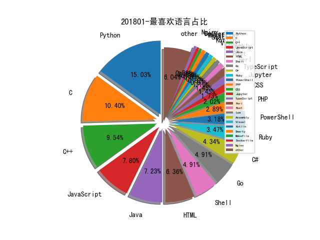

# 201801 信息源与信息类型占比

# 微信公众号 推荐
| nickname_english | weixin_no | title | url| 
| --- | --- | --- | ---| 
| SecWiki | SecWiki |  | https://mp.weixin.qq.com/s/guVljwZyvafts-SZY_Zwow | 1| 
| 懒人在思考 | lazy-thought |  | https://mp.weixin.qq.com/s/7F2-eLqIdSiNIHHJDzkwcg | 1| 
| 老高的互联网杂谈 | paulgao-net-talk |  | https://mp.weixin.qq.com/s/5XRz-inuBpTn_IGQLTAXpg | 1| 
| 腾讯研究院 | cyberlawrc |  | https://mp.weixin.qq.com/s/97MFf8-ZtJzz_D6zkYGbrw | 1| 
| 青藤实验室 | qt_lab |  | https://mp.weixin.qq.com/s/KW9ROTCMJyJ-mBt8dwBmBg | 1| 
| 高效运维 | greatops |  | https://mp.weixin.qq.com/s/iI0qRxzaLOk1xEpQ3XG-ew | 1| 
| 麦洛克菲内核开发 | mallocfree001 |  | https://mp.weixin.qq.com/s/NaGk6KdHBczvyI_mr_Tg6g | 1| 
| 360CERT | CERT-360 |  | https://mp.weixin.qq.com/s/nJFii2oTEzKTnQNW04FXUQ | 1| 
| ChaMd5安全团队 | chamd5sec |  | https://mp.weixin.qq.com/s?__biz=MzIzMTc1MjExOQ==&mid=2247484574&idx=1&sn=91850fae13f6a478869f10fa176e3e8c | 1| 
| 互联网安全内参 | anquanneican |  | https://mp.weixin.qq.com/s/bm8jK8mLsYkWNH_fwIcPAg | 2| 
| 平安集团安全应急响应中心 | PSRC_Team |  | https://mp.weixin.qq.com/s/eiVszU0mZ49WIMfrOEvgeA | 1| 
| 湖南金盾评估中心 | JD83758161 |  | https://mp.weixin.qq.com/s/VrVBE7I4pCOd5BOnwIAs9A | 1| 
| 物联网智库 | iot101 |  | https://mp.weixin.qq.com/s/99W7NIR-fC7PF67oo2Ovlw | 1| 
| 百度公共政策研究院 | InternetPolicyReview |  | https://mp.weixin.qq.com/s/v3lWLXgTFyBicWLJ7DK3nQ | 1| 
| 网络法前哨 | cyberlawing |  | https://mp.weixin.qq.com/s/aimlLub6dwPFGtCfFyjFUQ | 1| 
| 逢魔安全实验室 | FormSec |  | https://mp.weixin.qq.com/s/9vk-H36erencugdYca9qXA | 2| 
| InfoQ | infoqchina |  | https://mp.weixin.qq.com/s/nXYrUgEhaCo4patd1YovOw | 1| 
| V安全资讯 |  |  | https://mp.weixin.qq.com/s/TnS8f8B1ntC3qvd4noc7nA | 1| 
| 安在 | AnZer_SH |  | https://mp.weixin.qq.com/s/ShTWSy27FXuqWJxTnfCzLg | 1| 
| 网安寻路人 | DataProtection101 |  | https://mp.weixin.qq.com/s/_Wdi6RZfchA5g5Dp7TmWYg | 1| 
| 美亚柏科 | MeiyaPico |  | https://mp.weixin.qq.com/s/rsrieCI2zItZBcHVn22Q5A | 1| 
| 软件定义世界（SDX） | SDx-SoftwareDefinedx |  | https://mp.weixin.qq.com/s/GnuuzHedLCSWj-VanHDhdA | 1| 
| sh3ll |  |  | https://mp.weixin.qq.com/s/8C3jbfMy3sKCSdul4Y8Pcg | 1| 
| 中国信息安全 | chinainfosec |  | https://mp.weixin.qq.com/s/18cF-dC-LDbrB99lTpaLTA | 2| 
| 匠道人 | ATech666 |  | https://mp.weixin.qq.com/s/eayCCAnfBW8LNEhDn5A0nw | 2| 
| 向日葵生活分享 | SunF-security-share |  | https://mp.weixin.qq.com/s/PYQlfptjkj3sIebiieljNA | 2| 
| 安全学术圈 | secquan |  | https://mp.weixin.qq.com/s/zicl-lC1jCWdVnXWkO3eyQ | 1| 
| 安全测评联盟 |  |  | https://mp.weixin.qq.com/s/32EyXTDWJXflKGDSim1KtQ | 1| 
| 安天 | Antiylab |  | https://mp.weixin.qq.com/s/EU89Ko1DVjsB4GSiq3Focw | 1| 
| 平安科技金融安全研究院 | pinganfinsec |  | https://mp.weixin.qq.com/s/FSoYqbOpoFBni1C8Di7J0A | 1| 
| 数说安全 | SSAQ2016 |  | https://mp.weixin.qq.com/s/b6iAwy_JxHwKBwrA-PsP5w | 1| 
| Panabit |  |  | https://mp.weixin.qq.com/s/O3apmnZDDZt2TrEHtwekUg | 1| 
| Piz0n |  |  | https://mp.weixin.qq.com/s/dsafRx9ZcDBHWOEH8xLyAw | 2| 
| Python中文社区 | python-china |  | https://mp.weixin.qq.com/s/iytARh75EjYDnfxkBqnEOw | 1| 
| 中国保密协会科学技术分会 |  |  | https://mp.weixin.qq.com/s/VbmJAIApS7IhE6JreKKY1A | 1| 
| 信安之路 | xazlsec |  | http://mp.weixin.qq.com/s/dUVUswYm_3s67A6ZnXlu8A | 6| 
| 信安标委 | SACTC260 |  | https://mp.weixin.qq.com/s/vq4rr2bfcP0qCT-L5jTRyA | 1| 
| 兜哥带你学安全 | waf_ads_ids |  | https://mp.weixin.qq.com/s/jKYDdMNOL3Ebf5NjxkNqbA | 1| 
| 安全牛 | aqniu-wx |  | https://mp.weixin.qq.com/s/5jl-V5SzXExhJ6qQHuil8Q | 2| 
| 工信微报 | gxwbwx |  | https://mp.weixin.qq.com/s/sMRtE5_GExWj6lIVcSqMBg | 1| 
| 工控参考 | gkongnews |  | https://mp.weixin.qq.com/s/TE-uWlKflUCMUDzLAeaXSA | 1| 
| 我的安全视界观 | CANI_Security |  | http://mp.weixin.qq.com/s/I1fNlytovsi7h715FFg3tg | 5| 
| 斗鱼安全应急响应中心 | DYSRC_ |  | https://mp.weixin.qq.com/s/zDAXg1dmTh1I6N4hGusT5g | 1| 
| 猎户攻防实验室 | TassLiehu |  | https://mp.weixin.qq.com/s/xI3qLGRL9JmlBJL3mEP-iQ | 2| 

# 组织github账号 推荐
| github_id | title | url | org_url | org_profile | org_geo | org_repositories | org_people | org_projects | repo_lang | repo_star | repo_forks| 
| --- | --- | --- | --- | --- | --- | --- | --- | --- | --- | --- | ---| 
| alibaba | jvm-sandbox: JVM沙箱容器，一种JVM的非侵入式运行期AOP解决方案 | https://github.com/alibaba/jvm-sandbox | http://www.alibaba.com | Alibaba Open Source | Hangzhou, China | 263 | 141 | 0 | C,Shell,Java,Kotlin,JavaScript,C++,Dart,TypeScript,Go,Jupyter | 0 | 0 | 1| 
| nccgroup | Cisco ASA 实验环境的搭建,来自 NCC Group: | https://github.com/nccgroup/asatools/blob/master/tutorial.md | https://www.nccgroup.trust | Please report all security issues to security at nccgroup dot com | Global | 180 | 15 | 0 | C,Shell,Java,Python,JavaScript,C#,HTML,Elixir,Go,Rust | 0 | 0 | 1| 
| dotnet | .NET Core Runtime 最近修复了两个 XML 解析和 X509 证书验证的漏洞(CVE-2018-0764/CVE-2018-0786): https://github.com/dotnet/announcements/issues/51 | https://github.com/dotnet/announcements/issues/52 | http://www.dotnetfoundation.org | Home of the .NET Foundation | http://www.dotnetfoundation.org | 176 | 381 | 2 | Shell,HTML,C#,Python,F#,Dockerfile,PowerShell | 0 | 0 | 2| 
| mitre | CALDERA - 自动化网络攻击仿真系统: | https://github.com/mitre/caldera | http://mitre.github.io | Open Source Software from the MITRE Corporation | http://mitre.github.io | 145 | 11 | 0 | Java,Python,JavaScript,R,HCL,Ruby,PowerShell,CSS | 0 | 0 | 1| 
| PowerShell | 微软对 OpenSSH 的 Win32 移植版本: | https://github.com/PowerShell/Win32-OpenSSH: | https://microsoft.com/powershell | https://microsoft.com/powershell | Redmond | 132 | 23 | 1 | C#,C,TypeScript,PowerShell,C++ | 0 | 0 | 1| 
| QubesOS | Qubes 安全公告: | https://github.com/QubesOS/qubes-secpack/blob/master/QSBs/qsb-037-2018.txt | https://www.qubes-os.org/ |  | https://www.qubes-os.org/ | 116 | 14 | 0 | C,Shell,Roff,Python,Makefile,Perl,HTML,Ruby,CSS | 0 | 0 | 1| 
| tensorflow | Google 用于支持手机和嵌入式平台的深度学习框架 TensorFlow Lite 版预览版发布: https://github.com/tensorflow/tensorflow/tree/r1.5/tensorflow/contrib/lite FaceBook 也有一个类似的轻量级框架 Caffe2Go: | https://github.com/tensorflow/tensorflow/tree/r1.5/tensorflow/contrib/lite | http://www.tensorflow.org |  | http://www.tensorflow.org | 78 | 213 | 2 | TypeScript,Jupyter,Python,JavaScript,C++,Swift | 0 | 0 | 2| 
| cyberark | ketshash - 基于 Windows 事件日志检测 Hash 传递攻击的工具: | https://github.com/cyberark/ketshash | https://www.cyberark.com | CyberArk, the undisputed leader in Privileged Account Security, secures secrets used by machines and users to protect traditional and cloud-native apps. | Newton, MA and Petach Tikva, Israel | 76 | 14 | 0 | Shell,Java,Python,JavaScript,Smarty,HTML,Go,Ruby,PowerShell | 0 | 0 | 1| 
| paragonie | awesome-appsec - 应用安全方向优秀学习资源集合: | https://github.com/paragonie/awesome-appsec | https://paragonie.com | Technology should support your ambitions, not hinder them. We are a team of technology consultants that specialize in application security. | Florida, USA | 72 | 1 | 0 | C,JavaScript,C++,Nginx,HTML,PHP | 0 | 0 | 1| 
| baidu | rust-sgx-sdk - 一个为 Rust 编程语言开发英特尔 SGX 应用程序提供的 SDK: | https://github.com/baidu/rust-sgx-sdk | http://www.baidu.com | Baidu Open Source Projects | Beijing, China | 71 | 53 | 0 | GLSL,TypeScript,Java,Python,JavaScript,C++,Go,Jupyter,Rust | 0 | 0 | 1| 
| CERT-Polska | malwarecage - 用于自动化恶意软件收集/分析系统的组件,由 Python2 编写,支持 REST API: | https://github.com/CERT-Polska/malwarecage | http://www.cert.pl/ |  | Warsaw, Poland | 48 | 5 | 0 | C,Java,Python,JavaScript,C++,PHP | 0 | 0 | 1| 
| fireeye | SimplifyGraph - FireEye 开源的一款 IDA Pro 插件,可用于协助生成复杂的控制流程图: https://github.com/fireeye/SimplifyGraph | https://github.com/fireeye/SimplifyGraph | https://www.fireeye.com/blog.html |  | Milpitas, CA | 48 | 1 | 0 | C,Vue,Python,JavaScript,C++,C#,Go,PowerShell | 0 | 0 | 1| 
| silentsignal | silentsignal/av-breaking: Bare Knuckled AV Breaking | https://github.com/silentsignal/av-breaking | https://silentsignal.eu/ |  | Budapest, Hungary | 44 | 0 | 0 | C,Java,Python,Kotlin,C++,Perl,Erlang | 0 | 0 | 1| 
| S2E | 通过多路径错误注入(Multi-Path Fault Injection)的方法利用 S2E 测试 Windows 驱动中常见的错误恢复代码: | https://github.com/S2E/docs/blob/master/src/Tutorials/WindowsDrivers/FaultInjection.rst#testing-error-recovery-code | http://s2e.systems | A Platform for In-Vivo Analysis of Software Systems | http://s2e.systems | 28 | 6 | 0 | Groovy,C,Shell,Python,Makefile,C++,CSS | 0 | 0 | 1| 
| comaeio | SwishDbgExt - 事件响应和数字取证调试扩展: | https://github.com/comaeio/SwishDbgExt | http://www.comae.io |  | Dubai, UAE | 24 | 0 | 0 | C,Java,JavaScript,C++,Nginx,Smarty,PowerShell | 0 | 0 | 1| 
| 0xrawsec | Very flexible Host IDS designed for Windows | https://github.com/0xrawsec/whids | https://rawsec.lu |  | Luxembourg | 17 | 0 | 0 | Go,Python,HTML,Makefile,Smarty | 0 | 0 | 1| 
| lsds | 针对 Intel SGX enclave 的 Spectre 漏洞 PoC: | https://github.com/lsds/spectre-attack-sgx | http://lsds.doc.ic.ac.uk/ |  | Department of Computing, Imperial College London | 17 | 2 | 0 | C,Java,Rust,C++ | 0 | 0 | 1| 
| ysrc | yulong-hids: 一款由 YSRC 开发的入侵检测系统 | https://github.com/ysrc/yulong-hids | None | 前同程安全应急响应中心，项目由离职同事业余时间维护。 | None | 17 | 0 | 0 | Java,Python,JavaScript,C++,HTML,Go,PHP | 0 | 0 | 1| 
| nao-sec | starc: Simple high-interactive client honeypot | https://github.com/nao-sec/starc | https://nao-sec.org | Cyber Security Research Team | https://nao-sec.org | 16 | 1 | 0 | Python,C#,PHP,Dockerfile,Vue | 0 | 0 | 3| 
| transmission | BT 下载客户端 Transmission 刚刚修复了一个 DNS Rebinding 远程代码执行漏洞: https://github.com/transmission/transmission/pull/468 | https://github.com/transmission/transmission/pull/468 | https://transmissionbt.com/ | A Fast, Easy, and Free BitTorrent Client | https://transmissionbt.com/ | 15 | 6 | 0 | C,HTML,PowerShell,C++,PHP | 0 | 0 | 1| 
| theori-io | pwnjs: A Javascript library for browser exploitation | https://github.com/theori-io/pwnjs | http://www.theori.io |  | Austin, TX | 12 | 1 | 0 | C,Python,JavaScript,Objective-C,HTML,CSS | 0 | 0 | 1| 
| capsule8 | 通过监测 Last-Level Cache 的使用检测 Meltdown 和 Spectre 漏洞攻击的工具,来自 Capsule8 团队: https://capsule8.com/blog/detecting-meltdown-spectre-detecting-cache-side-channels/ | https://github.com/capsule8/capsule8/blob/master/examples/cache-side-channel/main.go | https://capsule8.com | Container-Aware Real-time Threat Protection for Linux | Brooklyn, NY | 7 | 5 | 0 | Go,Python,TypeScript,Smarty | 0 | 0 | 1| 
| mindedsecurity | 基于 AST 和部分执行的方法实现 JavaScript 反混淆: http://blog.mindedsecurity.com/2015/10/advanced-js-deobfuscation-via-ast-and.html | https://github.com/mindedsecurity/JStillery | http://www.mindedsecurity.com |  | Italy, UK | 7 | 0 | 0 | Shell,JavaScript,HTML,CSS | 0 | 0 | 1| 
| wifiphisher | wifiphisher - 自动化 WiFi 钓鱼工具: | https://github.com/wifiphisher/wifiphisher | https://wifiphisher.org |  | https://wifiphisher.org | 5 | 2 | 0 | Python,C,HTML | 0 | 0 | 1| 
| bugbountyforum | XSS-Radar - 用于快速 XSS Fuzz 测试的工具,当前仅支持 Chrome 浏览器扩展版本: | https://github.com/bugbountyforum/XSS-Radar | https://bugbountyforum.com/ |  | https://bugbountyforum.com/ | 2 | 0 | 0 | JavaScript | 0 | 0 | 1| 
| sense-of-security | ADRecon - 用于收集有关 Active Directory信息的工具,并生成 AD 环境当前状态的整体报告: | https://github.com/sense-of-security/adrecon | http://www.senseofsecurity.com.au/ | IT Security and Risk Managment Experts. The leading independent provider of IT security and risk management solutions in Australia. | Sydney and Melbourne, Australia | 1 | 0 | 0 | HTML | 0 | 0 | 1| 

# 私人github账号 推荐
| github_id | title | url | p_url | p_profile | p_loc | p_company | p_repositories | p_projects | p_stars | p_followers | p_following | repo_lang | repo_star | repo_forks | 
| --- | --- | --- | --- | --- | --- | --- | --- | --- | --- | --- | --- | --- | --- | ---| 
| evilsocket | bettercap-ng - bettercap 的重新实现 : | https://github.com/evilsocket/bettercap-ng#cross-compiling | https://www.evilsocket.net | Hacker | I dont respectfully, I disagree. https://www.patreon.com/evilsocket | Italy | Zimperium | 115 | 0 | 15 | 3700 | 0 | Go,Python,JavaScript | 0 | 0 | 1| 
| trustedsec | ptf - TrustedSec 发布的渗透测试框架: | https://github.com/trustedsec/ptf | https://www.trustedsec.com | Headquartered in Cleveland, Ohio, TrustedSec is an Information Security Consulting company, made up of researchers, hackers, advisors to help our customers. | Cleveland, Ohio | TrustedSec | 24 | 0 | 2 | 3100 | 8 | Python | 4400 | 1400 | 1| 
| DanMcInerney | icebreaker - 在内网环境下自动化攻击活动目录的工具: | https://github.com/DanMcInerney/icebreaker | None | I like automating security stuff so I dont have to work. Coalfire Sr. Pentester. | None | @danhmcinerney | 82 | 0 | 236 | 1900 | 23 | Python,Ruby,PowerShell | 0 | 0 | 1| 
| jedisct1 | dnscrypt-proxy - 一款 DNS 代理,支持加密的 DNS 协议: | https://github.com/jedisct1/dnscrypt-proxy | http://prettysimpleimages.com | Parisian fashion photographer with a knack for math, computer vision, opensource software and infosec. | Paris, France | None | 257 | 0 | 2000 | 1700 | 96 | Go,C,C++,Rust | 0 | 0 | 1| 
| hasherezade | hollows_hunter - 用于扫描进程注入中的傀儡 PE 模块的工具: | https://github.com/hasherezade/hollows_hunter | http://hasherezade.net |  | Poland | None | 48 | 0 | 30 | 1600 | 9 | Python,C,Assembly,C++ | 746 | 129 | 1| 
| FeeiCN | FeeiCN/GSIL: Github Sensitive Information Leakage（Github敏感信息泄露） | https://github.com/FeeiCN/GSIL | https://github.com/alibaba | Security Researcher(专注自动化漏洞发现和入侵检测防御) | Hangzhou, China | @alibaba | 12 | 0 | 889 | 1500 | 72 | Python | 0 | 0 | 1| 
| Screetsec | Vegile - Linux 后渗透测试工具,用于安装持久化后门: | https://github.com/Screetsec/Vegile | http://dracos-linux.org | Developer dracOs linux and Penetration Testing Tools , Join our community at https://t.me/bashidorg | INDONESIA | Dracos Linux ( Penetration OS from Indonesia ) | 14 | 0 | 148 | 1400 | 5 | Python,Shell,Java,C++ | 0 | 0 | 1| 
| fatedier | frp:可用于内网穿透的高性能的反向代理应用 | https://github.com/fatedier/frp/blob/master/README_zh.md | https://blog.fatedier.com | To be yourself. | SH,China | None | 39 | 0 | 301 | 1200 | 9 | Go | 0 | 0 | 1| 
| coolstar | Electra iOS 11.0 - 11.1.2 jailbreak toolkit based on async_awake : | https://github.com/coolstar/electra | None | iOS developer and computer science student at UC Santa Barbara. | San Francisco, CA | None | 115 | 0 | 8 | 1100 | 1 | C,C++ | 774 | 217 | 1| 
| gdbinit | LLDBINIT - LLDB 调试器的个性化初始化配置脚本: | https://github.com/gdbinit/lldbinit/ | https://reverse.put.as | I break Macs! | None | None | 67 | 0 | 187 | 1100 | 23 | C,C++ | 1200 | 343 | 1| 
| philipperemy | tensorflow-1.4-billion-password-analysis - 使用深度学习和NLP分析14亿明文密码: | https://github.com/philipperemy/tensorflow-1.4-billion-password-analysis | https://github.com/cogentlabs | From Paris to Tokyo via London. Research Engineer @cogentlabs. Maths, Stats, Machine Learning. 🏄 🎲 🎱 | Tokyo, JP | Imperial College London | 93 | 0 | 341 | 1100 | 7 | Python,Jupyter | 0 | 0 | 1| 
| r00t-3xp10it | FakeImageExploiter - 伪造图片实现漏洞利用的工具: | https://github.com/r00t-3xp10it/FakeImageExploiter | https://github.com/Suspicious-Shell-Activity | Be a hacker not a criminal... Pentester | IT enthusiastic | blooger | Lisbon - portugal | @Suspicious-Shell-Activity | 27 | 0 | 30 | 970 | 37 | C#,Shell,HTML,Ruby | 0 | 0 | 2| 
| D4Vinci | Cr3dOv3r - 根据邮箱自动搜索泄漏的密码信息,也可测试账户密码在各大网站能否登录的工具: | https://github.com/D4Vinci/Cr3dOv3r | https://github.com/Seekurity | A hacker, high&low-level coder and a lot of things between. An extremely curious creature loves to learn. Break things or make things that break things. | Egypt | @Seekurity and @iSecur1ty | 32 | 0 | 367 | 927 | 82 | Python | 0 | 0 | 2| 
| Xyntax | Beautiful list of deep learning tutorial 深度学习案例 | https://github.com/Xyntax/ML | https://www.cdxy.me | Web developer, security researcher and data analyst. | Hangzhou,China | Alibaba Cloud | 49 | 0 | 293 | 866 | 85 | Python,HTML,PowerShell | 1100 | 561 | 1| 
| strazzere | android-scripts - 安卓逆向分析脚本收集: | https://github.com/strazzere/android-scripts | http://www.strazzere.com/blog | Everything can be reversed | Oakland, Ca | None | 92 | 0 | 236 | 846 | 52 | Python,Ruby,C,Java | 745 | 290 | 1| 
| EdOverflow | bugbountyguide - Bug 赏金计划和 Bug 赏金猎人指南: | https://github.com/EdOverflow/bugbountyguide | https://edoverflow.com/ | Web developer & security researcher. | ::1 | None | 38 | 0 | 168 | 791 | 20 | Shell,HTML | 1600 | 497 | 1| 
| CHEF-KOCH | malware-research: Samples, research and documents | https://github.com/CHEF-KOCH/malware-research | https://github.com/microsoft | Highly interested in PC games, demoscene and security-related topics. I worked for @microsoft and @NVIDIA over 15 years. - Since 2018 for NTT Security - | Lausanne (づ｡◕‿◕｡)づ | CKs Technology News | 103 | 0 | 2800 | 778 | 60 | Python,C,Batchfile,JavaScript | 0 | 0 | 1| 
| boy-hack | 使用bugscan插件的扫描器 | https://github.com/boy-hack/w9scan | https://www.hacking8.com/ | Hacking tools just for fun ~ | china | None | 28 | 0 | 113 | 749 | 17 | Python,JavaScript | 211 | 69 | 1| 
| objective-see | ProcInfo - macOS 上用于监视进程的开源库: | https://github.com/objective-see/ProcInfo | https://www.objective-see.com |  | United States | Objective-See | 11 | 0 | 0 | 644 | 0 | Objective-C | 2900 | 142 | 1| 
| OJ | gobuster - Go 语言编写的收集网站 URI 和 DNS 子域名的工具: | https://github.com/OJ/gobuster | https://beyondbinary.io/ | NERD! Blogs at http://buffered.io/ | Australia | Beyond Binary Pty Ltd | 73 | 0 | 302 | 560 | 18 | Go,C,Ruby | 0 | 0 | 1| 
| Cn33liz | p0wnedShell - 不依赖 powershell.exe 执行 PowerShell 脚本代码的环境: | https://github.com/Cn33liz/p0wnedShell | https://twitter.com/Cneelis |  | Groningen, the Netherlands | None | 31 | 0 | 4 | 553 | 2 | C#,Visual,JavaScript,C++ | 1100 | 293 | 1| 
| codingo | Reconnoitre - 用于渗透测试的多线程信息收集和服务枚举工具: | https://github.com/codingo/Reconnoitre | https://twitter.com/codingo_ | Penetration tester from Australia. Current maintainer of NoSQLMap, VHostScan, Reconnoitre. Co-contributor to subfinder. | Brisbane, Australia | None | 137 | 0 | 1000 | 544 | 239 | Python,Go | 0 | 0 | 1| 
| bit4woo | Python安全和代码审计相关资料收集 | https://github.com/bit4woo/python_sec | http://code2sec.com/ | Creating with coding,Learning by doing,Learning by sharing! | shenzhen | None | 111 | 0 | 755 | 521 | 122 | Python,C#,Ruby,Java | 0 | 0 | 1| 
| zodiacon | ProcMonX - 一个基于 Windows 事件日志追踪实现的类似于 Process Monitor 的工具: | https://github.com/zodiacon/ProcMonX | http://scorpiosoftware.net |  | None | None | 50 | 0 | 99 | 448 | 8 | C#,C | 0 | 0 | 1| 
| k0keoyo | kDriver-Fuzzer：基于ioctlbf框架编写的驱动漏洞挖掘工具 | https://github.com/k0keoyo/kDriver-Fuzzer | https://whereisk0shl.top | Binary vulnerability researcher,focus on Windows & Linux kernel,VM escape and Fuzzing research | None | None | 87 | 0 | 83 | 401 | 27 | C,JavaScript,C++ | 358 | 135 | 1| 
| Arno0x | ReflectiveDnsExfiltrator - 利用 DNS 解析进行数据隐秘传输的工具: | https://github.com/Arno0x/ReflectiveDnsExfiltrator | None |  | None | None | 32 | 0 | 22 | 391 | 0 | Python,JavaScript,PowerShell,C++,HTML | 314 | 98 | 1| 
| sjvasquez | web-traffic-forecasting: Kaggle 网站流量预测比赛代码 | https://github.com/sjvasquez/web-traffic-forecasting | None | Undergraduate at MIT | Cambridge, MA | None | 6 | 0 | 0 | 381 | 0 | Python | 0 | 0 | 1| 
| MachineLP | Tensorflow实战学习笔记 | https://github.com/MachineLP/Tensorflow- | http://blog.csdn.net/u014365862/article/details/78422372 | wechat: lp9628 | https://t.zsxq.com/e62RFub | MachineLP | 172 | 0 | 391 | 377 | 72 | Python,HTML,Jupyter,C++ | 0 | 0 | 1| 
| xdavidhu | lanGhost - 可通过 Telegram 控制的局域网后门: | https://github.com/xdavidhu/lanGhost | https://xdavidhu.me/ | Hacker & Web developer & Bug Hunter | Hungary | None | 14 | 0 | 201 | 373 | 4 | Python,HTML | 0 | 0 | 1| 
| skylot | JADX - 从 Android Dex 字节码到 Java 的反编译工具: | https://github.com/skylot/jadx | None |  | None | None | 2 | 0 | 29 | 355 | 2 | Java | 0 | 0 | 1| 
| cujanovic | Open-Redirect-Payloads: Open Redirect Payloads | https://github.com/cujanovic/Open-Redirect-Payloads | https:/twitter.com/cujanovic |  | None | None | 27 | 0 | 146 | 341 | 0 | Python | 0 | 0 | 1| 
| xyzz | rop-rpc - 在任天堂 Switch 上运行 ROP Payload 的工具: | https://github.com/xyzz/rop-rpc | https://blog.xyz.is/ | it is a mystery | None | None | 107 | 0 | 32 | 300 | 3 | Python,Kotlin,C,HTML,C++ | 300 | 80 | 1| 
| CunningLogic | DUMLRacer - Root Exploit for DJI Drones and Controllers: | https://github.com/CunningLogic/DUMLRacer | None |  | None | None | 120 | 0 | 36 | 296 | 12 | Shell,Java,C++ | 85 | 39 | 1| 
| 0x4D31 | awesome-threat-detection - 威胁检测与追击方面的资源集: | https://github.com/0x4D31/awesome-threat-detection | https://github.com/salesforce | Lead Threat Detection Engineer @salesforce | Sydney, Australia | None | 19 | 0 | 1100 | 285 | 77 | Python,Go | 0 | 0 | 1| 
| rk700 | YAHFA - Android ART hook 框架: | https://github.com/rk700/YAHFA | http://rk700.github.io |  | None | None | 17 | 0 | 56 | 233 | 2 | Python,C,Java | 0 | 0 | 1| 
| zcgonvh | NTDSDumpEx: NTDS.dit offline dumper with non-elevated | https://github.com/zcgonvh/NTDSDumpEx | http://www.zcgonvh.com | Window and .net | None | None | 8 | 0 | 0 | 232 | 1 | C#,C,Ruby,C++ | 88 | 45 | 1| 
| austin-taylor | VulnWhisperer - 漏洞数据和报告汇总工具: | https://github.com/austin-taylor/VulnWhisperer | http://www.austintaylor.io | https://twitter.com/HuntOperator | None | None | 63 | 0 | 94 | 229 | 40 | Python,HTML,Jupyter | 0 | 0 | 1| 
| saaramar | Linux 上的漏洞在 Windows 上用,利用 Windows 10 的 WSL 子系统实现提权: | https://github.com/saaramar/execve_exploit/blob/master/talk_slides.pdf | None | @AmarSaar in twitter, known as amarsa | None | None | 7 | 0 | 28 | 218 | 6 | Python,C,C++ | 195 | 38 | 1| 
| turbo | 利用 CPU 数据缓存侧信道漏洞实现任意虚拟内存读,这篇 Blog 来自 Project Zero,介绍的正是这两天爆出的 CPU 缓存侧信道漏洞的细节,受此漏洞影响的 CPU 包括 Intel、AMD 和 ARM: 1) https://googleprojectzero.blogspot.com/2018/01/reading-privileged-memory-with-side.html 2) https://security.googleblog.com/2018/01/todays-cpu-vulnerability-what-you-need.html 3) https://meltdownattack.com/ CPU 缓存侧信道漏洞 Meltdown/Spectre 的 PoC 代码: https://github.com/turbo/KPTI-PoC-Collection 漏洞的背景资料 - KPTI 是为了解决 KASLR bypass 问题而生基本上是个幌子,来自 hardenedlinux weibo: | https://github.com/turbo/KPTI-PoC-Collection | https://github.com/solarwinds | Turning PCs up to eleven by trade and passion. | Berlin, Germany | @solarwinds | 185 | 0 | 350 | 209 | 9 | Assembly,C#,JavaScript,C++,MoonScript,Lua,Batchfile,Common | 0 | 0 | 1| 
| artkond | cisco-snmp-rce - Cisco IOS 远程代码执行利用程序(CVE-2017-6736 / cisco-sa-20170629-snmp): | https://github.com/artkond/cisco-snmp-rce | None | Penetration Tester https://twitter.com/artkond | None | None | 5 | 0 | 38 | 204 | 3 | Python,C | 0 | 0 | 2| 
| rmusser01 | Exploit 编写方面的资料整理: | https://github.com/rmusser01/Infosec_Reference/blob/master/Draft/Exploit%20Development.md | http://rmusser.net/docs | Contact Me: email@domain.tld | None | None | 119 | 0 | 1700 | 202 | 30 | Python,Lua,C | 2000 | 496 | 2| 
| zjlywjh001 | PhrackCTF-Platform-Team: 功能最全的CTF平台 | https://github.com/zjlywjh001/PhrackCTF-Platform-Team | https://www.jarviswang.me/ |  | None | None | 52 | 0 | 5 | 202 | 0 | C,JavaScript,Java | 0 | 0 | 1| 
| blackye | webdirdig: Web敏感目录、信息泄漏批量扫描脚本 | https://github.com/blackye/webdirdig | None | Security Researcher | Python Developer | None | Tencent、IQIYI | 20 | 0 | 83 | 183 | 3 | Python,Go,C++ | 133 | 71 | 1| 
| SigPloiter | SigPloiter/GTScan: The Nmap Scanner for Telco | https://github.com/SigPloiter/GTScan | None |  | None | None | 6 | 0 | 65 | 182 | 108 | Python,Java,Perl | 528 | 224 | 1| 
| eldraco | Salamandra - 间谍麦克风检测工具: | https://github.com/eldraco/Salamandra | http://researchgate.net/profile/Sebastian_Garcia6 |  | None | CVUT University | 34 | 0 | 36 | 171 | 62 | Python,JavaScript,C++ | 1500 | 187 | 1| 
| woj-ciech | Daily-dose-of-malware - 从各大平台上收集恶意软件与 C&C 服务器信息的脚本: | https://github.com/woj-ciech/Daily-dose-of-malware | None |  | None | None | 11 | 0 | 0 | 156 | 0 | Python,Go | 747 | 101 | 1| 
| anbai-inc | AttackFilter: Logstash 日志安全攻击分析插件 | https://github.com/anbai-inc/AttackFilter | http://www.anbai.com | Hello world~ | Beijing | Anbai | 11 | 0 | 1 | 150 | 0 | Python,Ruby,Java | 708 | 242 | 1| 
| sevagas | macro_pack - 用于生成 Office 宏恶意文档的工具: | https://github.com/sevagas/macro_pack | http://blog.sevagas.com | I decided to create this Github along by blog to share my experimentations in the information security field. | None | None | 5 | 0 | 52 | 150 | 0 | Python,Shell | 554 | 152 | 1| 
| jiangsir404 | 记录自己对《代码审计》的理解和总结 | https://github.com/jiangsir404/Audit-Learning | http://blog.s7star.cn | Talk is cheap, show me the code. | None | None | 15 | 0 | 225 | 137 | 116 | Python | 517 | 109 | 1| 
| houjingyi233 | office-exploit-case-study Office 漏洞利用与分析练手数据集 | https://github.com/houjingyi233/office-exploit-case-study | http://houjingyi233.com | security researcher wechat:aG91amluZ3lpMTU5 | None | None | 20 | 0 | 713 | 135 | 1 | Visual,Java,C++ | 124 | 56 | 1| 
| xuechiyaobai | 360 研究员 BoAAAAA 新公开了几个 V8 近期修复漏洞的 PoC 和 Exploit(CVE-2017-15399/CVE-2017-15428/CVE-2017-5070): | https://github.com/xuechiyaobai/V8_November_2017 | None |  | None | None | 22 | 0 | 143 | 135 | 25 | C,HTML,JavaScript,C++ | 108 | 30 | 1| 
| sgayou | 针对医疗设备 Smiths Medical Medfusion 4000 的远程代码执行漏洞分析: | https://github.com/sgayou/medfusion-4000-research/blob/master/doc/README.md | None | 8) | None | None | 6 | 0 | 2 | 123 | 9 | Python,Assembly | 0 | 0 | 1| 
| stayliv3 | embedded-device-lab：利用qemu模拟物联网漏洞的测试环境 | https://github.com/stayliv3/embedded-device-lab | http://xdxd.love/ | http://xdxd.love | china | None | 104 | 0 | 619 | 117 | 296 | Python,Shell,Ruby,PHP | 63 | 31 | 1| 
| christophetd | CloudFlair - 使用来自 Censys 的互联网扫描数据查找使用 CloudFlare 的网站的原始服务器的工具: | https://github.com/christophetd/CloudFlair | http://christophetd.fr |  | Switzerland | None | 64 | 0 | 402 | 115 | 38 | Python,Lua,Visual,Shell | 0 | 0 | 1| 
| raphaelsc | Am-I-affected-by-Meltdown - Meltdown 漏洞检测工具,目前只支持 Linux: | https://github.com/raphaelsc/Am-I-affected-by-Meltdown | http://raphaelsc.github.io/ | a.k.a. utroz | Brazil - Belo Horizonte | ScyllaDB | 36 | 0 | 78 | 112 | 48 | C,C++ | 0 | 0 | 1| 
| emposha | PHP-Shell-Detector - 由 PHP 编写的识别php/cgi/asp/aspx webshell 的工具: | https://github.com/emposha/PHP-Shell-Detector | http://www.emposha.com |  | Israel | None | 14 | 0 | 24 | 106 | 10 | Python,PHP,JavaScript | 597 | 205 | 1| 
| speed47 | Spectre & Meltdown 漏洞 Linux 操作系统检测工具: | https://github.com/speed47/spectre-meltdown-checker | None |  | None | None | 18 | 0 | 18 | 105 | 0 | C#,Shell,PHP,C++,Perl | 2800 | 378 | 1| 
| danigargu | explodingcan - IIS WebDav 远程溢出漏洞利用程序(CVE-2017-7269): | https://github.com/danigargu/explodingcan | https://twitter.com/danigargu |  | Spain | None | 14 | 0 | 183 | 104 | 27 | Python,JavaScript | 447 | 54 | 1| 
| n4xh4ck5 | CMSsc4n - 探测网站使用的 CMS 的工具: | https://github.com/n4xh4ck5/CMSsc4n | https://twitter.com/@n4xh4ck5 |  | fwhibbit.es | None | 30 | 0 | 0 | 103 | 9 | Python | 89 | 28 | 1| 
| GraxCode | GraxCode/ReverseCrypt: Extract Crypted Jar Archives | https://github.com/GraxCode/ReverseCrypt | None | Computer Security Researcher | None | None | 10 | 0 | 4 | 99 | 0 | Java | 0 | 0 | 1| 
| CaiJiJi | VulScritp: 内网渗透脚本 | https://github.com/CaiJiJi/VulScritp | None |  | Earth | @Caijijijijijiji | 90 | 0 | 773 | 98 | 55 | Python,C,HTML,PowerShell,CSS | 106 | 210 | 1| 
| enkomio | .NET 运行时插桩工具: | https://github.com/enkomio/shed | None | Code Monk - twitter.com/s4tan | Italy | Enkomio Ltd | 16 | 0 | 63 | 98 | 5 | C#,F# | 0 | 0 | 1| 
| lanrat | certgraph - 爬取 SSL 证书中的 Alternate 名称并生成有向图的工具: | https://github.com/lanrat/certgraph | https://lanrat.com | Hacker, Programer, Student, Geek | None | /dev/null | 72 | 0 | 511 | 94 | 153 | Go,Python,C,SourcePawn,Java | 114 | 16 | 1| 
| likexian | likexian/stathub-go: A smart Hub for holding server Stat | https://github.com/likexian/stathub-go | https://www.likexian.com/ | Hello World! | Shenzhen, China | None | 14 | 0 | 146 | 92 | 76 | Go,PHP | 574 | 114 | 1| 
| patois | IDACyber - 用于 IDA Pro 的数据可视化插件: | https://github.com/patois/IDACyber | None | Yo, was github? | 127.0.0.1 | None | 31 | 0 | 232 | 83 | 47 | Python,C,C++ | 182 | 19 | 1| 
| lgeek | 在 ARM 平台上利用 Meltdown 漏洞从用户态 Dump SYSTEM 寄存器: | https://github.com/lgeek/spec_poc_arm | None |  | Manchester, UK | None | 57 | 0 | 13 | 76 | 8 | C,Shell | 222 | 65 | 1| 
| yellowbyte | 汇编语言逆向工程手册: | https://github.com/yellowbyte/reverse-engineering-reference-manual | https://twitter.com/YellowbyteRE | Wannabe Reverse Engineer | Boston | None | 6 | 0 | 255 | 75 | 21 | Python | 0 | 0 | 1| 
| deralexxx | security-apis - 安全相关服务的公共 JSON API 收集列表: | https://github.com/deralexxx/security-apis | https://alexanderjaeger.de | Writes, bash, python, and some more. Interested in Security and APIs | None | None | 78 | 0 | 124 | 74 | 35 | Python | 0 | 0 | 1| 
| almandin | fuxploider - 文件上传漏洞扫描和利用工具: | https://github.com/almandin/fuxploider | https://github.com/Acceis |  | None | @Acceis | 1 | 0 | 8 | 70 | 3 | Python | 0 | 0 | 1| 
| anandtiwarics | archerysec - 开源漏洞评估和管理工具,以帮助开发人员和测试人员执行扫描和管理漏洞: | https://github.com/anandtiwarics/archerysec | https://github.com/archerysec | Information Security enthusiast Project Leading @archerysec | Bangalore | None | 36 | 0 | 95 | 67 | 14 | Python,JavaScript | 0 | 0 | 1| 
| m8r0wn | enumdb - 暴力破解 MySQL/MSSQL 并在成功后自动提取数据库敏感信息的工具: | https://github.com/m8r0wn/enumdb | https://blog.m8r0wn.com | Pentester | Open-source developer | Bug bounty hunter | 127.0.0.1 | None | 11 | 0 | 35 | 67 | 11 | Python,HTML | 0 | 0 | 2| 
| paboldin | Meltdown Exploit PoC: | https://github.com/paboldin/meltdown-exploit | None |  | Ukraine | CloudLinux | 39 | 0 | 4 | 67 | 0 | Python,C | 0 | 0 | 1| 
| malwareinfosec | EKFiddle - 基于 Fiddler Web 调试器的框架,用于研究漏洞工具包 、恶意广告、流量: | https://github.com/malwareinfosec/EKFiddle | None |  | None | None | 1 | 0 | 0 | 66 | 0 | C# | 383 | 93 | 1| 
| xxxyanchenxxx | SigKill: 一键绕过App签名验证 | https://github.com/xxxyanchenxxx/SigKill | None |  | None | None | 58 | 0 | 29 | 56 | 1 | C,Java,Smali | 0 | 0 | 1| 
| Col-E | Recaf - 基于 Objectweb ASM 的易于使用的 Java 字节码编辑器: | https://github.com/Col-E/Recaf/tree/3599f7a077d1d0f24ce0a1414af3948555185b99 | None | Java enthusiast. Discord: Col-E#6255 | None | None | 18 | 0 | 252 | 55 | 15 | Java | 546 | 69 | 1| 
| ParsingTeam | RedLogin - SSH 暴力破解工具: | https://github.com/ParsingTeam/RedLogin/ | https://github.com/ParsingTeam | Email: research@parsing.ir Telegram: @ParsingTeam | Iran | None | 11 | 0 | 2 | 55 | 0 | C#,Python | 71 | 21 | 1| 
| theLSA | 千倍速一句话密码爆破工具 | https://github.com/theLSA/awBruter | http://www.lsablog.com | I like network security,penestration and programming(python,c/c++,php,java,ect),welcome to communicate with me! | China | None | 24 | 0 | 12 | 53 | 5 | Python | 63 | 33 | 1| 
| kai5263499 | 一份关于 OSX 和 iOS 的安全资源集合: | https://github.com/kai5263499/osx-security-awesome | https://github.com/manwe-io |  | Atlanta, GA | @manwe-io | 193 | 0 | 1000 | 50 | 50 | Go,Java | 0 | 0 | 1| 
| wsxarcher | Chimay-Red - 来自 Vault 7 CIA 泄漏的 Mikrotik 漏洞利用 POC: | https://github.com/wsxarcher/Chimay-Red | http://wsx.re | Security aficionado. | Berlin | *SECRET STARTUP* | 18 | 0 | 148 | 49 | 63 | Python,C,Shell,JavaScript | 22 | 10 | 1| 
| UltimateHackers | Cloak - 在 Python 脚本中注入隐藏后门的工具: | https://github.com/UltimateHackers/Cloak | None | This profile has been moved to: https://github.com/s0md3v | None | None | 0 | 0 | 0 | 47 | 0 |  | 0 | 0 | 3| 
| wavestone-cdt | wavecrack - 调用 Hashcat 进行密码破解的 Web 操作接口: | https://github.com/wavestone-cdt/wavecrack | http://www.wavestone.com | Projects from the auditors and consultants from Wavestones Cybersecurity & Digital Trust practice | None | Wavestone | 8 | 0 | 0 | 45 | 1 | Python,Ruby,PowerShell | 161 | 43 | 1| 
| Mr5m1th | 各种开源CMS版本的漏洞以及EXP | https://github.com/Mr5m1th/0day | None |  | None | None | 2 | 0 | 5 | 43 | 0 | Java | 473 | 145 | 1| 
| RealJTG | Meltdown - 从 Google Chrome 读取密码的 Meltdown PoC: | https://github.com/RealJTG/Meltdown | None | A bio. | None | None | 15 | 0 | 287 | 42 | 7 | Python,PHP | 0 | 0 | 1| 
| pgarba | Nintendo Switch Binary loader for IDA Pro 7.0 : | https://github.com/pgarba/SwitchIDAProLoader | https://twitter.com/Blips_and_Chitz | Reverse engineering and security is my passion | None | None | 9 | 0 | 11 | 42 | 2 | C,C++ | 99 | 16 | 1| 
| cclabsInc | RFCrack - 一个 SDR 攻击工具: | https://github.com/cclabsInc/RFCrack | http://cclabs.io | Twitter: https://twitter.com/ficti0n http://consolecowboys.com http://console-cowboys.blogspot.com/ | None | cclabs | 2 | 0 | 0 | 30 | 0 | Python | 352 | 73 | 1| 
| HD421 | Monitoring-Systems-Cheat-Sheet: 各种监控系统的漏洞速查手册: | https://github.com/HD421/Monitoring-Systems-Cheat-Sheet | None |  | None | Digital Security | 9 | 0 | 286 | 25 | 26 |  | 0 | 0 | 1| 
| reoky | android crackme challenge 学习收集: | https://github.com/reoky/android-crackme-challenge | http://www.rit.edu/ | I want to make the world better with software. | (43.08731943912015, -77.67346858978271) | Rochester Institute of Technology | 15 | 0 | 11 | 22 | 10 | Python,Java,C++,Perl | 255 | 48 | 1| 
| smeso | 利用三星 USB MTP(媒体传输协议)任意读写三星手机存储设备 Exploit,同时可以 Bypass 锁屏和只充电模式(SVE-2017-10086): | https://github.com/smeso/MTPwn | https://smeso.it |  | None | None | 10 | 0 | 8 | 21 | 0 | Python,C | 0 | 0 | 1| 
| joarleymoraes | net_guard - 使用 ARP 协议探测网络中未知设备的工具: | https://github.com/joarleymoraes/net_guard | https://joarleymoraes.com/ | Building stuff | Brazil | None | 22 | 0 | 17 | 12 | 0 | Python,Shell | 0 | 0 | 1| 
| mnrkbys | vss_carver - 提取和修改 Windows 磁盘镜像 VSS catalog 的工具: | https://github.com/mnrkbys/vss_carver | None |  | Tokyo, Japan | Internet Initiative Japan Inc. | 15 | 0 | 19 | 6 | 4 | Python | 0 | 0 | 1| 
| mikesiegel | ews-crack - Exchange ews 接口的暴力破解脚本: | https://github.com/mikesiegel/ews-crack | None |  | None | None | 6 | 0 | 139 | 5 | 29 | Python,Go | 111 | 26 | 1| 
| Pl4gue | spectre meldown attack demo | https://github.com/Pl4gue/spectre-attack-demo | None | Learner | None | None | 1 | 0 | 0 | 1 | 1 | CSS | 0 | 0 | 1| 
| 360PegasusTeam | WiFi-Miner-Detector - 之前有报道 星巴克 WiFi 被用来劫持用户笔记本挖矿,这个工具用于检测这种恶意 WiFi: | https://github.com/360PegasusTeam/WiFi-Miner-Detector | None | None | None | None | 0 | 0 | 0 | 0 | 0 | Python,C,C++ | 0 | 0 | 1| 
| cSploit | cSploit - 一款开源的 Android 网络分析及渗透测试套件: | https://github.com/cSploit/android | None | None | None | None | 0 | 0 | 0 | 0 | 0 | C,Java,JavaScript,C++,HTML,Go,Ruby | 0 | 0 | 1| 
| viraintel | OWASP-Nettacker - 一款自动化的渗透测试框架: | https://github.com/viraintel/OWASP-Nettacker | None | None | None | None | 0 | 0 | 0 | 0 | 0 | None | 0 | 0 | 1| 

# medium_xuanwu 推荐
| title | url| 
| --- | ---| 

# medium_secwiki 推荐
| title | url| 
| --- | ---| 

# zhihu_xuanwu 推荐
| title | url| 
| --- | ---| 

# zhihu_secwiki 推荐
| title | url| 
| --- | ---| 

# 日更新程序
`python update_daily.py`