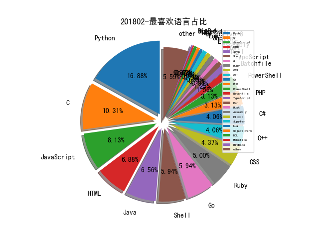

# 201802 信息源与信息类型占比

# 微信公众号 推荐
| nickname_english | weixin_no | title | url| 
| --- | --- | --- | ---| 
| AI科技评论 | aitechtalk |  | https://mp.weixin.qq.com/s/5UyAoAm0Llfm3YoobKSSCA | 1| 
| Bypass | Bypass-- |  | https://mp.weixin.qq.com/s?__biz=MzA3NzE2MjgwMg==&mid=2448903583&idx=1&sn=172d776a85dc99863d6d9450ef940b1e&chksm=8b55ddc2bc2254d4ebff63e83031e422239aa4a945d5699cc2cfe2eb18e6cd413a90d41823d4&mpshare=1&scene=23&srcid=0303eUNXG8ydUHQN0DtMhZMy#rd | 1| 
| n1nty | n1nty-talks |  | https://mp.weixin.qq.com/s/PZsOQy2lpR1lHqLWmAXlbg | 1| 
| 大数据文摘 | BigDataDigest |  | https://mp.weixin.qq.com/s/U2XBScWThbIEB4EdV4q63A | 1| 
| 威胁猎人 | ThreatHunter |  | http://mp.weixin.qq.com/s/evGK8v2rjM4IGYODYXFvtA | 1| 
| 安全牛 | aqniu-wx |  | https://mp.weixin.qq.com/s/jb7Cl3YXNRAfN-2Awuewig | 1| 
| 密码学报 |  |  | https://mp.weixin.qq.com/s/u1mDFINefmUEeeDsYrUsAw | 1| 
| 百度安全实验室 | BaiduX_lab |  | https://mp.weixin.qq.com/s/_r6d2uQ3aHcOZe8uLKAbYg | 1| 
| 知识分子 | The-Intellectual |  | https://mp.weixin.qq.com/s/mWaHqfCQKm1eJrZZIcgibA | 1| 
| 美的金融科技 | MideaFintech |  | https://mp.weixin.qq.com/s/MR3SmOLj834LK4RBMcZ2pg | 1| 
| CSecGroup | cSecGroup |  | https://mp.weixin.qq.com/s?__biz=MzI3NzAzMjEyNg==&mid=2649530469&idx=1&sn=4a2ba687274aec2f44b29660b8567fcd&chksm=f3747db4c403f4a2c1fb3ac7cb869f347bfc74a838266ef55455d7b4495ab0481abef81e660f&scene=0&key=840d183eb8a3dbfa5f3f32cb8d30667e5030e61ccbe28114 | 1| 
| 娱阅信情 | Prof_WenchangShi |  | https://mp.weixin.qq.com/s/uZFYl3xKT5-aWzvI3mmQ2A | 1| 
| 数据简化DataSimp | ChiefDataAnalyst |  | https://mp.weixin.qq.com/s/JhylKtarrpvpZlP--ARBRw | 1| 
| 水滴安全实验室 | EversecLab |  | https://mp.weixin.qq.com/s/SIBGnMc-XIqy2Ohj1ni_fg | 1| 
| 浅黑科技 | qianheikeji |  | https://mp.weixin.qq.com/s/mF4D-MGM6_6QA3_7XZSj0w | 1| 
| 环球科学 | huanqiukexue |  | https://mp.weixin.qq.com/s/jbJJyWjmW-h7SI0YmYkElg | 1| 
| 逢魔安全实验室 | FormSec |  | https://mp.weixin.qq.com/s/_-AtrbMNROUFRbaime3NrA | 2| 
| SecWiki | SecWiki |  | https://mp.weixin.qq.com/s/bUFHm4dQKz3Vc6dhfo2bdw | 1| 
| malwarebenchmark |  |  | https://mp.weixin.qq.com/s/dR53Oa_WQ_A9_pvsbQ4JrQ | 1| 
| 兜哥带你学安全 | waf_ads_ids |  | https://mp.weixin.qq.com/s/5wJbvuG0IUOX4jdFtYNnkg | 1| 
| 君哥的体历 | jungedetili |  | https://mp.weixin.qq.com/s/3QfCUFjpE_eI8QfqDrFIrg | 6| 
| 国家互联网应急中心CNCERT | CNCERTCC |  | https://mp.weixin.qq.com/s/aDVIG7_QTaMCHAwgrqnHDA | 1| 
| 天际友盟情报站 |  |  | https://mp.weixin.qq.com/s/TZj7SFHEkL4q13GFngS0tw | 1| 
| 奇安信威胁情报中心 |  |  | https://mp.weixin.qq.com/s/zJm-mr5-U5sBHdc3Qlx_3Q | 2| 
| 奇安信安全监测与响应中心 | cert360 |  | https://mp.weixin.qq.com/s/1LpgGx3-YA5aR0Mx9iryCQ | 2| 
| 安全优佳 | securityjia |  | https://mp.weixin.qq.com/s/ajDCSfVmw94GjPkuVSq_fw | 1| 
| 安全威胁情报 | Threatbook |  | https://mp.weixin.qq.com/s/9W4mnzeN1-uZwy3RhPnRrA | 2| 
| 安在 | AnZer_SH |  | https://mp.weixin.qq.com/s/Q2s1olNAD4Mtufe32NQw6w | 1| 
| 工业安全产业联盟 | ICSISIA |  | https://mp.weixin.qq.com/s/XmQ8v-vaBLz1mfBAIpMdYQ | 1| 
| 我的安全视界观 | CANI_Security |  | http://mp.weixin.qq.com/s/lkfA7-Ii3KJtodWdcZUfog | 4| 
| 猎户攻防实验室 | TassLiehu |  | https://mp.weixin.qq.com/s/XWIIniSgq75lMK6Vi_BKaA | 1| 
| 红日安全 | sec-redclub |  | http://mp.weixin.qq.com/s/vroN1CKPjf2x033E0e43vg | 2| 
| 阿里云安全 | aliyunsec |  | https://mp.weixin.qq.com/s/dEpW-pV51Z6fSdXu9pmEvQ | 1| 
| 高效运维 | greatops |  | https://mp.weixin.qq.com/s/EAPHplKe9meI0-EHeF_BcQ | 1| 

# 组织github账号 推荐
| github_id | title | url | org_url | org_profile | org_geo | org_repositories | org_people | org_projects | repo_lang | repo_star | repo_forks| 
| --- | --- | --- | --- | --- | --- | --- | --- | --- | --- | --- | ---| 
| Microsoft | CFI 攻击与防御的发展历程,来自 MSRC 团队在 2018 OffensiveCon 会议的演讲: | https://github.com/Microsoft/MSRC-Security-Research/blob/master/presentations/2018_02_OffensiveCon/The%20Evolution%20of%20CFI%20Attacks%20and%20Defenses.pdf | https://opensource.microsoft.com | Open source, from Microsoft with love | Redmond, WA | 2463 | 4258 | 0 | C,TypeScript,CMake,C#,JavaScript,Objective-C,C++,Go,Python,Batchfile,HTML,Rich,Jupyter,Java,PowerShell | 0 | 0 | 1| 
| npm | npm 5.7.0 之前版本在执行 sudo npm --help 等命令时会随机修改 /etc /usr /boot 等目录的属主权限: | https://github.com/npm/npm/issues/19883 | https://www.npmjs.com |  | earth | 270 | 11 | 0 | Rust,Shell,JavaScript,HTML,CSS | 0 | 0 | 1| 
| rapid7 | EternalRomance / EternalChampion aux+exploit modules | https://github.com/rapid7/metasploit-framework/pull/9473 | http://www.rapid7.com/ |  | Boston, MA | 234 | 0 | 0 | C,Java,Python,JavaScript,HTML,Go,Ruby | 0 | 0 | 1| 
| nccgroup | AutoRepeater - 自动化 HTTP 重放攻击的 BurpSuite 插件: | https://github.com/nccgroup/AutoRepeater | https://www.nccgroup.trust | Please report all security issues to security at nccgroup dot com | Global | 180 | 15 | 0 | C,Shell,Java,Python,JavaScript,C#,HTML,Elixir,Go,Rust | 0 | 0 | 2| 
| fireeye | FireEye 发布 ReelPhish 实时双因素钓鱼工具,介绍: https://www.fireeye.com/blog/threat-research/2018/02/reelphish-real-time-two-factor-phishing-tool.html ; GitHub: | https://github.com/fireeye/ReelPhish | https://www.fireeye.com/blog.html |  | Milpitas, CA | 48 | 1 | 0 | C,Vue,Python,JavaScript,C++,C#,Go,PowerShell | 0 | 0 | 1| 
| fox-it | BloodHound.py - Python 编写的 BloodHound 活动目录信息提取工具: | https://github.com/fox-it/BloodHound.py | https://www.fox-it.com/ |  | https://www.fox-it.com/ | 31 | 1 | 0 | C,Shell,Python,Bro,HTML,Ruby,PowerShell | 0 | 0 | 1| 
| S2E | 基于 S2E 符号执行分析平台自动化地发现漏洞、生成 PoC: | https://github.com/S2E/docs/blob/master/src/Tutorials/pov.rst | http://s2e.systems | A Platform for In-Vivo Analysis of Software Systems | http://s2e.systems | 28 | 6 | 0 | Groovy,C,Shell,Python,Makefile,C++,CSS | 0 | 0 | 1| 
| duo-labs | cloudmapper: 生成AWS环境的网络拓扑图 | https://github.com/duo-labs/cloudmapper | https://labs.duosecurity.com | Duo Labs is the security research team at Duo Security. | Ann Arbor, MI | 28 | 0 | 0 | TypeScript,Java,Python,JavaScript,Objective-C,Go,CSS | 0 | 0 | 1| 
| shieldfy | 开发安全的 API 所需要核对的清单 | https://github.com/shieldfy/API-Security-Checklist/blob/master/README-zh.md | https://shieldfy.io | Shieldfy Open Source | https://shieldfy.io | 19 | 2 | 0 | PHP,JavaScript,HTML | 0 | 0 | 1| 
| infobyte | Evilgrade - 专门用来攻击常用软件更新的框架,劫持常用软件的更新信道,替换为指定的二进制文件: | https://github.com/infobyte/evilgrade | https://www.faradaysec.com | Collaborative Penetration Test and Vulnerability Management Platform. We provide specialized services in offensive security. | Miami, FL | 18 | 0 | 0 | Shell,Java,Python,JavaScript,Perl,Erlang,Ruby | 0 | 0 | 1| 
| Coalfire-Research | iOS 11.1.2 (15B202) 越狱 Exploit 代码: | https://github.com/Coalfire-Research/iOS-11.1.2-15B202-Jailbreak | http://www.coalfirelabs.com | Advancing the state of the Infosec industry by providing cutting-edge research, open-source tools and tradecraft | http://www.coalfirelabs.com | 16 | 0 | 0 | C,Python,JavaScript,Lua,PowerShell,HCL | 0 | 0 | 3| 
| logicalhacking | DVHMA - 一套 Android 漏洞学习、实战环境: | https://github.com/logicalhacking/DVHMA | https://logicalhacking.com | Git mirror of the Software Assurance & Security Research Team at The University of Sheffield. The team is headed by Achim D. Brucker (@adbrucker). | Sheffield, UK | 16 | 1 | 0 | Java,Isabelle,Python,Dockerfile,JavaScript,Standard,Ruby | 0 | 0 | 1| 
| SECFORCE | sparta - Python GUI 应用,在扫描和枚举阶段协助渗透测试人员快速完成测试: | https://github.com/SECFORCE/sparta | http://www.secforce.com |  | London, UK | 15 | 0 | 0 | Python,HTML,Ruby | 0 | 0 | 1| 
| VerSprite | PureVPN for MacOS 权限提升漏洞披露(CVE-2018-6822): | https://github.com/VerSprite/research/blob/master/advisories/VS-2018-002.md | None |  | Atlanta, GA | 12 | 0 | 0 | C,Java,Python,JavaScript,HTML,PHP | 0 | 0 | 4| 
| UndeadSec | SocialFish - 与 Ngrok 集成的社工钓鱼工具: | https://github.com/UndeadSec/SocialFish | https://www.youtube.com/c/UndeadSec | Telegram Group: https://t.me/UndeadSec | Brazil | 11 | 6 | 0 | Python,HTML,CSS,Dart | 0 | 0 | 1| 
| archerysec | archerysec: 开源的漏洞扫描和管理平台 | https://github.com/archerysec/archerysec | http://archerysec.com | Open Source Project | http://archerysec.com | 10 | 0 | 0 | Python,Shell,JavaScript,HTML | 0 | 0 | 1| 
| huntresslabs | evading-autoruns | https://github.com/huntresslabs/evading-autoruns | http://huntresslabs.com |  | United States | 9 | 0 | 0 | Batchfile,Ruby,PowerShell | 0 | 0 | 1| 
| Intoli | Exodus - 用于 Linux 系统二进制程序重打包(relocation)的工具,解决将二进制程序拷贝到其他机器上运行时不兼容的问题: | https://github.com/Intoli/exodus | https://intoli.com |  | https://intoli.com | 8 | 1 | 0 | Python,C#,JavaScript | 0 | 0 | 1| 
| dtag-dev-sec | t-pot-autoinstall: Autoinstall T-Pot on Ubuntu 16.04 | https://github.com/dtag-dev-sec/t-pot-autoinstall | None | Telekom Security on GitHub, home of T-Pot, PEBA, Explo and more. | None | 8 | 2 | 0 | Python,C,Shell,HTML | 0 | 0 | 1| 
| landscapeio | prospector - 类似 Pylint 的 Python 代码分析工具: | https://github.com/landscapeio/prospector | https://landscape.io |  | https://landscape.io | 8 | 2 | 0 | Python,Java | 0 | 0 | 1| 
| twelvesec | Gasmask - 开源情报信息收集工具: | https://github.com/twelvesec/gasmask | https://www.twelvesec.com | TwelveSec is an information security firm, specialising in assurance, security management, and InfoSec training services | Athens, Greece | 8 | 6 | 0 | Python,C,Java,C++ | 0 | 0 | 1| 
| CSecGroup | Wafid: WAF指纹识别工具 | https://github.com/CSecGroup/wafid | https://csecgroup.github.io/ | 专注代码安全审计、漏洞检测及安全修复方案研究 | beijing | 7 | 0 | 0 | Python,C,HTML,Java | 0 | 0 | 1| 
| NextronSystems | 工具介绍之 HELK vs APTSimulator:HELK 是 Elasticsearch、Logstash、Kibana 三个的组合,基于日志分析检测攻击。APTSimulator 是个模拟被渗透系统环境的工具:1): https://github.com/NextronSystems/APTSimulator 2): https://github.com/Cyb3rWard0g/HELK3): | https://github.com/NextronSystems/APTSimulator | https://www.nextron-systems.com/ | We Detect Hackers | Frankfurt, Germany | 7 | 0 | 0 | Go,Python,Batchfile | 0 | 0 | 1| 
| Malshare | MalShare-Toolkit - 与 Malshare 进行交互的一系列工具集合: | https://github.com/Malshare/MalShare-Toolkit | http://www.MalShare.com | Collaborative, community driven public malware repository | http://www.MalShare.com | 4 | 1 | 0 | C#,Python | 0 | 0 | 1| 
| nullsecuritynet | dnsspider - 快速子域名收集工具: | https://github.com/nullsecuritynet/tools/tree/master/scanner/dnsspider | http://www.nullsecurity.net/ | From 0x00 till dawn! | In your systems memory | 4 | 0 | 0 | Python,HTML | 0 | 0 | 1| 
| MiSecurity | x-patrol: github泄露扫描系统 | https://github.com/MiSecurity/x-patrol | None |  | Beijing, China | 3 | 0 | 0 | Go | 0 | 0 | 1| 
| intelxed | xed - x86 encoder decoder: | https://github.com/intelxed/xed | https://intelxed.github.io/ |  | Massachusetts | 3 | 1 | 0 | Python,HTML | 0 | 0 | 1| 
| openexr | HDR 图像格式的开源实现 OpenEXR 被发现越界写漏洞(Imf_2_2::copyIntoFrameBuffer): | https://github.com/openexr/openexr/issues/262 | http://openexr.org/ |  | http://openexr.org/ | 3 | 4 | 0 | C++ | 0 | 0 | 1| 
| samdenty99 | injectify - 类似于 BeFF 的网站中间人攻击工具: | https://github.com/samdenty99/injectify | https://github.com/samdenty | Moved here -> https://github.com/samdenty | https://github.com/samdenty | 0 | 0 | 0 |  | 0 | 0 | 1| 

# 私人github账号 推荐
| github_id | title | url | p_url | p_profile | p_loc | p_company | p_repositories | p_projects | p_stars | p_followers | p_following | repo_lang | repo_star | repo_forks | 
| --- | --- | --- | --- | --- | --- | --- | --- | --- | --- | --- | --- | --- | --- | ---| 
| trustedsec | A tool for automating cracking methodologies through Hashcat from the TrustedSec | https://github.com/trustedsec/hate_crack | https://www.trustedsec.com | Headquartered in Cleveland, Ohio, TrustedSec is an Information Security Consulting company, made up of researchers, hackers, advisors to help our customers. | Cleveland, Ohio | TrustedSec | 24 | 0 | 2 | 3100 | 8 | Python | 4400 | 1400 | 2| 
| x0rz | tweets_analyzer - 用于推文(Tweets)的元数据收集与活动分析工具: | https://github.com/x0rz/tweets_analyzer | https://0day.rocks | hacking things | France | None | 6 | 0 | 19 | 2600 | 0 | Python,C,Perl | 3500 | 2100 | 1| 
| FeeiCN | ESD: Enumeration sub domains(枚举子域名) | https://github.com/FeeiCN/ESD | https://github.com/alibaba | Security Researcher(专注自动化漏洞发现和入侵检测防御) | Hangzhou, China | @alibaba | 12 | 0 | 889 | 1500 | 72 | Python | 0 | 0 | 1| 
| hfiref0x | Stryker - CPU-Z CVE-2017-15303 漏洞的利用工具,基于该漏洞,这个工具实现 DSE 特性的开关控制、受保护进程劫持、Driver loader: | https://github.com/hfiref0x/Stryker | None |  | None | None | 23 | 0 | 24 | 1500 | 15 | C | 0 | 0 | 1| 
| 1N3 | IntruderPayloads - Burpsuite Intruder 常用的 Payloads 收集: | https://github.com/1N3/IntruderPayloads | https://github.com/xer0dayz | Founder of @XeroSecurity. Creator of Sn1per. Hacking since 93. 20+ yrs. IT exp. Sr. Penetration Tester. OSCE/OSCP/CISSP @xer0dayz @XeroSecurity @CrowdShield | None | XeroSecurity | 19 | 0 | 671 | 1400 | 35 | Python,C,Shell,BitBake | 0 | 0 | 3| 
| Neo23x0 | APTSimulator - 一个批处理脚本,快速将 Windows 系统改造成被 APT 入侵过的环境,用于安全产品测试等需求: | https://github.com/Neo23x0/APTSimulator | https://github.com/NextronSystems | #DFIR #Python #YARA #Golang #SIEM #SOC #Sigma #Malware | None | @NextronSystems | 79 | 0 | 101 | 1200 | 15 | Python,Batchfile,Java | 0 | 0 | 1| 
| janishar | MIT 的《深度学习》电子书: | https://github.com/janishar/mit-deep-learning-book-pdf | https://mindorks.com/ | Co-Founder Mindorks | Android & Full Stack Developer | UI/UX Designer | Writer | Philosopher | Open Source Contributor | Gurgaon, India | Mindorks | 14 | 0 | 57 | 1100 | 6 | Java | 0 | 0 | 1| 
| r00t-3xp10it | Meterpreter_Paranoid_Mode-SSL - 自定义 Meterpreter SSL 证书验证的工具: | https://github.com/r00t-3xp10it/Meterpreter_Paranoid_Mode-SSL | https://github.com/Suspicious-Shell-Activity | Be a hacker not a criminal... Pentester | IT enthusiastic | blooger | Lisbon - portugal | @Suspicious-Shell-Activity | 27 | 0 | 30 | 970 | 37 | C#,Shell,HTML,Ruby | 0 | 0 | 1| 
| NullArray | AutoSploit - 从 Shodan.io 收集信息并自动化地大规模攻击远程主机的工具: | https://github.com/NullArray/AutoSploit | https://github.com/GreySec-Official | Cyber security enthusiast. Freedom advocate. I believe in sharing knowledge, tools, and value open source software development. | None | @GreySec-Official | 34 | 0 | 204 | 933 | 164 | Python,Shell | 0 | 0 | 1| 
| EdOverflow | megplus - 自动化信息收集工具: | https://github.com/EdOverflow/megplus | https://edoverflow.com/ | Web developer & security researcher. | ::1 | None | 38 | 0 | 168 | 791 | 20 | Shell,HTML | 1600 | 497 | 1| 
| AlessandroZ | LaZagneForensic - 利用 Windows API CryptUnprotectData 解密用户密码的取证框架: | https://github.com/AlessandroZ/LaZagneForensic | None |  | None | None | 12 | 0 | 13 | 681 | 9 | Python | 0 | 0 | 1| 
| Cryptogenic | 索尼 PS4 4.55 bpf Kernel Exploit,可以实现内核态任意代码执行: | https://github.com/Cryptogenic/PS4-4.55-Kernel-Exploit | https://twitter.com/SpecterDev | PHP/C++ developer with an interest in user-land and web exploitation. | None | None | 28 | 0 | 38 | 642 | 5 | Go,C,JavaScript | 0 | 0 | 1| 
| Cyb3rWard0g | HELK: A Hunting ELK with advanced 威胁情报分析平台 | https://github.com/Cyb3rWard0g/HELK | https://github.com/Cyb3rWard0g | @Cyb3rWard0g | None | None | 10 | 0 | 19 | 636 | 2 | Jupyter,PowerShell | 1400 | 336 | 2| 
| ytisf | theZoo - 恶意软件收集仓库: | https://github.com/ytisf/theZoo | http://www.morirt.com | I found out you can get payed to hack stuff. | None | @tisfe | 29 | 0 | 37 | 612 | 5 | Python,CSS | 0 | 0 | 1| 
| dxa4481 | 利用基于 Attribute Selectors 的 CSS 注入偷 CSRF Token: | https://github.com/dxa4481/cssInjection | https://security.love | Full stack hacker | USA | None | 83 | 0 | 22 | 550 | 4 | Python,HTML,JavaScript | 3600 | 444 | 1| 
| codingo | Minesweeper - BurpSuite 的加密货币脚本检测插件: | https://github.com/codingo/Minesweeper | https://twitter.com/codingo_ | Penetration tester from Australia. Current maintainer of NoSQLMap, VHostScan, Reconnoitre. Co-contributor to subfinder. | Brisbane, Australia | None | 137 | 0 | 1000 | 544 | 239 | Python,Go | 0 | 0 | 1| 
| blendin | 3snake - 转储 sshd 和 sudo 明文密码的工具: | https://github.com/blendin/3snake | http://tiszka.com |  | None | None | 9 | 0 | 125 | 502 | 65 | Python,C | 322 | 60 | 1| 
| mthbernardes | sshLooter - 从 SSH 中窃取用户密码的脚本: | https://github.com/mthbernardes/sshLooter | https://mthbernardes.github.io |  | Campinas | None | 75 | 0 | 22 | 415 | 45 | Go,Python,C,Shell | 497 | 101 | 1| 
| mattiasgeniar | php-exploit-scripts - PHP 漏洞利用脚本收集: | https://github.com/mattiasgeniar/php-exploit-scripts | http://ma.ttias.be |  | Edegem, Antwerp | Nucleus | 84 | 0 | 323 | 366 | 105 | Shell,PHP,VCL,Perl | 609 | 265 | 1| 
| bluscreenofjeff | Red-Team-Infrastructure-Wiki | https://github.com/bluscreenofjeff/Red-Team-Infrastructure-Wiki | https://bluescreenofjeff.com | Adversary Simulation Lead at SpecterOps. Focused on red team and pentest development. | None | https://specterops.io | 10 | 0 | 7 | 361 | 13 | Python,Shell | 1700 | 426 | 1| 
| ufrisk | pcileech-fpga - 针对 FPGA 设备的 PCILeech DMA 攻击套件: | https://github.com/ufrisk/pcileech-fpga | None | IT-Security Minion | DMA Hacker | @UlfFrisk | Sweden | None | 15 | 0 | 68 | 308 | 15 | Python,C,Verilog | 0 | 0 | 1| 
| oguzhaninan | Stacer - Linux 系统优化与监控工具: | https://github.com/oguzhaninan/Stacer | https://oguzhaninan.gitlab.io/ | KTU Computer Science and Statistics https://twitter.com/oguzaninan | Trabzon, Turkey | None | 6 | 0 | 1700 | 298 | 27 | TypeScript,JavaScript,C++ | 0 | 0 | 1| 
| Te-k | Harpoon - 开源情报收集工具,介绍: https://www.randhome.io/blog/2018/02/23/harpoon-an-osint-/-threat-intelligence-tool/ GitHub: | https://github.com/Te-k/harpoon | https://www.randhome.io |  | None | None | 60 | 0 | 135 | 288 | 104 | Python,YARA,C | 785 | 769 | 1| 
| RobinDavid | LSB-Steganography - 使用最低有效位将文件隐写到图像中的 Python 脚本: | https://github.com/RobinDavid/LSB-Steganography | http://www.robindavid.fr |  | Paris, France | None | 22 | 0 | 273 | 221 | 34 | Python | 462 | 178 | 1| 
| bcicen | grmon - goroutines 的命令行监视工具: | https://github.com/bcicen/grmon | https://bradley.codes | Prototyping from the corner deli. | New York | None | 114 | 0 | 894 | 219 | 16 | Go,Python,Vim | 0 | 0 | 1| 
| gaoyifan | china-operator-ip: 中国运营商IP地址库(每日更新) | https://github.com/gaoyifan/china-operator-ip | http://yfgao.com/ |  | None | USTC | 31 | 0 | 504 | 195 | 49 | Go,Shell | 0 | 0 | 1| 
| maxchehab | CSS-Keylogging - 巧妙利用 CSS Selector,通过 CSS 偷用户输入的密码: | https://github.com/maxchehab/CSS-Keylogging | https://github.com/workos-inc |  | nyc | Intern @workos-inc. Person @gu-app-club | 88 | 0 | 68 | 194 | 52 | Go,C,JavaScript,CSS | 0 | 0 | 1| 
| guanchao | AppProtect: 整理一些app常见的加固方法 | https://github.com/guanchao/AppProtect | http://shuwoom.com | 专注。 | shenzhen | Tencent | 12 | 0 | 35 | 171 | 162 | Python,C,Java | 0 | 0 | 1| 
| Shiva108 | Mostly CTF notes | https://github.com/Shiva108/CTF-notes | http://cph-sec.github.io | Ethical Hacker, Penetration Tester, Founder CPH:SEC. | Copenhagen, Denmark | CPH:SEC | 31 | 0 | 1400 | 152 | 487 | Shell,HTML,PHP | 0 | 0 | 1| 
| maddiestone | IDAPythonEmbeddedToolkit - 用于自动化分析嵌入式设备固件的 IDAPython 脚本: | https://github.com/maddiestone/IDAPythonEmbeddedToolkit | http://twitter.com/maddiestone |  | None | None | 3 | 0 | 2 | 149 | 1 | Python | 425 | 88 | 1| 
| wetw0rk | Sickle - shellcode 辅助开发工具: | https://github.com/wetw0rk/Sickle | None | hax0r boi | None | None | 7 | 0 | 76 | 141 | 41 | Python,Assembly,Java | 404 | 68 | 1| 
| abhisek | Exploitation challenges for CTF | https://github.com/abhisek/pwnworks | https://github.com/appsecco | Technology enthusiast | Bangalore, India | @appsecco | 17 | 0 | 24 | 134 | 4 | C,Shell,Ruby,HCL,C++ | 98 | 60 | 1| 
| kkirsche | Weblogic wls-wsat 组件反序列化漏洞(CVE-2017-10271)的利用脚本: | https://github.com/kkirsche/CVE-2017-10271 | https://deceiveyour.team | Security Architect, Penetration Tester, and Exploit Developer #OSCP, #OSWP, #OSCE | ::1 | Verizon | 388 | 0 | 390 | 130 | 32 | Go,Python,JavaScript,Ruby | 0 | 0 | 1| 
| DormyMo | SpiderKeeper: scrapy爬虫框架的管理界面 | https://github.com/DormyMo/SpiderKeeper | http://www.7mdm.com |  | hangzhou | None | 29 | 0 | 595 | 128 | 27 | Python,HTML | 0 | 0 | 1| 
| zricethezav | gitleaks - 从整个 git 仓库的历史中搜寻敏感数据的工具: | https://github.com/zricethezav/gitleaks | https://github.com/GannettDigital |  | None | @GannettDigital | 34 | 0 | 568 | 123 | 94 | Go,Python,Vim | 0 | 0 | 1| 
| merrychap | shellen - 交互式 shellcode 开发环境: | https://github.com/merrychap/shellen | https://github.com/VoidHack | | Developer | CTF player (voidka / VoidHack) | Security enthusiast | Keen interest in RE and PWN | In the wires | @VoidHack | 20 | 0 | 917 | 121 | 99 | Python,C | 0 | 0 | 1| 
| alpha1e0 | kiwi：一款源代码安全审计工具 | https://github.com/alpha1e0/kiwi | http://alpha1e0.github.io | The quieter you become, the more you are able to hear. | Hangzhou. China | None | 9 | 0 | 123 | 103 | 6 | Python,JavaScript,Java,CSS | 377 | 216 | 1| 
| Hyperparticle | 修改一个像素,迫使深度神经网络得出错误的图片分类结果,这个 Repo 是 One pixel attack for fooling deep neural networks Paper 的代码实现: | https://github.com/Hyperparticle/one-pixel-attack-keras | https://twitter.com/hyperparticle | Machine Learning, NLP, and Graph Databases. I love a fresh challenge—be it a math problem, a physics puzzle, or programming quandary. | Boise, Idaho, United States | Boise State University | 20 | 0 | 345 | 99 | 42 | Python,C#,Jupyter | 0 | 0 | 1| 
| jollheef | LibreOffice 远程任意文件泄漏漏洞披露(CVE-2018-6871): | https://github.com/jollheef/libreoffice-remote-arbitrary-file-disclosure | https://seccomp.ru | read-write mirror for code.dumpstack.io | Saint Petersburg, Russia | None | 35 | 0 | 299 | 96 | 26 | Go,C,Java,CSS | 0 | 0 | 1| 
| sagishahar | lpeworkshop - Windows / Linux 本地提权 Workshop: | https://github.com/sagishahar/lpeworkshop | None |  | None | None | 5 | 0 | 28 | 93 | 0 | Python,C#,Batchfile,PowerShell | 751 | 200 | 1| 
| stevespringett | Dependency-Track：第三方库漏洞检测工具 | https://github.com/stevespringett/dependency-track | http://stevespringett.com/ | I build stuff, I break stuff, I develop stuff to protect stuff. | Chicago | None | 20 | 0 | 70 | 91 | 1 | Java,XSLT | 0 | 0 | 1| 
| Naetw | CTF-pwn-tips - CTF PWN 方向的技巧总结: | https://github.com/Naetw/CTF-pwn-tips | None |  | Hsinchu/Taiwan | None | 17 | 0 | 133 | 85 | 34 | Python,HTML,C++ | 0 | 0 | 1| 
| decoder-it | 通过指定父进程的方式获得 SYSTEM 权限: https://decoder.cloud/2018/02/02/getting-system/ GitHub: | https://github.com/decoder-it/psgetsystem | None |  | None | None | 10 | 0 | 1 | 82 | 0 | C#,PowerShell,C++ | 144 | 52 | 1| 
| dirtyfilthy | freshonions-torscraper: TOR spider / hidden service onion crawler | https://github.com/dirtyfilthy/freshonions-torscraper | None |  | None | None | 26 | 0 | 18 | 79 | 1 | Python,Java,C,Ruby | 212 | 77 | 1| 
| omergunal | PoT - 利用 Twitter 钓鱼的工具: | https://github.com/omergunal/PoT | https://ogunal.com |  | Turkey | None | 16 | 0 | 50 | 72 | 13 | Python,HTML | 0 | 0 | 1| 
| v1cker | src_edu: edu站点及其对应的子域名 | https://github.com/v1cker/src_edu | None |  | cn | None | 471 | 0 | 751 | 66 | 249 | Python,C#,PHP,CSS | 65 | 22 | 1| 
| Srinivas11789 | PcapXray - 网络取证工具,用于可视化展示网络通信详情: | https://github.com/Srinivas11789/PcapXray | http://srinivas11789.github.io | Love building/breaking things --> Code || Test, Plan, Break, Debug (Loop!) | City of Angels | None | 58 | 0 | 118 | 64 | 14 | Python | 0 | 0 | 1| 
| blue-bird1 | metasploit-cn-wiki: 一些metasploit的中文文档 | https://github.com/blue-bird1/metasploit-cn-wiki | https://github.com/Earth-Online | @Earth-Online | None | None | 7 | 0 | 906 | 64 | 165 | C | 0 | 0 | 1| 
| ALEXZZZ9 | 索尼 PS4 5.01 WebKit Exploit PoC: | https://github.com/ALEXZZZ9/PS4-5.01-WebKit-Exploit-PoC | https://ax9.me/ |  | None | None | 4 | 0 | 542 | 61 | 11 | C#,JavaScript | 0 | 0 | 1| 
| kacperszurek | 从 JetBrains IDE 提取服务器的密码,利用这些密码通过 Metasploit 控制服务器: | https://github.com/kacperszurek/pentest_teamcity | None |  | None | None | 9 | 0 | 3 | 60 | 0 | Python,PHP,Ruby,PowerShell | 144 | 38 | 1| 
| l0ss | Grouper - 用于寻找活动目录组策略漏洞的 PowerShell 脚本: | https://github.com/l0ss/Grouper | None |  | None | None | 36 | 0 | 2 | 54 | 0 | C# | 0 | 0 | 1| 
| pornin | CTTK - 常量执行时间代码片段收集,这些代码用来参考编写可以防御侧信道攻击的加解密代码: | https://github.com/pornin/CTTK | None |  | None | None | 5 | 0 | 0 | 54 | 0 | C#,C | 0 | 0 | 1| 
| azizaltuntas | Pymap-Scanner - Python Scanner with | https://github.com/azizaltuntas/Pymap-Scanner | None | #Expl[]iting Human Vulnerability | TURKEY | Free | 8 | 0 | 0 | 52 | 0 | Python,CSS | 0 | 0 | 1| 
| UltimateHackers | JShell - Get a JavaScript shell with XSS: | https://github.com/UltimateHackers/JShell | None | This profile has been moved to: https://github.com/s0md3v | None | None | 0 | 0 | 0 | 47 | 0 |  | 0 | 0 | 1| 
| Eterna1 | Puszek - Linux kernel module rootkit: | https://github.com/Eterna1/puszek-rootkit | http://eternal.red |  | None | None | 12 | 0 | 252 | 45 | 51 | Python,C | 138 | 27 | 1| 
| andrewilyas | 关于对抗神经网络样本训练的一个 Repo: Circumventing the defense in Ensemble Adversarial Training: Attacks and Defenses: | https://github.com/andrewilyas/ens-adv-train-attack | http://andrewilyas.com | PhD student studying Machine Learning at MIT. | None | None | 10 | 0 | 11 | 43 | 0 | Python,JavaScript | 0 | 0 | 1| 
| Arrexel | phpbash - 模拟 PHP 半交互式终端的 webshell: | https://github.com/Arrexel/phpbash | https://devnauts.com/ |  | Canada | Devnauts | 7 | 0 | 0 | 34 | 0 | Python,Ruby,PHP,Java,Go | 389 | 79 | 1| 
| B16f00t | whapa - whatsapp database parser: | https://github.com/B16f00t/whapa | None | Forensic and Cybercrime investigator | None | None | 1 | 0 | 56 | 29 | 2 | Python | 135 | 37 | 1| 
| snooze6 | FiOS - 基于 objection 框架可视化地审计 iOS APP: | https://github.com/snooze6/FiOS | https://es.linkedin.com/in/armando-nogueira-rio-25ba67116 | The universe as we observe is a really vast place, fact that most people tend to ignore in order to have a quiet life... Not me! I like challenges! | None | None | 31 | 0 | 43 | 27 | 19 | Java,C,JavaScript,Swift,CSS | 146 | 15 | 1| 
| dotboris | vuejs serverside template xss: | https://github.com/dotboris/vuejs-serverside-template-xss | https://github.com/pmctire | Crazy person | Sherbrooke, QC, Canada | @pmctire | 37 | 0 | 78 | 26 | 23 | PHP,Ruby,CSS,Rust,Elixir | 0 | 0 | 1| 
| hwroot | 攻击 PS4 - 从 WebKit 到 FreeBSD 内核的漏洞利用: | https://github.com/hwroot/Presentations/blob/master/Mess%20with%20the%20best%20die%20like%20the%20rest%20mode%20by%20Volodymyr%20Pikhur%20-%20REcon%20Brussels%202018.pdf | None |  | None | None | 4 | 0 | 1 | 26 | 0 | Assembly,C++ | 26 | 7 | 1| 
| dekuan | VwFirewall: 微盾VirtualWall防火墙整套源代码 | https://github.com/dekuan/VwFirewall | http://www.dekuan.org/ |  | Beijing, China | DeKuan, Inc. | 53 | 0 | 17 | 21 | 0 | TypeScript,C,PHP,JavaScript | 139 | 57 | 1| 
| finixbit | elf-parser - 轻量级 ELF 二进制头解析工具: | https://github.com/finixbit/elf-parser | https://github.com/andela | Python, DevOps, Security | 0x41414141, Accra | @andela | 10 | 0 | 260 | 20 | 0 | Python,Clojure,C++ | 0 | 0 | 1| 
| codeexpress | respounder - 用于检测网络中是否存在 Responder 的工具: | https://github.com/codeexpress/respounder | None | Programming, offensive security, blue team tools etc. | None | None | 6 | 0 | 4 | 19 | 0 | Go,HTML,Ruby | 197 | 19 | 1| 
| unassassinable | Privileged Access Workstation (PAW) - 企业管理员安全管理设备、防御密码窃取、防御摆渡攻击的一套工具集: | https://github.com/unassassinable/PAW | None |  | None | None | 6 | 0 | 0 | 19 | 0 | C,PowerShell | 170 | 29 | 1| 
| hi-WenR0 | MLCheckWebshell:机器学习检测Webshell | https://github.com/hi-WenR0/MLCheckWebshell | http://www.wenr0.me |  | None | None | 6 | 0 | 159 | 17 | 9 | C,Python,JavaScript,HTML,PHP,CSS | 75 | 26 | 1| 
| nashcontrol | Bounty Monitor | https://github.com/nashcontrol/bounty-monitor | None |  | None | None | 4 | 0 | 382 | 17 | 4 | Python,CSS | 0 | 0 | 1| 
| 1lastBr3ath | drmine - 自动化检测网页是否包含挖矿脚本的工具: | https://github.com/1lastBr3ath/drmine | http://㎠.㎺/ |  | Kathmandu, Nepal | None | 22 | 0 | 92 | 16 | 9 | Python,C,JavaScript,CSS | 30 | 45 | 1| 
| juhakivekas | multidiff - 用于逆向工程和二进制数据分析的 diff 工具: | https://github.com/juhakivekas/multidiff | None | An [organic automaton] pretending to know about cryptography, software security, and new media. | Helsinki | None | 15 | 0 | 86 | 15 | 24 | Python,C,Assembly | 0 | 0 | 1| 
| kevlar1818 | is_my_password_pwned - 判断密码是否出现在被黑账户数据库中的脚本: | https://github.com/kevlar1818/is_my_password_pwned | None |  | Maine, USA | None | 23 | 0 | 192 | 15 | 14 | Python,Shell,Elixir | 0 | 0 | 1| 
| blackzert | Linux ASLR and GNU Libc:地址空间布局的计算与 Stack Canary 的 Bypass: | https://github.com/blackzert/aslur/raw/master/offensivecon-talk.pdf | None |  | None | None | 2 | 0 | 1 | 13 | 0 | Python,C++ | 47 | 9 | 1| 
| 2young2simple | yispider: 一款分布式爬虫平台 | https://github.com/2young2simple/yispider | None |  | None | None | 32 | 0 | 134 | 12 | 9 | Go,Python,C,JavaScript | 101 | 21 | 1| 
| avielw | kplugs - Linux 内核模块,提供在 Linux 内核中动态执行脚本的接口: | https://github.com/avielw/kplugs | None |  | None | None | 4 | 0 | 0 | 7 | 0 | C | 0 | 0 | 1| 
| olegzhr | Altprobe - IDS events collector | https://github.com/olegzhr/altprobe | None |  | None | None | 5 | 0 | 46 | 7 | 0 | Shell,Java,C++ | 33 | 7 | 1| 
| thomasbiege | 研究员 Thomas Biege 分享的一些关于安全编码的 PPT: | https://github.com/thomasbiege/slides/tree/master/Secure%20Programming | None | Cyber security research and management since the late 90s. | None | None | 3 | 0 | 0 | 5 | 0 | PostScript,C,HTML | 8 | 0 | 1| 
| vysec | 利用 Adobe Flash 最近修复的 CVE-2018-4878 野外 0Day 攻击 IE 浏览器的 Exploit 脚本: | https://github.com/vysec/CVE-2018-4878 | None |  | None | None | 0 | 0 | 0 | 4 | 0 |  | 0 | 0 | 1| 
| Eitenne | roxysploit - 漏洞利用框架: | https://github.com/Eitenne/roxysploit | None | None | None | None | 0 | 0 | 0 | 0 | 0 | None | 0 | 0 | 2| 
| ExpLife | Analysis-Tools: 恶意软件分析套件 | https://github.com/ExpLife/Analysis-Tools | None | None | None | None | 0 | 0 | 0 | 0 | 0 | None | 0 | 0 | 1| 
| SecGen | SecGen: Generate vulnerable virtual machines on the fly | https://github.com/SecGen/SecGen | None | None | None | None | 0 | 0 | 0 | 0 | 0 | Ruby | 0 | 0 | 1| 
| blog | Github 宣布移除匿名用户创建 gist 的功能: | https://github.com/blog/2503-deprecation-notice-removing-anonymous-gist-creation | None | None | None | None | 0 | 0 | 0 | 0 | 0 |  | 0 | 0 | 1| 
| honeytrap | honeytrap - 一款蜜罐框架: | https://github.com/honeytrap/honeytrap | None | None | None | None | 0 | 0 | 0 | 0 | 0 | Shell,Lua,HTML,Go,Ruby,CSS | 0 | 0 | 1| 
| micle-fm | Parat - Python 实现的远程控制工具: | https://github.com/micle-fm/Parat | None | None | None | None | 0 | 0 | 0 | 0 | 0 | None | 0 | 0 | 1| 
| nezha-dt | nezha - 一款差分模糊测试工具: | https://github.com/nezha-dt/nezha | None | None | None | None | 0 | 0 | 0 | 0 | 0 | C++ | 0 | 0 | 1| 
| robotattackorg | robot-detect - ROBOT 漏洞检测脚本 : | https://github.com/robotattackorg/robot-detect | None | None | None | None | 0 | 0 | 0 | 0 | 0 | Python | 0 | 0 | 1| 

# medium_xuanwu 推荐
| title | url| 
| --- | ---| 

# medium_secwiki 推荐
| title | url| 
| --- | ---| 

# zhihu_xuanwu 推荐
| title | url| 
| --- | ---| 

# zhihu_secwiki 推荐
| title | url| 
| --- | ---| 

# 日更新程序
`python update_daily.py`