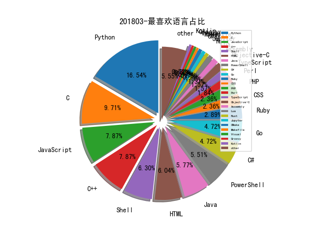

# [数据--所有](README_20.md)
# [数据--年度](README_2018.md)
# 201803 信息源与信息类型占比

# 微信公众号 推荐
| nickname_english | weixin_no | title | url| 
| --- | --- | --- | ---| 
| 青藤云安全实验室 | qt_lab | 【应用安全】浅谈Linux系统MongoDB安全配置 | https://mp.weixin.qq.com/s/j5NFI8oX-BC5waxLOl58aQ | 1| 
| 绿盟科技 | NSFOCUS-weixin | 2018 RSA , 面对强大的网络威胁，即刻行动起来！ | https://mp.weixin.qq.com/s/cH6_AWMXRNOoAm_lruF7SQ | 1| 
| 开放知识图谱 | OpenKG-CN | 王仲远 , 基于概念知识图谱的短文本理解 | https://mp.weixin.qq.com/s/avf72hYVq4WBJ63G6wlORA | 1| 
| 宜信安全应急响应中心 | CreditEaseSec | 宜信漏洞管理平台『洞察』 | https://mp.weixin.qq.com/s/24V5nJ47ZyAAYTU78mjgvg | 1| 
| 安恒信息 | DBAPP2013 | 7块钱的BadUSB | https://mp.weixin.qq.com/s/mIcRNcf5HmZ4axe8N92S7Q | 1| 
| 天黑说嘿话 | wintogether1 | 记一次爬虫批量爬取exp | https://mp.weixin.qq.com/s?__biz=MzI5NTQ5MTAzMA==&mid=2247483860&idx=1&sn=c773f70165f5a48be62acdf8e0217f2d&chksm=ec53856ddb240c7b372d85c3912456b236f9b37e399e30c687b4596892cf5c399ef4ea9aeb18&scene=38#wechat_redirect | 1| 
| 同程旅行安全应急响应中心 | lysrc_team | 利用插件对Chrome进行UXSS | https://mp.weixin.qq.com/s/2uYgr1hNbP_lUBYVREM6vg | 1| 
| 云鼎实验室 | YunDingLab | Exploiting Jolokia Agent with Java EE Servers | https://mp.weixin.qq.com/s/blpFK0oigTGtI_eVJxEL0w | 1| 
| 中科院信息科技战略情报 | xxkjzlqb | NSF3000万美元推动计算和信息科学领域前沿变革研究 | https://mp.weixin.qq.com/s/WQ1JKpiYhe9-jb0RPsScIA | 1| 
| HenceTech | gh_75a8b5dd04be | QWB-2018 WEB partial solutions | https://mp.weixin.qq.com/s/xEBr7JxbSTt11oiBsgc3uw | 1| 
| DJ的札记 | DJ_notes | Powershell+dnscat2实现DNS隐蔽隧道反弹Shell，和检测方法 | https://mp.weixin.qq.com/s/5mDhzuGC2WEc8bdIjRg94w | 1| 
| 阿里云安全 | aliyunsec | 游戏安全报告（2017 - 2018） | https://mp.weixin.qq.com/s/4j2MG4FzEUd1CzcBGr__YA | 1| 
| 猎户攻防实验室 | TassLiehu | SQL和NoSQL注入原理剖析（上） | https://mp.weixin.qq.com/s/LsqQo_04ROuf2_wLrBRRZQ# | 2| 
| 奇安信威胁情报中心 | gh_166784eae33e | 利用了多种Office OLE特性的免杀样本分析及溯源 | https://mp.weixin.qq.com/s/O8aLjaqMxtbAob_GKhasiw | 2| 
| 云安全联盟CSA | csa_china | CSA报告, 《用区块链技术保障物联网安全》（附报告下载） | https://mp.weixin.qq.com/s/DShAaS_7YSYQle5FzyKGpQ | 1| 
| E安全 | EAQapp | 暗网：你的银行帐户值多少钱？ | https://mp.weixin.qq.com/s/A8C1k2LQoJGiww8Wcsk-uA | 1| 
| DoSec容器安全 | dosecs | GITC演讲PPT-Docker安全实践探索 | https://mp.weixin.qq.com/s/Bb23b1XZba9eubXpNnKfNA | 4| 
| 百度安全实验室 | BaiduX_lab | 2017年百度安全技术精选 | https://mp.weixin.qq.com/s/6evxKjAzc3sweIQrbC3QrA | 2| 
| 工业安全产业联盟 | ICSISIA | 荐读 , 一文get国外和国内工业控制产品信息安全认证，看这里！ | https://mp.weixin.qq.com/s/ImSw-mCfqE-OGiZMQgpvwA | 1| 
| 君哥的体历 | jungedetili | 金融企业信息安全团队建设（务虚篇） | http://mp.weixin.qq.com/s/1s0lQJXqIHc83Tithcj1sw | 5| 
| XCTF联赛 | gh_3d7c7f90f79f | 专访Eur3kA战队Atum队长：我们战队充满热情和活力 | https://mp.weixin.qq.com/s/wKawjbRxyXwMxij4tlZ6jg | 1| 
| LBS | lbs-sir | 美国“天网”系统：大数据算法下的滥杀 | https://mp.weixin.qq.com/s/yEUN2uLsXqPLBC_JzEcK2A | 2| 
| CIO之家 | imciow | 京东海量运维的演进 | https://mp.weixin.qq.com/s/V0hGKMvgnp3dq7BsFLiNhg | 1| 
| 2045加速器 | gh_9438f9d016a5 | 2018工业互联网红利爆发：政策战略、关键技术、典型案例深度解读！ | https://mp.weixin.qq.com/s/XGLhdAljXv2nAJ_XL7WBeA | 1| 
| 鲸犀 | whalerhino | 黑产猎人：老毕 | https://mp.weixin.qq.com/s/Ii7dZSaN1XDWupYP8aVKIw | 1| 
| 闻道解惑 | wendao_jiehuo | Mozilla Rhino 反序列化漏洞 POC 分析 | https://mp.weixin.qq.com/s/qm3mS78r43IIOHgZ-6YyGw | 1| 
| 英国那些事儿 | hereinuk | 直接接管暗网网站，钓出几十万毒品买卖家信息！荷兰这波行动，越看越燃！ | https://mp.weixin.qq.com/s/DqE9u4eSClAA7d1MFuUcBA | 1| 
| 腾讯安全威胁情报中心 | gh_05a6c5ec3f78 | 腾讯御见：Lazarus APT组织最新攻击活动揭露 | https://mp.weixin.qq.com/s/-cCnpo1kBebvJ7WMRj65tg | 1| 
| 网络通信与经济 | ncel_cuhk | 我的时间管理之路（一） | https://mp.weixin.qq.com/s/v_Uw6XbK3ksecPOH2bcDfw | 1| 
| 绿盟科技研究通讯 | nsfocus_research | 威胁情报之落地实战-由灰向黑篇 | https://mp.weixin.qq.com/s/-EcZnVvwBo2AEO7aHUIvMQ | 1| 
| 敏信云极安全监测平台 | gh_9d37130de7f6 | 敏信审计系列之dorado5开发框架 | https://mp.weixin.qq.com/s/y1TOfw063Zh6DHhgLQPpzQ | 4| 
| 我的安全视界观 | CANI_Security | 【企业安全】企业安全项目-前端绕过专项整改 | http://mp.weixin.qq.com/s/0zWcGrZwB5siMNDeFUJcEg | 3| 
| 大国策智库 | statecraft | 美国2018年版《国防战略报告》概要(全文翻译) | https://mp.weixin.qq.com/s/m_aj7s3X0MtDK1ADpV5dGQ | 1| 
| 国家互联网应急中心CNCERT | CNCERTCC | 2017年我国联网智能设备安全情况报告 | https://mp.weixin.qq.com/s/3t8-Wc-0Z0ROB66A36jZ4w | 1| 
| 区块律动BlockBeats | BlockBeats | 3月7日这一夜，黑客耍了所有人 | https://mp.weixin.qq.com/s/z39hBMif1bQJeb4Ar_zRAw | 1| 
| Bypass | Bypass-- | 【代码审计】ThinkSNS_V4 后台任意文件下载导致Getshell | https://mp.weixin.qq.com/s?__biz=MzA3NzE2MjgwMg==&mid=2448903598&idx=1&sn=597d488c492fca52b49b0f5ddddcadb8&chksm=8b55ddf3bc2254e5135ff7f9a10cdde3ce710e32d53fb4575b02411a9b3bbe23ec26207f8196&mpshare=1&scene=23&srcid=0311KzWTeNcTSxfCLzcIRd7F#rd | 8| 
| 1452 | C50768 | fineract v1.1.0 CVE三连爆 | https://mp.weixin.qq.com/s/g3qha-O4gdMZQrPmXEcy_A | 1| 

# 组织github账号 推荐
| github_id | title | url | org_url | org_profile | org_geo | org_repositories | org_people | org_projects | repo_lang | repo_star | repo_forks| 
| --- | --- | --- | --- | --- | --- | --- | --- | --- | --- | --- | ---| 
| Microsoft | Microsoft checkedc: C 的扩展,向 C 中加入了边界检查: | https://github.com/Microsoft/checkedc | https://opensource.microsoft.com | Open source, from Microsoft with love | Redmond, WA | 2463 | 4258 | 0 | C,TypeScript,CMake,C#,JavaScript,Objective-C,C++,Go,Python,Batchfile,HTML,Rich,Jupyter,Java,PowerShell | 0 | 0 | 1| 
| nccgroup | NCC Group 发布 BLEBoy 用于学习 BLE 安全的工具: | https://github.com/nccgroup/BLEBoy | https://www.nccgroup.trust | Please report all security issues to security at nccgroup dot com | Global | 180 | 15 | 0 | C,Shell,Java,Python,JavaScript,C#,HTML,Elixir,Go,Rust | 0 | 0 | 1| 
| OWASP | OWASP iGoat - 用于学习 iOS App 渗透测试和安全性的工具: | https://github.com/OWASP/igoat | http://www.owasp.org | The OWASP Foundation | http://www.owasp.org | 151 | 27 | 0 | C,Shell,Java,Python,JavaScript,Perl,HTML,Go,CSS | 0 | 0 | 1| 
| PowerShell | PowerShellEditorServices - PowerShell 编辑器功能加强模块: | https://github.com/PowerShell/PowerShellEditorServices | https://microsoft.com/powershell | https://microsoft.com/powershell | Redmond | 132 | 23 | 1 | C#,C,TypeScript,PowerShell,C++ | 0 | 0 | 1| 
| swisscom | PowerGRR - GRR 事件响应框架的 PowerShell 模块: | https://github.com/swisscom/PowerGRR/wiki/Use-registry-keys-from-Sigma-rules-as-input-for-PowerGRR-registry-flows | https://www.swisscom.com |  | Switzerland | 104 | 26 | 0 | Groovy,TypeScript,Java,Python,JavaScript,Shell,HTML,Go,Ruby,PowerShell | 0 | 0 | 1| 
| trailofbits | ida-evm - Ethereum 虚拟机(EVM)的 IDA 处理器模块: | https://github.com/trailofbits/ida-evm | https://www.trailofbits.com |  | New York, New York | 91 | 21 | 0 | C,Shell,CMake,Python,C++,Rust,HTML,CSS,Ruby,HCL | 0 | 0 | 2| 
| hardenedlinux | ceph 文件系统模糊测试示例: | https://github.com/hardenedlinux/Debian-GNU-Linux-Profiles/tree/master/docs/harbian_qa/fuzz_testing/syz_for_ceph | https://hardenedlinux.github.io/ | This is official repository of HardenedLinux community! | Kaer Morhen | 38 | 2 | 0 | C,Shell,Jupyter,Roff,JavaScript,C++,HTML,Assembly | 0 | 0 | 1| 
| seemoo-lab | Turning Broadcom Wi-Fi chips into SDRs: | https://github.com/seemoo-lab/mobisys2018_nexmon_software_defined_radio | https://seemoo.de |  | Darmstadt, Germany | 38 | 5 | 0 | C,Shell,Java,Python,JavaScript,C++,TeX,Objective-C,HTML,MATLAB,Jupyter | 0 | 0 | 1| 
| Genymobile | scrcpy - 在电脑上操控安卓设备的工具,无需 root 权限: | https://github.com/Genymobile/scrcpy/blob/master/README.md | http://www.genymobile.com |  | Paris, Lyon, San Francisco | 34 | 0 | 0 | Groovy,C,Shell,Java,Python,Makefile,C++ | 0 | 0 | 1| 
| duo-labs | CloudTracker - 在 AWS 云中通过扫描 CloudTrail 日志,发现越权的 IAM 用户: https://github.com/duo-labs/cloudtracker | https://github.com/duo-labs/cloudtracker | https://labs.duosecurity.com | Duo Labs is the security research team at Duo Security. | Ann Arbor, MI | 28 | 0 | 0 | TypeScript,Java,Python,JavaScript,Objective-C,Go,CSS | 0 | 0 | 1| 
| android-hacker | VirtualXposed 是基于VirtualApp 和 epic 在非 ROOT 环境下运行 Xposed 模块的实现(支持5.0~8.1): | https://github.com/android-hacker/VirtualXposed/blob/exposed/CHINESE.md | https://vxp.app | A simple app that lets you use Xposed without root, unlock the bootloader, or flash any system images. | https://vxp.app | 22 | 1 | 0 | Kotlin,JavaScript,Java | 0 | 0 | 1| 
| guardicore | Azure_password_harvesting - 从 Azure Windows 虚拟机中提取明文密码的工具: | https://github.com/guardicore/azure_password_harvesting | http://www.guardicore.com |  | The Internet | 17 | 0 | 0 | C,TypeScript,Java,Python,JavaScript,C++,CoffeeScript,C# | 0 | 0 | 1| 
| sqlcollaborative | dbachecks - SQL Server 环境检查工具,可以用这个工具检查数据库备份的有效性: 介绍: http://jesspomfret.com/checking-backups-with-dbachecks/GitHub: | https://github.com/sqlcollaborative/dbachecks | None | For SQL Server Pros to collaborate and make great PowerShell modules for SQL Server. Home of dbatools, dbachecks, dbops and more | None | 17 | 7 | 0 | C#,HTML,PowerShell,SQLPL | 0 | 0 | 1| 
| outflanknl | Invoke-ADLabDeployer - 自动创建 Hyper-V 虚拟机部署 Windows 域实验环境的 PowerShell 项目: https://outflank.nl/blog/2018/03/30/automated-ad-and-windows-test-lab-deployments-with-invoke-adlabdeployer/GitHub: | https://github.com/outflanknl/Invoke-ADLabDeployer | http://www.outflank.nl | Clear advice with a hacker mindset. Red Teaming - Digital Attack Simulation - Incident Detection and Response | Amsterdam, Netherlands, EU | 15 | 1 | 0 | C,Shell,C#,C++,Python,Visual,PowerShell,CSS | 0 | 0 | 1| 
| SySS-Research | Seth - 对 RDP 服务实施中间人攻击的工具,可从 RDP 连接中提取明文密码: | https://github.com/SySS-Research/Seth | https://www.syss.de/ | Open source IT security software tools and information | Tübingen, Germany | 13 | 4 | 0 | Python,C#,Shell,Java,C++ | 0 | 0 | 1| 
| KasperskyLab | klara: KasperskyLab hunt for new malware using Yara | https://github.com/KasperskyLab/klara?files=1 | http://www.kaspersky.com | Kaspersky Lab is the world’s largest privately held vendor of Internet security solutions for businesses and consumers. | http://www.kaspersky.com | 12 | 7 | 0 | C,Shell,Java,Python,C++,PHP | 0 | 0 | 2| 
| VerSprite | CactusVPN for MacOS 本地提权漏洞披露(CVE-2018-7493): | https://github.com/VerSprite/research/blob/master/advisories/VS-2018-007.md | None |  | Atlanta, GA | 12 | 0 | 0 | C,Java,Python,JavaScript,HTML,PHP | 0 | 0 | 3| 
| REhints | 之前推送过这个议题《Betraying the BIOS》,Intel 第四代 CPU HasWell 新引入的 Intel Boot Guard 保护特性的防护机制与自身的安全性研究。Intel-Boot-Guard 用于确保 BIOS 启动过程中的安全性。作者将最近他关于这个议题的各个会议的演讲 PPT 做了整理: | https://github.com/REhints/Publications/tree/master/Conferences/Betraying%20the%20BIOS | http://REhints.com |  | http://REhints.com | 10 | 2 | 0 | Python,C,Assembly,CSS,C++ | 0 | 0 | 2| 
| Xipiter | IoTInfographic | https://github.com/Xipiter/IoTInfographic | http://senr.io | SenrioLabs (formerly Xipiter) | http://senr.io | 8 | 0 | 0 | Python | 0 | 0 | 1| 
| eset | malware-ioc: Indicators of Compromises (IOC) of eset | https://github.com/eset/malware-ioc | https://eset.com/ |  | https://eset.com/ | 8 | 4 | 0 | Python,YARA,HTML,JavaScript | 0 | 0 | 1| 
| redhuntlabs | RedHunt-OS - 用于攻击者模拟和威胁追踪的虚拟机: | https://github.com/redhuntlabs/RedHunt-OS | http://redhuntlabs.com/ | Discover and Assess your Attack Surface | http://redhuntlabs.com/ | 3 | 2 | 0 | Python | 0 | 0 | 1| 
| NetSecLab | Paper_for_Digital_Forensics: 数字取证相关的论文(摄像头特征) | https://github.com/NetSecLab/Paper_for_Digital_Forensics | http://seclab.hdu.edu.cn/ | Internet and Network Security Laboratory | Hangzhou, China | 2 | 2 | 0 | Java | 0 | 0 | 1| 
| rrrfff | AndHook - 一个轻量级的 Android hook 框架: | https://github.com/rrrfff/AndHook | https://github.com/Rprop/ |  | https://github.com/Rprop/ | 0 | 0 | 0 |  | 0 | 0 | 1| 

# 私人github账号 推荐
| github_id | title | url | p_url | p_profile | p_loc | p_company | p_repositories | p_projects | p_stars | p_followers | p_following | repo_lang | repo_star | repo_forks | 
| --- | --- | --- | --- | --- | --- | --- | --- | --- | --- | --- | --- | --- | --- | ---| 
| hfiref0x | TDL - 一款用于绕过 Windows x64 驱动签名强制(Driver Signature Enforcement)的驱动加载器: | https://github.com/hfiref0x/TDL | None |  | None | None | 23 | 0 | 24 | 1500 | 15 | C | 0 | 0 | 1| 
| riusksk | secbook: 信息安全从业者书单推荐 | https://github.com/riusksk/secbook | http://riusksk.me | 《漏洞战争》作者 | China | Tencent | 174 | 0 | 790 | 1300 | 1000 | Python,Objective-C,BlitzBasic,ActionScript | 952 | 148 | 1| 
| ajinabraham | Droid-Application-Fuzz-Framework - 在真实 Android 设备上 Fuzzing Android 浏览器和 PDF 阅读器内存破坏漏洞的框架: | https://github.com/ajinabraham/Droid-Application-Fuzz-Framework | https://github.com/OpenSecurityIN | Security Research & Engineering https://opensecurity.in https://ajinabraham.com | Montreal, Canada | @OpenSecurityIN | 125 | 0 | 50 | 893 | 13 | Python,HTML,CSS | 0 | 0 | 1| 
| m4ll0k | WAScan - 一款 Web 应用扫描器: | https://github.com/m4ll0k/WAScan | https://twitter.com/m4ll0k2 | 104,97,99,107,101,114,97,110,100&&112,114,111,103,114,97,109,109,101,114 | 127.0.0.1, Italy - Morocco | localhost | 14 | 0 | 13 | 743 | 20 | Python,Shell | 0 | 0 | 2| 
| tyranid | Windows Desktop Bridge 的工作原理与漏洞利用,来自 Zer0Con 2018 : | https://github.com/tyranid/Zer0Con_2018/blob/master/A%20Bridge%20too%20Far.pdf | None |  | None | None | 32 | 0 | 0 | 700 | 2 | C#,Python,C | 0 | 0 | 1| 
| Cryptogenic | 昨天研究员 Cryptogenic 公开了一个 PS4 4.55 Kernel Exploit,今天他写了一篇 Writeup 介绍其中的 WebKit setAttributeNodeNS UAF 漏洞的利用过程: | https://github.com/Cryptogenic/Exploit-Writeups/blob/master/WebKit/setAttributeNodeNS%20UAF%20Write-up.md | https://twitter.com/SpecterDev | PHP/C++ developer with an interest in user-land and web exploitation. | None | None | 28 | 0 | 38 | 642 | 5 | Go,C,JavaScript | 0 | 0 | 2| 
| lcatro | XSS-hunter: 收集Webview 页面上存在的反射,储存型XSS | https://github.com/lcatro/XSS-hunter | https://github.com/lcatro/my-blog | Binary ,WEB vulnerability and Fuzzing Research .. | China | WeBank ,Tencent | 51 | 0 | 171 | 596 | 20 | Python,PHP,Mask,C++ | 391 | 101 | 1| 
| tandasat | DdiMon - 使用 EPT 通过隐形钩子监视和控制内核 API 调用: | https://github.com/tandasat/DdiMon | http://standa-note.blogspot.ca/ | Engineer @standa_t | Vancouver, Canada | None | 56 | 0 | 16 | 524 | 3 | C#,C++ | 0 | 0 | 1| 
| elfmaster | skeksi_virus - 一款 Linux X86_64 ELF 病毒,目前处于开发中: | https://github.com/elfmaster/skeksi_virus | http://www.bitlackeys.org | Order of operation: Consciousness/Meditation Family Creativity, coding, hacking, reversing, security | Seattle | Leviathan | 25 | 0 | 19 | 483 | 15 | C,Objective-C,C++ | 192 | 45 | 1| 
| bazad | ida_kernelcache - 用于分析 iOS kernelcaches 的 IDAPython 模块: | https://github.com/bazad/ida_kernelcache | https://bazad.github.io | iOS security research | None | None | 28 | 0 | 1 | 474 | 0 | Python,C | 194 | 31 | 1| 
| danielbohannon | Invoke-CradleCrafter - PowerShell 远程 Download Cradle 生成器和混淆器: | https://github.com/danielbohannon/Invoke-CradleCrafter | http://danielbohannon.com | Principal Applied Security Researcher (prev IR Consultant) | Washington, D.C. | Mandiant | 7 | 0 | 0 | 472 | 5 | PowerShell | 0 | 0 | 2| 
| Tamicer | SkyMonitoring: Android Static FrameWork, 埋点统计SDK | https://github.com/Tamicer/SkyMonitoring | http://www.tamicer.com/ | 。。。。。。。。。。。 | shanghai | meituan | 69 | 0 | 111 | 470 | 32 | Java | 1400 | 271 | 1| 
| zodiacon | 使用 CoGetInterceptor 进行 COM 拦截 - Part 2: | https://github.com/zodiacon/Blog/blob/master/COM%20Interception%20with%20CoGetInterceptor-Part%202.pdf | http://scorpiosoftware.net |  | None | None | 50 | 0 | 99 | 448 | 8 | C#,C | 0 | 0 | 1| 
| nahamsec | lazyrecon - 渗透测试前期情报自动化收集工具: | https://github.com/nahamsec/lazyrecon | http://nahamsec.com |  | None | None | 12 | 0 | 0 | 407 | 0 | Python,Shell,Ruby | 449 | 123 | 1| 
| az0ne | MongoDB_AutoDump: 快速探测未授权MongoDB数据库结构 | https://github.com/az0ne/MongoDB_AutoDump | http://az0ne.lofter.com |  | China | ANTIY | 321 | 0 | 967 | 379 | 32 | Python,JavaScript,Lua,HTML,Go,PowerShell | 377 | 171 | 1| 
| CoolerVoid | rootstealer - 检测 Linux 中的 root 用户终端并注入自定义命令: | https://github.com/CoolerVoid/rootstealer | http://funguscodes.blogspot.com.br/ | Just another computer programmer, twitter: @Cooler_freenode | brazil - sao paulo | None | 67 | 0 | 177 | 378 | 101 | C,C++ | 0 | 0 | 2| 
| 0x09AL | Go-deliver - Go 语言编写的 Payload 分发工具: | https://github.com/0x09AL/go-deliver | https://twitter.com/0x09AL |  | None | None | 94 | 0 | 114 | 372 | 19 | Go,Python,Ruby,C++ | 0 | 0 | 1| 
| owenliang | PHP-FPM源码分析 | https://github.com/owenliang/php-fpm-code-analysis | None | 精神>思想>技术 | china | www.baidu.com | 98 | 0 | 38 | 351 | 4 | Go,C | 0 | 0 | 1| 
| Moham3dRiahi | XBruteForcer - 自动化暴力破解 WordPress, Joomla, DruPal, OpenCart, Magento 等站点账户密码的脚本: | https://github.com/Moham3dRiahi/XBruteForcer | None | G33k 👤, programmer 💻, Pentester ⚠ , Defacer 👨‍💻, Crypto fan 🔒, Malware lover ☢, security researcher 🔎, open source fan ❤, AGE: 22 📧 ICQ : 712653075 | Tunisia | None | 4 | 0 | 0 | 349 | 0 | Perl | 0 | 0 | 1| 
| phil-opp | 用 Rust 来写一个 OS: | https://github.com/phil-opp/blog_os | http://phil-opp.com |  | Karlsruhe, Germany | None | 85 | 0 | 206 | 333 | 19 | HTML,Rust | 0 | 0 | 1| 
| xtr4nge | FruityWifi - 无线网络安全审计工具,适用于多个 Linux 发行版系统: | https://github.com/xtr4nge/FruityWifi | None |  | None | None | 78 | 0 | 2 | 311 | 0 | Python,PHP,JavaScript,PowerShell,Perl | 1600 | 428 | 1| 
| berzerk0 | Probable-Wordlists 2.0 发布,一个通用密码字典收集仓库: | https://github.com/berzerk0/Probable-Wordlists | https://berzerk0.github.io/GitPage/ | Cyber/Infosec - Aspiring Red Teamer - EE - Convincing people password is not a good password - Iced Tea Expert - occasional blogger | New York City | Open to new Cybersec/Infosec/Hardware Opportunities | 11 | 0 | 149 | 301 | 6 | Python | 0 | 0 | 1| 
| BigNerd95 | Chimay-Red - Vault 7 CIA 泄漏的 Mikrotik 漏洞利用 POC: | https://github.com/BigNerd95/Chimay-Red | https://bignerd95.blogspot.it/ | Computer Science Student at UniTo (University of Turin). I love reverse engineering of embedded systems. | Italy | None | 40 | 0 | 225 | 294 | 16 | Python,C,Shell | 0 | 0 | 1| 
| ZephrFish | DockerAttack - 渗透测试用的 Docker 镜像: | https://github.com/ZephrFish/DockerAttack | https://blog.zsec.uk | I hack things, write things and break things. So my life is full of things. | None | None | 92 | 0 | 12 | 290 | 6 | Python,Shell,PowerShell | 0 | 0 | 1| 
| CyberMonitor | APT_CyberCriminal_Campagin_Collections - 2006 年至今的几乎所有公开的 APT 攻击分析报告收集: | https://github.com/CyberMonitor/APT_CyberCriminal_Campagin_Collections | None |  | None | None | 238 | 0 | 40 | 286 | 5 | C,Shell,C#,JavaScript,C++,HTML,Go,PowerShell | 1000 | 305 | 1| 
| scanfsec | Drcomdecoder: Drcom 数据库账号密码加解密 | https://github.com/scanfsec/Drcomdecoder | http://www.scanfsec.com | Web Security Engineer | None | Nu1L & Symbo1 | 175 | 0 | 3200 | 259 | 899 | Python,C#,C,JavaScript,C++ | 21 | 11 | 1| 
| anhkgg | PyRat: PyRat，a rat by python xmlrpc | https://github.com/anhkgg/PyRat | https://anhkgg.github.io | 微信公众号: 汉客儿 | USA | TY | 75 | 0 | 137 | 255 | 13 | Python,C,C++ | 0 | 0 | 1| 
| ScottyBauer | Android bluetooth remote heap disclosure PoC(CVE-2017-13259) : | https://github.com/ScottyBauer/Android_Kernel_CVE_POCs/commit/7c164cca56aae19edd417f597f92423965415f50 | https://plzdonthack.me |  | Indiana | Qualcomm | 15 | 0 | 8 | 254 | 8 | TeX,C | 594 | 201 | 1| 
| nh2 | 使用 strace 调试管道与套接字之间的通信: | https://github.com/nh2/strace-pipes-presentation/blob/master/presentation/Debugging%20across%20pipes%20and%20sockets%20with%20strace.pdf | https://github.com/tsurucapital | Bio: Imperial College London, @tsurucapital @google @fpco | Zürich | My own consultancy | 342 | 0 | 105 | 229 | 24 | Python,Nix,Haskell,C++ | 323 | 20 | 1| 
| UnaPibaGeek | ctfr - 滥用证书透明度日志获取HTTPS网站子域名的工具: | https://github.com/UnaPibaGeek/ctfr | https://github.com/UnaPibaGeek | Security Researcher / Reverse engineer / Exploit Writer / Im @UnaPibaGeek on Twitter. | None | http://www.semecayounexploit.com | 5 | 0 | 0 | 229 | 0 | Python,Ruby,C++ | 1200 | 177 | 1| 
| Viralmaniar | Passhunt - 用于搜索网络设备,Web 应用程序等的默认凭证的工具: | https://github.com/Viralmaniar/Passhunt | https://twitter.com/maniarviral |  | Melbourne, Victoria, Australia | None | 36 | 0 | 221 | 219 | 93 | Python,Shell | 725 | 110 | 1| 
| hc0d3r | Sudohulk - 替换 sudo,利用 ptrace Hook execve 系统调用实现劫持: | https://github.com/hc0d3r/sudohulk | http://hc0d3r.github.io |  | Brasil | None | 20 | 0 | 261 | 218 | 31 | C | 0 | 0 | 1| 
| caffix | amass - Go 语言编写的子域名收集工具: | https://github.com/caffix/amass | https://twitter.com/jeff_foley | Security Researcher, Red Team Manager, Gopher and Project Leader of OWASP Amass | New York, United States | None | 23 | 0 | 400 | 216 | 39 | Go,Ruby | 0 | 0 | 1| 
| 0xdea | tactical-exploitation - 战术型渗透测试工具包: | https://github.com/0xdea/tactical-exploitation | https://0xdeadbeef.info/ | You cant argue with a root shell. | Italy | None | 11 | 0 | 81 | 214 | 0 | Python,C,JavaScript,Assembly,PowerShell | 506 | 84 | 1| 
| Proteas | 带有调试符号的 iOS 11 内核,作者为 Proteas: | https://github.com/Proteas/unstripped-ios-kernels | None | Geek | China | None | 35 | 0 | 194 | 203 | 61 | C,Shell,C++ | 193 | 44 | 1| 
| cobbr | PSAmsi - 一款审核和击败 AMSI 签名的工具: | https://github.com/cobbr/PSAmsi | https://cobbr.io |  | Dallas, TX | SpecterOps | 17 | 0 | 48 | 198 | 1 | C#,PowerShell | 503 | 79 | 1| 
| Metnew | uxss-db - UXSS 漏洞搜集仓库: | https://github.com/Metnew/uxss-db | https://twitter.com/vladimir_metnew |  | Ukraine, Kiev | None | 34 | 0 | 296 | 192 | 11 | Go,HTML,JavaScript | 0 | 0 | 1| 
| euske | pyrexecd - Windows 系统上的独立 SSH 服务: | https://github.com/euske/pyrexecd | https://tabesugi.net/ | m33p. | Nagano, Japan | None | 88 | 0 | 12 | 181 | 4 | Python,TypeScript,Java | 0 | 0 | 1| 
| incredibleindishell | 利用 Apache Tomcat text interface 部署 war 包的利用脚本: | https://github.com/incredibleindishell/exploit-code-by-me/tree/master/Apache-Tomcat-Text_interface-shell-upload | https://twitter.com/IndiShell1046 | Security enthusiast Love to learn Linux, PHP and exploit development | IndiShell Lab | None | 115 | 0 | 7 | 168 | 10 | PHP,Java | 0 | 0 | 2| 
| 0xSobky | Regaxor 正则表达式模糊测试工具介绍: | https://github.com/0xSobky/HackVault/wiki/Regaxor:-Fuzzing-Regexes-for-Fun-and-Not%E2%80%90So%E2%80%90Much-Profit | https://0xsobky.github.io | ([].map+0)[9]+([].keys+0)[9]+(top+0)[7]+(typeof!1)[0]+(!0+)[1]+(!1+)[4]+(-{}+)[1]+([].keys+0)[9]+(top+0)[7]+(.fixed+0).slice(9,12) | None | None | 12 | 0 | 9 | 167 | 13 | Python,JavaScript | 0 | 0 | 1| 
| JLospinoso | memcachedump - 调用 Shodan API 快速导出暴露在公网的 memcached 服务器缓存的所有内容的脚本: | https://github.com/JLospinoso/memcachedump | https://lospi.net | entrepreneur, technologist | Washington, DC | None | 58 | 0 | 180 | 158 | 58 | C#,Python,C,C++ | 0 | 0 | 1| 
| initstring | linkedin2username - 通过 LinkedIn 获取一个公司的人员用户名列表 | https://github.com/initstring/linkedin2username | https://initblog.com | Security researcher. | Melbourne, Australia | None | 9 | 0 | 54 | 153 | 3 | Python | 0 | 0 | 1| 
| quentinhardy | msdat - Microsoft SQL Server 数据库攻击工具: | https://github.com/quentinhardy/msdat | None |  | None | None | 10 | 0 | 27 | 148 | 0 | Python,C++ | 0 | 0 | 1| 
| jiangsir404 | S7scan: 集七种功能的漏洞综合检测利用工具 | https://github.com/jiangsir404/S7scan | http://blog.s7star.cn | Talk is cheap, show me the code. | None | None | 15 | 0 | 225 | 137 | 116 | Python | 517 | 109 | 1| 
| rezasp | joomscan - OWASP Joomla 漏洞扫描器: | https://github.com/rezasp/joomscan | https://github.com/OWASP | @OWASP Leader | Iran | @OWASP | 9 | 0 | 18 | 131 | 5 | Python,Perl | 0 | 0 | 1| 
| sashs | Exploitation on arm based systems, ARM 系统的漏洞利用开发: | https://github.com/sashs/arm_exploitation/blob/master/exploitation_on_arm_based_systems.pdf | https://scoding.de |  | None | None | 6 | 0 | 78 | 127 | 6 | Python,Ruby | 782 | 140 | 1| 
| se55i0n | DBScanner: 自动扫描内网常数据库脚本未授权访问及常规弱口令检测 | https://github.com/se55i0n/DBScanner | None | web security | None | None | 10 | 0 | 12 | 119 | 12 | Python | 0 | 0 | 1| 
| 0xbadjuju | Tokenvator - 操作 Windows Tokens 进行提权的工具: | https://github.com/0xbadjuju/Tokenvator | None |  | None | None | 22 | 0 | 28 | 118 | 0 | C#,PowerShell | 509 | 118 | 1| 
| harleyQu1nn | AggressorScripts - Cobalt Strike 3.0+ 的 Aggressor 脚本收集仓库: | https://github.com/harleyQu1nn/AggressorScripts | http://harleyqu1nn.com | Red Teamer/Penetration Tester @r3dQu1nn | None | None | 26 | 0 | 66 | 112 | 11 | C#,Python,PowerShell | 0 | 0 | 1| 
| convisoappsec | firefox_tunnel - 使用 Firefox 做隐藏通信隧道绕过防火墙限制的POC : | https://github.com/convisoappsec/firefox_tunnel | https://www.conviso.com.br |  | Brazil, Curitiba-PR | Conviso Application Security S/A | 27 | 0 | 3 | 106 | 0 | C,Python,JavaScript,Perl,PHP,Ruby | 60 | 13 | 1| 
| blacknbunny | peanalyzer - 便携式可执行文件分析和反汇编工具: | https://github.com/blacknbunny/peanalyzer | https://blacknbunny.github.io/ | 筑路工人 17 y/o Youtube : http://tiny.cc/2y944y https://twitter.com/0DAYanc | None | None | 20 | 0 | 15 | 103 | 3 | Python,HTML | 0 | 0 | 1| 
| HanseSecure | 如何使用 ExploitDev 进行网络应用的模糊测试: https://hansesecure.de/howto-exploitdev-fuzzing/ GitHub: | https://github.com/HanseSecure/ExploitDev | https://github.com/HanseSecure | Father, Hacker, Consultant, Pentester, Researcher, Student, Exploits, OffsecDev, InfoSec & CyberCyber - https://hansesecure.de/impressum/ | Germany | @HanseSecure | 27 | 0 | 7 | 101 | 4 | Shell,Assembly,Python,C++,Go,PowerShell | 133 | 36 | 1| 
| alevchuk | vim-clutch - 为提升 Vim 编码速度而生的 USB 电子脚踏板改造之旅: | https://github.com/alevchuk/vim-clutch | https://twitter.com/alevchuk |  | Menlo Park, CA | Facebook | 32 | 0 | 43 | 98 | 6 | Python,Shell,Ruby,Perl | 2800 | 55 | 1| 
| agustingianni | symrepl - 读取二进制文件符号信息的工具: | https://github.com/agustingianni/symrepl | https://gruba.blogspot.com | Programmer, vulnerability researcher, and what not. | San Marino | None | 27 | 0 | 376 | 92 | 201 | Python,C++ | 56 | 14 | 1| 
| trufae | forkless - 为 iOS 编写的第三方 fork 库: | https://github.com/trufae/forkless/ | http://www.radare.org/ |  | None | None | 55 | 0 | 19 | 88 | 2 | Objective-C,JavaScript,Makefile,C | 106 | 7 | 1| 
| rand0m1ze | ezsploit - Metasploit 的 Linux 自动化脚本: | https://github.com/rand0m1ze/ezsploit | None |  | None | None | 9 | 0 | 3 | 85 | 2 | C#,Visual,Shell | 168 | 71 | 1| 
| vincentcox | StaCoAn - 跨平台的移动端应用静态代码审计工具: | https://github.com/vincentcox/StaCoAn | https://www.linkedin.com/in/ivincentcox/ | vincentcox.com | Belgium | None | 7 | 0 | 145 | 80 | 15 | Shell,JavaScript,PowerShell | 0 | 0 | 1| 
| dschadow | Java-Web-Security 安全书籍 | https://github.com/dschadow/Java-Web-Security | https://github.com/bridgingIT | Senior Consultant @bridgingIT, author (Java-Web-Security book, articles), speaker, secure development advocate, @jcryptool project lead. | Stuttgart, Germany | @bridgingIT | 13 | 0 | 10 | 75 | 1 | Java | 0 | 0 | 1| 
| nezza | SDQAnalyzer - Saleae Logic 分析器的 SDQ 协议分析插件: | https://github.com/nezza/SDQAnalyzer | http://stacksmashing.net/ |  | Germany | None | 33 | 0 | 25 | 74 | 9 | Python,JavaScript,C++ | 0 | 0 | 1| 
| findneo | tombkeeper 教主微博语录 | https://github.com/findneo/TKposts | http://findneo.github.io |  | None | None | 16 | 0 | 653 | 73 | 108 | Python | 0 | 0 | 2| 
| omergunal | CryptoPot：Simple cryptocurrency mining honeypot | https://github.com/omergunal/CryptoPot | https://ogunal.com |  | Turkey | None | 16 | 0 | 50 | 72 | 13 | Python,HTML | 0 | 0 | 1| 
| abhi-r3v0 | Adhrit - Android APK 逆向分析工具: | https://github.com/abhi-r3v0/Adhrit/ | https://github.com/NeonSecOfficial | HawkSpawn , Android Security Enthusiast , Indian , Co-Founder @NeonSecOfficial , CTF @teambi0s , Amrita Viswa Vidyapeetham | Mysuru | @NeonSecOfficial @teambi0s | 66 | 0 | 212 | 67 | 15 | Python,Java,Erlang,CMake | 0 | 0 | 1| 
| erpscanteam | SAP NetWeaver AS JAVA CRM 的日志注入远程命令执行漏洞 PoC(CVE-2018-2380): | https://github.com/erpscanteam/CVE-2018-2380 | https://github.com/erpscan |  | None | @erpscan | 6 | 0 | 0 | 65 | 0 | Python,C | 44 | 16 | 1| 
| felixgr | secure-ios-app-dev - iOS 应用安全开发指南: | https://github.com/felixgr/secure-ios-app-dev | https://github.com/google | information security engineer | Switzerland | @google | 3 | 0 | 142 | 64 | 2 | Python | 0 | 0 | 1| 
| anatolikalysch | VMAttack - 通过动静态分析,反混淆基于虚拟化实现的二进制加壳,papaer: https://www1.cs.fau.de/filepool/publications/unpacking-dynamic-static.pdfGitHub: | https://github.com/anatolikalysch/VMAttack | https://cs1.cms.rrze.uni-erlangen.de/person/anatoli-kalysch/ |  | Nuremberg | Friedrich-Alexander-Universität Erlangen-Nürnberg | 11 | 0 | 9 | 60 | 4 | Python,Java | 0 | 0 | 1| 
| gyoisamurai | GyoiThon - 基于机器学习的渗透测试工具: | https://github.com/gyoisamurai/GyoiThon | None | Were Black Hat Arsenal presenter. | None | None | 2 | 0 | 4 | 59 | 0 | Python | 449 | 176 | 1| 
| eladshamir | Internal-Monologue - 在不触碰 LSASS 的情况下抓取 NTLM Hashes 的攻击方式: | https://github.com/eladshamir/Internal-Monologue | https://eladshamir.com | Managing Security Consultant at The Missing Link , Co-founder of Shenanigans Labs | Sydney, Australia | The Missing Link Security | 3 | 0 | 1 | 56 | 2 | C#,Python | 666 | 147 | 1| 
| HA71 | WhatCMS - 依据 Whatcms.org 提供的 API 编写的 CMS 检测与利用工具: | https://github.com/HA71/WhatCMS | http://underc0de.org |  | Hagakure | None | 5 | 0 | 1100 | 55 | 103 | Python,Shell | 0 | 0 | 1| 
| abaykan | CrawlBox - Web 目录暴力破解工具: | https://github.com/abaykan/crawlbox | https://github.com/c0delatte | Mukhammad Akbar , Indonesia | Indonesia | @c0delatte | 27 | 0 | 45 | 54 | 11 | Python,PHP,HTML | 0 | 0 | 1| 
| Dviros | RAT-via-Telegram - 利用 Telegram 进行 C&C 通信的 Windows 远程控制工具: | https://github.com/Dviros/RAT-via-Telegram | https://www.linkedin.com/in/dviros/ | alert(bio) | None | None | 122 | 0 | 108 | 53 | 31 | Shell,Python,JavaScript,C#,Go,PowerShell | 0 | 0 | 1| 
| axt | angr-utils - angr 二进制分析框架的辅助程序,包含 CFG 可视化: | https://github.com/axt/angr-utils | None |  | None | None | 8 | 0 | 123 | 49 | 66 | Python,JavaScript,Java | 108 | 23 | 1| 
| UltimateHackers | Arjun - 暴力破解 GET/POST 参数的 Python 脚本: | https://github.com/UltimateHackers/Arjun | None | This profile has been moved to: https://github.com/s0md3v | None | None | 0 | 0 | 0 | 47 | 0 |  | 0 | 0 | 2| 
| brompwnie | uitkyk - 自定义 Android Frida 库,用于分析 Android 应用程序的恶意行为: | https://github.com/brompwnie/uitkyk | https://twitter.com/brompwnie | Keyboard wrangler ⌨️ | None | None | 16 | 0 | 9 | 46 | 10 | Shell,Java,C++,Go,Smali,CSS | 0 | 0 | 1| 
| dchrastil | ScrapedIn：A tool to scrape LinkedIn without API restrictions for data reconnaiss | https://github.com/dchrastil/ScrapedIn | None | red-team hacker | None | None | 6 | 0 | 11 | 45 | 1 | Python,JavaScript,PowerShell | 428 | 62 | 1| 
| crsftw | list of useful commands, shells and notes related to OSCP | https://github.com/crsftw/OSCP-cheat-sheet | None |  | None | None | 22 | 0 | 5 | 45 | 3 | Python,C,Shell,PHP | 8 | 8 | 1| 
| ssl | ezXSS - 跨站漏洞辅助测试工具: | https://github.com/ssl/ezXSS | https://github.com/zaax |  | Netherlands | @zaax | 2 | 0 | 95 | 43 | 7 | HTML | 0 | 0 | 1| 
| yehgdotnet | S3Scanner - 扫描开放的 AWS S3 Buckets 并转储所有数据的工具: | https://github.com/yehgdotnet/S3Scanner | https://cybersecurityassessor.ninja | A Cyber Security Ninja | Yangon, Myanmar | None | 330 | 0 | 259 | 41 | 71 | Python,Java,Ruby | 0 | 0 | 1| 
| dsopas | assessment-mindset - 网络安全评估思维导图: | https://github.com/dsopas/assessment-mindset | https://www.davidsopas.com | /me hacks! the webz | Portugal | Char49 | 10 | 0 | 34 | 41 | 1 | Go,Python | 299 | 36 | 1| 
| jcesarstef | dotdotslash - 目录穿越漏洞辅助测试工具: | https://github.com/jcesarstef/dotdotslash | https://www.inseguro.com.br |  | São Paulo, Brazil | None | 19 | 0 | 364 | 39 | 31 | Python | 0 | 0 | 1| 
| rh0dev | From Assembly to JavaScript:从汇编到 JavaScript 与基于 ASM.JS JIT-Spray 的漏洞利用: | https://github.com/rh0dev/slides/blob/master/OffensiveCon2018_From_Assembly_to_JavaScript_and_back.pdf | https://rh0dev.github.io |  | None | None | 4 | 0 | 0 | 38 | 0 | HTML | 37 | 21 | 1| 
| vessial | 大疆无人机解密固件: | https://github.com/vessial/fw_decrypt | None |  | None | None | 11 | 0 | 3 | 34 | 5 | C,C++ | 25 | 11 | 1| 
| lclevy | firepwd.py, an open source tool to decrypt Mozilla protected passwords | https://github.com/lclevy/firepwd | https://twitter.com/lorenzo2472 | interested in file formats, crypto and reverse engineering | France | None | 12 | 0 | 14 | 34 | 8 | Python,C,HTML | 160 | 49 | 1| 
| JonCooperWorks | judas - 钓鱼工具,可克隆网站和配置上级代理: | https://github.com/JonCooperWorks/judas | None |  | None | None | 35 | 0 | 8 | 31 | 5 | Go,Kotlin,JavaScript,Python,CSS | 204 | 50 | 1| 
| gdedrouas | Exchange-AD-Privesc - 利用 Microsoft Exchange 的 DACL 问题提升域内权限: | https://github.com/gdedrouas/Exchange-AD-Privesc | http://www.elysee.fr/ |  | None | Présidence de la République | 6 | 0 | 18 | 29 | 2 | C,JavaScript,PowerShell | 268 | 52 | 1| 
| Abdulraheem30042 | Cl0neMast3r - 协助 penetration tester 和 bug hunter 更轻松的管理来自 Github 的工具: | https://github.com/Abdulraheem30042/Cl0neMast3r | https://twitter.com/abdulrah33mk | Python programmer && Bug hunter | Egypt | None | 1 | 0 | 0 | 28 | 0 | Python | 163 | 56 | 1| 
| therealsaumil | static-arm-bins - 静态编译好的用于调试分析的 ARM 常用逆向工具: | https://github.com/therealsaumil/static-arm-bins/ | None |  | None | None | 7 | 0 | 0 | 27 | 0 | C,JavaScript,Assembly,Arduino | 0 | 0 | 1| 
| shellster | DCSYNCMonitor -部署在域控上用于监视 DCSYNC 和 DCSHADOW 攻击的工具: | https://github.com/shellster/DCSYNCMonitor | None |  | None | None | 30 | 0 | 172 | 27 | 8 | Python,C,C++ | 126 | 23 | 1| 
| TonyPhipps | THRecon - 威胁狩猎侦察工具包: | https://github.com/TonyPhipps/THRecon | None | anthony.james.phipps@gmail.com | None | None | 6 | 0 | 158 | 23 | 4 | Lua,C,PowerShell | 174 | 40 | 1| 
| Gh05ter | Bank: 工控安全资料共享库 | https://github.com/Gh05ter/Bank | None | <%eval request(lubr)%> | China | None | 36 | 0 | 104 | 22 | 25 | Python,Lua,Java | 54 | 26 | 1| 
| 0xcl | Clang 控制流程完整性(CFI)绕过技术: | https://github.com/0xcl/clang-cfi-bypass-techniques | https://www.trust.informatik.tu-darmstadt.de/people/christopher-liebchen/ |  | None | None | 2 | 0 | 0 | 22 | 0 | HTML,JavaScript | 85 | 20 | 1| 
| franccesco | Getaltname - 从 SSL 证书收集子域名的工具: | https://github.com/franccesco/getaltname | https://codingdose.info | Author of CodingDose a programming blog about snippets, testing and coding horror. A committed fan of learning and self improvement. Python and Ruby programmer. | Managua, Nicaragua | None | 16 | 0 | 39 | 20 | 5 | Python,HTML,CSS | 0 | 0 | 1| 
| beaujeant | 逆向 MMORPG 游戏 Pwn Adventure 3: | https://github.com/beaujeant/PwnAdventure3/blob/master/Workshop/re-mmorpg-troopers18.pdf | https://twitter.com/beaujeant | IT Security , Pentester , Researcher | None | None | 6 | 0 | 1 | 20 | 0 | Python,Lua,HTML,CSS | 58 | 15 | 1| 
| liulilittle | PaperAirplane: 一个类似于Proxifier的SOCKS5代理工具 | https://github.com/liulilittle/PaperAirplane | None | hope that one day in the meet. | None | None | 10 | 0 | 1 | 19 | 0 | C#,C++ | 69 | 39 | 1| 
| matthastings | DSCompromised:利用 Windows DSC 进行横向渗透的利用脚本: | https://github.com/matthastings/DSCompromised | None |  | None | None | 4 | 0 | 0 | 17 | 0 | Python,PowerShell | 84 | 22 | 1| 
| k0retux | fuddly - 模糊测试和数据操作框架: | https://github.com/k0retux/fuddly | None |  | None | None | 1 | 0 | 4 | 14 | 0 | Python | 145 | 41 | 1| 
| scrapbird | sarlacc - 用于收集恶意垃圾邮件的 SMTP 服务器: | https://github.com/scrapbird/sarlacc | https://github.com/Roamltd | DevOps guy who enjoys malware analysis. @_scrapbird | New Zealand | @Roamltd | 22 | 0 | 42 | 11 | 6 | Python,Dockerfile,Perl | 0 | 0 | 1| 
| alex91ar | Diamorphine - 适用于 Linux Kernels 2.6.x/3.x/4.x 内核的 LKM rootkit: | https://github.com/alex91ar/Diamorphine | None | Pentester. Currently working at Immunity Inc. | Ciudad Autonoma de Buenos Aires, Argentina | Immunity Inc. | 4 | 0 | 1 | 11 | 0 | Python,C,C++ | 30 | 9 | 1| 
| phdphuc | mac-a-mal - 基于 Cuckoo 沙盒的 macOS 恶意软件分析工具的内核监控模块: | https://github.com/phdphuc/mac-a-mal/ | https://twitter.com/phd_phuc |  | None | None | 2 | 0 | 5 | 10 | 0 | Python,C | 49 | 13 | 1| 
| Quikko | BuQuikker - 快速寻找错误配置的 AWS S3 Buckets 的工具: | https://github.com/Quikko/BuQuikker | None |  | None | None | 17 | 0 | 56 | 10 | 2 | Python,Go,PHP | 22 | 3 | 1| 
| dkhuuthe | MADLIRA - 使用机器学习和信息检索进行 Android 恶意软件检测的工具: | https://github.com/dkhuuthe/MADLIRA | None |  | None | None | 5 | 0 | 0 | 8 | 0 | Java,C++ | 64 | 25 | 1| 
| bonkc | Tools to gather subdomains from Bug Bounty programs | https://github.com/bonkc/BugBountySubdomains | None |  | None | None | 6 | 0 | 17 | 7 | 0 | Python,C,Ruby | 53 | 12 | 1| 
| CboeSecurity | password_pwncheck - 企业账户密码质量检测工具: | https://github.com/CboeSecurity/password_pwncheck | None |  | None | None | 2 | 0 | 1 | 6 | 0 | Shell,C++ | 129 | 16 | 1| 
| vysec | CACTUSTORCH - JavaScript 与 VBScript 的 shellcode 加载器: | https://github.com/vysec/CACTUSTORCH | None |  | None | None | 0 | 0 | 0 | 4 | 0 |  | 0 | 0 | 1| 
| xfee | vbg - 通过 X11 转发会话在 SSH 客户端上注入 Keystrokes 的工具: | https://github.com/xfee/vbg | http://github.com/xfee | Bio是什么，帅算不算(｀・ω・´) | 北京市朝阳区 | None | 6 | 0 | 44 | 0 | 6 | HTML,Vim | 1 | 0 | 1| 
| taipan-scanner | Taipan: Web application security scanner | https://github.com/taipan-scanner/Taipan | None | None | None | None | 0 | 0 | 0 | 0 | 0 | None | 0 | 0 | 1| 
| islamTaha12 | Python Remote Administration Tool (RAT) to gain meterpreter session | https://github.com/islamTaha12/Python-Rootkit | None | None | None | None | 0 | 0 | 0 | 0 | 0 | None | 0 | 0 | 1| 
| iabem97 | iOS 11.3/15E5189f Security Server 服务(securityd)溢出漏洞 PoC: | https://github.com/iabem97/securityd-racer2 | None | None | None | None | 0 | 0 | 0 | 0 | 0 | None | 0 | 0 | 1| 
| XekriCorp | LeakVM - 针对 Android 系统的安全研究与渗透测试框架: | https://github.com/XekriCorp/LeakVM | None | None | None | None | 0 | 0 | 0 | 0 | 0 | None | 0 | 0 | 1| 
| IDAConnect | IDAConnect - 用于 IDA Pro 和 Hex-Rays 的逆向工程协同插件: | https://github.com/IDAConnect/IDAConnect | None | None | None | None | 0 | 0 | 0 | 0 | 0 | None | 0 | 0 | 1| 
| CoreSecurity | SAP-Dissection-plug-in-for-Wireshark - Wireshark 的 SAP 常用协议分析插件: | https://github.com/CoreSecurity/SAP-Dissection-plug-in-for-Wireshark | None | None | None | None | 0 | 0 | 0 | 0 | 0 |  | 0 | 0 | 1| 

# 日更新程序
`python update_daily.py`