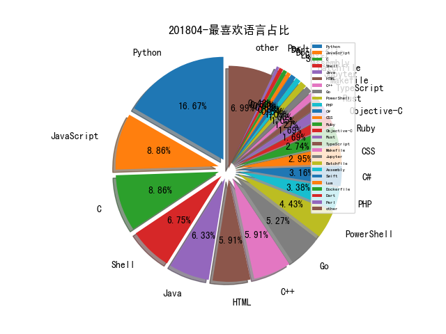

# [数据--所有](README_20.md)
# [数据--年度](README_2018.md)
# 201804 信息源与信息类型占比

# 微信公众号 推荐
| nickname_english | weixin_no | title | url| 
| --- | --- | --- | ---| 
| 数据派THU | DatapiTHU | 清华朱军团队包揽三项冠军 , NIPS 2017对抗样本攻防竞赛总结（附学习资料） | https://mp.weixin.qq.com/s/AuOFvbEl7sHpdbT4vFv46Q | 1| 
| 安全学术圈 | secquan | 巧妙使用机器学习的方法来检测IOT设备中的DDOS攻击 | https://mp.weixin.qq.com/s/ksqB8wkHuCFvmTvxD4doWA | 1| 
| 云头条 | YunTouTiao |  | https://mp.weixin.qq.com/s/y6wEiVqaRkXxGvDeUxO6-w | 1| 
| 工控安全漫谈 | gh_1dfbb29f0308 | 黑客组织 Orangeworm 针对全球医疗保健行业发起间谍活动 | https://mp.weixin.qq.com/s/DhQAdkeXRW-22UPgB5iR6A | 1| 
| 小强说 | xiaoqiangcall | 构建高质量攻击指标的几条建议 | https://mp.weixin.qq.com/s/ZRiSi3bb-SkMc_54mWPgmw | 2| 
| crackershi | gh_6dcfa3e17ace | 欧洲最严合规GDPR影响众多企业 | https://mp.weixin.qq.com/s/nEMHu33qfO8GvDqStpVVuQ | 1| 
| SecPulse安全脉搏 | SecPulse | CIA Hive Beacon Infrastructure复现1—使用Apache mod_rewrite实现http流量分发 | https://mp.weixin.qq.com/s/SIFrdP-w3kvIhQGaAjhV-Q | 1| 
| 新华视点 | XHSXHSD | 习近平：加速推动信息领域核心技术突破 | https://mp.weixin.qq.com/s/S_HmemBo4wU22e6RJ_qDxw | 1| 
| 大数据 | hzdashuju |  | https://mp.weixin.qq.com/s/s8VLWjXrVCrTt4v2d3MoIQ | 1| 
| 图灵人工智能 | TuringAI01 | 王飞跃——生成式对抗网络GAN的研究进展与展望 | https://mp.weixin.qq.com/s/QiIRIHiGv6u-4QfK8awKpw | 2| 
| malwarebenchmark | gh_01202b41c2f7 | 写在“软件基因分论”之后（二） | https://mp.weixin.qq.com/s/_cStfXSfXII8m5ary4fzWg | 2| 
| 网信军民融合 | wxjmrh | 科普 , 一文读懂各种拟态防御网络设备 | https://mp.weixin.qq.com/s/FHyE0fbEzEEIQoxbX1vSVA | 1| 
| 看雪学院 | ikanxue | 反虚拟机技术总结 | https://mp.weixin.qq.com/s/UNys91yEBtC3QFCKy9bhWg | 1| 
| 廖新喜 | gh_66d4bda5ddf2 | CVE-2018-1273: RCE with Spring Data Commons 分析和利用 | https://mp.weixin.qq.com/s/bIY0PHvQEbNT2inhS5dZwg | 2| 
| 奇安信威胁情报中心 | gh_166784eae33e | 近年来APT组织使用的10大（类）安全漏洞 | https://mp.weixin.qq.com/s/9vmyFql871eJlYzezZjEsg | 2| 
| 君哥的体历 | jungedetili | 日志源有效性监控UseCase-ArcSight实战系列之五 | https://mp.weixin.qq.com/s/a1JSiPRkuHvSxxzmvQh_HA | 5| 
| 占知智库 | zzzk-0001 | 美国国家网络空间靶场（NCR）建设概况 | https://mp.weixin.qq.com/s/GhuEu5-vQfKs25JFi2kDjw | 1| 
| 中国信息安全 | chinainfosec | 原创 , 重大体育赛事网络安全威胁评估 | https://mp.weixin.qq.com/s/AfYOmFw9IXrunTcDtn4Avg | 2| 
| IT桔子 | itjuzi521 | Google 布局的三家安全情报公司熟了，这个市场起飞了吗？ | https://mp.weixin.qq.com/s/oRpI7DwWZLfUprxwS0nOew | 1| 
| DJ的札记 | DJ_notes | 创新沙盒初探 (1) - RSAC2018之一 | https://mp.weixin.qq.com/s/aiVCRboVeWXwope4zcho5A | 2| 
| 高效运维 | greatops | 饿了么异地多活技术实现 | https://mp.weixin.qq.com/s/pKAYR1GxbQH51RkgkpmcOg | 2| 
| 逢魔安全实验室 | FormSec | Linux无文件渗透执行ELF | https://mp.weixin.qq.com/s/SdR6ce9xjbS5UQbh14kfgg | 1| 
| 我的安全视界观 | CANI_Security | 【挖洞技巧】那个简单的威胁情报 | https://mp.weixin.qq.com/s/Fs6j-ufxxEMjyHnOJEnuGA | 1| 
| 合天网安实验室 | hee_tian | 由MetInfo 深入理解PHP变量覆盖漏洞 | https://mp.weixin.qq.com/s/I7tEDv12e65KI93TCXN8Ug | 5| 
| 信安之路 | xazlsec | 我们来聊一聊渗透测试 | http://mp.weixin.qq.com/s/w2TG-Wsnee7A2zNqe6d-nw | 38| 
| 众视AsiaOTT | AsiaOTTcom | 关于5G网络安全需求和架构的白皮书《5G网络安全白皮书》 | https://mp.weixin.qq.com/s/ReymClMeHOmx1_EjqOUZUg | 1| 
| 丁爸 情报分析师的工具箱 | dingba2016 | 【原创】犯罪情报分析师知识和能力清单（初稿） | https://mp.weixin.qq.com/s/i5iL6R6m_UtmXYGfrRa31w | 2| 
| iPolicyLaw | iPolicyLaw | ‍公安部关于《公安机关互联网安全监督检查规定（征求意见稿）》公开征求意见的通知 | https://mp.weixin.qq.com/s/Ytp3J2ZRRZTGB8QMu4EiIA | 2| 
| bigsec岂安科技 | bigsec | Python工具分析风险数据【岂安低调分享】 | http://mp.weixin.qq.com/s/46f1WM_1xDgxzwxqGmFJNQ | 3| 
| FreeBuf | freebuf | 解读NSA对APT组织的透视 | https://mp.weixin.qq.com/s/DfvAIZYuDTtNMkijJNledQ | 2| 
| E安全 | EAQapp | 美国MITRE评估APT侦测产品，假想敌是中国 | https://mp.weixin.qq.com/s/ImXILnFVgmYgQPf009TYeA | 2| 
| Bypass | Bypass-- | CmsEasy_v5.7 漏洞测试 | https://mp.weixin.qq.com/s?__biz=MzA3NzE2MjgwMg==&mid=2448903588&idx=1&sn=32009fbca5e1840e09c73e848407de82&chksm=8b55ddf9bc2254efc5abaaace9f0d9d1d407aa07fea199557b2d62cc7c5c3fd6fdca5cdbaf8d&mpshare=1&scene=23&srcid=0402sy1nInz3sHk3D4Go4jqn#rd | 8| 

# 组织github账号 推荐
| github_id | title | url | org_url | org_profile | org_geo | org_repositories | org_people | org_projects | repo_lang | repo_star | repo_forks| 
| --- | --- | --- | --- | --- | --- | --- | --- | --- | --- | --- | ---| 
| Microsoft | Microsoft 开源了文件管理器 winfile: | https://github.com/Microsoft/winfile | https://opensource.microsoft.com | Open source, from Microsoft with love | Redmond, WA | 2463 | 4258 | 0 | C,TypeScript,CMake,C#,JavaScript,Objective-C,C++,Go,Python,Batchfile,HTML,Rich,Jupyter,Java,PowerShell | 0 | 0 | 1| 
| google | santa：A binary whitelisting/blacklisting system for Mac OS X | https://github.com/google/santa | https://opensource.google.com/ | Google ❤️ Open Source | https://opensource.google.com/ | 1474 | 2547 | 0 | C,TypeScript,Java,Python,Kotlin,JavaScript,C++,Go,Ruby,Rust | 0 | 0 | 2| 
| nccgroup | 攻击 TPM 可信平台模块,来自 CanSecWest 2018: | https://github.com/nccgroup/TPMGenie/blob/master/docs/CanSecWest_2018_-_TPM_Genie_-_Jeremy_Boone.pdf | https://www.nccgroup.trust | Please report all security issues to security at nccgroup dot com | Global | 180 | 15 | 0 | C,Shell,Java,Python,JavaScript,C#,HTML,Elixir,Go,Rust | 0 | 0 | 3| 
| Netflix | Netflix 发布性能可视化工具 - FlameScope: https://medium.com/netflix-techblog/netflix-flamescope-a57ca19d47bbGitHub: | https://github.com/Netflix/flamescope | http://netflix.github.io/ | Netflix Open Source Platform | Los Gatos, California | 152 | 8 | 0 | Groovy,C,Shell,Java,D,Scala,Python,JavaScript,C++,HTML,Go,Ruby | 0 | 0 | 1| 
| shimohq | 中国程序员容易发音错误的单词 | https://github.com/shimohq/chinese-programmer-wrong-pronunciation | https://shimo.im | 💻 A cloud-based productivity suite that combines documents, spreadsheets, slides and more in a simple interface. | China | 111 | 12 | 0 | TypeScript,Java,JavaScript,Perl,Objective-C,Go,CSS | 0 | 0 | 1| 
| flipkart-incubator | Astra - REST API 安全测试框架: | https://github.com/flipkart-incubator/astra | http://flipkart.com |  | http://flipkart.com | 90 | 7 | 0 | TypeScript,Java,Python,JavaScript,Objective-C,HTML,Swift | 0 | 0 | 2| 
| kennethreitz | Requests-html: Pythonic HTML Parsing for Humans | https://github.com/kennethreitz/requests-html | https://kennethreitz.org/values | I wrote @requests: HTTP for Humans. The only thing I really care about is user experience. | Eden, Earth, Milky Way | 88 | 18 | 0 | Python,Shell,Batchfile,HTML,CSS | 0 | 0 | 1| 
| NetSPI | SQLInjectionWiki - 记录各种 SQL 注入方法的 Wiki: | https://github.com/NetSPI/SQLInjectionWiki | https://www.netspi.com |  | Minneapolis, MN | 63 | 7 | 0 | C,ASP,Java,C#,Python,HTML,Go,Ruby,PowerShell | 0 | 0 | 2| 
| mwrlabs | Safari Wasm Sections POC RCE Exploit(CVE-2018-4121) : | https://github.com/mwrlabs/CVE-2018-4121 | http://labs.mwrinfosecurity.com/ |  | Basingstoke, Johannesburg, London, Manchester, Singapore, New York | 45 | 0 | 0 | C,Java,Python,JavaScript,C++,C#,Objective-C,PowerShell,CSS | 0 | 0 | 1| 
| ANSSI-FR | polichombr - 恶意软件协作分析框架: | https://github.com/ANSSI-FR/polichombr | https://www.ssi.gouv.fr |  | Paris, France | 43 | 0 | 0 | Coq,C,Java,Python,JavaScript,OCaml,C++,Go,Assembly,PowerShell,Rust | 0 | 0 | 1| 
| pownjs | pown - Node.js 上的安全测试与漏洞利用框架: | https://github.com/pownjs/pown | https://pownjs.com |  | https://pownjs.com | 43 | 1 | 0 | Shell,JavaScript | 0 | 0 | 1| 
| bugcrowd | HUNT：HUNT Proxy Burp Suite Extension | https://github.com/bugcrowd/HUNT | https://www.bugcrowd.com | A radical cybersecurity advantage. | San Francisco | 31 | 9 | 0 | Shell,Python,JavaScript,Makefile,Elixir,Ruby | 0 | 0 | 1| 
| fox-it | 使用 Active Directory 中的 ACL 提升权限: https://blog.fox-it.com/2018/04/26/escalating-privileges-with-acls-in-active-directory/GitHub: | https://github.com/fox-it/Invoke-ACLPwn | https://www.fox-it.com/ |  | https://www.fox-it.com/ | 31 | 1 | 0 | C,Shell,Python,Bro,HTML,Ruby,PowerShell | 0 | 0 | 1| 
| preempt | MS-RDP 身份验证的远程代码执行漏洞(CVE-2018-0886) POC 放出: Code: https://github.com/preempt/credssp | https://github.com/preempt/credssp | https://www.preempt.com |  | https://www.preempt.com | 30 | 0 | 0 | C,Java,Python,JavaScript,C++,HTML | 0 | 0 | 1| 
| Sentinel-One | The Minimalistic x86/x64 API Hooking Library for Windows: | https://github.com/Sentinel-One/minhook | http://sentinelone.com | Next Generation Endpoint Protection | http://sentinelone.com | 28 | 1 | 0 | C,CMake,Python,JavaScript,C++,C#,Objective-C | 0 | 0 | 1| 
| MindPointGroup | cloudfrunt - 用于识别配置错误的 CloudFront 域名的工具: | https://github.com/MindPointGroup/cloudfrunt | https://www.mindpointgroup.com | We are a cybersecurity consulting firm that supports the public and private sector. | Springfield, VA | 27 | 4 | 0 | Shell,Python,Makefile,JavaScript,VCL,PowerShell | 0 | 0 | 1| 
| Security-Onion-Solutions | security-onion - 用于 IDS、NSM 以及日志管理的 Linux 发行版系统: | https://github.com/Security-Onion-Solutions/security-onion | https://securityonionsolutions.com |  | https://securityonionsolutions.com | 27 | 0 | 0 | Shell,Python,JavaScript,Bro,Tcl,PHP,Dockerfile,CSS | 0 | 0 | 1| 
| endgameinc | Ember: An Open Source Classifier And Dataset | https://github.com/endgameinc/ember | https://www.endgame.com |  | Washington, DC | 27 | 0 | 0 | C,Jupyter,Python,JavaScript,C++,C#,Go,Java,Ruby,Rust | 0 | 0 | 1| 
| IOActive | XDiFF - 一款差分模糊测试框架: | https://github.com/IOActive/XDiFF | http://blog.ioactive.com/ | IOActive Labs repository | http://blog.ioactive.com/ | 24 | 0 | 0 | C,Shell,Java,Python,JavaScript,C++,C# | 0 | 0 | 1| 
| comaeio | OPCDE 2018 大会议题材料已公开: | https://github.com/comaeio/OPCDE/tree/master/2018 | http://www.comae.io |  | Dubai, UAE | 24 | 0 | 0 | C,Java,JavaScript,C++,Nginx,Smarty,PowerShell | 0 | 0 | 1| 
| evait-security | envizon - 一款为红/蓝团队需求而开发的网络可视化工具: | https://github.com/evait-security/envizon | https://www.evait.de |  | Germany | 18 | 0 | 0 | C,Shell,Java,Python,Dockerfile,JavaScript,Ruby | 0 | 0 | 1| 
| fail0verflow | ShofEL2 - 任天堂 Tegra X1 Boot ROM 的漏洞利用程序和 Linux 加载器 : https://fail0verflow.com/blog/2018/shofel2/GitHub: | https://github.com/fail0verflow/shofel2 | https://fail0verflow.com |  | https://fail0verflow.com | 18 | 2 | 0 | Python,C,Shell,C++ | 0 | 0 | 1| 
| tianocore | UEFI 驱动程序编写手册: | https://github.com/tianocore/tianocore.github.io/wiki/UEFI-Driver-Writers-Guide | http://www.tianocore.org |  | http://www.tianocore.org | 16 | 21 | 0 | Batchfile,Python,C,HTML,C++ | 0 | 0 | 1| 
| gy-games | shield: 基于Strom的日志实时流量分析主动防御(CCFirewall)系统 | https://github.com/gy-games/shield | http://www.gyyxol.cn | GuangYu Games Open Source | http://www.gyyxol.cn | 13 | 3 | 0 | C#,Python,Shell,Java,JavaScript | 0 | 0 | 1| 
| 1Password | 1password-teams-open-source - 1Password 为开源项目免费提供 1Password Teams 账户: | https://github.com/1Password/1password-teams-open-source | https://1password.com | 1Password remembers all your passwords for you. It keeps your digital life secure and always available, safe behind the one password that only you know. | Toronto, Canada | 12 | 0 | 0 | Go,C,Makefile,Rust,HCL | 0 | 0 | 1| 
| VerSprite | NordVPN for Windows 提权漏洞披露(CVE-2018-10170): | https://github.com/VerSprite/research/blob/master/advisories/VS-2018-018.md | None |  | Atlanta, GA | 12 | 0 | 0 | C,Java,Python,JavaScript,HTML,PHP | 0 | 0 | 1| 
| theori-io | Code and slides for Zer0Con 2018 talk: Building a 1-day Exploit for Google Chrom | https://github.com/theori-io/zer0con2018_bpak | http://www.theori.io |  | Austin, TX | 12 | 1 | 0 | C,Python,JavaScript,Objective-C,HTML,CSS | 0 | 0 | 3| 
| Hack-with-Github | Free Security and Hacking eBooks | https://github.com/Hack-with-Github/Free-Security-eBooks | https://twitter.com/hackwithgithub | An Open Source Hacking Tools database. | Bangalore, India | 11 | 2 | 0 |  | 0 | 0 | 1| 
| RhinoSecurityLabs | Aggressor-Scripts - 用于绕过 UAC 限制的 CobaltStrike 脚本: | https://github.com/RhinoSecurityLabs/Aggressor-Scripts/tree/master/UACBypass | https://rhinosecuritylabs.com | A boutique penetration testing and security assessment firm in Seattle, WA. | Seattle, WA | 10 | 0 | 0 | Python,JavaScript,PowerShell,HCL | 0 | 0 | 1| 
| phishai | phish-protect - 用于防御域名同形词攻击的 Chrome 插件: | https://github.com/phishai/phish-protect | https://www.phish.ai | making phishing a problem of the past | Tel-Aviv, Israel | 5 | 0 | 0 | Python,JavaScript | 0 | 0 | 1| 
| PreOS-Security | awesome-firmware-security - 优秀的固件安全方向资源收集: | https://github.com/PreOS-Security/awesome-firmware-security | https://preossec.com |  | Seattle, WA | 4 | 1 | 0 | Python | 0 | 0 | 1| 
| psconfeu | 使用 JEA 保护基础设施(PSCONF.EU 2018): | https://github.com/psconfeu/2018/blob/master/Miriam%20Wiesner/SecuringYourInfrastructureWithJEA/SecuringYourInfrastructureWithJea.pdf | http://www.psconf.eu | PowerShell Conference Europe | http://www.psconf.eu | 4 | 4 | 0 | PowerShell | 0 | 0 | 1| 
| privacyradius | gdpr-checklist: The GDPR Checklist Project | https://github.com/privacyradius/gdpr-checklist | https://www.privacyradius.com/ | Privacy x Security | https://www.privacyradius.com/ | 3 | 0 | 0 | JavaScript | 0 | 0 | 1| 
| redhuntlabs | RedHunt-OS - 用于对抗模拟和威胁狩猎的一款 Linux 虚拟机: | https://github.com/redhuntlabs/RedHunt-OS/ | http://redhuntlabs.com/ | Discover and Assess your Attack Surface | http://redhuntlabs.com/ | 3 | 2 | 0 | Python | 0 | 0 | 1| 
| yunjiweidian | TITAN: 云集分布式全链路压测军演系统 | https://github.com/yunjiweidian/TITAN | mailto:gaoxl@yunjiweidian.com |  | gaoxl@yunjiweidian.com | 1 | 0 | 0 | Java | 0 | 0 | 1| 

# 私人github账号 推荐
| github_id | title | url | p_url | p_profile | p_loc | p_company | p_repositories | p_projects | p_stars | p_followers | p_following | repo_lang | repo_star | repo_forks | 
| --- | --- | --- | --- | --- | --- | --- | --- | --- | --- | --- | --- | --- | --- | ---| 
| evilsocket | bleah - 用于攻击智能设备的 BLE 扫描器: | https://github.com/evilsocket/bleah | https://www.evilsocket.net | Hacker , I dont respectfully, I disagree. https://www.patreon.com/evilsocket | Italy | Zimperium | 115 | 0 | 15 | 3700 | 0 | Go,Python,JavaScript | 0 | 0 | 1| 
| spacehuhn | Deauth All Button,可以一键断开所有设备WiFi连接的小工具(Video): https://www.youtube.com/watch?v=HWZrBoIKacw&feature=youtu.beGitHub: | https://github.com/spacehuhn/esp8266_deauther | https://spacehuhn.com | Support me on patreon.com/spacehuhn | Germany | None | 18 | 0 | 260 | 1800 | 12 | C,C++,Arduino | 0 | 0 | 1| 
| JonathanSalwan | ROPgadget - 支持多种 CPU 架构的 ROP 利用辅助工具: | https://github.com/JonathanSalwan/ROPgadget | http://twitter.com/JonathanSalwan | Security researcher working on program analysis and software verification methods | France - Arzon | Quarkslab | 9 | 0 | 0 | 1500 | 0 | Python,LLVM,Makefile,C++ | 1900 | 405 | 1| 
| Neo23x0 | Fenrir - 基于 Bash 的 IOC 扫描器: | https://github.com/Neo23x0/Fenrir | https://github.com/NextronSystems | #DFIR #Python #YARA #Golang #SIEM #SOC #Sigma #Malware | None | @NextronSystems | 79 | 0 | 101 | 1200 | 15 | Python,Batchfile,Java | 0 | 0 | 1| 
| cure53 | CNY Challenge 2018 Write-Up | https://github.com/cure53/XSSChallengeWiki/wiki/CNY-Challenge-2018 | https://cure53.de | And there is fire where we walk. | Berlin | Fine penetration tests for fine websites | 16 | 0 | 30 | 1100 | 0 | JavaScript,HTML | 0 | 0 | 1| 
| HarmJ0y | DAMP - 通过修改主机安全描述符实现在域内持久化控制的项目: | https://github.com/HarmJ0y/DAMP | http://blog.harmj0y.net | Co-founder of Empire, BloodHound, and the Veil-Framework , PowerSploit developer , krb lover , Microsoft PowerShell MVP , Security at the misfortune of others | Seattle, WA | None | 31 | 0 | 26 | 1100 | 4 | C#,Python,PowerShell | 593 | 134 | 1| 
| mattifestation | BCD - 交互式修改本地或远程的引导配置数据(BCD)的 PowerShell 模块: | https://github.com/mattifestation/BCD | http://www.exploit-monday.com/ |  | None | None | 23 | 0 | 9 | 953 | 1 | PowerShell | 553 | 146 | 1| 
| FuzzySecurity | Windows 系统 Token 信息收集 PowerShell 脚本: | https://github.com/FuzzySecurity/PowerShell-Suite/blob/master/Get-OSTokenInformation.ps1 | http://www.fuzzysecurity.com/ |  | None | None | 13 | 0 | 0 | 952 | 0 | C,PowerShell | 0 | 0 | 1| 
| txthinking | brook - Go 语言编写的一款跨平台代理应用: | https://github.com/txthinking/brook | https://www.txthinking.com | Keep it simple, stupid | The Mars | None | 24 | 0 | 174 | 926 | 0 | Go,Shell,JavaScript,HTML | 8700 | 1700 | 1| 
| brannondorsey | whonow - 用于执行 DNS Rebinding 攻击的恶意 DNS 服务器: | https://github.com/brannondorsey/whonow | https://github.com/runwayml | Artist , Programmer , Researcher | Philadelphia, PA | @runwayml | 231 | 0 | 1700 | 804 | 102 | Python,C,TypeScript,JavaScript | 0 | 0 | 1| 
| m4ll0k | SMB Protocol Bruteforce | https://github.com/m4ll0k/SMBrute | https://twitter.com/m4ll0k2 | 104,97,99,107,101,114,97,110,100&&112,114,111,103,114,97,109,109,101,114 | 127.0.0.1, Italy - Morocco | localhost | 14 | 0 | 13 | 743 | 20 | Python,Shell | 0 | 0 | 1| 
| sunnyelf | cheetah-gui:基于字典的webshell密码爆破工具 | https://github.com/sunnyelf/cheetah-gui/blob/master/README_zh.md | https://github.com/Qihoo360 | Information security researcher, CTF enthusiast. | Beijing, China | @Qihoo360 | 105 | 0 | 893 | 710 | 98 | Python | 0 | 0 | 1| 
| ismailtasdelen | xss-payload-list - XSS Payload 收集: | https://github.com/ismailtasdelen/xss-payload-list | http://ismailtasdelen.com | Hi, My name is Ismail Tasdelen. As a security researcher. Im working Penetration Tester at Ernst & Young. | Istanbul | Ernst & Young | 97 | 0 | 770 | 668 | 974 | Python,Shell,HTML | 0 | 0 | 1| 
| Cryptogenic | MD5-Magic-File-Generator - 创建用于利用类型混淆漏洞的指定 MD5 Hash 前置字符的文件: | https://github.com/Cryptogenic/MD5-Magic-File-Generator | https://twitter.com/SpecterDev | PHP/C++ developer with an interest in user-land and web exploitation. | None | None | 28 | 0 | 38 | 642 | 5 | Go,C,JavaScript | 0 | 0 | 1| 
| Cyb3rWard0g | Invoke-ATTACKAPI - 与 MITRE ATT&CK 框架进行交互的 PowerShell 脚本: | https://github.com/Cyb3rWard0g/Invoke-ATTACKAPI | https://github.com/Cyb3rWard0g | @Cyb3rWard0g | None | None | 10 | 0 | 19 | 636 | 2 | Jupyter,PowerShell | 1400 | 336 | 1| 
| ibotpeaches | Apktool - Android APK 文件逆向分析工具: | https://github.com/ibotpeaches/Apktool | https://github.com/sourcetoad | Senior Software Engineer @sourcetoad | Tampa | None | 57 | 0 | 71 | 572 | 20 | PHP,Java,JavaScript | 0 | 0 | 1| 
| shengqi158 | Weblogic反序列化漏洞(CVE-2018-2628) | https://github.com/shengqi158/CVE-2018-2628 | http://xxlegend.com | xxlegend.com | None | None | 89 | 0 | 297 | 395 | 31 | Python,Java | 200 | 78 | 1| 
| vipstone | faceai：一款优秀的人脸检测、人脸识别、视频识别、文字识别等智能AI项目 | https://github.com/vipstone/faceai | None | 微信公众号：王磊的博客 | xian, china | Java | 32 | 0 | 122 | 336 | 14 | Python,JavaScript,Java | 0 | 0 | 1| 
| dafthack | PowerMeta - 通过搜索引擎下载指定域名下的所有文件,然后做元数据分析以提取敏感信息的工具: | https://github.com/dafthack/PowerMeta | http://www.twitter.com/dafthack |  | None | None | 13 | 0 | 18 | 331 | 1 | PHP,Ruby,PowerShell | 1100 | 246 | 1| 
| random-robbie | Jira-Scan: CVE-2017-9506 POC | https://github.com/random-robbie/Jira-Scan | https://xsses.rocks | PHP/Python & Raspberry Pi Lover Docker | Wirral UK | None | 200 | 0 | 198 | 318 | 86 | Python,Go,PHP | 253 | 99 | 1| 
| hannob | snallygaster - 一款扫描 Web 目录敏感文件的工具: 介绍, https://blog.hboeck.de/archives/892-Introducing-Snallygaster-a-Tool-to-Scan-for-Secrets-on-Web-Servers.html GitHub: | https://github.com/hannob/snallygaster | https://hboeck.de/ |  | Berlin | None | 79 | 0 | 2 | 318 | 2 | Python,Shell,PHP | 1400 | 150 | 1| 
| re4lity | 枚举kerberos域用户的字典 | https://github.com/re4lity/kerberos_enum_dict | https://github.com/PolarisLab | @PolarisLab & MottoIN | ShangHai | PolarisLab | 710 | 0 | 2700 | 312 | 101 | C#,PowerShell,C++ | 0 | 0 | 1| 
| teh-cmc | go-internals - 深入理解 Go 语言(网络书籍,编写中): | https://github.com/teh-cmc/go-internals | https://github.com/znly | Data Platform Engineering @znly. Programming, Climbing, Starcraft, Vim. | Paris, France | @znly | 19 | 0 | 1600 | 305 | 182 | Go,C | 0 | 0 | 1| 
| milo2012 | pathbrute - Web 路径暴力破解工具: | https://github.com/milo2012/pathbrute | http://milo2012.wordpress.com |  | None | None | 65 | 0 | 131 | 292 | 5 | Python,Go,PowerShell | 381 | 179 | 1| 
| threathunterX | nebula: 星云业务风控系统 | https://github.com/threathunterX/nebula | https://www.threathunter.cn/ |  | Shenzhen | 威胁猎人 | 16 | 0 | 2 | 283 | 0 | Python,Lua,JavaScript,Java,CSS | 494 | 190 | 1| 
| Ice3man543 | subfinder - 子域名枚举工具: | https://github.com/Ice3man543/subfinder | https://ice3man.me | Doing security stuff! Automating things because of my laziness to the fullest. | None | None | 39 | 0 | 329 | 283 | 82 | Go,Python,C | 0 | 0 | 1| 
| caseysmithrc | memMITM - 内存检测 SSL 的 POC: | https://github.com/caseysmithrc/memMITM | None |  | None | None | 190 | 0 | 7 | 267 | 0 | C#,C,PHP,PowerShell,C++ | 54 | 22 | 1| 
| nullbind | Get Domain Admins (GDA) - 辅助攻击域环境的脚本: | https://github.com/nullbind/Other-Projects/tree/master/GDA | https://github.com/NetSPI | Twitter: @_nullbind http://www.netspi.com/blog/author/ssutherland/ http://www.slideshare.net/nullbind | None | @NetSPI | 56 | 0 | 832 | 230 | 46 | Shell,Batchfile,Ruby,PowerShell | 240 | 87 | 1| 
| troglobit | nemesis - 用于网络报文构造与注入的命令行工具: | https://github.com/troglobit/nemesis | http://troglobit.com | Elegance is not a dispensable luxury -- Edsger Wybe Dijkstra | Västerås, Sweden | Westermo R&D | 91 | 0 | 507 | 222 | 22 | C | 0 | 0 | 1| 
| ustayready | CredKing - 使用 AWS Lambda 轮换 IP 地址进行密码破解的工具: | https://github.com/ustayready/CredKing | None | divergent thinker/breaker and researcher of stuff | None | None | 39 | 0 | 7 | 203 | 7 | Python,C#,HTML | 724 | 155 | 1| 
| ohjeongwook | sRDI - 用于反射式 DLL 注入的 Shellcode 构造与加载工具: | https://github.com/ohjeongwook/sRDI | https://darungrim.com | Ex-security engineer@Microsoft | None | DarunGrim | 25 | 0 | 7 | 203 | 12 | Python,C,C++ | 291 | 63 | 1| 
| ropnop | windapsearch - 通过 LDAP 查询来从 Windows domain 中枚举用户、组信息等的 Python 脚本: | https://github.com/ropnop/windapsearch | None |  | None | None | 24 | 0 | 125 | 187 | 1 | Go,Python,JavaScript | 206 | 43 | 1| 
| kpcyrd | Scriptable network authentication cracker | https://github.com/kpcyrd/badtouch | None | /waɪrd/ | Hamburg, Germany | None | 220 | 0 | 660 | 185 | 180 | Ruby,Assembly,Rust | 0 | 0 | 1| 
| malchata | yall.js - 高效的 JavaScript Lazy Load 脚本: | https://github.com/malchata/yall.js | https://jeremy.codes | Web developer, speaker, and author. | Saint Paul, MN | None | 44 | 0 | 63 | 177 | 116 | HTML,JavaScript,CSS | 0 | 0 | 1| 
| jeffzh3ng | 惊蛰：一款基于Pocsuite的漏洞扫描系统 | https://github.com/jeffzh3ng/InsectsAwake | None | Security Engineer | Zhejiang Hangzhou | None | 8 | 0 | 91 | 168 | 5 | Python,Java | 0 | 0 | 1| 
| peterpt | eternal_check - NSA 泄漏的 Eternal 系列漏洞的检测工具: | https://github.com/peterpt/eternal_check | None | This git account will be closed as soon as Microsoft acquire github . | Portugal | None | 261 | 0 | 26 | 164 | 7 | Python,Shell,C++,Rust | 218 | 84 | 1| 
| chrisk44 | Hijacker - Aircrack,Airodump,Aireplay,MDK3 以及 Reaver 的图形化 Android 应用: | https://github.com/chrisk44/Hijacker | None |  | Xanthi, Greece | None | 9 | 0 | 0 | 161 | 0 | Shell,Java | 0 | 0 | 1| 
| fengxuangit | AutoFuck: 自动识别cms并且加载相关poc自动攻击 | https://github.com/fengxuangit/AutoFuck | https://www.fangpianz.com | The reason why a great man is great is that he resolves to be a great man. | China | None | 89 | 0 | 248 | 160 | 33 | Python,Shell,PHP,Java | 0 | 0 | 1| 
| tiagorlampert | CHAOS - 生成远程控制 Windows Payload 的 Payload 生成器: | https://github.com/tiagorlampert/CHAOS | https://twitter.com/tiagorlampert | Open source enthusiast, Gopher and Coder. Exploring and learning new things to improve my skills. | Paraná, Brazil | None | 10 | 0 | 44 | 152 | 3 | Go,Java,Dart | 0 | 0 | 1| 
| emptymonkey | A tool for covert execution in Linux. | https://github.com/emptymonkey/mimic | https://twitter.com/emptymonkey |  | Water Curtain Cave | None | 17 | 0 | 105 | 152 | 53 | C | 0 | 0 | 1| 
| wupco | weblogger: 针对ctf线下赛流量抓取(php)、真实环境流量抓取分析的工具 | https://github.com/wupco/weblogger | None | {{1+1}} | None | None | 19 | 0 | 184 | 140 | 87 | Python,Shell,PHP | 298 | 72 | 1| 
| vletoux | SmbScanner - 用于扫描 SMB 支持版本的 PowerShell 脚本: | https://github.com/vletoux/SmbScanner | https://www.pingcastle.com | Security ninja trying to do on the CISO side what red teamers do for years (you know me for dcsync, setntlm, DCShadow & pingcastle) | France | Ping Castle | 22 | 0 | 2 | 138 | 0 | C#,PowerShell,C++ | 216 | 29 | 1| 
| cryptax | androidre - 一款用于安卓逆向工程的 Docker 镜像: | https://github.com/cryptax/androidre | None |  | None | None | 21 | 0 | 9 | 131 | 2 | Python,Dockerfile,CSS | 0 | 0 | 1| 
| prateek147 | Damn Vulnerable iOS App (DVIA) is an iOS application that is damn vulnerable. | https://github.com/prateek147/DVIA-v2 | http://highaltitudehacks.com |  | New Delhi, India | None | 26 | 0 | 12 | 129 | 6 | Python,Objective-C,Swift | 342 | 71 | 1| 
| nongiach | arm_now - 基于 qume 环境快速搭建各种 CPU 架构虚拟机的工具: | https://github.com/nongiach/arm_now | None | @chaignc on twitter | None | None | 29 | 0 | 78 | 129 | 50 | Python,C,Assembly | 509 | 71 | 1| 
| MattPD | C++ 调试相关优秀资源收集: | https://github.com/MattPD/cpplinks/blob/master/debugging.md | None |  | None | None | 22 | 0 | 2100 | 123 | 124 | C,HTML,C++ | 1600 | 188 | 1| 
| dbohdan | structured-text-tools - 可用来操纵结构化文本(CSV, XML, HTML, JSON...)的命令行工具清单: | https://github.com/dbohdan/structured-text-tools | http://dbohdan.com/ |  | None | None | 35 | 0 | 699 | 119 | 1 | Go,Python,Tcl,Haskell,HTML | 0 | 0 | 1| 
| a13xp0p0v | linux-kernel-defense-map - Linux 内核防御图: | https://github.com/a13xp0p0v/linux-kernel-defence-map/blob/master/README.md | https://twitter.com/a13xp0p0v | Linux Kernel Developer & Security Researcher | None | None | 5 | 0 | 0 | 119 | 3 | Python,Go,C,HTML | 436 | 44 | 1| 
| ezelf | CVE-2018-9995_dvr_credentials: Get DVR Credentials | https://github.com/ezelf/CVE-2018-9995_dvr_credentials | http://misteralfa-hack.blogspot.com.ar |  | Buenos Aires | Alfa Security | 15 | 0 | 4 | 114 | 3 | Python,Lua | 357 | 140 | 1| 
| sigalor | whatsapp-web-reveng - WhatsApp Web 端的逆向分析结果,对 API 进行了完整的介绍: | https://github.com/sigalor/whatsapp-web-reveng | None |  | Munich, Germany | None | 11 | 0 | 24 | 112 | 0 | Python,JavaScript,C++ | 0 | 0 | 1| 
| a2u | Drupalgeddon 2 漏洞利用脚本(CVE-2018-7600): | https://github.com/a2u/CVE-2018-7600 | https://rudnkh.me |  | Russia | None | 15 | 0 | 125 | 104 | 11 | Python,CSS | 0 | 0 | 1| 
| HanseSecure | credgrap_ie_edge - 从 Internet Explorer 和 Edge 中提取存储凭据的工具: | https://github.com/HanseSecure/credgrap_ie_edge | https://github.com/HanseSecure | Father, Hacker, Consultant, Pentester, Researcher, Student, Exploits, OffsecDev, InfoSec & CyberCyber - https://hansesecure.de/impressum/ | Germany | @HanseSecure | 27 | 0 | 7 | 101 | 4 | Shell,Assembly,Python,C++,Go,PowerShell | 133 | 36 | 1| 
| Nhoya | PastebinMarkdownXSS - Pastebin 由于对 Markdown 过滤不完善而导致的 XSS 漏洞详情披露: | https://github.com/Nhoya/PastebinMarkdownXSS | https://bsod.dev | Security Researcher and Developer | Rome, Italy | None | 25 | 0 | 26 | 99 | 6 | Go,Python,Shell,CSS | 0 | 0 | 1| 
| parsiya | Golang for Security Professionals | https://github.com/parsiya/Hacking-with-Go | https://parsiya.net | Application security engineer, Gopher and n00b reverser. | 169.254.0.1 | Electronic Arts | 48 | 0 | 517 | 93 | 59 | Go,JavaScript,HTML,CSS | 0 | 0 | 1| 
| FortuneC00kie | bug-monitor: Seebug、structs、cve漏洞实时监控推送系统 | https://github.com/FortuneC00kie/bug-monitor | https://github.com/alipay | May the Force be with you :) | Hangzhou, China | @alipay | 77 | 0 | 971 | 92 | 205 | Python,PHP,JavaScript,HTML | 0 | 0 | 1| 
| avlidienbrunn | BountyDash - 一款结合所有漏洞赏金平台奖励的工具,让使用者对进度和漏洞挖掘类型有更好的把握: | https://github.com/avlidienbrunn/bountydash | https://twitter.com/avlidienbrunn | addasdsasa %PDF adsdasdasdsadsa asdsdsa | o | %PDF <>test | 14 | 0 | 11 | 91 | 5 | Python,Shell,JavaScript | 94 | 16 | 1| 
| tehnokv | 作者利用约 200 行 JS 代码实现面部识别: | https://github.com/tehnokv/picojs | https://tehnokv.com |  | None | None | 2 | 0 | 0 | 78 | 0 | C,HTML | 4700 | 321 | 1| 
| TingGe | Norse - IPViking Map 源码改进与解析 | https://github.com/TingGe/data-visualization/tree/master/ipviking | https://github.com/nefe | JS/DevOps/PMP/ Agile/WoT/ @nefe /@clientlabs / @uplaydotcc | None | Alibaba | 22 | 0 | 967 | 71 | 84 | Shell,JavaScript | 121 | 45 | 2| 
| GerbenJavado | LinkFinder - 从 JavaScript 文件中提取 URL 及其参数的 Python 脚本: | https://github.com/GerbenJavado/LinkFinder | None |  | None | None | 3 | 0 | 18 | 68 | 0 | Python,HTML | 664 | 157 | 1| 
| renatahodovan | fuzzinator - 模糊测试框架: | https://github.com/renatahodovan/fuzzinator | None |  | Szeged | SZTE | 15 | 0 | 194 | 67 | 7 | Python,ANTLR | 141 | 29 | 1| 
| s3inlc | hashtopolis - 一个多平台C/S架构工具,用于将 hashcat 任务分发给多台计算机进行密码破解: | https://github.com/s3inlc/hashtopolis | https://hashes.org | Computer Science Student, University of Basel | Switzerland | None | 20 | 0 | 21 | 66 | 2 | Python,PHP,C++ | 0 | 0 | 1| 
| benoitjadinon | awesome-xamarin - 用于 Xamarin 移动项目的优秀资源收集仓库: | https://github.com/benoitjadinon/awesome-xamarin | https://earn.com/benoitjadinon/ | Xamarin & Flutter fanboi, xennial from Planet Earth | Belgium | RiseUp | 86 | 0 | 645 | 66 | 161 | Swift,Dart | 0 | 0 | 1| 
| Jsitech | Hardening Script for Linux Servers/ Secure LAMP-LEMP Deployer | https://github.com/Jsitech/JShielder | http://www.jasonsoto.com | IT Security Professional , Information Security Manager , Security+ , SSCP , Pentester | None | None | 24 | 0 | 12 | 66 | 3 | Shell,PHP | 0 | 0 | 1| 
| jx-sec | JXWAF(锦衣盾)：基于openresty(nginx+lua)开发的下一代web应用防火墙 | https://github.com/jx-sec/jxwaf | None | 摸鱼 | None | None | 4 | 0 | 17 | 64 | 0 | Python,Lua,C,Shell | 468 | 135 | 1| 
| fgeek | pyfiscan - Web 应用漏洞与版本扫描工具: | https://github.com/fgeek/pyfiscan | https://github.com/nixu-corp |  | Finland | @nixu-corp | 2 | 0 | 60 | 63 | 21 | Python | 313 | 74 | 1| 
| wstart | DB_BaseLine: 数据库基线检查工具 | https://github.com/wstart/DB_BaseLine | https://github.com/wstart |  | GD | free | 51 | 0 | 277 | 61 | 54 | Python,Go,C,PHP | 93 | 26 | 1| 
| mtivadar | windows10_ntfs_crash_dos - 特殊构造的 NTFS 镜像可导致多个版本的 Windows 崩溃,POC: | https://github.com/mtivadar/windows10_ntfs_crash_dos | https://twitter.com/tivadarmmt |  | Romania | None | 5 | 0 | 53 | 61 | 6 | Python,TeX,Verilog | 581 | 144 | 1| 
| kacperszurek | GPGReaper - 从 gpg-agent 缓存/内存中获取/窃取/恢复 GPG 私钥的工具: | https://github.com/kacperszurek/gpg_reaper | None |  | None | None | 9 | 0 | 3 | 60 | 0 | Python,PHP,Ruby,PowerShell | 144 | 38 | 1| 
| vaguileradiaz | tinfoleak - 开源 Twitter 情报分析工具: | https://github.com/vaguileradiaz/tinfoleak | http://vicenteaguileradiaz.com |  | None | None | 1 | 0 | 1 | 59 | 0 | Python | 0 | 0 | 1| 
| invictus1306 | ARM shellcode and exploit development, ARM 上的 ShellCode 编写与漏洞利用开发: | https://github.com/invictus1306/Workshop-BSidesMunich2018/blob/master/workshop_slides.pdf | https://twitter.com/invictus1306 |  | Italy | None | 12 | 0 | 0 | 58 | 0 | Python,C,CSS,C++ | 0 | 0 | 1| 
| giovanifss | Gitmails - 收集 git commit 中 email 信息的工具: | https://github.com/giovanifss/Gitmails | https://twitter.com/g1ov4z | Infosec | None | None | 19 | 0 | 45 | 58 | 31 | Python,Shell,Haskell,Ruby | 0 | 0 | 1| 
| samhaxr | hackbox - 优秀渗透测试技术与工具的整合: | https://github.com/samhaxr/hackbox | https://www.sulemanmalik.com |  | United Kingdom | None | 159 | 0 | 4 | 54 | 19 | Python,Shell,JavaScript | 0 | 0 | 1| 
| pstirparo | mac4n6 - Mac OS X 与 iOS 数字取证分析中的重点路径收集: | https://github.com/pstirparo/mac4n6 | None |  | None | None | 16 | 0 | 331 | 50 | 33 | Python | 174 | 27 | 1| 
| 51x | WHP - 攻击 Windows 环境的工具包: | https://github.com/51x/WHP | None | Unconditional. | interwebz | None | 20 | 0 | 11 | 48 | 3 | Python,Shell,HTML | 376 | 117 | 1| 
| UltimateHackers | Diggy - 从 Apk 文件中提取 URLs 的工具: | https://github.com/UltimateHackers/Diggy | None | This profile has been moved to: https://github.com/s0md3v | None | None | 0 | 0 | 0 | 47 | 0 |  | 0 | 0 | 1| 
| TheM4hd1 | JCS - Joomla 组件漏洞扫描器: | https://github.com/TheM4hd1/JCS | None | IOS Mobile Developement (Swift) / Desktop Application Developement (C#) / Web Application Pentester | Tehran, Iran | None | 8 | 0 | 101 | 47 | 3 | C#,Swift | 0 | 0 | 1| 
| gpoguy | GetVulnerableGPO - 用于寻找不安全的 GPO 组策略配置的 PowerShell 脚本: | https://github.com/gpoguy/GetVulnerableGPO | https://sdmsoftware.com | Darren is CTO & Founder of SDM Software, Inc and the community site gpoguy.com, focused on Group Policy, DSC and config mgmt for Windows. | San Francisco Bay Area | SDM Software, Inc. | 3 | 0 | 0 | 44 | 0 | C#,PowerShell | 131 | 18 | 1| 
| mzet- | linux-exploit-suggester - Linux 本地提权审计工具: | https://github.com/mzet-/linux-exploit-suggester | https://z-labs.eu |  | Gdansk, Poland | Z-Labs, Software Security Labs | 8 | 0 | 3 | 43 | 1 | C,Shell,CSS,C++ | 1200 | 289 | 1| 
| Mr5m1th | POC-Collect: 各种开源CMS的漏洞及EXP | https://github.com/Mr5m1th/POC-Collect | None |  | None | None | 2 | 0 | 5 | 43 | 0 | Java | 473 | 145 | 1| 
| mkellerman | 一款用于替代 PsExec 远程执行命令的 PowerShell 模块 Invoke-CommandAs 介绍: https://mkellerman.github.io/Death_to_psexec/ GitHub: | https://github.com/mkellerman/Invoke-CommandAs | https://mkellerman.github.io/ | DevOps, CI/CD Automation, Windows Automation, PowerShell MacGyver. | Victoria, BC | None | 13 | 0 | 8 | 41 | 8 | PowerShell | 0 | 0 | 1| 
| dsopas | rfd-checker - 反射型文件下载漏洞检测工具: | https://github.com/dsopas/rfd-checker | https://www.davidsopas.com | /me hacks! the webz | Portugal | Char49 | 10 | 0 | 34 | 41 | 1 | Go,Python | 299 | 36 | 1| 
| romanking98 | 无需内存泄露,基于堆风水技术实现 libc-2.24 的 RCE: | https://github.com/romanking98/House-Of-Roman | None |  | None | None | 8 | 0 | 2 | 36 | 1 | Python,C,HTML | 0 | 0 | 1| 
| phillips321 | adaudit - 活动目录安全审计脚本: | https://github.com/phillips321/adaudit | http://www.phillips321.co.uk |  | UK | None | 15 | 0 | 7 | 34 | 5 | Python,Shell,Ruby,PowerShell,Perl | 78 | 22 | 1| 
| peikexin9 | DeepXplore - 深度学习系统的自动化白盒测试: | https://github.com/peikexin9/deepxplore | https://sites.google.com/site/kexinpeisite/ | PhD student at Columbia CS | New York | Columbia University | 7 | 0 | 7 | 33 | 1 | Python,HTML,Jupyter,Pure,LLVM | 244 | 87 | 1| 
| cytvictor | TrunPortForward: Web管理的、多节点、多端口、高度自定义定向转发工具 | https://github.com/cytvictor/TrunPortForward | https://i.urox.cn | A graduate from senior high. | Hunan Changsha, China | LightNetwork Computing Ltd | 11 | 0 | 79 | 32 | 25 | Python,Java,PHP,JavaScript | 105 | 18 | 1| 
| glen-mac | goGetBucket - 枚举并分析 Amazon S3 Buckets 安全性的渗透测试工具: | https://github.com/glen-mac/goGetBucket | http://glennmcgui.re |  | Australia | Independant | 32 | 0 | 181 | 30 | 77 | Python,C,Java,OpenEdge | 0 | 0 | 1| 
| Ga-ryo | IDAFuzzy - 协助寻找命令/函数/结构等信息的 IDA Pro 插件: | https://github.com/Ga-ryo/IDAFuzzy | None | TokyoWesterns pwn 酒 | None | None | 17 | 0 | 136 | 28 | 0 | Python,C#,Shell | 142 | 21 | 1| 
| viperbluff | PortWitness - 自动收集子域名并扫描其端口检测子域名状态的工具: | https://github.com/viperbluff/PortWitness | https://github.com/payatu | I prefer to stay hungry so that i can stay foolish!! | /dev/null | @payatu | 11 | 0 | 8 | 21 | 0 | Python,Shell,Arduino | 68 | 16 | 1| 
| k4mpr3t | b4tm4n - PHP Webshell : | https://github.com/k4mpr3t/b4tm4n | https://k4mpr3t.000webhostapp.com/ | The Darkness Rises | None | None | 7 | 0 | 1 | 19 | 0 | PHP | 0 | 0 | 1| 
| tehw0lf | airbash - 全自动的 WPA PSK 握手包捕获脚本: | https://github.com/tehw0lf/airbash | https://github.com/conciso | IT Consultant @conciso (Background: M. Sc. Biology @RUB-Bioinf) | None | None | 9 | 0 | 131 | 17 | 8 | Python,C,JavaScript,Objective-C | 0 | 0 | 1| 
| cwellszhang | DetectMaliciousURL: Applying text model to Detection Task | https://github.com/cwellszhang/DetectMaliciousURL | None | SJTU | Shanghai | None | 9 | 0 | 195 | 15 | 2 | Python | 0 | 0 | 1| 
| sawzeeyy | Sanitiz3r - 子域名信息提取工具: | https://github.com/sawzeeyy/Sanitiz3r | None | 🕷 Bounty Hunter , InfoSec Newbie | Nigeria | None | 7 | 0 | 1 | 14 | 2 | Python,JavaScript | 70 | 12 | 1| 
| bmax121 | BudHook - 基于 YAHFA 编写的类似 Xposed 的 Android hook 框架: | https://github.com/bmax121/BudHook | None |  | None | None | 2 | 0 | 136 | 13 | 11 | Java,C++ | 118 | 39 | 1| 
| mharjac | bad_ducky - Rubber Ducky 的克隆项目,用于在 CJMCU BadUsb 开发板上实现 BadUSB 攻击,支持 Rubber Ducky 脚本: | https://github.com/mharjac/bad_ducky | None |  | None | None | 9 | 0 | 44 | 12 | 0 | Python,Shell,C++ | 131 | 37 | 1| 
| kirillwow | ids_bypass - 绕过 Suricata IDS 规则注入恶意数据的 POC (CVE-2018-6794): | https://github.com/kirillwow/ids_bypass | None | https://t.me/kirill_wow https://twitter.com/kirill_wow | None | None | 3 | 0 | 1 | 10 | 0 | C,JavaScript,PHP | 85 | 20 | 1| 
| ShikariSenpai | Leak-NTLM-hash-via-HTML - 可用于泄露 NTLM Hash 的 HTML 标签列表: | https://github.com/ShikariSenpai/Leak-NTLM-hash-via-HTML | None |  | None | None | 3 | 0 | 2 | 10 | 4 | Python,HTML | 26 | 5 | 1| 
| gfek | Hunting Newly Registered Domains | https://github.com/gfek/Hunting-New-Registered-Domains | None |  | None | None | 8 | 0 | 0 | 9 | 5 | Python | 62 | 11 | 1| 
| Mind0xP | Frida-Python-Binding - 用于协助 Android 自动化逆向分析的 Frida Python 绑定脚本: | https://github.com/Mind0xP/Frida-Python-Binding | None |  | None | None | 4 | 0 | 14 | 8 | 2 | Python | 87 | 15 | 1| 
| whitel1st | GP_Hijack - 组策略劫持攻击利用脚本: | https://github.com/whitel1st/GP_Hijack | None |  | None | None | 7 | 0 | 90 | 7 | 17 | Python | 0 | 0 | 1| 
| frank6696 | 第二届阿里云安全算法挑战赛 MJ_3DSUN 队解题方法 | https://github.com/frank6696/tianchi-aliyun-security-competition | None |  | None | None | 13 | 0 | 3 | 6 | 0 | Python,Jupyter,Java,C++ | 10 | 6 | 1| 
| ac-mercury | mercuryiss-kali:Kali Linux Docker 容器: | https://github.com/ac-mercury/mercuryiss-kali | None |  | None | None | 3 | 0 | 0 | 4 | 0 | Shell,HTML | 36 | 2 | 1| 
| yt0ng | Dont push the button or I will Yara you down, VirusTotal 平台支持自定义 Yara 规则,实时检索或发现恶意软件以及企业相关的威胁向量: | https://github.com/yt0ng/SAS/blob/master/MNeis_dont_push_the_button_SAS2017_PUBLIC.pdf | None |  | None | None | 6 | 0 | 0 | 2 | 0 | Python,C | 11 | 1 | 1| 
| x73x61x6ex6ax61x79 | DomainRecon - 集成多种工具于一身的自动化子域名收集工具: | https://github.com/x73x61x6ex6ax61x79/DomainRecon | None | None | None | None | 0 | 0 | 0 | 0 | 0 | None | 0 | 0 | 1| 
| switchbrew | nx-hbexploit300-obf - Homebrew exploit for 3.0.0: | https://github.com/switchbrew/nx-hbexploit300-obf | None | None | None | None | 0 | 0 | 0 | 0 | 0 | C,Python,JavaScript,Makefile,HTML,CSS | 0 | 0 | 1| 
| scanmem | scanmem - Linux 内存扫描工具: | https://github.com/scanmem/scanmem | None | None | None | None | 0 | 0 | 0 | 0 | 0 | C | 0 | 0 | 1| 
| python-security | pyt - 用于检测 Python Web 应用安全漏洞的静态扫描工具: | https://github.com/python-security/pyt | None | None | None | None | 0 | 0 | 0 | 0 | 0 | Python | 0 | 0 | 1| 
| lazycatzh | news_feed: 实时监控1000家中国企业的新闻动态 | https://github.com/lazycatzh/news_feed | None | None | None | None | 0 | 0 | 0 | 0 | 0 | None | 0 | 0 | 1| 
| PowerShellMafia | 提取 BitLocker 磁盘加密密钥信息的 PowerShell 脚本: | https://github.com/PowerShellMafia/CimSweep/blob/master/CimSweep/Auditing/Bitlocker.ps1 | None | None | None | None | 0 | 0 | 0 | 0 | 0 | PowerShell | 0 | 0 | 1| 
| GoASTScanner | Go AST Scanner：Inspects source code for security problems | https://github.com/GoASTScanner/gas | None | None | None | None | 0 | 0 | 0 | 0 | 0 | None | 0 | 0 | 1| 

# 日更新程序
`python update_daily.py`