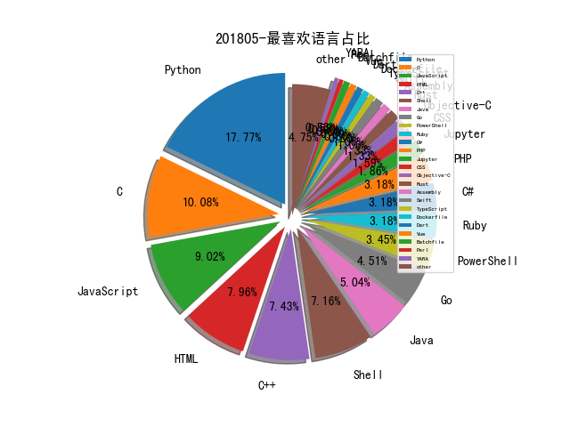

# [数据--所有](README_20.md)
# [数据--年度](README_2018.md)
# 201805 信息源与信息类型占比

# 微信公众号 推荐
| nickname_english | weixin_no | title | url| 
| --- | --- | --- | ---| 
| 小米安全中心 | misrc_team | 爬虫调度篇[Web 漏洞扫描器] | https://mp.weixin.qq.com/s/MO40KHt7cAMg5HPpydJgOg | 1| 
| 三六零CERT | CERT-360 | VPNFilter-新型IoT Botnet深度解析 | https://mp.weixin.qq.com/s/SnchceLdNX7JYiWfSH2Hmw | 1| 
| AI科技大本营 | rgznai100 |  | https://mp.weixin.qq.com/s/dWVPLd3T5uEnCANdDa1Qfw | 1| 
| 网络法学研究院 | wlfx2017 | “网络电子存证”模拟庭审成功举办 | https://mp.weixin.qq.com/s/nBZ8yeWDlnBMIZ05Srh-dQ | 1| 
| 矛盾实验室 | MDLab2017 | Cobalt Strike入门教程 | https://mp.weixin.qq.com/s/0imwEZ3KLnYAk_TScBJbOQ | 1| 
| 安在 | AnZer_SH | 人物 , 智者大潘：再谋新局 | https://mp.weixin.qq.com/s/t9AdsAJ404ht2BP-Nui4iw | 1| 
| 安全学术圈 | secquan | 信息安全相关学术会议列表 | https://mp.weixin.qq.com/s/dWoAMSezx91X6MMRUXm1sg | 2| 
| 云鼎实验室 | YunDingLab | Linux Redis自动化挖矿感染蠕虫分析及安全建议 | https://mp.weixin.qq.com/s/inazTPN5mHJYnt2QDliv8w | 1| 
| XCTF联赛 | gh_3d7c7f90f79f | 专访SU战队领队周振吉老师：优势互补，生生不息 | https://mp.weixin.qq.com/s/AXqjd98-KlaHNDKiZTwQhA | 1| 
| 鲸犀 | whalerhino | 李均：我眼中的黑客精神 | https://mp.weixin.qq.com/s/ZCloN0DrsfFU7DeEYogwpg | 1| 
| 菜鸟博客 | Cainiao_sec | Acunetix11-API接口开发利用 | https://mp.weixin.qq.com/s/UVdOPStSVM5-6ekj4BqJfQ | 3| 
| 猎户攻防实验室 | TassLiehu | Spring Security OAuth2 RCE（CVE-2018-1260）漏洞分析 | https://mp.weixin.qq.com/s/5nTz6bexDFLkIT5EfDpnYA | 1| 
| 晨星先生 | givemeshell | 利用网络测绘深挖博彩平台的产业链 | https://mp.weixin.qq.com/s/aOlZmdzzye2AsqGDa3hcbg | 1| 
| 进击的大熊 | JinJi_DaXiong | 图文教程：无限刷BEC币与漏洞分析（多图预警） | https://mp.weixin.qq.com/s/CLq9jkHon8QJgO_rnBA9Yw | 1| 
| 浅黑科技 | qianheikeji | 黑客蒸米：一个大V的生活意见 | https://mp.weixin.qq.com/s/AwhvVEAMtWUl65_8bN54iQ | 1| 
| 永安在线情报平台 | YongAnOnline | 威胁猎人 , 改机工具在黑灰产中的应用 | https://mp.weixin.qq.com/s/53VwKco-DcHIcBb62dk50A | 1| 
| 数说安全 | SSAQ2016 |  | https://mp.weixin.qq.com/s/OaMoKelLkkElNUcxJyL2-Q | 2| 
| 我的安全视界观 | CANI_Security | 【一起玩蛇】Nodejs代码审计中的器 | https://mp.weixin.qq.com/s/97whUiR5v0URQ7QT0CQ6bg | 1| 
| 奇安信威胁情报中心 | gh_166784eae33e | DarkHotel APT团伙新近活动的样本分析 | https://mp.weixin.qq.com/s/LC_udciIifrJBt-abuEUaA | 2| 
| 双螺旋Sec团队 | double_helix_sec | suPHP安全那点事儿 | https://mp.weixin.qq.com/s/mTHmagQaRttUrYLVtCzVTA | 1| 
| 信安之路 | xazlsec | php 一句话木马检测绕过研究 | https://mp.weixin.qq.com/s/LytVSOt81UpRyetMh6twnw | 26| 
| 丁爸 情报分析师的工具箱 | dingba2016 | 【技巧】情报分析之图片挖掘 | https://mp.weixin.qq.com/s/ZG5d_Hs7W3mQ0xgGI4YgDA | 1| 
| bigsec岂安科技 | bigsec | 初探新版 Elasticsearch 中的强悍插件 X-pack , 岂安低调分享 | https://mp.weixin.qq.com/s/2SFJUFgb_e3cKP6eOKS4jw | 1| 
| SecPulse安全脉搏 | SecPulse | CVE-2017-14322 登录认证绕过分析 | https://mp.weixin.qq.com/s/GWdKiwWf8Eiy5ee8B-D5Dw | 2| 
| Bypass | Bypass-- | Bypass ngx_lua_waf SQL注入防御（多姿势） | https://mp.weixin.qq.com/s/tOf66FGINaO9oVv2pDcxcQ | 5| 

# 组织github账号 推荐
| github_id | title | url | org_url | org_profile | org_geo | org_repositories | org_people | org_projects | repo_lang | repo_star | repo_forks| 
| --- | --- | --- | --- | --- | --- | --- | --- | --- | --- | --- | ---| 
| google | syzkaller: unsupervised, coverage-guided kernel fuzzer | https://github.com/google/syzkaller | https://opensource.google.com/ | Google ❤️ Open Source | https://opensource.google.com/ | 1474 | 2547 | 0 | C,TypeScript,Java,Python,Kotlin,JavaScript,C++,Go,Ruby,Rust | 0 | 0 | 2| 
| nccgroup | MS Outlook 中的 SMB 哈希窃取与用户跟踪 : https://www.nccgroup.trust/uk/about-us/newsroom-and-events/blogs/2018/may/smb-hash-hijacking-and-user-tracking-in-ms-outlook/ ;OutlookLeakTest - 验证 Outlook 中的 SMB 哈希窃取漏洞: | https://github.com/nccgroup/OutlookLeakTest | https://www.nccgroup.trust | Please report all security issues to security at nccgroup dot com | Global | 180 | 15 | 0 | C,Shell,Java,Python,JavaScript,C#,HTML,Elixir,Go,Rust | 0 | 0 | 1| 
| OWASP | iGoat-Swift - iOS Swift 应用安全漏洞测试项目: | https://github.com/OWASP/iGoat-Swift | http://www.owasp.org | The OWASP Foundation | http://www.owasp.org | 151 | 27 | 0 | C,Shell,Java,Python,JavaScript,Perl,HTML,Go,CSS | 0 | 0 | 1| 
| flipkart-incubator | watchdog - 一款全面的安全扫描和漏洞管理工具: | https://github.com/flipkart-incubator/watchdog | http://flipkart.com |  | http://flipkart.com | 90 | 7 | 0 | TypeScript,Java,Python,JavaScript,Objective-C,HTML,Swift | 0 | 0 | 1| 
| apachecn | Kaggle 项目实战（教程） = 文档 + 代码 + 视频 | https://github.com/apachecn/kaggle | http://www.apachecn.org | 可能是东半球最大的 AI 社区 | China | 82 | 106 | 2 | Shell,Java,Python,JavaScript,HTML,Jupyter,CSS | 0 | 0 | 1| 
| CIRCL | 来自 CIRCL 的 GDPR 会议资料: | https://github.com/CIRCL/compliance/tree/master/gdpr/workshop-materials | https://www.circl.lu/ |  | Luxembourg | 65 | 14 | 0 | Python,C,Shell,C++,CSS | 0 | 0 | 1| 
| CERT-Polska | mquery - 基于 Yara 规则快速查询恶意软件的工具: | https://github.com/CERT-Polska/mquery | http://www.cert.pl/ |  | Warsaw, Poland | 48 | 5 | 0 | C,Java,Python,JavaScript,C++,PHP | 0 | 0 | 1| 
| hardenedlinux | Debian-GNU-Linux-Profiles - Debian GNU/Linux 系统上的服务搭建手册: | https://github.com/hardenedlinux/Debian-GNU-Linux-Profiles | https://hardenedlinux.github.io/ | This is official repository of HardenedLinux community! | Kaer Morhen | 38 | 2 | 0 | C,Shell,Jupyter,Roff,JavaScript,C++,HTML,Assembly | 0 | 0 | 1| 
| Genymobile | gnirehtet - 通过 ADB 为安卓设备提供网络共享的工具: | https://github.com/Genymobile/gnirehtet | http://www.genymobile.com |  | Paris, Lyon, San Francisco | 34 | 0 | 0 | Groovy,C,Shell,Java,Python,Makefile,C++ | 0 | 0 | 1| 
| endgameinc | RTA - 旨在让蓝队模拟恶意攻击的脚本框架: | https://github.com/endgameinc/RTA | https://www.endgame.com |  | Washington, DC | 27 | 0 | 0 | C,Jupyter,Python,JavaScript,C++,C#,Go,Java,Ruby,Rust | 0 | 0 | 1| 
| airbus-seclab | cpu_rec - 识别任意二进制文件中 cpu 指令的工具: | https://github.com/airbus-seclab/cpu_rec | https://airbus-seclab.github.io/ |  | https://airbus-seclab.github.io/ | 23 | 5 | 0 | C,Python,OCaml,C++,Ruby,PowerShell | 0 | 0 | 1| 
| mushorg | snare: Super Next generation Advanced Reactive honEypot | https://github.com/mushorg/snare | http://mushmush.org |  | http://mushmush.org | 19 | 6 | 0 | Python,Go,C,PHP | 0 | 0 | 1| 
| InQuest | python-iocextract: Advanced Indicator of Compromise (IOC) extractor | https://github.com/InQuest/python-iocextract | http://www.inquest.net |  | http://www.inquest.net | 18 | 1 | 0 | Python,AngelScript,C,JavaScript,YARA | 0 | 0 | 1| 
| JPCERTCC | LogonTracer - 用于可视化分析 Windows 安全事件日志寻找恶意登录的工具: | https://github.com/JPCERTCC/LogonTracer | https://www.jpcert.or.jp/ | JPCERT/CCs official repositories maintained by staff and guests | Tokyo, Japan | 14 | 6 | 0 | Python,JavaScript,HTML | 0 | 0 | 1| 
| redcanaryco | AtomicRedTeam 项目发布 YAML 规范和验证例程: | https://github.com/redcanaryco/atomic-red-team/blob/master/atomics/spec.yaml | http://www.redcanary.co |  | http://www.redcanary.co | 14 | 0 | 0 | Python,C#,JavaScript,Ruby,PowerShell | 0 | 0 | 1| 
| integrity-sa | burpcollaborator-docker - Burp Collaborator 服务的 Docker 容器: | https://github.com/integrity-sa/burpcollaborator-docker | https://labs.integrity.pt |  | https://labs.integrity.pt | 13 | 0 | 0 | Java,Python,JavaScript,Perl,Objective-C,Ruby | 0 | 0 | 1| 
| slowmist | eos-bp-nodes-security-checklist: EOS超级节点安全执行指南 | https://github.com/slowmist/eos-bp-nodes-security-checklist | https://slowmist.com | Focusing on Blockchain Ecosystem Security | https://slowmist.com | 10 | 2 | 0 | Go,Ruby | 0 | 0 | 1| 
| staticafi | symbiotic - 基于插桩、静态程序切片(static program slicing)及符号执行的程序 Bug 发现工具: | https://github.com/staticafi/symbiotic | mailto:statica@fi.muni.cz | Statica - static analysis group at Faculty of Informatics at Masaryk University in Brno, Czech Republic | Brno, Czech Republic | 10 | 4 | 0 | Python,C,C++ | 0 | 0 | 1| 
| sodium-friends | learntocrypto - 通过循序渐进的练习来学习加密: | https://github.com/sodium-friends/learntocrypto | None | Javascript friends of libsodium. Join us at #sodium-friends on Freenode IRC | None | 9 | 2 | 0 | Shell,JavaScript | 0 | 0 | 1| 
| SideChannelMarvels | Deadpool - 收集公开的白盒加密算法实现及对应攻击方法的仓库: | https://github.com/SideChannelMarvels/Deadpool | None | SCA-related projects | None | 7 | 0 | 0 | Python,C,Shell,C++ | 0 | 0 | 1| 
| UnkL4b | GitBackdorizer - 通过修改 git 仓库的 hook 文件钓取用户 git 凭证的工具: | https://github.com/UnkL4b/GitBackdorizer | http://unkl4b.github.io |  | http://unkl4b.github.io | 7 | 0 | 0 | Python,Shell,JavaScript,HTML | 0 | 0 | 1| 
| eurecom-s3 | linux_screenshot_xwindows - 从内存转储中提取所有打开的 Xwindows 的屏幕截图: | https://github.com/eurecom-s3/linux_screenshot_xwindows | http://s3.eurecom.fr | Stand-alone projects developed by eurecom-s3. Make sure to also visit https://github.com/avatarone and https://github.com/avatartwo | http://s3.eurecom.fr | 7 | 1 | 0 | Python,C,Assembly,C++ | 0 | 0 | 1| 
| susers | Writeups: 国内各大CTF赛题及writeup整理 | https://github.com/susers/Writeups | https://susers.github.io | 东南大学网络安全联盟 | Nanjing, China | 5 | 1 | 0 | Python,PHP,HTML | 0 | 0 | 1| 
| ZipArchive | 盘古实验室发现 ZipperDown 漏洞,约 10 %的 iOS 应用可能受影响,可造成应用数据破坏,一定条件下可任意执行代码: https://zipperdown.org/ | https://github.com/ZipArchive/ZipArchive/issues/453 | https://github.com/ziparchive |  | San Francisco, California | 3 | 2 | 0 | C | 0 | 0 | 1| 

# 私人github账号 推荐
| github_id | title | url | p_url | p_profile | p_loc | p_company | p_repositories | p_projects | p_stars | p_followers | p_following | repo_lang | repo_star | repo_forks | 
| --- | --- | --- | --- | --- | --- | --- | --- | --- | --- | --- | --- | --- | --- | ---| 
| yangyangwithgnu | 暴破助攻提权：ruadmin | https://github.com/yangyangwithgnu/ruadmin | https://yangyangwithgnu.github.io/ | The quieter you become, the more you are able to hear. | chengdu | None | 15 | 0 | 2 | 3300 | 0 | Python,C,CSS,C++,Vim | 9000 | 2100 | 1| 
| TrustedSec | hate_crack - TrustedSec 团队发布的 Hashcat 自动化破解工具: | https://github.com/TrustedSec/hate_crack | https://www.trustedsec.com | Headquartered in Cleveland, Ohio, TrustedSec is an Information Security Consulting company, made up of researchers, hackers, advisors to help our customers. | Cleveland, Ohio | TrustedSec | 24 | 0 | 2 | 3100 | 8 | Python | 4400 | 1400 | 1| 
| migueldeicaza | gui.cs - 用于 .NET 控制台应用程序的用户界面工具包: | https://github.com/migueldeicaza/gui.cs | http://tirania.org/blog |  | Boston, MA. | Microsoft | 111 | 0 | 263 | 2800 | 43 | C#,JavaScript | 2600 | 477 | 1| 
| jackfrued | jackfrued/Python-100-Days: Python | https://github.com/jackfrued/Python-100-Days | http://blog.csdn.net/jackfrued | 只有非常努力，才能看起来毫不费力！ | Chengdu Sichuan, China | http://www.qfedu.com | 48 | 0 | 210 | 2200 | 1 | Python,Shell,Jupyter,JavaScript | 31600 | 11000 | 1| 
| trimstray | multitor - 通过 HAProxy 创建多个 TOR 实例并实现负载均衡的工具: | https://github.com/trimstray/multitor | https://trimstray.github.io/ | BIO_read(wbio, buf, 4096) | Poland | None | 15 | 0 | 892 | 1300 | 265 | Shell,HTML | 0 | 0 | 1| 
| l3m0n | linux_information: 自动化收集linux信息 | https://github.com/l3m0n/linux_information | http://www.cnblogs.com/iamstudy | biubiubiubiu | None | Syclover | 98 | 0 | 1000 | 1200 | 76 | C,Python,JavaScript,HTML,Go,PHP | 0 | 0 | 1| 
| danistefanovic | build-your-own-x - Build your own 系列,各种环境的构建技术集合: | https://github.com/danistefanovic/build-your-own-x | http://twitter.com/danistefanovic | Bad at writing bios. | St. Gallen, Switzerland | None | 11 | 0 | 94 | 1100 | 2 | JavaScript,Scala | 0 | 0 | 1| 
| r00t-3xp10it | 恶意代码混淆技术集合: | https://github.com/r00t-3xp10it/hacking-material-books/blob/master/obfuscation/simple_obfuscation.md | https://github.com/Suspicious-Shell-Activity | Be a hacker not a criminal... Pentester , IT enthusiastic , blooger | Lisbon - portugal | @Suspicious-Shell-Activity | 27 | 0 | 30 | 970 | 37 | C#,Shell,HTML,Ruby | 0 | 0 | 1| 
| FuzzySecurity | UAC 绕过技巧分享 来自 DEFCON China: | https://github.com/FuzzySecurity/DefCon-Beijing-UAC/blob/master/DCCBeijing_UAC-0day-All-Day_v1.0.pdf | http://www.fuzzysecurity.com/ |  | None | None | 13 | 0 | 0 | 952 | 0 | C,PowerShell | 0 | 0 | 1| 
| boy-hack | w8fuckcdn:扫描全网获得真实IP自动化程序 | https://github.com/boy-hack/w8fuckcdn | https://www.hacking8.com/ | Hacking tools just for fun ~ | china | None | 28 | 0 | 113 | 749 | 17 | Python,JavaScript | 211 | 69 | 1| 
| m4ll0k | AutoNSE - 自动化调用 NSE 脚本进行扫描的工具: | https://github.com/m4ll0k/AutoNSE | https://twitter.com/m4ll0k2 | 104,97,99,107,101,114,97,110,100&&112,114,111,103,114,97,109,109,101,114 | 127.0.0.1, Italy - Morocco | localhost | 14 | 0 | 13 | 743 | 20 | Python,Shell | 0 | 0 | 3| 
| Cryptogenic | PS4 5.05 内核漏洞利用放出: https://github.com/Cryptogenic/PS4-5.05-Kernel-Exploit | https://github.com/Cryptogenic/PS4-5.05-Kernel-Exploit | https://twitter.com/SpecterDev | PHP/C++ developer with an interest in user-land and web exploitation. | None | None | 28 | 0 | 38 | 642 | 5 | Go,C,JavaScript | 0 | 0 | 1| 
| lcatro | PHP_Source_Audit_Tools: PHP 白盒分析工具 | https://github.com/lcatro/PHP_Source_Audit_Tools | https://github.com/lcatro/my-blog | Binary ,WEB vulnerability and Fuzzing Research .. | China | WeBank ,Tencent | 51 | 0 | 171 | 596 | 20 | Python,PHP,Mask,C++ | 391 | 101 | 1| 
| c0ny1 | vulstudy: 使用docker快速搭建各大漏洞学习平台 | https://github.com/c0ny1/vulstudy | http://gv7.me | 漏洞在牛角尖上 | None | None | 13 | 0 | 271 | 583 | 12 | Python,Shell,PHP,Java | 1200 | 307 | 2| 
| eolinker | GoKu-API-Gateway:悟空API网关开源版 | https://github.com/eolinker/GoKu-API-Gateway | https://global.eolinker.com | A powerful All-in-one API management and testing platform, we devote to making APIs Management easier! | Zhong Huan,Hong Kong | EOLINKER Co., Ltd | 4 | 0 | 3 | 559 | 0 | Go,PHP | 0 | 0 | 1| 
| drduh | YubiKey-Guide - 将 YubiKey 用作存储 GPG 加密和签名密钥的智能卡的实用指南: | https://github.com/drduh/YubiKey-Guide | None | GPG: 0xFF3E7D88647EBCDB | None | None | 13 | 0 | 103 | 550 | 5 | Python,Shell | 0 | 0 | 1| 
| mvdan | sh - shell 解析器,格式化器和解释器,支持POSIX Shell,Bash 以及 mksh: | https://github.com/mvdan/sh | https://mvdan.cc | I work on stuff in Go. | Sheffield, United Kingdom | None | 61 | 0 | 73 | 512 | 24 | Go | 0 | 0 | 1| 
| andresriancho | websocket-fuzzer - WebSocket Fuzz 测试工具: | https://github.com/andresriancho/websocket-fuzzer | http://w3af.org | Hacker. | Buenos Aires | w3af.org | 99 | 0 | 27 | 478 | 13 | Python,JavaScript | 2600 | 821 | 1| 
| mthbernardes | rsg - 生成各种执行反向 shell 方式的工具: | https://github.com/mthbernardes/rsg | https://mthbernardes.github.io |  | Campinas | None | 75 | 0 | 22 | 415 | 45 | Go,Python,C,Shell | 497 | 101 | 1| 
| bkimminich | juice-shop - Node.js 编写的 Web 安全漏洞测试项目: | https://github.com/bkimminich/juice-shop | https://github.com/kuehne-nagel | IT Architect @kuehne-nagel, Project Leader @OWASP Juice Shop, IT Security Lecturer @Nordakademie. | Hamburg, Germany | Kuehne+Nagel (AG & Co.) KG | 60 | 0 | 1000 | 392 | 216 | C,JavaScript | 0 | 0 | 1| 
| 0x09AL | CVE-2018-8174-msf - VBScript 远程代码执行漏洞 MSF 利用模块: | https://github.com/0x09AL/CVE-2018-8174-msf | https://twitter.com/0x09AL |  | None | None | 94 | 0 | 114 | 372 | 19 | Go,Python,Ruby,C++ | 0 | 0 | 1| 
| api0cradle | LOLBAS - 使用 Windows 本地自带的可执行文件进行攻击的使用维基: | https://github.com/api0cradle/LOLBAS | https://oddvar.moe |  | None | None | 65 | 0 | 60 | 309 | 8 | PowerShell,C++,XSLT | 0 | 0 | 1| 
| rootm0s | Injectors - 应用到各种 DLL/Shellcode 注入技术的项目: | https://github.com/rootm0s/Injectors | None |  | Unknown | Unknown | 5 | 0 | 164 | 305 | 0 | Python | 0 | 0 | 1| 
| bingohuang | docker-labs: Docker在线实验室 | https://github.com/bingohuang/docker-labs | https://bingohuang.com | Father - Gopher - Cloud | Hangzhou,China | @huawei-cloud | 50 | 0 | 491 | 298 | 76 | Go,Java,JavaScript,Ruby | 0 | 0 | 1| 
| BigNerd95 | Chimay-Blue - Mikrotik SMB 缓冲区溢出漏洞利用脚本(CVE-2018-7445): | https://github.com/BigNerd95/Chimay-Blue | https://bignerd95.blogspot.it/ | Computer Science Student at UniTo (University of Turin). I love reverse engineering of embedded systems. | Italy | None | 40 | 0 | 225 | 294 | 16 | Python,C,Shell | 0 | 0 | 1| 
| 0x4D31 | honeybits - 一款 Go 语言开发的蜜罐: | https://github.com/0x4D31/honeybits | https://github.com/salesforce | Lead Threat Detection Engineer @salesforce | Sydney, Australia | None | 19 | 0 | 1100 | 285 | 77 | Python,Go | 0 | 0 | 3| 
| struct | 实用的内存安全缓解措施: | https://github.com/struct/research/blob/master/Effective_Memory_Safety_Mitigations.pdf | http://struct.github.io | I do security stuff | @chrisrohlf | None | 18 | 0 | 46 | 268 | 55 | C,HTML,Ruby,C++ | 0 | 0 | 1| 
| 0x00-0x00 | ShellPop - 生成各种语言正向/反向 shell 的工具: | https://github.com/0x00-0x00/ShellPop | https://0x00-0x00.github.io | Penetration Tester, OSCP. | Assis-SP, Brazil | Morphus | 198 | 0 | 254 | 260 | 13 | Python,C#,C,Shell,PowerShell | 0 | 0 | 1| 
| grayddq | PublicMonitors: 公网IP列表端口服务及弱口令周期扫描 | https://github.com/grayddq/PublicMonitors | None | 一位喜欢原创的安全工作者！ | None | None | 14 | 0 | 0 | 256 | 0 | Python | 276 | 93 | 1| 
| hlldz | SpookFlare - Meterpreter, Empire, Koadic 等后门的生成器/加载器,用于协助绕过客户端防御与网络检测: | https://github.com/hlldz/SpookFlare | https://artofpwn.com | Pwner, Red Teamer | İstanbul, Türkiye | None | 5 | 0 | 186 | 249 | 23 | Python,PowerShell,C++ | 0 | 0 | 1| 
| can1357 | 利用 POP SS 漏洞以内核权限执行任意代码的 Exp(CVE-2018-8897): | https://github.com/can1357/CVE-2018-8897 | https://can.ac/ | Im an independent security researcher and a self-employed reverse engineer; mostly interested in Windows kernel development and low-level programming. | None | None | 6 | 0 | 14 | 242 | 11 | C,Cuda,C++ | 0 | 0 | 1| 
| iGio90 | uDdbg - 类似 gdb 的调试器,提供到 Unicorn 模拟器的运行时环境: | https://github.com/iGio90/uDdbg | https://github.com/overwolfmobile | Developer @ StatsRoyale and Overwolf mobile team. Reverse engineering my life into something human readable. | Unknown | @overwolfmobile | 137 | 0 | 99 | 238 | 44 | Python,JavaScript,Java | 0 | 0 | 1| 
| SkyLined | BugId - 用于检测、分析和识别应用程序错误的 Python 模块: | https://github.com/SkyLined/BugId | https://twitter.com/berendjanwever | ASCII art evangelist , motivational coder , full stack IoT blockchain machine learning cyber-cloud threat actor | The Netherlands | None | 55 | 0 | 0 | 234 | 0 | Python | 0 | 0 | 1| 
| Und3rf10w | boblobblob - 从 Git 仓库中隐藏文件的方法及脚本 : | https://github.com/Und3rf10w/boblobblob | http://und3rf10w.blogspot.com/ |  | None | None | 40 | 0 | 713 | 232 | 7 | Python,Shell,PowerShell | 0 | 0 | 1| 
| frizb | Bypassing-Web-Application-Firewalls: A series of python scripts | https://github.com/frizb/Bypassing-Web-Application-Firewalls | None |  | None | None | 32 | 0 | 261 | 228 | 10 | Python,Batchfile,HTML | 355 | 96 | 1| 
| f0rb1dd3n | Reptile - LKM Linux rootkit (支持 2.6.x/3.x/4.x 内核版本): | https://github.com/f0rb1dd3n/Reptile | None |  | None | None | 2 | 0 | 20 | 211 | 4 | C | 1000 | 253 | 1| 
| imWildCat | scylla:一款高质量的免费代理 IP 池工具 | https://github.com/imWildCat/scylla | https://github.com/outlook | Software Development Engineer @outlook Mobile team. MSc in Computer Science with Distinction at University of Birmingham. | PRC | @microsoft | 81 | 0 | 2100 | 197 | 56 | Python,JavaScript,Swift,Dart | 0 | 0 | 1| 
| bkerler | uEmu - 一个 IDA 上基于 Unicorn 引擎的小型模拟器插件: | https://github.com/bkerler/uEmu | https://twitter.com/viperbjk | Reverse Engineer and Data/Crypto Analyst | Germany | RevSkills | 314 | 0 | 3 | 197 | 14 | Python,C,C++ | 530 | 94 | 2| 
| David-Reguera-Garcia-Dreg | anticuckoo - Cuckoo 沙盒检测工具: | https://github.com/David-Reguera-Garcia-Dreg/anticuckoo | http://www.fr33project.org | Senior Malware & Vulnerabillity Researcher ASM, C, C++, x86_64, Research & Development. | Spain | freelance | 66 | 0 | 28 | 197 | 55 | C | 0 | 0 | 1| 
| smicallef | spiderfoot - 开源情报收集工具: | https://github.com/smicallef/spiderfoot | http://www.binarypool.com |  | @binarypool | None | 1 | 0 | 2 | 195 | 0 | Python | 2100 | 545 | 1| 
| zeroSteiner | reflective-unloader - 将 ReflectiveDLLInjection 注入的 DLL 还原的工具: | https://github.com/zeroSteiner/reflective-unloader | https://zerosteiner.com/ |  | Cleveland, Ohio | None | 64 | 0 | 176 | 186 | 27 | Python,C,Ruby | 0 | 0 | 1| 
| 9b | chirp - 用于集中化管理 Google Alerts 信息的 GUI 工具: | https://github.com/9b/chirp | https://github.com/blockadeio | Founder of @blockadeio, PDF X-RAY, and @passivetotal. Partner and developer for @NinjaJobs. VP of product for @RiskIQ. Roaster at @splitkeycoffee. | Northern Virginia | 9b+ | 58 | 0 | 146 | 184 | 14 | Python | 223 | 18 | 1| 
| 5alt | emu - 基于 unicorn 引擎的代码模拟器: | https://github.com/5alt/emu | None |  | None | None | 32 | 0 | 10 | 180 | 3 | Python,JavaScript | 100 | 22 | 1| 
| skelsec | pypykatz - 纯 Python 实现的 Mimikatz: | https://github.com/skelsec/pypykatz | https://twitter.com/SkelSec |  | None | None | 50 | 0 | 17 | 162 | 1 | Python,Objective-C | 0 | 0 | 1| 
| Cryin | GitLab web hooks SSRF(CVE-2018-8801) Patch analysis and How to safely fix SSRF | https://github.com/Cryin/Paper/blob/master/GitLab%20web%20hooks%20SSRF(CVE-2018-8801)%20Patch%20analysis%20and%20How%20to%20safely%20fix%20SSRF.md | https://cryin.github.io/ | Enjoy programming. Write some interesting programs！ | None | None | 8 | 0 | 237 | 146 | 70 | Python,PHP,C++ | 253 | 90 | 1| 
| olafhartong | sysmon-modular - Sysmon 配置文件收集仓库: | https://github.com/olafhartong/sysmon-modular | http://olafhartong.nl |  | The Netherlands | None | 47 | 0 | 60 | 132 | 4 | Python,Shell,Batchfile,PowerShell,HTML | 0 | 0 | 1| 
| cookieY | Yearning: 基于Inception的可视化Web端SQL审核平台 | https://github.com/cookieY/Yearning | None | var me coder = Henry | Hangzhou | Closeli | 14 | 0 | 17 | 132 | 0 | Shell,Vue,HTML,Rust | 2100 | 814 | 1| 
| platomav | MEAnalyzer - 英特尔引擎固件分析工具: https://github.com/platomav/MEAnalyzer | https://github.com/platomav/MEAnalyzer | None | Hardware & firmware hobbyist, developer of ME Analyzer & MC Extractor, admin of win-raid.com | None | None | 5 | 0 | 39 | 131 | 5 | Python | 0 | 0 | 1| 
| oddcod3 | Phantom-Evasion: Python AV evasion tool capable to generate FUD executable | https://github.com/oddcod3/Phantom-Evasion | None | Like Jon Snow I know nothing | Arezzo IT | None | 1 | 0 | 386 | 130 | 174 | Python | 0 | 0 | 1| 
| thehappydinoa | iOSRestrictionBruteForce - 基于 Python 实现的 iOS 访问限制密码破解工具: | https://github.com/thehappydinoa/iOSRestrictionBruteForce | https://aidan.davisholland.com/ | Student, Developer, Researcher, and Collaborator | Washington, DC | None | 85 | 0 | 727 | 113 | 75 | Python,Shell | 0 | 0 | 1| 
| leeqwind | CVE-2018-8120 Windows 本地提权漏洞 POC: | https://github.com/leeqwind/HolicPOC/blob/master/windows/win32k/CVE-2018-8120/x86.cpp | https://xiaodaozhi.com | :)zZ | None | None | 14 | 0 | 744 | 112 | 147 | C,Assembly,C++ | 58 | 34 | 1| 
| deepzec | Grok-backdoor - 使用 Ngrok 隧道进行通信的简易 Python 后门: | https://github.com/deepzec/Grok-backdoor | https://www.linkedin.com/in/deeputv/ | Sr Security Consultant/Security Architect/Security Researcher/Sr Security Analyst/Pentester | None | None | 26 | 0 | 42 | 106 | 46 | Python,Shell,PowerShell | 0 | 0 | 2| 
| danigargu | heap-viewer - 用于检查 glibc 堆的 IDA Pro 插件: | https://github.com/danigargu/heap-viewer | https://twitter.com/danigargu |  | Spain | None | 14 | 0 | 183 | 104 | 27 | Python,JavaScript | 447 | 54 | 1| 
| smgorelik | VBScript 远程代码执行漏洞 POC(CVE-2018-8174): | https://github.com/smgorelik/Windows-RCE-exploits/tree/master/Web/VBScript | None |  | None | None | 9 | 0 | 3 | 103 | 3 | C#,Visual,C++ | 465 | 127 | 1| 
| mbechler | serianalyzer: A static byte code analyzer for Java deserialization gadget | https://github.com/mbechler/serianalyzer | https://mbechler.github.io/ |  | Germany | None | 5 | 0 | 0 | 95 | 0 | HTML,Java | 0 | 0 | 1| 
| lmy375 | awesome-vmp - 虚拟机分析相关资料收集: | https://github.com/lmy375/awesome-vmp | None |  | None | None | 16 | 0 | 116 | 94 | 18 | Python,C++,CSS | 402 | 117 | 2| 
| tlkh | Prowler - 一款基于 Raspberry Pi Cluster 的网络漏洞扫描工具: | https://github.com/tlkh/prowler | https://github.com/NVIDIA | I do code stuff @NVIDIA @NVAITC | Singapore | Singapore University of Technology and Design | 70 | 0 | 380 | 87 | 132 | Python,JavaScript,Jupyter,HTML | 0 | 0 | 1| 
| 0xa-saline | Logpara: 一个对常见的Web日志进行解析处理的粗糙DEMO | https://github.com/0xa-saline/Logpara | http://0cx.cc |  | None | http://0day5.com | 31 | 0 | 750 | 86 | 118 | Python,C,HTML,CSS | 38 | 19 | 1| 
| bigric3 | Windows 本地提权漏洞利用程序(cve-2018-8120): | https://github.com/bigric3/cve-2018-8120 | None |  | None | None | 17 | 0 | 20 | 77 | 7 | C,HTML,C++ | 0 | 0 | 1| 
| HynekPetrak | javascript-malware-collection - JavaScript 恶意代码样本收集仓库: | https://github.com/HynekPetrak/javascript-malware-collection | None |  | Czech Republic | None | 15 | 0 | 1500 | 77 | 24 | C#,Python,C,JavaScript | 280 | 89 | 1| 
| glinares | CSCGuard - 保护并记录 .NET CSC.exe 和运行时C# 编译的可疑以及恶意用法: | https://github.com/glinares/CSCGuard | None |  | None | None | 3 | 0 | 0 | 74 | 1 | C# | 104 | 25 | 1| 
| Cybereason | Invoke-WMILM - 通过 WMI 实现认证后的远程命令执行的工具: | https://github.com/Cybereason/Invoke-WMILM | None |  | None | None | 4 | 0 | 0 | 72 | 0 | Python,C,Assembly,PowerShell | 184 | 50 | 1| 
| dukebarman | awesome-radare2 - Radare2 提供支持的优秀项目、文章等资源收集仓库: | https://github.com/dukebarman/awesome-radare2 | https://twitter.com/dukebarman | Security REsearcher | None | None | 39 | 0 | 479 | 66 | 72 | C,Dockerfile | 0 | 0 | 1| 
| a0xnirudh | kurukshetra - 学习安全编码的 Web 框架: | https://github.com/a0xnirudh/kurukshetra | https://blog.0daylabs.com |  | India | https://blog.0daylabs.com | 44 | 0 | 54 | 65 | 23 | Python,PHP,JavaScript,HTML | 115 | 13 | 1| 
| cryps1s | DARKSURGEON - 用于事件响应,数字取证,恶意软件分析和网络防御的 Windows 虚拟机: https://medium.com/@cryps1s/darksurgeon-a-windows-10-packer-project-for-defenders-1a57759856b6GitHub: | https://github.com/cryps1s/DARKSURGEON | https://twitter.com/cryps1s | DFIR @ Palantir , Windows Security Fanboy , #Ethereum , All views are my own, not my employer | None | Palantir | 9 | 0 | 97 | 60 | 24 | HTML,PowerShell | 382 | 56 | 1| 
| tijme | graphwave - 用于检测相似 URL 路径的 BurpSuite 插件: | https://github.com/tijme/graphwave | https://tij.me/ | Information Security and Software Development. #Android, #iOS & #Web | The Netherlands | None | 15 | 0 | 83 | 57 | 6 | Python,Java,Objective-C,Swift,TeX | 0 | 0 | 1| 
| r0hi7 | BinExp - Linux 二进制漏洞利用教程: | https://github.com/r0hi7/BinExp | https://github.com/walmartlabs | OSCP certified Security Enthusiast and a geeky python developer post graduated from IITK (System Security) | None | @walmartlabs | 37 | 0 | 86 | 56 | 13 | Python,C,Shell | 0 | 0 | 1| 
| nmulasmajic | CVE-2018-8897 - POP/MOV SS 漏洞检测工具: | https://github.com/nmulasmajic/CVE-2018-8897 | http://www.triplefault.io |  | None | None | 2 | 0 | 3 | 56 | 0 | C++ | 97 | 25 | 1| 
| TheM4hd1 | Vayne-RaT - C# .NET 编写的远程控制软件: | https://github.com/TheM4hd1/Vayne-RaT | None | IOS Mobile Developement (Swift) / Desktop Application Developement (C#) / Web Application Pentester | Tehran, Iran | None | 8 | 0 | 101 | 47 | 3 | C#,Swift | 0 | 0 | 1| 
| sycurelab | DECAF - 基于 QEMU 的二进制分析平台: | https://github.com/sycurelab/DECAF | None |  | None | None | 2 | 0 | 0 | 46 | 0 | C | 377 | 128 | 1| 
| hegusung | RPCScan - 可与 RPC 服务通信并检查 NFS 共享错误配置的工具: | https://github.com/hegusung/RPCScan | https://twitter.com/hegusung |  | Behind you | None | 14 | 0 | 19 | 46 | 0 | Python,JavaScript | 264 | 54 | 1| 
| x1mdev | ReconPi - 树莓派上的轻量级信息收集工具: | https://github.com/x1mdev/ReconPi | https://www.x1m.nl | Hacker @ qbit.nl | Groningen | X1M IT Security | 48 | 0 | 180 | 43 | 39 | Python,Shell | 0 | 0 | 1| 
| 0x3curity | TheDoc - SQLMAP 自动化利用脚本: | https://github.com/0x3curity/TheDoc | https://github.com/0x3curity | BASH & Python programmer. Web Security Researcher for #AnonyInfo. -- Twits: @0x3curity @AnonyInfo | None | None | 28 | 0 | 1 | 41 | 4 | Shell,Ruby | 90 | 30 | 2| 
| Fplyth0ner-Combie | Bug-Project-Framework: 漏洞利用框架模块分享仓库 | https://github.com/Fplyth0ner-Combie/Bug-Project-Framework | None | 攻防无绝对，技术无黑白 | None | None | 3 | 0 | 8 | 40 | 6 | Python,PHP | 151 | 47 | 1| 
| steven-michaud | HookCase - macOS/OS X 上的逆向分析工具: | https://github.com/steven-michaud/HookCase | None |  | None | None | 3 | 0 | 12 | 39 | 0 | Objective-C++,C++ | 275 | 46 | 1| 
| immunIT | drupwn - Drupal 信息收集与漏洞利用工具: | https://github.com/immunIT/drupwn | https://www.immunit.ch |  | Nyon, Switzerland | immunIT | 3 | 0 | 0 | 39 | 0 | Python,Dockerfile | 259 | 62 | 1| 
| f3d0x0 | GPON 家庭路由器远程代码执行漏洞利用脚本: | https://github.com/f3d0x0/GPON | https://twitter.com/f3d__ | Security researcher · hacking · pentesting · beat-making · sometimes teaching · crypto | Italy | None | 4 | 0 | 0 | 38 | 0 | Python,C,HTML | 183 | 61 | 1| 
| evilmog | ntlmv1-multi - 将 NTLMv1/NTLMv1-ESS/MSCHAPv2 Hash 转换成方便 Hashcat 破解的 DES 模式的工具: | https://github.com/evilmog/ntlmv1-multi/ | None |  | None | None | 20 | 0 | 3 | 38 | 0 | Python,Shell,PowerShell | 199 | 42 | 1| 
| saucxs | watermark: 网站的水印组件 降低数据泄密风险 | https://github.com/saucxs/watermark | https://github.com/saubyte | 爱好折腾的工程师，喜欢前端开发，致力于以后全栈工程师的方向。 | 江苏南京 | @saubyte | 48 | 0 | 37 | 36 | 16 | JavaScript,HTML,Vue,Dart | 229 | 63 | 1| 
| nirizr | idasix - IDAPython 兼容性库: | https://github.com/nirizr/idasix | None | Topics of interest include: security, reverse engineering, vulnerability analysis, fuzzing, data science, machine learning. @_nirizr on Twitter. | Mountain View, CA, USA | None | 24 | 0 | 113 | 36 | 3 | Python | 0 | 0 | 1| 
| utds3lab | Multiverse - 非启发式的静态二进制重写器: | https://github.com/utds3lab/multiverse | None |  | None | None | 15 | 0 | 0 | 32 | 2 | Python,C,Java | 219 | 20 | 1| 
| cboin | re_lab - 逆向工程环境的 Docker 镜像: | https://github.com/cboin/re_lab | None |  | Paris | Université Lille 1 | 17 | 0 | 79 | 28 | 9 | C,Shell,Java,Python,Go,Dockerfile | 177 | 20 | 1| 
| MohamedNourTN | Terminator - metasploit payload 生成器: | https://github.com/MohamedNourTN/Terminator | http://fsociety.tn | Because open-source is the future | Tunisia | None | 3 | 0 | 3 | 27 | 3 | Python | 129 | 50 | 1| 
| xluohome | phonedata: 手机号码归属地信息库 | https://github.com/xluohome/phonedata | None | 奶爸 | China | None | 42 | 0 | 189 | 26 | 0 | Go | 0 | 0 | 1| 
| qianniaoge | SecurityManageFramwork：企业内网安全管理平台 | https://github.com/qianniaoge/-SecurityManageFramwork | None |  | None | None | 249 | 0 | 158 | 26 | 220 | C,ASP,Java,HTML,Python,JavaScript,Shell,PHP,PowerShell | 23 | 30 | 1| 
| 0xRadi | OWASP-Web-Checklist - OWASP Web 安全检测清单: | https://github.com/0xRadi/OWASP-Web-Checklist | http://0xRadi.me | As I learn, I do. As I do, I learn! | None | None | 6 | 0 | 59 | 25 | 2 | Python,HTML | 250 | 54 | 1| 
| bayotop | sink-logger - BurpSuite 扩展,用于记录所有传入 Javascript 接收器的数据: | https://github.com/bayotop/sink-logger | https://twitter.com/_bayotop |  | None | None | 22 | 0 | 18 | 24 | 1 | Python,Go,Shell | 148 | 15 | 1| 
| kov4l3nko | ARM64JSON - JSON 格式的 ARM64 指令编码: | https://github.com/kov4l3nko/ARM64JSON | https://kov4l3nko.github.io/about/ | iOS/Android reverse engineer and security researcher | Ukraine | None | 5 | 0 | 0 | 23 | 0 | Python,HTML,Java,JavaScript | 34 | 3 | 1| 
| jymcheong | AutoTTP - Python 实现的 Empire / Metasploit 等框架的 API 调用库,用于实现自动化攻击: | https://github.com/jymcheong/AutoTTP | https://jym.sg |  | Singapore | None | 243 | 0 | 26 | 20 | 21 | Python,C#,Shell,PowerShell,C++ | 0 | 0 | 1| 
| ixty | mandibule - linux elf 进程注入工具: | https://github.com/ixty/mandibule | None |  | None | None | 8 | 0 | 8 | 19 | 0 | Shell,C,HTML | 141 | 36 | 1| 
| wesleyraptor | streamingphish - 使用监督机器学习从证书透明度日志网络中检测钓鱼域名的工具: | https://github.com/wesleyraptor/streamingphish | None | All things enterprise security and machine learning. | San Jose, CA | PatternEx | 4 | 0 | 22 | 17 | 1 | JavaScript,Jupyter | 198 | 34 | 1| 
| Busindre | dumpzilla - 从 Firefox / Iceweasel / Seamonkey 浏览器中提取数字取证资料的工具: | https://github.com/Busindre/dumpzilla | https://www.busindre.com | ლ(́◕◞Ѿ◟◕‵ლ) | Mêlée Island | FreeTSA | 32 | 0 | 3 | 16 | 4 | Python,Shell | 66 | 20 | 1| 
| Hestat | minerchk - 检测 Linux 服务器上恶意挖矿程序的 Bash 脚本: | https://github.com/Hestat/minerchk | http://laskowski-tech.com | DFIR-orensicator, Sys-Admin and overall infosec learner | None | None | 16 | 0 | 102 | 15 | 2 | Python,YARA,Shell,PowerShell | 0 | 0 | 1| 
| ceh-tn | The-Axer - 使用 msfvenom 创建 payload 的辅助工具: | https://github.com/ceh-tn/The-Axer | None |  | None | None | 1 | 0 | 0 | 9 | 0 | Python | 99 | 30 | 1| 
| cosine0 | amphitrite - 基于 triton、pintool 、elftool 的一款符号调试工具: | https://github.com/cosine0/amphitrite | None |  | None | None | 24 | 0 | 9 | 8 | 4 | Python,C++ | 23 | 7 | 1| 
| P4T12ICK | ypsilon - 自动化安全用例测试环境: | https://github.com/P4T12ICK/ypsilon | https://patrick-bareiss.com |  | None | None | 4 | 0 | 7 | 8 | 0 | TeX,Python | 87 | 12 | 1| 
| Shallownight | DNS-Analysis: 非法域名挖掘与画像系统 | https://github.com/Shallownight/DNS-Analysis | None | https://shallownight.github.io/ | None | None | 12 | 0 | 7 | 7 | 1 | JavaScript,HTML,Vue | 0 | 0 | 1| 
| gr4ym4ntx | attackintel - 查询 MITRE ATT&CK API 获取对应策略,技术的 Python 脚本: | https://github.com/gr4ym4ntx/attackintel | https://gr4ym4ntx.pythonanywhere.com/ |  | None | None | 3 | 0 | 3 | 5 | 11 | Python,Batchfile | 61 | 20 | 1| 
| Kutim | docker-security: docker 安全基线规范 | https://github.com/Kutim/docker-security | None |  | None | None | 282 | 0 | 5 | 5 | 4 | Python,Jupyter,C++ | 58 | 17 | 1| 
| lukdog | backtolife - 内存取证工具,从转储的内存中重组进程信息: | https://github.com/lukdog/backtolife | http://lucadoglione.altervista.org | Masters Degree on Software Engineering at Politecnico di Torino. Software Developers in many fields, Im specialized in Web Development. | None | None | 4 | 0 | 6 | 4 | 6 | Python,C#,PHP | 0 | 0 | 1| 
| remyLucas | RansomwareDetector 勒索软件检测工具 | https://github.com/remyLucas/RansomwareDetector | None |  | None | None | 1 | 0 | 0 | 3 | 0 | C | 10 | 4 | 1| 
| kromtech | s3-inspector - 检测 AWS S3 Bucket 权限的工具: | https://github.com/kromtech/s3-inspector | None | None | None | None | 0 | 0 | 0 | 0 | 0 | Python,Objective-C,C | 0 | 0 | 1| 
| knrdl | yamot - 基于 Web 的 Linux/BSD 服务器监控工具: | https://github.com/knrdl/yamot | None |  | Berlin, Germany | None | 1 | 0 | 0 | 0 | 0 | HTML | 0 | 0 | 1| 
| creditease-sec | insight: 洞察-应用系统资产/漏洞全生命周期/安全知识库平台 | https://github.com/creditease-sec/insight?from=timeline&isappinstalled=0 | None | None | None | None | 0 | 0 | 0 | 0 | 0 | JavaScript | 0 | 0 | 1| 
| UltimateLabs | Zoom - 一个自动化的快速 Wordpress 漏洞扫描器: | https://github.com/UltimateLabs/Zoom | None | None | None | None | 0 | 0 | 0 | 0 | 0 | None | 0 | 0 | 1| 
| GreatSCT | GreatSCT - 生成绕过 Windows 应用白名单限制的 Payload 工具: | https://github.com/GreatSCT/GreatSCT | None | None | None | None | 0 | 0 | 0 | 0 | 0 | Python | 0 | 0 | 1| 
| G-E-N-E-S-I-S | loadlibrayy - x64 PE 注入工具: | https://github.com/G-E-N-E-S-I-S/loadlibrayy | None | None | None | None | 0 | 0 | 0 | 0 | 0 | None | 0 | 0 | 1| 
| CodeCracker-Tools | MegaDumper - 从内存中导出 .NET 程序的工具: | https://github.com/CodeCracker-Tools/MegaDumper | None | None | None | None | 0 | 0 | 0 | 0 | 0 | C# | 0 | 0 | 1| 

# 日更新程序
`python update_daily.py`