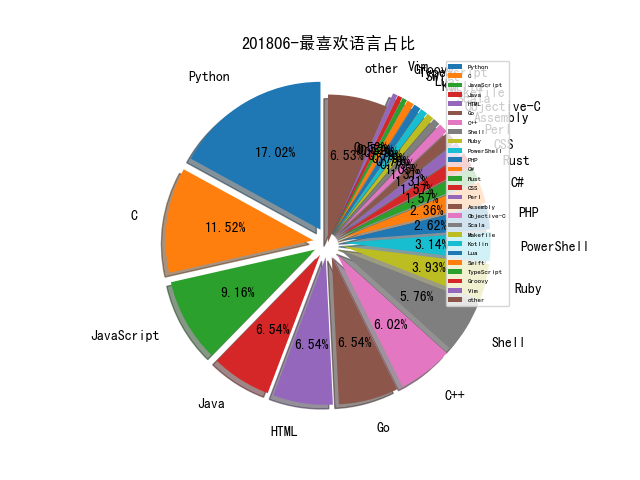

# [数据--所有](README_20.md)
# [数据--年度](README_2018.md)
# 201806 信息源与信息类型占比

# 微信公众号 推荐
| nickname_english | weixin_no | title | url| 
| --- | --- | --- | ---| 
| 金融电子化 | fcmag1993 | 实战Practice丨基于攻击视角完善信息安全弹性防御体系的思考 | https://mp.weixin.qq.com/s/DDfdRVaVvTgQ5ldXqmgQ3g | 1| 
| 腾讯安全威胁情报中心 | gh_05a6c5ec3f78 | 针对保险、母婴等行业的定向攻击事件分析 | https://mp.weixin.qq.com/s/2vwLHzbtF2jd58TfsbKi1g | 1| 
| 水滴安全实验室 | EversecLab | 基于tor网络的钓鱼邮件分析 | https://mp.weixin.qq.com/s/BlssgysUVcebkX9JZ71zMg | 1| 
| 天御攻防实验室 | TianyuLab | Security Onion使用手册（一）：愿者上钩 | https://mp.weixin.qq.com/s/x_AJTqinGvLESu3_bFursg | 1| 
| 云鼎实验室 | YunDingLab | 安全研究 , Linux 遭入侵，挖矿进程被隐藏案例分析 | https://mp.weixin.qq.com/s/1AF5cgo_hJ096LmX7ZHitA | 1| 
| iPolicyLaw | iPolicyLaw | 财政部关于《政府购买服务管理办法（征求意见稿）》公开征求意见的通知 | https://mp.weixin.qq.com/s/YEaEjBoRvvgeRuWoKSpbuA | 1| 
| SecWiki | SecWiki | FACT - 固件分析/类比平台解读 | https://mp.weixin.qq.com/s/7h8UtBCUZjnlc33Oay1ORg | 1| 
| JavaGuide | Java_Guide | 可能是把Docker的概念讲的最清楚的一篇文章 | https://mp.weixin.qq.com/s/xSbYTJmLuqsyYEDEIsndZw | 1| 
| DoraHacks | dorahacks |  | https://mp.weixin.qq.com/s/aUS7qm6T7FT1fgj17oUR1A | 1| 
| 论智 | jqr_AI | 一文概览机器学习面临的所有攻击类型 | https://mp.weixin.qq.com/s/ixdE3ld0qOOpj7F_kLmmSg | 1| 
| 未来技术站 | xingren-tech | 容器管理利器：Web Terminal 简介 | https://mp.weixin.qq.com/s/zlHJTxDeHgjn9A9XuYp9fQ | 1| 
| 敏信安全课堂 | mxaqkt | 敏信审计系列之EOS开发框架 | https://mp.weixin.qq.com/s/4Ejshk7x71L9INB0grj5mw | 1| 
| 廖新喜 | gh_66d4bda5ddf2 | 先知议题 Java反序列化实战 解读 | https://mp.weixin.qq.com/s/ohga7Husc9ke5UYuqR92og | 1| 
| 工业信息安全产业发展联盟 | gh_1dd54c948986 | 【首发】2018年以色列网络周内塔尼亚胡总理演讲实录（附实录翻译内容） | https://mp.weixin.qq.com/s/UVsGnhCaoMQv_snvXKx5xw | 1| 
| 安全学术圈 | secquan | EuroS&P 2018 论文录用列表 | https://mp.weixin.qq.com/s/36DRLvoM0VyXKMbdIf1OLA | 1| 
| 永安在线订阅号 | threathunter888 | 访谈｜在网络世界捕获威胁的猎人 | https://mp.weixin.qq.com/s/IfmKbGyW8gjWkBMtRM0aKw | 1| 
| 我的安全视界观 | CANI_Security | 【企业安全】甲方眼里的安全测试 | https://mp.weixin.qq.com/s/tmYH_4xMcCNLmO9Jx1Z6PQ | 2| 
| 安在 | AnZer_SH | 人物 , 兜哥：带你学安全 | https://mp.weixin.qq.com/s/j-ZQC6zCm0MZPLLbDHfEPw | 3| 
| 安世加 | asjeiss | 邮件安全防护实践—“安全+”沙龙第七期 | https://mp.weixin.qq.com/s/zwzbxf5CbKohkOCJUjvXcA | 1| 
| 嘶吼专业版 | Pro4hou | 通过Joe Sandbox Linux沙箱对VPNFilter的分析报告 | https://mp.weixin.qq.com/s/MsLj0rNAVrXQYhf8x7dR1A | 2| 
| 业务连续性+ | bcmplus | 每周阅读文摘20180613 | https://mp.weixin.qq.com/s/TlRghlJFeLA0ZUhh6Z38WA | 1| 
| sosly菜鸟笔记 | sosly_me | 互联网安全小兵的日常：如何“体面”地与业务打交道 | https://mp.weixin.qq.com/s/eHpKq3IZIz0RugBubFgUww | 1| 
| TGO鲲鹏会 | tgo-kunpenghui | 打造高效研发团队 —— 组织架构篇 | https://mp.weixin.qq.com/s/P6bglKh7wsm483dPqXCjkQ | 1| 
| CNCERT风险评估 | cncertfengxianpinggu | 开源软件源代码安全缺陷分析报告——框架类软件专题 | https://mp.weixin.qq.com/s/9zldhnbPYJy_YHPVXXk8ag | 1| 
| 绿盟科技研究通讯 | nsfocus_research | 开源流量分析系统 Apache Spot 概述 | https://mp.weixin.qq.com/s/DQdcByiuMNlUMhK7uHAdCA | 1| 
| 爱奇艺安全应急响应中心 | iqiyi_71src | 从AWVS插件到伪代理扫描 | https://mp.weixin.qq.com/s/RCyz0iizsm9Bxl3hO-fmkQ | 1| 
| 数据派THU | DatapiTHU | 实例 , 利用犯罪记录聚类和分类暴力行为（附步骤解析） | https://mp.weixin.qq.com/s/N9AiAowrunqURSWF5FSozQ | 2| 
| 威努特工控安全 | winicssec_bj | 技术分享,工控漏洞挖掘方法之固件逆向分析 | https://mp.weixin.qq.com/s/OS4ESfOACW9lhjxzt7B9xw | 1| 
| 君哥的体历 | jungedetili | 金融企业信息安全考核体系建设 | https://mp.weixin.qq.com/s/xelwCXphJCrx0TFSKFHfBA | 3| 
| 分布式实验室 | dockerone | 一些小团队的自动化运维实践经验 | https://mp.weixin.qq.com/s/95RDW5Fq3ooAzJWiAPRRFA | 2| 
| 信安之路 | xazlsec | 利用 nslookup 解析 DNS 记录 | https://mp.weixin.qq.com/s/R1jDDCwWje9-BXhiPekAhQ | 6| 
| 传媒观察杂志 | chuanmeiguancha | 国防大学教授周伟业：老一代黑客是“创造”的一代，新一代黑客是“破坏”的一代 | https://mp.weixin.qq.com/s/eHKG26GgCuG3gg6qkJdGHw | 1| 
| 京东数科安全 | JDJRsecurity |  | https://mp.weixin.qq.com/s/B9NhWSQyWKcUeeagArnwjA | 1| 
| 中国信息安全 | chinainfosec | 关注 , 八部委联合印发《2018网络市场监管专项行动（网剑行动）方案》（附全文） | https://mp.weixin.qq.com/s/WEP3TnXAiN3ovC1RairDyg | 1| 
| Bypass | Bypass-- | Bypass 护卫神SQL注入防御（多姿势） | https://mp.weixin.qq.com/s/f0laS8pfInZpNpz2UKuG3w | 4| 

# 组织github账号 推荐
| github_id | title | url | org_url | org_profile | org_geo | org_repositories | org_people | org_projects | repo_lang | repo_star | repo_forks| 
| --- | --- | --- | --- | --- | --- | --- | --- | --- | --- | --- | ---| 
| intel | xom-switch - 基于 Intel MPK 实现的 XOM 开关工具: | https://github.com/intel/xom-switch | mailto:webmaster@linux.intel.com |  | webmaster@linux.intel.com | 616 | 24 | 0 | C,Shell,Java,Python,JavaScript,C++,Rust | 0 | 0 | 1| 
| Dynatrace | superdump - 用于自动化分析崩溃内存转储的工具: | https://github.com/Dynatrace/superdump | http://www.dynatrace.com | Dynatrace | Waltham, Boston | 232 | 25 | 0 | Shell,Java,C#,Ruby,JavaScript,C++,TypeScript,Python,HTML,Puppet,Go,Swift,PowerShell | 0 | 0 | 1| 
| PortSwigger | command-injection-attacker - BurpSuite 的命令注入漏洞发现插件: | https://github.com/PortSwigger/command-injection-attacker | https://portswigger.net/ |  | https://portswigger.net/ | 219 | 0 | 0 | Python,Kotlin,Ruby,Java,JavaScript | 0 | 0 | 1| 
| Yelp | detect-secrets - Yelp 密码探测器,防止源代码中的敏感信息泄露: https://engineeringblog.yelp.com/2018/06/yelps-secret-detector.htmlGitHub: | https://github.com/Yelp/detect-secrets | https://yelp.com/engineering |  | San Francisco | 218 | 65 | 1 | Java,Scala,Python,Kotlin,JavaScript,Lua,Objective-C,Swift,Puppet,Go,Ruby | 0 | 0 | 1| 
| Netflix | titus:the Netflix container management platform | https://github.com/Netflix/titus | http://netflix.github.io/ | Netflix Open Source Platform | Los Gatos, California | 152 | 8 | 0 | Groovy,C,Shell,Java,D,Scala,Python,JavaScript,C++,HTML,Go,Ruby | 0 | 0 | 1| 
| NetSPI | PESecurity - 检测 PE 文件是否开启漏洞环节保护的 Powershell 模块: | https://github.com/NetSPI/PESecurity | https://www.netspi.com |  | Minneapolis, MN | 63 | 7 | 0 | C,ASP,Java,C#,Python,HTML,Go,Ruby,PowerShell | 0 | 0 | 1| 
| facebookincubator | BOLT - 一款 Linux 下的二进制代码优化工具: | https://github.com/facebookincubator/BOLT | https://opensource.fb.com | We work hard to contribute our work back to the web, mobile, big data, & infrastructure communities. NB: members must have two-factor auth. | Menlo Park, California | 59 | 14 | 0 | C,TypeScript,Java,Python,JavaScript,C++,Go,PHP,Rust | 0 | 0 | 1| 
| nowsecure | node-applesign - 用于重新签名 iOS 应用(IPA 文件) 的 NodeJS 模块: | https://github.com/nowsecure/node-applesign | https://www.nowsecure.com | We secure Mobile Devices, Enterprises, & Mobile Apps | https://www.nowsecure.com | 49 | 5 | 0 | C,Java,Python,JavaScript,Rust,SaltStack,CSS | 0 | 0 | 1| 
| SecWiki | CMS-Hunter :Wordpress <= 4.9.6 任意文件删除漏洞 | https://github.com/SecWiki/CMS-Hunter/blob/master/WordPress/Wordpress%20%3C%3D%204.9.6%20%E4%BB%BB%E6%84%8F%E6%96%87%E4%BB%B6%E5%88%A0%E9%99%A4%E6%BC%8F%E6%B4%9E/Wordpress%20%3C%3D%204.9.6%20%E4%BB%BB%E6%84%8F%E6%96%87%E4%BB%B6%E5%88%A0%E9%99%A4%E6%BC%8F%E6%B4%9E.md | http://www.sec-wiki.com |  | http://www.sec-wiki.com | 41 | 2 | 0 | C,Python,JavaScript,HTML,PHP,CSS | 0 | 0 | 1| 
| Cisco-Talos | 基于 QEMU 的逆向分析沙箱 PyREBox 加入新的漏洞利用检测脚本: | https://github.com/Cisco-Talos/pyrebox/tree/master/exploit_detect | http://www.talosintelligence.com | The official Organizational account of the Talos Group at Cisco | http://www.talosintelligence.com | 36 | 0 | 0 | C,Shell,Python,JavaScript,C++,Lua,HTML,PHP | 0 | 0 | 1| 
| bro | bro - 一款网络分析与安全监控框架: | https://github.com/bro/bro | https://github.com/zeek | Mirror of https://github.com/zeek | https://github.com/zeek | 36 | 0 | 0 | Bro,C,CMake,Roff,Python,Ruby,JavaScript,Makefile,C++,Yacc,Dockerfile | 0 | 0 | 1| 
| comaeio | 2017 mobile Pwn2Own 基带漏洞利用,来自 Amat Cama : | https://github.com/comaeio/OPCDE/blob/master/2018/Kenya/Amat%20Cama%20-%20A%20Walk%20With%20Shannon-%20A%20walkthrough%20of%20a%20PWN2OWN%20Baseband%20exploit.pdf | http://www.comae.io |  | Dubai, UAE | 24 | 0 | 0 | C,Java,JavaScript,C++,Nginx,Smarty,PowerShell | 0 | 0 | 1| 
| anbox | Anbox - 使用基于容器的方式在 Linux 系统上启动 Android 系统的工具: | https://github.com/anbox/anbox | http://anbox.io | Android in a Box | http://anbox.io | 21 | 1 | 0 | C,Shell,Java,Python,JavaScript,Makefile,C++ | 0 | 0 | 1| 
| newaetech | chipwhisperer - 用于侧通道功耗分析和 glitching attacks 的开源工具链: | https://github.com/newaetech/chipwhisperer | https://www.newae.com | NewAE Technology Inc. is | https://www.newae.com | 21 | 0 | 0 | Python,C,HTML,C++ | 0 | 0 | 1| 
| InQuest | awesome-yara - 优秀 YARA 规则及工具等资源收集仓库: | https://github.com/InQuest/awesome-yara | http://www.inquest.net |  | http://www.inquest.net | 18 | 1 | 0 | Python,AngelScript,C,JavaScript,YARA | 0 | 0 | 1| 
| go-xorm | xorm - Go语言实现的 ORM 库,支持多种数据库: | https://github.com/go-xorm/xorm | http://xorm.io |  | Shanghai, CN | 16 | 7 | 0 | Go,JavaScript,HTML | 0 | 0 | 1| 
| baidu-security | app-env-docker: 基于 Docker 的真实应用测试环境 | https://github.com/baidu-security/app-env-docker | https://oases.io/ | Just to be awesome :-) | https://oases.io/ | 14 | 1 | 0 | Go,JavaScript,Java,HTML,C++ | 0 | 0 | 1| 
| DefectDojo | django-DefectDojo - 一款开源的漏洞管理平台: | https://github.com/DefectDojo/django-DefectDojo | https://www.defectdojo.org/ | Open source vulnerability management and automation. | https://www.defectdojo.org/ | 13 | 0 | 0 | Python,Shell,HTML,JavaScript | 0 | 0 | 1| 
| iqiyi | xHook - 针对 Android 平台 ELF 的 PLT hook 库: | https://github.com/iqiyi/xHook | http://www.iqiyi.com | hosting open source projects in iQIYI, a provider of high-quality video and entertainment services in China | Beijing, China | 11 | 0 | 0 | Go,C,JavaScript,Java | 0 | 0 | 1| 
| modzero | interestingFileScanner - 用于扫描敏感文件泄露的 BurpSuite 插件: | https://github.com/modzero/interestingFileScanner | https://www.modzero.ch | Information Security | Winterthur, Switzerland | 11 | 1 | 0 | C,Java,Python,JavaScript,C++,Perl,C#,HTML | 0 | 0 | 1| 
| OpenZeppelin | openzeppelin-solidity - 一个开源库,用于在 Ethereum 上编写安全的智能合约: | https://github.com/OpenZeppelin/openzeppelin-solidity | https://openzeppelin.org |  | https://openzeppelin.org | 10 | 4 | 0 | JavaScript,HTML | 0 | 0 | 1| 
| slowmist | 已知攻击方法和常见防御模式综合列表 | https://github.com/slowmist/Knowledge-Base/blob/master/solidity-security-comprehensive-list-of-known-attack-vectors-and-common-anti-patterns-chinese.md | https://slowmist.com | Focusing on Blockchain Ecosystem Security | https://slowmist.com | 10 | 2 | 0 | Go,Ruby | 0 | 0 | 1| 
| DigitalInterruption | cookie-monster - 自动化 Express.js cookie secrets 测试与重签名工具: | https://github.com/DigitalInterruption/cookie-monster | https://www.digitalinterruption.com |  | UK | 9 | 0 | 0 | PostScript,HTML,JavaScript | 0 | 0 | 1| 
| PreOS-Security | fwaudit - 一款固件审计工具: | https://github.com/PreOS-Security/fwaudit | https://preossec.com |  | Seattle, WA | 4 | 1 | 0 | Python | 0 | 0 | 1| 
| TeamWalrus | Walrus - 用于在手机上调用门禁卡克隆设备的 Android 应用: | https://github.com/TeamWalrus/Walrus | https://walrus.app/ |  | https://walrus.app/ | 2 | 2 | 0 | C,Java | 0 | 0 | 1| 
| pumasecurity | puma-scan - 实时进行源代码安全性扫描分析的 Visual Studio 扩展: | https://github.com/pumasecurity/puma-scan | https://www.pumascan.com/ |  | West Des Moines, IA | 2 | 2 | 0 | C#,JavaScript | 0 | 0 | 1| 
| threat9 | routersploit - 嵌入式设备漏洞利用框架: | https://github.com/threat9/routersploit | https://www.threat9.com |  | https://www.threat9.com | 2 | 0 | 0 | Python | 0 | 0 | 1| 
| akaxincom | openzaly:私有聊天服务器源代码 | https://github.com/akaxincom/openzaly | https://www.akaxin.com | Akaxin 是一款开源免费的私有聊天软件，用以搭建自己的聊天服务器，供自己与朋友、用户使用。 | Beijing, China | 1 | 0 | 0 | PHP | 0 | 0 | 1| 
| phoenhex | iOS 11.3.1 的 Safari 漏洞利用程序发布,通过两个已知漏洞获得 WebContent 沙箱的 tfp0 ( CVE-2018-4233、CVE-2018-4243): | https://github.com/phoenhex/files/tree/master/exploits/ios-11.3.1 | https://phoenhex.re/ | providing fine exploits & writeups to the world | your kernel | 1 | 0 | 0 | C | 0 | 0 | 1| 

# 私人github账号 推荐
| github_id | title | url | p_url | p_profile | p_loc | p_company | p_repositories | p_projects | p_stars | p_followers | p_following | repo_lang | repo_star | repo_forks | 
| --- | --- | --- | --- | --- | --- | --- | --- | --- | --- | --- | --- | --- | --- | ---| 
| byt3bl33d3r | DeathStar - 调用 Empire RESTful API 自动化获取域管权限的 Python 脚本发布: | https://github.com/byt3bl33d3r/DeathStar | https://byt3bl33d3r.github.io | C Y B E R | Error: Unable to resolve | BlackHills InfoSec | 96 | 0 | 953 | 2700 | 117 | Python,PowerShell,HCL | 0 | 0 | 1| 
| s0md3v | Hash-Buster: 集成多API的hash查询工具 | https://github.com/s0md3v/Hash-Buster | https://github.com/s0md3v | I make things, I break things and I make things that break things. Twitter: @s0md3v | None | None | 30 | 0 | 0 | 2400 | 0 | Python,JavaScript,Perl | 0 | 0 | 1| 
| LiveOverflow | PwnAdventure3 - 一款易受攻击的 MMORPG 游戏,目的在于提升游戏开发人员的安全编码能力: | https://github.com/LiveOverflow/PwnAdventure3/ | https://www.youtube.com/LiveOverflowCTF | wannabe hacker... | None | None | 10 | 0 | 3 | 1700 | 0 | Python,C,HTML,C++ | 324 | 98 | 1| 
| stamparm | maltrail - 恶意流量检测系统: | https://github.com/stamparm/maltrail | https://twitter.com/stamparm/ | 74 -> EB | Zagreb, Croatia | None | 19 | 0 | 148 | 1400 | 15 | Python | 0 | 0 | 1| 
| pwn20wndstuff | iOS-Apfs-Persistence-Exploit - iOS APFS 持久化漏洞利用程序: https://github.com/pwn20wndstuff/iOS-Apfs-Persistence-Exploit writeup: | https://github.com/pwn20wndstuff/iOS-Apfs-Persistence-Exploit | https://twitter.com/Pwn20wnd | Hacker. | None | None | 54 | 0 | 30 | 1400 | 3 | C,Makefile,Objective-C | 0 | 0 | 1| 
| 1N3 | PRISM-AP: An automated Wireless RogueAP MITM attack framework | https://github.com/1N3/PRISM-AP | https://github.com/xer0dayz | Founder of @XeroSecurity. Creator of Sn1per. Hacking since 93. 20+ yrs. IT exp. Sr. Penetration Tester. OSCE/OSCP/CISSP @xer0dayz @XeroSecurity @CrowdShield | None | XeroSecurity | 19 | 0 | 671 | 1400 | 35 | Python,C,Shell,BitBake | 0 | 0 | 2| 
| trimstray | otseca - 开源 Linux 安全审计工具,用于搜索和导出系统配置: | https://github.com/trimstray/otseca | https://trimstray.github.io/ | BIO_read(wbio, buf, 4096) | Poland | None | 15 | 0 | 892 | 1300 | 265 | Shell,HTML | 0 | 0 | 3| 
| dylanaraps | pure-bash-bible - 通过 bash 实现其他常用功能的方式收集: | https://github.com/dylanaraps/pure-bash-bible | None |  | no | None | 64 | 0 | 290 | 1200 | 0 | Python,C,Shell | 0 | 0 | 1| 
| Neo23x0 | Mimikatz DCsync 检测规则: | https://github.com/Neo23x0/sigma/blob/master/rules/windows/builtin/win_dcsync.yml | https://github.com/NextronSystems | #DFIR #Python #YARA #Golang #SIEM #SOC #Sigma #Malware | None | @NextronSystems | 79 | 0 | 101 | 1200 | 15 | Python,Batchfile,Java | 0 | 0 | 1| 
| FuzzySecurity | PowerShell 版本的 Process Hollowing(傀儡进程代码注入技术)的 PoC 代码: | https://github.com/FuzzySecurity/PowerShell-Suite/blob/master/Start-Hollow.ps1 | http://www.fuzzysecurity.com/ |  | None | None | 13 | 0 | 0 | 952 | 0 | C,PowerShell | 0 | 0 | 1| 
| WangYihang | PHP 源代码审计的Sublime插件 | https://github.com/WangYihang/Find-PHP-Vulnerabilities | None | If you can read assembly language then everything is open source. | Harbin China | Harbin Institute of Technology | 103 | 0 | 1100 | 784 | 71 | Python,Go,Ruby,Rust | 0 | 0 | 1| 
| xairy | linux-kernel-exploitation - Linux 内核漏洞利用资源收集仓库: | https://github.com/xairy/linux-kernel-exploitation/blob/master/README.md | https://andreyknvl.com/ |  | None | None | 33 | 0 | 0 | 630 | 14 | Python,C | 2300 | 552 | 1| 
| Siguza | ios-resources - iOS hacking 资源收集 : | https://github.com/Siguza/ios-resources | https://siguza.net |  | Switzerland | None | 39 | 0 | 35 | 559 | 0 | C,Objective-C | 0 | 0 | 1| 
| exp-sky | Chakra 漏洞和绕过所有系统保护机制的利用,来自 AsiaSecWest 2018 腾讯玄武实验室 exp-sky 、Hearmen1 的演讲: | https://github.com/exp-sky/AsiaSecWest-2018-Chakra-vulnerability-and-exploit-bypass-all-system-mitigation/blob/master/Chakra%20vulnerability%20and%20exploit%20bypass%20all%20system%20mitigation.pdf | http://www.exp-sky.org |  | None | None | 16 | 0 | 568 | 494 | 64 | HTML | 83 | 43 | 1| 
| jakeajames | multi_path - 针对 CVE-2018-4241 漏洞的 exp: | https://github.com/jakeajames/multi_path/tree/master/multi_path | None | A random guy on the internet. | Antartica | None | 69 | 0 | 4 | 493 | 7 | Logos,C | 313 | 146 | 1| 
| bazad | macho_gadgets - 从 iOS kernelcache 中寻找 gadgets 小组件的工具: https://github.com/bazad/macho_gadgets: | https://github.com/bazad/macho_gadgets: | https://bazad.github.io | iOS security research | None | None | 28 | 0 | 1 | 474 | 0 | Python,C | 194 | 31 | 2| 
| infosecn1nja | Red-Teaming-Toolkit - 红队常用工具整理(包括开源及商业工具): | https://github.com/infosecn1nja/Red-Teaming-Toolkit | None | Red/Purple Teaming & Threat Hunting. Contributors of Mitre ATT&CK, Empire, Atomic Red Team, LOLBAS and more. | Jakarta, Indonesia | None | 28 | 0 | 539 | 444 | 53 | PHP,PowerShell | 0 | 0 | 1| 
| j00ru | windows-syscalls - 从 Windows NT 开始的所有 Windows 版本中的系统调用表收集仓库: | https://github.com/j00ru/windows-syscalls | https://j00ru.vexillium.org/ | Windows hacker & vulnerability researcher | None | Google | 2 | 0 | 1 | 424 | 0 | Python,HTML,C++ | 0 | 0 | 1| 
| ptresearch | Intel ME 安全密钥衍生谱系,来自 Thomas Dullien: | https://github.com/ptresearch/IntelME-Crypto/blob/master/Intel%20ME%20Security%20keys%20Genealogy%2C%20Obfuscation%20and%20other%20Magic.pdf | None |  | None | Positive Research Team | 13 | 0 | 1 | 385 | 0 | Python | 470 | 143 | 1| 
| 0x09AL | 使用浏览器进行 C&C 控制的工具介绍: https://pentestlab.blog/2018/06/06/command-and-control-browser/ GitHub: | https://github.com/0x09AL/Browser-C2 | https://twitter.com/0x09AL |  | None | None | 94 | 0 | 114 | 372 | 19 | Go,Python,Ruby,C++ | 0 | 0 | 1| 
| sbilly | awesome-security - 网络安全方向的优秀资源收集仓库: | https://github.com/sbilly/awesome-security | http://sbilly.com/ |  | China | None | 349 | 0 | 2100 | 337 | 745 | C,Shell,Python,C++,HTML,Go,PHP | 4400 | 808 | 1| 
| rootm0s | WinPwnage - Windows 各种攻击工具与技术的整合: | https://github.com/rootm0s/WinPwnage | None |  | Unknown | Unknown | 5 | 0 | 164 | 305 | 0 | Python | 0 | 0 | 1| 
| countercept | snake - 恶意软件样本存储工具: | https://github.com/countercept/snake | https://github.com/countercept |  | UK, New York, South Africa, Singapore | @countercept | 18 | 0 | 0 | 296 | 0 | Python,C,Shell | 922 | 321 | 1| 
| milo2012 | 从 Cisco ASA 设备中提取用户名的脚本(CVE-2018-0296) : | https://github.com/milo2012/CVE-2018-0296 | http://milo2012.wordpress.com |  | None | None | 65 | 0 | 131 | 292 | 5 | Python,Go,PowerShell | 381 | 179 | 1| 
| ClimbsRocks | auto_ml: Automated machine learning for analytics & production | https://github.com/ClimbsRocks/auto_ml | http://PrestonParry.com | Rock Climber, Biker, Community Builder, Teacher, data scientist & machine learning geek | Oakland | auto.ml | 120 | 0 | 311 | 290 | 111 | Python,JavaScript,C++ | 0 | 0 | 1| 
| bhdresh | Dejavu - 一款开源欺骗框架,通过部署诱饵检测攻击行为: | https://github.com/bhdresh/Dejavu | None | This is a personal repository. Tools/opinions/comments are my own and not of my employer. | None | Personal repository | 11 | 0 | 10 | 247 | 1 | Python,C#,CSS | 572 | 267 | 1| 
| iGio90 | binja-secret - 封装了 frida, unicorn, capstone 和 keystone 的 binja 插件: | https://github.com/iGio90/binja-secret | https://github.com/overwolfmobile | Developer @ StatsRoyale and Overwolf mobile team. Reverse engineering my life into something human readable. | Unknown | @overwolfmobile | 137 | 0 | 99 | 238 | 44 | Python,JavaScript,Java | 0 | 0 | 1| 
| jamesroutley | 如何用 C 语言实现哈希表: | https://github.com/jamesroutley/write-a-hash-table | https://github.com/monzo | Backend engineer at Monzo. Recurse Center alum. Twitter: @james_routley | London | @monzo | 42 | 0 | 9 | 210 | 4 | Python,Vim | 0 | 0 | 1| 
| David-Reguera-Garcia-Dreg | lsrootkit - UNIX Rootkit 检测工具: | https://github.com/David-Reguera-Garcia-Dreg/lsrootkit | http://www.fr33project.org | Senior Malware & Vulnerabillity Researcher ASM, C, C++, x86_64, Research & Development. | Spain | freelance | 66 | 0 | 28 | 197 | 55 | C | 0 | 0 | 1| 
| jaredthecoder | awesome vehicle security : | https://github.com/jaredthecoder/awesome-vehicle-security | https://github.com/knxhx | Research Scientist at Oak Ridge National Lab. Chancellors PhD fellow at UT-Knoxville. Founder of @knxhx, @volhacks, @hackutk. | Knoxville, Tennessee | Oak Ridge National Laboratory | 73 | 0 | 2200 | 191 | 55 | Python,C | 0 | 0 | 1| 
| s-matyukevich | raspberry-pi-os - 使用 Linux 内核和 Raspberry Pi 进行操作系统开发的学习指南: | https://github.com/s-matyukevich/raspberry-pi-os | https://www.linkedin.com/in/sergey-matyukevich-340b4b68/ |  | Denver, CO | Altoros | 85 | 0 | 8 | 185 | 0 | Go,C,Shell,Vim | 6300 | 466 | 1| 
| jeffzh3ng | Fuxi-Scanner: 开源的网络安全检测工具 | https://github.com/jeffzh3ng/Fuxi-Scanner | None | Security Engineer | Zhejiang Hangzhou | None | 8 | 0 | 91 | 168 | 5 | Python,Java | 0 | 0 | 1| 
| skelsec | minikerberos - 纯 Python 实现的 Kerberos 操作库: | https://github.com/skelsec/minikerberos | https://twitter.com/SkelSec |  | None | None | 50 | 0 | 17 | 162 | 1 | Python,Objective-C | 0 | 0 | 1| 
| DovAmir | awesome-design-patterns - 优秀软件与架构设计模式资源收集: | https://github.com/DovAmir/awesome-design-patterns | https://twitter.com/turaaaa | Cloud architect , developer, open source advocat | Israel | linkedin.com/in/dovamir | 15 | 0 | 61 | 161 | 4 | JavaScript,Java | 9400 | 626 | 1| 
| odzhan | propagate: PROPagate 代码注入技术示例: | https://github.com/odzhan/propagate | None |  | None | None | 10 | 0 | 296 | 155 | 0 | C,HTML,Assembly | 163 | 51 | 1| 
| clong | detect-responder - 用于检测 Responder 的 osquery 扩展组件: | https://github.com/clong/detect-responder | https://twitter.com/Centurion |  | United States | None | 15 | 0 | 20 | 121 | 2 | Python,HTML,PowerShell | 0 | 0 | 1| 
| a13xp0p0v | kconfig-hardened-check - 用于检查 Linux 内核配置中的安全加固选项的脚本: | https://github.com/a13xp0p0v/kconfig-hardened-check | https://twitter.com/a13xp0p0v | Linux Kernel Developer & Security Researcher | None | None | 5 | 0 | 0 | 119 | 3 | Python,Go,C,HTML | 436 | 44 | 1| 
| arkadiyt | aws_public_ips - 一款用于抓取所有与用户 AWS 账户相关的服务器公网 IP 地址的工具: | https://github.com/arkadiyt/aws_public_ips | https://arkadiyt.com |  | San Francisco, CA | None | 21 | 0 | 16 | 116 | 0 | Ruby | 0 | 0 | 1| 
| SadProcessor | 查询 MITRE ATT&CK 数据库的 PowerShell 脚本发布: | https://github.com/SadProcessor/SomeStuff/blob/master/PoSh_ATTCK.ps1 | None |  | None | None | 7 | 0 | 3 | 111 | 0 | PowerShell | 163 | 42 | 1| 
| kmkz | 渗透测试备忘单: | https://github.com/kmkz/Pentesting/blob/master/Pentest-cheat-sheet | http://www.linkedin.com/in/jean-marie-bourbon |  | Grevenmacher (LU) | None | 11 | 0 | 21 | 110 | 12 | Python,Assembly,PowerShell,Perl | 0 | 0 | 1| 
| deroko | SPPLUAObjectUacBypass: 通过 SPPLUAObject 设置注册表键值触发 UAC 绕过: | https://github.com/deroko/SPPLUAObjectUacBypass | http://deroko.phearless.org |  | None | None | 19 | 0 | 6 | 106 | 7 | Python,C,Assembly | 118 | 20 | 1| 
| p1r06u3 | phishing: The Security Practices of Party A Phishing | https://github.com/p1r06u3/phishing | http://pirogue.org |  | None | None | 35 | 0 | 210 | 103 | 5 | Python,HTML,PHP | 244 | 98 | 1| 
| PinkP4nther | Sutekh - Linux rootkit 样例,普通用户权限通过后门获取 root shell: | https://github.com/PinkP4nther/Sutekh | https://pinkysplanet.net/ | Break all the things! Twitter: @Pink_P4nther | None | None | 19 | 0 | 9 | 99 | 12 | Python,C,Assembly,Rust | 0 | 0 | 1| 
| Nhoya | MycroftAI-RCE - Mycroft AI 声音助理 RCE 漏洞 POC: | https://github.com/Nhoya/MycroftAI-RCE | https://bsod.dev | Security Researcher and Developer | Rome, Italy | None | 25 | 0 | 26 | 99 | 6 | Go,Python,Shell,CSS | 0 | 0 | 1| 
| DominicBreuker | pspy - 无需 root 权限的 linux 进程监视器: | https://github.com/DominicBreuker/pspy | None |  | Berlin | None | 61 | 0 | 98 | 92 | 16 | Python,Go,Shell,Java | 0 | 0 | 1| 
| BuffaloWill | oxml_xxe - 将 XXE/XML 漏洞利用嵌入到不同文件类型的工具: | https://github.com/BuffaloWill/oxml_xxe | https://www.silentrobots.com |  | None | None | 12 | 0 | 36 | 89 | 1 | JavaScript,Ruby | 0 | 0 | 1| 
| MrSqar-Ye | wpCrack - wordpress hash 破解脚本: | https://github.com/MrSqar-Ye/wpCrack | http://sys-crashers.com | 17 Y/O Independent security researcher , Web developer , Linux lov3r ...and more | Yemen,Al Jawf | SysteM CrasherS | 8 | 0 | 7 | 88 | 1 | PHP | 233 | 85 | 1| 
| externalist | exploit_playground - 针对几个 iOS 及 Android 漏洞的分析: | https://github.com/externalist/exploit_playground | None |  | None | None | 7 | 0 | 3 | 85 | 0 | Python,C,JavaScript | 556 | 98 | 2| 
| Green-m | Green-hat-suite: meterpreter免杀工具 | https://github.com/Green-m/green-hat-suite | https://green-m.github.io/ | AV Evasion, Reverse, Metasploiter https://keybase.io/green_m | None | None | 21 | 0 | 236 | 84 | 38 | Python,C,Shell,Ruby | 0 | 0 | 1| 
| francisck | DanderSpritz_lab - 方程式组织的 DanderSpritz 工具研究测试环境: | https://github.com/francisck/DanderSpritz_lab | None |  | Denver, CO | None | 6 | 0 | 60 | 83 | 8 | Python,C,HTML | 321 | 72 | 1| 
| ChrisTheCoolHut | Zeratool - 自动化生成漏洞利用并寻找 Flag 的 CTF 比赛工具: | https://github.com/ChrisTheCoolHut/Zeratool | None |  | None | None | 14 | 0 | 96 | 76 | 4 | Python,C | 353 | 61 | 1| 
| yellowbyte | 使用 ptrace 进行反调试并实现对 ptrace 的隐藏调用: | https://github.com/yellowbyte/analysis-of-anti-analysis/blob/master/research/hiding_call_to_ptrace/hiding_call_to_ptrace.md | https://twitter.com/YellowbyteRE | Wannabe Reverse Engineer | Boston | None | 6 | 0 | 255 | 75 | 21 | Python | 0 | 0 | 2| 
| smiegles | certs - 解析 X509 证书并从中提取子域名的工具: | https://github.com/smiegles/certs | https://www.zerocopter.com/ |  | Netherlands | Zerocopter | 7 | 0 | 211 | 74 | 7 | Go,JavaScript,Ruby,CSS | 0 | 0 | 1| 
| WazeHell | PE-Linux - Linux 提权辅助脚本: | https://github.com/WazeHell/PE-Linux | https://wazehell.io | Hossam, researcher with pharaonic roots :) | Istanbul | None | 13 | 0 | 35 | 73 | 7 | Python,Lua,Shell,HTML | 0 | 0 | 1| 
| JiounDai | Jianjun Dai 及 Guang Gong 公布了本月 Android 安全公告中 Android 蓝牙组件多个漏洞 POC(CVE-2018-9356/7/8/9、CVE-2018-9360/1、CVE-2018-9381): | https://github.com/JiounDai/Bluedroid | https://twitter.com/jioun_dai | twitter/weibo: @Jioun_dai | None | None | 13 | 0 | 0 | 72 | 0 | Python,Swift,C,Java | 150 | 35 | 1| 
| yrp604 | atc-sources -《A Guide To Kernel Exploitation: Attacking the Core》书籍相关源码: | https://github.com/yrp604/atc-sources | None |  | Vancouver, BC | None | 32 | 0 | 76 | 60 | 0 | C,C++ | 702 | 39 | 1| 
| shirosaidev | sharesniffer - 自动化网络共享收集工具: | https://github.com/shirosaidev/sharesniffer | https://www.linkedin.com/in/chris-park-shirosaidev/ | software developer , sysadmin | Kyoto, Japan | None | 12 | 0 | 17 | 56 | 0 | Python,PHP | 0 | 0 | 2| 
| TestingPens | MalwarePersistenceScripts - 恶意软件持久化操作脚本: | https://github.com/TestingPens/MalwarePersistenceScripts | None | Pentest monkey, cryptocurrency enthusiast and malware researcher https://twitter.com/TestingPens | None | None | 8 | 0 | 3 | 52 | 1 | Go,Python,PowerShell,C++ | 94 | 13 | 1| 
| riverloopsec | tumblerf - RF 射频系统 fuzz 测试框架: | https://github.com/riverloopsec/tumblerf | http://riverloopsecurity.com |  | None | None | 6 | 0 | 1 | 50 | 0 | Python,C,IDL | 385 | 138 | 1| 
| ryanries | PassFiltEx - 活动目录环境下的密码过滤器,用于避免域用户使用弱密码: | https://github.com/ryanries/PassFiltEx | http://myotherpcisacloud.com | Escalation Engineer @ Microsoft But these are just my personal toys. | Texas | myotherpcisacloud.com | 22 | 0 | 8 | 48 | 3 | C#,C,C++ | 677 | 28 | 1| 
| P3GLEG | 如何将 Docker 镜像反转为 Dockerfile: https://samaritan.ai/blog/reversing-docker-images-into-dockerfiles/ GitHub: | https://github.com/P3GLEG/WhaleTail | https://samaritan.ai |  | None | None | 21 | 0 | 114 | 41 | 6 | Go,Shell,JavaScript,Java,HTML | 494 | 36 | 1| 
| dsnezhkov | Typhoon 管理执行工具包介绍: https://www.slideshare.net/dimas050/typhoon-managed-execution-toolkit GitHub: | https://github.com/dsnezhkov/typhoon | None |  | None | None | 35 | 0 | 196 | 40 | 12 | C#,Python,C,Go,C++ | 85 | 17 | 1| 
| wagiro | BurpBounty - 用于改善主动及被动式扫描的 BurpSuite 扩展插件: | https://github.com/wagiro/BurpBounty | http://www.wagiro.com |  | None | None | 4 | 0 | 6 | 39 | 5 | Python,Java | 357 | 74 | 1| 
| t4d | StalkPhish - 追查钓鱼攻击的工具: | https://github.com/t4d/StalkPhish | http://www.tad0.org | - Hackito Ergo Sum - /tmp/lab - loop - BlackBoxe - Jack - FTBX - B70 - 421 - | None | None | 4 | 0 | 43 | 38 | 39 | Python,Perl | 129 | 39 | 1| 
| jesuiscamille | AutoSQLi - 自动化 SQL 注入工具: | https://github.com/jesuiscamille/AutoSQLi | None |  | None | None | 37 | 0 | 272 | 38 | 39 | Python,Go | 0 | 0 | 1| 
| itm4n | Ikeext-Privesc - Windows IKEEXT DLL Hijacking Exploit Tool: | https://github.com/itm4n/Ikeext-Privesc | https://itm4n.github.io/ | Pentester | Paris | None | 6 | 0 | 15 | 38 | 5 | Python,Visual,Shell,JavaScript,PowerShell | 182 | 51 | 1| 
| socprime | MuddyWater-APT - MuddyWater APT 检测指标: | https://github.com/socprime/MuddyWater-APT | https://socprime.com/en/ | SOC Prime engineers security software and services to defend organizations from future cyber attacks with maximum efficiency and effectiveness | None | None | 6 | 0 | 0 | 36 | 0 | Python,JavaScript | 58 | 10 | 1| 
| brightiup | macOS AppleHV UAF 漏洞分析报告(CVE-2018-4242),来自 360 涅槃团队的 Zhuo Liang : https://brightiup.me/2018/06/11/AppleHV-Use-After-Free-CVE-2018-4242-Writeup/CVE-2018-4242.pdf ; PoC: | https://github.com/brightiup/research/blob/master/macOS/CVE-2018-4242/AppleHVUaF.c | https://brightiup.me | https://brightiup.me | None | None | 9 | 0 | 421 | 34 | 34 | Python,C,JavaScript | 9 | 3 | 1| 
| Kinimiwar | Penetration-Testing - 渗透测试方向优秀资源收集: | https://github.com/Kinimiwar/Penetration-Testing | None |  | None | None | 2900 | 0 | 16 | 31 | 102 | C,Shell,HTML,Python,Kotlin,JavaScript,C++,Perl,C#,F#,Rich,Go,Ruby | 225 | 112 | 2| 
| m101 | hsploit - m101 的 HEVD 漏洞利用程序: | https://github.com/m101/hsploit | None |  | None | None | 11 | 0 | 7 | 30 | 0 | Python,C,Rust | 17 | 9 | 1| 
| SkypLabs | probequest - 用于嗅探并显示通过无线接口传输的Wi-Fi探测请求的工具: | https://github.com/SkypLabs/probequest | https://github.com/Workday | Self-educated since my childhood, I am a technology and science lover with a deep passion for IT, InfoSec and open-source software, and obsessed by automation. | Dublin, Ireland | @Workday | 35 | 2 | 135 | 30 | 7 | Python,C,Shell | 0 | 0 | 1| 
| sie504 | Struts-S2-xxx: 整理收集Struts2漏洞环境 | https://github.com/sie504/Struts-S2-xxx | http://www.sec-note.com | Web Security | None | None | 29 | 0 | 274 | 28 | 45 | Python,PHP,Java,HTML | 0 | 0 | 1| 
| MSG-maniac | mail_fishing: 甲方安全系统-内部钓鱼系统 | https://github.com/MSG-maniac/mail_fishing | None |  | None | None | 21 | 0 | 69 | 28 | 5 | Python,C,Vue | 1 | 3 | 1| 
| 78778443 | permeate: 渗透测试演练的 Web系统 | https://github.com/78778443/permeate | None |  | None | None | 39 | 0 | 121 | 26 | 1 | Python,JavaScript,Java,PHP | 150 | 31 | 1| 
| LloydLabs | Windows-API-Hashing - 将导出函数进行 Hash 加密混淆的示例: | https://github.com/LloydLabs/Windows-API-Hashing | https://github.com/LloydLabs | Somewhere in the heap, @LloydLabs on Twitter | The Burgh | None | 3 | 0 | 115 | 25 | 8 | Go,C | 102 | 13 | 1| 
| C-REMO | Obscure-IP-Obfuscator: obscure any IP address | https://github.com/C-REMO/Obscure-IP-Obfuscator | https://www.ramicomer.com/ | professor , pentester , coder | Bosnia & Herzegovina | Ramić Omer | 8 | 0 | 7 | 23 | 3 | Python,JavaScript | 98 | 25 | 1| 
| ticarpi | jwt_tool - JSON Web Token 安全测试工具包: | https://github.com/ticarpi/jwt_tool | https://www.ticarpi.com | Pentester, Infosec Analyst, Security Researcher, GIAC Advisory Board Member | UK | None | 6 | 0 | 112 | 22 | 8 | Python,Shell,CSS | 259 | 50 | 1| 
| Frky | scat - 动态分析二进制程序检索与函数相关信息的工具: | https://github.com/Frky/scat | None |  | None | None | 55 | 0 | 18 | 19 | 2 | Python,C | 0 | 0 | 1| 
| hrbust86 | HookMsrBySVM - 通过 AMD SVM Hook msr 以监视 x64 中的系统调用: | https://github.com/hrbust86/HookMsrBySVM | None | a chinese anti virus worker. welcome those programers around all of the world make a friend to me . | None | None | 17 | 0 | 10 | 18 | 3 | C++ | 59 | 33 | 1| 
| peterjaric | archaeologit - 扫描指定 GitHub 仓库历史记录寻找敏感信息泄露的工具: | https://github.com/peterjaric/archaeologit | http://javahacker.com |  | None | None | 26 | 0 | 19 | 16 | 4 | Python,Shell,JavaScript | 0 | 0 | 1| 
| TheTwitchy | xxer - XXE 盲注辅助程序,使用 HTTP 和 FTP 来提取信息: | https://github.com/TheTwitchy/xxer | None |  | None | None | 15 | 0 | 34 | 13 | 1 | Python,C,Java | 194 | 33 | 1| 
| troybowman | iOS Instruments Server 通信协议分析: | https://github.com/troybowman/dtxmsg/blob/master/slides.pdf | None |  | None | None | 8 | 0 | 2 | 12 | 1 | C,Assembly,C++ | 43 | 4 | 1| 
| n0dec | MalwLess - 通过规则直接生成 Sysmon 以及 PowerShell 事件日志的工具,旨在协助蓝队测试防御规则: | https://github.com/n0dec/MalwLess | https://twitter.com/n0dec | Security reseacher. Infosec. | Internet | None | 3 | 0 | 8 | 9 | 7 | C# | 0 | 0 | 1| 
| junliangliu | captcha: 基于CNN的验证码整体识别 | https://github.com/junliangliu/captcha | None | 机器学习、深度学习、量化投资 | None | None | 10 | 0 | 18 | 7 | 2 | Python,Jupyter | 85 | 27 | 1| 
| vysec | Office365TenantsList - 从 Project Sonar 提取的 Office365 客户列表: | https://github.com/vysec/Office365TenantsList | None |  | None | None | 0 | 0 | 0 | 4 | 0 |  | 0 | 0 | 1| 
| xssfile | Attack-data: A collection of pentest and development tips | https://github.com/xssfile/Attack-data | None |  | None | None | 8 | 0 | 0 | 3 | 0 | Python,C,Shell | 17 | 4 | 1| 
| sshsshy | ZeroTrace - 在支持 Intel-SGX 服务器设备上启用 Oblivious-RAM(ORAM)实例的系统: https://github.com/sshsshy/ZeroTrace Paper: | https://github.com/sshsshy/ZeroTrace | None |  | None | None | 1 | 0 | 0 | 1 | 0 | C++ | 23 | 2 | 1| 
| pierrebarlet | qradar2thehive - 链接 QRadar SIEM 和 TheHive 项目的 Python 脚本: | https://github.com/pierrebarlet/qradar2thehive | None | Security engineer. @pierre_barlet Profile picture logo create from original snake logo by Lorc: http://lorcblog.blogspot.com/ | France | None | 1 | 0 | 7 | 1 | 2 | Python | 16 | 0 | 1| 
| writeups | iOS 安全资料收集: | https://github.com/writeups/iOS | None | None | None | None | 0 | 0 | 0 | 0 | 0 | Shell | 0 | 0 | 1| 
| Netflix-Skunkworks | diffy - 由 Netflix 的安全情报和响应团队(SIRT)开发的数字取证及事件响应(DFIR)工具: | https://github.com/Netflix-Skunkworks/diffy | None | None | None | None | 0 | 0 | 0 | 0 | 0 | Groovy,C,Shell,Java,Scala,Python,JavaScript,C++,Go,Ruby | 0 | 0 | 1| 
| Go0s | LFIboomCTF: 本地文件包含漏洞&&PHP利用协议&&实践源码 | https://github.com/Go0s/LFIboomCTF | None | None | None | None | 0 | 0 | 0 | 0 | 0 | None | 0 | 0 | 1| 

# 日更新程序
`python update_daily.py`