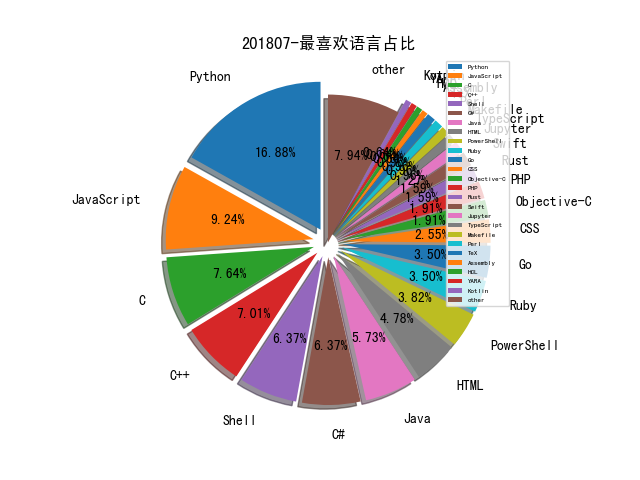

# 201807 信息源与信息类型占比

# 微信公众号 推荐
| nickname_english | weixin_no | title | url| 
| --- | --- | --- | ---| 
| APT观察 | APT_REVIEW |  | https://mp.weixin.qq.com/s/0KO-P-himo_AHeDJIQB8iw | 2| 
| 安全与生活 | HitCache |  | https://mp.weixin.qq.com/s/gwtdAeBy6dKViiZJbgKMSA | 1| 
| 百度安全实验室 | BaiduX_lab |  | https://mp.weixin.qq.com/s/oB9fcXX2nwEHDN6po1p3fQ | 2| 
| 腾讯御见威胁情报中心 |  |  | https://mp.weixin.qq.com/s/UfsiyPz02h2KhsY-C5l2qQ | 1| 
| 人工智能头条 | AI_Thinker |  | https://mp.weixin.qq.com/s/IA0kPncWRVx0JBQXvJLY6w | 1| 
| 信安之路 | xazlsec |  | https://mp.weixin.qq.com/s/iOn0SvVlF1Qj_4Jo9nknDw | 1| 
| 唯品会安全应急响应中心 | VIP_SRC |  | https://mp.weixin.qq.com/s/jV59TEoH9lO6tEnT59rycA | 1| 
| 数据派THU | DatapiTHU |  | https://mp.weixin.qq.com/s/M21P3uC__yg7iVVIxsDEVw | 1| 
| 极验 | geetest_jy |  | https://mp.weixin.qq.com/s/AHkevK0uizizWG8fIcXWMQ | 1| 
| 秋雨绸缪 | qiuyuchoumou |  | https://mp.weixin.qq.com/s/F-S0bVHxNzanNt35PQhcAw | 1| 
| 网络法实务圈 | cyberlaw2017 |  | https://mp.weixin.qq.com/s/Io1A2dlj8FT57sWSHTNvGQ | 1| 
| Docker | dockerone |  | https://mp.weixin.qq.com/s/M-DuRkzphtQgeSErpZ2DWg | 1| 
| FreeBuf | freebuf |  | https://mp.weixin.qq.com/s/wI_btTRyso_kPW_1HXJZIA | 1| 
| 云鼎实验室 | YunDingLab |  | https://mp.weixin.qq.com/s/-NRqdU-P6jkQvItfyXHjpg | 1| 
| 互联网安全实务 | SecPractice |  | https://mp.weixin.qq.com/s/WAzCLk_6nkQ0Aap6Sx2lPw | 1| 
| 京东数科安全 | JDJRsecurity |  | https://mp.weixin.qq.com/s?__biz=MzI1MjkxNDU1OQ==&mid=2247484852&idx=1&sn=51a0502ea4664dfef5be77d5b0de4046&chksm=e9dd3ba4deaab2b24 | 2| 
| 力博睿生 | liberationers |  | https://mp.weixin.qq.com/s/9aFbbPrSDRr88KDcdZ1g4Q | 2| 
| 数据分析 | ecshujufenxi |  | https://mp.weixin.qq.com/s/cHinmVC5o9DApFcI5odxNQ | 1| 
| 漏洞战争 | vulwar |  | https://mp.weixin.qq.com/s/6SqdcbyABfBxSaNfDlFKog | 1| 
| 点融黑帮 | DianrongMafia |  | https://mp.weixin.qq.com/s/h-DGDGpvxXaMgLLtQlvajw | 1| 
| 美团技术团队 | meituantech |  | https://mp.weixin.qq.com/s/fnX7iH3S5k-hYTJQgNMJVw | 1| 
| 银河安全实验室 | Galaxy-Lab |  | https://mp.weixin.qq.com/s?__biz=MzIwNTcxNTczMQ==&mid=2247483838&idx=1&sn=e7147aadaf020a2d4960e2056b1ea6ef | 2| 
| EMLab攻防实验室 | EM-Lab |  | https://mp.weixin.qq.com/s/-NxWRMbCV_wLNssBwFkb4A | 1| 
| 仙人掌情报站 | sec-cactus |  | https://mp.weixin.qq.com/s/8RtSjpRlC_AdM354XeluLw | 2| 
| 图灵人工智能 | TuringAI01 |  | https://mp.weixin.qq.com/s/dceWr4zSSsX9hzSR-Hfwzw | 1| 
| 汉客儿 |  |  | https://mp.weixin.qq.com/s?__biz=MzI1NTUzMjUzMQ==&mid=2247483808&idx=1&sn=5a18e557b4f52f43b4bb8794d9e8aa67&chksm=ea35cd3cdd42442ab | 1| 
| 网安寻路人 | DataProtection101 |  | https://mp.weixin.qq.com/s/1addFBb2ye3iumsXNh9fxg | 1| 
| 逢魔安全实验室 | FormSec |  | https://mp.weixin.qq.com/s/FDb1bXblxUVD38FwjwABbQ | 1| 
| Bypass | Bypass-- |  | https://mp.weixin.qq.com/s/SfSXcb0J-hGSyNEaxKfNXQ | 4| 
| E安全 | EAQapp |  | https://mp.weixin.qq.com/s/8cOywyuewCknJ_D5wqwFzg | 2| 
| PaperWeekly | paperweekly |  | https://mp.weixin.qq.com/s/JULU6bO7sPUbEJZ9tUDqiQ | 2| 
| Viola后花园 | Viola_deepblue |  | https://mp.weixin.qq.com/s/_eVf8RZgHGsMTo-jsCGGJQ | 2| 
| malwarebenchmark |  |  | https://mp.weixin.qq.com/s/n75EFy-2f_8FdxURzGU45g | 1| 
| 史蒂夫智库 | English_Steven |  | https://mp.weixin.qq.com/s/hKz9HNmt49av5I0teKIFHg | 1| 
| 君哥的体历 | jungedetili |  | https://mp.weixin.qq.com/s/1Gpt5mRMEOkxXvd3ciHuqA | 3| 
| 嘶吼专业版 | Pro4hou |  | https://mp.weixin.qq.com/s/At93VzqqDtAV7mhyRY7lfw | 2| 
| 奇安信威胁情报中心 |  |  | https://mp.weixin.qq.com/s/BmHQsiNIRdgmGBtsAPdjTQ | 2| 
| 安全学术圈 | secquan |  | https://mp.weixin.qq.com/s/96Ke7gQGhQ8xoMDzhlqPZg | 4| 
| 安全客 | anquanbobao |  | https://mp.weixin.qq.com/s/JUbs4wPBDSGUIEjORjvXCw | 1| 
| 安在 | AnZer_SH |  | https://mp.weixin.qq.com/s/4DskkWpuvzEPgxRNrZrt2w | 2| 
| 我的安全视界观 | CANI_Security |  | https://mp.weixin.qq.com/s/WYpLsML33xQBmRkDx3V52Q | 1| 
| 战略前沿技术 | Tech999 |  | https://mp.weixin.qq.com/s/vl6OcqS5v7oP-8PrW95Pww | 1| 
| 数说安全 | SSAQ2016 |  | https://mp.weixin.qq.com/s/VTuUh2Fy2KYhMycqHWi38g | 1| 
| 深信服千里目安全实验室 | Further_eye |  | https://mp.weixin.qq.com/s/NEvX_Od3dgQrk9fHHV62Mw | 1| 
| 物來 | threebodyz |  | https://mp.weixin.qq.com/s/yPNxqzQ0qHtQarNBUPBzQg | 1| 
| 猎户攻防实验室 | TassLiehu |  | https://mp.weixin.qq.com/s/bbEMrUkD5ItQAeiBj4mErw | 1| 
| 铭毅天下 |  |  | https://mp.weixin.qq.com/s/s2ema4tIXKcqTNUUhjGt1w | 1| 

# 组织github账号 推荐
| github_id | title | url | org_url | org_profile | org_geo | org_repositories | org_people | org_projects | repo_lang | repo_star | repo_forks| 
| --- | --- | --- | --- | --- | --- | --- | --- | --- | --- | --- | ---| 
| PacktPublishing | Mastering Machine Learning for Penetration Testing | https://github.com/PacktPublishing/Mastering-Machine-Learning-for-Penetration-Testing | https://www.packt.com | Providing books, eBooks, video tutorials, and articles for IT developers, administrators, and users. | Birmingham, UK | 4260 | 32 | 0 | C,Jupyter,Scala,Python,Kotlin,JavaScript,C++,C#,ABAP,Java | 0 | 0 | 1| 
| IBM | 使用 Apache Spark 和 Elasticsearch 构建一个推荐系统 | https://github.com/IBM/elasticsearch-spark-recommender/blob/master/README-cn.md | http://ibm.github.io |  | Armonk, New York, U.S. | 866 | 885 | 0 | TypeScript,Java,C++,Python,JavaScript,Julia,Shell,Smarty,Go,Jupyter,Swift,REXX | 0 | 0 | 1| 
| awslabs | git-secrets - 防止将敏感数据提交到 git 仓库的工具: | https://github.com/awslabs/git-secrets | http://amazon.com/aws/ | AWS Labs | Seattle, WA | 376 | 87 | 0 | C,TypeScript,Java,Python,JavaScript,C++,C#,Shell,Go,Jupyter,Swift,Rust | 0 | 0 | 1| 
| rapid7 | VideoLAN VLC 媒体播放器 <= 2.2.8 UAF 漏洞 MSF 利用模块发布(CVE-2018-11529): | https://github.com/rapid7/metasploit-framework/pull/10335 | http://www.rapid7.com/ |  | Boston, MA | 234 | 0 | 0 | C,Java,Python,JavaScript,HTML,Go,Ruby | 0 | 0 | 1| 
| PortSwigger | hackability - 浏览器渲染引擎探测工具: | https://github.com/PortSwigger/hackability | https://portswigger.net/ |  | https://portswigger.net/ | 219 | 0 | 0 | Python,Kotlin,Ruby,Java,JavaScript | 0 | 0 | 1| 
| nccgroup | PMapper - 用于快速评估 AWS 中 IAM 权限的工具: | https://github.com/nccgroup/PMapper | https://www.nccgroup.trust | Please report all security issues to security at nccgroup dot com | Global | 180 | 15 | 0 | C,Shell,Java,Python,JavaScript,C#,HTML,Elixir,Go,Rust | 0 | 0 | 2| 
| dotnet | .NET Core 安全功能绕过漏洞详情披露(CVE-2018-8356): | https://github.com/dotnet/announcements/issues/73 | http://www.dotnetfoundation.org | Home of the .NET Foundation | http://www.dotnetfoundation.org | 176 | 381 | 2 | Shell,HTML,C#,Python,F#,Dockerfile,PowerShell | 0 | 0 | 1| 
| trailofbits | mcsema - 一款二进制转换工具,可将机器码转换为LLVM中间代码,并提供了 IDA 和binninja 的接口脚本: | https://github.com/trailofbits/mcsema | https://www.trailofbits.com |  | New York, New York | 91 | 21 | 0 | C,Shell,CMake,Python,C++,Rust,HTML,CSS,HCL | 0 | 0 | 2| 
| ElevenPaths | ibombshell - 基于 Powershell 实现的后渗透测试工具: | https://github.com/ElevenPaths/ibombshell | https://www.elevenpaths.com/ | @Telefonica Group’s global cybersecurity unit. | https://www.elevenpaths.com/ | 87 | 6 | 0 | Shell,Java,C#,JavaScript,Python,Objective-C,PHP,Ruby,PowerShell | 0 | 0 | 1| 
| CIRCL | 信息泄漏分析框架 AIL 介绍: | https://github.com/CIRCL/AIL-framework/blob/f13eb40c7a45433b7864ff5ede41eccb23bdcad7/doc/presentation/ail-pass-the-salt.pdf | https://www.circl.lu/ |  | Luxembourg | 65 | 14 | 0 | Python,C,Shell,C++,CSS | 0 | 0 | 2| 
| hardenedlinux | 基于 Bro 的应用层数据包识别工具: | https://github.com/hardenedlinux/Debian-GNU-Linux-Profiles/blob/master/NSM/docs/ELK_with_bro_ID_doc.mkd | https://hardenedlinux.github.io/ | This is official repository of HardenedLinux community! | Kaer Morhen | 38 | 2 | 0 | C,Shell,Jupyter,Roff,JavaScript,C++,HTML,Assembly | 0 | 0 | 1| 
| radareorg | cutter: A Qt and C++ GUI for radare2 reverse engineering framework | https://github.com/radareorg/cutter | http://www.radare.org/ |  | http://www.radare.org/ | 36 | 7 | 0 | CSS,C,Shell,Python,Makefile,C++,C#,HTML,HCL,Go,Rust | 0 | 0 | 1| 
| chromium | Chrome 中实现顶级域过滤的源代码,进一步了解顶级域欺骗检测的工作原理及哪些 unicode 字符是危险的: | https://github.com/chromium/chromium/blob/998ff8fbb32cb0fdf1b6bdd9e885d2b1d7c48bbe/components/url_formatter/idn_spoof_checker.cc | https://chromium.org/ |  | Mountain View | 31 | 12 | 0 | TypeScript,Java,Python,JavaScript,C++,C#,HTML,Go | 0 | 0 | 1| 
| owtf | OWTF - Offensive Web测试框架: | https://github.com/owtf/owtf | http://owtf.org |  | Pwnageland | 25 | 4 | 0 | Shell,Java,Python,JavaScript,Makefile,HTML,Go | 0 | 0 | 1| 
| ernw | binninja 的 IPython 插件: | https://github.com/ernw/binja-ipython | https://www.ernw.de/ | Official ERNW development channel. | Heidelberg, Germany | 24 | 0 | 0 | C,Shell,Java,XSLT,Python,Erlang | 0 | 0 | 1| 
| eslint | NPM 模块 eslint-scope 的所有者账户被入侵,攻击者在模块中嵌入了恶意代码以感染该模块的用户: | https://github.com/eslint/eslint-scope/issues/39 | https://eslint.org |  | https://eslint.org | 19 | 25 | 0 | JavaScript | 0 | 0 | 1| 
| nettitude | IE 后渗透测试工具 Invoke-PowerThIEf 介绍: | https://github.com/nettitude/Invoke-PowerThIEf/blob/master/Steelcon-2018-com-powerthief-final.pdf | https://labs.nettitude.com |  | Leamington Spa | 15 | 0 | 0 | C,C#,C++,Python,PHP,Ruby,PowerShell | 0 | 0 | 1| 
| integrity-sa | 绕过安卓 SSL Pinning 以及 SSLCertificateChecker Phonegap 防御的 Frida 脚本: | https://github.com/integrity-sa/android/tree/master/frida/hooks/pinning | https://labs.integrity.pt |  | https://labs.integrity.pt | 13 | 0 | 0 | Java,Python,JavaScript,Perl,Objective-C,Ruby | 0 | 0 | 1| 
| projecthorus | radiosonde_auto_rx - 开源的无线电探空仪(radiosonde)的追踪软件: | https://github.com/projecthorus/radiosonde_auto_rx | http://projecthorus.org/ | Project Horus is a Amateur Radio High Altitude Ballooning project based in Adelaide, Australia | http://projecthorus.org/ | 11 | 3 | 0 | C,Shell,Java,Python,JavaScript,C++,CSS | 0 | 0 | 1| 
| CERTCC | trommel - 一个自动化的脚本,用来自动化搜索嵌入式设备文件系统中可能有安全问题的文件和信息。: | https://github.com/CERTCC/trommel | https://vuls.cert.org | The CERT Coordination Center is part of the Software Engineering Institute at Carnegie Mellon University. | Pittsburgh, PA | 9 | 0 | 0 | Python,Shell,C++ | 0 | 0 | 2| 
| code-tutorials | assembly-intro - x86 汇编语言简介系列视频教程的示例代码: https://github.com/code-tutorials/assembly-introVideo: | https://github.com/code-tutorials/assembly-introVideo: | https://www.youtube.com/channel/UC6tqFmkqznYJTzidBerHA8g/playlists | Learn to code by building things | https://www.youtube.com/channel/UC6tqFmkqznYJTzidBerHA8g/playlists | 4 | 1 | 0 | Python,Go,Assembly | 0 | 0 | 1| 
| securego | gosec: Golang security checker | https://github.com/securego/gosec?from=timeline | None | Project devoted to secure programming in the Go language | None | 2 | 1 | 0 | Go,JavaScript | 0 | 0 | 2| 

# 私人github账号 推荐
| github_id | title | url | p_url | p_profile | p_loc | p_company | p_repositories | p_projects | p_stars | p_followers | p_following | repo_lang | repo_star | repo_forks | 
| --- | --- | --- | --- | --- | --- | --- | --- | --- | --- | --- | --- | --- | --- | ---| 
| samyk | frisky - 针对 ios/macOS 应用的嗅探/修改/逆向/注入等工具: | https://github.com/samyk/frisky | https://samy.pl | explo(r|it)ing boundaries | los angeles | None | 83 | 0 | 8700 | 5200 | 903 | Eagle,C,JavaScript,Arduino | 5000 | 953 | 1| 
| davidfowl | MutliProtocolAspNetCore - 使用 ASP.NET Core 和 Kestrel 实现的多协议服务器: | https://github.com/davidfowl/MultiProtocolAspNetCore | http://davidfowl.com/ | Partner Software Architect at Microsoft on the ASP.NET team, Creator of SignalR | Bellevue, WA | Microsoft | 146 | 0 | 63 | 3900 | 8 | C# | 1500 | 143 | 1| 
| s0md3v | Photon - 轻量级 Web 爬虫,从网站中提取 URL、文件、端点等信息: | https://github.com/s0md3v/Photon | https://github.com/s0md3v | I make things, I break things and I make things that break things. Twitter: @s0md3v | None | None | 30 | 0 | 0 | 2400 | 0 | Python,JavaScript,Perl | 0 | 0 | 1| 
| trimstray | awesome-ninja-admins: | https://github.com/trimstray/awesome-ninja-admins | https://trimstray.github.io/ | BIO_read(wbio, buf, 4096) | Poland | None | 15 | 0 | 892 | 1300 | 265 | Shell,HTML | 0 | 0 | 1| 
| 3gstudent | Eventlogedit-evtx--Evolution - 从 Windows EVTX 事件日志针对性删除工具: | https://github.com/3gstudent/Eventlogedit-evtx--Evolution | https://3gstudent.github.io/ | good in study,attitude and health | None | None | 99 | 0 | 159 | 1200 | 11 | Python,C#,Batchfile,PowerShell,C++ | 431 | 158 | 1| 
| radare | IDA 项目文件转 radare2 的脚本发布: | https://github.com/radare/radare2ida/blob/master/ida2r2/ida2r2.py | http://www.radare.org/ |  | None | Radare | 139 | 0 | 115 | 1200 | 24 | TeX,Python,C,JavaScript | 10300 | 1900 | 1| 
| coolstar | Electra for iOS 11.0 - 11.3.1 现已开源: | https://github.com/coolstar/electra1131 | None | iOS developer and computer science student at UC Santa Barbara. | San Francisco, CA | None | 115 | 0 | 8 | 1100 | 1 | C,C++ | 774 | 217 | 1| 
| DennisYurichev | 使用 Z3 求解器自动确定在汇编器中使用长跳转抑或短跳转: | https://github.com/DennisYurichev/random_notes/blob/master/Z3/assembler_and_JMPs.py | http://www.yurichev.com |  | None | None | 30 | 0 | 57 | 972 | 72 | TeX,C,Mathematica | 0 | 0 | 1| 
| zhuowei | 模拟执行 XNU ARM64 内核的 QEMU 修改版本: | https://github.com/zhuowei/qemu | https://zhuoweizhang.net | Software developer: Android, iOS, Web, Voice | None | None | 285 | 0 | 741 | 849 | 21 | C,Shell,Java,Python,C++,HTML | 478 | 156 | 1| 
| PaulSec | awesome-windows-domain-hardening - Windows 安全加固方向优秀资源收集: | https://github.com/PaulSec/awesome-windows-domain-hardening | https://paulsec.github.io/ | I cant promise anything but Ill do my best. | France | None | 93 | 0 | 475 | 746 | 26 | Python,C++ | 0 | 0 | 1| 
| Cryptogenic | PS4 5.05 BPF Double Free 内核漏洞详解: | https://github.com/Cryptogenic/Exploit-Writeups/blob/master/FreeBSD/PS4%205.05%20BPF%20Double%20Free%20Kernel%20Exploit%20Writeup.md | https://twitter.com/SpecterDev | PHP/C++ developer with an interest in user-land and web exploitation. | None | None | 28 | 0 | 38 | 642 | 5 | Go,C,JavaScript | 0 | 0 | 1| 
| tandasat | SimpleSvmHook - 一个可以通过使用扩展页表(EPT)来对 Windwos Kernel进行 inline hooking 的虚拟机管理工具: | https://github.com/tandasat/SimpleSvmHook | http://standa-note.blogspot.ca/ | Engineer @standa_t | Vancouver, Canada | None | 56 | 0 | 16 | 524 | 3 | C#,C++ | 0 | 0 | 1| 
| jakeajames | iOS 11.3-11.4 完全反编译 rootfs 的重挂载: | https://github.com/jakeajames/Reverse-Engineering/blob/master/electra1131/electra.m | None | A random guy on the internet. | Antartica | None | 69 | 0 | 4 | 493 | 7 | Logos,C | 313 | 146 | 1| 
| richlander | dotnet-core-assembly-loading - 使用 .NET Core 加载程序集的示例项目: | https://github.com/richlander/dotnet-core-assembly-loading/blob/master/src/gutenapp/gutenapp/Program.cs | https://github.com/dotnet | .NET Team member, trail runner, Dad, Husband. He/him | Seattle / Toronto | @dotnet | 70 | 0 | 11 | 488 | 9 | C#,Shell,HTML,PowerShell | 0 | 0 | 1| 
| williballenthin | python-registry - 读取 Windows 注册表信息的 Python 库: | https://github.com/williballenthin/python-registry | https://github.com/fireeye | /usr/bin/nethack | None | @fireeye | 62 | 0 | 206 | 451 | 47 | Python,Rust | 0 | 0 | 1| 
| xorrior | RemoteRecon - 后渗透测试工具: | https://github.com/xorrior/RemoteRecon | https://www.xorrior.com | PowerShell, C#, Obj-C, macOS Security, Red Team Operator | None | SpecterOps | 53 | 0 | 93 | 369 | 9 | C#,Objective-C,PowerShell,C++ | 0 | 0 | 1| 
| clymb3r | KdExploitMe - 内核驱动漏洞利用练习平台: | https://github.com/clymb3r/KdExploitMe | None |  | None | None | 5 | 0 | 0 | 361 | 0 | PowerShell,C++ | 760 | 409 | 1| 
| LandGrey | CVE-2018-2894 WebLogic 未授权访问致任意文件上传/RCE漏洞检查脚本 : | https://github.com/LandGrey/CVE-2018-2894/ | https://landgrey.me | I learn cyber sec | CHINA | None | 12 | 0 | 1100 | 356 | 32 | Python,ASP | 0 | 0 | 1| 
| serhii-londar | open-source-mac-os-apps - macOS 上的优秀开源应用收集: | https://github.com/serhii-londar/open-source-mac-os-apps | https://www.patreon.com/serhiilondar |  | Lviv, Ukraine | None | 85 | 0 | 1900 | 352 | 314 | Objective-C,Swift | 0 | 0 | 1| 
| dafthack | PassphraseGen - 用于生成自定义密码短语列表的脚本,方便使用 hashcat 进行密码破解: | https://github.com/dafthack/PassphraseGen | http://www.twitter.com/dafthack |  | None | None | 13 | 0 | 18 | 331 | 1 | PHP,Ruby,PowerShell | 1100 | 246 | 1| 
| rvrsh3ll | Misc-Powershell-Scripts - PowerShell 渗透测试脚本收集: | https://github.com/rvrsh3ll/Misc-Powershell-Scripts | None | I hack code together and hope it works. | NOVA | None | 137 | 0 | 19 | 329 | 9 | Python,C#,HTML,PowerShell | 417 | 124 | 1| 
| Tuhinshubhra | CMSeeK: CMS Detection and Exploitation suite | https://github.com/Tuhinshubhra/CMSeeK | https://twitter.com/r3dhax0r | I code and hack for fun! | ... | None | 13 | 0 | 2 | 316 | 0 | Python,PHP,JavaScript,CSS | 0 | 0 | 1| 
| pyn3rd | WebLogic 反序列化远程代码执行漏洞 POC 发布(CVE-2018-2893): | https://github.com/pyn3rd/CVE-2018-2893 | https://twitter.com/pyn3rd |  | Hangzhou | Alibaba Group | 7 | 0 | 0 | 262 | 0 | Python,Batchfile,Java | 126 | 46 | 1| 
| WebBreacher | yoga: Your OSINT Graphical Analyzer | https://github.com/WebBreacher/yoga | https://webbreacher.com |  | None | Spotlight Infosec | 27 | 0 | 9 | 255 | 0 | Python,JavaScript | 548 | 110 | 1| 
| ScottyBauer | 蓝牙漏洞 CVE-2018-9355 POC: https://github.com/ScottyBauer/Android_Kernel_CVE_POCs/commit/2e2f6568701c6c064d5167a41a1c8bc18dfd837e 修复信息: | https://github.com/ScottyBauer/Android_Kernel_CVE_POCs/commit/2e2f6568701c6c064d5167a41a1c8bc18dfd837e | https://plzdonthack.me |  | Indiana | Qualcomm | 15 | 0 | 8 | 254 | 8 | TeX,C | 594 | 201 | 1| 
| pmusolino | Wormholy - iOS 网络调试工具: | https://github.com/pmusolino/Wormholy | http://www.codeido.com | Im an iOS Software Engineer with 6 years of experience in the iOS platform, with extensive experience in building high-quality apps. Available to work remotely | Rome | None | 37 | 0 | 1000 | 220 | 106 | Swift | 0 | 0 | 1| 
| wbenny | ia32-doc - 将 IA32 的手册中的定义,转换为机器可读的版本(yaml): | https://github.com/wbenny/ia32-doc | https://twitter.com/PetrBenes |  | Brno, Czech Republic | None | 19 | 0 | 93 | 219 | 9 | C,C++ | 0 | 0 | 1| 
| guidovranken | libfuzzer-java - Guido Vranken 开源了他的 Java Fuzz 工具: | https://github.com/guidovranken/libfuzzer-java | https://github.com/ethereum |  | Netherlands | @ethereum | 46 | 0 | 7 | 213 | 6 | C,Java,Python,C++,Go,Ruby | 130 | 27 | 1| 
| JusticeRage | FFM - 后渗透辅助工具,基于 Python 实现的 TTY Shell 后门: | https://github.com/JusticeRage/FFM | None |  | None | None | 12 | 0 | 14 | 179 | 8 | Python,YARA,Java | 0 | 0 | 1| 
| 13o-bbr-bbq | DeepExploit - 基于机器学习的自动化渗透测试框架: | https://github.com/13o-bbr-bbq/machine_learning_security/tree/master/DeepExploitA | None | Im an engineer, Machine Learning hacker and CISSP. Speaker at Black Hat Arsenal, DEFCON Demo Labs/AI Village, Pycon, CODE BLUE etc., | Tokyo, Japan. | None | 11 | 0 | 20 | 171 | 0 | Python | 804 | 303 | 1| 
| skelsec | msldap - 用于操作微软活动目录 LDAP 协议的 Python 库: | https://github.com/skelsec/msldap | https://twitter.com/SkelSec |  | None | None | 50 | 0 | 17 | 162 | 1 | Python,Objective-C | 0 | 0 | 1| 
| secgroundzero | warberry - 为树莓派设计的渗透测试工具包: | https://github.com/secgroundzero/warberry | None |  | None | None | 10 | 0 | 4 | 157 | 7 | Python,C#,JavaScript,Shell | 2100 | 285 | 1| 
| gleeda | memtriage - 一款 Windows 内存取证工具: | https://github.com/gleeda/memtriage | https://github.com/volatilityfoundation | Core Developer for the Volatility Project. DFIR enthusiast. | None | @volatilityfoundation | 29 | 0 | 121 | 153 | 38 | Python,C,HTML | 149 | 17 | 1| 
| p3nt4 | Invoke-TmpDavFS - 用于创建内存运行的 Webdav 服务器的 PowerShell 模块: | https://github.com/p3nt4/Invoke-TmpDavFS | https://twitter.com/xP3nt4 |  | localhost | None | 25 | 0 | 259 | 153 | 28 | C#,JavaScript,PowerShell | 0 | 0 | 1| 
| quentinhardy | WebLogic RMI 反序列化漏洞(CVE-2017-3248)利用: | https://github.com/quentinhardy/scriptsAndExploits | None |  | None | None | 10 | 0 | 27 | 148 | 0 | Python,C++ | 0 | 0 | 1| 
| RASSec | A_Scan_Framework: 互联网漏洞管理、资产管理、任务扫描系统 | https://github.com/RASSec/A_Scan_Framework | None | Security Analyst Researcher | None | None | 18 | 0 | 0 | 144 | 0 | Python,JavaScript | 0 | 0 | 1| 
| thewhiteh4t | seeker - 获取高精度地理信息和设备信息的工具: | https://github.com/thewhiteh4t/seeker | https://www.linkedin.com/in/lohityapushkar | The Best Offense is a Great Defense... | New Delhi | None | 8 | 0 | 11 | 141 | 2 | Python,C++ | 0 | 0 | 1| 
| Nekmo | dirhunt - 通过爬虫的方式收集 WEB 路径的工具: | https://github.com/Nekmo/dirhunt | http://nekmo.com | Creating software with love for more than 10 years | Málaga, Spain | Nekmo Com | 103 | 0 | 330 | 128 | 23 | Python,CSS | 0 | 0 | 1| 
| cisp | AccessLogAnylast: 支持Nginx、Apache、Tomcat等标准WEB日志的分析 | https://github.com/cisp/AccessLogAnylast | http://www.cnblogs.com/KevinGeorge/ | Information Security Engineer in a Number Security Company！ SCU Graduates！ | 四川成都 | None | 21 | 0 | 0 | 110 | 114 | Python | 0 | 0 | 1| 
| enkomio | RunDotNetDll - 列出给定 .NET 程序集的所有方法并调用它们的工具: | https://github.com/enkomio/RunDotNetDll | None | Code Monk - twitter.com/s4tan | Italy | Enkomio Ltd | 16 | 0 | 63 | 98 | 5 | C#,F# | 0 | 0 | 1| 
| gabemarshall | microctfs - 小型 CTF 比赛的 docker 镜像: | https://github.com/gabemarshall/microctfs | http://gabemarshall.me | Red Teamer || Penetration Tester | Chapel Hill, NC | None | 40 | 0 | 41 | 94 | 7 | Python,JavaScript,Ruby,CSS | 326 | 92 | 1| 
| Marten4n6 | EvilOSX - macOS 系统远控木马: | https://github.com/Marten4n6/EvilOSX | None | In password reuse we trust.    Im compromised on failure to authenticate with the following key: 0xC24FF3269458716A | None | None | 3 | 0 | 17 | 88 | 2 | Python | 0 | 0 | 1| 
| MojtabaTajik | Robber - 用于查找易受 DLL 劫持的可执行文件的工具: | https://github.com/MojtabaTajik/Robber | http://mojtabatajik.github.io/ | Programmer and security researcher experienced in Delphi/C++/C#/Python, Reverse Engineering and hardware design | Tehran, Iran | None | 17 | 0 | 52 | 87 | 23 | C#,Pascal,PowerShell,C++ | 0 | 0 | 1| 
| nezza | ISO7816Analyzer - 7816 通讯的协议解析插件: | https://github.com/nezza/ISO7816Analyzer | http://stacksmashing.net/ |  | Germany | None | 33 | 0 | 25 | 74 | 9 | Python,JavaScript,C++ | 0 | 0 | 1| 
| JiounDai | Android 漏洞 CVE-2018-9365 的 POC : | https://github.com/JiounDai/Bluedroid/blob/master/poc_CVE-2018-9365.c | https://twitter.com/jioun_dai | twitter/weibo: @Jioun_dai | None | None | 13 | 0 | 0 | 72 | 0 | Python,Swift,C,Java | 150 | 35 | 1| 
| iceyhexman | onlinetools: 线上工具箱开源 | https://github.com/iceyhexman/onlinetools | https://www.hexlt.org | excited! | None | None | 21 | 0 | 87 | 70 | 10 | Python,JavaScript,Ruby | 499 | 159 | 1| 
| IVMachiavelli | Links for the OSINT Team | https://github.com/IVMachiavelli/OSINT_Team_Links | https://openosint.signup.team | Techie who loves all things Linux, infosec, OSINT and admin of the Open OSINT Team, join us https://openosint.signup.team | Earth! | None | 31 | 0 | 82 | 64 | 25 | Go,JavaScript | 223 | 48 | 1| 
| Rizer0 | Log-killer: Clear all your logs in [linux/windows] servers | https://github.com/Rizer0/Log-killer | https://killshot-sec.com | Security Researcher / Developer From | Syria,Homs | System Crashers | 4 | 0 | 14 | 59 | 1 | PHP | 0 | 0 | 1| 
| V-E-O | libmpeg2 堆缓冲区越界写漏洞 POC (CVE-2018-9341): | https://github.com/V-E-O/PoC/tree/master/CVE-2018-9341 | None |  | None | None | 59 | 0 | 43 | 55 | 45 | C,Makefile | 0 | 0 | 1| 
| its-a-feature | Apfell - macOS 后渗透测试工具: | https://github.com/its-a-feature/Apfell | None |  | None | None | 88 | 0 | 6 | 54 | 0 | JavaScript | 0 | 0 | 1| 
| azizaltuntas | Camelishing - 一款社会工程学攻击辅助工具: | https://github.com/azizaltuntas/Camelishing | None | #Expl[]iting Human Vulnerability | TURKEY | Free | 8 | 0 | 0 | 52 | 0 | Python,CSS | 0 | 0 | 1| 
| wzw19890321 | Apple Safari WebKit RCE exp (CVE-2018-4192): | https://github.com/wzw19890321/Exploits/blob/master/CVE-2018-4192/CVE-2018-4192.html | None |  | BeiJing | Qihoo | 64 | 0 | 5 | 52 | 11 | C,C++ | 24 | 10 | 1| 
| needmorecowbell | sniff-paste - 针对 Pastebin 的开源情报收集工具: | https://github.com/needmorecowbell/sniff-paste | http://adammusciano.com | Sharing is a moral imperative | Pittsburgh, Pennsylvania | Inquest | 68 | 0 | 458 | 50 | 34 | Python,YARA,C++ | 0 | 0 | 1| 
| MarkPKCollier | 神经图灵机 NTM 的实现(Paper) : https://arxiv.org/abs/1807.08518Code: | https://github.com/MarkPKCollier/NeuralTuringMachine | https://www.linkedin.com/in/mark-collier-aa446032/ | Computer Science student at Trinity College Dublin. Interested in deep learning. | Dublin, Ireland | Mark Collier | 9 | 0 | 0 | 48 | 0 | Python | 0 | 0 | 1| 
| phage-nz | ph0neutria - 恶意软件样本采集工具: | https://github.com/phage-nz/ph0neutria | https://phage.nz | Security Architect / Amateur Malware Hunter | New Zealand | None | 11 | 0 | 65 | 41 | 0 | Python,C#,PowerShell | 0 | 0 | 1| 
| itm4n | VBA-RunPE - RunPE 技术的 VBA 实现,用于绕过应用程序白名单: | https://github.com/itm4n/VBA-RunPE | https://itm4n.github.io/ | Pentester | Paris | None | 6 | 0 | 15 | 38 | 5 | Python,Visual,Shell,JavaScript,PowerShell | 182 | 51 | 1| 
| yaofeifly | Vub_ENV: 跟踪真实漏洞相关靶场环境搭建 | https://github.com/yaofeifly/Vub_ENV | https://yaofeifly.github.io/ |  | None | None | 24 | 0 | 74 | 34 | 10 | Python,PHP,CSS | 165 | 45 | 1| 
| quoscient | octopus - 区块链智能合约安全分析工具: | https://github.com/quoscient/octopus | https://quoscient.io/ |  | None | None | 10 | 0 | 1 | 30 | 0 | Python | 168 | 27 | 1| 
| bfuzzy | auditd-attack - 映射到 MITRE ATT&CK 框架中的 Linux 安全审计规则: | https://github.com/bfuzzy/auditd-attack | None |  | None | None | 27 | 0 | 16 | 26 | 2 |  | 0 | 0 | 1| 
| im-bug | BlockChain-Security-List Repo | https://github.com/im-bug/BlockChain-Security-List | None | BlockChain Security | None | None | 6 | 0 | 6 | 23 | 2 | Python,Solidity | 57 | 17 | 1| 
| felicitychou | MalAnalyzer: 基于docker虚拟化的恶意代码沙箱 | https://github.com/felicitychou/MalAnalyzer | None | Secruity | China, Shenzhen | None | 39 | 0 | 479 | 21 | 72 | Python,Perl | 0 | 0 | 1| 
| razmashat | multi_path-with-remount - iOS 11.3.X multi_path 漏洞利用: | https://github.com/razmashat/multi_path-with-remount | None |  | None | None | 15 | 0 | 2 | 20 | 1 | C#,C,Objective-C | 47 | 11 | 1| 
| InfamousSYN | rogue - 无线网络攻击工具包: | https://github.com/InfamousSYN/rogue | https://infamoussyn.wordpress.com/ |  | None | InfamousSYN | 16 | 0 | 94 | 19 | 1 | Python,Shell,Ruby | 0 | 0 | 1| 
| blackwolfsec | BFscan: 基于python3实现规避防火墙的轻量级信息探测工具 | https://github.com/blackwolfsec/BFscan | http://blackwolfsec.cc |  | None | None | 6 | 0 | 183 | 13 | 3 | Python,HTML,JavaScript | 22 | 7 | 1| 
| stuhirst | AWS 安全检测相关的项目列表: | https://github.com/stuhirst/awssecurity/blob/master/arsenal.md | https://twitter.com/StuHirstInfoSec | A Security Bloke. | None | None | 3 | 0 | 0 | 13 | 0 | HTML,JavaScript | 169 | 39 | 1| 
| aatlasis | Chiron - 具有高级 IPv6 扩展头操作功能的 IPv6 安全评估框架: | https://github.com/aatlasis/Chiron | http://www.secfu.net | A security researcher and practitioner with a special interest in network protocols insecurities. | Europe | None | 3 | 0 | 1 | 11 | 0 | Python | 129 | 13 | 1| 
| rootbsd | fridump3 - 基于 Frida 实现的内存转储工具: | https://github.com/rootbsd/fridump3 | None |  | Europa | None | 19 | 0 | 3 | 11 | 0 | Python,Objective-C++ | 103 | 15 | 1| 
| bsvineethiitg | malwaregan - 恶意软件行为可视化与主动防御工具: | https://github.com/bsvineethiitg/malwaregan | https://www.linkedin.com/in/bhaskaraiitg | Samsung AI Research Toronto | Grad Student in CS at University of Toronto | B.Tech., IIT Guwahati | Toronto, Canada | University of Toronto | 22 | 0 | 75 | 8 | 64 | Python,MATLAB,C++ | 0 | 0 | 1| 
| pFarb | awesome-crypto-papers - 一份关于密码学相关论文、教程等的收集列表 : | https://github.com/pFarb/awesome-crypto-papers | https://github.com/cossacklabs | Pavlo. Ukrainian Armed Forces vet. Earn my living thinking about cryptographic and security problems. Have grumpy character and poor spelling skills. | Kyiv | @cossacklabs | 3 | 0 | 0 | 7 | 0 |  | 646 | 66 | 1| 
| dienuet | crossdomain - 一款自动检测跨域错误配置的工具: | https://github.com/dienuet/crossdomain | None | you can see me !!! | None | None | 11 | 0 | 9 | 5 | 1 | Python,PHP,CSS | 25 | 9 | 1| 
| 3rdbody | IoTSecurityNAT: IoT安全测试系统 | https://github.com/3rdbody/IoTSecurityNAT | None |  | None | None | 7 | 0 | 1 | 3 | 1 | Python,Ruby,JavaScript,Java | 0 | 0 | 1| 
| Turr0n | Firebase - Exploiting Tool 攻击错误配置的 Firebase 数据的工具: | https://github.com/Turr0n/firebase | None |  | None | None | 9 | 0 | 28 | 0 | 0 | Python,CSS | 35 | 7 | 1| 
| colental | BYOB - 打造你自己的 Botnet: | https://github.com/colental/byob | None | None | None | None | 0 | 0 | 0 | 0 | 0 | None | 0 | 0 | 1| 
| inory009 | CTF-Web-Challenges:历届 CTF开源的Web 题源码 | https://github.com/inory009/CTF-Web-Challenges | None | None | None | None | 0 | 0 | 0 | 0 | 0 | None | 0 | 0 | 1| 
| log2timeline | dftimewolf: A framework for orchestrating forensic | https://github.com/log2timeline/dftimewolf | None | None | None | None | 0 | 0 | 0 | 0 | 0 | Python,Shell | 0 | 0 | 1| 

# medium_xuanwu 推荐
| title | url| 
| --- | ---| 

# medium_secwiki 推荐
| title | url| 
| --- | ---| 

# zhihu_xuanwu 推荐
| title | url| 
| --- | ---| 

# zhihu_secwiki 推荐
| title | url| 
| --- | ---| 

# 日更新程序
`python update_daily.py`