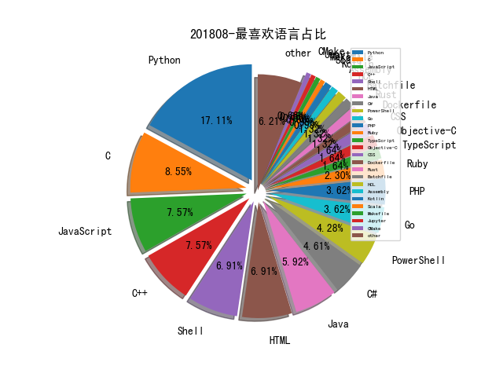

# [数据--所有](README_20.md)
# [数据--年度](README_2018.md)
# 201808 信息源与信息类型占比

# 微信公众号 推荐
| nickname_english | weixin_no | title | url| 
| --- | --- | --- | ---| 
| 银河安全实验室 | Galaxy-Lab |  | https://mp.weixin.qq.com/s/jDvOif0OByWkUNLv0CAs7w | 1| 
| 掮客酒馆 | SecurityPub | 互联网公司移动安全领域的探索与实践 | https://mp.weixin.qq.com/s/5whLNkfSUpW6zQNxQf7HqQ | 1| 
| 学蚁致用 | sudo_i | AntSword2 安装指南 | https://mp.weixin.qq.com/s/IezN9aYCn51t1ZQ7wX3X3Q | 1| 
| 云众可信 | yunzhongkexin |  | https://mp.weixin.qq.com/s/bP2pRgrTsQtJfIh5fhlpRA | 1| 
| InfoQ | infoqchina | 让Docker更强大的9个安全开源工具 | https://mp.weixin.qq.com/s/e51KpBltxRd8Qk-VRj6EhQ | 1| 
| 网安国际 | inforsec | InForSec区块链安全研讨会成功召开 | https://mp.weixin.qq.com/s/t_HjrMeiVpfGS4m49HOllQ | 1| 
| 浅黑科技 | qianheikeji | 黑客情报官“薛锋：真相只有一个，我们必须找到它 | https://mp.weixin.qq.com/s/iYdOJYCky3_8OGUNysgE3Q | 1| 
| 机器学习AI算法工程 | datayx | 大神总结的机器学习的数学基础，掌握这些足够 | https://mp.weixin.qq.com/s/Cm-DNNLMqgcp_DJqUeM-Tw | 1| 
| 安在 | AnZer_SH | 人物 , 安恒张百川：藏剑入怀的网路游侠 | https://mp.weixin.qq.com/s/yNwRk7W30refX234DKmI6Q | 1| 
| 安全酷 | watsec | 企业数据安全建设的经历与实践 | https://mp.weixin.qq.com/s/ItvWWhC0iYOpG6nQ3WPfvg | 1| 
| 安全牛 | aqniu-wx | 零信任安全的4W1H | https://mp.weixin.qq.com/s/yBzdo9qHacTajQFNpmjvpQ | 1| 
| FreeBuf | freebuf | 服务器入侵溯源小技巧整理 | https://mp.weixin.qq.com/s/A1tPlv8YpSr6w-zvUxxxxg | 1| 
| 阿里云安全 | aliyunsec | 中国香港地区 DDoS- botnet 态势分析 | https://mp.weixin.qq.com/s/_lzFwYVlSe9L5K0RsSS1bw | 1| 
| 百度安全实验室 | BaiduX_lab | MesaPy项目开源: 一个安全且快速的 Python | https://mp.weixin.qq.com/s/IVpij_eGCccI2I-V0FYfBQ | 1| 
| 数据派THU | DatapiTHU | TensorFlow超级指南 , 你能想到的TF教程和资源都在这里（附链接&视频） | https://mp.weixin.qq.com/s/h5jpQCOwjOnniaJD7yFrPA | 2| 
| 我的安全视界观 | CANI_Security | 【业务安全】业务安全之另类隐患 | https://mp.weixin.qq.com/s/NWxFkWImIRIYtLYz82gjMw | 1| 
| 平安科技金融安全研究院 | pinganfinsec | 会议 , BlackHat 2018：10大网络安全热点趋势pick一下 | https://mp.weixin.qq.com/s/cGg_1VNL0Yj2CcpcmvN_Dw | 1| 
| 安全喷子 | gh_2a9c00f1d053 | 自适应安全架构的历史和演进 | https://mp.weixin.qq.com/s/6BmRdNPKG2dA7m1DrdGtkQ | 1| 
| 天际友盟 | gh_8833afc123ef | 初识威胁情报 | https://mp.weixin.qq.com/s/wV8nJYvK-qzC1JNR9ODsjw | 2| 
| 图灵人工智能 | TuringAI01 | 哈尔滨工业大学教授：车万翔——深度学习与词法、句法、语义分析 | https://mp.weixin.qq.com/s/UERPcb_XWwmnwissDHkeTg | 1| 
| 嘶吼专业版 | Pro4hou | ML&AI如何在云态势感知产品中落地 | https://mp.weixin.qq.com/s/7Clr-Uxg6y5nXOnIQXLZ6A | 1| 
| 卫星与网络 | satnetdy | NASA开源软件实践与思考 | https://mp.weixin.qq.com/s/-9BlAQqApaoGLfRgtJIn7Q | 1| 
| 互联网安全内参 | anquanneican | Black Hat 2018观感：威胁情报百家争鸣 | https://mp.weixin.qq.com/s/rS7nTJ-rwnmcxvRSmwn-4w | 1| 
| 中国信息安全 | chinainfosec | 发布 , 国家互联网金融安全技术专家委员会：《区块链技术安全概述》（附全文） | https://mp.weixin.qq.com/s/NIMcwmo59QSDoyI07DGDsQ | 2| 
| SecWiki | SecWiki | Google编程之夏2018盘点 | https://mp.weixin.qq.com/s/49liyrR-RcVS6CESkIC50w | 2| 
| Bypass | Bypass-- | Window应急响应（四）：挖矿病毒 | https://mp.weixin.qq.com/s/dbQ0ZMHur4vIq98oqR-sXA | 3| 
| AI科技大本营 | rgznai100 |  | https://mp.weixin.qq.com/s/1Zj_pQDBqBJKSrtt9HsKXg | 1| 
| 腾讯安全应急响应中心 | tsrc_team | 技术专栏 , 深入理解JNDI注入与Java反序列化漏洞利用 | https://mp.weixin.qq.com/s/cyeEAv31GO_hZCTXVRBkxw | 1| 

# 组织github账号 推荐
| github_id | title | url | org_url | org_profile | org_geo | org_repositories | org_people | org_projects | repo_lang | repo_star | repo_forks| 
| --- | --- | --- | --- | --- | --- | --- | --- | --- | --- | --- | ---| 
| Microsoft | Detours - Microsoft 开源的用于在 Windows 上监视和检测 API 调用的软件: | https://github.com/Microsoft/Detours | https://opensource.microsoft.com | Open source, from Microsoft with love | Redmond, WA | 2463 | 4258 | 0 | C,TypeScript,CMake,C#,JavaScript,Objective-C,C++,Python,Batchfile,HTML,Rich,Jupyter,Java,PowerShell | 0 | 0 | 3| 
| google | BrokenType - 帮助 j00ru 在 Windows 内核和用户模式的 Uniscribe 库中找到 39 个字体漏洞的 Fuzzing 工具集: | https://github.com/google/BrokenType | https://opensource.google.com/ | Google ❤️ Open Source | https://opensource.google.com/ | 1474 | 2547 | 0 | TypeScript,Java,Python,Kotlin,JavaScript,C++,Dart,HTML,Go,Rust | 0 | 0 | 2| 
| dotnet | Fuzzlyn 项目可以生成随机的 C# 程序,通过优化和未优化代码之间的差异,找到了多个.NET JIT错误: https://twitter.com/i/web/status/1027224393217449986相关项目和漏洞的补丁链接: 1) https://github.com/jakobbotsch/Fuzzlyn 2) https://github.com/dotnet/roslyn 3) | https://github.com/dotnet/roslyn | http://www.dotnetfoundation.org | Home of the .NET Foundation | http://www.dotnetfoundation.org | 176 | 381 | 2 | Shell,HTML,C#,Python,F#,Dockerfile,PowerShell | 0 | 0 | 2| 
| ncsa | ssh-auditor - ssh 弱密码探测工具: | https://github.com/ncsa/ssh-auditor | http://ncsa.illinois.edu | National Center for Supercomputing Applications | Urbana, IL | 119 | 16 | 0 | Shell,Java,Scala,Python,JavaScript,C++,HTML,Puppet,Go,R,Nextflow,Ruby | 0 | 0 | 1| 
| darlinghq | darling - 在 Linux 上模拟 macOS 的工具: | https://github.com/darlinghq/darling | http://www.darlinghq.org | macOS translation layer for Linux | http://www.darlinghq.org | 118 | 4 | 0 | C,Roff,Objective-C++,C++,Objective-C,HTML | 0 | 0 | 1| 
| trailofbits | rattle - 以太坊合约二进制文件静态分析框架: | https://github.com/trailofbits/rattle | https://www.trailofbits.com |  | New York, New York | 91 | 21 | 0 | C,Shell,CMake,Python,C++,Rust,HTML,CSS,HCL | 0 | 0 | 1| 
| Tencent | bk-cmdb: 蓝鲸智云配置平台(blueking cmdb) | https://github.com/Tencent/bk-cmdb | https://opensource.tencent.com |  | Shenzhen, China | 74 | 3 | 0 | C,Java,Python,JavaScript,C++,Lua,Objective-C,Go,PHP,CSS | 0 | 0 | 1| 
| endgameinc | xori - 二进制反汇编和静态分析工具,来自 BlackHat USA 2018,介绍: https://sites.google.com/secured.org/malwareunicorn/xoriGitHub: | https://github.com/endgameinc/xori | https://www.endgame.com |  | Washington, DC | 27 | 0 | 0 | C,Jupyter,Python,JavaScript,C++,C#,Go,Java,Ruby,Rust | 0 | 0 | 1| 
| didi | kemon - 用于 macOS 内核监控的开源回调框架: | https://github.com/didi/kemon | https://didi.github.io/ | 滴滴出行 | Beijing, China | 24 | 6 | 0 | C,Vue,Java,Python,Kotlin,JavaScript,C++,HTML,Go,PHP,CSS | 0 | 0 | 1| 
| aliasrobotics | RSF 机器人安全框架,对机器人技术进行安全评估的标准化方法: https://aliasrobotics.com/research/rsf.htm | https://github.com/aliasrobotics/RSF | http://aliasrobotics.com | Robot cybersecurity. | Vitoria, Spain | 21 | 0 | 0 | Python,C,JavaScript,C++ | 0 | 0 | 1| 
| knownsec | wam: Web App Monitor 应用更新细节监控 | https://github.com/knownsec/wam?from=timeline | http://blog.knownsec.com |  | http://blog.knownsec.com | 17 | 2 | 0 | Python,Go,JavaScript | 0 | 0 | 1| 
| JPCERTCC | JPCERT/CC 开发了一款用于检测 Cobalt Strike Beacon 的 Volatility 插件: https://blog.jpcert.or.jp/2018/08/volatility-plugin-for-detecting-cobalt-strike-beacon.html GitHub: | https://github.com/JPCERTCC/aa-tools/blob/master/cobaltstrikescan.py | https://www.jpcert.or.jp/ | JPCERT/CCs official repositories maintained by staff and guests | Tokyo, Japan | 14 | 6 | 0 | Python,JavaScript,HTML | 0 | 0 | 1| 
| RhinoSecurityLabs | cloudgoat - 易受攻击的 AWS 基础架构配置工具: | https://github.com/RhinoSecurityLabs/cloudgoat | https://rhinosecuritylabs.com | A boutique penetration testing and security assessment firm in Seattle, WA. | Seattle, WA | 10 | 0 | 0 | Python,JavaScript,PowerShell,HCL | 0 | 0 | 2| 
| secureworks | Dalton - IDS规则和PCAP测试系统 | https://github.com/secureworks/dalton | https://www.secureworks.com | Together, We Are Collectively Smarter. Exponentially Safer.™ Secureworks is 100% focused on cybersecurity. In fact, it’s all we do. | https://www.secureworks.com | 10 | 0 | 0 | Python,Shell,JavaScript,Ruby | 0 | 0 | 1| 
| x41sec | x41-smartcard-fuzzing - 智能卡驱动 Fuzzing 工具: | https://github.com/x41sec/x41-smartcard-fuzzing | https://www.x41-dsec.de |  | https://www.x41-dsec.de | 8 | 0 | 0 | C#,C,Java | 0 | 0 | 1| 
| UnkL4b | GitMiner - 用于 Github 的高级敏感内容挖掘工具: | https://github.com/UnkL4b/GitMiner | http://unkl4b.github.io |  | http://unkl4b.github.io | 7 | 0 | 0 | Python,Shell,JavaScript,HTML | 0 | 0 | 1| 
| Antid0teCom | Apple Smart Keyboard 和 Apple Pencil 的安全研究研究: | https://github.com/Antid0teCom/ipad_accessory_research | https://www.antid0te.com |  | https://www.antid0te.com | 3 | 0 | 0 | Python,C++ | 0 | 0 | 1| 
| 360-A-Team | EventCleaner: 日志擦除工具 | https://github.com/360-A-Team/EventCleaner | None | 360 A-TEAM has been renamed to QAX A-TEAM, check out https://github.com/QAX-A-Team | None | 1 | 0 | 0 |  | 0 | 0 | 1| 
| FluxionNetwork | fluxion - 无线网络钓鱼攻击工具: | https://github.com/FluxionNetwork/fluxion | http://github.com/FluxionNetwork | Offical repository for fluxion | http://github.com/FluxionNetwork | 1 | 2 | 0 | HTML | 0 | 0 | 1| 

# 私人github账号 推荐
| github_id | title | url | p_url | p_profile | p_loc | p_company | p_repositories | p_projects | p_stars | p_followers | p_following | repo_lang | repo_star | repo_forks | 
| --- | --- | --- | --- | --- | --- | --- | --- | --- | --- | --- | --- | --- | --- | ---| 
| xoreaxeaxeax | rosenbridge - x86 CPU 硬件后门项目: | https://github.com/xoreaxeaxeax/rosenbridge | None |  | None | None | 9 | 0 | 0 | 2900 | 0 | Python,C,Assembly | 0 | 0 | 1| 
| FiloSottile | mkcert - 制作本地信任证书的工具: | https://github.com/FiloSottile/mkcert | https://github.com/google | Cryptogopher. RC F13, F217. | NYC | @google, Go team | 55 | 0 | 891 | 2700 | 30 | Go,Ruby | 0 | 0 | 1| 
| zhengmin1989 | Fasten your seatbelts: we are escaping iOS 11 sandbox,来自 DEFCON 26: | https://github.com/zhengmin1989/MyArticles/blob/master/PPT/DEFCON-26-Min-Spark-Zheng-iOS-11-SBE.pdf | None | Android/iOS Senior Security Engineer @ Alibaba, CUHK PhD, a member of Blue-lotus and Insight-labs, worked in FireEye , Baidu and Tencent. | None | None | 22 | 0 | 39 | 2000 | 6 | Objective-C,HTML,Makefile | 0 | 0 | 1| 
| thelinuxchoice | blackeye - 整合了32个网站模板的钓鱼工具: | https://github.com/thelinuxchoice/blackeye | http://twitter.com/linux_choice | Twitter: @linux_choice | None | None | 103 | 0 | 38 | 1900 | 5 | Python,Shell,HTML | 0 | 0 | 1| 
| hasherezade | ida_ifl - IDA 插件,支持载入 PE-sieve,PEBear 等工具生成的 TAG 文件: | https://github.com/hasherezade/ida_ifl/issues/6 | http://hasherezade.net |  | Poland | None | 48 | 0 | 30 | 1600 | 9 | Python,C,Assembly,C++ | 746 | 129 | 2| 
| hfiref0x | MpEnum - 枚举 Windows Defender 中的威胁家族并根据类别转储其名称: | https://github.com/hfiref0x/MpEnum | None |  | None | None | 23 | 0 | 24 | 1500 | 15 | C | 0 | 0 | 1| 
| trimstray | htrace.sh - 使用 Nmap NSE 库调试 http/https流量跟踪、响应头、混合内容和检查域名的简单 shell 脚本: | https://github.com/trimstray/htrace.sh | https://trimstray.github.io/ | BIO_read(wbio, buf, 4096) | Poland | None | 15 | 0 | 892 | 1300 | 265 | Shell,HTML | 0 | 0 | 3| 
| Neo23x0 | munin - 依据文件 Hash 从各种在线恶意软件扫描服务提取信息的工具: | https://github.com/Neo23x0/munin | https://github.com/NextronSystems | #DFIR #Python #YARA #Golang #SIEM #SOC #Sigma #Malware | None | @NextronSystems | 79 | 0 | 101 | 1200 | 15 | Python,Batchfile,Java | 0 | 0 | 1| 
| 3gstudent | Eventlogedit-evtx--Evolution - Windows EVTX 事件日志针对性删除工具: | https://github.com/3gstudent/Eventlogedit-evt--General | https://3gstudent.github.io/ | good in study,attitude and health | None | None | 99 | 0 | 159 | 1200 | 11 | Python,C#,Batchfile,PowerShell,C++ | 431 | 158 | 1| 
| mattifestation | Subverting Sysmon : 形式化安全产品规避方法的应用: | https://github.com/mattifestation/BHUSA2018_Sysmon/blob/master/Slides_Subverting_Sysmon.pdf | http://www.exploit-monday.com/ |  | None | None | 23 | 0 | 9 | 953 | 1 | PowerShell | 553 | 146 | 1| 
| Ridter | Mailget: 通过脉脉用户猜测企业邮箱 | https://github.com/Ridter/Mailget | https://evi1cg.me |  | None | None | 104 | 0 | 405 | 909 | 20 | Python,C#,C | 1800 | 358 | 1| 
| jas502n | St2-057漏洞的环境搭建与利用技巧(CVE-2018-11776): | https://github.com/jas502n/St2-057 | None | 1.misc 2.crypto 3. web 4. reverse 5. android 6. pwn 7. elf | None | None | 138 | 0 | 125 | 842 | 113 | Python,C,Shell,PHP | 299 | 109 | 1| 
| ionescu007 | r0ak - 只需要管理员权限就可以实现在 Windows 内核态实现任意读写和代码执行的命令行工具: | https://github.com/ionescu007/r0ak | https://github.com/aionescu | VP of EDR Strategy at CrowdStrike President of Winsider Seminars & Solutions, Inc. Follow me at @aionescu on Twitter and http://www.alex-ionescu.com | None | Winsider Seminars & Solutions Inc. | 15 | 0 | 0 | 816 | 1 | C,C++ | 0 | 0 | 1| 
| boy-hack | w11scan 分布式指纹识别平台 | https://github.com/boy-hack/w11scan | https://www.hacking8.com/ | Hacking tools just for fun ~ | china | None | 28 | 0 | 113 | 749 | 17 | Python,JavaScript | 211 | 69 | 1| 
| saelo | 在 Pwn2Own 2018 中使用的 WebKit JIT 优化错误 (CVE-2018-4233) 的利用: | https://github.com/saelo/cve-2018-4233 | http://twitter.com/5aelo |  | Karlsruhe, Germany | None | 31 | 0 | 207 | 638 | 4 | Python,C,JavaScript | 646 | 113 | 1| 
| zodiacon | PerfMonX - 加强版 Windows 性能监视器: | https://github.com/zodiacon/PerfMonX | http://scorpiosoftware.net |  | None | None | 50 | 0 | 99 | 448 | 8 | C#,C | 0 | 0 | 1| 
| KirillOsenkov | pdb.exe 工具,用于下载 dll 的符号文件,在子文件夹中找到匹配的 .pdb : | https://github.com/KirillOsenkov/MetadataTools/releases/tag/v1.0.6 | https://github.com/microsoft | Working on developer tools at Microsoft. .NET, C#, Roslyn, Visual Studio, Visual Studio for Mac, MonoDevelop, VS Editor, WPF, MSBuild, MEF, CPS. | Redmond, WA | @microsoft | 98 | 0 | 425 | 428 | 661 | C#,C++ | 0 | 0 | 1| 
| ptresearch | INTEL-SA-00086 漏洞允许英特尔管理引擎核心激活JTAG,作者为Gigabyte Brix GP-BPCE-3350C平台开发了 JTAG PoC: | https://github.com/ptresearch/IntelTXE-PoC | None |  | None | Positive Research Team | 13 | 0 | 1 | 385 | 0 | Python | 470 | 143 | 1| 
| hslatman | awesome-industrial-control-system-security - 工控系统安全方向优秀资源收集仓库: | https://github.com/hslatman/awesome-industrial-control-system-security | https://hermanslatman.nl |  | None | None | 100 | 0 | 2800 | 355 | 60 | Python,HTML,PHP | 0 | 0 | 1| 
| Kevin-Robertson | Invoke-TheHash - PowerShell 实现的哈希传递攻击套件: | https://github.com/Kevin-Robertson/Invoke-TheHash | https://github.com/NetSPI |  | None | @NetSPI | 7 | 0 | 220 | 336 | 8 | C#,PowerShell | 880 | 217 | 1| 
| mazen160 | struts-pwn_CVE-2018-11776: ST2-057 Exploit: | https://github.com/mazen160/struts-pwn_CVE-2018-11776 | https://mazinahmed.net | Information Security Specialist / Penetration Tester | None | None | 15 | 0 | 0 | 294 | 0 | Python,Shell | 341 | 119 | 1| 
| 0x4D31 | honeyku - 基于 Heroku 的 Web 蜜罐: | https://github.com/0x4D31/honeyku | https://github.com/salesforce | Lead Threat Detection Engineer @salesforce | Sydney, Australia | None | 19 | 0 | 1100 | 285 | 77 | Python,Go | 0 | 0 | 1| 
| TruthHun | DocHub: 使用Beego（Golang）开发的开源文库系统 | https://github.com/TruthHun/DocHub | https://www.bookstack.cn | 当你的知识再也支撑不起你的野心，该静下心来认真学习了。 | 深圳 | None | 370 | 0 | 1100 | 282 | 39 | TypeScript,Java,HTML,JavaScript,Shell,Go | 0 | 0 | 1| 
| wbenny | DetoursNT - 使 Microsoft Detours 只依赖没有任何修改的 NTDLL.DLL 原始代码: | https://github.com/wbenny/DetoursNT | https://twitter.com/PetrBenes |  | Brno, Czech Republic | None | 19 | 0 | 93 | 219 | 9 | C,C++ | 0 | 0 | 2| 
| Viralmaniar | Remote-Desktop-Caching - 从远程桌面的缓存数据中重建 PNG 图片协助寻找敏感信息泄露的工具: | https://github.com/Viralmaniar/Remote-Desktop-Caching- | https://twitter.com/maniarviral |  | Melbourne, Victoria, Australia | None | 36 | 0 | 221 | 219 | 93 | Python,Shell | 725 | 110 | 1| 
| saaramar | 深入理解 VBS 与 VSM,来自 BlueHat IL 上 Saar Amar 分享: | https://github.com/saaramar/Publications/blob/master/BluehatIL_VBS_meetup/VBS_Internals.pdf | None | @AmarSaar in twitter, known as amarsa | None | None | 7 | 0 | 28 | 218 | 6 | Python,C,C++ | 195 | 38 | 1| 
| Souhardya | UBoat - HTTP 协议后门项目: | https://github.com/Souhardya/Uboat | https://github.com/SigBitsLabs | 17/ RE / Code / Pwn ? - Mercenary for hire ¯\_(ツ)_/¯ | Kolkata | @SigBitsLabs | 20 | 0 | 931 | 205 | 93 | Python,Assembly,C,Ruby,C++ | 0 | 0 | 1| 
| Proteas | ZipArchive 2.1.4 目录遍历 0day 漏洞 POC 发布: | https://github.com/Proteas/ZipArchive-Dir-Traversal-PoC | None | Geek | China | None | 35 | 0 | 194 | 203 | 61 | C,Shell,C++ | 193 | 44 | 1| 
| anestisb | vdexExtractor - 从 Vdex 文件反编译和提取 Android Dex 字节码的工具: | https://github.com/anestisb/vdexExtractor | https://github.com/CENSUS |  | Greece | CENSUS S.A. - @CENSUS | 23 | 0 | 48 | 200 | 35 | C,Shell,C++,Perl | 374 | 101 | 1| 
| 1522402210 | 2018 BlackHat 工具列表: | https://github.com/1522402210/2018-BlackHat-Tools-List | None | BlockChain Fans | None | None | 570 | 0 | 3700 | 193 | 1700 | Python,Go,HTML,PowerShell,C++ | 278 | 108 | 1| 
| PsychoTea | MeridianJB - iOS 10.x 64-bit 设备越狱项目: | https://github.com/PsychoTea/MeridianJB | https://sparkes.zone | I write a few plugins for Rust, and do some other random things. You might find some of them here. | United Kingdom | None | 34 | 0 | 0 | 162 | 1 | C#,Objective-C | 0 | 0 | 1| 
| ZerBea | hcxdumptool - 从无线网络设备捕获数据包的小工具: | https://github.com/ZerBea/hcxdumptool | None |  | planet Earth (Solar System) | retired | 3 | 0 | 22 | 154 | 0 | C | 695 | 162 | 1| 
| maddiestone | WEDDINGCAKE Android ELF 解密脚本: | https://github.com/maddiestone/IDAPythonEmbeddedToolkit/tree/master/Android | http://twitter.com/maddiestone |  | None | None | 3 | 0 | 2 | 149 | 1 | Python | 425 | 88 | 1| 
| 8enet | Charles 破解工具 | https://github.com/8enet/Charles-Crack | https://blog.zzzmode.com | Android | Shanghai, China | None | 41 | 0 | 214 | 140 | 14 | Kotlin,Java | 0 | 0 | 1| 
| changeofpace | VivienneVMM - 基于 VT-x HyperVisor的调试框架 ,可以在用户态设置被调试对象不可感知的硬件断点: | https://github.com/changeofpace/VivienneVMM | None | Reverse engineering, windows internals, and hypervisors. | None | None | 14 | 0 | 108 | 123 | 25 | C,C++ | 0 | 0 | 1| 
| SkewwG | VulScan: 漏洞扫描：st2、tomcat、未授权访问等 | https://github.com/SkewwG/VulScan | None |  | None | None | 22 | 0 | 49 | 117 | 0 | Python | 168 | 54 | 1| 
| thundernet8 | StarCabinet: 开源的跨平台Github Stars管理分析工具 | https://github.com/thundernet8/StarCabinet | None | for(;;)Study; | Shanghai, China | None | 79 | 0 | 982 | 116 | 58 | TypeScript,JavaScript | 0 | 0 | 1| 
| s1kr10s | Apache-Struts-v3 - ST2 漏洞利用工具: | https://github.com/s1kr10s/Apache-Struts-v3 | https://github.com/s1kr10s | Youtube: https://www.youtube.com/user/dthhack Twitter: @s1kr10s | anonima | Exploiting | 48 | 0 | 0 | 108 | 0 | Shell,Java,Python,PHP,PowerShell,HCL | 196 | 57 | 1| 
| deepzec | Win-PortFwd - 基于 netsh 实现的 Windows 端口转发脚本: | https://github.com/deepzec/Win-PortFwd | https://www.linkedin.com/in/deeputv/ | Sr Security Consultant/Security Architect/Security Researcher/Sr Security Analyst/Pentester | None | None | 26 | 0 | 42 | 106 | 46 | Python,Shell,PowerShell | 0 | 0 | 1| 
| theevilbit | 绕过驱动签名强制检测,来自 DEFCON 26: | https://github.com/theevilbit/workshops/blob/master/DSE%20Bypass%20Workshop/dc26%20-%20Csaba%20Fitzl%20-%20DSE%20Bypass%20Workshop%20-%20Presentation.pdf | None |  | None | None | 17 | 0 | 37 | 98 | 4 | Python,C,C++ | 144 | 54 | 1| 
| chengdedeng | Web Application Firewall or API Gateway(应用防火墙/API网关) | https://github.com/chengdedeng/waf | https://www.yangguo.info | 知易行难 | Beijing/Shanghai china | None | 21 | 0 | 289 | 95 | 13 | Rust,TypeScript,Java,PHP,C++ | 0 | 0 | 1| 
| nshalabi | ATTACK-Tools - MITRE ATT&CK 框架实用套件: | https://github.com/nshalabi/ATTACK-Tools | http://nosecurecode.com | Information Security Manager, Programmer, Data Architect. Follow me @nader_shalabi and http://nosecurecode.com | World wide | nosecurecode.com | 3 | 0 | 59 | 92 | 2 | Java,PLpgSQL | 433 | 89 | 1| 
| sneakerhax | Runbooks - 各个方向的安全技术收集: | https://github.com/sneakerhax/Runbooks | https://sneakerhax.com |  | None | None | 15 | 0 | 228 | 90 | 0 | Python,Dockerfile,Ruby | 0 | 0 | 1| 
| ashutosh1206 | Crypton - 用于学习攻击/防御性密码学的项目: | https://github.com/ashutosh1206/Crypton | https://github.com/teambi0s | (s0rc3r3r) CTF player @teambi0s, interested in cryptography and system security, organising team InCTF and InCTFj, security enthusiast | None | None | 11 | 0 | 31 | 90 | 14 | Python | 0 | 0 | 1| 
| 0xAlexei | WindowsDefenderTools - 对 Windows Defender mpengine.dll 进行逆向工程所开发的工具: | https://github.com/0xAlexei/WindowsDefenderTools | https://twitter.com/0xAlexei |  | None | None | 10 | 0 | 18 | 90 | 0 | Python,C,JavaScript,Java | 179 | 34 | 1| 
| Quickbreach | ExchangeRelayX - 针对 Exchange EWS 接口的 NTLM relay 工具: | https://github.com/Quickbreach/ExchangeRelayX | https://github.com/quickbreach | An infosec security researcher & penetration tester. Reach me on twitter @quickbreach | None | None | 6 | 0 | 0 | 76 | 0 | Python,JavaScript,Dockerfile,PowerShell | 326 | 73 | 1| 
| JiounDai | 攻破 最艰难的目标:赢得 ASR 项目历史上最多奖金的利用链通过一个 V8 漏洞破坏渲染进程,一个 system_server 漏洞逃离沙箱并获取 System 权限: | https://github.com/JiounDai/slides/blob/master/Pwning%20the%20toughest%20target%20%E2%80%94%20the%20exploit%20chain%20of%20winning%20the%20largest%20bug%20bounty%20in%20the%20history%20of%20ASR%20program.pdf | https://twitter.com/jioun_dai | twitter/weibo: @Jioun_dai | None | None | 13 | 0 | 0 | 72 | 0 | Python,Swift,C,Java | 150 | 35 | 1| 
| romanzaikin | Check Point 安全团队对 WhatsApp 即时聊天应用的漏洞挖掘详情: https://research.checkpoint.com/fakesapp-a-vulnerability-in-whatsapp/BurpExtension-WhatsApp-Decryption-CheckPoint - BurpSuite WhatsApp 协议解密扩展: | https://github.com/romanzaikin/BurpExtension-WhatsApp-Decryption-CheckPoint | https://twitter.com/R0m4nZ41k1n | Cyber Security Researcher | Israel | Check Point Software Technologies | 11 | 0 | 18 | 71 | 0 | Shell,HTML,Python,JavaScript,Batchfile,PHP | 345 | 103 | 1| 
| Rizer0 | Blind-Bash - bash 脚本混淆项目: | https://github.com/Rizer0/Blind-Bash | https://killshot-sec.com | Security Researcher / Developer From | Syria,Homs | System Crashers | 4 | 0 | 14 | 59 | 1 | PHP | 0 | 0 | 1| 
| TheSecondSun | Bashark - 纯 Bash 实现的后渗透测试工具: | https://github.com/TheSecondSun/Bashark | None |  | Warsaw, Poland | None | 4 | 0 | 110 | 54 | 11 | Python,Shell | 370 | 57 | 1| 
| theLSA | ueGetshell.py: ueditor .net getshell漏洞检测工具 | https://github.com/theLSA/ueditor-getshell | http://www.lsablog.com | I like network security,penestration and programming(python,c/c++,php,java,ect),welcome to communicate with me! | China | None | 24 | 0 | 12 | 53 | 5 | Python | 63 | 33 | 1| 
| wzw19890321 | JSC漏洞(CVE-2018-4262)的Exploit: | https://github.com/wzw19890321/Exploits/tree/master/CVE-2018-4262 | None |  | BeiJing | Qihoo | 64 | 0 | 5 | 52 | 11 | C,C++ | 24 | 10 | 1| 
| securing | 使用 DumpsterDiver 寻找文件中的密钥泄露: https://medium.com/@rzepsky/hunting-for-secrets-with-the-dumpsterdiver-93d38a9cd4c1GitHub: | https://github.com/securing/DumpsterDiver | https://www.securing.pl |  | None | None | 7 | 0 | 3 | 46 | 0 | Python,JavaScript,Swift | 342 | 96 | 1| 
| ewhitehats | InvisiblePersistence - 隐藏注册表中的启动项键值: | https://github.com/ewhitehats/InvisiblePersistence | None |  | None | None | 2 | 0 | 1 | 46 | 0 | C++ | 222 | 44 | 1| 
| 0xmachos | Every iOS security guide | https://github.com/0xmachos/iOS-Security-Guides | https://github.com/AbertayHackers | Security Engineer. Former @AbertayHackers Vice Gaffer. Purveyor of macOS security & rum. 🍎🐛 | Scotland | None | 23 | 0 | 61 | 43 | 20 | Python,Shell,Ruby,HTML | 0 | 0 | 1| 
| tylabs | dovehawk - 自动化加载 MISP 威胁指标的 Bro 框架模块: | https://github.com/tylabs/dovehawk | https://tylabs.com | Tools to detect malware in common document formats. | Canada | tylabs | 17 | 0 | 30 | 37 | 0 | Bro,Python,C,HTML,PHP | 113 | 30 | 1| 
| AbedAlqaderSwedan1 | ASWCrypter - 逃避杀软的 Payload 生成工具: | https://github.com/AbedAlqaderSwedan1/ASWCrypter | None |  | palestine | None | 4 | 0 | 0 | 37 | 1 | Shell,PHP | 257 | 75 | 1| 
| nirizr | pytest-idapro - 用于交互式反汇编程序和 IDAPython 的 pytest 模块: | https://github.com/nirizr/pytest-idapro | None | Topics of interest include: security, reverse engineering, vulnerability analysis, fuzzing, data science, machine learning. @_nirizr on Twitter. | Mountain View, CA, USA | None | 24 | 0 | 113 | 36 | 3 | Python | 0 | 0 | 1| 
| beahunt3r | Windows-Hunting - Windows 威胁狩猎中常用的检查点分析: | https://github.com/beahunt3r/Windows-Hunting | None | DFIR , Malware , OFFSEC , CSOC , SIEM | None | None | 3 | 0 | 0 | 35 | 1 | Python | 245 | 64 | 1| 
| skorov | Ridrelay - 快捷简单获取域用户名的工具: | https://github.com/skorov/ridrelay | None |  | None | None | 16 | 0 | 121 | 33 | 28 | Python,Shell,JavaScript | 311 | 50 | 1| 
| shramos | polymorph - 实时网络数据包操作框架: | https://github.com/shramos/polymorph | None |  | None | None | 7 | 0 | 5 | 33 | 1 | Python | 303 | 44 | 1| 
| ksluckow | awesome-symbolic-execution - 优秀符号执行资源收集: | https://github.com/ksluckow/awesome-symbolic-execution | None |  | Mountain View | None | 20 | 0 | 78 | 32 | 9 | TeX,Python,Java | 393 | 62 | 1| 
| jakobbotsch | Fuzzlyn 项目可以生成随机的 C# 程序,通过优化和未优化代码之间的差异,找到了多个.NET JIT错误: https://twitter.com/i/web/status/1027224393217449986相关项目和漏洞的补丁链接: 1) https://github.com/jakobbotsch/Fuzzlyn 2) https://github.com/dotnet/roslyn 3) | https://github.com/jakobbotsch/Fuzzlyn | None |  | Aarhus, Denmark | None | 28 | 0 | 19 | 31 | 5 | C#,LLVM,C++ | 0 | 0 | 1| 
| cybermaggedon | cyberprobe: Capturing, analysing and responding to cyber attacks | https://github.com/cybermaggedon/cyberprobe | None |  | None | None | 53 | 0 | 9 | 31 | 1 | Python,Jsonnet,C,Shell,Makefile | 0 | 0 | 1| 
| iansus | hideproc-lkm - 用于隐藏进程的 Linux 4.9 内核模块: | https://github.com/iansus/hideproc-lkm | https://github.com/wavestone-cdt | Pentest @wavestone-cdt Incident Reponse @CERT-W | Paris | None | 19 | 0 | 5 | 28 | 3 | Python,C,PHP | 58 | 16 | 1| 
| two06 | Inception - 为逃避 AV 查杀进行C#内存编译和反射加载的项目: | https://github.com/two06/Inception | None |  | None | None | 7 | 0 | 2 | 27 | 0 | Python,C#,PowerShell | 273 | 71 | 1| 
| felixweyne | imaginaryC2 - 帮助分析恶意软件网络行为的模拟 C2 托管 HTTP 服务器: | https://github.com/felixweyne/imaginaryC2 | https://www.uperesia.com |  | United Kingdom | None | 2 | 0 | 17 | 27 | 0 | Python,PowerShell | 220 | 38 | 1| 
| twogood | unshield - 用于从 InstallShield 安装程序中提取 CAB 文件的工具和库: | https://github.com/twogood/unshield | https://activout.se/ | Coding Architect - committing to your success! | Ronneby, Sweden | Activout AB | 32 | 0 | 79 | 24 | 2 | C#,C | 0 | 0 | 1| 
| MalwareCantFly | Vba2Graph - 生成 VBA 调用图以协助分析恶意文档的工具: | https://github.com/MalwareCantFly/Vba2Graph | None |  | None | None | 1 | 0 | 2 | 23 | 0 | Python | 212 | 28 | 1| 
| viperbluff | WAF_buster - 通过滥用 SSL/TLS 加密算法来打破 WAF 防御: | https://github.com/viperbluff/WAF_buster | https://github.com/payatu | I prefer to stay hungry so that i can stay foolish!! | /dev/null | @payatu | 11 | 0 | 8 | 21 | 0 | Python,Shell,Arduino | 68 | 16 | 1| 
| DavidJacobson | SafeText - 用于删除同形字符和零宽字符的脚本,以便安全地分发匿名来源文档: | https://github.com/DavidJacobson/SafeText | https://www.davidej.com | Undergraduate at Binghamton University, studying Computer Science. Primarily focused on Cyber Security & Forensics - but really anything that grabs my attention | NYC && Binghamton | None | 28 | 0 | 94 | 21 | 20 | Python,Shell | 0 | 0 | 1| 
| violentlydave | mkhtaccess_red - 自动将来自沙盒的请求重定向到正常页面的 htacess 规则生成工具: | https://github.com/violentlydave/mkhtaccess_red | https://twitter.com/violentlydave |  | Tampa, Florida, United States of America | None | 7 | 0 | 12 | 20 | 5 | Python,Shell | 59 | 12 | 1| 
| zwq0320 | 使用CNN进行样本恶意动态行为检测 | https://github.com/zwq0320/malicious_dynamic_behavior_detection_by_cnn | None |  | None | None | 1 | 0 | 0 | 16 | 0 | Python | 88 | 48 | 1| 
| fridgehead | Powershell-SSHTools - PowerShell 下的 SSH 工具集合: | https://github.com/fridgehead/Powershell-SSHTools | http://imakethin.gs |  | None | None | 31 | 0 | 20 | 16 | 1 | Python,C#,Java,PowerShell | 112 | 18 | 1| 
| dwizzzle | 零信任方法是否能提供真正的安全性?来自 BlackHat USA 2018: | https://github.com/dwizzzle/Presentations/blob/master/David%20Weston%20-%20Zer0ing%20Trust%20-%20Do%20Zero%20Trust%20Approaches%20Deliver%20Real%20Security.pdf | None | I take naps, but i stay woke | None | None | 2 | 0 | 0 | 16 | 0 | C | 27 | 1 | 1| 
| 1lastBr3ath | 2ndOrder - 用于检测二级子域名的 chrome 插件: | https://github.com/1lastBr3ath/2ndOrder | http://㎠.㎺/ |  | Kathmandu, Nepal | None | 22 | 0 | 92 | 16 | 9 | Python,C,JavaScript,CSS | 30 | 45 | 1| 
| rootVIII | proxy_requests - 自动获取网络代理并配置 requests 库代理的脚本: | https://github.com/rootVIII/proxy_requests | None | hey SHIPMATE | None | None | 19 | 0 | 31 | 13 | 14 | Python | 0 | 0 | 1| 
| dezhub | 内核模式威胁与实际防御,来自 BlackHat USA 2018: | https://github.com/dezhub/Slides/blob/master/Desimone-Landau-Kernel-Mode-Threats-and-Practical-Defenses.pdf | None |  | None | None | 11 | 0 | 0 | 12 | 0 | Python,C#,HTML,C++ | 7 | 2 | 1| 
| amolnaik4 | Bodhi - 专注于学习利用客户端 Web 漏洞的虚拟环境: | https://github.com/amolnaik4/bodhi | https://twitter.com/amolnaik4 |  | None | None | 1 | 0 | 0 | 9 | 0 | HTML | 75 | 19 | 1| 
| eclypsium | 远程攻击 BIOS ,来自 Blackhat USA 2018 : https://github.com/eclypsium/Publications/blob/master/2018/BlackHat_USA_2018/BH2018_REMOTELY_ATACKING_SYSTEM_FIRMWARE_FINAL.pdf Additional details 版本: | https://github.com/eclypsium/Publications/blob/master/2018/BlackHat_USA_2018/BH2018_REMOTELY_ATACKING_SYSTEM_FIRMWARE_FINAL.pdf | None |  | None | None | 2 | 0 | 0 | 7 | 0 |  | 23 | 4 | 2| 
| theInfectedDrake | TIDoS-Framework - Web 应用渗透测试框架: | https://github.com/theInfectedDrake/TIDoS-Framework | https://github.com/0xInfection | This profile has moved to @0xInfection. Youll find all repositories there. Sorry for any inconvenience and trouble. :( https://github.com/0xInfection | https://twitter.com/0xInfection | None | 0 | 0 | 0 | 1 | 0 |  | 0 | 0 | 1| 
| UKHomeOffice | repo-security-scanner - 用于查找 Git 仓库中的敏感信息泄露的工具: | https://github.com/UKHomeOffice/repo-security-scanner | None | None | None | None | 0 | 0 | 0 | 0 | 0 | Shell,Java,Scala,Python,JavaScript,HTML,CSS,Go,Dockerfile,HCL | 0 | 0 | 1| 

# 日更新程序
`python update_daily.py`