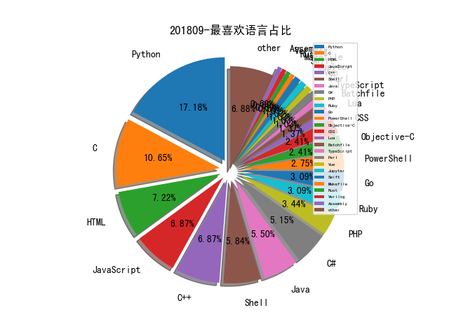

# [数据--所有](README_20.md)
# [数据--年度](README_2018.md)
# 201809 信息源与信息类型占比

# 微信公众号 推荐
| nickname_english | weixin_no | title | url| 
| --- | --- | --- | ---| 
| 网安寻路人 | DataProtection101 | 第四期数据保护官沙龙纪实：网络爬虫的法律规制 | https://mp.weixin.qq.com/s/KzXuY0mmURiJi4NwU4CF4g | 1| 
| 宜信安全应急响应中心 | CreditEaseSec | 如何设计相对安全的图形验证码？ | https://mp.weixin.qq.com/s/5hUS9Mbc1NHi5MEZpGcGEA | 1| 
| 安全威胁情报 | Threatbook | 吕毅：信息安全的价值和落地 ,情报大会回顾 | https://mp.weixin.qq.com/s/5lXWmbORcyjukJNz5CW1Qg | 1| 
| 安云信息 | Anyuntec | Web安全实战系列：SQL注入漏洞 | https://mp.weixin.qq.com/s/m6bsWlJ3Yj1YMFZwz5uHIQ | 1| 
| 信安之路 | xazlsec | 记一次小型 APT 恶意攻击 | https://mp.weixin.qq.com/s/Yr4jbqIRQi9DjgF-dO5vpg | 39| 
| 仙人掌情报站 | sec-cactus | BeyondCorp：一种企业安全新方法-中英文对照版 | https://mp.weixin.qq.com/s/DKTODvkmZqTVi1lfqtHdDw | 1| 
| 永安在线情报平台 | YongAnOnline | 威胁猎人,互联网黑灰产工具软件2018半年报告 | https://mp.weixin.qq.com/s/7949qtHXTtVRvayVUZk62g | 1| 
| 慢雾科技 | SlowMist | ⼀个通杀绝⼤多数交易平台的 XSS 0day 漏洞 | https://mp.weixin.qq.com/s/yfbKf_5Nk2NXFl2-xlFqKg | 1| 
| 徐阿衡 | xu_a_heng | 知识抽取-实体及关系抽取 | https://mp.weixin.qq.com/s/I8TmSSQxJPG7KudHKqDrtA | 1| 
| 安全牛 | aqniu-wx | 智能合约审计现状总结 | https://mp.weixin.qq.com/s/L0LHda_xoirZYVmxSm3UGA | 1| 
| 安世加 | asjeiss | 员工风险与UEBA - “安全+” 沙龙第十二期 | https://mp.weixin.qq.com/s/Y_mAd-IA4rAra1FqfZc8JQ | 1| 
| 奇安信威胁情报中心 | gh_166784eae33e | 毒云藤（APT-C-01）军政情报刺探者揭露 | https://mp.weixin.qq.com/s/-H02Bm08qbOWhWtSYiXWnQ | 1| 
| 中国信息安全 | chinainfosec | 解读 , 特朗普政府首份“国防部网络战略”（附全文翻译） | https://mp.weixin.qq.com/s/zF3m6DA3sC75AveIxM-RqQ | 1| 
| Viola后花园 | Viola_deepblue | 推荐三份安全报告 | https://mp.weixin.qq.com/s/FI8ugR96JYeqwgJe1Ysryw | 1| 
| SecWiki | SecWiki | [SecTrans-3]你应该知道的7个XSS利用场景 | https://mp.weixin.qq.com/s/Tj5o4PJPu78KV6I3XsYv7w | 1| 
| MottoIN | mottoin |  | https://mp.weixin.qq.com/s/12BfVA1yNFJPF_9boZraVQ | 1| 
| 长亭科技 | Chaitin_Tech | 牧云（CloudWalker）开源手记 , Webshell 监控检测策略初探 | https://mp.weixin.qq.com/s/7TuUqdleZc5xbZG5Xh3f3Q | 1| 
| 维他命安全 | VitaminSecurity | Android平台间谍软件BusyGasper分析 | https://mp.weixin.qq.com/s/gkELP2C_Uftyca4hT5rEow | 3| 
| 数据派THU | DatapiTHU | 独家 , 一文了解Kaggle的开源数据集（附代码） | https://mp.weixin.qq.com/s/5hf7z-VSgK3PszK0TSFOIQ | 1| 
| 平安集团安全应急响应中心 | PSRC_Team |  | https://mp.weixin.qq.com/s/6q3zAaS4jV_Mw3qvgtngBw | 1| 
| 安在 | AnZer_SH | 人物 , 聂君：十几年金融企业安全建设之路，自己走过，才知最好 | https://mp.weixin.qq.com/s/blDNt4hvOKZJOJOskQwZKQ | 1| 
| 安全学术圈 | secquan | RAID 2018 论文录用列表 | https://mp.weixin.qq.com/s/h6IOChIPMAolTqTNFjA0aQ | 1| 
| 信息时代的犯罪侦查 | infocrime | 破解手机QQ聊天记录内容八个问题 | https://mp.weixin.qq.com/s/XPeM95rpzPbVqRnDG01PiQ | 1| 
| 企业安全工作实录 | xiaohuangsec | 漏洞治理平台的设计与实现 | https://mp.weixin.qq.com/s/kqp6kj7CcfV6sFBTzZzZsw | 1| 
| ArkTeam | gh_16875f8ce964 | 使用深度学习的方法对恶意web内容进行快速检测 | https://mp.weixin.qq.com/s/EmEofhgwr2ze93W7Q8yB7Q | 1| 
| 铭毅天下Elasticsearch | elastic999 | 干货 , 论Elasticsearch数据建模的重要性 | https://mp.weixin.qq.com/s/LXhE-D0FlT_hOns1s1rBmg | 1| 
| 腾讯技术工程 | Tencent_TEG | 威胁情报大会直击 , 企业IT部王森：腾讯企业终端安全管理最佳实践 | https://mp.weixin.qq.com/s/g_x_xpbyKKQkLNpYnMqaXg | 1| 
| 数说安全 | SSAQ2016 |  | https://mp.weixin.qq.com/s/ycoqu5D8dvtu60Pqr44vAQ | 1| 
| 唯品会安全应急响应中心 | VIP_SRC | 代码自动化扫描系统的建设（上） | https://mp.weixin.qq.com/s/tSbWhBh9RQQ5Wduoo18MEg | 2| 
| 人民公安报 | rmgabs | 公安机关“净网2018”专项行动破刑案2.2万余起（附十大典型案例） | https://mp.weixin.qq.com/s/ZsI4LEmshKoppeeqM4nsrA | 1| 
| APT观察 | APT_REVIEW | 美国起诉朝鲜黑客，涉索尼及WannaCry等黑客案 | https://mp.weixin.qq.com/s/KaduuL0Fv-xBgr7smY_cnQ | 4| 

# 组织github账号 推荐
| github_id | title | url | org_url | org_profile | org_geo | org_repositories | org_people | org_projects | repo_lang | repo_star | repo_forks| 
| --- | --- | --- | --- | --- | --- | --- | --- | --- | --- | --- | ---| 
| Microsoft | 微软公开了 MS-DOS 1.25 和 2.0 版本的源代码: | https://github.com/Microsoft/MS-DOS | https://opensource.microsoft.com | Open source, from Microsoft with love | Redmond, WA | 2463 | 4258 | 0 | C,TypeScript,CMake,C#,JavaScript,Objective-C,C++,Python,Batchfile,HTML,Rich,Jupyter,Java,PowerShell | 0 | 0 | 1| 
| rapid7 | Metasploit 将 CVE-2018-8440 ALPC 漏洞添加到攻击模块中: | https://github.com/rapid7/metasploit-framework/pull/10643 | http://www.rapid7.com/ |  | Boston, MA | 234 | 0 | 0 | C,Java,Python,JavaScript,HTML,Go,Ruby | 0 | 0 | 1| 
| SpiderLabs | social_mapper: A Social Media Enumeration & Correlation Tool | https://github.com/SpiderLabs/social_mapper | https://www.trustwave.com/Resources/SpiderLabs-Blog/ |  | Earth | 69 | 4 | 0 | C,Java,Python,C++,Perl,Lua,PHP,Ruby,C# | 0 | 0 | 3| 
| Polidea | SiriusObfuscator - Swift 源代码混淆工具: | https://github.com/Polidea/SiriusObfuscator | http://www.polidea.com |  | Warsaw | 64 | 3 | 0 | Groovy,Ruby,Java,Python,Kotlin,JavaScript,C++,TypeScript,C#,Objective-C,Shell,CMake,Swift | 0 | 0 | 1| 
| dianping | CAT基于Java开发的实时应用监控平台，包括实时应用监控，业务监控 | https://github.com/dianping/cat | http://www.dianping.com/ | 原大众点评技术团队账号，美团点评技术团队账号请访问：https://github.com/Meituan-Dianping | Shanghai, China | 47 | 10 | 0 | C,Java,Scala,C#,JavaScript,Go,Ruby,CSS | 0 | 0 | 1| 
| dev-sec | ansible-os-hardening - Ansible 角色提供了许多与安全相关的配置,可以提供了全面的基本保护: | https://github.com/dev-sec/ansible-os-hardening | https://dev-sec.io | Security + DevOps: Automatic Server Hardening | https://twitter.com/devsecio | 46 | 15 | 0 | Puppet,Dockerfile,HTML,Ruby,CSS | 0 | 0 | 1| 
| radareorg | r2con 2018 大会议题材料公开: | https://github.com/radareorg/r2con/tree/master/2018/talks | http://www.radare.org/ |  | http://www.radare.org/ | 36 | 7 | 0 | CSS,C,Shell,Python,Makefile,C++,C#,HTML,HCL,Go,Rust | 0 | 0 | 3| 
| IOActive | 攻击 Windows NDIS 驱动: | https://github.com/IOActive/FuzzNDIS/blob/master/Attacking_Windows_NDIS_Drivers.pdf | http://blog.ioactive.com/ | IOActive Labs repository | http://blog.ioactive.com/ | 24 | 0 | 0 | C,Shell,Java,Python,JavaScript,C++,C# | 0 | 0 | 1| 
| teamnsrg | Erays - 用于以太坊智能合约逆向工程的工具: | https://github.com/teamnsrg/erays | https://nsrg.sprai.org |  | https://nsrg.sprai.org | 22 | 0 | 0 | Go,Python,JavaScript,Shell,Rust | 0 | 0 | 1| 
| TKCERT | mail-security-tester - 邮件安全测试框架: | https://github.com/TKCERT/mail-security-tester | https://www.thyssenkrupp.com/ | Open Source contributions and projects from the thyssenkrupp CERT | https://www.thyssenkrupp.com/ | 18 | 2 | 0 | C,Shell,Python,Lua,HTML,Ruby | 0 | 0 | 1| 
| googleprojectzero | halfempty - 一款快速并行的测试用例最小化工具: | https://github.com/googleprojectzero/halfempty | https://googleprojectzero.blogspot.com | Projects by Google Project Zero | https://googleprojectzero.blogspot.com | 14 | 0 | 0 | C,C#,C++,Python,HTML,Swift | 0 | 0 | 1| 
| HikariObfuscator | Hikari - 一款对 Obfuscator-LLVM 的移植和优化,并提供多种自制的混淆及加固功能的工具 : https://naville.gitbooks.io/hikaricn/content/GitHub: | https://github.com/HikariObfuscator/Hikari | None | Let there be light | /dev/kmem | 12 | 1 | 0 | Python,Logos,Objective-C,Shell,C++ | 0 | 0 | 1| 
| GhostPack | From Kekeo to Rubeus,及 Rubeus 工具详细介绍 : https://posts.specterops.io/from-kekeo-to-rubeus-86d2ec501c14Github : | https://github.com/GhostPack/Rubeus | None | A collection of security related toolsets. | None | 8 | 0 | 0 | C# | 0 | 0 | 1| 
| twelvesec | passcat - 从本地计算机中提取密码的工具: | https://github.com/twelvesec/passcat | https://www.twelvesec.com | TwelveSec is an information security firm, specialising in assurance, security management, and InfoSec training services | Athens, Greece | 8 | 6 | 0 | Python,C,Java,C++ | 0 | 0 | 1| 
| DynamoRIO | drmemory - 支持多平台的内存调试器: | https://github.com/DynamoRIO/drmemory | http://dynamorio.org | Dynamic Instrumentation Tool Platform | http://dynamorio.org | 5 | 0 | 0 | C,C++,CSS | 0 | 0 | 1| 
| NaoTu | DesktopNaotu: 桌面版脑图（百度脑图离线版，思维导图工具） | https://github.com/NaoTu/DesktopNaotu | mailto:topcss@gmail.com | 桌面版脑图（百度脑图离线版，思维导图工具）开箱即用，跨平台支持 Windows/Linux/Mac OS | China | 4 | 1 | 0 | TypeScript,JavaScript | 0 | 0 | 1| 
| tearsecurity | firstorder - 用于使 Empire C2 通信逃避基于异常检测的 IDS 系统的工具工具: | https://github.com/tearsecurity/firstorder | https://tearsecurity.com/ |  | https://tearsecurity.com/ | 2 | 1 | 0 | Python | 0 | 0 | 1| 
| IDArlingTeam | IDArling - IDA Pro 和 Hex-Rays 的协同逆向插件,允许将多个 IDA Pro 的实例连接在一起,同时同步多个用户对数据库所做的修改: | https://github.com/IDArlingTeam/IDArling/ | None | The authors of IDArling | None | 1 | 1 | 0 | Python | 0 | 0 | 1| 

# 私人github账号 推荐
| github_id | title | url | p_url | p_profile | p_loc | p_company | p_repositories | p_projects | p_stars | p_followers | p_following | repo_lang | repo_star | repo_forks | 
| --- | --- | --- | --- | --- | --- | --- | --- | --- | --- | --- | --- | --- | --- | ---| 
| byt3bl33d3r | SprayingToolkit - 一组更快更高效的,对 Lync/S4B & OWA 进行密码喷射攻击的 Python 脚本工具: | https://github.com/byt3bl33d3r/SprayingToolkit | https://byt3bl33d3r.github.io | C Y B E R | Error: Unable to resolve | BlackHills InfoSec | 96 | 0 | 953 | 2700 | 117 | Python,PowerShell,HCL | 0 | 0 | 1| 
| x0rz | phishing_catcher 现已支持 Unicode 同形异义域名检测: | https://github.com/x0rz/phishing_catcher | https://0day.rocks | hacking things | France | None | 6 | 0 | 19 | 2600 | 0 | Python,C,Perl | 3500 | 2100 | 1| 
| hfiref0x | UACMe 3.0.0 版本发布,此版本进行了程序的重构并添加了更多基于 AutoElevated 的 COM 接口方法: | https://github.com/hfiref0x/UACME/ | None |  | None | None | 23 | 0 | 24 | 1500 | 15 | C | 0 | 0 | 1| 
| gentilkiwi | Mimikatz 新版本发布,支持 Windows 10 1803 绕过 Credential Guard: | https://github.com/gentilkiwi/mimikatz/releases | http://blog.gentilkiwi.com |  | France | None | 11 | 0 | 18 | 1500 | 24 | C | 7700 | 1800 | 1| 
| trimstray | test-your-sysadmin-skills - *nix 系统管理员技能测试问答集合: | https://github.com/trimstray/test-your-sysadmin-skills | https://trimstray.github.io/ | BIO_read(wbio, buf, 4096) | Poland | None | 15 | 0 | 892 | 1300 | 265 | Shell,HTML | 0 | 0 | 1| 
| Neo23x0 | win_susp_powershell_enc_cmd - 检测 Powershell 以 Base64 编码命令启动的 Sigma 规则: | https://github.com/Neo23x0/sigma/blob/master/rules/windows/builtin/win_susp_powershell_enc_cmd.yml | https://github.com/NextronSystems | #DFIR #Python #YARA #Golang #SIEM #SOC #Sigma #Malware | None | @NextronSystems | 79 | 0 | 101 | 1200 | 15 | Python,Batchfile,Java | 0 | 0 | 2| 
| FuzzySecurity | Native-HardLink - 创建 NT 硬链接的 POC 脚本: | https://github.com/FuzzySecurity/PowerShell-Suite/blob/master/Native-HardLink.ps1 | http://www.fuzzysecurity.com/ |  | None | None | 13 | 0 | 0 | 952 | 0 | C,PowerShell | 0 | 0 | 1| 
| mattgodbolt | compiler-explorer - 在 Web浏览器上交互方式运行的编译器: | https://github.com/mattgodbolt/compiler-explorer | https://xania.org/ | Husband, father, Compiler Explorer and jsbeeb creator, ex-Google, ex-games, ex-trading chap. | Chicago, IL | None | 56 | 0 | 112 | 904 | 66 | JavaScript,C++ | 0 | 0 | 1| 
| swisskyrepo | CTF中Web应用程序安全性的Payload和Bypass列表 : | https://github.com/swisskyrepo/PayloadsAllTheThings | https://twitter.com/pentest_swissky | Pentester & Bug Hunter | None | None | 7 | 0 | 5 | 895 | 12 | Python,Shell | 0 | 0 | 1| 
| ionescu007 | SpecuCheck v.1.1.0 工具发布,可用于检查 CVE-2017-5754 (Meltdown) 和 CVE-2017-5715 (Spectre) 漏洞的软硬件缓解措施 : | https://github.com/ionescu007/SpecuCheck | https://github.com/aionescu | VP of EDR Strategy at CrowdStrike President of Winsider Seminars & Solutions, Inc. Follow me at @aionescu on Twitter and http://www.alex-ionescu.com | None | Winsider Seminars & Solutions Inc. | 15 | 0 | 0 | 816 | 1 | C,C++ | 0 | 0 | 1| 
| boy-hack | An HTTP network library for hackers | https://github.com/boy-hack/hack-requests | https://www.hacking8.com/ | Hacking tools just for fun ~ | china | None | 28 | 0 | 113 | 749 | 17 | Python,JavaScript | 211 | 69 | 1| 
| tyranid | James Forshaw 发布 OleView.Net v1.5版本 : https://tyranidslair.blogspot.com/2018/09/finding-interactive-user-com-objects_9.htmlGitHub: | https://github.com/tyranid/oleviewdotnet | None |  | None | None | 32 | 0 | 0 | 700 | 2 | C#,Python,C | 0 | 0 | 1| 
| vulnersCom | zabbix-threat-control - Zabbix 漏洞评估插件: | https://github.com/vulnersCom/zabbix-threat-control | https://vulners.com | New generation vulnerability intelligence database | None | Vulners | 15 | 0 | 6 | 687 | 0 | Python,Lua,Java | 0 | 0 | 1| 
| niklasb | 3dpwn - VirtualBox 3D 漏洞利用与 PoC: | https://github.com/niklasb/3dpwn | https://twitter.com/_niklasb |  | Karlsruhe, Germany | None | 100 | 0 | 143 | 592 | 3 | Python,TeX,Shell,JavaScript,C++ | 671 | 128 | 1| 
| c0ny1 | pwcracker: 一款插件化的密码爆破框架 | https://github.com/c0ny1/pwcracker | http://gv7.me | 漏洞在牛角尖上 | None | None | 13 | 0 | 271 | 583 | 12 | Python,Shell,PHP,Java | 1200 | 307 | 1| 
| i0natan | nodebestpractices - Node.JS 最佳实践列表: | https://github.com/i0natan/nodebestpractices | None | An Independent software architect. Specializes in crafting advanced web applications using Node.js. http://goldbergyoni.com | None | None | 11 | 0 | 98 | 532 | 5 | JavaScript,HTML | 29500 | 2300 | 1| 
| jakeajames | rootlessJB - 一款针对iOS 11.2 到 11.3.1 版本的越狱工具 : https://github.com/jakeajames/rootlessJB/blob/master/writeup.pdf Github : | https://github.com/jakeajames/rootlessJB | None | A random guy on the internet. | Antartica | None | 69 | 0 | 4 | 493 | 7 | Logos,C | 313 | 146 | 2| 
| elfmaster | libelfmaster - 安全的 ELF 解析/加载库,用于恶意软件的取证重建以及逆向工程: | https://github.com/elfmaster/libelfmaster | http://www.bitlackeys.org | Order of operation: Consciousness/Meditation Family Creativity, coding, hacking, reversing, security | Seattle | Leviathan | 25 | 0 | 19 | 483 | 15 | C,Objective-C,C++ | 192 | 45 | 1| 
| bazad | iOS 11.2.6 launchd 中的 Mach 端口替换漏洞,可以实现沙箱逃逸,权限提升和代码签名绕过(CVE-2018-4280) : | https://github.com/bazad/blanket | https://bazad.github.io | iOS security research | None | None | 28 | 0 | 1 | 474 | 0 | Python,C | 194 | 31 | 2| 
| fate0 | xmark:PHP hook 框架 | https://github.com/fate0/xmark | http://www.fatezero.org | time waits for no one | China | None | 15 | 0 | 4 | 376 | 5 | Python,C,PHP,HTML | 0 | 0 | 1| 
| DamonMohammadbagher | 在内存中检测Meterpreter工具 : | https://github.com/DamonMohammadbagher/Meterpreter_Payload_Detection | https://www.linkedin.com/in/damon-mohammadbagher-2b154484 | Security Researcher 🇮🇷 https://twitter.com/_Damon_M_ | None | None | 18 | 0 | 43 | 351 | 0 | C#,Shell | 0 | 0 | 1| 
| GoSSIP-SJTU | TripleDoggy - 基于clang static analyzer的源码漏洞检测工具: | https://github.com/GoSSIP-SJTU/TripleDoggy | https://loccs.sjtu.edu.cn/wiki/doku.php?id=gossipwiki | Group of Software Security In Progress (GoSSIP) 小组，来自上海交通大学密码与计算机安全实验室（LoCCS）的活跃的学术安全团队 | Shanghai, China | Shanghai Jiao Tong University | 9 | 0 | 0 | 344 | 0 | TeX,C,Assembly,C++ | 491 | 130 | 1| 
| paralax | awesome-honeypots: an awesome list of honeypot resources | https://github.com/paralax/awesome-honeypots | https://github.com/censys | security, cooking, biochemistry. a lot of internet scanning now. | ann arbor, mi | @censys | 264 | 0 | 491 | 230 | 1 | Python,PHP,F# | 3200 | 627 | 1| 
| wbenny | injdrv - 通过 APC 将 DLL 注入用户模式进程概念验证的 Windows 驱动程序: | https://github.com/wbenny/injdrv | https://twitter.com/PetrBenes |  | Brno, Czech Republic | None | 19 | 0 | 93 | 219 | 9 | C,C++ | 0 | 0 | 1| 
| Escapingbug | Awesome browsers exploits - 一些有关浏览器漏洞利用文章的分享: | https://github.com/Escapingbug/awesome-browser-exploit | https://github.com/Team-Eur3kA | My profile picture explains everything. Cheerleader of @Team-Eur3kA & @r3kapig | Azeroth | TJU/PKU | 50 | 0 | 251 | 205 | 60 | C,Shell,Java,Python,JavaScript,C++ | 0 | 0 | 1| 
| Raikia | CredNinja - 通过 SMB 协议检测账户可用性的工具: | https://github.com/Raikia/CredNinja | https://twitter.com/raikiasec |  | Dallas, TX | Mandiant | 16 | 0 | 80 | 202 | 4 | Python,Lua,PHP,PowerShell,Perl | 0 | 0 | 1| 
| TryCatchHCF | PacketWhisper - 通过 DNS 协议泄漏数据的工具: | https://github.com/TryCatchHCF/PacketWhisper | https://github.com/TryCatchHCF | Twitter: @TryCatchHCF | None | None | 3 | 0 | 5 | 186 | 0 | Python | 796 | 152 | 1| 
| shack2 | SNETCracker: Windows平台的弱口令审计工具 | https://github.com/shack2/SNETCracker | None |  | None | None | 10 | 0 | 4 | 182 | 1 | C#,JavaScript,Java | 285 | 110 | 1| 
| JohnLaTwC | BlueHat 2018 Security workshop 议题公开 : | https://github.com/JohnLaTwC/Bluehat2018GraphWorkshop | https://github.com/JohnLaTwC | @JohnLaTwC Distinguished Engineer and General Manager, Microsoft Threat Intelligence Center | None | Microsoft Corporation | 16 | 0 | 3 | 182 | 1 | Python,Visual,HTML,Jupyter | 172 | 37 | 1| 
| TunisianEagles | SocialBox - 社交媒体账户密码暴力破解工具: | https://github.com/TunisianEagles/SocialBox | https://github.com/TunisianEagles | Feel Free in an open source world Pentesters / security researchers / Malware lovers ☢ / Tunisia ❤ | Tunisia | @TunisianEagles | 8 | 0 | 8 | 178 | 0 | Shell | 236 | 76 | 1| 
| maestron | botnets - 僵尸网络恶意软件源码收集仓库: | https://github.com/maestron/botnets | None | Donations (BTC): 1FPZzkoUxe2uXzne4KML6TYzASCieWXS6E | None | None | 9 | 0 | 10 | 168 | 2 | C,HTML,PHP,C++ | 2100 | 439 | 2| 
| audibleblink | gorsh - go 语言编写的反弹 Shell: | https://github.com/audibleblink/gorsh | http://alexflor.es | 〉It is a truth universally acknowledged, that a single man in possession of an exploit must be in want of shellz. | New York City | None | 79 | 0 | 192 | 168 | 3 | C,Python,C++,Go,Ruby,PowerShell | 0 | 0 | 1| 
| skelsec | 可以让 Windows 活动目录崩溃的 POC 代码: | https://github.com/skelsec/windows_ad_dos_poc | https://twitter.com/SkelSec |  | None | None | 50 | 0 | 17 | 162 | 1 | Python,Objective-C | 0 | 0 | 1| 
| LeonardoNve | edm - HTTP MitM 攻击中感染文件的 POC 项目: | https://github.com/LeonardoNve/edm | None |  | None | None | 26 | 0 | 3 | 162 | 1 | Python | 265 | 139 | 1| 
| w181496 | Web-CTF-Cheatsheet - CTF Web 方向的 CheatSheet: | https://github.com/w181496/Web-CTF-Cheatsheet | https://github.com/DoubleSigma | kaibro @DoubleSigma http://ⓀⒶⒾⒷⓇⓄ。ⓉⓌ | Taiwan | National Taiwan University | 27 | 0 | 591 | 160 | 37 | Python,Ruby,C++ | 652 | 142 | 1| 
| woj-ciech | Danger-zone - 关联域名、IP 和电子邮件地址之间的数据并将其可视化输出: | https://github.com/woj-ciech/Danger-zone | None |  | None | None | 11 | 0 | 0 | 156 | 0 | Python,Go | 747 | 101 | 1| 
| rianhunter | Wasmjit - 一款适用于 Linux 内核模式的 WebAssembly Runtime 工具: | https://github.com/rianhunter/wasmjit | http://thelig.ht/ |  | San Francisco | None | 24 | 0 | 0 | 148 | 16 | Python,C++ | 0 | 0 | 1| 
| entropy1337 | 自动化无线攻击工具 Infernal-Wireless 发布了第三版: | https://github.com/entropy1337/infernal-twin | None |  | None | None | 82 | 0 | 19 | 148 | 10 | Python,C,PHP,HTML | 969 | 237 | 1| 
| platomav | BIOSUtilities:用于修改和研究BIOS的各种工具 : | https://github.com/platomav/BIOSUtilities | None | Hardware & firmware hobbyist, developer of ME Analyzer & MC Extractor, admin of win-raid.com | None | None | 5 | 0 | 39 | 131 | 5 | Python | 0 | 0 | 1| 
| NickstaDB | 用于漏洞概念验证的利用及工具: | https://github.com/NickstaDB/PoC | https://www.cognitous.co.uk/ | Security researcher, exploit developer, pentester, and founder of Cognitous Cyber Security. | United Kingdom | Cognitous Cyber Security | 16 | 0 | 14 | 118 | 3 | Python,Shell,Java | 327 | 62 | 1| 
| mschwager | 0wned -通过Python安装包执行代码: | https://github.com/mschwager/0wned | None |  | None | None | 36 | 0 | 248 | 111 | 48 | Python,Go | 811 | 101 | 2| 
| p1r06u3 | opencanary_web: 基于opencanary的蜜罐web服务端 | https://github.com/p1r06u3/opencanary_web | http://pirogue.org |  | None | None | 35 | 0 | 210 | 103 | 5 | Python,HTML,PHP | 244 | 98 | 1| 
| blacknbunny | peanalyzer32 - PE 文件分析和反汇编工具: | https://github.com/blacknbunny/peanalyzer32 | https://blacknbunny.github.io/ | 筑路工人 17 y/o Youtube : http://tiny.cc/2y944y https://twitter.com/0DAYanc | None | None | 20 | 0 | 15 | 103 | 3 | Python,HTML | 0 | 0 | 1| 
| mxmssh | drltrace - 用于 Windows 和 Linux 应用程序的库调用跟踪器: | https://github.com/mxmssh/drltrace | https://twitter.com/MShudrak | Senior Offensive Security Researcher | San Francisco | Salesforce | 19 | 0 | 68 | 100 | 4 | Python,C,HTML | 0 | 0 | 1| 
| enkomio | Sacara - 基于堆栈的中间表示语言,通过在软件的VM中运行,来保护软件免受逆向工程的分析 : | https://github.com/enkomio/sacara | None | Code Monk - twitter.com/s4tan | Italy | Enkomio Ltd | 16 | 0 | 63 | 98 | 5 | C#,F# | 0 | 0 | 1| 
| omg2hei | MiningGitlog: 采集Github仓库mail地址 | https://github.com/omg2hei/MiningGitlog/ | None |  | None | None | 49 | 0 | 918 | 95 | 185 | Python,HTML,JavaScript | 52 | 12 | 1| 
| OneLogicalMyth | Windows 提权 0day 漏洞的vPowerShell 例子: | https://github.com/OneLogicalMyth/zeroday-powershell | https://glanfield.co.uk |  | None | None | 27 | 0 | 55 | 77 | 11 | Python,Shell,PowerShell | 0 | 0 | 1| 
| ChrisTheCoolHut | Easy-Pickings - 用于 Fuzz 交叉架构二进制文件的自动函数导出和链接工具: | https://github.com/ChrisTheCoolHut/Easy-Pickings | None |  | None | None | 14 | 0 | 96 | 76 | 4 | Python,C | 353 | 61 | 1| 
| ls0f | gortcp: 内网穿透、远程文件上传下载、命令执行 | https://github.com/ls0f/gortcp | None |  | None | None | 27 | 0 | 673 | 75 | 72 | Python,Go,HTML | 0 | 0 | 1| 
| userlandkernel | Sem Voigtländer 公开其发现的 iOS 中各种漏洞,包括(Writeup、POC、Exploit): | https://github.com/userlandkernel/plataoplomo | https://github.com/Fontys-Hogeschool-ICT | Im a Software Engineering and Cybersecurity student at @Fontys-Hogeschool-ICT I research MACH, Darwin and LowLevel System Security. Mainly intrested in iOS. | Eindhoven, Netherlands | @UKERN-Developers | 33 | 0 | 48 | 72 | 11 | HTML,C,Shell,Objective-C | 0 | 0 | 1| 
| chryzsh | DarthSidious - 域环境渗透测试实验室: | https://github.com/chryzsh/DarthSidious/ | None | hacking AD | None | None | 8 | 0 | 976 | 71 | 6 | C#,PowerShell,CSS | 301 | 82 | 1| 
| cornerpirate | 一个在内存中下载,编译和执行 Java 文件的 POC : | https://github.com/cornerpirate/java-stager | https://www.twitter.com/cornerpirate | A penetration tester with a focus on collecting data, manipulating that, and generating kick ass reports. | None | Xcina Consulting | 19 | 0 | 15 | 62 | 18 | Python,Batchfile | 0 | 0 | 1| 
| CS-Tao | GTD-Visualization: 全球恐怖袭击数据可视化系统 | https://github.com/CS-Tao/GTD-Visualization | https://home.cs-tao.cc/ | A student in School of Remote Sensing and Information Engineering, Wuhan University, working on GWModel and GIS. | Wuhan · China | Wuhan University | 25 | 1 | 95 | 49 | 19 | C#,Python,Vue,JavaScript | 74 | 14 | 1| 
| vmiklos | 针对 Open Document Format(ODF) 的数字签名工具: | https://github.com/vmiklos/odfsig | https://vmiklos.hu/ |  | Budapest, Hungary | None | 70 | 0 | 41 | 44 | 3 | Python,C,C++ | 0 | 0 | 1| 
| B3nac | Android-Reports-and-Resources - HackerOne 上披露的 Android 应用漏洞收集列表: | https://github.com/B3nac/Android-Reports-and-Resources | https://b3nac.com | Working on becoming a infosec professional. Independent Security Researcher via bug bounties. Contributing to the owasp-mstg. twitter.com/b3nac | California | None | 19 | 0 | 11 | 42 | 10 | Python,HTML,Java | 0 | 0 | 1| 
| jovanbulck | Nemesis - 研究基本 CPU 中断逻辑中的微体系结构时序泄漏(Paper): https://people.cs.kuleuven.be/~jo.vanbulck/ccs18.pdfGitHub: | https://github.com/jovanbulck/nemesis | https://distrinet.cs.kuleuven.be/people/jo | PhD student @KU_Leuven , Trusted Computing & Side-Channel Attacks , #IntelSGX #Sancus #Foreshadow | None | None | 16 | 0 | 64 | 40 | 0 | C,Verilog | 0 | 0 | 1| 
| danielplohmann | smda - 一个极简的递归反汇编库,它为从内存转储中精确恢复控制流图(CFG) 进行了优化: | https://github.com/danielplohmann/smda | https://github.com/fkie | Malware Researcher. Working for Fraunhofer @fkie. | None | None | 7 | 0 | 79 | 38 | 0 | Python | 0 | 0 | 1| 
| r3vn | badKarma - 高级网络信息收集工具包: | https://github.com/r3vn/badKarma | https://xfiltrated.com | Old school jedi Master and Ethical Hacker. I break security. | Italy | None | 2 | 0 | 35 | 37 | 17 | Python | 259 | 67 | 1| 
| alexandreborges | Malwoverview.py - 一款可以将恶意样本进行快速分类的简单工具: | https://github.com/alexandreborges/malwoverview | http://www.blackstormsecurity.com | Malware Researcher, Instructor, Consultant and Speaker. | None | Blackstorm Security | 3 | 0 | 2 | 36 | 2 | Python,C++ | 181 | 35 | 1| 
| rmikehodges | hideNsneak - 渗透测试基础设施快速部署工具: | https://github.com/rmikehodges/hideNsneak | None |  | None | None | 19 | 0 | 23 | 34 | 3 | Go,Python | 213 | 34 | 1| 
| DownWithUp | 在 GEARAspiWDM.sys 中导致 DOS 漏洞(CVE-2018-16712)的POC: | https://github.com/DownWithUp/CVE-2018-16712/ | http://downwithup.github.io | Interested in security related software, malicious methods, how to stop them, Windows internals, and code exploitation. FASM, C, Pascal, and Python. Student. | Internet | None | 23 | 0 | 39 | 32 | 20 | C,Assembly | 0 | 0 | 1| 
| teoseller | osquery-attck: Mapping the MITRE ATT&CK Matrix with Osquery | https://github.com/teoseller/osquery-attck | None |  | None | None | 3 | 0 | 481 | 31 | 130 |  | 189 | 29 | 1| 
| MXi4oyu | DockerXScan—Docker镜像漏洞扫描器 | https://github.com/MXi4oyu/DockerXScan | http://www.secapi.net |  | None | None | 115 | 0 | 179 | 31 | 0 | Go,Jupyter | 86 | 52 | 1| 
| tiaotiaolong | TTLScan: 一款插件化的漏洞扫描器框架 | https://github.com/tiaotiaolong/TTLScan | http://www.tiaotiaolong.net | stuhackdent | Beijing | 猎豹 | 19 | 0 | 240 | 24 | 114 | Python,HTML,JavaScript,Vue | 59 | 12 | 1| 
| cleverbao | WebRange: 一个Web版的docker管理程序 | https://github.com/cleverbao/WebRange | http://cleverbao.github.io |  | None | None | 6 | 0 | 427 | 24 | 98 | Python,HTML,JavaScript,PHP,CSS | 79 | 16 | 1| 
| si9int | Acamar - 一款子域名收集工具: | https://github.com/si9int/Acamar | https://si9int.sh | Whitehat in own definition | None | None | 7 | 0 | 11 | 22 | 0 | Python | 0 | 0 | 1| 
| gregvish | L1TF(Foreshadow) VM guest虚拟机读取主机内存PoC(CVE-2018-3646): | https://github.com/gregvish/l1tf-poc/ | None |  | None | None | 8 | 0 | 7 | 20 | 2 | Python,Shell,C,JavaScript | 65 | 19 | 1| 
| PaoloMonti42 | salt - 用于追踪 Linux 内核 SLUB 分配器状态的工具: | https://github.com/PaoloMonti42/salt | None | Pursuing a double degree in Embedded Systems @ EURECOM and Polytechnic of Turin | None | None | 7 | 0 | 12 | 20 | 10 | Python,C,Makefile,Verilog,VHDL | 70 | 10 | 1| 
| P1CKLES | SharpBox - 一个基于 C# 的工具,通过 Dropbox API 对 Dropbox 进行压缩和加密: | https://github.com/P1CKLES/SharpBox | http://pickles.xyz |  | Charles Town, WV. | Specter Ops | 6 | 0 | 1 | 17 | 8 | C#,Swift | 59 | 18 | 1| 
| 1tayH | noisy - DNS,HTTP/S 噪声数据生成器: | https://github.com/1tayH/noisy | https://huri.biz |  | Israel | Sndbox | 5 | 0 | 77 | 15 | 5 | Python,Vue | 0 | 0 | 1| 
| omerporze | brokentooth - CVE-2018-4327 iOS 越狱漏洞 POC,支持11.4前的版本: | https://github.com/omerporze/brokentooth | None |  | None | None | 2 | 0 | 261 | 14 | 5 | Objective-C | 0 | 0 | 3| 
| WinHeapExplorer | WinHeap-Explorer - 检测 Windows 应用基于堆的错误的 POC 项目: | https://github.com/WinHeapExplorer/WinHeap-Explorer | None |  | None | None | 2 | 0 | 2 | 9 | 0 | Python,C++ | 118 | 18 | 1| 
| ChrisAD | ads-payload - 通过执行 ADS 流文件以绕过端点防御的工具: | https://github.com/ChrisAD/ads-payload | None |  | None | None | 5 | 0 | 12 | 7 | 6 | Batchfile,JavaScript,PowerShell | 39 | 10 | 1| 
| darkw1z | Ps1jacker - 生成 COM 劫持 Payload 的工具: | https://github.com/darkw1z/Ps1jacker | None |  | Ljubljana, Slovenia | None | 9 | 0 | 1 | 6 | 0 | Python,Kotlin,JavaScript,Java,CSS | 0 | 0 | 1| 
| mortedamos | 车辆 Hacking 设置指南 Part 0: | https://github.com/mortedamos/vehicle-hacking/wiki/Vehicle-Hacking-Setup-Guide:-Part-0:-Introduction | None |  | None | None | 3 | 0 | 1 | 3 | 4 | PHP | 32 | 6 | 1| 
| LOLBAS-Project | LOLBAS - 可以直接用作攻击工具的,系统自带的二进制文件和脚本(包括动态库): | https://github.com/LOLBAS-Project/LOLBAS | None | None | None | None | 0 | 0 | 0 | 0 | 0 | HTML,XSLT | 0 | 0 | 1| 

# 日更新程序
`python update_daily.py`