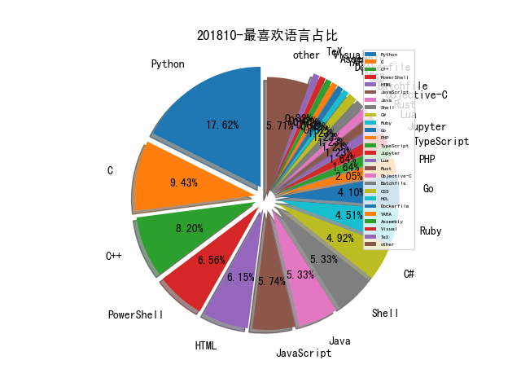

# 201810 信息源与信息类型占比

# 微信公众号 推荐
| nickname_english | weixin_no | title | url| 
| --- | --- | --- | ---| 
| 中通安全应急响应中心 | ZTO_SRC |  | https://mp.weixin.qq.com/s/n9N6Nkg_RYEvPM2WnlG45w | 1| 
| 丰巢技术团队 | hivebox_tech |  | https://mp.weixin.qq.com/s/xFv90_VB7B9m2o6jvQ13Iw | 1| 
| 关键信息基础设施技术创新联盟 |  |  | https://mp.weixin.qq.com/s/FyqSNy7Up4vBbLrmRKFjbQ | 1| 
| 华屹观察 | huayineican |  | https://mp.weixin.qq.com/s/Z1l286brHS_7zgTZHh3dDg | 1| 
| 南京刑事 | wangyingqinglawyer |  | https://mp.weixin.qq.com/s/lodWBnXkhAtCf4Rjv9liKA | 1| 
| 君哥的体历 | jungedetili |  | https://mp.weixin.qq.com/s/JFWxsdnEPI5NEU1PlR-FjA | 1| 
| 奇安信威胁情报中心 |  |  | https://mp.weixin.qq.com/s/AZcCvYscVndYflaB8tTHeA | 3| 
| 安全牛 | aqniu-wx |  | https://mp.weixin.qq.com/s/YeKZEIXgVz_83jwkzyf-1g | 1| 
| 战略前沿技术 | Tech999 |  | https://mp.weixin.qq.com/s/prVHa1vFHYUMWAS2QDRpXg | 1| 
| 掮客酒馆 | SecurityPub |  | https://mp.weixin.qq.com/s/-Gw-xhS1URokFqaxW4k1lQ | 1| 
| 网信防务 | CyberDefense |  | https://mp.weixin.qq.com/s/e6rsGPHw2XH1OZpiMQlaPA | 2| 
| 腾讯防水墙 | tencent_fsq |  | https://mp.weixin.qq.com/s/kiF-HPg_bfgd6RGFF3sBtw | 1| 
| 蚂蚁金服科技 | Ant-Techfin |  | https://mp.weixin.qq.com/s/oMFLtEULvIeX5Nu0K33lGw | 1| 
| Bypass | Bypass-- |  | https://mp.weixin.qq.com/s/-T9wupsSfW1Q73ocPgvMBg | 4| 
| 丁爸 情报分析师的工具箱 | dingba2016 |  | https://mp.weixin.qq.com/s/4eusVprYSyxjQHR9GpFB3A | 1| 
| 云影实验室 | Yunying_Lab |  | https://mp.weixin.qq.com/s/6FZqeG3ys2rYpuz7nXr_Lw | 1| 
| 嘶吼专业版 | Pro4hou |  | https://mp.weixin.qq.com/s/-67FpcF3JvZT14M6x-_5Rg | 1| 
| 安智客 | china_safer |  | https://mp.weixin.qq.com/s/t54wFWBxA1iKr74LB_KFRg | 1| 
| 小黄的安全工作实录 | xiaohuangsec |  | https://mp.weixin.qq.com/s/q-5SeJZ9eV9qUXXvzsrSdw | 1| 
| 智能运维前沿 | AIOps_Tsinghua |  | https://mp.weixin.qq.com/s/wxarbgNuasxaPsZ3Dh4z6g | 1| 
| 电科防务 | CETC-ETDR |  | https://mp.weixin.qq.com/s/xFRR5tJBc2C_SLxOIhlHaw | 1| 
| 知识工场 | fudankw |  | https://mp.weixin.qq.com/s/DlXzTpjLXAIrSmkuM_jDHg | 1| 
| 装备参考 | Armament999 |  | https://mp.weixin.qq.com/s/xq2Yoba8UPvZG6Hlv51rNQ | 1| 
| 雷锋网 | leiphone-sz |  | https://mp.weixin.qq.com/s/7NfXcNC4bEtdT2RJ6vl3Ww | 1| 
| DWord |  |  | https://mp.weixin.qq.com/s/E0_NRjpsyCCZtNgzuXU5Jw | 1| 
| Viola后花园 | Viola_deepblue |  | https://mp.weixin.qq.com/s/1O5KU5O95s_naz5MKKpYow | 1| 
| 云众可信 | yunzhongkexin |  | https://mp.weixin.qq.com/s/oN_AvF7luMNvwB3GDyk_PA | 1| 
| 国家信息安全服务资质 |  |  | https://mp.weixin.qq.com/s/y9Qx4htmcoWgC96G2sWvpw | 1| 
| 安全喷子 |  |  | https://mp.weixin.qq.com/s/uGhcnkgGNeZhGRAGlPfUWg | 1| 
| 安全小飞侠 | AvFisher |  | https://mp.weixin.qq.com/s/quwaJMVHYpBAXpkgtR12Kw | 1| 
| 数说安全 | SSAQ2016 |  | https://mp.weixin.qq.com/s/dLsXvmU0ba91_9gjmvPU3w | 2| 
| 红队攻防揭秘 | klionsec |  | https://mp.weixin.qq.com/s/7YidkhJvmVBxFhYcD7pIfQ | 1| 
| 维他命安全 | VitaminSecurity |  | https://mp.weixin.qq.com/s/a8DRajYpeCMo_bwSKbQErA | 3| 
| 腾讯技术工程 | Tencent_TEG |  | https://mp.weixin.qq.com/s/9t36Z_8exZwI_rpG-P57Yw | 1| 
| 苹果资本 | Applefunds |  | https://mp.weixin.qq.com/s/KpTSoXsDi2PCfrJxRensqg | 1| 
| 安全学术圈 | secquan |  | https://mp.weixin.qq.com/s/D1si0cYJ8kIh4nACBY_4bQ | 2| 
| 安惞杂谈 | anxin_zatan |  | https://mp.weixin.qq.com/s/-gHMhj1Qdl1N5rCne61m4Q | 1| 
| 我的安全视界观 | CANI_Security |  | https://mp.weixin.qq.com/s/SykbwlIuNJUHf2Ch_PE3ow | 1| 
| 深信服千里目安全实验室 | Further_eye |  | https://mp.weixin.qq.com/s/Kjw_abH6a-ifXdQmbc5Pug | 1| 
| 腾讯安全应急响应中心 | tsrc_team |  | https://mp.weixin.qq.com/s/4hGUZWXN6qzjMcbtZsYCSA | 1| 
| FreeBuf | freebuf |  | https://mp.weixin.qq.com/s/8Z3FEYKnnDV3c7vNh5nbwA | 2| 
| 中国信息安全 | chinainfosec |  | https://mp.weixin.qq.com/s/9J-iG4AydeVI2iFmavsn6w | 3| 
| 小强说 | xiaoqiangcall |  | https://mp.weixin.qq.com/s/KeDMlMIBA-ojKf_67KD6kg | 1| 

# 组织github账号 推荐
| github_id | title | url | org_url | org_profile | org_geo | org_repositories | org_people | org_projects | repo_lang | repo_star | repo_forks| 
| --- | --- | --- | --- | --- | --- | --- | --- | --- | --- | --- | ---| 
| Microsoft | 通过利用 Chakra 中的设计缺陷绕过 CFG 保护机制 : | https://github.com/Microsoft/ChakraCore/commit/4196f8097afdcc5fe01ce2966871712fb24003a3#diff-313e10e84814b5cb12117bf9fc497566 | https://opensource.microsoft.com | Open source, from Microsoft with love | Redmond, WA | 2463 | 4258 | 0 | C,TypeScript,CMake,C#,JavaScript,Objective-C,C++,Python,Batchfile,HTML,Rich,Jupyter,Java,PowerShell | 0 | 0 | 2| 
| salesforce | hassh - 用于识别特定客户端和服务器 SSH 服务的指纹识别工具: | https://github.com/salesforce/hassh | https://opensource.salesforce.com | A variety of vendor agnostic projects which power Salesforce | https://opensource.salesforce.com | 118 | 25 | 0 | Java,Scala,Python,Kotlin,JavaScript,HTML,Jupyter,Ruby,CSS | 0 | 0 | 2| 
| coinbase | dexter - 可扩展的取证框架: | https://github.com/coinbase/dexter | https://coinbase.com |  | https://coinbase.com | 86 | 6 | 0 | TypeScript,Java,HTML,Python,Swift,JavaScript,Shell,Go,PHP,Ruby | 0 | 0 | 1| 
| nsacyber | Windows-Secure-Host-Baseline: Windows 主机安全基线 | https://github.com/nsacyber/Windows-Secure-Host-Baseline | https://nsacyber.github.io/ | Official GitHub account for NSAs Cybersecurity mission. This site was formerly branded as NSA Information Assurance & Information Assurance Directorate | Fort Meade, MD | 32 | 0 | 0 | YARA,C,Java,C#,JavaScript,Python,HTML,Jupyter,PowerShell | 0 | 0 | 1| 
| tenable | RouterOS 漏洞挖掘 : | https://github.com/tenable/routeros/blob/master/bug_hunting_in_routeros_derbycon_2018.pdf | http://www.tenable.com/ |  | Columbia, MD | 26 | 4 | 0 | C,Shell,Java,Python,C++,Vim,CoffeeScript,HTML,Emacs,Ruby,PowerShell | 0 | 0 | 1| 
| knownsec | PDF JS 引擎交互式 Fuzzing : | https://github.com/knownsec/KCon/blob/master/2018/26%E6%97%A5/26%E6%97%A5No.10-PDF%20%20JS%E5%BC%95%E6%93%8E%E4%BA%A4%E4%BA%92%E5%BC%8FFuzzing-%E9%BB%91%E5%93%A5%26swan.pdf | http://blog.knownsec.com |  | http://blog.knownsec.com | 17 | 2 | 0 | Python,Go,JavaScript | 0 | 0 | 1| 
| Coalfire-Research | 介绍如何制作 iOS 11(iOS-11.1.2-15B202)的越狱: | https://github.com/Coalfire-Research/iOS-11.1.2-15B202-Jailbreak/blob/master/derbycon_presentation/The%20making%20of%20an%20iOS%2011%20jailbreak%20-%20Kiddie%20to%20kernel%20hacker%20in%2014%20sleepless%20nights.pdf | http://www.coalfirelabs.com | Advancing the state of the Infosec industry by providing cutting-edge research, open-source tools and tradecraft | http://www.coalfirelabs.com | 16 | 0 | 0 | C,Python,JavaScript,Lua,PowerShell,HCL | 0 | 0 | 1| 
| chaitin | cloudwalker: 开源服务器安全管理平台 | https://github.com/chaitin/cloudwalker | http://chaitin.com | 长亭科技 | Beijing | 16 | 7 | 0 | TypeScript,Python,JavaScript,C++,Lua,HTML,Go | 0 | 0 | 1| 
| outflanknl | RedELK - 红队使用的 SIEM 工具,集中化管理日志: | https://github.com/outflanknl/RedELK | http://www.outflank.nl | Clear advice with a hacker mindset. Red Teaming - Digital Attack Simulation - Incident Detection and Response | Amsterdam, Netherlands, EU | 15 | 1 | 0 | C,Shell,C#,C++,Python,Visual,PowerShell,CSS | 0 | 0 | 2| 
| KasperskyLab | ActionScript3 - 用于 ActionScript3 SWF 文件的静态和动态分析工具: | https://github.com/KasperskyLab/ActionScript3 | http://www.kaspersky.com | Kaspersky Lab is the world’s largest privately held vendor of Internet security solutions for businesses and consumers. | http://www.kaspersky.com | 12 | 7 | 0 | C,Shell,Java,Python,C++,PHP | 0 | 0 | 1| 
| Ebryx | AES-Killer - 用于解密移动应用 AES 加密流量的 Burp 插件: | https://github.com/Ebryx/AES-Killer | http://www.ebryx.com | Contributions from Ebryx to the open-source cybersecurity community. | Fremont, USA | 11 | 5 | 0 | Python,YARA,Java | 0 | 0 | 1| 
| housepower | olap2018: 易观第二届OLAP漏斗算法大赛 | https://github.com/housepower/olap2018 | None | Power your ClickHouse | None | 6 | 0 | 0 | Go,HTML,Java,C++ | 0 | 0 | 1| 
| Synacktiv | 可以在 IDA 中加载 iOS 12 kernelcaches 和 PAC 代码的脚本: | https://github.com/Synacktiv/kernelcache-laundering | http://www.synacktiv.ninja/en/ |  | Paris - France | 1 | 2 | 0 | Python | 0 | 0 | 1| 
| sense-of-security | ADRecon 新版本功能介绍: https://speakerdeck.com/prashant3535/adrecon-detection-chcon-2018GitHub: | https://github.com/sense-of-security/ADRecon | http://www.senseofsecurity.com.au/ | IT Security and Risk Managment Experts. The leading independent provider of IT security and risk management solutions in Australia. | Sydney and Melbourne, Australia | 1 | 0 | 0 | HTML | 0 | 0 | 1| 

# 私人github账号 推荐
| github_id | title | url | p_url | p_profile | p_loc | p_company | p_repositories | p_projects | p_stars | p_followers | p_following | repo_lang | repo_star | repo_forks | 
| --- | --- | --- | --- | --- | --- | --- | --- | --- | --- | --- | --- | --- | --- | ---| 
| byt3bl33d3r | SILENTTRINITY - 由 Python、IronPython 以及 C#/.NET 实现的后渗透测试工具: | https://github.com/byt3bl33d3r/SILENTTRINITY | https://byt3bl33d3r.github.io | C Y B E R | Error: Unable to resolve | BlackHills InfoSec | 96 | 0 | 953 | 2700 | 117 | Python,PowerShell,HCL | 0 | 0 | 1| 
| s0md3v | ReconDog - 用于侦查信息的瑞士军刀: | https://github.com/s0md3v/ReconDog | https://github.com/s0md3v | I make things, I break things and I make things that break things. Twitter: @s0md3v | None | None | 30 | 0 | 0 | 2400 | 0 | Python,JavaScript,Perl | 0 | 0 | 1| 
| pwn20wndstuff | unc0ver - 适用于 iOS 11.0 - 11.4b3 的越狱: | https://github.com/pwn20wndstuff/Undecimus | https://twitter.com/Pwn20wnd | Hacker. | None | None | 54 | 0 | 30 | 1400 | 3 | C,Makefile,Objective-C | 0 | 0 | 1| 
| hdm | mac-ages - MAC 地址年龄跟踪项目,通过 MAC 地址寻找硬件的近似发布日期: | https://github.com/hdm/mac-ages | https://hdm.io/ | Security researcher, startup advisor, product developer, consultant. | Austin, TX | None | 36 | 0 | 0 | 1000 | 1 | Go,JavaScript,Ruby | 0 | 0 | 1| 
| FuzzySecurity | PowerShell Suite - 渗透测试常用的 PowerShell 脚本收集: | https://github.com/FuzzySecurity/PowerShell-Suite | http://www.fuzzysecurity.com/ |  | None | None | 13 | 0 | 0 | 952 | 0 | C,PowerShell | 0 | 0 | 1| 
| swisskyrepo | SSRFmap - 结合 BurpSuite 的 Request 文件进行 SSRF 漏洞挖掘的工具: | https://github.com/swisskyrepo/SSRFmap | https://twitter.com/pentest_swissky | Pentester & Bug Hunter | None | None | 7 | 0 | 5 | 896 | 12 | Python,Shell | 0 | 0 | 1| 
| jas502n | Linux 内核 VMA-UAF 提权漏洞(CVE-2018-17182)利用: | https://github.com/jas502n/CVE-2018-17182/ | None | 1.misc 2.crypto 3. web 4. reverse 5. android 6. pwn 7. elf | None | None | 138 | 0 | 125 | 842 | 113 | Python,C,Shell,PHP | 299 | 109 | 1| 
| WangYihang | Platypus 反弹 Shell 构建僵尸网络 | https://github.com/WangYihang/Platypus | None | If you can read assembly language then everything is open source. | Harbin China | Harbin Institute of Technology | 103 | 0 | 1100 | 784 | 71 | Python,Go,Ruby,Rust | 0 | 0 | 1| 
| OsandaMalith | PESecInfo - 一款可以修改 ASLR 和 DEP 标志的简单工具: https://osandamalith.com/2018/10/24/pe-sec-info-a-simple-tool-to-manipulate-aslr-and-dep-flags/ GitHub: | https://github.com/OsandaMalith/PESecInfo/releases | https://github.com/ZeroDayLab | Love to break things, make things and make things that break things :) Just another security researcher interested in exploring new things. | London | @ZeroDayLab | 58 | 0 | 7 | 561 | 10 | Python,C | 171 | 63 | 1| 
| mrexodia | haxxmap - 代理 IMAP 服务获取密码的工具: | https://github.com/mrexodia/haxxmap | https://github.com/x64dbg | Passionate C++ developer and reverse engineer. Main developer of @x64dbg. Also familiar with C#, Haskell, Assembly, Python and a bunch of web-related languages. | Poland | None | 255 | 0 | 125 | 458 | 1 | C,C++ | 0 | 0 | 1| 
| zodiacon | AllTools - Windows 安全研究常用工具收集: | https://github.com/zodiacon/AllTools | http://scorpiosoftware.net |  | None | None | 50 | 0 | 99 | 448 | 8 | C#,C | 0 | 0 | 1| 
| ptresearch | mmdetect - 用于检查 Intel ME Manufacturing Mode 状态的 Python 2.7 脚本 : | https://github.com/ptresearch/mmdetect | None |  | None | Positive Research Team | 13 | 0 | 1 | 385 | 0 | Python | 470 | 143 | 1| 
| rrbranco | 现代计算机防御技术的介绍: | https://github.com/rrbranco/Presentations/blob/master/Hacktivity_Keynote_October2018.pdf | https://twitter.com/bsdaemon | Chief Security Researcher (Personal Account) | United States | Intel Corporation | 28 | 0 | 8 | 355 | 10 | Python,C,Shell,C++ | 72 | 32 | 1| 
| gossip-sjtu | K-Hunt工具 - 通过 Execution Traces 定位不安全的加密密钥: | https://github.com/gossip-sjtu/k-hunt | https://loccs.sjtu.edu.cn/wiki/doku.php?id=gossipwiki | Group of Software Security In Progress (GoSSIP) 小组，来自上海交通大学密码与计算机安全实验室（LoCCS）的活跃的学术安全团队 | Shanghai, China | Shanghai Jiao Tong University | 9 | 0 | 0 | 344 | 0 | TeX,C,Assembly,C++ | 491 | 130 | 1| 
| rvrsh3ll | 介绍通过 Microsoft Word 嵌入在线视频功能来执行恶意代码: 1) https://github.com/rvrsh3ll/Word-Doc-Video-Embed-EXE-POC 2) | https://github.com/rvrsh3ll/Word-Doc-Video-Embed-EXE-POC | None | I hack code together and hope it works. | NOVA | None | 137 | 0 | 19 | 329 | 9 | Python,C#,HTML,PowerShell | 417 | 124 | 1| 
| JoyChou93 | Java常见通用漏洞和修复的代码以及利用payload | https://github.com/JoyChou93/java-sec-code | https://github.com/alibaba | Syclover, Alibaba, Security Engineer, Full Stack Engineer | HangZhou | @alibaba | 18 | 0 | 209 | 299 | 50 | Python,Java | 0 | 0 | 1| 
| ExpLife0011 | awesome-windows-kernel-security-development - Windows 内核安全开发相关的文章与项目收集: | https://github.com/ExpLife0011/awesome-windows-kernel-security-development | None |  | None | None | 2800 | 0 | 3000 | 283 | 487 | C,Assembly,Python,AngelScript,C++,C# | 668 | 226 | 1| 
| pyn3rd | CVE-2018-3245 漏洞的 PoC : | https://github.com/pyn3rd/CVE-2018-3245 | https://twitter.com/pyn3rd |  | Hangzhou | Alibaba Group | 7 | 0 | 0 | 262 | 0 | Python,Batchfile,Java | 126 | 46 | 1| 
| jaredhaight | SharpAttack - 在安全评估时使用的包含多种实用功能的控制台: | https://github.com/jaredhaight/SharpAttack | https://www.psattack.com |  | Seattle, WA | X-Force Red | 54 | 0 | 26 | 244 | 4 | C#,PowerShell | 0 | 0 | 1| 
| paranoidninja | Pandoras-Box - 创建网站的欺骗证书并为可执行文件签名以逃避杀软检测的工具: | https://github.com/paranoidninja/Pandoras-Box/blob/master/python/CarbonCopy.py | https://scriptdotsh.com/ | || OSCP || Security Researcher || Coding Enthusiast || Malware Developer || Threat Hunter || Ninja || I am a Ninja, and I slice Computers with my Katana | Last seen on Ring 0. Current Location Unknown | None | 13 | 0 | 0 | 241 | 0 | Python,C,C++ | 0 | 0 | 1| 
| RUB-SysSec | Microcode - 逆向 x86 处理器微码的框架和示例程序: | https://github.com/RUB-SysSec/Microcode | https://syssec.rub.de |  | Bochum, Germany | Ruhr-University Bochum | 18 | 0 | 11 | 217 | 0 | Python,C,C++ | 358 | 98 | 1| 
| TunisianEagles | winspy - 一款可以创建 Windows 反向连接后门的工具 : | https://github.com/TunisianEagles/winspy | https://github.com/TunisianEagles | Feel Free in an open source world Pentesters / security researchers / Malware lovers ☢ / Tunisia ❤ | Tunisia | @TunisianEagles | 8 | 0 | 8 | 178 | 0 | Shell | 236 | 76 | 1| 
| Rev3rseSecurity | WebMap - Nmap XML 报告的 Web 图表显示工具 : | https://github.com/Rev3rseSecurity/WebMap | https://www.youtube.com/rev3rsesecurity |  | None | None | 3 | 0 | 2 | 174 | 1 | Python,Dockerfile | 0 | 0 | 1| 
| leechristensen | SpoolSample - 通过 MS-RPRN RPC 接口来强制到其他 Windows 主机的身份验证工具: | https://github.com/leechristensen/SpoolSample | http://twitter.com/tifkin_ | I like to make computers misbehave | Seattle | None | 32 | 0 | 37 | 169 | 0 | C#,Go,C,PowerShell | 241 | 75 | 1| 
| ganlvtech | 吾爱破解论坛-爱盘源码 | https://github.com/ganlvtech/down_52pojie_cn | https://github.com/eeyes-net |  | None | @eeyes-net | 69 | 0 | 295 | 158 | 44 | TypeScript,AutoHotkey,JavaScript,HTML,Go,PHP | 0 | 0 | 1| 
| sevagas | swap_digger - 针对 Linux swap 进行取证分析的工具: | https://github.com/sevagas/swap_digger | http://blog.sevagas.com | I decided to create this Github along by blog to share my experimentations in the information security field. | None | None | 5 | 0 | 52 | 150 | 0 | Python,Shell | 554 | 152 | 1| 
| maddiestone | 介绍如何逆向 Android 中用于对抗分析的本地库: | https://github.com/maddiestone/ConPresentations/blob/master/VB2018.UnpackingThePackedUnpacker.Slides.pdf | http://twitter.com/maddiestone |  | None | None | 3 | 0 | 2 | 149 | 1 | Python | 425 | 88 | 1| 
| thewhiteh4t | pwnedOrNot - 通过 haveibeenpwned API 查找邮件账户密码是否被泄漏的 Python 脚本: | https://github.com/thewhiteh4t/pwnedOrNot | https://www.linkedin.com/in/lohityapushkar | The Best Offense is a Great Defense... | New Delhi | None | 8 | 0 | 11 | 141 | 2 | Python,C++ | 0 | 0 | 1| 
| vletoux | SpoolerScanner - 检测 Windows 远程打印机服务是否开启的工具: | https://github.com/vletoux/SpoolerScanner | https://www.pingcastle.com | Security ninja trying to do on the CISO side what red teamers do for years (you know me for dcsync, setntlm, DCShadow & pingcastle) | France | Ping Castle | 22 | 0 | 2 | 138 | 0 | C#,PowerShell,C++ | 216 | 29 | 1| 
| v-p-b | WindowsDefenderTools - 用于对 Windows Defender mpengine.dll 进行逆向工程的工具: | https://github.com/v-p-b/WindowsDefenderTools/tree/recreate | http://blog.silentsignal.eu |  | None | Silent Signal | 48 | 0 | 118 | 127 | 40 | Python,Java,Ruby,PowerShell | 69 | 26 | 1| 
| rebeyond | Behinder: “冰蝎”动态二进制加密网站管理客户端 | https://github.com/rebeyond/Behinder/releases | None |  | None | None | 8 | 0 | 3 | 125 | 0 | Python,C,Java | 480 | 109 | 1| 
| se55i0n | Emailscanner: 针对邮件协议POP3、SMTP、IMAP进行账户安全性测试 | https://github.com/se55i0n/Emailscanner | None | web security | None | None | 10 | 0 | 12 | 119 | 12 | Python | 0 | 0 | 1| 
| christophetd | censys-subdomain-finder - 从 Censys 的证书透明日志中收集子域名的工具: | https://github.com/christophetd/censys-subdomain-finder | http://christophetd.fr |  | Switzerland | None | 64 | 0 | 402 | 115 | 38 | Python,Lua,Visual,Shell | 0 | 0 | 1| 
| Igglybuff | awesome-piracy : A curated list of awesome warez and piracy links: | https://github.com/Igglybuff/awesome-piracy | None |  | None | None | 4 | 0 | 900 | 114 | 10 | Python,Shell,HTML | 6100 | 504 | 1| 
| Wenzel | r2vmi - 一款 Hypervisor 级的调试器 : | https://github.com/Wenzel/r2vmi | None | Security Researcher | VMI hypervisor-level debugger | Paris, France | None | 83 | 0 | 178 | 110 | 75 | Python,Ruby | 0 | 0 | 1| 
| blacknbunny | libSSH-Authentication-Bypass - 利用 CVE-2018-10933 认证绕过获取 shell 的 POC : | https://github.com/blacknbunny/libSSH-Authentication-Bypass/ | https://blacknbunny.github.io/ | 筑路工人 17 y/o Youtube : http://tiny.cc/2y944y https://twitter.com/0DAYanc | None | None | 20 | 0 | 15 | 103 | 3 | Python,HTML | 0 | 0 | 1| 
| omg2hei | ReShellAAS: Reverse Shell as a Service 反弹shell即服务 | https://github.com/omg2hei/ReShellAAS | None |  | None | None | 49 | 0 | 918 | 95 | 185 | Python,HTML,JavaScript | 52 | 12 | 1| 
| malcomvetter | CertCheck - 在 C++ 和 C# 语言中以编程方式访问 TLS 证书链的例子: | https://github.com/malcomvetter/CertCheck | http://medium.com/@malcomvetter |  | None | None | 37 | 0 | 81 | 84 | 0 | C#,C++ | 106 | 23 | 1| 
| hausec | ADAPE-Script - 活动目录自动化安全评估与权限提升脚本: | https://github.com/hausec/ADAPE-Script | https://hausec.com | script kiddie extraordinaire | None | @haus3c | 1 | 0 | 73 | 79 | 1 | PowerShell | 661 | 120 | 1| 
| moneyDboat | 2018达观杯文本智能处理挑战赛 Top10解决方案 | https://github.com/moneyDboat/data_grand | None | NLP, Machine Learning | beijing, China | 字节跳动 ai lab | 17 | 0 | 229 | 74 | 22 | Python,HTML,Jupyter | 260 | 111 | 1| 
| clr2of8 | SlackExtract - 用于下载用户 slack 的所有文件,消息和用户配置文件的 PowerShell 脚本: | https://github.com/clr2of8/SlackExtract | https://twitter.com/OrOneEqualsOne |  | None | None | 29 | 0 | 0 | 73 | 0 | Python,PowerShell | 0 | 0 | 1| 
| tarunkant | Gopherus - 利用 SSRF 漏洞攻击内部服务的 gopher 链接生成工具: | https://github.com/tarunkant/Gopherus | https://github.com/teambi0s | (SpyD3r) Web Security Enthusiast @teambi0s | CTF Player | B.Tech 3rd year CSE | Organiser of InCTF & InCTFj | Bug Hunter | | Amrita University, Amritapuri | None | 22 | 0 | 19 | 67 | 3 | Python,PHP | 0 | 0 | 1| 
| ecx86 | tcpbin - 记录 TCP Socket 详细日志的工具: | https://github.com/ecx86/tcpbin | None | i do the static analysis | None | None | 28 | 0 | 90 | 60 | 43 | Python,Java,C++ | 0 | 0 | 1| 
| maxking | linux-vulnerabilities-10-years - 一篇对 Linux 十年来的内核漏洞,缓解措施以及开放问题的研究论文 : | https://github.com/maxking/linux-vulnerabilities-10-years | https://asynchronous.in | I also have code over at https://gitlab.com/maxking | None | None | 109 | 0 | 170 | 54 | 26 | Python,TeX,Dockerfile,SaltStack | 0 | 0 | 1| 
| RanchoIce | 通过 DirectX Kernel 的漏洞获得系统权限,来自 腾讯湛泸实验室: | https://github.com/RanchoIce/44Con2018/blob/master/44Con-Gaining%20Remote%20System%20Subverting%20The%20DirectX%20Kernel.pdf | https://twitter.com/RanchoIce | Researcher of Tencent Security ZhanluLab | None | ZhanluLab | 60 | 0 | 0 | 46 | 11 | Objective-C,Ruby,PowerShell,C++ | 19 | 12 | 1| 
| OmerYa | Invisi-Shell - 绕过所有安全防护隐藏 PowerShell : | https://github.com/OmerYa/Invisi-Shell | None | Endpoint Team Lead at Symantec | None | Javelin Networks | 3 | 0 | 0 | 45 | 0 | C#,C,C++ | 370 | 57 | 1| 
| davrodpin | mole - 建立基于 SSH 进行端口转发的命令行工具: | https://github.com/davrodpin/mole | http://davrodpin.github.io |  | None | Hewlett Packard Enterprise | 15 | 0 | 5 | 41 | 5 | Go,Ruby | 0 | 0 | 1| 
| yannayl | GoogleCTF18 Finals - BOBNEEDSHELP | https://github.com/yannayl/ctf-writeups/blob/master/2018/google_finals/bobneedshelp/README.md | None |  | None | None | 36 | 0 | 13 | 39 | 6 | Python,Shell,C,JavaScript,CSS | 122 | 14 | 1| 
| r4wd3r | Windows RID 劫持攻击介绍 : | https://github.com/r4wd3r/RID-Hijacking/blob/master/slides/derbycon-8.0/RID_HIJACKING_DERBYCON_2018.pdf | https://r4wsecurity.blogspot.com/ | Sometimes a tenor, sometimes a hacker. | None | None | 11 | 0 | 10 | 38 | 9 | Python,Ruby,PowerShell | 102 | 29 | 1| 
| dgiagio | warp - 可用于创建自包含的二进制应用程序的工具: | https://github.com/dgiagio/warp | None |  | Toronto, Canada | Amazon | 2 | 0 | 57 | 34 | 1 | C,Rust | 1300 | 44 | 1| 
| TakahiroHaruyama | stackstring_static.py - 静态恢复在栈中构造的字符串的 IDAPython 脚本 : | https://github.com/TakahiroHaruyama/ida_haru/tree/master/stackstring_static | https://twitter.com/cci_forensics |  | 日本 | None | 6 | 0 | 18 | 27 | 0 | Python | 50 | 14 | 1| 
| cervoise | Abuse-bash-for-windows - Windows 上的 Bash 滥用工具: | https://github.com/cervoise/Abuse-bash-for-windows | None |  | Paris | None | 19 | 0 | 0 | 27 | 2 | Python,Batchfile,C++ | 33 | 16 | 1| 
| arnaugamez | Introducing radare2 for humans,radare2 使用介绍: | https://github.com/arnaugamez/r2con2018-Introducing_r2_for_humans/blob/master/introducing-radare2-humans.pdf | https://github.com/HackingLliure |  | None | @HackingLliure | 14 | 0 | 21 | 18 | 3 | Python,Java | 16 | 1 | 1| 
| binary1985 | Microsoft ADFS 服务中可基于时间来枚举用户的漏洞披露: 1) https://github.com/binary1985/VulnerabilityDisclosure/blob/master/ADFS-Timing-Attack; 2) | https://github.com/binary1985/VulnerabilityDisclosure/blob/master/ADFS-Timing-Attack; | None |  | None | None | 37 | 0 | 5 | 17 | 6 | Python,Ruby,Roff | 21 | 6 | 1| 
| gunnerstahl | JQShell - jQuery 文件上传插件漏洞利用工具: | https://github.com/gunnerstahl/JQShell | None |  | None | None | 11 | 0 | 7 | 16 | 5 | Python | 0 | 0 | 1| 
| Kondara | CTF BlazeFox 的 Exploit 代码: | https://github.com/Kondara/BlazeFox | None |  | None | None | 4 | 0 | 0 | 6 | 0 | C#,JavaScript | 18 | 8 | 1| 
| jamieparfet | Apache OFBiz (version< 16.11.04) 的两个 XXE 注入漏洞利用( CVE-2018-8033、CVE-2011-3600): | https://github.com/jamieparfet/Apache-OFBiz-XXE/ | None |  | None | None | 6 | 0 | 97 | 3 | 4 | Python,Shell,HTML | 0 | 0 | 1| 
| DarkSpiritz | DarkSpiritz - 针对 UNIX 系统的渗透测试框架: | https://github.com/DarkSpiritz/DarkSpiritz | None | None | None | None | 0 | 0 | 0 | 0 | 0 | None | 0 | 0 | 1| 
| LongSoft | ToshibaComExtractor - Toshiba .COM 固件提取工具: | https://github.com/LongSoft/ToshibaComExtractor | None | None | None | None | 0 | 0 | 0 | 0 | 0 | C,Shell,Rust,C++ | 0 | 0 | 1| 
| iovisor | bpftrace 使用教程: | https://github.com/iovisor/bpftrace/blob/master/docs/tutorial_one_liners.md | None | None | None | None | 0 | 0 | 0 | 0 | 0 | C,Shell,Python,JavaScript,C++,HTML,Go | 0 | 0 | 1| 

# medium_xuanwu 推荐
| title | url| 
| --- | ---| 

# medium_secwiki 推荐
| title | url| 
| --- | ---| 

# zhihu_xuanwu 推荐
| title | url| 
| --- | ---| 

# zhihu_secwiki 推荐
| title | url| 
| --- | ---| 

# 日更新程序
`python update_daily.py`