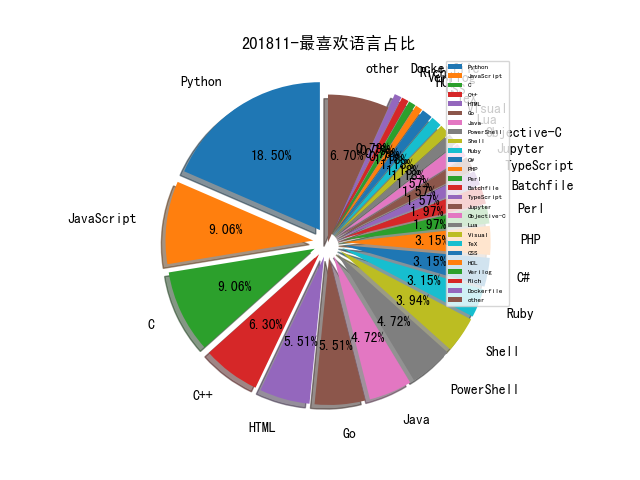

# [数据--所有](README_20.md)
# [数据--年度](README_2018.md)
# 201811 信息源与信息类型占比

# 微信公众号 推荐
| nickname_english | weixin_no | title | url| 
| --- | --- | --- | ---| 
| 网信军民融合 | wxjmrh | 以色列网络舆论攻防的发展历程及特点 | https://mp.weixin.qq.com/s/NDYOW0vDWRsIJS7pI7pK3g | 1| 
| 汉客儿 | gh_418dfd27e592 | 微信PC端技术研究-消息防撤销 | https://mp.weixin.qq.com/s/E7N6LzAH4p88Gu4f_qwGlg | 1| 
| 天融信阿尔法实验室 | gh_0b0b1747bf15 | Linux下的Rootkit驻留技术分析 | https://mp.weixin.qq.com/s/tvl4W7gg8Y6i8b_LFfTdpA | 1| 
| 大数据文摘 | BigDataDigest | 学界 , 全流程！清华博导给出的学术论文写作方法和技巧（244页） | https://mp.weixin.qq.com/s/_TbySBSoS8uZj1r5mvkNbA | 1| 
| FraudBoom | Madmanerss | 业务威胁之细说网盘泄露风险 | https://mp.weixin.qq.com/s/TeXdjDcWLmLi4iw8ff9XvA | 1| 
| ArkTeam | gh_16875f8ce964 | 浏览器指纹真的有效吗？ | https://mp.weixin.qq.com/s/MesxZ4aWPxVi3DWGpaDr2w | 1| 
| 集智俱乐部 | swarma_org | 图网络——悄然兴起的深度学习新浪潮 , AI&Society第八期回顾 | https://mp.weixin.qq.com/s/b89VhAluegTpQmSADTggDw | 1| 
| 猎户攻防实验室 | TassLiehu | Windows版本QQ锁定可被绕过 | https://mp.weixin.qq.com/s/2hnjrYvq4j0n-NYnDIaPMw | 1| 
| 机械科学与技术 | JXKXYJS | 关于博/硕士论文撰写，这是最好的一篇文章！ | https://mp.weixin.qq.com/s/KscXTyIOZAuvSYowJ_CK0g | 1| 
| 安全引擎 | SecEngine | 内网渗透有它就够了，手把手教你破解CobaltStrike3.12 | https://mp.weixin.qq.com/s/SuVrMNhGiTfdOTY1CmGRbw | 1| 
| 云鼎实验室 | YunDingLab | IoT 分析 , 路由器漏洞频发，mirai 新变种来袭 | https://mp.weixin.qq.com/s/jy8Ay4D2gQMHOYlDLwoovQ | 1| 
| SecPulse安全脉搏 | SecPulse | 剑影系列之8——硬件下的WiFi安全测试 | https://mp.weixin.qq.com/s/zNdEjrP12ZUhEfUb5HwVRg | 1| 
| DJ的札记 | DJ_notes | NDR产品设计二三事 | https://mp.weixin.qq.com/s/uTuY-hlzOI9ZXqcOOwQhmQ | 1| 
| 24氪金 | kingsof24 |  | https://mp.weixin.qq.com/s/1-Jugo6njEudoFlZWditHg | 1| 
| 网络安全应急技术国家工程实验室 | NELCERT | 智能门锁网络安全分析报告 | https://mp.weixin.qq.com/s/ErK_HlBnohMy4lrIdvhxqA | 1| 
| 科学出版社 | sciencepress-cspm | 美国公布长达35页的《2016—2045年新兴科技趋势报告》 | https://mp.weixin.qq.com/s/okd_GK0-DzCDsuVB-yxoYQ | 1| 
| 看雪学院 | ikanxue | 4 种常见“无文件”攻击技术解析 | https://mp.weixin.qq.com/s/eHsa0DgeogZN-tO5r3FeLg | 1| 
| 浅黑科技 | qianheikeji | 腾讯安全守门人 Coolc：黑客站在旷野，他们有时孤独 | https://mp.weixin.qq.com/s/bTdL34ugYJ67vIkVBmGexg | 1| 
| 数说安全 | SSAQ2016 |  | https://mp.weixin.qq.com/s/CXIrKq94alSPKt5zbbqsxw | 1| 
| 图灵人工智能 | TuringAI01 | 哈尔滨工业大学教授：刘挺教授——中文信息处理前沿技术进展 | https://mp.weixin.qq.com/s/LA-EcQ8DvYYJJqOQKkSC9Q | 2| 
| 嘶吼专业版 | Pro4hou | 中间人攻击框架xerosploit介绍 | https://mp.weixin.qq.com/s/GdzoLZ78Gy3iTEwxsSTh3Q | 3| 
| 京东安全应急响应中心 | jsrc_team | 安全小课堂第118期【IOT漏洞挖掘之路由器】 | https://mp.weixin.qq.com/s/ZSLYdpN4oG1ZSTvSdnVK2g | 1| 
| 中国信息安全 | chinainfosec | 研究 , 关键信息基础设施重要信息资产漏洞治理的实践和思考 | https://mp.weixin.qq.com/s/eQyc2jye-mrKBLhba_JP3g | 1| 
| e安在线 | ean-online | 温故知新，一图看懂等保2.0 , 等保2.0标准已在国家安标委最终审批，不日出台 | https://mp.weixin.qq.com/s/9V-eFVI0kHeUj27_2SYfhg | 1| 
| SecWiki | SecWiki | JBoss RichFaces EL Injection RCE Analysis(CVE-2018-14667) | https://mp.weixin.qq.com/s/aB9eKXy5OUaivhAPRnzM0w | 1| 
| 黑鸟 | blackorbird | Triton针对工业系统的形势分析以及检测手段 ,, 后附今日情报资源 | https://mp.weixin.qq.com/s/Nel6neXIHw5yXOsNzihQLA | 1| 
| 美团技术团队 | meituantech | 浅谈大型互联网的企业入侵检测及防护策略 | https://mp.weixin.qq.com/s/1Iry620hCkJ8sHA626T3Dg | 1| 
| 网信防务 | CyberDefense |  | https://mp.weixin.qq.com/s/JA1sXtwuiTv3onzHiKG6dg | 7| 
| 维他命安全 | VitaminSecurity | 【安全报告】卡巴斯基2018年第三季度DDoS攻击报告 | https://mp.weixin.qq.com/s/_uI51cd_D2WBe0_0BqPRNA | 2| 
| 机器学习算法与自然语言处理 | yizhennotes | 最强数据集50个最佳机器学习公共数据，可以帮你验证idea！ | https://mp.weixin.qq.com/s/4jhtCUtv_szfMvyDCWKvoQ | 1| 
| 机器之心 | almosthuman2014 | 专栏 , 用神经推理来帮助命名实体识别 | https://mp.weixin.qq.com/s/4qHgIcq9YJTj1iGh7kLB4w | 1| 
| 开放知识图谱 | OpenKG-CN | 美团大脑 , 知识图谱的建模方法及其应用 | https://mp.weixin.qq.com/s/u7mvxrvudKmjX4KeGtBiWA | 2| 
| 天御攻防实验室 | TianyuLab | 人生苦短，我用Wazuh！ | https://mp.weixin.qq.com/s/qTpLjhbl4gpOTncvdMVOHw | 1| 
| 双螺旋Sec团队 | double_helix_sec | 从ChimayRed漏洞看不同架构下的栈溢出利用实践 | https://mp.weixin.qq.com/s/q1zHgQ864u4t9QlzSIzoZw | 1| 
| 二当家的12138 | gh_e826f23d42e9 | CCS 2018 会议小记 （一） | https://mp.weixin.qq.com/s/FYZSZGGHgNxaWPPGgp9vKA | 2| 
| ZLabs | gh_339ee98cec1b | 闲扯，基于图的数据关联分析 | https://mp.weixin.qq.com/s/fD95ohJBE_YNcnlZMuXFHA | 1| 

# 组织github账号 推荐
| github_id | title | url | org_url | org_profile | org_geo | org_repositories | org_people | org_projects | repo_lang | repo_star | repo_forks| 
| --- | --- | --- | --- | --- | --- | --- | --- | --- | --- | --- | ---| 
| Microsoft | Sysinternals ProcDump 工具的 Linux 版: | https://github.com/Microsoft/ProcDump-for-Linux | https://opensource.microsoft.com | Open source, from Microsoft with love | Redmond, WA | 2463 | 4258 | 0 | C,TypeScript,Java,C#,JavaScript,Objective-C,C++,Go,Python,Batchfile,HTML,Rich,Jupyter,CMake,PowerShell | 0 | 0 | 2| 
| google | Google 公开了 google-ctf 比赛题目的代码及解题方法: | https://github.com/google/google-ctf/tree/master/2018/finals | https://opensource.google.com/ | Google ❤️ Open Source | https://opensource.google.com/ | 1474 | 2547 | 0 | C,TypeScript,Java,Python,Kotlin,JavaScript,C++,Go,Ruby,Rust | 0 | 0 | 1| 
| SpiderLabs | SharpCompile - Cobalt Strike的攻击脚本,提供实时编译和执行C#代码的功能: | https://github.com/SpiderLabs/SharpCompile | https://www.trustwave.com/Resources/SpiderLabs-Blog/ |  | Earth | 69 | 4 | 0 | C,Java,Python,C++,Perl,Lua,PHP,Ruby,C# | 0 | 0 | 1| 
| CTFTraining | A platform to provide challenge for CTFer | https://github.com/CTFTraining | https://CTFTraining.github.io | A platform to provide challenge for CTFer | China | 42 | 0 | 0 | Python,JavaScript,Perl,HTML,PHP,Dockerfile,CSS | 0 | 0 | 1| 
| hardenedlinux | 通过 CBMC 生成 Linux 内核函数测试用例的方法: | https://github.com/hardenedlinux/Debian-GNU-Linux-Profiles/blob/master/docs/harbian_qa/symexec/cbmc_kern.md | https://hardenedlinux.github.io/ | This is official repository of HardenedLinux community! | Kaer Morhen | 38 | 2 | 0 | C,Shell,Jupyter,Roff,JavaScript,C++,HTML,Assembly | 0 | 0 | 1| 
| knownsec | 以太坊智能合约安全检查列表: | https://github.com/knownsec/Ethereum-Smart-Contracts-Security-CheckList | http://blog.knownsec.com |  | http://blog.knownsec.com | 17 | 2 | 0 | Python,Go,JavaScript | 0 | 0 | 1| 
| inversepath | U-Boot 的引导验证 bypass: | https://github.com/inversepath/usbarmory/blob/master/software/secure_boot/Security_Advisory-Ref_IPVR2018-0001.txt | https://inversepath.com | F-Secure Hardware Security Team | Trieste, Italy | 14 | 0 | 0 | C,JavaScript,Makefile,Perl,Verilog,Go,SaltStack,Ruby | 0 | 0 | 1| 
| EnclaveConsulting | 比对文件列表 Hash 判断文件修改情况的 PowerShell 脚本: | https://github.com/EnclaveConsulting/Crypto-PKI/tree/master/Compare-File-Hashes-List | https://sans.org/sec505 | SANS Institute SEC505 course author Jason Fossen: Securing Windows and PowerShell Automation | United States | 12 | 0 | 0 | Visual,PowerShell | 0 | 0 | 1| 
| RhinoSecurityLabs | pacu - 针对 AWS 云的漏洞利用框架: | https://github.com/RhinoSecurityLabs/pacu | https://rhinosecuritylabs.com | A boutique penetration testing and security assessment firm in Seattle, WA. | Seattle, WA | 10 | 0 | 0 | Python,JavaScript,PowerShell,HCL | 0 | 0 | 1| 
| x41sec | 传真机相关的漏洞介绍,来自 ZeroNights 2018 : | https://github.com/x41sec/slides/tree/master/2018-zeronights | https://www.x41-dsec.de |  | https://www.x41-dsec.de | 8 | 0 | 0 | C#,C,Java | 0 | 0 | 1| 
| llir | LLVM IR 汇编的 EBNF 语法 : | https://github.com/llir/grammar | None | Unofficial libraries for interacting with LLVM IR. | None | 6 | 2 | 0 | Go,Tcl,LLVM | 0 | 0 | 1| 
| PAGalaxyLab | 路由器漏洞分析集合（PAGalaxyLab ） | https://github.com/PAGalaxyLab/VulInfo | http://galaxylab.org/ |  | http://galaxylab.org/ | 5 | 0 | 0 | Python,C,Java | 0 | 0 | 1| 
| AndroidHardening | hardened_malloc - 对 Android 提供多种安全功能的内存管理器: | https://github.com/AndroidHardening/hardened_malloc | https://grapheneos.org/ | Renamed to GrapheneOS. This name is kept to prevent anyone from taking the name and breaking the redirects, like what happened with the previous organization. | Toronto, Ontario, Canada | 1 | 1 | 0 |  | 0 | 0 | 1| 
| Synacktiv | iOS 11.4.1 和 MacOS 10.13 系统中 lio_listio 内核调用漏洞分析(CVE-2018-4344) : https://www.synacktiv.com/posts/exploit/lightspeed-a-race-for-an-iosmacos-sandbox-escape.html; | https://github.com/Synacktiv/lightspeed | http://www.synacktiv.ninja/en/ |  | Paris - France | 1 | 2 | 0 | Python | 0 | 0 | 1| 
| phoenhex | 赢得 Pwn2Own 2018 Virtualbox 的漏洞分析及利用介绍: 1) https://github.com/niklasb/sploits/tree/master/virtualbox/hgcm-oob 2) | https://github.com/phoenhex/files/blob/master/slides/thinking_outside_the_virtualbox.pdf | https://phoenhex.re/ | providing fine exploits & writeups to the world | your kernel | 1 | 0 | 0 | C | 0 | 0 | 1| 

# 私人github账号 推荐
| github_id | title | url | p_url | p_profile | p_loc | p_company | p_repositories | p_projects | p_stars | p_followers | p_following | repo_lang | repo_star | repo_forks | 
| --- | --- | --- | --- | --- | --- | --- | --- | --- | --- | --- | --- | --- | --- | ---| 
| dominictarr | 每周下载量达 200W 的 NPM 软件包 event-stream 被插入恶意代码 : | https://github.com/dominictarr/event-stream/issues/116 | http://protozoa.nz | antipodean wandering albatross | New Zealand | Protozoa | 880 | 0 | 358 | 2900 | 28 | JavaScript | 0 | 0 | 1| 
| s0md3v | Arjun - 一款用于发现 HTTP 参数的工具 : | https://github.com/s0md3v/Arjun | https://github.com/s0md3v | I make things, I break things and I make things that break things. Twitter: @s0md3v | None | None | 30 | 0 | 0 | 2400 | 0 | Python,JavaScript,Perl | 0 | 0 | 1| 
| DanMcInerney | msf-autoshell - 通过 nessus 扫描结果利用 Metasploit 自动获取 shell 的工具: | https://github.com/DanMcInerney/msf-autoshell | None | I like automating security stuff so I dont have to work. Coalfire Sr. Pentester. | None | @danhmcinerney | 82 | 0 | 236 | 1900 | 23 | Python,Ruby,PowerShell | 0 | 0 | 1| 
| Neo23x0 | Fnord - 混淆代码的 YARA 规则创建工具: | https://github.com/Neo23x0/Fnord | https://github.com/NextronSystems | #DFIR #Python #YARA #Golang #SIEM #SOC #Sigma #Malware | None | @NextronSystems | 79 | 0 | 101 | 1200 | 15 | Python,Batchfile,Java | 0 | 0 | 1| 
| CHEF-KOCH | Privacy Online Test And Resource Compendium (POTARC) | https://github.com/CHEF-KOCH/Online-Privacy-Test-Resource-List | https://github.com/microsoft | Highly interested in PC games, demoscene and security-related topics. I worked for @microsoft and @NVIDIA over 15 years. - Since 2018 for NTT Security - | Lausanne (づ｡◕‿◕｡)づ | CKs Technology News | 103 | 0 | 2800 | 778 | 60 | Python,C,Batchfile,JavaScript | 0 | 0 | 1| 
| PaulSec | awesome-sec-talks - 从 2012 年到 2018 年各安全大会的视频资源列表: | https://github.com/PaulSec/awesome-sec-talks/ | https://paulsec.github.io/ | I cant promise anything but Ill do my best. | France | None | 93 | 0 | 475 | 746 | 26 | Python,C++ | 0 | 0 | 1| 
| samratashok | ADModule - PowerShell Active Directory 模块备份: | https://github.com/samratashok/ADModule | https://www.labofapenetrationtester.com/ | Hacker, InfoSec Professional, PowerShell and AD pwner, Creator of Kautilya and Nishang :) https://labofapenetrationtester.com/ | None | None | 5 | 0 | 78 | 682 | 0 | Python,PowerShell | 2800 | 1100 | 1| 
| saelo | Pwn2Own 2018 的 Safari + macOS 的全套漏洞利用链公开: | https://github.com/saelo/pwn2own2018 | http://twitter.com/5aelo |  | Karlsruhe, Germany | None | 31 | 0 | 207 | 638 | 4 | Python,C,JavaScript | 646 | 113 | 1| 
| niklasb | 赢得 Pwn2Own 2018 Virtualbox 的漏洞分析及利用介绍: 1) https://github.com/niklasb/sploits/tree/master/virtualbox/hgcm-oob 2) | https://github.com/niklasb/sploits/tree/master/virtualbox/hgcm-oob | https://twitter.com/_niklasb |  | Karlsruhe, Germany | None | 100 | 0 | 143 | 592 | 3 | Python,TeX,Shell,JavaScript,C++ | 671 | 128 | 2| 
| lazywinadmin | AdsiPS - 使用 ADSI 和 System.DirectoryServices 命名空间与 Active Directory 交互的 PowerShell 模块: | https://github.com/lazywinadmin/AdsiPS | https://lazywinadmin.com |  | San Francisco Bay, CA | None | 69 | 0 | 578 | 553 | 164 | PowerShell | 738 | 273 | 1| 
| kgretzky | evilginx2 - 一款用于网络钓鱼,窃取登陆凭证及 cookie 的中间人攻击框架 : | https://github.com/kgretzky/evilginx2 | https://breakdev.org | I do reverse engineering and C/C++ dev. A bit of blogging and mainly everything related to information security. | None | None | 11 | 0 | 56 | 494 | 0 | Go,Python,C++ | 2300 | 370 | 1| 
| bazad | 从崩溃到 Root:如何在 MacOS 和 iOS 系统中挖掘并利用漏洞,同时介绍了如何绕过 MacOS 的 SIP 保护机制 : | https://github.com/bazad/presentations/blob/master/Objective-by-the-Sea-2018-Crashing-to-root.pdf | https://bazad.github.io | iOS security research | None | None | 28 | 0 | 1 | 474 | 0 | Python,C | 194 | 31 | 1| 
| hacksysteam | 通过 Web Proxy Auto-Discovery(WPAD) 进行沙箱逃逸: | https://github.com/hacksysteam/WpadEscape | http://hacksys.vfreaks.com/ | Vulnerability Research, Kernel Exploitation, Reverse Engineering, Exploit Development, Program Analysis, Malware Research, Web, Machine Learning | None | None | 11 | 0 | 0 | 447 | 0 | Python,C,JavaScript | 868 | 276 | 1| 
| infosecn1nja | AD-Attack-Defense - 活动目录攻防资源收集: | https://github.com/infosecn1nja/AD-Attack-Defense | None | Red/Purple Teaming & Threat Hunting. Contributors of Mitre ATT&CK, Empire, Atomic Red Team, LOLBAS and more. | Jakarta, Indonesia | None | 28 | 0 | 539 | 444 | 53 | PHP,PowerShell | 0 | 0 | 1| 
| jofpin | trape - 通过 OSINT 在互联网上追踪人员的工具: | https://github.com/jofpin/trape | https://twitter.com/jofpin | Hacker. Restless permanently by creating new things. | Colombia | None | 27 | 0 | 121 | 428 | 44 | Python,CSS | 3900 | 599 | 1| 
| Bo0oM | 使用 imap_open 绕过 php disable_functions 执行命令 : https://github.com/Bo0oM/PHP_imap_open_exploit; | https://github.com/Bo0oM/PHP_imap_open_exploit; | https://github.com/ONsec-Lab | https://twitter.com/i_bo0om | None | @ONsec-Lab @wallarm | 18 | 0 | 241 | 421 | 13 | Python,HTML,PHP | 0 | 0 | 1| 
| wagoodman | dive - 一款按层分析 docker 镜像的工具,可以用于缩小 docker 镜像: | https://github.com/wagoodman/dive | None | twitter @alexgoodman87 www.linkedin.com/in/alexgoodman87 | Alexandria, VA | None | 58 | 0 | 653 | 399 | 9 | Go,Python,Shell,Java | 0 | 0 | 1| 
| rvrsh3ll | OSGiScanner - 寻找 OSGi 控制台的扫描器: | https://github.com/rvrsh3ll/OSGiScanner | None | I hack code together and hope it works. | NOVA | None | 137 | 0 | 19 | 329 | 9 | Python,C#,HTML,PowerShell | 417 | 124 | 1| 
| ufrisk | MemProcFS - 基于内存的文件系统项目: | https://github.com/ufrisk/MemProcFS | None | IT-Security Minion , DMA Hacker , @UlfFrisk | Sweden | None | 15 | 0 | 68 | 308 | 15 | Python,C,Verilog | 0 | 0 | 1| 
| 0xInfection | TIDoS-Framework - Web 应用程序渗透测试框架: | https://github.com/0xInfection/TIDoS-Framework | https://twitter.com/0xInfection | I am just an Infected Geek... | None | CodeSploit | 4 | 0 | 64 | 295 | 0 | Python | 0 | 0 | 1| 
| lavalamp- | ipv666 - IPv6 地址枚举工具: | https://github.com/lavalamp-/ipv666 | https://l.avala.mp/ |  | Venice, CA | None | 20 | 0 | 228 | 261 | 27 | Python,TypeScript,Shell,Go,Lua | 0 | 0 | 1| 
| tbodt | ish - Linux shell for iOS: | https://github.com/tbodt/ish | https://tbodt.com | I write lines of code that sometimes work and sometimes fail spectacularly. Its more fun when they fail spectacularly. | None | None | 150 | 0 | 166 | 236 | 23 | C,C++ | 0 | 0 | 1| 
| neal1991 | gshark: Scan for sensitive information in Github easily and effectively | https://github.com/neal1991/gshark | https://madneal.com | Obviously, I am cool. | Shanghai | ECNU | 96 | 0 | 514 | 222 | 58 | Shell,JavaScript,Java,HTML | 0 | 0 | 1| 
| hzqst | VmwareHardenedLoader - 一款对抗恶意代码的虚拟机检测工具 : | https://github.com/hzqst/VmwareHardenedLoader | None |  | China | None | 17 | 0 | 13 | 217 | 2 | C,C++,POV-Ray | 0 | 0 | 1| 
| Eloston | ungoogled-chromium - 一款增强隐私保护和透明度的定制版 Chromium 浏览器: | https://github.com/Eloston/ungoogled-chromium | None |  | None | None | 25 | 0 | 32 | 176 | 0 | Python,JavaScript,HTML | 7200 | 297 | 1| 
| ivRodriguezCA | decrypt-ios-apps-script - 通过 SSH 到越狱设备的 Python 脚本,可以解密 iOS App 并将其传输到本地机器中: | https://github.com/ivRodriguezCA/decrypt-ios-apps-script | https://github.com/google | [SWE @google] Mobile Security Engineer, Cryptography Enthusiast, Reverse Engineering,  Developer | Mountain View, CA | None | 17 | 0 | 6 | 158 | 5 | Python,Objective-C,Ruby,C | 0 | 0 | 1| 
| woj-ciech | kamerka - 可以从 Shodan 构建交互式地图的工具: | https://github.com/woj-ciech/kamerka | None |  | None | None | 11 | 0 | 0 | 156 | 0 | Python,Go | 747 | 101 | 1| 
| quentinhardy | jndiat - JNDI 攻击工具,用于对 Weblogic 进行安全测试: | https://github.com/quentinhardy/jndiat | None |  | None | None | 10 | 0 | 27 | 148 | 0 | Python,C++ | 0 | 0 | 1| 
| toniblyx | my-arsenal-of-aws-security-tools - 开源 AWS 安全工具列表: | https://github.com/toniblyx/my-arsenal-of-aws-security-tools | https://github.com/toniblyx | Hardening for food. Twitter @toniblyx | Atlanta | None | 44 | 0 | 33 | 147 | 7 | Shell | 0 | 0 | 1| 
| M4cs | BabySploit Beginner Pentesting Framework Written in Python | https://github.com/M4cs/BabySploit | https://github.com/Reggora | QA Automation Engineer for @Reggora , Python Full Stack Developer | Boston, Massachusetts | @Reggora | 82 | 0 | 48 | 135 | 54 | Python,Objective-C,HTML,Perl | 0 | 0 | 1| 
| ggerganov | kbd-audio - 通过麦克风来捕获和分析键盘输入的工具 : | https://github.com/ggerganov/kbd-audio | https://github.com/viewray-inc | https://wave-share.com | Sofia, Bulgaria | @viewray-inc | 20 | 0 | 37 | 132 | 3 | C++ | 0 | 0 | 1| 
| 6IX7ine | djangohunter: identify incorrectly configured Django applications | https://github.com/6IX7ine/djangohunter | https://github.com/6IX7ine | Brazilian player. Cyber Security research, Infosec, Writer, Hacker / Full Stack Developer 🌌 | São Paulo, Brazil | @6IX7ine | 145 | 0 | 189 | 132 | 191 | Python,JavaScript | 0 | 0 | 1| 
| ihack4falafel | Capcom.sys 本地提权漏洞 EXP: | https://github.com/ihack4falafel/OSEE/tree/master/Kernel%20Exploitation/Capcom | http://ihack4falafel.github.io | Low level shenanigans... | EIP | None | 12 | 0 | 117 | 124 | 0 | Python,C#,C,Assembly | 0 | 0 | 1| 
| debasishm89 | dotNetFuzz - 针对 .NET 对象序列化和反序列化的 fuzz 工具: | https://github.com/debasishm89/dotNetFuzz | http://www.debasish.in/ | Information Security Enthusiast. https://twitter.com/debasishm89 | None | None | 18 | 0 | 8 | 122 | 0 | Python | 89 | 34 | 1| 
| bitsadmin | nopowershell - C# 实现的类 PowerShell 工具: | https://github.com/bitsadmin/nopowershell | None |  | Netherlands | None | 9 | 0 | 4 | 118 | 0 | C#,Python,Visual,Batchfile | 0 | 0 | 1| 
| snoopysecurity | awesome-burp-extensions - 优秀 Burp 扩展收集: | https://github.com/snoopysecurity/awesome-burp-extensions | None | Sam S | None | None | 14 | 0 | 121 | 112 | 20 | Python,PHP,PowerShell | 0 | 0 | 1| 
| unprovable | PentestHardware - 硬件渗透测试手册: | https://github.com/unprovable/PentestHardware | https://unprovable.github.io | Hacker and Mathematician Former Pentester (CTM) and now full time Ph.D. in Mathematical Logic in Leeds and Security Consultant and Researcher in Berlin | None | None | 47 | 0 | 353 | 108 | 30 | C,Shell,C++ | 359 | 58 | 1| 
| maxmcd | WebTTY - 一款通过 WebRTC 共享终端会话的工具: | https://github.com/maxmcd/webtty | http://maxmcd.com |  | Brooklyn, NY | None | 136 | 0 | 235 | 106 | 44 | Go,JavaScript,Dockerfile,HCL,Rust | 0 | 0 | 1| 
| prsecurity | Neutrino - Neutrino C2 源码: | https://github.com/prsecurity/Neutrino | http://www.prsecurity.org | Pentester, mostly. | Los Angeles, CA | None | 26 | 0 | 16 | 104 | 6 | Go,PHP,Jupyter,ActionScript | 47 | 16 | 1| 
| yassineaboukir | asnlookup.py - 用于搜索特定组织的 ASN 和拥有的 IP 地址工具: | https://github.com/yassineaboukir/asnlookup | https://www.yassineaboukir.com | Hacker | Airports | None | 14 | 0 | 29 | 98 | 1 | Python,Go,JavaScript,Java | 0 | 0 | 1| 
| j3ssie | Osmedeus - 渗透测试中的自动侦察和扫描工具: | https://github.com/j3ssie/Osmedeus | https://twitter.com/j3ssiejjj | I like abusing features | None | None | 19 | 0 | 7 | 98 | 0 | Python | 0 | 0 | 1| 
| NeatMonster | AMIE - 用于对ARM架构指令及寄存器提示的 IDA 插件: | https://github.com/NeatMonster/AMIE | https://neat.sh/ | Security research by day, tools and plugins development by night. | Toulouse, France | None | 15 | 0 | 34 | 95 | 3 | Python,Java | 0 | 0 | 1| 
| externalist | iOS 12.0.1 的 Webkit 远程代码执行漏洞利用 : 1) https://twitter.com/Yalujb/status/1058038352677625857 2) | https://github.com/externalist/exploit_playground/tree/master/jsc_prop_enum_uaf | None |  | None | None | 7 | 0 | 3 | 85 | 0 | Python,C,JavaScript | 556 | 98 | 1| 
| nezza | scada-stuff - 用于对 SCADA/ICS 设备进行逆向分析与攻击的脚本工具集 : | https://github.com/nezza/scada-stuff | http://stacksmashing.net/ |  | Germany | None | 33 | 0 | 25 | 74 | 9 | Python,JavaScript,C++ | 0 | 0 | 1| 
| JiounDai | Android 蓝牙相关漏洞剖析,来自 360 Alpha team 的 jianjun dai & guang gong: | https://github.com/JiounDai/Bluedroid/blob/master/Dissect%20Android%20Bluetooth%20for%20Fun%20%26%20Profit.pdf | https://twitter.com/jioun_dai | twitter/weibo: @Jioun_dai | None | None | 13 | 0 | 0 | 72 | 0 | Python,Swift,C,Java | 150 | 35 | 1| 
| 71src | 第一届爱奇艺安全沙龙 议题PPT | https://github.com/71src/iqiyi_security_conference_2018 | None | IQIYI Security Response Center | None | None | 2 | 0 | 0 | 65 | 0 | Python | 74 | 23 | 1| 
| nopernik | mpDNS - Python 实现的多功能 DNS 服务器: | https://github.com/nopernik/mpDNS | http://www.korznikov.com |  | Israel | None | 28 | 0 | 6 | 61 | 0 | Python,C#,Ruby | 346 | 40 | 1| 
| RootUp | BFuzz - 一款基于 Domato 的浏览器 Fuzz 工具: | https://github.com/RootUp/BFuzz | http://www.inputzero.io | Tweet me @RandomDhiraj | Internet | None | 16 | 0 | 3 | 57 | 0 | Python,JavaScript,HTML,Ruby,PowerShell | 206 | 34 | 1| 
| s3team | VMHunt - 用于分析虚拟化二进制代码的工具集: | https://github.com/s3team/VMHunt | None |  | None | None | 8 | 0 | 2 | 49 | 0 | OCaml,C++ | 124 | 39 | 1| 
| nbulischeck | tyton - Linux 内核模式下的 Rootkit 检测工具: | https://github.com/nbulischeck/tyton | https://github.com/CUCyber | Kernel-mode developer and CTF fanatic. Former President of Clemson University Cyber Security. | None | @CUCyber | 10 | 0 | 16 | 49 | 9 | Python,C | 0 | 0 | 1| 
| heeeeen | Android VoIP 的安全性研究,来自 POC 2018 大会: | https://github.com/heeeeen/MySlide/blob/master/POC2018-heen-jiashui-fortranslation.pdf | None | https://www.twitter.com/heeeeen4x | None | None | 43 | 0 | 322 | 32 | 41 | Python,C,Java | 9 | 3 | 1| 
| bbbrumley | 超线程架构的侧信道漏洞 PortSmash(CVE-2018-5407)的 EXP : | https://github.com/bbbrumley/portsmash | None |  | None | None | 8 | 0 | 3 | 30 | 4 | TeX,CoffeeScript,C,JavaScript | 437 | 61 | 1| 
| tokyoneon | Armor - 用于创建在 macOS 上反弹 Shell 的加密 Payload 的 bash 脚本: | https://github.com/tokyoneon/Armor | https://creator.wonderhowto.com/tokyoneon | tokyoneon=$(printf Technical writer at WonderHowTo && $infosec_researcher;./hacker.sh &) | @tokyoneon_ | None | 5 | 0 | 0 | 29 | 0 | Shell | 0 | 0 | 1| 
| zxgio | 用于 GDB 和 GEF 工具的命令备忘清单: | https://github.com/zxgio/gdb_gef-cheatsheet | None | Security enthusiast, CTF player, co-founder of ZenHack team | None | None | 79 | 0 | 215 | 27 | 6 | TeX,Python,Shell | 0 | 0 | 1| 
| nsonaniya2010 | SubDomainizer - 用于查找隐藏在页面的内联和引用 Javascript 文件中的子域的工具: | https://github.com/nsonaniya2010/SubDomainizer | None | Bug Bounty hunter, Programmer | Bangalore, India | None | 12 | 0 | 29 | 27 | 0 | Python,C,HTML | 361 | 49 | 1| 
| stuhli | DFIRTrack - 用于跟踪事件响应和数字取证的工具: | https://github.com/stuhli/dfirtrack | None | Digital Forensics and Incident Response | Berlin | None | 2 | 0 | 67 | 23 | 13 | HTML | 127 | 31 | 1| 
| fbkcs | msf-elf-in-memory-execution - 内存执行 ELF 的 Metasploit 后渗透测试模块: | https://github.com/fbkcs/msf-elf-in-memory-execution | https://fbkcs.ru/ | InfoSec company | Moscow | None | 3 | 0 | 0 | 23 | 0 | Python,Shell,Ruby | 318 | 37 | 1| 
| chenerlich | FCL - 常见无文件执行恶意命令收集项目: | https://github.com/chenerlich/FCL | None |  | None | None | 18 | 0 | 12 | 23 | 0 | Python,C,Shell,C++ | 345 | 58 | 1| 
| raz-varren | xsshell - XSS 反向 shell 框架: | https://github.com/raz-varren/xsshell | None | Professional person | None | Sad Happy Media :): | 10 | 0 | 14 | 17 | 0 | Go,JavaScript,PHP | 190 | 26 | 1| 
| STEALTHbits | poshkatz - Mimikatz PowerShell 模块: | https://github.com/STEALTHbits/poshkatz | https://www.stealthbits.com/ | STEALTHbits Technologies is a cybersecurity software company focused on protecting an organization’s sensitive data and credentials | Hawthorne, NJ | STEALTHbits Technologies | 3 | 0 | 0 | 17 | 0 | PowerShell | 125 | 16 | 1| 
| 0xR0 | shellver - 一句话反弹 Shell 生成工具: | https://github.com/0xR0/shellver | None |  | None | None | 11 | 0 | 1 | 12 | 0 | Python,PHP,HTML,C++ | 166 | 45 | 1| 
| D0g3-Lab | AXB-CTF: 2018 第一届安洵杯 题目环境/源码/WP | https://github.com/D0g3-Lab/AXB-CTF | https://www.d0g3.cn/ |  | Chengdu,China | D0g3 | 1 | 0 | 0 | 9 | 0 | JavaScript | 19 | 8 | 1| 
| Truneski | 使用 Dropbox 作为 Cobaltstrike 的 C2 传输通道: https://truneski.github.io/blog/2018/11/05/cobaltstrike-over-external-c2-via-dropbox/ GitHub: | https://github.com/Truneski/external_c2_framework | https://truneski.github.io/ |  | Nairobi, Kenya. | None | 10 | 0 | 25 | 5 | 0 | Python,PowerShell,CSS | 46 | 12 | 1| 
| destine21 | ZIPFileRaider - 自动化测试 Web 应用 ZIP 处理漏洞的 Burp 插件: | https://github.com/destine21/ZIPFileRaider | None |  | None | None | 11 | 0 | 2 | 3 | 0 | Python,Visual,JavaScript,HTML | 53 | 9 | 1| 
| sdnewhop | 针对 SD-WAN 的安全性研究: | https://github.com/sdnewhop/sdwannewhope/blob/master/sdwan-poc2018.pdf | None | None | None | None | 0 | 0 | 0 | 0 | 0 | Python,Lua,C,Go | 0 | 0 | 1| 
| cisco-config-analysis-tool | ccat - Cisco 配置分析工具: | https://github.com/cisco-config-analysis-tool/ccat | None | None | None | None | 0 | 0 | 0 | 0 | 0 | Python | 0 | 0 | 1| 

# 日更新程序
`python update_daily.py`