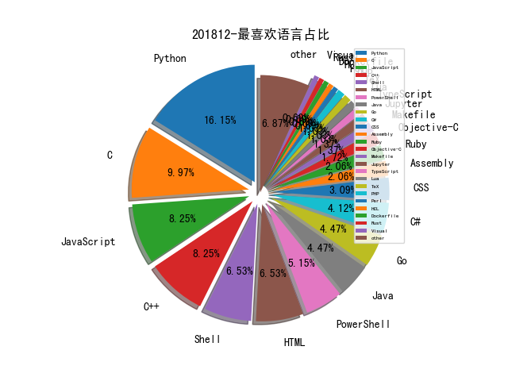

# 201812 信息源与信息类型占比

# 微信公众号 推荐
| nickname_english | weixin_no | title | url| 
| --- | --- | --- | ---| 
| 图灵人工智能 | TuringAI01 |  | https://mp.weixin.qq.com/s/cz-zjZw3rmFQ1o0w2ciHBQ | 1| 
| 安全牛 | aqniu-wx |  | https://mp.weixin.qq.com/s/YvlUX8Zjp9gfAtJ6YY27BA | 1| 
| 我的安全视界观 | CANI_Security |  | https://mp.weixin.qq.com/s/tPzrWzZjRcfNZaHIa7JTWA | 2| 
| 特大号 | ITXXXL |  | https://mp.weixin.qq.com/s/Sz8HguJ0X13nw4ajAhxOhg | 1| 
| 网易安全应急响应中心 | NetEaseSRC |  | https://mp.weixin.qq.com/s/NRx-rDBEFEbZYrfnRw2iDw | 1| 
| 网络安全舆情研究 |  |  | https://mp.weixin.qq.com/s/iOq84kVblAW5a2mK2GDJwA | 1| 
| 觅渡揽月 |  |  | https://mp.weixin.qq.com/s/GWOjp1E2B4J0efUjFBnp8Q | 1| 
| 360CERT | CERT-360 |  | https://mp.weixin.qq.com/s/VdIVoHfC7roUGBTCGo-dHg | 1| 
| Docker | dockerone |  | https://mp.weixin.qq.com/s/1mjp_a3FHhyVXFX9sezbvw | 1| 
| SecPulse安全脉搏 | SecPulse |  | https://mp.weixin.qq.com/s/pvApvjn6gwTiQFyRjaKCaA | 1| 
| 奇安信安全监测与响应中心 | cert360 |  | https://mp.weixin.qq.com/s/Ni3dscLJBrVsW5jR5OySdA | 1| 
| 慢雾科技 | SlowMist |  | https://mp.weixin.qq.com/s/P3RRdkT0X6bR--JWb0yWzA | 1| 
| 掮客酒馆 | SecurityPub |  | https://mp.weixin.qq.com/s/IJoJCERxSEj7ImXt97F_uA | 1| 
| 柯力士信息安全 | JW-assoc | 以色列神秘8200“军工厂”和它孵化的37家安全公司（上篇） | https://mp.weixin.qq.com/s/F6kmHw1x9GELXN7bgTOIHw | 1| 
| 深信服千里目安全实验室 | Further_eye |  | https://mp.weixin.qq.com/s/s0Rvlzrwx6uW_Po5AcusnQ | 1| 
| 湛卢工作室 | xuehao_studio |  | https://mp.weixin.qq.com/s/LxIgWu8pmNArFU1gOUMWJw | 1| 
| 漏洞战争 | vulwar |  | https://mp.weixin.qq.com/s/qFh47YY-JJIMUrJXUKfNAQ | 1| 
| 点融安全应急响应中心 | dsrc_dianrong |  | https://mp.weixin.qq.com/s/4saEV6fWimqfII2_7PUQ8Q | 1| 
| 网藤风险感知 |  |  | https://mp.weixin.qq.com/s/3luD0uRGYINm3f56df9UYQ | 1| 
| 31QU | blockchain31 |  | https://mp.weixin.qq.com/s/I2gatFhkEs1GpGPHC97PnQ | 1| 
| InfoQ | infoqchina |  | https://mp.weixin.qq.com/s/bKDtv892f4TJVV-JjW0vfQ | 1| 
| Piz0n |  |  | https://mp.weixin.qq.com/s/JG0fMLf4WcvSH5K0DHMBtw | 1| 
| VIPKID安全应急响应中心 | vk_src |  | https://mp.weixin.qq.com/s/4W42FLdfiO4cu7gykthe9A | 1| 
| 中国信息安全 | chinainfosec |  | https://mp.weixin.qq.com/s/AleZLuX6ZGEsMWJAHfQq5g | 1| 
| 二当家的12138 |  |  | https://mp.weixin.qq.com/s/SaIiTpdPMP_11sMSPzIQ_A | 2| 
| 云众可信 | yunzhongkexin |  | https://mp.weixin.qq.com/s/FHpVT4fjxyuOueUnBndmEQ | 1| 
| 云加社区 | QcloudCommunity |  | https://mp.weixin.qq.com/s/pNHthmCvRPFCNpOrMyyTPg | 1| 
| 信息时代的犯罪侦查 | infocrime |  | https://mp.weixin.qq.com/s/SKsPxTbzFGNhCChg7o3tTA | 1| 
| 四维创智 | Cerberus-4X |  | https://mp.weixin.qq.com/s/10NEuo0z4SZ--qRZmgy5MQ | 1| 
| 宅客频道 | letshome |  | https://mp.weixin.qq.com/s/AsA8CRUAimz86V2yEyQQ1Q | 1| 
| 守护者计划 | shzjh0401 |  | https://mp.weixin.qq.com/s/z9y1_Y9l0fpWy9v_Qpi4Fg | 1| 
| 安全学术圈 | secquan |  | https://mp.weixin.qq.com/s/6ES6VQhLFWV7czJglZc4hQ | 2| 
| 安全客 | anquanbobao |  | https://mp.weixin.qq.com/s/LAeAsiGEvw7JeCe4fomXyg | 1| 
| 网信防务 | CyberDefense |  | https://mp.weixin.qq.com/s/yDIAynaCx_mpYuQ16mWZ5A | 5| 
| 腾讯御见威胁情报中心 |  |  | https://mp.weixin.qq.com/s/ctBgivcvH216dwq00WRmOA | 2| 
| 量子位 | QbitAI |  | https://mp.weixin.qq.com/s/YLGjsd6eqYODjFa6XUce3w | 2| 
| 青藤实验室 | qt_lab |  | https://mp.weixin.qq.com/s/FhcoPGXG_udkRCj3AFOmxA | 1| 
| OPPO安全应急响应中心 | opposrc |  | https://mp.weixin.qq.com/s/dgnoD2LG0kxKW-HkBYVuoQ | 1| 
| Viola后花园 | Viola_deepblue |  | https://mp.weixin.qq.com/s/C9mVLHjFmYs-kziC0rwYow | 1| 
| 向日葵生活分享 | SunF-security-share |  | https://mp.weixin.qq.com/s/g5wdMxKqnXpjjLF1kXK4NA | 1| 
| 唯品会安全应急响应中心 | VIP_SRC |  | https://mp.weixin.qq.com/s/Sai3h-wNGXc92Va941yG6A | 1| 
| 奇安信威胁情报中心 |  |  | https://mp.weixin.qq.com/s/aSKWbnin9tl8SU5lRb3OzQ | 3| 
| 安在 | AnZer_SH |  | https://mp.weixin.qq.com/s/CGw8GZ2FVbVtgOJyyDZYSw | 1| 
| 平安集团安全应急响应中心 | PSRC_Team |  | https://mp.weixin.qq.com/s/RD90-78I7wRogdYdsB-UOg | 1| 
| 浅黑科技 | qianheikeji |  | https://mp.weixin.qq.com/s/AZ7jgvTFkoMhZA4DP9nQsw | 1| 
| 透雾 | wxWinder |  | https://mp.weixin.qq.com/s/CdwF5eRddzMwA8WpteH6AA | 2| 
| 郑海山dump | zhsdump |  | https://mp.weixin.qq.com/s/oY8QMnfBO81xRuBxqOG_lg | 1| 
| 金融电子化 | fcmag1993 |  | https://mp.weixin.qq.com/s/RXXJrJipdhKlTb7JMTy1iQ | 1| 
| DVPNET | DVPNET |  | https://mp.weixin.qq.com/s/oACHhus9nvAiw13Yxy7zgA | 1| 
| 丁爸 情报分析师的工具箱 | dingba2016 |  | https://mp.weixin.qq.com/s/-d_Tj7nf8CHNmFRIAun0vQ | 1| 
| 呼伦贝尔24小时警局 | hlbrga |  | https://mp.weixin.qq.com/s/q8uaik170cDjLFzj2wbKrg | 1| 
| 工业互联网安全应急响应中心 | ICSCERT |  | https://mp.weixin.qq.com/s/j4zniIYOwbSfKqSoRdL6-Q | 1| 
| 白帽100安全攻防实验室 | whitecap100_team |  | https://mp.weixin.qq.com/s/yv8Lsc1WqWqeH-GtWnXA5Q | 1| 
| 知远战略与防务研究所 | knowfar2014 |  | https://mp.weixin.qq.com/s/C-coVLE3BmwkRgyd4xIJug | 1| 
| 绿盟科技研究通讯 | nsfocus_research |  | https://mp.weixin.qq.com/s/JAmwJ7JFMev30uINIepWNQ | 1| 

# 组织github账号 推荐
| github_id | title | url | org_url | org_profile | org_geo | org_repositories | org_people | org_projects | repo_lang | repo_star | repo_forks| 
| --- | --- | --- | --- | --- | --- | --- | --- | --- | --- | --- | ---| 
| Microsoft | Ethr - 一款 TCP、UDP 和 HTTP 网络性能测量工具: | https://github.com/Microsoft/Ethr | https://opensource.microsoft.com | Open source, from Microsoft with love | Redmond, WA | 2463 | 4258 | 0 | C,TypeScript,CMake,C#,JavaScript,Objective-C,C++,Python,Batchfile,HTML,Rich,Jupyter,Java,PowerShell | 0 | 0 | 1| 
| cloudflare | WordPress 页面缓存插件: 1) https://blog.cloudflare.com/improving-html-time-to-first-byte/ 2) | https://github.com/cloudflare/worker-examples/tree/master/examples/edge-cache-html/WordPress%20Plugin | https://www.cloudflare.com |  | San Francisco, London, Austin, Singapore | 245 | 57 | 0 | C,Shell,Java,Python,JavaScript,Makefile,Lua,Go,PHP,Rust | 0 | 0 | 1| 
| gravitational | 检测环境是否容易受到 Kubernetes apiserver 漏洞(CVE-2018-1002105)攻击的工具 : | https://github.com/gravitational/cve-2018-1002105 | https://gravitational.com/ | Tooling for running cloud applications in on-prem environments where compliance matters | Oakland, CA | 92 | 2 | 0 | Shell,Python,JavaScript,TypeScript,HCL,Go,CSS | 0 | 0 | 1| 
| kubernetes | kubernetes 特权提升漏洞详情与缓解措施(CVE-2018-1002105): | https://github.com/kubernetes/kubernetes/issues/71411 | https://kubernetes.io | Kubernetes | https://kubernetes.io | 68 | 444 | 26 | Go,Python,Shell,HTML | 0 | 0 | 1| 
| MicrosoftEdge | Microsoft 及 Edge 团队发布准备使用 Chromium 开源内核的相关信息: | https://github.com/MicrosoftEdge/MSEdge | None | Microsoft Edge open source projects - demos, tools, data | None | 66 | 258 | 0 | C#,JavaScript,C++,Python,HTML,PowerShell,CSS | 0 | 0 | 1| 
| ANSSI-FR | ORADAD - 一款针对 Active Directory 的自动化数据恢复工具: | https://github.com/ANSSI-FR/ORADAD | https://www.ssi.gouv.fr |  | Paris, France | 43 | 0 | 0 | Coq,C,Java,Python,JavaScript,OCaml,C++,Go,Assembly,PowerShell,Rust | 0 | 0 | 2| 
| fox-it | aclpwn.py - 结合 BloodHound 进行活动目录 ACL 提权的工具: | https://github.com/fox-it/aclpwn.py | https://www.fox-it.com/ |  | https://www.fox-it.com/ | 31 | 1 | 0 | C,Shell,Python,Bro,HTML,Ruby,PowerShell | 0 | 0 | 1| 
| comaeio | LiveCloudKd - 专注于内存取证的 Hyper-V 虚拟机程序 : | https://github.com/comaeio/LiveCloudKd | http://www.comae.io |  | Dubai, UAE | 24 | 0 | 0 | C,Java,JavaScript,C++,Nginx,Smarty,PowerShell | 0 | 0 | 1| 
| genuinetools | binctr - 可以由非特权用户运行的静态容器: https://github.com/genuinetools/binctr | https://github.com/genuinetools/binctr | https://genuinetools.org | We are the home of quality software with a focus on simplicity, usability, security and minimalism. No bullshit, no politics, all genuine. | https://genuinetools.org | 24 | 0 | 0 | Go,JavaScript,Makefile,HTML | 0 | 0 | 1| 
| NVISO-BE | Open-source framework to detect outliers in Elasticsearch events | https://github.com/NVISO-BE/ee-outliers | https://www.nviso.be |  | Belgium | 21 | 0 | 0 | Python,C,Shell,JavaScript,CSS | 0 | 0 | 1| 
| pnfsoftware | JEB 的 Android JNI 辅助分析插件: | https://github.com/pnfsoftware/jnihelper | https://www.pnfsoftware.com | Sample scripts & plugins for JEB Decompiler - Twitter @jebdec | SF Bay Area | 19 | 3 | 0 | Python,Java | 0 | 0 | 1| 
| portcullislabs | linikatz - 在 UNIX 上攻击活动目录的工具: | https://github.com/portcullislabs/linikatz | http://cs.co/portcullislabs | Portcullis Labs is the R&D arm of @ciscos Security Advisory team in EMEAR. | UK, DE, GR, FR, ES, AE | 19 | 0 | 0 | C,XSLT,Python,JavaScript,Perl,HTML,ActionScript | 0 | 0 | 1| 
| googleprojectzero | Street-Party - 用于查看和修改视频会议 RTP 流的工具: | https://github.com/googleprojectzero/Street-Party | https://googleprojectzero.blogspot.com | Projects by Google Project Zero | https://googleprojectzero.blogspot.com | 14 | 0 | 0 | C,C#,C++,Python,HTML,Swift | 0 | 0 | 1| 
| nospaceships | raw-socket-sniffer - 不需要驱动程序的 Windows 上的抓包工具: | https://github.com/nospaceships/raw-socket-sniffer | https://nospaceships.com |  | https://nospaceships.com | 9 | 0 | 0 | C,JavaScript,C++ | 0 | 0 | 1| 
| corkami | 图像 MD5 碰撞研究: | https://github.com/corkami/pocs/blob/master/collisions/README.md | None | Reverse engineering & visual documentation | None | 8 | 2 | 0 | TeX,Python,HTML,Assembly | 0 | 0 | 1| 
| NASA-SW-VnV | IKOS - 一款基于 Abstract Interpretation 理论的 C/C++ 静态分析器 : | https://github.com/NASA-SW-VnV/ikos | https://ti.arc.nasa.gov/tech/rse/ | NASA - Software Verification and Validation | NASA Ames Research Center, CA | 2 | 3 | 0 | Ruby,C++ | 0 | 0 | 1| 
| phoenhex | Chakra 引擎中可以导致远程代码执行的 JIT 漏洞(CVE-2018-8629)PoC: | https://github.com/phoenhex/files/blob/master/pocs/cve-2018-8629-chakra.js | https://phoenhex.re/ | providing fine exploits & writeups to the world | your kernel | 1 | 0 | 0 | C | 0 | 0 | 1| 

# 私人github账号 推荐
| github_id | title | url | p_url | p_profile | p_loc | p_company | p_repositories | p_projects | p_stars | p_followers | p_following | repo_lang | repo_star | repo_forks | 
| --- | --- | --- | --- | --- | --- | --- | --- | --- | --- | --- | --- | --- | --- | ---| 
| trekhleb | homemade-machine-learning: 机器学习入门资料 | https://github.com/trekhleb/homemade-machine-learning | https://github.com/epam | Lead Software Engineer at @epam. Creating full-stack web-mobile projects. Interesting in machine learning. | Lviv, Ukraine | None | 9 | 0 | 59 | 3000 | 9 | Python,TypeScript,JavaScript,Jupyter,MATLAB | 0 | 0 | 1| 
| byt3bl33d3r | OffensiveDLR 用于武器化 .NET DLR 工具箱 : | https://github.com/byt3bl33d3r/OffensiveDLR | https://byt3bl33d3r.github.io | C Y B E R | Error: Unable to resolve | BlackHills InfoSec | 96 | 0 | 953 | 2700 | 117 | Python,PowerShell,HCL | 0 | 0 | 1| 
| zhengmin1989 | 对 iOS 上的 Apple 文件系统的攻击介绍,来自 Black hat EU 2018 : | https://github.com/zhengmin1989/MyArticles/blob/master/PPT/eu-18-Bai-The-Last-Line-Of-Defense-Understanding-And-Attacking-Apple-File-System-On-iOS.pdf | None | Android/iOS Senior Security Engineer @ Alibaba, CUHK PhD, a member of Blue-lotus and Insight-labs, worked in FireEye , Baidu and Tencent. | None | None | 22 | 0 | 39 | 2000 | 6 | Objective-C,HTML,Makefile | 0 | 0 | 1| 
| hfiref0x | WinObjEx64 - 一款 Windows 对象资源管理器工具 : | https://github.com/hfiref0x/WinObjEx64/blob/master/Docs/Callbacks.pdf | None |  | None | None | 23 | 0 | 24 | 1500 | 15 | C | 0 | 0 | 1| 
| FuzzySecurity | SwampThing - 修改 PEB 构建虚假命令行参数以绕过日志检测的工具: | https://github.com/FuzzySecurity/Sharp-Suite | http://www.fuzzysecurity.com/ |  | None | None | 13 | 0 | 0 | 952 | 0 | C,PowerShell | 0 | 0 | 1| 
| zhuowei | 影响 Chromium 的 SQLite 漏洞 : 1) https://blade.tencent.com/magellan/index_en.html2) https://worthdoingbadly.com/sqlitebug/3) PoC : | https://github.com/zhuowei/worthdoingbadly.com/blob/master/_posts/2018-12-14-sqlitebug.html | https://zhuoweizhang.net | Software developer: Android, iOS, Web, Voice | None | None | 285 | 0 | 741 | 849 | 21 | C,Shell,Java,Python,C++,HTML | 478 | 156 | 1| 
| Mr-Un1k0d3r | ThunderShell - Python / PowerShell 实现的 HTTP 通信的远程控制软件: | https://github.com/Mr-Un1k0d3r/ThunderShell | https://github.com/MrUn1k0d3r | Mostly Red Team tools for penetration testing. I think that Ron Jemery is a good ambassador for anything regarding penetration. Twitter - @MrUn1k0d3r | None | RingZer0 Team | 18 | 0 | 8 | 777 | 0 | Python,Visual,PowerShell | 0 | 0 | 1| 
| SandboxEscaper | 一个可以部分控制写入内容的 Windows 特权文件写漏洞: | https://github.com/SandboxEscaper/randomrepo/blob/master/angrypolarbearbug.rar | None |  | None | None | 1 | 0 | 0 | 688 | 0 | C++ | 155 | 87 | 1| 
| objective-see | 用于检测和监控 macOS 上的键盘记录器的项目 - ReiKey 发布: | https://github.com/objective-see/ReiKey | https://www.objective-see.com |  | United States | Objective-See | 11 | 0 | 0 | 644 | 0 | Objective-C | 2900 | 142 | 1| 
| joxeankoret | IDAMagicStrings - 一款可以通过字符串中的信息来推测函数名的 IDA 插件: | https://github.com/joxeankoret/idamagicstrings | http://www.joxeankoret.com |  | Basque Country | None | 30 | 0 | 87 | 458 | 2 | Python | 1300 | 207 | 1| 
| zodiacon | 一些实用的系统小工具集合 : | https://github.com/zodiacon/AllTools/tree/master | http://scorpiosoftware.net |  | None | None | 50 | 0 | 99 | 448 | 8 | C#,C | 0 | 0 | 1| 
| mthbernardes | 通过 Google Translator 做为代理发送远程控制命令: | https://github.com/mthbernardes/GTRS | https://mthbernardes.github.io |  | Campinas | None | 75 | 0 | 22 | 415 | 45 | Go,Python,C,Shell | 497 | 101 | 2| 
| re4lity | Hacking-With-Golang: Golang安全资源合集 | https://github.com/re4lity/Hacking-With-Golang | https://github.com/PolarisLab | @PolarisLab & MottoIN | ShangHai | PolarisLab | 710 | 0 | 2700 | 312 | 101 | C#,PowerShell,C++ | 0 | 0 | 1| 
| lefex | iWeChat: 勾勒出微信的设计，使用到的技术手段 | https://github.com/lefex/iWeChat | https://github.com/lefex/LefexWork | 移动端开发工程师，不断探索提高开发效率的捷径。喜欢我的，关注我的微博 Lefe_x | BeiJing | 百度 | 72 | 0 | 228 | 299 | 70 | Objective-C,HTML,CSS,C++ | 0 | 0 | 1| 
| WyAtu | Microsoft Exchange Server 特权提升漏洞(CVE-2018-8581)利用 : | https://github.com/WyAtu/CVE-2018-8581/ | None | Security Researcher | None | None | 12 | 0 | 14 | 251 | 8 | Python,C | 343 | 155 | 1| 
| phantom0301 | VulCloud: 便捷的漏洞镜像管理部署Web应用 | https://github.com/phantom0301/VulCloud | http://phantom0301.github.io/ | Free and Share | Chengdu | None | 80 | 0 | 30 | 242 | 8 | Python,JavaScript,PowerShell | 0 | 0 | 1| 
| iGio90 | Dwarf - 一款用于对 Android 进行逆向分析和破解的调试器 : | https://github.com/iGio90/Dwarf | https://github.com/overwolfmobile | Developer @ StatsRoyale and Overwolf mobile team. Reverse engineering my life into something human readable. | Unknown | @overwolfmobile | 137 | 0 | 99 | 238 | 44 | Python,JavaScript,Java | 0 | 0 | 1| 
| incredibleindishell | 在 Windows 环境中使用 Responder 窃取 NTLMv2 哈希并利用: | https://github.com/incredibleindishell/Windows-AD-environment-related/tree/master/Responder | https://twitter.com/IndiShell1046 | Security enthusiast Love to learn Linux, PHP and exploit development | IndiShell Lab | None | 115 | 0 | 7 | 168 | 10 | PHP,Java | 0 | 0 | 1| 
| djhohnstein | .NET Profiler DLL 劫持: | https://github.com/djhohnstein/.NET-Profiler-DLL-Hijack | https://popeax.io | Operator at SpecterOps. Kali Contributor. | Seattle, WA | None | 63 | 0 | 7 | 160 | 3 | C#,Go,C,Python,C++ | 0 | 0 | 1| 
| DavexPro | PocHunter: 调用PoC框架(Beebeeto/PocSuite/TangScan/KsPoc)下的PoC. | https://github.com/DavexPro/PocHunter | https://www.davex.pw/ |  | None | None | 27 | 0 | 132 | 155 | 8 | Python,Jupyter | 0 | 0 | 1| 
| WalkingCat | SymDiff - 用于比较 PDB 文件中的符号不同的工具: | https://github.com/WalkingCat/SymDiff | None |  | None | None | 10 | 0 | 43 | 146 | 33 | C#,C++ | 56 | 8 | 1| 
| adi0x90 | Resources to help get started with IoT Pentesting | https://github.com/adi0x90/IoT-Pentesting-Methodology | https://github.com/attify |  | San Francisco | @attify - IoT and Mobile Security | 18 | 0 | 10 | 142 | 1 | Python,Shell | 413 | 81 | 1| 
| dreadl0ck | dreadl0ck/netcap: A framework for secure and scalable network traffic analysis | https://github.com/dreadl0ck/netcap | https://github.com/desertbit | Tortures computers for fun and profit. Interested in network security monitoring, machine learning, Go and Rust. Shellscript ninja. $> Will debug for food | Amsterdam | @desertbit @bestbytes @foomo | 26 | 0 | 487 | 133 | 17 | Go,Python | 0 | 0 | 1| 
| al0ne | LinuxCheck: linux信息搜集脚本 | https://github.com/al0ne/LinuxCheck?from=timeline | None | 入侵检测/流量分析/应急溯源 | china | None | 6 | 0 | 511 | 132 | 173 | Shell,Vim | 146 | 27 | 1| 
| LinusHenze | 一个仍存在于最新版 Safari 中的 0day 漏洞及利用(已经在 WebKit 中修复): | https://github.com/LinusHenze/WebKit-RegEx-Exploit | None |  | Germany | None | 4 | 0 | 0 | 127 | 0 | C,JavaScript,Objective-C | 313 | 85 | 1| 
| a13xp0p0v | Linux Kernel 防御地图: | https://github.com/a13xp0p0v/linux-kernel-defence-map | https://twitter.com/a13xp0p0v | Linux Kernel Developer & Security Researcher | None | None | 5 | 0 | 0 | 119 | 3 | Python,Go,C,HTML | 436 | 44 | 1| 
| admintony | SvnExploit支持SVN源代码泄露全版本Dump源码 | https://github.com/admintony/svnExploit | None |  | None | None | 34 | 0 | 22 | 118 | 0 | Python,C++ | 259 | 81 | 1| 
| blacknbunny | mcreator - 一款可以绕过杀毒软件的回连 Shell 生成器: | https://github.com/blacknbunny/mcreator | https://blacknbunny.github.io/ | 筑路工人 17 y/o Youtube : http://tiny.cc/2y944y https://twitter.com/0DAYanc | None | None | 20 | 0 | 15 | 103 | 3 | Python,HTML | 0 | 0 | 1| 
| smgorelik | 一些 Windows 漏洞的POC: | https://github.com/smgorelik/Windows-RCE-exploits | None |  | None | None | 9 | 0 | 3 | 103 | 3 | C#,Visual,C++ | 465 | 127 | 2| 
| payatu | Foxit Reader CPDF_Parser::m_pCryptoHandler UAF 漏洞(CVE-2018-14442)PoC: | https://github.com/payatu/CVE-2018-14442 | None |  | None | None | 9 | 0 | 0 | 101 | 0 | Python,C,HTML,Java | 401 | 128 | 1| 
| Nhoya | gOSINT: OSINT Swiss Army Knife | https://github.com/Nhoya/gOSINT/ | https://bsod.dev | Security Researcher and Developer | Rome, Italy | None | 25 | 0 | 26 | 99 | 6 | Go,Python,Shell,CSS | 0 | 0 | 1| 
| enkomio | IsDebuggerPresentEx - 一款检测进程是否正在被调试器调试的工具 : | https://github.com/enkomio/Misc/tree/master/CheckDebuggerCrossArchitecture | None | Code Monk - twitter.com/s4tan | Italy | Enkomio Ltd | 16 | 0 | 63 | 98 | 5 | C#,F# | 0 | 0 | 2| 
| Arvanaghi | CheckPlease - 通过 PowerShell、Python、Go、Ruby、C 和 Rust 等语言编写的对抗沙盒分析的模块 : | https://github.com/Arvanaghi/CheckPlease | http://twitter.com/arvanaghi | Blockchain security. | New York City | None | 12 | 0 | 35 | 96 | 9 | Go,Python,C,PowerShell | 0 | 0 | 1| 
| Gbps | Gbhv - 一款简单的 x86-64 VT-x Hypervisor ,帮助学习使用和开发 VT-X 硬件虚拟化技术: | https://github.com/Gbps/gbhv | http://www.ctf.re/ | I do security things. | Carnegie Mellon University | None | 20 | 0 | 37 | 80 | 15 | Python,C,CSS,C++ | 0 | 0 | 1| 
| m8r0wn | ldap_search - 用于枚举 Windows 域信息的工具: | https://github.com/m8r0wn/ldap_search | https://blog.m8r0wn.com | Pentester | Open-source developer | Bug bounty hunter | 127.0.0.1 | None | 11 | 0 | 35 | 67 | 11 | Python,HTML | 0 | 0 | 1| 
| realoriginal | reflective-rewrite - Reflective DLL Injection 项目的二次开发,相比原项目更加隐蔽: | https://github.com/realoriginal/reflective-rewrite | http://twitter.com/ilove2pwn_ | Whelp, not sure what to put here, but, hello. i <3 windows. | None | None | 7 | 0 | 95 | 65 | 9 | C,PowerShell | 86 | 23 | 1| 
| guyoung | 跨平台网络安全工具套件CaptfEncoder V1.2.0 | https://github.com/guyoung/CaptfEncoder | http://www.guyoung.net |  | None | None | 9 | 0 | 77 | 64 | 0 | C#,JavaScript,CSS | 492 | 293 | 1| 
| ercoppa | symbolic-execution-tutorial - 基于 angr 框架的符号执行教程: | https://github.com/ercoppa/symbolic-execution-tutorial/blob/master/symbolic-execution.pdf | https://github.com/season-lab | PostDoc | Rome | Sapienza University of Rome, @season-lab | 17 | 0 | 16 | 58 | 1 | Python,Shell,C,HTML | 401 | 189 | 1| 
| starjun | openstar: 基于OpenResty的WAF功能 | https://github.com/starjun/openstar | None |  | None | None | 63 | 0 | 66 | 56 | 6 | Lua,C | 694 | 294 | 1| 
| theLSA | tp5-getshell.py：thinkphp5 rce漏洞检测工具 | https://github.com/theLSA/tp5-getshell | http://www.lsablog.com | I like network security,penestration and programming(python,c/c++,php,java,ect),welcome to communicate with me! | China | None | 24 | 0 | 12 | 53 | 5 | Python | 63 | 33 | 1| 
| kozmic | laravel-poc-CVE-2018-15133 - Laravel APP_KEY 泄露导致的远程代码执行 POC: | https://github.com/kozmic/laravel-poc-CVE-2018-15133 | https://twitter.com/kozmic/ | Software developer and security enthusiast. I enjoy football, beer and snowboarding. | Oslo, Norway | None | 49 | 0 | 1400 | 49 | 41 | JavaScript,Dockerfile | 136 | 11 | 1| 
| shirkdog | Xorg 提权漏洞(CVE-2018-14655)分析与利用: | https://github.com/shirkdog/CharmBUG/blob/master/Presentations/XorgandFunWithLocalRootPrivileges-112818.pdf | https://www.daemon-security.com | I work with open source security tools, network and host based intrusion detection and prevention systems, and network security monitoring (SIEM). | US | Daemon Security | 25 | 0 | 16 | 49 | 0 | Shell,Perl | 259 | 96 | 1| 
| r3dxpl0it | Apache-Superset-Remote-Code-Execution-PoC-CVE-2018-8021 - Apache Superset pickle 库代码执行漏洞 POC: | https://github.com/r3dxpl0it/Apache-Superset-Remote-Code-Execution-PoC-CVE-2018-8021 | https://github.com/freelancer | New Git After Years In Bucket My public codes are about ❌ Exploits + PoC 🔒 Cyber Security 💻 ML and Deep-Learning, Computation and Python | Italy | @0day.today @freelancer | 24 | 0 | 11 | 48 | 30 | Python | 0 | 0 | 1| 
| atmoner | atmoner/nodeCrypto: Ransomware written in NodeJs | https://github.com/atmoner/nodeCrypto | https://twitter.com/atmon3r |  | France | None | 50 | 0 | 58 | 47 | 23 | Python,PHP,HTML,C++ | 0 | 0 | 1| 
| crazywa1ker | 从0开始你的域渗透之旅 | https://github.com/crazywa1ker/DarthSidious-Chinese | None |  | None | None | 5 | 0 | 138 | 47 | 7 | C,JavaScript,Ruby | 267 | 47 | 1| 
| Markus-Go | bonesi - 在实验环境下模拟 DDoS 攻击流量的工具: | https://github.com/Markus-Go/bonesi | http://www.goldiges.de/ |  | None | None | 7 | 0 | 0 | 44 | 0 | C,Java,C++ | 339 | 112 | 1| 
| JGillam | JGillam/burp-paramalyzer: Paramalyzer | https://github.com/JGillam/burp-paramalyzer | None |  | None | None | 18 | 0 | 20 | 43 | 4 | Shell | 0 | 0 | 1| 
| xwings | The #HITB2018DXB CTF hardware hacking challenge simple write-up | https://github.com/xwings/ctf.hitb2018dxb  | http://theshepherdlab.io | theshepherdlab.io, Fouder. A Research Lab Fully 0wn3d by JD.COM | None | None | 8 | 0 | 10 | 43 | 2 | Python,C,Makefile | 14 | 12 | 1| 
| fboldewin | Operation Fast Cash - Hidden Cobra 使用的 AIX PowerPC 恶意软件解析: | https://github.com/fboldewin/FastCashMalwareDissected/blob/master/Operation%20Fast%20Cash%20-%20Hidden%20Cobra%E2%80%98s%20AIX%20PowerPC%20malware%20dissected.pdf | None |  | None | None | 3 | 0 | 0 | 39 | 0 | YARA | 67 | 17 | 1| 
| lucasg | idamagnum - 用于在 IDA 中集成 MagnumDB 请求的插件: | https://github.com/lucasg/idamagnum | None |  | None | None | 22 | 0 | 33 | 39 | 3 | C#,Python,C,TeX,CSS | 0 | 0 | 1| 
| fei-ke | WeiboImageReverse: Chrome 插件，反查微博图片po主 | https://github.com/fei-ke/WeiboImageReverse | None |  | None | None | 48 | 0 | 435 | 38 | 9 | JavaScript,Java | 0 | 0 | 1| 
| 86hh | DreamLoader - ASM 实现的 PE Loader: | https://github.com/86hh/DreamLoader | None |  | None | None | 6 | 0 | 0 | 36 | 1 | HTML,Assembly | 74 | 21 | 1| 
| highmeh | retrieve-osxhash.py - 脚本可以提取OSX Hash并且通过hashcat破解 : | https://github.com/highmeh/pentest_scripts/blob/master/retrieve-osxhash.py | None |  | Southern California | None | 8 | 0 | 3 | 30 | 2 | Python,Shell,HTML | 115 | 19 | 1| 
| sud0woodo | DCOMrade - 用于枚举 DCOM 应用程序的 Powershell 脚本 : | https://github.com/sud0woodo/DCOMrade | None | Binary enthusiast | None | None | 8 | 0 | 1 | 29 | 2 | Python,Go,PowerShell | 181 | 39 | 1| 
| b4rtik | metasploit-execute-assembly - 通过 Meterpreter 会话执行 .NET 程序集的后渗透攻击模块: | https://github.com/b4rtik/metasploit-execute-assembly | None |  | None | None | 8 | 0 | 5 | 28 | 0 | C#,Batchfile,Ruby,PowerShell,C++ | 88 | 18 | 1| 
| bin2415 | 用于检测类型混淆类漏洞的技术: | https://github.com/bin2415/Bitype/blob/master/paper/Bitype.pdf | http://blog.binpang.me |  | None | NJU | 37 | 0 | 213 | 28 | 10 | Python,Assembly,Java,C++ | 72 | 26 | 1| 
| dongfangyuxiao | github_dis: 一款精简版github信息泄露搜集工具 | https://github.com/dongfangyuxiao/github_dis/ | None | 吾爱饭 | 上海 | None | 49 | 0 | 15 | 28 | 10 | Python,Shell,JavaScript | 0 | 0 | 1| 
| sfakiana | References for CTI-EU 2018 | https://github.com/sfakiana/CTI-EU-2018 | https://threatintel.eu | CTI and DFIR Professional | None | None | 4 | 0 | 620 | 27 | 80 |  | 14 | 4 | 1| 
| aedoo | Allscanner: 数据库和服务弱口令检测以及未授权访问检测 | https://github.com/aedoo/Allscanner | None | you are my sunshine | None | None | 11 | 0 | 26 | 26 | 11 | Python | 80 | 34 | 1| 
| mez0cc | Windows SMB Server 漏洞(MS17-010)支持回连 Shell 的利用 : | https://github.com/mez0cc/MS17-010_WORAWIT | https://github.com/mez0cc | @mez0cc | None | None | 5 | 0 | 162 | 26 | 12 | Python | 0 | 0 | 1| 
| russelltomkins | 活动目录账户权限安全审计脚本分享: | https://github.com/russelltomkins/Active-Directory/blob/master/Query-UserAccountControl.ps1 | None |  | Australia | Microsoft | 8 | 0 | 2 | 24 | 1 | PowerShell | 80 | 20 | 1| 
| fbkcs | ThunderDNS - 一款通过 DNS 协议转发 TCP 流量的工具 : | https://github.com/fbkcs/ThunderDNS | https://fbkcs.ru/ | InfoSec company | Moscow | None | 3 | 0 | 0 | 23 | 0 | Python,Shell,Ruby | 318 | 37 | 1| 
| thom-s | docx-embeddedhtml-injection - Microsoft Word 2016 通过内嵌视频下载执行恶意软件的利用脚本: | https://github.com/thom-s/docx-embeddedhtml-injection | None | Utilities, automation and cybersecurity in PowerShell and Python 🐍 | None | None | 4 | 0 | 117 | 23 | 26 | JavaScript,PowerShell | 91 | 13 | 2| 
| JeffXue | web-log-parser: web日志分析工具 | https://github.com/JeffXue/web-log-parser | http://www.jeffxue.cn | Full Stack | ShenZhen | 77ircloud | 25 | 0 | 108 | 19 | 11 | Python,Shell,AGS,Vim | 160 | 48 | 1| 
| pgorczak | 通过 Docker 和共享内存运行 end-to-end srsLTE 系统的最小实例: | https://github.com/pgorczak/srslte-docker-emulated | None |  | Dortmund, Germany | TU Dortmund University | 33 | 0 | 137 | 18 | 24 | Python,Clojure,Dockerfile | 0 | 0 | 1| 
| Lopseg | Jsdir - 一个从 js 文件中提取隐藏 URL 并保存,为进一步分析提供支持的 Burp Suite 扩展: | https://github.com/Lopseg/Jspathextractor | https://lops3g.wordpress.com | Ethical Hacker, Security Consultant, Student of Computer engineering, Developer & Coffee lover. | Brazil | None | 29 | 0 | 33 | 15 | 1 | Python,Ruby | 0 | 0 | 1| 
| bcdannyboy | 缓冲区溢出如何通过 JIT Spray ROP 来进行利用详细介绍: | https://github.com/bcdannyboy/Research/blob/master/JIT-SprayedROP.pdf | None | Red Teamer, DFIR, Researcher, looking to learn and looking to earn. Opinions are my own. | None | None | 4 | 0 | 1 | 11 | 1 | Python,C | 28 | 5 | 1| 
| tthtlc | Awesome Source Code Analysis Via Machine Learning Techniques | https://github.com/tthtlc/awesome-source-analysis | None |  | None | None | 95 | 0 | 166 | 10 | 43 | Python,C,Shell,Assembly,C++ | 26 | 3 | 1| 
| cksgf | ServerManagement: 服务器管理工具 | https://github.com/cksgf/ServerManagement | None | 找工作中.... | None | None | 8 | 0 | 6 | 3 | 0 | Python,JavaScript | 139 | 54 | 1| 
| AngoraFuzzer | Angora - 基于突变的 Fuzz 工具,主要目标是在无符号执行的情况下通过解决路径约束增加分支覆盖率: | https://github.com/AngoraFuzzer/Angora | None | None | None | None | 0 | 0 | 0 | 0 | 0 | Shell,JavaScript,C++ | 0 | 0 | 1| 
| pentesteracademy | patoolkit: a collection of traffic analysis plugins focused on security | https://github.com/pentesteracademy/patoolkit | None | None | None | None | 0 | 0 | 0 | 0 | 0 | Lua,C,JavaScript,C++ | 0 | 0 | 1| 
| ucbrise | confluo: Real-time Monitoring and Analysis of Data Streams | https://github.com/ucbrise/confluo | None | None | None | None | 0 | 0 | 0 | 0 | 0 | Jupyter,Assembly,Python,JavaScript,Scala,C++,TeX,HTML,Go,Java,CSS | 0 | 0 | 1| 

# medium_xuanwu 推荐
| title | url| 
| --- | ---| 

# medium_secwiki 推荐
| title | url| 
| --- | ---| 

# zhihu_xuanwu 推荐
| title | url| 
| --- | ---| 

# zhihu_secwiki 推荐
| title | url| 
| --- | ---| 

# 日更新程序
`python update_daily.py`