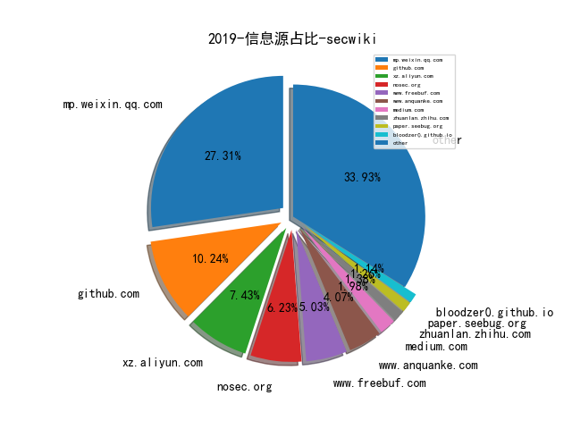
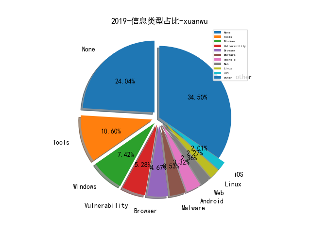

# [数据--所有](README_20.md)
# [数据--年度](README_2019.md)
# 2019 信息源与信息类型占比

# 微信公众号 推荐
| nickname_english | weixin_no | title | url| 
| --- | --- | --- | ---| 
| Bypass | Bypass-- | 一份超级实用的勒索病毒自救指南 | https://mp.weixin.qq.com/s/McMyk8ZJkEZJu10c8U5k7w | 5| 
| PolarisLab | PolarisLab | 网络犯罪反制：714高炮与金融行业 | https://mp.weixin.qq.com/s/yPTeg1Ue8AWq7dIZSqPrKw | 7| 
| heysec | bloodzer007 | 日志分析系列(外传二):Nginx日志统一化 | https://mp.weixin.qq.com/s/SsDo92xxGxy1ajwEPtc_rg | 7| 
| 君哥的体历 | jungedetili | 2020安全工作展望 | https://mp.weixin.qq.com/s/mihqZ0BJAgee1bEm1ZJAQw | 4| 
| 安全学术圈 | secquan | 安全学术圈2019年度总结 | https://mp.weixin.qq.com/s/VrrQCLOfthxNTFhEqdT3xA | 23| 
| 安全祖师爷 |  | PowerShell渗透–Empire | https://mp.weixin.qq.com/s/giBR-rnpm51cDE4aude2tg | 1| 
| 数世咨询 |  | 数世咨询：2019年网络安全大事记 | https://mp.weixin.qq.com/s/APOEaYrubmWupFRPbbjfkw | 1| 
| 白帽子的成长之路 | whitehat_day | 渗透测试Window平台中 Certutil的使用 | https://mp.weixin.qq.com/s/4jZBIRqbQ7UR7BXz2zdZtA | 1| 
| 绿盟科技研究通讯 | nsfocus_research | ATT&CK攻击艺术的科学化 | https://mp.weixin.qq.com/s/UITOiXwpETDZn2UvG9ChvA | 17| 
| 软件安全智能并行分析实验室 |  | 学术报告,S&P2020-Savior：漏洞导向的混合模糊测试技术 | https://mp.weixin.qq.com/s/hW8ned6DIRJ7mx1657dVew | 1| 
| 时间之外沉浮事 | tasnrh | 靶场发展态势⑧美国家网络空间靶场综合设施（NCRC） | https://mp.weixin.qq.com/s/ZyrgqwLUD13sZVnHQ18Pqw | 11| 
| 飞虎行业观察 | flyingtiger018 | RSA和McAfee的2020年安全威胁预测 | https://mp.weixin.qq.com/s/gUOO1kDB_wuZ32nKAZjM0g | 1| 
| 维他命安全 | VitaminSecurity | 维他命2019大盘点之安全政策法规篇 | https://mp.weixin.qq.com/s/gxBbLDYC9An2-N-hbULSwQ | 2| 
| DJ的札记 | DJ_notes | 下一座圣杯 - 2019 | https://mp.weixin.qq.com/s/6Kli-u6LEInoliTVQgdrFQ | 4| 
| FreeBuf | freebuf | 安全实验室的发展及展望 | https://mp.weixin.qq.com/s/SXM4XsEqyRMoaYtY1lzq2g | 5| 
| OWASP | OWASP_CHINA | 2019年度OWASP中国项目总结 | https://mp.weixin.qq.com/s/hcdA7R36RsSV40TnIu2fJg | 1| 
| 天地和兴 | bjtdhxkj | 针对ICS的网络攻击20强——谈天说地Part2 | https://mp.weixin.qq.com/s/TS1m4XoTI3f36ZY8vtLkwg | 2| 
| 天融信阿尔法实验室 |  | ATT&CK之防御逃逸（二） | https://mp.weixin.qq.com/s/9IeSIFofiT58X8iu1BqW0Q | 6| 
| 继之宫 |  | 关于安全运营中心的几个问题 | https://mp.weixin.qq.com/s/w_kfBpkXU7WdfkwSl-KSnA | 2| 
| 编程技术宇宙 | ProgramUniverse | 一个HTTP数据包的奇幻之旅 | https://mp.weixin.qq.com/s/suzicCzb2g5b8NN71S5Ngw | 2| 
| 轩辕实验室 |  | 基于卷积神经网络的入侵检测进行检测Dos攻击 | https://mp.weixin.qq.com/s/yRQwHVPuYHM67yAo15hPOw | 1| 
| 阿里安全响应中心 | alisrc | 【走心分享】白帽成长建议 | https://mp.weixin.qq.com/s/ZXRI6KUtu6IwCYrjuy_3Tg | 5| 
| 雷神众测 | thorsrc | 论⾼级攻防团队建设⽅法论之思想的重要性（上） | https://mp.weixin.qq.com/s/nFvGQqeFvSYaEFksbi8FLw | 2| 
| Hacking就是好玩 |  | 对乌云漏洞库payload的整理以及Burp辅助插件 | https://mp.weixin.qq.com/s/9RHVsw-HtAfo1UuPAqXZEw | 1| 
| TideSec安全团队 | TideSec | 远控免杀专题文章(2)-msfvenom隐藏的参数 | https://mp.weixin.qq.com/s/1r0iakLpnLrjCrOp2gT10w | 55| 
| qz安全情报分析 | lookvul | 浅谈无文件攻击 | https://mp.weixin.qq.com/s/9mWqwPF6KAwbMlZSE4rRBw | 2| 
| 七夜安全博客 | qiye_safe | 反弹shell-逃逸基于execve的命令监控(上) | https://mp.weixin.qq.com/s/fx3ywEZiXEUStbrtzbpwrQ | 3| 
| 信息安全与通信保密杂志社 | cismag2013 | 开源软件的网络安全问题 | https://mp.weixin.qq.com/s/TCb4kLH6N3JlCnyo6x2L1Q | 2| 
| 嘶吼专业版 | Pro4hou | 直击北向峰会现场,“避危乘势，经略变局” | https://mp.weixin.qq.com/s/lRAyLyBJtquMrMTmTHnYUQ | 7| 
| 国际安全智库 | guoji-anquanzhiku | “震网”十年谜底终浮水面, 伊朗核计划流产源于内鬼“间谍行动” | https://mp.weixin.qq.com/s/ORW8qWCpgQFJh8-bsaIg3w | 1| 
| 奇安信威胁情报中心 |  | 为什么ATT&CK对APT关联归属分析用处不大 | https://mp.weixin.qq.com/s/Cb7tROj0BXSOxnqyjftlRw | 13| 
| 学术plus | caeit-e | 人工智能在国防领域的七大应用 | https://mp.weixin.qq.com/s/v4NDZFo81kJKDlrROI5FqA | 4| 
| 浅黑科技 | qianheikeji | CTF：一部黑客心灵史 | https://mp.weixin.qq.com/s/wEqBaZmO8FwOyGrcWDNgYQ | 1| 
| 湛卢工作室 | xuehao_studio | 道德骇客CEH之入门介绍 | https://mp.weixin.qq.com/s/s6oL7p1hY_VotJMjtB7fVg | 3| 
| 腾讯安全智能 | TX_Security_AI | 基于图挖掘的安全事件分析 | https://mp.weixin.qq.com/s/ARfMqrUxiPKmbMcV_yaluw | 1| 
| 青藤云安全资讯 | qingtengyun | ATT&CK框架：攻击者最常用的TOP7攻击技术及其检测策略 | https://mp.weixin.qq.com/s/02AcOPzTaA7dChHqye2wEg | 4| 
| 行业研究报告 | report88 | 2018-2019年网络安全行业深度报告 | https://mp.weixin.qq.com/s/z-LN2AlMezEmJVekbDndcw | 1| 
| 贝塔安全实验室 | BetaSecLab | 绕过CDN查找真实IP方法总结 | https://mp.weixin.qq.com/s/_qHGB3l58KU01tBOki5uag | 9| 
| 穿过丛林 |  | DARPA HIVE计划及其最新进展 | https://mp.weixin.qq.com/s/_lzrhylYo9Z941ChqIgJIQ | 2| 
| 盘古实验室 | PanguLab | 从研究者视角看漏洞研究之2010年代 | https://mp.weixin.qq.com/s/UBZv0pd7Nr-o-NMxjV53RQ | 1| 
| Docker | dockerone | Kubernetes 下零信任安全架构分析 | https://mp.weixin.qq.com/s/WybnFRHiGy1joLFyQyba0g | 2| 
| 云众可信 | yunzhongkexin | 原创干货 , 【工具分享】AssetScan内网脆弱面分析工具 | https://mp.weixin.qq.com/s/dCP3PsjZYDY0f2wJX4dC4w | 5| 
| 牵着蜗牛遛弯儿 | lau_cyun | 浅谈工控CTF中网络数据分析的思路 | https://mp.weixin.qq.com/s/bR1t53-YHSKWmFawT5t0Kg | 1| 
| 腾讯御见威胁情报中心 |  | “海莲花”(OceanLotus)组织2019年针对中国大陆的攻击活动汇总 | https://mp.weixin.qq.com/s/OA09fndsHfpLVxeo7DnjYg | 3| 
| 赵武的自留地 |  | 网络空间测绘的生与死（三） | https://mp.weixin.qq.com/s/jffEOTF3n028USQujIzmmw | 4| 
| 秦萧 |  | 记一次应急响应实战 | https://mp.weixin.qq.com/s/iIAPsEbHnywvL1l7YXA8sQ | 1| 
| 企业安全工作实录 | xiaohuangsec | 安全运营三部曲之安全生态与安全国际 | https://mp.weixin.qq.com/s/Fwk_Q7TE5pyq77_-IEp1mg | 1| 
| 复旦白泽战队 | fdwhitzard | 白泽带你去参会@CCS19, London, UK丨论文分享（下） | https://mp.weixin.qq.com/s/IXweRBnhbgeJuPxgAvgP2A | 2| 
| Python中文社区 | python-china | 微软开源可解释机器学习框架 interpret 实践 | https://mp.weixin.qq.com/s/adkQr051QFzID4tEtPwjyQ | 1| 
| ADLab | v_adlab | 启明星辰ADLab：关于近日门罗币供应链攻击事件分析 | https://mp.weixin.qq.com/s/3B9e0FltRSYWyu96NQp5Tw | 4| 
| 网信中国 | cacweixin | 国家互联网信息办公室关于《网络安全威胁信息发布管理办法（征求意见稿）》公开征求意见的通知 | https://mp.weixin.qq.com/s/uu3fnM8OzC8JRcIiJkIX8w | 1| 
| 最高人民法院 | ch_zgrmfy | 司法大数据专题报告：网络犯罪特点和趋势 | https://mp.weixin.qq.com/s/ZxYS6Dwa2XVOZ8ku-PbKog | 1| 
| 404 Not F0und |  | 从Black Hat Speaker到国内外研究者：强化学习的安全应用 | https://mp.weixin.qq.com/s/YcH2P38_N4aZtGAc2ktkJw | 1| 
| 安恒信息 | DBAPP2013 | 如何基于沙箱的威胁情报平台上搭建ATT&CK展示界面？ | https://mp.weixin.qq.com/s/YcQRAkRRo63OnRYWokl0nw | 1| 
| 漏洞战争 | vulwar | Fuzzing平台建设的研究与设计 | https://mp.weixin.qq.com/s/ziri8oOb4aF26nB1DBaPrQ | 6| 
| PaperWeekly | paperweekly | ACL 2019开源论文 , 基于Attention的知识图谱关系预测 | https://mp.weixin.qq.com/s/JAWDIN3FnPgHb_hrXI7Obw | 6| 
| 安全牛 | aqniu-wx | ATT&CK 在大数据安全分析中的应用思考 | https://mp.weixin.qq.com/s/h-jrWoaIofnpBppKpZK2sw | 12| 
| 法学学术前沿 | frontiers-of-law | 前沿, 刘艳红：网络爬虫行为的刑事规制 | https://mp.weixin.qq.com/s/O9ue3cZjw5kfVFyFkoaeUg | 1| 
| 等级保护测评 | zgdjbh | 公安部通报“净网2019”专项行动情况及典型案例 | https://mp.weixin.qq.com/s/GaIn1X9QRb5WMQQctjLvEA | 2| 
| 南方法治报 | nffzb1433 | 广东公安“净网2019”专项行动典型网络违法犯罪案例 | https://mp.weixin.qq.com/s/XIAaaZetvfLa5KO-7Q6rlg | 1| 
| 奇门遁甲安全 |  | 浅谈新手入门级红蓝对抗系列之——Sysmon攻防 | https://mp.weixin.qq.com/s/_RcHF1vXPp1cnzXvGWnGvQ | 1| 
| 安全乐观主义 |  | 供应链安全：安全建设中的第三方组件依赖问题 | https://mp.weixin.qq.com/s/nvrFpVpBYe-r9Z0m_naxSA | 13| 
| 安全喷子 |  | ATT&CK 实战指南 | https://mp.weixin.qq.com/s/-K5B_ZdxLxN7oSCVfWMWpg | 2| 
| 开放知识图谱 | OpenKG-CN | 论文浅尝 , 探索将预训练语言模型用于事件抽取和事件生成 | https://mp.weixin.qq.com/s/8G-d3VT_I6ucRVrGm4VO2A | 1| 
| 水滴安全实验室 | EversecLab | 汽车安全测试Checklist | https://mp.weixin.qq.com/s/Pbru2pe-KeptQ909w4pk9w | 4| 
| AI科技评论 | aitechtalk | 数据挖掘领头人韩家炜教授：如何从无结构文本到有用的知识？ | https://mp.weixin.qq.com/s/aKGh9wOdWsleSted_iEmBQ | 1| 
| baronpan |  | 浅谈“归因” | https://mp.weixin.qq.com/s/WILKc7v_lJqoodiWCz9zog | 2| 
| 情报分析师 | qingbaofenxishi | 社交网络在开源安全情报中的应用（一） | https://mp.weixin.qq.com/s/QTcvAtaSe1jWvGTg9ZcfiQ | 3| 
| 星维九州 |  | 流量加密也不怕！多种姿势检测冰蝎 | https://mp.weixin.qq.com/s/ciAQNdL1YJ9B1HX7TMEDzA | 1| 
| 汉客儿 |  | 华为手机副总裁不拦着友商使用多屏协同，于是我... | https://mp.weixin.qq.com/s/RnFXcn_Lj3lfQguv8EQeJw | 8| 
| 现代服务产业技术创新战略联盟 |  | 深度学习实体关系抽取研究综述（中） | https://mp.weixin.qq.com/s/-_jSyABp6oti_PbILrHqtg | 3| 
| ChaMd5安全团队 | chamd5sec | 详细分析Solr的CVE-2019-0193以及velocity模板注入新洞 | https://mp.weixin.qq.com/s/gl35WFkxhAbuw7BNQa1FiQ | 7| 
| 丁爸 情报分析师的工具箱 | dingba2016 | 情报大数据中的语义管理 | https://mp.weixin.qq.com/s/ucRjPxvbSaq9rjnbbHOP3g | 4| 
| 美团安全应急响应中心 |  | 大型互联网公司数据安全实践 | https://mp.weixin.qq.com/s/DtGLFwcwNMCZseOKOAOC9Q | 3| 
| 腾讯技术工程 | Tencent_TEG | 机器学习模型可解释性的详尽介绍 | https://mp.weixin.qq.com/s/JEIxzuPDrbvSJjpHExaI_w | 1| 
| SecWiki | SecWiki | SecWiki安全招聘（第25期） | https://mp.weixin.qq.com/s/NslzE1ObdRKPLeGWV2Axyw | 4| 
| AD风险实验室 |  | 业务安全的资源层攻防时代 | https://mp.weixin.qq.com/s/nkf5yRrAw-IA5_ROD6Za4g | 1| 
| 凌天实验室 | LT_labs | 勒索解密工具整理篇 | https://mp.weixin.qq.com/s/T6zSWZ-qMit-8gR4Itmknw | 5| 
| 奇安信 CERT |  | BROP技术研究 | https://mp.weixin.qq.com/s/Old4dKS2aDp1TETTn0WzoQ | 2| 
| 安全客 | anquanbobao | 针对海最新顶会fuzz论文分享 | https://mp.weixin.qq.com/s/BmuwRouYB3AGsVae3koGOQ | 2| 
| 安全小飞侠 | AvFisher | 基于MITRE ATT&CK的Red Teaming行动实践 | https://mp.weixin.qq.com/s/u1cPkGegyRpw3oyKaBMf1w | 3| 
| 深度传送门 | deep_deliver | RecSys 2019参会总结及推荐精读论文 | https://mp.weixin.qq.com/s/NrhIEcY0-76g88-GA01kww | 1| 
| jaxsec |  | Rodolfo Assis (Brute Logic) - XSS Cheat Sheet (2018)（中英对照） | https://mp.weixin.qq.com/s?__biz=MzI5OTYzMjU1OA==&mid=2247483714&idx=1&sn=9bf3542d52160c2dcae3a761ceb28875&chksm=ec92d383dbe55a95e12e698bcfbd10c5b086976c42b72d3aaa19eccb7f3c42122554a7811a59&mpshare=1&scene=23&srcid=&sharer_sharetime=1571485944735&sha | 3| 
| 川云安全团队 | cyunsec | Kibana < 6.6.1 代码执行漏洞复现笔记 | https://mp.weixin.qq.com/s/3r41HE3bnNHhWOw42uziTQ | 1| 
| App个人信息举报 | app_grxxjb | 专题研究 , 手机设备识别码类型分析 | https://mp.weixin.qq.com/s/Ly8XIfKanX3bgeZLe0QyeA | 1| 
| Viola后花园 | Viola_deepblue | Signal Sciences 下一代WAF | https://mp.weixin.qq.com/s/daH3UatnuUvkFIq9BrZPyg | 2| 
| 专注安管平台 |  | 从一份工作说明书看DHS的SOC运营内容与要求 | https://mp.weixin.qq.com/s/3KPU2Ke6HsgeovQXduTU1Q | 2| 
| 暗影安全实验室 | Eversec_Lab | 反间谍之旅003 | https://mp.weixin.qq.com/s/ZxsyB4ELKdV84eHh6zn1iQ | 1| 
| 电网头条 | sgcctop | 刚刚，国家电网公司发布《泛在电力物联网白皮书2019》 | https://mp.weixin.qq.com/s/gWLm5KMfkSlhNr0ptmIYwQ | 1| 
| 军鹰资讯 | JoinInformation | 浅析DARPA的运作机制（内附报告下载链接） | https://mp.weixin.qq.com/s/T5EqLfqSCU8JRp6Ez4vdpg | 1| 
| 分类乐色桶 |  | [CVE-2019-9535] Iterm2命令执行的不完整复现 | https://mp.weixin.qq.com/s/4KcpS4eNGQ8bL6DTM4K0aQ | 1| 
| 看雪学院 | ikanxue | ATT&CK一般性学习笔记 | https://mp.weixin.qq.com/s/qfthyNQ3E_TruEbREcIJzg | 3| 
| 安天 | Antiylab | 震网事件的九年再复盘与思考 | https://mp.weixin.qq.com/s/0s1SuWPqAReuRjdp2OsAXw | 4| 
| 90Sec Team | hk90sec | 域渗透总结 | https://mp.weixin.qq.com/s?__biz=Mzg3NzE5OTA5NQ==&mid=2247483807&idx=1&sn=59be50aa5cc735f055db596269a857ce&chksm=cf27ea07f8506311d1c421e48d17deeebc19d569b037e0eb6c83656fee30fd9d59cc8228e372&token=2130309421&lang=zh_CN#rd | 1| 
| 360智库 |  | 网络战的战术实践与战略思考 | https://mp.weixin.qq.com/s/NcpsTiVKaMj_NTzRydaSag | 1| 
| 信息安全最新论文技术交流 |  | NIST SP800-207:零信任架构草案 | https://mp.weixin.qq.com/s/F0tes4QbhQyv14PFokFYuQ | 1| 
| 我的安全视界观 | CANI_Security | 【SDL最初实践】安全开发 | https://mp.weixin.qq.com/s/ObEF5r5xQNrv53DV2Cm_sQ | 8| 
| APT攻击 | cncg_team | Google的安全机制 | https://mp.weixin.qq.com/s/PlrPBMRejmaROkR0oLvtuw | 4| 
| FreeBuf企业安全 | freebuf_ent | 全程带阻：记一次授权网络攻防演练 | https://mp.weixin.qq.com/s/BJlXOsBtPGVVU2cVs72TqQ | 1| 
| 人民公安报 | rmgabs | 新中国成立70年来公安科技信息化工作回眸 | https://mp.weixin.qq.com/s/B64olNuiuu1HQUkdD3u0fg | 1| 
| 新智元 | AI_era | 悬赏1000万美元，打假AI换脸！Facebook发起Deepfakes检测挑战赛 | https://mp.weixin.qq.com/s/60AAqBQxXmP84OflPiRxtQ | 4| 
| 网络空间安全军民融合创新中心 | jmrh1226 | 美国网络威胁归因的能力与影响探析 | https://mp.weixin.qq.com/s/9yRAitNrgN4I6iDaxbNvTA | 3| 
| 银河安全实验室 | Galaxy-Lab | D-Link DIR-816 A2路由器安全研究分享 | https://mp.weixin.qq.com/s/rT53P9EW4xLFV9JLbnLroQ | 2| 
| 中通安全应急响应中心 | ZTO_SRC | 中通安全开源项目之越权漏洞自动化检测 | https://mp.weixin.qq.com/s/vwF7aTvk-U-SnJqO3f80gA | 4| 
| 数说安全 | SSAQ2016 | 2019年上半年上市网络安全公司经营简报 | https://mp.weixin.qq.com/s/huQKnnsQtLn0uVZj-wz0Uw | 8| 
| 天御攻防实验室 | TianyuLab | 实战化ATT&CK™：引言 | https://mp.weixin.qq.com/s/pF_d4Jbqs8QGlWN0ITnm6g | 3| 
| 小强说 | xiaoqiangcall | 从ATT&CK看威胁情报的发展和应用趋势 | https://mp.weixin.qq.com/s/zbAwTDZ5IuRCMkuIDo82Cw | 1| 
| 小米安全中心 | misrc_team | 【技术分享】漏洞扫描技巧篇-Web 漏洞扫描器 | https://mp.weixin.qq.com/s/urbFms6AiUb7uu_IGj3LXQ | 1| 
| 网信军民融合 | wxjmrh | “战斗民族”俄罗斯网络空间作战研究 | https://mp.weixin.qq.com/s/lHTNtsA6Pc-FGGoQoO6AUw | 1| 
| 道法术 |  | [法]从SOAR中求解应用安全建设强运营突围之法 | https://mp.weixin.qq.com/s/sedpOhSxEGSdaxX8SACIMA | 1| 
| SIGAI | SIGAICN | NLP技术也能帮助程序分析？ | https://mp.weixin.qq.com/s/b4_OdxgxsK8CCU5b8qCEfw | 2| 
| 威胁情报小屋 |  | 海莲花攻击手法概述 | https://mp.weixin.qq.com/s/IrM60hbB6dWdbWxpFbO1lA | 1| 
| 绿盟科技 | NSFOCUS-weixin | 2019TechWorld技术嘉年华精华大放送【附PPT下载】 | https://mp.weixin.qq.com/s/pHYpHw1PuLddW2NJZZzA6A | 2| 
| 孟极实验室 | mengjiteam | 一条命令实现端口复用后门 | https://mp.weixin.qq.com/s/HDZUsTbffeGhgwu1FOWQNg | 1| 
| 中国信息安全 | chinainfosec | 专题 , AI加持，威胁免疫——工业互联网安全体系建设 | https://mp.weixin.qq.com/s/iywreVZ81o_bYKhuCHQl6Q | 7| 
| 半佛仙人 | banfoSB | 硬货-如何用风控拯救下架的小红书 | https://mp.weixin.qq.com/s/LchpngIIBqDwejWbFV3E8A | 2| 
| 安全回忆录 | Sec-Huiyilu | Commix命令注入靶场空格过滤的绕过测试 | https://mp.weixin.qq.com/s/81gI5nFHSVYR5w648Z2oJQ | 1| 
| 安比实验室 | secbitlabs | 初识「零知识」与「证明」 | https://mp.weixin.qq.com/s/XQL_taBhPkCHGZOBc24MyQ | 1| 
| 新兴产业研究中心 |  | CrowdStrike52页深度,快速进化的下一代终端安全平台 | https://mp.weixin.qq.com/s/9C94jzfD3M2zPVpQCfDppw | 1| 
| 炼石网络CipherGateway | CipherGateway | 一篇读懂22种密码应用模式 | https://mp.weixin.qq.com/s/07B4noqGHaQ8dHWqC_qSWQ | 1| 
| 百度安全实验室 | BaiduX_lab | 聪明人的笨功夫 -- MesaTEE安全形式化验证实践 | https://mp.weixin.qq.com/s/X5PyWgQFZ11wLx8gpFtXOg | 1| 
| SDL安全实践 |  | 威胁建模系统教程-简介和工具（一） | https://mp.weixin.qq.com/s/kV2nXuBywUnkj_VWA7CftQ | 13| 
| 公安三所网络安全法律研究中心 |  | 《新时代的中国国防》白皮书发布，多处涉及网络安全 | https://mp.weixin.qq.com/s/d85LGOF-GubW6I7bGZ2Ovw | 1| 
| 机器学习研究会 |  | 深度学习中的Normalization模型 | https://mp.weixin.qq.com/s/D1Qvh-kqcmtp6pkH-CwPmg | 1| 
| GartnerInc | GartnerChina | 自动化在现代安全中的运用 | https://mp.weixin.qq.com/s/HMvGOiUIwjMKBNE2j5qIBQ | 1| 
| 国科军通科技 | gkjtkj | 揭秘：中国自主可控行业全景图 | https://mp.weixin.qq.com/s/7_osWtZV3UZ5KuaoIzt7rA | 1| 
| 国科漏斗社区 | Goktech_Security | 线下赛AWD训练平台搭建手册 | https://mp.weixin.qq.com/s/VPaAYUu_W3MTOmfmgVxUjA | 1| 
| SecPulse安全脉搏 | SecPulse | 网络安全学习方法论之体系的重要性 | https://mp.weixin.qq.com/s/yXA4BRbMfJNPQ68_-Nme6g | 1| 
| 勾陈安全实验室 | PolarisLab | Knife：一个将有用的小功能加入Burp Suite右键菜单的插件 | https://mp.weixin.qq.com/s/Y03VVF3sD9N0_H6TQlxYuQ | 1| 
| nmask | nmask-article | 当子域名遇上搜索引擎 | https://mp.weixin.qq.com/s/yZFdVXPDh2O_qN_S1DsBPw | 1| 
| 高效运维 | greatops | 利用 ELK 搭建 Docker 容器化应用日志中心 | https://mp.weixin.qq.com/s/7A4lI1zeE5_BljzbKkInbw | 1| 
| 安全泰式柑汁 | ts_sec | 2019HW行动防守总结 | https://mp.weixin.qq.com/s/q2KdfZ0Wa8rkGT9i6Vjh3g | 1| 
| 信息化协同创新专委会 | CF-ICI | 国内外颠覆性技术研究进展跟踪与研究方法总结 | https://mp.weixin.qq.com/s/riKGPdyu8ekOy-WuEkyVoQ | 1| 
| 国家电网报 | stategridnews | 阿根廷全国大停电 | https://mp.weixin.qq.com/s/0p_QrSpJuGSc3IaQB2NMMw | 1| 
| 新浪安全中心 |  | 自助安全扫描与代码审计系统架构实践 | https://mp.weixin.qq.com/s/3N3eJzTaMwbznL_aofOjnQ | 1| 
| 红队攻防揭秘 | klionsec | CobaltStrike+MetaSploit 实战联动 | https://mp.weixin.qq.com/s/x0txdB7tMEIg1W4v_ZK7Tg | 1| 
| 环球时报 | hqsbwx | 美国被爆料入侵俄罗斯电网，特朗普怒怼纽约时报叛国 | https://mp.weixin.qq.com/s/kfnlzwHbfNHgVXEiX2-1sg | 1| 
| 现代军事 | xiandaijunshi | 解读德国情报工作建设 | https://mp.weixin.qq.com/s/dW-k_LlWZt04pakFuvfX8A | 1| 
| 网络法前哨 | cyberlawing | 公安部｜通报净网2019专项行动典型案例 | https://mp.weixin.qq.com/s/P21rRO_tFo9ZDCrbDdIHGA | 1| 
| 仙人掌情报站 | sec-cactus | [搬砖手册]基于Packetbeat探索搭建轻量级网络流量监测系统 | https://mp.weixin.qq.com/s/Tx9nHxvp9ezd0hf1PZcmiQ | 3| 
| 学蚁致用 | sudo_i | Defcon China 1.0 胸卡破解笔记 | https://mp.weixin.qq.com/s/j4Dqhko9nnxeuDkLZKftDA | 2| 
| 网安网事 |  | 网安独角兽CrowdStrike IPO分析（二） | https://mp.weixin.qq.com/s/sNyqz3infRfvS__1zc9wjQ | 2| 
| 网络与信息安全学报 | cjnis2015 | 网络空间安全学科简论 | https://mp.weixin.qq.com/s/mQYaX-WGDZIIW26koGxTzQ | 1| 
| 腾讯科恩实验室 | KeenSecurityLab | 《2018年Android应用安全白皮书》重磅发布：超98%Android应用存有安全风险 | https://mp.weixin.qq.com/s/sb2hndSGn_IpMWmSGC4rPg | 1| 
| 信安之路 | xazlsec | DataCon 的 DNS 恶意流量检查一题回顾 | https://mp.weixin.qq.com/s/M-J4FhGA5zg1WZCA9-Houg | 3| 
| HLB虎狼帮 | hlbhulangbang | ESET分析了Turla APT对武器化PowerShell的使用 | https://mp.weixin.qq.com/s/tNI54MlsN9bFKnm9kL6G-Q | 1| 
| 奇安信集团 | qianxin-keji | 一次攻防实战演习复盘总结 | https://mp.weixin.qq.com/s/sfUQnFBlkRKf4uRDIVkG5Q | 1| 
| 绿盟科技行业BG第一业务本部 |  | 军工行业工控安全防护思路 | https://mp.weixin.qq.com/s/AVRYyob-bQdRRQ8i15SK3w | 1| 
| 苹果资本 | Applefunds |  | https://mp.weixin.qq.com/s/pyJYZZqrdiVjjtCdRaxkOw | 1| 
| 阿里技术 | ali_tech |  | https://mp.weixin.qq.com/s/w7SbAHxZsmHqFtTG8ZAXNg | 1| 
| 中关村杂志 | zgcmagazine |  | https://mp.weixin.qq.com/s/GryQEbF3wxAmT7e-76X-mw | 1| 
| 威胁猎人 | ThreatHunter |  | https://mp.weixin.qq.com/s/r7EY1zcydTmaaEY91H1m5A | 1| 
| 有无科技法 | youwulaw |  | https://mp.weixin.qq.com/s/dqXA8KT_zFJWEx39RGd9Qg | 1| 
| 黑鸟 | blackorbird |  | https://mp.weixin.qq.com/s/QaYPI8z4bXLUChuOrNxC-A | 2| 
| DappReview | dappreview |  | https://mp.weixin.qq.com/s/9Cl6-ZmAi-U3Qi6cPVZJxQ?from=timeline | 2| 
| 国际安全简报 | securitybrief |  | https://mp.weixin.qq.com/s/tHjveTuc1bi0TxmJKwMoGw | 1| 
| 安全树洞 | treeholeofsec |  | https://mp.weixin.qq.com/s?__biz=MzU2NzkwNTQxNg==&mid=2247483719&idx=1&sn=1f68582237b3ece6f07bdf3be60fc1ec&chksm=fc975ca0cbe0d5b65824d2ec0bf2b11a2d26d69f6935371c73114db689fc3a56a13eeb6eeefb&token=1697253642&lang=zh_CN#rd | 1| 
| 安在 | AnZer_SH |  | https://mp.weixin.qq.com/s/3UYObnoZV_g-AZFdSoxJLg | 7| 
| 数字经济与社会 |  |  | https://mp.weixin.qq.com/s/sktQAoNeE-3na9lBPm9nzg | 1| 
| 这里是河马 |  |  | https://mp.weixin.qq.com/s/FupNkLOOWAabvnC3Yob_uw | 1| 
| CAICT5G创新研究中心 |  |  | https://mp.weixin.qq.com/s/wL15_qP9iYae4J70XyncXw | 1| 
| 中国保密协会科学技术分会 |  |  | https://mp.weixin.qq.com/s/zw0gcF2oSfpUxLEfOY4oxw | 2| 
| 终结诈骗 | antifraud2 |  | https://mp.weixin.qq.com/s/eDq-QpEHjZieX-pjmDQFCg | 1| 
| 逢人斗智斗勇 | xiaopigfly |  | https://mp.weixin.qq.com/s/qv3pYEzi08DMydqUj1dSRw | 1| 
| 集智俱乐部 | swarma_org |  | https://mp.weixin.qq.com/s/N-DJjnUuQHg0FzAi-onZKg | 2| 
| InfoQ | infoqchina |  | https://mp.weixin.qq.com/s/f5n9HC6jIfWcTWNxqmyvQw | 3| 
| 人工智能头条 | AI_Thinker |  | https://mp.weixin.qq.com/s/PVzVNI7jMzHPcUbL7UaCIQ | 1| 
| 情报杂志 |  |  | https://mp.weixin.qq.com/s/0N8vOoO2B6a79XGG5I-j0w | 1| 
| 浙大学报英文版 | zdxbywb |  | https://mp.weixin.qq.com/s/4ue0JlvJNbSTjzUM9NDejA | 1| 
| 科奖在线 | kejijiangli |  | https://mp.weixin.qq.com/s/6vLwQ7PMwn0X2zzJlnhjaA | 1| 
| 自主可控新鲜事 | ZZKK-IT |  | https://mp.weixin.qq.com/s/1AMEdl_YMXt0jjHl5RYP3A | 1| 
| 象帕大人 | shanpasama |  | https://mp.weixin.qq.com/s/Q12ScpUctVqg7aC3BRVLeg | 2| 
| 信口杂谈 |  |  | https://mp.weixin.qq.com/s/OvTHpWXCwCH-k0jf8cQBTg | 1| 
| 待字闺中 | daiziguizhongren |  | https://mp.weixin.qq.com/s/aw5V95kelBslFv-ScxUVMw | 1| 
| 深度学习自然语言处理 | zenRRan |  | https://mp.weixin.qq.com/s/PVoQI85YkDSzlA46FRU1OQ | 1| 
| 秘猿科技Cryptape | Cryptape |  | https://mp.weixin.qq.com/s/bhWaKtVTqOLlJ1lj362rNA | 1| 
| 京东数字科技研究院 |  |  | https://mp.weixin.qq.com/s/2afk7pLqgzpUnXgmQgMNEw | 1| 
| 国防科技要闻 | CDSTIC |  | https://mp.weixin.qq.com/s/LXR853Z4E5peVYq89tXKZA | 1| 
| 梅子酒的书札 | a960596293_book |  | https://mp.weixin.qq.com/s/rlSyABoulRKygPmwfcUuXA | 1| 
| 秦安战略 | qinan1128 |  | https://mp.weixin.qq.com/s/VCG3QPP4dwcfNlZFC_nnSQ | 3| 
| 360核心安全 | CoreSec360 |  | https://mp.weixin.qq.com/s/r-jAWFjtOxgd-JyVStFvsg | 1| 
| 图灵人工智能 | TuringAI01 |  | https://mp.weixin.qq.com/s/Yd0wjUQ03XINnMFLkPkBJg | 2| 
| 格友 |  |  | https://mp.weixin.qq.com/s/3Ft6205f8kUoCuGzB-hPtg | 1| 
| 网安国际 | inforsec |  | https://mp.weixin.qq.com/s/enasXD14SMzj1Cx5grGD3w | 2| 
| 下辈子想做头猪 | galesec |  | https://mp.weixin.qq.com/s/lGalf63VXCva2I5BpmSMgQ | 1| 
| 腾讯安全应急响应中心 | tsrc_team |  | https://mp.weixin.qq.com/s/8iJs2ON66NY1Jdbt7c-BTA | 2| 
| 蓝海科学 | BlueOceanScience |  | https://mp.weixin.qq.com/s/MOJCYDN-W9KObOZpc6kx1g | 1| 
| 51CTO技术栈 | blog51cto |  | https://mp.weixin.qq.com/s/UV6NoI6-Y3Zh4BR-m5jP8w | 1| 
| DI数据智能 |  |  | https://mp.weixin.qq.com/s/z6Gfdp6ly0WdKjbrvhCACw | 1| 
| 中科院信息科技战略情报 | xxkjzlqb | 美公布2020财年预算 国防部96亿美元资助网络活动 | https://mp.weixin.qq.com/s/FHPhXYTeDlkAZ42N7-XVaQ | 1| 
| 二当家的12138 |  |  | https://mp.weixin.qq.com/s/z6Al0LT8Kqw_p_onhTyV2w | 2| 
| 数字观星 | shuziguanxing |  | https://mp.weixin.qq.com/s/ehO5UWBlGuLmFCSPef_oyw | 1| 
| 爱奇艺安全应急响应中心 | iqiyi_71src |  | https://mp.weixin.qq.com/s/TGswXl9cuwlRmaVsZs46hA | 1| 
| 阿里机器智能 |  |  | https://mp.weixin.qq.com/s/kv-ZrOF4nnxXoQwFOodzjA | 1| 
| Alfred数据室 | Alfred_Lab |  | https://mp.weixin.qq.com/s/j1kgf2RR7jssbWa7uWC-uA | 1| 
| 透雾 | wxWinder |  | https://mp.weixin.qq.com/s/DCtKYK3Xw_pbdNCUF593Lg | 2| 
| Ms08067安全实验室 | Ms08067_com |  | https://mp.weixin.qq.com/s/xGYfxdp_TQmXiuWvC1sN-g | 1| 
| 数据安全与取证 | Cflab_net |  | https://mp.weixin.qq.com/s/ES83wSU-WBrUONGjCN6jYw | 1| 
| 网信防务 | CyberDefense |  | https://mp.weixin.qq.com/s/GMvs_YE5W_m532touUOgfg | 5| 
| 网安一起行_上海网警 | shanghaiwangjing |  | https://mp.weixin.qq.com/s/gAS2cFaWMUdY0s6sT6ZtHw | 1| 
| 云影实验室 | Yunying_Lab |  | https://mp.weixin.qq.com/s/CMt7NX0sVJip7A8CZq8k-A | 1| 
| 美团技术团队 | meituantech |  | https://mp.weixin.qq.com/s/inKDcHLaP4M2ZbpxACORXw | 3| 
| 谛听ditecting |  |  | https://mp.weixin.qq.com/s/4aX4qzTn6ERIP1AwQuTV9Q | 2| 
| ArkTeam |  |  | https://mp.weixin.qq.com/s/JyGaOV-wBVYCF6gKhYswWw | 1| 
| 国家互联网应急中心CNCERT | CNCERTCC |  | https://mp.weixin.qq.com/s/5ZOhusBPwQ0WdTBgrStfMg | 2| 
| 百度安全应急响应中心 | baidu_sec |  | https://mp.weixin.qq.com/s/DeHbVNidE5Oh4WuYXyGX6g | 2| 
| 网络法治国际中心 | icrime2015 |  | https://mp.weixin.qq.com/s/Ra1rcTl7K-Dtug9tNUwLPA | 1| 
| 迷样人生 | iot-sec |  | https://mp.weixin.qq.com/s/Sp15EkyNKBZvOZHrJ7zJ2w | 1| 
| 全知科技 |  |  | https://mp.weixin.qq.com/s/OS4iCYjqG7fW2ti9NN9f2w | 1| 
| 数据派THU | DatapiTHU |  | https://mp.weixin.qq.com/s/zIvsOB6G4YOnWq669VCqyg | 1| 
| 战略前沿技术 | Tech999 |  | https://mp.weixin.qq.com/s/bRIA5OFEUZNrapubD9ORYQ | 1| 
| 京东安全应急响应中心 | jsrc_team |  | https://mp.weixin.qq.com/s/Rdw7_z4jn3Z1AWp-S2B2Vg | 1| 
| 宅客频道 | letshome |  | https://mp.weixin.qq.com/s/HZJQD0jHj2ACkgtvGmtyPw | 1| 
| 瀚思科技 | HanSight |  | https://mp.weixin.qq.com/s/9CQn4qFd88MRU56xBvY_Pw | 1| 
| 猎户攻防实验室 | TassLiehu |  | https://mp.weixin.qq.com/s/vnganjOQp5pUpc8hUswtww | 4| 
| 王小明的事 | Struggle_of_a_noob |  | https://mp.weixin.qq.com/s/CEI1XYkq2PZmYsP0DRU7jg | 1| 
| 知识工场 | fudankw |  | https://mp.weixin.qq.com/s/MMUZHkGs9Ce0xtmLhHZ54A | 7| 
| 网安寻路人 | DataProtection101 |  | https://mp.weixin.qq.com/s/5sGSSpkrJhgvttKxP-udJA | 1| 
| 58安全应急响应中心 | wubasrc |  | https://mp.weixin.qq.com/s/2r61XB_Po4s3ihkLy46xbA | 1| 
| 有些鸟 | youxieniao |  | https://mp.weixin.qq.com/s/Frge3EX8sEdOEuygHEJNkg | 1| 
| Go中国 | golangchina |  | https://mp.weixin.qq.com/s/YbaM-_vs_D2BS1lV6Z-u4g | 1| 
| 代码卫士 | codesafe |  | https://mp.weixin.qq.com/s/HFeOolCoyKz91sK1QdMg4w | 1| 
| 奇安信安全监测与响应中心 | cert360 |  | https://mp.weixin.qq.com/s/dcbUeegM0BqErtDufOXfoQ | 2| 
| 安全博物馆 | security_museum |  | https://mp.weixin.qq.com/s/F9oIpYvHB3FdAyjRSdUgRA | 1| 
| 安全张之家 | zhang_informationSEC |  | https://mp.weixin.qq.com/s/kd4S6hCE_GPpPGbp1aD5Jw | 1| 
| 宜信安全应急响应中心 | CreditEaseSec |  | https://mp.weixin.qq.com/s/6CT1WX3q3WzT1ewxiFQnnA | 1| 
| 工业互联网安全应急响应中心 | ICSCERT |  | https://mp.weixin.qq.com/s/LXJR3s6GpkgWZNNGyhuYMQ | 1| 
| 平安集团安全应急响应中心 | PSRC_Team |  | https://mp.weixin.qq.com/s/pthuQFY9sQjxJOOQf91Weg | 1| 
| 方行企业管理 | fangxingapp |  | https://mp.weixin.qq.com/s/Cbdqfsnh3TJ1RrkbN1RTjA | 1| 
| 秘迹同学 | mijitongxue | 个人隐私保护大时代：至暗时刻将逝，一丝曙光在即 | https://mp.weixin.qq.com/s/Gzz7AtZgH0JuNa7U_9yb4w | 1| 
| 补天平台 | Patchingthesky |  | https://mp.weixin.qq.com/s/Hm6TiLHiAygrJr-MGRq9Mw | 1| 
| 360CERT | CERT-360 |  | https://mp.weixin.qq.com/s/RLNyzImYsgRWkGlp0AXcVg | 1| 
| 中新社广东发布 | CNS-gd |  | https://mp.weixin.qq.com/s/Kf0VzANEmBBWQkFu23dQRA | 1| 
| 全频带阻塞干扰 | RFJamming |  | https://mp.weixin.qq.com/s/K-zFVBaSw6yThuoLdUTjdg | 1| 
| 梦之光芒的电子梦 | monyer_mp |  | https://mp.weixin.qq.com/s/Hraig48huSQ93ZMf448Htw | 1| 
| 深圳市网络与信息安全行业协会 | SNISA-001 |  | https://mp.weixin.qq.com/s/OAqfstNEu0ns4l3aKJQ9oA | 1| 
| 网藤风险感知 |  |  | https://mp.weixin.qq.com/s/tIG5PZHkMOh62mcIauxShQ | 1| 
| 软件工程研究与实践 | SE-China |  | https://mp.weixin.qq.com/s/c3FqWiY6H4xdlZlmylnBkQ | 2| 

# 组织github账号 推荐
| github_id | title | url | org_url | org_profile | org_geo | org_repositories | org_people | org_projects | repo_lang | repo_star | repo_forks| 
| --- | --- | --- | --- | --- | --- | --- | --- | --- | --- | --- | ---| 
| microsoft | lain - 微软这两天开源了一个 Rust 语言写的 Fuzz 框架 | https://github.com/microsoft/lain | https://opensource.microsoft.com | Open source, from Microsoft with love | Redmond, WA | 0 | 0 | 0 | TypeScript,Java,C#,JavaScript,SQLPL,C++,HTML,Rich,PowerShell | 79800 | 11200 | 3| 
| paypal | yurita: Anomaly detection framework @ PayPal | https://github.com/paypal/yurita | http://developer.paypal.com/ |  | San Jose, CA | 181 | 32 | 0 | Shell,Java,Clojure,Scala,C#,JavaScript,Python,Objective-C,Go,PHP,Ruby | 1800 | 938 | 1| 
| tianocore | Intel(r) Boot Guard 用于缓解 CVE-2019-11098 TOCTOU 漏洞的代码实现 | https://github.com/tianocore/edk2-staging/tree/BootGuardTocTouVulnerabilityMitigation | http://www.tianocore.org |  | http://www.tianocore.org | 0 | 0 | 0 | Python,C,HTML,Batchfile,C++ | 1200 | 796 | 1| 
| angr | Phuzzer - 用于与 AFL Fuzzer 交互的 Python Wrapper 工具 | https://github.com/angr/phuzzer | http://angr.horse | Next-generation binary analysis framework! | http://angr.horse | 30 | 16 | 0 | C,Shell,Python,C++,HTML,POV-Ray | 3500 | 600 | 1| 
| mwrlabs | SharpGPOAbuse - MWR Labs 开发的基于 C# 的工具，用于滥用 GPO 编辑权限攻击该 GPO 控制的对象 | https://github.com/mwrlabs/SharpGPOAbuse | http://labs.mwrinfosecurity.com/ |  | Basingstoke, Johannesburg, London, Manchester, Singapore, New York | 43 | 0 | 0 | C,Java,Python,JavaScript,C++,C#,Objective-C,Assembly,Ruby,PowerShell,CSS | 1700 | 501 | 1| 
| pywinauto | pywinauto - Python 实现的 Windows 平台 GUI 自动化测试工具，可以向 UI 组件发送鼠标和键盘事件 | https://github.com/pywinauto/pywinauto | http://pywinauto.github.io/ | Windows GUI Automation with Python | http://pywinauto.github.io/ | 0 | 0 | 0 | Python,CSS,C++ | 1600 | 337 | 1| 
| REhints | 从 UEFI 固件攻击硬件可信任架构(HROT) ，来自 offensive 2019 大会 | https://github.com/REhints/Publications/blob/master/Conferences/Bypassing%20Hardware%20Root%20of%20Trust/offcon2019_final.pdf | http://REhints.com |  | http://REhints.com | 10 | 2 | 0 | Python,C,Assembly,CSS,C++ | 1200 | 249 | 1| 
| nccgroup | fuzzowski: the Network Protocol Fuzzer that we will want to use. | https://github.com/nccgroup/fuzzowski | https://www.nccgroup.trust | Please report all security issues to security at nccgroup dot com | Global | 0 | 0 | 0 | C,Shell,Java,Python,JavaScript,C++,C#,HTML,Elixir,Ruby,PowerShell,Rust | 760 | 104 | 3| 
| nowsecure | NowSecure 开源的一款用于剖析 iOS/macOS Apple AirDrop 协议的工具，基于 Frida 实现 | https://github.com/nowsecure/airspy | https://www.nowsecure.com | We secure Mobile Devices, Enterprises, & Mobile Apps | https://www.nowsecure.com | 0 | 0 | 0 | C,TypeScript,Java,Python,JavaScript,SaltStack,CSS | 435 | 99 | 1| 
| CTFTraining | CTFTraining: CTF Training 经典赛题复现环境 | https://github.com/CTFTraining/CTFTraining | https://CTFTraining.github.io | A platform to provide challenge for CTFer | China | 50 | 1 | 1 | TypeScript,Python,JavaScript,Perl,Shell,HTML,PHP,Dockerfile,CSS | 137 | 27 | 1| 
| ipasimulator | ipasim - Windows 平台的一款 iOS 模拟器 | https://github.com/ipasimulator/ipasim | None | iOS emulator for Windows | None | 0 | 0 | 0 | C,LLVM,Objective-C++,C++ | 104 | 16 | 1| 
| OpenCTI-Platform | Open Cyber Threat Intelligence Platform | https://github.com/OpenCTI-Platform/opencti | https://www.opencti.io | Open Cyber Threat Intelligence Platform, supported by @ANSSI-FR, @certeu and @LuatixHQ. | France | 0 | 0 | 0 | Python,JavaScript,HTML | 47 | 7 | 1| 
| Microsoft | Chakra 2019 年 2 月安全更新详情: | https://github.com/Microsoft/ChakraCore/pull/5936 | https://opensource.microsoft.com | Open source, from Microsoft with love | Redmond, WA | 2463 | 4258 | 0 | C,TypeScript,CMake,C#,JavaScript,Objective-C,C++,Python,Batchfile,HTML,Rich,Jupyter,Java,PowerShell | 0 | 0 | 6| 
| mozilla | MozDef - Mozilla 开源的一个企业级防御平台，用于安全事件和应急响应地自动化处理 | https://github.com/mozilla/MozDef | https://wiki.mozilla.org/Github | This technology could fall into the right hands. | Mountain View, California | 2041 | 283 | 35 | Shell,FreeMarker,Python,Kotlin,JavaScript,C++,TypeScript,HTML,CSS | 0 | 0 | 3| 
| intel | ModernFW - Intel 开源的一个实现性项目，旨在为云主机服务器提供一个最小可用的平台固件 | https://github.com/intel/ModernFW | mailto:webmaster@linux.intel.com |  | webmaster@linux.intel.com | 616 | 23 | 0 | C,Shell,Java,Python,JavaScript,C++,TypeScript,Go,Rust | 0 | 0 | 1| 
| rapid7 | Metasploit 框架新增了一个 LibreOffice CVE-2018-16858 漏洞的利用代码，该漏洞通过 Document 事件触发脚本代码执行 | https://github.com/rapid7/metasploit-framework/commit/22085113ad67c0716b7b0aa6adfdaf9f7c8b48f0 | http://www.rapid7.com/ |  | Boston, MA | 232 | 0 | 0 | C,Shell,Java,Python,JavaScript,HTML,Go,Ruby | 0 | 0 | 1| 
| facebook | osquery - Facebook 开源的基于 SQL 实现的操作系统插桩、监控、分析框架 | https://github.com/facebook/osquery | https://opensource.fb.com | We are working to build community through open source technology. NB: members must have two-factor auth. | Menlo Park, California | 158 | 185 | 0 | C,Java,Python,JavaScript,OCaml,C++,Objective-C,Haskell,Swift | 0 | 0 | 2| 
| OWASP | CheatSheetSeries - OWASP Cheat Sheet 集合 | https://github.com/OWASP/CheatSheetSeries/blob/master/Index.md | http://www.owasp.org | The OWASP Foundation | http://www.owasp.org | 145 | 26 | 0 | C,Shell,Java,Python,Dockerfile,JavaScript,Perl,HTML,Go,Ruby,CSS | 0 | 0 | 2| 
| monzo | response: Monzos real-time incident response and reporting tool | https://github.com/monzo/response | https://monzo.com/ | We’re building the best bank on the planet. | London, UK | 110 | 31 | 0 | Python,Ruby,JavaScript,C++,Objective-C,Swift,Go,Dockerfile | 0 | 0 | 1| 
| redhawksdr | Redhawk - 软件定义无线电(SDR)的开发框架: | https://github.com/redhawksdr | http://redhawksdr.github.io |  | http://redhawksdr.github.io | 85 | 2 | 0 | Python,HTML,Java,JavaScript,C++ | 0 | 0 | 1| 
| zeromq | ZeroMQ libzmq 远程代码执行漏洞与利用: | https://github.com/zeromq/libzmq/issues/3351 | http://www.zeromq.org/ |  | http://www.zeromq.org/ | 79 | 50 | 0 | C,Shell,Java,C#,JavaScript,C++,Perl,Python,Go,Erlang | 0 | 0 | 1| 
| MicrosoftEdge | JsDbg: Debugging extensions for Microsoft Edge and Chromium-based browsers | https://github.com/MicrosoftEdge/JsDbg | None | Microsoft Edge open source projects - demos, tools, data | None | 66 | 258 | 0 | C#,JavaScript,C++,Python,HTML,PowerShell,CSS | 0 | 0 | 1| 
| RUB-NDS | TLS-Attacker-BurpExtension - 检测 TLS 安全的BurpSuite 插件 | https://github.com/RUB-NDS/TLS-Attacker-BurpExtension | https://www.nds.ruhr-uni-bochum.de/ | Research and development at the Chair for Network and Data Security concentrates on cryptographic protocols, Internet and XML security. | Ruhr University Bochum | 57 | 7 | 0 | Python,CoffeeScript,PHP,Java,C++ | 0 | 0 | 1| 
| quarkslab | Quarkslab 公开了很多他们团队近几年在安全会议上做过的演讲的资料 | https://github.com/quarkslab/conf-presentations | http://www.quarkslab.com |  | http://www.quarkslab.com | 46 | 2 | 0 | Python,Shell,TeX,JavaScript,C++ | 0 | 0 | 1| 
| qunarcorp | OpenDnsdb: 去哪儿网OPS团队开源的DNS管理系统 | https://github.com/qunarcorp/open_dnsdb | http://open.qunar.com/ | Qunar.com open source projects | Beijing, China | 42 | 0 | 0 | Groovy,C,Java,Python,JavaScript,C++,Lua,Objective-C,Erlang,Ruby | 0 | 0 | 2| 
| AzureAD | Microsoft Authentication Library (MSAL) - AzureAD 团队开源的用于 Azure Active Directory 认证的 Python 库 | https://github.com/AzureAD/microsoft-authentication-library-for-python | http://azure.microsoft.com/en-us/services/active-directory/ |  | Redmond, WA | 37 | 82 | 0 | C,TypeScript,Java,C#,JavaScript,Python,Objective-C,HTML,PHP,Ruby,PowerShell | 0 | 0 | 1| 
| Cisco-Talos | Talos 团队开源了一批用于 Fuzz ClamAV 杀软的种子文件 | https://github.com/Cisco-Talos/clamav-fuzz-corpus | http://www.talosintelligence.com | The official Organizational account of the Talos Group at Cisco | http://www.talosintelligence.com | 36 | 0 | 0 | C,Shell,Python,JavaScript,C++,Lua,HTML,PHP | 0 | 0 | 1| 
| sslab-gatech | 文件系统Fuzz工具，相关工作已发表在Oakland19 | https://github.com/sslab-gatech/janus | https://gts3.org | https://gts3.org | School of Computer Science, Georgia Tech | 35 | 0 | 0 | C,Filebench,Python,Makefile,C++,HTML,Smali | 0 | 0 | 1| 
| appsecco | using-docker-kubernetes-for-automating-appsec-and-osint-workflows | https://github.com/appsecco/using-docker-kubernetes-for-automating-appsec-and-osint-workflows | http://appsecco.com | PRAGMATIC SECURITY ADVICE. PRACTICAL HELP. KEEPING YOU SAFE. | London, Bangalore, Boston | 32 | 5 | 0 | Shell,Python,JavaScript,Visual,HTML,ActionScript,PHP,CSS | 0 | 0 | 1| 
| CheckPointSW | Karta - source code assisted fast binary matching plugin for IDA | https://github.com/CheckPointSW/Karta | http://www.checkpoint.com | Worlds leading provider of cyber security solutions to governments and corporate enterprises. Visit our CloudGuard Dome9 account at https://github.com/Dome9 | http://www.checkpoint.com | 27 | 2 | 0 | C,TypeScript,Java,Python,JavaScript,C++,C#,HTML,Shell,ActionScript,CSS | 0 | 0 | 1| 
| tenable | router_badusb: BadUSB in Routers | https://github.com/tenable/router_badusb | http://www.tenable.com/ |  | Columbia, MD | 26 | 4 | 0 | C,Shell,Java,Python,C++,Vim,CoffeeScript,HTML,Emacs,Ruby,PowerShell | 0 | 0 | 1| 
| comaeio | OPCDE 2019 会议的资料公开了 | https://github.com/comaeio/OPCDE/blob/master/README.md | http://www.comae.io |  | Dubai, UAE | 24 | 0 | 0 | C,Java,JavaScript,C++,Nginx,Smarty,PowerShell | 0 | 0 | 1| 
| airbus-seclab | 静态二进制代码分析工具 BinCAT 1.1 发布,支持 AMD64: | https://github.com/airbus-seclab/bincat/releases/tag/v1.1 | https://airbus-seclab.github.io/ |  | https://airbus-seclab.github.io/ | 23 | 5 | 0 | C,Python,OCaml,C++,Ruby,PowerShell | 0 | 0 | 1| 
| Coalfire-Research | Slackor - Go 语言写的一个 C&C 服务器，基于 Slack | https://github.com/Coalfire-Research/Slackor | http://www.coalfirelabs.com | Advancing the state of the Infosec industry by providing cutting-edge research, open-source tools and tradecraft | http://www.coalfirelabs.com | 17 | 0 | 0 | C,Python,JavaScript,Lua,Go,PowerShell,HCL | 0 | 0 | 3| 
| chaitin | xray：HTTP 代理进行被动扫描 | https://github.com/chaitin/xray | http://chaitin.com | 长亭科技 | Beijing | 17 | 8 | 0 | TypeScript,Python,JavaScript,C++,Lua,HTML,Go | 0 | 0 | 1| 
| nao-sec | tknk_scanner:Community-based integrated malware identification system | https://github.com/nao-sec/tknk_scanner | https://nao-sec.org | Cyber Security Research Team | https://nao-sec.org | 16 | 1 | 0 | Python,C#,PHP,Dockerfile,Vue | 0 | 0 | 1| 
| outflanknl | 通过 DCOM 远程执行 Excel 4.0/XLM 宏实现横向渗透的利用脚本 | https://github.com/outflanknl/Excel4-DCOM | http://www.outflank.nl | Clear advice with a hacker mindset. Red Teaming - Digital Attack Simulation - Incident Detection and Response | Amsterdam, Netherlands, EU | 15 | 1 | 0 | C,Shell,C#,C++,Python,Visual,PowerShell,CSS | 0 | 0 | 1| 
| sysdream | Chashell: Go reverse shell that communicates over DNS | https://github.com/sysdream/chashell | https://sysdream.com |  | Paris | 14 | 1 | 0 | Go,Python,JavaScript,Java | 0 | 0 | 1| 
| SafeBreach-Labs | SirepRAT: Remote Command Execution as SYSTEM on Windows IoT Core | https://github.com/SafeBreach-Labs/SirepRAT | http://www.safebreach.com | SafeBreach Labs | Worldwide | 12 | 2 | 0 | Python,Shell | 0 | 0 | 1| 
| doyensec | Electronegativity - 在基于 Electron 实现的应用中检查安全配置不当问题的工具 | https://github.com/doyensec/electronegativity | https://doyensec.com | Doyensec works at the intersection of software development and offensive engineering. We discover vulnerabilities others cannot, and help mitigate the risk. | San Francisco / Warsaw | 12 | 1 | 0 | Python,C,JavaScript,Java | 0 | 0 | 1| 
| RhinoSecurityLabs | Rhino Security Labs 在 GitHub 发布的云安全相关 Repo，目前公开了 AWS 相关的一些工具 | https://github.com/RhinoSecurityLabs/Cloud-Security-Research | https://rhinosecuritylabs.com | A boutique penetration testing and security assessment firm in Seattle, WA. | Seattle, WA | 11 | 0 | 0 | Python,JavaScript,PowerShell,HCL | 0 | 0 | 3| 
| DigitalSecurity | nrf5x芯片固件反编译工具 | https://github.com/DigitalSecurity/nrf5x-tools | http://www.digitalsecurity.fr |  | Paris, France | 9 | 2 | 0 | Python,C,JavaScript,C++ | 0 | 0 | 1| 
| MLEveryday | 100-Days-Of-ML-Code中文版 | https://github.com/MLEveryday/100-Days-Of-ML-Code | https://mleveryday.github.io/ | machine learning everyday | shanghai | 9 | 2 | 0 | Python,HTML,Jupyter | 0 | 0 | 1| 
| NLua | NLua - Bridge between Lua and the .NET | https://github.com/NLua/NLua | http://nlua.org |  | http://nlua.org | 9 | 1 | 0 | C#,Lua,C,Shell,Perl | 0 | 0 | 1| 
| Nothing2Hide | pcap_ioc: Python library to extract potential IOCs from a pcap file | https://github.com/Nothing2Hide/pcap_ioc | https://nothing2hide.org/ | Des outils pour protéger linformation | Internet | 9 | 0 | 0 | Python,Shell,PHP,CSS | 0 | 0 | 1| 
| GhostPack | harmj0y开源了 DPAPI 的 C#实现工具，关于DPAPI 的作用可以配合https://www.harmj0y.net/blog/redteaming/operational-guidance-for-offensive-user-dpapi-abuse/这篇文章一起食用 | https://github.com/GhostPack/SharpDPAPI | None | A collection of security related toolsets. | None | 8 | 0 | 0 | C# | 0 | 0 | 1| 
| corkami | 可以生成 PDF 和 PE 的 MD5 冲突的脚本: | https://github.com/corkami/pocs/blob/master/collisions/README.md#pdf---pe | None | Reverse engineering & visual documentation | None | 8 | 2 | 0 | TeX,Python,HTML,Assembly | 0 | 0 | 1| 
| x41sec | 平常在测试 Java 站点时经常能看到 500 错误所泄露出来的异常信息，为此该作者提供了一个网站输入异常信息即可展示出异常中所使用的 Java 组件的版本以及 CVE 编号，其做法是通过 类名、方法名、代码行数做Hash 之后存入数据库，最后通过检索数据库来确定版本信息。 | https://github.com/x41sec/slides/blob/master/2019-bsides-stuttgart/YourStackTracesAreLeakingCVEs.pdf | https://www.x41-dsec.de |  | https://www.x41-dsec.de | 8 | 0 | 0 | C#,C,Java | 0 | 0 | 1| 
| firecracker-microvm | firecracker：Secure and fast microVMs for serverless computing | https://github.com/firecracker-microvm/firecracker | https://amazon.com/aws/ |  | https://amazon.com/aws/ | 6 | 6 | 0 | Go,Shell,Rust | 0 | 0 | 1| 
| mitre-attack | BZAR - 使用 Bro/Zeek 网络安全监控检测 ATT&CK 活动的项目 | https://github.com/mitre-attack/car/tree/master/implementations/bzar | mailto:attack@mitre.org |  | attack@mitre.org | 6 | 0 | 0 | Bro,TypeScript,HTML,Python,JavaScript | 0 | 0 | 1| 
| sophoslabs | SophosLabs 公开了 Windows ActiveX Data Objects (ADO) UAF 漏洞（CVE-2019-0888）的 PoC | https://github.com/sophoslabs/CVE-2019-0888/ | https://www.sophos.com/en-us/labs.aspx |  | https://www.sophos.com/en-us/labs.aspx | 6 | 0 | 0 | Python,HTML | 0 | 0 | 2| 
| w-digital-scanner | w12scan: 网络资产发现引擎 | https://github.com/w-digital-scanner/w12scan | None | Network security products && w(\d+)scan | None | 5 | 1 | 0 | Python,CSS | 0 | 0 | 1| 
| BSidesSF | BSidesSF CTF 2019 源码、DockerFile 及解决方案发布 | https://github.com/BSidesSF/ctf-2019-release/tree/master/challenges | https://bsidessf.org | Security BSides San Francisco | San Francisco, CA | 4 | 4 | 0 | C,HTML,Ruby,CSS | 0 | 0 | 1| 
| advanced-threat-research | McAfee 高级威胁研究团队开源了一个辅助寻找 ROP Gadget 的工具 - xbypass，xbypass 可以帮我们找到可以绕过 XML 文件格式字符限制的 Gadget 地址 | https://github.com/advanced-threat-research/xbypass | https://www.mcafee.com/enterprise/en-us/threat-center/advanced-threat-research.html |  | https://www.mcafee.com/enterprise/en-us/threat-center/advanced-threat-research.html | 4 | 0 | 0 | Python,YARA | 0 | 0 | 1| 
| cw-leia | 自定义的智能卡分析测试套件，包含软件和硬件 ，设备使用于Chipwhisperer | https://github.com/cw-leia | None | LEIA: the Lab Embedded ISO7816 Analyzer A Custom Smartcard Reader for the ChipWhisperer by @ANSSI-FR | None | 4 | 0 | 0 | C,Shell,HTML | 0 | 0 | 1| 
| openitsystem | itops: 基于Python + Django的AD\Exchange管理系统 | https://github.com/openitsystem/itops?from=timeline | https://www.opscaff.com | 为行业提供更好的开源IT系统 | https://www.opscaff.com | 4 | 0 | 0 | Python,Shell,JavaScript | 0 | 0 | 1| 
| momosecurity | 陌陌开源的风控系统静态规则引擎 | https://github.com/momosecurity/aswan | https://security.immomo.com | 陌陌安全 | Beijing, China | 3 | 0 | 0 | Python,PHP,Java | 0 | 0 | 1| 
| opensec-cn | VTest - 漏洞测试辅助系统 | https://github.com/opensec-cn/vtest | https://opensec-cn.github.io |  | https://opensec-cn.github.io | 3 | 5 | 0 | Python,Go,HTML | 0 | 0 | 1| 
| redhuntlabs | List of Awesome Asset Discovery Resources | https://github.com/redhuntlabs/Awesome-Asset-Discovery | http://redhuntlabs.com/ | Discover and Assess your Attack Surface | http://redhuntlabs.com/ | 3 | 2 | 0 | Python | 0 | 0 | 1| 
| QBDI | QBDI - QuarksLab 开源的一款二进制动态插桩框架，支持 Linux, macOS, Android, iOS 和 Windows。 | https://github.com/QBDI/QBDI | https://qbdi.quarkslab.com | QuarkslaB Dynamic binary Instrumentation | Quarkslab | 2 | 2 | 0 | HTML,C++ | 0 | 0 | 1| 
| 360-A-Team | LuWu: 红队基础设施自动化部署工具 | https://github.com/360-A-Team/LuWu | None | 360 A-TEAM has been renamed to QAX A-TEAM, check out https://github.com/QAX-A-Team | None | 1 | 0 | 0 |  | 0 | 0 | 1| 
| Synacktiv | exploit for CVE-2018-4193 | https://github.com/Synacktiv/CVE-2018-4193 | http://www.synacktiv.ninja/en/ |  | Paris - France | 1 | 2 | 0 | Python | 0 | 0 | 1| 
| webarx-security | wpbullet: A static code analysis for WordPress (and PHP) | https://github.com/webarx-security/wpbullet | https://www.webarxsecurity.com/ | WebARX is a cyber security company focusing on web application security. | https://www.webarxsecurity.com/ | 1 | 0 | 0 | Python | 0 | 0 | 1| 
| BlueTeamLabs | 利用 Sysmon 和 MITRE ATT&CK 框架实现威胁检测的实践 | https://github.com/BlueTeamLabs/sentinel-attack | https://blueteamlabs.io |  | https://blueteamlabs.io | 0 | 0 | 0 | Jupyter | 0 | 0 | 1| 
| CENSUS | Windows 10 RS2/RS3 Bypass GDI pushlock Mitigation 的两个技巧 | https://github.com/CENSUS/windows_10_rs2_rs3_exploitation_primitives | http://census-labs.com/ |  | Greece | 0 | 0 | 0 | Python,C++ | 0 | 0 | 1| 
| HexHive | RetroWrite: 让闭源binary支持AFL和ASAN的Binary rewriting 工具 | https://github.com/HexHive/retrowrite/tree/master/docker | http://hexhive.github.io | Enforcing memory safety guarantees and type safety guarantees at the compiler and runtime level | http://hexhive.github.io | 0 | 0 | 0 | Python,C,HTML,Brainfuck,C++ | 0 | 0 | 2| 
| Netflix | Several DoS conditions in certain HTTP/2 implementations | https://github.com/Netflix/security-bulletins/blob/master/advisories/third-party/2019-002.md | http://netflix.github.io/ | Netflix Open Source Platform | Los Gatos, California | 0 | 0 | 0 | Groovy,TypeScript,Java,Scala,Python,JavaScript,C++,Shell,Go,Clojure,Ruby | 0 | 0 | 1| 
| Riscure | 用AFL Fuzz OP-TEE的系统调用 | https://github.com/Riscure/optee_fuzzer | http://www.riscure.com | Riscure Security Lab | http://www.riscure.com | 0 | 0 | 0 | Python,C,Julia | 0 | 0 | 1| 
| emsec | 用于逆向门级网表的框架工具，主要是针对FPGA逻辑门电路的逆向。 | https://github.com/emsec/hal | http://emsec.rub.de |  | Germany | 0 | 0 | 0 | C,CMake,VHDL,AGS,C++,Ruby | 0 | 0 | 1| 
| fgsect | 用AFL-Unicorn来fuzz内核，集合了afl的覆盖率和unicorn的局部模拟执行 | https://github.com/fgsect/unicorefuzz | https://www.isti.tu-berlin.de/security_in_telecommunications/menue/overview/ | The Computer Security Group at Berlin University of Technology | Berlin, Germany | 0 | 0 | 0 | Python,JavaScript | 0 | 0 | 1| 
| fireeye | flare_emu-IDA的分析功能被进一步拓展，将Unicorn的仿真框架融入其中，增添了若干功能强大的指令，对多种类型的分析工作有着很大的帮助。 | https://github.com/fireeye/flare-emu | https://www.fireeye.com/blog.html |  | Milpitas, CA | 0 | 0 | 0 | C,Vue,Python,JavaScript,C++,C#,Go,PowerShell | 0 | 0 | 2| 
| fox-it | 针对 NTLM MIC 绕过的扫描工具，其思路为使用正确的账号密码信息然后修改 NTLM 认证过程中的 flag 信息来确定是否存在漏洞 | https://github.com/fox-it/cve-2019-1040-scanner | https://www.fox-it.com/ |  | https://www.fox-it.com/ | 0 | 0 | 0 | C,Shell,Python,Bro,HTML,Ruby,PowerShell | 0 | 0 | 2| 
| google | Google 建了一个 Fuzzing Repo，用来放 Fuzzing 相关的文档、教程等资源 | https://github.com/google/fuzzing | https://opensource.google.com/ | Google ❤️ Open Source | https://opensource.google.com/ | 0 | 0 | 0 | C,Java,Python,JavaScript,C++,HTML,Go,Jupyter | 0 | 0 | 6| 
| googleprojectzero | Project Zero 团队在 GitHub 上创建的用于记录文档和工具的 Repo | https://github.com/googleprojectzero/p0tools | https://googleprojectzero.blogspot.com | Projects by Google Project Zero | https://googleprojectzero.blogspot.com | 0 | 0 | 0 | C,C#,C++,Python,HTML,Swift | 0 | 0 | 3| 
| qilingframework | Qiling - 二进制模拟执行框架，可以以沙箱模式模拟执行多种架构的代码 | https://github.com/qilingframework/qiling | None | Cross Platform and Multi Architecture Lightweight Sandbox | qiling.io | 0 | 0 | 0 | Python | 0 | 0 | 1| 
| rabobank-cdc | DeTTECT - 基于 ATT&CK 框架，用于帮助防御团队评估日志质量、检测覆盖度的工具 | https://github.com/rabobank-cdc/DeTTECT | https://www.rabobank.com | Open source tools developed by Rabobanks CDC | https://www.rabobank.com | 0 | 0 | 0 | Python | 0 | 0 | 1| 
| ssd-secure-disclosure | 详细介绍了iOS安全缓解措施的一步步进化 | https://github.com/ssd-secure-disclosure/typhooncon2019/blob/master/Siguza%20-%20Mitigations.pdf | https://ssd-disclosure.com/ | SSD helps security researchers turn their skills in uncovering security vulnerabilities into a career. | https://ssd-disclosure.com/ | 0 | 0 | 0 | Python,C | 0 | 0 | 1| 
| ucsb-seclab | sasi：基于Angr来清除二进制中冗余代码的工具，相对已有工具的性能提高主要来源于它能更加准确完整地恢复CFG | https://github.com/ucsb-seclab/sasi | http://seclab.cs.ucsb.edu | The Computer Security Group at UC Santa Barbara | Santa Barbara | 0 | 0 | 0 | Python,C,Java,C++ | 0 | 0 | 1| 

# 私人github账号 推荐
| github_id | title | url | p_url | p_profile | p_loc | p_company | p_repositories | p_projects | p_stars | p_followers | p_following | repo_lang | repo_star | repo_forks | 
| --- | --- | --- | --- | --- | --- | --- | --- | --- | --- | --- | --- | --- | --- | ---| 
| ruanyf | document-style-guide: 中文技术文档的写作规范 | https://github.com/ruanyf/document-style-guide | https://twitter.com/ruanyf |  | Shanghai, China | None | 56 | 0 | 234 | 52000 | 0 | JavaScript | 0 | 0 | 1| 
| justjavac | 免费的计算机编程类中文书籍 | https://github.com/justjavac/free-programming-books-zh_CN | https://github.com/denoland | Creator of vscode-deno. Currently a contributor to Deno @denoland and author of @denodev. | Tianjin, China | None | 64 | 0 | 810 | 11800 | 128 | TypeScript,JavaScript,HTML | 0 | 0 | 1| 
| evilsocket | evilsocket 开源的一个利用深度学习技术辅助攻击 WiFi 的工具 | https://github.com/evilsocket/pwnagotchi/releases/tag/v1.0.0RC4 | https://www.evilsocket.net |  | Italy | Zimperium | 118 | 0 | 14 | 4100 | 0 | Go,Python,JavaScript,CSS | 6000 | 573 | 2| 
| nikic | PHP-Fuzzer - 基于代码覆盖反馈信息 Fuzz PHP libraries | https://github.com/nikic/PHP-Fuzzer | https://nikic.github.io/ |  | Berlin, Germany | JetBrains | 71 | 0 | 72 | 4000 | 24 | C,PHP | 26100 | 5900 | 1| 
| byt3bl33d3r | 利用脚本语言处理 .NET Payloads，实现 BYOI Payloads | https://github.com/byt3bl33d3r/Slides/blob/master/RT%20Level%209000%2B%2B_BsidesPR.pdf | https://byt3bl33d3r.github.io | C Y B E R | Error: Unable to resolve | BlackHills InfoSec | 98 | 0 | 1100 | 3000 | 120 | Python,PowerShell,HCL,Boo | 3000 | 795 | 1| 
| s0md3v | goop: Google Search Scraper | https://github.com/s0md3v/goop | https://github.com/s0md3v | I make things, I break things and I make things that break things. Twitter: @s0md3v | None | None | 31 | 0 | 0 | 2600 | 0 | Python,JavaScript | 6900 | 868 | 2| 
| openbilibili | 哔哩哔哩（bilibili）站的源码疑似泄漏 | https://github.com/openbilibili/go-common | None |  | None | None | 0 | 0 | 0 | 2200 | 0 |  | 0 | 0 | 1| 
| thelinuxchoice | Phishing Tool for 18 social media | https://github.com/thelinuxchoice/shellphish | http://twitter.com/linux_choice | Twitter: @linux_choice | None | None | 103 | 0 | 38 | 2200 | 5 | Python,Shell,HTML | 890 | 403 | 1| 
| xdite | 互联网资安风控实战 | https://github.com/xdite/internet-security | http://blog.xdite.net | CEO of OTCBTC | Taipei, Taiwan | OTCBTC | 177 | 0 | 214 | 1600 | 13 | Makefile,Ruby | 315 | 82 | 1| 
| taviso | Tavis Ormandy 开源了一个用于与 CEF Debugger 交互的工具 | https://github.com/taviso/cefdebug | None |  | None | None | 12 | 0 | 16 | 1500 | 1 | C | 2700 | 225 | 2| 
| Micropoor | Micro8: PHP安全新闻早8点全部文档 | https://github.com/Micropoor/Micro8 | None |  | None | None | 2 | 0 | 60 | 1400 | 20 |  | 14500 | 5700 | 1| 
| k8gege | Ladon: 大型内网渗透扫描器&Cobalt Strike | https://github.com/k8gege/Ladon | https://k8gege.org |  | USA | FBI | 24 | 0 | 17 | 1400 | 1 | C#,Python,PowerShell | 2300 | 1100 | 2| 
| trimstray | Linux 安全加固配置手册 | https://github.com/trimstray/linux-hardening-checklist | https://trimstray.github.io/ | BIO_read(wbio, buf, 4096) | Poland | None | 15 | 0 | 892 | 1400 | 265 | Shell | 21500 | 2100 | 2| 
| skeeto | endlessh - 一个伪造的 SSH 服务端，当攻击者连上后会不断收到 SSH Banner 信息以耗费时间 | https://github.com/skeeto/endlessh | https://nullprogram.com/ |  | Maryland | None | 217 | 0 | 175 | 1300 | 15 | C,Emacs,C++ | 864 | 60 | 1| 
| 3gstudent | A collection of pentest and development tips | https://github.com/3gstudent/Pentest-and-Development-Tips | https://3gstudent.github.io/ | good in study,attitude and health | None | None | 99 | 0 | 159 | 1200 | 11 | Python,C#,Batchfile,PowerShell,C++ | 431 | 158 | 1| 
| jas502n | CVE-2019-8451 JIRA未授权SSRF漏洞POC。 | https://github.com/jas502n/CVE-2019-8451 | https://twitter.com/jas502n | 1.misc 2.crypto 3. web 4. reverse 5. android 6. pwn 7. elf | Hong Kong | jas502n | 194 | 0 | 250 | 1200 | 149 | C,Shell,Java,Objective-C++,Python,C#,PHP | 301 | 114 | 5| 
| robertdavidgraham | 研究员 robertdavidgraham 基于 zerosum0x0 CVE-2019-0708 扫描器的代码和开源 rdesktop 项目，移植了一个可以在 macOS 和 Windows 编译的 CVE-2019-0708 扫描器 | https://github.com/robertdavidgraham/rdpscan | http://robertgraham.com |  | @ErrataRob | None | 37 | 0 | 0 | 1200 | 4 | C | 9900 | 1600 | 1| 
| smealum | butthax: lovense hush buttplug exploit chain | https://github.com/smealum/butthax | http://smealum.net |  | None | None | 38 | 0 | 15 | 1200 | 2 | C,Assembly | 468 | 137 | 1| 
| mandatoryprogrammer | tarnish - 针对 Chrome 扩展程序的静态分析工具: | https://github.com/mandatoryprogrammer/tarnish | https://thehackerblog.com/ | > | > | > | 41 | 0 | 97 | 1100 | 18 | Python,JavaScript,Dockerfile | 1400 | 208 | 1| 
| Xyntax | 污染 TensorFlow模型: XCTF 2019 Final tfboys 命题思路 | https://github.com/Xyntax/XCTF-2019-tfboys// | https://www.cdxy.me | Data Mining / Threat Hunting / Blue Team / CTF🧐 | Hangzhou,China | Alibaba Cloud | 53 | 0 | 320 | 1000 | 93 | Python,HTML,JavaScript,PowerShell | 1300 | 647 | 2| 
| jgamblin | CarHackingTools: Install and Configure Common Car Hacking Tools. | https://github.com/jgamblin/CarHackingTools | https://www.jerrygamblin.com | Researcher. Builder. Hacker. Traveler. Cedere Nescio. | United States | None | 65 | 0 | 0 | 1000 | 2 | C,Shell | 0 | 0 | 1| 
| unixpickle | 一款针对 Go 二进制和包的混淆工具 | https://github.com/unixpickle/gobfuscate | https://aqnichol.com | Web developer, math geek, and AI enthusiast. | San Francisco, CA | None | 544 | 0 | 147 | 994 | 50 | Python,Go,Objective-C,JavaScript | 590 | 175 | 1| 
| fs0c131y | CVE-2018-20555 - WordPress 插件 Social Network Tabs 泄漏 Twitter 账户配置的漏洞利用工具: | https://github.com/fs0c131y/CVE-2018-20555 | https://twitter.com/fs0c131y | French security researcher. Worst nightmare of Oneplus, Wiko, UIDAI, Kimbho, Donald Daters and others. Not completely schizophrenic. Not related to USANetwork. | None | None | 11 | 0 | 0 | 960 | 0 | Python,Kotlin | 543 | 118 | 2| 
| Ridter | CVE-2019-1040 从普通域账号到域管理员权限的利用脚本，利用的是Exchange账号进行 NTLM Relay 到 LDAP 然后给普通权限账号添加DCSYNC权限。 | https://github.com/Ridter/CVE-2019-1040 | https://evi1cg.me |  | None | None | 106 | 0 | 425 | 944 | 20 | Python,C,C++ | 1900 | 404 | 3| 
| vysecurity | DomainFrontingLists: A list of Domain Frontable Domains by CDN | https://github.com/vysecurity/DomainFrontingLists | https://github.com/vysecurity | @vysecurity | Hong Kong | SYON | 646 | 0 | 581 | 892 | 56 | Python,C#,PowerShell | 761 | 194 | 1| 
| Urinx | browspy: 浏览器用户全部信息收集JavaScript | https://github.com/Urinx/browspy | https://urinx.github.io | ペットの元気子犬 | Wuhan, China | Huazhong Univ of Sci & Tech | 40 | 0 | 61 | 866 | 11 | Python,Swift | 0 | 0 | 1| 
| EtherDream | jsproxy: 一个基于浏览器端 JS 实现的在线代理 | https://github.com/EtherDream/jsproxy | None | [Geeker, Hacker) | Hangzhou, China | 0xA11BABA | 25 | 0 | 172 | 864 | 5 | Shell,JavaScript | 3400 | 614 | 1| 
| PaulSec | Shodan.io Android版官方应用程序 | https://github.com/PaulSec/Shodan.io-mobile-app/issues | https://paulsec.github.io/ | I cant promise anything but Ill do my best. | France | None | 93 | 0 | 503 | 811 | 26 | Python | 2800 | 361 | 1| 
| boy-hack | w13scan: 被动扫描器 | https://github.com/boy-hack/w13scan?from=timeline | https://www.hacking8.com/ | Hacking tools just for fun ~ | china | None | 29 | 0 | 118 | 809 | 15 | Python,CSS | 797 | 287 | 1| 
| tyranid | James Forshaw 开源了一个攻击存在 CVE-2014-1806 / CVE-2014-4149 漏洞的 .NET Remoting Services 的工具 | https://github.com/tyranid/ExploitRemotingService | None |  | None | None | 32 | 0 | 0 | 806 | 2 | C#,Python,C | 851 | 227 | 2| 
| shmilylty | OneForAll 一款功能强大的子域收集工具 | https://github.com/shmilylty/OneForAll | https://github.com/Qihoo360 | Information security researcher, CTF enthusiast. | Beijing, China | @Qihoo360 | 108 | 0 | 992 | 753 | 116 | Python,Go,JavaScript,HTML | 747 | 216 | 1| 
| ismailtasdelen | Red Team Hardware Toolkit | https://github.com/ismailtasdelen/redteam-hardware-toolkit | http://ismailtasdelen.com | Hi, My name is Ismail Tasdelen. As a security researcher. Im working Penetration Tester at Ernst & Young. Remember to follow and support. Have a great day. 😇 | Istanbul | Ernst & Young | 97 | 0 | 783 | 733 | 467 | Python,Shell,HTML | 591 | 164 | 1| 
| xairy | VMware 虚拟机逃逸相关的资料整理 | https://github.com/xairy/vmware-exploitation | https://andreyknvl.com/ |  | None | None | 29 | 0 | 0 | 727 | 14 | Python,C | 2600 | 621 | 1| 
| TideSec | Web指纹识别技术研究与优化实现 | https://github.com/TideSec/TideFinger/blob/master/Web%E6%8C%87%E7%BA%B9%E8%AF%86%E5%88%AB%E6%8A%80%E6%9C%AF%E7%A0%94%E7%A9%B6%E4%B8%8E%E4%BC%98%E5%8C%96%E5%AE%9E%E7%8E%B0.md | http://www.TideSec.com | 一心不动，大巧不工。 | China | Tide | 21 | 0 | 207 | 726 | 23 | C,Shell,Java,Python,PHP,Ruby | 947 | 341 | 1| 
| 0vercl0k | 一个对 Hyper-V WinHv API 的 python binding | https://github.com/0vercl0k/pywinhv | https://doar-e.github.com/ |  | US/FR | None | 16 | 0 | 7 | 719 | 0 | Python,JavaScript,C++ | 773 | 160 | 2| 
| zerosum0x0 | 研究员 zerosum0x0 公开 Windows RDP RCE CVE-2019-0708 漏洞的扫描器 | https://github.com/zerosum0x0/CVE-2019-0708 | https://zerosum0x0.blogspot.com |  | USSA | None | 83 | 0 | 23 | 697 | 2 | Python,C#,C,C++ | 1300 | 362 | 1| 
| SandboxEscaper | SandboxEscaper公开了一个task scheduler服务未正确模拟client令牌导致LPE的0day。 | https://github.com/SandboxEscaper/polarbearrepo | None |  | None | None | 1 | 0 | 0 | 692 | 0 | C++ | 157 | 88 | 1| 
| clone95 | Virgilio: Your new Mentor for Data Science E-Learning | https://github.com/clone95/Virgilio | None | I graduated in Italy in IT Engineering, and im currently having my internship in a shiny AI startup. | Bologna, Italy | None | 22 | 0 | 35 | 685 | 29 | Python,Jupyter,PowerShell | 0 | 0 | 1| 
| lcatro | 一些阅读源码和 Fuzzing 的经验，涵盖黑盒与白盒测试 | https://github.com/lcatro/Source-and-Fuzzing | https://github.com/lcatro/my-blog | Binary ,WEB vulnerability and Fuzzing Research .. | China | WeBank ,Tencent | 52 | 0 | 181 | 677 | 21 | Python,PHP,Mask,C++ | 405 | 107 | 1| 
| ChiChou | RealWorldCTF 2019 Dezhou Insrumentz macOS 比赛题的源码 | https://github.com/ChiChou/DezhouInstrumenz | https://github.com/alipay | 我要卖掉我的代码 浪迹天涯 | Beijing, China | @alipay | 57 | 0 | 1500 | 665 | 252 | Objective-C,Vue,JavaScript,C | 1200 | 170 | 3| 
| infosecn1nja | SharpDoor - Patch termsrv.dll 实现 RDP (Remote Desktop) Multi-Session 的支持 | https://github.com/infosecn1nja/SharpDoor | None | Security Researcher/Red/Purple Teaming/Adversary Simulation/Threat Hunter. Contributors of Atomic Red Team, PS Empire, Mitre ATT&CK Framework, LOLBas, and more. | Jakarta, Indonesia | None | 32 | 0 | 656 | 643 | 71 | Python,C#,Shell | 2600 | 739 | 2| 
| vstinner | Python Security - 记录 Python 历史漏洞及补丁版本信息的 Repo | https://github.com/vstinner/python-security | https://github.com/python | I am paid by Red Hat to maintain Python upstream (python.org) and downstream (RHEL, Fedora). @python core-dev. | France | Red Hat | 32 | 0 | 7 | 642 | 0 | Python | 299 | 34 | 1| 
| Cyb3rWard0g | OSSEM - 开源安全事件元数据,旨在定义和共享公共信息模型以改进安全事件日志的数据标准化: | https://github.com/Cyb3rWard0g/OSSEM | https://github.com/Cyb3rWard0g | @Cyb3rWard0g | None | None | 10 | 0 | 19 | 636 | 2 | Jupyter,PowerShell | 1400 | 336 | 1| 
| vanhauser-thc | AFL 的社区维护版 afl++ 发布 2.53c 版本 | https://github.com/vanhauser-thc/AFLplusplus/releases/tag/2.53c | https://www.mh-sec.de/ | Security researcher since 1994 https://www.thc.org/ https://twitter.com/hackerschoice | Berlin | The Hackers Choice , mh-sec , me , myself | 22 | 0 | 33 | 630 | 19 | C,HTML,C++ | 2900 | 841 | 1| 
| Cryptogenic | 在 PS4 6.20 上的 WebKit 远程代码执行漏洞（CVE-2018-4441）利用 | https://github.com/Cryptogenic/PS4-6.20-WebKit-Code-Execution-Exploit | https://twitter.com/SpecterDev | PHP/C++ developer with an interest in user-land and web exploitation. | None | None | 28 | 0 | 38 | 613 | 5 | Go,C,JavaScript,HTML | 591 | 153 | 1| 
| travisgoodspeed | 利用 GHIDRA 逆向 Tytera MD380 的固件 | https://github.com/travisgoodspeed/md380tools/wiki/GHIDRA | None |  | None | None | 31 | 0 | 35 | 593 | 24 | Python,C,C++ | 593 | 190 | 1| 
| c0ny1 | xxe-lab: 各种语言版本的XXE漏洞Demo | https://github.com/c0ny1/xxe-lab | http://gv7.me | 漏洞在牛角尖上 | None | None | 13 | 0 | 271 | 583 | 12 | Python,Shell,PHP,Java | 1200 | 307 | 1| 
| dxa4481 | 结合 Oauth 进行 XSS 的高级利用以实现对目标的持久化访问: | https://github.com/dxa4481/XSSOauthPersistence | https://security.love | Full stack hacker | USA | None | 83 | 0 | 22 | 550 | 4 | Python,HTML,JavaScript | 3600 | 444 | 1| 
| fdiskyou | 用于枚举进程 Mitigation 状态的 WinDbg 调试器插件 | https://github.com/fdiskyou/iris | http://deniable.org | Shut Up and Hack. | London, UK | None | 65 | 0 | 125 | 547 | 28 | Python,C,C++ | 862 | 258 | 1| 
| danielbohannon | Revoke-Obfuscation: PowerShell Obfuscation Detection Framework | https://github.com/danielbohannon/Revoke-Obfuscation | http://danielbohannon.com | Principal Applied Security Researcher (prev IR Consultant) | Washington, D.C. | Mandiant | 7 | 0 | 0 | 533 | 5 | PowerShell | 1300 | 345 | 1| 
| zodiacon | Windows 系统查看 Job 对象的工具 | https://github.com/zodiacon/JobExplorer | http://scorpiosoftware.net |  | Israel | None | 58 | 0 | 107 | 528 | 9 | C#,C,C++ | 733 | 218 | 2| 
| mame82 | Logitech Unifying Vulnerabilities | https://github.com/mame82/UnifyingVulnsDisclosureRepo/tree/master/vulnerability_reports | https://www.twitter.com/mame82 |  | None | None | 69 | 0 | 44 | 509 | 17 | Python,Go,C,JavaScript | 2500 | 517 | 1| 
| Ekultek | BlueKeep - Ekultek 研究员公开 Windows RDP CVE-2019-0708 RCE PoC | https://github.com/Ekultek/BlueKeep | None | U3VjY2VzcyBpcyBpbiB0aGUgZXllIG9mIHRoZSBiZWhvbGRlci4= | None | None | 89 | 0 | 122 | 497 | 11 | Python,C++ | 3700 | 952 | 1| 
| elfmaster | dsym_obfuscate - 一款加密动态符号表,并在运行时恢复的工具 : | https://github.com/elfmaster/dsym_obfuscate | http://www.bitlackeys.org | Order of operation: Consciousness/Meditation Family Creativity, coding, hacking, reversing, security | Seattle | Leviathan | 25 | 0 | 19 | 483 | 15 | C,Objective-C,C++ | 192 | 45 | 1| 
| 0x27 | Cisco RV320 的 Dump 配置和远程 RCE 的漏洞利用: | https://github.com/0x27/CiscoRV320Dump | http://0x27.me/ |  | EIP | None | 77 | 0 | 3000 | 475 | 34 | Python,Go,C | 397 | 220 | 1| 
| tanjiti | sec_profile: 分析安全信息站点、安全趋势、安全工作者账号 | https://github.com/tanjiti/sec_profile | http://tanjiti.com/ | #Network Security Monitor #threat intelligence  #waf #ids #iOS App Security #Android App Security #game security | shanghai | baidu | 16 | 0 | 4 | 470 | 166 | Python,PHP,HTML,Perl | 0 | 0 | 1| 
| xerub | voucher_swap - Exploit for P0 issue 1731 on iOS 12.1.2 | https://github.com/xerub/voucher_swap | None |  | None | None | 29 | 0 | 0 | 447 | 0 | Python,C | 191 | 86 | 1| 
| Lucifer1993 | cmsprint: CMS和中间件指纹库 | https://github.com/Lucifer1993/cmsprint | None | 安全圈职业炮灰 | None | None | 25 | 0 | 315 | 444 | 25 | Python,Ruby | 897 | 403 | 1| 
| jakeajames | Patchfinders for offsets used in bazads PAC bypass | https://github.com/jakeajames/jelbrekLib/blob/master/patchfinder64.m | None | A random guy on the internet. | Antartica | None | 68 | 0 | 4 | 439 | 7 | Logos,C | 291 | 133 | 1| 
| We5ter | 开源powershell CMD bash命令混淆检测工具 | https://github.com/We5ter/Flerken | https://lightrains.org | You are being watched. Anywhere. Anytime. | Chengdu,China | None | 11 | 0 | 1200 | 426 | 108 | Python,CSS | 0 | 0 | 1| 
| LandGrey | Kibana CVE-2019-7609 RCE Exploit | https://github.com/LandGrey/CVE-2019-7609/ | https://landgrey.me | I learn cyber sec | Earth | None | 15 | 0 | 1100 | 425 | 44 | Python,ASP | 1000 | 285 | 1| 
| secrary | Dr.Semu - Malware Detection and Classification Tool Based on Dynamic Behavior | https://github.com/secrary/DrSemu | https://secrary.com | @_qaz_qaz | https://keybase.io/khasaia | None | 19 | 0 | 200 | 393 | 20 | Python,C++ | 871 | 186 | 2| 
| sebastienros | Jint - Javascript interpreter for .NET，在 Javascript 中运行 .NET 平台的代码 | https://github.com/sebastienros/jint | http://about.me/sebastienros |  | Bellevue, WA | Microsoft | 61 | 0 | 10 | 378 | 0 | C# | 2600 | 902 | 1| 
| rasta-mouse | Watson - 用于探测 Windows 环境缺失补丁枚举可利用本地提权漏洞的工具 | https://github.com/rasta-mouse/Watson/tree/2.0 | https://github.com/ZeroPointSecurity |  | None | @ZeroPointSecurity | 20 | 0 | 58 | 373 | 7 | C#,PowerShell | 0 | 0 | 3| 
| Kevin-Robertson | Windows网络协议层攻击套件包括 SMB LLMNR NBNS mDNS DNS | https://github.com/Kevin-Robertson/InveighZero | https://github.com/NetSPI |  | None | @NetSPI | 7 | 0 | 226 | 364 | 8 | C#,PowerShell | 929 | 231 | 1| 
| xorrior | CobaltStrike 基于 WebSockets 的 C2 远控组件 | https://github.com/xorrior/raven | https://www.xorrior.com | PowerShell, C#, Obj-C, macOS Security, Red Team Operator | None | SpecterOps | 53 | 0 | 93 | 363 | 9 | C#,Objective-C,PowerShell,C++ | 358 | 82 | 1| 
| mjg59 | mjg59 为 Linux 内核提交了一个 Patch，支持用户态请求内核清空引用计数为 0 的内存页，防止重要密钥信息在进程崩溃、内存换页等场景下被泄漏。 | https://github.com/mjg59/linux/commit/cd2bb1eb23ededafc2f301f8bc5561523daa96e6 | https://github.com/google |  | Oakland | @google | 73 | 0 | 2 | 356 | 0 | Python,C | 632 | 250 | 1| 
| 404notf0und | 2018-2020青年安全圈-活跃技术博主/博客 | https://github.com/404notf0und/Security-Data-Analysis-and-Visualization | https://www.4o4notfound.org | 欢迎关注公众号：404 Not F0und，专注于Cyber-Security-Data-Analysis | Hangzhou,China | Ant Financial | 14 | 0 | 72 | 350 | 16 | TSQL,Jupyter | 520 | 121 | 1| 
| Dliv3 | Venom - A Multi-hop Proxy for Penetration Testers | https://github.com/Dliv3/Venom | https://twitter.com/D1iv3 | BUPT , CTF , 天枢(Dubhe) , Tencent Security Xuanwu Lab | China, Beijing | BUPT | 59 | 0 | 1200 | 348 | 176 | Go,C,JavaScript,Java,PowerShell | 3200 | 1200 | 1| 
| leebaird | 基于 Metasploit 写的一款自动化渗透测试工具 | https://github.com/leebaird/discover | None |  | None | None | 3 | 0 | 49 | 344 | 2 | Python,Shell,PHP | 1700 | 515 | 1| 
| xoofx | 基于 .NET 写的一个 C/C++ Parser 工具，可以得到 full AST、macros 信息 | https://github.com/xoofx/CppAst | https://github.com/Unity-Technologies |  | Grenoble - France | @Unity-Technologies | 58 | 0 | 209 | 339 | 19 | C# | 1500 | 417 | 2| 
| tunz | JavaScript Engine (V8、ChakraCore、JavaScriptCore、SpiderMonkey、JScript) 多个漏洞的 POC 合集: | https://github.com/tunz/js-vuln-db | http://tunz.kr |  | South Korea | None | 11 | 0 | 68 | 331 | 61 | Python,Haskell,Rust | 0 | 0 | 2| 
| caseysmithrc | 在 Windows Script Hosts 的上下文中执行任意 .NET 汇编代码，来自 DerbyCon2019 | https://github.com/caseysmithrc/DerbyCon2019 | None |  | None | None | 234 | 0 | 7 | 330 | 0 | C,C#,C++,F#,Go,PHP,Ruby,PowerShell | 55 | 25 | 1| 
| grayddq | GScan: Linux主机侧Checklist的自动全面化检测 | https://github.com/grayddq/GScan | None | 一位喜欢原创的安全工作者！ | None | None | 14 | 0 | 0 | 327 | 0 | Python | 305 | 99 | 1| 
| hannob | Apache 不准备修复的 UAF 漏洞公开: | https://github.com/hannob/apache-uaf/ | https://hboeck.de/ |  | Berlin | None | 79 | 0 | 2 | 318 | 2 | Python,Shell,PHP | 1400 | 150 | 1| 
| Tuhinshubhra | ExtAnalysis: Browser Extension Analysis Framework | https://github.com/Tuhinshubhra/ExtAnalysis | https://twitter.com/r3dhax0r | I code and hack for fun! | ... | None | 13 | 0 | 2 | 316 | 0 | Python,PHP,JavaScript,CSS | 0 | 0 | 1| 
| 0x4D31 | 大规模网络指纹探测与数据聚类分析，作者利用网络指纹信息追踪攻击者及攻击工具，同时发布了一个工具 FATT。来自 AusCERT 2019 会议 | https://github.com/0x4D31/Presentations | https://github.com/salesforce | Lead Threat Detection Engineer @salesforce | Sydney, Australia | None | 21 | 0 | 1100 | 307 | 77 | Python,Go | 793 | 164 | 1| 
| piglei | Python 工匠 | https://github.com/piglei/one-python-craftsman | http://www.zlovezl.cn | A Python programmer who enjoys writing and reading beautiful codes. Also coding in Go, JavaScript. | ShenZhen, China | Tencent | 24 | 0 | 1400 | 301 | 93 | Python,Go,JavaScript | 730 | 106 | 1| 
| rvrsh3ll | 将 shellcode 隐藏在资源文件中再通过 CPL 加载执行的POC | https://github.com/rvrsh3ll/CPLResourceRunner | None | I hack code together and hope it works. | NOVA | None | 118 | 0 | 19 | 299 | 9 | Python,C#,HTML,PowerShell | 377 | 114 | 1| 
| ExpLife0011 | CVE-2019-0803: Win32k Elevation of Privilege Poc | https://github.com/ExpLife0011/CVE-2019-0803 | None |  | None | None | 2800 | 0 | 3000 | 288 | 489 | Python,C#,C,Assembly,C++ | 672 | 227 | 2| 
| dirkjanm | Kerberos unconstrained delegation abuse toolkit | https://github.com/dirkjanm/krbrelayx | None |  | The Netherlands | None | 19 | 0 | 11 | 281 | 1 | Python | 0 | 0 | 1| 
| phantom0301 | PTEye: 代理黑盒漏洞审计工具 | https://github.com/phantom0301/PTEye | http://phantom0301.github.io/ | Free and Share | Chengdu | None | 80 | 0 | 32 | 279 | 10 | Python,JavaScript,PowerShell | 81 | 9 | 1| 
| mpgn | Apache Solr RCE POC（CVE-2019-0192） | https://github.com/mpgn/CVE-2019-0192/ | https://github.com/QuokkaLight | ̿ ̿̿̿\̵͇̿̿\=(•̪●)=/̵͇̿̿/̿̿ ̿ ̿ ̿ | Paris | @QuokkaLight | 38 | 0 | 154 | 278 | 14 | Python,HTML,Ruby | 0 | 0 | 2| 
| al0ne | Suricata安装部署&丢包优化&性能调优&规则调整&Pfring设置 | https://github.com/al0ne/suricata_optimize | None | Emergency response, security analysis | United States | None | 13 | 0 | 613 | 272 | 225 | Python,Dockerfile,Shell,Makefile | 793 | 230 | 3| 
| zer0yu | Berserker-针对Pentest或者CTF的一个fuzz payload项目 | https://github.com/zer0yu/Berserker | http://zeroyu.xyz/ | Red Team@PolarisLab / CTFer->Web@LZ | None | None | 34 | 0 | 2300 | 268 | 1300 | Python,HTML,CSS | 292 | 43 | 2| 
| pasta-auto | 丰田公司开发了一套汽车ECU系统的测试工具，包含软件和硬件，repo里面有这套工具的相关介绍，目前应该是在售的状态。 | https://github.com/pasta-auto/PASTA1.0 | None |  | None | None | 1 | 0 | 0 | 262 | 0 | C | 49 | 11 | 1| 
| 7kbstorm | 7kbscan-WebPathBrute Web路径暴力探测工具 | https://github.com/7kbstorm/7kbscan-WebPathBrute | https://www.7kb.org | Red Team | None | None | 27 | 0 | 2 | 261 | 0 | C++,XSLT | 220 | 67 | 1| 
| bettenW | 2019腾讯广告算法大赛完整代码（冠军） | https://github.com/bettenW/Tencent2019_Finals_Rank1st | http://zhuanlan.zhihu.com/DataAI | 鱼遇雨欲语与余 | China, Beijing | 京东集团，算法工程师 | 12 | 0 | 46 | 260 | 6 | Python,Jupyter | 235 | 83 | 1| 
| RUB-SysSec | Fuzz中一个常见问题是Checksum或者Magic Value，以前的方法大多是通过符号执行的方法去求解约束，但这样的方法比较复杂。Red­queen这篇文章提出了一种更为简单的思路，即基于VMI来获取比较指令或者函数调用指令的参数，用这个参数来指导变异。具体实现依赖Intel PT。 | https://github.com/RUB-SysSec/redqueen | https://syssec.rub.de |  | Bochum, Germany | Ruhr-University Bochum | 25 | 0 | 0 | 254 | 0 | Python,C,Rust | 390 | 105 | 3| 
| WyAtu | Perun: 网络资产漏洞扫描器/扫描框架 | https://github.com/WyAtu/Perun | None | Security Researcher | None | None | 12 | 0 | 14 | 251 | 8 | Python,C | 343 | 155 | 1| 
| rk700 | 之前推过AFL-Unicorn项目可以让AFL fuzz能用Unicorn模拟的闭源binary，这个uniFuzzer项目很类似，是要把libfuzzer应用在闭源binary上 | https://github.com/rk700/uniFuzzer// | http://rk700.github.io |  | None | None | 18 | 0 | 57 | 248 | 2 | Python,C,Java | 606 | 161 | 1| 
| maddiestone | Maddie Stone 在 Jailbreak Security Summit 会议关于 Whats App 0Day 漏洞分析的 PPT | https://github.com/maddiestone/ConPresentations/blob/master/Jailbreak2019.WhatsUpWithWhatsApp.pdf | http://twitter.com/maddiestone |  | None | None | 4 | 0 | 2 | 242 | 1 | Python | 524 | 105 | 3| 
| meitar | Awesome Cybersecurity Blue Team - 蓝队防御相关的工具、文章资料收集 | https://github.com/meitar/awesome-cybersecurity-blueteam | https://web.archive.org/web/20190206200948/https://maymay.net/blog/2019/02/06/why-i-am-publicly-disassociating-myself-from-the-recurse-center/ | ⚑ Ⓐnti-capitalist Free Software developer, pro white genocide, abolish all prisons, 0xACAB ⚑ | https://cyberbusking.org/ | Code signing GPG key: C42F 2F04 C42D 489E 23DD 71CE 07EF AA28 AB94 BC85 | 196 | 0 | 48 | 240 | 0 | Shell,PHP,HTML | 398 | 44 | 1| 
| staaldraad | Git Fetch 相关的漏洞利用研究(CVE-2018-11235 & CVE-2018-16873) | https://github.com/staaldraad/troopers19/ | https://github.com/heroku |  | None | @heroku | 38 | 0 | 5 | 236 | 4 | Go,Python,HTML | 1200 | 473 | 1| 
| cobbr | SharpSploit - C# 语言编写的基于 .NET 的后渗透测试工具 | https://github.com/cobbr/SharpSploit | https://cobbr.io |  | Dallas, TX | SpecterOps | 17 | 0 | 48 | 230 | 1 | C#,PowerShell | 570 | 89 | 1| 
| gh0stkey | PoCBox - 漏洞测试验证辅助平台 | https://github.com/gh0stkey/PoCBox | https://gh0st.cn | 天行健，君子以自强不息；地势坤，君子以厚德载物。 | China | 米斯特安全团队 | 13 | 0 | 103 | 229 | 13 | Python,PHP,HTML | 358 | 98 | 1| 
| Viralmaniar | PeekABoo - 渗透测试中，利用 PowerShell remoting 开启目标主机远程桌面的工具 | https://github.com/Viralmaniar/PeekABoo | https://twitter.com/maniarviral |  | Melbourne, Victoria, Australia | None | 37 | 0 | 223 | 228 | 93 | Python,Shell,JavaScript | 737 | 112 | 2| 
| mgeeky | Stracciatella - Bypass AMSI 和 Script Block Logging 加载执行 PowerShell 脚本的工具 | https://github.com/mgeeky/Stracciatella | https://www.linkedin.com/in/mariuszban/ | Sencha-inspired Offensive Security engineer, doing heaps of penetration testings, packet craftings, reverse engineering and exploits/tools development. | None | None | 52 | 0 | 1100 | 225 | 77 | Python,C#,PowerShell,C++ | 225 | 66 | 1| 
| yeyintminthuhtut | Browser、Mitigation 、Kernel 等漏洞利用相关研究 | https://github.com/yeyintminthuhtut/Awesome-Advanced-Windows-Exploitation-References | http://pentest.space | Twitter @yeyint_mth | Singapore | None | 287 | 0 | 477 | 223 | 19 | Shell | 0 | 0 | 1| 
| neal1991 | 2019年针对API安全的4点建议 | https://github.com/neal1991/articles-translator/blob/master/2019%E5%B9%B4%E9%92%88%E5%AF%B9API%E5%AE%89%E5%85%A8%E7%9A%844%E7%82%B9%E5%BB%BA%E8%AE%AE.md | https://madneal.com | Obviously, I am cool. | Shanghai | ECNU | 96 | 0 | 514 | 222 | 58 | Python,Shell,JavaScript,Java,HTML | 0 | 0 | 1| 
| Bypass007 | Safety-Project-Collection: 收集一些比较优秀的开源安全项目 | https://github.com/Bypass007/Safety-Project-Collection | None | 欢迎关注公众号Bypass--，专注于信息安全。 | Xiamen, China | None | 4 | 0 | 4 | 221 | 0 | Java | 1100 | 274 | 3| 
| bcoles | bcoles 收集的 Linux 内核 Exploits | https://github.com/bcoles/kernel-exploits | https://itsecuritysolutions.org | ` rm -rf /* ` | ` rm -rf /* ` | ` rm -rf /* ` | 29 | 0 | 62 | 217 | 19 | Python,C,Shell,Ruby | 17100 | 8400 | 1| 
| hlldz | APC-PPID - 通过 APC 注入创建进程并伪造父进程的项目 | https://github.com/hlldz/APC-PPID | https://artofpwn.com | Pwner, Red Teamer | İstanbul, Türkiye | None | 5 | 0 | 179 | 214 | 22 | Python,PowerShell,C++ | 691 | 159 | 1| 
| pyn3rd | Apache Tomcat 远程代码执行漏洞（CVE-2019-0232），可以通过 Windows enableCmdLineArguments 触发 | https://github.com/pyn3rd/CVE-2019-0232/ | https://twitter.com/pyn3rd |  | Hangzhou | Alibaba Group | 7 | 0 | 0 | 210 | 0 | Python,Batchfile,Java | 118 | 46 | 1| 
| gamozolabs | mesos - Windows 下的二进制代码覆盖调试工具: | https://github.com/gamozolabs/mesos | None |  | None | None | 25 | 0 | 2 | 203 | 0 | C,Assembly,C++,Rust | 293 | 32 | 2| 
| h2hconference | Hackers to Hackers(H2HC) 2019 会议的议题 PPT 公开了 | https://github.com/h2hconference/2019 | https://www.h2hc.com.br | Hackers To Hackers Conference (H2HC) é uma conferência organizada por pessoas que trabalham ou que estão diretamente envolvidas com pesquisas e desenvolvimento | Brazil | H2HC | 18 | 0 | 0 | 203 | 0 | Python,HTML | 50 | 12 | 1| 
| zjlywjh001 | 披露一种针对W-IFI WPA/WPA2协议的MOTS(Man-On-The-Side)的攻击方式 | https://github.com/zjlywjh001/CanSecWest19 | https://www.jarviswang.me/ |  | None | None | 52 | 0 | 5 | 202 | 0 | C,JavaScript,Java | 0 | 0 | 1| 
| wonderkun | CTFENV: 为应对CTF比赛而搭建的各种环境 | https://github.com/wonderkun/CTFENV | None |  | None | None | 70 | 0 | 410 | 199 | 152 | Python,C,PHP,Dockerfile | 454 | 150 | 1| 
| 1522402210 | 一套 webkit 完整 rce 的详细分析 (render rce+sbx) | https://github.com/1522402210/Issue-198327 | None | BlockChain Fans | None | None | 599 | 0 | 3800 | 198 | 1700 | Python,Go,PowerShell,C++ | 289 | 111 | 1| 
| drk1wi | Modlishka - 一款灵活且功能强大的反向代理工具 : | https://github.com/drk1wi/Modlishka | https://twitter.com/drk1wi |  | None | None | 37 | 0 | 87 | 196 | 3 | Go,Swift,Makefile | 0 | 0 | 1| 
| ustayready | fireprox - AWS API Gateway 管理工具，用于动态创建 HTTP 传递代理以实现唯一的 IP 轮换 | https://github.com/ustayready/fireprox | None | divergent thinker/breaker and researcher of stuff | None | None | 39 | 0 | 7 | 194 | 7 | Python,C#,HTML | 702 | 147 | 1| 
| bkerler | OPPO和一加手机的.ozip固件解密工具 | https://github.com/bkerler/oppo_ozip_decrypt | https://twitter.com/viperbjk | Reverse Engineer and Data/Crypto Analyst | Germany | RevSkills | 313 | 0 | 2 | 193 | 13 | Python,C,Shell,CSS,C++ | 526 | 94 | 1| 
| ouqiang | gocron: 定时任务管理系统 | https://github.com/ouqiang/gocron | None | to be a better man | Xiamen, China | None | 12 | 0 | 106 | 186 | 1 | Go,PHP | 1900 | 433 | 1| 
| 13o-bbr-bbq | 机器学习与安全相关的一些资料汇总 | https://github.com/13o-bbr-bbq/machine_learning_security | None | Im an engineer, Machine Learning hacker and CISSP. Speaker at Black Hat Arsenal, DEFCON Demo Labs/AI Village, Pycon, CODE BLUE etc., | Tokyo, Japan. | None | 9 | 0 | 25 | 185 | 1 | Python | 875 | 319 | 1| 
| kpcyrd | Sn0int - 半自动 OSINT 框架和包管理器: | https://github.com/kpcyrd/sn0int | None | /waɪrd/ | Hamburg, Germany | None | 220 | 0 | 660 | 185 | 180 | Ruby,Assembly,Rust | 0 | 0 | 1| 
| matteyeux | 用于加载 Apple SecureROM 的 IDA 插件 | https://github.com/matteyeux/srom64helper | https://github.com/alterway | Sysadmin. Sometimes I write code | Paris | @alterway | 107 | 0 | 115 | 184 | 136 | Python,C | 10 | 4 | 1| 
| JohnLaTwC | Malware PowerShell shellcode analysis | https://github.com/JohnLaTwC/Shared/blob/master/notebooks/Malware%20PowerShell%20shellcode%20analysis.ipynb | https://github.com/JohnLaTwC | @JohnLaTwC Distinguished Engineer and General Manager, Microsoft Threat Intelligence Center | None | Microsoft Corporation | 16 | 0 | 3 | 182 | 1 | Python,Visual,HTML,Jupyter | 172 | 37 | 1| 
| DrDonk | Patch VMware ESXi 以支持 VMware 安装 macOS 系统的工具，支持 VMware ESXi 6.5 and 6.7 | https://github.com/DrDonk/esxi-unlocker | None |  | None | None | 14 | 0 | 0 | 180 | 0 | Python,C,Shell,JavaScript | 902 | 179 | 1| 
| olafhartong | Sysmon 监控手册，用一张图介绍了各个 Event ID 及其附属字段的含义 | https://github.com/olafhartong/sysmon-cheatsheet | http://olafhartong.nl |  | The Netherlands | None | 51 | 0 | 61 | 164 | 4 | Python,Shell,Batchfile,PowerShell,C# | 489 | 73 | 1| 
| m1ghtym0 | browser-pwn - 针对浏览器漏洞利用的资源合集 : | https://github.com/m1ghtym0/browser-pwn | None |  | None | None | 17 | 0 | 85 | 159 | 12 | Python,C | 0 | 0 | 1| 
| rockbruno | swiftshield - Swift/OBJ-C 代码混淆工具 | https://github.com/rockbruno/swiftshield | https://github.com/ifood | Software Engineer (iOS) at @ifood, Writer https://swiftrocks.com | Brazil | @ifood | 41 | 0 | 15 | 159 | 0 | Java,Ruby,Swift,C++ | 48700 | 7800 | 1| 
| secgroundzero | tetanus: Helper script for mangling CS payloads | https://github.com/secgroundzero/tetanus | None |  | None | None | 10 | 0 | 4 | 157 | 7 | Python,C#,JavaScript,Shell | 2100 | 285 | 1| 
| woj-ciech | woj-ciech/LeakLooker: Find open databases with Shodan | https://github.com/woj-ciech/LeakLooker | None |  | None | None | 11 | 0 | 0 | 156 | 0 | Python,Go | 747 | 101 | 1| 
| TheKingOfDuck | MySQLMonitor: MySQL实时监控工具（黑盒测试辅助工具） | https://github.com/TheKingOfDuck/MySQLMonitor | https://xz.aliyun.com/u/12470 | 贵州白马汇会所头牌,服务热线:https://xz.aliyun.com/u/12470 | None | GIT | 34 | 0 | 7 | 151 | 4 | Python,JavaScript | 261 | 86 | 1| 
| exodusintel | CVE-2019-5786 FileReader Exploit | https://github.com/exodusintel/CVE-2019-5786/ | http://www.exodusintel.com |  | Austin, TX | Exodus Intelligence | 6 | 0 | 0 | 151 | 0 | Python,JavaScript | 220 | 65 | 1| 
| vngkv123 | Chrome V8 中类型错误导致的越界读写漏洞(CVE-2019-5782)与利用介绍: | https://github.com/vngkv123/aSiagaming/tree/master/Chrome-v8-906043 | https://twitter.com/vngkv123 | Browser Exploitation, iOS Jailbreak, Linux Kernel Exploitation :-) @@ Jusun-Lee in Korea, Republic of | None | ReverseLab, Aegis | 71 | 0 | 245 | 151 | 22 | Python,C,JavaScript | 0 | 0 | 1| 
| jesusprubio | Awesome Node.js for penetration testers | https://github.com/jesusprubio/awesome-nodejs-pentest | https://github.com/IBMResearch |  | A Coruña | @IBMResearch | 37 | 0 | 2500 | 148 | 75 | TypeScript,JavaScript,Rust | 0 | 0 | 1| 
| v-p-b | 卡巴斯基本地提权 Exploit 代码 | https://github.com/v-p-b/kaspy_toolz/blob/master/virsli.py | http://blog.silentsignal.eu |  | None | Silent Signal | 49 | 0 | 123 | 148 | 43 | Python,Java,Ruby | 84 | 35 | 1| 
| monoxgas | BlackHat USA 会议上有一个关于 C&C（命令控制）技术的议题，作者最近将相关的工具也公开了 | https://github.com/monoxgas/FlyingAFalseFlag | None |  | Utah, United States | Silent Break Security | 16 | 0 | 31 | 145 | 1 | C#,Python,PowerShell,C++ | 488 | 143 | 1| 
| LinusHenze | KeySteal是一个针对macOS<=10.14.3 Keychain漏洞利用程序，允许在没有用户提示的情况下访问Keychain中的密码。 | https://github.com/LinusHenze/Keysteal | None |  | Germany | None | 5 | 0 | 0 | 143 | 0 | C,JavaScript,Objective-C,C++ | 321 | 86 | 1| 
| alphaSeclab | Awesome Forensics Resources - 安全取证分析相关的工具和资料收集 | https://github.com/alphaSeclab/awesome-forensics | None |  | None | None | 11 | 0 | 23 | 141 | 0 |  | 1300 | 185 | 1| 
| bkth | bkth在SSTIC 2019上演讲《A tale of Chakra bugs through the years》，详细讲解了微软Edge浏览器脚本引擎ChakraCore的各种漏洞。 | https://github.com/bkth/Tale-Of-Chakra-Bugs | https://twitter.com/bkth_ | Security Researcher, CTF player, I like JavaScript but probably not in the same way as most people ;) | France | None | 14 | 0 | 15 | 138 | 3 | Python,C,JavaScript | 76 | 14 | 2| 
| houjingyi233 | houjingyi233/CPU-vulnerabiility-collections | https://github.com/houjingyi233/CPU-vulnerabiility-collections | http://houjingyi233.com | security researcher wechat:aG91amluZ3lpMTU5 | None | None | 20 | 0 | 713 | 135 | 1 | Visual,Java,C++ | 124 | 56 | 1| 
| xuechiyaobai | Pwn2Own 2019 Firefox 远程代码执行漏洞(CVE-2019-9810)的 POC | https://github.com/xuechiyaobai/CVE-2019-9810-PoC/ | None |  | None | None | 22 | 0 | 143 | 135 | 25 | C,HTML,JavaScript,C++ | 108 | 30 | 1| 
| lazyparser | SpiderMonkey Internals - SpiderMonkey JavaScript 引擎学习相关的笔记 | https://github.com/lazyparser/spidermonkey-internals | http://lazyparser.com |  | None | None | 48 | 0 | 199 | 134 | 62 | HTML | 93 | 53 | 1| 
| citronneur | volatility-wnf - 浏览并 Dump Windows Notification Facilities 的工具: | https://github.com/citronneur/volatility-wnf | https://github.com/airbus-cert |  | Toulouse, France | @airbus-cert | 21 | 0 | 210 | 131 | 79 | Python,C#,JavaScript | 1000 | 243 | 1| 
| djhohnstein | CSharpSetThreadContext - 由 C# 开发的通过 CreateRemoteThread 和 SetThreadContext 执行shellcode 以逃避 Get-InjectedThread 检测的工具 | https://github.com/djhohnstein/CSharpSetThreadContext | https://popeax.io | Operator at SpecterOps. Kali Contributor. | Seattle, WA | None | 48 | 0 | 5 | 130 | 2 | C# | 154 | 35 | 1| 
| kkamagui | Shadow-box - 基于虚拟化技术实现的一个轻量级的 Linux 操作系统监控框架 | https://github.com/kkamagui/shadow-box-for-x86 | http://kkamagui.github.io | Researcher. USENIX Security, HITBSecConf, Black Hat, beVX, KIMCHICON Speaker. Linux Kernel Contributor. Author of 64-bit multicore OS principles and structure. | South Korea | National Security Research Institute of South Korea | 34 | 0 | 32 | 128 | 2 | Python,C | 138 | 34 | 1| 
| masatokinugawa | 浏览器 XSS Filter 绕过速查表 : | https://github.com/masatokinugawa/filterbypass/wiki/Browsers-XSS-Filter-Bypass-Cheat-Sheet | http:///////////////////////////////////////////////////////////////////////////////////////////////////////////////////////////////////////////////////////////////////////////////////////////////////////////////////////////////////////twitter.com/kinugawamasato |  | None | None | 6 | 0 | 0 | 122 | 0 | Python,HTML,JavaScript,C++ | 616 | 120 | 1| 
| a13xp0p0v | Linux 内核漏洞利用开发实验项目 | https://github.com/a13xp0p0v/kernel-hack-drill | https://twitter.com/a13xp0p0v | Linux Kernel Developer & Security Researcher | None | None | 5 | 0 | 0 | 119 | 3 | Python,Go,C,HTML | 436 | 44 | 1| 
| milabs | awesome-linux-rootkits - Linux 平台 Rootkits 相关的资料收集 | https://github.com/milabs/awesome-linux-rootkits | None | Linux kernel addict, security researcher, reverse engineer | Russia, Moscow | None | 27 | 0 | 440 | 119 | 71 | C | 282 | 48 | 1| 
| bitsadmin | Windows 漏洞利用辅助工具 | https://github.com/bitsadmin/wesng | None |  | Netherlands | None | 9 | 0 | 4 | 118 | 0 | C#,Python,Visual,Batchfile | 0 | 0 | 1| 
| ChaitanyaHaritash | 生成畸形debian安装包的工具 | https://github.com/ChaitanyaHaritash/kimi | None | Im just someone, to whom it might take you time to understand :) | lost | None | 63 | 0 | 356 | 116 | 105 | Python,C,C++ | 46 | 27 | 1| 
| HiddenStrawberry | 中国爬虫违法违规案例汇总 | https://github.com/HiddenStrawberry/Crawler_Illegal_Cases_In_China | None | 资深前爬虫行业从业者 合作微信 hiddenstrawberry（备注Github） | Beijing/Shenyang/Tianjin | YiduCloud | 22 | 0 | 13 | 116 | 5 | Python,HTML | 914 | 151 | 1| 
| 4B5F5F4B | 研究员 4B5F5F4B 为 Hyper-V RCE(CVE-2017-007) 漏洞写的 PoC | https://github.com/4B5F5F4B/HyperV | None |  | None | None | 20 | 0 | 508 | 114 | 80 | Shell,C,HTML,C++ | 125 | 51 | 1| 
| imthenachoman | How-To-Secure-A-Linux-Server | https://github.com/imthenachoman/How-To-Secure-A-Linux-Server | None |  | None | None | 12 | 0 | 13 | 111 | 11 | Shell,JavaScript,HTML | 9100 | 492 | 1| 
| blankwall | OSX Privileged Helper Tool： | https://github.com/blankwall/Offensive-Con/blob/master/OffCon.pdf | None |  | None | None | 13 | 0 | 12 | 110 | 0 | Python,C,Assembly,C++ | 308 | 34 | 1| 
| kmkz | 渗透测试备忘清单分享: | https://github.com/kmkz/Pentesting?files=1 | http://www.linkedin.com/in/jean-marie-bourbon |  | Grevenmacher (LU) | None | 11 | 0 | 21 | 110 | 12 | Python,Assembly,PowerShell,Perl | 0 | 0 | 3| 
| guedou | 为 Ghidra 逆向框架提供对东芝 MeP-c4 处理器架构的支持，源文件 | https://github.com/guedou/ghidra-processor-mep | None |  | Paris, France | None | 29 | 0 | 73 | 108 | 0 | Python,OCaml | 3900 | 881 | 1| 
| enovella | APKiD - APK 样本自我防护（加壳、混淆）产品的识别，来自 NowSecure 研究员 Eduardo Novella | https://github.com/enovella/cve-bio-enovella/blob/master/slides/APKiD-NowSecure-Connect19-enovella.pdf | https://github.com/nowsecure | Mobile Security Researcher | London, UK | @nowsecure | 140 | 0 | 86 | 106 | 54 | Python,C,JavaScript,Java | 95 | 19 | 3| 
| brainsmoke | ptrace-burrito - 一款基于 ptrace 可以进行进程跟踪的工具: | https://github.com/brainsmoke/ptrace-burrito | None |  | None | None | 34 | 0 | 7 | 104 | 0 | Python,Go,C,Assembly | 0 | 0 | 1| 
| eoftedal | Istio/Envoy 目录穿越漏洞详情披露(CVE-2019-9901) | https://github.com/eoftedal/writings/blob/master/published/CVE-2019-9901-path-traversal.md | http://erlend.oftedal.no/blog |  | Oslo, Norway | None | 73 | 0 | 384 | 103 | 67 | C#,JavaScript,Java | 172 | 11 | 1| 
| luguanxing | Cheating-Plugin-Program: 从零开始研究外挂设计原理 | https://github.com/luguanxing/Cheating-Plugin-Program | http://luguanxing.online:8080 |  | None | None | 17 | 0 | 7 | 102 | 2 | C,JavaScript,HTML,C++ | 412 | 106 | 1| 
| wrlu | SecIoT-Web: IoT漏洞检测平台 | https://github.com/wrlu/SecIoT-Web | https://wrlu.cn | Mobile & IoT Security Researcher; Java & Python Developer. | Beijing, China | Huawei | 26 | 0 | 41 | 100 | 33 | Python,TSQL,JavaScript,Java | 20 | 9 | 1| 
| j0nathanj | From Zero to Zero Day ,介绍零基础挖掘 Chakra Core 漏洞的方法,来自 35C3 大会: | https://github.com/j0nathanj/Publications/tree/master/35C3_From_Zero_to_Zero_Day | https://twitter.com/j0nathanj | A teenager interested in computers, maths and physics :) | None | None | 3 | 0 | 74 | 99 | 46 | Python,JavaScript | 68 | 10 | 1| 
| j3ssie | IPOsint: Discovery IP Address of the target | https://github.com/j3ssie/IPOsint | https://twitter.com/j3ssiejjj | I like abusing features | None | None | 19 | 0 | 7 | 98 | 0 | Python | 0 | 0 | 1| 
| xmendez | 模糊测试及暴力破解工具收集的分享：https://twitter.com/Alra3ees/status/1103563481641611264 | https://github.com/xmendez/wfuzz/ | http://wfuzz.org | IT Security Consultant , Security Researcher; Twitter: @x4vi_mendez | None | None | 4 | 0 | 6 | 98 | 1 | Python,Ruby | 1700 | 407 | 1| 
| MatthewPierson | 利用 OTA Blobs 实现 iOS 降级的工具 | https://github.com/MatthewPierson/Vieux | https://twitter.com/mosk_i | I downgrade iPhones =) | None | None | 10 | 0 | 0 | 95 | 1 | Python,Shell,Rich | 95 | 27 | 1| 
| r35tart | R3start 总结的一些日常渗透测试项目的案例 | https://github.com/r35tart/Penetration_Testing_Case | http://R3start.net | 人若无名，便可潜心练剑。 | None | None | 51 | 0 | 130 | 95 | 5 | Python | 307 | 113 | 1| 
| iSafeBlue | 一张渗透测试思维导图 | https://github.com/iSafeBlue/Mind-Map/ | https://b1ue.cn | Security Researcher , Java Development Engineer | None | None | 9 | 0 | 281 | 92 | 40 | Java,HTML,JavaScript | 375 | 101 | 2| 
| 0x36 | iOS atm port UAF 漏洞(CVE-2018-4420)PoC: | https://github.com/0x36/CVE-pocs/blob/master/CVE-2018-4420-atm-uaf.c | None | . | Morocco | None | 6 | 0 | 24 | 91 | 0 | C,Makefile | 140 | 39 | 2| 
| Mel0day | BCS 2019 红队行动会议重点内容 | https://github.com/Mel0day/RedTeam-BCS | None |  | None | None | 116 | 0 | 304 | 91 | 20 | Python,Ruby | 210 | 56 | 1| 
| lowleveldesign | 用于 trace .NET 程序网络通信流量的工具 | https://github.com/lowleveldesign/dotnet-netrace | https://lowleveldesign.org | System Engineer • Interested in profiling, security, and OS internals | Poland | None | 19 | 0 | 91 | 91 | 0 | C#,ASP,C++ | 489 | 44 | 1| 
| ze0r | cve-2019-0808-poc | https://github.com/ze0r/cve-2019-0808-poc/ | None |  | None | None | 5 | 0 | 5 | 91 | 5 | Python,JavaScript,C++ | 97 | 39 | 2| 
| theLSA | vbulletin5 rce漏洞检测工具 | https://github.com/theLSA/vbulletin5-rce | http://www.lsablog.com | I like network security,penestration and programming(python,c/c++,php,java,ect),welcome to communicate with me! | China | None | 33 | 0 | 19 | 90 | 19 | Python | 134 | 42 | 3| 
| Mattiwatti | EfiGuard - x64 UEFI bootkit，在启动时修补 Windows 启动管理器以禁用 PatchGuard 和驱动程序签名验证(DSE) | https://github.com/Mattiwatti/EfiGuard | None |  | The Netherlands | None | 19 | 0 | 13 | 87 | 3 | C,Assembly,C++ | 227 | 61 | 1| 
| npubird | 东南大学《知识图谱》研究生课程 | https://github.com/npubird/KnowledgeGraphCourse | http://npubird.github.io |  | None | Southeast University | 68 | 0 | 56 | 87 | 2 | Python,HTML,Java,JavaScript | 1100 | 376 | 1| 
| patois | HRDevHelper - IDA HexRays 反汇编工具的插件，用于支持实时查看反编译后 C 代码的 ctree 信息 | https://github.com/patois/HRDevHelper | None | Yo, was github? | 127.0.0.1 | None | 32 | 0 | 233 | 86 | 48 | Python | 184 | 19 | 1| 
| Ch1ngg | Cobalt Strike - 使用其他方式抓取密码/dump hash | https://github.com/Ch1ngg/AggressorScript-RunDumpHash | https://www.ch1ng.com/ |  | no | no | 15 | 0 | 145 | 84 | 18 | Python,C#,ASP,Java,PowerShell | 44 | 11 | 5| 
| heibaiying | BigData-Notes: 大数据入门指南 | https://github.com/heibaiying/BigData-Notes | https://blog.csdn.net/m0_37809146 | 博客：https://blog.csdn.net/m0_37809146 | shanghai | None | 2 | 0 | 20 | 80 | 0 | Java | 2900 | 755 | 1| 
| rootclay | Powershell攻击指南----黑客后渗透之道 | https://github.com/rootclay/Powershell-Attack-Guide | http://rootclay.com | A man who wants to be a ... | beijing | 360 | 34 | 0 | 401 | 80 | 81 | Python,C#,HTML,PowerShell | 298 | 87 | 1| 
| vincentcox | bypass-firewalls-by-DNS-history - 通过寻找 DNS 历史来绕过 WAF 直接访问真实 IP 地址的工具: | https://github.com/vincentcox/bypass-firewalls-by-DNS-history | https://www.linkedin.com/in/ivincentcox/ | vincentcox.com | Belgium | None | 7 | 0 | 145 | 80 | 15 | Shell,JavaScript,PowerShell | 0 | 0 | 1| 
| aleenzz | MYSQL SQL 注入 Bypass 技巧总结 | https://github.com/aleenzz/MYSQL_SQL_BYPASS_WIKI | None | 发现问题,解决问题 | None | 404 | 11 | 0 | 24 | 78 | 31 | Python | 288 | 74 | 1| 
| yadox666 | 硬件黑客的工具箱，里面涵盖了硬件安全各个领域中使用的软件和硬件工具的介绍和推荐。 | https://github.com/yadox666/The-Hackers-Hardware-Toolkit/blob/master/TheHackersHardwareToolkit.pdf | https://twitter.com/yadox | Yago Hansen is a recognized authority in IT security topics. He successfully managed projects related to the design of Security technologies and devices. | Madrid | Mundo Hacker | 8 | 0 | 1 | 78 | 1 | Python | 863 | 103 | 1| 
| cnlh | easyProxy: 内网穿透代理服务器 | https://github.com/cnlh/easyProxy | None |  | chengdu | none | 6 | 0 | 30 | 77 | 0 | Go | 0 | 0 | 1| 
| uknowsec | 域渗透学习笔记 | https://github.com/uknowsec/Active-Directory-Pentest-Notes | http://uknowsec.cn | 不忘初心，方得始终 | Nanjing | None | 90 | 0 | 415 | 77 | 150 | Python,PHP | 95 | 15 | 1| 
| mk-fg | 通过 AppArmor Linux 内核安全模块限制应用程序访问权限 | https://github.com/mk-fg/apparmor-profiles | http://fraggod.net | Random foss user, tinkerer, dev and freelancer. Mirror: http://fraggod.net/code/git/ | Yekaterinburg, RU | None | 80 | 0 | 22 | 76 | 0 | Python | 201 | 35 | 1| 
| d0c-s4vage | gramfuzz - 通过定义语法规则生成 Fuzz 测试样本数据的工具 | https://github.com/d0c-s4vage/gramfuzz | None |  | None | None | 56 | 0 | 37 | 75 | 1 | Python,JavaScript,Vim | 149 | 29 | 1| 
| tarafans | XuWen在zer0con上关于js和DOM fuzz的议题，提出了一种Emulation-based generation的fuzz思路。 | https://github.com/tarafans/collections/blob/master/ZeroCon2019.pdf | https://gts3.org/~wen |  | Atlanta | Georgia Tech | 20 | 0 | 5 | 75 | 10 | Python,C,HTML | 17 | 4 | 1| 
| RedDrip7 | RedDrip7团队收集恶意软件家族样本，帮助安全社区对抗恶意软件和针对性攻击。 | https://github.com/RedDrip7/APT_Digital_Weapon | https://ti.qianxin.com/blog/ | Technical Twitter of QiAnXin Technology, leading Chinese security vendor. It is operated by RedDrip Team which focuses on malware, APT and threat intelligence. | China | Qianxin | 3 | 0 | 0 | 74 | 0 |  | 122 | 23 | 1| 
| husthuke | awesome-knowledge-graph: 整理知识图谱相关学习资料 | https://github.com/husthuke/awesome-knowledge-graph | https://husthuke.github.io/ |  | beijing | VIPKID | 31 | 0 | 234 | 74 | 31 | Jupyter,HTML,Java,CSS | 282 | 62 | 1| 
| userlandkernel | 如何破解 iPhone 基带的详细介绍: | https://github.com/userlandkernel/baseband-research?files=1 | https://github.com/Fontys-Hogeschool-ICT | Im a Software Engineering and Cybersecurity student at @Fontys-Hogeschool-ICT I research MACH, Darwin and LowLevel System Security. Mainly intrested in iOS. | Eindhoven, Netherlands | @UKERN-Developers | 33 | 0 | 48 | 72 | 11 | HTML,C,Shell,Objective-C | 0 | 0 | 1| 
| matiskay | html-similarity: Compare html similarity using structural and style metrics | https://github.com/matiskay/html-similarity | http://twitter.com/matiskay | Doing security things by day and doing things with data and crafty stuff by night. | Arequipa, Perú | None | 57 | 0 | 1100 | 71 | 209 | Python,HTML | 0 | 0 | 1| 
| 86hh | 利用 Control Flow Guard 实现对 PE32 文件 EntryPoint 混淆的恶意代码 PoC | https://github.com/86hh/POC-viruses/tree/master/Senshi.A | None |  | None | None | 10 | 0 | 1 | 67 | 1 | Assembly | 94 | 26 | 1| 
| zMarch | Orc - Bash 开发的 Linux 后渗透测试框架 | https://github.com/zMarch/Orc | https://attribution.party | Pentester, hacker, forensicator. I write code, and sometimes I even publish it. Find me on twitter: https://twitter.com/_ta0 | None | None | 6 | 0 | 2 | 67 | 10 | Shell,Assembly,JavaScript | 258 | 34 | 1| 
| AxtMueller | Windows-Kernel-Explorer - 一款 Windows 内核研究工具: | https://github.com/AxtMueller/Windows-Kernel-Explorer | https://www.aldi-sued.de | I am currently working in a grocery store, but I have been studying the Windows kernel for many years. | Dußlingen, Germany | ALDI SÜD | 1 | 0 | 0 | 65 | 0 |  | 0 | 0 | 1| 
| cfreal | Apache 本地提权漏洞 CVE-2019-0211 Exploit | https://github.com/cfreal/exploits/tree/master/CVE-2019-0211-apache | https://github.com/ambionics |  | None | @ambionics | 2 | 0 | 3 | 65 | 0 | PHP,HTML | 423 | 71 | 1| 
| jakkdu | fuzzilli的quickjs patch, Happy hacking :) | https://github.com/jakkdu/fuzzilli-for-quickjs | http://jakkdu.github.io |  | Atlanta | Georgia Institute of Technology | 13 | 0 | 49 | 65 | 6 | Python,TeX,Ruby | 11 | 3 | 1| 
| 0xMJ | AI-Security-Learning: 安全检测与数据挖掘的学习资料 | https://github.com/0xMJ/AI-Security-Learning | http://mang0.me | CTF , Web Security , Data Analysis | SiChuan, China | None | 41 | 0 | 255 | 63 | 300 | Python,PHP,HTML | 145 | 34 | 1| 
| Kira-cxy | 科恩实验室 Kira-cxy 在 TenSec 2019 会议关于虚拟化以及 QEMU slirp:tcp_emu 堆溢出虚拟机逃逸漏洞（CVE-2019-6778）的分析 | https://github.com/Kira-cxy/qemu-vm-escape | None | baby security researcher | None | None | 4 | 0 | 337 | 63 | 97 | C,HTML,C++ | 101 | 18 | 1| 
| decoder-it | powershellveryless - 绕过 Powershell 受限语言模式及 AMSI 的工具 | https://github.com/decoder-it/powershellveryless/ | None |  | None | None | 9 | 0 | 1 | 63 | 0 | C#,PowerShell,C++ | 129 | 48 | 1| 
| guitmz | virii - 远古计算机病毒源代码的收集: | https://github.com/guitmz/virii | https://github.com/relayr |  | Berlin | @relayr | 56 | 0 | 469 | 63 | 20 | Go,Assembly,Nim | 0 | 0 | 1| 
| scarvell | grandstream_exploits - Grandstream 设备中的 RCE 漏洞 EXPLOIT 集合 | https://github.com/scarvell/grandstream_exploits | None |  | Australia | None | 22 | 0 | 54 | 63 | 37 | Python,CoffeeScript,JavaScript,PHP | 50 | 24 | 1| 
| brompwnie | Break out the Box (BOtB) - Blackhat Arsenal 会议上公开的一款用于容器分析和常见容器漏洞利用的工具 | https://github.com/brompwnie/botb/releases/tag/1.2.0 | https://twitter.com/brompwnie | Keyboard wrangler ⌨️ | None | None | 18 | 0 | 9 | 62 | 14 | CSS,Go,Java,Smali,C++ | 462 | 213 | 1| 
| DavidXanatos | 一个细粒度管理 Windows 软件更新包的工具 | https://github.com/DavidXanatos/wumgr | None |  | None | None | 30 | 0 | 7 | 60 | 0 | C#,C,PowerShell,C++ | 405 | 57 | 1| 
| JeremyFetiveau | TurboFan String.lastIndexOf JSCall 节点输入错误漏洞的利用: | https://github.com/JeremyFetiveau/TurboFan-exploit-for-issue-762874 | None |  | None | None | 6 | 0 | 1 | 60 | 6 | JavaScript,C++ | 41 | 26 | 1| 
| Geluchat | 研究员Geluchat公开了若干针对Chrome V8引擎的1day漏洞和比赛题目的exploit。 | https://github.com/Geluchat/chrome_v8_exploit | https://www.dailysecurity.fr |  | France | None | 7 | 0 | 49 | 59 | 11 | Python,C,JavaScript,PHP | 31 | 5 | 1| 
| b1ack0wl | Linux Mint 18.3-19.1 yelp 命令注入 Bug PoC | https://github.com/b1ack0wl/linux_mint_poc | None |  | None | None | 11 | 0 | 12 | 59 | 0 | Python,Shell,HTML,Ruby,Propeller | 20 | 3 | 1| 
| V33RU | IoTSecurity101 - IoT 安全方向优秀资源索引: | https://github.com/V33RU/IoTSecurity101 | http://iotpentest.com/ | Keen Interested in IoT Penetration testing | bangalore | Independent | 64 | 0 | 14 | 58 | 8 | Python,Go | 707 | 151 | 1| 
| jaredestroud | 如何通过 vim 来实现代码执行及持久化等攻击: | https://github.com/jaredestroud/WOTD/blob/master/%5BDARK%5D%20Weapons%20of%20%20Text%20Destruction.pdf | None |  | None | None | 17 | 0 | 208 | 57 | 37 | SaltStack,PHP,Shell,C++ | 0 | 0 | 1| 
| mcw0 | HiSilicon DVR 黑客笔记 | https://github.com/mcw0/pwn-hisilicon-dvr/blob/master/README.adoc | None |  | None | None | 5 | 0 | 3 | 57 | 2 | Python | 208 | 87 | 1| 
| 1120362990 | vulnerability-list: 渗透测试中快速检测常见中间件、组件的高危漏洞 | https://github.com/1120362990/vulnerability-list | None | web安全-渗透测试-python | None | None | 5 | 0 | 193 | 56 | 58 | Python,Java | 269 | 61 | 1| 
| TarlogicSecurity | 从 Linux 内存中 dump 出Kerberos 票据 | https://github.com/TarlogicSecurity/tickey | https://www.tarlogic.com/en/ | Cyber security, cyber intelligence, Red Team | None | Tarlogic | 11 | 0 | 0 | 56 | 0 | Go,Python,C,C++ | 87 | 19 | 1| 
| LinXueyuanStdio | Python数据挖掘与实战 | https://github.com/LinXueyuanStdio/PythonDataMining | http://xichen.pub | He who thinks wins. | None | None | 78 | 0 | 329 | 55 | 32 | Java,Jupyter,Rust | 0 | 0 | 1| 
| lucasg | 基于 IDA 脚本实现的枚举系统 RPC 接口的工具 | https://github.com/lucasg/findrpc | None |  | None | None | 24 | 0 | 33 | 54 | 3 | C#,Python,C,TeX,CSS | 1600 | 128 | 1| 
| jiansiting | Decryption-Tools: 勒索病毒解密工具的汇总 | https://github.com/jiansiting/Decryption-Tools | None | 剑思庭 | China | Industrial Control Security Researcher | 12 | 0 | 8 | 53 | 0 | Python | 90 | 49 | 1| 
| sapphirex00 | APT IOCs 收集整理: | https://github.com/sapphirex00/Threat-Hunting | None |  | None | None | 18 | 0 | 38 | 53 | 48 | Python,Shell | 0 | 0 | 1| 
| 0xcpu | Windows 10 20H1 18999 新加了一个特性 AltSystemCallHandlers，可以实现 KiSystemCall 的 HOOK 回调 | https://github.com/0xcpu/WinAltSyscallHandler | None | nothing interesting | None | None | 16 | 0 | 1300 | 52 | 112 | Python,C,C++,Rust | 48 | 11 | 1| 
| DeepSpaceHarbor | 人工智能（AI）安全方向的资料整理 | https://github.com/DeepSpaceHarbor/Awesome-AI-Security | None |  | ¯\_(ツ)_/¯ | None | 8 | 0 | 15 | 52 | 1 | HTML | 882 | 134 | 1| 
| qingxp9 | macOS Mojave 10.14.4 802.1X 组件网络流量劫持逻辑漏洞的 PoC | https://github.com/qingxp9/CVE-2019-6203-PoC | https://qingxp9.github.io/ | Wireless Security Researcher | None | 360 PegasusTeam | 18 | 0 | 118 | 52 | 22 | Python,C,Shell | 3800 | 859 | 1| 
| xinali | Adobe Font Development Kit for OpenType 套件相关的漏洞分析 | https://github.com/xinali/AfdkoFuzz/ | None | Malware Analysis, Coder & Antiy Lab | Harbin,China | Jilin University | 14 | 0 | 121 | 52 | 56 | Python,HTML,Dockerfile,C++,Vue | 85 | 37 | 1| 
| jthuraisamy | Synaptics 音频 Windows 内核驱动 CxUtilSvc 本地提权漏洞（CVE-2019-9730） | https://github.com/jthuraisamy/CVE-2019-9730/ | http://jackson.thuraisamy.me |  | None | None | 22 | 0 | 37 | 50 | 8 | C#,Python,C,JavaScript,Java | 40 | 9 | 1| 
| needmorecowbell | Hamburglar: collect useful information from urls, directories, and files | https://github.com/needmorecowbell/Hamburglar | http://adammusciano.com | Sharing is a moral imperative | Pittsburgh, Pennsylvania | Inquest | 68 | 0 | 458 | 50 | 34 | Python,YARA,C++ | 0 | 0 | 1| 
| 0x7ff | PoC for setting nonce without triggering KPP/KTRR/PAC | https://github.com/0x7ff/dimentio | None | Monero: 42XMRm2cADx8tN3FxA9i2n852PNUTS1JSaDrqdBnxKkiW44WTQMvawFHXmYwxJmhhoKruQHE8bFNjH9BsWH35BjeETyG8fE | None | None | 10 | 0 | 0 | 49 | 6 | C | 28 | 9 | 1| 
| IgorKorkin | 基于 HyperPlatform / DdiMon 实现的驱动程序内核内存访问保护。作者举的实际应用例子是防止劫持其它驱动程序的 FILE_OBJECT 对象，但似乎有点大材小用。 | https://github.com/IgorKorkin/MemoryRanger | http://igorkorkin.blogspot.com | An expert in digital security, full of passion and curiosity Im focusing on protection the Windows OS Kernel. #MEPhI alumni | None | None | 16 | 0 | 3 | 49 | 29 | C++ | 53 | 14 | 1| 
| shogunlab | Hyper-V 漏洞及利用相关的资料收集 | https://github.com/shogunlab/awesome-hyper-v-exploitation | http://www.shogunlab.com | Vulnerability Researcher at Shogun Lab. The lab was started to help organizations find security flaws in their software. | Canada | Shogun Lab | 8 | 0 | 395 | 49 | 24 | Python,Swift,Ruby | 114 | 27 | 1| 
| RanchoIce | 湛泸实验室 RanchoIce 在 ZeroNights 2018 会议演讲《From Graphic Mode To God Mode - Discovery Vulnerabilities of GPU Virtualization》的 PPT | https://github.com/RanchoIce/ZeroNights2018// | https://twitter.com/RanchoIce | Researcher of Tencent Security ZhanluLab | None | ZhanluLab | 61 | 0 | 0 | 48 | 11 | Ruby,PowerShell,C++ | 19 | 12 | 1| 
| codemayq | 中文公开聊天语料库 | https://github.com/codemayq/chaotbot_corpus_Chinese | None | new bird in nlp | Beijing China | Peking University | 7 | 0 | 234 | 47 | 12 | Python,TypeScript | 725 | 192 | 1| 
| intelstormteam | 针对 CPU 分支预测侧信道攻击的一种 Mitigation 防御方法 | https://github.com/intelstormteam/Papers/blob/master/2019-Randpoline_A_Software_Mitigation_for_Branch_Target_Injection_Attacks_v1.42.pdf | https://twitter.com/intelstormteam | Intel STrategic Offensive Research & Mitigations Team (STORM) | None | Intel Corporation | 6 | 0 | 0 | 46 | 7 | C++ | 8 | 6 | 1| 
| mohuihui | antispy: Windows下手工杀毒辅助工具开源 | https://github.com/mohuihui/antispy | None | QQ & WeChat：454858525 | None | Alibaba | 9 | 0 | 5 | 46 | 2 | C,Java,Objective-C | 242 | 133 | 1| 
| lis912 | Evaluation_tools: 等级保护测评工具 | https://github.com/lis912/Evaluation_tools | None | 时不时拧巴的菜鸡一只。 | None | None | 9 | 0 | 16 | 45 | 0 | Go,Shell,HTML,CSS | 161 | 54 | 1| 
| biggerwing | 绿盟科技漏洞扫描器(RSAS)漏洞知识库 | https://github.com/biggerwing/nsfocus-rsas-knowledge-base | None | YmlnZ2VyLndpbmdAZ21haWwuY29tCg== | None | None | 79 | 0 | 13 | 44 | 1 | Python,Lua,C,HTML | 141 | 42 | 1| 
| chris408 | ct-exposer: discovers sub-domains by searching Certificate Transparency logs | https://github.com/chris408/ct-exposer | https://linkedin.com/in/chris408 | chris408.com | None | None | 9 | 0 | 6 | 44 | 6 | Python,C | 0 | 0 | 1| 
| marcinguy | Android 7月补丁修复的Media Framework漏洞CVE-2019-2107的PoC | https://github.com/marcinguy/CVE-2019-2107 | None |  | Berlin, Germany | None | 39 | 0 | 11 | 44 | 28 | Python,C | 52 | 13 | 1| 
| numirias | 通过 VIM 对 modelines 特殊格式的支持可以实现任意代码执行。漏洞影响 Vim < 8.1.1365, Neovim < 0.3.6 版本 | https://github.com/numirias/security/blob/master/doc/2019-06-04_ace-vim-neovim.md | https://twitter.com/rawsec | Infosec fanboy | Europe | None | 18 | 0 | 40 | 44 | 5 | Python,JavaScript | 270 | 13 | 1| 
| yyhsong | iDataV: 大屏数据可视化示例 | https://github.com/yyhsong/iDataV | None | Just coding for fun. | None | None | 13 | 0 | 31 | 42 | 0 | JavaScript | 875 | 368 | 1| 
| 0xDezzy | 攻击 Pulse Secure Connect VPN 服务的 Exploit 代码 | https://github.com/0xDezzy/CVE-2019-11539 | None | Houston based Security Researcher and Red Teamer | Houston, Texas | EY | 93 | 0 | 124 | 41 | 52 | Python,KiCad,JavaScript,C++ | 68 | 15 | 1| 
| sailay1996 | Windows 10 LPE (UAC Bypass) in Windows Store (WSReset.exe) | https://github.com/sailay1996/UAC_bypass_windows_store | https://heynowyouseeme.blogspot.com/ | @404death | Myanmar | None | 169 | 0 | 5 | 41 | 2 | C,Shell,Python,JavaScript,C++,PowerShell | 75 | 23 | 1| 
| NotMedic | rdp-tunnel: Pre-compiled tools to tunnel TCP over RDP Conn... | https://github.com/NotMedic/rdp-tunnel | None |  | None | None | 16 | 0 | 2 | 40 | 0 | HTML,C,JavaScript,PowerShell,C++ | 219 | 36 | 2| 
| allpaca | V8Harvest - V8 代码库近期回归测试样本的分析，方便分析 v8 的漏洞 | https://github.com/allpaca/V8Harvest | None |  | None | None | 46 | 0 | 37 | 40 | 4 | JavaScript,C++ | 96 | 20 | 1| 
| jovanbulck | Intel SGX enclave 侧通道攻击框架 SGX-Step v1.3 发布,现已支持 Foreshadow 瞬态执行攻击: | https://github.com/jovanbulck/sgx-step | https://distrinet.cs.kuleuven.be/people/jo | PhD student @KU_Leuven , Trusted Computing & Side-Channel Attacks , #IntelSGX #Sancus #Foreshadow | None | None | 16 | 0 | 64 | 40 | 0 | C,Verilog | 0 | 0 | 1| 
| 0xffff0800 | MuddyWater 组织的 Muddyc3 C2 源码泄漏 | https://github.com/0xffff0800/muddyc3 | https://www.twitter.com/0xffff0800 | Security Researcher, Malware Analyst | Shenzhen Guangdong China | None | 1 | 0 | 0 | 39 | 0 | Python | 103 | 67 | 1| 
| rohanpadhye | 针对 Java 语言的基于覆盖率的 Fuzz 框架 | https://github.com/rohanpadhye/jqf | https://cs.berkeley.edu/~rohanpadhye | PhD student | Berkeley, CA | UC Berkeley | 29 | 0 | 50 | 39 | 6 | C,Java | 121 | 24 | 1| 
| dahall | Vanara - 方便从 .NET 调用 Windows Native API 而写的 .NET 字节码库 | https://github.com/dahall/Vanara | None | Ive been writing and designing code for over 20 years for both commercial and open source use. I work as a CTO for tech firm. | United States | None | 14 | 0 | 2 | 38 | 0 | C# | 304 | 69 | 1| 
| c0d3p1ut0s | Java反序列化漏洞自动挖掘方法 | https://github.com/c0d3p1ut0s/Conference | https://c0d3p1ut0s.github.io/ |  | Hangzhou China | None | 6 | 0 | 2 | 37 | 0 | Python,HTML,Java | 92 | 17 | 2| 
| kam800 | macOS 平台的一款 Mach-O 混淆工具 | https://github.com/kam800/MachObfuscator | None |  | Poland | None | 9 | 0 | 467 | 37 | 11 | Ruby,Objective-C,Swift,C | 193 | 20 | 1| 
| therealsaumil | ARM-X - 基于 Qemu 模拟执行 IoT 设备 ARM 固件的框架 | https://github.com/therealsaumil/armx | https://twitter.com/therealsaumil |  | None | None | 8 | 0 | 0 | 36 | 2 | Shell,C,JavaScript,Assembly,Arduino | 170 | 32 | 1| 
| unknownv2 | CoreHook - 基于 .NET Core 运行时实现的 Windows HOOK 库 | https://github.com/unknownv2/CoreHook | https://thierrybiz.page | Software Engineer interested in data engineering and cloud computing. | None | None | 32 | 0 | 888 | 36 | 30 | C#,Java,C++,Scala | 75 | 11 | 1| 
| vishnudxb | automated-pentest-自动化扫描和生成渗透测试报告的 Parrot OS 系统容器 | https://github.com/vishnudxb/automated-pentest | http://www.vishnudxb.me | Vishnu Nair is working as a Technology Lead in Taylor & Francis | The Netherlands | None | 130 | 0 | 179 | 36 | 54 | Go,Shell,Ruby,PHP | 110 | 12 | 1| 
| zznop | bn-genesis - 协助分析 SEGA Genesis ROM 的 Binary Ninja 插件 | https://github.com/zznop/bn-genesis | None |  | Dayton, Ohio | None | 12 | 0 | 116 | 36 | 17 | Python,Java,C,Assembly | 71 | 12 | 1| 
| BusesCanFly | Automate discovering and dropping payloads on LAN Raspberry Pis via ssh | https://github.com/BusesCanFly/rpi-hunter | None | I make things, I break things. ¯\_(ツ)_/¯ ‮‮‮ | Somewhere in a linux server | None | 4 | 0 | 437 | 35 | 66 | Python | 0 | 0 | 1| 
| open-cmdb | cmdb: CMDB 配置管理系统 资产管理系统 | https://github.com/open-cmdb/cmdb | None |  | Shanghai | None | 2 | 0 | 2 | 35 | 0 | Python,JavaScript | 413 | 166 | 1| 
| securemode | Invoke-Apex - 基于 PowerShell 的后渗透测试工具包: | https://github.com/securemode/Invoke-Apex | https://securemode.io |  | None | None | 13 | 0 | 158 | 35 | 0 | Lua,Shell,PowerShell | 0 | 0 | 1| 
| momika233 | ClamAV 反病毒软件 0Day Exploit | https://github.com/momika233/ClamAV_0Day_exploit/ | https://twitter.com/momika233 | momika233 | Korea | None | 4 | 0 | 4 | 34 | 0 | Python | 97 | 24 | 1| 
| superhedgy | AttackSurfaceMapper - 一款开源的情报搜集工具 | https://github.com/superhedgy/AttackSurfaceMapper | https://github.com/SpiderLabs | Just another InfoSec Ninja! My Latest open source tool is HostHunter: github.com/SpiderLabs/HostHunter/ | United Kingdom | @SpiderLabs | 4 | 0 | 89 | 34 | 11 | Python,Shell | 292 | 41 | 1| 
| CaijiOrz | Fastjson <= 1.2.47 远程命令执行漏洞利用工具及方法 | https://github.com/CaijiOrz/fastjson-1.2.47-RCE | https://www.sec.kim/ | A true master is an eternal student | Chongqing China | None | 11 | 0 | 216 | 33 | 108 | Python,Ruby,HTML,Java | 22 | 11 | 1| 
| dsnezhkov | zombieant - 逃避 Linux EDR 检测的工具 | https://github.com/dsnezhkov/zombieant/ | None |  | None | None | 33 | 0 | 170 | 33 | 8 | C#,Python,C,Go,C++ | 78 | 16 | 1| 
| imjdl | SearchApp: 小型网络空间搜索引擎 | https://github.com/imjdl/SearchApp | http://blog.blackarch.xyz | Read The Fucking Source Code 菜雞一個 | HK.China | undergraduate | 125 | 0 | 341 | 33 | 174 | Python | 0 | 0 | 1| 
| A2nkF | 研究员 A2nkF 公开了一个 macOS 内核 0Day Exploit | https://github.com/A2nkF/macOS-Kernel-Exploit/ | https://twitter.com/A2nkF_ |  | None | None | 14 | 0 | 21 | 32 | 15 | Python,C,C++ | 106 | 18 | 1| 
| avishayil | 模拟 Capital One 数据泄露漏洞环境的云配置文件 | https://github.com/avishayil/caponeme | https://github.com/cyberark | Cloud & DevOps Engineer @ CyberArk | Israel | @cyberark | 23 | 0 | 52 | 32 | 0 | Java,Python,JavaScript,Objective-C,Dockerfile,CSS | 435 | 102 | 1| 
| niemand-sec | AntiCheat-Testing-Framework - 游戏反外挂测试框架，作者在 Recon2019 会议有一个关于这个工具的演讲 | https://github.com/niemand-sec/AntiCheat-Testing-Framework | None | Twitter: @niemand_sec | None | None | 23 | 0 | 21 | 32 | 4 | C#,Python,C++ | 102 | 21 | 1| 
| Macr0phag3 | GithubMonitor: 关键词监控GitHub泄漏 | https://github.com/Macr0phag3/GithubMonitor | https://www.tr0y.wang | hello hacker ! | None | None | 22 | 0 | 53 | 31 | 2 | Python,Shell | 0 | 0 | 1| 
| AdrianVollmer | PowerHub - 辅助 PowerSploit 绕过杀毒软件检测和应用白名单的 Web 应用 | https://github.com/AdrianVollmer/PowerHub | https://github.com/SySS-Research | @mr_mitm | Tübingen, Germany | SySS GmbH @SySS-Research | 8 | 0 | 33 | 29 | 13 | Python,C,Ruby,PowerShell | 126 | 15 | 1| 
| Cherishao | APT-Sample Files | https://github.com/Cherishao/APT-Sample | https://cherishao.github.io/ | Malware researcher && APT Follow , Analyze threats,Blue/Red Team methodology, Networks, Malware Analysis,Reverse Engineering🕵️‍♂️ BTC:17iDHpUqe9XGpGJ2cMBUVciq | ChengDu | None | 68 | 1 | 346 | 29 | 31 | Python,HTML | 47 | 24 | 1| 
| echowei | DeepTraffic: Deep Learning models for network traffic classification | https://github.com/echowei/DeepTraffic | None |  | Beijing | None | 1 | 0 | 1 | 29 | 0 | Python | 153 | 117 | 1| 
| Dongdongshe | neuzz - 基于神经网络的 fuzzer: | https://github.com/Dongdongshe/neuzz | None |  | None | None | 28 | 0 | 6 | 28 | 1 | Python,C,C++ | 171 | 31 | 1| 
| ION28 | BLUESPAWN - 用于辅助蓝队实现 Windows 系统主动防御的监控工具 | https://github.com/ION28/BLUESPAWN/blob/master/README.md | https://metactf.com |  | None | MetaCTF | 8 | 0 | 165 | 28 | 29 | JavaScript,C++ | 60 | 16 | 1| 
| artsploit | solr-injection: Apache Solr Injection Research | https://github.com/artsploit/solr-injection | https://artsploit.blogspot.com/ |  | None | Veracode | 5 | 0 | 8 | 28 | 0 | PHP,Java | 191 | 16 | 1| 
| leeberg | BlueCommand - PowerShell Empire 渗透工具的 DashBoard | https://github.com/leeberg/BlueCommand | http://www.leealanberg.com | Product Manager, Automation, Content Producer, EX Microsoft MVP, Nerd | Madison, Wisconsin, United States | None | 37 | 0 | 90 | 28 | 65 | C#,PowerShell | 92 | 10 | 2| 
| terjanq | 一款JS编码工具，可以将 JS 编码成仅含有 /[a-z().]/ 字符的代码 | https://github.com/terjanq/JS-Alpha/tree/master | None | Student of Informatics and Mathematics at University of Wroclaw | None | None | 21 | 0 | 17 | 28 | 7 | HTML,JavaScript,C++ | 166 | 7 | 1| 
| Sheisback | Win32k CreateWindowEx 函数 UAF Exploit | https://github.com/Sheisback/CVE-2019-0859-1day-Exploit | http://sheisback.xyz |  | None | None | 66 | 0 | 10 | 27 | 4 | Python,C#,C,JavaScript,C++ | 56 | 19 | 1| 
| digital-missiles | 上周爆出 CVE-2019-0708 远程桌面服务的蠕虫级 RCE 漏洞，但是一只没有 PoC 公开出来。昨天 GitHub 上 digital-missiles 公开了一个可以触达漏洞函数路径的 PoC，不会引起拒绝服务。 | https://github.com/digital-missiles/CVE-2019-0708-PoC-Hitting-Path | None |  | None | None | 1 | 0 | 0 | 27 | 0 | Python | 183 | 67 | 1| 
| hanbinglengyue | FART: ART环境下自动化脱壳方案 | https://github.com/hanbinglengyue/FART | None | 大成若缺，大道至简 | None | None | 78 | 0 | 3 | 27 | 20 | Python,Java,C,PHP,Ruby | 239 | 77 | 1| 
| Alexandre-Bartel | DOSBox 模拟器缓冲区溢出漏洞 CVE-2019-12594 Exploit | https://github.com/Alexandre-Bartel/CVE-2019-12594/ | https://www.abartel.net |  | None | None | 15 | 0 | 4 | 26 | 1 | Python,C,Java | 7 | 2 | 1| 
| hyrathon | Android平台上NFC相关漏洞的研究，来自 HITCON 2019 会议的议题 | https://github.com/hyrathon/HITCON2019 | None | Android Security Researcher | Beijing, PRC | None | 59 | 0 | 341 | 26 | 35 | C,JavaScript,Java,C++ | 21 | 5 | 2| 
| zerobyte-id | Bashter: Web Crawler, Scanner, and Analyzer Framework (Shell-Script based) | https://github.com/zerobyte-id/Bashter | https://zerobyte.id | Dumb Repo | None | None | 11 | 0 | 3 | 26 | 0 | Shell,JavaScript,PHP | 0 | 0 | 1| 
| daddycocoaman | Bypass Python 3.8 版本新增的 Runtime Audit Hooks 安全审计特性 | https://github.com/daddycocoaman/SlidePresentations/blob/master/2019/BypassingPython38AuditHooks.pptx | None |  | None | None | 10 | 0 | 11 | 25 | 1 | Python,PowerShell,Boo | 43 | 9 | 1| 
| fcavallarin | domdig: DOM XSS scanner for Single Page Applications | https://github.com/fcavallarin/domdig | https://fcvl.net |  | None | None | 3 | 0 | 1 | 25 | 0 | Python,JavaScript | 492 | 104 | 2| 
| shadow-horse | CVE-2019-17571/Apache Log4j 1.2.X 存在反序列化远程代码执行漏洞 | https://github.com/shadow-horse/CVE-2019-17571 | None | Penetration, Vulnerability Research, SDL, STRIDE | None | None | 23 | 0 | 61 | 25 | 7 | Python,JavaScript,Java,HTML,CSS | 5 | 1 | 1| 
| DanyL | 作者公开了iOS12.3中修复的漏洞CVE-2019-8637和CVE-2019-8593的exploits | https://github.com/DanyL/lockdownd_playground | None |  | None | None | 16 | 0 | 15 | 24 | 7 | Tcl,C,Shell,Ruby,Objective-C | 40 | 9 | 1| 
| erbbysam | erbbysam/DNSGrep: Quickly Search Large DNS Datasets | https://github.com/erbbysam/dnsgrep/ | None |  | USA | None | 13 | 0 | 54 | 24 | 4 | Go,Shell,JavaScript,PHP | 250 | 43 | 1| 
| tikazyq | crawlab: 基于Celery的爬虫分布式爬虫管理平台 | https://github.com/tikazyq/crawlab/blob/master/README-zh.md | None |  | Chongqing, China | None | 35 | 0 | 98 | 24 | 19 | Python,Vue | 527 | 100 | 1| 
| linuxthor | uul - 让 uul ELF 二进制文件同时在多个 *nix 风格的系统上运行的项目: | https://github.com/linuxthor/uul | None |  | Yorkshire | None | 32 | 0 | 0 | 23 | 3 | C,Assembly | 0 | 0 | 1| 
| locoz666 | 手把手教你写爬虫 | https://github.com/locoz666/spider-article | None |  | ShenZhen | Midu(www.midu.com) | 3 | 0 | 42 | 23 | 2 | JavaScript | 0 | 0 | 1| 
| lyxhh | HTTPDecrypt: 利用HTTP协议 远程加解密数据包，实现Burp一条龙服务 | https://github.com/lyxhh/lxhToolHTTPDecrypt | None |  | None | None | 5 | 0 | 169 | 23 | 0 | Python,JavaScript,HTML | 354 | 112 | 1| 
| atrosinenko | Linux内核快速模糊测试工具的集合 | https://github.com/atrosinenko/kbdysch | None |  | Saint-Petersburg, Russia | None | 33 | 0 | 78 | 22 | 1 | C,C++,Scala | 59 | 2 | 1| 
| hannespayer | V8 Team在PLDI上办的v8讲座的资料 | https://github.com/hannespayer/v8-tutorial-pldi2019 | None |  | None | None | 4 | 0 | 0 | 22 | 0 | C++ | 12800 | 2500 | 1| 
| si9int | Inserting arbitrary files into Google Earth Projects Archives | https://github.com/si9int/OFFSEC-Archive/blob/master/web/Inserting%20arbitrary%20files%20into%20Google%20Earth%20Projects%20Archives.pdf | https://si9int.sh | Whitehat in own definition | None | None | 7 | 0 | 11 | 22 | 0 | Python | 0 | 0 | 1| 
| JonGates | jon: LINUX系统攻防工具箱 | https://github.com/JonGates/jon | http://blog.jongates.cn | birl | None | 597.com | 10 | 0 | 118 | 21 | 7 | Go,C,JavaScript | 104 | 28 | 1| 
| KibodWapon | Axis-1.4-RCE-Poc: Axis | https://github.com/KibodWapon/Axis-1.4-RCE-Poc | https://kibodwapon.github.io/ |  | None | None | 4 | 0 | 5 | 21 | 0 | Python,HTML | 97 | 59 | 1| 
| SolomonSklash | chomp-scan: 用于简化Bug Bounty/Penetration Test探测阶段的工具脚本 | https://github.com/SolomonSklash/chomp-scan | https://www.solomonsklash.io/ | Senior penetration tester at FIS Global. | None | FIS Global | 22 | 0 | 739 | 21 | 13 | Python,Go,Shell | 0 | 0 | 1| 
| vigneshsrao | CVE-2019-11707 Firefox IonMonkey JIT类型混淆漏洞的完整exploit利用代码。 | https://github.com/vigneshsrao/CVE-2019-11707 | https://github.com/teambi0s | Cyber Security Enthusiast. Does pwning and forensics for Team bi0s. | None | @teambi0s | 24 | 0 | 4 | 21 | 5 | Python,JavaScript,Java | 22 | 4 | 1| 
| xrkk | 跟 IDA Pro 有关的资源收集，当前包括的工具个数 450 左右 | https://github.com/xrkk/awesome-ida | None |  | None | None | 7 | 0 | 1400 | 21 | 0 | Python,TypeScript | 403 | 69 | 1| 
| MagicZer0 | fastjson 1.2.46 版本 RCE Exploit | https://github.com/MagicZer0/fastjson-rce-exploit | None | web security researcher, like coding. | None | None | 8 | 0 | 6 | 20 | 4 | HTML,Java,PHP | 59 | 21 | 1| 
| Rman0fCN | ML_Malware_detect: 阿里云安全恶意程序检测比赛 | https://github.com/Rman0fCN/ML_Malware_detect | None | Stu from HITsz | None | None | 48 | 0 | 76 | 20 | 67 | Python,PHP,JavaScript,Smarty | 43 | 10 | 1| 
| crypto-cypher | 《Privacy for Identities: The Art of Pseudonymity》发布，主要探讨信息安全，隐私权和大规模监控 | https://github.com/crypto-cypher/privacy-for-identities/blob/master/PrivacyForIdentities%20-%20Prerelease.pdf | https://twitter.com/CryptoCypher | Networking. OpSec. Privacy. Coding. Just another paranoid cypherpunk whos terrible at calculus. Dreaming big. | None | None | 7 | 0 | 7 | 20 | 7 | Shell | 32 | 5 | 1| 
| dvur12 | 基带安全研究相关的资料整理 | https://github.com/dvur12/awesome-baseband-research | https://twitter.com/dvur12 |  | Israel | TroopsLabs | 36 | 0 | 81 | 20 | 15 | Python,C,C++ | 30 | 10 | 1| 
| feexd | runc 容器逃逸漏洞(CVE-2019-5736)及利用介绍 : 1) https://www.exploit-db.com/exploits/463592) https://github.com/feexd/pocs3) | https://github.com/feexd/pocs3) | https://www.twitter.com/poprdi |  | None | None | 3 | 0 | 30 | 20 | 2 | Python,C | 207 | 73 | 1| 
| gnebbia | pdlist: A passive subdomain finder | https://github.com/gnebbia/pdlist | None |  | Italy | None | 231 | 0 | 225 | 20 | 5 | C,XSLT,Python,JavaScript,Makefile,Perl,HTML,Go,PowerShell | 104 | 14 | 1| 
| stevenaldinger | stevenaldinger/decker: Declarative penetration testing orchestration framework | https://github.com/stevenaldinger/decker | https://www.linkedin.com/in/steven-aldinger-7a32a774/ |  | None | None | 51 | 0 | 54 | 20 | 8 | Go,Shell,HCL | 208 | 14 | 1| 
| streaak | Keyhacks - 逐个请求各公司 API 服务接口，用于检查泄漏的 API Keys 是否是主流公司的有效 API Key | https://github.com/streaak/keyhacks | None |  | None | None | 31 | 0 | 13 | 20 | 1 | Python,Shell,Ruby | 98 | 20 | 1| 
| vulmon | Vulmap: Vulmap Online Local Vulnerability Scanners Project | https://github.com/vulmon/Vulmap | https://github.com/yavuzatlas | Open source tools of Vulmon @yavuzatlas @ozelfatih | None | None | 1 | 0 | 1 | 20 | 0 | Python | 0 | 0 | 1| 
| Areizen | 一款基于 Android 模拟器和 Frida 实现的 Android 恶意软件分析的沙盒 | https://github.com/Areizen/Android-Malware-Sandbox | None |  | None | None | 16 | 0 | 2 | 19 | 2 | Python,Shell,JavaScript | 86 | 23 | 1| 
| GuidoPaul | CAIL2019: 中国法研杯司法人工智能挑战赛之相似案例匹配第一名... | https://github.com/GuidoPaul/CAIL2019 | http://www.baosl.com/ |  | None | None | 20 | 0 | 124 | 19 | 12 | Python,Jupyter,Java,Vim | 68 | 24 | 1| 
| StrangerealIntel | 针对以色列某未知 APT 恶意样本的分析报告 | https://github.com/StrangerealIntel/CyberThreatIntel/blob/master/Israel/APT/Unknown/26-08-19/Malware%20analysis%2026-08-19.md | None |  | None | None | 1 | 0 | 0 | 19 | 0 | Visual | 67 | 14 | 1| 
| paul-axe | paul-axe 公开的 WCTF 2019 P Door 赛题的 writeup | https://github.com/paul-axe/ctf/tree/master/wctf2019/p-door | None |  | None | None | 5 | 0 | 94 | 19 | 10 | Python,C,PHP,Haskell | 7 | 1 | 1| 
| trombastic | 基于 Django 实现的开源 SCADA 系统，支持多种工控协议 | https://github.com/trombastic/PyScada | http://martin-schroeder.net |  | Berlin | Technische Universität Berlin | 11 | 0 | 8 | 19 | 0 | Python,JavaScript | 138 | 52 | 1| 
| Darkabode | zerokit - GAPZ Bootkit 源码 | https://github.com/Darkabode/zerokit | None |  | None | None | 6 | 0 | 0 | 18 | 0 | C,Java,C++ | 84 | 33 | 1| 
| chrisnas | DebuggingExtensions - 一款可以用于 Windows 和 Linux 的 .NET Core 控制台的调试工具 | https://github.com/chrisnas/DebuggingExtensions/releases/tag/v1.6 | None |  | None | None | 9 | 0 | 2 | 18 | 1 | C#,PowerShell | 102 | 13 | 1| 
| yangruiqiyr | 一个用Intel VT-X/EPT实现的类似Sysinternals Process Monitor的工具 | https://github.com/yangruiqiyr/Syscall-Monitor | None | Weak chicken in weak chicken | None | None | 74 | 0 | 57 | 18 | 34 | Python,C,PHP,Java,C++ | 1 | 0 | 1| 
| baronpan | SysmonHunter：一个简单的基于ATT&CK的Sysmon日志狩猎工具 | https://github.com/baronpan/SysmonHunter | http://threatmobile.blogspot.com |  | None | None | 11 | 0 | 10 | 17 | 5 | Python,Batchfile,JavaScript,Java,PowerShell | 31 | 7 | 1| 
| batteryshark | 商用硬件Token设备软件实现中安全问题 | https://github.com/batteryshark/writeups/tree/master/20190417 | None |  | New York, NY | Stonefish Systems | 46 | 0 | 2 | 17 | 0 | Python,C | 24 | 2 | 1| 
| linhlhq | 微软 2 月份修复的 SharePoint RCE 漏洞的 PoC 代码（CVE-2019-0604） | https://github.com/linhlhq/CVE-2019-0604 | https://twitter.com/linhlhq |  | None | None | 53 | 0 | 2 | 17 | 3 | C,C#,C++,Python,Pascal,Go,PowerShell | 75 | 45 | 1| 
| wish-i-was | femida: Automated blind-xss search for Burp Suite | https://github.com/wish-i-was/femida | None | Twitter https://twitter.com/wish_iwas | None | None | 1 | 0 | 1 | 17 | 4 | Python | 100 | 24 | 1| 
| alexfrancow | A-Detector: An anomaly-based intrusion detection system. | https://github.com/alexfrancow/A-Detector | https://twitter.com/alexfrancow | SysAdmin, Pentester and Python developer. Future OSCP and computer engineer. | A Coruña, Spain | None | 22 | 0 | 52 | 16 | 13 | Python,Ruby,CSS | 0 | 0 | 1| 
| blaCCkHatHacEEkr | PENTESTING-BIBLE | https://github.com/blaCCkHatHacEEkr/PENTESTING-BIBLE | https://twitter.com/cry__pto | MalwareHacker,,OSPentester,,NetworkBreaker,,ForensicsExpert,,SocialEngineeringPro,,WebProtector,,: ::::::::::GPG:68E11CD1:::::::::: | syria | None | 2 | 0 | 21 | 16 | 13 |  | 85 | 19 | 1| 
| bsauce | Fuzz 方向的几篇 Paper 的解读 | https://github.com/bsauce/Some-Papers-About-Fuzzing | https://www.jianshu.com/u/a12c5b882be2 |  | None | None | 18 | 0 | 48 | 16 | 17 | Python,C,CSS,C++ | 25 | 6 | 1| 
| rndinfosecguy | Scavenger: Crawler searching for credential leaks on paste sites | https://github.com/rndinfosecguy/Scavenger | https://twitter.com/rnd_infosec_guy | Just an information security guy marching down his path. | /dev/null | None | 2 | 0 | 2 | 16 | 7 | Python,JavaScript | 114 | 27 | 1| 
| DimopoulosElias | alpc-mmc-uac-bypass - 通过 ALPC 绕过 UAC 的项目 | https://github.com/DimopoulosElias/alpc-mmc-uac-bypass | https://www.linkedin.com/in/dimopouloselias |  | None | None | 5 | 0 | 11 | 15 | 2 | Python,C,C++ | 43 | 10 | 1| 
| Vlad-tri | 6 月份被发现的野外 Win32k 0Day 提权漏洞（CVE-2019-1132）的 PoC | https://github.com/Vlad-tri/CVE-2019-1132/ | http://www.botnetarmy.wordpress.com | Learning Machine Learning and Malware Anlaysis | None | None | 16 | 0 | 1 | 15 | 1 | Python,C++ | 27 | 19 | 1| 
| mattnotmax | cyber-chef-recipes - 包含大量编码解密等工具的项目收集: | https://github.com/mattnotmax/cyber-chef-recipes | https://bitofhex.com |  | None | None | 13 | 0 | 86 | 15 | 1 | Python | 0 | 0 | 1| 
| rutkai | pentest-bookmarks - 渗透测试相关的资料收集 | https://github.com/rutkai/pentest-bookmarks | http://rutkai.hu/ |  | Hungary | LogMeIn | 14 | 0 | 42 | 15 | 0 | HTML,JavaScript,PHP | 9 | 6 | 1| 
| CoreyD97 | Stepper: A natural evolution of Burp Suites Repeater tool | https://github.com/CoreyD97/Stepper | https://github.com/nccgroup | Security Consultant @nccgroup UK. | United Kingdom | NCC Group | 8 | 0 | 6 | 14 | 2 | JavaScript,Java | 29 | 4 | 1| 
| No-Github | Dork-Admin: 盘点近年来的数据泄露事件 | https://github.com/No-Github/Dork-Admin | None | 井底之蛙 | remote | None | 30 | 0 | 574 | 14 | 10 | HTML | 132 | 7 | 1| 
| anx1ang | anx1ang 收集的主流 Web 框架的漏洞攻击代码 | https://github.com/anx1ang/Poc_Pentest | None |  | None | None | 56 | 0 | 74 | 14 | 18 | Python,C,JavaScript | 62 | 15 | 1| 
| sumas | OSCP-Cheatsheet-God - OSCP 考试备忘清单 | https://github.com/sumas/OSCP-Cheatsheet-God | None |  | None | None | 18 | 0 | 1 | 14 | 1 | Python,JavaScript,Java,PHP | 124 | 31 | 1| 
| butterflyhack | linux蓝牙模块空指针引用漏洞PoC。 | https://github.com/butterflyhack/CVE-2019-10207/ | None |  | None | None | 129 | 0 | 19 | 13 | 28 | Python,C,Java | 15 | 7 | 1| 
| SVF-tools | SVF - 针对 C/C++ 程序的指针和过程依赖静态分析工具 | https://github.com/SVF-tools/SVF | None |  | None | None | 4 | 0 | 0 | 12 | 0 | C,C++ | 284 | 93 | 1| 
| hongphipham95 | 研究员 hongphipham95 公开 KMPlayer 和 VirualBox 的很多漏洞分析文章，昨天新增一篇 VirtualBox Intel PRO 1000 设备模拟整数溢出漏洞的分析 | https://github.com/hongphipham95/Vulnerabilities | None |  | Viet Nam | None | 6 | 0 | 79 | 12 | 9 | Python,Java,C++ | 13 | 3 | 1| 
| redaelli | imago-forensics - Python 实现的图像数字取证工具 | https://github.com/redaelli/imago-forensics | None | I’m a cyber security enthusiast. blog: https://www.forensics-matters.com/ twitter: @solventred | None | None | 1 | 0 | 9 | 12 | 16 | Python | 66 | 12 | 1| 
| sgxrop | SGX-ROP - 使用 Intel SGX 的 Enclave 恶意软件,paper: https://arxiv.org/abs/1902.03256 PoC: | https://github.com/sgxrop/sgxrop | None |  | None | None | 0 | 0 | 0 | 12 | 0 |  | 0 | 0 | 1| 
| 0xpwntester | Sysmon configuration and scripts | https://github.com/0xpwntester/Sysmon | None |  | None | None | 9 | 0 | 6 | 11 | 3 | Python,ASP,Batchfile,PowerShell,C++ | 48 | 11 | 1| 
| kabachook | Kubernetes 容器管理系统安全相关的资料收集 | https://github.com/kabachook/k8s-security | None | Making coziness via tech. Fan of Docker🐋 and CTF🚩, do backend(Nodejs and Python), done a bit of ML, also DevOps | None | None | 11 | 0 | 160 | 11 | 5 | Jupyter,Shell,JavaScript,PHP | 10 | 1 | 1| 
| ReAbout | datacon比赛方向三-攻击源与攻击者分析writeup | https://github.com/ReAbout/datacon | None | Re.About | Beijing | Tsinghua University | 4 | 0 | 124 | 10 | 2 | Python | 21 | 8 | 1| 
| antonioCoco | 一款自带混淆的ASPX类型的Webshell | https://github.com/antonioCoco/SharPyShell | None | @splinter_code | Italy | None | 1 | 0 | 3 | 10 | 7 | Python | 103 | 16 | 1| 
| cwerling | 分析和解析AMD安全处理器的固件工具包 | https://github.com/cwerling/psptool | None |  | Berlin | None | 2 | 0 | 10 | 10 | 0 | Python | 27 | 1 | 1| 
| kirk-sayre-work | 恶意 VB 脚本样本的分析 | https://github.com/kirk-sayre-work/talks | None | I do cyber security work for Walmart. | None | Walmart | 7 | 0 | 3 | 10 | 0 | Python,C#,JavaScript | 39 | 6 | 1| 
| JuxhinDB | OOB-Server: A Bind9 server for pentesters to use for Out-of-Band vulnerabilities | https://github.com/JuxhinDB/OOB-Server | https://github.com/JuxhinDB | Twitter: @JuxhinDB | Malta | None | 12 | 0 | 58 | 9 | 4 | Python,Shell,Java,Rust | 0 | 0 | 1| 
| W00t3k | Awesome-Cellular-Hacking | https://github.com/W00t3k/Awesome-Cellular-Hacking | None | Wireless eap peap lootbooty | None | Lootb00ty Inc. | 601 | 0 | 85 | 9 | 3 | Python,C,HTML | 71 | 8 | 1| 
| cdisselkoen | pitchfork - 基于 argr，利用符号执行的方式检测 CPU Spectre 漏洞 | https://github.com/cdisselkoen/pitchfork | https://cseweb.ucsd.edu/~cdisselk | PhD student at UC San Diego | None | None | 33 | 0 | 3 | 9 | 0 | C++ | 0 | 0 | 1| 
| daikerSec | Windows 内网协议学习 | https://github.com/daikerSec/windows_protocol/blob/master/SUMMARY.md | None |  | None | None | 4 | 0 | 16 | 9 | 4 | Go,HTML,CSS | 9 | 2 | 1| 
| Magpol | 利用 FRiDA 爆破 Samsung S7 Edge FDE 全盘加密 | https://github.com/Magpol/fridafde | https://twitter.com/may_pol17 | All things Android - Forensics | None | None | 4 | 0 | 1 | 8 | 1 | Python,Shell | 21 | 3 | 1| 
| OYE93 | Chinese-NLP-Corpus: Collections of Chinese NLP corpus | https://github.com/OYE93/Chinese-NLP-Corpus | https://oyeblog.com/ |  | None | None | 16 | 0 | 2 | 8 | 0 | Python,HTML,Dockerfile,CSS | 110 | 18 | 1| 
| Microsvuln | AFL Fuzz 相关的资料整理 | https://github.com/Microsvuln/Awesome-AFL | None |  | None | None | 6 | 0 | 2 | 7 | 1 | C | 124 | 8 | 1| 
| PokemonGoTeam | CRYPTOPOKEMON: Simple C++ cryptolocker Blowfish CBC | https://github.com/PokemonGoTeam/CRYPTOPOKEMON | http://pokemongo.icu |  | Kiev, Ukraine | PokemonGo | 1 | 0 | 0 | 7 | 0 | C++ | 12 | 3 | 1| 
| TheCyberGeek | rConfig 3.9.2 被发现提权漏洞（CVE-2019-19268） | https://github.com/TheCyberGeek/CVE-2019-19268 | https://TheCyberGeek.co.uk |  | Bournemouth, United Kingdom | None | 7 | 0 | 0 | 7 | 2 | CSS | 0 | 0 | 1| 
| XiaoXiaoGuaiXiaShi | OpenSource-HoneyPot: 对开源蜜罐的学习研究与理解 | https://github.com/XiaoXiaoGuaiXiaShi/OpenSource-HoneyPot | None | 信息安全学习者 | None | None | 3 | 0 | 80 | 7 | 38 | Python,JavaScript | 12 | 1 | 1| 
| ansionasc | 2019年哈尔滨ASC安全峰会的会议PPT | https://github.com/ansionasc/ASC/tree/master/2019 | https://www.ansion.cn | Ansion Security Conference | China | Ansion | 1 | 0 | 1 | 7 | 0 |  | 14 | 5 | 1| 
| grigoritchy | (browser exploit)Webkit JavascriptCore array unshift race condition, it leads to RCE. | https://github.com/grigoritchy/unshift-racy | None |  | None | None | 1 | 0 | 0 | 7 | 0 | JavaScript | 11 | 4 | 1| 
| yogeshshe1ke | MobaTek MobaXterm 个人版 SSH 私钥泄漏漏洞（CVE-2019-7690） | https://github.com/yogeshshe1ke/CVE/ | https://twitter.com/yogesh_she1ke | Software Security , Binary Reversing , Exploitation | Bengaluru, India | None | 6 | 0 | 231 | 7 | 25 | Python,Ruby,PowerShell,C++ | 3 | 0 | 1| 
| KTN1990 | WordPress Ninja Forms File Uploads 插件任意文件上传漏洞 PoC（CVE-2019-10869） | https://github.com/KTN1990/CVE-2019-10869/blob/master/README.md | https://www.facebook.com/KtN.1990 | 𝖍𝖆𝖈𝖐 𝖙𝖔 𝖑𝖎𝖛𝖊 𝖆𝖓𝖉 𝖑𝖎𝖛𝖊 𝖙𝖔 𝖍𝖆𝖈𝖐 | DZ | ⓪ⓧ⑥⑥⑥ | 11 | 0 | 8 | 6 | 3 | Python,Perl | 7 | 0 | 1| 
| lucamassarelli | 二进制函数相似性比对工具，相关论文已公开。相比于之前使用机器学习方法解决此类问题的研究，其亮点是引入了 RNN 神经网络中的 Self-Attentive (自注意力) 技术，且仅使用了汇编指令的特征。论文中与 Gemini 做了实验对比，各项数据都优于 Gemini 。 | https://github.com/lucamassarelli/yarasafe | None | Phd Student @ Sapienza University of Rome | Rome | None | 7 | 0 | 7 | 6 | 0 | Python,C,CSS | 52 | 7 | 1| 
| qq4108863 | himqtt: MQTT物联网防火墙源码 | https://github.com/qq4108863/himqtt | None |  | None | None | 2 | 0 | 0 | 6 | 0 | C | 15 | 7 | 1| 
| wfh45678 | radar: 实时风控引擎(Risk Engine) | https://github.com/wfh45678/radar | http://radar.pgmmer.top | 它山之石，可以攻玉 | China/ShangHai | 票易通 | 2 | 0 | 18 | 6 | 1 | Java | 99 | 37 | 1| 
| Frint0 | email-enum - 通过搜索主流社交网站判断邮箱是否注册的工具 | https://github.com/Frint0/email-enum | https://pwnable.club | Pro Expert Elite Master Hacker | Los Angeles | None | 3 | 0 | 1 | 5 | 1 | Python,CSS | 167 | 27 | 1| 
| chame1eon | jni 函数调用 trace 模块，基于 frida | https://github.com/chame1eon/jnitrace | None |  | None | None | 3 | 0 | 0 | 5 | 0 | Python,Lua,JavaScript | 71 | 9 | 1| 
| attakercyebr | DVR 摄像头漏洞攻击脚本（CVE-2018-2019） | https://github.com/attakercyebr/hack4lx_CVE-2018-2019 | https://t.me/hack4lx | The black hat hacker team leader just came out for destruction M4nifest0 Cyber security team™ | Romania | @os20ir | 18 | 0 | 21 | 4 | 17 | Python,Visual,Shell | 6 | 3 | 1| 
| cmcmsec | dpia: GDPR个人数据合规评估 | https://github.com/cmcmsec/dpia | None |  | None | None | 3 | 0 | 0 | 4 | 0 | JavaScript,Ruby | 21 | 15 | 1| 
| mfthomps | RESim - 基于 Simics 模拟器的全系统模拟动态分析工具。 | https://github.com/mfthomps/RESim | None |  | None | None | 6 | 0 | 0 | 4 | 1 | Python,C#,HTML | 21 | 9 | 1| 
| ydhcui | Scanver: 分布式在线资产漏洞扫描管理系统 | https://github.com/ydhcui/Scanver | None | biu biu biu | None | cn | 11 | 0 | 4 | 4 | 3 | Python,HTML,Java,JavaScript | 4 | 4 | 1| 
| JarekMSFT | MSRC 成员对 Microsoft bug bounty 的介绍、如何 润色 报告及获得更高的奖金 | https://github.com/JarekMSFT/Presentations/blob/master/Getting%20to%2010K_Nullcon2019.pdf | None |  | None | None | 2 | 0 | 0 | 3 | 0 |  | 4 | 2 | 1| 
| dogangcr | vulnerable-sso: vulnerable single sign on | https://github.com/dogangcr/vulnerable-sso | None |  | None | None | 2 | 0 | 9 | 3 | 1 | Java | 80 | 11 | 1| 
| sharepub | CheckVM-Sandbox | https://github.com/sharepub/CheckVM-Sandbox | None |  | None | None | 1 | 0 | 0 | 3 | 0 | C++ | 70 | 17 | 1| 
| tim124058 | 华硕智能家居 App 和 HG100 网关漏洞利用代码（ CVE-2019-11061、CVE-2019-11063） | https://github.com/tim124058/ASUS-SmartHome-Exploit/ | None |  | None | None | 27 | 0 | 3 | 3 | 3 | Python,HTML,C++ | 16 | 5 | 1| 
| chipik | SAP Gateway ACL 错误配置漏洞的 Exploit | https://github.com/chipik/SAP_GW_RCE_exploit | None | https://twitter.com/_chipik | None | None | 5 | 0 | 2 | 2 | 1 | Python | 4 | 2 | 1| 
| lion-gu | IOC Explorer：自动化关联失陷指标的工具 | https://github.com/lion-gu/ioc-explorer | None |  | None | None | 1 | 0 | 3 | 2 | 0 | Python | 22 | 2 | 1| 
| mykter | aws-security-cert-service-notes - AWS 服务安全认证学习笔记 | https://github.com/mykter/aws-security-cert-service-notes | http://mykter.com |  | UK | None | 20 | 0 | 29 | 2 | 0 | Python,C,TypeScript | 272 | 52 | 1| 
| AzizMea | Exim 远程命令执行漏洞（CVE-2019-10149）Exploit | https://github.com/AzizMea/CVE-2019-10149-privilege-escalation | None |  | riyadh | None | 3 | 0 | 0 | 1 | 0 | Python,PowerShell | 1 | 2 | 1| 
| MegadodoPublications | Mautic Remote Code Execution | https://github.com/MegadodoPublications/exploits/blob/master/mautic.md | None |  | Germany | None | 1 | 0 | 0 | 1 | 0 |  | 4 | 1 | 1| 
| MoonLight-SteinsGate | LearnAFL--knowledge-learn evolutionary fuzzer | https://github.com/MoonLight-SteinsGate/LearnAFL | None |  | None | None | 2 | 0 | 1 | 1 | 0 | C,C++ | 8 | 3 | 1| 
| PINGXcpost | F-NAScan-PLUS 安服资产搜集 | https://github.com/PINGXcpost/F-NAScan-PLUS | http://hackhat.net |  | None | None | 7 | 0 | 0 | 1 | 0 | Python,Shell,PowerShell | 19 | 8 | 1| 
| bd249ce4 | QBAnalyzer: automates extracting artifacts and binaries | https://github.com/bd249ce4/QBAnalyzer | None |  | None | None | 2 | 0 | 0 | 1 | 0 | YARA,HTML | 3 | 1 | 1| 
| dplusec | 端对端加密的微信聊天插件 | https://github.com/dplusec/tgwechat | None |  | None | None | 2 | 0 | 0 | 1 | 0 | HTML | 15 | 4 | 1| 
| llt4l | 从思科 Ciscos CUCM (Call Manager，呼叫管理软件)的 TFTP 服务器中提取手机配置文件并搜索密钥信息 | https://github.com/llt4l/iCULeak.py | https://twitter.com/llt4l | Infosec person.. | None | None | 5 | 0 | 0 | 1 | 0 | Python,HTML,CSS | 5 | 2 | 1| 
| 0Kee-Team | 0Kee Team 开源的用于收集 URL 入口的爬虫，基于 Headless Chrome 编写 | https://github.com/0Kee-Team/crawlergo | None | None | None | None | 0 | 0 | 0 | 0 | 0 | Python,Vue,Java | 0 | 0 | 4| 
| AngelCtulhu | Wordpress Support Candy 插件的文件上传漏洞 | https://github.com/AngelCtulhu/CVE-2019-11223/ | http://cert.kalasag.com.ph |  | Pasig | 8Layer Technologies Inc. | 2 | 0 | 0 | 0 | 0 | Python | 0 | 0 | 1| 
| Bashfuscator | Bashfuscator - 完全可配置和可扩展的 Bash 混淆框架: | https://github.com/Bashfuscator/Bashfuscator | None | None | None | None | 0 | 0 | 0 | 0 | 0 | Python | 0 | 0 | 1| 
| BloodHoundAD | 域渗透神器 BloodHound2.1.0 发布 | https://github.com/BloodHoundAD/BloodHound/releases/tag/2.1.0 | None | None | None | None | 0 | 0 | 0 | 0 | 0 | C#,Python,PowerShell | 0 | 0 | 1| 
| FSecureLABS | FSecure Labs 开源了一款用于 AWS 云上资源关联关系可视化的工具 | https://github.com/FSecureLABS/awspx | None | None | None | None | 0 | 0 | 0 | 0 | 0 | C,Shell,Java,Python,JavaScript,C++,C#,PowerShell | 2000 | 549 | 1| 
| FederatedAI | FATE: 联邦学习开源项目 | https://github.com/FederatedAI/FATE | None | None | None | None | 0 | 0 | 0 | 0 | 0 | Python,Java,CSS | 703 | 203 | 1| 
| MicrosoftDocs | 微软公开 Windows Driver Kit 相关的文档 | https://github.com/MicrosoftDocs/windows-driver-docs | None | None | None | None | 0 | 0 | 0 | 0 | 0 | TypeScript,HTML,C#,JavaScript,Python,Shell,PowerShell | 3100 | 8200 | 1| 
| MotherFuzzers | 湾区一个关于Fuzzing的workshop的分享内容，三个议题涵盖了c/c++，web应用等不同目标的Fuzzing技巧 | https://github.com/MotherFuzzers/meetups/blob/master/README.md | None | None | None | None | 0 | 0 | 0 | 0 | 0 |  | 0 | 0 | 1| 
| Netis | packet-agent: 云环境网络流量镜像项目 | https://github.com/Netis/packet-agent/blob/master/README-zh-Hans.md | None | None | None | None | 0 | 0 | 0 | 0 | 0 | C,C++ | 0 | 0 | 1| 
| NoneAge | 交易所安全测试系列指南文档 | https://github.com/NoneAge/BlockchainSecurityTutorial | None | None | None | None | 0 | 0 | 0 | 0 | 0 | Python,WebAssembly | 0 | 0 | 1| 
| PSGumshoe | 用于从 Windows 各类日志和缓存中收集取证信息的 PowerShell 模块 | https://github.com/PSGumshoe/PSGumshoe/releases/tag/v1.1 | None | None | None | None | 0 | 0 | 0 | 0 | 0 | PowerShell | 0 | 0 | 1| 
| QAX-A-Team | LuWu: 红队基础设施自动化部署工具 | https://github.com/QAX-A-Team/LuWu | None | None | None | None | 0 | 0 | 0 | 0 | 0 | C,Shell,Java,Python,C++,Go,PowerShell | 0 | 0 | 1| 
| SCUBSRGroup | SCUBSRGroup 整理的关于软件漏洞自动化利用（AEG）方向的技术资料 | https://github.com/SCUBSRGroup/Automatic-Exploit-Generation | None | None | None | None | 0 | 0 | 0 | 0 | 0 | Python,C,HTML,C++ | 28 | 13 | 1| 
| Tencent | TencentOS tiny - 腾讯开源的面向物联网领域的实时操作系统 | https://github.com/Tencent/TencentOS-tiny | None | None | None | None | 0 | 0 | 0 | 0 | 0 | C,Java,Python,Kotlin,JavaScript,C++,Lua,Go,PHP,CSS,C# | 23200 | 5900 | 1| 
| YanxinTang | Watermark: 网页添加水印的库 | https://github.com/YanxinTang/Watermark | https://yanx.in | Frontend Developer | None | None | 13 | 0 | 65 | 0 | 2 | JavaScript | 0 | 0 | 1| 
| advanced-threat-research | Repository of YARA rules made by McAfee ATR Team | https://github.com/advanced-threat-research/Yara-Rules | None | None | None | None | 0 | 0 | 0 | 0 | 0 | Python,YARA,HTML | 0 | 0 | 1| 
| android-hacker | 无 ROOT 版本 Xposed - VirtualXposed 新增对 Android 10 系统的支持 | https://github.com/android-hacker/VirtualXposed/releases/tag/0.18.0 | None | None | None | None | 0 | 0 | 0 | 0 | 0 | Kotlin,JavaScript,Java | 0 | 0 | 1| 
| apachecn | 面向机器学习的特征工程 | https://github.com/apachecn/fe4ml-zh | None | None | None | None | 0 | 0 | 0 | 0 | 0 | Shell,Jupyter,Scala,Python,JavaScript,HTML,PHP,CSS | 22200 | 7800 | 1| 
| baidu-security | openrasp-iast: IAST 灰盒扫描工具 | https://github.com/baidu-security/openrasp-iast | None | None | None | None | 0 | 0 | 0 | 0 | 0 | Java,Python,JavaScript,C++,HTML,Go,TSQL | 0 | 0 | 1| 
| chineseocr | darknet-ocr: darknet text detect and darknet cnn ocr | https://github.com/chineseocr/darknet-ocr | None | None | None | None | 0 | 0 | 0 | 0 | 0 | Python,C,C++ | 0 | 0 | 1| 
| compsec-snu | Fuzz内核中条件竞争漏洞的工具，相关工作已经发表在Oakland19上 | https://github.com/compsec-snu/razzer | None | None | None | None | 0 | 0 | 0 | 0 | 0 | C | 0 | 0 | 1| 
| defenxor | dsiem: Security event correlation engine for ELK stack | https://github.com/defenxor/dsiem?from=timeline | None | None | None | None | 0 | 0 | 0 | 0 | 0 | Go,HTML | 0 | 0 | 1| 
| ernw | ERNW GmbH 公开了几篇关于 Windows WDAC 与 Code integrity 的研究 Paper | https://github.com/ernw/Windows-Insight/tree/master/articles/Device%20Guard/WDAC | None | None | None | None | 0 | 0 | 0 | 0 | 0 | C,Shell,Java,XSLT,Python,Erlang | 488 | 134 | 1| 
| eth-sri | 利用机器学习的方法还原（推测）被 strip 过的二进制程序的调试符号信息 | https://github.com/eth-sri/debin | None | None | None | None | 0 | 0 | 0 | 0 | 0 | C,TypeScript,Java,D,Python,Mathematica,C++,C#,HTML,SMT,JavaScript | 0 | 0 | 1| 
| fireeye | StringSifter - FireEye 开源的一个基于 strings 和机器学习的相关字符串搜索工具，方便恶意代码的静态分析 | https://github.com/fireeye/stringsifter | None | None | None | None | 0 | 0 | 0 | 0 | 0 | C,Vue,C#,JavaScript,C++,Python,Go,PowerShell | 0 | 0 | 2| 
| fkie-cad | 嵌入式与 IoT 安全方向的资料 | https://github.com/fkie-cad/awesome-embedded-and-iot-security | None | None | None | None | 0 | 0 | 0 | 0 | 0 | C,Shell,Python,OCaml,C++,Emacs,Dockerfile | 0 | 0 | 2| 
| fuzzitdev | Jsfuzz: coverage-guided fuzz testing for Javascript | https://github.com/fuzzitdev/jsfuzz | None | None | None | None | 0 | 0 | 0 | 0 | 0 | C,TypeScript,CMake,Dockerfile,C++,Swift,HCL,Go,Java,Ruby,Rust | 234 | 11 | 1| 
| google | Google 在 sanitizers Repo 介绍了一些存在条件竞争问题的代码模型 | https://github.com/google/sanitizers/wiki/ThreadSanitizerPopularDataRaces | None | None | None | None | 0 | 0 | 0 | 0 | 0 | Groovy,C,Java,HTML,Python,Kotlin,JavaScript,C++,Haskell,Go,Jupyter,Rust,Lasso | 0 | 0 | 2| 
| googleprojectzero | DrSancov - j00ru 开源的一款 DynamoRIO 插件，用于在动态插桩中输出 ASAN/ SanitizerCoverage 框架支持的格式方便进一步做分析 | https://github.com/googleprojectzero/DrSancov | None | None | None | None | 0 | 0 | 0 | 0 | 0 | C,C#,C++,Python,HTML,Swift | 0 | 0 | 2| 
| goretk | GoRE - 用于分析 Go 二进制文件的工具库 | https://github.com/goretk/gore | None | None | None | None | 0 | 0 | 0 | 0 | 0 | Python,Go,Shell,HTML | 0 | 0 | 1| 
| guardicore | labs_campaigns 攻击团队IOC信息 | https://github.com/guardicore/labs_campaigns | None | None | None | None | 0 | 0 | 0 | 0 | 0 | C,TypeScript,Java,Python,JavaScript,C++,CoffeeScript,C# | 0 | 0 | 1| 
| hungryfoolou | CVE漏洞信息爬取 | https://github.com/hungryfoolou/Vulnerability_Mining/tree/master/craw | None |  | None | XiDian University | 6 | 0 | 10 | 0 | 3 | Python,C,HTML | 75 | 39 | 1| 
| idapython | IDA Pro IDAPython 项目的源代码 | https://github.com/idapython/src | None | None | None | None | 0 | 0 | 0 | 0 | 0 | Python | 0 | 0 | 1| 
| immunityinc | Immunity 开源了一个用于进程调试和 Trace 的库 - libptrace | https://github.com/immunityinc/libptrace | None | None | None | None | 0 | 0 | 0 | 0 | 0 | C | 0 | 0 | 1| 
| intel | Intel 开源了一个 VBH（Virtualization Based Hardening）项目，通过 API 可以为 Client 提供基于虚拟化的安全防护特性支持 | https://github.com/intel/vbh | None | None | None | None | 0 | 0 | 0 | 0 | 0 | C,Shell,Assembly,Python,JavaScript,BitBake,C++,Go,Java,Rust | 0 | 0 | 1| 
| jmpsec | osctrl: Fast and efficient osquery management | https://github.com/jmpsec/osctrl | None | None | None | None | 0 | 0 | 0 | 0 | 0 | Go,CSS | 0 | 0 | 1| 
| k8scop | k8s-security-dashboard: A security monitoring solution for Kubernetes | https://github.com/k8scop/k8s-security-dashboard | None | None | None | None | 0 | 0 | 0 | 0 | 0 | Python | 0 | 0 | 1| 
| libusb | libusb - 跨平台的 USB 设备交互库 | https://github.com/libusb/libusb | None | None | None | None | 0 | 0 | 0 | 0 | 0 | C,HTML | 0 | 0 | 1| 
| microsoft | 微软研究员关于内存安全的一个演讲《Quest Memory Safety》 | https://github.com/microsoft/MSRC-Security-Research/tree/master/presentations/2019_09_Ekoparty | None | None | None | None | 0 | 0 | 0 | 0 | 0 | C,TypeScript,CMake,Python,JavaScript,C++,C#,Rich,Dockerfile,PowerShell | 0 | 0 | 3| 
| nccgroup | acCOMplice - 用于发现和利用 COM 劫持的工具，作者 9 月份在 DerbyCON 会议有过一次关于这个工具的演讲 | https://github.com/nccgroup/acCOMplice | None | None | None | None | 0 | 0 | 0 | 0 | 0 | C,TypeScript,Java,Python,JavaScript,C++,C#,HTML,Shell,Elixir,Go,PowerShell,Rust | 874 | 157 | 1| 
| openworldoperations | 一种高级的网络钓鱼技术，可让攻击者设置有效的域和SSL证书，请注意防范 | https://github.com/openworldoperations/FISHY | None | None | None | None | 0 | 0 | 0 | 0 | 0 | Python,HTML | 15 | 4 | 1| 
| palantir | Windows Exploit Guard 相关的资料整理 | https://github.com/palantir/exploitguard | None | None | None | None | 0 | 0 | 0 | 0 | 0 | Groovy,TypeScript,Java,Scala,Python,JavaScript,Shell,Go,Rust | 0 | 0 | 1| 
| pan-unit42 | Powershell自动反混淆工具 | https://github.com/pan-unit42/public_tools/tree/master/powershellprofiler | None | None | None | None | 0 | 0 | 0 | 0 | 0 | Python,PHP,CSS | 0 | 0 | 1| 
| pdbpp | pdb++ - Python debugger（pdb）的增强版 | https://github.com/pdbpp/pdbpp | None | None | None | None | 0 | 0 | 0 | 0 | 0 | Python | 0 | 0 | 1| 
| rackerlabs | scantron - 分布式 Nmap/Masscan 网络扫描框架 | https://github.com/rackerlabs/scantron | None | None | None | None | 0 | 0 | 0 | 0 | 0 | Groovy,TypeScript,Java,Python,JavaScript,Shell,HTML,HCL,Ruby,CSS | 0 | 0 | 1| 
| secdevops-cuse | CyberRange: The Open-Source AWS Cyber Range | https://github.com/secdevops-cuse/CyberRange | None | None | None | None | 0 | 0 | 0 | 0 | 0 | Python,C,Dockerfile,CSS,HCL | 0 | 0 | 1| 
| seecode-audit | seecode-audit: SeeCode Audit 代码审计管理系统 | https://github.com/seecode-audit/seecode-audit | None | None | None | None | 0 | 0 | 0 | 0 | 0 | Python | 0 | 0 | 1| 
| seemoo-lab | Nexmon - 一款支持 Broadcom/Cypress WiFi 芯片的固件 Patch 框架，基于框架可以编写自己的补丁，启用监听模式 | https://github.com/seemoo-lab/nexmon | None | None | None | None | 0 | 0 | 0 | 0 | 0 | C,Shell,Jupyter,Python,JavaScript,C++,TeX,Objective-C,HTML,MATLAB,Java | 3300 | 274 | 1| 
| skydive-project | Skydive可用以对网络拓扑及协议进行实时分析，以图像的方式清晰展现。 | https://github.com/skydive-project/skydive | None | None | None | None | 0 | 0 | 0 | 0 | 0 | Go,Python,HTML,JavaScript,Puppet | 0 | 0 | 1| 
| sophiabiancalatessa | FakeNewsDeepLearning: Opening the Black-Box of Deep Learning Based Detector | https://github.com/sophiabiancalatessa/FakeNewsDeepLearning | None |  | None | None | 2 | 0 | 0 | 0 | 0 | Python,C++ | 9 | 6 | 1| 
| sslab-gatech | QSYM - 为混合 Fuzz 定制的符号执行引擎 | https://github.com/sslab-gatech/qsym | None | None | None | None | 0 | 0 | 0 | 0 | 0 | C,Filebench,Python,Makefile,C++,HTML,HCL | 0 | 0 | 1| 
| tarantula-team | 开源防火墙 fSense 2.4.4-p2 - 2.4.4-p3 XSS 漏洞 PoC（CVE-2019-12949） | https://github.com/tarantula-team/CVE-2019-12949/ | None | None | None | None | 0 | 0 | 0 | 0 | 0 |  | 0 | 0 | 1| 
| tea-deliverers | PlaidCTF 2019 比赛的 Writeup | https://github.com/tea-deliverers/ctf-writeups/blob/master/pctf2019/PlaidCTF2019_Writeup_Tea_Deliverers.pdf | None | None | None | None | 0 | 0 | 0 | 0 | 0 |  | 0 | 0 | 1| 
| telspacesystems | 华硕 Windows 触摸板驱动 AsusPTPFilter.sys 存在拒绝服务漏洞（CVE-2019-10709） | https://github.com/telspacesystems/Asus-DOS/ | https://www.telspace.co.za |  | South Africa | Telspace Systems | 2 | 0 | 0 | 0 | 0 | Python | 0 | 1 | 1| 
| ucsb-seclab | KARONTE: Detecting Insecure Multi-binary Interactions in Embedded Firmware | https://github.com/ucsb-seclab/karonte?from=timeline | None | None | None | None | 0 | 0 | 0 | 0 | 0 | C,Java,Python,JavaScript,C++,Dockerfile | 0 | 0 | 2| 
| uds-se | 关于 Fuzz 的书《Generating Software Tests》的原始文件 | https://github.com/uds-se/fuzzingbook | None | None | None | None | 0 | 0 | 0 | 0 | 0 | C,LLVM,Java,Python,Kotlin,JavaScript,Shell,Objective-C,HTML,Jupyter,R,Dockerfile | 0 | 0 | 1| 
| vim | 8.1.2136 补丁：释放window内存与fuzzer的 autocmd命令一起使用 | https://github.com/vim/vim/commit/ec66c41d84e574baf8009dbc0bd088d2bc5b2421 | None | None | None | None | 0 | 0 | 0 | 0 | 0 | Shell,C,Batchfile,Vim | 0 | 0 | 1| 
| xiangpasama | 京东SRC小课堂系列文章 | https://github.com/xiangpasama/JDSRC-Small-Classroom | None |  | None | None | 1 | 0 | 0 | 0 | 0 |  | 34 | 9 | 1| 
| xsleaks | 一些可能导致跨域信息泄漏的 DOM API 收集 | https://github.com/xsleaks/xsleaks/wiki/Browser-Side-Channels | None | None | None | None | 0 | 0 | 0 | 0 | 0 |  | 0 | 0 | 1| 
| zaproxy | zaproxy - OWASP Zed Attack Proxy (ZAP)，一个用于辅助 Web 应用安全性测试的工具 | https://github.com/zaproxy/zaproxy | None | None | None | None | 0 | 0 | 0 | 0 | 0 | Java,C#,JavaScript,Python,HTML,Go,PHP,Rust | 6300 | 1200 | 1| 
| zeek | Zeek - 一款开源的网络协议分析工具 | https://github.com/zeek/zeek | None | None | None | None | 0 | 0 | 0 | 0 | 0 | Bro,C,Zeek,CMake,Python,JavaScript,C++,Vim,Yacc,PHP,Dockerfile | 2800 | 728 | 1| 

# medium_xuanwu 推荐
| title | url| 
| --- | ---| 
| CVE-2019-17556: Unsafe deserialization in Apache Olingo | http://medium.com/bugbountywriteup/cve-2019-17556-unsafe-deserialization-in-apache-olingo-8ebb41b66817| 
| 双因素认证（2FA）绕过技术的总结 | http://medium.com/@surendirans7777/2fa-bypass-techniques-32ec135fb7fe| 
| 作者分析Apache Olingo中存在反序列化安全漏洞（CVE-2019-17556） | http://medium.com/bugbountywriteup/cve-2019-17556-unsafe-deserialization-in-apache-olingo-8ebb41b66817?source=rss----7b722bfd1b8d---4| 
| 作者介绍在Chrome中使用WebRTC ICE服务器进行对端口扫描的新技术。 | http://medium.com/tenable-techblog/using-webrtc-ice-servers-for-port-scanning-in-chrome-ce17b19dd474| 
| 威胁报告ATT＆CK映射器（TRAM）是基于Web的工具，可自动提取对手的行为进行分析，将其映射到ATT＆CK。 | http://medium.com/mitre-attack/automating-mapping-to-attack-tram-1bb1b44bda76| 
| 滥用 SourceMappingURL 实现 Javascript Anti Debugging | http://medium.com/@weizmangal/javascript-anti-debugging-some-next-level-sh-t-part-1-abusing-sourcemappingurl-da91ff948e66| 
| 一款新的恶意广告样本 macOS Bundlore Loader 分析 | http://medium.com/m/global-identity?redirectUrl=https%3A%2F%2Fblog.confiant.com%2Fnew-macos-bundlore-loader-analysis-ca16d19c058c| 
| 从LTE服务退回到3G-CSFB详解 | http://link.medium.com/3HOw2oexi2| 
| 利用 DeviceIoControl 清理 NTFS 的 meta data | http://medium.com/@grzegorztworek/cleaning-ntfs-artifacts-with-fsctl-clean-volume-metadata-bd29afef290c?source=friends_link&sk=6ef94fc3bdf764386990c6644905fcbb| 
| 入侵XML数据 -使用XPATH注入获得数据访问 | http://link.medium.com/WJD9QOxs91| 
| 调试Samsung Android内核 第三部分：如何为三星内核启用USB串行调试 | http://medium.com/@alex91ar/debugging-the-samsung-android-kernel-part-3-a6a7f762fcd6?source=friends_link&sk=635b789114be318db3b28e454b4069d7| 
| 利用红外线攻击 Android Smart TV 的细节 | http://medium.com/@drakkars/hacking-an-android-tv-in-2-minutes-7b6f29518ff3| 
| 在Node.JS中实现Steam API介绍 | http://medium.com/florence-development/working-with-node-js-stream-api-60c12437a1be| 
| wolfssl CVE-2019–18840 被发现堆溢出漏洞 | http://medium.com/@social_62682/heap-overflow-in-wolfssl-cve-2019-18840-185d233c27de| 
| Symantec 终端防护软件本地 SYSTEM 提权漏洞（CVE-2019–12757）的分析 | http://medium.com/m/global-identity?redirectUrl=https%3A%2F%2Fposts.specterops.io%2Fcve-2019-12757-local-privilege-escalation-in-symantec-endpoint-protection-1f7fd5c859c6| 
| 作者分析入侵JSON Web令牌(JWT)过程 | http://link.medium.com/2rXn12vA80| 
| Facebook Creator Studio Session 过期 Bypass 漏洞的分析 | http://medium.com/bugbountywriteup/session-expiration-bypass-in-facebook-creator-app-b4f65cc64ce4?source=rss----7b722bfd1b8d---4| 
| Understanding usbmux and the iOS lockdown service，了解 iTunes、Xcode 是如何与 iOS 设备交互的 | http://medium.com/@jon.gabilondo.angulo_7635/understanding-usbmux-and-the-ios-lockdown-service-7f2a1dfd07ae| 
| Proftpd 被发现缓冲区溢出漏洞（CVE-2019–18217），影响 1.3.6b 之前版本 | http://medium.com/@social_62682/proftpd-buffer-overflow-cve-2019-18217-281503c527e6| 
| Online WebAssembly Terminal - 一款在浏览器中直接执行 WebAssembly 模块的网站 | http://medium.com/wasmer/webassembly-sh-408b010c14db| 
| 如何用使用burp套件扩展插件（taborator）利用exploit远程文件包含/带外资源加载(HTTP)测试 | http://link.medium.com/RKQJyWPJSZ| 
| 入门教程-如何探索网络摄像的漏洞（固件） | http://medium.com/@knownsec404team/getting-started-tutorial-how-to-explore-the-camera-vulnerability-firmware-c405e25ed177| 
| XSS 高级技巧之 Bypass Uppercase filters | http://medium.com/@Master_SEC/bypass-uppercase-filters-like-a-pro-xss-advanced-methods-daf7a82673ce| 
| 对基于物联网的出勤设备进行渗透测试 | http://medium.com/bugbountywriteup/pentesting-an-iot-based-biometric-attendance-device-10c0efd69392| 
| 作者介绍了一种绕过 Microsoft-Windows-Threat-Intelligence 机制向线程注入 APC 的方法——借助 kenel APC 向线程注入 user APC | http://medium.com/@philiptsukerman/bypassing-the-microsoft-windows-threat-intelligence-kernel-apc-injection-sensor-92266433e0b0| 
| 一个 DLL 注入导致的本地提权漏洞 | http://medium.com/@bazyli.michal/more-than-a-penetration-test-cve-2019-1082-647ba2e59034| 
| 利用上传文件到服务器和服务器上传文件到Amazon S3的时间空隙，通过本地文件包含实现了RCE。 | http://medium.com/@YoKoKho/race-condition-that-could-result-to-rce-a-story-with-an-app-that-temporary-stored-an-uploaded-9a4065368ba3| 
| 作者介绍了用自己的工具 Shhmon 卸载 Sysmon 的相关技术分析 | http://medium.com/p/shhmon-silencing-sysmon-via-driver-unload-682b5be57650| 
| 利用 FireEye 开源的 SilkETW 工具实现基于 ETW Events 的威胁检测 | http://medium.com/threat-hunters-forge/threat-hunting-with-etw-events-and-helk-part-1-installing-silketw-6eb74815e4a0| 
| Process Reimaging 杀软逃逸行为的检测 | http://medium.com/m/global-identity?redirectUrl=https%3A%2F%2Fposts.specterops.io%2Fyou-can-run-but-you-cant-hide-detecting-process-reimaging-behavior-e6bb9a10c40b| 
| Qualcomm driver on the Dell XPS 本地提权漏洞披露 | http://medium.com/tenable-techblog/kernel-write-what-where-in-qualcomm-driver-lpe-f08389f6fce9| 
| 逃逸基于机器学习技术的恶意软件检测，这是作者今年参加 DEFCON AI Village 的 Writeup | http://medium.com/@william.fleshman/evading-machine-learning-malware-classifiers-ce52dabdb713| 
| 从 Windows 客户端漏洞利用到获取 Kubernetes Cluster 管理员权限 | http://medium.com/m/global-identity?redirectUrl=https%3A%2F%2Fblog.appsecco.com%2Ffrom-thick-client-exploitation-to-becoming-kubernetes-cluster-admin-the-story-of-a-fun-bug-we-fe92a7e70aa2| 
| 基于时间的侧信道攻击，实现准确识别请求是被WAF直接拦截or被WAF过滤后传递到服务器。 | http://medium.com/@0xInfection/fingerprinting-waf-rules-via-timing-based-side-channel-attacks-cd29c48fb56| 
| 来自 DEF CON 27 会议上针对 MikroTik RouterOS 系统的漏洞利用研究 | http://medium.com/tenable-techblog/routeros-post-exploitation-784c08044790| 
| 上周发生的 Capital One 数据泄漏事件的技术分析 | http://medium.com/m/global-identity?redirectUrl=https%3A%2F%2Fblog.cloudsploit.com%2Fa-technical-analysis-of-the-capital-one-hack-a9b43d7c8aea%3F| 
| Opera Android 浏览器地址栏欺骗（CVE-2019–12278）漏洞的分析 | http://medium.com/@justm0rph3u5/opera-android-address-bar-spoofing-cve-2019-12278-9ffcfd6c508c| 
| AI 与机器学习的安全性问题研究 | http://link.medium.com/5FVO5CWpAY| 
| Comodo杀毒软件存在安全漏洞，可以从其沙箱中直接获得SYSTEM权限 | http://medium.com/tenable-techblog/comodo-from-sandbox-to-system-cve-2019-3969-b6a34cc85e67| 
| Jira把联系管理员处的表单数据当成freemarker模板解析，导致前台RCE。 | http://medium.com/@ruvlol/rce-in-jira-cve-2019-11581-901b845f0f| 
| Citrix SD-WAN下三个漏洞及攻击手段介绍 | http://medium.com/tenable-techblog/an-exploit-chain-against-citrix-sd-wan-709db08fb4ac| 
| 视频会议系统Zoom的Mac客户端存在多个安全漏洞，可能导致拒绝服务和信息泄漏 | http://medium.com/@jonathan.leitschuh/zoom-zero-day-4-million-webcams-maybe-an-rce-just-get-them-to-visit-your-website-ac75c83f4ef5| 
| 编译、刷入、然后调试三星手机内核的系列的结尾篇。在这个系列中，作者非常详细列出了各类工具的使用方法、需要输入的命令和一些问题的解决方法，可以说很良心了，是调试三星手机内核很好的入门篇 | http://medium.com/@alex91ar/debugging-the-samsung-android-kernel-part-3-c27e916c9a7d| 
| Windows 系统雷蛇环绕音频服务 1.1.63.0 版本存在因文件/目录权限设置不当导致的本地提权漏洞 | http://medium.com/m/global-identity?redirectUrl=https%3A%2F%2Fposts.specterops.io%2Fcve-2019-13142-razer-surround-1-1-63-0-eop-f18c52b8be0c| 
| 利用“白”的程序执行“黑”的程序来绕过杀毒检测 | http://medium.com/@reegun/update-nuget-squirrel-uncontrolled-endpoints-leads-to-arbitrary-code-execution-b55295144b56| 
| 针对Arlo相机设备功能及安全性的一次深入分析 | http://medium.com/tenable-techblog/an-analysis-of-arlo-6f1b691236b5| 
| 文章详细介绍了从越狱手机中dump出app的二进制文件，获取class及method的方法，利用frida hook程序，最后注入了一个动态库到目标程序的过程。 | http://medium.com/@lerner98/skiptracing-part-2-ios-3c610205858b| 
| Windows SetThreadContext API 剖析 | http://medium.com/tenable-techblog/api-series-setthreadcontext-d08c9f84458d| 
| 在云上搭建一个 Burp Collaborator 服务器的方法 | http://medium.com/bugbountywriteup/deploy-a-private-burp-collaborator-server-in-azure-f0d932ae1d70| 
| Mybb 18.20 存储型 XSS 漏洞以及 RCE 利用过程分析 | http://medium.com/@knownsec404team/the-analysis-of-mybb-18-20-from-stored-xss-to-rce-7234d7cc0e72?postPublishedType=initial| 
| 作者详细介绍了逆向分析Spotify.app并hook其功能获取数据的过程。 | http://medium.com/@lerner98/skiptracing-reversing-spotify-app-3a6df367287d| 
| V8 Bug Hunting 之 JS 类型对象的内存布局 | http://medium.com/@stankoja/v8-bug-hunting-part-2-memory-representation-of-js-types-ea37571276b8| 
| ATT&CK 威胁建模方法在企业威胁感知方面的应用，分 3 个不同的级别针对不同规模的企业 | http://medium.com/mitre-attack/getting-started-with-attack-cti-4eb205be4b2f| 
| V8 引擎编译及调试环境的搭建 | http://medium.com/@stankoja/v8-bug-hunting-part-1-setting-up-the-debug-environment-7ef34dc6f2de| 
| 基于 Windows 渗透搭建的 CTF，包括了完整的域渗透流程，还是值得一看。 | http://medium.com/m/global-identity?redirectUrl=https%3A%2F%2Fblog.ettic.ca%2Fnorthsec-2019-windows-track-writeup-69d5bcf06abd| 
| 本地攻击三星手机 ContainerAgent APP 的导出组件，导致持久化的本地DOS | http://medium.com/@fs0c131y/how-to-brick-all-samsung-phones-6aae4389bea| 
| 搭建一个 Drupal Core RCE（CVE-2019–6340 ）漏洞的蜜罐 | http://medium.com/@SecurityBender/building-a-real-world-web-honeypot-for-cve-2019-6340-rce-in-drupal-core-f4240f989c3f| 
| CVE-2019–0708 Windows RDP RCE 漏洞的影响面有多大，以及如何利用 Sigma 规则、Elastic、ArcSight 检测这种攻击 | http://medium.com/@ab_65156/proactive-detection-content-cve-2019-0708-vs-mitre-att-ck-sigma-elastic-and-arcsight-22f9ebae7d82| 
| 利用 Slack Windows 版本客户端的漏洞窃取 Slack 用户下载的所有文件 | http://link.medium.com/eFLkuCEvLW| 
| WordPress 5.0.0 RCE(CVE-2019–6977) 漏洞的详细分析 | http://medium.com/@knownsec404team/the-detailed-analysis-of-wordpress-5-0-rce-a171ed719681| 
| CORS（跨域资源共享）错误配置漏洞的高级利用 | http://link.medium.com/UTKkk4wvGW| 
| 组合 4 个 CSRF 漏洞搞定公司的账户 | http://medium.com/a-bugz-life/4x-csrfs-chained-for-company-account-takeover-f9fada416986| 
| 如何利用 Confluence 未授权 RCE 漏洞（CVE-2019-3396）在6小时内黑掉 50+ 公司 | http://link.medium.com/l0IpOUJXeW| 
| Venator - SpecterOps 开发的一款用于 macOS 平台恶意软件行为检测的工具，这个工具会搜集可能会暴露恶意软件行为痕迹的信息，包括：launch_agents、browser extensions、bash_history 等等 | http://medium.com/m/global-identity?redirectUrl=https%3A%2F%2Fposts.specterops.io%2Fintroducing-venator-a-macos-tool-for-proactive-detection-34055a017e56%3Fsource%3Drss----f05f8696e3cc---4| 
| 我是如何在 OWASP ModSecurity Core Rule Set (CRS) 中发现 5 个正则表达式拒绝服务漏洞的 | http://medium.com/@somdevsangwan/how-i-found-5-redos-vulnerabilities-in-mod-security-crs-ce8474877e6e?sk=c64852245215d6fead387acbd394b7db| 
| 法国政府推出了一款通讯工具 Tchap，宣称比 Telegram 更加安全。研究员 Elliot Alderson 通过分析发了一个邮箱验证的漏洞，成功以 Tchap 雇员的身份登录了软件。 | http://medium.com/@fs0c131y/tchap-the-super-not-secure-app-of-the-french-government-84b31517d144?source=friends_link&sk=59e15e44ba75dd78d7248262a4c8f0b7| 
| 基于P4wnP1镜像将Raspberry Pi Zero W变成badUSB设备，最终实现逃脱杀毒软件检测的安全研究 | http://medium.com/@fbotes2/advance-av-evasion-symantec-and-p4wnp1-usb-c7899bcbc6af| 
| 作者发现阿里巴巴多个站点加载了 alipay 某个域名，该域名中返回的内容是可以通过 cookie 控制的，于是作者在 alipay 其他的子域名上找到了一处反射型 XSS(曲折的绕过了 WAF，cookie 设置的限制)，通过此 XSS 设置上恶意的 cookie 后来完成账号的窃取。 | http://link.medium.com/jNotfTcVSV| 
| Rootpipe Reborn - macOS TimeMachine diagnose 扩展 Root 命令注入漏洞分析 | http://medium.com/@CodeColorist/rootpipe-reborn-part-i-cve-2019-8513-timemachine-root-command-injection-47e056b3cb43?source=friends_link&sk=3970823f97714fac1d04d75325e3cbac| 
| 使用 SSH Tunnel 进行端口转发和搭建 Socks5 代理 | http://medium.com/tarkalabs/power-of-ssh-tunneling-cf82bc56da67| 
| 绕过域账户认证失败锁定次数限制的技巧 | http://medium.com/@markmotig/bypassing-ad-account-lockout-for-a-compromised-account-5c908d663de8| 
| 利用 HTML 注入漏洞泄漏用户数据 | http://medium.com/@d0nut/better-exfiltration-via-html-injection-31c72a2dae8b| 
| 使用 ATT&CK Datamap 可视化展示潜在威胁 | http://medium.com/@olafhartong/assess-your-data-potential-with-att-ck-datamap-f44884cfed11| 
| 滥用 macOS 的 Folder Actions 功能实现持久化控制 | http://medium.com/m/global-identity?redirectUrl=https%3A%2F%2Fposts.specterops.io%2Ffolder-actions-for-persistence-on-macos-8923f222343d| 
| 深入理解 Apple 的二进制属性列表 plist 格式 | http://medium.com/@karaiskc/understanding-apples-binary-property-list-format-281e6da00dbd| 
| 使用 Sboxr 自动发现并利用 DOM XSS 漏洞 -  Part 2 | http://medium.com/m/global-identity?redirectUrl=https%3A%2F%2Fblog.appsecco.com%2Fautomating-discovery-and-exploiting-dom-client-xss-vulnerabilities-using-sboxr-part-2-3b5c494148e0| 
| XPWN 2018 Safari sandbox escape 中文版：https://weibo.com/ttarticle/p/show?id=2309404354112320866984 | http://medium.com/p/one-liner-safari-sandbox-escape-exploit-91082ddbe6ef| 
| 使用 Sboxr 自动化发现和利用 DOM XSS - Part 1 | http://medium.com/m/global-identity?redirectUrl=https%3A%2F%2Fblog.appsecco.com%2Fautomating-discovery-and-exploiting-dom-client-xss-vulnerabilities-using-sboxr-part-1-2e55c120c9e1| 
| 使用 BadUSB 攻击路由设备控制目标网络 | http://medium.com/tenable-techblog/owning-the-network-with-badusb-72daa45d1b00| 
| PostgreSQL 从 9.3 到 11.2 版本的认证用户任意命令执行漏洞披露（CVE-2019–9193） | http://medium.com/greenwolf-security/authenticated-arbitrary-command-execution-on-postgresql-9-3-latest-cd18945914d5| 
| 跨站点内容和状态类型泄漏 | http://medium.com/@terjanq/cross-site-content-and-status-types-leakage-ef2dab0a492| 
| 从 RCE 到 LDAP 信息泄漏 | http://medium.com/@thbcn/from-rce-to-ldap-access-9ce4f9d2fd78| 
| 分析 Metasploit Linux/x64 reverse shell payload | http://medium.com/@0x0FFB347/analysis-of-some-metasploit-network-payloads-linux-x64-ab8a8d11bbae| 
| 如何为 WinDbg 和 LLDB 编写 ClrMD 扩展 | http://medium.com/@kevingosse/writing-clrmd-extensions-for-windbg-and-lldb-916427956f66| 
| 我是如何在 redacted.com 挖到 Blind XSS 的 | http://medium.com/@newp_th/how-i-find-blind-xss-vulnerability-in-redacted-com-33af18b56869| 
| 编写受密码保护的反弹 Shell (Linux/x64) | http://medium.com/@0x0FFB347/writing-a-password-protected-reverse-shell-linux-x64-5f4d3a28d91a| 
| Vimeo 从 SSRF 到 SSH Key 泄漏 | http://medium.com/@rootxharsh_90844/vimeo-ssrf-with-code-execution-potential-68c774ba7c1e| 
| 红队评估物理环境安全性常用的五种方式 | http://medium.com/@adam.toscher/top-5-ways-the-red-team-breached-and-assessed-the-physical-environment-fa567695b354| 
| MikroTik RouterOS SMB 服务无需认证的 RCE 漏洞挖掘与利用(CVE-2018–7445) | http://medium.com/@maxi./finding-and-exploiting-cve-2018-7445-f3103f163cc1| 
| 通过 Excel 文件执行命令以反弹 Meterpreter shell 的不同方法 | http://medium.com/@Bank_Security/ms-excel-weaponization-techniques-79ac51610bf5| 
| 微软针对云网络安全打造的 SIEM 解决方案 - Azure Sentinel 介绍 | http://medium.com/@maarten.goet/microsoft-azure-sentinel-not-your-daddys-splunk-3775bda28f39| 
| 从 Xceedium Xsuite 远程代码执行漏洞到域管权限的实际案例 | http://medium.com/@DanielC7/remote-code-execution-gaining-domain-admin-privileges-due-to-a-typo-dbf8773df767| 

# medium_secwiki 推荐
| title | url| 
| --- | ---| 
| Threat Hunter Playbook+Mordor Datasets+BinderHub=Infrastru... | https://medium.com/threat-hunters-forge/threat-hunter-playbook-mordor-datasets-binderhub-open-infrastructure-for-open-8c8aee3d8b4| 
| The Githubification of InfoSec | https://medium.com/@johnlatwc/the-githubification-of-infosec-afbdbfaad1d1| 
| Malicious document targets Vietnamese officials | https://medium.com/@Sebdraven/malicious-document-targets-vietnamese-officials-acb3b9d8b80a| 
| Top 10 Browser Extensions for Hackers & OSINT Researchers | https://medium.com/@NullByteWht/top-10-browser-extensions-for-hackers-osint-researchers-fca19b469158| 
| RouterOS Post Exploitation | https://medium.com/tenable-techblog/routeros-post-exploitation-784c08044790| 
| Meteor Blind NoSQL Injection | https://medium.com/rangeforce/meteor-blind-nosql-injection-29211775cd01| 
| Automating Firmware Security with FwAnalyzer | https://medium.com/cruise/firmware-security-fwanalyzer-dcbd95cef717| 
| Auxiliary Loss Optimization for Hypothesis Augmentation fo... | https://medium.com/@jason_trost/auxiliary-loss-optimization-for-hypothesis-augmentation-for-dga-domain-detection-98c382082514| 
| A Top 10 Reading List if You’re Getting Started in Cyber ... | https://medium.com/katies-five-cents/a-top-10-reading-list-if-youre-getting-started-in-cyber-threat-intelligence-c11a18fc9798| 
| CTI Reading List | https://medium.com/@sroberts/cti-reading-list-a93ccdd7469c| 
| Assess your data potential with ATT&CK Datamap | https://medium.com/@olafhartong/assess-your-data-potential-with-att-ck-datamap-f44884cfed11| 
| Getting Started with ATT&CK: Detection and Analytics | https://medium.com/mitre-attack/getting-started-with-attack-detection-a8e49e4960d0| 
| Getting Started with ATT&CK: Threat Intelligence | https://medium.com/mitre-attack/getting-started-with-attack-cti-4eb205be4b2f| 
| A Debugging Primer with CVE-2019–0708 | https://medium.com/@straightblast426/a-debugging-primer-with-cve-2019-0708-ccfa266682f6| 
| Detecting Patterns with Unsupervised Learning | https://medium.com/code-gin/detecting-patterns-with-unsupervised-learning-88ba737d4f34| 
| Details of SIM port hack | https://medium.com/coinmonks/the-most-expensive-lesson-of-my-life-details-of-sim-port-hack-35de11517124?sk=4c29b27bacb2eff038ec8fe4d40cd615| 
| Even more secret Telegrams | https://medium.com/@labunskya/secret-telegrams-bdd2035b6e84| 
| Stealing Downloads from Slack Users | https://medium.com/tenable-techblog/stealing-downloads-from-slack-users-be6829a55f63| 
| Reversing Golang Binaries: Part-2 | https://medium.com/@nishanmaharjan17/reversing-golang-binaries-part-2-26f522264d01| 
| Reversing Golang Binaries: Part-1 | https://medium.com/@nishanmaharjan17/reversing-golang-binaries-part-1-c273b2ca5333| 
| An Old Cisco OpenSSH Bug | https://medium.com/tenable-techblog/an-old-cisco-openssh-bug-342ce6679f61| 
| How to start learning Digital Forensics | https://medium.com/@a.alwashli/how-to-start-learning-digital-forensics-8038bcc9af6a| 
| Android Cloak and Dagger Attack | https://medium.com/@targetpractice/cloak-and-dagger-malware-techniques-demystified-c4d8a035b94e| 
| Multiple Vulnerabilities + WAF bypass to Account Takeover | https://medium.com/@y.shahinzadeh/chaining-multiple-vulnerabilities-waf-bypass-to-account-takeover-in-almost-all-alibabas-websites-f8643eaa2855| 
| 使用 BadUSB 攻击路由设备控制目标网络 | https://medium.com/tenable-techblog/owning-the-network-with-badusb-72daa45d1b00| 
| SigintOS: A Wireless Pentest Distro Review | https://medium.com/@tomac/sigintos-a-wireless-pentest-distro-review-a7ea93ee8f8b| 
| Reflected XSS in SolarWinds Database Performance Analyzer | https://medium.com/greenwolf-security/reflected-xss-in-solarwinds-database-performance-analyzer-988bd7a5cd5| 
| Writing a Custom Shellcode Encoder | https://medium.com/@0x0FFB347/writing-a-custom-shellcode-encoder-31816e767611| 
| Writing a Password Protected Reverse Shell (Linux/x64) | https://medium.com/@0x0FFB347/writing-a-password-protected-reverse-shell-linux-x64-5f4d3a28d91a| 
| 3 XSS in ProtonMail for iOS – Vladimir Metnew – Medium | https://medium.com/@vladimirmetnew/3-xss-in-protonmail-for-ios-95f8e4b17054| 
| SVG XLink SSRF fingerprinting libraries version – Arbaz H... | https://medium.com/@arbazhussain/svg-xlink-ssrf-fingerprinting-libraries-version-450ebecc2f3c| 
| Finding and exploiting CVE-2018–7445 | https://medium.com/@maxi./finding-and-exploiting-cve-2018-7445-f3103f163cc1| 
| Host Header Poisoning in IBM Websphere | https://medium.com/@x41x41x41/host-header-poisoning-in-ibm-websphere-3d459a990f00| 

# zhihu_xuanwu 推荐
| title | url| 
| --- | ---| 
| 复旦白泽战队对《Dowsing for Overflows: A Guided Fuzzer to Find Buffer Boundary Violations》 Paper 的解读 | https://zhuanlan.zhihu.com/p/74947208| 
| 复旦白泽团队对 Paper《Flaws in Security-Focused Static Analysis Tools for Android using Systematic Mutation》的解读 | https://zhuanlan.zhihu.com/p/73982491| 
| 复旦白泽战队对 NDSS 2019 《REDQUEEN: Fuzzing with Input-to-State Correspondence》 Paper 的解读 | https://zhuanlan.zhihu.com/p/72839694| 
| 复旦白泽战队对《Protocol state machine fuzzing of TLS Implementations》 paper 的解读 | https://zhuanlan.zhihu.com/p/68058146| 

# zhihu_secwiki 推荐
| title | url| 
| --- | ---| 
| 再谈安全运营 | https://zhuanlan.zhihu.com/p/84591095| 
| 机器学习科研的十年 | https://zhuanlan.zhihu.com/p/74249758| 
| 风控引擎的演进及设计思想 | https://zhuanlan.zhihu.com/p/73181470| 
| 安全分析中的威胁情报（二）：ATT&CK | https://zhuanlan.zhihu.com/p/73172883| 
| 针对机器学习模型的成员推理攻击 | https://zhuanlan.zhihu.com/p/70982640| 
| 基于攻防演练的社会工程案例猜想 | https://zhuanlan.zhihu.com/p/67953724| 
| 首届云安全挑战赛之线上热身赛解题分享 | https://zhuanlan.zhihu.com/p/68800032| 
| 安全分析中的威胁情报（一） | https://zhuanlan.zhihu.com/p/68780251| 
| 机器学习方法在二进制分析中的应用与思考 | https://zhuanlan.zhihu.com/p/68538874| 
| 知识图谱怎么入门 | https://zhuanlan.zhihu.com/p/65457826| 
| 使用Suricata和ELK进行流量检测 | https://zhuanlan.zhihu.com/p/64742715| 
| 风控对抗中的常规特征及处置选择 | https://zhuanlan.zhihu.com/p/62525083| 
| .NET CLR注入方法探讨 | https://zhuanlan.zhihu.com/p/61464591| 
| kaggle 首战拿金牌总结 | https://zhuanlan.zhihu.com/p/60953933| 
| ICS安全工具系列3.1：多功能安全工具 | https://zhuanlan.zhihu.com/p/60080122| 
| ICS安全工具系列3.2：攻击指标（IOC）检测工具 | https://zhuanlan.zhihu.com/p/60080388| 
| ICS安全工具系列3.3：网络流量检测工具 | https://zhuanlan.zhihu.com/p/60091755| 
| 控制系统设备：架构和供应渠道概述 | https://zhuanlan.zhihu.com/p/58878866| 
| 基于机器学习的攻击检测（二）下-lstm实现 | https://zhuanlan.zhihu.com/p/58732540| 
| 基于机器学习的攻击检测（二）上-理解lstm | https://zhuanlan.zhihu.com/p/58725390| 
| 基于机器学习的攻击检测（一） | https://zhuanlan.zhihu.com/p/58689080| 
| 基于深度学习的webshell检测（二） | https://zhuanlan.zhihu.com/p/58683374| 
| 基于机器学习的webshell检测（一） | https://zhuanlan.zhihu.com/p/58676764| 

# 日更新程序
`python update_daily.py`