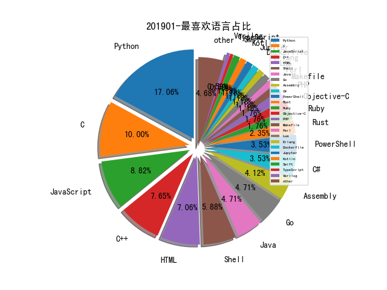

# 201901 信息源与信息类型占比

# 微信公众号 推荐
| nickname_english | weixin_no | title | url| 
| --- | --- | --- | ---| 
| InfoQ | infoqchina |  | https://mp.weixin.qq.com/s/5opaOA9Rqk-3Sb-9bBRPJQ | 1| 
| 云众可信 | yunzhongkexin |  | https://mp.weixin.qq.com/s/6Bt6-MwK0RtvRdtbMHrCuQ | 1| 
| 京东安全应急响应中心 | jsrc_team |  | https://mp.weixin.qq.com/s/Rdw7_z4jn3Z1AWp-S2B2Vg | 1| 
| 凌天实验室 | LT_labs |  | https://mp.weixin.qq.com/s/mlqjOlhefcsO9z51cw4S7w | 3| 
| 国家互联网应急中心CNCERT | CNCERTCC |  | https://mp.weixin.qq.com/s/5F9CauALuwvAys5mwPHwdQ | 1| 
| 宅客频道 | letshome |  | https://mp.weixin.qq.com/s/HZJQD0jHj2ACkgtvGmtyPw | 1| 
| 汉客儿 |  |  | https://mp.weixin.qq.com/s/h9d8aO79OvkpV9bknVT60A | 1| 
| 瀚思科技 | HanSight |  | https://mp.weixin.qq.com/s/9CQn4qFd88MRU56xBvY_Pw | 1| 
| 王小明的事 | Struggle_of_a_noob |  | https://mp.weixin.qq.com/s/CEI1XYkq2PZmYsP0DRU7jg | 1| 
| 网安寻路人 | DataProtection101 |  | https://mp.weixin.qq.com/s/5sGSSpkrJhgvttKxP-udJA | 1| 
| 58安全应急响应中心 | wubasrc |  | https://mp.weixin.qq.com/s/2r61XB_Po4s3ihkLy46xbA | 1| 
| 信息安全与通信保密杂志社 | cismag2013 |  | https://mp.weixin.qq.com/s/tQmQljt0pWxWfTtd7_1bIw | 1| 
| 学术plus | caeit-e |  | https://mp.weixin.qq.com/s/44RDuUmw00Rz_LQeU4QJOQ | 2| 
| 有些鸟 | youxieniao |  | https://mp.weixin.qq.com/s/Frge3EX8sEdOEuygHEJNkg | 1| 
| 百度安全应急响应中心 | baidu_sec |  | https://mp.weixin.qq.com/s/T6EYwGpEQr64OGXGj2R5eA | 1| 
| Go中国 | golangchina |  | https://mp.weixin.qq.com/s/YbaM-_vs_D2BS1lV6Z-u4g | 1| 
| 代码卫士 | codesafe |  | https://mp.weixin.qq.com/s/HFeOolCoyKz91sK1QdMg4w | 1| 
| 奇安信安全监测与响应中心 | cert360 |  | https://mp.weixin.qq.com/s/ogKCo-Jp8vc7otXyu6fTig | 2| 
| 安全博物馆 | security_museum |  | https://mp.weixin.qq.com/s/F9oIpYvHB3FdAyjRSdUgRA | 1| 
| 安全张之家 | zhang_informationSEC |  | https://mp.weixin.qq.com/s/kd4S6hCE_GPpPGbp1aD5Jw | 1| 
| 安全牛 | aqniu-wx |  | https://mp.weixin.qq.com/s/gksuSM7S-MLZ5LFz6-kjdw | 2| 
| 宜信安全应急响应中心 | CreditEaseSec |  | https://mp.weixin.qq.com/s/6CT1WX3q3WzT1ewxiFQnnA | 1| 
| 工业互联网安全应急响应中心 | ICSCERT |  | https://mp.weixin.qq.com/s/LXJR3s6GpkgWZNNGyhuYMQ | 1| 
| 平安集团安全应急响应中心 | PSRC_Team |  | https://mp.weixin.qq.com/s/pthuQFY9sQjxJOOQf91Weg | 1| 
| 方行企业管理 | fangxingapp |  | https://mp.weixin.qq.com/s/Cbdqfsnh3TJ1RrkbN1RTjA | 1| 
| 猎户攻防实验室 | TassLiehu |  | https://mp.weixin.qq.com/s/8lkpqHJ_CrRizPDZ38svTg | 4| 
| 秘迹同学 | mijitongxue | 个人隐私保护大时代：至暗时刻将逝，一丝曙光在即 | https://mp.weixin.qq.com/s/Gzz7AtZgH0JuNa7U_9yb4w | 1| 
| 秦安战略 | qinan1128 |  | https://mp.weixin.qq.com/s/jVhPDVOLOvX5EXHeR9iI3A | 2| 
| 美团技术团队 | meituantech |  | https://mp.weixin.qq.com/s/5pVKNI6_hzhaXTOUxU9bTA | 1| 
| 腾讯御见威胁情报中心 |  |  | https://mp.weixin.qq.com/s/qzTGQMvV-IaAlP_IwCHnLg | 2| 
| 补天平台 | Patchingthesky |  | https://mp.weixin.qq.com/s/Hm6TiLHiAygrJr-MGRq9Mw | 1| 
| 透雾 | wxWinder |  | https://mp.weixin.qq.com/s/cG19BtE7V62CsoJsGbv72g | 1| 
| 360CERT | CERT-360 |  | https://mp.weixin.qq.com/s/RLNyzImYsgRWkGlp0AXcVg | 1| 
| ADLab | v_adlab |  | https://mp.weixin.qq.com/s/DGWuSdB2DvJszom0C_dkoQ | 1| 
| PaperWeekly | paperweekly |  | https://mp.weixin.qq.com/s/v4XjU2UGe1ikVj8d70gTSw | 1| 
| 中国信息安全 | chinainfosec |  | https://mp.weixin.qq.com/s/ImlfOFJK-ui0h6YV-tURrg | 2| 
| 中新社广东发布 | CNS-gd |  | https://mp.weixin.qq.com/s/Kf0VzANEmBBWQkFu23dQRA | 1| 
| 二当家的12138 |  |  | https://mp.weixin.qq.com/s/0VX4FAPhmCjqs1OYj4lOIw | 1| 
| 全频带阻塞干扰 | RFJamming |  | https://mp.weixin.qq.com/s/K-zFVBaSw6yThuoLdUTjdg | 1| 
| 嘶吼专业版 | Pro4hou |  | https://mp.weixin.qq.com/s/pgo83SPu9Cd9qv3achhnrQ | 2| 
| 图灵人工智能 | TuringAI01 |  | https://mp.weixin.qq.com/s/6bVxjkjnKJR3ixsUGY7_4Q | 1| 
| 奇安信威胁情报中心 |  |  | https://mp.weixin.qq.com/s/hCLPdAt7MRhv40nxNeXTag | 3| 
| 安全学术圈 | secquan |  | https://mp.weixin.qq.com/s/HGNSOQcHedQAbGG3Hl1rwg | 2| 
| 安在 | AnZer_SH |  | https://mp.weixin.qq.com/s/oyvQ_Mhe0Q33RKUKVXKXyw | 1| 
| 新智元 | AI_era |  | https://mp.weixin.qq.com/s/wtJRA1c17Phnq3CYPT_XHA | 2| 
| 梦之光芒的电子梦 | monyer_mp |  | https://mp.weixin.qq.com/s/Hraig48huSQ93ZMf448Htw | 1| 
| 深圳市网络与信息安全行业协会 | SNISA-001 |  | https://mp.weixin.qq.com/s/OAqfstNEu0ns4l3aKJQ9oA | 1| 
| 漏洞战争 | vulwar |  | https://mp.weixin.qq.com/s/o7IMaLMuPYuXgr5hatK5Mw | 2| 
| 知识工场 | fudankw |  | https://mp.weixin.qq.com/s/xR_JFczYbxY0xuy7BYDc7g | 7| 
| 网信防务 | CyberDefense |  | https://mp.weixin.qq.com/s/BB9abB5j3IuAH8Rj4lPyvQ | 3| 
| 网安国际 | inforsec |  | https://mp.weixin.qq.com/s/t0e49MiSGY2lam8y9B-FIg | 1| 
| 网藤风险感知 |  |  | https://mp.weixin.qq.com/s/tIG5PZHkMOh62mcIauxShQ | 1| 
| 软件工程研究与实践 | SE-China |  | https://mp.weixin.qq.com/s/ZHd6wWqnHB1rjKL2SCUqWw | 2| 
| 黑鸟 | blackorbird |  | https://mp.weixin.qq.com/s/enSFtxUSYqovYuMX0X8nQg | 1| 

# 组织github账号 推荐
| github_id | title | url | org_url | org_profile | org_geo | org_repositories | org_people | org_projects | repo_lang | repo_star | repo_forks| 
| --- | --- | --- | --- | --- | --- | --- | --- | --- | --- | --- | ---| 
| google | Structure-Aware - 通过 libFuzzer 进行结构感知的 fuzz : | https://github.com/google/fuzzer-test-suite/blob/master/tutorial/structure-aware-fuzzing.md | https://opensource.google.com/ | Google ❤️ Open Source | https://opensource.google.com/ | 1474 | 2547 | 0 | TypeScript,Java,Python,Kotlin,JavaScript,C++,Dart,HTML,Go,Rust | 0 | 0 | 1| 
| redhawksdr | Redhawk - 软件定义无线电(SDR)的开发框架: | https://github.com/redhawksdr | http://redhawksdr.github.io |  | http://redhawksdr.github.io | 85 | 2 | 0 | Python,HTML,Java,JavaScript,C++ | 0 | 0 | 1| 
| zeromq | ZeroMQ libzmq 远程代码执行漏洞与利用: | https://github.com/zeromq/libzmq/issues/3351 | http://www.zeromq.org/ |  | http://www.zeromq.org/ | 79 | 50 | 0 | C,Shell,Java,C#,JavaScript,C++,Perl,Python,Go,Erlang | 0 | 0 | 1| 
| qunarcorp | qtalk: Startalk 是一款高性能的企业级im套件 | https://github.com/qunarcorp/qtalk | http://open.qunar.com/ | Qunar.com open source projects | Beijing, China | 42 | 0 | 0 | Groovy,C,Java,Python,JavaScript,C++,Lua,Objective-C,Erlang,Ruby | 0 | 0 | 2| 
| airbus-seclab | 静态二进制代码分析工具 BinCAT 1.1 发布,支持 AMD64: | https://github.com/airbus-seclab/bincat/releases/tag/v1.1 | https://airbus-seclab.github.io/ |  | https://airbus-seclab.github.io/ | 23 | 5 | 0 | C,Python,OCaml,C++,Ruby,PowerShell | 0 | 0 | 1| 
| nao-sec | tknk_scanner:Community-based integrated malware identification system | https://github.com/nao-sec/tknk_scanner | https://nao-sec.org | Cyber Security Research Team | https://nao-sec.org | 16 | 1 | 0 | Python,C#,PHP,Dockerfile,Vue | 0 | 0 | 1| 
| googleprojectzero | WinAFL 增加了基础 Intel PT 跟踪模式: | https://github.com/googleprojectzero/winafl/blob/master/readme_pt.md | https://googleprojectzero.blogspot.com | Projects by Google Project Zero | https://googleprojectzero.blogspot.com | 14 | 0 | 0 | C,C#,C++,Python,HTML,Swift | 0 | 0 | 1| 
| MLEveryday | 100-Days-Of-ML-Code中文版 | https://github.com/MLEveryday/100-Days-Of-ML-Code | https://mleveryday.github.io/ | machine learning everyday | shanghai | 9 | 2 | 0 | Python,HTML,Jupyter | 0 | 0 | 1| 
| corkami | 可以生成 PDF 和 PE 的 MD5 冲突的脚本: | https://github.com/corkami/pocs/blob/master/collisions/README.md#pdf---pe | None | Reverse engineering & visual documentation | None | 8 | 2 | 0 | TeX,Python,HTML,Assembly | 0 | 0 | 1| 

# 私人github账号 推荐
| github_id | title | url | p_url | p_profile | p_loc | p_company | p_repositories | p_projects | p_stars | p_followers | p_following | repo_lang | repo_star | repo_forks | 
| --- | --- | --- | --- | --- | --- | --- | --- | --- | --- | --- | --- | --- | --- | ---| 
| mandatoryprogrammer | tarnish - 针对 Chrome 扩展程序的静态分析工具: | https://github.com/mandatoryprogrammer/tarnish | https://thehackerblog.com/ | > | > | > | 41 | 0 | 97 | 1100 | 18 | Python,JavaScript,Dockerfile | 1400 | 208 | 1| 
| fs0c131y | ES 文件资源管理器 HTTP 服务端口打开漏洞披露(CVE-2019-6447): | https://github.com/fs0c131y/ESFileExplorerOpenPortVuln | https://twitter.com/fs0c131y | French security researcher. Worst nightmare of Oneplus, Wiko, UIDAI, Kimbho, Donald Daters and others. Not completely schizophrenic. Not related to USANetwork. | None | None | 11 | 0 | 0 | 960 | 0 | Python,Kotlin | 543 | 118 | 2| 
| Ridter | 2018年初整理的一些内网渗透TIPS | https://github.com/Ridter/Intranet_Penetration_Tips | https://evi1cg.me |  | None | None | 104 | 0 | 405 | 909 | 20 | Python,C#,C | 1800 | 358 | 2| 
| Cyb3rWard0g | OSSEM - 开源安全事件元数据,旨在定义和共享公共信息模型以改进安全事件日志的数据标准化: | https://github.com/Cyb3rWard0g/OSSEM | https://github.com/Cyb3rWard0g | @Cyb3rWard0g | None | None | 10 | 0 | 19 | 636 | 2 | Jupyter,PowerShell | 1400 | 336 | 1| 
| dxa4481 | 结合 Oauth 进行 XSS 的高级利用以实现对目标的持久化访问: | https://github.com/dxa4481/XSSOauthPersistence | https://security.love | Full stack hacker | USA | None | 83 | 0 | 22 | 550 | 4 | Python,HTML,JavaScript | 3600 | 444 | 1| 
| elfmaster | dsym_obfuscate - 一款加密动态符号表,并在运行时恢复的工具 : | https://github.com/elfmaster/dsym_obfuscate | http://www.bitlackeys.org | Order of operation: Consciousness/Meditation Family Creativity, coding, hacking, reversing, security | Seattle | Leviathan | 25 | 0 | 19 | 483 | 15 | C,Objective-C,C++ | 192 | 45 | 1| 
| 0x27 | Cisco RV320 的 Dump 配置和远程 RCE 的漏洞利用: | https://github.com/0x27/CiscoRV320Dump | http://0x27.me/ |  | EIP | None | 77 | 0 | 3000 | 475 | 34 | Python,Go,C | 397 | 220 | 1| 
| xoofx | JitBuddy - 可以将托管的 JIT native code 反汇编的辅助功能方法: | https://github.com/xoofx/JitBuddy | https://github.com/Unity-Technologies |  | Grenoble - France | @Unity-Technologies | 56 | 0 | 209 | 335 | 19 | C# | 0 | 0 | 1| 
| tunz | Internet Explorer 脚本引擎远程代码执行漏洞(CVE-2018-8389)POC: | https://github.com/tunz/js-vuln-db/blob/master/jscript/CVE-2018-8389.md | http://tunz.kr |  | South Korea | None | 11 | 0 | 68 | 331 | 61 | Python,Haskell,Rust | 0 | 0 | 2| 
| hannob | Apache 不准备修复的 UAF 漏洞公开: | https://github.com/hannob/apache-uaf/ | https://hboeck.de/ |  | Berlin | None | 79 | 0 | 2 | 318 | 2 | Python,Shell,PHP | 1400 | 150 | 1| 
| WyAtu | Perun: 网络资产漏洞扫描器/扫描框架 | https://github.com/WyAtu/Perun | None | Security Researcher | None | None | 12 | 0 | 14 | 251 | 8 | Python,C | 343 | 155 | 1| 
| neal1991 | 2019年针对API安全的4点建议 | https://github.com/neal1991/articles-translator/blob/master/2019%E5%B9%B4%E9%92%88%E5%AF%B9API%E5%AE%89%E5%85%A8%E7%9A%844%E7%82%B9%E5%BB%BA%E8%AE%AE.md | https://madneal.com | Obviously, I am cool. | Shanghai | ECNU | 96 | 0 | 514 | 222 | 58 | Python,Shell,JavaScript,Java,HTML | 0 | 0 | 1| 
| gamozolabs | applepie - 一款用于 Fuzz 的虚拟机管理器: | https://github.com/gamozolabs/applepie | None |  | None | None | 25 | 0 | 2 | 203 | 0 | C,Assembly,C++,Rust | 293 | 32 | 1| 
| drk1wi | Modlishka - 一款灵活且功能强大的反向代理工具 : | https://github.com/drk1wi/Modlishka | https://twitter.com/drk1wi |  | None | None | 37 | 0 | 87 | 196 | 3 | Go,Swift,Makefile | 0 | 0 | 1| 
| kpcyrd | Sn0int - 半自动 OSINT 框架和包管理器: | https://github.com/kpcyrd/sn0int | None | /waɪrd/ | Hamburg, Germany | None | 220 | 0 | 660 | 185 | 180 | Ruby,Assembly,Rust | 0 | 0 | 1| 
| m1ghtym0 | browser-pwn - 针对浏览器漏洞利用的资源合集 : | https://github.com/m1ghtym0/browser-pwn | None |  | None | None | 17 | 0 | 85 | 159 | 12 | Python,C | 0 | 0 | 1| 
| woj-ciech | woj-ciech/LeakLooker: Find open databases with Shodan | https://github.com/woj-ciech/LeakLooker | None |  | None | None | 11 | 0 | 0 | 156 | 0 | Python,Go | 747 | 101 | 1| 
| citronneur | volatility-wnf - 浏览并 Dump Windows Notification Facilities 的工具: | https://github.com/citronneur/volatility-wnf | https://github.com/airbus-cert |  | Toulouse, France | @airbus-cert | 21 | 0 | 210 | 131 | 79 | Python,C#,JavaScript | 1000 | 243 | 1| 
| kmkz | 渗透测试备忘清单分享: | https://github.com/kmkz/Pentesting?files=1 | http://www.linkedin.com/in/jean-marie-bourbon |  | Grevenmacher (LU) | None | 11 | 0 | 21 | 110 | 12 | Python,Assembly,PowerShell,Perl | 0 | 0 | 1| 
| brainsmoke | ptrace-burrito - 一款基于 ptrace 可以进行进程跟踪的工具: | https://github.com/brainsmoke/ptrace-burrito | None |  | None | None | 34 | 0 | 7 | 104 | 0 | Python,Go,C,Assembly | 0 | 0 | 1| 
| enovella | r2frida-wiki - 关于 r2frida 的使用维基: | https://github.com/enovella/r2frida-wiki | https://github.com/nowsecure | Mobile Security Researcher | London, UK | @nowsecure | 140 | 0 | 83 | 100 | 54 | C,Shell,Java,Python,JavaScript,C++ | 93 | 19 | 2| 
| j0nathanj | From Zero to Zero Day ,介绍零基础挖掘 Chakra Core 漏洞的方法,来自 35C3 大会: | https://github.com/j0nathanj/Publications/tree/master/35C3_From_Zero_to_Zero_Day | https://twitter.com/j0nathanj | A teenager interested in computers, maths and physics :) | None | None | 3 | 0 | 74 | 99 | 46 | Python,JavaScript | 68 | 10 | 1| 
| j3ssie | IPOsint: Discovery IP Address of the target | https://github.com/j3ssie/IPOsint | https://twitter.com/j3ssiejjj | I like abusing features | None | None | 19 | 0 | 7 | 98 | 0 | Python | 0 | 0 | 1| 
| iSafeBlue | TrackRay: 溯光(Trackray)渗透测试框架 2.0 | https://github.com/iSafeBlue/TrackRay | https://b1ue.cn | Security Researcher , Java Development Engineer | None | None | 9 | 0 | 281 | 92 | 40 | Java,HTML,JavaScript | 375 | 101 | 1| 
| 0x36 | iOS atm port UAF 漏洞(CVE-2018-4420)PoC: | https://github.com/0x36/CVE-pocs/blob/master/CVE-2018-4420-atm-uaf.c | None | . | Morocco | None | 6 | 0 | 24 | 91 | 0 | C,Makefile | 140 | 39 | 1| 
| vincentcox | bypass-firewalls-by-DNS-history - 通过寻找 DNS 历史来绕过 WAF 直接访问真实 IP 地址的工具: | https://github.com/vincentcox/bypass-firewalls-by-DNS-history | https://www.linkedin.com/in/ivincentcox/ | vincentcox.com | Belgium | None | 7 | 0 | 145 | 80 | 15 | Shell,JavaScript,PowerShell | 0 | 0 | 1| 
| cnlh | easyProxy: 内网穿透代理服务器 | https://github.com/cnlh/easyProxy | None |  | chengdu | none | 6 | 0 | 30 | 77 | 0 | Go | 0 | 0 | 1| 
| userlandkernel | 如何破解 iPhone 基带的详细介绍: | https://github.com/userlandkernel/baseband-research?files=1 | https://github.com/Fontys-Hogeschool-ICT | Im a Software Engineering and Cybersecurity student at @Fontys-Hogeschool-ICT I research MACH, Darwin and LowLevel System Security. Mainly intrested in iOS. | Eindhoven, Netherlands | @UKERN-Developers | 33 | 0 | 48 | 72 | 11 | HTML,C,Shell,Objective-C | 0 | 0 | 1| 
| matiskay | html-similarity: Compare html similarity using structural and style metrics | https://github.com/matiskay/html-similarity | http://twitter.com/matiskay | Doing security things by day and doing things with data and crafty stuff by night. | Arequipa, Perú | None | 57 | 0 | 1100 | 71 | 209 | Python,HTML | 0 | 0 | 1| 
| AxtMueller | Windows-Kernel-Explorer - 一款 Windows 内核研究工具: | https://github.com/AxtMueller/Windows-Kernel-Explorer | https://www.aldi-sued.de | I am currently working in a grocery store, but I have been studying the Windows kernel for many years. | Dußlingen, Germany | ALDI SÜD | 1 | 0 | 0 | 65 | 0 |  | 0 | 0 | 1| 
| guitmz | virii - 远古计算机病毒源代码的收集: | https://github.com/guitmz/virii | https://github.com/relayr |  | Berlin | @relayr | 56 | 0 | 469 | 63 | 20 | Go,Assembly,Nim | 0 | 0 | 1| 
| JeremyFetiveau | TurboFan String.lastIndexOf JSCall 节点输入错误漏洞的利用: | https://github.com/JeremyFetiveau/TurboFan-exploit-for-issue-762874 | None |  | None | None | 6 | 0 | 1 | 60 | 6 | JavaScript,C++ | 41 | 26 | 1| 
| jaredestroud | 如何通过 vim 来实现代码执行及持久化等攻击: | https://github.com/jaredestroud/WOTD/blob/master/%5BDARK%5D%20Weapons%20of%20%20Text%20Destruction.pdf | None |  | None | None | 17 | 0 | 208 | 57 | 37 | SaltStack,PHP,Shell,C++ | 0 | 0 | 1| 
| sapphirex00 | APT IOCs 收集整理: | https://github.com/sapphirex00/Threat-Hunting | None |  | None | None | 18 | 0 | 38 | 53 | 48 | Python,Shell | 0 | 0 | 1| 
| jovanbulck | Intel SGX enclave 侧通道攻击框架 SGX-Step v1.3 发布,现已支持 Foreshadow 瞬态执行攻击: | https://github.com/jovanbulck/sgx-step | https://distrinet.cs.kuleuven.be/people/jo | PhD student @KU_Leuven | Trusted Computing & Side-Channel Attacks | #IntelSGX #Sancus #Foreshadow | None | None | 16 | 0 | 64 | 40 | 0 | C,Verilog | 0 | 0 | 1| 
| securemode | Invoke-Apex - 基于 PowerShell 的后渗透测试工具包: | https://github.com/securemode/Invoke-Apex | https://securemode.io |  | None | None | 13 | 0 | 158 | 35 | 0 | Lua,Shell,PowerShell | 0 | 0 | 1| 
| NotMedic | NetNTLMtoSilverTicket - 实现 SpoolSample -> NetNTLMv1 -> NTLM -> Silver Ticket 攻击链的工具: | https://github.com/NotMedic/NetNTLMtoSilverTicket | None |  | None | None | 14 | 0 | 2 | 32 | 0 | C,Shell,JavaScript,C++,HTML,PowerShell | 210 | 35 | 1| 
| Dongdongshe | neuzz - 基于神经网络的 fuzzer: | https://github.com/Dongdongshe/neuzz | None |  | None | None | 28 | 0 | 6 | 28 | 1 | Python,C,C++ | 171 | 31 | 1| 
| linuxthor | uul - 让 uul ELF 二进制文件同时在多个 *nix 风格的系统上运行的项目: | https://github.com/linuxthor/uul | None |  | Yorkshire | None | 32 | 0 | 0 | 23 | 3 | C,Assembly | 0 | 0 | 1| 
| mattnotmax | cyber-chef-recipes - 包含大量编码解密等工具的项目收集: | https://github.com/mattnotmax/cyber-chef-recipes | https://bitofhex.com |  | None | None | 13 | 0 | 86 | 15 | 1 | Python | 0 | 0 | 1| 
| fcavallarin | Htcap - 一款通过拦截 ajax 调用和 DOM 修改的方式进行 Web 应用扫描的工具 : | https://github.com/fcavallarin/htcap | None |  | None | None | 2 | 0 | 1 | 9 | 0 | Python,JavaScript | 432 | 88 | 1| 
| ansionasc | 2019年哈尔滨ASC安全峰会的会议PPT | https://github.com/ansionasc/ASC/tree/master/2019 | https://www.ansion.cn | Ansion Security Conference | China | Ansion | 1 | 0 | 1 | 7 | 0 |  | 14 | 5 | 1| 
| ydhcui | Scanver: 分布式在线资产漏洞扫描管理系统 | https://github.com/ydhcui/Scanver | None | biu biu biu | None | cn | 11 | 0 | 4 | 4 | 3 | Python,HTML,Java,JavaScript | 4 | 4 | 1| 
| Bashfuscator | Bashfuscator - 完全可配置和可扩展的 Bash 混淆框架: | https://github.com/Bashfuscator/Bashfuscator | None | None | None | None | 0 | 0 | 0 | 0 | 0 | Python | 0 | 0 | 1| 

# medium_xuanwu 推荐
| title | url| 
| --- | ---| 

# medium_secwiki 推荐
| title | url| 
| --- | ---| 

# zhihu_xuanwu 推荐
| title | url| 
| --- | ---| 

# zhihu_secwiki 推荐
| title | url| 
| --- | ---| 

# 日更新程序
`python update_daily.py`