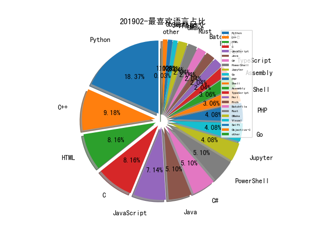

# 201902 信息源与信息类型占比

# 微信公众号 推荐
| nickname_english | weixin_no | title | url| 
| --- | --- | --- | ---| 
| 丁爸 情报分析师的工具箱 | dingba2016 |  | https://mp.weixin.qq.com/s/_ndxkqPfgPjaT_fD82RVvQ | 1| 
| 云影实验室 | Yunying_Lab |  | https://mp.weixin.qq.com/s/CMt7NX0sVJip7A8CZq8k-A | 1| 
| 数说安全 | SSAQ2016 |  | https://mp.weixin.qq.com/s/15w_RUG2PRiK6B1y7G16Jg | 1| 
| 绿盟科技研究通讯 | nsfocus_research |  | https://mp.weixin.qq.com/s/f_iuMztspla014rQEfY6kQ | 2| 
| 谛听ditecting |  |  | https://mp.weixin.qq.com/s/w7aC7HzicQb4Hritde6b8g | 2| 
| ADLab | v_adlab |  | https://mp.weixin.qq.com/s?__biz=MzAwNTI1NDI3MQ==&mid=2649613813&idx=1&sn=fc1c55360efd5a1ff2e7d8ff25825f8a&scene=21#wechat_redirect | 1| 
| ArkTeam |  |  | https://mp.weixin.qq.com/s/JyGaOV-wBVYCF6gKhYswWw | 1| 
| DJ的札记 | DJ_notes |  | https://mp.weixin.qq.com/s/AKdnFKn8oXocZ5eyfB2D9g | 2| 
| SecWiki | SecWiki |  | https://mp.weixin.qq.com/s/MZp_BOPPrX4hTgP5s5hUPw | 1| 
| Viola后花园 | Viola_deepblue |  | https://mp.weixin.qq.com/s/rZ_XOrsWaFvl8xE2PFuZEg | 1| 
| 国家互联网应急中心CNCERT | CNCERTCC |  | https://mp.weixin.qq.com/s/5ZOhusBPwQ0WdTBgrStfMg | 1| 
| 汉客儿 |  |  | https://mp.weixin.qq.com/s/uUXB9AHtnhCsD7gAfFYRoA | 2| 
| 漏洞战争 | vulwar |  | https://mp.weixin.qq.com/s/8bpcNK06tpKbi7gHJEdlUA | 1| 
| 百度安全应急响应中心 | baidu_sec |  | https://mp.weixin.qq.com/s/DeHbVNidE5Oh4WuYXyGX6g | 1| 
| 网信防务 | CyberDefense |  | https://mp.weixin.qq.com/s/ilEGEmDzT7yQvxpaHTMIjg | 1| 
| 网络法治国际中心 | icrime2015 |  | https://mp.weixin.qq.com/s/Ra1rcTl7K-Dtug9tNUwLPA | 1| 
| 迷样人生 | iot-sec |  | https://mp.weixin.qq.com/s/Sp15EkyNKBZvOZHrJ7zJ2w | 1| 
| PaperWeekly | paperweekly |  | https://mp.weixin.qq.com/s/2Mh68gfbG_5gKnoICuRmeA | 2| 
| TideSec安全团队 | TideSec |  | https://mp.weixin.qq.com/s/mSikxVFvrsGnl6Eflbx1GQ | 3| 
| 仙人掌情报站 | sec-cactus |  | https://mp.weixin.qq.com/s/WHhTZSf0JZK5KVH-o6NAoA | 1| 
| 信安之路 | xazlsec |  | https://mp.weixin.qq.com/s/irYv_U1qew33vAf_9lCbFg | 1| 
| 全知科技 |  |  | https://mp.weixin.qq.com/s/OS4iCYjqG7fW2ti9NN9f2w | 1| 
| 安全学术圈 | secquan |  | https://mp.weixin.qq.com/s/hKsItaIkwqdbmtvvhG6DYg | 1| 
| 数据派THU | DatapiTHU |  | https://mp.weixin.qq.com/s/zIvsOB6G4YOnWq669VCqyg | 1| 
| 美团技术团队 | meituantech |  | https://mp.weixin.qq.com/s/hk8I_93fyS5NWholu6v8_Q | 2| 
| 中国信息安全 | chinainfosec |  | https://mp.weixin.qq.com/s/N1nigPq_w1R6lpJzZMs-Wg | 2| 
| 嘶吼专业版 | Pro4hou |  | https://mp.weixin.qq.com/s/qtvGW9A_z9QNwA2OmlcHYw | 1| 
| 战略前沿技术 | Tech999 |  | https://mp.weixin.qq.com/s/bRIA5OFEUZNrapubD9ORYQ | 1| 

# 组织github账号 推荐
| github_id | title | url | org_url | org_profile | org_geo | org_repositories | org_people | org_projects | repo_lang | repo_star | repo_forks| 
| --- | --- | --- | --- | --- | --- | --- | --- | --- | --- | --- | ---| 
| Microsoft | BlueHat IL 2019 PPT: 软件漏洞缓解机制的趋势、挑战及战略转变 | https://github.com/Microsoft/MSRC-Security-Research/blob/master/presentations/2019_02_BlueHatIL/2019_01%20-%20BlueHatIL%20-%20Trends%2C%20challenge%2C%20and%20shifts%20in%20software%20vulnerability%20mitigation.pdf | https://opensource.microsoft.com | Open source, from Microsoft with love | Redmond, WA | 2463 | 4258 | 0 | C,TypeScript,Java,C#,Jupyter,JavaScript,C++,Python,HTML,Rich,Go,CMake,PowerShell | 0 | 0 | 2| 
| googleprojectzero | CompareCoverage - 用于跟踪 C/C++ 中变量和缓冲区的实时变化并保存的工具: | https://github.com/googleprojectzero/CompareCoverage | https://googleprojectzero.blogspot.com | Projects by Google Project Zero | https://googleprojectzero.blogspot.com | 14 | 0 | 0 | C,C#,C++,Python,HTML,Swift | 0 | 0 | 1| 
| sysdream | Chashell: Go reverse shell that communicates over DNS | https://github.com/sysdream/chashell | https://sysdream.com |  | Paris | 14 | 1 | 0 | Go,Python,JavaScript,Java | 0 | 0 | 1| 
| Synacktiv | exploit for CVE-2018-4193 | https://github.com/Synacktiv/CVE-2018-4193 | http://www.synacktiv.ninja/en/ |  | Paris - France | 1 | 2 | 0 | Python | 0 | 0 | 1| 

# 私人github账号 推荐
| github_id | title | url | p_url | p_profile | p_loc | p_company | p_repositories | p_projects | p_stars | p_followers | p_following | repo_lang | repo_star | repo_forks | 
| --- | --- | --- | --- | --- | --- | --- | --- | --- | --- | --- | --- | --- | --- | ---| 
| Micropoor | Micro8: PHP安全新闻早8点全部文档 | https://github.com/Micropoor/Micro8 | None |  | None | None | 2 | 0 | 60 | 1400 | 20 |  | 14500 | 5700 | 1| 
| 3gstudent | A collection of pentest and development tips | https://github.com/3gstudent/Pentest-and-Development-Tips | https://3gstudent.github.io/ | good in study,attitude and health | None | None | 99 | 0 | 159 | 1200 | 11 | Python,C#,Batchfile,PowerShell,C++ | 431 | 158 | 1| 
| c0ny1 | xxe-lab: 各种语言版本的XXE漏洞Demo | https://github.com/c0ny1/xxe-lab | http://gv7.me | 漏洞在牛角尖上 | None | None | 13 | 0 | 271 | 583 | 12 | Python,Shell,PHP,Java | 1200 | 307 | 1| 
| tanjiti | sec_profile: 分析安全信息站点、安全趋势、安全工作者账号 | https://github.com/tanjiti/sec_profile | http://tanjiti.com/ | #Network Security Monitor #threat intelligence  #waf #ids #iOS App Security #Android App Security #game security | shanghai | baidu | 16 | 0 | 4 | 470 | 166 | Python,PHP,HTML,Perl | 0 | 0 | 1| 
| rasta-mouse | TikiTorch - 一款允许在任意进程中执行任意 ShellCode 的工具 | https://github.com/rasta-mouse/TikiTorch | https://github.com/ZeroPointSecurity |  | None | @ZeroPointSecurity | 20 | 0 | 58 | 377 | 7 | C#,PowerShell | 0 | 0 | 2| 
| secrary | idenLib - 识别库函数的工具集: | https://github.com/secrary/idenLib | https://secrary.com | @_qaz_qaz | https://keybase.io/khasaia | None | 17 | 0 | 197 | 363 | 21 | Python,C,C++ | 0 | 0 | 1| 
| dirkjanm | Kerberos unconstrained delegation abuse toolkit | https://github.com/dirkjanm/krbrelayx | None |  | The Netherlands | None | 19 | 0 | 11 | 281 | 1 | Python | 0 | 0 | 1| 
| gh0stkey | PoCBox - 漏洞测试验证辅助平台 | https://github.com/gh0stkey/PoCBox | https://gh0st.cn | 天行健，君子以自强不息；地势坤，君子以厚德载物。 | China | 米斯特安全团队 | 13 | 0 | 103 | 229 | 13 | Python,PHP,HTML | 358 | 98 | 1| 
| gamozolabs | mesos - Windows 下的二进制代码覆盖调试工具: | https://github.com/gamozolabs/mesos | None |  | None | None | 25 | 0 | 2 | 203 | 0 | C,Assembly,C++,Rust | 293 | 32 | 1| 
| JohnLaTwC | Malware PowerShell shellcode analysis | https://github.com/JohnLaTwC/Shared/blob/master/notebooks/Malware%20PowerShell%20shellcode%20analysis.ipynb | https://github.com/JohnLaTwC | @JohnLaTwC Distinguished Engineer and General Manager, Microsoft Threat Intelligence Center | None | Microsoft Corporation | 16 | 0 | 3 | 182 | 1 | Python,Visual,HTML,Jupyter | 172 | 37 | 1| 
| vngkv123 | Chrome V8 中类型错误导致的越界读写漏洞(CVE-2019-5782)与利用介绍: | https://github.com/vngkv123/aSiagaming/tree/master/Chrome-v8-906043 | https://twitter.com/vngkv123 | Browser Exploitation, iOS Jailbreak, Linux Kernel Exploitation :-) @@ Jusun-Lee in Korea, Republic of | None | ReverseLab, Aegis | 71 | 0 | 245 | 151 | 22 | Python,C,JavaScript | 0 | 0 | 1| 
| masatokinugawa | 浏览器 XSS Filter 绕过速查表 : | https://github.com/masatokinugawa/filterbypass/wiki/Browsers-XSS-Filter-Bypass-Cheat-Sheet | http:///////////////////////////////////////////////////////////////////////////////////////////////////////////////////////////////////////////////////////////////////////////////////////////////////////////////////////////////////////twitter.com/kinugawamasato |  | None | None | 6 | 0 | 0 | 122 | 0 | Python,HTML,JavaScript,C++ | 616 | 120 | 1| 
| bkth | 通过 JavaScript 编译器攻击 Edge | https://github.com/bkth/Attacking-Edge-Through-the-JavaScript-Compiler | https://twitter.com/bkth_ | Security Researcher, CTF player, I like JavaScript but probably not in the same way as most people ;) | France | None | 12 | 0 | 15 | 119 | 3 | Python,C,JavaScript | 75 | 14 | 1| 
| imthenachoman | How-To-Secure-A-Linux-Server | https://github.com/imthenachoman/How-To-Secure-A-Linux-Server | None |  | None | None | 12 | 0 | 13 | 111 | 11 | Shell,JavaScript,HTML | 9100 | 492 | 1| 
| blankwall | OSX Privileged Helper Tool： | https://github.com/blankwall/Offensive-Con/blob/master/OffCon.pdf | None |  | None | None | 13 | 0 | 12 | 110 | 0 | Python,C,Assembly,C++ | 308 | 34 | 1| 
| kmkz | Edge 自定义 URI 滥用漏洞（CVE-2018-8495）利用 | https://github.com/kmkz/exploit/blob/master/CVE-2018-8495.html | http://www.linkedin.com/in/jean-marie-bourbon |  | Grevenmacher (LU) | None | 11 | 0 | 21 | 110 | 12 | Python,Assembly,PowerShell,Perl | 0 | 0 | 1| 
| 0xMJ | AI-Security-Learning: 安全检测与数据挖掘的学习资料 | https://github.com/0xMJ/AI-Security-Learning | http://mang0.me | CTF | Web Security | Data Analysis | SiChuan, China | None | 41 | 0 | 255 | 63 | 300 | Python,PHP,HTML | 145 | 34 | 1| 
| V33RU | IoTSecurity101 - IoT 安全方向优秀资源索引: | https://github.com/V33RU/IoTSecurity101 | http://iotpentest.com/ | Keen Interested in IoT Penetration testing | bangalore | Independent | 64 | 0 | 14 | 58 | 8 | Python,Go | 707 | 151 | 1| 
| LinXueyuanStdio | Python数据挖掘与实战 | https://github.com/LinXueyuanStdio/PythonDataMining | http://xichen.pub | He who thinks wins. | None | None | 78 | 0 | 329 | 55 | 32 | Java,Jupyter,Rust | 0 | 0 | 1| 
| erbbysam | erbbysam/DNSGrep: Quickly Search Large DNS Datasets | https://github.com/erbbysam/dnsgrep/ | None |  | USA | None | 13 | 0 | 54 | 24 | 4 | Go,Shell,JavaScript,PHP | 250 | 43 | 1| 
| feexd | runc 容器逃逸漏洞(CVE-2019-5736)及利用介绍 : 1) https://www.exploit-db.com/exploits/463592) https://github.com/feexd/pocs3) | https://github.com/feexd/pocs3) | https://www.twitter.com/poprdi |  | None | None | 3 | 0 | 30 | 20 | 2 | Python,C | 207 | 73 | 1| 
| sgxrop | SGX-ROP - 使用 Intel SGX 的 Enclave 恶意软件,paper: https://arxiv.org/abs/1902.03256 PoC: | https://github.com/sgxrop/sgxrop | None |  | None | None | 0 | 0 | 0 | 12 | 0 |  | 0 | 0 | 1| 
| sophiabiancalatessa | FakeNewsDeepLearning: Opening the Black-Box of Deep Learning Based Detector | https://github.com/sophiabiancalatessa/FakeNewsDeepLearning | None |  | None | None | 2 | 0 | 0 | 0 | 0 | Python,C++ | 9 | 6 | 1| 

# medium_xuanwu 推荐
| title | url| 
| --- | ---| 

# medium_secwiki 推荐
| title | url| 
| --- | ---| 

# zhihu_xuanwu 推荐
| title | url| 
| --- | ---| 

# zhihu_secwiki 推荐
| title | url| 
| --- | ---| 

# 日更新程序
`python update_daily.py`