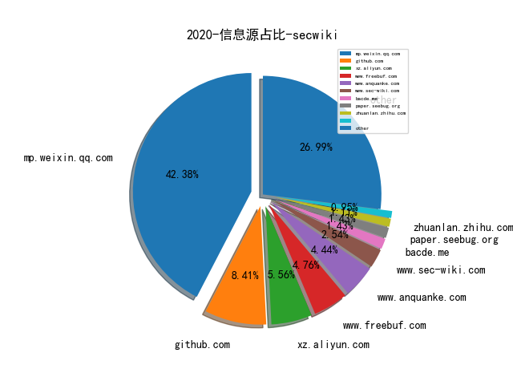
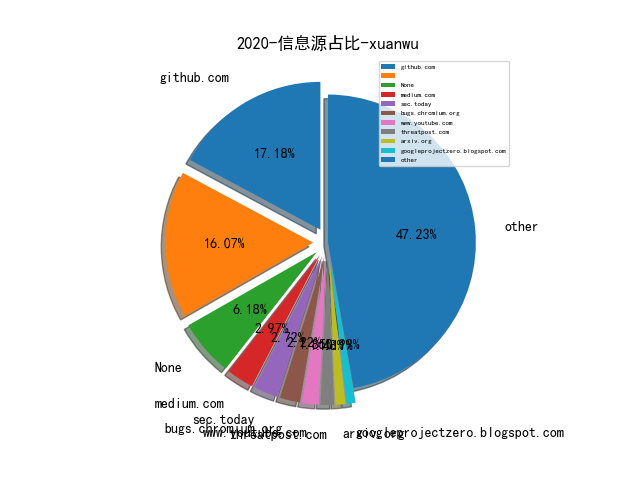
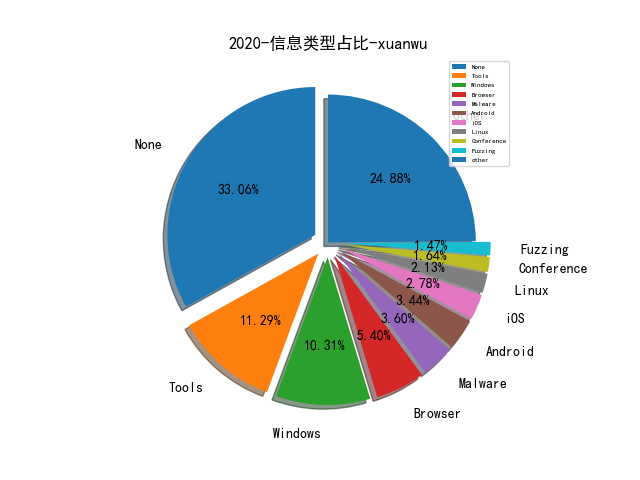
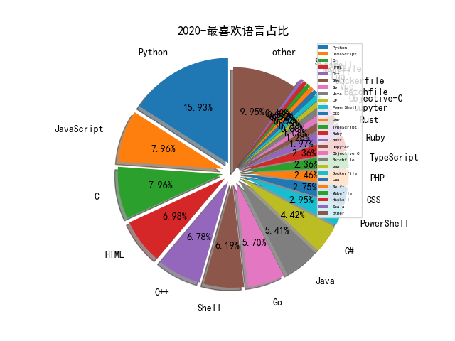

# [数据--所有](README_20.md)
# [数据--年度](README_2020.md)
# 2020 信息源与信息类型占比

# 微信公众号 推荐
| nickname_english | weixin_no | title | url| 
| --- | --- | --- | ---| 
| 安全学术圈 | secquan | AsiaCCS 2020 论文录用列表 | https://mp.weixin.qq.com/s/uCyikieFzmbF0gAFTeHSfA | 11| 
| 99所 | gh_4b0bd9f08b03 | 【视频】利用Twitter如何挖掘有价值的开源信息？——工具篇 | https://mp.weixin.qq.com/s/ukP2ASwXA8HDuDNYGHC-Sw | 1| 
| Bypass | Bypass-- | 甲方安全开源项目清单 | https://mp.weixin.qq.com/s/FS8JVnZqqXw1M9czyeF8dw | 7| 
| MS509 | CSRC-MS509 | Subrion CMS 代码审计 | https://mp.weixin.qq.com/s/HX12VGVtJo3zc7XI8OVwpg | 1| 
| 互联网安全内参 | anquanneican | 深度解读：Verizon 2020年数据泄露报告 | https://mp.weixin.qq.com/s/sDu5eydjesAwsI2v8dEj5Q | 3| 
| 全频带阻塞干扰 | RFJamming | 一线执法必备的自我隐私保护能力 | https://mp.weixin.qq.com/s/h6jE7RD6pzaPINxiRoG0BQ | 1| 
| 安全威胁情报 | Threatbook | 钓鱼、投递木马……一文扒尽“白象三代”APT组织攻击活动！ | https://mp.weixin.qq.com/s/ve2L6_v0EvJZwLSyWijvUw | 1| 
| 宽字节安全 | gh_2de2b9f7d076 | JBOSS 无文件webshell的技术研究 | https://mp.weixin.qq.com/s/_SQS9B7tkL1H5fMIgPTOKw | 7| 
| SecIN技术平台 | sec-in | 一种新型shellcode仿真框架分析 | https://mp.weixin.qq.com/s/9XHNMwIhmZLtOI385_4iaQ | 1| 
| 大兵说安全 | dabingshuoanquan | 也来聊聊态势感知（上） | https://mp.weixin.qq.com/s/dCGMfKsFzYaZiffjkBBYpg | 3| 
| 星阑科技 | StarCrossCN | Jsonp漏洞简析及自动化漏洞挖掘脚本编写 | https://mp.weixin.qq.com/s/SuEpF3RIZIv2CcIUok8SoQ | 3| 
| EnjoyHacking | zom3y3 | 基于ClickHouse + Redash + Python去做安全数据分析 | https://mp.weixin.qq.com/s/O7IuAZV1XuogKwsoLhx4Qw | 1| 
| 信息安全与通信保密杂志社 | cismag2013 | 全国23省市“新基建”网安任务重点梳理 | https://mp.weixin.qq.com/s/Isv3mrwIIEHZi6_gn7u-9g | 1| 
| 中国白客联盟 | China_Baiker | 渗透中的内网渗透 | https://mp.weixin.qq.com/s/Mk5P_04SAitUjRztc9e-Rw | 2| 
| SecWiki | SecWiki | [Sec-Trans-12] Github信息收集 | https://mp.weixin.qq.com/s/LnjKK1YJ7BvMXPuFbeq37w | 7| 
| 老马玩工控安全 | gh_e41f6c29c07a | 工控安全事件汇总与分析 | https://mp.weixin.qq.com/s/rG1oG8nz07DtRKTRaJjM7A | 1| 
| 绿盟科技研究通讯 | nsfocus_research | AISecOps：打造可信任安全智能 | https://mp.weixin.qq.com/s/Tz9V05CHqLg_Wt4yfJZffQ | 6| 
| 长亭安全课堂 | chaitintech_release | Python代码保护 , pyc 混淆从入门到工具实现 | https://mp.weixin.qq.com/s/qvbwTAmDOvpHrAoNdQ7RRA | 1| 
| 锦行信息安全 | jeeseensec | 任天堂再遭黑手，用户隐私到底该如何保护？ | https://mp.weixin.qq.com/s/O7N2OWtSQUKY-6d5H6e7lg | 4| 
| 安恒信息 | DBAPP2013 | 红蓝对抗——「CobaltStrike」应用攻击手段实例分析 | https://mp.weixin.qq.com/s/9_0pLbmWqUbJ6aGEPjxvYA | 1| 
| 安恒信息安全研究院 | gh_684e6ad8d12c | StarCTF 2019 v8 off-by-one漏洞学习笔记 | https://mp.weixin.qq.com/s/z6PLgxbt0yniwiuRY2bUWw | 3| 
| 看雪学院 | ikanxue | 新手向总结：IDA动态调试So的一些坑 | https://mp.weixin.qq.com/s/91r1cKyL_1UR79OP2XubqA | 4| 
| 腾讯安全应急响应中心 | tsrc_team | 主机安全——洋葱Webshell检测实践与思考 | https://mp.weixin.qq.com/s/ol70aVdvybzMJmtfxaAAZQ | 7| 
| 七夜安全博客 | qiye_safe | APT的思考: CMD命令混淆高级对抗 | https://mp.weixin.qq.com/s/hJ6gn9EMKNmMOofEg3i6Iw | 8| 
| 爱奇艺技术产品团队 | iQIYI-TP | ​干货 , 爱奇艺全链路自动化监控平台的探索与实践 | https://mp.weixin.qq.com/s/j44LMlItuTodfJvL_YGTUA | 3| 
| 腾讯安全 | TXAQ2019 | 腾讯安全发布《零信任解决方案白皮书》 | https://mp.weixin.qq.com/s/ZkuR5bDGYpXySUcuROcb7Q | 1| 
| 正阳能量场 | Sun-Energy-Field | 全面了解风控数据体系 | https://mp.weixin.qq.com/s/PCRzPGGBXG7cJAInylkCRg | 1| 
| 安全客 | anquanbobao | 由喝啤酒引发的军事情报人员信息泄露 | https://mp.weixin.qq.com/s/sJyTd50SukIFuVjPSTrFDQ | 2| 
| 全球技术地图 | drc_iite | 美国国防高级研究计划局未来网络安全研发趋势分析 | https://mp.weixin.qq.com/s/gWrMODC3Rkznk-swglI0Qw | 1| 
| Flanker论安全 | ShowMeShell | Fuzzing战争: 从刀剑弓斧到星球大战 | https://mp.weixin.qq.com/s/nREiT1Uj25igCMWu1kta9g | 1| 
| SecPulse安全脉搏 | SecPulse | 一次曲折的渗透测试之旅 | https://mp.weixin.qq.com/s/4bFC1GdiRZe9ygazXb1pnA | 1| 
| 湛卢工作室 | xuehao_studio | PWN , “网鼎杯”朱雀之战——魔法房间题解 | https://mp.weixin.qq.com/s/4vgBmesl2KICNSoDEep_5Q | 4| 
| 腾讯安全威胁情报中心 | gh_05a6c5ec3f78 | 腾讯安全威胁情报中心“明厨亮灶”工程：基于域名图谱嵌入的恶意域名挖掘 | https://mp.weixin.qq.com/s/LeK6QYHwd3k3UlyAuSkcZA | 1| 
| 专注安管平台 | gh_48603b9bb05a | SANS：2020年自动化与集成调查报告 | https://mp.weixin.qq.com/s/NZNK95gtUAFqMsxkgknTCQ | 3| 
| 数世咨询 | gh_b3fb3a62dcc4 | 2020年度网络安全十大潜力技术及五大市场前瞻 | https://mp.weixin.qq.com/s/nDf1ZGvdWnsAt2lGRcF5wg | 3| 
| CNCERT风险评估 | cncertfengxianpinggu | 2019年开源软件风险研究报告 | https://mp.weixin.qq.com/s/VgoS1EftRFcYv9n2PJHoRg | 1| 
| 全知科技 | gh_0bd30f1b0430 | 再谈作为生产要素的数据安全 | https://mp.weixin.qq.com/s/hkv4y7pQRBjLCgm3StKVSQ | 1| 
| 君哥的体历 | jungedetili | 郭威：金融企业重保一线经验分享 | https://mp.weixin.qq.com/s/2MNCTggf5bWT8NAYGyIVIQ | 8| 
| 白帽汇 | baimaohui888 | 基于Docker的固件模拟 | https://mp.weixin.qq.com/s/t8ijT6pBjT9vB5yrd9Qstw | 2| 
| 论文收割机 | paper_reader | 深度长文：图神经网络欺诈检测方法总结 | https://mp.weixin.qq.com/s/ewzsURiU7bfG3gObzIP2Mw | 1| 
| 酒仙桥六号部队 | anfu-360 | 一次曲折的渗透测试之旅 | https://mp.weixin.qq.com/s/HmGEYRcf1hSVw9Uu9XHGsA | 2| 
| 中通安全应急响应中心 | ZTO_SRC | 中通RASP安全防护方案初探 | https://mp.weixin.qq.com/s/33CtW9ErXCDWoCJRFzlVPQ | 2| 
| 小强说 | xiaoqiangcall | 从STIX2.1看安全智能归来 | https://mp.weixin.qq.com/s/nYV3S2oYNNnKcpvNAG751w | 1| 
| 情报分析师 | qingbaofenxishi | 大数据环境下安全情报融合体系构建 | https://mp.weixin.qq.com/s/bjqv8zlSEl7waKHxBNIwyA | 1| 
| 虎符智库 |  | 各国竞相布局 卫星互联网重新定义网络战 | https://mp.weixin.qq.com/s/mj4BVfI-j3yp-xaSZeEW_A | 2| 
| Tide安全团队 | TideSec | 资产管理与威胁监测平台Tide-Mars开源了！ | https://mp.weixin.qq.com/s/-7V14Rpu2KU5HUsa0p025g | 38| 
| 天融信阿尔法实验室 |  | JAVA RMI反序列化知识详解 | https://mp.weixin.qq.com/s/bC71HoEtDAKKbHJvStu9qA | 1| 
| 漏洞推送 |  | 浏览器中隐蔽数据传输通道-DNS隧道 | https://mp.weixin.qq.com/s/u5HV7umrZABcgVpZ5pn6WQ | 1| 
| lymmmx |  | 已知邮箱，求手机号码? | https://mp.weixin.qq.com/s/XvMruURNVWBkEwxvnPSW1g | 1| 
| 赵武的自留地 |  | 我的安全漏洞观 | https://mp.weixin.qq.com/s/86cS8yIgbVcKStZWq84M7Q | 2| 
| ChaMd5安全团队 | chamd5sec | De1CTF2020-WriteUp下(Crypto、Reverse) | https://mp.weixin.qq.com/s/KKkxUb_rUEi7Pxj0Qj5Odw | 10| 
| IMKP | TrustMatrix_KP | 用SASE加速零信任网络交付 | https://mp.weixin.qq.com/s/OjHgQGrJWfueu4AfxES9Hg | 1| 
| ipasslab |  | 学术报告,协议模糊测试相关技术梳理 | https://mp.weixin.qq.com/s/RCpAUpFEzbSewEnWpHrsqw | 1| 
| 漏洞战争 | vulwar | 技术人的修炼之道：从业余到专业 | https://mp.weixin.qq.com/s/gBgFyy4MMrF5vn-8NGEVQw | 3| 
| 电子商务电子支付国家工程实验室 | gjgcsys | 物联网场景下的白盒加密技术 | https://mp.weixin.qq.com/s/y8FNDtuJIIiYmZDLTxuL_g | 1| 
| DJ的札记 | DJ_notes | 相信技术的力量 - RSAC 2020 (2) | https://mp.weixin.qq.com/s/C_qQtuisG0NVcwad4y0BqQ | 2| 
| 安全喷子 |  | 2019年网络安全报告精选 | https://mp.weixin.qq.com/s/YCSuRXhiFYGaE-f3_C8l5A | 3| 
| ADLab | v_adlab | 启明星辰ADLab：渗透利器Cobalt Strike在野利用情况专题分析 | https://mp.weixin.qq.com/s/Agr3doBvYMK6Bs0tH6urcw | 2| 
| caoz的梦呓 | caozsay | 谈谈工作和学习中，所谓的主动性 | https://mp.weixin.qq.com/s/qB9phQwF8NulwSGINQz3yA | 1| 
| heysec | bloodzer007 | SonarQube实现自动化代码扫描 | https://mp.weixin.qq.com/s/L5WeEFvu6etVTAigx6jjcQ | 13| 
| 人工智能架构 |  | 基于大数据的Uber数据实时监控（Part 2：Kafka和Spark Streaming） | https://mp.weixin.qq.com/s/GAHYECAWLvOob7TSQHHaiQ | 3| 
| 安全狗 | safedog2013 | 在网络安全领域应用机器学习的困难和对策 | https://mp.weixin.qq.com/s/j7vuiAWz6kY4ePsjb5EtDw | 1| 
| 网信中国 | cacweixin | 网络安全审查办法 | https://mp.weixin.qq.com/s/nAjbLxdDnflhc_89y0e01Q | 1| 
| 网信防务 | CyberDefense | COVID-19攻击手段与数据分析 | https://mp.weixin.qq.com/s/C_BN96qI9Wb96KcyqXb4_Q | 3| 
| 百度安全应急响应中心 | baidu_sec | 构建企业级研发安全编码规范 | https://mp.weixin.qq.com/s/PNvCvV4gYJkfIsKJ1ccneA | 1| 
| 谛听ditecting |  | 2019年工业控制网络安全态势白皮书 | https://mp.weixin.qq.com/s/phcpafQnNBnyQ10FOcSriQ | 1| 
| qz安全情报分析 | lookvul | 刨析NSA/ASD的WebShell防御指南 | https://mp.weixin.qq.com/s/oswnCc18UhYOrc6OC0COaA | 2| 
| VIPKID安全响应中心 | vk_src | 【技术分享】基于数据流的越权检测 | https://mp.weixin.qq.com/s/FC6ROeMAdGUxkjVjFd914A | 1| 
| 安全研究与实践 | secsky001 | 体系化的WAF安全运营实践 | https://mp.weixin.qq.com/s/BiH23k7xAeuwb5wwaOEKVw | 1| 
| 雷神众测 | thorsrc | 近源渗透测试之USBninja实战 | https://mp.weixin.qq.com/s/qCA-6zXbwpj8nyn5791zfg | 1| 
| 黑金笔谈 | heijinbitan | Windows域环境及域渗透知识分享 | https://mp.weixin.qq.com/s/gvDzKFIsdhtkOKRANscEJA | 2| 
| VMware中国研发中心 | vmwarechinard | 使用FATE进行图片识别的深度神经网络联邦学习 | https://mp.weixin.qq.com/s/wlB8Hz4nTgz9zEP3OEQDAQ | 1| 
| vessial的安全Trash Can | vx_security | 移动基带安全研究系列文章之概念与系统篇 | https://mp.weixin.qq.com/s/YYicKHHZuI4Hgyw25AvFsQ | 1| 
| 中国警察网 | zgjcwcpd | 公安部公布十起侵犯公民个人信息违法犯罪典型案件 | https://mp.weixin.qq.com/s/3P4zEOepOxBETOcvBYhpDA | 1| 
| 中睿天下 | zorelworld | 干货,一次对钓鱼邮件攻击者的溯源分析 | https://mp.weixin.qq.com/s/-v7-M05Qyob5Rpzm_9lPQQ | 1| 
| 美团安全应急响应中心 |  | 复杂风控场景下，如何打造一款高效的规则引擎 | https://mp.weixin.qq.com/s/m4jFHUP3JYF9Z8TUxi9UIg | 1| 
| 腾讯御见威胁情报中心 |  | 微软发布字体解析远程代码执行漏洞补丁，建议用户尽快修补 | https://mp.weixin.qq.com/s/RvTZWvcXiXsI7xB6L9RWIg | 4| 
| 404 Not F0und |  | 我对安全与NLP的实践和思考 | https://mp.weixin.qq.com/s/_q5s1fHc0DB3feSd4gQZyw | 1| 
| 中国信息安全 | chinainfosec | 专题·原创 , 国际网络安全应急响应体系介绍 | https://mp.weixin.qq.com/s/1_cJGTpH4dU780K6qngkjQ | 1| 
| 信息通信技术与政策 | caict_dsc | APT供应链攻击防护应对分析及意义 | https://mp.weixin.qq.com/s/qGMRjCeIyHSHk_aXI8Fxbg | 1| 
| 永安在线反欺诈 | YongAnOnline | 永安在线 , 生鲜电商拉新场景业务安全测评报告 | https://mp.weixin.qq.com/s/oiSYOA-BDn9fUnb7EhO2vA | 2| 
| 腾讯安全智能 | TX_Security_AI | 基于SOC机器学习检测平台的行为分析建模---HTTP隐蔽通信检测 | https://mp.weixin.qq.com/s/ggFbaQvn8yUJOFi_-DPNOw | 2| 
| 360CERT | CERT-360 | “震网”三代和二代漏洞技术分析报告 | https://mp.weixin.qq.com/s/qc25c_nuUax6UoknAVLrAw | 1| 
| Ms08067安全实验室 | Ms08067_com | 六种bypass安全软件防护执行的方式 | https://mp.weixin.qq.com/s/sfxJbyJMB6FyGfa6H0G3hA | 30| 
| 云众可信 | yunzhongkexin | 原创干货 , 对某大型企业的一次web漏洞挖掘过程 | https://mp.weixin.qq.com/s/GuJgbLfJobTcJ2FMii3IzA | 2| 
| 关注安全技术 | heresecurity | 常见的web容器后门笔记 | https://mp.weixin.qq.com/s/-cmM1k3--H6p1ditfQHPEw | 1| 
| 小议安全 | xiaoyianquan | 零信任架构实战系列：干掉密码，无密码化方案落地 | https://mp.weixin.qq.com/s/xs-xybNs6Ha6_-Qr_EE-qw | 4| 
| 网安国际 | inforsec | 【InForSec通讯】安全漏洞报告的差异性测量 , Usenix Security2019 | https://mp.weixin.qq.com/s/h6xLJyqybGASORugqsvmgg | 1| 
| 国防科技要闻 | CDSTIC | 2021财年DARPA预算概况及发展动向解析 | https://mp.weixin.qq.com/s/yEsrMmI0BpvllXaf3TBWkw | 1| 
| 大路咨询 | daluzixun | 中国工业网络安全厂商综合能力概览（2020年第1期） | https://mp.weixin.qq.com/s/6i17MV8T3rou8j0rY-ZbIQ | 1| 
| 中国保密协会科学技术分会 |  | 2020 Unit 42 IoT威胁报告（汉译版） | https://mp.weixin.qq.com/s/40fgfbuwa2c5jp6e5vbnxQ | 1| 
| 水滴安全实验室 | EversecLab | 美公司披露俄长达15年的网络活动简析 | https://mp.weixin.qq.com/s/nd_dZmAyp5U0lQSOytB6Ng | 4| 
| 深澜深蓝 |  | 漏洞分析视角下的CVE-2020-0796漏洞 | https://mp.weixin.qq.com/s/Cn0bF7xG6ESCP2iVYiaW2g | 1| 
| 网络安全观 | SecurityInsights | 网络安全架构 , 通过安全架构提升安全性 | https://mp.weixin.qq.com/s/m90wYaEvHzfsdgnFHMGxCw | 2| 
| GoCN | golangchina | 「开源发布」 滴滴内部监控系统 Nightingale 开源啦 | https://mp.weixin.qq.com/s/Wo_em4yB5dRPvFecma4bkw | 1| 
| JohnDoe爱学习 |  | 俄罗斯情报部门代号一览(Top Secret) | https://mp.weixin.qq.com/s/2FnrR5qsm9BTlAS_SeKrzw | 1| 
| 冷渗透 |  | 黑产研究之秒拨IP | https://mp.weixin.qq.com/s/XL6XO-FBHq37H1h-iMwV4w | 1| 
| 小米安全中心 | misrc_team | IoT上SSL安全开发小结 | https://mp.weixin.qq.com/s/rSXqBCFmawLg_oYYVKecLQ | 1| 
| 白帽子的成长之路 | whitehat_day | 2020年开源情报（OSINT）TOP20 工具 | https://mp.weixin.qq.com/s?__biz=MzI2NDY1NDg0OA==&mid=2247484049&idx=1&sn=e6e716cfcfef01956c1acc7d684d44d1 | 3| 
| 盘古实验室 | PanguLab | 微信远程攻击面简单的研究与分析 | https://mp.weixin.qq.com/s/yMQN3MciI-0f3mzz_saiwQ | 1| 
| 落水轩 |  | 基于开源情报解密美国雷神山火神山 | https://mp.weixin.qq.com/s/OCAK5byqIvXttqxxSQmDkQ | 1| 
| PolarisLab | PolarisLab | 追踪与新冠状病毒相关的安卓恶意软件 | https://mp.weixin.qq.com/s/fLDNLJIWwvrUUwt6Pi6T4A | 2| 
| 山丘安全攻防实验室 | hillsec | 一篇文章带你从XSS入门到进阶(附Fuzzing+BypassWAF+Payloads) | https://mp.weixin.qq.com/s/EOPCstDYmFVtaLYNcUQLzA | 2| 
| 零队 |  | 加载远程XSL文件的宏免杀方法 | https://mp.weixin.qq.com/s?__biz=MzU2NTc2MjAyNg==&mid=2247483758&idx=1&sn=1bd0006d16747389046058ea34c3b7b7&chksm=fcb783ebcbc00afd694b7a2ee10ad32aff0a534963878541ee17974ffee29c63342f4e617661&token=1823181969&lang=zh_CN#rd | 1| 
| AI科技评论 | aitechtalk | 如何以初学者角度写好一篇国际学术论文？ | https://mp.weixin.qq.com/s/zwTlXBrZiC88y9F5DDU0_g | 1| 
| 安全乐观主义 |  | SDL已死，应用安全路在何方？ | https://mp.weixin.qq.com/s/tYRiKiI7bjgyzQguMA1mrw | 1| 
| PeckShield | PeckShield | 硬核：解密美国司法部起诉中国OTC承兑商洗钱案件 | https://mp.weixin.qq.com/s/wWrm3gwT72Pc8Nxw-1OiSw | 1| 
| 道法术 |  | 2020 IoT Threat Report (简单解读版) | https://mp.weixin.qq.com/s/AqUyHGLzlmrBSKfk-IxW6g | 2| 
| PaperWeekly | paperweekly | 文本分类和序列标注“深度”实践 | https://mp.weixin.qq.com/s/afO58DDDZGb5w_EEG8oW6Q | 1| 
| 奇安信威胁情报中心 |  | 网空威胁情报（CTI）日益成熟：2020年SANSCTI调查结果解读 | https://mp.weixin.qq.com/s/ERakfCjEjW_UfViz9KoxFQ | 2| 
| 哈工大SCIR | HIT_SCIR | 赛尔笔记 , 机器阅读理解简述 | https://mp.weixin.qq.com/s/Rm1uFunX9IRQaL_rUAZxfQ | 1| 
| 工业菜园 | gycy-2019 | 菜农观点 , 陆宝华：关于智慧城市安全的讨论 | https://mp.weixin.qq.com/s/1-xpgttndYIXGkyspTIp1w | 1| 
| 银河安全实验室 | Galaxy-Lab | 尝试利用Cython将Python项目转化为单个.so | https://mp.weixin.qq.com/s/YRKY7FgLFw-w4QIlrNd-FA | 1| 
| 安天 | Antiylab | 安天对“超高能力网空威胁行为体”系列分析回顾 | https://mp.weixin.qq.com/s/N0LxStDpc6GyzpyszYnguQ | 1| 
| 青衣十三楼飞花堂 |  | burp pro 2020.2 | https://mp.weixin.qq.com/s/WXdEvc0p04KjyOlmb4qtRg | 1| 
| 大潘点点 | dapandiandian | 网安产业结构和动力分析——从合规型向能力型 | https://mp.weixin.qq.com/s/V6P-6X_fnw_kvHWMxtqwLg | 1| 
| 物联网IOT安全 | IOTsafety | Cobalt Strike｜从入门到入狱 | https://mp.weixin.qq.com/s/WAqgHn0DrXerEeow131w4Q | 1| 
| 我的安全视界观 | CANI_Security | SDL最初实践（完结）Paper下载 | https://mp.weixin.qq.com/s/WSKpvCEDLpixXUQzKCFcvA | 4| 
| 字节跳动技术团队 | toutiaotechblog | 字节跳动自研万亿级图数据库 & 图计算实践 | https://mp.weixin.qq.com/s/uYP8Eyz36JyTWska0hvtuA | 1| 
| 时间之外沉浮事 | tasnrh | 商业网络培训靶场的形态及思考 | https://mp.weixin.qq.com/s/kbiZuNEnhb-WggRemUN9TQ | 4| 
| 奇安信安全服务 |  | 红队实战攻防技术分享：Linux后门总结-各类隐藏技能 | https://mp.weixin.qq.com/s/B5cam9QN8eDHFuaFjBD34Q | 1| 
| 关键基础设施安全应急响应中心 | CII-SRC | 原创 , 固件攻击研究综述 | https://mp.weixin.qq.com/s/Qjvirq2sVO9nPBauBRGS4Q | 2| 
| 悬剑武器库 |  | WebShell免杀之JSP | https://mp.weixin.qq.com/s/YJtfQTvowVr2azqBWGla1Q | 1| 
| 数说安全 | SSAQ2016 | 谈谈2020年RSA创新沙盒10强及其对中国创业者的价值 | https://mp.weixin.qq.com/s/z0xsJGSMWbQy60_QmArmQA | 1| 
| 360企业安全集团 |  | “美女与野兽”，Transparent Tribe启用新资产对印度空军发起特定攻击 | https://mp.weixin.qq.com/s/YY2h73A6KiFjnfjsJtWGNQ | 1| 
| 网络空间安全军民融合创新中心 | jmrh1226 | 从美国防部“2021财年预算提案” 看美军网络空间建设趋势特点 | https://mp.weixin.qq.com/s/ysG4z8UrfEZTlBovGTWcZw | 1| 
| 网信军民融合 | wxjmrh | 研究探讨 , 军工领域建设网络安全攻防靶场平台的思路 | https://mp.weixin.qq.com/s/UmW3WCtDIOWw1bXfJnLnhg | 1| 
| APT攻击 | cncg_team | 对zimbra邮服认证机制的一些探索 | https://mp.weixin.qq.com/s/u-p6_srzby1bbejqClmf-A | 1| 
| 中国计算机学会 | ccfvoice | CCCF译文 , 工业级知识图谱：经验与挑战 | https://mp.weixin.qq.com/s/4Fdpik3EtEng-ri_7tGM0A | 1| 
| 白日放歌须纵9 |  | 从产品视角重新定义“检测”和“分析” | https://mp.weixin.qq.com/s/oq3T1fSKAHeDfWZNpciXSw | 1| 
| 知识工场 | fudankw | 肖仰华： 知识图谱下半场-机遇与挑战 | https://mp.weixin.qq.com/s/IW4rBc7Z9f2ByKjQR2MTjw | 1| 
| 贝塔安全实验室 | BetaSecLab | 某大学渗透测试实战靶场报告-Part1 | https://mp.weixin.qq.com/s/RyvuOEmqorAhQcn6wwCDKA | 2| 
| 电科防务 | CETC-ETDR | 世界网络战领域2019年发展回顾与2020年展望 | https://mp.weixin.qq.com/s/Mx3H2Za7hI9ZZIaZedmXBQ | 1| 
| FreeBuf | freebuf | Go语言代码安全审计分享 | https://mp.weixin.qq.com/s/8Ju05hYCYk6bOgkvjtP11A | 1| 
| 平凡路上 |  | 科恩面试与实习感想 | https://mp.weixin.qq.com/s/GiIIUZbzq2IOp5-arkUCfg | 1| 
| 鱼塘领路人 | KingofSaltedFish | 威胁情报系列（一）：什么是威胁情报 | https://mp.weixin.qq.com/s/f9G818SGijdfS13KjLnFoA | 1| 
| SudoNLP |  | 2019年NLP领域总结回顾 | https://mp.weixin.qq.com/s/7ROSm_wQNMAKLWUR0djVLQ | 1| 
| 安全引擎 | SecEngine | Java动态类加载，当FastJson遇上内网 | https://mp.weixin.qq.com/s/ou3L-IU1CNr9EGkpjH2u0w | 1| 
| 新一代信息科技战略研究中心 | casitclic | DARPA发布战略框架文件《保障国家安全的突破性技术和新能力》 | https://mp.weixin.qq.com/s/D23I3qEpMs8eOFKy8w2RJg | 1| 
| 绿盟科技 | NSFOCUS-weixin | 基于ATT&CK+SOAR的运营实践 | https://mp.weixin.qq.com/s/Z1sAbpSYZXYBO5qpgvjXlQ | 1| 
| 编程技术宇宙 | ProgramUniverse | 内核地址空间大冒险：系统调用 | https://mp.weixin.qq.com/s/esc9gWg42vyPkT58HCKNgg | 3| 
| 软件安全智能并行分析实验室 |  | 学术报告,针对物联网设备的模糊测试概述 | https://mp.weixin.qq.com/s/pbOOkxrV0HJFzQicJ0m6Cg | 1| 
| FEEI |  | 一个安全工程师的2019 | https://mp.weixin.qq.com/s/rr2f1RxFTjLSGlqxaG-aog | 1| 
| Gcow安全团队 | Gcow666 | 游荡于中巴两国的魅影——响尾蛇(SideWinder) APT组织针对巴基斯坦最近的活动以及2019年该组织的活动总结 | https://mp.weixin.qq.com/s/CZrdslzEs4iwlaTzJH7Ubg | 1| 
| 穿过丛林 |  | 优秀博士系统能力培养（PPT） | https://mp.weixin.qq.com/s/9zKM6hQZOYRjr5IeawgsKA | 1| 
| 腾讯科恩实验室 | KeenSecurityLab | 在Tesla Model S上实现Wi-Fi协议栈漏洞的利用 | https://mp.weixin.qq.com/s/rULdN3wVKyR3GlGBhunpoQ | 1| 
| 维他命安全 | VitaminSecurity | 维他命2019大盘点之安全事件/漏洞篇 | https://mp.weixin.qq.com/s/AsVZawBtipQzSdgJHt7eiw | 1| 

# 组织github账号 推荐
| github_id | title | url | org_url | org_profile | org_geo | org_repositories | org_people | org_projects | repo_lang | repo_star | repo_forks| 
| --- | --- | --- | --- | --- | --- | --- | --- | --- | --- | --- | ---| 

# 私人github账号 推荐
| github_id | title | url | p_url | p_profile | p_loc | p_company | p_repositories | p_projects | p_stars | p_followers | p_following | repo_lang | repo_star | repo_forks | 
| --- | --- | --- | --- | --- | --- | --- | --- | --- | --- | --- | --- | --- | --- | ---| 
| thelinuxchoice | 恶意Android apk生成器GetDroid v1.3发布(反向Shell)，请注意分析和防范。 | https://github.com/thelinuxchoice/getdroid | http://twitter.com/linux_choice | Twitter: @linux_choice | None | None | 112 | 0 | 38 | 4200 | 5 | Python,Shell,HTML | 1600 | 626 | 1| 
| Neo23x0 | 开源日志数据分析工具sigma更新了现有的ATT＆CK技术参考 | https://github.com/Neo23x0/sigma/pull/845 | https://github.com/NextronSystems | #DFIR #Python #YARA #Golang #SIEM #SOC #Sigma #Malware | None | @NextronSystems | 83 | 0 | 121 | 1800 | 15 | Python,Batchfile,Java | 2600 | 687 | 1| 
| 3gstudent | 利用 Python3 快速枚举 Active Directory 用户 | https://github.com/3gstudent/pyKerbrute// | https://3gstudent.github.io/ | good in study,attitude and health | None | None | 79 | 0 | 170 | 1600 | 14 | Python,Batchfile,PowerShell,C++ | 640 | 214 | 1| 
| jas502n | CVE-2020-2551 Weblogic RCE with IIOP | https://github.com/jas502n/CVE-2020-2551 | https://twitter.com/jas502n | 1.misc 2.crypto 3. web 4. reverse 5. android 6. pwn 7. elf | Hong Kong | jas502n | 235 | 0 | 379 | 1600 | 343 | Python,C,Shell,Java | 302 | 129 | 1| 
| CHEF-KOCH | KMS-activator - 关于 Windows 激活机制研究的一个项目 | https://github.com/CHEF-KOCH/KMS-activator | https://github.com/microsoft | Former @microsoft and @NVIDIA employee. Since 2018 NTT-Security. Interested in privacy/security, gaming & demoscene related topics. | Lausanne | CKs Technology News | 125 | 0 | 4100 | 1400 | 127 | Python,C,Batchfile,JavaScript,Pascal | 590 | 145 | 1| 
| CHYbeta | Web安全学习的一个github库 | https://github.com/CHYbeta/Web-Security-Learning | https://twitter.com/chybeta |  | China | XMU | 27 | 0 | 1600 | 1400 | 122 | Python,HTML | 2700 | 807 | 1| 
| FuzzySecurity | BlueHat IL 会议的演讲《Staying # and Bringing Covert Injection Tradecraft to .NET》PPT | https://github.com/FuzzySecurity/BlueHatIL-2020 | http://www.fuzzysecurity.com/ |  | None | None | 19 | 0 | 0 | 1200 | 0 | C#,YARA,JavaScript,PowerShell | 1800 | 609 | 2| 
| ionescu007 | TpmTool - TPM NV Space Access Tool | https://github.com/ionescu007/tpmtool// | https://github.com/aionescu | VP of EDR Strategy at CrowdStrike President of Winsider Seminars & Solutions, Inc. Follow me at @aionescu on Twitter and http://www.alex-ionescu.com | None | Winsider Seminars & Solutions Inc. | 22 | 0 | 0 | 1100 | 1 | C,C++ | 1100 | 193 | 1| 
| mattifestation | 用于辅助构建、审计、部署 Windows Defender Application Control (WDAC) 策略的工具 | https://github.com/mattifestation/WDACTools | http://www.exploit-monday.com/ |  | None | None | 26 | 0 | 9 | 1100 | 1 | PowerShell | 653 | 167 | 1| 
| vanhauser-thc | 为 libfuzzer 生成一个直观的 HTML 格式的覆盖率报告 | https://github.com/vanhauser-thc/libfuzzer-coverage// | https://www.mh-sec.de/ | Security researcher since 1994 https://www.mh-sec.de/ https://www.thc.org/ https://twitter.com/hackerschoice | Berlin | The Hackers Choice , mh-sec , me , myself | 27 | 0 | 64 | 932 | 22 | C,Shell,HTML,Python,C++,Batchfile | 3700 | 1000 | 2| 
| random-robbie | 一款用于检查SSRF漏洞的fuzz工具。 | https://github.com/random-robbie/ssrf-finder | https://www.what-security.co.uk | Bug Bounty Hunter that appears in your searches! Soz not Soz! Raise an Issue if you wish to contact me do not email me! | Wirral UK | None | 232 | 0 | 295 | 696 | 113 | Python | 554 | 212 | 1| 
| tandasat | 在 Hyper-V 环境中测试 UEFI | https://github.com/tandasat/MiniVisorPkg/blob/master/Docs/Testing_UEFI_on_Hyper-V.md | http://standa-note.blogspot.ca/ | Engineer @standa_t | Vancouver, Canada | None | 58 | 0 | 19 | 668 | 3 | C,C++ | 777 | 245 | 1| 
| klionsec | RedTeamer: 红方人员作战执行手册 | https://github.com/klionsec/RedTeamer | https://huntingday.github.io |  | MITRE , ATT&CK 中文站 | klion@protonmail.com | 6 | 0 | 91 | 629 | 14 | Shell,HTML | 352 | 85 | 1| 
| lirantal | Awesome Node.js Security resources | https://github.com/lirantal/awesome-nodejs-security#static-code-analysis | https://github.com/snyksec | 🥑 Developer Advocate @snyksec , @nodejs Security WG , @jsheroes ambassador , Author of Essential Node.js Security , #opensource #web ❤ | Tel Aviv, Israel | @snyk | 240 | 0 | 695 | 621 | 271 | JavaScript | 2600 | 108 | 1| 
| grayddq | ScanCVE: 监控Github上CVE增量 | https://github.com/grayddq/ScanCVE | None | 一位喜欢原创的安全工作者！ | None | None | 17 | 0 | 0 | 587 | 0 | Python | 844 | 265 | 1| 
| 404notf0und | AISec 17~19 届会议的 Papers | https://github.com/404notf0und/AI-for-Security-Paper | https://www.4o4notfound.org | 欢迎关注公众号：404 Not F0und，专注于Cyber-Security and Data-Analysis | Hangzhou,China | Ant Financial | 17 | 0 | 96 | 575 | 17 | Python,Jupyter,TSQL | 703 | 160 | 1| 
| 0x09AL | A native backdoor module for Microsoft IIS | https://github.com/0x09AL/IIS-Raid | https://twitter.com/0x09AL |  | None | MDSec | 126 | 0 | 150 | 552 | 26 | Go,C#,Ruby,C++ | 679 | 149 | 1| 
| tanjiti | 2019安全技术资讯年报 | https://github.com/tanjiti/sec_profile/blob/master/README_YEAR_2019.md | http://tanjiti.com/ | #Network Security Monitor #threat intelligence  #waf #ids #iOS App Security #Android App Security #game security | shanghai | baidu | 17 | 0 | 6 | 552 | 171 | Python,PHP,HTML,Perl | 385 | 174 | 1| 
| qazbnm456 | awesome-web-security: List of Web Security materials and resources | https://github.com/qazbnm456/awesome-web-security | https://www.patreon.com/boik | https://www.boik.com.tw/ | Taiwan | None | 109 | 0 | 1100 | 550 | 20 | Python,JavaScript | 4700 | 907 | 1| 
| TheKingOfDuck | ApkAnalyser: 一键提取安卓应用中可能存在的敏感信息 | https://github.com/TheKingOfDuck/ApkAnalyser | https://blog.gzsec.org/ | 一个废物 | V1g6VGhlS2luZ09mR2FHYUdh | None | 36 | 0 | 190 | 515 | 26 | Shell,Python,JavaScript,HTML,Go,PowerShell | 1600 | 653 | 1| 
| pyn3rd | Apache Tomcat + MongoDB 远程代码执行Poc公布 | https://github.com/pyn3rd/Apache-Tomcat-MongoDB-Remote-Code-Execution | https://twitter.com/pyn3rd |  | Hangzhou | None | 10 | 0 | 0 | 505 | 3 | Python,Batchfile,Java | 172 | 60 | 1| 
| unamer | 之前被用于 WizardOpium APT 攻击行动的 CVE-2019-1458 Windows LPE 漏洞的 Exploit | https://github.com/unamer/CVE-2019-1458 | http://127.0.0.1/phpMyAdmin |  | C:\Windows\ | None | 39 | 0 | 35 | 499 | 4 | Python,C,C++ | 748 | 359 | 1| 
| moonbingbing | OpenResty 最佳实践 | https://github.com/moonbingbing/openresty-best-practices | None |  | None | 360 | 30 | 0 | 49 | 465 | 5 | Python,Lua,C,Perl | 2900 | 726 | 1| 
| blackorbird | 伊朗 APT 组织攻击活动 DUSTMAN 的分析报告 | https://github.com/blackorbird/APT_REPORT/blob/master/International%20Strategic/Iran/Saudi-Arabia-CNA-report.pdf | http://blackorbird.com | APT hunter threat analyst | https://twitter.com/blackorbird | https://twitter.com/blackorbird | 51 | 0 | 112 | 352 | 36 | Python,C,C++ | 702 | 239 | 1| 
| alphaSeclab | Android 安全方向的资料整理 | https://github.com/alphaSeclab/android-security// | None |  | None | None | 19 | 0 | 40 | 307 | 0 |  | 1600 | 274 | 2| 
| woj-ciech | LeakLooker X - 数据库/源码泄漏监控工具 | https://github.com/woj-ciech/LeakLooker-X | None |  | None | None | 15 | 0 | 0 | 306 | 0 | Python,Go,JavaScript,CSS | 1100 | 227 | 1| 
| alephsecurity | QEMU 的 Aleph Research fork 版本，用于运行 iOS 系统 | https://github.com/alephsecurity/xnu-qemu-arm64 | https://alephsecurity.com/ | Security Research | None | HCL Technologies | 14 | 0 | 0 | 292 | 0 | Python,C,Shell,Java | 419 | 49 | 1| 
| mhaskar | Python 编写的 C&C Server，可以通过 HTTP/S 控制 PowerShell Agent | https://github.com/mhaskar/Octopus | https://shells.systems | Hacker and Python developer , OSCP and OSCE certified. | Amman | iSecur1ty | 46 | 0 | 40 | 290 | 12 | Python,C | 269 | 61 | 1| 
| djhohnstein | SharpChromium - 用于从 Chromium 系列浏览器中获取 Cookie、访问历史、网站登录凭据等敏感信息的工具 | https://github.com/djhohnstein/SharpChromium | https://github.com/specterops | Operator at SpecterOps. Kali Contributor. | Seattle, WA | @specterops | 123 | 0 | 10 | 288 | 6 | C#,VBScript,C++ | 104 | 23 | 1| 
| irsdl | 历年Web hacking技巧大全 | https://github.com/irsdl/top10webseclist | https://soroush.me/ |  | @irsdl (Twitter), UK, The Contrived World of InfoSec ><b>abcd | @MDSecLabs (Twitter) | 27 | 0 | 43 | 269 | 0 | Python,C#,Java | 430 | 120 | 1| 
| 0xZ0F | Windows x64 平台逆向分析教程 | https://github.com/0xZ0F/Z0FCourse_ReverseEngineering | https://0xz0f.github.io/ | Security Researcher & Exploit Dev. | United States of America | Z0F | 19 | 0 | 4 | 235 | 0 | C++ | 3500 | 244 | 1| 
| HyperSine | QQ安全中心 - 动态口令的生成算法 | https://github.com/HyperSine/forensic-qqtoken | None |  | None | None | 19 | 0 | 1 | 228 | 0 | Python,C,C++ | 251 | 97 | 1| 
| haidragon | haidragon/KiwiVM-1: virtualization encryption software for mobile applications | https://github.com/haidragon/KiwiVM-1 | http://weibo.com/haidragon | QQ交流群 : 826038086 | 中国 北京 | None | 1200 | 0 | 57 | 227 | 532 | C,JavaScript,C++ | 87 | 31 | 1| 
| jvoisin | php-malware-finder – Detect Potentially Malicious PHP | https://github.com/jvoisin/php-malware-finder | https://dustri.org |  | None | None | 19 | 0 | 158 | 226 | 8 | C,PHP,C++ | 12600 | 2200 | 1| 
| guhe120 | guhe 对 Windows RPC Marshalling 溢出漏洞（CVE-2020-1281）的分析 | https://github.com/guhe120/Windows-EoP/blob/master/CVE-2020-1281/CVE-2020-1281.pdf | None |  | None | None | 8 | 0 | 0 | 225 | 0 | Python,HTML,Java | 80 | 11 | 1| 
| hahwul | Powerfull XSS Scanning and Parameter analysis tool | https://github.com/hahwul/XSpear | https://www.hahwul.com | Security engineer, Rubyist, Gopher and... H4cker | Republic of Korea | None | 47 | 0 | 64 | 222 | 10 | Python,Go,Ruby | 396 | 115 | 1| 
| ioncodes | 在 VS Code 中调试 IDA idapython 脚本的插件 | https://github.com/ioncodes/idacode | https://twitter.com/layle_ctf | Hacker in the streets, reverse engineer in the sheets. Thats how it works, right? | Here | None | 264 | 0 | 1800 | 203 | 33 | C#,Python,Ruby | 209 | 29 | 1| 
| sailay1996 | AMD User Experience Program Launcher 本地提权漏洞分析(CVE-2020-8950) | https://github.com/sailay1996/amd_eop_poc | https://heynowyouseeme.blogspot.com/ | Twitter: @404death , https://www.hackthebox.eu/profile/1467 | Myanmar | None | 177 | 0 | 4 | 197 | 0 | Python,C,Shell,Batchfile | 432 | 69 | 1| 
| Wenzel | awesome-virtualization: Collection of resources about Virtualization | https://github.com/Wenzel/awesome-virtualization | None | Security Researcher , VMI hypervisor-level debugger | Paris, France | None | 110 | 0 | 363 | 192 | 104 | Python,Ruby,Rust | 517 | 103 | 1| 
| Leezj9671 | 渗透测试和安全面试的经验之谈 | https://github.com/Leezj9671/Pentest_Interview | http://neversec.top | 2018 newly graduated student. Web pentester/Python coder. 公众号: NeverSec | Shenzhen,CN | None | 45 | 0 | 95 | 178 | 0 | Python,JavaScript,Dockerfile | 891 | 207 | 1| 
| Kelvinhack | ThreadSpy - 基于硬件实现的 Thread Hijacker | https://github.com/Kelvinhack/ThreadSpy | https://github.com/Tencent | @Tencent Ex Anti-Cheat Researcher @microsoft Security Researcher II | Vancouver | Microsoft | 40 | 0 | 18 | 176 | 1 | C,C++ | 229 | 85 | 1| 
| LeadroyaL | shadowsocks redirect attack exploit | https://github.com/LeadroyaL/ss-redirect-vuln-exp | https://www.leadroyal.cn | Android & Pwn. | ZJU | ZJU | 29 | 0 | 44 | 162 | 7 | Python,Java,C++ | 178 | 28 | 1| 
| citronneur | rdp-rs: Remote Desktop Protocol in RUST | https://github.com/citronneur/rdp-rs | https://github.com/airbus-cert |  | Toulouse, France | @airbus-cert | 24 | 0 | 284 | 159 | 102 | Python,C#,JavaScript,Rust | 1200 | 305 | 1| 
| ddz | Decrypt WhatsApp encrypted media files | https://github.com/ddz/whatsapp-media-decrypt | https://github.com/cashapp | Securing @cashapp at @square. Prev: Co-founder/CTO @capsule8, @trailofbits. Co-author “The Mac Hacker’s Handbook,” “iOS Hacker’s Handbook,” etc. | Brooklyn, NY | @cashapp | 4 | 0 | 0 | 143 | 0 | Go,Nix,Shell | 423 | 44 | 1| 
| nshalabi | SysmonTools - 用于为 Sysmon 提供可视化 UI 和配置的工具套件 | https://github.com/nshalabi/SysmonTools | http://nosecurecode.com | #InfoSec Manager, #Programmer. Following the digital [chaos] and threats landscape. My opinions are my own. Follow me @nader_shalabi and http://nosecurecode.com | Australia | nosecurecode.com | 5 | 0 | 162 | 143 | 16 | C#,HTML,Java,C++ | 694 | 145 | 1| 
| threedr3am | Java安全相关的漏洞和技术demo | https://github.com/threedr3am/learnjavabug | https://threedr3am.github.io |  | None | None | 30 | 0 | 159 | 142 | 27 | Java | 514 | 102 | 1| 
| wcventure | MemLock: Memory Usage Guided Fuzzing | https://github.com/wcventure/MemLock-Fuzz | https://wcventure.github.io/ | Computer Software and Theory, Software Engineering, Machine Learning, Formal Method, Program Analysis, Software Verification, Cyber Security. | Shenzhen, Guangdong Province, China, 518060 | Shenzhen University | 15 | 0 | 98 | 138 | 14 | Python,C,Batchfile | 244 | 36 | 1| 
| WalterInSH | 风险控制笔记，适用于互联网企业 | https://github.com/WalterInSH/risk-management-note | http://walterinsh.github.io |  | Po Shanghai | None | 30 | 0 | 678 | 134 | 86 | Java | 489 | 211 | 1| 
| theLSA | emergency-response-checklist：应急响应指南 | https://github.com/theLSA/emergency-response-checklist | http://www.lsablog.com | I like network security,penestration and programming(python,c/c++,php,java,ect),welcome to communicate with me! | China | None | 38 | 0 | 36 | 133 | 35 | Python | 281 | 77 | 1| 
| dayt0n | 64-bit iOS boot image patcher written in C | https://github.com/dayt0n/kairos | http://dayt0n.com | 19. iOS and OS X tinkerer. Computer Science at UAH. | United States | None | 37 | 0 | 43 | 132 | 47 | Python,C,Shell,C++ | 23 | 7 | 1| 
| cbwang505 | Windows BITS 服务 RPC 接口任意文件移动提权漏洞 Exploit（CVE-2020-0787） | https://github.com/cbwang505/CVE-2020-0787-EXP-ALL-WINDOWS-VERSION | https://blog.csdn.net/oShuangYue12 | 始于C#，精于C&C++，醉心于Windows内核与Com组件安全研究 | China ZheJiang Ningbo | ZheJiang Guoli Security Technology | 41 | 0 | 20 | 130 | 5 | Python,C#,C,HTML,C++ | 121 | 30 | 2| 
| gobysec | Goby新一代安全测试工具 | https://github.com/gobysec/Goby | http://gobies.org | Goby - Make Cybersecurity More Effective The new generation of network security technology | None | Goby | 7 | 0 | 1 | 128 | 0 | Python,Go | 73 | 9 | 1| 
| guimaizi | testing_wave: 被动式web扫描器 | https://github.com/guimaizi/testing_wave | http://www.guimaizi.com/ |  | None | None | 5 | 0 | 31 | 125 | 2 | Python,HTML | 313 | 81 | 1| 
| euphrat1ca | security_w1k1: 安全相关资源列表 | https://github.com/euphrat1ca/security_w1k1 | None | Thousands Times | polar | None | 79 | 0 | 498 | 120 | 40 | Python,Go,Ruby | 343 | 119 | 1| 
| dwisiswant0 | 一款可以用于检查IP地址是否属于Cloudflare | https://github.com/dwisiswant0/cf-check// | https://github.com/kitabisa | Security Engineer | id_ID | @kitabisa | 165 | 0 | 473 | 119 | 12 | Go,Python,Shell,PHP | 105 | 26 | 1| 
| ChanChiChoi | 人脸识别相关的 Papers 收集 - Awesome Face Recognition | https://github.com/ChanChiChoi/awesome-Face_Recognition | http://www.cnblogs.com/shouhuxianjian/ |  | China | None | 21 | 0 | 184 | 110 | 51 | Python,Jupyter | 1800 | 495 | 1| 
| itm4n | PrivescCheck - 用于探测 Windows 是否存在可以被用于本地提权的错误配置 | https://github.com/itm4n/PrivescCheck | https://itm4n.github.io/ | Pentester | Paris | None | 8 | 0 | 27 | 109 | 11 | VBA,PowerShell,C++ | 321 | 87 | 1| 
| insightglacier | Golang实现的x86下的Meterpreter reverse tcp | https://github.com/insightglacier/go_meterpreter | http:/www.shellpub.com | Security Research | Beijing | Shellpub | 79 | 0 | 423 | 92 | 232 | C,ASP,Java,Python,C++,TypeScript,C#,HTML,Go,PHP | 150 | 63 | 2| 
| brompwnie | A HTTP PoC Endpoint for cve-2020-5260 | https://github.com/brompwnie/cve-2020-5260/ | https://twitter.com/brompwnie | Keyboard wrangler ⌨️ | None | None | 29 | 0 | 16 | 91 | 169 | Go,Shell | 269 | 25 | 1| 
| beader | 首届中文NL2SQL挑战赛决赛第3名方案+代码 | https://github.com/beader/tianchi_nl2sql | None |  | 上海 | None | 20 | 0 | 396 | 90 | 3 | Python,Shell,Jupyter | 148 | 57 | 1| 
| angelwhu | 基于JVM-Sandbox实现RASP安全监控防护 | https://github.com/angelwhu/jvm-rasp | http://www.angelwhu.com/ |  | wuhan | whu | 71 | 0 | 307 | 89 | 33 | Python,C,PHP,Java | 21 | 8 | 1| 
| JavierOlmedo | Joplin markdown 笔记软件被发现 XSS 任意文件读漏洞（CVE-2020-9038） | https://github.com/JavierOlmedo/CVE-2020-9038// | https://hackpuntes.com | 👨‍💻 Security Researcher & Ethical Hacker | Toledo, Spain | None | 117 | 0 | 753 | 86 | 230 | Python,JavaScript,Visual,HTML,Go,CSS | 186 | 38 | 1| 
| omergunal | Predict attacker groups from the techniques and software used | https://github.com/omergunal/Attacker-Group-Predictor | https://ogunal.com |  | Turkey | None | 18 | 0 | 52 | 85 | 17 | Python | 2000 | 229 | 1| 
| StrangerealIntel | DailyIOC: IOC from articles, tweets for archives | https://github.com/StrangerealIntel/DailyIOC | None |  | None | None | 2 | 0 | 2 | 83 | 0 | YARA,JavaScript | 280 | 44 | 1| 
| Flangvik | BetterSafetyKatz: SafetyKatz dynamically fetches the lates... | https://github.com/Flangvik/BetterSafetyKatz | https://twitter.com/Flangvik | Nerd that spend way to much time at this stuff | Norway | None | 23 | 0 | 38 | 82 | 1 | C#,Python | 234 | 50 | 1| 
| BatchDrake | SigDigger - 基于 QT 编写的数字信号分析工具 | https://github.com/BatchDrake/SigDigger | http://actinid.org | I code for fun. Interested in reverse engineering, astronomy, microkernel design, radio and digital signal processing. EA1IYR | Madrid, Spain | None | 25 | 0 | 5 | 81 | 4 | C,CSS,C++ | 95 | 13 | 1| 
| NoorQureshi | Kali Linux 渗透测试手册 | https://github.com/NoorQureshi/kali-linux-cheatsheet | https://github.com/RocketChat | #Hackers Are Real, Monsters are real too. They live inside us, and sometimes, They Win. | None | @RocketChat | 187 | 0 | 106 | 81 | 37 | Python,Shell | 288 | 116 | 1| 
| Captainarash | X86架构圣经指南手册。 | https://github.com/Captainarash/The_Holy_Book_of_X86 | https://twitter.com/H4UL4 | Computing Offsets \x00 | Helsinki, Finland | None | 6 | 0 | 19 | 80 | 6 | JavaScript,C++ | 492 | 101 | 1| 
| DimitriFourny | macOS/iOS CVE-2019-6207 内核信息泄漏的 PoC 代码 | https://github.com/DimitriFourny/cve-2019-6207 | https://dimitrifourny.github.io | French security researcher. | None | None | 17 | 0 | 70 | 69 | 6 | Python,C,C++ | 62 | 13 | 1| 
| ReddyyZ | GhostShell - 一款开源恶意软件，具有 Bypass AVs、VMs、以及 Sandboxes 的实现 | https://github.com/ReddyyZ/GhostShell | https://www.youtube.com/c/fantasmanosistema | Im a young programmer, 13 years old, and Im always looking for knowledge. | Brazil | None | 32 | 0 | 138 | 68 | 13 | Python,C,Shell | 160 | 58 | 1| 
| 0xricksanchez | FI(le) SY(stem) - 针对 BSD 系统内核的 Fuzzer | https://github.com/0xricksanchez/fisy-fuzz | https://0x434b.dev | Trying to advance in the areas of IT-Sec, reversing and hacking. Also doing administrative jobs @ www.0x00sec.org | @0xricksanchez | None | 20 | 0 | 426 | 64 | 54 | Python,C,PLSQL | 35 | 7 | 2| 
| zsdlove | Hades - 静态代码脆弱性检测系统 | https://github.com/zsdlove/Hades | None |  | None | None | 126 | 0 | 193 | 62 | 16 | Python,Java,Smali | 163 | 41 | 1| 
| SoftwareGift | CVPR2019 面部识别欺骗检测比赛的代码 | https://github.com/SoftwareGift/FeatherNets_Face-Anti-spoofing-Attack-Detection-Challenge-CVPR2019 | None | I am a graduate student at Huazhong University of Science and Technology, focusing on mobile network design and face anti-spoofing. | None | None | 64 | 0 | 738 | 60 | 12 | Python,C++ | 563 | 194 | 1| 
| insanitybit | grapl: Graph platform for Detection and Response | https://github.com/insanitybit/grapl | http://insanitybit.com |  | New York | None | 69 | 0 | 27 | 60 | 0 | Rust | 275 | 21 | 1| 
| wooyunwang | Fortify: 源代码漏洞の审计 | https://github.com/wooyunwang/Fortify | http://www.52pwn.club/ | A strange guy who will make the world a better place! | California | Google Inc. | 27 | 0 | 15 | 60 | 14 | Python,C#,Java,PowerShell | 322 | 104 | 1| 
| bohops | GhostBuild - MSBuild launchers for various GhostPack/.NET projects | https://github.com/bohops/GhostBuild | http://bohops.com |  | None | None | 9 | 0 | 31 | 59 | 2 | Python,PowerShell | 105 | 17 | 1| 
| BeetleChunks | ManageEngine OpManger 任意文件读漏洞 PoC（CVE-2020-12116） | https://github.com/BeetleChunks/CVE-2020-12116 | None | OSCP, Red Teamer, Pentester, Developer, Hacker | None | None | 11 | 0 | 62 | 58 | 3 | Python,C,PowerShell | 277 | 73 | 1| 
| smodnix | This challenge is Inon Shkedys 31 days API Security Tips. | https://github.com/smodnix/31-days-of-API-Security-Tips | https://smodnix.codes | Experienced in Web related technologies and interested in security aspects as well. | None | None | 30 | 0 | 450 | 58 | 582 |  | 801 | 106 | 1| 
| FoxHex0ne | 作者开源了博客中提到的监控 Hyper Call 的工具 | https://github.com/FoxHex0ne/BlogHyperV | None |  | None | None | 8 | 0 | 0 | 57 | 0 | Python,Java,C++ | 98 | 25 | 1| 
| mai-lang-chai | CMS、中间件漏洞检测利用合集 | https://github.com/mai-lang-chai/Middleware-Vulnerability-detection | https://mai-lang-chai.github.io | 🗝 under Control😎 | None | None | 19 | 0 | 15 | 57 | 8 | Python | 93 | 32 | 1| 
| ph4ntonn | Impost3r -- 悄悄偷走sudo密码的小偷 | https://github.com/ph4ntonn/Impost3r | None | The wheel turns,nothing is ever new | 0x7F000001 | Unknown | 35 | 0 | 38 | 57 | 21 | C,Shell,Python,JavaScript,HTML,Go | 226 | 40 | 2| 
| maxpl0it | IE 浏览器 JS 脚本引擎 CVE-2020-0674 漏洞的 Exploit | https://github.com/maxpl0it/CVE-2020-0674-Exploit | https://twitter.com/maxpl0it | Security researcher from the South East of England. | South East, England | None | 10 | 0 | 0 | 55 | 0 | Python,C,HTML | 84 | 24 | 1| 
| mike-goodwin | owasp-threat-dragon-desktop: 威胁建模工具 | https://github.com/mike-goodwin/owasp-threat-dragon-desktop | https://github.com/OWASP |  | UK | @OWASP | 24 | 0 | 1 | 54 | 1 | Shell,JavaScript,HTML,CSS | 398 | 88 | 1| 
| pventuzelo | WARF - WebAssembly Runtimes Fuzzing project | https://github.com/pventuzelo/wasm_runtimes_fuzzing | https://webassembly-security.com/ | Independent Security Researcher, Trainer of WebAssembly & Rust Security, mainly focused on Fuzzing, Vulnerability Research, Reversing & Binary analysis | Paris, France | Independent Security Researcher | 40 | 0 | 254 | 53 | 55 | Python,WebAssembly,JavaScript,HTML,Rust | 230 | 38 | 1| 
| EddieIvan01 | iox: 端口转发 & 内网代理工具 | https://github.com/EddieIvan01/iox/blob/master/docs/README_CN.md | http://iv4n.cc/ |  | 127.0.0.1 | None | 36 | 0 | 55 | 51 | 16 | Go,Python,Scheme | 115 | 23 | 1| 
| vavkamil | Damn Vulnerable WordPress - 用于研究 Wordpress 漏洞的一个项目 | https://github.com/vavkamil/dvwp | https://vavkamil.cz |  | Czechia | None | 13 | 0 | 1100 | 51 | 22 | Python,PHP,TSQL | 56 | 9 | 1| 
| ollypwn | GitHub 出现疑似昨天微软修复的 CVE-2020-0601 证书验证欺骗漏洞的 PoC | https://github.com/ollypwn/cve-2020-0601 | None | https://twitter.com/ollypwn | Copenhagen, Denmark | None | 2 | 0 | 0 | 49 | 0 | C,Ruby | 574 | 149 | 1| 
| zrax | Decompyle++ - Python 字节码反编译工具 | https://github.com/zrax/pycdc | None |  | None | None | 45 | 0 | 24 | 48 | 7 | C++ | 736 | 164 | 1| 
| lightswitch05 | php-version-audit - 根据 PHP 版本检测已知漏洞 | https://github.com/lightswitch05/php-version-audit | None |  | None | None | 42 | 0 | 32 | 47 | 22 | Python,PHP | 82 | 13 | 1| 
| CTF-MissFeng | bayonet: SRC资产管理系统 | https://github.com/CTF-MissFeng/bayonet | None |  | None | None | 3 | 0 | 57 | 46 | 0 | Python | 443 | 87 | 1| 
| gerhart01 | Hyper-V internals researches (2006-2019) | https://github.com/gerhart01/Hyper-V-Internals/blob/master/HyperResearchesHistory.md | https://hvinternals.blogspot.com/ |  | None | None | 6 | 0 | 124 | 45 | 0 | Python,C,HTML,C++ | 80 | 17 | 1| 
| nafod | nafod 公开了自己 VMware UHCI ZDI-19-421 漏洞的 Exploit | https://github.com/nafod/advent-vmpwn// | None |  | None | None | 15 | 0 | 117 | 44 | 24 | C,JavaScript | 5 | 1 | 1| 
| cedowens | macOS 平台一款类似 Seatbelt 的工具，可以用于渗透阶段提取系统的各类信息 | https://github.com/cedowens/SwiftBelt | https://medium.com/red-teaming-with-a-blue-team-mentaility | offensive security engineer | None | None | 27 | 0 | 0 | 39 | 3 | Python,Swift | 52 | 12 | 1| 
| sahilmgandhi | IotShark - Monitoring and Analyzing IoT Traffic | https://github.com/sahilmgandhi/IotShark | http://www.sahilmgandhi.com | Distributed and Big Data Systems @ UCLA | UCLA | None | 29 | 0 | 21 | 38 | 31 | C,Java,Python,JavaScript,C++,HTML | 42 | 7 | 1| 
| Qftm | Handbook of information collection for penetration testing and src | https://github.com/Qftm/Information_Collection_Handbook | https://qftm.github.io/ | CTFer，Pentester，BugBountyHunter，Security Researcher，Mobile Security and Development | Internet | None | 7 | 0 | 53 | 35 | 35 | Python,HTML,JavaScript,PHP,C++ | 254 | 56 | 1| 
| assafmo | xioc: Extract IOCs from text, including escaped ones. | https://github.com/assafmo/xioc | https://github.com/enigmampc |  | Israel | @enigmampc | 25 | 0 | 270 | 35 | 18 | Go,JavaScript | 140 | 12 | 2| 
| p1g3 | JSONP-Hunter: JSONP Hunter in Burpsuite | https://github.com/p1g3/JSONP-Hunter | None |  | None | None | 8 | 0 | 16 | 34 | 0 | Python,Shell,HTML | 60 | 11 | 1| 
| Wangpeiyi9979 | IE-Bert-CNN: 百度2019语言与智能技术竞赛信息抽取模型 | https://github.com/Wangpeiyi9979/IE-Bert-CNN | None | 我可以做到，我必须做到，我做的最好。 | ChengDu,SiChuan,China | TianJin University | 22 | 0 | 27 | 29 | 18 | Python,Jupyter | 101 | 28 | 1| 
| lilang-wu | p-joker - 用于分析 iOS/macOS 内核 Kernelcache 与扩展的工具 | https://github.com/lilang-wu/p-joker | None |  | None | None | 32 | 0 | 11 | 29 | 13 | Python,C | 40 | 19 | 1| 
| ATpiu | asset-scan: 甲方企业的外网资产周期性扫描监控系统 | https://github.com/ATpiu/asset-scan | None | Penetration Test/Gopher/App Sec/ICS Sec | None | None | 100 | 0 | 292 | 28 | 119 | Go,Python | 40 | 6 | 1| 
| kabeor | 有研究员总结的 Unicorn CPU 模拟器的非官方 API 文档 | https://github.com/kabeor/Micro-Unicorn-Engine-API-Documentation | https://kabeor.cn | Hello，Computers ! | SiChuan，China | SWUST | 11 | 0 | 79 | 27 | 0 | HTML,C++ | 41 | 16 | 1| 
| Ascotbe | Medusa: 美杜莎扫描器 | https://github.com/Ascotbe/Medusa | https://www.ascotbe.com/ | 在？来个女朋友？喵喵喵？ | 一切都是命运石之门的选择 | None | 12 | 0 | 75 | 26 | 1 | Python,HTML,C++ | 125 | 24 | 1| 
| linhaow | TextClassify: 基于预训练模型的文本分类模板 | https://github.com/linhaow/TextClassify | http://公众号：纸鱼AI | USTC | 上海-徐汇 | 南七技校&字节跳动intern | 3 | 0 | 5 | 26 | 359 | Python | 66 | 25 | 1| 
| yusufqk | SystemToken: Steal privileged token to obtain SYSTEM shell | https://github.com/yusufqk/SystemToken | None | Twitter: @ZupOctopus | None | None | 5 | 0 | 6 | 26 | 37 | Python,C,JavaScript | 112 | 24 | 1| 
| NomadCN112 | ATT&CK 框架图中文翻译版 | https://github.com/NomadCN112/Chinese-translation-ATT-CK-framework | None | 憨批独眼小子 (如果可以的话，谁愿意拿命去战斗呢) | None | None | 15 | 0 | 10 | 25 | 2 | Python,C# | 131 | 37 | 1| 
| threat-hunting | Awesome Threat Detection and Hunting library | https://github.com/threat-hunting/awesome_Threat-Hunting | None |  | Sweden | None | 42 | 0 | 5 | 25 | 16 | JavaScript,Java | 228 | 46 | 1| 
| S1lkys | XAMPP 本地提权漏洞分析（CVE-2020-11107） | https://github.com/S1lkys/CVE-2020-11107/ | None |  | None | None | 27 | 0 | 1 | 23 | 0 | Python,Shell | 12 | 3 | 1| 
| yardenshafir | KernelDataStructureFinder - 在内核 lookaside 链表中搜索数据结构的工具 | https://github.com/yardenshafir/KernelDataStructureFinder | None |  | None | None | 5 | 0 | 2 | 22 | 0 | C,C++ | 40 | 20 | 1| 
| yoava333 | Bug on the Windshield - Fuzzing the Windows kernel，来自 OffensiveCon 2020 会议 | https://github.com/yoava333/presentations/blob/master/Fuzzing%20the%20Windows%20Kernel%20-%20OffensiveCon%202020.pdf | None |  | None | None | 15 | 0 | 16 | 22 | 0 | Go,Java,Rust | 17 | 1 | 1| 
| Cl0udG0d | 碎遮SZhe_Scan Web漏洞扫描器 | https://github.com/Cl0udG0d/SZhe_Scan | None | 愿你在冷铁卷刃前，得以窥见天光 | 重庆 | CQUT | 10 | 0 | 5 | 21 | 2 | Python | 141 | 39 | 1| 
| ody5sey | Voyager: 安全工具集合平台 | https://github.com/ody5sey/Voyager | None |  | None | None | 3 | 0 | 1 | 21 | 0 | Python,HTML | 147 | 61 | 1| 
| guibacellar | DNCI - 将 .NET 代码远程注入到非托管进程中 | https://github.com/guibacellar/DNCI | https://theobservator.net | Security Researcher and Machine Learning Specialist, researching in fraud detection, cyber espionage and artificial intelligence areas. | Brazil | None | 11 | 0 | 10 | 20 | 0 | C#,Python,CSS | 74 | 30 | 1| 
| m4yfly | 基于正则的VSCode代码审计插件 | https://github.com/m4yfly/vscode-maudit | https://aiyo.xyz |  | None | None | 29 | 0 | 398 | 20 | 39 | Python,Dockerfile,TypeScript,JavaScript | 43 | 14 | 1| 
| sisoc-tokyo | Real-time detection of high-risk attacks leveraging Kerber... | https://github.com/sisoc-tokyo/Real-timeDetectionAD_jornal | None |  | None | None | 23 | 0 | 2 | 20 | 0 | Python,HTML | 71 | 9 | 1| 
| 3xp0rt | Sorano恶意软件加载器源代码泄漏 | https://github.com/3xp0rt/SoranoBot | https://twitter.com/3xp0rtblog |  | Ukraine | None | 10 | 0 | 10 | 18 | 3 | C#,C,HTML | 10 | 10 | 1| 
| MisakiKata | Python 代码审计 | https://github.com/MisakiKata/python_code_audit | https://misakikata.github.io | 企业安全，Python，红队，渗透等 | Shanghai | None | 16 | 0 | 30 | 18 | 31 | Python,C,Shell,Java,HTML | 19 | 6 | 1| 
| mrlnc | 禁用LTE网络安全性-商业网络中的配置错误安全研究分享。 | https://github.com/mrlnc/LTE-ciphercheck | None | Research Assistant & PhD student. Mobile Network Security at Ruhr-Universität Bochum. | Bochum, Germany | Ruhr-Universität Bochum | 15 | 0 | 26 | 18 | 30 | C++ | 36 | 13 | 1| 
| rootsecdev | ChromeOS Security Notes，包含一份 MIT 对 ChromeOS 的分析报告 | https://github.com/rootsecdev/ChromeOS | None |  | None | None | 16 | 0 | 1 | 16 | 0 | Batchfile,Ruby | 75 | 8 | 1| 
| GuoKerS | 基于协程的CVE-2020-0796快速检测脚本 | https://github.com/GuoKerS/aioScan_CVE-2020-0796 | https://o0o0.club | 好好学习，天天向上。 | Guang Xi | None | 43 | 0 | 281 | 15 | 41 | Python,C#,HTML,PowerShell | 10 | 5 | 1| 
| LakeVilladom | goSkylar: 基于Golang开发的企业级外网端口资产扫描 | https://github.com/LakeVilladom/goSkylar | None |  | None | None | 107 | 0 | 140 | 14 | 2 | Go,Shell,JavaScript | 38 | 21 | 1| 
| chrivers | 三星SSD固件文件解密工具Samsung Firmware Magic发布 | https://github.com/chrivers/samsung-firmware-magic | http://christianiversenit.dk |  | Denmark | Iversen IT | 23 | 0 | 15 | 13 | 6 | Python,HTML,Smarty | 135 | 20 | 1| 
| open-source-rs | The-Cyber-Intelligence-Analyst-Cookbook | https://github.com/open-source-rs/The-Cyber-Intelligence-Analyst-Cookbook | None |  | None | None | 8 | 0 | 0 | 13 | 2 | Python,PHP | 34 | 7 | 1| 
| qianxiao996 | CTF-Tools: 一款Python+Pyqt写的CTF编解码工具 | https://github.com/qianxiao996/CTF-Tools | http://blog.qianxiao996.cn | 博客:blog.qianxiao996.cn | None | None | 35 | 0 | 193 | 13 | 4 | Python,C#,HTML | 15 | 8 | 1| 
| xscorp | pingfisher: A ping detection tool for linux | https://github.com/xscorp/pingfisher | None | I am a computer science noob who loves programming and cyber security stuff. I believe in self learning and hard work rather than miracles :-) | None | None | 10 | 0 | 3 | 13 | 0 | Python,PHP,Hack | 18 | 2 | 1| 
| onSec-fr | 基于 HTTP 协议的异步反弹 Shell | https://github.com/onSec-fr/Http-Asynchronous-Reverse-Shell | None | Cybersecurity Enthusiast. | None | None | 4 | 0 | 7 | 12 | 1 | C#,Shell,PowerShell | 78 | 20 | 1| 
| renzu0 | nw-tips: Win内网_域控安全 | https://github.com/renzu0/nw-tips | None |  | None | None | 31 | 0 | 2 | 12 | 2 | Python,TypeScript | 3 | 2 | 1| 
| aforensics | HiddenVM — Use any desktop OS without leaving a trace. | https://github.com/aforensics/HiddenVM | None |  | None | None | 1 | 0 | 0 | 9 | 0 | Shell | 836 | 31 | 1| 
| whitehatnote | BlueShell: 红蓝对抗跨平台远控工具 | https://github.com/whitehatnote/BlueShell?from=timeline | None |  | None | None | 1 | 0 | 4 | 9 | 0 | Go | 71 | 10 | 1| 
| HE-Wenjian | CVE-2019-14615 - Intel iGPU 信息泄露漏洞的分析文档和 Demo 代码 | https://github.com/HE-Wenjian/iGPU-Leak | None | PhD Candidate | Hong Kong | HKUST: Hong Kong Univ. of Science and Technology | 4 | 0 | 40 | 7 | 7 | C,HTML | 8 | 2 | 1| 
| afilipovich | 用于 Google Safe Browsing API 交互的 Python 库 | https://github.com/afilipovich/gglsbl | None |  | Olomouc | None | 10 | 0 | 31 | 7 | 4 | Python,JavaScript | 66 | 30 | 1| 
| chompie1337 | 有研究员公开了一个三星 S8 手机利用 CVE-2019-2215 漏洞 Bypass DAC + SELinux + Knox/RKP 保护机制的完整 Exploit | https://github.com/chompie1337/s8_2019_2215_poc | None |  | None | None | 1 | 0 | 1 | 7 | 0 | C | 28 | 10 | 1| 
| A2kaid | Get-WeChat-DB: 获取目标机器的微信数据库和密钥 | https://github.com/A2kaid/Get-WeChat-DB | https://www.dongzt.cn/ | 二进制萌新 | 北京 | None | 33 | 0 | 134 | 6 | 14 | Python,C,C++ | 44 | 7 | 1| 
| AlanChou | unofficial PyTorch implementation of the paper Adversarial Training for Free! | https://github.com/AlanChou/Adversarial-Training-for-Free | None | My research interests lie in weakly supervised learning and adversarial attack/defense. Im also interested in optimization with imbalanced or noisy data. | Hsinchu City | None | 5 | 0 | 199 | 6 | 9 | Python | 13 | 9 | 1| 
| Tera0017 | APT组织TA505所使用的SDBbot RAT解包工具发布，支持x86和x64 | https://github.com/Tera0017/SDBbot-Unpacker | None | I dont get it. | None | None | 3 | 0 | 0 | 6 | 0 | Python | 38 | 4 | 1| 
| karkason | PyWinSandbox - Python 实现的将进程放到 Sandbox 环境运行的工具 | https://github.com/karkason/pywinsandbox | None |  | None | None | 3 | 0 | 19 | 6 | 7 | Python,C++ | 61 | 3 | 1| 
| Martyx00 | Assistant plugin for vulnerability research | https://github.com/Martyx00/VulnFanatic | None |  | None | None | 4 | 0 | 2 | 5 | 0 | Python,Objective-C,Shell | 26 | 4 | 1| 
| chip-red-pill | 有研究员利用 Intel Atom CPU 的 Local Direct Access Test (LDAT) DFT 特性 Dump Microcode Sequencer ROM | https://github.com/chip-red-pill/glm-ucode | https://github.com/h0t | Research Team Members: Dmitry Sklyarov (@_Dmit), Mark Ermolov (@_markel___), Maxim Goryachy (@h0t) | Moscow | None | 2 | 0 | 0 | 5 | 0 | Python | 12 | 1 | 1| 
| Equationliu | ImageNet 图像分类对抗攻击 No.3 solution | https://github.com/Equationliu/Attack-ImageNet | None |  | None | None | 9 | 0 | 19 | 4 | 1 | Python | 2 | 1 | 1| 
| reddelexc | Top disclosed reports from HackerOne | https://github.com/reddelexc/hackerone-reports | None |  | Russia | Kontur | 2 | 0 | 30 | 4 | 0 | Python | 89 | 21 | 1| 
| weizman | WhatsApp Desktop 0.3.9309 之前版本 XSS 漏洞分析 | https://github.com/weizman/CVE-2019-18426 | http://www.weizmangal.com | javascript expert and web security enthusiastic :) | Israel | https://www.perimeterx.com | 8 | 0 | 3 | 4 | 1 | JavaScript | 5 | 1 | 1| 
| zj1244 | beholder:一款监控端口变化的系统 | https://github.com/zj1244/beholder_scanner | None |  |  | None | 10 | 0 | 60 | 3 | 3 | Python,C,HTML,Java | 6 | 5 | 1| 
| 4x99 | 码小六 - GitHub 代码泄露监控系统 | https://github.com/4x99/code6 | None |  | None | None | 2 | 0 | 1 | 0 | 0 | PHP | 73 | 14 | 1| 
| CERT-Polska | DRAKVUF - Hypervisor 层面的恶意软件自动化分析系统 | https://github.com/CERT-Polska/drakvuf-sandbox | None | None | None | None | 0 | 0 | 0 | 0 | 0 | C,Java,Python,JavaScript,C++,PHP | 189 | 35 | 1| 
| HexHive | FuzzGen: Automatic Fuzzer Generation | https://github.com/HexHive/FuzzGen | None | None | None | None | 0 | 0 | 0 | 0 | 0 | C,Python,C++,TeX,HTML,Brainfuck | 0 | 0 | 1| 
| LennyLeng | SOC_Sankey_Generator: 从SOC日志中进行数据ETL与数据可视化的工具 | https://github.com/LennyLeng/SOC_Sankey_Generator | None | None | None | None | 0 | 0 | 0 | 0 | 0 | None | 0 | 0 | 1| 
| Microsoft | ApplicationInspector - 微软开源的源码分析工具 | https://github.com/Microsoft/ApplicationInspector | None | None | None | None | 0 | 0 | 0 | 0 | 0 | TypeScript,Jupyter,C#,JavaScript,C++,Python,Objective-C,Rich,CMake,PowerShell,CSS | 0 | 0 | 1| 
| NVISO-BE | Windows OS Hardening with PowerShell DSC | https://github.com/NVISO-BE/posh-dsc-windowsserver-hardening | None | None | None | None | 0 | 0 | 0 | 0 | 0 | Python,Shell,JavaScript,PowerShell,C++ | 0 | 0 | 1| 
| NetSPI | Evil SQL Client (ESC) - 为渗透测试设计的交互式的 SQL Server Client，支持发现数据库、访问数据、提取数据 | https://github.com/NetSPI/ESC | None | None | None | None | 0 | 0 | 0 | 0 | 0 | Java,C#,Python,HTML,Go,Ruby,PowerShell | 1100 | 282 | 1| 
| NiuTrans | 机器翻译：统计建模与深度学习方法 | https://github.com/NiuTrans/MTBook | None | None | None | None | 0 | 0 | 0 | 0 | 0 | TeX,C++ | 1500 | 565 | 1| 
| ProjectorBUg | Double-Free BUG in WhatsApp exploit poc.[CVE-2020-11932] | https://github.com/ProjectorBUg/CVE-2020-11932 | None | None | None | None | 0 | 0 | 0 | 0 | 0 | C,Shell,Jupyter,Python,Visual,HTML,Go,PHP,Ruby,Prolog | 0 | 0 | 1| 
| QAX-A-Team | sharpwmi: 基于RPC的横向移动工具 | https://github.com/QAX-A-Team/sharpwmi | None | None | None | None | 0 | 0 | 0 | 0 | 0 | C,Shell,Java,C#,C++,Python,Go,PowerShell | 0 | 0 | 2| 
| SecurityRiskAdvisors | PDBlaster - 批量从可执行文件中提取 PDB 文件路径的工具 | https://github.com/SecurityRiskAdvisors/PDBlaster | None | None | None | None | 0 | 0 | 0 | 0 | 0 | Shell,Java,Python,JavaScript,Perl,HTML,Ruby,PowerShell | 0 | 0 | 1| 
| ail-project | AIL framework - Analysis Information Leak framework | https://github.com/ail-project/ail-framework | None | None | None | None | 0 | 0 | 0 | 0 | 0 | Python | 6 | 0 | 1| 
| aind-containers | AinD: Android (Anbox) in Docker，在 Docker 中运行 Android apps | https://github.com/aind-containers/aind | None | None | None | None | 0 | 0 | 0 | 0 | 0 | Dockerfile | 0 | 0 | 1| 
| airbus-cert | 一款用于处理 Event Tracing for Windows（ETW）的IDA插件 | https://github.com/airbus-cert/etwbreaker | None | None | None | None | 0 | 0 | 0 | 0 | 0 | C,Lua,Python,C#,Go,PHP | 104 | 9 | 1| 
| appsecco | Attacking and Auditing Docker Containers and Kubernetes Clusters | https://github.com/appsecco/attacking-and-auditing-docker-containers-and-kubernetes-clusters | None | None | None | None | 0 | 0 | 0 | 0 | 0 | Shell,Java,Python,JavaScript,C#,Visual,HTML,ActionScript,PHP,CSS | 540 | 150 | 2| 
| bobfuzzer | Linux kernel 5.0.0-rc7 f2fs 文件系统溢出漏洞 PoC | https://github.com/bobfuzzer/CVE/tree/master/CVE-2019-19927 | None | None | None | None | 0 | 0 | 0 | 0 | 0 | C | 21 | 13 | 1| 
| codeplutos | MySQL客户端jdbc反序列化漏洞payload | https://github.com/codeplutos/MySQL-JDBC-Deserialization-Payload | None | None | None | None | 0 | 0 | 0 | 0 | 0 | Java,C++ | 107 | 20 | 1| 
| ffffffff0x | Dork-Admin: 盘点近年来的数据泄露、供应链污染事件 | https://github.com/ffffffff0x/Dork-Admin | None | None | None | None | 0 | 0 | 0 | 0 | 0 | HTML,Java | 0 | 0 | 1| 
| fofapro | 基于 Docker 镜像的漏洞靶场平台 | https://github.com/fofapro/vulfocus | None | None | None | None | 0 | 0 | 0 | 0 | 0 | C,Vue,Java,Python,Go,CSS | 169 | 19 | 1| 
| github | Code QL library for Chrome | https://github.com/github/security-lab/tree/master/CodeQL_Queries/cpp/Chrome | None | None | None | None | 0 | 0 | 0 | 0 | 0 | C,Shell,Python,JavaScript,Haskell,TypeScript,HTML,Go,Ruby | 23100 | 3500 | 2| 
| google | FuzzBench: Fuzzer Benchmarking As a Service，用于评估 Fuzzer 性能和效率 | https://github.com/google/fuzzbench | None | None | None | None | 0 | 0 | 0 | 0 | 0 | C,TypeScript,Jupyter,Python,JavaScript,C++,Dart,SystemVerilog,Go,Java,Rust | 0 | 0 | 3| 
| googleprojectzero | ProjectZero 开源的一款动态插桩库，支持对进程内的指定模块进行插桩 | https://github.com/googleprojectzero/TinyInst | None | None | None | None | 0 | 0 | 0 | 0 | 0 | C,C#,C++,Python,HTML,Swift | 0 | 0 | 1| 
| hardenedlinux | hardenedlinux 关于固件安全的一个开源项目 | https://github.com/hardenedlinux/firmware-anatomy | None | None | None | None | 0 | 0 | 0 | 0 | 0 | C,Shell,Assembly,Roff,Zeek,C++,Nix,HTML,Verilog,Go | 244 | 60 | 2| 
| intel | 基于 Xen VMI API 和 AFL，Fuzz Linux 内核 | https://github.com/intel/kernel-fuzzer-for-xen-project | None | None | None | None | 0 | 0 | 0 | 0 | 0 | C,Shell,Java,Roff,Python,JavaScript,BitBake,C++,HTML,Go | 0 | 0 | 1| 
| joinsec | BadDNS: 使用公共 DNS 服务器进行多层子域名探测的极速工具 | https://github.com/joinsec/BadDNS | None | None | None | None | 0 | 0 | 0 | 0 | 0 | Go,Python,Rust | 0 | 0 | 1| 
| microsoft | 微软开源的支持 Checked C 版本的 clang 编译器 | https://github.com/microsoft/checkedc-clang | None | None | None | None | 0 | 0 | 0 | 0 | 0 | TypeScript,Java,C#,JavaScript,C++,Python,Go,CMake,TSQL,PowerShell,HCL | 0 | 0 | 2| 
| mitre-attack | Joystick :transform the ATT&CK Evaluations data into concise views | https://github.com/mitre-attack/joystick | None | None | None | None | 0 | 0 | 0 | 0 | 0 | TypeScript,HTML,Python,JavaScript,Zeek,PowerShell | 0 | 0 | 1| 
| nowsecure | NowSecure 开源的基于 Frida 的 API Trace 工具 | https://github.com/nowsecure/frida-trace | None | None | None | None | 0 | 0 | 0 | 0 | 0 | C,TypeScript,Java,Python,JavaScript,Smarty,Dockerfile,CSS | 541 | 112 | 1| 
| pyppeteer | pyppeteer2 - 用于控制 Headless Chrome 的 puppeteer 的 Python 移植版 | https://github.com/pyppeteer/pyppeteer2 | None | None | None | None | 0 | 0 | 0 | 0 | 0 | Python | 0 | 0 | 1| 
| rabobank-cdc | DeTTECT: Detect Tactics, Techniques & Combat Threats | https://github.com/rabobank-cdc/DeTTECT | None | None | None | None | 0 | 0 | 0 | 0 | 0 | Python,CSS | 0 | 0 | 1| 
| rapid7 | hackazon: A modern vulnerable web app | https://github.com/rapid7/hackazon | None | None | None | None | 0 | 0 | 0 | 0 | 0 | C,Java,Python,TSQL,JavaScript,C#,Puppet,Ruby | 0 | 0 | 1| 
| seemoo-lab | Frankenstein - 用于为无线设备固件提供模拟执行和 Fuzz 环境的框架 | https://github.com/seemoo-lab/frankenstein/ | None | None | None | None | 0 | 0 | 0 | 0 | 0 | C,Shell,Jupyter,Python,JavaScript,TeX,Objective-C,HTML,MATLAB,Java | 4100 | 296 | 1| 
| sibears | 用于修改 IDA HexRays AST 的工具 | https://github.com/sibears/HRAST | None | None | None | None | 0 | 0 | 0 | 0 | 0 | Python,JavaScript,HTML,CSS | 0 | 0 | 1| 
| synacktiv | 如何利用Windows内核堆栈溢出漏洞进行特权提升(Poc) | https://github.com/synacktiv/Windows-kernel-SegmentHeap-Aligned-Chunk-Confusion | None | None | None | None | 0 | 0 | 0 | 0 | 0 | Python,C,PHP,Rust | 0 | 0 | 1| 
| trailofbits | Sienna Locomotive - 为缺乏安全经验的 Windows 开发者写的 Fuzzer | https://github.com/trailofbits/sienna-locomotive | None | None | None | None | 0 | 0 | 0 | 0 | 0 | C,Shell,CMake,Python,Ruby,JavaScript,C++,Go,Swift,Rust | 18300 | 1600 | 1| 
| ztosec | Hunter 中通DevSecOps闭环方案 | https://github.com/ztosec/hunter | None | None | None | None | 0 | 0 | 0 | 0 | 0 | Python,Go,Java | 0 | 0 | 1| 

# medium_xuanwu 推荐
| title | url| 
| --- | ---| 
| AMD 新发布的 Mini-PC 的 UEFI 镜像的漏洞挖掘与分析 | http://link.medium.com/pazvQdeuo7| 
| 红队：如何在C＃中嵌入Golang工具中的教程 | http://medium.com/@shantanukhande/red-team-how-to-embed-golang-tools-in-c-e269bf33876a| 
| 关于进程令牌的原理以及利用方式-第一部分 | http://medium.com/@seemant.bisht24/understanding-and-abusing-process-tokens-part-i-ee51671f2cfa| 
| Pwn2Own Schneider 路径穿越漏洞的分析 | http://medium.com/cognite/pwn2own-or-not2pwn-part-2-5-a-brief-tale-of-free-0days-e1df142eb815?source=friends_link&sk=42caecc5dc90e8ffc5c9aa394e41204d| 
| 索尼网站XSS漏洞 | http://link.medium.com/UhLfjkZeU6| 
| Car Hacking with Python  Part 1: 提取 GPS/OBDII/CAN Bus 的数据 | http://medium.com/bugbountywriteup/car-hacking-with-python-part-1-data-exfiltration-gps-and-obdii-can-bus-69bc6b101fd1| 
| 作者给Facebook的提bug挣了$31500，一个漫长而精彩的故事。 | http://link.medium.com/U0kbvLP1V6| 
| 如何开始搭建自己的网络安全实验室 | http://medium.com/@robertscocca/building-a-cyber-security-lab-4874bddd056b| 
| DOS系统文件路径魔法研究。 | http://medium.com/walmartlabs/dos-file-path-magic-tricks-5eda7a7a85fa| 
| PHP 序列化漏洞的利用 | http://link.medium.com/rkOjYq6Ny6| 
| 网络取证：渗透测试查找系统后门漏洞学习方法。 | http://medium.com/m/global-identity?redirectUrl=https%3A%2F%2Fblog.pentesteracademy.com%2Fnetwork-forensics-finding-backdoored-system-b0b88fc23b5c| 
| 从 PDF 文件下载到 SSRF 漏洞 | http://medium.com/m/global-identity?redirectUrl=https%3A%2F%2Fblog.appsecco.com%2Fserver-side-request-forgery-via-html-injection-in-pdf-download-90ee4053e911| 
| SpecterOps Team 关于纵深防御的系列 Blog | http://medium.com/m/global-identity?redirectUrl=https%3A%2F%2Fposts.specterops.io%2Fdetection-in-depth-a2392b3a7e94| 
| 从 iOS 设备越狱到应用静态分析 | http://link.medium.com/KogHw50ek6| 
| From fuzzing to remote code execution in Samsung Android | http://medium.com/@social_62682/from-fuzzing-to-remote-code-execution-in-samsung-android-56cbdebcfeca| 
| 安全策略（CSP）绕过技术内容介绍。 | http://medium.com/@bhaveshthakur2015/content-security-policy-csp-bypass-techniques-e3fa475bfe5d| 
| Windows 本地提权相关的技术总结 | http://medium.com/bugbountywriteup/privilege-escalation-in-windows-380bee3a2842?source=rss----7b722bfd1b8d---4| 
| Build your first LLVM Obfuscator | http://medium.com/@polarply/build-your-first-llvm-obfuscator-80d16583392b| 
| 写给入门者的 Web RCE 漏洞利用案例分析 | http://medium.com/bugbountywriteup/simple-remote-code-execution-vulnerability-examples-for-beginners-985867878311?source=rss----7b722bfd1b8d---4| 
| CVE-2020-0796 Windows SMBv3 LPE漏洞 POC详细分析 | http://medium.com/@knownsec404team/cve-2020-0796-windows-smbv3-lpe-exploit-poc-analysis-c77569124c87| 
| Remote Image Upload Leads to RCE (Inject Malicious Code to PHP-GD Image) | http://medium.com/@asdqwedev/remote-image-upload-leads-to-rce-inject-malicious-code-to-php-gd-image-90e1e8b2aada| 
| OWASP 中提到的最严重的 API 漏洞类型 - BOLA (Broken Object Level Authorization) 是怎么回事儿 | http://medium.com/@inonst/a-deep-dive-on-the-most-critical-api-vulnerability-bola-1342224ec3f2| 
| 滥用 hostPath 挂载逃逸 Kubernetes Namespace | http://medium.com/m/global-identity?redirectUrl=https%3A%2F%2Fblog.appsecco.com%2Fkubernetes-namespace-breakout-using-insecure-host-path-volume-part-1-b382f2a6e216| 
| Avast 安全浏览器可以被滥用 NTFS Hardlink 特性实现本地提权 | http://medium.com/m/global-identity?redirectUrl=https%3A%2F%2Fsidechannel.tempestsi.com%2Fvulnerability-in-avast-secure-browser-enables-escalation-of-privileges-on-windows-eb770d196c45%3F| 
| php博客平台Typecho代码执行漏洞详细分析 | http://medium.com/@knownsec404team/analysis-of-typecho-front-end-getshell-vulnerability-4c1ce43eaeaa| 
| AWS Document Signing Security Control Bypass | http://link.medium.com/4XnhSyUqo4| 
| iOS 越狱和应用渗透必备工具 | http://medium.com/@ved_wayal/jailbreak-and-stuff-kickstart-tools-and-techniques-for-ios-application-pentesting-6fa53a3987ab| 
| 详解 DeFi 协议 bZx 两次被黑始末 | http://link.medium.com/uOqzbT63c4| 
| Hacking Flask Applications，利用 Werkzeug Debugger 执行命令 | http://link.medium.com/fAb3m2Zkb4| 
| Hacking IoT devices with Focaccia-Board | http://medium.com/@LucaBongiorni/hacking-iot-devices-with-focaccia-board-8c4e009ed488| 
| 利用一个小技巧绕过 Windows 10 用户组策略 | http://medium.com/tenable-techblog/bypass-windows-10-user-group-policy-and-more-with-this-one-weird-trick-552d4bc5cc1b| 
| 战争永不改变：针对WPA3的“增强开放”的无线攻击-第1部分教程。 | http://medium.com/m/global-identity?redirectUrl=https%3A%2F%2Fposts.specterops.io%2Fwar-never-changes-attacks-against-wpa3s-enhanced-open-part-1-how-we-got-here-71f5a80e3be7| 
| iOS screen framebuffer 字符渲染机制研究 | http://medium.com/@bellis1000/exploring-the-ios-screen-frame-buffer-a-kernel-reversing-experiment-6cbf9847365| 
| Launching ATT&CK for ICS - 针对工控系统的 ATT&CK 框架 | http://medium.com/mitre-attack/launching-attack-for-ics-2be4d2fb9b8| 
| CyberTruck Challenge 2019中一例Android CTF题目详解 | http://medium.com/bugbountywriteup/cybertruck-challenge-2019-android-ctf-e39c7f796530| 
| 逆向 Web Assembly (WASM) 字节码 | http://medium.com/m/global-identity?redirectUrl=https%3A%2F%2Fanee.me%2Freversing-web-assembly-wasm-dd59eb2a52d4| 

# medium_secwiki 推荐
| title | url| 
| --- | ---| 
| Lateral Movement: PowerShell Remoting | https://medium.com/@subhammisra45/lateral-movement-powershell-remoting-89da402a9885| 
| Everything You Need to Know About IDOR | https://medium.com/@aysebilgegunduz/everything-you-need-to-know-about-idor-insecure-direct-object-references-375f83e03a87| 
| CATBERT — Detecting malicious emails with a bleeding-edge... | https://medium.com/@sophos.ai/detecting-malicious-emails-with-a-bleeding-edge-neural-language-model-355b366d8940| 
| ATT&CK for ICS | https://medium.com/mitre-attack/launching-attack-for-ics-2be4d2fb9b8| 
| Blind SQL Injection without an “in” | https://medium.com/@terjanq/blind-sql-injection-without-an-in-1e14ba1d4952| 
| The Bug That Exposed Your PayPal Password | https://medium.com/@alex.birsan/the-bug-that-exposed-your-paypal-password-539fc2896da9| 

# zhihu_xuanwu 推荐
| title | url| 
| --- | ---| 

# zhihu_secwiki 推荐
| title | url| 
| --- | ---| 
| 抱紧你的SIM卡—5G物理安全初探 | https://zhuanlan.zhihu.com/p/149614674| 
| 时间序列预测方法总结 | https://zhuanlan.zhihu.com/p/67832773| 
| 简单梳理一下机器学习可解释性（Interpretability） | https://zhuanlan.zhihu.com/p/141013178| 
| 从Google内部安全架构设计看威胁情报与威胁狩猎的应用场景 | https://zhuanlan.zhihu.com/p/129064940| 
| 谈谈蜜罐（调研）与内网安全 | https://zhuanlan.zhihu.com/p/110886405| 
| 信息安全风险评估与FAIR模型学习笔记 | https://zhuanlan.zhihu.com/p/108995767| 
| 多知识图谱的融合算法探索 | https://zhuanlan.zhihu.com/p/105203565| 
| 2020 后区块链世界及安全的一些思考 | https://zhuanlan.zhihu.com/p/102384263| 
| 知识图谱构建技术综述与实践 | https://zhuanlan.zhihu.com/p/69360094| 
| 作为个体如何做安全运营 | https://zhuanlan.zhihu.com/p/100610851| 

# 日更新程序
`python update_daily.py`