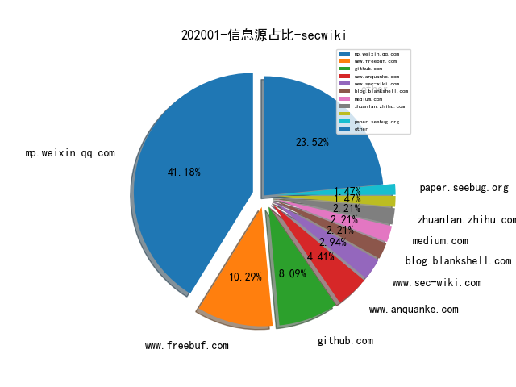
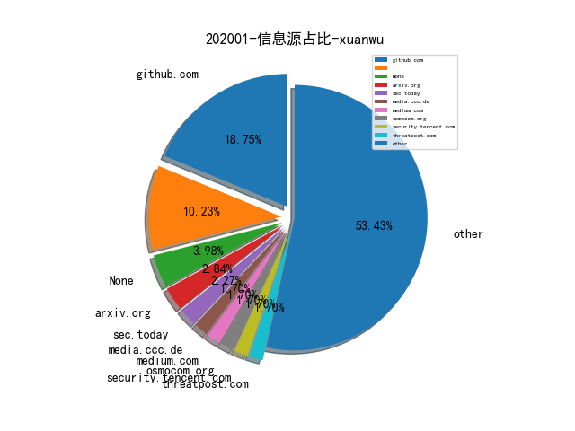
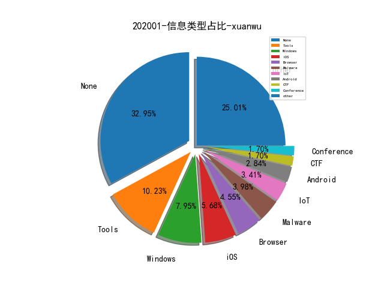

# 202001 信息源与信息类型占比

# 微信公众号 推荐
| nickname_english | weixin_no | title | url| 
| --- | --- | --- | ---| 
| APT攻击 | cncg_team | 对zimbra邮服认证机制的一些探索 | https://mp.weixin.qq.com/s/u-p6_srzby1bbejqClmf-A | 1| 
| 中国计算机学会 | ccfvoice | CCCF译文 | 工业级知识图谱：经验与挑战 | https://mp.weixin.qq.com/s/4Fdpik3EtEng-ri_7tGM0A | 1| 
| 湛卢工作室 | xuehao_studio | 除夕 | ATT&CK红队评估实战靶场vulnstack | https://mp.weixin.qq.com/s/vmUqdSbZXh6698R8IHoOyw | 1| 
| 白日放歌须纵9 |  | 从产品视角重新定义“检测”和“分析” | https://mp.weixin.qq.com/s/oq3T1fSKAHeDfWZNpciXSw | 1| 
| SecWiki | SecWiki | SecWiki安全周刊-2019年卷 | https://mp.weixin.qq.com/s/SMP8oljiNkABclpVfKux3w | 1| 
| 漏洞战争 | vulwar | 从研究者的视角看Fuzzing技术发展30年 | https://mp.weixin.qq.com/s/rSoQvFhuv8R2kA3efbpJxA | 1| 
| 知识工场 | fudankw | 肖仰华： 知识图谱下半场-机遇与挑战 | https://mp.weixin.qq.com/s/IW4rBc7Z9f2ByKjQR2MTjw | 1| 
| 贝塔安全实验室 | BetaSecLab | 某大学渗透测试实战靶场报告-Part2 | https://mp.weixin.qq.com/s/L9LsSwRWDuZedAZQjz0YvA | 2| 
| 我的安全视界观 | CANI_Security | 【SDL最初实践】安全测试 | https://mp.weixin.qq.com/s/WO089RBiLuaHMzQ4yTMnUg | 2| 
| 电科防务 | CETC-ETDR | 世界网络战领域2019年发展回顾与2020年展望 | https://mp.weixin.qq.com/s/Mx3H2Za7hI9ZZIaZedmXBQ | 1| 
| Ms08067安全实验室 | Ms08067_com | 内网漫游之SOCKS代理大结局 | https://mp.weixin.qq.com/s/uKLjW-6Y39wAvLn7bENb7A | 6| 
| FreeBuf | freebuf | Go语言代码安全审计分享 | https://mp.weixin.qq.com/s/8Ju05hYCYk6bOgkvjtP11A | 1| 
| 虎符智库 |  | 情报内生：高级威胁检测的必要条件 | https://mp.weixin.qq.com/s/U3XKIh0ffdzuCJihnJL7Lw | 1| 
| ADLab | v_adlab | ThinkPHP6任意文件操作漏洞分析 | https://mp.weixin.qq.com/s/UPu6cE20l24T6fkYOlSUJw | 1| 
| 数世咨询 |  | 数世咨询：中国网络安全能力图谱（2020年1月） | https://mp.weixin.qq.com/s/Qwhr6SlzFDqHB2b6Q6awdw | 1| 
| heysec | bloodzer007 | 日志分析系列(外传三):平台安全性 | https://mp.weixin.qq.com/s/T2ejCKe8G1E8Ims1AKoi7Q | 2| 
| 平凡路上 |  | 科恩面试与实习感想 | https://mp.weixin.qq.com/s/GiIIUZbzq2IOp5-arkUCfg | 1| 
| 编程技术宇宙 | ProgramUniverse | DDoS攻击：无限战争 | https://mp.weixin.qq.com/s/JTr1-5nPtseAYXfvJdamVg | 3| 
| 鱼塘领路人 | KingofSaltedFish | 威胁情报系列（一）：什么是威胁情报 | https://mp.weixin.qq.com/s/f9G818SGijdfS13KjLnFoA | 1| 
| SudoNLP |  | 2019年NLP领域总结回顾 | https://mp.weixin.qq.com/s/7ROSm_wQNMAKLWUR0djVLQ | 1| 
| 专注安管平台 |  | 谈谈情报引领的安全体系建设落地 | https://mp.weixin.qq.com/s/uLP2DzH5W2PcLCKZl7Cpsw | 1| 
| 中通安全应急响应中心 | ZTO_SRC | 中通安全开源项目之分布式被动安全扫描 | https://mp.weixin.qq.com/s/VwhALBXqIPOh87Ll3ISVHQ | 1| 
| 关键基础设施安全应急响应中心 | CII-SRC | 原创 | IPv6地址扫描方法研究综述 | https://mp.weixin.qq.com/s/N87PZ783qY1JBe5Xm_tDsg | 1| 
| 奇安信威胁情报中心 |  | 2019年移动安全总结 | https://mp.weixin.qq.com/s/p41sAdGJzHx-CuulwycMJw | 1| 
| 安全学术圈 | secquan | 恶意域名检测中的流量特征分析 | https://mp.weixin.qq.com/s/rvPo_ufBwvdAUoVIv__xCg | 1| 
| 安全引擎 | SecEngine | Java动态类加载，当FastJson遇上内网 | https://mp.weixin.qq.com/s/ou3L-IU1CNr9EGkpjH2u0w | 1| 
| 新一代信息科技战略研究中心 | casitclic | DARPA发布战略框架文件《保障国家安全的突破性技术和新能力》 | https://mp.weixin.qq.com/s/D23I3qEpMs8eOFKy8w2RJg | 1| 
| 时间之外沉浮事 | tasnrh | 商业网络培训靶场的发展态势综述 | https://mp.weixin.qq.com/s/Cjd7CCR0kZESP2GHX1oOvQ | 1| 
| 水滴安全实验室 | EversecLab | 2019僵尸网络DDoS攻击监测总结 | https://mp.weixin.qq.com/s/FGt-y3KxGPRP-FT2ubDOZA | 1| 
| 看雪学院 | ikanxue | CVE-2017-11882理论以及实战样本分析 | https://mp.weixin.qq.com/s/d3owzqQFhHNVoPFIyxWZsQ | 1| 
| 绿盟科技 | NSFOCUS-weixin | 基于ATT&CK+SOAR的运营实践 | https://mp.weixin.qq.com/s/Z1sAbpSYZXYBO5qpgvjXlQ | 1| 
| 腾讯安全应急响应中心 | tsrc_team | 物联网安全系列之远程破解Google Home | https://mp.weixin.qq.com/s/4kO3pU_tCDZmgj2CkROzMg | 2| 
| 腾讯安全智能 | TX_Security_AI | 大数据安全分析平台搭建&相关经验分享 | https://mp.weixin.qq.com/s/hvLN83rPiNLw6cmrYDRPpA | 1| 
| 软件安全智能并行分析实验室 |  | 学术报告|针对物联网设备的模糊测试概述 | https://mp.weixin.qq.com/s/pbOOkxrV0HJFzQicJ0m6Cg | 1| 
| FEEI |  | 一个安全工程师的2019 | https://mp.weixin.qq.com/s/rr2f1RxFTjLSGlqxaG-aog | 1| 
| 白帽子的成长之路 | whitehat_day | CTF比赛中Linux环境中绕过受限的shell或bash环境的多种方式 | https://mp.weixin.qq.com/s/O7n93QpLwuCCQySpZe-CkA | 2| 
| Gcow安全团队 | Gcow666 | 游荡于中巴两国的魅影——响尾蛇(SideWinder) APT组织针对巴基斯坦最近的活动以及2019年该组织的活动总结 | https://mp.weixin.qq.com/s/CZrdslzEs4iwlaTzJH7Ubg | 1| 
| 安全喷子 |  | 云安全的未来 | https://mp.weixin.qq.com/s/MfjRfJ04fnRY8gI5s6BA8g | 1| 
| 穿过丛林 |  | 优秀博士系统能力培养（PPT） | https://mp.weixin.qq.com/s/9zKM6hQZOYRjr5IeawgsKA | 1| 
| 腾讯科恩实验室 | KeenSecurityLab | 在Tesla Model S上实现Wi-Fi协议栈漏洞的利用 | https://mp.weixin.qq.com/s/rULdN3wVKyR3GlGBhunpoQ | 1| 
| 维他命安全 | VitaminSecurity | 维他命2019大盘点之安全事件/漏洞篇 | https://mp.weixin.qq.com/s/AsVZawBtipQzSdgJHt7eiw | 1| 

# 组织github账号 推荐
| github_id | title | url | org_url | org_profile | org_geo | org_repositories | org_people | org_projects | repo_lang | repo_star | repo_forks| 
| --- | --- | --- | --- | --- | --- | --- | --- | --- | --- | --- | ---| 

# 私人github账号 推荐
| github_id | title | url | p_url | p_profile | p_loc | p_company | p_repositories | p_projects | p_stars | p_followers | p_following | repo_lang | repo_star | repo_forks | 
| --- | --- | --- | --- | --- | --- | --- | --- | --- | --- | --- | --- | --- | --- | ---| 
| 3gstudent | 利用 Python3 快速枚举 Active Directory 用户 | https://github.com/3gstudent/pyKerbrute// | https://3gstudent.github.io/ | good in study,attitude and health | None | None | 79 | 0 | 170 | 1600 | 14 | Python,Batchfile,PowerShell,C++ | 640 | 214 | 1| 
| CHYbeta | Web安全学习的一个github库 | https://github.com/CHYbeta/Web-Security-Learning | https://twitter.com/chybeta |  | China | XMU | 27 | 0 | 1600 | 1400 | 122 | Python,HTML | 2700 | 807 | 1| 
| FuzzySecurity | 基于 Electron 为 Frida 编写一个 UI 界面 | https://github.com/FuzzySecurity/Fermion/blob/master/CHANGELOG.txt | http://www.fuzzysecurity.com/ |  | None | None | 16 | 0 | 0 | 1100 | 0 | C#,JavaScript,PowerShell | 1800 | 595 | 1| 
| tanjiti | 2019安全技术资讯年报 | https://github.com/tanjiti/sec_profile/blob/master/README_YEAR_2019.md | http://tanjiti.com/ | #Network Security Monitor #threat intelligence  #waf #ids #iOS App Security #Android App Security #game security | shanghai | baidu | 17 | 0 | 6 | 552 | 171 | Python,PHP,HTML,Perl | 385 | 174 | 1| 
| blackorbird | 伊朗 APT 组织攻击活动 DUSTMAN 的分析报告 | https://github.com/blackorbird/APT_REPORT/blob/master/International%20Strategic/Iran/Saudi-Arabia-CNA-report.pdf | http://blackorbird.com | APT hunter threat analyst | https://twitter.com/blackorbird | https://twitter.com/blackorbird | 51 | 0 | 112 | 352 | 36 | Python,C,C++ | 702 | 239 | 1| 
| hahwul | Powerfull XSS Scanning and Parameter analysis tool | https://github.com/hahwul/XSpear | https://www.hahwul.com | Security engineer, Rubyist, Gopher and... H4cker | Republic of Korea | None | 47 | 0 | 64 | 222 | 10 | Python,Go,Ruby | 396 | 115 | 1| 
| ddz | Decrypt WhatsApp encrypted media files | https://github.com/ddz/whatsapp-media-decrypt | https://github.com/cashapp | Securing @cashapp at @square. Prev: Co-founder/CTO @capsule8, @trailofbits. Co-author “The Mac Hacker’s Handbook,” “iOS Hacker’s Handbook,” etc. | Brooklyn, NY | @cashapp | 4 | 0 | 0 | 143 | 0 | Go,Nix,Shell | 423 | 44 | 1| 
| WalterInSH | 风险控制笔记，适用于互联网企业 | https://github.com/WalterInSH/risk-management-note | http://walterinsh.github.io |  | Po Shanghai | None | 30 | 0 | 678 | 134 | 86 | Java | 489 | 211 | 1| 
| theLSA | emergency-response-checklist：应急响应指南 | https://github.com/theLSA/emergency-response-checklist | http://www.lsablog.com | I like network security,penestration and programming(python,c/c++,php,java,ect),welcome to communicate with me! | China | None | 38 | 0 | 36 | 133 | 35 | Python | 281 | 77 | 1| 
| itm4n | PrivescCheck - 用于探测 Windows 是否存在可以被用于本地提权的错误配置 | https://github.com/itm4n/PrivescCheck | https://itm4n.github.io/ | Pentester | Paris | None | 8 | 0 | 27 | 109 | 11 | VBA,PowerShell,C++ | 321 | 87 | 1| 
| insightglacier | Apache Shiro 反序列化漏洞扫描与利用工具 | https://github.com/insightglacier/Shiro_exploit | http:/www.shellpub.com | Security Research | Beijing | Shellpub | 65 | 0 | 352 | 87 | 220 | Python,C,PHP,CSS,C++ | 44 | 26 | 1| 
| StrangerealIntel | DailyIOC: IOC from articles, tweets for archives | https://github.com/StrangerealIntel/DailyIOC | None |  | None | None | 2 | 0 | 2 | 83 | 0 | YARA,JavaScript | 280 | 44 | 1| 
| BatchDrake | SigDigger - 基于 QT 编写的数字信号分析工具 | https://github.com/BatchDrake/SigDigger | http://actinid.org | I code for fun. Interested in reverse engineering, astronomy, microkernel design, radio and digital signal processing. EA1IYR | Madrid, Spain | None | 25 | 0 | 5 | 81 | 4 | C,CSS,C++ | 95 | 13 | 1| 
| ollypwn | GitHub 出现疑似昨天微软修复的 CVE-2020-0601 证书验证欺骗漏洞的 PoC | https://github.com/ollypwn/cve-2020-0601 | None | https://twitter.com/ollypwn | Copenhagen, Denmark | None | 2 | 0 | 0 | 49 | 0 | C,Ruby | 574 | 149 | 1| 
| lightswitch05 | php-version-audit - 根据 PHP 版本检测已知漏洞 | https://github.com/lightswitch05/php-version-audit | None |  | None | None | 42 | 0 | 32 | 47 | 22 | Python,PHP | 82 | 13 | 1| 
| sahilmgandhi | IotShark - Monitoring and Analyzing IoT Traffic | https://github.com/sahilmgandhi/IotShark | http://www.sahilmgandhi.com | Distributed and Big Data Systems @ UCLA | UCLA | None | 29 | 0 | 21 | 38 | 31 | C,Java,Python,JavaScript,C++,HTML | 42 | 7 | 1| 
| Ascotbe | Medusa: 美杜莎扫描器 | https://github.com/Ascotbe/Medusa | https://www.ascotbe.com/ | 在？来个女朋友？喵喵喵？ | 一切都是命运石之门的选择 | None | 12 | 0 | 75 | 26 | 1 | Python,HTML,C++ | 125 | 24 | 1| 
| rootsecdev | ChromeOS Security Notes，包含一份 MIT 对 ChromeOS 的分析报告 | https://github.com/rootsecdev/ChromeOS | None |  | None | None | 16 | 0 | 1 | 16 | 0 | Batchfile,Ruby | 75 | 8 | 1| 
| AlanChou | unofficial PyTorch implementation of the paper Adversarial Training for Free! | https://github.com/AlanChou/Adversarial-Training-for-Free | None | My research interests lie in weakly supervised learning and adversarial attack/defense. Im also interested in optimization with imbalanced or noisy data. | Hsinchu City | None | 5 | 0 | 199 | 6 | 9 | Python | 13 | 9 | 1| 
| SecurityRiskAdvisors | PDBlaster - 批量从可执行文件中提取 PDB 文件路径的工具 | https://github.com/SecurityRiskAdvisors/PDBlaster | None | None | None | None | 0 | 0 | 0 | 0 | 0 | Shell,Java,Python,JavaScript,Perl,HTML,Ruby,PowerShell | 0 | 0 | 1| 
| appsecco | DVNA – Damn Vulnerable NodeJS Application | https://github.com/appsecco/dvna | None | None | None | None | 0 | 0 | 0 | 0 | 0 | Shell,Java,Python,JavaScript,C#,Visual,HTML,ActionScript,PHP,CSS | 439 | 129 | 1| 
| bobfuzzer | Linux kernel 5.0.0-rc7 f2fs 文件系统溢出漏洞 PoC | https://github.com/bobfuzzer/CVE/tree/master/CVE-2019-19927 | None | None | None | None | 0 | 0 | 0 | 0 | 0 | C | 21 | 13 | 1| 
| github | Github Security Lab 关于 CodeQL 的分享《Bug hunting with CodeQL》 | https://github.com/github/security-lab/blob/master/Meetup/2019-11/presentations/Bug%20hunting%20with%20CodeQL.pdf | None | None | None | None | 0 | 0 | 0 | 0 | 0 | C,TypeScript,Python,JavaScript,C++,Haskell,CoffeeScript,HTML,Shell,Go,Ruby,C# | 23100 | 3500 | 2| 
| ztosec | Hunter 中通DevSecOps闭环方案 | https://github.com/ztosec/hunter | None | None | None | None | 0 | 0 | 0 | 0 | 0 | Python,Go,Java | 0 | 0 | 1| 

# medium_xuanwu 推荐
| title | url| 
| --- | ---| 
| CyberTruck Challenge 2019中一例Android CTF题目详解 | http://medium.com/bugbountywriteup/cybertruck-challenge-2019-android-ctf-e39c7f796530| 
| 逆向 Web Assembly (WASM) 字节码 | http://medium.com/m/global-identity?redirectUrl=https%3A%2F%2Fanee.me%2Freversing-web-assembly-wasm-dd59eb2a52d4| 
| Launching ATT&CK for ICS - 针对工控系统的 ATT&CK 框架 | http://medium.com/mitre-attack/launching-attack-for-ics-2be4d2fb9b8| 
| iOS screen framebuffer 字符渲染机制研究 | http://medium.com/@bellis1000/exploring-the-ios-screen-frame-buffer-a-kernel-reversing-experiment-6cbf9847365| 

# medium_secwiki 推荐
| title | url| 
| --- | ---| 
| ATT&CK for ICS | https://medium.com/mitre-attack/launching-attack-for-ics-2be4d2fb9b8| 
| Blind SQL Injection without an “in” | https://medium.com/@terjanq/blind-sql-injection-without-an-in-1e14ba1d4952| 
| The Bug That Exposed Your PayPal Password | https://medium.com/@alex.birsan/the-bug-that-exposed-your-paypal-password-539fc2896da9| 

# zhihu_xuanwu 推荐
| title | url| 
| --- | ---| 

# zhihu_secwiki 推荐
| title | url| 
| --- | ---| 
| 作为个体如何做安全运营 | https://zhuanlan.zhihu.com/p/100610851| 
| 知识图谱构建技术综述与实践 | https://zhuanlan.zhihu.com/p/69360094| 
| 2020 后区块链世界及安全的一些思考 | https://zhuanlan.zhihu.com/p/102384263| 

# 日更新程序
`python update_daily.py`