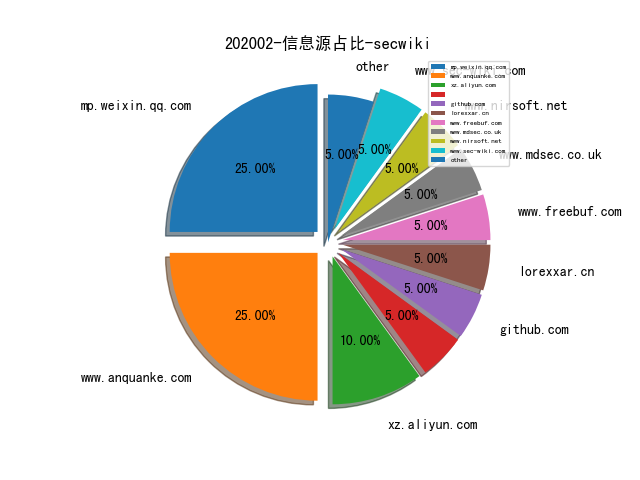
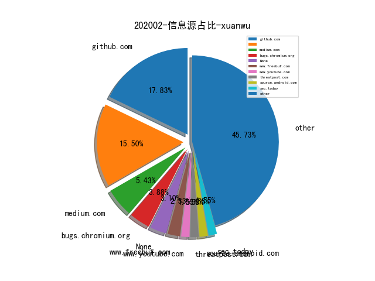
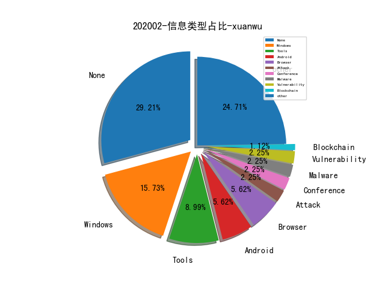
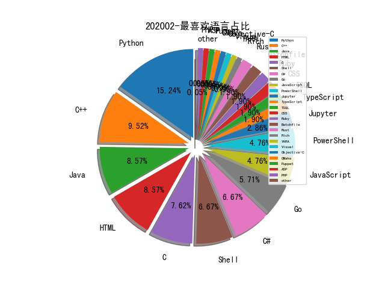

# [数据月报--202002](README_202002.md)
# [数据月报--202001](README_202001.md)
# [2019数据年报](README_YEAR_2019.md)
# [数据月报--2019-12月](README_12.md)
# [数据月报--2019-11月](README_11.md)
# [数据月报--2019-10月](README_10.md)
# [数据月报--2019-9月](README_9.md)
# [数据月报--2019-8月](README_8.md)
# [数据月报--2019-7月](README_7.md)
# [数据月报--2019-6月](README_6.md)
# [数据月报--2019-5月](README_5.md)
# [数据月报--2019-4月](README_4.md)
# [数据月报--2019-3月](README_3.md)
# [数据年报--2019-3月之前](README_YEAR.md)
# 202002 信息源与信息类型占比

# 微信公众号 推荐
| nickname_english | weixin_no | title | url| 
| --- | --- | --- | ---| 
| 道法术 |  | 利用CodeQL寻找Java Deserialization Vulnerabilities | https://mp.weixin.qq.com/s/wlDWTxXHjbZJqmzLCM-z_w | 1| 
| 七夜安全博客 | qiye_safe | linux无文件执行— fexecve 揭秘 | https://mp.weixin.qq.com/s/Hywbb1ZnRo6n4gFFp5rbcQ | 2| 
| 字节跳动技术团队 | toutiaotechblog | 字节跳动自研万亿级图数据库 & 图计算实践 | https://mp.weixin.qq.com/s/uYP8Eyz36JyTWska0hvtuA | 1| 
| 安恒信息安全研究院 |  | 入侵分析钻石模型学习笔记 | https://mp.weixin.qq.com/s/akb1SLiXj8ts3-RxiXks2w | 1| 
| 奇安信安全服务 |  | 红队实战攻防技术分享：Linux后门总结-各类隐藏技能 | https://mp.weixin.qq.com/s/B5cam9QN8eDHFuaFjBD34Q | 1| 
| 我的安全视界观 | CANI_Security | 【SDL最初实践】安全响应 | https://mp.weixin.qq.com/s/dKAPxZOqG5jF9dbA8K5d4w | 1| 
| DJ的札记 | DJ_notes | 创新沙盒，罕见领域分布的背后 - RSAC 2020 (1) | https://mp.weixin.qq.com/s/ExGnLLzd1wBDksGFfimULw | 1| 
| heysec | bloodzer007 | 分享一个漏洞的发现到利用的过程 | https://mp.weixin.qq.com/s/A10bkRBTb4RqzgNjc8VtnA | 2| 
| 关键基础设施安全应急响应中心 | CII-SRC | 原创 | 固件攻击研究综述 | https://mp.weixin.qq.com/s/Qjvirq2sVO9nPBauBRGS4Q | 1| 
| 悬剑武器库 |  | WebShell免杀之JSP | https://mp.weixin.qq.com/s/YJtfQTvowVr2azqBWGla1Q | 1| 
| 数说安全 | SSAQ2016 | 谈谈2020年RSA创新沙盒10强及其对中国创业者的价值 | https://mp.weixin.qq.com/s/z0xsJGSMWbQy60_QmArmQA | 1| 
| 时间之外沉浮事 | tasnrh | CrystalNet：超逼真地仿真大型生产网络 | https://mp.weixin.qq.com/s/wI6amI2-Urj7HJSw6sMoJQ | 3| 
| 腾讯御见威胁情报中心 |  | 2019勒索病毒专题报告 | https://mp.weixin.qq.com/s/DzfUlKXkkMuBJS0UrdboSw | 1| 
| 360企业安全集团 |  | “美女与野兽”，Transparent Tribe启用新资产对印度空军发起特定攻击 | https://mp.weixin.qq.com/s/YY2h73A6KiFjnfjsJtWGNQ | 1| 
| 网络空间安全军民融合创新中心 | jmrh1226 | 从美国防部“2021财年预算提案” 看美军网络空间建设趋势特点 | https://mp.weixin.qq.com/s/ysG4z8UrfEZTlBovGTWcZw | 1| 
| 安全学术圈 | secquan | 2020年CCF安全会议近期可投稿列表 | https://mp.weixin.qq.com/s/Gok2bTlzalM4qVw2DglLrA | 1| 
| 互联网安全内参 | anquanneican | RSAC 2020创新沙盒十强分析：应用安全、云安全为技术热点方向 | https://mp.weixin.qq.com/s/UFlsR8NBFYpHUUWuJG-nPQ | 1| 
| 安全客 | anquanbobao | GitHub敏感数据泄露报告 | https://mp.weixin.qq.com/s/6RELktZJF2pn4rL-0-Y7Jw | 1| 
| 水滴安全实验室 | EversecLab | Modbus协议与S7Comm协议浅析 | https://mp.weixin.qq.com/s/dDyKmFIz0DrBWQY23pUttw | 1| 
| 网信军民融合 | wxjmrh | 研究探讨 | 军工领域建设网络安全攻防靶场平台的思路 | https://mp.weixin.qq.com/s/UmW3WCtDIOWw1bXfJnLnhg | 1| 
| 网信防务 | CyberDefense | 从APTX系列报告解读看攻防能力建设路径 | https://mp.weixin.qq.com/s/EtgeZJj6EHid_qb2QMSHSw | 2| 
| ChaMd5安全团队 | chamd5sec | CTF学习交流群 第五期writeup大放送 | https://mp.weixin.qq.com/s/Gw-H40A06y5CzpSJkQ4DfQ | 3| 
| Ms08067安全实验室 | Ms08067_com | 【HTB系列】靶机Bitlab的渗透测试 | https://mp.weixin.qq.com/s/ShACPmfP2gASTFY0trQLSw | 12| 
| 看雪学院 | ikanxue | 机器学习在二进制代码相似性分析中的应用 | https://mp.weixin.qq.com/s/QGhA2LanCq5KSUYT5uBf9A | 1| 
| 绿盟科技研究通讯 | nsfocus_research | 零信任原生安全：超越云原生安全 | https://mp.weixin.qq.com/s/hOcMlzQJ4jPlROc4Rvvk5Q | 2| 

# 组织github账号 推荐
| github_id | title | url | org_url | org_profile | org_geo | org_repositories | org_people | org_projects | repo_lang | repo_star | repo_forks| 
| --- | --- | --- | --- | --- | --- | --- | --- | --- | --- | --- | ---| 

# 私人github账号 推荐
| github_id | title | url | p_url | p_profile | p_loc | p_company | p_repositories | p_projects | p_stars | p_followers | p_following | repo_lang | repo_star | repo_forks | 
| --- | --- | --- | --- | --- | --- | --- | --- | --- | --- | --- | --- | --- | --- | ---| 
| jas502n | CVE-2020-2551 Weblogic RCE with IIOP | https://github.com/jas502n/CVE-2020-2551 | https://twitter.com/jas502n | 1.misc 2.crypto 3. web 4. reverse 5. android 6. pwn 7. elf | Hong Kong | jas502n | 235 | 0 | 379 | 1600 | 343 | Python,C,Shell,Java | 302 | 129 | 1| 
| FuzzySecurity | BlueHat IL 会议的演讲《Staying # and Bringing Covert Injection Tradecraft to .NET》PPT | https://github.com/FuzzySecurity/BlueHatIL-2020 | http://www.fuzzysecurity.com/ |  | None | None | 19 | 0 | 0 | 1200 | 0 | C#,YARA,JavaScript,PowerShell | 1800 | 609 | 1| 
| mattifestation | 用于辅助构建、审计、部署 Windows Defender Application Control (WDAC) 策略的工具 | https://github.com/mattifestation/WDACTools | http://www.exploit-monday.com/ |  | None | None | 26 | 0 | 9 | 1100 | 1 | PowerShell | 653 | 167 | 1| 
| vanhauser-thc | 如何在 AFL++ 的 QEMU 模式下使用 persistent 运行模式 | https://github.com/vanhauser-thc/AFLplusplus/blob/master/qemu_mode/README.persistent.md | https://www.mh-sec.de/ | Security researcher since 1994 https://www.mh-sec.de/ https://www.thc.org/ https://twitter.com/hackerschoice | Berlin | The Hackers Choice | mh-sec | me | myself | 26 | 0 | 54 | 851 | 21 | Batchfile,C,HTML,C++ | 3500 | 963 | 1| 
| klionsec | RedTeamer: 红方人员作战执行手册 | https://github.com/klionsec/RedTeamer | https://huntingday.github.io |  | MITRE | ATT&CK 中文站 | klion@protonmail.com | 6 | 0 | 91 | 629 | 14 | Shell,HTML | 352 | 85 | 1| 
| 404notf0und | AISec 17~19 届会议的 Papers | https://github.com/404notf0und/AI-for-Security-Paper | https://www.4o4notfound.org | 欢迎关注公众号：404 Not F0und，专注于Cyber-Security and Data-Analysis | Hangzhou,China | Ant Financial | 17 | 0 | 96 | 575 | 17 | Python,Jupyter,TSQL | 703 | 160 | 1| 
| 0x09AL | A native backdoor module for Microsoft IIS | https://github.com/0x09AL/IIS-Raid | https://twitter.com/0x09AL |  | None | MDSec | 126 | 0 | 150 | 552 | 26 | Go,C#,Ruby,C++ | 679 | 149 | 1| 
| TheKingOfDuck | ApkAnalyser: 一键提取安卓应用中可能存在的敏感信息 | https://github.com/TheKingOfDuck/ApkAnalyser | https://blog.gzsec.org/ | 一个废物 | V1g6VGhlS2luZ09mR2FHYUdh | None | 36 | 0 | 190 | 515 | 26 | Shell,Python,JavaScript,HTML,Go,PowerShell | 1600 | 653 | 1| 
| HyperSine | QQ安全中心 - 动态口令的生成算法 | https://github.com/HyperSine/forensic-qqtoken | None |  | None | None | 19 | 0 | 1 | 228 | 0 | Python,C,C++ | 251 | 97 | 1| 
| sailay1996 | AMD User Experience Program Launcher 本地提权漏洞分析(CVE-2020-8950) | https://github.com/sailay1996/amd_eop_poc | https://heynowyouseeme.blogspot.com/ | Twitter: @404death , https://www.hackthebox.eu/profile/1467 | Myanmar | None | 177 | 0 | 4 | 197 | 0 | Python,C,Shell,Batchfile | 432 | 69 | 1| 
| LeadroyaL | shadowsocks redirect attack exploit | https://github.com/LeadroyaL/ss-redirect-vuln-exp | https://www.leadroyal.cn | Android & Pwn. | ZJU | ZJU | 29 | 0 | 44 | 162 | 7 | Python,Java,C++ | 178 | 28 | 1| 
| nshalabi | SysmonTools - 用于为 Sysmon 提供可视化 UI 和配置的工具套件 | https://github.com/nshalabi/SysmonTools | http://nosecurecode.com | #InfoSec Manager, #Programmer. Following the digital [chaos] and threats landscape. My opinions are my own. Follow me @nader_shalabi and http://nosecurecode.com | Australia | nosecurecode.com | 5 | 0 | 162 | 143 | 16 | C#,HTML,Java,C++ | 694 | 145 | 1| 
| threedr3am | Java安全相关的漏洞和技术demo | https://github.com/threedr3am/learnjavabug | https://threedr3am.github.io |  | None | None | 30 | 0 | 159 | 142 | 27 | Java | 514 | 102 | 1| 
| insightglacier | Golang实现的x86下的Meterpreter reverse tcp | https://github.com/insightglacier/go_meterpreter | http:/www.shellpub.com | Security Research | Beijing | Shellpub | 79 | 0 | 423 | 92 | 232 | C,ASP,Java,Python,C++,TypeScript,C#,HTML,Go,PHP | 150 | 63 | 1| 
| beader | 首届中文NL2SQL挑战赛决赛第3名方案+代码 | https://github.com/beader/tianchi_nl2sql | None |  | 上海 | None | 20 | 0 | 396 | 90 | 3 | Python,Shell,Jupyter | 148 | 57 | 1| 
| SoftwareGift | CVPR2019 面部识别欺骗检测比赛的代码 | https://github.com/SoftwareGift/FeatherNets_Face-Anti-spoofing-Attack-Detection-Challenge-CVPR2019 | None | I am a graduate student at Huazhong University of Science and Technology, focusing on mobile network design and face anti-spoofing. | None | None | 64 | 0 | 738 | 60 | 12 | Python,C++ | 563 | 194 | 1| 
| insanitybit | grapl: Graph platform for Detection and Response | https://github.com/insanitybit/grapl | http://insanitybit.com |  | New York | None | 69 | 0 | 27 | 60 | 0 | Rust | 275 | 21 | 1| 
| mai-lang-chai | CMS、中间件漏洞检测利用合集 | https://github.com/mai-lang-chai/Middleware-Vulnerability-detection | https://mai-lang-chai.github.io | 🗝 under Control😎 | None | None | 19 | 0 | 15 | 57 | 8 | Python | 93 | 32 | 1| 
| p1g3 | JSONP-Hunter: JSONP Hunter in Burpsuite | https://github.com/p1g3/JSONP-Hunter | None |  | None | None | 8 | 0 | 16 | 34 | 0 | Python,Shell,HTML | 60 | 11 | 1| 
| linhaow | TextClassify: 基于预训练模型的文本分类模板 | https://github.com/linhaow/TextClassify | http://公众号：纸鱼AI | USTC | 上海-徐汇 | 南七技校&字节跳动intern | 3 | 0 | 5 | 26 | 359 | Python | 66 | 25 | 1| 
| yoava333 | Bug on the Windshield - Fuzzing the Windows kernel，来自 OffensiveCon 2020 会议 | https://github.com/yoava333/presentations/blob/master/Fuzzing%20the%20Windows%20Kernel%20-%20OffensiveCon%202020.pdf | None |  | None | None | 15 | 0 | 16 | 22 | 0 | Go,Java,Rust | 17 | 1 | 1| 
| sisoc-tokyo | Real-time detection of high-risk attacks leveraging Kerber... | https://github.com/sisoc-tokyo/Real-timeDetectionAD_jornal | None |  | None | None | 23 | 0 | 2 | 20 | 0 | Python,HTML | 71 | 9 | 1| 
| HE-Wenjian | CVE-2019-14615 - Intel iGPU 信息泄露漏洞的分析文档和 Demo 代码 | https://github.com/HE-Wenjian/iGPU-Leak | None | PhD Candidate | Hong Kong | HKUST: Hong Kong Univ. of Science and Technology | 4 | 0 | 40 | 7 | 7 | C,HTML | 8 | 2 | 1| 
| reddelexc | Top disclosed reports from HackerOne | https://github.com/reddelexc/hackerone-reports | None |  | Russia | Kontur | 2 | 0 | 30 | 4 | 0 | Python | 89 | 21 | 1| 
| Microsoft | ApplicationInspector - 微软开源的源码分析工具 | https://github.com/Microsoft/ApplicationInspector | None | None | None | None | 0 | 0 | 0 | 0 | 0 | TypeScript,Jupyter,C#,JavaScript,C++,Python,Objective-C,Rich,CMake,PowerShell,CSS | 0 | 0 | 1| 
| QAX-A-Team | PandaSniper: Linux C2 框架demo | https://github.com/QAX-A-Team/PandaSniper?from=timeline | None | None | None | None | 0 | 0 | 0 | 0 | 0 | C,Shell,Java,C#,C++,Python,Go,PowerShell | 0 | 0 | 1| 
| codeplutos | MySQL客户端jdbc反序列化漏洞payload | https://github.com/codeplutos/MySQL-JDBC-Deserialization-Payload | None | None | None | None | 0 | 0 | 0 | 0 | 0 | Java,C++ | 107 | 20 | 1| 
| rapid7 | hackazon: A modern vulnerable web app | https://github.com/rapid7/hackazon | None | None | None | None | 0 | 0 | 0 | 0 | 0 | C,Java,Python,TSQL,JavaScript,C#,Puppet,Ruby | 0 | 0 | 1| 

# medium_xuanwu 推荐
| title | url| 
| --- | ---| 
| 战争永不改变：针对WPA3的“增强开放”的无线攻击-第1部分教程。 | http://medium.com/m/global-identity?redirectUrl=https%3A%2F%2Fposts.specterops.io%2Fwar-never-changes-attacks-against-wpa3s-enhanced-open-part-1-how-we-got-here-71f5a80e3be7| 
| 利用一个小技巧绕过 Windows 10 用户组策略 | http://medium.com/tenable-techblog/bypass-windows-10-user-group-policy-and-more-with-this-one-weird-trick-552d4bc5cc1b| 
| Hacking Flask Applications，利用 Werkzeug Debugger 执行命令 | http://link.medium.com/fAb3m2Zkb4| 
| Hacking IoT devices with Focaccia-Board | http://medium.com/@LucaBongiorni/hacking-iot-devices-with-focaccia-board-8c4e009ed488| 
| iOS 越狱和应用渗透必备工具 | http://medium.com/@ved_wayal/jailbreak-and-stuff-kickstart-tools-and-techniques-for-ios-application-pentesting-6fa53a3987ab| 
| 详解 DeFi 协议 bZx 两次被黑始末 | http://link.medium.com/uOqzbT63c4| 
| AWS Document Signing Security Control Bypass | http://link.medium.com/4XnhSyUqo4| 

# medium_secwiki 推荐
| title | url| 
| --- | ---| 

# 日更新程序
`python update_daily.py`