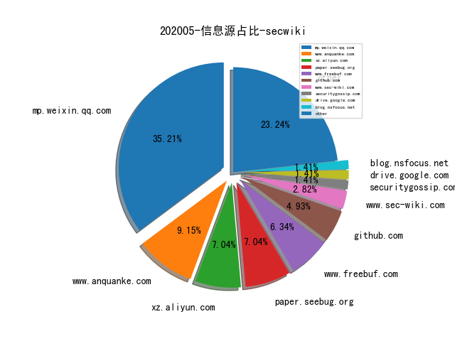
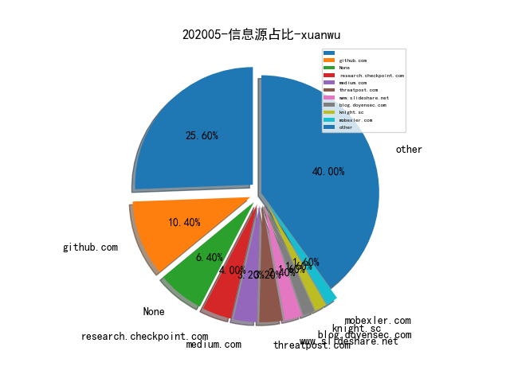
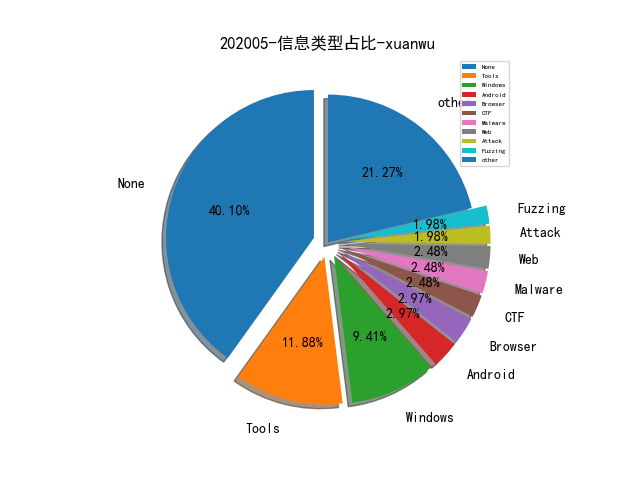
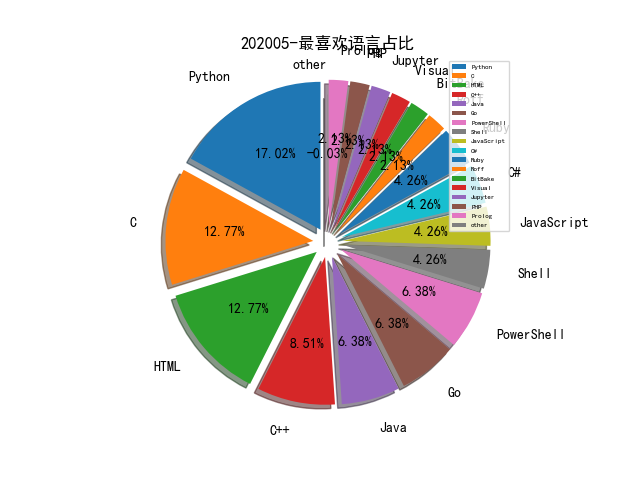

# [数据--所有](README_20.md)
# [数据--年度](README_2020.md)
# 202005 信息源与信息类型占比

# 微信公众号 推荐
| nickname_english | weixin_no | title | url| 
| --- | --- | --- | ---| 
| 酒仙桥六号部队 | anfu-360 | 一次曲折的渗透测试之旅 | https://mp.weixin.qq.com/s/HmGEYRcf1hSVw9Uu9XHGsA | 2| 
| 全知科技 | gh_0bd30f1b0430 | 再谈作为生产要素的数据安全 | https://mp.weixin.qq.com/s/hkv4y7pQRBjLCgm3StKVSQ | 1| 
| 君哥的体历 | jungedetili | 安全有效性验证的发展趋势 | https://mp.weixin.qq.com/s/bxqOBJH7O5Jcxy2lnsbFKg | 3| 
| 数世咨询 | gh_b3fb3a62dcc4 | 2020年度网络安全十大潜力技术及五大市场前瞻 | https://mp.weixin.qq.com/s/nDf1ZGvdWnsAt2lGRcF5wg | 2| 
| 白帽汇 | baimaohui888 | 基于Docker的固件模拟 | https://mp.weixin.qq.com/s/t8ijT6pBjT9vB5yrd9Qstw | 1| 
| 论文收割机 | paper_reader | 深度长文：图神经网络欺诈检测方法总结 | https://mp.weixin.qq.com/s/ewzsURiU7bfG3gObzIP2Mw | 1| 
| 锦行信息安全 | jeeseensec | 干货 , linux系统行为新型实时监控技术 | https://mp.weixin.qq.com/s/60BYTv6ST03cguHiFFetVg | 1| 
| Bypass | Bypass-- | 邮件伪造之SPF绕过的5种思路 | https://mp.weixin.qq.com/s/dqntjRLgcOD3D2bi1oDFAw | 1| 
| 绿盟科技研究通讯 | nsfocus_research | 基于深度学习的物联网恶意软件家族细粒度分类研究 | https://mp.weixin.qq.com/s/we1fr4_BKd7n-zVWzSRygg | 1| 
| 中通安全应急响应中心 | ZTO_SRC | 中通RASP安全防护方案初探 | https://mp.weixin.qq.com/s/33CtW9ErXCDWoCJRFzlVPQ | 1| 
| SecWiki | SecWiki | [Sec-Trans-8]开发扫描器挖掘反射型XSS (一) | https://mp.weixin.qq.com/s/T2ULAKKGmRup6FFM8-vgSg | 2| 
| 小强说 | xiaoqiangcall | 从STIX2.1看安全智能归来 | https://mp.weixin.qq.com/s/nYV3S2oYNNnKcpvNAG751w | 1| 
| 情报分析师 | qingbaofenxishi | 大数据环境下安全情报融合体系构建 | https://mp.weixin.qq.com/s/bjqv8zlSEl7waKHxBNIwyA | 1| 
| 互联网安全内参 | anquanneican | 新一代SIEM与SOAR的技术对比 | https://mp.weixin.qq.com/s/mfNRbDXIg5_1jSKHbceHCA | 1| 
| 虎符智库 |  | 各国竞相布局 卫星互联网重新定义网络战 | https://mp.weixin.qq.com/s/mj4BVfI-j3yp-xaSZeEW_A | 1| 
| Tide安全团队 | TideSec | 资产管理与威胁监测平台Tide-Mars开源了！ | https://mp.weixin.qq.com/s/-7V14Rpu2KU5HUsa0p025g | 2| 
| 天融信阿尔法实验室 |  | JAVA RMI反序列化知识详解 | https://mp.weixin.qq.com/s/bC71HoEtDAKKbHJvStu9qA | 1| 
| 漏洞推送 |  | 浏览器中隐蔽数据传输通道-DNS隧道 | https://mp.weixin.qq.com/s/u5HV7umrZABcgVpZ5pn6WQ | 1| 
| lymmmx |  | 已知邮箱，求手机号码? | https://mp.weixin.qq.com/s/XvMruURNVWBkEwxvnPSW1g | 1| 
| 赵武的自留地 |  | 我的安全漏洞观 | https://mp.weixin.qq.com/s/86cS8yIgbVcKStZWq84M7Q | 1| 
| ChaMd5安全团队 | chamd5sec | De1CTF2020-WriteUp下(Crypto、Reverse) | https://mp.weixin.qq.com/s/KKkxUb_rUEi7Pxj0Qj5Odw | 3| 
| IMKP | TrustMatrix_KP | 用SASE加速零信任网络交付 | https://mp.weixin.qq.com/s/OjHgQGrJWfueu4AfxES9Hg | 1| 
| ipasslab |  | 学术报告,协议模糊测试相关技术梳理 | https://mp.weixin.qq.com/s/RCpAUpFEzbSewEnWpHrsqw | 1| 
| 安全学术圈 | secquan | Understanding E-commerce Fraud from Autonomous Chat | https://mp.weixin.qq.com/s/uzGQxgfaUufsDSvcYIIYig | 1| 
| 漏洞战争 | vulwar | 技术人的修炼之道：从业余到专业 | https://mp.weixin.qq.com/s/gBgFyy4MMrF5vn-8NGEVQw | 1| 
| 电子商务电子支付国家工程实验室 | gjgcsys | 物联网场景下的白盒加密技术 | https://mp.weixin.qq.com/s/y8FNDtuJIIiYmZDLTxuL_g | 1| 
| 湛卢工作室 | xuehao_studio | 劳动节 , 说说代理池 | https://mp.weixin.qq.com/s/ERU3L2WIMiPNNdTTX164Og | 1| 

# 组织github账号 推荐
| github_id | title | url | org_url | org_profile | org_geo | org_repositories | org_people | org_projects | repo_lang | repo_star | repo_forks| 
| --- | --- | --- | --- | --- | --- | --- | --- | --- | --- | --- | ---| 

# 私人github账号 推荐
| github_id | title | url | p_url | p_profile | p_loc | p_company | p_repositories | p_projects | p_stars | p_followers | p_following | repo_lang | repo_star | repo_forks | 
| --- | --- | --- | --- | --- | --- | --- | --- | --- | --- | --- | --- | --- | --- | ---| 
| CHEF-KOCH | KMS-activator - 关于 Windows 激活机制研究的一个项目 | https://github.com/CHEF-KOCH/KMS-activator | https://github.com/microsoft | Former @microsoft and @NVIDIA employee. Since 2018 NTT-Security. Interested in privacy/security, gaming & demoscene related topics. | Lausanne | CKs Technology News | 125 | 0 | 4100 | 1400 | 127 | Python,C,Batchfile,JavaScript,Pascal | 590 | 145 | 1| 
| Captainarash | X86架构圣经指南手册。 | https://github.com/Captainarash/The_Holy_Book_of_X86 | https://twitter.com/H4UL4 | Computing Offsets \x00 | Helsinki, Finland | None | 6 | 0 | 19 | 80 | 6 | JavaScript,C++ | 492 | 101 | 1| 
| wooyunwang | Fortify: 源代码漏洞の审计 | https://github.com/wooyunwang/Fortify | http://www.52pwn.club/ | A strange guy who will make the world a better place! | California | Google Inc. | 27 | 0 | 15 | 60 | 14 | Python,C#,Java,PowerShell | 322 | 104 | 1| 
| BeetleChunks | ManageEngine OpManger 任意文件读漏洞 PoC（CVE-2020-12116） | https://github.com/BeetleChunks/CVE-2020-12116 | None | OSCP, Red Teamer, Pentester, Developer, Hacker | None | None | 11 | 0 | 62 | 58 | 3 | Python,C,PowerShell | 277 | 73 | 1| 
| maxpl0it | IE 浏览器 JS 脚本引擎 CVE-2020-0674 漏洞的 Exploit | https://github.com/maxpl0it/CVE-2020-0674-Exploit | https://twitter.com/maxpl0it | Security researcher from the South East of England. | South East, England | None | 10 | 0 | 0 | 55 | 0 | Python,C,HTML | 84 | 24 | 1| 
| zrax | Decompyle++ - Python 字节码反编译工具 | https://github.com/zrax/pycdc | None |  | None | None | 45 | 0 | 24 | 48 | 7 | C++ | 736 | 164 | 1| 
| gerhart01 | Hyper-V internals researches (2006-2019) | https://github.com/gerhart01/Hyper-V-Internals/blob/master/HyperResearchesHistory.md | https://hvinternals.blogspot.com/ |  | None | None | 6 | 0 | 124 | 45 | 0 | Python,C,HTML,C++ | 80 | 17 | 1| 
| Wangpeiyi9979 | IE-Bert-CNN: 百度2019语言与智能技术竞赛信息抽取模型 | https://github.com/Wangpeiyi9979/IE-Bert-CNN | None | 我可以做到，我必须做到，我做的最好。 | ChengDu,SiChuan,China | TianJin University | 22 | 0 | 27 | 29 | 18 | Python,Jupyter | 101 | 28 | 1| 
| lilang-wu | p-joker - 用于分析 iOS/macOS 内核 Kernelcache 与扩展的工具 | https://github.com/lilang-wu/p-joker | None |  | None | None | 32 | 0 | 11 | 29 | 13 | Python,C | 40 | 19 | 1| 
| kabeor | 有研究员总结的 Unicorn CPU 模拟器的非官方 API 文档 | https://github.com/kabeor/Micro-Unicorn-Engine-API-Documentation | https://kabeor.cn | Hello，Computers ! | SiChuan，China | SWUST | 11 | 0 | 79 | 27 | 0 | HTML,C++ | 41 | 16 | 1| 
| guibacellar | DNCI - 将 .NET 代码远程注入到非托管进程中 | https://github.com/guibacellar/DNCI | https://theobservator.net | Security Researcher and Machine Learning Specialist, researching in fraud detection, cyber espionage and artificial intelligence areas. | Brazil | None | 11 | 0 | 10 | 20 | 0 | C#,Python,CSS | 74 | 30 | 1| 
| chip-red-pill | 有研究员利用 Intel Atom CPU 的 Local Direct Access Test (LDAT) DFT 特性 Dump Microcode Sequencer ROM | https://github.com/chip-red-pill/glm-ucode | https://github.com/h0t | Research Team Members: Dmitry Sklyarov (@_Dmit), Mark Ermolov (@_markel___), Maxim Goryachy (@h0t) | Moscow | None | 2 | 0 | 0 | 5 | 0 | Python | 12 | 1 | 1| 
| NetSPI | Evil SQL Client (ESC) - 为渗透测试设计的交互式的 SQL Server Client，支持发现数据库、访问数据、提取数据 | https://github.com/NetSPI/ESC | None | None | None | None | 0 | 0 | 0 | 0 | 0 | Java,C#,Python,HTML,Go,Ruby,PowerShell | 1100 | 282 | 1| 
| ProjectorBUg | Double-Free BUG in WhatsApp exploit poc.[CVE-2020-11932] | https://github.com/ProjectorBUg/CVE-2020-11932 | None | None | None | None | 0 | 0 | 0 | 0 | 0 | C,Shell,Jupyter,Python,Visual,HTML,Go,PHP,Ruby,Prolog | 0 | 0 | 1| 
| hardenedlinux | hardenedlinux 关于固件安全的一个开源项目 | https://github.com/hardenedlinux/firmware-anatomy | None | None | None | None | 0 | 0 | 0 | 0 | 0 | C,Shell,Assembly,Roff,Zeek,C++,Nix,HTML,Verilog,Go | 244 | 60 | 1| 
| intel | 基于 Xen VMI API 和 AFL，Fuzz Linux 内核 | https://github.com/intel/kernel-fuzzer-for-xen-project | None | None | None | None | 0 | 0 | 0 | 0 | 0 | C,Shell,Java,Roff,Python,JavaScript,BitBake,C++,HTML,Go | 0 | 0 | 1| 
| rabobank-cdc | DeTTECT: Detect Tactics, Techniques & Combat Threats | https://github.com/rabobank-cdc/DeTTECT | None | None | None | None | 0 | 0 | 0 | 0 | 0 | Python,CSS | 0 | 0 | 1| 
| trailofbits | Sienna Locomotive - 为缺乏安全经验的 Windows 开发者写的 Fuzzer | https://github.com/trailofbits/sienna-locomotive | None | None | None | None | 0 | 0 | 0 | 0 | 0 | C,Shell,CMake,Python,Ruby,JavaScript,C++,Go,Swift,Rust | 18300 | 1600 | 1| 

# medium_xuanwu 推荐
| title | url| 
| --- | ---| 
| DOS系统文件路径魔法研究。 | http://medium.com/walmartlabs/dos-file-path-magic-tricks-5eda7a7a85fa| 
| PHP 序列化漏洞的利用 | http://link.medium.com/rkOjYq6Ny6| 
| 网络取证：渗透测试查找系统后门漏洞学习方法。 | http://medium.com/m/global-identity?redirectUrl=https%3A%2F%2Fblog.pentesteracademy.com%2Fnetwork-forensics-finding-backdoored-system-b0b88fc23b5c| 
| 从 PDF 文件下载到 SSRF 漏洞 | http://medium.com/m/global-identity?redirectUrl=https%3A%2F%2Fblog.appsecco.com%2Fserver-side-request-forgery-via-html-injection-in-pdf-download-90ee4053e911| 
| SpecterOps Team 关于纵深防御的系列 Blog | http://medium.com/m/global-identity?redirectUrl=https%3A%2F%2Fposts.specterops.io%2Fdetection-in-depth-a2392b3a7e94| 
| 从 iOS 设备越狱到应用静态分析 | http://link.medium.com/KogHw50ek6| 
| From fuzzing to remote code execution in Samsung Android | http://medium.com/@social_62682/from-fuzzing-to-remote-code-execution-in-samsung-android-56cbdebcfeca| 

# medium_secwiki 推荐
| title | url| 
| --- | ---| 

# zhihu_xuanwu 推荐
| title | url| 
| --- | ---| 

# zhihu_secwiki 推荐
| title | url| 
| --- | ---| 
| 简单梳理一下机器学习可解释性（Interpretability） | https://zhuanlan.zhihu.com/p/141013178| 

# 日更新程序
`python update_daily.py`