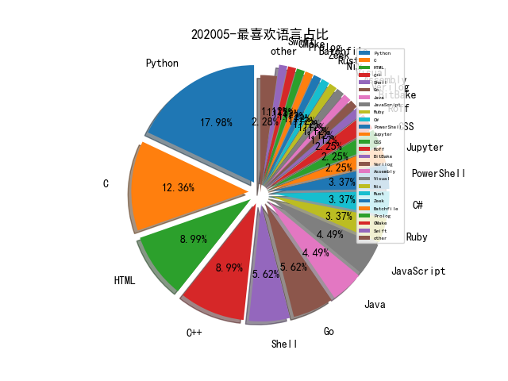

# [数据--所有](README_20.md)
# [数据--年度](README_2020.md)
# 202005 信息源与信息类型占比

# 微信公众号 推荐
| nickname_english | weixin_no | title | url| 
| --- | --- | --- | ---| 
| ChaMd5安全团队 | chamd5sec | De1CTF2020-WriteUp上(Web、Misc、Pwn) | https://mp.weixin.qq.com/s/1CR0up_b5a1zw02wZNwJpg | 2| 
| 安全学术圈 | secquan | Understanding E-commerce Fraud from Autonomous Chat | https://mp.weixin.qq.com/s/uzGQxgfaUufsDSvcYIIYig | 1| 
| 漏洞战争 | vulwar | 技术人的修炼之道：从业余到专业 | https://mp.weixin.qq.com/s/gBgFyy4MMrF5vn-8NGEVQw | 1| 
| ipasslab |  | 学术报告,协议模糊测试相关技术梳理 | https://mp.weixin.qq.com/s/RCpAUpFEzbSewEnWpHrsqw | 1| 
| Tide安全团队 | TideSec | 70.远控免杀专题(70)-终结篇 | https://mp.weixin.qq.com/s/4shT8tP-Gu3XX7fnWKQHAA | 1| 
| 湛卢工作室 | xuehao_studio | 劳动节 , 说说代理池 | https://mp.weixin.qq.com/s/ERU3L2WIMiPNNdTTX164Og | 1| 

# 组织github账号 推荐
| github_id | title | url | org_url | org_profile | org_geo | org_repositories | org_people | org_projects | repo_lang | repo_star | repo_forks| 
| --- | --- | --- | --- | --- | --- | --- | --- | --- | --- | --- | ---| 

# 私人github账号 推荐
| github_id | title | url | p_url | p_profile | p_loc | p_company | p_repositories | p_projects | p_stars | p_followers | p_following | repo_lang | repo_star | repo_forks | 
| --- | --- | --- | --- | --- | --- | --- | --- | --- | --- | --- | --- | --- | --- | ---| 
| wooyunwang | Fortify: 源代码漏洞の审计 | https://github.com/wooyunwang/Fortify | http://www.52pwn.club/ | A strange guy who will make the world a better place! | California | Google Inc. | 27 | 0 | 15 | 60 | 14 | Python,C#,Java,PowerShell | 322 | 104 | 1| 
| NetSPI | Evil SQL Client (ESC) - 为渗透测试设计的交互式的 SQL Server Client，支持发现数据库、访问数据、提取数据 | https://github.com/NetSPI/ESC | None | None | None | None | 0 | 0 | 0 | 0 | 0 | Java,C#,Python,HTML,Go,Ruby,PowerShell | 1100 | 282 | 1| 

# medium_xuanwu 推荐
| title | url| 
| --- | ---| 

# medium_secwiki 推荐
| title | url| 
| --- | ---| 

# zhihu_xuanwu 推荐
| title | url| 
| --- | ---| 

# zhihu_secwiki 推荐
| title | url| 
| --- | ---| 

# 日更新程序
`python update_daily.py`