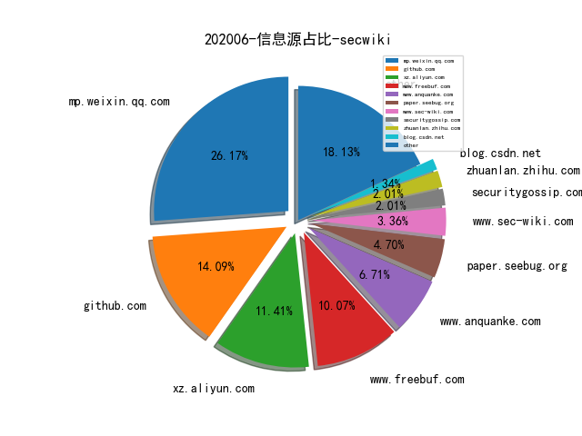
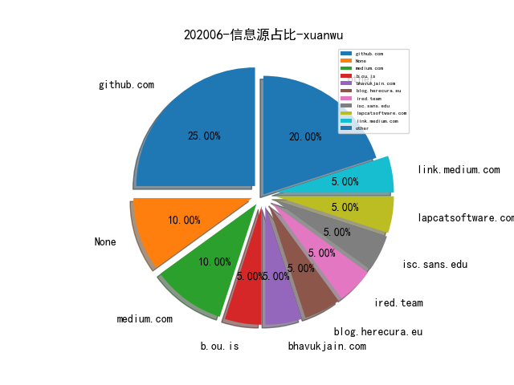
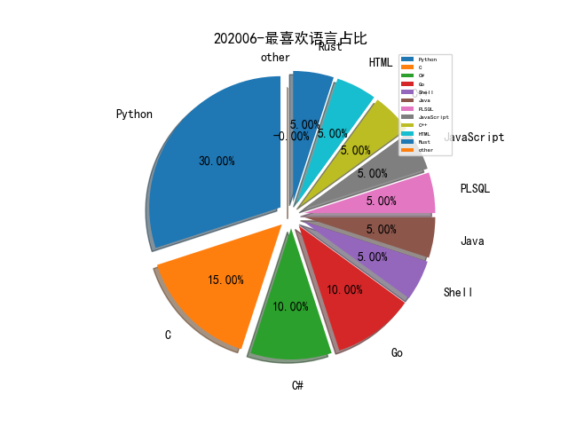

# [数据--所有](README_20.md)
# [数据--年度](README_2020.md)
# 202006 信息源与信息类型占比

# 学习视频 推荐
| title | url| 
| --- | ---| 
| 高质量科研论文写作 | https://www.bilibili.com/video/BV1hg4y1q7Ge| 

# 微信公众号 推荐
| nickname_english | weixin_no | title | url| 
| --- | --- | --- | ---| 
| 长亭科技 | Chaitin_Tech | Docker安全性与攻击面分析 | https://mp.weixin.qq.com/s/BaeIGrBimww8SUtePDQ0jA | 1| 
| ChaMd5安全团队 | chamd5sec | 第五空间-WriteUp | https://mp.weixin.qq.com/s/TyJsK5Rkg6MXvADS13RIcA | 2| 
| 七夜安全博客 | qiye_safe | APT的思考: PowerShell命令混淆高级对抗 | https://mp.weixin.qq.com/s/Sg0LK8emSWP1m-yds4VGrQ | 1| 
| 网络安全观 | SecurityInsights | 网络安全架构 , 安全框架之综述 | https://mp.weixin.qq.com/s/4jec18NXjV6UwubzrYgwzg | 1| 
| AI公园 | AI_Paradise | 标签传播算法解读 | https://mp.weixin.qq.com/s/dX6CouK7LGNbXsRxRnS26w | 1| 
| 猎户攻防实验室 | TassLiehu | 自动化测试工具APPium初探 | https://mp.weixin.qq.com/s/wwlqd_kO7vfpP6vTPrW_6Q | 1| 
| 湛卢工作室 | xuehao_studio | 攻防演习 , 红军的反击 | https://mp.weixin.qq.com/s/WrQa0XoBSak3HM1l650HEg | 1| 
| 互联网安全内参 | anquanneican | 深度解读：Verizon 2020年数据泄露报告 | https://mp.weixin.qq.com/s/sDu5eydjesAwsI2v8dEj5Q | 1| 
| Bypass | Bypass-- | 甲方安全开源项目清单 | https://mp.weixin.qq.com/s/FS8JVnZqqXw1M9czyeF8dw | 1| 
| 99所 | gh_4b0bd9f08b03 | 【视频】利用Twitter如何挖掘有价值的开源信息？——工具篇 | https://mp.weixin.qq.com/s/ukP2ASwXA8HDuDNYGHC-Sw | 1| 
| 信息安全与通信保密杂志社 | cismag2013 | 全国23省市“新基建”网安任务重点梳理 | https://mp.weixin.qq.com/s/Isv3mrwIIEHZi6_gn7u-9g | 1| 
| 星阑科技 | StarCrossCN | Jsonp漏洞简析及自动化漏洞挖掘脚本编写 | https://mp.weixin.qq.com/s/SuEpF3RIZIv2CcIUok8SoQ | 1| 
| 安全威胁情报 | Threatbook | 钓鱼、投递木马……一文扒尽“白象三代”APT组织攻击活动！ | https://mp.weixin.qq.com/s/ve2L6_v0EvJZwLSyWijvUw | 1| 
| 大兵说安全 | dabingshuoanquan | 也来聊聊态势感知（上） | https://mp.weixin.qq.com/s/dCGMfKsFzYaZiffjkBBYpg | 3| 
| 全频带阻塞干扰 | RFJamming | 一线执法必备的自我隐私保护能力 | https://mp.weixin.qq.com/s/h6jE7RD6pzaPINxiRoG0BQ | 1| 
| SecIN技术平台 | sec-in | 一种新型shellcode仿真框架分析 | https://mp.weixin.qq.com/s/9XHNMwIhmZLtOI385_4iaQ | 1| 
| MS509 | CSRC-MS509 | 内网渗透之内网穿透 | https://mp.weixin.qq.com/s/L3rVjrz3pLncFmVrS5S0dQ | 2| 
| EnjoyHacking | zom3y3 | 基于ClickHouse + Redash + Python去做安全数据分析 | https://mp.weixin.qq.com/s/O7IuAZV1XuogKwsoLhx4Qw | 1| 
| 中国白客联盟 | China_Baiker | 渗透中的内网渗透 | https://mp.weixin.qq.com/s/Mk5P_04SAitUjRztc9e-Rw | 1| 
| SecWiki | SecWiki | [Sec-Trans-12] Github信息收集 | https://mp.weixin.qq.com/s/LnjKK1YJ7BvMXPuFbeq37w | 1| 
| 老马玩工控安全 | gh_e41f6c29c07a | 工控安全事件汇总与分析 | https://mp.weixin.qq.com/s/rG1oG8nz07DtRKTRaJjM7A | 1| 
| 长亭安全课堂 | chaitintech_release | Python代码保护 , pyc 混淆从入门到工具实现 | https://mp.weixin.qq.com/s/qvbwTAmDOvpHrAoNdQ7RRA | 1| 
| 绿盟科技研究通讯 | nsfocus_research | AISecOps：打造可信任安全智能 | https://mp.weixin.qq.com/s/Tz9V05CHqLg_Wt4yfJZffQ | 2| 
| 锦行信息安全 | jeeseensec | 任天堂再遭黑手，用户隐私到底该如何保护？ | https://mp.weixin.qq.com/s/O7N2OWtSQUKY-6d5H6e7lg | 2| 
| 腾讯安全应急响应中心 | tsrc_team | 主机安全——洋葱Webshell检测实践与思考 | https://mp.weixin.qq.com/s/ol70aVdvybzMJmtfxaAAZQ | 2| 
| 看雪学院 | ikanxue | 新手向总结：IDA动态调试So的一些坑 | https://mp.weixin.qq.com/s/91r1cKyL_1UR79OP2XubqA | 2| 
| 宽字节安全 | gh_2de2b9f7d076 | tomcat结合shiro无文件webshell的技术研究以及检测方法 | https://mp.weixin.qq.com/s/fFYTRrSMjHnPBPIaVn9qMg | 6| 
| 安恒信息安全研究院 | gh_684e6ad8d12c | StarCTF 2019 v8 off-by-one漏洞学习笔记 | https://mp.weixin.qq.com/s/z6PLgxbt0yniwiuRY2bUWw | 1| 
| 安恒信息 | DBAPP2013 | 红蓝对抗——「CobaltStrike」应用攻击手段实例分析 | https://mp.weixin.qq.com/s/9_0pLbmWqUbJ6aGEPjxvYA | 1| 
| 安全学术圈 | secquan | FUSE: Finding File Upload Bugs via Penetration Testing | https://mp.weixin.qq.com/s/aLlIZSM8SpZResIdxf3C1A | 2| 

# 私人github账号 推荐
| github_id | title | url | p_url | p_profile | p_loc | p_company | p_repositories | p_projects | p_stars | p_followers | p_following | repo_lang | repo_star | repo_forks | 
| --- | --- | --- | --- | --- | --- | --- | --- | --- | --- | --- | --- | --- | --- | ---| 
| Neo23x0 | 开源日志数据分析工具sigma更新了现有的ATT＆CK技术参考 | https://github.com/Neo23x0/sigma/pull/845 | https://github.com/NextronSystems | #DFIR #Python #YARA #Golang #SIEM #SOC #Sigma #Malware | None | @NextronSystems | 83 | 0 | 121 | 1800 | 15 | Python,Batchfile,Java | 2600 | 687 | 1| 
| ionescu007 | TpmTool - TPM NV Space Access Tool | https://github.com/ionescu007/tpmtool// | https://github.com/aionescu | VP of EDR Strategy at CrowdStrike President of Winsider Seminars & Solutions, Inc. Follow me at @aionescu on Twitter and http://www.alex-ionescu.com | None | Winsider Seminars & Solutions Inc. | 22 | 0 | 0 | 1100 | 1 | C,C++ | 1100 | 193 | 1| 
| random-robbie | 一款用于检查SSRF漏洞的fuzz工具。 | https://github.com/random-robbie/ssrf-finder | https://www.what-security.co.uk | Bug Bounty Hunter that appears in your searches! Soz not Soz! Raise an Issue if you wish to contact me do not email me! | Wirral UK | None | 232 | 0 | 295 | 696 | 113 | Python | 554 | 212 | 1| 
| grayddq | ScanCVE: 监控Github上CVE增量 | https://github.com/grayddq/ScanCVE | None | 一位喜欢原创的安全工作者！ | None | None | 17 | 0 | 0 | 587 | 0 | Python | 844 | 265 | 1| 
| pyn3rd | Apache Tomcat + MongoDB 远程代码执行Poc公布 | https://github.com/pyn3rd/Apache-Tomcat-MongoDB-Remote-Code-Execution | https://twitter.com/pyn3rd |  | Hangzhou | None | 10 | 0 | 0 | 505 | 3 | Python,Batchfile,Java | 172 | 60 | 1| 
| mhaskar | Python 编写的 C&C Server，可以通过 HTTP/S 控制 PowerShell Agent | https://github.com/mhaskar/Octopus | https://shells.systems | Hacker and Python developer , OSCP and OSCE certified. | Amman | iSecur1ty | 46 | 0 | 40 | 290 | 12 | Python,C | 269 | 61 | 1| 
| irsdl | 历年Web hacking技巧大全 | https://github.com/irsdl/top10webseclist | https://soroush.me/ |  | @irsdl (Twitter), UK, The Contrived World of InfoSec ><b>abcd | @MDSecLabs (Twitter) | 27 | 0 | 43 | 269 | 0 | Python,C#,Java | 430 | 120 | 1| 
| 0xZ0F | Windows x64 平台逆向分析教程 | https://github.com/0xZ0F/Z0FCourse_ReverseEngineering | https://0xz0f.github.io/ | Security Researcher & Exploit Dev. | United States of America | Z0F | 19 | 0 | 4 | 235 | 0 | C++ | 3500 | 244 | 1| 
| jvoisin | php-malware-finder – Detect Potentially Malicious PHP | https://github.com/jvoisin/php-malware-finder | https://dustri.org |  | None | None | 19 | 0 | 158 | 226 | 8 | C,PHP,C++ | 12600 | 2200 | 1| 
| guhe120 | guhe 对 Windows RPC Marshalling 溢出漏洞（CVE-2020-1281）的分析 | https://github.com/guhe120/Windows-EoP/blob/master/CVE-2020-1281/CVE-2020-1281.pdf | None |  | None | None | 8 | 0 | 0 | 225 | 0 | Python,HTML,Java | 80 | 11 | 1| 
| ioncodes | 在 VS Code 中调试 IDA idapython 脚本的插件 | https://github.com/ioncodes/idacode | https://twitter.com/layle_ctf | Hacker in the streets, reverse engineer in the sheets. Thats how it works, right? | Here | None | 264 | 0 | 1800 | 203 | 33 | C#,Python,Ruby | 209 | 29 | 1| 
| jacobsoo | 研究员 Jacob Soo 分享的关于恶意软件分析的几篇笔记 | https://github.com/jacobsoo/Shared// | None |  | None | None | 63 | 0 | 0 | 136 | 23 | Python,HTML,Jupyter | 131 | 47 | 1| 
| dwisiswant0 | 一款可以用于检查IP地址是否属于Cloudflare | https://github.com/dwisiswant0/cf-check// | https://github.com/kitabisa | Security Engineer | id_ID | @kitabisa | 165 | 0 | 473 | 119 | 12 | Go,Python,Shell,PHP | 105 | 26 | 1| 
| angelwhu | 基于JVM-Sandbox实现RASP安全监控防护 | https://github.com/angelwhu/jvm-rasp | http://www.angelwhu.com/ |  | wuhan | whu | 71 | 0 | 307 | 89 | 33 | Python,C,PHP,Java | 21 | 8 | 1| 
| omergunal | Predict attacker groups from the techniques and software used | https://github.com/omergunal/Attacker-Group-Predictor | https://ogunal.com |  | Turkey | None | 18 | 0 | 52 | 85 | 17 | Python | 2000 | 229 | 1| 
| Flangvik | BetterSafetyKatz: SafetyKatz dynamically fetches the lates... | https://github.com/Flangvik/BetterSafetyKatz | https://twitter.com/Flangvik | Nerd that spend way to much time at this stuff | Norway | None | 23 | 0 | 38 | 82 | 1 | C#,Python | 234 | 50 | 1| 
| ReddyyZ | GhostShell - 一款开源恶意软件，具有 Bypass AVs、VMs、以及 Sandboxes 的实现 | https://github.com/ReddyyZ/GhostShell | https://www.youtube.com/c/fantasmanosistema | Im a young programmer, 13 years old, and Im always looking for knowledge. | Brazil | None | 32 | 0 | 138 | 68 | 13 | Python,C,Shell | 160 | 58 | 1| 
| 0xricksanchez | FI(le) SY(stem) - 针对 BSD 系统内核的 Fuzzer | https://github.com/0xricksanchez/fisy-fuzz | https://0x434b.dev | Trying to advance in the areas of IT-Sec, reversing and hacking. Also doing administrative jobs @ www.0x00sec.org | @0xricksanchez | None | 20 | 0 | 426 | 64 | 54 | Python,C,PLSQL | 35 | 7 | 1| 
| ph4ntonn | Impost3r -- 悄悄偷走sudo密码的小偷 | https://github.com/ph4ntonn/Impost3r | None | The wheel turns,nothing is ever new | 0x7F000001 | Unknown | 35 | 0 | 38 | 57 | 21 | C,Shell,Python,JavaScript,HTML,Go | 226 | 40 | 1| 
| FoxHex0ne | 作者开源了博客中提到的监控 Hyper Call 的工具 | https://github.com/FoxHex0ne/BlogHyperV | None |  | None | None | 8 | 0 | 0 | 57 | 0 | Python,Java,C++ | 98 | 25 | 1| 
| cedowens | macOS 平台一款类似 Seatbelt 的工具，可以用于渗透阶段提取系统的各类信息 | https://github.com/cedowens/SwiftBelt | https://medium.com/red-teaming-with-a-blue-team-mentaility | offensive security engineer | None | None | 27 | 0 | 0 | 39 | 3 | Python,Swift | 52 | 12 | 1| 
| NomadCN112 | ATT&CK 框架图中文翻译版 | https://github.com/NomadCN112/Chinese-translation-ATT-CK-framework | None | 憨批独眼小子 (如果可以的话，谁愿意拿命去战斗呢) | None | None | 15 | 0 | 10 | 25 | 2 | Python,C# | 131 | 37 | 1| 
| cbwang505 | Windows CardSpace 服务符号链接导致任意文件替换漏洞 Exploit | https://github.com/cbwang505/CVE-2020-1066-EXP | https://blog.csdn.net/oShuangYue12 | 始于C#，精于C&C++，醉心于Windows内核与Com组件安全研究 | China ZheJiang Ningbo | ZheJiang Guoli Security Technology | 30 | 0 | 17 | 24 | 5 | C,C++ | 43 | 9 | 2| 
| Cl0udG0d | 碎遮SZhe_Scan Web漏洞扫描器 | https://github.com/Cl0udG0d/SZhe_Scan | None | 愿你在冷铁卷刃前，得以窥见天光 | 重庆 | CQUT | 10 | 0 | 5 | 21 | 2 | Python | 141 | 39 | 1| 
| m4yfly | 基于正则的VSCode代码审计插件 | https://github.com/m4yfly/vscode-maudit | https://aiyo.xyz |  | None | None | 29 | 0 | 398 | 20 | 39 | Python,Dockerfile,TypeScript,JavaScript | 43 | 14 | 1| 
| MisakiKata | Python 代码审计 | https://github.com/MisakiKata/python_code_audit | https://misakikata.github.io | 企业安全，Python，红队，渗透等 | Shanghai | None | 16 | 0 | 30 | 18 | 31 | Python,C,Shell,Java,HTML | 19 | 6 | 3| 
| 3xp0rt | Sorano恶意软件加载器源代码泄漏 | https://github.com/3xp0rt/SoranoBot | https://twitter.com/3xp0rtblog |  | Ukraine | None | 10 | 0 | 10 | 18 | 3 | C#,C,HTML | 10 | 10 | 1| 
| LakeVilladom | goSkylar: 基于Golang开发的企业级外网端口资产扫描 | https://github.com/LakeVilladom/goSkylar | None |  | None | None | 107 | 0 | 140 | 14 | 2 | Go,Shell,JavaScript | 38 | 21 | 1| 
| whitehatnote | BlueShell: 红蓝对抗跨平台远控工具 | https://github.com/whitehatnote/BlueShell?from=timeline | None |  | None | None | 1 | 0 | 4 | 9 | 0 | Go | 71 | 10 | 1| 
| A2kaid | Get-WeChat-DB: 获取目标机器的微信数据库和密钥 | https://github.com/A2kaid/Get-WeChat-DB | https://www.dongzt.cn/ | 二进制萌新 | 北京 | None | 33 | 0 | 134 | 6 | 14 | Python,C,C++ | 44 | 7 | 1| 
| synacktiv | 如何利用Windows内核堆栈溢出漏洞进行特权提升(Poc) | https://github.com/synacktiv/Windows-kernel-SegmentHeap-Aligned-Chunk-Confusion | None | None | None | None | 0 | 0 | 0 | 0 | 0 | Python,C,PHP,Rust | 0 | 0 | 1| 
| qq4108863 | hihttps: 一款完整源码的高性能Web应用防火墙 | https://github.com/qq4108863/hihttps | None |  | None | None | 0 | 0 | 0 | 0 | 0 | C | 92 | 31 | 1| 
| pedrib | Netgear R6700v3 LAN RCE write-up and exploit | https://github.com/pedrib/PoC/blob/master/advisories/Pwn2Own/Tokyo_2019/tokyo_drift/tokyo_drift.md | https://www.agileinfosec.co.uk | 1337 | London, United Kingdom | Agile Information Security | 0 | 0 | 0 | 0 | 0 | HTML,Ruby,CSS,C++ | 260 | 79 | 1| 
| joinsec | BadDNS: 使用公共 DNS 服务器进行多层子域名探测的极速工具 | https://github.com/joinsec/BadDNS | None | None | None | None | 0 | 0 | 0 | 0 | 0 | Go,Python,Rust | 0 | 0 | 1| 
| googleprojectzero | ProjectZero 开源的一款动态插桩库，支持对进程内的指定模块进行插桩 | https://github.com/googleprojectzero/TinyInst | None | None | None | None | 0 | 0 | 0 | 0 | 0 | C,C#,C++,Python,HTML,Swift | 0 | 0 | 1| 
| google | FuzzBench: Fuzzer Benchmarking As a Service，用于评估 Fuzzer 性能和效率 | https://github.com/google/fuzzbench | None | None | None | None | 0 | 0 | 0 | 0 | 0 | C,TypeScript,Jupyter,Python,JavaScript,C++,Dart,SystemVerilog,Go,Java,Rust | 0 | 0 | 1| 
| bb1nfosec | Windows漏洞利用资源以及漏洞利用的网站参考列表总结。 | https://github.com/bb1nfosec/Information-Security-Tasks/blob/master/Post%20Exploitation/Windows%20Exploitation%2C%20post%20exploitation%20sites%20for%20reference | None | Just another guy whom loves to play 0 and 1 . | India | None | 0 | 0 | 0 | 0 | 0 | Python,Shell,HTML,CSS | 49 | 16 | 1| 
| airbus-cert | 一款用于处理 Event Tracing for Windows（ETW）的IDA插件 | https://github.com/airbus-cert/etwbreaker | None | None | None | None | 0 | 0 | 0 | 0 | 0 | C,Lua,Python,C#,Go,PHP | 104 | 9 | 1| 
| NiuTrans | 机器翻译：统计建模与深度学习方法 | https://github.com/NiuTrans/MTBook | None | None | None | None | 0 | 0 | 0 | 0 | 0 | TeX,C++ | 1500 | 565 | 1| 
| Integration-IT | Active Directory Exploitation Cheat Sheet | https://github.com/Integration-IT/Active-Directory-Exploitation-Cheat-Sheet | None |  | None | None | 0 | 0 | 0 | 0 | 0 | Ruby,PowerShell | 308 | 55 | 1| 
| HexHive | FuzzGen: Automatic Fuzzer Generation | https://github.com/HexHive/FuzzGen | None | None | None | None | 0 | 0 | 0 | 0 | 0 | C,Python,C++,TeX,HTML,Brainfuck | 0 | 0 | 1| 
| FlameOfIgnis | PWDB - New generation of Password Mass-Analysis | https://github.com/FlameOfIgnis/Pwdb-Public | https://github.com/EpicGames | Junior year computer engineering student at METU/NCC. | Turkey | @EpicGames @NVIDIAGameWorks | 0 | 0 | 0 | 0 | 0 | Python,TypeScript,JavaScript,Cuda | 835 | 325 | 1| 
| FSecureLABS | Physmem2profit 工具用于在可物理访问内存的情况下创建 LSASS 进程的 minidump | https://github.com/FSecureLABS/physmem2profit | None | None | None | None | 0 | 0 | 0 | 0 | 0 | C,Shell,Java,Python,JavaScript,C++,C#,PowerShell | 2200 | 584 | 2| 
| Anemone95 | MLDetectVuln: AI算法解决大规模二进制程序函数相似性分析 | https://github.com/Anemone95/MLDetectVuln | http://anemone.top | Im very vegetable. | None | None | 0 | 0 | 0 | 0 | 0 | Python,JavaScript,PHP,Vim | 8 | 5 | 1| 
| 4x99 | 码小六 - GitHub 代码泄露监控系统 | https://github.com/4x99/code6 | None |  | None | None | 2 | 0 | 1 | 0 | 0 | PHP | 73 | 14 | 1| 

# medium 推荐
| title | url| 
| --- | ---| 
| 逆向工程学习资源收录，包括技术博客、工具/插件、研究报告等 | http://medium.com/@vignesh4303/reverse-engineering-resources-beginners-to-intermediate-guide-links-f64c207505ed| 
| JavaScript中的内存泄漏分析 | http://medium.com/walkme-engineering/memory-in-javascript-beyond-leaks-8c1d697c655c| 
| AMD 新发布的 Mini-PC 的 UEFI 镜像的漏洞挖掘与分析 | http://link.medium.com/pazvQdeuo7| 
| 红队：如何在C＃中嵌入Golang工具中的教程 | http://medium.com/@shantanukhande/red-team-how-to-embed-golang-tools-in-c-e269bf33876a| 
| 关于进程令牌的原理以及利用方式-第一部分 | http://medium.com/@seemant.bisht24/understanding-and-abusing-process-tokens-part-i-ee51671f2cfa| 
| Pwn2Own Schneider 路径穿越漏洞的分析 | http://medium.com/cognite/pwn2own-or-not2pwn-part-2-5-a-brief-tale-of-free-0days-e1df142eb815?source=friends_link&sk=42caecc5dc90e8ffc5c9aa394e41204d| 
| 索尼网站XSS漏洞 | http://link.medium.com/UhLfjkZeU6| 
| Car Hacking with Python  Part 1: 提取 GPS/OBDII/CAN Bus 的数据 | http://medium.com/bugbountywriteup/car-hacking-with-python-part-1-data-exfiltration-gps-and-obdii-can-bus-69bc6b101fd1| 
| 作者给Facebook的提bug挣了$31500，一个漫长而精彩的故事。 | http://link.medium.com/U0kbvLP1V6| 

# medium 推荐
| title | url| 
| --- | ---| 
| Mining DNS MX Records for Fun and Profit | https://medium.com/@jason_trost/mining-dns-mx-records-for-fun-and-profit-7a069da9ee2d| 

# 知乎 推荐
| title | url| 
| --- | ---| 
| 知识图谱之知识表示篇（一） | https://zhuanlan.zhihu.com/p/148785892| 
| 抱紧你的SIM卡—5G物理安全初探 | https://zhuanlan.zhihu.com/p/149614674| 
| 时间序列预测方法总结 | https://zhuanlan.zhihu.com/p/67832773| 

# 论坛 推荐
| title | url| 
| --- | ---| 
| 渗透经验分享之SQL注入思路拓展 | https://xz.aliyun.com/t/7919| 
| Java代码审计之Struts2-001 | https://xz.aliyun.com/t/7915| 
| Powershell免杀的探索 | https://xz.aliyun.com/t/7903| 
| Linux Pam后门总结拓展 | https://xz.aliyun.com/t/7902| 
| 内网渗透之ICMP隐藏隧道 | https://xz.aliyun.com/t/7875| 
| firefox-hackbar-2.2.9 自签名学习版全过程 | https://xz.aliyun.com/t/7857| 
| 某cms的一次审计 | https://xz.aliyun.com/t/7872| 
| Docker逃逸小结 第一版 | https://xz.aliyun.com/t/7881| 
| 记一次测试Gitlab | https://xz.aliyun.com/t/7870| 
| 初探PythonOpcode逃逸 | https://xz.aliyun.com/t/7828| 
| vBulletin 5.6.1 SQL注入漏洞 | https://xz.aliyun.com/t/7831| 
| D-Link DIR815路由器缓冲区溢出漏洞再分析 | https://xz.aliyun.com/t/7835| 
| Monstra CMS RCE漏洞分析（CVE-2020-13384） | https://xz.aliyun.com/t/7850| 
| LFCMS的一次审计 | https://xz.aliyun.com/t/7844| 
| nodejs沙箱与黑魔法 | https://xz.aliyun.com/t/7842| 
| Intigriti的2020年5月XSS挑战 | https://xz.aliyun.com/t/7800| 
| 基于机器学习的GitHub敏感信息泄露监控 | https://xz.aliyun.com/t/7805| 
| Django 初次尝试编写 Web 漏洞扫描器挖坑记录 | https://xz.aliyun.com/t/7816| 

# 日更新程序
`python update_daily.py`