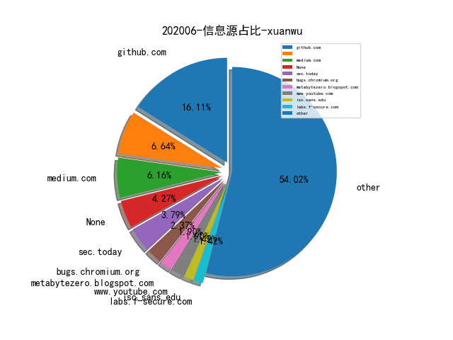
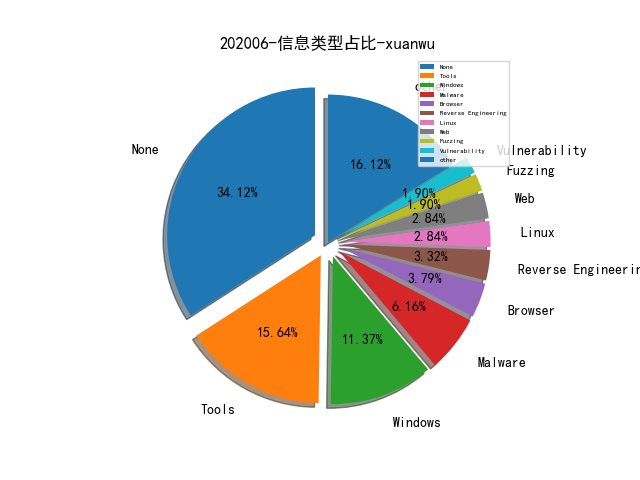

# [数据--所有](README_20.md)
# [数据--年度](README_2020.md)
# 202006 信息源与信息类型占比

# 微信公众号 推荐
| nickname_english | weixin_no | title | url| 
| --- | --- | --- | ---| 
| 长亭安全课堂 | chaitintech_release | Python代码保护 , pyc 混淆从入门到工具实现 | https://mp.weixin.qq.com/s/qvbwTAmDOvpHrAoNdQ7RRA | 1| 
| 宽字节安全 | gh_2de2b9f7d076 | tomcat结合shiro无文件webshell的技术研究以及检测方法 | https://mp.weixin.qq.com/s/fFYTRrSMjHnPBPIaVn9qMg | 1| 
| 安全学术圈 | secquan | FUSE: Finding File Upload Bugs via Penetration Testing | https://mp.weixin.qq.com/s/aLlIZSM8SpZResIdxf3C1A | 1| 
| 安恒信息 | DBAPP2013 | 红蓝对抗——「CobaltStrike」应用攻击手段实例分析 | https://mp.weixin.qq.com/s/9_0pLbmWqUbJ6aGEPjxvYA | 1| 
| 安恒信息安全研究院 | gh_684e6ad8d12c | StarCTF 2019 v8 off-by-one漏洞学习笔记 | https://mp.weixin.qq.com/s/z6PLgxbt0yniwiuRY2bUWw | 1| 
| 看雪学院 | ikanxue | 新手向总结：IDA动态调试So的一些坑 | https://mp.weixin.qq.com/s/91r1cKyL_1UR79OP2XubqA | 1| 
| 腾讯安全应急响应中心 | tsrc_team | 主机安全——洋葱Webshell检测实践与思考 | https://mp.weixin.qq.com/s/ol70aVdvybzMJmtfxaAAZQ | 1| 
| 锦行信息安全 | jeeseensec | 任天堂再遭黑手，用户隐私到底该如何保护？ | https://mp.weixin.qq.com/s/O7N2OWtSQUKY-6d5H6e7lg | 1| 

# 组织github账号 推荐
| github_id | title | url | org_url | org_profile | org_geo | org_repositories | org_people | org_projects | repo_lang | repo_star | repo_forks| 
| --- | --- | --- | --- | --- | --- | --- | --- | --- | --- | --- | ---| 

# 私人github账号 推荐
| github_id | title | url | p_url | p_profile | p_loc | p_company | p_repositories | p_projects | p_stars | p_followers | p_following | repo_lang | repo_star | repo_forks | 
| --- | --- | --- | --- | --- | --- | --- | --- | --- | --- | --- | --- | --- | --- | ---| 
| random-robbie | 一款用于检查SSRF漏洞的fuzz工具。 | https://github.com/random-robbie/ssrf-finder | https://www.what-security.co.uk | Bug Bounty Hunter that appears in your searches! Soz not Soz! Raise an Issue if you wish to contact me do not email me! | Wirral UK | None | 232 | 0 | 295 | 696 | 113 | Python | 554 | 212 | 1| 
| pyn3rd | Apache Tomcat + MongoDB 远程代码执行Poc公布 | https://github.com/pyn3rd/Apache-Tomcat-MongoDB-Remote-Code-Execution | https://twitter.com/pyn3rd |  | Hangzhou | None | 10 | 0 | 0 | 505 | 3 | Python,Batchfile,Java | 172 | 60 | 1| 
| irsdl | 历年Web hacking技巧大全 | https://github.com/irsdl/top10webseclist | https://soroush.me/ |  | @irsdl (Twitter), UK, The Contrived World of InfoSec ><b>abcd | @MDSecLabs (Twitter) | 27 | 0 | 43 | 269 | 0 | Python,C#,Java | 430 | 120 | 1| 
| ioncodes | 在 VS Code 中调试 IDA idapython 脚本的插件 | https://github.com/ioncodes/idacode | https://twitter.com/layle_ctf | Hacker in the streets, reverse engineer in the sheets. Thats how it works, right? | Here | None | 264 | 0 | 1800 | 203 | 33 | C#,Python,Ruby | 209 | 29 | 1| 
| dwisiswant0 | 一款可以用于检查IP地址是否属于Cloudflare | https://github.com/dwisiswant0/cf-check// | https://github.com/kitabisa | Security Engineer | id_ID | @kitabisa | 165 | 0 | 473 | 119 | 12 | Go,Python,Shell,PHP | 105 | 26 | 1| 
| ReddyyZ | GhostShell - 一款开源恶意软件，具有 Bypass AVs、VMs、以及 Sandboxes 的实现 | https://github.com/ReddyyZ/GhostShell | https://www.youtube.com/c/fantasmanosistema | Im a young programmer, 13 years old, and Im always looking for knowledge. | Brazil | None | 32 | 0 | 138 | 68 | 13 | Python,C,Shell | 160 | 58 | 1| 
| 0xricksanchez | FI(le) SY(stem) - 针对 BSD 系统内核的 Fuzzer | https://github.com/0xricksanchez/fisy-fuzz | https://0x434b.dev | Trying to advance in the areas of IT-Sec, reversing and hacking. Also doing administrative jobs @ www.0x00sec.org | @0xricksanchez | None | 20 | 0 | 426 | 64 | 54 | Python,C,PLSQL | 35 | 7 | 1| 
| FoxHex0ne | 作者开源了博客中提到的监控 Hyper Call 的工具 | https://github.com/FoxHex0ne/BlogHyperV | None |  | None | None | 8 | 0 | 0 | 57 | 0 | Python,Java,C++ | 98 | 25 | 1| 
| ph4ntonn | Impost3r -- 悄悄偷走sudo密码的小偷 | https://github.com/ph4ntonn/Impost3r | None | The wheel turns,nothing is ever new | 0x7F000001 | Unknown | 35 | 0 | 38 | 57 | 21 | C,Shell,Python,JavaScript,HTML,Go | 226 | 40 | 1| 
| cedowens | macOS 平台一款类似 Seatbelt 的工具，可以用于渗透阶段提取系统的各类信息 | https://github.com/cedowens/SwiftBelt | https://medium.com/red-teaming-with-a-blue-team-mentaility | offensive security engineer | None | None | 27 | 0 | 0 | 39 | 3 | Python,Swift | 52 | 12 | 1| 
| NomadCN112 | ATT&CK 框架图中文翻译版 | https://github.com/NomadCN112/Chinese-translation-ATT-CK-framework | None | 憨批独眼小子 (如果可以的话，谁愿意拿命去战斗呢) | None | None | 15 | 0 | 10 | 25 | 2 | Python,C# | 131 | 37 | 1| 
| cbwang505 | Windows CardSpace 服务符号链接导致任意文件替换漏洞 Exploit | https://github.com/cbwang505/CVE-2020-1066-EXP | https://blog.csdn.net/oShuangYue12 | 始于C#，精于C&C++，醉心于Windows内核与Com组件安全研究 | China ZheJiang Ningbo | ZheJiang Guoli Security Technology | 30 | 0 | 17 | 24 | 5 | C,C++ | 43 | 9 | 1| 
| 3xp0rt | Sorano恶意软件加载器源代码泄漏 | https://github.com/3xp0rt/SoranoBot | https://twitter.com/3xp0rtblog |  | Ukraine | None | 10 | 0 | 10 | 18 | 3 | C#,C,HTML | 10 | 10 | 1| 
| NiuTrans | 机器翻译：统计建模与深度学习方法 | https://github.com/NiuTrans/MTBook | None | None | None | None | 0 | 0 | 0 | 0 | 0 | TeX,C++ | 1500 | 565 | 1| 
| airbus-cert | 一款用于处理 Event Tracing for Windows（ETW）的IDA插件 | https://github.com/airbus-cert/etwbreaker | None | None | None | None | 0 | 0 | 0 | 0 | 0 | C,Lua,Python,C#,Go,PHP | 104 | 9 | 1| 
| googleprojectzero | ProjectZero 开源的一款动态插桩库，支持对进程内的指定模块进行插桩 | https://github.com/googleprojectzero/TinyInst | None | None | None | None | 0 | 0 | 0 | 0 | 0 | C,C#,C++,Python,HTML,Swift | 0 | 0 | 1| 
| joinsec | BadDNS: 使用公共 DNS 服务器进行多层子域名探测的极速工具 | https://github.com/joinsec/BadDNS | None | None | None | None | 0 | 0 | 0 | 0 | 0 | Go,Python,Rust | 0 | 0 | 1| 
| synacktiv | 如何利用Windows内核堆栈溢出漏洞进行特权提升(Poc) | https://github.com/synacktiv/Windows-kernel-SegmentHeap-Aligned-Chunk-Confusion | None | None | None | None | 0 | 0 | 0 | 0 | 0 | Python,C,PHP,Rust | 0 | 0 | 1| 

# medium_xuanwu 推荐
| title | url| 
| --- | ---| 
| 红队：如何在C＃中嵌入Golang工具中的教程 | http://medium.com/@shantanukhande/red-team-how-to-embed-golang-tools-in-c-e269bf33876a| 
| 关于进程令牌的原理以及利用方式-第一部分 | http://medium.com/@seemant.bisht24/understanding-and-abusing-process-tokens-part-i-ee51671f2cfa| 
| Pwn2Own Schneider 路径穿越漏洞的分析 | http://medium.com/cognite/pwn2own-or-not2pwn-part-2-5-a-brief-tale-of-free-0days-e1df142eb815?source=friends_link&sk=42caecc5dc90e8ffc5c9aa394e41204d| 
| 索尼网站XSS漏洞 | http://link.medium.com/UhLfjkZeU6| 
| Car Hacking with Python  Part 1: 提取 GPS/OBDII/CAN Bus 的数据 | http://medium.com/bugbountywriteup/car-hacking-with-python-part-1-data-exfiltration-gps-and-obdii-can-bus-69bc6b101fd1| 
| 作者给Facebook的提bug挣了$31500，一个漫长而精彩的故事。 | http://link.medium.com/U0kbvLP1V6| 

# medium_secwiki 推荐
| title | url| 
| --- | ---| 

# zhihu_xuanwu 推荐
| title | url| 
| --- | ---| 

# zhihu_secwiki 推荐
| title | url| 
| --- | ---| 

# 日更新程序
`python update_daily.py`