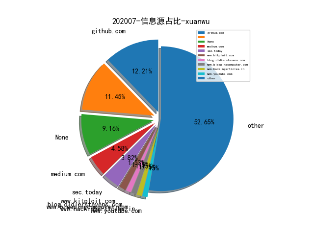
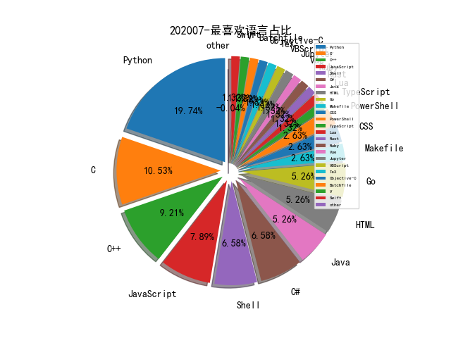

# [数据--所有](README_20.md)
# [数据--年度](README_2020.md)
# 202007 信息源与信息类型占比

# 微信公众号 推荐
| nickname_english | weixin_no | title | url| 
| --- | --- | --- | ---| 
| AINLP | nlpjob | ​【特征工程】时序特征挖掘的奇技淫巧 | https://mp.weixin.qq.com/s/AennHGMpuoZTRo_4ud5m3w | 1| 
| GobySec | gobysec | 插件分享 , 可以查看摄像头快照的“Hikvision插件” | https://mp.weixin.qq.com/s/YExvYQ8RtBvrNC0VwwnV9A | 3| 
| 这里是河马 | gh_d110440c4890 | RangeAMP：利用CDN+Range请求进行的HTTP放大攻击 | https://mp.weixin.qq.com/s/Dp5214aBdQjb-uuxP7T4zg | 3| 
| 君哥的体历 | jungedetili | 【君哥访谈】谭晓生：论CISO的个人修养（抖音直播整理） | https://mp.weixin.qq.com/s/OQgfTosjAWVSEGlCuBKF5A | 1| 
| 数世咨询 | dwconcn | 数世咨询：网络靶场能力指南 | https://mp.weixin.qq.com/s/7HAorX_VurhxXI9OT6sILA | 2| 
| 酒仙桥六号部队 | anfu-360 | 细说渗透江湖之披荆斩棘 | https://mp.weixin.qq.com/s/HVOpUfJbncp81GWFLcgIFw | 1| 
| 全频带阻塞干扰 | RFJamming | 特勤局手册 , 领导人高级别会谈如何反窃密 | https://mp.weixin.qq.com/s/2ySVlrHHnMpunY9VX0l3Zg | 1| 
| 安全威胁情报 | Threatbook | 朝鲜半岛APT组织Lazarus在MacOS平台上的攻击活动分析 | https://mp.weixin.qq.com/s/W0HuTvPI7CzM8queWNhXIQ | 1| 
| 专注安管平台 | gh_48603b9bb05a | Gartner对SOAR的定义不断变化 | https://mp.weixin.qq.com/s/X0BoaaFG1a-p5xymokC1YQ | 1| 
| 天御攻防实验室 | TianyuLab | 从APT29看网络威胁归因（上） | https://mp.weixin.qq.com/s/RFxS0xigAF-bMh59KR44cA | 1| 
| 看雪学院 | ikanxue | CVE-2020-0624 win32k漏洞分析笔记 | https://mp.weixin.qq.com/s/GHiTqWlxisyVWxVHcACpvg | 2| 
| 360威胁情报中心 | CoreSec360 | 被低估的混乱军团 -WellMess(APT-C-42)组织网络渗透和供应链攻击行动揭秘 | https://mp.weixin.qq.com/s/WmzryWNNJVV7mXABQ1Yu8g | 1| 
| 安全学术圈 | secquan | 谷歌学术指标2020年（计算机安全及加密） | https://mp.weixin.qq.com/s/hfUCDdMz2yAfR6NM7oqG-Q | 1| 
| 404 Not F0und | gh_8cea5d3d902b | CVE-Flow:CVE EXP监控和预测 | https://mp.weixin.qq.com/s/8X2Jau5QJ8-TWolpGYBslg | 1| 
| Seebug漏洞平台 | seebug_org | 溯源黑帽利用 Web 编辑器漏洞非法植入 SEO 页面事件 | https://mp.weixin.qq.com/s/SqPu88RALGMOPeAJ34uNeQ | 1| 
| 小米安全中心 | misrc_team | 机器学习在小米帐号风控中的应用 | https://mp.weixin.qq.com/s/BplHuoyFQ0cAEBAi3OdZAA | 1| 
| 网易易盾 | yidun_163yun | 企业等保2.0的那些事儿 | https://mp.weixin.qq.com/s/LNIWi26YWjmp2mh9jO23iA | 1| 
| 虚拟框架 | gh_39c8fb2fc8b4 | 一个依赖库更新引发的血案：QQ 号被冻结技术分析 | https://mp.weixin.qq.com/s/ZaPQx8aWxUWqDMsjAEDgGA | 1| 
| 零队 | gh_a3bc6828636a | frsocks+protoplex+流量重定向实现端口复用 | https://mp.weixin.qq.com/s/3dvBMyRyjnmS_ITc6a6ABw | 2| 
| 宽字节安全 | gh_2de2b9f7d076 | weblogic 7月份更新 CVE-2020-14625 复现&利用 | https://mp.weixin.qq.com/s/pAmYVoiUkYH2viS9WjpDqg | 1| 
| 我的安全视界观 | CANI_Security | 【漏洞治理】漏洞调研报告（非完整版） | https://mp.weixin.qq.com/s/xDxjee8VO-uLn3VsCJdlPw | 1| 
| 网安寻路人 | DataProtection101 | 对《数据安全法》的理解和认识 , 中国版的封阻法令 | https://mp.weixin.qq.com/s/yWyrdIrz-KGxmltFoqHFiQ | 3| 
| 七夜安全博客 | qiye_safe | 从沙盒逃逸看Python黑科技（上篇） | https://mp.weixin.qq.com/s/f5Ra8BtCyEoJmH0gwuvGXg | 3| 
| 夜暗心明 | yeanxinmingi | 嵌入式浏览器安全杂谈-electron框架 | https://mp.weixin.qq.com/s/J6eqcPPRp7wn06YQhue_Ug | 1| 
| 信息通信技术与政策 | caict_dsc | 专题丨企业级开源风险及治理模式研究 | https://mp.weixin.qq.com/s/hUML8M4gjjpXiimQNNpw-w | 1| 
| ipasslab | gh_406bdd615bc1 | 学术报告,基于类型状态导向的Use-after-Free漏洞模糊测试技术 | https://mp.weixin.qq.com/s/RE19ba-BnQsZRST338lJHA | 2| 
| nmask | nmask-article | 我所认知的甲方信息安全建设经验 | https://mp.weixin.qq.com/s/0Uu_os9MB5ZHnowlWkYbEA | 1| 
| 携程技术 | ctriptech | 干货 , DevSecOps在携程的最佳实践 | https://mp.weixin.qq.com/s/yOykOPU9wn77doz95s5LeA | 1| 
| 美团技术团队 | meituantech | BERT在美团搜索核心排序的探索和实践 | https://mp.weixin.qq.com/s/mFRhp9pJRa9yHwqc98FMbg | 1| 
| 锦行信息安全 | jeeseensec | 从剖析CS木马生成到开发免杀工具 | https://mp.weixin.qq.com/s/BUp3ignvFJhpm-unStrXig | 1| 
| ChaMd5安全团队 | chamd5sec | SCTF 2020 WriteUp | https://mp.weixin.qq.com/s/puJPmfKOsfbzV-11ggY75Q | 2| 
| 边界无限 | BoundaryX | Java代码执行漏洞中类动态加载的应用 | https://mp.weixin.qq.com/s/5iYyRGnlOEEIJmW1DqAeXw | 1| 
| 绿盟科技研究通讯 | nsfocus_research | 初探网络安全智能决策 | https://mp.weixin.qq.com/s/EStPo05HwUTQHOTRx7qltg | 1| 

# 组织github账号 推荐
| github_id | title | url | org_url | org_profile | org_geo | org_repositories | org_people | org_projects | repo_lang | repo_star | repo_forks| 
| --- | --- | --- | --- | --- | --- | --- | --- | --- | --- | --- | ---| 

# 私人github账号 推荐
| github_id | title | url | p_url | p_profile | p_loc | p_company | p_repositories | p_projects | p_stars | p_followers | p_following | repo_lang | repo_star | repo_forks | 
| --- | --- | --- | --- | --- | --- | --- | --- | --- | --- | --- | --- | --- | --- | ---| 
| Q4n | Windows WalletService 本地提权漏洞分析及利用（CVE-2020-1362） | https://github.com/Q4n/CVE-2020-1362 | None | Professional bug writer | None | None | 18 | 0 | 0 | 0 | 0 | Python,C,C++ | 144 | 28 | 1| 
| can1357 | 在 Windows 内核中运行 Lua Coroutines | https://github.com/can1357/NtLua | https://can.ac/ | Security researcher and reverse engineer; mostly interested in Windows kernel development and low-level programming. | None | Verilave Inc. | 0 | 0 | 0 | 0 | 0 | C,C++ | 388 | 125 | 1| 
| cpandya2909 | OpenSSH 8.3p1 CVE-2020-15778 eval 注入漏洞分析 | https://github.com/cpandya2909/CVE-2020-15778 | None |  | None | None | 4 | 0 | 0 | 0 | 0 | Python,Shell,HTML | 15 | 0 | 1| 
| danieleperera | 用于在网络上收集，抓取和监视洋葱站点的扩展工具 | https://github.com/danieleperera/OnionIngestor | None |  | None | None | 0 | 0 | 0 | 0 | 0 | Python,JavaScript | 25 | 5 | 1| 
| eronnen | 用于解析 Procmon 内部文件格式（日志文件、配置文件）的 Python 库 | https://github.com/eronnen/procmon-parser | None |  | None | None | 0 | 0 | 0 | 0 | 0 | Python,JavaScript,C++ | 31 | 4 | 1| 
| eugeneyan | 面向产品的机器学习/数据科学相关资源 | https://github.com/eugeneyan/applied-ml#anomaly-detection | http://eugeneyan.com | Applied Machine Learning | Seattle x Singapore | None | 39 | 0 | 0 | 0 | 0 | Python,Jupyter | 819 | 85 | 1| 
| hi-KK | ICS-Protocol-identify: 使用nmap的nse脚本对常见工控协议进行... | https://github.com/hi-KK/ICS-Protocol-identify | https://www.key1.top | Are you OK? :D | US | None | 0 | 0 | 0 | 0 | 0 | Python,Lua,Shell | 26 | 10 | 1| 
| lostindark | Driver Store Explorer - 从 Driver Store 中枚举、安装、删除 Driver Package 的工具 | https://github.com/lostindark/DriverStoreExplorer | None | None | None | None | 3 | 0 | 0 | 0 | 0 | C# | 2000 | 173 | 1| 
| m-y-mo | 利用 libprotobuf-mutator Fuzz Android 设备的 NFC 模块 | https://github.com/m-y-mo/android_nfc_fuzzer | None |  | None | None | 20 | 0 | 0 | 0 | 0 | JavaScript,Java,HTML,C++ | 28 | 4 | 1| 
| radareorg | 二进制逆向分析工具 radare2 更新 4.5.0 版本 | https://github.com/radareorg/radare2/releases/tag/4.5.0 | None | None | None | None | 0 | 0 | 0 | 0 | 0 | C,Shell,C#,JavaScript,Makefile,C++,TeX,Python,Rust,V,Go,PowerShell,CSS | 12800 | 2200 | 1| 
| rootclay | NTLM-SSP: NTLM中高级进阶进阶 | https://github.com/rootclay/NTLM-SSP | None | A man who wants to be a ... | beijing | Syclover | 40 | 0 | 0 | 0 | 0 | VBScript,HTML | 460 | 135 | 1| 
| theLSA | F5 BIGIP RCE(CVE-2020-5902)漏洞检测工具 | https://github.com/theLSA/f5-bigip-rce-cve-2020-5902 | http://www.lsablog.com | I like Cyber Security, penestration, CTF and programming(python,C/C++,PHP,JAVA......), welcome to communicate with me! | China | None | 0 | 0 | 0 | 0 | 0 | Python | 322 | 92 | 1| 
| tothi | 如何利用DLL代理进行DLL劫持 | https://github.com/tothi/dll-hijack-by-proxying | https://twitter.com/an0n_r0 |  | None | None | 0 | 0 | 0 | 0 | 0 | Python,C#,C,HTML | 207 | 67 | 1| 
| ztosec | secscan-authcheck: 越权检测工具 | https://github.com/ztosec/secscan-authcheck | None | None | None | None | 0 | 0 | 0 | 0 | 0 | Python,Go,Java | 0 | 0 | 1| 

# medium_xuanwu 推荐
| title | url| 
| --- | ---| 
| GraphQL 工具的常见错误配置以及如何被利用 | http://link.medium.com/oiEg6EG6v5| 
| Exploiting Imported Libraries to Bypass Cloudflare WAF | http://medium.com/bugbountywriteup/exploiting-imported-libraries-to-bypass-cloudflare-waf-7aed99186c5a?source=rss----7b722bfd1b8d---4| 
| billboard.js 2.0发布！ 拥有更轻巧的体积和更高的性能。 | http://medium.com/@alberto.park/billboard-js-2-0-is-out-15e84b52ab11| 
| 用于为 Android 应用提供 BLE 设备连接的 Nordic 库被发现漏洞 | http://medium.com/bugbountywriteup/norec-attack-stripping-ble-encryption-from-nordics-library-cve-2020-15509-9798ab893b95| 
| Vulnserver —第2部分（TRUN — EIP覆盖） | http://medium.com/bugbountywriteup/expdev-vulnserver-part-2-46de4dd7bdde?source=rss----7b722bfd1b8d---4| 
| 介绍基于HTTP的Python脚本木马程序安全分析。 | http://medium.com/bugbountywriteup/python-http-based-trojan-for-remote-system-forensics-and-privilege-transfer-ae128891b4de?source=rss----7b722bfd1b8d---4| 
| 如何在Windows环境中限制基于SMB的横向移动 | http://medium.com/palantir/restricting-smb-based-lateral-movement-in-a-windows-environment-ed033b888721?source=friends_link&sk=a51a65b034ad9ef38e3c60eaeff7e331| 
| 基于Office的恶意软件分析-第二小节 | http://link.medium.com/32pqJC0KX7| 
| 如何利用Unicode字符进行SQL注入 | http://medium.com/bugbountywriteup/sql-injection-using-unicode-characters-8d360ead379c?source=rss----7b722bfd1b8d---4| 
| Microsoft Access的UNC路径注入 | http://medium.com/@rvrsh3ll/introduction-1d327afaf22d| 
| 请避免使用“特权”权限运行Docker | http://medium.com/better-programming/escaping-docker-privileged-containers-a7ae7d17f5a1| 

# medium_secwiki 推荐
| title | url| 
| --- | ---| 
| Security Detections on Windows Events with Recurrent Neura... | https://medium.com/@ditrizna/security-detections-on-windows-events-with-recurrent-neural-networks-346d0b2738fe| 
| SSRF on Zimbra Led to Dump All Credentials in Clear Text | https://medium.com/bugbountywriteup/story-of-a-2-5k-bounty-ssrf-on-zimbra-led-to-dump-all-credentials-in-clear-text-6fe826005ccc| 

# zhihu_xuanwu 推荐
| title | url| 
| --- | ---| 

# zhihu_secwiki 推荐
| title | url| 
| --- | ---| 
| 知识图谱平台化助力知识图谱行业大发展 | https://zhuanlan.zhihu.com/p/159149955| 
| 方舟编译器环境支持的新浪新闻极速版APP分析 | https://zhuanlan.zhihu.com/p/154438363| 
| CTF实战特训营实训真题 | https://zhuanlan.zhihu.com/p/148384035| 

# xz_xuanwu 推荐
| title | url| 
| --- | ---| 

# xz_secwiki 推荐
| title | url| 
| --- | ---| 
| Redis数据库在渗透中的利用 | https://xz.aliyun.com/t/8018| 
| Oracle 注入 All in ONE | https://xz.aliyun.com/t/8020| 
| PHP代码审计之旅 | https://xz.aliyun.com/t/7992| 
| Metasploit & CobaltStrike 的shellcode分析 | https://xz.aliyun.com/t/7996| 
| wireshark和威胁分析 | https://xz.aliyun.com/t/7802| 
| 密码找回中的套路 | https://xz.aliyun.com/t/7977| 
| 使用 CodeQL 挖掘 CVE-2020-9297 | https://xz.aliyun.com/t/7979| 
| 内网渗透之应用层隧道技术 | https://xz.aliyun.com/t/7956| 
| Java代码审计 | https://xz.aliyun.com/t/7945| 
| 红队攻防系列之花式鱼竿钓鱼篇 | https://xz.aliyun.com/t/7958| 
| Windows/Linux文件下载方式汇总 | https://xz.aliyun.com/t/7937| 
| 浅谈短信验证码漏洞 | https://xz.aliyun.com/t/7926| 
| 对Linux 提权的简单总结 | https://xz.aliyun.com/t/7924| 
| 踩坑记录-DNS Beacon | https://xz.aliyun.com/t/7938| 

# 日更新程序
`python update_daily.py`