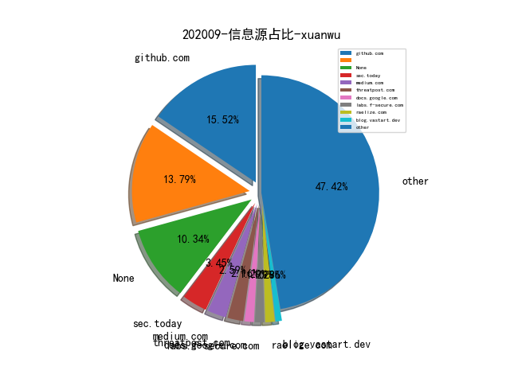
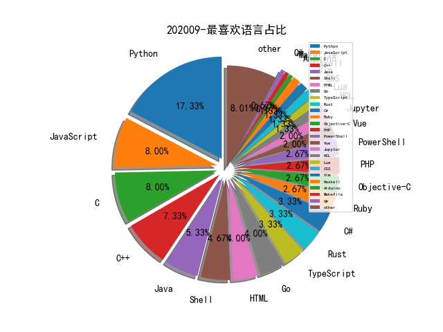

# [数据--所有](README_20.md)
# [数据--年度](README_2020.md)
# 202009 信息源与信息类型占比

# 微信公众号 推荐
| nickname_english | weixin_no | title | url| 
| --- | --- | --- | ---| 

# 组织github账号 推荐
| github_id | title | url | org_url | org_profile | org_geo | org_repositories | org_people | org_projects | repo_lang | repo_star | repo_forks| 
| --- | --- | --- | --- | --- | --- | --- | --- | --- | --- | --- | ---| 

# 私人github账号 推荐
| github_id | title | url | p_url | p_profile | p_loc | p_company | p_repositories | p_projects | p_stars | p_followers | p_following | repo_lang | repo_star | repo_forks | 
| --- | --- | --- | --- | --- | --- | --- | --- | --- | --- | --- | --- | --- | --- | ---| 
| ChiChou | IDA-ObjCExplorer - 用于实现 Objective C classdump 的 IDA Pro 插件 | https://github.com/ChiChou/IDA-ObjCExplorer | https://github.com/alipay | 我要卖掉我的代码 浪迹天涯 | Beijing, China | @alipay | 68 | 0 | 0 | 0 | 0 | TypeScript,Objective-C,Vue,JavaScript,C | 489 | 109 | 1| 
| r4j0x00 | 为 v8 FixedArray 85bc1b0cab31cc064efc65e05adb81fee814261b 编写的 Exploit | https://github.com/r4j0x00/exploits/blob/master/chrome-exploit/exploit.js | https://github.com/r4j0x00 | I make exploits | None | None | 14 | 0 | 0 | 0 | 0 | Python,C,JavaScript,Ruby,C++ | 86 | 39 | 1| 
| saferwall | saferwall: 下一代开源恶意软件分析平台 | https://github.com/saferwall/saferwall | None | None | None | None | 0 | 0 | 0 | 0 | 0 | Go | 0 | 0 | 1| 
| synacktiv | 用于优化 IDA Hex-Rays 反编译器处理 VMX 指令的插件 | https://github.com/synacktiv/vmx_intrinsics | None | None | None | None | 0 | 0 | 0 | 0 | 0 | Python,C,PHP,Rust | 0 | 0 | 1| 
| zodiacon | 基于 Event Tracing for Windows (ETW) 而不再依赖驱动实现的 Process Monitor | https://github.com/zodiacon/ProcMonXv2 | http://scorpiosoftware.net |  | Israel | None | 68 | 0 | 0 | 0 | 0 | C#,C,C++ | 1100 | 296 | 1| 

# medium_xuanwu 推荐
| title | url| 
| --- | ---| 

# medium_secwiki 推荐
| title | url| 
| --- | ---| 

# zhihu_xuanwu 推荐
| title | url| 
| --- | ---| 

# zhihu_secwiki 推荐
| title | url| 
| --- | ---| 

# xz_xuanwu 推荐
| title | url| 
| --- | ---| 

# xz_secwiki 推荐
| title | url| 
| --- | ---| 

# 日更新程序
`python update_daily.py`