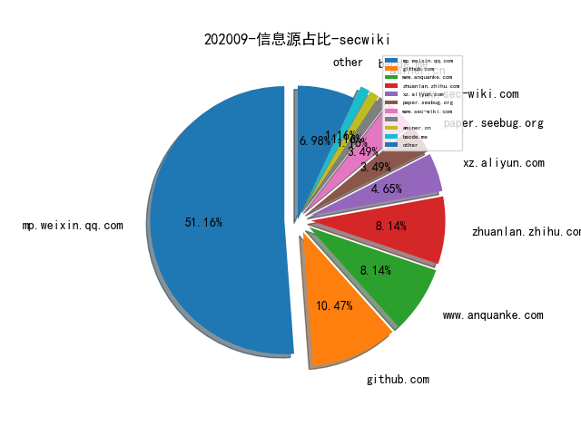

# [数据--所有](README_20.md)
# [数据--年度](README_2020.md)
# 202009 信息源与信息类型占比

# 微信公众号 推荐
| nickname_english | weixin_no | title | url| 
| --- | --- | --- | ---| 
| 梦之光芒的电子梦 | monyer_mp | 技术人员发展四阶段 | https://mp.weixin.qq.com/s/-bAFEmstpDTzI6EfYwzffA | 1| 
| 安全界 | feei_cn | 基于甲方视角的漏洞发现 | https://mp.weixin.qq.com/s/eBPp4eyaGs827POFTesqOA | 1| 
| 专注安管平台 | gh_48603b9bb05a | 美国爱因斯坦计划跟踪与解读（2020） | https://mp.weixin.qq.com/s/-Gvsw88lUPjBqcT5UpSIFg | 1| 
| ADLab | v_adlab | Linux内核AF_PACKET原生套接字漏洞（CVE-2020-14386）分析 | https://mp.weixin.qq.com/s/uv3BiznUCUy8do_ullnXUw | 1| 
| 长亭安全课堂 | chaitintech_release | 杂谈Java内存Webshell的攻与防 | https://mp.weixin.qq.com/s/DRbGeVOcJ8m9xo7Gin45kQ | 1| 
| 绿盟科技 | NSFOCUS-weixin | 浅谈网络靶场的关键能力与应用方向 | https://mp.weixin.qq.com/s/6thyoH3ejzmeRfK5OruEew | 1| 
| 奇安信集团 | qianxin-keji | 先收藏！入行必备的网络安全“黑话”词典 | https://mp.weixin.qq.com/s/L-cqkaTC3lsfyWmd9jbU3A | 1| 
| 网空闲话 | cyberspacechat | 曝光APT组织会产生怎样的威慑效果？ | https://mp.weixin.qq.com/s/OWISagB-qYrMJIVo713iVw | 1| 
| 看雪学院 | ikanxue | 用麒麟框架深入分析实模式二进制文件 | https://mp.weixin.qq.com/s/cMVpMCdlvC-yVMP5COZjfw | 1| 
| 白泽安全实验室 | baizelab | 解密俄罗斯情报机构 | https://mp.weixin.qq.com/s/OPvkERr3Ox_OvnbimhZqnA | 1| 
| 信息时代的犯罪侦查 | infocrime | 通过一封钓鱼邮件，溯源分析背后的产业链（教科书） | https://mp.weixin.qq.com/s/G9qwMTBznSlMNQSCqvAyWg | 2| 
| 逐日实验室 | gh_093e54310392 | CVE-2020-14364 QEMU逃逸 漏洞分析 (含完整EXP) | https://mp.weixin.qq.com/s/MQyczZXRfOsIQewNf7cfXw | 1| 
| 贝塔安全实验室 | BetaSecLab | 威胁事件告警分析技巧及处置（一） | https://mp.weixin.qq.com/s/vgLs2H46YH2ClVgKtCWN8Q | 2| 
| 虎符智库 | TT_Thinktank | 从IOC的一些真相谈对其的评价标准 | https://mp.weixin.qq.com/s/95jB4DfaXau6NDotNSpwdA | 1| 
| GobySec | gobysec | 如何利用Goby进行外围打点 | https://mp.weixin.qq.com/s/3JWq4aO6KvMABKH2Q8jGIw | 2| 
| vivo千镜安全实验室 | gh_54ff3f871510 | 软件源码安全攻防之道（中） | https://mp.weixin.qq.com/s/8L7c6WOtF5nmcmPnuFubfA | 1| 
| 军事高科技在线 | jsgkjzx | 首发,美军红队评估体系建设现状及启示 | https://mp.weixin.qq.com/s/JZef789soLqK2SdskBV5WQ | 1| 
| 锦行信息安全 | jeeseensec | 安全技术,利用OpenVpn配置文件反制的武器化探索 | https://mp.weixin.qq.com/s/hOHzmr6qCS2EwranvVEY1w | 1| 
| 安全情报星球 | littlecola__ | 2020上半年出行行业黑灰产研究报告 | https://mp.weixin.qq.com/s/sQJRZZonTF7bjCs1jd_H9A | 1| 
| 中国保密协会科学技术分会 | gh_be4f21d557c0 | 人工智能对抗的场景探究 | https://mp.weixin.qq.com/s/CwoX9n3gEA7u8NOFoNiuZA | 1| 
| 信息安全老骆驼 | gh_00db3382eac9 | 一部手机失窃而揭露的窃取个人信息实现资金盗取的黑色产业链 | https://mp.weixin.qq.com/s/3UeZzw2LmPsM3cU7Rhmb8w | 1| 
| Godeye | GodEyeTeam | 红队遇蜜罐 莫慌 | https://mp.weixin.qq.com/s/YBge1xjpjQjQ-NoK4kK6RQ | 1| 
| 电驭叛客 | gh_141164bf887e | JavaParse(AST)获取Java Web API list | https://mp.weixin.qq.com/s/ATpoEN9QI-D5vkxDimQ8FQ | 2| 
| 国家网络威胁情报共享开放平台 | CNTIC2017 | DataCon 2020 网络黑产分析方向亚军writeup | https://mp.weixin.qq.com/s/Ots4JVLacoaySqCNwUvzQg | 2| 
| 数说安全 | SSAQ2016 | 2020年中国网络安全市场全景图 | https://mp.weixin.qq.com/s/W5SNkDjqFiD6hl0qQv0JUA | 2| 
| 广东网络空间安全专委会 | gh_f5ab4f133df7 | 大学新生网络信息安全知识教育手册 | https://mp.weixin.qq.com/s/qUuGvRiAyhJBhtj7iW5Hcw | 1| 
| 安全研究 | CH-AQYJ | 国家安全微电影《危爱》 | https://mp.weixin.qq.com/s/nrNfuVEx44lGTD8aLPQN2w | 1| 
| 嘶吼专业版 | Pro4hou | WPA 企业模式的安全性和部署 | https://mp.weixin.qq.com/s/K0QRsJBpd57jmOQBGXBh-Q | 1| 
| gakki的童养夫 | gh_5b1084d953c3 | Cobalt Strike with CloudFlare | https://mp.weixin.qq.com/s/d6hu8YE-SGy-eruIWOwbXg | 1| 
| 雷石安全实验室 | leishianquan1 | PDF文件密码破解 | https://mp.weixin.qq.com/s/EH7Z_mJvuWxtbQdcXf3h4w | 1| 
| 腾讯安全应急响应中心 | tsrc_team | 红蓝对抗之邮件钓鱼攻击 | https://mp.weixin.qq.com/s/YKZ6yWWxOhn2KjTV5lDP7w | 2| 
| 绿盟科技研究通讯 | nsfocus_research | 攻击溯源-基于因果关系的攻击溯源图构建技术 | https://mp.weixin.qq.com/s/ofP4j2TEfNoCYqrLhMsvZA | 2| 
| 酒仙桥六号部队 | anfu-360 | 渗透某勒索服务器 | https://mp.weixin.qq.com/s/-VFpidSMO0VkJmKhnrhlfA | 1| 
| Seebug漏洞平台 | seebug_org | 疑似 KimsukyAPT 组织最新攻击活动样本分析 | https://mp.weixin.qq.com/s/RqFWfe2gf9KdKIq0hLq4Gw | 1| 

# 私人github账号 推荐
| github_id | title | url | p_url | p_profile | p_loc | p_company | p_repositories | p_projects | p_stars | p_followers | p_following | repo_lang | repo_star | repo_forks | 
| --- | --- | --- | --- | --- | --- | --- | --- | --- | --- | --- | --- | --- | --- | ---| 
| zodiacon | 基于 Event Tracing for Windows (ETW) 而不再依赖驱动实现的 Process Monitor | https://github.com/zodiacon/ProcMonXv2 | http://scorpiosoftware.net |  | Israel | None | 68 | 0 | 0 | 0 | 0 | C#,C,C++ | 1100 | 296 | 1| 
| yardenshafir | Windows 进程 Mitigation 策略枚举工具 | https://github.com/yardenshafir/MitigationFlagsCliTool | https://medium.com/@yardenshafir2 | A circus artist with a visual studio license | None | None | 8 | 0 | 0 | 0 | 0 | C,C++ | 76 | 34 | 1| 
| uknowsec | SharpSQLDump:内网渗透中快速获取数据库所有库名，表名，列名功能。 | https://github.com/uknowsec/SharpSQLDump | http://uknowsec.cn | 不忘初心，方得始终 | Nanjing | None | 38 | 0 | 0 | 0 | 0 | C# | 936 | 211 | 1| 
| tomer8007 | Chromium IPC Sniffer - 有研究员开发了一个监控 Chromium 浏览器命名管道通信消息的工具 | https://github.com/tomer8007/chromium-ipc-sniffer | None |  | None | None | 6 | 0 | 0 | 0 | 0 | Python,Lua,Objective-C,JavaScript,C# | 81 | 44 | 1| 
| synacktiv | 用于优化 IDA Hex-Rays 反编译器处理 VMX 指令的插件 | https://github.com/synacktiv/vmx_intrinsics | None | None | None | None | 0 | 0 | 0 | 0 | 0 | Python,C,PHP,Rust | 0 | 0 | 1| 
| spyre-project | 基于Yara的简单IOC扫描器Spyre | https://github.com/spyre-project/spyre | None | None | None | None | 0 | 0 | 0 | 0 | 0 | Go | 0 | 0 | 1| 
| sbousseaden | Windows 系统各类攻击和渗透行为的 Events 样本收集 | https://github.com/sbousseaden/EVTX-ATTACK-SAMPLES | http://@SBousseaden | Threat Hunting & DFIR | None | None | 63 | 0 | 0 | 0 | 0 | Python,YARA,PowerShell | 974 | 195 | 1| 
| samsonpianofingers | RTTIDumper - 注入目标进程 Dump 虚函数表的工具 | https://github.com/samsonpianofingers/RTTIDumper | None | A Man-Geek Interested in reverse engineering, software and web development, computer architecture and computer security. | None | None | 15 | 0 | 0 | 0 | 0 | Python,Java,C++ | 3 | 1 | 1| 
| saaramar | Google Quals CTF 2020 Echo PWN Challenge Writeup | https://github.com/saaramar/echo_googlequals2020 | https://twitter.com/AmarSaar | @AmarSaar in twitter, known as amarsa | None | None | 9 | 0 | 0 | 0 | 0 | Python,C,Rust,C++ | 203 | 41 | 1| 
| r4j0x00 | 为 v8 FixedArray 85bc1b0cab31cc064efc65e05adb81fee814261b 编写的 Exploit | https://github.com/r4j0x00/exploits/blob/master/chrome-exploit/exploit.js | https://github.com/r4j0x00 | I make exploits | None | None | 14 | 0 | 0 | 0 | 0 | Python,C,JavaScript,Ruby,C++ | 86 | 39 | 1| 
| nccgroup | NCC Group 为 Zerologon CVE-2020-1472 漏洞编写的 .NET 版本的 Exploit | https://github.com/nccgroup/nccfsas/tree/main/Tools/SharpZeroLogon | None | None | None | None | 0 | 0 | 0 | 0 | 0 | C,TypeScript,Java,Python,JavaScript,C++,C#,Haskell,Shell,HCL,Elixir,Ruby,PowerShell,Rust | 2200 | 336 | 1| 
| moonD4rk | HackBrowserData: 全平台运行的浏览器数据导出解密工具 | https://github.com/moonD4rk/HackBrowserData | None | There is no dark side in the moon. really, matter of fact its all dark. | Pyongyang | None | 5 | 0 | 0 | 0 | 0 | Go,Python | 8400 | 1200 | 1| 
| momosecurity | bombus: 合规审计平台 | https://github.com/momosecurity/bombus | None | None | None | None | 0 | 0 | 0 | 0 | 0 | Python,TypeScript,Vue,Java,PHP | 0 | 0 | 1| 
| microsoft | 上周推送的微软的 OneFuzz 平台的源码公开了 | https://github.com/microsoft/onefuzz | None | None | None | None | 0 | 0 | 0 | 0 | 0 | TypeScript,Jupyter,C#,JavaScript,C++,Python,Q#,F#,Java,CSS | 0 | 0 | 1| 
| mdsecresearch | Post-Exploitation 工具如何躲避终端安全产品的检测 | https://github.com/mdsecresearch/Publications/blob/master/presentations/Offensive%20Development%20-%20Post-Exploitation%20Tradecraft%20in%20an%20EDR%20World%20-%20x33fcon%202020.pdf | https://www.mdsec.co.uk | Public research and tools from MDSec Consulting | UK | MDSec | 10 | 0 | 0 | 0 | 0 | Python,C,Objective-C,PowerShell,Arduino | 262 | 53 | 1| 
| google | 今年 Google CTF 所有赛题源码 | https://github.com/google/google-ctf/tree/master/2020/quals | None | None | None | None | 0 | 0 | 0 | 0 | 0 | TypeScript,Java,Python,Kotlin,JavaScript,C++,Vim,Objective-C,Shell,Starlark,Go,Jupyter,Dart,Rust | 0 | 0 | 1| 
| gloxec | CrossC2 framework - 生成 CobaltStrike 的跨平台 beacon | https://github.com/gloxec/CrossC2 | None |  | None | None | 46 | 0 | 0 | 0 | 0 | Python,C,PLpgSQL | 586 | 127 | 1| 
| firmianay | IoT-vulhub: IoT 固件漏洞复现环境 | https://github.com/firmianay/IoT-vulhub | https://firmianay.github.io | Information Security Student & CTF Player & member of @XDSEC, @xdlinux | China | Xidian University | 16 | 0 | 0 | 0 | 0 | Python,C,Shell | 2000 | 414 | 1| 
| dwisiswant0 | CRLFuzz - 用于扫描 CRLF 漏洞的工具 | https://github.com/dwisiswant0/crlfuzz | https://github.com/kitabisa | 2>&1 | id_ID | @kitabisa | 227 | 0 | 0 | 0 | 0 | Go,Python,Shell,Ruby,HCL | 198 | 71 | 1| 
| dirkjanm | Zerologon - Netlogon 被发现高危漏洞，成功利用可以攻破 Windows 域控服务器。PoC 代码已被公开 | https://github.com/dirkjanm/CVE-2020-1472 | http://dirkjanm.io |  | The Netherlands | None | 24 | 0 | 0 | 0 | 0 | Python | 804 | 144 | 1| 
| crowdsecurity | Crowdsec - 一款开源的、轻量级的异常行为检测 Agent，适用于容器和虚拟机环境 | https://github.com/crowdsecurity/crowdsec/ | None | None | None | None | 0 | 0 | 0 | 0 | 0 | Go,Lua,Shell,PHP | 153 | 14 | 1| 
| blacklanternsecurity | TREVORspray - 微软 Office 365 密码爆破工具 | https://github.com/blacklanternsecurity/TREVORspray | None | None | None | None | 0 | 0 | 0 | 0 | 0 | Shell,Python,JavaScript,Visual,Go,Ruby,PowerShell,CSS | 0 | 0 | 1| 
| autoguard | 汽车安全研究方向的 Paper 收集 | https://github.com/autoguard/awesome-vehicle-security-and-safety | http://autoguard-sec.com |  | china | autoguard | 11 | 0 | 0 | 0 | 0 | JavaScript | 24 | 7 | 1| 
| adulau | ssldump - SSLv3/TLS 网络协议 Analyzer | https://github.com/adulau/ssldump | https://github.com/MISP | Enjoy when human are using machines in unexpected ways. I break stuff and I do stuff. | Europe | @MISP @CIRCL @cve-search and many others | 113 | 1 | 0 | 0 | 0 | Python,C,HTML | 127 | 54 | 1| 
| TophantTechnology | ARL: 资产侦察灯塔系统 | https://github.com/TophantTechnology/ARL | None | None | None | None | 0 | 0 | 0 | 0 | 0 | Python | 0 | 0 | 1| 
| PLSysSec | haybale - 一款 Rust 语言编写的 LLVM IR 级别的符号执行引擎 | https://github.com/PLSysSec/haybale | None | None | None | None | 0 | 0 | 0 | 0 | 0 | C,LLVM,Assembly,HTML,Python,JavaScript,Makefile,C++,Haskell,Swift,Rust | 0 | 0 | 1| 
| NLP-LOVE | 《自然语言处理入门》详细笔记 | https://github.com/NLP-LOVE/Introduction-NLP | http://mantchs.com/ | 邮箱：mantchs@163.com 博客：http://mantchs.com/ | None | None | 6 | 0 | 0 | 0 | 0 | Python,HTML,Jupyter | 6200 | 2000 | 1| 
| MisakiKata | 基于inotify的Linux文件实时监控扫描 | https://github.com/MisakiKata/watchfile | https://misakikata.github.io | 在菜的路上一路狂奔，从不复返 | Shanghai | None | 19 | 0 | 0 | 0 | 0 | Python,Shell,Java,JavaScript | 92 | 24 | 1| 
| DasSecurity-Labs | AoiAWD: 专为比赛设计，便携性好，低权限运行的EDR系统 | https://github.com/DasSecurity-Labs/AoiAWD | None | None | None | None | 0 | 0 | 0 | 0 | 0 | Python,PHP,HTML | 0 | 0 | 1| 
| DTolm | VkFFT-Vulkan快速傅立叶变换库 | https://github.com/DTolm/VkFFT | None |  | None | None | 2 | 0 | 0 | 0 | 0 | C,C++ | 213 | 6 | 1| 
| ChiChou | IDA-ObjCExplorer - 用于实现 Objective C classdump 的 IDA Pro 插件 | https://github.com/ChiChou/IDA-ObjCExplorer | https://github.com/alipay | 我要卖掉我的代码 浪迹天涯 | Beijing, China | @alipay | 68 | 0 | 0 | 0 | 0 | TypeScript,Objective-C,Vue,JavaScript,C | 489 | 109 | 1| 
| 0vercl0k | Symbolizer - 为进程执行 Trace、Crash Dump 提供调试符号的工具 | https://github.com/0vercl0k/symbolizer | https://doar-e.github.com/ |  | US/FR | None | 18 | 0 | 0 | 0 | 0 | Python,JavaScript,C++ | 928 | 192 | 1| 

# medium 推荐
| title | url| 
| --- | ---| 
| 1-click meterpreter exploit chain with BeEF and AV/AMSI bypass | http://medium.com/@bluedenkare/1-click-meterpreter-exploit-chain-with-beef-and-av-amsi-bypass-96b0eb61f1b6| 
| 利用不安全的 JSONP 调用接管 Kolesa 站点的任意账户 | http://medium.com/bugbountywriteup/taking-down-the-sso-account-takeover-in-3-websites-of-kolesa-due-to-insecure-jsonp-call-facd79732e45| 
| 高速以太网ASIC的内容摘要。 | http://medium.com/the-elegant-network/a-summary-of-high-speed-ethernet-asics-260637c50583| 
| How I hacked redbus | http://medium.com/bugbountywriteup/how-i-hacked-redbus-an-online-bus-ticketing-application-24ef5bb083cd?source=rss----7b722bfd1b8d---4| 

# 知乎 推荐
| title | url| 
| --- | ---| 
| Webshell研究综述：检测与对抗技术的动态博弈进展 | https://zhuanlan.zhihu.com/p/259985000?utm_oi=771453567763492864| 
| 南京大学《软件分析》课程 | https://zhuanlan.zhihu.com/p/136697432| 
| DataCon2020 僵尸网络追踪第三题writeup | https://zhuanlan.zhihu.com/p/186948840| 
| 有关Angr的正确学习路线 | https://zhuanlan.zhihu.com/p/102582636| 
| 攻防对抗的思考（2）21分钟学会网络攻防 | https://zhuanlan.zhihu.com/p/228478328| 
| 如何评价安全工作的好坏 | https://zhuanlan.zhihu.com/p/226493047| 
| 攻防对抗的思考（1）网络诈骗的拱心石 | https://zhuanlan.zhihu.com/p/223173210| 

# 论坛 推荐
| title | url| 
| --- | ---| 
| CVE-2020-15148 Yii2反序列化RCE POP链分析 | https://xz.aliyun.com/t/8307| 
| 记一次偶遇Adminer | https://xz.aliyun.com/t/8309| 
| bugbounty之我是如何侵入电信网络的 | https://xz.aliyun.com/t/8255| 
| 记一次对某非法站点从SQL注入到整站打包与本地搭建全过程 | https://xz.aliyun.com/t/8213| 

# 日更新程序
`python update_daily.py`