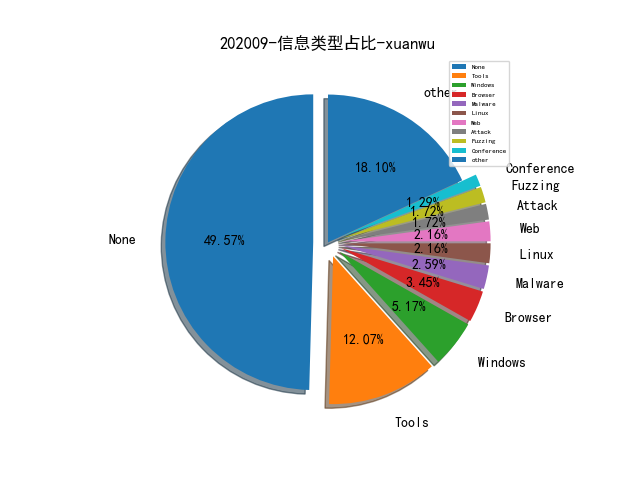

# [数据--所有](README_20.md)
# [数据--年度](README_2020.md)
# 202009 信息源与信息类型占比

# 微信公众号 推荐
| nickname_english | weixin_no | title | url| 
| --- | --- | --- | ---| 
| Seebug漏洞平台 | seebug_org | 疑似 KimsukyAPT 组织最新攻击活动样本分析 | https://mp.weixin.qq.com/s/RqFWfe2gf9KdKIq0hLq4Gw | 1| 
| 百度安全应急响应中心 | baidu_sec | 红与蓝：现代Webshell检测引擎免杀对抗与实践 | https://mp.weixin.qq.com/s/j7gPuNg6dR5VQISOxeWCyA | 1| 
| 腾讯安全应急响应中心 | tsrc_team | HW实战：浅谈信息搜集中的自动化数据分析 | https://mp.weixin.qq.com/s/EkoiH28DBzHlKRR15CE8Rw | 1| 
| 酒仙桥六号部队 | anfu-360 | 渗透某勒索服务器 | https://mp.weixin.qq.com/s/-VFpidSMO0VkJmKhnrhlfA | 1| 
| GobySec | gobysec | 插件分享 , 可以变身的超级赛亚人主题？ | http://mp.weixin.qq.com/s?__biz=MzI4MzcwNTAzOQ==&mid=2247484005&idx=1&sn=b1f9a68d55b43fd9653cf5c65e655516&chksm=eb87e9c5dcf060d35f5d23cce1e7c06a335091b491723d74b33b993ff5c4fed4cac2bc78827b&token=225023830&lang=zh_CN#rd | 1| 

# 组织github账号 推荐
| github_id | title | url | org_url | org_profile | org_geo | org_repositories | org_people | org_projects | repo_lang | repo_star | repo_forks| 
| --- | --- | --- | --- | --- | --- | --- | --- | --- | --- | --- | ---| 

# 私人github账号 推荐
| github_id | title | url | p_url | p_profile | p_loc | p_company | p_repositories | p_projects | p_stars | p_followers | p_following | repo_lang | repo_star | repo_forks | 
| --- | --- | --- | --- | --- | --- | --- | --- | --- | --- | --- | --- | --- | --- | ---| 
| ChiChou | IDA-ObjCExplorer - 用于实现 Objective C classdump 的 IDA Pro 插件 | https://github.com/ChiChou/IDA-ObjCExplorer | https://github.com/alipay | 我要卖掉我的代码 浪迹天涯 | Beijing, China | @alipay | 68 | 0 | 0 | 0 | 0 | TypeScript,Objective-C,Vue,JavaScript,C | 489 | 109 | 1| 
| LoRexxar | Kunlun-Mirror 专注于安全研究员使用的审计辅助工具 | https://github.com/LoRexxar/Kunlun-M | https://lorexxar.cn | Vidar-Team/Knownsec 404-Team hacker or developer? | None | None | 52 | 0 | 0 | 0 | 0 | Python,Vue | 412 | 92 | 1| 
| MisakiKata | 基于inotify的Linux文件实时监控扫描 | https://github.com/MisakiKata/watchfile | https://misakikata.github.io | 在菜的路上一路狂奔，从不复返 | Shanghai | None | 19 | 0 | 0 | 0 | 0 | Python,Shell,Java,JavaScript | 92 | 24 | 1| 
| r4j0x00 | 为 v8 FixedArray 85bc1b0cab31cc064efc65e05adb81fee814261b 编写的 Exploit | https://github.com/r4j0x00/exploits/blob/master/chrome-exploit/exploit.js | https://github.com/r4j0x00 | I make exploits | None | None | 14 | 0 | 0 | 0 | 0 | Python,C,JavaScript,Ruby,C++ | 86 | 39 | 1| 
| saferwall | saferwall: 下一代开源恶意软件分析平台 | https://github.com/saferwall/saferwall | None | None | None | None | 0 | 0 | 0 | 0 | 0 | Go | 0 | 0 | 1| 
| synacktiv | 用于优化 IDA Hex-Rays 反编译器处理 VMX 指令的插件 | https://github.com/synacktiv/vmx_intrinsics | None | None | None | None | 0 | 0 | 0 | 0 | 0 | Python,C,PHP,Rust | 0 | 0 | 1| 
| zodiacon | 基于 Event Tracing for Windows (ETW) 而不再依赖驱动实现的 Process Monitor | https://github.com/zodiacon/ProcMonXv2 | http://scorpiosoftware.net |  | Israel | None | 68 | 0 | 0 | 0 | 0 | C#,C,C++ | 1100 | 296 | 1| 

# medium_xuanwu 推荐
| title | url| 
| --- | ---| 

# medium_secwiki 推荐
| title | url| 
| --- | ---| 

# zhihu_xuanwu 推荐
| title | url| 
| --- | ---| 

# zhihu_secwiki 推荐
| title | url| 
| --- | ---| 

# xz_xuanwu 推荐
| title | url| 
| --- | ---| 

# xz_secwiki 推荐
| title | url| 
| --- | ---| 
| 记一次对某非法站点从SQL注入到整站打包与本地搭建全过程 | https://xz.aliyun.com/t/8213| 

# 日更新程序
`python update_daily.py`